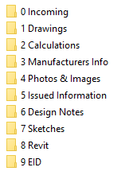
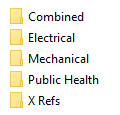
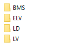
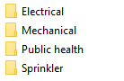

# DOCUMENT MANAGEMENT

## 1.1 UVOD

Predviđeno vreme trajanja obuke za ovo poglavlje je 1 radni dan.

| Nulti folder:      |     | X:\2 HVAC Biblioteka\PROGRAM OBUKE\01 Document Management |
|--------------------|-----|-----------------------------------------------------------|
| Standardi:         |     | \-                                                        |
| Tekstovi:          |     | \-                                                        |
| Primeri proračuna: |     | \-                                                        |
| Primeri projekata: |     | Z:\B255 - Hotel Grey                                      |

## 1.2 STRUKTURA FOLDERA

Novi projekat se formira kopiranjem unapred pripremljenog „Nultog foldera“, koji u sebi već sadrži prazne predefinisane foldere. Ovako kopirani nulti folder se rename-uje i daje mu se broj i naziv, koji ima sledeći oblik:

***Bxxx*** - ***Opis projekta***

Gde je ***Bxxx*** redni broj projekta (B000, B001 itd), a ***Opis projekta*** kratak naziv projekta (npr. **B254 - Tesla**).

Projekti su smešteni na fajl serveru, koji na svim računarima treba da bude mapiran kao **network drive Z.**

U okviru ovog foldera nalazi se sledeća struktura foldera (nastala kopiranjem iz nultog foldera):

<table>
<colgroup>
<col style="width: 100%" />
</colgroup>
<thead>
<tr class="header">
<th><strong>0 – Incoming</strong> – smeštanje svih ulaznih podataka |<strong>A</strong></th>
</tr>
</thead>
<tbody>
<tr class="odd">
<td><strong>1 – Drawings</strong> – smeštanje radnih crteža |<strong>R</strong></td>
</tr>
<tr class="even">
<td><strong>2 – Calcs</strong> – smeštanje proračuna i teksta |<strong>R</strong></td>
</tr>
<tr class="odd">
<td><strong>3 – Manufacturers info</strong> – podaci dobijeni od proizvođača opreme |<strong>A</strong></td>
</tr>
<tr class="even">
<td><strong>4 – Photo</strong> – Foto materijal |<strong>A</strong></td>
</tr>
<tr class="odd">
<td><strong>5 – Issued</strong> – Zvanično izdata/predata dokumentacija |<strong>A</strong></td>
</tr>
<tr class="even">
<td>
<strong>6 – Design Notes</strong> – beleške, standardi i sl. |<strong>A</strong>

<strong>7 – Sketches</strong> – podaci koji se koriste za koordinaciju |<strong>A</strong>
</td>
</tr>
<tr class="odd">
<td><strong>8 – Revit</strong> – sve vezano za Revit |<strong>R</strong></td>
</tr>
<tr class="even">
<td><strong>9 – EID</strong> – električarske baze podataka |<strong>R</strong></td>
</tr>
</tbody>
</table>

Potrebno je razlikovati dve vrste foldera, jedne, koji imaju karakter arhive (A) i druge, koji su radni folderi (R). Osnovna osobina arhivskih foldera je da kada se njihov sadržaj jednom formira, ostaju zauvek nepromenjeni. Veoma je važno da se ovakvi, datumski zavisni fajlovi, jednom kreirani / primljeni **ne menjaju**, kao ni nazivi foldera u kojima su smešteni.

Nasuprot tome, sadržaj radnih foldere se neprestano menja, kako se projekat razvija.

Konvencija za nazive arhivskih foldera je:

***yymmdd Kratak opis***.

Gde je ***yymmdd*** datum u formatu godina-mesec-dan, ***Kratak opis*** kratak opis foldera (npr. **201029 Arh za PZI**).

## 1.4 DRAWINGS

Ovo je radni folder u kome se nalaze radni crteži. Radni crteži se formiraju od našeg template-a (nikako save as tuđi/arhitektonski crtež – osnove, druge vrste instalacije itd u radnim crtežima **nikako ne mogu biti deo crteža** već isključivo XREF). Princip međusobnog refrenciranja je dat na sledećem primeru za crteže na nivou B01 (basement 1)

### 1.4.1 Rad sa XREF

Dakle princip je da se crtež neke discipline insertuju potrebni x refovi sa **relativnom** putanjom (arhitektonska osnova, ose, pečati itd a da bi se proverio međusobni odnos sa drugim disciplinama insertuje se i x ref na master crtež svih instalacija za dati nivo. Bazna tačka se definiše na početku projekta i generalno ne bi smela da bude drugačija od 0,0,0. Naziv fajla i njegov položaj u folderima se **nikad ne menjaju.**

### 1.4.2 Podfolderi u okviru Drawings

**Combined** – ovde se smeštaju master crteži svih instalacija. Ovaj folder ima samo Superseeded podfolder u kome se smeštaju nevažeći sadržaji ovog foldera (predhodne revizije) u folder sa datumskim nazivom.

**Electrical**

|  | **BMS** - smeštanje crteža, pečata i legendi za emp i bms                    |
|---------------------------------------------------------------------------|------------------------------------------------------------------------------|
|                                                                           | **ELV -** smeštanje crteža, pečata i legendi za sve instalacije slabe struje |
|                                                                           | **LD -** smeštanje crteža, pečata i legendi za dizajn projekat osvetljenja   |
|                                                                           | **LV-** smeštanje crteža, pečata i legendi za sve instalacije jake struje    |

U okviru svakog od ovih podfoldera postoji i Superseeded za predhodne verzije.

**Mechanical** – ovde se smeštaju crteži svih HVAC instalacija. Superseeded prisutan.

**Public health** – ovde se smeštaju crteži svih ViK instalacija. Superseeded prisutan.

**X Refs** – ovde se smeštaju arhitektonske osnove i ose. Arhitektonske osnove se, kao minimum, pripremaju tako što:

- Se pozicioniraju na baznu tačku dogovorenu na početku projekta (0,0,0), koja se nikad ne menja;

- Boja svih lejera se menja u sivu boju (252) i ako nešto nije By Layer, prebacuje se da bude;

- Poželjno je da se betonski zidovi / zidovi sa SOLIDu hatch-em, prebacuje u boju 9. Brzi način je filtriranje solid hatch-eva je komandom fi hatch – patern name – SOLID;

- Po potrebi se osnove skaliraju na odgovarajući način tako da jedinice budu izražene u mm;

- Obavezno se zadržavaju tablice za namenama prostorija i oznake prostorija i visinske kote;

- Brišu se horizontalne kote, oznake zidova i stolarije;

- Fajlovi se DWG_purge-uju.

Ose se prave kao poseban x ref u nekoliko razmera prema potrebi, 1:100, 1:50 itd.

## 1.5 CALCULATIONS

Smeštanje fajlova iz kalkulacionih softvera itd, koji nisu integralni deo projektne dokumentacije, ali predstavljaju deo projektnog procesa. Svaka struka ima svoj podfolder:

## 1.6 MANUFACTURERS INFO

Smeštanje – kataloga, data sheet-ova, drugih ulaznih podataka od proizvođača opreme te specifikacije opreme. Razdeljeno po strukama.

## 1.8 ISSUED INFORMATION

Ovde se snima zvanično izdata dokumentacija, kao i sve njene revizije, npr. PGD, PZI itd. Podfolderi u ovom folderu se formiraju prema generalnom uputstvu, npr. *181025 PZI*. Fajlovi u ovom folderu su obavezno **Bindovani** a nazivi su prema uputstvu Project Coordinatora na tom projektu. Obavezno se prilaže i Plot Style.

Kod električara je **APSOLUTNO OBAVEZNO** da se u bindovanim fajlovima ne nađe ni jedan naš blok – dakle svi blokovi moraju da se burst-uju, a potom da se uradi DWG_PURGE.

## 1.10 SKETCHES

Sketches je folder arhivskog tipa. Folderi unutar njega se nazaivaju, kao i ostali arhivski folderi, u formi ***yymmdd Kratak opis***. Ovde se snima dokumentacija, koja se koristi za komunikaciju i koordinaciju sa drugim učesnicima na projektu. Karakterističan primer su crteži na kojima su na arhitektonskoj podlozi ucrtani MEP zahtevi, kao što su tehničke prostorije, šahtovi, mesta uzimanja svežeg i izbacivanja otpadnog vazduha. Razmena ovakvih inforamcija je posebno intenzivna u početnim fazama projekta. U kasnijim fazama, to mogu biti crteži sa otvorima za prolaz instalacija kroz vertikalne pregrade.

Pored skica i crteža, u ovom folderu se mogu smeštati i različite tablice i proračuni, koji se dostavljaju ostalim učesnicima projekta. Primer su tablice sa elektro-potrošačima, koje mašinci dostavljaju električarima.

| **VAŽNO:** |     | Jasno je da je ovo folder u kome se smešta odlazna dokumentacija, ali ga nikako ne treba mešati sa folderom **Issued Information**, u kome se isključivo snimaju zvanične predaje kompletnih projekata, odnosno formalne predaje, u skladu sa ugovorom. Suština je da se u folderu Issued Information ne sme nalaziti šuma raznih informacija, koja čini teškim pronalaženje zvaničnih izdanja. Cilj je da se zvanična izdanja sa lakoćom pronalaze i posle više godina od predaje. |
|------------|-----|-------------------------------------------------------------------------------------------------------------------------------------------------------------------------------------------------------------------------------------------------------------------------------------------------------------------------------------------------------------------------------------------------------------------------------------------------------------------------------------|
