# CAD STANDARD

## 2.1 UVOD

Predviđeno vreme trajanja obuke za ovo poglavlje je 1 radni dan.

<table>
<colgroup>
<col style="width: 19%" />
<col style="width: 1%" />
<col style="width: 79%" />
</colgroup>
<thead>
<tr class="header">
<th>Zakoni i pravilnici:</th>
<th></th>
<th>-</th>
</tr>
</thead>
<tbody>
<tr class="odd">
<td>Standardi:</td>
<td></td>
<td>SRPS EN 13779 Table 2</td>
</tr>
<tr class="even">
<td>Tekstovi:</td>
<td></td>
<td>-</td>
</tr>
<tr class="odd">
<td>Referentni fajlovi:</td>
<td></td>
<td>
X:\2 HVAC Biblioteka\PROGRAM OBUKE\02 CAD Standard

BBD_Legenda, simboli i oprema.dwg;

BBD_CAD_Template_2021.dwt;

HVAC color.ctb; HVAC monochrome.ctb

X:\2 HVAC Biblioteka\CAD Baza
</td>
</tr>
<tr class="even">
<td>Primeri projekata:</td>
<td></td>
<td>Y:\1_PRJ\18.194 DAK Daka</td>
</tr>
</tbody>
</table>

## 2.2 TEMPLATE

Svi crteži na kojima radimo treba da inicijalno nastanu primenom AutoCAD komande NEW. Ovom komandom otvara se naizgled prazan crtež, koji je zapravo nastao od unapred definisanog templejta. U ovom templejtu predefinisan je veliki broj elemenata dwg. fajla, kao što su lejeri, kotni stilovi, tekst stilovi, mnoge sistemske promenljive itd. Nije dozvoljen rad na fajlovima dobijenim od arhitekti ili drugih učesnika projekta.

Cilj ovakvog načina rada je postizanje zahtevanog nivoa kvaliteta grafičke dokumentacije, kao i ušteda na vremenu, koje bi se po pravilu u ogromnoj meri gubilo na sređivanje stranih fajlova.

Trenutno važeći templejt se nalazi na lokaciji:

X:\2 HVAC Biblioteka\PROGRAM OBUKE\02 CAD Standard\BBD_CAD_Template_2021.dwt

U slučaju da na računaru za određenu verziju AutoCADa nije podešen templejt, potrebno ga je najpre snimiti u Autodeskov folder sa templejtima:

C:\Users\borivoje.bakovic\AppData\Local\Autodesk\AutoCAD 2018\R22.0\enu\Template

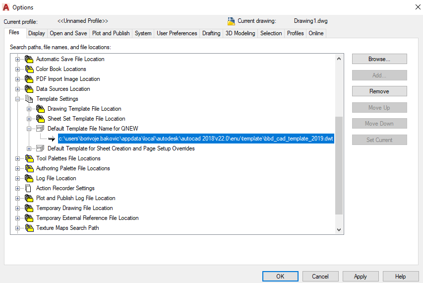

Potom u AutoCADu izabrati Options – kartica Files\Template Settings\Default Template File Name for QNEW i na Browse... pronaći prethodno snimljen templejt.

Ovo treba proveravati s vremena na vreme, odnosno uvek kada IT instalira novu instancu.

## 2.3 PODEŠAVANJE RADNOG OKRUŽENJA

Pošto se za rad koriste centralne mrežne mašine, neophodno je usvojiti zajednička podešavanja radnog okruženja. Nije moguće da svaki korisnik pravi podešavanja po svom nahođenju. Prilikom svake nove instalacije AutoCADa potrebno je izvršiti podešavanja kao u nastavku.

Podrazumevana podešavanja:

<table>
<colgroup>
<col style="width: 19%" />
<col style="width: 3%" />
<col style="width: 77%" />
</colgroup>
<thead>
<tr class="header">
<th>Object snap:</th>
<th></th>
<th>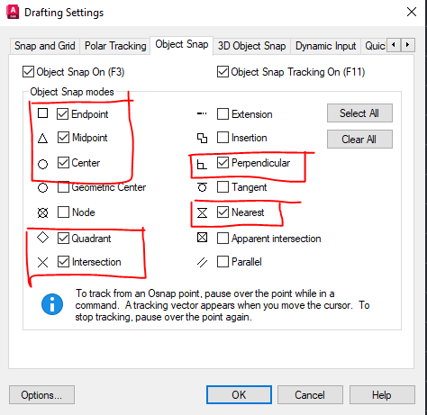</th>
</tr>
</thead>
<tbody>
<tr class="odd">
<td>Polar tracking:</td>
<td></td>
<td>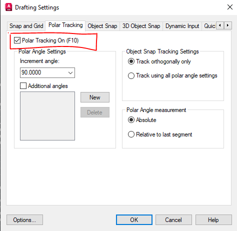</td>
</tr>
<tr class="even">
<td>Croshair size:</td>
<td></td>
<td>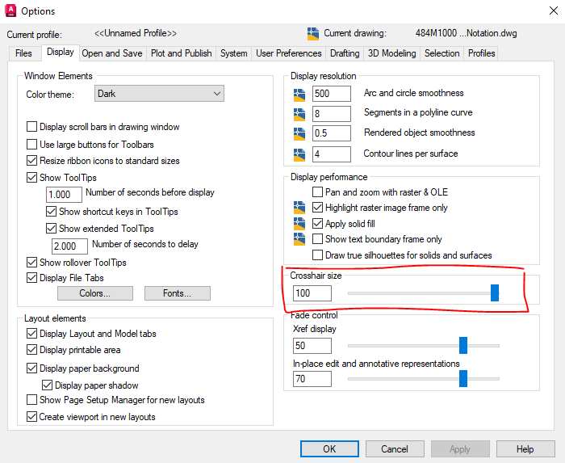</td>
</tr>
<tr class="odd">
<td>Dynamic Input (isključiti):</td>
<td></td>
<td>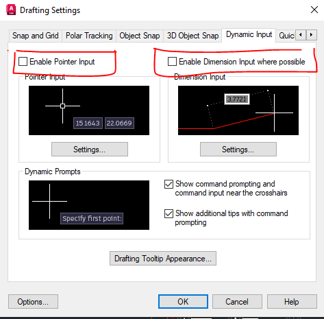</td>
</tr>
<tr class="even">
<td>Layer Isolate:</td>
<td></td>
<td>
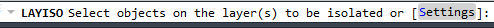

</td>
</tr>
<tr class="odd">
<td>Menubar:</td>
<td></td>
<td></td>
</tr>
<tr class="even">
<td>Properties:</td>
<td></td>
<td>Uključiti paletu PROPERIIES i usidriti je uz desnu stranu ekrana.</td>
</tr>
</tbody>
</table>

## 2.4 PLOTOVANJE

Generalno, za plotovanje koristimo opciju „Use object“ types, weights, styles. To podrazumeva da su prilikom crtanja debljine linija već podešene na odgovarajući način za sve objekte u samom crtežu. Moguće je i plotovanje prema bojama lejera. U tom slučaju za svaku boju se definiše debljina štampe, bez obzira na to kakvo je podešavanje u samom crtežu. Ukoliko se crtež štampa u boji, treba imati u vidu da se neke boje. Kao što je žuta, slabo vide na beloj podlozi, tako da se za njih uvek podešava da se štampaju crno.

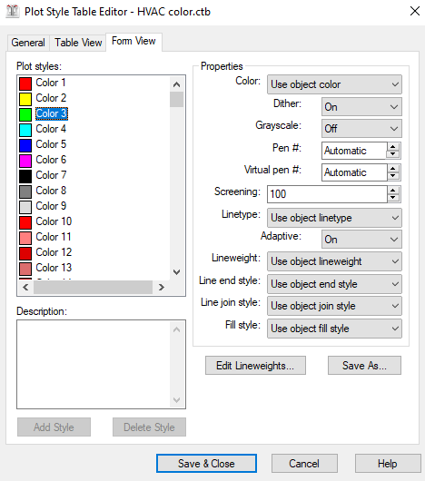

Trenutno važeći plot stilovi, HVAC color.ctb i HVAC monochrome.ctb, se nalaze na lokaciji:

X:\2 HVAC Biblioteka\PROGRAM OBUKE\02 CAD Standard\\

Ukoliko to na lokalnom računaru nije podešeno, plot stilove treba snimiti na sledeću lokaciju:

C:\Users\borivoje.bakovic\AppData\Roaming\Autodesk\AutoCAD 2018\R22.0\enu\Plotters\Plot Styles

(File – Plot Style Manager...)

Prilikom plotovanja obavezno čekirati opciju – Plot transparency.

Pre konačnog puštanja na plotovanje, obavezno preko opcije Preview..., proveriti izgled crteža i po potrebi napraviti dodatna podešavanja Plot stila.

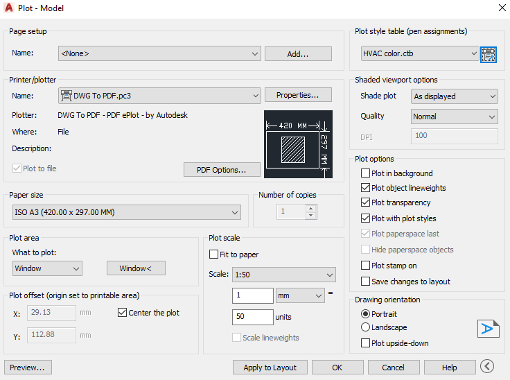

## 2.5 OPCIJA E-TRANSMIT

Za istovremeno slanje većeg broja crteža koristimo opciju Menubar – File/eTransmit...

Otvara se sledeći prozor. Podešavanja se otvaraju preko dugmeta Trensmittal Setups... Podrazumevana podešavanja su u nastavku. Fajlovi koji se šalju se dodaju preko dugmeta Add File... Pre slanja najbolje je sve fajlove sačuvati i zatvoriti.

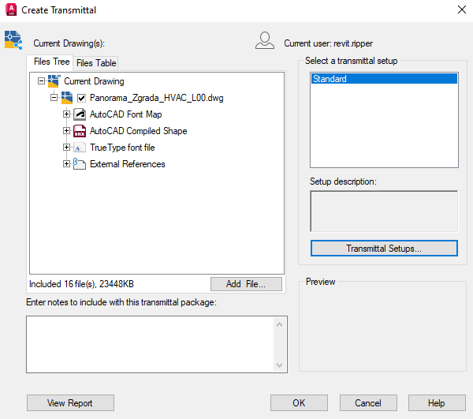

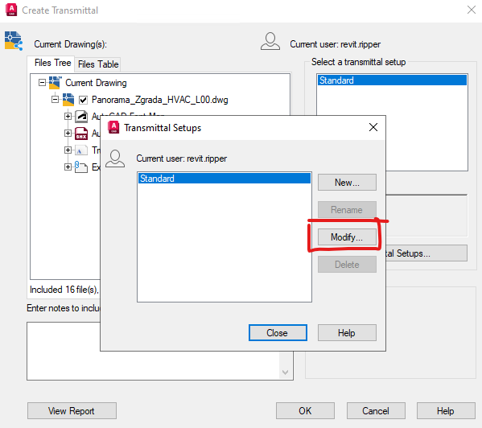

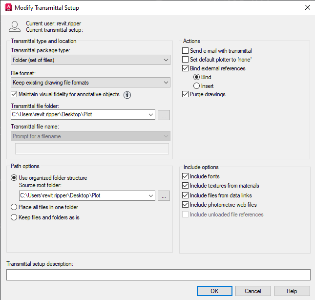

## 2.6 OPCIJA PUBLISH

Za istovremeno plotovanje većeg broja crteža u PDF koristimo opciju Menubar – File/Publish...

Otvara se dijalog i prave se odgovarajuća podešavanja.

## 2.7 TEKST

### Standardni BBD font za grafičku dokumentaciju

- Font Name: Arial

- Font Style: Regular (ne Bold, ne Italic, ne underline)

- Font Size: 2mm

- Font width factor: 0,8

- Case: UPPERCASE (malo slovo se može koristiti samo za jedinice internacionlanog SI sitema, npr. m, s, h, Pa, kW, itd.)

- Koristimo isključivo Multiline Text.

Uvek se trudimo da se Text ne preklapa sa ostalim elementima bilo našeg crteža, bilo X-refa, a posebno sa drugim tekstovima. Kada to ima smisla trudimo se da tekstovi budu uravnati bilo po vertikali ili po horizontali.

### Tagovi za kanale i cevi

- dva reda multiline text-a

- prvi red protok

- drugi red dimenzija

- Justification: Top Center

- Text nema okvir

- Leader linija prolazi po sredini između dva reda teksta i dodiruje cev ili kanal, koji taguje

### Tekstovi za razne napomene, pojašnjenja ili sl.

- multiline text

- porteban broj redova text-a

- Justification: Top Left

- Text nema okvir

- Leader line, ukoliko postoji, kreće od sredine prvog reda multiline text-a, a strelica dodiruje objekat na koji se napomena odnosi.

### Tekstovi za kotiranje

Dimension Style je predefinisan u našem Acad Template-u. On svakako koristi napred definisani stil teksta. Predefinisani Dimension stilovi u template su:

- dim 1-1

- dim 1-20

- dim 1-50

- dim 1-100

- dim 1-200

- dim 1-500

### Ostali tagovi

O “naprednim tehnikama” korišćenja Text-a, kao što je tagovanje Riser-a, Call-out-a, preseka, naziva detalja, različih vrsta opreme (radijator, FC, distributivni element, PP klapna, regulator protoka, klima komora, toplotna pumpa, ventilator itd…) biće reči u detaljnijim uputstvima, ali svakako će kao osnova biti korišćeno napred navedeno.
