# TEKSTUALNA DOKUMENTACIJA

## 58.1 UVOD

Predviđeno vreme trajanja obuke za ovo poglavlje je 1 radni dan.

| Zakoni i pravilnici: |     | Pravilnik o sadržini, načinu i postupku izrade i načinu vršenja kontrole tehničke dokumentacije prema klasi i nameni objekata ("Sl. glasnik RS", br. 96/2023) sa Prilogom 1. |
|----------------------|-----|------------------------------------------------------------------------------------------------------------------------------------------------------------------------------|
| Standardi:           |     | BS1192 Naming Convention                                                                                                                                                     |
| Programi:            |     |                                                                                                                                                                              |
| Tekstovi:            |     | X:\2 HVAC Biblioteka\PROGRAM OBUKE\58 TEKSTUALNA DOKUMENTACIJA                                                                                                               |
| Primer:              |     | 380-BBD-00-XX-RP-M-6100_Txt.docx                                                                                                                                             |
| Primeri projekata:   |     |                                                                                                                                                                              |

## 58.2 OSNOVNA PODEŠAVANJA WORDA

### 58.2.1 Units of measurements

File/Options/Advanced/Sekcija Display → Show measurements in units of: → Izabrati milimetre:

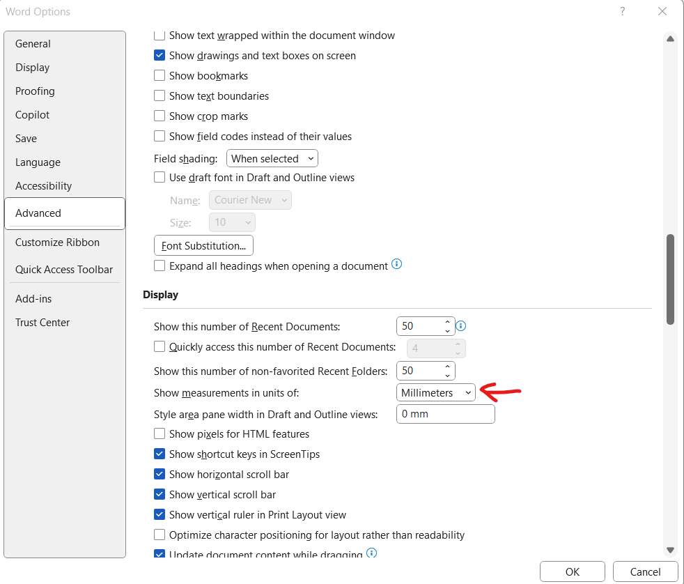

ПРАВИЛНИК О САДРЖИНИ, НАЧИНУ И ПОСТУПКУ ИЗРАДЕ И НАЧИНУ ВРШЕЊА КОНТРОЛЕ ТЕХНИЧКЕ ДОКУМЕНТАЦИЈЕ ПРЕМА КЛАСИ И НАМЕНИ ОБЈЕКАТА

pravilnik o sadržini, načinu i postupku izrade i načinu vršenja kontrole tehničke dokumentacije prema klasi i nameni objekata

### 58.2.2 Ostala podešavanja

Ostala podešavanja u skladu sa važećim templejtom:

X:\2 HVAC Biblioteka\PROGRAM OBUKE\58 TEKSTUALNA DOKUMENTACIJA\380-BBD-00-XX-RP-M-6100_Txt.docx

## 58.3 BBD TEMPLEJT

BBD templejt za tekstualnu dokumentaciju se nalazi na sledećoj lokaciji:

X:\2 HVAC Biblioteka\PROGRAM OBUKE\58 TEKSTUALNA DOKUMENTACIJA\380-BBD-00-XX-RP-M-6100_Txt.docx

Kako se ne bi gubilo vreme za sva potrebna podešavanja, za svaki novi projekat preuzeti ovaj templejt i editovati ga po potrebi.

### 58.3.1 Pasus

<table>
<colgroup>
<col style="width: 19%" />
<col style="width: 1%" />
<col style="width: 79%" />
</colgroup>
<thead>
<tr class="header">
<th><strong>Stil:</strong></th>
<th></th>
<th><strong>Normal</strong></th>
</tr>
</thead>
<tbody>
<tr class="odd">
<td>Font:</td>
<td></td>
<td>
Arial, Veličina 11, Justified, Boja Automatic

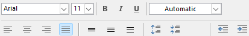
</td>
</tr>
<tr class="even">
<td>Paragraf:</td>
<td></td>
<td>
Spacing – 12pt before, 12pt after

Line Spacing – Multiple at 1,15

Indentation – Left 0mm, Right 0mm, Special – none

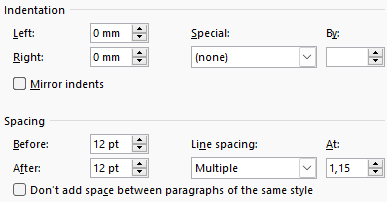
</td>
</tr>
<tr class="odd">
<td>Primer:</td>
<td></td>
<td>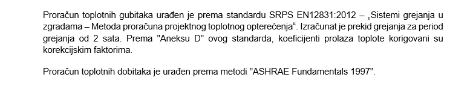</td>
</tr>
</tbody>
</table>

### 58.3.2 Title

U skladu sa Pravilnikom o sadržini, načinu i postupku izrade i načinu vršenja kontrole tehničke dokumentacije prema klasi i nameni objekata ("Sl. glasnik RS", br. 96/2023) – Prilog 1., projektna dokumentacija se sastoji od 7 delova, ito:

6/1.1. NASLOVNA STRANA PROJEKTA MAŠINSKIH TERMOTEHNIČKIH INSTALACIJA

6/1.2. SADRŽAJ PROJEKTA MAŠINSKIH TERMOTEHNIČKIH INSTALACIJA

6/1.3. REŠENJE O IMENOVANJU ODGOVORNOG PROJEKTANTA

6/1.4. IZJAVA ODGOVORNOG PROJEKTANTA PROJEKTA

6/1.5. TEKSTUALNA DOKUMENTACIJA

6/1.6. NUMERIČKA DOKUMENTACIJA

6/1.7. GRAFIČKA DOKUMENTACIJA

Svaki od ovih naslova se ispisuje sa punim brojem koji mu prethodi, pri čemu deo 6/1. označava broj sveske zbirne projektne dokumentacije, dok nastavak 1. do 7. označava pojedinačni deo projektne dokumentacije u sklopu sveske 6/1.

<table>
<colgroup>
<col style="width: 19%" />
<col style="width: 1%" />
<col style="width: 79%" />
</colgroup>
<thead>
<tr class="header">
<th><strong>Stil:</strong></th>
<th></th>
<th><strong>Title</strong></th>
</tr>
</thead>
<tbody>
<tr class="odd">
<td>Font:</td>
<td></td>
<td>
Arial, Veličina 11, Bold, Justified, Boja Automatic, UPPERCASE

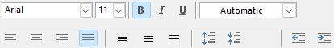
</td>
</tr>
<tr class="even">
<td>Paragraf:</td>
<td></td>
<td>
Spacing – 12pt before, 12pt after

Line Spacing – Multiple at 1,15

Indentation – Left 0mm, Right 0mm, Special – none

</td>
</tr>
<tr class="odd">
<td>Primer:</td>
<td></td>
<td>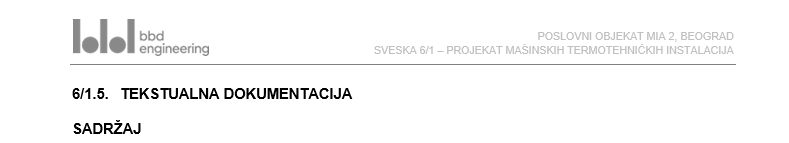</td>
</tr>
</tbody>
</table>

### 58.3.3 Naslov prvog nivoa – Heading 1

Kada neki od 7 delova projekta mašinskih instalacija ima posebne delove, njihovi naslovi se ispisuju sa punim brojem koji naslovu prethodi uz dodatak koji označava redni broj u sklopu tog dela. Npr. 6/1.5. TEKSTUALNA DOKUMENTACIJA se može sastojati od sledećih delova koji se naslovlavaju naslovom prvog nivoa – Heading 1:

6/1.5.1. TEHNIČKI OPIS

6/1.5.2. OPŠTI USLOVI

6/1.5.3. TEHNIČKI USLOVI

6/1.5.4. PRILOG MERA ZAŠTITE NA RADU

6/1.5.5 PREGLED PRIMENJENIH TEHNIČKIH MERA ZAŠTITE OD POŽARA

6/1.5.6. PREGLED PRIMENJENIH STANDARDA I PRAVILNIKA

<table>
<colgroup>
<col style="width: 19%" />
<col style="width: 1%" />
<col style="width: 79%" />
</colgroup>
<thead>
<tr class="header">
<th><strong>Stil:</strong></th>
<th></th>
<th><strong>Heading 1</strong></th>
</tr>
</thead>
<tbody>
<tr class="odd">
<td>Font:</td>
<td></td>
<td>
Arial, Veličina 11, Bold, Justified, Boja Automatic, UPPERCASE

</td>
</tr>
<tr class="even">
<td>Paragraf:</td>
<td></td>
<td>
Spacing – 12pt before, 12pt after

Line Spacing – Multiple at 1,15

Indentation – Left 0mm, Right 0mm, Special – none

</td>
</tr>
<tr class="odd">
<td>Tabs:</td>
<td></td>
<td>
Tab stop position – 10 mm

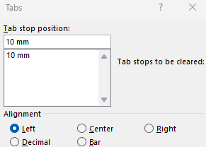
</td>
</tr>
<tr class="even">
<td>Primer:</td>
<td></td>
<td>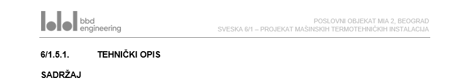</td>
</tr>
</tbody>
</table>

### 58.3.4 Naslov drugog nivoa – Heading 2

Kako bi se izbegle preduge, potencijalno zbunjujuće, brojne reference ispred naslova drugog i viših redova, samim naslovima prethdi samo redni broj od 1. naviše, u okviru tog poglavlja. Na ovaj način se dolazi u situaciju da su neki brojevi naslova u dokumentu ponovljeni, ali dodatno opravdanje je u referenci svakog pojedinačnog poglavlja (Sekcije) koja se ispisuje u futeru dokumenta (vidi deo 58.3.12. – Footer).

<table>
<colgroup>
<col style="width: 19%" />
<col style="width: 1%" />
<col style="width: 79%" />
</colgroup>
<thead>
<tr class="header">
<th><strong>Stil:</strong></th>
<th></th>
<th><strong>Heading 2</strong></th>
</tr>
</thead>
<tbody>
<tr class="odd">
<td>Font:</td>
<td></td>
<td>
Arial, Veličina 11, Bold, Justified, Boja Automatic, UPPERCASE

</td>
</tr>
<tr class="even">
<td>Paragraf:</td>
<td></td>
<td>
Spacing – 12pt before, 12pt after

Line Spacing – Multiple at 1,15

Indentation – Left 0mm, Right 0mm, Special – Hanging By: 10mm

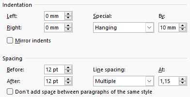
</td>
</tr>
<tr class="odd">
<td>Tabs:</td>
<td></td>
<td>
Tab stop position – 10 mm

</td>
</tr>
<tr class="even">
<td>Primer:</td>
<td></td>
<td>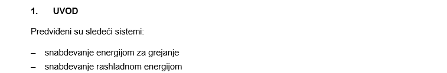</td>
</tr>
</tbody>
</table>

### 58.3.5 Naslov trećeg nivoa – Heading 3

Sledeći naslov ima isto formatiranje kao prethodni uz dodavanje brojevne reference.

<table>
<colgroup>
<col style="width: 19%" />
<col style="width: 1%" />
<col style="width: 79%" />
</colgroup>
<thead>
<tr class="header">
<th><strong>Stil:</strong></th>
<th></th>
<th><strong>Heading 3</strong></th>
</tr>
</thead>
<tbody>
<tr class="odd">
<td>Font:</td>
<td></td>
<td>
Arial, Veličina 11, Bold, Justified, Boja Automatic, UPPERCASE

</td>
</tr>
<tr class="even">
<td>Paragraf:</td>
<td></td>
<td>
Spacing – 12pt before, 12pt after

Line Spacing – Multiple at 1,15

Indentation – Left 0mm, Right 0mm, Special – Hanging By: 10mm

</td>
</tr>
<tr class="odd">
<td>Tabs:</td>
<td></td>
<td>
Tab stop position – 10 mm

</td>
</tr>
<tr class="even">
<td>Primer:</td>
<td></td>
<td>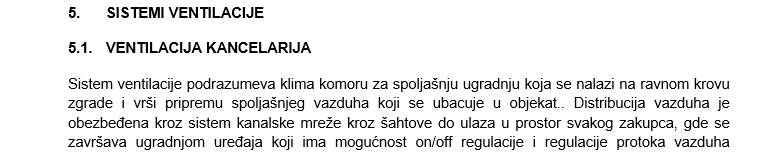</td>
</tr>
</tbody>
</table>

### 58.3.6 Naslov četvrtog nivoa – Heading 4

Sledeći naslov ima isto formatiranje kao prethodni uz dodavanje brojevne reference i tu razliku što se naslovi više ne pišu velikim slovima (UPPERCASE) već malim slovima (Sentence case).

<table>
<colgroup>
<col style="width: 19%" />
<col style="width: 1%" />
<col style="width: 79%" />
</colgroup>
<thead>
<tr class="header">
<th><strong>Stil:</strong></th>
<th></th>
<th><strong>Heading 4</strong></th>
</tr>
</thead>
<tbody>
<tr class="odd">
<td>Font:</td>
<td></td>
<td>
Arial, Veličina 11, Bold, Justified, Boja Automatic, Sentence case

</td>
</tr>
<tr class="even">
<td>Paragraf:</td>
<td></td>
<td>
Spacing – 12pt before, 12pt after

Line Spacing – Multiple at 1,15

Indentation – Left 0mm, Right 0mm, Special – Hanging By: 10mm

</td>
</tr>
<tr class="odd">
<td>Tabs:</td>
<td></td>
<td>
Tab stop position – 10 mm

</td>
</tr>
<tr class="even">
<td>Primer:</td>
<td></td>
<td>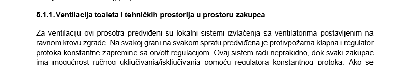</td>
</tr>
</tbody>
</table>

### 58.3.7 Naslov petog nivoa – Heading 5

Svaki sledeći naslov se piše malim slovima (Sentence case), boldovano podvučenio, bez brojevne reference.

<table>
<colgroup>
<col style="width: 19%" />
<col style="width: 1%" />
<col style="width: 79%" />
</colgroup>
<thead>
<tr class="header">
<th><strong>Stil:</strong></th>
<th></th>
<th><strong>Heading 5</strong></th>
</tr>
</thead>
<tbody>
<tr class="odd">
<td>Font:</td>
<td></td>
<td>
Arial, Veličina 11, Bold, Underline, Justified, Boja Automatic, Sentence case

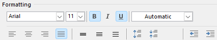
</td>
</tr>
<tr class="even">
<td>Paragraf:</td>
<td></td>
<td>
Spacing – 12pt before, 12pt after

Line Spacing – Multiple at 1,15

Indentation – Left 0mm, Right 0mm, Special – Hanging By: 10mm

</td>
</tr>
<tr class="odd">
<td>Primer:</td>
<td></td>
<td>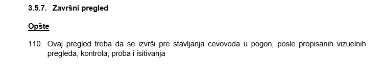</td>
</tr>
</tbody>
</table>

### 58.3.8 Nabrajanje – crtice 

Predviđena su dva osnovna nivoa i formata nabrajanja:

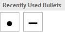

<table>
<colgroup>
<col style="width: 19%" />
<col style="width: 1%" />
<col style="width: 79%" />
</colgroup>
<thead>
<tr class="header">
<th><strong>Stil:</strong></th>
<th></th>
<th><ul>
<li>
<strong>Nabrajanje 1</strong>
</li>
</ul></th>
</tr>
</thead>
<tbody>
<tr class="odd">
<td>Font:</td>
<td></td>
<td>
Arial, Veličina 11, Left Aligned, Boja Automatic, Sentence case

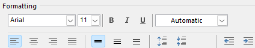
</td>
</tr>
<tr class="even">
<td>Paragraf:</td>
<td></td>
<td>
Spacing – 6pt before, 6pt after

Line Spacing – Single

Indentation – Left 0mm, Right 0mm, Special – Hanging By: 6,3mm

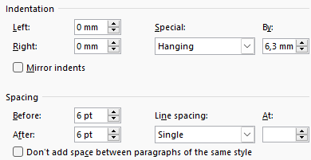
</td>
</tr>
<tr class="odd">
<td>Primer:</td>
<td></td>
<td>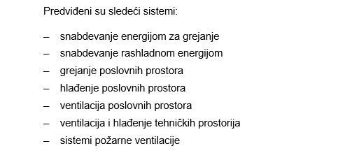</td>
</tr>
</tbody>
</table>

<table>
<colgroup>
<col style="width: 19%" />
<col style="width: 1%" />
<col style="width: 79%" />
</colgroup>
<thead>
<tr class="header">
<th><strong>Stil:</strong></th>
<th></th>
<th><ul>
<li>
<strong>Nabrajanje 2</strong>
</li>
</ul></th>
</tr>
</thead>
<tbody>
<tr class="odd">
<td>Font:</td>
<td></td>
<td>
Arial, Veličina 11, Left Aligned, Boja Automatic, Sentence case

</td>
</tr>
<tr class="even">
<td>Paragraf:</td>
<td></td>
<td>
Spacing – 6pt before, 6pt after, Line Spacing – Single

Indentation – Left 6,3mm, Right 0mm, Special – Hanging By: 6,3mm

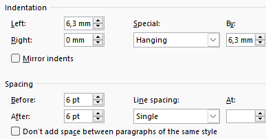
</td>
</tr>
<tr class="odd">
<td>Primer:</td>
<td></td>
<td>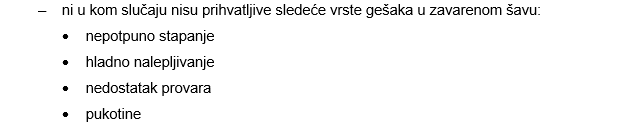</td>
</tr>
</tbody>
</table>

### 58.3.9 Nabrajanje – redni brojevi 

Tamo gde je neophodno nabrajanje rednim brojevima koristi se sledeće formatiranje:

<table>
<colgroup>
<col style="width: 19%" />
<col style="width: 1%" />
<col style="width: 79%" />
</colgroup>
<thead>
<tr class="header">
<th><strong>Stil:</strong></th>
<th></th>
<th><ol type="1">
<li>
<strong>Numbering</strong>
</li>
</ol></th>
</tr>
</thead>
<tbody>
<tr class="odd">
<td>Font:</td>
<td></td>
<td>
Arial, Veličina 11, Justified, Boja Automatic, Sentence case

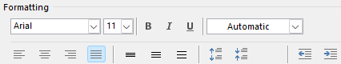
</td>
</tr>
<tr class="even">
<td>Paragraf:</td>
<td></td>
<td>
Spacing – 12pt before, 12pt after, Line Spacing – Multiple by 1,15

Indentation – Left 0mm, Right 0mm, Special – Hanging By: 10mm

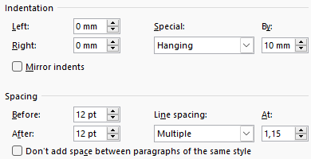
</td>
</tr>
<tr class="odd">
<td>Primer:</td>
<td></td>
<td>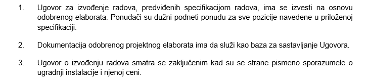</td>
</tr>
</tbody>
</table>

Obratiti pažnju na to da kada se započinje novo nabrajanje bude odabrana odgovarajuća opcija, najčešće „Start new list“. Dodatno, obratiti pažnju na to da Word po pravilu, iako je izabrana opcija „Start new list“, nastavlja brojanje u odnosu na poslednji broj prethodne liste. Zato je za novu listu svaki put neophodno postaviti opciju „Set valu to:“ na 1.

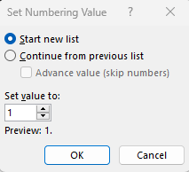

Ukoliko brojač ima neki prefiks, potrebno je podesiti ga u dijalogu „Define New Number Format“:

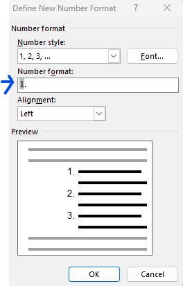

Primer:

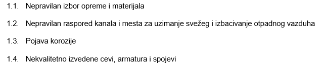

### 58.3.10 Tabele 

Radi konzistentnosti dokumentacije, sve tabele je neohodno formatirati na sličan način. Koriste se samo horizontalne linije, koje oivičavaju redove, dok se vertikalne ne koriste i po pravilu sadržaj ćelija je pozicioniran centralno, osim u posebnim slučajevima:

<table>
<colgroup>
<col style="width: 19%" />
<col style="width: 1%" />
<col style="width: 79%" />
</colgroup>
<thead>
<tr class="header">
<th><strong>Stil:</strong></th>
<th></th>
<th><strong>Table</strong></th>
</tr>
</thead>
<tbody>
<tr class="odd">
<td>Font:</td>
<td></td>
<td>
Arial, Veličina 10 ili 11, Center Aligned, Boja Automatic, Sentence case

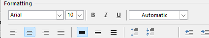
</td>
</tr>
<tr class="even">
<td>Paragraf:</td>
<td></td>
<td>
Spacing – 3pt before, 3pt after, Line Spacing – Single

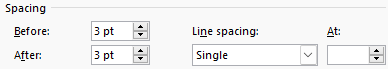
</td>
</tr>
<tr class="odd">
<td>Primer:</td>
<td></td>
<td>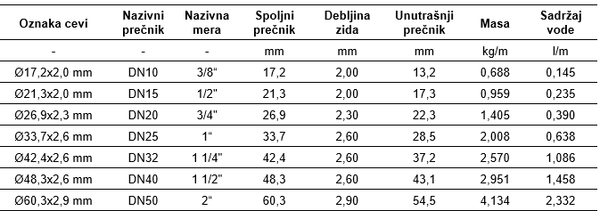</td>
</tr>
</tbody>
</table>

### 58.3.11 Heder 

Heder je identičan na svim stranicama tekstualne dokumentacije, bez obzira na poglavlje. Iznad horizontalne linije sa leve strane se nalazi logo, a sa desne u dva reda su naziv objekta i naziv sveske:

<table>
<colgroup>
<col style="width: 19%" />
<col style="width: 1%" />
<col style="width: 79%" />
</colgroup>
<thead>
<tr class="header">
<th><strong>Header</strong></th>
<th></th>
<th></th>
</tr>
</thead>
<tbody>
<tr class="odd">
<td>Font:</td>
<td></td>
<td>
Arial, Regular, Veličina 8, Right Aligned, Boja RGB 128,128,128, UPPERCASE

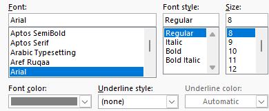
</td>
</tr>
<tr class="even">
<td>Paragraf:</td>
<td></td>
<td>
Spacing – 0pt before, 0pt after, Line Spacing – Multiple At 1,15

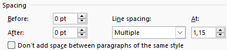
</td>
</tr>
<tr class="odd">
<td>Position and Navigation:</td>
<td></td>
<td>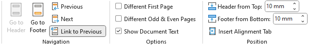</td>
</tr>
<tr class="even">
<td>Primer:</td>
<td></td>
<td></td>
</tr>
</tbody>
</table>

### 58.3.12 Footer 

U futeru desno se nalazi redni broj strane u celom dokumentu. Broj strane je ispisan belom bojom (Font – arial, Regular, veličina 8, Center aligned, Spacing – 0pt before, 0pt after, Line Spacing – Single) u crnom krugu prečnika 6,6 mm. U templejtu je podešeno da broj strane uvek bude u centru kruga i zato je najbolje, prilokom formiranja novog projekta, krenuti od templejta. Crni krug predstavlja element simbola loga i doprinosi jedinstvenom vizuelnom identitetu.

U futeru levo se nalazi kodirana šifra dela tehničke dokumentacije, definisana konvencijom kodiranja, u skladu sa Document Issue Sheet-om (DIS). Zato se svaki deo tekstualne dokumentacije izdvaja u posebnu sekciju. Prilikom pravljenja nove sekcije potrebno je dečekirati opciju „Link to Previous“ u okviru Word trake „Header & Footer“.

<table>
<colgroup>
<col style="width: 19%" />
<col style="width: 1%" />
<col style="width: 79%" />
</colgroup>
<thead>
<tr class="header">
<th><strong>Footer</strong></th>
<th></th>
<th></th>
</tr>
</thead>
<tbody>
<tr class="odd">
<td>Font:</td>
<td></td>
<td>
Arial, Regular, Veličina 8, Left Aligned, Boja RGB 128,128,128

</td>
</tr>
<tr class="even">
<td>Paragraf:</td>
<td></td>
<td>
Spacing – 0pt before, 0pt after, Line Spacing – Multiple At 1,15

</td>
</tr>
<tr class="odd">
<td>Position and Navigation:</td>
<td></td>
<td>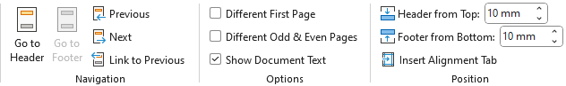</td>
</tr>
<tr class="even">
<td>Primer:</td>
<td></td>
<td>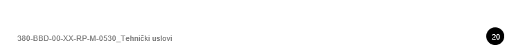</td>
</tr>
</tbody>
</table>

### 58.3.13 Napomena 

Čest je slučaj da dokumentaciju izrađujemo pod pečatom druge partnerske firme, najčešće su to arhitekte. Istovremeno, od partnerskih firmi najčešće ne dobijamo uputstva vezano za formatiranje tekstualne dokumentacije. Iz tog razloga ovo uputstvo je primenjivo gotovo u potpunosti i u takvim slučajevima. Potrebno je promeniti samo logo ili eventualno kompletan heder i futer dokumenta.

Dodatno, s obzirom da BBD templejt predviđa korišćenje stilova, njihovom modifikacijom tako da budu usklađeni sa zahtevima klijenta, veoma brzo je moguće dobiti željeni izgled tekstualne dokumentacije.
