# Chapter 1 — Psychrometrics

*Izvor: 2021 ASHRAE Handbook — Fundamentals (SI), Chapter 1 (PDF str. 10–27).*

> **Napomena o konverziji:** Tekst je automatski izdvojen iz originalnog PDF-a uz prepoznavanje dve kolone, spojene prelomljene reči i pasuse. Indeksi i eksponenti su označeni sa ``/``, tabele su pretvorene u Markdown tabele (veoma složene tabele su prikazane kao poravnat tekst), a slike su izrezane iz PDF-a u folder `img/`. Složene jednačine (razlomci, sume) mogu biti uprošćeno prikazane. **Pre upotrebe vrednosti u proračunu proveriti u originalnom PDF-u.** Oznake `<!-- str. N -->` pokazuju stranu PDF-a.

## Sadržaj

- [1. COMPOSITION OF DRY AND MOIST AIR](#1-composition-of-dry-and-moist-air)
- [2. U.S. STANDARD ATMOSPHERE](#2-us-standard-atmosphere)
- [3. THERMODYNAMIC PROPERTIES OF MOIST AIR](#3-thermodynamic-properties-of-moist-air)
- [4. THERMODYNAMIC PROPERTIES OF WATER AT SATURATION](#4-thermodynamic-properties-of-water-at-saturation)
- [5. HUMIDITY PARAMETERS](#5-humidity-parameters)
- [6. PERFECT GAS RELATIONSHIPS FOR DRY AND MOIST AIR](#6-perfect-gas-relationships-for-dry-and-moist-air)
- [7. THERMODYNAMIC WET-BULB AND DEW-POINT TEMPERATURE](#7-thermodynamic-wet-bulb-and-dew-point-temperature)
- [8. NUMERICAL CALCULATION OF MOIST AIR PROPERTIES](#8-numerical-calculation-of-moist-air-properties)
- [9. PSYCHROMETRIC CHARTS](#9-psychrometric-charts)
- [10. TYPICAL AIR-CONDITIONING PROCESSES](#10-typical-air-conditioning-processes)
- [11. TRANSPORT PROPERTIES OF MOIST AIR](#11-transport-properties-of-moist-air)
- [12. SYMBOLS](#12-symbols)
- [REFERENCES](#references)
- [BIBLIOGRAPHY](#bibliography)

<!-- str. 10 -->

PSYCHROMETRICS uses thermodynamic properties to analyze conditions and processes involving moist air. This chapter discusses perfect gas relations and their use in common heating, cooling, and humidity control problems. Formulas developed by Herrmann et al. (2009) may be used where greater precision is required.

Herrmann et al. (2009), Hyland and Wexler (1983a, 1983b), and Nelson and Sauer (2002) developed formulas for thermodynamic properties of moist air and water modeled as real gases. However, perfect gas relations can be substituted in most air-conditioning problems. Kuehn et al. (1998) showed that errors are less than 0.7% in calculating humidity ratio, enthalpy, and specific volume of saturated air at standard atmospheric pressure for a temperature range of –50 to 50°C. Furthermore, these errors decrease with decreasing pressure.

Hermann et al. (2020) prepared formulas for transport properties of moist air.

## 1. COMPOSITION OF DRY AND MOIST AIR

**Atmospheric air** contains many gaseous components as well as water vapor and miscellaneous contaminants (e.g., smoke, pollen, and gaseous pollutants not normally present in free air far from pollution sources).

**Dry air** is atmospheric air with all water vapor and contaminants removed. Its composition is relatively constant, but small variations in the amounts of individual components occur with time, geographic location, and altitude. Harrison (1965) lists the approximate percentage composition of dry air by volume as: nitrogen, 78.084; oxygen, 20.9476; argon, 0.934; neon, 0.001818; helium, 0.000524; methane, 0.00015; sulfur dioxide, 0 to 0.0001; hydrogen, 0.00005; and minor components such as krypton, xenon, and ozone, 0.0002. Harrison (1965) and Hyland and Wexler (1983a) used a value 0.0314 (circa 1955) for carbon dioxide. Carbon dioxide reached 0.0379 in 2005, is currently increasing by 0.00019 percent per year and is projected to reach 0.0438 in 2036 (Gatley et al. 2008; Keeling and Whorf 2005a, 2005b). Increases in carbon dioxide are offset by decreases in oxygen; consequently, the oxygen percentage in 2036 is projected to be 20.9352. Using the projected changes, the relative molecular mass for dry air for at least the first half of the 21st century is 28.966, based on the carbon-12 scale. The gas constant for dry air using the Mohr and Taylor (2005) value for the universal gas constant is

> Rda = 8314.472/28.966 = 287.042 J/(kgda·K)&emsp;**(1)**

**Moist air** is a binary (two-component) mixture of dry air and water vapor. The amount of water vapor varies from zero (dry air) to a maximum that depends on temperature and pressure. **Saturation** is a state of neutral equilibrium between moist air and the condensed water phase (liquid or solid); unless otherwise stated, it assumes a flat interface surface between moist air and the condensed phase. Saturation conditions change when the interface radius is very small (e.g., with ultrafine water droplets). According to the Industrial Formulation IAPWS-IF97 (R7-97 2012), the relative molecular mass of water is 18.015 257. The gas constant for water vapor is

The preparation of this chapter is assigned to TC 1.1, Thermodynamics and Psychrometrics.

> Rw = 8314.472/18.015 257 = 461.524 J/(kgw·K)&emsp;**(2)**

## 2. U.S. STANDARD ATMOSPHERE

The temperature and barometric pressure of atmospheric air vary considerably with altitude as well as with local geographic and weather conditions. The standard atmosphere gives a standard of reference for estimating properties at various altitudes. At sea level, standard temperature is 15°C; standard barometric pressure is 101.325 kPa. Temperature is assumed to decrease linearly with increasing altitude throughout the troposphere (lower atmosphere), and to be constant in the lower reaches of the stratosphere. The lower atmosphere is assumed to consist of dry air that behaves as a perfect gas. Gravity is also assumed constant at the standard value, 9.806 65 m/s2. Table 1 summarizes property data for altitudes to 10 000 m.

Pressure values in Table 1 may be calculated from

> p = 101.325(1 – 2.25577 × 10–5Z)5.2559&emsp;**(3)**

The equation for temperature as a function of altitude is

> t =15 – 0.0065Z&emsp;**(4)**

where

- Z = altitude, m
- p = barometric pressure, kPa
- t = temperature, °C

Equations (3) and (4) are accurate from –5000 m to 11 000 m. For higher altitudes, comprehensive tables of barometric pressure and other physical properties of the standard atmosphere, in both SI and I-P units, can be found in NASA (1976).

## 3. THERMODYNAMIC PROPERTIES OF MOIST AIR

Table 2, calculated using ASHRAE’s (2021) LibHuAirProp software (based on ASHRAE RP-1485; Hermann et al. 2009, 2020), shows values of thermodynamic properties of saturated moist air and dry air at 101.325 kPa and temperatures from –60 to 90°C.

The following properties are shown in Table 2:

- t = Celsius temperature, based on the ITS-90 and expressed relative to absolute temperature T in kelvins (K) by the following relation:
- T = t + 273.15

<!-- str. 11 -->

**Table 1 Standard Atmospheric Data for Altitudes to 10000 m**

| Altitude, m | Temperature, °C | Pressure, kPa |
|---|---|---|
| –500 | 18.2 | 107.478 |
| 0 | 15.0 | 101.325 |
| 500 | 11.8 | 95.461 |
| 1000 | 8.5 | 89.875 |
| 1500 | 5.2 | 84.556 |
| 2000 | 2.0 | 79.495 |
| 2500 | –1.2 | 74.682 |
| 3000 | –4.5 | 70.108 |
| 4000 | –11.0 | 61.640 |
| 5000 | –17.5 | 54.020 |
| 6000 | –24.0 | 47.181 |
| 7000 | –30.5 | 41.061 |
| 8000 | –37.0 | 35.600 |
| 9000 | –43.5 | 30.742 |
| 10 000 | –50 | 26.436 |

Source: Adapted from NASA (1976).

Ws = humidity ratio at saturation; gaseous phase (moist air) exists in equilibrium with condensed phase (liquid or solid) at given temperature and pressure (standard atmospheric pressure). At given values of temperature and pressure, humidity ratio W can have any value from zero to Ws.

vda = specific volume of dry air, m3/kgda.

vas = vs – vda, difference between specific volume of moist air at saturation and that of dry air, m3/kgda, at same pressure and temperature.

vs = specific volume of moist air at saturation, m3/kgda.

hda = specific enthalpy of dry air, kJ/kgda. In Table 2, hda is assigned a value of 0 at 0°C and standard atmospheric pressure.

has = hs – hda, difference between specific enthalpy of moist air at saturation and that of dry air, kJ/kgda, at same pressure and temperature.

hs = specific enthalpy of moist air at saturation, kJ/kgda.

sda = specific entropy of dry air, kJ/(kgda·K). In Table 2, sda is assigned a value of 0 at 0°C and standard atmospheric pressure. ss = specific entropy of moist air at saturation kJ/(kgda·K).

## 4. THERMODYNAMIC PROPERTIES OF WATER AT SATURATION

Table 3 shows thermodynamic properties of water at saturation for temperatures from –60 to 160°C, calculated using ASHRAE (2021) LibHuAirProp software, based on IAPWS formulations described in IAPWS R7-97 (2012), R10-06 (2009), and R14-08 (2011). The internal energy and entropy of saturated liquid water are both assigned the value zero at the triple point, 0.01°C. Between the triple-point and critical-point temperatures of water, both **saturated liquid** and **saturated vapor** may coexist in equilibrium; below the triple-point temperature, both **saturated ice** and **saturated vapor** may coexist in equilibrium.

**Table 2 Thermodynamic Properties of Saturated Moist and Dry Air at Standard Atmospheric Pressure, 101.325 kPa**

| Temp. t, °C | Humidity Ratio Ws, kgw/kgda | Specific Volume, m3/kgda vda | Specific Volume, m3/kgda vs | Specific Enthalpy, kJ/kgda hda | Specific Enthalpy, kJ/kgda hs | Specific Heat Capacity, kJ/(kg·K) t | Specific Heat Capacity, kJ/(kg·K) cp,s | Specific Entropy, kJ/(kgda·K) sda | Specific Entropy, kJ/(kgda·K) ss |
|---|---|---|---|---|---|---|---|---|---|
| –60 | 0.0000067 | 0.6027 | 0.6027 | –60.341 | –60.325 | 1.0062 | 1.0062 | –0.2494 | –0.2494 |
| –59 | 0.0000076 | 0.6055 | 0.6055 | –59.335 | –59.317 | 1.0062 | 1.0062 | –0.2447 | –0.2446 |
| –58 | 0.0000087 | 0.6084 | 0.6084 | –58.329 | –58.308 | 1.0061 | 1.0061 | –0.2400 | –0.2399 |
| –57 | 0.0000100 | 0.6112 | 0.6112 | –57.323 | –57.299 | 1.0061 | 1.0061 | –0.2354 | –0.2353 |
| –56 | 0.0000114 | 0.6141 | 0.6141 | –56.317 | –56.289 | 1.0061 | 1.0061 | –0.2307 | –0.2306 |
| –55 | 0.0000129 | 0.6169 | 0.6169 | –55.311 | –55.280 | 1.0060 | 1.0061 | –0.2261 | –0.2260 |
| –54 | 0.0000147 | 0.6198 | 0.6198 | –54.305 | –54.269 | 1.0060 | 1.0060 | –0.2215 | –0.2213 |
| –53 | 0.0000167 | 0.6226 | 0.6226 | –53.299 | –53.258 | 1.0060 | 1.0060 | –0.2169 | –0.2167 |
| –52 | 0.0000190 | 0.6255 | 0.6255 | –52.293 | –52.247 | 1.0060 | 1.0060 | –0.2124 | –0.2121 |
| –51 | 0.0000215 | 0.6283 | 0.6283 | –51.287 | –51.235 | 1.0059 | 1.0059 | –0.2078 | –0.2076 |
| –50 | 0.0000243 | 0.6312 | 0.6312 | –50.281 | –50.222 | 1.0059 | 1.0059 | –0.2033 | –0.2030 |
| –49 | 0.0000275 | 0.6340 | 0.6340 | –49.275 | –49.209 | 1.0059 | 1.0059 | –0.1988 | –0.1985 |
| –48 | 0.0000311 | 0.6369 | 0.6369 | –48.269 | –48.194 | 1.0059 | 1.0059 | –0.1943 | –0.1940 |
| –47 | 0.0000350 | 0.6397 | 0.6397 | –47.263 | –47.179 | 1.0058 | 1.0059 | –0.1899 | –0.1895 |
| –46 | 0.0000395 | 0.6425 | 0.6426 | –46.257 | –46.162 | 1.0058 | 1.0058 | –0.1854 | –0.1850 |
| –45 | 0.0000445 | 0.6454 | 0.6454 | –45.252 | –45.144 | 1.0058 | 1.0058 | –0.1810 | –0.1805 |
| –44 | 0.0000500 | 0.6482 | 0.6483 | –44.246 | –44.125 | 1.0058 | 1.0058 | –0.1766 | –0.1761 |
| –43 | 0.0000562 | 0.6511 | 0.6511 | –43.240 | –43.104 | 1.0057 | 1.0058 | –0.1722 | –0.1716 |
| –42 | 0.0000631 | 0.6539 | 0.6540 | –42.234 | –42.081 | 1.0057 | 1.0058 | –0.1679 | –0.1672 |
| –41 | 0.0000708 | 0.6568 | 0.6568 | –41.229 | –41.057 | 1.0057 | 1.0058 | –0.1635 | –0.1628 |
| –40 | 0.0000793 | 0.6596 | 0.6597 | –40.223 | –40.031 | 1.0057 | 1.0058 | –0.1592 | –0.1583 |
| –39 | 0.0000887 | 0.6625 | 0.6626 | –39.217 | –39.002 | 1.0057 | 1.0057 | –0.1549 | –0.1539 |
| –38 | 0.0000992 | 0.6653 | 0.6654 | –38.211 | –37.970 | 1.0057 | 1.0057 | –0.1506 | –0.1495 |
| –37 | 0.0001108 | 0.6682 | 0.6683 | –37.206 | –36.936 | 1.0056 | 1.0057 | –0.1464 | –0.1451 |
| –36 | 0.0001237 | 0.6710 | 0.6711 | –36.200 | –35.899 | 1.0056 | 1.0057 | –0.1421 | –0.1408 |
| –35 | 0.0001379 | 0.6738 | 0.6740 | –35.195 | –34.859 | 1.0056 | 1.0057 | –0.1379 | –0.1364 |
| –34 | 0.0001536 | 0.6767 | 0.6769 | –34.189 | –33.815 | 1.0056 | 1.0057 | –0.1337 | –0.1320 |
| –33 | 0.0001710 | 0.6795 | 0.6797 | –33.183 | –32.766 | 1.0056 | 1.0057 | –0.1295 | –0.1276 |
| –32 | 0.0001902 | 0.6824 | 0.6826 | –32.178 | –31.714 | 1.0056 | 1.0057 | –0.1253 | –0.1232 |
| –31 | 0.0002113 | 0.6852 | 0.6855 | –31.172 | –30.656 | 1.0056 | 1.0058 | –0.1211 | –0.1189 |

<!-- str. 12 -->

**Table 2 Thermodynamic Properties of Saturated Moist and Dry Air at Standard Atmospheric Pressure, 101.325 kPa (Continued)**

| Temp. t, °C | Humidity Ratio Ws, kgw/kgda | Specific Volume, m3/kgda vda | Specific Volume, m3/kgda vs | Specific Enthalpy, kJ/kgda hda | Specific Enthalpy, kJ/kgda hs | Specific Heat Capacity, kJ/(kg·K) t | Specific Heat Capacity, kJ/(kg·K) cp,s | Specific Entropy, kJ/(kgda·K) sda | Specific Entropy, kJ/(kgda·K) ss |
|---|---|---|---|---|---|---|---|---|---|
| –30 | 0.0002345 | 0.6881 | 0.6883 | –30.167 | –29.593 | 1.0056 | 1.0058 | –0.1170 | –0.1145 |
| –29 | 0.0002602 | 0.6909 | 0.6912 | –29.161 | –28.525 | 1.0056 | 1.0058 | –0.1129 | –0.1101 |
| –28 | 0.0002883 | 0.6938 | 0.6941 | –28.156 | –27.450 | 1.0055 | 1.0058 | –0.1088 | –0.1057 |
| –27 | 0.0003193 | 0.6966 | 0.6970 | –27.150 | –26.368 | 1.0055 | 1.0058 | –0.1047 | –0.1013 |
| –26 | 0.0003532 | 0.6994 | 0.6998 | –26.144 | –25.278 | 1.0055 | 1.0058 | –0.1006 | –0.0969 |
| –25 | 0.0003905 | 0.7023 | 0.7027 | –25.139 | –24.181 | 1.0055 | 1.0059 | –0.0965 | –0.0924 |
| –24 | 0.0004314 | 0.7051 | 0.7056 | –24.133 | –23.074 | 1.0055 | 1.0059 | –0.0925 | –0.0880 |
| –23 | 0.0004761 | 0.7080 | 0.7085 | –23.128 | –21.958 | 1.0055 | 1.0059 | –0.0884 | –0.0835 |
| –22 | 0.0005251 | 0.7108 | 0.7114 | –22.122 | –20.831 | 1.0055 | 1.0060 | –0.0844 | –0.0790 |
| –21 | 0.0005787 | 0.7137 | 0.7143 | –21.117 | –19.693 | 1.0055 | 1.0060 | –0.0804 | –0.0745 |
| –20 | 0.0006373 | 0.7165 | 0.7172 | –20.111 | –18.542 | 1.0055 | 1.0061 | –0.0765 | –0.0699 |
| –19 | 0.0007013 | 0.7193 | 0.7201 | –19.106 | –17.377 | 1.0055 | 1.0061 | –0.0725 | –0.0653 |
| –18 | 0.0007711 | 0.7222 | 0.7231 | –18.100 | –16.198 | 1.0055 | 1.0062 | –0.0685 | –0.0607 |
| –17 | 0.0008473 | 0.7250 | 0.7260 | –17.095 | –15.003 | 1.0055 | 1.0063 | –0.0646 | –0.0560 |
| –16 | 0.0009303 | 0.7279 | 0.7290 | –16.089 | –13.791 | 1.0055 | 1.0063 | –0.0607 | –0.0513 |
| –15 | 0.0010207 | 0.7307 | 0.7319 | –15.084 | –12.560 | 1.0055 | 1.0064 | –0.0568 | –0.0465 |
| –14 | 0.0011191 | 0.7336 | 0.7349 | –14.078 | –11.310 | 1.0055 | 1.0065 | –0.0529 | –0.0416 |
| –13 | 0.0012261 | 0.7364 | 0.7378 | –13.073 | –10.037 | 1.0055 | 1.0066 | –0.0490 | –0.0367 |
| –12 | 0.0013425 | 0.7392 | 0.7408 | –12.067 | –8.7408 | 1.0055 | 1.0067 | –0.0452 | –0.0317 |
| –11 | 0.0014689 | 0.7421 | 0.7438 | –11.062 | –7.4193 | 1.0055 | 1.0068 | –0.0413 | –0.0267 |
| –10 | 0.0016062 | 0.7449 | 0.7468 | –10.056 | –6.0705 | 1.0056 | 1.0069 | –0.0375 | –0.0215 |
| –9 | 0.0017551 | 0.7478 | 0.7499 | –9.0505 | –4.6921 | 1.0056 | 1.0071 | –0.0337 | –0.0163 |
| –8 | 0.0019166 | 0.7506 | 0.7529 | –8.0449 | –3.2820 | 1.0056 | 1.0072 | –0.0299 | –0.0110 |
| –7 | 0.0020916 | 0.7534 | 0.7560 | –7.0393 | –1.8377 | 1.0056 | 1.0074 | –0.0261 | –0.0055 |
| –6 | 0.0022812 | 0.7563 | 0.7591 | –6.0337 | –0.3565 | 1.0056 | 1.0076 | –0.0223 | 0.0000 |
| –5 | 0.0024863 | 0.7591 | 0.7622 | –5.0282 | 1.1643 | 1.0056 | 1.0078 | –0.0186 | 0.0057 |
| –4 | 0.0027083 | 0.7620 | 0.7653 | –4.0225 | 2.7276 | 1.0056 | 1.0080 | –0.0148 | 0.0115 |
| –3 | 0.0029482 | 0.7648 | 0.7684 | –3.0169 | 4.3368 | 1.0056 | 1.0082 | –0.0111 | 0.0175 |
| –2 | 0.0032076 | 0.7677 | 0.7716 | –2.0113 | 5.9952 | 1.0056 | 1.0084 | –0.0074 | 0.0236 |
| –1 | 0.0034877 | 0.7705 | 0.7748 | –1.0057 | 7.7064 | 1.0057 | 1.0087 | –0.0037 | 0.0299 |
| 0 | 0.0037900 | 0.7733 | 0.7780 | 0.0000 | 9.4744 | 1.0057 | 1.0090 | 0.00000 | 0.0364 |
| 1 | 0.0040763 | 0.7762 | 0.7813 | 1.0057 | 11.203 | 1.0057 | 1.0092 | 0.0037 | 0.0427 |
| 2 | 0.0043818 | 0.7790 | 0.7845 | 2.0114 | 12.981 | 1.0057 | 1.0095 | 0.0073 | 0.0492 |
| 3 | 0.0047075 | 0.7819 | 0.7878 | 3.0171 | 14.811 | 1.0057 | 1.0098 | 0.0110 | 0.0559 |
| 4 | 0.0050547 | 0.7847 | 0.7911 | 4.0228 | 16.696 | 1.0057 | 1.0101 | 0.0146 | 0.0627 |
| 5 | 0.0054247 | 0.7875 | 0.7944 | 5.0285 | 18.639 | 1.0058 | 1.0105 | 0.0182 | 0.0697 |
| 6 | 0.0058186 | 0.7904 | 0.7978 | 6.0343 | 20.644 | 1.0058 | 1.0108 | 0.0219 | 0.0769 |
| 7 | 0.0062379 | 0.7932 | 0.8012 | 7.0401 | 22.714 | 1.0058 | 1.0112 | 0.0254 | 0.0843 |
| 8 | 0.0066839 | 0.7961 | 0.8046 | 8.0459 | 24.853 | 1.0058 | 1.0116 | 0.0290 | 0.0919 |
| 9 | 0.0071584 | 0.7989 | 0.8081 | 9.0517 | 27.065 | 1.0058 | 1.0121 | 0.0326 | 0.0997 |
| 10 | 0.0076627 | 0.8017 | 0.8116 | 10.058 | 29.354 | 1.0059 | 1.0125 | 0.0362 | 0.1078 |
| 11 | 0.0081985 | 0.8046 | 0.8152 | 11.063 | 31.724 | 1.0059 | 1.0130 | 0.0397 | 0.1162 |
| 12 | 0.0087677 | 0.8074 | 0.8188 | 12.069 | 34.180 | 1.0059 | 1.0136 | 0.0432 | 0.1248 |
| 13 | 0.0093720 | 0.8103 | 0.8224 | 13.075 | 36.727 | 1.0059 | 1.0141 | 0.0468 | 0.1337 |
| 14 | 0.010013 | 0.8131 | 0.8262 | 14.081 | 39.370 | 1.0060 | 1.0147 | 0.0503 | 0.1430 |
| 15 | 0.010694 | 0.8159 | 0.8299 | 15.087 | 42.114 | 1.0060 | 1.0153 | 0.0538 | 0.1525 |
| 16 | 0.011415 | 0.8188 | 0.8338 | 16.093 | 44.965 | 1.0060 | 1.0160 | 0.0573 | 0.1624 |
| 17 | 0.012181 | 0.8216 | 0.8377 | 17.099 | 47.929 | 1.0060 | 1.0167 | 0.0607 | 0.1726 |
| 18 | 0.012991 | 0.8245 | 0.8416 | 18.105 | 51.011 | 1.0061 | 1.0174 | 0.0642 | 0.1832 |
| 19 | 0.013851 | 0.8273 | 0.8457 | 19.111 | 54.218 | 1.0061 | 1.0182 | 0.0676 | 0.1942 |
| 20 | 0.014761 | 0.8301 | 0.8498 | 20.117 | 57.558 | 1.0061 | 1.0191 | 0.0711 | 0.2057 |
| 21 | 0.015724 | 0.8330 | 0.8540 | 21.124 | 61.037 | 1.0062 | 1.0199 | 0.0745 | 0.2175 |

<!-- str. 13 -->

**Table 2 Thermodynamic Properties of Saturated Moist and Dry Air at Standard Atmospheric Pressure, 101.325 kPa (Continued)**

| Temp. t, °C | Humidity Ratio Ws, kgw/kgda | Specific Volume, m3/kgda vda | Specific Volume, m3/kgda vs | Specific Enthalpy, kJ/kgda hda | Specific Enthalpy, kJ/kgda hs | Specific Heat Capacity, kJ/(kg·K) t | Specific Heat Capacity, kJ/(kg·K) cp,s | Specific Entropy, kJ/(kgda·K) sda | Specific Entropy, kJ/(kgda·K) ss |
|---|---|---|---|---|---|---|---|---|---|
| 22 | 0.016744 | 0.8358 | 0.8583 | 22.130 | 64.662 | 1.0062 | 1.0209 | 0.0779 | 0.2298 |
| 23 | 0.017823 | 0.8387 | 0.8626 | 23.136 | 68.443 | 1.0062 | 1.0218 | 0.0813 | 0.2426 |
| 24 | 0.018965 | 0.8415 | 0.8671 | 24.142 | 72.387 | 1.0063 | 1.0229 | 0.0847 | 0.2559 |
| 25 | 0.020173 | 0.8443 | 0.8716 | 25.148 | 76.503 | 1.0063 | 1.0240 | 0.0881 | 0.2698 |
| 26 | 0.021451 | 0.8472 | 0.8763 | 26.155 | 80.800 | 1.0063 | 1.0251 | 0.0915 | 0.2842 |
| 27 | 0.022802 | 0.8500 | 0.8811 | 27.161 | 85.288 | 1.0064 | 1.0263 | 0.0948 | 0.2992 |
| 28 | 0.024229 | 0.8529 | 0.8860 | 28.167 | 89.978 | 1.0064 | 1.0276 | 0.0982 | 0.3148 |
| 29 | 0.025738 | 0.8557 | 0.8910 | 29.174 | 94.881 | 1.0064 | 1.0290 | 0.1015 | 0.3311 |
| 30 | 0.027333 | 0.8585 | 0.8961 | 30.180 | 100.01 | 1.0065 | 1.0304 | 0.1048 | 0.3481 |
| 31 | 0.029018 | 0.8614 | 0.9014 | 31.187 | 105.37 | 1.0065 | 1.0319 | 0.1081 | 0.3658 |
| 32 | 0.030797 | 0.8642 | 0.9069 | 32.193 | 110.98 | 1.0066 | 1.0335 | 0.1115 | 0.3843 |
| 33 | 0.032677 | 0.8671 | 0.9124 | 33.200 | 116.86 | 1.0066 | 1.0352 | 0.1147 | 0.4035 |
| 34 | 0.034663 | 0.8699 | 0.9182 | 34.207 | 123.01 | 1.0066 | 1.0370 | 0.1180 | 0.4236 |
| 35 | 0.036760 | 0.8727 | 0.9241 | 35.213 | 129.46 | 1.0067 | 1.0388 | 0.1213 | 0.4446 |
| 36 | 0.038975 | 0.8756 | 0.9302 | 36.220 | 136.21 | 1.0067 | 1.0408 | 0.1246 | 0.4666 |
| 37 | 0.041313 | 0.8784 | 0.9365 | 37.227 | 143.29 | 1.0068 | 1.0428 | 0.1278 | 0.4895 |
| 38 | 0.043783 | 0.8813 | 0.9430 | 38.233 | 150.72 | 1.0068 | 1.0450 | 0.1311 | 0.5135 |
| 39 | 0.046391 | 0.8841 | 0.9498 | 39.240 | 158.51 | 1.0069 | 1.0473 | 0.1343 | 0.5386 |
| 40 | 0.049145 | 0.8869 | 0.9567 | 40.247 | 166.68 | 1.0069 | 1.0497 | 0.1375 | 0.5649 |
| 41 | 0.052053 | 0.8898 | 0.9639 | 41.254 | 175.27 | 1.0069 | 1.0522 | 0.1407 | 0.5923 |
| 42 | 0.055124 | 0.8926 | 0.9714 | 42.261 | 184.28 | 1.0070 | 1.0549 | 0.1439 | 0.6211 |
| 43 | 0.058368 | 0.8955 | 0.9791 | 43.268 | 193.75 | 1.0070 | 1.0577 | 0.1471 | 0.6512 |
| 44 | 0.061795 | 0.8983 | 0.9871 | 44.275 | 203.70 | 1.0071 | 1.0606 | 0.1503 | 0.6828 |
| 45 | 0.065416 | 0.9011 | 0.9955 | 45.282 | 214.17 | 1.0071 | 1.0637 | 0.1535 | 0.7159 |
| 46 | 0.069242 | 0.9040 | 1.0041 | 46.289 | 225.17 | 1.0072 | 1.0669 | 0.1566 | 0.7506 |
| 47 | 0.073286 | 0.9068 | 1.0131 | 47.297 | 236.76 | 1.0073 | 1.0703 | 0.1598 | 0.7871 |
| 48 | 0.077561 | 0.9096 | 1.0225 | 48.304 | 248.96 | 1.0073 | 1.0739 | 0.1629 | 0.8253 |
| 49 | 0.082081 | 0.9125 | 1.0323 | 49.311 | 261.80 | 1.0074 | 1.0777 | 0.1660 | 0.8655 |
| 50 | 0.086863 | 0.9153 | 1.0425 | 50.319 | 275.34 | 1.0074 | 1.0817 | 0.1692 | 0.9077 |
| 51 | 0.091922 | 0.9182 | 1.0531 | 51.326 | 289.62 | 1.0075 | 1.0858 | 0.1723 | 0.9521 |
| 52 | 0.097278 | 0.9210 | 1.0643 | 52.334 | 304.69 | 1.0075 | 1.0902 | 0.1754 | 0.9989 |
| 53 | 0.10295 | 0.9238 | 1.0759 | 53.341 | 320.59 | 1.0076 | 1.0948 | 0.1785 | 1.0480 |
| 54 | 0.10896 | 0.9267 | 1.0881 | 54.349 | 337.38 | 1.0076 | 1.0996 | 0.1816 | 1.0998 |
| 55 | 0.11533 | 0.9295 | 1.1009 | 55.356 | 355.14 | 1.0077 | 1.1047 | 0.1846 | 1.1544 |
| 56 | 0.12208 | 0.9324 | 1.1143 | 56.364 | 373.92 | 1.0078 | 1.1100 | 0.1877 | 1.2120 |
| 57 | 0.12925 | 0.9352 | 1.1284 | 57.372 | 393.80 | 1.0078 | 1.1156 | 0.1908 | 1.2728 |
| 58 | 0.13686 | 0.9380 | 1.1432 | 58.380 | 414.86 | 1.0079 | 1.1215 | 0.1938 | 1.3371 |
| 59 | 0.14495 | 0.9409 | 1.1587 | 59.388 | 437.18 | 1.0079 | 1.1277 | 0.1968 | 1.4050 |
| 60 | 0.15354 | 0.9437 | 1.1752 | 60.396 | 460.87 | 1.0080 | 1.1342 | 0.1999 | 1.4768 |
| 61 | 0.16270 | 0.9465 | 1.1925 | 61.404 | 486.04 | 1.0081 | 1.1410 | 0.2029 | 1.5530 |
| 62 | 0.17245 | 0.9494 | 1.2108 | 62.412 | 512.79 | 1.0081 | 1.1482 | 0.2059 | 1.6337 |
| 63 | 0.18284 | 0.9522 | 1.2302 | 63.420 | 541.27 | 1.0082 | 1.1557 | 0.2089 | 1.7194 |
| 64 | 0.19394 | 0.9551 | 1.2508 | 64.428 | 571.61 | 1.0083 | 1.1636 | 0.2119 | 1.8105 |
| 65 | 0.20579 | 0.9579 | 1.2726 | 65.436 | 603.98 | 1.0083 | 1.1719 | 0.2149 | 1.9074 |
| 66 | 0.21848 | 0.9607 | 1.2957 | 66.445 | 638.57 | 1.0084 | 1.1807 | 0.2179 | 2.0107 |
| 67 | 0.23207 | 0.9636 | 1.3204 | 67.453 | 675.56 | 1.0085 | 1.1899 | 0.2208 | 2.1208 |

<!-- str. 14 -->

**Table 2 Thermodynamic Properties of Saturated Moist and Dry Air at Standard Atmospheric Pressure, 101.325 kPa (Continued)**

| Temp. t, °C | Humidity Ratio Ws, kgw/kgda | Specific Volume, m3/kgda vda | Specific Volume, m3/kgda vs | Specific Enthalpy, kJ/kgda hda | Specific Enthalpy, kJ/kgda hs | Specific Heat Capacity, kJ/(kg·K) t | Specific Heat Capacity, kJ/(kg·K) cp,s | Specific Entropy, kJ/(kgda·K) sda | Specific Entropy, kJ/(kgda·K) ss |
|---|---|---|---|---|---|---|---|---|---|
| 68 | 0.24665 | 0.9664 | 1.3467 | 68.462 | 715.20 | 1.0085 | 1.1995 | 0.2238 | 2.2386 |
| 69 | 0.26231 | 0.9692 | 1.3748 | 69.470 | 757.73 | 1.0086 | 1.2097 | 0.2268 | 2.3646 |
| 70 | 0.27917 | 0.9721 | 1.4049 | 70.479 | 803.45 | 1.0087 | 1.2204 | 0.2297 | 2.4997 |
| 71 | 0.29734 | 0.9749 | 1.4372 | 71.488 | 852.69 | 1.0088 | 1.2316 | 0.2326 | 2.6448 |
| 72 | 0.31698 | 0.9778 | 1.4719 | 72.496 | 905.84 | 1.0088 | 1.2435 | 0.2356 | 2.8011 |
| 73 | 0.33824 | 0.9806 | 1.5093 | 73.505 | 963.31 | 1.0089 | 1.2559 | 0.2385 | 2.9696 |
| 74 | 0.36130 | 0.9834 | 1.5497 | 74.514 | 1025.6 | 1.0090 | 1.2690 | 0.2414 | 3.1519 |
| 75 | 0.38640 | 0.9863 | 1.5935 | 75.523 | 1093.3 | 1.0090 | 1.2829 | 0.2443 | 3.3495 |
| 76 | 0.41377 | 0.9891 | 1.6411 | 76.532 | 1167.2 | 1.0091 | 1.2974 | 0.2472 | 3.5644 |
| 77 | 0.44373 | 0.9919 | 1.6930 | 77.542 | 1247.9 | 1.0092 | 1.3127 | 0.2501 | 3.7988 |
| 78 | 0.47661 | 0.9948 | 1.7497 | 78.551 | 1336.4 | 1.0093 | 1.3289 | 0.2529 | 4.0552 |
| 79 | 0.51284 | 0.9976 | 1.8121 | 79.560 | 1433.9 | 1.0094 | 1.3460 | 0.2558 | 4.3370 |
| 80 | 0.55293 | 1.0005 | 1.8809 | 80.570 | 1541.7 | 1.0094 | 1.3640 | 0.2587 | 4.6477 |
| 81 | 0.59747 | 1.0033 | 1.9572 | 81.579 | 1661.5 | 1.0095 | 1.3830 | 0.2615 | 4.9919 |
| 82 | 0.64722 | 1.0061 | 2.0421 | 82.589 | 1795.1 | 1.0096 | 1.4030 | 0.2644 | 5.3752 |
| 83 | 0.70309 | 1.0090 | 2.1373 | 83.598 | 1945.1 | 1.0097 | 1.4242 | 0.2672 | 5.8045 |
| 84 | 0.76623 | 1.0118 | 2.2446 | 84.608 | 2114.6 | 1.0098 | 1.4467 | 0.2701 | 6.2883 |
| 85 | 0.83811 | 1.0146 | 2.3665 | 85.618 | 2307.4 | 1.0099 | 1.4704 | 0.2729 | 6.8374 |
| 86 | 0.92058 | 1.0175 | 2.5062 | 86.628 | 2528.6 | 1.0099 | 1.4955 | 0.2757 | 7.4658 |
| 87 | 1.0161 | 1.0203 | 2.6676 | 87.638 | 2784.7 | 1.0100 | 1.5221 | 0.2785 | 8.1917 |
| 88 | 1.1280 | 1.0232 | 2.8564 | 88.648 | 3084.5 | 1.0101 | 1.5503 | 0.2813 | 9.0393 |
| 89 | 1.2606 | 1.0260 | 3.0799 | 89.658 | 3439.8 | 1.0102 | 1.5802 | 0.2841 | 10.042 |
| 90 | 1.4202 | 1.0288 | 3.3487 | 90.668 | 3867.5 | 1.0103 | 1.6120 | 0.2869 | 11.245 |

The following properties are shown in Table 3:

- t = temperature in degrees Celsius based on ITS-90 and expressed relative to absolute temperature T in degrees Kelvin by the following relation:
- T = (°C + 273.15)
- pws = absolute pressure of water (solid, liquid, or vapor) at saturation or sublimation temperature t, kPa
- vi = specific volume of saturated solid (ice), m3/kg
- vf = specific volume of saturated liquid (water), m3/kg
- vg = specific volume of saturated vapor (steam), m3/kg
- hi = specific enthalpy of saturated solid (ice), kJ/kg
- hf = specific enthalpy of saturated liquid (water),
- hg = specific enthalpy of saturated vapor (steam), kJ/kg
- cp,i = specific isobaric heat capacity of saturated solid (ice), kJ/(kg·K)
- cp,f = specific isobaric heat capacity of saturated liquid (water), kJ/(kg·K)
- cp,g = specific isobaric heat capacity of saturated vapor (steam), kJ/(kg·K)
- si = specific entropy of saturated solid (ice), kJ/(kg·K)
- sf = specific entropy of saturated liquid (water),
- sg = specific entropy of saturated vapor (steam), kJ/(kg·K)

The **water vapor saturation pressure** is required to determine a number of moist air properties, principally the saturation humidity ratio. Values may be obtained from Table 3 or calculated from formulas given by IPAWS R7-97(2012) and R14-08 (2011).

The saturation (sublimation) pressure over **ice** for the temperature range of −100 to 0°C is given by

> lnpws = C1/T + C2 + C3T + C4T2 + C5T3 + C6T4 + C7 ln T&emsp;**(5)**

where

- C1 = –5.674 535 9 E+03
- C2 = 6.392 524 7 E+00
- C3 = –9.677 843 0 E–03
- C4 = 6.221 570 1 E–07
- C5 = 2.074 782 5 E–09
- C6 = –9.484 024 0 E–13
- C7 = 4.163 501 9 E+00

The saturation pressure over **liquid water** for the temperature range of 0 to 200°C is given by

> ln pws = C8/T + C9 + C10T + C11T2 + C12T3 + C13 ln T&emsp;**(6)**

where

- C8 = –5.800 220 6 E+03
- C9 = 1.391 499 3 E+00
- C10 = –4.864 023 9 E–02
- C11 = 4.176 476 8 E–05
- C12 = –1.445 209 3 E–08
- C13 = 6.545 967 3 E+00

In both Equations (5) and (6), pws = saturation pressure, Pa

T = absolute temperature, K = °C + 273.15

The coefficients of Equations (5) and (6) were derived from the Hyland-Wexler equations. Because of rounding errors in the derivations and in some computers’ calculating precision, results from Equations (5) and (6) may not agree precisely with Table 3 values.

<!-- str. 15 -->

**Table 3 Thermodynamic Properties of Water at Saturation**

| Temp., °C t | Absolute Pressure pws, kPa | Specific Volume, m3/kg Sat. Solid vi/vf | Specific Volume, m3/kg Evap. vig/vfg | Specific Volume, m3/kg w Sat. Vapor vg | Specific Enthalpy, kJ/kg Sat. Solid hi/hf | Specific Enthalpy, kJ/kg Evap. hig/hfg | Specific Enthalpy, kJ/kg w Sat. Vapor hg | Specific Entropy, kJ/(kg ·K) Sat. Solid si/sf | Specific Entropy, kJ/(kg ·K) Evap. sig/sfg | Specific Entropy, kJ/(kg ·K) w Sat. Vapor sg | Temp., °C t |
|---|---|---|---|---|---|---|---|---|---|---|---|
| –60 | 0.00108 | 0.001081 | 90971.58 | 90971.58 | –446.12 | 2836.27 | 2390.14 | –1.6842 | 13.3064 | 11.6222 | –60 |
| –59 | 0.00124 | 0.001082 | 79885.31 | 79885.31 | –444.46 | 2836.45 | 2391.99 | –1.6764 | 13.2452 | 11.5687 | –59 |
| –58 | 0.00141 | 0.001082 | 70235.77 | 70235.78 | –442.79 | 2836.63 | 2393.85 | –1.6687 | 13.1845 | 11.5158 | –58 |
| –57 | 0.00161 | 0.001082 | 61826.23 | 61826.24 | –441.11 | 2836.81 | 2395.70 | –1.6609 | 13.1243 | 11.4634 | –57 |
| –56 | 0.00184 | 0.001082 | 54488.28 | 54488.28 | –439.42 | 2836.97 | 2397.55 | –1.6531 | 13.0646 | 11.4115 | –56 |
| –55 | 0.00209 | 0.001082 | 48077.54 | 48077.54 | –437.73 | 2837.13 | 2399.40 | –1.6453 | 13.0054 | 11.3601 | –55 |
| –54 | 0.00238 | 0.001082 | 42470.11 | 42470.11 | –436.03 | 2837.28 | 2401.25 | –1.6375 | 12.9468 | 11.3092 | –54 |
| –53 | 0.00271 | 0.001082 | 37559.49 | 37559.50 | –434.32 | 2837.42 | 2403.10 | –1.6298 | 12.8886 | 11.2589 | –53 |
| –52 | 0.00307 | 0.001083 | 33254.07 | 33254.07 | –432.61 | 2837.56 | 2404.95 | –1.6220 | 12.8310 | 11.2090 | –52 |
| –51 | 0.00348 | 0.001083 | 29474.87 | 29474.87 | –430.88 | 2837.69 | 2406.81 | –1.6142 | 12.7738 | 11.1596 | –51 |
| –50 | 0.00394 | 0.001083 | 26153.80 | 26153.80 | –429.16 | 2837.81 | 2408.66 | –1.6065 | 12.7171 | 11.1106 | –50 |
| –49 | 0.00445 | 0.001083 | 23232.03 | 23232.04 | –427.42 | 2837.93 | 2410.51 | –1.5987 | 12.6609 | 11.0622 | –49 |
| –48 | 0.00503 | 0.001083 | 20658.70 | 20658.70 | –425.68 | 2838.04 | 2412.36 | –1.5909 | 12.6051 | 11.0142 | –48 |
| –47 | 0.00568 | 0.001083 | 18389.75 | 18389.75 | –423.93 | 2838.14 | 2414.21 | –1.5832 | 12.5498 | 10.9666 | –47 |
| –46 | 0.00640 | 0.001083 | 16387.03 | 16387.03 | –422.17 | 2838.23 | 2416.06 | –1.5754 | 12.4950 | 10.9196 | –46 |
| –45 | 0.00720 | 0.001084 | 14617.39 | 14617.39 | –420.40 | 2838.32 | 2417.91 | –1.5677 | 12.4406 | 10.8729 | –45 |
| –44 | 0.00810 | 0.001084 | 13052.07 | 13052.07 | –418.63 | 2838.39 | 2419.76 | –1.5599 | 12.3867 | 10.8267 | –44 |
| –43 | 0.00910 | 0.001084 | 11666.02 | 11666.02 | –416.85 | 2838.47 | 2421.62 | –1.5522 | 12.3331 | 10.7810 | –43 |
| –42 | 0.01022 | 0.001084 | 10437.46 | 10437.46 | –415.06 | 2838.53 | 2423.47 | –1.5444 | 12.2801 | 10.7356 | –42 |
| –41 | 0.01146 | 0.001084 | 9347.38 | 9347.38 | –413.27 | 2838.59 | 2425.32 | –1.5367 | 12.2274 | 10.6907 | –41 |
| –40 | 0.01284 | 0.001084 | 8379.20 | 8379.20 | –411.47 | 2838.64 | 2427.17 | –1.5289 | 12.1752 | 10.6462 | –40 |
| –39 | 0.01437 | 0.001085 | 7518.44 | 7518.44 | –409.66 | 2838.68 | 2429.02 | –1.5212 | 12.1234 | 10.6022 | –39 |
| –38 | 0.01607 | 0.001085 | 6752.43 | 6752.43 | –407.85 | 2838.72 | 2430.87 | –1.5135 | 12.0720 | 10.5585 | –38 |
| –37 | 0.01795 | 0.001085 | 6070.08 | 6070.08 | –406.02 | 2838.74 | 2432.72 | –1.5057 | 12.0210 | 10.5152 | –37 |
| –36 | 0.02004 | 0.001085 | 5461.68 | 5461.68 | –404.19 | 2838.76 | 2434.57 | –1.4980 | 11.9704 | 10.4724 | –36 |
| –35 | 0.02234 | 0.001085 | 4918.69 | 4918.69 | –402.36 | 2838.78 | 2436.42 | –1.4903 | 11.9202 | 10.4299 | –35 |
| –34 | 0.02489 | 0.001085 | 4433.64 | 4433.64 | –400.51 | 2838.78 | 2438.27 | –1.4825 | 11.8703 | 10.3878 | –34 |
| –33 | 0.02771 | 0.001085 | 3999.95 | 3999.95 | –398.66 | 2838.78 | 2440.12 | –1.4748 | 11.8209 | 10.3461 | –33 |
| –32 | 0.03081 | 0.001086 | 3611.82 | 3611.82 | –396.80 | 2838.77 | 2441.97 | –1.4671 | 11.7718 | 10.3047 | –32 |
| –31 | 0.03423 | 0.001086 | 3264.15 | 3264.16 | –394.94 | 2838.75 | 2443.82 | –1.4594 | 11.7231 | 10.2638 | –31 |
| –30 | 0.03801 | 0.001086 | 2952.46 | 2952.46 | –393.06 | 2838.73 | 2445.67 | –1.4516 | 11.6748 | 10.2232 | –30 |
| –29 | 0.04215 | 0.001086 | 2672.77 | 2672.77 | –391.18 | 2838.70 | 2447.51 | –1.4439 | 11.6269 | 10.1830 | –29 |
| –28 | 0.04672 | 0.001086 | 2421.58 | 2421.58 | –389.29 | 2838.66 | 2449.36 | –1.4362 | 11.5793 | 10.1431 | –28 |
| –27 | 0.05173 | 0.001086 | 2195.80 | 2195.80 | –387.40 | 2838.61 | 2451.21 | –1.4285 | 11.5321 | 10.1036 | –27 |
| –26 | 0.05724 | 0.001087 | 1992.68 | 1992.68 | –385.50 | 2838.56 | 2453.06 | –1.4208 | 11.4852 | 10.0644 | –26 |
| –25 | 0.06327 | 0.001087 | 1809.79 | 1809.79 | –383.59 | 2838.49 | 2454.91 | –1.4131 | 11.4386 | 10.0256 | –25 |
| –24 | 0.06989 | 0.001087 | 1644.99 | 1644.99 | –381.67 | 2838.42 | 2456.75 | –1.4054 | 11.3925 | 9.9871 | –24 |
| –23 | 0.07714 | 0.001087 | 1496.36 | 1496.36 | –379.75 | 2838.35 | 2458.60 | –1.3977 | 11.3466 | 9.9489 | –23 |
| –22 | 0.08508 | 0.001087 | 1362.21 | 1362.21 | –377.81 | 2838.26 | 2460.45 | –1.3899 | 11.3011 | 9.9111 | –22 |
| –21 | 0.09376 | 0.001087 | 1241.03 | 1241.03 | –375.88 | 2838.17 | 2462.29 | –1.3822 | 11.2559 | 9.8736 | –21 |
| –20 | 0.10324 | 0.001087 | 1131.49 | 1131.49 | –373.93 | 2838.07 | 2464.14 | –1.3745 | 11.2110 | 9.8365 | –20 |
| –19 | 0.11360 | 0.001088 | 1032.38 | 1032.38 | –371.98 | 2837.96 | 2465.98 | –1.3668 | 11.1665 | 9.7996 | –19 |
| –18 | 0.12490 | 0.001088 | 942.64 | 942.65 | –370.01 | 2837.84 | 2467.83 | –1.3591 | 11.1223 | 9.7631 | –18 |
| –17 | 0.13722 | 0.001088 | 861.34 | 861.34 | –368.05 | 2837.72 | 2469.67 | –1.3514 | 11.0784 | 9.7269 | –17 |
| –16 | 0.15065 | 0.001088 | 787.61 | 787.61 | –366.07 | 2837.59 | 2471.51 | –1.3437 | 11.0348 | 9.6910 | –16 |
| –15 | 0.16527 | 0.001088 | 720.70 | 720.70 | –364.09 | 2837.45 | 2473.36 | –1.3360 | 10.9915 | 9.6554 | –15 |
| –14 | 0.18119 | 0.001088 | 659.94 | 659.94 | –362.10 | 2837.30 | 2475.20 | –1.3284 | 10.9485 | 9.6201 | –14 |
| –13 | 0.19849 | 0.001089 | 604.72 | 604.73 | –360.10 | 2837.14 | 2477.04 | –1.3207 | 10.9058 | 9.5851 | –13 |
| –12 | 0.21729 | 0.001089 | 554.51 | 554.51 | –358.10 | 2836.98 | 2478.88 | –1.3130 | 10.8634 | 9.5504 | –12 |
| –11 | 0.23771 | 0.001089 | 508.81 | 508.81 | –356.08 | 2836.80 | 2480.72 | –1.3053 | 10.8213 | 9.5160 | –11 |
| –10 | 0.25987 | 0.001089 | 467.19 | 467.19 | –354.06 | 2836.62 | 2482.56 | –1.2976 | 10.7795 | 9.4819 | –10 |
| –9 | 0.28391 | 0.001089 | 429.25 | 429.26 | –352.04 | 2836.44 | 2484.40 | –1.2899 | 10.7380 | 9.4481 | –9 |
| –8 | 0.30995 | 0.001089 | 394.66 | 394.66 | –350.00 | 2836.24 | 2486.23 | –1.2822 | 10.6967 | 9.4145 | –8 |
| –7 | 0.33817 | 0.001090 | 363.09 | 363.09 | –347.96 | 2836.03 | 2488.07 | –1.2745 | 10.6558 | 9.3812 | –7 |
| –6 | 0.36871 | 0.001090 | 334.26 | 334.26 | –345.91 | 2835.82 | 2489.91 | –1.2668 | 10.6151 | 9.3482 | –6 |
| –5 | 0.40174 | 0.001090 | 307.92 | 307.92 | –343.86 | 2835.60 | 2491.74 | –1.2592 | 10.5747 | 9.3155 | –5 |
| –4 | 0.43745 | 0.001090 | 283.82 | 283.83 | –341.79 | 2835.37 | 2493.57 | –1.2515 | 10.5345 | 9.2830 | –4 |
| –3 | 0.47604 | 0.001090 | 261.78 | 261.78 | –339.72 | 2835.13 | 2495.41 | –1.2438 | 10.4946 | 9.2508 | –3 |
| –2 | 0.51770 | 0.001091 | 241.60 | 241.60 | –337.64 | 2834.88 | 2497.24 | –1.2361 | 10.4550 | 9.2189 | –2 |
| –1 | 0.56266 | 0.001091 | 223.10 | 223.11 | –335.56 | 2834.63 | 2499.07 | –1.2284 | 10.4157 | 9.1872 | –1 |
| 0 | 0.61115 | 0.001091 | 206.15 | 206.15 | –333.47 | 2834.36 | 2500.90 | –1.2208 | 10.3766 | 9.1558 | 0 |
| **Transition from saturated solid to saturated liquid** |  |  |  |  |  |  |  |  |  |  |  |
| 0 | 0.6112 | 0.001000 | 206.139 | 206.140 | –0.04 | 2500.93 | 2500.89 | –0.0002 | 9.1559 | 9.1558 | 0 |
| 1 | 0.6571 | 0.001000 | 192.444 | 192.445 | 4.18 | 2498.55 | 2502.73 | 0.0153 | 9.1138 | 9.1291 | 1 |

<!-- str. 16 -->

**Table 3 Thermodynamic Properties of Water at Saturation (Continued)**

| Temp., °C t | Absolute Pressure pws, kPa | Specific Volume, m3/kg Sat. Solid vi/vf | Specific Volume, m3/kg Evap. vig/vfg | Specific Volume, m3/kg w Sat. Vapor vg | Specific Enthalpy, kJ/kg Sat. Solid hi/hf | Specific Enthalpy, kJ/kg Evap. hig/hfg | Specific Enthalpy, kJ/kg w Sat. Vapor hg | Specific Entropy, kJ/(kg ·K) Sat. Solid si/sf | Specific Entropy, kJ/(kg ·K) Evap. sig/sfg | Specific Entropy, kJ/(kg ·K) w Sat. Vapor sg | Temp., °C t |
|---|---|---|---|---|---|---|---|---|---|---|---|
| 2 | 0.7060 | 0.001000 | 179.763 | 179.764 | 8.39 | 2496.17 | 2504.57 | 0.0306 | 9.0721 | 9.1027 | 2 |
| 3 | 0.7581 | 0.001000 | 168.013 | 168.014 | 12.60 | 2493.80 | 2506.40 | 0.0459 | 9.0306 | 9.0765 | 3 |
| 4 | 0.8135 | 0.001000 | 157.120 | 157.121 | 16.81 | 2491.42 | 2508.24 | 0.0611 | 8.9895 | 9.0506 | 4 |
| 5 | 0.8726 | 0.001000 | 147.016 | 147.017 | 21.02 | 2489.05 | 2510.07 | 0.0763 | 8.9486 | 9.0249 | 5 |
| 6 | 0.9354 | 0.001000 | 137.637 | 137.638 | 25.22 | 2486.68 | 2511.91 | 0.0913 | 8.9081 | 8.9994 | 6 |
| 7 | 1.0021 | 0.001000 | 128.927 | 128.928 | 29.43 | 2484.31 | 2513.74 | 0.1064 | 8.8678 | 8.9742 | 7 |
| 8 | 1.0730 | 0.001000 | 120.833 | 120.834 | 33.63 | 2481.94 | 2515.57 | 0.1213 | 8.8278 | 8.9492 | 8 |
| 9 | 1.1483 | 0.001000 | 113.308 | 113.309 | 37.82 | 2479.58 | 2517.40 | 0.1362 | 8.7882 | 8.9244 | 9 |
| 10 | 1.2282 | 0.001000 | 106.308 | 106.309 | 42.02 | 2477.21 | 2519.23 | 0.1511 | 8.7488 | 8.8998 | 10 |
| 11 | 1.3129 | 0.001000 | 99.792 | 99.793 | 46.22 | 2474.84 | 2521.06 | 0.1659 | 8.7096 | 8.8755 | 11 |
| 12 | 1.4028 | 0.001001 | 93.723 | 93.724 | 50.41 | 2472.48 | 2522.89 | 0.1806 | 8.6708 | 8.8514 | 12 |
| 13 | 1.4981 | 0.001001 | 88.069 | 88.070 | 54.60 | 2470.11 | 2524.71 | 0.1953 | 8.6322 | 8.8275 | 13 |
| 14 | 1.5989 | 0.001001 | 82.797 | 82.798 | 58.79 | 2467.75 | 2526.54 | 0.2099 | 8.5939 | 8.8038 | 14 |
| 15 | 1.7057 | 0.001001 | 77.880 | 77.881 | 62.98 | 2465.38 | 2528.36 | 0.2245 | 8.5559 | 8.7804 | 15 |
| 16 | 1.8188 | 0.001001 | 73.290 | 73.291 | 67.17 | 2463.01 | 2530.19 | 0.2390 | 8.5181 | 8.7571 | 16 |
| 17 | 1.9383 | 0.001001 | 69.005 | 69.006 | 71.36 | 2460.65 | 2532.01 | 0.2534 | 8.4806 | 8.7341 | 17 |
| 18 | 2.0647 | 0.001001 | 65.002 | 65.003 | 75.55 | 2458.28 | 2533.83 | 0.2678 | 8.4434 | 8.7112 | 18 |
| 19 | 2.1982 | 0.001002 | 61.260 | 61.261 | 79.73 | 2455.92 | 2535.65 | 0.2822 | 8.4064 | 8.6886 | 19 |
| 20 | 2.3392 | 0.001002 | 57.760 | 57.761 | 83.92 | 2453.55 | 2537.47 | 0.2965 | 8.3696 | 8.6661 | 20 |
| 21 | 2.4881 | 0.001002 | 54.486 | 54.487 | 88.10 | 2451.18 | 2539.29 | 0.3108 | 8.3331 | 8.6439 | 21 |
| 22 | 2.6452 | 0.001002 | 51.421 | 51.422 | 92.29 | 2448.81 | 2541.10 | 0.3250 | 8.2969 | 8.6218 | 22 |
| 23 | 2.8109 | 0.001003 | 48.551 | 48.552 | 96.47 | 2446.45 | 2542.92 | 0.3391 | 8.2609 | 8.6000 | 23 |
| 24 | 2.9856 | 0.001003 | 45.862 | 45.863 | 100.66 | 2444.08 | 2544.73 | 0.3532 | 8.2251 | 8.5783 | 24 |
| 25 | 3.1697 | 0.001003 | 43.340 | 43.341 | 104.84 | 2441.71 | 2546.54 | 0.3673 | 8.1895 | 8.5568 | 25 |
| 26 | 3.3637 | 0.001003 | 40.976 | 40.977 | 109.02 | 2439.33 | 2548.35 | 0.3813 | 8.1542 | 8.5355 | 26 |
| 27 | 3.5679 | 0.001004 | 38.757 | 38.758 | 113.20 | 2436.96 | 2550.16 | 0.3952 | 8.1192 | 8.5144 | 27 |
| 28 | 3.7828 | 0.001004 | 36.674 | 36.675 | 117.38 | 2434.59 | 2551.97 | 0.4091 | 8.0843 | 8.4934 | 28 |
| 29 | 4.0089 | 0.001004 | 34.718 | 34.719 | 121.56 | 2432.21 | 2553.78 | 0.4230 | 8.0497 | 8.4727 | 29 |
| 30 | 4.2467 | 0.001004 | 32.881 | 32.882 | 125.75 | 2429.84 | 2555.58 | 0.4368 | 8.0153 | 8.4521 | 30 |
| 31 | 4.4966 | 0.001005 | 31.153 | 31.154 | 129.93 | 2427.46 | 2557.39 | 0.4506 | 7.9812 | 8.4317 | 31 |
| 32 | 4.7592 | 0.001005 | 29.528 | 29.529 | 134.11 | 2425.08 | 2559.19 | 0.4643 | 7.9472 | 8.4115 | 32 |
| 33 | 5.0351 | 0.001005 | 28.000 | 28.001 | 138.29 | 2422.70 | 2560.99 | 0.4780 | 7.9135 | 8.3914 | 33 |
| 34 | 5.3247 | 0.001006 | 26.561 | 26.562 | 142.47 | 2420.32 | 2562.79 | 0.4916 | 7.8800 | 8.3715 | 34 |
| 35 | 5.6286 | 0.001006 | 25.207 | 25.208 | 146.64 | 2417.94 | 2564.58 | 0.5052 | 7.8467 | 8.3518 | 35 |
| 36 | 5.9475 | 0.001006 | 23.931 | 23.932 | 150.82 | 2415.56 | 2566.38 | 0.5187 | 7.8136 | 8.3323 | 36 |
| 37 | 6.2818 | 0.001007 | 22.728 | 22.729 | 155.00 | 2413.17 | 2568.17 | 0.5322 | 7.7807 | 8.3129 | 37 |
| 38 | 6.6324 | 0.001007 | 21.594 | 21.595 | 159.18 | 2410.78 | 2569.96 | 0.5457 | 7.7480 | 8.2936 | 38 |
| 39 | 6.9997 | 0.001007 | 20.525 | 20.526 | 163.36 | 2408.39 | 2571.75 | 0.5591 | 7.7155 | 8.2746 | 39 |
| 40 | 7.3844 | 0.001008 | 19.516 | 19.517 | 167.54 | 2406.00 | 2573.54 | 0.5724 | 7.6832 | 8.2557 | 40 |
| 41 | 7.7873 | 0.001008 | 18.564 | 18.565 | 171.72 | 2403.61 | 2575.33 | 0.5858 | 7.6512 | 8.2369 | 41 |
| 42 | 8.2090 | 0.001009 | 17.664 | 17.665 | 175.90 | 2401.21 | 2577.11 | 0.5990 | 7.6193 | 8.2183 | 42 |
| 43 | 8.6503 | 0.001009 | 16.815 | 16.816 | 180.08 | 2398.82 | 2578.89 | 0.6123 | 7.5876 | 8.1999 | 43 |
| 44 | 9.1118 | 0.001009 | 16.012 | 16.013 | 184.26 | 2396.42 | 2580.67 | 0.6255 | 7.5561 | 8.1816 | 44 |
| 45 | 9.5944 | 0.001010 | 15.252 | 15.253 | 188.44 | 2394.02 | 2582.45 | 0.6386 | 7.5248 | 8.1634 | 45 |
| 46 | 10.0988 | 0.001010 | 14.534 | 14.535 | 192.62 | 2391.61 | 2584.23 | 0.6517 | 7.4937 | 8.1454 | 46 |
| 47 | 10.6259 | 0.001011 | 13.855 | 13.856 | 196.80 | 2389.21 | 2586.00 | 0.6648 | 7.4628 | 8.1276 | 47 |
| 48 | 11.1764 | 0.001011 | 13.212 | 13.213 | 200.98 | 2386.80 | 2587.77 | 0.6778 | 7.4320 | 8.1099 | 48 |
| 49 | 11.7512 | 0.001012 | 12.603 | 12.604 | 205.16 | 2384.39 | 2589.54 | 0.6908 | 7.4015 | 8.0923 | 49 |
| 50 | 12.3513 | 0.001012 | 12.027 | 12.028 | 209.34 | 2381.97 | 2591.31 | 0.7038 | 7.3711 | 8.0749 | 50 |
| 51 | 12.9774 | 0.001013 | 11.481 | 11.482 | 213.52 | 2379.56 | 2593.08 | 0.7167 | 7.3409 | 8.0576 | 51 |
| 52 | 13.6305 | 0.001013 | 10.963 | 10.964 | 217.70 | 2377.14 | 2594.84 | 0.7296 | 7.3109 | 8.0405 | 52 |
| 53 | 14.3116 | 0.001014 | 10.472 | 10.473 | 221.88 | 2374.72 | 2596.60 | 0.7424 | 7.2811 | 8.0235 | 53 |
| 54 | 15.0215 | 0.001014 | 10.006 | 10.007 | 226.06 | 2372.30 | 2598.35 | 0.7552 | 7.2514 | 8.0066 | 54 |
| 55 | 15.7614 | 0.001015 | 9.5639 | 9.5649 | 230.24 | 2369.87 | 2600.11 | 0.7680 | 7.2219 | 7.9899 | 55 |
| 56 | 16.5322 | 0.001015 | 9.1444 | 9.1454 | 234.42 | 2367.44 | 2601.86 | 0.7807 | 7.1926 | 7.9733 | 56 |
| 57 | 17.3350 | 0.001016 | 8.7461 | 8.7471 | 238.61 | 2365.01 | 2603.61 | 0.7934 | 7.1634 | 7.9568 | 57 |
| 58 | 18.1708 | 0.001016 | 8.3678 | 8.3688 | 242.79 | 2362.57 | 2605.36 | 0.8060 | 7.1344 | 7.9405 | 58 |
| 59 | 19.0407 | 0.001017 | 8.0083 | 8.0093 | 246.97 | 2360.13 | 2607.10 | 0.8186 | 7.1056 | 7.9243 | 59 |
| 60 | 19.9458 | 0.001017 | 7.6666 | 7.6677 | 251.15 | 2357.69 | 2608.85 | 0.8312 | 7.0770 | 7.9082 | 60 |
| 61 | 20.8873 | 0.001018 | 7.3418 | 7.3428 | 255.34 | 2355.25 | 2610.58 | 0.8438 | 7.0485 | 7.8922 | 61 |
| 62 | 21.8664 | 0.001018 | 7.0328 | 7.0338 | 259.52 | 2352.80 | 2612.32 | 0.8563 | 7.0201 | 7.8764 | 62 |
| 63 | 22.8842 | 0.001019 | 6.7389 | 6.7399 | 263.71 | 2350.35 | 2614.05 | 0.8687 | 6.9919 | 7.8607 | 63 |
| 64 | 23.9421 | 0.001019 | 6.4591 | 6.4601 | 267.89 | 2347.89 | 2615.78 | 0.8811 | 6.9639 | 7.8451 | 64 |
| 65 | 25.0411 | 0.001020 | 6.1928 | 6.1938 | 272.08 | 2345.43 | 2617.51 | 0.8935 | 6.9361 | 7.8296 | 65 |
| 66 | 26.1827 | 0.001020 | 5.9392 | 5.9402 | 276.27 | 2342.97 | 2619.23 | 0.9059 | 6.9083 | 7.8142 | 66 |
| 67 | 27.3680 | 0.001021 | 5.6976 | 5.6986 | 280.45 | 2340.50 | 2620.96 | 0.9182 | 6.8808 | 7.7990 | 67 |
| 68 | 28.5986 | 0.001022 | 5.4674 | 5.4684 | 284.64 | 2338.03 | 2622.67 | 0.9305 | 6.8534 | 7.7839 | 68 |
| 69 | 29.8756 | 0.001022 | 5.2479 | 5.2490 | 288.83 | 2335.56 | 2624.39 | 0.9428 | 6.8261 | 7.7689 | 69 |
| 70 | 31.2006 | 0.001023 | 5.0387 | 5.0397 | 293.02 | 2333.08 | 2626.10 | 0.9550 | 6.7990 | 7.7540 | 70 |
| 71 | 32.5750 | 0.001023 | 4.8392 | 4.8402 | 297.21 | 2330.60 | 2627.81 | 0.9672 | 6.7720 | 7.7392 | 71 |
| 72 | 34.0001 | 0.001024 | 4.6488 | 4.6498 | 301.40 | 2328.11 | 2629.51 | 0.9793 | 6.7452 | 7.7245 | 72 |
| 73 | 35.4775 | 0.001025 | 4.4671 | 4.4681 | 305.59 | 2325.62 | 2631.21 | 0.9915 | 6.7185 | 7.7100 | 73 |

<!-- str. 17 -->

**Table 3 Thermodynamic Properties of Water at Saturation (Continued)**

| Temp., °C t | Absolute Pressure pws, kPa | Specific Volume, m3/kg Sat. Solid vi/vf | Specific Volume, m3/kg Evap. vig/vfg | Specific Volume, m3/kg w Sat. Vapor vg | Specific Enthalpy, kJ/kg Sat. Solid hi/hf | Specific Enthalpy, kJ/kg Evap. hig/hfg | Specific Enthalpy, kJ/kg w Sat. Vapor hg | Specific Entropy, kJ/(kg ·K) Sat. Solid si/sf | Specific Entropy, kJ/(kg ·K) Evap. sig/sfg | Specific Entropy, kJ/(kg ·K) w Sat. Vapor sg | Temp., °C t |
|---|---|---|---|---|---|---|---|---|---|---|---|
| 74 | 37.0088 | 0.001025 | 4.2937 | 4.2947 | 309.78 | 2323.13 | 2632.91 | 1.0035 | 6.6920 | 7.6955 | 74 |
| 75 | 38.5954 | 0.001026 | 4.1281 | 4.1291 | 313.97 | 2320.63 | 2634.60 | 1.0156 | 6.6656 | 7.6812 | 75 |
| 76 | 40.2389 | 0.001026 | 3.9699 | 3.9709 | 318.17 | 2318.13 | 2636.29 | 1.0276 | 6.6393 | 7.6669 | 76 |
| 77 | 41.9409 | 0.001027 | 3.8188 | 3.8198 | 322.36 | 2315.62 | 2637.98 | 1.0396 | 6.6132 | 7.6528 | 77 |
| 78 | 43.7031 | 0.001028 | 3.6743 | 3.6754 | 326.56 | 2313.11 | 2639.66 | 1.0516 | 6.5872 | 7.6388 | 78 |
| 79 | 45.5271 | 0.001028 | 3.5363 | 3.5373 | 330.75 | 2310.59 | 2641.34 | 1.0635 | 6.5613 | 7.6248 | 79 |
| 80 | 47.4147 | 0.001029 | 3.4042 | 3.4053 | 334.95 | 2308.07 | 2643.01 | 1.0754 | 6.5356 | 7.6110 | 80 |
| 81 | 49.3676 | 0.001030 | 3.2780 | 3.2790 | 339.15 | 2305.54 | 2644.68 | 1.0873 | 6.5100 | 7.5973 | 81 |
| 82 | 51.3875 | 0.001030 | 3.1572 | 3.1582 | 343.34 | 2303.01 | 2646.35 | 1.0991 | 6.4846 | 7.5837 | 82 |
| 83 | 53.4762 | 0.001031 | 3.0415 | 3.0426 | 347.54 | 2300.47 | 2648.01 | 1.1109 | 6.4592 | 7.5701 | 83 |
| 84 | 55.6355 | 0.001032 | 2.9309 | 2.9319 | 351.74 | 2297.93 | 2649.67 | 1.1227 | 6.4340 | 7.5567 | 84 |
| 85 | 57.8675 | 0.001032 | 2.8249 | 2.8259 | 355.95 | 2295.38 | 2651.33 | 1.1344 | 6.4090 | 7.5434 | 85 |
| 86 | 60.1738 | 0.001033 | 2.7234 | 2.7244 | 360.15 | 2292.83 | 2652.98 | 1.1461 | 6.3840 | 7.5301 | 86 |
| 87 | 62.5565 | 0.001034 | 2.6262 | 2.6272 | 364.35 | 2290.27 | 2654.62 | 1.1578 | 6.3592 | 7.5170 | 87 |
| 88 | 65.0174 | 0.001035 | 2.5330 | 2.5341 | 368.56 | 2287.70 | 2656.26 | 1.1694 | 6.3345 | 7.5039 | 88 |
| 89 | 67.5587 | 0.001035 | 2.4437 | 2.4448 | 372.76 | 2285.14 | 2657.90 | 1.1811 | 6.3099 | 7.4909 | 89 |
| 90 | 70.1824 | 0.001036 | 2.3581 | 2.3591 | 376.97 | 2282.56 | 2659.53 | 1.1927 | 6.2854 | 7.4781 | 90 |
| 91 | 72.8904 | 0.001037 | 2.2760 | 2.2771 | 381.18 | 2279.98 | 2661.16 | 1.2042 | 6.2611 | 7.4653 | 91 |
| 92 | 75.6849 | 0.001037 | 2.1973 | 2.1983 | 385.38 | 2277.39 | 2662.78 | 1.2158 | 6.2368 | 7.4526 | 92 |
| 93 | 78.5681 | 0.001038 | 2.1217 | 2.1228 | 389.59 | 2274.80 | 2664.39 | 1.2273 | 6.2127 | 7.4400 | 93 |
| 94 | 81.5420 | 0.001039 | 2.0492 | 2.0502 | 393.81 | 2272.20 | 2666.01 | 1.2387 | 6.1887 | 7.4275 | 94 |
| 95 | 84.6089 | 0.001040 | 1.9796 | 1.9806 | 398.02 | 2269.60 | 2667.61 | 1.2502 | 6.1648 | 7.4150 | 95 |
| 96 | 87.7711 | 0.001040 | 1.9128 | 1.9138 | 402.23 | 2266.98 | 2669.22 | 1.2616 | 6.1411 | 7.4027 | 96 |
| 97 | 91.0308 | 0.001041 | 1.8486 | 1.8497 | 406.45 | 2264.37 | 2670.81 | 1.2730 | 6.1174 | 7.3904 | 97 |
| 98 | 94.3902 | 0.001042 | 1.7870 | 1.7880 | 410.66 | 2261.74 | 2672.40 | 1.2844 | 6.0938 | 7.3782 | 98 |
| 99 | 97.8518 | 0.001043 | 1.7277 | 1.7288 | 414.88 | 2259.11 | 2673.99 | 1.2957 | 6.0704 | 7.3661 | 99 |
| 100 | 101.4180 | 0.001043 | 1.6708 | 1.6719 | 419.10 | 2256.47 | 2675.57 | 1.3070 | 6.0471 | 7.3541 | 100 |
| 101 | 105.0910 | 0.001044 | 1.6161 | 1.6171 | 423.32 | 2253.83 | 2677.15 | 1.3183 | 6.0238 | 7.3421 | 101 |
| 102 | 108.8735 | 0.001045 | 1.5635 | 1.5645 | 427.54 | 2251.18 | 2678.72 | 1.3296 | 6.0007 | 7.3303 | 102 |
| 103 | 112.7678 | 0.001046 | 1.5129 | 1.5140 | 431.76 | 2248.52 | 2680.28 | 1.3408 | 5.9777 | 7.3185 | 103 |
| 104 | 116.7765 | 0.001047 | 1.4642 | 1.4653 | 435.99 | 2245.85 | 2681.84 | 1.3520 | 5.9548 | 7.3068 | 104 |
| 105 | 120.9021 | 0.001047 | 1.4174 | 1.4185 | 440.21 | 2243.18 | 2683.39 | 1.3632 | 5.9320 | 7.2951 | 105 |
| 106 | 125.1472 | 0.001048 | 1.3724 | 1.3734 | 444.44 | 2240.50 | 2684.94 | 1.3743 | 5.9092 | 7.2836 | 106 |
| 107 | 129.5145 | 0.001049 | 1.3290 | 1.3301 | 448.67 | 2237.81 | 2686.48 | 1.3854 | 5.8866 | 7.2721 | 107 |
| 108 | 134.0065 | 0.001050 | 1.2873 | 1.2883 | 452.90 | 2235.12 | 2688.02 | 1.3965 | 5.8641 | 7.2607 | 108 |
| 109 | 138.6261 | 0.001051 | 1.2471 | 1.2481 | 457.13 | 2232.41 | 2689.55 | 1.4076 | 5.8417 | 7.2493 | 109 |
| 110 | 143.3760 | 0.001052 | 1.2083 | 1.2094 | 461.36 | 2229.70 | 2691.07 | 1.4187 | 5.8194 | 7.2380 | 110 |
| 111 | 148.2588 | 0.001052 | 1.1710 | 1.1721 | 465.60 | 2226.99 | 2692.58 | 1.4297 | 5.7972 | 7.2268 | 111 |
| 112 | 153.2775 | 0.001053 | 1.1351 | 1.1362 | 469.83 | 2224.26 | 2694.09 | 1.4407 | 5.7750 | 7.2157 | 112 |
| 113 | 158.4348 | 0.001054 | 1.1005 | 1.1015 | 474.07 | 2221.53 | 2695.60 | 1.4517 | 5.7530 | 7.2047 | 113 |
| 114 | 163.7337 | 0.001055 | 1.0671 | 1.0681 | 478.31 | 2218.78 | 2697.09 | 1.4626 | 5.7310 | 7.1937 | 114 |
| 115 | 169.1770 | 0.001056 | 1.0349 | 1.0359 | 482.55 | 2216.03 | 2698.58 | 1.4735 | 5.7092 | 7.1827 | 115 |
| 116 | 174.7678 | 0.001057 | 1.0038 | 1.0049 | 486.80 | 2213.27 | 2700.07 | 1.4844 | 5.6874 | 7.1719 | 116 |
| 117 | 180.5090 | 0.001058 | 0.9739 | 0.9750 | 491.04 | 2210.51 | 2701.55 | 1.4953 | 5.6658 | 7.1611 | 117 |
| 118 | 186.4036 | 0.001059 | 0.9450 | 0.9461 | 495.29 | 2207.73 | 2703.02 | 1.5062 | 5.6442 | 7.1504 | 118 |
| 119 | 192.4547 | 0.001059 | 0.9171 | 0.9182 | 499.53 | 2204.94 | 2704.48 | 1.5170 | 5.6227 | 7.1397 | 119 |
| 120 | 198.6654 | 0.001060 | 0.8902 | 0.8913 | 503.78 | 2202.15 | 2705.93 | 1.5278 | 5.6013 | 7.1291 | 120 |
| 122 | 211.5782 | 0.001062 | 0.8392 | 0.8403 | 512.29 | 2196.53 | 2708.82 | 1.5494 | 5.5587 | 7.1081 | 122 |
| 124 | 225.1676 | 0.001064 | 0.7916 | 0.7927 | 520.80 | 2190.88 | 2711.69 | 1.5708 | 5.5165 | 7.0873 | 124 |
| 126 | 239.4597 | 0.001066 | 0.7472 | 0.7483 | 529.32 | 2185.19 | 2714.52 | 1.5922 | 5.4746 | 7.0668 | 126 |
| 128 | 254.4813 | 0.001068 | 0.7058 | 0.7068 | 537.85 | 2179.47 | 2717.32 | 1.6134 | 5.4330 | 7.0465 | 128 |
| 130 | 270.2596 | 0.001070 | 0.6670 | 0.6681 | 546.39 | 2173.70 | 2720.09 | 1.6346 | 5.3918 | 7.0264 | 130 |
| 132 | 286.8226 | 0.001072 | 0.6308 | 0.6318 | 554.93 | 2167.89 | 2722.83 | 1.6557 | 5.3508 | 7.0066 | 132 |
| 134 | 304.1989 | 0.001074 | 0.5969 | 0.5979 | 563.49 | 2162.04 | 2725.53 | 1.6767 | 5.3102 | 6.9869 | 134 |
| 136 | 322.4175 | 0.001076 | 0.5651 | 0.5662 | 572.05 | 2156.15 | 2728.20 | 1.6977 | 5.2698 | 6.9675 | 136 |
| 138 | 341.5081 | 0.001078 | 0.5353 | 0.5364 | 580.62 | 2150.22 | 2730.84 | 1.7185 | 5.2298 | 6.9483 | 138 |
| 140 | 361.5010 | 0.001080 | 0.5074 | 0.5085 | 589.20 | 2144.24 | 2733.44 | 1.7393 | 5.1900 | 6.9293 | 140 |
| 142 | 382.4271 | 0.001082 | 0.4813 | 0.4823 | 597.79 | 2138.22 | 2736.01 | 1.7600 | 5.1505 | 6.9105 | 142 |
| 144 | 404.3178 | 0.001084 | 0.4567 | 0.4577 | 606.39 | 2132.15 | 2738.54 | 1.7806 | 5.1112 | 6.8918 | 144 |
| 146 | 427.2053 | 0.001086 | 0.4336 | 0.4346 | 615.00 | 2126.04 | 2741.04 | 1.8011 | 5.0723 | 6.8734 | 146 |
| 148 | 451.1220 | 0.001088 | 0.4118 | 0.4129 | 623.62 | 2119.88 | 2743.50 | 1.8216 | 5.0335 | 6.8551 | 148 |
| 150 | 476.1014 | 0.001091 | 0.3914 | 0.3925 | 632.25 | 2113.67 | 2745.92 | 1.8420 | 4.9951 | 6.8370 | 150 |
| 152 | 502.1771 | 0.001093 | 0.3722 | 0.3733 | 640.89 | 2107.41 | 2748.30 | 1.8623 | 4.9569 | 6.8191 | 152 |
| 154 | 529.3834 | 0.001095 | 0.3541 | 0.3552 | 649.55 | 2101.10 | 2750.64 | 1.8825 | 4.9189 | 6.8014 | 154 |
| 156 | 557.7555 | 0.001097 | 0.3370 | 0.3381 | 658.21 | 2094.74 | 2752.95 | 1.9027 | 4.8811 | 6.7838 | 156 |
| 158 | 587.3287 | 0.001100 | 0.3209 | 0.3220 | 666.89 | 2088.32 | 2755.21 | 1.9228 | 4.8436 | 6.7664 | 158 |
| 160 | 618.1392 | 0.001102 | 0.3057 | 0.3068 | 675.57 | 2081.86 | 2757.43 | 1.9428 | 4.8063 | 6.7491 | 160 |

<!-- str. 18 -->

The vapor pressure ps of water in saturated moist air differs negligibly from the saturation vapor pressure pws of pure water at the same temperature. Consequently, ps can be used in equations in place of pws with very little error:

- ps = xwsp where xws is the mole fraction of water vapor in saturated moist air at temperature t and pressure p, and p is the total barometric pressure of moist air.

## 5. HUMIDITY PARAMETERS

### Basic Parameters

**Humidity ratio W** (or **mixing ratio**) of a given moist air sample is defined as the ratio of the mass of water vapor to the mass of dry air in the sample:

> W = Mw/Mda&emsp;**(7)**

W equals the mole fraction ratio xw/xda multiplied by the ratio of molecular masses (18.015 268/28.966 = 0.621 945):

> W = 0.621 945xw/xda&emsp;**(8)**

**Specific humidity** γ is the ratio of the mass of water vapor to total mass of the moist air sample:

> γ = Mw/(Mw + Mda)&emsp;**(9a)**

In terms of the humidity ratio,

> γ = W/(1 + W)&emsp;**(9b)**

**Absolute humidity** (alternatively, water vapor density) **dv** is the ratio of the mass of water vapor to total volume of the sample:

> dv = Mw/V&emsp;**(10)**

**Density** ρ of a moist air mixture is the ratio of total mass to total volume:

> ρ = (Mda + Mw)/V = (1/v)(1 + W)&emsp;**(11)**

where v is the moist air specific volume, m3/kgda, as defined by Equation (24).

### Humidity Parameters Involving Saturation

The following definitions of humidity parameters involve the concept of moist air saturation:

**Saturation humidity ratio Ws(t, p)** is the humidity ratio of moist air saturated with respect to water (or ice) at the same temperature t and pressure p.

**Relative humidity** φ is the ratio of the actual water vapor partial pressure in moist air at the dew-point pressure and temperature to the reference saturation water vapor partial pressure at the dry-bulb pressure and temperature:

- φ = (pwv_ enh/pwvs_ ref|p,t) = [f(p, tdp)e(tdp)]/[f(p, tdb)e(tdb)] (12)

Note that Equations (12) and (22) have been revised so that they cover both the normal range of relative humidity where e(tdb) < p and the extended range (e.g., atmospheric pressure drying kilns) where e(tdb) ≥ p. The definitions in earlier editions applied only to the normal range.

**Dew-point temperature td** is the temperature of moist air saturated at pressure p, with the same humidity ratio W as that of the given sample of moist air. It is defined as the solution td(p, W) of the following equation:

> Ws(p, td) = W&emsp;**(13)**

**Thermodynamic wet-bulb temperature t*** is the temperature at which water (liquid or solid), by evaporating into moist air at dry-bulb temperature t and humidity ratio W, can bring air to saturation adiabatically at the same temperature t* while total pressure p is constant. This parameter is considered separately in the section on Thermodynamic Wet-Bulb and Dew-Point Temperature.

## 6. PERFECT GAS RELATIONSHIPS FOR DRY AND MOIST AIR

When moist air is considered a mixture of independent perfect gases (i.e., dry air and water vapor), each is assumed to obey the perfect gas equation of state as follows:

> Dry air: pdaV = ndaRT&emsp;**(14)**
>
> Water vapor: pwV = nwRT&emsp;**(15)**

where

- pda = partial pressure of dry air
- pw = partial pressure of water vapor
- V = total mixture volume
- nda = number of moles of dry air
- nw = number of moles of water vapor
- R = universal gas constant, 8314.472 J/(kmol·K)
- T = absolute temperature, K

The mixture also obeys the perfect gas equation:

> pV = nRT&emsp;**(16)**

or

> (pda + pw)V = (nda + nw)RT&emsp;**(17)**

where *p = pda* + pw is the total mixture pressure and *n = nda + nw* is the total number of moles in the mixture. From Equations (14) to (17), the mole fractions of dry air and water vapor are, respectively,

> xda = pda/(pda + pw) = pda/p&emsp;**(18)**

and

> xw = pw/(pda + pw) = pw/p&emsp;**(19)**

From Equations (8), (18), and (19), the **humidity ratio W** is

> W = 0.621 945pw/(p – pw)&emsp;**(20)**

The **saturation humidity ratio Ws** is

> Ws = 0.621 945(p ws)/(p – pws)&emsp;**(21)**

The term pws represents the saturation pressure of water vapor in the absence of air at the given temperature t. This pressure pws is a function only of temperature and differs slightly from the vapor pressure of water in saturated moist air.

The **relative humidity** φ is defined in Equation (12). Using the second equality and eliminating the enhancement factors, which are not applicable using the perfect gas assumption, gives

> φ = e(tdp)/e(tdb)&emsp;**(22)**

Substituting Equation (21) for Ws into Equation (13),

<!-- str. 19 -->

> φ = μ/(1 – (1 – μ)(pws⁄ p))&emsp;**(23)**

where μ is degree of saturation W/Ws, dimensionless.

Both φ and μ are zero for dry air and unity for saturated moist air. At intermediate states, their values differ, substantially at higher temperatures.

The **specific volume v** of a moist air mixture is expressed in terms of a unit mass of dry air:

> v = V/Mda = V/(28.966nda)&emsp;**(24)**

where V is the total volume of the mixture, Mda is the total mass of dry air, and nda is the number of moles of dry air. By Equations (14) and (24), with the relation *p = pda + pw*,

> v = RT/(28.966( p – pw)) = RdaT/(p – pw)&emsp;**(25)**

Using Equation (18),

> v = (RT(1 + (1.607 858)W))/28.966p = (RdaT(1 + (1.607 858)W))/p&emsp;**(26)**

In Equations (25) and (26), v is specific volume, T is absolute temperature, p is total pressure, pw is partial pressure of water vapor, and W is humidity ratio.

In specific units, Equation (26) may be expressed as

> v = 0.287 042(t + 273.15)(1 + 1.607 858W)/p

where

- v = specific volume, m3/kgda
- t = dry-bulb temperature, °C
- W = humidity ratio, kgw/kgda
- p = total pressure, kPa

The **enthalpy** of a mixture of perfect gases equals the sum of the individual partial enthalpies of the components. Therefore, the specific enthalpy of moist air can be written as follows:

> h = hda + Whg&emsp;**(27)**

where hda is the specific enthalpy for dry air in kJ/kgda and hg is the specific enthalpy for saturated water vapor in kJ/kgw at the mixture’s temperature. As an approximation,

> hda ≈ 1.006t&emsp;**(28)**
>
> hg ≈ 2501 + 1.86t&emsp;**(29)**

where t is the dry-bulb temperature in °C. The moist air specific enthalpy in kJ/kgda then becomes

> h = 1.006t + W(2501 + 1.86t)&emsp;**(30)**

## 7. THERMODYNAMIC WET-BULB AND DEW-POINT TEMPERATURE

For any state of moist air, a temperature t* exists at which liquid (or solid) water evaporates into the air to bring it to saturation at exactly this same temperature and total pressure (Harrison 1965). During adiabatic saturation, saturated air is expelled at a temperature equal to that of the injected water. In this constant-pressure process,

- Humidity ratio increases from initial value W to Ws*, corresponding to saturation at temperature t*
- Enthalpy increases from initial value h to hs*, corresponding to saturation at temperature t*
- Mass of water added per unit mass of dry air is (Ws* – W), which adds energy to the moist air of amount (Ws* – W)hw*, where hw* denotes specific enthalpy in kJ/kgw of water added at temperature t*

Therefore, if the process is strictly adiabatic, conservation of enthalpy at constant total pressure requires that

> h + (Ws* – W)hw* = hs*&emsp;**(31)**

Ws*, hw*, and hs* are functions only of temperature t* for a fixed value of pressure. The value of t* that satisfies Equation (31) for given values of h, W, and p is the **thermodynamic wet-bulb temperature**.

A **psychrometer** consists of two thermometers; one thermometer’s bulb is covered by a wick that has been thoroughly wetted with water. When the wet bulb is placed in an airstream, water evaporates from the wick, eventually reaching an equilibrium temperature called the **wet-bulb temperature**. This process is not one of adiabatic saturation, which defines the thermodynamic wet-bulb temperature, but one of simultaneous heat and mass transfer from the wet bulb. The fundamental mechanism of this process is described by the Lewis relation [Equation (40) in Chapter 6]. Fortunately, only small corrections must be applied to wet-bulb thermometer readings to obtain the thermodynamic wet-bulb temperature.

As defined, thermodynamic wet-bulb temperature is a unique property of a given moist air sample independent of measurement techniques.

Equation (31) is exact because it defines the thermodynamic wet-bulb temperature t*. Substituting the approximate perfect gas relation [Equation (30)] for h, the corresponding expression for hs*, and the approximate relation for saturated liquid water

> h*w ≈ 4.186t*&emsp;**(32)**

into Equation (31), and solving for the humidity ratio,

> W = ((2501 – 2.326t*)W*s– 1.006(t – t*))/(2501 + 1.86t – 4.186t*)&emsp;**(33)**

where t and t* are in °C. Below freezing, the corresponding equations are

> h*w ≈ –333.4 + 2.1t*&emsp;**(34)**
>
> W = ((2830 – 0.24t*)W*s– 1.006(t – t*))/(2830 + 1.86t – 2.1t*)&emsp;**(35)**

A wet/ice-bulb thermometer is imprecise when determining moisture content at 0°C.

The **dew-point temperature td** of moist air with humidity ratio W and pressure p was defined as the solution td(p, W) of Ws(p, td). For perfect gases, this reduces to

> pws(td) = pw = (pW)/(0.621 945 + W)&emsp;**(36)**

where pw is the water vapor partial pressure for the moist air sample and pws(td) is the saturation vapor pressure at temperature td. The saturation vapor pressure is obtained from Table 3 or by using Equation (5) or (6). Alternatively, the dew-point temperature can be calculated directly by one of the following equations (Peppers 1988):

Between dew points of 0 and 93°C,

> td = C14 + C15α + C16α2 + C17α3 + C18( pw)0.1984&emsp;**(37)**

Below 0°C,

> td = 6.09 + 12.608α + 0.4959α2&emsp;**(38)**

where

- td = dew-point temperature, °C
- α = ln pw pw = water vapor partial pressure, kPa

<!-- str. 20 -->

C14 = 6.54

C15 = 14.526

C16 = 0.7389

C17 = 0.09486

C18 = 0.4569

## 8. NUMERICAL CALCULATION OF MOIST AIR PROPERTIES

The following are outlines, citing equations and tables already presented, for calculating moist air properties using perfect gas relations. These relations are accurate enough for most engineering calculations in air-conditioning practice, and are readily adapted to either hand or computer calculating methods. For more details, refer to Tables 15 through 18 in Chapter 1 of Olivieri (1996). Graphical procedures are discussed in the section on Psychrometric Charts.

### SITUATION 1.

Given: Dry-bulb temperature t, Wet-bulb temperature t*, Pressure p

| To Obtain Use | Comments |
|---|---|
| pws(t*) Table 3 or Equation (5) or (6) Ws* Equation (21) W Equation (33) or (35) pws(t) Table 3 or Equation (5) or (6) Ws Equation (21) φ Equation (23) v Equation (26) h Equation (30) pw Equation (36) td Table 3 with Equation (36), (37), or (38) | Sat. press. for temp. t* Using pws(t*) Sat. press. for temp. t Using pws(t) Using pws(t) |
| TUATION 2. Given: Dry-bulb temperature t, Dew-point temperature t | , Pressure p d |
| To Obtain Use | Comments |
| *pw = pws*(td) Table 3 or Equation (5) or (6) W Equation (20) pws(t) Table 3 or Equation (5) or (6) Ws Equation (21) φ Equation (23) v Equation (26) h Equation (30) t* Equation (21) and (33) or (35) with Table 3 or with Equation (5) or (6) | Sat. press. for temp. td Sat. press. for temp. t Using pws(t) Using pws(t) Requires trial-and-error or numerical solution method |
| TUATION 3. Given: Dry-bulb temperature t, Relative humidity φ, Pressure p |  |
| To Obtain Use | Comments |
| pws(t) Table 3 or Equation (5) or (6) pw Equation (22) W Equation (20) Ws Equation (21) v Equation (26) h Equation (30) td Table 3 with Equation (36), (37), or (38) t* Equation (21) and (33) or (35) with Table 3 or with Equation (5) or (6) | Sat. press. for temp. t Using pws(t) Requires trial-and-error or numerical solution method |

**SI**

**SI**

### Moist Air Property Tables for Standard Pressure

Table 2 shows thermodynamic properties for standard atmospheric pressure at temperatures from –60 to 90°C calculated using the ASHRAE RP-1485 (Herrmann et al. 2009) research project numerical model. Properties of intermediate moist air states can be calculated using the degree of saturation μ:

> Volume v = vda + μvas&emsp;**(39)**
>
> Enthalpy h = hda + μhas&emsp;**(40)**

These equations are accurate to about 350°C. At higher temperatures, errors can be significant.

## 9. PSYCHROMETRIC CHARTS

A psychrometric chart graphically represents the thermodynamic properties of moist air.

The choice of coordinates for a psychrometric chart is arbitrary. A chart with coordinates of enthalpy and humidity ratio provides convenient graphical solutions of many moist air problems with a minimum of thermodynamic approximations. ASHRAE developed five such psychrometric charts. Chart 1 is shown as Figure 1; the others may be obtained through ASHRAE.

Charts 1, 2, 3 and 4 are for sea-level pressure (101.325 kPa). Chart 5 is for 750 m altitude (92.634 kPa), Chart 6 is for 1500 m altitude (84.54 kPa), and Chart 7 is for 2250 m altitude (77.058 kPa). All charts use oblique-angle coordinates of enthalpy and humidity ratio, and are consistent with the data of Table 2 and the properties computation methods of Hyland and Wexler (1983a) and ASHRAE research project RP-1485. Palmatier (1963) describes the geometry of chart construction applying specifically to Charts 1 and 4.

The dry-bulb temperature ranges covered by the charts are Charts 1, 5, 6, 7 Normal temperature 0 to 50°C Chart 2 Low temperature –40 to 10°C Chart 3 High temperature 10 to 120°C Chart 4 Very high temperature 100 to 200°C Charts 8 to 16 are for 200 to 320°C and cover the same pressures as 1, 5, 6, and 7 plus the additional pressures of 0.2, 0.5,1.0, 2.0, and 5.0 MPa. They were produced by Nelson and Sauer (2002) and are available as a download with Gatley (2013).

Psychrometric properties or charts for other barometric pressures can be derived by interpolation. Sufficiently exact values for most purposes can be derived by methods described in the section on Perfect Gas Relationships for Dry and Moist Air. Constructing charts for altitude conditions has been discussed by Haines (1961), Karig (1946), and Rohsenow (1946).

Comparison of charts 1 and 6 by overlay reveals the following:

- The dry-bulb lines coincide.
- Wet-bulb lines for a given temperature originate at the intersections of the corresponding dry-bulb line and the two saturation curves, and they have the same slope.
- Humidity ratio and enthalpy for a given dry- and wet-bulb temperature increase with altitude, but there is little change in relative humidity.
- Volume changes rapidly; for a given dry-bulb and humidity ratio, it is practically inversely proportional to barometric pressure.

The following table compares properties at sea level (chart 1) and 1500 m (chart 6):

| Chart No. | db | wb | h | W | rh | v |
|---|---|---|---|---|---|---|
| 1 | 40 | 30 | 99.5 | 23.0 | 49 | 0.920 |
| 6 | 40 | 30 | 114.1 | 28.6 | 50 | 1.111 |

Figure 1 shows humidity ratio lines (horizontal) for the range from 0 (dry air) to 30 grams moisture per kilogram dry air. Enthalpy lines are oblique lines across the chart precisely parallel to each other.

<!-- str. 21 -->

Dry-bulb temperature lines are straight, not precisely parallel to each other, and inclined slightly from the vertical position. Thermodynamic wet-bulb temperature lines are oblique and in a slightly different direction from enthalpy lines. They are straight but are not precisely parallel to each other.

Relative humidity lines are shown in intervals of 10%. The saturation curve is the line of 100% rh, whereas the horizontal line for W = 0 (dry air) is the line for 0% rh.

Specific volume lines are straight but are not precisely parallel to each other.

A narrow region above the saturation curve has been developed for fog conditions of moist air. This two-phase region represents a mechanical mixture of saturated moist air and liquid water, with the two components in thermal equilibrium. Isothermal lines in the fog region coincide with extensions of thermodynamic wet-bulb temperature lines. If required, the fog region can be further expanded by extending humidity ratio, enthalpy, and thermodynamic wet-bulb temperature lines.

The protractor to the left of the chart shows two scales: one for sensible/total heat ratio, and one for the ratio of enthalpy difference to humidity ratio difference. The protractor is used to establish the direction of a condition line on the psychrometric chart.

Example 1 shows use of the ASHRAE psychrometric chart to determine moist air properties.

**Example 1.** Moist air exists at 40°C dry-bulb temperature, 20°C thermodynamic wet-bulb temperature, and 101.325 kPa pressure. Determine the humidity ratio, enthalpy, dew-point temperature, relative humidity, and specific volume.

**Solution:** Locate state point on chart 1 (Figure 1) at the intersection of 40°C dry-bulb temperature and 20°C thermodynamic wet-bulb temperature lines. Read **humidity ratio** W = 6.5 gw/kgda.

The **enthalpy** can be found by using two triangles to draw a line parallel to the nearest enthalpy line (60 kJ/kgda) through the state point to the nearest edge scale. Read h = 56.7 kJ/kgda.

**Dew-point temperature** can be read at the intersection of W = 6.5 gw/kgda with the saturation curve. Thus, td = 7°C.

> **Relative humidity** φ can be estimated directly. Thus, φ = 14%.

**Specific volume** can be found by linear interpolation between the volume lines for 0.88 and 0.90 m3/kgda. Thus, v = 0.896 m3/kgda.

## 10. TYPICAL AIR-CONDITIONING PROCESSES

The ASHRAE psychrometric chart can be used to solve numerous process problems with moist air. Its use is best explained through illustrative examples. In each of the following examples, the process takes place at a constant total pressure of 101.325 kPa.

### Moist Air Sensible Heating or Cooling

Adding heat alone to or removing heat alone from moist air is represented by a horizontal line on the ASHRAE chart, because the humidity ratio remains unchanged.

Figure 2 shows a device that adds heat to a stream of moist air. For steady-flow conditions, the required rate of heat addition is

> 1q2 = ṁda(h2 – h1)&emsp;**(41)**

**Example 2.** Moist air, saturated at 2°C, enters a heating coil at a rate of 10 m3/s. Air leaves the coil at 40°C. Find the required rate of heat addition.

**Solution:** Figure 3 schematically shows the solution. State 1 is located on the saturation curve at 2°C. Thus, h1 = 13.0 kJ/kgda, W1 = 4.38 gw/kgda, and v1 = 0.785 m3/kgda. State 2 is located at the intersection of t = 40°C and W2 = W1 = 4.38 gwT/kgda. Thus, h2 = 51.5 kJ/kgda. The mass flow of dry air is

> ṁda = 10/0.785 = 12.74 kgda/s

From Equation (41),

> 1q2 = 12.74(51.5 – 13.0) = 490 kW

### Moist Air Cooling and Dehumidification

Moisture condensation occurs when moist air is cooled to a temperature below its initial dew point. Figure 4 shows a schematic cooling coil where moist air is assumed to be uniformly processed. Although water can be removed at various temperatures ranging from the initial dew point to the final saturation temperature, it is assumed that condensed water is cooled to the final air temperature t2 before it drains from the system.

For the system in Figure 4, the steady-flow energy and material balance equations are

> ṁdah1 = ṁdah2+1q2+ ṁwhw2
>
> ṁdaW1 = ṁdaW2+ ṁw

Thus,

> ṁw = ṁda(W1 – W2)&emsp;**(42)**
>
> 1q2 = ṁda[(h1 – h2) – (W1 – W2)hw2]&emsp;**(43)**

**Example 3.** Moist air at 30°C dry-bulb temperature and 50% rh enters a cooling coil at 5 m3/s and is processed to a final saturation condition at 10°C. Find the kW of refrigeration required.

**Solution:** Figure 5 shows the schematic solution. State 1 is located at the intersection of t = 30°C and φ = 50%. Thus, h1 = 64.3 kJ/kgda, W1= 13.3 gw/kgda, and v1 = 0.877 m3/kgda. State 2 is located on the saturation curve at 10°C. Thus, h2 = 29.5 kJ/kgda and W2 = 7.66 gw/kgda. From Table 3, hw2 = 42.02 kJ/kgw. The mass flow of dry air is

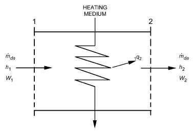

*Fig. 2 Schematic of Device for Heating Moist Air*

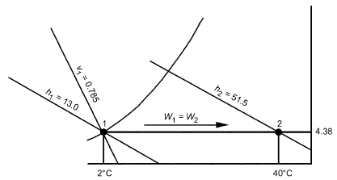

*Fig. 3 Schematic Solution for Example 2*

<!-- str. 22 -->

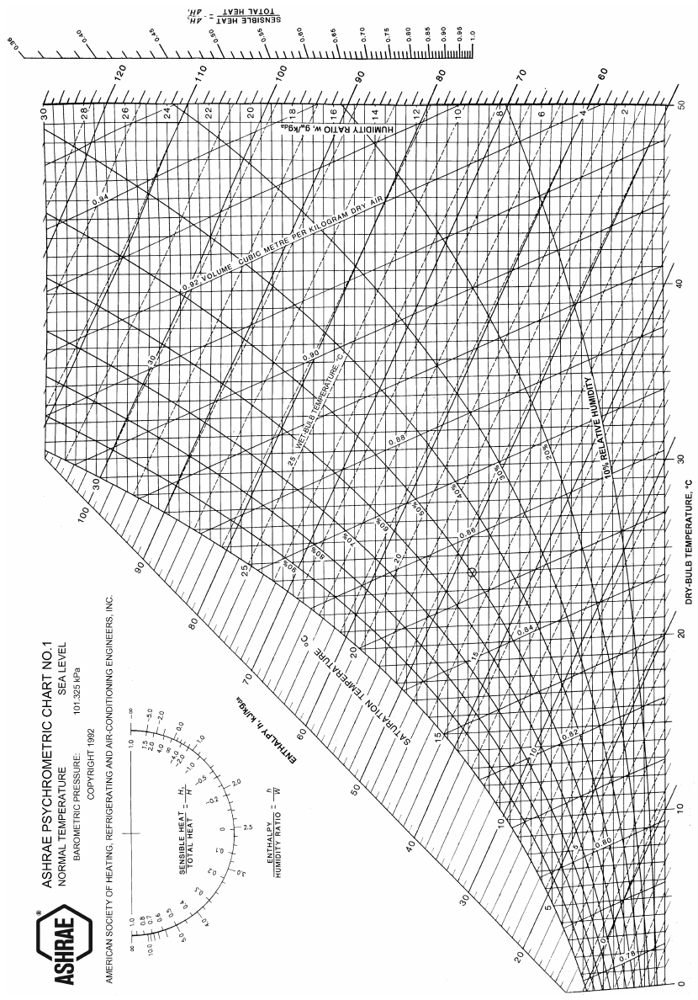

*Fig. 1 ASHRAE Psychrometric Chart No. 1*

<!-- str. 23 -->

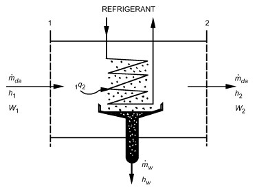

*Fig. 4 Schematic of Device for Cooling Moist Air*

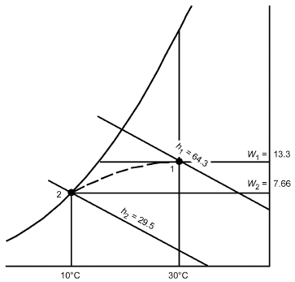

*Fig. 5 Schematic Solution for Example 3*

> ṁda = 5/0.877 = 5.70 kgda/s

From Equation (43),

> 1q2 = 5.70[(64.3 – 29.5) – (0.0133 – 0.00766)42.02]
>
> = 197 kW

### Adiabatic Mixing of Two Moist Airstreams

A common process in air-conditioning systems is the adiabatic mixing of two moist airstreams. Figure 6 schematically shows the problem. Adiabatic mixing is governed by three equations:

- ṁda1h1+ ṁda2h2 = ṁda3h3
- ṁda1 + ṁda2 = ṁda3
- ṁda1W1+ ṁda2W2 = ṁda3W3

Eliminating ṁda3 gives

> (h2– h3)/(h3– h1) = (W2– W3)/(W3– W1) = (ṁ da1)/(ṁ da2)&emsp;**(44)**

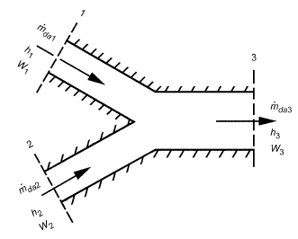

*Fig. 6 Adiabatic Mixing of Two Moist Airstreams*

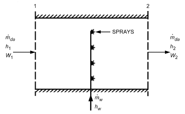

*Fig. 8 Schematic Showing Injection of Water into Moist Air*

according to which, on the ASHRAE chart, the state point of the resulting mixture lies on the straight line connecting the state points of the two streams being mixed, and divides the line into two segments, in the same ratio as the masses of dry air in the two streams.

**Example 4.** A stream of 2 m3/s of outdoor air at 4°C dry-bulb temperature and 2°C thermodynamic wet-bulb temperature is adiabatically mixed with 6.25 m3/s of recirculated air at 25°C dry-bulb temperature and 50% rh. Find the dry-bulb temperature and thermodynamic wet-bulb temperature of the resulting mixture.

**Solution:** Figure 7 shows the schematic solution. States 1 and 2 are located on the ASHRAE chart: v1 = 0.789 m3/kgda, and v2 = 0.858 m3/kgda. Therefore,

> ṁda1 = 2/0.789 = 2.535 kgda/s
>
> ṁda2 = 6.25/0.858 = 7.284 kgda/s

According to Equation (44),

> (Line 3–2)/(Line 1–3) = (ṁ da1)/(ṁ da2) or (Line 1–3)/(Line 1–2) = (ṁ da2)/(ṁ da3) = 7.284/9.819 = 0.742

Consequently, the length of line segment 1-3 is 0.742 times the length of entire line 1-2. Using a ruler, state 3 is located, and the values t3 = 19.5°C and t3* = 14.6°C found.

### Adiabatic Mixing of Water Injected into Moist Air

Steam or liquid water can be injected into a moist airstream to raise its humidity, as shown in Figure 8. If mixing is adiabatic, the following equations apply:

- ṁ h + ṁ h = ṁ h da 1 *w w da* 2
- ṁ W + ṁ = ṁ W da 1 w da 2

<!-- str. 24 -->

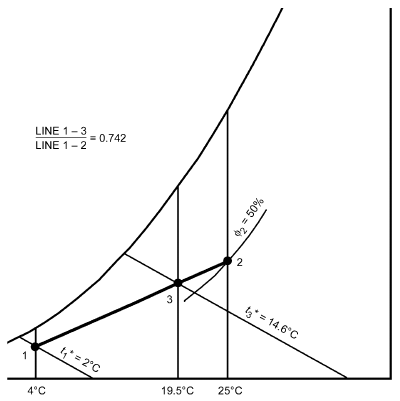

*Fig. 7 Schematic Solution for Example 4*

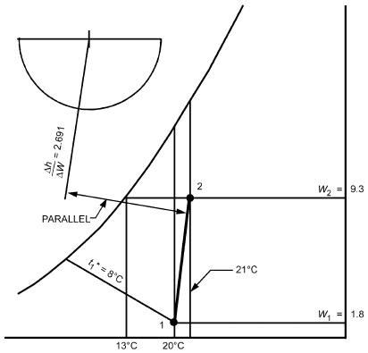

*Fig. 9 Schematic Solution for Example 5*

Therefore,

> (h2– h1)/(W2– W1) = Δh/ΔW = h&emsp;**(45)**
>
> w

according to which, on the ASHRAE chart, the final state point of the moist air lies on a straight line in the direction fixed by the specific enthalpy of the injected water, drawn through the initial state point of the moist air.

**Example 5.** Moist air at 20°C dry-bulb and 8°C thermodynamic wet-bulb temperature is to be processed to a final dew-point temperature of 13°C by adiabatic injection of saturated steam at 110°C. The rate of dry airflow ṁda is 2 kgda/s. Find the final dry-bulb temperature of the moist air and the rate of steam flow.

**Solution:** Figure 9 shows the schematic solution. By Table 3, the enthalpy of the steam hg = 2691.07 kJ/kgw. Therefore, according to Equation (45), the condition line on the ASHRAE chart connecting states 1 and 2 must have a direction:

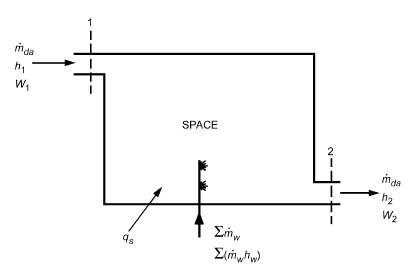

*Fig. 10 Schematic of Air Conditioned Space*

- Δh/ΔW = 2.691 kJ/gw

The condition line can be drawn with the Δh/ΔW protractor. First, establish the reference line on the protractor by connecting the origin with the value Δh/ΔW = 2.691 kJ/gw. Draw a second line parallel to the reference line and through the initial state point of the moist air. This second line is the condition line. State 2 is established at the intersection of the condition line with the horizontal line extended from the saturation curve at 13°C (td2 = 13°C). Thus, t2 = 21°C.

Values of W2 and W1 can be read from the chart. The required steam flow is

> ṁw = ṁda(W2 – W1) = 2 × 1000(0.0093 – 0.0018)
>
> = 15.0 gw/s, or 0.015 kgw/s

### Space Heat Absorption and Moist Air Moisture Gains

Air conditioning required for a space is usually determined by (1) the quantity of moist air to be supplied, and (2) the supply air condition necessary to remove given amounts of energy and water from the space at the exhaust condition specified.

Figure 10 shows a space with incident rates of energy and moisture gains. The quantity qs denotes the net sum of all rates of heat gain in the space, arising from transfers through boundaries and from sources within the space. This heat gain involves energy addition alone and does not include energy contributions from water (or water vapor) addition. It is usually called the **sensible**

> ·

**heat gain**. The quantity Σmw denotes the net sum of all rates of moisture gain on the space arising from transfers through boundaries and from sources within the space. Each kilogram of water vapor added to the space adds an amount of energy equal to its specific enthalpy.

Assuming steady-state conditions, governing equations are

> ·
>
> ∑ w

> ṁdah1+ qs+ (m hw) = ṁdah2
>
> ∑ w

> ṁdaW1+ ṁ = ṁdaW2

or

> ·
>
> ∑ w

> qs+ (m hw) = ṁda(h2 – h1)&emsp;**(46)**
>
> ∑ w

> ṁ = ṁda(W2 – W1)&emsp;**(47)**

<!-- str. 25 -->

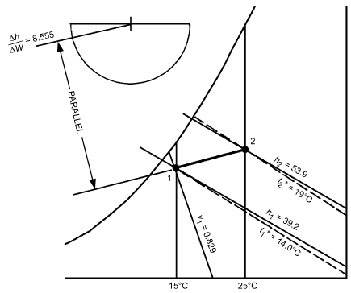

*Fig. 11 Schematic Solution for Example 6*

The left side of Equation (46) represents the total rate of energy addition to the space from all sources. By Equations (46) and (47),

> (h2– h1)/(W2– W1) = Δh/ΔW = (· qs+ (m hw) ∑ w)/(ṁ ∑ w)&emsp;**(48)**

according to which, on the ASHRAE chart and for a given state of withdrawn air, all possible states (conditions) for supply air must lie on a straight line drawn through the state point of withdrawn air, with its direction specified by the numerical value of · ·

[q + Σ(m h )] ⁄ Σm . This line is the condition line for the given *s w w w* problem.

**Example 6.** Moist air is withdrawn from a room at 25°C dry-bulb temperature and 19°C thermodynamic wet-bulb temperature. The sensible rate of heat gain for the space is 9 kW. A rate of moisture gain of 0.0015 kgw/s occurs from the space occupants. This moisture is assumed as saturated water vapor at 30°C. Moist air is introduced into the room at a dry-bulb temperature of 15°C. Find the required thermodynamic wet-bulb temperature and volume flow rate of the supply air. **Solution:** Figure 11 shows the schematic solution. State 2 is located on the ASHRAE chart. From Table 3, the specific enthalpy of the added water vapor is hg = 2555.58 kJ/kgw. From Equation (48),

> Δh/ΔW = (9 + (0.0015 × 2555.58))/0.0015 = 8555 kJ/kgw

With the Δh/ΔW protractor, establish a reference line of direction Δh/ΔW = 8.555 kJ/gw. Parallel to this reference line, draw a straight line on the chart through state 2. The intersection of this line with the 15°C dry-bulb temperature line is state 1. Thus, t1* = 14.0°C.

An alternative (and approximately correct) procedure in establishing the condition line is to use the protractor’s sensible/total heat ratio scale instead of the Δh/ΔW scale. The quantity ΔHs/ΔHt is the ratio of rate of sensible heat gain for the space to rate of total energy gain for the space. Therefore,

> ΔHs/ΔHt = qs/(qs+ Σ(m·whw)) = 9/(9 + (0.0015 × 2555.58)) = 0.701

Note that ΔHs/ΔHt = 0.701 on the protractor coincides closely with Δh/ΔW = 8.555 kJ/gw.

The flow of dry air can be calculated from either Equation (46) or (47). From Equation (46),

> ṁda = (qs+ Σ(m·whw))/(h2– h1) = (9 + (0.0015 × 2555.58))/(53.9 – 39.2)
>
> = 0.873 kg ⁄ s

At state 1, v1 = 0.829 m3/kgda.

Therefore, supply volume = ṁdav1 = 0.873 × 0.829 = 0.724 m3/s.

## 11. TRANSPORT PROPERTIES OF MOIST AIR

For certain scientific and experimental work, particularly in the heat transfer field, many other moist air properties are important. Generally classified as transport properties, these include diffusion coefficient, viscosity, thermal conductivity, and thermal diffusion factor. Mason and Monchick (1965) derive these properties by calculation. Table 4 and Figures 12 and 13 summarize the authors’ results on the first three properties listed. Note that, within the boundaries of ASHRAE psychrometric charts 1, 2, and 3, viscosity varies little from that of dry air at normal atmospheric pressure, and thermal conductivity is essentially independent of moisture content.

**Table 4 Calculated Diffusion Coefficients for Water/Air at 101.325 kPa**

| Temp., °C | mm2/s | Temp., °C | mm2/s | Temp., °C | mm2/s |
|---|---|---|---|---|---|
| –70 | 13.2 | 0 | 22.2 | 50 | 29.5 |
| –50 | 15.6 | 5 | 22.9 | 55 | 30.3 |
| –40 | 16.9 | 10 | 23.6 | 60 | 31.1 |
| –35 | 17.5 | 15 | 24.3 | 70 | 32.7 |
| –30 | 18.2 | 20 | 25.1 | 100 | 37.6 |
| –25 | 18.8 | 25 | 25.8 | 130 | 42.8 |
| –20 | 19.5 | 30 | 26.5 | 160 | 48.3 |
| –15 | 20.2 | 35 | 27.3 | 190 | 54.0 |
| –10 | 20.8 | 40 | 28.0 | 220 | 60.0 |
| –5 | 21.5 | 45 | 28.8 | 250 | 66.3 |

## 12. SYMBOLS

C1 to C18 = constants in Equations (5), (6), and (37)

dv = absolute humidity of moist air, mass of water per unit volume of mixture, kgw/m3

> h = specific enthalpy of moist air, kJ/kgda
>
> Hs = rate of sensible heat gain for space, kW

hs* = specific enthalpy of saturated moist air at thermodynamic wet-bulb temperature, kJ/kgda

> Ht = rate of total energy gain for space, kW

hw* = specific enthalpy of condensed water (liquid or solid) at thermodynamic wet-bulb temperature and a pressure of 101.325 kPa, kJ/kgw

Mda = mass of dry air in moist air sample, kgda ṁda = mass flow of dry air, per unit time, kgda/s

Mw = mass of water vapor in moist air sample, kgw ṁw = mass flow of water (any phase), per unit time, kgw/s

> n = nda + nw, total number of moles in moist air sample

nda = moles of dry air

> nw = moles of water vapor
>
> p = total pressure of moist air, kPa

pda = partial pressure of dry air, kPa ps = vapor pressure of water in moist air at saturation, kPa. Differs slightly from saturation pressure of pure water because of presence of air.

> pw = partial pressure of water vapor in moist air, kPa

pws = pressure of saturated pure water, kPa

> qs = rate of addition (or withdrawal) of sensible heat, kW

<!-- str. 26 -->

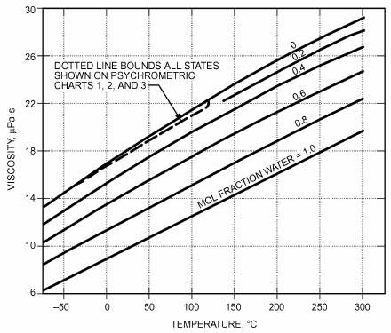

*Fig. 12 Viscosity of Moist Air*

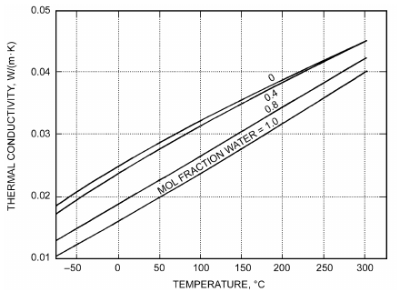

*Fig. 13 Thermal Conductivity of Moist Air*

R = universal gas constant, 8314.472 J/(kg mole·K)

Rda = gas constant for dry air, kJ/(kgda·K)

Rw = gas constant for water vapor, kJ/(kgw·K)

> s = specific entropy, kJ/(kgda·K) or kJ/(kgw·K)
>
> T = absolute temperature, K

> t = dry-bulb temperature of moist air, °C

td = dew-point temperature of moist air, °C t* = thermodynamic wet-bulb temperature of moist air, °C

V = total volume of moist air sample, m3

> v = specific volume, m3/kgda or m3/kgw

vT = total gas volume, m3

W = humidity ratio of moist air, kgw/kgda or gw/kgda

Ws* = humidity ratio of moist air at saturation at thermodynamic wet-bulb temperature, kgw/kgda or gw/kgda xda = mole fraction of dry air, moles of dry air per mole of mixture xw = mole fraction of water, moles of water per mole of mixture xws = mole fraction of water vapor under saturated conditions, moles of vapor per mole of saturated mixture

> Z = altitude, m

### Greek

> α = ln(pw), parameter used in Equations (37) and (38)

γ = specific humidity of moist air, mass of water per unit mass of mixture

> ρ = moist air density
>
> φ = relative humidity, dimensionless

### Subscripts

as = difference between saturated moist air and dry air da = dry air

> f = saturated liquid water

fg = difference between saturated liquid water and saturated water vapor

> g = saturated water vapor
>
> i = saturated ice

ig = difference between saturated ice and saturated water vapor

> s = saturated moist air
>
> t = total

> w = water in any phase

## REFERENCES

ASHRAE members can access ASHRAE Journal articles and ASHRAE research project final reports at technologyportal.ashrae .org. Articles and reports are also available for purchase by nonmembers in the online ASHRAE Bookstore at www.ashrae.org/bookstore.

Gatley, D.P. 2013. Understanding psychrometrics, 3rd ed. ASHRAE.

Gatley, D.P., S. Herrmann, and H.-J. Kretzschmar. 2008. A twenty-first century molar mass for dry air. HVAC&R Research (now *Science and Tech-* *nology for the Built Environment*)14:655-662.

Haines, R.W. 1961. How to construct high altitude psychrometric charts.

*Heating, Piping, and Air Conditioning* 33(10):144.

Harrison, L.P. 1965. Fundamental concepts and definitions relating to humidity. In *Humidity and moisture measurement and control in science and* industry, vol. 3. A. Wexler and W.A. Wildhack, eds. Reinhold, New York.

Herrmann, S., H.J. Kretzschmar, and D.P. Gatley. 2009. Thermodynamic properties of real moist air, dry air, steam, water, and ice. HVAC&R Research (now *Science and Technology for the Built Environment*) 15(5): 961-986.

Hyland, R.W., and A. Wexler. 1983a. Formulations for the thermodynamic properties of dry air from 173.15 K to 473.15 K, and of saturated moist air from 173.15 K to 372.15 K, at pressures to 5 MPa. ASHRAE Transactions 89(2A):520-535.

Hyland, R.W., and A. Wexler. 1983b. Formulations for the thermodynamic properties of the saturated phases of H2O from 173.15 K to 473.15 K. ASHRAE Transactions 89(2A):500-519.

IAPWS. 2007. *Revised release on the IAPWS industrial formulation 1997 for* *the thermodynamic properties of water and steam*. International Association for the Properties of Water and Steam, Oakville, ON, Canada. www.iapws.org.

IAPWS. 2009. *Revised release on the equation of state 2006 for H2O ice Ih*.

International Association for the Properties of Water and Steam, Oakville, ON, Canada. www.iapws.org.

IAPWS. 2011. *Revised release on the pressure along the melting and sub-* *limation curves of ordinary water substance.* International Association for the Properties of Water and Steam, Oakville, ON, Canada. www .iapws.org.

IAPWS. 2014. *Revised release on the IAPWS formulation 1995 for the ther-* *modynamic properties of ordinary water substance for general and sci-* entific use. International Association for the Properties of Water and Steam, Oakville, ON, Canada. www.iapws.org.

Keeling, C.D., and T.P. Whorf. 2005a. *Atmospheric carbon dioxide record* *from Mauna Loa*. Scripps Institution of Oceanography—CO2 Research Group. (Available at cdiac.ornl.gov/trends/co2/sio-mlo.html)

Keeling, C.D., and T.P. Whorf. 2005b. Atmospheric CO2 records from sites in the SIO air sampling network. *Trends: A compendium of data on* global change. Carbon Dioxide Information Analysis Center, Oak Ridge National Laboratory.

Kuehn, T.H., J.W. Ramsey, and J.L. Threlkeld. 1998. Thermal environmental engineering, 3rd ed. Prentice-Hall, Upper Saddle River, NJ.

<!-- str. 27 -->

Mason, E.A., and L. Monchick. 1965. Survey of the equation of state and transport properties of moist gases. In *Humidity and moisture measure-* *ment and control in science and industry*, vol. 3. A. Wexler and W.A. Wildhack, eds. Reinhold, New York.

Mohr, P.J., and P.N. Taylor. 2005. CODATA recommended values of the fundamental physical constants: 2002. *Reviews of Modern Physics* 77:1-107.

NASA. 1976. U.S. Standard atmosphere, 1976. National Oceanic and Atmospheric Administration, National Aeronautics and Space Administration, and the United States Air Force. Available from National Geophysical Data Center, Boulder, CO.

Nelson, H.F., and H.J. Sauer, Jr. 2002. Formulation of high-temperature properties for moist air. *International Journal of HVAC&R Research* 8(3):311-334.

Olivieri, J. 1996. *Psychrometrics—Theory and practice*. ASHRAE.

Palmatier, E.P. 1963. Construction of the normal temperature. ASHRAE psychrometric chart. ASHRAE Journal 5:55.

Peppers, V.W. 1988. *A new psychrometric relation for the dewpoint tempera-* ture. Unpublished. Available from ASHRAE.

Preston-Thomas, H. 1990. The international temperature scale of 1990 (ITS-90). Metrologia 27(1):3-10.

Rohsenow, W.M. 1946. Psychrometric determination of absolute humidity at elevated pressures. Refrigerating Engineering 51(5):423.

## BIBLIOGRAPHY

Gatley, D.P. 2016. A proposed full range relative humidity definition.

ASHRAE Journal 58(3):24-29.

Lemmon, E.W., R.T. Jacobsen, S.G. Penoncello, and D.G. Friend. 2000.

Thermodynamic properties of air and mixture of nitrogen, argon, and oxygen from 60 to 2000 K at pressures to 2000 MPa. *Journal of Physical* *and Chemical Reference Data* 29:331-385.

NIST. 1990. Guidelines for realizing the international temperature scale of 1990 (ITS-90). NIST Technical Note 1265. National Institute of Technology and Standards, Gaithersburg, MD.

Wexler, A., R. Hyland, and R. Stewart. 1983. Thermodynamic properties of dry air, moist air and water and SI psychrometric charts. ASHRAE Research Projects RP-216 and RP-257, Final Report.
