# Chapter 2 — Thermodynamics and Refrigeration Cycles

*Izvor: 2021 ASHRAE Handbook — Fundamentals (SI), Chapter 2 (PDF str. 28–49).*

> **Napomena o konverziji:** Tekst je automatski izdvojen iz originalnog PDF-a uz prepoznavanje dve kolone, spojene prelomljene reči i pasuse. Indeksi i eksponenti su označeni sa `<sub>`/`<sup>`, tabele su pretvorene u Markdown tabele (veoma složene tabele su prikazane kao poravnat tekst), a slike su izrezane iz PDF-a u folder `img/`. Složene jednačine (razlomci, sume) mogu biti uprošćeno prikazane. **Pre upotrebe vrednosti u proračunu proveriti u originalnom PDF-u.** Oznake `<!-- str. N -->` pokazuju stranu PDF-a.

## Sadržaj

- [1. THERMODYNAMICS](#1-thermodynamics)
- [1.1 STORED ENERGY](#11-stored-energy)
- [1.2 ENERGY IN TRANSITION](#12-energy-in-transition)
- [1.3 FIRST LAW OF THERMODYNAMICS](#13-first-law-of-thermodynamics)
- [1.4 SECOND LAW OF THERMODYNAMICS](#14-second-law-of-thermodynamics)
- [1.5 THERMODYNAMIC ANALYSIS OF REFRIGERATION CYCLES](#15-thermodynamic-analysis-of-refrigeration-cycles)
- [1.6 EQUATIONS OF STATE](#16-equations-of-state)
- [1.7 CALCULATING THERMODYNAMIC PROPERTIES](#17-calculating-thermodynamic-properties)
- [2. COMPRESSION REFRIGERATION CYCLES](#2-compression-refrigeration-cycles)
- [2.1 CARNOT CYCLE](#21-carnot-cycle)
- [2.3 LORENZ REFRIGERATION CYCLE](#23-lorenz-refrigeration-cycle)
- [2.4 THEORETICAL SINGLE-STAGE CYCLE USING ZEOTROPIC REFRIGERANT MIXTURE](#24-theoretical-single-stage-cycle-using-zeotropic-refrigerant-mixture)
- [2.5 MULTISTAGE VAPOR COMPRESSION REFRIGERATION CYCLES](#25-multistage-vapor-compression-refrigeration-cycles)
- [2.6 ACTUAL REFRIGERATION SYSTEMS](#26-actual-refrigeration-systems)
- [3. ABSORPTION REFRIGERATION CYCLES](#3-absorption-refrigeration-cycles)
- [3.1 IDEAL THERMAL CYCLE](#31-ideal-thermal-cycle)
- [3.2 WORKING-FLUID PHASE CHANGE CONSTRAINTS](#32-working-fluid-phase-change-constraints)
- [3.3 WORKING FLUIDS](#33-working-fluids)
- [3.4 EFFECT OF FLUID PROPERTIES ON CYCLE PERFORMANCE](#34-effect-of-fluid-properties-on-cycle-performance)
- [3.5 ABSORPTION CYCLE REPRESENTATIONS](#35-absorption-cycle-representations)
- [3.6 CONCEPTUALIZING THE CYCLE](#36-conceptualizing-the-cycle)
- [3.7 ABSORPTION CYCLE MODELING](#37-absorption-cycle-modeling)
- [3.8 AMMONIA/WATER ABSORPTION CYCLES](#38-ammoniawater-absorption-cycles)
- [4. ADSORPTION REFRIGERATION SYSTEMS](#4-adsorption-refrigeration-systems)
- [4.1 SYMBOLS](#41-symbols)
- [REFERENCES](#references)
- [BIBLIOGRAPHY](#bibliography)

<!-- str. 28 -->

THERMODYNAMICS is the study of energy, its transformations, and its relation to states of matter. This chapter covers the application of thermodynamics to refrigeration cycles. The first part reviews the first and second laws of thermodynamics and presents methods for calculating thermodynamic properties. The second and third parts address compression and absorption refrigeration cycles, two common methods of thermal energy transfer.

## 1. THERMODYNAMICS

A **thermodynamic system** is a region in space or a quantity of matter bounded by a closed surface. The surroundings include everything external to the system, and the system is separated from the surroundings by the system boundaries. These boundaries can be movable or fixed, real or imaginary.

Entropy and energy are important in any thermodynamic system. **Entropy** measures the molecular disorder of a system. The more mixed a system, the greater its entropy; an orderly or unmixed configuration is one of low entropy. **Energy** has the capacity for producing an effect and can be categorized into either stored or transient forms.

## 1.1 STORED ENERGY

**Thermal (internal) energy** is caused by the motion of molecules and/or intermolecular forces.

**Potential energy (PE)** is caused by attractive forces existing between molecules, or the elevation of the system.

> PE = mgz&emsp;**(1)**

where

- m = mass
- g = local acceleration of gravity
- z = elevation above horizontal reference plane

**Kinetic energy (KE)** is the energy caused by the velocity of molecules and is expressed as

> KE = mV<sup>2</sup>/2&emsp;**(2)**

where V is the velocity of a fluid stream crossing the system boundary.

<sub>The preparation of the first and second parts of this chapter is assigned to TC 1.1, Thermodynamics and Psychrometrics. The third and fourth parts are assigned to TC 8.3, Absorption and Heat Operated Machines.</sub>

**Chemical energy** is caused by the arrangement of atoms composing the molecules.

**Nuclear (atomic) energy** derives from the cohesive forces holding protons and neutrons together as the atom’s nucleus.

## 1.2 ENERGY IN TRANSITION

**Heat Q** is the mechanism that transfers energy across the boundaries of systems with differing temperatures, always toward the lower temperature. Heat is positive when energy is added to the system (see Figure 1).

**Work** is the mechanism that transfers energy across the boundaries of systems with differing pressures (or force of any kind), always toward the lower pressure. If the total effect produced in the system can be reduced to the raising of a weight, then nothing but work has crossed the boundary. Work is positive when energy is removed from the system (see Figure 1).

**Mechanical** or **shaft work W** is the energy delivered or absorbed by a mechanism, such as a turbine, air compressor, or internal combustion engine.

**Flow work** is energy carried into or transmitted across the system boundary because a pumping process occurs somewhere outside the system, causing fluid to enter the system. It can be more easily understood as the work done by the fluid just outside the system on the adjacent fluid entering the system to force or push it into the system. Flow work also occurs as fluid leaves the system.

> Flow work (per unit mass) = pv&emsp;**(3)**

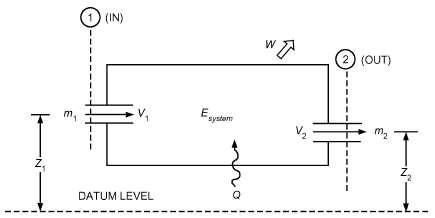

*Fig. 1 Energy Flows in General Thermodynamic System*

<!-- str. 29 -->

where p is pressure and v is specific volume, or the volume displaced per unit mass evaluated at the inlet or exit.

A **property** of a system is any observable characteristic of the system. The **state** of a system is defined by specifying the minimum set of independent properties. The most common thermodynamic properties are temperature T, pressure p, and specific volume v or density ρ. Additional thermodynamic properties include entropy, stored forms of energy, and enthalpy.

Frequently, thermodynamic properties combine to form other properties. **Enthalpy h** is an important property that includes internal energy and flow work and is defined as

> h ≡ u + pv&emsp;**(4)**

where u is the internal energy per unit mass.

Each property in a given state has only one definite value, and any property always has the same value for a given state, regardless of how the substance arrived at that state.

A **process** is a change in state that can be defined as any change in the properties of a system. A process is described by specifying the initial and final equilibrium states, the path (if identifiable), and the interactions that take place across system boundaries during the process.

A **cycle** is a process or a series of processes wherein the initial and final states of the system are identical. Therefore, at the conclusion of a cycle, all the properties have the same value they had at the beginning. Refrigerant circulating in a closed system undergoes a cycle.

A **pure substance** has a homogeneous and invariable chemical composition. It can exist in more than one phase, but the chemical composition is the same in all phases.

If a substance is liquid at the saturation temperature and pressure, it is called a **saturated liquid**. If the temperature of the liquid is lower than the saturation temperature for the existing pressure, it is called either a **subcooled liquid** (the temperature is lower than the saturation temperature for the given pressure) or a **compressed liq- uid** (the pressure is greater than the saturation pressure for the given temperature).

When a substance exists as part liquid and part vapor at the saturation temperature, its **quality** is defined as the ratio of the mass of vapor to the total mass. Quality has meaning only when the substance is saturated (i.e., at saturation pressure and temperature). Pressure and temperature of saturated substances are not independent properties.

If a substance exists as a vapor at saturation temperature and pressure, it is called a **saturated vapor**. (Sometimes the term **dry saturated vapor** is used to emphasize that the quality is 100%.) When the vapor is at a temperature greater than the saturation temperature, it is a **superheated vapor**. Pressure and temperature of a superheated vapor are independent properties, because the temperature can increase while pressure remains constant. Gases such as air at room temperature and pressure are highly superheated vapors.

## 1.3 FIRST LAW OF THERMODYNAMICS

The first law of thermodynamics is often called the **law of con- servation of energy**. The following form of the first-law equation is valid only in the absence of a nuclear or chemical reaction.

Based on the first law or the law of conservation of energy, for any system, open or closed, there is an energy balance as

> Net amount of energy Net increase of stored
>
> =

> added to system energy in system

or [Energy in] – [Energy out] = [Increase of stored energy in system]

Figure 1 illustrates energy flows into and out of a thermodynamic system. For the general case of multiple mass flows with uniform properties in and out of the system, the energy balance can be written

> ( )
>
> ∑ in( )<sub>in</sub>

> m u + pv + V<sup>2</sup>/2 + gz
>
> ( )&emsp;**(5)**

> ∑ out ( )<sub>out</sub>
>
> – m u + pv + V<sup>2</sup>/2 + gz + Q – W

> ( ) ( )
>
> = m<sub>f</sub> u + V<sup>2</sup>/2 + gz – m u + V<sup>2</sup>/2 + gz

> ( )<sub>f</sub> <sup>i</sup>( )<sub>i s</sub>
>
> ystem

where subscripts i and f refer to the initial and final states, respectively.

Nearly all important engineering processes are commonly modeled as steady-flow processes. Steady flow signifies that all quantities associated with the system do not vary with time. Consequently,

> ( )
>
> ∑ ( )

> ṁ h + V<sup>2</sup>/2 + gz
>
> all streams

> entering
>
> ( )

> – ṁ h + V<sup>2</sup>/2 + gz + Q̇ – = 0&emsp;**(6)**
>
> ∑ ( )

> Ẇ
>
> all streams

> leaving

where h ≡ u + pv as described in Equation (4).

A second common application is the closed stationary system for which the first law equation reduces to

> Q – W = [m(u<sub>f</sub> – u<sub>i</sub>)]<sub>system</sub>&emsp;**(7)**

## 1.4 SECOND LAW OF THERMODYNAMICS

The second law of thermodynamics differentiates and quantifies processes that only proceed in a certain direction (irreversible) from those that are reversible. The second law may be described in several ways. One method uses the concept of entropy flow in an open system and the irreversibility associated with the process. The concept of irreversibility provides added insight into the operation of cycles. For example, the larger the irreversibility in a refrigeration cycle operating with a given refrigeration load between two fixed temperature levels, the larger the amount of work required to operate the cycle. Irreversibilities include pressure drops in lines and heat exchangers, heat transfer between fluids of different temperature, and mechanical friction. Reducing total irreversibility in a cycle improves cycle performance. In the limit of no irreversibilities, a cycle attains its maximum ideal efficiency.

In an open system, the second law of thermodynamics can be described in terms of entropy as

> dS<sub>system</sub> = δQ/T + δm<sub>i</sub>s<sub>i</sub> – δm<sub>e</sub>s<sub>e</sub> + dI&emsp;**(8)**

where

- dS<sub>system</sub> = total change within system in time dt during process
- δm<sub>i</sub>s<sub>i</sub> = entropy increase caused by mass entering (incoming)
- δm<sub>e</sub>s<sub>e</sub> = entropy decrease caused by mass leaving (exiting)
- δQ/T = entropy change caused by reversible heat transfer between system and surroundings at temperature T
- dI = entropy caused by irreversibilities (always positive)

Equation (8) accounts for all entropy changes in the system. Rearranged, this equation becomes

> δQ = T[(δm<sub>e</sub>s<sub>e</sub> – δm<sub>i</sub>s<sub>i</sub>) + dS<sub>sys</sub> – dI]&emsp;**(9)**

<!-- str. 30 -->

In integrated form, if inlet and outlet properties, mass flow, and interactions with the surroundings do not vary with time, the general equation for the second law is *f i system <sub>rev</sub>* ∑ <sub>in</sub> ∑ (S – S ) = ∫δQ/T + (ms) – (ms)*<sub>out</sub> + I* (10)

In many applications, the process can be considered to operate steadily with no change in time. The change in entropy of the system is therefore zero. The **irreversibility rate**, which is the rate of entropy production caused by irreversibilities in the process, can be determined by rearranging Equation (10):

> ∑ <sub>out</sub> ∑ <sub>in</sub> ∑Q̇/(T surr)
>
> İ = (m· s) – (m· s) –&emsp;**(11)**

Equation (6) can be used to replace the heat transfer quantity. Note that the absolute temperature of the surroundings with which the system is exchanging heat is used in the last term. If the temperature of the surroundings is equal to the system temperature, heat is transferred reversibly and the last term in Equation (11) equals zero.

Equation (11) is commonly applied to a system with one mass flow in, the same mass flow out, no work, and negligible kinetic or potential energy flows. Combining Equations (6) and (11) yields

> İ = ṁ (s<sub>out</sub>– s<sub>in</sub>) – (h – h out in)/(T surr)&emsp;**(12)**

In a cycle, the reduction of work produced by a power cycle (or the increase in work required by a refrigeration cycle) equals the absolute ambient temperature multiplied by the sum of irreversibilities in all processes in the cycle. Thus, the difference in reversible and actual work for any refrigeration cycle, theoretical or real, operating under the same conditions, becomes

> ∑
>
> Ẇ<sub>actual</sub> = Ẇ<sub>reversible</sub> + T<sub>0</sub> İ&emsp;**(13)**

Another second-law method to describe performance of engineering devices is the concept of **exergy** (also called the availability, potential energy, or work potential), which is the maximum useful work that could be obtained from the system at a given state in a specified environment. There is always a difference between exergy and the actual work delivered by a device; this difference represents the room for improvement. Note that exergy is a property of the system/environment combination and not of the system alone. The exergy of a system in equilibrium with its environment is zero. The state of the environment is referred to as the **dead state**, because the system cannot do any work.

Exergy transfer is in three forms (heat, work, and mass flow), and is given by

> ( )
>
> X<sub>heat</sub> = 1 – T<sub>0</sub>/T Q

> ( )
>
> {W – W<sub>surr</sub> (for boundary work)

> X<sub>work</sub> =
>
> {

> {W (for other forms of work)
>
> X<sub>mass</sub> = mψ

where ψ = (h – h<sub>0</sub>) – T<sub>0</sub>(s – s<sub>0</sub>) + (V <sup>2</sup>/2) + gz is flow exergy.

Exergy balance for any system undergoing any process can be expressed as

> X<sub>in</sub> – X<sub>out</sub> – X<sub>destroyed</sub> = ΔX<sub>system</sub>
>
> (general)

Net exergy transfer by Exergy Change in heat, work, and mass destruction exergy

> Ẋ<sub>in</sub>– Ẋ<sub>out</sub> – Ẋ<sub>destroyed</sub> = dX<sub>system</sub>/dt

(general, in rate

Rate of net exergy transfer Rate of exergy Rate of change

> form)

by heat, work, and mass destruction in exergy

Taking the positive direction of heat transfer as to the system and the positive direction of work transfer as from the system, the general exergy balance relations can be expressed explicitly as

> ( )
>
> ∑

> 1 – T<sub>0</sub>/T<sub>k</sub> Q<sub>k</sub>– [W – P<sub>0</sub>(V<sub>2</sub>– V<sub>1</sub>)]
>
> ( )

> ∑ ∑
>
> + mψ – mψ – X<sub>destroyed</sub> = X<sub>2</sub>– X<sub>1</sub>

> in out

## 1.5 THERMODYNAMIC ANALYSIS OF REFRIGERATION CYCLES

Refrigeration cycles transfer thermal energy from a region of low temperature T<sub>R</sub> to one of higher temperature. Usually the higher-temperature heat sink is the ambient air or cooling water, at temperature T<sub>0</sub>, the temperature of the surroundings.

The first and second laws of thermodynamics can be applied to individual components to determine mass and energy balances and the irreversibility of the components. This procedure is shown in later sections in this chapter.

Performance of a refrigeration cycle is usually described by a **coefficient of performance (COP)**, defined as the benefit of the cycle (amount of heat removed) divided by the required energy input to operate the cycle:

> COP ≡ (Useful refrigerating effect)/(Net energy supplied from external sources)&emsp;**(14)**

For a mechanical vapor compression system, the net energy supplied is usually in the form of work, mechanical or electrical, and may include work to the compressor and fans or pumps. Thus,

> COP = (Q evap)/(W net)&emsp;**(15)**

In an absorption refrigeration cycle, the net energy supplied is usually in the form of heat into the generator and work into the pumps and fans, or

> COP = (Q evap)/(Q + W gen net)&emsp;**(16)**

In many cases, work supplied to an absorption system is very small compared to the amount of heat supplied to the generator, so the work term is often neglected.

Applying the second law to an entire refrigeration cycle shows that a completely reversible cycle operating under the same conditions has the maximum possible COP. Departure of the actual cycle from an ideal reversible cycle is given by the **refrigerating efficiency**:

> η<sub>R</sub> = COP/(COP)<sub>rev</sub>&emsp;**(17)**

The Carnot cycle usually serves as the ideal reversible refrigeration cycle. For multistage cycles, each stage is described by a reversible cycle.

<!-- str. 31 -->

## 1.6 EQUATIONS OF STATE

The equation of state of a pure substance is a mathematical relation between pressure, specific volume, and temperature. When the system is in thermodynamic equilibrium,

> f(p,v,T) = 0&emsp;**(18)**

The principles of statistical mechanics are used to (1) explore the fundamental properties of matter, (2) predict an equation of state based on the statistical nature of a particular system, or (3) propose a functional form for an equation of state with unknown parameters that are determined by measuring thermodynamic properties of a substance. A fundamental equation with this basis is the **virial equation**, which is expressed as an expansion in pressure p or in reciprocal values of volume per unit mass v as

> …
>
> pv/RT = 1 + B'p + C'p<sup>2</sup> + D'p<sup>3</sup> +&emsp;**(19)**

> …
>
> pv/RT = 1 + (B/v) + (C/v<sup>2</sup>) + (D/v<sup>3</sup>) +&emsp;**(20)**

where coefficients B', C', D', etc., and B, C, D, etc., are the virial coefficients. B' and B are the second virial coefficients; C' and C are the third virial coefficients, etc. The virial coefficients are functions of temperature only, and values of the respective coefficients in Equations (19) and (20) are related. For example, B' = B/RT and C' = (C – B<sup>2</sup>)/(RT)<sup>2</sup>.

The universal gas constant R is defined as

> R = lim (pv)<sub>T</sub>/T&emsp;**(21)**
>
> p → 0

where (pv)<sub>T</sub> is the product of the pressure and the molar specific volume along an isotherm with absolute temperature T. The current best value of R is 8314.41 J/(kg mol·K). The gas constant R is equal to the universal gas constant R divided by the molecular mass M of the gas or gas mixture.

The quantity pv/RT is also called the **compressibility factor Z**, or

> …
>
> Z = 1 + (B/v) + (C/v<sup>2</sup>) + (D/v<sup>3</sup>) +&emsp;**(22)**

An advantage of the virial form is that statistical mechanics can be used to predict the lower-order coefficients and provide physical significance to the virial coefficients. For example, in Equation (22), the term B/v is a function of interactions between two molecules, C/v<sup>2</sup> between three molecules, etc. Because lower-order interactions are common, contributions of the higher-order terms are successively less. Thermodynamicists use the partition or distribution function to determine virial coefficients; however, experimental values of the second and third coefficients are preferred. For dense fluids, many higher-order terms are necessary that can neither be satisfactorily predicted from theory nor determined from experimental measurements. In general, a truncated virial expansion of four terms is valid for densities of less than one-half the value at the critical point. For higher densities, additional terms can be used and determined empirically.

Computers allow the use of very complex equations of state in calculating p-v-T values, even to high densities. The Benedict-Webb-Rubin (B-W-R) equation of state (Benedict et al. 1940) and Martin-Hou equation (1955) have had considerable use, but should generally be limited to densities less than the critical value. Strobridge (1962) suggested a modified Benedict-Webb-Rubin relation that gives excellent results at higher densities and can be used for a p-v-T surface that extends into the liquid phase.

The B-W-R equation has been used extensively for hydrocarbons (Cooper and Goldfrank 1967):

P = (RT/v) + (B<sub>o</sub>RT – A<sub>o</sub> – C<sub>o</sub>/T<sup>2</sup>)/v<sup>2</sup> + (bRT – a)/v<sup>3</sup>

> + (aα)/v<sup>6</sup> + [c(1 + γ/v<sup>2</sup>)e<sup>(–γ/v2)</sup>]/v<sup>3</sup>T<sup>2</sup>&emsp;**(23)**

where the constant coefficients are A<sub>o</sub>, B<sub>o</sub>, C<sub>o</sub>, a, b, c, α, and γ.

The Martin-Hou equation, developed for fluorinated hydrocarbon properties, has been used to calculate the thermodynamic property tables in Chapter 30 and in ASHRAE Thermodynamic *Properties of Refrigerants* (Stewart et al. 1986). The Martin-Hou equation is p = RT/(v – b) + ((–kT ⁄ T<sub>c</sub>) A + B T + C e 2 2 2)/((v – b)<sup>2</sup>) + ((–kT ⁄ T<sub>c</sub>) A + B T + C e 3 3 3)/((v – b)<sup>3</sup>)

+ (A<sub>4</sub>+ B<sub>4</sub>T)/((v – b)<sup>4</sup>) + ((–kT ⁄ T<sub>c</sub>) A + B T + C e 5 5 5)/((v – b)<sup>5</sup>) + (A<sub>6</sub>+ B<sub>6</sub>T )e<sup>av</sup> (24)

where the constant coefficients are A<sub>i</sub>, B<sub>i</sub>, C<sub>i</sub>, k, b, and a.

Strobridge (1962) suggested an equation of state that was developed for nitrogen properties and used for most cryogenic fluids. This equation combines the B-W-R equation of state with an equation for high-density nitrogen suggested by Benedict (1937). These equations have been used successfully for liquid and vapor phases, extending in the liquid phase to the triple-point temperature and the freezing line, and in the vapor phase from 10 to 1000 K, with pressures to 1 GPa. The Strobridge equation is accurate within the uncertainty of the measured p-v-T data:

- p = RTρ + Rn<sub>1</sub>T + n<sub>2</sub>+ n<sub>3</sub>/T + n<sub>4</sub>/T<sup>2</sup> + n<sub>5</sub>/T<sup>4</sup> ρ<sup>2</sup>

> + (Rn<sub>6</sub>T + n<sub>7</sub>)ρ<sup>3</sup>+ n<sub>8</sub>Tρ<sup>4</sup>
>
> + ρ<sup>3</sup> n<sub>9</sub>/T<sup>2</sup> + (n 10)/T<sup>3</sup> + (n 11)/T<sup>4</sup> exp(–n<sub>16</sub>ρ<sup>2</sup>)

> + ρ<sup>5</sup> (n 12)/T<sup>2</sup> + (n 13)/T<sup>3</sup> + (n 14)/T<sup>4</sup> exp(–n<sub>16</sub>ρ<sup>2</sup>) + n<sub>15</sub>ρ<sup>6</sup>&emsp;**(25)**

The 15 coefficients of this equation’s linear terms are determined by a least-square fit to experimental data. Hust and McCarty (1967) and Hust and Stewart (1966) give further information on methods and techniques for determining equations of state.

In the absence of experimental data, van der Waals’ principle of corresponding states can predict fluid properties. This principle relates properties of similar substances by suitable reducing factors (i.e., the p-v-T surfaces of similar fluids in a given region are assumed to be of similar shape). The critical point can be used to define reducing parameters to scale the surface of one fluid to the dimensions of another. Modifications of this principle, as suggested by Kamerlingh Onnes, a Dutch cryogenic researcher, have been used to improve correspondence at low pressures. The principle of corresponding states provides useful approximations, and numerous modifications have been reported. More complex treatments for predicting properties, which recognize similarity of fluid properties, are by generalized equations of state. These equations ordinarily allow adjustment of the p-v-T surface by introducing parameters. One example (Hirschfelder et al. 1958) allows for departures from the principle of corresponding states by adding two correlating parameters.

## 1.7 CALCULATING THERMODYNAMIC PROPERTIES

Although equations of state provide p-v-T relations, thermodynamic analysis usually requires values for internal energy, enthalpy, and entropy. These properties have been tabulated for many substances, including refrigerants (see Chapters 1, 30, and 33), and can be extracted from such tables by interpolating manually or with a suitable computer program. This approach is appropriate for hand calculations and for relatively simple computer models; however, for many computer simulations, the overhead in memory or input and output required to use tabulated data can make this approach unacceptable. For large thermal system simulations or complex analyses, it may be more efficient to determine internal energy, enthalpy, and entropy using fundamental thermodynamic relations or curves fit to experimental data. Some of these relations are discussed in the following sections. Also, the thermodynamic relations discussed in those sections are the basis for constructing tables of thermodynamic property data. Further information on the topic may be found in references covering system modeling and thermodynamics (Howell and Buckius 1992; Stoecker 1989).

<!-- str. 32 -->

At least two intensive properties (properties independent of the quantity of substance, such as temperature, pressure, specific volume, and specific enthalpy) must be known to determine the remaining properties. If two known properties are either p, v, or T (these are relatively easy to measure and are commonly used in simulations), the third can be determined throughout the range of interest using an equation of state. Furthermore, if the specific heats at zero pressure are known, specific heat can be accurately determined from spectroscopic measurements using statistical mechanics (NASA 1971). Entropy may be considered a function of T and p, and from calculus an infinitesimal change in entropy can be written as

> ( ) ( )
>
> ds = ∂s/∂T dT + ∂s/∂p dp&emsp;**(26)**

> ( )<sub>p</sub> ( )<sub>T</sub>

Likewise, a change in enthalpy can be written as

> ( ) ( )
>
> dh = ∂h/∂T dT + ∂h/∂p dp&emsp;**(27)**

> ( )<sub>p</sub> ( )<sub>T</sub>

Using the Gibbs relation Tds = dh – vdp and the definition of specific heat at constant pressure, c<sub>p</sub> ≡ (∂h/∂T)<sub>p</sub>, Equation (27) can be rearranged to yield

> ( )
>
> ∂h

> ds = c<sub>p</sub>/TdT + – v dp/T&emsp;**(28)**
>
> ∂p

> ( )<sub>T</sub>

Equations (26) and (28) combine to yield (∂s/∂T)<sub>p</sub> = c<sub>p</sub>/T. Then, using the Maxwell relation (∂s/∂p)<sub>T</sub> = –(∂v/∂T)<sub>p</sub>, Equation (26) may be rewritten as

> ( )
>
> ds = c<sub>p</sub>/TdT – ∂v/∂T dp&emsp;**(29)**

> ( )<sub>p</sub>

This is an expression for an exact derivative, so it follows that

> ( <sup>2</sup> )
>
> (∂c<sub>p</sub>)

> ∂ v
>
> = –T&emsp;**(30)**

> ∂p
>
> ( )<sub>T</sub> ∂T<sup>2</sup>

> ( )<sub>p</sub>

Integrating this expression at a fixed temperature yields

> p
>
> ( <sup>2</sup> )

> ∂ v
>
> c<sub>p</sub> = c<sub>p0</sub> – ∫T <sub>2</sub> dp<sub>T</sub>&emsp;**(31)**

> ∂T
>
> ( )

> 0

where c<sub>p0</sub> is the known zero-pressure specific heat, and dp<sub>T</sub> is used to indicate that integration is performed at a fixed temperature. The second partial derivative of specific volume with respect to temperature can be determined from the equation of state. Thus, Equation (31) can be used to determine the specific heat at any pressure.

Using Tds = dh – vdp, Equation (29) can be written as

> ( )
>
> ∂v

> dh = c<sub>p</sub>dT + v – T dp&emsp;**(32)**
>
> ∂T

> ( )<sub>p</sub>

Equations (28) and (32) may be integrated at constant pressure to obtain

> T
>
> s(T<sub>1</sub>, p<sub>0</sub>) = s(T<sub>0</sub>, p<sub>0</sub>) + <sup>∫1</sup>c<sub>p</sub>/TdT<sub>p</sub>&emsp;**(33)**

> T
>
> 0

> T
>
> 1

> and h(T<sub>1</sub>, p<sub>0</sub>) = h(T<sub>0</sub>, p<sub>0</sub>) + ∫c<sub>p</sub>dT&emsp;**(34)**
>
> T

> 0

Integrating the Maxwell relation (∂s/∂p)<sub>T</sub> = –(∂v/∂T)<sub>p</sub> gives an equation for entropy changes at a constant temperature as

> p
>
> 1

> ( )
>
> ∂v

> ∫∂T
>
> s(T<sub>0</sub>, p<sub>1</sub>) = s(T<sub>0</sub>, p<sub>0</sub>) – dp<sub>T</sub>&emsp;**(35)**

> ( )<sub>p</sub>
>
> p

> 0

Likewise, integrating Equation (32) along an isotherm yields the following equation for enthalpy changes at a constant temperature:

> p
>
> 1

> ( )
>
> ∂v

> h(T<sub>0</sub>, p<sub>1</sub>) = h(T<sub>0</sub>, p<sub>0</sub>) + ∫v – T dp&emsp;**(36)**
>
> ∂T

> ( )<sub>p</sub>
>
> p

> 0

Internal energy can be calculated from u = h – pv. When entropy or enthalpy are known at a reference temperature T<sub>0</sub> and pressure p<sub>0</sub>, values at any temperature and pressure may be obtained by combining Equations (33) and (35) or Equations (34) and (36).

Combinations (or variations) of Equations (33) to (36) can be incorporated directly into computer subroutines to calculate properties with improved accuracy and efficiency. However, these equations are restricted to situations where the equation of state is valid and the properties vary continuously. These restrictions are violated by a change of phase such as evaporation and condensation, which are essential processes in air-conditioning and refrigerating devices. Therefore, the Clapeyron equation is of particular value; for evaporation or condensation, it gives

> )
>
> (dp/(dT () = (s fg)/(v fg) = (h fg)/Tv<sub>fg</sub>&emsp;**(37)**

> )<sub>sat</sub>

where

- s<sub>fg</sub> = entropy of vaporization
- h<sub>fg</sub> = enthalpy of vaporization
- v<sub>fg</sub> = specific volume difference between vapor and liquid phases

If vapor pressure and liquid and vapor density data (all relatively easy measurements to obtain) are known at saturation, then changes in enthalpy and entropy can be calculated using Equation (37).

### Phase Equilibria for Multicomponent Systems

To understand phase equilibria, consider a container full of a liquid made of two components; the more volatile component is designated i and the less volatile component j (Figure 2A). This mixture is all liquid because the temperature is low (but not so low that a solid appears). Heat added at a constant pressure raises the mixture’s temperature, and a sufficient increase causes vapor to form, as shown in Figure 2B. If heat at constant pressure continues to be added, eventually the temperature becomes so high that only vapor remains in the container (Figure 2C). A temperature-concentration (T-x) diagram is useful for exploring details of this situation.

Figure 3 is a typical T-x diagram valid at a fixed pressure. The case shown in Figure 2A, a container full of liquid mixture with mole fraction x<sub>i,0</sub> at temperature T<sub>0</sub>, is point 0 on the T-x diagram. When heat is added, the mixture’s temperature increases. The point at which vapor begins to form is the **bubble point**. Starting at point 0, the first bubble forms at temperature T<sub>1</sub> (point 1 on the diagram). The locus of bubble points is the **bubble-point curve**, which provides bubble points for various liquid mole fractions x<sub>i</sub>.

<!-- str. 33 -->

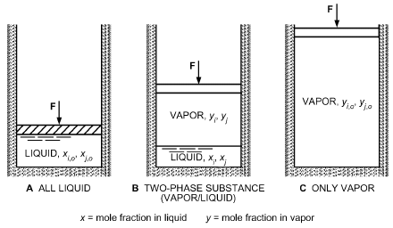

*Fig. 2 Mixture of i and j Components in Constant-Pressure Container*

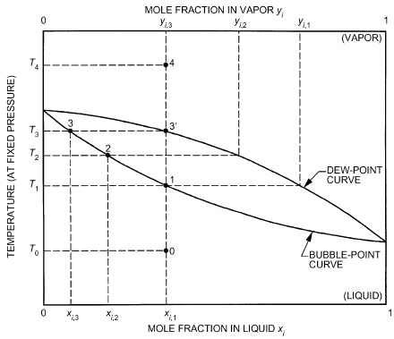

*Fig. 3 Temperature-Concentration (T-x) Diagram for Zeotropic Mixture*

When the first bubble begins to form, vapor in the bubble may not have the same mole fraction as the liquid mixture. Rather, the mole fraction of the more volatile species is higher in the vapor than in the liquid. Boiling prefers more volatile species, and the T-x diagram shows this behavior. At T<sub>l</sub>, the vapor-forming bubbles have an i mole fraction of y<sub>i,l</sub>. If heat continues to be added, this preferential boiling depletes the liquid of species i and the temperature required to continue the process increases. Again, the T-x diagram reflects this fact; at point 2 the i mole fraction in the liquid is reduced to x<sub>i,2</sub> and the vapor has a mole fraction of y<sub>i,2</sub>. The temperature required to boil the mixture is increased to T<sub>2</sub>. Position 2 on the T-x diagram could correspond to the physical situation shown in Figure 2B.

If constant-pressure heating continues, all the liquid eventually becomes vapor at temperature T<sub>3</sub>. The vapor at this point is shown as position 3′ in Figure 3. At this point the i mole fraction in the vapor y<sub>i,3</sub> equals the starting mole fraction in the all-liquid mixture x<sub>i,1</sub>. This equality is required for mass and species conservation.

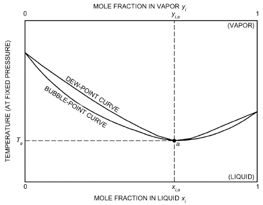

*Fig. 4 Azeotropic Behavior Shown on T-x Diagram*

Further addition of heat simply raises the vapor temperature. The final position 4 corresponds to the physical situation shown in Figure 2C.

Starting at position 4 in Figure 3, heat removal leads to initial liquid formation when position 3′ (the **dew point**) is reached. The locus of dew points is called the **dew-point curve**. Heat removal causes the liquid phase of the mixture to reverse through points 3, 2, 1, and to starting point 0. Because the composition shifts, the temperature required to boil (or condense) this mixture changes as the process proceeds. This is known as **temperature glide**. This mixture is therefore called **zeotropic**.

Most mixtures have T- x diagrams that behave in this fashion, but some have a markedly different feature. If the dew-point and bubble-point curves intersect at any point other than at their ends, the mixture exhibits **azeotropic** behavior at that composition. This case is shown as position a in the T- x diagram of Figure 4. If a container of liquid with a mole fraction x<sub>a</sub> were boiled, vapor would be formed with an identical mole fraction y<sub>a</sub>. The addition of heat at constant pressure would continue with no shift in composition and no temperature glide.

Perfect azeotropic behavior is uncommon, although nearazeotropic behavior is fairly common. The azeotropic composition is pressure dependent, so operating pressures should be considered for their effect on mixture behavior. Azeotropic and near-azeotropic refrigerant mixtures are widely used. The properties of an azeotropic mixture are such that they may be conveniently treated as pure substance properties. Phase equilibria for zeotropic mixtures, however, require special treatment, using an equation-of-state approach with appropriate mixing rules or using the fugacities with the standard state method (Tassios 1993). Refrigerant and lubricant blends are a zeotropic mixture and can be treated by these methods (Martz et al. 1996a, 1996b; Thome 1995).

## 2. COMPRESSION REFRIGERATION CYCLES

## 2.1 CARNOT CYCLE

The Carnot cycle, which is completely reversible, is a perfect model for a refrigeration cycle operating between two fixed temperatures, or between two fluids at different temperatures and each with infinite heat capacity. Reversible cycles have two important properties: (1) no refrigerating cycle may have a coefficient of performance higher than that for a reversible cycle operated between the same temperature limits, and (2) all reversible cycles, when operated between the same temperature limits, have the same coefficient of performance. Proof of both statements may be found in almost any textbook on elementary engineering thermodynamics.

<!-- str. 34 -->

Figure 5 shows the Carnot cycle on temperature-entropy coordinates. Heat is withdrawn at constant temperature T<sub>R</sub> from the region to be refrigerated. Heat is rejected at constant ambient temperature T<sub>0</sub>. The cycle is completed by an isentropic expansion and an isentropic compression. The energy transfers are given by

> Q<sub>0</sub> = T<sub>0</sub>(S<sub>2</sub> – S<sub>3</sub>)
>
> Q<sub>i</sub> = T<sub>R</sub>(S<sub>1</sub> – S<sub>4</sub>) = T<sub>R</sub>(S<sub>2</sub> – S<sub>3</sub>)

> W<sub>net</sub> = Q<sub>o</sub> – Q<sub>i</sub>

Thus, by Equation (15),

> COP = T<sub>R</sub>/(T<sub>0</sub>– T<sub>R</sub>)&emsp;**(38)**

**Example 1.** Determine entropy change, work, and COP for the cycle shown in Figure 6. Temperature of the refrigerated space T<sub>R</sub> is 250 K, and that of the atmosphere T<sub>0</sub> is 300 K. Refrigeration load is 125 kJ. **Solution:**

> ΔS = S<sub>1</sub> – S<sub>4</sub> = Q<sub>i</sub>/T<sub>R</sub> = 125/250 = 0.5 kJ/K

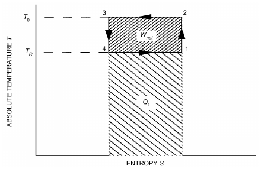

*Fig. 5 Carnot Refrigeration Cycle*

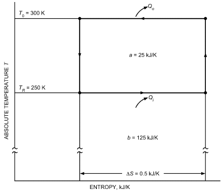

*Fig. 6 Temperature-Entropy Diagram for Carnot Refrigeration Cycle of Example 1*

> W = ΔS(T<sub>0</sub> – T<sub>R</sub>) = 0.5(300 – 250) = 25 kJ
>
> COP = Q<sub>i</sub>/(Q<sub>o</sub> – Q<sub>i</sub>) = Q<sub>i</sub>/W = 125/25 = 5

> Flow of energy and its area representation in Figure 6 are

| Energy | kJ | Area |
|---|---|---|
| Q<sub>i</sub> | 125 | b |
| Q<sub>o</sub> | 150 | a + b |
| W | 25 | a |

The net change of entropy of any refrigerant in any cycle is always zero. In Example 1, the change in entropy of the refrigerated space is ΔS<sub>R</sub>= –125/250 = –0.5 kJ/K and that of the atmosphere is ΔS<sub>o</sub> = 125/ 250 = 0.5 kJ/K. The net change in entropy of the isolated system is Δ S<sub>total</sub> = Δ S<sub>R</sub> + Δ S<sub>o</sub> = 0.

The Carnot cycle in Figure 7 shows a process in which heat is added and rejected at constant pressure in the two-phase region of a refrigerant. Saturated liquid at state 3 expands isentropically to the low temperature and pressure of the cycle at state d. Heat is added isothermally and isobarically by evaporating the liquid-phase refrigerant from state d to state 1. The cold saturated vapor at state 1 is compressed isentropically to the high temperature in the cycle at state b. However, the pressure at state b is below the saturation pressure corresponding to the high temperature in the cycle. The compression process is completed by an isothermal compression process from state b to state c. The cycle is completed by an isothermal and isobaric heat rejection or condensing process from state c to state 3.

Applying the energy equation for a mass of refrigerant m yields (all work and heat transfer are positive)

> <sub>3</sub>W<sub>d</sub> = m(h<sub>3</sub> – h<sub>d</sub>)
>
> <sub>1</sub>W<sub>b</sub> = m(h<sub>b</sub> – h<sub>1</sub>)

> <sub>b</sub>W<sub>c</sub> = T<sub>0</sub>(S<sub>b</sub> – S<sub>c</sub>) – m(h<sub>b</sub> – h<sub>c</sub>)
>
> <sub>d</sub>Q<sub>1</sub> = m(h<sub>1</sub> – h<sub>d</sub>) = Area def1d

The net work for the cycle is

> W<sub>net</sub> = <sub>1</sub>W<sub>b</sub> + <sub>b</sub>W<sub>c</sub> – <sub>3</sub>W<sub>d</sub> = Area d1bc3d

and COP = (Q d 1)/(W net) = T<sub>R</sub>/(T<sub>0</sub>– T<sub>R</sub>)

2.2

### THEORETICAL SINGLE-STAGE CYCLE USING A PURE REFRIGERANT OR AZEOTROPIC MIXTURE

A system designed to approach the ideal model shown in Figure 7 is desirable. A pure refrigerant or azeotropic mixture can be used to maintain constant temperature during phase changes by maintaining constant pressure. Because of concerns such as high initial cost and increased maintenance requirements, a practical machine has one compressor instead of two and the expander (engine or turbine) is replaced by a simple expansion valve, which throttles refrigerant from high to low pressure. Figure 8 shows the theoretical single-stage cycle used as a model for actual systems.

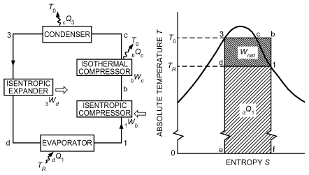

*Fig. 7 Carnot Vapor Compression Cycle*

<!-- str. 35 -->

Applying the energy equation for a mass m of refrigerant yields

> <sub>4</sub>Q<sub>1</sub> = m(h<sub>1</sub> – h<sub>4</sub>)&emsp;**(39a)**
>
> <sub>1</sub>W<sub>2</sub> = m(h<sub>2</sub> – h<sub>1</sub>)&emsp;**(39b)**

> <sub>2</sub>Q<sub>3</sub> = m(h<sub>2</sub> – h<sub>3</sub>)&emsp;**(39c)**
>
> h<sub>3</sub> = h<sub>4</sub>&emsp;**(39d)**

Constant-enthalpy throttling assumes no heat transfer or change in potential or kinetic energy through the expansion valve.

The coefficient of performance is

> COP = (Q 4 1)/(W 1 2) = (h<sub>1</sub>– h<sub>4</sub>)/(h<sub>2</sub>– h<sub>1</sub>)&emsp;**(40)**

The theoretical compressor displacement CD (at 100% volumetric efficiency) is

> CD = m· v<sub>1</sub>&emsp;**(41)**

which is a measure of the physical size or speed of the compressor required to handle the prescribed refrigeration load.

**Example 2.** A theoretical single-stage cycle using R-134a as the refrigerant operates with a condensing temperature of 30°C and an evaporating temperature of –20°C. The system produces 50 kW of refrigeration. Determine the (a) thermodynamic property values at the four main state points of the cycle, (b) COP, (c) cycle refrigerating efficiency, and (d) rate of refrigerant flow.

**Solution:** (a) Figure 9 shows a schematic p-h diagram for the problem with numerical property data. Saturated vapor and saturated liquid properties for states 1 and 3 are obtained from the saturation table for R-134a in Chapter 30. Properties for superheated vapor at state 2 are obtained by linear interpolation of the superheat tables for R-134a in Chapter 30. Specific volume and specific entropy values for state 4 are obtained by determining the quality of the liquid-vapor mixture from the enthalpy.

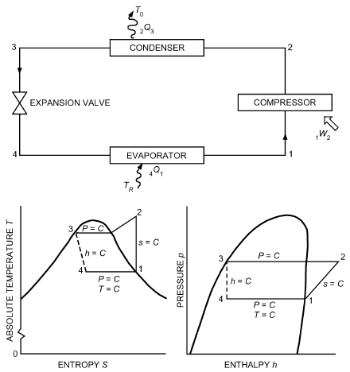

*Fig. 8 Theoretical Single-Stage Vapor Compression Refrigeration Cycle*

> x<sub>4</sub> = (h<sub>4</sub>– h<sub>f</sub>)/(h<sub>g</sub>– h<sub>f</sub>) = (241.72 – 173.64)/(386.55 – 173.64) = 0.3198

v<sub>4</sub> = v<sub>f</sub> + x<sub>4</sub>(v<sub>g</sub> – v<sub>f</sub>) = 0.0007362 + 0.3198(0.14739 – 0.0007362)

> = 0.04764 m<sup>3</sup>/kg
>
> s<sub>4</sub> = s<sub>f</sub> + x<sub>4</sub>(s<sub>g</sub> – s<sub>f</sub>) = 0.9002 + 0.3198(1.7413 – 0.9002)

> = 1.16918 kJ/(kg·K)
>
> The property data are tabulated in Table 1.

(b) By Equation (40),

> COP = (386.55 – 241.71)/(423.07 – 386.55) = 3.97

(c) By Equations (17) and (38),

> η<sub>R</sub> = (COP(T<sub>3</sub>– T<sub>1</sub>))/T<sub>1</sub> = (3.97)(50)/253.15 = 0.78 or 78%

(d) The mass flow of refrigerant is obtained from an energy balance on the evaporator. Thus,

> m· (h<sub>1</sub>– h<sub>4</sub>) = Q̇<sub>i</sub> = 50 kW

and

> COP = (Q d 1)/(W net) = T<sub>R</sub>/(T<sub>0</sub>– T<sub>R</sub>)

The saturation temperatures of the single-stage cycle strongly influence the magnitude of the coefficient of performance. This influence may be readily appreciated by an area analysis on a temperature-entropy (T-s) diagram. The area under a reversible process line on a T-s diagram is directly proportional to the thermal energy added or removed from the working fluid. This observation follows direc·tly from the definition of entropy [see Equation

Q<sub>i</sub>

> 50

(8)].m· = --------------------- = ------------------------------------------- = 0.345 kg/s

> (h<sub>1</sub>– h<sub>4</sub>) (386.55 – 241.72)

**Table 1 Thermodynamic Property Data for Example 2**

| State | t, °C | p, kPa | v, m<sup>3</sup>/kg | h, kJ/kg | s, kJ/(kg·K) |
|---|---|---|---|---|---|
| 1 | –20.0 | 132.73 | 0.14739 | 386.55 | 1.7413 |
| 2 | 37.8 | 770.20 | 0.02798 | 423.07 | 1.7413 |
| 3 | 30.0 | 770.20 | 0.000842 | 241.72 | 1.1435 |
| 4 | –20.0 | 132.73 | 0.047636 | 241.72 | 1.16918 |

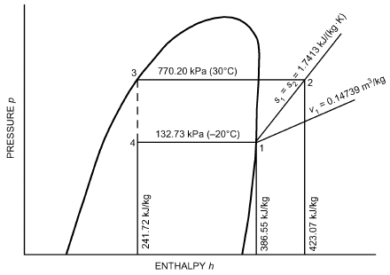

*Fig. 9 Schematic p-h Diagram for Example 2*

<!-- str. 36 -->

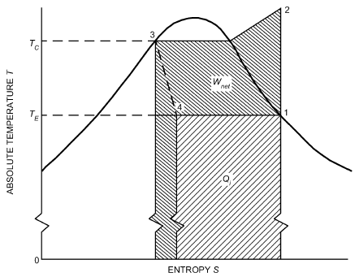

*Fig. 10 Areas on T-s Diagram Representing Refrigerating Effect and Work Supplied for Theoretical Single-Stage Cycle*

In Figure 10, the area representing Q<sub>o</sub> is the total area under the constant-pressure curve between states 2 and 3. The area representing the refrigerating capacity Q<sub>i</sub> is the area under the constant-pressure line connecting states 4 and 1. The net work required W<sub>net</sub> equals the difference (Q<sub>o</sub> – Q<sub>i</sub>), which is represented by the entire shaded area shown on Figure 10.

Because COP = Q<sub>i</sub>/W<sub>net</sub>, the effect on the COP of changes in evaporating temperature and condensing temperature may be observed. For example, a decrease in evaporating temperature T<sub>E</sub>significantly increases W<sub>net</sub> and slightly decreases Q<sub>i</sub>. An increase in condensing temperature T<sub>C</sub> produces the same results but with less effect on W<sub>net</sub>. Therefore, for maximum coefficient of performance, the cycle should operate at the lowest possible condensing temperature and maximum possible evaporating temperature.

## 2.3 LORENZ REFRIGERATION CYCLE

The Carnot refrigeration cycle includes two assumptions that make it impractical. The heat transfer capacities of the two external fluids are assumed to be infinitely large so the external fluid temperatures remain fixed at T<sub>0</sub> and T<sub>R</sub> (they become infinitely large thermal reservoirs). The Carnot cycle also has no thermal resistance between the working refrigerant and external fluids in the two heat exchange processes. As a result, the refrigerant must remain fixed at T<sub>0</sub> in the condenser and at T<sub>R</sub> in the evaporator.

The Lorenz cycle eliminates the first restriction in the Carnot cycle by allowing the temperature of the two external fluids to vary during heat exchange. The second assumption of negligible thermal resistance between the working refrigerant and two external fluids remains. Therefore, the refrigerant temperature must change during the two heat exchange processes to equal the changing temperature of the external fluids. This cycle is completely reversible when operating between two fluids that each have a finite but constant heat capacity.

Figure 11 is a schematic of a Lorenz cycle. Note that this cycle does not operate between two fixed temperature limits. Heat is added to the refrigerant from state 4 to state 1. This process is assumed to be linear on T-s coordinates, which represents a fluid with constant heat capacity. The refrigerant temperature is increased in isentropic compression from state 1 to state 2. Process 2-3 is a heat rejection process in which the refrigerant temperature decreases linearly with heat transfer. The cycle ends with isentropic expansion between states 3 and 4.

The heat addition and heat rejection processes are parallel so the entire cycle is drawn as a parallelogram on T-s coordinates. A

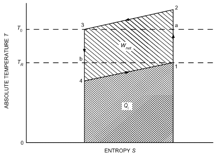

*Fig. 11 Processes of Lorenz Refrigeration Cycle*

Carnot refrigeration cycle operating between T<sub>0</sub> and T<sub>R</sub> would lie between states 1, a, 3, and b; the Lorenz cycle has a smaller refrigerating effect and requires more work, but this cycle is a more practical reference when a refrigeration system operates between two single-phase fluids such as air or water.

The energy transfers in a Lorenz refrigeration cycle are as follows, where ΔT is the temperature change of the refrigerant during each of the two heat exchange processes.

> Q<sub>o</sub> = (T<sub>0</sub> + ΔT/2)(S<sub>2</sub> – S<sub>3</sub>)
>
> Q<sub>i</sub> = (T<sub>R</sub> – ΔT/2)(S<sub>1</sub> – S<sub>4</sub>) = (T<sub>R</sub> – ΔT/2)(S<sub>2</sub> – S<sub>3</sub>)

> W<sub>net</sub> = Q<sub>o</sub> – Q<sub>R</sub>

Thus by Equation (15),

> COP = (T<sub>R</sub>– (ΔT ⁄ 2))/(T<sub>0</sub>– T<sub>R</sub>+ ΔT)&emsp;**(42)**

**Example 3.** Determine the entropy change, work required, and COP for the Lorenz cycle shown in Figure 11 when the temperature of the refrigerated space is T<sub>R</sub> = 250 K, ambient temperature is T<sub>0</sub> = 300 K, ΔT of the refrigerant is 5 K, and refrigeration load is 125 kJ.

**Solution:**

> 1
>
> ∫δQ<sub>i</sub>/T

> ΔS = = Q<sub>i</sub>/(T<sub>R</sub>– (ΔT ⁄ 2)) = 125/247.5 = 0.5051 kJ/K
>
> 4

> Q<sub>o</sub> = [T<sub>0</sub> + (ΔT/2)]ΔS = (300 + 2.5)0.5051 = 152.79 kJ
>
> W<sub>net</sub>= Q<sub>o</sub> – Q<sub>R</sub> = 152.79 – 125 = 27.79 kJ

> COP =(T<sub>R</sub>– (ΔT ⁄ 2))/(T<sub>0</sub>– T<sub>R</sub>+ ΔT) = (250 – (5 ⁄ 2))/(300 – 250 + 5) = 247.5/55 = 4.50
>
> 1

> ∫δQ<sub>i</sub>/T
>
> ΔS = = Q<sub>i</sub>/(T<sub>R</sub>– (ΔT ⁄ 2)) = 125/247.5 = 0.5051 kJ/K

> 4
>
> Q<sub>o</sub> = [T<sub>0</sub> + (ΔT/2)]ΔS = (300 + 2.5)0.5051 = 152.79 kJ

W<sub>net</sub> = Q<sub>o</sub> – Q<sub>R</sub> = 152.79 – 125 = 27.79 kJ

COP = (T<sub>R</sub>– (ΔT ⁄ 2))/(T<sub>0</sub>– T<sub>R</sub>+ ΔT) = (250 – (5 ⁄ 2))/(300 – 250 + 5) = 247.5/55 = 4.50

Note that the entropy change for the Lorenz cycle is larger than for the Carnot cycle when both operate between the same two temperature reservoirs and have the same capacity (see Example 1). That is, both the heat rejection and work requirement are larger for the Lorenz cycle. This difference is caused by the finite temperature difference between the working fluid in the cycle compared to the bounding temperature reservoirs. However, as discussed previously, the assumption of constant-temperature heat reservoirs is not necessarily a good representation of an actual refrigeration system because of the temperature changes that occur in the heat exchangers.

<!-- str. 37 -->

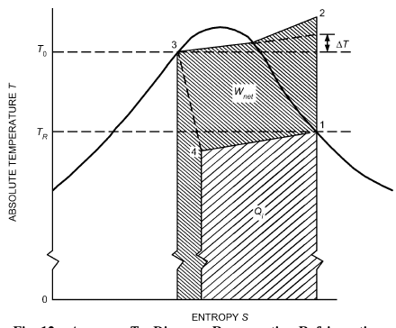

*Fig. 12 Areas on T-s Diagram Representing Refrigerating Effect and Work Supplied for Theoretical Single-Stage Cycle Using Zeotropic Mixture as Refrigerant*

## 2.4 THEORETICAL SINGLE-STAGE CYCLE USING ZEOTROPIC REFRIGERANT MIXTURE

A practical method to approximate the Lorenz refrigeration cycle is to use a fluid mixture as the refrigerant and the four system components shown in Figure 8. When the mixture is not azeotropic and the phase change occurs at constant pressure, the temperatures change during evaporation and condensation and the theoretical single-stage cycle can be shown on T-s coordinates as in Figure 12. In comparison, Figure 10 shows the system operating with a pure simple substance or an azeotropic mixture as the refrigerant. Equations (14), (15), (39), (40), and (41) apply to this cycle and to conventional cycles with constant phase change temperatures. Equation (42) should be used as the reversible cycle COP in Equation (17).

For zeotropic mixtures, the concept of constant saturation temperatures does not exist. For example, in the evaporator, the refrigerant enters at T<sub>4</sub> and exits at a higher temperature T<sub>1</sub>. The temperature of saturated liquid at a given pressure is the **bubble point** and the temperature of saturated vapor at a given pressure is called the **dew point**. The temperature T<sub>3</sub> in Figure 12 is at the bubble point at the condensing pressure and T<sub>1</sub> is at the dew point at the evaporating pressure.

Areas on a T-s diagram representing additional work and reduced refrigerating effect from a Lorenz cycle operating between the same two temperatures T<sub>1</sub> and T<sub>3</sub> with the same value for ΔT can be analyzed. The cycle matches the Lorenz cycle most closely when counterflow heat exchangers are used for both the condenser and evaporator.

In a cycle that has heat exchangers with finite thermal resistances and finite external fluid capacity rates, Kuehn and Gronseth (1986) showed that a cycle using a refrigerant mixture has a higher coefficient of performance than one using a simple pure substance as a refrigerant. However, the improvement in COP is usually small. Mixture performance can be improved further by reducing the heat exchangers’ thermal resistance and passing fluids through them in a counterflow arrangement.

## 2.5 MULTISTAGE VAPOR COMPRESSION REFRIGERATION CYCLES

Multistage or multipressure vapor compression refrigeration is used when several evaporators are needed at various temperatures, such as in a supermarket, or when evaporator temperature becomes very low. Low evaporator temperature indicates low evaporator pressure and low refrigerant density into the compressor. Two small compressors in series have a smaller displacement and usually operate more efficiently than one large compressor that covers the entire pressure range from the evaporator to the condenser. This is especially true in ammonia refrigeration systems because of the large amount of superheating that occurs during the compression process.

Thermodynamic analysis of multistage cycles is similar to analysis of single-stage cycles, except that mass flow differs through various components of the system. A careful mass balance and energy balance on individual components or groups of components ensures correct application of the first law of thermodynamics. Care must also be used when performing second-law calculations. Often, the refrigerating load is comprised of more than one evaporator, so the total system capacity is the sum of the loads from all evaporators. Likewise, the total energy input is the sum of the work into all compressors. For multistage cycles, the expression for the coefficient of performance given in Equation (15) should be written as

> ∑ i
>
> COP = Q /W<sub>net</sub>&emsp;**(43)**

When compressors are connected in series, vapor between stages should be cooled to bring the vapor to saturated conditions before proceeding to the next stage of compression. Intercooling usually minimizes displacement of the compressors, reduces the work requirement, and increases the cycle’s COP. If the refrigerant temperature between stages is above ambient, a simple intercooler that removes heat from the refrigerant can be used. If the temperature is below ambient, which is the usual case, the refrigerant itself must be used to cool the vapor. This is accomplished with a flash intercooler. Figure 13 shows a cycle with a flash intercooler installed.

The superheated vapor from compressor I is bubbled through saturated liquid refrigerant at the intermediate pressure of the cycle. Some of this liquid is evaporated when heat is added from the superheated refrigerant. The result is that only saturated vapor at the intermediate pressure is fed to compressor II. A common approach is to operate the intercooler at about the geometric mean of the evaporating and condensing pressures. This operating point provides the same pressure ratio and nearly equal volumetric efficiencies for the two compressors. Example 4 illustrates the thermodynamic analysis of this cycle.

**Example 4.** Determine the thermodynamic properties of the eight state points shown in Figure 13, mass flows, and COP of this theoretical multistage refrigeration cycle using R-134a. The saturated evaporator temperature is –20°C, the saturated condensing temperature is 30°C, and the refrigeration load is 50 kW. The saturation temperature of the refrigerant in the intercooler is 0°C, which is nearly at the geometric mean pressure of the cycle.

**Solution:**

Thermodynamic property data are obtained from the saturation and superheat tables for R-134a in Chapter 30. States 1, 3, 5, and 7 are obtained directly from the saturation table. State 6 is a mixture of liquid and vapor. The quality is calculated by

> x<sub>6</sub> = (h<sub>6</sub>– h<sub>7</sub>)/(h<sub>3</sub>– h<sub>7</sub>) = (241.72 – 200)/(398.60 – 200) = 0.21007

Then, v<sub>6</sub> = v<sub>7</sub> + x<sub>6</sub>(v<sub>3</sub> – v<sub>7</sub>) = 0.000772 + 0.21007(0.06931 – 0.000772) = 0.01517 m<sup>3</sup>/kg

<!-- str. 38 -->

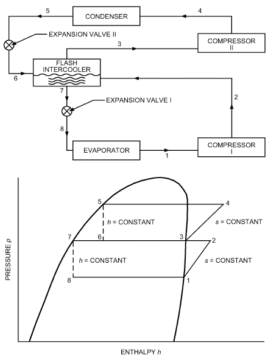

*Fig. 13 Schematic and Pressure-Enthalpy Diagram for Dual-Compression, Dual-Expansion Cycle of Example 4*

> s<sub>6</sub> = s<sub>7</sub> + x<sub>6</sub>(s<sub>3</sub> – s<sub>7</sub>) = 1.0 + 0.21007(1.7282 – 1.0)
>
> = 1.15297 kJ/(kg·K)

Similarly for state 8, x<sub>8</sub> = 0.12381, v<sub>8</sub> = 0.01889 m<sup>3</sup>/kg, s<sub>8</sub> = 1.00434 kJ/(kg·K)

States 2 and 4 are obtained from the superheat tables by linear interpolation. The thermodynamic property data are summarized in Table 2.

Mass flow through the lower circuit of the cycle is determined from an energy balance on the evaporator.

> ṁ<sub>1</sub> = Q̇<sub>i</sub>/(h<sub>1</sub>– h<sub>8</sub>) = 50/(386.55 – 200) = 0.2680 kg/s
>
> ṁ<sub>1</sub> = ṁ<sub>2</sub> = ṁ<sub>7</sub> = ṁ<sub>8</sub>

For the upper circuit of the cycle,

> ṁ<sub>3</sub> = ṁ<sub>4</sub> = ṁ<sub>5</sub> = ṁ<sub>6</sub>

Assuming the intercooler has perfect external insulation, an energy balance on it is used to compute ṁ<sub>3</sub>.

> ṁ<sub>6</sub>h<sub>6</sub>+ ṁ<sub>2</sub>h<sub>2</sub> = ṁ<sub>7</sub>h<sub>7</sub>+ ṁ<sub>3</sub>h<sub>3</sub>

Rearranging and solving for ṁ<sub>3</sub>,

> ṁ<sub>3</sub> = ṁ<sub>2</sub>(h<sub>7</sub>– h<sub>2</sub>)/(h<sub>6</sub>– h<sub>3</sub>) = 0.2680(200 – 401.51)/(241.72 – 398.60) = 0.3442 kg/s
>
> Ẇ<sub>I</sub> = ṁ<sub>1</sub>(h<sub>2</sub>– h<sub>1</sub>) = 0.2680(401.51 – 386.55)

> = 4.009 kW
>
> Ẇ<sub>II</sub> = ṁ<sub>3</sub>(h<sub>4</sub>– h<sub>3</sub>) = 0.3442(418.68 – 398.60)

> = 6.912 kW
>
> COP = Q̇<sub>i</sub>/(Ẇ<sub>I</sub>+ Ẇ<sub>II</sub>) = 50/(4.009 + 6.912) = 4.58

**Table 2 Thermodynamic Property Values for Example 4**

| State | Temperature, Pressure,<br>°C | Temperature, Pressure,<br>kPa | Specific Volume, m<sup>3</sup>/kg | Specific Enthalpy, kJ/kg | Specific Entropy, kJ/(kg·K) |
|---|---|---|---|---|---|
| 1 | –20.0 | 132.73 | 0.14739 | 386.55 | 1.7413 |
| 2 | 2.8 | 292.80 | 0.07097 | 401.51 | 1.7413 |
| 3 | 0.0 | 292.80 | 0.06931 | 398.60 | 1.7282 |
| 4 | 33.6 | 770.20 | 0.02726 | 418.68 | 1.7282 |
| 5 | 30.0 | 770.20 | 0.00084 | 241.72 | 1.1435 |
| 6 | 0.0 | 292.80 | 0.01517 | 241.72 | 1.15297 |
| 7 | 0.0 | 292.80 | 0.000772 | 200.00 | 1.0000 |
| 8 | –20.0 | 132.73 | 0.01889 | 200.00 | 1.00434 |

Examples 2 and 4 have the same refrigeration load and operate with the same evaporating and condensing temperatures. The two-stage cycle in Example 4 has a higher COP and less work input than the single-stage cycle. Also, the highest refrigerant temperature leaving the compressor is about 34°C for the two-stage cycle versus about 38°C for the single-stage cycle. These differences are more pronounced for cycles operating at larger pressure ratios.

## 2.6 ACTUAL REFRIGERATION SYSTEMS

Actual systems operating steadily differ from the ideal cycles considered in the previous sections in many respects. Pressure drops occur everywhere in the system except in the compression process. Heat transfers between the refrigerant and its environment in all components. The actual compression process differs substantially from isentropic compression. The working fluid is not a pure substance but a mixture of refrigerant and oil. All of these deviations from a theoretical cycle cause irreversibilities in the system. Each irreversibility requires additional power into the compressor. It is useful to understand how these irreversibilities are distributed throughout a real system; this insight can be useful when design changes are contemplated or operating conditions are modified. Example 5 illustrates how the irreversibilities can be computed in a real system and how they require additional compressor power to overcome. Input data have been rounded off for ease of computation.

**Example 5.** An air-cooled, direct-expansion, single-stage mechanical vaporcompression refrigerator uses R-22 and operates under steady conditions. A schematic of this system is shown in Figure 14. Pressure drops occur in all piping, and heat gains or losses occur as indicated. Power input includes compressor power and the power required to operate both fans. The following performance data are obtained:

- Ambient air temperature t<sub>0</sub> = 30°C

> Refrigerated space temperature t<sub>R</sub> = –10°C
>
> Q̇

> Refrigeration load <sub>evap</sub> = 7.0 kW
>
> Compressor power input Ẇ<sub>comp</sub> = 2.5 kW

> Condenser fan input Ẇ<sub>CF</sub> = 0.15 kW
>
> Evaporator fan input Ẇ<sub>EF</sub> = 0.11 kW

Refrigerant pressures and temperatures are measured at the seven locations shown in Figure 14. Table 3 lists the measured and computed thermodynamic properties of the refrigerant, neglecting the dissolved oil. A pressure-enthalpy diagram of this cycle is shown in Figure 15 and is compared with a theoretical single-stage cycle operating between the air temperatures t<sub>R</sub> and t<sub>0</sub>.

Compute the energy transfers to the refrigerant in each component of the system and determine the second-law irreversibility rate in each component. Show that the total irreversibility rate multiplied by the absolute ambient temperature is equal to the difference between the actual power input and the power required by a Carnot cycle operating between t<sub>R</sub> and t<sub>0</sub> with the same refrigerating load.

**Solution:** The mass flow of refrigerant is the same through all components, so it is only computed once through the evaporator. Each component in the system is analyzed sequentially, beginning with the evaporator. Equation (6) is used to perform a first-law energy balance on each component, and Equations (11) and (13) are used for the second-law analysis. Note that the temperature used in the second-law analysis is the absolute temperature.

<!-- str. 39 -->

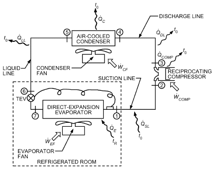

*Fig. 14 Schematic of Real, Direct-Expansion, Single-Stage Mechanical Vapor-Compression Refrigeration System*

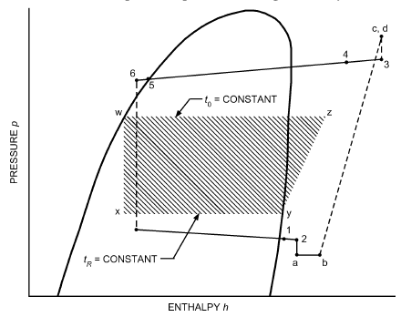

*Fig. 15 Pressure-Enthalpy Diagram of Actual System and Theoretical Single-Stage System Operating Between Same Inlet Air Temperatures t and t*

Evaporator:

> Energy balance
>
> <sub>7</sub>Q̇<sub>1</sub> ·

> = m(h – h ) = 7.0 kW
>
> ṁ = (1 7 7.0)/((402.08 – 240.13)) = 0.04322 kg/s

> Second law
>
> <sub>7</sub>İ<sub>1</sub> = m· (s<sub>1</sub>– s<sub>7</sub>) – (Q̇ 7 1)/T<sub>R</sub>

> = 0.04322(1.7810 – 1.1561) – 7.0/263.15 = 0.4074 W/K

Suction Line:

> Energy balance

**Table 3 Measured and Computed Thermodynamic Properties of R-22 for Example 5**

| State | Measured Pressure, Temperature,<br>kPa | Measured Pressure, Temperature,<br>°C | Specific Enthalpy, kJ/kg | Computed Specific Entropy, kJ/(kg·K) | Specific Volume, m<sup>3</sup>/kg |
|---|---|---|---|---|---|
| 1 | 310.0 | –10.0 | 402.08 | 1.7810 | 0.07558 |
| 2 | 304.0 | -4.0 | 406.25 | 1.7984 | 0.07946 |
| 3 | 1450.0 | 82.0 | 454.20 | 1.8165 | 0.02057 |
| 4 | 1435.0 | 70.0 | 444.31 | 1.7891 | 0.01970 |
| 5 | 1410.0 | 34.0 | 241.40 | 1.1400 | 0.00086 |
| 6 | 1405.0 | 33.0 | 240.13 | 1.1359 | 0.00086 |
| 7 | 320.0 | –12.8 | 240.13 | 1.1561 | 0.01910 |

> <sub>1</sub>Q̇<sub>2</sub> ·
>
> = m(h<sub>2</sub>– h<sub>1</sub>)

> = 0.04322(406.25 – 402.08) = 0.1802 kW
>
> Second law

<sub>1</sub>İ<sub>2</sub> = m· (s<sub>2</sub>– s<sub>1</sub>) – (Q̇ 1 2)/T<sub>0</sub>

= 0.04322(1.7984 – 1.7810) – 0.1802 ⁄ 303.15 = 0.1575 W/K

Compressor:

> Energy balance
>
> <sub>2</sub>Q̇<sub>3</sub> · Ẇ

> = m(h<sub>3</sub>– h<sub>2</sub>) +<sub>2 3</sub>
>
> = 0.04322(454.20 – 406.25) – 2.5 = –0.4276 kW

> Second law

<sub>2</sub>İ<sub>3</sub> = m· (s<sub>3</sub>– s<sub>2</sub>) – (Q̇ 2 3)/T<sub>0</sub>

= 0.04322(1.8165 – 1.7984) – (–0.4276 ⁄ 303.15) = 2.1928 W/K

Discharge Line:

> Energy balance
>
> <sub>3</sub>Q̇<sub>4</sub> ·

> = m(h<sub>4</sub>– h<sub>3</sub>)
>
> = 0.04322(444.31 – 454.20) = –0.4274 kW

> Second law
>
> <sub>3</sub>İ<sub>4</sub> = m· (s<sub>4</sub>– s<sub>3</sub>) – (Q̇ 3 4)/T<sub>0</sub>

> = 0.04322(1.7891 – 1.8165) – (–0.4274 ⁄ 303.15)
>
> = 0.2258 W/K

Condenser:

> Energy balance
>
> <sub>4</sub>Q̇<sub>5</sub> = m· (h<sub>5</sub>– h<sub>4</sub>)

> = 0.04322(241.4 – 444.31) = –8.7698 kW
>
> Second law

> <sub>4</sub>İ<sub>5</sub> = m· (s<sub>5</sub>– s<sub>4</sub>) – (Q̇ 4 5)/T<sub>0</sub>
>
> = 0.04322(1.1400 – 1.7891) – (–8.7698 ⁄ 303.15)

> = 0.8747 W/K

Liquid Line:

> Energy balance
>
> <sub>5</sub>Q̇<sub>6</sub> = ṁ(h<sub>6</sub>– h<sub>5</sub>)

> = 0.04322(240.13 – 241.40) = –0.0549 kW

<!-- str. 40 -->

Second law <sub>5</sub>İ<sub>6</sub> = ṁ(s<sub>6</sub>– s<sub>5</sub>) – (Q̇ 5 6)/T<sub>0</sub>

= 0.04322(1.1359 – 1.1400) – (–0.0549 ⁄ 303.15) = 0.0039 W/K

Expansion Device:

Energy balance

> <sub>6</sub>Q̇<sub>7</sub>
>
> = ṁ (h<sub>7</sub> – h<sub>6</sub>) = 0

Second law <sub>6</sub>İ<sub>7</sub> = ṁ(s<sub>7</sub>– s<sub>6</sub>) = 0.04322(1.1561 – 1.1359) = 0.8730 W/K

These results are summarized in Table 4. For the Carnot cycle,

> COP<sub>Carnot</sub> = T<sub>R</sub>/(T<sub>0</sub>– T<sub>R</sub>) = 263.15/40 = 6.579

The Carnot power requirement for the 7 kW load is

> Ẇ<sub>Carnot</sub> = Q̇<sub>e</sub>/(COP Carnot) = 7.0/6.579 = 1.064 kW

The actual power requirement for the compressor is

> Ẇ<sub>comp</sub> = Ẇ<sub>Carnot</sub>+ İ<sub>total</sub>T<sub>0</sub>
>
> 4.7351(303.15)

> = 1.064 + ------------------------------------- = 2.4994 kW
>
> 1000

This result is within computational error of the measured power input to the compressor of 2.5 kW.

The analysis in Example 5 can be applied to any actual vapor compression refrigeration system. The only required information for second-law analysis is the refrigerant thermodynamic state points and mass flow rates and the temperatures in which the system is exchanging heat. In this example, the extra compressor power required to overcome the irreversibility in each component is determined. The component with the largest loss is the compressor. This loss is due to motor inefficiency, friction losses, and irreversibilities caused by pressure drops, mixing, and heat transfer between the compressor and the surroundings. Unrestrained expansion in the expansion device is the next largest (also a large loss), but could be reduced by using an expander rather than a throttling process. An expander may be economical on large machines.

All heat transfer irreversibilities on both the refrigerant side and the air side of the condenser and evaporator are included in the analysis. Refrigerant pressure drop is also included. Air-side pressure drop irreversibilities of the two heat exchangers are not included, but these are equal to the fan power requirements because all the fan power is dissipated as heat.

An overall second-law analysis, such as in Example 5, shows the designer components with the most losses, and helps determine which components should be replaced or redesigned to improve performance. However, it does not identifythe nature of the losses; this requires a more detailed second-law analysis of the actual processes in terms of fluid flow and heat transfer (Liang and Kuehn 1991). A detailed analysis shows that most irreversibilities associated with heat exchangers are due to heat transfer, whereas air-side pressure drop causes a very small loss and refrigerant pressure drop causes a negligible loss. This finding indicates that promoting refrigerant heat transfer at the expense of increasing the pressure drop often improves performance. Using a thermoeconomic technique is required to determine the cost/benefits associated with reducing component irreversibilities.

**Table 4 Energy Transfers and Irreversibility Rates for Refrigeration System in Example 5**

| Component | q, kW | · W , kW | · I , W/K | · · I ⁄ I<sub>total</sub> , % |
|---|---|---|---|---|
| Evaporator | 7.0000 | 0 | 0.4074 | 9 |
| Suction line | 0.1802 | 0 | 0.1575 | 3 |
| Compressor | –0.4276 | 2.5 | 2.1928 | 46 |
| Discharge line | –0.4274 | 0 | 0.2258 | 5 |
| Condenser | –8.7698 | 0 | 0.8747 | 18 |
| Liquid line | –0.0549 | 0 | 0.0039 | ≈0 |
| Expansion device | 0 | 0 | 0.8730 | 18 |
| Totals | –2.4995 | 2.5 | 4.7351 |  |

## 3. ABSORPTION REFRIGERATION CYCLES

An absorption cycle is a heat-activated thermal cycle. It exchanges only thermal energy with its surroundings; no appreciable mechanical energy is exchanged. Furthermore, no appreciable conversion of heat to work or work to heat occurs in the cycle.

Absorption cycles are used in applications where one or more of the exchanges of heat with the surroundings is the useful product (e.g., refrigeration, air conditioning, and heat pumping). The two great advantages of this type of cycle in comparison to other cycles with similar product are

- No large, rotating mechanical equipment is required
- Any source of heat can be used, including low-temperature sources (e.g., waste heat, solar heat)

## 3.1 IDEAL THERMAL CYCLE

All absorption cycles include at least three thermal energy exchanges with their surroundings (i.e., energy exchange at three different temperatures). The highest- and lowest-temperature heat flows are in one direction, and the mid-temperature one (or two) is in the opposite direction. In the **forward cycle**, the extreme (hottest and coldest) heat flows are into the cycle. This cycle is also called the heat amplifier, heat pump, conventional cycle, or Type I cycle. When extreme-temperature heat flows are out of the cycle, it is called a **reverse cycle**, heat transformer, temperature amplifier, temperature booster, or Type II cycle. Figure 16 illustrates both types of thermal cycles.

This fundamental constraint of heat flow into or out of the cycle at three or more different temperatures establishes the first limitation on cycle performance. By the first law of thermodynamics (at steady state),

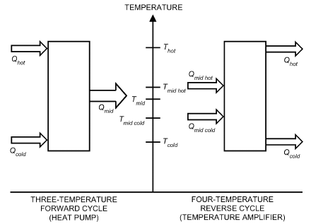

*Fig. 16 Thermal Cycles*

<!-- str. 41 -->

> Q<sub>hot</sub> + Q<sub>cold</sub> = –Q<sub>mid</sub>&emsp;**(44)**
>
> (positive heat quantities are into the cycle)

The second law requires that

> (Q hot)/(T hot) + (Q cold)/(T cold) + (Q mid)/(T mid) ≥ 0&emsp;**(45)**

with equality holding in the ideal case.

From these two laws alone (i.e., without invoking any further assumptions) it follows that, for the ideal forward cycle,

> COP<sub>ideal</sub> = (Q cold)/(Q hot) = (T – T hot mid)/(T hot) × (T cold)/(T – T mid cold)&emsp;**(46)**

The heat ratio Q<sub>cold</sub>/Q<sub>hot</sub> is commonly called the **coefficient of performance (COP)**, which is the cooling realized divided by the driving heat supplied.

Heat rejected to ambient may be at two different temperatures, creating a **four-temperature cycle**. The ideal COP of the four-temperature cycle is also expressed by Equation (46), with T<sub>mid</sub> signifying the entropic mean heat rejection temperature. In that case, T<sub>mid</sub>is calculated as follows:

> T<sub>mid</sub> = (Q + Q *mid hot mid cold*)/(Q<sub>midhot</sub> Q<sub>mid</sub> -------------------- + ---------------<sup>c</sup>--<sup>o</sup>---<sup>l</sup>-<sup>d</sup>-)&emsp;**(47)**
>
> T<sub>midhot</sub> T<sub>mid</sub>

> cold

This expression results from assigning all the entropy flow to the single temperature T<sub>mid</sub>.

The ideal COP for the four-temperature cycle requires additional assumptions, such as the relationship between the various heat quantities. Under the assumptions that Q<sub>cold</sub> = Q<sub>midcold</sub> and Q<sub>hot</sub>= Q<sub>midhot</sub>, the following expression results:

> COP<sub>ideal</sub> = (T – T *hot mid hot*)/(T hot) × (T cold)/(T mid cold) × (T cold)/(T mid hot)&emsp;**(48)**

## 3.2 WORKING-FLUID PHASE CHANGE CONSTRAINTS

Absorption cycles require at least two working substances: a sorbent and a fluid refrigerant; these substances undergo phase changes. Given this constraint, many combinations are not achievable. The first result of invoking the phase change constraints is that the various heat flows assume known identities. As shown in Figure 17, the refrigerant phase changes occur in an evaporator and a condenser, and the sorbent phase changes in an absorber and a desorber (generator). (Note that two lines connect the evaporator to the absorber and the desorber to the condenser, with one indicating vapor flow, the second carryover of liquid. In both cases, the carryover of liquid is detrimental to system performance.) For the **for- ward absorption cycle**, the highest-temperature heat is always supplied to the generator,

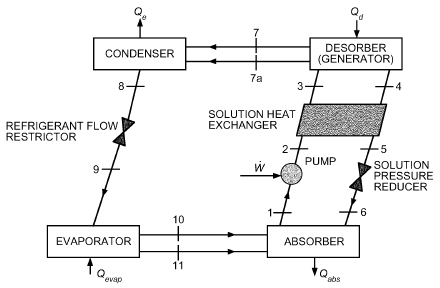

*Fig. 17 Single-Effect Absorption Cycle*

> Q<sub>hot</sub> ≡ Q<sub>gen</sub>&emsp;**(49)**

and the coldest heat is supplied to the evaporator:

> Q<sub>cold</sub> ≡ Q<sub>evap</sub>&emsp;**(50)**

For the **reverse absorption cycle** (also called **heat transformer** or **type II absorption cycle**), the highest-temperature heat is rejected from the absorber, and the lowest-temperature heat is rejected from the condenser.

The second result of the phase change constraint is that, for all known refrigerants and sorbents over pressure ranges of interest,

> Q<sub>evap</sub> ≈ Q<sub>cond</sub>&emsp;**(51)**
>
> and Q<sub>gen</sub> ≈ Q<sub>abs</sub>&emsp;**(52)**

These two relations are true because the latent heat of phase change (vapor ↔ condensed phase) is relatively constant when far removed from the critical point. Thus, each heat input cannot be independently adjusted.

The ideal single-effect forward-cycle COP expression is

> COP<sub>ideal</sub> ≤ (T – T gen abs)/(T gen) × (T evap)/(T – T cond evap) × (T cond)/(T abs)&emsp;**(53)**

Equality holds only if the heat quantities at each temperature may be adjusted to specific values, which is not possible, as shown the following discussion.

The third result of invoking the phase change constraint is that only three of the four temperatures T<sub>evap</sub>, T<sub>cond</sub>, T<sub>gen</sub>, and T<sub>abs</sub> may be independently selected.

Practical liquid absorbents for absorption cycles have a significant negative deviation from behavior predicted by Raoult’s law. This has the beneficial effect of reducing the required amount of absorbent recirculation, at the expense of reduced **lift** (T<sub>cond</sub> –T<sub>evap</sub>) and increased sorption duty. In practical terms, for most absorbents,

> Q<sub>abs</sub>/Q<sub>cond</sub> ≈ 1.2 to 1.3&emsp;**(54)**

and

> *T<sub>gen</sub> – T<sub>abs</sub>* ≈ 1.2(*T<sub>cond</sub> – T<sub>evap</sub>*)&emsp;**(55)**

The net result of applying these approximations and constraints to the ideal-cycle COP for the single-effect forward cycle is

> COP<sub>ideal</sub> ≈ 1.2(T T evap cond)/(T T gen abs) ≈ (Q cond)/(Q abs) ≈ 0.8&emsp;**(56)**

In practical terms, the temperature constraint reduces the ideal COP to about 0.9, and the heat quantity constraint further reduces it to about 0.8.

Another useful result is

> T<sub>genmin</sub> = T<sub>cond</sub> + T<sub>abs</sub> – T<sub>evap</sub>&emsp;**(57)**

where T<sub>genmin</sub> is the minimum generator temperature necessary to achieve a given evaporator temperature.

Alternative approaches are available that lead to nearly the same upper limit on ideal-cycle COP. For example, one approach equates the exergy production from a “driving” portion of the cycle to the exergy consumption in a “cooling” portion of the cycle (Tozer and James 1997). This leads to the expression

<!-- str. 42 -->

> COP<sub>ideal</sub> ≤ (T evap)/(T abs) = (T cond)/(T gen)&emsp;**(58)**

Another approach derives the idealized relationship between the two temperature differences that define the cycle: the cycle lift, defined previously, and **drop** (T<sub>gen</sub> – T<sub>abs</sub>).

### Temperature Glide

One important limitation of simplified analysis of absorption cycle performance is that the heat quantities are assumed to be at fixed temperatures. In most actual applications, there is some temperature change (**temperature glide**) in the various fluids supplying or acquiring heat. It is most easily described by first considering situations wherein temperature glide is not present (i.e., truly isothermal heat exchanges). Examples are condensation or boiling of pure components (e.g., supplying heat by condensing steam). Any sensible heat exchange relies on temperature glide: for example, a circulating high-temperature liquid as a heat source; cooling water or air as a heat rejection medium; or circulating chilled glycol. Even latent heat exchanges can have temperature glide, as when a multicomponent mixture undergoes phase change.

When the temperature glide of one fluid stream is small compared to the cycle lift or drop, that stream can be represented by an average temperature, and the preceding analysis remains representative. However, one advantage of absorption cycles is they can maximize benefit from low-temperature, high-glide heat sources. That ability derives from the fact that the desorption process inherently embodies temperature glide, and hence can be tailored to match the heat source glide. Similarly, absorption also embodies glide, which can be made to match the glide of the heat rejection medium.

Implications of temperature glide have been analyzed for power cycles (Ibrahim and Klein 1998), but not yet for absorption cycles.

## 3.3 WORKING FLUIDS

Working fluids for absorption cycles fall into four categories, each requiring a different approach to cycle modeling and thermodynamic analysis. Liquid absorbents can be **nonvolatile** (i.e., vapor phase is always pure refrigerant, neglecting condensables) or **vola- tile** (i.e., vapor concentration varies, so cycle and component modeling must track both vapor and liquid concentration). Solid sorbents can be grouped by whether they are **physisorbents** (also known as adsorbents), for which, as for liquid absorbents, sorbent temperature depends on both pressure and refrigerant loading (bivariance); or **chemisorbents** (also known as **complex com- pounds**), for which sorbent temperature does not vary with loading, at least over small ranges.

Beyond these distinctions, various other characteristics are either necessary or desirable for suitable liquid absorbent/refrigerant pairs, as follows:

**Absence of Solid Phase (Solubility Field).** The refrigerant/absorbent pair should not solidify over the expected range of composition and temperature. If a solid forms, it will stop flow and shut down equipment. Controls must prevent operation beyond the acceptable solubility range.

**Relative Volatility.** The refrigerant should be much more volatile than the absorbent so the two can be separated easily. Otherwise, cost and heat requirements may be excessive. Many absorbents are effectively nonvolatile.

**Affinity.** The absorbent should have a strong affinity for the refrigerant under conditions in which absorption takes place. Affinity means a negative deviation from Raoult’s law and results in an activity coefficient of less than unity for the refrigerant. Strong affinity allows less absorbent to be circulated for the same refrigeration effect, reducing sensible heat losses, and allows a smaller liquid heat exchanger to transfer heat from the absorbent to the pressurized refrigerant/absorption solution. On the other hand, as affinity increases, extra heat is required in the generators to separate refrigerant from the absorbent, and the COP suffers.

**Pressure.** Operating pressures, established by the refrigerant’s thermodynamic properties, should be moderate. High pressure requires heavy-walled equipment, and significant electrical power may be needed to pump fluids from the low-pressure side to the high-pressure side. Vacuum requires large-volume equipment and special means of reducing pressure drop in the refrigerant vapor paths.

**Stability.** High chemical stability is required because fluids are subjected to severe conditions over many years of service. Instability can cause undesirable formation of gases, solids, or corrosive substances. Purity of all components charged into the system is critical for high performance and corrosion prevention.

**Corrosion.** Most absorption fluids corrode materials used in construction. Therefore, corrosion inhibitors are used.

**Safety.** Precautions as dictated by code are followed when fluids are toxic, inflammable, or at high pressure. Codes vary according to country and region.

**Transport Properties.** Viscosity, surface tension, thermal diffusivity, and mass diffusivity are important characteristics of the refrigerant/absorbent pair. For example, low viscosity promotes heat and mass transfer and reduces pumping power.

**Latent Heat.** The refrigerant latent heat should be high, so the circulation rate of the refrigerant and absorbent can be minimized.

**Environmental Soundness.** The two parameters of greatest concern are the global warming potential (GWP) and the ozone depletion potential (ODP). For more information on GWP and ODP, see Chapter 29.

No refrigerant/absorbent pair meets all requirements, and many requirements work at cross-purposes. For example, a greater solubility field goes hand in hand with reduced relative volatility. Thus, selecting a working pair is inherently a compromise.

Water/lithium bromide and ammonia/water offer the best compromises of thermodynamic performance and have no known detrimental environmental effect (zero ODP and zero GWP).

Ammonia/water meets most requirements, but its volatility ratio is low and it requires high operating pressures. Ammonia is also a Safety Code Group B2 fluid (ASHRAE Standard 34), which restricts its use indoors.

Advantages of water/lithium bromide include high (1) safety, (2) volatility ratio, (3) affinity, (4) stability, and (5) latent heat. However, this pair tends to form solids and operates at deep vacuum. Because the refrigerant turns to ice at 0°C, it cannot be used for low-temperature refrigeration. In fact, ice formation on demisters can be observed at even slightly above 0°C. Lithium bromide (LiBr) crystallizes at moderate concentrations, as would be encountered in air-cooled chillers, which ordinarily limits the pair to applications where the absorber is water cooled and the concentrations are lower. However, using a combination of salts as the absorbent can reduce this crystallization tendency enough to allow air cooling (Macriss 1968). Other disadvantages include low operating pressures and high viscosity. This is particularly detrimental to the absorption step; however, alcohols with a high relative molecular mass enhance LiBr absorption. Proper equipment design and additives can overcome these disadvantages.

Other refrigerant/absorbent pairs are listed in Table 5 (Macriss and Zawacki 1989). Several appear suitable for certain cycles and may solve some problems associated with traditional pairs. However, information on properties, stability, and corrosion is limited. Also, some of the fluids are somewhat hazardous.

<!-- str. 43 -->

**Table 5 Refrigerant/Absorbent Pairs**

| Refrigerant | Absorbents |
|---|---|
| H<sub>2</sub>O | Salts<br>Alkali halides<br>LiBr<br>LiClO<sub>3</sub><br>CaCl<sub>2</sub><br>ZnCl<sub>2</sub><br>ZnBr<br>Alkali nitrates<br>Alkali thiocyanates<br>Bases<br>Alkali hydroxides<br>Acids<br>H<sub>2</sub>SO<sub>4</sub><br>H<sub>3</sub>PO<sub>4</sub> |
| NH<sub>3</sub> | H<sub>2</sub>O<br>Alkali thiocyanates |
| TFE | NMP |
| (Organic) | E181<br>DMF<br>Pyrrolidone |
| SO<sub>2</sub> | Organic solvents |

Alcohols such as methanol are also being considered as refrigerants. A review of working pairs is given in Macriss et al. (1988). In addition, some absorption working pairs use a conventional refrigerant, such as ammonia or water, but a solid absorbent. Examples are complex compounds in which ammonia is absorbed into solid salts that remain solid even when the salts absorb quantities of ammonia that exceed on a molar basis several times the moles of salt (Rockenfeller and Kirol 1989, 1996; Rockenfeller et al. 1992, 1993).

## 3.4 EFFECT OF FLUID PROPERTIES ON CYCLE PERFORMANCE

Thermodynamic observations can predict general trends of how working fluids’ properties affect a cycle’s performance: in all four major heat exchangers (absorber, generator, condenser, and evaporator), the amount of heat exchanged is dominated by the latent heat of the refrigerant (i.e., the component that undergoes the phase change), when any phase change of the absorbent is neglected. There are two additional contributions for the absorber and generator: heat of mixing when the condensed refrigerant is mixed with the absorbent/refrigerant solution, and heating or cooling of the refrigerant/absorbent mixture during the absorption or desorption process.

Thus, the heat requirement of the generator can be estimated as the latent heat of the refrigerant plus the heat of mixing plus the heat required to heat the remaining absorbent/refrigerant solution. Both additional terms increase the generator heat requirement and thus reduce the overall cycle efficiency. Based on this observation, the ideal absorption working fluid should have high latent heat, no heat of mixing, and a low specific heat capacity.

Furthermore, heat exchanged in the solution heat exchanger is governed by the specific heat of the fluid mixture flowing through this device. Consequently, any ineffectiveness of the heat exchanger represents a loss in absorption-cycle performance that is directly related to the specific heat capacity of the fluid mixture, reinforcing the argument that a low specific heat capacity is desirable.

Finally, losses in the expansion process of the refrigerant as it enters the evaporator are also governed by the latent heat of the refrigerant (preferably large) and its specific heat capacity (preferably small), so that as little refrigerant as possible evaporates as a result of the expansion process.

Absorption working fluids should consist of refrigerants with large latent heat and absorbents with a small heat of mixing, and both absorbent and refrigerant should have as small a specific heat capacity as possible.

Heat of mixing and latent heat are determined by functional groups within the molecule; specific heat capacity is minimized when the molecule is small and of low molecular mass. Therefore, ideal working fluids should be small molecules with as many functional groups as possible. This explains why ammonia and water are still the favored refrigerants to date for absorption cycles, and why organic fluids have not yet succeeded in commercial absorption cycle applications (because of their relatively large molecular mass).

## 3.5 ABSORPTION CYCLE REPRESENTATIONS

The quantities of interest to absorption cycle designers are temperature, concentration, pressure, and enthalpy. The most useful plots use linear scales and plot the key properties as straight lines. Some of the following plots are used:

- **Absorption plots** embody the vapor-liquid equilibrium of both the refrigerant and the sorbent. Plots on linear pressure-temperature coordinates have a logarithmic shape and hence are little used.
- In the **van’t Hoff plot** (ln P versus –1/T ), the constant concentration contours plot as nearly straight lines. Thus, it is more readily constructed (e.g., from sparse data) in spite of the awkward coordinates.
- The **Dühring diagram** (solution temperature versus reference temperature) retains the linearity of the van’t Hoff plot but eliminates the complexity of nonlinear coordinates. Thus, it is used extensively (see Figure 20). The primary drawback is the need for a reference substance.
- The **Gibbs plot** (solution temperature versus T ln P) retains most of the advantages of the Dühring plot (linear temperature coordinates, concentration contours are straight lines) but eliminates the need for a reference substance.
- The **Merkel plot** (enthalpy versus concentration) is used to assist thermodynamic calculations and to solve the distillation problems that arise with volatile absorbents. It has also been used for basic cycle analysis.
- **Temperature/entropy coordinates** are occasionally used to relate absorption cycles to their mechanical vapor compression counterparts.

## 3.6 CONCEPTUALIZING THE CYCLE

The basic absorption cycle shown in Figure 17 must be altered in many cases to take advantage of the available energy. Examples include the following: (1) the driving heat is much hotter than the minimum required T<sub>genmin</sub>: a multistage cycle boosts the COP; and (2) the driving heat temperature is below T<sub>genmin</sub>: a different multistage cycle (half-effect cycle) can reduce the T<sub>genmin</sub>.

**Multistage** cycles have one or more of the four basic exchangers (generator, absorber, condenser, evaporator) present at two or more places in the cycle at different pressures or concentrations. A **multi- effect** cycle is a special case of multistaging, signifying the number of times the driving heat is used in the cycle. Thus, there are several types of two-stage cycles: double-effect, half-effect, and triple-effect.

Two or more single-effect absorption cycles, such as shown in Figure 17, can be combined to form a multistage cycle by coupling any of the components. **Coupling** implies either (1) sharing component(s) between the cycles to form an integrated single hermetic cycle or (2) exchanging heat between components belonging to two hermetically separate cycles that operate at (nearly) the same temperature level.

<!-- str. 44 -->

Figure 18 shows a **double-effect absorption cycle** formed by coupling the absorbers and evaporators of two single-effect cycles into an integrated, single hermetic cycle. Heat is transferred between the high-pressure condenser and intermediate-pressure generator. The heat of condensation of the refrigerant (generated in the high-temperature generator) generates additional refrigerant in the lower-temperature generator. Thus, the prime energy provided to the high-temperature generator is **cascaded** (used) twice in the cycle, making it a double-effect cycle. With the generation of additional refrigerant from a given heat input, the cycle COP increases. Commercial water/lithium bromide chillers normally use this cycle. The cycle COP can be further increased by coupling additional components and by increasing the number of cycles that are combined. This way, several different multieffect cycles can be combined by pressure-staging and/or concentration-staging. The double-effect cycle, for example, is formed by pressure staging two single-effect cycles.

Figure 19 shows twelve generic triple-effect cycles identified by Alefeld and Radermacher (1994). Cycle 5 is a pressure-staged cycle, and cycle 10 is a concentration-staged cycle. All other cycles are pressure and concentration staged. Cycle 1, which is a type of dualloop cycle, is the only cycle consisting of two loops that does not circulate absorbent in the low-temperature portion of the cycle.

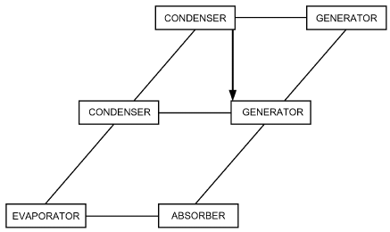

*Fig. 18 Double-Effect Absorption Cycle*

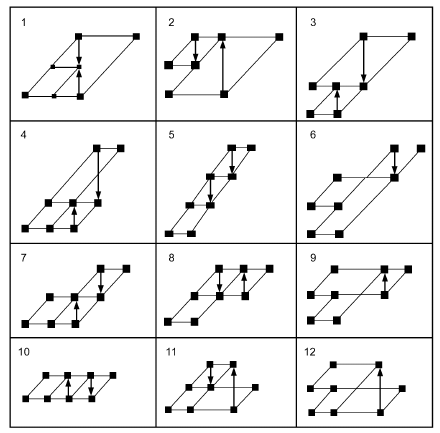

*Fig. 19 Generic Triple-Effect Cycles*

Each of the cycles shown in Figure 19 can be made with one, two, or sometimes three separate **hermetic loops**. Dividing a cycle into separate hermetic loops allows the use of a different working fluid in each loop. Thus, a corrosive and/or high-lift absorbent can be restricted to the loop where it is required, and a conventional additive-enhanced absorbent can be used in other loops to reduce system cost significantly. As many as 78 hermetic loop configurations can be synthesized from the twelve triple-effect cycles shown in Figure 19. For each hermetic loop configuration, further variations are possible according to the absorbent flow pattern (e.g., series or parallel), the absorption working pairs selected, and various other hardware details. Thus, literally thousands of distinct variations of the triple-effect cycle are possible.

The ideal analysis can be extended to these multistage cycles (Alefeld and Radermacher 1994). A similar range of cycle variants is possible for situations calling for the half-effect cycle, in which the available heat source temperature is below t<sub>genmin</sub>.

## 3.7 ABSORPTION CYCLE MODELING

### Analysis and Performance Simulation

A physical-mathematical model of an absorption cycle consists of four types of thermodynamic equations: mass balances, energy balances, relations describing heat and mass transfer, and equations for thermophysical properties of the working fluids.

As an example of simulation, Figure 20 shows a Dühring plot of a single-effect water/lithium bromide absorption chiller. The hot-water-driven chiller rejects waste heat from the absorber and the condenser to a stream of cooling water, and produces chilled water. A simulation of this chiller starts by specifying the assumptions (Table 6) and the design parameters and operating conditions at the design point (Table 7). Design parameters are the specified UA values and the flow regime (co/counter/crosscurrent, pool, or film) of all heat exchangers (evaporator, condenser, generator, absorber, solution heat exchanger) and the flow rate of weak solution through the solution pump.

One complete set of input operating parameters could be the design point values of the chilled- and cooling water temperatures t<sub>chillin</sub>, t<sub>chillout</sub>, t<sub>coolin</sub>, t<sub>coolout</sub>, hot-water flow rate ṁ<sub>hot</sub>, and total cooling capacity Q<sub>e</sub>. With this information, a cycle simulation calculates the required hot-water temperatures; cooling-water flow rate; and temperatures, pressures, and concentrations at all internal state points. Some additional assumptions are made that reduce the number of unknown parameters.

With these assumptions and the design parameters and operating conditions as specified in Table 7, the cycle simulation can be conducted by solving the following set of equations:

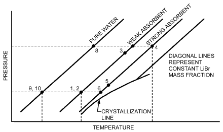

*Fig. 20 Single-Effect Water/Lithium Bromide Absorption Cycle Dühring Plot*

<!-- str. 45 -->

**Table 6 Assumptions for Single-Effect Water/ Water/Lithium Bromide Absorption Chiller Lithium Bromide Model (Figure 20)**

```text
                           Assumptions
 • Generator and condenser as well as evaporator and absorber are under
   same pressure
 • Refrigerant vapor leaving evaporator is saturated pure water
 • Liquid refrigerant leaving condenser is saturated
 • Strong solution leaving generator is boiling
 • Refrigerant vapor leaving generator has equilibrium temperature of
   weak solution at generator pressure
 • Weak solution leaving absorber is saturated
 • No liquid carryover from evaporator
 • Flow restrictors are adiabatic
 • Pump is isentropic
 • No jacket heat losses
 • LMTD (log mean temperature difference) expression adequately
   estimates latent changes
```

**Table 7 Design Parameters and Operating Conditions for Single-Effect Water/Lithium Bromide Absorption Chiller**

|   | Design Parameters | Operating Conditions |
|---|---|---|
| Evaporator | UA<sub>evap</sub> = 319.2 kW/K, countercurrent film | t<sub>chillin</sub> = 12°C t<sub>chillout</sub> = 6°C |
| Condenser | UA<sub>cond</sub> = 180.6 kW/K, countercurrent film | t<sub>coolout</sub> = 35°C |
| Absorber | UA<sub>abs</sub> = 186.9 kW/K, countercurrent film-absorber | t<sub>coolin</sub> = 27°C |
| Generator | UA<sub>gen</sub> = 143.4 kW/K, pool-generator | m·<sub>hot</sub> = 74.4 kg/s |
| Solution | UA<sub>sol</sub> = 33.8 kW/K, countercurrent · | · |
| General | m<sub>weak</sub> = 12 kg/s | Q<sub>evap</sub> = 2148 kW |

### Mass Balances

> ṁ + ṁ = ṁ&emsp;**(59)**
>
> *refr strong weak*

> ṁ ξ = ṁ ξ&emsp;**(60)**
>
> *strong strong weak weak*

### Energy Balances

> Q̇
>
> = (h – h )

> *evap ṁ vapor*, evap liq, cond
>
> refr

> = (h – h )&emsp;**(61)**
>
> *ṁ chill in chill out*

> chill
>
> Q̇

> = (h – h )
>
> *cond ṁ vapor*, gen liq, cond

> refr
>
> = (h – h )

> ṁ cool out cool mean&emsp;**(62)**
>
> cool

> Q̇
>
> = h + ṁ h

> *abs ṁ vapor*, evap strong, gen
>
> refr strong

> Q̇
>
> – ṁ h –

> weak, abs sol
>
> weak

> = ṁ (h – h )&emsp;**(63)**
>
> *cool cool mean cool in*

> Q̇
>
> = h + ṁ h

> *gen ṁ vapor*, gen strong, gen
>
> refr strong

> Q̇
>
> – ṁ h –

> weak sol
>
> weak, abs

> = ṁ (h – h )
>
> hot in hot out&emsp;**(64)**

> hot
>
> Q̇

> = ṁ (h – h )
>
> sol strong, gen strong, sol

> strong
>
> = ṁ (h – h )

> weak weak, sol weak, abs&emsp;**(65)**

**Table 8 Simulation Results for Single-Effect Water/Lithium Bromide Absorption Chiller Lithium Bromide Model (Figure 20)**

|   | Internal Parameters | Performance Parameters |
|---|---|---|
|  |  | · |
| Evaporator | t<sub>vapor,evap</sub> = 1.8°C p<sub>sat,evap</sub>= 0.697 kPa | Q<sub>evap</sub> = 2148 kW m·<sub>chill</sub> = 85.3 kg/s · |
| Condenser | T<sub>liq,cond</sub> = 46.2°C p<sub>sat,cond</sub> = 10.2 kPa | Q<sub>cond</sub> = 2322 kW m·<sub>cool</sub> = l158.7 kg/s · |
| Absorber | ξ<sub>weak</sub> = 59.6% t<sub>weak</sub> = 40.7°C t<sub>strong,abs</sub> = 49.9°C | Q<sub>abs</sub> = 2984 kW t<sub>cool,mean</sub> = 31.5°C · |
| Generator | ξ<sub>strong</sub> = 64.6% t<sub>strong,gen</sub> = 103.5°C t<sub>weak,gen</sub> = 92.4°C t<sub>weak,sol</sub> = 76.1°C | Q<sub>gen</sub> = 3158 kW t<sub>hotin</sub> = 125°C t<sub>hotout</sub> = 115°C · |
| Solution | t<sub>strong,sol</sub> = 62.4°C t<sub>weak,sol</sub> = 76.1°C | Q<sub>sol</sub> = 825 kW ε = 65.4% |
| General | m·<sub>vapor</sub> = 0.93 kg/s m·<sub>strong</sub> = 11.06 kg/s | COP = 0.68 |

### Heat Transfer Equations

> Q̇<sub>evap</sub>
>
> = UA<sub>evap</sub>(t – t *chill in chill out*)/(t – t ( <sub>chillin vapor,evap</sub>) ln ----------------------------------------------------)&emsp;**(66)**

> t – t
>
> ( *chill out vapor*, evap)

> Q̇<sub>con</sub>
>
> = UA<sub>cond</sub>(t – t *cool out cool mean*)/(t – t (<sub>liq,cond coolmean</sub>) ln -------------------------------------------------)&emsp;**(67)**

> d
>
> t – t

> ( liq, *cond cool out* )

(t<sub>strong,abs</sub>– t<sub>coolmean</sub>) – (t<sub>weak,abs</sub>– t<sub>coolin</sub>) Q̇<sub>abs</sub>

= UA<sub>abs</sub>-------------------------------------------------------------------------------------------------------------------

> t – t
>
> (<sub>strong,</sub>*<sub>abs cool mean</sub>*)

> ln ------------------------------------------------------&emsp;**(68)**
>
> t – t

> ( weak, *abs cool in* )

Q̇<sub>gen</sub>

= UA<sub>gen</sub>((t – t ) – (t – t ) *hot in strong*, *gen hot out weak*, gen)/(t – t (<sub>hotin strong,gen</sub>) ln ---------------------------------------------) (69)

> t – t
>
> ( *hot out weak*, gen)

(t<sub>strong,gen</sub>– t<sub>weak,sol</sub>) – (t<sub>strong,sol</sub>– t<sub>weak,abs</sub>) Q̇<sub>sol</sub>

= UA<sub>sol</sub>-----------------------------------------------------------------------------------------------------------------------

> t – t
>
> (<sub>strong,gen weak,sol</sub>)

> ln ---------------------------------------------------&emsp;**(70)**
>
> t – t

> ( strong, sol weak, abs)

### Fluid Property Equations at Each State Point

Thermal Equations of State: h<sub>water</sub>(t,p), h<sub>sol</sub>(t,p,ξ)

Two-Phase Equilibrium: t<sub>water,sat</sub>(p), t<sub>sol,sat</sub>(p,ξ)

The results are listed in Table 8.

A baseline correlation for the thermodynamic data of the H<sub>2</sub>O/LiBr absorption working pair is presented in Hellman and Grossman (1996). Thermophysical property measurements at higher temperatures are reported by Feuerecker et al. (1993).

Additional high-temperature measurements of vapor pressure and specific heat appear in Langeliers et al. (2003), including correlations of the data.

The UA values in Equations (66) to (70) account for the actual heat and mass transfer processes, which depend greatly on operating conditions and actual heat exchanger designs. Determining these values is beyond the scope of this chapter.

<!-- str. 46 -->

**Table 9 Inputs and Assumptions for Double-Effect Water-Lithium Bromide Model (Figure 21) Lithium Bromide/Water Cycle of Figure 21**

```text
                              Inputs
                                       ·
                                      Q
Capacity                                _evap 1760 kW
Evaporator temperature                t_10    5.1°C
Desorber solution exit temperature    t_14    170.7°C
Condenser/absorber low temperature    t_1, t_8 42.4°C
Solution heat exchanger effectiveness ε       0.6
                           Assumptions
• Steady state
• Refrigerant is pure water
• No pressure changes except through flow restrictors and pump
• State points at 1, 4, 8, 11, 14, and 18 are saturated liquid
• State point 10 is saturated vapor
• Temperature difference between high-temperature condenser and low-
 temperature generator is 5 K
• Parallel flow
• Both solution heat exchangers have same effectiveness
• Upper loop solution flow rate is selected such that upper condenser heat
 exactly matches lower generator heat requirement
• Flow restrictors are adiabatic
• Pumps are isentropic
• No jacket heat losses
• No liquid carryover from evaporator to absorber
• Vapor leaving both generators is at equilibrium temperature of entering
 solution stream
```

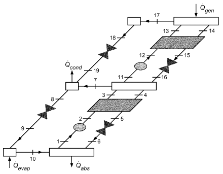

*Fig. 21 Double-Effect Water/Lithium Bromide Absorption Cycle with State Points*

### Double-Effect Cycle

Double-effect cycle calculations can be performed in a manner similar to that for the single-effect cycle. Mass and energy balances of the model shown in Figure 21 were calculated using the inputs and assumptions listed in Table 9. The results are shown in Table 10. The COP is quite sensitive to several inputs and assumptions. In particular, the effectiveness of the solution heat exchangers and the driving temperature difference between the high-temperature condenser and the low-temperature generator influence the COP strongly.

**Table 10 State Point Data for Double-Effect Water-Lithium Bromide Model (Figure 21) Lithium Bromide/Water Cycle of Figure 21**

| Point | h, m, p, kJ/kg kg/s kPa | Q, Fraction | t, °C | x, % LiBr |
|---|---|---|---|---|
| 1 | 117.7 9.551 0.88 | 0.0 | 42.4 | 59.5 |
| 2 | 117.7 9.551 8.36 |  | 42.4 | 59.5 |
| 3 | 182.3 9.551 8.36 |  | 75.6 | 59.5 |
| 4 | 247.3 8.797 8.36 | 0.0 | 97.8 | 64.6 |
| 5 | 177.2 8.797 8.36 |  | 58.8 | 64.6 |
| 6 | 177.2 8.797 0.88 | 0.004 | 53.2 | 64.6 |
| 7 | 2661.1 0.320 8.36 |  | 85.6 | 0.0 |
| 8 | 177.4 0.754 8.36 | 0.0 | 42.4 | 0.0 |
| 9 | 177.4 0.754 0.88 | 0.063 | 5.0 | 0.0 |
| 10 | 2510.8 0.754 0.88 | 1.0 | 5.0 | 0.0 |
| 11 | 201.8 5.498 8.36 | 0.0 | 85.6 | 59.5 |
| 12 | 201.8 5.498 111.8 |  | 85.6 | 59.5 |
| 13 | 301.2 5.498 111.8 |  | 136.7 | 59.5 |
| 14 | 378.8 5.064 111.8 | 0.00 | 170.7 | 64.6 |
| 15 | 270.9 5.064 111.8 |  | 110.9 | 64.6 |
| 16 | 270.9 5.064 8.36 | 0.008 | 99.1 | 64.6 |
| 17 | 2787.3 0.434 111.8 |  | 155.7 | 0.0 |
| 18 | 430.6 0.434 111.8 | 0.0 | 102.8 | 0.0 |
| 19 | 430.6 0.434 8.36<br>COP = 1.195 Δt = 5 K ε = 0.600 ·<br>Q<sub>abs</sub> = 2328 kW | 0.105 | 42.4 | 0.0 |
| · |  |  |  |  |
| **Qgen,** |  |  |  |  |
|  | = 1023 kW mid-p e <sup>re</sup>·<sup>ssur</sup><br>Q<sub>cond</sub> = 905 kW ·<br>Q<sub>evap</sub> = 1760 kW |  |  |  |
| · |  |  |  |  |
| **Qgen,** |  |  |  |  |
|  | = 1472 kW high-pr <sup>e</sup>·<sup>ssure</sup><br>Q<sub>shx1</sub> = 617 kW ·<br>Q<sub>shx2</sub> = 546 kW ·<br>W<sub>p1</sub> = 0.043 kW ·<br>W<sub>p2</sub> = 0.346 kW |  |  |  |

## 3.8 AMMONIA/WATER ABSORPTION CYCLES

Ammonia/water absorption cycles are similar to water/lithium bromide cycles, but with some important differences because of ammonia’s lower latent heat compared to water, the volatility of the absorbent, and the different pressure and solubility ranges. Ammonia’s latent heat is only about half that of water, so, for the same duty, the refrigerant and absorbent mass circulation rates are roughly double that of water/lithium bromide. As a result, the sensible heat loss associated with heat exchanger approaches is greater. Accordingly, ammonia/water cycles incorporate more techniques to reclaim sensible heat, described in Hanna et al. (1995). The refrigerant heat exchanger (RHX), also known as refrigerant subcooler, which improves COP by about 8%, is the most important (Holldorff 1979). Next is the absorber heat exchanger (AHX), accompanied by a generator heat exchanger (GHX) (Phillips 1976). These either replace or supplement the traditional solution heat exchanger (SHX). These components would also benefit the water/lithium bromide cycle, except that the deep vacuum in that cycle makes them impractical there.

The volatility of the water absorbent is also key. It makes the distinction between crosscurrent, cocurrent, and countercurrent mass exchange more important in all of the latent heat exchangers (Briggs 1971). It also requires a distillation column on the high-pressure side. When improperly implemented, this column can impose both cost and COP penalties. Those penalties are avoided by refluxing the column from an internal diabatic section [e.g., solution-cooled rectifier (SCR)] rather than with an external reflux pump.

The high-pressure operating regime makes it impractical to achieve multieffect performance via pressure staging. On the other hand, the exceptionally wide solubility field facilitates concentration staging. The generator-absorber heat exchange (GAX) cycle is an especially advantageous embodiment of concentration staging (Modahl and Hayes 1988).

<!-- str. 47 -->

**Table 11 Inputs and Assumptions for Single-Effect Ammonia/Water Cycle (Figure 22) Ammonia/Water Cycle (Figure 22)**

| Inputs |   |
|---|---|
| Capacity<br>High-side pressure<br>Low-side pressure<br>Absorber exit temperature<br>Generator exit temperature<br>Rectifier vapor exit temperature<br>Solution heat exchanger effectiveness<br>Refrigerant heat exchanger effectiveness | ·<br>Q<sub>evap</sub> 1760 kW p<sub>high</sub> 1461 kPa p<sub>low</sub> 515 kPa t<sub>1</sub> 40.6°C t<sub>4</sub> 95°C t<sub>7</sub> 55°C ε<sub>shx</sub> 0.692 ε<sub>rhx</sub> 0.629 |
| **Assumptions** |  |
| • Steady state<br>• No pressure changes except through flow restrictors and pump<br>• States at points 1, 4, 8, 11, and 14 are saturated liquid<br>• States at point 12 and 13 are saturated vapor<br>• Flow restrictors are adiabatic | • Pump is isentropic<br>• No jacket heat losses<br>• No liquid carryover from evaporator to absorber<br>• Vapor leaving generator is at equilibrium temperature of entering solution stream |

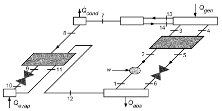

*Fig. 22 Single-Effect Ammonia/Water Absorption Cycle*

Ammonia/water cycles can equal the performance of water/lithium bromide cycles. The single-effect or basic GAX cycle yields the same performance as a single-effect water/lithium bromide cycle; the branched GAX cycle (Herold et al. 1991) yields the same performance as a water/lithium bromide double-effect cycle; and the VX GAX cycle (Erickson and Rane 1994) yields the same performance as a water/lithium bromide triple-effect cycle. Additional advantages of the ammonia/water cycle include refrigeration capability, air-cooling capability, all mild steel construction, extreme compactness, and capability of direct integration into industrial processes. Between heat-activated refrigerators, gas-fired residential air conditioners, and large industrial refrigeration plants, this technology has accounted for the vast majority of absorption activity over the past century.

Figure 22 shows the diagram of a typical single-effect ammonia-water absorption cycle. The inputs and assumptions in Table 11 are used to calculate a single-cycle solution, which is summarized in Table 12.

Comprehensive correlations of the thermodynamic properties of the ammonia/water absorption working pair are found in Ibrahim and Klein (1993) and Tillner-Roth and Friend (1998a, 1998b), both of which are available as commercial software. Figure 33 in Chapter 30 of this volume was prepared using the Ibrahim and Klein correlation, which is also incorporated in REFPROP (National Institute of Standards and Technology). Transport properties for ammonia/water mixtures are available in IIR (1994) and in Melinder (1998).

**Table 12 State Point Data for Single-Effect Ammonia/Water Cycle (Figure 22) Ammonia/Water Cycle (Figure 22)**

| h, m, Point kJ/kg kg/s | p, kPa | Fraction<br>Q, | Fraction | t, °C | x, Fraction NH<sub>3</sub> |
|---|---|---|---|---|---|
| 1 –57.2 10.65 | 515.0 | 0.0 |  | 40.56 | 0.50094 |
| 2 –56.0 10.65 | 1461 |  |  | 40.84 | 0.50094 |
| 3 89.6 10.65 | 1461 |  |  | 72.78 | 0.50094 |
| 4 195.1 9.09 | 1461 | 0.0 |  | 95.00 | 0.41612 |
| 5 24.6 9.09 | 1461 |  |  | 57.52 | 0.41612 |
| 6 24.6 9.09 | 515.0 | 0.006 |  | 55.55 | 0.41612 |
| 7 1349 1.55 | 1461 | 1.000 |  | 55.00 | 0.99809 |
| 8 178.3 1.55 | 1461 | 0.0 |  | 37.82 | 0.99809 |
| 9 82.1 1.55 | 1461 |  |  | 17.80 | 0.99809 |
| 10 82.1 1.55 | 515.0 | 0.049 |  | 5.06 | 0.99809 |
| 11 1216 1.55 | 515.0 | 0.953 |  | 6.00 | 0.99809 |
| 12 1313 1.55 | 515.0 | 1.000 |  | 30.57 | 0.99809 |
| 13 1429 1.59 | 1461 | 1.000 |  | 79.15 | 0.99809 |
| 14 120.4 0.04 | 1461 | 0.0 ·<br>Q |  | 79.15 | 0.50094 |
| COP = 0.571 |  | <sub>evap</sub> ·<br>Q | = | 1760 kW |  |
| Δt<sub>rhx</sub> = 7.24 K |  | <sub>gen</sub> ·<br>Q | = | 3083 kW |  |
| Δt<sub>shx</sub> = 16.68 K |  | <sub>rhx</sub> ·<br>Q | = | 149 kW |  |
| ε<sub>rhx</sub> = 0.629 |  | <sub>r</sub> ·<br>Q | = | 170 kW |  |
| ε<sub>rhx</sub> = 0.692 |  | <sub>shx</sub> | = | 1550 kW |  |
| · |  |  |  |  |  |
| Q<sub>abs</sub> |  | · |  |  |  |
| = 2869 kW |  | W | = | 6.88 kW |  |
| · |  |  |  |  |  |
| Q<sub>cond</sub> |  |  |  |  |  |
| = 1862.2 kW |  |  |  |  |  |

## 4. ADSORPTION REFRIGERATION SYSTEMS

Adsorption is the term frequently used for solid-vapor sorption systems in which the sorbent is a solid and the sorbate a gas. Although solid-vapor sorption systems actually comprise adsorption, absorption, and chemisorption, the term **adsorption** is often used to contrast these systems with liquid/vapor systems, such as lithium bromide/water and ammonia/water sorption pairs.

Solid/vapor sorption media can be divided into two classes:

- Bivariant systems thermodynamically behave identically to liquid/vapor systems, in which the two components [sorbent and sorbate (i.e., refrigerant)] define a thermodynamic equilibrium relation where vapor pressure, temperature, and refrigerant concentration are interrelated. These systems are commonly depicted in p-T-x or Dühring plots.
- Monovariant systems thermodynamically behave like a single component substance, in which vapor pressure and temperature are interrelated via a traditional Clausius-Clapeyron relation, but are independent of refrigerant concentration within a certain refrigerant concentration range. These systems are often depicted in p-T-n or van’t Hoff plots, in which each line represents a refrigerant concentration range.

Typical examples of bivariant adsorption systems are zeolites, activated carbons, and silica gels. The most common examples of monovariant systems are metal hydrides and coordinative complex compounds (including ammoniated and hydrated complex compounds).

Practical ammonia or water refrigerant uptake concentrations for bivariant materials are typically lower than observed with their liquid vapor counterparts. Monovariant metal hydrides use hydrogen as the gaseous components. Although uptake concentrations are very low (typically in the single-digit mass percentage), the heat of reaction for metal hydrides is very high, yielding an overall energy density almost comparable to other solid/vapor sorption systems. Coordinative complex compounds can have refrigerant uptake that exceeds the capability of other solid/gas systems. The concentration range within which temperature and vapor pressure are independent of the refrigerant concentration can exceed 50%; the heat of sorption is distinctively higher than for bivariant solid/gas and liquid/vapor systems, but much lower than observed with most metal hydrides. The large refrigerant concentration range of constant vapor pressure, also referred to as the **coordination sphere**, lends itself to thermal energy storage applications.

<!-- str. 48 -->

The most common coordinative complex compounds are ammoniated compounds using alkali, alkali/earth, or transition metal halides (e.g., strontium chloride, calcium chloride, calcium bromide).

Although solid/vapor systems are designed to use solid sorbents and therefore do not carry the operational risk of equipment failure caused by solidifying from a liquid (as is the case with lithium bromide), some systems, particularly complex compounds, might melt at certain temperature/pressure/concentration conditions, which can lead to irreparable equipment failure.

Refrigeration or heat pump cycles constructed with solid/vapor systems are inherently batch-type cycles in which exothermic adsorption of refrigerant is followed by typically heat-actuated endothermic desorption of refrigerant. To obtain continuous refrigeration or heating, two or more solid sorbent pressure vessels (sorbers) need to operate at the same time and out of time sequence. The advantage of such cycles compared to liquid/vapor cycles is the fact that they do not require a solution makeup circuit with a solution pump; the disadvantage is the fact that the sorbent is firmly packed or situated in heat exchange hardware, inducing a higher thermal mass and requiring more involved means for recuperation.

Advanced cycles with internal heat recovery, pressure staging, and temperature staging exist for solid/vapor systems similar to liquid/vapor system. For more information, see Alefeld and Radermacher (1994).

## 4.1 SYMBOLS

c<sub>p</sub> = specific heat at constant pressure, kJ/(kg·K)

COP = coefficient of performance g = local acceleration of gravity, m/s<sup>2</sup> h = enthalpy, kJ/kg

I = irreversibility, kJ/K

İ = irreversibility rate, kW/K m = mass, kg ṁ = mass flow, kg/s p = pressure, kPa

Q = heat energy, kJ

Q̇

> = rate of heat flow, kJ/s

R = ideal gas constant, (kPa·m<sup>3</sup>)/(kg·K)

s = specific entropy, kJ/(kg·K)

S = total entropy, kJ/K t = temperature, °C

T = absolute temperature, K u = internal energy, kJ/kg v = specific volume, m<sup>3</sup>/kg

V = velocity of fluid, m/s

W = mechanical or shaft work, kJ

Ẇ = rate of work, power, kW x = mass fraction (of either lithium bromide or ammonia)

x = vapor quality (fraction)

z = elevation above horizontal reference plane, m

Z = compressibility factor

Δt = temperature difference, K

ε = heat exchanger effectiveness

η = efficiency

ξ = solution concentration

ρ = density, kg/m<sup>3</sup>

### Subscripts

abs = absorber cg = condenser to generator cond = condenser or cooling mode evap = evaporator fg = fluid to vapor gen = generator liq = liquid gh = high-temperature generator o, 0 = reference conditions, usually ambient p = pump

R = refrigerating or evaporator conditions r = rectifier refr = refrigerant rhx = refrigerant heat exchanger sat = saturated shx = solution heat exchanger sol = solution

## REFERENCES

Alefeld, G., and R. Radermacher. 1994. *Heat conversion system*s. CRC Press, Boca Raton.

ASHRAE. 2010. Designation and safety classification of refrigerants. ANSI/ASHRAE Standard 34-2010.

Benedict, M. 1937. Pressure, volume, temperature properties of nitrogen at high density, I and II. *Journal of American Chemists Society* 59(11): 2224-2233 and 2233-2242.

Benedict, M., G.B. Webb, and L.C. Rubin. 1940. An empirical equation for thermodynamic properties of light hydrocarbons and their mixtures. *Journal of Chemistry and Physics* 4:334.

Briggs, S.W. 1971. Concurrent, crosscurrent, and countercurrent absorption in ammonia-water absorption refrigeration. ASHRAE Transactions 77(1):171.

Cooper, H.W., and J.C. Goldfrank. 1967. B-W-R constants and new correlations. Hydrocarbon Processing 46(12):141.

Erickson, D.C., and M. Rane. 1994. Advanced absorption cycle: Vapor exchange GAX. *Proceedings of the International Absorption Heat Pump* Conference, Chicago.

Feuerecker, G., J. Scharfe, I. Greiter, C. Frank, and G. Alefeld. 1993.

Measurement of thermophysical properties of aqueous LiBr solutions at high temperatures and concentrations. *Proceedings of the International* *Absorption Heat Pump Conference*, New Orleans, AES-30, pp. 493-499. American Society of Mechanical Engineers, New York.

Hanna, W.T., et al. 1995. Pinch-point analysis: An aid to understanding the GAX absorption cycle. *ASHRAE Technical Data Bulletin* 11(2).

Hellman, H.-M., and G. Grossman. 1996. Improved property data correlations of absorption fluids for computer simulation of heat pump cycles. ASHRAE Transactions 102(1):980-997.

Herold, K.E., et al. 1991. The branched GAX absorption heat pump cycle.

*Proceedings of Absorption Heat Pump Conference*, Tokyo.

Hirschfelder, J.O., et al. 1958. Generalized equation of state for gases and liquids. *Industrial and Engineering Chemistry* 50:375.

Holldorff, G. 1979. Revisions up absorption refrigeration efficiency. Hydrocarbon Processing 58(7):149.

Howell, J.R., and R.O. Buckius. 1992. *Fundamentals of engineering ther-* modynamics, 2nd ed. McGraw-Hill, New York.

Hust, J.G., and R.D. McCarty. 1967. Curve-fitting techniques and applications to thermodynamics. Cryogenics 8:200.

Hust, J.G., and R.B. Stewart. 1966. Thermodynamic property computations for system analysis. ASHRAE Journal 2:64.

Ibrahim, O.M., and S.A. Klein. 1993. Thermodynamic properties of ammonia-water mixtures. ASHRAE Transactions 99(1):1495-1502.

Ibrahim, O.M., and S.A. Klein. 1998. The maximum power cycle: A model for new cycles and new working fluids. *Proceedings of the ASME* *Advanced Energy Systems Division*, AES vol. 117. American Society of Mechanical Engineers. New York.

IIR. 1994. *R123—Thermodynamic and physical properties*. NH<sub>3</sub>–H<sub>2</sub>O.

International Institute of Refrigeration, Paris.

Kuehn, T.H., and R.E. Gronseth. 1986. The effect of a nonazeotropic binary refrigerant mixture on the performance of a single stage refrigeration cycle. *Proceedings of the International Institute of Refrigeration Confer-* ence, Purdue University, p. 119.

<!-- str. 49 -->

Langeliers, J., P. Sarkisian, and U. Rockenfeller. 2003. Vapor pressure and specific heat of Li-Br H<sub>2</sub>O at high temperature. ASHRAE Transactions 109(1):423-427.

Liang, H., and T.H. Kuehn. 1991. Irreversibility analysis of a water to water mechanical compression heat pump. Energy 16(6):883.

Macriss, R.A. 1968. Physical properties of modified LiBr solutions. AGA Symposium on Absorption Air-Conditioning Systems, February.

Macriss, R.A., and T.S. Zawacki. 1989. Absorption fluid data survey: 1989 update. Oak Ridge National Laboratory, Oak Ridge, TN. Report ORNL/Sub84-47989/4.

Macriss, R.A., J.M. Gutraj, and T.S. Zawacki. 1988. *Absorption fluids data* *survey: Final report on worldwide data.* Institute of Gas Technology, Chicago. web.ornl.gov/info/reports/1988/3445603155476.pdf

Martin, J.J., and Y. Hou. 1955. Development of an equation of state for gases. AIChE Journal 1:142.

Martz, W.L., C.M. Burton, and A.M. Jacobi. 1996a. Liquid-vapor equilibria for R-22, R-134a, R-125, and R-32/125 with a polyol ester lubricant: Measurements and departure from ideality. ASHRAE Transactions 102(1):367-374.

Martz, W.L., C.M. Burton, and A.M. Jacobi. 1996b. Local composition modeling of the thermodynamic properties of refrigerant and oil mixtures. *International Journal of Refrigeration* 19(1):25-33.

Melinder, A. 1998. *Thermophysical properties of liquid secondary refriger-* ants. Engineering Licentiate Thesis, Department of Energy Technology, The Royal Institute of Technology, Stockholm.

Modahl, R.J., and F.C. Hayes. 1988. Evaluation of commercial advanced absorption heat pump. *Proceedings of the 2nd DOE/ORNL Heat Pump* Conference, Washington, D.C.

NASA. 1971. *Computer program for calculation of complex chemical equi-* *librium composition, rocket performance, incident and reflected shocks* *and Chapman-Jouguet detonations.* SP-273. U.S. Government Printing Office, Washington, D.C.

Phillips, B. 1976. Absorption cycles for air-cooled solar air conditioning.

ASHRAE Transactions 82(1):966.

Rockenfeller, U., and L.D. Kirol. 1989. Industrial heat pumps using complex compound working media. ASME Winter Annual Meeting, December.

Rockenfeller, U., and L.D. Kirol. 1996. Commercialization of complexcompound refrigeration modules. International Absorption Heat Pump Conference, September 1996, Montréal, Québec, Canada.

Rockenfeller, U., P. Sarkisian, and L.D. Kirol. 1992. Coordinative complex compounds for efficient storage of polar refrigerants and gases. SAE Technical Paper 929275. Intersociety Energy Conversion Engineering Conference, August, San Diego, CA. SAE International, Warrendale, PA. papers.sae.org/929275/.

Rockenfeller, U., L.D. Kirol, and K. Khalili. 1993. High-temperature waste heat driven cooling using sorption media. SAE Technical Paper 932113. 23rd International Conference on Environmental Systems, July, Colorado Springs, CO. SAE International, Warrendale, PA. papers.sae.org /932113/.

Stewart, R.B., R.T. Jacobsen, and S.G. Penoncello. 1986. ASHRAE thermo-*dynamic properties of refrigerants.*

Stoecker, W.F. 1989. *Design of thermal systems*, 3rd ed. McGraw-Hill, New York.

Strobridge, T.R. 1962. The thermodynamic properties of nitrogen from 64 to 300 K, between 0.1 and 200 atmospheres. National Bureau of Standards Technical Note 129.

Tassios, D.P. 1993. *Applied chemical engineering thermodynamics*. Springer-Verlag, New York.

Thome, J.R. 1995. Comprehensive thermodynamic approach to modeling refrigerant-lubricant oil mixtures. *International Journal of Heating, Ven-* *tilating, Air Conditioning and Refrigeration Research* (now Science and *Technology for the Built Environment*) 1(2):110.

Tillner-Roth, R., and D.G. Friend. 1998a. Survey and assessment of available measurements on thermodynamic properties of the mixture {water + ammonia}. *Journal of Physical and Chemical Reference Data* 27(1)S: 45-61.

Tillner-Roth, R., and D.G. Friend. 1998b. A Helmholtz free energy formulation of the thermodynamic properties of the mixture {water + ammonia}. *Journal of Physical and Chemical Reference Data* 27(1)S:63-96.

Tozer, R.M., and R.W. James. 1997. Fundamental thermodynamics of ideal absorption cycles. *International Journal of Refrigeration* 20(2):123-135.

## BIBLIOGRAPHY

Bogart, M. 1981. *Ammonia absorption refrigeration in industrial processes*.

Gulf Publishing Co., Houston.

Herold, K.E., R. Radermacher, and S.A. Klein. 1996. Absorption chillers *and heat pumps.* CRC Press, Boca Raton.

Jain, P.C., and G.K. Gable. 1971. Equilibrium property data for aqua-ammonia mixture. ASHRAE Transactions 77(1):149.

Moran, M.J., and H. Shapiro. 1995. Fundamentals of engineering thermodynamics, 3rd ed. John Wiley & Sons, New York.

Pátek, J., and J. Klomfar. 1995. Simple functions for fast calculations of selected thermodynamic properties of the ammonia-water system. Inter-*national Journal of Refrigeration* 18(4):228-234.

Stoecker, W.F., and J.W. Jones. 1982. *Refrigeration and air conditioning*, 2nd ed. McGraw-Hill, New York.

Van Wylen, C.J., and R.E. Sonntag. 1985. *Fundamentals of classical ther-* modynamics, 3rd ed. John Wiley & Sons, New York.

Zawacki, T.S. 1999. Effect of ammonia-water mixture database on cycle calculations. *Proceedings of the International Sorption Heat Pump Confer-* ence, Munich.
