# Chapter 3 — Fluid Flow

*Izvor: 2021 ASHRAE Handbook — Fundamentals (SI), Chapter 3 (PDF str. 50–64).*

> **Napomena o konverziji:** Tekst je automatski izdvojen iz originalnog PDF-a uz prepoznavanje dve kolone, spojene prelomljene reči i pasuse. Indeksi i eksponenti su označeni sa ``/``, tabele su pretvorene u Markdown tabele (veoma složene tabele su prikazane kao poravnat tekst), a slike su izrezane iz PDF-a u folder `img/`. Složene jednačine (razlomci, sume) mogu biti uprošćeno prikazane. **Pre upotrebe vrednosti u proračunu proveriti u originalnom PDF-u.** Oznake `<!-- str. N -->` pokazuju stranu PDF-a.

## Sadržaj

- [1. FLUID PROPERTIES](#1-fluid-properties)
- [2. BASIC RELATIONS OF FLUID DYNAMICS](#2-basic-relations-of-fluid-dynamics)
- [3. BASIC FLOW PROCESSES](#3-basic-flow-processes)
- [4. FLOW ANALYSIS](#4-flow-analysis)
- [5. NOISE IN FLUID FLOW](#5-noise-in-fluid-flow)
- [6. SYMBOLS](#6-symbols)
- [REFERENCES](#references)
- [BIBLIOGRAPHY](#bibliography)

<!-- str. 50 -->

FLOWING fluids in HVAC&R systems can transfer heat, mass, and momentum. This chapter introduces the basics of fluid mechanics related to HVAC processes, reviews pertinent flow processes, and presents a general discussion of single-phase fluid flow analysis.

## 1. FLUID PROPERTIES

Solids and fluids react differently to shear stress: solids deform only a finite amount, whereas fluids deform continuously until the stress is removed. Both liquids and gases are fluids, although the natures of their molecular interactions differ strongly in both degree of compressibility and formation of a free surface (interface) in liquid. In general, liquids are considered incompressible fluids; gases may range from **compressible** to nearly **incompressible**. Liquids have unbalanced molecular cohesive forces at or near the surface (interface), so the liquid surface tends to contract and has properties similar to a stretched elastic membrane. A liquid surface, therefore, is under tension (**surface tension**).

Fluid motion can be described by several simplified models. The simplest is the **ideal-fluid** model, which assumes that the fluid has no resistance to shearing. Ideal fluid flow analysis is well developed [e.g., Schlichting (1979)], and may be valid for a wide range of applications.

**Viscosity** is a measure of a fluid’s resistance to shear. Viscous effects are taken into account by categorizing a fluid as either Newtonian or non-Newtonian. In **Newtonian fluids**, the rate of deformation is directly proportional to the shearing stress; most fluids in the HVAC industry (e.g., water, air, most refrigerants) can be treated as Newtonian. In **non-Newtonian fluids**, the relationship between the rate of deformation and shear stress is more complicated.

### Density

The density ρ of a fluid is its mass per unit volume. The densities of air and water (Fox et al. 2004) at standard indoor conditions of 20°C and 101.325 kPa (sea-level atmospheric pressure) are

> ρwater = 998 kg/m3
>
> ρair = 1.21 kg/m3

### Viscosity

Viscosity is the resistance of adjacent fluid layers to shear. A classic example of shear is shown in Figure 1, where a fluid is between two parallel plates, each of area A separated by distance Y. The bottom plate is fixed and the top plate is moving, which induces a shearing force in the fluid. For a Newtonian fluid, the tangential force F per unit area required to slide one plate with velocity V parallel to the other is proportional to V/Y:

The preparation of this chapter is assigned to TC 1.3, Heat Transfer and Fluid Flow.

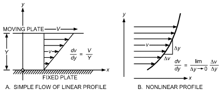

*Fig. 1 Velocity Profiles and Gradients in Shear Flows*

> F /A = μ(V /Y)&emsp;**(1)**

where the proportionality factor μ is the **absolute** or **dynamic vis- cosity** of the fluid. The ratio of F to A is the **shearing stress** τ, and V /Y is the **lateral velocity gradient** (Figure 1A). In complex flows, velocity and shear stress may vary across the flow field; this is expressed by

> τ = μdv/dy&emsp;**(2)**

The velocity gradient associated with viscous shear for a simple case involving flow velocity in the x direction but of varying magnitude in the y direction is shown in Figure 1B.

Absolute viscosity μ depends primarily on temperature. For gases (except near the critical point), viscosity increases with the square root of the absolute temperature, as predicted by the kinetic theory of gases. In contrast, a liquid’s viscosity decreases as temperature increases. Absolute viscosities of various fluids are given in Chapter 33.

Absolute viscosity has dimensions of force × time/length2. At standard indoor conditions, the absolute viscosities of water and dry air (Fox et al. 2004) are

> μwater = 1.01 (mN·s)/m2
>
> μair = 18.1 (μN·s)/m2

Another common unit of viscosity is the **centipoise** [1 centipoise = 1 g/(s·m) = 1 mPa·s]. At standard conditions, water has a viscosity close to 1.0 centipoise.

In fluid dynamics, **kinematic viscosity** ν is sometimes used in lieu of absolute or dynamic viscosity. Kinematic viscosity is the ratio of absolute viscosity to density:

- ν = μ/ρ

<!-- str. 51 -->

At standard indoor conditions, the kinematic viscosities of water and dry air (Fox et al. 2004) are

> νwater = 1.01 mm2/s
>
> νair = 15.0 mm2/s

The **stoke** (1 cm2/s) and **centistoke** (1 mm2/s) are common units for kinematic viscosity.

## 2. BASIC RELATIONS OF FLUID DYNAMICS

This section discusses fundamental principles of fluid flow for constant-property, homogeneous, incompressible fluids and introduces fluid dynamic considerations used in most analyses.

### Continuity in a Pipe or Duct

Conservation of mass applied to fluid flow in a conduit requires that mass not be created or destroyed. Specifically, the mass flow rate into a section of pipe must equal the mass flow rate out of that section of pipe if no mass is accumulated or lost (e.g., from leakage). This requires that

> ṁ = ∫ρv dA = constant&emsp;**(3)**

where m· is mass flow rate across the area normal to flow, v is fluid velocity normal to differential area dA, and ρ is fluid density. Both ρ and v may vary over the cross section A of the conduit. When flow is effectively incompressible (ρ = constant) in a pipe or duct flow

> ∫

analysis, the **average velocity** is then V = (1/A) vdA, and the mass flow rate can be written as

> ṁ = ρVA&emsp;**(4)**

or

> Q = m· ⁄ ρ = AV&emsp;**(5)**

where Q is **volumetric flow rate**.

### Bernoulli Equation and Pressure Variation in Flow Direction

The **Bernoulli equation** is a fundamental principle of fluid flow analysis. It involves the conservation of momentum and energy along a streamline; it is not generally applicable across streamlines. Development is fairly straightforward. The first law of thermodynamics can apply to both mechanical flow energies (**kinetic** and **potential energy**) and thermal energies.

The change in energy content ΔE per unit mass of flowing fluid is a result of the work per unit mass w done on the system plus the heat per unit mass q absorbed or rejected:

> ΔE = w + q&emsp;**(6)**

Fluid energy is composed of kinetic, potential (because of elevation z), and internal (u) energies. Per unit mass of fluid, the energy change relation between two sections of the system is

> ) (p)
>
> ((2 v)/(2 () + gz + u --

> Δ = EM – Δ + q&emsp;**(7)**
>
> ρ

> ) ( )

where the work terms are (1) external work EM from a fluid machine (EM is positive for a pump or blower) and (2) flow work p/ρ (where p = pressure), and g is the gravitational constant. Rearranging, the energy equation can be written as the **generalized Bernoulli equation**:

> ( p)
>
> Δ v2/2 + gz + u + -- = EM + q&emsp;**(8)**

> ρ
>
> ( )

The expression in parentheses in Equation (8) is the sum of the kinetic energy, potential energy, internal energy, and flow work per unit mass flow rate. In cases with no work interaction, no heat transfer, and no viscous frictional forces that convert mechanical energy into internal energy, this expression is constant and is known as the **Bernoulli constant B**:

> p
>
> ( )

> --
>
> v2/2 + gz + = B&emsp;**(9)**

> ρ
>
> ( )

Alternative forms of this relation are obtained through multiplication by ρ or division by g:

> p + ρv2/2 + ρgz = ρB&emsp;**(10)**
>
> p/γ + v2/2g + z = B/g&emsp;**(11)**

where γ = ρg is the **weight density** (γ = weight/volume versus ρ = mass/volume). Note that Equations (9) to (11) assume no frictional losses.

The units in the first form of the Bernoulli equation [Equation (9)] are energy per unit mass; in Equation (10), energy per unit volume; in Equation (11), energy per unit weight, usually called **head**. Note that the units for head reduce to just length [i.e., (N·m)/N to m]. In gas flow analysis, Equation (10) is often used, and ρgz is negligible. Equation (10) should be used when density variations occur. For liquid flows, Equation (11) is commonly used. Identical results are obtained with the three forms if the units are consistent and fluids are homogeneous.

Many systems of pipes, ducts, pumps, and blowers can be considered as one-dimensional flow along a streamline (i.e., variation in velocity across the pipe or duct is ignored, and local velocity v = average velocity V). When v varies significantly across the cross section, the kinetic energy term in the Bernoulli constant B is expressed as αV2/2, where the **kinetic energy factor** (α > 1) expresses the ratio of the true kinetic energy of the velocity profile to that of the average velocity. For laminar flow in a wide rectangular channel, α = 1.54, and in a pipe, α = 2.0. For turbulent flow in a duct, α ≈ 1.

Heat transfer q may often be ignored. Conversion of mechanical energy to internal energy Δu may be expressed as a loss EL. The change in the Bernoulli constant (ΔB = B2 – B1) between stations 1 and 2 along the conduit can be expressed as

> ( ) ( )
>
> p/ρ + αV2/2 + gz + EM – EL = p/ρ + αV2/2 + gz&emsp;**(12)**

> ( )1 ( )2

or, by dividing by g, in the form

> ( ) ( )
>
> p/γ + αV2/2g + z + HM – HL = p/γ + αV2/2g + z&emsp;**(13)**

> ( )1 ( )2

Note that Equation (12) has units of energy per mass, whereas each term in Equation (13) has units of energy per weight, or head. The terms EM and EL are defined as positive, where gHM = EM represents energy added to the conduit flow by pumps or blowers. A turbine or fluid motor thus has a negative HM or EM. Note the *simplicity of Equation (13)*; the total head at station 1 (pressure head plus velocity head plus elevation head) plus the head added by a pump (HM) minus the head lost through friction (HL) is the total head at station 2.

<!-- str. 52 -->

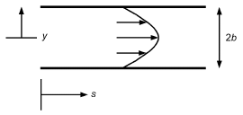

*Fig. 2 Dimensions for Steady, Fully Developed Laminar Flow Equations*

### Laminar Flow

When real-fluid effects of viscosity or turbulence are included, the continuity relation in Equation (5) is not changed, but V must be evaluated from the integral of the velocity profile, using local velocities. In fluid flow past fixed boundaries, velocity at the boundary is zero, velocity gradients exist, and shear stresses are produced. The equations of motion then become complex, and exact solutions are difficult to find except in simple cases for laminar flow between flat plates, between rotating cylinders, or within a pipe or tube.

For steady, fully developed laminar flow between two parallel plates (Figure 2), shear stress τ varies linearly with distance y from the centerline (transverse to the flow; y = 0 in the center of the channel). For a wide rectangular channel 2b tall, τ can be written as

> ( )
>
> τ = y/b τw = μdv/dy&emsp;**(14)**

> ( )

where τw is wall shear stress [b(dp/ds)], and s is flow direction. Because velocity is zero at the wall (y = b), Equation (14) can be integrated to yield

> (b2– y2)
>
> v = ---------------- dp/ds&emsp;**(15)**

> 2μ
>
> ( )

The resulting parabolic velocity profile in a wide rectangular channel is commonly called **Poiseuille flow**. Maximum velocity occurs at the centerline (y = 0), and the average velocity V is 2/3 of the maximum velocity. From this, the longitudinal pressure drop in terms of V can be written as

> ( )
>
> dp/ds = – 3μV/b2&emsp;**(16)**

> ( )

A parabolic velocity profile can also be derived for a pipe of radius R. V is 1/2 of the maximum velocity, and the pressure drop can be written as

> ( )
>
> dp/ds = – 8μV/R2&emsp;**(17)**

> ( )

### Turbulence

Fluid flows are generally turbulent, involving random perturbations or fluctuations of the flow (velocity and pressure), characterized by an extensive hierarchy of scales or frequencies (Robertson 1963). Flow disturbances that are not chaotic but have some degree of periodicity (e.g., the oscillating vortex trail behind bodies) have been erroneously identified as turbulence. Only flows involving random perturbations without any order or periodicity are turbulent; velocity in such a flow varies with time or locale of measurement (Figure 3).

Turbulence can be quantified statistically. The velocity most often used is the time-averaged velocity. The strength of turbulence is characterized by the root mean square (RMS) of the instantaneous variation in velocity about this mean. Turbulence causes the fluid to transfer momentum, heat, and mass very rapidly across the flow.

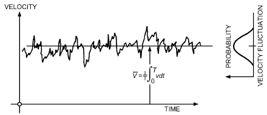

*Fig. 3 Velocity Fluctuation at Point in Turbulent Flow*

Laminar and turbulent flows can be differentiated using the **Reynolds number Re**, which is a dimensionless relative ratio of inertial forces to viscous forces:

> ReL = VL/ν&emsp;**(18)**

where L is the characteristic length scale and ν is the kinematic viscosity of the fluid. In flow through pipes, tubes, and ducts, the characteristic length scale is the **hydraulic diameter Dh**, given by

> Dh = 4A/Pw&emsp;**(19)**

where A is the cross-sectional area of the pipe, duct, or tube, and Pw is the wetted perimeter.

For a round pipe, Dh equals the pipe diameter. In general, **laminar flow** in pipes or ducts exists when the Reynolds number (based on Dh) is less than 2300. Fully **turbulent flow** exists when ReDh > 10 000. For 2300 < ReDh < 10 000, transitional flow exists, and predictions are unreliable.

## 3. BASIC FLOW PROCESSES

### Wall Friction

At the boundary of real-fluid flow, the relative tangential velocity at the fluid surface is zero. Sometimes in turbulent flow studies, velocity at the wall may appear finite and nonzero, implying a **fluid slip** at the wall. However, this is not the case; the conflict results from difficulty in velocity measurements near the wall (Goldstein 1938). Zero wall velocity leads to high shear stress near the wall boundary, which slows adjacent fluid layers. Thus, a velocity profile develops near a wall, with velocity increasing from zero at the wall to an exterior value within a finite lateral distance.

Laminar and turbulent flow differ significantly in their velocity profiles. Turbulent flow profiles are flat and laminar profiles are more pointed (Figure 4). As discussed, fluid velocities of the turbulent profile near the wall must drop to zero more rapidly than those of the laminar profile, so shear stress and friction are much greater in turbulent flow. Fully developed conduit flow may be characterized by the **pipe factor**, which is the ratio of average to maximum (centerline) velocity. Viscous velocity profiles result in pipe factors of 0.667 and 0.50 for wide rectangular and axisymmetric conduits. Figure 5 indicates much higher values for rectangular and circular conduits for turbulent flow. Because of the flat velocity profiles, the kinetic energy factor α in Equations (12) and (13) ranges from 1.01 to 1.10 for fully developed turbulent pipe flow.

### Boundary Layer

The boundary layer is the region close to the wall where wall friction affects flow. Boundary layer thickness (usually denoted by δ) is thin compared to downstream flow distance. For external flow over a body, fluid velocity varies from zero at the wall to a maximum at distance δ from the wall. Boundary layers are generally laminar near the start of their formation but may become turbulent downstream.

<!-- str. 53 -->

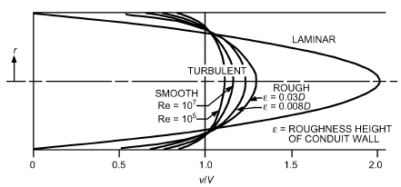

*Fig. 4 Velocity Profiles of Flow in Pipes*

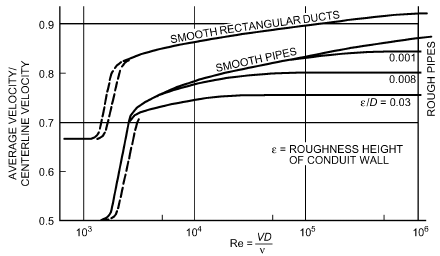

*Fig. 5 Pipe Factor for Flow in Conduits*

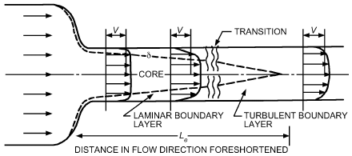

*Fig. 6 Flow in Conduit Entrance Region*

A significant boundary-layer occurrence exists in a pipeline or conduit following a well-rounded entrance (Figure 6). Layers grow from the walls until they meet at the center of the pipe. Near the start of the straight conduit, the layer is very thin and most likely laminar, so the uniform velocity core outside has a velocity only slightly greater than the average velocity. As the layer grows in thickness, the slower velocity near the wall requires a velocity increase in the uniform core to satisfy continuity. As flow proceeds, the wall layers grow (and centerline velocity increases) until they join, after an **entrance length Le**. Applying the Bernoulli relation of Equation (10) to core flow indicates a decrease in pressure along the layer. Ross (1956) shows that, although the entrance length Le is many diameters, the length in which pressure drop significantly exceeds that for fully developed flow is on the order of 10 hydraulic diameters for turbulent flow in smooth pipes.

In more general boundary-layer flows, as with wall layer development in a diffuser or for the layer developing along the surface of a strut or turning vane, pressure gradient effects can be severe and may even lead to boundary layer separation. When the outer flow velocity (v1 in Figure 7) decreases in the flow direction, an adverse pressure gradient can cause separation, as shown in the figure. Downstream from the separation point, fluid backflows near the wall. Separation is caused by frictional velocity (thus local kinetic energy) reduction near the wall. Flow near the wall no longer has energy to move into the higher pressure imposed by the decrease in v1 at the edge of the layer. The locale of this separation is difficult to predict, especially for the turbulent boundary layer. Analyses verify the experimental observation that a turbulent boundary layer is less subject to separation than a laminar one because of its greater kinetic energy.

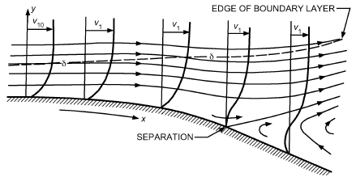

*Fig. 7 Boundary Layer Flow to Separation*

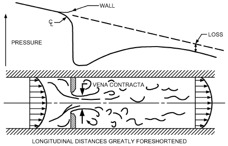

*Fig. 8 Geometric Separation, Flow Development, and Loss in Flow Through Orifice*

### Flow Patterns with Separation

In technical applications, flow with separation is common and often accepted if it is too expensive to avoid. Flow separation may be geometric or dynamic. Dynamic separation is shown in Figure 7. Geometric separation (Figures 8 and 9) results when a fluid stream passes over a very sharp corner, as with an orifice; the fluid generally leaves the corner irrespective of how much its velocity has been reduced by friction.

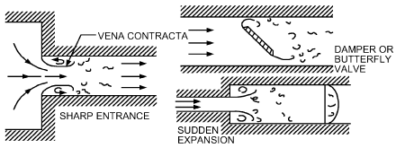

*Fig. 9 Examples of Geometric Separation Encountered in Flows in Conduits*

<!-- str. 54 -->

For geometric separation in orifice flow (Figure 8), the outer streamlines separate from the sharp corners and, because of fluid inertia, contract to a section smaller than the orifice opening. The smallest section is known as the **vena contracta** and generally has a limiting area of about six-tenths of the orifice opening. After the vena contracta, the fluid stream expands rather slowly through turbulent or laminar interaction with the fluid along its sides. Outside the jet, fluid velocity is comparatively small. Turbulence helps spread out the jet, increases losses, and brings the velocity distribution back to a more uniform profile. Finally, downstream, the velocity profile returns to the fully developed flow of Figure 4. The entrance and exit profiles can profoundly affect the vena contracta and pressure drop (Coleman 2004).

Other geometric separations (Figure 9) occur in conduits at sharp entrances, inclined plates or dampers, or sudden expansions. For these geometries, a vena contracta can be identified; for sudden expansion, its area is that of the upstream contraction. Ideal-fluid theory, using free streamlines, provides insight and predicts contraction coefficients for valves, orifices, and vanes (Robertson 1965). These geometric flow separations produce large losses. To expand a flow efficiently or to have an entrance with minimum losses, design the device with gradual contours, a diffuser, or a rounded entrance.

Flow devices with gradual contours are subject to separation that is more difficult to predict, because it involves the dynamics of boundary-layer growth under an adverse pressure gradient rather than flow over a sharp corner. A diffuser is used to reduce the loss in expansion; it is possible to expand the fluid some distance at a gentle angle without difficulty, particularly if the boundary layer is turbulent. Eventually, separation may occur (Figure 10), which is frequently asymmetrical because of irregularities. Downstream flow involves flow reversal (backflow) and excess losses. Such separation is commonly called **stall** (Kline 1959). Larger expansions may use splitters that divide the diffuser into smaller sections that are less likely to have separations (Moore and Kline 1958). Another technique for controlling separation is to bleed some low-velocity fluid near the wall (Furuya et al. 1976). Alternatively, Heskested (1970) shows that suction at the corner of a sudden expansion has a strong positive effect on geometric separation.

### Drag Forces on Bodies or Struts

Bodies in moving fluid streams are subjected to appreciable fluid forces or **drag**. Conventionally, the drag force FD on a body can be expressed in terms of a **drag coefficient CD**:

> ( )
>
> FD = CDρA V2/2&emsp;**(20)**

> ( )

where A is the projected (normal to flow) area of the body. The drag coefficient CD is a strong function of the body’s shape and angularity, and the Reynolds number of the relative flow in terms of the body’s characteristic dimension.

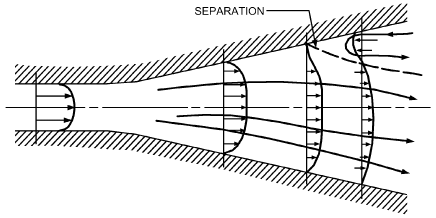

*Fig. 10 Separation in Flow in Diffuser*

For Reynolds numbers of 103 to 105, the CD of most bodies is constant because of flow separation, but above 105, the CD of rounded bodies drops suddenly as the surface boundary layer undergoes transition to turbulence. Typical CD values are given in Table 1; Hoerner (1965) gives expanded values.

### Nonisothermal Effects

When appreciable temperature variations exist, the primary fluid properties (density and viscosity) may no longer assumed to be constant, but vary across or along the flow. The Bernoulli equation [Equations (9) to (11)] must be used, because volumetric flow is not constant. With gas flows, the thermodynamic process involved must be considered. In general, this is assessed using Equation (9), written as

> ∫dp/ρ + V2/2 + gz = B&emsp;**(21)**

Effects of viscosity variations also appear. In nonisothermal laminar flow, the parabolic velocity profile (see Figure 4) is no longer valid. In general, for gases, viscosity increases with the square root of absolute temperature; for liquids, viscosity decreases with increasing temperature. This results in opposite effects.

For fully developed pipe flow, the linear variation in shear stress from the wall value τw to zero at the centerline is independent of the temperature gradient. In the section on Laminar Flow, τ is defined as τ = (y/b)τw, where y is the distance from the centerline and 2b is the wall spacing. For pipe radius R = D/2 and distance from the wall y = *R – r* (Figure 11), then τ = τw(R – y)/R. Then, solving Equation (2) for the change in velocity yields

**Table 1 Drag Coefficients**

| Body Shape | 103 < Re < 2 × 105 | Re > 3 × 105 |
|---|---|---|
| Sphere | 0.36 to 0.47 | ~0.1 |
| Disk | 1.12 | 1.12 |
| Streamlined strut | 0.1 to 0.3 | < 0.1 |
| Circular cylinder | 1.0 to 1.1 | 0.35 |
| Elongated rectangular strut | 1.0 to 1.2 | 1.0 to 1.2 |
| Square strut | ~2.0 | ~2.0 |

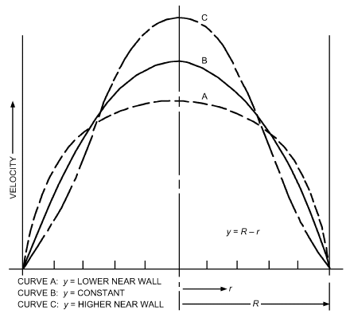

*Fig. 11 Effect of Viscosity Variation on Velocity Profile of Laminar Flow in Pipe*

<!-- str. 55 -->

> ( )
>
> dv = (τw(R – y))/Rμ dy = – τw/Rμ r dr&emsp;**(22)**

> ( )

When fluid viscosity is lower near the wall than at the center (because of external heating of liquid or cooling of gas by heat transfer through the pipe wall), the velocity gradient is steeper near the wall and flatter near the center, so the profile is generally flattened. When liquid is cooled or gas is heated, the velocity profile is more pointed for laminar flow (Figure 11). Calculations for such flows of gases and liquid metals in pipes are in Deissler (1951). Occurrences in turbulent flow are less apparent than in laminar flow. If enough heating is applied to gaseous flows, the viscosity increase can cause reversion to laminar flow.

Buoyancy effects and the gradual approach of the fluid temperature to equilibrium with that outside the pipe can cause considerable variation in the velocity profile along the conduit. Colborne and Drobitch (1966) found the pipe factor for upward vertical flow of hot air at a Re < 2000 reduced to about 0.6 at 40 diameters from the entrance, then increased to about 0.8 at 210 diameters, and finally decreased to the isothermal value of 0.5 at the end of 320 diameters.

## 4. FLOW ANALYSIS

Fluid flow analysis is used to correlate pressure changes with flow rates and the nature of the conduit. For a given pipeline, either the pressure drop for a certain flow rate, or the flow rate for a certain pressure difference between the ends of the conduit, is needed. Flow analysis ultimately involves comparing a pump or blower to a conduit piping system for evaluating the expected flow rate.

### Generalized Bernoulli Equation

Internal energy differences are generally small, and usually the only significant effect of heat transfer is to change the density ρ. For gas or vapor flows, use the generalized Bernoulli equation in the pressure-over-density form of Equation (12), allowing for the thermodynamic process in the pressure-density relation:

> 2
>
> – ∫dp/ρ + α1(2 V 1)/2 + EM = α2(2 V 2)/2 + EL&emsp;**(23)**

> 1

Elevation changes involving z are often negligible and are dropped. The pressure form of Equation (10) is generally unacceptable when appreciable density variations occur, because the volumetric flow rate differs at the two stations. This is particularly serious in frictionloss evaluations where the density usually varies over considerable lengths of conduit (Benedict and Carlucci 1966). When the flow is essentially incompressible, Equation (20) is satisfactory.

**Example 1.** Specify a blower to produce isothermal airflow of 200 L/s through a ducting system (Figure 12). Accounting for intake and fitting losses, equivalent conduit lengths are 18 and 50 m, and flow is isothermal. Pressure at the inlet (station 1) and following the discharge (station 4), where velocity is zero, is the same. Frictional losses HL are evaluated as 7.5 m of air between stations 1 and 2, and 72.3 m between stations 3 and 4.

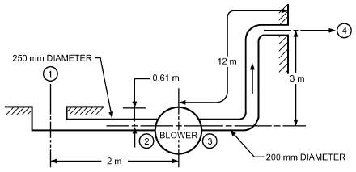

*Fig. 12 Blower and Duct System for Example 1*

**Solution:** The following form of the generalized Bernoulli relation is used in place of Equation (12), which also could be used:

> (p1/ρ1g) + α1(V12/2g) + z1 + HM
>
> = (p2/ρ2g) + α2(V22/2g) + z2 + HL&emsp;**(24)**

The term V12/2g can be calculated as follows:

> ( )2 ( )2
>
> A1 = π D/2 = π 0.250/2 = 0.0491 m2

> ( )
>
> V1 = Q/A1 = (( ) 0.200)/0.0491 = 4.07 m/s

> V12/2g = (4.07)2/2(9.8) = 0.846 m&emsp;**(25)**

The term V22/2g can be calculated in a similar manner.

In Equation (24), HM is evaluated by applying the relation between any two points on opposite sides of the blower. Because conditions at stations 1 and 4 are known, they are used, and the location-specifying subscripts on the right side of Equation (24) are changed to 4. Note that p1 = p4 = p, ρ1 = ρ4 = ρ, and V1 = V4 = 0. Thus,

> (p/ρg) + 0 + 0.61 + HM = (p/ρg) + 0 + 3 + (7.5 + 72.3)&emsp;**(26)**

so HM = 82.2 m of air. For standard air (ρ = 1.20 kg/m3), this corresponds to 970 Pa.

The pressure difference measured across the blower (between stations 2 and 3) is often taken as HM. It can be obtained by calculating the static pressure at stations 2 and 3. Applying Equation (24) successively between stations 1 and 2 and between 3 and 4 gives

> (p1/ρg) + 0 + 0.61 + 0 = (p2/ρg) + (1.06 × 0.846) + 0 + 7.5
>
> (p3/ρg) + (1.03 × 2.07) + 0 + 0 = (p4/ρg) + 0 + 3 + 72.3&emsp;**(27)**

where α just ahead of the blower is taken as 1.06, and just after the blower as 1.03; the latter value is uncertain because of possible uneven discharge from the blower. Static pressures p1 and p4 may be taken as zero gage. Thus,

> p2/ρg = –7.8 m of air
>
> p3/ρg = 73.2 m of air&emsp;**(28)**

The difference between these two numbers is 81 m, which is not the HM calculated after Equation (24) as 82.2 m. The apparent discrepancy results from ignoring velocity at stations 2 and 3. Actually, HM is

> HM = (p3/ρg) + α3(V32/2g) – [(p2/ρg) + α2(V22/2g)]
>
> = 73.2 + (1.03 × 2.07) – [–7.8 + (1.06 × 0.846)]

> = 75.3 – (–6.9) = 82.2 m&emsp;**(29)**

The required blower energy is the same, no matter how it is evaluated. It is the specific energy added to the system by the machine. Only when the conduit size and velocity profiles on both sides of the machine are the same is EM or HM simply found from Δp = p3 – p2.

### Conduit Friction

The loss term E or H of Equation (12) or (13) accounts for

> L L

friction caused by conduit-wall shearing stresses and losses from conduit-section changes. H is the head loss (i.e., loss of energy per

> L

unit weight).

In real-fluid flow, a frictional shear occurs at bounding walls, gradually influencing flow further away from the boundary. A lateral velocity profile is produced and flow energy is converted into heat (fluid internal energy), which is generally unrecoverable (a loss). This loss in fully developed conduit flow is evaluated using the **Darcy-Weisbach equation**:

<!-- str. 56 -->

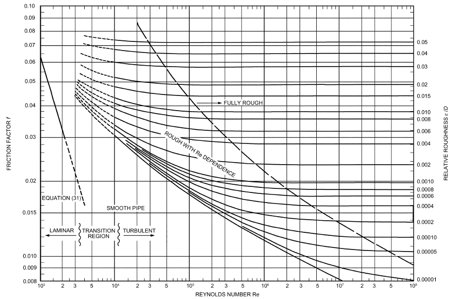

*Fig. 13 Relation Between Friction Factor and Reynolds Number*

(based on Mo

> ( )( )
>
> HLf = f L/D V2/2g&emsp;**(30)**

> ( )( )

where L is the length of conduit of diameter D and f is the **Darcy- Weisbach friction factor**. Sometimes a numerically different relation is used with the **Fanning friction factor** (1/4 of the Darcy friction factor f ). The value of f is nearly constant for turbulent flow, varying only from about 0.01 to 0.05.

For fully developed laminar-viscous flow in a pipe, loss is evaluated from Equation (17) as follows:

> (8μV ) ( )( )
>
> 64 L

> HLf = L/ρg ---------- = 32LνV/D2g = -------------- --- V2/2g&emsp;**(31)**
>
> VD⁄ν D

> ( R2 ) ( )( )

where Re = VD/v and f = 64/Re. Thus, for laminar flow, the friction factor varies inversely with the Reynolds number. The value of 64/Re varies with channel shape. A good summary of shape factors is provided by Incropera and DeWitt (2002).

With turbulent flow, friction loss depends not only on flow conditions, as characterized by the Reynolds number, but also on the **roughness height** ε of the conduit wall surface. The variation is complex and is expressed in diagram form (Moody 1944), as shown in Figure 13. Historically, the Moody diagram has been used to determine friction factors, but empirical relations suitable for use in modeling programs have been developed. Most are applicable to limited ranges of Reynolds number and relative roughness. Churchill (1977) developed a relationship that is valid for all ranges of ody 1944)

Reynolds numbers, and is more accurate than reading the Moody diagram:

> 1 ⁄ 12
>
> ( )12

> 8
>
> f = 8 ----------- + 1/((A + B)1.5)&emsp;**(32a)**

> Re
>
> ( Dh )

> ( ) 16
>
> A = 2.457 ln 1/(( )0.9 ( ) 7 ⁄ Re + 0.27ε ⁄ D)&emsp;**(32b)**

> (( Dh ) ( h))
>
> ( )16

> B = (37 530)/ReDh&emsp;**(32c)**
>
> ( )

Inspection of the Moody diagram indicates that, for high Reynolds numbers and relative roughness, the friction factor becomes independent of the Reynolds number in a fully rough flow or fully turbulent regime. A **transition region** from laminar to turbulent flow occurs when 2000 < Re < 10 000. Roughness height ε, which may increase with conduit use, fouling, or aging, is usually tabulated for different types of pipes as shown in Table 2.

**Noncircular Conduits.** Air ducts are often rectangular in cross section. The equivalent circular conduit corresponding to the noncircular conduit must be found before the friction factor can be determined.

For turbulent flow, **hydraulic diameter Dh** is substituted for D in Equation (30) and in the Reynolds number. Noncircular duct friction can be evaluated to within 5% for all except very extreme cross sections (e.g., tubes with deep grooves or ridges). A more refined method for finding the equivalent circular duct diameter is given in Chapter 13. With laminar flow, the loss predictions may be off by a factor as large as two.

<!-- str. 57 -->

**Table 2 Effective Roughness of Conduit Surfaces**

| Material | ε, μm |
|---|---|
| Commercially smooth brass, lead, copper, or plastic pipe | 1.52 |
| Steel and wrought iron | 46 |
| Galvanized iron or steel | 152 |
| Cast iron | 259 |

### Valve, Fitting, and Transition Losses

Valve and section changes (contractions, expansions and diffusers, elbows, bends, or tees), as well as entrances and exits, distort the fully developed velocity profiles (see Figure 4) and introduce extra flow losses that may dissipate as heat into pipelines or duct systems. Valves, for example, produce such extra losses to control the fluid flow rate. In contractions and expansions, flow separation as shown in Figures 9 and 10 causes the extra loss. The loss at rounded entrances develops as flow accelerates to higher velocities; this higher velocity near the wall leads to wall shear stresses greater than those of fully developed flow (see Figure 6). In flow around bends, velocity increases along the inner wall near the start of the bend. This increased velocity creates a secondary fluid motion in a double helical vortex pattern downstream from the bend. In all these devices, the disturbance produced locally is converted into turbulence and appears as a loss in the downstream region. The return of a disturbed flow pattern into a fully developed velocity profile may be quite slow. Ito (1962) showed that the secondary motion following a bend takes up to 100 diameters of conduit to die out but the pressure gradient settles out after 50 diameters.

In a laminar fluid flow following a rounded entrance, the **entrance length** depends on the Reynolds number:

> Le/D = 0.06 Re&emsp;**(33)**

At Re = 2000, Equation (33) shows that a length of 120 diameters is needed to establish the parabolic velocity profile. The pressure gradient reaches the developed value of Equation (30) in fewer flow diameters. The additional loss is 1.2V2/2g; the change in profile from uniform to parabolic results in a loss of 1.0V2/2g (because α = 2.0), and the remaining loss is caused by the excess friction. In turbulent fluid flow, only 80 to 100 diameters following the rounded entrance are needed for the velocity profile to become fully developed, but the friction loss per unit length reaches a value close to that of the fully developed flow value more quickly. After six diameters, the loss rate at a Reynolds number of 105 is only 14% above that of fully developed flow in the same length, whereas at 107, it is only 10% higher (Robertson 1963). For a sharp entrance, flow separation (see Figure 9) causes a greater disturbance, but fully developed flow is achieved in about half the length required for a rounded entrance. In a sudden expansion, the pressure change settles out in about eight times the diameter change (D2 – D1), whereas the velocity profile may take at least a 50% greater distance to return to fully developed pipe flow (Lipstein 1962).

Instead of viewing these losses as occurring over tens or hundreds of pipe diameters, it is possible to treat the entire effect of a disturbance as if it occurs at a single point in the flow direction. By treating these losses as a local phenomenon, they can be related to the velocity by the **loss coefficient K**:

> Loss of section = K(V2/2g)&emsp;**(34)**

**Table 3 Fitting Loss Coefficients of Turbulent Flow**

| Fitting | Geometry | ΔP ⁄ ρg K = ------2-----------V ⁄ 2g |
|---|---|---|
| Entrance | Sharp Well-rounded | 0.5 0.05 |
| Contraction | Sharp (D2/D1 = 0.5) | 0.38 |
| 90° elbow | Miter Short radius Long radius Miter with turning vanes | 1.3 0.90 0.60 0.2 |
| Globe valve Angle valve Gate valve Any valve | Open Open Open 75% open 50% open 25% open Closed | 10 5 0.19 to 0.22 1.10 3.6 28.8 ∞ |
| Tee | Straight-through flow Flow through branch | 0.5 1.8 |

Chapter 22 and the *Pipe Friction Manual* (Hydraulic Institute 1990) have information for pipe applications. Chapter 21 gives information for airflow. The same type of fitting in pipes and ducts may yield a different loss, because flow disturbances are controlled by the detailed geometry of the fitting. The elbow of a small threaded pipe fitting differs from a bend in a circular duct. For 90° screw-fitting elbows, K is about 0.8 (Ito 1962), whereas smooth flanged elbows have a K as low as 0.2 at the optimum curvature.

Table 3 lists fitting loss coefficients.These values indicate losses, but there is considerable variance. Note that a well-rounded entrance yields a rather small K of 0.05, whereas a gate valve that is only 25% open yields a K of 28.8. Expansion flows, such as from one conduit size to another or at the exit into a room or reservoir, are not included. For such occurrences, the **Borda loss prediction** (from impulse-momentum considerations) is appropriate:

> V12( A1)2
>
> Loss at expansion = ((V1– V2)2)/2g = ----- 1 – -----&emsp;**(35)**

> 2g A
>
> ( 2)

Expansion losses may be significantly reduced by avoiding or delaying separation using a gradual diffuser (see Figure 10). For a diffuser of about 7° total angle, the loss is only about one-sixth of the loss predicted by Equation (35). The diffuser loss for total angles above 45 to 60° exceeds that of the sudden expansion, but is moderately influenced by the diameter ratio of the expansion. Optimum diffuser design involves numerous factors; excellent performance can be achieved in short diffusers with splitter vanes or suction. Turning vanes in miter bends produce the least disturbance and loss for elbows; with careful design, the loss coefficient can be reduced to as low as 0.1.

For losses in smooth elbows, Ito (1962) found a Reynolds number effect (K slowly decreasing with increasing Re) and a minimum loss at a bend curvature (bend radius to diameter ratio) of 2.5. At this optimum curvature, a 45° turn had 63%, and a 180° turn approximately 120%, of the loss of a 90° bend. The loss does not vary linearly with the turning angle because secondary motion occurs.

Note that using K presumes its independence of the Reynolds number. Some investigators have documented a variation in the loss coefficient with the Reynolds number. Assuming that K varies with Re similarly to f, it is convenient to represent fitting losses as adding to the effective length of uniform conduit. The effective length of a fitting is then

> Leff/D = K/fref&emsp;**(36)**

<!-- str. 58 -->

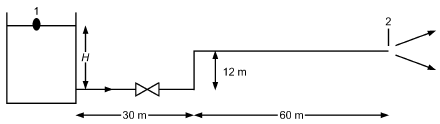

*Fig. 14 Diagram for Example 2*

where fref is an appropriate reference value of the friction factor. Deissler (1951) uses 0.028, and the air duct values in Chapter 21 are based on an fref of about 0.02. For rough conduits, appreciable errors can occur if the relative roughness does not correspond to that used when fref was fixed. It is unlikely that fitting losses involving separation are affected by pipe roughness. The effective length method for fitting loss evaluation is still useful.

When a conduit contains a number of section changes or fittings, the values of K are added to the fL/D friction loss, or the Leff/D of the fittings are added to the conduit length L/D for evaluating the total loss HL. This assumes that each fitting loss is fully developed and its disturbance fully smoothed out before the next section change. Such an assumption is frequently wrong, and the total loss can be overestimated. For elbow flows, the total loss of adjacent bends may be over- or underestimated. The secondary flow pattern after an elbow is such that when one follows another, perhaps in a different plane, the secondary flow of the second elbow may reinforce or partially cancel that of the first. Moving the second elbow a few diameters can reduce the total loss (from more than twice the amount) to less than the loss from one elbow. Screens or perforated plates can be used for smoothing velocity profiles (Wile 1947) and flow spreading. Their effectiveness and loss coefficients depend on their amount of open area (Baines and Peterson 1951).

**Example 2.** Water at 20°C flows through the piping system shown in Figure 14. Each ell has a very long radius and a loss coefficient of K = 0.31; the entrance at the tank is square-edged with K = 0.5, and the valve is a fully open globe valve with K = 10. The pipe roughness is 250 μm. The density ρ = 1000 kg/m3 and kinematic viscosity ν = 1.01 mm2/s.

a. If pipe diameter D = 150 mm, what is the elevation H in the tank required to produce a flow of Q = 60 L/s?

**Solution:** Apply Equation (13) between stations 1 and 2 in the figure. Note that p1 = p2, V1 ≈ 0. Assume α ≈ 1. The result is

> z1 – z2 = H – 12 m = HL + V22/2g

From Equations (30) and (34), total pressure loss is

> ( )
>
> HL = ∑

> fL/D + K 8Q2/π2gD4
>
> ( )

where L = 102 m, ∑K = 0.5 + (2 × 0.31) + 10 = 11.1, and V2/2g = V22/2g = 8Q2/(π2gD4). Then, substituting into Equation (13),

> ( )
>
> ∑

> H = 12 m + 1 + fL/D + K 8Q2/π2gD4
>
> ( )

To calculate the friction factor, first calculate Reynolds number and relative roughness:

- Re = VD/v = 4Q/(πDv) = 495 150
- ε/D = 0.0017

From the Moody diagram or Equation (32), f = 0.023. Then HL = 15.7 m and H = 27.7 m.

b. For H = 22 m and D = 150 mm, what is the flow?

**Solution:** Applying Equation (13) again and inserting the expression for head loss gives

> ( ) 8Q2
>
> ∑

> z1 – z2 = 10 m + fL/D + K + 1 ---------------
>
> ( ) π2gD4

Because f depends on Q (unless flow is fully turbulent), iteration is required. The usual procedure is as follows:

1. Assume a value of f, usually the fully rough value for the given values of ε and D.

2. Use this value of f in the energy calculation and solve for Q.

> Q = (π2gD4(z1– z2))/((fL ) 8 ---- + K + 1 ∑)
>
> D

> ( )

3. Use this value of Q to recalculate Re and get a new value of f.

4. Repeat until the new and old values of f agree to two significant figures.

| Iteration | f | Q, m/s | Re | f |
|---|---|---|---|---|
| 0 | 0.0223 | 0.04737 | 3.98 E + 05 | 0.0230 |
| 1 | 0.0230 | 0.04699 | 3.95 E + 05 | 0.0230 |

As shown in the table, the result after two iterations is Q ≈ 0.047 m3/s = 47 L/s. If the resulting flow is in the fully rough zone and the fully rough value of f is used as first guess, only one iteration is required. c. For H = 22 m, what diameter pipe is needed to allow Q = 55 L/s?

**Solution:** The energy equation in part (b) must now be solved for D with Q known. This is difficult because the energy equation cannot be solved for D, even with an assumed value of f. If Churchill’s expression for f is stored as a function in a calculator, program, or spreadsheet with an iterative equation solver, a solution can be generated. In this case, D ≈ 0.166 m = 166 mm. Use the smallest available pipe size greater than 166 mm and adjust the valve as required to achieve the desired flow. Alternatively, (1) guess an available pipe size, and (2) calculate Re, f, and H for Q = 55 L/s. If the resulting value of H is greater than the given value of H = 22 m, a larger pipe is required. If the calculated H is less than 22 m, repeat using a smaller available pipe size.

### Control Valve Characterization for Liquids

Control valves are characterized by a **discharge coefficient Cd**. As long as the Reynolds number is greater than 250, the orifice equation holds for liquids:

> Q = CdAo 2Δp ⁄ ρ&emsp;**(37)**

where Ao is the area of the orifice opening and Δp is the pressure drop across the valve. The discharge coefficient is about 0.63 for sharp-edged configurations and 0.8 to 0.9 for chamfered or rounded configurations.

### Incompressible Flow in Systems

Flow devices must be evaluated in terms of their interaction with other elements of the system [e.g., the action of valves in modifying flow rate and in matching the flow-producing device (pump or blower) with the system loss]. Analysis is by the general Bernoulli equation and the loss evaluations noted previously.

A valve regulates or stops the flow of fluid by throttling. The change in flow is not proportional to the change in area of the valve opening. Figures 15 and 16 indicate the nonlinear action of valves in controlling flow. Figure 15 shows flow in a pipe discharging water from a tank that is controlled by a gate valve. The fitting loss coefficient K values are from Table 3; the friction factor f is 0.027. The degree of control also depends on the conduit L/D ratio. For a relatively long conduit, the valve must be nearly closed before its high K value becomes a significant portion of the loss. Figure 16 shows a control damper (essentially a butterfly valve) in a duct discharging air from a plenum held at constant pressure. With a long duct, the damper does not affect the flow rate until it is about one-quarter closed. Duct length has little effect when the damper is more than half closed. The damper closes the duct totally at the 90° position (K = ∞).

<!-- str. 59 -->

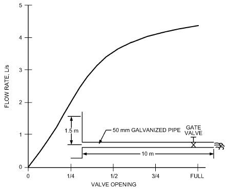

*Fig. 15 Valve Action in Pipeline*

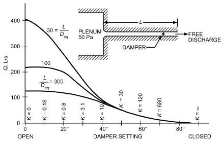

*Fig. 16 Effect of Duct Length on Damper Action*

Flow in a system (pump or blower and conduit with fittings) involves interaction between the characteristics of the flow-producing device (pump or blower) and the loss characteristics of the pipeline or duct system. Often the devices are centrifugal, in which case the pressure produced decreases as flow increases, except for the lowest flow rates. System pressure required to overcome losses increases roughly as the square of the flow rate. The flow rate of a given system is that where the two curves of pressure versus flow rate intersect (point 1 in Figure 17). When a control valve (or damper) is partially closed, it increases losses and reduces flow (point 2 in Figure 17). For cases of constant pressure, the flow decrease caused by valving is not as great as that indicated in Figures 15 and 16.

### Flow Measurement

The general principles noted (the continuity and Bernoulli equations) are basic to most fluid-metering devices. Chapter 37 has further details.

The pressure difference between the stagnation point (total pressure) and the ambient fluid stream (static pressure) is used to give a point velocity measurement. Flow rate in a conduit is measured by placing a pitot device at various locations in the cross section and spatially integrating over the velocity found. A single-point measurement may be used for approximate flow rate evaluation. When flow is fully developed, the pipe-factor information of Figure 5 can be used to estimate the flow rate from a centerline measurement. Measurements can be made in one of two modes. With the pitot-static tube, the ambient (static) pressure is found from pressure taps along the side of the forward-facing portion of the tube. When this portion is not long and slender, static pressure indication will be low and velocity indication high; as a result, a tube coefficient less than unity must be used. For parallel conduit flow, wall piezometers (taps) may take the ambient pressure, and the pitot tube indicates the impact (total pressure).

The venturi meter, flow nozzle, and orifice meter are flow-ratemetering devices based on the pressure change associated with relatively sudden changes in conduit section area (Figure 18). The elbow meter (also shown in Figure 18) is another differential pressure flowmeter. The flow nozzle is similar to the venturi in action, but does not have the downstream diffuser. For all these, the flow rate is proportional to the square root of the pressure difference resulting from fluid flow. With area-change devices (venturi, flow nozzle, and orifice meter), a theoretical flow rate relation is found by applying the Bernoulli and continuity equations in Equations (12) and (3) between stations 1 and 2:

> Qtheoretical = πd2/4 2gΔh/(1 – β4)&emsp;**(38)**

where Δh = h1 – h2 = (p1 – p2)/ρg and β = d/D = ratio of throat (or orifice) diameter to conduit diameter.

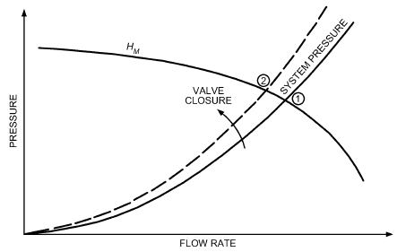

*Fig. 17 Matching of Pump or Blower to System*

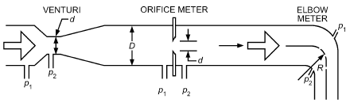

*Fig. 18 Differential Pressure Flowmeters*

<!-- str. 60 -->

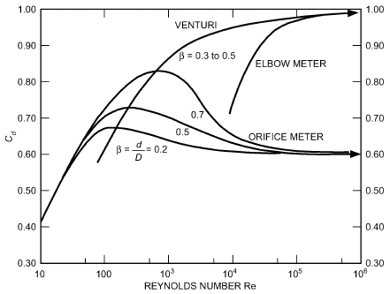

*Fig. 19 Flowmeter Coefficients*

The actual flow rate through the device can differ because the approach flow kinetic energy factor α deviates from unity and because of small losses. More significantly, jet contraction of orifice flow is neglected in deriving Equation (38), to the extent that it can reduce the effective flow area by a factor of 0.6. The effect of all these factors can be combined into the discharge coefficient Cd:

> Q = CdQtheoretical&emsp;**(39)**

where Q is actual flow. In some sources, instead of being defined as in Equation (39), Cd is replaced with

> Cd/(1 – β4)&emsp;**(40)**

Take care to note the definition used by a source of Cd data.

The general mode of variation in Cd for orifices and venturis is indicated in Figure 19 as a function of Reynolds number and, to a lesser extent, diameter ratio β. For Reynolds numbers less than 10, the coefficient varies as Re .

The elbow meter uses the pressure difference inside and outside the bend as the metering signal (Murdock et al. 1964). Momentum analysis gives the flow rate as

> πd2
>
> Qtheoretical = -------- R/2D(2gΔh)&emsp;**(41)**

> 4

where R is the radius of curvature of the bend. Again, a discharge coefficient Cd is needed; as in Figure 19, this drops off for lower Reynolds numbers (below 105). These devices are calibrated in pipes with fully developed velocity profiles, so they must be located far enough downstream of sections that modify the approach velocity.

**Example 3.** For a venturi with oil (ρ = 800 kg/m3, μ = 0.01 Pa·s), find Q for P1 – P2 = 28 kPa, D = 300 mm = 0.3 m, d = 150 mm = 0.15 m.

> Q = Cd πd2/4 (2(P1– P2))/(ρ(1 – β4))

where β = 150 mm/300 mm = 0.5.

Inserting numbers, being careful to ensure that the units for Q are m3/s, gives Q = 0.1527Cd.

Guessing ReD = 105 and using Figure 19 gives Cd = 0.97 and Q = 0.97 × 0.962 = 0.1481 m3/s.

Checking ReD using this Q gives Re = 5.0 × 105. At this Re, Cd = 0.96 and

> Q = 0.96 × 0.1527 = 0.147 m3/s

### Unsteady Flow

Conduit flows are not always steady. In a compressible fluid, acoustic velocity is usually high and conduit length is rather short, so the time of signal travel is negligibly small. Even in the incompressible approximation, system response is not instantaneous. If a pressure difference Δp is applied between the conduit ends, the fluid mass must be accelerated and wall friction overcome, so a finite time passes before the steady flow rate corresponding to the pressure drop is achieved.

The time it takes for an incompressible fluid in a horizontal, constant-area conduit of length L to achieve steady flow may be estimated by using the unsteady flow equation of motion with wall friction effects included. On the quasi-steady assumption, friction loss is given by Equation (30); also by continuity, V is constant along the conduit. The occurrences are characterized by the relation

> ( )
>
> 1 dp

> dV/dθ + -- ------ + fV2/2D = 0&emsp;**(42)**
>
> ρ ds

> ( )

where θ is the time and s is the distance in flow direction. Because a certain Δp is applied over conduit length L,

> dV/dθ = Δp/ρL – fV2/2D&emsp;**(43)**

For laminar flow, f is given by Equation (31):

> dV/dθ = Δp/ρL – 32μV/ρD2 = A – BV&emsp;**(44)**

Equation (44) can be rearranged and integrated to yield the time to reach a certain velocity:

> ∫
>
> θ = ∫dθ = dV/(A – BV) = – 1/B ln(A – BV)&emsp;**(45)**

and

> )
>
> V = (Δp( 2 ) ρL ( D –32νθ)/(L 32μ Δp ( ) ( D2)--------- 1 – ------exp&emsp;**(46)**

> )

For long times (θ → ∞), the steady velocity is

> ( ) ( )
>
> Δp Δp

> V∞ = ------ D2/32μ = ------ R2/8μ&emsp;**(47)**
>
> L L

> ( ) ( )

as given by Equation (17). Then, Equation (47) becomes

> ( )
>
> V = V∞ 1 – ρL/Δpexp (– f∞V∞θ)/2D&emsp;**(48)**

> ( )

where

> f∞ = 64ν/V∞D&emsp;**(49)**

The general nature of velocity development for start-up flow is derived by more complex techniques; however, the temporal variation is as given here. For shutdown flow (steady flow with Δp = 0 at θ > 0), flow decays exponentially as e–θ.

Turbulent flow analysis of Equation (42) also must be based on the quasi-steady approximation, with less justification. Daily et al. (1956) indicate that frictional resistance is slightly greater than the steady-state result for accelerating flows, but appreciably less for decelerating flows. If the friction factor is approximated as constant,

<!-- str. 61 -->

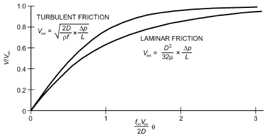

*Fig. 20 Temporal Increase in Velocity Following Sudden Application of Pressure*

> dV/dθ = Δp/ρL – fV2/2D = A – BV2&emsp;**(50)**

and for the accelerating flow,

> ( )
>
> θ = 1/AB tanh–1 V B/A&emsp;**(51)**

> ( )

or

> V = A ⁄ B tanh(θ AB )&emsp;**(52)**

Because the hyperbolic tangent is zero when the independent variable is zero and unity when the variable is infinity, the initial (V = 0 at θ = 0) and final conditions are verified. Thus, for long times (θ → ∞),

> Δp (2D)
>
> V∞ = A ⁄ B = (Δp ⁄ ρL)/(f∞⁄ 2D) = ------ -------&emsp;**(53)**

> ρL f
>
> ( ∞ )

which is in accord with Equation (30) when f is constant (the flow regime is the fully rough one of Figure 13). The temporal velocity variation is then

> V = V∞tanh ( f∞V∞θ/2D)&emsp;**(54)**

In Figure 20, the turbulent velocity start-up result is compared with the laminar one, where initially the turbulent is steeper but of the same general form, increasing rapidly at the start but reaching V∞ asymptotically.

### Compressibility

All fluids are compressible to some degree; their density depends somewhat on the pressure. Steady liquid flow may ordinarily be treated as incompressible, and incompressible flow analysis is satisfactory for gases and vapors at velocities below about 20 to 40 m/s, except in long conduits.

For liquids in pipelines, a severe pressure surge or water hammer may be produced if flow is suddenly stopped. This pressure surge travels along the pipe at the speed of sound in the liquid, alternately compressing and decompressing the liquid. For steady gas flows in long conduits, the pressure drop along the conduit can reduce gas density enough to increase the velocity. If the conduit is long enough, the velocity may reach the speed of sound, and the Mach number (ratio of flow velocity to the speed of sound) must be considered.

Some compressible flows occur without heat gain or loss (adiabatically). If there is no friction (conversion of flow mechanical energy into internal energy), the process is reversible (isentropic) and follows the relationship

> p/ρk = constant
>
> k = cp/cv

where k, the ratio of specific heats at constant pressure and volume, is 1.4 for air and diatomic gases.

When the elevation term gz is neglected, as it is in most compressible flow analyses, the Bernoulli equation of steady flow, Equation (21), becomes

> ∫dp/ρ + V2/2 = constant&emsp;**(55)**

For a frictionless adiabatic process,

> 2
>
> ( p2 )

> k
>
> ∫dp/ρ = ----------- ----- – p1/ρ1&emsp;**(56)**

> k – 1 ρ
>
> ( 2 )

> 1

Integrating between upstream station 1 and downstream station 2 gives

> 1) ⁄ k
>
> ( )(k–

> ( )
>
> p1/ρ1 k/(k – 1) + (2 2 V – V 2 1)/2 = 0&emsp;**(57)**

> – 1
>
> p2/p1

> ( )
>
> ( )

Equation (57) replaces the Bernoulli equation for compressible flows. If station 2 is the stagnation point at the front of a body, V2 = 0, and solving Equation (57) for p2gives

> k ⁄ (k – 1)
>
> ( )

> ps = p2 = p1 (2 ρ V 1 1)/kp1&emsp;**(58)**
>
> 1 + (k – 1)/2

> ( )

where psis the stagnation pressure.

Because the speed of sound of the gas is a = kp/ρ and Mach number M = V/a, the stagnation pressure in Equation (58) becomes

> k ⁄ (k – 1)
>
> ( ) 2

> ps = p1 1 + (k – 1)/2 M1&emsp;**(59)**
>
> ( )

For Mach numbers less than one,

> ( ) 4
>
> ps = p1(2 ρ V 1 1)/2 …&emsp;**(60)**

> 1 + M1/4 + (2 – k)/24 M1+
>
> ( )

When M = 0, Equation (60) reduces to the incompressible flow result obtained from Equation (9). When the upstream Mach number exceeds 0.2, the difference is significant. Thus, a pitot tube in air is influenced by compressibility at velocities over about 66 m/s.

**Flow Measurement.** For isentropic flow through a converging conduit such as a flow nozzle, venturi, or orifice meter, where velocity at the upstream station 1 is small, Equation (57) gives

> 1) ⁄ k
>
> ( 2)k–

> ( p1) p (
>
> 2k

> V2 = ---------- ----- 1 – ----&emsp;**(61)**
>
> k – 1 ρ p

> ( 1) ( 1)

The mass flow rate is ṁ = V2A2ρ2

<!-- str. 62 -->

> p 2⁄k p (k+1)⁄k&emsp;**(62)**
>
> ( 2) ( 2)

> = A2 2k/(k – 1)( p1ρ1) ---- – ----
>
> p p

> ( 1) ( 1)

For incompressible frictionless flow, the mass flow rate is

> ṁin = A2ρ 2Δp⁄ ρ = A2 2ρ( p1– p2)&emsp;**(63)**

The compressibility effect is often accounted for by the **expan- sion factor Y**:

> ṁ = Y ṁin = A2Y 2ρ( p1 – p2)&emsp;**(64)**

where ρ = ρ1, and A2 is the throat cross-sectional area. Y ≤ 1, with Y = 1 for the incompressible case. For compressible flow through orifices (ISO Standard 5167),

> Y = 1 – (0.351 + 0.256β4 + 0.93β8)(1 – (p2/p1)1/k)&emsp;**(65)**

where β = D2/D1. For venturis and nozzles (ISO Standard 5167),

> (k – 1)/k
>
> (p2)

> 2
>
> --

> (p2)k
>
> k

> Y = ---------- ---- × (1 – β4)/(2 -- k (p )) × (1 – ---- p ( 1))/((p2) 1 – ----)&emsp;**(66)**
>
> k – 1 p

> ( 1)
>
> 1 – β4 ----2 p

> ( 1)
>
> p

> ( 1)

For air (k = 1.4), Y = 0.95 for an orifice with p2/p1 = 0.83 and for a venturi at about 0.90, when these devices are of relatively small diameter (D2/D1 < 0.5).

As p2/p1 decreases, flow rate increases, but more slowly than for the incompressible case because of the nearly linear decrease in Y. However, if the downstream velocity reaches the local speed of sound, the mass flow rate becomes the value fixed by upstream pressure and density at the critical pressure ratio:

> – 1)
>
> ( )k⁄(k

> p2/p1 = 2/(k + 1) = 0.53 for air&emsp;**(67)**
>
> ( )

> c

At higher pressure ratios than critical, **choking** (no increase in flow with decrease in downstream pressure) occurs and is used in some flow control devices to avoid flow dependence on downstream conditions.

Using Equations (38) and (39) for the incompressible mass flow rate and adding the compressible expansion factor Y results in

> ṁ = CdY πd2/4 2ρΔp/(1 – β4)&emsp;**(68)**

where d is throat diameter, and Cd is the discharge coefficient introduced in the Flow Measurement section. Note that Cd accounts for the effects of friction in the measuring device, and Y accounts for compressibility.

**Example 4.** For a venturi used to measure air (k = 1.4) flow, inlet pressure and temperature are 100 kPa (absolute) and 25°C. The measured pressure at the throat is 80 kPa (absolute). The inlet diameter is 100 mm, and the throat diameter is 50 mm. What is the mass flow rate? Use Cd = 0.995.

**Solution.** Using p2/p1 = 80/100 = 0.8 and β = 5/10 = 0.5 in Equation (66) gives Y = 0.879. In Equation (68), d = 0.05 m, Δp = 20 kPa, and ρ = 1.169 kg/m3 at 25°C, 100 kPa. The result is m· = 0.383 kg/s.

### Compressible Conduit Flow

When friction loss is included, as it must be except for very short conduits, incompressible flow analysis applies until the pressure drop exceeds about 10% of the initial pressure. The possibility of sonic velocities at the end of relatively long conduits limits the amount of pressure reduction achieved. For an inlet Mach number of 0.2, discharge pressure can be reduced to about 0.2 of the initial pressure; for inflow at M = 0.5, discharge pressure cannot be less than about 0.45p1 (adiabatic) or about 0.6p1 (isothermal).

Analysis must treat density change, as evaluated from the continuity relation in Equation (3), with frictional occurrences evaluated from wall roughness and Reynolds number correlations of incompressible flow (Binder 1944). In evaluating valve and fitting losses, consider the reduction in K caused by compressibility (Benedict and Carlucci 1966). Although the analysis differs significantly, isothermal and adiabatic flows involve essentially the same pressure variation along the conduit, up to the limiting conditions.

### Cavitation

Liquid flow with gas- or vapor-filled pockets can occur if the absolute pressure is reduced to vapor pressure or less. In this case, one or more cavities form, because liquids are rarely pure enough to withstand any tensile stressing or pressures less than vapor pressure for any length of time (John and Haberman 1980; Knapp et al. 1970; Robertson and Wislicenus 1969). Robertson and Wislicenus (1969) indicate significant occurrences in various technical fields, chiefly in hydraulic equipment and turbomachines.

Initial evidence of cavitation is the collapse noise of many small bubbles that appear initially as they are carried by the flow into higher-pressure regions. The noise is not deleterious and serves as a warning of the occurrence. As flow velocity further increases or pressure decreases, the severity of cavitation increases. More bubbles appear and may join to form large fixed cavities. The space they occupy becomes large enough to modify the flow pattern and alter performance of the flow device. Collapse of cavities on or near solid boundaries becomes so frequent that, in time, the cumulative impact causes cavitational erosion of the surface or excessive vibration. As a result, pumps can lose efficiency or their parts may erode locally. Control valves may be noisy or seriously damaged by cavitation.

Cavitation in orifice and valve flow is shown in Figure 21. With high upstream pressure and a low flow rate, no cavitation occurs. As pressure is reduced or flow rate increased, the minimum pressure in the flow (in the shear layer leaving the edge of the orifice) eventually approaches vapor pressure. Turbulence in this layer causes fluctuating pressures below the mean (as in vortex cores) and small bubble-like cavities. These are carried downstream into the region of pressure regain where they collapse, either in the fluid or on the wall (Figure 21A). As pressure reduces, more vapor- or gas-filled bubbles result and coalesce into larger ones. Eventually, a single large cavity results that collapses further downstream (Figure 21B).

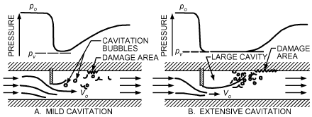

*Fig. 21 Cavitation in Flows in Orifice or Valve*

<!-- str. 63 -->

The region of wall damage is then as many as 20 diameters downstream from the valve or orifice plate.

Sensitivity of a device to cavitation is measured by the **cavitation index** or **cavitation number**, which is the ratio of the available pressure above vapor pressure to the dynamic pressure of the reference flow:

> σ = (2( po– pv))/ρVo2&emsp;**(69)**

where pv is vapor pressure, and the subscript o refers to appropriate reference conditions. Valve analyses use such an index to determine when cavitation will affect the discharge coefficient (Ball 1957). With flow-metering devices such as orifices, venturis, and flow nozzles, there is little cavitation, because it occurs mostly downstream of the flow regions involved in establishing the metering action.

The detrimental effects of cavitation can be avoided by operating the liquid-flow device at high enough pressures. When this is not possible, the flow must be changed or the device must be built to withstand cavitation effects. Some materials or surface coatings are more resistant to cavitation erosion than others, but none is immune. Surface contours can be designed to delay onset of cavitation.

## 5. NOISE IN FLUID FLOW

Noise in flowing fluids results from unsteady flow fields and can be at discrete frequencies or broadly distributed over the audible range. With liquid flow, cavitation results in noise through the collapse of vapor bubbles. Noise in pumps or fittings (e.g., valves) can be a rattling or sharp hissing sound, which is easily eliminated by raising the system pressure. With severe cavitation, the resulting unsteady flow can produce indirect noise from induced vibration of adjacent parts. See Chapter 49 of the 2019 ASHRAE Handbook—HVAC Applications for more information on noise control.

Disturbed laminar flow behind cylinders can be an oscillating motion. The shedding frequency f of these vortexes is characterized by a **Strouhal number** St = fd/V of about 0.21 for a circular cylinder of diameter d, over a considerable range of Reynolds numbers. This oscillating flow can be a powerful noise source, particularly when f is close to the natural frequency of the cylinder or some nearby structural member so that resonance occurs. With cylinders of another shape, such as impeller blades of a pump or blower, the characterizing Strouhal number involves the trailing-edge thickness of the member. The strength of the vortex wake, with its resulting vibrations and noise potential, can be reduced by breaking up flow with downstream splitter plates or boundary-layer trip devices (wires) on the cylinder surface.

Noises produced in pipes and ducts, especially from valves and fittings, are associated with the loss through such elements. The sound pressure of noise in water pipe flow increases linearly with pressure loss; broadband noise increases, but only in the lowerfrequency range. Fitting-produced noise levels also increase with fitting loss (even without cavitation) and significantly exceed noise levels of the pipe flow. The relation between noise and loss is not surprising because both involve excessive flow perturbations. A valve’s pressure-flow characteristics and structural elasticity may be such that for some operating point it oscillates, perhaps in resonance with part of the piping system, to produce excessive noise. A change in the operating point conditions or details of the valve geometry can result in significant noise reduction.

Pumps and blowers are strong potential noise sources. Turbomachinery noise is associated with blade-flow occurrences. Broadband noise appears from vortex and turbulence interaction with walls and is primarily a function of the operating point of the machine. For blowers, it has a minimum at the peak efficiency point (Groff et al. 1967). Narrow-band noise also appears at the bladecrossing frequency and its harmonics. Such noise can be very annoying because it stands out from the background. To reduce this noise, increase clearances between impeller and housing, and space impeller blades unevenly around the circumference.

## 6. SYMBOLS

> A = area, m2

Ao = area of orifice opening

> B = Bernoulli constant

CD = drag coefficient

Cd = discharge coefficient

Dh = hydraulic diameter

EL = loss during conversion of energy from mechanical to internal EM = external work from fluid machine

F = tangential force per unit area required to slide one of two parallel plates

> f = Darcy-Weisbach friction factor, or shedding frequency

FD = drag force fref = reference value of friction factor

> g = gravitational acceleration, m/s2

gc = gravitational constant = 1 (kg·m)/(N·s2)

HL = head lost through friction

HM = head added by pump

K = loss coefficient

> k = ratio of specific heats at constant pressure and volume
>
> L = length

Le = entrance length

Leff = effective length ṁ = mass flow rate

> p = pressure

Pw = wetted perimeter

Q = volumetric flow rate

> q = heat per unit mass absorbed or rejected
>
> R = pipe radius

Re = Reynolds number

> s = flow direction

St = Strouhal number

> u = internal energy
>
> V = velocity

> v = fluid velocity normal to differential area dA

w = work per unit mass

> y = distance from centerline
>
> Y = distance between two parallel plates, m, or expansion factor

> z = elevation

### Greek

α = kinetic energy factor

β = d/D = ratio of throat (or orifice) diameter to conduit diameter γ = specific mass or density

> δ = boundary layer thickness

ΔE = change in energy content per unit mass of flowing fluid

Δp = pressure drop across valve

Δu = conversion of energy from mechanical to internal

> ε = roughness height
>
> θ = time

μ = proportionality factor for absolute or dynamic viscosity of fluid, (mN·s)/m2

> ν = kinematic viscosity, mm2/s
>
> ρ = density, kg/m3

> σ = cavitation index or number
>
> τ = shear stress, Pa

τw = wall shear stress

## REFERENCES

ASHRAE members can access ASHRAE Journal articles and ASHRAE research project final reports at technologyportal .ashrae.org. Articles and reports are also available for purchase by nonmembers in the online ASHRAE Bookstore at www.ashrae.org /bookstore.

Baines, W.D., and E.G. Peterson. 1951. An investigation of flow through screens. ASME Transactions 73:467.

<!-- str. 64 -->

Ball, J.W. 1957. Cavitation characteristics of gate valves and globe values used as flow regulators under heads up to about 125 ft. ASME Transactions 79:1275.

Benedict, R.P., and N.A. Carlucci. 1966. *Handbook of specific losses in flow* systems. Plenum Press Data Division, New York.

Binder, R.C. 1944. Limiting isothermal flow in pipes. ASME Transactions 66:221.

Churchill, S.W. 1977. Friction-factor equation spans all fluid flow regimes.

Chemical Engineering 84(24):91-92.

Colborne, W.G., and A.J. Drobitch. 1966. An experimental study of nonisothermal flow in a vertical circular tube. ASHRAE Transactions 72(4):5.

Coleman, J.W. 2004. An experimentally validated model for two-phase sudden contraction pressure drop in microchannel tube header. Heat Transfer Engineering 25(3):69-77.

Daily, J.W., W.L. Hankey, R.W. Olive, and J.M. Jordan. 1956. Resistance coefficients for accelerated and decelerated flows through smooth tubes and orifices. ASME Transactions 78:1071-1077.

Deissler, R.G. 1951. Laminar flow in tubes with heat transfer. National Advi-*sory Technical Note* 2410, Committee for Aeronautics.

Fox, R.W., A.T. McDonald, and P.J. Pritchard. 2004. *Introduction to fluid* mechanics. Wiley, New York.

Furuya, Y., T. Sate, and T. Kushida. 1976. The loss of flow in the conical with suction at the entrance. *Bulletin of the Japan Society of Mechanical* Engineers 19:131.

Goldstein, S., ed. 1938. *Modern developments in fluid mechanics.* Oxford University Press, London. Reprinted by Dover Publications, New York.

Groff, G.C., J.R. Schreiner, and C.E. Bullock. 1967. Centrifugal fan sound power level prediction. ASHRAE Transactions 73(II):V.4.1.

Heskested, G. 1970. Further experiments with suction at a sudden enlargement. *Journal of Basic Engineering*, ASME Transactions 92D:437.

Hoerner, S.F. 1965. *Fluid dynamic drag*, 3rd ed. Hoerner Fluid Dynamics, Vancouver, WA.

Hydraulic Institute. 1990. *Engineering data book*, 2nd ed. Parsippany, NJ. Incropera, F.P., and D.P. DeWitt. 2002. *Fundamentals of heat and mass* transfer, 5th ed. Wiley, New York.

ISO. 2003. Measurement of fluid flow by means of pressure differential devices inserted in circular cross-section conduits running full. Standard 5167. International Organization for Standardization, Geneva.

Ito, H. 1962. Pressure losses in smooth pipe bends. *Journal of Basic Engi-* neering, ASME Transactions 4(7):43.

John, J.E.A., and W.L. Haberman. 1980. *Introduction to fluid mechanics*, 2nd ed. Prentice Hall, Englewood Cliffs, NJ.

Kline, S.J. 1959. On the nature of stall. *Journal of Basic Engineering*, ASME Transactions 81D:305.

Knapp, R.T., J.W. Daily, and F.G. Hammitt. 1970. Cavitation. McGraw-Hill, New York.

Lipstein, N.J. 1962. Low velocity sudden expansion pipe flow. ASHRAE Journal 4(7):43.

Moody, L.F. 1944. Friction factors for pipe flow. ASME Transactions 66:672.

Moore, C.A., and S.J. Kline. 1958. Some effects of vanes and turbulence in two-dimensional wide-angle subsonic diffusers. National Advisory Committee for Aeronautics, Technical Memo 4080.

Murdock, J.W., C.J. Foltz, and C. Gregory. 1964. Performance characteristics of elbow flow meters. *Journal of Basic Engineering*, ASME Transactions 86D:498.

Robertson, J.M. 1963. A turbulence primer. University of Illinois–Urbana, *Engineering Experiment Station Circular* 79.

Robertson, J.M. 1965. *Hydrodynamics in theory and application*. Prentice-Hall, Englewood Cliffs, NJ.

Robertson, J.M., and G.F. Wislicenus, eds. 1969 (discussion 1970). Cavita-*tion state of knowledge.* American Society of Mechanical Engineers, New York.

Ross, D. 1956. Turbulent flow in the entrance region of a pipe. ASME Transactions 78:915.

Schlichting, H. 1979. *Boundary layer theory*, 7th ed. McGraw-Hill, New York.

Wile, D.D. 1947. Air flow measurement in the laboratory. Refrigerating Engineering: 515.

## BIBLIOGRAPHY

Lin, C.-X., and P. Shinde. 2016. A heat transfer and friction factor correlation for low air-side Reynolds number applications of compact heat exchangers. ASHRAE Research Project RP-1535, Final Report.

Soumerai, H.P. 1986. Thermodynamic generalization of heat transfer and fluid-flow data. ASHRAE Transactions 92(1B). Paper SF-86-16-4.
