# Chapter 4 — Heat Transfer

*Izvor: 2021 ASHRAE Handbook — Fundamentals (SI), Chapter 4 (PDF str. 65–100).*

> **Napomena o konverziji:** Tekst je automatski izdvojen iz originalnog PDF-a uz prepoznavanje dve kolone, spojene prelomljene reči i pasuse. Indeksi i eksponenti su označeni sa `<sub>`/`<sup>`, tabele su pretvorene u Markdown tabele (veoma složene tabele su prikazane kao poravnat tekst), a slike su izrezane iz PDF-a u folder `img/`. Složene jednačine (razlomci, sume) mogu biti uprošćeno prikazane. **Pre upotrebe vrednosti u proračunu proveriti u originalnom PDF-u.** Oznake `<!-- str. N -->` pokazuju stranu PDF-a.

## Sadržaj

- [1. HEAT TRANSFER PROCESSES](#1-heat-transfer-processes)
- [2. THERMAL CONDUCTION](#2-thermal-conduction)
- [3. THERMAL RADIATION](#3-thermal-radiation)
- [4. THERMAL CONVECTION](#4-thermal-convection)
- [5. HEAT EXCHANGERS](#5-heat-exchangers)
- [6. HEAT TRANSFER AUGMENTATION](#6-heat-transfer-augmentation)
- [7. SYMBOLS](#7-symbols)
- [REFERENCES](#references)
- [BIBLIOGRAPHY](#bibliography)

<!-- str. 65 -->

HEAT transfer is energy transferred because of a temperature difference. Energy moves from a higher-temperature region to a lower-temperature region by one or more of three modes: **conduction**, **radiation**, and **convection**. This chapter presents elementary principles of single-phase heat transfer, with emphasis on HVAC applications. Boiling and condensation are discussed in Chapter 5. More specific information on heat transfer to or from buildings or refrigerated spaces can be found in Chapters 14 to 19, 23, and 27 of this volume and in Chapter 24 of the 2018 ASHRAE Handbook—Refrigeration. Physical properties of substances can be found in Chapters 26, 28, 32, and 33 of this volume and in Chapter 19 of the 2018 ASHRAE Handbook—Refrigeration. Heat transfer equipment, including evaporators, condensers, heating and cooling coils, furnaces, and radiators, is covered in the 2020 ASHRAE Hand-*book—HVAC Systems and Equipment*. For further information on heat transfer, see the Bibliography.

## 1. HEAT TRANSFER PROCESSES

### Conduction

Consider a wall that is 10 m long, 3 m tall, and 100 mm thick (Figure 1A). One side of the wall is maintained at t<sub>s1</sub> = 25°C, and the other is kept at t<sub>s2</sub> = 20°C. Heat transfer occurs at rate q through the wall from the warmer side to the cooler. The heat transfer mode is conduction (the only way energy can be transferred through a solid).

- If t<sub>s1</sub> is raised from 25 to 30°C while everything else remains the same, q doubles because t<sub>s1</sub> – t<sub>s2</sub> doubles.
- If the wall is twice as tall, thus doubling the area A<sub>c</sub> of the wall, q doubles.
- If the wall is twice as thick, q is halved.

From these relationships,

> q ∝ ((t<sub>s1</sub>– t<sub>s2</sub>)A<sub>c</sub>)/L

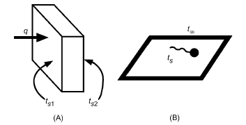

*Fig. 1 (A) Conduction and (B) Convection*

<sub>The preparation of this chapter is assigned to TC 1.3, Heat Transfer and Fluid Flow.</sub>

where ∝ means “proportional to” and L = wall thickness. However, this relation does not take wall material into account; if the wall were foam instead of concrete, q would clearly be less. The constant of proportionality is a material property, **thermal conductivity k**. Thus,

> q = k((t<sub>s1</sub>– t<sub>s2</sub>)A<sub>c</sub>)/L = ((t<sub>s1</sub>– t<sub>s2</sub>))/(L ⁄ (kA<sub>c</sub>))&emsp;**(1)**

where k has units of W/(m·K). The denominator L/(kA<sub>c</sub>) can be considered the **conduction resistance** associated with the driving potential (t<sub>s1</sub> – t<sub>s2</sub>). This is analogous to current flow through an electrical resistance, I = (V<sub>1</sub> – V<sub>2</sub>)/R, where (V<sub>1</sub> – V<sub>2</sub>) is driving potential, R is electrical resistance, and current I is rate of flow of charge instead of rate of heat transfer q.

Thermal resistance has units K/W. A wall with a resistance of 5 K/W requires (t<sub>s1</sub> – t<sub>s2</sub>) = 5 K for heat transfer q of 1 W. The thermal/electrical resistance analogy allows tools used to solve electrical circuits to be used for heat transfer problems.

### Convection

Consider a surface at temperature t<sub>s</sub> in contact with a fluid at t<sub>∞</sub> (Figure 1B). **Newton’s law of cooling** expresses the rate of heat transfer from the surface of area A<sub>s</sub> as

> q = h<sub>c</sub>A<sub>s</sub>(t<sub>s</sub> – t<sub>∞</sub>) = ((t<sub>s</sub>– t<sub>∞</sub>))/(1 ⁄ (h<sub>c</sub>A<sub>s</sub>))&emsp;**(2)**

where h<sub>c</sub> is the **heat transfer coefficient** (Table 1) and has units of W/(m<sup>2</sup>·K). The **convection resistance** 1/(h<sub>c</sub>A<sub>s</sub>) has units of K/W.

If t<sub>∞</sub> > t<sub>s</sub>, heat transfers from the fluid to the surface, and q is written as just q = h<sub>c</sub>A<sub>s</sub>(t<sub>∞</sub> – t<sub>s</sub>). Resistance is the same, but the sign of the temperature difference is reversed.

For heat transfer to be considered convection, fluid in contact with the surface must be in motion; if not, the mode of heat transfer is conduction. If fluid motion is caused by an external force (e.g., fan, pump, wind), it is **forced convection**. If fluid motion results from buoyant forces caused by the surface being warmer or cooler than the fluid, it is **free** (or **natural**) **convection**.

**Table 1 Heat Transfer Coefficients by Convection Type**

| Convection Type | h<sub>c</sub>, W/(m<sup>2</sup>·K) |
|---|---|
| Free, gases | 2 to 25 |
| Free, liquids | 10 to 1000 |
| Forced, gases | 25 to 250 |
| Forced, liquids | 50 to 20 000 |
| Boiling, condensation | 2500 to 100 000 |

<!-- str. 66 -->

### Radiation

Matter emits thermal radiation at its surface when its temperature is above absolute zero. This radiation is in the form of photons of varying frequency. These photons leaving the surface need no medium to transport them, unlike conduction and convection (in which heat transfer occurs through matter). The rate of thermal radiant energy emitted by a surface depends on its absolute temperature and its surface characteristics. A surface that absorbs all radiation incident upon it is called a **black surface**, and emits energy at the maximum possible rate at a given temperature. The heat emission from a black surface is given by the **Stefan-Boltzmann law:**

> q<sub>emitted,black</sub>= A<sub>s</sub>W<sub>b</sub> = A<sub>s</sub>σT<sub>s</sub><sup>4</sup>

where W<sub>b</sub> = σT<sub>s</sub><sup>4</sup> is the **blackbody emissive power** in W/m<sup>2</sup>; T<sub>s</sub> is absolute surface temperature, K; and σ = 5.67 × 10<sup>–8</sup> W/(m<sup>2</sup>·K<sup>4</sup>) is the Stefan-Boltzmann constant. If a surface is not black, the emission per unit time per unit area is

> W = εW<sub>b</sub> = εσT<sub>s</sub><sup>4</sup>

where W is emissive power, and ε is emissivity, where 0 ≤ ε ≤ 1. For a black surface, ε = 1.

Nonblack surfaces do not absorb all incident radiation. The absorbed radiation is

> q<sub>absorbed</sub> = αA<sub>s</sub>G

where **absorptivity** α is the fraction of incident radiation absorbed, and **irradiation G** is the rate of radiant energy incident on a surface per unit area of the receiving surface. For a black surface, α = 1.

A surface’s emissivity and absorptivity are often both functions of the wavelength distribution of photons emitted and absorbed, respectively, by the surface. However, in many cases, it is reasonable to assume that both α and ε are independent of wavelength. If so, α = ε (a **gray surface**).

Two surfaces at different temperatures that can “see” each other can exchange energy through radiation. The net exchange rate depends on the surfaces’ (1) relative size, (2) relative orientation and shape, (3) temperatures, and (4) emissivity and absorptivity. However, for a small area A<sub>s</sub> in a large enclosure at constant temperature t<sub>surr</sub>, the irradiation on A<sub>s</sub> from the surroundings is the blackbody emissive power of the surroundings W<sub>b,surr</sub>. So, if t<sub>s</sub> > t<sub>surr</sub>, net heat loss from gray surface A<sub>s</sub> in the radiation exchange with the surroundings at T<sub>surr</sub> is

> q<sub>net</sub> = q<sub>emitted</sub> – q<sub>absorbed</sub> = εA<sub>s</sub>W<sub>bs</sub> – αA<sub>s</sub>W<sub>b,sur</sub>
>
> r

> = εA<sub>s</sub>σ(T<sub>s</sub><sup>4</sup> – T<sup>4</sup><sub>surr</sub>)&emsp;**(3)**

where α = ε for the gray surface. If t<sub>s</sub> < t<sub>surr</sub>, the expression for q<sub>net</sub> is the same with the sign reversed, and q<sub>net</sub> is the net gain by A<sub>s</sub>.

Note that q<sub>net</sub> can be written as

> q<sub>net</sub> = (W – W bs b, surr)/(1 ⁄ (εA<sub>s</sub>))

In this form, E<sub>bs</sub> – E<sub>b,surr</sub> is analogous to the driving potential in an electric circuit, and 1/(εA<sub>s</sub>) is analogous to electrical resistance. This is a convenient analogy when only radiation is being considered, but if convection and radiation both occur at a surface, convection is described by a driving potential based on the difference in the first power of the temperatures, whereas radiation is described by the difference in the fourth power of the temperatures. In cases like this, it is often useful to express net radiation as

> q<sub>net</sub> = h<sub>r</sub>A<sub>s</sub>(t<sub>s</sub> – t<sub>surr</sub>) = (t<sub>s</sub> – t<sub>surr</sub>)/(1/h<sub>r</sub>A<sub>s</sub>)&emsp;**(4)**

where h<sub>r</sub> = σε(T<sub>s</sub><sup>2</sup> + T<sub>s</sub><sup>2</sup><sub>urr</sub>)(T<sub>s</sub> + T<sub>surr</sub>) is often called a **radiation heat transfer coefficient**. The disadvantage of this form is that h<sub>r</sub> depends on t<sub>s</sub>, which is often the desired result of the calculation.

### Combined Radiation and Convection

When t<sub>surr</sub> = t<sub>∞</sub> in Equation (4), the total heat transfer from a surface by convection and radiation combined is then

> q = q<sub>rad</sub> + q<sub>conv</sub> = (t<sub>s</sub> – t<sub>∞</sub>)A<sub>s</sub>(h<sub>r</sub> + h<sub>c</sub>)

The temperature difference t<sub>s</sub> – t<sub>∞</sub> is in either K or °C; the difference is the same. Either can be used; however, absolute temperatures must be used to calculate h<sub>r</sub>. (Absolute temperatures are K = °C + 273.15.) Note that h<sub>c</sub> and h<sub>r</sub> are always positive, and that the direction of q is determined by the sign of (t<sub>s</sub> – t<sub>∞</sub>).

### Contact or Interface Resistance

Heat flow through two layers encounters two conduction resistances L<sub>1</sub>/k<sub>1</sub>A and L<sub>2</sub>/k<sub>2</sub>A (Figure 2). At the interface between two layers are gaps across which heat is transferred by a combination of conduction at contact points and convection and radiation across gaps. This multimode heat transfer process is usually characterized using a contact resistance coefficient R<sub>c</sub>″<sub>ont</sub> or contact conductance h<sub>cont</sub>.

> q =Δt/(R″<sub>cont</sub> ⁄A) = h<sub>cont</sub>AΔt

where Δt is the temperature drop across the interface. R<sub>c</sub>″<sub>ont</sub> is in (m<sup>2</sup>·K)/W, and h<sub>cont</sub> is in W/(m<sup>2</sup>·K). The contact or interface resistance is R<sub>cont</sub> = R<sub>c</sub>″<sub>ont</sub>/A = 1/h<sub>cont</sub>A, and the resistance of the two layers combined is the sum of the resistances of the two layers and the contact resistance.

Contact resistance can be reduced by lowering surface roughnesses, increasing contact pressure, or using a conductive grease or paste to fill the gaps.

### Heat Flux

The conduction heat transfer can be written as

> q″ = q/A<sub>c</sub> = (k(t<sub>s1</sub>– t<sub>s2</sub>))/L

where q″ is heat flux in W/m<sup>2</sup>. Similarly, for convection the heat flux is

> q″ =q/A<sub>s</sub> = h<sub>c</sub>(t<sub>s</sub> – t<sub>∞</sub>)

and net heat flux from radiation at the surface is

> q″<sub>net</sub> = (q net)/A<sub>s</sub> = εσ(T<sub>s</sub><sup>4</sup>– T<sub>s</sub><sup>4</sup><sub>urr</sub>)

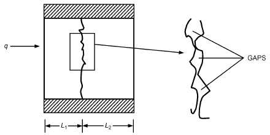

*Fig. 2 Interface Resistance Across Two Layers*

<!-- str. 67 -->

### Overall Resistance and Heat Transfer Coefficient

In Equation (1) for conduction in a slab, Equation (4) for radiative heat transfer rate between two surfaces, and Equation (2) for convective heat transfer rate from a surface, the heat transfer rate is expressed as a temperature difference divided by a thermal resistance. Using the electrical resistance analogy, with temperature difference and heat transfer rate instead of potential difference and current, respectively, tools for solving series electrical resistance circuits can also be applied to heat transfer circuits. For example, consider the heat transfer rate from a liquid to the surrounding gas separated by a constant cross-sectional area solid, as shown in Figure 3. The heat transfer rate from the liquid to the adjacent surface is by convection, then across the solid body by conduction, and finally from the solid surface to the surroundings by both convection and radiation. A circuit using the equations for resistances in each mode is also shown. From the circuit, the heat transfer rate is

> q = ((t<sub>f1</sub>– t<sub>f2</sub>))/(R<sub>1</sub>+ R<sub>2</sub>+ R<sub>3</sub>)

where

- R<sub>1</sub> = 1/hA R<sub>2</sub> = L/kA R<sub>3</sub> = ((1 ⁄ h<sub>c</sub>A)(1 ⁄ h<sub>r</sub>A))/((1 ⁄ h<sub>c</sub>A) + (1 ⁄ h<sub>r</sub>A))

Resistance R<sub>3</sub> is the parallel combination of the convection and radiation resistances on the right-hand surface, 1/h<sub>c</sub>A and 1/h<sub>r</sub>A. Equivalently, R<sub>3</sub> = 1/h<sub>rc</sub>A, where h<sub>rc</sub> on the air side is the sum of the convection and radiation heat transfer coefficients (i.e., *h<sub>rc</sub> = h<sub>c</sub> + h<sub>r</sub>*).

The heat transfer rate can also be written as

> q = UA(t<sub>f1</sub> – t<sub>f2</sub>)

where U is the overall heat transfer coefficient that accounts for all the resistances involved. Note that

> (t – t f1 f 2)/q = 1/UA = R<sub>1</sub> + R<sub>2</sub> +R<sub>3</sub>

The product UA is overall conductance, the reciprocal of overall resistance. The surface area A on which U is based is not always constant as in this example, and should always be specified when referring to U.

Heat transfer rates are equal from the warm liquid to the solid surface, through the solid, and then to the cool gas. Temperature drops across each part of the heat flow path are related to the resistances (as voltage drops are in an electric circuit), so that

> t<sub>f1</sub> – t<sub>1</sub> = qR<sub>1</sub> t<sub>1</sub> – t<sub>2</sub> = qR<sub>2</sub> t<sub>2</sub> – t<sub>f2</sub> = qR<sub>3</sub>

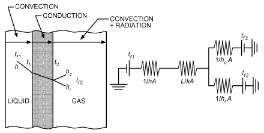

*Fig. 3 Thermal Circuit*

## 2. THERMAL CONDUCTION

### One-Dimensional Steady-State Conduction

Steady-state heat transfer rates and resistances for (1) a slab of constant cross-sectional area, (2) a hollow cylinder with radial heat transfer, and (3) a hollow sphere are given in Table 2.

**Example 1.** Chilled water at 5°C flows in a copper pipe with a thermal conductivity k<sub>p</sub> of 400 W/(m·K), with internal and external diameters of ID = 100 mm and OD = 120 mm. (Figure 4) The tube is covered with insulation 50 mm thick, with k<sub>i</sub> = 0.20 W/(m·K). The surrounding air is at t<sub>a</sub> = 25°C, and the heat transfer coefficient at the outer surface h<sub>o</sub> = 10 W/(m<sup>2</sup>·K). Emissivity of the outer surface is ε = 0.85. The heat transfer coefficient inside the tube is h<sub>i</sub> = 1000 W/(m<sup>2</sup>·K). Contact resistance between the insulation and the pipe is assumed to be negligible. Find the rate of heat gain for a given length of pipe and the temperature at the pipe-insulation interface.

**Solution:** The outer diameter of the insulation is D<sub>ins</sub> = 120 + 2(50) = 220 mm. From Table 2, for L = 1 m,

> R<sub>1</sub> = 1/h<sub>i</sub>πIDL = 3.2 × 10<sup>–3</sup> K/W
>
> R<sub>2</sub> = (ln(OD ⁄ ID))/2πk<sub>p</sub>L = 7 × 10<sup>–5</sup> K/W

> R<sub>3</sub> = (ln(D<sub>ins</sub>⁄ OD))/2πk<sub>i</sub>L = 0.482 K/W
>
> R<sub>c</sub> = 1/h<sub>o</sub>πD<sub>ins</sub>L = 0.144 K/W

Assuming insulation surface temperature t<sub>s</sub> = 21°C (i.e., 294 K) and T<sub>surr</sub> = T<sub>a</sub> = 298.15 K, h<sub>r</sub> = εσ(T<sub>s</sub><sup>2</sup> + T<sub>s</sub><sup>2</sup><sub>urr</sub>)(T<sub>s</sub> + T<sub>surr</sub>) = 5.0 W/(m<sup>2</sup>·K).

**Table 2 One-Dimensional Conduction Shape Factors**

| Configuration |   | Heat Transfer | Heat Transfer<br>Rate |   | Thermal Resistance |
|---|---|---|---|---|---|
| Constant cross-sectional area slab | q<sub>x</sub> | = kA<sub>x</sub>------------- | t<sub>1</sub>– t<sub>2</sub><br>L |  | L --------kA<sub>x</sub> |
| Hollow cylinder of length L with negligible heat transfer from end surfaces | q<sub>r</sub> | = | 2πkL(t<sub>i</sub>– t<sub>o</sub>) -------------------------------r<br>( o ) ln ----( r<sub>i</sub>) | R | ln(r<sub>o</sub>⁄ r<sub>i</sub>) = ---------------------2πkL |
| Hollow sphere | q<sub>r</sub> | = | 4πk(t<sub>i</sub>– t<sub>o</sub>) --------------------------- R 1 1 --- – ----r<sub>i</sub> r<sub>o</sub> | = | 1 ⁄ r<sub>i</sub>– 1 ⁄ r<sub>o</sub> ---------------------------4πk |

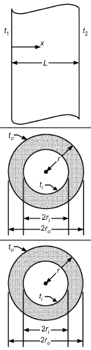

<!-- str. 68 -->

> R<sub>r</sub> = 1/h<sub>r</sub>πD<sub>ins</sub>L = 0.288 K/W
>
> R<sub>4</sub> = R<sub>r</sub>R<sub>c</sub>/(R<sub>r</sub>+ R<sub>c</sub>) = 0.096 K/W

> R<sub>tot</sub> = R<sub>1</sub> + R<sub>2</sub> + R<sub>3</sub> + R<sub>4</sub> = 0.581 K/W
>
> Finally, the rate of heat gain by the cold water is

> q<sub>rc</sub> = (t<sub>a</sub>– t)/(R tot) = 34.4 W
>
> Temperature at the pipe/insulation interface is

> t<sub>s2</sub> = t + q<sub>rc</sub>(R<sub>1</sub> + R<sub>2</sub>) = 5.1°C
>
> Temperature at the insulation’s surface is

> t<sub>s3</sub> = t<sub>a</sub> – q<sub>rc</sub>R<sub>4</sub> = 21.7°C

which is very close to the assumed value of 22°C.

Note the importance of the pipe/insulation interface temperature. If this temperature is below the dew point, condensation will occur that will damage the insulation. A more complete version of this kind of example is given in Chapter 6. It covers calculation of interface temperatures and the vapor pressures needed to find the corresponding dew-point temperatures at the interface, as well as methods to prevent condensation.

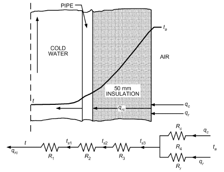

*Fig. 4 Thermal Circuit Diagram for Insulated Water Pipe (Example 1)*

### Two- and Three-Dimensional Steady-State Conduction: Shape Factors

Mathematical solutions to a number of two and three-dimensional conduction problems are available in Carslaw and Jaeger (1959). Complex problems can also often be solved by graphical or numerical methods, as described by Adams and Rogers (1973), Croft and Lilley (1977), and Patankar (1980). There are many two- and three-dimensional steady-state cases that can be solved using conduction shape factors. Using the conduction shape factor S, the heat transfer rate is expressed as

> q = Sk(t – t ) = (t – t )/(1/Sk)&emsp;**(5)**
>
> 1 2 1 2

where k is the material’s thermal conductivity, t and t are tempera-

> 1 2

tures of two surfaces, and 1/(Sk) is thermal resistance. Conduction shape factors for some common configurations are given in Table 3.

**Example 2.** The walls and roof of a house are made of 200 mm thick concrete with k = 0.75 W/(m·K). The inner surface is at 20°C, and the outer surface is at 8°C. The roof is 10 × 10 m, and the walls are 6 m high. Find the rate of heat loss from the house through its walls and roof, including edge and corner effects.

**Solution:** The rate of heat transfer excluding the edges and corners is first determined:

- A<sub>total</sub> = (10 – 0.4)(10 – 0.4) + 4(10 – 0.4)(6 – 0.2) = 314.9 m<sup>2</sup>

> kA<sub>total</sub> [0.75 W/(m·K)](314.9 m<sup>2</sup>)

q<sub>walls+ceiling</sub> =--------------- (ΔT) = -------------------------------------------------------------------

> L 0.2 m
>
> = (20 – 8)°C = 14 170 W

The shape factors for the corners and edges are in Table 2:

- S<sub>corners+edges</sub> = 4 × S<sub>corner</sub> + 4 × S<sub>edge</sub> = 4 × 0.15L + 4 × 0.54W = 4 × 0.15(0.2 m) + 4 × 0.54(9.6 m) = 20.86 m and the heat transfer rate is

> q<sub>corners+edges</sub> = S<sub>corners+edges</sub> kΔT
>
> = (20.86 m)[0.75 W/(m·K)](20 – 8)°C

> = 188 W

which leads to

> q<sub>total</sub> = 14 170 W + 188 W = 14 358 W = 14.4 kW

Note that the edges and corners are 1.3% of the total.

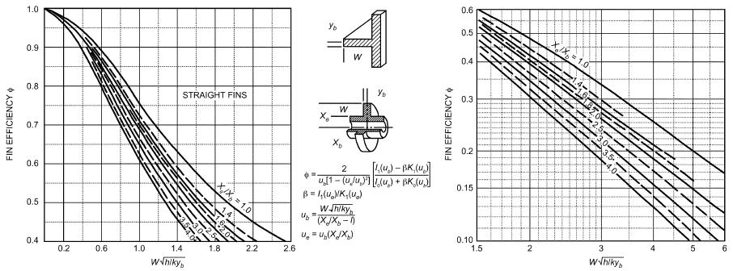

*Fig. 5 Efficiency of Annular Fins of Constant Thickness*

<!-- str. 69 -->

**Table 3 Multidimensional Conduction Shape Factors**

| Configuration | Shape Factor S, m | Shape Factor S, m | Shape Factor S, m | Restriction |
|---|---|---|---|---|
| Edge of two adjoining walls |  | 0.54W |  | W > L/5 |
| Corner of three adjoining walls (inner surface at T<sub>1</sub> and outer surface at T<sub>2</sub>) |  | 0.15L |  | L << length and width of wall |
| Isothermal rectangular block embedded in semiinfinite body with one face of block parallel to surface ---------------------------------------of body | 2.756L<br>( ln 1 + ----( | d ) )<br>W | <sub>0.078</sub><br>H<br>( ) ---9( d ) <sup>0.5</sup> | *L > W*<br>*L >> d, W, H* |
| Thin isothermal rectangular plate buried in semiinfinite medium |  | πW -------------------------ln(4W ⁄ L) 2πW -------------------------ln(4W ⁄ L) 2πW --------------------------ln(2πd ⁄ L) |  | d = 0, *W > L* d >> W<br>W > L d > 2W<br>*W >> L* |
| Cylinder centered inside square of length L | --------------------------------ln(0.54W ⁄ R) | 2πL |  | L >> W<br>W > 2R |
| Isothermal cylinder buried in semi-infinite medium | ------------<sub>–</sub>--<sub>1</sub>-----------------cosh (d ⁄ R) -----------------------------------------------L ln-- 1 – -----------------------R | 2πL 2πL -----------------------ln(2d ⁄ R) 2πL ln(L ⁄ 2d) ln(L ⁄ R) |  | L >> R<br>L >> R d > 3R d >> R<br>L >> d |
| Horizontal cylinder of length L midway between two infinite, parallel, isothermal surfaces |  | 2πL -----------------4d<br>( ln -----( R ) | ) | *L >> d* |
| Isothermal sphere in semi-infinite medium |  | 4πR ---------------------------1 – (R ⁄ 2d) |  |  |
| Isothermal sphere in infinite medium |  | 4πR |  |  |

<!-- str. 70 -->

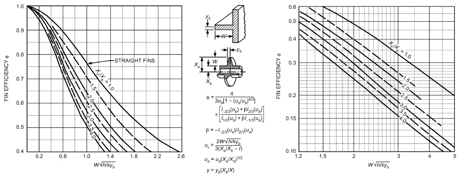

*Fig. 6 Efficiency of Annular Fins with Constant Metal Area for Heat Flow*

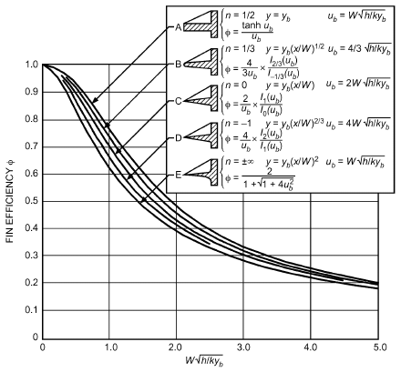

*Fig. 7 Efficiency of Several Types of Straight Fins*

### Extended Surfaces

Heat transfer from a surface can be increased by attaching fins or extended surfaces to increase the area available for heat transfer. A few common fin geometries are shown in Figures 5 to 8. Fins provide a large surface area in a low volume, thus lowering material costs for a given performance. To achieve optimum design, fins are generally located on the side of the heat exchanger with lower heat transfer coefficients (e.g., the air side of an air-to-water coil). Equipment with extended surfaces includes natural- and forced-convection coils and shell-and-tube evaporators and condensers. Fins are also used inside tubes in condensers and dry expansion evaporators.

**Fin Efficiency.** As heat flows from the root of a fin to its tip, temperature drops because of the fin material’s thermal resistance. The temperature difference between the fin and surrounding fluid is therefore greater at the root than at the tip, causing a corresponding variation in heat flux. Therefore, increases in fin length result in proportionately less additional heat transfer. To account for this effect, **fin efficiency** φ is defined as the ratio of the actual heat transferred from the fin to the heat that would be transferred if the entire fin were at its root or base temperature:

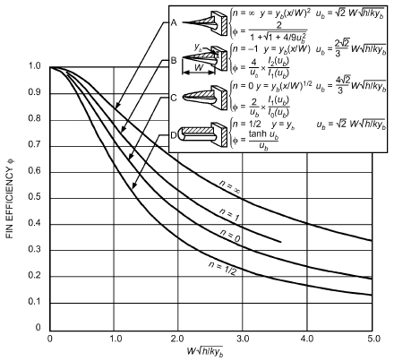

*Fig. 8 Efficiency of Four Types of Spines*

> φ = q/(hA<sub>s</sub>(t<sub>r</sub>– t<sub>e</sub>))&emsp;**(6)**

where q is heat transfer rate into/out of the fin’s root, t<sub>e</sub> is temperature of the surrounding environment, t<sub>r</sub> is temperature at fin root, and A<sub>s</sub> is surface area of the fin. Fin efficiency is low for long or thin fins, or fins made of low-thermal-conductivity material. Fin efficiency decreases as the heat transfer coefficient increases because of increased heat flow. For natural convection in air-cooled condensers and evaporators, where the air-side h is low, fins can be fairly large and fabricated from low-conductivity materials such as steel instead of from copper or aluminum. For condensing and boiling, where large heat transfer coefficients are involved, fins must be very short for optimum use of material. Fin efficiencies for a few geometries are shown in Figures 5 to 8. Temperature distribution and fin efficiencies for various fin shapes are derived in most heat transfer texts.

<!-- str. 71 -->

*Constant-Area Fins and Spines.* For fins or spines with constant cross-sectional area [e.g., straight fins (option A in Figure 7), cylindrical spines (option D in Figure 8)], the efficiency can be calculated as

> φ = tanh(mW<sub>c</sub>)/mW<sub>c</sub>&emsp;**(7)**

where

- m = hP ⁄ kA<sub>c</sub>
- P = fin perimeter
- A<sub>c</sub> = fin cross-sectional area
- W<sub>c</sub> = corrected fin/spine length = W + A<sub>c</sub>/P
- A<sub>c</sub>/P = d/4 for a cylindrical spine with diameter d = a/4 for an a × a square spine
- = y<sub>b</sub> = δ/2 for a straight fin with thickness δ

*Empirical Expressions for Fins on Tubes.* Schmidt (1949) presents approximate, but reasonably accurate, analytical expressions (for computer use) for the fin efficiency of circular, rectangular, and hexagonal arrays of fins on round tubes, as shown in Figures 5, 9, and 10, respectively. Rectangular fin arrays are used for an in-line tube arrangement in finned-tube heat exchangers, and hexagonal arrays are used for staggered tubes. Schmidt’s empirical solution is given by

> φ = tanh(mr<sub>b</sub>Z)/mr<sub>b</sub>Z&emsp;**(8)**

where r<sub>b</sub> is tube radius, m = 2h ⁄ kδ , δ = fin thickness, and Z is given by

> Z = [(r<sub>e</sub>/r<sub>b</sub>) – 1][1 + 0.35 ln(r<sub>e</sub>/r<sub>b</sub>)]

where r<sub>e</sub> is the actual or equivalent fin tip radius. For **circular fins**, r<sub>e</sub>/r<sub>b</sub> is the actual ratio of fin tip radius to tube radius. For rectangular fins (Figure 9), r<sub>e</sub>/r<sub>b</sub>= 1.28 Ψ β – 0.2 Ψ = M/r<sub>b</sub> β = L/M ≥ 1 where M and L are defined by Figure 9 as a/2 or b/2, depending on which is greater. For hexagonal fins (Figure 10),

> r<sub>e</sub>/r<sub>b</sub>= 1.27 Ψ β – 0.3

where Ψ and β are defined as previously, and M and L are defined by Figure 10 as a/2 or b (whichever is less) and 0.5 (a ⁄ 2)2 + b2 , respectively.

For constant-thickness square fins on a round tube (L = M in Figure 9), the efficiency of a constant-thickness annular fin of the same area can be used. For more accuracy, particularly with rectangular fins of large aspect ratio, divide the fin into circular sectors as described by Rich (1966).

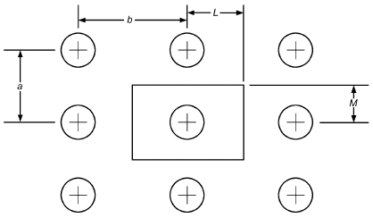

*Fig. 9 Rectangular Tube Array*

Other sources of information on finned surfaces are listed in the References and Bibliography.

**Surface Efficiency.** Heat transfer from a finned surface (e.g., a tube) that includes both fin area A and unfinned or prime area A is

> s p

given by

> q = (h A + φh A )(t – t )&emsp;**(9)**
>
> *p p s s r e*

Assuming the heat transfer coefficients for the fin and prime surfaces are equal, a **surface efficiency** φ can be derived as

> s
>
> φ = (A<sub>p</sub>+ φA<sub>s</sub>)/A&emsp;**(10)**

> s

where A = A + A is the total surface area, the sum of the fin and s p prime areas. The heat transfer in Equation (8) can then be written as

> q = φ hA(t – t ) = (t<sub>r</sub>– t<sub>e</sub>)/(1 ⁄ (φ<sub>s</sub>hA))&emsp;**(11)**
>
> *s r e*

where 1/(φ hA) is the finned surface resistance.

> s

**Example 3.** An aluminum tube with k = 186 W/(m·K), ID = 45 mm, and OD = 50 mm has circular aluminum fins δ = 1 mm thick with an outer diameter of D<sub>fin</sub> = 100 mm. There are N' = 250 fins per metre of tube length. Steam condenses inside the tube at t<sub>i</sub> = 200°C with a large heat transfer coefficient on the inner tube surface. Air at t<sub>∞</sub> = 25°C is heated by the steam. The heat transfer coefficient outside the tube is 40 W/(m<sup>2</sup>·K). Find the rate of heat transfer per metre of tube length. **Solution:** From Figure 5’s efficiency curve, the efficiency of these circular fins is W = (D<sub>fin</sub>– OD) ⁄ 2 = (0.10 – 0.05) ⁄ 2 = 0.025 m

> }

X<sub>e</sub>⁄ X<sub>b</sub> = 0.10 ⁄ 0.05 = 2.0

> φ = 0.89
>
> }

W h/(k(δ ⁄ 2)) = 0.025 (40 W/(m<sup>2</sup>·K))/([186 W(m·K)](0.0005 m)) = 0.52

> }

The fin area for L = 1 m is

> A<sub>s</sub> = 250 × 2π(D<sub>f</sub><sup>2</sup><sub>in</sub> – OD<sup>2</sup>)/4 = 2.945 m<sup>2</sup>

The unfinned area for L = 1 m is

> A<sub>p</sub> = π × OD × L(1 – N′δ) = π(0.05 m)(1 m)(1 – 250 × 0.001)
>
> = 0.118 m<sup>2</sup>

and the total area A = A<sub>s</sub> + A<sub>p</sub> = 3.063 m<sup>2</sup>. Surface efficiency is

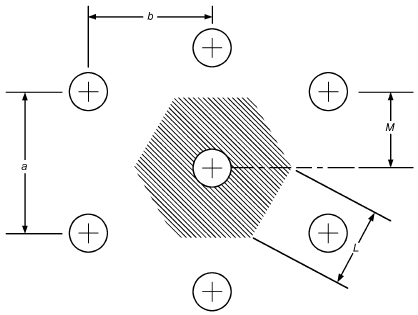

*Fig. 10 Hexagonal Tube Array*

<!-- str. 72 -->

> φ<sub>s</sub> =(φA<sub>f</sub>+ A<sub>s</sub>)/A = 0.894

and resistance of the finned surface is

> R<sub>s</sub> = 1/φ<sub>s</sub>hA = 9.13 × 10<sup>–3</sup> K/W

Tube wall resistance is

> R<sub>wall</sub> = (ln(OD ⁄ ID))/2πLk<sub>tube</sub> = (ln(5 ⁄ 4.5))/(2π(1 m)[186 W/(m·K)])
>
> = 9.02 × 10<sup>–5</sup>K/W

The rate of heat transfer is then

> q = (t<sub>i</sub>– t<sub>∞</sub>)/(R + R s wall) = 18 981 W

Had Schmidt’s approach been used for fin efficiency,

> m = 2h ⁄ kδ = 20.74 m<sup>–1</sup> r<sub>b</sub> = OD/2 = 0.025 m
>
> Z = [(D<sub>fin</sub>/OD) – 1][1 + 0.35 ln(D<sub>fin</sub>/OD)] = 1.243

> φ = tanh(mr<sub>b</sub>Z)/mr<sub>b</sub>Z = 0.88

the same φ as given by Figure 5.

**Contact Resistance**. Fins can be extruded from the prime surface (e.g., short fins on tubes in flooded evaporators or water-cooled condensers) or can be fabricated separately, sometimes of a different material, and bonded to the prime surface. Metallurgical bonds are achieved by furnace-brazing, dip-brazing, or soldering; nonmetallic bonding materials, such as epoxy resin, are also used. Mechanical bonds are obtained by tension-winding fins around tubes (spiral fins) or expanding the tubes into the fins (plate fins). Metallurgical bonding, properly done, leaves negligible thermal resistance at the joint but is not always economical. Contact resistance of a mechanical bond may or may not be negligible, depending on the application, quality of manufacture, materials, and temperatures involved. Tests of plate-fin coils with expanded tubes indicate that substantial losses in performance can occur with fins that have cracked collars, but negligible contact resistance was found in coils with continuous collars and properly expanded tubes (Dart 1959).

Contact resistance at an interface between two solids is largely a function of the surface properties and characteristics of the solids, contact pressure, and fluid in the interface, if any. Eckels (1977) modeled the influence of fin density, fin thickness, and tube diameter on contact pressure and compared it to data for wet and dry coils. Shlykov (1964) showed that the range of attainable contact resistances is large. Sonokama (1964) presented data on the effects of contact pressure, surface roughness, hardness, void material, and the pressure of the gas in the voids. Lewis and Sauer (1965) showed the resistance of adhesive bonds, and Clausing (1964) and Kaspareck (1964) gave data on the contact resistance in a vacuum environment.

### Transient Conduction

Often, heat transfer and temperature distribution under transient (i.e., varying with time) conditions must be known. Examples are (1) cold-storage temperature variations on starting or stopping a refrigeration unit, (2) variation of external air temperature and solar irradiation affecting the heat load of a cold-storage room or wall temperatures, (3) time required to freeze a given material under certain conditions in a storage room, (4) quick-freezing objects by direct immersion in brines, and (5) sudden heating or cooling of fluids and solids from one temperature to another.

**Lumped Mass Analysis.** Often, the temperature within a mass of material can be assumed to vary with time but be uniform within the mass. Examples include a well-stirred fluid in a thin-walled container, or a thin metal plate with high thermal conductivity. In both cases, if the mass is heated or cooled at its surface, the temperature can be assumed to be a function of time only and not location within the body. Such an approximation is valid if

> Bi = (h(V ⁄ A<sub>s</sub>))/k ≤ 0.1

where

- Bi = Biot number
- h = surface heat transfer coefficient
- V = material’s volume
- A<sub>s</sub> = surface area exposed to convective and/or radiative heat transfer
- k = material’s thermal conductivity

The temperature is given by

> Mc<sub>p</sub>dt/dτ = q<sub>net</sub> + q<sub>gen</sub>&emsp;**(12)**

where

- M = body mass
- c<sub>p</sub> = specific heat
- q<sub>gen</sub> = internal heat generation
- q<sub>net</sub> = net heat transfer rate to substance (into substance is positive, and out of substance is negative)

Equation (12) applies to liquids and solids. If the material is a gas being heated or cooled at constant volume, replace c<sub>p</sub> with the constant-volume specific heat c<sub>v</sub>. The term q<sub>net</sub> may include heat transfer by conduction, convection, or radiation and is the difference between the heat transfer rates into and out of the body. The term q<sub>gen</sub> may include a chemical reaction (e.g., curing concrete) or heat generation from a current passing through a metal.

For a lumped mass M initially at a uniform temperature t<sub>0</sub> that is suddenly exposed to an environment at a different temperature t<sub>∞</sub>, the time taken for the temperature of the mass to change to t<sub>f</sub> is given by the solution of Equation (12) with q<sub>gen</sub> = 0 as

> ln (t<sub>f</sub>– t<sub>∞</sub>)/(t<sub>0</sub>– t<sub>∞</sub>) = – hA<sub>s</sub>τ/Mc<sub>p</sub>&emsp;**(13)**

where

- M = mass of solid
- c<sub>p</sub> = specific heat of solid
- A<sub>s</sub> = surface area of solid
- h = surface heat transfer coefficient
- τ = time required for temperature change
- t<sub>f</sub> = final solid temperature
- t<sub>0</sub> = initial uniform solid temperature
- t<sub>∞</sub> = surrounding fluid temperature

**Example 4.** A copper sphere with diameter d = 1 mm is to be used as a sensing element for a thermostat. It is initially at a uniform temperature of t<sub>0</sub> = 21°C. It is then exposed to the surrounding air at t<sub>∞</sub> = 20°C. The combined heat transfer coefficient is h = 60 W/(m<sup>2</sup>·K). Determine the time taken for the temperature of the sensing element to reach t<sub>f</sub> = 20.5°C. The properties of copper are

> ρ = 8933 kg/m<sup>3</sup> c<sub>p</sub> = 385 J/(kg·K) k = 401 W/(m·K)

**Solution:** Bi = h(d/2)/k = 60.35(0.001/2)/401 = 7.5 × 10<sup>–5</sup>, which is much less than 1. Therefore, lumped analysis is valid.

> M = ρ[4π(d/2)<sup>3</sup>/3] = 4.677 × 10<sup>–6</sup> kg
>
> A<sub>s</sub> = πd<sup>2</sup> = 3.142 × 10<sup>–6</sup> m<sup>2</sup>

Using Equation (13), τ = 6.6 s.

**Nonlumped Analysis.** When the Biot number is greater than 0.1, variation of temperature with location within the mass is significant.

<!-- str. 73 -->

One example is the cooling time of meats in a refrigerated space: the meat’s size and conductivity do not allow it to be treated as a lumped mass that cools uniformly. Nonlumped problems require solving multidimensional partial differential equations. Many common cases have been solved and presented in graphical forms (Jakob 1949, 1957; Myers 1971; Schneider 1964). In other cases, numerical methods (Croft and Lilley 1977; Patankar 1980) must be used.

*Estimating Cooling Times for One-Dimensional Geometries.* When a slab of thickness 2L or a solid cylinder or solid sphere with outer radius r<sub>m</sub> is initially at a uniform temperature t<sub>1</sub>, and its surface is suddenly heated or cooled by convection with a fluid at t<sub>∞</sub>, a mathematical solution is available for the temperature t as a function of location and time τ. The solution is an infinite series. However, after a short time, the temperature is very well approximated by the first term of the series. The single-term approximations for the three cases are of the form

> Y = Y<sub>0</sub>f (μ<sub>1</sub>n)&emsp;**(14)**

where

- Y = (t – t<sub>∞</sub>)/(t<sub>1</sub>– t<sub>∞</sub>)
- Y<sub>0</sub> = (t<sub>0</sub>– t<sub>∞</sub>)/(t<sub>1</sub>– t<sub>∞</sub>) = c<sub>1</sub>exp(–μ<sub>1</sub><sup>2</sup>Fo)
- t<sub>0</sub> = temperature at center of slab, cylinder, or sphere
- Fo = ατ/L<sub>c</sub><sup>2</sup>= Fourier number
- α = thermal diffusivity of solid = k/ρc<sub>p</sub>
- L<sub>c</sub> = L for slab, r<sub>o</sub> for cylinder, sphere
- n = x/L for slab, r/r<sub>m</sub> for cylinder
- c<sub>1</sub>, μ<sub>1</sub> = coefficients that are functions of Bi
- Bi = Biot number = hL<sub>c</sub>/k
- f (μ<sub>1</sub>n) = function of μ<sub>1</sub>n, different for each geometry
- x = distance from midplane of slab of thickness 2L cooled on both sides
- ρ = density of solid
- c<sub>p</sub> = constant pressure specific heat of solid
- k = thermal conductivity of solid

The single term solution is valid for Fo > 0.2. Values of c<sub>1</sub> and μ<sub>1</sub> are given in Table 4 for a few values of Bi, and Couvillion (2004) provides a procedure for calculating them. Expressions for c<sub>1</sub> for each case, along with the function f(μ<sub>1</sub>n), are as follows:

Slab

> f(μ<sub>1</sub>n) = cos(μ<sub>1</sub>n) c<sub>1</sub> = 4sin(μ<sub>1</sub>)/(2μ<sub>1</sub>+ sin(2μ<sub>1</sub>))&emsp;**(15)**

*Long solid cylinder*

> f(μ<sub>1</sub>n) = J<sub>0</sub>(μ<sub>1</sub>n) c<sub>1</sub> = 2/μ<sub>1</sub> × J<sub>1</sub>(μ<sub>1</sub>)/(J<sub>0</sub><sup>2</sup> (μ<sub>1</sub>) + J<sub>1</sub><sup>2</sup> (μ<sub>1</sub>))&emsp;**(16)**

**Table 4 Values of c1 and μ1 in Equations (14) to (17)**

| Bi | Slab<br>c<sub>1</sub> | Slab<br>μ<sub>1</sub> | Solid Cylinder<br>c<sub>1</sub> | Solid Cylinder<br>μ<sub>1</sub> | Solid Sphere<br>c<sub>1</sub> | Solid Sphere<br>μ<sub>1</sub> |
|---|---|---|---|---|---|---|
| 0.5 | 1.0701 | 0.6533 | 1.1143 | 0.9408 | 1.1441 | 1.1656 |
| 1.0 | 1.1191 | 0.8603 | 1.2071 | 1.2558 | 1.2732 | 1.5708 |
| 2.0 | 1.1785 | 1.0769 | 1.3384 | 1.5995 | 1.4793 | 2.0288 |
| 4.0 | 1.2287 | 1.2646 | 1.4698 | 1.9081 | 1.7202 | 2.4556 |
| 6.0 | 1.2479 | 1.3496 | 1.5253 | 2.0490 | 1.8338 | 2.6537 |
| 8.0 | 1.2570 | 1.3978 | 1.5526 | 2.1286 | 1.8920 | 2.7654 |
| 10.0 | 1.2620 | 1.4289 | 1.5677 | 2.1795 | 1.9249 | 2.8363 |
| 30.0 | 1.2717 | 1.5202 | 1.5973 | 2.3261 | 1.9898 | 3.0372 |
| 50.0 | 1.2727 | 1.5400 | 1.6002 | 2.3572 | 1.9962 | 3.0788 |

where J is the Bessel function of the first kind, order zero. It is 0 available in math tables, spreadsheets, and software packages. J (0) = 1.

0

Solid sphere f(μ n) = sin(μ<sub>1</sub>n)/μ<sub>1</sub>n c = (4[sin(μ<sub>1</sub>) – μ<sub>1</sub>cos(μ<sub>1</sub>)])/(2μ<sub>1</sub>– sin(2μ<sub>1</sub>)) (17)

1 1

These solutions are presented graphically (McAdams 1954) by Gurnie-Lurie charts (Figures 11 to 13). The charts are also valid for Fo < 0.2.

**Example 5.** Apples, approximated as 60 mm diameter solid spheres and initially at 30°C, are loaded into a chamber maintained at 0°C. If the surface heat transfer coefficient h = 14 W/(m<sup>2</sup>·K), estimate the time required for the center temperature to reach t = 1°C.

> Properties of apples are
>
> ρ = 830 kg/m<sup>3</sup> k = 0.42 W/(m<sup>2</sup>·K)

> c<sub>p</sub> = 3600 J/(kg·K) r<sub>m</sub> = d/2 = 30 mm = 0.03 m

**Solution:** Assuming that it will take a long time for the center temperature to reach 1°C, use the one-term approximation Equation (14). From the values given,

> Y = (t<sub>∞</sub>– t)/(t<sub>∞</sub>– t<sub>1</sub>) = (0 – 1)/(0 – 30) = 1/30
>
> n = r/r<sub>m</sub> = 0/0.03 = 0 Bi = hr<sub>m</sub>/k = (14 × 0.03)/0.42 = 1

> α = k/ρc<sub>p</sub> = 0.42/(830 × 3600) = 1.406 × 10<sup>–7</sup> m<sup>2</sup>/s

From Equations (14) and (17) with lim(sin 0/0) = 1, Y = Y<sub>0</sub> = c<sub>1</sub>exp(–μ<sup>2</sup><sub>1</sub>Fo). For Bi = 1, from Table 4, c<sub>1</sub>= 1.2732 and μ<sub>1</sub> = 1.5708. Thus, Fo = – 1/(2 μ 1)lnY/c<sub>1</sub> = – 1/1.5708<sup>2</sup>ln0.0333 = 1.476 = ατ/(2 r m) = 0.00545τ/((0.1967 ⁄ 2)<sup>2</sup>)

> τ = 2.62 h
>
> Note that Fo = 0.2 corresponds to an actual time of 1280 s.

*Multidimensional Cooling Times.* One-dimensional transient temperature solutions can be used to find the temperatures with twoand three-dimensional temperatures of solids. For example, consider a solid cylinder of length 2L and radius r exposed to a fluid

> m

at t on all sides with constant surface heat transfer coefficients h on c 1 the end surfaces and h on the cylindrical surface, as shown in Fig-

> 2

ure 14.

The two-dimensional, dimensionless temperature Y(x ,r ,τ) can

> 1 1

be expressed as the product of two one-dimensional temperatures Y (x ,τ) × Y (r ,τ), where 1 1 2 1

Y<sub>1</sub> = dimensionless temperature of constant cross-sectional area slab at (x<sub>1</sub>,τ), with surface heat transfer coefficient h<sub>1</sub> associated with two parallel surfaces

Y<sub>2</sub> = dimensionless temperature of solid cylinder at (r<sub>1</sub>,τ) with surface heat transfer coefficient h<sub>2</sub> associated with cylindrical surface

From Figures 11 and 12 or Equations (14) to (16), determine Y at

> 1
>
> 2 2

(x /L, ατ/L , h L/k) and Y at (r /r , ατ/r , *h r /k*).

1 1 2 1 m m 2 m

**Example 6.** A 70 mm diameter by 125 mm high soda can, initially at t<sub>1</sub> = 30°C, is cooled in a chamber where the air is at t<sub>∞</sub> = 0°C. The heat transfer coefficient on all surfaces is h = 20 W/(m<sup>2</sup>·K). Determine the maximum temperature in the can τ = 1 h after starting the cooling. Assume the properties of the soda are those of water, and that the soda inside the can behaves as a solid body.

<!-- str. 74 -->

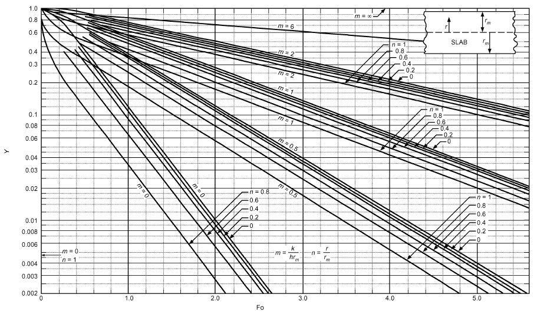

*Fig. 11 Transient Temperatures for Infinite Slab, m = 1/Bi*

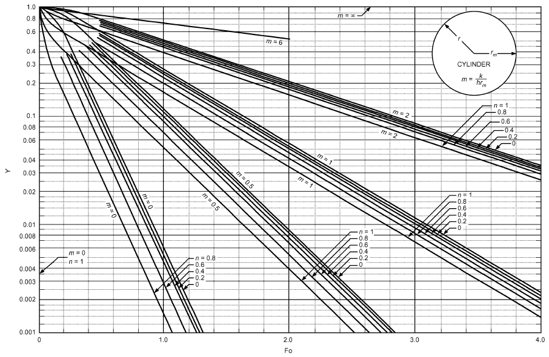

*Fig. 12 Transient Temperatures for Infinite Cylinder, m = 1/Bi*

<!-- str. 75 -->

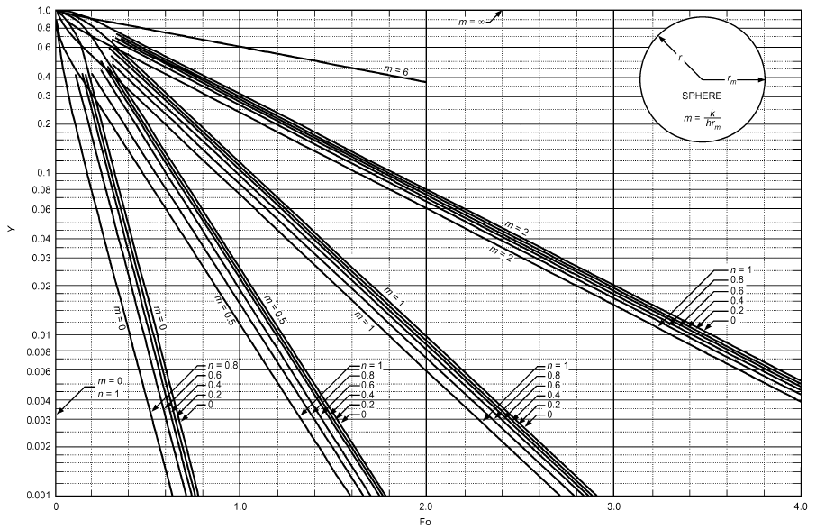

*Fig. 13 Transient Temperatures for Sphere, m = 1/Bi*

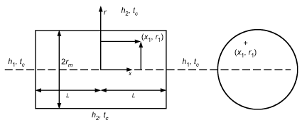

*Fig. 14 Solid Cylinder Exposed to Fluid*

**Solution:** Because the cylinder is short, the temperature of the soda is affected by the heat transfer rate from the cylindrical surface and end surfaces. The slowest change in temperature, and therefore the maximum temperature, is at the center of the cylinder. Denoting the dimensionless temperature by Y,

> Y = Y<sub>cyl</sub> × Y<sub>pl</sub>

where Y<sub>cyl</sub> is the dimensionless temperature of an infinitely long 70 mm diameter cylinder, and Y<sub>pl</sub> is the dimensionless temperature of a 125 mm thick slab. Each of them is found from the appropriate Biot and Fourier number. For evaluating the properties of water, choose a temperature of 15°C and a pressure of 101.35 kPa. The properties of water are ρ = 999.1 kg/m<sup>3</sup> k = 0.5894 W/(m·K) c<sub>p</sub> = 4184 J/(kg·K)

> α = k/ρ = 1.41 × 10<sup>–7</sup> m<sup>2</sup>/s τ = 3600 s

1. Determine Y<sub>cyl</sub> at n = 0.

> Bi<sub>cyl</sub> = hr<sub>m</sub>/k = 20 × 0.035/0.5894 = 1.188
>
> Fo<sub>cyl</sub> = ατ/r<sub>m</sub><sup>2</sup> = (1.41 × 10<sup>–7</sup>) × 3600/0.035<sup>2</sup> = 0.4144

Fo<sub>cyl</sub> > 0.2, so use the one-term approximation with Equations (14) and (16).

> Y<sub>cyl</sub> = c<sub>1</sub> exp(–μ<sup>2</sup><sub>1</sub>Fo<sub>cyl</sub>)J<sub>0</sub>(0)

Interpolating in Table 4 for Bi<sub>cyl</sub> = 1.188, μ<sub>cyl</sub> = 1.3042, J<sub>0</sub>(0) = 1, c<sub>cyl</sub> = 1.237, Y<sub>cyl</sub> = 0.572.

2. Determine Y<sub>pl</sub> at n = 0.

> Bi<sub>pl</sub> = hL/k = 20 × 0.0625/0.5894 = 2.121
>
> Fo<sub>pl</sub> = 1.41 × 10<sup>–7</sup> × 3600/0.0625<sup>2</sup> = 0.1299

Fo<sub>pl</sub> < 0.2, so the one-term approximation is not valid. Using Figure 11, Y<sub>pl</sub> = 0.9705. Thus, Y = 0.572 × 0.9705 = 0.5551 = (t – t<sub>∞</sub>)/(t<sub>1</sub> – t<sub>∞</sub>) ⇒ t = 16.7°C

Note: The solution may not be exact because convective motion of the soda during heat transfer has been neglected. The example illustrates the use of the technique. For well-stirred soda, with uniform temperature within the can, the lumped mass solution should be used.

## 3. THERMAL RADIATION

Radiation, unlike conduction and convection, does not need a solid or fluid to transport energy from a high-temperature surface to a lower-temperature one. (Radiation is in fact impeded by such a material.) The rate of radiant energy emission and its characteristics from a surface depend on the underlying material’s nature, microscopic arrangement, and absolute temperature. The rate of emission from a surface is independent of the surfaces surrounding it, but the rate and characteristics of radiation incident on a surface do depend on the temperatures and spatial relationships of the surrounding surfaces.

<!-- str. 76 -->

### Blackbody Radiation

The total energy emitted per unit time per unit area of a black surface is called the **blackbody emissive power W<sub>b</sub>** and is given by the **Stefan-Boltzmann law**:

> W<sub>b</sub> = σT <sup>4</sup>&emsp;**(18)**

where σ = 5.670 × 10<sup>−8</sup> W/(m<sup>2</sup>·K<sup>4</sup>) is the Stefan-Boltzmann constant.

Energy is emitted in the form of photons or electromagnetic waves of many different frequencies or wavelengths. Planck showed that the spectral distribution of the energy radiated by a blackbody is

> W<sub>bλ</sub> = C<sub>1</sub>/(C ⁄ λT λ<sup>5</sup>(e <sup>2</sup> – 1))&emsp;**(19)**

where

- W<sub>bλ</sub> = blackbody spectral (monochromatic) emissive power, W/m<sup>3</sup>
- λ = wavelength, m
- T = temperature, K
- C<sub>1</sub> = first Planck’s law constant = 3.742 × 10<sup>–16</sup> W·m<sup>2</sup>
- C<sub>2</sub> = second Planck’s law constant = 0.014 388 m·K

The **blackbody spectral emissive power W<sub>b</sub>**<sub>λ</sub> is the energy emitted per unit time per unit surface area at wavelength λ per unit wavelength band dλ around λ; that is, the energy emitted per unit time per unit surface area in the wavelength band dλ is equal to W<sub>bλ</sub>dλ. The Stefan-Boltzmann law can be obtained by integrating Equation (19) over all wavelengths:

> ∞
>
> ∫W<sub>bλ</sub>dλ = σT<sup>4</sup> = W<sub>b</sub>

> 0

Wien showed that the wavelength λ<sub>max</sub>, at which the monochromatic emissive power is a maximum (not the maximum wavelength), is given by

> λ<sub>max</sub>T = 2898 mm·K&emsp;**(20)**

Equation (20) is **Wien’s displacement** law; the maximum spectral emissive power shifts to shorter wavelengths as temperature increases, such that, at very high temperatures, significant emission eventually occurs over the entire visible spectrum as shorter wavelengths become more prominent. For additional details, see Incropera et al. (2007).

### Actual Radiation

The blackbody emissive power W<sub>b</sub> and blackbody spectral emissive power W<sub>bλ</sub> are the maxima at a given surface temperature. Actual surfaces emit less and are called **nonblack**. The **emissive power W** of a nonblack surface at temperature T radiating to the hemispherical region above it is given by

> W = εσT<sup>4</sup>&emsp;**(21)**

where ε is the **total emissivity**. The **spectral emissive power W**<sub>λ</sub> of a nonblack surface at a particular wavelength λ is given by

> W<sub>λ</sub> = ε<sub>λ</sub>W<sub>bλ</sub>&emsp;**(22)**

where ε<sub>λ</sub> is the **spectral emissivity**, and W<sub>bλ</sub>is given by Equation (19). The relationship between ε and ε<sub>λ</sub> is given by

> ∞ ∞
>
> ∫ε

> W = εσT<sup>4</sup> = ∫W<sub>λ</sub>dλ = <sub>λ</sub>W<sub>bλ</sub>dλ
>
> 0 0

or

> ∞
>
> ε = 1/σT<sup>4</sup> ∫ε<sub>λ</sub>W<sub>bλ</sub>dλ&emsp;**(23)**

> 0

If ε<sub>λ</sub> does not depend on λ, then, from Equation (23), ε = ε<sub>λ</sub>, and the surface is called **gray**. Gray surface characteristics are often assumed in calculations. Several classes of surfaces approximate this condition in some regions of the spectrum. The simplicity is desirable, but use care, especially if temperatures are high. The gray assumption is often made because of the absence of information relating ε<sub>λ</sub> as a function of λ.

Emissivity is a function of the material, its surface condition, and its surface temperature. Table 5 lists selected values; Modest (2003) and Siegel and Howell (2002) have more extensive lists.

When radiant energy reaches a surface, it is absorbed, reflected, or transmitted through the material. Therefore, from the first law of thermodynamics,

> α + ρ + τ = 1

where

- α = **absorptivity** (fraction of incident radiant energy absorbed)
- ρ = **reflectivity** (fraction of incident radiant energy reflected)
- τ = **transmissivity** (fraction of incident radiant energy transmitted)

This is also true for spectral values. For an opaque surface, τ = 0 and ρ + α = 1. For a black surface, α = 1, ρ = 0, and τ = 0.

**Kirchhoff’s law** relates emissivity and absorptivity of any opaque surface from thermodynamic considerations; it states that, for any surface where incident radiation is independent of angle or where the surface emits diffusely, ε<sub>λ</sub> = α<sub>λ</sub>. If the surface is gray, or the incident radiation is from a black surface at the same temperature, then ε = α as well, but many surfaces are not gray. For most surfaces listed in Table 5, the total absorptivity for solar radiation is different from the total emissivity for low-temperature radiation, because ε<sub>λ</sub> and α<sub>λ</sub> vary with wavelength. Much solar radiation is at short wavelengths. Most emissions from surfaces at moderate temperatures are at longer wavelengths.

Platinum black and gold black are almost perfectly black and have absorptivities of about 98% in the infrared region. A small opening in a large cavity approaches blackbody behavior because most of the incident energy entering the cavity is absorbed by repeated reflection within it, and very little escapes the cavity. Thus, the absorptivity and therefore the emissivity of the opening are close to unity. Some flat black paints also exhibit emissivities of 98% over a wide range of conditions. They provide a much more durable surface than gold or platinum black, and are frequently used on radiation instruments and as standard reference in emissivity or reflectance measurements.

**Example 7.** In outer space, the solar energy flux on a surface is 1150 W/m<sup>2</sup>.

Two surfaces are being considered for an absorber plate to be used on the surface of a spacecraft: one is black, and the other is specially coated for a solar absorptivity of 0.94 and emissivity of 0.1. Coolant flowing through the tubes attached to the plate maintains the plate at 340 K. The plate surface is normal to the solar flux. For each surface, determine the (1) heat transfer rate to the coolant per unit area of the plate, and (2) temperature of the surface when there is no coolant flow. **Solution:** For the black surface,

> ε = α = 1, ρ = 0
>
> Absorbed energy flux = 1150 W/m<sup>2</sup>

<!-- str. 77 -->

**Table 5 Emissivities and Absorptivities of Some Surfaces**

| Surface | Total Hemispherical Emissivity | Solar Absorptivity* |
|---|---|---|
| Aluminum |  |  |
| Foil, bright dipped | 0.03 | 0.10 |
| Alloy: 6061 | 0.04 | 0.37 |
| Roofing | 0.24 |  |
| Asphalt | 0.88 |  |
| Brass |  |  |
| Oxidized | 0.60 |  |
| Polished | 0.04 |  |
| Brick | 0.90 |  |
| Concrete, rough | 0.91 | 0.60 |
| Copper |  |  |
| Electroplated | 0.03 | 0.47 |
| Black oxidized in Ebanol C | 0.16 | 0.91 |
| Plate, oxidized | 0.76 |  |
| Glass |  |  |
| Polished | 0.87 to 0.92 |  |
| Pyrex | 0.80 |  |
| Smooth | 0.91 |  |
| Granite | 0.44 |  |
| Gravel | 0.30 |  |
| Ice | 0.96 to 0.97 |  |
| Limestone | 0.92 |  |
| Marble |  |  |
| Polished or white | 0.89 to 0.92 |  |
| Smooth | 0.56 |  |
| Mortar, lime | 0.90 |  |
| Nickel |  |  |
| Electroplated | 0.03 | 0.22 |
| Solar absorber, electro-oxidized on copper | 0.05 to 0.11 | 0.85 |
| Paints |  |  |
| Black |  |  |
| Parsons optical, silicone high heat, epoxy | 0.87 to 0.92 | 0.94 to 0.97 |
| Gloss | 0.90 |  |
| Enamel, heated 1000 h at 650 K | 0.80 |  |
| Silver chromatone | 0.24 | 0.20 |
| White |  |  |
| Acrylic resin | 0.90 | 0.26 |
| Gloss | 0.85 |  |
| Epoxy | 0.85 | 0.25 |
| Paper, roofing or white | 0.88 to 0.86 |  |
| Plaster, rough | 0.89 |  |
| Refractory | 0.90 to 0.94 |  |
| Sand | 0.75 |  |
| Sandstone, red | 0.59 |  |
| Silver, polished | 0.02 |  |
| Snow, fresh | 0.82 | 0.13 |
| Soil | 0.94 |  |
| Water | 0.90 | 0.98 |
| White potassium zirconium silicate | 0.87 | 0.13 |

Source: Mills (1999).

*Values are for extraterrestrial conditions, except for concrete, snow, and water.

At T<sub>s</sub> = 340 K, emitted energy flux = W<sub>b</sub> = 5.67 × 10<sup>–8</sup> × 340<sup>4</sup> = 757.7 W/m<sup>2</sup>.

In space, there is no convection, so an energy balance on the surface gives

Heat flux to coolant = Absorbed energy flux – Emitted energy flux

> = 1150 – 757.7 = 392.3 W/m<sup>2</sup>

For the special surface, use solar absorptivity to determine the absorbed energy flux, and emissivity to calculate the emitted energy flux.

> Absorbed energy flux = 0.94 × 1150 = 1081 W/m<sup>2</sup>
>
> Emitted energy flux = 0.1 × 757.7 = 75.8 W/m<sup>2</sup>

> Heat flux to coolant = 1081 – 75.8 = 1005 W/m<sup>2</sup>

Without coolant flow, heat flux to the coolant is zero. Therefore, absorbed energy flux = emitted energy flux. For the black surface,

> 1150 = 5.67 × 10<sup>–8</sup> × T<sub>s</sub><sup>4</sup> ⇒ T<sub>s</sub> = 377.1 K
>
> For the special surface,

> 0.94 × 1150 = 0.1 × 5.67 × 10<sup>–8</sup> × T<sub>s</sub><sup>4</sup>⇒ T<sub>s</sub> = 660.8 K

### Angle Factor

The foregoing discussion addressed emission from a surface and absorption of radiation leaving surrounding surfaces. Before radiation exchange among a number of surfaces can be addressed, the amount of radiation leaving one surface that is incident on another must be determined.

The fraction of all radiant energy leaving a surface i that is directly incident on surface k is the **angle factor F<sub>ik</sub>** (also known as **view factor**, **shape factor**, and **configuration factor**). The angle factor from area A<sub>k</sub> to area A<sub>j</sub>, F<sub>ki</sub>, is similarly defined, merely by interchanging the roles of i and k. The following relations assume

- All surfaces are gray or black
- Emission and reflection are diffuse (i.e., not a function of direction)
- Properties are uniform over the surfaces
- Absorptivity equals emissivity and is independent of temperature of source of incident radiation
- Material located between radiating surfaces neither emits nor absorbs radiation

These assumptions greatly simplify problems, and give good approximate results in many cases. Some of the relations for the angle factor are as follows.

**Reciprocity relation.**

> F<sub>ik</sub>A<sub>i</sub> = F<sub>ki</sub>A<sub>k</sub>&emsp;**(24a)**

**Decomposition relation.** For three surfaces i, j, and k, with A<sub>ij</sub> indicating one surface with two parts denoted by A<sub>i</sub> and A<sub>j</sub>,

> A<sub>k</sub>F<sub>k-ij</sub> = A<sub>k</sub>F<sub>k-i</sub> + A<sub>k</sub>F<sub>k-j</sub>&emsp;**(24b)**
>
> A<sub>ij</sub>F<sub>ij-k</sub> = A<sub>i</sub>F<sub>i-k</sub> + A<sub>j</sub>F<sub>j-k</sub>&emsp;**(24c)**

**Law of corresponding corners.** This law is discussed by Love (1968) and Suryanarayana (1995). Its use is shown in Example 8.

**Summation rule.** For an enclosure with n surfaces, some of which may be inside the enclosure,

> n
>
> ∑ ik

> F = 1&emsp;**(24d)**
>
> k=1

Note that a concave surface may “see itself,” and F<sub>ii</sub> ≠ 0 for such a surface.

Numerical values of the angle factor for common geometries are given in Figure 15. For equations to compute angle factors for many configurations, refer to Siegel and Howell (2002).

**Example 8.** A picture window, 3 m long and 1.8 m high, is installed in a wall as shown in Figure 16. The bottom edge of the window is on the floor, which is 6 by 10 m. Denoting the window by 1 and the floor by 234, find F<sub>234-1</sub>.

**Solution:** From decomposition rule,

> A<sub>234</sub>F<sub>234-1</sub> = A<sub>2</sub>F<sub>2-1</sub> + A<sub>3</sub>F<sub>3-1</sub> + A<sub>4</sub>F<sub>4-1</sub>
>
> By symmetry, A<sub>2</sub>F<sub>2-1</sub> = A<sub>4</sub>F<sub>4-1</sub>and A<sub>234-1</sub> = A<sub>3</sub>F<sub>3-1</sub> + 2A<sub>2</sub>F<sub>2-1</sub>.

> A<sub>23</sub>F<sub>23-15</sub> = A<sub>2</sub>F<sub>2-1</sub>+ A<sub>2</sub>F<sub>2-5</sub>

<!-- str. 78 -->

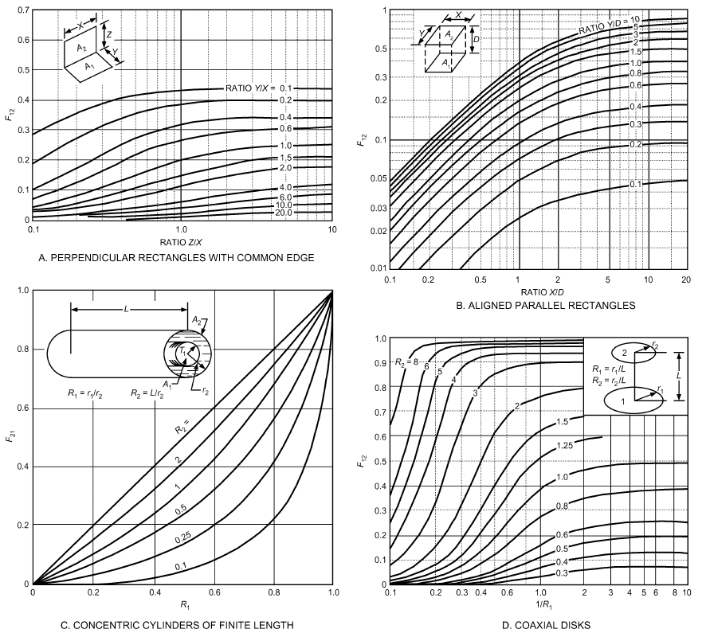

*Fig. 15 Radiation Angle Factors for Various Geometries*

> + A<sub>3</sub>F<sub>3-1</sub> + A<sub>3</sub>F<sub>3-5</sub>

From the law of corresponding corners, A<sub>2</sub>F<sub>2-1</sub> = A<sub>3</sub>F<sub>3-5</sub>; therefore A<sub>23</sub>F<sub>23-5</sub> = A<sub>2</sub>F<sub>2-5</sub> + A<sub>3</sub>F<sub>3-1</sub> + 2A<sub>2</sub>F<sub>2-1</sub>. Thus, A<sub>234</sub>F<sub>234-1</sub> = A<sub>3</sub>F<sub>3-1</sub> + A<sub>23</sub>F<sub>23-15</sub> – A<sub>2</sub>F<sub>2-5</sub>– A<sub>3</sub>F<sub>3-1</sub> = A<sub>23</sub>F<sub>23-15</sub> – A<sub>2</sub>F<sub>2-5</sub>

> A<sub>234</sub> = 60 m<sup>2</sup> A<sub>23</sub> = 45 m<sup>2</sup> A<sub>2</sub> = 15 m<sup>2</sup>

From Figure 15A with Y/X = 10/6 = 1.67 and Z/X = 1.8/4.5 = 0.4, F<sub>23-15</sub> = 0.061. With Y/X = 10/1.5 = 6.66 and Z/X = 1.8/1.5 = 1.2, F<sub>25</sub> = 0.041. Substituting the values, F<sub>234-1</sub> = 1/60(45 × 0.061 – 15 × 0.041) = 0.036.

### Radiant Exchange Between Opaque Surfaces

A surface A<sub>i</sub>radiates energy at a rate independent of its surroundings. It absorbs and reflects incident radiation from surrounding surfaces at a rate dependent on its absorptivity. The net heat transfer rate q<sub>i</sub> is the difference between the rate radiant energy leaves the surface and the rate of incident radiant energy; it is the rate at which energy must be supplied from an external source to maintain the surface at a constant temperature. The net radiant heat flux from a surface A<sub>i</sub> is denoted by q″<sub>i</sub>.

Several methods have been developed to solve specific radiant exchange problems. The radiosity method and thermal circuit method are presented here.

Consider the heat transfer rate from a surface of an n-surface enclosure with an intervening medium that does not participate in radiation. All surfaces are assumed gray and opaque. The **radiosity J<sub>i</sub>**is the total rate of radiant energy leaving surface i per unit area (i.e., the sum of energy flux emitted and energy flux reflected):

> J<sub>i</sub>= ε<sub>i</sub>W<sub>b</sub> + ρ<sub>i</sub>G<sub>i</sub>&emsp;**(25)**

where G<sub>i</sub> is the total rate of radiant energy incident on surface i per unit area. For opaque gray surfaces, the reflectivity is

> ρ<sub>i</sub> = 1 – α<sub>i</sub> = 1 – ε<sub>i</sub>

Thus,

> J<sub>i</sub> = ε<sub>i</sub>W<sub>b</sub> + (1– ε<sub>i</sub>)G<sub>i</sub>&emsp;**(26)**

<!-- str. 79 -->

Note that for a black surface, ε = 1, ρ = 0, and J = W<sub>b</sub>.

The net radiant energy transfer q<sub>i</sub> is the difference between the total energy leaving the surface and the total incident energy:

> q<sub>i</sub> = A<sub>i</sub>(J<sub>i</sub> – G<sub>i</sub>)&emsp;**(27)**

Eliminating G<sub>i</sub> between Equations (26) and (27),

> q<sub>i</sub> = (W<sub>bi</sub>– J<sub>i</sub>)/((1 – ε<sub>i</sub>) ⁄ε<sub>i</sub>A<sub>i</sub>)&emsp;**(28)**

**Radiosity Method.** Consider an enclosure of n isothermal surfaces with areas of A<sub>1</sub>, A<sub>2</sub>, …, A<sub>n</sub>, and emissivities of ε<sub>1</sub>, ε<sub>2</sub>, …, ε<sub>n</sub>, respectively. Some may be at uniform but different known temperatures, and the remaining surfaces have uniform but different and known heat fluxes. The radiant energy flux incident on a surface G<sub>i</sub> is the sum of the radiant energy reaching it from each of the n surfaces:

> *n n n*
>
> ∑ *ki k k* ∑ *ik k i i* ∑ ik

> G<sub>i</sub>A<sub>i</sub> = *F J A* = *F J A* or G = F J<sub>k</sub>&emsp;**(29)**
>
> k=1 k=1 k=1

Substituting Equation (29) into Equation (26),

> n
>
> ∑ ik

> J<sub>i</sub> = ε<sub>i</sub>W<sub>bi</sub>+ (1 – ε<sub>i</sub>) F J<sub>k</sub>&emsp;**(30)**
>
> k=1

Combining Equations (30) and (28),

> n
>
> ∑ ik

> J<sub>i</sub> = q<sub>i</sub>/A<sub>i</sub> + F J<sub>k</sub>&emsp;**(31)**
>
> k=1

Note that in Equations (30) and (31), the summation includes surface i.

Equation (30) is for surfaces with known temperatures, and Equation (31) for those with known heat fluxes. An opening in the enclosure is treated as a black surface at the temperature of the surroundings. The resulting set of simultaneous, linear equations can be solved for the unknown J<sub>i</sub>s.

Once the radiosities (J<sub>i</sub>s) are known, the net radiant energy transfer to or from each surface or the emissive power, whichever is unknown is determined.

For surfaces where E<sub>bi</sub> is known and q<sub>i</sub> is to be determined, use Equation (28) for a nonblack surface. For a black surface, J<sub>i</sub> = W<sub>bi</sub> and Equation (31) can be rearranged to give

> n
>
> ∑ ik

> q<sub>i</sub>/A<sub>i</sub> = W<sub>bi</sub>– F J<sub>k</sub>&emsp;**(32)**
>
> k=1

At surfaces where q<sub>i</sub> is known and E<sub>bi</sub> is to be determined, rearrange Equation (28):

> ( )
>
> E<sub>bi</sub> = J<sub>i</sub>+ q<sub>i</sub> (1 – ε<sub>i</sub>)/A<sub>i</sub>ε<sub>i</sub>&emsp;**(33)**

> ( )

The temperature of the surface is then

> ( )<sup>1⁄4</sup>
>
> T<sub>i</sub> = (W bi)/σ&emsp;**(34)**

> ( )

A surface in radiant balance is one for which radiant emission is balanced by radiant absorption (i.e., heat is neither removed from nor supplied to the surface). These are called **reradiating**, **insu- lated**, or **refractory surfaces**. For these surfaces, q<sub>i</sub> = 0 in Equation (31). After solving for the radiosities, W<sub>bi</sub> can be found by noting that q<sub>i</sub> = 0 in Equation (33) gives W<sub>bi</sub>= J<sub>i</sub>.

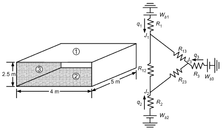

*Fig. 17 Diagrams for Example 9*

**Thermal Circuit Method.** Another method to determine the heat transfer rate is using thermal circuits for radiative heat transfer rates. Heat transfer rates from surface i to surface k and surface k to surface i, respectively, are given by

> q<sub>i-k</sub> = A<sub>i</sub>F<sub>i-k</sub>(J<sub>i</sub> – J<sub>k</sub>) and q<sub>k-i</sub> = A<sub>k</sub>F<sub>ik-i</sub>(J<sub>k</sub> – J<sub>i</sub>)

Using the reciprocity relation A<sub>i</sub>F<sub>i-k</sub> = A<sub>k</sub>F<sub>k-i</sub>, the net heat transfer rate from surface i to surface k is

> q<sub>ik</sub> = q<sub>i-k</sub> – q<sub>k-i</sub> = A<sub>i</sub>F<sub>i-k</sub>(J<sub>i</sub> – J<sub>k</sub>) = (J<sub>i</sub>– J<sub>k</sub>)/(1 ⁄A<sub>i</sub>F<sub>i-k</sub>)&emsp;**(35)**

Equations (28) and (35) are analogous to the current in a resistance, with the numerators representing a potential difference and the denominator representing a thermal resistance. This analogy can be used to solve radiative heat transfer rates among surfaces, as illustrated in Example 9.

Using angle factors and radiation properties as defined assumes that the surfaces are diffuse radiators, which is a good assumption for most nonmetals in the infrared region, but poor for highly polished metals. Subdividing the surfaces and considering the variation of radiation properties with angle of incidence improves the approximation but increases the work required for a solution. Also note that radiation properties, such as absorptivity, have significant uncertainties, for which the final solutions should account.

**Example 9.** Consider a 4 m wide, 5 m long, 2.5 m high room as shown in Figure 17. Heating pipes, embedded in the ceiling (1), keep its temperature at 40°C. The floor (2) is at 30°C, and the four side walls (3) are at 18°C. The emissivity of each surface is 0.8. Determine the net radiative heat transfer rate to/from each surface.

**Solution:** Consider the room as a three-surface enclosure. The corresponding thermal circuit is also shown. The heat transfer rates are found after finding the radiosity of each surface by solving the thermal circuit.

> From Figure 15A,
>
> F<sub>1-2</sub> = F<sub>2-1</sub> = 0.376

From the summation rule, F<sub>1-1</sub> + F<sub>1-2</sub> + F<sub>1-3</sub> = 1. With F<sub>1-1</sub> = 0,

> F<sub>1-3</sub> = 1 – F<sub>1-2</sub> = 0.624 = F<sub>2-3</sub>
>
> R<sub>1</sub> = (1 – ε<sub>1</sub> 1 – 0.8)/(A<sub>1</sub>ε<sub>1</sub> 20 × 0.8) = = 0.0125 m<sup>–2</sup> = R<sub>2</sub>

> R<sub>3</sub> = (1 – ε<sub>3</sub>)/A<sub>3</sub>ε<sub>3</sub> = (1 – 0.8)/(45 × 0.8) = 0.005 556 m<sup>–2</sup>

<!-- str. 80 -->

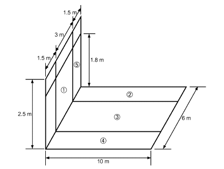

*Fig. 16 Diagram for Example 8*

> R<sub>12</sub> = (1 1)/(A<sub>1</sub>F<sub>1-2</sub> 20 × 0.376) = = 0.133 m<sup>–2</sup>
>
> R<sub>13</sub> = 1/(A F 1 1-3) = 1/(20 × 0.624) = 0.080 13 m<sup>–2</sup> = R<sub>23</sub>

Performing a balance on each of the three J<sub>i</sub> nodes gives

> Surface 1: (W<sub>b1</sub>– J<sub>1</sub>)/R<sub>1</sub> + (J<sub>2</sub>– J<sub>1</sub>)/(R 12) + (J<sub>3</sub>– J<sub>1</sub>)/(R 13) = 0
>
> Surface 2: (W<sub>b2</sub>– J<sub>2</sub>)/R<sub>2</sub> + (J<sub>1</sub>– J<sub>2</sub>)/(R 12) + (J<sub>3</sub>– J<sub>2</sub>)/(R 23) = 0

> Surface 3: (W<sub>b3</sub>– J<sub>3</sub>)/R<sub>3</sub> + (J<sub>1</sub>– J<sub>3</sub>)/(R 13) + (J<sub>2</sub>– J<sub>3</sub>)/(R 23) = 0
>
> W<sub>b1</sub> = 5.67 × 10<sup>–8</sup>× 313.2<sup>4</sup> = 545.6 W/m<sup>2</sup>

> W<sub>b2</sub> = 479.2 W/m<sup>2</sup> W<sub>b3</sub> = 407.7 W/m<sup>2</sup>

Substituting the values and solving for J<sub>1</sub>, J<sub>2</sub>, and J<sub>3</sub>,

> J<sub>1</sub> = 524.5 W/m<sup>2</sup> J<sub>2</sub> = 475.1 W/m<sup>2</sup> J<sub>3</sub> = 418.9 W/m<sup>2</sup>
>
> q<sub>1</sub> = (W<sub>b1</sub>– J<sub>1</sub>)/R<sub>1</sub> = (545.6 – 524.5)/0.0125 = 1688 W

> q<sub>2</sub> = 328 W q<sub>3</sub> = –2016 W

Note that floor and ceiling must both be heated because of heat loss from the walls.

### Radiation in Gases

Monatomic and diatomic gases such as oxygen, nitrogen, hydrogen, and helium are essentially transparent to thermal radiation. Their absorption and emission bands are confined mainly to the ultraviolet region of the spectrum. The gaseous vapors of most compounds, however, have absorption bands in the infrared region. Carbon monoxide, carbon dioxide, water vapor, sulfur dioxide, ammonia, acid vapors, and organic vapors absorb and emit significant amounts of energy.

Radiation exchange by opaque solids may be considered a surface phenomenon unless the material is transparent or translucent, though radiant energy does penetrate into the material. However, the penetration depths are small. Penetration into gases is very significant.

**Table 6 Emissivity of CO2 and Water Vapor in Air at 24°C**

| Path Length, m | CO<sub>2</sub>, % by Volume<br>0.1 | CO<sub>2</sub>, % by Volume<br>0.3 | 1.0 | Relative Humidity, %<br>10 | Relative Humidity, %<br>50 | 100 |
|---|---|---|---|---|---|---|
| 3 | 0.03 | 0.06 | 0.09 | 0.06 | 0.17 | 0.22 |
| 30 | 0.09 | 0.12 | 0.16 | 0.22 | 0.39 | 0.47 |
| 300 | 0.16 | 0.19 | 0.23 | 0.47 | 0.64 | 0.70 |

**Table 7 Emissivity of Moist Air and CO2 in Typical Room**

| Relative Humidity, % | ε g |
|---|---|
| 10 | 0.10 |
| 50 | 0.19 |
| 75 | 0.22 |

**Beer’s law** states that the attenuation of radiant energy in a gas is a function of the product p<sub>g</sub>L of the partial pressure of the gas and the path length. The monochromatic absorptivity of a body of gas of thickness L is then

> α<sub>λL</sub> = 1 – e<sup>–αλL</sup>&emsp;**(36)**

Because absorption occurs in discrete wavelength bands, the absorptivities of all the absorption bands must be summed over the spectral region corresponding to the temperature of the blackbody radiation passing through the gas. The monochromatic absorption coefficient α<sub>λ</sub> is also a function of temperature and pressure of the gas; therefore, detailed treatment of gas radiation is quite complex.

Estimated emissivity for carbon dioxide and water vapor in air at 24°C is a function of concentration and path length (Table 6). Values are for an isothermal hemispherically shaped body of gas radiating at its surface. Among others, Hottel and Sarofim (1967), Modest (2003), and Siegel and Howell (2002) describe geometrical calculations in their texts on radiation heat transfer. Generally, at low values of p<sub>g</sub>L, the mean path length L (or equivalent hemispherical radius for a gas body radiating to its surrounding surfaces) is four times the mean hydraulic radius of the enclosure. A room with a dimensional ratio of 1:1:4 has a mean path length of 0.89 times the shortest dimension when considering radiation to all walls. For a room with a dimensional ratio of 1:2:6, the mean path length for the gas radiating to all surfaces is 1.2 times the shortest dimension. The mean path length for radiation to the 2 by 6 face is 1.18 times the shortest dimension. These values are for cases where the partial pressure of the gas times the mean path length approaches zero (p<sub>g</sub>L ≈ 0). The factor decreases with increasing values of p<sub>g</sub>L. For average rooms with approximately 2.4 m ceilings and relative humidity ranging from 10 to 75% at 24°C, the effective path length for carbon dioxide radiation is about 85% of the ceiling height, or 2 m. The effective path length for water vapor is about 93% of the ceiling height, or 2.3 m. The effective emissivity of the water vapor and carbon dioxide radiating to the walls, ceiling, and floor of a room 4.9 by 14.6 m with 2.4 m ceilings is in Table 7.

Radiation heat transfer from the gas to the walls is then

> q = σA<sub>w</sub>ε<sub>g</sub>(T<sub>g</sub><sup>4</sup>– T<sub>w</sub><sup>4</sup>)&emsp;**(37)**

The preceding discussion indicates the importance of gas radiation in environmental heat transfer problems. In large furnaces, gas radiation is the dominant mode of heat transfer, and many additional factors must be considered. Increased pressure broadens the spectral bands, and interaction of different radiating species prohibits simple summation of emissivity factors for the individual species. Nonblackbody conditions require separate calculations of emissivity and absorptivity. Hottel and Sarofim (1967) and McAdams (1954) discuss gas radiation more fully.

<!-- str. 81 -->

## 4. THERMAL CONVECTION

Convective heat transfer coefficients introduced previously can be estimated using correlations presented in this section.

### Forced Convection

Forced-air coolers and heaters, forced-air- or water-cooled condensers and evaporators, and liquid suction heat exchangers are examples of equipment that transfer heat primarily by forced convection. Although some generalized heat transfer coefficient correlations have been mathematically derived from fundamentals, they are usually obtained from correlations of experimental data. Most correlations for forced convection are of the form

> Nu =hL<sub>c</sub>/k = f(Re<sub>Lc</sub>, Pr)

where

- Nu = Nusselt number
- h = convection heat transfer coefficient
- L<sub>c</sub> = characteristic length
- Re<sub>Lc</sub> = ρVL<sub>c</sub>/μ = VL<sub>c</sub>/ν
- V = fluid velocity
- Pr = Prandtl number = c<sub>p</sub>μ/k
- c<sub>p</sub> = fluid specific heat
- μ = fluid dynamic viscosity
- ρ = fluid density
- ν = kinematic viscosity = μ/ρ
- k = fluid conductivity

Fluid velocity and characteristic length depend on the geometry. **External Flow.** When fluid flows over a flat plate, a **boundary layer** forms adjacent to the plate. The velocity of fluid at the plate surface is zero and increases to its maximum free-stream value at the edge of the boundary layer (Figure 18). Boundary layer formation is important because the temperature change from plate to fluid occurs across this layer. Where the boundary layer is thick, thermal resistance is great and the heat transfer coefficient is small. Flow within the boundary layer immediately downstream from the leading edge is laminar. As flow proceeds along the plate, the laminar boundary layer increases in thickness to a critical value. Then, turbulent eddies develop in the boundary layer, except in a thin laminar sublayer adjacent to the plate.

The boundary layer beyond this point is turbulent. The region between the breakdown of the laminar boundary layer and establishment of the turbulent boundary layer is the **transition region**. Because turbulent eddies greatly enhance heat transport into the main stream, the heat transfer coefficient begins to increase rapidly through the transition region. For a flat plate with a smooth leading edge, the turbulent boundary layer starts at distance x<sub>c</sub> from the leading edge where the Reynolds number Re = Vx<sub>c</sub>/ν is in the range 300 000 to 500 000 (in some cases, higher). In a plate with a blunt front edge or other irregularities, it can start at much smaller Reynolds numbers.

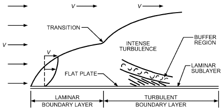

*Fig. 18 External Flow Boundary Layer Build-up (Vertical Scale Magnified)*

**Internal Flow.** For tubes, channels, or ducts of small diameter at sufficiently low velocity, the laminar boundary layers on each wall grow until they meet. This happens when the Reynolds number based on tube diameter, Re = V<sub>avg</sub>D/ν, is less than 2000 to 2300. Beyond this point, the velocity distribution does not change, and no transition to turbulent flow occurs. This is called **fully developed laminar flow**. When the Reynolds number is greater than 10 000, the boundary layers become turbulent before they meet, and fully developed turbulent flow is established (Figure 19). If flow is turbulent, three different flow regions exist. Immediately next to the wall is a **laminar sublayer**, where heat transfer occurs by thermal conduction; next is a transition region called the **buffer layer**, where both eddy mixing and conduction effects are significant; the final layer, extending to the pipe’s axis, is the **turbulent region**, where the dominant mechanism of transfer is eddy mixing.

In most equipment, flow is turbulent. For low-velocity flow in small tubes, or highly viscous liquids such as glycol, the flow may be laminar.

The characteristic length for internal flow in pipes and tubes is the inside diameter. For noncircular tubes or ducts, the **hydraulic diameter D<sub>h</sub>** is used to compute the Reynolds and Nusselt numbers. It is defined as

> D<sub>h</sub> = 4 × (Cross-sectional area for flow)/(Total wetted perimeter)&emsp;**(38)**

Inserting expressions for cross-sectional area and wetted perimeter of common cross sections shows that the hydraulic diameter is equal to

- The diameter of a round pipe
- Twice the gap between two parallel plates
- The difference in diameters for an annulus
- The length of the side for square tubes or ducts

Table 8 lists various forced-convection correlations. In general, the Nusselt number is determined by the flow geometry, Reynolds number, and Prandtl number. One often useful form for turbulent internal flow is known as **Colburn’s analogy**:

- j = Nu/RePr<sup>1⁄3</sup> = f<sub>F</sub>/2 where f<sub>F</sub> is the Fanning friction factor (1/4 of the Darcy-Weisbach friction factor in Chapter 3) and j is the Colburn j-factor. It is related to the friction factor by the interrelationship of the transport of momentum and energy in turbulent flow. These factors are plotted in Figure 20.

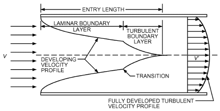

*Fig. 19 Boundary Layer Build-up in Entrance Region of Tube or Channel*

<!-- str. 82 -->

**Table 8 Forced-Convection Correlations**

| I. General Correlation Nu = f (Re, Pr) |   |   |   |
|---|---|---|---|
| **II. Internal Flows for Pipes and Ducts: Characteristic length = D, pipe diameter, or Dh, hydraulic diameter. ρV D m· D QD · 4Q 4mRe = avg h = ----------h = ----------h = -------------- = ------------- where m· = mass flow rate, Q = volume flow rate, Pwet ---------------------μ Acμ Acν μPwet νPwetAc = cross-sectional area, and ν = kinematic viscosity (μ/ρ).Nu f --------------1---/-3- = --2Re PrRe Pr 1/3 μ 0.14( ) ( )Laminar: Re L ⁄ D s 0.065(D ⁄ L)Re PrDeveloping Nu = 3.66 + --------------------------------------------------------2---/-3-1 + 0.04[(D ⁄ L)Re Pr]Fully developed, round Nu = 3.66Nu = 4.36Turbulent: Nu = 0.023 Re4/5Pr0.4Fully developed 4/5 0.Nu = 0.023 Re Pr 3Evaluate properties at bulk( f ⁄ 2)(Re – 1000)Pr temperature tb except μs sNu = ---------------------------------------------------------------------and ts at surface 1 + 12.7( fs ⁄ 2)1/2(Pr2/3 – 1) temperatureFor fully developed flows, set D/L = 0. μ 0.1 3( ) 4Nu = 0.027 Re4/5 Pr1/ ----( μs)For noncircular tubes, use hydraulic mean diameter Dh in the equations for Nu for an approximate value of h. 2/3D( ) 1 + ---( L ) = wetted perimeter, Colburn’s analogy (turbulent)(T8.1)L Re Pr μ 0.4( ) 2 a --- s) (T8.2)D 8(T8.3)Uniform surface temperature (T8.4a)Uniform heat flux (T8.4b)Heating fluid (T8.5a)bRe ≥ 10 000Cooling fluid (T8.5b)bRe ≥ 10 000 1 fs = ------------------------------------------------(T8.6)c(1.58 ln Re – 3.28)2Multiply Nu by (T/Ts)0.45 for gases and by (Pr/Prs)0.11for liquidsFor viscous fluids(T8.7)a** |  |  |  |
| **III. External Flows for Flat Plate: Characteristic length = L = length of plate. Re = VL/ν.All properties at arithmetic mean of surface and fluid temperatures.Laminar boundary layer: Nu = 0.332 Re1/2Pr1/3Re 5Nu = 0.664 Re1/2Pr1/3Turbulent boundary layer: Nu = 0.0296 Re4/5Pr1/3Re > 5 × 105Turbulent boundary layer Nu = 0.037 Re4/5Pr1/3 beginning at leading edge:All ReLaminar-turbulent boundary layer: Nu = (0.037 Re4/5 – 871)Pr1/3Re > 5 × 105 Local value of h (T8.8)Average value of h (T8.9)Local value of h (T8.10)Average value of h (T8.11)Average value Rec = 5 × 105 (T8.12)** |  |  |  |
| **IV. External Flows for Cross Flow over Cylinder: Characteristic length = D = diameter. Re = VD/ν.All properties at arithmetic mean of surface and fluid temperatures. 0.62 Re1/2Pr1/3Nu = 0.3 + ----------------------------------------------- 1 + -------------------[1 + (0.4 ⁄ Pr)2/3]1/4 Re( )5/8( 282 000 ) Average value of h 4/5 d(T8.14)** |  |  |  |
| **V. Simplified Approximate Equations: h is in W/(m2·K), V is in m/s, D is in m, and t is in °C.Flows in pipes Atmospheric air ( 0 to 200°C):Water ( 3 to 200°C):Re > 10 000Water ( 4 to 104°C:Flow over cylinders Atmospheric air: 0°C 0.471/D0.529 h = (4.22 – 0.002 57t)V 0.633/D0.367Water: 5°C 0.471/D0.529 h = (1012 + 9.19t)V 0.633/D0.367 h = (3.76 – 0.00497t)V h = (1206 + 23.9t)V h = (1431 + 20.9t)V 8/D0.2 (T8.15a)e 0. 0.8/D0.2 (T8.15b)e 0.8/D0.2 (McAdams 1954) (T8.15c)g 35 f** |  |  |  |
| **VI. External Flow over Spheres: Characteristic length = D = diameter. Re = VD/ν.All properties at arithmetic mean of surface and fluid bulk temperature, except μs at surface temperature.NuD = 2 + (0.4ReD1⁄2 + 0.06 ReD2⁄3 )Pr0.4(μ/μs)1/4 (T8.18)** |  |  |  |

Sources:<sup>a</sup>Sieder and Tate (1936), <sup>b</sup>Dittus and Boelter (1930), <sup>c</sup>Gnielinski (1990), <sup>d</sup>Churchill and Bernstein (1977), <sup>e</sup>Based on Nu = 0.023 Re<sup>4/5</sup>Pr<sup>1/3</sup>, <sup>f</sup>Based on Morgan (1975).

<sup>g</sup>McAdams (1954).

<!-- str. 83 -->

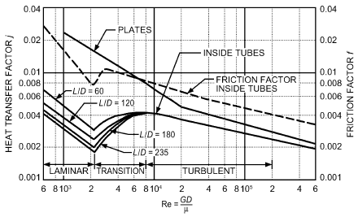

*Fig. 20 Typical Dimensionless Representation of Forced- Convection Heat Transfer*

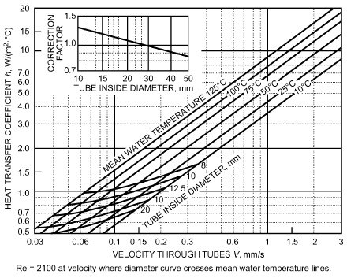

*Fig. 21 Heat Transfer Coefficient for Turbulent Flow of Water Inside Tubes*

Simplified correlations for atmospheric air are also given in Table 8. Figure 21 gives graphical solutions for water.

**Example 10.** An uninsulated 3 m ID spherical tank with 0.01 m walls is used to store iced water. Winds at V = 25 km/h and T<sub>∞</sub> = 30°C blow over the outside of the tank. What is the rate of heat gain to the iced water? Neglect radiation, conduction resistance of tank wall, and convection resistance between ice water and tank; the outer surface temperature of the tank is 0°C.

Because the geometry is for forced convection over a sphere, use Equation (T8.18). Use the properties of air at 101.325 kPa pressure and the freestream temperature of T<sub>∞</sub> = 30°C: k = 0.0259 W/(m·K), ν = 1.608 × 0<sup>–5</sup> m<sup>2</sup>/s, μ = 1.872 × 10<sup>–5</sup> kg/(m·s), Pr = 0.728, and μ<sub>s</sub> = 1.729 × 10<sup>–5</sup> kg/(m·s) at 0°C.

Re = VD/ν = ([(25 × 1000 ⁄ 3600) m/s](3.02 m))/(1.608×10<sup>–5</sup> m<sup>2</sup>/s) = 1.304 × 10<sup>6</sup>

> Nu = hD/k = 2 + 0.4Re<sup>0.5</sup>+ 0.06Re<sup>2⁄3</sup> Pr<sup>0.4</sup>(μ ⁄ μ<sub>s</sub>)<sup>1⁄4</sup>
>
> 0.5 2 ⁄ 3

> = 2 + 0.4(1.304 × 10<sup>6</sup>) + 0.06(1.304 × 10<sup>6</sup>)
>
> <sub>4</sub>( <sup>–5</sup>)<sup>1⁄4</sup>

> 1.872 × 10
>
> × (0.7282)<sup>0.</sup> ----------------------------- = 1056

> (1.729 × 10<sup>–5</sup>)

Note that for gases, the (μ/μ<sub>s</sub>)<sup>1/4</sup> property correction is often negligible. For liquids, it is often significant.

> h = k/D Nu = (0.02588 W/(m<sup>2</sup>· K))/(3.02 m) (1056) = 9.05 W/(m<sup>2</sup>·K)
>
> The rate of heat transfer to the iced water is

> q = hA<sub>s</sub>(*T<sub>s</sub> – T*<sub>∞</sub>) = h(πD<sup>2</sup>)(*T<sub>s</sub> – T*<sub>∞</sub>) = [9.05 W/(m<sup>2</sup>·K)][π(3.02
>
> m)<sup>2</sup>](30 – 0)K = 7780 W

With a uniform tube surface temperature and heat transfer coefficient, the exit temperature can be calculated using

> ln(t<sub>s</sub>– t<sub>e</sub>)/(t<sub>s</sub>– t<sub>i</sub>) = – hA/(m· c<sub>p</sub>)&emsp;**(39)**

where t<sub>i</sub> and t<sub>e</sub> are the inlet and exit bulk temperatures of the fluid, t<sub>s</sub> is the pipe/duct surface temperature, and A is the surface area inside the pipe/duct. The convective heat transfer coefficient varies in the direction of flow because of the temperature dependence of the fluid properties. In such cases, it is common to use an average value of h in Equation (39) computed either as the average of h evaluated at the inlet and exit fluid temperatures or evaluated at the average of the inlet and exit temperatures.

With uniform surface heat flux q″, the temperature of fluid t at any section can be found by applying the first law of thermodynamics:

> m· c<sub>p</sub>(t – t<sub>i</sub>) = q″A&emsp;**(40)**

The surface temperature can be found using

> q″ = h(t<sub>s</sub> – t)&emsp;**(41)**

With uniform surface heat flux, surface temperature increases in the direction of flow along with the fluid.

**Natural Convection.** Heat transfer with fluid motion resulting solely from temperature differences (i.e., from temperature-dependent density and gravity) is natural (free) convection. Natural-convection heat transfer coefficients for gases are generally much lower than those for forced convection, and it is therefore important not to ignore radiation in calculating the total heat loss or gain. Radiant transfer may be of the same order of magnitude as natural convection, even at room temperatures; therefore, both modes must be considered when computing heat transfer rates from people, furniture, and so on in buildings (see Chapter 9).

Natural convection is important in a variety of heating and refrigeration equipment, such as (1) gravity coils used in high-humidity cold-storage rooms and in roof-mounted refrigerant condensers, (2) the evaporator and condenser of household refrigerators, (3) baseboard radiators and convectors for space heating, and (4) cooling panels for air conditioning. Natural convection is also involved in heat loss or gain to equipment casings and interconnecting ducts and pipes.

Consider heat transfer by natural convection between a cold fluid and a hot vertical surface. Fluid in immediate contact with the surface is heated by conduction, becomes lighter, and rises because of the difference in density of the adjacent fluid. The fluid’s viscosity resists this motion. The heat transfer rate is influenced by fluid properties, temperature difference between the surface at t<sub>s</sub> and environment at t<sub>∞</sub>, and characteristic dimension L<sub>c</sub>. Some generalized heat transfer coefficient correlations have been mathematically derived from fundamentals, but they are usually obtained from correlations of experimental data. Most correlations for natural convection are of the form

<!-- str. 84 -->

> Nu = hL<sub>c</sub>/k = f (Ra<sub>Lc</sub>, Pr)

where

- Nu = Nusselt number
- H = convection heat transfer coefficient
- L<sub>c</sub> = characteristic length
- K = fluid thermal conductivity
- Ra<sub>Lc</sub> = Rayleigh number = gβΔtL<sup>3</sup><sub>c</sub>/να
- Δt = |t<sub>s</sub> – t<sub>∞</sub>|
- g = gravitational acceleration
- β = coefficient of thermal expansion
- ν = fluid kinematic viscosity = μ/ρ
- α = fluid thermal diffusivity = k/ρc<sub>p</sub>
- Pr = Prandtl number = ν/α

Correlations for a number of geometries are given in Table 9. Other information on natural convection is available in the Bibliography under Heat Transfer, General.

Comparison of experimental and numerical results with existing correlations for natural convective heat transfer coefficients indicates that caution should be used when applying coefficients for (isolated) vertical plates to vertical surfaces in enclosed spaces (buildings). Altmayer et al. (1983) and Bauman et al. (1983) developed improved correlations for calculating natural convective heat transfer from vertical surfaces in rooms under certain temperature boundary conditions.

Natural convection can affect the heat transfer coefficient in the presence of weak forced convection. As the forced-convection effect (i.e., the Reynolds number) increases, “mixed convection” (superimposed forced-on-free convection) gives way to pure forced convection. In these cases, consult other sources [e.g., Grigull et al. (1982); Metais and Eckert (1964)] describing combined free and forced convection, because the heat transfer coefficient in the mixed-convection region is often larger than that calculated based on the natural- or forced-convection calculation alone. Metais and Eckert (1964) summarize natural-, mixed-, and forced-convection regimes for vertical and horizontal tubes. Figure 22 shows the approximate limits for horizontal tubes. Other studies are described by Grigull et al. (1982).

**Example 11.** A horizontal electric immersion heater of 10 mm diameter D and 400 mm length L is rated at q = 733 W. Estimate the surface temperature t<sub>s</sub> if immersed in 20°C t<sub>∞</sub> water.

**Solution:** Because the geometry is for natural convection from a horizontal cylinder, use Equation (T9.10). If the allowable surface temperature of the heater were given, and the need were to calculate the maximum allowable power rating, this would be a straightforward sequence of calculations:

1. Calculate the film temperature t<sub>f</sub> = (t<sub>s</sub> + t<sub>∞</sub>)/2 2. Look up the needed water properties k, ν, Pr, α, and β at t<sub>f</sub>.

3. Calculate Rayleigh number Ra.

4. Use Equation (T9.10) to calculate Nusselt number Nu.

5. Calculate h = Nuk/D.

6. q = hπDL(t<sub>s</sub> – t<sub>∞</sub>)

However, in this case, given q and needing t<sub>s</sub>, the solution is iterative. First, guess the solution t<sub>s</sub>, execute items 1 to 5 in the preceding sequence, and use the resulting h to calculate t<sub>s</sub> = t<sub>∞</sub> + q/(hπDL). If necessary, use this value as a new guess for t<sub>s</sub> and repeat the process.

Assume t<sub>s</sub> = 64°C. Then t<sub>f</sub> = (64 + 20)/2 = 42°C = 315 K. Use k = 0.634 W/(m·K), ν = 6.25 × 10<sup>–7</sup> m<sup>2</sup>/s, α = 1.53 × 10<sup>–7</sup> m<sup>2</sup>/s, Pr = 4.08, and β = 0.4004 × 10<sup>–3</sup>/K.

> Ra = gβΔTD<sup>3</sup>/να = 1.804 × 10<sup>6</sup>
>
> { }<sup>2</sup>

> Nu = 0.6 + = 20.5
>
> { 0.387Ra<sup>1⁄6</sup>/(8 ⁄ 27 1 + (0.559 ⁄ Pr)<sup>9⁄16</sup>) }

> { }
>
> h = Nuk/D = 1301 W/(m<sup>2</sup>·K)

> t<sub>s</sub> = t<sub>∞</sub> + q/(hπDL) = 64.8°C

The initial guess was close enough; another iteration is unnecessary. **Example 12.** Chilled water at 5°C flows inside a freely suspended horizontal 20 mm OD pipe at a velocity of 2.5 m/s. Surrounding air is at 30°C, 70% rh. The pipe is to be insulated with cellular glass having a thermal conductivity of 0.045 W/(m·K). Determine the radial thickness of the insulation to prevent condensation of water on the outer surface.

**Solution:** In Figure 23,

> t<sub>fi</sub> = 5°C t<sub>fo</sub> = 30°C d<sub>o</sub> = OD of tube = 0.02 m

k<sub>i</sub> = thermal conductivity of insulation material = 0.045 W/(m·K) From the problem statement, the outer surface temperature t<sub>o</sub> of the insulation should not be less than the dew-point temperature of air. The dew-point temperature of air at 30°C, 70% rh = 23.93°C. To determine the outer diameter of the insulation, equate the heat transfer rate per unit length of pipe (from the outer surface of the pipe to the water) to the heat transfer rate per unit length from the air to the outer surface:

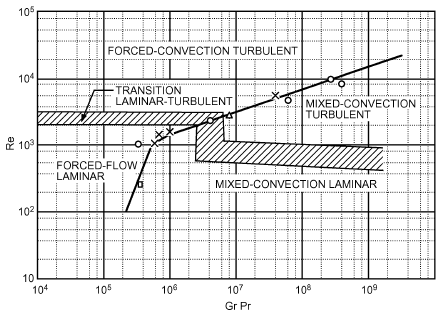

*Fig. 22 Regimes of Free, Forced, and Mixed Convection— Flow in Horizontal Tubes*

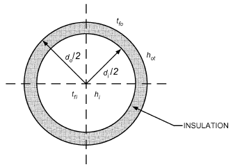

*Fig. 23 Diagram for Example 12*

<!-- str. 85 -->

**Table 9 Natural Convection Correlations**

| I. General relationships Characteristic length depends on geometry | Nu = f (Ra, Pr) or f (Ra) gβρ<sup>2</sup> Δt L<sup>3</sup> Ra = Gr Pr Gr = -----------------------------μ<sup>2</sup> | c<sub>p</sub>μ Pr = -------- Δt = t<sub>s</sub> – t<sub>∞</sub> k | (T9.1) |
|---|---|---|---|
| II. Vertical plate t<sub>s</sub> = constant<br>Characteristic dimension: L = height<br>Properties at (t<sub>s</sub> + t<sub>∞</sub>)/2 except β at t<sub>∞</sub> q″<sub>s</sub> = constant<br>Characteristic dimension: L = height<br>Properties at t<sub>s,L/2</sub> – t<sub>∞</sub> except β at t<sub>∞</sub><br>Equations (T9.2) and (T9.3) can be used for vertical cylinders if<br>D/L > 35/Gr<sup>1/4</sup> where D is diameter and L is axial length of cylinder | 0.67Ra<sup>1/4</sup><br>Nu = 0.68 + -------------------------------------------------------[1 + (0.492 ⁄ Pr)<sup>9/16</sup>]<sup>4/9</sup> { 0.387Ra<sup>1/6</sup> }<sup>2</sup><br>Nu = 0.825 + ----------------------------------------------------------{ <sub>8/27</sub>} { [1 + (0.492 ⁄ Pr)<sup>9/16</sup>] } { 0.387Ra<sup>1/6</sup> }<sup>2</sup><br>Nu = 0.825 + ----------------------------------------------------------{ <sub>8/27</sub>} { [1 + (0.437 ⁄ Pr)<sup>9/16</sup>] } | 10<sup>–1</sup> < Ra < 10<sup>9</sup> 10<sup>9</sup> < Ra < 10<sup>12</sup> 10<sup>–1</sup> < Ra < 10<sup>12</sup> | (T9.2)<sup>a</sup><br>(T9.3)<sup>a</sup><br>(T9.4)<sup>a</sup> |
| III. Horizontal plate<br>Characteristic dimension = *L = A*/P, where A is plate area and P is perimeter<br>Properties of fluid at (t<sub>s</sub> + t<sub>∞</sub>)/2<br>Downward-facing cooled plate and upward-facing heated plate<br>Downward-facing heated plate and upward-facing cooled plate | Nu = 0.96 Ra<sup>1/6</sup><br>Nu = 0.59 Ra<sup>1/4</sup><br>Nu = 0.54 Ra<sup>1/4</sup><br>Nu = 0.15 Ra<sup>1/3</sup><br>Nu = 0.27 Ra<sup>1/4</sup> | 1 < Ra < 200 200 < Ra < 10<sup>4</sup> 2.2 × 10<sup>4</sup> < Ra < 8 × 10<sup>6</sup> 8 × 10<sup>6</sup> < Ra < 1.5 × 10<sup>9</sup> 10<sup>5</sup> < Ra < 10<sup>10</sup> | (T9.5)<sup>b</sup><br>(T9.6)<sup>b</sup><br>(T9.7)<sup>b</sup><br>(T9.8)<sup>b</sup><br>(T9.9)<sup>b</sup> |
| IV. Horizontal cylinder<br>Characteristic length = d = diameter<br>Properties of fluid at (t<sub>s</sub> + t<sub>∞</sub>)/2 except β at t<sub>∞</sub> | { 0.387 Ra<sup>1/6</sup> }<sup>2</sup><br>Nu = 0.6 + ----------------------------------------------------------{ <sub>8/27</sub>} { [1 + (0.559 ⁄ Pr)<sup>9/16</sup>] } | 10<sup>–6</sup> < Ra < 10<sup>13</sup> | (T9.10)<sup>c</sup> |
| V. Sphere<br>Characteristic length = D = diameter<br>Properties at (t<sub>s</sub> + t<sub>∞</sub>)/2 except β at t<sub>∞</sub> | 0.589 Ra<sup>1/4</sup><br>Nu = 2 + -------------------------------------------------------<sub>9/164/9</sub> [1 + (0.469 ⁄ Pr) ] | Ra < 10<sup>11</sup> | (T9.11)<sup>d</sup> |
| VI. Horizontal wire<br>Characteristic dimension = D = diameter<br>Properties at (t<sub>s</sub> + t<sub>∞</sub>)/2 | ( 3.3 ) 2 1 + -----------<sub>n</sub> ------ = ln<br>Nu<br>( cRa ) | 10<sup>–8</sup> < Ra < 10<sup>6</sup> | (T9.12)<sup>e</sup> |
| VII. Vertical wire<br>Characteristic dimension = D = diameter; L = length of wire<br>Properties at (t<sub>s</sub> + t<sub>∞</sub>)/2 | Nu = c(Ra D/L)0.25 + 0.763c(1/6)(Ra D/L)(1/24)<br>In both Equations (T9.12) and (T9.13),c = ---------------------------------------------------------------[1 + (0.492 ⁄ Pr)<sup>(9/16)</sup>]<sup>(4/9)</sup> 1 n = 0.25 + ----------------------------<sub>0</sub>--<sub>.</sub>--<sub>1</sub>--<sub>7</sub>--<sub>5</sub> 10 + 5(Ra) | c(Ra D/L)<sup>0.25</sup> > 2 × 10<sup>–3</sup> 0.671 | (T9.13)e and |
| **VIII. Simplified equations with air at mean temperature of 21°C: h is in W/(m2·K), L and D are in m, and Δt is in °C.Vertical surfaceHorizontal cylinder (Δt)1/4 h = 1.33 ----( L ) h = 1.26(Δt)1/3 ΔT 1/4( ) h = 1.04 ------( D ) h = 1.23(Δt)1/3 105 9Ra > 109 105 9Ra > 109 (T9.14)(T9.15)(T9.16)(T9.17)** |  |  |  |

Sources: <sup>a</sup>Churchill and Chu (1975a), <sup>b</sup>Lloyd and Moran (1974), Goldstein et al. (1973), <sup>c</sup>Churchill and Chu (1975b), <sup>d</sup>Churchill (1990), <sup>e</sup>Fujii et al. (1986).

> (t<sub>o</sub>– t<sub>fi</sub>)/(d<sub>o</sub> 1 1 --------- + ------ ln ----) = (t<sub>fo</sub>– t<sub>o</sub>)/(1 ------------ h d)&emsp;**(42)**
>
> h<sub>i</sub>d<sub>i</sub> 2k<sub>i</sub> d<sub>i</sub>

> ot o

Heat transfer from the outer surface is by natural convection to air, so the surface heat transfer coefficient h<sub>ot</sub> is the sum of the convective heat transfer coefficient h<sub>o</sub> and the radiative heat transfer coefficient h<sub>r</sub>. With an assumed emissivity of 0.7 and using Equation (4), h<sub>r</sub> = 4.3 W/(m<sup>2</sup>·K). To determine the value of d<sub>o</sub>, the values of the heat transfer coefficients associated with the inner and outer surfaces (h<sub>i</sub> and h<sub>o</sub>, respectively) are needed. Compute the value of h<sub>i</sub> using Equation (T8.5a). Properties of water at an assumed temperature of 5°C are ρ<sub>w</sub> = 1000 kg/m<sup>3</sup> μ<sub>w</sub> = 0.001 518 (N·s)/m<sup>2</sup> c<sub>pw</sub> = 4197 W/(m·K)

<!-- str. 86 -->

> k<sub>w</sub> = 0.5708 W/(m·K) Pr<sub>w</sub> = 11.16
>
> ρvd

Re<sub>d</sub> = --------- = 32 944 Nu<sub>d</sub> = 248.3 k<sub>w</sub> = 7087 W/(m<sup>2</sup>·K) μ

To compute h<sub>o</sub> using Equation (T9.10a), the outer diameter of the insulation material must be found. Determine it by iteration by assuming a value of d<sub>o</sub>, computing the value of h<sub>o</sub>, and determining the value of d<sub>o</sub> from Equation (42). If the assumed and computed values of d<sub>o</sub> are close to each other, the correct solution has been obtained. Otherwise, recompute h<sub>o</sub> using the newly computed value of d<sub>o</sub> and repeat the process.

Assume d<sub>o</sub> = 0.05 m. Properties of air at t<sub>f</sub> = 27°C and 101.325 kPa are ρ = 1.176 kg/m<sup>3</sup> k = 0.025 66 W/(m·K) μ = 1.858 × 10<sup>–5</sup> (N·s)/m<sup>2</sup>

> Pr = 0.729 β = 0.003 299 (at 273.15 + 30 = 293.15 K)
>
> Ra = 74 574 Nu = 7.223 h<sub>o</sub> = 3.65 W/(m<sup>2</sup>·K)

> h<sub>ot</sub> =3.65 + 4.3 = 7.95 W/(m<sup>2</sup>·K)

Solving for d<sub>o</sub> makes the left side of Equation (42) equal to the right side, and gives d<sub>o</sub> = 0.040 03 m. Now, using the new value of 0.040 03 m for the outer diameter, the new values of h<sub>o</sub> and h<sub>ot</sub> are 3.86 W/(m<sup>2</sup>·K) and 8.20 W/(m<sup>2</sup>·K), respectively. The updated value of d<sub>o</sub> is 0.044 03 m. Repeating the process several times results in a final value of d<sub>o</sub> = 0.047 17 m. Thus, an outer diameter of 0.045 m (corresponding to an insulation radial thickness of 12.5 mm) keeps the outer surface temperature at 24.1°C, higher than the dew point. [Another method is to use Equation (42) to solve for t<sub>o</sub> for values of d<sub>o</sub> corresponding to available insulation thicknesses and using the insulation thickness that keeps t<sub>o</sub> above the dew-point temperature.]

## 5. HEAT EXCHANGERS

### Mean Temperature Difference Analysis

With heat transfer from one fluid to another (separated by a solid surface) flowing through a heat exchanger, the local temperature difference Δt varies along the flow path. Heat transfer rate may be calculated using

> q = UAΔt<sub>m</sub>&emsp;**(43)**

where U is the overall uniform heat transfer coefficient, A is the area associated with the coefficient U, and Δt<sub>m</sub> is the appropriate mean temperature difference.

For a parallel or counterflow heat exchanger, the mean temperature difference is given by

> Δt<sub>m</sub> = (Δt<sub>1</sub> – Δt<sub>2</sub>)/ln(Δt<sub>1</sub>/Δt<sub>2</sub>)&emsp;**(44)**

where Δt<sub>1</sub> and Δt<sub>2</sub> are temperature differences between the fluids at each end of the heat exchanger; Δt<sub>m</sub> is the **logarithmic mean temperature difference (LMTD)**. For the special case of Δt<sub>1</sub> = Δt<sub>2</sub> (possible only with a counterflow heat exchanger with equal capacities), which leads to an indeterminate form of Equation (44), Δt<sub>m</sub>= Δt<sub>1</sub> = Δt<sub>2</sub>.

Equation (44) for Δt<sub>m</sub> is true only if the overall coefficient and the specific heat of the fluids are constant through the heat exchanger, and no heat losses occur (often well-approximated in practice). Parker et al. (1969) give a procedure for cases with variable overall coefficient U. For heat exchangers other than parallel and counterflow, a correction factor [see Incropera et al. (2007)] is needed for Equation (44) to obtain the correct mean temperature difference.

### NTU-Effectiveness (ε) Analysis

Calculations using Equations (43) and (44) for Δt<sub>m</sub> are convenient when inlet and outlet temperatures are known for both fluids. Often, however, the temperatures of fluids leaving the exchanger are unknown. To avoid trial-and-error calculations, the **NTU-**ε **method** uses three dimensionless parameters: effectiveness ε, number of transfer units (NTU), and capacity rate ratio c<sub>r</sub>; the mean temperature difference in Equation (44) is not needed.

**Heat exchanger effectiveness** ε is the ratio of actual heat transfer rate to maximum possible heat transfer rate in a counterflow heat exchanger of infinite surface area with the same mass flow rates and inlet temperatures. The maximum possible heat transfer rate for hot fluid entering at t<sub>hi</sub> and cold fluid entering at t<sub>ci</sub> is

> q<sub>max</sub> = C<sub>min</sub>(t<sub>hi</sub> – t<sub>ci</sub>)&emsp;**(45)**

where C<sub>min</sub> is the smaller of the hot [C<sub>h</sub> = (m· c<sub>p</sub>)<sub>h</sub>] and cold [C<sub>c</sub>= (m· c<sub>p</sub>)<sub>h</sub>] fluid capacity rates, W/K; C<sub>max</sub> is the larger. The actual heat transfer rate is

> q = εq<sub>max</sub>&emsp;**(46)**

For a given exchanger type, heat transfer effectiveness can generally be expressed as a function of the **number of transfer units (NTU)** and the **capacity rate ratio c<sub>r</sub>**:

> ε = f (NTU, c<sub>r</sub>, Flow arrangement)&emsp;**(47)**

where

- NTU = UA/C<sub>min</sub>
- c<sub>r</sub> = C<sub>min</sub>/C<sub>max</sub>

Effectiveness is independent of exchanger inlet temperatures. For any exchanger in which c<sub>r</sub> is zero (where one fluid undergoing a phase change, as in a condenser or evaporator, has an effective c<sub>p</sub>= ∞), the effectiveness is

> ε = 1 – exp(–NTU) c<sub>r</sub> = 0&emsp;**(48)**

The mean temperature difference in Equation (44) is then given by

> Δt<sub>m</sub> = ((t<sub>hi</sub>– t<sub>ci</sub>)ε)/NTU&emsp;**(49)**

After finding the heat transfer rate q, exit temperatures for constant-density fluids are found from

> t<sub>e</sub>– t<sub>i</sub> = q/ṁc<sub>p</sub>&emsp;**(50)**

Effectiveness for selected flow arrangements are given in Table 10.

Afgan and Schlunder (1974), Incropera, et al. (2007), and Kays and London (1984) present graphical representations for convenience. NTUs as a function of ε expressions are available in Incropera et al. (2007).

**Example 13.** Flue gases from a gas-fired furnace are used to heat water in a 5 m long counterflow, double-pipe heat exchanger. Water enters the inner, thin-walled 40 mm diameter pipe at 40°C with a velocity of 0.5 m/s. Flue gases enter the annular space with a mass flow rate of 0.12 kg/s at 200°C. To increase the heat transfer rate to the gases, 16 rectangular axial copper fins are attached to the outer surface of the inner pipe. Each fin is 60 mm high (radial height) and 1 mm thick, as shown in Figure 24. The gas-side surface heat transfer coefficient is 115 W/(m<sup>2</sup>·K). Find the heat transfer rate and the exit temperatures of the gases and water.

> The heat exchanger has the following properties:

- *Water in the pipe t<sub>ci</sub>* = 40°C v<sub>c</sub> = 0.5 m/s
- Gases t<sub>hi</sub> = 200°C ṁ<sub>h</sub> = 0.12 kg/s

Length of heat exchanger L<sub>tube</sub> = 5 m d = 0.04 m L = 0.06 m t = 0.001 m N = number of fins = 16

**Solution:** The heat transfer rate is computed using Equations (45) and (46), and exit temperatures from Equation (50). To find the heat transfer rates, UA and ε are needed.

<!-- str. 87 -->

**Table 10 Equations for Computing Heat Exchanger Effectiveness, N = NTU**

| Flow Configuration | Effectiveness ε |   | Comments |
|---|---|---|---|
| **1 – exp[–N(1 + cr)]** |  |  |  |
| Parallel flow ------------------------------------------------ |  |  | (T10.1) |
|  | 1 + c<sub>r</sub> |  |  |
| **1 – exp[–N(1 – cr)]** |  |  |  |
| Counterflow ------------------------------------------------------- |  |  | c<sub>r</sub> ≠ 1 (T10.2) |
| **1 – cr exp[–N(1 – cr)]** |  |  |  |
|  | N |  |  |
| **------------** |  |  |  |
|  |  |  | c<sub>r</sub> = 1 (T10.3) |
| **1 + N** |  |  |  |
|  | 2 |  |  |
| Shell-and-tube (one-shell pass, 2, 4, etc. tube passes) ---------------------------------------<sub>–</sub>---<sub>a</sub>--<sub>N</sub>------------------------<sub>–</sub>--<sub>a</sub>---<sub>N</sub>---- |  |  | a = 1 + c<sub>r</sub><sup>2</sup> (T10.4) |
| 1 + c<sub>r</sub> | + a(1 + e 1 – ε c <sup>n</sup> | ) ⁄ (1 – e ) 1 – ε c <sup>n</sup> |  |
| Shell-and-tube (n-shell pass, 2n, 4n, etc. tube passes) | <sub>1</sub> <sub>r</sub><br>( ) | <sub>1</sub> <sub>r</sub><br>( ) | <sup>–1</sup> ε<sub>1</sub> = effectiveness of one-shell pass |
|  | ------------------ – 1<br>( 1 – ε<sub>1</sub> ) | ------------------ – c<br>( 1 – ε<sub>1</sub> ) <sup>r</sup> | shell-and-tube heat exchanger (T10.5) |
| Cross-flow (single phase) |  |  |  |
|  | ( <sup>0.22</sup>) γN |  |  |
| Both fluids unmixed 1 – exp |  |  | γ = exp(–c<sub>r</sub>N <sup>0.78</sup>) – 1 (T10.6) |
|  | ---------------c<br>( <sub>r</sub> ) |  |  |
| **1 – exp (–crγ)** |  |  |  |
| C<sub>max</sub>(mixed), C<sub>min</sub>(unmixed) ---------------------------------- |  |  | γ = 1 – exp(–N) (T10.7) |
|  | c<sub>r</sub> |  |  |
| C<sub>max</sub>(unmixed), C<sub>min</sub>(mixed) 1 – exp(–γ/c<sub>r</sub>) |  |  | γ = 1 – exp(–Nc<sub>r</sub>) (T10.8) |
|  |  | N |  |
| **------------------------------------------------------------------------------------** |  |  |  |
| Both fluids mixed | <sub>–N</sub> | –Nc<sub>r</sub> | (T10.9) |
|  | N ⁄ (1 – e ) + c<sub>r</sub>N ⁄ (1 – e | ) – 1 |  |
| All exchangers with c<sub>r</sub> = 0 1 – exp(–N) |  |  | (T10.10) |

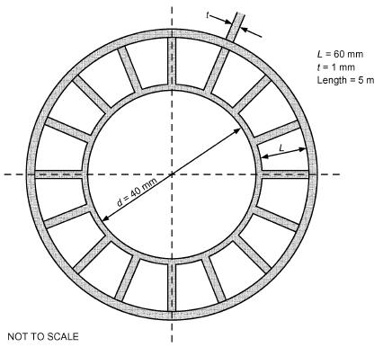

*Fig. 24 Cross Section of Double-Pipe Heat Exchanger in Example 13*

> 1/UA = 1/(φ<sub>s</sub>hA)<sub>o</sub> + 1/(hA)<sub>i</sub>

where

- h<sub>i</sub> = convective heat transfer coefficient on water side
- h<sub>o</sub> = gas-side heat transfer coefficient
- φ<sub>s</sub> = surface effectiveness = (*A<sub>uf</sub> + A<sub>f</sub>*φ)/A<sub>o</sub>
- φ = fin efficiency
- A<sub>uf</sub> = surface area of unfinned surface = L<sub>tube</sub>(π*d – Nt*) = 0.548 m<sup>2</sup>
- A<sub>f</sub> = fin surface area = 2LNL<sub>tube</sub> = 9.6 m<sup>2</sup>
- *A<sub>o</sub> = A<sub>uf</sub> + A<sub>f</sub>* = 10.15 m<sup>2</sup>
- A<sub>i</sub> = πdL<sub>tube</sub> = 0.628 m<sup>2</sup>

**Step 1.** Find h<sub>i</sub> using Equation (T8.6). Properties of water at an assumed mean temperature of 45°C are ρ = 990.4 kg/m<sup>3</sup> c<sub>pc</sub> = 4181 J/(kg·K) μ = 5.964 × 10<sup>–4</sup> (N·s)/m<sup>2</sup>

> k = 0.6376 W/(m·K) Pr = 3.91
>
> Re = ρv<sub>c</sub>d/μ = (990.4 × 0.5 × 0.04)/(5.964 × 10<sup>–4</sup>) = 33 213

f<sub>s</sub>/2 = [1.58 ln(Re) – 3.28]<sup>–2</sup>/2 = (1.58 ln 33 213 – 3.28)<sup>–2</sup>/2 = 0.002 88

> Nu<sub>d</sub> = (0.002 88 × (33 213 – 1000) × 3.91)/(1 + 12.7 × (0.002 88)<sup>1/2</sup>× (3.91<sup>2/3</sup>– 1)) = 180.4
>
> h<sub>i</sub> = (180.4 × 0.6376)/0.04 = 2876 W/(m<sup>2</sup>·K)

**Step 2.** Compute fin efficiency φ and surface effectiveness φ<sub>s</sub>. For a rectangular fin with the end of the fin not exposed,

> φ = tanh(mL)/mL

For copper, k = 401 W/(m·K).

mL = (2h<sub>o</sub>/kt)<sup>1/2</sup>L = [(2 × 115)/(401 × 0.001)]<sup>1/2</sup>(0.06) = 1.44

> φ = tanh1.44/1.44 = 0.62
>
> φ<sub>s</sub> = (A<sub>uf</sub> + φA<sub>f</sub>)/A<sub>0</sub> = (0.548 + 0.62 × 9.6)/10.15 = 0.64

**Step 3.** Find heat exchanger effectiveness. For air at an assumed mean temperature of 175°C, c<sub>ph</sub> = 1018 J/(kg·K).

> C<sub>h</sub> = ṁ<sub>h</sub>c<sub>ph</sub> = 0.12 × 1018 = 122.2 W/K
>
> ṁ<sub>c</sub> = ρv<sub>c</sub>πd<sup>2</sup>/4 = (990.4 × 0.5 × π × 0.04<sup>2</sup>)/4 = 0.6223 kg/s

> C<sub>c</sub> = ṁ<sub>c</sub>c<sub>pc</sub> = 0.6223 × 4181 = 2602 W/K
>
> c<sub>r</sub> = C<sub>min</sub>/C<sub>max</sub> = 122.2/2602 = 0.04696

<!-- str. 88 -->

UA = [1/(0.64 × 115 × 10.15) + 1/(2876 × 0.628)]<sup>–1</sup> = 528.5 W/K

> NTU = UA/C<sub>min</sub> = 528.5/122.2 = 4.32
>
> From Equation (T10.2),

> ε = (1 – exp[–N(1 – c<sub>r</sub>)])/(1 – c<sub>r</sub>exp[–N(1 – c<sub>r</sub>)])
>
> = (1 – exp[– 4.24 × (1 – 0.046 96)])/(1 – 0.046 96 × exp[– 4.24 × (1 – 0.046 96)]) = 0.983

**Step 4.** Find heat transfer rate:

- q<sub>max</sub> = C<sub>min</sub> × (t<sub>hi</sub> – t<sub>ci</sub>) = 122.2 × (200 – 40) = 19 552 W
- q = εq<sub>max</sub> = 0.985 × 19 552 = 19 255 W

**Step 5.** Find exit temperatures:

- t<sub>he</sub> = t<sub>hi</sub> – q/C<sub>h</sub> = 200 – (19 255)/122.2 = 42.4°C
- t<sub>ce</sub> = t<sub>ci</sub> + q/C<sub>c</sub> = 40 + (19 255)/2602 = 47.4°C

The mean temperature of water now is 43.7°C. The properties of water at this temperature are not very different from those at the assumed value of 45°C. The only property of air that needs to be updated is the specific heat, which at the updated mean temperature of 121°C is 1011 J/(kg·K), which is not very different from the assumed value of 1018 J/(kg·K). Therefore, no further iteration is necessary.

### Plate Heat Exchangers

Plate heat exchangers (PHEs) are used regularly in HVAC&R. The three main types of plate exchangers are plate-and-frame (gasket or semiwelded), compact brazed (CBE), and shell-andplate. The basic plate geometry is shown in Figure 25.

**Plate Geometry**. Different geometric parameters of a plate are defined as follows (Figure 25):

- **Chevron angle** β varies between 22 and 65°. This angle also defines the thermal hydraulic softness (low thermal efficiency and pressure drop) and hardness (high thermal efficiency and pressure drop).
- **Enlargement factor** φ is the ratio of developed length to protracted length.
- **Mean flow channel gap b** is the actual gap available for the flow:
- b = p – t.
- **Channel flow area A** is the actual flow area: A = bw. x x
- **Channel equivalent diameter d** is defined as d = 4A /P, where e e x
- P = 2(b + φw) = 2φw, because b << w; therefore, d = 2b/φ. e

**Heat Transfer and Pressure Drop**. Table 11 (Ayub 2003) shows correlations for single-phase flow. For quick calculations with water, the correlation by Troupe et al. (1960) is recommended. For more accurate results, the other correlations shown are appropriate.

**Example 14.** A plate exchanger cools 40 kg/s of 90°C beer wort by 40 kg/s of water at 20°C. The heat exchanger dimensions are L<sub>p</sub> = 1 m, w = 0.5 m, p = 10 mm, t = 1 mm, β = 45<sup>o</sup>, and φ = 1.24. There are N<sub>p</sub> = 100 plates. What is the rate of heat transfer and exit temperature of the wort? Assume the wort has the properties of water. Use k<sub>plate</sub> = 50 W/(m·K) for the plates.

**Solution:** The Heavner et al. (1993) correlation in Table 11 is used. It is assumed the wort is cooled to 50°C, and its average bulk temperature is 70°C. The water is assumed to be heated to 60°C, and its average bulk temperature is 40°C. The plate temperature for both fluids is assumed to be 55°C. The needed properties at these temperatures are looked up [e.g., in Wasmund (1975)] for wort at 70°C: ρ = 978 kg/m<sup>3</sup>, μ = 4.04 × 10<sup>–4</sup> kg/(m·s), c<sub>p</sub> = 4.19 kJ/(kg·K), k = 0.663 W/(m·K), and Pr = 2.56. For water at 40°C, the properties are ρ = 992 kg/m<sup>3</sup>, μ = 6.53 × 10<sup>–4</sup> kg/(m·s), c<sub>p</sub>= 4.18 kJ/(kg·K), k = 0.631 W/(m·K), and Pr = 4.34. For the wall at 55°C, μ<sub>w</sub> = 5.04 × 10<sup>–4</sup> kg/(m·s).

Values based on the heat exchanger dimensions are b = p – t = 9 mm, A<sub>x</sub> = bw = (0.009 m)(0.5 m) = 0.045 m<sup>2</sup>, and d<sub>e</sub> = 14.52 mm. Heat transfer area A<sub>HX</sub> = N<sub>p</sub>L<sub>p</sub>wφ = 62.0 m<sup>2</sup>. Flow cross section for both fluids is A<sub>c</sub> = (N<sub>p</sub>/2)A<sub>x</sub> = 0.225 m<sup>2</sup>. From the table for the correlation at β = 45<sup>o</sup>, C<sub>1</sub> = 0.195 and m = 0.692. For both fluids, G = m· /A<sub>c</sub> = 177.8 kg/(m<sup>2</sup>·s).

The heat transfer coefficient on the wort side is determined first:

- Re<sub>t</sub> = Gd<sub>e</sub>/μ = 6388
- Nu = C<sub>1</sub>φ<sup>1–m</sup>Re<sup>m</sup>Pr<sup>0.5</sup>(μ/μ<sub>w</sub>)<sup>0.17</sup> = 138.0
- h<sub>wort</sub> = Nuk/d<sub>e</sub> = 5083 W/(m<sup>2</sup>·K)

Similarly, the heat transfer coefficient for the water is determined:

- Re<sub>t</sub> = Gd<sub>e</sub>/μ = 3952
- Nu = C<sub>1</sub>φ<sup>1–m</sup>Re<sup>m</sup>Pr<sup>0.5</sup>(μ/μ<sub>w</sub>)<sup>0.17</sup> = 107.4
- h<sub>water</sub> = Nuk/d<sub>e</sub> = 3765 W/(m<sup>2</sup>·K)

> If no fouling is assumed,
>
> U = (1/h<sub>wort</sub> + 1/h<sub>water</sub> + t/k<sub>plate</sub>)<sup>–1</sup>= 2073 W/(m<sup>2</sup>·K)

> UA<sub>HX</sub> = 128 540 W/K
>
> NTU = UA<sub>HX</sub>/(m· c<sub>p</sub>)<sub>min</sub> = UA<sub>HX</sub>/(m· c<sub>p</sub>)<sub>water</sub> = 0.769

> c<sub>r</sub> = (m· c<sub>p</sub>)<sub>water</sub>/(m· c<sub>p</sub>)<sub>wort</sub> = 0.998

For a counterflow heat exchanger, Equation (46) gives ε = 0.435. Then,

> q = ε(m· c<sub>p</sub>)<sub>min</sub>(t<sub>wort,in</sub> – t<sub>water,in</sub>) = 5.09 × 10<sup>6</sup> W
>
> t<sub>wort,out</sub> = t<sub>wort,in</sub> – q/(m· c<sub>p</sub>)<sub>wort</sub> = 59.6°C

### Heat Exchanger Transients

Determining the transient behavior of heat exchangers is increasingly important in evaluating the dynamic behavior of heating and air-conditioning systems. Many studies of counterflow and parallel flow heat exchangers have been conducted; some are listed in the Bibliography.

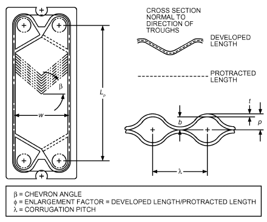

*Fig. 25 Plate Parameters*

<!-- str. 89 -->

**Table 11 Single-Phase Heat Transfer and Pressure Drop Correlations for Plate Exchangers**

```text
Investigator               Correlation                                                Comments
Troupe et al. (1960)       Nu = (0.383 – 0.505 ^Lp/b) Re^0.65 Pr^0.4                  Re > Re_cr, 10 < Re_cr< 400, water.
Muley and Manglik (1999)   Nu = [0.2668 – 0.006 967(90 – β) + 7.244 × 10^–5(90 – β)^2] Re ≥ 10^3, 30 ≤ β ≤ 60, 1 ≤ φ ≤ 1.5.
                                × (20.78 – 50.94φ + 41.16φ^2 – 10.51φ^3)
                                × Re^0.728–0.0543sin[π(90–β)/45+3.7] Pr^1/3(μ/μ_w)^0.14
                            f = [2.917 – 0.1277(90 – β) + 2.016 × 10^–3(90 – β)^2]
                               × (5.474 – 19.02φ + 18.93φ^2 – 5.341φ^3)
                               × Re^–{0.2+0.0577sin[π(90–β)/45]+2.1}
Hayes and Jokar (2009)     Nu = CRe^PPr^1/3(μ/μ_w)^0.14   f = ARe^–b
                                                       Water to water                                  Dynalene to water
                                              60/60         27/60        27/27              60/60             27/60            27/27
                           C                  0.134         0.214        0.240             0.177            0.278              0.561
                           P                  0.712         0.698        0.724             0.744            0.745              0.726
                           A                  1.183         1.559        3.089             0.570            21.405             3.149
                           b                  0.095         0.079        0.060             0                0.458              0.078
Khan et al. (2010)         Nu = C(β)Re^P(β)Pr^0.35(μ/μ_w)^0.14  f = ARe^b             500 < Re < 2500 and 3.5 < Pr < 6.0
                           C(β) = 0.016β + 0.13
                           P(β) = 0.2β + 0.64
                           β^ = chevron angle ratio, (β/β_min)
                                                       Water to water
                                             60°/60°       60°/30°       30°/30°
                           A                  1.56          1.84         34.43
                           b                  –0.24         –0.25         –0.5
Heavner et al. (1993)      Nu = C_1φ^1–mRe^mPr^0.5(μ/μ_w)^0.17                        400 < Re < 10 000, 3.3 < Pr < 5.9, water chevron
                           f = C_2φ^p+1Re^–p                                          plate (0° ≤ β ≤ 67°).
                                         C_1, C_2, m, and p are constants and given as
                                                β           β_avg           C_1                m                C_2               p
                                              67/67          67          0.089              0.718             0.490           0.1814
                                              67/45          56          0.118              0.720             0.545           0.1555
                                              67/0          33.5         0.308              0.667             1.441           0.1353
                                              45/45          45          0.195              0.692             0.687           0.1405
                                              45/0          22.5         0.278              0.683             1.458           0.0838
Wanniarachchi et al. (1995) Nu = (Nu_1^3+ Nu_t^3)^1/3Pr^1/3(μ/μ_w)^0.17               1 ≤ Re ≤ 10^4, herringbone plates
                           Nu_1= 3.65β^–0.455φ^0.661 Re^0.339                         (20° ≤ β ≤ 62, β > 62° = 62°).
                           Nu_t= 12.6β^–1.142φ^1–m Re^m
                           m = 0.646 + 0.0011β
                           f = ( f_1^3+ f_t^3)^1/3
                           f_1= 1774β^–1.026φ^2 Re^–1
                           f_t= 46.6β^–1.08φ^1+p Re^–p
                           p = 0.004 23β + 0.000 022 3β^2
Source: Ayub (2003).
```

| 60/60 27/60 | 27/27 |
|---|---|
| 0.134 0.214 | 0.240 |
| 0.712 0.698 | 0.724 |
| 1.183 1.559 | 3.089 |
| 0.095 0.079 | 0.060 |
| P(β* |  |
| <sup>)</sup>Pr<sup>0.35</sup>(μ/μ<sub>w</sub>)<sup>0.14</sup> f = ARe<sup>b</sup> |  |
| * + 0.13 |  |
| + 0.64 |  |
| ngle ratio, (β/β<sub>min</sub>) |  |
| Water to water |  |

60°/60° 60°/30° 30°/30° 1.56 1.84 34.43 –0.24 –0.25 –0.5

| Nu = C(β*)Re<sup>P(β*)</sup>Pr<sup>0.35</sup>(μ/μ<sub>w</sub>)<sup>0.14</sup><br>C 0.134 P 0.712 A 1.183 b 0.095 C(β*) = 0.016β* + 0.13 P(β*) = 0.2β* + 0.64 β<sup>*</sup> = chevron angle ratio, (β/β<sub>min</sub>) | Nu = C(β*)Re<sup>P(β*)</sup>Pr<sup>0.35</sup>(μ/μ<sub>w</sub>)<sup>0.14</sup><br>0.214 0.698 1.559 0.079 f = ARe<sup>b</sup> | 0.240 0.724 3.089 0.060 |
|---|---|---|
|  | Water to water |  |
| 60°/60° | 60°/30° | 30°/30° |

A 1.56 1.84 34.43

b –0.24 –0.25 –0.5

## 6. HEAT TRANSFER AUGMENTATION

As discussed by Bergles (1998, 2001), techniques applied to augment (enhance) heat transfer can be classified as passive (requiring no direct application of external power) or active (requiring external power). Passive techniques include rough surfaces, extended surfaces, displaced promoters, and vortex flow devices. Active techniques include mechanical aids, surface or fluid vibration, and electrostatic fields. The effectiveness of a given augmentation technique depends largely on the mode of heat transfer or type of heat exchanger to which it is applied.

When augmentation is used, the dominant thermal resistances in the circuit should be considered. Do not invest in reducing an already low thermal resistance or increasing an already high heat transfer coefficient. Also, heat exchangers with a high NTU [number of heat exchanger transfer units; see Equation (47)] benefit little from augmentation. Finally, the increased friction factor that usually accompanies heat transfer augmentation must also be considered.

### Passive Techniques

**Finned-Tube Coils.** Heat transfer coefficients for finned coils follow the basic equations of convection, condensation, and evaporation. The fin arrangement affects the values of constants and exponential powers in the equations. It is generally necessary to refer to test data for the exact coefficients.

For natural-convection finned coils (gravity coils), approximate coefficients can be obtained by considering the coil to be made of tubular and vertical fin surfaces at different temperatures and then applying the natural-convection equations to each. This is difficult because the natural-convection coefficient depends on the temperature difference, which varies at different points on the fin.

Fin efficiency should be high (80 to 90%) for optimum natural-convection heat transfer. A low fin efficiency reduces temperatures near the tip. This reduces Δt near the tip and also the coefficient h, which in natural convection depends on Δt. The coefficient of heat transfer also decreases as fin spacing decreases because of interfering convection currents from adjacent fins and reduced free-flow passage; 50 to 100 mm spacing is common. Generally, high coefficients result from large temperature differences and small flow restriction.

<!-- str. 90 -->

Edwards and Chaddock (1963) give coefficients for several circular fin-on-tube arrangements, using fin spacing δ as the characteristic length and in the form Nu = f (Ra<sub>δ</sub>, δ/D<sub>o</sub>), where D<sub>o</sub> is the fin diameter.

Forced-convection finned coils are used extensively in a wide variety of equipment. Fin efficiency for optimum performance is smaller than that for gravity coils because the forced-convection coefficient is almost independent of the temperature difference between surface and fluid. Very low fin efficiencies should be avoided because an inefficient surface gives a high (uneconomical) pressure drop. An efficiency of 70 to 90% is often used.

As fin spacing is decreased to obtain a large surface area for heat transfer, the coefficient generally increases because of higher air velocity between fins at the same face velocity and reduced equivalent diameter. The limit is reached when the boundary layer formed on one fin surface (see Figure 19) begins to interfere with the boundary layer formed on the adjacent fin surface, resulting in a decrease of the heat transfer coefficient, which may offset the advantage of larger surface area.

Selection of fin spacing for forced-convection finned coils usually depends on economic and practical considerations, such as fouling, frost formation, condensate drainage, cost, weight, and volume. Fins for conventional coils generally are spaced 1.8 to 4.2 mm apart, except where factors such as frost formation necessitate wider spacing.

There are several ways to obtain higher coefficients with a given air velocity and surface, usually by creating air turbulence, generally with a higher pressure drop: (1) staggered tubes instead of in-line tubes for multiple-row coils; (2) artificial additional tubes, or collars or fingers made by forming the fin materials; (3) corrugated fins instead of plane fins; and (4) louvered or interrupted fins.

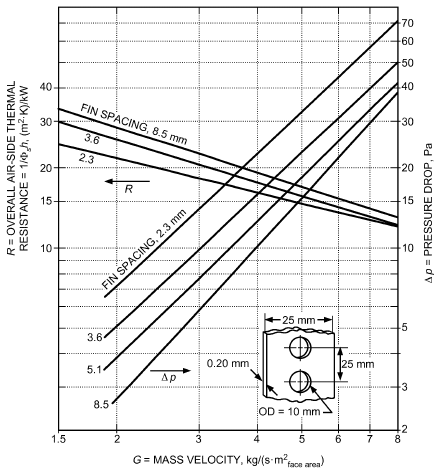

*Fig. 26 Overall Air-Side Thermal Resistance and Pressure Drop for One-Row Coils*

> (Shepherd 1946)

Figure 26 shows data for one-row coils. Thermal resistances plotted include the temperature drop through the fins, based on one square metre of total external surface area.

**Internal Enhancement.** Several examples of tubes with internal roughness or fins are shown in Figure 27. Rough surfaces of the spiral repeated rib variety are widely used to improve in-tube heat transfer with water, as in flooded chillers. Roughness may be produced by spirally indenting the outer wall, forming the inner wall, or inserting coils. Longitudinal or spiral internal fins in tubes can be produced by extrusion or forming and substantially increase surface area. Efficiency of extruded fins can usually be taken as unity (see the section on Fin Efficiency). Twisted strips (vortex flow devices) can be inserted as original equipment or as a retrofit (Manglik and Bergles 2002). From a practical point of view, the twisted tape width should be such that the tape can be easily inserted or removed. Ayub and Al-Fahed (1993) discuss clearance between the twisted tape and tube inside dimension.

Microfin tubes (internally finned tubes with about 60 short fins around the circumference) are widely used in refrigerant evaporation and condensers. Because gas entering the condenser in vaporcompression refrigeration is superheated, a portion of the condenser that desuperheats the flow is single phase. Some data on single-phase performance of microfin tubes, showing considerably higher heat transfer coefficients than for plain tubes, are available [e.g., Al-Fahed et al. (1993); Khanpara et al. (1986)], but the upper Reynolds numbers of about 10 000 are lower than those found in practice. ASH-RAE research [e.g., Eckels (2003)] is addressing this deficiency.

The increased friction factor in microfin tubes may not require increased pumping power if the flow rate can be adjusted or the length of the heat exchanger reduced. Nelson and Bergles (1986) discuss performance evaluation criteria, especially for HVAC applications.

In chilled-water systems, fouling may, in some cases, seriously reduce the overall heat transfer coefficient U. In general, fouled enhanced tubes perform better than fouled plain tubes, as shown in studies of scaling caused by cooling tower water (Knudsen and Roy 1983) and particulate fouling (Somerscales et al. 1991). A comprehensive review of fouling with enhanced surfaces is presented by Somerscales and Bergles (1997).

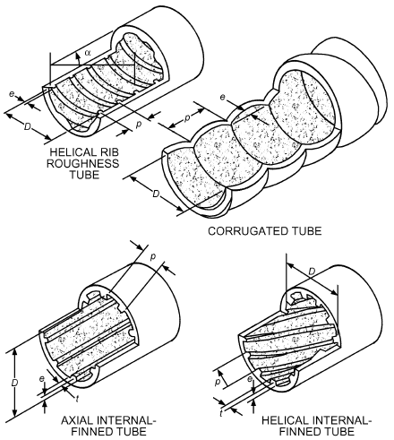

*Fig. 27 Typical Tube-Side Enhancements*

<!-- str. 91 -->

Fire-tube boilers are frequently fitted with turbulators to improve the turbulent convective heat transfer coefficient (addressing the dominant thermal resistance). Also, because of high gas temperatures, radiation from the convectively heated insert to the tube wall can represent as much as 50% of the total heat transfer. (Note, however, that the magnitude of convective contribution decreases as the radiative contribution increases because of the reduced temperature difference.) Two commercial bent-strip inserts, a twisted-strip insert, and a simple bent-tab insert are depicted in Figure 28. Design equations for convection only are included in Table 12. Beckermann and Goldschmidt (1986) present procedures to include radiation, and Junkhan et al. (1985, 1988) give friction factor data and performance evaluations.

**Enhanced Surfaces for Gases.** Several such surfaces are depicted in Figure 29. The offset strip fin is an example of an interrupted fin that is often found in compact plate fin heat exchangers used for heat recovery from exhaust air. Design equations in Table 12 apply to laminar and transitional flow as well as to turbulent flow, which is a necessary feature because the small hydraulic diameter of these surfaces drives the Reynolds number down. Data for other surfaces (wavy, spine, louvered, etc.) are available in the References.

**Microchannel Heat Exchangers.** Microchannels for heat transfer enhancement are widely used, particularly for compact heat exchangers in automotive, aerospace, fuel cell, and high-flux electronic cooling applications. Bergles (1964) demonstrated the potential of narrow passages for heat transfer enhancement; more recent experimental and numerical work includes Adams et al. (1998), Costa et al. (1985), Kandlikar (2002), Ohadi et al. (2008), Pei et al. (2001), and Rin et al. (2006).

Compared with channels of normal size, microchannels have many advantages. When properly designed, they can offer substantially higher heat transfer rates (because of their greater heat transfer surface area per unit volume and a large surface-to-volume ratio) and reduced pressure drops and pumping power requirements when compared to conventional mini- and macrochannels. Optimum flow delivery to the channels and proper heat transfer surface/channel design is critical to optimum operation of microchannels (Ohadi et al. 2012). This feature allows heat exchangers to be compact and lightweight. Despite their thin walls, microchannels can withstand high operating pressures: for example, a microchannel with a hydraulic diameter of 0.8 mm and a wall thickness of 0.3 mm can easily withstand operating pressures of up to 14 MPa. This feature makes microchannels particularly suitable for use with high-pressure refrigerants such as carbon dioxide (CO<sub>2</sub>). For high-flux electronics (with heat flux at 1 kW/cm<sup>2</sup> or higher), microchannels can provide cooling with small temperature gradients (Ohadi et al. 2008). Microchannels have been used for both single-phase and phase-change heat transfer applications.

Drawbacks of microchannels include large pressure drop, high cost of manufacture, dirt clogging, and flow maldistribution, especially for two-phase flows. Most of these weaknesses, however, may be solved by optimizing design of the surface and the heat exchanger manifold and feed system.

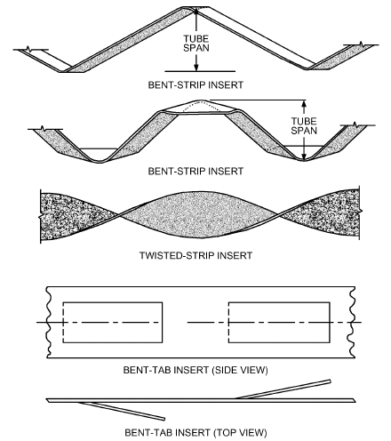

*Fig. 28 Turbulators for Fire-Tube Boilers*

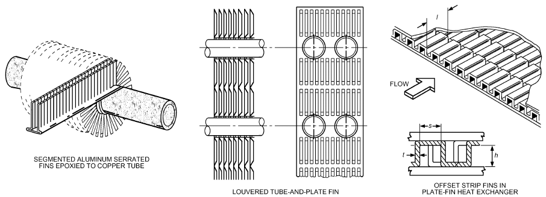

*Fig. 29 Enhanced Surfaces for Gases*

<!-- str. 92 -->

**Table 12 Equations for Augmented Forced Convection (Single Phase)**

| Description Equation |   |   |   |   |   | Comments |
|---|---|---|---|---|---|---|
| I. Turbulent in-tube flow of liquids<br>Spiral repeated rib<sup>a</sup> h<sub>a</sub> { ---- = { h<sub>s</sub> { f<sub>a</sub> { --- = { f<sub>s</sub> { w = 0.67 – 0.06(p/d) – 0.49(α/90) x = 1.37 – 0.157(p/d) y = –1.66 × 10<sup>–6</sup> Re – 0.33α/90 z = 4.59 + 4.11 × 10<sup>–6</sup> Re – 0.15(p/d) h<sub>s</sub> = ---------------------------------------<sub>1</sub>--<sub>/</sub>-<sub>2</sub>-----------<sub>2</sub>---<sub>/</sub>-<sub>3</sub>------------1 + 12.7( f<sub>s</sub> = (1.58 ln Re – 3.28)<sup>–2</sup> hD<sub>h</sub><br>Fins<sup>b</sup> --------- = k f<sub>h</sub> = 0.046<br>(hd ⁄ k)<br>Twisted-strip inserts<sup>c</sup> -----------------------------(hd ⁄ k)<sub>y→∞</sub> hd<br>( ) -----( k )<sub>y→∞</sub> φ = (μ<sub>b</sub>/μ<sub>w</sub>)<sup>n</sup> n = 0.18 for liquid heating, 0.30 for liquid cooling 0.0791 f = ----------------------------(GD ⁄ μ)<sup>0.2</sup> | 1 + 2.64 1 + 29.1<br>(k ⁄ D)( f<sub>s</sub>⁄ 2)Re Pr f<sub>s</sub> 0.023 Pr<br>GD<br>( ----------( μ = = 0.023 5( π – 4δ ⁄ d) | <sub>0.036</sub> <sup>0.212</sup> p <sup>–0.21</sup> <sup>0.29</sup> <sub>–0.024</sub> e α<br>( ) ( ) ( )<br>Re ---- ---- ----- Pr<br>( d ) ( d ) ( 90) <sub>w</sub> <sup>x</sup> p <sup>y</sup> <sup>z</sup> 2.94 e α<br>( ) ( ) ( ) ( )<br>Re ---- ---- ----- 1 + --------- sin β<br>( d ) ( d ) ( 90) ( n ) ⁄ 2) (Pr – 1) 0.8 0.5 <sub>0.4</sub>(GD<sub>h</sub>) ( A<sub>F</sub> )<sup>0.1</sup>(A<sub>i</sub>) ---------- -------- ---- (sec α)<sup>3</sup> μ AF A<br>( ) ( i ) ( ) <sup>–0.2</sup> A <sup>0</sup> h ) ( F ) <sup>.5</sup> -------- (sec α)<sup>0.75</sup> ) ( AF<sub>i</sub>) 1 + 0.769 ⁄ y<br>GD <sup>0.8</sup> 0.4 π <sup>0.8</sup> π + 2 – 2δ ⁄ d<br>( ) ( ) ( -------- Pr --------------------- -------------------------------( μ ) ( π – 4δ ⁄ d) ( π – 4δ ⁄ d π <sup>1.75</sup> π + 2 – 2δ ⁄ d <sup>1.25</sup><br>( ) ( ) ( --------------------- ------------------------------- 1 + ------------( π – 4δ ⁄ d ) ( | <sup>15/16</sup>}<sup>16/15</sup> 2.752 1.29 y | <sup>7</sup>}<sup>1/7</sup> } } } } | <sup>0.2</sup> ) ) ) ) | ·<br>Re = GD/μ, where G = m ⁄ A<sub>x</sub><br>Note that, in computing Re for fins and twisted-strip inserts, there is allowance for reduced cross-sectional area. φ |
| II. Turbulent in-tube flow of gases<br>(T )<sup>0.45</sup> hD w<br>Bent-strip inserts<sup>d</sup> ------- -----k T<br>( b)<br>(T )<sup>0.45</sup> hD w<br>Twisted-strip inserts<sup>d</sup> ------- -----k T<br>( b)<br>(T )<sup>0.45</sup> hD w<br>Bent-tab inserts<sup>d</sup> ------- -----k T<br>( b) | = 0.258 = 0.122 = 0.406 | 0.6 (T )<sup>0.45</sup><br>GD hD w<br>( ) -------- or ------- ----- = 0.208<br>( μ ) k T<br>( b)<br>GD <sup>0.6</sup><br>( ) <sup>5</sup> --------( μ )<br>GD <sup>0.5</sup><br>( ) <sup>4</sup> --------( μ ) |  | GD<br>( --------( | μ | <sup>0.6</sup> ) <sup>3</sup><br>Respectively, for configurations shown in )<br>Figure 28.<br>Note that, in computing Re, there is no allowance for flow blockage of the insert. |
| **III. Offset strip fins for plate-fin heat exchangerse h GD –0.5403 –0.1541 0.1499( h) --------- = 0.6522 ---------- α δ( μ ) cpGGD –0.7422 –0.1856 –0.3053( h) fh = 9.6243 ---------- α δ( μ ) h/cpG, fh, and GDh/μ are based on the hydraulic mean diameter given by Dh = 4shl/[2(sl + hl + th) + ts] –0.0678 γ –0.2659 γ 40 –5 GD 1.3( h) 1 + 5.269 × 10 ---------- α0.504δ0.456γ–1.05( μ ) 29 –8 GD 4.4( h) 1 + 7.669 × 10 ---------- α0.920δ3.767γ0.236( μ ) 5 0.1 0.1** |  |  |  |  |  |  |

Sources: <sup>a</sup>Ravigururajan and Bergles (1985), <sup>b</sup>Carnavos (1979), <sup>c</sup>Manglik and Bergles (1993), <sup>d</sup>Junkhan et al. (1985), <sup>e</sup>Manglik and Bergles (1990).

Microchannels are fabricated by a variety of processes, depending on the dimensions and plate material (e.g., metals, plastics, silicon). Conventional machining and electrical discharge machining are two typical options; semiconductor fabrication processes are appropriate for microchannel fabrication in chip-cooling applications. Using microfabrication techniques developed by the electronics industry, three-dimensional structures as small as 0.1 μm long can be manufactured.

Fluid flow and heat transfer in microchannels may be substantially different from those encountered in the conventional tubes. Early research indicates that deviations might be particularly important for microchannels with hydraulic diameters less than 100 μm.

Recent Progress. The automotive, aerospace, and cryogenic industries have made major progress in compact evaporator development. Thermal duty and energy efficiency have substantially increased, and space constraints have become more important, encouraging greater heat transfer rates per unit volume. The hot side of the evaporators in these applications is generally air, gas, or a condensing vapor. Air-side fin geometry improvements derive from increased heat transfer coefficients and greater surface area densities. To decrease the air-side heat transfer resistance, more aggressive fin designs have been used on the evaporating side, resulting in narrower flow passages. The narrow refrigerant channels with large aspect ratios are brazed in small cross-ribbed sections to improve flow distribution along the width of the channels. Major recent changes in designs involve individual, small-hydraulic-diameter flow passages, arranged in multichannel configuration for the evaporating fluid. Figure 30 shows a plate-fin evaporator geometry widely used in compact refrigerant evaporators.

<!-- str. 93 -->

The refrigerant-side passages are made from two plates brazed together, and air-side fins are placed between two refrigerant microchannel flow passages. Figure 31 depicts two representative microchannel geometries widely used in the compact heat exchanger industry, with corresponding approximate nominal dimensions provided in Table 13 (Zhao et al. 2000).

**Plastic heat exchangers** have been suggested for HVAC applications (Pescod 1980) and are being manufactured for refrigerated sea water (RSW) applications. They can be made of materials impervious to corrosion [e.g., by acidic condensate when cooling a gaseous stream (flue gas heat recovery)], and are easily manufactured with enhanced surfaces. Several companies now offer heat exchangers in plastic, including various enhancements.

### Active Techniques

Unlike passive techniques, active techniques require external power to sustain the enhancement mechanism.

Table 14 lists the more common active heat transfer augmentation techniques and the corresponding heat transfer mode believed most applicable to the particular technique. Various active techniques and their world-wide status are listed in Table 15. Except for mechanical aids, which are universally used for selected applications, most other active techniques have found limited commercial applications and are still in development. However, with increasing demand for smart and miniaturized thermal management systems, actively controlled heat transfer augmentation techniques will soon become necessary for some advanced thermal management systems. All-electric ships, airplanes, and cars use electronics for propulsion, auxiliary systems, sensors, countermeasures, and other system needs. Advances in power electronics and control systems will allow optimized and tactical allocation of total installed power among system components.

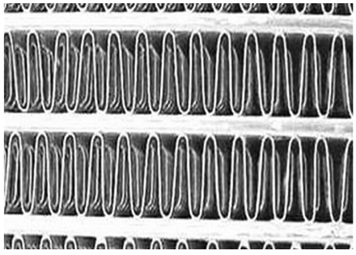

*Fig. 30 Typical Refrigerant and Air-Side Flow Passages in Compact Automotive Microchannel Heat Exchanger*

**Table 13 Microchannel Dimensions**

|   | Microchannel I | Microchannel II |
|---|---|---|
| Channel geometry | Rectangular | Triangular |
| Hydraulic diameter D<sub>h</sub>, mm | 0.7 | 0.86 |
| Number of channels | 28 | 25 |
| Length L, mm | 300 | 300 |
| Height H, mm | 1.5 | 1.9 |
| Width W, mm | 28 | 27.12 |
| Wall thickness, mm | 0.4 | 0.3 |

**Table 14 Active Heat Transfer Augmentation Techniques and Most Relevant Heat Transfer Modes**

| Technique | Forced Convection<br>(Gases) | Heat Transfer Mode Forced Convection (Liquids) ing | Heat Transfer Mode (Liquids) ing<br>Boil- | Heat Transfer Mode Evapo- Conden-<br>ration | Heat Transfer Mode Evapo- Conden-<br>sation | Mass Transfer |
|---|---|---|---|---|---|---|
| Mechanical aids | NA | ** | * | * | NA | ** |
| Surface vibration | ** | ** | ** | ** | ** | *** |
| Fluid vibration | ** | ** | ** | ** | — | ** |
| Electrostatic/electrohydrodynamic | ** | ** | *** | *** | *** | *** |
| Suction/injection | * | ** | NA | NA | ** | ** |
| Jet impingement | ** | ** | NA | ** | NA | * |
| Rotation | * | * | *** | *** | *** | *** |
| Induced flow | ** | ** | NA | NA | NA | * |

*** = Highly significant ** = Significant * = Somewhat significant — = Not significant NA = Not believed to be applicable

**Table 15 Worldwide Status of Active Techniques**

| Technique | Country or Countries |
|---|---|
| Mechanical aids | Universally used in selected applications (e.g., fluid mixers, liquid injection jets) |
| Surface vibration | Most recent work in United States; not significant |
| Fluid vibration | Sweden; mostly used for sonic cleaning |
| Electrostatic/electro- | Japan, United States, United Kingdom; |
| hydrodynamic | successful prototypes demonstrated |
| Other electrical methods | United Kingdom, France, United States |
| Suction/injection | No recent significant developments |
| Jet impingement | France, United States; high-temperature units and aerospace applications |
| Rotation | United States (industry), United Kingdom<br>(R&D) |
| Induced flow | United States; particularly combustion |

This in turn will require smart (online/on-demand), compact heat exchangers and thermal management systems that can communicate and respond to transient system needs. This section briefly overviews active techniques and recent progress; for additional details, see Ohadi et al. (1996).

**Mechanical Aids**. Augmentation by mechanical aids involves stirring the fluid mechanically. Heat exchangers that use mechanical enhancements are often called **mechanically assisted heat ex- changers**. Stirrers and mixers that scrape the surface are extensively used in chemical processing of highly viscous fluids, such as blending a flow of highly viscous plastic with air. Surface scraping can also be applied to duct flow of gases. Hagge and Junkhan (1974) reported tenfold improvement in the heat transfer coefficient for laminar airflow over a flat plate. Table 16 lists selected works on mechanical aids, suction, and injection.

**Injection.** This method involves supplying a gas to a flowing liquid through a porous heat transfer surface or injecting a fluid of a similar type upstream of the heat transfer test section. Injected bubbles produce an agitation similar to that of nucleate boiling. Gose et al. (1957) bubbled gas through sintered or drilled heated surfaces and found that the heat transfer coefficient increased 500% in laminar flow and about 50% in turbulent flow. Tauscher et al. (1970) demonstrated up to a fivefold increase in local heat transfer coefficients by injecting a similar fluid into a turbulent tube flow, but the effect dies out at a length-to-diameter ratio of 10. Practical application of injection appears to be rather limited because of difficulty in cost-effectively supplying and removing the injection fluid.

<!-- str. 94 -->

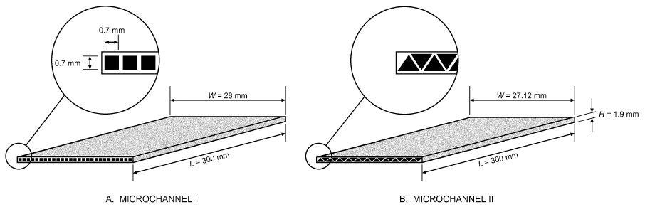

*Fig. 31 Microchannel Dimensions*

**Suction.** The suction method involves removing fluid through a porous heated surface, thus reducing heat/mass transfer resistance at the surface. Kinney (1968) and Kinney and Sparrow (1970) reported that applying suction at the surface increased heat transfer coefficients for laminar film and turbulent flows, respectively. Jeng et al. (1995) conducted experiments on a vertical parallel channel with asymmetric, isothermal walls. A porous wall segment was embedded in a segment of the test section wall, and enhancement occurred as hot air was sucked from the channel. The local heat transfer coefficient increased with increasing porosity. The maximum heat transfer enhancement obtained was 140%.

**Fluid or Surface Vibration.** Fluid or surface vibrations occur naturally in most heat exchangers; however, naturally occurring vibration is rarely factored into thermal design. Vibration equipment is expensive, and power consumption is high. Depending on frequency and amplitude of vibration, forced convection from a wire to air is enhanced by up to 300% (Nesis et al. 1994). Using standing waves in a fluid reduced input power by 75% compared with a fan that provided the same heat transfer rate (Woods 1992). Lower frequencies are preferable because they consume less power and are less harmful to users’ hearing. Vibration has not found industrial applications at this stage of development.

**Rotation.** Rotation heat transfer enhancement occurs naturally in rotating electrical machinery, gas turbine blades, and some other equipment. The rotating evaporator, rotating heat pipe, high-performance distillation column, and Rotex absorption cycle heat pump are typical examples of previous work in this area. In rotating evaporators, the rotation effectively distributes liquid on the outer part of the rotating surface. Rotating the heat transfer surface also seems promising for effectively removing condensate and decreasing liquid film thickness. Heat transfer coefficients have been substantially increased by using centrifugal force, which may be several times greater than the gravity force.

As shown in Table 17, heat transfer enhancement varies from slight improvement up to 450%, depending on the system and rotation speed. The rotation technique is of particular interest for use in two-phase flows, particularly in boiling and condensation. This technique is not effective in gas-to-gas heat recovery mode in laminar flow, but its application is more likely in turbulent flow. High power consumption, sealing and vibration problems, moving parts, and the expensive equipment required for rotation are some of this technique’s drawbacks.

**Electrohydrodynamics.** Electrohydrodynamic (EHD) enhancement of single-phase heat transfer refers to coupling an electric field with the fluid field in a dielectric fluid medium. The net effect is production of secondary motions that destabilize the thermal boundary layer near the heat transfer surface, leading to heat transfer coefficients that are often an order of magnitude higher than those achievable by most conventional enhancement techniques. EHD heat transfer enhancement has applicability to both single-phase and phase-change heat transfer processes, although only enhancement of single-phase flows is discussed here.

**Table 16 Selected Studies on Mechanical Aids, Suction, and Injection**

| Source | Process | Heat Transfer Surface | Fluid | α<sub>max</sub> |
|---|---|---|---|---|
| Valencia et al. (1996) | Natural convection | Finned tube | Air | 0.5 |
| Jeng et al. (1995) | Natural convection/ suction | Asymmetric isothermal wall | Air | 1.4 |
| Inagaki and Komori (1993) | Turbulent natural convection/suction | Vertical plate | Air | 1.8 |
| Dhir et al. (1992) | Forced convection/ injection | Tube | Air | 1.45 |
| Duignan et al. (1993) | Forced convection/film boiling | Horizontal plate | Air | 2.0 |
| Son and Dhir (1993) | Forced convection/ injection | Annuli | Air | 1.85 |
| Malhotra and Majumdar (1991) | Water to bed/stirring | Granular bed | Air | 3.0 |
| Aksan and Borak (1987) | Pool of water/stirring | Tube coils | Water | 1.7 |
| Hagge and Junkhan (1974) | Forced convection/ scraping | Cylindrical wall | Air | 11.0 |
| Hu and Shen (1996) | Turbulent natural convection | Converging ribbed tube | Air | 1.0 |

α = Enhancement factor (ratio of enhanced to unenhanced heat transfer coefficient)

<!-- str. 95 -->

**Table 17 Selected Studies on Rotation**

| Source | Process | Heat Transfer Surface | Fluid | Rotational Speed, rpm | α<sub>max</sub> |
|---|---|---|---|---|---|
| Prakash and Zerle (1995) | Natural convection | Ribbed duct | Air | Given as a function | 1.3 |
| Mochizuki et al. (1994) | Natural convection | Serpentine duct | Air | Given as a function | 3.0 |
| Lan (1991) | Solidification | Vertical tube | Water | 400 | NA |
| McElhiney and Preckshot (1977) | External condensation | Horizontal tube | Steam | 40 | 1.7 |
| Nichol and Gacesa (1970) | External condensation | Vertical cylinder | Steam | 2700 | 4.5 |
| Astaf’ev and Baklastov (1970) | External condensation | Circular disk | Steam | 2500 | 3.4 |
| Tang and McDonald (1971) | Nucleate boiling | Horizontal heated circular cylinder | R-113 | 1400 | <1.2 |
| Marto and Gray (1971) | In-tube boiling | Vertical heated circular cylinder | Water | 2660 | 1.6 |

α = Enhancement factor (ratio of enhanced to unenhanced heat transfer coefficient)

**Table 18 Selected Previous Work with EHD Enhancement of Single-Phase Heat Transfer**

| Source | Process | Heat Transfer Surface/<br>Electrode | Heat Transfer Surface/<br>Fluid | P/Q, % | α<sub>max</sub> |
|---|---|---|---|---|---|
| Poulter and Allen (1986) | Internal flow | Tube/wire | Aviation fuel-hexane | NA | 20 |
| Fernandez and Poulter (1987) | Internal flow | Tube/wire | Transformer oil | NA | 23 |
| Ohadi et al. (1995) | Internal flow | Smooth surface/rod | PAO | 1.2 | 3.2 |
| Ohadi et al. (1991) | Internal flow | Tube/wire | Air | 15 | 3.2 |

NA = Not available P = EHD power consumption α = Enhancement factor (ratio of enhanced to unenhanced heat transfer Q = Heat exchange rate in the heat exchanger coefficient)

Selected work in EHD enhancement of single-phase flow is shown in Table 18. High enhancement magnitudes have been found for single-phase air and liquid flows. However, high enhancement magnitude is not enough to warrant practical implementation. EHD electrodes must be compatible with cost-effective, mass-production technologies, and power consumption must be kept low, to minimize the required power supply cost and complexity.

The following brief overview discusses recent work on EHD enhancement of air-side heat transfer; additional details are in Ohadi et al. (2001).

*EHD Air-Side Heat Transfer Augmentation.* In a typical liquid-toair heat exchanger, air-side thermal resistance is often the limiting factor to improving the overall heat transfer coefficient. Electrohydrodynamic enhancement of air-side heat transfer involves ionizing air molecules under a high-voltage, low-current electric field, leading to generation of secondary motions that are known as **corona** or **ionic wind**, generated between the charged electrode and receiving (ground) electrode. Typical wind velocities of 1 to 3 m/s have been verified experimentally. Studies of this enhancement method include Ohadi et al. (1991), who studied laminar and turbulent forced-convection heat transfer of air in tube flow, and Owsenek and Seyed-Yagoobi (1995), who investigated heat transfer augmentation of natural convection with the corona wind effect. Other studies are documented in Ohadi et al. (2001). The general finding has been that corona wind is effective for Reynolds numbers up to transitional values, 2300 or less, and becomes less effective as Re increases. At high Reynolds numbers, turbulence-induced effects overwhelm the corona wind effect.

Most studies addressed EHD air-side enhancement in classical geometries, but recent work has focused on issues of practical significance. These include (1) EHD applicability in highly compact heat exchangers, (2) electrode designs to minimize power consumptions to avoid joule heating and costly power supply requirements, and (3) cost-effective mass production of EHD-enhanced surfaces.

Lawler et al. (2002) examined air-side enhancement of an air-toair heat exchanger with 4.2 to 6.4 mm fin spacing. Unlike previous studies, this study investigated placing electrodes on the heat transfer surface itself, integrated into the surface as an embedded wire, thus avoiding suspended wires in the flow field. This arrangement could greatly simplify manufacturing/fabrication for EHD-enhanced embedded electrodes. Insulating materials (in this case, polyimide tape) were placed between the heat transfer surface and electrodes. The height of the channel (8 mm) represented typical heights used in passive metallic designs and prevented sparking between the electrodes and upper and lower channel walls.

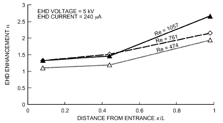

*Fig. 32 Ratio of Heat Transfer Coefficient with EHD to Coefficient Without EHD as Function of Distance from Front of Module*

Figure 32 shows the ratio of heat transfer coefficients (EHD/non-EHD) as a function of position in the module for three different Reynolds numbers. For nonentry regions of the duct, enhancement is 100 to 150% for Reynolds numbers above 400. Near the module entrance, EHD enhancement is reduced, probably because of the higher heat transfer coefficient in the entry region, before viscous and thermal boundary layers have been established.

Tests for a finned heat exchanger with 6 mm fin spacing obtained comparable enhancements for Reynolds numbers up to 4000. The results are shown in Figure 33. At higher Re, the effect of EHD enhancement diminishes, as turbulence-induced enhancements predominate.

EHD can also be used for other process control applications, including frost control, enhancing liquid/vapor separation for flow maldistribution control in heat exchangers, and oil separation in heat exchanger equipment. ASHRAE has recently sponsored three EHD research projects: (1) EHD-enhanced boiling of refrigerants (Seyed-Yagoobi 1997), (2) EHD frost control in HVAC&R equipment (Ohadi 2002), and (3) EHD flow maldistribution control in heat exchangers (Seyed-Yagoobi and Feng 2005). Reports for these projects are available through ASHRAE headquarters.

<!-- str. 96 -->

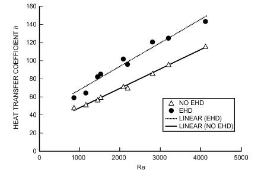

*Fig. 33 Heat Transfer Coefficients (With and Without EHD) as Functions of Reynolds Number*

## 7. SYMBOLS

A = surface area for heat transfer

A<sub>F</sub>, A<sub>x</sub> = cross-sectional flow area b = flow channel gap

Bi = Biot number (hL/k)

C = conductance; fluid capacity rate c = coefficient; constant

C<sub>1</sub>, C<sub>2</sub> = Planck’s law constants [see Equation (19)]

c<sub>p</sub> = specific heat at constant pressure c<sub>r</sub> = capacity ratio c<sub>v</sub> = specific heat at constant volume

D = tube (inside) or rod diameter; diameter of vessel d = diameter; prefix meaning differential

E = electric field e = protuberance height f = Fanning friction factor for single-phase flow; electric body force F<sub>ij</sub> = angle factor

Fo = Fourier number

G = mass velocity; irradiation; ṁ ⁄ A<sub>x</sub>, in pipe Reynolds number (Table 12)

g = gravitational acceleration

Gr = Grashof number

Gz = Graetz number

H = height h = heat transfer coefficient; offset strip fin height

I = modified Bessel function

J = radiosity

J<sub>0</sub> = Bessel function of the first kind, order zero j = Colburn heat transfer factor k = thermal conductivity

L = length; height of liquid film l = length; length of one module of offset strip fins; liquid

M = mass; molecular mass m = general exponent; inverse of Biot number ṁ = mass rate of flow n = general number; ratio r/r<sub>m</sub> (dimensionless distance); number of blades

NTU = number of exchanger heat transfer units

Nu = Nusselt number

P = perimeter p = pressure; fin pitch; repeated rib pitch

Pr = Prandtl number

Q = volume flow rate q = heat transfer rate q″ = heat flux

R = thermal resistance; radius

> r = radius

Ra = Rayleigh number (Gr Pr)

Re = pipe Reynolds number (GD/µ); film Reynolds number (4Γ/h) Re* = rotary Reynolds number (D<sup>2</sup>Np/h)

> S = conduction shape factor
>
> s = lateral spacing of offset fin strips

> T = absolute temperature
>
> t = temperature; fin thickness at base; plate thickness

U = overall heat transfer coefficient

> V = linear velocity; volume

W = work; emissive power; fin dimension w = wall; effective plate width

W<sub>b</sub> = blackbody emissive power

W<sub>λ</sub> = monochromatic emissive power x, y, z = lengths along principal coordinate axes

> Y = temperature ratio
>
> y = one-half diametrical pitch of a twisted tape: length of 180°

> revolution/tube diameter

### Greek

α = thermal diffusivity = k/ρc<sub>p</sub>; absorptivity; spiral angle for helical fins; aspect ratio of offset strip fins, s/h; enhancement factor: ratio of enhanced to unenhanced heat transfer coefficient (conditions remaining the same)

β = coefficient of thermal expansion; contact angle of rib profile; chevron angle, °

β<sup>*</sup> = chevron angle ratio, (β/β<sub>min</sub>)

β<sub>min</sub> = smaller of two chevron angles

> Γ = mass flow of liquid per unit length
>
> γ = ratio, t/s

> δ = distance between fins; ratio t/l; thickness of twisted tape

ε = hemispherical emissivity; exchanger heat transfer effectiveness; dielectric constant

> λ = wavelength; corrugation pitch
>
> μ = absolute viscosity

> ν = kinematic viscosity (μ/ρ), m<sup>2</sup>/s

ϖ = eigenvalue

> ρ = density; reflectance
>
> σ = Stefan-Boltzmann constant, 5.67 × 10<sup>–8</sup> W/(m<sup>2</sup>·K<sup>4</sup>)

> τ = time; transmissivity

Φ = dimensionless fin resistance; Φ<sub>max</sub> is maximum limiting value of Φ

> φ = fin efficiency; angle; temperature correction factor; ratio of
>
> developed length to protracted length

### Subscripts

> a = augmented
>
> b = blackbody; based on bulk fluid temperature

> c = convection; critical; cold (fluid); cross section

cr = critical

> e = equivalent; environment; exit
>
> f = film; fin; final

> g = gas

gen = internal generation

> h = horizontal; hot (fluid); hydraulic

i = inlet; inside; particular surface (radiation); based on maximum inside (envelope) diameter

> if = interface

iso = isothermal conditions

> j = particular surface (radiation)
>
> k = particular surface (radiation)

> L = thickness
>
> l = liquid

m = mean

> n = counter variable
>
> o = outside; outlet; overall; at base of fin

> p = prime heat transfer surface; plate
>
> r = radiation; root (fin); reduced

> s = surface; secondary heat transfer surface; straight or plain;
>
> accounting for flow blockage of twisted tape

st = static (pressure)

> t = temperature; terminal temperature; tip (fin)

uf = unfinned

> v = vapor; vertical

<!-- str. 97 -->

W = width wet = wetted w = wall; water; or wafer

λ = monochromatic

## REFERENCES

Adams, J.A., and D.F. Rogers. 1973. *Computer aided heat transfer analysis*.

McGraw-Hill, New York.

Adams, T.M., S.I. Abdel-Khalik, S.M. Jeter, and Z.H. Qureshi. 1998. An experimental investigation of single-phase forced convection in microchannels. *International Journal of Heat and Mass Transfer* 41(6):851-857.

Afgan, N.H., and E.U. Schlunder. 1974. *Heat exchangers: Design and the-* ory sourcebook. McGraw-Hill, New York.

Aksan, D., and F. Borak. 1987. Heat transfer coefficients in coiled stirred tank systems. *Canadian Journal of Chemical Engineering* 65:1013-1014.

Al-Fahed, S.F., Z.H. Ayub, A.M. Al-Marafie, and B.M. Soliman. 1993. Heat transfer and pressure drop in a tube with internal microfins under turbulent water flow conditions. *Experimental Thermal and Fluid Science* 7:249-253.

Altmayer, E.F., A.J. Gadgil, F.S. Bauman, and R.C. Kammerud. 1983. Correlations for convective heat transfer from room surfaces. ASHRAE Transactions 89(2A):61-77. Paper DC-2764.

Astaf’ev, B.F., and A.M. Baklastov. 1970. Condensation of steam on a horizontal rotating disc. Teploenergetika 17:55-57.

Ayub, Z.H. 2003. Plate heat exchanger literature survey and new heat transfer and pressure drop correlations for refrigerant evaporators. Heat Transfer Engineering 24(5):3-16.

Ayub, Z.H., and S.F. Al-Fahed. 1993. The effect of gap width between horizontal tube and twisted tape on the pressure drop in turbulent water flow. *International Journal of Heat and Fluid Flow* 14(1):64-67.

Bauman, F., A. Gadgil, R. Kammerud, E. Altmayer, and M. Nansteel. 1983.

Convective heat transfer in buildings. ASHRAE Transactions 89(1A): 215-233. Paper AC-2750.

Beckermann, C., and V. Goldschmidt. 1986. Heat transfer augmentation in the flueway of a water heater. ASHRAE Transactions 92(2B):485-495. Paper PO-86-11-1.

Bergles, A.E. 1964. Burnout in tubes of small diameter. ASME Paper 63-WA-182.

Bergles, A.E. 1998. Techniques to enhance heat transfer. In Handbook of heat transfer, 3rd ed., pp. 11.1-11.76. McGraw-Hill, New York.

Bergles, A.E. 2001. The implications and challenges of enhanced heat transfer for the chemical process industries. *Chemical Engineering Research* and Design 79:437-434.

Carnavos, T.C. 1979. Heat transfer performance of internally finned tubes in turbulent flow. In *Advances in enhanced heat transfer*, pp. 61-67. American Society of Mechanical Engineers, New York.

Carslaw, H.S., and J.C. Jaeger. 1959. *Conduction of heat in solids*. Oxford University Press, UK.

Churchill, S.W. 1990. Free convection around immersed bodies. In Hand-*book of heat exchanger design*, G.F. Hewitt, ed. Hemisphere, New York.

Churchill, S.W., and M. Bernstein. 1977. A correlating equation for forced convection from gases and liquids to a circular cylinder in cross flow. *Journal of Heat Transfer* 99:300.

Churchill, S.W., and H.H.S. Chu. 1975a. Correlating equations for laminar and turbulent free convection from a vertical plate. International Journal *of Heat and Mass Transfer* 18(11):1323-1329.

Churchill, S.W., and H.H.S. Chu. 1975b. Correlating equations for laminar and turbulent free convection from a horizontal cylinder. International *Journal of Heat and Mass Transfer* 18(9):1049-1053.

Clausing, A.M. 1964. Thermal contact resistance in a vacuum environment.

ASME Paper 64-HT-16, Seventh National Heat Transfer Conference. Costa, R., R. Muller, and C. Tobias. 1985. Transport processes in narrow (capillary) channels. AIChE Journal 31:473-482.

Couvillion, R.J. 2004. Curve fits for Heisler chart eigenvalues. Computers in Education Journal. July-September.

Croft, D.R., and D.G. Lilley. 1977. *Heat transfer calculations using finite* difference equations. Applied Science, London.

Dart, D.M. 1959. Effect of fin bond on heat transfer. ASHRAE Journal 5:67. Dhir, V.K., F. Chang, and G. Son. 1992. Enhancement of single-phase forced convection heat transfer in tubes and ducts using tangential flow injection. Annual Report. Contract 5087-260135. Gas Research Institute.

Dittus, F.W., and L.M.K. Boelter. 1930. Heat transfer in automobile radiators of the tubular type. *University of California Engineering Publication* 13:443.

Duignan, M., G. Greene, and T. Irvine. 1993. The effect of surface gas injection on film boiling heat transfer. *Journal of Heat Transfer* 115:986-992.

Eckels, P.W. 1977. Contact conductance of mechanically expanded plate finned tube heat exchangers. AIChE-ASME Heat Transfer Conference, Salt Lake City.

Eckels, S.J. 2003. Single-phase refrigerant heat transfer and pressure drop characterization of high Reynolds number flow for internally finned tubes including the effects of miscible oils (RP-1067). ASHRAE Research Project, Final Report.

Edwards, J.A., and J.B. Chaddock. 1963. An experimental investigation of the radiation and free-convection heat transfer from a cylindrical disk extended surface. ASHRAE Transactions 69:313.

Fernandez, J., and R. Poulter. 1987. Radial mass flow in electrohydrodynamically-enhanced forced heat transfer in tubes. International *Journal of Heat and Mass Transfer* 80:2125-2136.

Fujii, T., S. Koyama, and M. Fujii. 1986. Experimental study of free convection heat transfer from an inclined fine wire to air. *Proceedings of the* *VIII International Heat Transfer Conference*, San Francisco, vol. 3.

Gnielinski, V. 1990. Forced convection in ducts. In *Handbook of heat* exchanger design, G.F. Hewitt, ed. Hemisphere, New York.

Goldstein, R.J., E.M. Sparrow, and D.C. Jones. 1973. Natural convection mass transfer adjacent to horizontal plates. *International Journal of Heat* *and Mass Transfer* 16:1025.

Gose, E.E., E.E. Peterson, and A. Acrivos. 1957. On the rate of heat transfer in liquids with gas injection through the boundary layer. Journal of Applied Physics 28:1509.

Grigull, U., I. Straub, E. Hahne, and K. Stephan. 1982. Heat transfer. Pro-*ceedings of the Seventh International Heat Transfer Conference*, Munich, vol. 3.

Hagge, J.K., and G.H. Junkhan. 1974. Experimental study of a method of mechanical augmentation of convective heat transfer in air. Report HTL3, ISU-ERI-Ames-74158, Nov. 1975. Iowa State University, Ames.

Hayes, N., and A. Jokar. 2009. Dynalene/water correlations to be used for condensation of CO<sub>2</sub> in brazed plate heat exchangers. ASHRAE Transactions 115(2):599-616. Paper LO-09-0570 (RP-1394).

Heavner, R.L., H. Kumar, and A.S. Wanniarachchi. 1993. Performance of an industrial heat exchanger: Effect of chevron angle. AIChE Symposium Series 295(89):262-267.

Hottel, H.C., and A.F. Sarofim. 1967. Radiation transfer. McGraw-Hill, New York.

Hu, Z., and J. Shen. 1996. Heat transfer enhancement in a converging passage with discrete ribs. *International Journal of Heat and Mass Transfer* 39(8):1719-1727.

Inagaki, T., and I. Komori. 1993. Experimental study of heat transfer enhancement in turbulent natural convection along a vertical flat plate, part 1: The effect of injection and suction. Heat Transactions—Japanese Research 22:387.

Incropera, F.P., D.P. DeWitt, T.L. Bergman, and A.S. Lavine. 2007. Funda-*mentals of heat and mass transfer*, 6th ed. John Wiley & Sons, New York.

Jakob, M. 1949, 1957. Heat transfer, vols. I and II. John Wiley & Sons, New York.

Jeng, Y., J. Chen, and W. Aung. 1995. Heat transfer enhancement in a vertical channel with asymmetric isothermal walls by local blowing or suction. *International Journal of Heat and Fluid Flow* 16:25.

Junkhan, G.H., A.E. Bergles, V. Nirmalan, and T. Ravigururajan. 1985.

Investigation of turbulators for fire tube boilers. *Journal of Heat Transfer* 107:354-360.

Junkhan, G.H., A.E. Bergles, V. Nirmalan, and W. Hanno. 1988. Performance evaluation of the effects of a group of turbulator inserts on heat transfer from gases in tubes. ASHRAE Transactions 94(2):1195-1212. Paper OT-88-05-5.

Kandlikar, S.G. 2002. Fundamental issues related to flow boiling in mini channels and microchannels. *Experimental Thermal and Fluid Science* 26:389-407.

Kaspareck, W.E. 1964. Measurement of thermal contact conductance between dissimilar metals in a vacuum. ASME Paper 64-HT-38, Seventh National Heat Transfer Conference.

Kays, W.M., and A.L. London. 1984. *Compact heat exchangers*, 3rd ed.

McGraw-Hill, New York.

<!-- str. 98 -->

Khan, T.S., M.S. Khan, M.C. Chyu, and Z.H. Ayub. 2010. Experimental investigation of single phase convective heat transfer coefficient in a corrugated plate heat exchanger for multiple plate configurations. Applied Thermal Engineering 30(8-9):1058-1065.

Khanpara, J.C., A.E. Bergles, and M.B. Pate. 1986. Augmentation of R-113 in-tube condensation with micro-fin tubes. *Proceedings of the ASME* *Heat Transfer Division*, HTD 65, pp. 21-32.

Kinney, R.B. 1968. Fully developed frictional and heat transfer characteristics of laminar flow in porous tubes. *International Journal of Heat and* Mass Transfer 11:1393-1401.

Kinney, R.B., and E.M. Sparrow. 1970. Turbulent flow: Heat transfer and mass transfer in a tube with surface suction. *Journal of Heat Transfer* 92:117-125.

Knudsen, J.G., and B.V. Roy. 1983. Studies on scaling of cooling tower water. In *Fouling of heat enhancement surfaces*, pp. 517-530. Engineering Foundation, New York.

Lan, C.W. 1991. Effects of rotation on heat transfer fluid flow and interface in normal gravity floating zone crystal growth. *Journal of Crystal* Growth 114:517.

Lawler, J., A. Saidi, and S. Moghaddam. 2002. EHD enhanced liquid-air heat exchangers. Final Report, Contract M67854-00-C-0015. Advanced Thermal and Environmental Concepts, College Park, MD.

Lewis, D.M., and H.J. Sauer, Jr. 1965. The thermal resistance of adhesive bonds. *ASME Journal of Heat Transfer* 5:310.

Lloyd, J.R., and W.R. Moran. 1974. Natural convection adjacent to horizontal surfaces of various plan forms. *Journal of Heat Transfer* 96:443.

Love, T.J. 1968. *Radiative heat transfer*. Merrill, Columbus, OH.

Malhotraf, K., and A.S. Mujumdar. 1991. Wall to bed contact heat transfer rates in mechanically stirred granular beds. *International Journal of Heat* *and Mass Transfer* 34:427-435.

Manglik, R.M., and A.E. Bergles. 1990. The thermal-hydraulic design of the rectangular offset-strip-fin-compact heat exchanger. In Compact heat exchangers, pp. 123-149. Hemisphere, New York.

Manglik, R.M., and A.E. Bergles. 1993. Heat transfer and pressure drop correlation for twisted-tape insert in isothermal tubes: Part II —Transition and turbulent flows. *Journal of Heat Transfer* 115:890-896.

Manglik, R.M., and A.E. Bergles. 2002. Swirl flow heat transfer and pressure drop with twisted-tape inserts. *Advances in Heat Transfer* 36:183.

Marto, P.J., and V.H. Gray. 1971. Effects of high accelerations and heat fluxes on nucleate boiling of water in an axisymmetric rotating boiler. NASA Technical Note TN. D-6307. Washington, D.C.

McAdams, W.H. 1954. Heat transmission, 3rd ed. McGraw-Hill, New York. McElhiney, J.E., and G.W. Preckshot. 1977. Heat transfer in the entrance length of a horizontal rotating tube. *International Journal of Heat and* Mass Transfer 20:847-854.

Metais, B., and E.R.G. Eckert. 1964. Forced, mixed and free convection regimes. *ASME Journal of Heat Transfer* 86(C2)(5):295.

Mills, A.F. 1999. *Basic heat & mass transfer*. Prentice Hall, Saddle River, NJ.

Mochizuki, S., J. Takamura, and S. Yamawaki. 1994. Heat transfer in serpentine flow passages with rotation. *Journal of Turbomachinery* 116:133.

Modest, M.F. 2003. *Radiative heat transfer*, 2nd ed. Academic Press, Oxford, U.K.

Morgan, V.T. 1975. The overall convective heat transfer from smooth circular cylinders. In *Advances in heat transfer*, vol. 11, T.F. Irvine and J.P. Hartnett, eds. Academic Press, New York.

Muley, A., and R.M. Manglik. 1999. Experimental study of turbulent flow heat transfer and pressure drop in a plate heat exchanger with chevron plates. *Journal of Heat Transfer* 121(1):110-117.

Myers, G.E. 1971. *Analytical methods in conduction heat transfer*.

McGraw-Hill, New York.

Nelson, R.M., and A.E. Bergles. 1986. Performance evaluation for tubeside heat transfer enhancement of a flooded evaporative water chiller. ASHRAE Transactions 92(1B):739-755. Paper SF-86-16-2.

Nesis, E.I., A.F. Shatalov, and N.P. Karmatskii. 1994. Dependence of the heat transfer coefficient on the vibration amplitude and frequency of a vertical thin heater. *Journal of Engineering Physics and Thermophysics* 67(1-2).

Nichol, A.A., and M. Gacesa. 1970. Condensation of steam on a rotating vertical cylinder. *Journal of Heat Transfer* 144-152.

Ohadi, M.M. 2002. Control of frost accumulation in refrigeration equipment using the electrohydrodynamic (EHD) technique (RP-1100). ASHRAE Research Project, Final Report.

Ohadi, M.M., N. Sharaf, and D.A. Nelson. 1991. Electrohydrodynamic enhancement of heat transfer in a shell-and-tube heat exchanger. Enhanced Heat Transfer 4(1):19-39.

Ohadi, M.M., S. Dessiatoun, A. Singh, K. Cheung, and M. Salehi. 1995.

EHD-enhancement of boiling/condensation heat transfer of alternate refrigerants. Progress Report 6. Presented to U.S. Department of Energy and the EHD Consortium Members, under DOE Grant DE-FG02-93CE23803.A000, Chicago, January.

Ohadi, M.M., S.V. Dessiatoun, J. Darabi, and M. Salehi. 1996. Active augmentation of single-phase and phase-change heat transfer—An overview. In *Process, enhanced, and multiphase heat transfer: A festschrift* *for A.E. Bergles*, pp. 277-286, R.M. Manglik and A.D. Kraus, eds. Begell House, New York.

Ohadi, M.M., J. Darabi, and B. Roget. 2001. Electrode design, fabrication, and materials science for EHD-enhanced heat and mass transfer. In *Annual review of heat transfer*, vol. 22, pp. 563-623.

Owsenek, B., and J. Seyed-Yagoobi. 1995. Experimental investigation of corona wind heat transfer enhancement with a heated horizontal flat plate. *Journal of Heat Transfer* 117:309.

Parker, J.D., J.H. Boggs, and E.F. Blick. 1969. *Introduction to fluid mechan-* *ics and heat transfer*. Addison Wesley, Reading, MA.

Patankar, S.V. 1980. *Numerical heat transfer and fluid flow*. McGraw-Hill, New York.

Pei, X.J., H.F. Ming, S.S. Guang, and P.R. Ze. 2001. Thermal–hydraulic performance of small scale micro-channel and porous-media heatexchangers. *International Journal of Heat and Mass Transfer* 44(5): 1039-1051.

Pescod, D. 1980. An advance in plate heat exchanger geometry giving increased heat transfer. *Proceedings of the ASME Heat Transfer Divi-* sion, HTD 10, pp. 73-77.

Poulter, R., and P.H.G. Allen. 1986. Electrohydrodynamincally augmented heat and mass transfer in the shell tube heat exchanger. Proceedings of *the Eighth International Heat Transfer Conference* 6:2963-2968.

Prakash, C., and R. Zerle. 1995. Prediction of turbulent flow and heat transfer in a ribbed rectangular duct with and without rotation. *Journal of Tur-* bomachinery 117:255.

Ravigururajan, T.S., and A.E. Bergles. 1985. General correlations for pressure drop and heat transfer for single-phase turbulent flow in internally ribbed tubes. *Augmentation of Heat Transfer in Energy Systems*, HTD 52, pp. 9-20. American Society of Mechanical Engineers, New York.

Rich, D.G. 1966. The efficiency and thermal resistance of annular and rectangular fins. *Proceedings of the Third International Heat Transfer Con-* ference, AIChE 111:281-289.

Rin, Y., H.H. Jae, and K. Yongchan. 2006. Evaporative heat transfer and pressure drop of R410A in micro channels. *International Journal of* Refrigeration 29(1):92-100.

Schmidt, T.E. 1949. Heat transfer calculations for extended surfaces. Refrigerating Engineering 4:351-57.

Schneider, P.J. 1964. *Temperature response charts.* John Wiley & Sons, New York.

Seyed-Yagoobi, J. 1997. The applicability, design aspects, and long-term effects of EHD-enhanced heat transfer of alternate refrigerants/refrigerant mixtures for HVAC applications (RP-857). ASHRAE Research Project, Final Report.

Seyed-Yagoobi, J.S., and Y. Feng. 2005. Refrigerant flow mal-distribution control in evaporators using electrohydrodynamics technique (RP-1213). ASHRAE Research Project, Final Report.

Shepherd, D.G. 1946. Performance of one-row tube coils with thin plate fins, low velocity forced convection. *Heating, Piping, and Air Conditioning* (April).

Shlykov, Y.P. 1964. Thermal resistance of metallic contacts. International *Journal of Heat and Mass Transfer* 7(8):921.

Sieder, E.N., and C.E. Tate. 1936. Heat transfer and pressure drop of liquids in tubes. *Industrial & Engineering Chemistry Research* 28:1429.

Siegel, R., and J.R. Howell. 2002. *Thermal radiation heat transfer*, 4th ed.

Taylor & Francis, New York.

Somerscales, E.F.C., and A.E. Bergles. 1997. Enhancement of heat transfer and fouling mitigation. *Advances in Heat Transfer* 30:197-253.

Somerscales, E.F.C., A.F. Pontedure, and A.E. Bergles. 1991. Particulate fouling of heat transfer tubes enhanced on their inner surface. Fouling *and enhancement interactions: Proceedings of the ASME Heat Transfer* Division, HTD 164, pp. 17-28.

<!-- str. 99 -->

Son, G., and V.K. Dhir. 1993. Enhancement of heat transfer in annulus using tangential flow injection. *Proceedings of the ASME Heat Transfer Divi-* sion, HTD 246.

Sonokama, K. 1964. Contact thermal resistance. *Journal of the Japan* *Society of Mechanical Engineers* 63(505):240. English translation in RSIC-215, AD-443429.

Suryanarayana, N.V. 1995. *Engineering heat transfer.* West Publishing, St.

Paul, MN.

Tang, S., and T.W. McDonald. 1971. A study of boiling heat transfer from a rotating horizontal cylinder. *International Journal of Heat and Mass* Transfer 14:1643-1657.

Tauscher, W.A., E.M. Sparrow, and J.R. Lloyd. 1970. Amplification of heat transfer by local injection of fluid into a turbulent tube flow. Interna-*tional Journal of Heat and Mass Transfer* 13:681-688.

Troupe, R.A., J.C. Morgan, and J. Prifiti. 1960. The plate heater versatile chemical engineering tool. *Chemical Engineering Progress* 56 (1):124-128.

Valencia, A., M. Fiebig, and V.K. Mitra. 1996. Heat transfer enhancement by longitudinal vortices in a fin tube heat exchanger. *Journal of Heat Trans-* fer 118:209.

Wanniarachchi, A.S., U. Ratnam, B.E. Tilton, and K. Dutta-Roy. 1995. Approximate correlations for chevron-type plate heat exchangers. 30th *National Heat Transfer Conference*, ASME HTD 314, pp. 145-151.

Wasmund, R. 1976. Überarbeitete und erweiterte Reihen der mechanischen und thermischen Stoffwerte von Würze und Bier im Temperaturbereich zwischen 0 und 75°C. *Monatsschrift für Brauwissenschaft* 29:294-297.

Woods, B.G. 1992. Sonically enhanced heat transfer from a cylinder in cross flow and its impact on process power consumption. International Jour-*nal of Heat and Mass Transfer* 35:2367-2376.

Zhao, Y., M. Molki, M.M. Ohadi, and S.V. Dessiatoun. 2000. Flow boiling of CO<sub>2</sub> in microchannels. ASHRAE Transactions 106(1):437-445. Paper DA-00-02-1.

## BIBLIOGRAPHY

### Fins

### General

Gardner, K.A. 1945. Efficiency of extended surface. ASME Transactions 67:621.

Gunter, A.Y., and A.W. Shaw. 1945. A general correlation of friction factors for various types of surfaces in cross flow. ASME Transactions 11:643.

Shah, R.K., and R.L. Webb. 1981. *Compact and enhanced heat exchangers,* *heat exchangers, theory and practice*, pp. 425-468. J. Taborek, G.F. Hewitt, and N. Afgan, eds. Hemisphere, New York.

Webb, R.L. 1980. Air-side heat transfer in finned tube heat exchangers. Heat Transfer Engineering 1(3):33-49.

### Smooth

Clarke, L., and R.E. Winston. 1955. Calculation of finside coefficients in longitudinal finned heat exchangers. *Chemical Engineering Progress* 3:147.

Elmahdy, A.H., and R.C. Biggs. 1979. Finned tube heat exchanger: Correlation of dry surface heat transfer data. ASHRAE Transactions 85:2. Paper DE-2544.

Ghai, M.L. 1951. Heat transfer in straight fins. General discussion on heat transfer. London Conference, September.

Gray, D.L., and R.L. Webb. 1986. Heat transfer and friction correlations for plate finned-tube heat exchangers having plain fins. Proceedings of *Eighth International Heat Transfer Conference*, San Francisco.

### Wavy

Beecher, D.T., and T.J. Fagan. 1987. Effects of fin pattern on the air-side heat transfer coefficient in plate finned-tube heat exchangers. ASHRAE Transactions 93:2. Paper NT-87-21-1.

Yashu, T. 1972. Transient testing technique for heat exchanger fin. Reito 47(531):23-29.

### Spines

Abbott, R.W., R.H. Norris, and W.A. Spofford. 1980. Compact heat exchangers for General Electric products—Sixty years of advances in design and manufacturing technologies. In *Compact heat exchangers—History,* *technological advancement and mechanical design problems*, ASME HTD 10, pp. 37-55. R.K. Shah, C.F. McDonald, and C.P. Howard, eds.

Moore, F.K. 1975. Analysis of large dry cooling towers with spine-fin heat exchanger elements. ASME Paper 75-WA/HT-46.

Rabas, T.J., and P.W. Eckels. 1975. Heat transfer and pressure drop performance of segmented surface tube bundles. ASME Paper 75-HT-45.

Weierman, C. 1976. Correlations ease the selection of finned tubes. Oil and Gas Journal 9:94-100.

### Louvered

Hosoda, T., H. Uzuhashi, and N. Kobayashi. 1977. Louver fin type heat exchangers. *Heat Transfer—Japanese Research* 6(2):69-77.

Mahaymam, W., and L.P. Xu. 1983. Enhanced fins for air-cooled heat exchangers—Heat transfer and friction factor correlations. Y. Mori and W. Yang, eds. *Proceedings of the ASME-JSME Thermal Engineering* Joint Conference, Hawaii.

Senshu, T., T. Hatada, and K. Ishibane. 1979. Surface heat transfer coefficient of fins used in air-cooled heat exchangers. Heat Transfer—Japanese Research 8(4):16-26.

### Circular

Jameson, S.L. 1945. Tube spacing in finned tube banks. ASME Transactions 11:633.

Katz, D.L. 1954-55. Finned tubes in heat exchangers; Cooling liquids with finned coils; Condensing vapors on finned coils; and Boiling outside finned tubes. Bulletin reprinted from Petroleum Refiner.

### Heat Exchangers

Amooie-Foomeny, M.M. 1977. *Flow distribution in plate heat exchanger*.

Ph.D. dissertation, University of Bradford, Bradford, U.K.

Buonopane, R.A., R.A. Troupe, and J.C. Morgan. 1963. Heat transfer design methods for plate heat exchangers. *Chemical Engineering Progress* 59(7):57-61.

Changal Vaie, A.A. 1975. *The performance of plate heat exchanger*. Ph.D.

dissertation, University of Bradford, Bradford, U.K.

Chisholm, D., and A.S. Wanniarachchi. 1992. Maldistribution in single-pass mixed-channel plate heat exchangers. *Proceedings of the ASME Heat* *Transfer Division: Compact Heat Exchangers for Power and Process* Industries, HTD 201, pp. 95-99.

Clark, D.F. 1974. Plate heat exchanger design and recent developments. The Chemical Engineer 285:275-279.

Cooper, A. 1974. Recover more heat with plate heat exchangers. The Chemical Engineer 285:280-285.

Crozier, R.D., J.R. Booth, and J.E. Stewart. 1964. Heat transfer in plate and frame heat exchangers. *Chemical Engineering Progress* 60(8):43-45.

Edwards, M.F., A.A. Changal Vaie, and D.L. Parrott. 1974. Heat transfer and pressure drop characteristics of a plate heat exchanger using non-Newtonian liquids. *The Chemical Engineer* 285:286-288.

Focke, W.W., J. Zacharides, and I. Oliver. 1985. The effect of the corrugation inclination angle on the thermohydraulic performance of plate heat exchangers. *International Journal of Heat and Mass Transfer* 28(8):1469-1479.

Jackson, B.W., and R.A. Troupe. 1964. Laminar flow in a plate heat exchanger. *Chemical Engineering Progress* 60(7):65-67.

Gartner, J.R., and H.L. Harrison. 1963. Frequency response transfer functions for a tube in crossflow. ASHRAE Transactions 69:323.

Gartner, J.R., and H.L. Harrison. 1965. Dynamic characteristics of water-toair crossflow heat exchangers. ASHRAE Transactions 71:212.

Kovalenko, L.M., and A.M. Maslov. 1970. Soviet plate heat exchangers.

*Konservnaya I Ovoshchesushil Naya Promyshlennost* 7:15-17. (In Russian.)

Leuliet, J.C., J.F. Mangonnat, and M. Lalande. 1987. Etude de la perte de charge dans des echangeurs de chaleur a plaques traitant des produits non-Newtoniens. *Revue Generale de Thermique* 26 (308-309):445-450. (In French.)

Leuliet, J.C., J.F. Mangonnat, and M. Laiande. 1990. Flow and heat transfer in plate heat exchangers treating viscous Newtonian and pseudoplastic products, Part 1: Modeling the variations of the hydraulic diameter, *Canadian Journal of Chemical Engineering* 68(2):220-229.

Marriott, J. 1971. Where and how to use plate heat exchangers. Chemical Engineering 78:127-134.

Marriott, J. 1977. Performance of an Alfaflex plate heat exchanger. Chemi-*cal Engineering Progress* 73(2):73-78.

Maslov, A., and L. Kovalenko. 1972. Hydraulic resistance and heat transfer in plate heat exchangers. Molochnaya Promyshlennost 10:20-22. (In Russian.)

<!-- str. 100 -->

McQuiston, F.C. 1981. Finned tube heat exchangers: State of the art for the air side. ASHRAE Transactions 87:1. Paper CH-81-16-2.

Moghaddam, S., K.T. Kiger, and M. Ohadi. 2006. Measurement of corona wind velocity and calculation of energy conversion efficiency for air side heat transfer enhancement in compact heat exchangers. HVAC&R Research (now *Science and Technology for the Built Environment*) 12(1):57-68.

Myers, G.E., J.W. Mitchell, and R. Nagaoka. 1965. A method of estimating crossflow heat exchanger transients. ASHRAE Transactions 71:225.

Okada, K., M. Ono, T. Tomimura, T. Okuma, H. Konno, and S. Ohtani. 1972.

Design and heat transfer characteristics of a new plate heat exchanger. *Heat Transfer Japanese Research* 1(1):90-95.

Rene, F., J.C. Leuliet, and M. Lanlande. 1991. Heat transfer to Newtonian and non-Newtonian food fluids in plate heat exchangers: Experimental and numerical approaches. *Food and Bioproducts Processing: Trans-* *action of the IChE*, Part C 69(3):115-126.

Roetzel, W., S.K. Das, and X. Luo. 1994. Measurement of the heat transfer coefficient in plate heat exchangers using a temperature oscillation technique. *International Journal of Heat and Mass Transfer* 37(1):325-331.

Rosenblad, G., and A. Kullendroff. 1975. Estimating heat transfer from mass transfer studies on plate heat exchanger surfaces, *Warme- und Stoff-* ubertragung 8(3):187-191.

Savostin, A.F., and A.M. Tikhonov. 1970. Investigation of the characteristics of plate type heating surfaces. Thermal Engineering 17:113-117.

Shooshtari, A., R. Mandel, and M.M. Ohadi. 2012. Cooling of next generation electronics for diverse applications. In *Encyclopedia of energy engi-* *neering and technology*, S. Anwar, ed. Taylor and Francis, New York.

Stermole, F.J., and M.H. Carson. 1964. Dynamics of forced flow distributed parameter heat exchangers. AIChE Journal 10(5):9.

Talik, A.C., L.S. Fletcher, N.K. Anand, and L.W. Swanson. 1995. Heat transfer and pressure drop characteristics of a plate heat exchanger. Pro-*ceedings of the ASME/JSME Thermal Engineering Conference*, vol. 4, pp. 321-329.

Thomasson, R.K. 1964. Frequency response of linear counterflow heat exchangers. *Journal of Mechanical Engineering Science* 6(1):3.

Wyngaard, J.C., and F.W. Schmidt. Comparison of methods for determining transient response of shell and tube heat exchangers. ASME Paper 64-WA/HT-20.

Yang, W.J. Frequency response of multipass shell and tube heat exchangers to timewise variant flow perturbance. ASME Paper 64-HT-18.

### Heat Transfer, General

Bennet, C.O., and J.E. Myers. 1984. *Momentum, heat and mass transfer*, 3rd ed. McGraw-Hill, New York.

Brown, A.I., and S.M. Marco. 1958. *Introduction to heat transfer*, 3rd ed.

McGraw-Hill, New York.

Burmeister, L.C. 1983. *Convective heat transfer*. John Wiley & Sons, New York.

Chapman, A.J. 1981. Heat transfer, 4th ed. Macmillan, New York.

Hausen, H. 1943. Dastellung des Warmeuberganges in Rohren durch verallgemeinerte Potenzbeziehungen. VDI Zeitung, Supplement 4: Verfahrenstechnik. Quoted in R.K. Shah and M.S. Bhatti, in Handbook of *single-phase convective heat transfer*, John Wiley & Sons, New York, 1987.

Holman, J.D. 1981. Heat transfer, 5th ed. McGraw-Hill, New York. Kays, W.M., and M.E. Crawford. 1993. *Convective heat and mass transfer*, 3rd ed. McGraw-Hill, New York.

Kern, D.Q., and A.D. Kraus. 1972. *Extended surface heat transfer*.

McGraw-Hill, New York.

Kreith, F., and W.Z. Black. 1980. *Basic heat transfer.* Harper and Row, New York.

Lienhard, J.H. 1981. *A heat transfer textbook*. Prentice Hall, Englewood Cliffs, NJ.

McQuiston, F.C., and J.D. Parker. 1988. *Heating, ventilating and air-* *conditioning, analysis and design*, 4th ed. John Wiley & Sons, New York.

Rohsenow, W.M., and J.P. Hartnett, eds. 1973. *Handbook of heat transfer*.

McGraw-Hill, New York.

Sissom, L.E., and D.R. Pitts. 1972. *Elements of transport phenomena*.

McGraw-Hill, New York.

Smith, E.M. 1997. *Thermal design of heat exchangers*. John Wiley & Sons, Chichester, UK.

Todd, J.P., and H.B. Ellis. 1982. *Applied heat transfer*. Harper and Row, New York.

Webb, R.L., and A.E. Bergles. 1983. Heat transfer enhancement, second generation technology. Mechanical Engineering 6:60-67.

Welty, J.R. 1974. *Engineering heat transfer.* John Wiley & Sons, New York. Welty, J.R., C.E. Wicks, and R.E. Wilson. 1972. *Fundamentals of momen-* *tum, heat and mass transfer.* John Wiley & Sons, New York.

Wolf, H. 1983. Heat transfer. Harper and Row, New York.
