# Chapter 5 — Two-Phase Flow

*Izvor: 2021 ASHRAE Handbook — Fundamentals (SI), Chapter 5 (PDF str. 101–126).*

> **Napomena o konverziji:** Tekst je automatski izdvojen iz originalnog PDF-a uz prepoznavanje dve kolone, spojene prelomljene reči i pasuse. Indeksi i eksponenti su označeni sa ``/``, tabele su pretvorene u Markdown tabele (veoma složene tabele su prikazane kao poravnat tekst), a slike su izrezane iz PDF-a u folder `img/`. Složene jednačine (razlomci, sume) mogu biti uprošćeno prikazane. **Pre upotrebe vrednosti u proračunu proveriti u originalnom PDF-u.** Oznake `<!-- str. N -->` pokazuju stranu PDF-a.

## Sadržaj

- [1. BOILING](#1-boiling)
- [2. CONDENSING](#2-condensing)
- [3. PRESSURE DROP](#3-pressure-drop)
- [4. SYMBOLS](#4-symbols)
- [REFERENCES](#references)
- [BIBLIOGRAPHY](#bibliography)

<!-- str. 101 -->

TWO-phase flow is encountered extensively in the HVAC&R industries. A combination of liquid and vapor refrigerant exists in flooded coolers, direct-expansion coolers, thermosiphon coolers, brazed and gasketed plate evaporators and condensers, and tube-in-tube evaporators and condensers, as well as in air-cooled evaporators and condensers. In heating system pipes, steam and liquid water may both be present. Because the hydrodynamic and heat transfer aspects of two-phase flow are not as well understood as those of single-phase flow, no comprehensive model has yet been created to predict pressure drops or heat transfer rates. Instead, the correlations are for specific thermal and hydrodynamic operating conditions.

This chapter introduces two-phase flow and heat transfer processes of pure substances and refrigerant mixtures. Thus, some multiphase processes that are important to HVAC&R applications are not discussed here. The 2020 *ASHRAE Handbook—HVAC Systems* and Equipment provides information on several such applications, including humidification (Chapter 22), particulate contaminants (Chapter 29), cooling towers (Chapter 40), and evaporative air cooling (Chapter 41). See Chapter 18 of the 2018 ASHRAE Handbook—Refrigeration for information on absorption cooling, heating, and refrigeration processes.

## 1. BOILING

Two-phase heat and mass transport are characterized by various flow and thermal regimes and whether vaporization occurs under natural convection or in forced flow. Unlike single-phase flow systems, the heat transfer coefficient for a two-phase mixture depends on the flow regime, thermodynamic and transport properties of both vapor and liquid, roughness of heating surface, wetting characteristics of the surface/liquid pair, orientation of the heat transfer surface, and other parameters. Therefore, it is necessary to consider each flow and boiling regime separately to determine the heat transfer coefficient.

Although much progress has been made in the past few decades, accurate data defining regime limits and determining the effects of various parameters in geometries and surfaces of practical significance are still limited to empirical correlations for select surfaces and working fluids and for specified operational ranges for which the data have been collected.

**Boiling and Pool Boiling in Natural Convection Systems**

**Regimes of Boiling.** The different regimes of pool boiling described by Farber and Scorah (1948) verified those suggested by Nukiyama (1934). These regimes are shown in Figure 1. When the temperature of the heating surface is near the fluid saturation temperature, heat is transferred by convection currents to the free surface, where evaporation occurs (region I). Transition to nucleate boiling occurs when the surface temperature exceeds saturation by a few degrees (region II).

In **nucleate boiling** (region III), a thin layer of superheated liquid forms adjacent to the heating surface. In this layer, bubbles nucleate and grow from spots on the surface. The thermal resistance of the superheated liquid film is greatly reduced by bubble-induced agitation and vaporization. Increased wall temperature increases bubble population, causing a large increase in heat flux.

As heat flux or temperature difference increases further and as more vapor forms, liquid flow toward the surface is interrupted, and Flow.

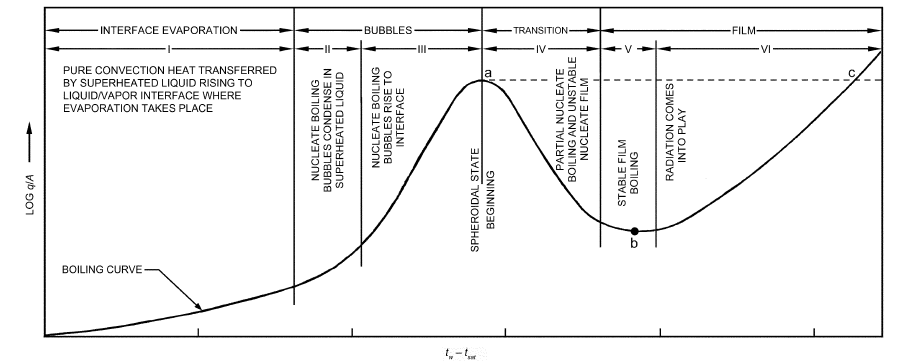

*Fig. 1 Characteristic Pool Boiling Curve*

The preparation of this chapter is assigned to TC 1.3, Heat Transfer and Fluid

<!-- str. 102 -->

a vapor blanket forms. This gives the **maximum heat flux**, which is at the **departure from nucleate boiling (DNB)** at point a in Figure 1. This flux is often called the **burnout heat flux** or **boiling crisis** because, for constant power-generating systems, an increase of heat flux beyond this point results in a jump of the heater temperature (to point c), often beyond the melting point of a metal heating surface.

In systems with controllable surface temperature, an increase beyond the temperature for DNB causes a decrease of heat flux density. This is the **transition boiling regime** (region IV); liquid alternately falls onto the surface and is repulsed by an explosive burst of vapor.

At sufficiently high surface temperatures, a stable vapor film forms at the heater surface; this is the **film boiling regime** (regions V and VI). Because heat transfer is by conduction (and some radiation) across the vapor film, the heater temperature is much higher than for comparable heat flux densities in the nucleate boiling regime. The **minimum film boiling (MFB)** heat flux (point b) is the lower end of the film boiling curve.

**Free Surface Evaporation.** In region I, where surface temperature exceeds liquid saturation temperature by less than a few degrees, no bubbles form. Evaporation occurs at the free surface by convection of superheated liquid from the heated surface. Correlations of heat transfer coefficients for this region are similar to those for fluids under ordinary natural convection [Equations (T1.1) to (T1.4)].

**Nucleate Boiling.** Much information is available on boiling heat transfer coefficients, but no universally reliable method is available for correlating the data. In the nucleate boiling regime, heat flux density is not a single valued function of the temperature but depends also on the nucleating characteristics of the surface, as shown by Figure 2 (Berenson 1962).

The equations proposed for correlating nucleate boiling data can be put in a form that relates heat transfer coefficient h to temperature difference (ts – tsat):

> h = constant(ts – tsat)a&emsp;**(1)**

Exponent a is normally about 2 for a plain, smooth surface; its value depends on the thermodynamic and transport properties of the vapor and liquid. Nucleating characteristics of the surface, including the size distribution of surface cavities and wetting characteristics of the

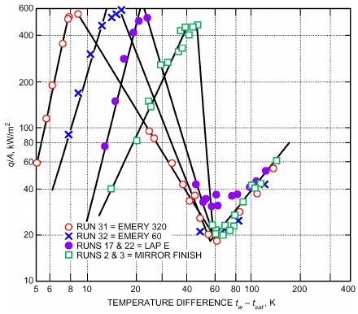

*Fig. 2 Effect of Surface Roughness on Temperature in Pool Boiling of Pentane*

> (Berenson 1962)

surface/liquid pair, affect the value of the multiplying constant and the value of a in Equation (1).

In the following sections, correlations and nomographs for predicting nucleate and flow boiling of various refrigerants are given. For most cases, these correlations have been tested for refrigerants (e.g., R-11, R-12, R-113, R-114) that are now identified as environmentally harmful and are no longer used in new equipment. Thermal and fluid characteristics of alternative refrigerants/refrigerant mixtures have recently been extensively researched, and some correlations have been suggested.

Stephan and Abdelsalam (1980) developed a statistical approach for estimating heat transfer during nucleate boiling. The correlation [Equation (T1.5)] should be used with a fixed contact angle θ regardless of the fluid. Cooper (1984) proposed a dimensional correlation for nucleate boiling [Equation (T1.6)] based on analysis of a vast amount of data covering a wide range of parameters. The dimensions required are listed in Table 1. Based on inconclusive evidence, Cooper suggested a multiplier of 1.7 for copper surfaces, to be reevaluated as more data came forth. Most other researchers [e.g., Shah (2007)] have found the correlation gives better agreement without this multiplier, and thus do not recommend its use.

Gorenflo (1993) proposed a nucleate boiling correlation based on a set of reference conditions and a base heat transfer coefficient for each fluid, and provided base heat transfer coefficients for many fluids.

In addition to correlations dependent on thermodynamic and transport properties of the vapor and liquid, Borishansky et al. (1962), Lienhard and Schrock (1963), and Stephan (1992) documented a correlating method based on the law of corresponding states. The properties can be expressed in terms of fundamental molecular parameters, leading to scaling criteria based on reduced pressure pr = p/pc, where pc is the critical thermodynamic pressure for the coolant. An example of this method of correlation is shown in Figure 3. Reference pressure p* was chosen as p* = 0.029pc. This is a simple method for scaling the effect of pressure if data are available for one pressure level. It also is advantageous if the thermodynamic and particularly the transport properties used in several equations in Table 1 are not accurately known. In its present form, this correlation gives a value of a = 2.33 for the exponent in Equation (1) and consequently should apply for typical aged metal surfaces.

There are explicit heat transfer coefficient correlations based on the law of corresponding states for halogenated refrigerants (Danilova 1965), flooded evaporators (Starczewski 1965), and various other substances (Borishansky and Kosyrev 1966). Other investigations examined the effects of oil on boiling heat transfer from diverse configurations, including boiling from a flat plate (Stephan 1963), a 14.0 mm OD horizontal tube using an oil/R-12 mixture (Tschernobyiski and Ratiani 1955), inside horizontal tubes using an oil/R-12 mixture (Breber et al. 1980; Green and Furse 1963; Worsoe-Schmidt 1959), and commercial copper tubing using

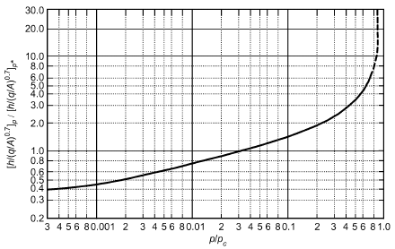

*Fig. 3 Correlation of Pool Boiling Data in Terms of Reduced Pressure*

<!-- str. 103 -->

**Table 1 Equations for Natural Convection Boiling Heat Transfer**

| Equations Description References | Equations |   |   |   |   |   |   |   |   |   |
|---|---|---|---|---|---|---|---|---|---|---|
| Free convection Jakob (1949, 1957) Nu = C(Gr)m(Pr)n Free convection boiling, or boiling Characteristic length scale for vertical surfaces is vertical height of plate or without bubbles for low Δt and cylinder. For horizontal surfaces, Lc = As/P, where As is plate surface area and P Gr Pr < 108. All properties based on is plate perimeter, is recommended. liquid state. Gr = -------------------2----------------Vertical submerged surface Nu = 0.61(Gr)0.25(Pr)0.25 Horizontal submerged surface Nu = 0.16(Gr)1/3(Pr)1/3 Simplified equation for water h ~ 17(Δt)1/3, where h is in W/(m2·K) and Δt is in K | gβ(ts– tsat)Lc3 | ν |  |  |  |  |  |  |  | (T1.1) (T1.2) (T1.3) (T1.4) |
| Nucleate boiling Stephan and hDd Abdelsalam (1980) --------- = kl where Dd Cooper (1984) h = 55pr where h is in W/(m2·K), q/A is in W/m2, and Rp is surface roughness in μm (if unknown, use 1 μm). Multiply h by 1.7 for copper surfaces (see text). | 0.0546 0.12–0.091 | = 0.0208θ | (ρv) ----ρ ( l) 2 ln(Rp) | 0.5 ( qDd ) ---------------Ak t ( l sat) σ -----------------------g(ρl– ρv) (–0.4343 | 0.67 ( hfgDd -------------α ( 0.5 with θ = 35°. –0.55 ln pr) | 2 2 l | 0.248 ) ) –0.5(q) M | (ρl – ρv) ---------------ρ ( --A ( ) | l 0.67 | –4.33 (T1.5) ) (T1.6) |
| *Critical heat flux* Kutateladze (1951) q ⁄ A ------------ρvhfg σg(ρl– ρv) Zuber et al. (1962) For many liquids, KD recommended. Minimum heat flux in film boiling Zuber (1959) q from horizontal plate -- = 0.09ρvhfg ---------------------------A Minimum heat flux in film boiling Lienhard and Wong from horizontal cylinders (1964) q ⁄ A = where B = (2Lb/D)2 Minimum temperature difference for Berenson (1961) film boiling from horizontal plate (ts – tsat) Film boiling from horizontal plate Berenson (1961) h = 0.425 -------------------------------------------Film boiling from horizontal Bromley (1950) cylinders h = 0.62 Effect of superheating Anderson et al. (1966) Substitute hf′g = hfg 1 + 0.4cp,v----------------Effect of radiation Incropera and DeWitt (2002) ht = h + -- -----------------------------Quenching spheres Frederking and Clark Nu = 0.15(Ra)1/3 (1962) Ra = where a = local acceleration | ---------------------------0.633 D3g(ρ --------------2---l-----------v---Prv | 2 ρv { { { = 0.127Lb 3 kvρvhfgg(ρl– ρv) μv(ts– tsat)Lb 3 kvρvhf′gg(ρl– ρv) --------------------------------------------μv(ts– tsat)D εσ(ts4– ts4at) 3 4 νvρv | σg(ρl– ρv) (ρl+ ρv)2 4B -------------------1 + B ⁄ 2 ts – tsat for Ra > 5 × 107 – ρ | 0.25 = KD varies from 0.12 to 0.16; an average value of 0.13 is 2 0.25 } { } { } { and Lb = ρ h ( v fg) ------------k ( v ) ( ( ) ( ------------------------------- + 0.4 c (t ( p,v | 1⁄4 0.09ρ h v fg σ -----------------------g(ρl– ρv) g(ρ – ρ ) ----------l-----------v--ρl+ ρv 0.25 0.25 ts– tsat) h fg ) hfg – t ) s sat | gσ(ρl ---------------------------(ρl 2/3 | + ρv) 0.5 --------------v---------g(ρl ) a --g ) | – ρv) 2 μ – ρv) 1/3 | 0.25 | (T1.7) (T1.8) (T1.9) } } } 1/3 (T1.10) (T1.11) (T1.12) (T1.13) (T1.14) |

R-11 and R-113 with oil content to 10% (Dougherty and Sauer 1974). Additionally, Furse (1965) examined R-11 and R-12 boiling over a flat horizontal copper surface.

<!-- str. 104 -->

### Maximum Heat Flux and Film Boiling

Maximum, or critical, heat flux and the film boiling region are not as strongly affected by conditions of the heating surface as heat flux in the nucleate boiling region, making analysis of DNB and of film boiling more tractable.

Several mechanisms have been proposed for the onset of DNB [see Carey (1992) for a summary]. Each model is based on the scenario that a vapor blanket exists on portions of the heat transfer surface, greatly increasing thermal resistance. Zuber (1959) proposed that these blankets may result from Helmholtz instabilities in columns of vapor rising from the heated surface; another prominent theory supposes a macrolayer beneath the mushroom-shaped bubbles (Haramura and Katto 1983). In this case, DNB occurs when liquid beneath the bubbles is consumed before the bubbles depart and allow surrounding liquid to rewet the surface. Dhir and Liaw (1989) used a concept of bubble crowding proposed by Rohsenow and Griffith (1956) to produce a model that incorporates the effect of contact angle. Sefiane (2001) suggested that instabilities near the triple contact lines cause DNB. Fortunately, though significant disagreement remains about the mechanism of DNB, models using these differing conceptual approaches tend to lead to predictions within a factor of 2.

When DNB (point a in Figure 1) is assumed to be a hydrodynamic instability phenomenon, a simple relation [Equation (T1.7)] can be derived to predict this flux for pure, wetting liquids (Kutateladze 1951; Zuber et al. 1962). The dimensionless constant K varies from approximately 0.12 to 0.16 for a large variety of liquids. Kandlikar (2001) created a model for maximum heat flux explicitly incorporating the effects of contact angle and orientation. Equation (T1.7) compares favorably to Kandlikar’s, and, because it is simpler, it is still recommended for general use. However, note that this equation is valid when the end effects are unimportant. Carey (1992) provides correlations to calculate maximum heat flux for various geometries based on this equation. Surface wettability, orientation, and roughness can affect DNB. For orientations other than upward facing, see Brusstar and Merte (1997) and Howard and Mudawar (1999). Liquid subcooling increases maximum heat flux; see Elkessabgi and Lienhard (1998) for subcooling’s effects.

Van Stralen (1959) found that, for liquid mixtures, DNB is a function of concentration. As discussed by Stephan (1992), the maximum heat flux always lies between the values of the pure components. Unfortunately, the relationship of DNB to concentration is not simple, and several hypotheses [e.g., McGillis and Carey (1996); Reddy and Lienhard (1989); Van Stralen and Cole (1979)] have been put forward to explain the experimental data. For a more detailed overview of mixture boiling, refer to Thome and Shock (1984).

The minimum heat flux density (point b in Figure 1) in film boiling from a horizontal surface and a horizontal cylinder can be predicted by Equation (T1.8). The factor 0.09 was adjusted to fit experimental data; values predicted by the analysis were approximately 30% higher. The accuracy of Equation (T1.8) falls off rapidly with increasing pr (Rohsenow et al. 1998). Berenson’s (1961) Equations (T1.10) and (T1.11) predict the temperature difference at minimum heat flux and heat transfer coefficient for film boiling on a flat plate. The minimum heat flux for film boiling on a horizontal cylinder can be predicted by Equation (T1.9). As in Equation (T1.8), the factor 0.633 was adjusted to fit experimental data.

The heat transfer coefficient in film boiling from a horizontal surface can be predicted by Equation (T1.11), and from a horizontal cylinder by Equation (T1.12) (Bromley 1950).

Frederking and Clark (1962) found that, for turbulent film boiling, Equation (T1.13) agrees with data from experiments at reduced gravity (Jakob 1949, 1957; Kutateladze 1963; Rohsenow 1963; Westwater 1963).

### Boiling/Evaporation in Tube Bundles

In **horizontal tube bundles**, flow may be gravity driven or pumped-assisted forced convection. In either case, subcooled liquid enters at the bottom. Sensible heat transfer and subcooled boiling occur until the liquid reaches saturation. Net vapor generation then starts, increasing velocity and thus convective heat transfer. Nucleate boiling also occurs if heat flux is high enough. Brisbane et al. (1980) proposed a computational model in which a liquid/vapor mixture moves up through the bundle, and vapor leaves at the top while liquid moves back down at the side of the bundle. Local heat transfer coefficients are calculated for each tube, considering local velocity, quality, and heat flux. To use this model, correlations for local heat transfer coefficients during subcooled and saturated boiling with flow across tubes are needed. Thome and Robinson (2004) presented a correlation that showed agreement with several data sets for saturated boiling on plain tube bundles. Shah (2005, 2007) gave general correlations for local heat transfer coefficients during subcooled boiling with cross flow, and for saturated boiling with cross flow. These are given in Table 2. Both these correlations agree with extensive databases that included all published data for single tubes and tubes inside bundles, including those correlated by Thome and Robinson (2004).

Data and design methods for bundles of finned and enhanced tubes were reviewed in Casciaro and Thome (2001), Collier and Thome (1996), and Thome (2010). Thome and Robinson (2004) carried out extensive tests on bundles of plain, finned, and enhanced tubes using three halocarbon refrigerants. The plain and finned-tube results correlated quite well with an asymptotic model combining convective and nucleate boiling (Robinson and Thome 2004a, 2004b). The results with enhanced tubes proved more difficult to explain. The correlation presented accounts for the effects of reduced pressure and local void fraction (Robinson and Thome 2004c; Thome and Robinson 2006). This data set was also used by Consolini et al. (2006) to develop models and correlations for local void fraction and pressure drop in flooded evaporator bundles.

Eckels and Gorgy (2012) and Gorgy and Eckels (2013) performed wide-ranging tests on bundles of enhanced tubes with various pitches and two refrigerants. They collected extensive data but did not attempt to test or develop any predictive method. Their data indicated that a pitch-to-diameter ratio of 1.33 was optimum.

Swain and Das (2014) performed a detailed review of literature on boiling in bundles with plain and enhanced tubes. The only well-verified correlation for plain tube bundles they identified was the Shah correlation (Table 2). For bundles of enhanced tubes, no well-verified correlation was identified. Hence, the best recourse for design is to use the data closest to the intended application.

Typical performance of vertical-tube natural circulation evaporators, based on data for water, is shown in Figure 4 (Perry 1950). Low coefficients are at low liquid levels because insufficient liquid covers the heating surface. The lower coefficient at high levels results from an adverse effect of hydrostatic head on temperature difference and circulation rate. Perry (1950) noted similar effects in horizontal shell-and-tube evaporators.

### Forced-Convection Evaporation in Tubes

**Flow Mechanics.** When a mixture of liquid and vapor flows inside a tube, the flow pattern that develops depends on the mass fraction of liquid, fluid properties of each phase, and flow rate. In an evaporator tube, the mass fraction of liquid decreases along the circuit length, resulting in a series of changing vapor/liquid flow patterns. If the fluid enters as a subcooled liquid, the first indications of vapor generation are bubbles forming at the heated tube wall (nucleation). Subsequently, bubble, plug, churn (or semiannular), annular, spray annular, and mist flows can occur as vapor content

<!-- str. 105 -->

**Table 2 Correlations for Local Heat Transfer Coefficients in Horizontal Tube Bundles**

| Description | References | Equations |
|---|---|---|
| *Saturated boiling in plain tube bundles* | Shah (2007) | For Bo Frl0.3 > 0.0008, hTP = hpb (T2.1) |
| Verified range: water, pentane, halocarbons; single tubes and bundles, square in-line and triangular |  | For 0.00021 < Bo Frl0.3< 0.0008, hTP = φ0hLT |
| Pitch/D 1.17 to 1.5 |  | For Bo Frl0.3 > 0.00021, hTP = 2.3hLT/(Z0.08Frl0.22) |
| D = 3.2 to 25.4 mm |  | hLTD/kf = 0.21(GD/μf)0.62Prf0.4 |
| pr = 0.005 to 0.19 |  | φ0 is the larger of that given by the following two equations: |
| G = 1.3 to 1391 kg/(m2·s) |  | φ0 = 443 Bo0.65 |
| Rel = 58 to 4 949 462 |  | φ0 = 31 Bo0.33 |
| Bo × 104 = 0.12 to 2632 |  | hpb by Cooper correlation without multiplier for copper surface, G based on narrowest gap between tubes. |
| Data from 18 sources |  | Frl = G2/(ρf2gD) Z = (1/x – 1)0.8pr0.4 All properties at saturation temperature |
| Subcooled boiling | Shah (2005) | Low subcooling regime, hTP = φ0hLT (T2.2) |
| Verified range: water and halocarbons; single tubes and tube bundles |  | High subcooling regime, hTP = q/Δtsat = (φ0 + Δtsc/Δtsat)hLT |
| D = 1.2 to 26.4 mm |  | φ0as for saturated boiling |
| pr = 0.005 to 0.15 |  | High subcooling regime when |
| Subcooling Δtsc = 0 to 93 K |  | q/(GCpfΔtsc) > 38(GDCpf/μf) or when Bo < 2.56 × 10–4 |
| Rel = 67 to 260 464 |  | Δtsat = tw – tsat |
| Bo × 104 = 0.6 to 1100 |  | All properties at bulk liquid temperature |
| Data from 29 sources |  |  |

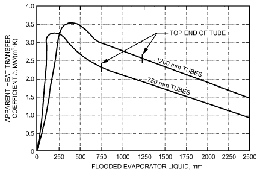

*Fig. 4 Boiling Heat Transfer Coefficients for Flooded Evaporator*

> (Perry 1950)

increases for two-phase flows in horizontal tubes. Idealized flow patterns are shown in Figure 5A for a horizontal tube evaporator. Note that there is currently no general agreement on the names of two-phase flow patterns, and the same name may mean different patterns in vertical, horizontal, and small-tube flow. For detailed delineation of flow patterns, see Barnea and Taitel (1986) or Spedding and Spence (1993) for tubes and pipes between 3 and 75 mm in diameter, Coleman and Garimella (1999) for tubes less than 3 mm in diameter, and Thome (2001) for flow regime definitions useful in modeling heat transfer.

Increased computing power has allowed greater emphasis on flow-pattern-specific heat transfer and pressure drop models (although there is not uniform agreement among researchers and practitioners that this is always appropriate). Virtually all of the over 1000 articles on two-phase flow patterns and transitions have studied air/water or air/oil flows. Dobson and Chato (1998) found that the Mandhane et al. (1974) flow map, adjusted for the properties of refrigerants, produced satisfactory agreement with their observations in horizontal condensation. Thome (2003) summarized efforts to generate diabatic flow pattern maps in both evaporation and condensation for a number of refrigerants.

The concepts of vapor quality and void fraction are frequently used in two-phase flow models. **Vapor quality x** is the ratio of mass (or mass flow rate) of vapor to total mass (or mass flow rate) of the mixture. The usual flowing vapor quality or vapor fraction is referred to throughout this discussion. Static vapor quality is smaller because vapor in the core flows at a higher average velocity than liquid at the walls. In addition, it is very important to recognize that vapor quality as defined here is frequently not equal to the thermodynamic equilibrium quality, because of significant temperature and velocity gradients in a diabatic flowing vapor/liquid mixture. Some models use the thermodynamic equilibrium quality, and, as a result, require negative values in the subcooled boiling region and values greater than unity in the post-dryout or mist flow region. This is discussed further in Hetsroni (1986).

The **area void fraction**, or just **void fraction**, εv is the ratio of the tube cross section filled with vapor to the total cross-sectional area. Vapor quality and area void fraction are related by definition:

> x/(1 – x) = ρv/ρl × Vv/Vl × εv/(1 – εv)&emsp;**(2)**

The ratio of velocities Vv/Vl in Equation (2) is called the **slip ratio**. Note that the static void fraction and the flowing void fraction at a given vapor quality differ by a factor equal to the slip ratio.

Because nucleation occurs at the heated surface in a thin sublayer of superheated liquid, boiling in forced convection may begin while the bulk of the liquid is subcooled. Depending on the nature of the fluid and amount of subcooling, bubbles can either collapse or continue to grow and coalesce (Figure 5A), as Gouse and Coumou (1965) observed for R-113. Bergles and Rohsenow (1964) developed a method to determine the point of incipient surface boiling.

<!-- str. 106 -->

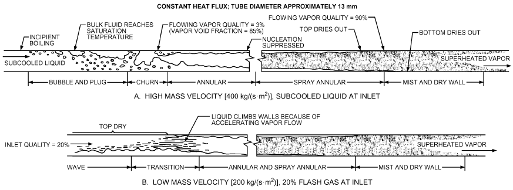

*Fig. 5 Flow Regimes in Typical Smooth Horizontal Tube Evaporator*

After nucleation begins, bubbles quickly agglomerate to form vapor plugs at the center of a vertical tube, or, as shown in Figure 5A, along the top surface of a horizontal tube. At the point where the bulk of the fluid reaches saturation temperature, which corresponds to local static pressure, there will be up to 1% vapor quality (and a negative thermodynamic equilibrium quality) because of the preceding surface boiling (Guerrieri and Talty 1956).

Further coalescence of vapor bubbles and plugs results in churn, or semiannular flow. If fluid velocity is high enough, a continuous vapor core surrounded by a liquid annulus at the tube wall soon forms. This occurs when the void fraction is approximately 85%; with common refrigerants, this equals a vapor quality of about 10 to 30%.

If two-phase mass velocity is high [greater than 200 kg/(s·m2) for a 12 mm tube], annular flow with small drops of entrained liquid in the vapor core (spray) can persist over a vapor quality range from about 10% to more than 90%. Refrigerant evaporators are fed from an expansion device at vapor qualities of approximately 20%, so that annular and spray annular flow predominate in most tube lengths. In a vertical tube, the liquid annulus is distributed uniformly over the periphery, but it is somewhat asymmetric in a horizontal tube (Figure 5A). As vapor quality reaches about 80% (the actual quality varies from about 70 to 90%, depending on tube diameter, mass velocity, refrigerant, and wall enhancement), portions of the surface dry out. In a horizontal tube, dryout occurs first at the top of the tube and progresses toward the bottom with increasing vapor quality (Figure 5A). Kattan et al. (1998a, 1998b) indicated a very sharp decrease in the local heat transfer coefficient as well as the pressure drop at this point.

If two-phase mass velocity is low [less than 200 kg/(s·m2) for a 12 mm horizontal tube], liquid occupies only the lower cross section of the tube. This causes a wavy type of flow at vapor qualities above about 5%. As the vapor accelerates with increasing evaporation, the interface is disturbed sufficiently to develop annular flow (Figure 5B). Liquid slugging can be superimposed on the flow configurations shown; the liquid forms a continuous, or nearly continuous, sheet over the tube cross section, and the slugs move rapidly and at irregular intervals. Kattan et al. (1998a) presented a general method for predicting flow pattern transitions (i.e., a flow pattern map) based on observations for R-134a, R-125, R-502, R-402A, R-404A, R-407C, and ammonia.

**Heat Transfer.** In direct-exchange (DX) evaporators, a saturated mixture of liquid and flash gas enters the evaporator. In evaporators with forced or gravity recirculation, liquid is subcooled at the entrance. Subcooled boiling usually occurs until the liquid reaches saturation. Several well-verified correlations for subcooled boiling are available [e.g., Chen (1966), Gungor and Winterton (1986), Kandlikar (1990), Li and Wu (2010a), Liu and Winterton (1991), Shah (1977, 1983)]. The last mentioned is the most verified and is given in Table 3. Note that the subcooling regime can alternatively be determined by Saha and Zuber’s (1974) model, which is explicit.

For **saturated boiling**, Figure 6 gives heat transfer data for R-22 evaporating in a 19.6 mm tube (Gouse and Coumou 1965). At low mass velocities [below 200 kg/(s·m2)], the wavy flow regime shown in Figure 5B probably exists, and the heat transfer coefficient is nearly constant along the tube length, dropping at the exit as complete vaporization occurs. At higher mass velocities, flow is usually annular, and the coefficient increases as the vapor accelerates. As the surface dries and flow reaches between 70 and 90% vapor quality, the coefficient drops sharply.

Heat transfer coefficients depend on the contributions of nucleate boiling and forced convection. Many correlations have been proposed for calculating heat transfer coefficients during saturated boiling. Some of them use the boiling number Bo to estimate nucleate boiling contribution, whereas others use pool boiling correlations. Shah (2006) compared several correlations against a wide range of data that included 30 pure fluids. Best results were found with the correlations of Shah (1982) and Gungor and Winterton (1987), the mean deviation for all data being about 17%. Both of these use the boiling number and are given in Table 3. These are applicable to all flow patterns and to horizontal and vertical tubes. Other correlations tested included Chen (1963), Kandlikar (1990), Liu and Winterton (1991), and Steiner and Taborek (1992); their performance was much inferior. Another well-validated correlation is that of Gungor and Winterton (1986), which uses a pool boiling correlation for nucleate boiling contribution. The flow-pattern-based model described by Thome (2001) includes specific models for each flow pattern type and has been tested with newer refrigerants such as R-134a and R-407C.

Recently, there has been great interest in using **carbon dioxide** as a refrigerant, and many experimental studies on its heat transfer have proposed correlations specifically for CO2. Shah (2014a) evaluated 11 general and CO2-specific correlations against 1052 data points from 41 data sets from 32 studies; tube diameters ranged from 0.51 to 14 mm, and pressures and flow rates varied widely. Over all tube diameters, the Liu and Winterton (1991) correlation performed best, with a mean absolute deviation of 26.1%. The Shah correlation (Table 3) also gave good agreement by using φ0 = 1820 Bo0.68, with a deviation of 26.8%. For channels with diameters

<!-- str. 107 -->

**Table 3 Equations for Forced Convection Boiling in Tubes**

| Description References Equations |   |   |
|---|---|---|
| *Horizontal and vertical tubes and annuli, saturated* Gungor and Winterton h = E(hnb boiling (1987) | + hcb) | (T3.1) |
| Compiled from a database of over 3600 data points, where |  |  |
| including data for R-11, R-12, R-22, R-113, R-114, | x --------------- | 0.75(ρ )0.41 |
| h = 1.12 |  | -----f hf |
| and water. Applicable to vertical flows and horizontal cb | (1 – x) |  |
|  |  | ρ ( g) |
| tubes. |  |  |
| **hnb = (1 + 3000 Bo0.86)hf** |  |  |
| **hf = 0.023 Rel0.8Prl0.4(kl⁄ D)** |  |  |
| G(1 – x)D |  | q″ |
| Rel = -------------------------, | μl | Bo = -----------Ghfg |
| **For horizontal tubes with Frl > 0.05 and for vertical tubes, E = 1. For** |  |  |
| **horizontal tube with Frl < 0.05,** |  |  |
| **(0.1–2 Fr )** |  |  |
|  |  | l |
| **E = Frl** |  |  |
| **G2** |  |  |
| **Frl = ----2---------** |  |  |
| **ρlDg** |  |  |
| **For annuli, equivalent diameter based on heated perimeter.** |  |  |
| Verified range: Shah (1982) Boiling heat transfer coefficient h is the largest of that given by the |  |  |
| following equations: |  |  |
| D = 1.1 to 27.1 mm |  |  |
| pr = 0.0053 to 0.78 | h = φ0hf | (T3.2a) |
| Bo × 104 = 0.22 to 74.2 where φ0 | = 230 Bo0.5 |  |
| G = 10 to 11 000 kg/(m2·s) hf in Equation (T3.2a) is calculated at x = 0. In the following equations, it |  |  |
| is at the actual x. |  |  |
| 30 fluids (water, halocarbons, cryogens, chemicals) |  |  |
| h = 1.8[Co(0.38 Frl–0.3)n]–0.8hf |  | (T3.2b) |
| **h = Fφ0 exp{2.47[Co(0.38 Frl–0.3)n]–0.15}hf** |  |  |
| **h = Fφ0 exp{2.74[Co(0.38 Frl–0.3)n]–0.1}hf** |  |  |
| **where hf and Frl are calculated the same way as for Gungor and Winterton** |  |  |
| correlation |  |  |
| **F = 0.064 if Bo > 0.0011** |  |  |
| **F = 0.067 if Bo < 0.0011** |  |  |
| Vertical: n = 0 |  |  |
| Horizontal: |  |  |
| **n = 0 if Frl > 0.04** |  |  |
| **n = 1 for Frl ≤ 0.04** |  |  |
| **(1 – x)0.8(ρ )0.5** |  |  |
|  | ---------- | ----v |
| Co = |  |  |
|  | x ( ) | ρ ( l) |
| **For annuli, equivalent diameter based on heated perimeter when gap** |  |  |
| ** 4 mm.** |  |  |
| *Subcooled boiling in horizontal and vertical tubes and* Shah (1977, 1983) Low-subcooling regime: |  |  |
| annuli |  |  |
| Tubes: 2.4 to 27.1 dia. h = q/Δtsat= 230 Bo0.5hf |  | (T3.3a) |
| Annuli: gaps 1 to 6.4 mm, internal, external, and two- High-subcooling regime: |  |  |
| sided heating |  |  |
| Fluids: water, ammonia, halocarbons, organics h = q/Δtsat= (230 Bo0.5 |  | + Δtsc/Δtsat)hf (T3.3b) |
| Tube materials: copper, SS, glass, nickel, Inconel All properties at bulk fluid temperature. |  |  |
| Reduced pressure: 0.005 to 0.89 High-subcooling regime occurs when |  |  |
| ΔTsc: 0 to 153 K (Δtsc/Δtsat) > 2 or > 0.00063 Bo1.25 |  | (T3.3c) |
| G: 200 to 87,000 kg/(m2·s) hf as above with x = 0. For annuli, equivalent diameter based on heated |  |  |
| **perimeter when gap  4 mm** |  |  |
| Rel: 1400 to 360,000 All properties at bulk liquid temperature except latent heat at saturation |  |  |
| temperature. |  |  |
| Bo × 104: 0.1 to 54 |  |  |

<!-- str. 108 -->

**Table 3 Equations for Forced Convection Boiling in Tubes (Continued)**

| Description References | Equations |
|---|---|
| *Saturated boiling in round and rectangular channels* Li and Wu (2010a) | h = 334B10.3(BoRef0.36)0.4(kf/dh) (T3.4) Bl = q′w/(Ghfg) |
| Compiled from a database of over 3744 data points, |  |
| including data for R-123, R-236fa, ethanol, CO2, water, |  |
| and R-134a. |  |
| Dh = 0.19 to 2.01 mm |  |
|  | g(ρl– ρg)dh2 Bo = ------------------------------ |
| G: 23.4 to 1500 kg/(m2·s) |  |
|  | σ |
| q: 3 to 715 kW/m2 |  |
| Pr (reduced pressure): 0.023-0.61 |  |
| x (mass quality): 0 < x < xCHF (mass quality at critical |  |
| heat flux) |  |

Note: All equations are dimensionless.

< 3 mm, the correlation of Yoon et al. (2004) was best, with a mean absolute deviation of 18.7%; the Li and Wu (2010a) correlation for minichannels had a deviation of 20.3%. Data from different studies often do not agree with one another in the same range of parameters, which suggests that some data might be erroneous.

**Boiling Mixtures.** Most recently developed refrigerants and those in development are mixtures of two or more fluids. Heat transfer coefficients of zeotropic mixtures are lower than those of their pure components because of mass transfer resistance, and the difference grows with increasing glide (i.e., the difference between the mixture’s dew point and bubble point temperatures). Hence, the formulas presented previously may be directly used only if the glide is small (e.g., up to 1 K). Many calculation methods [e.g., Thome (1996)] for mixtures have been proposed in which a correction factor is applied only to the nucleate boiling terms of correlations for pure fluids. Shah (2015a) noted that mass transfer resistance also occurs during convective boiling (boiling without nucleation), so correction is also needed in this region for both nucleate boiling and convective boiling contributions. For the nucleate boiling region, the following correction factor of Thome and Shakir (1987) for pool boiling of mixtures is used:

> { }–1
>
> ( ) ( )

> –Bq
>
> FTS = 1 + hI/q (t – t ) 1 – exp ------------------&emsp;**(3)**

> { dew bub }
>
> ρ h β

> ( ) ( *f lg f*)
>
> { }

where hIis the ideal heat transfer coefficient calculated by a pool boiling correlation for pure fluids using mixture properties, B is the scaling factor (assumed to be 1: all heat transferred to bubble interface is converted to latent heat), and βf is the liquid-phase mass transfer coefficient, which is recommended to be constant at 0.0003 m/s. For the convective boiling contribution, Shah used the Bell and Ghaly (1973) correction factor for condensation heat transfer, which is given in Equation (19). For boiling, tdew is replaced by the bubble point temperature tbub, and hc is replaced by the boiling heat transfer coefficient. Using this method, the Gungor and Winterton correlation in Table 3 may be written for mixtures as

> –1
>
> ( )

> hmix = E FTShnb+ 1/(h cb) + Y/(h GS)&emsp;**(4)**
>
> ( )

Other pure-fluid correlations can be similarly modified for mixtures. Shah (2015a) evaluated this method by applying it to five correlations for pure fluids and comparing them to a database for 45 mixtures of 19 fluids from 21 independent studies. The mixtures had two to six components. The data included tube diameters of 0.19 to 14 mm, horizontal and vertical orientations, flow rates 50 to 930 kg/(m2·s), reduced pressures from 0.05 to 0.63, and temperature glides up to 156 K. The Cooper correlation was used to calculate hI in the Thome-Shakir correction factor FTS. Good agreement of this method was found using the correlations of Shah (1982), Gungor and Winterton (1987), and Liu and Winterton (1991). The exception was the only data set for LNG (liquefied natural gas) which agreed with the Shah (1982) and Gungor-Winterton (1987) correlations without any correction. This is the only well-verified method available and is therefore recommended.

**Mini- and Microchannels.** Some correlations for conventional or macro/minichannels have been found not suitable for microchannels. Numerous definitions have been offered by the various investigators to define microchannels; most use hydraulic diameter as a criterion, though in some cases this may not be the best way to distinguish the phenomenon in microchannels from that in conventional (mini- or macro-) channels. Two widely known criteria are from

- Mehendale et al. (2000), who used hydraulic diameter to classify micro heat exchangers as follows: - Micro heat exchanger: 1 μm ≤ dh≤ 100 μm - Meso heat exchanger: 100 μm ≤ dh≤ 1 mm - Compact heat exchanger: 1 mm ≤ dh≤ 6 mm - Conventional heat exchanger: dh > 6 mm
- Kandlikar and Grande (2003), who classified single- and two-phase microchannels as follows: - Conventional channels: dh > 3 mm - Minichannels: 3 mm ≥ dh > 200 μm - Microchannels: 200 μm ≥ dh > 10 μm

Kandlikar and Grande’s definition appears to be the most accepted by the technical community. Most recent experimental and modeling studies suggest that the phenomenon in channels larger than 200 μm appears to be more or less same as that in mini- and macrochannels, thus further supporting this definition for microchannels. Numerous attempts have been made to develop correlations for such channels, but most of those published were validated with only one or two data sets. Correlations from Li and Wu (2010a, 2010b) and Sun and Mishima (2009) show reasonable agreement with varied data from many sources; Li and Wu’s is the most verified and has a clearly defined application range (see Table 3). Li and Wu (2010a) and Yen et al. (2003) showed that correlations by Chen (1966), Gungor and Winterton (1986), and Kandlikar (1990) overor underpredict experimental data of microchannels. Chen’s and Kandlikar’s correlations underpredicted Yen et al.’s (2003) experimental data by more than an order of magnitude. In addition, Gungor and Winterton’s correlation overpredicted the experimental data for channels with hydraulic diameters of 0.586 and 0.19 mm, although the correlation was well matched with data for the 2.01 mm channel. However, Li and Wu’s correlation predicted the experimental data well for the range of hydraulic diameters from 0.19 mm to 2.01 mm within the ±30% band. Shah’s correlation was not considered in this study, but is expected also to underpredict experimental results for microchannels, because of its fundamental similarity to Chen’s correlation. Additional information about microchannels, their various classification, single-phase and phase-change heat transfer and pressure drop correlations, and their future or emerging applications can be found in Ohadi et al. (2013).

<!-- str. 109 -->

**Critical Heat Flux (CHF).** The preceding correlations are applicable before occurrence of dryout or critical heat flux. After that, transition boiling and film boiling occur. Hall and Mudawar (2000a, 2000b) extensively review CHF data and correlations for flow boiling in tubes.

Shah (1980a, 2016a) gave a graphical and mathematical correlation for CHF during upflow in vertical annuli. This correlation was validated with data from 58 data sets from 25 studies, including annuli with internal, external, and bilateral heating; 10 fluids, including water and refrigerants; reduced pressures from 0.016 to 0.905; flow rates from 100 to 15 759 kg/(m2·s); tube diameters from 1.5 to 96.5 mm; annular gaps from 0.3 to 16.5 mm; ratios of length to heated equivalent diameter from 1.3 to 394; inlet qualities from –3.3 to +0.91; and critical qualities from –2.7 to +0.95. All data points were predicted with a mean absolute deviation of 16.5%. No other well-verified general correlation for annuli is available.

For upflow in vertical tubes, Shah (1979a, 1987) also gave a general graphical and mathematical correlation for CHF. Shah (2016b) further evaluated its applicability to mini/microchannels. In all, it was validated with data for single tubes and multichannels of equivalent diameters from 0.13 to 37.8 mm, reduced pressures from 0.0014 to 0.96, flow rates from 10 to 41 810 kg/(m2·s), and qualities from –4 to +1.0. The data included 34 diverse fluids (water, liquid metals, new and old halocarbon refrigerants, hydrocarbons, and cryogens). The same data were also compared to other correlations, and the Shah correlation was found significantly more accurate. For mini/micro channels (D ≤ 3 mm), Shah’s and Katto and Ohno’s (1984) correlations gave mean absolute deviations of 18.9 and 33.2%, respectively.

Most evaporators used in air conditioning and refrigeration are horizontal and have nonuniform heat flux, so predicting CHF in horizontal channels is of great importance. The following correlation provides Khor, the ratio of CHF in horizontal channels to CHF in vertical upflow at identical conditions (Shah 2015b):

> For xin < 0 when L/D < 10
>
> Khor = 1&emsp;**(5)**

For xc ≤ 0.05

> Khor = 0.725 Frl0.082 ≤ 1&emsp;**(6)**
>
> For xc > 0.05

> Khor = 0.64 FrTP0.15 ≤ 1&emsp;**(7)**

Thus, if Khor calculated with Equation (6) or (7) is greater than 1, use Khor = 1. According to Equation (6), Khor =1 at Frl ≥ 50. According to Equation (7), Khor = 1 at FrTP ≥ 20.

> Khor = qc,hor/qc,ver

where qc,hor and qc,ver are the CHF in horizontal and vertical upflow, respectively.

Frl = G2/(ρl2gD) and FrTP = xcG/[gDρg(ρl – ρg)]0.5 where xc is the critical quality and xin is the inlet quality.

For channels with nonuniform heat flux, critical heat flux is the total heat applied over the channel surface up to CHF point divided by the surface area up to that point. For noncircular channels and for channels heated on only part of their circumference, use equivalent diameter based on heated perimeter. This correlation was compared to a database that included 10 fluids (water, refrigerants, and hydrocarbons) in single and multiple channels of diameters 0.13 to 24.3 mm, reduced pressures from 0.005 to 0.9, mass flux from 20 to 11 390 kg/(m2·s), inlet qualities from –1.05 to 0.72, and critical qualities from –0.2 to 0.99. Data included uniform and nonuniform heat flux. With CHF for vertical channels calculated by the Shah (1987) correlation, it predicted 878 data points from 39 data sets from 18 sources, with a mean absolute deviation of 15.4%. The same data were also compared to six other correlations, but none gave good agreement.

**Post-CHF Heat Transfer.** After CHF, transition boiling and film boiling occur. Film boiling can be the inverted annular type or the dispersed flow type. The former occurs only for a short length, if at all. For dispersed film boiling, the most verified general correlation is by Shah (1980b) in graphical form (Figure 7), converted to equation form by Shah and Siddiqui (2000). Frl is same as in Table 3. It is based on the two-step physical model and validated with wide-ranging data that included cryogens, refrigerants, and organics. At the dryout point, the actual quality xA equals equilibrium quality xE. At larger Bo, calculate xA from Figure 7 as follows:

1. Locate xc on the equilibrium line.

2. If xc is below the intersection with Frl curve, read xA along this line till it intersects the Frl curve and then read along that curve.

3. If xc is above the intersection with Frl curve, draw a tangent to the curve; xA is then read along the tangent up to the intersection point and then along the Frl curve.

4. Then calculate the actual enthalpy of vapor Hg by Equation (8):

> (xE – xA)/xAhfg= Hg – Hg,sat&emsp;**(8)**

For Bo < 0.0005, calculate (xE – xA) in the same way, then multiply it by (Bo/0.0005).

Hg,sat is the enthalpy of saturated vapor. Knowing Hg, actual vapor temperature tgis known. Vapor-phase heat transfer coefficient is calculated by Equations (9a) and (9b) using properties at actual vapor temperature (except for water, for which film temperature is used):

For Re < 104

> hgD/kg = 0.023(GDxA/μgα)0.8Prg0.4&emsp;**(9a)**

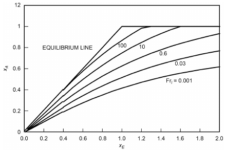

*Fig. 7 Film Boiling Correlation*

> (Shah and Siddiqui 2000)

<!-- str. 110 -->

For Re > 104

> hgD/kg = 0.00834(GDxA/μgα)0.8774Prg0.6112&emsp;**(9b)**

The wall temperature tw at heat flux q is then obtained by

> q = hgFdc(tw – tg)&emsp;**(10)**

Fdc is the droplet cooling factor, which is 1 except when pr > 0.8 and L/D > 30, in which case

> Fdc = 2.64pr – 1.11&emsp;**(11)**

Void fraction α is calculated by the homogeneous model, which gives

> α = xAρf/((1 – xA)ρg+ ρf xA)&emsp;**(12)**

Frl is defined in Table 3. The critical quality xc is calculated by a suitable method as described in the foregoing. For horizontal tubes, wall temperatures at top and bottom are calculated as above using the xcat that location.

Calculations for calculating xA by equations are described now. The curves in the figure are represented by the following equations:

For xE ≥ 0.4,

> xA = (A1 + A2xE + A3xE2 + A4xE3)Frl0.064&emsp;**(13)**
>
> A1 = –0.0347, A2 = 0.9335, A3 = –0.2875, A4 = 0.035

xA from Equation (13) is corrected as: If xA > xE, then xA = xE. If xA > 1, then xA = 1.

For xE < 0.4, the correlating curves in Figure 7 are represented by lines joining xA at xE = 0.4 from Equation (13) and intersecting the equilibrium line (xA = xE) at

> xA,INT = xE,INT = 0.19 Frl0.16&emsp;**(14)**

Calculation is as follows:

1. For xc ≤ xE,INT, xA = xE for xE ≤ xE,INT. For xE> xE,INT, obtain xA from Equations (13) and (14).

2. For xc > xE,INT, determine the point where tangent from xE = xA = xc touches the curve of Equation (11). The point of tangency is at the intersection of Equations (13) and (15), obtained by simultaneous solution of the two equations.

> xA = xc + (xE – xc)(A2 + 2A3xE + 3A4xE2) Frl0.064&emsp;**(15)**

For xE< xE at the tangent point, xA is obtained from the straight line joining the tangent point to xc at the equilibrium line. Beyond the tangent point, it is given by Equation (12).

This correlation was verified with data for vertical and horizontal tubes of diameters 1.1 to 24.3 mm, many fluids (e.g., water, halocarbons, cryogens, methane, propane), and pressures of 100 to 25 000 kPa. Petterson (2004) found good agreement of this correlation with data for CO2 in a minichannel. Ayad et al. (2012) reported satisfactory agreement with data for CO2 from several sources.

**Effect of Lubricants.** The effect of lubricant on evaporation heat transfer coefficients has been studied by many authors. Eckels et al. (1994) and Schlager et al. (1987) showed that the average heat transfer coefficients during evaporation of R-22 and R-134a in smooth and enhanced tubes decrease in the presence of lubricant (up to a 20% reduction at 5% lubricant concentration by mass). Slight enhancements at lubricant concentrations under 3% are observed with some refrigerant lubricant mixtures. Zeurcher et al. (1998) studied local heat transfer coefficients of refrigerant/lubricant mixtures in the dry-wall region of the evaporator (see Figure 5) and proposed prediction methods. The effect of lubricant concentration on local heat transfer coefficients was shown to depend on mass flux and vapor quality. At low mass fluxes [less than about 200 kg/(m2·s)], oil sharply decreased performance, whereas at higher mass fluxes [greater than 200 kg/(m2·s)], enhancements at vapor qualities in the range of 0.35 to 0.7 were seen. The foregoing information is for miscible oil/refrigerant mixtures. Shah (1975) found that miscible oil in ammonia evaporators forms thin films around the tube perimeter, drastically reducing the heat transfer coefficients. The thickness of oil film δ to account for the reduction in heat transfer during single-phase flow was given by

> δ/D = 0.028/ReLT0.23&emsp;**(16)**

where ReLT is the Reynolds number with all mass flowing in liquid form. Shah’s (1976) correlation for boiling gave reasonable agreement with ammonia data when the resistance of the calculated oil film was taken into account. Chaddock and Buzzard (1986) also reported reduction of heat transfer because of oil films in an ammonia evaporator with immiscible oil. Similar results may be expected with other immiscible refrigerant/oil mixtures.

### Boiling in Plate Heat Exchangers (PHEs)

For a description of plate heat exchanger geometry, see the Plate Heat Exchangers section of Chapter 4.

Little information is available on two-phase flow in plate exchangers; for brief discussions, see Hesselgreaves (1990), Jonsson (1985), Kumar (1984), Panchal (1985, 1990), Panchal and Hillis (1984), Panchal et al. (1983), Syed (1990), Thonon (1995), Thonon et al. (1995), and Young (1994).

General correlations for evaporators and condensers should be similar to those for circular and noncircular conduits, with specific constants or variables defining plate geometry. Correlations for flooded evaporators differ somewhat from those for a typical flooded shell-and-tube, where the bulk of heat transfer results mainly from pool boiling. Because of the narrow, complex passages in the PHE flooded evaporator, it is possible that most heat transfer occurs through convective boiling rather than localized nucleate boiling, which probably affects mainly the lower section of a plate in a flooded system. This aspect could be enhanced by modifying the surface structure of the lower third of the plates in contact with the refrigerant. It is also possible that the contact points (nodes) between two adjacent plates of opposite chevron enhance nucleate boiling. Each nodal contact point could create a favorable site for a reentrant cavity.

The same applies to thermosiphon and direct-expansion evaporators. The simplest approach would be to formulate a correlation of the type proposed by Pierre (1964) for varying quality, as suggested by Baskin (1991). A positive feature about a PHE evaporator is that flow is vertical, against gravity, as opposed to horizontal flow in a shell-and-tube evaporator. Therefore, the flow regime does not get too complicated and phase separation is not a severe issue, even at low mass fluxes along the flow path, which has always been a problem in ammonia shell-and-tube DX evaporators. Generally, the profile is flat, except at the end plates. For more complete analysis, correlations could be developed that involve the local bubble point temperature concept for evaluation of wall superheat and local Froude number and boiling number Bo.

Yan and Lin’s (1999) experimental study of a compact brazed exchanger (CBE) with R-134a as a refrigerant reveals some interesting features about flow evaporation in plate exchangers. Heat transfer coefficients were higher compared to circular tubes, especially at high-vapor-quality convective regimes. Mass flux played a significant role, whereas heat flux had very little effect on overall performance.

<!-- str. 111 -->

Ayub (2003) presents simple correlations based on design and field data collected over a decade on ammonia and R-22 direct-expansion and flooded evaporators in North America. The goal was to formulate equations that could be readily used by a design and field engineer without referral to complicated two-phase models. The correlations take into account the effect of chevron angle of the mating plates, making it a universal correlation applied to any chevron angle plate. The correlation has a statistical error of ±8%. The expression for heat transfer coefficient is

> h = C(kl/de)(Rel2hfg/Lp)0.4124(pr)0.12(65/β)0.35&emsp;**(17)**

where C = 0.1121 for flooded and thermosiphons and C = 0.0675 for DX. This is a dimensional correlation where the values of kl, de, hfg, and Lp are in I-P units of Btu/h·ft·°F, ft, Btu/lb, and ft, respectively. Chevron angle β is in degrees.

Khan et al. (2010) conducted a study to investigate the boiling of NH3(ammonia) in brazed-plate heat exchangers. Single-phase results are presented in Table 11 of Chapter 4. Two-phase evaporation experiments were aimed to investigate the effects of heat flux, mass flux, and exit vapor quality on evaporation of ammonia in a vertical plate heat exchanger at various saturation pressures.

> Nutp = C(β*){ReeqBoeq}m(β*){P*}j(β*)&emsp;**(18)**
>
> C(β*) = –173.52β* + 257.12

> m(β*) = –0.09β* + 0.0005
>
> j(β*) = 0.624β* – 0.822

## 2. CONDENSING

In most applications, condensation; is initiated by removing heat at a solid/vapor interface, either through the walls of the vessel containing the saturated vapor or through the solid surface of a cooling mechanism placed in the saturated vapor. If sufficient energy is removed, the local temperature of vapor near the interface drops below its equilibrium saturation temperature. Because heat removal creates a temperature gradient, with the lowest temperature near the interface, droplets most likely form at this location. This defines one type of heterogeneous nucleation that can result in either dropwise or film condensation, depending on the physical characteristics of the solid surface and the working fluid.

**Dropwise condensation** occurs on the cooling solid surface when its surface free energy is relatively low compared to that of the liquid. Examples include highly polished or fatty-acid-impregnated surfaces in contact with steam. **Film condensation** occurs when a cooling surface with relatively high surface free energy contacts a fluid with lower surface free energy [see Chen (2003) and Isrealachvili (1991)]; this type of condensation occurs in most systems.

For smooth film flow, the rate of heat transport depends on the condensate film thickness, which depends on the rates of vapor condensation and condensate removal. At high reduced pressures (pr), heat transfer coefficients for dropwise condensation are higher than those for film condensation at the same surface loading. At low reduced pressures, the reverse is true. For example, there is a reduction of 6 to 1 in the dropwise condensation coefficient of steam when saturation pressure decreases from 91 to 16 kPa. One method for correlating the dropwise condensation heat transfer coefficient uses nondimensional parameters, including the effect of surface tension gradient, temperature difference, and fluid properties [see, e.g., Rose (1998)].

When condensation occurs on horizontal tubes and short vertical plates, condensate film motion is laminar. On vertical tubes and long vertical plates, film motion can become turbulent. Grober et al. (1961) suggest using a Reynolds number (Re) of 1600 as the critical point at which the flow pattern changes from laminar to turbulent. This Reynolds number is based on condensate flow rate divided by the breadth of the condensing surface. For the outside of a vertical tube, the breadth is the circumference of the tube; for the outside of a horizontal tube, the breadth is twice the length of the tube. Re = 4Γ/μl, where Γ is the mass flow of condensate per unit of breadth, and μl is the absolute (dynamic) viscosity of the condensate at film temperature tf. In practice, condensation is usually laminar in shelland-tube condensers with the vapor outside horizontal tubes.

**Vapor velocity** also affects the condensing coefficient. When this is small, condensate flows primarily by gravity and is resisted by the liquid’s viscosity. When vapor velocity is high relative to the condensate film, there is appreciable drag at the vapor/liquid interface. The thickness of the condensate film, and hence the heat transfer coefficient, is affected. When vapor flow is upward, a retarding force is added to the viscous shear, increasing the film thickness. When vapor flow is downward, the film thickness decreases and the heat transfer coefficient increases. For condensation inside horizontal tubes, the force of the vapor velocity causes condensate flow. When vapor velocity is high, the transition from laminar to turbulent flow occurs at Reynolds numbers lower than 1600 (Grober et al. 1961).

When **superheated** vapor is condensed, the heat transfer coefficient depends on the surface temperature. When surface temperature is below saturation temperature, using the value of h for condensation of saturated vapor that incorporates the difference between the saturation and surface temperatures leads to insignificant error (McAdams 1954). If the surface temperature is above the saturation temperature, there is no condensation and the equations for gas convection apply.

Correlation equations for condensing heat transfer, along with their applicable geometries, fluid properties, and flow rates, are given in Table 4. The basic prediction method for laminar condensation on vertical surfaces is relatively unchanged from Nusselt’s (1916). Empirical relations must be used for higher condensate flow rates, however.

For condensation on the outside surface of horizontal finned tubes, use Equation (T4.5) for liquids that drain readily from the surface (Beatty and Katz 1948). For condensing steam outside finned tubes, where liquid is retained in spaces between tubes, coefficients substantially lower than those given by this equation were reported, because of the high surface tension of water relative to other liquids. For additional data on condensation on the outside of finned tubes, please refer to Webb (1994).

### Condensation on Inner Surface of Tubes

Many correlations have been proposed for heat transfer during condensation in tubes. The ones validated over the widest range of data are by Cavallini et al. (2006) and Shah (2009, 2013), the latter being an extended version of the Shah (1979b) correlation. Both these correlations note that heat transfer at high flow rate is independent of heat flux, whereas at low flow rates it is affected by heat flux. These correlations apply to all flow patterns; the Shah correlation is applicable to horizontal as well as vertical tubes (with downflow), although the Cavallini et al. correlation applies only to horizontal tubes. Other well-verified correlations for horizontal tubes are those of Dobson and Chato (1998) and Thome et al. (2003). Shah (2014b) presents a flow-pattern-based version of the Shah (2013) correlation for horizontal tubes. In this version, Regime I corresponds to stratified flow, Regime II to wavy flow, and Regime III to intermittent, annular, and mist flow. Flow patterns were determined by the El Hajal et al. (2003) map. The mean deviation of the database was comparable to that of the Shah (2013) correlation.

<!-- str. 112 -->

**Table 4 Heat Transfer Coefficient/Nusselt Number Correlations for Film-Type Condensation**

| Description References Equations |   |   |   |   |
|---|---|---|---|---|
| *Vertical surfaces, height L* Laminar, non-wavy liquid film* Based on Nusselt (1916) h = 0.943 Re = 4Γ/μl < 1800 Γ = m·l⁄ b = mass flow rate of liquid condensate per unit breadth of surface Turbulent flow McAdams (1954) h = 0.0077 Re = 4Γ/μf > 1800 | ρlg(ρl– ρv)hfgkl3 -------------------------------------------μlL(tsat– ts) kl3ρl(ρl– ρv)g -------------------2---------------μl |  | 1/4 1/3 Re0.4 | (T4.1) (T4.2) |
| *Outside horizontal tubes* Dhir and Lienhard Single tube* h = 0.729 (1971) Re = 4Γ/μl < 3600 N tubes, vertically aligned Murase et al. (206) h = hDN–1/n hD is the heat transfer coefficient for one tube calculated from Dhir and Lienhard (1971) and the value of n can vary between 4 and 6. Finned tubes Beatty and Katz (1948) h = 0.689 This correlation is acceptable for low-surface-tension fluids and low-fin-density tubes. It overpredicts in cases where space between tubes floods with liquid 1 -----1---/-4 = 1.30----------s-----1--/-4- + ----------------1--/-4-(as when either surface tension becomes relatively De large or fin spacing relatively small). Aeff = Asφ + Ap, Lmf = π(Do2 –Dr2)/Do φ = fin efficiency Do = outside tube diameter (including fins) Dr = diameter at fin root (i.e., smooth tube outer diameter) As = fin surface area Ap = surface area of tube between fins | ρlg(ρl– ρv)hfgkl3 1 --------------------------------------------μlD(tsat– ts) ρl2kl3ghfg ----------------------------------μl(tsat – ts)De A φ AeffLmf | 1/4 AeffD | /4 Ap | (T4.3) (T4.4) (T4.5) |
| *Internal flow in plain channels* Horizontal, vertical downflow in round, rectangular, Shah (2009, 2013, 2016c) Condensing heat transfer coefficient hTPis given by the triangular, semicircular, single, and multiport channels following equations: Dh = 0.10 to 49 mm In Regime I, hTP pr = 0.0008 to 0.946 In Regime II, hTP G = 4 to 1400 kg/(m2·s) In Regime III, hTP x = 0.01 to 0.99 hI = hLS 30 fluids, including water, hydrocarbons, new and old hNu = 1.32ReLS–1/3 halocarbon refrigerants, CO2 hLT = 0.023 ReLS0.8Prf0.4---ReLT = GD/μl ReLS = GD(1 – x)/μl ReGS = GDx/μv Weg = G2Dh/(ρgσ) For horizontal tubes, Regime III if Jg ≤ 0.95(1.254 + 2.27Z1.249)–1 Jg = -----------------------------------------0--.-5-Regime I if Weg > 100 and Jg ≥ 0.98(Z + 0.263)–0.62 Else Regime II For vertical downflow, Regime I if Jg ≥ (2.4Z + 0.73)–1 Regime III if Jg ≤ 0.89 – 0.93exp(–0.087Z–1.17) Else Regime II Z = (1/x – 1)0.8 pr0.4 | = hI = hI = hNu ( ) ( 3.8 1 + -----------( Z0.95) ( xG [gDρv(ρl– ρv)] | + hNu μl -----------14μ ρl(ρl– ρv)gkl3 1⁄ -------------------2--------------- | 8 + 0.557p )0.005 v) μl kf D | (T4.6) r 3 |

<!-- str. 113 -->

**Table 4 Heat Transfer Coefficient/Nusselt Number Correlations for Film-Type Condensation (Continued)**

| Equations Description References | Equations |   |
|---|---|---|
| **All properties at saturation temperature. For noncircular** |  |  |
| **channels, equivalent diameter is based on cooled perimeter in all** |  |  |
| **equations except Weg, which uses hydraulic diameter Dh.** |  |  |
|  |  | (T4.7) |
| Horizontal tubes Cavallini et al. (2006) |  |  |
| { | 1.111 ( ) | –3 –3}–1⁄3 |
| J = | 7.5 ⁄ 4.3X + 1 | + C |
| D = 3.1 to 17.0 mm g,t { | tt ( ) | T } |
| { |  | } |
| G = 40 to 2240 kg/(m2·s) |  |  |
| ts = 24 to 302°C |  |  |
| Fluids: water, halocarbons, hydrocarbons, CO2 |  |  |
| **CT = 1.6 for hydrocarbons, 2.6 for all other fluids** |  |  |
| **If Jg > Jg,t** |  |  |
| **hTP = hA** |  |  |
| **hA = hLT [1 + 1.128x0.8170(ρf/ρg)0.3685B]** |  |  |
| **B = (μf/μg)0.2363(1 – μg/μf)2.144 Prf–0.1** |  |  |
| **If Jg g,t,** |  |  |
| **hTP = [hA(Jg,t/Jg)0.8 – hst](Jg/Jg,t) + hst** |  |  |
| **hst = 0.725{1 + 0.741[(1 – x)/x]0.3321}–1** |  |  |
| **× {kf3ρf(ρf – ρg)ghfg/[μfD(tw – ts)]}0.25** |  |  |
|  | + (1 – x0.087)hLT |  |
| Horizontal mini/micro (D < 3 mm) round, rectangular, Shah (2016c) Same as preceding Shah correlation except replace hI triangular, semicircular, single, and multiport channels from the Cavallini et al. correlation [Equation (T4.7)]. |  | with hA |
| Dh = 0.1 to 2.8 mm, pr = 0.0055 to 0.942, G = 20 to 1400 |  |  |
| kg/(m2·s) |  |  |
| Inclined tubes Shah (2015d) For θ = –30 to +90, hTP,θ | = hTP,0 |  |
| Inclination θ = –90 to +90 degree (–90 vertical down, For θ = –90 to –30, hTP,θ | = hTP,0+ (hTP,0 | – hTP,–90)(θ +30)/60 |
| 0 horizontal), D = 1.2 to 14.8 mm, |  |  |
| pr = 0.006 to 0.43. |  |  |

Note: Properties in Equation (T4.1) evaluated at tf = (tsat + ts)/2; hfg evaluated at tsat. *For increased accuracy, use h′fg = hfg + 0.68cp,l(tsat – ts) in place of hfg.

Use caution in applying any of these correlations to carbon dioxide. Shah (2015c) compared a wide range of data for condensation of CO2 with several well-verified general correlations. The Shah (2009, 2013) correlation gave good agreement with data for mass flux up to 300 kg/(m2·s); its agreement with data at higher flow rates was inconsistent. None of the other correlations gave good agreement at any flow rate. Researchers have generally indicated high uncertainties in their measurements, so it is unclear which are inaccurate: data or correlations.

Some condensers have **inclined tubes** (i.e., flow direction is not horizontal or vertically down). Literature on condensation in inclined tubes was reviewed in detail by Lips and Meyer (2011) and briefly by Meyer et al. (2014). They reported that data from different sources showed different effects of inclination on heat transfer, and that no general method of prediction was available. Shah (2015d) gave a model for variation of heat transfer with inclination (Table 4). Together with the Shah correlation (2009, 2013), it gave good agreement with data from six sources (all that could be found), with mean absolute deviation of 15.7%. Note that, for upward flow, only data for cocurrent flow of condensate and vapor (i.e., flows above flooding limit) were considered.

During upward flow of vapor at low velocities (below flooding velocity), condensate flows downwards while the vapor is flowing upwards. Reflux condensers are examples. Lips and Meyer (2011) reviewed the literature on this subject; of the many experimental studies and various predictive techniques examined, none was sufficiently verified to be considered generally applicable. Palen and Yang (2001) reviewed the literature on predicting flooding velocity in reflux condensers.

**Mini- and Microchannels.** (See the section on Mini- and Microchannels, under Forced-Convection Evaporation in Tubes, for definitions of these channels.) Much research has been done on condensation in small channels [e.g., Awad et al. (2014)]. Many theoretical and empirical formulas have been proposed, but the only ones that have been verified with a wide range of data from many sources are by Kim and Mudawar (2013) and Shah (2016c). Kim and Mudawar (2013) presented a flow pattern based model that showed good agreement with a wide-ranging database including many fluids, horizontal and vertical channels, and hydraulic diameters from 0.424 to 6.22 mm. Shah (2016c) compared a wide range of data for horizontal channels of diameter less than 3 mm with the Shah (2013) general correlation, and found good agreement with all data except for Weg < 100, which were underpredicted. Satisfactory agreement was achieved by using Regime II instead of Regime I for such data. Thus, this modified correlation is applicable to both mini and conventional channels. Shah (2016c) also gave a new correlation in which Cavallini et al.’s (2006) heatflux-independent regime replaced the corresponding formula in the Shah correlation. The mean absolute deviations of the Kim and Mudawar, modified Shah, and the new Shah correlations were 18.6, 17.8, and 14.6%, respectively, compared to data for single channels. Thus, the new Shah correlation is significantly more accurate than the other two and is therefore preferable.

**Multicomponent Mixtures.** Many refrigerants in use or in development are mixtures of pure fluids. Heat transfer in condensation of mixtures is reduced by resistance caused by mass transfer effects. The phenomena involved are complex, but Bell and Ghaly (1973) presented a simple method to estimate this resistance. It is given by the following equation:

> 1/(h mix) = 1/hc + Y/(h GS)&emsp;**(19)**
>
> Y = xCpg (dt dew)/dH&emsp;**(20)**

where hmix is the heat transfer coefficient of the mixture, hc is the heat transfer coefficient for condensation of an equivalent pure fluid with the properties of the mixture, and H is enthalpy. The single-phase heat transfer coefficient hGS is to be calculated conservatively. Shah et al. (2013) used this method together with the Shah correlation (2009), the single-phase heat transfer coefficient hGS being calculated by the following equation:

<!-- str. 114 -->

> ( )0.8
>
> hGS = 0.023 GxD/μg (0.4 Pr k g g)/D&emsp;**(21)**

> ( )

It was compared to 529 test points for 36 refrigerant mixtures from 22 studies in horizontal and vertical tubes that included temperature glides up to 35.5 K. The mean absolute deviation was 18%. This method is recommended.

**Plate-Type Condensers.** ASHRAE-sponsored research project RP-1394 examined carbon dioxide condensation in brazed-plate heat exchangers (BPHEs) (Jokar and Hayes 2009). Three BPHEs with different interior configurations, each consisting of three channels, were tested (see Figure 25 in Chapter 4). The single-phase results of this study are presented in Table 11 of Chapter 4 and in Hayes and Jokar (2009). For the two-phase analysis, carbon dioxide was the working fluid, flowing through the middle channel, while the cooling fluid flowed through the side channels of the three different exchangers. Condensation of carbon dioxide occurred at saturation temperatures ranging from –17.8°C to –34.4°C at heat fluxes spanning 2.5 to 15.7 kW/m2 (Hayes et al. 2011, 2012). The proposed correlations are summarized as follows, where the uncertainty of the two-phase correlations was less than 8%:

*C C C* 3( )C4( ) 5( ) 6( ) 7

C C

Nutp = C1Rel2Prl G2/(2 ρ c ΔT l p,l) (2 ρ i′ l fg)/G2 ρlσl/μlG ρl/(ρl– ρv)

> ( ) ( ) ( ) ( )

| Plate | C1 | C2 | C3 | C4 | C5 | C6 | C7 |
|---|---|---|---|---|---|---|---|
| 60/60 | 0.37 | 0.706 | 0.35 | 1.07 | 0.91 | 0.032 | 1.18 |
| 27/60 | 0.16 | 0.727 | 0.35 | 1.07 | 0.90 | 0.147 | 1.00 |
| 27/27 | 0.11 | 0.771 | 0.35 | 1.04 | 0.92 | 0.0105 | 2.00 |

Longo et al.’s (2014) correlation for condensation inside corrugated plate type heat exchangers was shown to agree with data from several sources for several halocarbon and hydrocarbon refrigerants, as well as CO2.

**Noncondensable Gases.** Condensation heat transfer rates reduce drastically if one or more noncondensable gases are present in the condensing vapor/gas mixture. In mixtures, the condensable component is called vapor and the noncondensable component is called gas. As the mass fraction of gas increases, the heat transfer coefficient decreases in an approximately linear manner. Othmer (1929) found that the heat transfer coefficient in a steam chest with 2.89% air by volume dropped from about 11.4 to about 3.4 kW/(m2·K).

Consider a surface cooled to temperature ts below the saturation temperature of the vapor (Figure 8). In this system, accumulated condensate falls or is driven across the condenser surface. At a finite heat transfer rate, the temperature profile across the condensate can be estimated from Table 4; the interface of the condensate is at a temperature tif > ts. In the absence of gas, the interface temperature is the vapor saturation temperature at the pressure of the condenser.

The presence of noncondensable gas lowers the vapor partial pressure and hence the saturation temperature of the vapor in equilibrium with the condensate. Further, vapor movement toward the cooled surface implies similar bulk motion of the gas. At the condensing interface, vapor condenses at temperature tif and is then swept out of the system as a liquid. The gas concentration rises to ultimately diffuse away from the cooled surface at the same rate as it is convected toward the surface (Figure 8). If the gas (mole fraction) concentration is Yg and total pressure of the system is p, the partial pressure of the bulk gas is

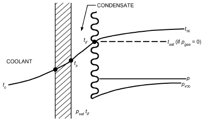

*Fig. 8 Origin of Noncondensable Resistance*

> pg∞ = Yg∞p&emsp;**(22)**

The partial pressure of the bulk vapor is

> pv∞ = (1 – Yg∞)p = Yvp&emsp;**(23)**

As opposing fluxes of convection and diffusion of the gas increase, the partial pressure of gas at the condensing interface is pgif > pg∞. By Dalton’s law, assuming isobaric conditions,

> pgif + pvif = p&emsp;**(24)**

Hence, pvif < pv∞.

Sparrow et al. (1967) noted that thermodynamic equilibrium exists at the interface, except in the case of very low pressures or liquid metal condensation, so that

> pvif = psat(tif)&emsp;**(25)**

where psat(t) is the saturation pressure of vapor at temperature t. The available Δt for condensation across the condensate film is reduced from (t∞ – ts) to (tif – ts), where t∞ is the bulk temperature of the condensing vapor/gas mixture, caused by the additional noncondensable resistance.

Equations in Table 4 are still valid for condensate resistance, but interface temperature tif must be found. The noncondensable resistance, which accounts for the temperature difference (t∞ – tif), depends on heat flux (through the convecting flow to the interface) and diffusion of gas away from the interface.

For simple cases, Rose (1969), Sparrow and Lin (1964), and Sparrow et al. (1967) found solutions to the combined energy, diffusion, and momentum problem of noncondensables, but they are cumbersome.

A general method given by Colburn and Hougen (1934) can be used over a wide range if correct expressions are provided for the rate equations; add the contributions of sensible heat transport through the noncondensable gas film and latent heat transport via condensation:

> hg(t∞ – tif) + KDMvhfg(pv∞ – pvif) = h(tif – ts)
>
> = U(tif – tc)&emsp;**(26)**

where h is from the appropriate equation in Table 4.

<!-- str. 115 -->

The value of the heat transfer coefficient for stagnant gas depends on the geometry and flow conditions. For flow parallel to a condenser tube, for example,

> 2 ⁄ 3
>
> j = hg/(cp)gG (cp)gμgv/(K Dg)&emsp;**(27)**

where j is a known function of Re = GD/μgv. The mass transfer coefficient KD is

> ( )2⁄3
>
> pg∞– pgif

> KD/Mm -------------------------------- (μ gv)/ρgD = j&emsp;**(28)**
>
> ln(pg∞⁄ pgif)

> ( )

The calculation method requires substitution of Equation (28) into Equation (26). For a given flow condition, G, Re, j, Mm, ρg∞, hg, and h (or U ) are known. Assume values of tif; calculate psat(tif) = pvif and hence pgif. If ts is not known, use the overall coefficient U to the coolant and tc in place of h and ts in Equation (26). For either case, at each location in the condenser, iterate Equation (26) until it balances, giving the condensing interface temperature and, hence, the thermal load to that point (Colburn 1951; Colburn and Hougen 1934). For more detail, refer to Chapter 10 in Collier and Thome (1996).

### Other Impurities

Vapor entering the condenser often contains a small percentage of impurities such as oil. Oil forms a film on the condensing surfaces, creating additional resistance to heat transfer. Some allowance should be made for this, especially in the absence of an oil separator or when the discharge line from the compressor to the condenser is short.

## 3. PRESSURE DROP

Total pressure drop for two-phase flow in tubes consists of friction, change in momentum, and hydrostatic components:

> ( ) ( ) ( ) ( )
>
> dp/dz = ± dp/dz + dp/dz + dp/dz&emsp;**(29a)**

> ( )total ( )static ( )mom ( )fric

where

> ( )
>
> dp/dz = [εvρv + (1 – εv)ρl]g sinθ

> ( )stat
>
> ic

The momentum pressure drop accounts for the acceleration of the flow, usually caused by evaporation of liquid or condensation of vapor. In this case,

> ( ) 2( )
>
> dp/dz = G x2/εvρv + ((1 – x)2)/((1 – εv)ρl)&emsp;**(29b)**

> ( )mom ( )

where G is total mass velocity. An empirical model for the void fraction with good accuracy is presented by Steiner (1993), based on the (dimensional) correlation of Rouhani and Axelsson (1970).

> { ( )
>
> x

> εv = ---- [1 + 0.12(1 – x)] x/ρv + (1 – x)/ρl
>
> {

> ρ
>
> v{ ( )&emsp;**(29c)**

> –1
>
> 1.18(1 – x)[gσ(ρl– ρv)]0.25

> }

+ --------------------------------------------------------------------

> }
>
> G1ρl0.5 }

**Table 5 Constants in Equation (29d) for Different Void Fraction Correlations**

| Model | A l | q l | r l | S l |
|---|---|---|---|---|
| Homogeneous (Collier 1972) | 1.0 | 1.0 | 1.0 | 0 |
| Lockhart and Martinelli (1949) | 0.28 | 0.64 | 0.36 | 0.07 |
| Baroczy (1963) | 1.0 | 0.74 | 0.65 | 0.13 |
| Thome (1964) | 1.0 | 1.0 | 0.89 | 0.18 |
| Zivi (1964) | 1.0 | 1.0 | 0.67 | 0 |
| Turner and Wallis (1965) | 1.0 | 0.72 | 0.40 | 0.08 |

A generalized expression for εv was suggested by Butterworth (1975):

> q –1
>
> ( ) l(ρv)rl( )Sl

> εv = 1 + Al (1 – x)/x ---- μl/μv&emsp;**(29d)**
>
> ρ

> ( ) ( l ) ( )

This generalized form represents the models of several researchers; constants and exponents needed for each model are given in Table 5. Consult Woldesemayat and Ghajar (2007) for a summary of 68 void fraction correlations for different flow patterns in horizontal and upward-inclined pipes.

The homogeneous model provides a simple method for computing the acceleration and gravitational components of pressure drop. It assumes that flow can be characterized by average fluid properties and that the velocities of liquid and vapor phases are equal (Collier and Thome 1996; Wallis 1969). The following discussion of several empirical correlations for computing frictional pressure drop in two-phase internal flow is based on Ould Didi et al. (2002).

### Friedel Correlation

A common strategy in both two-phase heat transfer and pressure drop modeling is to begin with a single-phase model and determine an appropriate **two-phase multiplier** to correct for the enhanced energy and momentum transfer in two-phase flow. The Friedel (1979) correlation follows this strategy:

> ( )
>
> dp/(dz fric) = dp/dz Φl2o&emsp;**(30a)**

> ( )lo

In this case,

> ( )
>
> dp/dz = 4fl (2 G tot)/2ρlD&emsp;**(30b)**

> ( )lo

with

> f = 0.079/(0.25 Re)&emsp;**(30c)**

and

> Re = (G D tot)/μ&emsp;**(30d)**

with μ = μl used to calculate fl for use in Equation (30b). The two-phase multiplier Φlo2 is determined by

> Φl2o = E + 3.24FH/(0.045 0.035 Fr We h l)&emsp;**(30e)**

where

> Frh = (2 G tot)/gDρh2&emsp;**(30f)**

<!-- str. 116 -->

> ( )( )
>
> E = (1 – x)2 + x2 ρl/ρv fv/fl&emsp;**(30g)**

> ( )( )
>
> 0.78 0.224

> F = x (1 – x)&emsp;**(30h)**
>
> (ρl)0.91( )0.19( μv)0.7

> H = ---- μv/μl 1 – -----&emsp;**(30i)**
>
> ρ μ

> ( v) ( ) ( l )
>
> Wel = (2 G D tot)/σtρh&emsp;**(30j)**

Note that friction factors in Equation (30g) are calculated from Equations (30c) and (30d) using the vapor and liquid fluid properties, respectively. The homogeneous density ρh is given by

> ( )–1
>
> x/ρv + (1 – x)/ρl

> ρh =&emsp;**(30k)**
>
> ( )

This method is generally recommended when the viscosity ratio μl/μv is less than 1000.

### Lockhart and Martinelli Correlation

One of the earliest two-phase pressure drop correlations was proposed by Martinelli and Nelson (1948) and rendered more useful by Lockhart and Martinelli (1949). A relatively straightforward implementation of this model requires that Rel be calculated first, based on Equation (23d) and liquid properties. If Rel > 4000,

> (dp) 2 (dp)
>
> ----- = Φ -----&emsp;**(31a)**

> *dz ltt dz*
>
> ( )fric ( )l

where

> Φl2tt = 1 + C/(X tt) + 1/(2 X tt)&emsp;**(31b)**

and (dp/dz)l is calculated using Equation (30b).

If Rel < 4000,

> ( )
>
> dp/dz = ΦV2tt dp/dz&emsp;**(31c)**

> ( )v

where

> ΦV2tt = 1 + CXtt+ Xt2t&emsp;**(31d)**

In both cases,

> ( )0.9( )0.5( )0.1
>
> Xtt = (1 – x)/x ρv/ρl μl/μv&emsp;**(31e)**

> ( ) ( ) ( )

and the subscript tt means turbulence in both liquid and vapor phases and C = 20 for most cases of interest in internal flow in HVAC&R systems.

### Grönnerud Correlation

Much of the two-phase pressure drop modeling has been based on adiabatic air/water data. To address this, Grönnerud (1979) developed a correlation based on refrigerant flow data, also using a two-phase multiplier:

> dp
>
> ( ) ( )

> -----
>
> dp/dz = Φlo&emsp;**(32a)**

> dz
>
> ( )fric ( )lo

with

> ( ) (ρl⁄ ρv)
>
> ----------------------------- – 1

> Φlo = 1 + dp/dz 0.25&emsp;**(32b)**
>
> ( )Fr (μl⁄ μv)

The liquid-only pressure gradient in Equation (32a) is calculated as before, using Equation (30b) with x = 0 and

> ( )
>
> ( 1.8 100.5)

> dp/dz = fFr x + 4 x – x fFr&emsp;**(32c)**
>
> ( )

> ( )Fr

The friction factor fFr in this method depends on the liquid Froude number, defined by

> Frl = (2 G tot)/gDρl2&emsp;**(32d)**

If Frl is greater than or equal to 1, fFr = 1.0. If Frl < 1,

> ( 1/Frl)2
>
> fFr = Frl0.3+ 0.0055 ln&emsp;**(32e)**

> ( )

### Müller-Steinhagen and Heck Correlation

A simple, purely empirical correlation was proposed by Müller-Steinhagen and Heck (1986):

> ( ) 1/3 ( ) 3
>
> dp/dz = Λ(1 – x) + dp/dz x&emsp;**(33a)**

> ( )fric ( )vo

where

> ( ) ( ) ( )
>
> Λ = dp/dz + 2 dp/dz – dp/dz x&emsp;**(33b)**

> ( )lo ( )vo ( )lo

and

> ( )
>
> dp/dz = fl (2 2G tot)/Dρl&emsp;**(33c)**

> ( )lo
>
> ( )

> dp/dz = fv (2 2G tot)/Dρv&emsp;**(33d)**
>
> ( )vo

where the subscript vo means vapor flow only and friction factors in Equations (33c) and (33d) are again calculated from Equations (30c) and (30d) using the liquid and vapor properties, respectively.

### Wallis Correlation

The general nature of annular vapor/liquid flow in vertical pipes is indicated in Figure 9 (Wallis 1970), which plots the effective vapor friction factor versus the liquid fraction (1 – εv), where εv is the vapor void fraction as defined by Equations (29c) or (29d).

The effective vapor friction factor in Figure 9 is defined as

> εv2.5D ( )
>
> feff = ---------------------------- dp/dz&emsp;**(34a)**

> ( 4Qv)2 ( )
>
> 2ρv ---------

> ( πD2)

where D is pipe diameter, ρv is vapor density, and Qv is vapor volumetric flow rate. The friction factor of vapor flowing by itself in the pipe (presumed smooth) is denoted by fv. Wallis’ analysis of the flow occurrences is based on interfacial friction between the gas and liquid. The wavy film corresponds to a conduit with roughness height of about four times the liquid film thickness. Thus, the pressure drop relation for vertical flow is ( ) ( )( )2

<!-- str. 117 -->

> dp/dz = 0.01 ρv/D5 4Qv/π (1 + 75(1 – εv))/(2.5 ε v)&emsp;**(34b)**

( )fric ( )( )

This corresponds to the Martinelli-type analysis with

> fTP = Φv2fv&emsp;**(34c)**

when

> Φv2 = (1 + 75(1 – εv))/εv&emsp;**(34d)**

The friction factor fv (of vapor alone) is taken as 0.02, an appropriate turbulent flow value. This calculation can be modified for more detailed consideration of factors such as Reynolds number variation in friction, gas compressibility, and entrainment (Wallis 1970).

### Recommendations

Although many references recommend the Lockhart and Martinelli (1949) correlation, recent reviews of pressure drop correlations found other methods to be more accurate. Tribbe and Müller-Steinhagen (2000) found that the Müller-Steinhagen and Heck (1986) correlation worked quite well for a database of horizontal flows that included air/water, air/oil, steam, and several refrigerants. Ould Didi et al. (2002) also found that this method offered accuracies nearly as good or better than several other models; the Friedel (1979) and Grönnerud (1979) correlations also performed favorably. Note, however, that mean deviations of as much as 30% are common using these correlations; calculations for individual flow conditions can easily deviate 50% or more from measured pressure drops, so use these models as approximations only.

Evaporators and condensers often have valves, tees, bends, and other fittings that contribute to the overall pressure drop of the heat exchanger. Collier and Thome (1996) summarize methods predicting the two-phase pressure drop in these fittings.

### Pressure Drop in Microchannels

Chisholm and Laird (1958) related the friction multiplier to the Lockhart-Martinelli parameter through a simple expression that depends on the coefficient C ranging from 5 to 20, depending on laminar or turbulent flow of vapor and liquid. Some researchers suggest empirical correlations for the coefficient C to determine the two-phase friction multiplier; among the most widely used are Lee and Lee’s (2001) and Mishima and Hibiki’s (1996). Mishima and Hibiki’s correlation appears to provide a compact/simple correlation for adiabatic two-phase flow for tube diameters of 0.21 to 6.05 mm, but its applicability to microchannel flows with phase change has not yet been demonstrated. It proposes

> ( –0.319dh)
>
> C = 21 1 – e&emsp;**(35)**

> ( )

where diameter dh is in millimetres. Cavallini et al. (2005) showed that Mishima and Hibiki’s method could predict two-phase pressure drop for flow condensation of refrigerants R-134a and R-236ea in 1.4 mm minitubes. The correlation of Mishima and Hibiki (1996) evidently assumes that C depends on channel size only. Based on the observation that C depends on phase mass fluxes as well, and using experimental data from several sources as well as their own data that covered channel gaps in the 0.4 to 4 mm range, Lee and Lee (2001) derived the following correlation for C, for adiabatic flow in horizontal thin rectangular channels:

> q r
>
> ( ) )

> C = A (2 μ l)/ρlσdh ((μl j)/(σ () RelS0&emsp;**(36)**
>
> ( ) )

where j = G[(1 – x)/ρl + x/ρg)] and represents the total mixture volumetric flux. The constants A, r, q, and s depend on the liquid and (Wallis 1970)

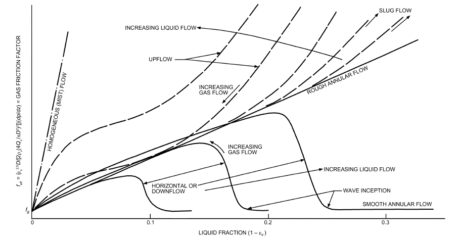

*Fig. 9 Qualitative Pressure Drop Characteristics of Two-Phase Flow Regime*

<!-- str. 118 -->

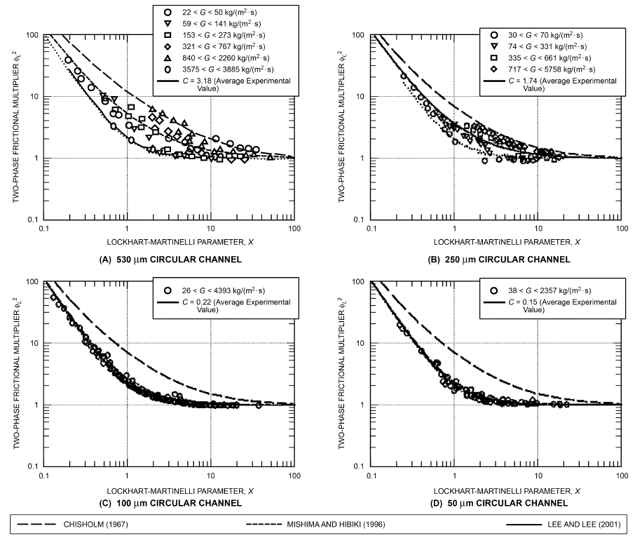

*Fig. 10 Pressure Drop Characteristics of Two-Phase Flow: Variation of Two-Phase Multiplier with Lockhart-Martinelli Parameter*

(Chung and gas flow regimes (viscous-dominated or turbulent), as listed in Table 6.

**Table 6 Constant and Exponents in Correlation of Lee and Lee (2001)**

| Liquid Regime | Gas Flow Regime | A | q | r | s |
|---|---|---|---|---|---|
| Laminar | Laminar | 6.833 × 10–8 | –1.317 | 0.719 | 0.577 |
| Laminar | Turbulent | 6.185 × 10–2 | 0 | 0 | 0.726 |
| Turbulent | Laminar | 3.627 | 0 | 0 | 0.174 |
| Turbulent | Turbulent | 0.408 | 0 | 0 | 0.451 |

The correlations of Lee and Lee (2001) and Mishima and Hibiki (1996) [Equations (36) and (35), respectively] predicted the data of (1) Chung et al. (2004) for adiabatic flow of water and nitrogen in horizontal 96 μm square rectangular microchannels, (2) Zhao and Bi (2001) for water and airflow in a miniature triangular channel with dh = 0.87 to 2.89 mm, and (3) Chung and Kawaji (2004) for water and nitrogen flow in a horizontal circular channel with dh = 50

Kawaji 2004)

to 530 μm, within about ±10%. Figure 10 shows the two-phase friction multiplier data plotted against the Lockhart-Martinelli parameter for the data of Chung and Kawaji (2004). Further detailed information for pressure drop in microchannels can be found in Ohadi et al. (2013).

### Pressure Drop in Plate Heat Exchangers

For a description of plate heat exchanger geometry, see the Plate Heat Exchangers section of Chapter 4.

Ayub (2003) presented simple correlations for Fanning friction factor based on design and field data collected over a decade on ammonia and R-22 DX and flooded evaporators in North America. The goal was to formulate equations that could be readily used by a design and field engineer without reference to complicated two-phase models. Correlations within the plates are formulated as if the entire flow were saturated vapor. The correlation is accordingly adjusted for the chevron angle, and thus generalized for application to any type of commercially available plate, with a statistical error of ±10%:

<!-- str. 119 -->

> f = (n/Rem)(–1.89 + 6.56R – 3.69R2)&emsp;**(37)**

for 30 ≤ β ≤ 65 where R = (30/β), and β is the chevron angle in degrees. The values of m and n depend on Re.

| m | n | Re |
|---|---|---|
| 0.137 | 2.99 | <4000 |
| 0.172 | 2.99 | 4000 < Re < 8000 |
| 0.161 | 3.15 | 8000 < Re < 16 000 |
| 0.195 | 2.99 | >16 000 |

Pressure drop within the port holes is correlated as follows, treating the entire flow as saturated vapor:

> Δpport = 0.0076ρV2/2g&emsp;**(38)**

This equation accounts for pressure drop in both inlet and outlet refrigerant ports and gives the pressure drop in I-P units of lb/in2 with input for ρ in lb/ft3, V in ft/s, and g in ft/s2. For evaporation of NH3 in brazed-plate heat exchangers (BPHEs), Khan et al. (2012a, 2012b, 2014) correlated the friction factor with flow conditions.

> fTP = C(Reeq)m(p*)j&emsp;**(39)**

|   | 60°/60° | 60°/30° | 30°/30° |
|---|---|---|---|
| C | 673,336 | 305,590 | 212 |
| m | –1.29 | –1.26 | –0.51 |
| j | 0.9 | 0.9 | 0.53 |

ASHRAE research project RP-1394 also established the following correlation for the carbon dioxide condensation in BPHEs (Jokar and Hayes 2009).

> CF,TP = C Re–P&emsp;**(40)**

| Plate | C | P |
|---|---|---|
| 60/60 | 1837.4 | 0.817 |
| 27/60 | 10.65 | 0 |
| 27/27 | 1221.3 | 0.815 |

**Microengineered Surfaces for Enhanced Heat Transfer.** Enhanced heat transfer surfaces are used in heat exchangers to improve performance while keeping pressure drops under control, with the net result of reduced footprint and/or mass or volume reductions and savings in capital and/or life-cycle costs. Condensing heat transfer is often enhanced with circular fins attached to the external surfaces of tubes to increase the heat transfer area. The latest generations of condensing surfaces have three-dimensional features (e.g., notches, wings) designed to promote good drainage of condensed liquid while extending the available heat transfer surface area, thus giving higher condensation heat transfer coefficients and condenser capacity. Similar enhancement methods (e.g., porous coatings, integral fins, reentrant cavities, other three-dimensional surface textures) are used to augment boiling/evaporation heat transfer on external surfaces of evaporator surfaces. Webb (1981) surveyed external boiling surfaces and compared performances of several enhanced surfaces with performance of smooth tubes. For some heat exchangers, the heat transfer coefficient for the refrigerant side is often smaller than the coefficient for the water side. Thus, enhancing the refrigerant-side surface can reduce the size of the heat exchanger and improve its performance. Most recent heat exchanger designs have augmentation on both liquid and refrigerant sides so as to avoid one side limiting the other’s performance.

Internal fins and heat transfer surfaces can increase the heat transfer coefficients during evaporation or condensation in tubes. However, such enhanced features may often increase refrigerant pressure drop and reduce the heat transfer rate by decreasing the available temperature difference between hot and cold fluids, thus requiring careful design and optimization studies. For a review of internal enhancements for two-phase heat transfer, including the effects of oil, see Newell and Shah (2001). For additional information on enhancement methods in two-phase flow, see Bergles (1976, 1985), Thome (1990), and Webb (1994).

Perhaps the most effective mode of boiling heat transfer is thin-film evaporation, which maintains a thin film on the heat transfer surface at all times to avoid hot spots. The heat transfer coefficient of thin-film evaporation is directly proportional to thermal conductivity of the fluid over the film thickness; thus, the thinner the film, the higher the resulting heat transfer coefficients. Heat transfer coefficients can be several orders of magnitude larger, compared to conventional pool and convective heat transfer coefficients, whereas pressure drops can be substantially smaller than in typical convective boiling (Ohadi et al. 2013). The only limitation that has held this technology from being widely commercialized is the challenge of maintaining very thin films on the surface under wide-ranging operating conditions encountered in many systems. However, recent progress in microfabrication technologies, as well as measurement, instrumentation, and control of fluidic devices, may have substantially improved the prospect of commercially feasible thin-film evaporators. An important aspect of successful use of microchannels, for both single- and two-phase flow applications, is precise, evenly distributed liquid among the channels, which often requires careful design of liquid feed manifolds. Figure 11 depicts a schematic view of thin-film microchannels cooling over three-dimensional surfaces (Cetegen 2010).

Cetegen (2010) obtained critical heat flux in excess of 0.012 kW/mm2, measured at average wall superheat of 56.2 K and subcooling of 8.5 K. The corresponding pressure drop was only 60.3 kPa, and a resulting pumping power of only 1.1 W. The heat sink footprint area tested in this study was 7.8 × 7.8 mm2.

Mandel (2016) applied the force-fed microchannel heat sink (FFMHS) concept to a 10 × 10 mm2 heat sink directly etched into a silicon die, achieving more than 1 kW/cm2 at 85.6 K, 40% thermodynamic outlet vapor quality, and subcooling of 7.66 K. The corresponding pressure drop was only 87.3 kPa, and the resulting pumping power was only 0.79 W, approximately 43.5% less than Cetegen’s results despite the 64% larger heat sink area. In addition, because the substrate material was silicon, temperature dropped significantly through the substrate, and the superheat at the base of the fins was estimated to be only 42.05 K.

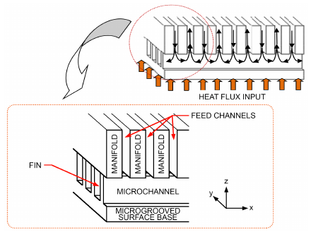

*Fig. 11 Schematic Flow Representation of a Typical Force- Fed Microchannel Heat Sink (FFMHS)*

> (Cetegen 2010)

<!-- str. 120 -->

Comparing cooling technologies for two-phase heat transfer is more challenging than for single phase, because heat sink performance depends on many more parameters. Nevertheless, a quantitative comparison can still be made by plotting the data over the two most important parameters: here, maximum heat flux and pumping power over cooling capacity ratio. For these parameters, the performance of force-fed heat transfer was compared with other competing high-heat-flux cooling technologies by Agostini et al. (2008), Kosar and Peles (2007), Sung and Mudawar (2009), and Visaria and Mudawar (2008); the resulting graph, compiled by Cetegen (2010), is shown in Figure 12.

In addition, thin-film-enhanced evaporation in microchannels has been extended to shell-and-tube heat exchangers for enhanced evaporation heat transfer. Jha et al. (2012) found more than fourfold enhancement of the heat exchanger’s overall heat transfer coefficient U compared to a state-of-the-art plate heat exchanger for the same operating parametric ranges. Working fluids for this study were R-245fa and water, for shell and tube sides, respectively. The pressure drops/pumping power reported in this study were substantially below those of the conventional shell-and-tube, as well as respective plate evaporators. Equally impressive results were reported with condensation heat transfer in thin-film-enhanced microchannels. Additional detailed information can be found in Ohadi et al. (2013).

Force-fed microchannel heat exchangers have also been used to enhance condensation heat transfer. Boyea et al. (2013) developed and tested a compact, low-mass manifold microgroove condenser, with 60 × 600 μm microgrooves and cooling capacity of 4 kW using different manifolds. Experiments using R-236fa and R-134a as working fluids measured inlet and outlet temperatures, flow rates, and pressure drops for the refrigerant and water sides. Overall heat transfer coefficient and pressure drop across condenser were determined, and refrigerant-side heat transfer coefficient was calculated based on water-side heat transfer coefficient. Refrigerant-side heat transfer coefficient of 60 kW/(m2·K) with pressure drop of just 7 kPa was demonstrated using R-134a. Experimental results indicate significant effect of manifold geometry on condenser performances. However, additional tests and verifications are needed to demonstrate the applicability of this technique for scaled-up, real-world condensers.

Kale and Mehendale (2015) critically assessed five microfin tube condensation correlations to determine their predictive accuracy and applicability for halogenated refrigerants and CO2 in specific applications. This novel methodology was developed and validated against a dataset of 1163 experimental data points for CO2, R-22, R-134a, R-410A, R-407C, R-125, and other halogenated refrigerants obtained from a large number of published works, which included diverse microfin tube geometries and condensing conditions. A similar study of the flow boiling HTC correlations was conducted by Merchant and Mehendale (2015).

Recent advancements in surface engineering offer new opportunities to enhance condensation heat transfer by drastically changing the wetting properties of the surface. Specifically, the development of superhydrophobic surfaces has been pursued to enhance dropwise condensation heat transfer, where the low droplet surface adhesion and small droplet departure sizes increase the condensation heat transfer coefficient. Figure 13 shows various microstructures of different sizes.

## 4. SYMBOLS

> A = area, effective plate area
>
> a = local acceleration

b = breadth of condensing surface. For vertical tube, b = πd; for horizontal tube, b = 2L; flow channel gap in flat plate heat exchanger.

> Bo = boiling number = q/(Ghfg)
>
> C = coefficient or constant

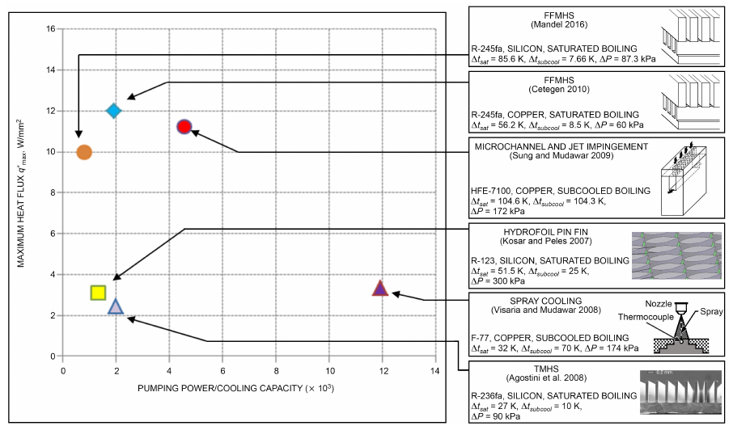

*Fig. 12 Thermal Performance Comparison of Different High-Heat-Flux Cooling Technologies*

(Cetegen 2010)

<!-- str. 121 -->

![Fig. 13 Scanning Electron Microscope Images of Various Nanostructures: (A) Silicon Nanopillars (Enright et al. 2012), (B) High-Aspect-Ratio Silicon Nanopillars (Enright et al. 2012), (C) Silicon Micropost-Pyramids with Silicon Nanograss on Surface (Chen et al. 2011), (D) CuO Nanoblades (Miljkovic et al. 2013), (E) Tobacco Mosaic Virus Template Nanostructure (McCarthy et al. 2012), (F) Zinc Oxide Nanowires (Miljkovic et al. 2013), (G) Boehmitized Aluminum (Kim et al. 2013) and (H) Carbon Nanotubes (Enright et al. 2014)](img/ch05/fig-13.png)

*Fig. 13 Scanning Electron Microscope Images of Various Nanostructures: (A) Silicon Nanopillars (Enright et al. 2012), (B) High-Aspect-Ratio Silicon Nanopillars (Enright et al. 2012), (C) Silicon Micropost-Pyramids with Silicon Nanograss on Surface (Chen et al. 2011), (D) CuO Nanoblades (Miljkovic et al. 2013), (E) Tobacco Mosaic Virus Template Nanostructure (McCarthy et al. 2012), (F) Zinc Oxide Nanowires (Miljkovic et al. 2013), (G) Boehmitized Aluminum (Kim et al. 2013) and (H) Carbon Nanotubes (Enright et al. 2014)*

(

S (

> CF = Fanning friction factor
>
> Co = Shah’s convection number = (1/x – 1)0.8(ρg/ρf)0.5

> cp = specific heat at constant pressure
>
> cv = specific heat at constant volume

> D = diameter
>
> Do = outside tube diameter

> d = diameter; or prefix meaning differential

(dp/dz) = pressure drop (dp/dz)fric = frictional pressure drop (dp/dz)l = frictional pressure drop, assuming that liquid alone is flowing in pipe (dp/dz)mom = momentum pressure drop (dp/dz)v = frictional pressure drop, assuming that gas (or vapor) alone is flowing in pipe

> Fr = Froude number
>
> Frl = Froude number for total mass flow rate (vapor + liquid) =

> G2/(ρf2GD)
>
> f = friction factor for single-phase flow (Fanning)

> G = total mass velocity (vapor + liquid); gravitational
>
> acceleration; mass flux

> gc = gravitational constant
>
> Gr = Grashof number

> h = heat transfer coefficient
>
> hf = single-phase liquid heat transfer coefficient

> hfg = latent heat of vaporization or of condensation
>
> i’fg = modified latent heat = ifg(1 + 0.68cp ΔT/ifg)

> j = Colburn j-factor
>
> k = thermal conductivity

KD = mass transfer coefficient, dimensionless coefficient (Table 1) L = length

> Lp = plate length
>
> LT = total mass flowing as liquid

> M = mass; or molecular weight
>
> m = general exponent

> ṁ = mass flow rate

Mm = mean molecular weight of vapor/gas mixture

> Mv = molecular weight of condensing vapor
>
> N = number of tubes in vertical tier

> n = general exponent
>
> Nu = Nusselt number

> P = pressure; or plate perimeter
>
> p* = reduced pressure (P/pc)

> pc = critical thermodynamic pressure for coolant
>
> pg = partial pressure of noncondensable gas

> Pr = Prandtl number
>
> pr = reduced pressure = p/pc

> pv = partial pressure of vapor
>
> Qv = volumetric flow rate

q, q″ = heat flux

> r = radius
>
> Ra = Rayleigh number

> Re = Reynolds number
>
> Rp = surface roughness, μm

> T, t = temperature
>
> U = overall heat transfer coefficient

> V = linear velocity
>
> We = Weber number

> x = quality (i.e., mass fraction of vapor); or distance in dt/dx
>
> Xtt = Martinelli parameter

x, y, z = lengths along principal coordinate axes

> Yg = mole fraction of noncondensable gas
>
> Yv = mole fraction of vapor

> Z = Shah parameter = (1/x – 1)0.8pr0.4

### Greek

> α = thermal diffusivity = k/ρcp
>
> β = coefficient of thermal expansion, chevron angle

> β∗ = chevron angle ratio (β/βmin)
>
> Γ = mass rate of flow of condensate per unit of breadth (see

> section on Condensing)
>
> Δ = difference between values

> δ = thickness of oil film
>
> ε = roughness of interface

> εv = vapor void fraction
>
> θ = contact angle, inclination angle

> μ = absolute (dynamic) viscosity
>
> μl = dynamic viscosity of saturated liquid

> μv = dynamic viscosity of saturated vapor
>
> ν = kinematic viscosity

> ρ = density
>
> ρl = density of saturated liquid

> ρv = density of saturated vapor phase

<!-- str. 122 -->

> σ = surface tension
>
> Φ = two-phase multiplier

> φ = fin efficiency

### Subscripts and Superscripts

> a = exponent in Equation (1)
>
> b = bubble

c = critical, cold (fluid), characteristic, coolant, cross-sectional dc = droplet cooling e, eq = equivalent

> eff = effective
>
> f = film, fin, or liquid

> fric = friction
>
> g = noncondensable gas or vapor

> gv = noncondensable gas and vapor mixture
>
> h = horizontal, hot (fluid), hydraulic

> i = inlet or inside
>
> if = interface

> l = liquid
>
> m = mean

mac = convective mechanism max = maximum

> mic = nucleation mechanism
>
> min = minimum

mom = momentum

> ncb = nucleate boiling
>
> o = outside, outlet, overall, reference

> r = root (fin) or reduced pressure
>
> s = surface or secondary heat transfer surface

> sat = saturation
>
> t = temperature or terminal temperature of tip (fin)

> tot = total
>
> TP = two-phase

> tt = turbulence in both liquid and vapor phases
>
> v = vapor or vertical

> vo = vapor flow only
>
> w = wall

> ∞ = bulk or far-field
>
> * = reference

## REFERENCES

ASHRAE members can access ASHRAE Journal articles and ASHRAE research project final reports at technologyportal.ashrae .org. Articles and reports are also available for purchase by nonmembers in the online ASHRAE Bookstore at www.ashrae.org/bookstore.

Agostini, B., J.R. Thome, M. Fabbri, and B. Michel. 2008. High heat flux two-phase cooling in silicon multimicrochannels. *IEEE Transactions on* *Components and Packaging Technologies* 31(3):691-701.

Anderson, W., D.G. Rich, and D.F. Geary. 1966. Evaporation of Refrigerant 22 in a horizontal 3/4-in. OD tube. ASHRAE Transactions 72(1):28.

Awad, M.M., A.S. Dalkilic, and S. Wongwises. 2014. A critical review on condensation heat transfer in microchannels and minichannels. ASME *Journal of Nanotechnology in Engineering and Medicine* 5(1). dx.doi.org/10.1115/1.4028092.

Ayad, F., R. Benelemir, and A. Souayed. 2012. CO2 evaporators design for vehicle HVAC operation. *Applied Thermal Engineering* 36:330-344.

Ayub, Z.H. 2003. Plate heat exchanger literature survey and new heat transfer and pressure drop correlations for refrigerant evaporators. Heat Transfer Engineering 24(5):3-16.

Barnea, D., and Y. Taitel. 1986. Flow pattern transition in two-phase gas-liquid flows. In *Encyclopedia of Fluid Mechanics*, vol. 3. Gulf Publishing, Houston.

Baroczy, C.J. 1963. Correlation of liquid fraction in two-phase flow with application to liquid metals. North American Aviation Report SR-8171, El Segundo, CA.

Baskin, E. 1991. Applicability of plate heat exchangers in heat pumps.

ASHRAE Transactions 97(2):305-308. Paper 3522.

Beatty, K.O., and D.L. Katz. 1948. Condensation of vapors on outdoor of finned tubes. *Chemical Engineering Progress* 44(1):55.

Bell, K.J., and M.A. Ghaly. 1973. An approximate generalized design method for multi-component/partial condenser. *American Institute of* *Chemical Engineers Symposium Series* 69:72-79.

Berenson, P.J. 1961. Film boiling heat transfer from a horizontal surface.

*ASME Journal of Heat Transfer* 85:351.

Berenson, P.J. 1962. Experiments on pool boiling heat transfer. Interna-*tional Journal of Heat and Mass Transfer* 5(10):985.

Bergles, A.E. 1976. Survey and augmentation of two-phase heat transfer.

ASHRAE Transactions 82(1):891-905. Paper DA-76-14-1.

Bergles, A.E. 1985. Techniques to augment heat transfer. In Handbook of *heat transfer application*, 2nd ed. McGraw-Hill, New York.

Bergles, A.E., and W.M. Rohsenow. 1964. The determination of forced convection surface-boiling heat transfer. *ASME Journal of Heat Transfer*, Series C, 86(August):365.

Borishansky, W., and A. Kosyrev. 1966. Generalization of experimental data for the heat transfer coefficient in nucleate boiling. ASHRAE Journal (May):74.

Borishansky, V.M., I.I. Novikov, and S.S. Kutateladze. 1962. Use of thermodynamic similarity in generalizing experimental data on heat transfer. *Proceedings of the International Heat Transfer Conference*.

Boyea, D., A. Shooshtari, S.V. Dessiatoun, and M.M. Ohadi. 2013. Heat transfer and pressure drop characteristics of a liquid cooled manifoldmicrogroove condenser. *ASME Journal of Heat Transfer*, pp. V003T23A003. Paper HT2013-17781. dx.doi.org/10.1115/HT2013 -17781.

Breber, G., J.W. Palen, and J. Taborek. 1980. Prediction of the horizontal tubeside condensation of pure components using flow regime criteria. *ASME Journal of Heat Transfer* 102(3):471-476.

Brisbane, T.W.C., I.D.R. Grant, and P.B.A. Whalley. 1980. Prediction method for kettle reboiler performance. Paper 80-HT-42. American Society of Mechanical Engineers, New York.

Bromley, L.A. 1950. Heat transfer in stable film boiling. Chemical Engineering Progress (46):221.

Brusstar, M.J., and H. Merte, Jr. 1997. Effects of heater surface orientation on the critical heat flux—II. A model for pool and forced convection subcooled boiling. *International Journal of Heat and Mass Transfer* 40(17):4021-4030.

Butterworth, D. 1975. A comparison of some void-fraction relationships for co-current gas-liquid flow. *International Journal of Multiphase Flow* 1:845-850.

Carey, V.P. 1992. *Liquid-vapor phase change phenomena: An introduction* *to the thermophysics of vaporization and condensation processes in heat* transfer equipment. Hemisphere Publishing, Washington, D.C.

Casciaro, S., and. J.R. Thome. 2001.Thermal performance of flooded evaporators, part I: Review of boiling heat transfer studies. ASHRAE Transactions 107(1):903-918. Paper AT-01-16-1.

Cavallini, A., D. Del Col, L. Doretti, M. Matkovic, L. Rossetto, and C. Zilio.

2005. Two-phase frictional pressure gradient of R236ea, R134a and R410A inside multi-port minichannels. *Experimental Thermal and Fluid* Science 29(7):861-870.

Cavallini, A., D. Del Col, L. Doretti, M. Matkovic, L. Rossetto, C. Zilio, and G. Censi. 2006. Condensation in horizontal smooth tubes: A new heat transfer model for heat exchanger design. *Heat Transfer Engineering* 27(8):31-38.

Cetegen, E. 2010. *High heat flux cooling utilizing microgrooved surfaces*.

Ph.D. dissertation. School of Mechanical Engineering, University of Maryland, College Park.

Chaddock, J.B., and G.H. Buzzard. 1986. Film coefficients for in-tube evaporation of ammonia and R-502 with and without small percentages of mineral oil. ASHRAE Transactions 92(1A):22-40. Paper 2935 (RP-224).

Chen, J.C. 1963. A correlation for boiling heat transfer to saturated fluids on convective flow. ASME Paper 63-HT-34. American Society of Mechanical Engineers, New York.

Chen, J.C. 1966. Correlations for boiling heat transfer to saturated fluids in convective flow. *Industrial & Engineering Chemistry Research* 5:322-329.

Chen, J.C. 2003. Surface contact—Its significance for multiphase heat transfer: Diverse examples. *Journal of Heat Transfer* 125:549-566.

Chen, X.M., J. Wu, R.Y. Ma, M. Hua, N. Koratkar, S.H. Yao, and Z.K. Wang.

2011. Nanograssed micropyramidal architectures for continuous dropwise condensation. *Advanced Functional Materials* 21(24):4617-4623. dx.doi.org/10.1002/adfm.201101302.

Chisholm, D., and A.D.K. Laird. 1958. Two-phase flow in rough tubes.

ASME Transactions 80:276-283.

<!-- str. 123 -->

Chung, P.M.-Y., and M. Kawaji. 2004. The effect of channel diameter on adiabatic two-phase flow characteristics in microchannels. International *Journal of Multiphase Flow* 30(7-8):735-761.

Chung, P.M.-Y., M. Kawaji, A. Kawahara, and Y. Shibata. 2004. Two-phase flow through square and circular microchannels—Effects of channel geometry. *Journal of Fluids Engineering* 126:546-552.

Colburn, A.P. 1951. Problems in design and research on condensers of vapours and vapour mixtures. *Proceedings of the Institute of Mechanical* Engineers, London, vol. 164, p. 448.

Colburn, A.P., and O.A. Hougen. 1934. Design of cooler condensers for mixtures of vapors with noncondensing gases. *Industrial and Engineer-* ing Chemistry 26 (November):1178.

Coleman, J.W., and S. Garimella. 1999. Characterization of two-phase flow patterns in small-diameter round and rectangular tubes. International *Journal of Heat and Mass Transfer* 42:2869-2881.

Collier, J.G. 1972. *Convective boiling and condensation*. McGraw-Hill. Collier, J.G., and J.R. Thome. 1996. *Convective boiling and condensation*, 3rd ed. Oxford University Press.

Consolini, L., D. Robinson, and J.R. Thome. 2006. Void fraction and two-phase pressure drops for evaporating flow over horizontal tube bundles. *Heat Transfer Engineering* 27(3):5-21.

Cooper, M.G. 1984. Heat flow rates in saturated nucleate pool boiling—A wide-ranging examination using reduced properties. *Advances in Heat* Transfer 16:157-239.

Danilova, G. 1965. Influence of pressure and temperature on heat exchange in the boiling of halogenated hydrocarbons. Kholodilnaya Teknika 2. English abstract, Modern Refrigeration (December).

Dhir, V.K., and S.P. Liaw. 1989. Framework for a unified model for nucleate and transition pool boiling. *Journal of Heat Transfer* 111:739-745.

Dhir, V.K., and J. Lienhard. 1971. Laminar film condensation on plan and axisymmetric bodies in non-uniform gravity. *Journal of Heat Transfer* 91:97-100.

Dobson, M.K., and J.C. Chato. 1998. Condensation in smooth horizontal tubes. *Journal of Heat Transfer* 120:193-213.

Dougherty, R.L., and H.J. Sauer, Jr. 1974. Nucleate pool boiling of refrigerant-oil mixtures from tubes. ASHRAE Transactions 80(2):175. Paper MO-2315.

Eckels, S., and E. Gorgy. 2012. Experimental evaluation of heat transfer impacts of tube pitch on highly enhanced surface tube bundle. ASHRAE Research Project RP-1316, Final Report.

Eckels, S.J., T.M. Doer, and M.B. Pate. 1994. In-tube heat transfer and pressure drop of R-134a and ester lubricant mixtures in a smooth tube and a micro-fin tube, part 1: Evaporation. ASHRAE Transactions 100(2):265-282. Paper 3810 (RP-630).

El Hajal, J., J.R. Thome, and A. Cavallini. 2003. Condensation in horizontal tubes, part I: Two-phase flow pattern map. *International Journal of Heat* *and Mass Transfer* 46(18):3349-3363.

Elkassabgi, Y., and J.H. Lienhard. 1988. The peak pool boiling heat fluxes from horizontal cylinders in subcooled liquids. *Journal of Heat Transfer* 110:479-492.

Enright, R., N. Miljkovic, A. Al-Obeidi, C.V. Thompson, and E.N. Wang.

2012. Condensation on superhydrophobic surfaces: The role of local energy barriers and structure length scale. Langmuir 40(28):14424-14432.

Enright, R., N. Miljkovic, J.L. Alvarado, K.J. Kim, and J.W. Rose. 2014.

Dropwise condensation on micro- and nanostructured surfaces. Nano-*scale and Microscale Thermophysical Engineering* 18(3):223-250.

Farber, E.A., and R.L. Scorah. 1948. Heat transfer to water boiling under pressure. ASME Transactions (May):373.

Frederking, T.H.K., and J.A. Clark. 1962. Natural convection film boiling on a sphere. In *Advances in cryogenic engineering*, K.D. Timmerhouse, ed. Plenum Press, New York.

Friedel, L. 1979. Improved friction pressure drop correlations for horizontal and vertical two-phase pipe flow. European Two-Phase Flow Group Meeting, Paper E2, Ispra, Italy.

Furse, F.G. 1965. Heat transfer to Refrigerants 11 and 12 boiling over a horizontal copper surface. ASHRAE Transactions 71(1):231.

Gorenflo, D. 1993. Pool boiling. VDI-Heat Atlas. VDI-Verlag, Düsseldorf. Gorgy, E.I., and S. Eckels. 2013. Convective boiling of R-134a and R-123 on a standard pitch enhanced tube bundle. HVAC&R Research (now Science *and Technology for the Built Environment*) 19(2):193-206.

Gouse, S.W., Jr., and K.G. Coumou. 1965. Heat transfer and fluid flow inside a horizontal tube evaporator, phase I. ASHRAE Transactions 71(2):152.

Green, G.H., and F.G. Furse. 1963. Effect of oil on heat transfer from a horizontal tube to boiling Refrigerant 12-oil mixtures. ASHRAE Journal (October):63.

Grober, H., S. Erk, and U. Grigull. 1961. *Fundamentals of heat transfer*.

McGraw-Hill, New York.

Grönnerud, R. 1979. Investigation of liquid hold-up, flow resistance and heat transfer in circulation type evaporators, part IV: Two-phase flow resistance in boiling refrigerants. Annexe 1972-1, *Bulletin de l’Institut* du Froid.

Guerrieri, S.A., and R.D. Talty. 1956. A study of heat transfer to organic liquids in single tube boilers. *Chemical Engineering Progress Symposium* Series 52(18):69.

Gungor, K.E., and R.H.S. Winterton. 1986. A general correlation for flow boiling in tubes and annuli. *International Journal of Heat and Mass* Transfer 29:351-358.

Gungor, K.E., and R.H.S. Winterton. 1987. Simplified general correlation for saturated flow boiling and comparison of correlations with data. *Chemical Engineering Research and Design* 65:148-156.

Hall, D.D., and I. Mudawar. 2000a. Critical heat flux (CHF) for water flow in tubes—I. Compilation and assessment of world CHF data. Interna-*tional Journal of Heat and Mass Transfer* 43(14):2573-2604.

Hall, D.D., and I. Mudawar. 2000b. Critical heat flux (CHF) for water flow in tubes—II: Subcooled CHF correlations. *International Journal of Heat* *and Mass Transfer* 43(14):2605-2640.

Haramura, Y., and Y. Katto. 1983. A new hydrodynamic model of critical heat flux, applicable widely to both pool and forced convection boiling on submerged bodies in saturated liquids. *International Journal of Heat* *and Mass Transfer* 26:389-399.

Hayes, N., and A. Jokar. 2009. Dynalene/water correlations to be used for condensation of CO2 in brazed plate heat exchangers. ASHRAE Transactions 115(2):599-616. Paper LO-09-057 (RP-1394).

Hayes, N., A. Jokar, and Z. Ayub. 2011. Study of carbon dioxide condensation in chevron plate exchangers: heat transfer analysis. International *Journal of Heat and Mass Transfer* 54:1121-1131.

Hayes, N., A. Jokar, and Z. Ayub. 2012. Study of carbon dioxide condensation in chevron plate exchangers; pressure drop analysis. International *Journal of Heat and Mass Transfer* 55:2916-2925.

Hesselgreaves, J.E. 1990. The impact of compact heat exchangers on refrigeration technology and CFC replacement. *Proceedings of the 1990 USNC/* *IIR-Purdue Refrigeration Conference*, ASHRAE/Purdue CFC Conference, pp. 492-500.

Hetsroni, G., ed. 1986. *Handbook of multiphase systems*. Hemisphere Publishing, Washington D.C.

Howard, A.H., and I. Mudawar. 1999. Orientation effects on pool boiling critical heat flux (CHF) and modeling of CHF for near-vertical surfaces. *International Journal of Heat and Mass Transfer* 42:1665-1688.

Incropera, F.P., and D.P. DeWitt. 2002. *Fundamentals of heat and mass* transfer, 5th ed. John Wiley & Sons, New York.

Isrealachvili, J.N. 1991. *Intermolecular surface forces*. Academic Press, New York.

Jakob, M. 1949, 1957. Heat transfer, vols. I and II. John Wiley & Sons, New York.

Jha, V., S.V. Dessiatoun, M.M. Ohadi, and E. Al-Hajri. 2012. Experimental characterization of heat transfer and pressure drop inside a tubular evaporator utilizing advanced microgrooved surfaces. *ASME Journal of Ther-* *mal Science and Engineering Applications* 4(4).

Jokar, A., and N. Hayes. 2009. Study of carbon dioxide condensation in chevron plate exchangers. ASHRAE Research Project RP-1394, Final Report.

Jonsson, I. 1985. Plate heat exchangers as evaporators and condensers for refrigerants. *Australian Refrigeration, Air Conditioning and Heating* 39(9):30-31, 33-35.

Kale, K., and S.S. Mehendale. 2015. Novel application-specific methodology for the assessment of microfin tube condensation heat transfer correlations. Presented at ASME International Mechanical Engineering Congress and Exposition (IMECE), Houston.

Kandlikar, S.G. 1990. A general correlation for saturated two-phase flow boiling heat transfer inside horizontal and vertical tubes. *Journal of Heat* Transfer 112:219-228.

<!-- str. 124 -->

Kandlikar, S.G. 2001. A theoretical model to predict pool boiling CHF incorporating effects of contact angle and orientation. *Journal of Heat* Transfer 123:1071-1079.

Kandlikar, S.G., and W.J. Grande. 2003. Evolution of microchannel flow passages—Thermohydraulic performance and fabrication technology. *Heat Transfer Engineering* 24(1):3-17.

Kandlikar, S.G., S. Garimella, D. Li, S. Colin, and M.R. King, eds. 2005.

*Heat transfer and fluid flow in minichannels and microchannels*. Elsevier, Amsterdam.

Kattan, N., J.R. Thome, and D. Favrat. 1998a. Flow boiling in horizontal tubes, part 1: Development of diabatic two-phase flow pattern map. Jour-*nal of Heat Transfer* 120(1):140-147.

Kattan, N., J.R. Thome, and D. Favrat. 1998b. Flow boiling in horizontal tubes, part 3: Development of new heat transfer model based on flow patterns. *Journal of Heat Transfer* 120(1):156-165.

Katto, Y., and H. Ohno. 1984. An improved version of the generalized correlation of critical heat flux for the forced convection boiling in uniformly heated vertical tubes *International Journal of Heat and Mass* Transfer 27(9):1641-1648.

Khan, M.S. 2010. Evaporation in flooded corrugated plate heat exchangers with ammonia and ammonia/miscible oil. ASHRAE Research Project RP-1352, Final Report.

Khan, T.S., M.S. Khan, M-C. Chyu, and Z.H. Ayub. 2010. Experimental investigation of single phase convective heat transfer coefficient in a corrugated plate heat exchanger for multiple plate configurations. Applied Thermal Engineering 30(8-9):1058-1065.

Khan, M.S., T.S. Khan, M-C. Chyu, and Z.H. Ayub. 2012a. Experimental investigation of evaporation heat transfer and pressure drop of ammonia in a 30° chevron plate heat exchanger. *International Journal of Refriger-* ation 35(6):1757-1765.

Khan, T.S., M.S. Khan, M-C. Chyu, and Z.H. Ayub. 2012b. Experimental investigation of evaporation heat transfer and pressure drop of ammonia in a 60° chevron plate heat exchanger. *International Journal of Refriger-* ation 35(2):336-348.

Khan, M.S., T.S. Khan, M-C. Chyu, and Z.H. Ayub. 2014. Evaporation heat transfer and pressure drop of ammonia in a mixed configuration chevron plate heat exchanger. *International Journal of Refrigeration* 41:92-102.

Kim, P., M.J. Kreder, J. Alvarenga, and J. Aizenberg. 2013. Hierarchical or not? Effect of the length scale and hierarchy of the surface roughness on omniphobicity of lubricant infused substrates. Nano Letters 13(4):1793-1799.

Kim, S., and I. Mudawar. 2013. Universal approach to predicting heat transfer coefficient for condensing mini/micro-channel flow. International *Journal of Heat and Mass Transfer* 56(112):238-250.

Kosar, A., and Y. Peles. 2007. Boiling heat transfer in a hydrofoil-based micro pin fin heat sink. *International Journal of Heat and Mass Transfer* 50(5-6):1018-1034.

Kumar, H. 1984. The plate heat exchanger: Construction and design. Insti-*tute of Chemical Engineering Symposium Series* 86:1275-1288.

Kutateladze, S.S. 1951. A hydrodynamic theory of changes in the boiling process under free convection. Izvestia Akademii Nauk, USSR, Otdele-*nie Tekhnicheski Nauk* 4:529.

Kutateladze, S.S. 1963. *Fundamentals of heat transfer*. E. Arnold Press, London.

Lee, H.J., and S.Y. Lee. 2001. Pressure drop correlations for two-phase flow within horizontal rectangular channels with small height. International *Journal of Multiphase Flow* 27:783-796.

Li, W., and Z. Wu. 2010a. A general correlation for evaporative heat transfer in micro/mini-channels. *International Journal of Heat and Mass Trans-* fer 53:1778-1787.

Li, W., and Z. Wu. 2010b. A general criterion for evaporative heat transfer in micro/mini-channels. *International Journal of Heat and Mass Transfer* 53:1967-1976.

Lienhard, J.H., and V.E. Schrock. 1963. The effect of pressure, geometry and the equation of state upon peak and minimum boiling heat flux. ASME *Journal of Heat Transfer* 85:261.

Lienhard, J.H., and P.T.Y. Wong. 1964. The dominant unstable wavelength and minimum heat flux during film boiling on a horizontal cylinder. *Journal of Heat Transfer* 86:220-226.

Lips, S., and J.P. Meyer. 2011. Two-phase flow in inclined tubes with specific reference to condensation: a review. *International Journal of Mul-* tiphase Flow 37:845-859.

Liu, Z., and R.H.S. Winterton. 1991. A general correlation for saturated and subcooled flow boiling in tubes and annuli based on a nucleate pool boiling equation. *International Journal of Heat and Mass Transfer* 34(11):2759-2766.

Lockhart, R.W., and R.C. Martinelli. 1949. Proposed correlation of data for isothermal two-phase, two-component flow in pipes. Chemical Engineering Progress 45(1):39-48.

Longo, G.A., G. Righetti, and C. Zilio. 2014. A new model for refrigerant condensation inside a brazed plate heat exchanger (BPHE). Presented at 15th International Heat Transfer Conference (IHTC-15), Kyoto.

Mandhane, J.M., G.A. Gregory, and K. Aziz. 1974. A flow pattern map for gas-liquid flow in horizontal pipes. *International Journal of Multiphase* Flow 1:537-553.

Martinelli, R.C., and D.B. Nelson. 1948. Prediction of pressure drops during forced circulation boiling of water. ASME Transactions 70:695.

McAdams, W.H. 1954. Heat transmission, 3rd ed. McGraw-Hill, New York. McCarthy, M., K. Gerasopoulos, R. Enright, J.N. Culver, R. Ghodssi, and E.N. Wang. 2012. Biotemplated hierarchical surfaces and the role of dual length scales on the repellency of impacting droplets. Applied Physics Letters 100(26), Paper 263701. dx.doi.org/10.1063/1.4729935.

McGillis, W.R., and V.P. Carey. 1996. On the role of the Marangoni effects on the critical heat flux for pool boiling of binary mixture. Journal of Heat Transfer 118(1):103-109.

Mehendale, S.S., A.M. Jacobi, and R.K. Shah. 2000. Fluid flow and heat transfer at micro- and meso-scales with applications to heat exchanger design. *Applied Mechanics Review* 53:175-193.

Merchant, R., and S.S. Mehendale. 2015. Application-based methodology for assessment of flow boiling correlations in microfin tubes. Presented at ASME International Mechanical Engineering Congress and Exposition (IMECE), Houston.

Meyer, J.P., J. Dirker, and O.K. Adelaja. 2014. Condensation heat transfer in smooth inclined tubes for R134a at different saturation temperatures. *International Journal of Heat and Mass Transfer* 70:515-525.

Miljkovic, N., R. Enright, Y. Nam, K. Lopez, N. Dou, J. Sack, and E.N.

Wang. 2013. Jumping-droplet-enhanced condensation on scalable super hydrophobic nanostructured surfaces. Nano Letters 13(1):179-187. Mishima, K., and T. Hibiki. 1996. Some characteristics of air-water two-phase flow in small diameter vertical tubes. *International Journal of* Multiphase Flow 22:703-712.

Müller-Steinhagen, H., and K. Heck. 1986. A simple friction pressure drop correlation for two-phase flow in pipes. *Chemical Engineering Progress* 20:297-308.

Murase, T., H.S. Wang, and J.W. Rose. 2006. Effect of inundation for condensation of steam on smooth and enhanced condenser tubes. Interna-*tional Journal of Heat and Mass Transfer* 49:3180-3189.

Nam, Y., and Y.S. Ju. 2009. Comparative study of copper oxidation schemes and their effects on surface wettability. *IMECE 2008: Heat Transfer,* *Fluid Flows, and Thermal Systems* 10(A-C):1833-1838.

Newell, T.A., and R.K. Shah. 2001. An assessment of refrigerant heat transfer, pressure drop, and void fraction effects in microfin tubes. Interna-*tional Journal of HVAC&R Research* (now *Science and Technology for* *the Built Environment*) 7(2):125-153.

Nukiyama, S. 1934. The maximum and minimum values of heat transmitted from metal to boiling water under atmospheric pressure. *Journal of the* *Japanese Society of Mechanical Engineers* 37:367.

Nusselt, W. 1916. Die Oberflächenkondensation des Wasserdampfes. Zei-*tung Verein Deutscher Ingenieure* 60:541.

Ohadi, M., K. Choo, S. Dessiatoun, and E. Cetegen. 2013. Next generation *microchannel heat exchangers*. Springer, New York.

Othmer, D.F. 1929. The condensation of steam. *Industrial and Engineering* Chemistry 21(June):576.

Ould Didi, M.B., N. Kattan and J.R. Thome. 2002. Prediction of two-phase pressure gradients of refrigerants in horizontal tubes. International Jour-*nal of Refrigeration* 25:935-947.

Palen, J., and Z.H. Yang. 2001. Reflux condensation flooding prediction: A review of current status. *Transactions of the Institute of Chemical Engi-* neers 79(A):463-469.

Panchal, C.B. 1985. Condensation heat transfer in plate heat exchangers.

*Two-Phase Heat Exchanger Symposium*, HTD vol. 44, pp. 45-52. American Society of Mechanical Engineers, New York.

Panchal, C.B. 1990. Experimental investigation of condensation of steam in the presence of noncondensable gases using plate heat exchangers. Argonne National Laboratory Report CONF-900339-1.

<!-- str. 125 -->

Panchal, C.B., and D.L. Hillis. 1984. OTEC Performance tests of the Alfa-Laval plate heat exchanger as an ammonia evaporator. Argonne National Laboratory Report ANL-OTEC-PS-13.

Panchal, C.B., D.L. Hillis, and A. Thomas. 1983. Convective boiling of ammonia and Freon 22 in plate heat exchangers. Argonne National Laboratory Report CONF-830301-13.

Perry, J.H. 1950. *Chemical engineers handbook*, 3rd ed. McGraw-Hill, New York.

Petterson, J. 2004. Flow vaporization of CO2 in microchannel tube. Experi-*mental Thermal and Fluid Science* 28:111-121.

Pierre, B. 1964. Flow resistance with boiling refrigerant. ASHRAE Journal (September/October).

Reddy, R.P., and J.H. Lienhard. 1989. The peak heat flux in saturated ethanolwater mixtures. *Journal of Heat Transfer* 111:480-486.

Robinson, D.M., and J.R. Thome. 2004a. Local bundle boiling heat transfer coefficients on a plain tube bundle (RP-1089). *International Journal of* HVAC&R Research (now *Science and Technology for the Built Environ-* ment) 10(1):33-51.

Robinson, D.M., and J.R. Thome. 2004b. Local bundle boiling heat transfer coefficients on an integral finned tube bundle (RP-1089). International *Journal of HVAC&R Research* (now *Science and Technology for the Built* Environment) 10(3):331-344.

Robinson, D.M., and J.R. Thome. 2004c. Local bundle boiling heat transfer coefficients on a turbo-BII HP tube bundle (RP-1089). International *Journal of HVAC&R Research* (now *Science and Technology for the Built* Environment) 10(3):331-344.

Rohsenow, W.M. 1963. Boiling heat transfer. In *Modern developments in* heat transfer, W. Ibele, ed. Academic Press, New York.

Rohsenow, W.M., and P. Griffith. 1956. Correlation of maximum heat flux data for boiling of saturated liquids. *Chemical Engineering Progress* Symposium Series 52:47-49.

Rohsenow, W.M., J.P. Hartnett, and Y.I. Cho. 1998. *Handbook of heat trans-* fer, 3rd ed., pp. 1570-1571. McGraw-Hill.

Rose, J.W. 1969. Condensation of a vapour in the presence of a noncondensable gas. *International Journal of Heat and Mass Transfer* 12:233.

Rose, J.W. 1998. Condensation heat transfer fundamentals. Transactions of *the Institution of Chemical Engineers* 76(A):143-152.

Rouhani, Z., and E. Axelsson. 1970. Calculation of void volume fraction in the subcooled and quality boiling regions. *International Journal of Heat* *and Mass Transfer* 13:383-393.

Saha, P., and N. Zuber 1974. Point of net vapor generation and vapor void fraction in subcooled boiling. *Proceedings of the 5th International Heat* Transfer Conference, vol. 4.

Schlager, L.M., M.B. Pate, and A.E. Bergles. 1987. Evaporation and condensation of refrigerant-oil mixtures in a smooth tube and micro-fin tube. ASHRAE Transactions 93:293-316. Paper 3121 (RP-469).

Sefiane, K. 2001. A new approach in the modeling of the critical heat flux and enhancement techniques. AIChE Journal 47(11):2402-2412.

Shah, M.M. 1975. Visual observations in ammonia evaporator. ASHRAE Transactions 82(1). Paper AC-2344.

Shah, M. M. 1976. A new correlation for heat transfer during boiling flow through pipes. ASHRAE Transactions 82(2):66-86. Paper SE-2407.

Shah, M.M. 1977. A general correlation for heat transfer during subcooled boiling in pipes. ASHRAE Transactions 83(1):205-217. Paper CH-2443.

Shah, M.M. 1979a. A generalized graphical method for predicting CHF in uniformly heated vertical tubes. *International Journal of Heat and Mass* Transfer 22:557-568.

Shah, M.M. 1979b. A general correlation for heat transfer during film condensation inside pipes. *International Journal of Heat and Mass Transfer* 22:547-556.

Shah, M.M. 1980a. A general correlation for critical heat flux in annuli.

*International Journal of Heat and Mass Transfer* 23:225-234.

Shah, M.M. 1980b. A general predictive technique for heat transfer during saturated film boiling in tubes. *Heat Transfer Engineering* 2(2):51-62.

Shah, M.M. 1982. Chart correlation for saturated boiling heat transfer:

Equations and further study. ASHRAE Transactions 88(1):185-196. Paper HO-2673.

Shah, M.M. 1983. Generalized prediction of heat transfer during subcooled boiling in annuli. *Heat Transfer Engineering* 4(1):24-31.

Shah, M.M. 1987. Improved general correlation for critical heat flux in uniformly heated vertical tubes. *International Journal of Heat and Fluid* Flow 8(4):326-335.

Shah, M.M. 2005. Improved general correlation for subcooled boiling heat transfer during flow across tubes and tube bundles. International Journal *of HVAC&R Research* (now *Science and Technology for the Built Envi-* ronment) 11(2):285-304.

Shah, M.M. 2006. Evaluation of general correlations for heat transfer during boiling of saturated liquids in tubes and annuli. *International Journal of* HVAC&R Research (now *Science and Technology for the Built Environ-* ment) 12(4):1047-1064.

Shah, M.M. 2007. A general correlation for heat transfer during saturated boiling with flow across tube bundles. HVAC&R Research (now Science *and Technology for the Built Environment*) 13(5):749-768.

Shah, M.M. 2009. An improved general correlation for condensation for heat transfer during film condensation in plain tubes. HVAC&R Research (now *Science and Technology for the Built Environment*) 15(5):889-913.

Shah, M.M. 2013. General correlation for heat transfer during condensation in plain tubes: Further development and verification. ASHRAE Transactions 119(2).

Shah, M.M. 2014a. Evaluation of correlations for predicting heat transfer during boiling of carbon dioxide inside channels. *Proceedings of the 15th* *International Heat Transfer Conference* (IHTC-15), Kyoto. Paper 8435.

Shah, M.M., 2014b. A new flow pattern based general correlation for heat transfer during condensation in horizontal tubes. *Proceedings of the 15th* *International Heat Transfer Conference* (IHTC-15), Tokyo. Paper 8645.

Shah, M.M. 2015a. A method for predicting heat transfer during boiling of mixtures in plain tubes. *Applied Thermal Engineering*, 8:9:812-821

Shah, M.M. 2015b. A general correlation for CHF in horizontal channels.

*International Journal of Refrigeration* 59:37-52.

Shah, M.M. 2015c. Prediction of heat transfer during condensation of carbon dioxide in channels. *Applied Thermal Engineering* 93:192-199. dx.doi.org/10.1016/j.applthermaleng.2015.09.016.

Shah, M. M. 2015d. Prediction of heat transfer during condensation in inclined tubes. *Applied Thermal Engineering* 94:82-89. dx.doi.org/10.1016 /j.applthermaleng.2015.10.122.

Shah, M.M. 2016a. Improved general correlation for CHF in uniformly heated vertical annuli with upflow. *Heat Transfer Engineering* 37(6): 557-570. dx.doi.org/10.1080/01457632.2015.1060765.

Shah, M.M. 2016b. Applicability of general correlations for critical heat flux in conventional tubes to mini/micro channels. *Heat Transfer Engineering* 37(18). dx.doi.org/10.1080/01457632.2016.1151293.

Shah, M.M. 2016c. A correlation for heat transfer during condensation in horizontal mini/micro channels. *International Journal of Refrigeration* 64:187-202. dx.doi.org/10.1016/j.ijrefrig.2015.12.008.

Shah, M.M., and M.A. Siddiqui. 2000. A general correlation for heat transfer during dispersed flow film boiling in tubes. *Heat Transfer Engineer-* ing 21(4):18-32.

Shah, M.M., A.M. Mahmoud, and J. Lee. 2013. An assessment of some predictive methods for in-tube condensation heat transfer of refrigerant mixtures, ASHRAE Transactions 119(2). Paper DE-13-004.

Sparrow, E.M., and S.H. Lin. 1964. Condensation in the presence of a noncondensable gas. *ASME Transactions, Journal of Heat Transfer* 86C: 430.

Sparrow, E.M., W.J. Minkowycz, and M. Saddy. 1967. Forced convection condensation in the presence of noncondensables and interfacial resistance. *International Journal of Heat and Mass Transfer* 10:1829.

Spedding, P.L., and D.R. Spence. 1993. Flow regimes in two-phase gas-liquid flow. *International Journal of Multiphase Flow* 19(2):245-280.

Starczewski, J. 1965. Generalized design of evaporation heat transfer to nucleate boiling liquids. *British Chemical Engineering* (August).

Steiner, D. 1993. *VDI-Wärmeatlas (VDI Heat Atlas)*. Verein Deutscher Ingenieure, VDI-Gesellschaft Verfahrenstechnik und Chemieingenieurwesen (GCV), Düsseldorf, Chapter Hbb.

Steiner, D., and J. Taborek. 1992. Flow boiling heat transfer in vertical tubes correlated by an asymptotic model. *Heat Transfer Engineering* 13(2): 43-69.

Stephan, K. 1963. Influence of oil on heat transfer of boiling Freon-12 and Freon-22. Eleventh International Congress of Refrigeration, IIR Bulletin 3.

Stephan, K. 1992. *Heat transfer in condensation and boiling*. Springer-Verlag, Berlin.

Stephan, K., and M. Abdelsalam. 1980. Heat transfer correlations for natural convection boiling. *International Journal of Heat and Mass Transfer* 23:73-87.

<!-- str. 126 -->

Sun, L., and K. Mishima 2009. An evaluation of prediction methods for saturated flow boiling heat transfer in mini-channels. International Journal *of Heat and Mass Transfer* 52:5323-5329.

Sung, M.K., and I. Mudawar. 2009. CHF determination for high-heat flux phase change cooling system incorporating both micro-channel flow and jet impingement. *International Journal of Heat and Mass Transfer* 52(3-4):610-619.

Swain, A., and M.K. Das. 2014. A review on saturated boiling of liquids on tube bundles. *Heat and Mass Transfer* 50:617. dx.doi.org/10.1007 /s00231-013-1257-1.

Syed, A. 1990. The use of plate heat exchangers as evaporators and condensers in process refrigeration. Symposium on Advanced Heat Exchanger Design. Institute of Chemical Engineers, Leeds, U.K.

Thome, J.R.S. 1964. Prediction of pressure drop during forced circulation boiling water. *International Journal of Heat and Mass Transfer* 7: 709-724.

Thome, J.R. 1990. *Enhanced boiling heat transfer*. Hemisphere (Taylor and Francis), New York.

Thome, J. R. 1996. Boiling of new refrigerants: A state of the art review.

*International Journal of Refrigeration* 19(7):435-457.

Thome, J.R. 2001. Flow regime based modeling of two-phase heat transfer.

*Multiphase Science and Technology* 13(3-4):131-160.

Thome, J.R. 2003. Update on the Kattan-Thome-Favrat flow boiling model and flow pattern map. Fifth International Conference on Boiling Heat Transfer, Montego Bay, Jamaica.

Thome, J. R. 2010. *Engineering data book III*. Wolverine Tube, Inc. Available online at www.wlv.com.

Thome, J.R., and D. Robinson. 2004. Flooded evaporation heat transfer performance investigation for tube bundles including the effects of oil using R-410A and R-507A. ASHRAE Research Project RP-1089, Final Report.

Thome, J.R., and D.M. Robinson. 2006. Prediction of local bundle boiling heat transfer coefficients: Pure refrigerant boiling on plain, low fin, and turbo-BII HP tube bundles. *Heat Transfer Engineering* 27(10):20-29.

Thome, J.R. and S. Shakir. 1987. A new correlation for nucleate boiling of aqueous mixtures,. *AIChE Symposium Series* 83(257): 46-57.

Thome, J.R., and A.W. Shock. 1984. Boiling of multicomponent liquid mixtures. In *Advances in heat transfer*, vol. 16, pp. 59-156. Academic Press, New York.

Thome, J.R., J. El Hajal, and A. Cavallini. 2003. Condensation in horizontal tubes, Part 2: New heat transfer model based on flow regimes. Interna-*tional Journal of Heat and Mass Transfer* 46(18):3365-3387.

Thonon, B. 1995. Design method for plate evaporators and condensers. 1st *International Conference on Process Intensification for the Chemical* *Industry, BHR Group Conference Series Publication* 18, pp. 37-47.

Thonon, B., R. Vidil, and C. Marvillet. 1995. Recent research and developments in plate heat exchangers. *Journal of Enhanced Heat Transfer* 2(12):149-155.

Tribbe, C., and H. Müller-Steinhagen. 2000. An evaluation of the performance of phenomenological models for predicting pressure gradient during gas-liquid flow in horizontal pipelines. *International Journal of* Multiphase Flow 26:1019-1036.

Tschernobyiski, I., and G. Ratiani. 1955. Kholodilnaya Teknika 32.

Turner, J.M., and G.B. Wallis. 1965. The separate-cylinders model of two-phase flow. Report NYO-3114-6. Thayer’s School of Engineering, Dartmouth College, Hanover, NH.

Van Stralen, S.J. 1959. Heat transfer to boiling binary liquid mixtures. Brit-*ish Chemical Engineering* 4(January):78.

Van Stralen, S.J., and R. Cole. 1979. Boiling phenomena, vol. 1. Hemisphere Publishing, Washington, D.C.

Visaria, M., and I. Mudawar. 2008. Theoretical and experimental study of the effects of spray inclination on two-phases spray cooling and critical heat flux. *International Journal of Heat and Mass Transfer* 51(9-10):2398-2410.

Wallis, G.B. 1969. *One-dimensional two-phase flow*. McGraw-Hill, New York.

Wallis, G.C. 1970. Annular two-phase flow, part I: A simple theory, part II:

Additional effect. *Journal of Basic Engineering* 92(1):59-72 and 73-81. Webb, R.L. 1981. The evolution of enhanced surface geometrics for nucleate boiling. *Heat Transfer Engineering* 2(3-4):46-69.

Webb, J.R. 1994. *Enhanced boiling heat transfer*. John Wiley & Sons, New York.

Westwater, J.W. 1963. Things we don’t know about boiling. In Research in Heat Transfer, J. Clark, ed. Pergamon Press, New York.

Woldesemayat, M.A., and A.J. Ghajar. 2007. Comparison of void fraction correlations for different flow patterns in horizontal and upward inclined pipes, *International Journal of Multiphase Flow* 33(4):347-370.

Worsoe-Schmidt, P. 1959. Some characteristics of flow-pattern and heat transfer of Freon-12 evaporating in horizontal tubes. Ingenieren, International edition, 3(3).

Yan, Y.-Y., and T.-F. Lin. 1999. Evaporation heat transfer and pressure drop of refrigerant R-134a in a plate heat exchanger. *Journal of Heat Transfer* 121(1):118-127.

Yen, T-H., N. Kasagi, and Y. Suzuki. 2003. Forced convective boiling heat transfer in microtubes at low mass and heat fluxes. International Journal *of Multiphase Flow* 29:1771-1792.

Yoon, S.H., E.S. Cho, Y.W. Hwang, M.S. Kim, K. Min, and Y. Kim. 2004.

Characteristics of evaporative heat transfer and pressure drop of carbon dioxide and correlation development. *International Journal of Refriger-* ation 27:111-119.

Young, M. 1994. Plate heat exchangers as liquid cooling evaporators in ammonia refrigeration systems. *Proceedings of the IIAR 16th Annual* Meeting, St. Louis.

Zeurcher. O., J.R. Thome, and D. Favrat. 1998. In-tube flow boiling of R-407C and R-407C/oil mixtures, part II: Plain tube results and predictions. *International Journal of HVAC&R Research* (now *Science and Technol-* *ogy for the Built Environment*) 4(4):373-399.

Zhao, T.S., and Q.C. Bi. 2001. Co-current air-water two-phase flow patterns in vertical triangular microchannels. *International Journal of Multiphase* Flow 27:765-782.

Zivi, S.M. 1964. Estimation of steady-state steam void-fraction by means of the principle of minimum entropy production. *Journal of Heat Transfer* 86:247-252.

Zuber, N. 1959. Hydrodynamic aspects of boiling heat transfer. U.S. Atomic Energy Commission, Technical Information Service, Report AECU 4439. Oak Ridge, TN.

Zuber, N., M. Tribus, and J.W. Westwater. 1962. The hydrodynamic crisis in pool boiling of saturated and subcooled liquids. *Proceedings of the Inter-* *national Heat Transfer Conference* 2:230, and discussion of the papers, vol. 6.

## BIBLIOGRAPHY

Bar-Cohen, A., and E. Rahim. 2009. Modeling and prediction of two-phase microgap channel heat transfer characteristics. *Heat Transfer Engineer-* ing 30(8):601-625.

Khan, T.S., M.S. Khan, M-C. Chyu, and Z.H. Ayub. 2009. Review of heat transfer and pressure drop correlations for evaporation of fluid flow in plate heat exchangers (RP-1352). HVAC&R Research (now Science and *Technology for the Built Environment*) 15(2):169-188.

Khan, T.S., M.S. Khan, M-C. Chyu, and Z.H. Ayub. 2015. Ammonia evaporation in a mixed configuration chevron plate heat exchanger with and without miscible oil. *International Journal of Refrigeration* 51:120-134.

Rahim, E., R. Revellin, J.R. Thome, and A. Bar-Cohen. 2011. Characterization and prediction of two phase flow regimes in miniature tubes. Inter-*national Journal of Multiphase Flow* 37(1):12-23.

Wu, Z., and W. Li. 2011. A new predictive tool for saturated critical heat flux in micro/mini-channels: Effect of heated length-to-diameter ratio. Inter-*national Journal of Heat and Mass Transfer* 54:2880-2889.
