# Chapter 6 — Mass Transfer

*Izvor: 2021 ASHRAE Handbook — Fundamentals (SI), Chapter 6 (PDF str. 127–141).*

> **Napomena o konverziji:** Tekst je automatski izdvojen iz originalnog PDF-a uz prepoznavanje dve kolone, spojene prelomljene reči i pasuse. Indeksi i eksponenti su označeni sa ``/``, tabele su pretvorene u Markdown tabele (veoma složene tabele su prikazane kao poravnat tekst), a slike su izrezane iz PDF-a u folder `img/`. Složene jednačine (razlomci, sume) mogu biti uprošćeno prikazane. **Pre upotrebe vrednosti u proračunu proveriti u originalnom PDF-u.** Oznake `<!-- str. N -->` pokazuju stranu PDF-a.

## Sadržaj

- [1. MOLECULAR DIFFUSION](#1-molecular-diffusion)
- [2. CONVECTION OF MASS](#2-convection-of-mass)
- [3. SIMULTANEOUS HEAT AND MASS TRANSFER BETWEEN WATER-WETTED SURFACES AND AIR](#3-simultaneous-heat-and-mass-transfer-between-water-wetted-surfaces-and-air)
- [4. SYMBOLS](#4-symbols)
- [REFERENCES](#references)
- [BIBLIOGRAPHY](#bibliography)

<!-- str. 127 -->

MASS transfer by either molecular diffusion or convection is the transport of one component of a mixture relative to the motion of the mixture and is the result of a **concentration gradient**. Mass transfer can occur in liquids and solids as well as gases. For example, water on the wetted slats of a cooling tower evaporates into air in a cooling tower (liquid-to-gas mass transfer), and water vapor from a food product transfers to the dry air as it dries. A piece of solid CO2(dry ice) also gets smaller and smaller over time as the CO2 molecules diffuse into air (solid-to-gas mass transfer). A piece of sugar added to a cup of coffee eventually dissolves and diffuses into the solution, sweetening the coffee, although the sugar molecules are much heavier than the water molecules (solid-to-liquid mass transfer). Air freshener does not just smell where sprayed, but rather the smell spreads throughout the room. The air freshener (matter) moves from an area of high concentration where sprayed to an area of low concentration far away. In an absorption chiller, low-pressure, low-temperature refrigerant vapor from the evaporator enters the thermal compressor in the absorber section, where the refrigerant vapor is absorbed by the strong absorbent (concentrated solution) and dilutes the solution.

In air conditioning, water vapor is added or removed from the air by simultaneous transfer of heat and mass (water vapor) between the airstream and a wetted surface. The wetted surface can be water droplets in an air washer, condensate on the surface of a dehumidifying coil, a spray of liquid absorbent, or wetted surfaces of an evaporative condenser. Equipment performance with these phenomena must be calculated carefully because of simultaneous heat and mass transfer.

This chapter addresses mass transfer principles and provides methods of solving a simultaneous heat and mass transfer problem involving air and water vapor, emphasizing air-conditioning processes. The formulations presented can help analyze performance of specific equipment. For discussion of performance of cooling coils, evaporative condensers, cooling towers, and air washers, see Chapters 23, 39, 40, and 41, respectively, of the 2020 ASHRAE *Handbook—HVAC Systems and Equipment*.

## 1. MOLECULAR DIFFUSION

Most mass transfer problems can be analyzed by considering diffusion of a gas into a second gas, a liquid, or a solid. In this chapter, the diffusing or dilute component is designated as component B, and the other component as component A. For example, when water vapor diffuses into air, the water vapor is component B and dry air is component A. Properties with subscripts A or B are local properties of that component. Properties without subscripts are local properties of the mixture.

The primary mechanism of mass diffusion at ordinary temperature and pressure conditions is **molecular diffusion**, a result of density gradient. In a binary gas mixture, the presence of a concentration gradient causes transport of matter by molecular diffusion; that is, because of random molecular motion, gas B diffuses through the mixture of gases A and B in a direction that reduces the concentration gradient.

The preparation of this chapter is assigned to TC 1.3, Heat Transfer and Fluid Flow.

### Fick’s Law

The basic equation for molecular diffusion is Fick’s law. Expressing the concentration of component B of a binary mixture of components A and B in terms of the mass fraction ρB/ρ or mole fraction CB/C, Fick’s law is

> JB = –ρDv (d(ρB⁄ ρ))/dy = –JA&emsp;**(1a)**
>
> JB* = –CDv (d(CB⁄ C))/dy = –JA*&emsp;**(1b)**

where ρ = ρA + ρB and C = CA + CB.

The minus sign indicates that the concentration gradient is negative in the direction of diffusion. The proportionality factor Dv is the **mass diffusivity** or the **diffusion coefficient**. The total mass · ″ flux mB and molar flux m·B″* are due to the average velocity of the mixture plus the diffusive flux:

> · ″
>
> mB = ρBv – ρDv(d(ρB⁄ ρ))/dy&emsp;**(2a)**

> m·B″* = CBv*– CDv(d(CB⁄ C))/dy&emsp;**(2b)**

where v is the mixture’s mass average velocity and v* is the molar average velocity.

Bird et al. (1960) present an analysis of Equations (1a) and (1b). Equations (1a) and (1b) are equivalent forms of Fick’s law. The equation used depends on the problem and individual preference. This chapter emphasizes mass analysis rather than molar analysis. However, all results can be converted to the molar form using the relation CB ≡ ρB/MB.

### Fick’s Law for Dilute Mixtures

In many mass diffusion problems, component B is dilute, with a density much smaller than the mixture’s. In this case, Equation (1a) can be written as

> JB = –DvdρB/dy&emsp;**(3)**

when ρB << ρ and ρA ≈ ρ.

Equation (3) can be used without significant error for water vapor diffusing through air at atmospheric pressure and a temperature less than 27°C. In this case, ρB < 0.02ρ, where ρB is the density of water vapor and ρ is the density of moist air (air and water vapor mixture). The error in JB caused by replacing ρ[d(ρB/ρ)/dy] with dρB/dy is less than 2%. At temperatures below 60°C where ρB < 0.10ρ, Equation (3) can still be used if errors in JB as great as 10% are tolerable.

<!-- str. 128 -->

### Fick’s Law for Mass Diffusion Through Solids or Stagnant Fluids (Stationary Media)

Fick’s law can be simplified for cases of dilute mass diffusion in solids, stagnant liquids, or stagnant gases. In these cases, ρB << ρ and v ≈ 0, which yields the following approximate result:

> · ″
>
> mB = JB = –Dv dρB/dy&emsp;**(4)**

### Fick’s Law for Ideal Gases with Negligible Temperature Gradient

For dilute mass diffusion, Fick’s law can be written in terms of partial pressure gradient instead of concentration gradient. When gas B can be approximated as ideal,

> pB = ρBRuT/MB = CBRuT&emsp;**(5)**

and when the gradient in T is small, Equation (3) can be written as

> ( ) dpB
>
> JB = – MBDv/RuT --------&emsp;**(6a)**

> dy
>
> ( )

or

> ( Dv) dp
>
> JB* = – --------- -------B-&emsp;**(6b)**

> *R T dy*
>
> ( u )

If v ≈ 0, Equation (4) may be written as

> ( ) dpB
>
> · ″

> mB = JB = – MBDv/RuT --------&emsp;**(7a)**
>
> dy

> ( )

or

> ( )
>
> m·B″* = JB* = – Dv/RuT dpB/dy&emsp;**(7b)**

> ( )

The partial pressure gradient formulation for mass transfer analysis has been used extensively; this is unfortunate because the pressure formulation [Equations (6) and (7)] applies only when one component is dilute, the fluid closely approximates an ideal gas, and the temperature gradient has a negligible effect. The density (or concentration) gradient formulation expressed in Equations (1) to (4) is more general and can be applied to a wider range of mass transfer problems, including cases where neither component is dilute [Equation (1)]. The gases need not be ideal, nor the temperature gradient negligible. Consequently, this chapter emphasizes the density formulation.

### Diffusion Coefficient

For a binary mixture, the diffusion coefficient Dv is a function of temperature, pressure, and composition. Experimental measurements of Dv for most binary mixtures are limited in range and accuracy. Table 1 gives a few experimental values for diffusion of some gases in air. For more detailed tables, see the Bibliography.

**Table 1 Mass Diffusivities for Gases in Air**

| Gas | D , mm2/s v |
|---|---|
| Ammonia | 27.9 |
| Benzene | 8.8 |
| Carbon dioxide | 16.5 |
| Ethanol | 11.9 |
| Hydrogen | 41.3 |
| Oxygen | 20.6 |
| Water vapor | 25.5 |

*Gases at 25°C and 101.325 kPa.

In the absence of data, use equations developed from (1) theory or (2) theory with constants adjusted from limited experimental data. For binary gas mixtures at low pressure, Dv is inversely proportional to pressure, increases with increasing temperature, and is almost independent of composition for a given gas pair. Bird et al. (1960) present the following equation, developed from kinetic theory and corresponding states arguments, for estimating Dv at pressures less than 0.1pcmin:

> b
>
> (T/(T T cA cB))

> Dv = a 1/MA + 1/MB&emsp;**(8)**
>
> ( )

> × (1 ⁄ 3 5 ⁄ 12 (p p ) (T T ) *cA cB cA cB*)/p

where

- Dv = diffusion coefficient, mm2/s
- a = constant that depends on units used
- b = constant, dimensionless
- T = absolute temperature, K
- p = pressure, kPa
- M = relative molecular mass, kg/kg mol

Subscripts cA and cB refer to the critical states of the two gases. Analysis of experimental data gives the following values of the constants a and b:

*For nonpolar gas pairs*

> a = 0.1280 and b = 1.823

*For water vapor with a nonpolar gas*

> a = 0.1697 and b = 2.334

In **nonpolar gas**, intermolecular forces are independent of the relative orientation of molecules, depending only on the separation distance from each other. Air, composed almost entirely of nonpolar gases O2 and N2, is nonpolar.

Equation (8) is stated to agree with experimental data at atmospheric pressure to within about 8% (Bird et al. 1960).

Mass diffusivity Dv for binary mixtures at low pressure is predictable within about 10% by kinetic theory (Reid et al. 1987).

> Dv = 0.1881(1.5 T)/(2 p(σ ) Ω AB D, AB) 1/MA + 1/MB&emsp;**(9)**

where

- σAB = characteristic molecular diameter, nm
- ΩD,AB = temperature function, dimensionless

Dv is in mm2/s, p in kPa, and T in K. If the gas molecules of A and B are considered rigid spheres having diameters σA and σB [and σAB = (σA/2) + (σB/2)], all expressed in nanometres, the dimensionless function ΩD,AB equals unity. More realistic models for molecules having intermolecular forces of attraction and repulsion lead to values that are functions of temperature. Bird et al. (1960) and Reid et al. (1987) present tabulations of ΩD,AB. These results show that Dv increases as the 2.0 power of T at low temperatures and as the 1.65 power of T at very high temperatures.

The diffusion coefficient of moist air has been calculated for Equation (8) using a simplified intermolecular potential field function for water vapor and air (Mason and Monchick 1965). The following empirical equation is for mass diffusivity of water vapor in air up to 1100°C (Sherwood and Pigford 1952):

> ( 2.5 )
>
> T

> Dv = 0.926/p ------------------&emsp;**(10)**
>
> T + 245

> ( )

<!-- str. 129 -->

**Example 1.** Evaluate the diffusion coefficient of CO2 in air at 293 K and atmospheric pressure (101.325 kPa) using Equation (9).

**Solution:** In Equation (9), Dv is in mm2/s, σAB = (σA/2) + (σB/2), and the Lennard-Jones energy parameter εAB/k = . Values

> (εA⁄ k)(εB⁄ k)

of σ and ε for each gas are as follows:

|   | σ, nm | ε/k, K |
|---|---|---|
| CO2 | 0.3996 | 190 |
| Air | 0.3617 | 97 |

The combined values for use in Equation (9) are

> σAB = 0.3996/2 + 0.3617/2 = 0.3806 nm

εAB/k = (190)(97) = 136 at P = 101.325 kPa and T = 293 K

> (ε AB)/kT = 136/293 = 0.463 kT/(ε AB) = 1/0.463 = 2.16

From tables for ΩD,AB at kT/εAB = 2.16 (Bird et al. 1960; Reid et al. 1987), the collision integral ΩD,AB= 1.047. The relative molecular masses of CO2 and air are 44 and 29, respectively. Substituting these values gives

> Dv = 0.1881[2931.5/(101.325 × 0.38062 × 1.047)](1/44 + 1/29)0.5
>
> = 14.68 mm2/s

### Diffusion of One Gas Through a Second Stagnant Gas

Figure 1 shows diffusion of one gas through a second, stagnant gas. Water vapor diffuses from the liquid surface into surrounding stationary air. It is assumed that local equilibrium exists through the gas mixture, that the gases are ideal, and that the Gibbs-Dalton law is valid, which implies that temperature gradient has a negligible effect. Water vapor diffuses because of concentration gradient, as given by Equation (6a). There is a continuous gas phase, so the mixture pressure p is constant, and the Gibbs-Dalton law yields

> p + p = p = constant&emsp;**(11a)**
>
> A B

> or ρA/MA + ρB/MB = p/RuT = constant&emsp;**(11b)**

The partial pressure gradient of the water vapor causes a partial pressure gradient of the air such that

> dpA/dy = – dpB/dy&emsp;**(11c)**

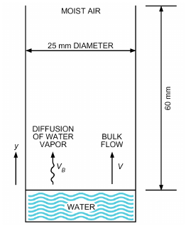

*Fig. 1 Diffusion of Water Vapor Through Stagnant Air*

> ( ) dρA ( )dρB
>
> or 1/MA --------- = – 1/MB ---------&emsp;**(12)**

> dy dy
>
> ( ) ( )

Air, then, diffuses toward the liquid water interface. Because it cannot be absorbed there, a bulk velocity v of the gas mixture is established in a direction away from the liquid surface, so that the net transport of air is zero (i.e., the air is stagnant):

> · ″
>
> mA = –Dv dρA/dy + ρAv = 0&emsp;**(13)**

The bulk velocity v transports not only air but also water vapor away from the interface. Therefore, the total rate of water vapor diffusion is

> · ″
>
> mB = –Dv dρB/dy + ρBv&emsp;**(14)**

Substituting for the velocity v from Equation (13) and using Equations (11b) and (12) gives

> ( ) dρA
>
> · ″

> mB = DvMBp/ρARuT ---------&emsp;**(15)**
>
> dy

> ( )

Integration yields

> DvMBp ln(ρAL⁄ ρA0)
>
> · ″

> mB = ------------------ --------------------------------&emsp;**(16a)**
>
> RuT yL– y0

> ( )
>
> · ″

> or mB = –DvPAm (ρ – ρ BL B0)/(yL– y0)&emsp;**(16b)**
>
> ( )

> where PAm≡ p/(p AL)ρAL (ln(ρAL⁄ ρA0))/(ρ – ρ AL A0)&emsp;**(17)**

PAm is the logarithmic mean density factor of the stagnant air. The pressure distribution for this type of diffusion is shown in Figure 2. **Stagnant** refers to the net behavior of the air; it does not move because bulk flow exactly offsets diffusion. The term PAm in Equation (16b) approximately equals unity for dilute mixtures such as water vapor in air at near-atmospheric conditions. This condition makes it possible to simplify Equations (16) and implies that, for dilute mixtures, the partial pressure distribution curves in Figure 2 are straight lines.

**Example 2.** A vertical tube of 25 mm diameter is partially filled with water so that the distance from the water surface to the open end of the tube is 60 mm, as shown in Figure 1. Perfectly dried air is blown over the open tube end, and the complete system is at a constant temperature of 15°C. In 200 h of steady operation, 2.15 g of water evaporates from the tube. The total pressure of the system is 101.325 kPa. Using these data, (1) calculate the mass diffusivity of water vapor in air, and (2) compare this experimental result with that from Equation (10).

**Solution:** (1) The mass diffusion flux of water vapor from the water surface is

> ṁB = 2.15/200 = 0.01075 g/h

The cross-sectional area of a 25 mm diameter tube is π(12.5)2 =

> · ″

491 mm2. Therefore, mB = 0.00608 g/(m2·s). The partial densities are determined from psychrometric tables.

> ρBL = 0; ρB0 = 12.8 g/m3
>
> ρAL = 1.225 kg/m3; ρA0 = 1.204 kg/m3

<!-- str. 130 -->

Because p = pAL = 101.325 kPa, the logarithmic mean density factor [Equation (17)] is

> PAm = 1.225 (ln(1.225 ⁄ 1.204))/(1.225 – 1.204) = 1.009

The mass diffusivity is now computed from Equation (16b) as

> Dv = (–m·B″ (yL– y0))/(PAm(ρBL– ρB0)) = (–(0.00608)(0.060)(106))/((1.009)(0 – 12.8))
>
> = 28.2 mm2⁄ s

(2) By Equation (10), with p = 101.325 kPa and T = 15 + 273 = 288 K,

> )
>
> Dv = (( 0.926 2882.5)/(101.325 288 + 245 () = 24.1 mm2/s

> )

Neglecting the correction factor PAm for this example gives a difference of less than 1% between the calculated experimental and empirically predicted values of Dv.

### Equimolar Counterdiffusion

Figure 3 shows two large chambers, both containing an ideal gas mixture of two components A and B (e.g., air and water vapor) at the same total pressure p and temperature T. The two chambers are connected by a duct of length L and cross-sectional area Acs. Partial pressure pB is higher in the left chamber, and partial pressure pA is higher in the right chamber. The partial pressure differences cause component B to migrate to the right and component A to migrate to the left.

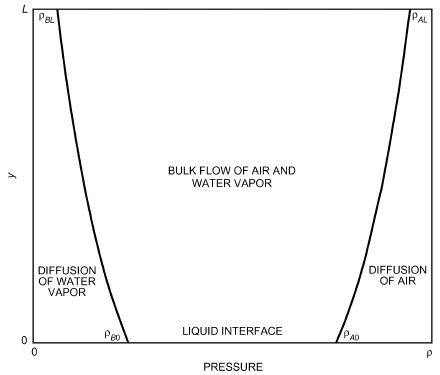

*Fig. 2 Pressure Profiles for Diffusion of Water Vapor Through Stagnant Air*

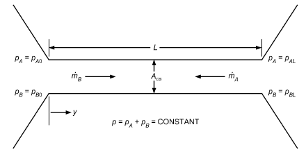

*Fig. 3 Equimolar Counterdiffusion*

At steady state, the molar flows of A and B must be equal but opposite:

> m·A″* + m·B″* = 0&emsp;**(18)**

because the total molar concentration C must stay the same in both chambers if p and T remain constant. Because molar fluxes are the same in both directions, the molar average velocity v* = 0. Thus, Equation (7b) can be used to calculate the molar flux of B (or A):

> –D dp
>
> m·B″* = --------v- -------B-&emsp;**(19)**

> RuT dy
>
> A D (pB0– pBL)

> or m·B* = ----c---s-------v -----------------------&emsp;**(20)**
>
> RuT L

> ( )
>
> ( )

> or ṁB = (*M A D* *B cs v*)/RuT (p – p B0 BL)/L&emsp;**(21)**
>
> ( )

**Example 3.** One large room is maintained at 22°C (295 K), 101.3 kPa, 80% rh. A 20 m long duct with cross-sectional area of 0.15 m2 connects the room to another large room at 22°C, 101.3 kPa, 10% rh. What is the rate of water vapor diffusion between the two rooms?

**Solution:** Let air be component A and water vapor be component B. Equation (21) can be used to calculate the mass flow of water vapor B. Equation (10) can be used to calculate the diffusivity.

> 0.926( 2952.5 )
>
> Dv = ------------ ----------------------- = 25.3 mm2/h

> ( )
>
> 101.3 295 + 245

From a psychrometric table (Table 3, Chapter 1), the saturated vapor pressure at 22°C is 2.645 kPa. The vapor pressure difference pB0 – pBL is

> pB0 – pBL = (0.8 – 0.1)2.645 kPa = 1.85 kPa
>
> Then, Equation (21) gives

> ṁb = (18 × 0.15(25.3 ⁄ 106) 1.85)/(8.314 × 295 20) = 2.58 × 10–9 kg/s

### Molecular Diffusion in Liquids and Solids

Because of the greater density, diffusion is slower in liquids than in gases. No satisfactory molecular theories have been developed for calculating diffusion coefficients. The limited measured values of Dv show that, unlike for gas mixtures at low pressures, the diffusion coefficient for liquids varies appreciably with concentration.

Reasoning largely from analogy to the case of one-dimensional diffusion in gases and using Fick’s law as expressed by Equation (4) gives

> ( )
>
> ṁB″ = Dv (ρ – ρ B1 B2)/(y2– y1)&emsp;**(22)**

> ( )

Equation (22) expresses steady-state diffusion of solute B through solvent A in terms of the molal concentration difference of the solute at two locations separated by the distance Δy = y2 – y1. Bird et al. (1960), Eckert and Drake (1972), Hirschfelder et al. (1954), Reid and Sherwood (1966), Sherwood and Pigford (1952), and Treybal (1980) provide equations and tables for evaluating Dv. Hirschfelder et al. (1954) provide comprehensive treatment of the molecular developments.

<!-- str. 131 -->

Diffusion through a solid when the solute is dissolved to form a homogeneous solid solution is known as **structure-insensitive diffusion** (Treybal 1980). This solid diffusion closely parallels diffusion through fluids, and Equation (22) can be applied to one-dimensional steady-state problems. Values of mass diffusivity are generally lower than they are for liquids and vary with temperature.

Diffusion of a gas mixture through a porous medium is common (e.g., diffusion of an air/vapor mixture through porous insulation or other vapor-permeable building materials). Vapor diffuses through the air along the tortuous narrow passages within the porous medium. Mass flux is a function of the vapor pressure gradient and diffusion coefficient, as indicated in Equation (7a). It is also a function of the structure of the pathways within the porous medium and is therefore called **structure-sensitive diffusion**. All these factors are taken into account in the following version of Equation (7a):

> ṁB″ = –μ dpB/dy&emsp;**(23)**

where μ is called the moisture permeability of the porous medium. For a layer of porous solid L thick, μ /L is called the permeance, the unit for which is kg/(s·m2·Pa). Permeance is also known as **vapor flow conductance**, which is analogous to heat flow conductance in heat transfer. **Permeability** is the product of permeance and layer thickness [i.e., kg/(s·m·Pa)], but is often given in units of ng/(s·m·Pa).

Consider a slab L = y2 – y1 thick with cross-sectional area Ac. The vapor pressure is pB1 on one side of the slab and pB2 on the other side. If the permeability μ is constant, integration of Equation (23) yields

> pB(y) = pB1 – (y – y1)/(L p) (pB1 – pB2)&emsp;**(24)**
>
> m·B″ = ṁB/Ac = μ (– p B1 B2)/L or

> ṁB = (p – p B1 B2)/(L ⁄ (μAc))&emsp;**(25)**

where ṁB is the vapor flow rate. In Equation (25), pB1 – pB2 can be considered a driving potential, and L/(μ Ac) a resistance. This is analogous to Equation (1) in Chapter 4, where q is the heat transfer rate, ts1 – ts2 is the driving potential, and L/(kAc) is the resistance.

Chapters 25 and 26 present this topic in more depth.

**Example 4.** A three-layer composite wall consisting of glass fiber batt insulation, a concrete block (limestone aggregate, 2240 kg/m3 concrete, with two perlite-filled cores) and brick (1920 kg/m3) is shown in Figure 4. The dry-bulb temperature and indoor dew point are Ti = 22°C and Ti,dp = 7.2°C, respectively. Outdoor temperature To = –12°C, and relative humidity rho = 50%. The outdoor wind speed is 25 km/h.

(a) Calculate heat transfer rate through the wall (in W) per square metre of wall area.

(b) Calculate vapor flow rate through the wall (in g/h) per square metre of wall area.

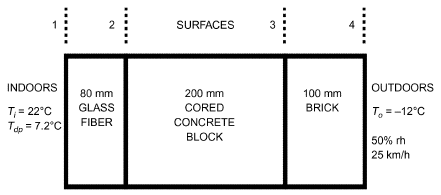

*Fig. 4 Composite Wall for Example 4*

**Solution**

Find (1) thermal conductivity k from Table 1 in Chapter 26; (2) film resistance coefficient 1/h, where h is convective heat transfer coefficient, from Table 10 in Chapter 26; and (3) water vapor permeability μ from Table 6 in Chapter 26. Calculate thermal resistance L/(kAc) and diffusion resistance L/(μ Ac), for each layer. Calculate the film thermal resistance 1/(hAs) at both surfaces. As = Ac = 1 m2 because rates per square metre of wall area are required. Determine total thermal resistance RT and total diffusion resistance rT. See Table 2 for values.

(a) Calculate heat transmission through the wall.

q = ((Ti– To))/RT = ((22 – [–12]°C))/(2.966 K/W) = 11.46 W or q/Ac = 11.46 W/m2 (b) Calculate vapor flow rate through the wall. At Ti = 22°C and Ti,dp = 7.2°C, vapor pressure pvi = 1016 Pa. At To = –12°C and rho = 50%, pvo = 122 Pa. The vapor flow rate is then

> ṁv = ((p – p ) v,i v,o)/rT = ((1016 – 122) Pa)/(0.02727 (s·Pa)/ng) = 32 783 ng/s
>
> = 0.1184 g/h or ṁv/Ac = 0.1184 g/(h·m2)

> ṁv = ((p – p ) v,i v,o)/rT = ((1016 – 122) Pa)/(0.02719 (s·Pa)/ng) = 32 879 ng/s
>
> = 0.1184 g/h or ṁv/Ac = 0.1184 g/(h·m2)

## 2. CONVECTION OF MASS

Convection of mass involves the mass transfer mechanisms of molecular diffusion and bulk fluid motion. Fluid motion in the region adjacent to a mass transfer surface may be laminar or turbulent, depending on geometry and flow conditions.

### Mass Transfer Coefficient

Convective mass transfer is analogous to convective heat transfer where geometry and boundary conditions are similar. The analogy holds for both laminar and turbulent flows and applies to both external and internal flow problems.

**Mass Transfer Coefficients for External Flows.** Most external convective mass transfer problems can be solved with an appropriate formulation that relates the mass transfer flux (to or from an interfacial surface) to the concentration difference across the boundary layer illustrated in Figure 5. This formulation gives rise to the convective mass transfer coefficient, defined as

> hM ≡ m·B″/(ρ – ρ Bi B∞)&emsp;**(26)**

where

- hM = local external mass transfer coefficient, m/s
- m·B″ = mass flux of gas B from surface, kg/(m2·s)
- ρBi = density of gas B at interface (saturation density), kg/m3
- ρB∞ = density of component B outside boundary layer, kg/m3

If ρBi and ρB∞ are constant over the entire interfacial surface, the mass transfer rate from the surface can be expressed as

> m·B″ = hM(ρBi– ρB∞)&emsp;**(27)**

where hM is the average mass transfer coefficient, defined as

> hM≡ 1/A ∫ hmdA&emsp;**(28)**
>
> A

**Mass Transfer Coefficients for Internal Flows.** Most internal convective mass transfer problems, such as those that occur in channels or in the cores of dehumidification coils, can be solved if an appropriate expression is available to relate the mass transfer flux (to or from the interfacial surface) to the difference between the concentration at the surface and the bulk concentration in the channel, as shown in Figure 6. This formulation leads to the definition of the mass transfer coefficient for internal flows:

<!-- str. 132 -->

**Table 2 Material Values for Example 4**

|   | L, m | μ , ng/(s·Pa·m) | k, W/(m·K) | 1/h, (m2·K)/W | Thermal Resistance, K/W | Diffusion Resistance, (s·Pa)/ng Comment |
|---|---|---|---|---|---|---|
| Indoor surface |  | NA | NA | 0.12 | 0.12 | 0 |
| Glass fiber batt | 0.08 | 172 | 0.034 | NA | 2.35 | 0.463E–3 |
| Concrete block | 0.20 | 27.4 | 0.55 | NA | 0.364 | 7.30E–3 |
| Fired clay brick | 0.10 | 5.12 | 0.98 | NA | 0.102 | 19.5E–3 Assume 70% rh |
| Outdoor surface |  | NA | NA | 0.030 | 0.030 | 0 |
| Total, RT and rT |  |  |  |  | 2.966 | 0.02719 |

> hM ≡ m·B″/(ρ – ρ Bi Bb)&emsp;**(29)**

where

- hM = internal mass transfer coefficient, m/s
- m·B″ = mass flux of gas B at interfacial surface, kg/(m2·s)
- ρBi = density of gas B at interfacial surface, kg/m3

ρBb ≡ (1 ⁄ uBAcs) uBρBdAcs = bulk density of gas B at location x

> ∫Acs

uB ≡ (1 ⁄ Acs) uB dAcs= average velocity of gas B at location x, m/

> ∫A
>
> s

- Acs = cross-sectional area of channel at station x, m2
- uB = velocity of component B in x direction, m/s
- ρB = density distribution of component B at station x, kg/m3

Often, it is easier to obtain the bulk density of gas B from

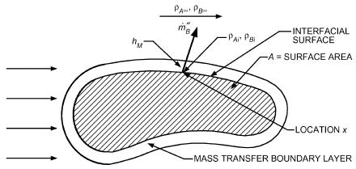

*Fig. 5 Nomenclature for Convective Mass Transfer from External Surface at Location x Where Surface Is Impermeable to Gas A*

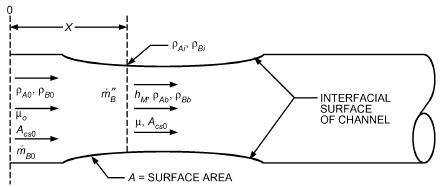

*Fig. 6 Nomenclature for Convective Mass Transfer from Internal Surface Impermeable to Gas A*

> ρBb = (ṁBo+ ∫m·B″ dA A)/(u A cs B)&emsp;**(30)**

where

- ṁBo = mass flow rate of component B at station x = 0, kg/s
- A = interfacial area of channel between station x = 0 and
- station x = x, m2

Equation (28) can be derived from the preceding definitions. The major problem is determining uB . If, however, analysis is restricted to cases where B is dilute and concentration gradients of B in the x direction are negligibly small, uB≈ u . Component B is swept along in the x direction with an average velocity equal to the average velocity of the dilute mixture.

**Analogy Between Convective Heat and Mass Transfer**

Most expressions for the convective mass transfer coefficient hM are determined from expressions for the convective heat transfer coefficient h.

For problems in internal and external flow where mass transfer occurs at the convective surface and where component B is dilute, Bird et al. (1960) and Incropera and DeWitt (1996) found that the Nusselt and Sherwood numbers are defined as follows:

> Nu = f(X, Y, Z, Pr, Re)&emsp;**(31)**
>
> Sh = f(X, Y, Z, Sc, Re)&emsp;**(32)**

> and Nu = g(Pr, Re)&emsp;**(33)**
>
> Sh = g(Sc, Re)&emsp;**(34)**

where f in Equations (31) and (32) indicates a functional relationship among the dimensionless groups shown. The function f is the same in both equations. Similarly, g indicates a functional relationship that is the same in Equations (33) and (34). Pr and Sc are dimensionless Prandtl and Schmidt numbers, respectively, as defined in the Symbols section. The primary restrictions on the analogy are that the surface shapes are the same and that the temperature boundary conditions are analogous to the density distribution boundary conditions for component B when cast in dimensionless form. Several primary factors prevent the analogy from being perfect. In some cases, the Nusselt number was derived for smooth surfaces. Many mass transfer problems involve wavy, droplet-like, or roughened surfaces. Many Nusselt number relations are obtained for constant-temperature surfaces. Sometimes ρBi is not constant over the entire surface because of varying saturation conditions and the possibility of surface dryout.

In all mass transfer problems, there is some blowing or suction at the surface because of condensation, evaporation, or transpiration of component B. In most cases, this blowing/suction has little effect on the Sherwood number, but the analogy should be examined closely if vi/u∞ > 0.01 or vi⁄ u > 0.01, especially if the Reynolds number is large.

<!-- str. 133 -->

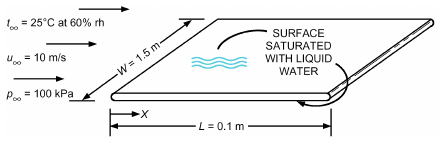

*Fig. 7 Water-Saturated Flat Plate in Flowing Airstream*

**Example 5.** Air at 25°C, 100 kPa, and 60% rh flows at 10 m/s, as shown in Figure 7. Find the rate of evaporation, rate of heat transfer to the water, and water surface temperature.

**Solution:** Heat transfer to water from air supplies the energy required to evaporate the water.

> q = hA(t∞ – ts) = m· hfg = hMA(ρs – ρ∞)hfg

where

- h = convective heat transfer coefficient
- hM = convective mass transfer coefficient
- A = 0.1 × 1.5 × 2 = 0.3 m2 = surface area (both sides)
- ṁ = evaporation rate
- ts, ρs = temperature and vapor density at water surface
- t∞, ρ∞ = temperature and vapor density of airstream

This energy balance can be rearranged to give

> ρs – ρ∞ = h/hM ((t∞– ts))/(h fg)

The heat transfer coefficient h is found by first calculating the Nusselt number:

- Nu = 0.664Re1/2Pr1/3 for laminar flow
- Nu = 0.037Re4/5Pr1/3 for turbulent flow

The mass transfer coefficient hM requires calculation of Sherwood number Sh, obtained using the analogy expressed in Equations (33) and (34):

- Sh = 0.664Re1/2Pr1/3 for laminar flow
- Sh = 0.037Re4/5Pr1/3 for turbulent flow

With Nu and Sh known,

> hM = ShDv/L h = (Nu k)/L

or

> )1/3
>
> (( h Nu k Pr)/(hM Sh Dv Sc ()= ------------- = k/Dv

> )

This result is valid for both laminar and turbulent flow. Using this result in the preceding energy balance gives

> ( )1/3 (t∞– ts)
>
> ρs – ρ∞ = Pr/Sc k/Dv ------------------

> hfg
>
> ( )

This equation must be solved for ρs. Then, water surface temperature ts is the saturation temperature corresponding to ρs. Air properties Sc, Pr, Dv, and k are evaluated at film temperature tf = (t∞ + ts)/2, and hfg is evaluated at ts. Because ts appears in the right side and all the air properties also vary somewhat with ts, iteration is required. Start by guessing ts = 14°C (the dew point of the airstream), giving tf = 19.5°C. At these temperatures, values on the right side are found in property tables or calculated as k = 0.0257 W/(m·K)

Pr = 0.709

Dv = 2.521 × 10–5 m2/s [from Equation (10)]

ρ = 1.191 kg/m3

μ = 1.809 × 10–5 kg/(m·s)

Sc = μ/ρDv = 0.6025 hfg = 2.455 × 106 J/kg (at 14°C)

ρ∞ = 0.01417 kg/m3 (from psychrometric chart at 25°C, 60% rh)

ts = 14°C (initial guess)

Solving yields ρs = 0.01896 kg/m3. The corresponding value of ts= 21.6°C. Repeat the process using ts = 21.6°C as the initial guess. The result is ρs = 0.01565 kg/m3 and ts = 18.3°C. Continue iterations until ρs converges to 0.01663 kg/m3 and ts = 19.4°C.

To solve for the rates of evaporation and heat transfer, first calculate the Reynolds number using air properties at tf = (25 + 19.4)/2 = 22.2°C.

> ReL = ρu∞L/μ = (1.191)(10)(0.1)/(1.809 × 10–5) = 65 837

where L = 0.1 m, the length of the plate in the direction of flow. Because ReL < 500 000, flow is laminar over the entire length of the plate; therefore,

> Sh = 0.664Re1/2Sc1/3 = 144
>
> hM = ShDv/L = 0.0363 m/s

> ṁ = hMA(ρs – ρ∞) = 2.679 × 10–5 kg/s
>
> q = m· hfg = 65.8 W

The same value for q would be obtained by calculating the Nusselt number and heat transfer coefficient h and setting q = hA(t∞ – ts).

The kind of similarity between heat and mass transfer that results in Equations (31) to (34) can also be shown to exist between heat and momentum transfer. Chilton and Colburn (1934) used this similarity to relate Nusselt number to friction factor by the analogy

> jH =Nu/((1–n) Re Pr) = St Prn = f/2&emsp;**(35)**

where n = 2/3, St = Nu/(Re Pr) is the Stanton number, and jH is the Chilton-Colburn j-factor for heat transfer. Substituting Sh for Nu and Sc for Pr in Equations (33) and (34) gives the Chilton-Colburn j-factor for mass transfer, jD:

> jD = Sh/((1–n) Re Sc) = StmScn = f/2&emsp;**(36)**

where Stm = ShPAm/(Re Sc) is the Stanton number for mass transfer. Equations (35) and (36) are called the **Chilton-Colburn j-factor analogy**.

The power of the Chilton-Colburn j-factor analogy is represented in Figures 8 to 11. Figure 8 plots various experimental values of jD from a flat plate with flow parallel to the plate surface. The solid line, which represents the data to near perfection, is actually f/2 from Blasius’ solution of laminar flow on a flat plate (left-hand portion of the solid line) and Goldstein’s solution for a turbulent boundary layer (right-hand portion). The right-hand part also represents McAdams’ (1954) correlation of turbulent flow heat transfer coefficient for a flat plate.

A **wetted-wall column** is a vertical tube in which a thin liquid film adheres to the tube surface and exchanges mass by evaporation or absorption with a gas flowing through the tube. Figure 9 illustrates typical data on vaporization in wetted-wall columns, plotted as jD versus Re. The point spread with variation in μ/ρDv results from Gilliland’s finding of an exponent of 0.56, not 2/3, representing the effect of the Schmidt number. Gilliland’s equation can be written as follows:

> 6
>
> ( )–0.5

> jD = 0.023 Re–0.17 μ/ρDv&emsp;**(37)**
>
> ( )

<!-- str. 134 -->

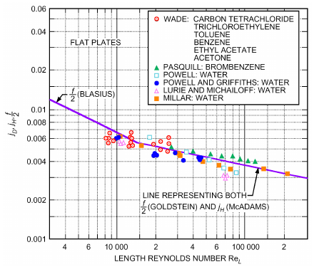

*Fig. 8 Mass Transfer from Flat Plate*

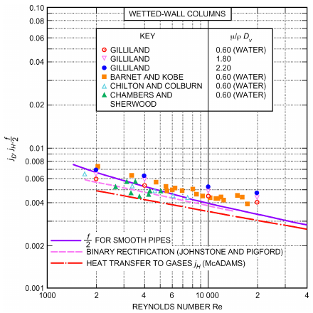

*Fig. 9 Vaporization and Absorption in Wetted-Wall Column*

Similarly, McAdams’ (1954) equation for heat transfer in pipes can be expressed as

> –0.7
>
> ( )

> jH = 0.023 Re–0.20 cpμ/k&emsp;**(38)**
>
> ( )

This is represented by the dash-dot curve in Figure 9, which falls below the mass transfer data. The curve f/2, representing friction in smooth tubes, is the upper, solid curve.

Data for liquid evaporation from single cylinders into gas streams flowing transversely to the cylinders’ axes are shown in Figure 10. Although the dash-dot line in Figure 10 represents the data, it is actually taken from McAdams (1954) as representative of a large collection of data on heat transfer to single cylinders placed transverse to airstreams. To compare these data with friction, it is necessary to distinguish between total drag and skin friction.

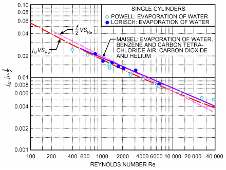

*Fig. 10 Mass Transfer from Single Cylinders in Crossflow*

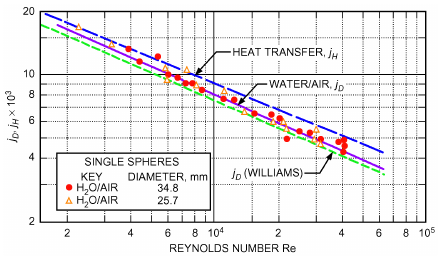

*Fig. 11 Mass Transfer from Single Spheres*

Because the analogies are based on skin friction, normal pressure drag must be subtracted from the measured total drag. At Re = 1000, skin friction is 12.6% of the total drag; at Re = 31 600, it is only 1.9%. Consequently, values of f/2 at a high Reynolds number, obtained by the difference, are subject to considerable error.

In Figure 11, data on evaporation of water into air for single spheres are presented. The solid line, which best represents these data, agrees with the dashed line representing McAdams’ correlation for heat transfer to spheres. These results cannot be compared with friction or momentum transfer because total drag has not been allocated to skin friction and normal pressure drag. Application of these data to air/water-contacting devices such as air washers and spray cooling towers is well substantiated.

When the temperature of the heat exchanger surface in contact with moist air is below the air’s dew-point temperature, vapor condensation occurs. Typically, air dry-bulb temperature and humidity ratio both decrease as air flows through the exchanger. Therefore, sensible and latent heat transfer occur simultaneously. This process is similar to one that occurs in a spray dehumidifier and can be analyzed using the same procedure; however, this is not generally done.

Cooling coil analysis and design are complicated by the problem of determining transport coefficients h, hM, and f. It would be convenient if heat transfer and friction data for dry heating coils could be used with the Colburn analogy to obtain the mass transfer coefficients, but this approach is not always reliable, and Guillory and McQuiston (1973) and Helmer (1974) show that the analogy is not consistently true. Figure 12 shows j-factors for a simple parallelplate exchanger for different surface conditions with sensible heat transfer. Mass transfer j-factors and friction factors exhibit the same behavior. Dry-surface j-factors fall below those obtained under dehumidifying conditions with the surface wet. At low Reynolds numbers, the boundary layer grows quickly; the droplets are soon covered and have little effect on the flow field. As the Reynolds number increases, the boundary layer becomes thin and more of the total flow field is exposed to the droplets. Roughness caused by the droplets induces mixing and larger j-factors.

<!-- str. 135 -->

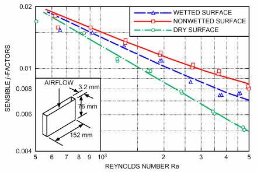

*Fig. 12 Sensible Heat Transfer j-Factors for Parallel Plate Exchanger*

The data in Figure 12 cannot be applied to all surfaces, because the length of the flow channel is also an important variable. However, water collecting on the surface is mainly responsible for breakdown of the j-factor analogy. The j-factor analogy is approximately true when surface conditions are identical. Under some conditions, it is possible to obtain a film of condensate on the surface instead of droplets. Guillory and McQuiston (1973) and Helmer (1974) related dry sensible j- and f-factors to those for wetted dehumidifying surfaces.

The equality of jH, jD, and f/2 for certain streamlined shapes at low mass transfer rates has experimental verification. For flow past bluff objects, jH and jD are much smaller than f/2, based on total pressure drag. The heat and mass transfer, however, still relate in a useful way by equating jH and jD.

**Example 6.** Using solid cylinders of volatile solids (e.g., naphthalene, camphor, dichlorobenzene) with airflow normal to these cylinders, Bedingfield and Drew (1950) found that the ratio between the heat and mass transfer coefficients could be closely correlated by the following relation:

> ( μ )0.56
>
> h/ρhM = [1230 J/(kg·K)] ---------

> ρD
>
> ( v )

For completely dry air at 21°C flowing at a velocity of 9.5 m/s over a wet-bulb thermometer of diameter d = 7.5 mm, determine the heat and mass transfer coefficients from Figure 10 and compare their ratio with the Bedingfield-Drew relation.

**Solution:** For dry air at 21°C and standard pressure, ρ = 1.198 kg/m3, μ = 1.82 × 10–5 kg/(s·m), k = 0.02581 W/(m·K), and cp = 1.006 kJ/(kg·K). From Equation (10), Dv = 25.13 mm2/s. Therefore, Reda = ρu∞d/μ = 1.198 × 9.5 × 7.5/(1000 × 1.82 × 10–5) = 4690

Pr = cpμ/k = 1.006 × 1.82 × 10–5 × 1000/0.02581 = 0.709

Sc = μ/ρDv = 1.82 × 10–5 × 106/(1.198 × 25.13) = 0.605

From Figure 10 at Reda = 4700, read jH = 0.0089, and jD = 0.010. From Equations (35) and (36),

> h = jHρcpu∞/(Pr)2/3
>
> = 0.0089 × 1.198 × 1.006 × 9.5 × 1000/(0.709)2/3

> = 128 W/(m2·K)
>
> hM = jDu∞/(Sc)2/3 = 0.010 × 9.5/(0.605)2/3

> = 0.133 m/s

h/ρhM = 128/(1.198 × 0.133) = 803 J/(kg·K)

From the Bedingfield-Drew relation,

> h/ρhM = 1230(0.605)0.56 = 928 J/(kg·K)

Equations (36) and (37) are called the Reynolds analogy when Pr = Sc = 1. This suggests that h/ρhM = cp = 1006 J/(kg·K). This close agreement is because the ratio Sc/Pr is 0.605/0.709 or 0.85, so that the exponent of these numbers has little effect on the ratio of the transfer coefficients.

The extensive developments for calculating heat transfer coefficients can be applied to calculate mass transfer coefficients under similar geometrical and flow conditions using the j-factor analogy. For example, Table 8 of Chapter 4 lists equations for calculating heat transfer coefficients for flow inside and normal to pipes. Each equation can be used for mass transfer coefficient calculations by equating jHand jD and imposing the same restriction to each stated in Table 8 of Chapter 4. Similarly, mass transfer experiments often replace corresponding heat transfer experiments with complex geometries where exact boundary conditions are difficult to model (Sparrow and Ohadi 1987a, 1987b).

The j-factor analogy is useful only at low mass transfer rates. As the rate increases, the movement of matter normal to the transfer surface increases the convective velocity. For example, if a gas is blown from many small holes in a flat plate placed parallel to an airstream, the boundary layer thickens, and resistance to both mass and heat transfer increases with increasing blowing rate. Heat transfer data are usually collected at zero or, at least, insignificant mass transfer rates. Therefore, if such data are to be valid for a mass transfer process, the mass transfer rate (i.e., the blowing) must be low.

The j-factor relationship jH= jD can still be valid at high mass transfer rates, but neither jHnor jDcan be represented by data at zero mass transfer conditions. Chapter 24 of Bird et al. (1960) and Eckert and Drake (1972) have detailed information on high mass transfer rates.

### Lewis Relation

Heat and mass transfer coefficients are satisfactorily related at the same Reynolds number by equating the Chilton-Colburn j-factors. Comparing Equations (35) and (36) gives

> St Prn = f/2 = StmScn

Inserting the definitions of St, Pr, Stm, and Sc gives

> 2 ⁄ 3
>
> h/ρcpu ( ) (h P M Am)/u( μ/ρDv )2⁄3

> =
>
> (cpμ/k) ( )

or

> 2 ⁄ 3
>
> h/hMρcp = PAm ((μ ⁄ρDv))/((cpμ ⁄ k))&emsp;**(39)**

> = PAm(α ⁄ Dv)2⁄3

The quantity α/Dvis the **Lewis number Le**. Its magnitude expresses relative rates of propagation of energy and mass within a system. It is fairly insensitive to temperature variation. For air and water vapor mixtures, the ratio is (0.60/0.71) or 0.845, and (0.845)2/3 is 0.894. At low diffusion rates, where the heat/mass transfer analogy is valid, PAmis essentially unity. Therefore, for air and water vapor mixtures,

<!-- str. 136 -->

> h/hMρcp ≈ 1&emsp;**(40)**

The ratio of the heat transfer coefficient to the mass transfer coefficient equals the specific heat per unit volume of the mixture at constant pressure. This relation [Equation (40)] is usually called the Lewis relation and is nearly true for air and water vapor at low mass transfer rates. It is generally not true for other gas mixtures because the ratio Le of thermal to vapor diffusivity can differ from unity. Agreement between wet-bulb temperature and adiabatic saturation temperature is a direct result of the nearness of the Lewis number to unity for air and water vapor.

The Lewis relation is valid in turbulent flow whether or not α/Dv equals 1 because eddy diffusion in turbulent flow involves the same mixing action for heat exchange as for mass exchange, and this action overwhelms any molecular diffusion. Deviations from the Lewis relation are, therefore, caused by a laminar boundary layer or a laminar sublayer and buffer zone where molecular transport phenomena are the controlling factors.

## 3. SIMULTANEOUS HEAT AND MASS TRANSFER BETWEEN WATER-WETTED SURFACES AND AIR

A simplified method used to solve simultaneous heat and mass transfer problems was developed using the Lewis relation, and it gives satisfactory results for most air-conditioning processes. Extrapolation to very high mass transfer rates, where the simple heat-mass transfer analogy is not valid, leads to erroneous results.

### Enthalpy Potential

The water vapor concentration in the air is the humidity ratio W, defined as

> W ≡ ρB/ρA&emsp;**(41)**

A mass transfer coefficient is defined using W as the driving potential:

> m·B″ = KM(Wi – W∞)&emsp;**(42)**

where the coefficient KMis in kg/(s·m2). For dilute mixtures, ρAi ≅ ρA∞; that is, the partial mass density of dry air changes by only a small percentage between interface and free stream conditions. Therefore,

> m·B″ = KM/(ρ Am) (ρBi – ρ∞)&emsp;**(43)**

where ρAm = mean density of dry air, kg/m3. Comparing Equation (43) with Equation (26) shows that

> hM = KM/(ρ Am)&emsp;**(44)**

The **humid specific heat cpm**of the airstream is, by definition (Mason and Monchick 1965),

> cpm = (1 + W∞)cp&emsp;**(45a)**

or

> cpm = (ρ/ρA∞)cp&emsp;**(45b)**

where cpm is in kJ/(kgda·K).

Substituting from Equations (44) and (45b) into Equation (40) gives

> hρAm/(K ρ c M A∞ pm) = 1 ≈ h/(K c M pm)&emsp;**(46)**

because ρAm ≅ ρA∞ because of the small change in dry-air density. Using a mass transfer coefficient with the humidity ratio as the driving force, the Lewis relation becomes ratio of heat to mass transfer coefficient equals humid specific heat.

For the plate humidifier illustrated in Figure 7, the total heat transfer from liquid to interface is

> q″ = qA″ + m·B″ hfg&emsp;**(47)**

Using the definitions of the heat and mass transfer coefficients gives

> q″ = h(ti – t∞) + KM(Wi – W∞)hfg&emsp;**(48)**

Assuming Equation (46) is valid gives

> q″ = KM[cpm(ti – t∞) + (Wi – W∞)hfg]&emsp;**(49)**

The enthalpy of the air is approximately

> h = cpa(t – to) + Whs&emsp;**(50)**

The enthalpy hsof the water vapor can be expressed by the ideal gas law as

> hs = cps(t – to) + hfgo&emsp;**(51)**

where the base of enthalpy is taken as saturated water at temperature to. Combining Equations (50) and (51) gives

> h = (cpa + Wcps)t + Whfgo = cpmt + Whfgo&emsp;**(52)**

(53)

If small changes in the latent heat of vaporization of water with temperature are neglected when comparing Equations (50) and (52), the total heat transfer can be written as

> q″ = KM(hi – h∞)&emsp;**(54)**

Where the driving potential for heat transfer is temperature difference and the driving potential for mass transfer is mass concentration or partial pressure, the driving potential for simultaneous transfer of heat and mass in an air water/vapor mixture is, to a close approximation, enthalpy.

### Basic Equations for Direct-Contact Equipment

Air-conditioning equipment can be classified by whether the air and water used as a cooling or heating fluid are (1) in direct contact or (2) separated by a solid wall. Examples of the former are air washers and cooling towers; an example of the latter is a direct-expansion refrigerant (or water) cooling and dehumidifying coil. In both cases, the airstream is in contact with a water surface. Direct contact implies contact directly with the cooling (or heating) fluid. In the dehumidifying coil, contact is direct with condensate removed from the airstream, but is indirect with refrigerant flowing inside the coil tubes. These two cases are treated separately because the surface areas of direct-contact equipment cannot be evaluated.

For the direct-contact spray chamber air washer of cross-sectional area Acsand length l (Figure 13), the steady mass flow rate of dry air per unit cross-sectional area is

<!-- str. 137 -->

> ṁa/Acs = Ga&emsp;**(55)**

and the corresponding mass flux of water flowing parallel with the air is

> ṁL/Acs = GL&emsp;**(56)**

where

- ṁa = mass flow rate of air, kg/s
- Ga = mass flux or flow rate per unit cross-sectional area for air, kg/(s·m2)
- ṁL = mass flow rate of liquid, kg/s
- GL = mass flux or flow rate per unit cross-sectional area for liquid, kg/(s·m2)

Because water is evaporating or condensing, GLchanges by an amount dGL in a differential length dl of the chamber. Similar changes occur in temperature, humidity ratio, enthalpy, and other properties.

Because evaluating the true surface area in direct-contact equipment is difficult, it is common to work on a unit volume basis. If aH and aMare the areas of heat transfer and mass transfer surface per unit of chamber volume, respectively, the total surface areas for heat and mass transfer are

> AH = aHAcsl and AM = aMAcsl&emsp;**(57)**

The basic equations for the process occurring in the differential length dl can be written for Mass transfer

> –dGL = GadW = KMaM(Wi – W)dl&emsp;**(58)**

That is, the water evaporation rate, air moisture content increase, and mass transfer rate are all equal.

*Heat transfer to air*

> Gacpmdta = haaH(ti – ta)dl&emsp;**(59)**

*Total energy transfer to air*

> Ga(cpmdta + hfgodW) = [KMaM(Wi – W)hfg + haaH(ti – ta)]dl&emsp;**(60)**

Assuming aH= aM and Le =1, and neglecting small variations in hfg, Equation (59) reduces to

> Gadh = KMaM(hi – h)dl&emsp;**(61)**

The heat and mass transfer areas of spray chambers are assumed to be identical (aH = aM). Where packing materials, such as wood slats or Raschig rings, are used, the two areas may be considerably different because the packing may not be wet uniformly. The validity of the Lewis relation was discussed previously. It is not necessary to account for small changes in latent heat hfgafter making the two previous assumptions.

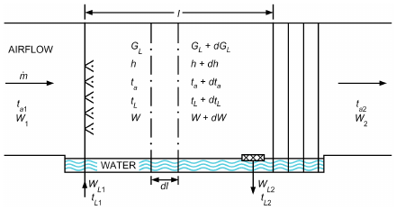

*Fig. 13 Air Washer Spray Chamber*

Energy balance

> Gadh = ±GLcLdtL&emsp;**(62)**

A minus sign refers to parallel flow of air and water; a plus refers to counterflow (water flow in the opposite direction from airflow).

The water flow rate changes between inlet and outlet as a result of the mass transfer. For exact energy balance, the term (cLtLdGL) should be added to the right side of Equation (61). The percentage change in GLis quite small in usual applications of air-conditioning equipment and, therefore, can be ignored.

*Heat transfer to water*

> ±GLcLdtL = hLaH(tL – ti)dl&emsp;**(63)**

Equations (57) to (62) are the basic relations for solution of simultaneous heat and mass transfer processes in direct-contact air-conditioning equipment.

To facilitate use of these relations in equipment design or performance, three other equations can be extracted from the above set. Combining Equations (60), (61), and (62) gives

> (h – hi)/(tL– ti) = – hLaH/KMaM = – hL/KM&emsp;**(64)**

Equation (63) relates the enthalpy potential for total heat transfer through the gas film to the temperature potential for this same transfer through the liquid film. Physical reasoning leads to the conclusion that this ratio is proportional to the ratio of gas film resistance (1/KM) to liquid film resistance (1/hL). Combining Equations (58), (60), and (46) gives

> dh/dta = (h – hi)/(ta– ti)&emsp;**(65)**

Similarly, combining Equations (57), (58), and (46) gives

> dW/dta = (W – Wi)/(ta– ti)&emsp;**(66)**

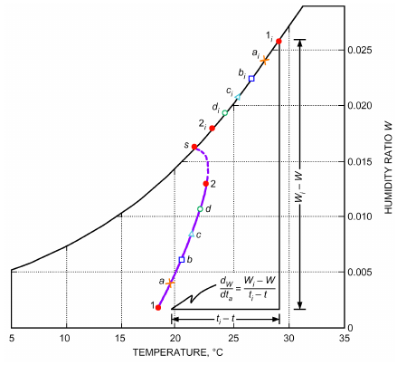

*Fig. 14 Air Washer Humidification Process on Psychrometric Chart*

<!-- str. 138 -->

Equation (65) indicates that, at any cross section in the spray chamber, the instantaneous slope of the air path dW/dta on a psychrometric chart is determined by a straight line connecting the air state with the interface saturation state at that cross section. In Figure 14, state 1 represents the state of air entering the parallel-flow air washer chamber of Figure 13. The washer operates as a heating and humidifying apparatus, so the interface saturation state of the water at air inlet is the state designated 1i. Therefore, the initial slope of the air path is along a line directed from state 1 to state 1i. As the air is heated, the water cools and the interface temperature drops. Corresponding air states and interface saturation states are indicated by the letters a, b, c, and d in Figure 14. In each instance, the air path is directed toward the associated interface state. The interface states are derived from Equations (61) and (63). Equation (61) describes how air enthalpy changes with water temperature; Equation (63) describes how the interface saturation state changes to accommodate this change in air and water conditions. The solution for the interface state on the normal psychrometric chart of Figure 14 can be determined either by trial and error from Equations (61) and (63) or by a complex graphical procedure (Kusuda 1957).

### Air Washers

Air washers are direct-contact apparatus used to (1) simultaneously change the temperature and humidity content of air passing through the chamber and (2) remove air contaminants such as dust and odors. Adiabatic spray washers, which have no external heating or chilling source, are used to cool and humidify air. Chilled-spray air washers have an external chiller to cool and dehumidify air. Heated-spray air washers, with an external heating source that provides additional energy for water evaporation, are used to humidify and possibly heat air.

**Example 7.** A parallel-flow air washer with the following design conditions is to be designed (see Figure 13).

> Water temperature at inlet tL1 = 35°C
>
> Water temperature at outlet tL2 = 23.9°C

> Air temperature at inlet ta1 = 18.3°C
>
> Air wet-bulb at inlet t′a1 = 7.2°C

> Air mass flow rate per unit area Ga = 1.628 kg/(s·m2)
>
> Spray ratio GL/Ga = 0.70

Air heat transfer coefficient per cubic metre of chamber volume haaH = 1.34 kW/(m3·K)

Liquid heat transfer coefficient per cubic metre of chamber volume hLaH = 16.77 kW/(m3·K)

> Air volumetric flow rate Q = 3.07 m3/s

**Solution:** The air mass flow rate ṁa= 3.07 × 1.20 = 3.68 kg/s; the required spray chamber cross-sectional area is then Acs = ṁa/Ga = 3.68/1.628 = 2.26 m2. The mass transfer coefficient is given by the Lewis relation [Equation (46)] as

> KMaM = (haaH)/cpm = 1.34/1.005 = 1.33 kg/(m3·s)

Figure 15 shows the enthalpy/temperature psychrometric chart with the graphical solution for the interface states and the air path through the washer spray chamber.

1. Enter bottom of chart with t′a1 of 7.2°C, and follow up to saturation curve to establish air enthalpy h1 of 41.1 kJ/kg. Extend this enthalpy line to intersect initial air temperature ta1 of 18.3°C (state 1 of air) and initial water temperature tL1 of 35°C at point A. (Note that the temperature scale is used for both air and water temperatures.)

2. Through point A, construct the energy balance line A-B with a slope of

> dh/dtL = – cLGL/Ga = –2.95

Point B is determined by intersection with the leaving water temperature tL2 = 23.9°C. The negative slope here is a consequence of the parallel flow, which results in the air/water mixture’s approaching, but not reaching, the common saturation state s. (Line A-B has no physical significance in representing any air state on the psychrometric chart. It is merely a construction line in the graphical solution.) 3. Through point A, construct the tie-line A-1i having a slope of

> (h – hi)/(tL– ti) = – hLaH/KMaM = – 16.77/1.33 = –12.6

The intersection of this line with the saturation curve gives the initial interface state 1i at the chamber inlet. [Note how the energy balance line and tie-line, representing Equations (61) and (63), combine for a simple graphical solution on Figure 15 for the interface state.]

4. The initial slope of the air path can now be constructed, according to Equation (64), drawing line 1-a toward the initial interface state 1 . i (Length of line 1-a depends on the degree of accuracy required in the solution and the rate at which the slope of the air path changes.)

5. Construct the horizontal line a-M, locating point M on the energybalance line. Draw a new tie-line (slope of −12.6 as before) from M to ai locating interface state ai. Continue the air path from a to b by directing it toward the new interface state ai. (Note that the change in slope of the air path from 1-a to a-b is quite small, justifying the path incremental lengths used.)

6. Continue in the manner of step 5 until point 2, the final state of air leaving the chamber, is reached. In this example, six steps are used in the graphical construction, with the following results:

### State 1 a b c d 2

| tL | 35 | 32.8 | 30.6 | 28.3 | 26.1 | 23.9 |
|---|---|---|---|---|---|---|
| h | 41.1 | 47.7 | 54.3 | 60.8 | 67.4 | 73.9 |
| ti | 29.2 | 27.9 | 26.7 | 25.4 | 24.2 | 22.9 |
| hi | 114.4 | 108.0 | 102.3 | 96.9 | 91.3 | 86.4 |
| ta | 18.3 | 19.3 | 20.3 | 21.1 | 21.9 | 22.4 |

The final state of air leaving the washer is ta2 = 22.4°C and h2 = 73.6 kJ/kg (wet-bulb temperature ta′2 = 19.4°C).

7. The final step involves calculating the required length of the spray chamber. From Equation (61),

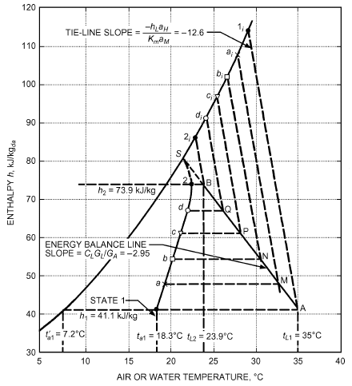

*Fig. 15 Graphical Solution for Air-State Path in Parallel-Flow Air Washer*

<!-- str. 139 -->

> 2
>
> ∫1dh/((hi– h))

> l = Ga/KMaM

The integral is evaluated graphically by plotting 1/(h – h) versus h,

> i

as shown in Figure 16. Any satisfactory graphical method can be used to evaluate the area under the curve. Simpson’s rule with four equal increments of Δh equal to 8.2 gives

> 2
>
> ∫1

> N = dh/((hi– h)) ≈ (Δh ⁄ 3)( y1+ 4y2+ 2y3+ 4y4+ y5)
>
> N = (8.2/3)[0.0136 + (4 × 0.0167) + (2 × 0.0238)

> + (4 × 0.0372) + 0.0800] = 0.975

Therefore, the design length is l = (1.628/1.33)(0.975) = 1.19 m.

This method can also be used to predict performance of existing direct-contact equipment and to determine transfer coefficients when performance data from test runs are available. By knowing the water and air temperatures entering and leaving the chamber and the spray ratio, it is possible to determine by trial and error the proper slope of the tie-line necessary to achieve the measured final air state. The tie-line slope gives the ratio hLaH/KMaM; KMaMis found from the integral relationship in Example 7 from the known chamber length l.

Additional descriptions of air spray washers and general performance criteria are given in Chapter 41 of the 2020 ASHRAE Hand-*book—HVAC Systems and Equipment*.

### Cooling Towers

A cooling tower is a direct-contact heat exchanger in which waste heat picked up by the cooling water from a refrigerator, air conditioner, or industrial process is transferred to atmospheric air by cooling the water. Cooling is achieved by breaking up the water flow to provide a large water surface for air, moving by natural or forced convection through the tower, to contact the water. Cooling towers may be counterflow, crossflow, or a combination of both.

The temperature of water leaving the tower and the packing depth needed to achieve the desired leaving water temperature are of primary interest for design. Therefore, the mass and energy balance equations are based on an overall coefficient K, which is based on (1) the enthalpy driving force from h at the bulk water temperature and (2) neglecting the film resistance. Combining Equations (60) and (61) and using the parameters described previously yields

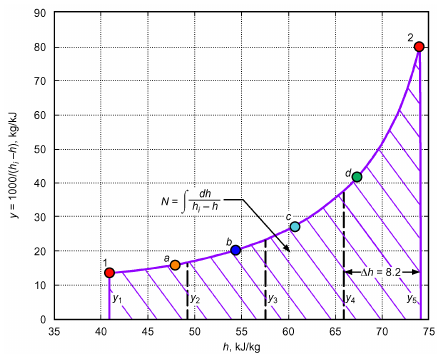

*Fig. 16 Graphical Solution of ∫dh/(hi– h)*

> GLcLdt = KMaM(hi– h)dl = Gadh&emsp;**(67)**
>
> = (KadV(h′ – ha))/(A cs)

or

> t2 cLdt
>
> ∫

> KaV/ṁL = --------------------&emsp;**(68)**
>
> t1 (h′ – ha)

Chapter 40 of the 2020 *ASHRAE Handbook—HVAC Systems* and Equipment covers cooling tower design in detail.

### Cooling and Dehumidifying Coils

When water vapor is condensed out of an airstream onto an extended-surface (finned) cooling coil, the simultaneous heat and mass transfer problem can be solved by the same procedure set forth for direct-contact equipment. The basic equations are the same, except that the true surface area of coil Ais known and the problem does not have to be solved on a unit-volume basis. Therefore, if, in Equations (57), (58), and (60), aMdl or aHdl is replaced by dA/Acs, these equations become the basic heat, mass, and total energy transfer equations for indirect-contact equipment such as dehumidifying coils. The energy balance shown by Equation (61) remains unchanged. The heat transfer from the interface to the refrigerant now encounters the combined resistances of the condensate film (RL= 1/hL); the metal wall and fins, if any (Rm); and the refrigerant film (Rr = A/hrAr). If this combined resistance is designated as Ri= RL+ Rm+ Rr = 1/Ui, Equation (62) becomes, for a coil dehumidifier,

> ±m·LcLdtL = Ui(tL– ti)dA&emsp;**(69)**

(plus sign for counterflow, minus sign for parallel flow).

The tie-line slope is then

> (h – hi)/(tL– ti) = ± Ui/KM&emsp;**(70)**

Figure 17 illustrates the graphical solution on a psychrometric chart for the air path through a dehumidifying coil with a constant refrigerant temperature. Because the tie-line slope is infinite in this case, the energy balance line is vertical. The corresponding interface and air states are denoted by the same letter symbols, and the solution follows the same procedure as in Example 7.

If the problem is to determine the required coil surface area for a given performance, the area is computed by the following relation:

> ∫2
>
> A = ṁa/KM dh/((hi– h))&emsp;**(71)**

> 1

This graphical solution on the psychrometric chart automatically determines whether any part of the coil is dry. Thus, in the example illustrated in Figure 17, entering air at state 1 initially encounters an interface saturation state 1i, clearly below its dew-point temperature td1, so the coil immediately becomes wet. Had the graphical technique resulted in an initial interface state above the dew-point temperature of the entering air, the coil would be initially dry. The air would then follow a constant humidity ratio line (the sloping W =constant lines on the chart) until the interface state reached the air dew-point temperature.

Mizushina et al. (1959) developed this method not only for water vapor and air, but also for other vapor/gas mixtures. Chapter 23 of the 2020 *ASHRAE Handbook—HVAC Systems and Equipment* shows another related method, based on AHRI Standard 410, of determining air-cooling and dehumidifying coil performance.

<!-- str. 140 -->

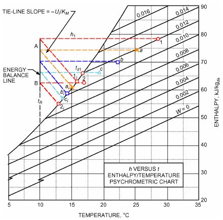

*Fig. 17 Graphical Solution for Air-State Path in Dehumidifying Coil with Constant Refrigerant Temperature*

**Example 8.** Air enters an air conditioner at 101.325 kPa, 30°C, and 85% rh at a rate of 0.2 m3/s and leaves as saturated air at 14°C. Condensed moisture is also removed at 14°C. Calculate the heat transfer and moisture removal rate from the air.

**Solution:** Water mass flow is

> ṁw = ṁa(W1– W2)

and energy or heat transfer rate is

> q̇out = ṁa(h1– h2) – ṁwhw

Properties of air both at inlet and exit states can be determined from the psychrometric chart as follows:

> h1= 89.0 kJ/kgda, W1 = 0.023 kgH2O/kgda
>
> specific volume = 0.89 m3/kgda

> h2 = 39.3 kJ/kgda, W2 = 0.010 kgH2O/kgda

Enthalpy of the condensate from saturated-water temperature table is

> hw= hf at 14°C = 58.81 kJ/kg

Then,

> ṁa = 0.2/0.89 = 0.225 kg/s
>
> ṁw = (0.225)(0.023 – 0.010) = 0.002925 kg/s

> q̇out = (0.225)(89.0 – 29.3) – (0.002925)(58.81) = 11.0 kJ/s

So, the air conditioner’s heat transfer and moisture removal rates are 10.5 kJ/s and 0.002925 kg/s, respectively.

## 4. SYMBOLS

A = surface area, m2 a = constant that depends on units used; or surface area per unit volume, m2/m3

Acs = cross-sectional area, m2 b = exponent or constant, dimensionless

C = molal concentration of solute in solvent, mol/m3 cL = specific heat of liquid, kJ/(kg·K)

cp = specific heat at constant pressure, kJ/(kg·K)

cpm = specific heat of moist air at constant pressure, kJ/(kgda·K)

d = diameter, m

Dv = diffusion coefficient (mass diffusivity), mm2/s

> f = Fanning friction factor, dimensionless

G = mass flux, flow rate per unit of cross-sectional area, kg/(s·m2) h = enthalpy, kJ/kg; or heat transfer coefficient, W/(m2·K)

hfg = enthalpy of vaporization, kJ/kg hM = mass transfer coefficient, m/s

> J = diffusive mass flux, kg/(s·m2)

J* = diffusive molar flux, mol/(s·m2)

jD = Colburn mass transfer group = Sh/(ReSc1/3), dimensionless jH = Colburn heat transfer group = Nu/(RePr1/3), dimensionless k = thermal conductivity, W/(m·K)

KM = mass transfer coefficient, kg/(s·m2)

> L = characteristic length, m
>
> l = length, m

Le = Lewis number = α/Dv, dimensionless

M = relative molecular mass, kg/kg mol ṁ = rate of mass transfer, kg/s m· ″ = mass flux, kg/(s·m2)

m· ″* = molar flux, mol/(s·m2)

Nu = Nusselt number = hL/k, dimensionless

> p = pressure, kPa

PAm = logarithmic mean density factor

Pr = Prandtl number = cpμ/k, dimensionless

Q = volumetric flow rate, m3/s

> q = rate of heat transfer, W

q″ = heat flux per unit area, W/m2

Re = Reynolds number = ρuL/μ, dimensionless

Ri = combined thermal resistance, (m2·K)/W

RL = thermal resistance of condensate film, (m2·K)/W

Rm = thermal resistance across metal wall and fins, (m2·K)/W

Rr = thermal resistance of refrigerant film, (m2·K)/W

Ru = universal gas constant = 8.314 kJ/(mol·K)

Sc = Schmidt number = μ/ρDv, dimensionless

Sh = Sherwood number = hML/Dv, dimensionless

St = Stanton number = h ⁄ ρcpu , dimensionless

Stm = mass transfer Stanton number = hMPAm⁄ u , dimensionless T = absolute temperature, K

> t = temperature, °C
>
> u = velocity in x direction, m/s

Ui = overall conductance from refrigerant to air/water interface for dehumidifying coil, W/(m2·K)

> V = fluid stream velocity, m/s
>
> v = velocity in y direction, m/s

vi = velocity normal to mass transfer surface for component i, m/s W = humidity ratio, kgw/kgda

X,Y,Z = coordinate direction, dimensionless x,y,z = coordinate direction, m

### Greek

α = thermal diffusivity = k/ρcp, m2/s

> ε = Lennard-Jones energy parameter

εD = eddy mass diffusivity, m2/s

> θ = time parameter, dimensionless
>
> μ = absolute (dynamic) viscosity, kg/(m·s)

μ = permeability, mg/(s·m·Pa)

> ν = kinematic viscosity, m2/s
>
> ρ = mass density or concentration, kg/m3

> σ = characteristic molecular diameter, nm
>
> τ = time

τi = shear stress in the x-y coordinate plane, N/m2

ω = mass fraction, kg/kg

ΩD,AB = temperature function in Equation (9)

### Subscripts

> A = gas component of binary mixture
>
> a = air property

Am = logarithmic mean

> B = more dilute gas component of binary mixture
>
> c = critical state

da = dry-air property or air-side transfer quantity

H = heat transfer quantity

> i = air/water interface value
>
> L = liquid

M = mass transfer quantity m = mean value or metal min = minimum o = property evaluated at 0°C s = water vapor property or transport quantity w = water vapor

<!-- str. 141 -->

∞ = property of main fluid stream

### Superscripts

* = on molar basis – = average value

′ = wet bulb

## REFERENCES

ASHRAE members can access ASHRAE Journal articles and ASHRAE research project final reports at technologyportal .ashrae.org. Articles and reports are also available for purchase by nonmembers in the online ASHRAE Bookstore at www.ashrae.org /bookstore.

AHRI. 2001. Forced-circulation air-cooling and air-heating coils. Standard 410-2001. Air-Conditioning, Heating, and Refrigeration Institute, Arlington, VA.

Barnet, W.I., and K.A. Kobe. 1941. Heat and vapor transfer in a wetted-wall tower. *Industrial & Engineering Chemistry* 33(4):436-442.

Bedingfield, G.H., Jr., and T.B. Drew. 1950. Analogy between heat transfer and mass transfer—A psychrometric study. *Industrial and Engineering* Chemistry 42:1164.

Bird, R.B., W.E. Stewart, and E.N. Lightfoot. 1960. Transport phenomena.

John Wiley & Sons, New York.

Chambers, F.S., Jr., and T.K. Sherwood. 1937. Absorption of nitrogen dioxide by aqueous solution. *Industrial & Engineering Chemistry* 29:1415-1422.

Chilton, T.H., and A.P. Colburn. 1934. Mass transfer (absorption) coefficients. *Industrial & Engineering Chemistry* 26(11):1183-1187.

Eckert, E.R.G., and R.M. Drake, Jr. 1972. *Analysis of heat and mass transfer.* McGraw-Hill, New York.

Gilliland, E.R. 1934. Diffusion coefficients in gaseous systems. Industrial & Engineering Chemistry 26:681-685.

Goldstein, S. 1938. *Modern developments in fluid mechanics*, vols. 1 and 2.

Oxford University Press, New York.

Guillory, J.L., and F.C. McQuiston. 1973. An experimental investigation of air dehumidification in a parallel plate heat exchanger. ASHRAE Transactions 79(2):146.

Helmer, W.A. 1974. *Condensing water vapor—Airflow in a parallel plate* heat exchanger. Ph.D. dissertation, Purdue University, West Lafayette, IN.

Hirschfelder, J.O., C.F. Curtiss, and R.B. Bird. 1954. *Molecular theory of* *gases and liquids.* John Wiley & Sons, New York.

Incropera, F.P., and D.P. DeWitt. 1996. *Fundamentals of heat and mass* transfer, 4th ed. John Wiley & Sons, New York.

Kusuda, T. 1957. Graphical method simplifies determination of aircoil, wetheat-transfer surface temperature. Refrigerating Engineering 65:41.

Lorisch, W. 1929. Bestimmung von Wärmeübergangszahlen durch Diffusionsversuche. *Forschungsarbeiten auf dem Gebiete des Ingenieurwes-* ens. 322:46-68.

Lurie, M., and N. Michailoff. 1936. Evaporation from free water surfaces.

*Industrial & Engineering Chemistry* 28(3):345-49.

Maisel, D.S., and J.K. Sherwood. 1950. Evaporation of liquids into turbulent gas streams. *Chemical Engineering Progress* 46:131-138.

Mason, E.A., and L. Monchick. 1965. Survey of the equation of state and transport properties of moist gases. In *Humidity and moisture*, vol. 3. Reinhold, New York.

McAdams, W.H. 1954. Heat transmission, 3rd ed. McGraw-Hill, New York. Millar, F.G. 1937. Evaporation from free water surfaces. Canadian Meteorological Memoirs 1(2).

Mizushina, T., N. Hashimoto, and M. Nakajima. 1959. Design of cooler condensers for gas-vapour mixtures. *Chemical Engineering Science* 9:195.

Pasquill, F. 1943. Evaporation from a plane, free-liquid surface into a turbulent air stream. *Proceedings of the Royal Society of London, Ser. A*(182): 75-94.

Powell, R.W. 1940. Further experiments on the evaporation of water from saturated surfaces. *Transactions of the Institution of Chemical Engineers* 18:36-55.

Powell, R.W., and E. Griffiths. 1935. The evaporation of water from plane and cylindrical surfaces. *Transactions of the Institution of Chemical* Engineers 13:175-198.

Reid, R.C., and T.K. Sherwood. 1966. *The properties of gases and liquids:* *Their estimation and correlation*, 2nd ed. McGraw-Hill, New York.

Reid, R.C., J.M. Prausnitz, and B.E. Poling. 1987. *The properties of gases* and liquids, 4th ed. McGraw-Hill, New York.

Sherwood, T.K., and R.L. Pigford. 1952. *Absorption and extraction.* McGraw-Hill, New York.

Sparrow, E.M., and M.M. Ohadi. 1987a. Comparison of turbulent thermal entrance regions for pipe flows with developed velocity and velocity developing from a sharp-edged inlet. *ASME Transactions, Journal of* Heat Transfer 109:1028-1030.

Sparrow, E.M., and M.M. Ohadi. 1987b. Numerical and experimental studies of turbulent flow in a tube. *Numerical Heat Transfer* 11:461-476.

Treybal, R.E. 1980. *Mass transfer operations*, 3rd ed. McGraw-Hill, New York.

## BIBLIOGRAPHY

Bennett, C.O., and J.E. Myers. 1982. *Momentum, heat and mass transfer*, 3rd ed. McGraw-Hill, New York.

DeWitt, D.P., and E.L. Cussler. 1984. *Diffusion, mass transfer in fluid sys-* tems. Cambridge University Press, U.K.

Geankopolis, C.J. 1993. *Transport processes and unit operations*, 3rd ed.

Prentice Hall, Englewood Cliffs, NJ.

Kays, W.M., and M.E. Crawford. 1993. *Convective heat and mass transfer*.

McGraw-Hill, New York.

Mikielviez, J., and A.M.A. Rageb. 1995. Simple theoretical approach to direct-contact condensation on subcooled liquid film. International *Journal of Heat and Mass Transfer* 38(3):557.

Ohadi, M.M., and E.M. Sparrow. 1989. Heat transfer in a straight tube situated downstream of a bend. *International Journal of Heat and Mass* Transfer 32(2):201-212.
