# Chapter 7 — Fundamentals of Control

*Izvor: 2021 ASHRAE Handbook — Fundamentals (SI), Chapter 7 (PDF str. 142–163).*

> **Napomena o konverziji:** Tekst je automatski izdvojen iz originalnog PDF-a uz prepoznavanje dve kolone, spojene prelomljene reči i pasuse. Indeksi i eksponenti su označeni sa ``/``, tabele su pretvorene u Markdown tabele (veoma složene tabele su prikazane kao poravnat tekst), a slike su izrezane iz PDF-a u folder `img/`. Složene jednačine (razlomci, sume) mogu biti uprošćeno prikazane. **Pre upotrebe vrednosti u proračunu proveriti u originalnom PDF-u.** Oznake `<!-- str. N -->` pokazuju stranu PDF-a.

## Sadržaj

- [1. GENERAL](#1-general)
- [1.1 TERMINOLOGY](#11-terminology)
- [1.2 TYPES OF CONTROL ACTION](#12-types-of-control-action)
- [1.3 CLASSIFICATION OF CONTROL COMPONENTS BY ENERGY SOURCE](#13-classification-of-control-components-by-energy-source)
- [2. CONTROL COMPONENTS](#2-control-components)
- [2.1 CONTROL DEVICES](#21-control-devices)
- [2.2 SENSORS AND TRANSMITTERS](#22-sensors-and-transmitters)
- [2.3 CONTROLLERS](#23-controllers)
- [2.4 AUXILIARY CONTROL DEVICES](#24-auxiliary-control-devices)
- [3. COMMUNICATION NETWORKS FOR BUILDING AUTOMATION SYSTEMS](#3-communication-networks-for-building-automation-systems)
- [3.1 COMMUNICATION PROTOCOLS](#31-communication-protocols)
- [3.2 OSI NETWORK MODEL](#32-osi-network-model)
- [3.3 NETWORK STRUCTURE](#33-network-structure)
- [3.4 SPECIFYING BUILDING AUTOMATION SYSTEM NETWORKS](#34-specifying-building-automation-system-networks)
- [3.5 APPROACHES TO INTEROPERABILITY](#35-approaches-to-interoperability)
- [4. SPECIFYING BUILDING AUTOMATION SYSTEMS](#4-specifying-building-automation-systems)
- [5. COMMISSIONING](#5-commissioning)
- [5.1 TUNING](#51-tuning)
- [5.2 CODES AND STANDARDS](#52-codes-and-standards)
- [REFERENCES](#references)
- [BIBLIOGRAPHY](#bibliography)

<!-- str. 142 -->

AUTOMATIC control systems are designed to maintain temperature, humidity, pressure, energy use, power, lighting levels, and safe levels of indoor contaminants. Automatic control primarily modulates actuators; stages modes of action; or sequences the mechanical and electrical equipment on and off to satisfy load requirements, provide safe equipment operation, and maintain safe building contaminant levels. Automatic control systems can use digital, pneumatic, mechanical, electrical, and electronic control devices. Human intervention often involves scheduling equipment operation and adjusting control set points, but also includes tracking trends and programming control logic algorithms to fulfill building needs.

This chapter focuses on the fundamental concepts and devices normally used by a control system designer. It covers (1) control fundamentals, including terminology; (2) types of control components; (3) methods of connecting components to form various individual control loops, subsystems, or networks; and (4) commissioning and operation. Chapter 48 of the 2019 *ASHRAE Handbook—HVAC Applica-* tions discusses the design of controls for specific HVAC applications.

## 1. GENERAL

## 1.1 TERMINOLOGY

An **open-loop** control does not have a direct feedback link between the value of the controlled variable and the controller. Open-loop control anticipates the effect of an external variable on the system and adjusts its output to minimize the expected deviation of the controlled variable from its set point. An example is an outdoor thermostat arranged to control heat to a building in proportion to the calculated load caused by changes in outdoor temperature. In essence, the designer presumes a fixed relationship between outdoor air temperature. The actual space temperature has no effect on this controller. Because there is no feedback on the controlled variable (space temperature), the control is an open loop.

A **closed-loop** or **feedback** control measures actual changes in the controlled variable and actuates the controlled device to bring about a change. The corrective action may continue until the controlled variable is at set point or within a prescribed tolerance. This arrangement of having the controller respond to the value of the controlled variable is known as feedback.

Every closed loop must contain a sensor, a controller, and a controlled device that will affect the sensor reading(s). Figure 1 shows the components of the typical control loop. The **sensor** measures the controlled variable and transmits to the controller a signal (pneumatic, electric, or electronic) having a pressure, voltage, or current value related by a known function to the value of the variable being measured. The **controller** compares this value with the set point and signals to the controlled device for corrective action. A controller can be hardware or software. A hardware controller is an analog device (e.g., thermostat, humidistat, pressure control) that continuously receives and acts on data. A software controller is a digital device (e.g., digital algorithm) that receives and acts on data on a sample-rate basis.

The preparation of this chapter is assigned to TC 1.4, Control Theory and Application.

The **controlled variable** is the temperature, humidity, pressure, or other condition being controlled.

The **set point** is the desired value of the controlled variable. The controller seeks to maintain this set point. The controlled device reacts to signals from the controller to vary the control agent.

The **controlled device** is typically a valve, damper, heating element, or variable-speed drive.

The **control agent** is the medium manipulated by the controlled device. It may be air or gas flowing through a damper; gas, steam, or water flowing through a valve; or an electric current.

The **process** is the HVAC apparatus being controlled, such as a coil, fan, or humidifier. It reacts to the control agent’s output and effects the change in the controlled variable.

Both open and closed control loops can be represented in the form of a **block diagram**, in which each component is modeled and represented in its own block. Figure 2 is a block diagram of the closed loop shown in Figure 1. Information flow from one component to the next is shown by lines between the blocks. The figure shows the set point being compared to the controlled variable. The difference is the **error**. If the error persists, it may be called offset, drift, deviation, droop, or steady-state error. The error is fed into the controller, which sends an output signal to the controlled device (in this case, a valve that can change the amount of steam flow through the coil of Figure 1). The amount of steam flow is the input to the next block, which represents the process. From the process block comes the controlled variable, which is temperature. The controlled variable is sensed by the sensing element and fed to the controller as feedback, completing the loop.

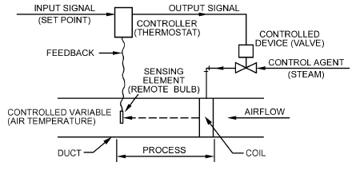

*Fig. 1 Example of Feedback Control: Discharge Air Temperature Control*

<!-- str. 143 -->

Control loop performance is greatly affected by time lags, which are delay periods associated with seeing a control agent change reflected in the desired end-point condition. Time lags can cause control and modeling problems and should be understood and evaluated carefully. There are two types of time lags: first-order lags and dead time.

**First-order lags** involve the time it takes for the change to be absorbed by the system. If heat is supplied to a cold room, the room heats up gradually, even though heat may be applied at the maximum rate. The **time constant** is the unit of measure used to describe first-order lags and is defined as the time it takes for the controlled variable of a first-order, linear system to reach 63.2% of its final value when a step change in the input occurs. Components with small time constants alter their output rapidly to reflect changes in the input; components with a larger time constant are sluggish in responding to input changes.

**Dead time** (or time lag) is the time from when a change in the controller output is made to when the controlled variable exhibits a measurable response. Dead time can occur in the control loop of Figure 1 because of the transportation time of the air from the coil to the space. After a coil temperature changes, there is dead time while the supply air travels the distribution system and finally reaches the sensor in the space. The mass of air in the space further delays the coil temperature change’s effect on the controlled variable (space temperature). Dead time can also be caused by a slow sensor or a time lag in the signal from the controller when it first begins to affect the output of the process. Dead time is most often associated with the time it takes to transport the media changed by the control agent from one place to another. Dead time may also be inadvertently added to a control loop by a digital controller with an excessive scan time. If the dead time is small, it may be ignored in the control system model; if it is significant, it must be considered.

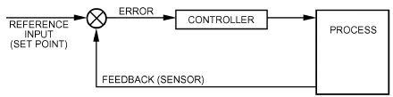

*Fig. 2 Block Diagram of Discharge Air Temperature Control*

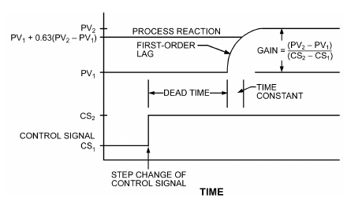

*Fig. 3 Process Subjected to Step Input*

Figure 1 depicts the mechanisms that create both first-order and dead-time lags, and Figure 3 shows the effect related to time. Dead time is the time it takes warmer air resulting from a higher set point to reach the space, followed by the first-order lag created by the wall on which the thermostat is mounted, and that of the temperature sensor (all of which warm gradually rather than all at once). The control loop must be tuned to account for the combined effect of each time lag. Note that, in most HVAC systems, the first-order lag element predominates.

The **gain** of a transfer function is the amount the output of the component changes per unit of change of input under steady-state conditions. If the element (valve, damper, and/or temperature/pressure differential) is linear, its gain remains constant. However, many control components are nonlinear and have gains that depend on the operating conditions. Figure 3 shows the response of the first-orderplus-dead-time process to a step change of the input signal. Note that the process shows no reaction during dead time, followed by a response that resembles a first-order exponential.

## 1.2 TYPES OF CONTROL ACTION

Control loops can be classified by the adjustability of the controlled device. A **two-position** controlled device has two operating states (e.g., open and closed), whereas a **modulating** controlled device has a continuous range of operating states (e.g., 0 to 100% open).

### Two-Position Action

The control device shown in Figure 4 can be positioned only to a maximum or minimum state (i.e., on or off). Because two-position control is simple and inexpensive, it is used extensively for both industrial and commercial control. A typical home thermostat that starts and stops a furnace is an example.

**Controller differential**, as it applies to two-position control action, is the difference between a setting at which the controller operates to one position and a setting at which it operates to the other. Thermostat ratings usually refer to the differential (in degrees) that becomes apparent by raising and lowering the dial setting. This differential is known as the **manual differential** of the thermostat. When the same thermostat is applied to an operating system, the total change in temperature that occurs between a “turnon” state and a “turn-off” state is usually different from the mechanical differential. The **operating differential** may be greater because of thermostat lag or hysteresis, or less because of heating or cooling anticipators built into the thermostat.

**Anticipation Applied to Two-Position Action.** This common variation of strictly two-position action is often used on room thermostats to reduce the operating differential. In heating thermostats, a heater element in the thermostat is energized during on periods, thus shortening the on time because the heater warms the thermostat (**heat anticipation**). The same anticipation action can be obtained in cooling thermostats by energizing a heater thermostat at off periods. In both cases, the percentage of on time is varied in proportion to the load, and the total cycle time remains relatively constant.

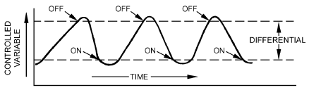

*Fig. 4 Two-Position Control*

<!-- str. 144 -->

### Modulating Control

With modulating control, the controller’s output can vary over its entire range. The following terms are used to describe this type of control:

- **Throttling range** is the amount of change in the controlled variable required to cause the controller to move the controlled device from one extreme to the other. It can be adjusted to meet job requirements. The throttling range is inversely proportional to proportional gain
- **Control point** is the actual value of the controlled variable at which the instrument is controlling. It varies within the controller’s throttling range and changes with changing load on the system and other variables.
- **Offset**, or error signal, is the difference between the set point and actual control point under stable conditions. This is sometimes called drift, deviation, droop, or steady-state error.

In each of the following examples of modulating control, there is a set of parameters that quantifies the controller’s response. The values of these parameters affect the control loop’s speed, stability, and accuracy. In every case, control loop performance depends on matching (or **tuning**) the parameter values to the characteristics of the system under control.

**Proportional Control.** In proportional control, the controlled device is positioned proportionally in response to changes in the controlled variable (Figure 5). A proportional controller can be described mathematically by

> Vp = Kpe + Vo&emsp;**(1)**

where

- Vp = controller output
- Kp = proportional gain parameter (inversely proportional to throttling range)
- e = error signal or offset
- Vo = offset adjustment parameter

The controller output is proportional to the difference between the sensed value, the controlled variable, and its set point. The controlled device is normally adjusted to be in the middle of its control range at set point by using an offset adjustment. This control is similar to that shown in Figure 5.

**Proportional plus Integral (PI) Control.** PI control improves on simple proportional control by adding another component to the control action that eliminates the offset typical of proportional control (Figure 6). Reset action may be described by

> Vp = Kpe + Ki∫e dθ + Vo&emsp;**(2)**

where

- Ki = integral gain parameter
- θ = time

The second term in Equation (2) implies that the longer error e exists, the more the controller output changes in attempting to eliminate the error. Proper selection of proportional and integral gain constants increases stability and eliminates offset, giving greater control accuracy.

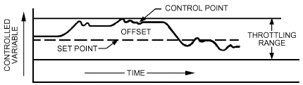

*Fig. 5 Proportional Control Showing Variations in Controlled Variable as Load Changes*

**Proportional-Integral-Derivative (PID) Control.** This is PI control with a derivative term added to the controller. It varies with the value of the derivative of the error. The equation for PID control is

> Vp = Kpe + Ki∫e dθ + Kdde/dθ + Vo&emsp;**(3)**

where

- Kd = derivative gain parameter of controller
- de/dθ = time derivative of error

Adding the derivative term gives some anticipatory action to the controller, which results in a faster response and greater stability. However, the derivative term also makes the controller more sensitive to noisy signals and harder to tune than a PI controller. Most HVAC control loops perform satisfactorily with PI control alone.

**Adaptive Control.** An adaptive controller adjusts the parameters that define its response as the dynamic characteristics of the process change. If the controller is PID based, then it adjusts feedback gains. An adaptive controller may be based on other feedback rules. The key is that it adjusts its parameters to match the characteristics of the process. When the process changes, the tuning parameters change to match it. Adaptive control is applied in HVAC systems because normal variations in operating conditions affect the characteristics relevant to tuning. For instance, the extent to which zone dampers are open or closed in a VAV system affects the way duct pressure responds to fan speed, and entering fluid temperatures at a coil affect the way the leaving temperature responds to the valve position. **Neu- ral networks** and **self-learning performance-predictive** controllers are sophisticated adaptive controllers.

**Fuzzy Logic.** This type of control offers an alternative to traditional control algorithms. A fuzzy logic controller uses a series of “if-then” rules that emulates the way a human operator might control the process. Examples of fuzzy logic might include

- IF room temperature is high AND temperature is decreasing, THEN increase cooling a little.
- IF room temperature is high AND temperature is increasing, THEN increase cooling a lot.

The designer of a fuzzy logic controller must first define the rules and then define terms such as high, increasing, decreasing, a lot, and a little. Room temperature, for instance, might be mapped into a series of functions that include very low, low, OK, high, and very high. The “fuzzy” element is introduced when the functions overlap and the room temperature is, for example, 70% high and 30% OK. In this case, multiple rules are combined to determine the appropriate control action.

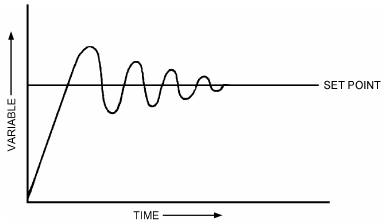

*Fig. 6 Proportional plus Integral (PI) Control*

<!-- str. 145 -->

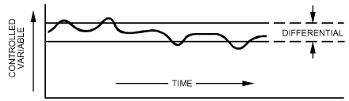

*Fig. 7 Floating Control Showing Variations in Controlled Variable as Load Changes*

### Combinations of Two-Position and Modulating

Some control loops include two-position components in a system that exhibits nearly modulating response.

**Timed Two-Position Control.** This cycles a two-position heating or cooling element on and off quickly enough that the effect on the controlled temperature approximates a modulating device. In this case, a controller may adjust the duty cycle (“on-time” as a percentage of “cycle-time”) as a modulating controlled variable. For example, an element may be turned on for two minutes and off for one minute when the deviation from set point is 2 K. Timed two-position action combines a modulating controller with a two-position controlled device.

**Floating Control.** This combines a modulating controlled device with a pair of two-position outputs. The controlled device has a continuous operating range, but the actuators that move it only turn on and off. The controller selects one of three operations: moving the controlled device toward its open position, moving it toward its closed position, or leaving the device in its current position. Control is accomplished by applying a pair of two-position contacts with a selected gap between their set points (Figure 7). Generally, a neutral zone between the two positions allows the controlled device to stop at any position when the controlled variable is within the differential of the controller. When the controlled variable falls outside the differential of the controller, the controller moves the controlled device in the proper direction. To function properly, the sensing element must react faster than the actuator drive time. If not, the control functions the same as a two-position control. When applied with a digital controller, floating-point control is also referred to as **tri-state control**.

**Incremental Control.** This variation of floating control varies the pulse action to open or close an actuator, depending on how close the controlled variable is to the set point. As the controlled variable comes close to the set point, the pulses become shorter. This allows closer control using floating motor actuators. When applied with a digital controller, incremental control is also referred to as **pulse- width-modulation (PWM) control**.

## 1.3 CLASSIFICATION OF CONTROL COMPONENTS BY ENERGY SOURCE

Control components may be classified according to the primary source of energy as follows:

- **Electric components** use electrical energy, either low or line voltage, as the energy source. The controller regulates electrical energy supplied to the controlled device. Control devices in this category include relays and electromechanical, electromagnetic, and solid-state regulating devices. **Electronic components** include signal conditioning, modulation, and amplification in their operation. Electronic systems use analog circuitry, rather than digital logic, to implement their control functions. A **digital electronic controller** receives analog electronic signals from sensors, converts the electronic signals to digital values, and performs mathematical operations on these values inside a microprocessor. Output from the digital controller takes the form of a digital value, which is then converted to an electronic signal to operate the actuator. The digital controller must sample its data because the microprocessor requires time for operations other than reading data. If the sampling interval for the digital controller is properly chosen to avoid second- and third-order harmonics, there will be no significant degradation in control performance from sampling.
- **Self-powered components** apply the power of the measured system to induce the necessary corrective action. The measuring system derives its energy from the process under control, without any auxiliary source of energy. Temperature changes at the sensor result in pressure or volume changes of the enclosed media that are transmitted directly to the operating device of the valve or damper. A component using a thermopile in a pilot flame to generate electrical energy is also self powered.
- **Pneumatic components** use compressed air, usually at a pressure of 100 to 140 kPa (gage), as an energy source. The air is generally supplied to the controller, which regulates the pressure supplied to the controlled device.

This method of classification can be extended to individual control loops and to complete control systems. For example, the room temperature control for a particular room that includes a pneumatic room thermostat and a pneumatically actuated reheat coil would be referred to as a pneumatic control loop. Many control systems use a combination of control components and are called **hybrid** systems.

### Computers for Automatic Control

Computers perform the control functions in direct digital control (DDC) systems. Uses range from personal computers used as operator interfaces for DDC systems to embedded program microprocessors used to control variable-air-volume boxes, fan-coil units, heat pumps, and other terminal HVAC equipment. Other uses include primary HVAC equipment programmable controllers, distributed network controllers, and servers used to store DDC system trend data. Chapter 41 of the 2019 ASHRAE Handbook—HVAC Applications covers computer components and HVAC computer applications more extensively.

## 2. CONTROL COMPONENTS

## 2.1 CONTROL DEVICES

A control device is the component of a control loop used to vary the input (controlled variable). Both **valves** and **dampers** perform essentially the same function and must be properly sized and selected for the particular application. The control link to the valve or damper is called an **actuator** or **operator**, and uses electricity, compressed air, hydraulic fluid, or some other means to power the motion of the valve stem or damper linkage through its operating range. For additional information, see Chapter 37.

### Valves

An automatic valve is designed to control the flow of steam, water, gas, or other fluids. It can be considered a variable orifice positioned by an actuator in response to impulses or signals from the controller. It may be equipped with a throttling plug, V-port, or rotating ball specially designed to provide a desired flow characteristic.

Types of automatic valves include the following:

A **three-way mixing valve** (Figure 8A) has two inlet connections and one outlet connection and a double-faced disk operating between two seats. It is used to mix two fluids entering through the two inlet connections and leaving through the common outlet, according to the position of the valve stem and disk.

A **three-way diverting valve** (Figure 8B) has one inlet connection and two outlet connections, and two separate disks and seats. It is used to divert flow to either of the outlets or to proportion the flow to both outlets. Three-way diverting valves are more expensive and have more complex applications, and generally are not used in typical HVAC systems.

<!-- str. 146 -->

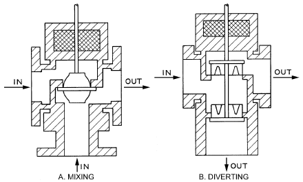

*Fig. 8 Typical Three-Way Mixing and Diverting Globe Valves*

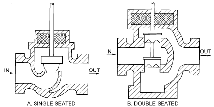

*Fig. 9 Typical Single- and Double-Seated Two-Way Globe Valves*

A **two-way globe valve** may be either single or double seated. A **single-seated valve** (Figure 9A) is designed for tight shutoff. Appropriate disk materials for various pressures and media are used. A **double-seated** or **balanced valve** (Figure 9B) is designed so that the media pressure acting against the valve disk is essentially balanced, reducing the actuator force required. It is widely used where fluid pressure is too high to allow a single-seated valve to close or to modulate properly. It is not usually used where tight shutoff is required.

A **butterfly valve** consists of a heavy ring enclosing a disk that rotates on an axis at or near its center and is similar to a round singleblade damper. In principle, the disk seats against a ring machined within the body or a resilient liner in the body. Two butterfly valves can be used together to act like a three-way valve for mixing or diverting. In this arrangement, one valve is set up as normally open and the other is normally closed. In applications with pipe sizes 100 mm and above, butterfly valves are either two position or modulating, and they are less expensive than globe-style valves (see Chapter 46 of the 2020 *ASHRAE Handbook—HVAC Systems* and Equipment for information on globe valves).

A **ball valve** consists of a ball with a hole drilled through it, rotating in a valve body. Ball valves are increasingly popular because of their low cost and high close-off ratings. Features that provide flow characteristics similar to or better than globe valves are available.

**Pressure-independent valves** are control valves with integral pressure regulators. This allows the valve to maintain a constant flow at a given shaft position because the integral pressure regulator maintains a constant differential pressure across the valve’s orifice, regardless of system pressure fluctuations.

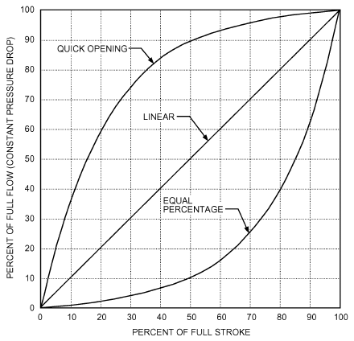

*Fig. 10 Typical Flow Characteristics of Valves*

**Flow Characteristics.** Valve performance is expressed in terms of its flow characteristics as it operates through its stroke, based on a constant pressure drop. Three common characteristics are shown in Figure 10 and are defined as follows:

- **Quick opening.** Maximum flow is approached rapidly as the device begins to open.
- **Linear.** Opening and flow are related in direct proportion.
- **Equal percentage.** Each equal increment of opening increases flow by an equal percentage over the previous value.

On a pressure-dependent valve, because pressure drop across the valve’s orifice seldom remains constant as its opening changes, actual performance usually deviates from the published characteristic curve. The magnitude of deviation is determined by the overall design. For example, in a system arranged so that control valves or dampers can shut off all flow, pressure drop across a controlled device increases from a minimum at design conditions to total pressure drop at no flow. Figure 11 shows the extent of resulting deviations for a valve or damper designed with a linear characteristic, when selection is based on various percentages of total system pressure drop. To allow for adequate control by the valve, design pressure drop should be a reasonably large percentage of total system pressure drop at the valve (i.e., adequate valve authority) and the system should be designed and controlled so that pressure drop remains relatively constant. Hydronic piping circuits and valve authority are discussed in Chapters 13 and 46 of the 2020 ASHRAE *Handbook—HVAC Systems and Equipment*, respectively.

**Selection and Sizing.** Higher pressure drops for control devices are obtained by using smaller sizes, with a possible increase in size of other equipment in the system. Sizing control valves is discussed in Chapter 46 of the 2020 *ASHRAE Handbook—HVAC Systems and* Equipment.

Steam Valves. Steam-to-water and steam-to-air heat exchangers are typically controlled by regulating steam flow using a two-way throttling valve. One-pipe steam systems require a line-size, two-position valve for proper condensate drainage and steam flow; two-pipe steam systems can be controlled by two-position or modulating (throttling) valves. Maximum pressure drop for steam valves is a function of operating pressure and cannot be exceeded.

<!-- str. 147 -->

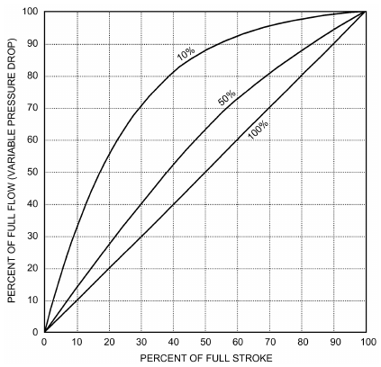

*Fig. 11 Typical Valve Authority Performance Curves for Linear Devices at Various Percentages of Total System Pressure Drop*

Water Valves. Valves for water service may be two- or three-way and two-position or proportional. Proportional valves are used most often, but two-position valves are not unusual and are sometimes essential. Variable-flow systems are designed to keep the pressure differential constant from supply to return. For valve selection, it is safer to assume that the pressure drop across the valve increases as it modulates from fully open to fully closed.

**Equal-percentage valves** provide better control at part load, particularly in hot-water coils because the coil’s heat output is not linearly related to flow. As flow reduces, more heat is transferred with each unit of water, counteracting the reduction in flow. Equalpercentage valves can provide linear heat transfer from the coil with respect to the control signal.

**Actuators.** Valve actuators include the following general types:

- A **pneumatic valve actuator** consists of a spring-opposed, flexible diaphragm or bellows attached to the valve stem. An increase in air pressure above the minimum point of the spring range compresses the spring and simultaneously moves the valve stem. Springs of various pressure ranges can sequence the operation of two or more devices, if properly selected or adjusted. For example, a chilled-water valve actuator may modulate the valve from fully closed to fully open over a spring range of 60 to 90 kPa (gage), whereas a sequenced steam valve may actuate from 20 to 55 kPa (gage). Two-position pneumatic control is accomplished using a two-position pneumatic relay to apply either full air pressure or no pressure to the valve actuator. Pneumatic valves and valves with spring-return electric actuators can be classified as normally open or normally closed. A **normally open valve** assumes an open position, providing full flow, when all actuating force is removed. A **normally closed valve** assumes a closed position, stopping flow, when all actuating force is removed.
- **Double-acting** or **springless pneumatic valve actuators**, which use two opposed diaphragms or two sides of a single diaphragm, are generally limited to special applications involving large valves or high fluid pressure.

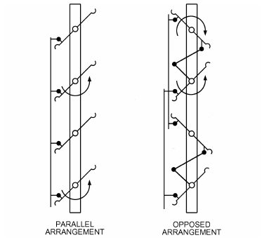

*Fig. 12 Typical Multiblade Dampers*

- An **electric-hydraulic valve actuator** is similar to a pneumatic one, except that it uses an incompressible fluid circulated by an internal electric pump.
- A **thermostatic valve actuator** uses the volume change with temperature of a substance in a sealed chamber to move a diaphragm, which in turn moves the valve shaft. These actuators can be used as two-position or modulating. In **wax thermo-** **static valves,** the volume change is caused by phase change (the wax melts or solidifies). The heat source is usually the environment or the fluid whose temperature is being controlled, but can also be a resistive element in the chamber receiving voltage from a controller.
- A **solenoid** consists of a magnetic coil operating a movable plunger. Most are for two-position operation, but modulating solenoid valves are available with a pressure equalization bellows or piston to achieve modulation. Solenoid valves are generally limited to relatively small sizes (up to 100 mm).
- An **electric actuator** operates the valve stem through a gear train and linkage. Electric motor actuators are classified in the following three types:
- **Spring-return**, for two-position operation (energy drives the valve to one position and a spring returns the valve to its normal position) or for modulating operation (energy drives the valve to a variable position and a spring returns the valve to an open or closed position upon a signal or power failure). With spring-return electric actuators, on loss of actuator power, the spring positions the valve to its fail-safe (normal) position (either fully open or fully closed).
- **Electronic fail-safe,** which uses a capacitor instead of a spring to drive the actuator to its fail-safe (normal) position. The fail-safe position can be set for fully open, fully closed, or anywhere in between at varying increments.
- **Reversible**, for floating and proportional operation. The motor can run in either direction and can stop in any position. It is sometimes equipped with a return spring or an electronic fail-safe. In proportional-control applications, an integral feedback potentiometer for rebalancing the control circuit is also driven by the motor.

### Dampers

Automatic dampers are used in air conditioning and ventilation to control airflow. They may be used (1) in a modulating application to maintain a controlled variable, such as mixed air temperature or supply air duct static pressure; or (2) for two-position control to initiate operation, such as opening minimum outdoor air dampers when a fan is started.

<!-- str. 148 -->

**Multiblade** dampers are typically available in two arrangements: parallel-blade and opposed-blade (Figure 12), although combinations of the two are manufactured. They are used to control flow through large openings typical of those in air handlers. Both types are adequate for two-position control.

When dampers are applied in modulating control loops, a nonlinear relationship between flow and stroke can lead to difficulties in tuning a control loop for performance. Nonlinearity is expressed as variation in the slope of the flow versus stroke curve. Perfect linearity is not required: if slope varies throughout the range of required flow by less than a factor of 2 from the slope at the point where the loop is tuned, nonlinearity is not likely to disrupt performance.

**Parallel blades** are used for modulating control when the design condition pressure drop of the damper is about 25% or more of the pressure in a subsystem (Figure 13A). **Opposed-blade dampers** are preferable for modulating control when the damper is about 15% or less of the pressure drop in a subsystem (Figure 13B). A subsystem is defined as a portion of the duct system between two relatively constant pressure points (e.g., the return air section between the mixed air and return plenum tee). A combination may be considered between 15 and 25% damper drop. **Single-blade dampers** are typically used for flow control in small terminal units.

In Figure 13, A is **authority**, which is the ratio of pressure drop across the fully open damper at design flow to total subsystem pressure drop, including fully open control damper pressure drop. The curves here are typical for ducted applications. The Air Movement and Control Association (AMCA Standard 500) defined a number of geometric arrangements of dampers for testing pressure losses. The curves in Figure 13 are those of an AMCA 5.3 geometry, which is a fully ducted arrangement with long sections of duct before and after a damper. Other geometric applications, such as plenum or wall-mounted dampers, exhibit different response curves (Felker and Felker 2009; van Becelaere et al. 2004).

Figure 14 shows two parallel-blade (PB) applications, two opposed-blade (OB) applications, and an “anti-PB” (aPB) arrangement. The response curves are not like those of the AMCA 5.3

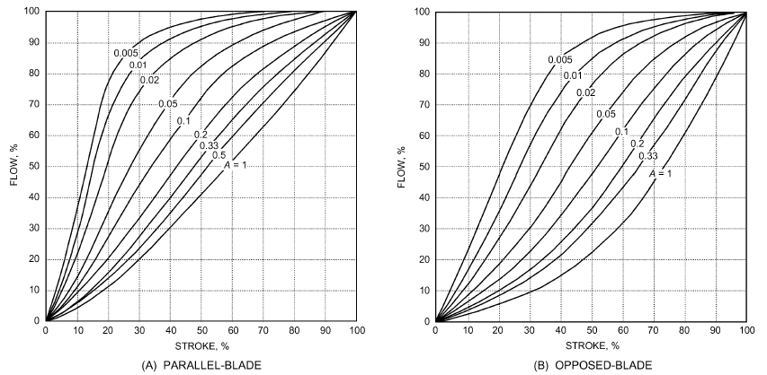

*Fig. 13 Characteristic Curves of Installed Dampers in an AMCA 5.3 Geometry*

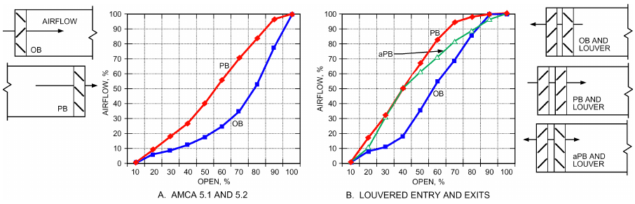

*Fig. 14 Inherent Curves for Partially Ducted and Louvered Dampers (RP-1157)*

Based on data in van B ecelaere et al. (2004)

<!-- str. 149 -->

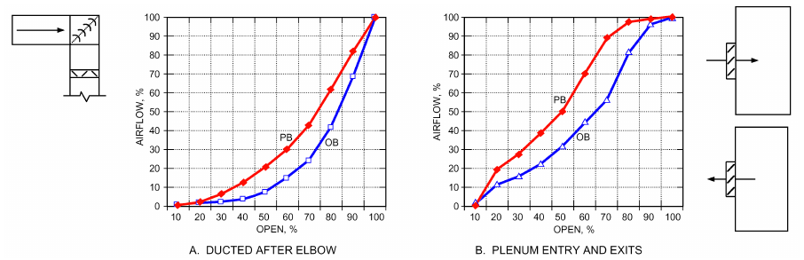

*Fig. 15 Inherent Curves for Ducted and Plenum-Mounted Dampers (RP-1157)*

> Based on data in van Becelaere et al. (2004)

ducted application. These are “inherent” curves, where pressure drop across a damper is held constant as the damper rotates (so it has 100% authority). In real applications, the authority is lower (higher losses of other system components besides the damper). As system pressure losses increase, the curves move up. Note that PB dampers are significantly above linear in most cases.

Figure 15 shows three more applications with PB and OB dampers. The ducted damper has some disturbance and pressure loss ahead of it, to simulate a more realistic situation than those of AMCA 5.3. Nevertheless, the response curves are similar to AMCA 5.3. The plenum entry dampers show irregular results. Again, these are inherent curves, and lower authority causes the curves to move up toward more flow at smaller angles.

The curves shown here are typical, but do not represent every scenario. Thousands of installation variations exist, and slight variations in response always occur. For additional application examples and greater detail, see ASHRAE research project RP-1157 (van Becelaere et al. 2004).

**Application.** Dampers require engineering to achieve defined goals. A common application is a flow control damper, which modulates airflow. The curves in Figure 13 can be used to pick a damper with a pressure drop and authority that provides near-linear response. Another common application is economizer outdoor air, return air, and exhaust air dampers. Selection of these dampers depends on the system design, as discussed in ASHRAE Guideline 16-2014.

Damper leakage is a concern, particularly where tight shutoff is necessary to significantly reduce energy consumption. Also, outdoor air dampers in cold climates must close tightly to prevent coils and pipes from freezing. Low-leakage dampers cost more and require larger actuators because of friction of the seals in the closed position; however, the energy savings offset the extra cost.

**Actuators.** Either electricity or compressed air is used to actuate dampers.

**Pneumatic damper actuators** are similar to pneumatic valve actuators, except that they have a longer stroke or the stroke is increased by a multiplying lever. Increasing air pressure produces a linear shaft motion, which, through a linkage, moves the crank arm to open or close the dampers. Releasing air pressure allows a spring to return the actuator. Double-acting actuators without springs are available also.

**Electric damper actuators** can be proportional or two-position. They can be spring return or nonspring. The simplest form of control is a floating three-point controller, in which contact closures drive the motor clockwise or counterclockwise. In addition, a variety of standard electronic signals from electronic controllers or DDC systems, such as 4 to 20 mA, 2 to 10 V (dc), or 0 to 10 V (dc), can be used to control proportionally actuated dampers.

Most modern actuators are electronic and use more sophisticated methods of control and operation. They are inherently positive positioning and may have communications capabilities similar to industrial-process-quality actuators.

A two-position spring-return actuator moves in one direction when power is applied to its internal windings. When no power is present, the actuator returns (via spring force) to its fail-safe (normal) position. Depending on how the actuator is connected, this action opens or closes the dampers. A proportional actuator may also have spring-return action.

Mounting. Damper actuators are mounted in different ways, depending on the size and accessibility of the damper, and the power required to move the damper. The most common method of mounting electric actuators is directly over the damper shaft (direct coupling) with no external linkage. Actuators can also be mounted in the airflow on the damper frame and be linked directly to a damper blade (though this may deform blades and make access for repairs difficult), or mounted outside the duct and connected to a crank arm attached to a shaft extension of one of the blades. Mounting methods that link the actuator to a single blade are not recommended because of the potential to bend the single drive blade or to have the bladeto-blade linkages get out of adjustment.

Large dampers may require two or more actuators, which are usually mounted at separate points on the damper. An alternative is to install the damper in two or more sections, each section being controlled by a single damper actuator. Positive positioners may be required for proper sequencing, as with a small damper controlled to maintain healthy indoor air quality, with a large damper being independently controlled for economy-cycle free cooling.

### Pneumatic Positive (Pilot) Positioners

Where accurate positioning of a modulating pneumatic damper or valve is required, use positive positioners. A positive positioner provides up to full supply control air pressure to the actuator for any change in position required by the controller. A pneumatic actuatorwithout a positioner may not respond quickly or accurately enough to small changes in control pressure caused by friction in the actuator or load, or to changing load conditions such as wind acting on a damper blade. A positive positioner provides finite and repeatable positioning change and allows adjustment of the control range (spring range of the actuator) to provide a proper sequencing control of two or more control devices.

<!-- str. 150 -->

## 2.2 SENSORS AND TRANSMITTERS

A sensor responds to a change in the controlled variable. The response, which is a change in some physical or electrical property of the primary sensing element, is available for translation or amplification into a mechanical or electrical signal. This signal is sent to the controller.

**Transmitters** take the output of a sensor and convert the sensor’s signal to an industry-standard signal type (e.g., 4 to 20 mA, 0 to 10 V, network protocol).

Chapter 48 of the 2019 *ASHRAE Handbook—HVAC Applica-* tions and manufacturer’s catalogs and tutorials include information on specific applications. In selecting a sensor for a specific application, consider the following:

- **Operating range of controlled variable.** The sensor must be capable of providing an adequate change in its output signal over the expected input range.
- **Compatibility of controller input.** Electronic and digital controllers accept various ranges and types of electronic signals. The sensor’s signal must be compatible with the controller. If the controller’s input requirements are unknown, it may be possible to use a transducer to convert the sensor signal to an industrystandard signal, such as 4 to 20 mA or 0 to 10 V (DC).
- **Accuracy, sensitivity, and repeatability.** For some control applications, the controlled variable must be maintained within a narrow band around a desired set point. Both the accuracy and sensitivity of the sensor selected must reflect this requirement. **Sensitivity** is the ratio of a change in output magnitude to the change of input that causes it, after steady state has been reached. **Repeatability** is closeness of agreement among repeated measurements of the same variable under the same conditions. However, even an accurate sensor cannot maintain the set point if (1) the controller is unable to resolve the input signal, (2) the controlled device cannot be positioned accurately, (3) the controlled device exhibits excessive hysteresis, or (4) disturbances drive its system faster than the controls can regulate it. See ASHRAE Guideline 13, clause 7.9, for a discussion on end-to-end accuracy.
- **Sensor response time.** Associated with a sensor/transducer arrangement is a response curve, which describes the response of the sensor output to change in the controlled variable. If the time constant of the process being controlled is short and stable and accurate control is important, then the sensor selected must have a fast response time.
- **Control agent properties and characteristics.** The control agent is the medium to which the sensor is exposed, or with which it comes in contact, for measuring a controlled variable such as temperature or pressure. If the agent corrodes the sensor or otherwise degrades its performance, a different sensor should be selected, or the sensor must be isolated or protected from direct contact with the control agent.
- **Ambient environment characteristics.** Even when the sensor’s components are isolated from direct contact with the control agent, the ambient environment must be considered. The temperature and humidity range of the ambient environment must not reduce the sensor’s accuracy. Likewise, the presence of certain gases, chemicals, and electromagnetic interference (EMI) can cause performance degradation. In such cases, a special sensor or transducer housing can be used to protect it. Special housings may also be required in wet, flammable, explosive, or corrosive environments.
- **• Placement requirements.** The sensing element must be in the correct point(s) required for proper measurement. For instance, pipe wall thickness (schedule) affects the required length of water temperature or flow probes; sensors inside air ducts (especially low-temperature switches) should be long enough to compensate for air stratification; room temperature and humidity sensors should not be installed close to heat sources, on outer walls, in direct airstreams, or in areas where air stalls (e.g., behind furniture); single measurements of return air properties, no matter how accurate, are just averages and do not detect areas with simultaneous opposite extremes.

### Temperature Sensors

Temperature-sensing elements generally detect changes in either (1) relative dimension (caused by differences in thermal expansion), (2) the state of a vapor or liquid, or (3) some electrical property. Within each category, there are various sensing elements to measure room, duct, water, and surface temperatures. Temperature-sensing technologies commonly used in HVAC applications are as follows:

- A **bimetal element** is composed of two thin strips of dissimilar metals fused together. Because the two metals have different coefficients of thermal expansion, the element bends and changes position as the temperature varies. Depending on the space available and the movement required, it may be straight, U-shaped, or wound into a spiral. This element is commonly used in room, insertion, and immersion thermostats.
- A **rod-and-tube element** consists of a high-expansion metal tube containing a low-expansion rod. One end of the rod is attached to the rear of the tube. The tube changes length with changes in temperature, causing the free end of the rod to move. This element is commonly used in certain insertion and immersion thermostats.
- A **sealed bellows element** is either vapor, gas, or liquid filled. Temperature changes vary the pressure and volume of the gas or liquid, resulting in a change in force or a movement.
- A **remote bulb element** is a bulb or capsule connected to a sealed bellows or diaphragm by a capillary tube; the entire system is filled with vapor, gas, or liquid. Temperature changes at the bulb cause volume or pressure changes that are conveyed to the bellows or diaphragm through the capillary tube. This element is useful where the temperature-measuring point is remote from the desired thermostat location.
- A **thermistor** is a semiconductor that changes electrical resistance with temperature. It has a negative temperature coefficient (i.e., resistance decreases as temperature increases). Its characteristic curve of temperature versus resistance is nonlinear over a wide range. Several techniques are used to convert its response to a linear change over a particular temperature range. With digital control, one technique is to store a computer look-up table that maps the temperature corresponding to the measured resistance. The table breaks the curve into small segments, and each segment is assumed to be linear over its range. Thermistors are used because of their relatively low cost, the large change in resistance possible for a small change in temperature, and their long-term stability.
- A **resistance temperature device (RTD)** also changes resistance with temperature. Most metallic materials increase in resistance with increasing temperature; over limited ranges, this variation is linear for certain metals (e.g., platinum, copper, tungsten, nickel/iron alloys). Platinum, for example, is linear within ±0.3% from –18 to 150°C. The RTD sensing element is available in several forms for surface or immersion mounting. Flat grid windings are used for measurements of surface temperatures. For direct measurement of fluid temperatures, the windings are encased in a stainless steel bulb to protect them from corrosion.

### Humidity Sensors and Transmitters

Humidity sensors, or **hygrometers**, measure relative humidity, dew point, or absolute humidity of ambient or moving air. **Trans- mitters** convert the signal from the humidity sensor to an industrystandard output such as 0 to 10 V or 4 to 20 mA. Some transmitters compensate for temperature variations. Two types of sensors that detect relative humidity are mechanical hygrometers and electronic hygrometers.

<!-- str. 151 -->

**Electronic hygrometers** can use either resistance or capacitance sensing elements. The resistance element is a conductive grid coated with a hygroscopic substance. The grid’s conductivity varies with the water retained; thus, resistance varies with relative humidity. The conductive element is arranged in an AC-excited Wheatstone bridge and responds rapidly to humidity changes.

The capacitance element is a stretched membrane of nonconductive film, coated on both sides with metal electrodes and mounted in a perforated plastic capsule. The response of the sensor’s capacity to rising relative humidity is nonlinear. The signal is linearized and temperature is compensated in the amplifier circuit to provide an output signal as relative humidity changes from 0 to 100%.

The **chilled-mirror humidity sensor** determines dew point rather than relative humidity. Air flows across a small mirror in the sensor. A thermoelectric cooler lowers the surface temperature of the mirror until it reaches the dew point of the air. Condensation on the surface reduces the amount of light reflected from the mirror compared to a reference light level.

**Dispersive infrared (DIR) technology** can be used to sense absolute humidity or dew point. It is similar to technology used to sense carbon dioxide or other gases. Infrared water vapor sensors are optical sensors that detect the amount of water vapor in air based on the infrared light absorption characteristics of water molecules. Light absorption is proportional to the number of molecules present. An **infrared hygrometer** typically provides a value of absolute humidity or dew point, and can operate in diffusion or flow-through sample mode. This type of humidity sensor is unique in that the sensing element (a light detector and an infrared filter) is behind a transparent window and is never exposed directly to the sample environment. As a result, this sensor has excellent long-term stability, long life, and fast response time; is not subject to saturation; and operates equally well in very high or low humidity. Previously used solely for high-end applications, infrared hygrometers are now commonly used in HVAC applications because they cost about the same as mid-range-accuracy (1 to 3%) humidity sensors.

### Pressure Transmitters and Transducers

A pneumatic pressure transmitter converts a change in absolute, gage, or differential pressure to a mechanical motion using a bellows, diaphragm, or Bourdon tube mechanism. When connected through appropriate links, this mechanical motion produces a change in air pressure to a controller. In some instances, sensing and control functions are combined in a single component, a pressure controller.

An electronic pressure transducer may use mechanical actuation of a diaphragm or Bourdon tube to operate a potentiometer or differential transformer. Another type uses a strain gage bonded to a diaphragm. The strain gage detects displacement resulting from the force applied to the diaphragm. Capacitance transducers are most often used for measurements below 250 Pa because of their high sensitivity and repeatability. Electronic circuits provide temperature compensation and amplification to produce a standard output signal.

### Flow Rate Sensors

Orifice plate, pitot-static tube, venturi, turbine, magnetic flow, thermal dispersion, vortex shedding, and ultrasonic meters are some of the technologies used to sense fluid flow. In general, pressure differential devices (orifice plates, venturi, and pitot tubes) are less expensive and simpler to use, but have limited range; thus, their accuracy depends on how they are applied and where in a system they are located.

More sophisticated flow devices, such as turbine, magnetic, and vortex shedding meters, usually have better range and are more accurate over a wide range. If an existing piping system is being considered for retrofit with a flow device, the expense of shutting down the system and cutting into a pipe must be considered. In this case, a noninvasive meter, such as an ultrasonic flow meter, may be cost effective.

There are two types of ultrasonic flow meters. One uses the Doppler effect, which is better for monitoring flow in slurry applications. The other type uses the transit time effect, which is more accurate at lower flows and with standard nonslurry fluids.

For air velocity metering, pitot-static tubes provide a naturally larger signal change at high velocities, with limitations on their application below 2.5 to 3 m/s. Vortex shedding for airflow applications has similar low-velocity limitations. Thermal dispersion sensors provide a naturally larger signal change at lower velocities without appreciable losses through velocities common in most ventilation systems, which makes them more suitable for applications below 5 m/s.

### Indoor Air Quality Sensors

Indoor air quality control can be divided into two categories: ventilation control and contamination protection. In spaces with dense populations and intermittent or highly variable occupancy, ventilation can be more efficiently applied by detecting changes in population or ventilation requirements [**demand-controlled ventilation (DCV)**]. This involves using time schedules and population counters, and measuring the indoor/outdoor differential levels of carbon dioxide (CO2) or other contaminants in a space. Changes in differential CO2 mirror changes in space population; thus, the amount of outdoor air introduced into the occupied space can then be controlled. Demand control helps maintain proper ventilation rates at all levels of occupancy. Control set-point levels for carbon dioxide are determined by the specific relationships between differential CO2, rate of CO2 production by occupants, the variable airflow rate required by the changing population, and a fixed amount of ventilation required to dilute buildinggenerated contaminants unrelated to CO2 production. ASHRAE Standard 62.1 and its user’s manual (ASHRAE 2013) provide further information on ventilation for acceptable indoor air quality and DCV for single-zone systems.

Contamination protection sensors monitor levels of hazardous or toxic substances and issue warning signals and/or initiate corrective actions through the building automation system (BAS). Sensors are available for many different gases. The carbon monoxide (CO) sensor is one of the most common, and is often used in buildings wherever combustion occurs (e.g., parking garages). Refrigerantspecific sensors are used to measure, alarm, and initiate ventilation purging in enclosed spaces that house refrigeration equipment, to prevent occupant suffocation upon a refrigerant leak (see ASHRAE Standard 15 for more information). The type selected, substances monitored, and action taken in an alarm condition all depend on where these sensors are applied.

### Lighting Level Sensors

Analog lighting level transmitters packaged in various configurations allow control of ambient lighting levels using building automation strategies for energy conservation. Examples include ceiling-mounted indoor light sensors used to measure room lighting levels; outdoor ambient lighting sensors used to control parking, general exterior, security, and sign lighting; and interior skylight sensors used to monitor and control light levels in skylight wells and other atrium spaces.

### Power Sensing and Transmission

Passive electronic devices that sense the magnetic field around a conductor carrying current allow low-cost instrumentation of power circuits. A wire in the sensor forms an inductive coupling that powers the internal function and senses the level of the power signal. These devices can provide an analog output signal to monitor current flow or operate a switch at a user-set level to turn on an alarm or other device.

<!-- str. 152 -->

## 2.3 CONTROLLERS

An HVAC controller reads sensors’ signals and regulates control devices to achieve one or more objectives, which may include maintaining comfort, minimizing energy use, and ensuring safe operation and environmental conditions. Controllers can use other sources of information to determine their output, such as schedules, tables, operator commands, and weather forecasts. Controllers may also collect data about the processes and their own operation to help monitor, diagnose, and tune the processes’ operation. Digital controllers perform the control functions using a microprocessor and control algorithms. The sensors and controller can be combined in a single instrument, such as a room thermostat, or they may be separate devices.

### Digital Controllers

Digital controls use microprocessors to execute software programs that are customized for use in commercial buildings. Controllers use sensors to measure values such as temperature and humidity, perform control routines in software programs, and exert control using output signals to actuators such as valves and electric or pneumatic actuators connected to dampers. The operator may enter parameters such as set points, proportional or integral gains, minimum on and off times, or high and low limits, but the control algorithms make the control decisions. The controller scans input devices, executes control algorithms, and then positions the output device(s), in a stepwise scheme. The controller calculates proper control signals digitally rather than using an analog circuit or mechanical change, as in electric/electronic and pneumatic controllers. Use of digital controls in building automation is referred to as direct digital control (DDC).

Digital controls can be used as stand-alones or can be integrated into building management systems (BMSs) through network communications. Simple controls may have a single control loop that can perform a single control function (e.g., temperature control of a unit ventilator); larger versions can control a larger number of loops or even perform complex strategies such as managing energy allocation to multiple processes and open loop controls, and balancing multiple objectives (e.g., comfort, energy consumption, equipment wear).

Advantages of digital controls include the following:

- Sequences or equipment can be modified by changing software, which reduces the cost and diversity of hardware necessary to achieve control.
- Features such as demand setback, reset, data logging, diagnostics, and time-clock integration can be added to the controller with small incremental cost.
- Precise, accurate control can be implemented, limited by the resolution of sensor and analog-to-digital (A/D) and digital-to-analog (D/A) conversion processes. PID and other control algorithms can be implemented mathematically and can adjust performance based on sophisticated algorithms.
- Controllers can communicate with each other using open or proprietary networking (e.g., Ethernet or RS-485) standards.

A single control that is fixed in functionality with flexibility to change set points and small configurations is called an **application- specific controller**. Many manufacturers include application-specific controls with their HVAC equipment, such as air-handling units and chillers.

**Firmware and Software.** Preprogrammed control routines, known as firmware, are sometimes stored in permanent memory such as programmable read-only memory (PROM) or electrically programmable read-only memory (EPROM), and the application or set points are stored in changeable memory such as electrically erasable programmable read-only memory (EEPROM). The operator can modify parameters such as set points, limits, and minimum off times within the control routines, but the primary program logic cannot be changed without replacing the memory chips.

User-programmable controllers allow the algorithms to be changed by the user. The programming language provided with the controller can vary from a derivation of a standard language to custom language developed by the controller’s manufacturer, to graphically based programming. Preprogrammed routines for proportional, proportional plus integral, Boolean logic, timers, etc., are typically included in the language. Standard energy management routines may also be preprogrammed and may interact with other control loops where appropriate.

Digital controllers can have both preprogrammed firmware and user-programmed routines. These routines can automatically modify the firmware’s parameters according to user-defined conditions to accomplish the control sequence designed by the control engineer.

**Operator Interface.** Some digital controllers (e.g., a programmable room thermostat) are designed for dedicated purposes and are adjustable only through manual switches and potentiometers mounted on the controller. This type of controller cannot be networked with other controllers. A **direct digital controller** can have manually adjustable features, but it is more typically adjusted either through a built-in LED or LCD display, a hand-held device, or a terminal or computer. The direct digital controller’s digital communication allows remote connection to other controllers and to higherlevel computing devices and host operating stations.

A **terminal** allows the user to communicate with the controller and, where applicable, to modify the program in the controller. Terminals can range from hand-held units with an LCD display and several buttons to a full-sized console with a video monitor and keyboard. The terminal can be limited in function to allow only display of sensor and parameter values, or powerful enough to allow changing or reprogramming the control strategies. In some instances, a terminal can communicate remotely with one or more controllers, thus allowing central displays, alarms, and commands. Usually, hand-held terminals are used by technicians for troubleshooting, and full-sized, fully functional terminals are used at a fixed location to monitor the entire digital control system. Standard Internet browsers can sometimes be used to access system information, complemented with online help and application libraries, plus cloud-based troubleshooting and graphic user interface design tools.

### Electric/Electronic Controllers

For **two-position control**, the controller output may be a simple electrical contact that starts a fan or pump, or one that actuates a spring-return valve or damper actuator. Electrical contacts can be normally open (NO), normally closed (NC), or have one of each (double throw). An output that has three terminals (common, NO, and NC) is called single-pole, double-throw (SPDT). SPDTs simplify designs, because the same device can be used as NO or NC depending on the requirements of the application. In some cases, both contacts are used (e.g., to send a signal to one device or another, depending on whether the system is in cooling or heating mode). Both single-pole, single-throw (SPST) and SPDT circuits can be used for timed two-position action.

**Floating control** uses two NO output contacts with a neutral zone where neither contact is made. This control is used with reversible motors; it has a slow response and a wide throttling range.

Output for **floating control** is a SPDT switching circuit with a neutral zone where neither contact is made. This control is used with reversible motors; it has a slow response and a wide throttling range.

<!-- str. 153 -->

**Pulse modulation control** is an improvement over floating control. It provides closer control by varying the duration of the contact closure. As the actual condition moves closer to the set point, the pulse duration shortens for closer control. As the actual condition moves farther from the set point, the pulse duration lengthens.

**Proportional control** gives continuous or incremental changes in output signal to position an electrical actuator or controlled device.

### Pneumatic Receiver-Controllers

Pneumatic receiver-controllers are normally combined with pneumatic elements that use a mechanical force or position reaction to the sensed variable to obtain a variable-output air pressure. Control is usually proportional, but other modes (e.g., proportionalplus-integral) can be used. These controllers are generally classified as nonrelay or relay, and as direct-acting or reverse-acting.

The nonrelay (single-pipe) pneumatic controller uses lowvolume output. A relay (two-pipe) pneumatic controller actuates a relay device that amplifies the air volume available for control. The relay provides quicker response to a variable change.

Direct-acting controllers increase the output signal as the controlled variable increases. Reverse-acting controllers increase the output signal as the controlled variable decreases. For example, a reverse-acting pneumatic thermostat increases output pressure when the measured temperature drops and decreases output pressure when the measured temperature rises.

### Thermostats

Thermostats combine sensing and control functions in a single device. Microprocessor-based thermostats have many of the following features.

- An **occupied/unoccupied** or **dual-temperature room thermo-** **stat** controls at another set-point temperature at night. It may be indexed (changed from occupied to unoccupied) individually or in a group by a manual switch, an electronic occupancy sensor, or time switch from a remote point. Some electric units have an individual clock and switch built into the thermostat.
- A **pneumatic day/night thermostat** uses a two-pressure air supply system [often 90 and 120 kPa (gage), or 100 and 140 kPa (gage)]. Changing pressure at a central point from one value to the other actuates switching devices in the thermostat that index it from occupied to unoccupied or vice versa.
- A **heating/cooling** or **summer/winter thermostat** can have its action reversed and its set point changed by indexing. It is used to actuate control devices (e.g., valves, dampers) that regulate a heating source at one time and a cooling source at another.
- A **multistage thermostat** operates two or more successive steps in sequence.
- A **submaster thermostat** has its set point raised or lowered over a predetermined range in accordance with variations in output from a master controller. The master controller can be a thermostat, manual switch, pressure controller, or similar device.
- A **dead-band thermostat** has a wide differential over which the thermostat remains neutral, requiring neither heating nor cooling. This differential may be adjustable up to 6 K. The thermostat then controls to maximum or minimum output over a small differential at the end of each dead band (Figure 16).

## 2.4 AUXILIARY CONTROL DEVICES

Auxiliary control devices for electric systems include the following:

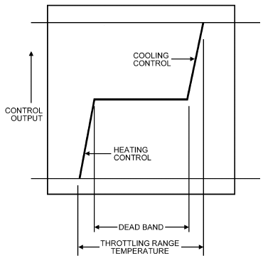

*Fig. 16 Dead-Band Thermostat*

### Relays

**Relays** provide a means for one electrical source to switch to a different electrical circuit. The switched voltage may be the same or different. Relay configurations include several variations:

- Shape and number of electrical connections
- Optional override button and/or LED indication
- Base or panel mount
- Electromechanical or solid state
- Normally open or normally closed (or both)
- Latching or nonlatching

**Electric relays** can be used to start and stop electric heaters, burners, compressors, fans, pumps, or other apparatus for which the electrical load is too large to be handled directly by the controller. Other uses include time-delay and circuit-interlocking safety applications. Form letters are part of an industry consensus that defines the arrangement of contacts for relays and switches. The three most common types in HVAC are forms A, B, and C. Form A relays are single pole, single throw, normally open (SPST-NO). Form B relays are single pole, single throw, normally closed (SPST-NC). Form C relays are single pole, double throw (SPDT) and can be either normally open or normally closed, so control panels can be built using all form C (SPDT) relays. In small sizes, the added cost of the second contact is insignificant. As current ratings go up, forms A and B become more cost effective.

**Time-delay relays**, similar to control relays, include an adjustable time delay that is set using dipswitches and/or a knob. The device is either a delay-on-make (on delay) or delay-on-break (off delay). The time delay is either in seconds to minutes or minutes to hours. Uses include preventing multiple pieces of equipment from starting simultaneously and overloading the electrical supply, ensuring equipment completes its warm-up cycle, preventing triggering of nuisance alarms during short transitions (e.g., before equipment has reached enough speed for its status sensors to activate), and temporarily changing the mode of operation (e.g., thermostat override timer during unoccupied hours).

**Power relays** handle high-power switching of electrical loads in motor control centers and lighting control applications. They may be of open-frame construction or enclosed, single or multiple pole, panel mounted or field mounted, with or without auxiliary contacts.

**Solid-state relays** are optically isolated relays used to switch voltages up to 600 V with high amperage loads using a form A contact. They have a high surge dielectric strength, and reverse voltage protection. They operate using an input voltage of 4 to 32 V DC. These devices are easily affected by high temperatures and induced currents, but their life expectancy, measured in number of operations, is much greater than that of electromechanical switches, so they are used wherever switching every few minutes or seconds is required, as in pulse-width modulation (PWM) controls.

<!-- str. 154 -->

**Control relay sockets** are used with control relays to terminate all the wires that need to be connected to the relay. They may have either blade- or pin-type terminals. Sockets make wiring easier (without the relay getting in the way), provide a way to ensure equipment is not started until the system is commissioned, and allow relay replacement without redoing the wiring terminations.

### Equipment Status

**Auxiliary contacts** are sometimes used to determine equipment status. The auxiliary contacts close when the starter’s contactor closes, so they do not account for broken belts, couplings, or wires; locked rotors; flow obstructions; or missing power.

**Differential pressure switches** are used for status indication for air filters, fans, and pumps. Additionally, they can be used to provide flow and level status and in safety circuits to protect system components.

**Current switches** are current-sensing relays used to monitor the status of electrical devices. Typically, they have one or more adjustable current set points. They should be adjusted at start-up so that if the fan or pump motor coupling breaks, the current switch does not indicate on status.

**Paddle switches** indicate flow of water or air and are used to sense the status of pumps and fans.

**Equipment with embedded controls** such as boilers, chillers, terminal units, and variable-speed pumps and fans usually provide their status through contacts and over serial communication.

**Limit switches** convert mechanical motion into a switching action. Common applications include valve and damper position and proximity feedback.

### Other Switches

**Manual switches**, either two-position or multiple-position with single or multiple poles, are used to switch equipment from one state to another.

**Auxiliary switches** on electric or electronic equipment, such as valve and damper actuators, sensors, and variable-speed controls are used to select a sequence or mode of operation.

**Moisture switches** are used to detect moisture in drain pains, under raised floors, and in containment areas to shut down equipment and/or alert operators before flooding or damage occurs.

**Level switches** (float, conductive probe, or ultrasonic) are used to start/stop equipment, either in normal operation, such as supply or drain pumps, or in protection circuits, as in boilers or chillers.

### Time Switches

Time switches (mechanical or electronic) turn electrical loads on and off, based on a 24 h/7 day or 24 h/365 day schedule.

**Analog time switches** are set manually to control an electrical load. They have either normally open or normally closed contacts. Timing is either in minutes or hours, and may have an override hold feature to keep the load on or off continuously.

**Digital time switches** are set manually to control an electrical load and have either normally open or normally closed contacts. The timing function is either in minutes or hours, and sometimes combines a regular weekly calendar with a yearly exceptions calendar used for holidays and other special events. They may have an override hold feature to keep the load on or off continuously, and a flash or beeper option to notify the operator that the load will be turning off shortly.

### Transducers

Transducers are devices that convert one signal (sensor reading or command) into a signal of another type that conveys some or all of the original information. Examples include pressure into voltage, voltage into current, voltage into contact closure, and rotational speed into pulse frequency. Transducers may convert proportional input to either proportional or two-position output.

The **electronic-to-pneumatic transducer (EPT** is used in many applications. It converts a proportional electronic output signal into a proportional pneumatic signal and can be used to combine electronic and pneumatic control components to form a control loop (Figure 17). Electronic components are used for sensing and signal conditioning, whereas pneumatic components are used for actuation. The electronic controller can be either analog or digital.

The EPT presents a special option for retrofit applications. An existing HVAC system with pneumatic controls can be retrofitted with electronic sensors and controllers while retaining the existing pneumatic actuators (Figure 18).

**Signal transducers** to change one standard signal into another. Variables usually transformed include voltage [0 to 10, 0 to 5, 2 to 10 V (DC)], current (4 to 20 mA), resistance (0 to 135 Ω), pressure [20 to 100, 0 to 140 kPa (gage)], phase cut voltage [0 to 20 V (DC)], pulse-width modulation, and time duration pulse. Signal transducers allow use of an existing control device in a retrofit application.

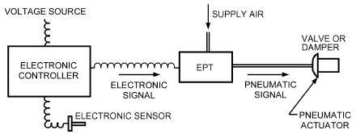

*Fig. 17 Electronic and Pneumatic Control Components Combined with Electronic-to-Pneumatic Transducer (EPT)*

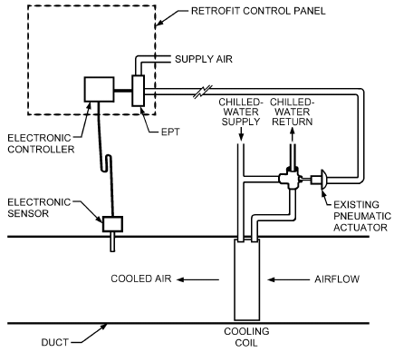

*Fig. 18 Retrofit of Existing Pneumatic Control with Electronic Sensors and Controllers*

<!-- str. 155 -->

### Other Auxiliary Control Devices

**Variable-frequency drives (VFDs)** control AC motors’ speed by using electronics to vary the frequency and voltage amplitude of the electrical input power. VFDs are commonly applied to fans, heat recovery wheels, pumps, and compressors.

**Occupancy sensors** are used to automatically adjust controlled variables (e.g., lighting, ventilation rate, temperature) based on occupancy.

**Potentiometers** are used for manual positioning of proportional control devices, for remote set-point adjustment of electronic controllers, and for position feedback.

**Smoke detectors** sense smoke and other combustion products in air moving through HVAC ducts. Through sampling tubes, selected based on duct size, they test air moving in the duct. For duct applications, using only photoelectric sensor heads is recommended. The device typically has two alarm contacts, used to shut down the associated equipment and provide remote indication, and a trouble contact, which monitors incoming power and removal of the detector head. Where a fire alarm system is installed, the smoke detectors must be listed for use with the fire alarm system. Addressable fire alarm systems may use a separate programmable relay for fan shutdown rather than a hard-wired connection to the detector.

**Transient voltage surge suppressors (TVSSs)**, formerly called **lightning arrestors**, protect communication lines and critical power lines between buildings or at building entrance vaults against high-voltage transients caused by VFDs, motors, transmitters, and lightning. To be effective, they must be grounded to a grounding rod in compliance with the National Electrical Code® (NFPA Standard 70) or local equivalent, and the manufacturer’s recommendations.

**Transformers** provide current at the required voltage.

**Regulated DC power supply** devices convert AC voltage into a DC voltage, kept constant independently of the current draw, and usually between 12 and 24 V DC. They may be used to power temperature, pressure, and humidity transmitters.

**Fuses** are safety devices with a specific amp rating, used with power supplies, circuit boards, control transformers, and transducers. They may be rated for either high or low inrush currents, and are available in slow-blow or fast-acting models.

**Step controllers** operate several switches in sequence using a proportional electric or pneumatic input signal. They are commonly used to control several steps of heating or refrigeration capacity. They may be arranged to prevent simultaneous starting of compressors and to alternate the sequence to equalize wear.

**Power controller**s control electric power input to resistance heating elements. They are available with various ratings for singleor three-phase heater loads and are usually arranged to regulate power input to the heater in response to the demands of the proportional electronic or pneumatic controllers. **Silicon controlled recti- fiers (SCRs)** are the most common form of power controller used for electric heat. Solid-state controllers in fast-switching two-position control modes are used because they are without mechanical contacts, which wear out too quickly to be of practical use for this application, and can arc when power is applied or removed.

**High-temperature limits** are safety devices that shut down equipment when the temperature exceeds the high limit set point. They are typically set at 50 to 65°C for heating air applications and 90 to 96°C for hot-water applications. A manual or automatic reset reactivates the device once the condition has cleared.

**Low-temperature limits** for ducts are used to protect chilled-water and preheat coils from freezing. They typically have a 6 m long vapor-charged sensing element, set at 2°C, that shuts down equipment when the temperature in any 300 or 450 mm section falls below its set point. They may be manually or automatically reset. The device must be mounted parallel to the coil tubes with capillary mounting clips for proper measurement. Limits may be either SPST or double-pole, double-throw (DPDT), with the second contact used to alert operators that the device has tripped.

**Three-** and **five-valve manifolds** protect water differential pressure sensors from overpressurization during installation, start-up, shutdown, system testing, and maintenance. Three-valve manifolds are comprised of two isolation valves and a bypass valve. A fivevalve manifold includes two additional valves to allow online calibration. Depending on the application, snubbers may be required, as well.

**Snubbers,** made of brass or stainless steel, stop shocks and pulsations caused by fluid hammering and system surges. Two types of pressure snubbers are used in HVAC applications: porous and piston. A porous snubber has no moving parts and uses a porous material to stop device damage. A piston snubber uses a moving piston inside a tube that moves up and down to stop device damage and push away any sediment or scale that may clog the system’s monitoring devices. Depending on the application, the type of piston to be used may need to be specified.

**Steam pigtail siphons** protect pressure transmitters from the high temperature of steam. They are typically made from steel or stainless steel of a specific length with a loop. The temperature of the medium being monitored determines the length and material. Most pressure devices have an operating temperature range of –18 to 95°C.

**Thermostat guards** are plastic or metal covers that protect switches, thermostat controllers, and sensors from damage, tampering, and unauthorized adjustment.

**Enclosures/control panels** may be used indoors or outdoors to protect equipment and people. In North America, enclosures are rated by the National Electrical Manufacturers Association (NEMA Standard 250) and Electrical and Electronic Manufacturer Association of Canada (EEMAC); elsewhere, they receive an ingress protection (IP) rating, which describes their degree of resistance to ingress of objects, dust, and water (IEC Standard 60529).

**Pilot lights** are replaceable incandescent or light-emitting diode (LED) lights that indicate the status or mode of operation of mechanical and electrical equipment. They are panel-mounted, and may be round or flat, of various colors, and powered using either AC or DC power. They are typically installed in an enclosure rated for the application under NEMA Standard 250, or with an appropriate IP rating.

**Strobes** use a high-intensity xenon flash tube to generate a high-intensity light that is visible in all directions. If this device is used in a safety application (e.g., refrigeration monitoring), in the United States, it must comply with UL Standard 1971 and the Americans with Disabilities Act (ADA), Title III; in Canada, with ULC Standard S526; elsewhere, it must meet requirements of British Standards Institution (BSI) Standard BS EN 54-23.

**Horns** provide an audible tone with a specified loudness rated in decibels (dB), and are mounted in a panel or junction box. The tone may be continuous, warbled, short beeps, or long beeps. The tone should be at least 10 dB above the ambient noise level in the area that the device is mounted. The operating voltage may be either DC or AC. When used in a life safety application, it must comply with NFPA Standard 72 or BSI Standard BS EN 54-3.

## 3. COMMUNICATION NETWORKS FOR BUILDING AUTOMATION SYSTEMS

A **building automation system (BAS)** is a centralized control and/or monitoring system for many or all building systems (e.g., HVAC, electrical, life safety, security). A BAS may link information from control systems actuated by different technologies.

<!-- str. 156 -->

One important characteristic of a BAS is the ability to share information. Information is transferred between (1) controllers to coordinate their action, (2) controllers and building operator interfaces to monitor and command systems, and (3) controllers and other computers for off-line calculation. This information is typically shared over communication networks. A BAS nearly always involves at least one network; often, two or more networks are interconnected to form an **internetwork**.

## 3.1 COMMUNICATION PROTOCOLS

A communication protocol is a set of rules that define exchange of information between devices on a communication network. These rules define the content and format of messages to be exchanged, what information it contains, how it is routed/received, what error detection and recovery is used, and what response is given. They also describe the addressing and naming used to identify devices as well as the interaction between them, how to respond to new devices, what to do when devices fail, and when/how often a device is allowed to initiate or respond to a new message.

Layering allows portions of the technology to be used by a wide variety of applications, and thus lowers the cost because of economies of scale. For example, one of the most widely used computer communication standards is the Institute of Electrical and Electronics Engineers (IEEE) Standard 802.3 (Ethernet). Ethernet is a general-purpose mechanism for exchanging information across a local area network (LAN). Ethernet networks are used for many applications, including e-mail, file transfer, web browsing, and building control systems. However, two devices on the same Ethernet may be completely unable to communicate because Ethernet does not define the content of messages to be exchanged.

Open protocols for building automation systems facilitate communication among devices from different suppliers. Although there is no commonly accepted definition of openness, IEEE Standard 802.3 defines three classes of protocols:

- **Standard protocol.** Published and controlled by a standards body.
- **Public protocol.** Published but controlled by a private organization.
- **Private protocol.** Unpublished; use and specification controlled by a private organization. Examples include the proprietary communications used by many building automation devices.

Multivendor communication is possible with any of these three classes, but the challenges vary. Specifying a standard or widely used public protocol can improve the chances for a competitive bidding process and provide economic options for future expansions. However, specifying a common protocol does not ensure that the requirement for interoperability is met. It is also necessary to specify the desired interaction between devices.

## 3.2 OSI NETWORK MODEL

ISO Standard 7498-1 presents a seven-layer model of information exchange called the Open Systems Interconnection (OSI) Reference Model (Figure 19).

Most computer networks, especially open networks, are based on this reference model. The layers can be thought of as steps in the translation of a message from something with meaning at the application layer, to something measurable at the physical layer, and back to meaningful information at the application layer.

The full seven-layer model does not apply to every network, but it is still used to describe the aspects that fit. When describing DDC networks that use the same technology throughout the system, the seven-layer model is relatively unimportant. For systems that use various technologies at different points in the network, the model helps to describe where and how the pieces are bound together.

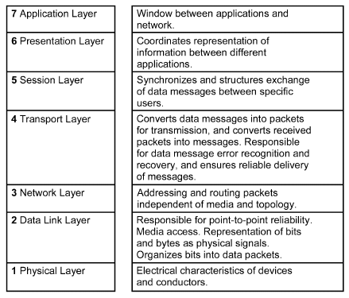

*Fig. 19 OSI Reference Model*

## 3.3 NETWORK STRUCTURE

### BAS Three-Tier Network Architecture

Often, a single BAS applies different network technologies at different points in the system. For example, a relatively low-speed, inexpensive network with relatively primitive functions may link a group of room controllers to a supervisory controller, while a faster, more sophisticated network links the supervisory controller to its peers and to one or more operator workstations. Figure 20 demonstrates the representation and interaction of a multitier BAS system architecture as described in ASHRAE Guideline 13-2015. The architecture model has three tiers. Tier 1 is the enterprise-level information technology (IT) network and provides access to user interfaces, dashboards, kiosks, and application interfaces. Tier 2 is the building network infrastructure and includes the building control network connectivity to the building IT network. Tier 3 is the control network and the associated controllers, equipment, sensors, and actuators.

The opposite extreme is completely **flat network architecture**, which links all devices through the same network. A flat architecture is more viable in small systems than in large ones, because economic constraints typically dictate that low-cost (and therefore lowspeed) networks be used to connect field-level controllers. Because of their performance limitations, these networks do not scale well to large numbers of devices. As the cost of electronics for communication drops, flatter networks become more feasible.

Network structure can affect

- Opportunities for expansion of a BAS.
- Reliability and failure modes. It may be appropriate to separate sections of a network to isolate failures.
- How devices load the information-carrying capacity of the network. It can isolate one busy branch from the rest of the system, or isolate branches from the high-speed backbone.
- How and where information is displayed to operating personnel; web servers accessible through the Internet make BAS information available to anyone, anywhere, who has a standard web browser and access rights to view the server pages.
- System cost, because it determines the mix of low- and high-speed devices.
- System data security and access control.

<!-- str. 157 -->

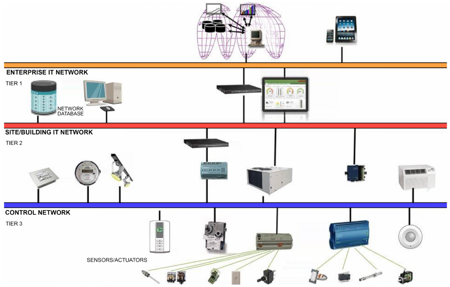

*Fig. 20 Hierarchical Network for Three-Tier System Architecture*

The relative merits of one structure versus another depend on the communication functions required, hardware and software available for the task, and cost. For a given job, there is probably more than one suitable structure. Product capabilities change quickly. Engineers who choose to specify network structure must be aware of new technologies to take advantage of the most cost-effective solutions.

### Connections Between BAS Networks and Other Computer Networks

Some BAS networks use other networks to connect segments of the BAS. This occurs

- Within a building, using the information technology network
- Between buildings, using an intranet or the Internet
- Between buildings, using telephone lines, wireless links, or fiber optics

In each case, the link between BAS segments must be considered part of the BAS network when evaluating function, security, and performance. The link also raises new issues. The connecting segment is likely to be outside the control of the owner of the BAS, which could affect availability of service. Traffic and bandwidth issues may have to be addressed with the link administrator.

Using a dial-up connection to interact with a remote building or to serve a remote operator requires consideration of which segment may dial the other, what circumstances trigger the call, and security implications. Handling interbuilding communication through intranet or Internet connections, with the operator interface provided by a web browser communicating with a web server, has largely replaced dial-up connections.

### Transmission Media

The transmission medium is the foundation of the network. It is usually, but not always, cable. The cable may be plenum rated or non-plenum rated, depending on the installation application. Where physical cable connection is not possible or practical, devices may transfer information using wireless technologies, such as radio waves or infrared light.

**RS-485** is the data link layer standard most commonly used in BAS for communications inside a building. It works over a single shielded twisted pair, 0.51 to 1.02 mm diameter, and can reach distances of up to 500 m between repeaters and up to 120 devices per segment. It has no polarity (i.e., no positive and negative wires), which reduces wiring errors, and in most cases is optically isolated at the controllers, allowing for different power sources without risk of short circuits.

ANSI/TIA/EIA Standard 568-B.1 provides IT cabling specifications for commercial buildings. This cabling is used for computers and telephone networks and can also be used for low-level BAS, access, security, or fire detection systems, but close work between the BAS and IT design and execution teams is required. The potential for third-party devices halting all network traffic discourages its use for control and security applications, as does the location of outlets prescribed in the standard (in occupied spaces instead of plenums and mechanical rooms where the controllers are). Also, IT network administrators are sometimes reluctant to allow connection of unfamiliar devices they cannot configure.

**Cable length.** Maximum length varies with cable type, transmission speed, and protocol.

100 Ω **Balanced Twisted-Pair Communications Outlet/Con- nector.** Each four-pair cable terminates on an eight-position modular jack, and all unshielded twisted-pair (UTP) and screened twisted-pair (ScTP) telecommunications outlets must meet the requirements of IEC Standard 60603-7, as well as ANSI/TIA/EIA Standard 568-B.2 and the terminal marking and mounting requirements of ANSI/TIA/EIA Standard 570-B.

<!-- str. 158 -->

**Twisted-Pair Copper Cable.** A twisted-pair cable consists of multiple twisted pairs (typically 0.51 mm diameter) of wire covered by an overall sheath or jacket. Varying the number of twists for each pair relative to the other pairs in the cable can greatly reduce crosstalk (interference between signals on different pairs).

**Screened twisted-pair (ScTP) cable** is similar in construction to UTP data cabling, except that ScTP has a foil shield between the conductors and outer jacket, as well as a drain wire used to minimize interference-related problems. ScTP cable is preferred over UTP cable in environments where high immunity and/or low emissions are critical. It also allows less crosstalk than UTP. However, ScTP requires more labor-intensive installation, and any break or improper grounding of the shield reduces its overall effectiveness.

Category 3 cable connects hardware and patch cords that are rated to a maximum frequency of 16 MHz. This cable is rated up to 16 megabits per second. This category is usually the lowest level of cable installed and is used mainly for voice and low-speed networks.

Category 5 cable connects hardware and patch cords that are rated to a maximum frequency of 100 MHz. The actual data transmission rate varies with the compression scheme used. Category 5 was defined in ANSI/TIA/EIA Standard 568-A, but is no longer recognized in the new ANSI/TIA/EIA Standard 568-B.1.

Category 5e cable connects hardware and patch cords that are rated to a maximum frequency of 100 MHz. The actual data transmission rate varies with the compression or encoding scheme used. Category 5e, the lowest category recommended for data installations, is defined by ANSI/TIA/EIA Standards 568-B.1 and B.2. This cable is rated up to 100 megabits per second.

Category 6 cable connects hardware and patch cords that are rated to a maximum frequency of 250 MHz, though the actual data transmission rate varies with the compression scheme used. UTP or STP cable is currently the most common medium. This cable is rated up to 1 gigabit per second.

Category 6e cable connects hardware and patch cords that are rated to a maximum frequency of 250 MHz, though actual data transmission rate varies with the compression scheme used. With all Category 6 systems, an eight-position jack is mandatory in the work area.

Category 7 cable connects hardware and patch cords that are rated to a maximum frequency of 600 MHz, though actual data transmission rate varies with the compression scheme used. This category is still in development and uses a braided shield surrounding all four foil-shielded pairs to reduce noise and interference. Depending on future technological developments, the current RJ-45 connector will not be used in Category 7.

**Fiber-Optic Cable.** Fiber-optic cable uses glass or plastic fibers to transfer data in the form of light pulses, which are typically generated by either a laser or an LED. Fiber-optic cable systems are classified as either single-mode fiber or multimode fiber systems. Table 1 compares their characteristics.

Light in a fiber-optic system loses less energy than electrical signals traveling through copper and has no capacitance. This translates into greater transmission distances and dramatically higher data transfer rates, which impose no limits on a BAS. Fiber optics also have exceptional noise immunity. However, the necessary conversions between light-based signaling and electricity-based computing make fiber optics more expensive per device, which sometimes offsets its advantages.

**Structured Cabling.** ANSI/TIA/EIA Standard 568 allows cable planning and installation to begin before the network engineering is finalized. It supports both voice and data. The standard was written for the telecommunications industry, but cabling is gaining recognition as building infrastructure, and the standard is being applied to BAS networks as well.

**Table 1 Comparison of Fiber Optic Technology**

|   | Multimode Fiber | Single-Mode Fiber |
|---|---|---|
| Light source | LED | Laser |
| Cable designation (core/cladding diameter) | 62.6/125 | 8.3/125 |
| Transmission distance | 2000 m | 30 000 m |
| Data rate | >10 gigabit/s and increasing | Even higher |
| Relative cost | Less per connection, more per data rate | More per connection, less per data rate |

ANSI/TIA/EIA Standard 568-B specifies **star topology** (each device individually cabled to a hub) because connectivity is more robust and management is simpler than for busses and rings. If the wires in a leg are shorted, only that leg fails, making fault isolation easier; with a bus, all drops would fail.

The basic structure specified is a **backbone**, which typically runs from floor to floor in a building and possibly between buildings. **Horizontal cabling** runs between the distribution frames on each floor and the information outlets in the work areas.

**Wireless Networks.** The rapid maturity of everyday wireless technologies, now widely used for mobile phones, Internet access, and even barcode replacement, has tremendously increased the ability to collect information from the physical world. Wireless technologies offer significant opportunities in sensors and controls for building operation, especially in reducing the cost of installing data acquisition and control devices. Installation costs typically represent 20 to 80% of the total cost of a sensor and control point in any HVAC system, so reducing or eliminating the cost of installation can have a dramatic effect on the overall installed system cost. Low-cost wireless sensors and control systems also make it economical to use more sensors, thereby establishing highly energy-efficient building operations and demand responsiveness that enhance the electric grid reliability.

Wireless sensors and control networks consist of sensor and control devices that are connected to a network using radio-frequency (RF) or optical (infrared) signals. Devices can communicate bidirectionally (i.e., transmitting and receiving) or one way (transmitting only). Most RF products transmit in the industrial, scientific, or medical frequency bands, which are set aside by the Federal Communication Commission (FCC) for use without an FCC license. Wireless sensor networks have different requirements than computer networks and, thus, different network topologies, and separate communication protocols have evolved for them. The simplest is the **point-to-point topology**, in which two nodes communicate directly with each other. The **point-to-multipoint** or **star topology** is an extension of the point-to-point configuration in which many nodes communicate with a central receiving or gateway node. In either topology, sensor nodes might have pure transmitters, which provide one-way communication only, or transceivers, which allow two-way communication and verification of the receipt of messages. Gateways provide a means to convert and pass data between protocols (e.g., from a wireless sensor network protocol to the wired Ethernet protocol).

The communication range of the point-to-point and star topologies is limited by the maximum communication range between the sensor node (from which the measured data originates) and the receiver node. This range can be extended by using repeaters, which receive transmissions from sensor nodes and then retransmit them, usually at higher power than the original transmissions. In the **mesh network topology**, each sensor node includes a transceiver that can communicate directly with any other node within its communication range. These networks connect many devices to many other devices, thus forming a mesh of nodes in which signals are transmitted between distant points via multiple hops. This approach decreases the distance over which each node must communicate and reduces each node’s power use substantially, making them more compatible with onboard power sources such as batteries (Capehardt 2005).

<!-- str. 159 -->

## 3.4 SPECIFYING BUILDING AUTOMATION SYSTEM NETWORKS

Specifying a building automation system includes specifying a platform comprising the following components: field device (e.g., sensors, actuators), controllers (e.g., equipment and/or supervisory), and information management and network communication (e.g., security, diagnostics, maintenance). Many technologies can deliver many performance levels at many different prices. Building automation system design requires assessing the owner’s risk tolerance against the proposed project budget. In some cases, new equipment must interface with existing devices, which may limit networking options. ASHRAE Guideline 13-2015 provides detailed information on how to specify a building automation system.

### Communication Tasks

Determining network performance requirements means identifying and quantifying the communication functions required. Ehrlich and Pittel (1999) identified the following five basic communication tasks necessary to establish network requirements.

**Data Exchange.** What data passes between which devices? What control and optimization data passes between controllers? What update rates are required? What data does an operator need to reach? How much delay is acceptable in retrieving values? What update rates are required on “live” data displays? (Within one system, answers may vary according to data use.) Which set points and control parameters do operators need to adjust over the network?

**Alarms and Events.** Where do alarms originate? Where are they logged and displayed? How much delay is acceptable? Where are they acknowledged? What information must be delivered along with the alarm? (Depending on system design, alarm messages may be passed over the network along with the alarms.) Where are alarm summary reports required? How and where do operators need to adjust alarm limits, etc.?

**Schedules.** For HVAC equipment that runs on schedules, where can the schedules be read? Where can they be modified?

**Trends.** Where does trend data originate? Where is it stored? How much will be transmitted? Where is it displayed and processed? Which user interfaces can set and modify trend collection parameters?

**Network Management.** What network diagnostic and maintenance functions are required at which user interfaces? Data access and security functions may be handled as network management functions.

Bushby et al. (1999) refer to the same five communication tasks as **interoperability areas** and list many more specific considerations in each area. ASHRAE Guideline 13 also provides more detailed information that is helpful.

## 3.5 APPROACHES TO INTEROPERABILITY

Many approaches to interoperability have been proposed and applied, each with varying degrees of success under various circumstances. The field changes quickly as product lines emerge and standards develop and gain acceptance. The building automation world continues to evaluate options project by project.

Typically, an interoperable system uses one of two approaches: standard protocols or special-purpose gateways. With a standard, the supplier is responsible for compliance with the standard; the system specifier or integrator is responsible for interoperation. With a gateway, the supplier takes responsibility for interoperation. Where the job requires interoperation with existing equipment, gateways may be the only solution available. Bushby (1998) addressed this issue and some of the limitations associated with gateways. To date, interoperability by any method requires solid field engineering and capable system integration; the issues extend well beyond the selection of a communication protocol.

**Table 2 Some Standard Communication Protocols Applicable to BAS**

| Protocol | Definition |
|---|---|
| BACnet® | ANSI/ASHRAE Standard 135-2012, EN/ISO Standard 16484-5:2013 |
| LonTalk | ANSI/CEA Standard 709.1 |
| PROFIBUS FMS | EN 50170:2000 Volume 2 |
| Konnex | EN 50090 |
| MODBUS | Modbus Application Protocol Specification V1.1 |
| ZigBee® | ZigBee® Commercial Building Automation Profile Specification |

### Standard Protocols

Table 2 lists some applicable standard protocols that have been used in BAS. Their different characteristics make some more suited to particular tasks than others. PROFIBUS (www.profibus.com) and MODBUS (www.modbus.org) were designed for low-cost industrial process control and automated manufacturing applications, but they have been applied to BAS. LonTalk defines a LAN technology but not messages that are to be exchanged for BAS applications. BACnet® or implementers’ agreements, such as those made by members of LonMark International, are necessary to achieve interoperability with LonTalk devices. Konnex evolved from the European Installation Bus (EIB) and several other European protocols developed for residential applications, including multifamily housing. ZigBee® is an open communications standard for wireless devices developed by the ZigBee Alliance. Annex O of the BACnet standard (ANSI/ASHRAE Standard 135-2013) specifies using BACnet messaging with services described in the ZigBee specification. Martocci (2008) describes how a wireless ZigBee network can be integrated into a BACnet network.

BACnet is the only standard protocol developed specifically for commercial BAS applications. BACnet has been adopted as a national standard in the United States, Korea, and Japan, as a European standard, and as a world standard (EN/ISO Standard 16484-5). BACnet was designed to be used with non-BACnet networks. Principles of mapping are documented in Annex H of ANSI/ASHRAE Standard 135-2012.

### Gateways and Interfaces

Rather than conforming to a published standard, a supplier can design a specific device to exchange data with another specific device. This typically requires cooperation between two manufacturers. In some cases, it can be simpler and more cost-effective than for both manufacturers to conform to an agreed-upon standard. The device can be either custom-designed or off the shelf. In either case, the communication tasks must be carefully specified to ensure that the gateway performs as needed.

Choosing a system that supports a variety of gateways may be a way to maintain a flexible position as products and standards continue to develop.

## 4. SPECIFYING BUILDING AUTOMATION SYSTEMS

Successful building automation system (BAS) installation depends in part on a clear description (specification) of what is required to meet the customer’s needs. The specification should include descriptions of the products desired, or of the performance and features expected. Needed points or data objects should be listed. A control schematic shows the layout of each system to be controlled, including instrumentation and input/output objects and any hard-wired interlocks.

<!-- str. 160 -->

Writing a descriptive network specification requires knowledge of the details of network technology. To succeed with any specification, the designer must articulate the end user’s needs. Typically, performance-based specification is the best value for the customer (Ehrlich and Pittel 1999).

The sequences of operation describe how the system should function and are the designer’s primary method of communication to the control system programmer. A sequence should be written for each system to be controlled. In writing a sequence, be sure to describe all operational modes and ensure that all input/output (I/O) devices needed to implement the sequence are shown on the object list and drawings.

Annex A of ASHRAE Guideline 13-2015 shows a sample specification outline for a building automaton system. Information on specifying building automaton systems is in MasterFormat (CSI 2004): Division 23, Section 23 09 00, or in Division 25. Additional information on specifying BAS controls and sample sequences of control for air-handling systems can be found in ASHRAE Guideline 13.

## 5. COMMISSIONING

Commissioning controls can refer either to the proper configuration and tuning of a controller or, more broadly, a standard process of quality assurance to ensure that owner’s requirements are met, design intent is achieved, and staff is well prepared for operation and maintenance. Because individual pieces of equipment are often tied together into larger systems, and sequences of operation on these systems (affecting safety, indoor air quality, comfort, and energy efficiency) are implemented through controls configuration and programming, building performance is highly dependent on the quality of controls design and implementation.

A successful control system requires proper start-up, testing, and documentation, not merely adjustment of a few parameters (set points and throttling ranges) and a few quick checks.

Because of the impact on building performance, controls have become a significant focus of the building commissioning process. The typical BAS system should be commissioned directly using an experienced, unbiased third party; this is an effective way to test and document HVAC system performance.

The commissioning process requires coordination between the owner, designers, and contractors, and is most effective when it begins before the start of design and continues for the life of the building. Issues are tracked and results are documented throughout the process. Design and construction specifications should include specific commissioning procedures. Review submittals for conformance to design. Check each control device to ensure that it is installed and connected according to approved drawings. Each connection should be verified, and all safeties and sequences tested. Performance assessment should continue after occupancy, especially for large equipment, to identify and address degradation over time. Chapter 44 of the 2019 *ASHRAE Handbook—HVAC Applications* and ASHRAE Guideline 1 explain more about commissioning.

Package controls of high-cost equipment (e.g., chillers, preassembled plants) or that may pose safety risks (e.g., boilers) should always be commissioned by factory-authorized service providers. Because factory-supplied equipment and controls are usually integrated into larger systems, some on-site commissioning is still appropriate.

## 5.1 TUNING

Systematic tuning of controllers improves performance of all controls and is particularly important for digital control. First, the controlled process should be controlled manually between various set points to evaluate the following questions:

- Is the process noisy (rapid fluctuations in controlled variable)?
- Is there appreciable hysteresis (backlash) in the actuator?
- How easy (or difficult) is it to maintain and change set point?
- In which operating region is the process most sensitive (highest gain)?

If the process cannot be controlled manually, the reason should be identified and corrected before the controller is tuned.

Tuning optimizes control parameters that determine steady-state and transient characteristics of the control system. HVAC processes are nonlinear, and characteristics change seasonally. Controllers tuned under one operating condition may become unstable as conditions change.

A well-tuned controller (1) minimizes steady-state error for set point, (2) responds with appropriate timing to disturbances, and (3) remains stable under all operating conditions. Tuning proportional controllers is a compromise between minimizing steady-state error and maintaining margins of stability. Proportional plus integral (PI) control minimizes this compromise because the integral action reduces steady-state error, and the proportional term determines the controller’s response to disturbances.

As performance requirements have become more stringent, sequences of operation have become increasingly complex, and the task of tuning has also become more challenging. Some manufacturers now provide self-tuning routines to avoid the need for manual adjustment and help maintain performance with changing conditions.

### Tuning Proportional, PI, and PID Controllers

Popular methods of determining proportional, PI, and PID controller tuning parameters include closed- and open-loop process identification methods and trial-and-error methods. For each method, carefully consider the resulting timing of system responses to avoid compromising safety or reducing the expected life of equipment. Two of the most widely used techniques for tuning these controllers are ultimate oscillation and first-order-plus-dead-time. There are many optimization calculations for these two techniques. The Ziegler-Nichols, which is given here, is well established.

**Ultimate Oscillation (Closed-Loop) Method.** The closed-loop method increases controller gain in proportional-only mode until the equipment continuously cycles after a set-point change (Figure 21, where Kp = 40). Proportional and integral terms are then computed from the cycle’s period of oscillation and the Kp value that caused cycling. The ultimate oscillation method is as follows:

1. Adjust control parameters so that all are essentially off. This corresponds to a proportion band (gain) at its maximum (minimum), the integral time (repeats per minute) or integral gain to maximum (minimum), and derivative to its minimum.

2. Adjust manual output of the controller to give a measurement as close to midscale as possible.

3. Put controller in automatic.

4. Gradually increase proportional feedback (this corresponds to reducing the proportional band or increasing the proportional gain) until observed oscillations neither grow nor diminish in amplitude. If response saturates at either extreme, start over at Step 2 to obtain a stable response. If no oscillations are observed, change the set point and try again.

<!-- str. 161 -->

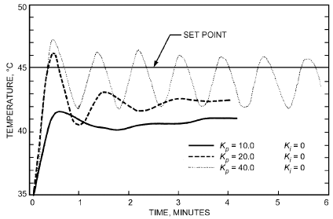

*Fig. 21 Response of Discharge Air Temperature to Step Change in Set Points at Various Proportional Constants with No Integral Action*

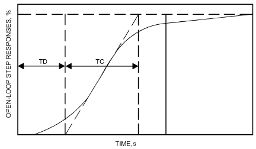

*Fig. 22 Open-Loop Step Response Versus Time*

5. Record the proportional band as PBu and the period of oscillations as Tu.

6. Use the recorded proportional band and oscillation period to calculate controller settings as follows:

Proportional only:

> PB = 1.8(PBu) percent&emsp;**(4)**

Proportional plus integral (PI):

> PB = 2.22(PBu) percent&emsp;**(5)**
>
> Ti = 0.83Tu minute per repeat&emsp;**(6)**

Proportional plus integral plus derivative (PID):

> PB = 1.67(PBu) percent&emsp;**(7)**
>
> Ti = 0.50Tu minute per repeat&emsp;**(8)**

> Td = 0.125Tu minute&emsp;**(9)**

**First-Order-plus-Dead-Time (Open-Loop) Method.** The open-loop method introduces a step change in input into the opened control loop. A graphical technique is used to estimate the process transfer function parameters. Proportional and integral terms are calculated from the estimated process parameters using a series of equations.

The value of the process variable must be recorded over time, and the dead time and time constant must be determined from it. This can be accomplished graphically, as seen in Figure 22. The first-order-plus-dead-time method is as follows:

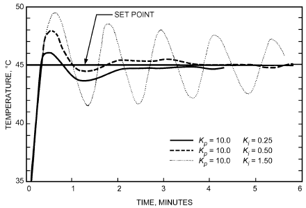

*Fig. 23 Response of Discharge Air Temperature to Step Change in Set Points at Various Integral Constants with Fixed Proportional Constant*

1. Adjust controller manual output to give a midscale measurement. 2. Arrange to record the process variable over time.

3. Move the manual output of the controller by 10% as rapidly as possible to approximate a step change.

4. Record the value of the process variable over time until it reaches a new steady-state value.

5. Determine dead time and time constant.

6. Use dead time (TD) and time constant (TC) values to calculate PID values as follows:

> Gain = (% change in controlled variable)/(% change in control signal)&emsp;**(10)**

Proportional only:

> PB = Gain/(TC/TD)&emsp;**(11)**

Proportional plus integral (PI):

> PB = 0.9(Gain)/(TC/TD)&emsp;**(12)**
>
> Ti = 3.33(TD)&emsp;**(13)**

Proportional-integral-derivative (PID):

> PB = 1.2(Gain)/(TC/TD)&emsp;**(14)**
>
> Ti = 2(TD)&emsp;**(15)**

> Td = 0.5(TD)&emsp;**(16)**

**Trial and Error.** This method involves adjusting the gain of the proportion-only controller until the desired response to a set point is observed. Conservative tuning dictates that this response should have a small initial overshoot and quickly damp to steady-state conditions. Set-point changes should be made in the range where controller saturation, or output limit, is avoided. The integral term is then increased until changes in set point produce the same dynamic response as the controller under proportional control, but with the response now centered about the set point (Figure 23).

### Tuning Digital Controllers

In tuning digital controllers, additional parameters may need to be specified. The digital controller sampling interval is critical because it can introduce harmonic distortion if not selected properly. This sampling interval is usually set at the factory and may not be adjustable. A controller sampling interval of about one-tenth of the controlled-process time constant usually provides adequate control. Many digital control algorithms include an error dead band to eliminate unnecessary control actions when the process is near set point. Hysteresis compensation is possible with digital controllers, but it must be carefully applied because overcompensation can cause continuous cycling of the control loop.

<!-- str. 162 -->

### Computer Modeling of Control Systems

Each component of a control system can be represented by a transfer function, which is an idealized mathematical representation of the relationship between the input and output variables of the component. The transfer function must be sufficiently detailed to cover both the dynamic and static characteristics of the device. The dynamics are represented in the time domain by a differential equation. In environmental control, the transfer function of many of the components can be adequately described by a first-order differential equation, implying that the dynamic behavior is dominated by a single capacitance factor. For a solution, the differential equation is converted to its Laplace or z-transform.

For more information on computer modeling programs, see Chapter 40 of the 2015 *ASHRAE Handbook—HVAC Applications*.

## 5.2 CODES AND STANDARDS

AMCA. 2012. Laboratory methods of testing dampers for rating. ANSI/AMCA Standard 500-D-12. Air Movement and Control Association, Arlington Heights, IL.

ANSI/CTA. 2014. Control network protocol specification. ANSI/CEA Standard 709.1-C-2014. Consumer Electronics Association, Arlington, VA.

ANSI/CTA. 2015. Free-topology twisted-pair channel specification. ANSI/CTA Standard 709.3-R2015. Consumer Technology Association, Arlington, VA.

ANSI/CTA. 2014. Enhanced protocol for tunneling component network protocols over Internet protocol channels. ANSI/CTA Standard 852.1-A-2014. Consumer Technology Association, Arlington, VA.

ANSI/TIA/EIA. 2000. Commercial building telecommunications cabling standard. Standard 568-A. Telecommunications Industry Association, Arlington, VA.

ANSI/TIA/EIA. 2010. Commercial building telecommunications cabling standard—Part 1: General requirements. Standard 568-B.1-2-2010. Telecommunications Industry Association, Arlington, VA.

ANSI/TIA/EIA. 2010. Commercial building telecommunications cabling standard—Part 2: Balanced twisted pair telecommunications cabling and components standards. Standard 568-C.2-2010. Telecommunications Industry Association, Arlington, VA.

ANSI/TIA/EIA. 2011. Optical fiber cabling component standard. Standard 568-C.3-2011. Telecommunications Industry Association, Arlington, VA.

ANSI/TIA/EIA. 2009. Residential telecommunications infrastructure standard. Standard 570-B AMD1. Telecommunications Industry Association, Arlington, VA.

ASHRAE. 2013. Safety standard for refrigeration systems. ANSI/ASHRAE Standard 15-2013.

ASHRAE. 2016. Ventilation for acceptable indoor air quality. ANSI/ASHRAE Standard 62.1-2016.

ASHRAE. 2012. BACnet®—A data communication protocol for building automation and control networks. ANSI/ASHRAE Standard 135-2012, EN/ISO Standard 16484-5 (2013).

CENELEC. 2011. Home and building electronic systems. EN Standard 50090 (various parts).

EIA. 2003. Electrical characteristics of generators and receivers for use in balanced digital multipoint systems. TIA/EIA Standard 485-2003.

IEC. 2013. Degrees of protection provided by enclosures (IP code). Standard 60529:1989 + AMD1:1999 + AMD2:2013, consolidated version. International Electrotechnical Commission, Geneva.

IEC. 2011. Connectors for electronic equipment—Part 7: Detail specification for 8-way, unshielded, free and fixed connectors. Standard 60603-7:2008 + AMD1:2011. International Electrotechnical Commission, Geneva.

IEEE. 2008. Information technology—Telecommunications and information exchange between systems—Local and metropolitan area network—Specific requirements—Part 3: Carrier sense multiple access with collision detection (CSMA/CD) access method and physical layer specifications. Standard 802.3-2008. Institute of Electrical and Electronics Engineers, Piscataway, NJ.

ISO. 2004. Information technology—Open systems interconnection—Basic reference model: The basic model. ISO/IEC Standard 7498-1:1994. International Organization for Standardization, Geneva.

NEMA. 2014. Enclosures for electrical equipment (1000 volts maximum).

Standard 250. National Electrical Manufacturers Association, Rosslyn, VA.

NFPA. 2017. National electrical code®. Standard 70-2017. National Fire Protection Association, Quincy, MA.

UL. 2002. Signaling devices for the hearing impaired. ANSI/UL Standard 1971. Underwriters Laboratories, Northbrook, IL.

## REFERENCES

ASHRAE members can access ASHRAE Journal articles and ASHRAE research project final reports at technologyportal .ashrae.org. Articles and reports are also available for purchase by nonmembers in the online ASHRAE Bookstore at www.ashrae.org /bookstore.

ASHRAE. 2007. HVAC&R technical requirements for the commissioning process. Guideline 1.1-2007.

ASHRAE. 2015. Specifying building automation systems. Guideline 13-2015.

ASHRAE. 2014. Selecting outdoor, return, and relief dampers for air-side economizer systems. Guideline 16-2014.

ASHRAE. 2010. *Standard 62.1-2010 user’s manual.*

ASHRAE. 2007. *Sequence of operation for common HVAC systems*. CD-ROM.

Bushby, S.T. 1998. Friend or foe? Communication gateways. ASHRAE Journal 40(4):50-53.

Bushby, S.T., H.M. Newman, and M.A. Applebaum. 1999. *GSA guide to* *specifying interoperable building automation and control systems using* ANSI/ASHRAE Standard 135-1995, BACnet. NISTIR 6392. National Institute of Standards and Technology, Gaithersburg, MD. Available from National Technical Information Service, Springfield, VA.

Capehardt, B., and L. Capehardt. 2005. *Web based energy information and* *control system: Case studies and applications*, Ch. 27, Wireless Sensor Applications for Building Operation and Management. Fairmont Press and CRC, Boca Raton, FL.

CSI. 2004. MasterFormat. The Construction Specifications Institute, Alexandria, VA.

Ehrlich, P., and O. Pittel. 1999. Specifying interoperability. ASHRAE Journal 41(4):25-29.

Felker, L.G., and T.L. Felker. 2009. *Dampers and airflow control*.

ASHRAE.

van Becelaere, R., H.J. Sauer, and F. Finaish. 2004. Flow resistance and modulating characteristics of control dampers. ASHRAE Research Project RP-1157, Final Report.

Martocci, J. 2008. Unplugged ZigBee® and BACnet connect. ASHRAE Journal 50(6):42-46.

ULC. 2016. Visible signaliing devices for fire alarm and signaling systems, including accessories. CAN/ULC Standard S526:2016-EN. Underwriters Laboratories of Canada, Toronto.

## BIBLIOGRAPHY

Avery, G. 1989. Updating the VAV outside air economizer controls. ASH-RAE Journal (April).

Avery, G. 1992. The instability of VAV systems. *Heating, Piping and Air* Conditioning (February).

BICSI. 1999. *LAN and internetworking design manual*, 3rd ed. Building Industry Consulting Service International, Tampa.

CEN. 1999. *Building control systems, Part 1: Overview and definitions*.

prEN ISO16484-1. CEN, the European Committee for Standardization. Haines, R.W., and D.C. Hittle. 2003. *Control systems for heating, ventilating* *and air conditioning*, 6th ed. Springer.

Hartman, T.B. 1993. *Direct digital controls for HVAC systems*. McGraw-Hill, New York.

Kettler, J.P. 1998. Controlling minimum ventilation volume in VAV systems.

ASHRAE Journal (May).

Levenhagen, J.I., and D.H. Spethmann. 1993. *HVAC controls and systems*.

McGraw-Hill, New York.

Lizardos, E., and K. Elovitz. 2000. Damper sizing using damper authority.

ASHRAE Journal (April).

<!-- str. 163 -->

LonMark. 1998. *LonMark application layer interoperability guidelines*.

LonMark Interoperability Association, Sunnyvale, CA.

LonMark. 1999. *LonMark functional profile: Space comfort controller*.

8500-10. LonMark Interoperability Association.

Newman, H.M. 1994. *Direct digital control for building systems: Theory* and practice. John Wiley & Sons, New York.

OPC Foundation. 1998. *What is OPC?* OPC Foundation, Boca Raton, FL.

Available at opcfoundation.org/about/what-is-opc/.

Rose, M.T. 1990. *The open book: A practical perspective on OSI*. Prentice-Hall, Englewood Cliffs, NJ.

Seem, J.E., J.M. House, and R.H. Monroe. 1999. On-line monitoring and fault detection. ASHRAE Journal (July).

Starr, R. 1999. Pneumatic controls in a digital age. *Heating, Piping and Air* Conditioning (November).

Tillack, L., and J.B. Rishel. 1998. Proper control of HVAC variable speed pumps. ASHRAE Journal (November).
