# Chapter 8 — Sound and Vibration

*Izvor: 2021 ASHRAE Handbook — Fundamentals (SI), Chapter 8 (PDF str. 164–184).*

> **Napomena o konverziji:** Tekst je automatski izdvojen iz originalnog PDF-a uz prepoznavanje dve kolone, spojene prelomljene reči i pasuse. Indeksi i eksponenti su označeni sa ``/``, tabele su pretvorene u Markdown tabele (veoma složene tabele su prikazane kao poravnat tekst), a slike su izrezane iz PDF-a u folder `img/`. Složene jednačine (razlomci, sume) mogu biti uprošćeno prikazane. **Pre upotrebe vrednosti u proračunu proveriti u originalnom PDF-u.** Oznake `<!-- str. N -->` pokazuju stranu PDF-a.

## Sadržaj

- [1. ACOUSTICAL DESIGN OBJECTIVE](#1-acoustical-design-objective)
- [2. CHARACTERISTICS OF SOUND](#2-characteristics-of-sound)
- [3. MEASURING SOUND](#3-measuring-sound)
- [4. DETERMINING SOUND POWER](#4-determining-sound-power)
- [5. CONVERTING FROM SOUND POWER TO SOUND PRESSURE](#5-converting-from-sound-power-to-sound-pressure)
- [6. SOUND TRANSMISSION PATHS](#6-sound-transmission-paths)
- [7. TYPICAL SOURCES OF SOUND](#7-typical-sources-of-sound)
- [8. CONTROLLING SOUND](#8-controlling-sound)
- [9. SYSTEM EFFECTS](#9-system-effects)
- [10. HUMAN RESPONSE TO SOUND](#10-human-response-to-sound)
- [11. SOUND RATING SYSTEMS AND ACOUSTICAL DESIGN GOALS](#11-sound-rating-systems-and-acoustical-design-goals)
- [12. FUNDAMENTALS OF VIBRATION](#12-fundamentals-of-vibration)
- [13. VIBRATION MEASUREMENT BASICS](#13-vibration-measurement-basics)
- [14. SYMBOLS](#14-symbols)
- [REFERENCES](#references)
- [BIBLIOGRAPHY](#bibliography)

<!-- str. 164 -->

IF FUNDAMENTAL principles of sound and vibration control are applied in the design, installation, and use of HVAC&R systems, suitable levels of noise and vibration can be achieved with a high probability of user acceptance. This chapter introduces these fundamental principles, including characteristics of sound, basic definitions and terminology, human response to sound, acoustic design goals, and vibration isolation fundamentals. Chapter 49 of the 2019 *ASHRAE Handbook—HVAC Applications* and the references at the end of this chapter contain technical discussions, tables, and design examples helpful to HVAC designers.

## 1. ACOUSTICAL DESIGN OBJECTIVE

A primary objective in the design of HVAC systems and equipment is to evaluate noise and vibration to ensure that the acoustical environment in a given space is acceptable for various occupant activities. Sound and vibration are created by a **source**, are transmitted along one or more **paths**, and reach a **receiver**. Treatments and modifications can be applied to any or all of these elements to reduce unwanted noise and vibration, although it is usually most effective and least expensive to reduce noise at the source.

## 2. CHARACTERISTICS OF SOUND

Sound is a propagating disturbance in a fluid (gas or liquid) or in a solid. In fluid media, the disturbance travels as a longitudinal compression wave. Sound in air is called airborne sound or just sound. It is generated by a vibrating surface or turbulent fluid stream. In solids, sound can travel as bending, compressional, torsional, shear, or other waves, which, in turn, are sources of airborne sound. Sound in solids is generally called structureborne sound. In HVAC system design, both airborne and structureborne sound propagation are important.

### Levels

The magnitude of sound and vibration physical properties are almost always expressed in levels. As shown in the following equations, the level L is based on the common (base 10) logarithm of a ratio of the magnitude of a physical property of power, intensity, or energy to a reference magnitude of the same type of property:

> ( )
>
> L = 10 log A/(A ref)&emsp;**(1)**

> ( )

where A is the magnitude of the physical property of interest and Aref is the reference value. Note that the ratio is dimensionless. In this equation, a factor of 10 is included to convert bels to decibels (dB).

The preparation of this chapter is assigned to TC 2.6, Sound and Vibration.

### Sound Pressure and Sound Pressure Level

Sound waves in air are variations in pressure above and below atmospheric pressure. **Sound pressure** is measured in pascals (Pa). The human ear responds across a broad range of sound pressures; the threshold of hearing to the threshold of pain covers a range of approximately 1014:1. Table 1 gives approximate values of sound pressure by various sources at specified distances from the source.

The range of sound pressure in Table 1 is so large that it is more convenient to use a scale proportional to the logarithm of this quantity. Therefore, the **decibel** (dB) scale is the preferred method of presenting quantities in acoustics, not only because it collapses a large range of pressures to a more manageable range, but also because its levels correlate better with human responses to the magnitude of sound than do sound pressures. Equation (1) describes levels of power, intensity, and energy, which are proportional to the square of other physical properties, such as sound pressure and vibration acceleration. Thus, the **sound pressure level Lp** corresponding to a sound pressure is given by

> ( p )2 ( p )
>
> Lp = 10 log -------- = 20 log ----------&emsp;**(2)**

> p p
>
> ( ref) ( ref )

where p is the root mean square (RMS) value of acoustic pressure in pascals. The root mean square is the square root of the time average of the square of the acoustic pressure ratio. The ratio p/pref is squared to give quantities proportional to intensity or energy. A reference quantity is needed so the term in parentheses is nondimensional. For sound pressure levels in air, the reference pressure pref is 20 μPa, which corresponds to the approximate threshold of hearing for a young person with good hearing exposed to a pure tone with a frequency of 1000 Hz.

**Table 1 Typical Sound Pressures and Sound Pressure Levels**

| Source | Pressure, Level, dB Sound Pa | Pressure, Level, dB Sound Pressure re 20 μPa | Subjective Reaction |
|---|---|---|---|
| Military jet takeoff at 30 m | 200 | 140 | Extreme danger |
| Artillery fire at 3 m | 63.2 | 130 |  |
| Passenger jet takeoff at 15 m | 20 | 120 | Threshold of pain |
| Loud rock band | 6.3 | 110 | Threshold of discomfort |
| Automobile horn at 3 m | 2 | 100 |  |
| Unmuffled large diesel engine at | 0.6 | 90 | Very loud |
| 40 m |  |  |  |
| Accelerating diesel truck at 15 m | 0.2 | 80 |  |
| Freight train at 30 m | 0.06 | 70 | Loud |
| Conversational speech at 1 m | 0.02 | 60 |  |
| Window air conditioner at 3 m | 0.006 | 50 | Moderate |
| Quiet residential area | 0.002 | 40 | Quiet |
| Whispered conversation at 2 m | 0.0006 | 30 |  |
| Buzzing insect at 1 m | 0.0002 | 20 | Perceptible |
| Threshold of good hearing | 0.00006 | 10 | Faint |
| Threshold of excellent | 0.00002 | 0 | Threshold of |
| youthful hearing |  |  | hearing |

<!-- str. 165 -->

The decibel scale is used for many different descriptors relating to sound: source strength, sound level at a specified location, and attenuation along propagation paths; each has a different reference quantity. For this reason, it is important to be aware of the context in which the term decibel or level is used. For most acoustical quantities, there is an internationally accepted reference value. A reference quantity is always implied even if it does not appear.

Sound pressure level is relatively easy to measure and thus is used by most noise codes and criteria. (The human ear and microphones are pressure sensitive.) Sound pressure levels for the corresponding sound pressures are also given in Table 1.

### Frequency

Frequency is the number of oscillations (or cycles) completed per second by a vibrating object. The international unit for frequency is hertz (Hz) with dimension s–1. When the motion of vibrating air particles is simple harmonic, the sound is said to be a **pure tone** and the sound pressure p as a function of time and frequency can be described by

> p(t, f ) = p0 sin(2πft)&emsp;**(3)**

where f is frequency in hertz, p0 is the maximum amplitude of oscillating (or acoustic) pressure, and t is time in seconds.

The **audible frequency range** for humans with unimpaired hearing extends from about 20 Hz to 20 kHz. In some cases, infrasound (<20 Hz) or ultrasound (>20 kHz) are important, but methods and instrumentation for these frequency regions are specialized and are not considered here.

### Speed

The speed of a longitudinal wave in a fluid is a function of the fluid’s density and bulk modulus of elasticity. In air, at room temperature, the speed of sound is about 340 m/s; in water, about 1500 m/s. In solids, there are several different types of waves, each with a different speed. The speeds of **compressional**, **torsional**, and **shear waves** do not vary with frequency, and are often greater than the speed of sound in air. However, these types of waves are not the primary source of radiated noise because resultant displacements at the surface are small compared to the internal displacements. **Bending waves**, however, are significant sources of radiation, and their speed changes with frequency. At lower frequencies, bending waves are slower than sound in air, but can exceed this value at higher frequencies (e.g., above approximately 1000 Hz).

### Wavelength

The wavelength of sound in a medium is the distance between successive maxima or minima of a simple harmonic disturbance propagating in that medium at a single instant in time. Wavelength, speed, and frequency are related by

> λ = c/f&emsp;**(4)**

where

- λ = wavelength, m
- c = speed of sound, m/s
- f = frequency, Hz

### Sound Power and Sound Power Level

The **sound power** of a source is its rate of emission of acoustical energy and is expressed in watts. Sound power depends on operating conditions but not distance of observation location from the source or surrounding environment. Approximate sound power outputs for common sources are shown in Table 2 with corresponding sound power levels. For **sound power level Lw**, the power reference is 10–12 W or 1 picowatt. The definition of sound power level is therefore

**Table 2 Examples of Sound Power Outputs and Sound Power Levels**

| Source | Sound Power, W | Sound Power Level, dB re 10–12 W |
|---|---|---|
| Large rocket launch (e.g., space shuttle) | 108 | 200 |
| Jet aircraft at takeoff | 104 | 160 |
| Large pipe organ | 10 | 130 |
| Small aircraft engine | 1 | 120 |
| Large HVAC fan | 0.1 | 110 |
| Heavy truck at highway speed | 0.01 | 100 |
| Voice, shouting | 0.001 | 90 |
| Garbage disposal unit | 10–4 | 80 |
| Voice, conversation level | 10–5 | 70 |
| Electronic equipment ventilation fan | 10–6 | 60 |
| Office air diffuser | 10–7 | 50 |
| Small electric clock | 10–8 | 40 |
| Voice, soft whisper | 10–9 | 30 |
| Rustling leaves | 10–10 | 20 |
| Human breath | 10–11 | 10 |

> Lw = 10 log(w/10–12)&emsp;**(5)**

where w is the sound power emitted by the source in watts. (Sound power emitted by a source is not the same as the power consumed by the source. Only a small fraction of the consumed power is converted into sound. For example, a loudspeaker rated at 100 W may be only 1 to 5% efficient, generating only 1 to 5 W of sound power.) Note that the sound power level is 10 times the logarithm of the ratio of the power to the reference power, and the sound pressure is 20 times the logarithm of the ratio of the pressure to the reference pressure.

Most mechanical equipment is rated in terms of sound power levels so that comparisons can be made using a common reference independent of distance and acoustical conditions in the room. AHRI Standard 370-2011 is a common source for rating large air-cooled outdoor equipment. AMCA Publication 303-79 provides guidelines for using sound power level ratings. Also, AMCA Standards 301-90 and 311-05 provide methods for developing fan sound ratings from laboratory test data. Note, however, some HVAC equipment has sound data available only in terms of sound pressure levels; for example, AHRI Standard 575-2008 is used for water-cooled chiller sound rating for indoor applications. In such cases, special care must be taken in predicting the sound pressure level in a specific room (e.g., manufacturer’s sound pressure data may be obtained in large spaces nearly free of sound reflection, whereas an HVAC equipment room can often be small and very reverberant).

### Sound Intensity and Sound Intensity Level

The **sound intensity** I at a point in a specified direction is the rate of flow of sound energy (i.e., power) through unit area at that point. The unit area is perpendicular to the specified direction, and the units of intensity are watts per square metre. **Sound intensity level LI** is expressed in dB with a reference quantity of 10–12 W/m2; thus,

> LI = 10 log(I/10–12)&emsp;**(6)**

The instantaneous intensity I is the product of the pressure and velocity of air motion (e.g., particle velocity), as shown here:

> I = pv&emsp;**(7)**

<!-- str. 166 -->

Both pressure and particle velocity are oscillating, with a magnitude and time variation. Usually, the time-averaged intensity Iave (i.e., the net power flow through a surface area, often simply called “the intensity”) is of interest.

Taking the time average of Equation (7) over one period yields

> Iave = Real{pv}&emsp;**(8)**

where Real is the real part of the complex (with amplitude and phase) quantity. At locations far from the source and reflecting surfaces,

> Iave ≈ p2/ρ0c&emsp;**(9)**

where p is the RMS sound pressure, ρ0 is the density of air (1.2 kg/m3), and c is the acoustic phase speed in air (335 m/s). Equation (9) implies that the relationship between sound intensity and sound pressure varies with air temperature and density. Conveniently, the sound intensity level differs from the sound pressure level by less than 0.5 dB for temperature and densities normally experienced in HVAC environments. Therefore, sound pressure level is a good measure of the intensity level at locations far from sources and reflecting surfaces.

Note that all equations in this chapter that relate sound power level to sound pressure level are based on the assumption that sound pressure level is equal to sound intensity level.

### Combining Sound Levels

To estimate the levels from multiple sources from the levels from each source, the intensities (not the levels) must be added. Thus, the levels must first be converted to find intensities, the intensities summed, and then converted to a level again, so the combination of multiple levels L1, L2, etc., produces a level Lsum given by

> ( Li⁄ 10)
>
> ∑

> Lsum = 10 log 10&emsp;**(10)**
>
> ( i )

where, for sound pressure level Lp, 10Li/10 is p2i /p2ref, and Li is the sound pressure level for the ith source.

A simpler and slightly less accurate method is outlined in Table 3. This method, although not exact, results in errors of 1 dB or less. The process with a series of levels may be shortened by combining the largest with the next largest, then combining this sum with the third largest, then the fourth largest, and so on until the combination of the remaining levels is 10 dB lower than the combined level. The process may then be stopped.

The procedures in Table 3 and Equation (10) are valid if the individual sound levels are not highly correlated, which is true for most sounds encountered in HVAC systems. One notable exception is the pure tone. If two or more sound signals contain pure tones at the same frequency, the pressures (amplitude and phase) should be added and the level (20 log) taken of the sum to find the sound pressure level of the two combined tones. The combined sound level is a function of not only the level of each tone (i.e., amplitude of the pressure), but also the phase difference between the tones. Combined sound levels from two tones of equal amplitude and frequency can range from zero (if the tones are 180° out of phase) up to 6 dB greater than the level of either tone (if the tones are exactly in phase). When two tones of similar amplitude are very close in frequency but not exactly the same, the combined sound level oscillates as the tones move in and out of phase. This effect creates an audible “beating” with a period equal to the inverse of the difference in frequency between the two tones.

**Table 3 Combining Two Sound Levels**

| Difference between levels to be combined, dB | 0 to 1 | 2 to 4 | 5 to 9 | 10 and More |
|---|---|---|---|---|
| Number of decibels to add to highest level |  |  |  |  |
| to obtain combined level | 3 | 2 | 1 | 0 |

Measurements of sound levels generated by individual sources are made in the presence of background noise (i.e., noise from sources other than the ones of interest). Thus, the measurement includes noise from the source and background noise. To remove background noise, the levels are unlogged and the square of the background sound pressure subtracted from the square of the sound pressure for the combination of the source and background noise [see Equation (2)]:

> Lp(source) = 10 log (10L(comb)/10 – 10L(bkgd)/10)&emsp;**(11)**

where L(bkgd) is the sound pressure level of the background noise, measured with the source of interest turned off. If the difference between the levels with the source on and off is greater than 10 dB, then background noise levels are low enough that the effect of background noise on the levels measured with the source on can be ignored.

### Resonances

Acoustic resonances occur in enclosures, such as a room or HVAC plenum, and mechanical resonances occur in structures, such as the natural frequency of vibration of a duct wall. Resonances occur at discrete frequencies where system response to excitation is high. To prevent this, the frequencies at which resonances occur must be known and avoided, particularly by sources of discrete-frequency tones. Avoid aligning the frequency of tonal noise with any frequencies of resonance of the space into which the noise is radiated.

At resonance, multiple reflections inside the space form a standing wave pattern (called a **mode shape**) with nodes at minimum pressure and antinodes at maximum pressure. Spacing between nodes (minimum acoustic pressure) and antinodes (maximum acoustic pressure) is one-quarter of an acoustic wavelength for the frequency of resonance.

### Absorption and Reflection of Sound

Sound incident on a surface, such as a ceiling, is either absorbed, reflected, or transmitted. **Absorbed sound** is the part of incident sound that is transmitted through the surface and either dissipated (as in acoustic tiles) or transmitted into the adjoining space (as through an intervening partition). The fraction of acoustic intensity incident on the surface that is absorbed is called the **absorption coefficient** α, as defined by the following equation:

> α = Iabs/Iinc&emsp;**(12)**

where Iabs is the intensity of absorbed sound and Iinc is the intensity of sound incident on the surface.

The absorption coefficient depends on the frequency and angle of incident sound. In frequency bands, the absorption coefficient of nearly randomly incident sound is measured in large reverberant rooms. The difference in the rates at which sound decays after the source is turned off is measured before and after the sample is placed in the reverberant room. The rate at which sound decays is related to the total absorption in the room via the Sabine equation:

> T60 = 0.161(V/A)&emsp;**(13)**

where

- T60 = reverberation time (time required for average sound pressure level in room to decay by 60 dB), s
- V = volume of room, m3
- A = total absorption in room, given by
- A = ∑Siαi i
- Si = surface area for ith surface, m2
- αi = absorption coefficient for ith surface

<!-- str. 167 -->

Just as for absorption coefficients, reverberation time varies with frequency.

For sound to be incident on surfaces from all directions during absorption measurement, the room must be reverberant so that most of the sound incident on surfaces is reflected and bounced around the room in all directions. In a **diffuse sound field**, sound is incident on the absorbing sample equally from all directions. The Sabine equation applies only in a diffuse field.

Reflected sound superimposes on the incident sound, which increases the level of sound at and near the surfaces (i.e., the sound level near a surface is higher than those away from the surface in the free field). Because the energy in the room is related to the free-field sound pressure levels (see the section on Determining Sound Power for a discussion of free fields) and is often used to relate the sound power emitted into the room and the room’s total absorption, it is important that sound pressure level measurements not be made close to reflecting surfaces, where the levels will be higher than in the free field. Measurements should be made at least one-quarter of a wavelength from the nearest reflecting surface (i.e., at a distance of d ≈ λ/4 ≈ 85/f, where d is in metres and f is frequency in Hz).

### Room Acoustics

The characteristics of sound radiated into a room are affected by surfaces in the room that might absorb, reflect, or transmit sound. The changes of primary concern are the increase in sound levels from those that would exist without the room (i.e., in the open) and reverberation. Lower absorption leads to higher sound pressure levels away from the sources of noise (see the section on Sound Transmission Paths). With lower absorption, reverberation times may be longer. Reverberation can affect perception of music (e.g., in a concert hall) and speech intelligibility (e.g., in a lecture hall). Thus, when adding absorption to reduce a room’s background HVAC-generated noise levels, it is important to be aware of the added absorption’s effect on reverberation in the room.

### Acoustic Impedance

Acoustic impedance za is the ratio of acoustic pressure p to particle velocity v:

> za = p/v&emsp;**(14)**

For a wave propagating in free space far (more than ~1 m) from a source, the acoustic impedance is

> za ≈ ρ0c&emsp;**(15)**

where ρ0 is the density of air (1.2 kg/m3) and c is the sound speed in air (335 m/s).

Where acoustic impedance changes abruptly, some of the sound incident at the location of the impedance change is reflected. For example, inside an HVAC duct, the acoustic impedance is different from the free field acoustic impedance, so at the duct termination there is an abrupt change in the acoustic impedance from inside the duct to outside into the room, particularly at low frequencies. Thus, some sound inside the duct is reflected back into the duct (**end reflection**). Losses from end reflection are discussed in Chapter 49 of the 2019 *ASHRAE Handbook—HVAC Applications*.

## 3. MEASURING SOUND

### Instrumentation

The basic instrument for measuring sound is a **sound level meter**, which comprises a microphone, electronic circuitry, and a display device. The microphone converts sound pressure at a point to an electronic signal, which is then processed and the sound pressure level displayed using analog or digital circuitry. Sound level meters are usually battery-operated, light, handheld units with outputs that vary in complexity depending on cost and level of technology.

### Time Averaging

Most sounds are not constant; pressure fluctuates from moment to moment and the level can vary quickly or slowly. Sound level meters can show time fluctuations of the sound pressure level using specified time constants (slow, fast, impulse), or can hold the maximum or minimum level recorded during some specified interval. All sound level meters perform some kind of time averaging. Some integrating sound level meters take an average of the sound pressure level over a user-definable time, then hold and display the result. The advantage of an integrating meter is that it is easier to read and more repeatable (especially if the measurement period is long). The quantity measured by the integrating sound level meter is the **equiv- alent continuous sound pressure level Leq**, which is the level of the time average of the squared pressure:

> 1 Tp2(t)
>
> Leq = 10 log --∫-----2------ dt&emsp;**(16)**

> T 0
>
> pref

where 1/*T T dt* is the time average (i.e., the sum T dt divided by the ∫0 ∫0 time over which the sum is taken).

### Spectra and Analysis Bandwidths

Real sounds are much more complex than simple pure tones, where all the energy is at a single frequency. **Broadband sound** contains energy that usually covers most of the audible frequency range. Sometimes there are multiple, harmonically related tones. All sounds, however, can be represented as levels as a function of frequency using **frequency** or **spectral analysis**.

A **constant-bandwidth analysis** expresses a sound’s energy content as a spectrum where each data point represents the same spectral width in frequency (e.g., 1 Hz). This is useful when an objectionable sound contains strong tones and the tones’ frequencies must be accurately identified before remedial action is taken. A constant-bandwidth spectrum usually contains too much information for typical noise control work or for specifications of acceptable noise levels.

Measurements for most HVAC noise control work are usually made with filters that extract the energy in either **octave** or **one- third octave bands.** An octave band is a frequency band with an upper frequency limit twice that of its lower frequency limit. Octave and 1/3 octave bands are identified by their respective center frequencies, which are the geometric means of the upper and lower band limits (ANSI Standards S1.6 and S1.11):

- fc = fupper flow er

Three 1/3 octave bands make up an octave band. Table 4 lists the upper, lower, and center frequencies for the preferred series of octave and 1/3 octave bands. For most HVAC sound measurements, filters for the range 20 to 5000 Hz are usually adequate.

Although octave band analysis is usually acceptable for rating acoustical environments in rooms, 1/3 octave band analysis is often useful in product development, in assessing transmission losses through partitions, and for remedial investigations.

Some sound level meters have standard broadband filters that simulate the frequency response to sound of the average human ear. The **A-weighting** filter, which simulates the response of the human ear to low levels of sound, is the most common (Figure 1 and Table 5). It deemphasizes the low-frequency portions of a sound spectrum, automatically compensating for the lower sensitivity of the human ear to low-frequency sounds.

The **C-weighting** filter weights the sound less as a function of frequency than the A-weighting, as shown in Figure 1. Because sound levels at low frequencies are attenuated by A-weighting but not by C-weighting, these weightings can be used to estimate whether a particular sound has excessive low-frequency energy when a spectrum analyzer is not available. If the difference between C- and A-weighted levels for the sound exceeds about 20 dB, then the sound is likely to be annoying because of excessive low-frequency noise.

<!-- str. 168 -->

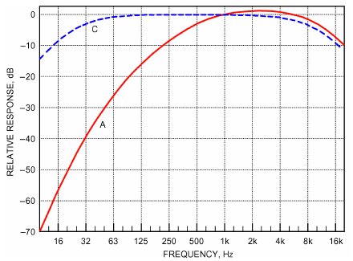

*Fig. 1 Curves Showing A- and C-Weighting Responses for Sound Level Meters*

**Table 4 Midband and Approximate Upper and Lower Cutoff Frequencies for Octave and 1/3 Octave Band Filters**

| Lower | Octave Bands, Hz Midband | Octave Bands, Hz Upper | 1/3 Octave Bands, Hz Lower | 1/3 Octave Bands, Hz Midband | 1/3 Octave Bands, Hz Upper |
|---|---|---|---|---|---|
| 11.2 | 16 | 22.4 | 11.2 14 18 | 12.5 16 20 | 14 18 22.4 |
| 22.4 | 31.5 | 45 | 22.4 28 35.5 | 25 31.5 40 | 28 35.5 45 |
| 45 | 63 | 90 | 45 56 71 | 50 63 80 | 56 71 90 |
| 90 | 125 | 180 | 90 112 140 | 100 125 160 | 112 140 180 |
| 180 | 250 | 355 | 180 224 280 | 200 250 315 | 224 280 355 |
| 355 | 500 | 710 | 355 450 560 | 400 500 630 | 450 560 710 |
| 710 | 1 000 | 1 400 | 710 900 1 120 | 800 1 000 1 250 | 900 1 200 1 400 |
| 1 400 | 2 000 | 2 800 | 1 400 1 800 2 240 | 1 600 2 000 2 500 | 1 800 2 240 2 800 |
| 2 800 | 4 000 | 5 600 | 2 800 3 550 4 500 | 3 150 4 000 5 000 | 3 550 4 500 5 600 |
| 5 600 | 8 000 | 11 200 | 5 600 7 100 9 000 | 6 300 8 000 10 000 | 7 100 9 000 11 200 |
| 11 200 | 16 000 | 22 400 | 11 200 14 000 18 000 | 12 500 16 000 20 000 | 14 000 18 000 22 400 |

**Table 5 A-Weighting for 1/3 Octave and Octave Bands**

| 1/3 Octave Band Center Frequency, Hz | A-Weighting, dB | Octave Band Center Frequency, Hz | A-Weighting, dB |
|---|---|---|---|
| 16 | –56.7 | 16 | –56.7 |
| 20 | –50.5 |  |  |
| 25 | –44.7 |  |  |
| 31.5 | –39.4 | 31.5 | –39.4 |
| 40 | –34.6 |  |  |
| 50 | –30.2 |  |  |
| 63 | –26.2 | 63 | –26.2 |
| 80 | –22.5 |  |  |
| 100 | –19.1 |  |  |
| 125 | –16.1 | 125 | –16.1 |
| 160 | –13.4 |  |  |
| 200 | –10.9 |  |  |
| 250 | –8.6 | 250 | –8.6 |
| 315 | –6.6 |  |  |
| 400 | –4.8 |  |  |
| 500 | –3.2 | 500 | –3.2 |
| 630 | –1.9 |  |  |
| 800 | –0.8 |  |  |
| 1000 | 0 | 1000 | 0 |
| 1250 | +0.6 |  |  |
| 1600 | +1.0 |  |  |
| 2000 | +1.2 | 2000 | +1.2 |
| 2500 | +1.3 |  |  |
| 3150 | +1.2 |  |  |
| 4000 | +1.0 | 4000 | +1.0 |
| 5000 | +0.5 |  |  |
| 6300 | –0.1 |  |  |
| 8000 | –1.1 | 8000 | –1.1 |
| 10 000 | –2.5 |  |  |

**Table 6 Combining Decibels to Determine Overall Sound Pressure Level**

| Octave Band Frequency, Hz | Octave Band Level Lp, dB |   | 10Lp/1 | 0 |
|---|---|---|---|---|
| 63 | 85 | 3.2 × 108 | = | 0.32 × 109 |
| 125 | 90 | 1.0 × 109 | = | 1.0 × 109 |
| 250 | 92 | 1.6 × 109 | = | 1.6 × 109 |
| 500 | 87 | 5.0 × 108 | = | 0.5 × 109 |
| 1000 | 82 | 1.6 × 108 | = | 0.16 × 109 |
| 2000 | 78 | 6.3 × 107 | = | 0.06 × 109 |
| 4000 | 65 | 3.2 × 106 | = | 0.003 × 109 |
| 8000 | 54 | 2.5 × 105 | = | 0.0002 × 109 |
|  |  |  |  | 3.6432 × 109 |
| **10 log (3.6 × 109) = 96 dB** |  |  |  |  |

Note that C-weighting provides some attenuation at very low and very high frequencies: C-weighting is not the same as no weighting (i.e., flat weighting).

Sound level meters are available in several accuracy grades specified by ANSI Standard S1.4. A type 1 meter has an accuracy of about ±1.0 dB from 50 to 4000 Hz. The general-purpose type 2 meter, which is less expensive, has a tolerance of about ±1.5 dB from 100 to 1000 Hz, and is adequate for most HVAC sound measurements.

Manually selecting filters sequentially to cover the frequency range from 20 to 5000 Hz is time consuming. An instrument that gives all filtered levels simultaneously is called a **real-time analyzer (RTA)**. It speeds up measurement significantly, and most models can save information to an internal or external digital storage device.

The process described in Equation (10) for adding a series of levels can be applied to a set of octave or 1/3 octave bands to calculate the overall broadband level (see Table 6 for an example). The

<!-- str. 169 -->

A-weighted sound level may be estimated using octave or 1/3 octave band levels by adding A-weightings given in Table 5 to octave or 1/3 octave band levels before combining the levels.

### Sound Measurement Basics

The sound pressure level in an occupied space can be measured directly with a sound level meter, or estimated from published sound power data after accounting for room volume, distance from the source, and other acoustical factors (see the section on Sound Transmission Paths). Sound level meters measure sound pressure at the microphone location. Estimation techniques calculate sound pressure at a specified point in an occupied space. Measured or estimated sound pressure levels in frequency bands can then be plotted, analyzed, and compared with established criteria for acceptance.

Sound measurements must be done carefully to ensure repeatable and accurate results. Note that equipment noise varies significantly with the operation conditions. To make proper comparisons, HVAC unit conditions must be controlled under a reference condition (e.g., full load). Even so, sound levels may not be steady, particularly at low frequencies (250 Hz and lower), and can vary significantly with time. In these cases, both maximum (as measured on a meter with slow response) and average levels (over intervals established by various standards) should be recorded. Other important considerations for sound measurement procedures include

- Ambient sound pressure level with HVAC equipment off, with correction factors when HVAC levels are not significantly above ambient
- Number of locations for measurements, based on room volume, occupancy, etc.
- Duration of time-averaged measurements, statistical meter settings, etc.

Sophisticated sound measurements and their procedures should be carried out by individuals experienced in acoustic measurements. At present, there are only a few noise standards that can be used to measure interior sound levels from mechanical equipment (e.g., ASTM Standards E1573 and E1574). Most manuals for sound level meters include sections on how to measure sound, but basic methods that can help obtain acceptable measurements are included here.

Determining the sound spectrum in a room or investigating a noise complaint usually requires measuring sound pressure levels in the octave bands from 16 to 8000 Hz. In cases where tonal noise or rumble is the complaint, narrow-band or 1/3 octave band measurements are recommended because of their greater frequency resolution. Whatever the measurement method, remember that sound pressure levels can vary significantly from point to point in a room. In a room, each measurement point often provides a different value for sound pressure level, so the actual location of measurement is very important and must be detailed in the report. A survey could record the location and level of the loudest position, or could establish a few representative locations where occupants are normally situated. In general, the most appropriate height is 1.2 to 1.8 m above the floor. Avoid the exact geometric center of the room and any location within 1 m of a wall, floor, or ceiling. Wherever the location, it must be defined and recorded. If the meter has an integrating-averaging function, use a rotating boom to sample a large area, or slowly walk around the room, and the meter will determine the average sound pressure level for that path. However, take care that no extraneous sounds are generated by microphone movement or by walking; using a windscreen reduces extraneous noise generated by airflow over the moving microphone. Locations with noticeably higher-than-average sound levels should be recorded. See the section on Measurement of Room Sound Pressure Level for more details.

When measuring HVAC noise, **background noise** from other sources (occupants, wind, nearby traffic, elevators, etc.) must be determined. Sometimes the sound from a particular piece of HVAC equipment must be measured in the presence of background sound from sources that cannot be turned off, such as automobile traffic or certain office equipment. Determining the sound level of just the selected equipment requires making two sets of measurements: one with both the HVAC equipment sound and background sound, and another with only the background sound (with HVAC equipment turned off). This situation might also occur, for example, when determining whether noise exposure at the property line from a cooling tower meets a local noise ordinance.

**Table 7 Guidelines for Determining Equipment Sound Levels in the Presence of Contaminating Background Sound**

| Measurement A minus Measurement B | Correction to Measurement A to Obtain Equipment Sound Level |
|---|---|
| 10 dB or more | 0 dB |
| 6 to 9 dB | –1 dB |
| 4 to 5 dB | –2 dB |
| Less than 4 dB | Equipment sound level is more than 2 dB below Measurement A |

Measurement A = Tested equipment plus background sound Measurement B = Background sound alone

The guidelines in Table 7 help determine the sound level of a particular machine in the presence of background sound. Equation (11) in the section on Combining Sound Levels may be used.

The uncertainty associated with correcting for background sound depends on the uncertainty of the measuring instrument and the steadiness of the sounds being measured. In favorable circumstances, it might be possible to extend Table 7. In particularly unfavorable circumstances, even values obtained from the table could be substantially in error.

Measuring sound emissions from a particular piece of equipment or group of equipment requires a measurement plan specific to the situation. The Air-Conditioning, Heating, and Refrigeration Institute (AHRI); Air Movement and Control Association International (AMCA); American Society of Testing and Materials (ASTM); American National Standards Institute (ANSI); and Acoustical Society of America (ASA) all publish sound level measurement procedures for various laboratory and field sound measurement situations.

Outdoor measurements are somewhat easier to make than indoor because there are typically few or no boundary surfaces to affect sound build-up or absorption. Nevertheless, important issues such as the effect of large, nearby sound-reflecting surfaces and weather conditions such as wind, temperature, and precipitation must be addressed. Where measurements are made close to extended surfaces (i.e., flat or nearly flat surfaces with dimensions more than four times the wavelength of the sound of interest), sound pressure levels can be significantly increased. These effects can be estimated through guidelines in many sources such as Harris (1991).

### Measurement of Room Sound Pressure Level

In commissioning building HVAC systems, often a specified room noise criterion must demonstratively be met. Measurement procedures for obtaining the data to demonstrate compliance should also be specified to avoid confusion when different parties make measurements using different procedures. The problem is that most rooms exhibit significant point-to-point variation in sound pressure level.

When a noise has no audible tonal components, differences in measured sound pressure level at several locations in a room may be as high as 3 to 5 dB. However, when audible tonal components are present, especially at low frequencies, variations caused by standing waves that occur at frequencies of resonance may exceed 10 dB.

<!-- str. 170 -->

These are generally noticeable to the average listener when moving through the room.

Although commissioning procedures usually set precise limits for demonstrating compliance, the outcome can unfortunately be controversial unless the measurement procedure has been specified in detail. In the absence of firm agreement in the industry on an acoustical measurement procedure for commissioning HVAC systems, possibilities include the new ANSI Standard S12.72-2015 on measuring ambient noise levels in a room, as well as AHRI Standard 885, which incorporates a “suggested procedure for field verification of NC/RC levels.”

### Measurement of Acoustic Intensity

Equation (8) for the time-averaged intensity (often called simply intensity) requires both the pressure and particle velocity. Pressure is easily measured with a microphone, but there is no simple transducer that converts particle velocity to a measurable electronic signal. Fortunately, particle velocity can be estimated from sound pressures measured at closely spaced (less than ~1/10 of an acoustic wavelength) locations, using Euler’s equation:

> v = –1/i2πfρ0 × ∂p/∂x ≈ –1/i2πfρ0 × (p2– p1)/(x2– x1)&emsp;**(17)**

where x2 and x1 are the locations of measurements of pressures p2 and p1, f is frequency in Hz, and ρ0 is density of air. The spatial derivative of pressure (∂p/∂x) is approximated with (Δp/Δx) = [(p2– p1)/(x2 – x1)]. Thus, intensity probes typically contain two closely spaced microphones that have nearly identical responses (i.e., are phase matched). Because intensity is a vector, it shows the direction of sound propagation along the line between the microphones, in addition to the magnitude of the sound. Also, because intensity is power/area, it is not sensitive to the acoustic nearfield (see the section on Typical Sources of Sound) or to standing waves where the intensity is zero. Therefore, unlike pressure measurement, intensity measurements can be made in the acoustic nearfield of a source or in the reverberant field in a room to determine the power radiated from the source. However, intensity measurements cannot be used in a diffuse field to determine the acoustic energy in the field, such as used for determining sound power using the reverberation room method.

## 4. DETERMINING SOUND POWER

The sound power of a source cannot be measured directly. Rather, it is calculated from several measurements of sound pressure or sound intensity created by a source in one of several test environments. The following four methods are commonly used.

### Free-Field Method

A **free field** is a sound field where the effects of any boundaries are negligible over the frequency range of interest. In ideal conditions, there are no boundaries. Free-field conditions can be approximated in rooms with highly sound-absorbing walls, floor, and ceiling (**anechoic rooms**). In a free field, the sound power of a sound source can be determined from measurements of sound pressure level on an imaginary spherical surface centered on and surrounding the source. This method is based on the fact that, because sound absorption in air can be practically neglected at small distances from the sound source, all of the sound power generated by a source must flow through an imagined sphere with the source at its center. The intensity I of the sound (conventionally expressed in W/m2) is estimated from measured sound pressure levels using the following equation:

> I = (1 × 10–12)10Lp/10&emsp;**(18)**

where Lp is sound pressure level. The intensity at each point around the source is multiplied by that portion of the area of the imagined sphere associated with the measuring points. Total sound power W is the sum of these products for each point:

> W = ∑ i Ai&emsp;**(19)**
>
> I

> i

where Ai is the surface area (in m2) associated with the ith measurement location.

ANSI Standard S12.55 describes various methods used to calculate sound power level under free-field conditions. Measurement accuracy is limited at lower frequencies by the difficulty of obtaining room surface treatments with high sound absorption coefficients at low frequencies. For example, a glass fiber wedge structure that gives significant absorption at 70 Hz must be at least 1.2 m long.

The relationship between sound power level Lw and sound pressure level Lp for a nondirectional sound source in a free field at distance r in metres can be written as

> Lw = Lp + 20 log r + 11&emsp;**(20)**

For directional sources, use Equation (19) to compute sound power.

Often, a completely free field is not available, and measurements must be made in a free field over a reflecting plane. This means that the sound source is placed on a hard floor (in an otherwise sound-absorbing room) or on smooth, flat pavement outdoors. Because the sound is then radiated into a hemisphere rather than a full sphere, the relationship for Lw and Lp for a nondirectional sound source becomes

> Lw = Lp + 20 log r + 8&emsp;**(21)**

A sound source may radiate different amounts of sound power in different directions. A directivity pattern can be established by measuring sound pressure under free-field conditions, either in an anechoic room or over a reflecting plane in a hemianechoic space at several points around the source. The directivity factor Q is the ratio of the squared sound pressure at a given angle from the sound source to the squared sound pressure that would be produced by the same source radiating uniformly in all directions. Q is a function of frequency and direction. The section on Typical Sources of Sound in this chapter and Chapter 49 of the 2019 ASHRAE Handbook—HVAC Applications provide more detailed information on sound source directivity.

### Reverberation Room Method

Another method to determine sound power places the sound source in a reverberation room. AHRI Standard 220 and ANSI Standard S12.58 give standardized methods for determining the sound power of HVAC equipment in reverberation rooms when the sound source contains mostly broadband sound or when tonal sound is prominent. These standards provide a method of qualifying the room to verify that sound power levels for both broadband and tonal noise sources can be accurately determined.

Some sound sources that can be measured by these methods are room air conditioners, refrigeration compressors, components of central HVAC systems, and air terminal devices. For ducted equipment, AHRI Standard 261 provides a method of test and AHRI Standards 270 and 370 provide test methods for measuring outdoor equipment. Compressors should be tested according to AHRI Standard 530. ANSI/ASHRAE Standard 130, and ANSI/AHRI Standard 881-2011 establish special measuring procedures for some of these units. AMCA Standard 300 is appropriate for testing fans that are not incorporated into equipment.

Two measurement methods may be used in reverberation rooms: direct and substitution. In **direct reverberation room measure- ment**, the sound pressure level is measured with the source in the reverberation room at several locations at a distance of at least 1 m from the source and at least one-quarter of a wavelength from the surfaces of the room. The sound power level is calculated from the average of the sound pressure levels, using the reverberation time and the volume of the reverberation room.

<!-- str. 171 -->

The relationship between sound power level and sound pressure level in a reverberation room is given by

> Lw = Lp + 10 logV – 10 log T60 – 14&emsp;**(22)**

where

- Lp = sound pressure level averaged over room, dB re 20 μPa
- V = volume of room, m3
- T60 = room reverberation time (time required for a 60 dB decay), s

The **substitution** procedure implemented in most ASHRAE, AHRI, and AMCA test standards uses a calibrated **reference sound source (RSS)**. The sound power levels of noise radiated by an RSS are known by calibration using the free-field method or, in the case of AHRI Standard 250-2013, a hemi-anechoic room method.

The most common RSS is a small, vertically shafted direct-drive fan impeller that has no volute housing or scroll. The forwardcurved impeller has a choke plate on its inlet face, causing the fan to operate in a rotating-stall condition that is very noisy. The reference source is designed to have a stable sound power level output from 63 to 8000 Hz and a relatively uniform frequency spectrum in each octave band.

Sound pressure level measurements are first made in the reverberant field (far from the RSS or source in question) with only the reference sound source operating in the test room. Then the reference source is turned off and the measurements are repeated with the given source in operation. Because the acoustical environment and measurement locations are the same for both sources, the differences in sound pressure levels measured represent differences in sound power level between the two sources.

Using this method, the relationship between sound power level and sound pressure level for the two sources is given by

> Lw = Lp + (Lw – Lp)ref&emsp;**(23)**

where

- Lp = sound pressure level averaged over room, dB re 20 μPa
- (Lw – Lp)ref = difference between sound power level and sound pressure level of reference sound source

### Progressive Wave (In-Duct) Method

By attaching a fan to one end of a duct, sound energy is confined to a progressive wave field in the duct. Fan sound power can then be determined by measuring the sound pressure level inside the duct. Intensity is then estimated from the sound pressure levels (see the section on the Free-Field Method) and multiplied by the cross-sectional area of the duct to find the sound power. The method is described in detail in ASHRAE Standard 68 (AMCA Standard 330) for in-duct testing of fans. This method is not commonly used because of difficulties in constructing the required duct termination and in discriminating between fan noise and flow noise caused by the presence of the microphone in the duct.

### Sound Intensity Method

The average sound power radiated by the source can be determined by measuring the sound intensity over the sphere or hemisphere surrounding a sound source (see the sections on Measurement of Acoustic Intensity and on the Free-Field Method). One advantage of this method is that, with certain limitations, sound intensity (and therefore sound power) measurements can be made in the presence of steady background noise in semireverberant environments and in the acoustic nearfield of sources. Another advantage is that by measuring sound intensity over surfaces that enclose a sound source, sound directivity can be determined. Also, for large sources, areas of radiation can be localized using intensity measurements. This procedure can be particularly useful in diagnosing sources of noise during product development.

International and U.S. standards that prescribe methods for making sound power measurements with sound intensity probes consisting of two closely spaced microphones include ANSI Standard S12.12 and ISO Standards 9614-1 and 9614-2. In some situations, the sound fields may be so complex that measurements become impractical. A particular concern is that small test rooms or those with somewhat flexible boundaries (e.g., sheet metal or thin drywall) can increase the radiation impedance for the source, which could affect the source’s sound power output.

### Measurement Bandwidths for Sound Power

Sound power is normally determined in octave or 1/3 octave bands. Occasionally, more detailed determination of the sound source spectrum is required: **narrowband analysis**, using either constant fractional bandwidth (1/12 or 1/24 octave) or constant absolute bandwidth (e.g., 1 Hz). The most frequently used analyzer types are digital filter analyzers for constant-percent bandwidth measurements and fast Fourier transform (FFT) analyzers for constant-bandwidth measurements. Narrowband analyses are used to determine the frequencies of pure tones and their harmonics in a sound spectrum.

## 5. CONVERTING FROM SOUND POWER TO SOUND PRESSURE

Designers are often required to use sound power level information of a source to predict the sound pressure level at a given location. Sound pressure at a given location in a room from a source of known sound power level depends on (1) room volume, (2) room furnishings and surface treatments, (3) magnitude of sound source(s), (4) distance from sound source(s) to point of observation, and (5) directivity of source.

The classic relationship between a single-point source sound power level and room sound pressure level at some frequency is

> Lp = Lw + 10 log(Q/4πr2 + 4/R)&emsp;**(24)**

where

- Lp = sound pressure level, dB re 20 μPa
- Lw = sound power level, dB re 10–12W
- Q = directivity of sound source (dimensionless)
- r = distance from source, m
- R = room constant, Sα/(1 – α)
- S = sum of all surface areas, m2
- α = average absorption coefficient of room surfaces at given frequency, given by ∑ i i ⁄ ∑ i S α S i i where Si is area of ith surface and αi is absorption coefficient for ith surface.

If the source is outdoors, far from reflecting surfaces, this relationship simplifies to

> Lp = Lw + 10 log(Q/4πr2)&emsp;**(25)**

This relationship does not account for atmospheric absorption, weather effects, and barriers. Note that r2 is present because the sound pressure in a free field decreases with 1/r2 (the inverse-square law; see the section on Sound Transmission Paths). Each time the distance from the source is doubled, the sound pressure level decreases by 6 dB.

For a simple source centered in a large, flat, reflecting surface, Q may be taken as 2. At the junction of two large flat surfaces, Q is 4; in a corner, Q is 8.

<!-- str. 172 -->

In most typical rooms, the presence of acoustically absorbent surfaces and sound-scattering elements (e.g., furniture) creates a relationship between sound power and sound pressure level that is difficult to predict. For example, hospital rooms, which have only a small amount of absorption, and executive offices, which have substantial absorption, are similar when the comparison is based on the same room volume and distance between the source and point of observation.

Using a series of measurements taken in typical rooms, Equation (26) was developed to estimate the sound pressure level at a chosen observation point in a normally furnished room. The estimate is accurate to ±2 dB (Schultz 1985).

> Lp = Lw– 5 log V – 3 log f – 10 log r + 12&emsp;**(26)**

Equation (26) applies to a single sound source in the room itself, not to sources above the ceiling. With more than one source, total sound pressure level at the observation point is obtained by adding the contribution from each source in energy or power-like units, not decibels, and then converting back to sound pressure level [see Equation (10)]. Studies (Warnock 1997, 1998a, 1998b) indicate that sound sources above ceilings may not act as point sources, and Equation (26) may not apply (AHRI Standard 885).

## 6. SOUND TRANSMISSION PATHS

Sound from a source is transmitted along one or more paths to a receiver. Airborne and structureborne transmission paths are both of concern for the HVAC system designer. Sound transmission between rooms occurs along both airborne and structureborne transmission paths. Chapter 49of the 2019 ASHRAE Handbook—HVAC Applications has additional information on transmission paths.

### Spreading Losses

In a free field, the intensity I of sound radiated from a single source with dimensions that are not large compared to an acoustic wavelength is equal to the power W radiated by the source divided by the surface area A (expressed in m2) over which the power is spread:

> I = W/A&emsp;**(27)**

In the absence of reflection, the spherical area over which power spreads is A = 4πr2, so that the intensity is

> I = W/4πr2&emsp;**(28)**

where r is the distance from the source in metres. Taking the level of the intensity (i.e., 10 log) and using Equation (20) to relate intensity to sound pressure levels leads to

> Lp = Lw – 10 log(4πr2)&emsp;**(29)**

which becomes

> Lp = Lw – 20 logr – 11 = Lw – 10 log(r2) – 11&emsp;**(30)**

Thus, the sound pressure level decreases as 10 log(r2), or 6 dB per doubling of distance. This reduction in sound pressure level of sound radiated into the free field from a single source is called **spherical spreading loss**.

### Direct Versus Reverberant Fields

Equation (24) relates the sound pressure level Lp in a room at distance r from a source to the sound power level Lw of the source. The first term in the brackets (Q/4πr2) represents sound radiated directly from the source to the receiver, and includes the source’s directivity Q and the spreading loss 1/4πr2 from the source to the observation location. The second term in the brackets, 4/R, represents the reverberant field created by multiple reflections from room surfaces. The room constant is

> R = (∑S α i i i)/(1 – α)&emsp;**(31)**

where α is the spatial average absorption coefficient,

> α = (∑S α i i i)/∑Si&emsp;**(32)**
>
> i

At distances close enough to the source that Q/4πr2 is larger than 4/R, the direct field is dominant and Equation (24) can be approximated by

> ( )
>
> Lp = Lw + 10 log Q/4πr2&emsp;**(33)**

> ( )

Equation (33) is independent of room absorption R, which indicates that adding absorption to the room will not change the sound pressure level. At distances far enough from the source that Q/4πr2 is less than 4/R, Equation (24) can be approximated by

> ( 4/R)
>
> Lp = Lw + 10 log = Lw – 10 log R + 6&emsp;**(34)**

> ( )

Adding absorption to the room increases the room constant and thereby reduces the sound pressure level. The reduction in reverberant sound pressure levels associated with adding absorption in the room is approximated by

> ( )
>
> Reduction ≈ 10 log R2/R1&emsp;**(35)**

> ( )

where R2 is the room constant for the room with added absorption and R1 is the room constant for the room before absorption is added. The distance from the source where the reverberant field first becomes dominant such that adding absorption to the room is effective is the critical distance rc, obtained by setting Q/4πr2 = 4/R. This leads to

> rc ≈ 0.14 QR&emsp;**(36)**

where R is in m2 and rc is in m.

### Airborne Transmission

Sound transmits readily through air, both indoors and outdoors. Indoor sound transmission paths include the direct line of sight between the source and receiver, as well as reflected paths introduced by the room’s walls, floor, ceiling, and furnishings, which cause multiple sound reflection paths.

Outdoors, the effects of the reflections are small, unless the source is located near large reflecting surfaces. However, wind and temperature gradients can cause sound outdoors to refract (bend) and change propagation direction. Without strong wind and temperature gradients and at small distances, sound propagation outdoors follows the inverse square law. Therefore, Equations (20) and (21) can generally be used to calculate the relationship between sound power level and sound pressure level for fully free-field and hemispherical free-field conditions, respectively.

### Ductborne Transmission

Ductwork can provide an effective sound transmission path because the sound is primarily contained within the boundaries of the ductwork and thus suffers only small spreading losses. Sound can transmit both upstream and downstream from the source. A special case of ductborne transmission is **crosstalk**, where sound is transmitted from one room to another via the duct path. Where duct geometry changes abruptly (e.g., at elbows, branches, and terminations), the resulting change in the acoustic impedance reflects sound, which increases propagation losses. Chapter 49 of the 2019 *ASHRAE Handbook—HVAC Applications* has additional information on losses for airborne sound propagation in ducts.

<!-- str. 173 -->

### Room-to-Room Transmission

Room-to-room sound transmission generally involves both airborne and structureborne sound paths. The sound power incident on a room surface element undergoes three processes: (1) some sound energy is reflected from the surface element back into the source room, (2) a portion of the energy is lost through energy transfer into the material comprising the surface element, and (3) the remainder is transmitted through the surface element to the other room. Airborne sound is radiated as the surface element vibrates in the receiving room, and structureborne sound can be transmitted via the studs of a partition or the floor and ceiling surfaces.

### Structureborne Transmission

Solid structures are efficient transmission paths for sound, which frequently originates as a vibration imposed on the transmitting structure. Typically, only a small amount of the input energy is radiated by the structure as airborne sound. With the same force excitation, a low-mass structure with little inherent damping radiates more sound than a massive structure with greater damping.

### Flanking Transmission

Sound from the source room can bypass the primary separating element and get into the receiving room along other paths, called **flanking paths**. Common sound flanking paths include return air plenums, doors, and windows. Less obvious paths are those along floor and adjoining wall structures. Such flanking paths can reduce sound isolation between rooms. Flanking can explain poor sound isolation between spaces when the partition between them is known to provide very good sound insulation, and how sound can be heard in a location far from the source in a building. Determining whether flanking sound transmission is important and what paths are involved can be difficult. Experience with actual situations and the theoretical aspects of flanking transmission is very helpful. Sound intensity methods may be useful in determining flanking paths.

## 7. TYPICAL SOURCES OF SOUND

Whenever mechanical power is generated or transmitted, a fraction of the power is converted into sound power and radiated into the air. Therefore, virtually any major component of an HVAC system could be considered a sound source (e.g., fans, pumps, ductwork, piping, motors). The component’s sound source characteristics depend on its construction, form of mechanical power, and integration with associated system components. The most important source characteristics include total sound power output Lw, frequency distribution, and radiation directivity Q. In addition, a vibrating HVAC system may be relatively quiet but transmit noise to connecting components, such as the unit casing, which may be serious sources of radiated noise. All of these characteristics vary with frequency.

### Source Strength

For airborne noise, source strength should be expressed in terms of sound power levels. For structureborne noise (i.e., vibration), source strengths should be expressed in terms of free vibration levels (measured with the source free from any attachments). Because it is difficult to free a source from all attachments, measurements made with the source on soft mounts, with small mechanical impedances compared to the impedance of the source, can be used to obtain good approximations to free vibration levels.

### Directivity of Sources

Noise radiation from sources can be directional. The larger the source, relative to an acoustic wavelength, the greater the potential of the source to be directional. Small sources tend to be nondirectional. The directivity of a source is expressed by the directivity factor Q as

> Q = p2(θ)/(2 p ave)&emsp;**(37)**

where p2(θ) is the squared pressure observed in direction θ and pa2veis the energy average of the squared pressures measured over all directions.

### Acoustic Nearfield

Not all unsteady pressures produced by the vibrating surfaces of a source or directly by disturbances in flow result in radiated sound. Some unsteady pressures “cling” to the surface. Their magnitude decreases rapidly with distance from the source, whereas the magnitude of radiating pressures decreases far less rapidly. The region close to the source where nonradiating unsteady pressures are significant is called the **acoustic nearfield**. Sound pressure level measurements should not be made in the acoustic nearfield because it is difficult to relate sound pressure levels measured in the nearfield to radiated levels. In general, the nearfield for most sources extends no more than 1 m from the source. However, at lower frequencies and for large sources, sound pressure level measurements should be made more than 1 m from the source when possible.

Sound and vibration sources in HVAC systems are so numerous that it is impractical to provide a complete listing here. Major sources include rotating and reciprocating equipment such as compressors, fans, motors, pumps, air-handling units, water-source heat pumps (WSHPs, often used in hotels), rooftop units, and chillers.

Noise generation occurs from many mechanisms, including

- Vortex shedding, which can be tonal, at the trailing edges of fan blades. Levels of vortex shedding noise increase with velocity of flow vb over the blade proportionate to log(vb).
- Turbulence generated upstream of the fan and ingested into the fan. Levels of this broadband noise increase proportionate to log(v0), where v0 is the free-stream velocity of flow into the fan. Turbulence in the boundary layer on the surface of fan blades also causes broadband noise that increases proportionate to log(vb). Flow that separates from blade surfaces can cause low-frequency noise. Nonuniform inflow to fans, created by obstructions, can produce tonal noise at frequencies of blade passage ( fb = Nfr, where N is the number of blades and fr is the rotation speed in rev/s) and integer multiples. Fan imbalance produces vibration at frequencies of shaft rotation and multiples. These low-frequency vibrations can couple to the structures to which the fan is attached, which can transmit the vibration over long distances and radiate low-frequency noise into rooms.
- Air and fluid sounds, such as those associated with flow through ductwork, piping systems, grilles, diffusers, terminal boxes, manifolds, and pressure-reducing stations.
- Turbulent flow inside ducts, which is a source of broadband noise. Levels increase proportionate to log(v0). Sharp corners of elbows and branches can separate flow from duct walls, producing low-frequency noise.
- Excitation of surfaces (e.g., friction); movement of mechanical linkages; turbulent flow impacts on ducts, plenum panels, and pipes; and impacts within equipment, such as cams and valve slap. Broadband flow noise increases rapidly with flow velocity v [60 to 80 log(v)], so reducing flow velocities can be very effective in reducing broadband noise.

<!-- str. 174 -->

- Magnetostriction (transformer hum), which becomes significant in motor laminations, transformers, switchgear, lighting ballasts, and dimmers. A characteristic of magnetostrictive oscillations is that their fundamental frequency is twice the electrical line frequency (120 Hz in a 60 Hz electrical distribution system.)

## 8. CONTROLLING SOUND

### Terminology

The following noninterchangeable terms are used to describe the acoustical performance of many system components. ASTM Standard C634 defines additional terms.

**Sound attenuation** is a general term describing the reduction of the level of sound as it travels from a source to a receiver.

**Insertion loss (IL)** of a silencer or other sound-attenuating element, expressed in dB, is the decrease in sound pressure level or sound intensity level, measured at a fixed receiver location, when the sound-attenuating element is inserted into the path between the source and receiver. For example, if a straight, unlined piece of ductwork were replaced with a duct silencer, the sound level difference at a fixed location would be considered the silencer’s insertion loss. Measurements are typically in either octave or 1/3 octave bands.

**Sound transmission loss (TL)** of a partition or other building element is equal to 10 times the logarithm of the ratio of the airborne sound power incident on the partition to the sound power transmitted by the partition and radiated on the other side, in decibels. Measurements are typically in octave or 1/3 octave bands. Chapter 49 of the 2019 *ASHRAE Handbook—HVAC Applications* defines the special case of breakout transmission loss through duct walls.

**Noise reduction (NR)** is the difference between the space-average sound pressure levels produced in two enclosed spaces or rooms (a receiving room and a source room) by one or more sound sources in the source room. An alternative, non-ASTM definition of NR is the difference in sound pressure levels measured upstream and downstream of a duct silencer or sound-attenuating element. Measurements are typically in octave or 1/3 octave bands. For partitions, NR is related to the transmission loss TL as follows:

> S
>
> ( )

> NR = TL – 10 log ---&emsp;**(38)**
>
> ( )

> R

where S is the partition’s surface area and R is the room constant for the receiving room. Note that sound pressure levels measured close to the partition on the receiving side may be higher and should not be included in the space average used to compute the noise reduction.

**Random-incidence sound absorption coefficient** α is the fraction of incident sound energy absorbed by a surface exposed to randomly incident sound. It is measured in a reverberation room using 1/3 octave bands of broadband sound (ASTM Standard C423). The sound absorption coefficient of a material in a specific 1/3 octave band depends on the material’s thickness, airflow resistivity, stiffness, and method of attachment to the supporting structure.

**Scattering** is the change in direction of sound propagation caused by an obstacle or inhomogeneity in the transmission medium. It results in the incident sound energy being dispersed in many directions.

### Enclosures and Barriers

Enclosing a sound source is a common means of controlling airborne radiation from a source. Enclosure performance is expressed in terms of insertion loss. The mass of the enclosure panels combines with the stiffness (provided by compression) of the air trapped between the source and enclosure panel to produce a resonance. At resonance, the insertion loss may be negative, indicating that radiated noise levels are higher with the enclosure than without it. Therefore, the enclosure design should avoid aligning the enclosure resonance with frequencies commonly radiated from the source at high levels. At low frequencies, insertion loss of enclosures is more sensitive to stiffness of the enclosure panels than to the surface mass density of the panels. At high frequencies, the opposite is true.

The insertion loss of an enclosure may be severely compromised by openings or leaks. All penetrations must be sealed. Also, at higher frequencies, adding an enclosure creates a reverberant space between the outer surfaces of the source and the inner surfaces of the enclosure. To avoid build-up of reverberant noise, and thereby noise transmitted through the enclosure, add absorption inside the enclosure.

A barrier is a solid element that blocks line-of-sight transmission but does not totally enclose the source or receiver. Properly designed barriers can effectively block sound that propagates directly from the source to the receiver. Barrier performance is expressed in terms of insertion loss: in general, the greater the increase in the path over or around the barrier relative to the direct path between the source and receiver without the barrier, the greater the barrier’s insertion losses. Thus, placing the barrier close to the source or receiver is better than midway between the two. The barrier must break the line of sight between the source and receiver to be effective. Insertion losses increase as the barrier extends further above the line of sight. Barriers are only effective in reducing levels for sound propagated directly from the source to the receiver; they do not reduce levels of sound reflected from surfaces in rooms that bypass the barrier. Therefore, barriers are less effective in reverberant spaces than in nonreverberant spaces.

### Partitions

Partitions are typically either single- or double-leaf. **Single-leaf partitions** are solid homogeneous panels with both faces rigidly connected. Examples are gypsum board, plywood, concrete block, brick, and poured concrete. The transmission loss of a single-leaf partition depends mainly on its surface mass (mass per unit area): the heavier the partition, the less it vibrates in response to sound waves and the less sound it radiates on the side opposite the sound source. Surface mass can be increased by increasing the partition’s thickness or its density.

The **mass law** is a semiempirical expression that can predict transmission loss for randomly incident sound for thin, homogeneous single-leaf panels below the critical frequency (discussed later in this section) for the panel. It is written as

> TL = 20 log(ws f ) – 47&emsp;**(39)**

where

- TL = transmission loss
- ws = surface mass of panel, kg/m2
- f = frequency, Hz

The mass law predicts that transmission loss increases by 6 dB for each doubling of surface mass or frequency. If sound is incident only perpendicularly on the panel (rarely found in real-world applications), TL is about 5 dB greater than that predicted by Equation (39).

Transmission loss also depends on stiffness and internal damping. The transmission losses of three single-leaf walls are shown in Figure 2. For 16 mm gypsum board, TL depends mainly on the surface mass of the wall at frequencies below about 1 kHz; agreement with the mass law is good. At higher frequencies, there is a dip in the TL curve called the **coincidence dip** because it occurs at the frequency where the wavelength of flexural vibrations in the wall coincides with the wavelength of sound on the panel surface. The lowest frequency where coincidence between the flexural and surface pressure waves can occur is called the **critical frequency fc**:

<!-- str. 175 -->

> ( 12ρ)1/2
>
> fc = c2/2π --------&emsp;**(40)**

> ( Eh2)

where

- ρ = density of panel material, kg/m3
- E = Young’s modulus of panel material, N/m2
- h = thickness of outer panel of partition, m
- c = sound speed in air,m/s

This equation indicates that increasing the material’s stiffness and/or thickness reduces the critical frequency, and that increasing the material’s density increases the critical frequency. For example, the 150 mm concrete slab has a mass of about 370 kg/m2 and has a coincidence frequency at 125 Hz. Thus, over most of the frequency range shown in Figure 2, the transmission loss for the 150 mm concrete slab is well below that predicted by mass law. The coincidence dip for the 25 gage (0.531 mm thick) steel sheet occurs at high frequencies not shown in the figure.

The **sound transmission class (STC) rating** of a partition or assembly is a single number rating often used to classify sound isolation for speech (ASTM Standards E90 and E413). To determine a partition’s STC rating, compare transmission losses measured in 1/3 octave bands with center frequencies from 125 to 4000 Hz to the STC contour shown in Figure 3. This contour is moved up until either

- The sum of differences between TL values below the contour and the corresponding value on the contour is no more than 32, or
- One of the differences between the contour and a TL value is no greater than 8.

The STC is then the value on the contour at 500 Hz. As shown in Figure 3, the STC contour deemphasizes transmission losses at low frequencies, so the STC rating should not be used as an indicator of an assembly’s ability to control sound that is rich in low frequencies. Most fan sound spectra have dominant low-frequency sound; therefore, to control fan sound, walls and slabs should be selected only on the basis of 1/3 octave or octave band sound transmission loss values, particularly at low frequencies.

Note also that sound transmission loss values for ceiling tile are inappropriate for estimating sound reduction between a sound source located in a ceiling plenum and the room below. See AHRI Standard 885 for guidance.

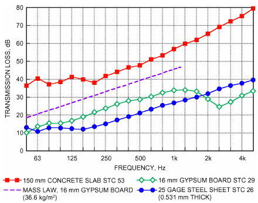

*Fig. 2 Sound Transmission Loss Spectra for Single Layers of Some Common Materials*

Walls with identical STC ratings may not provide identical sound insulation at all frequencies. Most single-number rating systems have limited frequency ranges, so designers should select partitions and floors based on their 1/3 octave or octave band sound transmission loss values instead, especially when frequencies below 125 Hz are important.

For a given total mass in a wall or floor, much higher values of TL can be obtained by forming a **double-leaf** construction where each layer is independently or resiliently supported so vibration transmission between them is minimized. As well as mass, TL for such walls depends on cavity depth. Mechanical decoupling of leaves reduces sound transmission through the panel, relative to the transmission that would occur with the leaves structurally connected. However, transmission losses for a double-leaf panel are less than the sum of the transmission losses for each leaf. Air in the cavity couples the two mechanically decoupled leaves. Also, resonances occur inside the cavity between the leaves, thus increasing transmission (decreasing transmission loss) through the partition. Negative effects at resonances can be reduced by adding sound-absorbing material inside the cavity. For further information, see Chapter 49 of the 2019 ASHRAE Handbook—HVAC Applications.

Transmission losses of an enclosure may be severely compromised by openings or leaks in the partition. Ducts that lead into or through a noisy space can carry sound to many areas of a building. Designers need to consider this factor when designing duct, piping, and electrical systems.

When a partition contains two different constructions (e.g., a partition with a door), the transmission loss TLc of the composite partition may be estimated using the following equation:

> TLc = 10 log (S1+ S2)/(S1τ1+ S2τ2)&emsp;**(41)**

where S1 and S2 are the surface areas of the two types of constructions, and τ1 and τ2 are the transmissibilities, where τ = 10–TL/10. For leaks, τ = 1. For a partition with a transmission of 40 dB, a hole that covers only 1% of the surface area results in a composite transmission loss of 20 dB, a 20 dB reduction in the transmission loss without the hole. This shows the importance of sealing penetrations through partitions to maintain design transmission losses.

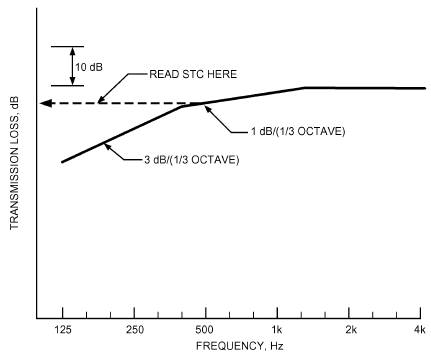

*Fig. 3 Contour for Determining Partition’s STC*

<!-- str. 176 -->

### Sound Attenuation in Ducts and Plenums

Most ductwork, even a sheet metal duct without acoustical lining or silencers, attenuates sound to some degree. The natural attenuation of unlined ductwork is minimal, but can, especially for long runs of rectangular ductwork, significantly reduce ductborne sound. Acoustic lining of ductwork can greatly attenuate sound propagation through ducts, particularly at middle to high frequencies. Chapter 49 of the 2019 *ASHRAE Handbook—HVAC Applications* has a detailed discussion of lined and unlined ductwork attenuation.

If analysis shows that lined ductwork will not reduce sound propagation adequately, commercially available sound attenuators (also known as **sound traps** or **duct silencers**) can be used. There are three types: dissipative, reactive, and active. The first two are commonly known as **passive attenuators**.

- **Dissipative silencers** use absorptive media such as glass or rock fiber as the principal sound-absorption mechanism. Thick, perforated sheet metal baffles filled with low-density fiber insulation restrict the air passage width within the attenuator housing. The fiber is sometimes protected from the airstream by cloths or films. This type of attenuator is most effective in reducing mid- and high-frequency sound energy.
- **Reactive silencers** (sometimes called **mufflers**) rely on changes in impedance to reflect energy back toward the source and away from the receiver. This attenuator type is typically used in HVAC systems serving hospitals, laboratories, or other areas with strict air quality standards. They are constructed only of metal, both solid and perforated. Chambers of specially designed shapes and sizes behind the perforated metal are tuned as resonators or expansion chambers to react with and reduce sound power at selected frequencies. When designed for a broad frequency range, they are usually not as effective as dissipative attenuators of the same length. However, they can be highly effective and compact if designed for a limited frequency range (e.g., for a pure tone).
- **Active silencer systems** use microphones, loudspeakers, and appropriate electronics to reduce in-duct sound by generating sound 180° out of phase that destructively interferes with the incident sound energy. Microphones sample the sound field in the duct and loudspeakers generate signals with phase opposite to the original noise. Controlled laboratory experiments have shown that active attenuators reduce both broadband and tonal sound, but are typically only effective in the 31.5 through 250 Hz octave bands. Active silencers are more effective for tonal than for broadband noise. Insertion losses of as much as 30 dB have been achieved under controlled conditions. Because the system’s microphones and loudspeakers are mounted flush with the duct wall, there is no obstruction to airflow and therefore negligible pressure drop. Because active silencers are not effective in excessively turbulent airflow, their use is limited to relatively long, straight duct sections with an air velocity less than about 7.5 m/s.

Silencers are available for fans, cooling towers, air-cooled condensers, compressors, gas turbines, and many other pieces of commercial and industrial equipment. HVAC silencers are normally installed on the intake or discharge side (or both) of a fan or air-handling unit. They may also be used on the receiver side of other noise generators such as terminal boxes, valves, and dampers.

**Self-noise** (i.e., noise generated by airflow through the silencer) can limit an attenuator’s effective insertion loss for air velocities over about 10 m/s. Sound power at the silencer outlet is a combination of the power of the noise attenuated by the silencer and the noise generated inside the silencer by flow. Thus, output power WM is related to input power W0 as follows:

> WM = W010–IL/10 + WSG&emsp;**(42)**

where IL is the insertion loss and WSG is the power of the self-noise. It is also important to determine the dynamic insertion loss at design airflow velocity through the silencer, because a silencer’s insertion loss varies with flow velocity.

**End reflection** losses caused by abrupt area changes in duct cross section are sometimes useful in controlling propagation at low frequencies. Low-frequency noise reduction is inversely proportional to the cross-sectional dimension of the duct, with the end reflection effect maximized in smaller cross sections and when the duct length of the smaller cross section is several duct diameters. Note, however, that abrupt area changes can increase flow velocities, which increase broadband high-frequency noise.

Where space is available, a **lined plenum** can provide excellent attenuation across a broad frequency range, especially effective at low frequencies. The combination of end reflections at the plenum’s entrance and exit, a large offset between the entrance and exit, and sound-absorbing lining on the plenum walls can result in an effective sound-attenuating device.

Chapter 49 of the 2019 *ASHRAE Handbook—HVAC Applica-* tions has additional information on sound control.

### Standards for Testing Duct Silencers

Attenuators and duct liner materials are tested according to ASTM Standard E477 in North America and ISO Standard 7235 elsewhere. These define acoustic and aerodynamic performance in terms of dynamic insertion loss, self-noise, and airflow pressure drop. Many similarities exist, but the ASTM and ISO standards produce differing results because of variations in loudspeaker location, orientation, duct termination conditions, and computation methods. Currently, no standard test methods are available to measure attenuation by active silencers, although it is easy to measure the effectiveness simply by turning the active silencer control system on and off.

Dynamic insertion loss is measured in the presence of both forward and reverse flows. Forward flow occurs when air and sound move in the same direction, as in a supply air or fan discharge system; reverse flow occurs when air and sound travel in opposite directions, as in a return air or fan intake system.

## 9. SYSTEM EFFECTS

The way the HVAC components are assembled into a system affects the sound level generated by the system. Many engineers believe that satisfactory noise levels in occupied spaces can be achieved solely by using a manufacturer’s sound ratings as a design tool, without considering the system influence.

However, most manufacturers’ sound data are obtained under standardized (ideal) laboratory test conditions. In the field, different configurations of connected ductwork, and interactions with other components of the installation, often significantly change the operating noise level. For example, uniform flow into or out of a fan is rare in typical field applications. Nonuniform flow conditions usually increase the noise generated by fans, and are difficult to predict. However, the increases can be large (e.g., approaching 10 dB), so it is desirable to design systems to provide uniform inlet conditions. One method is to avoid locating duct turns near the inlet or discharge of a fan. Furthermore, components such as dampers and silencers installed close to fan equipment can produce nonuniformities in the velocity profile at the entrance to the silencer, which results in a significantly higher-than-anticipated pressure drop across that component. The combination of these two system effects changes the operating point on the fan curve. As a result, airflow is reduced and must be compensated for by increasing fan speed, which may increase noise. Conversely, a well-designed damper or silencer can actually improve flow conditions, which may reduce noise levels.

<!-- str. 177 -->

## 10. HUMAN RESPONSE TO SOUND

### Noise

Noise may be defined as any unwanted sound. Sound becomes noise when it

- Is too loud: the sound is uncomfortable or makes speech difficult to understand
- Is unexpected (e.g., the sound of breaking glass)
- Is uncontrolled (e.g., a neighbor’s lawn mower)
- Happens at the wrong time (e.g., a door slamming in the middle of the night)
- Contains unwanted tones (e.g., a whine, whistle, or hum)
- Contains unwanted information or is distracting (e.g., an adjacent telephone conversation or undesirable music)
- Is unpleasant (e.g., a dripping faucet)
- Connotes unpleasant experiences (e.g., a mosquito buzz or a siren wail)
- Is any combination of the previous examples

To be noise, sound does not have to be loud, just unwanted. In addition to being annoying, loud noise can cause hearing loss, and, depending on other factors, can affect stress level, sleep patterns, and heart rate.

To increase privacy, broadband sound may be radiated into a room by an electronic sound-masking system that has a random noise generator, amplifier, and multiple loudspeakers. Noise from such a system can mask low-level intrusive sounds from adjacent spaces. This controlled sound may be referred to as noise, but not in the context of unwanted sound; rather, it is a broadband, neutral sound that is frequently unobtrusive. It is difficult to design air-conditioning systems to produce noise that effectively masks low-level intrusive sound from adjacent spaces without also being a source of annoyance.

**Random noise** is an oscillation, the instantaneous magnitude of which cannot be specified for any given instant. The instantaneous magnitudes of a random noise are specified only by probability distributions, giving the fraction of the total time that the magnitude, or some sequence of magnitudes, lies within a specified range (ANSI Standard S1.1). There are three types of random noise: white, pink, and red.

- **White noise** has a continuous frequency spectrum with equal energy per hertz over a specified frequency range. Because octave bands double in width for each successive band, for white noise the energy also doubles in each successive octave band. Thus white noise displayed on a 1/3 octave or octave band chart increases in level by 3 dB per octave.
- **Pink noise** has a continuous frequency spectrum with equal energy per constant-percentage bandwidth, such as per octave or 1/3 octave band. Thus pink noise appears on a 1/3 octave or octave band chart as a horizontal line.
- **Red noise** has a continuous frequency spectrum with octave band levels that decrease at a rate of 4 to 5 dB per octave with increasing frequency. Red noise is typical of noise from well-designed HVAC systems.

### Predicting Human Response to Sound

Predicting the response of people to any given sound is, at best, only a statistical concept, and, at worst, very inaccurate. This is because response to sound is not only physiological but psychological and depends on the varying attitude of the listener. Hence, the effect of sound is often unpredictable. However, people respond adversely if the sound is considered too loud for the situation or if it sounds “wrong.” Therefore, criteria are based on descriptors that account for level and spectrum shape.

### Sound Quality

To determine the acoustic acceptability of a space to occupants, sound pressure levels in the space must be known. This, however, is often not sufficient; sound quality is important, too. Factors influencing sound quality include (1) loudness, (2) tone perception, (3) frequency balance, (4) harshness, (5) time and frequency fluctuation, and (6) vibration.

People often perceive sounds with tones (such as a whine or hum) as particularly annoying. A tone can cause a relatively low-level sound to be perceived as noise.

### Loudness

The primary method for determining subjective estimations of loudness is to present sounds to a sample of listeners under controlled conditions. Listeners compare an unknown sound with a standard sound. (The accepted standard sound is a pure tone of 1000 Hz or a narrow band of random noise centered on 1000 Hz.) Loudness level is expressed in **phons**, and the loudness level of any sound in phons is equal to the sound pressure level in decibels of a standard sound deemed to be equally loud. Thus, a sound that is judged as loud as a 40 dB, 1000 Hz tone has a loudness level of 40 phons.

Average reactions of humans to tones are shown in Figure 4 (Robinson and Dadson 1956). The reaction changes when the sound is a band of random noise (Pollack 1952), rather than a pure tone (Figure 5). The figures indicate that people are most sensitive in the midfrequency range. The contours in Figure 4 are closer together at low frequencies, showing that at lower frequencies, people are less sensitive to sound level, but are more sensitive to changes in level.

Under carefully controlled experimental conditions, humans can detect small changes in sound level. However, for humans to describe a sound as being half or twice as loud requires changes in the overall sound pressure level of about 10 dB. For many people, a 3 dB change is the minimum perceptible difference. This means that halving the power output of the source causes a barely noticeable change in sound pressure level, and power output must be reduced by a factor of 10 before humans determine that loudness has been halved. Table 8 summarizes the effect of changes in sound levels for simple sounds in the frequency range of 250 Hz and higher.

The phon scale covers the large dynamic range of the ear, but does not fit a subjective linear loudness scale. Over most of the audible range, a doubling of loudness corresponds to a change of

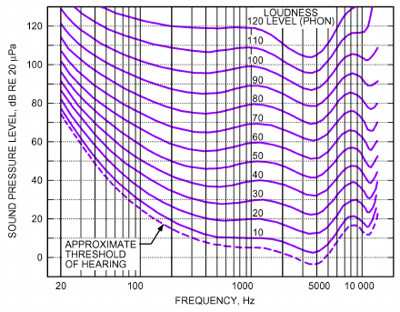

*Fig. 4 Free-Field Equal Loudness Contours for Pure Tones*

> (Robinson and Dadson 1956)

<!-- str. 178 -->

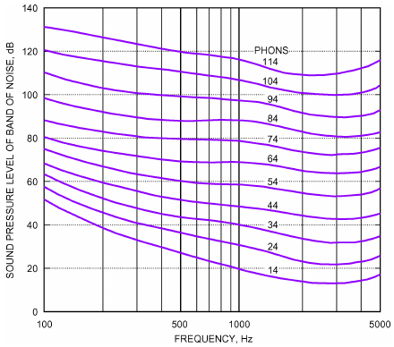

*Fig. 5 Equal Loudness Contours for Relatively Narrow Bands of Random Noise*

(Reprinted with permission from I. Pollack, *Journal of the Acousti-* *cal Society of America*, vol. 24, p. 533, 1952. Copyright 1952,

> Acoustical Society of America.)

**Table 8 Subjective Effect of Changes in Sound Pressure Level, Broadband Sounds (Frequency ≥ 250 Hz)**

| Subjective Change | Objective Change in Sound Level (Approximate) |
|---|---|
| Much louder | More than +10 dB |
| Twice as loud | +10 dB |
| Louder | +5 dB |
| Just perceptibly louder | +3 dB |
| Just perceptibly quieter | –3 dB |
| Quieter | –5 dB |
| Half as loud | –10 dB |
| Much quieter | Less than –10 dB |

approximately 10 phons. To obtain a quantity proportional to the loudness sensation, use a loudness scale based on the **sone**. One sone equals the loudness level of 40 phons. A rating of two sones corresponds to 50 phons, and so on. In HVAC, only the ventilation fan industry (e.g., bathroom exhaust and sidewall propeller fans) uses loudness ratings.

Standard objective methods for calculating loudness have been developed. ANSI Standard S3.4 calculates loudness or loudness level using 1/3 octave band sound pressure level data as a starting point. The loudness index for each 1/3 octave band is obtained from a graph or by calculation. Total loudness is then calculated by combining the loudnesses for each band according to a formula given in the standard. A graphic method using 1/3 octave band sound pressure levels to predict loudness of sound spectra containing tones is presented in Zwicker (ISO Standard 532) and German Standard DIN 45631. Because of its complexity, loudness has not been widely used in engineering practice in the past.

### Acceptable Frequency Spectrum

The most acceptable frequency spectrum for HVAC sound is a balanced or neutral spectrum in which octave band levels decrease at a rate of 4 to 5 dB per octave with increasing frequency. This means that it is not too hissy (excessive high-frequency content) or too rumbly (excessive low-frequency content). Unfortunately, achieving a balanced sound spectrum is not always easy: there may be numerous sound sources to consider. As a design guide, Figure 6 shows the more common mechanical and electrical sound sources and frequency regions that control the indoor sound spectrum. Chapter 49 of the 2019 *ASHRAE Handbook—HVAC Applications* provides more detailed information on treating some of these sound sources.

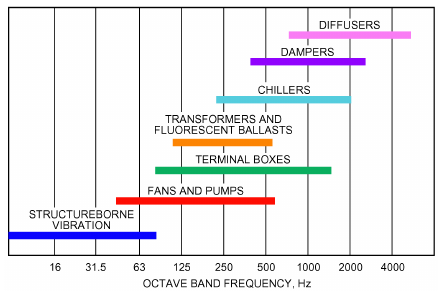

*Fig. 6 Frequencies at Which Various Types of Mechanical and Electrical Equipment Generally Control Sound Spectra*

## 11. SOUND RATING SYSTEMS AND ACOUSTICAL DESIGN GOALS

The degree of occupant satisfaction with the background noise level in any architectural space depends on the sound quality of the noise itself, the occupant’s aural sensitivity, and specific task engagement. In most cases, background noise must be unobtrusive, meaning that the noise level must not be excessive enough to cause distraction or annoyance, or to interfere with, for example, music listening and speech intelligibility. In addition, the frequency content and temporal variations must not call attention to the noise intrusion, but rather present a bland and unobtrusive background. For critical listening conditions such as for music in a symphony hall or speech in grade schools, background noise must not exceed a relatively low exposure level. However, for speech and music in a high school gymnasium, a significantly higher background noise level will be tolerated. When low annoyance and distractions are a key factor, such as in open-plan offices for occupant productivity, a minimum acceptable background noise must be considered to effectively cover undesirable intruding sounds. Consequently, HVAC system sound control goals vary depending on the required use of the space.

To be unobtrusive, HVAC-related background noise should have the following properties:

- Frequency content that is broadband and smooth in nature, and at a level suitable for the use of the space
- No audible tones or other characteristics such as roar, whistle, hum, or rumble
- No significant time fluctuations in level or frequency such as throbbing or pulsing

Unfortunately, there is no standard process to easily characterize the effects of audible tones and level fluctuations, so currently available rating methods do not adequately address these issues.

Conventional approaches for rating sound in an occupied space include the following.

### A-Weighted Sound Level (dBA)

The A-weighted sound level LA is an easy-to-determine, single-number rating, expressed as a number followed by dBA (e.g., 40 dBA). A-weighted sound levels correlate well with human judgments of relative loudness, but do not indicate degree of spectral balance. Thus, they do not necessarily correlate well with the annoyance caused by the noise. Many different-sounding spectra can have the same numeric rating but quite different subjective qualities. A-weighted comparisons are best used with sounds that sound alike but differ in level. They should not be used to compare sounds with distinctly different spectral characteristics; two sounds at the same sound level but with different spectral content are likely to be judged differently by the listener in terms of acceptability as a background sound. One of the sounds might be completely acceptable; the other could be objectionable because its spectrum shape was rumbly, hissy, or tonal in character.

<!-- str. 179 -->

A-weighted sound levels are used extensively in outdoor environmental noise standards and for estimating the risk of damage to hearing for long-term exposures to noise, such as in industrial environments and other workplaces. In outdoor environmental noise standards, the principal sources of noise are vehicular traffic and aircraft, for which A-weighted criteria of acceptability have been developed empirically.

Outdoor HVAC equipment can create significant sound levels that affect nearby properties and buildings. Local noise ordinances often limit property line A-weighted sound levels and typically are more restrictive during nighttime hours.

### Noise Criteria (NC) Method

The NC method remains the predominant design criterion used by HVAC engineers. This single-number rating is somewhat sensitive to the relative loudness and speech interference properties of a given sound spectrum. Its wide use derives in part from its ease of use and its publication in HVAC design textbooks. The method consists of a family of criterion curves now extending from 16 to 8000 Hz and a rating procedure based on speech interference levels (ANSI Standard S12.2-2008). The criterion curves define the limits of octave band spectra that must not be exceeded to meet acceptance in certain spaces. The NC curves shown in Figure 7 are in steps of 5 dB. NC-rating procedures for measured data use interpolation, rounded to the nearest dB.

The rating is expressed as NC followed by a number. For example, the spectrum shown is rated NC 43 because this is the lowest rating curve that falls entirely above the measured data. An NC 35 design goal is common for private offices. The background sound level meets this goal if no portion of its spectrum lies above the designated NC 35 curve.

The NC method is sensitive to level but has the disadvantage as a design criterion method that it does not require the sound spectrum to approximate the shape of the NC curves. Thus, many different sounds can have the same numeric rating, but rank differently on the basis of subjective sound quality. In many HVAC systems that do not produce excessive low-frequency sound, the NC rating correlates relatively well with occupant satisfaction if sound quality is not a significant concern or if the octave band levels have a shape similar to the nearest NC curves.

Two problems occur in using the NC procedure as a diagnostic tool. First, when the NC level is determined by a prominent peak in the spectrum, the actual level of resulting background sound may be quieter than that desired for masking unwanted speech and activity sounds, because the spectrum on either side of the tangent peak drops off too rapidly. Second, when the measured spectrum does not match the shape of the NC curve, the resulting sound might be rumbly (levels at low frequencies determine the NC rating and levels at high frequencies roll off faster than the NC curve) or hissy (the NC rating is determined by levels at high frequencies but levels at low frequencies are much less than the NC curve for the rating).

Manufacturers of terminal units and diffusers commonly use NC ratings in their published product data. Because of the numerous assumptions made to arrive at these published values (e.g., size of room, type of ceiling, number of units), relying solely on NC ratings to select terminal units and diffusers is not recommended.

### Room Criterion (RC) Method

The room criterion (RC) method (ANSI Standard S12.2; Blazier 1981a, 1981b) is based on measured levels of HVAC noise in spaces and is used primarily as a diagnostic tool. The RC method consists of a family of criteria curves and a rating procedure. The shape of these curves differs from the NC curves to approximate a wellbalanced, neutral-sounding spectrum; two additional octave bands (16 and 31.5 Hz) are added to deal with low-frequency sound, and the 8000 Hz octave band is dropped. This rating procedure assesses background sound in spaces based on its effect on speech communication, and on estimates of subjective sound quality. The rating is expressed as RC followed by a number to show the level of the sound and a letter to indicate the quality [e.g., RC 35(N), where N denotes neutral].

For a full explanation of RC curves and analysis procedures, see Chapter 49 of the 2019 *ASHRAE Handbook—HVAC Applications*.

### Criteria Selection Guidelines

In general, these basic guidelines are important:

- Sound levels below NC or RC 35 are generally not detrimental to good speech intelligibility. Sound levels at or above these levels may interfere with or mask speech.
- Even if the occupancy sound is significantly higher than the anticipated background sound level generated by mechanical equipment, the sound design goal should not necessarily be raised to levels approaching the occupancy sound. This avoids occupants having to raise their voices uncomfortably to be heard over the noise. For full details and recommended background sound level criteria for different spaces, see Chapter 49 of the 2019 ASHRAE Handbook—HVAC Applications.

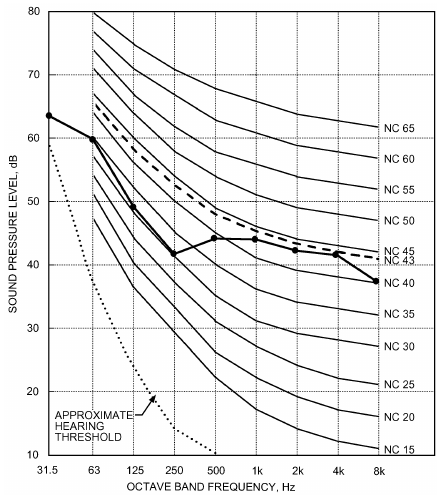

*Fig. 7 NC (Noise Criteria) Curves and Sample Spectrum (Curve with Symbols)*

<!-- str. 180 -->

## 12. FUNDAMENTALS OF VIBRATION

A rigidly mounted machine transmits its internal vibratory forces directly to the supporting structure. However, by inserting resilient mountings (**vibration isolators**) between the machine and supporting structure, the magnitude of transmitted force can be dramatically reduced. Vibration isolators can also be used to protect sensitive equipment from floor vibration.

### Single-Degree-of-Freedom Model

The simplest representation of a vibration isolation system is the single-degree-of-freedom model, shown in Figure 8. Only motion along the vertical axis is considered. The isolated system is represented by a mass and the isolator is represented by a spring, which is considered fixed to ground. Excitation (i.e., the vibratory forces generated by the isolated equipment, such as shaft imbalance in rotating machinery) is applied to the mass. This simple model is the basis for catalog information provided by most manufacturers of vibration isolation hardware.

### Mechanical Impedance

**Mechanical impedance Zm** is a structural property useful in understanding the performance of vibration isolators in a given installation. Zm is the ratio of the force F applied to the structure divided by the velocity v of the structure’s vibration response at the point of excitation:

> Zm = F/v&emsp;**(43)**

At low frequencies, the mechanical impedance of a vibration isolator is approximately equal to k/2πf, where k is the stiffness of the isolator (force per unit deflection) and f is frequency in Hz (cycles per second). Note that the impedance of the isolator is inversely proportional to frequency. This characteristic is the basis for an isolator’s ability to block vibration from the supported structure. In the simple single-degree-of-freedom model, impedance of the isolated mass is proportional to frequency. Thus, as frequency increases, the isolator increasingly provides an impedance mismatch between the isolated structure and ground. This mismatch attenuates the forces imposed on the ground. However, at the system’s particular natural frequency (discussed in the following section), the effects of the isolator are decidedly detrimental.

### Natural Frequency

Using the single-degree-of-freedom model, the frequency at which the magnitude of the spring and mass impedances are equal is the **natural frequency fn**. At this frequency, the mass’s vibration response to the applied excitation is a maximum, and the isolator actually amplifies the force transmitted to ground. The natural frequency of the system (also called the **isolation system reso- nance**) is given approximately by

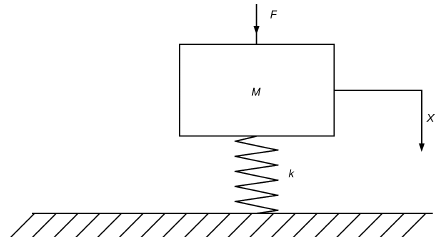

*Fig. 8 Single-Degree-of-Freedom System*

> fn = 1/2π k/M&emsp;**(44)**

where M is the mass of the equipment supported by the isolator. The stiffness k is expressed as N/m, and M as kg.

This equation simplifies to

> fn = 15.8/(δ st)&emsp;**(45)**

where δst is the **isolator static deflection** (the incremental distance the isolator spring compresses under the weight of the supported equipment) in millimetres. Thus, to achieve the appropriate system natural frequency for a given application, it is customary to specify the corresponding isolator static deflection and the load to be supported at each of the mounting points.

The **transmissibility T** of this system is the ratio of the amplitudes of the force transmitted to the building structure to the exciting force produced inside the vibrating equipment. For disturbing frequency fd, T is given by

> T = 1/(1 – ( fd⁄ fn)2)&emsp;**(46)**

The transmissibility equation is plotted in Figure 9.

It is important to note that T is inversely proportional to the square of the ratio of the disturbing frequency fd to the system natural frequency fn. At fd = fn, resonance occurs: the denominator of Equation (46) equals zero and transmission of vibration is theoretically infinite. In practice, transmissibility at resonance is limited by damping in the system, which is always present to some degree. Thus, the magnitude of vibration amplification at resonance always has a finite, though often dramatically high, value.

Note that vibration isolation (attenuation of force applied to ground) does not occur until the ratio of the disturbing frequency fd to the system natural frequency fn is greater than 1.4. Above this ratio, vibration transmissibility decreases (attenuation increases) with the square of frequency.

In designing isolators, it is customary to specify a frequency ratio of at least 3.5, which corresponds to an isolation efficiency of about 90%, or 10% transmissibility. Higher ratios may be specified, but in practice this often does not greatly increase isolation efficiency, especially at frequencies above about 10 times the natural frequency. The reason is that wave effects and other nonlinear characteristics in real isolators cause a deviation from the theoretical curve that limits performance at higher frequencies.

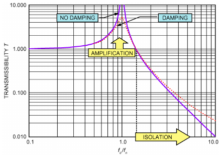

*Fig. 9 Vibration Transmissibility T as Function of fd/ fn*

<!-- str. 181 -->

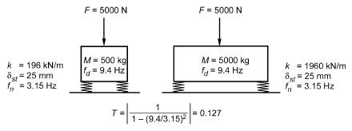

*Fig. 10 Effect of Mass on Transmissibility*

To obtain the design objective of fd/fn ≈ 3.5, the lowest frequency of excitation fdis determined first. This is usually the shaft rotation rate in hertz (Hz; cycles/second). Because it is usually not possible to change the mass of the isolated equipment, the combined stiffness of the isolators is then selected such that

> k = (2πfd/3.5)2M&emsp;**(47)**

where M is the mass of the mounted equipment in kg, and k is in N/m. With four mounts, the stiffness of each mount is k/4, assuming equal mass distribution.

For a given set of isolators, as shown by Equations (44) and (46), if equipment mass is increased, the resonance frequency decreases and isolation increases. In practice, the load-carrying capacity of isolators usually requires that their stiffness or their number be increased. Consequently, the static deflection and transmissibility may remain unchanged.

For example, as shown in Figure 10, a 500 kg piece of equipment installed on isolators with stiffness k of 196 kN/m results in a 25 mm deflection and a system resonance frequency fn of 3.15 Hz. If the equipment operates at 564 rpm (9.4 Hz) and develops an internal force of 5000 N, 635 N is transmitted to the structure. If the total mass is increased to 5000 kg by placing the equipment on a concrete inertia base and the stiffness of the springs is increased to 1960 kN/m, the deflection is still 25 mm, the resonance frequency of the system is maintained at 3.15 Hz, and the force transmitted to the structure remains at 635 N.

The increased mass, however, reduces equipment displacement. The forces F generated inside the mounted equipment, which do not change when mass is added to the equipment, now must excite more mass with the same internal force. Therefore, because *F = Ma*, where a is acceleration, the maximum dynamic displacement of the mounted equipment is reduced by a factor of M1/M2, where M1 and M2 are the masses before and after mass is added, respectively.

### Practical Application for Nonrigid Foundations

The single-degree-of-freedom model is valid only when the impedance of the supporting structure (ground) is high relative to the impedance of the vibration isolator. This condition is usually satisfied for mechanical equipment in on-grade or basement locations. However, when heavy mechanical equipment is installed on a structural floor, particularly on the roof of a building, significantly softer vibration isolators are usually required than in the on-grade or basement case. This is because the impedance of the supporting structure can no longer be ignored.

For the two-degrees-of-freedom system in Figure 11, mass M1 and isolator K1 represent the supported equipment, and M2 and K2 represent the effective mass and stiffness of the floor structure. In

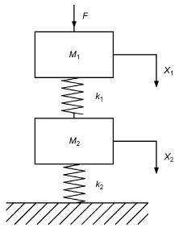

*Fig. 11 Two-Degrees-of-Freedom System*

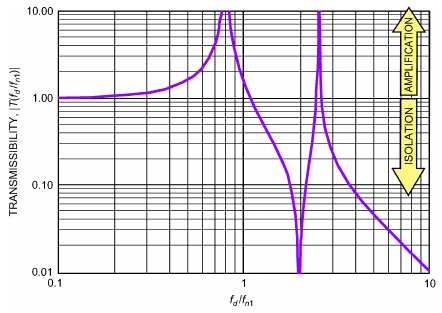

*Fig. 12 Transmissibility T as Function of fd/fn1 with*

> **k2/k1 = 2 and M2/M1 = 0.5**

this case, transmissibility refers to the vibratory force imposed on the floor, and is given by

> T = 1/(( fd)2 1 1 – ------ – ----------------------------------)&emsp;**(48)**
>
> f

> ( n1) ( )2
>
> (f n1)/fd k2/k1 – M2/M1

> ( )

As in Equation (46), fd is the forcing frequency. Frequency fn1is the natural frequency of the isolated equipment with a rigid foundation [Equation (44)].

The implication of Equation (48) relative to Equation (46) is that a nonrigid foundation can severely alter the effectiveness of the isolation system. Figure 12 shows transmissibility of a floor structure with twice the stiffness of the isolator, and a floor effective mass half that of the isolated equipment. Comparing Figure 12 to Figure 9 shows that the nonrigid floor introduces a second resonance well above that of the isolation system assuming a rigid floor. Unless care is taken in the isolation system design, this secondary amplification can cause a serious sound or vibration problem.

As a general rule, it is advisable to design the system such that the static deflection of the isolator, under the applied equipment weight, is on the order of 10 times the incremental static deflection of the floor caused by the equipment mass (Figure 13). Above the

<!-- str. 182 -->

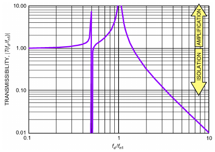

*Fig. 13 Transmissibility T as Function of fd/fn1 with*

> **k2/k1 = 10 and M2/M1 = 40**

rigid-foundation natural frequency fn1, transmissibility is comparable to that of the simple single-degree-of-freedom model.

Other complicating factors exist in actual installations, which often depart from the two-degrees-of-freedom model. These include the effects of horizontal and rotational vibration. Given these complexities, it is often beneficial to collaborate with an experienced acoustical consultant or structural engineer when designing vibration isolation systems applied to flexible floor structures.

## 13. VIBRATION MEASUREMENT BASICS

Control of HVAC system sound and vibration are of equal importance, but measurement of vibration is often not necessary to determine sources or transmission paths of disturbing sound.

The typical vibrations measured are periodic motions of a surface. This surface displacement oscillates at one or more frequencies produced by mechanical equipment (e.g., rotating shafts or gears), thermal processes (e.g., combustion), or fluid-dynamic means (e.g., airflow through a duct or fan interactions with air).

A **transducer** detects displacement, velocity, or acceleration of a surface and converts the motion to electrical signals. Displacement transducers are often most appropriate for low-frequency measurements. For most HVAC applications, the transducer of choice is an **accelerometer**, which is rugged and compact. The accelerometer attaches to an amplifier, which connects to a meter, much like the microphone on a sound level meter. Readouts may be in acceleration level or decibels. The measurement also specifies whether the amplitude of the acceleration sinusoid is defined by its peak, peak-to-peak, or RMS level.

For steady-state (continuous) vibration, simple relationships exist between displacement, velocity, and acceleration; output can be specified as any of these, regardless of which transducer type is used. For a given frequency f,

> a = (2πf )2d = (2πf )v&emsp;**(49)**

where a is acceleration, v is velocity, and d is displacement.

The simplest measure is the overall signal level as a function of time. This is analogous to the unfiltered sound pressure level. If a detailed frequency analysis is needed, there is a choice of filters similar to those available for sound measurements: octave band, 1/3 octave band, or 1/12 octave band. In addition, there are narrowband analyzers that use the fast Fourier transform (FFT) to analyze and filter a signal. Though widely used, they should only be used by a specialist for accurate results.

The most important issues in vibration measurement include (1) choosing a transducer with a frequency range appropriate to the measurement, (2) properly mounting the transducer to ensure that the frequency response claimed is achieved, and (3) properly calibrating the vibration measurement system for the frequency range of interest.

For more thorough descriptions of specialized vibration measurement and analysis methods, designers should consult other sources [e.g., Harris (1991)].

## 14. SYMBOLS

A = magnitude of physical property [Equation (1)], surface area, m2 a = acceleration, m/s2 c = speed of sound in air, 335 m/s d = distance of measurement from nearest reflecting surface, or

> displacement, m

df = deflection of foundation dI = deflection of mounts

E = Young’s modulus, N/m2

F = force applied to structure, N f = frequency, Hz fc = critical frequency, Hz fd = disturbing frequency, Hz fn = system natural frequency, Hz fr = rotation speed of fan blades, rev/s h = thickness of outer panel of partition, mm

I = sound intensity, dB

Iave = time-averaged sound intensity k = stiffness of vibration isolator, N/m

L = level of magnitude of sound or vibration

Leq = equivalent continuous sound pressure level

LI = level of sound intensity

Lp = sound pressure level, dB

Lw = sound power level

M = mass of equipment supported by isolator, kg

M1 = mass of equipment before additional mass added, kg

M2 = mass of equipment after additional mass added, kg

N = number of fan blades p = acoustic pressure

Q = directivity factor, dimensionless

R = room constant r = distance between site of measurement and nondirectional sound source, m

Re = real part of complex quantity

S = surface area, m2 t or T = time, s

T = system transmissibility

T60 = reverberation time

V = volume of room, m3 v = velocity vb = velocity of flow over fan blade, m/s v0 = free stream velocity of flow into fan, m/s

W = total sound power w = sound power of source, W

W0 = input power

WM = output power ws = surface mass of panel, kg/m2

WSG = power of self-noise x = location of measurement of pressure p, Equation (17)

za = acoustic impedance, kg/(m2·s) or (N·s)/m3

Zf = impedance of foundation where isolator attached, (N·s)/m

ZI = isolator impedance, (N·s)/m

Zm = mechanical impedance of structure, (N·s)/m

### Greek

α = absorption coefficient

α = average absorption coefficient of room surface at given frequency δst = isolator static deflection, mm

θ = direction

λ = wavelength, m

ρ = density, kg/m3

<!-- str. 183 -->

### Subscripts

0 = maximum amplitude abs = absorbed ave = average i = value for ith source inc = incident ref = reference magnitude of physical property [Equation (1)]

w = sound power

## REFERENCES

ASHRAE members can access ASHRAE Journal articles and ASHRAE research project final reports at technologyportal .ashrae.org. Articles and reports are also available for purchase by nonmembers in the online ASHRAE Bookstore at www.ashrae.org /bookstore.

AHRI. 2014. Reverberation room qualification and testing procedures for determining sound power of HVAC equipment. ANSI/AHRI Standard 220-2014. Air-Conditioning, Heating, and Refrigeration Institute, Arlington, VA.

AHRI. 2013. Performance and calibration of reference sound sources. ANSI/AHRI Standard 250-2013 with Addendum 1. Air-Conditioning, Heating, and Refrigeration Institute, Arlington, VA.

AHRI. 2014. Sound rating of ducted air moving and conditioning equipment. ANSI/AHRI Standard 261 (SI)-2012. Air-Conditioning, Heating, and Refrigeration Institute, Arlington, VA.

AHRI. 2014. Sound rating of outdoor unitary equipment. Standard 270-2015. Air-Conditioning, Heating, and Refrigeration Institute, Arlington, VA.

AHRI. 2014. Sound performance rating of large air-cooled outdoor refrigerating and air-conditioning equipment. ANSI/AHRI Standard 370-2015. Air-Conditioning, Heating, and Refrigeration Institute, Arlington, VA.

AHRI. 2014. Rating of sound and vibration for refrigerant compressors.

ANSI/AHRI Standard 530-2011. Air-Conditioning, Heating, and Refrigeration Institute, Arlington, VA.

AHRI. 2008. Method of measuring machinery sound within an equipment space. ANSI/AHRI Standard 575-2008. Air-Conditioning, Heating, and Refrigeration Institute, Arlington, VA.

AHRI. 2011. Performance rating of air terminals. ANSI/AHRI Standard 881 (SI)-2011 (with addendum 1). Air-Conditioning, Heating, and Refrigeration Institute, Arlington, VA.

AHRI. 2008. Procedure for estimating occupied space sound levels in the application of air terminals and air outlets. Standard 885-2008 (with addendum). Air-Conditioning, Heating, and Refrigeration Institute, Arlington, VA.

AMCA. 2014. Reverberant room method for sound testing of fans. ANSI/AMCA Standard 300-14. Air Movement and Control Association International, Inc., Arlington Heights, IL.

AMCA. 2014. Methods for calculating fan sound ratings from laboratory test data. Standard 301-14. Air Movement and Control Association International, Inc., Arlington Heights, IL.

AMCA. 2005. Certified ratings program—Product rating manual for fan sound performance. Standard 311-05. Air Movement and Control Association International, Inc., Arlington Heights, IL.

AMCA. 1997. Laboratory method of testing to determine the sound power in a duct. Standard 330-97 (ASHRAE Standard 68-1997). Air Movement and Control Association International, Inc., Arlington Heights, IL.

AMCA. 2012. Application of sound power level ratings for fans. Publication 303-79 (R2012). Air Movement and Control Association International, Inc., Arlington Heights, IL.

ANSI. 2015. Measuring the ambient noise level in a room. Standard S12.72-2015. American National Standards Institute, New York.

ANSI. 2013. Acoustical terminology. ANSI/ASA Standard S1.1-2013.

American National Standards Institute, New York.

ANSI. 2013. Specification for sound level meters, part 1: Specifications;

part 2: Pattern evaluation; part 3: Periodic tests. ANSI/IEC Standard S1.4-2013. American National Standards Institute, New York.

ANSI. 2011. Preferred frequencies, frequency levels, and band numbers for acoustical measurements. ANSI/ASA Standard S1.6-1984 (R2011). American National Standards Institute, New York.

ANSI. 2014. Specifications for octave-band and fractional octave-band analog and digital filters part 1: Specifications. ANSI/ASA Standard S1.11-2014. American National Standards Institute, New York.

ANSI. 2012. Procedure for the computation of loudness of steady sound.

ANSI/ASA Standard S3.4-2007 (R2012). American National Standards Institute, New York.

ANSI. 2008. Criteria for evaluating room noise. ANSI/ASA Standard S12.2-2008. American National Standards Institute, New York.

ANSI. 2012. Engineering method for determination of sound power level of noise sources using sound intensity. ANSI/ASA Standard S12.12-1992 (R2012). American National Standards Institute, New York.

ANSI. 2012. Determination of sound power levels of noise sources using sound pressure—Precision methods for anechoic and hemi-anechoic rooms. ANSI/ASA Standard S12.55-2012/ISO Standard 3745:2012. American National Standards Institute, New York.

ANSI. 2012. Sound power level determination for sources using a singlesource position. ANSI/ASA Standard S12.58-2012/ISO Standard 3741:2010. American National Standards Institute, New York.

ANSI. 2015. Measuring the ambient noise level in a room. ANSI/ASA Standard S12.72-2015. American National Standards Institute, New York.

ASHRAE. 1997. Laboratory method of testing to determine the sound power in a duct. Standard 68-1997 (AMCA Standard 330-92).

ASHRAE. 2008. Methods of testing air terminal units. ANSI/ASHRAE Standard 130-2008.

ASTM. 2009. Test method for sound absorption and sound absorption coefficients by the reverberation room method. Standard C423-09a. American Society for Testing and Materials, West Conshohocken, PA.

ASTM. 2013. Terminology relating to building and environmental acoustics.

Standard C634-13. American Society for Testing and Materials, West Conshohocken, PA.

ASTM. 2009. Test method for laboratory measurement of airborne sound transmission loss of building partitions and elements. Standard E90-09. American Society for Testing and Materials, West Conshohocken, PA.

ASTM. 2010. Classification for rating sound insulation. Standard E413-10.

American Society for Testing and Materials, West Conshohocken, PA. ASTM. 2013. Test method for measuring acoustical and airflow performance of duct liner materials and prefabricated silencers. Standard E477-2013e1. American Society for Testing and Materials, West Conshohocken, PA.

ASTM. 2009. Test method for evaluating masking sound in open offices using A-weighted and one-third octave band sound pressure levels. Standard E1573-09. American Society for Testing and Materials, West Conshohocken, PA.

ASTM. 2014. Test method for measurement of sound in residential spaces.

Standard E1574-98 (2014). American Society for Testing and Materials, West Conshohocken, PA.

Blazier, W.E., Jr. 1981a. Revised noise criteria for application in the acoustical design and rating of HVAC systems. *Noise Control Engineering* Journal 16(2):64-73.

Blazier, W. E., Jr. 1981b. Revised noise criteria for design and rating of HVAC systems. ASHRAE Transactions 87(1). Paper CH-81-06-2.

DIN. 1991. Procedure for calculating loudness level and loudness. German Standard DIN 45631. Deutsches Institut für Normung, Berlin.

Harris, C.M. 1991. *Handbook of acoustical measurements and noise con-* trol, 3rd ed. Acoustical Society of America, Melville, NY.

ISO. 1975. Acoustics—Methods for calculating loudness level. Standard 532-1975. International Organization for Standardization, Geneva.

ISO. 2003. Acoustics—Laboratory measurement procedures for ducted silencers and air-terminal units—Insertion loss, flow noise and total pressure loss. Standard 7235-2003. International Organization for Standardization, Geneva.

ISO. 1993. Determination of sound power levels of noise sources using sound intensity—Part 1: Measurements at discrete points. Standard 9614-1. International Organization for Standardization, Geneva.

ISO. 1996. Acoustics—Determination of sound power levels of noise sources using sound intensity—Part 2: Measurement by scanning. Standard 9614-2. International Organization for Standardization, Geneva.

Pollack, I. 1952. The loudness of bands of noise. *Journal of the Acoustical* *Society of America* 24(9):533.

Robinson, D.W., and R.S. Dadson. 1956. A redetermination of the equal loudness relations for pure tones. *British Journal of Applied Physics* 7(5): 166.

<!-- str. 184 -->

Schultz, T.J. 1985. Relationship between sound power level and sound pressure level in dwellings and offices. ASHRAE Transactions 91(1):124-153. Paper 2865 (RP-339).

Warnock, A.C.C. 1997. Sound transmission through ceilings from air terminal devices in the plenum. ASHRAE Research Project RP-755, Final Report.

Warnock, A.C.C. 1998a. Sound pressure level vs. distance from sources in rooms. ASHRAE Transactions 104(1):643-649. Paper 4159 (RP-755).

Warnock, A.C.C. 1998b. Transmission of sound from air terminal devices through ceiling systems. ASHRAE Transactions 104(1):650-657. Paper 4160 (RP-755).

## BIBLIOGRAPHY

AMCA. 2012. Application of sone ratings for non-ducted air moving devices. Publication 302-73 (R2012). Air Movement and Control Association International, Inc., Arlington Heights, IL.

ANSI. 2012. Determination of sound power levels of noise sources using sound pressure—Precision methods for reverberation rooms. ANSI/ASA Standard S12.51-2012/ISO Standard 3741:2010. American National Standards Institute, New York.

ANSI. 2010. Acoustical performance criteria, sound requirements, and guidelines for schools, part 1: Permanent schools. Standard S12.60-2010 (R2015). American National Standards Institute, New York.

ASHRAE. 2016. Ventilation for acceptable indoor air quality. Standard 62.1-2016.

ASHRAE. 2016. Ventilation and acceptable indoor air quality in low-rise residential buildings. Standard 62.2-2016.

Beranek, L.L. 1957. Revised criteria for noise in buildings. Noise Control 1:19.

Beranek, L.L. 1986. Acoustics, rev. ed. American Institute of Physics, Acoustical Society of America, New York.

Beranek, L.L. 1988. *Noise and vibration control*, rev. ed. Institute of Noise Control Engineering, Washington, D.C.

Beranek, L.L. 1989. Balanced noise criterion (NCB) curves. *Journal of the* *Acoustic Society of America* (86):650-654.

Beranek, L.L., and I.L. Ver. 2005. *Noise and vibration control engineering:* *Principles and applications*, 2nd ed. John Wiley & Sons, New York.

Bies, D.A., and C.H. Hansen. 2009. *Engineering noise control: Theory and* practice, 4th ed. E&F Spon, New York.

Blazier, W.E., Jr. 1995. Sound quality considerations in rating noise from heating, ventilating and air-conditioning (HVAC) systems in buildings. *Noise Control Engineering Journal* 43(3).

Blazier, W.E., Jr. 1997. RC Mark II: A refined procedure for rating the noise of heating, ventilating and air-conditioning (HVAC) systems in buildings. *Noise Control Engineering Journal* 45(6).

Broner, N. 1994. Low-frequency noise assessment metrics—What do we know? (RP-714). ASHRAE Transactions 100(2):380-388. Paper 3821 (RP-714).

Crede, C.E. 1951. *Vibration and shock isolation*. John Wiley & Sons, New York.

Ebbing, C.E., and W. Blazier, eds. 1998. *Application of manufacturers’* sound data. ASHRAE.

Harris, C.M., and C.E. Crede. 2001. *Shock and vibration handbook*, 5th ed.

McGraw-Hill, New York.

ISO. 2002. Acoustics—Determination of sound power levels of noise sources using sound intensity—Part 3: Precision method for measurement by scanning. Standard 9614-3. International Organization for Standardization, Geneva.

Persson-Waye, K., R. Rylander, S. Benton, and H.G. Leventhall. 1997.

Effects on performance and work quality due to low-frequency ventilation noise. *Journal of Sound and Vibration* 205(4):467-474.

Peterson, A.P.G., and E.E. Gross, Jr. 1974. *Handbook of noise measurement*.

GenRad, Inc., Concord, MA.

Plunkett, R. 1958. Interaction between a vibratory machine and its foundation. Noise Control 4(1).

Schaffer, M.E. 2011. *A practical guide to noise and vibration control for* HVAC systems, 2nd ed. ASHRAE.
