# Chapter 9 — Thermal Comfort

*Izvor: 2021 ASHRAE Handbook — Fundamentals (SI), Chapter 9 (PDF str. 185–217).*

> **Napomena o konverziji:** Tekst je automatski izdvojen iz originalnog PDF-a uz prepoznavanje dve kolone, spojene prelomljene reči i pasuse. Indeksi i eksponenti su označeni sa `<sub>`/`<sup>`, tabele su pretvorene u Markdown tabele (veoma složene tabele su prikazane kao poravnat tekst), a slike su izrezane iz PDF-a u folder `img/`. Složene jednačine (razlomci, sume) mogu biti uprošćeno prikazane. **Pre upotrebe vrednosti u proračunu proveriti u originalnom PDF-u.** Oznake `<!-- str. N -->` pokazuju stranu PDF-a.

## Sadržaj

- [1. HUMAN THERMOREGULATION](#1-human-thermoregulation)
- [2. ENERGY BALANCE](#2-energy-balance)
- [3. THERMAL EXCHANGES WITH ENVIRONMENT](#3-thermal-exchanges-with-environment)
- [4. ENGINEERING DATA AND MEASUREMENTS](#4-engineering-data-and-measurements)
- [5. CONDITIONS FOR THERMAL COMFORT](#5-conditions-for-thermal-comfort)
- [6. THERMAL COMFORT AND TASK PERFORMANCE](#6-thermal-comfort-and-task-performance)
- [7. THERMAL NONUNIFORM CONDITIONS AND LOCAL DISCOMFORT](#7-thermal-nonuniform-conditions-and-local-discomfort)
- [8. SECONDARY FACTORS AFFECTING COMFORT](#8-secondary-factors-affecting-comfort)
- [9. PREDICTION OF THERMAL COMFORT](#9-prediction-of-thermal-comfort)
- [10. ENVIRONMENTAL INDICES](#10-environmental-indices)
- [11. SPECIAL ENVIRONMENTS](#11-special-environments)
- [12. SYMBOLS](#12-symbols)
- [REFERENCES](#references)
- [BIBLIOGRAPHY](#bibliography)

<!-- str. 185 -->

Aprincipal purpose of HVAC is to provide conditions for human thermal comfort, “that condition of mind that expresses satisfaction with the thermal environment and is assessed by subjective evaluation” (ASHRAE Standard 55). This definition leaves open what is meant by “condition of mind” or “satisfaction,” but it correctly emphasizes that judgment of comfort is a cognitive process involving many inputs influenced by physical, physiological, psychological, and other processes. This chapter summarizes the fundamentals of human thermoregulation and comfort in terms useful to the engineer for operating systems and designing for the comfort and health of building occupants.

The conscious mind appears to reach conclusions about thermal comfort and discomfort from direct temperature and moisture sensations from the skin, deep body temperatures, and the efforts necessary to regulate body temperatures (Berglund 1995; Gagge 1937; Hardy et al. 1971; Hensel 1973, 1981). In general, comfort occurs when body temperatures are held within narrow ranges, skin moisture is low, and the physiological effort of regulation is minimized.

Comfort also depends on behaviors that are initiated consciously or unconsciously and guided by thermal and moisture sensations to reduce discomfort. Some examples are altering clothing, altering activity, changing posture or location, changing the thermostat setting, opening a window, complaining, or leaving the space.

Surprisingly, although climates, living conditions, and cultures differ widely throughout the world, the temperature that people choose for comfort under similar conditions of clothing, activity, humidity, and air movement has been found to be very similar (Busch 1992; de Dear et al. 1991; Fanger 1972).

## 1. HUMAN THERMOREGULATION

Metabolic activities of the body result almost completely in heat that must be continuously dissipated and regulated to maintain normal body temperatures. Insufficient heat loss leads to overheating (**hyperthermia**), and excessive heat loss results in body cooling (**hypothermia**). Skin temperature greater than 45°C or less than 18°C causes pain (Hardy et al. 1952). Skin temperatures associated with comfort at sedentary activities are 33 to 34°C and decrease with increasing activity (Fanger 1967). In contrast, internal temperatures rise with activity. The temperature regulatory center in the brain is about 36.8°C at rest in comfort and increases to about 37.4°C when walking and 37.9°C when jogging. An internal temperature less than about 28°C can lead to serious cardiac arrhythmia and death, and a temperature greater than 43°C can cause irreversible brain damage. Therefore, careful regulation of body temperature is critical to comfort and health.

A resting adult produces about 100 W of heat. Because most of this is transferred to the environment through the skin, it is often convenient to characterize metabolic activity in terms of heat production per unit area of skin. For a resting person, this is about 58 W/m<sup>2</sup> and is called 1 **met**. This is based on the average male European, with a skin surface area of about 1.8 m<sup>2</sup>. For comparison, female Europeans have an average surface area of 1.6 m<sup>2</sup>. Systematic differences in this parameter may occur between ethnic and geographical groups. Higher metabolic rates are often described in terms of the resting rate. Thus, a person working at metabolic rate five times the resting rate would have a metabolic rate of 5 met.

<sub>The preparation of this chapter is assigned to TC 2.1, Physiology and Human Environment.</sub>

The **hypothalamus**, located in the brain, is the central control organ for body temperature. It has hot and cold temperature sensors and is bathed by arterial blood. Because the recirculation rate of blood is rapid and returning blood is mixed together in the heart before returning to the body, arterial blood is indicative of the average internal body temperature. The hypothalamus also receives thermal information from temperature sensors in the skin and perhaps other locations as well (e.g., spinal cord, gut), as summarized by Hensel (1981).

The hypothalamus controls various physiological processes to regulate body temperature. Its control behavior is primarily proportional to deviations from set-point temperatures with some integral and derivative response aspects. The most important and often-used physiological process is regulating blood flow to the skin: when internal temperatures rise above a set point, more blood is directed to the skin. This **vasodilation** of skin blood vessels can increase skin blood flow by 15 times [from 1.7 mL/(s·m<sup>2</sup>) at resting comfort to 25 mL/(s·m<sup>2</sup>)] in extreme heat to carry internal heat to the skin for transfer to the environment. When body temperatures fall below the set point, skin blood flow is reduced (**vasoconstricted**) to conserve heat. The effect of maximum vasoconstriction is equivalent to the insulating effect of a heavy sweater. At temperatures less than the set point, muscle tension increases to generate additional heat; where muscle groups are opposed, this may increase to visible shivering, which can increase resting heat production to 4.5 met.

At elevated internal temperatures, sweating occurs. This defense mechanism is a powerful way to cool the skin and increase heat loss from the core. The sweating function of the skin and its control is more advanced in humans than in other animals and is increasingly necessary for comfort at metabolic rates above resting level (Fanger 1967). Sweat glands pump perspiration onto the skin surface for evaporation. If conditions are good for evaporation, the skin can remain relatively dry even at high sweat rates with little perception of sweating. At skin conditions less favorable for evaporation, the sweat must spread on the skin around the sweat gland until the sweatcovered area is sufficient to evaporate the sweat coming to the surface. The fraction of the skin that is covered with water to account for the observed total evaporation rate is termed **skin wettedness** (Gagge 1937).

Humans are quite good at sensing skin moisture from perspiration (Berglund 1994; Berglund and Cunningham 1986), and skin moisture correlates well with warm discomfort and unpleasantness (Winslow et al. 1937). It is rare for a sedentary or slightly active person to be comfortable with a skin wettedness greater than 25%. In addition to the perception of skin moisture, skin wettedness increases the friction between skin and fabrics, making clothing feel less pleasant and fabrics feel more coarse (Gwosdow et al. 1986). This also occurs with architectural materials and surfaces, particularly smooth, nonhygroscopic surfaces.

<!-- str. 186 -->

With repeated intermittent heat exposure, the set point for the onset of sweating decreases and the proportional gain or temperature sensitivity of the sweating system increases (Gonzalez et al. 1978; Hensel 1981). However, under long-term exposure to hot conditions, the set point increases, perhaps to reduce the physiological effort of sweating. Perspiration, as secreted, has a lower salt concentration than interstitial body fluid or blood plasma. After prolonged heat exposure, sweat glands further reduce the salt concentration of sweat to conserve salt.

At the skin’s surface, the water in sweat evaporates while the dissolved salt and other constituents remain and accumulate. Because salt lowers the vapor pressure of water and thereby impedes its evaporation, the accumulating salt results in increased skin wettedness. Some of the relief and pleasure of washing after a warm day is related to the restoration of a hypotonic sweat film and decreased skin wettedness. Other adaptations to heat are increased blood flow and sweating in peripheral regions where heat transfer is better. Such adaptations are examples of **integral control**.

**Role of Thermoregulatory Effort in Comfort.** Chatonnet and Cabanac (1965) compared the sensation of placing a subject’s hand in relatively hot or cold water (30 to 38°C) for 30 s with the subject at different thermal states. When the person was overheated (hyperthermic), the cold water was pleasant and the hot water was very unpleasant, but when the subject was cold (hypothermic), the hand felt pleasant in hot water and unpleasant in cold water. Kuno (1995) describes similar observations during transient whole-body exposures to hot and cold environment. When a subject is in a state of thermal discomfort, any move away from the thermal stress of the uncomfortable environment is perceived as pleasant during the transition.

## 2. ENERGY BALANCE

Figure 1 shows the thermal interaction of the human body with its environment. The total metabolic rate M within the body is the metabolic rate required for the person’s activity M<sub>act</sub> plus the metabolic level required for shivering M<sub>shiv</sub> (should shivering occur). Some of the body’s energy production may be expended as external work W; the net heat production M – W is transferred to the environment through the skin surface (q<sub>sk</sub>) and respiratory tract (q<sub>res</sub>) with any surplus or deficit stored (S), causing the body’s temperature to rise or fall.

M – W = q<sub>sk</sub> + q<sub>res</sub> + S

> = (C + R + E<sub>sk</sub>) + (C<sub>res</sub> + E<sub>res</sub>) + (S<sub>sk</sub> + S<sub>cr</sub>)&emsp;**(1)**

where

- M = rate of metabolic heat production, W/m<sup>2</sup>
- W = rate of mechanical work accomplished, W/m<sup>2</sup>
- q<sub>sk</sub> = total rate of heat loss from skin, W/m<sup>2</sup>
- q<sub>res</sub> = total rate of heat loss through respiration, W/m<sup>2</sup>
- C + R = sensible heat loss from skin, W/m<sup>2</sup>
- E<sub>sk</sub> = total rate of evaporative heat loss from skin, W/m<sup>2</sup>
- C<sub>res</sub> = rate of convective heat loss from respiration, W/m<sup>2</sup>
- E<sub>res</sub> = rate of evaporative heat loss from respiration, W/m<sup>2</sup>
- S<sub>sk</sub> = rate of heat storage in skin compartment, W/m<sup>2</sup>
- S<sub>cr</sub> = rate of heat storage in core compartment, W/m<sup>2</sup>

Heat dissipates from the body to the immediate surroundings by several modes of heat exchange: sensible heat flow C + R from the skin; latent heat flow from sweat evaporation E<sub>rsw</sub> and from evaporation of moisture diffused through the skin E<sub>dif</sub>; sensible heat flow during respiration C<sub>res</sub>; and latent heat flow from evaporation of moisture during respiration E<sub>res</sub>. Sensible heat flow from the skin may be a complex mixture of conduction, convection, and radiation for a clothed person; however, it is equal to the sum of the convection C and radiation R heat transfer at the outer clothing surface (or exposed skin).

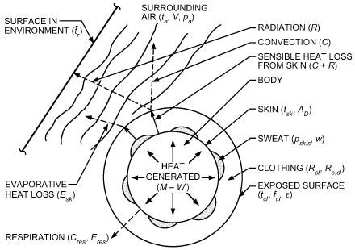

*Fig. 1 Thermal Interaction of Human Body and Environment*

Sensible and latent heat losses from the skin are typically expressed in terms of environmental factors, skin temperature t<sub>sk</sub>, and skin wettedness w. Factors also account for thermal insulation and moisture permeability of clothing. The independent environmental variables can be summarized as air temperature t<sub>a</sub>, mean radiant temperature t<sub>r</sub>, relative air velocity V, and ambient water vapor pressure p<sub>a</sub>. The independent personal variables that influence thermal comfort are activity and clothing.

The rate of heat storage in the body equals the rate of increase in internal energy. The body can be considered as two thermal compartments: the skin and the core (see the Two-Node Model section under Prediction of Thermal Comfort). The storage rate can be written separately for each compartment in terms of thermal capacity and time rate of change of temperature in each compartment:

> S<sub>cr</sub> = ((1 – α<sub>sk</sub>)mc<sub>p,b</sub>)/A<sub>D</sub> × dt<sub>cr</sub>/dθ&emsp;**(2)**
>
> S<sub>sk</sub> = (α mc sk p, b)/A<sub>D</sub> × dt<sub>sk</sub>/dθ&emsp;**(3)**

where

- α<sub>sk</sub> = fraction of body mass concentrated in skin compartment
- m = body mass, kg
- c<sub>p,b</sub> = specific heat capacity of body = 3490 J/(kg·K)
- A<sub>D</sub> = DuBois surface area, m<sup>2</sup>
- t<sub>cr</sub> = temperature of core compartment, °C
- t<sub>sk</sub> = temperature of skin compartment, °C
- θ = time, s

The fractional skin mass α<sub>sk</sub> depends on the rate ṁ<sub>bl</sub> of blood flowing to the skin surface.

## 3. THERMAL EXCHANGES WITH ENVIRONMENT

Fanger (1967, 1970), Gagge and Hardy (1967), Hardy (1949), and Rapp and Gagge (1967) give quantitative information on calculating heat exchange between people and the environment. This section summarizes the mathematical statements for various terms of heat exchange used in the heat balance equations (C, R, E<sub>sk</sub>, C<sub>res</sub>, E<sub>res</sub>). Terms describing the heat exchanges associated with the thermoregulatory control mechanisms (q<sub>cr,sk</sub>, M<sub>shiv</sub>, E<sub>rsw</sub>), values for the coefficients, and appropriate equations for M<sub>act</sub> and A<sub>D</sub> are presented in later sections.

<!-- str. 187 -->

Mathematical description of the energy balance of the human body combines rational and empirical approaches to describing thermal exchanges with the environment. Fundamental heat transfer theory is used to describe the various mechanisms of sensible and latent heat exchange, and empirical expressions are used to determine the values of coefficients describing these rates of heat exchange. Empirical equations are also used to describe the thermophysiological control mechanisms as a function of skin and core temperatures in the body.

### Body Surface Area

The terms in Equation (1) have units of power per unit area and refer to the surface area of the nude body. The most useful measure of nude body surface area, originally proposed by DuBois and DuBois (1916), is described by

> A<sub>D</sub> = 0.202m<sup>0.425</sup>l<sup>0.725</sup>&emsp;**(4)**

where

- A<sub>D</sub> = DuBois surface area, m<sup>2</sup>
- m = mass, kg
- l = height, m
- A correction factor f<sub>cl</sub> = A<sub>cl</sub>/A<sub>D</sub> must be applied to the heat transfer terms from the skin (C, R, and E<sub>sk</sub>) to account for the actual surface area A<sub>cl</sub> of the clothed body. Table 7 presents f<sub>cl</sub> values for various clothing ensembles. For a 1.73 m tall, 70 kg man, A<sub>D</sub> = 1.8 m<sup>2</sup>. All terms in the basic heat balance equations are expressed per unit DuBois surface area.

### Sensible Heat Loss from Skin

Sensible heat exchange from the skin must pass through clothing to the surrounding environment. These paths are treated in series and can be described in terms of heat transfer (1) from the skin surface, through the clothing insulation, to the outer clothing surface, and (2) from the outer clothing surface to the environment.

Both convective C and radiative R heat losses from the outer surface of a clothed body can be expressed in terms of a heat transfer coefficient and the difference between the mean temperature t<sub>cl</sub> of the outer surface of the clothed body and the appropriate environmental temperature:

> C = f<sub>cl</sub>h<sub>c</sub>(t<sub>cl</sub> – t<sub>a</sub>)&emsp;**(5)**
>
> R = f<sub>cl</sub>h<sub>r</sub>(t<sub>cl</sub>– t<sub>r</sub>)&emsp;**(6)**

where

- h<sub>c</sub> = convective heat transfer coefficient, W/(m<sup>2</sup>·K)
- h<sub>r</sub> = linear radiative heat transfer coefficient, W/(m<sup>2</sup>·K)
- f<sub>cl</sub> = clothing area factor A<sub>cl</sub>/A<sub>D</sub>, dimensionless

The coefficients h<sub>c</sub> and h<sub>r</sub> are both evaluated at the clothing surface. Equations (5) and (6) are commonly combined to describe the total sensible heat exchange by these two mechanisms in terms of an operative temperature t<sub>o</sub> and a combined heat transfer coefficient h:

> C + R = f<sub>cl</sub>h(t<sub>cl</sub> – t<sub>o</sub>)&emsp;**(7)**

where

> t<sub>o</sub> = (h<sub>r</sub>t<sub>r</sub> + h<sub>c</sub>t<sub>a</sub>)/(h<sub>r</sub>+ h<sub>c</sub>)&emsp;**(8)**
>
> h = h<sub>r</sub> + h<sub>c</sub>&emsp;**(9)**

Based on Equation (8), operative temperature t<sub>o</sub> can be defined as the average of the mean radiant and ambient air temperatures, weighted by their respective heat transfer coefficients.

The actual transport of sensible heat through clothing involves conduction, convection, and radiation. It is usually most convenient to combine these into a single thermal resistance value R<sub>cl</sub>, defined by

> C + R = (t<sub>sk</sub> – t<sub>cl</sub>)/R<sub>cl</sub>&emsp;**(10)**

where R<sub>cl</sub> is the thermal resistance of clothing in (m<sup>2</sup>·K)/W.

Because it is often inconvenient to include the clothing surface temperature in calculations, Equations (7) and (10) can be combined to eliminate t<sub>cl</sub>:

> C + R = (t<sub>sk</sub>– t<sub>o</sub>)/(R<sub>cl</sub>+ 1 ⁄ ( f<sub>cl</sub>h))&emsp;**(11)**

where t<sub>o</sub> is defined in Equation (8).

### Evaporative Heat Loss from Skin

Evaporative heat loss E<sub>sk</sub> from skin depends on the amount of moisture on the skin and the difference between the water vapor pressure at the skin and in the ambient environment:

> E<sub>sk</sub> = (w( p<sub>sk,s</sub>– p<sub>a</sub>))/(R<sub>e,cl</sub>+ 1 ⁄ ( f<sub>cl</sub>h<sub>e</sub>))&emsp;**(12)**

where

- w = skin wettedness, dimensionless
- p<sub>sk,s</sub> = water vapor pressure at skin, normally assumed to be that of saturated water vapor at t<sub>sk</sub>, kPa
- p<sub>a</sub> = water vapor pressure in ambient air, kPa
- R<sub>e,cl</sub> = evaporative heat transfer resistance of clothing layer (analogous to R<sub>cl</sub>), (m<sup>2</sup>·kPa)/W
- h<sub>e</sub> = evaporative heat transfer coefficient (analogous to h<sub>c</sub>), W/(m<sup>2</sup>·kPa)

Procedures for calculating R<sub>e,cl</sub> and h<sub>e</sub> are given in the section on Engineering Data and Measurements. Skin wettedness is the ratio of the actual evaporative heat loss E<sub>sk</sub> to the maximum possible evaporative heat loss E<sub>max</sub> with the same conditions and a completely wet skin (w = 1). Skin wettedness is important in determining evaporative heat loss. Maximum evaporative potential E<sub>max</sub> occurs when w = 1.

Evaporative heat loss from the skin is a combination of the evaporation of sweat secreted because of thermoregulatory control mechanisms E<sub>rsw</sub> and the natural diffusion of water through the skin E<sub>dif</sub>:

> E<sub>sk</sub> = E<sub>rsw</sub> + E<sub>dif</sub>&emsp;**(13)**

Evaporative heat loss by regulatory sweating is directly proportional to the rate of regulatory sweat generation:

> E<sub>rsw</sub> = ṁ<sub>rsw</sub>h<sub>fg</sub>&emsp;**(14)**

where

- h<sub>fg</sub> = heat of vaporization of water = 2.43 × 10<sup>6</sup> J/kg at 30°C
- ṁ<sub>rsw</sub> = rate at which regulatory sweat is generated, kg/(s·m<sup>2</sup>)

The portion w<sub>rsw</sub> of a body that must be wetted to evaporate the regulatory sweat is

> w<sub>rsw</sub> = E<sub>rsw</sub>/E<sub>max</sub>&emsp;**(15)**

With no regulatory sweating, skin wettedness caused by diffusion is approximately 0.06 for normal conditions. For large values of E<sub>max</sub> or long exposures to low humidities, the value may drop to as low as 0.02, because dehydration of the outer skin layers alters its diffusive characteristics. With regulatory sweating, the 0.06 value applies only to the portion of skin not covered with sweat (1 − w<sub>rsw</sub>); the diffusion evaporative heat loss is

<!-- str. 188 -->

> E<sub>dif</sub> = (1 – w<sub>rsw</sub>)0.06E<sub>max</sub>&emsp;**(16)**

These equations can be solved for w, given the maximum evaporative potential E<sub>max</sub> and the regulatory sweat generation E<sub>rsw</sub>:

> w = w<sub>rsw</sub>+ 0.06(1 – w<sub>rsw</sub>) = 0.06 + 0.94E<sub>rsw</sub>/E<sub>max</sub>&emsp;**(17)**

Once skin wettedness is determined, evaporative heat loss from the skin is calculated from Equation (12), or by

> E<sub>sk</sub> = wE<sub>max</sub>&emsp;**(18)**

To summarize, the following calculations determine w and E<sub>sk</sub>:

- E<sub>max</sub> Equation (12), with w = 1.0

> E<sub>rsw</sub> Equation (14)
>
> w Equation (17)

> E<sub>sk</sub> Equation (18) or (12)

Although evaporation from the skin E<sub>sk</sub> as described in Equation (12) depends on w, the body does not directly regulate skin wettedness but, rather, regulates sweat rate ṁ<sub>rsw</sub> [Equation (14)]. Skin wettedness is then an indirect result of the relative activity of the sweat glands and the evaporative potential of the environment. Skin wettedness of 1.0 is the upper theoretical limit. If the aforementioned calculations yield a wettedness of more than 1.0, then Equation (14) is no longer valid because not all the sweat is evaporated. In this case, E<sub>sk</sub> = E<sub>max</sub>.

Skin wettedness is strongly correlated with warm discomfort and is also a good measure of thermal stress. Theoretically, skin wettedness can approach 1.0 while the body still maintains thermoregulatory control. In most situations, it is difficult to exceed 0.8 (Berglund and Gonzalez 1977). Azer (1982) recommends 0.5 as a practical upper limit for sustained activity for a healthy, acclimatized person.

### Respiratory Losses

During respiration, the body loses both sensible and latent heat by convection and evaporation of heat and water vapor from the respiratory tract to the inhaled air. A significant amount of heat can be associated with respiration because air is inspired at ambient conditions and expired nearly saturated at a temperature only slightly cooler than t<sub>cr</sub>.

The total heat and moisture losses through respiration are

> q<sub>res</sub> = C<sub>res</sub> + E<sub>res</sub>= (ṁ (h<sub>ex</sub>– h<sub>a</sub>) res)/A<sub>D</sub>&emsp;**(19)**
>
> ṁ<sub>w,res</sub> = (ṁ (W<sub>ex</sub>– W<sub>a</sub>) res)/A<sub>D</sub>&emsp;**(20)**

where

- ṁ<sub>res</sub> = pulmonary ventilation rate, kg/s
- h<sub>ex</sub> = enthalpy of exhaled air, J/kg (dry air)
- h<sub>a</sub> = enthalpy of inspired (ambient) air, J/kg (dry air)
- ṁ<sub>w,res</sub> = pulmonary water loss rate, kg/s
- W<sub>ex</sub> = humidity ratio of exhaled air, kg (water vapor)/kg (dry air)
- W<sub>a</sub> = humidity ratio of inspired (ambient) air, kg (water vapor)/kg (dry air)

Under normal circumstances, pulmonary ventilation rate is primarily a function of metabolic rate (Fanger 1970):

> ṁ = K<sub>res</sub>MA<sub>D</sub>&emsp;**(21)**
>
> res

where

- M = metabolic rate, W/m<sup>2</sup>
- K<sub>res</sub> = proportionality constant 1.43 × 10<sup>–6</sup> kg/J

For typical indoor environments (McCutchan and Taylor 1951), the exhaled temperature and humidity ratio are given in terms of ambient conditions:

> t<sub>ex</sub> = 32.6 + 0.066t<sub>a</sub> + 32W<sub>a</sub>&emsp;**(22)**
>
> W<sub>ex</sub> = 0.0277 + 0.000065t<sub>a</sub> + 0.2W<sub>a</sub>&emsp;**(23)**

where ambient t<sub>a</sub> and exhaled t<sub>ex</sub> air temperatures are in °C. For extreme conditions, such as outdoor winter environments, different relationships may be required (Holmér 1984).

The humidity ratio of ambient air can be expressed in terms of total or barometric pressure p<sub>t</sub> and ambient water vapor pressure p<sub>a</sub>:

> W<sub>a</sub> = 0.622p<sub>a</sub>/(p<sub>t</sub>– p<sub>a</sub>)&emsp;**(24)**

Respiratory heat loss is often expressed in terms of sensible C<sub>res</sub> and latent E<sub>res</sub> heat losses. Two approximations are commonly used to simplify Equations (22) and (23) for that purpose. First, because dry respiratory heat loss is relatively small compared to the other terms in the heat balance, an average value for t<sub>ex</sub> is determined by evaluating Equation (22) at standard conditions of 20°C, 50% rh, sea level. Second, noting in Equation (23) that there is only a weak dependence on t<sub>a</sub>, the second term in Equation (23) and the denominator in Equation (24) are evaluated at standard conditions. Using these approximations and substituting latent heat h<sub>fg</sub> and specific heat of air c<sub>p,a</sub> at standard conditions, C<sub>res</sub> and E<sub>res</sub> can be determined by

> C<sub>res</sub> = 0.0014M(34 – t<sub>a</sub>)&emsp;**(25)**
>
> E<sub>res</sub> = 0.0173M(5.87 – p<sub>a</sub>)&emsp;**(26)**

where p<sub>a</sub> is expressed in kPa and t<sub>a</sub> is in °C.

### Alternative Formulations

Equations (11) and (12) describe heat loss from skin for clothed people in terms of clothing parameters R<sub>cl</sub>, R<sub>e,cl</sub>, and f<sub>cl</sub>; parameters h and h<sub>e</sub> describe outer surface resistances. Other parameters and definitions are also used. Although these alternative parameters and definitions may be confusing, note that information presented in one form can be converted to another form. Table 1 presents common parameters and their qualitative descriptions. Table 2 presents equations showing their relationship to each other. Generally, parameters related to dry or evaporative heat flows are not independent because they both rely, in part, on the same physical processes. The **Lewis relation** describes the relationship between convective heat transfer and mass transfer coefficients for a surface [see Equation (41) in Chapter 6]. The Lewis relation can be used to relate convective and evaporative heat transfer coefficients defined in Equations (5) and (12) according to

> LR = h<sub>e</sub>/h<sub>c</sub>&emsp;**(27)**

where LR is the **Lewis ratio** and, at typical indoor conditions, equals approximately 16.5 K/kPa. The Lewis relation applies to surface convection coefficients. Heat transfer coefficients that include the effects of insulation layers and/or radiation are still coupled, but the relationship may deviate significantly from that for a surface. The i terms in Tables 1 and 2 describe how the actual ratios of these parameters deviate from the ideal Lewis ratio (Oohori et al. 1984; Woodcock 1962).

<!-- str. 189 -->

**Table 1 Parameters Used to Describe Clothing**

```text
 Sensible Heat Flow                                                        Evaporative Heat Flow
R_cl = intrinsic clothing insulation: thermal resistance of a uniform layer of R_e,cl = evaporative heat transfer resistance of clothing: impedance to
       insulation covering entire body that has same effect on sensible heat flow transport of water vapor of uniform layer of insulation cover-
       as actual clothing.                                                        ing entire body that has same effect on evaporative heat flow
R_t = total insulation: total equivalent uniform thermal resistance between body  as actual clothing.
       and environment: clothing and boundary resistance.                  R_e,t = total evaporative resistance: total equivalent uniform imped-
R_cle = effective clothing insulation: increased body insulation due to clothing as ance to transport of water vapor from skin to environment.
       compared to nude state.                                             F_pcl = permeation efficiency: ratio of actual evaporative heat loss to
R_a = boundary insulation: thermal resistance at skin boundary for nude body.     that of nude body at same conditions, including adjustment for
R_a,cl= outer boundary insulation: thermal resistance at outer boundary (skin or  increase in surface area due to clothing.
       clothing).
R_te = total effective insulation.
h′  = overall sensible heat transfer coefficient: overall equivalent uniform con- Parameters Relating Sensible and Evaporative Heat Flows
       ductance between body (including clothing) and environment.         i_cl = clothing vapor permeation efficiency: ratio of actual evapora-
h_c′_l = clothing conductance: thermal conductance of uniform layer of insulation tive heat flow capability through clothing to sensible heat flow
       covering entire body that has same effect on sensible heat flow as actual  capability as compared to Lewis ratio.
       clothing.                                                           i_m  = total vapor permeation efficiency: ratio of actual evaporative
F_cle = effective clothing thermal efficiency: ratio of actual sensible heat loss to heat flow capability between skin and environment to sensible
       that of nude body at same conditions.                                      heat flow capability as compared to Lewis ratio.
F_cl = intrinsic clothing thermal efficiency: ratio of actual sensible heat loss to i_a = air layer vapor permeation efficiency: ratio of actual evapora-
       that of nude body at same conditions including adjustment for increase in  tive heat flow capability through outer air layer to sensible
       surface area due to clothing.                                              heat flow capability as compared to Lewis ratio.
```

**Table 2 Relationships Between Clothing Parameters**

```text
Sensible Heat Flow
        R_t = R_cl + 1/(hf_cl) = R_cl + R_a/f_cl
        R_te = R_cle + 1/h = R_cle + R_a
       h′_cl = 1/R_cl
         h′ = 1/R_t
         h = 1/R_a
      R_a,cl = R_a/f_cl
        F_cl = h′/(hf_cl) = 1/(1 + f_clhR_cl)
       F_cle = h′/h = f_cl/(1 + f_clhR_cl) = f_clF_cl
Evaporative Heat Flow
       R_e,t = R_e,cl + 1/(h_ef_cl) = R_e,cl + R_e,a/f_cl
        h_e = 1/R_e,a
       h′_e,cl = 1/R_e,cl
        h′_e = 1/R_e,t = f_clF_pclh_e
       F_pcl = 1/(1 + f_clh_eR_e,cl)
Parameters Relating Sensible and Evaporative Heat Flows
     i_clLR = h′_e,cl/h′_cl = R_cl/R_e,cl
     i_mLR = h′_e/h′ = R_t/R_e,t
        i_m = (R_cl + R_a,cl)/[(R_cl/i_cl) + (R_a,cl/i_a)]
      i_aLR = h_e/h
         i_a = h_c/(h_c + h_r)
```

Depending on the combination of parameters used, heat transfer from the skin can be calculated using several different formulations (see Tables 2 and 3). If the parameters are used correctly, the end result will be the same regardless of the formulation used.

### Total Skin Heat Loss

Total skin heat loss (sensible heat plus evaporative heat) can be calculated from any combination of the equations presented in Table 3. Total skin heat loss is used as a measure of the thermal environment; two combinations of parameters that yield the same total heat loss for a given set of body conditions (t<sub>sk</sub> and w) are considered to be approximately equivalent. The fully expanded skin heat loss equation, showing each parameter that must be known or specified, is as follows:

**Table 3 Skin Heat Loss Equations**

```text
Sensible Heat Loss
     C + R = (t_sk − t_o)/[R_cl + 1/( f_clh)]
     C + R = (t_sk − t_o)/R_t
     C + R = F_cleh(t_sk − t_o)
     C + R = F_cl f_clh(t_sk − t_o)
     C + R = h′(t_sk − t_o)
Evaporative Heat Loss
       E_sk = w(p_sk,s − p_a)/[R_e,cl + 1/( f_clh_e)]
       E_sk = w(p_sk,s − p_a)/R_e,t
       E_sk = wF_pcl f_clh_e(p_sk,s − p_a)
       E_sk = h′_e w(p_sk,s − p_a)
       E_sk = h′ wi_mLR(p_sk,s − p_a)
```

> q<sub>sk</sub> = (t<sub>sk</sub>– t<sub>o</sub>)/(R + R cl a, cl) + (w( p<sub>sk,s</sub>– p<sub>a</sub>))/(R<sub>e,cl</sub>+ 1 ⁄ (LRh<sub>c</sub> f<sub>cl</sub>))&emsp;**(28)**

where t<sub>o</sub> is the operative temperature and represents the temperature of a uniform environment (t<sub>a</sub> – t<sub>r</sub>) that transfers dry heat at the same rate as in the actual environment [t<sub>o</sub> = ( t<sub>r</sub>h<sub>r</sub> + t<sub>a</sub>h<sub>c</sub>)/(h<sub>c</sub> + h<sub>r</sub>)]. After rearranging, Equation (28) becomes

> q<sub>sk</sub> = F<sub>cl</sub>f<sub>cl</sub>h(t<sub>sk</sub> – t<sub>o</sub>) + wLRF<sub>pcl</sub>h<sub>c</sub>(p<sub>sk,s</sub> – p<sub>a</sub>)&emsp;**(29)**

This equation allows evaluation of the trade-off between any two or more parameters under given conditions. If the trade-off between two specific variables (e.g., operative temperature and humidity) is to be examined, then a simplified form of the equation suffices (Fobelets and Gagge 1988):

> q<sub>sk</sub> = h′[(t<sub>sk</sub> + wi<sub>m</sub>LRp<sub>sk,s</sub>) – (t<sub>o</sub> + wi<sub>m</sub>LRp<sub>a</sub>)]&emsp;**(30)**

Equation (30) can be used to define a combined temperature t<sub>com</sub>, which reflects the combined effect of operative temperature and humidity for an actual environment:

- t<sub>com</sub> + wi<sub>m</sub>LRp<sub>tcom</sub> = t<sub>o</sub> + wi<sub>m</sub>LRp<sub>a</sub> or

> t<sub>com</sub> = t<sub>o</sub> + wi<sub>m</sub>LRp<sub>a</sub> – wi<sub>m</sub>LRp<sub>tcom</sub>&emsp;**(31)**

<!-- str. 190 -->

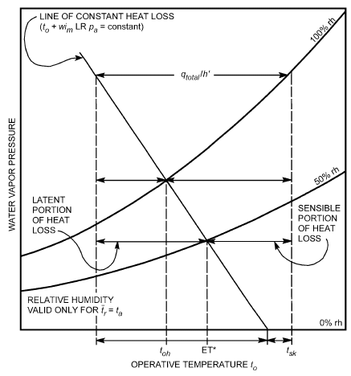

*Fig. 2 Constant Skin Heat Loss Line and Its Relationship to toh and ET*

where p<sub>tcom</sub> is a vapor pressure related in some fixed way to t<sub>com</sub> and is analogous to p<sub>wb,s</sub> for t<sub>wb</sub>. The term wi<sub>m</sub>LRp<sub>tcom</sub> is constant to the extent that i<sub>m</sub> is constant, and any combination of t<sub>o</sub> and p<sub>a</sub> that gives the same t<sub>com</sub> results in the same total heat loss.

Two important environmental indices, humid operative temperature t<sub>oh</sub> and effective temperature ET*, can be represented in terms of Equation (31). The humid operative temperature is that temperature which at 100% rh yields the same total heat loss as for the actual environment:

> t<sub>oh</sub> = t<sub>o</sub> + wi<sub>m</sub>LR(p<sub>a</sub> – p<sub>oh,s</sub>)&emsp;**(32)**

where p<sub>oh,s</sub> is saturated vapor pressure, in kPa, at t<sub>oh</sub>.

The effective temperature is the temperature at 50% rh that yields the same total heat loss from the skin as for the actual environment:

> ET* = t<sub>o</sub> + wi<sub>m</sub>LR(p<sub>a</sub> – 0.5p<sub>ET*,s</sub>)&emsp;**(33)**

where p<sub>ET*,s</sub> is saturated vapor pressure, in kPa, at ET*.

The psychrometric chart in Figure 2 shows a constant total heat loss line and the relationship between these indices. This line represents only one specific skin wettedness and permeation efficiency index. The relationship between indices depends on these two parameters (see the section on Environmental Indices).

## 4. ENGINEERING DATA AND MEASUREMENTS

Applying basic equations to practical problems of the thermal environment requires quantitative estimates of the body’s surface area, metabolic requirements for a given activity and the mechanical efficiency for the work accomplished, evaluation of heat transfer coefficients h<sub>r</sub> and h<sub>c</sub>, and the general nature of clothing insulation used. This section provides the necessary data and describes how to measure the parameters of the heat balance equation.

### Metabolic Rate and Mechanical Efficiency

**Maximum Capacity.** In choosing optimal conditions for comfort and health, the rate of work done during routine physical activities must be known, because metabolic power increases in proportion to exercise intensity. Metabolic rate varies over a wide range, depending on the activity, person, and conditions under which the activity is performed. Table 4 lists typical metabolic rates for an average adult (A<sub>D</sub> = 1.8 m<sup>2</sup>) for activities performed continuously. The highest power a person can maintain for any continuous period is approximately 50% of the maximal capacity to use oxygen (maximum energy capacity).

**Table 4 Typical Metabolic Heat Generation for Various Activities**

|   | W/m<sup>2</sup> | met* |
|---|---|---|
| Resting |  |  |
| Sleeping | 40 | 0.7 |
| Reclining | 45 | 0.8 |
| Seated, quiet | 60 | 1.0 |
| Standing, relaxed | 70 | 1.2 |
| Walking (on level surface) |  |  |
| 3.2 km/h (0.9 m/s) | 115 | 2.0 |
| 4.3 km/h (1.2 m/s) | 150 | 2.6 |
| 6.4 km/h (1.8 m/s) | 220 | 3.8 |
| Office Activities |  |  |
| Reading, seated | 55 | 1.0 |
| Writing | 60 | 1.0 |
| Typing | 65 | 1.1 |
| Filing, seated | 70 | 1.2 |
| Filing, standing | 80 | 1.4 |
| Walking about | 100 | 1.7 |
| Lifting/packing | 120 | 2.1 |
| Driving/Flying |  |  |
| Car | 60 to 115 | 1.0 to 2.0 |
| Aircraft, routine | 70 | 1.2 |
| Aircraft, instrument landing | 105 | 1.8 |
| Aircraft, combat | 140 | 2.4 |
| Heavy vehicle | 185 | 3.2 |
| **Miscellaneous Occupational Activities** |  |  |
| Cooking | 95 to 115 | 1.6 to 2.0 |
| Housecleaning | 115 to 200 | 2.0 to 3.4 |
| Seated, heavy limb movement | 130 | 2.2 |
| Machine work |  |  |
| sawing (table saw) | 105 | 1.8 |
| light (electrical industry) | 115 to 140 | 2.0 to 2.4 |
| heavy | 235 | 4.0 |
| Handling 50 kg bags | 235 | 4.0 |
| Pick and shovel work | 235 to 280 | 4.0 to 4.8 |
| Miscellaneous Leisure Activities |  |  |
| Dancing, social | 140 to 255 | 2.4 to 4.4 |
| Calisthenics/exercise | 175 to 235 | 3.0 to 4.0 |
| Tennis, singles | 210 to 270 | 3.6 to 4.0 |
| Basketball | 290 to 440 | 5.0 to 7.6 |
| Wrestling, competitive | 410 to 505 | 7.0 to 8.7 |

Sources: Compiled from various sources. For additional information, see Buskirk (1960), Passmore and Durnin (1967), and Webb (1964).

*1 met = 58.1 W/m<sup>2</sup>

A unit used to express the metabolic rate per unit DuBois area is the **met**, defined as the metabolic rate of a sedentary person (seated, quiet): 1 met = 58.1 W/m<sup>2</sup> = 50 kcal/(h·m<sup>2</sup>). A normal, healthy man at age 20 has a maximum capacity of approximately M<sub>act</sub> = 12 met, which drops to 7 met at age 70. Maximum rates for women are on average about 30% lower. Long-distance runners and trained athletes have maximum rates as high as 20 met. An average 35-year-old who does not exercise has a maximum rate of about 10 met, and activities with M<sub>act</sub> > 5 met are likely to prove exhausting.

**Intermittent Activity.** Often, people’s activity consists of a mixture of activities or a combination of work/rest periods. A weighted average metabolic rate is generally satisfactory, provided that activities alternate frequently (several times per hour). For example, a person whose activities consist of typing 50% of the time, filing while seated 25% of the time, and walking about 25% of the time would have an average metabolic rate of 0.50 × 65 + 0.25 × 70 + 0.25 × 100 = 75 W/m<sup>2</sup>(see Table 4).

<!-- str. 191 -->

**Accuracy.** Estimating metabolic rates is difficult. Values given in Table 4 indicate metabolic rates only for the specific activities listed. Some entries give a range and some a single value, depending on the data source. The level of accuracy depends on the value of M<sub>act</sub> and how well the activity can be defined. For well-defined activities with M<sub>act</sub> < 1.5 met (e.g., reading), Table 4 is sufficiently accurate for most engineering purposes. For values of M<sub>act</sub> > 3, where a task is poorly defined or where there are various ways of performing a task (e.g., heavy machine work), the values may be in error by as much as ±50% for a given application. Engineering calculations should thus allow for potential variations.

**Measurement.** When metabolic rates must be determined more accurately than is possible with tabulated data, physiological measurements with human subjects may be necessary. The rate of metabolic heat produced by the body is most accurately measured by the rate of respiratory oxygen consumption and carbon dioxide production. An empirical equation for metabolic rate is given by Nishi (1981):

> M = (21(0.23RQ + 0.77)Q<sub>O2</sub>)/A<sub>D</sub>&emsp;**(34)**

where

- M = metabolic rate, W/m<sup>2</sup>
- RQ = respiratory quotient; molar ratio of Q<sub>CO2</sub> exhaled to Q<sub>O2</sub> inhaled, dimensionless
- Q<sub>O2</sub> = volumetric rate of oxygen consumption at conditions (STPD) of 0°C, 101.325 kPa, mL/s

The exact value of the respiratory quotient RQ depends on a person’s activity, diet, and physical condition. It can be determined by measuring both carbon dioxide and oxygen in the respiratory airflows, or it can be estimated with reasonable accuracy. A good estimate for the average adult is RQ = 0.83 for light or sedentary activities (M < 1.5 met), increasing proportionately to RQ = 1.0 for extremely heavy exertion (M = 5.0 met). Estimating RQ is generally sufficient for all except precision laboratory measurements because it does not strongly affect the value of the metabolic rate: a 10% error in estimating RQ results in an error of less than 3% in the metabolic rate.

A second, much less accurate, method of estimating metabolic rate physiologically is to measure the heart rate. Table 5 shows the relationship between heart rate and oxygen consumption at different levels of physical exertion for a typical person. Once oxygen consumption is estimated from heart rate information, Equation (34) can be used to estimate the metabolic rate. Other factors that affect heart rate include physical condition, heat, emotional factors, and muscles used. Astrand and Rodahl (1977) show that heart rate is only a very approximate measure of metabolic rate and should not be the only source of information where accuracy is required.

**Table 5 Heart Rate and Oxygen Consumption at Different Activity Levels**

| Level of Exertion | Heart Rate, bpm | Oxygen Consumed, mL/s |
|---|---|---|
| Light work | <90 | <8 |
| Moderate work | 90 to 110 | 8 to 16 |
| Heavy work | 110 to 130 | 16 to 24 |
| Very heavy work | 130 to 150 | 24 to 32 |
| Extremely heavy work | 150 to 170 | >32 |

Source: Astrand and Rodahl (1977).

**Mechanical Efficiency.** In the heat balance equation, the rate W of work accomplished must be in the same units as metabolism M and expressed in terms of A<sub>D</sub> in W/m<sup>2</sup>. The mechanical work done by the muscles for a given task is often expressed in terms of the body’s mechanical efficiency μ = W/M. It is unusual for μ to be more than 0.05 to 0.10; for most activities, it is close to zero. The maximum value under optimal conditions (e.g., bicycle ergometer) is μ = 0.20 to 0.24 (Nishi 1981). It is common to assume that mechanical work is zero for several reasons: (1) mechanical work produced is small compared to metabolic rate, especially for office activities; (2) estimates for metabolic rates are often inaccurate; and (3) this assumption gives a more conservative estimate when designing air-conditioning equipment for upper comfort and health limits. More accurate calculation of heat generation may require estimating mechanical work produced for activities where it is significant (walking on a grade, climbing a ladder, bicycling, lifting, etc.). In some cases, it is possible to either estimate or measure the mechanical work. For example, a 90 kg person walking up a 5% grade at 1.0 m/s would be lifting an 882 N (90 kg × 9.8 N/kg) weight over a height of 0.05 m every second, for a work rate of 44 (N·m)/s = 44 W. This rate of mechanical work would then be subtracted from M to determine the net heat generated.

### Heat Transfer Coefficients

Values for the linearized radiative heat transfer coefficient, convective heat transfer coefficient, and evaporative heat transfer coefficient are required to solve the equations describing heat transfer from the body.

**Radiative Heat Transfer Coefficient.** The linearized radiative heat transfer coefficient can be calculated by

> 3
>
> ( )

> h<sub>r</sub> = 4εσA<sub>r</sub>/A<sub>D</sub> 273.2 + (t<sub>cl</sub>+ t<sub>r</sub>)/2&emsp;**(35)**
>
> ( )

where

- h<sub>r</sub> = radiative heat transfer coefficient, W/(m<sup>2</sup>·K)
- ε = average emissivity of clothing or body surface, dimensionless
- σ = Stefan-Boltzmann constant, 5.67 × 10<sup>–8</sup> W/(m<sup>2</sup>·K<sup>4</sup>)
- A<sub>r</sub> = effective radiation area of body, m<sup>2</sup>

The ratio A<sub>r</sub>/A<sub>D</sub> is 0.70 for a sitting person and 0.73 for a standing person (Fanger 1967). Emissivity ε is close to unity (typically 0.95), unless special reflective materials are used or high-temperature sources are involved. It is not always possible to solve Equation (35) explicitly for h<sub>r</sub>, because t<sub>cl</sub> may also be unknown. Some form of iteration may be necessary if a precise solution is required. Fortunately, h<sub>r</sub> is nearly constant for typical indoor temperatures, and a value of 4.7 W/(m<sup>2</sup>·K) suffices for most calculations. If emissivity is significantly less than unity, adjust the value by

> h<sub>r</sub> = 4.7ε&emsp;**(36)**

where ε represents the area-weighted average emissivity for the clothing/body surface.

**Convective Heat Transfer Coefficient.** Heat transfer by convection is usually caused by air movement within the living space or by body movements. Equations for estimating h<sub>c</sub> under various conditions are presented in Table 6. Where two conditions apply (e.g., walking in moving air), a reasonable estimate can be obtained by taking the larger of the two values for h<sub>c</sub>. Limits have been given to all equations. If no limits were given in the source, reasonable limits have been estimated. Be careful using these values for seated and reclining persons. The heat transfer coefficients may be accurate, but the effective heat transfer area may be substantially reduced through body contact with a padded chair or bed.

<!-- str. 192 -->

**Table 6 Equations for Convection Heat Transfer Coefficients**

| Equation | Limits | Condition | Remarks/Sources |
|---|---|---|---|
| h<sub>c</sub> = 8.3V<sup>0.6</sup> h<sub>c</sub> = 3.1 | 0.2 < V < 4.0 0 < V < 0.2 | Seated with moving air | Mitchell (1974) |
| h<sub>c</sub> = 2.7 + 8.7V<sup>0.67</sup> h<sub>c</sub> = 5.1 | 0.15 < V < 1.5 0 < V < 0.15 | Reclining with Colin and Houdas moving air | (1967) |
| h<sub>c</sub> = 8.6V<sup>0.53</sup> | 0.5 < V < 2.0 | Walking in still air | V is walking speed<br>(Nishi and Gagge 1970) |
| h<sub>c</sub> = 5.7(M − 0.8)<sup>0.39</sup> | 1.1 < M < 3.0 | Active in still air | Gagge et al. (1976) |
| h<sub>c</sub> = 6.5V<sup>0.39</sup> | 0.5 < V < 2.0 | Walking on treadmill in still air | V is treadmill speed<br>(Nishi and Gagge 1970) |
| h<sub>c</sub> = 14.8V<sup>0.69</sup> h<sub>c</sub> = 4.0 | 0.15 < V < 1.5 0 < V < 0.15 | Standing person in moving air | Developed from data presented by<br>Seppänen et al.<br>(1972) |

Note: h<sub>c</sub> in W/(m<sup>2</sup>·K), V in m/s, and M in met, where 1 met = 58.1 W/m<sup>2</sup>.

Quantitative values of h<sub>c</sub> are important, not only in estimating convection loss, but in evaluating (1) operative temperature t<sub>o</sub>, (2) clothing parameters I<sub>t</sub> and i<sub>m</sub>, and (3) rational effective temperatures t<sub>oh</sub> and ET*. All heat transfer coefficients in Table 6 were evaluated at or near 101.33 kPa. These coefficients should be corrected as follows for atmospheric pressure:

> h<sub>cc</sub> = h<sub>c</sub>(p<sub>t</sub>/101.33)<sup>0.55</sup>&emsp;**(37)**

where

- h<sub>cc</sub> = corrected convective heat transfer coefficient, W/(m<sup>2</sup>·K)
- p<sub>t</sub> = local atmospheric pressure, kPa

The combined coefficient h is the sum of h<sub>r</sub> and h<sub>c</sub>, described in Equation (35) and Table 6, respectively. The coefficient h governs exchange by radiation and convection from the exposed body surface to the surrounding environment.

**Evaporative Heat Transfer Coefficient.** The evaporative heat transfer coefficient h<sub>e</sub> for the outer air layer of a nude or clothed person can be estimated from the convective heat transfer coefficient using the Lewis relation given in Equation (27). If the atmospheric pressure is significantly different from the reference value (101.33 kPa), the correction to the value obtained from Equation (27) is

> h<sub>ec</sub> = h<sub>e</sub>(101.33/p<sub>t</sub>)<sup>0.45</sup>&emsp;**(38)**

where h<sub>ec</sub> is the corrected evaporative heat transfer coefficient in W/(m<sup>2</sup>·kPa).

### Clothing Insulation and Permeation Efficiency

**Thermal Insulation.** The most accurate ways to determine clothing insulation are (1) measurements on heated mannikins (McCullough and Jones 1984; Olesen and Nielsen 1983) and (2) measurements on active subjects (Nishi et al. 1975). For most routine engineering work, estimates based on tables and equations in this section are sufficient. Thermal mannikins can measure the sensible heat loss from “skin” (*C + R*) in a given environment. Equation (11) can then be used to evaluate R<sub>cl</sub> if environmental conditions are well defined and f<sub>cl</sub> is measured. Evaluation of clothing insulation on subjects requires measurement of t<sub>sk</sub>, t<sub>cl</sub>, and t<sub>o</sub>. Clothing thermal efficiency is calculated by

> f<sub>cl</sub> = (t<sub>cl</sub>– t<sub>o</sub>)/(t<sub>sk</sub>– t<sub>o</sub>)&emsp;**(39)**

**Table 7 Typical Insulation and Permeability Values for Western Clothing Ensembles**

| Ensemble Description<sup>a</sup> | I<sub>cl</sub>, clo | I<sub>t</sub>,<sup>b</sup> clo | f<sub>cl</sub> | i<sub>cl</sub> | i<sub>m</sub><sup>b</sup> |
|---|---|---|---|---|---|
| Walking shorts, short-sleeved shirt | 0.36 | 1.02 | 1.10 | 0.34 | 0.42 |
| Trousers, short-sleeved shirt | 0.57 | 1.20 | 1.15 | 0.36 | 0.43 |
| Trousers, long-sleeved shirt | 0.61 | 1.21 | 1.20 | 0.41 | 0.45 |
| Same as above, plus suit jacket | 0.96 | 1.54 | 1.23 |  |  |
| Same as above, plus vest and T-shirt | 1.14 | 1.69 | 1.32 | 0.32 | 0.37 |
| Trousers, long-sleeved shirt, long-sleeved sweater, T-shirt | 1.01 | 1.56 | 1.28 |  |  |
| Same as above, plus suit jacket and long underwear bottoms | 1.30 | 1.83 | 1.33 |  |  |
| Sweat pants, sweat shirt | 0.74 | 1.35 | 1.19 | 0.41 | 0.45 |
| Long-sleeved pajama top, long pajama trousers, short 3/4 sleeved robe, slippers (no socks) | 0.96 | 1.50 | 1.32 | 0.37 | 0.41 |
| Knee-length skirt, short-sleeved shirt, panty hose, sandals | 0.54 | 1.10 | 1.26 |  |  |
| Knee-length skirt, long-sleeved shirt, full slip, panty hose | 0.67 | 1.22 | 1.29 |  |  |
| Knee-length skirt, long-sleeved shirt, half slip, panty hose, long-sleeved sweater | 1.10 | 1.59 | 1.46 |  |  |
| Same as above, replace sweater with suit jacket | 1.04 | 1.60 | 1.30 | 0.35 | 0.40 |
| Ankle-length skirt, long-sleeved shirt, suit jacket, panty hose | 1.10 | 1.59 | 1.46 |  |  |
| Long-sleeved coveralls, T-shirt | 0.72 | 1.30 | 1.23 |  |  |
| Overalls, long-sleeved shirt, T-shirt | 0.89 | 1.46 | 1.27 | 0.35 | 0.40 |
| Insulated coveralls, long-sleeved thermal underwear, long underwear bottoms | 1.37 | 1.94 | 1.26 | 0.35 | 0.39 |

Source: From McCullough and Jones (1984) and McCullough et al. (1989).

<sup>a</sup>All ensembles include shoes and briefs or panties. All ensembles except those with panty hose include socks unless otherwise noted.

<sup>b</sup>For t<sub>r</sub> = t<sub>a</sub> and air velocity less than 0.2 m/s (I<sub>a</sub> = 0.72 clo and i<sub>m</sub> = 0.48 when nude). 1 clo = 0.155 (m<sup>2</sup>·K/)W.

The intrinsic clothing insulation can then be calculated from mannikin measurements, provided f<sub>cl</sub> is measured and conditions are sufficiently well defined to determine h accurately:

> R<sub>cl</sub> = (t<sub>sk</sub>– t<sub>o</sub>)/q – 1/hf<sub>cl</sub>&emsp;**(40)**

where q is heat loss from the mannikin in W/m<sup>2</sup>.

Clothing insulation value may be expressed in clo units. To avoid confusion, the symbol I is used with the clo unit instead of the symbol R. The relationship between the two is

> R = 0.155I&emsp;**(41)**

or 1.0 clo is equivalent to 0.155 (m<sup>2</sup>·K)/W.

Because clothing insulation cannot be measured for most routine engineering applications, tables of measured values for various clothing ensembles can be used to select an ensemble comparable to the one(s) in question. Table 7 gives values for typical indoor clothing ensembles. More detailed tables are presented by McCullough and Jones (1984) and Olesen and Nielsen (1983). Accuracies for I<sub>cl</sub> on the order of ±20% are typical if good matches between ensembles are found. Values of thermal insulation and clothing area factors for clothing ensembles typical of the Arabian Gulf region may be found in Al-ajmi et al. (2008).

ASHRAE research project RP-1504 (Havenith et al. 2015) produced a database of static total and intrinsic clothing thermal insulation values and vapor permeability indices for non-Western ensembles. The report presents tabulated data for more than 40 ensembles from India, Pakistan, Indonesia, Kuwait, Nigeria, Ghana, and China. Table 8 gives values for a selection of these ensembles. Local regional thermal insulation values for the ensembles were also measured, together with data on the effects of air velocity, posture, and walking on the total thermal insulation values.

<!-- str. 193 -->

**Table 8 Insulation and Permeability Values for a Selection of Non-Western Clothing Ensembles**

| Ensemble Description<sup>a</sup> | Country | I<sub>cl</sub> clo | I<sub>t</sub>, clo | f<sub>cl</sub> | i<sub>m</sub> |
|---|---|---|---|---|---|
| Shalwar (pants), kameez (shirt), scarf, sandals (f) | Pakistan | 0.69 | 1.1 | 1.41 | 0.32 |
| Shalwar (pants), kameez (shirt), socks, athletic shoes (m) | Pakistan | 0.86 | 1.3 | 1.36 | 0.35 |
| Dishdasha (thowb or caftan), short-sleeved t-shirt, long serwal (pants), tagiya (hat), iqal (cord), ghutra (headdress), socks, athletic shoes (m) | Kuwait | 1.36 | 1.7 | 1.66 | 0.30 |
| Full slip, double-layer abaya (dress), anta (head cover), hijab (headscarf), sandals (f) | Kuwait | 1.27 | 1.7 | 1.65 | 0.33 |
| Underskirt, blouse, sari, sandals (f) | India | 0.74 | 1.2 | 1.46 | 0.33 |
| Churidhar pants, churidhar dress, shawl, sandals (f) | India | 0.58 | 1.1 | 1.28 | 0.36 |
| Short shirt with long sleeves, | Nigeria/ | 1.40 | 1.7 | 1.96 | 0.42 |
| long pants, boubou (widesleeved robe), kufi (hat), sandals (m) | Ghana |  |  |  |  |
| Short shirt with long sleeves, | Nigeria/ | 0.78 | 1.3 | 1.35 | 0.40 |
| long pants, sandals (f) | Ghana |  |  |  |  |
| Long-sleeved shirt, skirt, headscarf, socks, athletic shoes (f) | Indonesia | 0.97 | 1.4 | 1.43 | 0.31 |
| Camisole, short-sleeved qipao (dress), sandals (f) | China | 0.42 | 0.9 | 1.31 | 0.40 |

(f) = clothing traditionally worn by women (m) = clothing traditionally worn by men

Source: Havenith et al. (2015). Values are the means of manikin-based measurements conducted in three laboratories. All ensembles include bra and panties (female) and briefs (male). For all women’s ensembles, I<sub>a</sub> = 0.64 clo; for all men’s ensembles, I<sub>a</sub> = 0.63 clo.

When a premeasured ensemble cannot be found to match the one in question, estimate the ensemble insulation from the insulation of individual garments. Table 9 lists common individual garments. The insulation of an ensemble is estimated from the individual values using a summation formula (McCullough and Jones 1984):

> ∑ clu
>
> I<sub>cl</sub> = 0.835 I <sub>,i</sub> + 0.161&emsp;**(42)**

> i

where I<sub>clu,i</sub> is the effective insulation of garment i, and I<sub>cl</sub>, as before, is the insulation for the entire ensemble. A simpler and nearly as accurate summation formula is (Olesen 1985)

> ∑ clu
>
> I<sub>cl</sub> = I <sub>,i</sub>&emsp;**(43)**

> i

Either Equation (42) or (43) gives acceptable accuracy for typical indoor clothing. The main source of inaccuracy is in determining the appropriate values for individual garments. Overall accuracies are on the order of ±25% if the tables are used carefully. If it is important to include a specific garment not included in Table 8, its insulation can be estimated by (McCullough and Jones 1984)

> I<sub>clu,i</sub> = (0.534 + 135x<sub>f</sub>)(A<sub>G</sub>/A<sub>D</sub>) – 0.0549&emsp;**(44)**

where

- x<sub>f</sub> = fabric thickness, mm
- A<sub>G</sub> = body surface area covered by garment, m<sup>2</sup>

Values in Table 7 may be adjusted by information in Table 9 and a summation formula. Using this method, values of I<sub>clu,i</sub> for the selected items in Table 9 are then added to or subtracted from the ensemble value of I<sub>cl</sub> in Table 7.

When a person is sitting, the chair generally has the effect of increasing clothing insulation by up to 0.15 clo, depending on the contact area A<sub>ch</sub> between the chair and body (McCullough et al. 1994). A string webbed or beach chair has little or no contact area, and the insulation actually decreases by about 0.1 clo, likely because of compression of the clothing in the contact area. In contrast, a cushioned executive chair has a large contact area that can increase the intrinsic clothing insulation by 0.15 clo. For other chairs, the increase in intrinsic insulation ΔI<sub>cl</sub> can be estimated from

**Table 9 Garment Insulation Values**

| Garment Description<sup>a</sup> | I<sub>clu,i</sub>, clo<sup>b</sup> | Garment Description<sup>a</sup> | I<sub>clu,i</sub>, clo<sup>b</sup> | Garment Description<sup>a</sup> | I<sub>clu,i</sub>, clo<sup>b</sup> |
|---|---|---|---|---|---|
| Underwear |  | Long-sleeved, flannel shirt | 0.34 | Long-sleeved (thin) | 0.25 |
| Men’s briefs | 0.04 | Short-sleeved, knit sport shirt | 0.17 | Long-sleeved (thick) | 0.36 |
| Panties | 0.03 | Long-sleeved, sweat shirt | 0.34 | Dresses and Skirts<sup>c</sup> |  |
| Bra | 0.01 | Trousers and Coveralls |  | Skirt (thin) | 0.14 |
| T-shirt | 0.08 | Short shorts | 0.06 | Skirt (thick) | 0.23 |
| Full slip | 0.16 | Walking shorts | 0.08 | Long-sleeved shirtdress (thin) | 0.33 |
| Half slip | 0.14 | Straight trousers (thin) | 0.15 | Long-sleeved shirtdress (thick) | 0.47 |
| Long underwear top | 0.20 | Straight trousers (thick) | 0.24 | Short-sleeved shirtdress (thin) | 0.29 |
| Long underwear bottoms | 0.15 | Sweatpants | 0.28 | Sleeveless, scoop neck (thin) | 0.23 |
| Footwear |  | Overalls | 0.30 | Sleeveless, scoop neck (thick) | 0.27 |
| Ankle-length athletic socks | 0.02 | Coveralls | 0.49 | Sleepwear and Robes |  |
| Calf-length socks | 0.03 | Suit Jackets and Vests (Lined) |  | Sleeveless, short gown (thin) | 0.18 |
| Knee socks (thick) | 0.06 | Single-breasted (thin) | 0.36 | Sleeveless, long gown (thin) | 0.20 |
| Panty hose | 0.02 | Single-breasted (thick) | 0.44 | Short-sleeved hospital gown | 0.31 |
| Sandals/thongs | 0.02 | Double-breasted (thin) | 0.42 | Long-sleeved, long gown (thick) | 0.46 |
| Slippers (quilted, pile-lined) | 0.03 | Double-breasted (thick) | 0.48 | Long-sleeved pajamas (thick) | 0.57 |
| Boots | 0.10 | Sleeveless vest (thin) | 0.10 | Short-sleeved pajamas (thin) | 0.42 |
| Shirts and Blouses |  | Sleeveless vest (thick) | 0.17 | Long-sleeved, long wrap robe (thick) | 0.69 |
| Sleeveless, scoop-neck blouse | 0.12 | Sweaters |  | Long-sleeved, short wrap robe (thick) | 0.48 |
| Short-sleeved, dress shirt | 0.19 | Sleeveless vest (thin) | 0.13 | Short-sleeved, short robe (thin) | 0.34 |
| Long-sleeved, dress shirt | 0.25 | Sleeveless vest (thick) | 0.22 |  |  |

<sup>a</sup>“Thin” garments are summerweight; “thick” garments are winterweight. <sup>b</sup>1 clo = 0.155 (m<sup>2</sup>·K)/W <sup>c</sup>Knee-length

<!-- str. 194 -->

> ΔI<sub>cl</sub> = 0.748A<sub>ch</sub> – 0.1&emsp;**(45)**

where A<sub>ch</sub> is in m<sup>2</sup>.

For example, a desk chair with a body contact area of 0.27 m<sup>2</sup> has a ΔI<sub>cl</sub> of 0.1 clo. This amount should be added to the intrinsic insulation of the standing clothing ensemble to obtain the insulation of the ensemble when sitting in the desk chair.

Although sitting increases clothing insulation, walking decreases it (McCullough and Hong 1994), as does air movement (Havenith and Nilsson 2004). The change in clothing insulation ΔI<sub>cl</sub> can be estimated from the standing intrinsic insulation I<sub>cl</sub> of the ensemble and the walking speed (Walkspeed) in steps per minute:

> ΔI<sub>cl</sub> = –0.504I<sub>cl</sub> – 0.00281(Walkspeed) + 0.24&emsp;**(46)**

For example, the clothing insulation of a person wearing a winter business suit with a standing intrinsic insulation of 1 clo would decrease by 0.52 clo when the person walks at 90 steps per minute (about 3.7 km/h). Thus, when the person is walking, the intrinsic insulation of the ensemble would be 0.48 clo.

A correction for both walking and air speed for a person in normal or light clothing (0.6 clo < I<sub>cl</sub> < 1.4 clo, or 1.2 clo < I<sub>T</sub> < 2.0 clo, respectively) is given by Havenith and Nilsson (2004) and Havenith et al. (2012) as I<sub>cl,r</sub> = I<sub>T,r</sub>– 1/(f<sub>cl</sub> 0.155h)

> 2 2
>
> [–0.281 × (v – 0.15) + 0.044 × (v – 0.15) – 0.492w + 0.176w ]

> ar ar

= e (47) ( )

> × I<sub>cl,static</sub>+ 0.7/(f cl)
>
> ( )

– ((– 0.15v – 0.22v ) (0.92*e <sup>ar w</sup>* – 0.0045)0.7)/(f cl)

where

- I<sub>cl,r</sub> = resultant intrinsic clothing insulation, clo
- I<sub>cl,static</sub> = static intrinsic clothing insulation obtained from manikin or tables, clo
- I<sub>T,r</sub> = resultant total insulation of clothing plus adjacent air layer
- v<sub>ar</sub> = wind speed relative to person, from 0.15 to 4 m/s (if above this range, treat as 4 m/s; if below this range, treat as 0.15 m/s)
- v<sub>w</sub> = walking speed, from 0 to 1.2 m/s (if above this range, treat as 1.2 m/s)

**Permeation Efficiency.** Permeation efficiency data for some clothing ensembles are presented in terms of i<sub>cl</sub> and i<sub>m</sub> in Table 7. Values of i<sub>m</sub> can be used to calculate R<sub>e,t</sub> using the relationships in Table 2. Ensembles worn indoors generally fall in the range 0.3 < i<sub>m</sub> < 0.5. Assuming i<sub>m</sub>= 0.4 is reasonably accurate (McCullough et al. 1989) and may be used if a good match to ensembles in Table 7 cannot be made. The value of i<sub>m</sub> or R<sub>e,t</sub> may be substituted directly into equations for body heat loss calculations (see Table 3). However, i<sub>m</sub> for a given clothing ensemble is a function of the environment as well as the clothing properties. Unless i<sub>m</sub> is evaluated at conditions very similar to the intended application, it is more rigorous to use i<sub>cl</sub> to describe the permeation efficiency of the clothing. The value of i<sub>cl</sub> is not as sensitive to environmental conditions; thus, given data are more accurate over a wider range of air velocity and radiant and air temperature combinations for i<sub>cl</sub> than for i<sub>m</sub>. Relationships in Table 2 can be used to determine R<sub>e,cl</sub> from i<sub>cl</sub>, and R<sub>e,cl</sub>can then be used for body heat loss calculations (see Table 3). McCullough et al. (1989) found an average value of i<sub>cl</sub> = 0.34 for common indoor clothing; this value can be used when other data are not available.

Measuring i<sub>m</sub> or i<sub>cl</sub> may be necessary if unusual clothing (e.g., impermeable or metallized) and/or extreme environments (e.g., high radiant temperatures, high air velocities) are to be addressed. There are three different methods for measuring the permeation efficiency of clothing: (1) using a wet mannikin to measure the effect of sweat evaporation on heat loss (McCullough 1986), (2) using permeation efficiency measurements on component fabrics as well as dry mannikin measurements (Umbach 1980), and (3) using measurements from sweating subjects (Holmer 1984; Nishi et al. 1975). For an overview, please see ISO Standard 9920.

**Clothing Surface Area.** Many clothing heat transfer calculations require that clothing area factor f<sub>cl</sub> be known. The most reliable approach is to measure it using photographic methods (Olesen et al. 1982). Other than actual measurements, the best method is to use previously tabulated data for similar clothing ensembles. Table 7 is adequate for most indoor clothing ensembles. No good method of estimating f<sub>cl</sub> for an ensemble from other information is available, although a rough estimate can be made by (McCullough and Jones 1984)

> f<sub>cl</sub> = 1.0 + 0.3I<sub>cl</sub>&emsp;**(48)**

### Total Evaporative Heat Loss

The total evaporative heat loss (latent heat) from the body through both respiratory and skin losses, E<sub>sk</sub> + E<sub>res</sub>, can be measured directly from the body’s rate of mass loss as observed by a sensitive scale:

> E<sub>sk</sub> + E<sub>res</sub> = (h fg)/A<sub>D</sub> × dm/dθ&emsp;**(49)**

where

- h<sub>fg</sub> = latent heat of vaporization of water, J/kg
- m = body mass, kg
- θ = time, s

When using Equation (49), adjustments should be made for any food or drink consumed, body effluents (e.g., wastes), and metabolic mass losses. Metabolism contributes slightly to mass loss primarily because the oxygen absorbed during respiration is converted to heavier CO<sub>2</sub> and exhaled. It can be calculated by

> dm<sub>ge</sub>/dθ = Q<sub>O2</sub>(1.977RQ – 1.429)/10<sup>6</sup>&emsp;**(50)**

where

- dm<sub>ge</sub>/dθ = rate of mass loss due to respiratory gas exchange, kg/s
- Q<sub>O2</sub> = oxygen uptake at STPD, mL/s
- RQ = respiratory quotient
- 1.977 = density of CO<sub>2</sub> at STPD, kg/m<sup>3</sup>
- 1.429 = density of O<sub>2</sub> at STPD, kg/m<sup>3</sup>
- STPD = standard temperature and pressure of dry air at 0°C and 101.325 kPa

### Environmental Parameters

Thermal environment parameters that must be measured or otherwise quantified to obtain accurate estimates of human thermal response are divided into two groups: those that can be measured directly and those calculated from other measurements.

**Directly Measured Parameters.** Seven psychrometric parameters used to describe the thermal environment are (1) air temperature t<sub>a</sub>, (2) wet-bulb temperature t<sub>wb</sub>, (3) dew-point temperature t<sub>dp</sub>, (4) water vapor pressure p<sub>a</sub>, (5) total atmospheric pressure p<sub>t</sub>, (6) relative humidity (rh), and (7) humidity ratio W<sub>a</sub>. These parameters are discussed in detail in Chapter 1, and methods for measuring them are discussed in Chapter 37. Two other important parameters include air velocity V and mean radiant temperature t<sub>r</sub>. Air velocity measurements are also discussed in Chapter 37. The radiant temperature is the temperature of an exposed surface in the environment. The temperatures of individual surfaces are usually combined into a mean radiant temperature t<sub>r</sub>. Finally, globe temperature t<sub>g</sub>, which can also be measured directly, is a good approximation of the operative temperature t<sub>o</sub> and is also used with other measurements to calculate the mean radiant temperature.

<!-- str. 195 -->

**Calculated Parameters.** The **mean radiant temperature** t<sub>r</sub> is a key variable in thermal calculations for the human body. It is the uniform temperature of an imaginary enclosure in which radiant heat transfer from the human body equals the radiant heat transfer in the actual nonuniform enclosure. Measurements of the globe temperature, air temperature, and air velocity can be combined to estimate the mean radiant temperature (see Chapter 37). Accuracy of t<sub>r</sub> determined this way varies considerably, depending on the type of environment and accuracy of the individual measurements. Because the mean radiant temperature is defined with respect to the human body, the shape of the sensor is also a factor. The spherical shape of the globe thermometer gives a reasonable approximation of a seated person; an ellipsoid sensor gives a better approximation of the shape of a human, both upright and seated.

Mean radiant temperature can also be calculated from the measured temperature of surrounding walls and surfaces and their positions with respect to the person. Most building materials have a high emittance ε, so all surfaces in the room can be assumed to be black. The following equation is then used:

> …
>
> T<sub>r</sub><sup>4</sup> = T<sub>1</sub><sup>4</sup>F<sub>p–1</sub>+ T<sub>2</sub><sup>4</sup>F<sub>p–2</sub>+ + T<sub>N</sub><sup>4</sup>F<sub>p–N</sub>&emsp;**(51)**

where

- T<sub>r</sub> = mean radiant temperature, K
- T<sub>N</sub> = surface temperature of surface N, K
- F<sub>p−N</sub> = angle factor between a person and surface N

Because the sum of the angle factors is unity, the fourth power of mean radiant temperature equals the mean value of the surrounding surface temperatures to the fourth power, weighted by the respective angle factors. In general, angle factors are difficult to determine, although Figures 3A and 3B may be used to estimate them for rectangular surfaces. The angle factor normally depends on the position and orientation of the person (Fanger 1982).

If relatively small temperature differences exist between the surfaces of the enclosure, Equation (51) can be simplified to a linear form:

> …
>
> t<sub>r</sub> = t<sub>1</sub>F<sub>p–1</sub> + t<sub>2</sub>F<sub>p–2</sub> + + t<sub>N</sub>F<sub>p–N</sub>&emsp;**(52)**

Equation (52) always gives a slightly lower mean radiant temperature than Equation (51), but the difference is small. If, for example, half the surroundings (F<sub>p−N</sub> = 0.5) has a temperature 5 K higher than the other half, the difference between the calculated mean radiant temperatures [according to Equations (51) and (52)] is only 0.2 K. If, however, this difference is 100 K, the mean radiant temperature calculated by Equation (52) is 10 K too low.

Mean radiant temperature may also be calculated from the plane radiant temperature t<sub>pr</sub> in six directions (up, down, right, left, front, back) and for the projected area factors of a person in the same six directions. For a standing person, the mean radiant temperature may be estimated as t<sub>r</sub> = {0.08[t<sub>pr</sub>(up) + t<sub>pr</sub>(down)] + 0.23[t<sub>pr</sub>(right)

> + t<sub>pr</sub>(left)] + 0.35[t<sub>pr</sub>(front) + t<sub>pr</sub>(back)]}
>
> ÷ [2(0.08 + 0.23 + 0.35)]&emsp;**(53)**

For a seated person, t<sub>r</sub> = {0.18[t<sub>pr</sub>(up) + t<sub>pr</sub>(down)] + 0.22[t<sub>pr</sub>(right)

> + t<sub>pr</sub>(left)] + 0.30[t<sub>pr</sub>(front) + t<sub>pr</sub>(back)]}
>
> ÷ [2(0.18 + 0.22 + 0.30)]&emsp;**(54)**

The **plane radiant temperature t<sub>pr</sub>**, introduced by Korsgaard (1949), is the uniform temperature of an enclosure in which the (Fanger 1982)

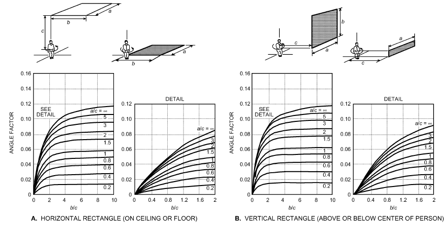

*Fig. 3 Mean Value of Angle Factor Between Seated Person and Horizontal or Vertical Rectangle when Person Is Rotated Around Vertical Axis*

<!-- str. 196 -->

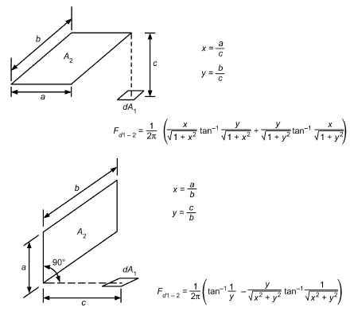

*Fig. 4 Analytical Formulas for Calculating Angle Factor for Small Plane Element*

incident radiant flux on one side of a small plane element is the same as that in the actual environment. The plane radiant temperature describes thermal radiation in one direction, and its value thus depends on the direction. In comparison, mean radiant temperature t<sub>r</sub> describes the thermal radiation for the human body from all directions. The plane radiant temperature can be calculated using Equations (50) and (51) with the same limitations. Area factors are determined from Figure 4.

The **radiant temperature asymmetry** Δ**t<sub>pr</sub>** is the difference between the plane radiant temperature of the opposite sides of a small plane element. This parameter describes the asymmetry of the radiant environment and is especially important in comfort conditions. Because it is defined with respect to a plane element, its value depends on the plane’s orientation, which may be specified in some situations (e.g., floor to ceiling asymmetry) and not in others. If direction is not specified, the radiant asymmetry should be for the orientation that gives the maximum value.

## 5. CONDITIONS FOR THERMAL COMFORT

In addition to the previously discussed independent environmental and personal variables influencing thermal response and comfort, other factors may also have some effect. These secondary factors include nonuniformity of the environment, visual stimuli, age, and outdoor climate. Studies by Rohles (1973) and Rohles and Nevins (1971) on 1600 college-age students revealed correlations between comfort level, temperature, humidity, sex, and length of exposure. Many of these correlations are given in Table 10. The thermal sensation scale developed for these studies is called the **ASHRAE thermal sensation scale**:

> +3 hot
>
> +2 warm

> +1 slightly warm
>
> 0 neutral

> −1 slightly cool
>
> −2 cool

> −3 cold

The equations in Table 10 indicate that women in this study were more sensitive to temperature and less sensitive to humidity than the men, but in general about a 3 K change in temperature or a 3 kPa

**Table 10 Equations for Predicting Thermal Sensation Y of Men, Women, and Men and Women Combined**

| Exposure Period, h | Subjects | Regression Equations<sup>a,b</sup> t = dry-bulb temperature, °C p = vapor pressure, kPa |
|---|---|---|
|  | Men | Y = 0.220 t + 0.233 p − 5.673 |
| 1.0 | Women<br>Both<br>Men | Y = 0.272 t + 0.248 p − 7.245<br>Y = 0.245 t + 0.248 p − 6.475<br>Y = 0.221 t + 0.270 p − 6.024 |
| 2.0 | Women<br>Both<br>Men | Y = 0.283 t + 0.210 p − 7.694<br>Y = 0.252 t + 0.240 p − 6.859<br>Y = 0.212 t + 0.293 p − 5.949 |
| 3.0 | Women<br>Both | Y = 0.275 t + 0.255 p − 8.622<br>Y = 0.243 t + 0.278 p − 6.802 |

<sup>a</sup>Y values refer to the ASHRAE thermal sensation scale.

<sup>b</sup>For young adult subjects with sedentary activity and wearing clothing with a thermal resistance of approximately 0.5 clo, t<sub>r</sub> < t<sub>a</sub> and air velocities < 0.2 m/s.

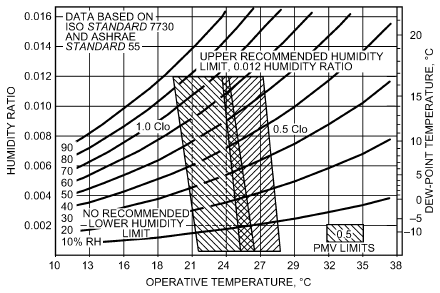

*Fig. 5 ASHRAE Summer and Winter Comfort Zones*

[Acceptable ranges of operative temperature and humidity with air speed ≤ 0.2 m/s for people wearing 1.0 and 0.5 clo clothing during primarily

> sedentary activity (≤1.1 met)].

change in water vapor pressure is necessary to change a thermal sensation vote by one unit or temperature category.

Current and past studies are periodically reviewed to update ASHRAE Standard 55, which specifies conditions or comfort zones where 80% of sedentary or slightly active persons find the environment thermally acceptable. Examples of figures and calculation methods adapted from the standard are presented here to demonstrate the fundamentals and provide guidance in using the standard. In professional practice, the most recent version of the standard should be referenced.

Because people wear different levels of clothing depending on the situation and seasonal weather, ASHRAE Standard 55-2013 defines comfort zones for 0.5 and 1.0 clo [0.078 and 0.155 (m<sup>2</sup>·K)/W] clothing levels similar to those in Figure 5. For reference, a winter business suit has about 1 clo of insulation, and a short-sleeved shirt and trousers have about 0.5 clo. The warmer and cooler temperature borders of the comfort zones are affected by humidity and coincide with lines of constant ET*. In the middle of a zone, a typical person wearing the prescribed clothing would have a thermal sensation at or very near neutral. Near the boundary of the warmer zone, a person would feel about +0.5 warmer on the ASHRAE thermal sensation scale; near the boundary of the cooler zone, that person may have a thermal sensation of −0.5.

<!-- str. 197 -->

The comfort zone’s temperature boundaries (T<sub>min</sub>, T<sub>max</sub>) can be adjusted by interpolation for clothing insulation levels (I<sub>cl</sub>) between those in Figure 5 by using the following equations:

T<sub>min,Icl</sub> = (55)

((I – 0.5 clo)T + (1.0 clo – I )T cl min,1.0 clo cl min,0.5 clo)/(0.5 clo)

T<sub>max,Icl</sub> = (56)

((I – 0.5 clo)T + (1.0 clo – I )T cl max,1.0 clo cl max,0.5 clo)/(0.5 clo)

In general, comfort temperatures for other clothing levels can be approximated by decreasing the temperature borders of the zone by 0.6 K for each 0.1 clo increase in clothing insulation and vice versa. Similarly, a zone’s temperatures can be decreased by 1.4 K per met increase in activity above 1.2 met.

The upper and lower humidity levels of the comfort zones are less precise, and ASHRAE Standard 55-2013 specifies no lower humidity limit for thermal comfort. Low humidity can dry the skin and mucous surfaces and lead to comfort complaints about dry nose, throat, eyes, and skin, typically when the dew point is less than 0°C. Liviana et al. (1988) found eye discomfort increased with time in low-humidity environments (dew point < 2°C). Green (1982) found that respiratory illness and absenteeism increase in winter with decreasing humidity and found that any increase in humidity from very low levels decreased absenteeism in winter.

At high humidity, too much skin moisture tends to increase discomfort (Berglund and Cunningham 1986; Gagge 1937), particularly skin moisture of physiological origin (water diffusion and perspiration). At high humidity, thermal sensation alone is not a reliable predictor of thermal comfort (Tanabe et al. 1987). The discomfort appears to be caused by the feeling of the moisture itself, increased friction between skin and clothing with skin moisture (Gwosdow et al. 1986), and other factors. To prevent warm discomfort, Nevins et al. (1975) recommended that, on the warm side of the comfort zone, the relative humidity not exceed 60%.

ASHRAE Standard 55-2013 specifies an upper humidity ratio limit of 0.012 kg<sub>w</sub>/kg<sub>dryair</sub>, which corresponds to a dew point of 16.8°C at standard pressure. This limit can be exceeded under certain circumstances if the standard’s analytical comfort zone method is used.

The comfort zones of Figure 5 are for air speeds not to exceed 0.2 m/s. However, elevated air speeds can be used to improve comfort beyond the maximum temperature limit of this figure. The air speeds necessary to compensate for a temperature increase above the warm-temperature border are shown in Figure 6. The combination of air speed and temperature defined by the curves in this figure result in the same heat loss from the skin.

The amount of air speed increase is affected by the mean radiant temperature t<sub>r</sub> . The curves of Figure 6 are for different levels of t<sub>r</sub> – t<sub>a</sub>. That is, when the mean radiant temperature is low and the air temperature is high, elevated air speed is less effective at increasing heat loss and a higher air speed is needed for a given temperature increase. Conversely, elevated air speed is more effective when the mean radiant temperature is high and air temperature is low; then, less of an air speed increase is needed. Figure 6 applies to lightly clothed individuals (clothing insulation between 0.5 and 0.7 clo) who are engaged in near-sedentary physical activity. The elevated air speed may be used to offset an increase in temperature by up to 3 K above the warm-temperature boundary of Figure 5.

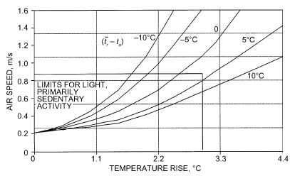

*Fig. 6 Air Speed to Offset Temperatures Above Warm- Temperature Boundaries of Figure 5*

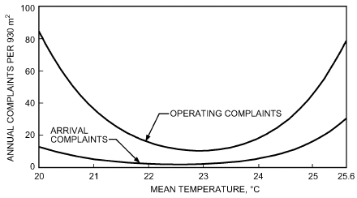

*Fig. 7 Predicted Rate of Unsolicited Thermal Operating Complaints*

### Thermal Complaints

Unsolicited thermal complaints can increase a building’s operation and maintenance (O&M) cost by requiring unscheduled maintenance to correct the problem.

Federspiel (1998) analyzed complaint data from 690 commercial buildings with a total of 23 500 occupants. The most common kind of unsolicited complaint was of temperature extremes. Complaints were rarely because of individual differences in preferred temperature, because 96.5% of the complaints occurred at temperatures less than 21°C or greater than 24°C; most complaints were caused by HVAC faults or poor control performance.

The hourly complaint rate per zone area of being too hot (ν<sub>h</sub>) or too cold (ν<sub>l</sub>) can be predicted from the HVAC system’s operating parameters, specifically the mean space temperature (μ<sub>T</sub>), standard deviation of the space temperature (σ<sub>T</sub>), and the standard deviation of the rate of change in space temperature (σ<sub>T</sub>·<sub>H</sub> , σ<sub>T</sub>·<sub>L</sub> ):

> (σ<sup>2</sup><sub>·</sub> + σ<sup>2</sup><sub>·</sub> )<sup>1⁄2</sup> ( <sup>2</sup>)
>
> (μ<sub>T</sub> – μ<sub>T</sub> )

> 1
>
> ν<sub>h</sub> = 1/2π ----<sup>T</sup>---<sup>H</sup>-------------<sup>T</sup>---<sup>B</sup> exp –-- ---------<sup>B</sup>---------------<sup>H</sup>------&emsp;**(57)**

> 2
>
> σ<sup>2</sup> + σ<sup>2</sup> (σ<sup>2</sup> + σ<sup>2</sup> )

> ( T<sub>H</sub> T<sub>B</sub> ) ( T<sub>H</sub> T<sub>B</sub> )
>
> (σ<sup>2</sup><sub>·</sub> + σ<sup>2</sup><sub>·</sub> )<sup>1⁄2</sup> ( )

> 1
>
> ν<sub>l</sub> = 1/2π ----<sup>T</sup>---<sup>L</sup>------------<sup>T</sup>---<sup>B</sup> exp –-- ((μ<sub>TB</sub> – μ<sub>TL</sub>)<sup>2</sup>)/((σ<sub>T</sub><sup>2</sup> + σ<sub>T</sub><sup>2</sup> ))&emsp;**(58)**

> 2
>
> σ<sup>2</sup> + σ<sup>2</sup>

> ( <sub>TL TB</sub> ) ( <sub>L B</sub> )

where the subscripts H, L, and B refer to too hot, too cold, and building (Federspiel 2001).

<!-- str. 198 -->

**Table 11 Model Parameters**

| Zone, m<sup>2</sup> | μ<sub>TH</sub> , °C | σ<sub>TH</sub> , K | σ<sub>T</sub>·<sub>H</sub> , K/h | μ<sub>TL</sub> , °C | σ<sub>TL</sub> , K | σT<sup>·</sup><sub>L</sub> , K/h |
|---|---|---|---|---|---|---|
| 430 | 32.8 | 2.81 | 0.63 | 10.24 | 3.41 | 2.27 |

The building maintenance and space temperature records of six commercial buildings in Minneapolis, Seattle, and San Francisco were analyzed for the values of the H and L model parameters (Federspiel et al. 2003) of Table 11.Complaint rates predicted by the model for these building parameters are graphed in Figure 7. **Arrival complaints** occur when the temperature exceeds either the hot or cold complaint level when occupants arrive in the morning. **Operating complaints** occur during the occupied period when the temperature crosses above the hot complaint level or below the cold complaint level. Arriving occupants generally have a higher metabolic power because of recent activity (e.g., walking).

Complaint prediction models can be used to determine the minimum discomfort temperature (MDT) setting that minimizes the occurrences of thermal complaints for a building with known or measured HVAC system parameters σ<sub>TB</sub> and σ<sub>T</sub>·<sub>B</sub>. Similarly, complaint models can be used with building energy models and service call costs to determine the minimum cost temperature (MCT) where the operating costs are minimized. For example, the summer MDT and MCT in Sacramento, California, are 22.8 and 25°C for a commercial building at design conditions with σ<sub>TB</sub> = 0.3 K and σ<sub>T</sub>·<sub>B</sub> = 0.6 . For these conditions, temperatures below 22.8°C increase both cold complaints and energy costs, and those above 25°C increase hot complaints and costs. Thus, the economically logical acceptable temperature range for this building is 22.8 to 25°C for minimum operating cost and discomfort (Federspiel et al. 2003).

## 6. THERMAL COMFORT AND TASK PERFORMANCE

The generally held belief that improving indoor environmental quality enhances productivity often depends on indirect evidence, because direct evidence is difficult to obtain (Levin 1995). However, numerous studies have measured performance over a wide range of tasks and indoor environments [e.g., Berglund et al. (1990); Link and Pepler (1970); Niemelä et al. (2001); Pepler and Warner (1968); Roelofsen (2001); Seppänen et al. (2006); Wyon (1996)]. Task performance is generally highest at comfort conditions (Gonzalez 1975; Griffiths and McIntyre 1975), and a range of temperature at comfort conditions exists within which there is no significant further effect on performance (Federspiel 2001; Federspiel et al. 2002; McCartney and Humphreys 2002; Witterseh 2001).

Twenty-four studies were analyzed and normalized to quantify and generalize the effects of room temperature as a surrogate for thermal comfort on office task performance (Seppänen and Fisk 2006). Of these, 11 were field studies with data collected in working offices and 9 were conducted in controlled laboratory environments.

Most of the office field studies were performed in call centers; in these studies, the speed of work (e.g., average time per call) was used as a measure of work performance. Laboratory studies typically assessed work performance by evaluating the speed and accuracy with which subjects performed tasks, such as text processing and simple calculations, simulating aspects of office work.

The percentage of performance change per degree increase in temperature was calculated for all studies, positive values indicating increases in performance with increasing temperature, and negative values indicating decreases in performance with increasing temperature. A weighted average of the measured performance changes per degree change results in the curve shown in Figure 8.In averaging the measurements, work done by subjects in office field studies was assumed more representative of overall real-world performance and was weighted higher than performance changes in simulated computerized tasks.

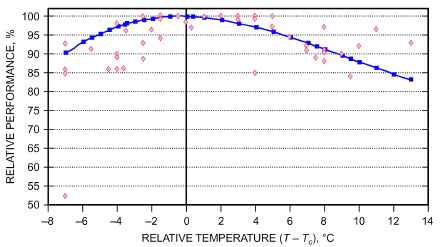

*Fig. 8 Relative Performance of Office Work Performance versus Deviation from Optimal Comfort Temperature Tc*

Data points from 11 of the studies are also shown in Figure 8. Note the large amount of scatter in the individual studies about the line, indicating a high level of uncertainty.

However, as a first approximation, the performance versus temperature relationship in the graph may still be useful as a general representation of real-world office work performance for the tasks performed in the studies, and helpful as a guide in design, operation, and cost analysis.

The results show that performance decreases as temperature deviates above or below a thermal comfort temperature range. As shown in Figure 8, at a temperature 8 K higher than optimal, average office task performance decreased to about 91% of the value at optimum temperature.

## 7. THERMAL NONUNIFORM CONDITIONS AND LOCAL DISCOMFORT

A person may feel thermally neutral as a whole but still feel uncomfortable if one or more parts of the body are too warm or too cold. Nonuniformities may be caused by a cold window, a hot surface, a draft, or a temporal variation of these. Even small variations in heat flow cause the thermal regulatory system to compensate, thus increasing the physiological effort of maintaining body temperatures. The boundaries of the comfort zones (see Figure 5) of ASHRAE Standard 55 provide a thermal acceptability level of 90% if the environment is thermally uniform. Because the standard’s objective is to specify conditions for 80% acceptability, the standard allows nonuniformities to decrease acceptability by 10%. Fortunately for the designer and user, the effect of common thermal nonuniformities on comfort is quantifiable and predictable, as discussed in the following sections. Furthermore, most humans are fairly insensitive to small nonuniformities.

### Asymmetric Thermal Radiation

Asymmetric or nonuniform thermal radiation in a space may be caused by cold windows, uninsulated walls, cold products, cold or warm machinery, or improperly sized heating panels on the wall or ceiling. In residential buildings, offices, restaurants, etc., the most common causes are cold windows or improperly sized or installed ceiling heating panels. At industrial workplaces, the reasons include cold or warm products, cold or warm equipment, etc.

Recommendations in ISO Standard 7730 and ASHRAE Standard 55 are based primarily on studies reported by Fanger et al. (1980). These standards include guidelines regarding the radiant temperature asymmetry from an overhead warm surface (heated ceiling) and a vertical cold surface (cold window). Among the studies conducted on the influence of asymmetric thermal radiation are those by Fanger and Langkilde (1975), McIntyre (1974, 1976), McIntyre and Griffiths (1975), McNall and Biddison (1970), and Olesen et al. (1972). These studies all used seated subjects, who were always in thermal neutrality and exposed only to the discomfort resulting from excessive asymmetry.

<!-- str. 199 -->

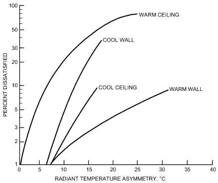

*Fig. 9 Percentage of People Expressing Discomfort Caused by Asymmetric Radiation*

The subjects gave their reactions on their comfort sensation, and a relationship between the radiant temperature asymmetry and the number of subjects feeling dissatisfied was established (Figure 9). Radiant asymmetry, as defined in the section on Environmental Parameters, is the difference in radiant temperature of the environment on opposite sides of the person. More precisely, radiant asymmetry is the difference in radiant temperatures seen by a small flat element looking in opposite directions.

Figure 9 shows that people are more sensitive to asymmetry caused by an overhead warm surface than by a vertical cold surface. The influence of an overhead cold surface or a vertical warm surface is much less. These data are particularly important when using radiant panels to provide comfort in spaces with large cold surfaces or cold windows.

Loveday et al. (1998) used a series of controlled climate chamber studies to establish the design conditions required for thermal comfort for sedentary subjects conducting office work in combined chilled-ceiling and displacement ventilation environments. As part of this study, Hodder et al. (1998) found that the vertical radiant temperature asymmetry for the typical range of ceiling temperatures (22 to 12.5°C) encountered in practice in these combination environments had no effect on the overall thermal comfort of the seated occupants, and that existing guidance regarding toleration of radiant asymmetry in these environments remains valid.

Other studies of clothed persons in neutral environments found thermal acceptability unaffected by radiant temperature asymmetries of 10 K or less (Berglund and Fobelets 1987) and comfort unaffected by asymmetries of 20 K or less (McIntyre and Griffiths 1975).

### Draft

Draft is an undesired local cooling of the human body caused by air movement. This is a serious problem, not only in many ventilated buildings but also in automobiles, trains, and aircraft. Draft has been identified as one of the most annoying factors in offices. When people sense draft, they often demand higher air temperatures in the room or that ventilation systems be stopped.

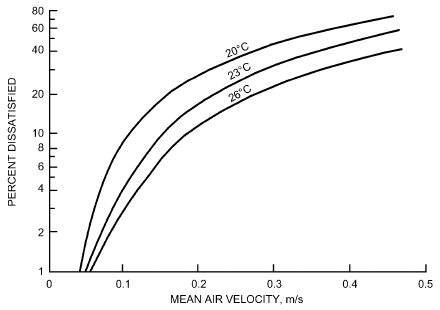

*Fig. 10 Percentage of People Dissatisfied as Function of Mean Air Velocity*

Fanger and Christensen (1986) aimed to establish the percentage of the population feeling draft when exposed to a given mean velocity. Figure 10 shows the percentage of subjects who felt draft on the head region (the dissatisfied) as a function of mean air velocity at the neck. The head region comprises head, neck, shoulders, and back. Air temperature significantly influenced the percentage of dissatisfied. There was no significant difference between responses of men and women. The data in Figure 10 apply only to persons wearing normal indoor clothing and performing light, mainly sedentary work. Persons with higher activity levels are not as sensitive to draft (Jones et al. 1986).

A study of the effect of air velocity over the whole body found thermal acceptability unaffected in neutral environments by air speeds of 0.25 m/s or less (Berglund and Fobelets 1987). This study also found no interaction between air speed and radiant temperature asymmetry on subjective responses. Thus, acceptability changes and the percent dissatisfied because of draft and radiant asymmetry are independent and additive.

Fanger et al. (1989) investigated the effect of turbulence intensity on sensation of draft. Turbulence intensity significantly affects draft sensation, as predicted by the following model. This model can be used to quantify draft risk in spaces and to develop air distribution systems with a low draft risk.

> PD = (34 – t<sub>a</sub>)(V – 0.05)<sup>0.62</sup>(0.37VTu + 3.14)&emsp;**(59)**

where PD is percent dissatisfied and Tu is the turbulence intensity (in percent) defined by

> Tu = 100 (V sd)/V&emsp;**(60)**

For V < 0.05 m/s, insert V = 0.05, and for PD > 100%, insert PD = 100%. V<sub>sd</sub> is the standard deviation of the velocity measured with an omnidirectional anemometer having a 0.2 s time constant.

The model extends the Fanger and Christensen (1986) draft chart model to include turbulence intensity. In this study, Tu decreases when V increases. Thus, the effects of V for the experimental data to which the model is fitted are 20 < t<sub>a</sub> < 26°C, 0.05 < V < 0.5 m/s, and 0 < Tu < 70%. Figure 11 gives more precisely the curves that result from intersections between planes of constant Tu and the surfaces of PD = 15%.

At thermal conditions above neutrality, air movement can be beneficial for thermal comfort. Arens et al. (2009) found people prefer more air movement under some conditions in office spaces.

<!-- str. 200 -->

Applications of this include ceiling fans and personal environmental control systems in offices and transportation systems.

### Vertical Air Temperature Difference

In most buildings, air temperature normally increases with height above the floor. If the gradient is sufficiently large, local warm discomfort can occur at the head and/or cold discomfort can occur at the feet, although the body as a whole is thermally neutral. Among the few studies of vertical air temperature differences and the influence of thermal comfort reported are Eriksson (1975), McNair (1973), McNair and Fishman (1974), and Olesen et al. (1979). Subjects were seated in a climatic chamber and individually exposed to different air temperature differences between head and ankles (Olesen et al. 1979). During the tests, the subjects were in thermal neutrality because they were allowed to change the temperature level in the test room whenever they desired; the vertical temperature difference, however, was kept unchanged. Subjects gave subjective reactions to their thermal sensation; Figure 12 shows the percentage of dissatisfied as a function of the vertical air temperature difference between head (1.1 m above the floor) and ankles (0.1 m above the floor).

A head-level air temperature lower than that at ankle level is not as critical for occupants. Eriksson (1975) indicated that subjects could tolerate much greater differences if the head were cooler. This observation is verified in experiments with asymmetric thermal radiation from a cooled ceiling (Fanger et al. 1985).

### Warm or Cold Floors

Because of direct contact between the feet and the floor, local discomfort of the feet can often be caused by a too-high or too-low floor temperature. Also, floor temperature significantly influences a room’s mean radiant temperature. Floor temperature is greatly affected by building construction (e.g., insulation of the floor, above a basement, directly on the ground, above another room, use of floor heating, floors in radiant-heated areas). If a floor is too cold and the occupants feel cold discomfort in their feet, a common reaction is to increase the temperature level in the room; in the heating season, this also increases energy consumption. A radiant system, which radiates heat from the floor, can also prevent discomfort from cold floors.

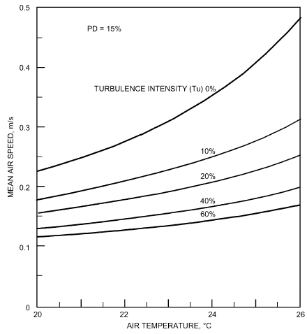

*Fig. 11 Draft Conditions Dissatisfying 15% of Population (PD = 15%)*

The most extensive studies of the influence of floor temperature on foot comfort were performed by Olesen (1977a, 1977b), who, based on his own experiments and reanalysis of data from Nevins and Feyerherm (1967), Nevins and Flinner (1958), and Nevins et al. (1964), found that flooring material is important for people with bare feet (e.g., in swimming halls, gymnasiums, dressing rooms, bathrooms, bedrooms). Ranges for some typical floor materials are as follows:

> Textiles (rugs) 21 to 28°C
>
> Pine floor 22.5 to 28°C

> Oak floor 24.5 to 28°C
>
> Hard linoleum 24 to 28°C

> Concrete 26 to 28.5°C

To save energy, insulating flooring materials (cork, wood, carpets), radiant heated floors, or floor heating systems can be used to eliminate the desire for higher ambient temperatures caused by cold feet. These recommendations should also be followed in schools, where children often play directly on the floor.

For people wearing normal indoor footwear, flooring material is insignificant. Olesen (1977b) found an optimal temperature of 25°C for sedentary and 23°C for standing or walking persons. At the optimal temperature, 6% of occupants felt warm or cold discomfort in the feet. Figure 13 shows the relationship between floor temperature and percent dissatisfied, combining data from experiments with seated and standing subjects. In all experiments, subjects were in thermal neutrality; thus, the percentage of dissatisfied is only related to discomfort caused by cold or warm feet. No significant difference in preferred floor temperature was found between females and males.

## 8. SECONDARY FACTORS AFFECTING COMFORT

Temperature, air speed, humidity, their variation, and personal parameters of metabolism and clothing insulation are primary factors that directly affect energy flow and thermal comfort. However, many secondary factors, some of which are discussed in this section, may more subtly influence comfort.

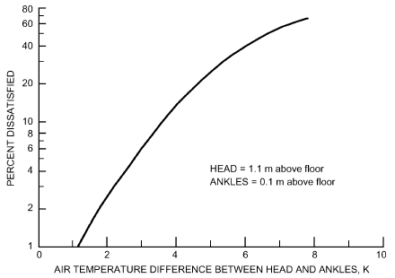

*Fig. 12 Percentage of Seated People Dissatisfied as Function of Air Temperature Difference Between Head and Ankles*

<!-- str. 201 -->

### Day-to-Day Variations

Fanger (1973) determined the preferred ambient temperature for each of a group of subjects under identical conditions on four different days. Because the standard deviation was only 0.6 K, Fanger concluded that comfort conditions for an individual can be reproduced and vary only slightly from day to day.

### Age

Because metabolism decreases slightly with age, many have stated that comfort conditions based on experiments with young and healthy subjects cannot be used for other age groups. Fanger (1982), Fanger and Langkilde (1975), Langkilde (1979), Nevins et al. (1966), and Rohles and Johnson (1972) conducted comfort studies in Denmark and the United States on different age groups (mean ages 21 to 84). The studies revealed that the thermal environments preferred by older people do not differ from those preferred by younger people. The lower metabolism in older people is compensated for by a lower evaporative loss. Collins and Hoinville (1980) confirmed these results.

The fact that young and old people prefer the same thermal environment does not necessarily mean that they are equally sensitive to cold or heat. In practice, the ambient temperature level in the homes of older people is often higher than that for younger people. This may be explained by the lower activity level of elderly people, who are normally sedentary for a greater part of the day.

### Adaptation

Many believe that people can acclimatize themselves by exposure to hot or cold surroundings, so that they prefer other thermal environments. Fanger (1982) conducted experiments involving subjects from the United States, Denmark, and tropical countries. The latter group was tested in Copenhagen immediately after their arrival by plane from the tropics, where they had lived all their lives. Other experiments were conducted for two groups exposed to cold daily. One group comprised subjects who had been doing sedentary work in cold surroundings (in the meat-packing industry) for 8 h daily for at least 1 year. The other group consisted of winter swimmers who bathed in the sea daily.

Only slight differences in preferred ambient temperature and physiological parameters in the comfort conditions were reported for the various groups. These results indicate that people cannot adapt to preferring warmer or colder environments, and therefore the same comfort conditions can likely be applied throughout the world. However, in determining the preferred ambient temperature from the comfort equations, a clo-value corresponding to local clothing habits should be used, such as those given in Table 8 and in Havenith et al. (2015). A comparison of field comfort studies from different parts of the world shows significant differences in clothing habits depending on, among other things, outdoor climate (Nicol and Humphreys 1972). According to these results, adaptation has little influence on preferred ambient temperature. In uncomfortable warm or cold environments, however, adaptation often has an influence. People used to working and living in warm climates can more easily accept and maintain a higher work performance in hot environments than people from colder climates.

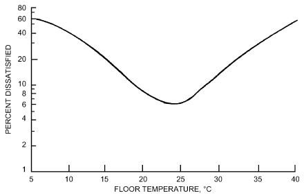

*Fig. 13 Percentage of People Dissatisfied as Function of Floor Temperature*

### Sex

Fanger (1982), Fanger and Langkilde (1975), and Nevins et al. (1966) used equal numbers of male and female subjects, so comfort conditions for the two sexes can be compared. The experiments show that men and women prefer almost the same thermal environments. Women’s skin temperature and evaporative loss are slightly lower than those for men, and this balances the somewhat lower metabolism of women. The reason that women often prefer higher ambient temperatures than men may be partly explained by the lighter clothing often worn by women.

### Seasonal and Circadian Rhythms

Because people cannot adapt to prefer warmer or colder environments, it follows that there is no difference between comfort conditions in winter and in summer. McNall et al. (1968) confirmed this in an investigation where results of winter and summer experiments showed no difference. On the other hand, it is reasonable to expect comfort conditions to alter during the day because internal body temperature has a daily rhythm, with a maximum late in the afternoon, and a minimum early in the morning.

In determining the preferred ambient temperature for each of 16 subjects both in the morning and in the evening, Fanger et al. (1974) and Ostberg and McNicholl (1973) observed no difference. Furthermore, Fanger et al. (1973) found only small fluctuations in preferred ambient temperature during a simulated 8 h workday (sedentary work). There is a slight tendency to prefer somewhat warmer surroundings before lunch, but none of the fluctuations are significant.

## 9. PREDICTION OF THERMAL COMFORT

Thermal comfort and thermal sensation can be predicted several ways. One way is to use Figure 5 and Table 10 and adjust for clothing and activity levels that differ from those of the figure. More numerical and rigorous predictions are possible by using the PMV-PPD and two-node models described in this section.

### Steady-State Energy Balance

Fanger (1982) related comfort data to physiological variables. At a given level of metabolic activity M, and when the body is not far from thermal neutrality, mean skin temperature t<sub>sk</sub> and sweat rate E<sub>rsw</sub> are the only physiological parameters influencing heat balance. However, heat balance alone is not sufficient to establish thermal comfort. In the wide range of environmental conditions where heat balance can be obtained, only a narrow range provides thermal comfort. The following linear regression equations, based on data from Rohles and Nevins (1971), indicate values of t<sub>sk</sub> and E<sub>rsw</sub> that provide thermal comfort:

> t<sub>sk,req</sub> = 35.7 – 0.0275(M – W)&emsp;**(61)**
>
> E<sub>rsw,req</sub> = 0.42 (M – W – 58.15)&emsp;**(62)**

At higher activity levels, sweat loss increases and mean skin temperature decreases, both of which increase heat loss from the body core to the environment. These two empirical relationships link the physiological and heat flow equations and thermal comfort perceptions. By substituting these values into Equation (11) for *C + R*, and into Equations (17) and (18) for E<sub>sk</sub>, Equation (1) (the energy balance equation) can be used to determine combinations of the six environmental and personal parameters that optimize comfort for steady-state conditions.

<!-- str. 202 -->

Fanger (1982) reduced these relationships to a single equation, which assumed all sweat generated is evaporated, eliminating clothing permeation efficiency i<sub>cl</sub> as a factor in the equation. This assumption is valid for normal indoor clothing worn in typical indoor environments with low or moderate activity levels. At higher activity levels (M<sub>act</sub> > 3 met), where a significant amount of sweating occurs even at optimum comfort conditions, this assumption may limit accuracy. The reduced equation is slightly different from the heat transfer equations developed here. The radiant heat exchange is expressed in terms of the Stefan-Boltzmann law (instead of using h<sub>r</sub>), and diffusion of water vapor through the skin is expressed as a diffusivity coefficient and a linear approximation for saturated vapor pressure evaluated at t<sub>sk</sub>. The combination of environmental and personal variables that produces a neutral sensation may be expressed as follows:

- M – W = 3.96 × 10<sup>–8</sup>f<sub>cl</sub>[(t<sub>cl</sub> + 273)<sup>4</sup> – (t<sub>r</sub> + 273)<sup>4</sup>] + f<sub>cl</sub>h<sub>c</sub>(t<sub>cl</sub> – t<sub>a</sub>) + 3.05[5.73 – 0.007(M – W) – p<sub>a</sub>] + 0.42[(M – W) – 58.15] + 0.0173M(5.87 – p<sub>a</sub>)

> + 0.0014M(34 – t<sub>a</sub>)&emsp;**(63)**

where

- t<sub>cl</sub> = 35.7 – 0.0275(M – W) – R<sub>cl</sub>{(M – W) – 3.05[5.73 – 0.007(M – W) – p<sub>a</sub>] – 0.42[(M – W) – 58.15] – 0.0173M(5.87 – p<sub>a</sub>)

> – 0.0014M(34 – t<sub>a</sub>)}&emsp;**(64)**

The values of h<sub>c</sub> and f<sub>cl</sub> can be estimated from tables and equations given in the section on Engineering Data and Measurements. Fanger used the following relationships:

> {
>
> 2.38(t<sub>cl</sub>– t<sub>a</sub>)<sup>0.25</sup> 2.38(t<sub>cl</sub>– t<sub>a</sub>)<sup>0.25</sup>> 12.1 V

> h<sub>c</sub> =&emsp;**(65)**
>
> {

> 12.1 V 2.38(t<sub>cl</sub>– t<sub>a</sub>)<sup>0.25</sup>< 12.1 V
>
> {

> 1.0 + 0.2I<sub>cl</sub> I<sub>cl</sub>< 0.5 clo
>
> {

> f<sub>cl</sub> =&emsp;**(66)**
>
> {

> 1.05 + 0.1I<sub>cl</sub> I<sub>cl</sub>> 0.5 clo
>
> {

Figures 14 and 15 show examples of how Equation (63) can be used.

Equation (63) is expanded to include a range of thermal sensations by using a **predicted mean vote (PMV) index**. The PMV index predicts the mean response of a large group of people according to the ASHRAE thermal sensation scale. Fanger (1970) related PMV to the imbalance between actual heat flow from the body in a given environment and the heat flow required for optimum comfort at the specified activity by the following equation:

> PMV = [0.303 exp(–0.036M) + 0.028]L&emsp;**(67)**

where L is the thermal load on the body, defined as the difference between internal heat production and heat loss to the actual environment for a person hypothetically kept at comfort values of t<sub>sk</sub> and E<sub>rsw</sub> at the actual activity level. Thermal load L is then the difference between the left and right sides of Equation (63) calculated for the actual values of the environmental conditions. As part of this calculation, clothing temperature t<sub>cl</sub> is found by iteration as t<sub>cl</sub> = 35.7 – 0.028(M – W)

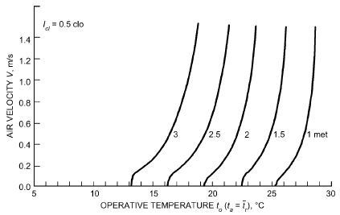

*Fig. 14 Air Velocities and Operative Temperatures at 50% rh Necessary for Comfort (PMV = 0) of Persons in Summer Clothing at Various Levels of Activity*

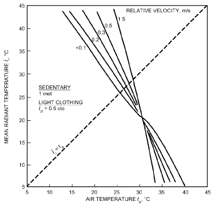

*Fig. 15 Air Temperatures and Mean Radiant Temperatures Necessary for Comfort (PMV = 0) of Sedentary Persons in Summer Clothing at 50% rh*

> – R<sub>cl</sub>{39.6 × 10<sup>–9</sup>f<sub>cl</sub>[(t<sub>cl</sub> + 273)<sup>4</sup> – (t<sub>r</sub> + 273)<sup>4</sup>]
>
> + f<sub>cl</sub>h<sub>c</sub>(t<sub>cl</sub> – t<sub>a</sub>)}&emsp;**(68)**

After estimating the PMV with Equation (67) or another method, the **predicted percent dissatisfied (PPD)** with a condition can also be estimated. Fanger (1982) related the PPD to the PMV as follows:

> PPD = 100 – 95 exp[–(0.03353PMV<sup>4</sup> + 0.2179PMV<sup>2</sup>)]&emsp;**(69)**

where dissatisfied is defined as anybody not voting −1, +1, or 0. This relationship is shown in Figure 16. A PPD of 10% corresponds to the PMV range of ±0.5, and even with PMV = 0, about 5% of the people are dissatisfied.

The **PMV-PPD model** is widely used and accepted for design and field assessment of comfort conditions. ISO Standard 7730 includes a short computer listing that facilitates computing PMV and PPD for a wide range of parameters.

<!-- str. 203 -->

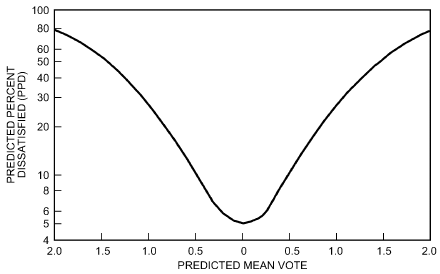

*Fig. 16 Predicted Percentage of Dissatisfied (PPD) as Function of Predicted Mean Vote (PMV)*

### Two-Node Model

The PMV model is useful only for predicting steady-state comfort responses. The two-node model can be used to predict physiological responses or responses to transient situations, at least for low and moderate activity levels in cool to very hot environments (Gagge et al. 1971a, 1986). This model is a simplification of thermoregulatory models developed by Stolwijk and Hardy (1966). The simple, lumped parameter model considers a human as two concentric thermal compartments that represent the skin and the core of the body.

The **skin compartment** simulates the epidermis and dermis and is about 1.6 mm thick. Its mass, which is about 10% of the total body, depends on the amount of blood flowing through it for thermoregulation. Compartment temperature is assumed to be uniform so that the only temperature gradients are between compartments. In a cold environment, blood flow to the extremities may be reduced to conserve the heat of vital organs, resulting in axial temperature gradients in the arms, legs, hands, and feet. Heavy exercise with certain muscle groups or asymmetric environmental conditions may also cause nonuniform compartment temperatures and limit the model’s accuracy.

All the heat is assumed to be generated in the **core compart- ment**. In the cold, shivering and muscle tension may generate additional metabolic heat. This increase is related to skin and core temperature depressions from their set point values, or M<sub>shiv</sub> = [156(37 – t<sub>c</sub>) + 47(33 – t<sub>sk</sub>)

> – 1.57(33 – t<sub>sk</sub>)<sup>2</sup>]/BF<sup>0.5</sup>&emsp;**(70)**

where BF is percentage body fat and the temperature difference terms are set to zero if they become negative (Tikusis and Giesbrecht 1999).

The core loses energy when the muscles do work on the surroundings. Heat is also lost from the core through respiration. The rate of respiratory heat loss depends on sensible and latent changes in respired air and the ventilation rate as in Equations (19) and (20).

In addition, heat is conducted passively from the core to the skin. This is modeled as a massless thermal conductor [K = 5.28 W/(m<sup>2</sup>·K)]. A controllable heat loss path from the core consists of pumping variable amounts of warm blood to the skin for cooling. This peripheral blood flow Q<sub>bl</sub> in L/(h·m<sup>2</sup>) depends on skin and core temperature deviations from their respective set points:

> Q<sub>bl</sub> = (BFN + c<sub>dil</sub>(t<sub>cr</sub>– 37))/(1 + S<sub>tr</sub>(34 – t<sub>sk</sub>))&emsp;**(71)**

The temperature terms can only be > 0. If the deviation is negative, the term is set to zero. For average persons, the coefficients BFN, c<sub>dil</sub>, and S<sub>tr</sub> are 6.3, 50, and 0.5. Further, skin blood flow Q<sub>bl</sub> is limited to a maximum of 90 L/(h·m<sup>2</sup>). A very fit and well-trained athlete could expect to have c<sub>dil</sub> = 175.

Dry (sensible) heat loss q<sub>dry</sub> from the skin flows through the clothing by conduction and then by parallel paths to the air and surrounding surfaces. Evaporative heat follows a similar path, flowing through the clothing and through the air boundary layer. Maximum evaporation E<sub>max</sub> occurs if the skin is completely covered with sweat. The actual evaporation rate E<sub>sw</sub> depends on the size w of the sweat film:

> E<sub>sw</sub> = wE<sub>max</sub>&emsp;**(72)**

where w is E<sub>rsw</sub>/E<sub>max</sub>.

The rate of regulatory sweating E<sub>rsw</sub> (rate at which water is brought to the surface of the skin in W/m) can be predicted by skin and core temperature deviations from their set points:

> E<sub>rsw</sub> = c<sub>sw</sub>(t<sub>b</sub> – t<sub>bset</sub>)exp[(t<sub>sk</sub> – 34)/10.7]&emsp;**(73)**

where t<sub>b</sub> = (1 – α<sub>sk</sub>)t<sub>cr</sub> + α<sub>sk</sub>t<sub>sk</sub> and is the mean body temperature, t<sub>bset</sub>= 36.49°C, and c<sub>sw</sub> = 116 W/(m<sup>2</sup>·K). The temperature deviation terms are set to zero when negative. Τhe fraction of the total body mass considered to be thermally in the skin compartment is α<sub>sk</sub>:

> α<sub>sk</sub> = 0.0418 +0.745/(Q<sub>bl</sub>+ 0.585)&emsp;**(74)**

Regulatory sweating Q<sub>rsw</sub> in the model is limited to 1 L/(h·m<sup>2</sup>) or 670 W/m<sup>2</sup>. E<sub>rsw</sub> evaporates from the skin, but if E<sub>rsw</sub> is greater than E<sub>max</sub>, the excess drips off.

An energy balance on the core yields

> dt<sub>cr</sub>
>
> M + M<sub>shiv</sub> = W + q<sub>res</sub> + (K + SkBFc<sub>p,bl</sub>)(t<sub>cr</sub> – t<sub>sk</sub>) + m<sub>cr</sub>c<sub>cr</sub>&emsp;**(75)**

> dθ

and for the skin,

> dt<sub>sk</sub>
>
> (K + SkBFc<sub>p,bl</sub>)(t<sub>cr</sub> – t<sub>sk</sub>) = q<sub>dry</sub> + q<sub>evap</sub> + m<sub>sk</sub>c<sub>sk</sub>&emsp;**(76)**

> dθ

where c<sub>cr</sub>, c<sub>sk</sub>, and c<sub>p,bl</sub> are specific heats of core, skin, and blood [3500, 3500, and 4190 J/(kg·K), respectively], and SkBF is ρ<sub>bl</sub>Q<sub>bl</sub>, where ρ<sub>bl</sub> is density of blood (1.06 kg/L).

Equations (75) and (76) can be rearranged in terms of dt<sub>sk</sub>/dθ and dt<sub>cr</sub>/dθ and numerically integrated with small time steps (10 to 60 s) from initial conditions or previous values to find t<sub>cr</sub> and t<sub>sk</sub> at any time.

After calculating values of t<sub>sk</sub>, t<sub>cr</sub>, and w, the model uses empirical expressions to predict thermal sensation (TSENS) and thermal discomfort (DISC). These indices are based on 11-point numerical scales, where positive values represent the warm side of neutral sensation or comfort, and negative values represent the cool side. TSENS is based on the same scale as PMV, but with extra terms for ±4 (very hot/cold) and ±5 (intolerably hot/cold). Recognizing the same positive/negative convention for warm/cold discomfort, DISC is defined as

> 5 intolerable
>
> 4 limited tolerance

> 3 very uncomfortable
>
> 2 uncomfortable and unpleasant

> 1 slightly uncomfortable but acceptable
>
> 0 comfortable

<!-- str. 204 -->

TSENS is defined in terms of deviations of mean body temperature t<sub>b</sub> from cold and hot set points representing the lower and upper limits for the zone of evaporative regulation: t<sub>b,c</sub> and t<sub>b,h</sub>, respectively. The values of these set points depend on the net rate of internal heat production and are calculated by

> t<sub>b,c</sub> = 0.194/58.15 (M – W) + 36.301&emsp;**(77)**
>
> t<sub>b,h</sub> = 0.347/58.15 (M – W) + 36.669&emsp;**(78)**

TSENS is then determined by

> 0.4685(t<sub>b</sub>– t<sub>b,c</sub>) t<sub>b</sub>< t<sub>b,c</sub>
>
> {

> TSENS = 4.7η<sub>ev</sub>(t<sub>b</sub>– t<sub>b,c</sub>) ⁄ (t<sub>b,h</sub>– t<sub>b,c</sub>) t<sub>b,c</sub>≤ t<sub>b</sub>≤ t<sub>b,h</sub>&emsp;**(79)**
>
> {

> 4.7η<sub>ev</sub>+ 0.4685(t<sub>b</sub>– t<sub>b,h</sub>) t<sub>b,h</sub>< t<sub>b</sub>
>
> {

where η<sub>ev</sub> is the evaporative efficiency (assumed to be 0.85).

DISC is numerically equal to TSENS when t<sub>b</sub> is below its cold set point t<sub>b,c</sub> and it is related to skin wettedness when body temperature is regulated by sweating:

> 0.4685(t<sub>b</sub>– t<sub>b,c</sub>) t<sub>b</sub>< t<sub>b,c</sub>
>
> {

> DISC =&emsp;**(80)**
>
> {

(4.7(E – E ) rsw rsw,req)/(E – E – E max rsw,req dif) t<sub>b,c</sub>≤ t<sub>b</sub>

> {

where E<sub>rsw,req</sub> is calculated as in Fanger’s model, using Equation (62).

**Multisegment Thermal Physiology and Comfort Models**

Unlike the two-node model, which represents the body as one cylinder with two nodes of core and skin, multisegment models divide the body into more segments (e.g., head, chest, hands, feet) and more tissue layers (e.g., core, muscle, fat, skin). They are intended to predict thermal physiology and thermal comfort in nonuniform [e.g., offices with displacement ventilation or underfloor air, radiant-cooled ceiling/floors, or natural and mixed-mode ventilation; personal environmental control (PEC) systems] and transient (e.g., occupants moving between different environments in offices, quick-responding PECs, automobiles) environments. Major multisegment physiological models include Fiala (1998), Fiala et al. (2003), Gordon (1974), Huizenga et al. (2001), Kraning and Gonzalez (1997), Smith (1991), Stolwijk (1971), Tanabe et al. (2002), Werner and Webb (1993), and Wissler (1964, 1985, 1988). These models mostly use finite-difference or finite-element methods, and include active thermoregulatory control in addition to passive heat transfer. They predict skin temperature for several local body segments, and central core temperature. They also predict other physiological parameters, such as segment sweat rate and skin wettedness, shivering, and cardiac blood flow.

Comfort is independently predicted from the output of physiological models. One comfort model, based on a review of literature addressing human sensation testing, uses an average of local skin temperatures and its time derivative to predict whole-body thermal sensation under stable and transient environments (Fiala 1998; Fiala et al. 2003). Another model uses the heat storage rate of the skin or core to predict whole-body thermal sensation under stable and transient environments (Wang 1994; Wang and Peterson 1992). The Berkeley comfort model predicts thermal sensation and comfort for each segment as well as for the whole body, using local skin temperatures, core temperature, and their time derivatives (Zhang 2003; Zhang et al. 2010a, 2010b, 2010c).

The equivalent homogeneous temperature (EHT) approach uses segmented electrical manikin measurements to determine the equivalent uniform environment for each body part (Nilsson 2007; Wyon et al. 1989). From these, comfortable environmental temperature ranges have been defined for each of the body segments. The EHT can determine comfort under nonuniform environments that are at steady state.

### Adaptive Models

Adaptive models do not actually predict comfort responses but rather the almost constant conditions under which people are likely to be comfortable in buildings. In general, people naturally adapt and may also make various adjustments to themselves and their surroundings to reduce discomfort and physiological strain. It has been observed that, through adaptive actions, an acceptable degree of comfort in residences and offices is possible over a range of air temperatures from about 17 to 31°C (Humphreys and Nicol 1998).

Adaptive adjustments are typically conscious actions such as altering clothing, posture, activity schedules or levels, rate of working, diet, ventilation, air movement, and local temperature. They may also include unconscious longer-term changes to physiological set points and gains for control of shivering, skin blood flow, and sweating, as well as adjustments to body fluid levels and salt loss. However, only limited documentation and information on such changes is available.

An important driving force behind the adaptive process is the pattern of outdoor weather conditions and exposure to them. This is the principal input to adaptive models, which predict likely comfort temperatures t<sub>c</sub> or ranges of t<sub>c</sub> from monthly mean outdoor temperatures t<sub>out</sub>. Humphreys and Nicol’s (1998) model is based on data from a wide range of buildings, climates, and cultures:

> 2
>
> ( )

> t<sub>c</sub> = 24.2 + 0.43(t<sub>out</sub> – 22)exp – (t<sub>out</sub>– 22)/(24 2)&emsp;**(81)**
>
> ( )

Adaptive models are useful to guide design and energy decisions, and to specify building temperature set points throughout the year. An ASHRAE-sponsored study (de Dear and Brager 1998) on adaptive models compiled an extensive database from field studies to study, develop, and test adaptive models. For climates and buildings where cooling and central heating are not required, the study suggests the following model:

> t<sub>oc</sub> = 17.8 + 0.31t<sub>out</sub>&emsp;**(82)**

where t<sub>oc</sub> is the operative comfort temperature. The adaptive model boundary temperatures for 90% thermal acceptability are approximately t<sub>oc</sub>+ 2.5°C and t<sub>oc</sub> – 2.2°C according to ASHRAE Standard 55-2013.

In general, the value of using an adaptive model to specify set points or guide temperature control strategies is likely to increase with the freedom that occupants are given to adapt (e.g., by having flexible working hours, locations, or dress codes).

### Zones of Comfort and Discomfort

The Two-Node Model section shows that comfort and thermal sensation are not necessarily the same variable, especially for a person in the zone of evaporative thermal regulation. Figures 17 and 18 show this difference for the standard combination of met-clo-air movement used in the standard effective temperature ET*. Figure 17 demonstrates that practically all basic physiological variables predicted by the two-node model are functions of ambient temperature and are relatively independent of vapor pressure. All exceptions occur at relative humidities above 80% and as the isotherms reach the ET* = 41.5°C line, where regulation by evaporation fails. Figure 18 shows that lines of constant ET* and wettedness are functions of both ambient temperature and vapor pressure. Thus, human thermal responses are divided into two classes: those in Figure 17, which respond only to heat stress from the environment, and those in Figure 18, which respond to both heat stress from the environment and the resultant heat strain (Stolwijk et al. 1968).

<!-- str. 205 -->

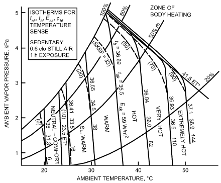

*Fig. 17 Effect of Environmental Conditions on Physiological Variables*

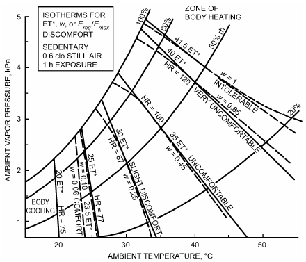

*Fig. 18 Effect of Thermal Environment on Discomfort*

For warm environments, any index with isotherms parallel to skin temperature is a reliable index of thermal sensation alone, and not of discomfort caused by increased humidity. Indices with isotherms parallel to ET* are reliable indicators of discomfort or dissatisfaction with thermal environments. For a fixed exposure time to cold, lines of constant t<sub>sk</sub>, ET*, and t<sub>o</sub> are essentially identical, and cold sensation is no different from cold discomfort. For a state of comfort with sedentary or light activity, lines of constant t<sub>sk</sub> and ET* coincide. Thus, comfort and thermal sensations coincide in this region as well. The upper and lower temperature limits for comfort at these levels can be specified either by thermal sensation (Fanger 1982) or by ET*, as is done in ASHRAE Standard 55, because lines of constant comfort and lines of co0nstant thermal sensation should be identical.

## 10. ENVIRONMENTAL INDICES

An environmental index combines two or more parameters (e.g., air temperature, mean radiant temperature, humidity, air velocity) into a single variable. Indices simplify description of the thermal environment and the stress it imposes. Environmental indices may be classified according to how they are developed. Rational indices are based on the theoretical concepts presented earlier. Empirical indices are based on measurements with subjects or on simplified relationships that do not necessarily follow theory. Indices may also be classified according to their application, generally either heat stress or cold stress.

### Effective Temperature

**Effective temperature ET*** is probably the most common environmental index, and has the widest range of application. It combines temperature and humidity into a single index, so two environments with the same ET* should evoke the same thermal response even though they have different temperatures and humidities, as long as they have the same air velocities.

The original empirical effective temperature was developed by Houghten and Yaglou (1923). Gagge et al. (1971a, 1971b) defined a new effective temperature using a rational approach. Defined mathematically in Equation (33), this is the temperature of an environment at 50% rh that results in the same total heat loss E<sub>sk</sub> from the skin as in the actual environment.

Because the index is defined in terms of operative temperature t<sub>o</sub>, it combines the effects of three parameters (t<sub>r</sub>, t<sub>a</sub>, and p<sub>a</sub>) into a single index. Skin wettedness w and the permeability index i<sub>m</sub> must be specified and are constant for a given ET* line for a particular situation. The two-node model is used to determine skin wettedness in the zone of evaporative regulation. At the upper limit of regulation, w approaches 1.0; at the lower limit, w approaches 0.06. Skin wettedness equals one of these values when the body is outside the zone of evaporative regulation. Because the slope of a constant ET* line depends on skin wettedness and clothing moisture permeability, effective temperature for a given temperature and humidity may depend on the person’s clothing and activity. This difference is shown in Figure 19. At low skin wettedness, air humidity has little influence, and lines of constant ET* are nearly vertical. As skin wettedness increases because of activity and/or heat stress, the lines become more horizontal and the influence of humidity is much more pronounced. The ASHRAE comfort envelope shown in Figure 5 is described in terms of ET*.

Because ET* depends on clothing and activity, it is not possible to generate a universal ET* chart. A standard set of conditions representative of typical indoor applications is used to define a **stan- dard effective temperature SET***, defined as the equivalent air temperature of an isothermal environment at 50% rh in which a subject, wearing clothing standardized for the activity concerned, has the same heat stress (skin temperature t<sub>sk</sub>) and thermoregulatory strain (skin wettedness w) as in the actual environment.

### Humid Operative Temperature

The **humid operative temperature t<sub>oh</sub>** is the temperature of a uniform environment at 100% rh in which a person loses the same total amount of heat from the skin as in the actual environment. This index is defined mathematically in Equation (32). It is analogous to ET*, except that it is defined at 100% rh and 0% rh rather than at 50% rh. Figures 2 and 19 indicate that lines of constant ET* are also lines of constant t<sub>oh</sub>. However, the values of these two indices differ for a given environment.

### Heat Stress Index

Originally proposed by Belding and Hatch (1955), this rational index is the ratio of total evaporative heat loss E<sub>sk</sub> required for [Adapted from Gonzalez et al.

<!-- str. 206 -->

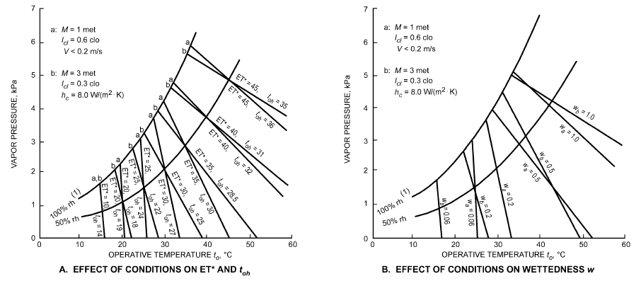

*Fig. 19 Effective Temperature ET and Skin Wettedness w*

**Table 12 Evaluation of Heat Stress Index**

| Heat Stress Index | Physiological and Hygienic Implications of 8 h Exposures to Various Heat Stresses |
|---|---|
| 0 | No thermal strain. |
| 10 | *Mild to moderate* heat strain. If job involves higher |
| 20 | intellectual functions, dexterity, or alertness, subtle to substantial decrements in performance may be expected. |
| 30 |  |
|  | In performing heavy physical work, little decrement is expected, unless ability of individuals to perform such work under no thermal stress is marginal. |
| 40 | Severe heat strain involving a threat to health unless |
| 50 | workers are physically fit. Break-in period required for men not previously acclimatized. Some decrement in |
| 60 |  |
|  | performance of physical work is to be expected. Medical selection of personnel desirable, because these conditions are unsuitable for those with cardiovascular or respiratory impairment or with chronic dermatitis. These working conditions are also unsuitable for activities requiring sustained mental effort. |
| 70 | Very severe heat strain. Only a small percentage of the |
| 80 | population may be expected to qualify for this work.<br>Personnel should be selected (a) by medical examination, |
| 90 |  |
|  | and (b) by trial on the job (after acclimatization). Special measures are needed to ensure adequate water and salt intake. Amelioration of working conditions by any feasible means is highly desirable, and may be expected to decrease the health hazard while increasing job efficiency.<br>Slight “indisposition,” which in most jobs would be insufficient to affect performance, may render workers unfit for this exposure. |
| 100 | The maximum strain tolerated daily by fit, acclimatized young men. |

thermal equilibrium (the sum of metabolism plus dry heat load) to maximum evaporative heat loss E<sub>max</sub> possible for the environment, multiplied by 100, for steady-state conditions (S<sub>sk</sub> and S<sub>cr</sub> are zero) and with t<sub>sk</sub> held constant at 35°C. The ratio E<sub>sk</sub>/E<sub>max</sub> equals skin wettedness w [Equation (18)]. When **heat stress index (HSI)** > 100, body heating occurs; when HSI < 0, body cooling occurs. Belding (1978) and Nishi et al. (1975)]

and Hatch (1955) limited E<sub>max</sub> to 700 W/m<sup>2</sup>, which corresponds to a sweat rate of approximately 280 mg/(s·m<sup>2</sup>). When t<sub>sk</sub> is constant, loci of constant HSI coincide with lines of constant ET* on a psychrometric chart. Other indices based on wettedness have the same applications (Belding 1970; Gonzalez et al. 1978; ISO Standard 7933) but differ in their treatment of E<sub>max</sub> and the effect of clothing. Table 12 describes physiological factors associated with HSI values.

### Index of Skin Wettedness

**Skin wettedness w** is the ratio of observed skin sweating E<sub>sk</sub> to the E<sub>max</sub> of the environment as defined by t<sub>sk</sub>, t<sub>a</sub>, humidity, air movement, and clothing in Equation (12). Except for the factor of 100, it is essentially the same as HSI. Skin wettedness is more closely related to the sense of discomfort or unpleasantness than to temperature sensation (Gagge et al. 1969a, 1969b; Gonzalez et al. 1978).

### Wet-Bulb Globe Temperature

The WBGT is an environmental heat stress index that combines dry-bulb temperature t<sub>db</sub>, a **naturally ventilated** (not aspirated) wet-bulb temperature t<sub>nwb</sub>, and black globe temperature t<sub>g</sub>, according to the relation (Dukes-Dobos and Henschel 1971, 1973)

> WBGT = 0.7t<sub>nwb</sub> + 0.2t<sub>g</sub> + 0.1t<sub>a</sub>&emsp;**(83)**

This form of the equation is usually used where solar radiation is present. The naturally ventilated wet-bulb thermometer is left exposed to sunlight, but the air temperature t<sub>a</sub> sensor is shaded. In enclosed environments, Equation (83) is simplified by dropping the t<sub>a</sub> term and using a 0.3 weighting factor for t<sub>g</sub>.

The black globe thermometer responds to air temperature, mean radiant temperature, and air movement, whereas the naturally ventilated wet-bulb thermometer responds to air humidity, air movement, radiant temperature, and air temperature. Thus, WBGT is a function of all four environmental factors affecting human environmental heat stress.

The WBGT index is widely used for estimating the heat stress potential of industrial environments (Davis 1976). In the United States, the National Institute of Occupational Safety and Health (NIOSH) developed criteria for a heat-stress-limiting standard

<!-- str. 207 -->

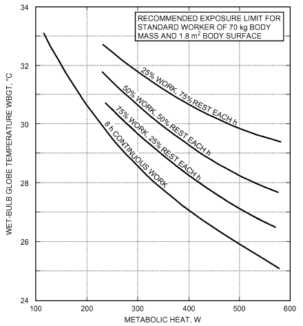

*Fig. 20 Recommended Heat Stress Exposure Limits for Heat Acclimatized Workers*

> [Adapted from NIOSH (1986)]

(NIOSH 1986). ISO Standard 7243 also uses the WBGT. Figure 20 summarizes permissible heat exposure limits, expressed as working time per hour, for a fit individual, as specified for various WBGT levels. Values apply for normal permeable clothing (0.6 clo) and must be adjusted for heavy or partly vapor-permeable clothing. For example, the U.S. Air Force (USAF) recommended adjusting the measured WBGT upwards by 6 K for personnel wearing chemical protective clothing or body armor. This type of clothing increases resistance to sweat evaporation about threefold (higher if it is totally impermeable), requiring an adjustment in WBGT level to compensate for reduced evaporative cooling at the skin.

Several mathematical models are available for predicting WBGT from environmental factors: air temperature, psychrometric wet-bulb temperature, mean radiant temperature, and air motion (Azer and Hsu 1977; Sullivan and Gorton 1976).

### Wet-Globe Temperature

The WGT, introduced by Botsford (1971), is a simpler approach to measuring environmental heat stress than the WBGT. The measurement is made with a wetted globe thermometer called a Botsball, which consists of a 65 mm black copper sphere covered with a fitted wet black mesh fabric, into which the sensor of a dial thermometer is inserted. A polished stem attached to the sphere supports the thermometer and contains a water reservoir for keeping the sphere covering wet. This instrument is suspended by the stem at the site to be measured.

Onkaram et al. (1980) showed that WBGT can be predicted with reasonable accuracy from WGT for temperate to warm environments with medium to high humidities. With air temperatures between 20 and 35°C, dew points from 7 to 25°C (relative humidities above 30%), and wind speeds of 7 m/s or less, the experimental regression equation (r = 0.98) in °C for an outdoor environment is

> WBGT = 1.044(WGT) – 0.187&emsp;**(84)**

This equation should not be used outside the experimental range given because data from hot/dry desert environments show differences between WBGT and WGT that are too large (6 K and above) to be adjusted by Equation (84) (Matthew et al. 1986). At very low humidity and high wind, WGT approaches the psychrometric wet-bulb temperature, which is greatly depressed below t<sub>a</sub>. However, in the WBGT, t<sub>nwb</sub> accounts for only 70% of the index value, with the remaining 30% at or above t<sub>a</sub>.

### Wind Chill Index

The wind chill index (WCI) is an empirical index developed from cooling measurements obtained in Antarctica on a cylindrical flask partly filled with water (Siple and Passel 1945). The index describes the rate of heat loss from the cylinder by radiation and convection for a surface temperature of 33°C, as a function of ambient temperature and wind velocity. As originally proposed,

> WCI = (10.45 + 10 V – V)(33 – t<sub>a</sub>) in kcal/(h·m<sup>2</sup>)&emsp;**(85)**

where V and t<sub>a</sub> are in m/s and °C, respectively. Multiply WCI by 1.163 to convert to W/m<sup>2</sup>. The 33°C surface temperature was chosen to be representative of the mean skin temperature of a resting human in comfortable surroundings.

Some valid objections have been raised about this formulation. Cooling rate data from which it was derived were measured on a 57 mm diameter plastic cylinder, making it unlikely that WCI would be an accurate measure of heat loss from exposed flesh, which has different characteristics from plastic (curvature, roughness, and radiation exchange properties) and is invariably below 33°C in a cold environment. Moreover, values given by the equation peak at 90 km/h, then decrease with increasing velocity.

Nevertheless, for velocities below 80 km/h, this index reliably expresses combined effects of temperature and wind on subjective discomfort. For example, if the calculated WCI is less than 1400 kcal/(h·m<sup>2</sup>) and actual air temperature is above −10°C, there is little risk of frostbite during brief exposures (1 h or less), even for bare skin. However, at a WCI of 2000 or more, the probability is high that exposed flesh will begin to freeze in 1 min or less unless measures are taken to shield exposed skin (such as a fur ruff to break up wind around the face).

Rather than using the WCI to express the severity of a cold environment, meteorologists use an index derived from the WCI called the **equivalent wind chill temperature t<sub>eq,wc</sub>**. This is the ambient temperature that would produce, in a calm wind (defined for this application as 6.4 km/h), the same WCI as the actual combination of air temperature and wind velocity:

> t<sub>eq,wc</sub> = –0.0528(WCI) + 33&emsp;**(86)**

where t<sub>eq,wc</sub> is in °C (and frequently referred to as a **wind chill fac- tor**), thus distinguishing it from WCI, which is given either as a cooling rate or as a plain number with no units. For velocities less than 6.4 km/h (1.8 m/s), Equation (86) does not apply, and the wind chill temperature is equal to the air temperature.

Equation (86) does not imply cooling to below ambient temperature, but recognizes that, because of wind, the cooling rate is increased as though it were occurring at the lower equivalent wind chill temperature. Wind accelerates the rate of heat loss, so that the skin surface cools more quickly toward the ambient temperature. Table 13 shows a typical wind chill chart, expressed in equivalent wind chill temperature.

<!-- str. 208 -->

**Table 13 Equivalent Wind Chill Temperatures of Cold Environments**

```text
                                                         Actual Thermometer Reading, °C
Wind
           10        5         0        –5        –10        –15         –20       –25       –30      –35       –40       –45       –50
Speed,
 km/h                                                 Equivalent Wind Chill Temperature, °C
 Calm      10         5         0       –5        –10        –15         –20       –25       –30       –35      –40       –45       –50
  10        8         2        –3       –9        –14        –20         –25       –31       –37      –42       –48       –53       –59
  20        3        –3      –10       –16        –23        –29         –35       –42       –48      –55       –61       –68       –74
  30        1        –6      –13       –20        –27        –34         –42       –49       –56      –63       –70       –77       –84
  40       –1        –8      –16       –23        –31        –38         –46       –53       –60      –68       –75       –83       –90
  50       –2       –10      –18       –25        –33        –41         –48       –56       –64      –71       –79       –87       –94
  60       –3       –11      –19       –27        –35        –42         –50       –58       –66      –74       –82       –90       –97
  70       –4       –12      –20       –28        –35        –43         –51       –59       –67      –75       –83       –91       –99
Little danger: In less than 5 h, with dry skin. Increasing danger: Danger of    Great danger: Flesh may freeze within 30 s.
Maximum danger from false sense of security.   freezing exposed flesh within 1 min.
(WCI < 1400)                                   (1400 ≤ WCI ≤ 2000)              (WCI > 2000)
Source: U.S. Army Research Institute of Environmental Medicine.                                    Winds greater than 70 km/h have little added chill-
Notes: Cooling power of environment expressed as an equivalent temperature under calm conditions [Equation (86)]. ing effect.
```

## 11. SPECIAL ENVIRONMENTS

### Infrared Heating

Optical and thermal properties of skin must be considered in studies of the effects of infrared radiation in (1) producing changes in skin temperature and skin blood flow, and (2) evoking sensations of temperature and comfort (Hardy 1961). Although the body can be considered to have the properties of water, thermal sensation and heat transfer with the environment require a study of the skin and its interaction with visible and infrared radiation.

Figure 21 shows how skin reflectance and absorptance vary for a blackbody heat source at the temperature (in K) indicated. These curves show that darkly pigmented skin is heated more by direct radiation from a high-intensity heater at 2500 K than is lightly pigmented skin. With low-temperature, low-intensity heating equipment used for total area heating, there is minimal, if any, difference. Also, in practice, clothing minimizes differences.

Changes in skin temperature caused by high-intensity infrared radiation depend on the thermal conductivity, density, and specific heat of living skin (Lipkin and Hardy 1954). Modeling skin heating with the heat transfer theory yields a parabolic relation between exposure time and skin temperature rise for nonpenetrating radiation:

> t<sub>sf</sub> – t<sub>si</sub> = Δt = 2Jα θ ⁄ (πkρc<sub>p</sub>)&emsp;**(87)**

where

- t<sub>sf</sub> = final skin temperature, °C
- t<sub>si</sub> = initial skin temperature, °C
- J = irradiance from source radiation temperatures, W/m<sup>2</sup>
- α = skin absorptance at radiation temperatures, dimensionless
- θ = time, h
- k = specific thermal conductivity of tissue, W/(m·K)
- ρ = density, kg/m<sup>3</sup>
- c<sub>p</sub> = specific heat, J/(kg·K)

Product kρc<sub>p</sub> is the physiologically important quantity that determines temperature elevation of skin or other tissue on exposure to nonpenetrating radiation. Fatty tissue, because of its relatively low specific heat, is heated more rapidly than moist skin or bone. Experimentally, kρc<sub>p</sub> values can be determined by plotting Δt<sup>2</sup> against 1.13J<sup>2</sup>θ (Figure 22). The relationship is linear, and the slopes are inversely proportional to the kρc<sub>p</sub> of the specimen. Comparing leather and water with body tissues suggests that thermal inertia values depend largely on tissue water content.

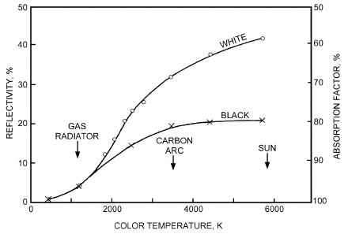

*Fig. 21 Variation in Skin Reflection and Absorptivity for Blackbody Heat Sources*

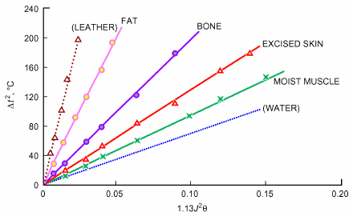

*Fig. 22 Comparing Thermal Inertia of Fat, Bone, Moist Muscle, and Excised Skin to That of Leather and Water*

Living tissues do not conform strictly to this simple mathematical formula. Figure 23 compares excised skin with living skin with normal blood flow, and skin with blood flow occluded. For short exposure times, the kρc<sub>p</sub> of normal skin is the same as that in which blood flow has been stopped; excised skin heats more rapidly because of unavoidable dehydration that occurs postmortem.

<!-- str. 209 -->

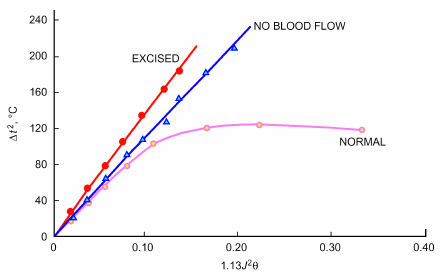

*Fig. 23 Thermal Inertias of Excised, Bloodless, and Normal Living Skin*

However, with longer exposure to thermal radiation, vasodilation increases blood flow, cooling the skin. For the first 20 s of irradiation, skin with normally constricted blood vessels has a kρc<sub>p</sub> value one-fourth that for skin with fully dilated vessels.

Skin temperature is the best single index of thermal comfort. The most rapid changes in skin temperature occur during the first 60 s of exposure to infrared radiation. During this initial period, thermal sensation and the heating rate of the skin vary with the quality of infrared radiation (color temperature in K). Because radiant heat from a gas-fired heater is absorbed at the skin surface, the same unit level of absorbed radiation during the first 60 s of exposure can cause an even warmer initial sensation than penetrating solar radiation. Skin heating curves tend to level off after a 60 s exposure (Figure 23), which means that a relative balance is quickly created between heat absorbed, heat flow to the skin surface, and heat loss to the ambient environment. Therefore, the effects of radiant heating on thermal comfort should be examined for conditions approaching thermal equilibrium.

Stolwijk and Hardy (1966) described an unclothed subject’s response for a 2 h exposure to temperatures of 5 to 35°C. Nevins et al. (1966) showed a relation between ambient temperatures and thermal comfort of clothed, resting subjects. For any given uniform environmental temperature, both initial physiological response and degree of comfort can be determined for a subject at rest.

Physiological implications for radiant heating can be defined by two environmental temperatures: (1) mean radiant temperature t<sub>r</sub> and (2) ambient air temperature t<sub>a</sub>. For this discussion on radiant heat, assume that (1) relative humidity is less than 50%, and (2) air movement is low and constant, with an equivalent convection coefficient of 2.9 W/(m<sup>2</sup>·K).

The equilibrium equation, describing heat exchange between skin surface at mean temperature t<sub>sk</sub> and the radiant environment, is given in Equation (28), and can be transformed to give (see Table 2)

> M′ – E<sub>sk</sub> – F<sub>cle</sub>[h<sub>r</sub>(t<sub>sk</sub> – t<sub>r</sub>) + h<sub>c</sub>(*t<sub>sk</sub> – t<sub>o</sub>*] = 0&emsp;**(88)**

where M′ is the net heat production (M − W) less respiratory losses.

By algebraic transformation, Equation (88) can be rewritten as

> M′ + ERF × F<sub>cle</sub> = E<sub>sk</sub> + (h<sub>r</sub> + h<sub>c</sub>)(t<sub>sk</sub> – t<sub>a</sub>)F<sub>cle</sub>&emsp;**(89)**

where ERF = h<sub>r</sub>(t<sub>r</sub> t– <sub>a</sub>) is the effective radiant field and represents the additional radiant exchange with the body when t<sub>r</sub> ≠ t<sub>a</sub>.

The last term in Equation (89) describes heat exchange with an environment uniformly heated to temperature t<sub>a</sub>. The term h<sub>r</sub>, evaluated in Equation (35), is also a function of posture, for which factor A<sub>r</sub>/A<sub>D</sub> can vary from 0.67 for crouching to 0.73 for standing. For preliminary analysis, a useful value for h<sub>r</sub> is 4.7 W/(m<sup>2</sup>·K), which corresponds to a normally clothed (at 24°C) sedentary subject. Ambient air movement affects h<sub>c</sub>, which appears only in the right-hand term of Equation (89).

Although the linear radiation coefficient h<sub>r</sub> is used in Equations (88) and (89), the same definition of ERF follows if the fourth power radiation law is used. By this law, assuming emissivity of the body surface is unity, the ERF term in Equation (89) is

> ERF = σ(A<sub>r</sub>/A<sub>D</sub>)[(t<sub>r</sub> – 273)<sup>4</sup> – (t<sub>a</sub> + 273)<sup>4</sup>]F<sub>cle</sub>&emsp;**(90)**

where σ is the Stefan-Boltzmann constant, 5.67 × 10<sup>–8</sup> W/(m<sup>2</sup>·K<sup>4</sup>).

Because t<sub>r</sub> equals the radiation of several surfaces at different temperatures (T<sub>1</sub>, T<sub>2</sub>, . . . , T<sub>j</sub>),

> …
>
> ERF = (ERF)<sub>1</sub> + (ERF)<sub>2</sub> + + (ERF)<sub>j</sub>&emsp;**(91)**

where

- ERF<sub>j</sub> = σ(A<sub>r</sub>/A<sub>D</sub>)α<sub>j</sub>F<sub>m–j</sub>(T<sub>j</sub><sup>4</sup>–T<sub>a</sub><sup>4</sup>) F<sub>cle</sub>
- α<sub>j</sub> = absorptance of skin or clothing surface for source radiating at temperature T<sub>j</sub>
- F<sub>m−j</sub> = angle factor to subject m from source j
- T<sub>a</sub> = ambient air temperature, K

ERF is the sum of the fields caused by each surface T<sub>j</sub> [e.g., T<sub>1</sub> may be an infrared beam heater; T<sub>2</sub>, a heated floor; T<sub>3</sub>, a warm ceiling; T<sub>4</sub>, a cold plate glass window (T<sub>4</sub> < T<sub>a</sub>); etc.]. Only surfaces with T<sub>j</sub> differing from T<sub>a</sub> contribute to the ERF.

### Comfort Equations for Radiant Heating

The **comfort equation for radiant heat** (Gagge et al. 1967a, 1967b) follows from definition of ERF and Equation (8):

> t<sub>o</sub> (for comfort) = t<sub>a</sub> + ERF (for comfort)/h&emsp;**(92)**

Thus, operative temperature for comfort is the temperature of the ambient air plus a temperature increment ERF/h, a ratio that measures the effectiveness of the incident radiant heating on occupants. Higher air movement (which increases the value of h or h<sub>c</sub>) reduces the effectiveness of radiant heating systems. Clothing lowers t<sub>o</sub> for comfort and for thermal neutrality.

Values for ERF and h must be determined to apply the comfort equation for radiant heating. Table 3 may be used to estimate h. One method of determining ERF is to calculate it directly from radiometric data that give (1) radiation emission spectrum of the source, (2) concentration of the beam, (3) radiation from the floor, ceiling, and windows, and (4) corresponding angle factors involved. This analytical approach is described in Chapter 55 of the 2019 ASHRAE Handbook—HVAC Applications.

For direct measurement, a black globe, 150 mm in diameter, can measure the radiant field ERF for comfort, by the following relation:

> ERF = (A<sub>r</sub>/A<sub>D</sub>)(6.1 + 13.6 V )(t<sub>g</sub> – t<sub>a</sub>)&emsp;**(93)**

where t<sub>g</sub> is uncorrected globe temperature in °C and V is air movement in m/s. The average value of A<sub>r</sub>/A<sub>D</sub> is 0.7. For a black globe, ERF must be multiplied by α for the exposed clothing/skin surface. For a subject with 0.6 to 1.0 clo, t<sub>o</sub> for comfort should agree numerically with t<sub>a</sub> for comfort in Figure 5. When t<sub>o</sub> replaces t<sub>a</sub> in Figure 5, humidity is measured in vapor pressure rather than relative humidity, which refers only to air temperature.

Other methods may be used to measure ERF. The most accurate is by physiological means. In Equation (89), when M, t<sub>sk</sub> − t<sub>a</sub>, and the associated transfer coefficients are experimentally held constant,

<!-- str. 210 -->

> ΔE = ΔERF&emsp;**(94)**

The variation in evaporative heat loss E (rate of mass loss) caused by changing the wattage of two T-3 infrared lamps is a measure in absolute terms of the radiant heat received by the body.

A third method uses a directional radiometer to measure ERF directly. For example, radiation absorbed at the body surface (in W/m<sup>2</sup>) is

> ERF = α(A<sub>i</sub>/A<sub>D</sub>)J&emsp;**(95)**

where irradiance J can be measured by a directional (Hardy-type) radiometer, α is the surface absorptance effective for the source used, and A<sub>i</sub> is the projection area of the body normal to the directional irradiance. Equation (95) can be used to calculate ERF only for the simplest geometrical arrangements. For a human subject lying supine and irradiated uniformly from above, A<sub>i</sub>/A<sub>D</sub> is 0.3. Figure 21 shows variance of α for human skin with blackbody temperature (in K) of the radiating source. When irradiance J is uneven and coming from many directions, as is usually the case, the previous physiological method can be used to obtain an effective A<sub>i</sub>/A<sub>D</sub> from the observed ΔE and Δ(αJ).

### Personal Environmental Control (PEC) Systems

Because of the large interpersonal variability in thermal requirements, some occupants in any uniformly conditioned environment will be too warm at the same time as others are too cool. The ASHRAE 80% acceptability criterion reflects this physiological constraint. Only environments that respond to individual preferences are capable of thermally satisfying all occupants (Bauman et al. 1998). Such occupant-specific microenvironments may be conditioned with low energy input because their aggregate volume is smaller than the total space volume, and because heating or cooling the occupants themselves may be more energy efficient than space conditioning. Such designs require attention to the thermal sensitivities of different parts of the human body and to the physical properties of its microenvironment.

In warm conditions, the comfort of the head and hands dictates a person’s overall discomfort; in cool conditions, the feet and hands dictate overall discomfort (Arens et al. 2006; Zhang 2003). Keeping the feet and hands warm is necessary to prevent discomfort from vasoconstriction in the limbs. However in warm conditions, the hands and wrists are important heat dissipaters, and cooling them is important. Arens et al. (2006) and Zhang (2003) suggest that a personal environmental control (PEC) system, also called **task-ambient con- ditioning (TAC)** or **personal ventilation (PV) systems**, that focuses directly on these body parts may offer an energy-efficient means for improving comfort in office environments.

PEC fan systems using either recirculated room air or outdoor air can provide comfort and improve perceived air quality (Amai et al. 2007; Arens et al. 2008, 2011; Dygert and Dang 2011; Melikov 2003; Russo and Khalifa 2011; Sekhar et al. 2005; Tham and Willem 2004; Yang et al. 2009, 2010; Zhang et al. 2010d). Air quality can also be improved, because fan flows above 0.3 m/s disrupt the body’s thermal plume that carries pollutants upward to the breathing zone (Arens et al. 2008, 2011).

Using air movement for cooling has constraints. Strong airflow directed at the eyes might cause dry-eye discomfort and should be avoided (Melikov et al. 2011). However, a large percentage of office occupants in neutral and warm conditions prefer an increase in available air movement (Arens et al. 2009). A recent study of hemoglobin levels showed that air movement also reduces fatigue (Nishihara and Tanabe 2011; Tanabe and Nishihara 2004).

Foot heating is usually done by radiant heating or through contact with a heated surface. Efficiency of these systems depends greatly on confining the heating to the body surfaces without too much loss to the surrounding air.

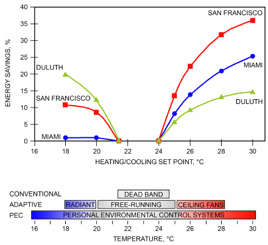

*Fig. 24 Recommended Temperature Set Points for HVAC with PEC Systems and Energy Savings from Extending HVAC Temperature Set Points*

> [Based on Hoyt et al. (2009) and Zhang et al. (2011)]

Hands and wrists may both be heated and cooled by contact with conductive surfaces. Wrist cooling may not require actively cooled surfaces, because the skin is almost always at a higher temperature than surfaces in a normal environment.

Some researchers suggest that a PEC system can be part of an energy-saving strategy (Hoyt et al. 2009; Zhang et al. 2011) by keeping occupants comfortable while allowing the surrounding spaces to be less conditioned (Figure 24). The success of this strategy also depends on the length of time occupants are away from the PEC zone. Once steady state is reached, the change of sensations when moving from a comfortable environment to one less comfortable is much slower than the change on returning to comfortable conditions (Zhang et al. 2010a). For example, 10-min excursions climbing stairs were judged comfortable throughout, despite a 28°C stairwell temperature, whereas 15-min excursions climbing stairs became uncomfortable; occupants judged their status comfortable/acceptable within 30 s of returning to the PEC zone.

### Hot and Humid Environments

Tolerance limits to high temperature vary with the ability to (1) sense temperature, (2) lose heat by regulatory sweating, and (3) move heat from the body core by blood flow to the skin surface, where cooling is the most effective. many interrelating processes are involved in heat stress (Figure 25).

Skin surface temperatures of 46°C trigger pain receptors in the skin; direct contact with metal at this temperature is painful. However, because thermal insulation of the air layer around the skin is high, much higher dry-air temperatures can be tolerated (e.g., 85°C for brief periods in a sauna). For lightly clothed subjects at rest, tolerance times of nearly 50 min have been reported at 82°C db; 33 min at 93°C; 26 min at 104°C; and 24 min at 115°C. In each case, dew points were lower than 30°C. Short exposures to these extremely hot environments are tolerable because of cooling by sweat evaporation. However, when ambient vapor pressure approaches 6.0 kPa (36°C dp, typically found on sweating skin), tolerance is drastically reduced. Temperatures of 50°C can be intolerable if the dew-point temperature is greater than 25°C, and both deep

<!-- str. 211 -->

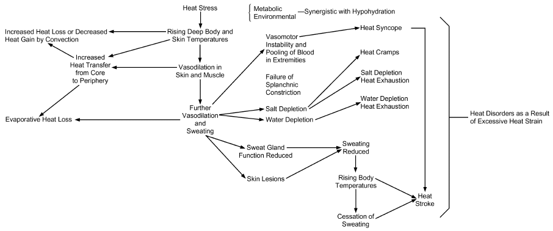

*Fig. 25 Schematic Design of Heat Stress and Heat Disorders*

[Modified by Buskirk (1960) from scale diagram b body temperature and heart rate rise within minutes (Gonzalez et al. 1978).

The rate at which and length of time a body can sweat are limited. The maximum rate of sweating for an average man is about 0.5 g/s. If all this sweat evaporates from the skin surface under conditions of low humidity and air movement, maximum cooling is about 675 W/m<sup>2</sup>. However, because sweat rolls off the skin surface without evaporative cooling or is absorbed by or evaporated within clothing, a more typical cooling limit is 6 met (350 W/m<sup>2</sup>), representing approximately 0.3 g/s (1 L/h) of sweating for the average man.

Thermal equilibrium is maintained by dissipation of resting heat production (1 met) plus any radiant and convective load. If the environment does not limit heat loss from the body during heavy activity, decreasing skin temperature compensates for the core temperature rise. Therefore, mean body temperature is maintained, although the gradient from core to skin is increased. Blood flow through the skin is reduced, but muscle blood flow necessary for exercise is preserved. The upper limit of skin blood flow is about 25 g/s (Burton and Bazett 1936).

Body heat storage of 335 kJ (or a rise in t<sub>b</sub> of 1.4 K) for an average-sized man represents an average voluntary tolerance limit. Continuing work beyond this limit increases the risk of heat exhaustion. Collapse can occur at about 670 kJ of storage (2.8 K rise); few individuals can tolerate heat storage of 920 kJ (3.8 K above normal).

The cardiovascular system affects tolerance limits. In normal, healthy subjects exposed to extreme heat, heart rate and cardiac output increase in an attempt to maintain blood pressure and supply of blood to the brain. At a heart rate of about 180 bpm, the short time between contractions prevents adequate blood supply to the heart chambers. As heart rate continues to increase, cardiac output drops, causing inadequate convective blood exchange with the skin and, perhaps more important, inadequate blood supply to the brain. Victims of this heat exhaustion faint or black out. Accelerated heart rate can also result from inadequate venous return to the heart caused by blood pooling in the skin and lower extremities. In this case, cardiac output is limited because not enough blood is available to refill the heart between beats. This occurs most frequently when an overheated individual, having worked hard in the heat, suddenly stops working. The muscles no longer massage the blood back past the valves in the veins toward the heart. Dehydration compounds the problem by reducing fluid volume in the vascular system.

y Belding (1967) and Leithead and Lind (1964)]

If core temperature t<sub>cr</sub> increases above 41°C, critical hypothalamic proteins can be damaged, resulting in inappropriate vasoconstriction, cessation of sweating, increased heat production by shivering, or some combination of these. Heat stroke damage is frequently irreversible and carries a high risk of death.

Another problem, hyperventilation, occurs mainly in hot/wet conditions, when too much CO<sub>2</sub> is washed from the blood. This can lead to tingling sensations, skin numbness, and vasoconstriction in the brain with occasional loss of consciousness.

Because a rise in heart rate or rectal temperature is essentially linear with ambient vapor pressure above a dew point of 25°C, these two changes can measure severe heat stress. Although individual heart rate and rectal temperature responses to mild heat stress vary, severe heat stress saturates physiological regulating systems, producing uniform increases in heart rate and rectal temperature. In contrast, sweat production measures stress under milder conditions but becomes less useful under more severe stress. The maximal sweat rate compatible with body cooling varies with (1) degree of heat acclimatization, (2) duration of sweating, and (3) whether the sweat evaporates or merely saturates the skin and drips off. Total sweat rates over 2 L/h can occur in short exposures, but about 1 L/h is an average maximum sustainable level for an acclimatized man.

Figure 26 shows the decline in heart rate, rectal temperature, and skin temperature when exercising subjects are exposed to 40°C over a period of days. Acclimatization can be achieved by working in the heat for 100 min each day: 30% improvement occurs after the first day, 50% after 3 days, and 95% after 6 or 7 days. Increased sweat secretion while working in the heat can be induced by rest. Although reducing salt intake during the first few days in the heat can conserve sodium, heat cramps may result. Working regularly in the heat improves cardiovascular efficiency, sweat secretion, and sodium conservation. Once induced, heat acclimatization can be maintained by as little as one workout a week in the heat; otherwise, it diminishes slowly over a 2- to 3-week period and disappears.

### Extremely Cold Environments

Human performance in extreme cold ultimately depends on maintaining thermal balance. Subjective discomfort is reported by a 70 kg man with 1.8 m<sup>2</sup> of body surface area when a heat debt of about 104 kJ is incurred. A heat debt of about 630 kJ is acutely

<!-- str. 212 -->

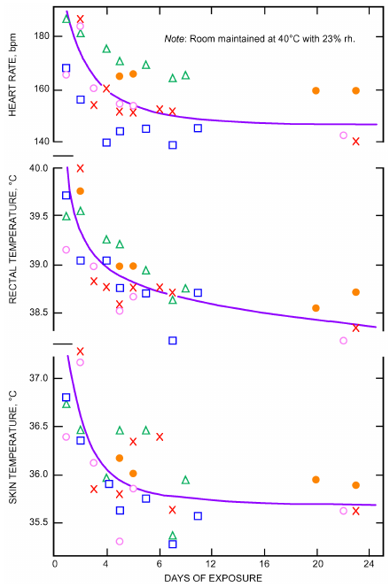

*Fig. 26 Acclimatization to Heat Resulting from Daily Exposure of Five Subjects to Extremely Hot Room*

> (Robinson et al. 1943)

uncomfortable; this represents a drop of approximately 2.6 K (or about 7% of total heat content) in mean body temperature.

This loss can occur during 1 to 2 h of sedentary activity outdoors. A sleeping individual will wake after losing about 314 kJ, decreasing mean skin temperature by about 3 K and deep body temperature by about 0.5 K. A drop in deep body temperature (e.g., rectal temperature) below 35°C threatens a loss of body temperature regulation, and 28°C is considered critical for survival, despite recorded survival from a deep body temperature of 18°C.

Activity level also affects human performance. Subjective sensations reported by sedentary subjects at a mean skin temperature of 33.3°C are comfortable; at 31°C, uncomfortably cold; at 30°C, shivering cold; and at 29°C, extremely cold. The critical subjective tolerance limit (without numbing) for mean skin temperature appears to be about 25°C. However, during moderate to heavy activity, subjects reported the same skin temperatures as comfortable. Although mean skin temperature is significant, the temperature of the extremities is more frequently the critical factor for comfort in the cold. Consistent with this, one of the first responses to cold exposure is vasoconstriction, which reduces circulatory heat input to the hands and feet. A hand-skin temperature of 20°C causes a report of uncomfortably cold; 15°C, extremely cold; and 5°C, painful. Identical verbal responses for the foot surface occur at approximately 1.5 to 2 K warmer temperatures.

An ambient temperature of −35°C is the lower limit for useful outdoor activity, even with adequate insulative clothing. At −50°C, almost all outdoor effort becomes exceedingly difficult; even with appropriate protective equipment, only limited exposure is possible. Reported exposures of 30 min at −75°C have occurred in the Antarctic without injury.

In response to extreme heat loss, maximal heat production becomes very important. When the less-efficient vasoconstriction cannot prevent body heat loss, shivering is an automatic, more efficient defense against cold. This can be triggered by low deep body temperature, low skin temperature, rapid change of skin temperature, or some combination of all three. Shivering is usually preceded by an imperceptible increase in muscle tension and by noticeable gooseflesh produced by muscle contraction in the skin. It begins slowly in small muscle groups, initially increasing total heat production by 1.5 to 2 times resting levels. As body cooling increases, the reaction spreads to additional body segments. Ultimately violent, whole-body shivering causes maximum heat production of about 6 times resting levels, rendering the individual totally ineffective.

Given sufficient cold exposure, the body undergoes changes that indicate cold acclimatization. These physiological changes include (1) endocrine changes (e.g., sensitivity to norepinephrine), causing nonshivering heat production by metabolism of free fatty acids released from adipose tissue; (2) improved circulatory heat flow to skin, causing an overall sensation of greater comfort; and (3) improved circulatory heat flow to the extremities, reducing the risk of injury and allowing activities at what ordinarily would be severely uncomfortable temperatures in the extremities. Generally, these physiological changes are minor and are induced only by repeated extreme exposures. Nonphysiological factors, including training, experience, and selection of adequate protective clothing, are more useful and may be safer than dependence on physiological changes.

Food energy intake requirements for adequately clothed subjects in extreme cold are only slightly greater than those for subjects living and working in temperate climates. This greater requirement results from added work caused by (1) carrying the weight of heavy clothing (energy cost for heavy protective footwear may be six times that of an equivalent weight on the torso); and (2) the inefficiency of walking in snow, snowshoeing, or skiing, which can increase energy cost up to 300%.

To achieve proper protection in low temperatures, a person must either maintain high metabolic heat production by activity or reduce heat loss by controlling the body’s microclimate with clothing. Other protective measures include spot radiant heating, showers of hot air for work at a fixed site, and warm-air-ventilated or electrically heated clothing. Extremities (e.g., fingers and toes) are at greater risk than the torso because, as thin cylinders, they are particularly susceptible to heat loss and difficult to insulate without increasing the surface for heat loss. Vasoconstriction can reduce circulatory heat input to extremities by over 90%.

Although there is no ideal insulating material for protective clothing, radiation-reflective materials are promising. Insulation is primarily a function of clothing thickness; the thickness of trapped air, rather than fibers used, determines insulation effectiveness.

Protection for the respiratory tract seems unnecessary in healthy individuals, even at −45°C. However, asthmatics or individuals with mild cardiovascular problems may benefit from a face mask that warms inspired air. Masks are unnecessary for protecting the face because heat to facial skin is not reduced by local vasoconstriction, as it is for hands. If wind chill is great, there is always a risk of cold injury caused by freezing of exposed skin. Using properly designed torso clothing, such as a parka with a fur-lined hood to minimize wind penetration to the face, and 10 W of auxiliary heat to each hand and foot, inactive people can tolerate −55°C with a 16 km/h wind for more than 6 h. As long as the skin temperature of fingers remains above 15°C, manual dexterity can be maintained and useful work performed without difficulty.

<!-- str. 213 -->

## 12. SYMBOLS

A = area, m<sup>2</sup>

BFN = neutral skin blood flow, g/(m<sup>2</sup>·s)

c = specific heat, J/(kg·K)

c<sub>dil</sub> = specific heat (constant) for skin blood flow c<sub>sw</sub> = proportionality constant for sweat control, 170 W/(m<sup>2</sup>·K)

C = convective heat loss, W/m<sup>2</sup>

*C + R* = total sensible heat loss from skin, W/m<sup>2</sup>

DISC = thermal discomfort

E = evaporative heat loss, W/m<sup>2</sup>

ERF = effective radiant field, W/m<sup>2</sup>

ET* = effective temperature based on 50% rh, °C f<sub>cl</sub> = clothing area factor, A<sub>cl</sub>/A<sub>D</sub>, dimensionless

F = thermal efficiency, or angle factor h = enthalpy, kJ/kg (dry air), or heat transfer coefficient, W/(m<sup>2</sup>·K) HSI = heat stress index i = vapor permeation efficiency, dimensionless

I = thermal resistance in clo units, clo

J = irradiance, W/m<sup>2</sup> k = thermal conductivity of body tissue, W/(m·K

K = effective conductance between core and skin, W/(m<sup>2</sup>·K)

K<sub>res</sub> = proportionality constant, 1.43 kg/kJ l = height, m

L = thermal load on body, W/m<sup>2</sup>

LR = Lewis ratio, K/kPa m = mass, kg ṁ = mass flow, kg/(s·m<sup>2</sup>)

M = metabolic heat production, W/m<sup>2</sup> p = water vapor pressure, kPa

PD = percent dissatisfied

PMV = predicted mean vote

PPD = predicted percent dissatisfied q = heat flow, W/m<sup>2</sup>

Q = volume rate, m<sup>3</sup>/h, or volume flow rate of blood per unit surface area, L/(h·m<sup>2</sup>)

R = thermal resistance, (m<sup>2</sup>·K)/W, or radiative heat loss from skin, W/m<sup>2</sup>

RQ = respiratory quotient, dimensionless

S = heat storage, W/m<sup>2</sup>

SET* = standard effective temperature, °C

SkBF = skin blood flow, g/(m<sup>2</sup>·s)

t = temperature, °C t<sub>r</sub> = mean temperature, °C

T = absolute temperature, K

TSENS = thermal sensation

Tu = turbulence intensity, %

V = air velocity, m/s

V<sub>sd</sub> = standard deviation of velocity measured with omnidirectional anemometer with 0.2 s time constant w = skin wettedness, dimensionless

W = external work accomplished, W/m<sup>2</sup>, or humidity ratio of air, kg (water vapor)/kg (dry air)

WBGT = wet-bulb globe temperature, °C

WCI = wind chill index, W/m<sup>2</sup>

WGT = wet-globe temperature, °C x<sub>f</sub> = fabric thickness, mm

### Greek

α = skin absorptance, dimensionless

ε = emissivity, dimensionless

η<sub>ev</sub> = evaporative efficiency, dimensionless

θ = time, s

μ = mechanical efficiency of body = W/M, dimensionless

μ<sub>T</sub> = mean space temperature, °C

ν = unsolicited thermal complaint rate, complaints/(h·zone area) ρ = density, kg/m<sup>3</sup>

ρ<sub>bl</sub> = density of blood, 1.06 kg/L

σ = Stefan-Boltzmann constant = 5.67 × 10<sup>–8</sup> W/(m<sup>2</sup>·K<sup>4</sup>)

σ<sub>T</sub> = standard deviation of space temperature, K

σ<sub>T</sub>·<sub>H</sub>,σ<sub>T</sub>·<sub>L</sub> = standard deviation of rate of change of high and low space

> temperature, K/h

### Superscripts and Subscripts

′ = overall, net a = ambient air act = activity b = of body tissue

B = building b,c = lower limit for evaporative regulation zone b,h = upper limit for evaporative regulation zone bl = of blood c = convection, or comfort cc = corrected convection value ch = between chair and body cl = of clothed body or clothing cle = of clothing, effective clu,i = effective insulation of garment i com = combined cr = body core cr,sk = from core to skin

D = DuBois value db = dry bulb dif = due to moisture diffusion through skin dil = skin blood flow dp = dew point dry = sensible e = evaporative, at surface ec = at surface, corrected eq,wc = equivalent wind chill evap = latent ex = exhaled air fg = vaporization of water g = globe

G = covered by garment ge = gas exchange h = too hot l = too cold m = total max = maximum m – j = from person to source j

N = of surface N nwb = naturally ventilated wet bulb o = operative oc = operative comfort oh = humid operation out = monthly mean outside p = at constant pressure pcl = permeation p – N = between person and source N pr = plane radiant r = radiation, radiant req = required res = respiration rsw = regulatory sweat s = saturated sf = final skin shiv = shivering si = initial skin sk = skin sw = sweat t = atmospheric, or total tr = constriction constant for skin blood flow wb = wet bulb w,res = respiratory water loss

### CODES AND STANDARDS

ASHRAE. 2013. Thermal environmental conditions for human occupancy.

ANSI/ASHRAE Standard 55-2013.

ISO. 1989. Hot environments—Estimation of the heat stress on working man, based on the WBGT-index (wet bulb globe temperature). Standard 7243. International Organization for Standardization, Geneva.

<!-- str. 214 -->

ISO. 2005. Ergonomics of the thermal environment—Analytical determination and interpretation of thermal comfort using calculation of the PMV and PPD indices and local thermal comfort criteria. Standard 7730. International Organization for Standardization, Geneva.

ISO. 2004. Ergonomics of the thermal environment—Analytical determination and interpretation of heat stress using calculation of the predicted heat strain. Standard 7933. International Organization for Standardization, Geneva.

ISO. 2010. Ergonomics of the thermal environment—Estimation of thermal insulation and water vapour resistance of a clothing ensemble. Standard 9920 (R2010). International Organization for Standardization, Geneva.

## REFERENCES

ASHRAE members can access ASHRAE Journal articles and ASHRAE research project final reports at technologyportal .ashrae.org. Articles and reports are also available for purchase by nonmembers in the online ASHRAE Bookstore at www.ashrae.org /bookstore.

Al-ajmi, F.F., D.L. Loveday, K.H. Bedwell, and G. Havenith. 2008. Thermal insulation and clothing area factors of typical Arabian Gulf clothing ensembles for males and females: measurements using thermal manikins. Applied Ergonomics 39(3):407-414.

Amai, H., S. Tanabe, T. Akimoto, and T. Genma. 2007. Thermal sensation and comfort with different task conditioning systems. *Building and Envi-* ronment 42(12):3955-3964.

Arens, E., H. Zhang, and C. Huizenga. 2006. Partial- and whole body thermal sensation and comfort, part I: Uniform environmental conditions. *Journal of Thermal Biology* 31:53-59.

Arens, E., H. Zhang, D. Kim, E. Buchberger, F. Bauman, C. Huizenga, and H. Higuchi. 2008. Impact of a task-ambient ventilation system on perceived air quality. *Proceedings of Indoor Air 2008*, Copenhagen.

Arens, E., S. Turner, H. Zhang, and G. Paliaga. 2009. Moving air for comfort. ASHRAE Journal 51(5):18-29.

Arens, E., H. Zhang, and W. Pasut. 2011. Thermal comfort and perceived air quality of a PEC system. *Proceedings of Indoor Air 2011*, Austin.

Astrand, P., and K. Rodahl. 1977. *Textbook of work physiology: Physiolog-* *ical bases of exercise*. McGraw-Hill, New York.

Azer, N.Z. 1982. Design guidelines for spot cooling systems: Part I—Assessing the acceptability of the environment. ASHRAE Transactions 88:1.

Azer, N.Z. and S. Hsu. 1977. OSHA heat stress standards and the WBGT index. ASHRAE Transactions 83(2):30.

Bauman, F.S., T.G. Carter, A.V. Baughman, and E. Arens. 1998. Field study of the impact of a desktop task/ambient conditioning system in office buildings. ASHRAE Transactions 104(1A).

Belding, H.D. 1967. Heat stress. In Thermobiology, A.H. Rose, ed. Academic Press, New York.

Belding, H.S. 1970. The search for a universal heat stress index. In Physio-*logical and behavioral temperature regulation*, J.D. Hardy, A.P. Gagge, and J.A.J. Stolwijk, eds. Springfield, IL.

Belding, H.S., and T.F. Hatch. 1955. Index for evaluating heat stress in terms of resulting physiological strains. *Heating, Piping and Air Conditioning* 207:239.

Berglund, L.G. 1994. Common elements in the design and operation of thermal comfort and ventilation systems. ASHRAE Transactions 100(1):776-781.

Berglund, L.G. 1995. Comfort criteria: Humidity and standards. Proceed-*ings of Pan Pacific Symposium on Building and Urban Environmental* *Conditioning in Asia* vol. 2, pp. 369-382. University of Nagoya, Japan.

Berglund, L.G., and D.J. Cunningham. 1986. Parameters of human discomfort in warm environments. ASHRAE Transactions 92(2):732-746.

Berglund, L.G., and A. Fobelets. 1987. A subjective human response to low level air currents and asymmetric radiation. ASHRAE Transactions 93(1): 497-523.

Berglund, L.G., and R.R. Gonzalez. 1977. Evaporation of sweat from sedentary man in humid environments. *Journal of Applied Physiology* 42(5):767-772.

Berglund, L., R. Gonzales, and A. Gagge. 1990. Predicted human performance decrement from thermal discomfort and ET*. Proceedings of *Indoor Air ’90*, Toronto, vol. 1, pp. 215-220.

Botsford, J.H. 1971. A wet globe thermometer for environmental heat measurement. *American Industrial Hygiene Association Journal* 32:1-10.

Burton, A.C., and H.C. Bazett. 1936. A study of the average temperature of the tissues, the exchange of heat and vasomotor responses in man, by a bath calorimeter. *American Journal of Physiology* 117:36.

Busch, J.F. 1992. A tale of two populations: Thermal comfort in air-conditioned and naturally ventilated offices in Thailand. Energy and Buildings 18:235-249.

Buskirk, E.R. 1960. Problems related to the caloric cost of living. Bulletin of *the New York Academy of Medicine* 26:365.

Chatonnet, J., and M. Cabanac. 1965. The perception of thermal comfort.

*International Journal of Biometeorology* 9:183-193.

Colin, J., and Y. Houdas. 1967. Experimental determination of coefficient of heat exchange by convection of the human body. *Journal of Applied* Physiology 22:31.

Collins, K.J., and E. Hoinville. 1980. Temperature requirements in old age.

*Building Services Engineering Research and Technology* 1(4):165-172. Davis, W.J. 1976. Typical WBGT indexes in various industrial environments. ASHRAE Transactions 82(2):303.

de Dear, R.J., and G.S. Brager. 1998. Developing an adaptive model of thermal comfort and preference. *ASHRAE Technical Data Bulletin* 14(1):27-49.

de Dear, R., K. Leow, and A. Ameen. 1991. Thermal comfort in the humid tropics—Part I. ASHRAE Transactions 97(1):874-879.

DuBois, D., and E.F. DuBois. 1916. A formula to estimate approximate surface area, if height and weight are known. *Archives of Internal Medicine* 17:863-871.

Dukes-Dobos, F., and A. Henschel. 1971. The modification of the WBGT index for establishing permissible heat exposure limits in occupational work. HEW/USPHE/NIOSH Report TR-69.

Dukes-Dobos, F., and A. Henschel. 1973. Development of permissible heat exposure limits for occupational work. ASHRAE Journal 9:57.

Dygert, R.K., and T.Q. Dang. 2012. Experimental validation of local exhaust strategies for improved IAQ in aircraft cabins. *Building and Environment* 47:76-88.

Eriksson, H.A. 1975. Heating and ventilating of tractor cabs. Presented at the 1975 Winter Meeting, American Society of Agricultural Engineers, Chicago.

Fanger, P.O. 1967. Calculation of thermal comfort: Introduction of a basic comfort equation. ASHRAE Transactions 73(2):III.4.1.

Fanger, P.O. 1970. *Thermal comfort analysis and applications in environ-* mental engineering. McGraw-Hill, New York.

Fanger, P.O. 1972. Thermal comfort. McGraw-Hill, New York.

Fanger, P.O. 1973. The variability of man’s preferred ambient temperature from day to day. *Archives des Sciences Physiologiques* 27(4):A403.

Fanger, P.O. 1982. *Thermal comfort: Analysis and applications in environ-* mental engineering. Robert E. Krieger, Malabar, FL.

Fanger, P.O., and N.K. Christensen. 1986. Perception of draught in ventilated spaces. Ergonomics 29(2):215-235.

Fanger, P.O., and G. Langkilde. 1975. Interindividual differences in ambient temperature preferred by seated persons. ASHRAE Transactions 81(2): 140-147.

Fanger, P.O., J. Hojbjerre, and J.O.B. Thomsen. 1973. Man’s preferred ambient temperature during the day. *Archives des Sciences Physiologiques* 27(4):A395-A402.

Fanger, P.O., J. Hojbjerre, and J.O.B. Thomsen. 1974. Thermal comfort conditions in the morning and the evening. *International Journal of Biome-* teorology 18(1):16.

Fanger, P.O., L. Banhidi, B.W. Olesen, and G. Langkilde. 1980. Comfort limits for heated ceilings. ASHRAE Transactions 86(1):141-156.

Fanger, P.O., B.M. Ipsen, G. Langkilde, B.W. Olesen, N.K. Christensen, and S. Tanabe. 1985. Comfort limits for asymmetric thermal radiation. En-*ergy and Buildings*.

Fanger, P.O., A.K. Melikov, H. Hanzawa, and J. Ring. 1989. Turbulence and draft. ASHRAE Journal 31(4):18-25.

Federspiel, C.C. 1998. Statistical analysis of unsolicited thermal sensation complaints in commercial buildings. ASHRAE Transactions 104(1): 912-923.

Federspiel, C.C. 2001. Estimating the frequency and cost of responding to building complaints. In *Indoor air quality handbook*, J. Spengler, J.M. Sammet, and J.F. McCarthy, eds. McGraw-Hill.

Federspiel, C., G. Liu, M. Lahiff, D. Faulkner, D. Dibartolomeo, W. Fisk, P.

Price, and D. Sullivan. 2002. Worker performance and ventilation: Analysis of individual data for call-center workers. *Proceedings of Indoor Air* 2002, pp. 796-801.

<!-- str. 215 -->

Federspiel, C.C., R. Martin, and H. Yan. 2003. Thermal comfort models and “call-out” (complaint) frequencies. ASHRAE Research Project RP-1129, Final Report.

Fiala, D. 1998. *Dynamic simulation of human heat transfer and thermal* comfort. Ph.D. dissertation, Institute of Energy and Sustainable Development, DeMontfort University, Leicester, UK.

Fiala, D., K. Lomas, and M. Stohrer. 2003. First principles modeling of thermal sensation responses in steady state and transient boundary conditions. ASHRAE Transactions 109(1):179-186.

Fobelets, A.P.R., and A.P. Gagge. 1988. Rationalization of the ET* as a measure of the enthalpy of the human environment. ASHRAE Transactions 94:1.

Gagge, A.P. 1937. A new physiological variable associated with sensible and insensible perspiration. *American Journal of Physiology* 20(2):277-287.

Gagge, A.P., and J.D. Hardy. 1967. Thermal radiation exchange of the human by partitional calorimetry. *Journal of Applied Physiology* 23(2): 248-258.

Gagge, A.P., G.M. Rapp, and J.D. Hardy. 1967a. The effective radiant field and operative temperature necessary for comfort with radiant heating. ASHRAE Transactions 73(1):I.2.1.

Gagge, A.P., G.M. Rapp, and J.D. Hardy. 1967b. The effective radiant field and operative temperature necessary for comfort with radiant heating. ASHRAE Journal 9(5):63.

Gagge, A.P., J.A.J. Stolwijk, and B. Saltin. 1969a. Comfort and thermal sensation and associated physiological responses during exercise at various ambient temperatures. Environmental Research 2:209.

Gagge, A.P., J.A.J. Stolwijk, and Y. Nishi. 1969b. The prediction of thermal comfort when thermal equilibrium is maintained by sweating. ASHRAE Transactions 75(2):108.

Gagge, A.P., J. Stolwijk, and Y. Nishi. 1971a. An effective temperature scale based on a simple model of human physiological regulatory response. ASHRAE Transactions 77(1):247-262.

Gagge, A.P., A.C. Burton, and H.D. Bazett. 1971b. A practical system of units for the description of heat exchange of man with his environment. Science 94:428-430.

Gagge, A.P., Y. Nishi, and R.G. Nevins. 1976. The role of clothing in meeting FEA energy conservation guidelines. ASHRAE Transactions 82(2):234.

Gagge, A.P., A.P. Fobelets, and L.G. Berglund. 1986. A standard predictive index of human response to the thermal environment. ASHRAE Transactions 92(2B).

Gonzalez, R.R. 1975. Effects of ambient temperature and humidity on human performance. *Special Technical Report* 4. John B. Pierce Foundation Laboratory, New Haven, CT.

Gonzalez, R.R., L.G. Berglund, and A.P. Gagge. 1978. Indices of thermoregulatory strain for moderate exercise in the heat. *Journal of Applied* Physiology 44(6):889-899.

Gordon, R.G. 1974. *The responses of human thermoregulatory system in the* cold. PhD dissertation, University of California–Santa Barbara.

Green, G.H. 1982. Positive and negative effects of building humidification.

ASHRAE Transactions 88(1):1049-1061.

Griffiths, T., and D. McIntyre. 1975. The effect of mental effect on subjective assessments on warmth. Ergonomics 18(1):29-32.

Gwosdow, A.R., J.C. Stevens, L. Berglund, and J.A.J. Stolwijk. 1986. Skin friction and fabric sensations in neutral and warm environments. Textile Research Journal 56:574-580.

Hardy, J.D. 1949. Heat transfer. In *Physiology of heat regulation and science* of clothing, L.H. Newburgh, ed. W.B. Saunders, London.

Hardy, J.D. 1961. Physiological effects of high intensity infrared heating.

ASHRAE Journal 4:11.

Hardy, J.D., H.G. Wolf, and H. Goodell. 1952. *Pain sensations and reac-* tions. Williams and Wilkins, Baltimore.

Hardy, J.D., J.A.J. Stolwijk, and A.P. Gagge. 1971. Man. In Comparative *physiology of thermoregulation*, Chapter 5. Charles C. Thomas, Springfield, IL.

Havenith, G., and Nilsson H. 2004. Correction of clothing insulation for movement and wind effects, a meta-analysis. *European Journal of* Applied Physiology 92:636–640.

Havenith, G., D. Fiala, K. Błazejczyk, M. Richards, P. Bröde, I. Holmér, H.

Rintamaki, Y. Benshabat, and G. Jendritzky. 2012. The UTCI-clothing model. *International Journal of Biometeorology* 56(3):461-470.

Havenith, G., K. Kuklane, J. Fan, S. Hodder, Y. Ouzzahra, K. Lundgren, Y.

Au, and D. Loveday. 2015. A database of static clothing thermal insulation and vapor permeability values of non-Western ensembles for use in ASHRAE Standard 55, ISO 7730, and ISO 9920. ASHRAE Transactions 121(1).

Hensel, H. 1973. Temperature reception and thermal comfort. Archives des Sciences Physiologiques 27:A359-A370.

Hensel, H. 1981. *Thermoreception and temperature regulation*. Academic Press, London.

Hodder, S.G., D.L. Loveday, K.C. Parsons, and A.H. Taki. 1998. Thermal comfort in chilled ceiling and displacement ventilation environments: Vertical radiant temperature asymmetry effects. *Energy and Buildings* 27:167-173.

Holmér, I. 1984. Required clothing insulation (IREQ) as an analytical index of cold stress. ASHRAE Transactions 90(1B):1116-1128.

Houghten, F.C., and C.P. Yaglou. 1923. ASHVE Research Report 673.

ASHVE Transactions 29:361.

Hoyt, T., H.L. Kwang, H. Zhang, E. Arens, and T. Webster. 2009. Energy savings from extended air temperature setpoints and reductions in room air mixing. *Proceedings of the International Conference on Environmen-* *tal Ergonomics 2009*, August.

Huizenga, C., H. Zhang, and E. Arens. 2001. A model of human physiology and comfort for assessing complex thermal environments. Building and Environment 36(6):691-699.

Humphreys, M., and J.F. Nicol. 1998. Understanding the adaptive approach to thermal comfort. *ASHRAE Technical Data Bulletin* 14(1):1-14.

Jones, B.W., K. Hsieh, and M. Hashinaga. 1986. The effect of air velocity on thermal comfort at moderate activity levels. ASHRAE Transactions 92:2.

Korsgaard, V. 1949. Necessity of using a directional mean radiant temperature to describe thermal conditions in rooms. *Heating, Piping and Air* Conditioning 21(6):117-120.

Kraning, K., and R. Gonzalez. 1997. A mechanistic computer simulation of human work in heat that accounts for physical and physiological effects of clothing, aerobic fitness, and progressive dehydration. Journal of Thermal Biology 22:331-342.

Kuno, S. 1995. Comfort and pleasantness. In *Proceedings of Pan Pacific* *Symposium on Building and Urban Environmental Conditioning in Asia*, 2:383-392. University of Nagoya, Japan.

Langkilde, G. 1979. Thermal comfort for people of high age. In Confort *thermique: Aspects physiologiques et psychologiques*, INSERM, Paris 75:187-93.

Leithead, C.S., and A.R. Lind. 1964. *Heat stress and heat disorders*. Cassell & Co., London.

Levin, H. 1995. Preface. *Proceedings, Indoor Environment and Productivity* Workshop, Atlanta. H. Levin, ed. ASHRAE.

Link, J., and R. Pepler. 1970. Associated fluctuations in daily temperature, productivity and absenteeism (RP-57). ASHRAE Transactions 76(2): 326-337.

Lipkin, M. and J.D. Hardy 1954. Measurement of some thermal properties of human tissues. *Journal of Applied Physiology* 7:212.

Liviana, J.E., F.H. Rohles, and O.D. Bullock. 1988. Humidity, comfort and contact lenses. ASHRAE Transactions 94(1):3-11.

Loveday, D.L., K.C. Parsons, A.H. Taki, S.G. Hodder, and L.D. Jeal. 1998.

Designing for thermal comfort in combined chilled ceiling/displacement ventilation environments. ASHRAE Transactions 104(1).

Matthew, W.H., G.J. Thomas, L.E. Armstrong, P.C. Szlyk, and I.V. Sils.

1986. Botsball (WGT) performance characteristics and their impact on the implementation of existing military hot weather doctrine. U.S. Army Reserves Institute of Environmental Medicine Technical Report T 9/86, April.

McCartney, K.J., and M.A. Humphreys. 2002. Thermal comfort and productivity. *Proceedings of Indoor Air 2002*, pp. 822-827.

McCullough, E.A. 1986. An insulation data base for military clothing. Institute for Environmental Research Report 86-01, Kansas State University, Manhattan.

McCullough, E.A., and S. Hong. 1994. A data base for determining the decrease in clothing insulation due to body motion. ASHRAE Transactions 100(1):765.

McCullough, E.A., and B.W. Jones. 1984. A comprehensive data base for estimating clothing insulation. IER Technical Report 84-01, Institute for Environmental Research, Kansas State University, Manhattan. ASHRAE Research Project RP-411, Final Report.

<!-- str. 216 -->

McCullough, E.A., B.W. Jones, and T. Tamura. 1989. A data base for determining the evaporative resistance of clothing. ASHRAE Transactions 95(2).

McCullough, E.A., B.W. Olesen, and S.W. Hong. 1994. Thermal insulation provided by chairs. ASHRAE Transactions 100(1):795-802.

McCutchan, J.W., and C.L. Taylor. 1951. Respiratory heat exchange with varying temperature and humidity of inspired air. *Journal of Applied* Physiology 4:121-135.

McIntyre, D.A. 1974. The thermal radiation field. Building Science 9:247-262.

McIntyre, D.A. 1977. Overhead radiation and comfort. *The Building Ser-* vices Engineer 44:226-232.

McIntyre, D.A., and I.D. Griffiths. 1975. The effects of uniform and asymmetric thermal radiation on comfort. *CLIMA 2000, 6th International* *Congress of Climatritics*, Milan.

McNair, H.P. 1973. A preliminary study of the subjective effects of vertical air temperature gradients. British Gas Corporation Report WH/T/R&D/73/94, London.

McNair, H.P., and D.S. Fishman. 1974. A further study of the subjective effects of vertical air temperature gradients. British Gas Corporation Report WH/T/R&D/73/94, London.

McNall, P.E., Jr., and R.E. Biddison. 1970. Thermal and comfort sensations of sedentary persons exposed to asymmetric radiant fields. ASHRAE Transactions 76(1):123.

McNall, P.E., P.W. Ryan, and J. Jaax. 1968. Seasonal variation in comfort conditions for college-age persons in the Middle West. ASHRAE Transactions 74(1):IV.2.1-9.

Melikov, A.K. 2003. Personalized ventilation. Indoor Air 14:157-167. Melikov, A.K., V.S. Lyubenova, M. Skwarczynski, and J. Kaczmarczyk.

2011. Impact of air temperature, relative humidity, air movement and pollution on eye blinking. *Proceedings of Indoor Air 2011*, Austin. Mitchell, D. 1974. Convective heat transfer in man and other animals. In *Heat loss from animals and man*, J.L. Monteith and L.E. Mount, eds. Butterworth Publishing, London.

Nevins, R.G., and A.M. Feyerherm. 1967. Effect of floor surface temperature on comfort: Part IV, Cold floors. ASHRAE Transactions 73(2):III.2.1.

Nevins, R.G., and A.O. Flinner. 1958. Effect of heated-floor temperatures on comfort. ASHRAE Transactions 64:175.

Nevins, R.G., K.B. Michaels, and A.M. Feyerherm. 1964. The effect of floor surface temperature on comfort: Part 1, college age males; Part II, college age females. ASHRAE Transactions 70:29.

Nevins, R.G., F.H. Rohles, Jr., W.E. Springer, and A.M. Feyerherm. 1966.

Temperature-humidity chart for thermal comfort of seated persons. ASHRAE Transactions 72(1):283.

Nevins, R.G., R.R. Gonzalez, Y. Nishi, and A.P. Gagge. 1975. Effect of changes in ambient temperature and level of humidity on comfort and thermal sensations. ASHRAE Transactions 81(2).

Nicol, J.F., and M.A. Humphreys. 1972. Thermal comfort as part of a selfregulating system. *Proceedings of CIB Symposium on Thermal Comfort,* Building Research Station, London.

Niemelä, R., J. Railio, M. Hannula, S. Rautio, and K. Reijula. 2001. Assessing the effect of indoor environment on productivity. Proceedings of *CLIMA 2000 (CD-ROM)*, Napoli.

Nilsson, H.O. 2007. Thermal comfort evaluation with virtual manikin methods. *Building and Environment* 42:4000–4005.

NIOSH. 1986. Criteria for a recommended standard—Occupational exposure to hot environments, revised criteria. U.S. Dept. of Health and Human Services, USDHHS (NIOSH) Publication 86-113. Available from www.cdc.gov/NIOSH/docs/86-113/86-113.pdf.

Nishi, Y. 1981. Measurement of thermal balance of man. In Bioengineering *Thermal Physiology and Comfort*, K. Cena and J.A. Clark, eds. Elsevier New York.

Nishi, Y., and A.P. Gagge. 1970. Direct evaluation of convective heat transfer coefficient by naphthalene sublimation. *Journal of Applied Physiol-* ogy 29:830.

Nishi, Y., R.R. Gonzalez, and A.P. Gagge. 1975. Direct measurement of clothing heat transfer properties during sensible and insensible heat exchange with thermal environment. ASHRAE Transactions 81(2):183.

Nishihara, N., and S. Tanabe. 2011. Effect of individual control of air flow from task fan on task performance, fatigue and cerebral blood flow. Pro-*ceedings of Indoor Air 2011*, Austin.

Olesen, B.W. 1977a. Thermal comfort requirements for floors. In Proceed-*ings of Commissions B1, B2, E1 of the IIR*, Belgrade, 337-343.

Olesen, B.W. 1977b. Thermal comfort requirements for floors occupied by people with bare feet. ASHRAE Transactions 83(2).

Olesen, B.W. 1985. A new and simpler method for estimating the thermal insulation of a clothing ensemble. ASHRAE Transactions 91(2).

Olesen, B.W., and R. Nielsen. 1983. *Thermal insulation of clothing mea-* *sured on a moveable manikin and on human subjects*. Technical University of Denmark, Lyngby.

Olesen, S., J.J. Bassing, and P.O. Fanger. 1972. Physiological comfort conditions at sixteen combinations of activity, clothing, air velocity and ambient temperature. ASHRAE Transactions 78(2):199.

Olesen, B.W., M. Scholer, and P.O. Fanger. 1979. Vertical air temperature differences and comfort. In Indoor climate, P.O. Fanger and O. Valbjorn, eds. Danish Building Research Institute, Copenhagen.

Olesen, B.W., E. Sliwinska, T.L. Madsen, and P.O. Fanger. 1982. Effect of posture and activity on the thermal insulation of clothing. Measurement by a movable thermal manikin. ASHRAE Transactions 82(2):791-805.

Onkaram, B., L. Stroschein, and R.F. Goldman. 1980. Three instruments for assessment of WBGT and a comparison with WGT (Botsball). American *Industrial Hygiene Association* 41:634-641.

Oohori, T., L.G. Berglund, and A.P. Gagge. 1984. Comparison of current two-parameter indices of vapor permeation of clothing—As factors governing thermal equilibrium and human comfort. ASHRAE Transactions 90(2).

Ostberg, O., and A.G. McNicholl. 1973. The preferred thermal conditions for “morning” and “evening” types of subjects during day and night—Preliminary results. Build International 6(1):147-157.

Passmore, R., and J.V.G. Durnin. 1967. *Energy, work and leisure.* Heinemann Educational Books, London.

Pepler, R., and R. Warner. 1968. Temperature and learning: An experimental study. ASHRAE Transactions 74(2):211-219.

Rapp, G., and A.P. Gagge. 1967. Configuration factors and comfort design in radiant beam heating of man by high temperature infrared sources. ASHRAE Transactions 73(2):III.1.1.

Robinson, S., E.S. Turrell, H.S. Belding, and S.M. Horvath. 1943. Rapid acclimatization to work in hot climates. *American Journal of Physiology* 140:168-176.

Roelofsen, P. 2001. The design of workplace as a strategy for productivity enhancement. *Proceedings of CLIMA 2000*, Napoli.

Rohles, F.H., Jr. 1973. The revised modal comfort envelope. ASHRAE Transactions 79(2):52.

Rohles, F.H., Jr., and M.A. Johnson. 1972. Thermal comfort in the elderly.

ASHRAE Transactions 78(1):131.

Rohles, F.H., Jr., and R.G. Nevins. 1971. The nature of thermal comfort for sedentary man. ASHRAE Transactions 77(1):239.

Russo, J.S., and H.E. Khalifa. 2011. Surface reactions on the human body:

using personal ventilation to remove squalene oxidation products from the breathing zone with CFD. *Proceedings of Indoor Air 2011*, Austin. Sekhar, S.C., N. Gong, K.W. Tham, K.W. Cheong, A.K. Melikov, D.P.

Wyon, and P.O. Fanger. 2005. Findings of personalised ventilation studies in a hot and humid climate. *International Journal of HVAC&R* Research (now *Science and Technology for the Built Environment*) 11(4):603-620.

Seppänen, O., and W.J. Fisk. 2006. Some quantitative relations between indoor environmental quality and work performance and health. Interna-*tional Journal of HVAC&R Research* (now *Science and Technology for* *the Built Environment*) 12(4):957-973.

Seppänen, O., P.E. McNall, D.M. Munson, and C.H. Sprague. 1972. Thermal insulating values for typical indoor clothing ensembles. ASHRAE Transactions 78(1):120-30.

Seppänen, O., W.J. Fisk, and Q.H. Lei. 2006. Effect of temperature on task performance in office environment. Report LBNL-60946. indoor.lbl.gov /sites/all/files/lbnl-60946.pdf.

Siple, P.A., and C.F. Passel. 1945. Measurements of dry atmospheric cooling in subfreezing temperatures. *Proceedings of the American Philosophical* Society 89:177.

Smith, C.E. 1991. *A transient, three-dimensional model of the human ther-* mal system. PhD dissertation, Kansas State University.

Stolwijk, J.A.J. 1971. A mathematical model of physiological temperature regulation in man. NASA Contractor Report, Yale University School of Medicine.

<!-- str. 217 -->

Stolwijk, J.A.J., and J.D. Hardy. 1966. Partitional calorimetric studies of response of man to thermal transients. *Journal of Applied Physiology* 21:967.

Stolwijk, J.A.J., A.P. Gagge, and B. Saltin. 1968. Physiological factors associated with sweating during exercise. *Journal of Aerospace Medicine* 39:1101.

Sullivan, C.D., and R.L. Gorton. 1976. A method of calculating WBGT from environmental factors. ASHRAE Transactions 82(2):279.

Tanabe, S., and N. Nishihara. 2004. Productivity and fatigue. Indoor Air 14(S-7):126-133.

Tanabe, S., K. Kimura, and T. Hara. 1987. Thermal comfort requirements during the summer season in Japan. ASHRAE Transactions 93(1):564-577.

Tanabe, S.-I., K. Kobayashi, J. Nakano, Y. Ozeki, and M. Konishi. 2002.

Evaluation of thermal comfort using combined multi-node thermoregulation (65MN) and radiation models and computational fluid dynamics (CFD). *Energy and Building* 34(6):637-646.

Tham, K.W., and H.C. Willem. 2005. Temperature and ventilation effects on performance and neurobehavioral-related symptoms of tropically acclimatized call center operators near thermal neutrality. ASHRAE Transactions 111(2):687-698.

Tikusis, P., and G.G. Giesbrecht. 1999. Prediction of shivering heat production from core and mean skin temperatures. *European Journal of Applied* Physiology 79:221-229.

Umbach, K.H. 1980. Measuring the physiological properties of textiles for clothing. Melliand Textilberichte (English edition) G1:543-548.

Wang, X.L. 1994. *Thermal comfort and sensation under transient condi-* tions. Doctoral dissertation, Department of Energy Technology, Royal Institute of Technology, Stockholm.

Wang, X.L., and F. Peterson. 1992. Estimating thermal transient comfort.

ASHRAE Transactions 98(1):182-188.

Webb, P. 1964. *Bioastronautics data base*. NASA.

Werner, J., and P. Webb. 1993. A six cylinder model of human thermoregulation for general use on personal computers. *Annals of Physiological* Anthropology 12(3):123-134.

Winslow, C.-E.A., L.P. Herrington, and A.P. Gagge. 1937. Relations between atmospheric conditions, physiological reactions and sensations of pleasantness. *American Journal of Hygiene* 26(1):103-115.

Wissler, E.H. 1964. A mathematical model of the human thermoregulatory system. *Bulletin of Mathematical Biophysics* 26:147-166.

Wissler, E.H. 1985. Mathematical simulation of human thermal behavior using wholebody models. In *Heat transfer in medicine and biology—* *Analysis and applications*, vol. 1, pp. 325-374, A. Shitzer and R.C. Eberhart, eds. Plenum Press, New York.

Wissler, E.H. 1988. A review of human thermal models. In Environmental ergonomics, I.B. Mekjavic, E.W. Banister, and J.B. Morrison, eds. Taylor and Francis, London.

Witterseh, T. 2001. *Environmental perception, SBS symptoms and perfor-* *mance of office work under combined exposure to temperature, noise and* air pollution. Ph.D. dissertation. International Center for Indoor Environment and Energy, Department of Mechanical Engineering, Technical University of Denmark.

Woodcock, A.H. 1962. Moisture transfer in textile systems. Textile Research Journal 8:628-633.

Wyon, D.P. 1996. Individual microclimate control: Required range, probable benefits and current feasibility. *Proceedings of Indoor Air ’96,* Nagoya, Japan, vol. 2, pp. 27-36.

Wyon, D.P., S. Larsson, B. Forsgren, and I. Lundgren. 1989. Standard procedures for assessing vehicle climate with a thermal manikin. SAE Tech-*nical Paper Series* 890049:1-11.

Yang, B., A. Melikov, and S.C. Sekhar. 2009. Performance evaluation of ceiling mounted personalized ventilation system. ASHRAE Transactions 115 (2):395-406.

Yang, B., S.C. Sekhar, and A. Melikov. 2010. Ceiling mounted personalized ventilation system integrated with a secondary air distribution system—A human response study in hot and humid climate. Indoor Air—Interna-*tional Journal of Indoor Environment and Health* 20(4):309-319.

Zhang, H. 2003. *Human thermal sensation and comfort in transient and* *non-uniform thermal environments*. Ph.D. dissertation, University of California, Berkeley.

Zhang, H., E. Arens, C. Huizenga, and T. Han. 2010a. Thermal sensation and comfort models for non-uniform and transient environments: Part I: Local sensation of individual body parts. *Building and Environment* 45(2):380-388.

Zhang, H., E. Arens, C. Huizenga, and T. Han. 2010b. Thermal sensation and comfort models for non-uniform and transient environments: Part II: Local comfort of individual body parts. *Building and Environment*, 45(2):389-398.

Zhang, H., E. Arens, C. Huizenga, and T. Han. 2010c. Thermal sensation and comfort models for non-uniform and transient environments: Part III: Whole-body sensation and comfort. *Building and Environment* 45(2):399-410.

Zhang, H., E. Arens, D. Kim, E. Buchberger, F. Bauman, and C. Huizenga.

2010d. Comfort, perceived air quality, and work performance in a lowpower task-ambient conditioning system. *Building and Environment* 45(1):29-39.

Zhang, H., E. Arens, and W. Pasut. 2011. Air temperature thresholds for indoor comfort and perceived air quality. *Building Research and Infor-* mation 39(2):134-144.

## BIBLIOGRAPHY

Fanger, P.O., A. Melikov, H. Hanzawa, and J. Ring. 1988. Air turbulence and sensation of draught. *Energy and Buildings* 12:21-39.

Kroner, W.M., and J.A. Stark-Martin. 1994. Environmentally responsive workstations and office worker productivity. ASHRAE Transactions 100(2):750-755.

Li, R., S.C. Sekhar, and A. Melikov. 2011. Thermal comfort and indoor air quality in rooms with integrated personalized ventilation and underfloor air distribution systems. HVAC&R Research (now Science and *Technology for the Built Environment*) 17(5):829-846.

Niemelä, R., M. Hannula, S. Rautio, K. Reijula, and J. Railio. 2002. The effect of indoor air temperature on labour productivity in call centers—A case study. *Energy and Buildings* 34:759-764.

REHVA. 2006. Indoor climate and productivity in offices. REHVA Guidebook 6, pp. 29-34. P. Wargocki, and O. Seppänen, eds. Federation of European Heating and Air-Conditioning Associations, Brussels.

Schiavon, S., A. Melikov, and S.C. Sekhar. 2010. Energy analysis of the personalized ventilation system in hot and humid climates. Energy and Buildings 42:699-707.

Witherspoon, J.M., R.F. Goldman, and J.R. Breckenridge. 1971. Heat transfer coefficients of humans in cold water. *Journal de Physiologie* 63:459.

Wyon, D., I. Wyon, and F. Norin. 1996. Effects of moderate heat stress on driver vigilance in a moving vehicle. Ergonomics 39(1):61-75.
