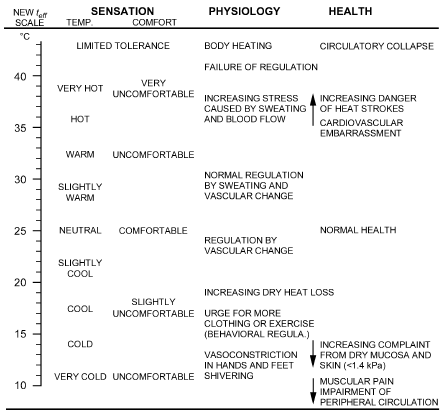
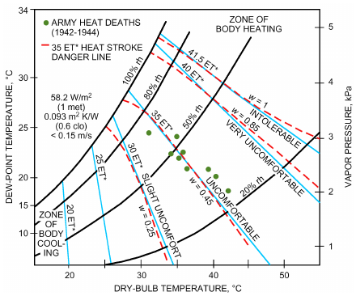
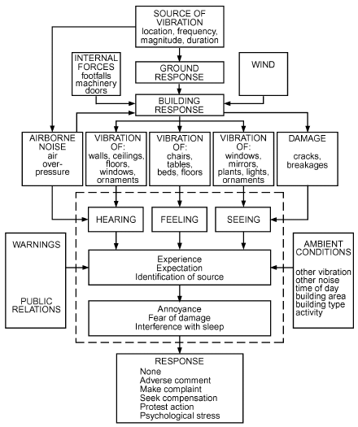
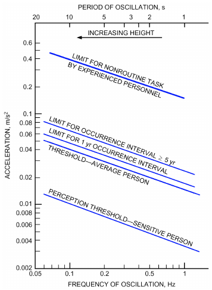
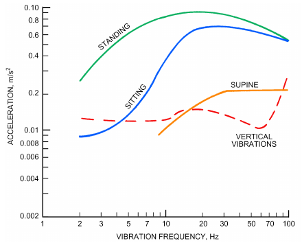
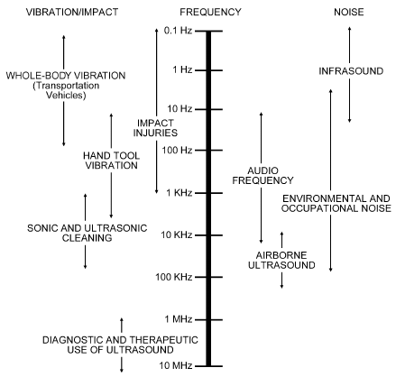
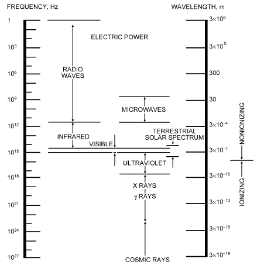
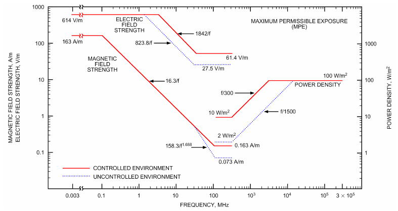

# Chapter 10 — Indoor Environmental Health

*Izvor: 2021 ASHRAE Handbook — Fundamentals (SI), Chapter 10 (PDF str. 218–247).*

> **Napomena o konverziji:** Tekst je automatski izdvojen iz originalnog PDF-a uz prepoznavanje dve kolone, spojene prelomljene reči i pasuse. Indeksi i eksponenti su označeni sa ``/``, tabele su pretvorene u Markdown tabele (veoma složene tabele su prikazane kao poravnat tekst), a slike su izrezane iz PDF-a u folder `img/`. Složene jednačine (razlomci, sume) mogu biti uprošćeno prikazane. **Pre upotrebe vrednosti u proračunu proveriti u originalnom PDF-u.** Oznake `<!-- str. N -->` pokazuju stranu PDF-a.

## Sadržaj

- [1. BACKGROUND](#1-background)
- [1.1 HEALTH SCIENCES RELEVANT TO INDOOR ENVIRONMENT](#11-health-sciences-relevant-to-indoor-environment)
- [1.2 HAZARD RECOGNITION, ANALYSIS, AND CONTROL](#12-hazard-recognition-analysis-and-control)
- [2. AIRBORNE CONTAMINANTS](#2-airborne-contaminants)
- [2.1 PARTICLES](#21-particles)
- [2.2 GASEOUS CONTAMINANTS](#22-gaseous-contaminants)
- [3. PHYSICAL AGENTS](#3-physical-agents)
- [3.1 THERMAL ENVIRONMENT](#31-thermal-environment)
- [3.2 ELECTRICAL HAZARDS](#32-electrical-hazards)
- [3.3 MECHANICAL ENERGIES](#33-mechanical-energies)
- [3.4 ELECTROMAGNETIC RADIATION](#34-electromagnetic-radiation)
- [3.5 ERGONOMICS](#35-ergonomics)
- [3.6 OUTDOOR AIR VENTILATION AND HEALTH](#36-outdoor-air-ventilation-and-health)
- [REFERENCES](#references)
- [BIBLIOGRAPHY](#bibliography)

<!-- str. 218 -->

INDOOR environmental health comprises those aspects of human health and disease that are determined by factors in the indoor environment. It also refers to the theory and practice of assessing and controlling factors in the indoor environment that can potentially affect health. The practice of indoor environmental health requires consideration of chemical, biological, physical and ergonomic hazards, and has the goal of increasing healthy indoor environments.

Diseases are caused by genetics and exposures [biological (biotic) and/or chemical or physical (abiotic)]. Despite a huge investment in DNA research in recent decades, few diseases can be solely explained by our genes. An interaction between genes and environmental exposures is needed, and understanding indoor environmental exposures is essential in this respect. Over a 70-year lifespan in a developed region, indoor air (in homes, schools, day cares, offices, shops, etc.) constitutes around 65% of the total lifetime exposure (in mass), whereas outdoor air, air during transportation, food, and liquid makes up the rest. For more vulnerable populations, such as newborns, the elderly, and the homebound ill, indoor air in homes makes up around 80% of the exposure.

It is essential for engineers and others involved in building design and operation to understand the fundamentals of indoor environmental health because the design, operation, and maintenance of buildings and their HVAC systems significantly affect the health of building occupants. In many cases, buildings and systems can be designed and operated to reduce the exposure of occupants to potential hazards. Unfortunately, neglecting to consider indoor environmental health can lead to conditions that create or worsen those hazards and increased associated exposure.

This chapter provides general background information and introduces important concepts of hazard recognition, analysis, and control. It also presents information on specific hazards, and describes sources of exposure to each hazard, potential health effects, relevant exposure standards and guidelines, and methods to control exposure.

This chapter also includes a brief introduction to the very broad and dynamic field of indoor environmental health. Thus, descriptions of potential hazards (and especially their controls) presented do not constitute a comprehensive, state-of-the-art review. Additional detail is available on many important topics in other ASHRAE Handbook chapters, including

- Chapter 9, Thermal Comfort, of this volume
- Chapter 11, Air Contaminants, of this volume
- Chapter 12, Odors, of this volume
- Chapter 16, Ventilation and Infiltration, of this volume
- Chapter 29, Air Cleaners for Particulate Contaminants, of the 2020 *ASHRAE Handbook—HVAC Systems and Equipment*

The preparation of this chapter is assigned to the Environmental Health Committee.

- Chapter 32, Ventilation of the Industrial Environment, of the 2019 *ASHRAE Handbook—HVAC Applications*
- Chapter 47, Air Cleaners for Gaseous Contaminants, of the 2019 *ASHRAE Handbook—HVAC Applications* Other important sources of information from ASHRAE include the building ventilation and related requirements in Standards 62.1 and 62.2, as well as Standard 170 for health care occupancies and the *Indoor Air Quality Guide* (ASHRAE 2009). Additional details are available from governmental and private sources, including the U.S. Department of Health and Human Services’ Centers for Disease Control and Prevention, U.S. Environmental Protection Agency, Occupational Safety and Health Administration, American Conference of Governmental Industrial Hygienists, National Institute for Occupational Safety and Health, parallel institutions in other countries, and the World Health Organization.

## 1. BACKGROUND

Evaluation of exposure incidents and laboratory studies with humans and animals have generated reasonable consensus on safe and unsafe workplace exposures for about 1000 chemicals and particles. Consequently, many countries regulate exposures of workers to these agents. However, chemical and particle concentrations that meet occupational health criteria usually exceed levels acceptable to occupants in nonindustrial spaces such as offices, schools, and residences, where exposure times often last longer and exposures may involve mixtures of many contaminants and where those exposed comprise a less robust population (e.g., infants, the elderly, the infirm) (NAS 1981).

The generally accepted broad definition of health is that in the constitution of the World Health Organization (WHO): “Health is a state of complete physical, mental, and social well-being and not merely the absence of disease or infirmity.”

Another definition of health, more narrowly focused on air pollution, presented by the American Thoracic Society (ATS 1999) takes into account broader, societal decision-making processes in defining what constitutes an adverse health effect of air pollution. Key points of the ATS definition of adverse effects include

- **Biomarkers, or biological indicators (e.g., in blood, exhaled air,** **sputum) of environmental effects.** Because few markers have yet been sufficiently validated for use in defining thresholds, not all changes in biomarkers related to air pollution should be considered adverse effects.
- **Quality of life.** Adverse effects of air pollution can range from watering, stinging eyes to cardiopulmonary symptoms, and even psychiatric conditions.
- **Physiological impact.** Physical effects of pollution can be transitory or permanent, and appear alone or accompanied by other symptoms. The ATS minimum requirement for considering pollution to have an adverse effect is reversible damage accompanied by other symptoms (reversible damage alone is not sufficient). Also, effects such as developmental damage to lungs, or exacerbation of age-related decay in function, must be considered.

<!-- str. 219 -->

- **Symptoms.** Not all increased occurrences of symptoms are considered adverse effects of air pollution: only those diminishing an individual’s quality of life or changing a patient’s clinical status should be considered adverse.
- **Clinical outcomes.** Detectable effects of air pollution on clinical tests should be considered adverse.
- **Mortality.** Any increase in mortality should be judged adverse.
- **Population health versus individual risk.** Any increase in the risk of an exposed population should be considered adverse, even if there is no immediate, outright illness.

Definitions of comfort vary. Comfort encompasses perception of the environment (e.g., hot/cold, humid/dry, noisy/quiet, bright/dark) and a value rating of affective implications (e.g., too hot, too cold). Rohles et al. (1989) noted that acceptability may represent a more useful concept of evaluating occupant response, because it allows progression toward a concrete goal. Acceptability is the foundation of a number of standards covering thermal comfort and acoustics, as well as odor comfort. Nevertheless, acceptability varies between climatic regions and cultures, and may change over time as expectations change.

Concern about the health effects associated with indoor air dates back several hundred years, and has increased significantly in recent decades. During the 1970s and 1980s, this attention was mainly a result of concerns about radon and lung cancer, and about increased reporting by building occupants of complaints about poor health associated with exposure to indoor air or sick building syndrome (SBS). More recently, interest has largely focused on asthma, allergies, and airway infections.

SBS encompasses a number of adverse health symptoms related to occupancy in a “sick” building or room, including mucosal irritation, fatigue, headache, and, occasionally, lower respiratory symptoms, and nausea. Large field studies (EPA 2012; Skov and Valbjorn 1987; Sundell et al. 1994) have shed light on the causes. Widespread occurrence of these symptoms prompted the World Health Organization to classify SBS symptoms (WHO 1983):

- General symptoms, such as headache, tiredness, nausea
- Mucous membrane symptoms in the nose, eyes, or throat, including coughing, sensations of dryness
- Skin symptoms: redness, itching, on upper body parts

Sick building syndrome is characterized by an absence of routine physical signs and clinical laboratory abnormalities with regard to sensory irritation and neurotoxic symptoms, while skin symptoms often can be objectively verified. Some investigations have sought to correlate SBS symptoms with reduced neurological and physiological performance. In controlled studies, SBS symptoms can reduce performance in susceptible individuals (Mølhave et al. 1986).

Building-related illnesses (BRIs) have similar symptoms, but include physical signs and abnormalities that can be more easily clinically identified (e.g., hypersensitivity illnesses, including hypersensitivity pneumonitis, humidifier fever, asthma, and allergic rhinitis).

Some illnesses associated with exposure in indoor environments are listed in Table 1.

**Table 1 Selected Illnesses Related to Exposure in Buildings**

| Illness | Physical Examination Laboratory Testing | Linkage Causes/Exposures |
|---|---|---|
| Allergic rhinitis | Stuffy/runny nose, postnasal Anterior and posterior rhinomanomedrip, pale or erythematous try, acoustic rhinometry, nasal lavage, mucosa biopsy, rhinoscopy, immunoassay (IgE) or skin prick testing | Immunologic skin prick or Pollen and dust mites are comimmunoassay (IgE) or in mon examples vitro testing |
| Asthma | Coughing, wheezing, episodic Spirometry peak expiratory flow diary, dyspnea, wheezing on methacholine challenge, exhaled NO examination, chest tightness, temporal pattern at work | Immunology testing: skin prick Pet dander, mold, environmental or immunoassay (IgE); phys- tobacco smoke, and dust mites iology testing* are common examples |
| Organic dust toxic | Cough, dyspnea, chest tight- DLCO, TLC | Temporal pattern related to Gram-negative bacteria or |
| syndrome | ness, feverishness | work endotoxin |
| Hypersensitivity | Cough, dyspnea, myalgia, DLCO, FVC, TLC, CXR, lung biopsy | Immunology testing: IgG anti- Causative agents include |
| pneumonitis | weakness, rales, clubbing, feverishness | body to agents present, chal- thermophilic actinomycetes; lenge testing, physiology molds; mixed amoebae, fungi, testing (in acute forms): and bacteria; avian proteins; spirometry, DLCO certain metals and chemicals |
| Contact dermatitis | Dry skin, itching, scaling skin Scaling, rash, eczema, biopsy | Patch testing; allergy testing |
| Urticaria (hives) | Multiple swollen raised itchy Inspection, biopsy areas of skin | Provocation testing Skin irritation, foods, heat/cold, direct pressure, sunlight, drugs |
| Eye irritation | Eye itching, irritation, Tear-film break-up time, conjunctival dryness staining (fluorescein) | Temporal pattern VOCs and particulate matter are common examples |
| Nasal irritation | Stuffy, congested nose, Acoustic rhinometry, posterior and rhinitis anterior rhinomanometry, nasal lavage, nasal biopsy | Temporal pattern VOCs and particulate matter are common examples |
| Central nervous | Headache, fatigue, irritability, Neuropsychological testing | Temporal pattern (epidemiol- Chemical compounds, noise, |
| system symptoms | difficulty concentrating | ogy) lighting, work stress, and carbon monoxide are common examples |
| Legionnaires’ dis- | Pneumonia, high fever, organ Environmental surveillance (water sys- | Organism isolated from patient Legionella (and other |
| ease, Aspergillosis, | dysfunction tem monitoring), Legionella pneu- | and source; immunology microorganism)-contaminated |
| Pseudomonas |  |  |
| infection | mophila identification from patient | testing aerosols from water sources |
| Pontiac fever | Non-pneumonic flulike Environmental surveillance (water sysillness tem monitoring) | Range of microorganisms, chemicals |

*(1) 10% decrement in FEV1 across workday, DLCO = single breath carbon monoxide diffusing capac- CXR = chest X-ray (2) peak flow changes suggestive of work relatedness ity IgE = immunoassay (3) methacholine reactivity resolving after six weeks away FVC = forced vital capacity IgG = class G immunoglobulins from exposure TLC = total lung capacity FEV1 = forced expiratory volume in the first second

<!-- str. 220 -->

## 1.1 HEALTH SCIENCES RELEVANT TO INDOOR ENVIRONMENT

The study of health effects in indoor environments involves a number of scientific disciplines. A few are briefly described here to further the engineer’s understanding of which health sciences may be applicable to a given environmental health problem.

### Epidemiology and Biostatistics

Epidemiology studies the causes, distribution, and control of disease in a population. It represents the application of quantitative methods to evaluate health-related events and effects. Epidemiology is traditionally subdivided into observational and analytical components; the focus may be descriptive, or may attempt to identify causal relationships. Some classical criteria for determining causal relationships in epidemiology are consistency, temporality, plausibility, specificity, strength of association, and dose/response (Hill 1965).

Observational epidemiology studies are generally performed with a defined group of interest because of a specific exposure or risk factor. A control group is selected on the basis of similar criteria, but without the exposure or risk factor present. A prospective study (cohort study) consists of observations of a specific group over a long time.

Examples of epidemiological investigations are cross-sectional, experimental, and case-control studies. Observations conducted at one point in time are considered cross-sectional studies. In experimental studies, individuals are selectively exposed to a specific agent or condition. These studies are performed with the consent of the participants unless the condition is part of the usual working condition and it is known to be harmless. Control groups must be observed in parallel. Case-control studies are conducted by identifying individuals with the condition of interest and comparing factors of interest in individuals without that condition.

### Industrial, Occupational, and Environmental Medicine or Hygiene

Industrial or occupational hygiene is about anticipating, recognizing, evaluating, controlling, and preventing conditions that may lead to illness or injury, or affect the well-being of workers, consumers, and/or communities. Important aspects include identifying hazardous exposures and physical stressors, determining methods for collecting and analyzing contaminant samples, evaluating measurement results, and developing suitable control measures. Occupational hygienists work closely with toxicologists for understanding chemical hazards, physicists for physical hazards (e.g., ionizing radiation), and physicians and microbiologists for biological hazards.

### Microbiology

Buildings are more than inanimate physical entities, masses of inert material that remain relatively stable over time. The building and its occupants, contents, and surroundings constitute a dynamic tetrad in which all elements affect each other. In fact, a building is a dynamic combination of physical, chemical, and biological dimensions. Buildings can be described and understood as complex systems. Some new approaches, based on the frameworks, tools, and methods used by ecologists to understand ecosystems, can help engineers understand the processes and microbes continually occurring indoors and how they affect the building’s inhabitants, durability, and function (Bassler 2009; Humphries 2012).

Building scientists need to understand the complex and bidirectional relationship between the physical/chemical parameters of a building and the microbiology of that environment. Attempting to control a single parameter (e.g., temperature) to regulate the growth of a single microbe (e.g., mold), for example, does not address the complexity of the system.

Microbiologists must recognize the importance of understanding all of the environmental variables that are present in a given habitat. Simply collecting microbes from surfaces or materials in a structure is not enough to understand the organisms’ behavior and relationships in the context of the building. Collecting appropriate information about the building (**metadata**) such as air turnover rates and material composition is essential to understanding the microbial communities that live inside it. Microbiologists must also be ever mindful of the need to distinguish between the occurrence of a microbe and the activity (metabolome) of a microbe or microbial community.

Culture-independent (genetic) methods of identifying microorganisms in microbiology are rapidly changing our understanding of the occurrence and nature of microbes in indoor environments [see Microbiology of the Built Environment network (www.microbe .net)]. These methods have increased tenfold the number of known bacteria over the past decade. Efforts to better understand the relationship between the indoor environment and its microbial ecology are yielding new knowledge about the complexity of the indoor environment as an ecosystem (Corsi et al. 2012).

Viruses require living cells for replication, so abiotic building components, strictly speaking, do not serve as a source of viruses. Viruses in buildings come from the building’s occupants. Building components or systems can provide surfaces that facilitate transmission (e.g., doorknobs), and some viruses can become airborne. A substantial body of literature compares airborne and other routes of transmission; from a building design and operations standpoint, though, avoid generalizations because transmission routes are not the same for all viruses.

Empirical data (Lowen et al. 2007) demonstrate that some airborne viruses (e.g., influenza) are inactivated more quickly at high humidity, and that low humidity rapidly reduces the size of respiratory droplets, thereby prolonging time aloft. Maintaining humidity in the range deemed comfortable to a majority of occupants reduces these effects that favor influenza transmission.

Much of the literature on fungi focuses on temperature and moisture, with some emphasis on moisture and nutrient availability, although there is sufficient nutrient content on most indoor surfaces: fungi can grow even on what appears to be clean glass. There is less literature on the factors determining bacterial species and survival indoors, in spite of the growing interest in the hygiene hypothesis and humans’ intimate relationships with both beneficial and harmful bacteria (e.g., probiotics). See Flanigan et al. (2001) for details.

Moisture on many surfaces supports the life, reproduction, and evolution of microorganisms. The microorganisms themselves produce chemicals, some of which can alter the pH of the surface and subsequent surface chemistry. Many additional microbes arrive on human skin, which sheds on a regular basis. Skin cells and the oils and other chemicals in and on them, as well the bacteria living on them, end up on the floor, furniture, and even the walls and windows.

When bacteria colonize stable surfaces, they often form complex communities. The structure and composition of these communities depend not only on the organisms present, but also on the conditions surrounding them: the moisture, chemicals, and other particles present on the surface or in the air nearby. Some of these communities may even develop into **biofilms**, which are very stable communities that are resistant to many antimicrobial compounds and can shelter pathogenic microbes. Bacterial communities sense the presence of other bacteria, and when they are enough of them to collectively affect their host, they all excrete chemicals that collectively affect the host and, in the case of human hosts, can make the bacteria more infectious (Bassler 2009).

### Toxicology

Toxicology studies the influence of chemicals, particles, ultrafine particles, and bioaerosols on health. All chemical substances may function as toxins, but low concentrations prevent many, but not all, of them from being harmful. Defining which component of the structure of a chemical predicts the harmful effect is of fundamental importance in toxicology. A second issue is defining the dose/response relationships of a chemical and the exposed population. Dose may refer to delivered dose (exposure presented to the target tissue) or absorbed dose (the dose actually absorbed by the body and available for metabolism). For many substances, the time of exposure may be most important: low-level exposure during a specific week during pregnancy, for instance, may be critical, whereas higher doses later may have less of an effect.

<!-- str. 221 -->

Because permission to conduct exposure of human subjects in experimental conditions is difficult to obtain, most toxicological literature is based on animal studies. Isolated animal systems (e.g., homogenized rat livers, purified enzyme systems, other isolated living tissues) are used to study the effects of chemicals, but extrapolation between dose level effects from animals to humans is problematic.

## 1.2 HAZARD RECOGNITION, ANALYSIS, AND CONTROL

Hazard recognition and analysis are conducted to determine the presence of hazardous materials or conditions as sources of potential problems. Research, inspection, and analysis determine how a particular hazard affects health. Exposure assessment, an element of hazard recognition, relies on qualitative, semiquantitative, or quantitative approaches. In many situations, air sampling can determine whether a hazardous material is present. An appropriate sampling strategy must be used to ensure validity of collected samples, determining worst-case (for compliance) or usual (average) exposures. Air sampling can be conducted to determine **time-weighted average (TWA)** exposures, which cover a defined period of time, or **short-term exposures**, which determine the magnitude of exposures to materials that are acutely hazardous. Samples may be collected for a single substance or a multicomponent mixture. Hazard analysis also characterizes the potential skin absorption or ingestion hazards of an indoor environment. Analyses of bulk material samples and surface wipe samples are also used to determine whether hazardous conditions exist. Physical agent characterization may require direct-reading sampling methods. After collection and analysis, the results must be interpreted and an appropriate control strategy developed to control, reduce, or eliminate the hazard.

A main problem today is identifying which hazards, and particularly which chemical compounds, to study, although chemicals mimicking hormones (often female hormones) are increasingly of interest.

Hazards are generally grouped into one of the following four classes of environmental stressors:

- **Chemical hazards.** Routes of exposure to airborne chemicals are inhalation (aspiration), dermal (skin) contact, dermal absorption, and ingestion. The degree of risk from exposure depends on the nature and potency of the toxic effects; the endocrine effects; susceptibility of the person exposed; and timing, magnitude, and/or duration of exposure. Airborne contaminants are very important because of their ease of dispersal from sources and the risk of exposure through the lungs or skin. Airborne chemical hazards can be gaseous (vapors or gases) or particulate (e.g., dusts, fumes, mists, aerosols, fibers). Some chemicals, such as semivolatile organic compounds (SVOCs), are both gaseous and particulate. For more information, see Chapter 11.
- **Biological hazards.** Bacteria, viruses, fungi, and other living or nonliving organisms that can cause acute and chronic illness in building occupants are classified as biological hazards in indoor environments. Routes of exposure are inhalation, dermal (skin) contact, and ingestion. The degree of risk from exposure depends on the nature and potency of the biological hazard, susceptibility of the person exposed, and magnitude and duration of exposure.
- **Physical hazards.** These include excessive levels of ionizing and nonionizing electromagnetic radiation, noise, vibration, illumination, temperature, and force.
- **Ergonomic hazards.** Tasks that involve repetitive motions, require excessive force, or must be carried out in awkward postures can damage muscles, nerves, and joints.

### Hazard Control

Strategies for controlling exposures in the indoor environment include substitution (removal of the hazardous substance), isolation, disinfection, dilution ventilation, and air cleaning. Not all measures may be applicable to all types of hazards, but all hazards can be controlled by using one of them. Personal protective equipment and engineering, work practice, and administrative controls are used to apply these methods. Source removal or substitution, customarily the most effective measure, is not always feasible. Engineering controls (e.g., ventilation, air cleaning) may be effective for a range of hazards. Local exhaust ventilation is more effective for controlling point-source contaminants than is general dilution ventilation.

**Hazard Analysis and Control Processes.** The goal of hazard analysis and control processes is to prevent harm to people from hazards associated with buildings. Quantitative hazard analysis and control processes are practical and cost-effective. Preventing disease from hazards requires facility managers and owners to answer three simple, site-specific questions:

- What is the hazard?
- How can it be prevented from harming people?
- How can it be verified that the hazard has been prevented from harming people?

Seven principles comprise effective hazard analysis and control:

- Use process flow diagrams to perform systematic hazard analysis.
- Identify critical control points (process steps at which the hazard can be eliminated or prevented from harming people).
- Establish hazard control critical limits at each critical control point.
- Establish a hazard control monitoring plan for critical limits at critical control points.
- Establish hazard control corrective actions for each critical limit.
- Establish procedures to document all activities and results.
- Establish procedures to confirm that the plan (1) actually works under operating conditions (**validation**), (2) is implemented properly (**verification**), and (3) is periodically reassessed.

## 2. AIRBORNE CONTAMINANTS

Many airborne contaminants cause problems in both industrial and nonindustrial indoor environments. These include biological and nonbiological particles [e.g., synthetic vitreous fibers, asbestos, environmental tobacco smoke (ETS), combustion nuclei, dust (including human skin scales)], bioaerosols, and chemical gases and vapors. Airborne contaminants may enter the building from the outdoors or be released indoors by processes, building materials, furnishings, equipment, or occupant activities. In industrial environments, airborne contaminants are usually associated with the type of process that occurs in a specific setting, and exposures may be determined relatively easily by air sampling. Airborne contaminants in nonindustrial environments may result from emissions and/or shedding of building materials and systems; originate in outdoor air; or result from building operating and maintenance programs, procedures, or conditions. In general, compared to industrial settings, nonindustrial environments include many more contaminants with the potential to contribute to health-related problems. These contaminants are usually present in lower concentrations and often are more difficult to identify. More information on contaminant types, characteristics, typical levels, and measurement methods is presented in Chapter 11.

<!-- str. 222 -->

## 2.1 PARTICLES

Particulate matter can be solid or liquid; typical examples include dust, smoke, fumes, and mists. **Dusts** are particles of a size and density that will settle; their behavior is affected mostly by gravity. **Smoke**, **fumes**, and **mists** contain mixtures of overlapping particle sizes, many in the smaller ranges (<~0.1 µm) where gravity is less important than temperature, particle charge, and other factors in determining how long particles remain aloft.

**Fibers** are solid particles with length several times greater than their diameter, such as asbestos, manufactured mineral fibers, synthetic vitreous fibers, and refractory ceramic fibers. Bioaerosols of concern to human health range from 0.5 to 30 μm in diameter, but generally bacterial and fungal aerosols range from 2 to 8 μm in diameter because of agglomeration or rafting of cells or spores (Lighthart 1994).

**Units of Measurement.** The quantity of particles in the air is frequently reported as the mass concentration or count concentration in a given volume of air. Mass concentration units are milligrams per cubic metre of air sampled (mg/m3) or micrograms per cubic metre of air sampled (μg/m3). For conversion, 1 mg/m3 = 1000 μg/m3. Mass units are widely used in industrial environments because these units are used to express occupational exposure limits.

Count concentration units are usually expressed as counts per cubic foot, cubic centimetre (cc), or cubic metre, and are specified for a given range of particle diameter. Count concentration measurements are generally used in environments such as office buildings and industrial cleanrooms.

**General Health Effects of Exposure.** Health effects of airborne particulate matter depend on several factors, including particle dimension, durability, dose, and toxicity of materials in the particle. Respirable particles vary in size from <1 to 10 μm (Alpaugh and Hogan 1988). Methods for measuring airborne particles are discussed in Chapter 11. **Durability** (how long the particle can exist in the biological system before it dissolves or is transported from the system) and **dose** (amount of exposure encountered by the worker) both affect relative toxicity. In some instances, very low exposures can cause adverse health effects (hazardous exposures), and in others, seemingly high exposures may not cause any adverse health effects (nuisance exposures).

Safety and health professionals are primarily concerned with particles smaller than 2 μm. Particles larger than 8 to 10 μm in aerodynamic diameter are primarily separated and retained by the upper respiratory tract. Intermediate sizes are deposited mainly in the conducting airways of the lungs, from which they are rapidly cleared and swallowed or coughed out. About 50% or less of the particles in inhaled air settle in the respiratory tract. Submicron particles penetrate deeper into the lungs, but many do not deposit and are exhaled. Nanoparticles (<100 nm diameter) can enter the blood and be transported to the brain or other organs (Mühlfeld et al. 2008).

### Industrial Environments

**Exposures and Exposure Sources.** In industrial environments, airborne particles are generated by work-related activities (e.g., adding batch ingredients for a manufacturing process, applying asphalt in a roofing operation, drilling an ore deposit in preparation for blasting). The engineer must recognize sources of particle generation to appropriately address exposure concerns. Dusts are generated by handling, crushing, or grinding, and may become airborne during generation or handling. Any industrial process that produces dust fine enough (about 10 μm) to remain in the air long enough to be inhaled or ingested should be regarded as potentially hazardous. In determining worker exposure, the nature of particles released by the activity, local air movement caused by makeup air and exhaust, and worker procedures should be assessed for a complete evaluation (Burton 2000).

**Health Effects of Industrial Exposures. Pneumoconiosis** is a fibrous hardening of the lungs caused by irritation from inhaling dust in industrial settings. The most commonly known pneumoconioses are asbestosis, silicosis, and coal worker’s pneumoconiosis.

**Asbestosis** results from inhalation of asbestos fibers found in the work environment. The U.S. Department of Health and Human Services (ATSDR 2001) characterizes the toxicological and adverse health effects of asbestos and indicates that asbestos-induced respiratory disease can generally take 10 to 20 years to develop, although there is evidence that early cases of asbestosis can develop in five to six years when fiber concentrations are very high. Asbestos fibers cause fibrosis (scarring) of lung tissue, which clinically manifests itself as dyspnea (shortness of breath) and a nonproductive, irritating cough. Asbestos fiber is both dimensionally respirable and durable in the respiratory system.

**Silicosis**, probably the most common of all industrial occupational lung diseases, is caused by inhalation of silica dust. Workers with silicosis usually are asymptomatic, even in the early stages of massive fibrosis (Leathart 1972). It is not considered a problem in nonindustrial indoor environments.

**Coal worker’s pneumoconiosis** (**CWP**, also known as “black lung”) results from inhalation of dust generated in coal-mining operations. The dust is composed of a combination of carbon and varying percentages of silica (usually <10%) (Alpaugh and Hogan 1988). Because of the confined underground work environment, exposures can be very high at times, thus creating very high doses. Data show that workers may develop CWP at exposures below the current dust standard of 1 mg/m3.

**Exposure Standards and Criteria.** In the United States, the Occupational Safety and Health Administration (OSHA) has established permissible exposure limits (PELs) for many airborne particles. PELs are published in the Code of Federal Regulations (29CFR1910.1000, 29CFR1926.1101) under the authority of the Department of Labor. Table 2 lists PELs for several common workplace particles.

**Exposure Control Strategies.** Particulate or dust control strategies include source elimination or enclosure, local exhaust, general dilution ventilation, wetting, filtration, and use of personal protective devices such as respirators.

The most effective way to control exposures to particles is to totally eliminate them from the work environment. The best dust control method is total enclosure of the dust-producing process, with negative pressure maintained inside the entire enclosure by exhaust ventilation (Alpaugh and Hogan 1988).

Local exhaust ventilation as an exposure control strategy is most frequently used where particles are generated either in large volumes or with high velocities (e.g., lathe and grinding operations). Highvelocity air movement captures the particles and removes them from the work environment.

**Table 2 OSHA Permissible Exposure Limits (PELs) for Particlesa**

| Substance | CASb # | PEL |
|---|---|---|
| Cadmium | 7440-43-9 | 0.005 mg/m3 |
| Manganese fume | 7439-96-5 | 1.0 mg/m3 |
| Plaster of Paris | Nuisance | 10.0 mg/m3 |
| Emery | Nuisance | 10.0 mg/m3 |
| Grain dust | Nuisance | 10.0 mg/m3 |
| Crystalline silica (as quartz) | 14808-60-7 | 0.1 mg/m3 |
| Asbestos | 1332-21-4 | 0.1 fibers/cm3 |
| Total dust | Nuisance | 15.0 mg/m3 |

Data from CFR (29CFR1910.1000, 29CFR1926.1101).

aSee CFR for current values. bChemical Abstract Survey

<!-- str. 223 -->

General dilution ventilation in the work environment reduces particulate exposure. This type of ventilation is used when particulate sources are numerous and widely distributed over a large area. This strategy is often the least effective means of control, and may be very costly if conditioned (warm or cold) air is exhausted and unconditioned air is introduced without benefit of air-side energy recovery. Ventilation and local exhaust for industrial environments are discussed more thoroughly in Chapters 31 and 32 of the 2019 *ASHRAE Handbook—HVAC Applications*.

Filtration can be an effective control strategy and may be less expensive than general ventilation, although increased pressure drop across a filter can add to variable fan power requirements, and maintenance adds to system operating cost.

Using personal protective equipment (e.g., a respirator) is appropriate as a primary control during intermittent maintenance or cleaning activities when other controls are not feasible. Respirators can also supplement good engineering and work practice controls to increase employee protection and comfort (Alpaugh and Hogan 1988). Consultation with an industrial hygienist or other qualified health professional is needed to ensure proper selection, fit, and use of respirators.

### Synthetic Vitreous Fibers

**Exposures and Exposure Sources.** Fibers are defined as slender, elongated structures with substantially parallel sides (as distinguished from a dust, which is more spherical). Synthetic vitreous fibers (SVFs) are inorganic fibrous materials such as glass wool, mineral wool (also known as rock and slag wool), textile glass fibers, and refractory ceramic fibers. These fibers are used primarily in thermal and acoustical insulation products, but are also used for filtration, fireproofing, and other applications. Human exposure to SVFs occurs mostly during manufacture, fabrication and installation, and demolition of those products, because the installed products do not result in airborne fiber levels that could produce significant consumer exposure. Simultaneous exposure to other dusts (e.g., asbestos during manufacture, demolition products and bioaerosols during demolition) is also important.

**Health Effects of Exposure.** Possible effects of SVFs on health include the following.

Cancer. In October 2001, an international review by the International Agency for Research on Cancer (IARC) reevaluated the 1988 IARC assessment of SVFs and insulation glass wool and rock wool. This resulted in a downgrading of the classification of these fibers from Group 2B (possible carcinogen) to Group 3 (not classifiable as to the carcinogenicity in humans). IARC noted specifically that “Epidemiologic studies published during the 15 years since the previous IARC Monograph’s review of these fibers in 1988 provide no evidence of increased risks of lung cancer or mesothelioma (cancer of the lining of the body cavities) from occupational exposures during manufacture of these materials, and inadequate evidence of any overall cancer risk.” IARC retained the Group 2B classification for special-purpose glass fibers and refractory ceramic fibers, but its review indicated that many of the previous studies need to be updated and reevaluated, because they did not include the National Toxicology Program’s Report on Carcinogens and the State of California’s listing of substances known to cause cancer.

Dermatitis. SVFs may cause an irritant contact dermatitis with dermal contact and embedding in the skin, or local inflammation of the conjunctiva when fibers contact the eye. Resin binders sometimes used to tie fibers together have, on rare occasions, been associated with allergic contact dermatitis.

**Exposure Standards and Criteria.** OSHA has not adopted specific occupational exposure standards for SVFs. A voluntary workplace health and safety program has been established with fibrous glass and rock and slag wool insulation industries under OSHA oversight. This Health and Safety Partnership Program established an 8 h, time-weighted average permissible exposure limit of 1 fiber per cubic centimetre for respirable SVFs.

**Exposure Control Strategies.** As with other particles, SVF exposure control strategies include engineering controls, work practices, and use of personal protective devices. Appropriate intervention strategies focus on source control.

### Combustion Nuclei

**Exposures and Sources.** Combustion products include water vapor, carbon dioxide, heat, oxides of carbon and nitrogen, and combustion nuclei. Combustion nuclei, defined in this chapter as particulate products of combustion, can be hazardous in many situations. They may contain potential carcinogens such as polycyclic aromatic hydrocarbons (PAHs).

Polycyclic aromatic compounds (PACs) are the nitrogen-, sulfur-, and oxygen-heterocyclic analogs of PAHs and other related PAH derivatives. Depending on their relative molecular mass and vapor pressure, PACs are distributed between vapor and particle phases. In general, combustion particles are smaller (0.01 to 4 µm) than mechanically generated dusts.

Typical sources of combustion nuclei are tobacco smoke, fossil-fuel-based heating devices (e.g., unvented space heaters and gas ranges), and flue gas from improperly vented gas- or oil-fired furnaces and wood-burning fireplaces or stoves. Infiltration of outdoor combustion contaminants can also be a significant source of these contaminants in indoor air. Therefore, combustion nuclei are important in both industrial and nonindustrial settings.

**Exposure Standards and Criteria.** OSHA established exposure limits for several carcinogens categorized as combustion nuclei [i.e., benzo(a)pyrene, cadmium, nickel, benzene, n-nitrosodimethylamine]. These limits are established for industrial work environments and are not directly applicable to general indoor air situations. Underlying atherosclerotic heart disease may be exacerbated by carbon monoxide (CO) exposures.

**Exposure Control Strategies.** Exposure control strategies for combustion nuclei are similar in many ways to those for other particles. For combustion nuclei derived from space heating, air contamination can be avoided by proper installation and venting of equipment to ensure that these contaminants cannot enter the work or personal environment. Proper equipment maintenance is also essential to minimize exposures to combustion nuclei.

### Particles in Nonindustrial Environments

**Exposures and Sources.** In the nonindustrial indoor environment, particle concentrations are greatly affected by the outdoor environment. Diesel engines emit large quantities of fine particulate matter. Indoor particle sources may include cleaning, resuspension of particles from carpets and other surfaces, construction and renovation debris, paper dust, deteriorated insulation, office equipment, and combustion processes (including cooking stoves, fires, and environmental tobacco smoke).

Although **asbestos** is commonly found in buildings constructed before the 1970s, it generally does not represent a respiratory hazard except to individuals who actively disturb it during maintenance and construction.

An important source of particulates, **environmental tobacco smoke (ETS)** from cigarettes consists of exhaled mainstream smoke from the smoker and, with conventional cigarettes, the sidestream smoke emitted from the smoldering tobacco. Approximately 70 to 90% of ETS results from sidestream smoke, which has a chemical composition somewhat different from mainstream smoke. More than 4700 compounds have been identified in laboratorybased studies, including known human toxic and carcinogenic compounds such as carbon monoxide, ammonia, formaldehyde, nicotine, tobacco-specific nitrosamines, benzo(a)pyrene, benzene, cadmium, nickel, and aromatic amines. Many of these constituents are more concentrated in sidestream smoke than in mainstream smoke (Glantz and Parmley 1991). In studies conducted in residences and office buildings with tobacco smoking permitted, ETS was a substantial source of many gaseous and particulate PACs (Offermann et al. 1991).

<!-- str. 224 -->

Increased use of electronic cigarettes (e-cigarettes or e-cigs) and vaping has generated a new potential concern for indoor air quality. Data are still limited on potential exposures and human health risks posed by the use of e-cigarettes indoors, especially among bystanders from secondhand and third-hand exposures (AIHA 2014). Although the literature generally supports findings that e-cigarette emissions and exposure risks are much less harmful than tobacco smoke (AIHA 2014), emissions from these devices are not contaminant free. Nicotine is present in most forms of e-cigarettes, but the concentration can vary greatly and has also been found in some products identified as not containing nicotine (Burstyn 2013; Czogala et al. 2013; FDA 2009; Villa et al. 2012). Propylene glycol and vegetable glycerin are used as delivery vehicles for nicotine and various flavoring ingredients, which can break down into acrolein, formaldehyde, and acetaldehyde in the vapor (Geiss et al. 2014; Goniewicz et al. 2013; Lauterbach et al. 2012; Uchiyama et al. 2013). Flavorings used in e-cigarettes are typically considered safe for food or ingestion, but the health effects of inhaling them as vapors have not thoroughly been evaluated (AIHA 2014; Offerman 2014). Characterizing the differences in exposure from traditional cigarettes and from e-cigarettes is an active area of research.

**Health Effects of Exposure.** The health effects of exposure to combustion nuclei depend on many factors, including concentration, toxicity, and individual susceptibility or sensitivity to the particular substance. Combustion-generated PACs include many PAHs and nitro-PAHs that have been shown to be carcinogenic in animals (NAS 1983). Other PAHs are biologically active as tumor promoters and/or cocarcinogens. Mumford et al. (1987) reported high exposures to PAH and aza-arenes for a population in China with very high lung cancer rates.

According to the U.S. EPA (2005) fine particulate matter (particles less than 2.5 μm in diameter, or PM2.5) is associated with lung disease, asthma, and other respiratory problems. Short-term exposure may cause shortness of breath, eye and lung irritation, nausea, light-headedness, and possible allergy aggravations.

PM2.5 has been calculated to have the highest impact on health of studied chronic air pollutants inhaled in residences. The metric used was the disability-adjusted life years (DALYs). DALYs are a measure of the morbidity (disability) and mortality (death) caused by exposure to contaminants or other risks. PM2.5 accounts for nearly 90% of the DALYs lost through chronic air pollutants inhaled in residences. Additional contaminants in descending importance ranked by DALYs are secondhand smoke (SHS), radon (for smokers), formaldehyde (a major source is composite wood products), and acrolein (a major source is cooking fats) (Logue et al. 2011, 2012). This type of analysis provides a rationale as well as a value that can be monetized to guide practitioners and researchers in determining which indoor contaminants are most important for control. From this analysis, PM2.5 is clearly the obvious first target in indoor air quality: it is the dominant contaminant of concern in most residences, and one of the easiest and least expensive to control (primarily with filtration with higher-efficiency filters).

ETS has been shown to be causally associated with lung cancer in adults and respiratory infections, asthma exacerbations, middle ear effusion (DHHS 1986; NRC 1986), and low birth mass (Martin and Bracken 1986). The U.S. Environmental Protection Agency classifies ETS as a known human carcinogen (EPA 1992). Health effects can also include heart disease, headache, and irritation. ETS is also a cause of sensory irritation and annoyance (odors and eye irritation).

**Table 3 Primary and Secondary Standards for Particle Pollution**

|   | Time Span | Secondary Notes Primary | Secondary Notes |
|---|---|---|---|
| PM2.5 | Annual 12 μg/m3 | 15 μg/m3 | Annual mean, averaged over three years. |
|  | 24 h | 35 μg/m3 | 98th percentile, averaged over three years. |
| PM10 | 24 h | 150 μg/m3 | Not to be exceeded more than once per year on average over three years. |

**Exposure Standards.** There are no established exposure guidelines for particles in nonindustrial indoor environments. The EPA’s National Ambient Air Quality standard (NAAQS) established primary and secondary standards for particle pollution. **Primary stan- dards** provide public health protection, including protecting the health of sensitive populations such as asthmatics, children, and the elderly. **Secondary standards** provide public welfare protection, including protection against decreased visibility and damage to animals, crops, vegetation, and buildings. Table 3 gives information on primary and secondary standards for PM2.5 and PM10.

**Exposure Control Strategies.** Particulate or dust control strategies for the nonindustrial environment include source elimination or reduction, good housekeeping, general dilution ventilation, and upgraded filtration. In general, source control is preferred. Combustion appliances must be properly vented and maintained. If a dust problem exists, identify the type of dust to develop an appropriate intervention strategy. Damp dusting and high-efficiency vacuum cleaners may be considered. Building spaces under construction or renovation should be properly isolated from occupied spaces to limit transport of dust and other contaminants. Minimizing idling of diesel-powered vehicles near buildings can reduce entry of fine particulate matter.

Control of ETS has been accomplished primarily through regulatory mandates on the practice of tobacco smoking indoors. Most U.S. states and E.U. member states have passed laws to control tobacco smoking in at least some public places, including public buildings, restaurants, and workplaces, and the FAA (2000) has prohibited smoking on all flights to and from the United States, as have many airlines throughout the world. Where tobacco smoking is permitted, appropriate local and general dilution ventilation can be used for control; however, the efficacy of ventilation is unproven (Repace 1984). Some studies indicate that extremely high ventilation rates may be needed to dilute secondhand smoke to minimal risk levels (Repace and Lowrey 1985, 1993).

### Bioaerosols

Bioaerosols are airborne biological particles derived from viruses, bacteria, fungi, protozoa, algae, mites, plants, insects, and their by-products, fragments, and cell mass components. Bioaerosols are present in both indoor and outdoor environments. For the indoor environment, locations that provide appropriate temperature and moisture conditions and a food source for biological growth may become problematic.

In microbiology, **reservoirs** allow microorganisms to survive, **amplifiers** allow them to proliferate, and **disseminators** effectively distribute bioaerosols. Building components and systems may have only one factor, or all three; for instance, a cooling tower is an ideal location for growth and dispersal of microbial contaminants and can be the reservoir, amplifier, and disseminator for Legionella (harboring microorganisms in scale, allowing them to proliferate, and generating an aerosol).

Both the physical and biological properties of bioaerosols need to be understood. For a microorganism to cause illness in building occupants, it must be transported in sufficient dose to a susceptible occupant. Airborne infectious particles behave physically in the same way as any other aerosol-containing particles with similar size, density, and electrostatic charge. The major difference is that bioaerosols may cause disease by several mechanisms (infection, allergic disease, immunomodulation, irritation, toxicosis), depending on the organism, dose, and susceptibility of the exposed population. Although microorganisms exist normally in indoor environments, the presence of abundant moisture and nutrients in interior spaces results in the growth of fungi, bacteria, protozoa, algae, or even nematodes (Arnow et al. 1978; Morey and Jenkins 1989; Morey et al. 1986; Strindehag et al. 1988). Thus, humidifiers, water spray systems, and wet porous surfaces can be reservoirs and sites for growth. Excessive air moisture (Burge 1995) and floods (Hodgson et al. 1985) can also result in proliferation of these microorganisms indoors. Turbulence associated with the start-up of air-handling unit plenums may also elevate concentrations of bacteria and fungi in occupied spaces (Buttner and Stetzenbach 1999; Yoshizawa et al. 1987).

<!-- str. 225 -->

**Building Surface and Material Sources.** Floors and floor coverings can be reservoirs for organisms that are subsequently resuspended into the air. Routine activity, including walking and vacuuming (Buttner et al. 2002), may even promote resuspension (Cox 1987). Some viruses may persist up to eight weeks on nonporous surfaces (Mbithi et al. 1991).

**Building Water System Sources.** Although potable water is usually delivered to buildings free of biological hazards, once the water enters the facility it becomes the responsibility of facility managers and owners to ensure that its microbial and chemical quality does not degrade. In fact, biological hazards associated with processes in building water systems cause considerable disease. Most cases of legionellosis, for example, result from exposure to potable water in buildings (McCoy 2005; WHO 2007).

Nonpotable water is a well-known source of infective agents and of noninfective biological particles. Baylor et al. (1977) demonstrated the sequestering of small particles by foam and their subsequent dispersal through bubble bursting. This dispersal may take place in surf, river sprays, or artificial sources such as whirlpools.

**Building Occupant Sources.** People are an important source of bacteria and viruses in indoor air. Infected humans can release virulent agents from skin lesions or disperse them by coughing, sneezing, or talking. Other means for direct release include sprays of saliva and respiratory secretions during dental and respiratory therapy procedures. Large droplets can transmit infectious particles to those close to the disseminator, and smaller particles can remain airborne for short or very long distances (Moser et al. 1979). Droplet nuclei can be transported over long distances, resulting in infection transmission, as shown by studies of SARS in Hong Kong (Li et al. 2005a, 2005b). Studies of student dorms found lower ventilation associated with higher incidence of infectious diseases (Sun et al. 2011).

**Health Effects.** The presence of microorganisms in indoor environments may cause infective and/or allergic building-related illnesses (Burge 1989; Morey and Feeley 1988). Some microorganisms under certain conditions may produce microbial volatile organic chemicals (MVOCs) (Hyppel 1984; Mason et al. 2010) that are malodorous. Microorganisms must remain viable to cause infection, although nonviable particles may promote an allergic disease, which is an immunological response. An organism that does not remain virulent in the airborne state cannot cause infection, regardless of how many units of organisms are deposited in the human respiratory tract. Virulence depends on factors such as relative humidity, temperature, oxygen, pollutants, ozone, and ultraviolet light (Burge 1995), each of which can affect survival and virulence differently for different microorganisms. Harmful chemicals and fragments produced by microorganisms can also cause irritant responses and carry biologically active metabolites (e.g., allergens, ligands) that trigger inflammatory immune responses (Drummond and Brown 2011; Green et al. 2005).

A wide variety of bacteria, fungi, and protozoa are prevalent in building water systems and can cause disease by transmission through water and air. Clinically important microorganisms known to cause disease in health care facilities include the bacteria Legionella, Pseudomonas, and Mycobacterium; the fungi Aspergillus and Fusarium; and the protozoa Cryptosporidium, Giardia, and Acanthamoeba.

Fungal Pathogens. Many fungal genera are widely distributed in nature and are common in the soil and on decaying vegetation, dust, and other organic debris (Levetin 1995). Fungi that have a filamentous structure are called **molds**, and reproduce by spores. Mold spores are small (2 to 10 μm in diameter), readily dispersed by water splash and air currents, and may remain airborne for long periods of time (Lighthart and Stetzenbach 1994; Streifel et al. 1989).

Dampness and mold growth/colonization in buildings have long been thought to cause increased health problems for occupants (Institute of Medicine 2004). In recent decades, multiple high-profile incidents have generated great public concern about mold in buildings, but also conflicting opinions on which health effects can be caused by dampness and mold, and on how to determine the level of risk in a building. Published reviews and meta-analyses of the scientific literature have clarified the available scientific basis for defining these health risks (Bornehag et al. 2001; Fisk et al. 2007, 2010; Institute of Medicine 2004; Kreiger et al. 2010; Mendell et al. 2011; WHO 2009).

Health studies have led to a consensus among health scientists that the presence in buildings of (1) visible water damage, (2) damp materials, (3) visible mold growth/colonization, or (4) mold odor indicates an increased risk of respiratory disease for occupants. In addition, evidence is accumulating that the more extensive, widespread, or severe these indicators, the greater the health risks. Known health risks include development of asthma, allergies, and respiratory infections; triggering of asthma attacks; and increased wheeze, cough, difficulty breathing, and other symptoms. Associations with other kinds of health effects have not been substantiated, but also have not been ruled out. Available information also suggests that children are more sensitive to dampness and mold than adults. The specific dampness-related agents that cause these respiratory health effects, whether molds, bacteria, other microbial agents, or dampness-related chemical emissions, have not been identified.

There also is consensus that the traditional methods used to measure molds in air or dust do not reliably predict increased health risks. Some newer methods of measuring mold, although promising, have not been proven to be better predictors of health effects than simply assessing the presence of evident dampness or mold growth/colonization. Therefore, current practices for the collection, analysis, and interpretation of environmental samples for moldderived aerosols cannot be used to quantify health risks posed by dampness and mold growth/colonization in buildings or to guide health-based actions. Also, current consensus does not justify the differentiation of some molds as toxic or especially hazardous to healthy individuals. The only types of evidence that have been related consistently to adverse health effects are the presence of current or past water damage, damp materials, visible mold, and mold odor, not the number or type of mold spores or the presence of other markers of mold growth/colonization in indoor air or dust.

Bacterial Pathogens. Diseases produced by the bacterial genus **Legionella** are collectively called legionelloses. More than 45 species have been identified, with over 20 isolated from both environmental and clinical sources. Conditions favorable for Legionella spp. growth include water temperatures of 25 to 42°C; stagnant conditions; presence of scale, sediment, and biofilms; and the presence of amoebas (Geary 2000). Diseases produced by Legionella pneumophila include Legionnaires’ disease (pneumonia form) and Pontiac fever (flulike form). L. pneumophila serogroup 1 is the most frequently isolated from nature and most frequently associated with disease. Infection rates are affected by the strain of L. pneumophila as well as host condition (e.g., tobacco smoking, excessive weight, age). Legionellosis is not rare, but it is rarely diagnosed, and is severely underreported, often lost among other causes of pneumonia. McCoy (2006) estimated that, every day in the United States, an average of about 11 people die from legionellosis, and another 57 are infected but survive, often with lifelong debilitation.

<!-- str. 226 -->

In a review of waterborne infections from building water systems, it was estimated that 1400 deaths occur each year in the United States from Pseudomonas aeruginosa, another waterborne bacteria commonly found in building water systems (Anaissie et al. 2002).

Viral Pathogens. Outbreaks of infection in indoor air may also be caused by **viruses**. Viruses are readily disseminated from infected individuals, but cannot reproduce outside a host cell. Therefore, they do not reproduce in building structures or air-handling components, but can be distributed throughout buildings through duct systems and on air currents. Human-to-human dispersal is common. In one example, most of the passengers in an airline cabin developed influenza following exposure to one acutely ill person (Moser et al. 1979). In this case, the plane had been parked on a runway for several hours with the ventilation system turned off. Severe acute respiratory syndrome (SARS), caused by a corona virus similar to the common cold, was assumed to result from large droplet transmission; however, in an outbreak in a high-rise apartment, airborne transmission was the primary mode of disease spread, likely through dissemination from a bathroom drain (Yu et al. 2004). Ventilation and airflows in buildings were shown to affect the transmission of SARS in this outbreak and another outbreak in a hospital ward (Li et al. 2005a, 2005b).

Infectious diseases are transmitted through three primary routes: (1) direct contact and fomites (i.e., inanimate objects that transport infectious organisms from one individual to another), (2) large droplets [generally with a mass median aerodynamic diameter (MMAD) > 10 µm], and (3) fine particles, sometimes called droplet nuclei (MMAD < 10 µm) (Mandell et al. 1999). Routes of disease transmission that are not related to the environment or to buildings (e.g., blood-borne, insect vectored) exist, but are beyond the scope of this chapter. Table 4 lists infections considered transmissible by air.

*Nonviable Biological Substances.* **Allergic reactions** are an immunological response to foreign glycol proteins. The causes of the rapid increase in allergies all over the world are not known, but indoor exposures to new chemicals (e.g., plasticisers, flame retardants, biocides, cleaning products) and alterations to the gut microflora driving immunomodulation are suspected, as well as reduced ventilation. When a person has acquired an allergy, an acute attack may develop after dermal contact or inhalation of particles containing allergens (e.g., enzymes, mite and cockroach excreta, pet dander, pollen). The severity of immunological reactions to bioaerosols can vary dramatically, from discomfort (allergic rhinitis and sinusitis) to life-threatening asthma. Allergy testing in conjunction with a carefully obtained history may be helpful in identifying an offending agent. In cases of more severe illness, it may be necessary to remove an affected individual from exposure, even after appropriate abatement and exposure control methods have been instituted in the building, though this is the purview of the clinicians, and not of building professionals.

**Exposure Guidelines for Bioaerosols.** At present, numerical guidelines for bioaerosol exposure in indoor environments and for infectious pathogens that can spread via airborne routes are not available for the following reasons (Morey 1990):

- Incomplete data on background concentrations and types of microorganisms indoors, especially as affected by geographical, seasonal, and building parameters
- Incomplete understanding of and ability to measure routes of exposure, internal dose, and intermediate and ultimate clinical effects
- Absence of epidemiological data relating bioaerosol exposure indoors to illness
- Enormous variability in types of microbial particles, including viable cells, dead spores, toxins, antigens, MVOCs, and viruses
- Large variation in human susceptibility to microbial particles, making estimates of health risk difficult

**Exposure Control Strategies.** Because of the wide variety of pathogens and sources, a range of bioaerosol exposure control strategies may be required. Typically, these strategies should focus on source control (including good housekeeping and proper HVAC system operation and maintenance), but dilution ventilation, local exhaust ventilation, disinfection procedures, space pressure control, and filtration may also be considered.

Moisture control is the key to mold growth/colonization control. Molds need both food and water to survive; because molds can digest most things, water is the key factor that limits mold growth. The presence of **water damage**, **dampness**, **visible mold**, or **mold odor** in schools, workplaces, residences, and other indoor environments is unhealthy. It is not recommended to measure indoor microorganisms or the presence of specific microorganisms to attempt to determine the level of health hazard or the need for urgent remediation. Instead, address water damage, dampness, visible mold, and mold odor by (1) identifying and correcting the **source of water** that may allow microbial growth or contribute to other problems, (2) rapidly drying or removing **damp materials**, and (3) cleaning or removing **mold colonies and mold-colonized (moldy) materials**, as rapidly and safely as possible, to protect the health and well being of building occupants, especially children. More detailed information may be found in Harriman et al. (2001) and ASHRAE’s (2003) *Mold and Moisture Management in Buildings*.

ASHRAE Standard 188 and Guideline 12 provides environmental and operational guidance for safe operation of building water systems to minimize the risk of Legionnaires’ disease.

## 2.2 GASEOUS CONTAMINANTS

Gaseous contaminants include both true gases (which have boiling points less than room temperature) and vapors of liquids with boiling points above normal indoor temperatures. It also includes both volatile organic compounds and inorganic air contaminants.

**Volatile organic compounds (VOCs)** include 4- to 16-carbon alkanes, chlorinated hydrocarbons, alcohols, aldehydes, ketones, esters, terpenes, ethers, aromatic hydrocarbons (such as benzene and toluene), and heterocyclic hydrocarbons. Also included are chlorofluorocarbons (CFCs) and hydrochlorofluorocarbons (HCFCs), which are still used as refrigerants in existing installations, although production and importation have been phased out for environmental protection (Calm and Domanski 2004). More information on classifications, characteristics, and measurement methods can be found in Chapter 11.

**Inorganic gaseous air contaminants** include ammonia, nitrogen oxides, ozone, sulfur dioxide, carbon monoxide, and carbon dioxide. Although the last two contain carbon, they are by tradition regarded as inorganic chemicals.

The most common units of measurement for gaseous contaminants are parts per million by volume (ppm) and milligrams per cubic metre (mg/m3). For smaller quantities, parts per billion (ppb) and micrograms per cubic metre (μg/m3) are used. The relationship between these units of measure is also described in Chapter 11.

### Industrial Environments

**Exposures and Sources.** In the industrial environment, a wide variety of gaseous contaminants may be emitted as process by-products (e.g., paints, solvents, and welding fumes) or as accidental spills and releases.

<!-- str. 227 -->

**Table 4 Pathogens with Potential for Airborne Transmission**

| Pathogen | Aerosol Route of Transmission |
|---|---|
| Anthrax | Inhalation of spores |
| Arenaviruses | Inhalation of small particle aerosols from rodent excreta |
| Aspergillosis | Inhalation of airborne conidia (spores) |
| Blastomycosis | Conidia, inhaled in spore-laden dust |
| Brucellosis | Inhalation of airborne bacteria |
| Chickenpox/shingles (Varicella zoster virus) | Droplet or airborne spread of vesicle fluid or respiratory tract secretions |
| Coccidioidomycosis | Inhalation of infective arthroconidia |
| Adenovirus | Transmitted through respiratory droplets |
| Enteroviruses (Coxsackie virus) | Aerosol droplet spread |
| Cryptococcosis | Presumably by inhalation |
| Human parvovirus | Contact with infected respiratory secretions |
| Rotavirus | Possible respiratory spread |
| Norwalk virus | Airborne transmission from fomites |
| Hantavirus | Presumed aerosol transmission from rodent excreta |
| Histoplasmosis | Inhalation of airborne conidia |
| Influenza | Airborne spread predominates |
| Lassa virus | Aerosol contact with excreta of infected rodents |
| Legionellosis | Epidemiological evidence supports airborne transmission |
| Lymphocytic choriomeningitis | Oral or respiratory contact with virus contaminated excreta, food, or dust |
| Measles | Airborne by droplet spread |
| Melioidosis | Inhalation of soil dust |
| Meningitis (Neisseria meningitidis) | Respiratory droplets from nose and throat |
| (Haemophilus influenzae) | Droplet infection and discharges from nose and throat |
| (Streptococcus pneumoniae) | Droplet spread and contact with respiratory secretions |
| Mumps | Airborne transmission or droplet spread |
| Nocardia | Acquired through inhalation |
| Paracoccidioidomycosis | Presumably through inhalation of contaminated soil or dust Direct contact with discharges from respiratory mucous membranes of infected persons by the |
| Whooping cough (Bordetella pertussis) |  |
|  | airborne route Rarely airborne droplets from human patients. In the case of deliberate use, plague bacilli would |
| Plague (Yersinia pestis) |  |
|  | possibly be transmitted as an aerosol. |
| Pneumonia (Streptococcus pneumoniae) | Droplet spread |
| (Mycoplasma pneumoniae) | Probably droplet inhalation |
| (Chlamydia pneumoniae) | Possibilities include airborne spread Inhalation of agent from desiccated droppings, secretions, and dust from feathers of infected |
| Psittacosis (Chlamydia psittaci) |  |
|  | birds |
| Q fever (Coxiella burnetti) | Commonly through airborne dissemination of Coxiellae in dust Airborne spread has been demonstrated in a cave where bats were roosting, and in laboratory |
| Rabies |  |
|  | settings, but this occurs very rarely. |
| Rhinitis/common cold (rhinovirus, coronavirus, |  |
|  | Presumably inhalation of airborne droplets |
| parainfluenza, respiratory syncytial virus) |  |
| Rubella | Droplet spread |
| Smallpox (Variola major) | Via respiratory tract (droplet spread) |
| Sporotrichosis | Pulmonary sporotrichosis presumably arises through inhalation of conidia Airborne spread rare, but has been demonstrated in patients with associated viral respiratory |
| Staphylococcal diseases |  |
|  | disease Large respiratory droplets. Individuals with acute upper respiratory tract (especially nasal) |
| Streptococcal diseases |  |
|  | infections are particularly likely to transmit infection. |
| Toxoplasmosis | Inhalation of sporulated oocysts was associated with one outbreak |
| Tuberculosis | Exposure to tubercle bacilli in airborne droplet nuclei |
| Tularaemia (Francisella tularensis) | By inhalation of dust from contaminated soil, grain, or hay |

Source: Tang et al. (2006).

Note: Virtually all these pathogens are also transmissible by direct contact. Pathogens in **bold** are those considered to have potential for long-distance airborne transmission.

<!-- str. 228 -->

**Health Effects of Industrial Exposures.** Given that tens of thousands of contaminants are regularly used by industry, possible health effects can range from mild skin or eye irritation and headaches, to failure of major organs or systems and death.

Exposure standards and specific health effects for various industrial contaminants are discussed in the following section.

**Exposure Standards.** Occupational exposure standards or legal concentration limits are established by a country or by a widely recognized organization like the WHO, with specific clarifications or recommendations for each state, province, or territory. In the United States, the Occupational Safety and Health Administration (OSHA) sets permissible exposure limits (PELs) for toxic and hazardous substances, which are enforceable workplace regulatory standards. These are published yearly in the *Code of Federal Regulations* (29CFR1910, Subpart Z) and intermittently in the Federal Register. Most of the regulatory levels were derived from those recommended by the American Conference of Governmental Industrial Hygienists (ACGIH) and Agency for Toxic Substances and Disease Registry (ATSDR). The health effects on which these standards were based can be found in their publications. ACGIH reviews data on a regular basis and publishes annual revisions to their Threshold Limit Values (TLVs®).

The National Institute for Occupational Safety and Health (NIOSH), a research agency of the U.S. Department of Health and Human Service, conducts research and makes recommendations to prevent work-related illness and injury. NIOSH publishes the *Registry of Toxic Effects and Chemical Substances* (RTECS), as well as numerous criteria on recommended standards for occupational exposures. Some compounds not listed by OSHA are covered by NIOSH, and their recommended exposure limits (RELs) are sometimes lower than the legal requirements set by OSHA. The NIOSH *Pocket Guide to Chemical Hazards* (NIOSH 2007) condenses these references and is a convenient reference for engineering purposes.

The harmful effects of gaseous pollutants depend on both short-term peak concentrations and the time-integrated exposures received by the person. OSHA defined three periods for concentration averaging and assigned allowable levels that may exist in these categories in workplaces for over 490 compounds, mostly gaseous contaminants. Abbreviations for concentrations for the three averaging periods are AMP = acceptable maximum peak (for a short exposure)

ACC = acceptable ceiling concentration (not to be exceeded during an 8 h shift, except for periods where an AMP applies)

TWA8 = time-weighted average (not to be exceeded in any 8 h shift of a 40 h week)

The respective levels are presented in Tables Z-1, Z-2, and Z-3 of 29CFR1910.1000, *Occupational safety and health standards: Air* contaminants.

In non-OSHA literature, the AMP is sometimes called a short-term exposure limit (STEL), and a TWA8 is sometimes called a threshold limit value (TLV). NIOSH (1997) also lists values for the toxic limit that is immediately dangerous to life and health (IDLH).

Standards differ for industrial and nonindustrial environments (EHD 1987). A Canadian National Task Force developed guideline criteria for residential indoor environments (Health Canada 2010), and the World Health Organization (WHO) published indoor air quality guidelines for Europe (WHO 2010). Table 5 compares some of these guidelines with occupational criteria for selected contaminants.

**Exposure Control Strategies.** Gaseous contaminant control strategies include eliminating or reducing sources, local exhaust, general dilution ventilation, and using personal protective devices such as respirators. The most effective control strategy is source control. If source control is not possible, local exhaust ventilation can often be the most cost-effective method of controlling airborne contaminants. General dilution ventilation is often the least effective means of control. Ventilation and local exhaust for industrial environments are discussed more thoroughly in Chapters 31 and 32 of the 2019 *ASHRAE Handbook—HVAC Applications*.

### Nonindustrial Environments

Gaseous contaminants of concern in nonindustrial environments include organic compounds, refrigerants, and inorganic gases.

**Volatile Organic Compounds.**

Sources. Indoor sources of VOCs include building materials, furnishings, cleaning products, office and HVAC equipment, ETS [including products from e-cigarettes (vaping)], marijuana smoke, and people and their personal care products. Outdoor sources of VOCs may also enter the building through various airflow paths, including intake air and infiltration through the building envelope.

Health Effects. Potential adverse health effects of VOCs in nonindustrial indoor environments are not well understood, but may include (1) irritant effects, including perception of unpleasant odors, mucous membrane irritation, and exacerbation of asthma; (2) systemic effects, such as fatigue and difficulty concentrating; and (3) toxic, chronic effects, such as carcinogenicity (Girman 1989).

Chronic adverse health effects from VOC exposure are of concern because some VOCs commonly found in indoor air are human (benzene) or animal (chloroform, trichloroethylene, carbon tetrachloride, p-dichlorobenzene) carcinogens. Some other VOCs are also genotoxic. Theoretical risk assessment studies suggest that risk from chronic VOC exposures in residential indoor air is greater than that associated with exposure to VOCs in the outdoor air or in drinking water (McCann et al. 1987; Tancrede et al. 1987).

A biological model for acute human response to low levels of VOCs indoors is based on three mechanisms: sensory perception of the environment, weak inflammatory reactions, and environmental stress reaction (Mølhave 1991). A growing body of literature summarizes measurement techniques for the effects of VOCs on nasal (Koren 1990; Koren et al. 1992; Meggs 1994; Mølhave et al. 1993; Ohm et al. 1992) and ocular (Franck et al. 1993; Kjaergaard 1992; Kjaergaard et al. 1991) mucosa. It is not well known how different sensory receptions to VOCs are combined into perceived comfort and the sensation of air quality. This perception is apparently related to stimulation of the olfactory sense in the nasal cavity, the gustatory sense on the tongue, and the common chemical sense (Cain 1989; Mølhave 1991).

Cometto-Muñiz and Cain (1994a, 1994b) addressed the independent contribution of the trigeminal and olfactory nerves to the detection of airborne chemicals. Smell is experienced through olfactory nerve receptors in the nose. Nasal pungency, described as common chemical sensations such as prickling, irritation, tingling, freshness, stinging, and burning, is experienced through nonspecialized receptors of the trigeminal nerve in the face. Odor and pungency thresholds follow different patterns related to chemical concentration. Odor is often detected at much lower levels. A linear correlation between pungency thresholds of homologous series (of alcohols, acetates, ketones, and alkylbenzenes, all relatively nonreactive agents) suggests that nasal pungency relies on a physicochemical interaction with a susceptible biophase within the cell membrane. Through this nonspecific mechanism, low, subthreshold levels of a wide variety of VOCs, as found in many polluted indoor environments, may be additive in sensory impact to produce noticeable sensory irritation.

Exposure Standards. Few standards exist for exposure to VOCs in nonindustrial indoor environments. NIOSH, OSHA, and ACGIH have regulatory standards or recommended limits for industrial occupational exposures [ACGIH (annual); NIOSH 1992]. With few exceptions, concentrations observed in nonindustrial indoor environments fall well below (100 to 1000 times lower) published pollutant-specific occupational exposure limits. The California Office of Environmental Health Hazard Assessment (OEHHA 2016a) established chronic reference exposure limits (cRELs) for inhalation exposure to 80 compounds, including many VOCs found in indoor air, which can be used as guidelines for establishing appropriate IAQ criteria regarding specific VOCs of interest.

<!-- str. 229 -->

**Table 5 Comparison of Indoor Environment Standards and Guidelines**

|   | Canadiana | WHO/Europeb | NAAQS/EPAc | NIOSH REL (TWA)d | OSHA (TWA)d | ACGIH (TWA)d |
|---|---|---|---|---|---|---|
| Acrolein |  |  |  | 0.1 ppme | 0.1 ppm | C 0.1 ppm, A4 |
|  |  |  |  | 0.3 ppm (15 min) |  |  |
| Acetaldehyde |  |  |  | Ca: ALARAf | 200 ppm | C 25 ppm, A2 |
| Benzene | As low as possible | As low as possible |  | Ca: 0.1 ppm | 1 ppm | 0.5 ppm |
|  |  |  |  | 1 ppm (15 min) | 5 ppm (15 min) | 2.5 ppm (15 min) Skin; A1; BEI |
| Formaldehyde | 0.04 ppm (8 h) | 0.081 ppm (30 min) |  | 0.016 ppm | 0.75 ppm | C 0.3 ppm, A2 |
|  | 0.1 ppm (1 h) |  |  | 0.1 ppm (15 min) Ca | 2 ppm (15 min) Ca |  |
| Carbon dioxide |  |  |  | 5000 ppm | 5000 ppm | 5000 ppm |
|  |  |  |  | 30 000 ppm |  | 30 000 ppm (15 min) |
|  |  |  |  | (15 min) |  |  |
| Carbon monoxide | 10 ppm (24 h) | 6 ppm (24 h) | 9 ppm (8 h) | 35 ppm | 50 ppm | 25 ppm |
|  | 25 ppm (1 h) | 8 ppm (8 h) | 35 ppm (1 h) | C 200 ppm |  |  |
|  |  | 28 ppm (1 h) |  |  |  |  |
|  |  | 80 ppm (15 min) |  |  |  |  |
| Nitrogen dioxide | 0.011 ppm (24 h) | 0.2 ppb (1 yr) | 0.1 ppm (three yr avg. | 1 ppm (15 min) | C 5 ppm | 0.2 ppm |
|  | 0.09 ppm (1 h) |  | of 98th percentile of |  |  | A4 |
|  |  |  | daily max. 1 h avg.) |  |  |  |
| Ozone | 0.02 ppm (8 h) |  | 0.070 ppm (annual | C 0.1 ppm | 0.1 ppm | 0.05 ppm (for heavy work) |
|  |  |  | fourth-highest daily |  |  | 0.2 ppm (≤2 h) (light, |
|  |  |  | maximum 8 h concentration, averaged over three years) |  |  | moderate, or heavy work) A4 |
| Particles < 2.5 | As low as possible |  | 12 to 15 μg/m3 (1 yr) |  | 5 mg/m3 | 3 mg/m3 |
| MMADg |  |  | 35 μg/m3 (24 h) |  | (respirable fraction) |  |
| Sulfur dioxide |  | 0.047 ppm (24 h) | 75 ppb (99th percentile | 2 ppm (8 h) | 5 ppm | 0.25 ppm (15 min) |
|  |  | 0.019 ppm (1 yr) | of 1 h daily maximum concentrations over three years) | 5 ppm (15 min) |  | A4 |
|  |  |  | 0.5 ppm (not to be exceeded more than once a year) |  |  |  |
| Radon | 200 Bq/m3h | 100 Bq/m3 or | 4 pCi/L |  |  | 4 working level months |
|  |  | <300 Bq/m3 (annual) |  |  |  | (WLM) |

(*) Numbers in parentheses represent A2 = suspected human carcinogen aHealth Canada *Exposure Guidelines for Residen-* dValue for 8 h TWA, unless otherwise noted averaging periods A4 = not classifiable as human carcino- *tial Indoor Air Quality* eParts per million (106) C = ceiling limit gen per ACGIH bWHO Guidelines for Indoor Air Quality: Selected fAs low as reasonably achievable Ca = carcinogen BEI = Biological Exposure Indices Pollutants. gMass median aerodynamic diameter A1 = confirmed human carcinogen WLM = working level months cU.S. EPA National Ambient Air Quality Standards hMean in normal living areas

Total VOC (TVOC) concentrations were suggested as an indicator of the ability of combined VOC exposures to produce adverse health effects. This approach is no longer supported, because the irritant potential and toxicity of individual VOCs vary widely, and measured concentrations are highly dependent on the sampling and analytical methods used (Hodgson 1995). In controlled exposure experiments, odors become significant at roughly 3 mg/m3. At 5 mg/m3, objective effects were seen, in addition to subjective reports of irritation. Exposures for 50 min to 8 mg/m3 of synthetic mixtures of 22 VOCs led to significant irritation of mucous membranes in the eyes, nose, and throat (Kjærgaard et al. 1991).

*Exposure Control Strategies.* VOC control strategies include source elimination or reduction, local exhaust, air cleaning, and general dilution ventilation. Several emission testing standards

[e.g., BIFMA Standard M7.1; CDPH (2010)] have been established to promote the use and production of low-VOC-emission materials and products. Air-cleaning technologies include physical and chemical adsorption, photocatalytic oxidization, and dynamic botanical filtration (Wang 2011). Caution is needed to ensure that target pollutants are sufficiently removed and no by-products with adverse health effects are produced (Pei and Zhang 2011; Zhang et al. 2011). Ventilation requirements and other means of control of gaseous contaminants are discussed more thoroughly in Chapter 16 of this volume and Chapter 47 of the 2019 ASHRAE Handbook—HVAC Applications.

**Semivolatile organic compounds (SVOCs)** include phthalates, alkylphenols, flame retardants, polycyclic aromatic hydrocarbons (PAHs), polychlorinated biphenyls (PCBs), and pesticides. Many SVOCs are associated with adverse health outcomes in laboratory animal studies and in some environmental epidemiology studies.

Sources. Indoor sources of SVOCs include consumer products and building materials such as detergents, toys, lotions, nail polish, perfume, cosmetics, shampoo, electronic equipment (e.g., computers, televisions), pesticides, furniture foam or stuffing, shower curtains, vinyl flooring, and PVC products. In general, since the 1950s, levels of volatile organic compounds (VOCs) increased and then decreased. During this same period, levels of SVOCs, such as those used as plasticizers and flame retardants, have increased and remain high (Rudel and Perovich 2009; Weschler 2009). Table 6 lists compounds representative of SVOCs encountered indoors (Weschler and Nazaroff 2008).

<!-- str. 230 -->

**Table 6 Selected SVOCs Found in Indoor Environments**

| Chemical Class | SVOC | CAS Number | Formula |
|---|---|---|---|
| *Biocides and preservatives* |  |  |  |
|  |  |  | H Cl3O2 |
| Antimicrobials | Triclosan | 3380-34-5 | C12 7 |
| Antioxidants | Butylated hydroxytoluene (BHT) | 128-37-0 | C15H24O H4OSn2 |
| Fungicides | Tributyltin oxide (TBTO) | 56-35-9 | C24 5 |
| Wood preservatives | Pentachlorophenol (PCP) | 87-86-5 | C6HCl5O |
| Combustion by-products |  |  |  |
|  |  |  | H4N2 |
| Environmental tobacco smoke | Nicotine | 54-11-5 | C10 1 |
| Polychlorinated dibenzo-p-dioxins | 2,3,7,8-Tetrachlorodibenzo-p-dioxin (TCDD) | 1746-01-6 | C12H4Cl4O2 |
| Polycyclic aromatic hydrocarbons | Benzo[a]pyrene (BaP) | 50-32-8 | C20H12 |
|  | Phenanthrene | 85-01-8 | C14H10 |
|  | Pyrene | 129-00-0 | C16H10 |
| **Degradation products/residual monomers** |  |  |  |
|  |  |  | H6O2 |
| Phenols | Bisphenol A | 80-05-7 | C15 1 |
| Flame retardants |  |  |  |
|  |  |  | H Br6O |
| Brominated flame retardants | 2,2′,4,4′,5,5′-Hexabromodiphenyl ether (BDE-153) | 68631-49-2 | C12 4 |
|  | 2,2′,4,4′,5-Pentabromodiphenyl ether (BDE-99) | 60348-60-9 | C12H5Br5O |
|  | 2,2′,4,4′-Tetrabromodiphenyl ether (BDE-47) | 5436-43-1 | C12H6Br4O Cl12 |
| Chlorinated flame retardants | Perchloropentacyclodecane (mirex) | 2385-85-5 | C10 |
| Phosphate esters | Tris(chloropropyl) phosphate | 13674-84-5 | C9H18Cl3O4P |
| *Heat transfer fluids* |  |  |  |
|  |  |  | H Cl4 |
| Polychlorinated biphenyls (PCBs) | 2,2′,5,5′-tetrachloro-1,1′-biphenyl (PCB 52) | 35693-99-3 | C12 6 |
|  | 2,2′,4,4′,5,5′-hexachloro-1,1′-biphenyl (PCB 153) | 35065-27-1 | C12H4Cl6 |
| Microbial emissions |  |  |  |
|  |  |  | H2O |
| Sesquiterpenes | Geosmin | 23333-91-7 | C12 2 |
| *Personal care products* |  |  |  |
|  |  |  | H6O |
| Musk compounds | Galaxolide | 1222-05-5 | C18 2 H2 |
| Petrolatum constituents | n-Pentacosane | 629-99-2 | C25 5 |
| Pesticides/termiticides/herbicides |  |  |  |
|  |  |  | H5NO3 |
| Carbamates | Propoxur | 114-26-1 | C11 1 |
| Organochlorine pesticides | Chlordane | 57-74-9 | C10H6Cl8 |
|  | p,p′-DDT | 50-29-3 | C14H9Cl5 |
| Organophosphate pesticides | Chlorpyrifos | 2921-88-2 | C9H11Cl3NO3PS |
|  | Diazinon | 333-41-5 | C12H21N2O3PS |
|  | Methyl parathion | 298-00-0 | C8H10NO5PS H8Cl2FNO3 |
| Pyrethroids | Cyfluthrin | 68359-37-5 | C22 1 |
|  | Cypermethrin | 52315-07-8 | C22H19Cl2NO3 |
|  | Permethrin | 52645-53-1 | C21H20Cl2O3 |
| Synergists | Piperonyl butoxide | 51-03-6 | C19H30O5 |
| Plasticizers |  |  |  |
|  |  |  | H2O4 |
| Adipate esters | Di(2-ethylhexyl) adipate (DEHA) | 103-23-1 | C22 4 |
| Phosphate esters | Triphenylphosphate (TPP) | 115-86-6 | C18H15O4P H0O4 |
| Phthalate esters | Butylbenzyl phthalate (BBzP) | 85-68-7 | C19 2 |
|  | Dibutyl phthalate (DBP) | 84-74-2 | C16H22O4 |
|  | Di(2-ethylhexyl) phthalate (DEHP) | 117-81-7 | C24H38O4 |
| Sealants |  |  |  |
|  |  |  | H2O7Si7 |
| Silicones | Tetradecamethylcycloheptasiloxane (D7) | 107-50-6 | C14 4 |
| **Stain repellents, oil and water repellents** |  |  |  |
|  |  |  | H0F17NO3S |
| Perfluorinated surfactants | N-ethyl perfluorooctane sulfonamidoethanol (EtFOSE) | 1691-99-2 | C12 1 |
|  | N-methylperfluorooctane sulfonamidoethanol (MeFOSE) | 24448-09-7 | C11H8F17NO3S |
| **Surfactants (nonionic), emulsifiers, coalescing agents** |  |  |  |
|  |  |  | H4O |
| Alkylphenol ethoxylates | 4-Nonylphenol | 104-40-5 | C15 2 H4O3 |
| Coalescing agents | 3-Hydroxy-2,2,4-Trimethylpentyl-1-Isobutyrate (Texanol) | 25625-77-4 | C12 2 |
| *Terpene oxidation products* |  |  |  |
|  | Pinonaldehyde | 2704-78-1 | C10H16O2 |
| *Water disinfection products* |  |  |  |
|  | 3-Chloro-4-(dichloromethyl)-5-hydroxy-2(5H)-furanone (MX) | 77439-76-0 | C5H3Cl3O3 |
| *Waxes, polishes, and essential oils* |  |  |  |
|  |  |  | H6O2 |
| Fatty acids | Stearic acid (octadecanoic acid) | 57-11-4 | C18 3 |
|  | Linoleic acid | 60-33-3 | C18H32O2 |
| Sesquiterpenes | Caryophyllene | 87-44-5 | C15H24 |

Source: Adapted from Table 1 of Weschler and Nazaroff (2008).

<!-- str. 231 -->

Health Effects. Exposures to SVOCs in nonindustrial indoor environments have been associated with adverse health effects in a number of recent studies. Exposures to these compounds have been linked to endocrine disruptions in both animals and in humans, poor semen quality (motility, number), birth abnormalities in anogenital distance, and premature sexual development (genital and reproductive anomalies such as hypospadias) (Hauser and Calafat 2005; Rogan and Ragan 2007; Swan 2008). Human exposure to SVOCs has also been studied by monitoring concentrations of metabolites in body fluids such as in urine or blood. Results show that people are exposed to multiple SVOCs everywhere, and that children often are more exposed than adults (EPA 2011). Biomonitoring data suggest that over 95% of the U.S. population is exposed to phthalates (Kato et al. 2004), and the body burden for polybrominated diphenyl ethers (PBDEs, used in flame retardants) in North Americans is 10 to 100 times higher than in Europeans because of the much higher indoor exposure of the U.S. population (Harrad et al. 2006; Sjodin et al. 2008).

When determining SVOC exposure pathways, remember that SVOCs can be either gaseous or condensed. They are redistributed from their original source to indoor air and subsequently to all interior surfaces, including airborne particles, settled dust, fixed surfaces, and human surfaces (Rudel and Perovich 2009; Weschler and Nazaroff 2008; Xu et al. 2010). Indeed, contaminated indoor environments have recently been recognized as a significant uptake pathway for SVOCs (Harrad et al. 2006; Xu et al. 2010). Exposure routes of SVOCs include diet, inhalation, dermal absorption, and oral ingestion of dust (Hauser and Calafat 2005; Weschler and Nazaroff 2008, 2012). Diet, the only pathway that is relatively insensitive to the indoor presence of SVOCs, is considered the dominant source for total intake (body burden) for many SVOCs. However, awareness is growing of potential exposure through inhalation, inadvertent ingestion, or skin adsorption (Hauser and Calafat 2005; Weschler and Nazaroff 2012). For some SVOCs, indoor exposures via these three pathways appear to be larger than that resulting from diet. Table 7 provides the indoor concentrations and body burden of selected semivolatile organic compounds.

**Table 7 Indoor Concentrations and Body Burden of Selected Semivolatile Organic Compounds**

| Chemical | Typical Reported Concentrations in Indoor Environments Air, ng/m3 | Typical Reported Concentrations in Indoor Environments Dust, μg/g | U.S. Body Burdens, 95th Percentile: in Blood, ng/g Serum; in Urine, μg/g Creatinine |
|---|---|---|---|
| *Biocides and preservatives* |  |  |  |
| Triclosan | — | 0.2 to 2 | 360 (urine) |
| Tributyltin oxide (TBTO) | — | 0.01 to 0.1 | — |
| Pentachlorophenol (PCP) | 0.4 to 4 | 0.2 to 2 | 2.3 (urine) |
| Combustion by-products |  |  |  |
| Nicotine | 200 to 2000 | 10 to 100 | 2.2 (blood) |
| Benzo[a]pyrene (BaP) | 0.02 to 0.2 | 0.2 to 2 | 0.18 (urine) |
| Phenanthrene | 10 to 100 | 0.2 to 2 | 1.7 (urine) |
| Pyrene | 1 to 10 | 0.2 to 2 | 0.24 (urine) |
| *Degradation products/residual monomers* |  |  |  |
| Bisphenol A | 0.5 to 5 | 0.2 to 2 | 11 (urine) |
| Flame retardants |  |  |  |
| 2,2′,4,4′,5,5′-Hexabromodiphenyl ether (BDE-153, hexa BDE) | 0.002 to 0.02 | 0.03 to 0.3 | 0.44 (blood) |
| 2,2′,4,4′,5-Pentabromodiphenyl ether (BDE-99, penta BDE) | 0.03 to 0.3 | 0.4 to 4 | 0.28 (blood) |
| 2,2′,4,4′-Tetrabromodiphenyl ether (BDE-47, tetra BDE) | 0.06 to 0.6 | 0.3 to 3 | 1.1 (blood) |
| Perchloropentacyclodecane (Mirex) | — | — | 0.41 (blood) |
| Tris(chloropropyl) phosphate | 6 to 60 | 0.3 to 3 | — |
| *Heat transfer fluids* |  |  |  |
| 2,2′,5,5′-tetrachloro-1,1′-biphenyl (PCB 52) | 0.2 to 2.0 | 0.05 to 0.5 | 0.089 (blood) |
| 2,2′,4,4′,5,5′-hexachloro-1,1′-biphenyl (PCB 153) | 0.1 to 1.0 | 0.007 to 0.07 | 0.85 (blood) |
| *Personal care products* |  |  |  |
| Galaxolide | 25 to 250 | 0.5 to 5 | — |
| Pesticides/termiticides/herbicides |  |  |  |
| Propoxur | 0.8 to 8 | 0.05 to 0.5 | <1 (urine) |
| Chlordane | 0.5 to 5 | 0.04 to 0.4 | 0.35 (blood) |
| p,p′-DDT | 0.2 to 2 | 0.1 to 1 | 0.18 (blood) |
| Chlorpyrifos | 1 to 10 | 0.08 to 0.8 | 9.2 (urine) |
| Diazinon | 1 to 5 | 0.02 to 0.2 | <1 (urine) |
| Methyl parathion | 0.05 to 0.5 | 0.01 to 0.1 | 2.9 (urine) |
| Cyfluthrin | 0.1 to 1.0 | 0.08 to 0.8 Common metabolite: 2.6 (urine) |  |
| Cypermethrin | — | 0.08 to 0.8 |  |
| Permethrin | 0.1 to 0.7 | 0.2 to 2 | 3.8 (urine) |
| Piperonyl butoxide | 0.1 to 1.0 | 0.1 to 1.0 | — |
| Plasticizers |  |  |  |
| Di(2-ethylhexyl) adipate (DEHA) | 5 to 15 | 2 to 10 | — |
| Triphenylphosphate (TPP) | 0.1 to 1 | 2 to 20 | — |
| Butylbenzyl phthalate (BBzP) | 5 to 80 | 15 to 150 | 90 (urine) |
| Dibutyl phthalate (DBP) | 200 to 1200 | 20 to 200 | 81 (urine) |
| Di(2-ethylhexyl) phthalate (DEHP) | 50 to 500 | 300 to 900 | 270 (urine) |
| *Stain repellents, oil/water repellents* |  |  |  |
| N-ethyl perfluorooctane sulfonamidoethanol (EtFOSE) | 0.5 to 3 | 30 to 500 Common metabolite (PFOS): 55 (blood) |  |
| N-methylperfluorooctane sulfonamidoethanol (MeFOSE) | 0.5 to 5 | 30 to 300 |  |
| *Surfactants (nonionic), emulsifiers, coalescing agents* |  |  |  |
| 4-Nonlyphenol | 40 to 400 | 0.8 to 8 | 1.4 (urine) |
| Texanol 2 | 500 to 5000 | — | — |

Source: Adapted from Table 2 of Weschler and Nazaroff (2008).

<!-- str. 232 -->

Exposure Standards. Few standards exist for exposure to SVOCs in nonindustrial indoor environments. NIOSH, OSHA, EPA, and ACGIH have regulatory standards or recommended limits for industrial occupational exposures for inhalation, some of which are given in Table 5. The California Environmental Protection Agency’s Office of Environmental Health Hazard Assessment (OEHHA 2016b) maintains a list of VOCs and other chemicals known to the state to cause cancer or reproductive toxicity.

Lately, a new generation of scientific tools has emerged to rapidly measure responses from cells, tissues, and organisms following exposure to chemicals, including SVOCs. The goal of such methods is to rapidly screen and prioritize chemicals for more detailed toxicity testing (Judson et al. 2010). However, activities to compile exposure data to develop novel approaches and metrics to screen and evaluate chemicals based on biologically relevant human exposures are still in their initial stages.

*Exposure Control Strategies*. SVOC control strategies include source identification, elimination or reduction. Weschler and Nazaroff (2008) argued, based on theoretical considerations, that ventilation is not as effective in reducing indoor concentrations of SVOCs as it is in reducing indoor concentrations of VOCs. Although recent modeling studies indicate that ventilation has a limited ability to reduce indoor levels of most airborne SVOCs and thus the ability to reduce human exposures (Liang and Xu 2011; Xu et al. 2010), Weschler and Nazaroff (2008) showed that ventilation is generally ineffective in controlling human exposure because of the long-term persistence of condensed SVOCs. Laboratory studies have demonstrated the small impact that ventilation has on indoor airborne levels of di(2-ethylhexyl) phthalate (DEHP), a compound used as a plasticizer (Xu et al. 2010). Field studies are needed to evaluate the impact of ventilation on different types of SVOCs under realistic indoor conditions. Furthermore, there is also a lack of literature documenting SVOC exposure reductions via air cleaning. Table 7 shows indoor concentrations and body burdens of selected SVOCs.

**Inorganic Gases.**

Sources. Inorganic gases in the nonindustrial environment may come from a combination of outdoor air and indoor sources, including occupants (e.g., respiration, toiletries), processes (e.g., combustion, office equipment), and indoor air chemistry (e.g., reaction between ozone and alkenes).

Health Effects. **Carbon monoxide** is a chemical asphyxiant. Inhalation of CO causes a throbbing headache because hemoglobin has a greater affinity for CO than for oxygen (about 240 times greater), and because of a detrimental shift in the oxygen dissociation curve. Carbon monoxide inhibits oxygen transport in the blood by forming carboxyhemoglobin and inhibiting cytochrome oxidase at the cellular level. Cobb and Etzel (1991) suggested that CO poisoning at home represented a major preventable disease. Moolenaar et al. (1995) had similar findings, and suggested that motor vehicles and home furnaces were primary causes of mortality. Girman et al. (1998) identified both fatal outcomes and “episodes” and classed them by cause:

| Cause | Fatal Outcomes, % | Nonfatal Episodes, % |
|---|---|---|
| Motor vehicles | 35.9 | 30.6 |
| Appliance combustion | 34.8 | 39.9 |
| Small appliances | 4.5 | 5.2 |
| Camping equipment | 2.2 | 2.3 |
| Fires | 5.6 | 5.0 |
| Grills/hibachis | 13.4 | 13.3 |
| Unknown | 3.6 | 3.7 |

In a review of CO exposures in the United States from 2001 to 2003, the Centers for Disease Control (CDC 2005) found that nearly 500 people died and over 15 000 were treated in emergency departments each year after unintentional, non-fire-related CO exposures.

Of cases with known sources, the most common source of CO was furnaces (18.5%), followed by motor vehicles (9.1%). Inappropriate use of portable generators, a growing problem, resulted in around 50 deaths per year from 2002 to 2005 (CPSC 2006).

**Carbon dioxide** can become dangerous not as a toxic agent but as a simple asphyxiant. When concentrations exceed 35 000 ppm, central breathing receptors are triggered and cause the sensation of shortness of breath. At progressively higher concentrations, central nervous system dysfunction begins because of displacement of oxygen. Measured concentrations of CO2 in nonindustrial environments are typically below 1000 ppm, but can occasionally be as high as 2500 ppm, depending on occupant density and outdoor air ventilation rates (Persily 2015a). Nevertheless, much confusion exists regarding the significance of indoor CO2 and its effects on occupant health and comfort (ASHRAE 2009).

Inhalation of **nitric oxide (NO)** causes methemoglobin formation, which adversely affects the body by interfering with oxygen transport at the cellular level. NO exposures of 3 ppm have been compared to carbon monoxide exposures of 10 to 15 ppm (Case et al. 1979, in EPA 1991).

**Nitrogen dioxide (NO2)** is a corrosive gas with a pungent odor, with a reported odor threshold between 0.11 and 0.22 ppm. NO2 has low water solubility, and is therefore inhaled into the deep lung, where it causes a delayed inflammatory response. Increased airway resistance has been reported at 1.5 to 2 ppm (Bascom 1996). NO2 is reported to be a potential carcinogen through free radical production (Burgess and Crutchfield 1995). At high concentrations, NO2 causes lung damage directly by its oxidant properties, and may cause health effects indirectly by increasing host susceptibility to respiratory infections. Health effects from exposures to ambient outdoor concentrations or in residential situations are inconsistent, especially in studies relating to exposures from gas cooking stoves (Samet et al. 1987). Indoor concentrations of NO2often exceed ambient concentrations because of the presence of strong indoor sources and a trend toward more energy-efficient (tighter) homes. Acute toxicity is seldom seen from NO2 produced by unvented indoor combustion, because insufficient quantities of NO2 are produced. Chronic pulmonary effects from exposure to combinations of low-level combustion pollutants are possible, however (Bascom et al. 1996).

**Sulfur dioxide (SO2)** is a colorless gas with a pungent odor detected at about 0.5 ppm (EPA 1991). Because SO2 is quite soluble in water, it readily reacts with moisture in the respiratory tract to irritate the upper respiratory mucosa. Concomitant exposure to fine particles, an individual’s depth and rate of breathing, and preexisting disease can influence the degree of response to SO2 exposure.

**Ozone (O3)** is a pulmonary irritant and has been known to alter human pulmonary function at concentrations of approximately 0.12 ppm (Bates 1989). However, inhaling ozone at considerably lower concentrations (e.g., about 0.080 ppm) has been shown to decrease respiratory function in healthy children (Spektor et al. 1988a). Outdoor ozone levels as low as 0.020 ppm have been shown to increase mortality, and levels below 0.010 ppm may be required for safety (ASHRAE 2011). These levels are far below current federal NAAQS levels of 0.075 ppm. Reducing ozone levels indoors to as low as reasonably achievable (ALARA) levels by various means is recommended.

Products of ozone reactions are often more irritating than precursors. Ozone and isoprene react to form free radicals, formaldehyde, methacrolein, and methyl vinyl ketone. Ozone and terpenoids react to form free radicals, secondary ozonides, formaldehyde, acrolein, hydrogen peroxide, organic peroxides, dicarbonyls, carboxylic acids, and submicron particles.

Ozone reacts with many organic chemicals and airborne particulate matter commonly found indoors. Weschler (2006) summarizes current knowledge of these reactions and their products, which include both stable reaction products that may be more irritating than their chemical precursors (Mølhave et al. 2005; Tamas et al. 2006; Weschler and Shields 2000) and relatively short-lived products that are highly irritating and may also have chronic toxicity or carcinogenicity (Destaillats et al. 2006; Nazaroff et al. 2006; Weschler 2000; Wilkins et al. 2001; Wolkoff et al. 2000).

<!-- str. 233 -->

Chen et al. (2012) assessed the influence of indoor exposure to outdoor ozone on short-term mortality in U.S. communities. When air with ozone passes through loaded filters, the downstream concentrations of submicron-sized particles is higher than the upstream concentration. Ozone removal efficiencies on used filters change by one of at least two different removal mechanisms: reactions with compounds on the filter media after manufacturing, and reactions with compounds on captured particles (Beko et al. 2007).

The scientific literature is well developed in showing the effect of ozone on respiratory function and health effects of exposure to elevated levels of ozone (Lippmann 1993; Spektor et al. 1988b, 1991; Thurston et al. 1997). A critical review of the health effects of ozone is provided by Lippmann (1989).

Exposure to ozone at 0.060 to 0.080 ppm causes inflammation, bronchoconstriction, and increased airway responsiveness. The EPA’s BASE study of over 100 randomly selected typical U.S. office buildings (Apte et al. 2007) found a clear statistical relationship between ambient ozone concentrations and building-related health symptoms, despite the fact that only one building had a workday average ambient ozone concentration greater than the thencurrent 8 h national ambient air quality standards [NAAQS; see EPA (2016a)] level of 0.080 ppm.

Ambient air ozone concentrations down to 0.020 ppm are associated with increased mortality (Bell et al. 2005). Several researchers have explored the relationship between ozone and mortality (Bates 2005; Goodman 2005; Ito et al. 2005; Levy et al. 2005).

Although ozone uptake (deposition velocity vd) on diverse materials varies greatly (e.g., from 0.025 m/h for aluminum to 28 m/h for gypsum board), uptakes in a wide variety of building types and occupancies are within a fairly narrow range (between 0.9 and 1.5 m/h).

Inhalation exposures to gaseous oxides of nitrogen (NOx), sulfur (SO2), and ozone (O3) occur in residential and commercial buildings. These air pollutants are of considerable concern because of the potential for acute and chronic respiratory tract health effects in exposed individuals, particularly individuals with preexisting pulmonary disease.

*Exposure Standards and Guidelines.* Currently, there are no specific U.S. government standards for nonindustrial occupational exposures to air contaminants. Occupational exposure criteria are health based; that is, they consider only healthy workers, and not necessarily individuals who may be unusually responsive to the effects of chemical exposures. The U.S. EPA’s (2016a) NAAQS are also health-based standards designed to protect the general public from the effects of hazardous airborne pollutants (see Chapter 11). Table 8 is not meant as a health-based guideline for evaluating indoor exposures to inorganic gases; rather, it is intended for comparison and consideration by investigators of the indoor environment. These criteria may not be completely protective for all occupants.

*Exposure Control Strategies.* Inorganic gas contaminant control strategies include source elimination or reduction, local exhaust, space pressure control, general dilution ventilation, and gaseous air cleaning. Ventilation requirements and other means of control of gaseous contaminants are discussed more thoroughly in Chapter 16 of this volume and Chapter 47 of the 2019 ASHRAE Handbook—HVAC Applications.

The by-products of indoor air chemistry can be limited by using carbon-based filters in locations where outdoor ozone concentrations commonly approach or exceed the NAAQS.

**Table 8 Inorganic Gas Comparative Criteria**

| Contaminant | ACGIH TWAa | U.S. EPA NAAQSb |
|---|---|---|
| Nitric oxide | 25 ppm | 0.100 ppm (1 h)c |
| Nitrogen dioxide | 0.2 ppm | 0.100 ppm (1 h)c |
|  |  | 0.053 ppmd |
| Sulfur dioxide | 0.25 ppme | 0.075 ppm (200 µg/m3)f 0.5 ppm (1333 µg/m3)g |
| Ozone | 0.05 to 0.2 ppm | 0.070 ppm (8 h in specified form)h |

aTWA: 8 h time-weighted average (unless otherwise noted)

bNational Ambient Air Quality Standards

cThree-year average of the 98th percentile of the daily maximum 1 h average

dAnnual mean

eCeiling value, not to be exceeded during any part of working exposure

fThree-year average of the 99th percentile of the daily maximum 1 h average

gNot to be exceeded more than once per year

hAnnual fourth-highest daily maximum 8 h concentration, averaged over three years.

## 3. PHYSICAL AGENTS

Physical factors in the indoor environment include thermal conditions (temperature, moisture, air velocity, and radiant energy); mechanical energy (noise and vibration); and electromagnetic radiation, including ionizing (radon) and nonionizing [light, radio-frequency, and extremely low frequency (ELF)] magnetic and electric fields. Physical agents can act directly on building occupants, interact with indoor air quality factors, or affect human responses to the indoor environment. Though not categorized as indoor air quality factors, physical agents often affect perceptions of indoor air quality.

## 3.1 THERMAL ENVIRONMENT

The thermal environment affects human health in that it affects body temperature regulation and heat exchange with the environment. A normal, healthy, resting adult’s internal or core body temperatures are very stable, with variations seldom exceeding 0.5 K. The internal temperature of a resting adult, measured orally, averages about 37.0°C; measured rectally, it is about 0.5 K higher. Core temperature is carefully modulated by an elaborate physiological control system. In contrast, skin temperature is basically unregulated and can (depending on environmental temperature) vary from about 31 to 36°C in normal environments and activities. It also varies between different parts of the skin, with the greatest range of variation in the hands and feet.

### Range of Healthy Living Conditions

Environmental conditions for good thermal comfort minimize effort of the physiological control system. The control system regulates internal body temperature by varying the amount of blood flowing to different skin areas, thus increasing or decreasing heat loss to the environment. Additional physiological response includes secreting sweat, which can evaporate from the skin in warm or hot environments, or increasing the body’s rate of metabolic heat production by shivering in the cold. For a resting person wearing trousers and a long-sleeved shirt, thermal comfort in a steady state is experienced in a still-air environment at 24°C. A zone of comfort extends about 1.5 K above and below this optimum level (Fanger 1970).

An individual can minimize the need for physiological (involuntary) responses to the thermal environment, which generally are perceived as uncomfortable, in various ways. In a cool or cold environment, these responses include increased clothing, increased activity, or seeking or creating an environment that is warmer. In a warm or hot environment, the amount of clothing or level of physical activity can be reduced, or an environment that is more conducive to increased heat loss can be created. Some human responses to the thermal environment are shown in Figure 1.

<!-- str. 234 -->

*Fig. 1 Related Human Sensory, Physiological, and Health Responses for Prolonged Exposure*

Cardiovascular and other diseases and aging can reduce the capacity or ability of physiological processes to maintain internal body temperature through balancing heat gains and losses. Thus, some people are less able to deal with thermal challenges and deviations from comfortable conditions. Metabolic heat production tends to decrease with age, as a result of decreasing basal metabolism together with decreased physical activity. Metabolic heat production at age 80 is about 20% less than that at age 20, for comparable size and mass. People in their eighties, therefore, may prefer an environmental temperature about 1.5 K warmer than people in their twenties. Older people may have reduced capacity to secrete sweat and to increase their skin blood flow, and are therefore more likely to experience greater strain in warm and hot conditions, as well as in cool and cold conditions. However, the effect of age on metabolism and other factors related to thermal response varies considerably from person to person, and care should be taken in applying these generalizations to specific individuals.

### Hypothermia

Hypothermia is defined as a core body temperature of less than 35°C. Hypothermia can result from environmental cold exposure, but may also be induced by other conditions, such as metabolic disorders and drug use. Occupational hypothermia occurs in workers in a cold environment when heat balance cannot be met while maintaining work performance. Elderly persons sitting inactive in a cool room may become hypothermic, because they often fail to observe a slow fall in body temperature (Nordic Conference on Cold 1991).

Deleterious effects of cold on work performance derive from peripheral vasoconstriction and cooling, which slows down the rate of nerve conduction and muscle contraction, and increases stiffness in tendons and connective tissues. This induces clumsiness and increases risk for injury (e.g., in occupational settings). Direct effects of cold include injuries from frostbite (skin freezes at 0 to 2°C) and a condition called **immersion foot**, in which the feet are exposed to wetness and temperatures of 1 to 10°C for more than 12 h, and vasoconstriction and low oxygen supply lead to edema and tissue damage.

### Hyperthermia

In hyperthermia, body temperatures are above normal. A deepbody temperature increase of 2 K above normal does not generally impair body function. For example, it is not unusual for runners to have rectal temperatures of 40°C after a long race. An elevated body temperature increases metabolism. However, when body temperature increases above normal for reasons other than exercise, heat illness may develop. Heat illness represents a number of disorders from mild to fatal, which do not depend only on the hyperthermia in itself. In heat stroke, the most severe condition, the heat balance regulation system collapses, resulting in a rapid rise in body temperature. Central nervous system function deteriorates at deep body temperatures above 41 to 42°C. Convulsions may occur above such temperatures, and cells may be damaged. This condition is particularly dangerous for the brain, because lost neurons are not replaced. Thermoregulatory functions of sweating and peripheral vasodilation cease at about 43°C, after which body temperatures tend to rise rapidly if external cooling is not imposed (Blatteis 1998; Hales et al. 1996).

### Seasonal Patterns

Ordinary seasonal changes in temperate climates are temporally associated with illness. Many acute and several chronic diseases vary in frequency or severity with time of year, and some are present only in certain seasons. Most countries report increased mortality from cardiovascular disease during colder winter months. Minor respiratory infections, such as colds and sore throats, occur mainly in fall and winter. More serious infections, such as pneumonia, have a somewhat shorter season in winter. Intestinal infections, such as dysentery and typhoid fever, are more prevalent in summer. Diseases transmitted by insects, such as encephalitis and endemic typhus, are limited to summer, because insects are active in warm temperatures only.

Hryhorczuk et al. (1992), Martinez et al. (1989), and others describe a correlation between weather and seasonal illnesses, but correlations do not necessarily establish a causal relationship. Daily or weekly mortality and heat stress in heat waves have a strong physiological basis directly linked to outdoor temperature. In indoor environments, which have well-controlled temperature and humidity, such temperature extremes and the possible adverse effects on health are strongly attenuated.

### Climate Change

Impacts to human health can include the direct effects of climate change such as increased ambient temperatures, air pollution, and extreme weather. Additionally, indirect impacts of climate change may include vector-borne diseases and expanded habitats, industrial transitions, emerging industries (e.g., renewable energy, carbon sequestration, “green industries,” toxic waste from PV cell fabrication, noise and flickering from wind turbines), increased use of pesticides, and changes in the built environment (Institute of Medicine 2014; NIOSH 2014).

In general, climate change can affect people from these perspectives:

- Amplification of known safety and health hazards such as severe weather events, heat, wildland fire, and infectious disease
- New, unanticipated, or unrecognized hazards (increased infectious disease vector ranges, increase in pesticide use)
- Hazards that result from responses to climate change such as the development of renewable energy, recycling, carbon sequestration, and material substitution (Kiefer and Watson 2015)

### Increased Deaths in Heat Waves

The role of weather-induced ambient temperature extremes in producing discomfort, incapacity, and death has been studied extensively (Katayama and Momiyana-Sakamoto 1970). Military personnel, deep-mine workers, and other workers occupationally exposed to extremes of high and low temperature have been studied, but the importance of thermal stress affecting both the sick and healthy general population is not sufficiently appreciated. Collins and Lehmann (1953) studied weekly deaths over many years in large U.S. cities and demonstrated the effect of heat waves in producing conspicuous periods of excess mortality. Excess mortality caused by heat waves was of the same amplitude as that from influenza epidemics, but tended to last one week instead of the four to six weeks of influenza epidemics.

<!-- str. 235 -->

Ellis (1972) reviewed heat wave-related excess mortality in the United States. Mortality increases of 30% over background are common, especially in heat waves early in the summer. Much of the increase occurs in the population over age 65, more of it in women than in men, and many deaths are from cardiovascular, cerebrovascular, or respiratory causes (often exacerbated preexisting conditions). Oeschli and Buechley (1970) studied heat-related deaths in Los Angeles heat waves of 1939, 1955, and 1963. Kilbourne et al. (1982) suggested that the same risk factors (i.e., age, low income, and African-American derivation) persist in more recent heat death epidemics.

Among the most notable lethal heat waves in Europe are Athens in 1987 and 1988 (Giles et al. 1990), Seville in 1988 (Diaz et al. 2002), Valencia in 1991 and 1993 (Ballester et al. 1997), London in 1995 (Hajat et al. 2002), the Netherlands between 1979 and 1991 (Kunst et al. 1993), and Paris in 2003 (Thirion et al. 2005). In the 2003 Parisian heat wave, about 3000 people died.

The temperature/mortality relation varies greatly by latitude and climatic zone (McMichael et al. 2006). Occupants of hotter cities are more affected by colder temperatures, and occupants of colder cities are more affected by warmer temperatures. People living in urban environments are at greater risk than those in nonurban regions. Thermally inefficient housing and the so-called urban heat island effect amplify and extend the rise in temperatures (especially overnight).

Hardy (1971) showed the relationship of health data to comfort on a psychrometric diagram (Figure 2). The diagram contains ASHRAE effective temperature (ET*) lines and lines of constant skin moisture level or skin wettedness. Skin wettedness is defined as that fraction of the skin covered with water to account for the observed evaporation rate. The ET* lines are loci of constant physiological strain, and also correspond to constant levels of physiological discomfort (i.e., slightly uncomfortable, comfortable, and very comfortable) (Gonzalez et al. 1978). Skin wettedness, as an indicator of strain (Berglund and Cunningham 1986; Berglund and Gonzalez 1977) and the fraction of the skin wet with perspiration, is fairly constant along an ET* line. Numerically, ET* is the equivalent temperature at 50% rh that produces the strain and discomfort of the actual condition. The summer comfort range is between an ET* of 23 and 26°C. In this region, skin wettedness is less than 0.2. Heat strokes occur generally when ET* exceeds 34°C (Bridger and Helfand 1968). Thus, the ET* line of 35°C is generally considered dangerous. At this point, skin wettedness will be 0.4 or higher.

*Fig. 2 Isotherms for Comfort, Discomfort, Physiological Strain, Effective Temperature (ET), and Heat Stroke Danger Threshold*

The dots in Figure 2 correspond to heat stroke deaths of healthy male U.S. soldiers assigned to sedentary duties in midwestern army camp offices (Shickele 1947). Older people can be expected to respond less well to thermal challenges than do healthy soldiers. This was apparently the case in the Illinois heat wave study (Bridger and Helfand 1968), where the first wave with a 33% increase in death rate and an ET* of 29.5°C affected mainly the over-65-year-old group. The studies suggest that the “danger line” represents a threshold of significant risk for young healthy people, and that the danger tends to move to lower values of ET* with increasing age.

### Effects of Thermal Environment on Specific Diseases

Cardiovascular diseases are largely responsible for excess mortality during heat waves. For example, Burch and DePasquale (1962) found that heart disease patients with decompensation (i.e., inadequate circulation) were extremely sensitive to high temperatures, and particularly to moist heat. However, both cold and hot temperature extremes have been associated with increased coronary heart disease deaths and anginal symptoms (Teng and Heyer 1955).

Both acute and chronic respiratory diseases often increase in frequency and severity during extreme cold weather. No increase in these diseases has been noted in extreme heat. Additional studies of hospital admissions for acute respiratory illness show a negative correlation with temperature after removal of seasonal trends (Holland 1961). Symptoms of chronic respiratory disease (bronchitis, emphysema) increase in cold weather, probably because reflex constriction of the bronchi adds to the obstruction already present. Greenberg (1964) found evidence of cold sensitivity in asthmatics: emergency room treatments for asthma increased abruptly in local hospitals with early and severe autumn cold spells. Later cold waves with even lower temperatures produced no such effects, and years without early extreme cold had no asthma epidemics of this type. Patients with cystic fibrosis are extremely sensitive to heat because their reduced sweat gland function greatly diminishes their ability to cope with increased temperature (Kessler and Anderson 1951).

Itching and chapping of the skin are influenced by (1) atmospheric factors, particularly cold and dry air; (2) frequent washing or wetting of skin; and (3) low indoor humidities. Although skin itching is usually a winter cold-climate illness in the general population, it can be caused by excessive summer air conditioning (Gaul and Underwood 1952; Susskind and Ishihara 1965).

People suffering from chronic illness (e.g., heart disease) or serious acute illnesses that require hospitalization often manage to avoid serious thermal stress. Katayama and Momiyana-Sakamoto (1970) found that countries with the most carefully regulated indoor climates (e.g., Scandinavian countries, the United States) have only small seasonal fluctuations in mortality, whereas countries with less space heating and cooling exhibit greater seasonal swings in mortality. For example, mandatory air conditioning in retirement and assisted living homes in the southwest United States has virtually eliminated previously observed mortality increases during heat waves.

<!-- str. 236 -->

**Table 9 Approximate Surface Temperature Limits to Avoid Pain and Injury**

| Material | 1 s | 10 s | Contact Time 1 min | 10 min | 8 h |
|---|---|---|---|---|---|
| Metal, water | 65°C | 56°C | 51°C | 48°C | 43°C |
| Glass, concrete | 80°C | 66°C | 54°C | 48°C | 43°C |
| Wood | 120°C | 88°C | 60°C | 48°C | 43°C |

Source: ISO Standard 13732-1:2006.

### Injury from Hot and Cold Surfaces

The skin has cold, warm, and pain sensors to feed back thermal information about surface contacts. When the skin temperature rises above 45°C or falls below about 15°C, sensations from the skin’s warm and cold receptors are replaced by those from pain receptors to warn of imminent thermal injury to tissue. The rate of change of skin temperature and not just the actual skin temperature may also be important in pain perception. Skin temperature and its rate of change depend on the temperature of the contact surface, its conductivity, and contact time. Table 9 gives approximate temperature limits to avoid pain and injury when contacting three classes of conductors for various contact times (ISO Standard 13732-1).

## 3.2 ELECTRICAL HAZARDS

Electrical current can cause burns, neural disturbances, and cardiac fibrillation (Billings 1975). The threshold of perception is about 5 mA for direct current, with a feeling of warmth at the contact site. The threshold is 1 mA for alternating current, which causes a tingling sensation.

Resistance of the current pathway through the body is a combination of core and skin resistance. The core is basically a saline volume conductor with very little resistance; therefore, the skin provides the largest component of the resistance. Skin resistance decreases with moisture. If the skin is moist, voltages as low as 2 V (AC) or 5 V (DC) are sufficient to be detected, and voltages as low as 20 V (AC) or 100 V (DC) can cause a 50% loss in muscular control.

The dangerous aspect of alternating electrical current is its ability to cause cardiac arrest by ventricular fibrillation. If a weak alternating current (100 mA for 2 s) passes through the heart (as it would in going from hand to foot), the current can force the heart muscle to fibrillate and lose the rhythmic contractions of the ventricles necessary to pump blood. Unconsciousness and death soon follow if medical aid cannot rapidly restore normal rhythm.

## 3.3 MECHANICAL ENERGIES

### Vibration

Vibration in a building originates from both outside and inside the building. Outdoor sources include blasting operations, road traffic, overhead aircraft, underground railways, earth movements, and weather conditions. Indoor sources include doors closing, foot traffic, moving machinery, elevators, escalators, HVAC systems, and other building services. Vibration is an omnipresent, integral part of the built environment. The effects of vibration on building occupants depend on whether it is perceived by those persons and on factors related to the building, building location, occupants’ activities, and perceived source and magnitude of vibration. Factors influencing the acceptability of building vibration are presented in Figure 3.

The combination of hearing, seeing, or feeling vibration determines human response. Components concerned with hearing and seeing are part of the visual environment of a room and can be assessed as such. The perception of mechanical vibration by feeling is generally through the cutaneous and kinesthetic senses at high frequencies, and through the vestibular and visceral senses at low frequencies. Because of this and the nature of vibration sources and building responses, building vibration may be conveniently considered in two categories: low-frequency vibrations less than 1 Hz and high-frequency vibrations of 1 to 80 Hz.

*Fig. 3 Factors Affecting Acceptability of Building Vibration*

**Measurement and Assessment.** Human response to vibration depends on vibration of the body. The main vibrational characteristics are vibration level, frequency, axis (and area of the body), and exposure time. A root-mean-square (RMS) averaging procedure over the time of interest is often used to represent vibration acceleration [m/(s2·RMS)]. Vibration frequency is measured in cycles per second (Hz), and the vibration axis is usually considered in three orthogonal, human-centered translational directions: upand-down, side-to-side, and fore-and-aft. Although the coordinate system is centered inside the body, in practice, vibration is measured at the human surface, and measurements are directly compared with relevant limit values or other data concerning human response.

Rotational motions of a building in roll, pitch, and yaw are usually about an axis of rotation some distance from the building occupants. For most purposes, these motions can be considered as the translational motions of the person. For example, a roll motion in a building about an axis of rotation some distance from a seated person has a similar effect as side-to-side translational motions of that person, etc.

Most methods assess building vibrations with RMS averaging and frequency analysis. However, human response is related to the time-varying characteristics of vibration as well. For example, many stimuli are transient, such as those caused by a train passing a building. The vibration event builds to a peak, followed by a decay in level over a total period of about 10 s. The nature of the time-varying event and how often it occurs during a day are important factors that might be overlooked if data are treated as steady-state and continuous.

### Standard Limits

**Low-Frequency Motion (1 Hz).** The most commonly experienced form of slow vibration in buildings is building sway. This motion can be alarming to occupants if there is fear of building damage or injury. Whereas occupants of two-story wood frame houses accept occasional creaks and motion from wind storms or a passing heavy vehicle, such events are not as accepted by occupants of high-rise buildings. Detected motion in tall buildings can cause discomfort and alarm. The perception thresholds of normal, sensitive humans to low-frequency horizontal motion are given in Figure 4 (Chen and Robertson 1972; ISO Standard 6897). The frequency range is from 0.06 to 1 Hz or, conversely, for oscillations with periods of 1 to 17 s. The natural frequency of sway of the Empire State Building in New York City, for example, has a period of 8.3 s (Davenport 1988). The thresholds are expressed in terms of relative acceleration, which is the actual acceleration divided by the standard acceleration of gravity g (9.8 m/s2). The perception threshold to sway in terms of building accelerations decreases with increasing frequency and ranges from 50 to 20 mm/s2.

<!-- str. 237 -->

*Fig. 4 Acceleration Perception Thresholds and Acceptability Limits for Horizontal Oscillations*

For tall buildings, the highest horizontal accelerations generally occur near the top at the building’s natural frequency of oscillation. Other parts of the building may have high accelerations at multiples of the natural frequency. Tall buildings always oscillate at their natural frequency, but the deflection is small and the motion undetectable. In general, short buildings have a higher natural frequency of vibration than taller ones. However, strong wind forces energize the oscillation and increase the horizontal deflection, speed, and accelerations of the structure.

ISO Standard 6897 states that building motions should not produce alarm and adverse comment from more than 2% of the building’s occupants. The level of alarm depends on the interval between events. If noticeable building sway occurs for at least 10 min at intervals of 5 years or more, the acceptable acceleration limit is higher than if this sway occurs annually (Figure 4). For annual intervals, the acceptable limit is only slightly above the normal person’s threshold of perception. Motion at the 5-year limit level is estimated to cause 12% to complain if it occurred annually. The recommended limits are for purely horizontal motion; rotational oscillations, wind noise, and/or visual cues of the building’s motion exaggerate the sensation of motion, and, for such factors, the acceleration limit is lower.

*Fig. 5 Median Perception Thresholds to Horizontal (Solid Lines) and Vertical (Dashed Line) Vibrations*

The upper line in Figure 4 is intended for offshore fixed structures such as oil drilling platforms. The line indicates the level of horizontal acceleration above which routine tasks by experienced personnel would be difficult to accomplish on the structure. Because they are routinely in motion in three dimensions, Figure 4 does not apply to transportation vehicles.

**High-Frequency Motion (1 to 80 Hz).** Higher-frequency vibrations in buildings are caused by machinery, elevators, foot traffic, fans, pumps, and HVAC equipment. Further, the steel structures of modern buildings are good transmitters of high-frequency vibrations. Sensitivity to these higher-frequency vibrations is indicated in Figure 5 (data from Parsons and Griffin 1988), showing median perception thresholds to vertical and horizontal vibrations in the 2 to 100 Hz frequency range. The average perception threshold for vibrations of this type is from 10 to 90 mm/s2, depending on frequency and on whether the person is standing, sitting, or lying down.

People detect horizontal vibrations at lower acceleration levels when lying down than when standing. However, a soft bed decouples and isolates a person fairly well from vibrations of the structure. The threshold to vertical vibrations is nearly constant at approximately 12 mm/s2 for both sitting and standing positions from 2 to 100 Hz. This agrees with observations by Reiher and Meister (1931).

Many building spaces with critical work areas (surgery, precision laboratory work) are considered unacceptable if vibration is perceived by the occupants. In other situations and activities, perceived vibration may be acceptable. Parsons and Griffin (1988) found that accelerations twice the threshold level were unacceptable to occupants in their homes. A method of assessing acceptability in buildings is to compare the vibration with perception threshold values (Table 10).

### Sound and Noise

In general terms, sound transmitted through air consists of oscillations in pressure above and below ambient atmospheric pressure. A vibrating object causes high- and low-pressure areas to be formed; these areas propagate away from the source. The entire mechanical energy spectrum includes infrasound and ultrasound as well as audible sound (Figure 6).

**Health Effects.** Hearing loss is generally considered the most undesirable effect of noise exposure, although there are other effects.

<!-- str. 238 -->

**Table 10 Ratios of Acceptable to Threshold Vibration Levels**

| Place | Time | Continuous or Intermittent Vibration | Impulse or Transient Vibration Several Times per Day |
|---|---|---|---|
| Critical work areas | Day or night | 1 | 1 |
| Residential | Day/night | 2 to 4/1.4 | 30 to 90/1.4 to 20 |
| Office | Day or night | 4 | 60 to 128 |
| Workshop | Day or night | 8 | 90 to 128 |

Note: Ratios for continuous or intermittent vibration and repeated impulse shock range from 0.7 to 1.0 for hospital operating theaters (room) and critical working areas. In other situations, impulse shock can generally be much higher than when vibration is more continuous.

*Fig. 6 Mechanical Energy Spectrum*

**Tinnitus**, a ringing in the ears, is really the hearing of sounds that do not exist. It often accompanies hearing loss. **Paracusis** is a disorder where a sound is heard incorrectly; that is, a tone is heard, but has an inappropriate pitch. **Speech misperception** occurs when an individual mistakenly hears one sound for another (e.g., when the sound for t is heard as a p).

Hearing loss can be categorized as conductive, sensory, or neural. **Conductive** hearing loss results from a general decrease in the amount of sound transmitted to the inner ear. Excessive ear wax, a ruptured eardrum, fluid in the middle ear, or missing elements of bone structures in the middle ear are all associated with conductive hearing loss. These are generally not occupationally related and are generally reversible by medical or surgical means. **Sensory** hearing losses are associated with irreversible damage to the inner ear. Sensory hearing loss is further classified as (1) presbycusis, loss caused as the result of aging; (2) noise-induced hearing loss (industrial hearing loss and sociacusis, which is caused by noise in everyday life); and (3) nosoacusis, losses attributed to all other causes. **Neural** deficits are related to damage to higher centers of the auditory system.

Noise-induced hearing loss is believed to occur in the most sensitive individuals among those exposed for 8 h per day over a working lifetime at levels of 75 dBA, and for most people similarly exposed to 85 dBA.

Even when below levels that can cause adverse health effects, sound and noise can lead to reduced indoor environmental quality and potentially other unhealthy situations. For example, people often react to noisy mechanical equipment by shutting the equipment off or blocking openings that provide a transmission pathway for the noise. Shutting off ventilation systems can lead to unhealthy indoor environments. Blocking some openings, such as those designed to provide combustion air, can also cause problems. Therefore, selecting components that are unlikely to lead to occupant dissatisfaction can be important in providing good indoor environmental quality.

*Fig. 7 Electromagnetic Spectrum*

For methods to address potential sound and noise problems, see Chapter 49 of the 2019 *ASHRAE Handbook—HVAC Applications*.

## 3.4 ELECTROMAGNETIC RADIATION

Radiation energy is emitted, transmitted, or absorbed in wave or particulate form. This energy consists of electric and magnetic forces, which, when disturbed in some manner, produce electromagnetic radiation. Electromagnetic radiation is grouped into a spectrum arranged by frequency and/or wavelength. The product of frequency and wavelength is the speed of light (3 × 108 m/s). The spectrum includes ionizing, ultraviolet, visible, infrared, microwave, radio, and extremely low frequency (ELF) (Figure 7). Table 11 presents these electromagnetic radiations by their range of energies, frequencies, and wavelengths. The regions are not sharply delineated from each other and often overlap. It is convenient to divide these regions as listed in Table 11, because of the nature of the physical and biological effects.

### Ionizing Radiation

Ionizing radiation is the part of the electromagnetic spectrum with very short wavelengths and high frequencies, and it has the ability to ionize matter. These ionizations tend to be very damaging to living matter. Background radiation that occurs naturally in the environment is from cosmic rays and naturally occurring radionuclides. It has not been established whether exposure at the low dose rate of average background levels is harmful to humans.

The basic standards for permissible air concentrations of radioactive materials are those of the National Committee on Radiation Protection, published by the National Bureau of Standards as Handbook 69 (NBS 1969). Industries operating under licenses from the U.S. Nuclear Regulatory Commission or state licensing agencies must meet requirements of the *Code of Federal Regula-* tions, Title 10, Part 20. Some states have additional requirements.

<!-- str. 239 -->

**Table 11 Energy, Wavelength, and Frequency Ranges for Electromagnetic Radiation**

| Radiation Type | Energy Range | Wavelength Range | Frequency Range |
|---|---|---|---|
| Ionizing | >12.4 eV | <100 nm | >3.00 PHz |
| Ultraviolet (UV) | 12.40 to 3.10 eV | 100 to 400 nm | 3.00 to 0.75 PHz |
| Visible | 3.10 to 1.63 eV | 400 to 760 nm | 750 to 395 THz |
| Infrared (IR) | 1.63 to | 760 nm to | 395 to |
|  | 1.24 meV | 1 mm | 0.30 THz |
| Microwave (MW) | 1.24 meV to 1.24 eV | 1 mm to 1 m | 300 GHz to 300 MHz |
| Radio-frequency (RF) | 1.24 eV to 1.24 peV | 1 m to 1 Mm | 300 MHz to 300 Hz |
| Extremely low frequency (ELF) | <1.24 peV | >1 Mm | <300 Hz |

An important naturally occurring radionuclide is radon (222Rn), a decay product of uranium in the soil (238U). Radon is chemically inert. Details of units of measurement, typical radon levels, measurement methods and control strategies can be found in Chapter 11.

**Health Effects of Radon.** Radon is the leading cause of lung cancer among nonsmokers, according to EPA (2016b) estimates. Most information about radon’s health risks comes from studies of workers in uranium and other underground mines. The radioactive decay of radon produces a series of radioactive isotopes of polonium, bismuth, and lead. Unlike their chemically inert radon parent, these progeny are chemically active and can attach to airborne particles that subsequently deposit in the lung, or deposit directly in the lung without attachment to particles. Some of these progeny, like radon, are alpha-particle emitters, which can cause cellular changes that may initiate lung cancer when they pass through lung cells (Samet 1989). Thus, adverse health effects associated with radon are caused by exposures to radon decay products, and the amount of risk is assumed to be directly related to the total exposure. Even though it is the radon progeny that present the possibility of adverse health risks, radon itself is usually measured and used as a surrogate for progeny measurements because of the expense involved in accurate measurements of radon progeny.

**Exposure Standards.** Many countries have established standards for exposure to radon. Some international action levels are listed in Table 12.

About 6% of U.S. homes (i.e., 5.8 million homes) have annual average radon concentrations exceeding 148 Bq/m3 (4 pCi/L), approaching the action level (150 Bq/m3) set by the U.S. Environmental Protection Agency (Marcinowski et al. 1994). Because there is no known safe level of exposure to radon, the EPA (2016b) also recommends that all homes be tested for radon, regardless of geographic location, and remedial measures be considered in homes with radon levels between 2 and 4 pCi/L.

### Nonionizing Radiation

Ultraviolet radiation, visible light, and infrared radiation are components of sunlight and of all artificial light sources. Microwave and radio-frequency radiation are essential in a wide range of communication technologies and are also in widespread use for heating as in microwave ovens and heat sealers, and for heat treatments of various products. Power frequency fields are an essential and unavoidable consequence of the generation, transmission, distribution, and use of electrical power.

**Table 12 2015 Action Levels for Radon Concentration Indoors**

| Country/Agency | Action Level Bq/m3 | Action Level pCi/L |
|---|---|---|
| Australia | 200 | 5.4 |
| Austria | 200/400 | 5.4/10.8 |
| Belgium | 100/400 | 2.7/10.8 |
| Canada | 200 | 5.4 |
| Czech Republic | 200/400 | 5.4/10.8 |
| P.R. China | 200 | 5.4 |
| European Union | <300 | <8.1 |
| Finland | 200/400 | 5.4/10.8 |
| Germany | 100 | 2.7 |
| International Commission on | 200 | 5.4 |
| Radiological Protection (ICRP) |  |  |
| Ireland | 200 | 5.4 |
| Italy | — | 10.8 |
| Norway | 100 to 200 | 2.7 to 5.4 |
| Sweden | 200 | 5.4 |
| United Kingdom | 100 to 200 | 2.7 to 5.4 |
| United States | 150 | 4.0 |
| World Health Organization (WHO) | 100 | 2.7 |

**Optical Radiation.** Ultraviolet (UV), visible, and infrared (IR) radiation compose the optical radiation region of the electromagnetic spectrum. The wavelengths range from 100 nm in the UV to 1 mm in the IR, with 100 nm generally considered to be the boundary between ionizing and nonionizing. UV wavelengths range from 100 to 400 nm, visible from 400 to 760 nm, and IR from 760 nm to 1 mm.

Optical radiation can interact with a medium by reflection, absorption, or transmission. The skin and eyes are the organs at risk in humans. Optical radiation from any spectral region can cause acute and/or chronic biologic effects given appropriate energy characteristics and exposure. These effects include tanning, burning (erythema), premature “aging,” and skin cancer; and dryness, irritation, cataracts, and blindness in the eyes.

The region of the electromagnetic spectrum visible to humans is known as light. There can be biological, behavioral, psychological, and health effects from exposure to light. Assessment of these effects depends on the purpose and application of the illumination. Individual susceptibility varies, with other environmental factors (air quality, noise, chemical exposures, and diet) acting as modifiers. It is difficult, therefore, to generalize potential hazards. **Light pollution** is the presence of unwanted light.

Light penetrating the retina not only allows the exterior world to be seen, but, like food and water, is also used in a variety of metabolic processes. Darkness stimulates the pineal gland to secrete melatonin, which regulates the human biological clock. This, in turn, influences reproductive cycles, sleeping, eating patterns, activity levels, and moods. The color of light affects the way the objects appear. Distortion of color rendition may result in disorientation, headache, dizziness, nausea, and fatigue.

As the daylight shortens, the human body may experience a gradual slowing down, loss of energy, and a need for more sleep. It becomes harder to get to work, and depression or even withdrawal may take place. This type of seasonal depression, brought on by changes in light duration and intensity, is called **seasonal affective disorder (SAD)**. Sufferers also complain of anxiety, irritability, headache, weight gain, and lack of concentration and motivation. This problem is treated through manipulation of environmental lighting (exposure to full-spectrum lighting for extended periods, 12 h/day).

**Radio-Frequency Radiation.** Just as the body absorbs infrared and light energy, which can affect thermal balance, it can also absorb

<!-- str. 240 -->

*Fig. 8 Maximum Permissible Levels of Radio Frequency Radiation for Human Exposure*

> (Adapted from ANSI/IEEE Standard C95.1-2005)

other longer-wavelength electromagnetic radiation. For comparison, visible light has wavelengths in the range 0.4 to 0.7 μm and infrared from 0.7 to 10 μm, whereas the wavelength of K and X band radar is 12 and 28.6 mm. The wavelength of radiation in a typical microwave oven is 120 mm. Infrared is absorbed within 1 mm of the surface (Murray 1995).

The heat of absorbed radiation raises skin temperature and, if sufficient, is detected by the skin’s thermoreceptors, warning the person of possible thermal danger. With increasing wavelength, radiation penetrates deeper into the body. Energy can thus be deposited well beneath the skin’s thermoreceptors, making the person less able or slower to detect and be warned of the radiation (Justesen et al. 1982). Physiologically, these longer waves only heat the tissue and, because the heat may be deeper and less detectable, the maximum power density of such waves in occupied areas is regulated (ANSI Standard C95.1) (Figure 8). Maximum allowed power densities are less than half of sensory threshold values.

## 3.5 ERGONOMICS

Ergonomics is the scientific study of the relationship between humans and their work environments to achieve optimum adjustment in terms of efficiency, health, and well-being. Ergonomic designs of tools, chairs, etc., help workers interact more comfortably and efficiently with their environment. In ergonomically designed systems, productivity typically increases and the worker enjoys a healthier working experience. More recently, researchers have distinguished intrinsic ergonomics from extrinsic, or traditional, ergonomics. Intrinsic ergonomics considers how the interface between an individual and the environment affects and relies on specific body parts (e.g., muscles, tendons, bones) and work practices such as force of application, relaxation intervals, styles, and strength reserves that are not adequately considered in simple analyses of the physical environment.

The goals of ergonomic programs range from making work safe and humane, to increasing human efficiency, to creating human well-being. The successful application of ergonomic factors is measured by improved productivity, efficiency, safety, and acceptance of the resultant system design. The design engineer uses not only engineering skills, but also the principles of anatomy, orthopedics, physiology, medicine, psychology, and sociology to apply ergonomics to a design.

Implementing ergonomic principles in the workplace helps minimize on-the-job stress and strain, and prevents cumulative trauma disorders (CTDs). These disorders are subtle injuries that can affect the muscles, tendons, and nerves at body joints, especially the hands, wrists, elbows, shoulders, neck, back, and knees. Carpal tunnel syndrome is an example of a CTD. CTDs most frequently occur as a result of strain from performing the same task on a continuous or repetitive basis. This strain can slowly build over time, until the worker experiences pain and difficulty using the injured part of the body. Higher risks of developing CTDs are encountered when the work task requires repetitive motions, excessive force, or awkward postures. The ergonomics engineer addresses these risk factors by analyzing the task thoroughly and minimizing the repetitive motion, excessive force, and awkward posture.

Poor space ergonomics (Hartkopf and Loftness 1999) and consequent occupant interventions may also directly affect indoor conditions. For example, inappropriate use of cabinets, closets, furniture, partitions, room equipment or other obstructions may block air supply or exhaust vents, reduce airflow rates and temperature or humidity regulation, and disturb airflow (Lee and Awbi 2004). These kinds of problems are often attributed to poor space layout and ventilation design, but usually originate from lack of space availability, such as small room dimensions and high occupant densities. Reduced ventilation rates deteriorate conditions for indoor environmental health, working, and comfort. They may be encountered in overstaffed offices (Mahdavi and Unzeitig 2005) or in demanding environments such as hospital operating theatres (Balaras et al. 2006). The interaction between ergonomics and indoor environmental quality is increasingly important as personalized environmental control systems, such as personal ventilation systems (PVSs), are used to provide customized environment for occupants. This area requires further research.

## 3.6 OUTDOOR AIR VENTILATION AND HEALTH

Increased outdoor air ventilation reduces indoor concentrations of indoor-generated air pollutants, although the extent of reduction varies; in some cases, increased outdoor air ventilation can increase indoor levels of outdoor pollutants. Ventilation rates vary considerably from building to building and over time within individual buildings, depending on occupancy and weather conditions, among other factors (Persily 2015b). Minimum ventilation rates for commercial and residential buildings are specified in ASHRAE Standards 62.1 and 62.2, respectively, and for health care facilities in ASHRAE Standard 170.

<!-- str. 241 -->

Occupants of office buildings with higher ventilation rates (up to approximately 20 L/s per person) have fewer sick building syndrome (SBS) symptoms at work (Seppänen et al. 1999; Sundell et al. 2011; Wargocki et al. 2002). Statistical analysis of existing data provided a central estimate of the average relationship between SBS symptom prevalence in office workers and ventilation rate (Fisk et al. 2009). This analysis indicates a 23% increase in symptom prevalence as the ventilation rate drops from 10 to 5 L/s per person, and a 29% decrease in symptom prevalence rates as ventilation rate increases from 10 to 25 L/s per person. The uncertainty in these central estimates is considerable, however.

Substantially higher rates of respiratory illness (e.g., 50 to 370%) in high-density buildings (e.g., barracks, jails, nursing homes, health care facilities) and in dorm rooms have been associated with very low ventilation rates (Brundage et al. 1988; Drinka et al. 1996; Hoge et al. 1994; Seppänen et al. 1999; Sun et al. 2011), presumably because lower ventilation rates are likely to result in higher airborne concentrations of infectious viruses and bacteria. Only a few studies have been performed. In a literature review by a multidisciplinary panel (Li et al. 2007), a broader set of evidence was considered to evaluate the role of both ventilation rates and indoor airflow patterns in respiratory disease. The review panel concluded that “there is strong and sufficient evidence” to demonstrate that lower ventilation rates and indoor airflow from infected to uninfected people are associated with increased transmission of infectious diseases “such as measles, tuberculosis, chickenpox, influenza, smallpox, and SARS.”

In offices, a 35% decrease in short-term absence was associated with a doubling of ventilation rate from 12 to 24 L/s per person (Milton et al. 2000). In elementary-grade classrooms, on average, for each 100 ppm decrease in the difference between indoor and outdoor CO2 concentrations, there was a 1 to 2% relative decrease in the absence rate (Shendell et al. 2004). Given the relationship of CO2 concentrations with ventilation rates, for each 1 L/s per person increase in ventilation rate, the relative decrease in absence rates was estimated to be 1 to 4%. This relationship applied over an estimated ventilation rate range of 2.5 to 15 L/s per person, and should not be applied outside those limits. Data relating building ventilation rates and absence rates are very limited.

In residences, very little research has been conducted on the relationship of ventilation rates with the health of occupants. A Norwegian study (Oie et al. 1999) of young children found that low home ventilation rates were not associated with an increase in bronchial obstruction (i.e., reduced breathing airflows) in children. However, the increase in risk of bronchial obstruction resulting from other factors, such as building dampness, was moderately to markedly higher in homes with ventilation rates below 0.5 air changes per hour (ach). In other words, having low ventilation rates increased the health risks from some building conditions (e.g., dampness) associated with indoor pollutant emissions. Bornehag et al. (2005) studied 390 single-family homes and found that children in homes with very low ventilation rates (0.05 to 0.24 ach) had twice as many allergic symptoms compared to those in homes with high ventilation rates (0.44 to 1.44 ach). However, Emenius et al. (2004) found that the risk of recurrent wheezing in children was not different for houses with measured air exchange rates above and below 0.5 ach. Another residential study (Norback et al. 1995) found that the risk of having asthma symptoms was increased in homes with higher indoor carbon dioxide concentrations, which indicate less ventilation per person. There is also indirect evidence that ventilation rates of homes affect health by modifying the indoor concentrations of a broad range of indoor-generated air pollutants. Because exposures to some of these air pollutants (e.g., environmental tobacco smoke, formaldehyde) have been linked with adverse health (California EPA 1997; DHHS 2006; Mendell 2006; WHO 2002), it is likely that increased home ventilation rates would reduce the associated health effects.

Indoor concentrations of some outdoor air pollutants can be increased with an increased ventilation rate. Ozone concentrations may be the one of most concern: higher outdoor air ozone concentrations are associated with adverse respiratory and irritation effects and several other health effects (Hubbell et al. 2005). Increases in ventilation rates can also increase indoor concentrations of, and exposures to, outdoor air respirable particles, while reducing exposures to indoor-generated particles. Higher outdoor particle concentrations are associated with a broad range of adverse health effects (Pope and Dockery 2006). If incoming outdoor air is filtered to remove most particles, the influence of ventilation rate on indoor particle concentrations can be small (Fisk et al. 2002).

Increases in ventilation rate reduce indoor humidity when outdoor air is dry but increase indoor humidity when outdoor air humidity is high and the building mechanical systems also do not dehumidify sufficiently to counteract the effects of increased moisture entry. Some studies have found that levels of house dust mites or allergens from mites, which are associated with allergy and asthma symptoms, decrease with higher ventilation rates, but findings have not been consistent (Fisk 2009). Where increased ventilation results in high indoor humidity, dust mite allergen levels and the risk of indoor mold growth/colonization problems also increase.

Overall, increases in ventilation rate diminish exposures to various indoor-generated air pollutants and might increase exposures to some outdoor air pollutants. On balance, the scientific literature points to improvements in health with increased ventilation rates. Appropriate air-cleaning methods should be used to remove excessive pollutants in the outdoor ventilation air, as required in ASHRAE Standards 62.1 and 61.2.

## REFERENCES

ASHRAE members can access ASHRAE Journal articles and ASHRAE research project final reports at technologyportal.ashrae .org. Articles and reports are also available for purchase by nonmembers in the online ASHRAE Bookstore at www.ashrae.org/bookstore.

AIHA. 2014. *White paper: Electronic cigarettes in the indoor environment*.

American Industrial Hygiene Association, Falls Church, VA. www.aiha .org/government-affairs/PositionStatements/Electronc%20Cig%20 Document_Final.pdf.

Alpaugh, E.L., and T.J. Hogan. 1988. *Fundamentals of industrial hygiene*, 3rd ed. National Safety Council, Itasca, IL.

Anaissie, E.J., S.R. Penzak, and M.C. Dignani. 2002. The hospital water supply as a source of nosocomial infections: A plea for action. Archives *of Internal Medicine* 162(13):1483-1492.

ANSI/IEEE. 2005. Safety levels with respect to human exposure to radio frequency electromagnetic radiation, 3 kHz to 300 GHz. ANSI/IEEE Standard C95.1-2005. American National Standards Institute, New York.

Apte, M.G., I.S.H. Buchanan, and M.J. Mendell. 2007. Outdoor ozone and building related symptoms in the BASE study. Report LBNL-62419. Lawrence Berkeley National Laboratory, Berkeley, CA.

Arnow, P.M., J.N. Fink, D.P. Schlueter, J.J. Barboriak, G. Mallison, S.I. Said, S. Martin, G.F. Unger, G.T. Scanlon, and V.P. Kurup. 1978. Early detection of hypersensitivity pneumonitis in office workers. American Journal of Medicine 64(2):237-242.

ASHRAE. 2003. *Mold and moisture management in buildings*.

ASHRAE. 2009. *Indoor air quality guide: Best practices for design, con-* *struction, and commissioning*.

<!-- str. 242 -->

ASHRAE. 2011. *Environmental Health Committee (EHC) emerging issue* *report: Ozone and indoor chemistry*. www.ashrae.org/File%20Library /docLib/Committees/EHC/EmergingIssues/EHC_Emerging_Issue-Ozone andIndoorAirChemistry.pdf.

ASHRAE. 2000. Minimizing the risk of legionellosis associated with building water systems. Guideline 12-2000.

ASHRAE. 2016. Ventilation for acceptable indoor air quality. ANSI/ASHRAE Standard 62.1-2016.

ASHRAE. 2010. Ventilation for acceptable indoor air quality in low rise residential buildings. ANSI/ASHRAE Standard 62.2 -2010.

ASHRAE. 2013. Ventilation of health care facilities. ANSI/ASHRAE/ASHE Standard 170-2013.

ASHRAE. 2015. Legionellosis: Risk management for building water systems. ANSI/ASHRAE Standard 188-2015.

ATS. 1999. Pulmonary rehabilitation. *American Journal of Respiratory and* *Critical Care Medicine* 159:1666-1682.

ATSDR. 2001. *Toxicological profile for asbestos*. Agency for Toxic Substances and Disease Registry, U.S. Department of Health and Human Services, Washington, D.C.

Balaras, C.A., E. Dascalaki, and A. Gaglia. 2006. HVAC and indoor thermal conditions in hospital operating rooms, *Energy and Buildings* 39(4): 454-470.

Ballester, F., D. Corella, S. Perez-Hoyos, M. Saez, and A. Hervas. 1997.

Mortality as a function of temperature: A study in Valencia, Spain, 1991-1993. *International Journal of Epidemiology* 26(3):551-561.

Bascom, R.A. 1996. Environmental factors and respiratory hypersensitivity:

The Americas. Toxicology Letters 86:115-130.

Bascom, R., P. Bromberg, D.A. Costa, R. Devlin, D.W. Dockery, M.W.

Frampton, W. Lambert, J.M. Samet, F.E. Speizer, and M. Utell. 1996. Health effects of outdoor pollution, parts I and II. *American Journal of* *Respiratory and Critical Care Medicine* 153:3-50, 477-489.

Bassler, B. 2009. *How bacteria communicate.* Lecture available at www.ted .com/talks/lang/en/bonnie_bassler_on_how_bacteria_communicate.html.

Bates, D.V. 2005 Ambient ozone and mortality. Epidemiology. 16:427-429 Baylor, E.R., V. Peters, and M.B. Baylor. 1977. Water-to-air transfer of virus. Science 252:763.

Beko, G., G. Clausen, and C.J. Weschler. 2007. Further studies of oxidation processes on filter surfaces: Evidence for oxidation products and the influence of time in service. Atmospheric Environment 41 (2007):5202-5212.

Bell, M.L., F. Dominnici, and J.M. Samet. 2005. A meta-analysis of time-series studies of ozone and mortality with comparison to the National Morbidity, Mortality, and Air Pollution Study. Epidemiology 16:436-445.

Berglund, L.G., and D. Cunningham. 1986. Parameters of human discomfort in warm environments. ASHRAE Transactions 92(2).

Berglund, L.G., and R.R. Gonzalez. 1977. Evaporation of sweat from sedentary man in humid environments. *Journal of Applied Physiology,* *Respiratory, Environmental and Exercise Physiology* 42(5):767-772.

BIFMA. 2011. Standard method for testing VOC emissions from office furniture systems, components, and seating. ANSI/BIFMA Standard M7.1-2011 (RA 2016). Business and Institutional Furniture Manufacturers Association, Grand Rapids, MI.

Billings, C.E. 1975. Electrical shock. In *Textbook of medicine*. Saunders, Philadelphia.

Blatteis, C.M., ed. 1998. *Physiology and pathophysiology of temperature* regulation. World Scientific, Singapore.

Bornehag, C.G., G. Blomquist, F. Gyntelberg, B. Jarvholm, P. Malmberg, L.

Nordvall, A. Nielsen, G. Pershagen, and J. Sundell. 2001. Dampness in buildings and health: Nordic interdisciplinary review of the scientific evidence on associations between exposure to “dampness” in buildings and health effects (NORDDAMP). Indoor Air 11(2):72-86.

Bornehag, C.G., J. Sundell, L. Hagerhed-Engman, and T. Sigsgaard. 2005.

Association between ventilation rates in 390 Swedish homes and allergic symptoms in children. Indoor Air 15(4):275-280.

Bridger, C.A., and L.A. Helfand. 1968. Mortality from heat during July 1966 in Illinois. *International Journal of Biometeorology* 12:51.

Brundage, J.F., R.M. Scott, W.M. Lednar, D.W. Smith, and R.N. Miller.

1988. Building-associated risk of febrile acute respiratory diseases in Army trainees. *Journal of the American Medical Association* 259:2108. Burch, G.E., and N.P. DePasquale. 1962. *Hot climates, man and his heart.* Charles C. Thomas, Springfield, IL.

Burge, H.A. 1989. In *Occupational medicine: State of the art reviews*, vol.

4, *Problem buildings: Building-associated illness and the sick building* syndrome, pp. 713-721. J.E. Cone and M.J. Hodgson, eds. Hanley and Belfus, Philadelphia.

Burge, H.A. 1995. Bioaerosols. Lewis, Chelsea, MI.

Burgess, J.L., and C.D. Crutchfield. 1995. Quantitative respirator fit tests of Tucson fire fighters and measures of negative pressure excursions during exertion. *Applied Occupational and Environmental Hygiene* 10(1):29-36.

Burstyn, I. 2013. Peering through the mist: What does the chemistry of contaminants in electronic cigarettes tell us about health risks? public health.drexel.edu/SiteData/docs/ms08/f90349264250e603/ms08.pdf.

Burton, D.J. 2000. *Industrial ventilation: A self-directed learning workbook*, 4th ed. Carr, North Bountiful, UT.

Buttner, M.P., and L.D. Stetzenbach. 1999. Dispersal of fungal spores from three types of air handling system duct material. Aerobiologia 15:1-8.

Buttner, M.P., P. Cruz-Perez, L.D. Stetzenbach, P.J. Garrett, and A.E.

Luedtke. 2002. Measurement of airborne fungal spore dispersal from three types of flooring materials. Aerobiologia 18:1-11.

Cain, W.S. 1989. *Perceptual characteristics of nasal irritation*. National Danish Institute on Occupational Health, Copenhagen.

California EPA. 1997. Health effects of exposure to environmental tobacco smoke. Final Report, California Environmental Protection Agency, Office of Environmental Health Hazard Assessment.

Calm, J.M., and P.A. Domanski. 2004. R-22 replacement status. ASHRAE Journal 46(8):29-39.

CDC. 2005. Unintentional non-fire-related carbon monoxide exposures—United States, 2001-2003. *Morbidity and Mortality Weekly Report* 54(2): 36-39.

CDPH. 2010. *Standard method for the testing and evaluation of volatile* *organic chemical emissions from indoor sources using environmental* chambers, v. 1.1. California Department of Public Health. www.cal-iaq .org/phocadownload/cdph-iaq_standardmethod_v1_1_2010%20new11 10.pdf.

CFR. Annual. *Occupational safety and health standards: Air contaminants.* 29CFR1910.1000. U.S. Government Printing Office, Washington, D.C.

CFR. Annual. *Occupational safety and health standards: Asbestos.* 29CFR1926.1101. U.S. Government Printing Office, Washington, D.C.

Chen, P.W., and L.E. Robertson. 1972. Human perception thresholds of horizontal motion. ASCE Journal, Structure Division, August.

Chen, C., B. Zhao, and C.J. Weschler. 2012. Assessing the influence of indoor exposure to “outdoor ozone” on the relationship between ozone and short-term mortality in U.S. communities. *Environmental Health Per-* spectives 120:235-240. dx.doi.org/10.1289/ehp.1103970.

Cobb, N., and R.A. Etzel. 1991. Unintentional carbon monoxide-related deaths in the United States, 1979 through 1988. *Journal of the American* Medical Association 266:659-663.

Collins, S.D., and J. Lehmann. 1953. Excess deaths from influenza and pneumonia and from important chronic diseases during epidemic periods, 1918-51. *Public Health Monograph* 20.10, U.S. Public Health Service Publication 213.

Cometto-Muñiz, J.E., and W.S. Cain. 1994a. Sensory reactions of nasal pungency and odor to volatile organic compounds: The alkylbenzenes. *American Industrial Hygiene Association Journal* 55(9):811-817.

Cometto-Muñiz, J.E., and W.S. Cain. 1994b. Perception of odor and nasal pungency from homologous series of volatile organic compounds. Indoor Air 4:140-145.

Corsi, R.L., K.A. Kinney, and H. Levin. 2012. Microbiomes of built environments: 2011 symposium highlights and workgroup recommendations. Indoor Air 22(3):171-172.

Cox, C.S. 1987. *The aerobiological pathway of microorganisms*. John Wiley & Sons, New York.

CPSC. 2006. *Portable generators: Legal memorandum and staff briefing* *package for ANPR*. Consumer Product Safety Commission, Washington, D.C.

Czogala, J., M.L. Goniewicz, B. Fidelus, W. Zielinska-Danch, W. Travers, and A. Sobczak. 2013. Secondhand exposure to vapors from electronic cigarettes. *Nicotine and Tobacco Research*. dx.doi.org/10.1093/ntr/ntt203.

Davenport, A.G. 1988. The response of supertall buildings to wind. In Sec-*ond century of the skyscraper*, pp. 705-726. L. Beedle, ed. Van Nostrand Reinhold, New York.

<!-- str. 243 -->

Destaillats, H., M.M. Lunden, B.C. Singer, B.K. Coleman, A.T. Hodgson, C.J. Weschler, and W.W. Nazaroff. 2006. Indoor secondary pollutants from household product emissions in the presence of ozone: A benchscale chamber study. *Environmental Science & Technology* 40:4421-4428.

DHHS. 1986. The health consequences of involuntary smoking. A report of the surgeon general. DHHS Publication (PHS) 87-8398. U.S. Department of Health and Human Services, Public Health Services, Office of the Assistant Secretary for Health, Office of Smoking and Health.

DHHS. 2006. *The health consequences of involuntary exposure to tobacco* *smoke: A report of the Surgeon General*. Department of Health and Human Services, Centers for Disease Control and Prevention, Coordinating Center for Health Promotion, National Center for Chronic Disease Prevention and Health Promotion, Office on Smoking and Health, Washington, D.C.

Diaz, J., R. Garcia, F. Velazquez de Castro, E. Hernandez, C. Lopez, and A.

Otero. 2002. Effects of extremely hot days on people older than 65 years in Seville (Spain) from 1986 to 1997. *International Journal of Biomete-* orology 46(3):145-149.

Drinka, P.J., P. Krause, M. Schilling, B.A. Miller, P. Shult, and S. Gravenstein. 1996. Report of an outbreak: Nursing home architecture and influenza-A attack rates. *Journal of the American Geriatric Society* 44(8): 910-913.

Drummond, R.A., and G.D. Brown. 2011. The role of Dectin-1 in the host defence against fungal infections. *Current Opinion in Microbiology* 14: 392-399.

EHD. 1987. *Exposure guidelines for residential indoor air quality*. EHD-TR-156. Environmental Health Directorate, Health Protection Branch. Ottawa, ON.

Ellis, F.P. 1972. Mortality from heat illness and heat aggravated illness in the United States. Environmental Research 5.

Emenius, G., M. Svartengren, J. Korsgard, L. Nordvall, G. Pershagen, and M. Wickman. 2004. Building characteristics, indoor air quality and recurrent wheezing in very young children (BAMSE). Indoor Air 14(1): 34-42.

EPA. 1991. Introduction to indoor air quality, a reference manual. Report EPA 400/3-91/003.

EPA. 1992. *Respiratory health effects of passive smoking: Lung cancer and* *other disorders, review draft*. EPA/600-6-90/006F. Office of Research and Development, Washington, D.C.

EPA. 2005. IAQ tools for schools—IAQ reference guide. Report 402-K-95-001. U.S. Environmental Protection Agency, Washington, D.C.

EPA. 2011. Exposure-based chemical prioritization workshop: Semi-volatile organic compounds. Indoor Environment Workshop, Research Triangle Park, NC. epa.gov/ncct/expocast/svoc_agenda.html.

EPA. 2012. *Building assessment survey and evaluation (BASE) study*. U.S.

Environmental Protection Agency, Washington, D.C. www.epa.gov /indoor-air-quality-iaq/building-assessment-survey-and-evaluation-study. EPA. 2016a. *National ambient air quality standards (NAAQS)*. U.S. Environmental Protection Agency, Washington, D.C. www.epa.gov/criteria -air-pollutants/naaqs-table.

EPA. 2016b. *Health risk of radon*. U.S. Environmental Protection Agency, Washington, D.C. www.epa.gov/radon/health-risk-radon.

FAA. 2000. Prohibition of smoking on scheduled passenger flights: Final rules. 14CFR121, 129, and 135. Federal Register 65(112):36, 776-36, 780.

Fanger, P.O. 1970. Thermal comfort. Teknisk Forlag, Copenhagen.

FDA. 2009. Summary of results: Laboratory analysis of electronic cigarettes conducted by FDA. U.S. Food and Drug Administration, Silver Spring, MD. www.fda.gov/NewsEvents/PublicHealthFocus/ucm173146.htm.

Fisk, W.J. 2009. Do residential indoor humidity control measures reduce the risks of house dust mites? *Proceedings of Healthy Buildings 2009*, Syracuse, NY.

Fisk, W.J., D. Faulkner, J. Palonen, and O. Seppanen. 2002. Performance and costs of particle air filtration technologies. Indoor Air 12(4):223-234.

Fisk, W.J., Q. Lei-Gomez, and M.J. Mendell. 2007. Meta-analyses of the associations of respiratory health effects with dampness and mold in homes. Indoor Air 17(4):284-295.

Fisk, W.J., A.G. Mirer, and M.J. Mendell. 2009. Quantitative relationship of sick building syndrome symptoms with ventilation rates. Indoor Air 19(2):159-165.

Fisk, W.J., E. Eliseeva, and M.J. Mendell. 2010. Association of residential dampness and mold with respiratory tract infections and bronchitis: a meta-analysis. Environmental Health 9:72.

Flannigan, B., R.A. Samson, and J.D. Miller. 2001. *Microorganisms in home* *and indoor work environments*. Taylor and Francis, New York.

Franck, C., P. Skov, and O. Bach. 1993. Prevalence of objective eye manifestations in people working in office buildings with different prevalences of the sick building syndrome compared with the general population. *International Archives of Occupational and Environmental* Health 65:65-69.

Gaul, L.E., and G.B. Underwood. 1952. Relation of dew point and barometric pressure to chapping of normal skin. *Journal of Investigative Derma-* tology 19:9.

Geary, D.F. 2000. New guidelines on Legionella. ASHRAE Journal 44(9):

44-49.

Geiss, O., I. Bianchi, F. Barhona, and J. Barrero-Moreno. 2014. Characterisation of mainstream and passive vapours emitted by selected electronic cigarettes. *International Journal of Hygiene and Environmental Health* 281:169-180.

Giles, B., C. Balafoutis, and P. Maheras. 1990. Too hot for comfort: The heatwaves in Greece in 1987 and 1988. *International Journal of Biome-* teorology 34:98-104.

Girman, J.R. 1989. Volatile organic compounds and building bake-out. In *Occupational medicine: State of the art reviews*, vol. 4, Problem build-*ings: Building-associated illness and the sick building syndrome*, pp. 695-712. J.E. Cone and M.J. Hodgson, eds. Hanley and Belfus, Philadelphia.

Girman, J., Y.-L. Chang, S.B. Hayward, and K.S. Liu. 1998. Causes of unintentional deaths from carbon monoxide poisonings in California. West-*ern Journal of Medicine* 168(3):158-165.

Glantz, S.A., and W.W. Parmley. 1991. Passive smoking and heart disease epidemiology, physiology, and biochemistry. Circulation 83:633-642.

Goniewicz, M.L., J. Knysak, M. Gawron, L. Kosmider, A. Sobczak, J.

Kurek, A Prokopowicz, M. Jablonska-Czapla, C. Rosik-Dulewska, C. Havel, P. Jacob III, and N. Benowitz. 2014. Levels of selected carcinogens and toxicants in vapour from electronic cigarettes. Tobacco Control 23:133-139. dx.doi.org/10.1136/tobaccocontrol-2012-050859.

Gonzalez, R.R., L.G. Berglund, and A.P. Gagge. 1978. Indices of thermoregulatory strain for moderate exercise. *Journal of Applied Physiology:* *Respiratory Environmental and Exercise Physiology* 44(6):889-899.

Goodman, S.N. 2005. The methodologic ozone effect. Epidemiology 16:

430-435.

Green, B.J., J.K. Sercombe, and E.R. Tovey. 2005. Fungal fragments and undocumented conidia function as new aeroallergen sources. Journal of *Allergy and Clinical Imumunology* 115:1043-1048. www.jacionline.org /article/S0091-6749(05)00362-3/fulltext.

Greenberg, L. 1964. Asthma and temperature change. *Archives of Environ-* mental Health 8:642.

Hajat, S., R.S. Kovats, R.W. Atkinson, and A. Haines. 2002. Impact of hot temperatures on death in London: A time series approach. Journal of *Epidemiology and Community Health* 56(5):367-372.

Hales, J.B.S., R.W. Hubbard, and S.L. Graffin. 1996. Limits of heat tolerance. Chapter 15 in *Handbook of physiology*, sect. 4, Environmental physiology. M.J. Fregly and C.M. Blatteis, eds. American Physiological. Society, Bethesda, MD.

Hardy, J.D. 1971. Thermal comfort and health. ASHRAE Journal 13:43. Harrad, S., S. Hazrati, and C. Ibarra. 2006. Concentrations of polychlorinated biphenyls in indoor air and polybrominated diphenyl ethers in indoor air and dust in Birmingham, United Kingdom: Implications for human exposure. *Environmental Science & Technology* 40(15):4633-4638.

Harriman, L., G. Brundrett, and R. Kittler. 2001. *Humidity control design* *guide for commercial and institutional buildings*. ASHRAE.

Hartkopf, V.,and V. Loftness. 1999. Global relevance of total building performance. *Automation in Construction* 8(4):377-393.

Hauser, R., and A.M. Calafat. 2005. Phthalates and human health. Occupa-*tional and Environmental Medicine* 62(11):806-818.

Health Canada. 2015. *Residential indoor air quality guidelines*. healthy canadians.gc.ca/healthy-living-vie-saine/environment-environnement/air /guidelines-lignes-directrices-eng.php.

Hill, A.B. 1965. The environment and disease: Association or causation?

*Proceedings of the Royal Society of Medicine* 58:295-300. www.ncbi .nlm.nih.gov/pmc/articles/PMC1898525/pdf/procrsmed00196-0010.pdf.

<!-- str. 244 -->

Hodgson, A.T. 1995. A review and a limited comparison of methods for measuring total volatile organic compounds in indoor air. Indoor Air 5(4):247.

Hodgson, M.J., P.R. Morey, M. Attfield, W. Sorenson, J.N. Fink, W.W.

Rhodes, and G.S. Visvesvara. 1985. *Archives of Environmental Health* 40:96.

Hoge, C.W., M.R. Reichler, E.A. Dominguez, J.C. Bremer, T.D. Mastro, K.A. Hendricks, D.M. Musher, J.A. Elliott, R.R. Facklam, and R.F. Breiman. 1994. An epidemic of pneumococcal disease in an overcrowded, inadequately ventilated jail. *New England Journal of Medicine* 331(10): 643-648.

Holland, W.W. 1961. Influence of the weather on respiratory and heart disease. Lancet 2:338.

Hryhorczuk, D.O., L.J. Frateschi, J.W. Lipscomb, and R. Zhang. 1992. Use of the scan statistic to detect temporal clustering of poisonings. Journal *of Toxicology—Clinical Toxicology* 30:459-465.

Hubbell, B.J., A. Hallberg, D.R. McCubbin, and E. Post. 2005. Health-related benefits of attaining the 8-hr ozone standard. Environmental Health Perspectives 113(1):73-82.

Humphries, C. 2012. Indoor ecosystems. Science 335:648-650.

Hyppel, A. 1984. Fingerprint of a mould odor. *Proceedings of the 3rd Inter-* *national Conference on Indoor Air Quality and Climate*, Stockholm, Sweden, vol. 3, pp. 443-447. B. Berglund, T. Lindvall, and J. Sundell, eds.

Institute of Medicine. 2004. *Damp indoor spaces and health*. National Academies Press, Washington, D.C. www.nap.edu/openbook.php?isbn =0309091934.

Institute of Medicine. 2011. *Climate change, the indoor environment, and* health. National Academies Press, Washington, D.C.

ISO. 1984. Guidelines for the evaluation of the response of occupants of fixed structures, especially buildings and off-shore structures, to low-frequency horizontal motion (0.063 to 1 Hz). Standard 6897 (RA 2015). International Organization for Standardization, Geneva.

ISO. 2006. Ergonomics of the thermal environment—Methods for the assessment of human responses to contact with surfaces—Part 1: Hot surfaces. Standard 13732-1:2006 (RA 2010). International Organization for Standardization, Geneva.

Ito, K., S.F. DeLeon, and M. Lippmann. 2005. Associations between ozone and daily mortality: analysis and meta-analysis. Epidemiology 16:446-457.

Judson, R.S., K.A. Houck, R.J. Kavlock, T.B. Knudsen, M.T. Martin, H.M.

Mortensen, D.M. Reif, D.M. Rotroff, I. Shah, A.M. Richard, and D.J. Dix. 2010. In vitro screening of environmental chemicals for targeted testing prioritization: The ToxCast project. *Environmental Health Perspectives* 118(4):485-492. www.ncbi.nlm.nih.gov/pmc/articles/PMC2854724/. Justesen, D.R., E.R. Adair, J.C. Stevens, and V. Bruce-Wolfe. 1982. A comparative study of human sensory thresholds: 2450 MHz microwaves vs. far-infrared radiation. Bioelectromagnetics 3:117-125.

Katayama, K. and M. Momiyana-Sakamoto. 1970. A biometeorological study of mortality from stroke and heart diseases. Meteorological Geophysics 21:127.

Kato, K., M.J. Silva, J.A. Reidy, D. Hurtz, N.A. Malek, L.L. Needham, H.

Nakazawa, D.B. Barr, and A.M. Calafat. 2004. Mono(2-ethyl-5-hydroxyhexyl) phthalate and mono-(2-ethyl-5-oxohexyl) phthalate as biomarkers for human exposure assessment to di-(2-ethylhexyl) phthalate. Environ-*mental Health Perspectives* 112(3):327-330. www.ncbi.nlm.nih.gov/pmc /articles/PMC1241862/pdf/ehp0112-000327.pdf.

Kessler, W.R., and W.R. Anderson. 1951. Heat prostration in fibrocystic disease of pancreas and other conditions. Pediatrics 8:648.

Kiefer, M., and J. Watson. 2015. Ill wind: Climate change and industrial hygiene. The Synergist (November).

Kilbourne, E.M., T.S. Jones, K. Choi, and S.B. Thacker. 1982. Risk factors for heatstroke: A case-control study. *Journal of the American Medical* Association 247(24):3332-3336.

Kjaergaard, S. 1992. Assessment methods and causes of eye irritation in humans in indoor environments. In *Chemical, microbiological, health,* *and comfort aspects of indoor air quality*, H. Knoeppel and P. Wolkoff, eds., pp. 115-127. Energy Cost Savings Council, European Economic Community, and European Atomic Energy Council, Brussels.

Kjaergaard, S., L. Mølhave, and O.F. Pedersen. 1991. Human reactions to a mixture of indoor pollutants. Atmospheric Environment 25:1417-1426.

Koren, H. 1990. The inflammatory response of the human upper airways to volatile organic compounds. *Proceedings of Indoor Air ’90*, vol. 1, pp. 325-330.

Koren, H., D.E. Graham, and R.B. Devlin. 1992. Exposure of humans to a volatile organic mixture III: Inflammatory response. *Archives of Envi-* ronmental Health 47:39-44.

Krieger, J., D.E. Jacobs, P.J. Ashley, A. Baeder, G.L. Chew, D. Dearborn, H.P. Hynes, J.D. Miller, R. Morley, F. Rabito, and D.C. Zeldin. 2010. Housing interventions and control of asthma-related indoor biologic agents: A review of the evidence. *Journal of Public Health Manage-* *ment and Practice* 16(5):S11-S20. www.ncbi.nlm.nih.gov/pmc/articles /PMC3934496/.

Kunst, A.E., C.W. Looman, and J.P. Mackenbach. 1993. Outdoor air temperature and mortality in The Netherlands: A time-series analysis. Amer-*ican Journal of Epidemiology* 137(3):331-341.

Lauterbach, J.H., M. Laugesen, and B.B. Ross. 2012. Suggested protocol for estimation of harmful and potentially harmful constituents in mainstream aerosols generated by electronic nicotine delivery systems (ENDS). Toxicologist 126:1.

Leathart, G.L. 1972. Clinical aspects of respiratory disease because of mining. In *Medicine in the mining industry*, J.M. Rogan, ed. Heinemann Medical, London.

Lee, H., and H.B. Awbi. 2004. Effect of internal partitioning on indoor air quality of rooms with mixing ventilation—Basic study. Building and Environment 39(2):127-141.

Levetin, E. 1995. Fungi. In Bioaerosols, H.A. Burge, ed. CRC Press, Lewis Publishers, Boca Raton, FL.

Levy, J.I., S.M. Chemerynski, and J.A. Sarnat. 2005. Ozone exposure and mortality: An empirical Bayes meta-regression analysis. Epidemiology 16:458-468

Li, Y., X. Huang, I.T. Yu, T.W. Wong, and H. Qian. 2005a. Role of air distribution in SARS transmission during the largest nosocomial outbreak in Hong Kong. Indoor Air 15:83-95.

Li, Y., S. Duan, I.T. Yu, and T.W. Wong. 2005b. Multi-zone modeling of probable SARS virus transmission by airflow between flats in Block E, Amoy Gardens. Indoor Air 15:96-111.

Li, Y., G.M. Leung, J.W. Tang, X. Yang, C.Y.H. Chao, J.Z. Lin, J.W. Lu, P.V.

Nielsen, J. Niu, H. Qian, A C. Sleigh, H.-J.J. Su, J. Sundell, T.W. Wong, and P.L. Yuen. 2007. Role of ventilation in airborne transmission of infectious agents in the built environment—A multidisciplinary systematic review. Indoor Air 17(1):2-18.

Liang, Y., and Y. Xu. 2011. Indoor fate model of phthalate plasticizer. Pro-*ceedings of Indoor Air 2011*, Austin, TX.

Lighthart, B. 1994. Physics of bioaerosols. In *Atmospheric microbial aero-* *sols: Theory and applications*, pp. 5-27. B. Lighthart and J. Mohr, eds. Chapman and Hall, New York.

Lighthart, B., and L.D. Stetzenbach. 1994. Distribution of microbial aerosol.

In *Atmospheric microbial aerosols: Theory and applications*, pp. 68-98. B. Lighthart and J. Mohr, eds. Chapman and Hall, New York.

Lippmann, M. 1989. Health effects of ozone: A critical review. Journal of *the Air Pollution Control Association* 39:672-695.

Lippmann, M. 1993. Health effects of tropospheric ozone: Implications of recent research findings to ambient air quality standards. Journal of *Exposure Analysis and Environmental Epidemiology* 3:103-129.

Logue, J.M., T.E. McKone, M.H. Sherman, and B.C. Singer. 2011. Hazard assessment of chemical air contaminants measured in residences. Indoor Air 21(2):92-109.

Logue, J.M., P.N. Price, M.H. Sherman, and B.C. Singer. 2012. A method to estimate the chronic health impact of air pollutants in U.S. residences. En-*vironmental Health Perspectives* 120:216-222. dx.doi.org/10.1289/ehp .1104035.

Lowen, A.C., S. Mubareka, J. Steel, and P. Palese. 2007. Influenze virus transmission is dependent on relative humidity and temperature. PLoS Pathology 3(10). dx.doi.org/10.1371/journal.ppat.0030151.

Mahdavi, A., and U. Unzeitig. 2005. Occupancy implications of spatial, indoor-environmental, and organizational features of office spaces. *Building and Environment* 40(1):113-123.

Mandell, G.L., J.E. Bennett, and R. Dolin, eds. 1999. *Principles and prac-* *tice of infectious disease*. G. Churchill Livingstone, New York.

Marcinowski, F., R.M. Lucas, and W.M. Yeager. 1994. National and regional distributions of airborne radon concentrations in U.S. homes. Health Physics 66(6):699-706.

<!-- str. 245 -->

Martin, T.R., and M.B. Bracken. 1986. Association of low birth weight with passive smoke exposure in pregnancy. *American Journal of Epidemiol-* ogy 124(4):633-642.

Martinez, B.F., M.L. Kirk, J.L. Annest, K.J. Lui, E.M. Kilbourne, and S.M.

Smith. 1989. Geographic distribution of heat-related deaths among elderly persons: Use of county-level dot maps for injury surveillance and epidemiologic research. *Journal of the American Medical Association* 262:2246-2250.

Mason, S., D. Cortes, and W.E. Horner. 2010. Detection of gaseous effluents and by-products of fungal growth that affects environments. HVAC&R Research (now *Science and Technology for the Built Environment*) 16:109-121.

Mbithi, J.N., V.S. Springthorpe, and S.A. Sattar. 1991. Effect of relative humidity and air temperature on survival of hepatitis A virus on environmental surfaces. *Applied and Environmental Microbiology* 57(5):1394-1399.

McCann, J., L. Horn, J. Girman, and A.V. Nero. 1987. Short-term bioassays *in the analysis of complex mixtures V*, pp. 325-354. Plenum Press, New York.

McCoy, W.F. 2005. Preventing legionellosis. International Water Association Publishing, London.

McCoy, W.F. 2006. Legionellosis: Why the problem continues. ASHRAE Journal 45(1):24-27.

McMichael, A.J., R.E. Woodruff, and S. Hales. 2006. Climate change and human health: Present and future risks. The Lancet 367(9513):859-869.

Meggs, W.J. 1994. RADS and RUDS—The toxic induction of asthma and rhinitis*. Journal of Toxicology—Clinical Toxicology.* 32:487-501.

Mendell, M.J. 2006. Indoor residential chemical exposures as risk factors for asthma and allergy in infants and children: a review. Healthy Buildings 2006, vol. 1, pp. 151-156.

Mendell, M.J., A.G. Mirer, K. Cheung, M. Tong, and J. Douwes. 2011.

Respiratory and allergic health effects of dampness, mold, and dampness-related agents: A review of the epidemiologic evidence. Environmental Health Perspectives 119(6):748-756. www.ncbi.nlm.nih.gov/pmc/articles /PMC3114807/.

Milton, D.K., P.M. Glencross, and M.D. Walters. 2000. Risk of sick leave associated with outdoor air supply rate, humidification, and occupant complaints. Indoor Air 10(4):212-221.

Mølhave, L. 1991. Volatile organic compounds, indoor air quality and health. Indoor Air 1(4):357-376.

Mølhave, L., R. Bach, and O.F. Pederson. 1986. Human reactions to low concentrations of volatile organic compounds. Environment International 12:167-175.

Mølhave, L., Z. Liu, A.H. Jorgensen, O.F. Pederson, and S. Kjaergard.

1993. Sensory and physiologic effects on humans of combined exposures to air temperatures and volatile organic compounds. Indoor Air 3:155-169.

Mølhave, L., S.K. Kjaergaard, T. Sigsgaard, and M. Lebowitz. 2005. Interaction between ozone and airborne particulate matter in office air. Indoor Air 15:383-392.

Moolenaar, R.L., R.A. Etzel, and R.G. Parrish. 1995. Unintentional deaths from carbon monoxide poisoning in New Mexico, 1980 to 1988: A comparison of medical examiner and national mortality data. Western Jour-*nal of Medicine* 163(5):431-434.

Morey, P.R. 1990. The practitioner’s approach to indoor air quality investigations. *Proceedings of the Indoor Air Quality International Symposium*, American Industrial Hygiene Association, Akron, OH.

Morey, P.R., and J.C. Feeley. 1988. *ASTM Standardization News* 16:54. Morey, P.R., and B.A. Jenkins. 1989. What are typical concentrations of fungi, total volatile organic compounds, and nitrogen dioxide in an office environment? *Proceedings of IAQ ’89, The Human Equation: Health and* Comfort, pp. 67-71.

Morey, P.R., M.J. Hodgson, W.G. Sorenson, G.J. Kullman, W.W. Rhodes, and G.S. Visvesvara. 1986. Environmental studies in moldy office buildings. ASHRAE Transactions 93(1B):399-419.

Moser, M.R., T.R. Bender, H.S. Margolis, G.R. Noble. A.P. Kendal, and D.G. Ritter. 1979. An outbreak of influenza aboard a commercial airliner. *American Journal of Epidemiology* 110:1-6.

Mühlfeld, C., P. Gehr, and B. Rothen-Rutishauser. 2008. Translocation and cellular entering mechanisms of nanoparticles in the respiratory tract. *Swiss Medical Weekly* 138(27-28):387-391.

Mumford, J.L., X.Z. He, R.S. Chapman, S.R. Cao, D.B. Harris, K.M. Li, Y.L. Xian, W.Z. Jiang, C.W. Xu, J.C. Chang, W.E. Wilson, and M. Cooke. 1987. Lung cancer and indoor air pollution in Xuan Wei, China. Science 235:217-220.

Murray, W. 1995. Nonionizing electromagnetic energies. Chapter 14 in *Patty’s industrial hygiene and toxicology*, vol. 3B, pp. 623-727. R.L. Harris, L.J. Cralley, and L.V. Cralley, eds. John Wiley & Sons, Hoboken, NJ.

NAS. 1981. Indoor pollutants. National Research Council/National Academy of Sciences, Committee on Indoor Pollutants. National Academy of Sciences Press, Washington, D.C.

NAS. 1983. *Polycyclic aromatic hydrocarbons: Evaluation of sources and* effects. National Academy Press, Washington, D.C.

Nazaroff, W.W., B.K. Coleman, H. Destaillats, A. Hodgson, D.T.L. Liu, M.M. Lunden, B.C. Singer, and C.J. Weschler. 2006. Indoor air chemistry: Cleaning agents, ozone and toxic air contaminants. Final Report, ARB Contract 01-336. California Environmental Protection Agency, Air Resources Board, Sacramento.

NBS. 1969. Maximum permissible body burdens and maximum permissible concentrations of radionuclides in air and in water for occupational exposure. Handbook 69. U.S. Department of Commerce, National Bureau of Standards (now National Institute of Standards and Technology), Washington, D.C. www.orau.org/ptp/Library/NBS/NBS%2069.pdf.

NIOSH. 1992. NIOSH recommendations for occupational safety and health compendium of policy documents and statements. DHHS (NIOSH) Publication 92-100. U.S. Department of Health and Human Services, Public Health Service, Centers for Disease Control, National Institute for Occupational Safety and Health, Atlanta.

NIOSH. 2007. NIOSH pocket guide to chemical hazards. DHHS (NIOSH)

Publication 2005-149. U.S. Department of Labor, Occupational Safety and Health Administration, Washington, D.C. www.cdc.gov/niosh/npg/. NIOSH. 2014. *Climate change and occupational safety and health*. U.S.

Department of Health and Human Services. National Institute for Occupational Safety and Health, Washington, D.C.

NIOSH. Annual. *Annual registry of toxic effects of chemical substances*.

U.S. Department of Health and Human Services, National Institute for Occupational Safety and Health, Washington, D.C.

Norback, D., E. Bjornnson, C. Janson, J. Widstron, and G. Bowman. 1995.

Asthma symptoms and volatile organic compounds, formaldehyde, and carbon dioxide in dwellings. *Occupational and Environmental Medicine* 52(6):388-395.

Nordic Conference on Cold. 1991. Cold physiology and cold injuries. Arctic Medical Research (now *International Journal of Circumpolar Health*) 50(6).

NRC. 1986. *Environmental tobacco smoke: Measuring exposures and* *assessing health effects*. National Research Council. National Academy Press, Washington, D.C.

OEHHA. 2016a. *Air toxicology and epidemiology: All chronic reference* *exposure levels (cRELs)*. California Environmental Protection Agency, Office of Environmental Health Hazard Assessment, Sacramento. www .oehha.ca.gov/air/general-info/oehha-acute-8-hour-and-chronic-reference -exposure-level-rel-summary.

OEHHA. 2016b. *Chemicals known to the state to cause cancer or reproduc-* tive toxicity. California Environmental Protection Agency, Office of Environmental Health Hazard Assessment, Sacramento. www.oehha.ca .gov/media/downloads/proposition-65/p65single080516.pdf.

Oeschli, F.W., and R.W. Buechley. 1970. Excess mortality associated with three Los Angeles September hot spells. Environmental Research 3:277.

Offerman, F.J. 2014. The hazards of e-cigarettes. ASHRAE Journal 53(6):

38-44.

Offermann, F.J., S.A. Loiselle, A.T. Hodgson, L.A. Gundel, and J.M.

Daisey. 1991. A pilot study to measure indoor concentrations and emission rates of polycyclic aromatic hydrocarbons. Indoor Air 4:497-512. Ohm, M., J.E. Juto, and K. Andersson. 1992. Nasal hyper-reactivity and sick building syndrome. *IAQ ’92: Environments for People*. ASHRAE. Oie, L., P. Nafstad, G. Botten, P. Magnus, and J.K. Jaakkola. 1999. Ventilation in homes and bronchial obstruction in young children. Epidemiology 10(3):294-299.

Parsons, K.C. and M.J. Griffin. 1988. Whole-body vibration perception thresholds. *Journal of Sound and Vibration* 121(2):237-258.

Pei, J., and J.S. Zhang. 2011. A critical review of catalytic oxidization and chemisorption methods for indoor formaldehyde removal. HVAC&R Research (now *Science and Technology for the Built Environment*) 17(4).

<!-- str. 246 -->

Persily, A.K. 2015a. Indoor carbon dioxide concentrations in ventilation and indoor air quality standards. *Proceedings of 36th AIVC Conference Ef-* *fective Ventilation in High Performance Buildings*, Madrid. www.aivc.org /resource/indoor-carbon-dioxide-concentrations-ventilation-and-indoor -air-quality-standards.

Persily, A. 2015b. Field measurements of ventilation rates. Indoor Air 26(1):

97-111. dx.doi.org/10.1111/ina.12193.

Pope, C.A., 3rd, and D.W. Dockery. 2006. Health effects of fine particulate air pollution: lines that connect. *Journal of the Air & Waste Management* Association 56(6):709-742.

Reiher, H., and F.J. Meister. 1931. The sensitivities of the human body to vibrations. Forschung VDI 2:381-386. 1946 translation of Report Fts616RE. Headquarters Air Material Command, Wright Field, Dayton, OH.

Repace, J.L. 1984. Effect of ventilation on passive smoking in a model workplace. *Proceedings of an Engineering Foundation Conference on Man-* *agement of Atmospheres in Tightly Enclosed Spaces*, Santa Barbara.

Repace, J.L., and A.H. Lowrey. 1985. An indoor air quality standard for ambient tobacco smoke based on carcinogenic risk. *New York State Jour-* *nal of Medicine* 85:381-383.

Repace, J.L., and A.H. Lowrey. 1993. An enforceable indoor air quality standard for environmental tobacco smoke in the workplace. Risk Analysis 13(4).

Rogan, W.J., and N.B. Ragan. 2007. Some evidence of effects of environmental chemicals on the endocrine system in children. International *Journal of Hygiene and Environmental Health* 210(5):659-667.

Rohles, F.H., J.A. Woods, and P.R. Morey. 1989. Indoor environmental acceptability: Development of a rating scale. ASHRAE Transactions 95(1): 23-27.

Rudel, R.A., and L.J. Perovich. 2009. Endocrine disrupting chemicals in indoor and outdoor air. Atmospheric Environment 43:170-181.

Samet, J.M. 1989. Radon and lung cancer*. Journal of the National Cancer* Institute 81:145.

Samet, J.M., M.C. Marbury, and J.D. Spengler. 1987. Health effects and sources of indoor air pollution*. American Review of Respiratory Disease* 136:1486-1508.

Seppänen, O.A., W.J. Fisk, and M.J. Mendell. 1999. Association of ventilation rates and CO2 concentrations with health and other responses in commercial and institutional buildings. Indoor Air 9(4):226-252.

Shendell, D.G., R. Prill, W.J. Fisk, M.G. Apte, D. Blake, and D. Faulkner.

2004. Associations between classroom CO2 concentrations and student attendance in Washington and Idaho. Indoor Air 14(5):333-341.

Shickele, E. 1947. Environment and fatal heat stroke. Military Surgeon 100:

235.

Sjodin, A., O. Papke, E. McGahee, J.F. Focant, R.S. Jones, T. Pless-Mulloli, L.M.L. Toms, T. Herrmann, J. Muller, L.L. Needham, and D.G. Patterson. 2008. Concentration of polybrominated diphenyl ethers (PBDEs) in household dust from various countries. Chemosphere 73(1):S131-S136.

Skov, P., and O. Valbjorn. 1987. Danish indoor climate, study group: The sick building syndrome in the office environment: The Danish town hall study*. Environment International* 13:339-349.

Spektor, D.M., M. Lippmann, G.D. Thurston, P.J. Lioy, J. Stecko, G. O’Connor, E. Garshick, F.E. Speizer, and C. Hayes. 1988a. Effects of ambient ozone on respiratory function in healthy adults exercising outdoors. *American Review of Respiratory Disease* 138:821-828.

Spektor, D.M., M. Lippmann, P.J. Lioy, G.D. Thurston, K. Citak, D.J. James, N. Bock, F.E. Speizer, and C. Hayes. 1988b. Effects of ambient ozone on respiratory function in active normal children. *American Review of* Respiratory Disease 137:313-320.

Spektor, D.M., G.D. Thurston, J. Mao, D. He, C. Hayes, and M. Lippmann.

1991. Effects of single and multi-day ozone exposures on respiratory function in active normal children. Environmental Research 55:107-122. Streifel, A.J., D. Vesley, F.S. Rhame, and B. Murray. 1989. Control of airborne fungal spores in a university hospital. Environment International 15:221.

Strindehag, O., I. Josefsson, and E. Hennington. 1988. *Healthy Buildings ’88,* Stockholm, vol. 3, pp. 611-620.

Sun, Y., Z. Wang, Y. Zhang. and J. Sundel. 2011. In China, students in crowded dormitories with a low ventilation rate have more common colds: Evidence for airborne transmission. PLoS One 6(11):e27140.

Sundell, J., T. Lindvall, B. Stenberg, and S. Wall. 1994. Sick building syndrome (SBS) in office workers and facial skin symptoms among VDT-workers in relation to building and room characteristics: Two case-referent studies. Indoor Air 4(2):83-94.

Sundell, J., H. Levin, W.W. Nazaroff, W.S. Cain, W.J. Fisk, D.T. Grimsrud, F. Gyntelberg, Y. Li, A.K. Persily, A.C. Pickering, J.M. Samet, J.D. Spengler, S.T. Taylor, and C.J. Weschler. 2011. Ventilation rates and health: multidisciplinary review of the scientific literature. Indoor Air 21(3):191-204.

Susskind, R.R., and M. Ishihara. 1965. The effects of wetting on cutaneous vulnerability. *Archives of Environmental Health* 11:529.

Swan, S.H. 2008. Environmental phthalate exposure in relation to reproductive outcomes and other health endpoints in humans. Environmental Research 108(2):177-184.

Tamas, G., C.J. Weschler, J. Toftum, and P.O. Fanger. 2006. Influence of ozone-limonene reactions on perceived air quality. Indoor Air 16: 168-178.

Tancrede, M., R. Wilson, L. Ziese, and E.A.C. Crouch. 1987. Atmospheric Environment 21:2187.

Tang, J.W., Y. Li, I. Eames, P.K.S. Chan, and G.L. Ridgway. 2006. Factors involved in the aerosol transmission of infection and control of ventilation in health care premises. *Journal of Hospital Infection* 64(2):100-114.

Teng, H.C., and H.E. Heyer, eds. 1955. The relationship between sudden changes in the weather and acute myocardial infarction. American Heart Journal 49:9.

Thirion, X., D. Debensason, J.C. Delaroziere, and J.L. San Marco. 2005.

August 2003: Reflections on a French summer disaster. *Journal of Con-* *tingencies and Crisis Management* 13(4):153-158.

Thurston, G.D., M. Lippmann, M.B. Scott, and J.M. Fine. 1997. Summertime haze air pollution and children with asthma. *American Journal of* *Respiratory and Critical Care Medicine* 155:654-660.

Uchiyama, S., K. Ohta, Y. Inaba, and N. Kunugita. 2013. Determination of carbonyl compounds generated from the e-cigarette using coupled silica cartridges impregnated with hydroquinone and 2,4-dinitrophenylhydrazine, followed by high-performance liquid chromatography. Analytical Sciences 29(12):1219-1222.

Villa, A.F., P. Sauvic, V. Gazin, and R. Garnier. 2012. Electronic cigarettes:

Risk assessment. Clinical Toxicology 50(4):309-310.

Wang, Z. 2011. Dynamic botanical filtration system for indoor air purification. *Mechanical and Aerospace Engineering—Dissertations*. Paper 63.

Wargocki, P., J. Sundell, W. Bischof, G. Brundrett, P.O. Fanger, F. Gyntelberg, S.O. Hanssen, P. Harrison, A. Pickering, O. Seppänen, and P. Wouters. 2002. Ventilation and health in non-industrial indoor environments: report from a European multidisciplinary scientific consensus meeting (EUROVEN). Indoor Air 12(2):113-128.

Weschler, C.J. 2000. Ozone in indoor environments: Concentration and chemistry. Indoor Air 10:269.

Weschler, C.J. 2006. Ozone’s impact on public health: Contributions from indoor exposures to ozone and products of ozone-initiated chemistry. *Environmental Health Perspectives* 114:1489-1496.

Weschler, C.J. 2009. Changes in indoor pollutants since the 1950s. Atmospheric Environment 43:153-159.

Weschler, C.J., and W.W. Nazaroff. 2008. Semivolatile organic compounds in indoor environments, Atmospheric Environment 42:9018-9040.

Weschler, C.J., and W.W. Nazaroff. 2012. SVOC exposure indoors: Fresh look at dermal pathways. Indoor Air (published online, Mar. 2, 2012).

Weschler, C.J., and H.C. Shields. 2000. The influence of ventilation on reactions among indoor pollutants: Modeling and experimental observations. Indoor Air 10:92-100.

WHO. 1983. Indoor air pollutants: Exposure and health effects. EURO *Reports and Studies* 78. World Health Organization, Copenhagen.

WHO. 2002. *Concise international chemical assessment document 40—* Formaldehyde. World Health Organization, Geneva.

WHO. 2007. *Legionella and the prevention of Legionellosis.* World Health Organization, Geneva.

WHO. 2009. Health effects associated with dampness and mould. Chapter 4 in *Guidelines for indoor air quality: Dampness and mould*. World Health Organization Europe, Copenhagen. www.euro.who.int/__data/assets/pdf _file/0017/43325/E92645.pdf.

WHO. 2010. *WHO guidelines for indoor air quality: Selected pollutants*.

World Health Organization, Bonn. www.euro.who.int/__data/assets/pdf _file/0009/128169/e94535.pdf.

Wilkins, C.K., P.A. Clausen, P. Wolkoff, S.T. Larsen, M. Hammer, K. Larsen, V. Hansen, and G.D. Nielsen. 2001. Formation of strong airway irritants in mixtures of isoprene/ozone and isoprene/ozone/nitrogen dioxide. Envi-*ronmental Health Perspectives* 109:937-941.

<!-- str. 247 -->

Wolkoff, P., P.A. Clausen, C.K. Wilkins, and G.D. Nielsen. 2000. Formation of strong airway irritants in terpene/ozone mixtures. Indoor Air 10:82-91.

Xu, Y., E.A. Cohen Hubal, and J.C. Little. 2010. Predicting residential exposure to phthalate plasticizer emitted from vinyl flooring—Sensitivity, uncertainty, and implications for biomonitoring. Environmental Health Perspectives 118(2):253-258.

Yoshizawa, S., F. Surgawa, S. Ozawo, Y. Kohsaka, and A. Matsumae. 1987.

*Proceedings of the 4th International Conference on Indoor Air Quality* and Climate, Berlin, vol. 1, pp. 627-631.

Yu, I.T., Y. Li, T.W. Wong, W. Tam, A.T. Chan, J.H. Lee, D.Y. Leung, and T.

Ho. 2004. Evidence of airborne transmission of the severe acute respiratory syndrome virus. *New England Journal of Medicine* 350(17):1731-1739.

Zhang, Y., J. Mo, Y. Li, J. Sundell, P. Wargocki, J. Zhang, J. Little, R. Corsi, Q. Deng, M. Leung, J. Siegel, L. Fang, W. Chen, J. Li, and Y. Sun. 2011. Effectiveness and problems of commonly-used indoor air cleaning techniques—A literature review. Atmospheric Environment.

## BIBLIOGRAPHY

ACGIH. 1999. *Bioaerosols: Assessment and control*. American Conference of Government Industrial Hygienists, Cincinnati, OH.

ACSM. 2007. Exertional heat illness during training and competition. Med-*icine & Science in Sports & Exercise* 39(3):556-572. dx.doi.org/10.1249 /MSS.0b013e31802fa199.

Anderson, H.A., D. Higgins, L.P. Hanrahan, P. Sarow, and J. Schirmer. 1991.

Mesothelioma among employees with likely contact with in-place asbestos-containing building materials. *Annals of the New York Academy* of Sciences 643:550-572.

ASHRAE. 2013. Safety standard for refrigeration systems. Standard 15-2013.

ASHRAE. 2013. Designation and safety classification of refrigerants.

ANSI/ASHRAE Standard 34-2013.

ATS. 2000. What constitutes an adverse health effect of air pollution? Amer-*ican Journal of Respiratory and Critical Care Medicine* 161(2):665-673.

Bates, D.V. 1989. Ozone—Myth and reality. Environmental Research 50:

230-237.

Burge, S., A. Hedge, S. Wilson, J.H. Bass, and A. Robertson. 1987. Sick building syndrome: A study of 4373 office workers*. Annals of Occupa-* tional Hygiene 31:493-504.

Cain, W.S., J.M. Samet, and M.J. Hodgson. 1995. The quest for negligible health risk from indoor air. ASHRAE Journal 37(7):38.

CEN. *Surface temperatures of touchable parts, a draft proposal*. TC 114 N 122 D/E. European Standards Group.

Crandall, M.S., and W.K. Sieber. 1996. The NIOSH indoor environmental evaluation experience: Part one, building evaluations. Applied Occupa-*tional and Environmental Hygiene*.

Edwards, J.H. 1980. Microbial and immunological investigations and remedial action after an outbreak of humidifier fever. *British Journal of Indus-* trial Medicine 37:55-62.

EPA. 2001. Mold remediation in schools and commercial buildings. Report 402-K-01-001. U.S. Environmental Protection Agency, Washington, D.C.

EPA. 2009. National primary drinking water regulations. Standard 816-F-09-004. U.S. Environmental Protection Agency, Washington, D.C. nepis .epa.gov/Exe/ZyPURL.cgi?Dockey=P1005EJT.txt.

Hathaway, G.J., N.H. Proctor, J.P. Hughes, and M.L. Fischman, eds. 1991.

*Proctor and Hughes’ chemical hazards in the workplace*, 3rd ed. Van Nostrand Reinhold, New York.

Hodgson, M.J., P.R. Morey, J.S. Simon, T.D. Waters, and J.N. Fink. 1987.

An outbreak of recurrent acute and chronic hypersensitivity pneumonitis in office workers. *American Journal of Epidemiology* 125:631-638. Lauterbach, J.H., and M. Laugesen. 2012. Comparison of toxicant levels in mainstream aerosols generated by Ruyan® electronic nicotine delivery systems (ENDS) and conventional cigarette products. Toxicologist 126:1. Lilienfeld, D.E. 1991. Asbestos-associated pleural mesothelioma in school teachers: A discussion of four cases. *Annals of the New York Academy of* Sciences 643:454-486.

Liu, K.S., J. Wesolowski, F.Y. Huang, K. Sexton, and S.B. Hayward. 1991.

Irritant effects of formaldehyde exposure in mobile homes. Environmen-*tal Health Perspectives* 94:91-94.

Miller, J.D., and J. Day. 1997. Indoor mold exposure: Epidemiology, consequences and immunotherapy. *Journal of the Canadian Society of Allergy* *and Clinical Immunology* 2(1):25-32.

Morey, P.R. 1988. Experience on the contribution of structure to environmental pollution. In *Architectural design and indoor microbial pollution*, pp. 40-80. R.B. Kundsin, ed. Oxford University Press, New York.

Russi, M., W. Buchta, M. Swift, L. Budnick, M. Hodgson, D. Berube, and G.

Kelefant. 2008. *Guidance for occupational health services in medical* centers. American College of Occupational and Environmental Medicine, Elk Grove Village, IL. www.acoem.org/uploadedFiles/Public_Affairs /Policies_And_Position_Statements/Guidelines/Guidelines/MCOH Guidance.pdf.

Schulman, J.H., and E.M. Kilbourne. 1962. Airborne transmission of influenza virus infection in mice. Nature 195:1129.

Spengler, J.D., H.A. Burge, and H.J. Su. 1992. Biological agents and the home environment. *Bugs, Mold and Rot (I): Proceedings of the Moisture* Control Workshop, E. Bales and W.B. Rose, eds., pp. 11-18. Building Thermal Envelope Council, National Institute of Building Sciences, Washington, D.C.

Tansey, M.R., and C.B. Fliermans. 1978. Pathogenic species of thermophilic and thermotolerant fungi in reactor effluents of the Savannah River Plant. *DOE Symposium Series CONF-77114: Energy and Environmental* *Stress in Aquatic Systems Symposium*, pp. 663-690. J.H. Thorpe and J.W. Gibbons, eds.

Zenz, C., ed. 1988. *Occupational safety in industry, occupational medicine,* *principles and practical applications*. Year Book Medical Publishers, Chicago.
