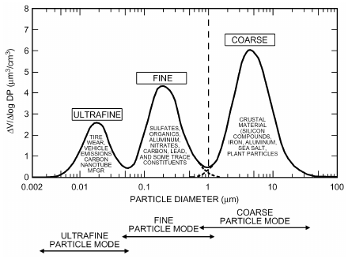
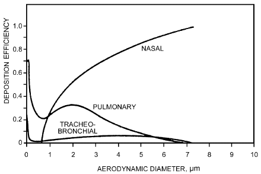
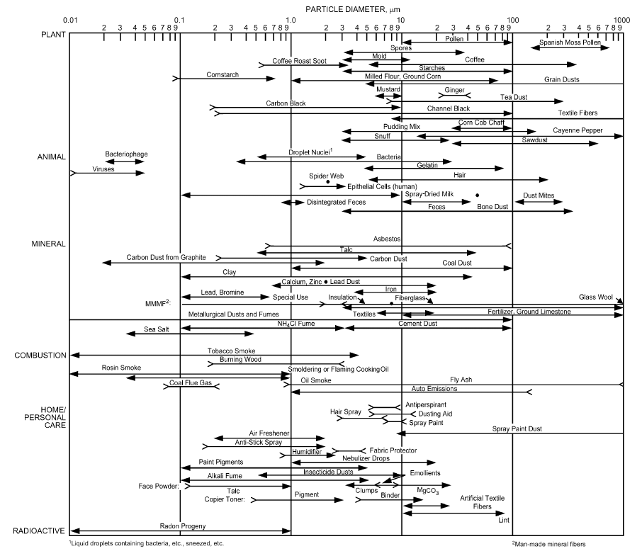
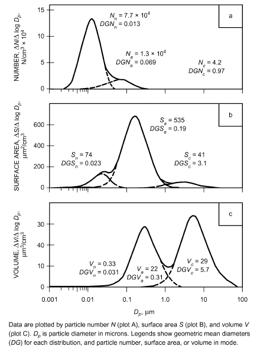

# Chapter 11 — Air Contaminants

*Izvor: 2021 ASHRAE Handbook — Fundamentals (SI), Chapter 11 (PDF str. 248–272).*

> **Napomena o konverziji:** Tekst je automatski izdvojen iz originalnog PDF-a uz prepoznavanje dve kolone, spojene prelomljene reči i pasuse. Indeksi i eksponenti su označeni sa `<sub>`/`<sup>`, tabele su pretvorene u Markdown tabele (veoma složene tabele su prikazane kao poravnat tekst), a slike su izrezane iz PDF-a u folder `img/`. Složene jednačine (razlomci, sume) mogu biti uprošćeno prikazane. **Pre upotrebe vrednosti u proračunu proveriti u originalnom PDF-u.** Oznake `<!-- str. N -->` pokazuju stranu PDF-a.

## Sadržaj

- [1. CLASSES OF AIR CONTAMINANTS](#1-classes-of-air-contaminants)
- [2. PARTICULATE CONTAMINANTS](#2-particulate-contaminants)
- [2.1 PARTICULATE MATTER](#21-particulate-matter)
- [3. GASEOUS CONTAMINANTS](#3-gaseous-contaminants)
- [3.1 VOLATILE ORGANIC COMPOUNDS](#31-volatile-organic-compounds)
- [3.2 SEMIVOLATILE ORGANIC COMPOUNDS](#32-semivolatile-organic-compounds)
- [3.3 INORGANIC GASES](#33-inorganic-gases)
- [4. AIR CONTAMINANTS BY SOURCE](#4-air-contaminants-by-source)
- [4.1 OUTDOOR AIR CONTAMINANTS](#41-outdoor-air-contaminants)
- [4.2 INDUSTRIAL AIR CONTAMINANTS](#42-industrial-air-contaminants)
- [4.3 COMMERCIAL, INSTITUTIONAL, AND RESIDENTIAL INDOOR AIR CONTAMINANTS](#43-commercial-institutional-and-residential-indoor-air-contaminants)
- [4.4 FLAMMABLE GASES AND VAPORS](#44-flammable-gases-and-vapors)
- [4.5 COMBUSTIBLE DUSTS](#45-combustible-dusts)
- [4.6 RADIOACTIVE AIR CONTAMINANTS](#46-radioactive-air-contaminants)
- [4.7 SOIL GASES](#47-soil-gases)
- [REFERENCES](#references)
- [BIBLIOGRAPHY](#bibliography)

<!-- str. 248 -->

AIR contamination is a concern for ventilation engineers when it causes problems for building occupants. Engineers need to understand the vocabulary used by the air sampling and building air cleaning industry. This chapter focuses on the types and levels of air contaminants that might enter ventilation systems or be found as indoor contaminants. Industrial contaminants are included only for special cases. Because it is not a building air concern, the effects of refrigerants on the atmosphere are not included in this chapter; see Chapter 29 for discussion of this topic.

Air is composed mainly of gases. The major gaseous components of clean, dry air near sea level are approximately 21% oxygen, 78% nitrogen, 1% argon, and 0.04% carbon dioxide. Normal outdoor air contains varying amounts of other materials (permanent atmospheric impurities) from natural processes such as wind erosion, sea spray evaporation, volcanic eruption, and metabolism or decay of organic matter. The concentration of permanent atmospheric impurities varies, but is usually lower than that of anthropogenic (i.e., caused by human activities) air contaminants.

Anthropogenic outdoor air contaminants are many and varied, originating from numerous types of human activity. Electric-power-generating plants, various modes of transportation, industrial processes, mining and smelting, construction, and agriculture generate large amounts of contaminants. These outdoor air contaminants can also be transmitted to the indoor environment. In addition, the indoor environment can exhibit a wide variety of local contaminants, both natural and anthropogenic.

Contaminants that present particular problems in the indoor environment include allergens (e.g., dust mite or cat antigen), tobacco smoke, radon, and formaldehyde.

Air composition may be changed accidentally or deliberately. In sewers, sewage treatment plants, agricultural silos, sealed storage vaults, tunnels, and mines, the oxygen content of air can become so low that people cannot remain conscious or survive. Concentrations of people in confined spaces (theaters, survival shelters, submarines) require that carbon dioxide given off by normal respiratory functions be removed and replaced with oxygen. Pilots of high-altitude aircraft, breathing at greatly reduced pressure, require systems that increase oxygen concentration. Conversely, for divers working at extreme depths, it is common to increase the percentage of helium in the atmosphere and reduce nitrogen and sometimes oxygen concentrations.

At atmospheric pressure, oxygen concentrations less than 12% or carbon dioxide concentrations greater than 5% are dangerous, even for short periods. Lesser deviations from normal composition can be hazardous under prolonged exposures. Chapter 10 further details environmental health issues.

<sub>The preparation of this chapter is assigned to TC 2.3, Gaseous Air Contaminants and Gas Contaminant Removal Equipment, in conjunction with TC 2.4, Particulate Air Contaminants and Particulate Contaminant Removal Equipment.</sub>

Although lack of oxygen can be a danger in confined spaces, it is unlikely ever to be a problem in naturally and mechanically ventilated buildings. Although the amount of oxygen consumed approximates the amount of carbon dioxide produced by respiration, the level of oxygen in the air is so much greater than that of carbon dioxide to start with that there is effectively no change in oxygen content between air intake and exhaust.

## 1. CLASSES OF AIR CONTAMINANTS

Air contaminants are generally classified as either particles or gases. Particles dispersed in air are also known as **aerosols**. In common usage, the terms aerosol, airborne particle, and particulate air contaminant are interchangeable. The distinction between particles and gases is important when determining removal strategies and equipment. Although the motion of particles is described using the same equations used to describe gas movement, even the smallest particles are much larger and more massive than individual gas molecules, and have a much lower diffusion rate. Conversely, particles are typically present in much fewer numbers than even trace levels of contaminant gases.

The **particulate** class covers a vast range of particle sizes, from dust large enough to be visible to the eye to submicroscopic particles that elude most filters. Particles may be liquid, solid, or have a solid core surrounded by liquid. The following traditional particulate contaminant classifications arise in various situations, and overlap. They are all still in common use.

- **Dusts**, **fumes**, and **smokes** are mostly solid particulate matter, although smoke often contains liquid particles.
- **Mists**, **fogs**, and **smogs** are mostly suspended liquid particles smaller than those in dusts, fumes, and smokes.
- **Bioaerosols** include primarily intact and fragmentary viruses, bacteria, fungal spores, and plant and animal allergens; their primary effect is related to their biological origin. Common indoor particulate allergens (dust mite allergen, cat dander, house dust, etc.) and endotoxins are included in the bioaerosol class.
- Particulate contaminants may be defined by their size, such as **coarse**, **fine**, or **ultrafine**; **visible** or **invisible**; or **macroscopic**, **microscopic**, or **submicroscopic**.
- Particles may be described using terms that relate to their interaction with the human respiratory system, such as **inhalable** and **respirable**

The **gaseous** class covers chemical contaminants that can exist as free molecules or atoms in air. Molecules and atoms are smaller than particles and may behave differently as a result. This class covers two important subclasses:

<!-- str. 249 -->

- **Gases**, which are naturally gaseous under ambient indoor or outdoor conditions (i.e., their boiling point is less than ambient temperature at ambient pressure)
- **Vapors**, which are normally solid or liquid under ambient indoor or outdoor conditions (i.e., their boiling point is greater than ambient temperature at ambient pressure), but which evaporate readily

Through evaporation, liquids change into vapors and mix with the surrounding atmosphere. Like gases, they are formless fluids that expand to occupy the space or enclosure in which they are confined.

Air contaminants can also be classified according to their sources; properties; or the health, safety, and engineering issues faced by people exposed to them. Any of these can form a convenient classification system because they allow grouping of applicable standards, guidelines, and control strategies. Most such special classes include both particulate and gaseous contaminants.

This chapter also covers background information for selected special air contaminant classes (Chapter 10 deals with applicable indoor health and comfort regulations).

- Outdoor air contaminants
- Industrial air contaminants
- Nonindustrial indoor air contaminants and indoor air quality
- Flammable gases and vapors
- Combustible dusts
- Radioactive contaminants
- Soil gases

In the 2020 *ASHRAE Handbook—HVAC Systems and Equip-* ment, Chapter 29 discusses particulate air contaminant removal, and Chapter 30 covers industrial air cleaning. Chapter 46 in the 2019 *ASHRAE Handbook—HVAC Applications* deals with gaseous contaminant removal.

## 2. PARTICULATE CONTAMINANTS

## 2.1 PARTICULATE MATTER

Airborne particulate contamination ranges from dense clouds of desert dust storms to completely invisible and dilute cleanroom particles. It may be anthropogenic or completely natural. It is often a mixture of many different components from several different sources. A much more extensive discussion of particulate contamination is available from the U.S. Environmental Protection Agency (EPA 2016a).

Particles occur in a variety of different shapes, including spherical, irregular, and fibers, which are defined as particles with aspect ratio (length-to-width ratio) greater than 3. In describing particle size ranges, size is the diameter of an assumed spherical particle.

### Solid Particles

**Dusts** are solid particles projected into the air by natural forces such as wind, volcanic eruption, or earthquakes, or by mechanical processes such as crushing, grinding, demolition, blasting, drilling, shoveling, screening, and sweeping. Some of these forces produce dusts by reducing larger masses, whereas others disperse materials that have already been reduced. Particles are not considered to be dust unless they are smaller than about 100 μm. Dusts can be mineral, such as rock, metal, or clay; vegetable, such as grain, flour, wood, cotton, or pollen; or animal, including wool, hair, silk, feathers, and leather. Dust is also used as a catch-all term (house dust, for example) that can have broad meaning.

**Fumes** are solid particles formed by condensation of vapors of solid materials. Metallic fumes are generated from molten metals and usually occur as oxides because of the highly reactive nature of finely divided matter. Fumes can also be formed by sublimation, distillation, or chemical reaction. Such processes create submicrometre airborne primary particles that may agglomerate into larger particle (1 to 2 μm) clusters if aged at high concentration.

**Bioaerosols** are airborne biological materials, including viruses and intact and fragmentary bacteria, pollen, fungi, and bacterial and fungal spores. Individual **viruses (virions)** typically range in size from 0.02 to 0.4 μm, although filioviruses (e.g., ebola) may be longer than 1 μm. Viruses usually occur as aggregates (droplet nuclei) and are associated with sputum or saliva. Therefore, in air they generally appear to be much larger than their true size. Most individual **bacteria** range between 0.4 and 5 μm and may be found singly or as aggregates. Intact individual **fungal** and **bacterial** spores are usually 2 to 10 μm, whereas **pollen** grains are 10 to 100 μm, with many common varieties in the 20 to 40 μm range. The size range of **allergens** varies widely: the allergenic molecule is very small, but the source of the allergen (mite feces or cat dander) may be quite large. See the section on Bioaerosols for more detailed discussion.

### Liquid Particles

**Mists** are aggregations of small airborne droplets of materials that are ordinarily liquid at normal temperatures and pressure. They can be formed by atomizing, spraying, mixing, violent chemical reactions, evolution of gas from liquid, or dissolved gas escaping when pressure is released.

**Fogs** are clouds of fine airborne droplets, usually formed by condensation of vapor, which remain airborne longer than mists. Fog nozzles are named for their ability to produce extra-fine droplets, as compared with mists from ordinary spray devices. Many droplets in fogs or clouds are microscopic and submicroscopic and serve as a transition stage between larger mists and vapors. The volatile nature of most liquids reduces the size of their airborne droplets from the mist to the fog range and eventually to the vapor phase, until the air becomes saturated with that liquid. If solid material is suspended or dissolved in the liquid droplet, it remains in the air as particulate contamination. For example, sea spray evaporates fairly rapidly, generating a large number of fine salt particles that remain suspended in the atmosphere.

### Complex Particles

**Smokes** are small solid and/or liquid particles produced by incomplete combustion of organic substances such as tobacco, wood, coal, oil, and other carbonaceous materials. The term smoke is applied to a mixture of solid, liquid, and gaseous products, although technical literature distinguishes between such components as soot or carbon particles, fly ash, cinders, tarry matter, unburned gases, and gaseous combustion products. Smoke particles vary in size, the smallest being much less than 1 µm in diameter. The average is often in the range of 0.1 to 0.3 µm.

**Environmental tobacco smoke (ETS)** consists of a suspension of 0.01 to 1.0 μm (mass median diameter of 0.3 μm) solid and liquid particles that form as the superheated vapors leaving burning tobacco condense, agglomerate into larger particles, and age. Numerous gaseous contaminants are also produced, including carbon monoxide.

**Smog** commonly refers to air pollution; it implies an airborne mixture of smoke particles, mists, and fog droplets of such concentration and composition as to impair visibility, in addition to being irritating or harmful. The composition varies among different locations and at different times. The term is often applied to haze caused by a sunlightinduced photochemical reaction involving materials in automobile exhausts. Smog is often associated with temperature inversions in the atmosphere that prevent normal dispersion of contaminants.

### Sizes of Airborne Particles

Particle size can be defined in several different ways. These depend, for example, on the source or method of generation, visibility, effects, or measurement instrument. Ambient atmospheric particulate contamination is classified by aerosol scientists and the EPA by source mode, with common usage now recognizing three primary modes: coarse, fine, and ultrafine.

<!-- str. 250 -->

**Coarse**-mode aerosol particles are largest, and are generally formed by mechanical breaking up of solids. They generally have a minimum size of 1 to 3 μm (EPA 2009a). Coarse particles also include bioaerosols such as mold spores, pollen, animal dander, and dust mite particles that can affect the immune system. Coarse-mode particles are predominantly primary, natural, and chemically inert. Road dust is a good example. Chemically, coarse particles tend to contain crustal material components such as silicon compounds, iron, aluminum, sea salt, and vegetative particles.

**Fine**-mode particles are generally secondary particles formed from chemical reactions or condensing gases. They have a maximum size of about 1 to 3 μm. Fine particles are usually more chemically complex than coarse-mode particles and result from human activity, particularly combustion. Smoke is a good example. Chemically, fine aerosols typically include sulfates, organics, ammonium, nitrates, carbon, lead, and some trace constituents. The modes overlap, and their definitions are not precise.

Recently, there has been increased interest in even smaller contaminants, known as **ultrafine**-mode particles. Ultrafines have a maximum size of 0.1 μm (100 nm) (EPA 2009a). They are complex particles for which the biggest source is reaction of gases with other particles. They also form as a result of degradation of larger particles. Natural sources include volcanic eruptions, ocean spray, and smoke from wildfires. Sources involving human activity include tobacco smoke, burning of fossil fuels, and emissions from cooking and office machines. Engineered ultrafines, often referred to as **nanoparticles**, have a variety of applications, particularly in the medical field (Moghini et al. 2005). The U.S. National Nanotechnology Initiative (NNI 2008) uses the same size definition for nanoparticles as given above for ultrafine particles. Figure 1 shows a typical distribution, including the chemical species present in each of the three modes.

The size of a particle determines where in the human respiratory system particles are deposited, and various samplers collect particles that penetrate more or less deeply into the lungs. Figure 2 shows the relative deposition efficiencies of various sizes of particles in the human nasal and respiratory systems. The **inhalable mass** is made up of particles that may deposit anywhere in the respiratory system, and is represented by a sample with a median cut point of 100 μm. Most of the inhalable mass is captured in the nasal passages. The **thoracic particle mass** is the fraction that can



*Fig. 1 Typical Outdoor Aerosol Composition by Particle Size Fraction*

> (adapted from Wilson and Suh 1997)

penetrate to the respiratory airways and is represented by a sample with a median cut point of 10 μm (PM<sub>10</sub>). The **respirable particle mass** is the fraction that can penetrate to the gas-exchange region of the lungs, which ACGIH (1989) defines as having a median cut point of 4 μm. The EPA no longer uses the term respirable. Their current concern is with particles having a median cut point of 2.5 μm (PM<sub>2.5</sub>) (this definition includes both fine and ultrafine particles as discussed above), and with smaller particles such as PM<sub>1</sub>.

Particles differ in density, and may be irregular in shape. It is useful to characterize mixed aerosol size in terms of some standard particle. The **aerodynamic (equivalent) diameter** of a particle, defined as the diameter of a unit-density sphere having the same gravitational settling velocity as the particle in question (Willeke and Baron 1993), is commonly used as the standard particle size. Samplers that fractionate particles based on their inertial properties, such as impactors and cyclones, naturally produce results as functions of the aerodynamic diameters. Samplers that use other sizing principles, such as optical particle counters, must be calibrated to give aerodynamic diameter.

The tendency of particles to settle on surfaces is of interest. Figure 3 shows the sizes of typical indoor airborne solid and liquid particles. Particles smaller than 0.1 μm behave like gas molecules, exhibiting irregular motion from collisions with air molecules and having no measurable settling velocity. Particles in the range from 0.1 to 1 μm have calculable settling velocities, but they are so low that settling is usually negligible, because normal air currents counteract any settling. By number, over 99.9% of the particles in a typical atmosphere are below 1 μm (i.e., fewer than 1 particle in every 1000 is larger than 1 μm). Particles between 1 and 10 μm settle in still air at constant and appreciable velocity. However, normal air currents keep them in suspension for appreciable periods. Particles larger than 10 μm settle fairly rapidly and can be found suspended in air only near their source or under strong wind conditions. Exceptions are lint and other light, fibrous materials, such as portions of some weed seeds, which remain suspended longer because their aerodynamic behavior is similar to that of smaller particles (they have aerodynamic diameters smaller than their physical dimensions suggest.)

Table 1 shows settling times for various types of particles. Most individual particles 10 μm or larger are visible to the naked eye under favorable conditions of lighting and contrast. Smaller particles are visible only in high concentrations. Cigarette smoke (with an average particle size less than 0.5 μm) and clouds are common examples. Direct fallout in the vicinity of the dispersing stack or flue and other nuisance problems of air pollution involve larger particles.



*Fig. 2 Relative Deposition Efficiencies of Different-Sized Particles in the Three Main Regions of the Human Respiratory System, Calculated for Moderate Activity Level*

> (Task Group on Lung Dynamics 1966)

<!-- str. 251 -->



*Fig. 3 Sizes of Indoor Particles*

(Owen et al. 1992)

**Table 1 Approximate Particle Sizes and Time to Settle 1 m**

| Type of Particle | Diameter, μm | Settling Time |
|---|---|---|
| Human hair | 100 to 150 | 3 to 1 s |
| Skin flakes | 20 to 40 | 80 to 20 s |
| Observable dust in air | >10 | <5.5 min |
| Common pollens | 15 to 25 | 2 to 1 min |
| Mite allergens | 10 to 20 | 6 to 1 min |
| Common spores | 2 to 10 | 128 to 6 min |
| Bacteria | 1 to 5 | 475 to 21 min |
| Cat dander | 1 to 5 | 475 to 21 min |
| Tobacco smoke | 0.1 to 1 | 13 days to 8 h |
| Metal and organic fumes | <0.1 to 1 | >13 days to 8 h |
| Cell debris | 0.01 to 1 | 171 days to 8 h |
| Viruses | <0.1 | >13 days |

Note: Spores, bacteria, and virus sizes are for the typical complete unit. As entrained in the air, they may be smaller (fragments) or larger (attached to debris, enclosed in sputum, etc.) Based on information obtained from J.D. Spengler, Harvard School of Public Health, 1982.

**Table 2 Relation of Screen Mesh to Sieve Opening Size**

| U.S. Standard sieve mesh | 400 | 325 | 200 | 140 | 100 | 60 | 35 18 |
|---|---|---|---|---|---|---|---|
| Nominal sieve opening, μm | 37 | 44 | 74 | 105 | 149 | 250 | 500 1000 |

Source: Excerpted from ASTM Standard E11-15.

Smaller particles, as well as mists, fogs, and fumes, remain in suspension longer. In this size range, meteorology and topography are more important than physical characteristics of the particles. Because settling velocities are small, the atmosphere’s ability to disperse these small particles depends largely on local weather conditions. Comparison is often made to screen sizes used for grading useful industrial dusts and granular materials. Table 2 shows the relationship of U.S. standard sieve mesh to particle size in micrometers. Particles above 40 μm are known as the screen sizes, and those below are known as the subscreen or microscopic sizes.

### Particle Size Distribution

The particle size distribution in any sample can be expressed in several different ways. Figure 4 shows particle count data for typical

<!-- str. 252 -->



*Fig. 4 Typical Urban Outdoor Distributions of Ultrafine or Nuclei (n) Particles, Fine or Accumulation (a) Particles, and Coarse (c) Particles*

> (Whitby 1978)

coarse and fine atmospheric contamination plotted to show particle number, total particle surface area, and total particle volume as a function of particle size.

Note the differences between the three curves. Figure 4 demonstrates that particles 0.1 μm or less in diameter typically make up about 80% of the number of particles in the atmosphere but contribute only about 1% of the volume or mass. Also, 0.1% of the number of particles larger than 1 μm typically carry 70% of the total mass, which is the direct result of the mass of a spherical particle increasing as the cube of its diameter. Although most of the mass is contributed by intermediate and larger particles, over 80% of the area (staining) contamination is supplied by particles less than 1 μm in diameter, which is in the center of the respirable particle size range and is the size most likely to remain in the lungs (see Figure 2 and Chapter 10). Of possible concern to the HVAC industry is the fact that most of the staining effect on ceilings, walls, windows, and light fixtures results from particles less than 1 μm in diameter. Fouling of heat transfer devices and rotating equipment involves particles in this size range and larger. Suspended particles in urban air are predominantly smaller than 1 μm (aerodynamic diameter) and have a distribution that is approximately log-normal.

### Units of Measurement

The quantity of particulate matter in the air can be determined as a mass or particle count in a given volume of air. Mass units are milligrams per cubic metre of air sampled (mg/m<sup>3</sup>) or micrograms per cubic metre of air sampled (μg/m<sup>3</sup>); 1 mg/m<sup>3</sup> = 1000 μg/m<sup>3</sup>. Particle counts are usually quoted for volumes of 0.1 ft<sup>3</sup>, 1 ft<sup>3</sup>, 1 L, or 1 m<sup>3</sup> and are specified for a given range of particle diameter.

### Harmful Effects of Particulate Contaminants

Particulate contaminants can be damaging to people, the buildings in which they live and work, and materials and artifacts in these buildings.

**Effects on People.** Harmful effects of nonviable particles on people include toxicity, irritation, and odor. Effects of viable particles are covered in the section on Bioaerosols and in Chapter 10.

Dusts produced in industrial processes can be highly toxic (see Chapter 10). Most nonviable particles encountered outdoors and in commercial and residential buildings are of lower toxicity. Their impact depends on particle size and amount present. Larger coarse and fine particles trapped before reaching the lungs are likely to cause irritation if present in sufficient quantity. Smaller fine and ultrafine particles that reach the lungs are more of an issue. There have been concerns for many years about the long-term effects on the lungs of exposure to particles, but the first support for an association between airborne coarse particles and incidence of asthma and hospital admissions for respiratory problems did not come until the 1990s (Pope 1991). Other studies have shown that chronic exposure to fine particles can affect both the heart and lungs (Pope et al. 2002), and identified fine particles as a priority chronic hazard in U.S. homes (Logue et al. 2011). Ultrafine particles, which have much higher number concentrations and surface areas than fine particles and can adsorb gaseous contaminants, may also be health issues (Delfino et al. 2005; Soutas et al. 2005). More information on health effects of particulate matter can be found in Chapter 10.

Particulate contaminants are not odorous in themselves but can become so by adsorbing odorous gaseous contaminants such as nitrogen and sulfur oxides from combustion processes. Such particles can be trapped by HVAC filters and may release the odor later on.

**Effects on Materials.** Damage depends on the size of the particles, with larger particles having the potential for settling on and abrading materials, and smaller particles having the potential for soiling both horizontal and vertical surfaces. Both size ranges are of concern for HVAC components, and their impacts can be reduced by using filters. Finishes and furnishings in occupied buildings can require more frequent maintenance if soiling is not effectively controlled. Artworks and artifacts in galleries and museums can be permanently damaged by exposure to both abrasive and soiling particles; for details, see Chapter 23 of the 2019 ASHRAE Handbook—HVAC Applications.

### Measurement of Airborne Particles

Suitable methods for determining the quantity of particulate matter in the air vary, depending on the amount present and on the size of particles involved. **Direct gravimetric measurement**, in which a dusty air sample is drawn through a preweighed filter, is a common technique in industrial workplaces that often contain significant numbers of large particles. If the total airstream is drawn through the test filter, the sample is known as the **total mass**; if a size-selective inlet is used on the filter, the sample is characterized by the inlet used (PM<sub>2.5</sub>, PM<sub>10</sub>, respirable, etc.). Gravimetric methods have the advantage of providing an integrated sample (over the sample duration) and of providing a direct measure of the mass concentration (mass/volume). In general, gravimetric methods are not real-time, although some innovative samplers use secondary methods (e.g., beta attenuation, crystal vibration frequency changes) to infer mass on a real-time basis. Further, gravimetric methods require increasing test effort (sample duration and balance quality) as the mass concentration drops toward office and indoor air levels.

Normal daily activities of individuals cause higher personal exposures to both particles and gas contaminants than would be expected from measurements of undisturbed air. Personal activities frequently bring individuals close to air contaminant sources, and also generate particles. Sampling near a person requires special care because the degree of exposure also depends on particle transport as air flows around the body because of convective forces, air turbulence, and obstructions nearby (Rodes and Thornburg 2004).

<!-- str. 253 -->

**Optical particle counters (OPCs)** are widely used and likely to become more so. They are very convenient and provide real-time, size-selective data. Individual aerosol particles are illuminated with a bright light as they singly pass through the OPC viewing volume. Each particle scatters light, which is collected to produce a voltage pulse in the detector. The pulse size is proportional to the particle size, and the electronics of the OPC assign counts to size ranges based on the pulse size. ASHRAE Standard 52.2 defines a laboratory method for assessing the performance of media filters using an OPC to measure particle counts up- and downstream of the filter in 12 size ranges between 0.3 and 10 μm. Filters tested are reported with their **minimum efficiency reporting value (MERV)** number based on the count data. It is important to sample isokinetically in fast-moving airstreams, such as found in air ducts. This involves sizing the OPC sampling inlet so that the speed of sampled air entering the device is the same as that of air moving past the OPC. If this is not done, the OPC samples inaccurately, capturing too few particles when sampling speed is greater than surrounding air speed, and too many when sampling speed is less than that of the surrounding air.

Counters are also used to test cleanrooms for compliance with the U.S. General Services Administration’s (GSA) Federal Standard 209E and ISO Standard 14644-1. Cleanrooms are defined in terms of the number of particles in certain size ranges that they contain; for more information, see Chapter 18 of the 2019 ASHRAE Handbook—HVAC Applications.

Modern OPCs use laser light scattering to continuously count and size airborne particles and, depending on design, can detect particles down to 0.1 μm (ASTM Standard F50). Like all aerosol instruments, OPCs should be used with awareness of their limitations. They report particle size from a calibration curve that was developed from a particle having particular optical properties. Actual ambient aerosol particle size is usually close to that indicated by an OPC, but significant errors are possible. Further, many OPCs were developed for cleanroom applications and can become overloaded in other applications. In general, they do not inform the user when they are out of range.

A **condensation nucleus counter (CNC)** can count particles to below 0.01 μm. These particles, present in great numbers in the atmosphere, serve as nuclei for condensation of water vapor (Scala 1963). CNCs provide total particle numbers, and cannot directly provide particle sizing information.

Another indirect method measures the **optical density** of the collected dust, based on the projected area of the particles. Dust particles can be sized with graduated scales or optical comparisons using a standard microscope. The lower limit for sizing with the light-field microscope is approximately 0.9 μm, depending on the vision of the observer, dust color, and available contrast. This size can be reduced to about 0.4 μm by using oil-immersion objective techniques. Darkfield microscopic techniques reveal particles smaller than these, to a limit of approximately 0.1 μm. Smaller submicroscopic dusts can be sized and compared with the aid of an electron microscope.

Other sizing techniques may take into account velocity of samplings in calibrated devices and actual settlement measurements in laboratory equipment. The electron microscope and sampling instruments such as the cascade impactor have been successful in sizing particulates, including fogs and mists. Each method of measuring particle size distribution gives a different value for the same size particle, because different properties are actually measured. For example, a microscopic technique may measure longest dimension, whereas impactor results are based on aerodynamic behavior (ACGIH 2001).

Chemical analysis of particles follows protocols for analysis of any solid material. At industrial concentrations, adequate samples can be obtained from ducts and dust collectors. Because larger particles settle faster than smaller particles, the size and nature of deposited particles often change as suspended particles move away from a source. For instance, near the inlet of an outdoor air intake, deposited particles will probably be larger and have a coarse composition (e.g., road dust might predominate), whereas further into the duct, fine-mode aerosols would predominate (e.g., condensed oil fume and soot). At the lower concentrations of workplaces, samples are usually collected onto filters, and the filter deposit is analyzed. The filter material must be chosen to not interfere with the analysis. After sample preparation, analysis methods for gaseous contaminant analysis generally apply.

### Typical Particle Levels

Particle counters, which detect particles larger than about 0.1 μm, indicate that the number of suspended particles is enormous. A room with heavy cigarette smoke has a particle concentration of 10<sup>12</sup> particles per cubic metre. Even clean air typically contains over 35 ×10<sup>6</sup>particles/m<sup>3</sup>. If smaller particles detectable by other means, such as an electron microscope or condensation nucleus counter, are also included, the total particle concentration would be greater than these concentrations by a factor of 10 to 100. Ultrafine particles have been widely found at concentrations of 20 × 10<sup>9</sup> to 40 × 10<sup>9</sup> per cubic metre in both indoor and outdoor air.

Much of the published particle data uses mass concentration rather than number concentration, because the EPA outdoor limits are expressed in these units (see Table 12). Typical daytime average levels of outdoor PM<sub>10</sub> and PM<sub>2.5</sub> in school or residential areas may be 10 to 30 μg/m<sup>3</sup> (Fromme et al. 2008; Williams et al. 2000), and PM<sub>2.5</sub> in heavy traffic areas in large cities can be >100 μg/m<sup>3</sup> (Cassidy et al. 2007; Han et al. 2005). In indoor environments with few internal sources, such as offices, indoor concentrations in both size ranges tend to be smaller than outdoors because of HVAC filters. However, in schools, where activity levels are higher and indoor sources are present, indoor PM<sub>10</sub> and PM<sub>2.5</sub> may be higher than outdoors (Fromme et al. 2008).

Indoor particle levels in buildings are influenced by the number of people and their activities, building materials and construction, outdoor conditions, ventilation rate, and the air-conditioning and filtration system. Wallace (1996) reviewed the effect of outdoor particle penetration and activities on indoor concentrations, and Riley et al. (2002) discussed the influence of air exchange rates and filtration on indoor concentrations in residential and commercial buildings. ASHRAE research project RP-1281 investigated factors affecting the penetration of fine and ultrafine particles into nonresidential buildings (Facciola et al. 2006). For further information, see the section on Commercial, Institutional, and Residential Indoor Air Contaminants.

### Bioaerosols

Bioaerosol refers to any airborne biological (generally microscopic) particulate matter. Though often thought of as originating as microorganisms (fungi, bacteria, viruses, protozoa, algae), bioaerosols may also be derived from plants (pollen and plant fragments) and animals (hair, dander, and saliva from dogs and cats; dust mites). In addition to the intact organisms (e.g., bacteria), their parts (fungal spores and fragments), components (endotoxins, allergens), and products (dust mite antigen-containing fecal pellets and fungal mycotoxins) may be included in the definition. The antigen or toxin to which the body reacts may be quite small; only trace amounts are required for many allergic or toxic reactions. Public interest has focused on airborne microorganisms responsible for diseases and infections, primarily bacteria and viruses. These are discussed in more detail in Chapter 10, including sources, transmission and health effects.

<!-- str. 254 -->

Bioaerosols are universally present in both indoor and outdoor environments. Although the organisms that are sources of bioaerosols are living, reproducing organisms, bioaerosols themselves do not have to be alive to cause allergic, toxic, or inflammatory responses. In fact, as little as 1 to 10% of outdoor bioaerosol is thought to be viable (Jaenicke 1998; Tong and Lighthart 1999). Furthermore, fragments of bioaerosols may be transported while attached to inert particles, and may be important from an exposure standpoint.

Problems of concern to engineers occur when microorganisms grow and reproduce indoors, or when large amounts of bioaerosol enter a building from outdoors. Buildings are not sterile, nor are they meant to be. The presence of bacteria and fungi outdoors in soil, water, and atmospheric habitats is normal. For example, spores of the fungus Cladosporium are commonly found on leaves and dead vegetation and are almost always found in outdoor air samples. Often, they are found in variable numbers in indoor air, depending on the amount of outdoor air that infiltrates into interior spaces or is brought in by the HVAC system. Outdoor microorganisms and pollen can also enter on shoes and clothing and be transferred to other surfaces in buildings. Through infiltration, pollens can be quite problematic indoors, often depending on the season. Pollens discharged by weeds, grasses, and trees (Hewson et al. 1967; Jacobson and Morris 1977; Solomon and Mathews 1978) can cause hay fever. Bioaerosols have properties of special interest to air-cleaning equipment designers (see Chapter 29 of the 2020 ASHRAE Handbook—*HVAC Systems and Equipment*).

Some bioaerosols originate indoors. Many allergens, such as cat, dog, and dust mite allergens, either originate indoors or have indoor reservoirs (e.g., bedding and fleecy materials). Much attention has been given to fungi, which include yeasts, molds (filamentous fungi), and mildews, as well as large mushrooms, puffballs, and bracket fungi. All fungi depend on external sources of organic material for both energy requirements and carbon skeletons, but very small quantities can be sufficient. Thus, they increase in number when supplied with a suitable food source such as very small quantities of dirt/dust, paper, or wood. Sufficient nutrients are almost always readily available in buildings. For growth to occur, sufficient water must also be available in the material. Adequate moisture content of a material may be attained when the relative humidity is high (typically, the equilibrium relative humidity of a porous material with the surrounding air is greater than 60%), on water incursion from a roof leak or condensation, or when water spills. Note that controlling humidity in a space per se is not sufficient to limit fungal growth; the moisture content of the substrate material must be controlled. Some species of mold that often grow on water-damaged building materials are listed in Table 3.

Mycotoxins are secondary metabolites produced by some filamentous fungi, Some are very toxic (e.g., aflatoxin) and some are beneficial (e.g., penicillin). There are hundreds of different mycotoxins, and more are being identified all the time. Mycotoxins can cause disease and death in humans and other animals, primarily when consumed in foods. However, inhalation exposure of fungal spores and fragments containing mycotoxins has been raised as a potential concern as a bioaerosol contaminant.

Bacteria are much simpler organisms than fungi, and generally require more water for growth, often growing in liquids or periodically wetted surfaces. Whereas fungi actively release spores into the environment from contaminated surfaces, bacteria are generally aerosolized by reentrainment of the water in which they are growing. Cooling towers, evaporative condensers, and domestic water service systems all provide water and nutrients for amplification of bacteria such as Legionella pneumophila. Growth of bacterial populations to excessive concentrations is generally associated with inadequate preventive maintenance or leaks creating standing water. Legionella is well studied, and ASHRAE Standard 188-2015 discusses its risk management.

**Table 3 Common Molds on Water-Damaged Building Materials**

| Mold Species | Mold Species |
|---|---|
| Alternaria alternata | Memnoniella echinata |
| Aspergillus sydowii | Paecilomyces variotii |
| Aspergillus versicolor | Penicillium aurantogriseum |
| Chaetomium globusum | Penicillium chrysogenum |
| Cladosporium cladosporioides | Penicillium citrinum |
| Cladosporium sphaerospermum | Penicillium commune |
| Eurotium herbariorum | Stachybotrys chartarum |
| Eurotium repens | Ulocladium chartarum |

Source: Health Canada (2004).

Drain pans and cooling coils may also be sources of bacteria. Growth can occur in the water and the organism then can become aerosolized in water droplets. The most common source of bacteria as bioaerosols, especially in closed occupied spaces, may be droplet nuclei caused by actions such as sneezing, or carried on human or animal skin scales.

**Endotoxins** are components of the cell walls of a fairly large group of bacteria classified as Gram negative (i.e., crystal violet dye, used in a Gram stain test, does not affect their color). Endotoxin exposure has been associated with a number of adverse health effects. Humidifier fever has been associated with inhalation of endotoxins (Teeuw et al. 1994).

**Units of Measurement.** Microorganisms such as bacteria and molds are usually measured either as total culturable or total countable bioaerosol. **Culturable** (viable) bioaerosols are those that can be grown in a laboratory culture. Results are normally reported as number of colony-forming units (CFU) per unit sample volume (m<sup>3</sup> for air samples), area (cm<sup>2</sup> for surface samples) or mass (g for bulk samples).

**Countable** bioaerosols (viable plus nonviable) include all particles that can be identified and counted under a microscope. Results are reported as number of particles per unit sample volume, area, or mass.

Allergens are usually expressed as their mass (in ng) per unit volume; endotoxins are expressed as EU or endotoxin units.

**Sampling.** Sampling when bioaerosols are suspected as a contaminant may include direct plating of observed microbial growth, collection of bulk or surface samples, or air sampling. Surface sampling is useful for bioaerosol detection, because the surface may constitute a long-time duration sampler. The principles of sampling and analysis for bioaerosols are presented in depth by Macher (1999). AIHA (1996) gives assessment guidelines for collecting microbiological particulates.

The same principles that affect collection of an inert particulate aerosol sample also govern air sampling for microorganisms. Air sampling is not likely to yield useful data and information unless the sample collected is representative of exposure, and appropriate control samples are collected. The most representative samples are those collected in breathing zones over the range of aerosol concentrations. Personal sampling (in the breathing zone of a worker) is generally preferable, but area sampling (e.g., on a table) over representative periods is more commonly performed. Some investigators attempt to replicate exposure conditions through disturbance of the environment (semiaggressive sampling), such as occurs when walking on carpets, slamming doors, and opening books or file cabinets.

The sampling method selected affects the measured count. Methods that rely on counting analysis usually report higher concentrations than those that use culturing analysis, because of inclusion of nonviable particles. There is no single, ideal bioaerosol sampler, but rather several complementary techniques that may be appropriate in any particular application. Collection directly on **filter paper** is simple and direct, but may dehydrate some organisms and underestimate exposure for live counting techniques. **Glass impingers** are an effective and standard method, but may overestimate exposure because liquid contact and agitation can break clusters into smaller individual organisms, which are then each counted as a separate entity. **Slit-to-agar samplers** may give a more accurate culturable colony count, but do not measure nonculturable organisms or fragments, parts, or components. In general, culture plate impactors, including multiple- and single-stage devices as well as slit-to-agar samplers, are most useful in office environments where low concentrations of bacteria and fungi are expected. Some multihole impactors require application of a positive hole correction factor to the raw counts to compensate for multiple organisms focused aerodynamically and landing in the same place on the media. Because not all microorganisms can grow on the same media, impactors that separate samples must be collected for each. Liquid impingement subculturing allows plating one sample on multiple media. Filter cassette samplers are useful for some hardy microorganisms or components (e.g., endotoxins) and allergen analyses. Filter cassettes can also be used for spore counts.

<!-- str. 255 -->

Nonculture methods for fungal spores and pollen grains generally involve exposing an adhesive-coated glass slide or plate for a specific time period, then counting calibrated areas under the microscope, and calculating the number in a measured volume of air. Measurement methods for pollen are not discussed further here, because data are widely available in the public domain.

Some viruses, bacteria, algae, and protozoa are more difficult to culture than fungi, and air-sampling methodology for these organisms may not be practical. For example, Legionella requires special nutrients and conditions for growth, and thus may be difficult to recover from air. To further complicate the issue, not all fungi grow on any one media, so media selection may be important.

**Rank-order assessment** is used to interpret air-sampling data for microorganisms (Macher 1999). Individual organisms are listed in descending order of abundance for a complainant indoor site and for one or more control locations. The predominance of one or more microbes in the complainant site, but not in the control sites or outdoors, suggests the presence of a source for that organism. An example is shown in Table 4.

Recently, quantitative real-time **polymerase chain reaction (PCR)** (Mullis 1990) testing has been developed for routine diagnosis of specific microorganisms in clinical microbiology laboratories (Espy 2006) and for mold determination in residential and commercial venues. PCR is a molecular technique for multiplying a specific strand of DNA or RNA millions of times by manipulating the chemical nature of the cell. Once multiplied (or amplified), the target DNA can be detected through a variety of methods.

PCR-based methods eliminate the need to culture organisms for detection, and remedy shortcomings of traditional techniques by allowing rapid, sensitive, and specific identification of the pathogens of concern rather than indicator organisms. Traditional culturing can take anywhere from 3 to 7 days, whereas real-time PCR can often be run in 10 to 24 h (Yang and Rothman 2004).

**Table 4 Example Case of Airborne Fungi in Building and Outdoor Air**

| Location | CFU/m<sup>3</sup> Rank Order Taxa | CFU/m<sup>3</sup> Rank Order Taxa |
|---|---|---|
| Outdoors | 210 | *Cladosporium > Fusarium > Epicoccum* > Aspergillus |
| Complainant office #1 | 2500 | Tritirachium>Aspergillus>Cladosporium |
| Complainant office #2 | 3000 | Tritirachium>Aspergillus>Cladosporium |

Notes: CFU/m<sup>3</sup> = colony-forming units per cubic metre of air. Culture media, for this example, was malt extract agar (ACGIH 1989).

U.S. Environmental Protection Agency (EPA) and Department of Housing and Urban Development (HUD) researchers have developed a metric called the environmental relative moldiness index (ERMI) to objectively describe the home mold burden (Vesper et al. 2007). A DNA-based analysis called mold-specific quantitative PCR (MSQPCR) of 36 molds, including 26 species associated with homes with water damage and 10 found in homes independent of water damage, forms the basis of the ERMI.

### Controlling Exposures to Particulate Matter

Control of airborne particulate levels may be achieved by one of four methods:

- Reduction of source emissions
- Capture of emissions at the source using local exhaust
- Dilution using mechanical ventilation
- Removal from ventilation air by filtration

Of these, filtration is of particular importance to HVAC&R. This topic is covered in detail in Chapter 29 in the 2020 ASHRAE Hand-*book—HVAC Systems and Equipment*.

Control of bioaerosols is a complex issue because of their capacity for growth and dispersion. However, in general, particulate removal devices and controls are effective in collecting and removing bioaerosols, including allergens (Foarde et al. 1994). Control may also be achieved by ultraviolet irradiation, as described in Chapter 60 of the 2019 *ASHRAE Handbook—HVAC Applications*.

## 3. GASEOUS CONTAMINANTS

The terms **gas** and **vapor** are both used to describe the gaseous state of a substance. Gas is the correct term for describing any pure substance or mixture that naturally exists in the gaseous state at normal atmospheric conditions. That is, its vapor pressure is greater than ambient pressure at ambient temperature. Examples are oxygen, helium, ammonia, and nitrogen. Vapor is used to describe a substance in the gaseous state whose natural state is a liquid or solid at normal atmospheric conditions. The vapor pressure is below ambient pressure at ambient temperature. Examples include benzene, carbon tetrachloride, and water. Differences between the two classes reflect their preferred states:

- For a strong source, the concentration of a gas in air in a confined space can rise above one atmosphere. Thus, even nontoxic gases can be lethal if they completely fill a space, displacing the oxygen necessary for survival.
- Vapors can never exceed their saturated vapor pressure in air. The most familiar example of a vapor is water, with relative humidity expressing the air concentration as a percentage of the saturated vapor pressure.
- Vapors, because their natural state is liquid or solid (low vapor pressure), tend to condense on surfaces and be adsorbed.

Gaseous contaminants can also usefully be divided into organic and inorganic types. **Organic** compounds include all chemicals based on a skeleton of carbon atoms. Because carbon atoms easily combine to form chain, branched, and ring structures, there is a wide variety of organic compounds. Despite the variety, they have similarities that can be used in sampling, analysis, and removal. Chemists subclassify organic compounds based on families having similar structure and predictable properties. Organic gaseous contaminants include gases such as methane, but the majority are vapors.

All other gaseous contaminants are classified as **inorganic**. Most inorganic air contaminants of interest to ventilation engineers are gases (mercury is an important exception). Major chemical families of inorganic and organic gaseous contaminants, with examples of specific compounds, are shown in Table 5, along with information about occurrence and use. Some organics belong to more than one class and carry the attributes of both.

<!-- str. 256 -->

**Table 5 Major Chemical Families of Gaseous Air Contaminants**

| No. Family | Examples | Other Information |
|---|---|---|
| Inorganic Contaminants |  |  |
| 1. Single-element atoms | Chlorine, radon, mercury | Chlorine is a strong respiratory irritant used as a disinfectant; outdoor sources |
| and molecules |  | include seawater, chlorinated pools, and road salt. Radon is an important soil gas.<br>Mercury is the vapor in fluorescent light bulbs and tubes. |
| 2. Oxidants | Ozone, nitrogen dioxide, hydrogen peroxide | Corrosive; respiratory irritants. |
| 3. Reducing agents | Carbon monoxide | Toxic; fuel combustion product. |
| 4. Acid gases | Carbon dioxide, hydrogen chloride, | Carbon dioxide and hydrogen sulfide are only weakly acidic. Hydrogen sulfide is the |
| **hydrogen fluoride, hydrogen sulfide, nitric main agent in sewer gas. Other members are corrosive and respiratory irritants. Some** |  |  |
|  | acid, sulfur dioxide, sulfuric acid | are important outdoor contaminants. |
| 5. Nitrogen compounds | Ammonia, hydrazine, nitrous oxide | Ammonia is used in cleaning products; it is a strong irritant. Hydrazine is used as an anticorrosion agent. Nitrous oxide (laughing gas) is used as an anesthetic. |
| 6. Miscellaneous | Arsine, phosphine | Used in the semiconductor industry. |
| Organic Contaminants |  |  |
| 7. n-Alkanes | Methane, propane, n-butane, n-hexane, n-heptane, n-octane, n-nonane, n-decane, n-undecane, n-dodecane | n-Alkanes are linear molecules and relatively easily identified analytically. Along with the far more numerous branched alkanes, they are components of solvents such as mineral spirits. |
| 8. Branched alkanes | 2-methyl pentane, 2-methyl hexane | Numerous; members are difficult to separate and identify. Many occur as components of products such as gasoline, kerosene, mineral spirits, etc. |
| 9. Alkenes and cyclic | Ethylene, butadiene, 1-octene, cyclo- | Ethylene gas is produced by ripening fruit (and used in the fruit industry). Some |
| hydrocarbons | hexane, 4-phenyl cyclohexene (4-PC) | liquid members are components of gasoline, etc. 4-PC is responsible for “new carpet” odor. |
| 10. Chlorofluorocarbons | R-11 (trichlorofluoromethane), R-12<br>(dichlorodifluoromethane), R-114<br>(dichlorotetrafluoroethane) | Widely used as refrigerants; are being phased out because of their ozone-depleting potential. |
| 11. Chlorinated | Carbon tetrachloride, chloroform, | Dichlorobenzene, an aromatic chemical, is a solid used as an air freshener. Others |
| hydrocarbons | dichloromethane, 1,1,1-trichloroethane, trichloroethylene, tetrachloroethylene, p-dichlorobenzene | shown here are liquids and effective nonpolar solvents. Some are used as degreasers or in the dry-cleaning industry. |
| 12. Halide compounds | Methyl bromide, methyl iodide | Low combustibility; some are used as flame retardants. |
| 13. Alcohols | Methanol, ethanol, 2-propanol (isopropa- | Strongly polar. Some (including 2-butoxyethanol and texanol) are used as solvents in |
| **nol), 3-methyl 1-butanol, ethylene glycol, water-based products. Phenol is used as a disinfectant. 3-methyl 1-butanol is emitted** |  |  |
|  | 2-butoxyethanol, phenol, texanol | by some molds. |
| 14. Ethers | Ethyl ether, methyl tertiary butyl ether<br>(MTBE), 2-butoxyethanol | Ethyl ether and 2-butoxyethanol are used as solvents. MTBE is added to gasoline to improve combustion in vehicle motors. |
| 15. Aldehydes | Formaldehyde, acetaldehyde, acrolein, benzaldehyde | Formaldehyde, acetaldehyde, and acrolein have unpleasant odors and are strong irritants formed during combustion of fuels and tobacco. |
| 16. Ketones | 2-propanone (acetone), 2-butanone<br>(MEK), methyl isobutyl ketone (MIBK), | Medium-polarity chemicals; some are useful solvents. Acetone and 2-hexanone are emitted by some molds. |
|  | 2-hexanone |  |
| 17. Esters | Ethyl acetate, vinyl acetate, butyl acetate, texanol | Medium-polarity chemicals; some have pleasant odors and are added as fragrances to consumer products. |
| 18. Nitrogen compounds | Nitromethane, acetonitrile, acrylonitrile, | Includes several different types of chemicals with few common properties. |
| other than amines | urea, hydrogen cyanide, peroxyacetal nitrite (PAN) | Acetonitrile is used as a solvent; urea is a metabolic product; PAN is found in vehicle exhaust. |
| 19. Aromatic | Benzene, toluene, p-xylene, styrene, | Benzene, toluene, and xylene are widely used as solvents and in manufacturing, and |
| hydrocarbons | 1,2,4 trimethyl benzene, naphthalene, benz-α-pyrene | are ubiquitous in indoor air. Naphthalene is used as moth repellent. |
| 20. Terpenes | α-pinene, limonene | A variety of terpenes are emitted by wood. The two listed here have pleasant odors and are used as fragrances in cleaners, perfumes, etc. |
| 21. Heterocylics | Ethylene oxide, tetrahydrofuran, 3-methyl | Most are of medium polarity. Ethylene oxide is used as a disinfectant. |
|  | furan, 1,4-dioxane, pyridine, nicotine | Tetrahydrofuran and pyridine are used as solvents. Nicotine is a component of tobacco smoke. |
| 22. Organophosphates | Malathion, tabun, sarin, soman | Listed are components of agricultural pesticides and occur as outdoor air contaminants. |
| 23. Amines | Trimethylamine, ethanolamine, cyclohexylamine, morpholine | Typically have unpleasant odors detectable at very low concentrations. Some<br>(cyclohexylamine and morpholine) are used as antioxidants in boilers. |
| 24. Monomers | Vinyl chloride, ethylene, methyl methacrylate, styrene | Potential to be released from their respective polymers (PVC, polythene, perspex, polystyrene) if materials are heated. |
| 25. Mercaptans and other | Bis-2-chloroethyl sulfide (mustard gas), | Sulfur-containing chemicals typically have unpleasant odors detectable at very low |
| sulfur compounds | ethyl mercaptan, dimethyl disulfide | concentrations. Ethyl mercaptan is added to natural gas so that gas leaks can be detected by odor. Mustard gas has been used in chemical warfare. |
| 26. Organic acids | Formic acid, acetic acid, butyric acid | Formic and acetic acids (vinegar) are emitted by some types of wood. Butyric acid is a component of “new car” odor. |
| 27. Miscellaneous | Phosgene, siloxanes | Phosgene is a toxic gas released during combustion of some chlorinated organic chemicals. Siloxanes occur widely in consumer products, including adhesives, sealants, cleaners, and hair and skin care products. |

<!-- str. 257 -->

Another useful gaseous contaminant classification is polar versus nonpolar. There is a continuous distribution between these extremes. For **polar** compounds, charge separation occurs between atoms, which affects physical characteristics as well as chemical reactivity. Water is one of the best examples of a polar compound, and consequently polar gaseous contaminants tend to be soluble in water. **Nonpolar** compounds are much less soluble in water, but dissolve in nonpolar liquids. This classification provides the basis for dividing consumer products that contain organic compounds into water-based and solvent-based. Contaminant classes in Table 5 that are strongly polar include acid gases, chemicals containing oxygen (e.g., alcohols, aldehydes, ketones, esters, organic acids), and some nitrogen-containing chemicals. Nonpolar classes include all hydrocarbons (alkyl, alkene, cyclic, aromatic), chlorinated hydrocarbons, terpenes, and some sulfur-containing chemicals.

Because no single sampling and analysis method applies to every (or even most) potential contaminant, having some idea what the contaminants and their properties might be is very helpful. Contaminants have sources, and consideration of the locale, industries, raw materials, cleaners, and consumer products usually provides some guidance regarding probable contaminants. Material safety data sheets (MSDS) provide information on potentially harmful chemicals that a product contains, but the information is often incomplete. Once a potential contaminant has been identified, the Merck Index (Budavi 1996), the *Toxic Substances Control Act Chemical Sub-* stance Inventory (EPA 1979), *Dangerous Properties of Industrial* Materials (Sax and Lewis 1988), and *Handbook of Environmental* *Data on Organic Chemicals* (Verschueren 1996) are all useful in identifying and gathering information on contaminant properties, including some known by trade names only. Chemical and physical properties can be found in reference books such as the Handbook of *Chemistry and Physics* (Lide 1996). Note that a single chemical compound, especially an organic one, may have several scientific names. To reduce confusion, the Chemical Abstracts Service (CAS) assigns each chemical a unique five- to nine-digit identifier number. Table 6 shows CAS numbers and some physical properties for selected gaseous contaminants. The volatility designation for organic chemicals (VVOC, VOC, SVOC) is explained in the section on Volatile Organic Compounds. Volatilities, expressed more exactly in boiling point and saturated vapor pressure data, are important in predicting airborne concentrations of gaseous contaminants in cases of spillage or leakage of liquids. For example, because of its much higher volatility, ammonia requires more rigorous safety precautions than ethylene glycol when used as a heat exchange fluid. In laboratories where several acids are stored, hydrochloric acid (hydrogen chloride) usually causes more corrosion than sulfuric or nitric acids because its greater gaseous concentration results in escape of more chemical. Additional chemical and physical properties for some of the chemicals in Tables 5 and 6 can be found in Chapter 33.

### Harmful Effects of Gaseous Contaminants

Harmful effects may be divided into four categories: toxicity, irritation, odor, and material damage.

**Toxicity.** The harmful effects of gaseous pollutants on a person depend on both short-term peak concentrations and the time-integrated exposure received by the person. Toxic effects are generally considered to be proportional to the exposure dose, although individual response variation can obscure the relationship. The allowable concentration for short exposures is higher than that for long exposures. Safe exposure limits have been set for a number of common gaseous contaminants in industrial settings. This topic where is covered in more detail in the section on Industrial Air Contaminants and in Chapter 10.

A few gaseous contaminants are also capable of causing cancer. Formaldehyde has recently been declared a known human carcinogen by the U.S. National Toxicology Program (NTP 2011), based on an earlier report issued by the International Agency for Research in Cancer (IARC 2004). The NTP also stated that styrene is “reasonably anticipated to be a human carcinogen” (NTP 2011).

Gaseous contaminants can also be responsible for chronic health effects when exposure to low levels occurs over a long period of time. Acetaldehyde, acrolein, benzene, 1,3-butadiene, 1,4-dichlorobenzene, formaldehyde, naphthalene, and nitrogen dioxide have recently been identified as priority chronic hazards in U.S. homes (Logue et al. 2011). More information on health effects of gaseous contaminants can be found in Chapter 10.

**Irritation.** Although gaseous pollutants may have no discernible continuing health effects, exposure may cause physical irritation to building occupants. This phenomenon has been studied principally in laboratories and nonindustrial work environments, and is discussed in more detail in the section on Nonindustrial Indoor Air Contaminants and in Chapter 10.

**Odors.** Gaseous contaminant problems often appear as complaints about odors, and these usually are the result of concentrations considerably below industrial exposure limits. Odors are discussed in more detail in Chapter 12. Note that controlling gaseous contaminants because they constitute a nuisance odor is fundamentally different from controlling a contaminant because it has a demonstrated health effect. Odor control frequently can use limited-capacity “peak-shaving” technology to drop peaks of odorous compounds below the odor threshold. Later reemission at a low rate is neither harmful nor noticed. Such an approach may not be acceptable for control of toxic materials.

**Damage to Materials.** Material damage from gaseous pollutants includes corrosion, embrittlement, and discoloration. Because these effects usually involve chemical reactions that need water, material damage from air pollutants is less severe in the relatively dry indoor environment than outdoors, even at similar gaseous contaminant concentrations. Contaminants that can corrode HVAC systems include seawater, acid gases (chlorine, hydrogen fluoride, hydrogen sulfide, nitrogen oxides and sulfur oxides), ammonia, and ozone. Corrosion from these gases can also cause electrical, electronic, and telephone switching systems to malfunction (ISA 1985).

Some dry materials can be significantly damaged. These effects are most serious in museums, because any loss of color or texture changes the essence of the object. Libraries and archives are also vulnerable, as are pipe organs and textiles. Consult Chapter 23 in the 2019 *ASHRAE Handbook—HVAC Applications* for additional information and an exhaustive reference list.

### Units of Measurement

Concentrations of gaseous contaminants are usually expressed in the following units:

- ppm = parts of contaminant by volume per million parts of air by volume
- ppb = parts of contaminant by volume per billion parts of air by volume
- 1000 ppb = 1 ppm
- mg/m<sup>3</sup> = milligrams of contaminant per cubic metre of air
- µg/m<sup>3</sup> = micrograms of contaminant per cubic metre of air

Conversions between ppm and mg/m<sup>3</sup>are

> ppm = [8.314(273.15 + t)/Mp] (mg/m<sup>3</sup>)&emsp;**(1)**
>
> mg/m<sup>3</sup> = [0.1203(Mp)/(273.15 + t)] (ppm)&emsp;**(2)**

M = relative molar mass of contaminant

<!-- str. 258 -->

**Table 6 Characteristics of Selec**

### Chemical and Physical Properties

**ted Gaseous Air Contaminants**

### Chemical and Physical Properties

**Table 5 CASa Contaminant Family number Volatilityb Mc Usage Contaminant Family number Volatilityb Mc Usage**

| Inorganic Contaminants |   |   |   |   |   | Ethylene glycol | 13 | 107-21-1 | VOC | 62 |   |
|---|---|---|---|---|---|---|---|---|---|---|---|
| Ammonia | 5 | 7664-41-7 | Gas | 17 | 145.1,<sup>d</sup> 145.2<sup>e</sup> | Ethylene oxide | 21 | 75-21-8 | VVOC | 44 |  |
| Arsine | 6 | 7784-42-1 | Gas | 78 |  | Formaldehyde | 15 | 50-00-0 | VVOC | 30 | 145.1, 145.2, IAQ |
| Carbon dioxide | 4 | 124-38-9 | Gas | 44 | 145.2 |  |  |  |  |  |  |
| Carbon monoxide | 3 | 630-08-0 | Gas | 28 | 145.2 | Hexanal | 15 | 66-25-1 | VOC | 100 | 145.2 |
| Chlorine | 1 | 7782-50-5 | Gas | 71 | 145.1, 145.2 | Hydrogen cyanide | 18 | 74-90-8 | VVOC | 27 |  |
| Hydrogen chloride | 4 | 7647-01-0 | Gas | 37 | 145.2 | Isobutane | 8 | 75-28-5 | VVOC | 58 | IAQ |
| Hydrogen fluoride | 4 | 7664-39-3 | Vapor | 20 |  | Isobutanol | 13 | 78-83-1 | VOC | 74 | 145.1, 145.2 |
| Hydrogen sulfide | 4 | 7783-06-4 | Gas | 34 | 145.1, 145.2 | Isopropanol | 13 | 67-63-0 | VVOC | 60 | 145.2, IAQ |
| Mercury | 1 | 7439-97-6 | Vapor | 201 |  | Limonene | 20 | 5989-27-5 | VOC | 136 | IAQ |
| Nitric acid | 4 | 7697-37-2 | Vapor | 63 |  | Malathion | 17, 22 | 121-75-5 | VOC | 330 |  |
| Nitric oxide | 5 | 10102-43-9 | Gas | 30 | 145.1 | Methane | 7 | 74-82-8 | Gas | 16 |  |
| Nitrogen dioxide | 2 | 10102-44-0 | Vapor | 46 | 145.1, 145.2 | Methanol | 13 | 67-56-1 | VVOC | 32 |  |
| Ozone | 2 | 10028-15-6 | Gas | 48 | 145.1, 145.2 | Methyl isobutyl | 16 | 108-10-1 | VOC | 100 | IAQ |
| Sulfur dioxide | 4 | 7446-09-5 | Gas | 64 | 145.1, 145.2 | ketone |  |  |  |  |  |
| Organic Contaminants |  |  |  |  |  | Methyl tertiary butyl | 14 | 1634-04-4 | VVOC | 88 | IAQ |
| 1,1,1-trichloroethane | 11 | 71-55-6 | VOC | 133 | IAQ<sup>f</sup> | ether |  |  |  |  |  |
| 1,2,4-trimethylben- | 19 | 95-63-6 | VOC | 120 | IAQ | Morpholine | 21, 23 | 110-91-8 | VOC | 87 |  |
| zene |  |  |  |  |  | Naphthalene | 19 | 91-20-3 | VOC | 128 | IAQ |
| 2-butanone (MEK) | 16 | 78-93-3 | VVOC | 72 | 145.1, 145.2, | n-decane | 7 | 124-18-5 | VOC | 142 | IAQ |
|  |  |  |  |  | IAQ | n-dodecane | 7 | 112-40-3 | VOC | 170 | IAQ |
| 2-butoxyethanol | 13, 14 | 111-76-2 | VOC | 118 | IAQ | n-hexane | 7 | 110-54-3 | VVOC | 86 | 145.1, 145.2 |
| 4-phenyl | 9, 19 | 4994-16-5 | SVOC | 158 | IAQ | n-heptane | 7 | 142-82-5 | VOC | 100 |  |
| cyclohexene |  |  |  |  |  | Nicotine | 21 | 54-11-5 | SVOC | 162 |  |
| β-pinene | 20 | 127-91-3 | VOC | 136 | IAQ | N-methylpyrrholi- | 16, 21 | 872-50-4 | VOC | 99 | 145.2 |
| Acetaldehyde | 15 | 75-07-0 | VVOC | 44 | 145.1, 145.2 | done |  |  |  |  |  |
| Acetic acid | 26 | 64-19-7 | VOC | 60 |  | n-nonane | 7 | 111-84-2 | VOC | 128 | IAQ |
| Acetone | 16 | 67-64-1 | VVOC | 58 | 145.2, IAQ | n-octane | 7 | 111-65-9 | VOC | 114 | IAQ |
| Acrolein | 15 | 107-02-8 | VOC | 56 |  | n-undecane | 7 | 1120-21-4 | VOC | 156 | IAQ |
| Benzene | 19 | 71-43-2 | VOC | 78 | 145.2, IAQ | p-dichlorobenzene | 11, 19 | 106-46-7 | VOC | 147 | IAQ |
| Butyl acetate | 17 | 123-86-4 | VOC | 116 | IAQ | Phenol | 13 | 108-95-2 | VOC | 94 | IAQ |
| Carbon disulfide | 25 | 75-15-0 | VVOC | 76 | IAQ | Phosgene | 27 | 75-44-5 | VVOC | 90 |  |
| Carbon tetrachloride | 11 | 56-23-5 | VOC | 154 |  | Propane | 7 | 74-98-6 | VVOC | 44 | IAQ |
| Chloroform | 11 | 67-66-3 | VVOC | 119 | IAQ | Siloxanes | 27 | Various | VOC | various | IAQ |
| Cyclohexane | 9 | 110-82-7 | VVOC | 84 | 145.2 | Styrene | 9, 19 | 100-42-5 | VOC | 104 | IAQ |
| Cyclohexylamine | 9, 23 | 108-91-8 | VOC | 99 |  | Tetrachloroethylene | 11 | 127-18-4 | VOC | 166 | 145.1, 145.2, IAQ |
| Cyclopentane | 9 | 287-92-3 | VVOC | 70 | 145.2 |  |  |  |  |  |  |
| Dichlorodifluoro- | 10 | 75-71-8 | VVOC | 121 |  | Toluene | 19 | 108-88-3 | VOC | 92 | 145.1, 145.2, |
| methane |  |  |  |  |  |  |  |  |  |  | IAQ |
| Dichloromethane | 12 | 75-09-2 | VVOC | 85 | 145.1, 145.2, IAQ | Toluene diisocyanate | 18 | 584-84-9 | SVOC | 174 |  |
| Dimethyl disulfide | 25 | 624-92-0 | VVOC | 94 | IAQ | Trichloroethylene | 11 | 79-01-6 | VOC | 131 | IAQ |
| Dimethylmethyl- | 22 | 756-79-6 | VOC | 124 | 145.2 | Trichlorofluoro- | 10 | 75-69-4 | VVOC | 137 | IAQ |
| phosphate |  |  |  |  |  | methane |  |  |  |  |  |
| Ethanol | 13 | 64-17-5 | VVOC | 46 | 145.2, IAQ | Vinyl chloride | 24 | 75-01-4 | VVOC | 63 |  |
| Ethyl acetate | 17 | 141-78-6 | VVOC | 88 | IAQ | monomer |  |  |  |  |  |

<sup>a</sup>CAS = Chemical Abstracts Services. <sup>d</sup>Listed as a challenge gas for laboratory testing of gas-phase filter granular media using

<sup>b</sup>Volatility of organic chemicals complies with Table 9. VVOC adopted from the ASHRAE Standard 145.1. list produced by Salthammer (2016). Volatility of inorganic chemicals is gas if <sup>e</sup>Listed as a challenge gas for testing full-size gas-phase filters using ASHRAE Standard 145.2. boiling point is less than 20°C, and vapor if boiling point is greater than 20°C. <sup>f</sup>Commonly found in buildings and may impact indoor air quality (IAQ) (taken from list in Table

<sup>c</sup>M = molar mass. 10).

p = mixture pressure, kPa t = mixture temperature, °C

Concentration data are often reduced to standard temperature and pressure (i.e., 25°C and 101.325 kPa), in which case,

> ppm = (24.46/M) (mg/m<sup>3</sup>)&emsp;**(3)**

Using the 21°C standard temperature more familiar to engineers results in a conversion factor between ppm and mg/m<sup>3</sup> of 24.14 in Equation (3). A temperature of 0°C gives a corresponding conversion factor of 22.41. These calculations show that variations in indoor temperature are likely to impact conversion factors by 1% or less, and can probably be ignored. However, outdoor temperatures may result in conversion factors in Equations (1) and (2) that differ by 10% from indoor ones, so that indoor and outdoor data may need to be converted separately using the appropriate factors. The differences in the conversion factors are caused by the fact that gases contract and become denser as temperatures decrease. Concentrations expressed in ppm are temperature independent, because both the contaminant gas and the diluting air contract. However, concentrations expressed in mg/m<sup>3</sup> increase as temperature decreases, leading to lower ratios of ppm to mg/m<sup>3</sup>.

<!-- str. 259 -->

**Table 7 Gaseous Contaminant Sample Collection Techniques**

| Technique* | Advantages | Disadvantages |
|---|---|---|
| Active Methods |  |  |
| 1. Direct flow to detectors | Real-time readout, continuous monitoring possible<br>Several pollutants possible with one sample<br>(when coupled with chromatograph, spectroscope, or multiple detectors) | Average concentration must be determined by integration<br>No preconcentration possible before detector; sensitivity may be inadequate<br>On-site equipment often complicated, expensive, intrusive, and requires skilled operator |
| 2. Capture by pumped flow through colorimetric | Very simple, relatively inexpensive equipment | One pollutant per sample |
| detector tubes, papers, or tapes | and materials<br>Immediate readout<br>Integration over time | Relatively high detection limit<br>Poor precision<br>Requires multiple tubes, papers, or tapes for high concentrations or long-term measurements |
| 3. Capture by pumped flow through solid | On-site sampling equipment relatively simple | Sampling media and desorption techniques are |
| adsorbent; subsequent desorption for | and inexpensive | compound-specific |
| concentration measurement | Preconcentration and integration over time inherent in method<br>Several pollutants possible with one sample | Interaction between captured compounds and between compounds and sampling media; bias may result<br>Gives only average over sampling period, no peaks<br>Subsequent concentration measurement required |
| 4. Collection in evacuated containers | Very simple on-site equipment<br>No pump (silent)<br>Several pollutants possible with one sample | Subsequent concentration measurement required<br>Gives average over sampling period; no peaks<br>Finite volume requires multiple containers for long-term or continuous measurement |
| 5. Collection in nonrigid containers (specialized, | Simple, inexpensive on-site equipment | Cannot hold some pollutants |
| commercially available sampling bags) | (pumps required)<br>Several pollutants possible with one sample | Subsequent concentration measurement required<br>Gives average over sampling period; no peaks<br>Finite volume requires multiple containers for long-term or continuous measurement |
| 6. Cryogenic condensation | Wide variety of organic pollutants can be captured | Water vapor interference<br>Subsequent concentration measurement required |
| **Minimal problems with interferences and media Gives average over sampling period; no peaks** |  |  |
|  | interaction<br>Several pollutants possible with one sample |  |
| 7. Liquid impingers (bubblers) | Integration over time<br>Several pollutants possible with one sample if appropriate liquid chosen | May be noisy<br>Subsequent concentration measurement required<br>Gives average over sampling period; no peaks |
| Passive Methods |  |  |
| 8. Passive colorimetric badges | Immediate readout possible<br>Simple, unobtrusive, inexpensive<br>No pumps, mobile; may be worn by occupants to determine average exposure | One pollutant per sample<br>Relatively high detection limit<br>Poor precision<br>May require multiple badges for higher concentrations or long-term measurement |
| 9. Passive diffusional samplers | Simple, unobtrusive, inexpensive<br>No pumps, mobile; may be worn by occupants to determine average exposure | Subsequent concentration measurement required<br>Gives average over sampling period; no peaks<br>Poor precision |

Sources: ATC (1990), Lodge (1988), NIOSH (1977, 1994), and Taylor et al. (1977).

*All techniques except 1, 2, and 8 require laboratory work after completion of field sampling. Only first technique is adaptable to continuous monitoring and able to detect short-term excursions.

Equations (1) to (3) are strictly true only for ideal gases, but generally are acceptable for dilute vaporous contaminants dispersed in ambient air.

### Measurement of Gaseous Contaminants

The concentration of contaminants in air must be measured to determine whether indoor air quality conforms to occupational health standards (in industrial environments) and is acceptable (in nonindustrial environments).

Measurement methods for airborne chemicals that are important industrially have been published by several organizations, including NIOSH (1994) and OSHA (1995). Methods typically involve sampling air with pumps for several hours to capture contaminants on a filter or in an adsorbent tube, followed by laboratory analysis for detection and determination of contaminant concentration. Concentrations measured in this way can usefully be compared to 8 h industrial exposure limits.

Measurement of gaseous contaminants at the lower levels acceptable for indoor air is not always as straightforward. Relatively costly analytical equipment may be needed, and it must be calibrated and operated by experienced personnel.

Currently available sample collection techniques are listed in Table 7, with information about their advantages and disadvantages. Analytical measurement techniques are shown in Table 8, with information on the types of contaminants to which they apply. Tables 7 and 8 provide an overview of gaseous contaminant sampling and analysis, with the intent of allowing informed interaction with specialists.

Techniques 1, 2, and 8 in Table 7 combine sampling and analysis in one piece of equipment and give immediate, on-site results. The other sampling methods require laboratory analysis after the field work. Equipment using the first technique can be coupled with a data logger to perform continuous monitoring and to obtain average concentrations over a time period. Most of the sample collection techniques can capture several contaminants. Several allow pollutants to accumulate or concentrate over time so that very low concentrations can be measured.

<!-- str. 260 -->

**Table 8 Analytical Methods to Measure Gaseous Contaminant Concentration**

| Method | Description | Typical Application (Family) |
|---|---|---|
| Gas chromatography | Separation of gas mixtures by time of passage down absorption column |  |
| **(using the following detectors)** |  |  |
| Flame ionization | Change in flame electrical resistance caused by ions of pollutant | Volatile, nonpolar organics (7-27) |
| Flame photometry | Measures light produced when pollutant is ionized by a flame | Sulfur (25), phosphorous (22) compounds<br>Most organics (7-27), except methane |
| Photoionization | Measures ion current for ions created by ultraviolet light | Halogenated organics (11, 12)<br>Nitrogenated organics (18, 23) |
| Electron capture | Radioactively generated electrons attach to pollutant atoms; current measured |  |
| Mass spectroscopy | Pollutant molecules are charged, passed through electrostatic magnetic fields in vacuum; path curvature depends on mass of molecule, allowing separation and counting of each type | Volatile organics (7-27 with boiling point <65°C) |
| **Infrared spectroscopy, including Absorption of infrared light by pollutant gas in a transmission cell; a range of Acid gases (4, 26), carbon monoxide (3)** |  |  |
| Fourier transform IR (FTIR) | wavelengths is used, allowing identification and measurement of individual | Many organics; any gas with an absorption |
| and photoacoustic IR | pollutants | band in the infrared (7-27) |
| High-performance liquid | Pollutant is captured in a liquid, which is then passed through a liquid | Aldehydes (15), ketones (16) |
| chromatography (HPLC) | chromatograph (analogous to a gas chromatograph) | Phosgene (27)<br>Nitrosamines (18, 23)<br>Cresol, phenol (13) |
| Colorimetry | Chemical reaction with pollutant in solution yields a colored product whose light absorption is measured | Ozone (2)<br>Oxides of nitrogen (2)<br>Formaldehyde (15) |
| Fluorescence and pulsed | Pollutant atoms are stimulated by a monochromatic light beam, often | Sulfur dioxide (4) |
| fluorescence | ultraviolet; they emit light at characteristic fluorescent wavelengths, whose intensity is measured | Carbon monoxide (3) |
| Chemiluminescence | Reaction (usually with a specific injected gas) results in photon emission proportional to concentration | Ozone (2)<br>Nitrogen compounds (5, 18, 23)<br>Some organics (7-27) |
| Electrochemical | Pollutant is bubbled through reagent/water solution, changing its conductivity or generating a voltage | Ozone (2)<br>Hydrogen sulfide (4)<br>Acid gases (4, 26) |
| Titration | Pollutant is absorbed into water and known quantities of acid or base are added to achieve neutrality | Acid gases (4, 26)<br>Basic gases (5, 23) |
| Ultraviolet absorption | Absorption of UV light by a cell through which the polluted air passes is measured | Ozone (2)<br>Aromatics (19)<br>Sulfur dioxide (4)<br>Oxides of nitrogen (2)<br>Carbon monoxide (3) |
| Atomic absorption | Contaminant is burned in a hydrogen flame; a light beam with a spectral line specific to the pollutant is passed through the flame; optical absorption of the beam is measured | Mercury vapor (1) |
| Surface acoustic wave, flexural | Contaminant adsorption on a substrate alters the resonant vibration frequency |  |
| plate wave, etc. | or vibration transmittance characteristics |  |
| Chemiresistor (metal oxide) | Contaminant interacts with coated metal oxide surface at high temperature, | Carbon monoxide (3), hydrogen sulfide |
|  | changing the resistance to electrical current | (4), organic vapors (7-27) |

Sources: ATC (1990), Lodge (1988), NIOSH (1977, 1994), and Taylor et al. (1977).

Some analytical measurement techniques are specific for a single pollutant, whereas others can provide concentrations for many contaminants simultaneously. Note that formaldehyde requires different measurement methods from other volatile organic compounds.

Measurement instruments used in industrial situations should be able to detect contaminants of interest at about one-tenth of **thresh- old limit value (TLV)** levels, published annually by ACGIH. If odors are of concern, detection sensitivity must be at odor threshold levels. Procedures for evaluating odor levels are given in Chapter 12.

Note that information in Tables 7 and 8 is not sufficient in itself to allow preparation of a measurement protocol. ASHRAE’s proposed Guideline 27P provides guidance on developing a test protocol, including criteria for deciding whether to use instantaneous measurement or integrated sampling techniques, selection of locations to test, and information to obtain about the test building (building and air-handling system layout, space occupancy and use patterns, environmental conditions and HVAC operating parameters during the test period, etc.). The guideline also presents practical information on test equipment use.

## 3.1 VOLATILE ORGANIC COMPOUNDS

The entire range of organic indoor pollutants has been categorized by volatility, as indicated in Table 9 (WHO 1989). No sharp limits exist between the categories, which are defined by boiling-point ranges. Volatile organic compounds (VOCs) have attracted considerable attention in nonindustrial environments. They have boiling points in the range of approximately 50 to 250°C and vapor pressures greater than about 0.1 to 0.01 Pa. [Note that the EPA has a specific regulatory definition of VOCs (*Code of Federal Regulations* 40CFR51.100) that must be consulted if regulated U.S. air emissions are the matter of interest. Although similar to the definition here, it is more complex, with some excluded compounds and specified test methods.]

<!-- str. 261 -->

**Table 9 Classification of Indoor Organic Contaminants by Volatility**

| Description | Abbreviation | Boiling Point Range, °C |
|---|---|---|
| Very volatile (gaseous) organic compounds | VVOC | 0 to 50–100 |
| Volatile organic compounds | VOC | 50–100 to 240–260 |
| Semivolatile organics (pesticides, polynuclear aromatic compounds, plasticizers) | SVOC | 240–260 to 380–400 |

Source: WHO (1989).

Notes: Polar compounds and VOCs with higher mol masses appear at higher end of each boiling-point range. The EPA uses a different definition of VOC for regulatory purposes.

Sources of VOCs include solvents, reagents, and degreasers in industrial environments; and furniture, furnishings, wall and floor finishes, cleaning and maintenance products, and office and hobby activities in nonindustrial environments. Which gas contaminants are likely in an industrial environment can usually best be identified from the nature of the industrial processes, and that is the recommended first step. This discussion focuses on indoor VOCs because they are usually more difficult to identify and quantify.

Berglund et al. (1988) found that the sources of VOCs in nonindustrial indoor environments are confounded by the variable nature of emissions from potential sources. Emissions of VOCs from indoor sources can be classified by their presence and rate patterns. For example, emissions are continuous and regular from building materials and furnishings (e.g., carpet and composite-wood furniture), whereas emissions from other sources can be continuous but irregular (e.g., paints used in renovation work), intermittent and regular (e.g., VOCs in combustion products from gas stoves or cleaning products), or intermittent and irregular (e.g., VOCs from carpet shampoos) (Morey and Singh 1991).

Many “wet” emission sources (paints and adhesives) have very high emission rates immediately after application, but rates drop steeply with time until the product has cured or dried. New “dry” materials (carpets, wall coverings, and furnishings) also emit chemicals at higher rates until aged. Decay of these elevated VOC concentrations to normal constant-source levels can take weeks to months, depending on emission rates, surface areas of materials, and ventilation protocols. Renovation can cause similar increases of somewhat lower magnitude. The total VOC concentration in new office buildings at the time of initial occupancy can be 50 to 100 times that present in outdoor air (Sheldon et al. 1988a, 1988b). In new office buildings with adequate outdoor air ventilation, these ratios often fall to less than 5:1 after 4 or 5 months of aging. In older buildings with continuous, regular, and irregular emission sources, indoor/outdoor ratios of total VOCs may vary from nearly 1:1, when maximum amounts of outdoor air are being used in HVAC systems, to greater than 10:1 during winter and summer months, when minimum amounts of outdoor air are being used (Morey and Jenkins 1989; Morey and Singh 1991).

Although direct VOC emissions are usually the primary source of VOCs in a space, some materials act as sinks for emissions and then become secondary sources as they reemit adsorbed chemicals (Berglund et al. 1988). Adsorption may lower the peak concentrations achieved, but the subsequent desorption prolongs the presence of indoor air pollutants. Sink materials include carpet, fabric partitions, and other fleecy materials, as well as ceiling tiles and wallboard. The type of material and compound affects the rate of adsorption and desorption (Colombo et al. 1991). Experiments conducted in an IAQ test house confirmed the importance of sinks when trying to control the level of indoor VOCs (Tichenor et al. 1991). Longer periods of increased ventilation lessen sink and reemission effects. Early models used empirically derived adsorption and desorption rates to predict the behavior of sinks. A better modeling approach uses intrinsic characteristics of the adsorbed contaminant and the sink material (Little and Hodgson 1996). ASHRAE research project RP-1321 refined and extended this approach to enable prediction of IAQ in spaces containing sink materials (Yang et al. 2010).

VanOsdell (1994) reviewed research studies of indoor VOCs as part of ASHRAE research project RP-674, and found more than 300 compounds had been identified indoors and that there was no agreement on a short list of key VOCs. The large number of VOCs usually found indoors, and the impossibility of identifying all of them in samples, led to the concept of **total VOC (TVOC)**. Some researchers have used TVOC to represent the sum of all detected VOCs. TVOC concentrations are often reported as everything detected in the air by analysis methods such as photoionization detectors (PID) or flame ionization detectors (FID). Therefore, all methods for TVOC determination are intrinsically of low to moderate accuracy because of variations in detector response to different classes of VOCs. Despite the limitations, TVOC can be useful, and is widely used for mixed-contaminant atmospheres. Both theoretical and practical limitations of the TVOC approach have been discussed (Hodgson 1995; Otson and Fellin 1993). Wallace et al. (1991) showed that individual VOC concentrations in homes and buildings are two to five times those of outdoors, and personal TVOC exposures resulting from normal daily activities were estimated to be two to three times greater than general indoor air concentrations.

Personal activities frequently bring individuals close to air contaminant sources. In addition, exposure from contaminated air jets depends on the complex airflows around the body, including the main flow stream, air turbulence, and obstructions nearby (Rodes et al. 1991). Individual organic compounds seldom exceed 0.05 mg/m<sup>3</sup> (50 μg/m<sup>3</sup>) in indoor air. An upper extreme average concentration of TVOCs in normally occupied houses is approximately 20 mg/m<sup>3</sup>.

The EPA’s Large Buildings Study (Brightman et al. 1996) developed the VOC sample target list shown in Table 10 to identify common VOCs that should be measured. Lists of common indoor VOCs prepared by other organizations are similar.

Because chlorofluorocarbons (CFCs) are hydrocarbons with some hydrogen atoms replaced by chlorine and fluorine atoms, they are classed as organic chemicals. They have been widely used as heat transfer gases in refrigeration applications, blowing agents, and propellants in aerosol products (including medications and consumer products) and as expanders in plastic foams. Exposure to CFCs and HCFCs occurs mainly through inhalation, and can occur from leaks in refrigeration equipment or during HVAC maintenance.

Volatile organic compounds produced by microorganisms as they grow are referred to as **microbial VOCs (MVOCs)**. Of particular interest are those emitted by fungi contaminating water-damaged buildings. Usually, mixtures of MVOCs that are common to many different species (as well as to industrial chemicals) are produced. However, there are also compounds specific to a particular genus or species. Analysis for MVOCs is generally by gas chromatography/mass spectrometry (GC/MS) with thermal desorption.MVOCs include a variety of chemical classes including alcohols, ketones, organic acids, and heterocyclic compounds, among others. Many have extremely low odor thresholds. Examples in Table 5 include acetone, ethanol, 3-methyl 1-butanol, 2-hexanone, and 3-methyl furan. More information on MVOCs can be found in Horner and Miller (2003).

<!-- str. 262 -->

**Table 10 VOCs Commonly Found in Buildings**

| Benzene | Styrene |
|---|---|
| m-, p-xylene | p-dichlorobenzene |
| 1,2,4-trimethylbenzene | n-undecane |
| n-octane | n-nonane |
| n-decane | Ethyl acetate |
| n-dodecane | Dichloromethane |
| Butyl acetate | 1,1,1-trichloroethane |
| Chloroform | Tetrachloroethylene |
| Trichloroethylene | Carbon disulfide |
| Trichlorofluoromethane | Acetone |
| Dimethyl disulfide | 2-butanone |
| Methyl isobutyl ketone | Methyl tertiary butyl ether |
| Limonene | Naphthalene |
| α-,β-pinene | 4-phenyl cyclohexene |
| Propane | Butane |
| 2-butoxyethanol | Ethanol |
| Isopropanol | Phenol |
| Formaldehyde | Siloxanes |
| Toluene |  |

Source: Brightman et al. (1996).

*Properties of these VOCs can be found in Table 6.

It is not known whether exposure to MVOCs is likely to cause adverse health effects on its own, because MVOCs are not likely to comprise the sole exposure. However, many are quite objectionable and may be irritating. At the very least, they may indicate a potential mold growth problem in a building, and often cause complaints about air quality. Note that MVOCs are distinct from fungal mycotoxins, which are nonvolatile and therefore not odorous.

### Controlling Exposure to VOCs

Much can be done to reduce building occupants’ exposures to emissions of VOCs from building materials and products and to prevent outdoor VOCs from being brought into buildings. In most cases, the economically and technically preferred hierarchy for indoor contaminant reduction is (1) source control, (2) dilution with ventilation air, and (3) air filtration (local exhaust is seldom used in commercial buildings, though it is common in industrial facilities). Chapter 46 of the 2019 *ASHRAE Handbook—HVAC Applications* provides a full discussion.

## 3.2 SEMIVOLATILE ORGANIC COMPOUNDS

Semivolatile organic compounds (SVOCs) are organic chemicals with boiling points ranging from approximately 240 to 400°C and vapor pressures of 10<sup>–12</sup> to 10<sup>–2</sup> kPa. Low vapor pressures mean that SVOCs are present in the air in lower concentrations than VOCs, and tend to outgas more slowly and condense more readily, sticking to floors, furniture, and clothing and remaining in the surroundings for longer periods of time. Indoor SVOCs are of special interest today because of growing concerns about their effects on health.

The SVOC group includes a number of familiar chemical types, including

- Polychlorinated biphenyls (PCBs), once in common use as flame retardants but now largely banned
- Polycyclic aromatic hydrocarbons (PAHs), originating from indoor and outdoor combustion sources and traffic emissions
- Phthalates, widely used as plasticizers to improve flexibility and durability of plastics in consumer products and food packaging
- Chlorine- and phosphate-containing organic pesticides
- Organic phosphates, chlorine-containing compounds, and polybrominated diphenyl ethers (PBDEs) used as flame retardants

Many SVOCs are more common indoors than outdoors. They can be the active ingredients in cleaning products and personal care products, and major additives in materials such as floor coverings, furnishings, electronic components, foams, and food containers. They also occur in antimicrobials, sealants (e.g., silicones), heat transfer agents, and pesticides (Weschler and Nazaroff 2008). More than a thousand high-production-volume organic chemicals are produced or imported into the United States in amounts greater than 450,000 kg per year (EPA 2007), including a number of SVOCs. SVOCs may persist in the indoor environment for years after introduction. Exposures can occur via inhalation, ingestion, and dermal pathways through both gaseous and adsorption onto suspended particulate matter and floor dust (Weschler and Nazaroff 2010).

Selected SVOCs, such as PAHs, have long histories of known health effects. However, more recently, effects on the indoor environment from use of SVOCs in commercial products are becoming more widely understood. SVOC health impacts generally are chronic, with increasing and cumulative body burdens. Potential health consequences include endocrine disruption (Adibi et al. 2003; Apelberg et al. 2007), cancer (Bostrom et al. 2002), allergy (Bornehag et al. 2004), and neurodevelopment and behavioral problems (e.g., autism, attention deficit disorder) (Howdeshell 2002; Jacobson and Jacobson 1996).

Indoor concentrations depend on the SVOC and the source, but in general range between 0.002 and 5000 ng/m<sup>3</sup> (Weschler and Nazaroff 2008). In one study, a major source of brominated flame retardants in office buildings was found to be computer servers (Batterman et al. 2010), with the median concentration in settled dust being 8754 ng/g. One distribution route was through the HVAC system. SVOCs are not easily detected, and few can be measured by common sampling and analytical methods for indoor environmental monitoring. Improved standard measurement methodologies are currently being developed to help understand the extent of the prevalence of SVOCs in the indoor environment and the associated health risks from exposure.

## 3.3 INORGANIC GASES

Several inorganic gases are of concern because of their effects on human health and comfort and on materials. These include carbon dioxide, carbon monoxide, oxides of nitrogen, sulfur dioxide, ozone, and ammonia. Most have both outdoor and indoor sources.

**Carbon dioxide (CO<sub>2</sub>)** or **carbonic acid** gas is produced by human respiration. It is not normally considered to be a toxic air contaminant, but it can be a simple asphyxiant (by oxygen displacement) in confined spaces such as submarines. CO<sub>2</sub> is found in the ambient environment at 330 to 370 ppm. Levels in the urban environment may be higher because of emissions from gasoline and, more often, diesel engines. Measurement of CO<sub>2</sub> in occupied spaces has been widely used to evaluate the amount of outdoor air supplied to indoor spaces. In ASHRAE Standard 62.1, a level of 1000 to 1200 ppm (or 700 ppm above outdoor air) has been suggested as being representative of delivery rates of 7.5 L/s per person of outdoor air when CO<sub>2</sub> is measured at equilibrium concentrations and at occupant densities of 10 people per 100 m<sup>2</sup> of floor space. Measuring CO<sub>2</sub> level before it has reached steady-state conditions can lead to inaccurate conclusions about the amount of outdoor air used in the building.

**Carbon monoxide (CO)** is an odorless, colorless, and tasteless gas produced by incomplete combustion of hydrocarbons. It is a common ambient air pollutant and is very toxic. Common indoor sources of CO include gas stoves, kerosene lanterns and heaters, mainstream and sidestream tobacco smoke, woodstoves, and unvented or improperly vented combustion sources. Building makeup air intakes located at street level or near parking garages can entrain CO from automobiles and carry it to the indoor environment. Air containing carbon monoxide may also enter the building directly if the indoor space is at negative pressure relative to outdoors. Major predictors of indoor CO concentrations are indoor fossil fuel sources, such as gas furnaces, hot water heaters, and other combustion appliances; attached garages; and weather inversions. Carbon monoxide can be a problem in indoor ice skating arenas where gasoline- or propane-powered resurfacing machines are used. Levels in homes only rarely exceed 5 ppm. In one sample of randomly selected homes, 10% failed a backdrafting test (Conibear et al. 1996). Under backdrafting conditions, indoor CO sources may contribute to much higher, dangerous levels of CO.

<!-- str. 263 -->

**Oxides of nitrogen (NO<sub>x</sub>)** indoors result mainly from cooking appliances, pilot lights, and unvented heaters. Sources generating CO often produce nitric oxide (NO) and nitrogen dioxide (NO<sub>2</sub>), as well. Underground or attached parking garages can also contribute to indoor concentrations of NO<sub>x</sub>. An unvented gas cookstove contributes approximately 0.025 ppm of nitrogen dioxide to a home. During cooking, 0.2 to 0.4 ppm peak levels may be reached (Samet et al. 1987). Ambient air pollution from vehicle exhausts in urban locations can contribute NO<sub>x</sub> to the indoor environment in makeup air. Oxides of nitrogen also are present in mainstream and sidestream tobacco smoke; NO and NO<sub>2</sub> are of most concern.

**Sulfur dioxide (SO<sub>2</sub>)** can result from emissions of kerosene space heaters; combustion of fossil fuels such as coal, heating oil, and gasoline; or burning any material containing sulfur. Thus, sulfur dioxide is a common ambient air pollutant in many urban areas.

**Ozone (O<sub>3</sub>)** is an oxidant that forms outdoors at ground level when hydrocarbons (usually from fossil fuels) and oxides of nitrogen react with ultraviolet radiation in sunlight to produce photochemical smog.

Indoor ozone mainly comes from outdoor air through infiltration or mechanical ventilation, which makes the indoor ozone concentration change in a similar pattern to that of outdoor ozone, both daily and seasonally. Indoor ozone concentrations from this source are typically about 20 to 30% of outdoor values for moderateventilation rooms and about 50 to 70% of outdoor values for highly ventilated rooms (Weschler et al. 1989). In addition, indoor devices such as electronic air cleaners (Boelter and Davidson 1997), photocopiers, and laser printers (Allen et al. 1978; Valuntaite and Girgzdiene 2007; Worthan and Black 1999) are important indoor ozone sources. Ozone can also form when ozone-generating devices marketed as portable air cleaners and ionizers are used in the indoor environment (Esswein and Boeniger 1994), though use of such devices is now banned in some jurisdictions.

Indoor ozone can react with many indoor VOCs (especially those with unsaturated carbon/carbon bonds), surfaces of furniture, and other building materials such as carpet and HVAC ventilation duct. These can all serve as indoor ozone sinks, but almost all ozone-initiated indoor chemical reactions lead to secondary pollution. Ozone can react with many indoor terpenes to form aerosol particles (Vartiainen et al. 2006; Weschler and Shields 1999); presence of ozone and d-limonene can lead to many hydroperoxides, such as hydrogen peroxide (H<sub>2</sub>O<sub>2</sub>) (Li et al. 2002). Field and laboratory experiments show that reaction of ozone with indoor surfaces, household products, and building materials generates aldehydes and submicron particles (Aokia and Tanabe 2007; Destaillats et al. 2006; Wang and Morrison 2006). Interaction between ozone and carpet can also generate other aldehydes (Morrison and Nazaroff 2002). Exposure of ventilation ducts (including liner, duct sealing caulk, and neoprene) to ozone could increase emission of aldehydes (Morrison et al. 1998). A number of the secondary contaminants are toxic or act as respiratory irritants.

**Ammonia (NH<sub>3</sub>)** is a colorless gas with a sharp and intensely irritating odor. It is lighter than air and readily soluble in water.

Ammonia is itself a refrigerant and fertilizer and is also a highvolume industrial chemical used in the manufacture of a wide variety of products (e.g., nitrogen fertilizers, nitric acid, synthetic fibers, explosives, and many others). In nature, ammonia is an animal metabolism by-product formed by decomposition of uric acid. As an indoor air contaminant, ammonia generally originates in synthetic cleaners and as a metabolic by-product.

**Mercury** is a naturally occurring element found in air, water, and soil. It exists in several forms: elemental or metallic mercury (a shiny, silver-white metal liquid at room temperature and a colorless, odorless gas if heated), inorganic mercury compounds, and organic mercury compounds.

Mercury is classified as a hazardous air pollutant under the Clean Air Act. Exposures to mercury can affect the human nervous system and harm the brain, heart, kidneys, lungs, and immune system.

One concern is breathing mercury vapor, which can occur when elemental mercury or products containing elemental mercury release mercury to the air, particularly in warm or poorly ventilated indoor spaces. Typically, mercury is released into the atmosphere in one of three forms: elemental mercury, which can remain in the atmosphere for up to a year and travel globally before being transformed; particle-bound mercury; or oxidized mercury [sometimes called ionic or reactive gaseous mercury (RGM)].

Exposure is most likely to occur during mining, production, and transportation of mercury, as well as mining and refining of gold and silver ores. Coal-burning power plants are the largest human-caused source of mercury emissions to the air in the United States, accounting for over 50% of all domestic human-caused mercury emissions (EPA 2017). Mercury is commonly found in thermometers, manometers, barometers, gages, valves, switches, batteries, and high-intensity discharge (HID) lamps. It is also used in dental amalgams, preservatives, heat transfer technology, pigments, catalysts, and lubricating oils.

The U.S. Occupational Health and Safety Administration (OSHA) set a mercury permissible exposure limit (PEL) of 0.1 mg/m<sup>3</sup> (8 h time-weighted average [TWA]). Some state OSHA programs regulate a stricter mercury vapor limit of 0.05 mg/m<sup>3</sup> (8 h TWA). Additionally, the American Conference of Governmental Industrial Hygienists (ACGIH) recommends a guideline of 0.025 mg/m<sup>3</sup>.

Mercury hazards are addressed in specific standards for the general industry, shipyard employment, and the construction industry.

### Controlling Exposures to Inorganic Gases

As for VOCs, the three main methods of control for inorganic gaseous contaminants are (1) source control, (2) ventilation control, and (3) removal by filters. Chapter 46 of the 2019 ASHRAE Handbook—HVAC Applications provides more detail on these methods.

## 4. AIR CONTAMINANTS BY SOURCE

Some air contaminants are commonly encountered and addressed as groups or single components originating from a source or having other common characteristics. Outdoor air contaminants, though widely varied between locations, are regulated uniformly across the United States and can usefully be considered as a separate category worthy of common consideration. Radioactive air contaminants also vary widely, but they too have many commonalities. This section addresses the commonalities and characteristics of air contaminants as a function of source or their common characteristics.

## 4.1 OUTDOOR AIR CONTAMINANTS

The total amount of suspended particulate matter in the atmosphere can influence the loading rate of air filters and their selection. The amount of soot that falls in U.S. cities ranges from 7 to 70 Mg/km<sup>2</sup> per month. Soot fall data indicate effectiveness of smoke abatement and proper combustion methods, and serve as comparative indices of such control programs. However, the data are of limited value to the ventilating and air-conditioning engineer, because they do not accurately represent airborne soot concentrations.

<!-- str. 264 -->

**Table 11 Typical U.S. Outdoor Concentrations of Selected United States Gaseous Air Contaminants**

```text
Inorganic Air Contaminants^a
                                                  Arithmetic Mean
                                                   Concentration
                      CAS           Period of
Inorganic Name      Number          Average         mg/m^3   ppb
Carbon monoxide       630-08-0    1 year (2008)    2 mg/m^3 2 ppm
Nitrogen dioxide   10102-44-0     1 year (2008)    29 μg/m^3 15 ppb
Ozone              10028-15-6 3 years (2006-2008) 149 μg/m^376 ppb
Organic Air Contaminants^b
                                                  Arithmetic Mean
                              Number Frequency
                                                   Concentration
                      CAS      of Sites Detected,
VOC Name            Number     Tested  % of Sites   μg/m^3   ppb
Chloromethane          74-87-3   87        99      2.6      1.3
Benzene                71-43-2   67        99      3.0      0.94
Acetone                67-64-1   67        98      8.6      3.6
Acetaldehyde           75-07-0   86        98      3.4      1.9
Toluene               108-88-3   69        96      5.1      1.4
Formaldehyde           50-00-0   99        95      3.9      3.2
Phenol                108-95-2   40        93      1.6      0.42
m- and p-xylenes    1330-20-7    69        92      3.2      0.74
Ethanol                64-17-5   13        92      32       17
Dichlorodifluoro-      75-71-8   87        91      7.1      1.4
 methane
o-xylene               95-47-6   69        89      1.2      0.28
Nonanal               124-19-6   40        89      1.1      0.19
2-butanone             78-93-3   66        88      1.4      0.48
1,2,4-                 95-63-6   69        87      1.2      0.24
 trimethylbenzene
Ethylbenzene          100-41-4   69        84      0.9      0.21
n-decane              124-18-5   69        80      0.97     0.17
n-hexane              110-54-3   38        75      1.7      0.48
Tetrachloroethene     127-18-4   69        73      1.1      0.16
4-ethyltoluene        622-96-8   69        72      0.53     0.11
n-undecane          1120-21-4    69        70      0.6      0.094
Nonane                111-84-2   69        66      0.59     0.11
1,1,1-trichloroethane  71-55-6   66        65      0.88     0.16
Styrene               100-42-5   69        61      0.39     0.092
Ethyl acetate         141-78-6   66        58      0.43     0.12
Octane                111-65-9   68        56      0.44     0.094
1,3,5-                108-67-8   69        56      0.41     0.083
 trimethylbenzene
Hexanal                66-25-1   40        53      0.65     0.16
Sources:
^aEPA (2009b). Note that only statistically viable data sets were used to calculate
national average concentrations, so numbers may not be fully representative.
^bEPA (1997).
ppb = parts per 10^9
```

Concentrations of outdoor pollutants are important, because they may determine indoor concentrations in the absence of indoor sources. Table 11 presents typical urban outdoor concentrations of some common gaseous pollutants. Higher levels might be found if the building under consideration were located near a major source of contamination, such as a power plant, a refinery, freeway, or a sewage treatment plant. Note that levels of sulfur dioxide and nitrogen dioxide, which are often attached to particles, may be reduced by about half by building filtration systems. Also, ozone is a reactive gas that can be significantly reduced by contact with ventilation system components (e.g., ductwork or other metal surfaces) (Weschler et al. 1989).

**Table 12 National Ambient Air Quality Standards for the United States Gaseous Air Contaminants**

| Contaminant | Secondary Averaging<br>Primary or Standard | Secondary Averaging<br>Time | Level Details |
|---|---|---|---|
| Carbon | Primary | 1 h | 35 ppm Not to be exceeded more |
| monoxide |  | 8 h | 9 ppm than once per year |
| Nitrogen | Primary | 1 h | 100 ppb 98th percentile, averaged |
| dioxide |  |  | over 3 years |
|  | Primary/secondary | 1 yr | 53 ppb Annual mean |
| Ozone | Primary/ | 8 h | 70 ppb Annual fourth-highest |
|  | secondary |  | daily maximum 8 h concentration, averaged |
|  |  |  | over 3 years |
| Sulfur | Primary | 1 h | 75 ppb 99th percentile of 1 h daily |
| dioxide |  |  | maximum concentrations, |
|  |  |  | averaged over 3 years |
|  | Secondary | 3 h | 500 ppb Not to be exceeded more than once per year |
| Particulate, | Primary/ | 24 h | 35 µg/m<sup>3</sup> 98th percentile, averaged |
| PM<sub>2.5</sub><sup>a</sup> | secondary |  | over 3 years |
|  |  | 1 yr | 15 µg/m<sup>3</sup> Annual mean, averaged |
|  |  |  | over 3 years |
| Particulate, | Primary/ | 24 h | 150 µg/m<sup>3</sup> Not to be exceeded more |
| PM<sub>10</sub><sup>b</sup> | secondary |  | than once per year on |
|  |  |  | average over 3 years |
| Lead (Pb) in | Primary/ | 3 mo | 0.15 µg/m<sup>3</sup>Not to be exceeded |
| particles | secondary |  |  |

Source: Adapted from EPA (2015). For details, see www.epa.gov/criteria-air-pollutants /naaqs-table.

<sup>a</sup>PM<sub>2.5</sub> = particulates below 2.5 µm diameter.

<sup>b</sup>PM<sub>10</sub> = particulates below 10 µm diameter. ppb = parts per 10<sup>9</sup>

The U.S. Environmental Protection Agency identifies several important outdoor contaminants as criteria pollutants. The list includes carbon monoxide, nitrogen dioxide, ozone, sulfur dioxide, suspended particulate matter in two size ranges, and lead (Pb) particulate matter. Standards set for these contaminants are of two types: primary, which are intended to provide health protection; and secondary, which provide welfare and environmental protection. Current standards are shown in Table 12. Levels of these contaminants are measured at a large number of locations in the United States and published by the EPA each year (*Code of Federal Regu-* lations 40CFR50).

Daily concentrations of VOCs in outdoor air can vary drastically (Ekberg 1994). These variations derive from vehicle traffic density, wind direction, industrial emissions, and photochemical reactions.

## 4.2 INDUSTRIAL AIR CONTAMINANTS

Many industrial processes produce significant quantities of air contaminants in the form of dusts, fumes, smokes, mists, vapors, and gases. Particulate and gaseous contaminants are best controlled at the source, so that they are neither dispersed through the factory nor allowed to increase to toxic concentration levels. Dilution ventilation is much less effective than local exhaust for reducing contamination from point-source emissions, and is used for control only when sources are distributed and not amenable to capture by an exhaust hood. For sources generating high levels of contaminants, it may also be necessary to provide equipment that reduces the amount of material discharged to the atmosphere (e.g., a dust collector for particulate contaminants and/or a high-dwell-time gas-phase media bed for gaseous contaminants). Control methods are covered in Chapters 29 and 30 of the 2020 ASHRAE Handbook—

<!-- str. 265 -->

*HVAC Systems and Equipment* and Chapters 32 and 46 of the 2019 *ASHRAE Handbook—HVAC Applications*.

Reducing concentrations of all contaminants to zero is not economically feasible. Absolute control of all contaminants cannot be maintained, and workers can assimilate small quantities of various toxic materials without injury. The science of industrial hygiene is based on the facts that most air contaminants become toxic only if their concentration exceeds a maximum allowable limit for a specified period, and that workers can “detoxify” by being away from the workplace for a period of time. Allowable limits for work environments are covered in Chapter 10. Some commercial workspaces must also comply with OSHA.

Although the immediately dangerous to life and health (IDLH) toxicity limit is rarely a factor in HVAC design, HVAC engineers should consider it when deciding how much recirculation is needed in a given system. Ventilation airflow must never be so low that the concentration of any gaseous contaminant could rise to the IDLH level. Another toxic effect that may influence design is loss of sensory acuity because of gaseous contaminant exposure. For example, high concentrations of hydrogen sulfide, which has a very unpleasant odor, effectively eliminate a person’s ability to smell the gas. Carbon monoxide, which has no odor to alert people to its presence, affects psychomotor responses and could be a problem in working environments such as air traffic control towers and vehicle repair shops. Clearly, waste anesthetic gases should not be allowed to reach levels in operating suites such that the alertness of any of the personnel is affected. NIOSH recommendations are frequently based on such subtle effects.

## 4.3 COMMERCIAL, INSTITUTIONAL, AND RESIDENTIAL INDOOR AIR CONTAMINANTS

Indoor air quality in residences, offices, and other indoor, nonindustrial environments is a widespread concern (NRC 1981; Spengler et al. 1982). Exposure to indoor pollutants can be as important as exposure to outdoor pollutants because a large portion of the population spends up to 90% of their time indoors and because indoor pollutant concentrations are frequently higher than corresponding outdoor contaminant levels.

For facilities such as hospitals and clinics, where occupants may have more vulnerable immune systems, it is essential to remove air contaminants, especially viable organisms, to prevent any possibility of respiratory issues. Therefore, it is important to understand the specific health care facility and its patient population when designing the HVAC system.

In schools and research institutes, good indoor air quality is key for teachers, staff, and students for peak productivity and the greatest opportunity for success. EPA (2016b) provides IAQ guidance for these applications.

Indoor air quality is also important in museums and galleries. Particulate contaminants in air can permanently damage valuable collectibles through abrasion or soiling, and gaseous pollutants may cause damage through chemical attacks; see Chapter 23 of the 2019 *ASHRAE Handbook—HVAC Applications* for details.

Symptoms of exposure to indoor pollutants include coughing; sneezing; eye, throat, and skin irritation; nausea; breathlessness; drowsiness; headaches; and depression. Rask (1988) suggests that when 20% of a single building’s occupants suffer such irritations, the structure is suffering from **deficient indoor air quality (DIAQ)**, previously referred to as **sick building syndrome (SBS)**. Case studies of such occurrences have consisted of analyses of questionnaires submitted to building occupants, measurements of contaminant levels, or both. Some attempts to relate irritations to gaseous contaminant concentrations are reported (Berglund et al. 1986; Cain et al. 1986; Lamm 1986; Mølhave et al. 1982). The correlation of reported complaints with gaseous pollutant concentrations is not strong; many factors affect these less serious responses to pollution. In general, physical irritation does not occur at odor threshold concentrations.

Symptoms of exposure include coughing; sneezing; eye, throat, and skin irritation; nausea; breathlessness; drowsiness; headaches; and depression. Rask (1988) suggests that when 20% of a single building’s occupants suffer such irritations, the structure is suffering from **sick building syndrome (SBS)**. Case studies of such occurrences have consisted of analyses of questionnaires submitted to building occupants, measurements of contaminant levels, or both. Some attempts to relate irritations to gaseous contaminant concentrations are reported (Berglund et al. 1986; Cain et al. 1986; Lamm 1986; Mølhave et al. 1982). The correlation of reported complaints with gaseous pollutant concentrations is not strong; many factors affect these less serious responses to pollution. In general, physical irritation does not occur at odor threshold concentrations.

Characterization of indoor air quality has been the subject of numerous recent studies. ASHRAE *Indoor Air Quality (IAQ) Con-* ference Proceedings discuss indoor air quality problems and some practical controls. ASHRAE Standard 62.1 addresses many indoor air quality concerns. Table 13 shows sources, source locations, and typical indoor and outdoor concentration ranges of several key contaminants found in indoor environments. Chapter 10 has further information on indoor health issues.

Knowledge of sources frequently present in different types of buildings can be useful when investigating the causes of DIAQ. Common nonindustrial indoor sources are discussed in some detail here. Technical advances allow generation rates to be measured for several of these sources. These rates are necessary inputs for design of filter control equipment; full details are given in Chapter 46 of the 2019 *ASHRAE Handbook—HVAC Applications*.

**Building materials** and **furnishing** sources have been well studied. Particleboard, which is usually made from wood chips bonded with a phenol-formaldehyde or other resin, is widely used in current construction, especially for mobile homes, carpet underlay, and case goods. These materials, along with ceiling tiles, carpeting, wall coverings, office partitions, adhesives, and paint finishes, emit formaldehyde and other VOCs. Latex also contains mercury and emits mercury vapor. Although emission rates for these materials decline steadily with age, the half-life of emissions is surprisingly long. Black and Bayer (1986), Mølhave et al. (1982), and Nelms et al. (1986) report on these sources.

**Ventilation systems** may be a source of VOCs (Mølhave and Thorsen 1990). The interior of the HVAC system can have large areas of porous material used as acoustical liner that can adsorb odorous compounds, or these compounds can deposit on HVAC system surfaces. These materials can also hold nutrients and, with moisture, can become a reservoir for microorganisms. Microbial contaminants produce characteristic VOCs [microbial VOCs (MVOCs)] associated with their metabolism. Other HVAC components, such as condensate drain pans, fouled cooling coils, and some filter media, may support microbiological life. Deodorants, sealants, and encapsulants are also sources of VOCs in HVAC systems.

**Equipment** sources in commercial and residential spaces have generation rates that are usually substantially lower than in the industrial environment. Because these sources are rarely hooded, emissions go directly to the occupants. In commercial spaces, the chief sources of gaseous contaminants are office equipment, including dry-process copiers (ozone); liquid-process copiers (VOCs); diazo printers (ammonia and related compounds); carbonless copy paper (formaldehyde); correction fluids, inks, and adhesives (various VOCs); and spray cans, cosmetics, and so forth (Miksch et al. 1982). Three-dimensional (3D) printers can also be a source of particles and vapors (Azimi et al. 2016; Davis et al. 2016). Medical and dental activities generate pollutants from the escape of anesthetic gases (nitrous oxide and isoflurane) and from sterilizers (ethylene oxide). The potential for asphyxiation is always a concern when compressed gases are present, even if that gas is nitrogen. In residences, the main sources of equipment-derived pollutants are gas ranges, wood stoves, printers, and kerosene heaters. Venting is helpful, but some pollutants escape into the occupied area. The pollutant contribution by gas ranges is somewhat mitigated by the fact that they operate for shorter periods than heaters. The same is true of showers, which can contribute to radon and halocarbon concentrations indoors.

<!-- str. 266 -->

**Table 13 Sources and Indoor and Outdoor Concentrations of Selected Indoor Contaminants**

| Contaminant | Sources of Indoor Contaminants | Typical Indoor Concentration | Typical Outdoor Concentration | Locations |
|---|---|---|---|---|
| Carbon monoxide | Combustion equipment, engines, faulty heating systems | 0.5 to 5 ppm<sup>a</sup> (without gas stoves) | 2 ppm<sup>a</sup> | Indoor ice rinks, homes, cars, vehicle repair shops, parking garages |
|  |  | 5 to 15 ppm<sup>a</sup> (with gas stoves) |  |  |
| PM<sub>2.5</sub> | Stoves, fireplaces, cigarettes, condensation of volatiles, aerosol sprays, cooking | 7 to 10 µg/m<sup>3a</sup> | <10 µg/m<sup>3a</sup> | Homes, offices, cars, public facilities, bars, restaurants |
| PM<sub>10</sub> | Combustion, heating system, cooking | 40 to 60 µg/m<sup>3a</sup> | 60 µg/m<sup>3a</sup> | Homes, offices, transportation, restaurants |
| Organic vapors | Combustion, solvents, resin products, pesticides, | Different for each VOC<sup>c</sup> | See Table 11 | Homes, restaurants, public facilities, |
|  | aerosol sprays, cleaning products, building materials, paints | (2 to 5 times outdoor levels) |  | offices, hospitals |
| Nitrogen dioxide | Combustion, gas stoves, water heaters, gas-fired dryers, cigarettes, engines | <8 ppb<sup>a</sup> (without combustion appliances) |  |  |
|  |  | >15 ppb with combustion appliances) | 15 ppb<sup>a</sup> | Homes, indoor ice rinks |
| Nitric oxide | Combustion, gas stoves, water heaters, gas-fired dryers, cigarettes, engines |  | Various | Homes, any building with combustion source |
| Sulfur dioxide | Heating system | 20 µg/m<sup>3b</sup> | <20 µg/m<sup>3b</sup> | Mechanical/furnace rooms |
|  |  |  | 3 ppb<sup>a</sup> |  |
| Formaldehyde | Insulation, product binders, pressed wood products, carpets | 0.1 to 0.3 ppm<sup>a</sup> | NA | Homes, schools, offices |
| Radon and progeny | Building materials, groundwater, soil | 1.3 pCi/L<sup>a</sup> | 4 pCi/L<sup>a</sup> | Homes, schools |
| Carbon dioxide | Combustion appliances, humans, pets | 600 to 1000 ppm<sup>c</sup> | 300 to 500 ppm<sup>c</sup> | Indoors and outdoors |
| Biological | Humans, pets, rodents, insects, plants, fungi, | NA | NA (lower than | Homes, hospitals, schools, offices, |
| contaminants | humidifiers, air conditioners |  | indoor levels) | public facilities |
| Ozone | Electric arcing, electronic air cleaners, copiers, printers | 42 ppb<sup>d</sup> | 70 ppb<sup>a</sup> | Airplanes, offices, homes |

NA = not applicable

Sources: <sup>a</sup>EPA (2011). <sup>c</sup>Seppänen et al. (1999) and ASHRAE Standard 62.1, Appendix C.

<sup>b</sup>NRC (1981). <sup>d</sup>Weschler (2000). ppb = parts per 10<sup>9</sup>

**Cleaning agents** and **other consumer products** can act as contaminant sources. Commonly used liquid detergents, waxes, polishes, spot removers, and cosmetics contain organic solvents that volatilize slowly or quickly. Mothballs and other pest control agents emit organic vapors. Black and Bayer (1986), Knoeppel and Schauenburg (1989), and Tichenor (1989) report data on the release of these volatile organic compounds (VOCs). Field studies show that such products contribute significantly to indoor pollution; however, a large variety of compounds is in use, and few studies have been made that allow calculation of typical emission rates. Pesticides, both those applied indoors and those applied outdoors to control termites, also pollute building interiors.

**Tobacco smoke** is a prevalent and potent source of indoor air pollutants in residences, but not as much of a pollutant source in commercial buildings. Traditionally, almost all tobacco smoke arises from cigarette smoking. **Environmental tobacco smoke (ETS)**, sometimes called secondhand smoke, is the aged and diluted combination of sidestream smoke (smoke from the lit end of a cigarette and smoke that escapes from the filter between puffs) and mainstream smoke (smoke exhaled by a smoker). With the increasing popularity of the use of **electronic smoking devices (“e-cigarettes”)** and cannabis legalization in some jurisdictions, ASHRAE Standard 62.1 (2016) extended its definition of ETS to include smoke produced from combustion of cannabis and controlled substances, and the emissions produced by electronic smoking devices. E-cigarette regulations differ across jurisdictions. The effects of tobacco smoke have been well studied: emission factors for ETS components, the ratio of ETS components to marker compounds, and apportionment of ETS components in indoor air are reported in the literature by Heavner et al. (1996), Hodgson et al. (1996), Martin et al. (1997), and Nelson et al. (1994). The emission profiles, exposure, and health risks of e-cigarette use are the subject of recent studies (Cooke et al. 2015; Herrington and Myers 2014; Pisinger and Døssing 2014). However, the available data are limited and often inconsistent, indicating a need for further research. Some background information on e-cigarettes can be found in Baker (2016).

**Occupants**, both humans and animals, emit a wide array of pollutants by breath, sweat, and flatus. Some of these emissions are conversions from solids or liquids within the body. Many volatile organics emitted are, however, reemissions of pollutants inhaled earlier, with the tracheobronchial system acting like a physical adsorber for gases, or as a filter for particles.

**Floor dust**, which typically contains much larger particles and fibers than the air, has been found to be a sink (adsorption medium) and secondary emission source for VOCs. Floor dust is a mixture of organic and inorganic particles, hair and skin scales, and textile fibers. The fiber portion of floor dust has been shown to contain as much as 169 mg/kg TVOC, and the particle portion 148 mg/kg (Gyntelberg et al. 1994). These VOCs were correlated to the prevalence of irritative (sore throat) and cognitive (concentration problems) symptoms among building occupants. One hundred eightyeight compounds were identified from thermal desorption of office dust at 121°C (Wilkins et al. 1993). Household dust was found to be similar in composition (Wolkoff and Wilkins 1994).

Contaminants from other sources include chloroform from water; tetrachloroethylene and 1,1,1-trichloroethane from cleaning solvents; methylene chloride from paint strippers, fresheners, cleaners, and polishers; α-pinene and limonene from floor waxes; and 1-methoxy-2-propanol from spray carpet cleaners. Formaldehyde, a major VOC, has many sources, but pressed-wood products appear to be the most significant.

<!-- str. 267 -->

## 4.4 FLAMMABLE GASES AND VAPORS

Use of flammable materials is widespread. Flammable gases and vapors (as defined in NFPA Standard 30) can be found at hazardous levels in sewage treatment plants, sewage and utility tunnels, drycleaning plants, automobile garages, and industrial finishing process plants.

A flammable liquid’s vapor pressure and volatility or rate of evaporation determine its ability to form an explosive mixture. These properties can be expressed by the **flash point**, which is the temperature to which a flammable liquid must be heated to produce a flash when a small flame is passed across the surface of the liquid. Depending on the test methods, either the open- or closed-cup flash point may be listed. The higher the flash point, the more safely the liquid can be handled. Liquids with flash points higher than 38°C are called **combustible**, whereas those under 38°C are described as **flammable**. Those with flash points less than 21°C should be regarded as highly flammable.

In addition to having a low flash point, the air/vapor or air/gas mixture must have a concentration in the flammable (explosive) range before it can be ignited. The **flammable (explosive) range** is the range between the upper and lower explosive limits, expressed as percent by volume in air. Concentrations of material above the higher range or below the lower range will not explode. Flashpoint and explosive range data for many chemicals are listed in the Fire *Protection Guide to Hazardous Materials*, published by the National Fire Protection Association (NFPA 2010). Data for a small number of representative chemicals are shown in Table 14.

In designing ventilation systems to control flammable gases and vapors, the engineer must consider the following.

Most safety authorities and fire underwriters prefer to limit concentrations to 20 to 25% of the lower explosive limit of a material. The resulting safety factor of 4 or 5 allows latitude for imperfections in air distribution and variations of temperature or mixture and guards against unpredictable or unrecognized sources of ignition. Operation at concentrations above the upper explosive limit should be allowed only in rare instances, and after taking appropriate precautions. Some guidance is provided in American Petroleum Institute documents [e.g., API (2009)]. To reach the upper explosive limit, the flammable gas or vapor must pass through the active explosive range, in which any source of ignition can cause an explosion. In addition, a drop in gas concentration caused by unforeseen dilution or reduced evaporation rate may place a system in the dangerous explosive range.

In occupied places where ventilation is applied for proper health control, the danger of an explosion is minimized. In most instances, flammable gases and vapors are also toxic, and maximum allowable concentrations are far below the material’s lower explosive limit (LEL). For example, proper ventilation for acetone vapors keeps the concentration below the occupational exposure limit of 500 ppm (0.05% by volume). Acetone’s LEL is 2.5% by volume. Proper location of exhaust and supply ventilation equipment depends primarily on how a contaminant is given off and on other problems of the process, and secondarily on the relative density of flammable vapor.

If the specific density of the explosive mixture is the same as that of air, cross drafts, equipment movement, and temperature differentials may cause sufficient mixing to produce explosive concentrations and disperse these throughout the atmosphere. In reasonably still air, heavier-than-air vapors may pool at floor level. Therefore, the engineer must either provide proper exhaust and supply air patterns to control hazardous material, preferably at its source, or offset the effects of drafts, equipment movement, and convection currents by providing good distribution of exhaust and supply air for general dilution and exhaust. The intake duct should be positioned so that it does not bring in exhaust gases or emissions from ambient sources.

**Table 14 Flammable Limits of Some Gases and Vapors**

| Gas or Vapor | Flash Point,* °C | Flammable Limits, % by Volume<br>Lower | Flammable Limits, % by Volume<br>Upper |
|---|---|---|---|
| Acetone | –18 | 2.5 | 12.8 |
| Ammonia | Gas | 15 | 28 |
| Benzene (benzol) | –11 | 1.2 | 7.8 |
| n-Butane | –32 | 1.9 | 8.5 |
| Carbon disulfide | –30 | 1.3 | 50 |
| Carbon monoxide | Gas | 12.5 | 74 |
| 1,2-Dichloroethylene | 2 | 5.6 | 12.8 |
| Diethylether | –45 | 1.9 | 36 |
| Ethyl alcohol | 13 | 3.3 | 19 |
| Ethylene | Gas | 2.7 | 36 |
| Gasoline | –43 | 1.4 | 7.6 |
| Hydrogen | Gas | 4.0 | 75 |
| Hydrogen sulfide | Gas | 4.3 | 44 |
| Isopropyl alcohol | 12 | 2.0 | 12.7 |
| Methyl alcohol | 11 | 6.0 | 36 |
| Methyl ethyl ketone | –9 | 1.4 | 11.4 |
| Natural gas (variable) | Gas | 3.8 to 6.5 | 13 to 17 |
| Naphtha Less than –18 |  | 1.1 | 5.9 |
| Propane | Gas | 2.1 | 9.5 |
| Toluene (toluol) | 4 | 0.1 | 7.1 |
| o-Xylene | 32 | 0.9 | 6.7 |

*Measured by closed-cup method

Adequate ventilation minimizes the risk of or prevents fires and explosions and is necessary, regardless of other precautions, such as elimination of the ignition sources, safe building construction, and the use of automatic alarm and extinguisher systems.

Chapter 32 of the 2019 *ASHRAE Handbook—HVAC Applica-* tions gives more details about equipment for control of combustible materials. Some design, construction, and ventilation issues are also addressed by NFPA Standard 30.

## 4.5 COMBUSTIBLE DUSTS

Many organic and some mineral dusts can produce dust explosions (Bartnecht 1989). Explosive dusts are potential hazards whenever uncontrolled dust escapes, and often, a primary explosion results from a small amount of dust in suspension that has been exposed to a source of ignition. Explosibility limits for combustible dusts differ from those for flammable gases and flammable vapors because of the interaction between dust layers and suspended dust. In addition, the pressure and vibration created by an explosion can dislodge large accumulations of dust on horizontal surfaces, creating a larger secondary explosion.

For ignition, dust clouds require high temperatures and sufficient dust concentration. These temperatures and concentrations and the minimum spark energy can be found in Avallone et al. (2007). Several methods can be used to prevent ignition of dust material (Jaeger and Siwek 1999; Siwek 1997):

- Limit the temperature of deposited product.
- Avoid potentially explosive combustible substance/air mixtures.
- Introduce inert gas in the area to lower the oxygen volume content below the limiting oxygen concentration (LOC) or maximum allowable oxygen concentration (MOC), so that ignition of the mixture cannot occur. Adding inert dusts (e.g., rock salt, sodium sulfate) also works; in general, inert dust additions of more than 50% by mass are necessary. It is also possible to replace flammable solvents and cleaning agents with nonflammable halogenated hydrocarbons or water, or flammable pressure transmission fluids with halocarbon oils.

<!-- str. 268 -->

- Avoid effective ignition sources: eliminate heat sources (hot surfaces or smoldering material) and sources of sparks or electrostatic discharge.

Proper exhaust ventilation design can also be used for preventing high-dust conditions. Forced ventilation allows use of greater amounts of air and selective air circulation in areas surrounding the equipment. Its use and calculation of the minimum volume flow rate for supply and exhaust air are subject to certain requirements, covered in Chapter 32 of the 2019 *ASHRAE Handbook—HVAC Appli-* cations. Ventilation systems and equipment chosen must prevent dust pocketing inside the equipment. When local exhaust ventilation is used, separation equipment should be installed as close to the dust source as possible to prevent transport of dust in the exhaust system.

## 4.6 RADIOACTIVE AIR CONTAMINANTS

Radioactive contaminants (Jacobson and Morris 1977) can be particulate or gaseous in nature. Many radioactive materials would be chemically toxic if present in high concentrations; however, in most cases, the radioactivity necessitates limiting their concentration in air.

Most radioactive air contaminants affect the body when they are absorbed and retained. This is known as the **internal radiation haz- ard**. Airborne radioactive particulates can eventually enter the food chain and thus the human body. Radioactive material deposited on the ground increases **external radiation exposure**. However, except for fallout from nuclear weapons or a serious reactor accident, such exposure is insignificant.

Radioactive air contaminants can emit alpha, beta, or gamma rays. **Alpha rays**, although of higher energy, penetrate tissue poorly and present no hazard, except when the material is deposited inside or on the body. **Beta rays** are somewhat more penetrating and can be both an internal and an external hazard. Penetration of **gamma rays** depends on their energy, which varies with radioactive element or isotope.

There is a distinction between the radioactive material itself and the radiation it emits. Radioactive materials present distinctive problems. High concentrations of radioactivity can generate enough heat to damage filtration equipment or ignite the material spontaneously. Most radioactive materials are hazardous at much lower concentrations than those for ordinary materials; thus, special electronic instruments that respond to radioactivity must be used to detect these hazardous levels.

Radioactive particles can be removed from air by devices such as HEPA and ULPA filters, and radioactive gases by impregnated carbon or alumina and absorption traps, but the gamma radiation from such collected material can penetrate outside of the material. This distinction is frequently overlooked.

The amount of radioactive material in air is measured in becquerels (Bq) per cubic metre [1 Bq = 27.027 picocuries (pCi)], and the dose of radiation from deposited material is measured in gray.

The ventilation engineer faces difficulty in dealing with radioactive air contamination because of the extremely low permissible concentrations for radioactive materials. For some sensitive industrial plants, such as those in the photographic industry, contaminants must be kept from entering the plant. If radioactive materials are handled inside the plant, the problem is to collect the contaminated air as close to the source as possible, and then remove the contaminant from the air with a high degree of efficiency, before discharging the air to the outdoors. Filters are generally used for particulate materials, but venturi scrubbers, wet washers, and other devices can be used as prefilters to meet special needs.

Design of equipment and systems for control of radioactive particulates and gases in nuclear laboratories, power plants, and fuel-processing facilities is a highly specialized technology. Careful attention must be given to the reliability, as well as the contaminantremoval ability, of equipment under the special environmental stresses involved. More information on these procedures can be found in Chapter 46 of the 2019 *ASHRAE Handbook—HVAC Appli-* cations and in various publications of the U.S. Department of Energy [see, e.g., DOE (2006)].

### Radon

A major source of airborne radioactive exposure to the population comes from radon. Radon (Rn) is a naturally occurring, chemically inert, colorless, odorless, tasteless radioactive gas. It is produced from radioactive decay of radium, which is formed through several intermediate steps of decay of uranium and thorium. Radon is widely found in the natural environment, because uranium salt precursors are widespread. Radon-222 is the most common isotope of radon. The EPA has developed a map of the United States that shows predicted radon concentrations throughout the country (EPA 2016c).

As a gas, radon (before it decays) can move limited distances through very small spaces, such as those between particles of soil and rock, and enter indoor environments (Nazaroff et al. 1988; Tanner 1980). Additional but secondary sources of indoor radon include groundwater (radon is quite soluble in water) and radium-containing building materials.

Radon gas enters a house or building primarily through cracks, joints, and other holes in concrete foundations; directly through porous concrete blocks; through joints and openings in crawlspace ceilings; and through leakage points in HVAC ductwork embedded in slab floors or located in crawlspaces. Pressure-driven flow is the dominant radon entry mechanism in houses with elevated radon concentrations (Nazaroff et al. 1987). Pressure differences are caused by several factors, including thermal stack effect, wind, and operation of HVAC equipment. Rn can also diffuse directly through substructural materials (e.g., concrete). The diffusive Rn entry rate is often a significant portion of the total entry rate into residences.

**Typical Radon Levels.** The outdoor radon concentration is about 15 Bq/m<sup>3</sup> (0.4 pCi/L). The annual average concentration of radon in U.S. homes is about 46 Bq/m<sup>3</sup> (1.25 pCi/L) (EPA 1989). Although several sources of radon may contribute to the annual indoor average, pressure-driven flow of soil gas is the principal source for elevated concentrations. Nonmunicipal water supplies can be a source of elevated indoor radon, but only in isolated instances.

**Measurement Methods.** Indoor concentrations of radon can vary hourly, daily, and seasonally by a factor of 10 to 20 (Turk et al. 1990). Thus, long-term measurements (3 months to 1 year) generally provide more reliable estimates of the average indoor concentration. Two widely used techniques are the short-term charcoal canister (measuring for up to 7 days), and the long-term alpha-track methods (kept in place for 90 days to 1 year). Generally, short-term measurements should only be used as a screening technique to determine whether long-term measurement is necessary. When interpreting the results, consider the great uncertainties in measurement accuracy with these devices (up to 50% at the radon levels typically found in homes), as well as the natural variability of radon concentrations.

Ideally, long-term measurements should be the basis for decisions about installing radon mitigation systems, and short-term measurements should only be used as a screening method to identify buildings with radon concentrations that are very high, justifying immediate remedial action. In practice, short-term measurements at the time a building is sold are the basis for most decisions about remedial action.

<!-- str. 269 -->

**Control.** Exposure to indoor radon may be reduced by (1) inhibiting its entry into the building or (2) removing or diluting radon decay products in indoor air. The most effective and energy-efficient control measures are generally those that reduce radon entry rates (Henschel 1993). Chapter 46 of the 2019 ASHRAE Handbook—HVAC Applications provides more detail on these measures.

## 4.7 SOIL GASES

The radioactive gas radon (Rn) is the best-known soil gas, but other gaseous contaminants may enter buildings along with radon from surrounding soil. Methane from landfills has reached explosive levels in some buildings. Potentially toxic or carcinogenic VOCs, including chlorinated hydrocarbons in the soil because of spills, improper disposal, leaks from storage tanks, and disposal in landfills, can also be transported into buildings (Garbesi and Sextro 1989; Hodgson et al. 1992; Kullman and Hill 1990; Wood and Porter 1987). Pesticides applied to soil beneath or adjacent to houses have also been detected in indoor air (Livingston and Jones 1981; Wright and Leidy 1982). The broad significance of health effects of exposure to these soil contaminants is not well understood.

Although soil gases generally have limited effects when diffusion is the primary mechanism driving entry, there are situations where advective processes are dominant. In such cases, effects on indoor air can be significant (Adomait and Fugler 1997). Pressure-driven airflow produced by thermal or wind drivers on the building affects entry of soil gas into the structure. Soil permeability to vapors, soil gas concentration, and soil-to-building pressure differential are the largest factors influencing indoor concentrations of these gases.

Techniques that reduce Rn entry from soil should also be effective in reducing entry of other soil gases into buildings. Other approaches (e.g., increasing ventilation in the building, such as by slightly opening a window) may help reduce house negative pressure (created by stack effect) with respect to soil gas pressure. Increased ventilation should be used with caution, and only after establishing for the house in question that it will not increase negative pressure where the soil gas enters.

## REFERENCES

ACGIH. 1989. *Guidelines for the assessment of bioaerosols in the indoor* environment. American Conference of Governmental Industrial Hygienists, Cincinnati, OH.

ACGIH. Annual. *TLVs<sup>®</sup> and BEIs<sup>®</sup>: Threshold limit values for chemical* *substances and physical agents*. American Conference of Governmental Industrial Hygienists, Cincinnati, OH.

ACGIH. 2001. *Air sampling instruments*, 9th ed. American Conference of Governmental Industrial Hygienists, Cincinnati, OH.

Adibi, J.J., F.P. Perera, W. Jedrychowski, D.E. Camann, D. Barr, R. Jacek, and R.M. Whyatt. 2003. Prenatal exposures to phthalates among women in New York City and Krakow, Poland. *Environmental Health Perspec-* tives 111:1719-1722.

Adomait, M., and D. Fugler. 1997. Method to evaluate soil gas VOC influx into houses. *Proceedings of the Air and Waste Management Associa-* *tion’s 90th Annual Meeting*, Toronto.

AIHA. 1996. *Field guide for the determination of biological contaminants* *in environmental samples.* American Industrial Hygiene Association, Fairfax, VA.

Allen, R.J., R.A. Wadden, and E.D. Ross. 1978. Characterization of potential indoor sources of ozone. *American Industrial Hygiene Association* Journal 39:4666-4671.

Aoki, T., and S. Tanabe. 2007. Generation of sub-micron particles and secondary pollutants from building materials by ozone reaction. Atmospheric Environment 41:3139-3150.

API. 2009. Management of hazards associated with location of process plant permanent buildings. Recommended Practice RP 752. American Petroleum Institute, Washington, D.C.

ASHRAE. 2012. Method of testing general ventilation air-cleaning devices for removal efficiency by particle size. ANSI/ASHRAE Standard 52.2-2012.

ASHRAE. 2016. Ventilation for acceptable indoor air quality. ANSI/ASHRAE Standard 62.1-2016.

ASHRAE. 2015. Laboratory test method for assessing the performance of gas-phase air-cleaning systems: Loose granular media. ANSI/ASHRAE Standard 145.1-2015.

ASHRAE. 2011. Laboratory test method for assessing the performance of gas-phase air-cleaning systems: Air-cleaning devices. ANSI/ASHRAE Standard 145.2-2011.

ASHRAE. 2015. Risk management for building water systems. ANSI/ASHRAE Standard 188-2015.

ASHRAE. 2017. Measurement procedures for gaseous contaminants in commercial buildings. ASHRAE Guideline 27-2017.

ASTM. 2015. Standard specification for woven wire test sieve cloth and test sieves. ASTM Standard E11-15. American Society for Testing and Materials, West Conshohocken, PA.

ASTM. 2007. Practice for continuous sizing and counting of airborne particles in dust-controlled areas and cleanrooms using instruments capable of detecting single sub-micrometer and larger particles. ASTM Standard F50-07. American Society for Testing and Materials, West Conshohocken, PA.

ATC. 1990. *Technical assistance document for sampling and analysis of* *toxic organic compounds in ambient air*. Environmental Protection Agency, Research Triangle Park, NC.

Avallone, E.A., T. Baumeister, and A. Sadegh. 2007. *Marks’ standard hand-* *book for mechanical engineers*, 11th ed. McGraw-Hill, New York.

Azimi, P., D. Zhao, C. Pouzet, N.E. Crain, and B. Stephens. 2016. Emissions of ultrafine particles and volatile organic compounds from commercially available desktop three-dimensional printers with multiple filaments. *Environmental Science and Technology* 50:1260-1268.

Baker, W.A. 2016. Origins and evolution of e-cigarettes. ASHRAE Journal 58(4): 78-80.

Bartnecht, W. 1989. *Dust explosions: Course, prevention, protection*.

Springer-Verlag, Berlin.

Batterman, S., C. Godwin, S. Chernyak, J. Chunrong, and S. Charles. 2010.

Brominated flame retardants in offices in Michigan, U.S.A. Environment International 36(6):548-556.

Berglund, B., U. Berglund, and T. Lindvall. 1986. Assessment of discomfort and irritation from the indoor air. *IAQ ’86: Managing Indoor Air for* *Health and Energy Conservation*, pp. 138-149. ASHRAE.

Berglund, B., I. Johansson, and T. Lindvall. 1988. Adsorption and desorption of organic compounds in indoor materials. In *Healthy Buildings ’88*, vol. 3, pp. 299-309. B. Berglund and T. Lindvall, eds. Swedish Council for Building Research, Stockholm.

Black, M.S., and C.W. Bayer. 1986. Formaldehyde and other VOC exposures from consumer products. *IAQ’86: Managing Indoor Air for Health* *and Energy Conservation*. ASHRAE.

Boelter, K.J., and J.H. Davidson. 1997. Ozone generation by indoor electrostatic air cleaners. *Aerosol Science and Technology* 27:689-708.

Bornehag, C.G., J. Sundell, C.J. Weschler, T. Sigsgaard, B. Lundgren, M.

Hasselgren, and L. Hagerhed-Engman. 2004. The association between asthma and allergic symptoms in children and phthalates in house dust: A nested case-control study. *Environmental Health Perspectives* 112: 1393-1397.

Bostrom, C.E, P. Gerde, A. Handberg, B. Jernstrom, C. Johansson, T.

Kyrklund, A. Rannug, M. Tornqvist, K. Victorin, and R. Westerholm. 2002. Cancer risk assessment, indicators, and guidelines for polycyclic aromatic hydrocarbons in the ambient air. *Environmental Health Per-* spectives 110(S-3):451-489.

Brightman, H.S., S.E. Womble, E.L. Ronca, and J.R. Girman. 1996. Baseline information on indoor air quality in large buildings (BASE’95). Pro-*ceedings of Indoor Air ’96*, vol. 3, pp. 1033-1038.

Budavi, S., ed. 1996. *The Merck index*, 12th ed. Merck and Company, White Station, NJ.

Cain, W.S., L.C. See, and T. Tosun. 1986. Irritation and odor from formaldehyde chamber studies, 1986. *IAQ’86: Managing Indoor Air for Health* *and Energy Conservation*. ASHRAE.

Cassidy, B.E., M.A. Alabanza-Akers, T.A. Akers, D.B. Hall, P.B. Ryan, C.W. Bayer, and L.P. Naeher. 2007. Particulate matter and carbon monoxide multiple regression models using environmental characteristics in a high diesel-use area of Baguio City, Philippines. *Science of The Total* Environment 381(1-3):47-58.

<!-- str. 270 -->

CFR. Annual. National primary and secondary ambient air quality standards. 40CFR50. *Code of Federal Regulations,* U.S. Government Printing Office, Washington, D.C.

CFR. Annual. Protection of environment: Requirements for preparation, adoption, and submittal of implementation plans. 40CFR51.100. Code of Federal Regulations, Government Printing Office, Washington, D.C.

Colombo, A., M. DeBortoli, H. Knöppel, H. Schauenburg, and H. Vissers.

1991. Small chamber tests and headspace analysis of volatile organic compounds emitted from household products. Indoor Air 1:13-21.

Conibear, S., S. Geneser, and B.W. Carnow. 1996. Carbon monoxide levels and sources found in a random sample of households in Chicago during the 1994-1995 heating season. *Proceedings of IAQ ’95*, pp. 111-118. ASHRAE.

Cooke, A., J. Fergeson, A. Bulkhi, and T.B. Casale. 2015. The electronic cigarette: The good, the bad, and the ugly. *Journal of Allergy Clinical* *Immunology: In Practice* 3(4):498-505.

Davis, A., M. Black, Q. Zhang, J.P.S. Wong, and R. Weber. 2016. Fine particulate and chemical emissions from desktop 3D printers. ASHRAE *Annual Conference Papers*.

Delfino, R.J., C. Soutas, and S. Malik. 2005. Potential role of ultrafine particles in associations between airborne particle mass and cardiovascular health. *Environmental Health Perspectives* 113:934-945.

Destaillats, H., M.M. Lunden, B.C. Singer, B.K. Coleman, A.T. Hodgson, C.J. Weschler, and W.W. Nazaroff. 2006. Indoor secondary pollutants from household product emissions in the presence of ozone: A benchscale chamber study. *Environmental Science and Technology* 40:4421-4428.

DOE. 2006. *Transportation Emergency Preparedness Program emergency* *responder radioactive material quick reference sheet*. U.S. Department of Energy, Washington, D.C. energy.gov/em/downloads/emergency -responder-radioactive-material-quick-reference-sheet-0.

Ekberg, L.E. 1994. Outdoor air contaminants and indoor air quality under transient conditions. Indoor Air 4:189-196.

EPA. 1979. *Toxic substances control act chemical substance inventory*, vol.

I-IV. U.S. Environmental Protection Agency, Office of Toxic Substances, Washington, D.C.

EPA. 1989. *Radon and radon reduction technology*. EPA-600/9-89/006a, 1:4-15. U.S. Environmental Protection Agency, Washington, D.C.

EPA. 1997. *Data from the Building Assessment Survey and Evaluation (BASE)* study. U.S. Environmental Protection Agency, Washington, D.C. www.epa.gov/iaq/base/obtain_data.html.

EPA. 2005. *2005 national emissions inventory (NEI) data*. U.S. Environmental Protection Agency, Washington, D.C.

EPA. 2007. *High production volume (HPV) challenge*. U.S. Environmental Protection Agency, Washington, D.C. www.epa.gov/chemrtk /index.htm.

EPA. 2009a. *Policy assessment for the review of the particulate matter* *National Ambient Air Quality Standards*. U.S. Environmental Protection Agency, Washington, D.C. www3.epa.gov/ttn/naaqs/standards/pm/data /PreliminaryDraftPA091609.pdf.

EPA. 2009b. *Data from the air quality system measurements*. U.S. Environmental Protection Agency, Washington, D.C. www.epa.gov/ttri/airs/airsaqs /detaildata/AQIndex.htm.

EPA. 2011. Air pollutants. U.S. Environmental Protection Agency, Washington, D.C. www.epa.gov/air/airpollutants.html.

EPA. 2015. *National ambient air quality standards (NAAQS)*. U.S. Environmental Protection Agency, Washington, D.C. Available from www.epa.gov/criteria-air-pollutants/naaqs-table.

EPA. 2016a. *Particulate matter (PM) pollution*. U.S. Environmental Protection Agency, Washington, D.C. www.epa.gov/pm-pollution.

EPA. 2016b. *EPA guidance and tools for schools*. U.S. Environmental Protection Agency, Washington, D.C.

EPA. 2016c. *EPA map of radon zones.* U.S. Environmental Protection Agency, Washington, D.C. www.epa.gov/radon/epa-map-radon-zones.

EPA. 2017. *International cooperation: Mercury emissions: The global con-* text. Environmental Protection Agency, Washington, D.C. www.epa.gov /international-cooperation/mercury-emissions-global-context.

Espy, M.J., J.R. Uhl, L.M. Sloan, S.P. Buckwalter, M.F. Jones, E.A. Vetter, J.D.C. Yao, N.L. Wengenack, J.E. Rosenblatt, F.R. Cockerill III, and T.F. Smith. 2006. Real-time PCR in clinical microbiology: Applications for routine laboratory testing. *Clinical Microbiology Reviews* 19(1):165-256. cmr.asm.org/content/19/1/165.full.

Esswein, E.J., and M.F. Boeniger. 1994. Effect of an ozone generating air purifying device on reducing concentrations of formaldehyde in air. *Applied Occupational Environmental Hygiene* 9(2).

Facciola, N.A., J. Zhai, D. Toohey, and S.L. Miller. 2006. Identification, classification, and correlation of ultrafine indoor airborne particulate matter with outdoor values. ASHRAE Research Project RP-1281, Final Report.

Foarde, K.K., D.W. VanOsdell, J.J. Fischer, and K.E. Lee. 1994. Investigate and identify indoor allergens and biological toxins that can be removed by filtration. ASHRAE Research Project RP-760, Final Report.

Fromme, H., J. Diemer, S. Dietrich, J. Cyrys, J. Heinrich, W. Lang, M. Kiranoglu, and D. Twardella. 2008. Chemical and morphological properties of particulate matter (PM<sub>10</sub>, PM<sub>2.5</sub>) in school classrooms and outdoor air. Atmospheric Environment 42(27):6597-6605.

Garbesi, K., and R.G. Sextro. 1989. Modeling and field evidence of pressure-driven entry of soil gas into a home through permeable below-grade walls. *Environment Science and Technology* 23:1481-1487.

GSA. 1992. Airborne particulate cleanliness classes in cleanrooms and clean zones. Federal Standard 209E. U.S. General Services Administration, Washington, D.C.

Gyntelberg, F., P. Suadicami, J.W. Nielsen, P. Skov, O. Valbjorn, T. Nielsen, T.O. Schneider, O. Jorgenson, P. Wolkoff, C. Wilkins, S. Gravesen, and S. Nom. 1994. Dust and the sick-building syndrome. Indoor Air 4:223-238.

Han, X., M. Aguilar-Villalobos, J. Allen, C. Carlton, R. Robinson, C. Bayer, and L.P. Naeher. 2005. Traffic-related occupational exposures to PM<sub>2.5</sub>, CO, and VOCs in Trujillo, Peru. *International Journal of Occupational* *and Environmental Health* 11:276-288.

Health Canada. 2004. *Fungal contamination in public buildings: Health* *effects and investigation methods.* Health Canada, Ottawa.

Heavner, D.L., W.T. Morgan, and M.W. Ogden. 1996. Determination of volatile organic compounds and respirable particulate matter in New Jersey and Pennsylvania homes and workplaces. Environment International 22:159-183.

Henschel, D.B. 1993. *Radon reduction techniques for existing detached* houses—Technical guidance, 3rd ed. EPA/625/R-93/011.

Herrington, J.S., and C. Myers. 2015. Electronic cigarette solutions and resultant aerosol profiles. *Journal of Chromatography A* 1418:192-199.

Hewson, E.W., W.W. Payne, A.L. Cole, J.B. Harrington, Jr., and W.R. Solomon. 1967. Air pollution by ragweed pollen. *Journal of the Air Pollu-* *tion Control Association* 17(10):651.

Hodgson, A.T. 1995. A review and a limited comparison of methods for measuring total volatile organic compounds in indoor air. Indoor Air 5(4):247.

Hodgson, A.T., K. Garbesi, R.G. Sextro, and J.M. Daisey. 1992. Soil gas contamination and entry of volatile organic compounds into a house near a landfill. *Journal of the Air and Waste Management Association* 42:277-283.

Hodgson, A.T., J.M. Daisey, K.R.R. Mahanama, J.T. Brinke, and L.E.

Alevantis. 1996. Use of volatile tracers to determine the contribution of environmental tobacco smoke to concentrations of volatile organic compounds in smoking environments. Environment International 22:295-307.

Horner, W.E., and J.D. Miller. 2003. Microbial volatile organic compounds with emphasis on those arising from filamentous fungal contaminants of buildings (RP-1072). ASHRAE Transactions 109(1):215-231.

Howdeshell, K.L. 2002. A model of the development of the brain as a construct of the thyroid system. *Environmental Health Perspectives* 110 (S-3):337-348.

IARC. 2004. *Monographs on the Evaluation of Carcinogenic Risks to* Humans 88. International Agency for Research in Cancer, Lyon, France.

ISA. 1985. Environmental conditions for process measurement and control systems: airborne contaminants. Standard S71.04. International Society of Automation, Research Triangle Park, NC.

ISO. 2015. Cleanrooms and associated controlled environments—Part 1:

Classification of air cleanliness by particle concentration. Standard 14644-1. International Organization for Standardization, Geneva.

Jacobson, J.L., and S.W. Jacobson. 1996. Intellectual impairment in children exposed to polychlorinated biphenyl in utero. *New England Journal of* Medicine 335:783-789.

Jacobson, A.R., and S.C. Morris. 1977. The primary pollutants, viable particulates, their occurrence, sources and effects. In Air pollution, 3rd ed., p. 169. Academic Press, New York.

<!-- str. 271 -->

Jaeger, N., and R. Siwek. 1999. Prevent explosions of combustible dusts.

*Chemical Engineering Progress* 95(6).

Jaenicke, R. 1998. Biological aerosols in the atmosphere. Plenary Lecture, Fifth International Aerosol Conference, Edinburgh, Scotland.

Knoeppel, H., and H. Schauenburg. 1989. Screening of household products for the emission of volatile organic compounds. Environment International 15:413-418.

Kullman, G.J., and R.A. Hill 1990. Indoor air quality affected by abandoned gasoline tanks. *Applied Occupational Environmental Hygiene* 5:36-37.

Lamm, S.H. 1986. Irritancy levels and formaldehyde exposures in U.S.

mobile homes. In *Indoor air quality in cold climates*, pp. 137-147. Air and Waste Management Association, Pittsburgh, PA.

Li, T.-H., B.J. Turpin, H.C. Shields, and C.J. Weschler. 2002. Indoor hydrogen peroxide derived from ozone/d-limonene reactions. Environmental *Science and Technology* 36:3295-3302.

Lide, D.R., ed. 1996. *Handbook of chemistry and physics*, 77th ed. CRC Press, Boca Raton, FL.

Little, J.C., and A.T. Hodgson. 1996. A strategy for characterizing homogeneous diffusion-controlled indoor sources and sinks. ASTM Special Technical Publication STP 1287, pp. 294-304. American Society for Testing and Materials, West Conshohocken, PA.

Livingston, J.M., and C.R. Jones. 1981. Living area contamination by chlordane used for termite treatment. *Bulletin of Environmental Contaminant* Toxicology 27:406-411.

Lodge, J.E., ed. 1988. *Methods of air sampling and analysis*, 3rd ed. Lewis, Chelsea, MD.

Logue, J.M., T.E. McKone, M.H. Sherman, and B.C. Singer. 2011. Hazard assessment of chemical air contaminants measured in residences. Indoor Air 21:92-109.

Macher, J., ed. 1999. *Bioaerosols: Assessment and control.* American Conference of Governmental Industrial Hygienists, Cincinnati, Ohio.

Martin, P., D.L. Heavner, P.R. Nelson, K.C. Maiolo, C.H. Risner, P.S. Simmons, W.T. Morgan, and M.W. Ogden. 1997. Environmental tobacco smoke (ETS): A market cigarette study. Environment International 23(1):75-90.

Miksch, R.R., C.D. Hollowell, and H.E. Schmidt. 1982. Trace organic chemical contaminants in office spaces. Atmospheric Environment 8: 129-137.

Moghini, S.M., A.C. Hunter, and J.C. Murray. 2005. Nanomedicine: Current status and future prospects. *The FASEB Journal* 19(3):311-330.

Mølhave, L., and M. Thorsen. 1990. A model for investigations of ventilation systems as sources for volatile organic compounds in indoor climate. Atmospheric Environment 25A:241-249.

Mølhave, L., L. Anderson, G.R. Lundquist, and O. Nielson. 1982. Gas emission from building materials. Report 137. Danish Building Research Institute, Copenhagen.

Morey, P.R., and B.A. Jenkins. 1989. What are typical concentrations of fungi, total volatile organic compounds, and nitrogen dioxide in an office environment. *Proceedings of IAQ ’89*, *The Human Equation: Health and* Comfort, pp. 67-71. ASHRAE.

Morey, P.R., and J. Singh. 1991. Indoor air quality in non-industrial occupational environments. In *Patty’s industrial hygiene and toxicology*, 4th ed.

Morrison, G.C., and W.W. Nazaroff. 2002. Ozone interactions with carpet:

Secondary emissions of aldehydes. *Environmental Science and Technol-* ogy 36:2185-2192.

Morrison, G.C., W.W. Nazaroff, J.A. Cano-Ruiz, A.T. Hodgson, and M.P.

Modera. 1998. Indoor air quality impacts of ventilation ducts: Ozone removal and emission of volatile organic compounds. *Journal of Air and* *Waste Management Association* 48:941-949.

Mullis, K.B. 1990. The unusual origin of the polymerase chain reaction. Scientific American 262:56-65.

Nazaroff, W.W., S.R. Lewis, S.M. Doyle, B.A. Moed, and A.V. Nero. 1987.

Experiments on pollutant transport from soil into residential basements by pressure-driven air flow. *Environment Science and Technology* 21:459.

Nazaroff, W.W., B.A. Moed, and R.G. Sextro. 1988. Soil as a source of indoor radon: Generation, migration and entry. In *Radon and its decay* *products in indoor air*, pp. 57-112. Wiley, New York.

Nelms, L.H., M.A. Mason, and B.A. Tichenor. 1986. The effects of ventilation rates and product loading on organic emission rates from particleboard. *IAQ ’86: Managing Indoor Air for Health and Energy Conservation*, pp. 469-485. ASHRAE.

Nelson, P.R., P. Martin, M.W. Ogden, D.L. Heavner, C.H. Risner, K.C. Maiolo, P.S. Simmons, and W.T. Morgan. 1994. Environmental tobacco smoke characteristics of different commercially available cigarettes. *Proceedings of the Fourth International Aerosol Conference*, vol. 1, pp. 454-455.

NFPA. 2010. *The fire protection guide to hazardous materials*, 14th ed.

National Fire Protection Association, Quincy, MA.

NFPA. 2015. Flammable and combustible liquids code. NFPA Standard 30.

National Fire Protection Association, Quincy, MA.

NIOSH. 1977. *NIOSH manual of sampling data sheets*. U.S. Department of Health and Human Services, National Institute for Occupational Safety and Health, Washington, D.C.

NIOSH. 2016. *NIOSH manual of analytical methods*, 5th ed. M.E. Cassellini and P.F. O’Connor, eds. DHHS (NIOSH) Publication 94-113.

NNI. 2008. *Size of the nanoscale*. National Nanotechnology Initiative.

www.nano.gov/nanotech-101/nanotechnology-facts.

NRC. 1981. Indoor pollutants. National Research Council, National Academy Press, Washington, D.C.

NTP. 2011. *Report on carcinogens*, 12th ed. U.S. Department of Health and Human Services, National Toxicology Program, Research Triangle Park, NC.

OSHA. 1995. *OSHA computerized information system chemical sampling* information. U.S. Government Printing Office, Washington, D.C.

Otson, R., and P. Fellin. 1993. TVOC measurements: Relevance and limitations. *Proceedings of Indoor Air ’93*, vol. 2, pp. 281-285.

Owen, M.K., D.S. Ensor, and L.E. Sparks. 1992. Airborne particle sizes and sources found in indoor air. Atmospheric Environment 26A(12):2149-2162.

Pisinger, C., and M. Døssing. 2014. A systematic review of health effects of electronic cigarettes. Preventive Medicine 69:248-260.

Pope, C.A. 1991. Respiratory hospital admissions associated with PM<sub>10</sub> pollution in Utah, Salt Lake, and Cache valleys. *Archives of Environmental* Health 46:90-97.

Pope, C.A., R.T. Burnett, and M.J. Thun. 2002. Lung cancer, cardiopulmonary mortality, and long-term exposure to fine particulate air pollution. *Journal of the American Medical Association* 287:1132-1141.

Rask, D. 1988. Indoor air quality and the bottom line. *Heating, Piping and* Air Conditioning 60(10).

Riley, W.J., T.E. McKone, A.C.K. Lai, and W.W. Nazaroff. 2002. Indoor particulate matter of outdoor origin: Importance of size-dependent removal mechanisms. *Environmental Science and Technology* 36:200-207.

Rodes, C.E., and J. W. Thornburg. 2004. Breathing zone exposure assessment. Ch. 5 in *Aerosols handbook: Measurement, dosimetry, and health* effects. L.S. Ruzer and N.H. Harley, eds. CRC Press, Boca Raton, FL.

Rodes, C.E., R.M. Kamens, and R.W. Wiener. 1991. The significance and characteristics of the personal activity cloud on exposure assessment methods for indoor contaminants. Indoor Air 2:123-145.

Salthammer, T. 2016. Very volatile organic compounds: An understudied class of indoor air pollutants. Indoor Air 26:25-38.

Samet, J.M., M.C. Marbury, and J.D. Spengler. 1987. Health effects and sources of indoor air pollution. *American Review of Respiratory Disease* 136:1486-1508.

Sax, N.I., and R.J. Lewis, Sr. 1988. *Dangerous properties of industrial mate-* rials, 6th ed, 3 vol. Van Nostrand Reinhold, New York.

Scala, G.F. 1963. A new instrument for the continuous measurement of condensation nuclei. Analytical Chemistry 35(5):702.

Seppänen, O.A., W.J. Fisk, and M.J. Mendell. 1999. Association of ventilation rates and CO2 concentrations with health and other responses in commercial and institutional buildings. Indoor Air 9:226-252.

Sheldon, L., R.W. Handy, T. Hartwell, R.W. Whitmore, H. Zelon, and E.D.

Pellizzari. 1988a. *Indoor air quality in public buildings*, vol. I. EPA/600/S6-88/009a. Environmental Protection Agency, Washington, D.C.

Sheldon, L., H. Zelon, J. Sickles, C. Easton, T. Hartwell, and L. Wallace.

1988b. *Indoor air quality in public buildings*, vol. II. EPA/600/S688/009b. Environmental Protection Agency, Research Triangle Park, NC. Siwek, R. 1997. Dusts: Explosion protection. In *Perry’s chemical handbook* *for chemical engineering*, 7th ed. McGraw-Hill, New York.

Solomon, W.R., and K.P. Mathews. 1978. Aerobiology and inhalant allergens. In *Allergy: Principles and practices*. Mosley, St. Louis.

Soutas, C., R.J. Delfino, and M. Singh. 2005. Exposure assessment for atmospheric ultrafine particles (UFPs) and implications in epidemiological research. *Environmental Health Perspectives* 113:947-955.

<!-- str. 272 -->

Spengler, J., C. Hallowell, D. Moschandreas, and O. Fanger. 1982. Environment international. *Indoor air pollution*. Pergamon Press, Oxford, U.K.

Tanner, A.B. 1980. Radon migration in the ground: A supplementary review.

In *Natural radiation environment*, vol. III. U.S. Department of Commerce, NTIS, Springfield, VA.

Task Group on Lung Dynamics. 1966. Deposition and retention models for internal dosimetry of the human respiratory tract. Health Physics 12(2):173-207.

Taylor, D.G., R.E. Kupel, and J.M. Bryant. 1977. *Documentation of the* *NIOSH validation tests*. U.S. National Institute for Occupational Safety and Health, Washington, D.C.

Teeuw, K.B., C.M.J.E. Vandenbroucke-Grauls, and J. Verhoef. 1994. Airborne gram-negative bacteria and endotoxin in sick building syndrome. *Archives of Internal Medicine* 154:2339-2345.

Tichenor, B.A. 1989. Measurement of organic compound emissions using small test chambers. Environment International 15:389-396.

Tichenor, B.A., G. Guo, J.E. Dunn, L.E. Sparks, and M.A. Mason. 1991. The interaction of vapour phase organic compounds with indoor sinks. Indoor Air 1:23-35.

Tong, Y., and B. Lighthart. 1999. Diurnal distribution of total and culturable atmospheric bacteria at a rural site. *Aerosol Science and Technology* 30:246-254.

Turk, B.H., R.J. Prill, D.T. Grimsrud, B.A. Moed, and R.G. Sextro. 1990.

Characterizing the occurrence, sources and variability of radon in Pacific Northwest homes. *Journal of the Air and Waste Management Associa-* tion 40:498-506.

Valuntaite, V., and R. Girgzdiene. 2007. Investigation of ozone emission and dispersion from photocopying machines. *Journal of Environmental* *Engineering and Landscape Management* XV(2):61-67.

VanOsdell, D.W. 1994. Evaluation of test methods for determining the effectiveness and capacity of gas-phase air filtration equipment for indoor air applications—Phase I: Literature review and test recommendations (RP-674). ASHRAE Transactions 100(2):511-523.

Vartiainen, E., M. Kulmala, T.M. Ruuskanen, R. Taipale, J. Rinne, and H.

Vehkamaki. 2006. Formation and growth of indoor air aerosol particles as a result of D-limonene oxidation. Atmospheric Environment 40:7882-7892.

Verschueren, K. 1996. *Handbook of environmental data on organic chemi-* cals, 3rd ed. Van Nostrand Reinhold, New York.

Vesper, S.J., C. McKinstry, R.A. Haugland, Y. Iossifova, G. LeMasters, L.

Levin, G.K.K. Hershey, M. Villareal, D.I. Bernstein, and T. Reponen. 2007. Relative moldiness index as predictor of childhood respiratory illness. *Journal of Exposure Science and Environmental Epidemiology* 17:88-94.

Wallace, L. 1996. Indoor particles: A review. *Journal of the Air Waste Man-* agement Association 46:98-126.

Wallace, L.A., E. Pellizzari, and C. Wendel. 1991. Total volatile organic concentrations in 2700 personal, indoor, and outdoor air samples collected in the US EPA Team Studies. Indoor Air 4:465-477.

Wang, H., and G.C. Morrison. 2006. Ozone-initiated secondary emission rates of aldehydes from indoor surfaces in four homes. Environmental *Science and Technology* 40:5263-5268.

Weschler, C.J. 2000. Ozone in indoor environments: Concentration and chemistry. Indoor Air 10:269-288.

Weschler, C.J., and W.W. Nazaroff. 2008. Semivolatile organic compounds in indoor environments. Atmospheric Environment 42(40):9018-9040.

Weschler, C.J., and W.W. Nazaroff. 2010. SVOC partitioning between the gas phase and settled dust indoors. Atmospheric Environment 44(30):3609-3620.

Weschler, C.J., and H.C. Shields. 1999. Indoor ozone/terpene reactions as a source of indoor particles. Atmospheric Environment 33:2301-2312.

Weschler, C.J., H.C. Shields, and D.V. Naik. 1989. Indoor ozone exposures.

*Journal of the Air Pollution Control Association* 39:1562-1568.

Whitby, K.T. 1978. The physical characteristics of sulfur aerosols. Atmospheric Environment 12:135-159.

WHO. 1989. Indoor air quality: Organic pollutants. *Euro Report and Studies* 111. World Health Organization, Regional Office for Europe, Copenhagen.

Wilkins, C.K., P. Wolkoff, F. Gyntelberg, P. Skov, and O. Valbjørn. 1993.

Characterization of office dust by VOCs and TVOC release—Identification of potential irritant VOCs by partial least squares analysis. Indoor Air 3:283-290.

Willeke, K., and P.A. Baron, eds. 1993. Aerosol measurement—Principles, *techniques and applications*. Van Nostrand Reinhold, New York.

Williams, R., J. Suggs, R. Zweidinger, G. Evans, J. Creason, R. Kwok, C.

Rodes, P. Lawless, and L. Sheldon. 2000. The 1998 Baltimore Particulate Matter Epidemiology—Exposure Study: Part 1. Comparison of Ambient, Residential Outdoor, Indoor and Apartment Particulate Matter Monitoring. *Journal of Exposure Analysis and Environmental Epidemiology* 10(6 Part 1):518-532.

Wilson, W.E., and H.H. Suh. 1997. Fine particles and coarse particles: Concentration relationships relevant to epidemiological studies. Journal of *the Air and Waste Management Association* 47(12):1238-1249.

Wolkoff, P., and C.K. Wilkins. 1994. Indoor VOCs from household floor dust: Comparison of headspace with desorbed VOCs; method for VOC release determination. Indoor Air 4:248-254.

Wood, J.A., and M.L. Porter. 1987. Hazardous pollutants in class II landfills.

*Journal of the Air Pollution Control Association* 37:609-615.

Worthan, A.W., and M.S. Black. 1999. Emissions from office equipment.

*International Conference on Digital Printing Technologies*, pp. 459-462. Wright, C.G., and R.B. Leidy. 1982. Chlordane and heptachlor in the ambient air of houses treated for termites. *Bulletin of Environmental Contam-* inant Toxicology 28:617-623.

Yang, S., and R.E. Rothman. 2004. PCR-based diagnostics for infectious diseases: Uses, limitations, and future applications in acute-care settings. *The Lancet Infectious Diseases* 4(6):337-348.

Yang, X., J. Zhang, and Q. Deng. 2010. Modeling VOC sorption of building materials and its impact on indoor air quality. ASHRAE Research Project RP-1321, Final Report.

## BIBLIOGRAPHY

ACGIH. 1985. *Particle size-selective sampling in the workplace*. American Conference of Governmental Industrial Hygienists, Cincinnati, OH.

Apte, M.G., I.S.H. Buchanan, and M.J. Mendell. 2007/2008. Outdoor ozone and building related symptoms in the base study. Indoor Air 18(2).

ASHRAE. 2016. Designation and safety classification of refrigerants.

ANSI/ASHRAE Standard 34-2016.

ASTM. 1990. Biological contaminants in indoor environments. Special Technical Publication STP 1071. American Society for Testing and Materials, West Conshohocken, PA.

Barbaree, J.M., B.S. Fields, J.C. Feeley, G.W. Gorman, and W.T. Martin.

1986. Isolation of protozoa from water associated with a Legionellosis outbreak and demonstration of intracellular multiplication of Legionella pneumophila. *Applied Environmental Microbiology* 51:422-424.

Buchanan I.S.H, M.J. Mendell, A. Mirer, and M.G. Apte. 2008. Air filter materials, outdoor ozone and building-related symptoms in the BASE study. Indoor Air 18(2).

Burge, H.A. 1995. Bioaerosols. Lewis, Chelsea, MA.

Code of Federal Regulations. Annual. Occupational safety and health standards. 29CFR1900. *Code of Federal Regulations*, U.S. Government Printing Office, Washington, D.C.

EPA. 1982. *Air quality criteria for particulate matter and sulfur*. EPA-600/8-82-029b.

EPA. 1999. *Indoor air quality for schools: Actions to improve indoor air* quality. EPA 402-F-99-008.

EPA. 2009. Integrated science assessment for particulate matter. Final Report.

Environmental Protection Agency, Office of Research and Development, Washington, D.C. cfpub.epa.gov/ncea/risk/recordisplay.cfm?deid=2165 46.

Fliermans, C.B. 1985. Ecological niche of Legionella pneumophila. Critical *Reviews of Microbiology* 11:75-116.

Hodgson, A.T., K. Garbesi, R.G. Sextro, and J.M. Daisey. 1988. Transport of volatile organic compounds from soil into a residential basement. Paper 88-95B.1, *Proceedings of the 81st Annual Meeting of the Air Pollution* Control Association. Air Pollution Control Association, Pittsburgh, PA. Also LBL Report 25267. Lawrence Berkeley National Laboratory, CA.

Milton, D.K., R.J. Gere, H.A. Feldman, and I.A. Greaves. 1990. Endotoxin measurement: Aerosol sampling and application of a new limulus method. *American Industrial Hygiene Association Journal* 51:331.
