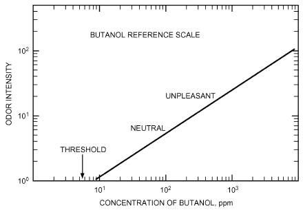
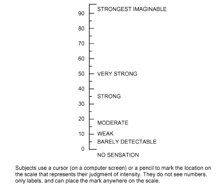
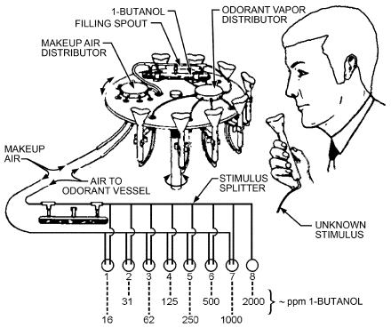
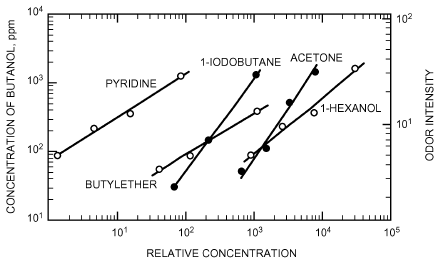
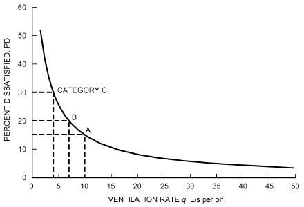

# Chapter 12 — Odors

*Izvor: 2021 ASHRAE Handbook — Fundamentals (SI), Chapter 12 (PDF str. 273–280).*

> **Napomena o konverziji:** Tekst je automatski izdvojen iz originalnog PDF-a uz prepoznavanje dve kolone, spojene prelomljene reči i pasuse. Indeksi i eksponenti su označeni sa ``/``, tabele su pretvorene u Markdown tabele (veoma složene tabele su prikazane kao poravnat tekst), a slike su izrezane iz PDF-a u folder `img/`. Složene jednačine (razlomci, sume) mogu biti uprošćeno prikazane. **Pre upotrebe vrednosti u proračunu proveriti u originalnom PDF-u.** Oznake `<!-- str. N -->` pokazuju stranu PDF-a.

## Sadržaj

- [1. ODOR SOURCES](#1-odor-sources)
- [2. SENSE OF SMELL](#2-sense-of-smell)
- [3. FACTORS AFFECTING ODOR PERCEPTION](#3-factors-affecting-odor-perception)
- [4. ODOR SENSATION ATTRIBUTES](#4-odor-sensation-attributes)
- [5. DILUTION OF ODORS BY VENTILATION](#5-dilution-of-odors-by-ventilation)
- [6. ODOR CONCENTRATION](#6-odor-concentration)
- [7. OLF UNITS](#7-olf-units)
- [REFERENCES](#references)
- [BIBLIOGRAPHY](#bibliography)

<!-- str. 273 -->

VARIOUS factors make odor control an important consideration in ventilation engineering: (1) contemporary construction methods result in buildings that allow less air infiltration through the building envelope; (2) indoor sources of odors associated with modern building materials, furnishings, and office equipment have increased; (3) outdoor air is often polluted; and (4) energy costs encourage lower ventilation rates at a time when requirements for a relatively odor-free environment are greater than ever.

Since Yaglou et al.’s (1936) classic studies, the philosophy behind ventilation of nonindustrial buildings has mainly been to provide indoor air that is acceptable to occupants. Air is evaluated by the olfactory sense, although the general chemical sense, which is sensitive to irritants in the air, also plays a role.

This chapter reviews how odoriferous substances are perceived. Chapter 47 of the 2019 *ASHRAE Handbook—HVAC Applications* covers control methods. Chapter 10 of this volume has more information on indoor environmental health.

## 1. ODOR SOURCES

Outdoor sources of odors include automotive and diesel exhausts, hazardous waste sites, sewage treatment plants, compost piles, refuse facilities, printing plants, refineries, chemical plants, and many other stationary and mobile sources. These sources produce both inorganic compounds (e.g., ammonia and hydrogen sulfide) and volatile organic compounds (VOCs), including some that evaporate from solid or liquid particulate matter. Odors emitted by outdoor sources eventually enter the indoor environment.

Indoor sources also emit odors. Sources include tobacco products, bathrooms and toilets, building materials (e.g., adhesives, paints, caulks, processed wood, carpets, plastic sheeting, insulation board), consumer products (e.g., food, toiletries, cleaning materials, polishes), hobby materials, fabrics, and foam cushions. In offices, offset printing processes, copiers, and computer printers may produce odors. Electrostatic processes may emit ozone. Humans emit a wide range of odorants, including acetaldehyde, ammonia, ethanol, hydrogen sulfide, and mercaptans.

Mildew and other decay processes often produce odors in occupied spaces (home and office), damp basements, and ventilation systems (e.g., from wetted air-conditioning coils and spray dehumidifiers).

Chapter 47 of the 2019 *ASHRAE Handbook—HVAC Applica-* tions gives further information on contaminant sources and generation rates.

## 2. SENSE OF SMELL

### Olfactory Stimuli

Organic substances with relative molecular masses greater than 300 are generally odorless. Some substances with relative molecular masses less than 300 are such potent olfactory stimuli that they can be perceived at concentrations too low to be detected with direct-reading instruments. Trimethylamine, for example, can be recognized as a fishy odor by a human at a concentration of about 10−4 ppm.

The preparation of this chapter is assigned to TC 2.3, Gaseous Air Contaminants and Gas Contaminant Removal Equipment.

Table 1 shows **odor detection threshold concentrations** for selected compounds. The **threshold limit value** (TLV) is the concentration of a compound that should have no adverse health consequences if a worker is regularly exposed for 8 h periods (ACGIH, revised annually). Table 1 also includes the ratio of the TLV to the odor threshold for each compound. For ratios greater than 1, most occupants can detect the odor and leave the area long before the compound becomes a health risk. As the ratio increases, the safety factor provided by the odor also increases. Table 1 is not a comprehensive list of the chemicals found in indoor air. AIHA (1989) and EPA (1992) list odor thresholds for selected chemicals.

Olfactory sensitivity often makes it possible to detect potentially harmful substances at concentrations below dangerous levels so that they can be eliminated. Foul-smelling air is often assumed to be unhealthy. In reality, however, there is little correlation between odor perception and toxicity, and there is considerable individual variation in the perception of pleasantness/unpleasantness of odors. When symptoms such as nausea, headache, and loss of appetite are caused by an unpleasant odor, it may not matter whether the air is toxic but whether the odor is perceived to be unpleasant, associated with an unpleasant experience, or simply felt to be out of appropriate context. The magnitude of the symptoms is related to the magnitude of the odor, but even a room with a low but recognizable odor can make occupants uneasy. Several papers review sensory irritation and its relation to indoor air pollution (Cain and Cometto-Muñiz 1995; Cometto-Muñiz and Cain 1992; Cometto-Muñiz et al. 1997; Shams Esfandabad 1993).

**Table 1 Odor Thresholds, ACGIH TLVs, and TLV/Threshold Ratios of Selected Gaseous Air Pollutants**

| Compound | Odor Threshold,a ppmv | TLV,b ppmv | Ratio |
|---|---|---|---|
| Acetaldehyde | 0.067 | 25-C | 360 |
| Acetone | 62 | 500 | 8.1 |
| Acetonitrile | 1600 | 20 | 0.013 |
| Acrolein | 1.8 | 0.1-C | 0.06 |
| Ammonia | 17 | 25 | 1.5 |
| Benzene | 61 | 0.5 | 0.01 |
| Benzyl chloride | 0.041 | 1 | 24 |
| Carbon tetrachloride | 250 | 5 | 0.02 |
| Chlorine | 0.08 | 0.5 | 6 |
| Chloroform | 192 | 10 | 0.05 |
| Dioxane | 12 | 20 | 1.7 |
| Ethylene dichloride | 26 | 10 | 0.4 |
| Hydrogen sulfide | 0.0094 | 10 | 1064 |
| Methanol | 160 | 200 | 1.25 |
| Methylene chloride | 160 | 50 | 0.3 |
| Methyl ethyl ketone | 16 | 200 | 12.5 |
| Phenol | 0.06 | 5 | 83 |
| Sulfur dioxide | 2.7 | 2 | 0.74 |
| Tetrachloroethane | 7.3 | 1 | 0.14 |
| Tetrachloroethylene | 47 | 25 | 0.5 |
| Toluene | 1.6 | 20 | 13 |
| Trichloroethylene | 82 | 10 | 0.1 |
| Xylene (isomers) | 20 | 100 | 5 |

Sources: ACGIH (updated annually), AIHA (1989).

aAll thresholds are detection thresholds (ED50).

bAll TLVs are 8 h time-weighted averages, except those shown with -C, which are 15 min ceiling values.

<!-- str. 274 -->

### Anatomy and Physiology

The **olfactory receptors** lie in the **olfactory cleft**, which is high in the nasal cavity. About five million olfactory **neurons** (a small cluster of nerve cells inside the nasal cavity above the bridge of the nose) each send an **axon** (an extension of the neuron) into the olfactory bulb of the brain. Information received from the receptors is passed to various central structures of the brain (e.g., olfactory cortex, hippocampus, amygdala). One sniff of an odorant can often evoke a complex, emotion-laden memory, such as a scene from childhood.

The surrounding nasal tissue contains other diffusely distributed nerve endings of the trigeminal nerve that also respond to airborne vapors. These receptors mediate the chemosensory responses such as tickling, burning, cooling, and, occasionally, painful sensations that accompany olfactory sensations. Most odorous substances at sufficient concentration also stimulate these nerve endings.

### Olfactory Acuity

The olfactory acuity of the population is normally distributed. Most people have an average ability to smell substances or to respond to odoriferous stimuli, a few people are very sensitive or hypersensitive, and a few others are insensitive, including some who are totally unable to smell (**anosmic**). The olfactory acuity of an individual varies with the odorant.

Hormonal factors, which often influence emotional states, can modulate olfactory sensitivity. Although the evidence is not uniformly compelling, research has found that (1) the sensitivity of females varies during the menstrual cycle, reaching a peak just before and during ovulation (Schneider 1974); (2) females are generally more sensitive than males, but this difference only emerges around the time of sexual maturity (Koelega and Koster 1974); (3) sensitivity is altered by some diseases (Schneider 1974); and (4) various hormones and drugs (e.g., estrogen, alcohol) alter sensitivity (Engen et al. 1975; Schneider 1974).

Other factors that may affect olfactory perception include the individual’s olfactory acuity, the magnitude of flow rate toward olfactory receptors, temperature, and relative humidity. Olfactory acuity can also vary with age (Stevens et al. 1989; Wysocki and Gilbert 1989), genetics (Wysocki and Beauchamp 1984), exposure history (Dalton and Wysocki 1996; Wysocki et al. 1997), and disease or injury (Cowart et al. 1993, 1997). Humans are able to perceive a large number of odors, yet untrained individuals are able to name only a few (Ruth 1986).

Individuals who are totally unable to detect odors are relatively rare (Cowart et al. 1997). A more common occurrence is an inability to detect one or a very limited number of odors, a condition known as **specific anosmia**. Although the huge number of possible chemicals makes for an untestable hypothesis, it has been posited that most, if not all, individuals have a specific anosmia to one or more compounds (Wysocki and Beauchamp 1984). The fact that individuals with specific anosmias have normal olfactory acuity for all other odors suggests that such anosmias may be caused by genetic differences.

In olfactory science, **adaptation** refers to decreased sensitivity or responsiveness to an odor after prolonged exposure. This exposure can selectively impair the perception of the exposure odorant, but there are also examples of cross-adaptation, where exposure to one odorant can result in adaptation to other odors as well. Adaptation can occur in the short term, where perception of a room’s odor begins to fade within seconds of entering the room (Cometto-Muñiz and Cain 1995; Pierce et al. 1996). With long-term adaptation, an individual who habitually returns to the same environment does not smell odors that are quite discernible to a naive observer. This effect appears to shift both the threshold and the **suprathreshold** (stimuli above the threshold level) response to the odor (Dalton and Wysocki 1996). This is an important phenomenon for indoor air quality (IAQ) personnel to be aware of because it is often one of the biggest reasons for variations in detectability or response in real-world environments and makes the choice of test population or panelists for air quality evaluations a critical one.

## 3. FACTORS AFFECTING ODOR PERCEPTION

### Humidity and Temperature

Temperature and humidity can both affect the perception of odors. Cain et al. (1983) reported that a combination of high temperature (25.5°C) and high humidity exacerbates odor problems. Berglund and Cain (1989) found that air was generally perceived to be fresher and less stuffy with decreasing temperature and humidity. Fang et al. (1998a, 1998b) and Toftum et al. (1998) found little or no increase in odor intensity with increasing enthalpy (temperature and humidity), but reported a very significant decrease in odor acceptability with increasing enthalpy.

Not all researchers have supported these findings. Kerka and Humphreys (1956) reported a decrease in odor intensity with increasing humidity. Berg-Munch and Fanger (1982) found no increase in odor intensity with increasing temperature (23 to 32°C). Clausen et al. (1985) found no significant change in odor intensity with increasing relative humidity (30% to 80%).

Although the findings are not homogeneous, they do show that temperature and humidity can act together to affect one’s perception of odors. Air that is cooler and drier is generally perceived to be fresher and more acceptable even if odor intensity is not affected.

### Sorption and Release of Odors

Because furnishings and interior surfaces absorb (and later desorb) odors during occupancy, spaces frequently retain normal occupancy odor levels long after occupancy has ceased. This is observed when furnaces or radiators, after a long shutdown, are heated at winter start-up and when evaporator coils warm up. The rate of desorption can be decreased by decreasing temperature and relative humidity, and increased (as for cleaning) by the reverse.

Environmental tobacco smoke may desorb from surfaces long after smoking has taken place. This phenomenon has caused many hotels to establish nonsmoking rooms.

Where the odor source is intrinsic to the materials (as in linoleum, paint, rubber, and upholstery), reducing the relative humidity decreases the rate of odor release. Quantitative values should not be used without considering the sorption/desorption phenomenon.

### Emotional Responses to Odors

There can be considerable variation between individuals regarding the perceived pleasantness or unpleasantness of a given odor. Responses to odors may be determined by prior experiences and can include strong emotional reactions. This is because one of the brain structures involved in the sense of smell is the **amygdala**, a regulator of emotional behaviors (Frey 1995). Some IAQ complaints can involve emotional responses completely out of proportion to the concentration of the odorant or the intensity of the odor it produces.

Two theories describe physiological reasons for these strong responses. One of these is **kindling**, in which repeated, intermittent stimuli amplify nerve responses. The other is **response facilitation**, in which an initial stimulus perceived as strong is facilitated (becomes greater) rather than adapted to (Frey 1995).

<!-- str. 275 -->

Because of this emotional aspect, IAQ complaints involving odors can be very difficult to solve, especially if they are coming from a few sensitized individuals. It is important to respond quickly to complaints to minimize the risk of kindling or response facilitation.

## 4. ODOR SENSATION ATTRIBUTES

Odor sensation has four components or attributes: detectability, intensity, character, and hedonic tone.

**Detectability** (or **threshold**) is the minimum concentration of an odorant that provokes detection by some predetermined segment of the population. Two types of thresholds exist: detection and recognition.

The **detection threshold** is the lowest level that elicits response by a segment of the population. If that segment is 50%, the detection threshold is denoted by ED50. **Recognition threshold** is the lowest level at which a segment of the population can recognize a given odor. Thresholds can be attributed to 100%, which includes all olfactory sensitivities, or to 10%, which includes only the most sensitive segment of the population. Threshold values are not physical constants, but statistical measurements of best estimates.

**Intensity** is a quantitative aspect of a descriptive analysis, stating the degree or magnitude of the perception elicited. Intensity of the perceived odor is, therefore, the strength of the odoriferous sensation. Detection threshold values and, most often, odor intensity determine the need for indoor odor controls.

**Character** defines the odor as similar to some familiar smell (e.g., fishy, sour, flowery). **Hedonics**, or the hedonic tone of an odor, is the degree to which an odor is perceived as pleasant or unpleasant. Hedonic judgments include both a category judgment (pleasant, neutral, unpleasant) and a magnitude judgment (very unpleasant, slightly pleasant).

Important questions are

- What is the minimum concentration of odorant that can be detected?
- How does perceived odor magnitude grow with concentration above the threshold?

No universal method has been accepted to measure either the threshold or perceived magnitude of the odor above threshold. However, guidelines and conventions simplify the choice of methods.

### Detectability

Perception of weak odoriferous signals is probabilistic: at one moment odor may be perceptible, and at the next moment it may not. Factors affecting this phenomenon include moment-to-moment variability in the number of molecules striking the olfactory receptors, variability in which of the receptors are stimulated, concentration of the odor, the individual’s style of breathing, and the individual’s previous experience with the odor. The combined effect of these factors may prevent an individual from perceiving an odor during the entire time of the stimulus. During odor evaluation, dilution to detection or recognition threshold values allows determination of the largest number of dilutions that still allows half of the panelists to detect or recognize the odor.

**Determination of Odor Thresholds.** Odor threshold testing is over a century old. The process is complex, and several different methods are used. Partly because of variations in measurement techniques, reported threshold values can vary by several orders of magnitude for a given substance. To minimize variation caused by experimental techniques, a standard set of criteria has been developed for the panel, presentation apparatus, and presentation method (AIHA 1989; EPA 1992).

The **panel** should

- Include at least six members per group.
- Be selected based on odor sensitivity. Factors to be considered include anosmia, pregnancy, drug use, and smoking.
- Be calibrated to document individual and group variability.

Considerations for the **presentation apparatus** include

- Vapor modality: choice of a gas/air mixture, water vapor, or other substance.
- Diluent: choice of diluent (e.g., air, nitrogen), how it is treated, and what its source is.
- Presentation mode: delivery systems can be nose ports, vents into which the head is inserted, flasks, or whole rooms.
- Analytic measurement of odorant concentration.
- System calibration: flow rate should be approximately 0.05 L/s; face velocity should be low enough to be barely perceptible to the panelists.

Criteria for the **presentation method** include

- Threshold type: detection or recognition.
- Concentration presentation: this must take adaptation into account. Presenting ascending concentrations or allowing longer periods between concentrations helps avoid adaptation.
- Number of trials: test/retest reliability for thresholds is low. Increasing the number of trials helps correct for this.
- Forced-choice procedure: panelists must choose between the stimuli and one or two blanks. This helps eliminate false positive responses.
- Concentration steps: odorant should be presented successively at concentrations no more than three times the preceding one.

For more details regarding psychophysical procedures, ways to sample odoriferous air, handling samples, means of stimulus presentation, and statistical procedures, consult ASTM (1996).

### Intensity

**Psychophysical Power Law.** The relation between **perceived odor magnitude S** and **concentration C** conforms to a power function:

> S = kCn&emsp;**(1)**

where

- S = perceived intensity (magnitude) of sensation
- k = characteristic constant
- C = odorant concentration
- n = exponent of psychophysical function (slope on a log-log scale)

This exemplifies the psychophysical power law, also called **Ste- vens’ law** (Stevens 1957). In the olfactory realm, n < 1.0. Accordingly, a given percentage change in odorant concentration causes a smaller percentage change in perceived odor magnitude.

**Scaling Methods.** There are various ways to scale perceived magnitude, but a **category scale**, which can be either number- or word-categorized, is common. Numerical values on this scale do not reflect ratio relations among magnitudes (e.g., a value of 2 does not represent a perceived magnitude twice as great as a value of 1). Table 2 gives four examples of category scales.

Although category scaling procedures can be advantageous in the field, **ratio scaling** is used frequently in the laboratory (Cain and Moskowitz 1974). Ratio scaling requires observers to assign numbers proportional to perceived magnitude. For example, if the observer is instructed to assign the number 10 to one concentration and a subsequently presented concentration seems three times as strong, the observer calls it 30; if another seems half as strong, the observer assigns it 5. This procedure, called **magnitude estimation**, was used to derive the power function for butanol (Figure 1). Ratio scaling techniques allow for such relationships because they require subjects to produce numbers to match perceived sensations in which the numbers emitted reflect the ratio relations among the sensations.

<!-- str. 276 -->

*Fig. 1 Standardized Function Relating Perceived Magnitude to Concentration of 1-Butanol*

> (Moskowitz et al. 1974)

**Table 2 Examples of Category Scales**

| Number Category Scale I | Number Category Scale II | Word Category Scale I | Word Category Scale II |
|---|---|---|---|
| 0 | 0 | None | None at all |
| 1 | 1 | Threshold | Just detectable |
| 2 | 2.5 | Very slight | Very mild |
| 3 | 5 | Slight | Mild |
| 4 | 7.5 | Slight-moderate | Mild-distinct |
| 5 | 10 | Moderate | Distinct |
| 6 | 12.5 | Moderate-strong | Distinct-strong |
| 7 | 15 | Strong | Strong |

Source: Meilgaard et al. (1987).

The **labeled magnitude scale** is a hybrid of category and ratio scales (Green et al. 1996). This scale is intended to yield ratio-level data with a true zero and an orderly relationship among the scale values, such that any stimulus can be expressed as being proportionately more or less intense than another. Because it allows subjects to use natural-language descriptors to scale perceived experience, it often requires less training than ratio scales and produces absolute intensity estimates of perceived sensation (Figure 2).

A fourth way to measure suprathreshold odor intensity is to **match the intensity of odorants**. An observer can be given a concentration series of a matching odorant (e.g., 1-butanol) to choose the member that matches most closely the intensity of an unknown odorant. The matching odorant can be generated by a relatively inexpensive olfactometer such as that shown in Figure 3. Figure 4 shows, in logarithmic coordinates, functions for various odorants obtained by matching (Dravnieks and Laffort 1972). The left-hand ordinate expresses intensity in terms of concentration of butanol, and the right-hand ordinate expresses intensity in terms of perceived magnitude. The two ordinates are related by the function in Figure 1, the standardized function for butanol. The matching method illustrated here has been incorporated into ASTM Standard E544.

### Character

The quality or character of an odor is difficult to assess quantitatively. A primary difficulty is that odors can vary along many dimensions. One way to assess quality is to ask panelists to judge the similarity between a test sample and various reference samples, using a five-point category scale. For some applications, reference odorants can be chosen to represent only the portion of the qualitative range relevant to the problem under investigation (e.g., animal odors). Another procedure is to ask panelists to assess the degree of

*Fig. 2 Labeled Magnitude Scale*

*Fig. 3 Panelist Using Dravnieks Binary Dilution Olfactometer*

> (Dravnieks 1975)

*Fig. 4 Matching Functions Obtained with Dravnieks Olfactometer*

> (Cain 1978; Dravnieks and Laffort 1972)

<!-- str. 277 -->

association between a test sample’s quality and certain verbal descriptors (e.g., sweaty, woody, chalky, sour).

The number of odorant descriptors and descriptors to be used have been subjects of disagreement (Harper et al. 1968). The number of descriptors varies from a minimum of seven (Amoore 1962) to as many as 830 used by an ASTM subcommittee. An atlas of odor characters, containing 146 descriptors, was compiled for 180 chemicals by ASTM (1985).

An odor can be characterized either by an open-ended word description or by multidimensional scaling. **Multidimensional scaling** is based on similarity and dissimilarity judgments in comparison to a set of standard odors or to various descriptors.

In some cases, the interest may be merely whether an odor’s quality has changed as a result of some treatment (e.g., use of a bacteriostat). Under these circumstances, samples of air taken before and after treatment can be compared directly (using a simple scale of similarity) or indirectly (with appropriate verbal descriptors).

### Hedonics

The acceptability or pleasantness of an odor can be measured psychophysically in the same way as odor intensity. Both ratio and category scaling procedures can be adapted to odor acceptability.

Odors do not always cause adverse reactions. Products are manufactured to elicit favorable responses. Acceptance tests may involve product comparison (frequently used in the perfume industry) or a hedonic scale. The premise of acceptance tests is that the larger the segment of subjects accepting the odor, the better the odor. A hedonic scale that allows for negative as well as positive responses is likely to better determine how acceptable the odor is.

All persons exposed to a given odor are not likely to agree on its acceptability. Acceptability of a given odor to a person is based on a complex combination of associations and is not simply a characteristic of the odor itself (Beck and Day 1991). Responses to odors are determined by both **bottom-up factors** (attributes or properties of the odorant) and **top-down factors** (expectations, attitudes, and associations from prior experience stored in memory, and appropriateness of the odor in its present context). Both factors are activated when an individual detects an odor, and the individual’s ultimate response (e.g., perception of intensity, hedonics, irritation, or symptoms) is a joint function of both (Dalton 1996; Dalton et al. 1997). In some cases, the interpretation provided by the top-down process appears to override the outcome from the bottom-up process, resulting in complaints, symptoms, and reports of illness.

## 5. DILUTION OF ODORS BY VENTILATION

The size of the exponent n in Stevens’ law [Equation (1)] varies from one odorant to another, ranging from less than 0.2 to about 0.7 (Cain and Moskowitz 1974). This determines the **slope** or **dose response** of the odor intensity/odorant concentration function and has important consequences for malodor control. A low slope value indicates an odor that requires greater relative dilution for the odor to dissipate; a high slope value indicates an odor that can be more quickly reduced by ventilation. For example, an exponent of 0.7 implies that, to reduce perceived intensity by a factor of 5, the concentration must be reduced by a factor of 10; an exponent of 0.2 would require a reduction in concentration by a factor of more than 3000 for the same reduction in perceived magnitude. Examples of compounds with low slope values include hydrogen sulfide, butyl acetate, and amines. Compounds with high slope values include ammonia and aldehydes.

The ability of ventilation to control odors also depends on the strength of the source generating the odorant(s) and the nature of the odor. An odorant with a stronger source requires proportionately more ventilation to achieve the same reduction in concentration. Odors that are perceived as unpleasant may require substantially greater reduction before being perceived as acceptable. In addition, some sources, such as painted walls and flooring materials, may show increased emission rates in response to increased ventilation rates, which further complicates the issue (Gunnarsen 1997).

## 6. ODOR CONCENTRATION

### Analytical Measurement

Performance data on control of specific odorants can be obtained using suitable analytical methods. Detectors can sense substances in amounts as little as 1 ng. Air contains many minor components, so gas chromatographic separation of the components must precede detection. Because odor thresholds for some compounds are low, preconcentration of the minor components is necessary. **Precon- centration** consists of adsorption or absorption by a stable, sufficiently nonvolatile material, followed by thermal desorption or extraction. NIOSH (1993) reviews techniques for sampling and analysis of VOCs in indoor air.

**Mass spectrometry** can be used with **gas chromatography** to identify constituents of complex mixtures. The chromatograph resolves a mixture into its constituents, and the spectrometer provides identification and concentration of selected constituents.

Several other detectors are sufficiently sensitive and specific to detect resolved components. **Hydrogen flame ionization detectors** respond adequately and nearly mass-proportionally to almost all hydrocarbons, though their responses to organic chemicals containing other atoms (e.g., oxygen) are more variable. **Flame photomet- ric detectors** can pinpoint with equal sensitivity compounds that contain sulfur; many sulfur compounds are strongly odorous and are of interest in odor work. A **Coulson conductometric detector** is specifically and adequately sensitive to ammonia and organic nitrogen compounds. **Thermal conductivity detectors** are generally not sensitive enough for analytical work on odors.

Frequently, a **sniffing port** (Dravnieks and Krotoszynski 1969; Dravnieks and O’Donnell 1971) is installed in parallel with the detector(s). Part of the resolved effluent exhausts through the port and allows components that are particularly odorous or carry some relevant odor quality to be annotated. Usually, only a fraction of all components studied exhibits odors.

Airborne VOCs cause odors, but the correlation between indoor VOC concentrations and odor complaints in indoor environments is poor. Considerable work has been done on **artificial noses**, which may offer objective determination of odorants (Bartlett et al. 1997; Freund and Lewis 1995; Moy et al. 1994; Taubes 1996). However, because the physicochemical correlates of olfaction are poorly understood, no simple analytical means to predict an odorant’s perceived quality and intensity exists. Moreover, because acceptability of an odorant depends strongly on context, it is unlikely that analytical instruments will supplant human evaluation.

### Odor Units

Odor concentration can be expressed as the number of unit volumes that a unit volume of odorous sample occupies when diluted to the odor threshold with nonodorous air. If a sample of odorous air can be reduced to threshold by a tenfold dilution with pure air, the concentration of the original sample is said to be 10 odor units. Hence, odor units are equivalent to multiples of threshold concentrations. Odor units are not units of perceived magnitude.

Odor units are widely used to express legal limits for emission of odoriferous materials. For example, the law may state that a factory operation may not cause the ambient odor level to exceed 15 odor units. For every odorant (chemical), odor units and parts per million (ppm) are proportional. The proportionality constant varies from one odorant to another, depending on the number of ppm needed to evoke a threshold response. Perceived odor magnitude (intensity), however, does not grow proportionally with concentration expressed in ppm. Therefore, it cannot grow proportionally with concentration expressed in odor units. For example, a sample of 20 odor units is always perceived as less than twice as strong as a sample of 10 odor units. Moreover, because the psychophysical function (slope) varies from one odorant to another, samples of two odorants, each at 20 odor units, may have unequal perceived intensities.

<!-- str. 278 -->

Although odor units are not equivalent to units of perceived magnitude, they can be useful. Most indoor and outdoor contaminants are complex mixtures, so that the actual concentration of the odoriferous portion of a sample cannot be expressed with certainty. Thus, the odor unit is a useful measure of concentration of the mixture when evaluating, for example, the efficiency of a filter or ventilation system to remove or dilute the odor.

## 7. OLF UNITS

Sometimes IAQ scientists cannot successfully resolve complaints about air in offices, schools, and other nonindustrial environments. Customarily, complaints are attributed to elevated pollutant concentrations; frequently, however, such high concentrations are not found, yet complaints persist.

Assuming that the inability to find a difference between air pollutant levels in buildings with registered complaints and those without complaints is due to inadequacies of prevailing measurement techniques, Fanger and others changed the focus from chemical analysis to sensory analysis (Fanger 1987, 1988; Fanger et al. 1988). Fanger quantified air pollution sources by comparing them with a well-known source: a sedentary person in thermal comfort. A new unit, the **olf**, was defined as the emission rate of air pollutants (bioeffluents) from a standard person. A **decipol** is one olf ventilated at a rate of 10 L/s of unpolluted air.

To use these units, Fanger generated a curve that relates the percentage of persons dissatisfied with air polluted by human bioeffluents as a function of the outdoor air ventilation rate and obtained the following expression:

- D = 395exp(–3.66q0.36) for q ≥ 0.332

> D = 100 for q < 0.332&emsp;**(2)**

where

- D = percentage of persons dissatisfied
- q = ventilation/emission ratio, L/s per olf

This curve (Figure 5) is based on experiments involving more than 1000 European subjects (Fanger and Berg-Munch 1983). Experiments with American (Cain et al. 1983) and Japanese (Iwashita et al. 1990) subjects show very similar results.

The idea behind the olf is to express both human and nonhuman sensory sources in a single unit: equivalent standard persons (i.e., in olfs). A room should therefore be ventilated to handle the total sensory load from persons and building. The olf concept is used in European publications for ventilation (CEN 1998; ECA 1992) to determine required ventilation and in several national standards, including the Norwegian Building Code. Table 3 shows the sensory loads from different pollution sources used in CEN (1998).

**Example.** Office, low-polluting building, occupancy 0.07 persons/m2.

> 2

(Occupants 0.07 olf/m Building 0.1 olf/m2)/(Total sensory load 0.17 olf/m2)

30% dissatisfied requires 4 L/s per olf ventilation rate (Figure 5). Required ventilation: 4 × 0.17 = 0.7 L/(s·m2).

The sensory load on the air in a space can be determined from Figure 5 by measuring the outdoor ventilation rate and determining the percent dissatisfied, using an untrained panel with a minimum of

*Fig. 5 Percentage of Dissatisfied Persons as a Function of Ventilation Rate per Standard Person (i.e., per Olf)*

> (CEN 1998)

**Table 3 Sensory Pollution Load from Different Pollution Sources**

| Source | Sensory Load |
|---|---|
| Sedentary person (1 to 1.5 met) | 1 olf |
| Person exercising |  |
| Low level (3 met) | 4 olf |
| Medium level (6 met) | 10 olf |
| Children, kindergarten (3 to 6 yrs) | 1.2 olf |
| Children, school (4 to 16 yrs) | 1.3 olf |
| Low-polluting building | 0.1 olf/m2 |
| Non-low-polluting building | 0.2 olf/m2 |

Source: CEN (1998).

20 impartial persons (Gunnarsen and Fanger 1992). The panel judges the acceptability of the air just after entering the space. The required ventilation rate depends on the desired percentage of occupant satisfaction. In ASHRAE Standard 62.1, 80% acceptability (20% dissatisfied) is the goal; European guidelines offer three quality levels: 15%, 20%, and 30% dissatisfied.

Although this system has much to offer from a theoretical standpoint, its use is controversial in some areas. Problems have been found in cultural differences among panel members and access to outdoor air for dilution (Aizlewood et al. 1996). The trend is now to use untrained panels, as described in the previous paragraph. Knudsen et al. (1998) showed that, for some building materials, the curve giving the relation between percent dissatisfied and ventilation rate is less steep than that in Figure 5, whereas it is steeper for others. The sensory load in this case depends on the ventilation rate. The constant sensory loads in Table 3 should therefore be seen as a first approximation.

## REFERENCES

ASHRAE members can access ASHRAE Journal articles and ASHRAE research project final reports at technologyportal .ashrae.org. Articles and reports are also available for purchase by nonmembers in the online ASHRAE Bookstore at www.ashrae.org /bookstore.

ACGIH. Annually. *TLVs® and BEIs®.* American Conference of Governmental Industrial Hygienists, Cincinnati, OH.

AIHA. 1989. *Odor thresholds for chemicals with established occupational* health standards. American Industrial Hygiene Association, Akron, OH.

Aizlewood, C.E., G.J Raw, and N.A. Oseland. 1996. Decipols: Should we use them? *Indoor Built Environment* 5:263-269.

<!-- str. 279 -->

Amoore, J.E. 1962. The stereochemical theory of olfaction, 1: Identification of seven primary odors. *Proceedings of the Scientific Section of the Toilet* Goods Association 37:1-12.

ASHRAE. 2016. Ventilation for acceptable indoor air quality. ANSI/ASHRAE Standard 62.1-2016.

ASTM. 1985. Atlas of odor character profiles*. Data Series* 61. American Society for Testing and Materials, West Conshohocken, PA.

ASTM. 1996. Sensory testing methods, 2nd ed. E. Chambers IV and M.B.

Wolf, eds. Document MNL26-EB. American Society for Testing and Materials, West Conshohocken, PA.

ASTM. 2004. Standard practices for referencing suprathreshold odor intensity. Standard E544-1999 (2004). American Society for Testing and Materials, West Conshohocken, PA.

Bartlett, P., J. Elliott, and J. Gardner. 1997. Electronic noses and their applications in the food industry*. Food Technology* 51(12):44-48.

Beck, L., and V. Day. 1991. New Jersey’s approach to odor problems. Trans-*actions: Recent developments and current practices and odor regula-* *tions control and technology*, D.R. Derenzo and A. Gnyp, eds. Air and Waste Management Association, Pittsburgh, PA.

Berglund, L., and W.S. Cain. 1989. Perceived air quality and the thermal environment. *Proceedings of IAQ ’89: The Human Equation: Health and* Comfort, San Diego, pp. 93-99.

Berg-Munch, B., and P.O. Fanger. 1982. The influence of air temperature on the perception of body odour. Environment International 8:333-335.

Cain, W.S. 1978. The odoriferous environment and the application of olfactory research. In *Handbook of perception*, vol. 6, *Tasting and smelling*, pp. 197-199, C.C. Carterette and M.P. Friedman, eds. Academic Press, New York.

Cain, W.S., and J.E. Cometto-Muñiz. 1995. Irritation and odors as indicators of indoor pollution. Occupational Medicine 10(1):133-135.

Cain, W.S., and H.R. Moskowitz. 1974. Psychophysical scaling of odor. In *Human responses to environmental odors*, pp. 1-32, A. Turk, J.W. Johnston, and D.G. Moulton, eds. Academic Press, New York.

Cain, W.S., B.P. Leaderer, R. Isseroff, L.G. Berglund, R.I. Huey, E.D.

Lipsitt, and D. Perlman. 1983. Ventilation requirements in buildings—I: Control of occupancy odor and tobacco smoke odor. Atmospheric Environment 17:1183-1197.

CEN. 1998. Ventilation for buildings: Design criteria for the indoor environment. Technical Report CR1752. European Committee for Standardization, Brussels.

Clausen, G., P.O Fanger, W.S. Cain, and B.P. Leaderer. 1985. The influence of aging particle filtration and humidity on tobacco smoke odour. Pro-*ceedings of CLIMA 2000*, vol. 4, pp. 345-349. Copenhagen.

Cometto-Muñiz, J.E., and W.S. Cain. 1992. Sensory irritation, relation to indoor air pollution in sources of indoor air contaminants—Characterizing emissions and health effects. In *Annals of the New York Academy of* Sciences, vol. 641: *Sources of indoor air contaminants: Characterizing* *emissions and health impacts*.

Cometto-Muñiz, J.E., and W.S. Cain. 1995. Olfactory adaptation. In Hand-*book of olfaction and gustation*, R.L. Doty, ed. Marcel Dekker, New York.

Cometto-Muñiz, J.E., W.S. Cain, and H.K. Hudnell. 1997. Agonistic sensory effects of airborne chemicals in mixtures: Odor, nasal pungency and eye irritation*. Perception and Psychophysics* 59(5):665-674.

Cowart, B.J., K. Flynn-Rodden, S.J. McGeady, and L.D. Lowry. 1993.

Hyposmia in allergic rhinitis. *Journal of Allergy and Clinical Immunol-* ogy 91:747-751.

Cowart, B.J., I.M. Young, R.S. Feldman, and L.D. Lowry. 1997. Clinical disorders of smell and taste. Occupational Medicine 12:465-483.

Dalton, P. 1996. Odor perception and beliefs about risk. Chemical Senses 21:447-458.

Dalton, P., and C.J. Wysocki. 1996. The nature and duration of adaptation following long-term exposure to odors. *Perception & Psychophysics* 58(5):781-792.

Dalton, P., C.J. Wysocki, M.J. Brody, and H.J. Lawley. 1997. The influence of cognitive bias on the perceived odor, irritation and health symptoms from chemical exposure. *International Archives of Occupational and* Environmental Health 69:407-417.

Dravnieks, A. 1975. Evaluation of human body odors, methods and interpretations. *Journal of the Society of Cosmetic Chemists* 26:551.

Dravnieks, A., and., and B. Krotoszynski. 1969. Analysis and systematization of data for odorous compounds in air. *ASHRAE Symposium Bulletin*: *Odor and odorants: The engineering view*.

Dravnieks, A., and P. Laffort. 1972. Physicochemical basis of quantitative and qualitative odor discrimination in humans. *Olfaction and Taste IV:* *Proceedings of the Fourth International Symposium*, pp. 142-148. D. Schneider, ed. Wissenschaftliche Verlagsgesellschaft mbH, Stuttgart.

Dravnieks, A., and A. O’Donnell. 1971. Principles and some techniques of high resolution headspace analysis. *Journal of Agricultural and Food* Chemistry 19:1049.

ECA. 1992. Guidelines for ventilation requirements in buildings. European Collaborative Action *Indoor Air Quality and its Impact on Man*: Report 11. EUR 14449 EN. Office for Official Publications of the European Committees, Luxembourg.

Engen, T., R.A. Kilduff, and N.J. Rummo. 1975. The influence of alcohol on odor detection. *Chemical Senses and Flavor* 1:323.

EPA. 1992. *Reference guide to odor thresholds for hazardous air pollutants* *listed in the* Clean Air Act Amendments of 1990. EPA/600/R-92/047. Office of Research and Development, U.S. Environmental Protection Agency, Washington, D.C.

Fang, L., G. Clausen, and P.O. Fanger. 1998a. Impact of temperature and humidity on the perception of indoor air quality*. Indoor Air* 8(2):80-90.

Fang, L., G. Clausen, and P.O. Fanger. 1998b. Impact of temperature and humidity on perception of indoor air quality during immediate and longer whole-body exposures. Indoor Air 8(4):276-284.

Fanger, P.O. 1987. A solution to the sick building mystery. *Indoor Air ’87,* *Proceedings of the International Conference on Indoor Air and Climate*. Institute of Water, Soil and Air Hygiene, Berlin.

Fanger, P.O. 1988. Introduction of the olf and decipol units to quantify air pollution perceived by humans indoors and outdoors. *Energy and Build-* ings 12:1-6.

Fanger, P.O., and B. Berg-Munch. 1983. Ventilation and body odor. Pro-*ceedings of Engineering Foundation Conference on Management of* *Atmospheres in Tightly Enclosed Spaces,* pp. 45-50. ASHRAE.

Fanger, P.O., J. Lauridsen, P. Bluyssen, and G. Clausen. 1988. Air pollution sources in offices and assembly halls quantified by the olf unit. Energy and Buildings 12:7-19.

Freund, M.S., and N.S. Lewis. 1995. A chemically diverse conduction polymer-based “electronic nose.” *Proceedings of the National Academy* of Sciences 92:2652-2656.

Frey, A.F. 1995. A review of the nature of odour perception and human response. Indoor Environment 4:302-305.

Green, B.G., P. Dalton, B. Cowart, G. Shaffer, K.R. Rankin, and J. Higgins.

1996. Evaluating the “labeled magnitude scale” for measuring sensations of taste and smell. Chemical Senses 21(3):323-334.

Gunnarsen, L. 1997. The influence of area-specific rate on the emissions from construction products. Indoor Air 7:116-120.

Gunnarsen, L., and P.O. Fanger. 1992. Adaptation to indoor air pollution.

*Energy and Buildings* 18:43-54.

Harper, R., E.C. Bate Smith, and D.G. Land. 1968. *Odour description and* odour classification. American Elsevier, New York. Distributors for Churchill Livingston Publishing, Edinburgh, Scotland.

Iwashita, G., K. Kimura, S. Tanabe, S. Yoshizawa, and K. Ikeda. 1990.

Indoor air quality assessment based on human olfactory sensation. Jour-*nal of Architecture, Planning and Environmental Engineering* 410:9-19. Kerka, W.F., and C.M. Humphreys. 1956. Temperature and humidity effect on odour perception. ASHRAE Transactions 62:531-552.

Knudsen, H.N., O. Valbjørn, and P.A. Nielsen. 1998. Determination of exposure-response relationships for emissions from building products. Indoor Air 8(4):264-275.

Koelega, H.S., and E.P. Koster. 1974. Some experiments on sex differences in odor perception. In *Annals of the New York Academy of Sciences*, vol. 237: *Evaluation, Utilization, and Control*, p. 234.

Meilgaard, M., G.V. Civille, and B.T. Carr. 1987. *Sensory evaluation tech-* niques. CRC Press, Boca Raton, FL.

Moskowitz, H.R., A. Dravnieks, W.S. Cain, and A. Turk. 1974. Standardized procedure for expressing odor intensity. *Chemical Senses and Flavor* 1:235.

Moy, L., T. Tan, and J.W. Gardner. 1994. Monitoring the stability of perfume and body odors with an “electronic nose.” *Perfumer and Flavorist* 19: 11-16.

NIOSH. 1993. Case studies—Indoor environmental quality “from the ground up.” *Applied Occupational and Environmental Hygiene* 8: 677-680.

Norwegian Building Code. 1996. Oslo, Statens Hygningstekniske Eur.

<!-- str. 280 -->

Pierce, J.J.D., C.J. Wysocki, E.V. Aronov, J.B. Webb, and R.M. Boden.

1996. The role of perceptual and structural similarity in cross adaptation. Chemical Senses 21:223-227.

Ruth, J.H. 1986. Odor thresholds and irritation levels of several chemical substances: A review. *American Industrial Hygiene Association Journal* 47:142-151.

Schneider, R.A. 1974. Newer insights into the role and modifications of olfaction in man through clinical studies. In *Annals of the New York* *Academy of Sciences*, vol. 237: *Evaluation, Utilization, and Control*, p. 217.

Shams Esfandabad, H. 1993. *Perceptual analysis of odorous irritants in* indoor air. Ph.D. dissertation, Department of Psychology, Stockholm University.

Stevens, J.C., W.S. Cain, F.T. Schiet, and M.W. Oatley. 1989. Olfactory adaptation and recovery in old age. Perception 18(22):265-276.

Stevens, S.S. 1957. On the psychophysical law. Psychological Review 64:153.

Taubes, G. 1996. The electronic nose. Discover (September):40-50.

Toftum, J., A.S. Jørgensen, and P.O. Fanger. 1998. Upper limits for air humidity for preventing warm respiratory discomfort. *Energy and Build-* ings 28(1):15-23.

Wysocki, C.J., and G.K. Beauchamp. 1984. Ability to smell androstenone is genetically determined*. Proceeding of the National Academy of Sciences* *of the United States of America* 81:4899-4902.

Wysocki, C.J., and A.N. Gilbert. 1989. National Geographic smell survey:

Effects of age are heterogeneous. In *Annals of the New York Academy of* Sciences, vol. 561: *Nutrition and the Chemical Senses in Aging: Recent* *Advances and Current Research*, pp. 12-28. C.L. Murphy, W.S. Cain, and D.M. Hegsted, eds.

Wysocki, C.J., P. Dalton, P., M.J. Brody, and H.J. Lawley. 1997. Acetone odor and irritation thresholds obtained from acetone-exposed factory workers and from control (occupationally non-exposed) subjects. Amer-*ican Industrial Hygiene Association Journal* 58:704-712.

Yaglou, C.P., E.C. Riley, and D.I. Coggins. 1936. Ventilation requirements.

ASHRAE Transactions 42:133-162.

## BIBLIOGRAPHY

ACGIH. 1988. *Advances in air sampling*. American Conference of Government Industrial Hygienists, Cincinnati, OH.

Clemens, J.B., and R.G. Lewis. 1988. Sampling for organic compounds.

*Principles of Environmental Sampling* 20:147-157.

Moschandreas, D.J., and S.M. Gordon. 1991. Volatile organic compounds in the indoor environment: Review of characterization methods and indoor air quality studies. In *Organic chemistry of the atmosphere*. CRC Press, Boca Raton, FL.
