# Chapter 13 — Indoor Environmental Modeling

*Izvor: 2021 ASHRAE Handbook — Fundamentals (SI), Chapter 13 (PDF str. 281–303).*

> **Napomena o konverziji:** Tekst je automatski izdvojen iz originalnog PDF-a uz prepoznavanje dve kolone, spojene prelomljene reči i pasuse. Indeksi i eksponenti su označeni sa ``/``, tabele su pretvorene u Markdown tabele (veoma složene tabele su prikazane kao poravnat tekst), a slike su izrezane iz PDF-a u folder `img/`. Složene jednačine (razlomci, sume) mogu biti uprošćeno prikazane. **Pre upotrebe vrednosti u proračunu proveriti u originalnom PDF-u.** Oznake `<!-- str. N -->` pokazuju stranu PDF-a.

## Sadržaj

- [1. COMPUTATIONAL FLUID DYNAMICS](#1-computational-fluid-dynamics)
- [1.1 MESHING FOR COMPUTATIONAL FLUID DYNAMICS](#11-meshing-for-computational-fluid-dynamics)
- [1.2 BOUNDARY CONDITIONS FOR COMPUTATIONAL FLUID DYNAMICS](#12-boundary-conditions-for-computational-fluid-dynamics)
- [1.3 CFD MODELING APPROACHES](#13-cfd-modeling-approaches)
- [1.4 VERIFICATION, VALIDATION, AND REPORTING RESULTS](#14-verification-validation-and-reporting-results)
- [2. MULTIZONE NETWORK AIRFLOW AND CONTAMINANT TRANSPORT MODELING](#2-multizone-network-airflow-and-contaminant-transport-modeling)
- [2.1 MULTIZONE AIRFLOW MODELING](#21-multizone-airflow-modeling)
- [2.2 CONTAMINANT TRANSPORT MODELING](#22-contaminant-transport-modeling)
- [2.3 MULTIZONE MODELING APPROACHES](#23-multizone-modeling-approaches)
- [2.4 VERIFICATION AND VALIDATION](#24-verification-and-validation)
- [2.5 SYMBOLS](#25-symbols)
- [REFERENCES](#references)
- [BIBLIOGRAPHY](#bibliography)

<!-- str. 281 -->

THIS chapter presents two common indoor environmental modeling methods to calculate airflows and contaminant concentrations in buildings: computational fluid dynamics (CFD) and multizone network airflow modeling. Discussion of each method includes its mathematical background, practical modeling advice, model validation, and application examples.

Each modeling method has strengths and weaknesses for studying different aspects of building ventilation, energy, and indoor air quality (IAQ). CFD modeling can be used for a microscopic view of a building or its components by solving Navier-Stokes equations to obtain detailed flow field information and pollutant concentration distributions within a space. Its strengths include the rigorous application of fundamental fluid mechanics and the detailed nature of the airflow, temperature, and contaminant concentration results. However, these results require significant time, both for the analyst to create a model and interpret the results and for the computer to solve the equations. This time cost typically limits CFD to applications involving single rooms and steady-state solutions.

In contrast, multizone airflow and pollutant transport modeling can yield a macroscopic view of a building by solving a network of mass balance equations to obtain airflows and average pollutant concentrations in different zones of a whole building. This entire process takes much less time, making whole-building modeling, including various mechanical systems, possible over time periods as long as a year. This method’s limitations include far less-detailed results (e.g., no internal-room airflow details, a single contaminant concentration for each room), which poorly approximate some modeling scenarios (e.g., atria, stratified rooms).

Although modeling software is widely available, successful application of either indoor environmental modeling method is still challenging. A strong grasp of fundamental building physics and detailed knowledge of the building space being modeled are both necessary. (Also see Chapters 1, 3, 4, 6, 9, 11, 16, and 24 of this volume.) Successful modeling also starts with planning that considers the project’s objectives, resources, and available information. When modeling existing buildings, taking measurements may significantly improve the modeling effort. Modeling is particularly useful when known and unknown elements are combined, such as an existing building under unusual circumstances (e.g., fire, release of an airborne hazard). However, even for hypothetical buildings (e.g., in the design stage), knowledge gained from a good modeling effort can be valuable to planning and design efforts.

The preparation of this chapter is assigned to TC 4.10, Indoor Environmental Modeling.

## 1. COMPUTATIONAL FLUID DYNAMICS

Computational fluid dynamic (CFD) modeling quantitatively predicts thermal/fluid physical phenomena in an indoor space. The conceptual model interprets a specific problem of the indoor environment through a mathematical form of the conservation law and situation-specific information (boundary conditions). The governing equations remain the same for all indoor environment applications of airflow and heat transfer, but boundary conditions change for each specific problem: for example, room layout may be different, or speed of the supply air may change. In general, a boundary condition defines the physical problem at specific positions. Often, physical phenomena are complicated by simultaneous heat flows (e.g., heat conduction through the building enclosure, heat gains from heated indoor objects, solar radiation through building fenestration), phase changes (e.g., condensation and evaporation of water), chemical reactions (e.g., combustion), and mechanical movements (e.g., fans, occupant movements).

CFD involves solving coupled partial differential equations, which must be worked simultaneously or successively. No analytical solutions are available for indoor environment modeling. Computer-based numerical procedures are the only means of generating complete solutions of these sets of equations.

CFD code is more than just a numerical procedure of solving governing equations; it can be used to solve fluid flow, heat transfer, chemical reactions, and even thermal stresses. Unless otherwise implemented, CFD does not solve acoustics and lighting, which are also important parameters in indoor environment analysis. Different CFD codes have different capabilities: a simple code may solve only laminar flow, whereas a complicated one can handle a far more complex (e.g., compressible) flow.

### Mathematical and Numerical Background

Airflow in natural and built environments is predominantly turbulent, characterized by randomness, diffusivity, dissipation, and relatively large Reynolds numbers (Tennekes and Lumley 1972). Turbulence is not a fluid property, as are viscosity and thermal conductivity, but a phenomenon caused by flow motion. Research on turbulence began during the late nineteenth century (Reynolds 1895) and has been intensively pursued in academia and industry. For further information, see Corrsin’s (1961) overview; Hinze’s (1975) and Tennekes and Lumley’s (1972) classic monographs; and Bernard and Wallace (2002), Mathieu and Scott (2000), and Pope (2000).

Indoor airflow, convective heat transfer, and species dispersion are controlled by the governing equations for mass, momentum in each flow direction, energy (**Navier-Stokes equation**), and contaminant distribution. A common form is presented in Equation (1), relating the change in time of a variable at a location to the amount of variable flux (e.g., momentum, mass, thermal energy). Essentially, transient changes plus convection equals diffusion plus sources:

<!-- str. 282 -->

> ( ∂φ )
>
> ∂/∂t(ρφ) + ∂/∂xj(ρUjφ) = ∂/∂xj Γφ ------ + Sφ&emsp;**(1)**

> ∂x
>
> ( j)

where

- t = time, s
- ρ = density, kg/m3
- φ = transport property (e.g., air velocity, temperature, species concentration) at any point
- xj = distance in j direction, m
- Uj = velocity in j direction, m/s
- Γφ = generalized diffusion coefficient or transport property of fluid flow
- Sφ = source or sink

Local turbulence is expressed as a variable diffusion coefficient called the **turbulent viscosity**, often calculated from the equations for turbulent kinetic energy and its dissipation rate. The total description of flow, therefore, consists of eight differential equations, which are coupled and nonlinear. These equations contain first and second derivatives that express the convection, diffusion, and source of the variables. The equations can also be numerically solved [see the section on Large Eddy Simulation (LES)].

Direct solution of differential equations for the room’s flow regime is not possible, but a numerical method can be applied. The differential equations are transformed into finite-volume equations formulated around each grid point, as shown in Figure 1. Convection and diffusion terms are developed for all six surfaces around the control volume, and the source term is formulated for the volume (see Figure 1B).

Assuming a room is typically divided into 90 × 90 × 90 cells, the eight differential equations are replaced by eight difference equations in each point, giving a total of 5.8 × 106 equations with the same number of unknown variables.

The numerical method typically involves 3000 iterations, which means that a total of 17 × 109 grid point calculations are made for the prediction of a flow field. This method obviously depends heavily on computers: the first predictions of room air movement were made in the 1970s, and have since increased dramatically in popularity, especially because computation cost has decreased by a factor of 10 every eight years. Baker et al. (1994), Chen and Jiang (1992), Nielsen (1975), and Williams et al. (1994a, 1994b) show early CFD predictions of flow in ventilated rooms, and Jones and Whittle (1992) discuss status and capabilities in the 1990s. Russell and Surendran (2000) review recent work on the subject.

Turbulent flow is a three-dimensional, random process with a wide spectrum of scales in time and space, initiated by flow instabilities at high Reynolds numbers; the energy involved dissipates in a cascading fashion (Mathieu and Scott 2000). Statistical analysis is used to quantify the phenomenon. At a given location and time, the instantaneous velocity ui is

> ui = ui + ui′&emsp;**(2)**

where ui is the ensemble average of v for steady flow, and ui′is fluctuation velocity. Through measurement, ui′is obtained as the standard deviation of ui. The turbulence intensity TI is

> TI ≡ ui/ui × 100 in percent&emsp;**(3)**

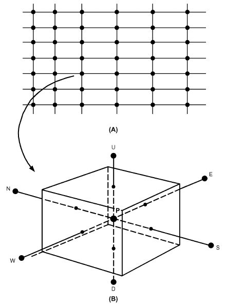

*Fig. 1 (A) Grid Point Distribution and (B) Control Volume Around Grid Point P*

The turbulent kinetic energy k per unit mass is

> 1 ′2 1 ′2
>
> k = --u = --(u1 + u2′2+ u3′2)&emsp;**(4)**

> 2 i 2

To quantify length and time, velocity correlations and higher moments of ui are commonly used (Monin and Yaglom 1971). Those scales are essential to characterize turbulent flows and their energy transport mechanisms. With its turbulent kinetic energy extracted from the mean flow, large eddies cascade energy to smaller eddies. In the smallest eddies, viscous dissipation of the turbulent kinetic energy occurs. By equating the total amount of energy transfer to its dissipation rate ε, based on Kolmogorov’s theory (Tennekes and Lumley 1972), a length scale η is defined as

> 1
>
> ( )4--

> η ≡ ν3/ε&emsp;**(5)**
>
> ( )

where ν is the fluid’s kinematic viscosity. The Kolmogorov length scale η is used to determine the smallest dissipative scale of a turbulent flow; it is important in determining the requirements of grid size [see the sections on Large Eddy Simulation (LES) and Direct Numerical Simulation (DNS)].

For an incompressible fluid, the governing equations of the turbulent flow motion are

> ∂ui/∂xi = 0&emsp;**(6)**

<!-- str. 283 -->

> ρ∂ui/∂t + ρuj∂ui/∂xj = – ∂P/∂xi + ∂τij/∂xj&emsp;**(7)**

where t is time, ρ is the fluid density, P is pressure, and τij is the viscous stress tensor defined as

> τij ≡ 2μsij&emsp;**(8)**

where μ is the dynamic viscosity and sij is the strain rate tensor, defined as

> (∂ui )
>
> 1

> sij≡ -- ------- + ∂uj/∂xi&emsp;**(9)**
>
> 2 ∂x

> ( j )

From Equations (6), (8), and (9), Equation (7) is rewritten as

> ρ∂ui/∂t + ρ ∂(uiuj)/∂xj = – ∂P/∂xi + ∂(2μsij)/∂xj&emsp;**(10)**

Taking the ensemble average by using Equation (2), Equation (6) becomes

> ∂ui/(∂ xi) = 0&emsp;**(11)**

Considering Equation (2), Equation (10) becomes the **Reynolds- averaged Navier-Stokes (RANS) equation** (Wilcox 1998):

> ρ∂ui/∂t + ρuj∂ui/∂xj = – ∂P/∂xi + (2μs – ρu′u′ ∂( *ij i j*))/∂xj&emsp;**(12)**

The right-hand term –ρui′uj′ is called the **Reynolds stress ten- sor**. To compute the mean flow of turbulent fluid motion, this additional term causes the famous closure problem because of ensemble averaging, and must be calculated. Much turbulence research focuses on the closure problem by proposing various turbulence models.

**Reynolds-Averaged Navier-Stokes (RANS) Approaches**

The most intuitive approach to calculate Reynolds stresses is to adopt the mixing-length hypotheses originated by Prandtl. Many variants of the algebraic models and their applicability for various types of turbulent flows (e.g., free shear flows, wakes, jets) are collected and provided by Wilcox (1998).

Because of the importance of turbulent kinetic energy k in the turbulent energy budget, many researchers have developed models based on k and other derived turbulence quantities for calculating the Reynolds stresses. To solve the closure problem, the number of the additional equation(s) in turbulence models ranges from zero (Chen and Xu 1998) to seven [Reynolds stress model (RSM) for three-dimensional flows (Launder et al. 1975)]; all equations in these approaches are time-averaged. Two-equation variants of the k-ε model (where ε is the dissipation rate of turbulent kinetic energy) are popular in industrial applications, mostly for simulating steady mean flows and scalar species transport (Chen et al. 1990; Horstman 1988; Spalart 2000). A widely used method is predicting eddy viscosity μt from a two-equation k-ε turbulence model, as in Launder and Spalding (1974). Nielsen (1998) discusses modifications for room airflow. The k-ε turbulence model is only valid for fully developed turbulent flow.

Flow in a room will not always be at a high Reynolds number (i.e., fully developed everywhere in the room), but good predictions are generally obtained in areas with a certain velocity level. Lowturbulence effects can be predicted near wall regions with, for example, a Launder-Sharma (1974) low-Reynolds-number model.

More elaborate models, such as the Reynolds stress model (RSM), can also predict turbulence. This model closes the equation system with additional transport equations for Reynolds stresses [see Launder (1989)]; it is superior to the standard k-ε model because anisotropic effects of turbulence are taken into account. For example, the wall-reflection terms damp turbulent fluctuations perpendicular to the wall and convert energy to fluctuations parallel to the wall. This effect may be important for predicting a three-dimensional wall jet flow (Schälin and Nielsen 2004).

In general, RSM gives better results than the standard k-ε model for mean flow prediction, but improvements are not always significant, especially for the velocity fluctuations (Chen 1996; Kato et al. 1994). Murakami et al. (1994) compared the k-ε model, algebraic model (simplified RSM), and RSM in predicting room air movement induced by a horizontal nonisothermal jet. RSM’s prediction of mean velocity and temperature profiles in the jet showed slightly better agreement with experiments than the k-ε model’s prediction.

### Large Eddy Simulation (LES)

For intrinsically transient flow fields, time-dependent RANS simulations often fail to resolve the flow field temporally. Large eddy simulation (LES) directly calculates the time-dependent large eddy motion while resolving the more universally small-scale motion using subgrid scale (SGS) modeling. LES has progressed rapidly since its inception four decades ago (Ferziger 1977; Smagorinsky 1963; Spalart 2000), when it was mainly a research tool that required enormous computing resources; modern computers can now implement LES for relatively simple geometries in building airflow applications (Emmerich and McGrattan 1998; Lin et al. 2001). For an excellent introduction to this promising CFD technique, see Ferziger (1977).

Filtering equations differentiate mathematically between large and small eddies. For example,

> f (r) = ∫3 f(r′)GΔ(r,r′)dr′&emsp;**(13)**
>
> R

where GΔ(r,r′) is a filter function with a filter with length scale Δ. GΔ(r,r′) integrates to 1 and decays to 0 for scales smaller than Δ (Chester et al. 2001). To resolve the SGS stresses, an analog to the RANS approach for the Reynolds stress is implemented as

> ui = <ui> + <ui′>&emsp;**(14)**

where <ui> is the filtered average defined by Equation (13) and <ui′> is the subgrid scale velocity, which is calculated through subgrid modeling. Filtering Equation (6) and (7) gives

> (∂ <ui>)/(∂ xi) = 0&emsp;**(15)**
>
> ρ(∂ <ui>)/∂t + ρ(∂ <uiuj>)/∂xj = – ∂ 
/(∂ xi) + (∂ <2μsij>)/∂xj&emsp;**(16)**

Based on Equation (14), the <uiuj> term in Equation (16) becomes,

> <uiuj> = <<ui><uj>> + <<ui′><uj>>&emsp;**(17)**
>
> + <<ui><uj′>> + <<ui′><uj′>>

The last three terms that contain the subgrid velocity are therefore the subject of modeling (Ferziger 1977). Breuer (1998) and Spalart (2000) describe some of the many other subgrid models and their performance. The latest developments of LES and its related techniques, such as the detached eddy simulation (DES), are described in detail by Spalart (2000).

<!-- str. 284 -->

### Direction Numerical Simulation (DNS)

Direct numerical simulation (DNS) is used to study turbulent flow. This method is very accurate (sometimes better than experiments), and is used to benchmark performance of other CFD techniques. Because of its stringent requirements on grid, especially in the normal direction within the boundary layer (Grötzbach 1983), DNS is used to study spatially and temporally confined flows with simple geometry (Spalart 2000). Notwithstanding these limits, DNS also has been used to explore more complicated geometry, such as flow over a wavy wall (Cherukat et al. 1998), and flow mechanisms, such as multiphase flow (Ling et al. 1998) and droplet evaporation (Mashayek 1998).

## 1.1 MESHING FOR COMPUTATIONAL FLUID DYNAMICS

The first step in conducting a CFD analysis for a fluid region of interest is to divide the region into a large number of smaller regions called **cells**. The collection of cells that makes up the domain of interest is typically called the **mesh** or **grid**, and the process of dividing up the domain is called **meshing**, **gridding**, **grid generation**, or **discretization** of the computational domain.

Meshes can be structured or unstructured, depending on the connectivity of the cells in the mesh to one another. Individual cell shape varies, and each shape has advantages and disadvantages. These shapes range from triangles and quadrilaterals for two-dimensional (2D) geometry, to tetrahedrals (four-sided triangularbased shapes) and hexahedrons (typically six-sided boxes) for three-dimensional (3D) geometry. Wedges (a triangle swept into a three-dimensional shape) and rectangular-based pyramids can also be used to transition between the triangular sides of the tetrahedrals and quadrilateral sides of the hexahedrons.

### Structured Grids

Structured grids have consistent geometrical regularity, wherein families of grid lines (in one direction) do not cross each other. Figure 2 shows examples of structured grids. These grids can be further subclassified as orthogonal and nonorthogonal.

**Orthogonal** structured grids, the simplest scheme, are based on Cartesian/polar-cylindrical coordinate systems. A curved or sloped boundary in the CFD domain is typically approximated by stepwise boundary. Figure 2A shows a meshed 2D domain for flow through a 90° elbow using a Cartesian orthogonal coordinate system. Cells outside the elbow are blocked from CFD analysis or turned into cells that do not participate in the flow field. The stairstep approach to representing the curved surface can lead to numerical errors at curved walls. Finer grids are needed to more accurately represent the curved/sloped boundary. The effect of reducing local grid size in one region (grid refinement) may propagate to other sections of the domain and result in an increase in the number of model cells. This, together with the blocked cells outside the flow domain, creates a burden on computing resources. The stepwise approximation of the boundary may also result in errors that negatively affect the CFD solution.

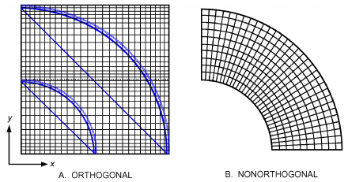

*Fig. 2 Two-Dimensional CFD Structured Grid Model for Flow Through 90° Elbow*

Modeling curved/sloped surfaces is possible by using the geometrical flexibility of the **nonorthogonal** grid, also known as **body- fitted** or **boundary-fitted grid**. An example of a 2D body-fitted nonorthogonal structured grid for a 90° elbow is shown in Figure 2B. Using the body-fitting method, geometric details are accurately represented without using stepwise approximation. An orthogonal grid can be structured (i.e., a single block, as in Figure 2), block-structured, or overlapping-structured.

A **block-structured** grid consists of a group of meshed regions (blocks) that collectively form the entire region of interest. This is typically referred to as a **multiblock domain**. The blocks may have a fine grid at the region of interest, to provide more details for flow field analysis, and a coarser grid away from the region of interest. Figure 3 shows block-structured grid for 2D flow through a 90° elbow connected to a rectangular duct. The grid is fine close to the solid surfaces, and is refined at point A, where flow separation is expected. This grid refinement is propagated through blocks 2 and 3. Interblock interfaces could have matching grids, as between blocks 1 and 2, or a nonmatching interface, as between blocks 2 and 3. The nonmatching interface is used to transfer from coarse to finer grid or vice versa. Numerical inaccuracies can occur where blocks are joined together with nonmatching mesh lines. The relative difference in mesh size on either side of the interface is important. Also, there is additional computational overhead associated with managing the nonconformal interface.

At the interface of the block-structured grid, the ratio of cell size change (i.e., large to small cells) between two blocks is recommended to be no more than two (Ferziger and Peric 1997), because transporting field variables from a fine to a coarse mesh or vice versa allows inaccuracies to enter the solution. If flow in a domain travels from a group of four cells to a single cell, the flow detail represented by the four cells is lost. In some cases, this rule can be bent, but this is best done by an experienced CFD modeler.

Structured grids simplify programming for the CFD code developer and provide regular structure for the matrix of algebraic equations. However, they may not adequately describe complex geometries, and it can be difficult to control grid distribution in the region of interest without propagating through the whole analyzed domain.

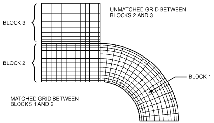

*Fig. 3 Block-Structured Grid for Two-Dimensional Flow Simulation Through 90° Elbow Connected to Rectangular Duct*

<!-- str. 285 -->

These structured grid types are mainly associated with finite-difference methods. The examples in Figures 2 and 3 are called the **physical planes**. Finite-difference methods require a uniform rectangular grid called the **computational plane**. The governing equations must be transformed to give one-to-one correspondences between the physical and computational planes. After analysis of the computational plane, the results are transferred back to the corresponding point on the physical plane. Using data transformation increases the programming efforts and computing costs for CFD. Anderson (1995) has more information on transformation methods.

### Unstructured Grids

Unstructured grids (Figure 4) are flexible: they can represent complex geometry boundaries, and can be easily refined in the region of interest without propagating to the rest of the domain. Elements of different shapes can be used in the domain. Either matching or nonmatching nodes can be used between neighboring elements. Figure 4A is an unstructured grid using tetrahedral elements, whereas Figure 4B uses hexahedral elements; note that both have a meshing zone near the pipe wall to resolve the boundary layer. Unlike structured grids, the matrix of algebraic equation does not have a regular diagonal structure and has a slower solver than a structured grid solver (Ferzinger and Peric 1997).

Unstructured grids are mostly used for finite-element and finite-volume methods. No transformations are required for finite-volume methods, and analysis can be performed directly on the physical plane of the unstructured grid.

### Grid Quality

Grid quality measures include the shape of the individual cells, the size of the cell relative to flow field features of interest, and the jump in grid size from one block to the next.

Cell quality is important. Values for variables stored at centers of cells must be interpolated to the face of the cell, which allows calculation of fluxes at faces of control volumes. A poor-quality mesh gives less accurate interpolations and can affect the quality of the simulation result by the introducing numerical inaccuracies. Mildly poor grids can increase convergence times; in extreme cases, local poor cell quality can result in overall flow field inaccuracies or cause the simulation to diverge and not reach a solution at all.

The examples in Figures 2 to 4 show clean, nonskewed cell shapes: the triangles do not lean over and the quadrilaterals have corners that do not vary significantly from 90°. In many practical meshes, the individual cells become distorted from these ideal shapes (e.g., because four-sided shapes may not fit well into wedgeshaped corners). The amount of distortion is typically referred to as **skewness**. Different CFD codes allow different levels of skewness, and the solver’s overall sensitivity to skewness may be affected by the method of numerical discretization.

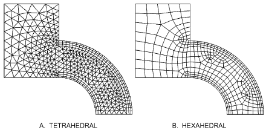

*Fig. 4 Unstructured Grid for Two-Dimensional Meshing Scheme Flow Simulation Through 90° Elbow Connected to Rectangular Duct*

Grid cell size may be partially determined by the level of geometric detail needed. Cells need to be small enough to resolve the smallest geometric features of the domain. If cell size is too large, any curved elements cannot be represented by a series of straight lines.

In addition, a CFD solution’s ability to resolve flow field features is limited by the grid resolution. If a grid has cell sizes of 10 mm, then flow field features smaller than 20 mm cannot be solved. Therefore, sharp gradients of flow field variables necessitate a finer mesh. The additional cells in the finer mesh are required to resolve the rapid change in the flow field variable. Additionally, fine grid resolution at walls is important for methods that use the law of the wall (see the Wall/Surface Boundary Conditions section), because fluxes and shear at the wall require accurate calculations of gradients.

Many CFD codes can start with a coarse mesh and add cells as necessary in particular regions, which can save computational time in the set-up and test simulation phases.

When generating a mesh, it is important to determine whether the mesh itself will affect the simulation and generate erroneous results. Figure 5 shows three circles with different meshing schemes. Figure 5A shows a grid on the circle that has a pincushion-like look; this mesh distorts the flow field in the “corners,” because the four corner cells have two sides on the perimeter of the circle, whereas the rest of the cells around the circumference have only one. If this mesh is used to simulate flow down a pipe, flow velocity in the corner cells is adversely affected by the additional friction that these cells experience. Figure 5B shows the same geometry, but with a structured mesh created by placing a square in the center of the circle and drawing rays diagonally out from the corners. These rays and the circle’s perimeter define other meshing blocks. If cut halfway through the horizontal or vertical centerline, the mesh can be stretched out into a rectangle. Finally, Figure 5C shows an unstructured mesh over the same geometry. The meshes in Figures 5B and 5C influence results less significantly than that in Figure 5A.

### Immersed Boundary Grid Generation

The preceding discussion assumes that a 2D or 3D computer model already exists for the geometry, architecture, or region of interest, and that the geometry can be imported into a gridding software package. The grid is then overlaid onto that geometry.

In immersed boundary grid generation, a model is not required to exist a priori. This simplifies gridding and geometry generation in one step: the orthogonal structured grid is created within a block and then the geometry (represented by blanked-out sections of cells within the meshed block) is overlaid (see Figure 1A). Groups of meshed blocks with overlaid architecture can be assembled to generate more complicated computational domains.

Although this technique can yield high-quality meshes for simple geometrical features (blocked representation), more sophisticated grid-generation techniques may be needed to grid complicated domains.

### Grid Independence

The level of grid independence from the flow field solution is important to determine in advance. It may be sufficient to demonstrate that grids of similar resolution applied to similar problems give sufficiently low levels of uncertainty.

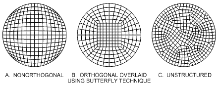

*Fig. 5 Circle Meshing*

<!-- str. 286 -->

Grid independence can be achieved experimentally by using successive grid refinements in areas with sharp gradients or cell skewness. This allows solutions obtained with coarser and finer grids to be compared. If results of two successive trials are comparable, then both models are grid-independent. In some cases, experienced CFD practitioners may be able to identify a sufficiently grid-independent solution without trials, but new CFD users should not assume a solution is grid independent: different levels of grid can yield results different enough to make conclusions drawn from the flow field unreliable.

## 1.2 BOUNDARY CONDITIONS FOR COMPUTATIONAL FLUID DYNAMICS

Boundary conditions are integral to CFD modeling’s ability to solve the general Navier-Stokes equations for a particular problem in an indoor environment. Boundary conditions specify physical and/or chemical characteristics at the model’s perimeters. These characteristics could be constant throughout the analysis or time-dependent in transient analyses. This section discusses applying boundary conditions for CFD modeling of subsonic fluid flow.

Excluding free surface flow, most boundary conditions can be classified as either **Dirichlet** (variable values specified at the boundary node) or **Neumann** (variable derivatives are required at the boundary, and the boundary condition must be discretized to provide the required equation). Free surface flow requires moving boundary conditions, such as **kinematic** and **dynamic**.

Every model has walls, and most have at least one inlet and one outlet boundary. Some cases of natural convection heat transfer (e.g., CFD modeling of an enclosure with heated and cooled sides, modeling of convection from an object such as cylinder in a large fluid medium) may not require an inlet or outlet in the model. Typical boundary condition types for HVAC applications are inlets, outlets, walls or surfaces, symmetry surfaces, and fixed sources or sinks.

### Inlet Boundary Conditions

Special attention must be paid to inlet boundary conditions, because supply diffusers are usually dominant sources of momentum that create airflow patterns responsible for temperature and concentration distributions.

Inlet boundary conditions may be velocity, pressure, or mass flow. When details of flow distribution are unknown, a constant-pressure boundary or constant flow rate can be specified. The pressure inlet boundary requires specifying static pressure for incompressible flow. Stagnation pressure and stagnation temperature should be specified at the pressure boundary for compressible flow. In both conditions, velocity components at the boundary are obtained by extrapolation.

The mass flow inlet condition requires specifying the mass flow rate and temperature for incompressible flow at the boundary. Velocities and pressure are calculated by extrapolation at inlet boundaries.

Experimentally measured values of turbulence quantities at the inlet boundary are also required for accurate CFD simulation for turbulent flow. For the k-ε turbulence model, turbulent kinetic energy k and turbulent dissipation rate ε are required. When these values are not available from experimental data, they can be estimated from the following equations:

> 3
>
> k = --(UrefTI )2&emsp;**(18)**

> 2
>
> ε = Cμ3⁄4× (3 ⁄ 2 k)/l&emsp;**(19)**

> l = 0.07L&emsp;**(20)**

where Uref is the mean stream velocity, TI is turbulence intensity, l is the turbulence length scale, Cμ is the k-ε turbulence model constant (Cμ = 0.0845), and L is the characteristic length of the inlet (for a duct, L is the equivalent radius).

For indoor environmental modeling, the inlet boundary is especially important because of the potentially complex geometry of supply diffusers designed to produce particular performance characteristics. Detailed diffuser modeling is possible for limited regions near the diffuser, but is not very practical in room-flow simulations: including the small geometric details of the diffuser in the room model results in a mesh with so many cells that current computation resources cannot efficiently find a solution. Therefore, most room airflow simulations should use simplified diffuser modeling that replicates diffuser performance without explicitly modeling the fine geometric details of the diffuser.

Other simplifications are possible. The most obvious method is replacing the actual diffuser with a less-complicated diffuser geometry, such as a slot opening, that supplies the same flow momentum and airflow rate to the space as the actual diffuser does (Nielsen 1992; Srebric and Chen 2002). Simplified methods are classified as jet momentum modeling either (1) at air supply devices or (2) in front of air supply devices (Fan 1995). Modeling at the supply device has several variations, including the slot and momentum models; variations of modeling in front of the diffuser include prescribed velocity, box, and diffuser specification (Srebric and Chen 2001, 2002). The most widely used methods are the momentum, box, and prescribed velocity methods.

The **momentum** method decouples the momentum and mass boundary conditions for the diffuser (Chen and Moser 1991). The diffuser is represented with an opening that has the same gross area, mass flux, and momentum flux as a real diffuser. This model allows source terms in the conservation equations to be specified over the real diffuser area. Air supply velocity for the momentum source is calculated from the mass flow rate m· and the diffuser effective area A0:

> U0 = ṁ/ρA0&emsp;**(21)**

The momentum method is very simple, but might not work well for certain types of diffusers (Srebric and Chen 2002).

The **box** method is based on the wall jet flow generated close to the diffuser (Nielsen 1992; Srebric and Chen 2002). Figure 6 shows the location of boundary conditions around the diffuser. Details of flow immediately around the supply opening are ignored, and the supplied jet is described by values along surfaces a and b. There are two advantages of this method compared to the detailed diffuser simulations: (1) the box method does not require as fine a grid as fully numerical prediction of the wall jet development; and (2) two-dimensional predictions can be made for three-dimensional supply openings, provided that the jets develop into a two-dimensional wall jet or free jet at a certain distance from the openings. Data for velocity distribution in a wall (or free) jet generated by different commercial diffusers can be obtained from diffuser catalogues or design guide books, Chapter 20, and textbooks [e.g., Awbi (1991), Etheridge and Sandberg (1996), and Rajaratnam (1976)].

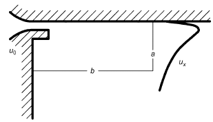

*Fig. 6 Boundary Condition Locations Around Diffuser Used in Box Method*

<!-- str. 287 -->

The **prescribed velocity** method has also been used in numerical prediction of room air movement. Figure 7 shows the method’s details. Inlet profiles are given as boundary conditions of a simplified slot diffuser, represented by only a few grid points. All variables except velocities u and w are predicted in a volume close to the diffuser (xa, yb) as well as in the rest of the room. Velocities u and w are prescribed in the volume in front of the diffuser as the fixed analytical values obtained for a wall jet from the diffuser, or they are given as measured values in front of the diffuser (Gosman et al. 1980; Nielsen 1992).

For a more detailed description of simplified methods and their applicability to common supply diffusers, see Chen and Srebric (2000). Figure 8 shows how real diffusers can be simplified by the momentum method and box method in CFD simulations (Srebric 2000).

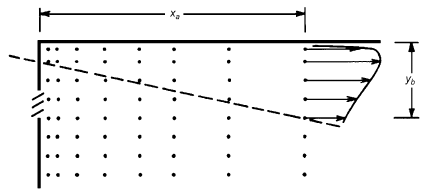

*Fig. 7 Prescribed Velocity Field Near Supply Opening*

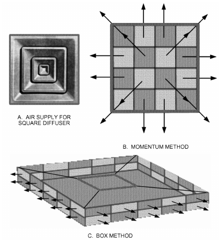

*Fig. 8 Simplified Boundary Conditions for Supply Diffuser Modeling for Square Diffuser*

### Outlet Boundary Conditions

A mass flow rate or constant pressure can be specified for an outlet boundary condition. The outlet flow rate or pressure boundary is extrapolated to determine the boundary velocity, which needs to be corrected during calculations to satisfy mass conservation in the analyzed domain. Some commercial CFD codes require turbulence values at outlet boundary conditions. These values are used when reversed flow occurs at the outlet pressure boundary.

### Wall/Surface Boundary Conditions

Wall boundary conditions represent the wet, solid perimeter of the CFD model. All velocity components are set equal to wall velocity for no-slip wall conditions, and to zero for a stationary wall. This is an example of a Dirichlet boundary condition. Wall roughness for both types of flow regimes (laminar and turbulent) should be specified. At the wall, both regimes have laminar flow. For turbulent flow, the wall turbulent boundary layer consists of three sublayers as presented in Figure 9 (Wilcox 1998): a thin, viscous sublayer followed by the log-law layer and the defect layer. Turbulent flow modeling requires very fine mesh inside the boundary layer. This requires extensive computational hardware, which is very costly, but the resource requirements can be reduced by using empirical wall functions in the near wall region instead of directly applying the k-ε turbulence model with a very fine mesh.

Turbulent flow near a wall can be categorized as **laminar** (viscous sublayer) or **turbulent** (log-law layer), depending on the dimensionless distance Y+ from the wall, defined as

> Y+ = ΔYp/ν τw/ρ&emsp;**(22)**

where ΔYp is the distance from the wall to the center of the first cell, τw is wall shear stress, ρ is fluid density, and ν is the fluid kinematic viscosity.

The viscous sublayer is very thin (Y+ < 5), and is typically smaller than the first cell (2ΔYp). For the viscous sublayer, as shown in Figure 9,

> u+ = Y+&emsp;**(23)**

where u+ is the dimensionless mean velocity (u+ = UP/ut, ut = τw⁄ρ, and UP is the is the velocity parallel to the wall at ΔYp). In practical terms, most important layer is the turbulent log-law sublayer, which is characterized by the following dimensionless velocity profile:

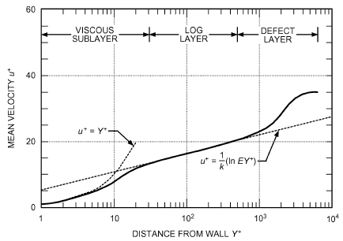

*Fig. 9 Typical Velocity Distribution in Near-Wall Region*

<!-- str. 288 -->

> 1
>
> u+ = --(lnEY+)&emsp;**(24)**

> κ

where κ is Von Karman’s constant (κ = 0.41), and E is a constant depending on the wall roughness (E = 9.8 for hydraulically smooth walls).

The size of the log-law layer is typically 30 < Y+ < 500 (Versteeg and Malalasekera 1995). The turbulent kinetic energy k and turbulent dissipation rate ε use the following functions in the log-law layer:

> k = (2 u τ)/Cμ and ε = (3 u τ)/κy&emsp;**(25)**

where Cμ is the k-ε turbulence model constant.

Overall, wall functions are of great practical importance because they allow significant savings of computational time. However, assumptions used to derive the wall functions [i.e., Prandtl mixing hypothesis, Boussinesq eddy viscosity assumption, fully developed flow, and no pressure gradients or other momentum sources (constant shear stresses)] restrict their application to a certain class of flows. For indoor airflow applications, these assumptions are acceptable, and wall functions are widely used. However, predicted heat transfer in the near-wall region tends to be incorrect, depending on the control volume size at the wall (Yuan et al. 1994). Heat transfer calculation can be improved with more accurate temperature profile equations or use of prescribed empirical values for the convective heat transfer coefficient h.

Surface temperature and heat transfer are often complicated variables of time and position. However, many CFD simulations use steady-state boundary conditions for a typical or design day. Boundary conditions for surface temperature and heat transfer are illustrated in Figure 10, showing how surface temperature Ts depends on heat transfer to and from the surroundings, on radiation to and from the surfaces in the room, and on the air temperature close to the surface.

Boundary conditions for temperature or energy flux can be found from measurements, manual energy calculations, or a **building en- ergy performance simulation (BEPS)** program. BEPS predicts both energy flow in the building structure and radiation plus detailed dynamic energy flow and consumption of the whole building during a period of time (Figure 11). There are different ways to exchange heat transfer information between BEPS and CFD programs (Zhai et al. 2002); the best method is to transfer surface temperatures from **Conduction Tw, Radiation Trad, and Local Air Temperature TP**

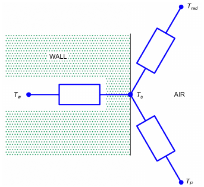

*Fig. 10 Wall Surface Temperature Ts, Influenced by*

BEPS to CFD, and convective heat transfer coefficients and air temperature from CFD to BEPS, to achieve a unique solution (Zhai and Chen 2003).

Dynamic simulations can be structured in different ways. A BEPS program can be connected to a separate CFD program, which predicts energy flow in selected situations. A CFD program can also be extended to find a combined solution of radiation, conduction, and thermal storage parallel to solving the flow field; this is often called a conjugate heat transfer model. Another possibility is to use additional CFD code in selected rooms as an extension of a large BEPS program. Examples of conjugate heat transfer and combined models are available in Beausoleil-Morrison (2000), Chen (1988), Kato et al. (1995), Moser et al. (1995), Nielsen and Tryggvason (1998), Srebric (2000), and Zhai and Chen (2003).

The simplest way to account for heat transfer at CFD boundaries is to prescribe wall temperatures obtained from on-site measurements. Using a turbulence model without wall functions is also recommended when heat and mass flows from surfaces are the important parameters. Predictions of actual flow at surfaces are more accurate than analytical values found from wall functions.

### Symmetry Surface Boundary Conditions

For a model with symmetrical flow in at least one plane, the symmetry boundary condition represents no flow across the symmetry plane, and all scalar fluxes are set to zero.

Select symmetry boundary conditions cautiously. Although the geometry of the model has symmetry, fluid flow might not be

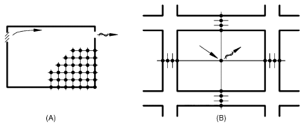

*Fig. 11 Combination CFD and BEPS*

> The CFD program predicts flow in room based on heat flux
>
> calculated by BEPS program.

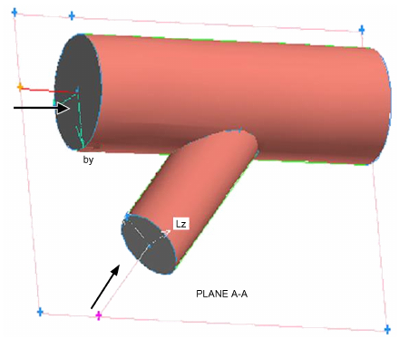

*Fig. 12 Duct with Symmetry Geometry*

<!-- str. 289 -->

symmetrical at the geometry symmetry plane. In Figure 12, the geometry is symmetrical at plane A-A, but the flow is asymmetrical because of flow instability at the merged flow region.

Zhang et al. (2000) studied the symmetry pattern for a an 8.5 by 5 by 3 m room, with air supplied through a slot at the ceiling and along the 5 m long side. Return air exited through a slot at the floor along the same side wall as the inlet air. Velocity on one side of the symmetry plane was up to two times higher than on the other side, at the symmetrical location.

### Fixed Sources and Sinks

Fixed sources are boundary conditions specified as fixed values of the calculated parameter or as mass/momentum/heat/contaminant fluxes. Examples include heat flux from a wall to simulate solar radiation, total heat flow in the occupied zone to simulate heat dissipation from occupants, momentum source from an operating fan, and species generation rate from contaminant sources. These sources could be placed anywhere in the CFD calculation domain, and can vary with time. Fixed-value sources/sinks usually use the wall functions if the source/sink is given as a fixed value, whereas fixed-flux sources/sinks do not use wall functions. These boundary conditions could also be associated with blockages in the flow domain (e.g., furniture, occupants, or other flow obstacles).

### Modeling Considerations

Pressure boundary conditions are used when there is not enough information to specify the flow distribution, and the boundary pressure is known or assumed. Pressure boundaries are mostly used for buoyancy-driven flow and external flow applications. In inlet/outlet pressure boundary conditions, the stagnation pressure, temperature, concentration, and turbulence quantities k and ε are required. For external flow away from the wall, the free-stream k and ε can be set to zero. A pressure boundary velocity cannot be specified, but must be determined by the CFD code from interior conditions relative to the pressure boundary condition (inflow or outflow condition is possible).

When using different boundary conditions, be aware that most boundary conditions are just approximations of real physical phenomena. It is the user’s responsibility to evaluate adequacy and influence of different boundary conditions on the accuracy of CFD simulation solutions.

## 1.3 CFD MODELING APPROACHES

Some steps are common to developing all types of CFD models and can increase the likelihood of getting a reasonable result with appropriate computing time.

### Planning

Planning a CFD simulation is perhaps the most important step. During this phase, a clear understanding of what is being investigated is important. If the simulation is about thermal comfort in a room, some details about unoccupied space regions may be simplified: there may be little point in determining the thermal comfort in an unoccupied zone. If the purpose is to gain insight into a flow field, then some effort to estimate flow patterns helps during early modeling decisions and later evaluation of results.

During planning, a decision of whether to conduct a steady-state or transient simulation must be made. Transient simulations present time-accurate results, such as filling a tank, whereas steady-state simulations represent conditions after the flow field has been flowing long enough to reach equilibrium. It is important to recognize that some flows are inherently unsteady. The effect of choosing a steady-state solver to model unsteady flow should be considered during this process.

The physics to be examined should also be determined. Turbulence, heat transfer, species transport, and radiation phenomena can be evaluated during CFD modeling.

The final stage of planning is to determine how to represent the boundary conditions and flow physics. Diffusers, thermal sources leading to plumes, and contaminant sources are all important flow details that need to be appropriately represented.

### Dimensional Accuracy and Faithfulness to Details

Highly detailed representation of architecture in a CFD model can significantly add to grid and computational costs. Often, high detail is not required. For instance, including doorknobs on a door will not likely change the simulation results greatly except immediately around the doorknob itself. However, if the room is negatively pressurized, significant flow through a crack beneath the door can cause a jet to propagate into the room, so accurately representing effects of flow through the crack is important. If the simulation is intended to assess thermal comfort in a laboratory with fume hoods, then the fume hood sash details may not be very important. However, if the purpose of the simulation is to evaluate fume hood capture performance, the sash opening detail can be important.

For complicated models, it can be helpful to evaluate and include the potential modifications for subsequent simulations before completing the geometry. This allows the simulation to be modified without breaking the grid and geometry, which can be the most time-consuming step of simulation. Preparing the grid for future simulations may reduce overall costs for later simulations.

### CFD Simulation Steps

The basic mechanical steps in CFD simulation are as follows: 1. Create the geometry (a 3D model of the simulation environment) 2. Generate the grid 3. Define surfaces and volumes and implement boundary conditions 4. Execute the simulation 5. Evaluate the simulation and conduct quality checks to determine whether CFD simulation is complete; refine the grid, change discretization, and continue to solve 6. Postprocess/analyze the simulation to extract desired information 7. Modify the simulation and redo as required

During planning, a large set of physical phenomena (e.g., turbulence, heat transfer, radiation, species transport, combustion) may need to be included within the simulation(s). When executing the simulation itself, starting with a minimal set of physics and then increasing the level of complexity has advantages. For example, for flow in a room with a large convective and radiant heat source from which a contaminant is escaping (e.g., an industrial furnace), (1) solve the fluid velocity field with turbulence, (2) calculate energy to get a temperature distribution, (3) add radiation to redistribute some thermal energy, and (4) track the contaminant by adding species transport equations to the simulation.

This stepped approach allows the modeler to build on previous flow field solutions and ensure that each new set of physics is starting from a reasonable estimate of the flow field. It has particular advantages for complicated models or increasing the probability of success for new users.

## 1.4 VERIFICATION, VALIDATION, AND REPORTING RESULTS

It is important to document and assess the credibility of CFD simulations through verification, validation, and reporting of results. The American Institute of Aeronautics and Astronautics (AIAA 1998) defines verification as “the process of determining that a (physical/mathematical) model implementation accurately represents the developer’s conceptual description of the model and the solution on the model,” and validation as “the process of determining the degree to which a (CFD) model is an accurate representation of the real world from the perspective of the intended uses of the model.”

<!-- str. 290 -->

Verification ensures that a CFD code can accurately and correctly solve the equations used in the conceptual model; it does not imply that the computational results represent physical reality. Generally, verification is done during code development. Because very few HVAC engineers who do indoor environment analysis develop CFD codes, this section focuses mostly on code applications, not development. In addition, time and money available for simulation are usually limited, which requires that verification and validation be realistically achievable. Therefore, this section refines the definitions of verification, validation, and reporting of results:

- **Verification** identifies relevant physical phenomena for analysis and provides instructions on how to assess whether a particular CFD code can account for those physical phenomena.
- **Validation** provides instructions on how to demonstrate the coupled ability of a user and a CFD code to accurately conduct representative indoor environmental simulations with available experimental data.
- **Reporting** results provides instructions on how to summarize results so that others can make informed assessments of the value and quality of the CFD work.

Therefore, verification should represent physical realities, although the cases can be very simple, containing only one (or a few) flow and heat transfer features of the complete system. The validation cases should be close to reality and include the flow and heat transfer characteristics that need to be analyzed, although approximations may be used in the validation.

This section describes a procedure developed by Chen and Srebric (2002) for verification, validation, and reporting of CFD results, but its intent is not to develop standards. The extent of CFD’s capability in modeling has not yet been developed to the point where standards can be written (AIAA 1998).

### Verification

The basic physical phenomena of the indoor environment are airflow, heat transfer (conduction, convection, and radiation), mass transfer (species concentrations and solid and liquid particles), and chemical reactions (combustion). Therefore, the first step of verification is to identify benchmark cases with one or more flow and heat transfer features of those basic phenomena.

In some indoor regions, airflow can be laminar or weakly turbulent. The overall flow features are often considered as turbulent. Most indoor airflows are turbulent because of the high Rayleigh number Ra, and sometimes high Reynolds number Re, defined as

> Ra = βg ΔTL2/νk&emsp;**(26)**
>
> Re = UL/ν&emsp;**(27)**

In most rooms, Ra ranges from 109 to 1012 and Re from 104 to 107 if room height is used as the characteristic length L. Experiments have found that turbulence occurs when Ra > 109 and/or Re > 104.

Turbulence modeling approximations, which require more complex numerical schemes so that a converged solution can be achieved, must be made for CFD to solve the flow fields.

The ability of a CFD code to simulate airflow in an indoor environment and the fidelity of the computer model to the physical realities may vary, and should be assessed. Predicting indoor physical phenomena may require auxiliary flow and heat transfer models. The following aspects require special attention:

- Basic flow and heat transfer (convection, diffusion, conduction, and/or radiation)
- Turbulence models
- Auxiliary heat transfer and flow models
- Numerical methods
- Assessing CFD predictions

Whether a CFD code can be used to simulate an indoor environment depends on the flow and heat transfer features. For an indoor space with a baseboard heater, a CFD code that can solve natural convection flow may be sufficient. If a radiator replaces the baseboard heater, a radiation model is needed. When heat transfer through the walls must be considered, the code should have a conjugate heat transfer feature. When a duct supplies fresh air, room airflow becomes mixed convection, which requires the capability of mixed convection simulation. For indoor air quality studies, the code should be able to solve species concentrations. The more realistic the model is, the more complex the flow and heat transfer.

To verify a CFD code’s capability of simulating the indoor environment of interest, review the code’s manual and any libraries or examples provided by the developer to illustrate successful applications. Discussing the particular application with the code developer can ensure that the physical models required for the application are all available. However, even if a code has been found capable of simulating the physical phenomena in the indoor environment in the past, repeating the verification is helpful because success relies on the joint function of the user and the CFD code.

Hands-on verification usually starts with the simplest cases, which contain only one or two flow features and have been thoroughly tested to minimize uncertainties and errors. After successful verification, further simulations can be performed for more realistic cases, which may contain many key features of physical phenomena in an indoor space. The Reynolds or Rayleigh numbers can then be similar to those in reality.

Often, verification data are from high-precision experimental measurements. The quantity and quality of the experimental data are usually accompanied by quantified errors. They are generally accurate, have few human errors, cover a large area of interest in the CFD community, and are widely used for testing CFD simulations. These experimental data contain detailed information, such as boundary and initial conditions, and are usually two-dimensional.

Different cases represent different flow characteristics. Ideally, verification should be done for all flow features, but in practice, two to three important cases may be sufficient for most indoor environmental analyses.

**Turbulence Model Identification.** With a verification case identified, the next step is to identify a suitable turbulence model. These are divided into two groups: large eddy simulations (LES), and turbulent transport models [Reynolds-averaged Navier-Stokes (RANS) equation modeling]. LES divides turbulent flow into large-scale motion (calculated in LES) and small-scale motion (which must be modeled because of its effect on large-scale motion). Using a suitable subgrid scale model for the simulation is the most important factor, because the subgrid’s accuracy and efficiency determines how correct and useful the LES is.

RANS models are more common in indoor airflow simulation. In general, eddy viscosity models are accurate for simple airflows, and Reynolds stress models are needed for complex flows. Complex flow exists in a flow domain with complex geometry, such as room and air supply diffuser geometry. Many CFD studies compare different turbulence models, so users may consult the literature for reported studies that are close to the case in question. The k-ε model is inaccurate for flows with adverse pressure gradient, which seriously limits its general usefulness. If comparisons for a particular case are not available, start with simple, popular models, such as the standard k-ε model (Launder and Spalding 1974), moving to progressively more complicated models if necessary. Vendors have made selecting different turbulence models as easy as a simple mouse click. However, a user should understand the principle of the model, its suitability for the problem to be solved, and the corresponding changes needed in using the model.

<!-- str. 291 -->

**Identifying Auxiliary Heat Transfer and Flow Models.** The indoor environment consists of very complicated physical phenomena, with radiative, conductive, and convective heat transfer almost always occurring simultaneously, and sometimes also including combustion, participating media radiation, and particle transport in multiple phases (air/liquid, air/solid, and air/liquid/solid). It is important to verify whether these physical phenomena can be modeled by a CFD code.

Separate verification of auxiliary models and turbulence models reduces the possibility of error. According to AIAA (1998), an error is “a recognizable deficiency in any phase or activity of modeling and simulation that is not due to lack of knowledge.” A complex problem may be verified by separating it into several components that have analytical solutions. For example, a combined conductive, convective, and radiative heat transfer process can be verified by separating it into a conductive and radiative problem, and a convective problem. The two problems can then be verified by the relevant analytical solutions. Another example is liquid particle trajectory in indoor air quality simulations that involve condensation, evaporation, and collision, as well as strong interaction with airflow turbulence. The physical phenomena should be verified separately.

Verification does not ensure the correctness of the combined process. Therefore, uncertainty exists in the combined process. **Uncer- tainty** is a potential deficiency in any phase or activity of modeling caused by lack of knowledge; no highly accurate solutions are available. This may be addressed during validation.

Verification of numerical methods involves investigating the discretization of the continuous space and time (if transient) into finite intervals. The variables are computed at only a finite number of locations (**grid points**), so the continuous information contained in the solution of differential equations is replaced with discrete values. When a Cartesian mesh system is used for sloped or curved surfaces, the true geometry is not represented in the calculation because it would introduce an error. Thus, for sloped or curved surfaces, similar geometries must be verified rather restricting the simulation to empty rectangular rooms.

Different discretization schemes can be verified by comparing the results obtained from two different schemes. For example, to verify an unstructured grid system, Cartesian coordinates can be used as a reference. Case geometry should be simple, such as a rectangular room. Then, the two schemes should generate the same results. If the code has only one grid system, the discretization scheme verification can be combined with model verification.

**Refining Grid Size and Time Step.** Because CFD discretizes partial differential equations into discretized equations, this introduces an error. Verification of grid size and time step is done to reduce error to a level acceptable for the particular application. The time step applies only to transient flow simulation. Therefore, it is not sufficient to perform CFD computations on a single fixed grid. The difference in grid size and time step between two cases should be large enough to identify differences in CFD results. The common method is to repeat the computation by doubling the grid number, and compare the two solutions (Wilcox 1998). It is very important to separate numerical error from turbulence-model error, because the merits of different turbulence models cannot be objectively evaluated unless the discretization error of the numerical algorithm is known.

The geometry of an indoor space can be very complicated, and computer speed and capacity are still insufficient for simulating an indoor environment with very fine grid sizes (over a few million grids) and time steps (tens of thousands). Verification estimates the discretization error of the numerical solution. Theoretically, when grid size and time step approach zero, the discretization error of the numerical solution becomes negligible. For LES, when grid size and time step become small, flow in the subgrid scale is isotropic and the results become more accurate. When grid size is much smaller than the Kolmogorov length scale, the LES turns into a direct-numerical simulation.

**Numerical Schemes, Iteration, and Convergence.** A numerical scheme is important in CFD code to obtain a fast, accurate, and stable solution. A higher-order differencing scheme should be more accurate than a lower-order scheme for simple cases, such as those suggested for turbulence model verification. However, be aware of the limitations of various differencing schemes. For example, the central differencing scheme (accurate to the second order) is used for small Peclet numbers (Pe < 2), and the upwind scheme [accurate to the first order (but accounts for transportiveness)] is used for a high Peclet number. The Peclet number, the ratio of convection to conduction, is defined as

> Pe = LUρCp/k&emsp;**(28)**

where Cp is specific heat.

Solution algorithms in CFD codes can be quite different, ranging from SIMPLE in conventional program with iteration, to the fast Fourier transformation for solving the Poisson pressure equation in LES without iteration. Iteration is normally needed in two situations: (1) globally for boundary value problems (i.e., over the entire domain), or (2) within each time step for transient physical phenomena. Criteria can be set to determine whether a converged solution is reached, such as a specified absolute and relative residual tolerance. The **residual** is the imbalance of solved variables (e.g., velocities, mass flow, energy, turbulence quantities, species concentrations). For indoor environment modeling, a CFD solution has converged if

Residual for mass = (Sum of absolute residuals in each cell)/(Total mass inflow < 0.1%)

Residual for energy = (Sum of absolute residuals in each cell)/(Total heat gains < 1%)

Similar convergence criteria can be defined for other solved variables, such as species concentration and turbulence parameters. Note that, for natural convection in a room, net mass flow is zero. Therefore, convergence has most likely been reached if there is little change (no change in the fourth digit) in the major dependent variables (temperature, velocities, and concentrations) within the last 100 iterations. However, a small relaxation factor can always give a false indication of convergence (Anderson et al. 1984).

To obtain stable and converged results, iteration often uses relaxation factors for different variables solved, such as underrelaxation factors and false time steps. Underrelaxation factors differ only slightly from false-time-steps.

**Assessing CFD Predictions.** A detailed qualitative and quantitative comparison of CFD results with data from experiments, analytical solutions, and direct numerical simulations is an important final step. All error analyses should be discussed in this section as well. The results indicate whether the CFD code can be used for indoor environment modeling.

Although this procedure divides verification into several parts, they often are integrated. The turbulence model and numerical technique must work together to obtain a correct CFD prediction for the flow features selected. However, it is necessary to break them down into individual items in some types of verifications, such as in CFD code development. Indoor environment designers often use commercial software, and it is logical to assume that the codes were verified during development. However, the verifications (if any) may have used different flows that are irrelevant to indoor airflow. In addition, a user may not fully understand the code’s functions. It is imperative for the user to reverify a CFD code’s capabilities for indoor environment simulations. This helps the user become more familiar with the code and eliminates human errors in using the code.

<!-- str. 292 -->

Generally, verification cases are not proprietary or restricted for security reasons; the data are usually available from the literature. It is strongly recommended that verification be reported when publishing CFD studies. This is especially helpful in eliminating user errors, because most CFD codes may have been validated by those cases. There are many examples of failed CFD simulations caused by user mistakes. Verification should be done for the following parameters:

- All variables solved by the governing equations (e.g., velocity, temperature, species concentrations)
- Boundary conditions (e.g., heat flux, mass inflow and outflow rates)

With these items verified, a CFD code should be able to correctly compute airflow and heat transfer encountered in an indoor environment. The level of accuracy depends on the criteria used in the verification. If the code failed to compute the flow correctly, the problem may be that (1) the code is incapable of solving the indoor airflows, (2) the code has bugs, or (3) there are errors in the user input data that defines the problem to be solved.

### Validation

Validation demonstrates the ability of both the user and the code to accurately predict representative indoor environmental applications for which some sort of reliable data are available. It estimates how accurately the user can apply the code in simulating a full, real-world indoor environment problem, and gives the user the confidence to use the code for further applications, such as a design tool. A CFD code may solve the physical models selected to describe the real world, but may give inaccurate results because the selected models do not represent physical reality. For example, an indoor environment may simultaneously involve conduction, convection, and radiation, but a user may misinterpret the problem as purely convection. The CFD prediction may be correct for the convection part but fail to describe the complete physics involved. It is obviously a problem on the user’s side, which validation process also tries to eliminate.

Note that validation addresses a complete flow and heat transfer system, or several subsystems that, together, represent a complete system. Although the procedure is almost the same, verification addresses only one of the flow aspects in an indoor environment.

The basic idea of validation is to identify suitable experimental data, to make sure that all important phenomena in the problem are correctly modeled, and to quantify the error and uncertainty in the CFD simulation. Because the primary role of CFD in indoor environment modeling is to serve as a high-fidelity tool for design and analysis, it is essential to have a systematic, rational, and affordable code validation process. Validation focuses on

- Confirming the capabilities of the turbulence model and other auxiliary models in predicting all the important physical phenomena associated with an indoor environment, before applying the CFD model for design and evaluation of a similar indoor environment category
- Confirming correctness of the discretization method, grid resolution, and numerical algorithm for flow simulation
- Confirming the user’s knowledge of the CFD code and understanding of the basic physics involved

Ideally, validation should be performed for a complete indoor environment system that includes all important airflow and heat transfer physics and a full geometric configuration. Experimental data for a complete system can be obtained from on-site measurements or experiments in an environmental chamber. The data usually have a fairly high degree of uncertainty and large errors, and may contain little information about initial and boundary conditions. Reasonable assumptions are needed to make CFD simulation feasible.

Often, experimental data may not be available for a complete indoor environment system. In this case, validations for several subsystems or an incomplete system can be used. A subsystem represents some of the flow features in an indoor environment to be analyzed. The overall effect of several subsystems is equivalent to a complete system. For example, a complete indoor environment system consists of airflow and heat transfer in a room with occupants, furniture, and a forced air unit. If a user can correctly simulate several subsystems such as airflow and heat transfer (1) around a person, (2) in a room with obstacles, and (3) in a room with a forced air unit, the validation is acceptable. In the same example, an incomplete system for this environment can consist of airflow and heat transfer in a room with an occupant and a forced-air unit. Furniture, although it affects the indoor environment, is not as important as the other components, so validation with an incomplete system is acceptable. In either case, the key is that validation should lead to a solid confirmation of the combined capabilities of the user and code.

Although validation is for a complete indoor environment system, it is not necessary to start with a very complicated case if alternatives are available. Reliability is better for

- A simpler geometry, rather than a complicated one
- Convection, rather than combined convection, conduction, and radiation
- Single-phase flows, rather than multiphase flows
- Chemically inert materials, rather than chemically reactive materials

For complex physical phenomena in an indoor space, input data for CFD analysis may involve too much guesswork or imprecision. The available computer power may not be sufficient for high numerical accuracy, and the scientific knowledge base may be inadequate.

Complete system validation should be broken down into steps: 1. Setting up building geometry, and then placing inlets and outlets.

Isothermal flow indicates the airflow pattern.

2. Adding heat transfer. Species concentration, particle trajectory, etc., should be considered later.

This progressive simulation procedure not only builds user confidence in performing the simulation, but also discovers some potential errors in the simulation.

If a CFD code has multiple choices, simple, popular models should be considered as the starting point for validation. The starting point can be as basic as

- Standard k-ε model
- No-auxiliary-flow and heat transfer models
- Structured mesh system
- Upwind scheme
- SIMPLE algorithm

The way of measuring real-world accuracy of the representation is to systematically compare CFD simulations to experimental data. The indoor environment systems used in validation are usually complicated, and the corresponding experimental data may contain bias errors and random errors, which should be reported as part of the validation. If the errors are unknown, a report on the equipment used in the measurements is helpful in assessing data quality. Although desirable, it is expensive and time-consuming to obtain goodquality data for a complete system. Therefore, reporting the CFD validation of the complete system cannot be overemphasized.

The criteria for accuracy when conducting a validation depend on the application. Very high accuracy, although desirable, is not essential because most design changes are incremental variations from a baseline. As long as the predicted trends are consistent, then less-than-perfect accuracy should be acceptable. The validation process should be flexible, allowing varying levels of accuracy, and be tolerant of incremental improvements as time and funding permit. The level of agreement achieved with the test data, taking into the account measurement uncertainties, should be reviewed in light of the CFD application requirements. For example, validation for modeling air temperature in a fire simulation requires much lower minimum accuracy than that for a thermal comfort study for an indoor environment.

<!-- str. 293 -->

If validation cases are simple and represent a subsystem of a complex indoor airflow, the validation criteria should be more restrictive than those for the complete system. The criteria can also be selective. For example, if correct prediction of air velocity is more important, the criteria for heat transfer may be relaxed. Although air velocity and temperature are interrelated, one parameter’s effect on the other may be second-order. This allows a fast, less detailed model to be used, such as standard k-ε model, rather than a detailed but slower model, such as low-Reynolds-number model for heat transfer calculation in boundary layers.

### Reporting CFD Results

Reporting involves summarizing CFD simulation results, while providing sufficient information on the value and quality of the CFD work. This is an important quality assurance strategy for CFD analysis of the indoor environment.

It is recommended to start with verification and then proceed to validation. In principle, reports for technical audiences should include the information discussed in the verification and validation sections, such as

- Experimental design
- CFD models and auxiliary heat transfer and flow models
- Boundary conditions
- Numerical methods
- Comparison of the CFD results with the data
- Drawing conclusions

The reporting format, however, can be flexible. If a report were intended for nontechnical readers, including only the last two items would be sufficient.

**Experimental Design.** Thermal and flow conditions of the test environment should be described in enough detail that other people could repeat the simulation. This can be as simple as a reference to the literature or a description of cases in the report. An analysis of uncertainties and errors in the experimental data or a short description of the experimental procedure and equipment should also be included.

**CFD Models and Auxiliary Heat Transfer and Flow Models.** CFD includes hundreds of different models of LES and RANS. Many popular turbulence models have been widely used and reported, making it unnecessary to provide detailed formulation. When reporting CFD results, it is important to specify which turbulence model is used. If the model has not been widely reported, detailed information (including why the model was selected) should be presented.

Indoor environment analysis may require auxiliary heat transfer and flow models. For example, a building may use porous material as insulation. Heat transfer through the insulation combines conduction, convection, and radiation (too complex a process for limited computer resources to simulate in detail). Instead, a lumped-parameter model may be used to combine the heat transfer processes and obtain accurate CFD results for the indoor environment. Therefore, it should be described in the CFD analysis report.

**Boundary Conditions.** Accurate specification of boundary conditions is crucial, because they indicate how the user interprets the specific physical phenomena into a computer model or mathematical equations that can be solved by the code. This interpretation requires the most skill in CFD modeling. Therefore, detailed description of boundary conditions can help others make informed assessments of the simulation’s quality. Include the following information:

- **Geometry settings** (the size of the computational domain along with sizes and locations of all solid objects represented in the model). If there is an external wall involved that cannot be considered adiabatic, external ambient conditions (e.g., ambient temperature, external radiation temperature, convective heat transfer coefficient) should be reported as well.
- **Inlet**. Airflow from a diffuser greatly affects a room’s airflow pattern. Diffuser geometry, and approximations are often used in a complete system to make indoor airflow solvable. Therefore, the CFD report should give detailed information on the approximations used, as well as the set boundary conditions for the inlet. In some situations, the exact location of an inlet may be difficult to identify (e.g., air infiltration from the outdoors to an indoor space could be through the cracks of windows and doors). Conditions may differ from one window to another. Also, infiltration flow rate can be difficult to estimate because wind magnitude and direction change over time. Furthermore, turbulence parameters for the inlet are generally unknown, and should be estimated. Therefore, how these “inlet” conditions are specified should be clearly stated.
- **Outlet**. An outlet has little effect on room airflow. However, conditions set for the outlet often can significantly influence numerical stability. For example, the outlet may become an inlet during iteration of a calculation. If the default outlet temperature is 0°C, this could lead to a diverged solution.
- **Walls**. Rigid surfaces in an indoor space, such as walls, ceilings, floors, and furniture surfaces, are all considered as walls. Very close to the wall, airflow is laminar, and convective heat transfer often occurs in this region between the flow and surfaces. Many turbulence models cannot accurately handle the laminar sublayer, so ad hoc solutions, such as damping functions, are often used. How a CFD code treats wall boundary conditions greatly affects the accuracy of numerical results. Even if the indoor space is large and the wall effect seems small, accurate prediction of heat transfer from the walls to room air is still important.
- **Open boundary**. When the area of interest is a part of the indoor space, the computational domain does not have to align with a rigid surface; instead, an “open” boundary can be defined. Depending on the inside and outside pressure difference, air may flow in or out across the open boundary.
- **Source/sink**. This boundary condition fixes thermal or dynamic parameters (e.g., heat flux from a wall to simulate solar radiation, total heat flow in the occupied zone to simulate heat dissipation from occupants, momentum source from an operating fan, species generation rate from contaminant sources) in a defined region. Describe the location, size, and parameter being specified.
- **Coupling between a micro and a macro model**. For a large indoor space, CFD analysis may be divided into micro and macro simulations. The micro simulation zooms into a particular area to reveal details of flow and thermal characteristic on a small scale compared with that for the entire space of interest. This allows finer-resolution examination of details of flow in that area. The macro simulation is applied to the entire flow system, and may use the results of the micro simulation so that a coarser grid system can be used. This coupling is usually a complicated procedure that should be detailed in the report.
- **Other approximations.** Approximations are almost always involved when representing the real world in a computer model. For example, when the surface temperature distribution of a heated object is not uniform, the CFD simulation may choose to neglect temperature variation on the surface. When designing a large stadium, it may not be feasible to simulate each individual spectator; instead, the model may combine all the spectators into a human layer. There are numerous examples in indoor environment modeling that need to be approximated in a CFD simulation. All approximations should be reported.

<!-- str. 294 -->

**Numerical Methods.** It is essential to report the numerical methods used in the analysis, although the report can be brief if the technique is popular and widely available from the literature. The numerical technique includes discretization technique, grid size and quality, time step, numerical schemes, iteration number, and convergence criteria. The report should briefly state why the technique was used, and how suitable it is to the problem under consideration. It is also important to provide the quality indices of the mesh of a bodyfitted coordinate, because mesh quality affects the prediction’s accuracy. Typically, these indices include normal distances from solid surfaces to the centers of the first adjacent cells, maximum scale ratios of each two neighboring cells in each coordinate, and smallest angle of mesh cells. The first index determines the prediction of boundary layer flows, and the other two indicate whether unacceptable numerical errors are introduced into the simulation. Because a coarse grid introduces more numerical viscosity, gridrefinement study is essential to achieving a grid-independent solution, and should be included in the CFD report. Although it may not be realistic to conduct grid refinement for the complete system, it should be conducted for benchmark cases, to estimate the errors introduced in the complete system.

If different numerical schemes have been tested, the results should be reported. Knowing the performance of different numerical schemes helps identify whether a numerical scheme or turbulence model causes a discrepancy between the CFD results and experimental data. Iteration number and convergence criteria are interrelated. It is better to use the sum of the absolute residual at each cell for all the variables as convergence criteria. The relaxation method and values should also be reported.

**Comparison of Results with Data.** The most important part of the report is comparing experimental data with analysis results. Qualitative values, such as airflow pattern, should be compared first, followed by first-order parameters, such as air velocity, temperature, and species concentrations. In general, both CFD results and experimental data are more accurate for first-order parameters. Second-order parameters, such as turbulence kinetic energy, Reynolds stresses, and heat fluxes, usually have greater uncertainties and errors than the first-order parameters in both the results and the experimental data, so seeking perfect agreement for these parameters is unnecessary.

It is insufficient to describe the comparison between CFD results and experimental data as excellent, good, fair, poor, or unacceptable. For example, a 20% difference can be considered excellent for a complex flow problem, but rather poor for two-dimensional forced convection in an empty room. Therefore, the comparison should be quantitative. The most useful information from comparison is how to interpret discrepancies. If there is little discrepancy, it is important to know why a turbulence model that uses approximations can predict the physical phenomena so well. The comparison should clearly state the uncertainties and errors of the experimental data, if they are known.

**Conclusions.** The most important findings of the CFD analysis should be presented as its conclusions, which should have broad applicability to indoor environment simulation. The report may also recommend measures for further improvements in CFD analyses.

## 2. MULTIZONE NETWORK AIRFLOW AND CONTAMINANT TRANSPORT MODELING

Multizone or network models are used to address airflow, contaminant transport, heat transfer, or some combination thereof. This section presents the mathematical and numerical background of network airflow and contaminant transport models. Thermal network models are addressed in Chapter 19.

## 2.1 MULTIZONE AIRFLOW MODELING

### Theory

Network airflow models idealize a building as a collection of zones, such as rooms, hallways, and duct junctions, joined by flow paths representing doors, windows, fans, ducts, etc. Thus, the user assembles a building description by connecting zones via the appropriate flow paths.

The network model predicts zone-to-zone airflows based on the pressure-flow characteristics of the path models, and pressure differences across the paths. Three types of forces drive flow through the paths: wind, temperature differences (stack effect), and mechanical devices such as fans.

As shown in Figure 13, airflow network models resemble electrical networks. Airflow corresponds to electric current, with zone pressure acting like the voltage at an electrical node. Flow paths correspond to resistors and other electrical elements, including active elements like batteries (fans).

Unlike CFD models, network models do not prescribe details of airflow in zones. Thus, at any given time, each network zone is characterized by a single pressure. Pressure in the zone varies according to height, for example, using the simple hydrostatic relationship P + ρgh = constant. Air density ρ is determined by the equation of state ρ = P/(RairT ), based on the zone reference pressure P, temperature T, and the gas constant of the air mixture Rair. Zone temperature is given either directly by the user, or by an independent thermal model. The gas constant is typically assumed to be that of dry air, but can be made a function of other non-trace constituents as well (e.g., water vapor).

This lack of detail in the network zone models makes CFD preferable for predicting thermal comfort, or designing displacement ventilation systems, where airflow patterns in a room control the quantities of interest (Emmerich 1997).

In network airflow modeling, flow path models provide most of the modeling detail. Typically, the airflow rate Fj,i from zone j to zone i, in kg/s, is some function of the pressure drop Pj – Pi along the flow path:

> Fj,i = f(Pj – Pi)&emsp;**(29)**

Various models represent different types of flow paths, but they are typically nonlinear. For example, the power-law model is commonly implemented as

> Q = C(ΔP)n&emsp;**(30)**

where

- Q = F/ρ = volumetric airflow rate, m3/s

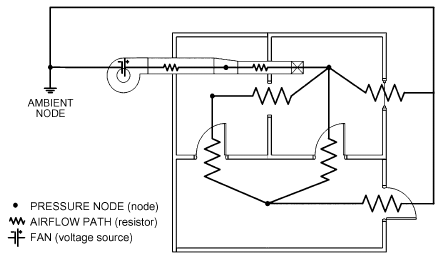

*Fig. 13 Airflow Path Diagram*

<!-- str. 295 -->

ΔP = pressure drop across opening, Pa

C = flow coefficient, (Pa1/n·m3)/s n = flow exponent (typically 0.5 to 0.6)

ρ = density of air in flow path, kg/m3

ΔPj,i is assumed to be governed by the Bernoulli equation, which accounts for static pressure on each side of the flow path and pressure differences through the flow path caused by density and height changes. Static pressure at flow path connections depends on the zone pressures, again after accounting for height-dependent pressure changes in the zones. Where a flow path connects to the building facade, the pressure also may depend on pressure imposed by wind (see Chapters 16 and 24). Typically, the calculated pressure drop through a flow path neglects heat transfer and changes in kinetic energy, but this is not an inherent limitation of the model.

The power law model is based on engineering equations for orifice flow (see Chapter 16). Models for duct system components (e.g., dampers, bends, transitions) also follow the power law, with flow coefficient C given by tables (see Chapter 21). Other models describe the flow through doors and windows, fans, and so on (Dols and Walton 2002; Fuestel 1998).

The network airflow model combines the flow element and zone relations by enforcing mass conservation at each zone. The mass of air mi in zone i is given by the ideal gas law

> mi = ρiVi =PiVi/(R T air i)&emsp;**(31)**

where

- mi = mass of air in zone i, kg
- ρi = zone density, kg/m3
- Vi = zone volume, m3
- Pi = zone pressure, Pa
- Ti = zone temperature, K
- Rair = gas constant for air = 287.055 J/(kg·K)

For a transient solution, the principle of conservation of mass states that

> ∑ j,i
>
> ∂mi/∂t = ρi∂Vi/∂t + Vi∂ρi/∂t = F + Fi&emsp;**(32)**

> j
>
> P V

> 1
>
> ( i i )

> ∂mi/∂t ≈ ---- -------------- – (mi)t–Δt&emsp;**(33)**
>
> ( )

> Δ*t RairTi t*

where

- Fj,i = airflow rate between zones j and i (positive values indicate flows from j to i; negative values indicate flows from i to j), kg/s
- Fi = nonflow processes that could add or remove significant quantities of air flows from j to i; negative values indicate flows from i to j

However, airflows are typically calculated for steady-state conditions. This is reasonable for most cases where driving forces change slowly compared to the airflow (e.g., because of the building’s large thermal mass, or because rate-limited actuators change damper and fan settings slowly compared to the rate at which the airflow system reestablishes a steady state). Under this quasi-steady assumption, mass conservation in zone i reduces to

> ∑ j,
>
> F i = 0&emsp;**(34)**

> j

This model was based on the assumption that airflows were quiescent and that the zones’ resistance to airflow was negligible relative to the resistance imposed by the airflow paths that connect the zones. Hence, the model enforces conservation of mass in each zone, but does not conserve momentum. This means it cannot model some effects, such as the suction that develops in one branch of a duct junction because of flow in another branch (see Chapter 21), or effects of zone geometry (e.g., short-circuiting of a room when a ventilation supply duct blows air directly into a return air intake). For momentum-based effects, a CFD model of the room is preferable to a network model.

**Solution Techniques**

In a nodal formulation of the network airflow problem, zone pressures drive the problem. Specifically, the solution algorithm chooses one reference pressure for each zone, and then finds the driving pressure drops across each flow path, after accounting for changes of height in both zones and flow paths. Applying the element pressure/flow relations yields each path’s mass flow. Finally, these flows are summed for each zone to determine whether mass conservation is satisfied.

This approach leads to a set of algebraic mass balance equations that must be satisfied simultaneously for any given point in time. Because airflows depend nonlinearly on node pressures, these equations are nonlinear, and therefore must be solved iteratively using a nonlinear equation solver. The simultaneous set of mass balance equations is typically solved using the **Newton-Raphson method** to “correct” the zone reference pressures until the simultaneous mass balance of all flows is achieved. This method requires a **cor- rection vector**, which depends on the partial derivatives of relationships between flow and pressure for all flow connections. Therefore, these flow-pressure relationships must be first-order differentiable (Feustel 1998; Walton 1989).

The Newton-Raphson method begins with an initial guess of the pressures. A new estimated vector of all zone pressures {P}* is computed from the current estimate of pressures {P} by

> {P}* = {P} – {C}&emsp;**(35)**

where the correction vector {C} is computed by the matrix relationship

> [J]{C} = {B}&emsp;**(36)**

where {B} is a column vector of total flow into each zone, with each element given by

> ∑ j,i
>
> Bi = F&emsp;**(37)**

> j

[J] is the square (i.e., N by N for a network of N zones) Jacobian matrix whose elements are given by

> ∑(∂F j,i)/∂Pj
>
> Ji,j =&emsp;**(38)**

> i

In Equations (37) and (38), Fj,i and ∂Fj,i/∂Pj are evaluated using the current estimate of pressure {P}.

Equation (35) represents a set of linear equations which must be solved iteratively until a convergent solution of the set of zone pressures is achieved. In its full form, [J] requires computer memory for N2 values, and a standard Gauss elimination solution has execution time proportional to N3. Sparse matrix methods can be used to reduce both the storage and execution time requirements. Two solution methods for the linear equations have been successfully implemented: **Skyline** (also called the **profile method**) and **precon- ditioned conjugate gradient (PCG)**, which may be useful for problems with many zones and junctions (Dols and Walton 2002). The number of iterations needed to find a solution may be reduced by applying descent-based techniques to Newton-Raphson (Dennis and Schnabel 1996). Under a fairly modest set of conditions, line search methods are guaranteed to converge to a unique solution (Lorenzetti 2002).

<!-- str. 296 -->

## 2.2 CONTAMINANT TRANSPORT MODELING

### Fundamentals

Multizone contaminant transport models generally address transport of contaminants by advection via interzone airflows and mechanical system flows while accounting for some or all of the following: contaminant generation by various sources or chemical reaction, removal by filtration, chemical reaction, radiochemical decay, settling, or sorption of contaminants.

Unlike CFD models, the details of contaminant distribution within a zone are not modeled: each zone is considered well-mixed and characterized by a single concentration at any given point in time. Therefore, the well-mixed assumption’s applicability to the mixing time and pattern of airflow in a zone should be considered. For example, the well-mixed assumption may be quite appropriate for zones with a mixing time well within the solution time step of interest (e.g., long-term off-gassing of building materials in common ventilation system configurations with relatively steady airflows). However, if a zone is characterized by steep concentration gradients and the time step of interest is relatively short (e.g., a chemical release in a relatively large zone), CFD analysis might be more appropriate. This is especially true if the reason for analysis is to resolve concentration gradients within the zone.

**Solution Techniques**

Generally, the goal is to solve a set of mass balance equations for each contaminant in each zone.

The mass of contaminant α in zone i is

> mα,i = miCα,i&emsp;**(39)**

where mi is the mass of air in zone i and Cα,i is the concentration mass fraction of α (kg of α/kg of air).

Contaminant is removed from zone i by

- Outward airflows from the zone at a rate of ΣjFi,jCα,j, where Fi,j is the rate of air flow from zone i to zone j
- Removal at the rate Cα,iRα,i where Rα,i (kg of air/s) is a removal coefficient
- First-order chemical reactions with other contaminants Cβ,i (kg of β/kg of air) at rate miΣβκα,βCβ,i, where κα,β(1/s) is the kinetic reaction coefficient in zone i between species α and β

Contaminant is added to the zone by

- Inward airflows at rate Σj(1 – ηα,j,i)Fj,iCα,j where ηα,j,i is the filter efficiency in the path from zone j to zone i
- Generation at rate Gα,i (kg of α/s)
- Reactions of other contaminants

Conservation of contaminant mass for each species and assuming trace dispersal (i.e., mα,i << mi) produces the following basic equation for contaminant dispersal for a given zone in a building:

> ∑ i,j α,i ∑ i,j

(dm α,i)/dt = –Rα,iCα,i– F C + F (1 – ηα,j,i)Cα,j

> j j&emsp;**(40)**
>
> i∑ α,

> + m κ βCβ,i+ Gα,i
>
> β

This equation must be developed and solved for all zones to determine each contaminant’s concentration. The various techniques for solving the ensuing set of equations can be categorized by the fundamental control volume used to develop them (i.e., Eulerian or Lagrangian), and by whether the analysis is geared towards solving the steady-state or dynamic system, or determining analytical solutions via eigen-analysis (Axley 1987, 1988; Dols and Walton 2002; Rodriguez and Allard 1992).

## 2.3 MULTIZONE MODELING APPROACHES

### Simulation Planning

Planning can improve results and reduce the amount of input effort required in multizone simulations. The most important steps are determining what aspects of flow and contaminant transport are being studied, and what driving forces are likely to be most important.

One of the first decisions is defining zones in the model. The level of detail needed depends on both the building and scenario being modeled. For a study of contaminant transport from a garage into a house, separate zone models of clothes closets or kitchen cabinets are unnecessary and typically would only be needed if, for example, the source of the contaminant were inside the closet or cabinet. Because zones are typically broken where there are obstructions to air movement and/or differences in air properties, often a doorway between adjacent rooms is an appropriate place to define zones. Therefore, usually, a good starting point is to consider each room as a separate zone, and then model smaller enclosures in more detail or subdivide nonuniform rooms as necessary. On the other hand, sometimes the problem statement allows several rooms to be grouped together as a single zone. This is usually done to save user input time, because multizone models of even very large buildings can be quickly simulated on a desktop PC. HVAC system zoning also provides cues about how to group zones. Considering the primary driving forces (natural, mechanical, etc.) and the relative resistance of the flow elements that connect the zones to these forces can also be helpful. Starting with the assumption that each room is a zone, these changes can be made as the physics of the problem allow.

The type of simulation must also be determined. Are only airflow data necessary, or are contaminant concentrations also needed? Are the flow and contaminant transport problems steady-state, cyclical, or transient? Note that they may not be the same. Some models can simulate steady-state flow and transient contaminant transport.

During planning, the required model input data and boundary condition information must be specified, with the level of detail depending on the problem. Some items to consider are exterior envelope and interzonal leakage, weather conditions, wind pressure profiles, contaminant characteristics, contaminant source types and strengths, mechanical system flow rates, control algorithms, occupancy, and zone volumes.

### Steps

The following process is typical of that used by experienced modelers to help catch mistakes and verify that the model is as intended. Always remember to save and test the model often. 1. **Input zones and building geometry**, using just enough detail to capture necessary information.

2. **Determine and specify building leakage.** This information may be obtained from blower door or tracer gas tests of the actual building, or estimated based on published data (see Chapter 16). Perform the following tests:

- *Simulated blower door test*: Within the model, set all interior doors in the building to open and put a large pressurization fan in an exterior wall. Pressurize the building and use the fan’s flow rate and consequent pressure difference across the exterior wall to calculate the leakage area per area of exterior wall. Verify specification of the proper amount of leakage on all walls by comparing inputs with data from an actual building or the literature. This is especially important when specifying individual leakage paths. If a result does not make sense, adjust leakage paths to see their effect on overall leakage.
- *Simulation with typical weather boundary conditions*. Verify that the resulting infiltration rate is realistic.

<!-- str. 297 -->

3. **Check stack effects.** Remove the blower door fan from the model, specify a very cold outdoor temperature, and run a simulation. Check the location of the **neutral pressure level**, which is the collection of points on the building envelope where the pressure difference with the outdoors is zero. The points usually form a plane at the building’s midheight, though it may be a bit higher if roof leakage occurs with no corresponding floor leakage. A very high or low neutral pressure level could indicate large unintended leaks, probably somewhere near the neutral pressure level. (Note that, in complex operating systems or scenarios, the neutral pressure level may not form a plane and could change with time.)

4. **Specify wind and wind pressure profiles** on exterior leakage paths: Some programs allow wind specification, but this has no effect unless the wind pressure profile for each path is also specified. Perform the following tests:

- *Run a simulation with no stack effect or mechanical system,* *and a high wind*. Flow should be visible through each exterior path. This allows quick identification of paths that may be missing a wind pressure profile.
- *Verify that inflows and outflows are as prescribed* for the wind pressure profile. (For example, inflow on the windward side, outflow for walls at negative pressure) This helps verify that the pressure profile is correctly input and that the building and wind are oriented properly.
- *Try other terrain conditions* to see if changing this variable significantly affects results.

5. **Input air-handling system(s)** (if any). Again, use only as much detail as is necessary. For small buildings, it may be reasonable to represent the air-handling system as a simple fan through an exterior wall for ventilation. For internal distribution from zone to zone, HVAC system flows in and out of each zone must be specified. Duct details should be included only if they are an important aspect of the problem. Sometimes supply and return vents can be placed in plenums or other locations where duct leakage is expected, to approximate duct leakage. However, if pressure-driven leakage must be modeled, the ducts should be specified in detail. Keep in mind that leakage in VAV systems, for example, should be separately specified upstream and downstream of the VAV box. Perform the following tests:

- *Run a simulation with no stack or wind driving forces* and check outdoor, return, and exhaust air volumes to verify that the outside air is properly defined. This is a common beginner’s mistake because there are several ways to specify outside air (e.g., setting a percentage of outside air, or scheduling outside air when the default may be 100%), and they may override one another. Also note that the amount of return air specified must equal or exceed the recirculation air needed. Otherwise, outdoor air may be used to make up the difference.
- *Verify a realistic pressure difference across walls*. For example, a 50 Pa pressure difference would not occur in a real house, and probably indicates problems with either the system or leakage input. It is important that the magnitude of the pressure differences makes sense for the situation being modeled.

6. **Specify contaminants.** Contaminant sources are usually specified on either a mass or volume basis, although numerical counts (e.g., of particles, spores) can also be modeled and can typically be interchanged with mass units. Model refinement is often most appropriate and desirable near the contaminant source, where large concentration gradients are present. Simulation tests for pressure and velocity suggest the expected accuracy when a contaminant is added to the system. Transport of contaminants, particularly aerosols, is also influenced by other mechanisms, for which coefficients are specified in the basic transport equations.

- *Verify that the model predicts conservation of contaminant* mass across multiple zones.
- *Use experimental tracer analysis* using dynamically similar, nontoxic materials (if desired and feasible).

7. **Run a sensitivity analysis:** Deviations in some variables may need to be considered. Depending on the source of the input data and type of simulation, it is often good to know how the system performs over a range of certain variables. Possible items to consider include

- *Formal sensitivity analysis*, if resources permit.
- Leakage dependence, tested under a range of values. If conclusions are too leakage-dependent and leakage test data are not available, then a range of possible results should be considered.
- *System pressure balance*. In a building with multiple air-handling systems, their design flow rates may imply perfect balance between systems; however, in real buildings, the balance will never be perfect, which can drive contaminants into shafts and distribute them through the building. Pressurizing or depressurizing a floor slightly compared to others (by specifying slightly imbalanced system flows) can illustrate how big this effect is.
- Weather effects, which can be particularly important when studying infiltration or trying to maintain a pressure differential somewhere in the system. Verify that the system can accommodate the expected range of outdoor conditions.

## 2.4 VERIFICATION AND VALIDATION

Verification and validation of multizone models are similar in many regards to that of CFD models. Because the number of cases a complex multizone model can simulate is unlimited, Herrlin (1992) concluded that absolute validation is impossible. However, validation is still important to identify and eliminate large errors and to establish the model’s range of applicability. Therefore, a model’s performance should be evaluated under a variety of situations, with the recognition that predictions will always have a degree of uncertainty.

Herrlin lists three techniques of model validation:

- **Analytical verification** (comparison to simple analytically solved cases)
- **Intermodel comparison** (comparison of one model to another)
- **Empirical validation** (comparison to experimental tests)

Herrlin also discussed some specific difficulties in validating multizone airflow models, including input uncertainty (particularly of air leakage distribution) and attempting to simulate processes that cannot be modeled (e.g., using a steady-state airflow model to simulate dynamic airflow).

ASTM Standard D5157 provides information on establishing evaluation objectives, choosing data sets for evaluation, statistical tools for assessing model performance, and considerations in applying statistical tools. It stresses that data used for the evaluation process should be independent of the data used to develop the model. Also, sufficiently detailed information should be available for both the measured pollutant concentrations and the required input parameters. Standard D5157 also discusses the fact that model validation consists of multiple evaluations, with each evaluation assessing performance in specific situations.

### Analytical Verification

Analytical verifications of multizone modeling tools are routinely performed to check the numerical solution. Analytical test cases are simple forms of problems that can be solved analytically to compare the model with an exact solution. For multizone models, these include airflow elements in series and parallel; stack effect; wind pressure effect; fan and duct elements; contaminant generation, dispersal, filtration, and deposition; and simple kinetic reactions. These tests are typically performed by model developers, but may be repeated by the user to develop confidence in the model and to verify the user’s familiarity with the model. Such tests are not routinely published, but some were described by Walton (1989).

<!-- str. 298 -->

Unfortunately, most buildings are too complicated for the equations describing airflow and pollutant transport to be solved analytically. Therefore, analytical verification is of limited value in determining the adequacy of a multizone IAQ model for practical applications.

### Intermodel Comparison

Intermodel comparison provides a relative check of different models’ assumptions and numerical solutions. As with analytical verification, this is of limited value in evaluating a model’s adequacy for practical applications. Generally, intermodel comparisons are not essential to a user, although good comparisons allow empirical validation conclusions to be generalized beyond the specific model studied.

Haghighat and Megri (1996) reported good agreement between CONTAM [the predecessor of CONTAMW (Dols and Walton 2002)], COMIS (Feustel et al. 1989), AIRNET (Walton 1989), CBSAIR (Haghighat and Rao 1991), and BUS (Tuomaala 1993) for airflow predictions for a four-zone model. The model building was two stories tall, with power-law flow elements for leakage. A single set of temperatures and wind-induced pressures was simulated. Model predictions for zone pressures and flow rates were within 5% and 13%, respectively.

Orme (2000) also found good agreement overall between CON-TAM, COMIS, MZAP (unpublished), and BREEZE (BRE 1994) airflow predictions for a three-story building model. Power-law airflow elements were used to connect the four interior zones with each other and the ambient zone. A single wind speed and ambient temperature condition were applied. Note that both of these intermodel comparisons tested models for only a very limited range of conditions.

### Empirical Validation

Empirical validation compares model assumptions and numerical solutions to indoor environmental problems of practical interest. However, the standard is only as accurate or realistic as the measurements used to produce it. Not only do all models have uncertainty, but all measurements do as well. Differences between model predictions and measurements could stem from errors in either set of data. As discussed in the section on CFD Modeling Approaches, comparison depends on the numerical model’s capabilities and limiting assumptions, as well as the modeler’s knowledge of both the model being applied and the indoor environment being modeled.

It is essential to apply valid statistical tools when interpreting comparisons of measurements and predictions. ASTM Standard D5157 provides three statistical tools for evaluating accuracy of IAQ predictions, and two additional statistical tools for assessing bias. Values for these statistical criteria are provided to indicate whether model performance is adequate. Note that the criteria and specific values in Standard D5157 are not ultimate arbiters of model accuracy, but they provide a useful template for the type of statistical analysis needed. Other valid statistical criteria may be substituted, with values appropriate for the accuracy needed for a specific project.

ASTM Standard D5157 suggests the following for assessing agreement between predictions:

- The correlation coefficient of predictions versus measurements should be 0.9 or greater.
- The line of regression between predictions and measurements should have a slope between 0.75 and 1.25 and an intercept less than 25% of the average measured concentration.

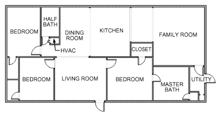

*Fig. 14 Floor Plan of Living Area Level of Manufactured House*

- The **normalized mean square error (NMSE)** should be less than 0.25. NMSE is calculated as

> N
>
> NMSE = (C i– Coi)2⁄ (nCoCp)&emsp;**(41)**

> ∑ p
>
> i=1

where Cp is the predicted concentration and Co is the observed concentration.

For assessing bias, 1. The **normalized** or **fractional bias FB of mean concentrations** should be 0.25 or lower, and is calculated as

> FB = 2(Cp– Co) ⁄ (Cp+ Co)&emsp;**(42)**

2. The **fractional bias FS of variance** should be 0.5 or lower. FS is calculated as

> FS = 2(σ2Cp– σ2Co) ⁄ (σ2Cp+ σ2Co)&emsp;**(43)**

Emmerich (2001) reviewed the research literature for reports of empirical multizone model validation for residential-scale buildings. Few reviewed reports used either the ASTM Standard D5157 measures or other limited statistical evaluations to evaluate the results. However, for those cases with sufficient published data, Emmerich calculated several statistical measures from Standard D5157. Although these measures specifically address concentrations, they have been used to compare predicted and measured airflow rates also. Table 1 summarizes these published multizone model validation efforts.

There are many published validations for residential buildings, but far fewer for large commercial buildings because of the significant effort and cost involved in detailed measuring of a large building. Commercial studies are available by Furbringer et al. (1993), Said and MacDonald (1991), and Upham (1997).

**Example 1. Ventilation Characterization of a New Manufactured House.** Develop a multizone model to investigate various ventilation strategies of a new double-wide manufactured home consisting of three levels: crawlspace, living area, and attic. The crawlspace is divided into two sections by an insulated plastic belly; the region above the belly contains HVAC ductwork, and the volume below vents to the outdoors. The living area is shown in Figure 14. The attic comprises the volume above the vaulted ceiling, with five roof vents and eave vents spanning the perimeter of the house. Figure 15 provides a schematic of the house, showing connections between the levels and the air distribution system.

The building has an automated data acquisition system for monitoring air temperatures, building pressures, weather, and HVAC operation. The instrumentation system also has an automated tracer gas system for continuous monitoring of building air change rates. The tracer gas system injects sulfur hexafluoride into the house every 4 to 6 h, allows it to mix to a uniform concentration, and then monitors the concentration decay in all the major zones of the building. Air change rates are then calculated based on the tracer gas decay rate in the living space.

<!-- str. 299 -->

**Table 1 Summary of Multizone Model Validation Reports**

| Reference | Test Building | Model | Parameter Evaluated | R | m | B | NMSE | FB |
|---|---|---|---|---|---|---|---|---|
| Bassett 1990 | Five houses | CONTAM | Zone air change rates | 0.91 | 1.31 | –0.23 | 0.35 | 0.08 |
|  |  |  | Interzone airflows | 0.27 | 0.10 | 1.34 | 2.98 | 0.37 |
| Blomsterberg et al. | Houses and | COMIS | Average whole-house air | 0.98 | 1.04 | –0.03 | 0.01 | 0.01 |
| 1999 | apartment flats |  | change rates |  |  |  |  |  |
|  |  |  | Average room air change rates | 0.72 | 0.70 | 0.32 | 0.24 | 0.03 |
| Borchiellini et al. 1995 | Two test houses | COMIS | Average interzone airflows | 0.84 | 0.60 | 0.18 | 0.41 | –0.24 |
| Emmerich and Nabinger | Single-zone test | CONTAM | 0.3 to 5.0 μm particle | 0.94 to | 0.84 to | –0.25 to | 0.04 to | –0.26 to |
| 2000 | house |  | concentrations | 0.99 | 1.02 | 0.29 | 0.19 | 0.16 |
| Koontz et al. 1992 | Test chamber | CONTAM | Methylene chloride concentration | 0.98 | 1.08 | 0.07 | 0.20 | 0.16 |
|  | Two-zone | CONTAM | Transient CO concentration | 0.94 | 0.70 | 0.14 | 0.15 | 0.06 |
|  | research house |  | (zone 1) |  |  |  |  |  |
|  |  |  | Transient CO concentration | 0.98 | 0.85 | 0.26 | 0.02 | –0.11 |
|  |  |  | (zone 2) |  |  |  |  |  |
| Haghighat and Megri | Multizone | CONTAM | Interzone airflows | 0.96 | 0.90 | 0.10 | 0.18 | 0.002 |
| 1996 | laboratory |  |  |  |  |  |  |  |
|  | House | CONTAM | Room airflows | 0.96 | 0.84 | 0.14 | 0.04 | –0.02 |
| Lansari et al. 1996 | Two-story house with garage | CONTAM | Tracer gas concentrations in garage | 0.97 | 1.07 | 0.10 | 0.01 | –0.03 |
|  |  |  | Tracer gas concentrations in other rooms | 0.92 | 0.94 | 0.18 | 0.12 | –0.27 |
| Sextro et al. 1999 | Three-story test building | CONTAM | Tracer gas concentrations | 0.97 | 1.04 | 0.14 | 0.10 | 0.16 |
| Yoshino et al. 1995 | Three-room test house | COMIS | Air change rates | 0.79 | 0.87 | NA | NA | NA |
|  |  |  | Tracer gas concentrations | 0.98 | 1.06 | NA | NA | NA |
| Zhao et al. 1998 | Test house | COMIS | Room air change rates | 0.72 | 0.92 | NA | NA | NA |
|  |  |  | Tracer gas concentrations | 0.93 | 0.93 | NA | NA | NA |

Source: Emmerich (2001).

Note: R = correlation coefficient; m = slope of regression line; B = ratio of intercept of regression line to average measured value; NMSE = normalized mean square error; FB = fractional bias.

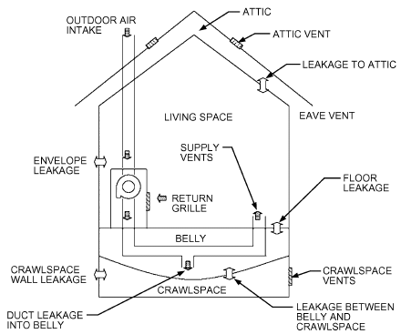

*Fig. 15 Schematic of Ventilation System and Envelope Leakage*

**Model Description.** The model contains four levels: crawlspace, belly volume, living area (Figure 16), and attic. The duct modeling capabilities (see Figure 17 depicting belly level) were used to model the forced-air system. Leakage values of model airflow paths are listed in Table 2. Leaks in the living space envelope include the exterior wall and interfaces between the ceiling and wall, floor and wall, and the walls at the corners. In addition, there are two types of windows, the exterior doors, and the living space floor, which contains openings into the belly. There are also interior airflow paths, including leaks in the walls, doorframes, and open doors. Note that for all the tests and simulations performed, all interior doors were open. The attic has leakage in its floor (i.e., the ceiling of the living space), as well as the two types of attic vents to the outdoors. The crawlspace has leaks to the outdoors in the walls, vents in the front and rear of the house, and an access door. The model also includes a leak from the crawlspace into the belly. Finally, the duct leak into the belly, based on the described measurement, is included in the model.

**Results.** Tracer gas decay tests were simulated using the multizone model. Figure 18 shows the results of one of these simulations 30 min after injection of the tracer gas. The darker the shading, the higher the tracer gas concentration.

Figure 19A shows the measured and predicted air change rates with the forced-air system off as a function of indoor/outdoor air temperature difference under low wind speed conditions. Values predicted with the model are in good agreement with the measurements, particularly at low values of ΔT, but tend to underpredict by around 20% at higher values. Note that in all reported measurements and predictions, the outdoor air intake on the forced-air system and the window inlet vents are closed.

Figure 19B plots the measured and predicted air change rates with the forced-air system on, again for low wind speeds. Under positive temperature differences, the measured air change rates are actually lower than with the system off, which might not be expected with significant duct leakage. Airflow measurements indicate that the system moves about 450 L/s, but about 125 L/s is lost through duct leakage into the belly. Some of this airflow returns to the living space through leaks in the floor, but some flows through the crawlspace to the outdoors, which tends to depressurize the house. A significant air change rate is seen at zero ΔT, but this is not unexpected given the duct leakage. At higher values of ΔT, the stack effect “competes” with duct leakage into the belly, decreasing the air change rate into the house. This effect has actually been proposed as a means of controlling airflow and contaminant entry from crawlspaces (Phaff and De Gids 1994). Overall, with the fan on, the agreement between the predicted and measured air change rates is quite good.

<!-- str. 300 -->

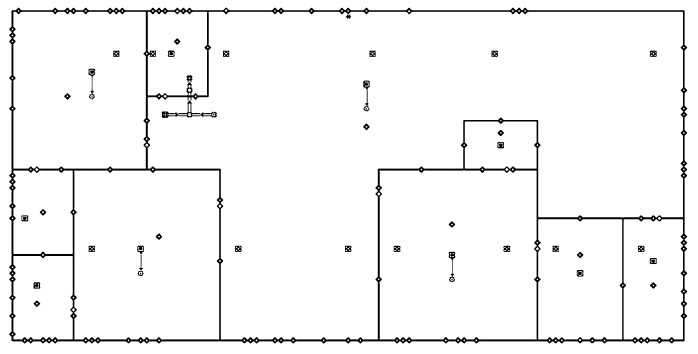

*Fig. 16 Multizone Representation of First Floor*

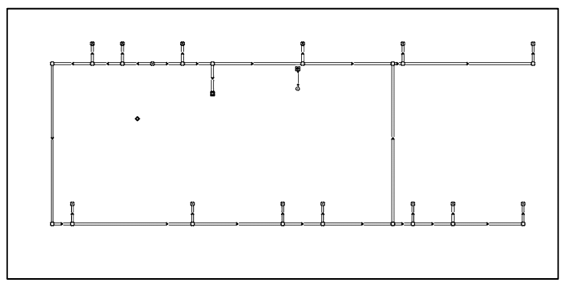

*Fig. 17 Multizone Representation of Ductwork in Belly and Crawlspace*

## 2.5 SYMBOLS

A0 = diffuser effective area

B = ratio of intercept of regression line to average measured value {B} = column vector of total flow into each zone

{C} = correction vector

C = flow coefficient, (Pa1/n·m3)/s; concentration mass fraction Co = observed concentration cp = concentration in air

Cp = specific heat; predicted concentration cR = mean concentration in return openings

Cα,i = concentration mass fraction of α, kgα/kg of air

Cμ = k-ε turbulence model constant

E = constant depending on wall roughness (9.8 for hydraulically smooth walls)

f = [see Equation (29)]

FB = fractional bias of mean concentrations

Fi = nonflow processes that could add or remove significant

> quantities of air

Fj,i = mass flow rate from zone j to zone i, kg/s

FS = fractional bias of variance

> g = gravitational acceleration

Gα,i = generation rate of contaminant α, kgα/s

GΔ = filter function

> h = height; convective heat transfer coefficient

[J] = square Jacobian matrix

> k = thermal conductivity; turbulent kinetic energy
>
> l = turbulence length scale

> L = characteristic length (e.g., room height, diffuser height)

m = mass of air, kg

M = slope of regression line mi = mass of air in zone i, kg ṁ = mass flow rate

> n = flow exponent (typically 0.5 to 0.6)

NMSE = normalized mean square error

> P = pressure

ΔP = pressure drop across opening, Pa

{P} = estimated pressures

**{P*}** = estimated vector of all zone pressures

Pe = Peclet number (ratio of convection to conduction)

Pi, Pj = zone pressure, Pa

Q = volumetric airflow rate, F/ρ, m3/s

> R = removal coefficient; correlation coefficient

Rair = gas constant of air, 287.055 J/(kg·K)

<!-- str. 301 -->

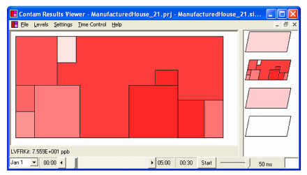

*Fig. 18 Test Simulation of Concentration of Tracer Gas Decay in Manufactured House 30 min After Injection*

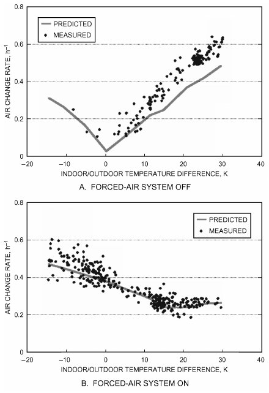

*Fig. 19 Measured and Predicted Air Change Rates for Wind Speeds less than 2 m/s*

Ra = Rayleigh number

Re = Reynolds number sij = strain rate tensor

Sφ = source or sink t = time, s

T = temperature, °C

ΔT = temperature change

TI = turbulence intensity, %

Ts = surface temperature

**Table 2 Leakage Values of Model Airflow Components**

|   | Exterior Airflow Paths | ELA at 4 Pa |
|---|---|---|
| Living space envelope | Exterior wall | 14 mm2/m2 |
|  | Ceiling wall interface | 81 mm2/m |
|  | Floor wall interface | 124 mm2/m |
|  | Window #1 | 500 mm2 |
|  | Window #2 | 194 mm2 |
|  | Corner interface | 80.8 mm2/m |
|  | Exterior doors | 1870 mm2 |
|  | Living space floor to belly volume | 365 mm2/m2 |
| Interior airflow paths | Interior walls | 200 mm2/m2 |
|  | Bedroom doorframe | 4100 mm2 |
|  | Open interior doors | 2 by 0.9 m |
|  | Bathroom doorframe | 3300 mm2 |
|  | Interior doorframe | 2500 mm2 |
|  | Closet doorframe | 460 mm2 |
| Attic | Attic floor | 200 mm2/m2 |
|  | Roof vents | 0.135 m2 |
|  | Eave vents | 10 600 mm2/m |
| Crawlspace and belly | Exterior walls of crawlspace | 2500 mm2/m2 |
|  | Rear crawlspace vents | 32 300 mm2 |
|  | Front crawlspace vents | 46 500 mm2 |
|  | Crawlspace access door | 20 600 mm2 |
|  | Crawlspace to belly | 25 800 mm2 |
|  | Duct leak into belly | 3200 mm2 |

Ti = zone temperature, K

U = velocity ui = instantaneous velocity ui = ensemble average of ν for steady flow ui′ = fluctuation velocity uj = velocity in j direction, m/s

UP = velocity parallel to wall at ΔYp

Uref = mean stream velocity

U0 = air supply velocity for momentum source

Vi = zone volume, m3 xi = distance in i direction, m xj = distance in j direction, m

Y+ = dimensionless distance from wall

ΔYp = distance from wall to center of first cell

### Greek

α, β = contaminants

Γφ = generalized diffusion coefficient or transport property of fluid flow

ε = dissipation rate of turbulent kinetic energy

η = Kolmogorov length scale; filter efficiency

κ = von Karmann’s constant (0.41)

κα,β = kinetic reaction coefficient between α and β

μ = dynamic viscosity

μt = eddy viscosity

ν = kinematic viscosity

ρ = density, kg/m3

ρi = zone density, kg/m3

σ = standard deviation

τij = viscous tensor stress

τw = wall shear stress

φ = transport property (1 for mass continuity, momentum,

> temperature, or species concentration)

## REFERENCES

ASHRAE members can access ASHRAE Journal articles and ASHRAE research project final reports at technologyportal .ashrae.org. Articles and reports are also available for purchase by nonmembers in the online ASHRAE Bookstore at www.ashrae.org /bookstore.

<!-- str. 302 -->

AIAA. 1998. Guide for the verification and validation of computational fluid dynamics simulations. AIAA Standard G-077-1998. American Institute of Aeronautics and Astronautics, Reston, VA.

Anderson, J.D., Jr. 1995. *Computational fluid dynamics: The basics with* applications. McGraw-Hill, New York.

Anderson, D.A., J.C. Tannehill, and R.H. Pletcher. 1984. Computational *fluid dynamics and heat transfer*. Hemisphere, Washington, D.C.

ASTM. 1997. Standard guide for statistical evaluation of indoor air quality models. Standard D5157-97(2003)e1. American Society for Testing and Materials, West Conshohocken, PA.

Awbi, H.B. 1991. *Ventilation of buildings*. Chapman & Hall, London. Axley, J.A. 1987. *Indoor air quality modeling, phase II report.* NBSIR 87-3661. National Institute of Standards and Technology, Gaithersburg, MD.

Axley, J.A. 1988. *Progress toward a general analytical method for predict-* *ing indoor air pollution in buildings—Indoor air quality modeling, phase* III report. NBSIR 88-3814. National Institute of Standards and Technology, Gaithersburg, MD.

Baker, A.J., P.T. Williams, and R.M. Kelso. 1994. Numerical calculation of room air motion—Part 1. ASHRAE Transactions 100(1):514-530.

Bassett, M. 1990. Infiltration and leakage paths in single family houses—A multizone infiltration case study. *AIVC Technical Note* 27. Air Infiltration and Ventilation Centre, Brussels, Belgium.

Beausoleil-Morrison, I. 2000. *The adaptive coupling of heat and air flow* *modelling with dynamic whole-building.* Ph.D. dissertation, Department of Mechanical Engineering, University of Strathclyde, Glasgow.

Bernard, P.S., and J.M. Wallace. 2002. *Turbulent flow: Analysis, measure-* *ment, and prediction*. John Wiley & Sons, Hoboken, NJ.

Blomsterberg, A., T. Carlsson, C. Svensson, and J. Kronvall. 1999. Air flows in dwellings—Simulations and measurements. *Energy and Buildings* 30:87-95.

Borchiellini, R., M. Cali, and M. Torchio. 1995. Experimental evaluation of COMIS results for ventilation of a detached house. ASHRAE Transactions 101(1).

BRE. 1994. *BREEZE 6.0 user manual*. Building Research Establishment, Garston, U.K.

Breuer, M. 1998. Large eddy simulation of the subcritical flow past a circular cylinder: Numerical and modeling aspects. *International Journal of* *Numerical Methods in Fluids* 28:1281-1302.

Chen, Q. 1988. *Indoor airflow, air quality and energy consumption of build-* ings. Ph.D. dissertation, Delft University of Technology, The Netherlands.

Chen, Q. 1996. Prediction of room air motion by Reynolds-stress models.

*Building and Environment* 31(3):233-244.

Chen, Q., and Z. Jiang. 1992. Significant questions in predicting room air motion. ASHRAE Transactions 98(1):929-939.

Chen, Q., and A. Moser. 1991. Simulation of a multiple-nozzle diffuser. Pro-*ceedings of the 12th AIVC Conference* 2:1-14.

Chen, Q., A. Moser, and A. Huber. 1990. Prediction of buoyant, turbulent flow by a low Reynolds-number k-ε model. ASHRAE Transactions 96(1):564-573.

Chen, Q., and J. Srebric. 2000. Simplified diffuser boundary conditions for numerical room airflow models. ASHRAE Research Project (RP) 1009, Final Report.

Chen, Q., and J. Srebric. 2002. A procedure for verification, validation, and reporting of indoor environment CFD analyses. *International Journal of* HVAC&R Research (now *Science and Technology for the Built Environ-* ment) 8(2):201-216.

Chen, Q., and W. Xu. 1998. A zero-equation turbulence model for indoor airflow simulation. *Energy and Buildings* 28(2):137-144.

Cherukat, P., Y. Na, and T. J. Hanratty. 1998. Direct numerical simulation of a fully developed turbulent flow over a wavy wall. *Theoretical and Com-* *putational Fluid Dynamics* 11:109-134.

Chester, S., F. Charlette, and C. Meneveau. 2001. Dynamic model for LES without test filtering: Quantifying the accuracy of Taylor series approximations. *Theoretical and Computational Fluid Dynamics* 15:165-181.

Corrsin, S. 1961. Turbulent flow. American Scientist 49:300-325.

Dennis, J.E., and R.B. Schnabel. 1996. *Numerical methods for uncon-* *strained optimization and nonlinear equations.* Society for Industrial and Applied Mathematics, Philadelphia.

Dols, W.S., and G. Walton. 2002. *CONTAMW 2.0 user manual*. NISTIR 6921. National Institute of Standards and Technology, Gaithersburg, MD.

Emmerich, S.J. 1997. *Use of computational fluid dynamics to analyze* *indoor air quality issues*. NISTIR 5997. National Institute of Standards and Technology, Gaithersburg, MD.

Emmerich, S.J. 2001. Validation of multizone IAQ modeling of residentialscale buildings: A review. ASHRAE Transactions 107.

Emmerich, S.J., and K.B. McGrattan. 1998. Application of a large eddy simulation model to study room airflow ASHRAE Transactions 104(1):1-9.

Emmerich, S.J., and S.J. Nabinger. 2000. *Measurement and simulation of the* *IAQ impact of particle air cleaner in a single-zone building.* NISTIR 6461. National Institute of Standards and Technology, Gaithersburg, MD.

Etheridge, D., and M. Sandberg. 1996. *Building ventilation, theory and mea-* surements. John Wiley & Sons, Chichester, NY.

Fan, Y. 1995. CFD modeling of the air and contaminant distribution in rooms. *Energy and Buildings* 23:33-39.

Fanger, P.O. 1972. *Thermal comfort: Analysis and application in environ-* mental engineering. McGraw-Hill.

Ferziger, J.H. 1977. Large eddy numerical simulations of turbulent flows.

AIAA Journal 15(9):1261-1267.

Ferziger, J., and M. Peric. 1997. *Computational methods for fluid dynamics*.

Springer, New York.

Feustel, H.E. 1998. *COMIS—An international air-flow and contaminant* transport model. LBNL 42182. Lawrence Berkeley National Laboratory.

Feustel, H.E., F. Allard, V.B. Dorer, M. Grosso, M. Herrlin, L. Mingsheng, J.C. Phaff, Y. Utsumi, and H. Yoshino. 1989. The COMIS infiltration model. *Proceedings of the 10th AIVC Conference,* Air Infiltration and Ventilation Centre.

Furbringer J.-M., V. Dorer, F. Huck, and A. Weber. 1993. Air flow simulation of the LESO building including a comparison with measurements and a sensitivity analysis. *Proceedings of Indoor Air 1993*, p. 5.

Gosman, A.D., P.V. Nielsen, A. Restivo, and J.H. Whitelaw. 1980. The flow properties of rooms with small ventilation openings. *Transactions of the* ASME.

Grötzbach, G. 1983. Spatial resolution requirements for direction numerical simulation of the Rayleigh-Bénard convection. *Journal of Computa-* tional Physics 49:241-264.

Haghighat, F., and A.C. Megri. 1996. A comprehensive validation of two airflow models—COMIS and CONTAM. Indoor Air 6:278-288.

Haghighat, F., and J. Rao. 1991. Computer-aided building ventilation system design—A system theoretic approach. *Energy and Buildings* 1:147-155.

Herrlin, M.K. 1992. *Air-flow studies in multizone buildings—Models and* applications. Royal Institute of Technology, Stockholm.

Hinze, J.O. 1975. Turbulence, 2nd ed. McGraw-Hill, New York.

Horstman, R.H. 1988. Predicting velocity and contamination distribution in ventilated volumes using Navier-Stokes equations. Proceedings of *ASHRAE IAQ ’88 Conference,* pp. 209-230.

Jones, P.J., and G.E. Whittle. 1992. Computational fluid dynamics for building air flow prediction—Current status and capabilities. Building and Environment 27(3):321-338.

Kato, S., S. Murakami, and Y. Kondo. 1994. Numerical simulation of two-dimensional room airflow with and without buoyancy by means of ASM. ASHRAE Transactions 100(1):238-255.

Kato, S., S. Murakami, S. Shoya, F. Hanyu, and J. Zeng. 1995. CFD analysis of flow and temperature fields in atrium with ceiling height of 130 m. ASHRAE Transactions 101(2):1144-1157.

Koontz, M.D., H.E. Rector, and N.L. Nagda. 1992. Consumer products exposure guidelines: Evaluation of indoor air quality models. GEOMET Report IE-1980. GEOMET Technologies, Germantown, MD.

Lansari, A., J.J. Streicher, A.H. Huber, G.H. Crescenti, R.B. Zweidinger, J.W. Duncan, C.P. Weisel, and R.M. Burton. 1996. Dispersion of automotive alternative fuel vapors within a residence and its attached garage. Indoor Air 6:118-126.

Launder, B.E. 1989. Second-moment closure: Present . . . and future? Inter-*national Journal of Heat and Fluid Flow* 10:282-300.

Launder, B.E., and D.B. Spalding. 1974. The numerical computation of turbulent flows. *Computer Methods in Applied Mechanics and Engineering* 3:269-289.

Launder, B.E., G.J. Reece, and W. Rodi. 1975. Progress in the development of a Reynolds-stress turbulence closure. *Journal of Fluid Mechanics* 68(3):537-566.

Launder, B.E., and B.I. Sharma. 1974. Application of the energy dissipation model of turbulence to the calculation of flow near a spinning disc. Let-*ters in Heat and Mass Transfer* 1(2):131-138.

<!-- str. 303 -->

Lin, C.H., M.F. Ahlers, A.K. Davenport, L.M. Sedgwick, R.H. Horstman, and J.C. Yu. 2001. *A numerical model for airborne disease transmission* *in a 767-300 passenger cabin.* Final report to the National Institute for Occupational Safety and Health, contract no. 200-2000-08001. Boeing Commercial Airplanes Group.

Lin, C.H., T. Han, and C.A. Koromilas. 1992. Effect of HVAC design parameters on passenger thermal comfort. SAE Paper No. 920264. Society of Automotive Engineers, Warrendale, PA.

Ling, W., J.N. Chung, T.R. Troutt, and C.T. Crowe. 1998. Direct numerical simulation of a three-dimensional temporal mixing layer with particle dispersion. *Journal of Fluid Mechanics* 358:61-85.

Lorenzetti, D.M. 2002. Computational aspects of nodal multizone airflow systems. *Building and Environment* 37:1083-1090.

Mashayek, F. 1998. Direct numerical simulation of evaporating droplet dispersion in forced low Mach number turbulence. *International Journal of* *Heat and Mass Transfer* 41(17):2601-2617.

Mathieu, J., and J. Scott. 2000. *An introduction to turbulent flow*. Cambridge University.

Monin, A.S., and A.M. Yaglom. 1971. *Statistical fluid mechanics*, vol. 1.

MIT Press, Cambridge.

Moser, A., F. Off, A. Schälin, and X. Yuan. 1995. Numerical modeling of heat transfer by radiation and convection in an atrium with thermal inertia. ASHRAE Transactions 101(2):1136-1143.

Murakami, S. Kato, and R. Ooka. 1994. Comparison of numerical predictions of horizontal nonisothermal jet in a room with three turbulence models—k-ε, EVM, ASM, and DSM. ASHRAE Transactions 100(2): 697-706.

Nielsen, P.V. 1975. Prediction of air flow and comfort in air conditioned spaces. ASHRAE Transactions 81(2):247-259.

Nielsen, P.V. 1992. The description of supply openings in numerical models for room air distribution. ASHRAE Transactions 98(1):963-971.

Nielsen, P.V. 1995. Air flow in an exposition pavilion studied by scale-model experiments and computational fluid dynamics. ASHRAE Transactions 101(2):1118-1126.

Nielsen. P.V. 1998. The selection of turbulence models for prediction of room airflow. ASHRAE Transactions 104(1B):1119-1127.

Nielsen, P.V., and T. Tryggvason. 1998. Computational fluid dynamics and building energy performance simulation. *Proceedings of ROOMVENT* ’98: *Sixth International Conference on Air Distribution in Rooms*, Stockholm, 1:101-107.

Orme, M. 2000. Applicable input data for a proposed ventilation modeling data guide. ASHRAE Transactions 106(2).

Phaff, H.J.C., and W.F. deGids. 1994. The air lock floor. *Proceedings of 5th* *Air Infiltration and Ventilation Centre Conference*. Air Infiltration and Ventilation Centre, Brussels, Belgium.

Pope, S.B. 2000. Turbulent flows. Cambridge University.

Rajaratnam, N. 1976. Turbulent jets. Elsevier, Amsterdam.

Reynolds, O. 1895. On the dynamical theory of incompressible viscous fluids and the determination of the criterion. *Philosophical Transactions of* *the Royal Society, London* A(186):123.

Rodriguez, E.A., and F. Allard. 1992. Coupling COMIS airflow model with other transfer phenomena. *Energy and Buildings* 18:147-157.

Russell, M.B., and P.N. Surendran. 2000. Use of computational fluid dynamics to aid studies of room air distribution: A review of some recent work. *Proceedings of CIBSE A: Building Services Engineering Research* and Technology 21(4):241-247.

Said, M.N., and R.A. MacDonald. 1991. An evaluation of a network smoke control model. ASHRAE Transactions 97(1):275-282.

Schälin, A., and P.V. Nielsen. 2004. Impact of turbulence anisotropy near walls in room air flow. Indoor Air 14(3):159-168. dx.doi.org/10.1111 /j.1600-0668.2004.00201e.x.

Sextro, R.G., J.M. Daisey, H.E. Feustel, D.J. Dickerhoff, and C. Jump. 1999.

Comparison of modeled and measured tracer gas concentrations in a multizone building. *Proceedings of Indoor Air ’99*, vol. 1.

Smagorinsky, J. 1963. General circulation experiments with primitive equations. *Monthly Weather Review* 91:99-165.

Spalart, P.R. 2000. Strategies for turbulence modeling and simulations.

*International Journal of Heat and Fluid Flow* 21:252-263.

Srebric, J. 2000. *Simplified methodology for indoor environment design*.

Ph.D. dissertation, Department of Architecture, Massachusetts Institute of Technology, Cambridge.

Srebric, J., and Q. Chen. 2001. A method of test to obtain diffuser data for CFD modeling of room airflow. ASHRAE Transactions 107(2):108-116.

Srebric, J., and Q. Chen. 2002. Simplified numerical models for complex air supply diffusers. *International Journal of HVAC&R Research* (now *Science and Technology for the Built Environment*) 8(3): 277-294.

Tennekes, H., and J. L. Lumley. 1972. *A first course in turbulence*. MIT Press, Cambridge.

Tuomaala, P. 1993. New building air flow simulation model: Theoretical bases. *Building Services Engineering Research and Technology* 14: 151-157.

Upham, R.D. 1997. *A validation study of multizone air flow and contami-* *nant migration simulation program CONTAM as applied to tall build-* ings. M.S. thesis. The Pennsylvania State University, University Park.

Versteeg, H., and W. Malalasekera. 1995. *An introduction to computational* *fluid dynamics: The finite volume method*. Prentice Hall, Old Tappan, NJ.

Walton, G.N. 1989. *AIRNET—A computer program for building network* airflow modeling. NISTIR 89-4072. National Institute of Standards and Technology, Gaithersburg, MD.

Wilcox, D.C. 1998. *Turbulence modeling for CFD*, 2nd ed. DCW Industries, La Cañada, CA.

Williams, P.T., A.J. Baker, and R.M. Kelso. 1994a. Numerical calculation of room air motion—Part 2. ASHRAE Transactions 100(1):531-548.

Williams, P.T., A.J. Baker, and R.M. Kelso. 1994b. Numerical calculation of room air motion—Part 3. ASHRAE Transactions 100(1):549-564.

Yoshino, H., Z. Yun, H. Kobayashi, and Y. Utsumi. 1995. Simulation and measurement of air infiltration and pollutant transport using a passive solar test house. ASHRAE Transactions 101(1).

Yuan, X., A. Moser, and P. Suter. 1994. Wall functions for numerical simulations of turbulent natural convection. *Proceedings of the 10th Inter-* *national Heat Transfer Conference*, Brighton, U.K., pp. 191-196.

Zhai, Z., and Q. Chen. 2003. Solution characters of iterative coupling between energy simulation and CFD programs. *Energy and Buildings* 35(5):493-505.

Zhai, Z., Q. Chen, P. Haves, and J.H. Klems. 2002. On approaches to couple energy simulation and computational fluid dynamics programs. Building and Environment 37:857-864.

Zhang, G., S. Morsing, B. Bjerg, K. Svidt, and J.S. Strom. 2000. Test room for validation of airflow patterns estimated by computational fluid dynamics. *Journal of Agricultural Engineering Research* 76:141-148.

Zhao, Y., H. Yoshino, and H. Okuyama. 1998. Evaluation of the COMIS model by comparing simulation and measurement of airflow and pollutant concentration. Indoor Air 8:123-130.

## BIBLIOGRAPHY

Feustel, H.E., and B.V. Smith. 1997. *COMIS 3.0 user’s guide*. Lawrence Berkeley National Laboratory.

Jiang, Y., D. Alexander, H. Jenkins, R. Arthur, and Q. Chen. 2003. Natural ventilation in buildings: measurement in a wind tunnel and numerical simulation with large eddy simulation. *Journal of Wind Engineering and* Industrial Aerodynamics 91(3):331-353.

Jiang, Y., and Q. Chen. 2001. Study of natural ventilation in buildings by large eddy simulation. *Journal of Wind Engineering and Industrial Aero-* dynamics. 89(13):1155-1178.

Jiang, Y., and Q. Chen. 2002. Effect of fluctuating wind direction on cross natural ventilation in building from large eddy simulation. Building and Environment 37(4):379-386.

Jiang, Y., and Q. Chen. 2003. Buoyancy-driven single-sided natural ventilation in buildings with large openings. *International Journal of Heat and* Mass Transfer 46(6):973-988.

Jiang, Y., M. Su, and Q. Chen. 2003. Using large eddy simulation to study airflows in and around buildings. ASHRAE Transactions 109(2).

Liddament, M., and C. Allen. 1983. The validation and comparison of mathematical models of air infiltration. *AIC Technical Note* 11. Air Infiltration Centre, Brussels, Belgium.

Spalart, P.R., and S.R. Allmaras. 1994. A one-equation turbulence model for aerodynamic flows. *La Recherche Aérospatiale* 1:5.

Su, M., Q. Chen, and C.-M. Chiang. 2001. Comparison of different subgridscale models of large eddy simulation for indoor airflow modeling. Jour-*nal of Fluids Engineering* 123:628-639.
