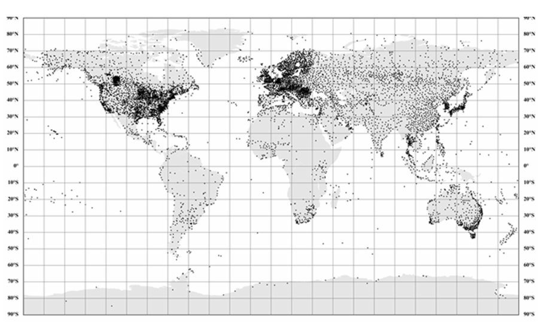
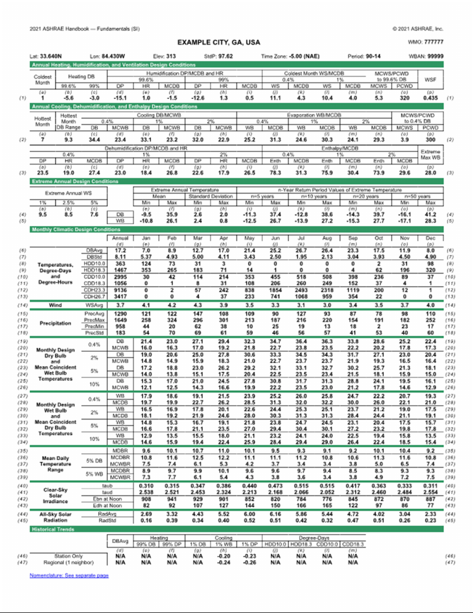
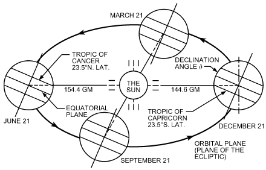
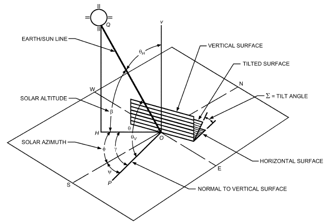
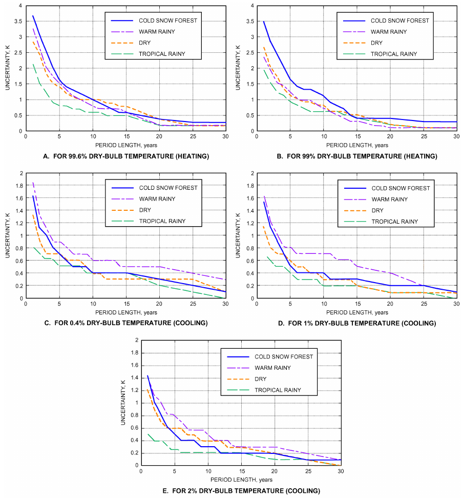
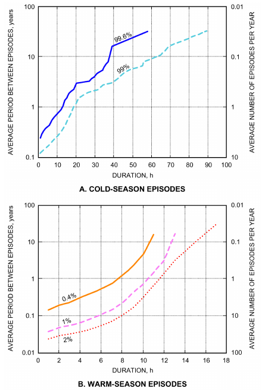

# Chapter 14 — Climatic Design Information

*Izvor: 2021 ASHRAE Handbook — Fundamentals (SI), Chapter 14 (PDF str. 304–352).*

> **Napomena o konverziji:** Tekst je automatski izdvojen iz originalnog PDF-a uz prepoznavanje dve kolone, spojene prelomljene reči i pasuse. Indeksi i eksponenti su označeni sa `<sub>`/`<sup>`, tabele su pretvorene u Markdown tabele (veoma složene tabele su prikazane kao poravnat tekst), a slike su izrezane iz PDF-a u folder `img/`. Složene jednačine (razlomci, sume) mogu biti uprošćeno prikazane. **Pre upotrebe vrednosti u proračunu proveriti u originalnom PDF-u.** Oznake `<!-- str. N -->` pokazuju stranu PDF-a.

## Sadržaj

- [1. CLIMATIC DESIGN CONDITIONS](#1-climatic-design-conditions)
- [2. CALCULATING CLEAR-SKY SOLAR RADIATION](#2-calculating-clear-sky-solar-radiation)
- [3. TRANSPOSITION TO RECEIVING SURFACES OF VARIOUS ORIENTATIONS](#3-transposition-to-receiving-surfaces-of-various-orientations)
- [4. GENERATING DESIGN-DAY DATA](#4-generating-design-day-data)
- [5. ESTIMATION OF DEGREE-DAYS](#5-estimation-of-degree-days)
- [6. REPRESENTATIVENESS OF DATA AND SOURCES OF UNCERTAINTY](#6-representativeness-of-data-and-sources-of-uncertainty)
- [7. OTHER SOURCES OF CLIMATIC INFORMATION](#7-other-sources-of-climatic-information)
- [REFERENCES](#references)
- [BIBLIOGRAPHY](#bibliography)

<!-- str. 304 -->

THIS chapter and the accompanying data summaries in PDF format provide the climatic design information for 9237 locations in the United States, Canada, and around the world. This is an increase of 1119 stations from the 2017 ASHRAE Handbook—Fundamentals. As in previous editions, the large number of stations made printing the whole tables impractical. Consequently, the complete table of design conditions for only an “example city” appears in this printed chapter to illustrate the table format. However, a subset of the table elements most often used is presented in the Appendix at the end of this chapter for selected stations representing major urban centers in the United States, Canada, and around the world. The complete data tables for all 9237 stations are included with both the PDF version of this chapter (downloadable from technologyportal.ashrae.org) and the Handbook Online version.

This climatic design information is commonly used for design, sizing, distribution, installation, and marketing of heating, ventilating, air-conditioning, and dehumidification equipment, as well as for other energy-related processes in residential, agricultural, commercial, and industrial applications. These summaries include values of dry-bulb, wet-bulb, and dew-point temperature, and wind speed with direction at various frequencies of occurrence. Also included are monthly degree-days to various bases, parameters to calculate clear-sky irradiance, and monthly averages of daily all-sky solar radiation. Sources of other climate information of potential interest to ASHRAE members are described later in this chapter.

Design information in this chapter was developed largely through research project RP-1847 (Roth 2021). The information includes design values of dry-bulb with mean coincident wet-bulb temperature, design wet-bulb with mean coincident dry-bulb temperature, and design dew-point with mean coincident dry-bulb temperature and corresponding humidity ratio. These data allow the designer to consider various operational peak conditions. Design values of wind speed facilitate the design of smoke management systems in buildings (Lamming and Salmon 1996, 1998).

Warm-season temperature and humidity conditions are based on annual percentiles of 0.4, 1.0, and 2.0. Cold-season conditions are based on annual percentiles of 99.6 and 99.0. The use of annual percentiles to define design conditions ensures that they represent the same probability of occurrence in any climate, regardless of the seasonal distribution of extreme temperature and humidity.

Monthly precipitation data are also included. They are used mostly to determine climate zones for ASHRAE Standard 169, but may also be helpful in developing green technologies such as vegetative roofs and stormwater harvesting.

The clear-sky solar radiation model introduced in the 2009 edition and slightly modified in the 2013 edition is unchanged in its general formulation. However, the site-specific coefficients have been recalculated, based on the latest atmospheric information available. All-sky solar radiation values are also provided; these are useful in assessing solar technologies (solar heating, photovoltaics), which are typically necessary in the quest for designing net-zero-energy buildings.

<sub>The preparation of this chapter is assigned to TC 4.2, Climatic Information.</sub>

Recent trends for a few specific elements are also listed. Although they reflect the evolution of climatic design conditions in the recent past, they are not necessarily good indicators for future trends related to climate change or other anthropogenic factors. However, they clearly make users aware of the current evolution of climate worldwide, with a general trend towards higher temperatures.

Design conditions are provided for locations for which long-term hourly observations were available (1994-2019 for most stations). Compared to the 2017 chapter, the number of U.S. stations increased from 1952 to 2220 (14% increase); Canadian stations increased from 765 to 841 (10% increase); and stations in the rest of the world increased from 5401 to 6167 (14% increase; see Figure 1 for map).

## 1. CLIMATIC DESIGN CONDITIONS

Table 1 shows climatic design conditions for Atlanta, GA, to illustrate the format of the data available on the CD-ROM. A limited subset of these data for 1445 of the 8118 locations for 21 annual data elements is provided for convenience in the Appendix.

The top part of the table contains station information as follows:

- Name of the observing station, state (USA) or province (Canada), country.
- World Meteorological Organization (WMO) station identifier.
- Weather Bureau Army Navy (WBAN) number (99999 denotes missing).
- Latitude of station, °N/S.
- Longitude of station, °E/W.
- Elevation of station, m.
- Standard pressure at elevation, in kPa (see Chapter 1 for equations used to calculate standard pressure).
- Time zone, h ± UTC.
- Time zone code (e.g., NAE = Eastern Time, USA and Canada). The CD-ROM contains a list of all time zone codes used in the tables.
- Period analyzed (e.g., 90-14 = data from 1990 to 2014 were used).

### Annual Design Conditions

Annual climatic design conditions are contained in the first three sections following the top part of the table. They contain information as follows:

**Annual Heating and Humidification Design Conditions.**

- Coldest month (i.e., month with lowest average dry-bulb temperature; 1 = January, 12 = December).
- Dry-bulb temperature corresponding to 99.6 and 99.0% annual cumulative frequency of occurrence (cold conditions), °C.
- Dew-point temperature corresponding to 99.6 and 99.0% annual cumulative frequency of occurrence, °C; corresponding humidity ratio, calculated at standard atmospheric pressure at elevation of station, grams of moisture per kg of dry air; mean coincident dry-bulb temperature, °C.
- Wind speed corresponding to 0.4 and 1.0% cumulative frequency of occurrence for coldest month, m/s; mean coincident dry-bulb temperature, °C.

<!-- str. 305 -->



*Fig. 1 Locations of Weather Stations*

- Mean wind speed coincident with 99.6% dry-bulb temperature, m/s; corresponding most frequent wind direction, degrees from north (east = 90°).

**Annual Cooling, Dehumidification, and Enthalpy Design Conditions.**

- Hottest month (i.e., month with highest average dry-bulb temperature; 1 = January, 12 = December).
- Daily temperature range for hottest month, °C [defined as mean of the difference between daily maximum and daily minimum dry-bulb temperatures for hottest month].
- Dry-bulb temperature corresponding to 0.4, 1.0, and 2.0% annual cumulative frequency of occurrence (warm conditions), °C; mean coincident wet-bulb temperature, °C.
- Wet-bulb temperature corresponding to 0.4, 1.0, and 2.0% annual cumulative frequency of occurrence, °C; mean coincident dry-bulb temperature, °C.
- Mean wind speed coincident with 0.4% dry-bulb temperature, m/s; corresponding most frequent wind direction, degrees true from north (east = 90°).
- Dew-point temperature corresponding to 0.4, 1.0, and 2.0% annual cumulative frequency of occurrence, °C; corresponding humidity ratio, calculated at the standard atmospheric pressure at elevation of station, grams of moisture per kg of dry air; mean coincident dry-bulb temperature, °C.
- Enthalpy corresponding to 0.4, 1.0, and 2.0% annual cumulative frequency of occurrence, kJ/kg; mean coincident dry-bulb temperature, °C.
- Extreme maximum wet-bulb temperature, °C.

**Extreme Annual Design Conditions.**

- Wind speed corresponding to 1.0, 2.5, and 5.0% annual cumulative frequency of occurrence, m/s.
- Mean and standard deviation of extreme annual minimum and maximum dry-bulb temperature, °C.
- 5-, 10-, 20-, and 50-year return period values for minimum and maximum extreme dry-bulb temperature, °C.
- Mean and standard deviation of extreme annual minimum and maximum wet-bulb temperature, °C.
- 5-, 10-, 20-, and 50-year return period values for minimum and maximum extreme wet-bulb temperature, °C.

### Monthly Design Conditions

Monthly design conditions are divided into subsections as follows:

**Temperatures, Degree-Days, and Degree-Hours.**

- Average temperature, °C. This parameter is a prime indicator of climate and is also useful to calculate heating and cooling degree-days to any base.
- Standard deviation of average daily temperature, °C. This parameter is useful to calculate heating and cooling degree-days to any base. Its use is explained in the section on Estimation of Degree-Days.
- Heating and cooling degree-days (bases 10 and 18.3°C). These parameters are useful in energy estimating methods. They are also used to classify locations into climate zones in ASHRAE Standard 169.
- Cooling degree-hours (bases 23.3 and 26.7°C). These are used in various standards, such as Standard 90.2-2004.

**Wind.**

- Monthly average wind speed, m/s. This parameter is useful to estimate the wind potential at a site; however, the local topography may significantly alter this value, so close attention is needed.

**Precipitation.**

<!-- str. 306 -->

- Average precipitation, mm. This parameter is used to calculate climate zones for Standard 169, and is of interest in some green building technologies (e.g., vegetative roofs).
- Standard deviation of precipitation, mm. This parameter indicates the variability of precipitation at the site.
- Minimum and maximum precipitation, mm. These parameters give extremes of precipitation and are useful for green building technologies and stormwater management.

**Monthly Design Dry-Bulb, Wet-Bulb, and Mean Coincident Temperatures.**

These values are derived from the same analysis that results in the annual design conditions. The monthly summaries are useful when seasonal variations in solar geometry and intensity, building or facility occupancy, or building use patterns require consideration. In particular, these values can be used when determining air-conditioning loads during periods of maximum solar radiation. The values listed in the tables include

- Dry-bulb temperature corresponding to 0.4, 2.0, 5.0, and 10.0% cumulative frequency of occurrence for indicated month, °C; mean coincident wet-bulb temperature, °C.
- Wet-bulb temperature corresponding to 0.4, 2.0, 5.0, and 10.0% cumulative frequency of occurrence for indicated month, °C; mean coincident dry-bulb temperature, °C.

For a 30-day month, the 0.4, 2.0, 5.0 and 10.0% values of occurrence represent the value that occurs or is exceeded for a total of 3, 14, 36, or 72 h, respectively, per month on average over the period of record. Monthly percentile values of dry- or wet-bulb temperature may be higher or lower than the annual design conditions corresponding to the same nominal percentile, depending on the month and the seasonal distribution of the parameter at that location. Generally, for the hottest or most humid months of the year, the monthly percentile value exceeds the design condition for the same element corresponding to the same nominal percentile. For example, Table 1 shows that the annual 0.4% design dry-bulb temperature at Atlanta, GA, is 34.4°C; the 0.4% monthly dry-bulb temperature exceeds 34.4°C for June, July, and August, with values of 34.7, 36.4, and 36.3°C, respectively. Fifth and tenth percentiles are also provided to give a greater range in the frequency of occurrence, in particular providing less extreme options to select for design calculations.

A general, very approximate rule of thumb is that the n% annual cooling design condition is roughly equivalent to the 5n% monthly cooling condition for the hottest month; that is, the 0.4% annual design dry-bulb temperature is roughly equivalent to the 2% monthly design dry-bulb temperature for the hottest month; the 1% annual value is roughly equivalent to the 5% monthly value for the hottest month, and the 2% annual value is roughly equivalent to the 10% monthly value for the hottest month.

**Mean Daily Temperature Range.** These values are useful in calculating daily dry- and wet-bulb temperature profiles, as explained in the section on Generating Design-Day Data. Three kinds of profile are defined:

- Mean daily temperature range for month indicated, °C (defined as mean of difference between daily maximum and minimum dry-bulb temperatures).
- Mean daily dry- and wet-bulb temperature ranges coincident with the 5% monthly design dry-bulb temperature. This is the difference between daily maximum and minimum dry- or wet-bulb temperatures, respectively, averaged over all days where the maximum daily dry-bulb temperature exceeds the 5% monthly design dry-bulb temperature.
- Mean daily dry- and wet-bulb temperature ranges coincident with the 5% monthly design wet-bulb temperature. This is the difference between daily maximum and minimum dry- or wet-bulb temperatures, respectively, averaged over all days where the maximum daily wet-bulb temperature exceeds the 5% monthly design wet-bulb temperature.

**Clear-Sky Solar Irradiance.** Clear-sky irradiance parameters are useful in calculating solar-related air conditioning loads for any time of any day of the year. Parameters are provided for the 21st day of each month. The 21st of the month is usually a convenient day for solar calculations because June 21 and December 21 represent the solstices (longest and shortest days) and March 21 and September 21 are close to the equinox (days and nights have the same length). Parameters listed in the tables are

- Clear-sky optical depths for beam and diffuse irradiances, which are used to calculate beam and diffuse irradiance as explained in the section on Calculating Clear-Sky Solar Radiation.
- Clear-sky beam normal and diffuse horizontal irradiances at solar noon. These two values can be calculated from the clear-sky optical depths but are listed here for convenience.

**All-Sky Solar Radiation.** All-sky solar radiation parameters are useful for evaluating the potential of solar technologies (e.g., solar heating, photovoltaics), which are valuable in the design of net-zero energy buildings. Parameters listed in the tables are

- Monthly average daily global radiation on a horizontal surface. This is a traditional way to characterize the solar resource at a site.
- Standard deviation of monthly average daily radiation on a horizontal surface. This parameter gives an idea of the year-to-year variability of the solar resource at the site.

### Data Sources

The following primary sources of observational data sets were used in calculating design values:

- For most Canadian stations, meteorological data were obtained directly from Environment Canada (climate.weather.gc.ca) for the years 1982-2014.
- Data were obtained from the U.S. Climate Reference Network (CRN) (www.ncdc.noaa.gov/crn) (Diamond et al. 2013).
- Most stations, including some in Canada with inadequate data, were sourced through the Integrated Surface Database (ISD) from NOAA (www.ncdc.noaa.gov) (Smith et al. 2011) for the years 1982-2015.

In most cases, the period of record used in the calculations spanned 25 years (1990 to 2014). This choice of period is a compromise between trying to derive design conditions from the longest possible period of record, and using the most recent data to capture climatic or land-use trends from the past two decades. The actual number of years used in the calculations for a given station depends on the amount of missing data, and, as discussed in the next section, may be as little as 8 years. The first and last years of the period of record used to calculate design conditions are listed in the top section of the tables of climatic design conditions, as shown in Table 1 for Atlanta. For a limited number of stations, years as far back as 1982 or as recent as 2015 were used instead of 1990 to 2014 because that time frame lacked the necessary data.

Precipitation data were derived from a number of sources, including station data from the Global Historical Climatology Network, version 2 (GHCN 2015) and the United Nations Food and Agriculture Organization (FAO 2011), as well as gridded data from the Global Precipitation Climatology Centre, version 7 (GPCC 2015), and the Global Precipitation Climate Project (GPCP).

Clear-sky solar irradiance parameters listed in the tables constitute a simple parameterization of the more sophisticated REST2 broadband clear-sky radiation model (Gueymard 2008; Gueymard and Thevenard 2009; Thevenard 2009). The REST2 model requires detailed knowledge of various atmospheric constituents, such as aerosols, water vapor, or ozone. To extend applicability of the model to the whole world, multiple data sets, mainly derived from space observations and reanalysis models, were used to obtain these inputs. These sources of data have changed or have been updated since the 2013 edition, which explains the coincident changes in site-specific coefficients. Water vapor, ozone, and ground albedo data are now derived from the National Aeronatucis and Space Administration (NASA) Modern-Era Retrospective Analysis for Research and Applications, version 2 (MERRA-2) reanalysis dataset (Molod et al. 2015), corrected for elevation in the case of water vapor (Gueymard and Thevenard 2009). The period of data is now uniform and longer, from 2000 to 2014. An exception is nitrogen dioxide, for which a database from Ozone Monitoring Instrument (OMI) satellite observations (aura.gsfc.nasa.gov/omi.html) is used over the period 2005 to 2014. Pressure is estimated from station’s elevation.

<!-- str. 307 -->

**Table 1 Design Conditions for Atlanta, GA, USA (see Table 1A for Nomenclature)**

```text

```



<!-- str. 308 -->

**Table 1A Nomenclature for Tables of Climatic Design Conditions**

| CDDn | Cooling degree-days base n°C, °C-day |
|---|---|
| CDHn | Cooling degree-hours base n°C, °C-hour |
| DB | Dry-bulb temperature, °C |
| DBAvg | Average daily dry-bulb temperature, °C |
| DBSD | Standard deviation of average daily dry-bulb temperature, °C |
| DP | Dew-point temperature, °C |
| Ebn,noon | Clear-sky beam normal irradiances at solar noon, W/m<sup>2</sup> |
| Edh,noon | Clear-sky diffuse horizontal irradiance at solar noon, W/m<sup>2</sup> |
| Elev | Elevation, m |
| Enth | Enthalpy, kJ/kg base 0°C and 101.325 kPa pressure |
| HDDn | Heating degree-days base, n°C, °C-day |
| HR | Humidity ratio, g<sub>moisture</sub>/kg<sub>drya</sub> ir |
| Lat | Latitude, °N |
| Long | Longitude, °E |
| MCDB | Mean coincident dry-bulb temperature, °C |
| MCDBR | Mean coincident dry-bulb temp. range, °C |
| MCWB | Mean coincident wet-bulb temperature, °C |
| MCWBR | Mean coincident wet-bulb temp. range, °C |
| MCWS | Mean coincident wind speed, m/s |
| MDBR | Mean dry-bulb temp. range, °C |
| PCWD | Prevailing coincident wind direction, °<br>(0 = North; 90 = East) |
| Period | Years used to calculate the design conditions |
| PrecAvg | Average precipitation, mm |
| PrecMax | Maximum precipitation, mm |
| PrecMin | Minimum precipitation, mm |
| PrecStd | Standard deviation of precipitation, mm |
| RadAvg | Monthly mean daily all-sky radiation, kWh/(m<sup>2</sup>·day) |
| RadStd | Standard deviation of monthly mean daily radiation, kWh/m<sup>2</sup>·day |
| StdP | Standard pressure at station elevation, kPa |
| taub | Clear-sky optical depth for beam irradiance |
| taud | Clear-sky optical depth for diffuse irradiance |
| Time Zone | Hours ahead or behind UTC, and time zone code |
| WB | Wet-bulb temperature, °C |
| WBAN | Weather Bureau Army Navy number |
| WMO# | Station identifier from the World Meteorological<br>Organization |
| WS | Wind speed, m/s |
| WSAvg | Monthly average wind speed, m/s |

Note: Numbers (1) to (45) and letters (a) to (p) are row and column references to quickly point to an element in the table. For example, the 5% design wet-bulb temperature for July can be found in row (31), column (k).

Aerosol turbidity data (in the form of separate evaluations of aerosol optical depth and Ångström exponent) received special attention, because they are the primary inputs that affect the accuracy of direct and diffuse irradiance predictions under clear skies. Spaceborne retrievals of aerosol optical depth at various wavelengths from NASA’s Multi-angle Imaging SpectroRadiometer (MISR; www-misr.jpl.nasa.gov) and two Moderate Resolution Imaging Spectroradiometer (MODIS; modis-atmos.gsfc.nasa.gov) instruments were used between 2000 and 2014 and compared to reference data from a large number of ground-based sites, mostly from the Aerosol Robotic Network (AERONET; aeronet.gsfc.nasa.gov), after appropriate scale-height corrections to remove artifacts from the effect of elevation (Gueymard and Thevenard 2009). Regional corrections of the satellite data were devised to remove as much bias as possible, compared to the reference ground-based data. To fill missing data or correct biased satellite observations, modeled aerosol datasets were used, including 10 years (2003 to 2012) of simulated monthly-average aerosol optical depth from the Monitoring Atmospheric Composition and Climate (MACC) reanalysis model (Eskes et al. 2015; Inness et al. 2013) and 13 years (2002 to 2014) of MERRA-2 reanalysis data (Molod et al. 2015). Results from the REST2 model (Gueymard 2008) were then fitted to the simple two-parameter model described in this chapter. The fits enable a concise formulation requiring tabulation, on a monthly basis, of only two parameters per station, referred to here as the clear-sky beam and diffuse optical depths. Details about the fitting procedure can be found in Thevenard and Gueymard (2013).

Global horizontal irradiance at the surface, and its standard deviation, were calculated from the Clouds and the Earth’s Radiant Energy System (CERES) Energy Balanced and Filled (EBAF) dataset (ceres.larc.nasa.gov/products.php?product=EBAF-Surface). From the available 1°×1° dataset, a bilinear interpolation, without altitude adjustment, was made given the station latitude and longitude for the period 2000 to 2014.

### Calculation of Design Conditions

Values of ambient dry-bulb, dew-point, and wet-bulb temperature and wind speed corresponding to the various annual percentiles represent the value that is exceeded on average by the indicated percentage of the total number of hours in a year (8760). The 0.4, 1.0, 2.0, and 5.0% values are exceeded on average 35, 88, 175, and 438 h per year, respectively, for the period of record. The design values occur more frequently than the corresponding nominal percentile in some years and less frequently in others. The 99.0 and 99.6% (cold-season) values are defined in the same way but are usually viewed as the values for which the corresponding weather element is less than the design condition for 88 and 35 h, respectively.

Simple design conditions were obtained by binning hourly data into frequency tables, then deriving from the binned data the design condition having the probability of being exceeded a certain percentage of the time. Mean coincident values were obtained by double-binning the hourly data into joint frequency matrices, then calculating the mean coincident value corresponding to the simple design condition.

Coincident temperature ranges were also obtained by doublebinning daily temperature ranges (daily maximum minus minimum) versus maximum daily temperature. The mean coincident daily range was then calculated by averaging all bins above the simple design condition of interest.

The weather data sets used for the calculations often contain missing values (either isolated records, or because some stations report data only every third hour). Gaps up to 6 h were filled by linear interpolation to provide as complete a time series as possible. Dry-bulb temperature, dew-point temperature, station pressure, and humidity ratio were interpolated. However, wind speed and direction were not interpolated because of their more stochastic and unpredictable nature.

<!-- str. 309 -->

Some stations in the ISD data set also provide data that were not recorded at the beginning of the hour. When data at the exact hour were missing, they were replaced by data up to 0.5 h before or after, when available.

Finally, psychrometric quantities such as wet-bulb temperature or enthalpy are not contained in the weather data sets. They were calculated from dry-bulb temperature, dew-point temperature, and station pressure using the psychrometric equations in Chapter 1.

Measures were taken to ensure that the number and distribution of missing data, both by month and by hour of the day, did not introduce significant biases into the analysis. Annual cumulative frequency distributions were constructed from the relative frequency distributions compiled for each month. Each individual month’s data were included if they met the following screening criteria for completeness and unbiased distribution of missing data after data filling:

- The number of hourly dry-bulb temperature values for the month, after filling by interpolation, had to be at least 85% of the total hours for the month.
- The difference between the number of day and nighttime dry-bulb temperature observations had to be less than 60.

Although the nominal period of record selected for this analysis was 25 years (1990 to 2014 for most stations), some variation and gaps in observed data meant that some months’ data were unusable because of incompleteness. Some months were also eliminated during additional quality control checks. A station’s dry-bulb temperature design conditions were calculated only if there were data from at least 8 months that met the quality control and screening criteria from the period of record for each month of the year. For example, there had to be 8 months each of January, February, March, etc. for which data met the completeness screening criteria. These criteria were ascertained from results of RP-1171 (Hubbard et al. 2004) and were the same as used in calculating the design conditions in the 2001 to 2013 editions of the ASHRAE Handbook—Fundamentals.

Dew-point temperature, wet-bulb temperature, and enthalpy design conditions were calculated for a given month only if the number of dew-point, wet-bulb, or enthalpy values was greater than 85% of the minimum number of dry-bulb temperature values defined previously; wind speed and direction conditions were calculated for a given month only if the number of values was greater than 28.3% (i.e., one-third of 85%) the minimum number of dry-bulb temperature values. For example, a month of January was included in calculations if the number of dry-bulb temperature values exceeded 85% of 744 h, or 633 h. The month was included in calculation of dew-point temperature design conditions only if dew-point temperature was present for at least 85% of 633 h, or 538 h. The month was included in calculation of wind speed design conditions only if wind speed was present for at least 28.3% of 633 h, or 179 h.

Annual dry-bulb temperature extremes were calculated only for years that were 85% complete. At least 8 annual extremes were required to calculate the mean and standard deviation of extreme annual dry-bulb temperatures.

Daily minimum and maximum temperatures were calculated only for complete days; so were daily temperature ranges and mean coincident temperature ranges.

Details about quality checks and other steps taken during data processing to ensure results as free from error as possible are detailed in Roth (2017).

### Differences from Previously Published Design Conditions

- Climatic design conditions in this chapter are generally similar to those in previous editions, because similar if not identical analysis procedures were used. There are some differences, however, owing to a more recent period of record (generally 1990-2014 versus 1982-2006). For example, when compared to the 2009 edition, 99.6% heating dry-bulb temperatures have increased by 0.05 K on average, and 0.4% cooling dry-bulb temperatures have increased by 0.08 K on average. Similar trends are observed for other design temperatures. The root mean square differences are 0.63 K for the 99.6% heating dry-bulb values and 0.36 K for 0.4% cooling dry-bulb. The increases noted here are generally consistent with the discussion in the section on Effects of Climate Change.
- Further details concerning differences between design conditions in the 2013, 2009, and 2005 editions are described in Thevenard (2009) and Thevenard and Gueymard (2013). Differences between the 2005 and the 2001 editions are described in Thevenard et al. (2005). Differences between the 1993 and previous editions are described in Colliver et al. (2000).

**Applicability and Characteristics of Design Conditions**

Climatic design values in this chapter represent different psychrometric conditions. Design data based on dry-bulb temperature represent peak occurrences of the sensible component of ambient outdoor conditions. Design values based on wet-bulb temperature are related to the enthalpy of the outdoor air. Conditions based on dew point relate to the peaks of the humidity ratio. The designer, engineer, or other user must decide which set(s) of conditions and probability of occurrence apply to the design situation under consideration. Additional sources of information on frequency and duration of extremes of temperature and humidity are provided in the section on Other Sources of Climatic Information. Further information is available from Harriman et al. (1999). This section discusses the intended use of design conditions in the order they appear in Table 1.

**Annual Heating and Humidification Design Conditions.** The month with the lowest mean dry-bulb temperature is used, for example, to determine the time of year where the maximum heating load occurs.

The 99.6 and 99.0% design conditions are often used in sizing heating equipment.

The humidification dew-point and mean coincident dry-bulb temperatures and humidity ratio provide information for cold-season humidification applications.

Wind design data provide information for estimating peak loads accounting for infiltration: extreme wind speeds for the coldest month, with the mean coincident dry-bulb temperature; and mean wind speed and direction coincident to the 99.6% design dry-bulb temperature.

**Annual Cooling, Dehumidification, and Enthalpy Design Con- ditions.** The month with the highest mean dry-bulb temperature is used, for example, to determine the time of year where the maximum sensible cooling load occurs, not taking into account solar loads.

The mean daily dry-bulb temperature range for the hottest month is the mean difference between the daily maximum and minimum temperatures during the hottest month and is calculated from the extremes of the hourly temperature observations. The true maximum and minimum temperatures for any day generally occur between hourly readings. Thus, the mean maximum and minimum temperatures calculated in this way are about 0.5 K less extreme than the mean daily extreme temperatures observed with maximum and minimum thermometers. This results in the true daily temperature range generally about 1 K greater than that calculated from hourly data. The mean daily dry-bulb temperature range is used in cooling load calculations.

The 0.4, 1.0, and 2.0% dry-bulb temperatures and mean coincident wet-bulb temperatures often represent conditions on hot, mostly sunny days. These are often used in sizing cooling equipment such as chillers or air-conditioning units.

<!-- str. 310 -->

Design conditions based on wet-bulb temperature represent extremes of the total sensible plus latent heat of outdoor air. This information is useful for design of cooling towers, evaporative coolers, and outdoor-air ventilation systems.

The mean wind speed and direction coincident with the 0.4% design dry-bulb temperature is used for estimating peak loads accounting for infiltration.

Design conditions based on dew-point temperatures are directly related to extremes of humidity ratio, which represent peak moisture loads from the weather. Extreme dew-point conditions may occur on days with moderate dry-bulb temperatures, resulting in high relative humidity. These values are especially useful for humidity control applications, such as desiccant cooling and dehumidification, coolingbased dehumidification, and outdoor-air ventilation systems. The values are also used as a check point when analyzing the behavior of cooling systems at part-load conditions, particularly when such systems are used for humidity control as a secondary function. Humidity ratio values are calculated from the corresponding dew-point temperature and the standard pressure at the location’s elevation.

Annual enthalpy design conditions give the annual enthalpy for the cooling season; this is used for calculating cooling loads caused by infiltration and/or ventilation into buildings. Enthalpy represents the total heat content of air (the sum of its sensible and latent energies). Cooling loads can be calculated knowing the conditions of both the outdoor ambient and the building’s interior air.

The extreme maximum wet-bulb temperature provides the highest wet-bulb temperature observed over the entire period of record and is the most extreme condition observed during the data record for evaporative processes such as cooling towers. For most locations, the extreme maximum wet-bulb value is significantly higher than the 0.4% wet-bulb (discussed previously) and should be used only for design of critical applications where an occasional short-duration capacity shortfall is not acceptable.

**Extreme Annual Design Conditions.** Extreme annual design wind speeds are used in designing smoke management systems.

The mean and standard deviation of the extreme annual maximum and minimum dry-bulb temperatures are used to calculate the probability of occurrence of very extreme conditions. These can be required for design of equipment to ensure continuous operation and serviceability regardless of whether the heating or cooling loads are being met. These values were calculated from extremes of hourly temperature observations. The true maximum and minimum temperatures for any day generally occur between hourly readings. Thus, the mean maximum and minimum temperatures calculated in this way are about 0.5 K less extreme than the mean daily extreme temperatures observed with maximum and minimum thermometers.

The 5-, 10-, 20- and 50-year return periods for maximum and minimum extreme dry-bulb temperature are also listed in the table. Return period (or recurrence interval) is defined as the reciprocal of the annual probability of occurrence. For instance, the 50-year return period maximum dry-bulb temperature has a probability of occurring or being exceeded of 2.0% (i.e., 1/50) each year. This statistic does not indicate how often the condition will occur in terms of the number of hours each year (as in the design conditions based on percentiles) but describes the probability of the condition occurring at all in any year. The following method can be used to estimate the return period (recurrence interval) of extreme temperatures:

> T<sub>n</sub> = M + IFs&emsp;**(1)**

where

- T<sub>n</sub> = n-year return period value of extreme dry-bulb temperature to be estimated, years

M = mean of annual extreme maximum or minimum dry-bulb

> temperatures, °C

s = standard deviation of annual extreme maximum or minimum dry-bulb temperatures, K

I = 1 if maximum dry-bulb temperatures are being considered

> = –1 if minimum dry-bulb temperatures are being considered
>
> { }

> ( n/(n – 1))

F = – 0.5772 + ln ln

> 6/π{ }
>
> ( )

> { }

For example, the 50-year return period extreme maximum dry-bulb temperature estimated for Atlanta, GA, is 41.2°C (according to Table 1, M = 35.9°C, s = 2.0, and n = 50; I = 1). Similarly, the 50-year return period extreme minimum dry-bulb temperature for Atlanta, GA, is –16.1°C [M = –9.5°C, s = 2.6, and n = 50; I = –1]. The n-year return periods can be obtained for most stations using ASHRAE’s Weather Data Viewer 6.0 (ASHRAE 2017), which is discussed in the section on Other Sources of Climatic Information.

New in 2017 are the parameters required to calculate the 5-, 10-, 20- and 50-year return periods for maximum and minimum extreme wet-bulb temperature. The maximum conditions in particular may be useful in determining very extreme wet-bulb temperatures during which evaporative systems may have to operate.

Calculation of the n-year return period is based on assumptions that annual maxima and minima are distributed according to the Gumbel (Type 1 Extreme Value) distribution and are fitted with the method of moments (Lowery and Nash 1970). The uncertainty or standard error using this method increases with standard deviation, value of return period, and decreasing length of the period of record. It can be significant. For instance, the standard error in the 50-year return period maximum dry-bulb temperature estimated at a location with a 12-year period of record can be 3 K or more. Thus, the uncertainties of return period values estimated in this way are greater for stations with fewer years of data than for stations with the complete period of record from 1990 to 2014.

**Temperatures, Degree-Days, and Degree-Hours.** Monthly average temperatures and standard deviation of daily average temperatures are calculated using the averages of the minimum and maximum temperatures for each complete day within the period analyzed. They are used to estimate heating and cooling degree-days to any base, as explained in the section on Estimation of Degree-Days.

Heating and cooling degree-days (base 10 or 18.3°C) are calculated as the sum of the differences between daily average temperatures and the base temperature. For example the number of **heating degree-days (HDD)** in the month is calculated as

> N
>
> +

> ∑ b
>
> HDD = (T <sub>ase</sub>– T<sub>i</sub>)&emsp;**(2)**

> i = 1

where N is the number of days in the month, T<sub>base</sub> is the reference temperature to which the degree-days are calculated, and T<sub>i</sub> is the mean daily temperature calculated by adding the maximum and minimum temperatures for the day, then dividing by 2. The + superscript indicates that only positive values of the bracketed quantity are taken into account in the sum. Similarly, monthly **cooling degree-days (CDD)** are calculated as

> N
>
> +

> ∑
>
> CDD = (T<sub>i</sub>– T<sub>base</sub>)&emsp;**(3)**

> i = 1

Degree-days are used in energy estimating methods, and to classify stations into climate zones for ASHRAE Standard 169.

**Monthly Design Dry-Bulb and Mean Coincident Wet-Bulb Temperatures.** These values provide design conditions for processes driven by dry-bulb air temperature. In particular, air-conditioning cooling loads are generally based on dry-bulb design conditions (plus clear-sky solar irradiance).

<!-- str. 311 -->

**Monthly Design Wet-Bulb and Mean Coincident Dry-Bulb Temperatures.** Wet-bulb design conditions are of use in analysis of evaporative coolers, cooling towers, and other equipment involving evaporative transfer. Note also that air wet-bulb temperature and enthalpy are closely related, so applications with large ventilation flow rates may have maximum cooling requirements under high wet-bulb conditions.

**Mean Daily Temperature Range.** Mean daily range values are computed using all days of the month, as opposed to coincident values that derive from design days. Mean daily range values have been published in previous Handbook editions and are included for completeness. Coincident daily range values should be used for generating design-day profiles.

**Table 2 Approximate Astronomical Data for 21st Day of Each Month**

| Month | Jan | Feb | Mar | Apr | May | Jun | Jul | Aug | Sep | Oct | Nov | Dec |
|---|---|---|---|---|---|---|---|---|---|---|---|---|
| Day of year | 21 | 52 | 80 | 111 | 141 | 172 | 202 | 233 | 264 | 294 | 325 | 355 |
| E<sub>o</sub>, W/m<sup>2</sup> | 1410 | 1397 | 1378 | 1354 | 1334 | 1323 | 1324 | 1336 | 1357 | 1380 | 1400 | 1411 |
| Equation of time (ET), min | –10.6 | –14.0 | –7.9 | 1.2 | 3.7 | –1.3 | –6.4 | –3.6 | 6.9 | 15.5 | 13.8 | 2.2 |
| Declination δ, degrees | –20.1 | –11.2 | –0.4 | 11.6 | 20.1 | 23.4 | 20.4 | 11.8 | –0.2 | –11.8 | –20.4 | –23.4 |

**Clear-Sky Solar Irradiance.** Clear-sky solar irradiance data are used in load calculation methods. **Beam normal irradiance** refers to solar radiation emanating directly from the solar disk and measured perpendicularly to the rays of the sun. **Diffuse horizontal irradi- ance** refers to solar radiation emanating from the sky dome, sun excluded, and measured on a horizontal surface. Because the beam and diffuse irradiances vary during the course of the day, current load calculation methods require their estimation at various times, which can be done with the method described in the section on Calculating Clear-Sky Solar Radiation. The method uses the clear-sky optical depths τ<sub>b</sub> and τ<sub>d</sub>, listed in Table 1 as taub and taud, respectively, as inputs. Clear-sky beam normal and diffuse horizontal irradiances at solar noon are also listed in Table 1 for convenience.

**All-Sky Solar Radiation.** All-sky solar radiation data are used in the design of solar energy systems (either thermal or photovoltaic). **Monthly average daily radiation on the horizontal** refers to average amount of solar radiation received on a horizontal surface during the course of a day, for the month under consideration. The **standard deviation of monthly average daily radiation on the horizontal** is the standard deviation of the previous monthly quantity, calculated over the period of record used for the Handbook, and is an indicator of the year-to-year variability of solar radiation.

## 2. CALCULATING CLEAR-SKY SOLAR RADIATION

Knowledge of clear-sky solar radiation at various times of year and day is required by several calculation methods for heat gains in HVAC loads and solar energy applications. The tables of climatic design conditions include the parameters required to calculate clear-sky beam and diffuse solar irradiances using the equations in the following section. The section on Transposition to Receiving Surfaces of Various Orientations explains how to use these values to calculate clear-sky solar radiation incident on arbitrary surfaces.

Note that in all equations in this section, *angles are expressed* in degrees. This includes the arguments appearing in trigonometric functions.

### Solar Constant and Extraterrestrial Solar Radiation

The **solar constant E<sub>sc</sub>** is defined as the intensity of solar radiation on a surface normal to the sun’s rays, just beyond the earth’s atmosphere, at the average earth-sun distance. One frequently used value is that proposed by the World Meteorological Organization in 1981, E<sub>sc</sub> = 1367 W/m<sup>2</sup> (Iqbal 1983).

Because the earth’s orbit is slightly elliptical, the **extraterrestrial radiant flux E<sub>o</sub>** varies throughout the year, reaching a maximum of 1412 W/m<sup>2</sup> near the beginning of January, when the earth is closest to the sun (aphelion) and a minimum of 1322 W/m<sup>2</sup> near the beginning of July, when the earth is farthest from the sun (perihelion). Extraterrestrial solar irradiance incident on a surface normal to the sun’s ray can be approximated with the following equation:

> { (n – 3) }
>
> E<sub>o</sub> = E<sub>sc</sub> 1 + 0.033cos 360° ----------------&emsp;**(4)**

> { }
>
> 365

> { }

where n is the day of year (1 for January 1, 32 for February 1, etc.) and the argument inside the cosine is in degrees. Table 2 tabulates values of E<sub>o</sub> for the 21st day of each month.

**Table 3 Time Zones in United States and Canada**

| Time Zone Name | TZ (Hours ± UTC) | Local Standard Meridian Longitude (°E) |
|---|---|---|
| Newfoundland standard time | –3.5 | –52.5 |
| Atlantic standard time | –4 | –60 |
| Eastern standard time | –5 | –75 |
| Central standard time | –6 | –90 |
| Mountain standard time | –7 | –105 |
| Pacific standard time | –8 | –120 |
| Alaska standard time | –9 | –135 |
| Hawaii-Aleutian standard time | –10 | –150 |

### Equation of Time and Solar Time

The earth’s orbital velocity also varies throughout the year, so **apparent solar time (AST)**, as determined by a solar time sundial, varies somewhat from the **mean time** kept by a clock running at a uniform rate. This variation is called the **equation of time (ET)** and is approximated by the following formula (Iqbal 1983):

- ET = 2.2918[0.0075 + 0.1868 cos(Γ) – 3.2077 sin(Γ)

> – 1.4615 cos(2Γ) – 4.089 sin(2Γ)]&emsp;**(5)**

with ET expressed in minutes and

> Γ = 360°(n – 1)/365&emsp;**(6)**

Table 2 tabulates the values of ET for the 21st day of each month.

The conversion between local standard time and solar time involves two steps: the equation of time is added to the local standard time, and then a longitude correction is added. This longitude correction is four minutes of time per degree difference between the **local (site) longitude** and the longitude of the **local standard meridian (LSM)** for that time zone; hence, AST is related to the **local standard time (LST)** as follows:

<!-- str. 312 -->

> AST = LST + ET/60 + (LON – LSM)/15&emsp;**(7)**

where

- AST = apparent solar time, decimal hours
- LST = local standard time, decimal hours
- ET = equation of time in minutes, from Table 2 or Equation (5)
- LSM = longitude of local standard time meridian, °E of Greenwich (negative in western hemisphere)
- LON = longitude of site, °E of Greenwich

Most standard meridians are found every 15° from 0° at Greenwich, U.K., with a few exceptions, such as the province of Newfoundland in Canada. Standard meridian longitude is related to time zone as follows:

> LSM = 15TZ&emsp;**(8)**

where TZ is the time zone, expressed in hours ahead or behind **coor- dinated universal time (UTC)**. TZ is listed for each station on the CD-ROM accompanying this book. Table 3 lists time zones and standard time meridians for the United States and Canada.

If **daylight saving time** (DST) is to be used, rather than local standard time, an additional correction has to be performed. In most locales, local standard time can be obtained from daylight savings time by subtracting one hour:

> LST = DST – 1&emsp;**(9)**

where DST is in decimal hours.

### Declination

Because the earth’s equatorial plane is tilted at an angle of 23.45° to the orbital plane, the **solar declination** δ (the angle between the earth/sun line and the equatorial plane) varies throughout the year, as shown in Figure 2. This variation causes the changing seasons with their unequal periods of daylight and darkness. Declination can be obtained from astronomical or nautical almanacs; however, for most engineering applications, the following equation provides sufficient accuracy:

> ( (n + 284)/365 )
>
> δ = 23.45 sin 360°&emsp;**(10)**

> ( )

where δ is in degrees and the argument inside the sine is also in degrees. Table 2 provides δ for the 21st day of each month.

### Sun Position

The sun’s position in the sky is conveniently expressed in terms of the solar altitude above the horizontal and the solar azimuth measured from the south (Figure 3). The solar altitude angle β is defined as the angle between the horizontal plane and a line emanating from the sun. Its value ranges from 0° when the sun is on the horizon, to 90° if the sun is directly overhead. Negative values correspond to night times. The solar azimuth angle φ is defined as angular displacement from south of the projection, on the horizontal plane, of the earth/sun line. By convention, it is counted positive for afternoon hours and negative for morning hours.

Solar altitude and azimuth angles, in turn, depend on the local latitude L (°N, negative in the southern hemisphere); the solar declination δ, which is a function of the date [see Table 2 or Equation (10)]; and the hour angle H, defined as the angular displacement of the sun east or west of the local meridian caused by the rotation of the earth, and expressed in degrees as



*Fig. 2 Motion of Earth around Sun*



*Fig. 3 Solar Angles for Vertical and Horizontal Surfaces*

<!-- str. 313 -->

> H = 15(AST – 12)&emsp;**(11)**

where AST is the apparent solar time [Equation (7)]. H is zero at solar noon, positive in the afternoon, and negative in the morning.

Equation (12) relates the solar altitude angle β to L, δ, and H:

> sin β = cos Lcos δcos H + sin Lsin δ&emsp;**(12)**

Note that at solar noon, H = 0 and the sun reaches its maximum altitude in the sky:

> β = 90° – |L – δ|&emsp;**(13)**
>
> max

The azimuth angle φ is uniquely determined by its sine and cosine, given in Equations (14) and (15):

> sin φ = sin Hcos δ/cos β&emsp;**(14)**
>
> cos φ = (cos Hcos δsin L – sin δcos L)/cos β&emsp;**(15)**

**Example 1.** Calculate the position of the sun in Atlanta, GA, for July 21 at noon solar time.

**Solution:** From Table 1, Atlanta is at latitude L = 33.64°N. From Table 2 or Equation (10), declination δ = 20.44°.

> Solar altitude is given by Equation (13):

- β = 90 – |33.64 – 20.44| = 76.80°

At solar noon, the sun is due south, so the azimuth angle φ is simply 0°.

**Example 2.** Perform the same calculation as in Example 1, but for 3:00 PM eastern daylight saving time.

**Solution:** Compared to Example 1, a few extra steps are required to calculate AST. From Table 1, for Atlanta, LON = 84.43°W = –84.43°E and TZ = –5.00. Also, from Table 1 or Equation (5), ET = –6.4 min. Then, from Equation (8):

- LSM = 15(–5.00) = –75°

Because 3 PM daylight saving time is 2 PM standard time, or hour 14, Equation (7) leads to

> AST = 14 – 6.4/60 + [(–84.43) – (–75)]/15 = 13.27 h

Then, from Equation (11):

- H = 15(13.27 – 12) = 18.97°

Solar altitude is given by Equation (12), using the same latitude and declination as in Example 1:

- sin β = cos(33.64°)cos(20.44°)cos(18.97°)
- + sin(33.64°)sin(20.44°) = 0.931
- Therefore, β = 68.62°. Solar azimuth is obtained through Equations (14) and (15):
- sin φ = sin(18.97°)cos(20.44°)/cos(68.62°) = 0.836
- cos φ = [cos(18.97°) cos(20.44°)sin (33.64°) – sin(20.44°)cos(33.64°)]/cos(68.62°) = 0.549
- Therefore, φ = 56.69°.

### Air Mass

The relative air mass m is the ratio of the mass of atmosphere in the actual earth/sun path to the mass that would exist if the sun were directly overhead. Air mass is solely a function of solar altitude β and is obtained from (Kasten and Young 1989)

> –1.6364
>
> m = 1/[sinβ + 0.50572(6.07995 + β) ]&emsp;**(16)**

where β is expressed in degrees.

### Clear-Sky Solar Radiation

Solar radiation on a clear day is defined by its beam (direct) and diffuse components. The direct component represents the part of solar radiation emanating directly from the solar disc, whereas the diffuse component accounts for radiation emanating from the rest of the sky. These two components are calculated as

> ab
>
> E = E exp[–τ m ]&emsp;**(17)**

> *b o b*
>
> ad

> E = E exp[–τ m ]&emsp;**(18)**
>
> *d o d*

where

- E = beam normal irradiance (measured perpendicularly to rays of b the sun)
- E = diffuse horizontal irradiance (measured on horizontal surface) d
- E = extraterrestrial normal irradiance [Equation (4) or Table 2] o
- m = air mass [Equation (16)]
- τ and τ = beam and diffuse optical depths (τ and τ are more correctly *b d b d* termed pseudo-optical depths, because optical depth refers to an air mass coefficient without exponentiation; “optical depth” is used here for convenience.)
- ab and ad = beam and diffuse air mass exponents

Values of τ and τ are location-specific, and vary during the b d year. They embody the dependence of clear-sky solar radiation on local conditions, such as elevation, precipitable water, aerosols, ozone, and surface reflectance. In previous editions, their average values were determined through ASHRAE research projects RP-1453 (Thevenard 2009) and RP-1613 (Thevenard and Gueymard 2013). For this edition, the results are from RP-1699 (Roth 2017), and are tabulated for the 21st day of each month for all the locations in the tables of climatic design conditions. Values for other days of the year should be found by interpolation.

Air mass exponents ab and ad are correlated to τ and τ through

> b d

the following empirical relationships:

> ab = 1.454 – 0.406 τ – 0.268 τ + 0.021 τ τ&emsp;**(19)**
>
> *b d b d*

> ad = 0.507 + 0.205 τ – 0.080 τ – 0.190 τ τ&emsp;**(20)**
>
> *b d b d*

Equations (17) to (20) describe a simple parameterization of a sophisticated broadband radiation model and provide accurate predictions of E and E , even at sites where the atmosphere is very b d hazy or humid most of the time.

**Example 3.** Calculate clear-sky beam and diffuse solar irradiance in Atlanta, GA, for July 21 at noon solar time. Note that Table 1 already lists clear-sky beam and diffuse solar irradiance for solar noon. Calculations are shown here to illustrate the application of the method. **Solution:** From Example 1, at solar noon on July 21 in Atlanta solar altitude is β = 76.80°. From Equation (16):

- m = 1/[sin(76.80°) + 0.50572(6.07995 + 76.80)<sup>–1.6364</sup>] = 1.027

From Table 1, the beam and diffuse optical depths for Atlanta in July are τ<sub>b</sub> = 0.515 and τ<sub>d</sub> = 2.066. From Table 2 or Equation (4), normal extraterrestrial irradiance on July 21 is E<sub>o</sub> = 1324 W/m<sup>2</sup>. Then, from Equations (19) and (20)

ab = 1.454 – 0.406 × 0.515 – 0.268 × 2.066 + 0.021 × 0.515 × 2.066 = 0.714 ad = 0.507 + 0.205 × 0.515 – 0.080 × 2.066 – 0.190 × 0.515 × 2.066 = 0.245

> and from Equations (17) and (18),
>
> E<sub>b</sub> = 1324 exp(–0.515 × 1.027<sup>0.714</sup>) = 784 W/m<sup>2</sup>

> E<sub>d</sub> = 1324 exp(–2.066 × 1.027<sup>0.245</sup>) = 166 W/m<sup>2</sup>

These are the values listed for Eb<sub>n,noon</sub> and Edh<sub>,noon</sub> in Table 1.

<!-- str. 314 -->

**Example 4.** Perform the same calculation as in Example 3, but for 3 PM eastern daylight saving time.

**Solution:** This is the same calculation as in the solution of Example 3, but using the solar altitude β = 68.62° calculated in Example 2 (ab and ad are unchanged from Example 3):

- m = 1/[sin(68.62°) + 0.50572(6.07995 + 68.62)<sup>–1.6364</sup>] = 1.073
- E<sub>b</sub> = 1324 exp(–0.515 × 1.073<sup>0.714</sup>) = 770 W/m<sup>2</sup>
- E<sub>d</sub> = 1324 exp(–2.066 × 1.073<sup>0.245</sup>) = 162 W/m<sup>2</sup>

## 3. TRANSPOSITION TO RECEIVING SURFACES OF VARIOUS ORIENTATIONS

Calculations developed in the previous section are chiefly concerned with estimating clear-sky solar irradiance either normal to the rays of the sun (direct beam) or on a horizontal surface (diffuse). However, in many circumstances, calculation of clear-sky solar irradiance is required on surfaces of arbitrary orientations. Receiving surfaces can be vertical (e.g., walls and windows) or tilted (e.g., skylights or active solar devices). This section describes **transposition models** that enable calculating solar irradiance on any surface, knowing beam normal and diffuse horizontal irradiance.

**Table 4 Surface Orientations and Azimuths, Measured from South**

| Orientation | N | NE | E | SE | S | SW | W | NW |
|---|---|---|---|---|---|---|---|---|
| Surface azimuth ψ | 180° | –135° | –90° | –45° | 0 | 45° | 90° | 135° |

### Solar Angles Related to Receiving Surfaces

The orientation of a receiving surface is best characterized by its tilt angle and its azimuth, shown in Figure 3. The tilt angle Σ (also called **slope**) is the angle between the surface and the horizontal plane. Its value lies between 0 and 180°. Most often, slopes are between 0° (horizontal) and 90° (vertical). Values above 90° correspond to surfaces facing the ground. The surface azimuth ψ is defined as the displacement from south of the projection, on the horizontal plane, of the normal to the surface. Surfaces that face west have a positive surface azimuth; those that face east have a negative surface azimuth. Surface azimuths for common orientations are summarized in Table 4. Note that, in this chapter, surface azimuth is defined as relative to south in both the northern and southern hemispheres. Other presentations and software use relative-to-north or relative-to-equator; care is required.

The surface-solar azimuth angle γ is defined as the angular difference between the solar azimuth φ and the surface azimuth ψ:

> γ = φ – ψ&emsp;**(21)**

Values of γ greater than 90° or less than –90° indicate that the surface is in the shade.

Finally, the angle between the line normal to the irradiated surface and the earth-sun line is called the angle of incidence θ. It is important in fenestration, load calculations, and solar technology because it affects the intensity of the direct component of solar radiation striking the surface and the surface’s ability to absorb, transmit, or reflect the sun’s rays. Its value is given by

> cosθ = cosβcosγsinΣ + sinβcosΣ&emsp;**(22)**

Note that for vertical surfaces (Σ = 90°) Equation (22) simplifies to

> cosθ = cosβcosγ&emsp;**(23)**

whereas for horizontal surfaces (Σ = 0°) it simplifies to

> θ = 90 – β&emsp;**(24)**

**Example 5.** For Atlanta, GA, on July 21 at 3 PM eastern daylight saving time, find the angle of incidence at a vertical widow facing 60° west of south.

**Solution:** The azimuth of the receiving surface is ψ = +60°. According to Example 2, solar azimuth angle is φ = 56.69°. Then, Equation (21) gives the surface-solar azimuth angle as

> γ = 56.69° – 60° = –3.31°

Still from Example 2, solar altitude angle is β = 68.62°. Equation (23) leads to

> cos θ = cos(68.62°) cos(–3.31°) = 0.364

Therefore, θ = 68.66°.

**Example 6.** For the same conditions as in Example 5, find the angle of incidence at a skylight tilted at 30° and facing 60° west of south.

**Solution:** The azimuth of the receiving surface is still ψ = +60°, but its slope is Σ = 30°. Other angles are unchanged from Example 5. Equation (22) now applies:

- cos θ = cos(68.62°)cos(–3.31°) sin(30°) + sin(68.62°) cos(30°) = 0.988
- which leads to θ = 8.74°.

### Calculation of Clear-Sky Solar Irradiance Incident On Receiving Surface

Total clear-sky irradiance E<sub>t</sub> reaching the receiving surface is the sum of three components: the beam component E<sub>t,b</sub> originating from the solar disc; the diffuse component E<sub>t,d</sub>, originating from the sky dome; and the ground-reflected component E<sub>t,r</sub> originating from the ground in front of the receiving surface. Thus,

> E<sub>t</sub> = E<sub>t,b</sub> + E<sub>t,d</sub> + E<sub>t,r</sub>&emsp;**(25)**

Only a simple method for computing all the factors on the right side of Equation (25) is presented here. More elaborate methods, particularly with regard to the calculating the diffuse component, can be found in Gueymard (1987) and Perez et al. (1990).

**Beam Component.** The beam component is obtained from a straightforward geometric relationship:

> E<sub>t,b</sub> = E<sub>b</sub>cos θ&emsp;**(26)**

where θ is the angle of incidence. This relationship is valid only when cosθ > 0; otherwise, E<sub>t,b</sub> = 0.

**Diffuse Component.** The diffuse component is more difficult to estimate because of the anisotropic nature of diffuse radiation: some parts of the sky, such as the circumsolar disc or the horizon, tend to be brighter than the rest of the sky, which makes the development of a simplified model challenging. For vertical surfaces, Stephenson (1965) and Threlkeld (1963) showed that the ratio Y of clear-sky diffuse irradiance on a vertical surface to clear-sky diffuse irradiance on the horizontal is a simple function of the angle of incidence θ:

> E<sub>t,d</sub> = E<sub>d</sub>Y&emsp;**(27)**

with

> Y = max(0.45, 0.55 + 0.437cos θ + 0.313 cos<sup>2</sup>θ)&emsp;**(28)**

For a nonvertical surface with slope Σ, the following simplified relationships are sufficient for most applications described in this volume:

> E<sub>t,d</sub> = E<sub>d</sub>(YsinΣ + cosΣ) if Σ ≤ 90°&emsp;**(29)**
>
> E<sub>t,d</sub> = E<sub>d</sub>YsinΣ if Σ > 90°&emsp;**(30)**

<!-- str. 315 -->

where Y is calculated for a vertical surface having the same azimuth as the receiving surface considered.

Note that Equations (27) to (30) are appropriate for clear-sky conditions, but should not be used for cloudy skies.

**Ground-Reflected Component.** Ground-reflected irradiance for surfaces of all orientations is given by

> E<sub>t,r</sub> = (E<sub>b</sub>sin β + E<sub>d</sub>)ρ<sub>g</sub>(1 – cosΣ)/2&emsp;**(31)**

where ρ<sub>g</sub> is ground reflectance, often taken to be 0.2 for a typical mixture of ground surfaces. Table 5 provides estimates of ρ<sub>g</sub> for other surfaces, including in the presence of snow.

**Example 7.** Find the direct, diffuse and ground-reflected components of clear-sky solar irradiance on the window in Example 5.

**Solution:** Clear-sky beam normal irradiance E<sub>b</sub> and diffuse horizontal irradiance E<sub>d</sub> were calculated in Example 4 as E<sub>b</sub> = 770 W/m<sup>2</sup> and E<sub>d</sub> = 162 W/m<sup>2</sup>. Example 2 provided the solar altitude as β = 68.62° and Example 5 provided the angle of incidence as θ = 68.66°. The surface slope is Σ = 90°, and ground reflectance is assumed to be 0.2. Substituting these values into Equations (26), (27), (28), and (31) leads to

> E<sub>t,b</sub> = 770 cos(68.66°) = 280 W/m<sup>2</sup>

Y = max[0.45, 0.55 + 0.437 cos(68.66°) + 0.313 cos<sup>2</sup>(68.66°)] = 0.750

> E<sub>t,d</sub> = 162 × 0.750 = 121 W/m<sup>2</sup>
>
> E<sub>t,r</sub> = [770 sin (68.62°) + 162]0.2(1 – cos(90°))/2 = 87.9 W/m<sup>2</sup>

**Example 8.** Find the direct, diffuse and ground-reflected components of clear-sky solar irradiance on the skylight in Example 6.

**Solution:** This example uses the same values as Example 7, except that the surface slope is Σ = 30° and the angle of incidence, calculated in Example 6, is θ = 8.74°. The clear-sky irradiance components are then calculated from Equations (26), (29) and (31); the ratio Y is calculated for a vertical surface having the same azimuth as the receiving surface, so the value calculated in Example 7 is unchanged.

> E<sub>t,b</sub> = 770 cos(8.74°) = 761 W/m<sup>2</sup>
>
> E<sub>t,d</sub> = 162[0.750 sin(30°) + cos(30°)] = 201 W/m<sup>2</sup>

> E<sub>t,r</sub> = [770 sin (68.62°) + 162]0.2(1 – cos(30°))/2 = 11.8 W/m<sup>2</sup>

## 4. GENERATING DESIGN-DAY DATA

This section provides procedures for generating 24 h temperature data sequences suitable as input to many HVAC analysis methods, including the radiant time series (RTS) cooling load calculation procedure described in Chapter 18.

**Temperatures**. Table 6 gives a normalized daily temperature profile in fractions of daily temperature range. Recent research projects RP-1363 (Hedrick 2009) and RP-1453 (Thevenard 2009) have shown that this profile is representative of both dry-bulb and wet-bulb temperature variation on typical design days. To calculate hourly temperatures, subtract the Table 6 fraction of the dry- or wet-bulb daily range from the dry- or wet-bulb design temperature (limiting by saturation in the case of the wet-bulb). This procedure is applicable to annual or monthly data and is shown in Example 9. Table 7 specifies the input values to be used for generating several design-day types.

Because daily temperature variation is driven by heat from the sun, the profile in Table 6 is, strictly speaking, specified in terms of solar time. Typical HVAC calculations (e.g., hourly cooling loads) are performed in local time, reflecting building operation schedules. The difference between local and solar time can easily be 1 or 2 h, depending on site longitude and whether daylight saving time is in effect. This difference can be included by accessing the temperature profile using apparent solar time (AST) calculated with Equation (7), as shown in Example 9.

**Table 5 Ground Reflectance of Foreground Surfaces**

| Foreground Surface | Reflectance |
|---|---|
| Water (near normal incidences) | 0.07 |
| Coniferous forest (winter) | 0.07 |
| Asphalt, new | 0.05 |
| weathered | 0.10 |
| Bituminous and gravel roof | 0.13 |
| Dry bare ground | 0.2 |
| Weathered concrete | 0.2 to 0.3 |
| Green grass | 0.26 |
| Dry grassland | 0.2 to 0.3 |
| Desert sand | 0.4 |
| Light building surfaces | 0.6 |
| Snow-covered surfaces: |  |
| Typical city center | 0.2 |
| Typical urban site | 0.4 |
| Typical rural site | 0.5 |
| Isolated rural site | 0.7 |

Source: Adapted from Thevenard and Haddad (2006).

**Additional Moist-Air Properties.** Once hourly dry-bulb and wet-bulb temperatures are known, additional moist air properties (e.g., dew-point temperature, humidity ratio, enthalpy) can be derived using the psychrometric chart, equations in Chapter 1, or psychrometric software.

**Example 9. Deriving Hourly Design-Day Temperatures.** Calculate hourly temperatures for Atlanta, GA, for a July dry-bulb design day using the 5% design conditions.

**Solution:** From Table 1, the July 5% dry-bulb design conditions for Atlanta are DB = 33.1°C and MCWB = 23.5°C. Daily range values are MCDBR = 11.2°C and MCWBR = 3.4°C. Daylight saving time is in effect for Atlanta in July. Apparent solar time (AST) for hour 1 local daylight saving time (LDT) is –0.73. The nearest hour to the AST is 23, yielding a Table 6 profile value of 0.75. Then t<sub>db,1</sub> = 33.1 – 0.75 × 11.2 = 24.7°C. Similarly, t<sub>wb,1</sub> = 23.5 – 0.75 × 3.4 = 21.0°C. With psychrometric formulas, derive t<sub>dp,1</sub> = 19.3°C. Table 8 shows results of this procedure for all 24 h.

## 5. ESTIMATION OF DEGREE-DAYS

### Monthly Degree-Days

The tables of climatic design conditions in this chapter list heating and cooling degree-days (bases 10 and 18.3°C). Although 10 and 18.3°C represent the most commonly used bases for the calculation of degree-days, calculation to other bases may be necessary. With that goal in mind, the tables also provide two parameters (monthly average temperature T, and standard deviation of daily average temperature s<sub>d</sub>) that enable estimation of degree-days to any base with reasonable accuracy.

The calculation method was established by Schoenau and Kehrig (1990). Heating degree days HDD<sub>b</sub> to base T<sub>b</sub> are expressed as

> HDD<sub>b</sub> = Ns<sub>d</sub>[Z<sub>b</sub>F(Z<sub>b</sub>) + f(Z<sub>b</sub>)]&emsp;**(32)**

where N is the number of days in the month and Z<sub>b</sub> is the difference between monthly average temperature T and base temperature T<sub>b</sub>, normalized by the standard deviation of the daily average temperature s<sub>d</sub>:

<!-- str. 316 -->

> Z<sub>b</sub> = (T<sub>b</sub>– T)/s<sub>d</sub>&emsp;**(33)**

Function f is the normal (Gaussian) probability density function with mean 0 and standard deviation 1, and function F is the equivalent cumulative normal probability function:

> ( )
>
> f(Z) = 1/2πexp (–Z<sup>2</sup>)/2&emsp;**(34)**

> ( )

**Table 6 Fraction of Daily Temperature Range**

| Time, h | Fraction | Time, h | Fraction | Time, h | Fraction |
|---|---|---|---|---|---|
| 1 | 0.88 | 9 | 0.55 | 17 | 0.14 |
| 2 | 0.92 | 10 | 0.38 | 18 | 0.24 |
| 3 | 0.95 | 11 | 0.23 | 19 | 0.39 |
| 4 | 0.98 | 12 | 0.13 | 20 | 0.50 |
| 5 | 1.00 | 13 | 0.05 | 21 | 0.59 |
| 6 | 0.98 | 14 | 0.00 | 22 | 0.68 |
| 7 | 0.91 | 15 | 0.00 | 23 | 0.75 |
| 8 | 0.74 | 16 | 0.06 | 24 | 0.82 |

**Table 7 Input Sources for Design-Day Generation**

| Design Day Type | Design Conditions | Daily Ranges | Limits |
|---|---|---|---|
| Dry-bulb |  |  |  |
| Annual | 0.4, 1, or 2% annual cooling DB/MCWB | Hottest month 5% DB MCDBR/MCWBR | Hourly wet-bulb temp. = min(dry-bulb temp., wet-bulb temp.) |
| Monthly | 0.4, 2, 5, or 10% DB/MCWB for month | 5% DB MCDBR/MCWBR for month |  |
| Wet-bulb |  |  |  |
| Annual | 0.4, 1, or 2% annual cooling WB/MCDB | Hottest month 5% WB MCDBR/MCWBR | Hourly dry-bulb temp. = max(dry-bulb temp., wet-bulb temp.) |
| Monthly | 0.4, 2, 5, or 10% WB/MCDB for month | 5% WB MCDBR/MCWBR for month |  |

**Table 8 Derived Hourly Temperatures for Atlanta, GA for July for 5% Design Conditions, °C**

| Hour (LDT) | t<sub>db</sub> | t<sub>wb</sub> | t<sub>dp</sub> Hour (LDT) |   | t<sub>db</sub> | t<sub>wb</sub> | t<sub>dp</sub> |
|---|---|---|---|---|---|---|---|
| 1 | 24.7 | 21.0 | 19.3 | 13 | 30.5 | 22.7 | 19.4 |
| 2 | 23.9 | 20.7 | 19.3 | 14 | 31.6 | 23.1 | 19.5 |
| 3 | 23.2 | 20.5 | 19.3 | 15 | 32.5 | 23.3 | 19.5 |
| 4 | 22.8 | 20.4 | 19.3 | 16 | 33.1 | 23.5 | 19.5 |
| 5 | 22.5 | 20.3 | 19.3 | 17 | 33.1 | 23.5 | 19.5 |
| 6 | 22.1 | 20.2 | 19.3 | 18 | 32.4 | 23.3 | 19.5 |
| 7 | 21.9 | 20.1 | 19.3 | 19 | 31.5 | 23.0 | 19.5 |
| 8 | 22.1 | 20.2 | 19.3 | 20 | 30.4 | 22.7 | 19.4 |
| 9 | 22.9 | 20.4 | 19.3 | 21 | 28.7 | 22.2 | 19.4 |
| 10 | 24.8 | 21.0 | 19.3 | 22 | 27.5 | 21.8 | 19.3 |
| 11 | 26.9 | 21.6 | 19.3 | 23 | 26.5 | 21.5 | 19.3 |
| 12 | 28.8 | 22.2 | 19.4 | 24 | 25.5 | 21.2 | 19.3 |

LDT = Local daylight saving time.

> Z
>
> F(Z) = ∫f (z)dz&emsp;**(35)**

> –∞

Both f and F are readily available as built-in functions in many scientific calculators or spreadsheet programs, so their manual calculation is rarely warranted.

Cooling degree days CDD<sub>b</sub> to base T<sub>b</sub> are calculated by the same equation:

> CDD<sub>b</sub> = Ns<sub>d</sub>[Z<sub>b</sub>F(Z<sub>b</sub>) + f(Z<sub>b</sub>)]&emsp;**(36)**

except that Z<sub>b</sub> is now expressed as

> Z<sub>b</sub> = (T – T<sub>b</sub>)/s<sub>d</sub>&emsp;**(37)**

**Alternative Equations.** The following formulas from ISO Standard 15927-6 give results very similar to Equations (32) and (36) but are somewhat simpler:

> HDD<sub>b</sub> = (N(T<sub>b</sub>– T))/(1 – exp(– 2π(T<sub>b</sub>– T) ⁄ s<sub>d</sub>))&emsp;**(38)**
>
> CDD<sub>b</sub> = (N(T – T<sub>b</sub>))/(1 – exp(– 2π(T – T<sub>b</sub>) ⁄ s<sub>d</sub>))&emsp;**(39)**

When T = T<sub>b</sub>, the right-hand side of these equations become Ns<sub>d</sub>⁄ 2π .

### Annual Degree-Days

Annual degree-days are simply the sum of monthly degree days over the twelve months of the year.

**Example 10.** Calculate heating and cooling degree-days (base 15°C) for Atlanta for the month of October.

**Solution:** For October in Atlanta, Table 1 provides T = 17.5°Cand s<sub>d</sub> = 3.93°C. For heating degree-days, Equation (33) provides Z<sub>b</sub> = (15 –17.5)/3.93 = –0.636. From a scientific calculator or a spreadsheet program f(Z<sub>b</sub>) = 0.326, and F(Z<sub>b</sub>) = 0.262. Equation (32) then gives

> HDD<sub>15</sub> = 31 × 3.93[–0.636 × 0.262 + 0.326] = 19.4°C-day.

For cooling degree-days, Z<sub>b</sub> = 0.636. Note that f(–Z<sub>b</sub>) = f(Z<sub>b</sub>) and F(–Z<sub>b</sub>) = 1 – F(Z<sub>b</sub>), hence

> f(Z<sub>b</sub>) = 0.326 and F(Z<sub>b</sub>) = 0.738

and

> CDD<sub>15</sub> = 31 × 3.93(0.636 × 0.737 + 0.326) = 96.9°C-day.)

For most stations, the monthly degree-days calculated with this method are within 5°C-day of the observed values.

## 6. REPRESENTATIVENESS OF DATA AND SOURCES OF UNCERTAINTY

### Representativeness of Data

The climatic design information in this chapter was obtained by direct analysis of observations from the indicated locations. Design values reflect an estimate of the cumulative frequency of occurrence of the weather conditions at the recording station, either for single or jointly occurring elements, for several years into the future. Several sources of uncertainty affect the accuracy of using the design conditions to represent other locations or periods.

The most important of these factors is spatial representativeness. Most of the observed data for which design conditions were calculated were collected from airport observing sites, the majority of which are flat, grassy, open areas, away from buildings and trees or other local influences. Temperatures recorded in these areas may be significantly different from built-up areas where the design conditions are being applied. For example, the maximum urban heat island intensity may be 10 K or more (Oke 1987), although intraurban variability is typically quite large. Urban microclimate is affected by the three-dimensional density of building construction, usually represented by the ratio of building height to street width (H/W); by type and extent of plant cover; and by anthropogenic heat emissions from buildings and vehicles. Significant variations can also occur with changes in local elevation, even if elevations differ by a few hundred metres, or in the vicinity of large bodies of water. It should be emphasized that such variations are not constant in time: intraurban differences in temperature and humidity fluctuate not only in predictable diurnal patterns, but also in response to changes in synoptic conditions and wind direction. Urban heat islands, for example, are typically prominent on clear nights with little or no wind, and are weaker or nonexistent in windy conditions and during daytime. Therefore, judgment must always be used in assessing the representativeness of the design conditions. Consult an applied climatologist regarding estimating design conditions for locations not listed in this chapter. For online references to applied climatologists in the United States, see wcdirectory.ametsoc.org /certified-consulting-meteorologists; in Canada, consult cmos.ca/client /roster/clientRosterView.html?clientRosterId=190. Also, GIS-compatible files (KML format) are provided as a special feature in ASHRAE Handbook Online. This allows use of the data in a GIS environment such as Google Earth or ArcGIS, which provides capabilities to overlay various layers of information such as elevation, land use, and bodies of water. This type of information can greatly assist in determining the most representative location to use for an application.

<!-- str. 317 -->

Depending on a site’s specific geographic location and setting (e.g., proximity to large body of water or hills), the data in this chapter for the nearest weather station may not be representative of the actual climate experienced at the project site. In these instances, it may be beneficial to obtain climate data using procedures developed by ASHRAE research project RP-1561 (Qiu et al. 2016). The methodologies provide a protocol for using state-of-the-art mesoscale modeling techniques to derive meteorological conditions specific to the study area. The research project included the methodology based on the Weather Research and Forecasting (WRF) model designed to develop site-specific climate data where standard weather stations are unavailable or not representative of site conditions. The methodology was evaluated by using observations in various geographic regions, including coastal, mountain valley, mountain plateau, and major cities. A simplified procedure was developed; it is freely available at klimaat.github.io/emspy/.

The underlying data also depend on the method of observation. During the 1990s, most data gathering in the United States and Canada was converted to automated systems designated either an automated surface observation system (ASOS) or an automated weather observing system (AWOS). This change improved completeness and consistency of available data. However, changes have resulted from the inherent differences in type of instrumentation, instrumentation location, and processing procedures between the prior manual systems and ASOS. These effects were investigated in ASHRAE research project RP-1226 (Belcher and DeGaetano 2004). Comparison of one-year ASOS and manual records revealed some biases in dry-bulb temperature, dew-point temperature, and wind speed. These biases are judged to be negligible for HVAC engineering purposes; the tabulated design conditions in this chapter were derived from mixed automated and manual data as available. Changes in the location of the observing instruments often have a larger effect than changes in instrumentation. On the other hand, ASOS measurements of sky coverage and ceiling height differ markedly from manual observations and are incompatible with solar radiation models used in energy simulation software. An updated solar model, compatible with ASOS data, was developed as part of RP-1226. The ASOS-based model was found less accurate than models based on manually observed data when compared to measured solar radiation.

Weather conditions vary from year to year and, to some extent, from decade to decade because of the inherent variability of climate. Similarly, values representing design conditions vary depending on the period of record used in the analysis. Thus, because of short-term climatic variability, there is always some uncertainty in using design conditions from one period to represent another period. Typically, values of design dry-bulb temperature vary less than 1 K from decade to decade, but larger variations can occur. Differing periods used in the analysis can lead to differences in design conditions between nearby locations at similar elevations. Design conditions may show trends in areas of increasing urbanization or other regions experiencing extensive changes to land use. Longer-term climatic change brought by human or natural causes may also introduce trends into design conditions. This is discussed further in the section on Effects of Climate Change.

**Table 9 Locations Representing Various Climate Types**

| Cold Snow Forest | Dry | Warm Rainy | Tropical Rainy |
|---|---|---|---|
| Portland, ME | Amarillo, TX | Huntsville, AL | Key West, FL |
| Grand Island, NE | Bakersfield, CA | Wilmington, NC | West Palm |
| Minot, ND | Sacramento, CA | Portland, OR | Beach, FL |
| Indianapolis, IN | Phoenix, AZ | Quillayute, WA |  |

Wind speed and direction are very sensitive to local exposure features such as terrain and surface cover. The original wind data used to calculate the wind speed and direction design conditions in Table 1 are often representative of a flat, open exposure, such as at airports. Wind engineering methods, as described in Chapter 24, can be used to account for exposure differences between airport and building sites. This is a complex procedure, best undertaken by an experienced applied climatologist or wind engineer with knowledge of the exposure of the observing and building sites and surrounding regions.

### Uncertainty from Variation in Length of Record

ASHRAE research project RP-1171 (Hubbard et al. 2004) investigated the uncertainty associated with the climatic design conditions in the 2001 ASHRAE Handbook—Fundamentals. The main objectives were to determine how many years are needed to calculate reliable design values and to look at the frequency and duration of episodes exceeding the design values.

Design temperatures in the 1997 and 2001 editions were calculated for locations for which there were at least 8 years of sufficient data; the criterion for using 8 years was based on unpublished work by TC 4.2. RP-1171 analyzed data records from 14 U.S. locations (Table 9) representing four different climate types. The dry-bulb temperatures corresponding to the five annual percentile design temperatures (99.6, 99, 0.4, 1, and 2%) from the 33-year period 1961-1993 (period used for the 2001 edition’s U.S. stations) were calculated for each location. The temperatures corresponding to the same percentiles for each contiguous subperiod ranging from 1 to 33 years in length was calculated, and the standard deviation of the differences between the resulting design temperature from each subperiod and the entire 33-year period was calculated. For instance, for a 10-year period, the dry-bulb values corresponding to each of the 23 subperiods 1961-1970, 1962-1971, … 1984-1993 were calculated and the standard deviation of differences with the dry-bulb value for the same percentile from the 33-year period calculated. The standard deviation values represent a measure of uncertainty of the design temperatures relative to the design temperature for the entire period of record.

<!-- str. 318 -->

The results for the five annual percentiles are summarized in Figures 4A to 4E, each of which shows how the uncertainty (the average standard deviation for each of the locations in each climate type) varies with length of period.

To the degree that the differences used to calculate the standard deviations are distributed normally, the short-period design temperatures can be expected to lie within one standard deviation of the long-term design temperature 68% of the time. For example, from Figure 4A, the uncertainty for the cold snow forest for a 1-year period is 3.6 K. This can be interpreted that the probability is 68% that the difference in a 99.6% dry-bulb in any given year will be within 3.6 K of the long-term 99.6% dry-bulb. Similarly, there is a 68% probability that the 99.6% dry-bulb from any 10-year period will be within 1 K of the long-term value for a location of the cold snow forest climate type.

The uncertainty for the cold season is higher than for the warm season. For example, the uncertainty for the 99.6% dry-bulb for a 10-year period ranges from 0.6 to 1.0 K for the five climate types, whereas the uncertainty for the 0.4% dry-bulb for a 10-year period ranges from 0.4 to 0.6 K.

A variety of other general characteristics of uncertainty are evident from an inspection of Figure 4. For example, the highest uncertainty of any climate type for a 10-year period is 1.1 K for the cold snow forest 99% dry-bulb case. The smallest uncertainty is 0.2 K for the tropical rainy 1% and 2% dry-bulb cases.

Based on these results, it was concluded that using a minimum of 8 years of data would provide reliable (within ±1 K) climatic design calculations for most stations.

### Effects of Climate Change

The evidence is unequivocal that the climate system is warming globally (IPCC 2007). The most frequently observed effects relate to increases in average, and to some degree, extreme temperatures.

This is partly shown by the results of an analysis of design conditions conducted as part of calculating the values for the 2009 edition of this chapter (Thevenard 2009). For 1274 observing sites worldwide with suitably complete data from 1977 to 2006, selected design conditions were compared between the period 1977-1986 and 1997-2006. The results, averaged over all locations, are as follows:

- The 99.6% annual dry-bulb temperature increased 1.52 K
- The 0.4% annual dry-bulb increased 0.79 K
- Annual dew point increased by 0.55 K
- Heating degree-days (base 18.3°C) decreased by 237°C-days
- Cooling degree-days (base 10°C) increased by 136°C-days

Although these results are consistent with general warming of the world climate system, there are other effects that undoubtedly contribute, such as increased urbanization around many of the observing sites (airports, typically). There was no attempt in the analysis to determine the reasons for the changes.

A more recent study by Thevenard and Shephard (2014), using stations used in the 2013 edition of this chapter, looked at trends for yearly average dry-bulb temperature and other quantities over the 1986 to 2010 period using statistical methods. The study showed that statistically significant increases in average dry-bulb temperature can be detected in only 19% of stations on an individual basis. However, trends become more apparent when stations are evaluated in groups. Stations were grouped in 5°×5° cells covering the globe. Of these cells, 44% showed an increase in average dry-bulb temperature, and 2% showed a decrease; 26% showed an increase in average dew-point temperature and 10% a decrease; finally, 34% showed an increase in average wet-bulb temperature, and 5% showed a decrease. Geographically, increases in average dry-bulb temperature were most visible throughout Europe, in China and southeast Asia, the eastern United States, and southern Australia, and are typically in the range of 0.2 to 0.6 K per decade. Northern locations exhibited higher positive trends (above 1 K per decade). Dew-point temperature increases were most visible in eastern Europe, whereas decreases were experienced in the southern United States and South America.

Regardless of the reasons for increases, the general approach of developing design conditions based on analysis of the recent record (25 years, in this case) was specifically adopted for updating the values in this chapter as a balance between accounting for long-term trends and the sampling variation caused by year-to-year variation. Although this does not necessarily provide the optimum predictive value for representing conditions over the next one or two decades, it at least has the effect of incorporating changes in climate and local conditions as they occur, as updates are conducted regularly using recent data. Meteorological services worldwide are considering the many aspects of this complex issue in the calculation of climate “normals” (averages, extremes, and other statistical summary information of climate elements typically calculated for a 30-year period at the end of each decade). Livezey et al. (2007) and WMO (2007) provide detailed analyses and recommendations in this regard.

Extrapolating design conditions to the next few decades based on observed trends should only be done with attention to the particular climate element and the regional and temporal characteristics of observed trends (Livezey et al. 2007).

### Episodes Exceeding the Design Dry-Bulb Temperature

Design temperatures based on annual percentiles indicate how many hours each year on average the specific conditions will be exceeded, but do not provide any information on the length or frequency of such episodes. As reported by Hubbard et al. (2004), each episode and its duration for the locations in Table 9 during which the 2001 design conditions represented by the 99.6, 99, 0.4, 1, and 2% dry-bulb temperatures were exceeded (i.e., were more extreme) was tabulated and their frequency of occurrence analyzed. The measure of frequency is the average number of episodes per year or its reciprocal, the average period between episodes.

Cold- and warm-season results are presented in Figures 5A and 5B, respectively, for Indianapolis, IN, as a representative example. The duration for the 10-year period between episodes more extreme than the 99.6% design dry bulb is 37 h, and 62 h for the 99% design dry bulb. For the warm season, the 10-year period durations corresponding to the 0.4, 1, and 2% design dry bulb, are about 10, 12, and 15 h, respectively.

Although the results in Hubbard et al. (2004) varied somewhat among the locations analyzed, generally the longest cold-season episodes last days, whereas the longest warm-season episodes were always shorter than 24 h. These results were seen at almost all locations, and are general for the continental United States. The only exception was Phoenix, where the longest cold-season episodes were less than 24 h. This is likely the result of the southern latitude and dry climate, which produces a large daily temperature range, even in the cold season.

## 7. OTHER SOURCES OF CLIMATIC INFORMATION

### Joint Frequency Tables of Psychrometric Conditions

Design values in this chapter were developed by ASHRAE research project RP-1699 (Roth 2017). The frequency tables used to calculate the simple design conditions, and the joint frequency matrices used to calculate the coincident design conditions, are available in ASHRAE’s Weather Data Viewer 6.0 (WDView 6.0) (ASHRAE 2017). WDView 6.0 gives users full access to the frequency tables and joint frequency matrices for all 8118 stations in the 2017 ASHRAE Handbook—Fundamentals via a spreadsheet, and provides the following capabilities:

<!-- str. 319 -->



*Fig. 4 Uncertainty versus Period Length for Various Dry-Bulb Temperatures, by Climate Type*

- Select a station by WMO number or region/country/state/name or by proximity to a given latitude and longitude.
- Retrieve design climatic conditions for a specified station, in SI or I-P units.
- Display frequency vectors and joint frequency matrices in the form of numerical tables.
- Display frequency distribution and the cumulative frequency distribution functions in graphical form.
- Display joint frequency functions in graphical form.
- Display the table of years and months used for the calculation.
- Display hourly binned dry-bulb temperature data.
- Calculate heating and cooling degree-days to any base, using the method of Schoenau and Kehrig (1990).

<!-- str. 320 -->

The **Engineering Weather Data CD** (NCDC 1999), an update of Air Force Manual 88-29, was compiled by the U.S. Air Force 14th Weather Squadron. This CD contains several tabular and graphical summaries of temperature, humidity, and wind speed information for hundreds of locations in the United States and around the world. In particular, it contains detailed joint frequency tables of temperature and humidity for each month, binned at 0.5°C and 3 h local time-ofday intervals. This CD is available from NCDC: www.ncdc.noaa .gov/nespls/olstore.prodspecific?prodnum=5005.

The **International Station Meteorological Climate Summary (ISMCS)** is a CD-ROM containing climatic summary information for over 7000 locations around the world (NCDC 1996). A table providing the joint frequency of dry-bulb temperature and wet-bulb temperature depression is provided for the locations with hourly observations. It can be used as an aid in estimating design conditions for locations for which no other information is available. The CD is available at gcmd.nasa.gov/records/GCMD_gov.noaa.ncdc.C00268 .html. A web version of this product is now available free of charge from NCDC at www7.ncdc.noaa.gov/CDO/cdoselect.cmd?data setabbv=SUMMARIES. This service is also available via gis.ncdc .noaa.gov/map/viewer.

The monthly frequency distribution of dry-bulb temperatures and mean coincident wet-bulb temperatures for 134 Canadian locations is available from Environment Canada (1983-1987).



*Fig. 5 Frequency and Duration of Episodes Exceeding Design Dry-Bulb Temperature for Indianapolis, IN*

### Degree Days and Climate Normals

The 1981 to 2010 climate normals for over 6000 United States locations are available online (free of charge) from the National Climatic Data Center: gis.ncdc.noaa.gov/map/viewer/.

The Canadian Climate Normals (updated every 10 years; the most recent values are for the 1981-2010 period) can be found at climate.weather.gc.ca/climate_normals/index_e.html.

The *Climatography of the United States* No. 20 (CLIM20), monthly station climate summaries for 1971 to 2000 are climatic station summaries of particular interest to engineering, energy, industry, and agricultural applications (NCDC 2004). These summaries contain a variety of statistics for temperature, precipitation, snow, freeze dates, and degree-day elements for 4273 stations. The statistics include means, medians (precipitation and snow elements), extremes, mean number of days exceeding threshold values, and heating, cooling, and growing degree-days for various temperature bases. Also included are probabilities for monthly precipitation and freeze data. Information on this product can be found at www .ncdc.noaa.gov/oa/documentlibrary/pdf/eis/clim20eis.pdf. Note that this is for 1971 to 2000 and not for the 1981 to 2010 period (latest normals) noted previously.

Heating and cooling degree-day and degree-hour data for 3677 locations from 115 countries were developed by Crawley (1994) from the Global Daily Summary (GDS) version 1.0 and the International Station Meteorological Climate Summary (ISMCS) version 4.0 data.

### Typical Year Data Sets

Software is available to simulate the annual energy performance of buildings requiring a 1-year data set (8760 h) of weather conditions. Many data sets in different record formats have been developed to meet this requirement. The data represent a typical year with respect to weather-induced energy loads on a building. No explicit effort was made to represent extreme conditions, so these files do not represent design conditions.

The National Renewable Energy Laboratory’s (NREL) TMY3 data set (Wilcox and Marion 2008) contains data for 1020 U.S. locations. TMY3, along with the 1991-2010 National Solar Radiation Data Base (NSRDB) (NREL 2011), contains hourly solar radiation [global, beam (direct), and diffuse] and meteorological data for 1454 stations; TMY3 is available at rredc.nrel.gov/solar/old_data/nsrdb /1991-2005/tmy3/, and the NSRDB at www.ncdc.noaa.gov/land -based-station-data/solar-radiation/. These were produced using an objective statistical algorithm to select the most typical month from the long-term record. A more recent source of gridded weather, solar radiation, and environmental TMY data with a visual and dynamic interface is available from maps.nrel.gov/nsrdb-viewer. The solar radiation data are derived from satellite data, and the environmental data are downscaled from the MERRA reanalysis data set derived from a large climate forecasting model (Rienecker et al. 2011). The grid spacing for this source of data is about 4 km, and currently covers North America up to 50° N, as well as a part of South America down to 10° S. Various types of TMY data are available there, currently for the period 1998 to 2014, as well as each historical year within that time period, with anticipated annual updates.

Canadian Weather Year for Energy Calculation (CWEC) files for 47 Canadian locations were developed for use with the Canadian National Energy Code, using the TMY algorithm and software (Environment Canada 1993). Files for 75 locations are now available.

ASHRAE’s International Weather for Energy Calculations (IWEC2) data set (Huang et al. 2014) contains typical-year weather data for 3012 international locations outdoor of the United States and Canada. The IWEC2s were developed through ASHRAE RP-1477, which used the same source of raw weather data (ISD; Lott et al. 2001) as used for the design condition tables in this chapter, but for a slightly earlier time period of 12 to 25 years ending in 2009. The IWEC2 data set is available on a DVD from the ASHRAE Climate Data Center at www.ashrae.org/resources--publications /bookstore/climate-data-center#iwec; individual files and country sets are also available online from commercial resellers.

<!-- str. 321 -->

### Sequences of Extreme Temperature and Humidity Durations

Colliver (1997) and Colliver et al. (1998) compiled extreme sequences of 1-, 3-, 5-, and 7-day duration for 239 U.S. and 144 Canadian locations based independently on the following five criteria: high dry-bulb temperature, high dew-point temperature, high enthalpy, low dry-bulb temperature, and low wet-bulb depression. For the criteria associated with high values, the sequences are selected according to annual percentiles of 0.4, 1.0, and 2.0. For the criteria corresponding to low values, annual percentiles of 99.6, 99.0, and 98.0 are reported. Although these percentiles are identical to those used to select annual heating and cooling design temperatures, the maximum or minimum temperatures within each sequence are significantly more extreme than the corresponding design temperatures. The data included for each hour of a sequence are solar radiation, dry-bulb and dew-point temperature, atmospheric pressure, and wind speed and direction. Accompanying information allows the user to go back to the source data and obtain sequences with different characteristics (e.g., different probability of occurrence, windy conditions, low or high solar radiation). These extreme sequences are available on CD (ASHRAE 1997).

These sequences were developed primarily to assist the design of heating or cooling systems having a finite capacity before regeneration is required or of systems that rely on thermal mass to limit loads. The information is also useful where information on the hourly weather sequence during extreme episodes is required for design.

### Global Weather Data Source Web Page

Because of growing demand for more comprehensive global coverage of weather data for HVAC applications around the world, ASHRAE sponsored research project RP-1170 (Plantico 2001) to construct a Global Weather Data Sources (GWDS) web page. Many national climate services and other climate data sources are making more information available over the Internet. The purpose of RP-1170 was to provide ASHRAE membership with easy access to major sources of international weather data through one consolidated online system. This web page was later updated to better use the resources of the World Meteorological Organization (WMO) and NCDC. The GWDS web page is accessible at www.ncdc.noaa .gov/oa/ashrae/gwds-title.html.

### Observational Data Sets

For detailed designs, custom analysis of the most appropriate long-term weather record is best. National weather services are generally the best source of long-term observational data. The National Climatic Data Center (NCDC), in conjunction with U.S. Air Force and Navy partners in Asheville’s Federal Climate Complex (FCC), developed the global Integrated Surface Data (Lott 2004; Lott et al. 2001) to address a pressing need for an integrated global database of hourly land surface climatological data. The database of over 20,000 stations contains hourly and some daily summary data from as early as 1900 (many stations beginning in the 1948-1973 timeframe), is operationally updated each day with the latest available data, and is now being further integrated with various data sets from the United States and other countries to further expand the spatial and temporal coverage of the data. For access to ISD, go to www.ncdc.noaa.gov /isd or, for a GIS interface, gis.ncdc.noaa.gov/map/viewer/. For a complete review of ISD and all of its products, go to www.ncdc.noaa .gov/isd.

The National Solar Radiation Database (NSRDB) (www.ncdc .noaa.gov/land-based-station-data/solar-radiation/; maps.nrel.gov /nsrdb-viewer) and Canadian Weather Energy and Engineering Data Sets (CWEEDS) (Environment Canada 1993) provide long-term hourly data, including solar radiation values for the United States and Canada. A previous version of the NSRDB required a modified solar radiation model because of the implementation of automated observing systems that do not report traditional cloud elements. The current NSRDB Data Viewer (maps.nrel.gov/nsrdb-viewer), which is mentioned earlier in the section on Typical Year Data Sets, also contains both solar radiation and environmental data for every year from 1998 through 2014 covering North America up to 50° North, and South America down to 10° South. The solar radiation data are derived from GOES satellites and the environmental data are downscaled from MERRA reanalysis data set.

Considerable information about weather and climate services and data sets is available elsewhere online. Information supplementary to this chapter may also be posted on the ASHRAE Technical Committee 4.2 website, the link to which is available from the ASH-RAE website (www.ashrae.org).

## REFERENCES

ASHRAE members can access ASHRAE Journal articles and ASHRAE research project final reports at technologyportal.ashrae .org. Articles and reports are also available for purchase by nonmembers in the online ASHRAE Bookstore at www.ashrae.org/bookstore.

ASHRAE. 1997. *Design weather sequence viewer* 2.1. (CD-ROM).

ASHRAE. 2017. *Weather data viewer, version 6.0*. (CD-ROM).

ASHRAE. 2013. Climatic data for building design standards. ANSI/ASHRAE Standard 169-2013.

Belcher, B.N., and A.T. DeGaetano. 2004. Integration of ASOS weather data into building energy calculations with emphasis on model-derived solar radiation (RP-1226). ASHRAE Research Project*, Final Report*.

Colliver, D.G. 1997. Sequences of extreme temperature and humidity for design calculations (RP-828). ASHRAE Research Project, Final Report.

Colliver, D.G., R.S. Gates, H. Zhang, and K.T. Priddy. 1998. Sequences of extreme temperature and humidity for design calculations. ASHRAE Transactions 104(1A):133-144.

Colliver, D.G., R.S. Gates, T.F. Burkes, and H. Zhang. 2000. Development of the design climatic data for the 1997 ASHRAE Handbook—Funda-*mentals. ASHRAE Transactions* 106(1).

Crawley, D.B. 1994. *Development of degree day and degree hour data for* international locations. D.B. Crawley Consulting, Washington, D.C.

Diamond, H., T. Karl, M. Palecki, C. Baker, J. Bell, R. Leeper, D. Easterling, J. Lawrimore, T. Meyers, M. Helfert, G. Goodge, and P. Thorne. 2013. U.S. Climate Reference Network after one decade of operations: Status and assessment. *Bulletin of the American Meteorological Society* 94(4): 485-498.

Environment Canada. 1983-1987. *Principal station data*. PSD 1 to 134.

Atmospheric Environment Service, Downsview, Ontario.

Eskes, H., et al. 2015. Validation of reactive gases and aerosols in the MACC global analysis and forecast system. *Geoscientific Model Development* 8(11):3523-3543. www.geosci-model-dev.net/8/3523/2015/gmd-8-3523 -2015-discussion.html.

FAO. 2011. *Climate impact on agriculture*. Food and Agriculture Organization of the United Nations, Rome.

GHCN. 2015. *Global historical climatology network—Daily*. National Climatic Data Center, National Oceanic and Atmospheric Administration, Asheville, NC. www.ncdc.noaa.gov/oa/climate/ghcn-daily/ and ftp.ncdc .noaa.gov/pub/data/ghcn/daily/.

GPCC. 2015. *GPCC Full Data Reanalysis Version 7*. Global Precipitation Climatology Centre, Deutscher Wetterdienst, Offenbach am Main, Germany. ftp.dwd.de/pub/data/gpcc/html/fulldata_v7_doi_download .html.

Gueymard, C.A. 1987. An anisotropic solar irradiance model for tilted surfaces and its comparison with selected engineering algorithms. Solar Energy 38:367-386. Erratum, Solar Energy 40:175 (1988).

Gueymard, C.A. 2008. REST2: High performance solar radiation model for cloudless-sky irradiance, illuminance and photosynthetically active radiation—Validation with a benchmark dataset. Solar Energy 82:272-285.

<!-- str. 322 -->

Gueymard, C.A., and D. Thevenard. 2009. Monthly average clear-sky broadband irradiance database for worldwide solar heat gain and building cooling load calculations. Solar Energy 83:1998-2018.

Harriman, L.G., D.G. Colliver, and H.K. Quinn. 1999. New weather data for energy calculations. ASHRAE Journal 41(3):31-38.

Hedrick, R. 2009. Generation of hourly design-day weather data (RP-1363).

ASHRAE Research Project, Final Report (Draft).

Huang, Y.J., F.X. Su, D.H. Seo, and M. Krarti. 2014. Development of ASHRAE IWEC2 weather files from the Integrated Surface Hourly (ISH) data base of historical weather data for 3,012 international locations. ASHRAE Transactions 120(1):340-355.

Hubbard, K., K. Kunkel, A. DeGaetano, and K. Redmond. 2004. Sources of uncertainty in the calculation of the design weather conditions in the *ASHRAE Handbook of Fundamentals* (RP-1171). ASHRAE Research Project*, Final Report*.

Inness, A., et al. 2013. The MACC reanalysis: An 8 yr data set of atmospheric composition. *Atmospheric Chemistry and Physics* 13(8):4073-4109. www.atmos-chem-phys.net/13/4073/2013/acp-13-4073-2013-discussion .html.

IPCC. 2007. *Fourth assessment report: Summary for policy makers.* International Panel on Climate Change, World Meteorological Organization, Geneva. www.ipcc.ch/pdf/assessment-report/ar4/wg1/ar4-wg1-spm.pdf.

Iqbal, M. 1983. *An introduction to solar radiation*. Academic Press, Toronto. ISO. 2007. Hygrothermal performance of buildings—Calculation and presentation of climatic data—Part 6: Accumulated temperature differences (degree days). Standard 15927-6. International Organization for Standardization, Geneva.

Kasten, F., and T. Young. 1989. Revised optical air mass tables and approximation formula. Applied Optics 28:4735-4738.

Lamming, S.D., and J.R. Salmon. 1996. Wind data for design of smoke control systems (RP-816). ASHRAE Research Project, Final Report.

Lamming, S.D., and J.R. Salmon. 1998. Wind data for design of smoke control systems. ASHRAE Transactions 104(1A):742-751.

Livezey, R.E., K.Y. Vinnikov, M.M. Timofeyeva, R. Tinker, and H.M. Van Den Dool. 2007. Estimation and extrapolation of climate normals and climatic trends. *Journal of Applied Meteorology and Climatology* 46: 1759-1776.

Lott, J.N. 2004. The quality control of the integrated surface hourly database. 84th American Meteorological Society Annual Meeting, Seattle, WA. ams.confex.com/ams/pdfpapers/71929.pdf.

Lott, J.N., R. Baldwin, and P. Jones. 2001. The FCC Integrated Surface Hourly Database, a new resource of global climate data. NCDC Technical Report 2001-01. National Climatic Data Center, Asheville, NC. ftp.ncdc.noaa.gov/pub/data/techrpts/tr200101/tr2001-01.pdf.

Lowery, M.D., and J.E. Nash. 1970. A comparison of methods of fitting the double exponential distribution. *Journal of Hydrology* 10(3):259-275.

Molod, A., L. Takacs, M. Suarez, and J. Bacmeister. 2015. Development of the GEOS-5 atmospheric general circulation model: Evolution from MERRA to MERRA2. *Geoscientific Model Development* 8:1339-1356.

NCDC. 1996. *International station meteorological climate summary* (ISMCS). National Climatic Data Center, Asheville, NC.

NCDC. 1999. *Engineering weather data*. National Climatic Data Center, Asheville, NC.

NCDC. 2004. Monthly station climate summaries. In *Climatography of the* U.S. #20. National Climatic Data Center, Asheville, NC.

NREL. 2011. National solar radiation database, 1991-2010 update: User’s manual. Technical Report NREL/TP-581-41364. National Renewable Energy Laboratory, Golden, CO. rredc.nrel.gov/solar/old_data/nsrdb /1991-2010/.

Oke, T.R. 1987. *Boundary layer climates*, 2nd ed. Methuen, London.

Perez, R., P. Ineichen, R. Seals, J. Michalsky, and R. Stewart. 1990. Modeling daylight availability and irradiance components from direct and global irradiance. Solar Energy 44(5):271-289.

Plantico, M. 2001. Identify and characterize international weather data sources (RP-1170). ASHRAE Research Project, Final Report.

Rienecker, M.M., et al. 2011. MERRA: NASA’s Modern-Era Retrospective Analysis for Research and Applications. *Journal of Climate* 24:3624-3648. journals.ametsoc.org/doi/full/10.1175/JCLI-D-11-00015.1.

Qiu, X., M. Roth, H. Corbett-Hains, and F. Yang. 2016. Mesoscale climate modeling procedure development and performance evaluation (RP-1561). ASHRAE Transactions 122(2).

Roth, M. 2017. Updating climatic design data in the 2017 ASHRAE Handbook—Fundamentals (RP-1699). ASHRAE Research Project RP-1699, Final Report (in preparation).

Schoenau, G.J., and R.A. Kehrig. 1990. A method for calculating degree-days to any base temperature. *Energy and Buildings* 14:299-302.

Smith, A., N. Lott, and R. Vose. 2011. The integrated surface database:

Recent developments and partnerships. *Bulletin of the American Meteo-* rological Society 92(6):704.

Stephenson, D.G. 1965. Equations for solar heat gain through windows.

Solar Energy 9(2):81-86.

Thevenard, D. 2009. Updating the ASHRAE climatic data for design and standards (RP-1453). ASHRAE Research Project, Final Report.

Thevenard, D., and C. Gueymard. 2013. Updating climatic design data in Chapter 14 of the 2013 *Handbook of Fundamentals* (RP-1613). ASH-RAE Research Project RP-1613, Final Report.

Thevenard, D., and K. Haddad. 2006. Ground reflectivity in the context of building energy simulation. *Energy and Buildings* 38(8):972-980.

Thevenard, D., and M. Shephard. 2014. Temperature trends for locations listed in the tables of climatic design conditions in the 2013 ASHRAE Handbook—Fundamentals. ASHRAE Transactions 120(2).

Thevenard, D., J. Lundgren, and R. Humphries. 2005. Updating the climatic design conditions in the *ASHRAE Handbook of Fundamentals* (RP-1273). ASHRAE Research Project, Final Report.

Threlkeld, J.L. 1963. Solar irradiation of surfaces on clear days. ASHRAE Transactions 69:24.

Wilcox, S., and W. Marion. 2008. Users manual for TMY3 data sets. Technical Report NREL/TP-581-43156. National Renewable Energy Laboratory, Golden, CO. www.nrel.gov/docs/fy08osti/43156.pdf.

WMO. 2007. The role of climatological normals in a changing climate.

Technical Document 1377. World Meteorological Organization, Geneva.

## BIBLIOGRAPHY

ASHRAE. 2013. Weather data for building design standards. ANSI/ASHRAE Standard 169-2013.

Environment Canada. 2013. *Canadian 1971-2000 climate normals*. Meteorological Service of Canada, Downsview, Ontario. climate.weather office.ec.gc.ca.

NCDC. 2002. Monthly normals of temperature, precipitation, and heating and cooling degree-days. In *Climatography of the United States* #81. National Climatic Data Center, Asheville, NC.

NCDC. 2002. Annual degree-days to selected bases (1971-2000). In Cli-*matography of the United States* #81. National Climatic Data Center, Asheville, NC.

NCDC. 2003. *Data documentation for data set 3505 (DSI-3505) integrated* *surface hourly (ISH) data*. National Climatic Data Center, Asheville, NC.

Thevenard, D., and R. Humphries. 2005. The calculation of climatic design conditions in the 2005 ASHRAE Handbook—Fundamentals. ASHRAE Transactions 111(1):457-466.

<!-- str. 323 -->

```text
    Meaning of acronyms:                                                                  Lat: Latitude, °                                         Long: Longitude, °                                                            Elev: Elevation, m
    DB: Dry bulb temperature, °C               WB: Wet bulb temperature, °C               DP: Dew point temperature, °C                            HR: Humidity ratio, g of moisture per kg of dry air                        WS: Wind speed, m/s
    MCWB: Mean coincident wet bulb temperature, °C                                        MCDB: Mean coincident dry bulb temperature, °C                             HDD and CDD 18.3: Annual heating and cooling degree-days, base 18.3°C, °C-day
                                                                                                  Cooling DB/MCWB        Evaporation WB/MCDB                        Dehumidification DP/HR/MCDB                 Extreme              Heat./Cool.
                                                                           Heating DB
Station                                          Lat      Long     Elev                      0.4%         1%      2%       0.4%         1%                              0.4%               1%                  Annual WS             Degree-Days
                                                                          99.6%   99%     DB / MCWB DB / MCWB DB / MCWB WB / MCDB WB / MCDB                       DP / HR / MCDB     DP / HR / MCDB         1% 2.5% 5% HDD / CDD 18.3
United States of America                                                                                                                                                                                     542 sites, 1697 more in electronic format
  Alabama                                                                                                                                                                                                       11 sites, 40 more in electronic format
   AUBURN UNIVERSITY                            32.62N   85.43W    237     -4.9   -2.5     34.1   23.2   32.9   23.4   32.3   23.3   25.5   31.1    25.0   30.5   23.9   19.3   27.6   23.1   18.4   26.9   8.0     7.1     6.0 1290          1099
   BIRMINGHAM SHUTTLESWORTH                     33.57N   86.75W    188     -6.3   -3.9     35.3   23.6   34.0   23.6   32.9   23.5   25.8   31.3    25.3   30.8   24.4   19.8   28.1   23.8   19.1   27.6   8.3     7.4     6.6 1411          1191
   CAIRNS AAF                                   31.27N   85.72W     92     -3.0   -1.3     35.4   24.4   34.1   24.5   33.0   24.3   26.9   31.5    26.3   31.0   26.0   21.6   28.6   25.1   20.5   27.9   7.9     7.0     5.8   977         1357
   DOTHAN                                       31.32N   85.45W    114     -2.7   -0.8     35.9   24.2   34.4   24.0   33.4   23.9   26.6   31.8    26.0   31.1   25.2   20.7   28.4   24.8   20.1   28.0   8.9     8.0     7.0   944         1432
   HUNTSVILLE INTL                              34.64N   86.79W    190     -7.5   -5.2     35.2   23.8   34.0   23.7   32.9   23.4   25.9   31.2    25.4   30.7   24.6   20.0   28.1   24.0   19.3   27.6   9.0     8.0     7.1 1649          1083
   MAXWELL AFB                                  32.38N   86.35W     52     -3.8   -1.8     36.2   24.3   35.1   24.6   34.0   24.5   26.7   32.5    26.2   32.0   25.2   20.5   28.7   24.9   20.0   28.4   7.9     7.0     5.8 1084          1418
   MOBILE                                       30.69N   88.25W     66     -2.5   -0.6     34.6   25.1   33.5   24.9   32.6   24.7   26.8   31.5    26.3   30.8   25.7   21.1   28.7   25.2   20.5   28.2   8.9     7.9     7.1   889         1439
   MONTGOMERY                                   32.30N   86.41W     62     -4.3   -2.3     35.9   24.5   34.8   24.4   33.8   24.3   26.5   32.7    25.8   31.8   24.8   20.0   28.9   24.3   19.4   28.5   8.3     7.4     6.3 1133          1365
   NORTHEAST ALABAMA                            33.97N   86.08W    173     -7.3   -5.2     34.5   23.9   33.1   23.8   32.4   23.7   26.0   31.2    25.5   30.8   24.7   20.2   28.4   23.9   19.2   27.9   7.4     6.4     5.5 1714           934
   NORTHWEST ALABAMA                            34.74N   87.60W    165     -6.9   -4.8     35.6   24.1   34.3   24.0   33.2   23.8   26.1   32.0    25.5   31.4   24.5   19.9   28.8   23.9   19.2   28.2   8.6     7.5     6.6 1629          1102
   TUSCALOOSA                                   33.21N   87.62W     46     -5.5   -3.0     36.3   24.1   34.8   24.3   33.7   24.1   26.5   31.9    25.9   31.4   25.2   20.4   28.4   24.5   19.6   28.0   7.6     6.8     5.7 1331          1266
  Alaska                                                                                                                                                                                                        7 sites, 146 more in electronic format
   ANCHORAGE BRYANT AAF                         61.27N   149.65W 118      -27.8   -24.5    24.3   16.0   22.5   15.2   20.7   14.3   16.8   23.0    15.7   21.5   13.8   10.0   18.9   12.9    9.4   17.1   8.7     6.8     5.3 5833            6
   ANCHORAGE ELMENDORF AFB                      61.25N   149.79W 65       -26.0   -22.8    23.6   15.0   22.1   14.5   20.2   13.7   16.2   21.2    15.4   19.8   14.4   10.3   16.5   13.7    9.9   16.0   8.8     7.4     6.1 5619            9
   ANCHORAGE INTL                               61.16N   149.99W 44       -21.9   -19.4    22.5   15.4   20.7   14.4   19.3   13.8   16.2   21.3    15.2   19.5   13.9   10.0   17.8   13.1    9.5   16.9   9.4     8.4     7.5 5477            6
   ANCHORAGE LAKE HOOD                          61.18N   149.97W 27       -22.0   -19.2    23.7   15.6   21.9   14.7   20.2   14.0   16.4   22.4    15.5   20.4   13.8    9.9   17.9   13.0    9.4   17.1   8.2     7.1     5.7 5342           12
   ANCHORAGE MERRILL FIELD                      61.22N   149.86W 42       -23.3   -21.1    23.4   15.5   21.9   14.9   20.3   14.0   16.4   21.9    15.6   20.3   14.0   10.0   17.2   13.2    9.5   16.9   7.1     5.5     4.7 5449           11
   FAIRBANKS                                    64.80N   147.88W 132      -41.2   -38.6    27.1   16.1   25.4   15.5   23.6   14.7   17.4   24.7    16.5   23.1   14.9   10.7   18.7   13.9   10.1   18.0   7.4     6.1     5.2 7426           37
   JUNEAU                                       58.36N   134.56W 5        -14.6   -12.3    23.5   15.4   21.4   14.7   19.4   13.7   16.3   22.2    15.3   19.9   14.1   10.0   16.5   13.5    9.6   16.0   11.7 10.3 8.7 4608                  3
  Arizona                                                                                                                                                                                                         9 sites, 22 more in electronic format
   CASA GRANDE                                  32.95N   111.77W   446     -0.2    1.9     42.5   20.9   41.4   20.7   40.5   20.5   23.6   33.7    23.1   34.1   21.4   16.9   26.7   20.5   16.0   27.3   9.2     8.0     6.9   814         2013
   DAVIS-MONTHAN AFB                            32.17N   110.88W   824     0.1     1.7     40.7   18.5   39.5   18.4   38.2   18.2   22.7   29.6    22.2   29.9   21.3   17.6   24.5   20.4   16.6   24.8   9.3     8.2     7.3   769         1812
   FLAGSTAFF PULLIAM                            35.14N   111.67W   2135   -15.4   -12.3    29.9   12.9   28.7   12.7   27.4   12.6   16.4   22.5    15.7   22.3   14.7   13.6   17.7   13.9   12.9   17.3   11.5 9.8        8.5 3747           75
   LUKE AFB                                     33.53N   112.38W   331     1.7     3.1     43.9   20.9   42.6   20.9   41.4   20.8   24.5   33.5    24.0   33.9   22.6   18.1   27.2   21.5   16.8   28.2   9.3     8.1     7.1   643         2282
   PHOENIX SKY HARBOR                           33.43N   112.00W   337     4.0     5.5     43.6   20.7   42.5   20.6   41.5   20.5   24.2   34.2    23.8   34.3   21.9   17.3   27.7   20.9   16.2   28.9   8.6     7.4     6.4   486         2610
   PRESCOTT                                     34.65N   112.42W   1537    -7.6    -6.0    34.9   15.7   33.6   15.5   32.4   15.4   19.3   26.9    18.7   26.2   17.4   15.1   21.4   16.6   14.3   21.2   9.7     8.4     7.6 2240           596
   TUCSON                                       32.23N   110.96W   747     0.0     1.5     40.9   18.9   39.8   18.7   38.6   18.6   22.6   31.0    22.1   30.7   20.7   16.9   24.8   20.1   16.2   25.0   9.5     8.3     7.4   738         1874
   WINDOW ROCK                                  35.66N   109.06W   2054   -17.5   -14.4    32.5   13.5   31.2   13.3   30.0   13.0   16.6   24.6    16.0   24.2   14.5   13.3   17.8   13.8   12.7   17.7   11.4 9.4        8.1 3468           191
   YUMA                                         32.65N   114.60W    63     5.7     7.1     43.9   22.4   42.7   22.3   42.0   22.0   26.3   35.6    25.6   35.1   24.0   19.0   30.4   23.0   17.8   30.8   9.6     8.4     7.5   354         2644
  Arkansas                                                                                                                                                                                                      11 sites, 23 more in electronic format
   BENTONVILLE                                  36.35N   94.22W    395    -12.2   -8.9     35.2   23.9   33.2   24.0   32.4   23.6   25.4   32.2    24.8   31.4   23.0   18.7   28.9   22.7   18.3   28.5   8.8     7.9     7.1 2196           846
   DRAKE FIELD                                  36.01N   94.17W    381    -12.0   -8.9     35.1   23.5   33.4   23.8   32.3   23.7   25.7   31.2    25.1   30.8   24.1   19.9   28.5   23.5   19.1   28.0   9.4     8.4     7.6 2208           786
   FORT SMITH                                   35.33N   94.36W    137     -7.8   -5.4     37.8   24.4   36.1   24.6   34.6   24.5   26.6   33.2    26.0   32.6   24.9   20.3   29.3   24.3   19.5   28.8   9.1     7.9     7.0 1702          1218
   GRIDER FIELD                                 34.18N   91.93W     63     -5.8   -3.8     36.2   25.3   34.9   25.2   33.7   24.9   26.9   33.1    26.4   32.5   25.2   20.5   29.7   24.8   19.9   29.3   8.9     8.0     7.2 1526          1237
   JONESBORO                                    35.83N   90.65W     80     -8.4   -6.3     36.0   24.9   34.6   24.7   33.5   24.5   26.9   32.5    26.3   32.1   25.5   20.9   29.7   24.8   20.0   29.1   10.2 8.7        7.8 1923          1099
   LITTLE ROCK AFB                              34.92N   92.15W     95     -8.0   -5.7     37.5   25.1   36.0   25.4   34.5   25.2   27.4   33.2    26.8   32.6   26.1   21.8   29.4   25.3   20.7   29.1   8.2     7.2     6.1 1732          1181
   LITTLE ROCK CLINTON                          34.73N   92.24W     79     -6.6   -4.5     36.9   25.0   35.3   25.0   34.1   24.8   26.8   33.2    26.3   32.6   25.1   20.4   29.5   24.6   19.8   29.2   8.8     7.9     7.1 1601          1249
   NORTH LITTLE ROCK                            34.84N   92.26W    173     -7.5   -4.8     35.2   24.8   33.9   24.6   32.7   24.2   26.2   32.4    25.6   31.6   24.5   19.8   29.3   23.9   19.2   28.8   8.3     7.4     6.6 1754          1076
   ROGERS                                       36.37N   94.11W    412    -12.2   -9.1     34.9   23.3   33.2   23.6   32.2   23.3   25.4   31.4    24.8   30.7   23.6   19.4   28.9   22.9   18.6   28.1   10.1 8.7        7.8 2183           837
   SMITH FIELD                                  36.19N   94.49W    364    -12.0   -8.8     36.1   23.7   33.9   23.7   32.5   23.6   25.4   32.3    24.8   31.6   23.0   18.6   29.1   22.7   18.2   28.6   10.6 9.1        8.2 2149           857
   TEXARKANA                                    33.45N   94.01W    110     -4.6   -2.8     37.3   24.3   35.9   24.3   34.5   24.2   26.2   32.8    25.8   32.2   24.6   19.9   28.5   24.1   19.2   28.1   8.4     7.5     6.6 1351          1330
  California                                                                                                                                                                                                    55 sites, 85 more in electronic format
   ALAMEDA                                      37.77N   122.30W    2      4.8    5.9      27.4   17.8   25.2   17.2   23.3   16.7   19.2   25.9    18.4   24.6   16.9   12.1   20.5   16.1   11.4   19.9   9.0     7.8     6.9 1380           94
   BEALE AFB                                    39.13N   121.43W    34     -0.5   1.0      38.4   21.2   36.9   20.7   35.2   20.0   22.8   35.4    21.9   34.0   18.3   13.3   28.2   17.4   12.5   26.7   10.5 8.7        7.6 1341           846
   BROWN FIELD                                  32.57N   116.98W   157     3.9    5.4      32.2   17.9   29.9   18.1   28.0   18.2   21.9   28.0    21.2   26.6   20.0   15.0   24.0   19.2   14.2   23.4   7.2     5.8     5.3   865          406
   CAMARILLO                                    34.22N   119.08W    24     3.2    4.5      31.0   17.2   28.7   17.1   27.2   17.4   20.9   26.7    20.2   25.8   18.8   13.6   24.2   17.9   12.9   22.8   11.1 8.9        7.3   954          282
   CAMP PENDLETON MCAS                          33.30N   117.35W    23     0.0    1.4      32.9   18.3   30.8   18.3   28.9   18.4   22.0   28.3    21.3   27.3   20.0   14.7   24.4   19.1   13.9   24.1   6.7     5.7     5.2 1058           337
   DESERT RESORTS                               33.63N   116.16W   -36     -0.2   1.6      44.8   22.2   43.2   21.9   42.1   21.7   26.5   36.1    25.7   36.1   23.8   18.6   31.6   22.7   17.3   31.8   9.2     8.2     7.2   577         2249
   EL TORO MCAS                                 33.67N   117.73W   117     6.2    7.4      33.3   19.9   31.6   19.7   30.0   19.3   22.1   30.1    21.4   29.1   19.1   14.1   26.2   18.3   13.4   25.4   6.9     5.5     4.7   617          651
   FRESNO YOSEMITE                              36.78N   119.72W   102     0.3    1.6      39.9   20.9   38.5   20.3   37.1   19.9   22.9   36.1    21.9   34.8   18.4   13.4   29.3   17.1   12.4   28.6   8.2     7.3     6.4 1188          1235
   FULLERTON                                    33.87N   117.98W    29     4.5    6.0      35.2   19.3   33.2   19.3   31.5   19.0   22.4   30.8    21.7   29.6   19.7   14.5   25.8   18.9   13.8   25.2   5.7     4.9     4.5   579          802
   HAYWARD                                      37.65N   122.12W    13     2.8    4.0      30.8   18.4   28.2   17.8   26.0   17.3   19.7   27.8    18.8   26.2   16.8   12.0   21.7   16.1   11.5   20.8   8.7     7.8     7.2 1341           177
   HOLLYWOOD BURBANK                            34.20N   118.36W   236     3.8    5.2      36.6   19.9   34.6   19.3   32.9   19.0   22.4   32.1    21.6   30.9   19.1   14.3   25.6   18.4   13.7   25.0   8.1     6.6     5.6   747          834
   IMPERIAL COUNTY AP                           32.83N   115.58W   -18     2.2    3.6      44.4   22.6   43.0   22.4   42.1   22.2   27.2   36.2    26.4   35.7   25.0   20.0   31.4   23.9   18.7   31.6   11.7 10.0 8.4         496         2368
   LANCASTER FOX                                34.74N   118.21W   713     -5.9   -3.9     39.7   18.7   38.3   18.1   37.0   17.6   20.3   35.5    19.6   34.9   15.0   11.6   26.7   13.3   10.4   27.2   13.5 12.1 11.2 1602               1093
   LEMORE NAS                                   36.33N   119.95W    71     -2.0   -0.5     39.8   21.1   38.5   20.6   37.2   20.2   22.9   36.3    21.9   35.6   18.0   13.0   29.3   16.7   12.0   28.7   9.4     8.1     7.1 1274          1034
```

<!-- str. 324 -->

```text
    Meaning of acronyms:                                                                  Lat: Latitude, °                                         Long: Longitude, °                                                            Elev: Elevation, m
    DB: Dry bulb temperature, °C               WB: Wet bulb temperature, °C               DP: Dew point temperature, °C                            HR: Humidity ratio, g of moisture per kg of dry air                        WS: Wind speed, m/s
    MCWB: Mean coincident wet bulb temperature, °C                                        MCDB: Mean coincident dry bulb temperature, °C                             HDD and CDD 18.3: Annual heating and cooling degree-days, base 18.3°C, °C-day
                                                                                                  Cooling DB/MCWB        Evaporation WB/MCDB                         Dehumidification DP/HR/MCDB                Extreme             Heat./Cool.
                                                                           Heating DB
Station                                          Lat      Long     Elev                      0.4%         1%      2%       0.4%         1%                              0.4%                1%                 Annual WS            Degree-Days
                                                                          99.6%   99%     DB / MCWB DB / MCWB DB / MCWB WB / MCDB WB / MCDB                       DP / HR / MCDB      DP / HR / MCDB        1% 2.5% 5% HDD / CDD 18.3
   LIVERMORE                                    37.69N   121.81W   120     -0.6    0.8    37.2 19.7 35.0 18.8 32.9 18.3 20.8 34.0 19.9 32.4                       16.0 11.6 24.4 15.1 10.9 22.5             8.6    7.9     7.2 1437           491
   LOMPOC                                       34.67N   120.47W    27     0.2     2.0    27.8 16.7 25.9 16.3 23.8 16.0 18.9 24.8 18.0 23.4                       16.4 11.7 21.2 15.9 11.3 20.7             9.0    8.3     7.6 1534           41
   LONG BEACH                                   33.81N   118.15W    10     5.4     6.6    33.2 18.9 31.2 18.9 29.5 18.6 22.3 28.3 21.5 27.3                       20.4 15.1 24.4 19.6 14.3 24.0             7.4    6.1     5.4   633          644
   LOS ANGELES HAWTHORNE                        33.92N   118.33W    19     6.9     7.7    31.4 17.5 29.2 17.6 27.5 17.7 21.5 26.7 20.8 25.7                       19.6 14.4 24.2 18.9 13.7 23.7             7.3    6.3     5.6   577          507
   LOS ANGELES INTL                             33.94N   118.39W    30     7.2     8.3    29.3 17.4 27.4 17.9 25.9 18.0 21.4 25.7 20.7 24.6                       19.8 14.5 23.7 19.1 14.0 23.1             9.1    7.9     7.2   698          373
   MARCH AFB                                    33.90N   117.25W   468     -0.3    1.3    38.5 19.8 37.1 19.3 35.5 19.0 22.2 34.0 21.4 32.9                       19.1 14.7 24.1 17.9 13.6 23.4             8.0    7.0     5.9 1080           857
   MCCLELLAN-PALOMAR                            33.13N   117.28W   100     6.1     7.2    29.1 17.2 27.3 17.8 25.8 17.9 21.7 25.3 20.9 24.3                       20.3 15.2 23.5 19.6 14.5 23.1             6.0    5.3     4.8   846          330
   MEADOWS FIELD                                35.43N   119.05W   149     0.7     2.2    39.6 21.0 38.3 20.5 37.0 20.0 23.0 36.0 22.0 35.2                       18.3 13.4 30.8 16.8 12.2 29.6             8.1    6.9     5.7 1087          1337
   MERCED CASTLE                                37.38N   120.57W    58     -1.1   -0.1    39.2 20.9 37.8 20.2 36.8 19.7 22.3 35.6 21.5 34.6                       18.1 13.1 23.6 17.4 12.5 22.5             9.1    7.9     6.5 1324           986
   MIRAMAR MCAS                                 32.87N   117.13W   145     4.0     5.4    33.4 18.8 31.4 18.7 29.6 18.6 22.0 29.0 21.3 27.9                       19.8 14.7 24.8 19.0 14.0 24.2             7.0    5.7     5.2   774          527
   MODESTO CITY                                 37.62N   120.95W    22     -0.4    0.9    38.7 20.8 37.0 20.2 35.5 19.5 22.0 35.7 21.1 34.6                       16.9 12.1 28.1 15.8 11.3 26.5             8.5    7.6     6.9 1256           939
   MONTEREY                                     36.59N   121.85W    50     2.7     3.9    26.2 15.6 23.6 15.2 22.0 15.1 17.5 22.5 16.8 21.4                       15.7 11.2 18.8 14.8 10.6 18.2             7.5    6.6     5.6 1729           36
   MONTGOMERY-GIBBS                             32.82N   117.14W   127     4.9     6.2    32.7 18.7 30.7 18.2 28.8 18.4 21.9 28.3 21.2 27.1                       19.9 14.8 24.7 19.0 14.0 24.0             7.0    5.8     5.3   755          528
   MOUNTAIN VIEW MOFFETT                        37.42N   122.05W    12     2.5     3.8    31.1 18.7 28.8 18.2 26.9 17.8 20.2 28.1 19.4 26.6                       17.3 12.4 23.4 16.4 11.7 22.2             8.4    7.6     6.9 1214           251
   NAPA COUNTY AP                               38.21N   122.29W    4      -1.3    0.1    32.8 18.9 30.2 18.3 28.0 17.8 20.2 30.0 19.3 28.3                       16.4 11.7 23.5 15.8 11.2 22.6             9.5    8.5     7.8 1709           141
   NORTH ISLAND NAS                             32.70N   117.20W    8      7.1     8.0    29.5 17.7 27.5 18.4 26.2 18.8 21.9 25.5 21.3 24.8                       20.8 15.5 23.8 20.0 14.7 23.5             8.3    7.4     6.5   607          445
   OAKLAND INTL                                 37.74N   122.22W    3      2.7     4.0    28.8 18.0 26.4 17.3 24.1 16.7 19.2 25.9 18.4 24.3                       17.0 12.2 20.5 16.2 11.5 20.0             10.5 8.9       8.1 1446           102
   ONTARIO                                      34.06N   117.60W   289     3.7     5.0    38.0 20.7 36.5 20.2 34.9 19.7 22.8 34.2 21.9 33.0                       19.0 14.3 26.6 18.0 13.4 25.4             9.4    7.8     6.9   735         1043
   PALM SPRINGS                                 33.82N   116.50W   125     5.1     6.6    44.6 21.2 43.2 21.2 42.1 21.0 25.7 36.6 24.9 36.2                       22.7 17.7 32.4 21.3 16.2 32.7             10.2 8.9       8.0   402         2506
   POINT ARGUELLO                               34.58N   120.65W    32     7.7     8.6    22.5 N/A 20.3 N/A 18.9 N/A N/A N/A N/A N/A                              N/A N/A N/A N/A N/A N/A                   19.0 15.8 14.4 1895               16
   POINT MUGU NAS                               34.12N   119.12W    4      3.9     5.1    28.1 16.5 26.3 17.3 24.8 17.4 21.1 24.8 20.3 24.0                       19.8 14.5 23.3 18.8 13.6 22.7             10.3 8.5       7.4 1129           147
   PORTERVILLE                                  36.03N   119.06W   135     -1.0    0.6    38.7 21.6 37.5 20.8 36.3 20.2 22.9 36.1 21.9 34.8                       17.9 13.1 30.2 17.2 12.5 29.5             5.8    5.1     4.7 1346           992
   REDDING                                      40.52N   122.30W   152     -1.5   -0.1    40.8 20.0 39.1 19.5 37.4 18.9 21.9 35.8 21.1 34.7                       17.5 12.8 26.3 16.3 11.8 25.7             11.4 8.9       7.5 1455          1089
   RIVERSIDE                                    33.95N   117.44W   245     2.6     3.8    38.2 20.6 36.8 20.3 35.0 19.7 22.7 34.2 21.9 33.3                       19.0 14.2 26.8 17.9 13.2 25.9             8.3    7.2     6.1   754         1013
   SACRAMENTO EXECUTIVE                         38.51N   121.50W    5      -0.3    1.1    37.9 20.9 36.1 20.2 34.3 19.6 22.3 35.1 21.3 33.6                       17.5 12.6 28.4 16.4 11.7 26.1             8.9    7.8     6.8 1353           688
   SACRAMENTO INTL                              38.70N   121.59W    7      -0.7    0.9    38.0 21.2 36.4 20.6 34.8 19.9 22.6 35.4 21.6 34.1                       17.7 12.7 28.9 16.9 12.1 27.9             10.7 8.8       7.7 1375           749
   SACRAMENTO MATHER                            38.57N   121.30W    30     -2.1   -0.6    38.4 20.4 36.8 19.7 34.9 19.2 21.6 35.9 20.7 34.2                       16.3 11.6 24.3 15.5 11.1 24.4             9.2    7.6     6.2 1541           665
   SACRAMENTO MCCLELLAN                         38.67N   121.40W    24     -0.2    1.1    38.8 20.7 37.3 19.9 35.2 19.1 21.9 36.0 21.0 34.3                       17.2 12.4 25.4 16.1 11.5 24.6             9.6    8.0     6.9 1295           848
   SALINAS                                      36.66N   121.61W    23     1.3     2.6    28.7 16.6 26.1 16.1 24.0 15.9 18.3 25.5 17.5 23.8                       15.9 11.3 19.7 15.1 10.7 19.1             9.3    8.3     7.6 1467           68
   SAN BERNARDINO                               34.10N   117.24W   353     1.4     2.8    39.7 20.4 38.0 19.9 36.8 19.7 22.9 35.0 22.0 34.0                       18.8 14.3 29.2 17.8 13.3 27.5             7.8    6.2     5.2   790         1138
   SAN DIEGO INTL                               32.73N   117.18W    5      7.4     8.5    29.3 18.0 27.5 18.7 26.1 18.8 21.9 25.8 21.3 25.0                       20.5 15.2 24.0 19.9 14.6 23.6             7.5    6.5     5.7   612          436
   SAN FRANCISCO INTL                           37.62N   122.37W    2      4.6     5.7    28.3 17.1 25.6 16.7 23.6 16.4 18.8 25.2 17.9 23.6                       16.4 11.7 20.5 15.7 11.1 19.7             12.8 11.4 10.4 1448               96
   SAN JOSE INTL                                37.36N   121.92W    16     2.2     3.5    33.0 19.0 31.0 18.5 28.9 17.9 20.5 29.8 19.7 28.3                       17.2 12.3 23.8 16.3 11.6 22.9             8.8    8.0     7.3 1168           344
   SAN LUIS OBISPO                              35.24N   120.64W    61     1.2     2.5    32.2 17.8 29.6 17.4 27.7 17.2 19.7 28.5 18.9 27.1                       16.6 11.9 21.9 15.9 11.4 21.2             10.8 9.4       8.4 1197           189
   SANTA BARBARA                                34.43N   119.84W    3      1.9     3.0    28.6 17.5 26.7 17.5 25.1 17.2 20.5 25.1 19.6 24.1                       18.7 13.5 22.6 17.8 12.8 21.5             8.4    7.2     5.8 1225           128
   SANTA MARIA                                  34.90N   120.45W    74     0.9     2.1    29.5 16.8 27.2 16.6 25.2 16.3 19.2 25.8 18.3 24.6                       16.8 12.1 21.0 15.8 11.3 20.3             10.9 9.2       8.2 1419           82
   SONOMA COUNTY AP                             38.50N   122.81W    35     -1.5   -0.3    34.9 19.2 32.8 18.7 30.7 18.1 20.6 32.2 19.7 30.7                       16.1 11.5 23.7 15.1 10.8 22.6             7.7    6.7     5.7 1612           214
   SOUTHERN CALIFORNIA                          34.58N   117.38W   879     -3.6   -2.1    38.9 17.9 37.7 17.3 36.4 16.9 20.1 31.8 19.3 32.2                       17.1 13.6 23.9 15.0 11.9 24.4             11.3 9.5       8.3 1442          1125
   STOCKTON                                     37.89N   121.23W    8      -0.7    0.6    38.6 21.0 36.8 20.5 35.1 20.0 22.8 35.6 21.6 34.6                       18.1 13.0 29.2 16.5 11.7 26.7             10.1 8.6       7.7 1321           788
   TRAVIS AFB                                   38.27N   121.93W    19     -1.0    0.6    37.4 19.7 35.2 19.2 33.0 18.7 21.1 34.2 20.2 32.7                       16.4 11.7 22.4 15.6 11.1 21.9             12.9 12.0 11.2 1379               552
   VISALIA                                      36.32N   119.40W    90     -1.2    0.3    37.9 22.1 37.1 21.7 36.0 21.2 23.8 35.4 22.9 34.2                       20.0 14.9 29.6 18.8 13.7 29.1             7.0    5.6     4.9 1341           952
  Colorado                                                                                                                                                                                                      10 sites, 41 more in electronic format
   BUCKLEY AFB                                  39.72N   104.75W   1726   -16.9   -13.3    34.1   14.7   32.7   14.8   31.3   14.7   18.0   25.6    17.3   25.5   16.2   14.2   19.0   15.1   13.3   19.0   11.0 9.2       8.1 3149           416
   CENTENNIAL                                   39.57N   104.85W   1793   -17.3   -13.9    33.4   15.2   32.2   15.0   30.8   14.8   18.1   26.7    17.3   25.7   16.0   14.2   20.1   14.8   13.1   19.8   10.9 9.2       8.1 3286           374
   COLORADO SPRINGS                             38.81N   104.69W   1884   -16.5   -13.7    32.8   14.8   31.5   14.7   30.1   14.6   17.6   25.8    16.9   25.3   15.5   13.9   19.2   14.7   13.1   18.9   12.7 11.2 9.5 3341                306
   DENVER INTL                                  39.83N   104.66W   1650   -17.9   -14.6    34.9   15.5   33.5   15.4   32.0   15.3   18.2   27.2    17.6   27.0   15.9   13.8   20.1   15.0   13.0   19.9   12.1 10.6 8.9 3263                459
   DENVER STAPLETON                             39.77N   104.87W   1612   -18.6   -14.9    34.4   15.9   32.9   15.6   31.4   15.3   18.0   27.7    17.4   27.0   15.6   13.5   19.5   14.7   12.7   19.4   10.9 8.8       7.7 3148           401
   FORT COLLINS                                 40.59N   105.04W   1505   -19.2   -15.1    32.3   16.1   30.7   15.8   29.1   15.6   18.1   27.1    17.6   26.7   15.4   13.2   21.0   14.7   12.6   20.6   8.9    7.5     6.1 3387           257
   GRAND JUNCTION                               39.12N   108.53W   1473   -15.0   -11.7    36.6   16.2   35.3   15.7   34.0   15.4   18.5   29.6    17.9   29.0   16.0   13.7   20.0   14.9   12.7   20.3   10.6 8.8       7.7 3009           703
   GREELEY-WELD COUNTY AP                       40.44N   104.63W   1432   -22.0   -17.6    35.9   17.1   33.8   16.9   32.3   16.8   19.7   29.4    19.0   29.0   17.1   14.5   22.8   16.1   13.7   22.1   12.6 10.7 8.7 3595                381
   NORTHERN COLORADO                            40.45N   105.02W   1529   -17.8   -14.7    34.9   16.2   32.9   16.2   32.0   16.1   18.8   28.4    18.1   27.9   16.3   13.9   21.3   15.1   12.9   21.0   11.5 9.5       8.0 3387           379
   PUEBLO                                       38.29N   104.51W   1441   -17.2   -13.8    37.1   16.8   35.7   16.7   34.2   16.5   19.5   29.7    18.9   29.1   17.1   14.6   20.9   16.3   13.8   20.9   12.9 11.1 9.1 2988                569
  Connecticut                                                                                                                                                                                                     5 sites, 6 more in electronic format
   BRIDGEPORT SIKORSKY                          41.16N   73.13W     2     -11.8    -9.3    31.3   22.9   29.7   22.2   28.3   21.6   24.6   28.7    23.9   27.4   23.4   18.2   26.7   22.8   17.5   26.0   10.8 9.2       8.3 2885           503
   HARTFORD BRADLEY                             41.94N   72.68W     53    -15.6   -12.7    33.1   23.0   31.5   22.2   29.9   21.3   24.6   30.3    23.9   28.8   23.0   17.8   27.0   22.3   17.1   26.2   10.2 8.7       7.8 3238           459
   HARTFORD-BRAINARD                            41.74N   72.65W     6     -13.7   -11.2    32.9   23.0   31.4   22.4   29.9   21.6   24.9   30.1    24.1   28.7   23.4   18.2   27.2   22.7   17.4   26.4   8.5    7.6     6.9 3051           507
   WATERBURY-OXFORD                             41.48N   73.13W    221    -16.1   -13.0    30.9   23.1   28.9   22.0   27.5   21.1   24.4   28.7    23.4   27.1   22.9   18.1   26.3   22.4   17.5   25.6   8.7    7.7     6.8 3523           284
   WINDHAM                                      41.74N   72.18W     75    -16.1   -12.8    32.1   23.0   30.6   22.3   29.0   21.3   24.7   29.4    23.9   28.0   23.2   18.1   26.6   22.5   17.4   25.9   8.6    7.6     6.8 3279           379
```

<!-- str. 325 -->

```text
    Meaning of acronyms:                                                                 Lat: Latitude, °                                         Long: Longitude, °                                                            Elev: Elevation, m
    DB: Dry bulb temperature, °C               WB: Wet bulb temperature, °C              DP: Dew point temperature, °C                            HR: Humidity ratio, g of moisture per kg of dry air                        WS: Wind speed, m/s
    MCWB: Mean coincident wet bulb temperature, °C                                       MCDB: Mean coincident dry bulb temperature, °C                             HDD and CDD 18.3: Annual heating and cooling degree-days, base 18.3°C, °C-day
                                                                                                 Cooling DB/MCWB        Evaporation WB/MCDB                        Dehumidification DP/HR/MCDB                 Extreme             Heat./Cool.
                                                                          Heating DB
Station                                          Lat      Long    Elev                      0.4%         1%      2%       0.4%         1%                              0.4%               1%                  Annual WS            Degree-Days
                                                                         99.6%    99%    DB / MCWB DB / MCWB DB / MCWB WB / MCDB WB / MCDB                       DP / HR / MCDB     DP / HR / MCDB         1% 2.5% 5% HDD / CDD 18.3
  Delaware                                                                                                                                                                                                       2 sites, 3 more in electronic format
   DOVER AFB                                    39.13N 75.47W      9      -10.1   -7.8    33.5   24.5   32.2   24.0   30.8   23.6   26.6   30.4    25.7   29.5   25.6   20.9   28.0   24.6   19.7   27.3   11.2 9.6       8.5 2463           691
   NEW CASTLE                                   39.67N 75.61W      24     -10.6   -8.4    33.4   24.0   31.9   23.4   30.6   22.9   25.7   30.7    24.9   29.6   24.2   19.2   27.7   23.6   18.4   27.1   11.1 9.4       8.4 2598           668
  Florida                                                                                                                                                                                                      32 sites, 63 more in electronic format
   CECIL FIELD                                  30.22N   81.88W    25     -1.0    1.1     35.9   24.9   34.6   24.7   33.5   24.5   26.5   32.3    26.0   31.6   25.1   20.3   28.2   24.6   19.6   27.9   8.5    7.5     6.7   638         1532
   DAYTONA BEACH                                29.18N   81.05W    10     2.1     4.2     33.7   25.1   32.7   25.1   31.9   25.0   26.9   30.9    26.4   30.5   25.8   21.1   28.6   25.4   20.6   28.2   9.1    8.0     7.2   394         1719
   FORT MEYERS SW FLORIDA INTL                  26.54N   81.76W    10     5.4     7.5     34.1   24.8   33.4   24.8   32.8   24.7   26.8   30.7    26.3   30.3   26.0   21.4   28.1   25.2   20.4   27.9   9.0    8.0     7.1   164         2131
   FORT MYERS PAGE FIELD                        26.59N   81.86W    5      6.0     8.1     34.1   24.8   33.4   24.9   32.8   24.8   26.8   31.0    26.5   30.6   25.8   21.1   28.3   25.4   20.6   28.1   8.3    7.5     6.7   148         2220
   FT LAUDERDALE HOLLYWOOD                      26.08N   80.16W    3      8.8     11.0    33.0   25.8   32.5   25.7   32.1   25.7   27.3   30.9    26.9   30.5   26.3   21.8   29.2   26.0   21.4   29.0   9.7    8.7     8.1    71         2578
   GAINESVILLE                                  29.69N   82.28W    38     -1.4    0.7     34.4   24.5   33.6   24.4   32.7   24.2   26.3   31.2    25.8   30.6   25.1   20.4   28.2   24.7   19.7   27.8   8.2    7.2     6.2   616         1539
   HOMESTEAD AFB                                25.48N   80.38W    2      7.9     10.1    32.9   26.3   32.5   26.2   32.1   26.1   27.5   30.8    27.2   30.5   26.9   22.6   29.2   26.2   21.7   28.8   9.0    8.1     7.4    80         2372
   JACKSONVILLE CRAIG                           30.34N   81.52W    13     0.5     2.4     34.7   24.9   33.5   24.8   32.5   24.7   26.7   31.2    26.2   30.7   25.7   21.0   28.3   25.1   20.2   28.0   8.6    7.8     7.1   609         1582
   JACKSONVILLE INTL                            30.48N   81.70W    11     -1.4    0.5     34.7   25.0   33.7   24.9   32.7   24.7   26.6   31.7    26.2   31.0   25.3   20.5   28.2   25.0   20.1   28.0   9.0    8.0     7.2   704         1487
   JACKSONVILLE NAS                             30.23N   81.67W    6      1.3     3.3     35.6   24.8   34.4   24.6   33.4   24.4   26.8   31.1    26.3   30.8   25.9   21.2   28.5   25.2   20.3   28.2   9.7    8.4     7.6   503         1883
   KENNEDY SPACE CENTER                         28.62N   80.68W    3      4.0     6.2     33.3   25.6   32.5   25.6   32.0   25.5   27.3   30.8    26.7   30.3   26.3   21.8   28.7   26.0   21.3   28.5   8.4    7.5     6.6   287         1797
   MACDILL AFB                                  27.85N   82.52W    4      3.9     6.2     34.1   26.1   33.5   26.0   32.8   25.8   28.2   31.6    27.7   31.2   27.4   23.2   29.6   26.9   22.5   29.3   8.6    7.6     7.0   272         2039
   MAYPORT NAF                                  30.40N   81.42W    5      1.5     3.7     34.1   25.0   32.9   25.1   32.0   25.1   26.9   31.0    26.5   30.7   25.9   21.2   29.1   25.2   20.4   28.7   10.2 8.7       7.8   562         1659
   MIAMI EXECUTIVE                              25.65N   80.43W    3      7.6     9.8     33.8   25.6   33.0   25.5   32.5   25.4   26.9   31.0    26.6   30.8   26.1   21.4   28.4   25.5   20.7   28.4   9.2    8.3     7.6    90         2337
   MIAMI NHC                                    25.76N   80.38W    9      9.4     11.5    33.3   25.4   32.7   25.4   32.2   25.3   26.9   30.4    26.6   30.4   25.9   21.3   28.6   25.5   20.8   28.5   8.9    8.1     7.4    62         2589
   NAPLES                                       26.16N   81.78W    3      6.9     8.8     33.3   25.6   32.7   25.6   32.2   25.6   27.5   30.9    26.9   30.6   26.5   22.0   29.2   26.0   21.3   28.9   8.5    7.7     6.9   138         2205
   OCALA                                        29.17N   82.23W    27     -1.3    1.1     34.0   24.2   33.0   24.3   32.5   24.2   26.4   31.0    25.8   30.5   25.2   20.4   28.2   24.6   19.7   27.9   8.0    6.9     5.6   562         1573
   ORLANDO EXECUTIVE                            28.55N   81.33W    33     3.9     6.3     34.3   24.6   33.6   24.5   32.8   24.4   26.7   30.4    26.2   30.0   25.9   21.3   27.9   25.2   20.4   27.5   8.8    7.9     7.1   271         2020
   ORLANDO INTL                                 28.43N   81.33W    27     3.6     5.8     34.3   24.8   33.5   24.6   32.8   24.4   26.5   30.6    26.1   30.2   25.5   20.8   27.6   25.1   20.3   27.2   9.1    8.1     7.4   284         1933
   ORLANDO MELBOURNE INTL                       28.10N   80.64W    8      3.7     6.2     33.2   25.4   32.5   25.4   32.0   25.5   26.9   31.0    26.6   30.7   25.9   21.3   29.0   25.2   20.4   28.7   9.3    8.4     7.8   251         1975
   ORLANDO SANFORD                              28.78N   81.24W    17     2.9     5.2     34.7   24.4   33.8   24.4   33.0   24.3   26.2   31.1    25.8   30.6   25.1   20.2   27.7   24.7   19.7   27.5   8.9    8.0     7.2   321         1921
   PALM BEACH INTL                              26.69N   80.10W    6      7.0     9.2     33.2   25.4   32.5   25.4   31.9   25.4   26.8   31.0    26.4   30.7   25.6   20.9   28.7   25.2   20.4   28.6   9.7    8.7     8.1   115         2341
   PANAMA CITY                                  30.21N   85.68W    6      -0.1    2.1     33.8   24.9   32.8   24.9   32.3   24.9   27.4   30.5    26.8   30.2   26.4   21.9   28.8   26.0   21.4   28.7   8.3    7.5     6.7   690         1582
   PENSACOLA INTL                               30.48N   87.19W    38     -1.2    1.0     34.4   25.3   33.3   25.2   32.4   25.1   27.3   31.1    26.8   30.6   26.3   21.9   29.0   25.8   21.1   28.7   9.1    8.1     7.4   759         1557
   PENSACOLA NAS                                30.35N   87.32W    9      -1.6    0.5     33.8   25.9   32.8   25.7   32.1   25.6   27.7   31.2    27.1   30.7   26.7   22.3   29.6   26.1   21.5   29.2   9.1    8.1     7.3   807         1464
   SARASOTA BRADENTON INTL                      27.40N   82.56W    9      4.5     6.9     33.5   25.6   32.8   25.6   32.4   25.5   28.0   31.2    27.3   30.6   27.3   23.1   30.2   26.3   21.8   29.2   9.3    8.2     7.3   241         1992
   ST PETE-CLEARWATER                           27.91N   82.69W    3      5.6     7.5     33.6   25.2   32.9   25.2   32.4   25.2   27.2   30.3    26.7   30.2   26.3   21.8   28.6   26.0   21.3   28.5   9.4    8.4     7.5   241         2083
   TALLAHASSEE NWS                              30.45N   84.30W    53     -3.1    -1.1    35.7   24.6   34.6   24.3   33.6   24.2   26.7   31.6    26.2   31.0   25.5   20.9   28.3   25.0   20.2   27.9   8.2    7.2     6.1   801         1538
   TAMPA INTL                                   27.96N   82.54W    6      4.3     6.5     33.6   24.9   33.0   25.0   32.4   25.0   26.9   31.0    26.6   30.8   25.8   21.1   29.4   25.3   20.4   29.0   8.1    7.1     6.0   267         2074
   TYNDALL AFB                                  30.07N   85.58W    5      -0.3    1.9     32.9   25.8   32.3   25.9   31.7   25.8   27.9   30.7    27.3   30.4   27.2   23.0   29.4   26.4   21.9   29.2   9.3    8.3     7.4   702         1504
   VENICE PIER                                  27.07N   82.45W    0      5.4     7.6     31.3   24.7   30.6   25.2   30.2   25.2   27.8   28.9    27.1   28.9   27.5   23.4   28.4   26.7   22.2   28.2   12.5 10.7 8.9        260         1736
   VERO BEACH                                   27.65N   80.42W    9      3.8     6.2     33.4   25.1   32.7   25.3   32.2   25.3   26.9   31.1    26.6   30.8   25.9   21.2   28.9   25.2   20.4   28.7   9.1    8.3     7.5   231         1969
  Georgia                                                                                                                                                                                                      19 sites, 31 more in electronic format
   ATHENS                                       33.95N   83.33W    239    -5.3    -3.2    35.2   23.7   34.0   23.5   32.7   23.3   25.6   31.6    25.1   30.9   24.0   19.4   27.9   23.5   18.8   27.3   8.0    7.0     5.8 1499          1038
   ATLANTA HARTSFIELD-JACKSON                   33.63N   84.44W    308    -5.7    -3.1    34.3   23.2   33.1   23.1   32.0   22.9   25.1   31.2    24.6   30.2   23.4   18.9   27.2   22.9   18.4   26.9   9.4    8.4     7.5 1432          1094
   AUGUSTA                                      33.36N   81.96W     40    -5.2    -3.3    36.2   24.4   34.9   24.2   33.8   24.0   26.3   32.5    25.7   31.8   24.7   19.8   28.6   24.2   19.2   28.1   8.4    7.4     6.2 1292          1190
   COLUMBUS                                     32.52N   84.94W    120    -3.5    -1.4    35.6   23.6   34.5   23.5   33.5   23.4   25.7   31.8    25.2   31.1   24.1   19.3   27.9   23.6   18.7   27.4   8.2    7.3     6.2 1106          1345
   DANIEL FIELD                                 33.47N   82.04W    129    -2.5    -1.0    36.1   23.7   34.8   23.5   33.7   23.2   25.5   31.9    25.1   31.3   23.9   19.0   27.3   23.3   18.4   27.0   7.4    6.4     5.6 1112          1368
   DEKALB-PEACHTREE                             33.88N   84.30W    305    -6.0    -3.5    34.5   23.1   33.3   23.0   32.4   22.7   25.0   31.1    24.4   30.3   23.1   18.5   26.3   22.8   18.2   26.2   8.3    7.4     6.3 1559          1038
   DOBBINS AFB                                  33.92N   84.52W    326    -7.2    -4.4    33.9   23.4   32.9   23.3   31.9   23.1   25.2   30.9    24.7   30.2   23.6   19.1   27.2   23.0   18.5   26.8   8.7    7.6     6.8 1579          1033
   FULTON COUNTY AP                             33.78N   84.52W    256    -6.1    -3.6    34.3   23.2   33.2   23.1   32.3   23.0   25.2   30.8    24.7   30.1   23.7   19.2   27.1   23.0   18.3   26.7   7.8    6.9     5.8 1537          1012
   HUNTER AAF                                   32.02N   81.13W     13    -2.3    -0.2    35.2   25.3   34.0   25.2   32.8   25.0   27.6   31.4    26.9   30.9   26.7   22.4   29.1   26.0   21.4   28.7   8.6    7.5     6.6   882         1448
   LAWSON AAF                                   32.33N   84.99W     71    -5.4    -3.5    36.0   24.4   34.9   24.4   33.7   24.3   27.0   31.4    26.3   31.4   26.1   21.6   28.5   25.1   20.4   27.9   7.7    6.7     5.5 1252          1201
   LEE GILMER                                   34.27N   83.83W    389    -5.9    -3.2    33.5   22.9   32.5   22.9   31.4   22.6   24.8   30.1    24.2   29.4   23.3   18.9   26.4   22.8   18.4   26.0   8.4    7.5     6.7 1626           945
   MIDDLE GEORGIA                               32.69N   83.65W    105    -4.6    -2.7    35.9   24.0   34.7   23.9   33.6   23.8   26.0   32.1    25.5   31.4   24.5   19.7   28.2   24.0   19.1   27.6   8.2    7.2     6.1 1235          1220
   MOODY AFB                                    30.97N   83.20W     71    -2.0    0.1     35.4   24.7   34.4   24.6   33.6   24.4   26.9   32.0    26.2   31.6   25.6   21.0   28.9   24.9   20.2   28.2   8.1    7.1     5.8   802         1477
   PEACHTREE CITY                               33.36N   84.57W    243    -6.7    -4.4    34.3   23.4   33.2   23.3   32.3   23.2   25.5   30.7    24.9   30.2   24.0   19.5   27.4   23.4   18.8   26.8   7.7    6.7     5.5 1596           933
   ROBINS AFB                                   32.63N   83.60W     90    -4.1    -2.2    36.0   24.3   34.9   24.3   33.7   24.1   26.5   32.4    25.8   31.5   25.1   20.5   28.6   24.4   19.6   27.9   8.7    7.5     6.4 1158          1263
   ROME RUSSELL                                 34.35N   85.16W    195    -7.0    -4.8    35.4   23.6   34.1   23.3   32.9   23.3   25.7   31.6    25.1   31.1   24.1   19.4   27.6   23.6   18.8   27.2   7.3    6.2     5.4 1648          1026
   SAVANNAH HILTON HEAD INTL                    32.13N   81.20W     14    -2.5    -0.7    35.3   25.1   34.1   24.9   33.0   24.7   26.8   31.9    26.3   31.2   25.6   20.8   28.6   25.1   20.2   28.1   8.5    7.6     6.8   938         1404
   SOUTHWEST GEORGIA                            31.54N   84.19W     58    -3.0    -1.4    36.0   24.4   34.9   24.4   33.8   24.2   26.6   32.4    26.0   31.7   25.1   20.4   28.4   24.5   19.7   28.0   8.2    7.3     6.2   945         1461
   VALDOSTA                                     30.78N   83.28W     60    -2.4    -0.8    35.8   24.8   34.7   24.6   33.7   24.4   26.8   32.1    26.3   31.5   25.6   21.0   28.4   25.0   20.3   28.0   7.1    5.8     5.2   809         1479
```

<!-- str. 326 -->

```text
    Meaning of acronyms:                                                                  Lat: Latitude, °                                         Long: Longitude, °                                                            Elev: Elevation, m
    DB: Dry bulb temperature, °C               WB: Wet bulb temperature, °C               DP: Dew point temperature, °C                            HR: Humidity ratio, g of moisture per kg of dry air                        WS: Wind speed, m/s
    MCWB: Mean coincident wet bulb temperature, °C                                        MCDB: Mean coincident dry bulb temperature, °C                             HDD and CDD 18.3: Annual heating and cooling degree-days, base 18.3°C, °C-day
                                                                                                  Cooling DB/MCWB        Evaporation WB/MCDB                        Dehumidification DP/HR/MCDB                 Extreme              Heat./Cool.
                                                                           Heating DB
Station                                          Lat      Long     Elev                      0.4%         1%      2%       0.4%         1%                              0.4%               1%                  Annual WS            Degree-Days
                                                                          99.6%   99%     DB / MCWB DB / MCWB DB / MCWB WB / MCDB WB / MCDB                       DP / HR / MCDB     DP / HR / MCDB         1% 2.5% 5% HDD / CDD 18.3
  Hawaii                                                                                                                                                                                                         4 sites, 12 more in electronic format
    HILO INTL                                   19.72N   155.05W    12    16.5    17.2     30.2   23.7   29.6   23.4   29.0   23.1   25.0   28.3    24.5   27.8   24.0   19.0   26.6   23.5   18.3   26.2   7.5    6.6     5.7     0         1857
    HONOLULU INTL                               21.32N   157.93W    2     17.5    18.4     32.0   23.4   31.5   23.2   31.0   22.9   25.2   29.2    24.7   28.8   24.1   19.0   27.3   23.4   18.2   27.1   10.1 9.1       8.5     0         2623
    KALAELOA                                    21.32N   158.07W    10    16.0    17.0     32.1   23.4   31.3   23.1   31.0   23.0   25.5   29.4    24.9   29.0   24.1   19.1   27.7   23.5   18.4   27.3   8.0    7.2     6.3     0         2344
    KANEOHE MCAS                                21.45N   157.77W    7     17.7    18.8     29.9   24.0   29.2   23.7   28.8   23.6   25.4   27.9    24.9   27.6   24.6   19.6   26.9   24.0   18.9   26.7   8.4    7.5     7.0     0         2346
  Idaho                                                                                                                                                                                                          7 sites, 17 more in electronic format
    BOISE                                       43.57N   116.24W   858    -11.5    -8.7    37.0   17.6   35.5   17.2   33.9   16.6   18.9   33.3    18.2   32.4   14.2   11.2   21.8   12.8   10.2   22.1   9.8    8.5     7.6 2951           590
    CALDWELL                                    43.65N   116.63W   740    -12.5    -9.1    36.3   19.0   34.1   18.3   32.8   17.8   20.2   33.7    19.3   32.5   15.2   11.8   25.4   13.9   10.8   25.1   9.9    8.6     7.6 3123           422
    COEUR D'ALENE                               47.77N   116.82W   703    -14.1   -11.4    33.3   17.4   32.1   17.1   29.7   16.4   19.0   30.1    18.0   28.9   15.1   11.6   22.2   13.8   10.7   21.3   9.8    8.4     7.5 3741           199
    IDAHO FALLS                                 43.52N   112.06W   1443   -20.9   -17.5    33.4   16.1   32.1   15.9   30.5   15.4   18.3   28.7    17.3   27.8   14.9   12.6   21.9   13.6   11.6   20.6   12.1 10.8 9.3 4234                164
    LEWISTON                                    46.38N   117.02W   438    -10.1    -7.0    37.1   18.5   35.2   18.0   33.2   17.4   19.9   33.3    19.0   32.1   15.7   11.7   22.4   14.5   10.8   22.0   9.3    7.9     6.6 2791           507
    MAGIC VALLEY                                42.48N   114.49W   1265   -13.9   -11.3    35.0   17.0   33.4   16.7   32.1   16.3   19.0   31.4    18.0   30.1   14.5   12.1   23.6   13.0   10.9   23.5   12.4 11.0 9.3 3353                429
    POCATELLO                                   42.92N   112.57W   1357   -18.0   -15.1    34.9   16.4   33.3   16.0   31.7   15.5   18.5   30.3    17.5   29.3   14.9   12.5   21.5   13.3   11.2   21.2   12.8 11.5 10.3 3814               254
  Illinois                                                                                                                                                                                                      14 sites, 48 more in electronic format
    AURORA                                      41.77N   88.48W    216    -21.1   -17.7    32.5   23.6   31.2   23.0   29.8   22.4   25.4   30.5    24.5   29.1   23.9   19.2   28.6   22.9   18.1   27.4   11.6 10.3 8.9 3594                421
    CHAMPAIGN WILLARD                           40.04N   88.28W    230    -18.7   -15.7    33.0   23.9   32.0   23.7   30.6   23.0   26.2   30.9    25.2   29.8   24.8   20.4   29.3   23.8   19.2   28.1   12.3 11.0 9.6 3142                566
    CHICAGO DUPAGE                              41.91N   88.25W    230    -19.9   -17.1    32.4   23.7   31.1   23.0   29.5   22.1   25.4   30.5    24.4   29.0   23.8   19.2   28.7   22.8   18.0   27.5   11.0 9.5       8.6 3558           441
    CHICAGO EXECUTIVE                           42.12N   87.91W    194    -18.3   -15.8    33.0   23.3   31.6   22.6   30.1   21.9   24.9   30.7    24.0   29.3   23.0   18.1   28.2   22.3   17.3   27.3   9.6    8.5     7.7 3446           498
    CHICAGO MIDWAY                              41.79N   87.75W    187    -17.8   -15.0    33.2   23.7   32.0   22.9   30.5   22.2   25.5   31.1    24.4   29.6   23.8   19.0   28.9   22.7   17.8   27.7   10.9 9.4       8.5 3230           611
    CHICAGO O'HARE                              41.96N   87.93W    202    -18.7   -16.0    32.9   23.4   31.4   22.7   30.0   21.9   25.2   30.7    24.2   29.2   23.5   18.8   28.6   22.6   17.7   27.4   10.9 9.3       8.4 3421           511
    CHICAGO ROCKFORD                            42.19N   89.09W    223    -21.2   -18.0    32.6   23.5   31.1   22.8   29.7   22.1   25.5   30.5    24.4   28.9   24.0   19.4   28.5   22.9   18.1   27.6   10.9 9.3       8.4 3628           452
    DECATUR                                     39.83N   88.87W    206    -17.1   -14.0    33.7   24.6   32.5   24.1   31.2   23.4   26.2   31.7    25.4   30.6   24.6   20.1   29.8   23.8   19.1   28.8   11.0 9.6       8.6 2986           624
    PEORIA                                      40.67N   89.68W    198    -18.6   -15.7    33.4   24.7   32.1   24.0   30.7   23.2   26.3   31.4    25.3   30.3   24.8   20.3   29.7   23.8   19.1   28.5   10.0 8.7       7.8 3149           621
    QUAD CITY                                   41.45N   90.52W    181    -20.2   -17.1    33.5   24.6   32.1   23.8   30.7   22.9   26.2   31.5    25.2   30.3   24.6   20.1   29.7   23.6   18.8   28.5   10.7 9.1       8.2 3356           571
    QUINCY                                      39.94N   91.19W    234    -18.0   -15.0    33.9   24.7   32.5   24.1   31.1   23.4   26.1   31.7    25.3   30.7   24.5   20.0   29.6   23.6   19.0   28.7   10.9 9.3       8.4 3027           652
    SCOTT AFB                                   38.55N   89.85W    140    -14.1   -11.3    35.0   25.4   33.7   25.0   32.4   24.5   27.1   32.0    26.3   31.3   25.9   21.6   29.6   25.0   20.4   29.0   10.2 8.8       7.8 2561           803
    SPRINGFIELD LINCOLN                         39.85N   89.68W    181    -17.5   -14.4    33.8   24.9   32.6   24.4   31.3   23.6   26.6   32.0    25.7   30.8   25.0   20.5   30.3   24.1   19.4   29.2   11.0 9.5       8.5 2936           671
    ST LOUIS DOWNTOWN                           38.57N   90.16W    126    -13.2   -10.8    35.1   24.8   33.7   24.5   32.5   24.0   26.5   32.5    25.7   31.6   24.9   20.3   29.8   24.0   19.1   28.9   9.3    8.3     7.4 2507           829
  Indiana                                                                                                                                                                                                        8 sites, 15 more in electronic format
    EVANSVILLE                                  38.04N   87.52W    122    -13.1   -10.1    34.3   24.3   33.0   24.1   31.9   23.7   26.1   32.0    25.5   31.1   24.5   19.8   29.4   23.9   19.0   28.6   9.1    8.1     7.2 2418           827
    FORT WAYNE INTL                             40.97N   85.21W    241    -18.4   -15.3    32.6   23.5   31.2   22.8   29.7   22.1   25.3   30.6    24.3   28.9   23.7   19.1   28.4   22.9   18.1   27.3   11.5 10.1 8.8 3304                474
    GRISSOM AFB                                 40.65N   86.15W    248    -19.8   -16.1    32.4   24.0   31.1   23.4   29.8   22.7   26.2   29.7    25.2   28.8   25.4   21.2   27.7   24.2   19.7   27.0   11.6 10.3 8.8 3264                519
    INDIANAPOLIS INTL                           39.73N   86.28W    241    -16.8   -13.6    32.9   23.8   31.6   23.3   30.3   22.6   25.6   30.7    24.7   29.5   24.0   19.5   28.6   23.2   18.5   27.6   11.2 9.8       8.6 2902           644
    MONROE COUNTY AP                            39.15N   86.62W    257    -16.1   -12.7    32.8   23.9   31.7   23.8   30.5   23.0   25.8   30.5    25.1   29.8   24.4   19.9   28.6   23.6   19.1   27.9   8.7    7.7     7.0 2791           592
    PURDUE UNIVERSITY                           40.41N   86.94W    183    -18.0   -15.1    33.0   24.1   31.8   23.5   30.3   22.6   25.8   30.9    25.0   29.7   24.3   19.7   29.1   23.5   18.7   27.9   10.0 8.7       7.9 3089           558
    SOUTH BEND                                  41.71N   86.32W    236    -18.0   -15.0    32.3   23.3   30.8   22.4   29.4   21.8   25.1   30.0    24.1   28.6   23.6   18.9   28.1   22.6   17.8   26.8   10.8 9.2       8.3 3437           447
    TERRE HAUTE                                 39.45N   87.31W    175    -17.0   -13.5    33.4   24.3   32.2   24.1   31.0   23.3   26.1   31.4    25.3   30.3   24.5   19.9   29.3   23.7   18.9   28.4   9.4    8.4     7.6 2869           619
  Iowa                                                                                                                                                                                                           9 sites, 51 more in electronic format
    AMES                                        41.99N   93.62W    291    -21.5   -18.6    32.7   24.5   31.3   23.8   29.9   22.9   26.2   30.7    25.1   29.6   24.8   20.6   29.2   23.7   19.3   28.1   11.7 10.5 9.0 3659                459
    ANKENY                                      41.69N   93.57W    277    -20.2   -17.5    33.8   24.2   32.4   24.0   31.0   23.3   26.4   31.3    25.3   30.4   25.1   20.8   29.6   23.7   19.2   28.6   10.4 9.0       8.1 3451           532
    BOONE                                       42.05N   93.85W    354    -21.0   -17.8    32.8   24.6   31.6   24.1   30.0   23.1   26.7   30.8    25.5   29.4   25.3   21.3   29.4   24.1   19.9   28.0   11.8 10.5 9.1 3597                494
    DAVENPORT                                   41.61N   90.59W    229    -21.7   -18.2    32.7   23.8   31.3   23.4   30.0   22.6   25.6   30.8    24.7   29.7   24.0   19.4   29.0   23.0   18.2   28.1   11.9 10.7 9.2 3508                514
    DES MOINES                                  41.53N   93.65W    292    -20.2   -17.5    33.9   24.5   32.3   23.9   30.8   23.1   26.1   31.7    25.2   30.5   24.4   20.1   29.8   23.5   19.0   28.9   11.5 10.1 8.8 3369                626
    DUBUQUE                                     42.40N   90.70W    322    -22.6   -19.6    31.3   23.9   29.8   23.0   28.4   22.0   25.3   29.5    24.2   28.1   24.0   19.7   28.0   23.0   18.4   27.0   11.5 10.1 8.9 3892                363
    EASTERN IOWA                                41.88N   91.72W    265    -22.6   -19.6    32.3   24.6   30.9   23.7   29.3   22.8   26.1   30.4    25.1   29.1   24.9   20.6   29.0   23.8   19.3   27.8   12.0 10.7 9.2 3732                435
    SIOUX GATEWAY                               42.40N   96.38W    336    -21.7   -19.1    33.8   24.1   32.3   23.6   30.8   22.9   26.1   31.5    25.2   30.4   24.6   20.4   29.8   23.5   19.1   28.8   12.7 11.2 9.8 3716                520
    WATERLOO                                    42.55N   92.40W    265    -23.3   -20.4    32.7   24.2   31.2   23.2   29.7   22.4   25.9   30.5    24.8   29.2   24.5   20.2   29.2   23.4   18.7   27.7   11.6 10.4 9.0 3876                434
  Kansas                                                                                                                                                                                                        10 sites, 22 more in electronic format
    JOHNSON COUNTY EXECUTIVE                    38.85N   94.74W    326    -15.5   -12.7    35.2   24.3   33.3   24.2   32.1   23.9   26.0   31.9    25.4   31.2   24.2   20.0   29.5   23.7   19.3   28.9   10.3 8.9       8.1 2679           781
    LAWRENCE                                    39.01N   95.21W    254    -16.0   -13.0    37.1   24.8   35.0   24.5   33.2   24.2   26.6   33.5    25.8   32.5   24.7   20.3   30.5   23.9   19.3   29.7   11.2 9.8       8.6 2757           826
    MANHATTAN                                   39.14N   96.68W    322    -16.4   -13.3    37.7   24.2   36.0   24.2   33.9   23.8   26.0   33.7    25.4   32.9   24.0   19.6   29.8   23.0   18.5   28.9   10.7 9.1       8.1 2807           846
    MARSHALL AAF                                39.05N   96.77W    325    -15.3   -13.0    37.8   24.0   35.7   24.1   34.1   23.8   26.1   33.0    25.4   32.4   24.4   20.1   29.2   23.6   19.1   28.6   11.0 9.4       8.4 2703           914
    MCCONNELL AFB                               37.62N   97.27W    418    -13.0   -10.7    37.6   22.8   35.9   23.2   34.0   23.2   25.5   32.4    24.9   31.7   23.8   19.7   28.3   22.9   18.6   27.8   12.3 11.2 10.1 2359               981
    SALINA                                      38.80N   97.65W    387    -15.2   -12.6    38.7   23.3   37.0   23.3   35.2   23.0   25.3   33.6    24.7   32.9   23.0   18.6   28.8   22.4   17.9   28.4   12.7 11.4 10.3 2637               973
    TOPEKA BILLARD                              39.07N   95.63W    269    -15.6   -12.9    36.8   24.6   35.0   24.5   33.3   24.0   26.3   33.2    25.6   32.5   24.3   19.9   30.1   23.6   19.0   29.4   10.2 8.9       8.0 2679           865
    TOPEKA FORBES                               38.95N   95.66W    325    -15.8   -12.9    37.2   24.6   35.0   24.5   33.3   24.0   26.3   33.5    25.6   32.6   24.2   19.8   30.1   23.5   19.1   29.5   11.7 10.4 9.0 2712                844
    WICHITA EISENHOWER                          37.65N   97.43W    403    -13.4   -10.9    38.1   23.2   36.3   23.4   34.5   23.3   25.5   32.8    24.9   32.3   23.6   19.3   29.0   22.9   18.5   28.2   12.7 11.5 10.5 2428               993
    WICHITA JABARA                              37.75N   97.22W    433    -14.0   -11.4    37.5   23.3   35.9   23.4   33.8   23.3   25.4   32.5    24.9   32.0   23.5   19.3   28.9   22.8   18.4   28.2   12.4 11.2 10.1 2474               912
```

<!-- str. 327 -->

```text
    Meaning of acronyms:                                                                  Lat: Latitude, °                                         Long: Longitude, °                                                            Elev: Elevation, m
    DB: Dry bulb temperature, °C               WB: Wet bulb temperature, °C               DP: Dew point temperature, °C                            HR: Humidity ratio, g of moisture per kg of dry air                        WS: Wind speed, m/s
    MCWB: Mean coincident wet bulb temperature, °C                                        MCDB: Mean coincident dry bulb temperature, °C                             HDD and CDD 18.3: Annual heating and cooling degree-days, base 18.3°C, °C-day
                                                                                                  Cooling DB/MCWB        Evaporation WB/MCDB                        Dehumidification DP/HR/MCDB                 Extreme             Heat./Cool.
                                                                          Heating DB
Station                                          Lat      Long    Elev                       0.4%         1%      2%       0.4%         1%                              0.4%               1%                  Annual WS            Degree-Days
                                                                         99.6%    99%     DB / MCWB DB / MCWB DB / MCWB WB / MCDB WB / MCDB                       DP / HR / MCDB     DP / HR / MCDB         1% 2.5% 5% HDD / CDD 18.3
  Kentucky                                                                                                                                                                                                       8 sites, 13 more in electronic format
   BOWLING GREEN                                36.97N   86.42W    161    -11.4    -8.4    34.5   24.0   33.2   24.0   32.2   23.7   25.8   31.6    25.3   30.9   24.1   19.4   28.9   23.6   18.8   28.2   8.9    7.8     7.0 2162           878
   CAMPBELL AAF                                 36.67N   87.48W    175    -11.6    -8.6    34.5   24.4   33.0   24.3   32.2   24.0   26.3   31.7    25.7   30.8   25.0   20.5   28.5   24.2   19.6   28.0   9.2    8.1     7.2 2094           916
   CINCINNATI NORTHERN KENTUCKY                 39.04N   84.67W    269    -14.9   -11.7    33.0   23.4   31.7   23.0   30.4   22.5   25.3   30.4    24.5   29.3   23.8   19.3   27.9   23.0   18.4   27.0   9.8    8.5     7.6 2711           648
   HENDERSON                                    37.80N   87.68W    118    -13.0   -10.1    34.1   24.7   32.9   24.4   32.2   24.1   26.4   32.6    25.7   31.6   24.7   20.0   30.4   23.8   18.9   29.6   9.5    8.4     7.5 2455           796
   LAKE CUMBERLAND                              37.05N   84.62W    283    -11.2    -8.0    34.0   23.5   32.7   23.1   31.7   22.7   25.3   31.7    24.5   30.3   23.0   18.4   27.4   22.7   18.0   26.9   8.0    6.9     5.6 2218           738
   LEXINGTON BLUE GRASS                         38.04N   84.61W    299    -13.5   -10.4    33.1   23.2   31.9   23.0   30.7   22.6   25.2   30.7    24.5   29.6   23.5   18.9   28.2   22.8   18.2   27.3   9.4    8.3     7.4 2491           701
   LOUISVILLE BOWMAN                            38.23N   85.66W    165    -12.3    -9.1    34.1   24.0   32.9   23.7   31.9   23.2   25.8   31.3    25.2   30.6   24.2   19.5   28.5   23.7   18.9   28.1   8.3    7.3     6.3 2287           864
   LOUISVILLE INTL                              38.18N   85.74W    149    -12.1    -9.1    34.4   24.0   33.2   23.8   32.0   23.3   25.9   31.7    25.2   30.9   24.2   19.5   29.4   23.5   18.6   28.5   9.6    8.4     7.5 2228           932
  Louisiana                                                                                                                                                                                                     12 sites, 24 more in electronic format
   ALEXANDRIA ESLER                             31.40N   92.29W    36     -3.4    -1.9     36.6   24.9   35.4   25.1   34.2   25.0   26.9   32.3    26.5   32.1   25.7   21.0   28.7   25.1   20.4   28.4   7.2    5.9     5.2 1073          1435
   ALEXANDRIA INTL                              31.34N   92.56W    26     -2.8    -1.2     36.2   24.9   35.0   24.9   33.9   24.8   26.9   31.9    26.4   31.8   25.8   21.1   28.7   25.1   20.2   28.4   8.5    7.6     6.7 1021          1485
   BARKSDALE AFB                                32.50N   93.67W    51     -4.3    -2.5     37.3   24.2   35.9   24.3   34.7   24.4   26.3   32.4    25.8   31.7   25.1   20.3   27.4   24.5   19.6   27.4   9.2    8.2     7.3 1221          1391
   BATON ROUGE                                  30.54N   91.15W    20     -2.1    -0.3     35.0   25.2   34.1   25.2   33.3   25.0   26.9   31.6    26.5   31.2   25.8   21.1   28.7   25.3   20.5   28.3   8.4    7.4     6.4   854         1550
   LAFAYETTE                                    30.21N   91.99W    12     -1.1    0.9      35.0   25.4   34.0   25.3   33.1   25.2   27.1   31.5    26.7   31.1   26.1   21.5   28.6   25.6   20.9   28.4   9.0    8.1     7.2   771         1636
   LAKE CHARLES NWS                             30.13N   93.22W    6      -0.9    0.9      35.0   25.4   34.0   25.4   33.1   25.3   27.4   31.4    26.9   30.9   26.3   21.8   29.0   25.9   21.2   28.7   9.0    8.1     7.3   771         1634
   MONROE                                       32.52N   92.04W    24     -3.9    -2.2     36.8   25.4   35.5   25.2   34.3   25.1   27.2   33.1    26.7   32.6   25.7   21.1   29.6   25.1   20.3   29.2   8.5    7.5     6.6 1192          1423
   NEW ORLEANS INTL                             30.00N   90.28W    1      0.6     2.6      34.7   25.5   33.8   25.4   32.9   25.3   27.1   31.6    26.8   31.1   26.0   21.4   29.1   25.6   20.9   28.9   9.3    8.4     7.6   663         1746
   NEW ORLEANS LAKEFRONT                        30.05N   90.03W    3      2.0     3.8      34.2   25.9   33.7   25.8   32.8   25.6   27.5   32.0    27.1   31.6   26.3   21.7   30.0   26.0   21.3   29.8   11.9 10.7 9.2        581         1932
   NEW ORLEANS NAS                              29.82N   90.02W    1      -0.8    1.2      34.0   25.4   33.2   25.3   32.5   25.2   27.6   30.7    27.0   30.3   26.8   22.4   28.8   26.2   21.6   28.5   8.5    7.5     6.6   734         1567
   SHREVEPORT DOWNTOWN                          32.54N   93.75W    55     -2.9    -1.3     37.4   24.6   36.0   24.6   34.7   24.6   26.4   33.0    26.0   32.3   24.8   20.0   28.7   24.4   19.4   28.4   8.4    7.5     6.6 1165          1513
   SHREVEPORT REGIONAL                          32.45N   93.84W    85     -3.4    -1.7     37.4   24.2   36.1   24.4   34.8   24.4   26.5   32.7    26.0   32.1   25.0   20.3   28.6   24.5   19.7   28.4   9.0    8.0     7.2 1135          1497
  Maine                                                                                                                                                                                                          5 sites, 25 more in electronic format
   AUBURN-LEWISTON                              44.05N   70.28W    88     -21.0   -17.7    31.0   21.9   28.8   21.1   27.3   19.8   23.5   28.5    22.3   26.9   22.0   16.9   26.5   21.0   15.8   25.1   9.3    8.2     7.3 4188           187
   BANGOR                                       44.80N   68.82W    45     -21.6   -18.7    30.8   21.7   28.9   20.7   27.3   19.5   22.9   28.4    21.9   26.9   21.2   15.9   25.4   20.2   14.9   24.1   10.4 8.8       8.0 4223           207
   BRUNSWICK                                    43.90N   69.93W    21     -19.1   -16.8    29.9   21.4   28.0   20.4   26.6   19.4   22.9   27.6    21.8   26.3   21.3   16.0   25.4   20.4   15.1   24.2   10.6 8.9       8.0 4023           197
   PORTLAND INTL JETPORT                        43.65N   70.32W    14     -17.7   -15.0    30.3   22.0   28.5   21.0   26.9   20.1   23.4   28.4    22.4   26.7   21.7   16.4   26.0   20.9   15.6   24.6   10.4 8.7       7.7 3828           223
   SANFORD                                      43.39N   70.71W    74     -21.1   -17.6    32.1   22.4   29.9   21.6   28.0   20.3   23.9   29.3    22.8   27.9   22.2   17.0   27.0   21.2   16.0   25.7   9.4    8.3     7.3 4103           211
  Maryland                                                                                                                                                                                                       3 sites, 22 more in electronic format
   ANDREWS AFB                                  38.82N 76.87W      86     -10.0   -7.7     34.3   23.8   32.8   23.4   31.4   22.8   25.6   31.4    24.9   30.2   24.0   19.1   27.6   23.2   18.2   26.9   11.0 9.3       8.3 2416           722
   BALTIMORE-WASHINGTON                         39.17N 76.68W      48     -10.3   -8.0     34.5   23.9   32.9   23.4   31.5   22.7   25.5   31.6    24.8   30.2   24.0   19.0   27.5   23.4   18.3   26.9   9.8    8.4     7.4 2486           730
   THOMAS POINT                                 38.90N 76.44W      0       -8.4   -6.1     30.5   24.7   29.4   24.4   28.5   24.0   27.7   28.6    26.6   27.8   27.5   23.3   28.1   26.3   21.7   27.2   17.0 14.3 11.9 2307               706
  Massachusetts                                                                                                                                                                                                 11 sites, 17 more in electronic format
   BARNSTABLE                                   41.67N   70.28W     17    -12.3    -9.7    29.2   22.9   27.7   22.1   26.5   21.5   24.4   27.5    23.7   26.2   23.4   18.2   26.0   22.8   17.5   25.3   11.0 9.5       8.5 3188           309
   BOSTON LOGAN                                 42.36N   71.01W     4     -13.5   -10.6    32.7   22.8   30.9   22.0   29.1   21.1   24.4   30.0    23.6   28.4   22.7   17.4   27.1   21.9   16.6   26.1   11.9 10.7 9.2 3054                451
   BUZZARDS BAY                                 41.40N   71.03W     0     -11.0    -8.5    24.7   N/A    23.8   N/A    23.1   N/A    N/A    N/A     N/A    N/A    N/A    N/A    N/A    N/A    N/A    N/A    20.1 17.5 15.4 2996               197
   CHATHAM                                      41.69N   69.99W     21    -11.3    -8.7    28.6   23.0   27.2   22.2   25.9   21.5   24.2   26.8    23.5   25.7   23.3   18.1   25.8   22.7   17.4   25.0   8.9    7.9     7.1 3101           284
   LAWRENCE                                     42.72N   71.12W     45    -15.2   -12.5    32.7   22.8   31.2   22.1   29.4   21.2   24.4   30.0    23.6   28.6   22.6   17.4   26.9   22.1   16.9   26.5   9.2    8.2     7.3 3319           407
   MARTHA'S VINEYARD                            41.39N   70.62W     21    -12.4    -9.8    29.0   22.7   27.6   22.0   26.3   21.4   24.3   27.2    23.6   26.1   23.3   18.1   25.9   22.7   17.4   25.0   11.6 10.5 9.1 3192                261
   NEW BEDFORD                                  41.68N   70.96W     24    -13.6   -11.0    31.3   23.2   29.5   22.2   28.0   21.3   24.7   28.9    23.8   27.4   23.3   18.2   26.5   22.7   17.4   25.6   10.3 8.9       8.0 3193           339
   NORWOOD                                      42.19N   71.17W     15    -16.2   -12.8    32.8   23.1   31.3   22.4   29.6   21.5   24.9   30.3    24.0   28.6   23.2   18.0   27.1   22.6   17.3   26.4   9.1    8.1     7.2 3359           359
   PLYMOUTH                                     41.91N   70.73W     45    -14.7   -12.1    31.7   22.8   29.8   22.1   28.1   21.1   24.4   29.1    23.6   27.5   22.9   17.7   26.3   22.4   17.2   25.7   10.5 8.9       8.0 3327           335
   SOUTH WEYMOUTH NAS                           42.15N   70.93W     49    -14.5   -12.0    32.9   23.2   31.0   22.4   29.3   21.5   25.0   30.5    23.8   28.8   23.4   18.3   27.7   22.3   17.1   26.3   8.3    7.4     6.5 3240           359
   WORCESTER                                    42.27N   71.87W    305    -16.8   -14.0    30.0   21.9   28.6   20.9   27.2   20.1   23.4   27.6    22.5   26.3   22.1   17.4   25.3   21.3   16.6   24.4   11.5 10.1 8.8 3645                291
  Michigan                                                                                                                                                                                                      15 sites, 83 more in electronic format
   DETROIT CITY                                 42.41N   83.01W    191    -15.5   -12.9    32.5   22.9   31.0   22.2   29.6   21.4   24.6   29.8    23.6   28.6   22.9   18.1   27.3   22.1   17.1   26.6   9.2    8.3     7.6 3327           501
   DETROIT WAYNE COUNTY AP                      42.23N   83.33W    192    -16.6   -13.7    32.4   23.3   30.8   22.5   29.4   21.6   24.8   30.1    23.9   28.6   23.2   18.4   27.7   22.3   17.4   26.7   11.1 9.4       8.4 3353           482
   FLINT BISHOP                                 42.97N   83.75W    235    -18.4   -15.6    32.1   22.8   30.6   22.2   29.1   21.2   24.4   29.7    23.4   28.5   22.7   17.9   27.7   21.8   16.9   26.3   10.5 9.0       8.1 3687           359
   GRAND RAPIDS FORD                            42.88N   85.52W    245    -16.7   -14.0    31.9   22.7   30.4   22.0   29.0   21.2   24.6   29.6    23.6   28.2   23.0   18.3   27.3   22.0   17.2   26.1   11.1 9.5       8.5 3603           388
   GROSSE ILE                                   42.10N   83.16W    179    -15.9   -12.5    31.6   23.5   29.8   23.0   28.0   22.1   25.4   29.3    24.5   28.1   24.0   19.3   27.6   23.0   18.1   26.6   9.3    8.3     7.5 3294           472
   JACKSON COUNTY AP                            42.27N   84.47W    304    -18.0   -15.2    31.6   22.9   30.0   22.1   28.6   21.3   24.5   29.3    23.6   28.0   23.0   18.4   27.0   22.2   17.5   26.2   9.2    8.3     7.6 3632           343
   KALAMAZOO BATTLE CREEK                       42.24N   85.55W    265    -17.0   -13.9    32.3   22.9   30.9   22.1   29.1   21.2   24.5   29.7    23.6   28.5   22.8   18.0   27.6   22.1   17.3   26.8   9.7    8.5     7.7 3465           421
   LANSING                                      42.78N   84.60W    262    -18.3   -15.4    31.8   22.7   30.2   21.9   28.8   21.0   24.4   29.4    23.4   28.1   22.7   18.0   27.3   21.8   17.0   26.1   10.8 9.1       8.3 3723           346
   MBS INTL                                     43.53N   84.08W    201    -17.9   -15.5    31.9   22.8   30.2   21.8   28.7   21.2   24.5   29.6    23.4   28.2   22.8   18.0   27.3   22.0   17.1   26.1   11.1 9.6       8.6 3763           347
   MUSKEGON COUNTY AP                           43.17N   86.24W    191    -15.2   -12.8    30.2   22.3   28.9   21.6   27.7   20.9   24.0   28.2    23.2   26.9   22.7   17.8   26.5   21.9   16.9   25.6   11.1 9.8       8.7 3608           319
   OAKLAND COUNTY INTL                          42.67N   83.42W    298    -17.6   -15.1    32.1   22.7   30.3   21.7   28.8   20.9   24.1   29.1    23.1   27.9   22.5   17.8   26.8   21.7   17.0   25.8   10.6 9.1       8.2 3667           381
   SELFRIDGE AFB                                42.61N   82.82W    177    -17.5   -14.8    32.2   23.4   30.3   22.4   28.9   21.7   24.9   29.5    23.9   28.2   23.7   18.9   27.1   22.6   17.7   26.3   9.8    8.7     7.9 3561           383
   ST CLAIR COUNTY INTL                         42.91N   82.53W    195    -18.6   -15.2    32.0   23.0   29.9   21.9   27.9   20.9   24.3   29.0    23.2   27.6   22.7   17.9   26.5   22.2   17.3   25.9   8.3    7.4     6.5 3777           257
```

<!-- str. 328 -->

```text
    Meaning of acronyms:                                                                   Lat: Latitude, °                                         Long: Longitude, °                                                            Elev: Elevation, m
    DB: Dry bulb temperature, °C               WB: Wet bulb temperature, °C                DP: Dew point temperature, °C                            HR: Humidity ratio, g of moisture per kg of dry air                        WS: Wind speed, m/s
    MCWB: Mean coincident wet bulb temperature, °C                                         MCDB: Mean coincident dry bulb temperature, °C                             HDD and CDD 18.3: Annual heating and cooling degree-days, base 18.3°C, °C-day
                                                                                                   Cooling DB/MCWB        Evaporation WB/MCDB   Dehumidification DP/HR/MCDB                                      Extreme             Heat./Cool.
                                                                           Heating DB
Station                                          Lat      Long     Elev                       0.4%         1%      2%       0.4%         1%        0.4%                1%                                       Annual WS            Degree-Days
                                                                          99.6%    99%     DB / MCWB DB / MCWB DB / MCWB WB / MCDB WB / MCDB DP / HR / MCDB      DP / HR / MCDB                              1% 2.5% 5% HDD / CDD 18.3
   WESTERN MICHIGAN                             42.75N 86.10W      210     -14.7   -12.3   31.7 23.0 30.2 22.2 28.6 21.5 24.6 29.6 23.6 28.2 22.8 18.0 27.6 22.2 17.3 26.7                                   11.4 9.8       8.5 3445           373
   WILLOW RUN                                   42.23N 83.53W      237     -17.5   -14.6   33.3 23.3 31.8 22.6 30.1 21.6 25.1 30.9 24.0 29.3 23.1 18.4 28.3 22.4 17.6 27.2                                   11.1 9.5       8.5 3441           455
  Minnesota                                                                                                                                                                                                      11 sites, 85 more in electronic format
   DULUTH INTL                                  46.84N   92.18W    437    -27.4    -24.5    29.1   21.0   27.5   19.7   25.9   18.7   22.5   27.3    21.2   25.8   20.8   16.3   25.4   19.6   15.1   24.2   11.1 9.6       8.6 5096           134
   DULUTH SKY HARBOR                            46.72N   92.04W    186    -23.8    -21.4    30.0   21.9   27.9   20.7   27.0   20.0   23.9   28.0    22.5   26.3   22.5   17.6   26.1   21.3   16.3   25.0   12.8 11.3 9.7 4751                172
   MANKATO                                      44.22N   93.92W    311    -24.4    -22.3    32.1   23.2   30.2   22.3   28.6   21.5   25.1   29.7    23.9   28.2   23.6   19.1   28.3   22.4   17.8   27.1   12.0 10.8 9.3 4214                368
   MINNEAPOLIS ANOKA COUNTY AP                  45.15N   93.22W    278    -22.7    -20.3    32.3   23.7   30.9   23.1   28.8   22.0   25.6   29.9    24.3   28.5   24.0   19.5   28.2   22.8   18.1   26.8   10.3 8.8       7.9 4180           347
   MINNEAPOLIS CRYSTAL                          45.06N   93.35W    262    -23.1    -21.2    32.5   22.9   31.1   22.2   29.1   21.0   24.8   30.3    23.6   28.8   22.9   18.2   28.3   22.0   17.2   27.4   9.4    8.5     7.7 4197           406
   MINNEAPOLIS FLYING CLOUD                     44.83N   93.47W    277    -23.7    -21.3    32.5   23.4   31.1   22.6   29.2   21.5   25.2   30.6    24.0   28.9   23.4   18.8   28.8   22.4   17.7   27.6   9.8    8.6     7.8 4093           449
   MINNEAPOLIS-ST PAUL                          44.88N   93.23W    266    -23.6    -21.1    32.7   23.0   31.1   22.2   29.5   21.3   25.0   30.7    23.8   29.0   23.1   18.5   28.6   22.1   17.3   27.4   10.6 9.2       8.3 4109           463
   ROCHESTER INTL                               43.90N   92.49W    398    -24.9    -22.3    31.0   23.1   29.3   22.1   27.9   21.4   25.0   29.0    23.7   27.7   23.6   19.4   27.8   22.4   17.9   26.5   12.5 11.2 10.1 4322               303
   SOUTH ST PAUL                                44.86N   93.03W    250    -22.7    -20.3    32.5   22.7   31.0   21.9   29.1   20.9   24.9   30.0    23.7   28.5   23.3   18.6   27.7   22.2   17.4   26.7   8.4    7.5     6.7 4077           427
   ST CLOUD                                     45.54N   94.05W    310    -27.1    -24.1    31.9   22.6   30.2   21.5   28.6   20.5   24.4   29.5    23.3   28.2   22.8   18.2   27.7   21.6   16.9   26.1   10.7 9.1       8.2 4639           279
   ST PAUL DOWNTOWN                             44.93N   93.06W    213    -23.2    -21.0    32.4   23.2   30.9   22.5   29.0   21.4   25.1   30.2    23.9   28.7   23.4   18.7   28.5   22.4   17.5   27.3   10.5 9.0       8.2 4101           427
  Mississippi                                                                                                                                                                                                     6 sites, 15 more in electronic format
   HATTIESBURG-LAUREL                           31.47N   89.33W     89     -3.9    -2.4     35.8   24.4   34.0   24.1   32.9   24.0   26.3   32.1    25.7   31.5   24.8   20.0   28.8   24.0   19.1   28.2   7.4    6.3     5.4 1121          1291
   JACKSON INTL                                 32.32N   90.08W    101     -4.8    -2.9     35.8   24.4   34.6   24.4   33.5   24.3   26.3   32.3    25.8   31.5   24.8   20.1   28.7   24.4   19.5   28.1   8.2    7.3     6.2 1228          1323
   KEESLER AFB                                  30.42N   88.92W     10     -1.0    1.2      34.6   26.7   33.6   26.4   32.6   26.1   28.6   32.3    27.8   31.4   27.6   23.5   30.6   27.1   22.9   30.2   8.4    7.5     6.9   779         1606
   MERIDIAN                                     32.34N   88.74W     90     -5.4    -3.4     35.7   24.4   34.5   24.5   33.4   24.4   26.6   32.1    26.1   31.5   25.2   20.5   28.8   24.6   19.8   28.3   8.3    7.4     6.5 1282          1239
   MERIDIAN NAS                                 32.55N   88.57W     83     -5.6    -3.3     35.6   24.3   34.5   24.3   33.5   24.3   26.5   32.2    25.9   31.6   24.9   20.2   29.2   24.3   19.4   28.4   7.7    6.5     5.4 1302          1259
   TUPELO                                       34.26N   88.77W    110     -7.2    -4.8     35.5   24.3   34.3   24.3   33.2   24.1   26.3   32.2    25.7   31.5   24.7   20.0   29.0   24.1   19.3   28.5   8.4    7.5     6.7 1592          1151
  Missouri                                                                                                                                                                                                        9 sites, 20 more in electronic format
   CAPE GIRARDEAU                               37.23N   89.57W    102    -12.4     -9.2    34.4   25.1   33.3   24.8   32.2   24.4   26.8   32.2    26.1   31.3   25.3   20.7   30.3   24.5   19.7   29.3   10.0 8.7       7.8 2331           851
   COLUMBIA                                     38.82N   92.22W    272    -16.0    -12.8    34.9   24.3   33.3   24.4   31.8   23.9   26.4   32.0    25.6   31.1   24.8   20.5   29.8   23.9   19.4   29.0   10.7 9.2       8.3 2691           745
   JEFFERSON CITY                               38.59N   92.16W    175    -14.4    -11.3    35.2   24.5   33.7   24.1   32.4   23.8   26.3   32.1    25.6   31.3   24.7   20.2   29.4   23.9   19.1   28.7   9.3    8.2     7.3 2512           826
   KANSAS CITY INTL                             39.30N   94.73W    306    -16.5    -13.8    35.3   24.8   33.6   24.6   32.0   24.2   26.6   32.6    25.8   31.7   24.9   20.8   30.6   24.1   19.7   29.8   11.3 10.1 8.9 2765                783
   KANSAS CITY WHEELER                          39.12N   94.60W    226    -14.6    -12.1    36.2   24.7   34.5   24.4   33.0   24.1   26.4   33.4    25.7   32.3   24.3   19.8   30.6   23.7   19.1   30.1   9.7    8.6     7.9 2506           959
   SPIRIT OF ST LOUIS                           38.66N   90.66W    141    -14.7    -11.5    35.2   25.2   33.8   24.7   32.5   24.1   26.6   32.6    25.8   31.6   25.0   20.4   29.8   24.1   19.3   29.1   9.2    8.2     7.3 2584           803
   SPRINGFIELD-BRANSON                          37.23N   93.40W    390    -13.9    -10.8    35.2   23.4   33.5   23.5   32.1   23.4   25.4   31.6    24.9   30.9   23.7   19.4   28.6   23.1   18.7   28.1   10.7 9.2       8.4 2427           814
   ST LOUIS LAMBERT                             38.75N   90.37W    162    -14.0    -11.0    35.6   24.9   34.2   24.5   32.9   23.9   26.4   32.8    25.7   31.9   24.6   20.0   30.0   23.8   19.0   29.6   10.4 8.9       8.0 2433           964
   WEBB CITY JOPLIN                             37.15N   94.50W    296    -12.9    -10.2    36.3   23.9   34.6   24.2   33.1   24.0   26.1   32.5    25.5   31.9   24.2   19.9   29.9   23.6   19.1   29.2   11.3 9.9       8.7 2228           954
  Montana                                                                                                                                                                                                         6 sites, 19 more in electronic format
   BILLINGS LOGAN                               45.81N   108.54W   1092   -22.5    -19.3    34.9   17.0   33.1   16.6   31.3   16.3   19.1   29.5    18.1   28.9   15.8   12.8   22.3   14.5   11.8   21.5   12.5 11.2 10.0 3748               382
   BOZEMAN YELLOWSTONE                          45.79N   111.16W   1349   -25.2    -21.4    33.4   16.2   31.5   15.7   29.6   15.2   17.9   28.5    17.0   27.7   14.5   12.1   20.8   13.2   11.2   20.1   9.7    8.2     6.9 4533           137
   BUTTE MOONEY                                 45.97N   112.50W   1678   -26.7    -22.6    31.2   14.1   29.5   13.6   27.8   13.3   15.7   26.4    14.9   25.6   12.5   11.1   17.1   11.2   10.2   16.8   9.2    8.1     7.2 5039           47
   GREAT FALLS                                  47.46N   111.38W   1131   -26.2    -22.7    33.8   16.1   31.9   15.6   30.0   15.2   17.8   29.2    16.9   28.1   14.3   11.7   19.6   13.0   10.7   19.4   13.9 12.1 10.9 4218               194
   MALMSTROM AFB                                47.52N   111.18W   1058   -25.7    -22.7    34.6   16.9   32.6   16.2   30.7   15.6   18.6   30.2    17.4   28.8   14.7   11.9   22.1   13.3   10.8   20.8   13.7 12.1 10.9 3979               256
   MISSOULA                                     46.92N   114.09W   973    -18.7    -15.4    34.0   16.5   32.2   16.2   30.3   15.7   18.1   29.6    17.3   28.8   14.6   11.7   20.3   13.4   10.8   19.9   9.3    8.2     7.2 4073           196
  Nebraska                                                                                                                                                                                                        5 sites, 39 more in electronic format
   CENTRAL NEBRASKA                             40.96N   98.31W    561    -19.4    -16.7    35.3   23.5   33.6   23.0   31.9   22.4   25.4   31.8    24.6   31.1   23.6   19.7   29.2   22.6   18.5   28.3   13.0 11.6 10.4 3362               604
   EPPLEY FIELD                                 41.31N   95.90W    299    -19.3    -16.9    35.0   24.5   33.4   24.1   31.8   23.3   26.4   32.2    25.4   31.1   24.7   20.4   30.3   23.7   19.2   29.2   12.0 10.8 9.3 3304                685
   LINCOLN                                      40.85N   96.75W    363    -19.1    -16.6    35.7   24.0   34.0   23.8   32.4   23.2   25.9   32.7    25.1   31.8   24.0   19.7   30.2   23.0   18.6   29.1   12.2 11.0 9.6 3285                683
   NORTH OMAHA                                  41.37N   96.02W    406    -21.2    -17.8    34.5   23.9   32.7   23.7   31.1   22.8   25.4   31.7    24.6   30.7   23.6   19.3   29.0   22.7   18.3   28.4   10.4 8.6       7.9 3323           607
   OFFUTT AFB                                   41.12N   95.90W    321    -19.1    -16.9    35.0   24.7   33.1   24.4   31.9   23.7   26.7   32.0    25.7   30.9   25.2   21.2   29.8   24.2   19.9   28.8   11.1 9.4       8.4 3297           660
  Nevada                                                                                                                                                                                                          3 sites, 18 more in electronic format
   LAS VEGAS MCCARRAN                           36.07N 115.16W 665         0.4     1.9      42.8   19.4   41.5   19.1   40.4   18.7   22.6   35.7    21.8   34.8   18.8   14.8   27.8   17.4   13.5   29.0   11.2 9.8       8.6 1023          2045
   NELLIS AFB                                   36.25N 115.03W 570         -1.1    0.3      42.9   19.3   41.7   19.0   40.5   18.6   22.5   34.5    21.9   34.4   19.2   14.9   27.2   17.7   13.6   28.8   12.3 10.9 9.2 1090               1949
   RENO-TAHOE                                   39.48N 119.77W 1344        -8.9    -7.0     36.1   16.3   34.7   15.8   33.3   15.1   17.8   32.2    16.9   31.3   12.6   10.7   21.9   10.9    9.6   22.3   11.7 9.8       8.4 2676           541
  New Hampshire                                                                                                                                                                                                   4 sites, 12 more in electronic format
   CONCORD                                      43.21N   71.50W    105    -19.5    -16.7    32.3   22.0   30.6   21.1   29.1   20.3   23.7   29.3    22.8   27.9   22.1   17.0   25.8   21.2   16.1   25.0   9.4    8.3     7.4 3894           279
   JAFFREY                                      42.81N   72.00W    317    -19.2    -16.7    30.7   21.3   28.9   20.4   27.5   19.6   23.0   27.3    22.2   26.3   22.0   17.3   25.0   21.1   16.4   24.1   7.3    6.1     5.4 4019           223
   MANCHESTER-BOSTON                            42.93N   71.44W     67    -16.8    -13.9    32.8   22.0   31.3   21.3   29.8   20.6   24.0   29.4    23.1   28.1   22.4   17.2   26.4   21.6   16.4   25.7   9.0    8.0     7.2 3439           423
   PORTSMOUTH PEASE                             43.08N   70.82W     31    -16.7    -13.7    32.0   22.6   30.1   21.8   28.4   21.0   24.1   29.5    23.1   27.8   22.4   17.2   26.5   21.8   16.5   25.7   10.5 9.0       8.0 3550           322
  New Jersey                                                                                                                                                                                                       7 sites, 8 more in electronic format
   ATLANTIC CITY INTL                           39.45N   74.57W     18    -11.3    -8.9     33.5   24.1   31.9   23.3   30.5   22.8   25.7   30.9    25.0   29.6   24.3   19.3   28.0   23.6   18.5   27.3   11.2 9.7       8.5 2630           615
   MCGUIRE AFB                                  40.02N   74.60W     40    -12.0    -9.4     33.8   24.3   32.4   23.7   31.0   23.0   26.0   30.8    25.2   30.0   24.8   19.9   28.1   23.8   18.7   27.3   10.5 9.0       8.0 2700           611
   MILLVILLE                                    39.37N   75.08W     18    -11.8    -9.2     33.3   24.0   31.8   23.5   30.5   22.9   25.8   30.5    25.1   29.4   24.5   19.5   27.8   23.8   18.7   27.1   9.2    8.2     7.3 2686           604
   MONMOUTH JET CENTER                          40.18N   74.12W     49    -11.8    -9.0     32.8   23.5   31.4   22.9   29.8   22.3   25.2   30.5    24.3   29.0   23.7   18.6   27.6   22.8   17.6   26.6   11.1 9.5       8.4 2768           542
```

<!-- str. 329 -->

```text
    Meaning of acronyms:                                                                   Lat: Latitude, °                                         Long: Longitude, °                                                            Elev: Elevation, m
    DB: Dry bulb temperature, °C               WB: Wet bulb temperature, °C                DP: Dew point temperature, °C                            HR: Humidity ratio, g of moisture per kg of dry air                        WS: Wind speed, m/s
    MCWB: Mean coincident wet bulb temperature, °C                                         MCDB: Mean coincident dry bulb temperature, °C                             HDD and CDD 18.3: Annual heating and cooling degree-days, base 18.3°C, °C-day
                                                                                                   Cooling DB/MCWB        Evaporation WB/MCDB   Dehumidification DP/HR/MCDB                                      Extreme             Heat./Cool.
                                                                           Heating DB
Station                                          Lat      Long     Elev                       0.4%         1%      2%       0.4%         1%        0.4%                1%                                       Annual WS            Degree-Days
                                                                          99.6%    99%     DB / MCWB DB / MCWB DB / MCWB WB / MCDB WB / MCDB DP / HR / MCDB      DP / HR / MCDB                              1% 2.5% 5% HDD / CDD 18.3
   NEWARK INTL                                  40.68N 74.17W       2      -11.0   -8.8    34.5 23.5 32.8 22.7 31.3 22.2 25.3 31.2 24.5 29.7 23.6 18.5 27.7 22.9 17.7 26.9                                   11.2 9.9       8.7 2581           714
   TETERBORO                                    40.85N 74.06W       3      -11.4   -9.1    33.7 23.4 32.2 22.7 30.9 22.1 25.2 30.8 24.3 29.3 23.5 18.3 27.5 22.8 17.5 26.8                                   9.3    8.3     7.5 2704           644
   TRENTON-MERCER                               40.28N 74.82W       58     -11.3   -9.1    33.5 23.5 32.1 22.9 30.7 22.4 25.1 30.8 24.4 29.3 23.6 18.5 27.5 22.9 17.7 26.5                                   8.9    8.0     7.2 2707           613
  New Mexico                                                                                                                                                                                                      8 sites, 22 more in electronic format
   ALAMOGORDO WHITE SANDS                       32.84N   105.99W   1280    -6.2     -3.9    37.7   17.3   37.0   17.4   35.1   17.2   21.3   30.0    20.4   29.2   18.9   16.1   23.4   17.9   15.1   23.2   10.2 8.5       7.5 1603          1068
   ALBUQUERQUE INTL                             35.04N   106.62W   1619    -7.2     -5.3    35.3   15.4   34.1   15.3   32.9   15.2   18.5   27.4    18.0   26.9   16.4   14.2   20.1   15.6   13.5   20.6   12.7 11.1 9.3 2152                827
   CANNON AFB                                   34.38N   103.32W   1309   -10.0     -7.6    37.1   17.3   35.4   17.4   34.0   17.7   21.7   26.6    20.9   26.7   20.9   18.3   22.4   19.8   17.1   21.6   13.6 11.8 10.5 2032               829
   CLOVIS                                       34.43N   103.08W   1285   -11.0     -8.0    36.3   18.0   34.9   17.9   33.2   17.9   21.0   29.5    20.4   29.2   18.7   15.9   23.2   17.9   15.0   22.6   14.3 12.2 10.9 2213               712
   FOUR CORNERS                                 36.74N   108.23W   1675   -12.7    -10.4    35.6   15.2   34.2   15.0   33.0   14.8   18.1   27.3    17.6   27.3   16.2   14.1   19.5   15.0   13.1   19.7   11.2 9.7       8.4 2883           569
   HOLLOMAN AFB                                 32.85N   106.10W   1267    -7.3     -5.3    38.0   16.9   36.9   17.0   35.7   17.0   20.6   29.3    20.1   29.1   18.9   16.0   21.7   17.8   15.0   22.2   11.3 9.3       8.2 1709          1103
   ROSWELL                                      33.31N   104.51W   1112    -8.0     -5.8    38.8   17.9   37.3   18.1   36.0   18.2   21.5   30.4    20.9   30.0   19.5   16.3   23.4   18.8   15.6   23.1   12.1 10.5 8.7 1695               1134
   WHITE SANDS                                  32.38N   106.48W   1244    -7.5     -5.3    37.2   17.6   35.8   17.7   34.6   17.7   21.0   30.8    20.5   30.1   18.8   15.9   22.3   18.1   15.2   22.4   8.4    7.2     5.9 1638          1006
  New York                                                                                                                                                                                                       19 sites, 29 more in electronic format
   ALBANY INTL                                  42.75N   73.80W     85    -18.1    -15.4    31.7   22.7   30.1   21.7   28.7   21.0   24.1   29.4    23.2   27.8   22.5   17.3   26.8   21.7   16.5   25.9   10.7 9.1       8.1 3566           381
   AMBROSE LIGHT                                40.46N   73.83W     0     -10.6     -8.4    28.9   N/A    27.2   N/A    25.8   N/A    N/A    N/A     N/A    N/A    N/A    N/A    N/A    N/A    N/A    N/A    19.6 17.3 15.3 2710               405
   BUFFALO NIAGARA                              42.94N   78.72W    218    -16.4    -14.0    30.2   21.8   28.8   21.1   27.6   20.6   23.7   27.6    22.9   26.8   22.4   17.6   26.0   21.5   16.6   25.3   11.9 10.6 9.2 3583                337
   CHAUTAUQUA COUNTY AP                         42.15N   79.25W    525    -17.7    -15.3    28.0   20.9   27.3   20.3   26.1   19.5   22.4   26.5    21.5   25.3   21.2   16.9   25.0   20.2   15.9   23.8   9.6    8.5     7.7 3944           179
   ELMIRA CORNING                               42.16N   76.89W    291    -18.2    -15.5    32.0   22.0   30.3   21.3   28.8   20.6   23.7   29.1    22.8   27.9   22.1   17.4   26.4   21.2   16.4   25.4   9.0    8.0     7.1 3707           276
   FARMINGDALE REPUBLIC                         40.73N   73.42W     25    -11.0     -8.6    32.1   23.2   30.2   22.3   28.7   21.8   24.9   29.0    24.2   27.7   23.7   18.6   26.8   23.0   17.7   25.9   10.9 9.3       8.4 2782           526
   GREATER BINGHAMTON                           42.21N   75.98W    486    -18.1    -15.6    29.5   21.1   28.0   20.3   26.6   19.7   22.6   27.1    21.8   25.8   21.2   16.8   24.7   20.4   16.0   23.9   9.2    8.3     7.5 3908           231
   GREATER ROCHESTER INTL                       43.12N   77.68W    164    -16.6    -14.1    31.6   22.8   30.0   21.9   28.5   21.0   24.1   29.2    23.1   27.9   22.5   17.6   26.9   21.6   16.6   25.7   11.3 9.6       8.5 3558           342
   GRIFFISS INTL                                43.23N   75.41W    158    -21.8    -18.2    31.0   22.4   29.6   21.6   28.1   20.7   24.0   28.8    23.0   27.5   22.4   17.5   26.2   21.5   16.5   25.4   10.0 8.6       7.6 3903           289
   HUDSON VALLEY                                41.63N   73.88W     51    -16.4    -13.4    32.9   23.1   31.3   22.4   29.9   21.6   24.7   30.4    23.9   29.0   22.9   17.7   27.4   22.3   17.1   26.8   8.3    7.5     6.4 3298           421
   LONG ISLAND MACARTHUR                        40.79N   73.10W     26    -11.5     -9.1    31.5   23.1   29.9   22.3   28.5   21.8   25.0   28.6    24.2   27.4   23.9   18.9   26.8   23.1   17.9   25.9   11.0 9.3       8.5 2872           487
   NEW YORK KENNEDY                             40.64N   73.76W     3     -10.3     -8.0    32.1   22.8   30.4   22.3   29.0   21.8   25.2   28.7    24.4   27.7   24.1   19.0   26.8   23.4   18.2   26.1   12.4 11.2 10.0 2645               587
   NEW YORK LA GUARDIA                          40.78N   73.88W     3     -10.2     -7.8    33.7   23.3   32.1   22.5   30.6   22.0   24.9   30.7    24.2   29.2   23.3   18.1   27.4   22.7   17.4   26.9   12.0 10.8 9.3 2487                740
   NEW YORK STEWART                             41.50N   74.10W    150    -16.3    -13.4    32.4   22.3   30.9   22.0   29.0   20.9   24.3   29.3    23.4   28.1   22.8   17.8   26.3   22.3   17.2   25.8   11.0 9.3       8.5 3354           391
   NIAGARA FALLS INTL                           43.11N   78.94W    178    -16.7    -14.1    31.1   22.4   29.6   21.7   28.1   20.9   24.0   28.7    23.0   27.6   22.5   17.5   26.5   21.6   16.6   25.7   11.9 10.7 9.2 3651                338
   ONEIDA COUNTY AP                             43.15N   75.38W    217    -20.9    -17.3    30.9   22.7   29.1   21.6   27.8   20.8   24.0   28.6    23.0   27.2   22.7   17.9   26.1   21.7   16.8   25.5   9.3    8.4     7.6 3879           277
   PLATTSBURGH                                  44.65N   73.47W     71    -22.7    -19.5    30.9   22.0   28.8   21.3   27.4   20.3   23.6   28.3    22.6   26.9   22.1   17.0   26.3   21.2   16.0   25.2   8.8    7.9     7.0 4194           226
   SYRACUSE HANCOCK                             43.11N   76.10W    126    -18.6    -15.5    31.7   22.8   30.2   21.9   28.8   21.1   24.1   29.5    23.2   28.1   22.5   17.4   26.9   21.5   16.4   25.9   10.9 9.2       8.3 3613           358
   WESTCHESTER COUNTY AP                        41.06N   73.71W    112    -12.9    -10.6    31.9   23.0   30.2   22.2   28.8   21.5   24.6   29.2    23.8   27.9   23.0   18.0   26.4   22.5   17.5   25.8   10.7 8.9       7.9 3021           453
  North Carolina                                                                                                                                                                                                 14 sites, 59 more in electronic format
   ASHEVILLE                                    35.43N   82.54W    645     -9.5    -7.0     31.1   21.5   29.9   21.2   28.8   20.9   23.2   28.2    22.6   27.3   21.8   17.8   24.9   21.2   17.2   24.5   10.2 8.6       7.7 2222           507
   CHARLOTTE DOUGLAS                            35.22N   80.96W    222     -6.1    -4.0     34.6   23.7   33.3   23.4   32.1   23.1   25.2   31.3    24.7   30.4   23.6   18.9   27.3   23.0   18.3   26.8   8.2    7.2     6.1 1683           968
   FAYETTEVILLE                                 34.99N   78.88W     57     -5.4    -3.1     35.8   24.5   34.3   24.0   33.1   23.7   26.1   32.2    25.6   31.3   24.6   19.8   28.1   24.0   19.0   27.5   9.1    8.1     7.2 1477          1157
   HICKORY                                      35.74N   81.38W    358     -7.0    -4.8     33.3   22.6   32.2   22.4   31.0   22.1   24.5   29.8    24.0   29.0   23.0   18.6   26.0   22.5   18.0   25.7   7.6    6.6     5.5 1899           796
   NEW RIVER MCAS                               34.71N   77.44W     8      -5.1    -3.0     33.7   25.4   32.6   25.2   31.5   24.7   26.9   31.1    26.3   30.5   25.9   21.3   28.9   25.1   20.3   28.2   9.3    8.2     7.3 1399          1098
   PIEDMONT TRIAD                               36.10N   79.94W    271     -7.5    -5.4     33.6   23.3   32.4   23.1   31.2   22.7   25.0   30.7    24.4   29.6   23.4   18.8   26.9   22.8   18.2   26.4   9.1    8.1     7.2 1942           841
   PITT-GREENVILLE                              35.63N   77.38W     8      -6.3    -3.9     35.0   24.8   33.8   24.1   32.6   23.9   26.3   32.2    25.7   31.0   25.1   20.2   28.1   24.1   19.0   27.9   8.3    7.3     6.2 1644          1058
   POPE AFB                                     35.17N   79.01W     67     -6.4    -4.2     36.0   24.5   34.6   24.2   33.1   23.9   26.6   31.6    25.8   31.0   25.3   20.6   28.2   24.6   19.8   27.8   8.6    7.5     6.6 1568          1147
   RALEIGH-DURHAM                               35.89N   78.78W    127     -6.9    -4.6     35.0   24.2   33.6   23.9   32.4   23.6   25.8   32.1    25.2   31.2   24.1   19.3   28.2   23.5   18.6   27.6   8.4    7.4     6.4 1771           969
   RICHLANDS ELLIS                              34.83N   77.62W     29     -7.0    -4.1     34.8   25.3   33.3   24.8   32.4   24.4   26.8   32.5    26.1   31.6   25.2   20.4   29.2   24.6   19.6   28.6   8.7    7.6     6.8 1598          1014
   SEYMOUR JOHNSON AFB                          35.34N   77.97W     33     -6.0    -3.7     35.8   24.6   34.2   24.5   33.0   24.1   27.0   31.0    26.3   30.5   26.2   21.7   28.1   25.4   20.7   27.6   8.8    7.7     6.9 1493          1142
   SIMMONS AAF                                  35.13N   78.93W     74     -6.0    -3.8     35.6   24.1   34.2   24.0   33.0   23.7   26.0   31.6    25.5   30.9   24.7   20.0   27.5   24.1   19.2   27.1   8.2    7.1     5.8 1518          1158
   WILMINGTON                                   34.27N   77.90W     10     -4.3    -2.5     34.1   25.4   32.9   25.0   31.7   24.6   26.7   31.5    26.1   30.5   25.4   20.6   28.6   24.9   19.9   28.1   9.4    8.4     7.5 1308          1153
   WINSTON-SALEM REYNOLDS                       36.13N   80.22W    296     -7.1    -4.9     33.4   23.0   32.4   22.8   31.3   22.4   24.7   30.4    24.1   29.5   22.9   18.3   26.6   22.5   17.8   26.2   7.8    6.8     5.7 1888           853
  North Dakota                                                                                                                                                                                                    6 sites, 12 more in electronic format
   BISMARCK                                     46.78N   100.76W   503    -27.5    -24.4    33.9   21.3   31.9   20.7   30.1   20.0   23.7   30.0    22.4   28.9   21.7   17.4   27.8   20.3   16.0   26.1   12.0 10.7 9.2 4674                308
   FARGO HECTOR                                 46.93N   96.81W    274    -28.2    -25.5    32.2   22.4   30.6   21.3   29.1   20.5   24.2   29.7    23.0   28.5   22.4   17.7   28.0   21.1   16.3   26.8   12.6 11.3 10.2 4825               317
   GRAND FORKS AFB                              47.97N   97.40W    278    -29.0    -26.3    31.7   22.3   30.0   21.3   28.4   20.3   24.7   28.7    23.1   27.7   23.3   18.7   26.7   22.1   17.3   25.8   12.5 11.1 9.7 5156                230
   GRAND FORKS INTL                             47.94N   97.18W    257    -29.8    -27.1    31.6   22.2   30.0   21.0   28.5   20.1   24.0   29.3    22.7   28.0   22.2   17.4   27.6   20.9   16.0   26.1   12.3 11.0 9.5 5192                237
   MINOT AFB                                    48.42N   101.35W   508    -30.1    -27.3    32.4   20.6   30.4   20.1   28.7   19.2   23.0   28.9    21.7   27.6   21.2   16.9   26.1   19.9   15.5   24.8   13.5 11.9 10.6 5198               198
   MINOT INTL                                   48.26N   101.27W   508    -27.6    -25.0    32.8   20.7   30.9   20.3   29.0   19.2   23.1   29.1    21.8   28.0   21.2   16.9   26.7   19.8   15.4   25.5   12.6 11.3 10.0 4852               265
  Ohio                                                                                                                                                                                                           13 sites, 29 more in electronic format
   AKRON-CANTON                                 40.92N 81.44W      370    -16.5    -13.7    31.5   22.7   30.2   22.0   28.9   21.2   24.1   29.4    23.3   28.0   22.5   18.0   27.0   21.7   17.1   25.8   10.4 8.9       8.1 3291           427
   CINCINNATI LUNKEN                            39.10N 84.42W      149    -13.8    -10.8    33.5   23.9   32.1   23.5   30.9   23.0   25.7   30.9    25.0   29.9   24.2   19.5   28.2   23.5   18.7   27.4   9.1    8.0     7.1 2653           631
   CLEVELAND HOPKINS                            41.41N 81.85W      238    -15.8    -12.8    32.1   23.1   30.7   22.4   29.2   21.7   24.5   29.7    23.7   28.5   22.9   18.1   27.4   22.1   17.3   26.6   11.0 9.4       8.5 3187           474
```

<!-- str. 330 -->

```text
    Meaning of acronyms:                                                                  Lat: Latitude, °                                         Long: Longitude, °                                                            Elev: Elevation, m
    DB: Dry bulb temperature, °C               WB: Wet bulb temperature, °C               DP: Dew point temperature, °C                            HR: Humidity ratio, g of moisture per kg of dry air                        WS: Wind speed, m/s
    MCWB: Mean coincident wet bulb temperature, °C                                        MCDB: Mean coincident dry bulb temperature, °C                             HDD and CDD 18.3: Annual heating and cooling degree-days, base 18.3°C, °C-day
                                                                                                  Cooling DB/MCWB        Evaporation WB/MCDB                         Dehumidification DP/HR/MCDB                Extreme             Heat./Cool.
                                                                          Heating DB
Station                                          Lat      Long    Elev                       0.4%         1%      2%       0.4%         1%                              0.4%                1%                 Annual WS            Degree-Days
                                                                         99.6%    99%     DB / MCWB DB / MCWB DB / MCWB WB / MCDB WB / MCDB                       DP / HR / MCDB      DP / HR / MCDB        1% 2.5% 5% HDD / CDD 18.3
   COLUMBUS GLENN                               39.99N   82.88W    249    -15.3   -12.3   32.8 23.0 31.6 22.5 30.3 21.9 24.7 30.3 24.0 29.1                       23.1 18.4 27.1 22.4 17.6 26.6             10.5 8.9       7.9 2867           610
   COLUMBUS RICKENBACKER                        39.82N   82.93W    227    -15.2   -12.2   33.4 23.3 32.3 22.9 31.1 22.4 26.5 30.0 25.3 29.8                       25.7 21.5 28.9 23.9 19.3 27.2             10.6 8.9       7.9 2794           640
   DAYTON INTL                                  39.91N   84.22W    306    -16.8   -13.6   32.3 23.2 31.0 22.7 29.7 21.9 24.8 30.0 24.0 28.8                       23.1 18.6 27.7 22.4 17.8 26.8             11.2 9.9       8.7 3023           552
   FAIRFIELD COUNTY AP                          39.76N   82.66W    265    -17.1   -13.0   32.4 23.4 31.2 22.9 29.9 22.2 25.1 30.4 24.2 28.9                       23.4 18.7 27.8 22.6 17.9 26.9             8.9    7.9     7.1 2988           473
   FINDLAY                                      41.01N   83.67W    244    -17.5   -14.5   32.5 23.1 31.2 22.5 29.8 21.7 24.9 30.4 23.9 28.8                       23.0 18.3 28.2 22.3 17.5 27.1             11.5 10.1 8.8 3236                494
   MANSFIELD LAHM                               40.82N   82.52W    393    -17.4   -14.5   31.2 22.8 30.0 22.1 28.7 21.4 24.3 29.2 23.5 27.9                       22.8 18.4 26.8 22.1 17.6 26.0             10.7 9.2       8.3 3364           398
   OHIO STATE UNIVERSITY                        40.08N   83.08W    276    -15.8   -12.7   32.4 23.1 31.2 22.7 29.9 22.0 24.8 30.1 24.0 28.9                       23.0 18.4 27.4 22.4 17.7 26.7             10.0 8.6       7.7 2999           537
   TOLEDO EXPRESS                               41.59N   83.81W    205    -17.5   -14.5   32.9 23.4 31.4 22.4 29.9 21.6 25.0 30.3 24.0 28.9                       23.4 18.6 27.8 22.5 17.6 26.7             11.0 9.3       8.3 3349           466
   WRIGHT-PATTERSON AFB                         39.83N   84.05W    251    -16.4   -13.0   32.7 23.5 31.4 22.9 30.1 22.2 25.1 30.1 24.3 29.1                       23.8 19.2 27.5 22.9 18.1 26.6             10.2 8.7       7.8 2959           544
   YOUNGSTOWN-WARREN                            41.26N   80.67W    356    -16.6   -13.8   31.2 22.6 29.8 21.8 28.5 20.9 23.9 29.1 23.0 27.6                       22.3 17.8 26.5 21.5 16.9 25.4             9.5    8.4     7.6 3396           344
  Oklahoma                                                                                                                                                                                                       9 sites, 38 more in electronic format
   LAWTON FORT SILL NORTH                       34.65N   98.40W    362     -9.0   -6.6     39.8   22.7   38.0   23.1   36.5   23.2   26.5   33.6    25.7   32.7   24.7   20.6   30.4   23.9   19.6   29.2   11.7 10.4 9.1 1719               1302
   LAWTON FORT SILL SOUTH                       34.56N   98.42W    326     -8.7   -6.5     40.0   22.8   38.5   22.9   37.1   23.1   25.6   33.6    25.0   33.0   23.4   18.9   28.7   22.8   18.3   27.9   11.7 10.4 9.0 1735               1322
   OKLAHOMA CITY POST                           35.53N   97.65W    395     -9.8   -7.4     37.9   23.1   36.6   23.2   35.0   23.4   25.4   33.1    24.9   32.4   23.1   18.8   28.9   22.7   18.2   28.5   12.3 11.2 10.4 1899              1193
   OKLAHOMA CITY ROGERS                         35.39N   97.60W    392     -9.7   -7.2     38.1   23.3   36.5   23.4   34.9   23.5   25.6   32.9    25.1   32.4   23.6   19.3   28.9   23.0   18.6   28.2   12.5 11.3 10.3 1888              1132
   STILLWATER                                   36.16N   97.09W    300    -10.9   -7.9     38.9   23.7   37.3   23.9   35.3   24.1   26.0   34.1    25.5   33.4   23.9   19.4   30.1   23.0   18.4   29.0   11.0 9.8       8.8 1987          1155
   TINKER AFB                                   35.42N   97.38W    394    -10.1   -7.5     37.8   23.0   36.1   23.2   34.4   23.4   25.6   32.3    25.1   31.8   23.9   19.7   28.6   23.0   18.7   28.0   12.0 10.9 9.5 1879               1114
   TULSA INTL                                   36.20N   95.89W    198    -10.2   -7.6     37.8   24.2   36.2   24.5   34.8   24.4   26.5   33.7    25.8   32.9   24.5   20.0   30.1   23.9   19.2   29.6   11.1 9.8       8.7 1895          1196
   TULSA JONES                                  36.04N   95.98W    195     -9.7   -7.4     38.1   24.4   36.8   24.8   35.2   24.7   26.5   34.2    25.8   33.3   24.3   19.7   29.8   23.8   19.1   29.4   8.8    7.9     7.2 1919          1171
   VANCE AFB                                    36.33N   97.92W    398    -11.7   -9.1     38.7   23.0   37.3   23.1   35.7   23.4   25.7   32.4    25.1   32.1   24.1   20.0   27.6   23.4   19.1   27.3   12.7 11.6 10.5 2171              1121
  Oregon                                                                                                                                                                                                         9 sites, 32 more in electronic format
   AURORA                                       45.25N   122.77W 60        -3.6    -2.1    33.6   19.5   31.4   19.2   29.1   18.3   20.9   30.3    20.0   29.4   17.5   12.6   23.7   16.4   11.8   22.5   8.2    7.1     5.8 2433           228
   CORVALLIS                                    44.50N   123.28W 76        -4.0    -2.5    33.8   19.5   32.1   19.1   29.7   18.1   20.6   31.5    19.6   30.5   16.3   11.7   24.2   15.2   10.9   23.6   8.9    8.0     7.2 2383           221
   EUGENE                                       44.13N   123.22W 108       -4.6    -2.6    33.4   19.3   31.3   18.7   29.2   18.0   20.4   30.7    19.5   29.5   16.7   12.0   23.5   15.7   11.3   22.4   8.8    7.8     7.0 2572           166
   MCMINNVILLE                                  45.20N   123.13W 49        -3.4    -2.1    33.8   19.4   31.6   19.0   29.1   18.2   20.5   30.9    19.6   29.8   16.8   12.0   23.2   15.9   11.4   22.5   9.1    7.8     6.8 2544           179
   MEDFORD                                      42.38N   122.88W 399       -4.5    -2.9    37.2   19.3   35.3   18.6   33.5   18.0   20.4   34.4    19.6   33.0   15.6   11.6   23.3   14.5   10.8   23.2   8.2    6.9     5.5 2331           512
   PORTLAND HILLSBORO                           45.54N   122.95W 62        -4.9    -3.0    33.6   19.8   31.3   19.2   28.9   18.3   20.9   30.9    19.9   29.6   17.3   12.5   24.4   16.3   11.7   22.8   8.2    7.3     6.1 2649           161
   PORTLAND INTL                                45.60N   122.61W 6         -3.4    -1.4    33.2   19.6   30.8   19.1   28.8   18.3   20.8   30.6    19.9   29.2   17.2   12.3   23.8   16.3   11.6   22.9   10.5 8.7       7.7 2322           269
   REDMOND                                      44.26N   121.14W 928      -14.4   -10.9    34.2   16.3   32.6   15.9   31.0   15.4   17.6   31.3    16.8   30.0   12.7   10.3   19.5   11.7    9.6   19.3   9.4    8.4     7.5 3587           147
   SALEM                                        44.91N   123.00W 63        -4.1    -2.3    33.7   19.3   31.4   18.8   29.2   18.0   20.3   31.2    19.5   29.7   16.4   11.7   22.9   15.5   11.1   22.4   9.3    8.1     7.1 2464           211
  Pennsylvania                                                                                                                                                                                                  14 sites, 24 more in electronic format
   ALLEGHENY COUNTY AP                          40.36N   79.92W    380    -14.9   -12.3    31.4   22.3   30.1   21.7   28.9   21.0   24.0   29.0    23.1   27.8   22.4   17.9   26.5   21.7   17.1   25.6   9.1    8.1     7.3 2992           471
   ALTOONA-BLAIR COUNTY AP                      40.30N   78.32W    451    -14.7   -12.3    31.2   22.2   29.8   21.5   28.4   20.9   23.8   28.9    22.9   27.7   22.3   17.9   26.5   21.4   16.9   25.4   10.7 9.0       8.0 3240           362
   CAPITAL CITY                                 40.22N   76.85W    104    -11.7    -9.2    33.5   23.4   32.1   22.7   30.7   22.1   24.8   30.8    24.1   29.5   23.0   17.9   27.4   22.4   17.3   26.8   9.1    8.1     7.1 2763           631
   ERIE                                         42.08N   80.18W    222    -15.1   -12.4    30.5   22.8   29.1   22.1   27.9   21.4   24.0   28.4    23.2   27.4   22.6   17.8   27.0   21.8   16.9   26.1   10.9 9.4       8.6 3345           389
   HARRISBURG                                   40.20N   76.77W     95    -12.0    -9.6    33.2   24.0   32.0   23.3   30.4   22.7   25.5   30.9    24.7   29.6   24.0   19.1   28.3   23.0   18.0   27.2   11.5 9.9       8.5 2792           644
   LEHIGH VALLEY                                40.65N   75.45W    119    -13.3   -10.9    32.9   23.4   31.4   22.6   30.0   21.9   24.8   30.4    24.0   29.0   23.1   18.1   27.3   22.4   17.4   26.7   9.3    8.3     7.4 3019           501
   NORTHEAST PHILADELPHIA                       40.08N   75.01W     32    -10.7    -8.2    34.0   23.9   32.6   23.2   31.3   22.6   25.6   31.5    24.7   30.1   23.9   18.8   28.2   23.0   17.8   27.1   10.1 8.7       7.8 2571           711
   PHILADELPHIA INTL                            39.87N   75.23W     3     -10.1    -7.9    34.1   23.9   32.7   23.3   31.3   22.5   25.6   31.3    24.8   29.9   24.0   18.9   28.1   23.3   18.1   27.3   11.1 9.5       8.5 2450           779
   PITTSBURG-BUTLER                             40.78N   79.95W    380    -16.3   -13.4    31.2   22.4   29.2   21.6   28.0   20.8   23.8   28.8    23.0   27.6   22.4   17.9   26.7   21.4   16.8   25.4   8.1    7.1     6.0 3345           331
   PITTSBURGH INTL                              40.53N   80.22W    367    -15.4   -12.7    31.6   22.2   30.2   21.6   29.0   20.9   23.9   29.0    23.1   27.7   22.4   17.8   26.3   21.6   17.0   25.5   9.9    8.5     7.6 3066           453
   READING                                      40.37N   75.96W    105    -12.5   -10.2    33.5   23.7   32.0   23.1   30.6   22.4   25.3   30.8    24.4   29.4   23.7   18.7   27.7   22.9   17.8   26.8   10.4 8.7       7.8 2847           582
   WASHINGTON COUNTY AP                         40.13N   80.28W    361    -17.1   -13.4    31.3   22.1   29.8   21.6   28.5   20.9   23.8   28.7    22.9   27.6   22.3   17.8   27.0   21.3   16.7   25.6   8.5    7.5     6.5 3249           326
   WILKES-BARRE SCRANTON                        41.33N   75.73W    284    -15.4   -12.8    31.8   22.3   30.3   21.5   28.8   20.7   23.9   29.0    23.0   27.8   22.3   17.6   26.2   21.5   16.7   25.3   9.0    8.0     7.1 3314           382
   WILLOW GROVE NAS                             40.20N   75.15W    110    -10.8    -8.6    33.3   23.3   31.9   22.6   30.5   21.9   25.1   30.9    24.2   29.4   23.3   18.3   28.1   22.5   17.4   27.1   8.7    7.5     6.6 2742           574
  Rhode Island                                                                                                                                                                                                    1 site, 11 more in electronic format
   PROVIDENCE GREEN                             41.72N 71.43W      17     -13.3   -10.7    32.2   23.0   30.5   22.3   28.9   21.4   24.8   29.7    23.9   27.9   23.3   18.1   26.9   22.6   17.4   26.1   10.8 9.2       8.3 3043           443
  South Carolina                                                                                                                                                                                                 6 sites, 39 more in electronic format
   CHARLESTON INTL                              32.90N   80.03W     14    -2.7    -0.8     34.7   25.4   33.5   25.2   32.4   24.9   26.9   31.5    26.5   31.0   25.8   21.2   29.0   25.3   20.4   28.5   9.2    8.2     7.4 1012          1349
   COLUMBIA METRO                               33.94N   81.12W     69    -4.7    -2.8     36.2   24.1   34.9   23.8   33.8   23.7   25.8   32.0    25.4   31.5   24.4   19.5   27.9   23.9   18.9   27.5   8.7    7.5     6.5 1319          1276
   FLORENCE                                     34.19N   79.73W     45    -4.7    -2.8     35.5   24.7   34.2   24.4   33.0   24.2   26.3   32.4    25.7   31.5   24.7   19.9   28.4   24.2   19.2   27.9   8.7    7.8     6.9 1329          1204
   FOLLY ISLAND                                 32.69N   79.89W     3     -0.6    1.3      30.8   25.7   30.1   25.7   29.5   25.5   27.2   29.5    26.7   29.1   26.5   22.0   29.1   25.9   21.2   28.6   15.0 11.8 10.3 1043              1207
   GREENVILLE-SPARTANBURG                       34.91N   82.21W    291    -5.8    -3.7     34.5   23.0   33.2   22.9   32.0   22.6   25.0   30.8    24.4   29.9   23.4   18.8   26.7   22.9   18.2   26.2   8.5    7.5     6.7 1639           954
   SHAW AFB                                     33.97N   80.47W     74    -4.8    -2.8     35.7   24.3   34.3   24.2   33.0   23.9   26.2   32.3    25.6   31.5   24.7   19.8   28.4   24.1   19.1   27.7   8.9    7.8     7.0 1328          1202
  South Dakota                                                                                                                                                                                                   3 sites, 23 more in electronic format
   ELLSWORTH AFB                                44.15N 103.10W 999        -22.0   -19.0    35.2   19.2   33.0   18.9   31.2   18.7   22.2   29.3    21.2   28.5   20.3   16.9   24.8   19.0   15.6   24.4   15.8 13.5 11.6 3890               396
   RAPID CITY                                   44.05N 103.05W 963        -22.5   -19.4    35.9   18.9   33.6   18.8   31.6   18.5   21.9   29.6    20.9   29.0   19.5   16.0   25.9   18.4   14.9   24.7   15.8 13.7 11.7 3952               367
   SIOUX FALLS                                  43.58N 96.75W 435         -23.9   -21.3    32.9   23.5   31.3   22.8   29.8   22.0   25.3   30.4    24.3   29.4   23.8   19.7   28.9   22.7   18.4   27.8   12.1 10.9 9.4 4134                423
```

<!-- str. 331 -->

```text
    Meaning of acronyms:                                                                 Lat: Latitude, °                                         Long: Longitude, °                                                            Elev: Elevation, m
    DB: Dry bulb temperature, °C               WB: Wet bulb temperature, °C              DP: Dew point temperature, °C                            HR: Humidity ratio, g of moisture per kg of dry air                        WS: Wind speed, m/s
    MCWB: Mean coincident wet bulb temperature, °C                                       MCDB: Mean coincident dry bulb temperature, °C                             HDD and CDD 18.3: Annual heating and cooling degree-days, base 18.3°C, °C-day
                                                                                                 Cooling DB/MCWB        Evaporation WB/MCDB                        Dehumidification DP/HR/MCDB                  Extreme              Heat./Cool.
                                                                           Heating DB
Station                                          Lat      Long     Elev                     0.4%         1%      2%       0.4%         1%                              0.4%               1%                  Annual WS              Degree-Days
                                                                          99.6%   99%    DB / MCWB DB / MCWB DB / MCWB WB / MCDB WB / MCDB                       DP / HR / MCDB     DP / HR / MCDB         1% 2.5% 5% HDD / CDD 18.3
  Tennessee                                                                                                                                                                                                        7 sites, 6 more in electronic format
   CHATTANOOGA                                  35.03N   85.20W    204     -7.1   -4.8    34.9   23.3   33.7   23.2   32.5   23.0   25.3   31.3    24.8   30.5   23.7   19.0   27.4   23.2   18.4   26.9   8.1     7.2      6.1 1687          1040
   KNOXVILLE TYSON                              35.82N   83.99W    293     -8.7   -6.1    33.7   23.1   32.5   22.9   31.4   22.6   25.0   30.7    24.4   29.7   23.3   18.7   27.3   22.8   18.1   26.8   9.4     8.2      7.1 1937           881
   MCKELLAR-SIPES                               35.59N   88.92W    132     -9.4   -7.0    34.9   24.9   33.8   24.9   32.6   24.6   26.8   32.2    26.1   31.6   25.2   20.7   29.8   24.6   19.9   29.0   8.8     7.9      7.1 1913           979
   MEMPHIS INTL                                 35.06N   89.99W     77     -7.2   -4.9    35.8   25.0   34.6   24.7   33.6   24.5   26.7   33.0    26.1   32.2   25.0   20.3   29.9   24.4   19.6   29.5   9.2     8.3      7.5 1587          1289
   MILLINGTON-MEMPHIS                           35.35N   89.87W     98     -7.9   -6.0    37.5   27.1   36.2   26.4   34.1   25.5   28.6   35.6    27.7   33.9   27.1   23.0   32.9   26.1   21.8   31.6   8.0     7.1      5.8 1713          1171
   NASHVILLE INTL                               36.12N   86.69W    183     -9.5   -7.0    34.7   23.7   33.5   23.6   32.4   23.3   25.6   31.6    25.0   30.8   24.0   19.3   28.2   23.3   18.5   27.7   8.6     7.6      6.8 1906          1000
   TRI-CITIES                                   36.48N   82.40W    456    -10.7   -8.1    32.5   22.2   31.3   21.9   30.3   21.6   23.9   29.6    23.4   28.8   22.4   18.0   26.0   21.8   17.4   25.4   8.4     7.3      6.0 2295           608
  Texas                                                                                                                                                                                                        51 sites, 127 more in electronic format
   ABILENE                                      32.41N   99.68W    546     -6.6   -4.2    38.1   21.6   36.9   21.6   35.7   21.7   24.4   32.2    23.9   31.6   22.4   18.3   26.8   21.9   17.7   26.4   11.8 10.7 9.3 1341                 1417
   AMARILLO NWS                                 35.23N   101.71W   1095   -11.8   -8.9    37.1   18.7   35.6   18.9   34.2   18.9   21.9   30.4    21.3   30.0   19.6   16.4   24.2   18.9   15.7   23.7   13.6 12.0 10.9 2196                 848
   ANGELINA COUNTY AP                           31.24N   94.75W     88     -2.8   -1.2    37.2   24.4   35.8   24.6   34.6   24.6   26.5   32.3    26.1   31.8   25.2   20.5   28.1   24.8   20.1   27.9   7.9     7.1      6.2   996         1533
   AUSTIN-BERGSTROM                             30.18N   97.68W    146     -3.0   -1.2    37.9   23.5   36.9   23.6   35.8   23.7   25.9   31.8    25.6   31.4   24.7   20.1   27.2   24.3   19.6   27.0   9.8     8.7      7.9   916         1683
   BROWNSVILLE                                  25.92N   97.42W     8      3.7    5.8     35.6   25.8   34.9   25.7   34.3   25.7   27.5   31.3    27.1   31.0   26.7   22.3   28.7   26.2   21.7   28.5   11.8 10.8 9.4          277         2323
   COLLEGE STATION EASTWOOD                     30.59N   96.37W     93     -1.9   -0.1    37.7   24.2   36.7   24.2   35.6   24.3   26.6   32.4    26.0   31.6   25.2   20.6   28.1   24.8   20.1   27.8   9.3     8.4      7.6   848         1758
   CORPUS CHRISTI INTL                          27.77N   97.51W     13     1.4    3.4     36.1   25.5   35.2   25.5   34.4   25.5   27.4   32.0    26.9   31.4   26.3   21.8   28.5   26.0   21.4   28.4   12.4 11.3 10.3 456                 2054
   CORPUS CHRISTI NAS                           27.68N   97.28W     6      2.8    5.0     33.8   26.7   33.1   26.6   32.7   26.6   28.2   31.5    27.9   31.1   27.4   23.3   29.5   27.0   22.8   29.4   12.0 10.9 9.7          397         2103
   DALLAS EXECUTIVE                             32.68N   96.87W    201     -4.0   -2.2    38.6   23.4   37.3   23.7   36.1   23.6   25.7   33.0    25.2   32.7   23.9   19.2   28.1   23.3   18.5   27.7   10.1 8.7         7.8 1157          1590
   DALLAS FORT WORTH                            32.90N   97.02W    171     -4.8   -2.5    38.6   23.4   37.3   23.6   36.1   23.7   25.9   33.1    25.5   32.7   24.1   19.4   28.8   23.5   18.7   28.4   11.8 10.7 9.3 1174                 1642
   DALLAS HENSLEY FIELD                         32.73N   96.97W    150     -5.8   -2.7    37.6   24.2   36.4   24.1   35.1   23.9   26.1   33.4    25.5   32.9   24.1   19.4   29.8   23.4   18.6   29.0   9.2     8.4      7.6 1206          1513
   DALLAS LOVE FIELD                            32.85N   96.86W    134     -4.1   -2.0    38.7   23.7   37.5   24.0   36.3   23.9   26.2   33.7    25.6   33.1   24.1   19.3   29.0   23.7   18.8   28.7   10.5 9.2         8.4 1109          1724
   DEL RIO                                      29.38N   100.93W   305     -0.3   1.4     39.1   22.4   38.1   22.5   37.1   22.6   25.5   32.3    25.1   31.8   24.0   19.6   27.4   23.4   18.9   27.3   9.3     8.3      7.6   705         1981
   DRAUGHON-MILLER CENTRAL TEXAS                31.15N   97.42W    208     -3.9   -2.3    37.8   23.4   37.2   23.5   36.0   23.6   25.8   32.3    25.4   32.1   24.2   19.5   27.5   23.7   19.1   27.4   11.2 10.0 9.0 1085                 1559
   DYESS AFB                                    32.43N   99.85W    545     -7.2   -5.0    39.1   22.2   37.8   22.1   36.7   22.1   24.8   33.7    24.1   32.9   22.5   18.4   27.4   22.1   18.0   27.2   12.1 11.0 9.7 1379                 1493
   EAST TEXAS                                   32.39N   94.71W    111     -3.7   -2.1    37.7   24.0   36.4   24.2   35.0   24.3   26.3   32.4    25.8   31.8   25.0   20.4   28.1   24.5   19.7   27.8   9.0     8.1      7.3 1166          1481
   EL PASO                                      31.81N   106.38W   1194    -3.5   -1.8    38.5   17.6   37.3   17.4   36.1   17.4   21.0   29.8    20.5   29.4   19.0   16.0   23.1   18.3   15.2   23.3   12.4 10.8 9.0 1224                 1462
   ELLINGTON FIELD                              29.62N   95.17W     10     0.9    2.6     36.1   25.5   35.0   25.8   33.9   25.8   28.0   31.5    27.5   30.9   27.4   23.2   29.0   27.0   22.7   28.8   9.0     8.2      7.5   644         1804
   FORT WORTH ALLIANCE                          32.97N   97.32W    209     -6.0   -3.7    39.0   23.3   37.7   23.6   36.4   23.5   25.7   33.6    25.3   33.1   23.8   19.1   28.8   23.0   18.2   28.0   10.5 9.2         8.3 1306          1541
   FORT WORTH NAS                               32.77N   97.45W    185     -4.1   -2.0    39.3   22.8   38.0   23.1   36.8   23.2   25.7   33.5    25.2   32.9   23.7   19.0   28.5   23.0   18.2   28.1   11.1 9.9         8.9 1122          1727
   FT WORTH MEACHAM                             32.82N   97.36W    209     -5.2   -2.9    38.7   23.4   37.5   23.7   36.3   23.6   26.0   33.4    25.4   32.9   24.0   19.4   28.8   23.5   18.8   28.3   10.7 9.2         8.4 1218          1584
   GALVESTON                                    29.27N   94.86W     2      2.5    4.2     33.4   26.3   32.7   26.4   32.3   26.4   27.9   31.2    27.5   30.8   27.2   22.9   29.3   26.5   22.1   29.3   11.5 10.3 9.0          532         1910
   GEORGETOWN                                   30.68N   97.68W    240     -3.2   -2.1    37.3   22.9   36.2   23.1   35.1   23.3   25.2   31.9    24.9   31.4   23.6   19.0   27.2   23.0   18.3   26.7   9.3     8.4      7.6 1066          1550
   HOUSTON BUSH                                 29.98N   95.36W     29     -0.3   1.3     36.4   24.8   35.4   24.9   34.4   24.9   26.8   31.6    26.4   31.2   25.7   21.0   28.3   25.3   20.5   28.0   9.1     8.2      7.4   721         1778
   HOUSTON HOBBY                                29.64N   95.28W     13     0.8    2.6     35.7   25.1   34.7   25.2   33.8   25.1   26.9   31.5    26.6   31.2   26.0   21.4   28.4   25.5   20.8   28.2   9.3     8.3      7.6   619         1836
   HOUSTON HOOKS                                30.07N   95.56W     46     -1.2   0.8     36.7   24.4   35.4   24.7   34.2   24.7   26.8   31.3    26.4   31.1   25.9   21.4   28.1   25.2   20.5   27.9   7.8     7.0      6.0   780         1706
   KILLEEN REGIONAL                             31.07N   97.83W    309     -3.7   -1.5    38.0   22.8   37.2   22.9   36.0   22.9   25.4   32.1    24.9   31.5   23.9   19.5   27.1   23.3   18.7   26.7   10.7 9.3         8.4 1003          1627
   KILLEEN SKYLARK                              31.08N   97.68W    256     -3.6   -1.8    37.9   23.4   37.2   23.5   36.1   23.6   25.6   33.3    25.2   32.8   23.6   19.0   28.1   23.0   18.3   27.8   9.8     8.8      8.1 1026          1616
   LACKLAND AFB                                 29.38N   98.58W    210     -1.3   0.5     38.0   23.4   37.3   23.5   36.2   23.5   26.6   31.2    26.0   30.7   25.6   21.4   27.8   25.0   20.6   27.5   9.4     8.5      7.7   743         1857
   LAREDO                                       27.53N   99.47W    151     2.2    3.9     40.6   23.7   39.4   23.7   38.4   23.7   26.4   33.3    26.0   32.8   25.0   20.5   28.2   24.4   19.7   28.1   11.0 9.7         8.9   427         2523
   LAUGHLIN AFB                                 29.37N   100.78W   330     -0.8   1.1     40.2   22.2   38.9   22.5   37.8   22.6   26.2   31.8    25.4   31.7   25.0   20.8   28.5   23.9   19.6   27.6   10.7 9.2         8.3   671         2059
   LUBBOCK                                      33.67N   101.82W   992     -8.9   -6.6    37.6   19.0   36.3   19.4   35.0   19.4   22.5   31.0    21.9   30.5   20.2   16.9   24.9   19.7   16.3   24.4   13.1 11.7 10.5 1787                1088
   MCALLEN                                      26.18N   98.24W     31     3.6    5.5     38.5   24.7   37.6   24.9   36.7   24.8   26.9   32.9    26.6   32.4   25.9   21.3   28.1   25.4   20.7   28.1   11.2 10.2 9.2          287         2593
   MCGREGOR                                     31.49N   97.32W    180     -4.0   -2.4    38.7   23.7   37.6   23.8   36.5   23.8   25.8   33.4    25.5   33.2   24.0   19.4   28.1   23.6   18.9   27.9   10.5 9.2         8.3 1129          1590
   MCKINNEY                                     33.19N   96.59W    179     -6.2   -3.8    38.0   23.7   37.1   23.9   35.8   23.9   26.0   32.8    25.5   32.5   24.3   19.6   28.2   23.8   19.1   27.9   10.7 9.2         8.3 1373          1422
   MIDLAND INTL                                 31.95N   102.21W   872     -6.3   -4.1    38.7   19.5   37.3   19.7   36.1   19.7   22.8   31.4    22.3   30.9   20.8   17.2   24.6   20.2   16.6   24.6   12.0 10.8 9.3 1375                 1404
   NACOGDOCHES                                  31.58N   94.71W    108     -3.9   -2.5    37.3   24.3   36.0   24.5   34.0   24.4   26.4   32.2    25.8   31.8   25.1   20.4   28.2   24.2   19.3   27.7   8.2     7.3      6.2 1163          1387
   NEW BRAUNFELS                                29.71N   98.05W    197     -1.9   -0.1    37.9   23.4   37.0   23.5   36.0   23.5   25.7   31.9    25.3   31.4   24.4   19.8   27.0   24.0   19.4   26.8   10.6 9.2         8.3   813         1736
   PORT ARANSAS PIER                            27.83N   97.05W     0      3.0    5.2     30.1   25.7   29.7   25.9   29.5   25.8   27.5   29.0    27.1   28.8   27.0   22.7   28.7   26.5   22.1   28.6   17.4 14.6 12.1 447                 1742
   PORT ARTHUR                                  29.95N   94.02W     5      -0.3   1.6     35.0   25.5   34.1   25.6   33.3   25.5   27.5   31.8    26.9   31.2   26.3   21.8   29.3   25.9   21.3   28.9   9.7     8.7      7.9   714         1680
   RANDOLPH AFB                                 29.53N   98.26W    222     -1.9   0.0     37.9   23.2   37.0   23.2   35.9   23.3   25.8   30.6    25.6   30.4   25.1   20.8   26.6   24.6   20.1   26.5   9.8     8.7      7.9   796         1745
   REESE AFB                                    33.60N   102.05W   1017    -9.6   -7.0    38.3   19.4   36.6   19.6   35.1   19.6   22.9   30.7    22.2   30.4   20.8   17.6   25.9   20.0   16.6   25.4   12.2 10.8 9.2 1768                 1017
   SABINE PASS                                  29.68N   94.03W     1      0.1    2.2     31.8   25.2   30.9   25.4   30.5   25.4   27.0   29.7    26.7   29.5   26.3   21.8   28.8   25.8   21.1   28.7   15.8 12.5 10.6 782                 1506
   SAN ANGELO                                   31.35N   100.50W   584     -5.5   -3.5    39.0   21.3   37.8   21.2   36.6   21.2   24.1   32.3    23.6   31.7   22.1   18.0   26.7   21.5   17.4   26.3   10.9 9.4         8.5 1188          1517
   SAN ANTONIO INTL                             29.54N   98.48W    241     -1.1   0.6     37.4   23.1   36.5   23.1   35.5   23.2   25.6   31.1    25.2   30.7   24.4   19.9   26.8   24.0   19.4   26.7   9.4     8.5      7.8   751         1817
   SAN ANTONIO STINSON                          29.34N   98.47W    174     -0.6   1.1     38.5   23.3   37.5   23.4   36.4   23.3   26.0   31.8    25.6   31.4   24.6   20.1   27.6   24.1   19.4   27.1   8.5     7.7      7.1   688         1933
   SAN MARCOS                                   29.89N   97.86W    182     -2.5   -1.0    37.8   23.5   37.2   23.5   36.1   23.6   25.8   32.5    25.5   32.2   24.2   19.5   27.9   23.9   19.2   27.9   11.0 9.5         8.6   889         1726
   VALLEY                                       26.23N   97.65W     10     2.8    4.8     37.1   25.3   36.3   25.4   35.5   25.3   27.2   31.9    26.9   31.5   26.3   21.8   28.1   26.1   21.5   28.0   12.4 11.2 10.2 326                 2312
   VICTORIA                                     28.86N   96.93W     35     -0.4   1.3     36.7   24.8   35.6   24.8   34.6   24.8   26.9   31.2    26.6   30.9   26.0   21.4   27.9   25.6   20.9   27.8   10.9 9.4         8.6   642         1826
```

<!-- str. 332 -->

```text
    Meaning of acronyms:                                                                  Lat: Latitude, °                                         Long: Longitude, °                                                            Elev: Elevation, m
    DB: Dry bulb temperature, °C               WB: Wet bulb temperature, °C               DP: Dew point temperature, °C                            HR: Humidity ratio, g of moisture per kg of dry air                        WS: Wind speed, m/s
    MCWB: Mean coincident wet bulb temperature, °C                                        MCDB: Mean coincident dry bulb temperature, °C                             HDD and CDD 18.3: Annual heating and cooling degree-days, base 18.3°C, °C-day
                                                                                                  Cooling DB/MCWB        Evaporation WB/MCDB   Dehumidification DP/HR/MCDB                                      Extreme             Heat./Cool.
                                                                           Heating DB
Station                                          Lat      Long     Elev                      0.4%         1%      2%       0.4%         1%        0.4%                1%                                       Annual WS            Degree-Days
                                                                          99.6%   99%     DB / MCWB DB / MCWB DB / MCWB WB / MCDB WB / MCDB DP / HR / MCDB      DP / HR / MCDB                              1% 2.5% 5% HDD / CDD 18.3
    WACO                                        31.62N 97.23W      152     -4.2   -2.3    38.5 23.4 37.4 23.7 36.3 23.8 25.8 32.8 25.5 32.4 24.2 19.5 27.7 23.8 19.0 27.5                                   10.7 9.3       8.5 1113          1637
    WICHITA FALLS SHEPPARD AFB                  33.98N 98.49W      310     -7.5   -5.3    39.9 22.6 38.4 22.7 36.9 22.8 25.4 33.4 24.9 32.9 23.3 18.8 28.5 22.7 18.1 27.8                                   12.2 11.0 9.8 1541               1430
  Utah                                                                                                                                                                                                           5 sites, 13 more in electronic format
    HILL AFB                                    41.12N   111.97W   1460   -12.5   -10.6    34.6   16.0   33.2   15.6   32.1   15.4   18.1   29.4    17.4   29.1   14.6   12.4   21.9   12.9   11.1   22.3   10.8 9.2       8.4 3273           553
    LOGAN-CACHE                                 41.79N   111.85W   1358   -20.3   -17.2    34.9   16.4   33.6   16.1   32.2   15.7   18.3   29.6    17.7   29.1   15.1   12.6   21.1   13.7   11.5   20.8   9.0    7.5     5.9 3923           288
    PROVO                                       40.22N   111.72W   1371   -12.9   -10.4    35.1   17.0   33.6   16.8   32.3   16.7   19.3   30.7    18.6   29.7   15.9   13.3   24.2   14.1   11.9   24.0   10.8 9.0       7.8 3242           482
    SALT LAKE CITY INTL                         40.78N   111.97W   1288   -11.5    -9.1    36.8   17.0   35.5   16.6   34.1   16.3   19.0   30.9    18.4   30.3   15.7   13.1   22.5   14.3   11.9   23.0   11.1 9.4       8.3 2961           750
    ST GEORGE                                   37.09N   113.59W   895     -3.7    -2.3    41.2   18.9   39.8   18.5   38.3   18.0   20.8   33.9    20.2   33.6   17.5   13.9   24.4   16.3   12.9   25.5   11.9 10.2 8.5 1628               1513
  Vermont                                                                                                                                                                                                          1 site, 9 more in electronic format
    BURLINGTON INTL                             44.47N 73.15W      101    -21.7   -18.7    31.4   21.8   29.9   21.0   28.3   20.3   23.6   28.8    22.6   27.5   21.9   16.7   26.1   20.9   15.8   25.3   10.1 8.8       8.0 3969           318
  Virginia                                                                                                                                                                                                      18 sites, 40 more in electronic format
    DANVILLE                                    36.57N   79.34W    174     -7.8   -5.8     34.1   23.6   32.9   23.5   31.9   23.2   25.5   31.4    24.9   30.5   23.9   19.1   27.9   23.2   18.3   27.1   8.3    7.3     6.2 2010           814
    DAVISON AAF                                 38.72N   77.18W     22    -10.1   -7.5     35.2   24.0   33.7   23.5   32.3   23.1   25.9   31.7    25.1   30.8   24.3   19.3   28.3   23.6   18.5   27.6   9.8    8.2     6.9 2337           765
    DINWIDDIE                                   37.18N   77.50W     59     -9.0   -7.1     36.2   24.9   34.1   24.4   32.9   23.8   27.0   32.9    26.1   32.1   25.4   20.8   29.6   24.2   19.2   28.5   7.9    6.9     5.7 2051           883
    LANGLEY AFB                                 37.08N   76.36W     3      -7.0   -4.6     33.6   24.6   32.4   24.3   31.3   23.9   26.4   30.6    25.8   29.8   25.3   20.4   27.9   24.8   19.8   27.6   10.7 9.1       8.2 1897           907
    LESSBURG                                    39.08N   77.56W    119    -10.1   -7.7     35.0   24.8   33.0   24.0   32.3   23.6   26.3   32.3    25.6   31.2   24.9   20.3   29.1   23.9   19.1   28.0   10.4 8.5       7.4 2442           761
    LYNCHBURG                                   37.32N   79.21W    287     -9.6   -7.3     33.2   23.1   31.9   22.7   30.7   22.2   24.6   30.4    24.0   29.4   23.0   18.3   26.7   22.4   17.7   26.1   7.6    6.6     5.6 2342           629
    MANASSAS                                    38.72N   77.52W     59    -11.6   -8.9     33.9   23.8   32.7   23.6   31.4   23.0   25.6   31.5    24.8   30.3   23.9   18.9   28.3   23.0   17.9   27.4   9.6    8.3     7.3 2640           641
    NEWPORT NEWS WILLIAMSBURG                   37.13N   76.49W     13     -7.0   -4.8     34.6   25.0   33.2   24.5   32.1   24.1   26.4   32.3    25.7   31.1   24.9   20.0   29.1   24.1   19.1   28.3   9.2    8.3     7.5 1883           939
    NORFOLK INTL                                36.90N   76.19W     9      -5.6   -3.5     34.2   24.9   32.9   24.5   31.7   24.0   26.3   31.3    25.7   30.5   25.0   20.1   28.4   24.4   19.3   27.9   10.8 9.2       8.3 1744           991
    NORFOLK NAS                                 36.94N   76.29W     5      -5.3   -2.9     34.4   25.0   33.1   24.5   32.1   24.2   26.5   31.9    25.8   30.9   25.0   20.2   28.9   24.2   19.1   28.3   11.2 9.6       8.5 1652          1070
    OCEANA NAS                                  36.82N   76.03W     7      -6.2   -3.8     33.9   25.1   32.6   24.6   31.3   24.1   26.3   31.9    25.6   30.7   24.8   19.8   28.9   24.1   19.0   28.1   11.1 9.5       8.5 1811           925
    QUANTICO MCAF                               38.50N   77.31W     3      -8.9   -6.9     33.6   24.6   32.3   24.4   31.1   23.9   26.6   31.3    25.7   30.3   25.2   20.3   29.4   24.3   19.2   28.4   9.2    8.1     7.2 2283           798
    RICHMOND                                    37.51N   77.32W     50     -8.1   -6.0     34.9   24.2   33.6   23.9   32.3   23.4   25.8   31.7    25.2   30.9   24.3   19.3   28.2   23.7   18.6   27.5   9.4    8.4     7.5 2019           894
    ROANOKE-BLACKSBURG                          37.32N   79.97W    358     -9.2   -6.8     33.4   22.6   32.1   22.1   30.8   21.8   24.1   30.2    23.5   29.3   22.4   17.8   26.3   21.8   17.2   25.8   10.4 8.7       7.6 2182           722
    SHENANDOAH VALLEY                           38.26N   78.90W    366    -11.9   -8.9     33.9   23.2   32.6   22.9   31.3   22.5   25.5   30.6    24.7   29.8   24.0   19.7   27.9   22.9   18.5   26.8   7.9    6.9     5.6 2489           618
    VIRGINIA TECH MONTGOMERY                    37.21N   80.41W    650    -12.0   -9.0     31.6   22.4   30.2   21.8   28.9   21.4   24.2   28.6    23.5   27.7   22.9   19.1   25.9   22.4   18.5   25.5   8.8    7.7     6.7 2628           454
    WASHINGTON DULLES                           38.98N   77.49W     88    -11.0   -8.5     34.0   23.6   32.6   23.1   31.3   22.6   25.3   31.4    24.6   30.0   23.6   18.6   27.4   23.0   17.9   26.8   10.2 8.5       7.6 2532           688
    WASHINGTON RONALD REAGAN                    38.85N   77.04W     3      -8.3   -6.3     34.7   24.2   33.3   23.7   32.0   23.1   25.8   31.7    25.2   30.7   24.2   19.2   28.5   23.6   18.4   27.9   10.5 9.0       8.1 2142           922
  Washington                                                                                                                                                                                                    20 sites, 32 more in electronic format
    ARLINGTON                                   48.16N   122.16W    42     -7.0    -4.6    28.5   19.3   27.0   18.3   24.8   17.2   19.7   27.3    18.7   25.8   16.4   11.7   22.2   15.9   11.4   21.9   9.3    8.1     7.0 2993           41
    BELLINGHAM                                  48.79N   122.54W    45     -6.4    -4.0    26.8   18.5   24.9   17.7   23.1   16.8   19.1   25.4    18.2   23.9   16.5   11.8   21.5   15.9   11.3   20.6   11.3 9.3       8.1 2925           36
    BREMERTON                                   47.48N   122.77W   135     -5.1    -2.9    30.2   18.7   27.9   17.7   26.2   17.0   19.4   28.6    18.4   26.9   16.1   11.6   22.0   14.9   10.7   20.8   8.8    7.7     6.8 3079           61
    FAIRCHILD AFB                               47.63N   117.65W   750    -14.2   -11.3    33.7   16.7   32.0   16.2   30.0   15.8   18.2   29.1    17.3   28.6   15.0   11.7   19.6   13.6   10.7   18.6   10.9 9.2       8.2 3726           240
    GRAY AFF                                    47.08N   122.58W    91     -6.2    -4.0    31.0   19.0   28.7   18.2   26.9   17.5   20.0   28.4    19.0   26.7   17.3   12.5   21.1   16.3   11.7   20.4   8.2    7.2     6.0 2843           91
    KELSO-LONGVIEW                              46.12N   122.89W    6      -4.8    -2.8    31.3   19.6   28.7   19.0   27.0   18.1   20.6   29.2    19.6   27.6   17.3   12.3   24.1   16.3   11.6   22.6   7.6    6.6     5.6 2629           118
    MCCHORD AFB                                 47.15N   122.48W    98     -6.1    -4.0    30.5   18.7   28.3   18.0   26.4   17.2   19.8   27.8    18.9   26.4   17.2   12.4   21.4   16.2   11.7   20.6   9.0    7.9     6.9 2854           77
    OLYMPIA                                     46.97N   122.90W    57     -6.1    -4.1    31.0   18.7   28.8   18.1   26.7   17.4   19.8   29.1    18.8   27.3   16.4   11.8   21.6   15.6   11.1   20.8   8.4    7.3     6.1 2955           68
    PASCO TRI-CITIES                            46.27N   119.12W   124    -11.6    -8.3    37.3   20.6   35.7   19.8   33.7   19.1   21.9   34.1    20.8   33.1   17.7   12.9   26.2   16.6   12.0   24.9   11.0 9.2       8.0 2751           461
    SANDERSON FIELD                             47.24N   123.14W    83     -5.5    -3.4    31.3   18.7   28.8   18.0   26.6   17.2   19.7   29.3    18.7   27.6   16.2   11.6   21.0   15.3   11.0   20.5   9.2    8.2     7.3 2976           69
    SEATTLE KING COUNTY INTL                    47.53N   122.30W    6      -2.9    -1.2    29.9   18.4   27.9   17.7   26.2   17.1   19.3   28.1    18.5   26.3   16.3   11.6   20.8   15.4   10.9   20.6   8.1    7.1     5.9 2388           163
    SEATTLE PAINE                               47.91N   122.28W   185     -3.7    -1.6    27.2   17.7   25.1   16.9   23.2   16.2   18.5   25.5    17.6   23.9   15.9   11.6   20.2   14.9   10.8   19.6   10.9 9.0       7.8 2827           56
    SEATTLE TACOMA                              47.44N   122.31W   113     -3.0    -1.1    30.0   18.4   27.9   17.7   26.0   17.0   19.3   28.1    18.4   26.4   16.1   11.6   20.8   15.3   11.0   20.3   9.1    8.1     7.2 2567           126
    SEATTLE WEST POINT                          47.66N   122.44W    3      -1.1    0.9     21.3   16.2   20.0   15.8   18.9   15.4   17.2   19.7    16.4   18.8   16.2   11.6   18.2   15.4   10.9   17.3   16.7 14.1 11.8 2733                4
    SPOKANE FELTS FIELD                         47.68N   117.32W   595    -12.5    -9.5    34.9   17.8   33.0   17.3   31.2   16.8   19.3   31.6    18.3   30.3   15.0   11.5   21.9   13.8   10.6   21.6   8.9    7.7     6.6 3357           282
    SPOKANE INTL                                47.62N   117.53W   717    -14.4   -11.2    34.0   17.0   32.3   16.4   30.3   15.8   18.3   30.5    17.5   29.5   14.3   11.1   20.2   13.1   10.2   19.9   11.4 9.7       8.5 3633           281
    TACOMA NARROWS                              47.27N   122.58W    89     -2.4    -0.6    28.8   17.9   27.0   17.2   25.0   16.5   18.8   27.0    17.9   25.2   16.0   11.5   20.2   15.1   10.8   19.5   8.7    7.7     6.8 2642           84
    VANCOUVER PEARSON                           45.62N   122.66W    9      -4.2    -2.6    33.0   19.3   31.0   18.9   28.7   18.2   20.6   30.3    19.7   29.0   17.2   12.3   23.7   16.2   11.5   22.7   7.3    5.8     5.2 2422           229
    WALLA WALLA                                 46.10N   118.29W   355    -11.0    -7.7    37.0   19.0   34.9   18.2   32.8   17.6   20.2   33.7    19.1   32.3   15.6   11.6   23.2   14.2   10.5   22.7   10.9 9.0       8.0 2646           542
    YAKIMA                                      46.57N   120.54W   324    -12.7    -9.8    36.3   18.9   34.5   18.5   32.6   17.7   20.2   33.2    19.2   32.1   15.5   11.4   24.4   14.2   10.5   23.5   9.6    8.3     7.1 3183           347
  West Virginia                                                                                                                                                                                                  3 sites, 13 more in electronic format
    HUNTINGTON TRI-STATE                        38.37N 82.56W      251    -12.6    -9.6    33.0   23.3   31.7   23.0   30.5   22.4   25.2   30.3    24.4   29.2   23.7   19.1   27.6   22.9   18.2   26.8   7.5    6.5     5.5 2435           651
    MID-OHIO VALLEY                             39.35N 81.44W      253    -14.0   -11.1    32.5   23.2   31.2   22.6   30.0   22.0   24.8   30.0    24.0   28.8   23.2   18.6   27.2   22.5   17.8   26.5   8.2    7.2     6.1 2706           544
    YEAGER                                      38.38N 81.59W      277    -12.4    -9.6    32.8   22.7   31.6   22.4   30.4   22.0   24.8   29.8    24.0   28.8   23.3   18.7   26.9   22.6   17.9   26.0   8.0    6.8     5.6 2436           616
  Wisconsin                                                                                                                                                                                                     14 sites, 49 more in electronic format
    APPLETON                                    44.27N 88.52W      280    -21.1   -17.9    31.3   23.9   29.1   22.4   27.9   21.4   25.3   29.5    24.1   28.0   23.9   19.5   27.5   22.8   18.1   26.3   11.1 9.7       8.5 4006           334
    CENTRAL WISCONSIN                           44.78N 89.67W      389    -23.9   -21.8    30.2   22.4   28.6   21.4   27.3   20.1   23.5   28.4    22.3   26.9   22.1   17.6   27.1   20.9   16.4   25.8   10.3 8.8       7.9 4614           200
    CHIPPEWA VALLEY                             44.87N 91.49W      270    -25.4   -22.5    32.1   22.8   30.4   21.7   28.8   20.7   24.4   29.6    23.3   28.3   22.7   18.0   27.5   21.7   16.9   26.3   9.1    8.1     7.3 4339           329
```

<!-- str. 333 -->

```text
    Meaning of acronyms:                                                                   Lat: Latitude, °                                         Long: Longitude, °                                                            Elev: Elevation, m
    DB: Dry bulb temperature, °C               WB: Wet bulb temperature, °C                DP: Dew point temperature, °C                            HR: Humidity ratio, g of moisture per kg of dry air                        WS: Wind speed, m/s
    MCWB: Mean coincident wet bulb temperature, °C                                         MCDB: Mean coincident dry bulb temperature, °C                             HDD and CDD 18.3: Annual heating and cooling degree-days, base 18.3°C, °C-day
                                                                                                   Cooling DB/MCWB        Evaporation WB/MCDB                         Dehumidification DP/HR/MCDB                 Extreme             Heat./Cool.
                                                                           Heating DB
Station                                          Lat      Long     Elev                       0.4%         1%      2%       0.4%         1%                              0.4%                1%                 Annual WS             Degree-Days
                                                                          99.6%    99%     DB / MCWB DB / MCWB DB / MCWB WB / MCDB WB / MCDB                       DP / HR / MCDB      DP / HR / MCDB        1% 2.5% 5% HDD / CDD 18.3
   DANE COUNTY REGIONAL                         43.14N   89.35W    264     -21.5   -18.8   31.8 23.3 30.2 22.5 28.8 21.7 24.9 30.0 23.8 28.5                       23.3 18.6 28.3 22.3 17.5 27.0             9.2     8.2     7.4 3918           363
   FOND DU LAC                                  43.77N   88.49W    246     -21.3   -18.7   31.4 23.0 29.9 22.0 28.4 21.2 24.5 29.5 23.5 28.1                       22.8 18.0 27.8 22.1 17.3 26.9             10.5 9.0        8.2 3969           337
   GREEN BAY STRAUBEL                           44.48N   88.14W    209     -22.3   -19.5   31.0 23.1 29.5 22.2 28.1 21.3 24.6 29.2 23.5 27.8                       23.1 18.3 27.5 22.1 17.2 26.4             10.7 9.1        8.2 4177           278
   KENOSHA AP                                   42.60N   87.94W    227     -19.6   -17.0   32.3 23.6 30.6 22.8 28.9 21.9 25.0 30.5 24.0 28.7                       23.1 18.4 27.9 22.4 17.6 27.0             11.1 9.6        8.5 3718           355
   LA CROSSE                                    43.88N   91.25W    199     -22.9   -20.3   33.0 23.9 31.4 22.8 30.0 21.9 25.4 30.9 24.3 29.5                       23.7 19.0 28.8 22.5 17.7 27.5             10.1 8.7        8.0 3849           481
   MANITOWOC COUNTY AP                          44.13N   87.67W    198     -20.5   -17.8   29.5 22.1 27.8 21.4 26.6 20.5 23.8 28.2 22.7 26.6                       22.4 17.5 26.8 21.3 16.4 25.3             10.7 9.2        8.3 4173           207
   MILWAUKEE MITCHELL                           42.96N   87.90W    204     -18.7   -16.2   32.0 23.5 30.2 22.4 28.6 21.5 24.8 30.1 23.8 28.5                       23.1 18.3 27.9 22.1 17.2 26.8             10.9 9.4        8.6 3693           397
   OSHKOSH WHITTMAN                             43.98N   88.56W    238     -21.3   -18.8   31.2 23.1 29.5 22.1 28.0 21.2 24.5 29.3 23.4 28.0                       22.9 18.1 27.5 22.1 17.3 26.7             10.2 8.8        8.0 4061           319
   SHEBOYGAN                                    43.75N   87.69W    176     -19.2   -16.5   28.4 21.7 26.4 21.3 24.8 20.9 24.5 26.0 23.2 24.8                       24.0 19.3 25.1 22.8 17.9 24.1             18.6 15.3 12.8 4033                191
   SHEBOYGAN COUNTY AP                          43.77N   87.85W    227     -20.6   -18.0   31.2 23.3 29.1 21.9 27.7 21.1 24.3 29.1 23.3 27.7                       22.7 17.9 27.4 21.9 17.0 26.2             10.8 9.2        8.3 4133           246
   WAUSAU                                       44.93N   89.63W    366     -24.5   -21.9   30.9 21.9 29.1 20.8 27.7 19.9 23.5 28.4 22.5 27.1                       22.1 17.5 26.1 21.0 16.3 25.2             9.3     8.2     7.4 4431           261
  Wyoming                                                                                                                                                                                                          2 sites, 21 more in electronic format
   CASPER NATRONA COUNTY INTL                   42.90N 106.47W 1621       -22.2    -18.3    34.5   15.2   33.0   14.9   31.5   14.6   17.4   28.0    16.6   27.6   14.3   12.4   19.2   13.1   11.5   18.9   14.5 12.6 11.4 4076                262
   CHEYENNE                                     41.16N 104.81W 1863       -19.5    -16.1    32.1   14.5   30.7   14.2   29.2   14.1   17.2   25.3    16.5   25.0   14.9   13.3   18.9   14.0   12.5   18.6   14.9 12.8 11.3 3873                215
Canada                                                                                                                                                                                                         100 sites, 741 more in electronic format
  Alberta                                                                                                                                                                                                        13 sites, 183 more in electronic format
   BOW ISLAND                                   49.73N   111.45W   817    -29.3    -25.7    31.9   18.0   30.0   17.3   28.1   16.9   20.1   28.3    19.0   27.0   17.3   13.7   23.8   16.0   12.6   22.6   12.5 10.9 9.5 4732                 120
   CALGARY INTL                                 51.11N   114.02W   1084   -27.7    -24.5    28.8   16.0   26.8   15.5   25.0   14.9   17.8   25.5    16.7   24.5   15.0   12.2   21.2   13.7   11.2   19.7   11.7 10.2 8.9 5054                 43
   CANADIAN OLYMPIC PARK UPPER                  51.08N   114.21W   1235   -27.2    -24.1    28.3   15.3   26.3   14.7   24.4   14.1   17.4   24.3    16.2   23.4   15.0   12.4   20.0   13.6   11.3   18.7   9.8     8.4     7.4 5003           46
   EDMONTON BLATCHFORD                          53.58N   113.52W   671    -28.4    -25.4    28.4   17.7   26.7   16.9   25.1   16.2   19.4   26.2    18.2   24.6   17.0   13.2   22.4   15.8   12.2   21.1   9.9     8.5     7.5 5209           77
   EDMONTON INTL                                53.31N   113.61W   723    -32.3    -29.0    27.8   18.0   26.1   17.3   24.5   16.4   19.9   25.7    18.6   24.3   17.8   13.9   23.0   16.4   12.8   21.5   10.3 8.9        7.8 5814           24
   EDMONTON NAMAO                               53.66N   113.47W   688    -29.8    -26.7    27.8   17.7   26.1   16.9   24.4   16.0   19.1   25.7    18.0   24.4   16.6   12.8   22.4   15.4   11.9   20.9   10.1 8.7        7.6 5571           39
   FORT MCMURRAY                                56.65N   111.22W   369    -35.7    -32.9    28.9   17.4   26.9   16.5   25.1   15.7   18.9   25.9    17.8   24.2   16.5   12.3   20.9   15.4   11.5   20.0   8.5     7.4     6.4 6263           49
   GRANDE PRAIRIE                               55.18N   118.88W   669    -34.9    -30.7    27.4   16.5   25.6   15.8   24.0   15.1   18.0   25.1    16.9   23.6   15.5   11.9   20.6   14.3   11.0   19.3   11.7 10.0 8.5 5904                 26
   LACOMBE                                      52.45N   113.76W   860    -31.6    -28.0    28.1   18.0   26.2   17.2   24.5   16.3   19.6   26.0    18.3   24.6   17.2   13.6   23.2   15.9   12.5   21.7   9.3     8.0     6.8 5681           24
   LETHBRIDGE CDA                               49.70N   112.77W   910    -27.7    -24.4    31.8   17.0   29.8   16.4   27.8   16.0   19.1   27.4    18.0   26.4   16.2   12.9   22.5   14.9   11.8   21.3   13.3 11.8 10.5 4456                121
   MEDICINE HAT                                 50.03N   110.72W   717    -29.8    -26.0    33.0   17.3   31.1   16.9   29.2   16.4   19.0   28.7    18.1   28.0   15.7   12.2   22.0   14.6   11.3   21.2   11.2 9.7        8.5 4676           182
   RED DEER                                     52.18N   113.89W   905    -31.4    -27.7    27.9   17.2   26.1   16.4   24.4   15.6   18.8   25.6    17.6   24.2   16.1   12.8   22.3   15.0   11.9   21.0   9.2     8.2     7.2 5707           24
   SPRINGBANK                                   51.10N   114.37W   1201   -30.5    -26.9    27.5   15.6   25.6   14.9   23.8   14.4   17.1   24.7    16.1   23.5   14.2   11.7   20.3   13.1   10.9   19.0   11.2 9.6        8.3 5650            7
  British Columbia                                                                                                                                                                                                27 sites, 79 more in electronic format
   ABBOTSFORD                                   49.03N   122.38W    59     -6.8     -4.4    30.1   19.6   28.0   18.9   26.1   18.1   20.5   28.5    19.4   26.8   17.3   12.4   24.3   16.4   11.7   22.8   9.3     7.8     6.5 2863           91
   AGASSIZ                                      49.24N   121.76W    21     -6.8     -4.5    30.4   20.1   28.5   19.4   26.7   18.8   21.4   28.2    20.3   26.9   18.9   13.7   25.1   17.8   12.8   23.4   9.9     7.8     6.2 2816           129
   BALLENAS ISLAND                              49.35N   124.16W    10     -0.7     0.7     23.5   18.8   22.3   18.3   21.3   17.7   19.7   22.5    18.8   21.5   18.6   13.4   21.6   17.7   12.7   20.6   15.9 13.7 12.1 2622                61
   COMOX                                        49.72N   124.90W    26     -4.3     -2.5    27.1   17.8   25.2   17.2   23.4   16.5   18.6   25.3    17.8   23.7   16.2   11.5   20.4   15.5   11.0   19.7   13.3 11.4 9.7 3036                 67
   DISCOVERY ISLAND                             48.42N   123.23W    19     -1.1     1.0     22.7   15.8   20.7   14.9   19.1   14.3   16.1   20.7    15.2   19.0   14.2   10.1   17.0   13.5    9.7   16.3   16.1 12.6 9.8 2789                 11
   ENTRANCE ISLAND                              49.21N   123.81W    8      -1.1     0.3     23.6   18.1   22.2   17.6   21.1   17.2   18.7   21.7    18.2   21.2   17.4   12.5   21.0   16.7   11.9   20.3   14.2 12.6 11.2 2651                62
   ESQUIMALT HARBOUR                            48.43N   123.44W    3      -2.2     -0.5    22.1   15.7   20.5   15.1   19.1   14.7   16.6   20.4    15.9   19.2   15.1   10.7   17.8   14.4   10.3   17.1   9.8     8.5     7.4 2983            7
   HOWE SOUND PAM ROCKS                         49.49N   123.30W    7      -2.5     -0.7    24.7   18.8   23.1   18.2   21.9   17.7   19.8   23.1    18.9   22.1   18.4   13.3   21.9   17.6   12.6   21.0   17.9 15.7 13.4 2652                82
   KAMLOOPS                                     50.70N   120.44W   345    -18.1    -14.6    34.2   17.9   32.1   17.4   30.0   16.7   18.9   31.1    18.1   29.6   15.0   11.1   21.0   13.9   10.3   20.5   10.2 9.0        8.0 3497           293
   KELOWNA                                      49.96N   119.38W   433    -16.9    -13.2    33.2   18.0   31.3   17.4   29.4   16.7   19.1   29.9    18.2   28.7   15.4   11.5   21.4   14.4   10.8   20.7   8.3     6.9     5.7 3843           152
   MALAHAT                                      48.58N   123.53W   366     -5.3     -3.3    27.7   16.8   25.8   16.3   24.1   15.8   18.8   24.6    17.6   23.7   16.6   12.3   22.0   15.1   11.2   20.4   6.7     5.7     4.9 3233           104
   PENTICTON                                    49.46N   119.60W   344    -12.8    -10.0    33.0   18.6   31.2   18.1   29.5   17.4   19.6   30.4    18.7   29.0   15.7   11.6   23.0   14.7   10.9   22.5   10.5 9.2        8.2 3386           241
   PITT MEADOWS                                 49.21N   122.69W    5      -7.1     -4.7    30.4   19.6   28.4   19.0   26.5   18.3   20.5   28.3    19.5   26.8   17.6   12.6   23.5   16.7   11.9   22.0   5.4     4.5     3.9 2931           92
   POINT ATKINSON                               49.33N   123.26W    14     -1.8     -0.3    24.3   17.6   23.1   17.6   22.0   17.3   18.6   22.3    18.0   21.4   17.0   12.1   21.1   16.4   11.7   20.5   13.4 11.4 9.7 2466                 97
   PRINCE GEORGE                                53.89N   122.67W   691    -28.6    -24.5    27.9   16.2   25.8   15.4   23.9   14.5   17.2   25.5    16.2   23.8   14.1   10.9   19.2   13.2   10.3   18.1   9.6     8.4     7.4 5123           20
   SANDHEADS                                    49.11N   123.30W    11     -3.0     -1.0    22.4   N/A    21.3   N/A    20.4   N/A    N/A    N/A     N/A    N/A    N/A    N/A    N/A    N/A    N/A    N/A    13.6 12.0 10.7 2732                34
   SUMMERLAND                                   49.56N   119.65W   454    -13.9    -10.9    33.0   17.4   31.2   17.0   29.3   16.5   19.1   29.2    18.1   27.9   15.6   11.7   22.2   14.4   10.8   21.4   8.0     6.4     5.3 3480           272
   UNIVERSITY OF VICTORIA                       48.46N   123.30W    60     -2.4     -0.5    27.0   18.0   25.2   17.4   23.5   16.7   19.1   25.0    18.2   23.4   17.0   12.2   20.9   16.1   11.5   19.9   5.5     4.7     4.2 2762           38
   VANCOUVER HARBOUR                            49.30N   123.12W    3      -2.6     -0.8    26.0   18.1   24.5   17.6   23.2   17.0   19.0   24.5    18.3   23.5   16.6   11.8   21.7   16.0   11.3   20.8   N/A N/A N/A 2646                   76
   VANCOUVER INTL                               49.19N   123.18W    4      -5.1     -3.0    25.1   18.5   23.7   17.9   22.5   17.3   19.2   23.8    18.5   22.8   17.2   12.3   21.8   16.6   11.8   21.0   10.7 9.2        8.0 2873           49
   VERNON                                       50.22N   119.19W   482    -16.2    -13.2    33.0   18.3   31.0   17.8   29.0   17.0   19.5   29.4    18.6   28.3   16.5   12.4   21.3   15.4   11.6   20.4   5.8     5.0     4.3 3754           215
   VICTORIA GONZALES                            48.41N   123.32W    69     -2.6     -0.6    24.5   16.7   22.2   15.9   20.5   15.1   17.5   22.8    16.6   20.9   15.4   11.1   18.6   14.7   10.5   17.9   12.1 10.4 9.1 2860                 22
   VICTORIA HARTLAND                            48.53N   123.46W   154     -3.7     -1.6    28.5   18.7   26.6   17.9   24.8   17.3   20.0   26.5    19.0   24.9   17.6   12.8   22.4   16.7   12.1   21.2   9.3     8.0     6.8 2847           96
   VICTORIA INTL                                48.65N   123.43W    20     -3.6     -2.0    26.8   17.7   24.8   16.9   23.1   16.2   18.1   25.5    17.3   23.8   15.1   10.7   19.9   14.3   10.2   19.5   9.1     7.7     6.5 2958           30
   WEST VANCOUVER                               49.35N   123.19W   170     -5.2     -3.0    27.3   18.0   25.4   17.7   23.8   17.1   19.4   25.2    18.5   23.9   17.1   12.5   22.4   16.2   11.8   21.2   4.6     3.9     3.3 2938           87
   WHITE ROCK                                   49.02N   122.78W    13     -5.1     -2.9    25.0   18.6   23.4   17.9   22.1   17.3   19.6   23.6    18.7   22.4   18.0   12.9   21.8   17.1   12.2   20.6   6.1     4.8     3.9 2751           34
   YOHO PARK                                    51.45N   116.32W   1602   -29.8    -26.3    25.6   13.5   23.6   12.8   21.5   12.0   14.6   22.7    13.6   21.3   11.8   10.5   15.6   10.8    9.8   14.8   10.6 9.5        8.7 6419            1
```

<!-- str. 334 -->

```text
    Meaning of acronyms:                                                                  Lat: Latitude, °                                         Long: Longitude, °                                                            Elev: Elevation, m
    DB: Dry bulb temperature, °C               WB: Wet bulb temperature, °C               DP: Dew point temperature, °C                            HR: Humidity ratio, g of moisture per kg of dry air                        WS: Wind speed, m/s
    MCWB: Mean coincident wet bulb temperature, °C                                        MCDB: Mean coincident dry bulb temperature, °C                             HDD and CDD 18.3: Annual heating and cooling degree-days, base 18.3°C, °C-day
                                                                                                  Cooling DB/MCWB        Evaporation WB/MCDB                        Dehumidification DP/HR/MCDB                 Extreme             Heat./Cool.
                                                                          Heating DB
Station                                          Lat      Long    Elev                       0.4%         1%      2%       0.4%         1%                              0.4%               1%                  Annual WS            Degree-Days
                                                                         99.6%    99%     DB / MCWB DB / MCWB DB / MCWB WB / MCDB WB / MCDB                       DP / HR / MCDB     DP / HR / MCDB         1% 2.5% 5% HDD / CDD 18.3
  Manitoba                                                                                                                                                                                                        1 site, 42 more in electronic format
   WINNIPEG INTL                                49.92N 97.25W      239    -32.0   -29.6    30.4   21.2   28.7   20.3   27.1   19.3   23.1   28.3    21.7   26.9   21.3   16.5   26.6   19.9   15.1   24.8   12.5 11.1 9.9 5697                168
  New Brunswick                                                                                                                                                                                                  3 sites, 19 more in electronic format
   FREDERICTON INTL                             45.87N 66.54W       21    -23.1   -20.3    29.9   21.0   28.1   20.0   26.5   19.1   22.4   27.9    21.4   26.2   20.6   15.3   24.8   19.7   14.5   23.8   9.9    8.7     7.7 4541           149
   MONCTON ROMEO LEBLANC                        46.11N 64.68W       71    -21.5   -19.2    28.8   21.0   27.2   19.9   25.7   19.1   22.3   26.8    21.4   25.3   20.8   15.6   24.4   20.0   14.8   23.6   12.8 11.1 9.8 4592                124
   SAINT JOHN                                   45.32N 65.89W      109    -22.0   -19.3    26.3   18.9   24.7   18.0   23.2   17.2   20.5   24.1    19.4   22.7   19.2   14.2   21.9   18.2   13.3   20.8   12.5 10.9 9.6 4651                36
  Newfoundland and Labrador                                                                                                                                                                                       1 site, 40 more in electronic format
   ST JOHN'S INTL                               47.62N 52.75W      141    -13.7   -12.0    25.0   19.3   23.5   18.5   22.1   17.8   20.8   23.2    19.8   22.2   19.9   14.9   22.2   18.8   13.8   21.3   16.0 13.9 12.5 4721               38
  Northwest Territories                                                                                                                                                                                           1 site, 41 more in electronic format
   YELLOWKNIFE                                  62.46N 114.44W 206        -40.0   -37.7    25.6   16.1   23.9   15.3   22.3   14.6   17.2   22.9    16.4   21.9   15.1   11.0   19.0   14.1   10.3   18.5   9.1    8.2     7.3 8051           38
  Nova Scotia                                                                                                                                                                                                    3 sites, 38 more in electronic format
   HALIFAX STANFIELD                            44.88N 63.50W      145    -17.6   -15.2    27.9   20.5   26.2   19.5   24.8   18.8   22.0   25.7    21.1   24.2   20.9   15.8   23.5   20.1   15.0   22.5   12.8 11.1 9.8 4193                119
   SHEARWATER                                   44.63N 63.51W       44    -15.7   -13.3    26.5   19.7   24.9   18.8   23.5   18.2   21.3   24.4    20.4   23.1   20.3   15.0   22.6   19.4   14.2   21.7   11.4 10.0 8.8 3996                89
   SYDNEY                                       46.16N 60.04W       62    -16.6   -14.2    27.7   20.5   26.0   19.6   24.4   18.8   21.8   25.7    20.8   24.3   20.5   15.3   23.7   19.6   14.4   22.6   12.9 11.3 10.0 4432               93
  Nunavut                                                                                                                                                                                                         1 site, 53 more in electronic format
   IQALUIT                                      63.75N 68.54W      34     -37.0   -35.6    17.1   11.5   14.3   10.2   12.3   9.1    12.1   16.0    10.6   14.0   9.6     7.5   13.6    8.4    6.9   12.0   14.8 12.7 11.2 9638                0
  Ontario                                                                                                                                                                                                       21 sites, 82 more in electronic format
   BEAUSOLEIL                                   44.85N   79.87W    183    -24.5   -20.9    29.9   23.3   28.1   22.1   26.5   21.3   24.4   28.1    23.3   26.6   23.3   18.5   26.4   22.2   17.3   25.1   6.2    5.4     4.8 4364           215
   BELLE RIVER                                  42.30N   82.70W    184    -14.6   -12.2    31.6   24.2   30.0   23.7   28.5   22.8   25.9   29.6    24.9   28.4   24.9   20.4   28.3   23.8   19.1   27.0   12.9 11.3 9.9 3307                454
   CFB TRENTON                                  44.12N   77.52W     86    -22.0   -18.8    29.3   22.2   27.9   21.4   26.6   20.7   23.6   27.5    22.7   26.4   22.3   17.2   26.1   21.4   16.3   25.1   10.4 9.0       7.9 4078           233
   ERIEAU                                       42.26N   81.91W    178    -15.6   -13.0    27.0   22.9   26.0   22.3   25.1   21.7   24.5   25.7    23.6   25.0   24.1   19.5   25.3   23.2   18.3   24.6   12.4 11.0 9.6 3587                296
   GUELPH TURFGRASS INSTITUTE                   43.55N   80.22W    325    -21.5   -18.5    29.7   21.5   28.2   20.8   26.7   20.0   23.1   27.5    22.2   26.3   21.7   17.1   25.3   20.8   16.1   24.3   8.4    7.5     6.6 4398           151
   HAMILTON INTL                                43.17N   79.93W    238    -18.7   -15.9    30.5   22.5   29.0   21.7   27.5   21.0   23.9   28.3    22.9   27.2   22.6   17.8   26.2   21.6   16.7   25.2   12.2 10.5 9.3 3902                261
   LONDON INTL                                  43.03N   81.15W    278    -19.0   -16.1    30.3   22.3   28.8   21.6   27.3   20.7   23.8   28.1    22.8   27.0   22.5   17.8   26.3   21.5   16.8   25.2   11.0 9.5       8.4 3899           258
   NORTH BAY                                    46.37N   79.42W    370    -27.7   -24.7    28.0   20.1   26.4   19.2   25.0   18.4   21.9   25.8    20.8   24.1   20.6   16.0   23.5   19.7   15.1   22.6   10.1 8.9       8.0 5126           131
   OTTAWA INTL                                  45.32N   75.67W    115    -24.1   -21.4    30.9   22.0   29.2   20.9   27.6   20.2   23.5   28.6    22.4   27.0   21.9   16.8   26.2   20.9   15.8   24.9   10.2 9.0       8.1 4451           254
   PETERBOROUGH TRENT UNIVERSITY                44.35N   78.30W    217    -23.2   -19.9    30.8   21.3   29.0   20.6   27.5   19.6   22.8   28.2    21.9   26.9   21.2   16.3   25.2   20.3   15.4   24.5   6.1    5.3     4.6 4324           193
   PORT WELLER                                  43.25N   79.22W     79    -13.3   -11.1    29.4   22.6   27.8   22.0   26.5   21.4   24.2   27.2    23.3   26.1   23.4   18.4   26.2   22.4   17.3   25.1   14.3 12.7 11.1 3467               338
   REGION OF WATERLOO INTL                      43.46N   80.39W    322    -20.9   -17.6    30.5   21.8   28.9   21.1   27.4   20.4   23.3   28.3    22.5   27.0   21.9   17.2   25.8   21.0   16.3   24.8   11.4 10.0 8.9 4189                199
   SAULT STE MARIE                              46.48N   84.50W    192    -25.2   -22.0    28.5   21.1   26.8   20.0   25.2   19.1   22.3   26.6    21.2   25.2   20.8   15.9   24.8   19.8   14.9   23.4   10.3 8.9       7.9 4896           98
   SUDBURY                                      46.62N   80.79W    348    -28.0   -24.8    29.0   20.1   27.3   19.0   25.7   18.1   21.6   26.6    20.5   24.9   20.0   15.3   23.4   19.0   14.4   22.7   10.0 8.9       8.0 5182           129
   THUNDER BAY                                  48.37N   89.33W    199    -29.5   -26.7    29.0   20.4   27.2   19.2   25.5   18.3   21.8   27.0    20.5   25.3   19.9   15.0   24.9   18.8   13.9   23.2   9.7    8.5     7.5 5514           75
   TIMMINS                                      48.57N   81.38W    295    -33.2   -29.9    29.5   19.8   27.6   18.5   25.9   17.8   21.4   27.0    20.2   25.4   19.5   14.8   23.9   18.4   13.8   22.9   8.4    7.7     6.6 5948           90
   TORONTO BILLY BISHOP                         43.63N   79.40W     77    -16.0   -13.3    28.3   21.6   26.8   21.1   25.4   20.6   23.4   26.3    22.5   25.3   22.4   17.3   25.1   21.6   16.4   24.3   13.3 11.7 10.3 3660               255
   TORONTO BUTTONVILLE                          43.87N   79.37W    198    -20.0   -16.9    31.6   22.3   29.8   21.2   28.1   20.5   23.5   29.3    22.5   27.8   21.8   16.8   26.2   20.8   15.8   25.3   9.4    8.3     7.5 3967           287
   TORONTO PEARSON                              43.67N   79.61W    173    -18.5   -15.7    31.5   22.4   29.7   21.5   28.1   20.8   23.8   29.2    22.8   28.0   22.1   17.2   26.8   21.1   16.1   25.7   12.3 10.7 9.4 3779                339
   WINDSOR                                      42.28N   82.95W    190    -16.4   -13.6    32.0   23.2   30.5   22.4   29.1   21.6   24.7   29.7    23.7   28.4   23.1   18.3   27.6   22.2   17.3   26.5   11.4 10.1 9.0 3404                455
  Prince Edward Island                                                                                                                                                                                             1 site, 6 more in electronic format
   CHARLOTTETOWN                                46.29N 63.13W      49     -19.3   -17.1    27.0   20.8   25.6   19.8   24.2   19.0   22.0   25.4    21.0   24.1   20.8   15.5   23.9   19.9   14.6   23.0   12.1 10.4 9.3 4511                119
  Québec                                                                                                                                                                                                        22 sites, 83 more in electronic format
   BAGOTVILLE                                   48.34N   70.99W    159    -29.1   -26.5    29.4   19.6   27.4   18.6   25.6   17.9   21.2   26.4    20.2   25.0   19.5   14.5   23.5   18.5   13.6   22.4   12.1 10.7 9.5 5531                109
   BIG TROUT LAKE                               53.82N   89.90W    223    -36.6   -34.2    26.9   18.5   25.2   17.6   23.5   16.8   20.1   24.6    18.9   23.2   18.6   13.8   22.1   17.3   12.7   20.8   8.7    7.7     6.9 7303           51
   JONQUIERE                                    48.43N   71.14W    136    -29.2   -26.5    29.0   19.7   27.1   19.0   25.3   18.3   21.7   26.2    20.7   24.8   20.2   15.2   24.0   19.2   14.2   22.7   10.4 9.3       8.3 5453           103
   LA BAIE                                      48.30N   70.92W    152    -30.3   -27.6    29.0   19.6   27.0   19.1   25.2   18.3   21.6   26.3    20.5   24.8   20.1   15.1   23.7   19.1   14.1   22.5   10.2 9.0       8.0 5688           75
   LAC SAINT-PIERRE                             46.18N   72.92W     16    -24.0   -21.2    27.9   21.1   26.5   20.5   25.3   19.8   22.8   26.0    22.0   25.0   21.7   16.4   24.8   20.9   15.5   24.1   13.4 12.0 10.7 4525               214
   L'ACADIE                                     45.29N   73.35W     44    -24.1   -21.5    30.1   21.7   28.6   21.0   27.2   20.3   23.6   27.8    22.6   26.4   22.2   17.0   26.1   21.3   16.0   24.9   10.2 8.7       7.5 4369           237
   L'ASSOMPTION                                 45.81N   73.43W     21    -25.7   -22.6    30.5   22.0   28.8   20.9   27.3   20.2   23.5   28.2    22.5   26.7   22.0   16.7   26.0   21.0   15.7   24.9   8.3    7.2     6.3 4582           228
   MONT JOLI                                    48.60N   68.21W     52    -23.0   -20.6    27.0   20.0   25.2   18.9   23.7   18.0   20.9   25.4    19.8   24.0   19.2   14.1   23.7   18.1   13.1   22.6   12.9 11.4 10.2 5223               77
   MONT-ORFORD                                  45.31N   72.24W    846    -28.3   -25.1    25.1   18.5   23.5   17.7   22.0   17.1   20.5   23.1    19.3   21.5   19.7   16.0   21.8   18.6   14.9   20.5   15.7 13.5 12.2 5628               54
   MONTREAL MCTAVISH                            45.51N   73.58W     73    -21.6   -19.1    30.2   21.8   28.7   20.9   27.3   20.1   23.3   28.2    22.3   26.7   21.6   16.4   26.2   20.7   15.5   25.2   4.9    4.3     3.8 4111           324
   MONTREAL MIRABEL INTL                        45.67N   74.03W     82    -25.7   -22.8    29.7   22.0   28.1   20.9   26.7   20.0   23.2   27.8    22.2   26.4   21.8   16.6   25.9   20.7   15.6   24.7   8.2    7.0     6.1 4669           196
   MONTREAL ST-HUBERT                           45.52N   73.42W     27    -23.2   -20.6    30.2   22.2   28.7   21.2   27.3   20.4   23.6   28.2    22.6   26.8   22.2   16.9   26.2   21.2   15.9   25.1   11.3 10.0 8.9 4361                256
   MONTREAL TRUDEAU                             45.47N   73.75W     36    -22.9   -20.2    30.3   22.1   28.7   21.1   27.4   20.4   23.4   28.2    22.5   26.8   21.8   16.6   26.1   21.0   15.7   25.0   11.3 9.9       8.8 4257           301
   NICOLET                                      46.23N   72.66W     8     -25.3   -22.5    28.8   22.4   27.3   21.4   25.9   20.5   23.6   27.3    22.5   25.9   22.4   17.1   25.9   21.3   16.0   24.7   9.3    8.0     6.9 4649           178
   POINTE-AU-PERE                               48.51N   68.47W     5     -21.8   -19.2    23.1   18.6   21.5   17.7   20.2   16.7   19.6   22.3    18.3   20.9   18.5   13.3   21.5   17.1   12.2   20.2   12.8 11.2 9.9 5312                12
   QUEBEC CITY JEAN LESAGE                      46.80N   71.38W     74    -25.8   -23.0    28.8   21.1   27.3   20.2   25.8   19.3   22.7   26.8    21.5   25.4   21.2   16.0   25.0   20.2   15.0   24.0   11.1 9.6       8.5 4963           138
   QUEBEC CITY SAINTE-FOY                       46.78N   71.29W     91    -24.0   -21.5    29.1   20.6   27.5   19.7   26.0   18.9   22.4   26.7    21.4   25.2   21.1   15.9   24.5   20.1   15.0   23.7   9.1    7.8     6.5 4810           162
   SHERBROOKE AP                                45.44N   71.69W    241    -27.1   -23.9    29.0   21.4   27.5   20.4   26.1   19.6   22.7   26.9    21.7   25.7   21.3   16.4   25.2   20.3   15.4   24.0   9.3    8.1     7.1 4849           117
```

<!-- str. 335 -->

```text
    Meaning of acronyms:                                                                   Lat: Latitude, °                                         Long: Longitude, °                                                            Elev: Elevation, m
    DB: Dry bulb temperature, °C               WB: Wet bulb temperature, °C                DP: Dew point temperature, °C                            HR: Humidity ratio, g of moisture per kg of dry air                        WS: Wind speed, m/s
    MCWB: Mean coincident wet bulb temperature, °C                                         MCDB: Mean coincident dry bulb temperature, °C                             HDD and CDD 18.3: Annual heating and cooling degree-days, base 18.3°C, °C-day
                                                                                                   Cooling DB/MCWB        Evaporation WB/MCDB                         Dehumidification DP/HR/MCDB                 Extreme               Heat./Cool.
                                                                           Heating DB
Station                                          Lat      Long     Elev                       0.4%         1%      2%       0.4%         1%                              0.4%                1%                 Annual WS              Degree-Days
                                                                          99.6%    99%     DB / MCWB DB / MCWB DB / MCWB WB / MCDB WB / MCDB                       DP / HR / MCDB      DP / HR / MCDB        1% 2.5% 5% HDD / CDD 18.3
   SHERBROOKE LENNOXVILLE                       45.37N   71.82W    181     -25.4   -22.3   29.5 21.5 27.9 20.6 26.6 19.9 23.1 27.3 22.1 26.1                       21.7 16.8 25.3 20.7 15.7 24.3             8.9     7.8      6.9 4564           158
   ST-ANICET                                    45.12N   74.29W     49     -24.6   -21.7   30.7 22.6 29.2 21.8 27.8 21.0 24.3 28.8 23.2 27.5                       22.7 17.6 27.1 21.8 16.6 25.8             9.2     8.0      7.1 4386           234
   STE-ANNE-DE-BELLEVUE                         45.43N   73.93W     39     -23.6   -20.8   30.1 21.9 28.5 21.0 27.1 20.2 23.5 27.9 22.5 26.6                       22.1 16.8 26.0 21.2 15.9 24.8             8.7     7.7      6.9 4373           246
   TROIS-RIVIERES                               46.35N   72.52W     6      -23.8   -21.2   27.4 21.3 26.2 20.8 25.1 20.2 22.9 25.8 22.1 24.9                       21.9 16.5 24.8 21.1 15.7 24.0             10.7 9.3         8.2 4560           199
   VARENNES                                     45.72N   73.38W     18     -23.5   -21.1   30.3 21.8 28.6 20.9 27.2 20.1 23.5 28.1 22.4 26.7                       21.9 16.6 26.0 21.0 15.7 24.9             11.0 9.5         8.4 4451           217
  Saskatchewan                                                                                                                                                                                                     5 sites, 44 more in electronic format
   MOOSE JAW                                    50.33N   105.54W   577    -31.0    -28.0    31.8   18.6   29.7   18.0   27.7   17.3   21.1   27.4    19.8   26.3   19.1   14.9   23.7   17.6   13.5   22.6   12.5 11.1 9.9 5354                  123
   PRINCE ALBERT                                53.21N   105.68W   428    -35.0    -32.1    28.8   19.1   27.0   18.2   25.5   17.1   20.5   26.6    19.3   25.2   18.2   13.8   23.5   17.1   12.8   21.9   9.3     8.3      7.5 6158           67
   REGINA                                       50.43N   104.67W   577    -32.7    -29.9    30.9   19.2   28.8   18.4   27.1   17.6   21.4   27.5    20.0   26.4   19.3   15.1   24.8   17.8   13.7   23.2   13.1 11.5 10.3 5720                 112
   SASKATOON INTL                               52.17N   106.72W   504    -33.7    -30.7    30.2   18.9   28.3   18.0   26.5   17.4   20.7   27.3    19.5   25.9   18.5   14.2   24.0   17.3   13.1   22.4   11.2 9.9         8.8 5853           97
   SASKATOON KERNEN FARM                        52.15N   106.55W   510    -33.5    -30.6    30.6   17.7   28.6   16.9   26.8   16.1   20.5   27.0    19.2   24.9   18.4   14.1   23.7   17.0   12.9   22.0   10.7 9.5         8.5 5878           102
  Yukon Territory                                                                                                                                                                                                   1 site, 16 more in electronic format
   WHITEHORSE                                   60.73N 135.10W 706        -38.1    -33.5    25.8   14.3   23.5   13.3   21.6   12.6   15.1   23.8    14.1   22.0   11.6    9.3   16.3   10.5    8.6   15.8   10.4 9.4         8.4 6657            9
Albania                                                                                                                                                                                                               1 site, 3 more in electronic format
    TIRANA RINAS                                41.42N   19.72E     38     -3.3    -1.8     35.1   22.5   33.8   22.7   32.7   22.9   27.3   29.9    26.1   29.2   27.0   22.7   28.8   25.2   20.4   27.6   7.6     6.4      5.5 1513           739
Algeria                                                                                                                                                                                                            3 sites, 41 more in electronic format
    CONSTANTINE BOUDIAF INTL                    36.28N    6.62E    690     -0.2    0.8      39.1   20.1   37.2   20.0   35.3   19.8   22.5   33.0    21.7   32.1   19.6   15.6   25.7   18.8   14.8   25.3   10.0 8.5         7.4 1623           878
    DAR EL BEIDA                                36.69N    3.22E     25     1.9     3.0      35.5   22.4   33.8   22.5   32.1   22.6   25.7   30.7    25.0   30.0   24.2   19.2   28.1   23.6   18.5   27.8   10.4 8.9         7.7   964          919
    ORAN ES SENIA                               35.62N    .62W      90     2.6     3.9      34.4   21.2   32.8   21.4   31.1   21.6   25.1   29.8    24.4   28.8   23.8   18.8   27.7   23.0   18.0   27.1   11.4 9.7         8.4   861          953
Argentina                                                                                                                                                                                                         15 sites, 48 more in electronic format
    BUENOS AIRES EZEIZA                         34.82S   58.54W     20     0.0     1.7      33.9   22.5   32.3   22.1   31.1   21.7   24.7   30.4    23.9   29.4   23.1   17.9   27.5   22.1   16.9   26.4   9.3     8.2      7.3 1155           684
    BUENOS AIRES NEWBERY                        34.56S   58.42W     6      4.8     5.9      31.6   23.2   30.1   23.0   29.0   22.5   25.3   29.2    24.5   28.4   24.1   19.0   28.2   23.1   17.9   27.3   11.0 9.7         8.6   862          784
    CORDOBA                                     31.30S   64.21W    474     -0.7    1.1      35.0   21.5   33.2   21.1   31.9   20.9   24.9   30.8    23.8   29.4   23.2   19.0   27.5   22.1   17.8   26.6   11.2 9.9         8.8   973          741
    CORRIENTES                                  27.45S   58.76W     62     4.5     6.0      36.9   24.5   35.7   24.6   34.2   24.3   27.2   32.6    26.6   31.9   26.0   21.5   30.4   25.2   20.4   29.6   9.8     8.5      7.4   377         1654
    MAR DEL PLATA                               37.93S   57.58W     21     -1.1    0.1      31.3   21.2   29.3   20.5   27.5   20.0   23.2   28.0    22.3   26.5   21.9   16.6   24.9   21.0   15.7   24.0   10.5 9.5         8.5 1833           254
    MENDOZA                                     32.84S   68.80W    704     -0.3    1.0      35.9   19.8   34.2   19.7   33.0   19.3   22.8   31.3    21.9   30.6   20.2   16.2   27.3   19.1   15.1   26.5   7.8     6.5      5.6 1198           932
    PARANA                                      31.79S   60.48W     78     2.7     4.0      34.4   23.2   33.0   22.8   31.8   22.4   25.7   31.4    24.8   30.3   24.0   19.1   29.1   23.2   18.1   28.1   10.5 9.3         8.2   811          924
    POSADAS                                     27.39S   55.97W    125     5.2     7.0      36.1   24.0   35.1   24.0   34.1   23.9   26.6   32.6    26.1   32.0   25.0   20.4   30.0   24.2   19.4   29.2   8.0     6.8      5.9   293         1808
    RESISTENCIA                                 27.44S   59.05W     52     2.0     3.9      37.2   24.2   36.0   24.5   34.8   24.4   27.2   32.7    26.6   32.0   25.9   21.4   30.2   25.1   20.4   29.5   8.9     7.5      6.7   446         1622
    ROSARIO                                     32.91S   60.78W     25     -0.4    1.1      34.5   23.3   33.1   22.9   31.9   22.5   25.8   31.3    24.9   30.1   24.2   19.2   28.7   23.2   18.1   27.8   10.1 8.7         7.6   980          834
    SALTA                                       24.84S   65.48W    1221    -1.0    0.8      33.1   18.6   31.8   18.8   30.1   18.8   22.2   28.3    21.7   27.4   20.6   17.8   24.5   20.1   17.2   24.0   7.4     6.3      5.4   901          597
    SAN JUAN                                    31.57S   68.42W    598     -2.1    -0.5     38.1   19.8   36.7   19.7   35.2   19.3   22.4   33.7    21.7   32.7   19.0   14.8   26.9   18.1   14.0   26.8   13.1 11.1 9.7 1152                 1163
    SAN MIGUEL DE TUCUMAN                       26.84S   65.11W    450     3.3     4.9      36.7   23.5   35.1   23.4   33.8   23.2   26.5   32.7    25.7   31.8   24.8   21.0   30.8   24.0   19.9   29.8   8.4     7.0      5.9   542         1286
    SANTA FE                                    31.71S   60.81W     18     0.9     2.9      35.1   24.2   33.6   23.5   32.2   23.0   26.4   32.0    25.5   30.9   24.9   20.0   29.8   24.0   18.9   28.8   14.4 12.0 10.3 769                 1066
    SANTIAGO DEL ESTERO                         27.75S   64.30W    199     -0.6    1.6      39.2   23.6   37.6   23.5   36.1   23.1   26.4   33.7    25.7   33.1   24.6   20.0   30.2   23.8   19.1   29.1   9.2     8.0      6.5   571         1520
Armenia                                                                                                                                                                                                               1 site, 5 more in electronic format
    YEREVAN ARABKIR                             40.21N   44.53E    1013   -13.1    -10.7    36.1   21.6   34.8   21.0   33.2   20.4   22.8   34.1    21.8   33.0   19.0   15.6   30.9   17.9   14.6   29.2   10.0 8.4         6.9 2740           771
Aruba                                                                                                                                                                                                                 1 site, 0 more in electronic format
    QUEEN BEATRIX INTL                          12.50N 70.02W       18     23.9    24.4     33.9   27.2   33.2   27.0   33.0   26.9   28.2   32.1    27.8   31.7   27.1   22.9   31.1   26.8   22.5   30.8   12.3 11.6 11.1           0         3891
Australia                                                                                                                                                                                                        25 sites, 500 more in electronic format
    ADELAIDE AP                                 34.95S   138.52E    8      3.9     5.0      36.8   18.5   34.1   17.9   32.0   17.5   21.7   28.2    20.7   27.8   19.9   14.6   24.1   18.4   13.2   23.8   11.4 10.3 9.3 1129                  513
    ADELAIDE KENT TOWN                          34.92S   138.62E    51     4.6     5.7      38.1   19.1   35.8   18.6   33.5   18.2   21.8   30.4    20.8   30.0   19.5   14.4   24.7   18.0   13.0   23.7   8.0     7.1      6.4 1050           644
    ADELAIDE MOUNT LOFTY                        34.98S   138.71E   685     2.5     3.1      31.8   16.2   29.7   15.6   27.8   14.9   18.7   25.8    17.7   25.1   16.8   13.1   20.1   15.3   11.8   19.2   14.5 12.5 10.7 2477                 206
    BRISBANE AP                                 27.39S   153.13E    10     6.0     7.6      30.8   23.1   29.7   23.1   28.9   22.6   25.4   28.5    24.7   27.8   24.2   19.2   27.2   23.8   18.6   26.8   10.1 8.9         8.0   321         1038
    BRISBANE ARCHERFIELD                        27.57S   153.01E    13     5.5     6.7      33.0   22.8   31.6   22.6   30.4   22.2   25.1   29.9    24.4   28.8   23.8   18.7   26.8   23.1   17.9   26.5   9.3     8.3      7.4   350         1106
    CANBERRA AP                                 35.31S   149.20E   578     -3.6    -2.4     34.5   18.1   32.2   17.6   30.2   17.0   20.4   28.0    19.6   26.8   18.6   14.4   22.0   17.5   13.4   21.2   10.5 9.4         8.5 2026           304
    CANBERRA TUGGERANONG                        35.42S   149.09E   588     -3.7    -2.6     34.3   18.5   32.1   18.0   30.0   17.3   20.6   28.4    19.7   27.0   18.8   14.6   21.4   17.6   13.6   21.3   8.1     7.2      6.4 2037           306
    COOLANGATTA                                 28.17S   153.51E    5      6.0     7.8      29.7   23.3   28.9   23.3   28.1   22.7   25.2   27.8    24.6   27.2   24.3   19.3   26.8   23.7   18.6   26.4   9.8     9.0      8.2   302          977
    GOLD COAST SEAWAY                           27.94S   153.43E    4      9.6     10.8     30.5   23.4   29.4   23.2   28.5   22.9   25.7   27.9    25.0   27.2   25.2   20.3   26.7   24.4   19.4   26.2   12.9 11.4 10.2 182                 1151
    MELBOURNE AP                                37.67S   144.83E   119     2.8     3.9      35.4   18.1   32.9   17.8   30.2   17.4   20.8   28.1    19.8   27.5   18.8   13.9   22.7   17.7   12.8   21.6   13.9 12.3 10.8 1635                 293
    MELBOURNE LAVERTON                          37.86S   144.76E    20     1.8     2.9      35.4   19.1   32.5   18.5   29.6   18.1   21.2   28.4    20.2   27.6   19.2   14.0   23.1   18.1   13.0   22.4   11.4 10.2 9.1 1618                  263
    MELBOURNE MOORABBIN                         37.98S   145.10E    13     2.7     4.0      34.6   19.3   31.9   18.6   29.3   18.3   21.5   28.3    20.6   27.2   19.8   14.5   22.9   18.6   13.5   22.6   11.6 10.4 9.3 1541                  259
    MELBOURNE REGIONAL OFFICE                   37.81S   144.97E    32     4.7     5.7      35.0   18.8   32.5   18.3   30.0   17.9   21.2   28.5    20.2   27.6   19.0   13.9   23.6   18.0   13.0   22.9   7.3     6.2      5.3 1241           361
    MELBOURNE SCORESBY                          37.87S   145.26E    80     2.3     3.4      34.5   19.5   32.1   19.0   29.9   18.6   21.5   29.5    20.5   28.3   19.2   14.1   23.8   18.1   13.1   22.8   8.1     7.1      6.3 1609           291
    NEWCASTLE NOBBYS HEAD                       32.92S   151.80E    33     7.6     8.6      31.0   19.6   28.1   19.5   26.1   20.4   23.5   25.7    22.9   25.0   22.9   17.7   24.4   22.2   17.0   23.9   15.8 13.9 12.3 573                  602
    NEWCASTLE WILLIAMTOWN                       32.79S   151.84E    8      3.9     5.0      35.2   20.8   32.6   20.7   30.5   20.6   23.8   29.6    23.1   28.2   22.3   17.0   25.3   21.7   16.4   24.8   11.8 10.3 9.2          800          639
    PERTH AP                                    31.93S   115.98E    20     3.8     5.0      37.5   19.4   35.7   19.2   33.8   19.0   22.4   30.7    21.5   30.0   20.0   14.8   24.9   19.0   13.8   24.2   11.0 9.9         9.0   754          840
    PERTH JANDAKOT                              32.10S   115.88E    31     2.0     3.4      36.5   19.8   34.7   19.6   32.8   19.2   22.9   30.0    21.7   29.3   21.0   15.7   25.2   19.6   14.4   24.0   10.3 9.3         8.4   916          708
```

<!-- str. 336 -->

```text
    Meaning of acronyms:                                                                    Lat: Latitude, °                                         Long: Longitude, °                                                            Elev: Elevation, m
    DB: Dry bulb temperature, °C               WB: Wet bulb temperature, °C                 DP: Dew point temperature, °C                            HR: Humidity ratio, g of moisture per kg of dry air                        WS: Wind speed, m/s
    MCWB: Mean coincident wet bulb temperature, °C                                          MCDB: Mean coincident dry bulb temperature, °C                             HDD and CDD 18.3: Annual heating and cooling degree-days, base 18.3°C, °C-day
                                                                                                    Cooling DB/MCWB        Evaporation WB/MCDB                         Dehumidification DP/HR/MCDB                Extreme              Heat./Cool.
                                                                           Heating DB
Station                                          Lat      Long     Elev                        0.4%         1%      2%       0.4%         1%                              0.4%                1%                 Annual WS            Degree-Days
                                                                          99.6%     99%     DB / MCWB DB / MCWB DB / MCWB WB / MCDB WB / MCDB                       DP / HR / MCDB      DP / HR / MCDB        1% 2.5% 5% HDD / CDD 18.3
    PERTH METRO                                 31.92S   115.87E    25     3.9       5.1    36.4 20.2 34.5 19.8 32.6 19.5 22.7 30.1 21.7 29.6                       20.5 15.2 25.4 19.5 14.3 24.4             7.5    6.7     6.1   738          789
    PERTH SWANBOURNE                            31.96S   115.76E    41     6.5       7.6    35.0 19.9 32.7 19.7 30.7 19.4 23.1 28.4 22.2 27.2                       21.7 16.5 24.9 20.8 15.5 24.0             12.3 10.5 9.3        623          710
    SYDNEY AP                                   33.95S   151.17E    5      6.7       7.6    33.3 19.5 30.9 20.1 29.0 20.1 23.4 27.7 22.7 26.7                       22.2 16.9 24.8 21.5 16.1 24.4             13.2 11.9 10.7 636                717
    SYDNEY BANKSTOWN                            33.92S   150.99E    8      3.3       4.4    34.4 20.4 32.0 20.5 30.0 20.1 23.3 29.5 22.5 28.0                       21.6 16.2 25.4 20.9 15.6 24.6             9.7    8.5     7.6   880          608
    SYDNEY CANTERBURY                           33.91S   151.11E    3      3.7       4.7    33.0 20.1 30.7 20.3 28.9 20.1 23.2 28.4 22.5 27.3                       21.7 16.4 25.2 21.1 15.7 24.7             10.0 8.3       7.4   882          549
    SYDNEY OBSERVATORY                          33.86S   151.21E    40     7.2       8.0    31.7 19.8 29.3 20.1 27.7 20.2 23.0 27.4 22.4 26.4                       21.7 16.4 24.9 21.1 15.8 24.4             N/A N/A N/A 611                   661
    SYDNEY OLYMPIC PARK ARCHERY                 33.83S   151.07E    4      5.0       6.1    34.1 20.6 31.8 20.3 29.9 20.2 23.5 29.4 22.7 27.6                       22.0 16.7 25.2 21.2 15.9 24.6             8.8    7.4     6.4   736          678
Austria                                                                                                                                                                                                            5 sites, 91 more in electronic format
    GUMPOLDSKIRCHEN                             48.04N   16.28E    212     -9.4     -7.2     31.9   21.5   30.0   20.7   28.2   19.8   22.2   30.0    21.3   28.6   19.6   14.7   26.0   18.6   13.8   24.9   8.6    7.2     6.1 2901           301
    TULLN LANGENLEBARN                          48.32N   16.12E    177    -10.7     -7.9     32.2   21.7   30.2   20.9   28.5   20.0   22.5   30.4    21.5   28.9   19.8   14.9   26.5   18.9   14.0   25.2   11.8 10.3 9.0 3037                257
    WIEN HOHE WARTE                             48.25N   16.36E    200     -8.9     -6.8     31.8   21.8   29.9   21.0   28.2   20.1   22.5   30.1    21.6   28.5   19.9   14.9   26.6   19.0   14.1   25.5   9.8    8.4     7.4 2883           307
    WIEN INNERE STADT                           48.20N   16.37E    177     -7.7     -5.7     32.4   21.7   30.6   21.0   28.9   20.2   22.9   30.3    21.9   28.7   20.4   15.4   26.7   19.5   14.6   25.8   8.7    7.6     6.8 2614           429
    WIEN SCHWECHAT                              48.12N   16.58E    183    -10.0     -7.8     31.8   21.0   29.9   20.4   28.1   19.5   21.9   29.3    21.1   28.1   19.4   14.4   24.8   18.6   13.8   24.2   12.1 10.7 9.6 2995                273
Bahamas                                                                                                                                                                                                              1 site, 1 more in electronic format
    NASSAU INTL                                 25.04N 77.47W       5     14.9      16.5     33.9   26.5   33.0   26.3   32.2   26.0   27.8   31.1    27.4   30.8   27.0   22.8   29.7   26.3   21.8   29.4   9.7    8.5     7.7     6         2807
Bahrain                                                                                                                                                                                                              1 site, 0 more in electronic format
    BAHRAIN INTL                                26.26N   50.64E     2     12.5      13.8     41.2   23.7   40.1   24.5   39.1   25.1   31.2   35.5    30.7   35.2   30.1   27.4   34.6   29.5   26.4   34.4   11.3 10.2 9.3         73         3477
Bangladesh                                                                                                                                                                                                           1 site, 1 more in electronic format
    DHAKA HAZRAT SHAHJALAL INTL                 23.84N   90.40E     9     12.8      13.9     36.1   26.0   35.2   26.2   34.3   26.2   28.7   33.1    28.3   32.4   27.8   23.8   31.7   27.2   22.9   31.1   7.6    6.4     5.7    17         3174
Barbados                                                                                                                                                                                                             1 site, 0 more in electronic format
    GRANTLEY ADAMS INTL                         13.09N 59.49W       66    22.7      23.1     31.2   26.4   31.1   26.3   31.0   26.3   27.3   29.9    27.1   29.8   26.8   22.6   29.0   26.2   21.8   28.7   11.6 10.9 10.2         0         3346
Belarus                                                                                                                                                                                                            6 sites, 13 more in electronic format
    BREST SHEBRIN                               52.11N   23.90E    143    -17.1     -13.4    30.7   20.0   28.8   19.1   26.9   18.3   21.2   27.7    20.2   26.4   19.0   14.1   23.6   18.1   13.3   22.7   8.4    7.3     6.3 3667           167
    GOMEL                                       52.40N   30.96E    126    -20.3     -17.1    30.9   20.3   29.1   19.6   27.4   18.8   21.6   28.0    20.7   26.9   19.6   14.5   23.9   18.8   13.8   23.1   9.2    7.8     7.0 4024           202
    GRODNO                                      53.60N   24.06E    149    -19.1     -15.7    29.4   20.0   27.3   19.1   25.7   18.1   21.1   26.9    20.1   25.7   19.2   14.2   23.9   18.1   13.3   22.5   10.1 8.8       7.7 4009           111
    MINSK                                       53.93N   27.63E    224    -19.2     -16.1    29.6   20.0   27.9   18.9   26.0   18.1   21.0   27.2    20.0   25.8   18.9   14.1   24.1   17.9   13.2   22.7   8.2    7.2     6.3 4181           131
    MOGILEV                                     53.96N   30.10E    193    -21.8     -18.5    29.1   19.9   27.2   19.0   25.5   18.4   21.1   27.1    20.0   25.6   19.0   14.1   24.0   18.0   13.3   22.6   9.6    8.6     7.7 4409           107
    VITEBSK                                     55.13N   30.35E    208    -21.6     -18.2    28.9   20.0   27.0   19.0   25.2   18.0   20.9   27.0    19.9   25.2   18.8   13.9   23.7   17.9   13.2   22.5   8.3    7.2     6.4 4387           118
Belgium                                                                                                                                                                                                            3 sites, 27 more in electronic format
    ANTWERP INTL                                51.19N    4.46E     12     -6.1     -4.1     29.8   20.6   27.6   19.5   25.6   18.6   21.4   27.9    20.3   26.1   19.1   13.9   24.4   18.2   13.1   23.2   9.5    8.3     7.3 2721           123
    BRUSSELS AP                                 50.90N    4.53E     56     -6.1     -4.1     29.4   20.3   27.2   19.3   25.3   18.4   21.1   27.6    20.1   25.9   18.8   13.7   23.7   17.9   12.9   22.6   10.8 9.4       8.2 2820           107
    UCCLE                                       50.80N    4.36E    101     -5.7     -3.9     29.3   19.6   27.3   18.8   25.3   17.8   20.7   26.9    19.7   25.4   18.6   13.6   23.2   17.6   12.8   22.0   9.0    7.8     6.8 2784           124
Belize                                                                                                                                                                                                               1 site, 0 more in electronic format
    LADYVILLE GOLDSON INTL                      17.54N 88.31W       5     17.2      18.5     33.0   27.1   32.2   26.9   32.1   26.9   28.1   31.3    27.8   31.0   27.2   23.0   30.3   27.0   22.7   30.2   7.4    6.8     6.3     0         3169
Benin                                                                                                                                                                                                                1 site, 0 more in electronic format
    COTONOU                                     6.36N     2.38E     6     22.0      22.8     33.0   26.9   32.4   27.0   32.1   27.1   28.9   31.5    28.4   31.0   28.1   24.3   30.9   27.8   23.9   30.7   8.1    7.4     7.0     0         3458
Bermuda                                                                                                                                                                                                              1 site, 5 more in electronic format
    BERMUDA INTL                                32.37N 64.68W       4     12.9      13.8     30.4   25.5   30.0   25.4   29.2   25.0   26.5   29.0    26.1   28.7   25.8   21.1   28.3   25.1   20.3   28.0   14.5 12.9 11.5 102               1555
Bolivia                                                                                                                                                                                                             3 sites, 0 more in electronic format
    COCHABAMBA                                  17.42S   66.18W    2548    2.1      3.8      30.1   14.6   29.2   14.4   28.2   14.2   17.2   25.9    16.7   25.3   14.9   14.5   19.7   14.1   13.8   18.4   8.4    7.4     5.7   463          310
    LA PAZ EL ALTO                              16.51S   68.19W    4062    -5.0     -3.9     18.1    5.7   17.1    5.6   16.2    5.5    9.1   13.8     8.6   13.3    7.2   10.5   10.0    6.9   10.3    9.8   8.5    7.4     6.6 3841            0
    SANTA CRUZ DE LA SIERRA                     17.65S   63.14W    373     9.8      11.1     35.1   23.5   34.1   23.7   33.2   23.9   26.1   31.0    25.7   30.5   25.0   21.1   28.1   24.4   20.2   27.3   13.0 11.4 10.2        79         2252
Bosnia and Herzegovina                                                                                                                                                                                              3 sites, 6 more in electronic format
    BJELASNICA                                  43.70N   18.26E    2067   -18.7     -16.3    19.5   12.7   18.1   12.3   16.8   11.8   14.7   17.5    13.7   16.5   13.5   12.5   16.4   12.5   11.6   15.3   33.5 30.1 26.6 5954                2
    SARAJEVO                                    43.83N   18.33E    521    -12.9      -9.9    33.1   19.7   31.2   19.6   29.2   19.2   21.6   29.4    20.6   28.3   19.1   14.7   25.3   18.1   13.9   23.8   8.0    6.2     4.8 3067           248
    SARAJEVO-BJELAVE                            43.87N   18.42E    639    -11.2      -8.6    33.2   19.8   31.3   19.4   29.4   18.9   21.7   29.7    20.5   28.5   18.9   14.8   26.5   17.7   13.7   24.3   5.7    4.9     4.2 2909           308
Botswana                                                                                                                                                                                                             1 site, 3 more in electronic format
    GABORONE                                    24.56S   25.92E    1006       1.9   3.2      36.9   16.9   35.5   17.0   34.2   17.1   21.7   26.3    21.2   26.0   20.9   17.6   22.4   20.1   16.8   22.2   9.0    7.8     6.9   447         1387
Brazil                                                                                                                                                                                                            30 sites, 26 more in electronic format
    ANAPOLIS                                    16.23S   48.96W    1136   12.9      14.0     32.9   18.1   31.8   18.4   30.8   18.9   23.7   27.4    23.3   27.1   22.9   20.3   25.6   22.1   19.3   25.1   7.7    6.6     5.9     9         1584
    ARACAJU                                     10.98S   37.07W     7     20.9      21.8     32.1   26.6   31.5   26.4   31.0   26.2   27.2   30.7    26.8   30.2   26.2   21.6   29.4   25.9   21.3   29.4   8.3    7.7     7.2     0         3065
    BELEM                                       1.38S    48.48W     17    22.8      22.9     33.2   25.8   33.0   25.8   32.2   25.7   28.1   30.4    27.7   30.2   27.2   23.1   29.5   27.1   22.8   29.4   8.2    7.0     6.1     0         3389
    BELO HORIZONTE CONFINS                      19.63S   43.97W    828    10.8      11.8     32.1   19.6   31.0   19.9   30.1   19.9   23.6   27.2    22.9   26.9   22.8   19.4   25.1   22.0   18.4   24.4   7.6    6.7     6.0    61         1231
    BELO HORIZONTE PAMPULHA                     19.85S   43.95W    789    11.0      12.1     33.1   19.6   32.1   19.8   31.1   19.9   22.6   28.3    22.2   27.9   21.2   17.5   23.7   21.0   17.2   23.5   6.4    5.7     5.2    22         1601
    BRASILIA                                    15.86S   47.91W    1060   10.1      11.2     32.8   17.4   31.8   17.6   30.9   18.1   22.2   26.5    21.7   26.1   21.1   18.0   23.5   20.7   17.5   23.2   7.4    6.5     5.9    16         1437
    CAMPINAS                                    23.01S   47.14W    661    9.0       10.8     33.8   20.2   32.8   20.5   31.8   20.6   23.8   28.6    23.3   28.2   22.8   19.1   24.8   22.1   18.2   24.4   11.0 10.1 9.2         92         1462
    CAMPO GRANDE                                20.47S   54.67W    559    8.0       10.0     35.0   20.2   34.0   20.6   33.0   20.9   24.6   29.9    24.1   29.6   23.1   19.1   26.6   22.8   18.7   26.4   9.5    8.5     7.8    87         2163
    CUIABA                                      15.65S   56.12W    188    13.1      15.0     38.4   21.8   37.4   22.0   36.6   22.4   27.9   31.5    27.1   30.9   27.1   23.3   29.6   26.1   22.0   28.8   7.6    6.4     5.6    12         3362
```

<!-- str. 337 -->

```text
    Meaning of acronyms:                                                                  Lat: Latitude, °                                         Long: Longitude, °                                                            Elev: Elevation, m
    DB: Dry bulb temperature, °C               WB: Wet bulb temperature, °C               DP: Dew point temperature, °C                            HR: Humidity ratio, g of moisture per kg of dry air                        WS: Wind speed, m/s
    MCWB: Mean coincident wet bulb temperature, °C                                        MCDB: Mean coincident dry bulb temperature, °C                             HDD and CDD 18.3: Annual heating and cooling degree-days, base 18.3°C, °C-day
                                                                                                  Cooling DB/MCWB        Evaporation WB/MCDB                         Dehumidification DP/HR/MCDB                 Extreme               Heat./Cool.
                                                                           Heating DB
Station                                          Lat      Long     Elev                      0.4%         1%      2%       0.4%         1%                              0.4%                1%                 Annual WS              Degree-Days
                                                                          99.6%   99%     DB / MCWB DB / MCWB DB / MCWB WB / MCDB WB / MCDB                       DP / HR / MCDB      DP / HR / MCDB        1% 2.5% 5% HDD / CDD 18.3
    CURITIBA                                    25.53S   49.18W    911     3.1     5.2    31.0 20.1 29.9 20.3 28.8 20.2 23.0 26.9 22.4 26.4                       22.0 18.7 24.3 21.2 17.7 23.5             8.7     7.6      6.6   608          599
    FLORIANOPOLIS                               27.67S   48.55W     6      8.2    10.0    32.2 25.3 31.0 25.0 30.0 24.5 26.5 30.1 25.9 29.3                       25.3 20.5 27.9 25.0 20.1 27.6             8.4     7.5      6.8   195         1327
    FORTALEZA                                   3.78S    38.53W     25     22.8   23.0    32.1 24.8 31.8 24.7 31.2 24.5 26.6 29.3 26.2 29.1                       26.0 21.4 28.0 25.2 20.4 27.5             10.3 9.4         8.6     0         3368
    GOIANIA                                     16.63S   49.22W    747     12.9   14.0    35.9 19.1 34.8 19.3 33.9 19.8 24.5 29.8 24.1 29.3                       23.1 19.6 26.1 22.9 19.3 25.9             7.8     6.8      5.8     3         2418
    GUARULHOS                                   23.43S   46.47W    750     7.9     9.2    32.9 21.6 31.8 21.5 30.8 21.4 24.5 28.5 23.8 28.0                       23.2 19.8 25.3 22.9 19.3 25.2             7.1     6.2      5.5   206         1077
    LONDRINA                                    23.33S   51.13W    569     8.1    10.0    34.2 21.6 33.2 21.9 32.1 22.0 25.6 29.2 25.1 28.8                       25.0 21.5 27.1 24.2 20.4 26.4             6.8     5.9      5.2   109         1686
    MACAPA                                       .05S    51.11W     13     22.8   22.9    35.2 26.4 35.1 26.4 34.8 26.5 28.1 32.2 27.7 32.0                       27.2 23.0 28.7 26.9 22.6 28.7             8.1     7.2      6.4     0         3710
    MACEIO                                      9.51S    35.79W    118     18.5   19.0    33.0 25.5 32.2 25.1 31.8 25.0 26.8 30.3 26.4 29.8                       26.1 21.8 28.5 25.6 21.2 28.1             8.1     7.4      6.8     0         2667
    MANAUS GOMES                                3.04S    60.05W     81     21.8   21.9    35.8 26.0 35.0 25.7 34.1 25.7 28.2 32.2 27.7 31.6                       27.2 23.2 29.3 27.0 23.0 29.1             6.2     5.3      4.6     0         3376
    MANAUS PONTA PELADA                         3.15S    59.99W     81     22.3   22.9    35.0 25.8 34.2 25.8 33.7 25.8 27.2 31.6 26.9 31.3                       26.2 21.8 29.3 25.9 21.4 29.1             5.4     4.8      4.2     0         3461
    NATAL                                       5.91S    35.25W     52     20.8   21.1    32.7 25.4 32.1 25.2 31.8 25.1 26.7 29.9 26.3 29.7                       26.0 21.5 28.4 25.2 20.5 27.9             10.3 9.5         8.7     0         3093
    PORTO ALEGRE                                29.99S   51.17W     3      4.2     6.0    34.9 24.6 33.1 24.0 31.9 23.7 26.3 31.6 25.6 30.6                       25.0 20.1 28.3 24.2 19.1 27.4             9.5     8.2      7.2   455         1172
    PORTO VELHO                                 8.71S    63.90W     90     18.9   20.1    36.0 24.0 35.1 24.3 34.2 24.6 28.1 31.0 27.6 30.8                       27.2 23.2 29.2 27.0 22.9 29.0             6.0     5.0      4.3     1         3341
    RECIFE                                      8.13S    34.92W     10     21.5   22.0    34.0 27.1 33.2 26.6 32.8 26.4 27.6 32.4 27.1 31.8                       26.2 21.6 30.7 25.9 21.3 30.4             8.7     8.1      7.4     0         3314
    RIO DE JANEIRO GALEAO                       22.81S   43.24W     9      14.9   15.9    36.1 24.6 34.9 24.7 33.8 24.7 27.7 31.4 27.2 30.8                       27.0 22.7 29.9 26.2 21.6 29.1             8.2     7.2      6.3     6         2348
    RIO DE JANEIRO SANTOS DUMONT                22.91S   43.16W     3      16.8   17.2    34.8 25.7 33.1 25.5 32.1 25.2 27.2 31.7 26.7 31.0                       26.1 21.4 30.3 25.2 20.4 29.1             8.3     7.4      6.6     3         2353
    SALVADOR                                    12.91S   38.33W     20     20.8   21.2    32.2 26.6 31.9 26.5 31.2 26.1 27.4 30.8 27.0 30.5                       26.3 21.8 29.5 26.1 21.5 29.4             8.9     8.1      7.4     0         3008
    SAO LUIS                                    2.59S    44.23W     54     22.8   23.1    33.3 25.5 33.0 25.4 32.2 25.0 27.6 30.4 27.2 30.2                       27.0 22.8 29.3 26.2 21.8 28.5             9.4     8.5      7.9     0         3587
    SAO PAULO CONGONHAS                         23.63S   46.66W    802     9.1    10.8    32.2 20.1 31.2 20.1 30.1 20.1 23.2 27.6 22.5 27.1                       22.0 18.4 25.5 21.2 17.5 24.5             8.1     7.2      6.4   201         1181
    TERESINA                                    5.06S    42.82W     67     21.9   22.6    39.0 22.3 38.1 22.6 37.2 22.9 27.2 31.0 26.9 30.8                       26.2 21.8 28.5 26.1 21.6 28.4             5.4     4.8      4.2     0         4027
    VITORIA                                     20.26S   40.29W     3      16.6   17.5    34.1 25.5 33.2 25.2 32.5 25.0 27.2 30.7 26.7 30.1                       26.2 21.6 28.6 25.9 21.3 28.4             10.4 9.4         8.4     0         2601
Brunei Darussalam                                                                                                                                                                                                    1 site, 0 more in electronic format
    BRUNEI INTL                                 4.94N    114.93E    22    22.9    23.2     33.8   25.8   33.1   26.0   32.8   26.0   27.7   31.1    27.4   30.8   26.9   22.6   29.4   26.2   21.7   28.9   6.8     6.0      5.3     0         3541
Bulgaria                                                                                                                                                                                                          4 sites, 31 more in electronic format
    CHERNI VRAH                                 42.56N   23.29E    2292   -19.1   -17.2    17.3   11.0   15.9   10.5   14.7   10.1   12.4   15.1    11.6   14.2   11.3   11.1   13.5   10.5   10.4   12.7   28.3 24.1 19.8 6386                  0
    PLOVDIV                                     42.07N   24.85E    182    -10.0    -7.2    34.9   20.9   33.2   20.5   31.9   20.1   22.8   31.1    21.9   29.8   20.2   15.2   25.4   19.2   14.3   24.5   11.2 9.7         8.2 2471           578
    SOFIA                                       42.70N   23.41E    531    -12.2    -9.8    33.1   19.2   31.1   18.9   29.6   18.6   21.1   28.8    20.2   27.5   18.8   14.6   23.7   17.9   13.7   23.1   9.3     8.1      7.0 2958           323
    VARNA                                       43.23N   27.83E     70     -9.1    -6.8    32.0   22.1   30.6   22.0   29.1   21.6   24.6   29.2    23.6   28.2   23.1   18.0   27.4   22.1   16.9   26.6   12.0 9.9         8.3 2467           467
Burkina Faso                                                                                                                                                                                                        2 sites, 7 more in electronic format
    BOBO-DIOULASSO                              11.16N   4.33W     461    18.2    19.3     38.2   20.4   37.7   20.4   36.9   20.6   26.1   32.1    25.7   31.6   24.6   20.7   28.6   24.2   20.2   28.2   7.3     6.5      5.9     0         3502
    OUAGADOUGOU                                 12.35N   1.51W     316    16.2    17.2     41.0   20.5   40.1   20.5   39.1   20.6   26.6   33.3    26.2   32.8   25.1   21.0   28.4   24.7   20.5   28.3   7.6     6.7      6.0     0         3892
Cameroon                                                                                                                                                                                                             1 site, 2 more in electronic format
    YAOUNDE                                     3.72N    11.55E    694    16.9    18.1     32.2   22.7   31.8   22.8   31.0   23.0   25.7   28.9    25.2   28.5   25.0   21.9   28.0   24.2   20.9   27.0   4.8     4.2      3.7     0         2274
Central African Republic                                                                                                                                                                                             1 site, 0 more in electronic format
    BANGUI M'POKO INTL                          4.40N    18.52E    368    15.9    17.1     36.2   23.0   35.5   23.1   34.9   23.3   26.9   31.5    26.3   31.2   26.0   22.3   29.0   25.1   21.2   28.2   5.6     4.7      4.1     0         3068
Chad                                                                                                                                                                                                                 1 site, 1 more in electronic format
    N'DJAMENA INTL                              12.13N   15.03E    295    13.3    14.9     43.1   21.6   42.2   21.7   41.2   21.5   28.3   34.4    27.6   33.7   27.0   23.5   31.0   26.1   22.3   30.4   9.1     7.9      7.1     0         3937
Chile                                                                                                                                                                                                             2 sites, 14 more in electronic format
    ANTOFAGASTA                                 23.45S   70.44W    113    10.0    10.9     24.2   19.0   23.8   18.6   23.0   18.1   20.2   23.2    19.4   22.5   19.0   14.0   22.4   18.1   13.2   21.4   8.5     8.0      7.3   711          184
    SANTIAGO PUDAHUEL                           33.39S   70.79W    481    -0.8    0.4      32.1   17.0   31.0   16.9   29.9   16.8   18.8   29.1    18.2   28.6   14.2   10.7   22.3   13.9   10.5   22.0   8.5     7.8      7.1 1429           306
China                                                                                                                                                                                                           86 sites, 328 more in electronic format
    ANQING                                      30.62N   116.97E    62     -2.1    -0.9    35.7   27.3   34.6   27.2   33.6   26.8   28.5   33.1    28.1   32.6   27.4   23.4   31.3   26.9   22.7   30.9   8.0     7.0      6.2 1553          1332
    ANYANG                                      36.05N   114.14E   196     -8.5    -6.7    35.5   23.0   34.1   23.7   32.8   23.7   27.8   31.8    27.0   30.8   26.8   23.0   30.4   26.0   21.9   29.6   7.7     6.6      5.7 2306          1023
    BAODING                                     38.74N   115.48E    18    -10.8    -8.9    35.4   22.9   33.9   23.1   32.6   23.2   27.5   31.4    26.5   30.4   26.4   22.0   30.0   25.4   20.6   29.1   6.5     5.4      4.6 2642           966
    BAOJI                                       34.35N   107.13E   610     -5.7    -4.4    35.3   21.6   34.0   21.4   32.6   21.4   24.9   31.1    24.1   30.2   23.2   19.3   28.4   22.4   18.4   27.5   6.2     5.2      4.4 2282           862
    BEIJING                                     39.81N   116.47E    33    -11.6    -9.8    35.2   22.0   33.9   22.2   32.2   22.3   27.1   30.7    26.2   29.7   26.2   21.6   29.3   25.2   20.4   28.3   10.2 8.4         6.9 2842           896
    BENGBU                                      32.85N   117.32E    28     -4.7    -3.3    35.6   26.6   34.4   26.2   33.1   25.5   28.4   33.0    27.8   32.2   27.2   23.1   31.2   26.6   22.3   30.8   7.2     6.2      5.5 1874          1148
    BENXI                                       41.31N   123.78E   185    -22.1   -19.9    31.9   22.2   30.5   21.9   29.3   21.6   25.0   29.0    24.1   28.0   23.7   19.0   27.5   22.9   18.1   26.4   6.3     5.3      4.6 4046           525
    CANGZHOU                                    38.33N   116.83E    11     -9.4    -7.7    34.2   23.2   33.0   23.5   31.9   23.4   27.4   31.0    26.6   30.0   26.4   21.9   29.8   25.6   20.9   28.9   8.7     7.3      6.2 2649           927
    CHANGCHUN                                   43.90N   125.21E   238    -25.8   -23.2    31.2   20.9   30.0   21.0   28.8   20.7   24.5   28.3    23.5   27.3   23.2   18.5   26.8   22.2   17.4   25.9   10.3 8.6         7.4 4832           441
    CHANGDE                                     29.12N   111.68E   151     -1.2    -0.1    36.5   26.5   35.2   26.5   34.0   26.2   28.3   33.1    27.7   32.6   27.1   23.3   31.2   26.5   22.4   30.6   6.5     5.4      4.5 1459          1338
    CHANGSHA                                    28.11N   112.79E   120     -1.2    -0.1    36.4   26.0   35.3   26.0   34.2   25.9   27.8   32.6    27.3   32.1   26.7   22.6   30.1   26.1   21.8   29.8   6.9     5.9      5.2 1435          1394
    CHAOYANG                                    41.55N   120.43E   176    -18.9   -16.7    34.2   21.3   32.5   21.3   31.2   21.0   25.6   30.1    24.7   28.8   24.3   19.7   28.3   23.5   18.7   27.4   7.9     6.9      6.1 3654           673
    CHENGDE                                     40.97N   117.92E   424    -18.3   -16.4    33.4   20.7   31.9   20.7   30.5   20.4   24.7   29.1    23.8   28.2   23.6   19.4   27.3   22.5   18.2   26.3   7.3     5.9      4.8 3786           539
    CHENGDU SHUANGLIU                           30.58N   103.95E   495     0.9     2.0     34.2   24.9   33.1   24.5   32.0   24.0   27.1   31.3    26.3   30.3   26.1   22.8   29.3   25.2   21.6   28.6   5.8     4.6      3.9 1284          1081
    CHIFENG                                     42.31N   118.83E   656    -20.5   -18.7    33.1   19.5   31.5   19.2   30.0   18.7   22.9   29.1    22.0   27.6   21.1   17.0   26.1   20.2   16.1   25.2   8.4     7.2      6.2 4208           456
    CHONGQING                                   29.58N   106.46E   260     2.8     3.8     37.4   25.0   36.1   25.1   34.8   25.0   27.2   32.7    26.7   32.1   26.0   22.0   30.0   25.3   21.1   29.4   5.8     5.0      4.3 1152          1321
    DANDONG                                     40.03N   124.33E    14    -16.1   -14.2    30.2   24.0   28.9   23.3   27.7   22.7   26.1   28.2    25.2   27.1   25.5   20.8   27.2   24.7   19.7   26.3   8.4     7.3      6.4 3599           475
```

<!-- str. 338 -->

```text
    Meaning of acronyms:                                                                   Lat: Latitude, °                                 Long: Longitude, °                                                            Elev: Elevation, m
    DB: Dry bulb temperature, °C               WB: Wet bulb temperature, °C                DP: Dew point temperature, °C                    HR: Humidity ratio, g of moisture per kg of dry air                        WS: Wind speed, m/s
    MCWB: Mean coincident wet bulb temperature, °C                                         MCDB: Mean coincident dry bulb temperature, °C                     HDD and CDD 18.3: Annual heating and cooling degree-days, base 18.3°C, °C-day
                                                                                                   Cooling DB/MCWB        Evaporation WB/MCDB                 Dehumidification DP/HR/MCDB                Extreme            Heat./Cool.
                                                                           Heating DB
Station                                          Lat      Long     Elev                       0.4%         1%      2%       0.4%         1%                      0.4%                1%                 Annual WS          Degree-Days
                                                                          99.6%    99%     DB / MCWB DB / MCWB DB / MCWB WB / MCDB WB / MCDB               DP / HR / MCDB      DP / HR / MCDB        1% 2.5% 5%          HDD / CDD 18.3
    DATONG                                      40.08N   113.41E   1054    -21.2   -19.0   32.0 17.7 30.5 17.2 29.1 17.1 21.5 27.0 20.7 26.0               20.0 16.7 23.8 19.0 15.7 23.4             9.2    7.9  6.8     4204       349
    DEZHOU                                      37.43N   116.32E    22      -8.3    -6.8   34.2 24.3 32.9 24.3 31.9 24.0 27.8 31.5 26.9 30.5               26.8 22.4 30.3 25.9 21.3 29.6             7.4    6.4  5.5     2496       966
    FUZHOU                                      26.08N   119.29E    85      4.8     5.9    35.5 26.6 34.2 26.4 33.1 26.2 27.7 32.7 27.2 31.8               26.2 21.9 30.2 26.1 21.7 30.0             10.6 9.4    8.4      684      1669
    GANYU                                       34.86N   119.13E    10      -7.0    -5.4   33.5 26.5 32.1 26.0 30.8 25.7 28.3 31.8 27.7 30.8               27.4 23.3 30.6 26.9 22.5 30.0             7.1    6.2  5.4     2274       886
    GAOYAO                                      22.99N   112.48E    42      6.4     7.6    35.1 26.4 34.3 26.3 33.5 26.2 28.1 32.0 27.6 31.4               27.2 23.0 29.5 26.7 22.4 29.2             6.9    5.8  5.0      372      2098
    GUANGZHOU                                   23.21N   113.48E    72      5.9     7.0    36.0 26.2 35.0 26.2 34.0 26.1 27.8 31.8 27.5 31.4               27.0 22.9 29.8 26.3 21.9 29.3             7.4    6.3  5.4      371      2130
    GUILIN                                      25.32N   110.30E   166      1.0     2.3    35.2 25.6 34.2 25.5 33.2 25.4 27.2 31.6 26.8 31.1               26.2 22.0 28.9 25.9 21.7 28.7             7.1    6.2  5.4     1002      1526
    GUIYANG                                     26.59N   106.73E   1223     -3.2    -1.9   30.6 21.7 29.5 21.4 28.4 21.0 23.3 28.1 22.7 27.2               22.0 19.4 25.6 21.4 18.6 24.8             7.2    6.1  5.3     1721       663
    HAIKOU                                      19.99N   110.25E    64      10.7    12.3   35.1 26.8 34.2 26.7 33.4 26.6 27.9 32.4 27.6 31.9               26.9 22.7 30.0 26.5 22.2 29.6             8.0    6.9  6.0      102      2542
    HANGZHOU                                    30.23N   120.16E    43      -2.0    -0.8   36.9 26.5 35.8 26.4 34.4 26.2 28.1 33.0 27.6 32.4               27.1 22.9 30.2 26.2 21.8 29.9             7.0    6.0  5.2     1507      1334
    HARBIN                                      45.93N   126.58E   118     -27.4   -25.2   31.5 20.6 30.1 21.1 28.8 20.9 24.4 28.3 23.6 27.3               23.2 18.3 26.6 22.4 17.3 25.9             7.5    6.5  5.8     5192       424
    HEFEI                                       31.96N   117.06E    52      -4.2    -2.9   35.9 27.8 34.7 27.4 33.3 26.8 29.0 33.7 28.4 32.9               27.9 24.1 31.9 27.1 23.0 31.2             7.2    6.3  5.4     1786      1210
    HOHHOT                                      40.86N   111.57E   1154    -23.2   -20.3   32.0 17.4 30.6 17.1 29.2 16.8 21.2 27.4 20.3 26.0               19.6 16.5 23.6 18.4 15.3 23.3             9.2    7.8  6.6     4416       350
    HUAIYIN                                     33.64N   118.93E    14      -5.4    -4.1   34.1 27.0 33.0 26.6 31.9 25.8 28.7 32.4 28.0 31.5               27.7 23.8 31.1 27.0 22.8 30.4             6.8    5.8  5.1     2043       997
    HUICHUAN                                    27.73N   106.95E   984      -0.5    0.6    32.6 22.7 31.6 22.5 30.5 22.3 24.2 29.7 23.8 29.0               22.8 19.8 26.7 22.4 19.3 26.2             4.5    3.8  3.3     1606       859
    JIANGLING                                   30.35N   112.15E    33      -1.9    -0.7   35.2 27.8 34.2 27.3 33.2 26.7 28.7 33.4 28.2 32.7               27.6 23.6 31.6 27.1 22.9 31.2             6.5    5.7  5.0     1551      1264
    JINAN                                       36.60N   117.01E    58      -8.4    -6.6   35.2 23.3 34.0 23.5 32.7 23.2 27.1 32.0 26.5 31.1               25.7 21.2 30.0 25.1 20.4 29.6             8.7    7.4  6.4     2234      1103
    JINGDEZHEN                                  29.34N   117.18E    60      -1.1    0.1    36.4 26.6 35.4 26.3 34.4 26.1 27.8 33.6 27.4 32.9               26.5 22.1 30.5 26.0 21.6 30.1             4.8    4.1  3.4     1284      1466
    JINZHOU                                     41.14N   121.12E    70     -15.9   -14.0   32.1 22.1 30.8 21.8 29.6 21.6 25.8 28.9 25.0 27.9               24.9 20.2 27.8 24.1 19.2 26.9             8.5    7.4  6.4     3454       652
    JIXI                                        45.31N   130.91E   274     -24.6   -22.7   30.6 20.9 29.2 20.5 27.7 20.2 23.7 27.7 22.7 26.4               22.5 17.8 25.9 21.6 16.8 24.9             11.0 9.5    8.3     5206       298
    KUNMING WUJIABA                             24.99N   102.74E   1895     0.1     1.9    28.1 16.4 27.1 16.4 26.1 16.5 19.7 24.4 19.4 23.8               18.5 16.9 21.2 18.1 16.5 20.9             10.0 8.6    7.5     1126       358
    LANZHOU                                     36.05N   103.88E   1518    -11.3    -9.8   32.6 18.0 31.1 17.4 29.7 16.8 20.3 28.6 19.5 27.5               17.8 15.4 24.6 16.9 14.5 23.5             4.3    3.5  3.1     3064       451
    LINGXIAN                                    37.32N   116.56E    19     -10.6    -8.6   35.0 23.7 33.7 24.0 32.4 24.0 28.0 31.5 27.2 30.6               27.1 22.9 30.3 26.2 21.7 29.4             8.2    7.0  6.1     2567       930
    LIUZHOU                                     24.36N   109.46E   307      3.2     4.6    35.2 25.8 34.4 25.7 33.6 25.6 27.2 32.3 26.8 31.8               26.0 22.1 29.5 25.6 21.6 29.3             5.8    4.9  4.2      703      1885
    MENGJIN                                     34.80N   112.47E   330      -6.2    -5.0   35.1 22.1 33.6 22.3 32.2 22.4 26.9 31.1 26.1 30.0               25.8 22.0 29.5 25.0 21.0 28.6             8.6    7.1  6.1     2137       973
    MUDANJIANG                                  44.50N   129.67E   307     -26.2   -24.1   31.5 21.3 30.0 20.7 28.6 20.3 23.7 28.6 22.8 27.2               22.2 17.5 26.5 21.4 16.7 25.6             9.5    8.0  6.6     5131       354
    NANCHANG                                    28.59N   115.90E    50      -0.6    0.5    35.9 26.7 35.0 26.6 34.0 26.4 28.2 32.8 27.7 32.4               27.1 23.0 30.6 26.6 22.2 30.3             5.4    4.7  4.2     1317      1504
    NANJING                                     31.93N   118.90E    36      -4.8    -3.1   36.0 26.8 34.8 26.5 33.3 26.2 28.3 33.0 27.8 32.2               27.2 23.0 30.8 26.8 22.5 30.5             7.5    6.6  5.8     1806      1163
    NANNING                                     22.78N   108.55E   153      4.8     6.1    35.1 26.4 34.1 26.3 33.2 26.0 27.9 32.3 27.4 31.6               26.8 22.9 30.1 26.2 22.1 29.4             6.4    5.5  4.8      489      1964
    NEIJIANG                                    29.62N   105.12E   349      2.3     3.5    35.5 25.9 34.2 25.6 33.0 25.2 27.3 32.4 26.8 31.7               26.2 22.5 29.7 25.7 21.8 29.3             4.8    4.1  3.4     1174      1194
    SANJIAZI                                    47.38N   123.92E   148     -27.9   -25.8   32.2 20.9 30.4 20.5 29.0 20.2 24.0 28.0 23.0 27.2               22.8 17.8 26.4 21.7 16.7 25.5             8.5    7.3  6.3     5382       424
    SHANGHAI BAOSHAN                            31.39N   121.44E    9       -1.9    -0.6   35.5 26.7 34.2 26.5 33.0 26.2 27.8 32.5 27.4 31.8               26.7 22.2 30.3 26.2 21.6 29.9             7.4    6.5  5.9     1564      1221
    SHANGHAI HONGQIAO INTL                      31.20N   121.34E    3       -2.5    -1.1   36.1 27.2 34.9 27.0 33.8 26.8 28.7 33.0 28.0 32.2               27.8 23.9 30.8 27.0 22.7 30.3             9.1    8.1  7.2     1533      1302
    SHANTOU                                     23.39N   116.68E    3       7.3     8.8    34.9 27.0 33.9 27.0 32.9 26.9 28.6 31.8 28.2 31.1               28.0 24.1 30.4 27.2 23.0 29.6             8.1    7.0  6.1      314      1967
    SHAOGUAN                                    24.67N   113.61E   122      2.3     3.5    35.3 25.9 34.4 25.8 33.5 25.6 27.4 32.3 27.0 31.7               26.2 21.9 29.2 25.8 21.4 28.9             7.1    6.2  5.3      759      1744
    SHENGYANG TAOXIAN                           41.64N   123.48E    60     -23.9   -21.2   32.1 23.3 30.9 23.1 29.9 22.5 26.1 29.7 25.3 28.8               25.0 20.3 28.8 24.1 19.1 27.7             10.0 8.5    7.3     4106       578
    SHENYANG                                    41.73N   123.51E    49     -22.8   -20.4   31.9 23.3 30.7 22.7 29.7 22.2 25.8 29.7 25.0 28.5               24.7 19.8 28.1 23.9 18.8 27.2             8.9    7.4  6.4     4087       566
    SHENZHEN                                    22.54N   114.00E    4       7.2     8.8    34.0 26.4 33.1 26.4 32.3 26.3 28.9 31.2 28.4 30.6               28.2 24.4 30.3 28.0 24.1 30.1             8.1    7.2  6.4      236      2254
    SHIJIAZHUANG                                38.07N   114.35E   105      -8.0    -6.5   36.2 22.1 34.6 22.6 33.2 22.8 27.1 31.6 26.3 30.6               25.9 21.6 30.1 25.1 20.4 29.2             5.8    4.9  4.1     2387      1080
    SIPING                                      43.12N   124.39E   167     -23.9   -21.7   31.2 21.7 30.0 21.5 28.9 21.2 25.0 28.4 24.2 27.5               24.0 19.3 27.1 23.2 18.3 26.4             9.2    7.6  6.4     4496       494
    TAI SHAN                                    36.26N   117.11E   1536    -16.7   -14.6   22.9 17.5 21.9 17.6 21.1 17.9 21.1 21.4 20.4 20.8               21.0 18.9 21.2 20.3 18.1 20.6             17.5 15.5 13.9      4399       53
    TAIYUAN                                     37.62N   112.58E   785     -14.3   -12.2   33.9 19.7 32.2 19.6 31.0 19.4 24.2 29.3 23.2 28.2               22.8 19.3 27.0 21.8 18.2 26.0             9.1    7.6  6.3     3120       591
    TANGSHAN                                    39.58N   118.09E    29     -13.7   -11.6   33.8 23.2 32.5 23.2 31.3 22.9 27.1 30.8 26.1 29.7               26.0 21.4 29.6 25.1 20.3 28.6             7.7    6.4  5.4     2951       841
    TIANHE                                      30.60N   114.05E    25      -2.5    -1.1   36.2 27.6 35.2 27.3 34.1 27.0 29.3 33.7 28.7 32.9               28.2 24.5 31.9 27.8 23.9 31.6             7.1    6.0  5.2     1570      1357
    TIANJIN                                     39.08N   117.05E    5      -10.5    -8.8   34.8 23.2 33.4 23.3 32.2 23.1 27.6 31.3 26.7 30.2               26.5 22.1 30.0 25.6 20.9 29.2             9.0    7.5  6.3     2689       978
    TIANJIN BINHAI INTL                         39.12N   117.35E    3      -10.9    -9.0   35.0 22.8 33.8 23.1 32.1 22.8 27.5 30.7 26.7 29.9               26.9 22.6 29.6 26.0 21.3 28.5             10.2 8.7    7.4     2725       959
    URUMQI                                      43.78N   87.62E    919     -22.1   -19.8   33.7 16.7 32.1 16.3 30.7 15.9 18.2 28.4 17.6 27.9               15.3 12.1 20.7 14.2 11.3 20.8             7.4    5.8  4.8     4291       573
    URUMQI DIWOPU INTL                          43.91N   87.47E    648     -24.1   -21.9   35.9 18.3 34.2 17.8 33.0 17.5 20.2 30.3 19.4 29.6               17.8 13.8 22.2 16.2 12.4 22.4             7.3    5.7  4.8     4246       819
    WEIFANG                                     36.77N   119.18E    22     -10.4    -8.7   34.6 24.2 33.3 24.0 32.0 23.7 27.5 31.8 26.7 30.5               26.3 21.9 30.1 25.7 21.0 29.3             8.4    7.3  6.3     2611       869
    WENZHOU                                     28.02N   120.67E    7       1.3     2.8    33.9 27.3 32.9 27.0 32.0 26.7 28.0 32.6 27.6 31.6               26.8 22.4 30.5 26.5 22.0 29.9             6.4    5.5  4.9     1076      1306
    WUHUXIAN                                    31.12N   118.59E    41      -3.1    -1.8   36.2 27.4 35.1 27.2 33.8 26.8 28.6 33.8 28.0 33.2               27.3 23.3 31.6 26.7 22.4 30.9             7.3    6.3  5.4     1658      1242
    XIAMEN                                      24.49N   118.08E   139      6.9     8.0    34.9 26.3 34.0 26.4 33.0 26.2 28.0 31.4 27.6 30.9               27.1 23.3 29.5 26.9 23.0 29.4             8.7    7.7  6.9      417      1857
    XIANYANG                                    34.45N   108.75E   479      -8.9    -7.0   36.8 23.3 35.1 23.0 33.8 22.8 26.4 32.5 25.7 31.4               25.0 21.3 29.8 24.1 20.1 29.2             8.2    7.1  6.1     2348       920
    XIHUA                                       33.78N   114.52E    53      -5.2    -3.9   35.3 25.6 34.1 25.5 32.9 25.0 28.6 32.9 27.8 31.9               27.5 23.5 31.5 26.7 22.5 30.7             5.3    4.5  4.0     1999      1081
    XINGTAI                                     37.18N   114.36E   184      -7.3    -5.9   35.9 22.3 34.3 22.7 33.0 23.0 27.3 31.6 26.5 30.6               26.2 22.1 30.0 25.4 21.0 29.5             7.2    5.8  4.8     2305      1073
    XINING                                      36.66N   101.73E   2410    -17.3   -15.6   28.0 15.4 26.2 14.5 24.6 13.7 17.2 24.3 16.3 22.8               15.3 14.6 19.5 14.4 13.8 18.8             5.4    4.2  3.3     4208       54
    XINYANG                                     32.14N   114.04E   115      -4.4    -3.1   35.0 26.6 33.8 25.9 32.6 25.3 28.0 32.6 27.4 31.9               26.8 22.7 30.5 26.2 21.9 30.2             7.4    6.3  5.4     1837      1108
    XINZHENG                                    34.71N   113.66E   111      -6.1    -4.9   35.7 23.5 34.2 23.8 33.0 23.7 28.0 31.8 27.2 31.0               27.1 23.1 30.6 26.2 21.9 29.8             8.2    6.8  5.7     2099      1049
```

<!-- str. 339 -->

```text
    Meaning of acronyms:                                                                    Lat: Latitude, °                                         Long: Longitude, °                                                            Elev: Elevation, m
    DB: Dry bulb temperature, °C               WB: Wet bulb temperature, °C                 DP: Dew point temperature, °C                            HR: Humidity ratio, g of moisture per kg of dry air                        WS: Wind speed, m/s
    MCWB: Mean coincident wet bulb temperature, °C                                          MCDB: Mean coincident dry bulb temperature, °C                             HDD and CDD 18.3: Annual heating and cooling degree-days, base 18.3°C, °C-day
                                                                                                    Cooling DB/MCWB        Evaporation WB/MCDB                         Dehumidification DP/HR/MCDB                Extreme              Heat./Cool.
                                                                          Heating DB
Station                                          Lat      Long    Elev                         0.4%         1%      2%       0.4%         1%                              0.4%                1%                 Annual WS            Degree-Days
                                                                         99.6%      99%     DB / MCWB DB / MCWB DB / MCWB WB / MCDB WB / MCDB                       DP / HR / MCDB      DP / HR / MCDB        1% 2.5% 5% HDD / CDD 18.3
    XUZHOU                                      34.29N   117.16E 42        -6.1      -4.6   35.0 25.9 33.8 25.5 32.6 24.9 28.2 32.7 27.6 31.8                       27.0 22.9 31.0 26.4 22.0 30.4             6.0    5.2     4.5 2075          1078
    YANGJIANG                                   21.85N   111.98E 91        7.2       8.5    33.0 26.7 32.2 26.5 31.5 26.3 28.0 30.5 27.7 30.1                       27.4 23.5 29.3 27.1 23.0 29.1             8.7    7.4     6.5   265         2065
    YANJI                                       42.87N   129.50E 258      -21.8     -19.8   31.4 21.8 29.7 21.0 28.1 20.4 24.2 28.9 23.1 26.9                       22.8 18.0 26.9 21.9 17.1 25.7             10.5 9.1       7.8 4702           308
    YICHANG                                     30.73N   111.36E 258       -1.2      0.0    35.7 26.6 34.5 26.1 33.2 25.5 28.1 33.1 27.4 32.3                       26.8 23.1 31.0 26.2 22.3 30.3             4.5    4.0     3.4 1471          1217
    YINCHUAN                                    38.47N   106.21E 1112     -15.8     -13.9   32.9 18.7 31.7 18.5 30.4 18.0 22.0 28.4 21.2 27.7                       20.1 17.0 25.4 19.2 16.0 24.9             7.7    6.0     4.9 3373           546
    YINGKOU                                     40.67N   122.17E  4       -17.5     -15.4   30.6 24.4 29.6 23.9 28.6 23.4 26.3 29.1 25.5 28.2                       25.5 20.8 28.4 24.6 19.7 27.6             9.7    8.5     7.5 3602           633
    YUEYANG                                     29.38N   113.09E 52        -1.1      0.0    34.5 27.3 33.7 27.0 33.0 26.7 28.6 32.3 28.1 32.0                       27.7 23.8 31.0 27.0 22.8 30.9             7.1    6.2     5.5 1436          1362
    YUNCHENG                                    35.11N   111.07E 377       -8.7      -6.8   36.5 22.3 35.2 22.3 33.8 22.0 25.7 32.4 25.1 31.7                       24.0 19.7 29.7 23.2 18.8 29.0             8.2    7.0     5.9 2278          1058
    ZHANGJIAKOU                                 40.77N   114.92E 774      -17.2     -15.3   33.1 18.9 31.5 18.6 30.1 18.5 22.8 28.5 22.0 27.5                       21.2 17.4 25.9 20.3 16.4 25.4             7.8    6.5     5.6 3708           548
    ZHANJIANG                                   21.15N   110.30E 50        7.6       9.1    34.0 26.8 33.2 26.8 32.5 26.7 28.2 30.9 28.0 30.7                       27.7 23.8 29.5 27.2 23.2 29.3             8.1    7.0     6.2   213         2251
    ZHOUSHUIZI                                  38.91N   121.66E 97       -12.2     -10.4   31.9 23.6 30.2 23.2 29.1 22.8 26.3 29.1 25.7 28.2                       25.8 21.4 28.2 25.0 20.3 27.3             9.8    8.7     7.7 3060           671
Colombia                                                                                                                                                                                                            5 sites, 3 more in electronic format
    CALI                                        3.54N    76.38W   964     17.7      18.0     32.8   22.2   32.0   22.1   31.1   22.0   23.5   29.7    23.0   29.4   21.9   18.7   25.9   21.2   17.9   25.0   6.7    6.0     5.3     0         2238
    BARRANQUILLA                                10.89N   74.78W    30     22.8      23.1     34.5   27.4   33.9   27.3   33.1   27.1   28.7   32.0    28.3   31.5   28.1   24.3   30.2   27.5   23.5   29.8   10.5 9.4       8.4     0         3706
    BOGOTA                                      4.70N    74.15W   2548    3.9       5.2      21.5   13.1   20.9   13.1   20.1   13.0   15.2   18.7    14.8   18.3   14.1   13.8   16.5   13.7   13.5   16.2   7.7    6.8     6.1 1614            0
    CARTAGENA                                   10.44N   75.51W    1      23.2      23.9     33.2   27.6   32.9   27.5   32.2   27.1   28.5   31.8    28.1   31.4   27.4   23.3   30.5   27.2   22.9   30.4   8.4    7.3     6.4     0         3676
    RIONEGRO                                    6.17N    75.42W   2142    10.2      11.1     24.0   15.8   23.2   15.6   23.0   15.6   17.5   21.2    17.1   20.9   16.2   15.1   18.0   16.1   14.9   17.8   7.1    6.0     5.3   358          29
Congo                                                                                                                                                                                                                1 site, 1 more in electronic format
    BRAZZAVILLE MAYA MAYA INTL                  4.25S    15.25E    319    18.1      19.0     34.2   24.6   33.7   24.6   33.0   24.5   26.1   31.2    25.7   30.7   24.9   20.8   28.1   24.2   19.9   27.6   5.8    5.0     4.4     0         2876
Congo, the Democratic Republic of the                                                                                                                                                                                1 site, 0 more in electronic format
    KINSHASA N'DJILI INTL                       4.39S    15.45E    313    18.9      19.8     34.1   25.1   33.5   24.9   32.9   24.8   26.2   31.6    25.9   31.1   24.9   20.8   28.7   24.2   19.9   28.1   6.5    5.5     5.2     0         2947
Costa Rica                                                                                                                                                                                                           1 site, 0 more in electronic format
    SAN JOSE SANTAMARIA INTL                    9.99N    84.22W    897    16.9      17.7     30.9   20.6   30.0   20.4   29.2   20.4   24.1   26.7    23.6   26.4   23.2   20.1   25.4   22.9   19.6   25.1   10.5 9.5       8.6     0         1871
Côte d'Ivoire                                                                                                                                                                                                        1 site, 9 more in electronic format
    ABIDJAN                                     5.26N    3.93W      6     21.7      22.2     32.9   27.3   32.2   27.0   31.9   26.9   28.9   31.1    28.4   30.6   28.2   24.5   29.7   28.0   24.2   29.6   7.1    6.4     5.9     0         3284
Croatia                                                                                                                                                                                                            2 sites, 14 more in electronic format
    ZAGREB MAKSIMIR                             45.82N   16.03E    128     -9.3     -6.7     32.9   21.7   31.2   21.2   29.6   20.5   22.7   30.2    21.9   29.3   20.3   15.2   26.1   19.4   14.4   25.3   5.6    4.7     4.1 2657           379
    ZAGREB PLESO                                45.73N   16.05E    109    -10.8     -8.0     33.0   22.0   31.2   21.4   29.9   21.0   23.2   30.4    22.4   29.3   21.0   15.8   26.7   20.0   14.9   25.9   8.5    7.2     6.0 2769           347
Cuba                                                                                                                                                                                                               3 sites, 10 more in electronic format
    CAMAGUEY INTL                               21.42N 77.85W      126    15.0      16.6     33.8   23.6   33.1   23.8   32.6   23.8   26.2   29.9    25.8   29.5   25.2   20.7   27.2   25.0   20.4   27.1   9.4    8.4     7.5     3         2700
    HAVANA JOSE MARTI                           22.99N 82.41W       64    10.2      12.1     33.1   24.9   32.8   24.9   32.1   24.8   27.5   30.3    26.8   30.0   27.0   22.8   29.4   26.1   21.6   28.6   9.0    8.0     7.2    27         2313
    SANTIAGO DE CUBA                            19.97N 75.84W       76    18.8      19.8     32.1   24.9   31.8   25.0   31.2   25.0   27.2   29.7    26.7   29.6   26.7   22.5   28.9   26.0   21.6   28.7   8.1    7.0     6.2     0         2881
Cyprus                                                                                                                                                                                                              1 site, 11 more in electronic format
    NICOSIA ERCAN                               35.15N   33.50E    119        2.1   3.8      39.1   21.2   37.9   21.1   36.9   21.1   25.1   32.1    24.3   31.1   23.2   18.2   27.2   22.8   17.8   27.1   9.7    8.5     7.5   862         1503
Czech Republic                                                                                                                                                                                                     5 sites, 35 more in electronic format
    BRNO-TURANY                                 49.15N   16.69E    246    -11.8      -9.4    31.3   20.4   29.5   19.8   27.7   19.0   21.5   28.9    20.7   27.7   19.1   14.3   24.7   18.2   13.5   23.6   10.0 8.6       7.7 3291           224
    OSTRAVA MOSNOV                              49.69N   18.11E    257    -14.5     -11.5    30.8   20.3   28.8   19.7   27.0   18.8   21.2   28.3    20.4   27.1   19.1   14.3   23.5   18.2   13.5   22.8   10.1 8.9       8.0 3474           148
    PRAHA-KBELY                                 50.12N   14.54E    286    -12.1      -9.5    30.3   19.7   28.4   18.9   26.7   18.3   20.9   27.4    20.0   26.1   18.9   14.2   22.8   18.0   13.4   22.0   9.3    8.0     7.0 3347           164
    PRAHA-LIBUS                                 50.01N   14.45E    302    -11.7      -9.2    31.4   19.5   29.2   18.8   27.4   18.0   20.6   28.3    19.7   26.9   18.2   13.6   22.6   17.4   13.0   21.9   6.6    5.8     5.1 3306           182
    PRAHA-RUZYNE                                50.10N   14.26E    365    -12.7     -10.0    30.1   19.3   28.1   18.6   26.2   17.9   20.4   27.4    19.5   26.1   18.0   13.5   23.1   17.2   12.8   21.8   11.3 9.6       8.4 3554           125
Denmark                                                                                                                                                                                                            4 sites, 46 more in electronic format
    DROGDEN FYR                                 55.54N   12.71E    6       -5.2     -3.9     22.8   18.7   21.7   18.1   20.6   17.4   19.6   21.8    18.8   20.8   18.7   13.5   20.9   17.9   12.8   20.1   17.2 15.2 13.9 3323               41
    KOEBENHAVNS AP                              55.61N   12.65E    5       -6.9     -5.2     25.8   18.5   24.2   18.0   22.8   17.3   19.9   23.5    18.9   22.5   18.6   13.4   21.7   17.7   12.7   20.6   12.3 11.0 10.0 3453               60
    ROSKILDE AP                                 55.59N   12.14E    45      -9.1     -7.0     26.0   18.4   24.2   18.0   22.8   17.4   20.0   23.6    19.0   22.6   18.8   13.7   21.7   17.8   12.8   20.8   12.2 10.8 9.7 3655                38
    VAERLOSE                                    55.77N   12.34E    18     -10.0     -7.4     26.8   18.5   25.1   18.0   23.2   17.4   20.1   23.5    19.1   22.9   19.0   13.8   21.5   18.0   12.9   20.4   11.5 10.1 8.9 3773                46
Dominican Republic                                                                                                                                                                                                  2 sites, 3 more in electronic format
    LAS AMERICAS INTL                           18.43N 69.67W      18     18.2      19.0     33.1   26.3   32.2   26.1   32.0   26.1   28.0   31.3    27.5   30.9   27.1   22.8   30.8   26.3   21.8   30.1   7.3    6.4     5.8     0         2923
    SANTO DOMINGO                               18.47N 69.87W      14     19.9      20.7     32.7   27.2   32.2   27.1   31.7   27.0   28.4   31.4    28.0   31.2   27.6   23.5   30.9   27.0   22.8   30.5   6.3    5.3     4.4     0         3104
Ecuador                                                                                                                                                                                                             2 sites, 2 more in electronic format
    GUAYAQUIL                                   2.16S    79.88W    6      18.9      19.2     32.9   24.0   32.1   24.1   31.8   24.1   26.6   30.0    26.0   29.5   25.8   21.1   28.8   25.0   20.1   27.9   7.3    6.6     6.1     0         2818
    QUITO                                        .14S    78.49W   2813    6.3       7.2      21.9   11.8   21.1   11.9   20.8   11.9   14.5   18.8    14.1   18.3   13.1   13.3   16.1   12.5   12.8   15.3   7.7    6.9     6.1 1417            0
Egypt                                                                                                                                                                                                              5 sites, 24 more in electronic format
    ALEXANDRIA INTL                             31.18N   29.95E     -2        7.1   8.1      33.9   22.0   32.1   23.2   31.1   23.6   25.7   30.3    25.1   29.8   24.2   19.1   28.7   23.8   18.6   28.4   9.7    8.5     7.7   423         1420
    ASSIUT INTL                                 27.05N   31.01E    235        4.8   5.9      41.7   21.1   40.1   21.0   38.8   20.8   23.8   36.1    23.0   35.4   20.2   15.3   28.9   19.1   14.3   28.6   10.1 9.1       8.3   457         2186
    CAIRO INTL                                  30.12N   31.41E    116        8.2   9.2      38.8   21.0   37.1   21.4   36.0   21.6   25.4   31.6    24.7   31.1   23.9   19.0   28.0   23.1   18.1   27.6   9.5    8.2     7.3   311         1986
    LUXOR INTL                                  25.67N   32.71E     90        6.0   7.2      43.8   23.4   42.5   23.0   41.4   22.7   24.8   40.4    24.2   39.8   19.8   14.7   33.9   18.8   13.8   34.0   6.8    5.9     5.1   242         2925
    PORT SAID EL GAMIL                          31.28N   32.24E     6         9.6   10.8     32.2   25.3   31.2   25.4   30.8   25.3   27.0   30.4    26.4   29.8   26.1   21.5   29.6   25.2   20.4   29.1   10.5 9.4       8.5   292         1607
```

<!-- str. 340 -->

```text
    Meaning of acronyms:                                                                    Lat: Latitude, °                                         Long: Longitude, °                                                            Elev: Elevation, m
    DB: Dry bulb temperature, °C               WB: Wet bulb temperature, °C                 DP: Dew point temperature, °C                            HR: Humidity ratio, g of moisture per kg of dry air                        WS: Wind speed, m/s
    MCWB: Mean coincident wet bulb temperature, °C                                          MCDB: Mean coincident dry bulb temperature, °C                             HDD and CDD 18.3: Annual heating and cooling degree-days, base 18.3°C, °C-day
                                                                                                    Cooling DB/MCWB        Evaporation WB/MCDB                        Dehumidification DP/HR/MCDB                  Extreme               Heat./Cool.
                                                                          Heating DB
Station                                          Lat      Long    Elev                         0.4%         1%      2%       0.4%         1%                              0.4%               1%                  Annual WS              Degree-Days
                                                                         99.6%      99%     DB / MCWB DB / MCWB DB / MCWB WB / MCDB WB / MCDB                       DP / HR / MCDB     DP / HR / MCDB         1% 2.5% 5% HDD / CDD 18.3
El Salvador                                                                                                                                                                                                            1 site, 1 more in electronic format
    EL SALVADOR INTL                            13.44N 89.06W      31     19.8      20.2     35.2   23.0   34.8   23.3   34.0   23.7   27.4   31.3    27.1   31.1   26.2   21.7   29.1   26.1   21.6   29.1   7.5     6.3      5.4     0         3439
Equatorial Guinea                                                                                                                                                                                                      1 site, 0 more in electronic format
    MALABO                                      3.76N     8.71E    23     21.8      21.9     32.2   26.6   32.0   26.6   31.6   26.5   28.2   30.2    27.8   30.0   27.9   24.1   29.6   27.2   23.0   29.1   6.7     6.0      5.4     0         3024
Estonia                                                                                                                                                                                                              1 site, 22 more in electronic format
    TALLINN                                     59.40N   24.60E    34     -18.5     -15.1    26.9   19.4   25.0   18.2   23.1   17.2   20.4   24.9    19.2   23.4   18.8   13.7   22.5   17.8   12.8   21.3   9.0     8.0      7.1 4506           45
Ethiopia                                                                                                                                                                                                               1 site, 0 more in electronic format
    ADDIS ABABA BOLE INTL                       8.98N    38.80E   2326        7.5   8.9      26.2   13.8   25.5   13.9   24.9   13.9   17.9   22.6    17.0   21.8   16.2   15.4   21.2   15.2   14.4   19.7   9.4     8.2      7.3   464          109
Faroe Islands                                                                                                                                                                                                          1 site, 3 more in electronic format
    TORSHAVN                                    62.02N   6.76W     61     -3.6      -2.3     14.3   12.4   13.5   11.9   13.0   11.5   13.0   13.7    12.4   13.1   12.6    9.2   13.3   12.1    8.8   12.7   18.3 15.7 13.8 4143                  0
Fiji                                                                                                                                                                                                                 1 site, 13 more in electronic format
    SUVA                                        18.13S 178.43E      0     19.4      20.1     30.8   N/A    30.3   N/A    29.8   N/A    N/A    N/A     N/A    N/A    N/A    N/A    N/A    N/A    N/A    N/A    10.2 7.7         6.4     0         2559
Finland                                                                                                                                                                                                            2 sites, 164 more in electronic format
    HELSINKI VANTAA                             60.33N   24.96E    54     -21.5     -18.2    27.2   18.4   25.6   17.4   23.9   16.6   19.9   24.9    18.7   23.5   18.1   13.1   21.8   17.0   12.2   20.6   10.4 9.3         8.3 4637           59
    ISOSAARI                                    60.10N   25.05E    7      -18.2     -14.9    23.0   19.0   21.8   18.5   20.7   17.7   19.9   22.1    19.0   21.2   19.0   13.8   21.6   18.1   13.0   20.5   15.5 13.8 12.3 4491                 36
France                                                                                                                                                                                                            14 sites, 171 more in electronic format
    CAP COURONNE                                43.33N    5.05E     27    -2.6      0.4      30.7   22.6   29.5   22.3   28.3   21.8   24.8   28.7    24.0   27.8   23.6   18.5   27.4   22.8   17.6   26.6   17.0 15.0 13.3 1568                 567
    CAP FERRAT                                  43.68N    7.33E    144    4.0       5.2      29.1   22.4   28.1   22.4   27.1   22.1   24.6   27.3    23.9   26.7   23.7   18.9   26.5   23.0   18.1   25.9   12.2 9.9         8.0 1270           560
    CAP POMEGUES                                43.27N    5.29E     70    -1.4      1.8      28.6   22.0   27.3   21.9   26.3   21.5   24.2   26.5    23.4   25.7   23.5   18.4   25.6   22.7   17.5   25.0   23.5 20.7 17.9 1523                 457
    LYON ST EXUPERY AP                          45.73N    5.08E    250    -5.8      -4.0     33.0   20.0   31.1   19.6   29.3   19.2   21.4   29.6    20.6   28.4   18.8   14.1   23.9   18.1   13.4   23.1   10.8 9.3         8.0 2401           364
    LYON-BRON AP                                45.73N    4.94E    201    -5.3      -3.6     33.8   20.2   31.8   19.8   30.0   19.4   21.6   30.4    20.8   29.1   18.8   13.9   24.2   18.0   13.3   23.8   11.0 9.5         8.3 2323           400
    MARSEILLE PROVENCE AP                       43.44N    5.22E     23    -2.2      -0.8     33.1   21.0   31.8   20.7   30.6   20.4   23.2   29.3    22.5   28.7   21.3   16.0   26.4   20.4   15.1   25.8   15.8 13.8 12.0 1588                 675
    NICE COTE D'AZUR AP                         43.65N    7.21E     4     2.1       3.4      29.7   22.7   28.8   22.4   27.9   22.2   24.4   28.1    23.7   27.5   23.1   17.9   27.5   22.4   17.1   26.9   12.0 10.3 8.5 1342                  588
    PARIS CHARLES DE GAULLE AP                  49.02N    2.53E    120    -4.9      -3.2     31.1   19.9   29.0   19.2   27.0   18.4   21.0   28.5    20.1   26.8   18.6   13.6   23.4   17.7   12.9   22.6   11.0 9.5         8.5 2510           191
    PARIS LE BOURGET AP                         48.97N    2.43E     66    -4.3      -2.7     31.3   20.1   29.1   19.3   27.1   18.5   21.2   29.0    20.2   27.0   18.7   13.6   23.7   17.7   12.8   22.7   9.4     8.3      7.3 2469           181
    PARIS MONTSOURIS                            48.82N    2.34E     77    -2.9      -1.6     31.6   20.4   29.4   19.5   27.5   18.7   21.3   29.6    20.3   27.5   18.6   13.6   24.0   17.7   12.8   23.2   7.2     6.4      5.7 2256           254
    PARIS ORLY AP                               48.72N    2.38E     89    -4.7      -3.0     31.4   20.2   29.3   19.5   27.4   18.7   21.4   29.0    20.4   27.2   19.0   13.9   23.8   18.0   13.1   22.9   10.1 8.8         7.8 2512           202
    TOULOUSE BLAGNAC AP                         43.62N    1.38E    152    -3.7      -2.0     33.3   20.8   31.5   20.3   29.8   19.8   22.3   29.9    21.6   28.8   20.0   15.0   25.3   19.1   14.2   24.7   10.8 9.4         8.4 1989           417
    TRAPPES                                     48.77N    2.01E    174    -4.6      -3.1     30.5   19.9   28.2   19.0   26.3   18.3   20.9   28.3    19.9   26.3   18.5   13.7   23.2   17.6   12.9   22.0   6.8     6.0      5.3 2638           151
    VELIZY-VILLACOUBLAY AB                      48.77N    2.21E    176    -4.6      -3.0     30.4   19.8   28.3   19.0   26.5   18.3   20.9   28.2    20.0   26.3   18.6   13.7   23.5   17.7   12.9   22.5   9.1     8.1      7.2 2668           168
French Guiana                                                                                                                                                                                                          1 site, 0 more in electronic format
    CAYENNE MATOURY                             4.82N    52.36W     8     21.6      21.9     32.9   25.2   32.2   25.2   32.0   25.2   26.7   30.1    26.5   29.9   26.0   21.4   28.1   25.4   20.6   27.7   7.6     7.1      6.4     0         3093
Gabon                                                                                                                                                                                                                  1 site, 1 more in electronic format
    LIBREVILLE INTL                              .46N     9.41E    12     22.0      22.8     31.8   27.3   31.2   27.1   30.9   27.0   28.2   30.2    27.8   29.8   27.9   24.0   29.9   27.2   23.0   29.2   6.5     6.0      5.4     0         3058
Gambia                                                                                                                                                                                                                 1 site, 0 more in electronic format
    BANJUL YUNDUM                               13.34N 16.65W      29     16.5      17.2     37.9   20.3   36.1   20.4   35.0   20.9   27.7   31.5    27.3   31.0   26.8   22.6   30.2   26.2   21.7   29.5   8.4     7.5      6.6     0         3158
Georgia                                                                                                                                                                                                              1 site, 11 more in electronic format
    TBILISI INTL                                41.67N   44.95E    495    -6.8      -4.6     35.1   21.9   33.9   21.5   32.3   21.5   24.9   31.9    23.7   30.6   22.7   18.5   29.6   21.5   17.2   28.2   16.6 14.3 12.5 2240                 753
Germany                                                                                                                                                                                                           28 sites, 121 more in electronic format
    BERLIN DAHLEM                               52.45N   13.30E     80    -12.0      -9.1    29.3   19.0   27.3   18.1   25.6   17.4   20.2   26.5    19.3   25.2   18.1   13.2   22.3   17.1   12.4   21.1   7.4     6.5      5.9 3390           118
    BERLIN SCHONEFELD                           52.38N   13.53E     50    -11.8      -8.2    31.2   19.4   29.2   18.7   27.2   18.3   20.9   27.5    20.1   26.3   19.0   13.9   22.6   18.1   13.1   22.0   10.6 9.4         8.3 3163           184
    BERLIN TEGEL                                52.56N   13.31E     37    -10.2      -7.2    31.2   19.2   29.2   18.6   27.2   18.1   20.7   27.6    20.0   26.6   18.9   13.7   22.6   17.9   12.9   22.4   9.6     8.4      7.5 3041           214
    BERLIN TEMPELHOF                            52.47N   13.40E     49    -11.3      -8.3    30.2   19.1   28.2   18.4   26.4   17.7   20.5   26.9    19.7   25.6   18.5   13.5   22.4   17.7   12.8   21.9   10.0 8.7         7.8 3182           163
    BREMEN                                      53.05N    8.80E     5      -8.8      -6.8    29.8   19.6   27.3   19.0   25.4   18.1   20.8   27.2    19.8   25.7   18.8   13.6   23.2   17.9   12.8   22.0   10.9 9.5         8.5 3192           107
    CELLE                                       52.60N   10.03E     53    -10.1      -7.6    30.8   19.4   28.7   18.6   26.6   17.8   20.4   28.0    19.5   26.6   18.0   13.0   22.0   17.0   12.2   21.7   9.2     7.9      6.9 3169           138
    DRESDEN                                     51.13N   13.75E    232    -11.2      -8.2    31.0   19.3   28.9   18.5   26.9   18.2   20.5   27.4    19.7   26.3   18.2   13.5   21.9   17.8   13.2   21.6   9.1     8.2      7.3 3202           180
    DUSSELDORF                                  51.30N    6.77E     41     -6.2      -4.1    31.1   19.7   28.9   18.9   26.9   18.2   20.9   27.8    20.1   26.3   18.9   13.8   23.2   18.0   13.0   22.1   10.3 9.1         8.1 2721           172
    ESSEN MULHEIM                               51.40N    6.97E    150     -9.9      -6.9    28.2   19.3   26.6   18.4   24.8   17.6   20.1   26.2    19.2   25.1   18.0   13.2   22.4   17.1   12.4   21.2   9.7     8.4      7.4 3178           103
    FRANKFURT AM MAIN                           50.03N    8.52E    104     -8.2      -5.9    32.1   20.0   30.0   19.2   28.0   18.4   21.2   28.6    20.4   27.0   19.1   14.1   22.4   18.2   13.3   21.9   9.6     8.4      7.4 2854           233
    FURSTENFELDBRUCK                            48.21N   11.27E    519    -15.1     -12.1    29.1   18.9   27.1   18.1   25.2   17.2   19.7   27.2    18.8   25.8   17.0   12.9   23.3   16.1   12.2   21.8   11.1 9.3         7.7 3706           82
    GUTERSLOH                                   51.92N    8.31E     72     -8.8      -6.2    30.2   19.3   28.0   18.7   26.0   18.0   20.7   27.4    19.8   25.8   18.7   13.6   22.5   17.8   12.9   21.7   9.8     8.4      7.4 3077           122
    HAMBURG FUHLSBUTTEL                         53.63N    9.99E     15     -8.2      -6.1    29.1   19.2   27.1   19.0   25.1   17.9   20.7   26.6    19.7   25.2   18.9   13.7   22.6   17.9   12.9   21.7   10.0 8.9         8.0 3149           101
    HANNOVER                                    52.46N    9.68E     59     -9.0      -6.8    30.2   19.7   28.1   19.0   26.1   18.1   20.7   27.7    19.8   26.2   18.8   13.7   22.9   17.9   12.9   21.9   10.1 8.9         8.0 3064           128
    HEIDELBERG                                  49.39N    8.65E    109     -8.2      -5.8    32.1   20.4   30.2   19.7   28.2   18.7   21.6   29.0    20.7   27.9   19.2   14.1   23.9   18.2   13.2   23.3   8.3     7.1      6.2 2721           276
    ITZEHOE                                     53.99N    9.57E     26     -9.6      -7.3    28.4   18.7   26.1   18.3   24.1   17.7   20.3   25.7    19.3   24.2   18.5   13.4   22.4   17.5   12.5   21.3   9.4     8.1      7.1 3486           62
    KOELN BONN                                  50.86N    7.16E    100     -8.0      -5.8    31.1   19.8   28.9   18.9   26.9   18.2   21.0   28.1    20.1   26.4   18.9   13.9   23.2   18.0   13.1   22.4   9.0     7.9      7.0 2882           151
    LEIPZIG HALLE                               51.43N   12.24E    136    -11.1      -8.0    31.2   19.6   29.1   19.0   27.1   18.4   21.0   27.7    20.1   26.6   19.1   14.1   22.6   18.1   13.2   22.0   11.6 10.2 9.0 3109                  188
    LEIPZIG HOLZHAUSEN                          51.32N   12.45E    138    -11.0      -8.2    30.3   19.3   28.3   18.4   26.5   17.9   20.5   27.3    19.6   25.7   18.3   13.4   22.2   17.5   12.7   21.6   6.5     5.7      5.0 3169           153
```

<!-- str. 341 -->

```text
    Meaning of acronyms:                                                                    Lat: Latitude, °                                         Long: Longitude, °                                                            Elev: Elevation, m
    DB: Dry bulb temperature, °C               WB: Wet bulb temperature, °C                 DP: Dew point temperature, °C                            HR: Humidity ratio, g of moisture per kg of dry air                        WS: Wind speed, m/s
    MCWB: Mean coincident wet bulb temperature, °C                                          MCDB: Mean coincident dry bulb temperature, °C                             HDD and CDD 18.3: Annual heating and cooling degree-days, base 18.3°C, °C-day
                                                                                                    Cooling DB/MCWB        Evaporation WB/MCDB                         Dehumidification DP/HR/MCDB                Extreme              Heat./Cool.
                                                                          Heating DB
Station                                          Lat      Long    Elev                         0.4%         1%      2%       0.4%         1%                              0.4%                1%                 Annual WS            Degree-Days
                                                                         99.6%      99%     DB / MCWB DB / MCWB DB / MCWB WB / MCDB WB / MCDB                       DP / HR / MCDB      DP / HR / MCDB        1% 2.5% 5% HDD / CDD 18.3
    MUNICH INTL                                 48.35N   11.81E    453    -12.9      -9.8   30.1 19.3 28.1 18.7 26.2 18.1 20.3 27.2 19.6 26.2                       18.1 13.8 22.5 17.2 13.0 21.6             11.2 9.5       8.1 3436           119
    NORVENICH                                   50.83N    6.66E    134     -7.2      -5.1   31.1 19.7 28.8 19.1 26.8 18.2 20.8 28.3 19.9 26.7                       18.4 13.5 23.3 17.6 12.8 22.3             9.5    8.1     6.9 2834           145
    NURNBERG                                    49.50N   11.06E    318    -11.0      -7.9   31.9 19.6 29.8 19.0 27.8 18.3 20.6 28.3 19.8 27.1                       18.2 13.6 22.3 17.8 13.2 22.0             9.1    7.6     6.4 3223           171
    POTSDAM                                     52.38N   13.06E    100    -12.6     -10.0   29.7 18.9 27.7 18.3 25.9 17.7 20.3 27.0 19.4 25.6                       18.2 13.3 21.8 17.1 12.4 21.2             10.7 9.4       8.3 3437           119
    QUICKBORN                                   53.73N    9.88E     12     -9.7      -7.4   28.3 18.9 26.2 18.5 24.3 17.7 20.4 25.6 19.4 24.1                       18.7 13.5 21.9 17.7 12.7 20.9             8.8    7.5     6.6 3461           56
    ROTH                                        49.22N   11.10E    387    -13.1     -10.0   31.2 19.3 29.0 18.4 27.1 17.8 20.2 28.2 19.5 26.8                       17.9 13.4 21.8 17.0 12.7 21.4             7.5    6.4     5.4 3520           120
    STUTTGART ECHTERDINGEN                      48.69N    9.22E    391    -10.0      -7.2   31.1 19.6 29.1 19.0 27.2 18.5 20.8 28.1 20.0 26.9                       18.2 13.7 23.3 17.2 12.9 22.3             8.4    7.2     6.2 3062           177
    STUTTGART SCHNARREN                         48.83N    9.20E    315    -11.5      -9.0   29.6 19.6 27.8 18.6 26.1 17.9 20.6 27.3 19.7 25.9                       18.2 13.6 23.2 17.4 12.9 22.4             9.1    7.7     6.6 3152           160
    WUNSTORF                                    52.46N    9.43E     69     -9.2      -6.9   30.9 19.6 28.5 18.8 26.4 18.0 20.6 28.3 19.7 26.6                       18.1 13.1 22.5 17.1 12.3 22.0             10.2 9.0       8.0 3058           144
Ghana                                                                                                                                                                                                                1 site, 0 more in electronic format
    ACCRA                                       5.61N     .17W     63     22.4      22.9     33.7   25.7   33.1   25.8   32.8   25.8   27.6   30.6    27.2   30.3   26.7   22.5   29.2   26.2   21.8   29.0   9.1    8.4     8.0     0         3493
Greece                                                                                                                                                                                                             3 sites, 28 more in electronic format
    ATHINAI HELLINIKON                          37.89N   23.74E    43     1.9       3.6      35.8   21.2   34.3   21.1   33.2   21.2   24.6   31.5    23.8   30.9   22.2   17.0   29.0   21.6   16.3   28.5   9.5    8.4     7.5 1046          1194
    ELEFSIS                                     38.06N   23.56E    44     0.9       2.2      37.0   20.7   35.3   20.5   34.1   20.2   22.7   31.5    22.1   31.3   20.1   14.8   26.5   19.1   13.9   26.1   9.7    8.5     7.8 1171          1213
    THESSALONIKI MAKEDONIA                      40.52N   22.97E    7      -3.0      -1.2     34.9   21.7   33.2   21.5   32.1   21.2   23.8   31.1    23.0   30.4   21.2   15.9   28.3   20.4   15.0   27.5   11.1 9.2       7.9 1711           887
Guatemala                                                                                                                                                                                                            1 site, 4 more in electronic format
    GUATEMALA LA AURORA                         14.58N 90.53W     1509    10.9      12.0     28.1   17.9   27.1   18.0   26.2   17.9   20.3   24.9    19.8   24.2   19.1   16.7   21.5   18.8   16.4   21.2   11.2 10.0 9.1         58          730
Guyana                                                                                                                                                                                                               1 site, 0 more in electronic format
    TIMEHRI                                     6.50N    58.25W    30     20.8      21.4     33.6   25.8   33.0   25.7   32.2   25.5   26.9   30.5    26.6   30.3   26.1   21.6   28.6   25.8   21.2   28.3   8.5    7.4     6.5     0         3099
Honduras                                                                                                                                                                                                            2 sites, 3 more in electronic format
    SAN PEDRO SULA MORALES                      15.45N 87.92W      28     17.8      18.8     36.8   25.9   35.6   26.1   34.8   26.2   28.7   32.7    28.2   31.9   27.9   24.1   30.7   27.2   23.1   29.9   8.2    7.3     6.4     0         3227
    TEGUCIGALPA TONCONTIN                       14.06N 87.22W     1004    11.9      13.0     32.0   19.4   31.0   19.8   30.1   19.7   22.7   27.7    22.2   27.3   21.2   18.0   24.0   21.0   17.7   23.8   9.0    7.8     6.9    11         1528
Hong Kong                                                                                                                                                                                                           2 sites, 4 more in electronic format
    HONG KONG INTL                              22.31N 113.92E     7          8.9   10.2     34.1   26.5   33.2   26.4   32.9   26.3   27.7   31.4    27.4   31.1   26.9   22.5   30.5   26.2   21.7   30.0   10.7 9.3       8.4   173         2404
    HONG KONG OBSERVATORY                       22.30N 114.17E     62         9.6   10.9     32.2   26.5   31.7   26.4   31.2   26.3   27.4   30.5    27.1   30.1   26.6   22.3   29.3   26.2   21.8   29.1   8.6    7.4     6.5   237         1976
Hungary                                                                                                                                                                                                            3 sites, 33 more in electronic format
    BUDAORS                                     47.45N   18.97E    132    -11.2     -9.0     31.0   20.1   29.3   19.7   27.8   19.2   21.3   28.9    20.5   27.5   18.6   13.7   24.3   17.9   13.1   23.6   13.9 11.6 9.3 3072                246
    BUDAPEST FERIHEGY                           47.44N   19.26E    151    -11.8     -9.0     33.1   22.0   31.2   21.1   29.6   20.5   23.2   30.5    22.2   29.0   20.9   15.9   27.3   20.0   15.0   25.5   10.5 9.0       7.7 3052           311
    BUDAPEST PESTSZENTLORINC                    47.43N   19.18E    139     -9.8     -7.7     33.4   20.8   31.6   20.2   29.8   19.5   22.0   29.9    21.1   29.1   19.5   14.5   24.9   18.6   13.7   24.0   7.3    6.3     5.4 2840           399
India                                                                                                                                                                                                             36 sites, 57 more in electronic format
    AHMEDABAD                                   23.08N   72.63E     58    10.9      12.1     43.1   23.0   41.9   22.9   40.5   22.8   28.6   33.8    28.0   32.8   27.2   23.2   30.3   27.0   22.9   30.0   6.6    5.9     5.3    10         3548
    AKOLA                                       20.70N   77.03E    282    11.9      13.3     43.5   22.0   42.5   21.7   41.3   21.6   27.0   32.7    26.5   31.8   25.7   21.7   28.9   25.3   21.2   28.4   4.2    3.3     2.8     1         3627
    AURANGABAD                                  19.86N   75.40E    583    11.1      12.5     40.3   22.8   39.4   22.7   38.4   22.5   26.9   35.7    25.9   33.5   24.8   21.3   30.5   24.2   20.5   28.9   6.5    5.6     5.0     4         2876
    BELGAUM                                     15.86N   74.62E    758    13.1      14.3     36.5   19.4   35.5   19.5   34.6   19.6   24.3   29.6    23.8   28.7   23.0   19.5   26.1   22.6   19.0   25.6   8.1    7.2     6.2     0         2269
    BENGALURU                                   12.97N   77.58E    921    15.5      16.2     34.3   20.0   33.6   19.9   32.7   19.9   23.7   29.1    23.2   28.6   22.3   19.0   25.7   21.8   18.4   25.2   5.1    4.3     3.6     0         2202
    BHOPAL                                      23.29N   77.34E    524    9.2       10.5     42.0   21.9   40.8   21.5   39.6   21.4   26.3   31.2    25.9   30.5   25.2   21.7   27.9   24.9   21.3   27.5   8.7    7.8     6.7    66         2753
    BHUBANESHWAR                                20.24N   85.82E     42    13.8      14.9     39.3   27.3   38.0   27.2   36.8   26.9   29.7   34.8    29.2   34.0   28.6   25.2   31.9   28.2   24.5   31.4   9.3    8.2     7.2     1         3417
    BIKANER                                     28.02N   73.28E    224    6.2       7.6      44.1   21.6   42.8   22.0   41.6   22.4   28.1   34.5    27.6   33.9   26.7   22.9   30.5   26.2   22.2   30.3   6.6    5.2     4.1   176         3482
    CHENNAI INTL                                12.99N   80.18E     16    20.0      20.9     39.0   26.0   37.9   26.2   36.8   26.0   28.5   33.3    28.1   32.5   27.2   23.1   30.7   27.1   22.8   30.6   7.9    7.0     6.2     0         3908
    COIMBATORE INTL                             11.03N   77.04E    404    18.5      19.4     36.7   22.2   35.8   22.2   34.9   22.6   25.7   31.3    25.2   30.6   24.5   20.4   27.2   24.1   20.0   27.0   8.2    7.4     6.7     0         3208
    GUWAHATI INTL                               26.11N   91.59E     49    11.0      11.9     35.2   27.8   34.4   27.6   33.6   27.4   29.5   33.3    29.1   32.8   28.8   25.4   31.6   28.2   24.5   31.1   5.4    4.6     4.1    43         2524
    GWALIOR                                     26.21N   78.20E    188    5.9       7.0      43.8   23.4   42.6   23.4   41.3   23.3   28.7   33.6    28.2   33.0   27.6   24.1   30.9   27.2   23.5   30.4   5.5    4.4     3.4   191         3056
    HYDERABAD BEGUMPET                          17.45N   78.46E    531    13.4      14.9     41.0   22.0   39.9   22.0   38.7   21.9   26.4   31.8    25.7   31.2   25.1   21.6   28.8   24.3   20.5   27.9   7.2    6.3     5.6     1         3148
    INDORE INTL                                 22.72N   75.80E    564    9.7       11.0     40.8   20.9   39.7   20.4   38.6   20.3   25.6   30.5    25.2   29.6   24.6   21.0   27.2   24.2   20.5   26.7   9.5    8.8     8.1    45         2666
    JABALPUR                                    23.18N   80.05E    495    8.3       9.6      42.4   20.8   41.3   20.7   40.1   20.8   26.6   31.0    26.2   30.3   25.6   22.2   28.3   25.2   21.6   27.9   4.2    3.4     3.1    82         2860
    JAIPUR                                      26.82N   75.82E    385    7.2       8.7      42.7   20.9   41.2   21.1   40.0   21.1   27.7   30.8    27.2   30.5   27.1   24.0   28.8   26.5   23.1   28.6   7.4    6.2     5.4   158         3041
    JAMSHEDPUR                                  22.81N   86.17E    154    10.1      11.2     42.1   22.6   40.6   22.9   39.0   23.4   28.2   33.6    27.8   32.7   27.1   23.3   30.4   26.7   22.7   29.8   4.4    3.5     3.1    25         3118
    JODHPUR                                     26.26N   73.04E    219    8.7       9.9      42.8   21.7   41.5   21.9   40.2   22.0   27.8   32.9    27.3   32.3   26.7   22.9   30.0   26.2   22.2   29.5   5.5    4.4     3.4    72         3392
    KOLKATA BOSE INTL                           22.66N   88.45E     5     11.2      12.2     37.9   27.3   36.9   27.5   35.9   27.2   29.7   34.7    29.3   34.1   28.8   25.3   32.5   28.2   24.4   31.9   6.8    5.9     5.2    21         3164
    KOZHIKODE                                   11.25N   75.78E     5     22.6      23.1     35.2   28.2   34.5   27.8   33.8   27.5   29.0   33.9    28.6   33.3   27.7   23.7   32.2   27.3   23.2   31.9   5.4    4.3     3.4     0         3661
    LUCKNOW                                     26.76N   80.89E    125    6.5       7.9      42.8   23.4   41.2   23.5   39.9   23.7   29.8   34.4    29.3   33.8   29.0   26.1   32.0   28.2   24.8   31.4   6.4    5.6     4.8   200         2885
    MANGALORE INTL                              12.96N   74.89E    103    21.0      21.8     34.4   24.9   34.0   25.0   33.4   24.9   27.2   31.4    26.9   31.1   26.2   21.8   29.1   25.9   21.5   29.0   7.5    6.3     5.6     0         3381
    MUMBAI SHIVAJI INTL                         19.09N   72.87E     11    17.2      18.8     36.0   22.7   35.0   23.0   34.1   23.4   28.0   31.2    27.6   30.8   27.1   22.9   30.0   26.9   22.5   29.8   7.3    6.5     6.1     0         3571
    NAGPUR AMBEDKAR INTL                        21.09N   79.05E    315    11.2      12.8     44.2   22.6   43.1   22.4   42.0   22.3   27.9   32.3    27.2   31.9   27.0   23.6   30.0   26.1   22.4   29.2   7.3    6.0     5.2     5         3367
    NELLORE                                     14.45N   79.98E     20    20.8      21.4     40.9   27.1   39.5   27.2   38.2   27.0   29.1   36.0    28.6   35.2   27.6   23.6   31.6   27.1   23.0   31.4   4.3    3.5     3.2     0         4164
    NEW DELHI INDIRA GANDHI INTL                28.57N   77.10E    237    5.9       7.0      43.8   22.2   42.1   22.3   40.8   22.4   29.2   33.2    28.7   32.6   28.6   25.7   30.8   27.9   24.7   30.6   7.6    6.4     5.7   284         2988
    NEW DELHI SAFDARJUNG                        28.59N   77.22E    215    6.0       7.1      42.3   23.2   41.0   23.6   39.6   23.7   28.9   34.6    28.6   33.9   27.7   24.3   31.3   27.3   23.7   31.1   7.0    5.9     5.0   264         2872
    PATIALA                                     30.36N   76.45E    251    5.2       6.3      41.8   24.6   40.3   24.4   38.7   24.5   29.5   33.9    29.1   33.7   28.5   25.7   31.8   28.1   25.1   31.6   3.8    3.1     2.5   386         2495
```

<!-- str. 342 -->

```text
    Meaning of acronyms:                                                                    Lat: Latitude, °                                         Long: Longitude, °                                                            Elev: Elevation, m
    DB: Dry bulb temperature, °C               WB: Wet bulb temperature, °C                 DP: Dew point temperature, °C                            HR: Humidity ratio, g of moisture per kg of dry air                        WS: Wind speed, m/s
    MCWB: Mean coincident wet bulb temperature, °C                                          MCDB: Mean coincident dry bulb temperature, °C                             HDD and CDD 18.3: Annual heating and cooling degree-days, base 18.3°C, °C-day
                                                                                                    Cooling DB/MCWB        Evaporation WB/MCDB                         Dehumidification DP/HR/MCDB                Extreme              Heat./Cool.
                                                                           Heating DB
Station                                          Lat      Long     Elev                        0.4%         1%      2%       0.4%         1%                              0.4%                1%                 Annual WS            Degree-Days
                                                                          99.6%     99%     DB / MCWB DB / MCWB DB / MCWB WB / MCDB WB / MCDB                       DP / HR / MCDB      DP / HR / MCDB        1% 2.5% 5% HDD / CDD 18.3
    PATNA                                       25.59N   85.09E     52     7.7       8.9    41.3 23.2 39.9 23.4 38.1 24.2 29.1 34.1 28.7 33.5                       28.0 24.3 31.2 27.6 23.7 30.8             6.4    5.7     5.1   144         2943
    PUNE                                        18.53N   73.85E    558     10.0     11.2    38.5 19.9 37.4 19.8 36.4 19.9 24.7 30.0 24.3 29.3                       23.5 19.7 26.2 23.2 19.2 25.8             5.0    3.9     3.3     6         2428
    RAJKOT                                      22.31N   70.78E    134     12.1     13.3    41.4 22.1 40.2 22.0 39.1 22.5 27.7 32.7 27.2 31.6                       26.8 22.8 29.0 26.4 22.3 28.7             9.3    8.3     7.5     4         3492
    SOLAPUR                                     17.63N   75.94E    483     15.3     16.7    41.3 22.3 40.3 22.3 39.3 22.2 26.5 33.0 25.8 32.0                       25.0 21.3 29.1 24.4 20.5 28.4             3.0    2.5     2.3     0         3574
    SURAT                                       21.20N   72.83E     12     14.1     15.4    38.2 22.6 36.7 22.9 35.5 23.3 28.4 32.1 28.1 31.7                       27.5 23.4 30.3 27.2 22.9 30.0             5.3    4.4     3.6     1         3458
    THIRUVANANTHAPURAM                          8.51N    76.96E     64     22.3     22.8    34.2 26.2 33.6 26.0 33.1 25.8 28.0 31.9 27.6 31.5                       27.0 22.9 30.4 26.6 22.3 30.0             5.1    4.2     3.4     0         3477
    TIRUCHIRAPPALLI                             10.77N   78.71E     88     20.0     20.9    39.2 26.0 38.8 25.9 37.9 25.7 27.7 35.0 27.2 34.2                       26.2 21.8 30.0 25.8 21.4 29.7             10.6 9.1       8.2     0         4111
    VISHAKHAPATNAM CWC                          17.72N   83.33E     66     20.1     20.8    34.0 27.1 33.2 27.5 32.7 27.5 29.3 32.3 28.9 31.9                       28.5 25.1 31.7 28.1 24.4 31.4             7.4    6.3     5.4     0         3480
Indonesia                                                                                                                                                                                                          8 sites, 76 more in electronic format
    DENPASAR NGURAH RAI                         8.75S    115.18E    1     21.9      22.9     32.5   26.6   32.1   26.5   31.6   26.4   27.7   30.7    27.2   30.3   26.9   22.6   29.8   26.2   21.7   29.2   8.9    7.9     7.0     0         3388
    JAKARTA SOEKARNO-HATTA                      6.13S    106.66E    8     22.3      22.9     34.0   25.4   33.2   25.6   33.0   25.6   27.7   31.3    27.3   31.0   26.9   22.6   30.0   26.2   21.7   29.3   8.9    7.8     6.8     0         3518
    JUANDA SURABAYA                             7.37S    112.78E    3     21.2      22.1     34.1   24.7   33.5   24.8   33.1   25.0   27.1   31.2    26.8   30.9   26.1   21.5   29.1   25.7   21.0   28.9   8.2    7.1     6.2     0         3570
    KUALANAMU MEDAN                             3.64N    98.88E     25    22.6      22.9     34.2   26.1   33.7   26.1   33.1   26.1   27.9   31.3    27.5   31.1   27.1   22.9   29.6   26.6   22.2   29.3   6.4    5.5     5.0     0         3460
    MENADO SAM RATULANGI                        1.55N    124.92E    80    20.8      21.5     33.9   24.7   33.1   24.7   32.7   24.7   26.7   31.0    26.4   30.6   25.5   20.8   28.6   25.2   20.5   28.3   7.4    6.0     5.0     0         3166
    MIA PADANG                                   .79S    100.29E    3     21.7      22.3     32.2   26.1   31.9   26.1   31.6   26.0   27.6   30.8    27.2   30.5   26.6   22.2   29.7   26.2   21.6   29.3   6.3    5.2     4.4     0         3177
    PEKAN BARU SIMPANGTIGA                       .46N    101.45E    31    22.1      22.5     34.6   26.2   34.1   26.2   33.6   26.2   27.9   32.6    27.5   32.1   26.6   22.2   30.9   26.2   21.7   30.4   5.5    4.8     4.2     0         3537
    UJUNG PANDANG HASANUDDIN                    5.07S    119.55E    14    20.1      21.0     34.6   23.9   34.0   24.3   33.2   24.8   28.2   30.7    27.7   30.5   27.8   23.8   29.2   27.1   22.8   28.8   6.5    5.7     5.0     0         3338
Iran, Islamic Republic of                                                                                                                                                                                         17 sites, 62 more in electronic format
    ABADAN                                      30.38N   48.21E      6     4.1       5.8     48.2   22.6   47.2   22.6   46.1   22.2   29.0   35.2    27.7   35.1   27.7   23.8   32.5   25.9   21.2   32.4   10.4 9.1       8.0   389         3386
    AHWAZ                                       31.34N   48.74E      22    4.9       6.2     48.1   23.5   47.1   23.3   46.1   22.9   28.8   36.7    27.4   37.7   27.0   22.8   33.6   24.9   20.0   33.7   8.4    7.1     6.1   401         3387
    ANZALI                                      37.48N   49.46E     -24    1.3       2.8     31.6   25.6   30.7   25.3   29.9   25.0   27.0   30.1    26.4   29.6   26.0   21.3   29.4   25.4   20.5   29.0   12.2 9.9       7.9 1461           943
    ARAK                                        34.07N   49.78E    1703   -13.7      -9.4    36.7   15.9   35.5   15.5   34.4   15.2   18.2   32.1    17.1   31.8   13.2   11.7   25.6   11.4   10.3   23.5   9.2    7.9     6.8 2353           918
    BANDAR ABBASS INTL                          27.22N   56.37E      10    9.1       10.8    42.0   24.4   40.2   25.6   39.0   26.1   31.2   35.6    30.7   35.1   30.2   27.5   34.2   29.9   27.1   34.1   8.8    7.7     6.9    65         3288
    HAMEDAN                                     34.87N   48.53E    1749   -17.1     -13.0    36.2   16.1   35.1   15.8   34.0   15.5   18.5   32.2    17.3   31.5   13.1   11.7   25.6   11.6   10.6   24.4   10.0 8.3       7.1 2778           570
    ISFAHAN SHAHID BEHESHTI INTL                32.75N   51.86E    1546    -8.2      -6.8    39.1   16.8   38.1   16.3   37.0   16.0   18.5   36.0    17.6   35.3   11.8   10.4   25.6   10.1    9.3   22.7   10.3 8.5       7.1 2023          1031
    KASHAN                                      33.97N   51.48E    982     -4.2      -2.1    42.2   19.1   41.0   18.9   39.8   18.6   21.6   38.3    20.6   37.5   15.5   12.4   29.8   14.0   11.2   29.5   8.2    6.5     5.3 1439          1889
    KERMAN                                      30.25N   56.97E    1748    -7.0      -5.1    38.1   15.7   37.0   15.2   36.0   14.9   17.5   34.4    16.7   34.0   11.0   10.1   21.9    9.4    9.1   21.2   10.4 8.8       7.5 1594          1034
    KERMANSHAH                                  34.35N   47.15E    1319    -7.2      -5.1    40.1   16.9   39.0   16.7   37.9   16.3   19.7   36.8    18.6   35.8   12.9   10.9   25.4   11.6   10.0   23.6   9.3    8.0     7.0 2014          1043
    MASHHAD INTL                                36.24N   59.63E    999     -8.9      -5.9    37.8   17.5   36.2   17.3   35.1   16.9   21.2   33.2    20.0   32.2   17.0   13.7   28.4   15.2   12.2   26.3   9.0    7.8     6.8 1983          1084
    MEHRABAD INTL                               35.69N   51.31E    1208    -3.2      -1.2    39.0   17.6   37.9   17.4   36.8   17.3   21.7   32.7    20.2   33.3   17.9   15.0   30.3   15.3   12.6   28.2   10.8 9.4       7.7 1554          1582
    SHIRAZ SHAHID DASTGHAIB INTL                29.54N   52.59E    1500    -2.1      -0.9    39.2   17.2   38.2   16.7   37.3   16.4   20.1   34.8    19.1   34.4   14.9   12.7   30.1   13.1   11.3   27.8   8.7    7.4     6.1 1343          1438
    TABRIZ INTL                                 38.13N   46.24E    1359   -11.3      -9.1    36.2   16.8   35.0   16.6   33.7   16.2   18.5   31.8    17.8   30.9   14.0   11.8   23.2   13.1   11.1   23.4   10.4 9.3       8.1 2610           862
    URMIA INTL                                  37.66N   45.06E    1324   -11.9      -9.2    34.1   17.6   32.8   17.5   31.2   17.3   19.7   30.0    19.1   29.4   16.2   13.5   25.0   15.1   12.6   24.7   8.5    6.8     5.5 2825           493
    ZAHEDAN INTL                                29.47N   60.90E    1370    -5.0      -3.1    39.2   16.5   38.1   16.2   37.1   15.6   18.5   34.7    17.4   35.2   12.2   10.5   23.2   10.5    9.3   20.8   11.4 9.7       8.3 1151          1487
    ZANJAN                                      36.66N   48.52E    1663   -13.7     -10.8    35.1   16.1   33.7   15.9   32.1   15.8   18.5   31.0    17.7   29.8   14.0   12.2   23.7   13.2   11.6   23.0   12.1 10.1 8.3 2859                505
Iraq                                                                                                                                                                                                                 1 site, 5 more in electronic format
    BAGHDAD INTL                                33.27N   44.23E     35        1.8   3.1      47.1   21.9   46.0   21.6   44.8   21.1   23.4   42.6    22.7   42.1   17.2   12.4   27.2   16.2   11.6   26.7   9.2    8.0     6.9   651         2865
Ireland                                                                                                                                                                                                            2 sites, 19 more in electronic format
    CASEMENT                                    53.30N   6.43W      97     -3.0     -1.5     22.9   17.5   21.2   16.6   20.0   16.0   18.3   21.4    17.4   20.2   17.1   12.4   19.8   16.3   11.7   18.9   13.9 12.2 10.9 3104                8
    DUBLIN AP                                   53.43N   6.25W      74     -2.7     -1.2     22.1   17.0   20.6   16.3   19.4   15.7   17.9   20.7    17.1   19.6   16.6   11.9   19.2   15.9   11.4   18.5   13.4 11.9 10.6 3164                4
Israel                                                                                                                                                                                                              2 sites, 8 more in electronic format
    TEL AVIV BEN GURION                         32.01N   34.89E     41        6.2   7.7      35.2   20.5   33.5   21.9   32.2   22.8   26.0   31.0    25.2   30.4   24.2   19.2   29.3   23.7   18.7   28.9   9.5    8.4     7.5   474         1513
    TEL AVIV SDE DOV                            32.11N   34.78E     13        8.5   9.5      31.2   24.4   30.5   24.5   30.0   24.4   26.8   29.6    26.2   29.2   26.1   21.5   29.1   25.2   20.3   28.7   11.3 9.4       8.0   449         1368
Italy                                                                                                                                                                                                             16 sites, 76 more in electronic format
    BARI PALESE                                 41.14N   16.77E     54     0.9      2.1      34.2   22.2   32.3   21.9   31.0   21.6   25.1   29.8    24.1   28.9   23.8   18.8   27.7   22.8   17.6   27.2   9.2    8.1     7.1 1451           710
    BOLOGNA                                     44.53N   11.29E     38     -3.9     -2.2     34.9   22.6   33.2   22.2   31.9   21.9   24.5   31.3    23.5   30.4   22.2   16.9   28.2   21.2   15.9   27.2   7.1    6.1     5.3 2067           711
    CATANIA FONTANAROSSA                        37.47N   15.07E     12     1.4      2.8      34.7   22.8   32.9   22.8   31.3   22.5   26.1   30.0    25.2   29.5   25.1   20.2   28.0   24.0   18.9   27.5   9.9    8.5     7.4 1102           834
    CATANIA SIGONELLA                           37.41N   14.92E     22     1.9      3.1      36.9   22.2   35.1   22.2   33.8   22.1   26.5   29.4    25.6   28.8   26.0   21.4   27.6   24.9   20.0   26.7   12.0 10.4 9.3 1091                986
    FIRENZE PERETOLA                            43.81N   11.21E     44     -3.1     -1.4     35.8   21.8   34.1   21.5   32.8   21.2   24.0   31.0    23.1   30.3   22.0   16.8   26.9   21.0   15.7   26.3   8.2    6.9     6.0 1658           739
    GENOVA SESTRI                               44.41N    8.84E     4      1.8      3.0      30.2   22.8   29.1   23.2   28.1   23.0   26.0   27.9    25.2   27.4   25.2   20.4   27.3   24.2   19.2   26.8   10.9 9.7       8.7 1316           679
    GRAZZANISE                                  41.06N   14.08E     9      -0.7     0.8      33.3   24.5   32.1   24.2   31.0   24.0   27.8   30.6    26.7   29.8   27.1   22.8   30.0   25.9   21.2   29.1   9.6    8.2     6.9 1480           691
    MILANO LINATE                               45.45N    9.28E    108     -4.0     -2.7     33.7   23.8   32.2   22.9   31.0   22.3   25.2   31.2    24.2   30.0   23.3   18.4   28.5   22.3   17.2   27.4   6.8    5.4     4.4 2068           677
    NAPOLI CAPODICHINO                          40.88N   14.29E     72     1.1      2.7      33.1   22.9   32.0   22.8   30.9   22.8   26.1   30.0    25.1   29.3   25.0   20.2   28.5   23.9   18.9   27.9   8.5    7.2     6.2 1243           819
    PALERMO PUNTA RAISI                         38.18N   13.10E     34     6.8      7.8      33.1   22.3   31.1   23.0   29.9   23.6   26.3   28.9    25.7   28.6   25.8   21.2   28.2   24.8   19.9   27.7   13.2 11.6 10.3 792                962
    PRATICA DI MARE                             41.66N   12.45E     13     0.8      2.1      31.1   23.2   30.1   23.3   29.1   23.4   26.3   28.8    25.6   28.2   25.3   20.5   28.3   24.7   19.8   27.8   10.2 8.8       7.6 1324           637
    ROMA CIAMPINO                               41.81N   12.58E    130     -0.9     0.8      34.0   21.5   32.9   21.5   31.2   21.2   24.7   28.6    23.8   28.3   23.8   18.9   26.7   22.8   17.8   26.0   10.4 8.6       7.2 1517           708
    ROMA FIUMICINO                              41.80N   12.24E     3      -0.1     1.0      31.6   21.9   30.3   22.1   29.5   22.1   25.1   28.4    24.3   27.9   24.1   19.0   27.0   23.2   17.9   26.5   10.4 9.0       7.8 1450           589
    TORINO BRIC DELLA CROCE                     45.03N    7.73E    710     -4.8     -3.1     28.2   20.8   27.1   20.4   26.0   19.8   23.4   25.8    22.3   25.0   22.7   19.0   24.7   21.5   17.6   23.9   8.5    6.9     5.4 2576           297
```

<!-- str. 343 -->

```text
    Meaning of acronyms:                                                                  Lat: Latitude, °                                         Long: Longitude, °                                                            Elev: Elevation, m
    DB: Dry bulb temperature, °C               WB: Wet bulb temperature, °C               DP: Dew point temperature, °C                            HR: Humidity ratio, g of moisture per kg of dry air                        WS: Wind speed, m/s
    MCWB: Mean coincident wet bulb temperature, °C                                        MCDB: Mean coincident dry bulb temperature, °C                             HDD and CDD 18.3: Annual heating and cooling degree-days, base 18.3°C, °C-day
                                                                                                  Cooling DB/MCWB        Evaporation WB/MCDB   Dehumidification DP/HR/MCDB                                       Extreme               Heat./Cool.
                                                                          Heating DB
Station                                          Lat      Long    Elev                       0.4%         1%      2%       0.4%         1%        0.4%                1%                                       Annual WS              Degree-Days
                                                                         99.6%    99%     DB / MCWB DB / MCWB DB / MCWB WB / MCDB WB / MCDB DP / HR / MCDB      DP / HR / MCDB                              1% 2.5% 5% HDD / CDD 18.3
    TORINO CASELLE                              45.20N    7.65E    301    -5.0    -3.8    31.2 22.4 30.0 21.7 28.9 21.1 23.8 29.1 22.9 28.2 22.2 17.5 26.2 21.2 16.4 25.6                                   6.4     5.1      4.2 2360           434
    TRIESTE                                     45.68N   13.76E     4     -1.6     0.1    32.0 23.5 30.8 23.4 29.7 22.9 25.6 30.1 24.6 29.4 24.1 19.0 29.5 22.9 17.7 28.6                                   12.2 10.3 8.7 1714                  688
Jamaica                                                                                                                                                                                                              1 site, 1 more in electronic format
    KINGSTON MANLEY                             17.94N 76.79W       3     22.7    23.0     33.2   26.1   33.0   26.2   32.3   25.9   28.1   30.6    27.7   30.5   27.6   23.5   29.4   27.0   22.7   29.3   12.6 11.4 10.4           0         3627
Japan                                                                                                                                                                                                           65 sites, 133 more in electronic format
    AKITA                                       39.72N   140.10E 22        -4.8    -3.9    31.9   24.5   30.4   23.9   28.9   23.3   25.5   29.5    24.9   28.9   24.5   19.5   27.6   23.7   18.6   27.2   12.2 10.5 9.2 2779                  549
    ASAHIKAWA                                   43.76N   142.37E 140      -17.5   -15.2    29.9   22.7   28.3   21.4   26.9   20.6   23.9   28.1    22.9   26.7   22.6   17.6   26.3   21.7   16.6   25.3   9.2     7.7      6.6 4276           259
    ASHIYA AB                                   33.88N   130.65E 30        -0.9    0.2     32.8   25.8   31.2   25.8   30.2   25.5   26.7   30.2    26.2   29.7   26.0   21.4   29.0   25.2   20.4   28.3   10.1 8.8         7.9 1703           854
    ATSUGI AB                                   35.46N   139.45E 65        -0.9    0.1     33.1   25.6   32.1   25.1   31.0   24.8   26.3   30.9    25.9   30.2   25.1   20.4   28.4   24.8   20.0   28.4   10.5 9.3         8.3 1641           932
    CHIBA                                       35.60N   140.10E  6        0.4     1.3     32.6   25.8   31.6   25.5   30.7   25.2   26.6   30.8    26.2   30.1   25.5   20.8   29.2   25.1   20.2   28.8   12.0 10.2 8.7 1592                  926
    FUJISAN                                     35.36N   138.73E 3778     -28.7   -26.8    12.1    5.7   10.7    5.2    9.3    4.7    8.5    9.8     7.6    8.7    8.0   10.7    8.7    7.2   10.1    7.9   28.5 24.9 21.9 8834                  0
    FUKUOKA AP                                  33.58N   130.45E 12        0.0     1.0     34.0   25.7   33.0   25.5   32.0   25.1   26.7   31.4    26.3   30.8   25.2   20.4   29.1   25.0   20.1   28.9   9.3     8.2      7.4 1509          1089
    FUKUYAMA                                    34.45N   133.25E  3        -2.6    -1.5    34.1   25.5   33.1   25.4   32.1   25.1   26.6   31.9    26.0   31.3   25.2   20.3   29.1   24.6   19.6   28.8   6.0     5.2      4.4 1834           962
    FUSHIKI                                     36.79N   137.06E 13        -2.4    -1.5    33.6   25.1   32.1   25.1   30.6   24.8   26.6   30.7    26.0   30.0   25.5   20.7   28.8   24.8   19.9   28.4   7.5     6.4      5.5 2177           768
    FUTENMA MCAS                                26.27N   127.76E 78        11.0    11.9    32.4   26.6   32.0   26.6   31.2   26.4   28.1   30.3    27.6   29.9   27.3   23.4   29.4   26.9   22.8   29.1   11.2 9.6         8.5   187         1890
    GIFU AB                                     35.39N   136.87E 42        -3.2    -2.1    34.9   25.7   33.2   25.1   32.1   24.7   26.6   31.5    26.1   30.8   25.2   20.5   28.0   25.0   20.2   27.9   8.3     7.2      6.2 1944           952
    HAMAMATSU AB                                34.75N   137.70E 49        -0.9    0.1     33.1   25.8   31.9   25.4   30.8   25.3   26.7   30.3    26.2   29.6   26.0   21.5   28.8   25.2   20.4   28.1   9.7     8.8      8.0 1574           939
    HANEDA AP                                   35.55N   139.78E  9        1.0     1.9     33.0   26.1   31.9   25.6   30.9   25.4   26.9   30.5    26.4   29.9   26.0   21.4   29.3   25.2   20.3   28.7   12.6 11.2 10.1 1552                 933
    HIMEJI                                      34.84N   134.67E 40        -2.1    -1.2    33.6   25.7   32.6   25.4   31.5   25.0   26.6   31.6    26.1   30.7   25.2   20.5   28.8   24.8   19.9   28.5   8.2     7.0      6.0 1854           930
    HIROSHIMA                                   34.40N   132.46E 54        -0.8    0.1     34.0   25.1   33.0   25.1   32.0   24.7   26.2   31.4    25.7   30.7   24.8   20.0   28.8   24.4   19.5   28.5   9.0     7.9      7.0 1628          1068
    IIZUKA                                      33.65N   130.69E 38        -1.8    -0.7    33.7   25.8   32.7   25.6   31.6   25.2   26.7   31.6    26.2   30.8   25.5   20.8   28.9   25.1   20.2   28.6   6.9     6.0      5.3 1707           966
    IRUMA AB                                    35.84N   139.41E 93        -3.1    -2.0    34.8   25.4   33.1   25.0   31.9   24.6   26.4   31.6    25.9   30.8   25.1   20.4   28.4   24.2   19.4   27.9   10.1 8.6         7.5 1966           834
    KADENA AB                                   26.36N   127.77E 47        8.9     10.2    33.1   26.9   32.2   26.9   31.8   27.0   29.3   30.5    28.7   30.2   29.1   26.0   29.9   28.3   24.7   29.4   11.8 10.0 8.9          225         1868
    KAGOSHIMA                                   31.56N   130.55E 32        1.6     2.7     33.6   26.0   32.7   25.8   31.9   25.6   27.2   31.3    26.7   30.7   26.1   21.6   29.3   25.6   21.0   29.1   9.0     7.7      6.8 1062          1329
    KANAZAWA                                    36.59N   136.63E 34        -1.2    -0.5    33.2   24.8   32.2   24.7   31.2   24.4   26.0   30.8    25.5   30.3   24.6   19.7   28.7   24.1   19.0   28.4   11.7 10.0 8.7 1992                  855
    KANSAI INTL                                 34.43N   135.23E  8        1.8     2.8     33.0   25.5   32.1   25.3   31.1   25.2   26.8   30.2    26.5   29.8   26.1   21.4   28.8   25.2   20.4   28.5   12.5 10.9 9.5 1499                 1072
    KOBE                                        34.70N   135.21E 31        0.2     1.2     33.4   25.3   32.3   25.0   31.3   24.8   26.6   30.6    26.2   30.1   25.5   20.8   28.8   25.0   20.2   28.7   9.9     8.4      7.3 1548          1121
    KOCHI                                       33.57N   133.55E  5        -0.9    0.2     33.1   25.5   32.2   25.3   31.3   25.1   26.8   30.5    26.4   30.0   25.9   21.2   28.7   25.4   20.6   28.4   5.3     4.4      3.9 1367          1089
    KOMATSU AB                                  36.39N   136.41E 10        -1.9    -1.0    33.2   24.5   32.1   24.5   30.9   24.3   26.1   30.7    25.5   30.0   24.8   19.9   28.6   24.1   19.0   28.0   11.4 9.8         8.5 2083           776
    KUMAGAYA                                    36.15N   139.38E 32        -2.1    -1.2    35.7   25.5   34.2   25.2   32.7   24.6   26.6   32.8    26.0   31.8   25.1   20.3   28.6   24.6   19.7   28.4   8.0     6.8      5.8 1827           943
    KUMAMOTO                                    32.81N   130.71E 39        -1.6    -0.5    34.7   25.5   33.7   25.2   32.7   24.9   26.7   31.6    26.2   30.9   25.5   20.8   28.8   25.1   20.3   28.5   7.2     6.1      5.3 1483          1188
    KURE                                        34.24N   132.55E  5        0.0     1.0     32.6   25.3   31.7   25.1   30.8   24.8   26.2   30.7    25.7   30.1   24.9   19.9   28.7   24.4   19.4   28.4   7.8     6.5      5.6 1586           996
    KYOTO                                       35.01N   135.73E 53        -0.8    0.0     35.3   24.8   34.1   24.5   32.9   24.2   25.9   32.3    25.4   31.6   24.2   19.2   28.4   23.7   18.6   28.4   5.5     5.0      4.4 1723          1099
    MATSUYAMA                                   33.84N   132.78E 34        0.0     0.9     33.6   25.0   32.7   24.8   31.9   24.6   26.0   31.3    25.5   30.7   24.6   19.6   28.6   24.1   19.0   28.3   6.0     5.2      4.5 1546          1054
    MINAMITORISHIMA                             24.29N   153.98E  7        18.1    18.8    31.8   26.4   31.4   26.3   31.0   26.2   27.5   30.2    27.1   30.0   26.7   22.3   29.1   26.3   21.8   29.1   12.2 11.0 10.0           0         2789
    MIYAZAKI                                    31.94N   131.41E 15        -0.1    1.1     33.7   25.7   32.5   25.7   31.4   25.6   27.1   30.7    26.6   30.2   26.2   21.6   28.8   25.7   21.0   28.5   9.3     8.0      6.9 1234          1116
    NAGANO                                      36.66N   138.19E 420       -6.7    -5.5    33.2   23.8   31.8   23.4   30.3   22.8   24.7   30.8    24.1   29.7   23.1   18.7   27.2   22.5   18.1   26.8   7.8     6.9      6.1 2690           677
    NAGASAKI                                    32.73N   129.87E 36        0.8     1.8     33.0   25.8   32.0   25.7   31.1   25.4   27.1   30.5    26.6   29.9   26.2   21.6   28.8   25.7   21.0   28.5   7.6     6.4      5.5 1344          1096
    NAGOYA AP                                   35.26N   136.92E 16        -2.0    -1.0    35.2   25.3   34.1   25.0   32.9   24.6   26.6   31.9    26.1   31.1   25.2   20.3   28.7   24.9   20.0   28.6   9.9     8.6      7.5 1742          1100
    NAHA AP                                     26.20N   127.65E  4        12.2    13.1    32.2   26.5   32.0   26.5   31.2   26.5   27.8   30.3    27.5   30.1   27.1   22.8   30.0   26.8   22.4   29.8   13.3 11.6 10.3 112                 2086
    NARA                                        34.67N   135.84E 109       -2.1    -1.3    34.2   25.1   33.2   24.8   32.1   24.5   26.1   31.9    25.6   31.1   24.6   19.9   28.2   24.1   19.3   27.9   5.1     4.2      3.5 1908           914
    NAZE                                        28.38N   129.50E  8        9.5     10.3    32.9   26.1   32.2   26.1   31.6   26.0   27.2   30.7    27.0   30.4   26.4   21.9   29.2   26.0   21.4   29.1   7.5     6.5      5.8   343         1646
    NIIGATA                                     37.89N   139.02E  6        -1.7    -1.0    33.0   25.2   31.7   24.9   30.4   24.5   26.1   30.8    25.6   30.1   24.8   19.9   28.8   24.2   19.2   28.5   10.0 8.7         7.5 2229           757
    NYUTABARU AB                                32.08N   131.45E 79        -1.1    0.1     32.9   25.7   31.2   25.9   30.2   25.7   27.3   29.8    26.8   29.6   27.0   22.9   28.7   26.1   21.7   28.3   9.8     8.1      6.8 1335           988
    OITA                                        33.24N   131.62E 13        -0.3    0.7     33.6   25.4   32.6   25.3   31.6   25.0   26.6   31.2    26.0   30.6   25.3   20.4   28.8   24.8   19.8   28.4   7.1     6.2      5.4 1506          1009
    OKAYAMA                                     34.69N   133.93E  7        -1.3    -0.3    34.6   25.4   33.6   25.1   32.6   24.8   26.3   32.1    25.9   31.3   24.9   20.0   28.5   24.5   19.5   28.5   9.7     8.3      7.0 1720          1079
    OMAEZAKI                                    34.60N   138.21E 47        0.2     1.2     30.5   26.2   29.8   25.9   29.1   25.5   27.1   29.2    26.6   28.7   26.5   22.2   28.4   26.0   21.5   28.1   12.3 11.2 10.1 1438                 875
    ONAHAMA                                     36.95N   140.90E  5        -2.3    -1.3    29.2   24.4   28.1   24.1   27.2   23.7   25.4   27.7    24.9   27.2   24.7   19.7   26.8   24.2   19.1   26.4   8.5     7.3      6.4 2118           528
    OSAKA                                       34.68N   135.52E 83        0.7     1.5     34.5   25.0   33.6   24.7   32.5   24.5   26.2   31.6    25.7   31.0   24.8   20.0   28.8   24.3   19.4   28.7   8.2     7.0      6.1 1528          1183
    OSAKA INTL                                  34.78N   135.44E 15        -1.2    -0.2    34.9   25.6   33.9   25.2   32.9   25.0   26.6   32.1    26.2   31.4   25.1   20.3   28.9   24.9   20.0   28.8   8.4     7.4      6.5 1734          1108
    OTARU                                       43.18N   141.02E 26        -9.5    -8.3    28.4   22.4   26.8   21.6   25.4   20.8   23.4   27.1    22.6   25.7   22.3   17.0   25.4   21.5   16.2   24.8   8.0     6.9      6.1 3678           236
    OZUKI AB                                    34.05N   131.05E  7        -0.2    0.8     32.9   26.1   31.9   25.9   30.9   25.9   27.1   30.8    26.6   30.1   26.1   21.5   29.7   25.8   21.1   29.4   11.4 9.8         8.5 1683           917
    SAPPORO                                     43.06N   141.33E 26        -9.9    -8.6    29.5   22.8   27.9   21.8   26.5   20.9   23.8   28.1    23.0   26.6   22.4   17.2   26.4   21.6   16.3   25.6   10.1 8.7         7.5 3569           314
    SENDAI                                      38.26N   140.90E 44        -3.6    -2.6    31.7   24.5   30.2   24.1   28.8   23.4   25.5   29.4    25.0   28.5   24.5   19.5   27.3   23.9   18.9   27.0   9.9     8.4      7.3 2454           536
    SHIMOFUSA AB                                35.80N   140.01E 33        -2.0    -1.0    33.8   26.1   32.2   25.4   31.1   25.2   26.7   31.2    26.2   30.2   25.8   21.1   29.5   25.1   20.3   28.7   9.1     7.8      6.8 1812           852
    SHIMONOSEKI                                 33.95N   130.93E 20        1.6     2.7     32.4   25.8   31.5   25.6   30.6   25.3   26.7   30.4    26.2   29.9   25.7   21.0   29.0   25.2   20.4   28.7   9.7     8.5      7.4 1407          1028
    SHIZUHAMA AB                                34.81N   138.30E 10        -0.2    0.8     32.2   26.0   31.1   25.9   30.1   25.4   27.1   30.2    26.6   29.6   26.2   21.6   28.8   25.9   21.2   28.6   10.6 9.5         8.6 1501           898
    SHIZUOKA                                    34.98N   138.40E 16        -0.2    0.9     33.0   25.3   31.7   25.2   30.7   24.9   26.6   30.6    26.2   30.0   25.6   20.8   28.8   25.1   20.2   28.6   6.3     5.5      5.0 1421           969
```

<!-- str. 344 -->

```text
    Meaning of acronyms:                                                                  Lat: Latitude, °                                         Long: Longitude, °                                                            Elev: Elevation, m
    DB: Dry bulb temperature, °C               WB: Wet bulb temperature, °C               DP: Dew point temperature, °C                            HR: Humidity ratio, g of moisture per kg of dry air                        WS: Wind speed, m/s
    MCWB: Mean coincident wet bulb temperature, °C                                        MCDB: Mean coincident dry bulb temperature, °C                             HDD and CDD 18.3: Annual heating and cooling degree-days, base 18.3°C, °C-day
                                                                                                  Cooling DB/MCWB        Evaporation WB/MCDB                         Dehumidification DP/HR/MCDB                Extreme              Heat./Cool.
                                                                           Heating DB
Station                                          Lat      Long     Elev                      0.4%         1%      2%       0.4%         1%                              0.4%                1%                 Annual WS            Degree-Days
                                                                          99.6%   99%     DB / MCWB DB / MCWB DB / MCWB WB / MCDB WB / MCDB                       DP / HR / MCDB      DP / HR / MCDB        1% 2.5% 5% HDD / CDD 18.3
    SUMOTO                                      34.31N   134.85E    69     0.0     0.9    32.0 25.6 31.0 25.3 29.9 25.0 26.5 30.3 26.0 29.5                       25.4 20.8 28.6 24.9 20.2 28.1             7.9    6.4     5.4 1723           870
    TADOTSU                                     34.28N   133.75E    5      0.0     1.0    33.7 25.3 32.7 25.0 31.7 24.8 26.5 31.0 26.0 30.5                       25.3 20.5 28.9 24.7 19.7 28.7             7.3    6.2     5.4 1619          1036
    TAKAMATSU                                   34.32N   134.05E    11     -0.3    0.6    34.6 25.3 33.6 25.1 32.5 25.0 26.4 31.8 26.0 31.3                       25.0 20.1 28.9 24.6 19.6 28.7             7.9    6.8     5.9 1618          1100
    TOKUSHIMA                                   34.07N   134.57E    6      0.4     1.4    33.5 25.6 32.4 25.4 31.5 25.2 26.7 31.1 26.3 30.5                       25.6 20.9 29.1 25.1 20.3 28.7             8.8    7.6     6.8 1522          1058
    TOKYO                                       35.69N   139.75E    24     0.7     1.5    33.7 25.6 32.6 25.2 31.5 24.7 26.6 31.3 26.0 30.5                       25.4 20.7 29.0 24.8 19.9 28.7             8.2    7.1     6.3 1559           986
    TOYAMA                                      36.71N   137.20E    17     -2.4   -1.5    34.0 25.5 32.7 25.3 31.4 24.9 26.7 31.5 26.1 30.6                       25.5 20.8 29.2 24.9 20.0 28.6             9.0    7.7     6.5 2114           822
    TSUIKI AB                                   33.69N   131.04E    17     -2.0   -1.0    32.9 25.7 31.8 25.6 30.8 25.6 26.7 30.4 26.4 30.0                       25.9 21.3 29.2 25.1 20.3 28.6             10.3 9.1       8.1 1819           849
    UTSUNOMIYA                                  36.55N   139.87E   140     -4.1   -3.1    33.8 25.5 32.4 25.1 31.0 24.5 26.4 31.6 25.8 30.6                       25.1 20.5 28.9 24.5 19.8 28.3             9.3    7.7     6.5 2104           781
    WAKAYAMA                                    34.23N   135.16E    18     0.4     1.3    33.6 24.9 32.5 24.9 31.5 24.8 26.6 31.0 26.1 30.5                       25.3 20.5 29.3 24.8 19.8 29.0             10.9 9.2       8.0 1536          1094
    YOKOHAMA                                    35.44N   139.65E    43     0.7     1.5    32.8 25.7 31.7 25.2 30.7 24.9 26.5 30.9 26.0 30.0                       25.3 20.6 28.8 24.9 20.0 28.5             9.4    8.2     7.2 1566           921
    YOKOSUKA                                    35.28N   139.67E    53     1.9     2.9    34.2 25.9 32.1 25.1 30.2 24.8 26.6 31.3 26.0 30.1                       25.4 20.7 28.7 24.9 20.1 28.5             12.8 11.2 9.9 1415                959
    YOKOTA AB                                   35.75N   139.35E   144     -3.8   -2.5    34.0 25.9 32.8 25.4 31.2 24.7 26.6 31.9 26.0 30.8                       25.2 20.7 28.7 24.8 20.2 28.5             9.7    8.3     7.2 1963           803
Jordan                                                                                                                                                                                                            3 sites, 6 more in electronic format
    AMMAN                                       31.97N   35.99E    779     1.8    3.0      36.1   18.3   34.8   18.2   33.2   18.0   22.1   30.5    21.1   29.5   19.6   15.8   25.6   18.6   14.8   24.7   9.8    8.3     7.2 1148          1189
    IRBID                                       32.55N   35.85E    619     1.8    3.4      34.8   19.4   33.1   19.4   31.9   19.3   23.3   28.9    22.5   27.7   21.9   17.9   25.4   21.1   17.0   24.5   8.3    7.3     6.4 1073          1098
    QUEEN ALIA INTL                             31.72N   35.99E    730     -0.2   0.9      37.1   19.5   35.8   19.0   34.2   18.7   22.7   32.1    21.7   31.3   19.9   16.0   26.4   18.8   14.9   26.1   11.4 9.8       8.7 1313           874
Kazakhstan                                                                                                                                                                                                       6 sites, 78 more in electronic format
    ALMATY                                      43.24N   76.93E    851    -19.8   -16.8    34.4   18.5   32.9   18.1   31.2   17.8   20.5   30.1    19.6   29.3   17.2   13.6   24.3   16.2   12.7   23.7   6.2    5.0     4.2 3472           518
    KARAGANDY                                   49.67N   73.33E    538    -33.1   -29.9    32.1   16.8   30.1   16.3   28.2   15.7   18.5   27.2    17.7   26.3   16.0   12.1   20.4   15.0   11.4   19.7   12.8 10.9 9.3 5654                153
    NUR-SULTAN                                  51.17N   71.39E    350    -33.0   -30.1    32.3   17.8   30.5   17.3   28.7   16.9   19.6   27.6    18.8   26.6   17.1   12.8   21.6   16.2   12.0   21.1   12.3 10.5 9.2 5702                193
    PAVLODAR                                    52.20N   77.07E    122    -35.1   -31.8    33.0   18.3   31.1   18.0   29.1   17.5   20.5   28.0    19.6   27.1   18.1   13.2   23.0   17.1   12.4   22.5   10.6 9.2       8.0 5704           244
    SHYMKENT                                    42.35N   69.71E    604    -15.4   -12.0    38.2   18.8   36.9   18.5   35.2   18.1   20.6   33.2    19.8   32.5   16.8   12.9   25.1   15.7   12.0   24.4   7.9    6.8     5.9 2531           898
    TARAZ                                       42.85N   71.30E    652    -20.5   -17.0    36.1   17.7   34.8   17.5   33.2   17.1   19.6   31.0    18.9   30.6   16.1   12.4   22.1   15.1   11.6   22.2   11.5 8.8       6.8 3127           629
Kenya                                                                                                                                                                                                            2 sites, 16 more in electronic format
    MOMBASA INTL                                4.04S    39.59E     61    20.4    20.9     33.2   25.3   32.8   25.2   32.2   25.1   26.6   30.3    26.2   29.8   25.7   21.1   28.2   25.2   20.5   27.8   9.2    8.3     7.4     0         3082
    NAIROBI JOMO KENYATTA INTL                  1.32S    36.93E    1624   10.2    11.7     29.2   16.0   28.5   16.0   27.8   16.0   19.1   23.7    18.7   23.3   18.0   15.8   19.8   17.4   15.2   19.4   9.3    8.3     7.5    70          639
Korea, Democratic People's Republic of                                                                                                                                                                           7 sites, 20 more in electronic format
    CHONGJIN                                    41.78N   129.82E    43    -12.3   -10.8    27.7   22.9   26.4   22.3   25.3   21.9   24.3   26.4    23.5   25.5   23.7   18.6   25.8   22.9   17.7   24.9   7.5    6.1     4.9 3727           251
    HAMHUNG                                     39.93N   127.55E    22    -12.8   -11.0    32.2   24.4   30.4   23.8   28.9   22.9   26.2   30.0    25.2   28.7   25.1   20.3   28.5   24.1   19.1   27.3   8.1    6.8     5.5 3123           470
    KAESONG                                     37.97N   126.57E    70    -12.9   -11.0    31.6   25.8   30.2   24.7   28.9   23.9   26.9   30.3    26.1   28.8   26.0   21.5   28.5   25.3   20.6   27.8   9.4    8.0     6.7 3011           622
    NAMPO                                       38.72N   125.38E    47    -12.9   -11.0    30.9   26.2   29.6   25.2   28.5   24.4   27.0   30.0    26.2   28.7   26.1   21.6   29.0   25.4   20.7   28.0   9.1    7.6     6.3 3120           624
    PYONGYANG SUNAN INTL                        39.22N   125.67E    36    -14.6   -12.7    31.7   25.0   30.5   24.2   29.4   23.7   26.5   30.0    25.7   28.9   25.5   20.7   28.7   24.8   19.9   27.7   7.0    5.8     4.9 3199           661
    SINUIJU                                     40.10N   124.38E    7     -15.5   -13.6    31.3   24.3   29.9   23.6   28.6   23.1   26.2   29.2    25.4   28.0   25.4   20.6   28.0   24.7   19.7   27.0   7.3    6.0     5.1 3446           559
    WONSAN                                      39.18N   127.43E    36    -10.3    -8.4    32.2   23.8   30.5   23.3   28.9   22.7   25.8   29.7    25.1   28.5   24.8   19.9   27.7   24.1   19.1   26.9   8.0    6.7     5.6 2854           504
Korea, Republic of                                                                                                                                                                                              27 sites, 46 more in electronic format
    BUSAN                                       35.10N   129.03E    71     -5.1    -3.4    31.5   25.6   30.4   25.2   29.3   24.7   26.6   29.7    26.0   29.1   25.7   21.1   28.4   25.1   20.4   28.0   9.4    8.1     7.1 1843           748
    BUSAN GIMHAE INTL                           35.18N   128.94E    2      -6.1    -4.9    33.0   25.9   31.9   25.5   30.2   24.8   26.8   30.8    26.3   30.2   25.9   21.3   29.6   25.1   20.2   28.8   9.0    7.8     7.0 2071           808
    CHANGWON                                    35.17N   128.57E    38     -5.4    -3.6    32.6   25.9   31.4   25.4   30.1   24.8   27.1   30.7    26.3   29.8   26.2   21.7   29.3   25.2   20.5   28.5   6.3    5.4     4.9 1979           809
    CHEONGJU                                    36.64N   127.44E    59    -10.5    -8.6    33.1   24.5   31.9   23.8   30.6   23.1   25.9   30.1    25.3   29.4   24.8   19.9   27.9   24.2   19.2   27.5   6.0    5.0     4.3 2607           796
    CHEONGJU INTL                               36.72N   127.50E    58    -13.2   -11.1    33.2   26.0   32.1   25.2   30.9   24.6   27.2   31.3    26.4   30.3   26.1   21.7   29.3   25.2   20.5   28.4   7.3    6.1     5.3 2842           733
    DAEGU AFB                                   35.83N   128.65E    55     -7.0    -5.4    34.5   24.1   33.2   23.7   31.8   23.2   25.7   30.6    25.2   30.1   24.6   19.7   27.7   24.0   19.0   27.5   7.0    6.1     5.3 2178           884
    DAEGU INTL                                  35.89N   128.66E    35     -8.1    -6.8    35.0   25.3   33.2   24.7   32.0   24.1   26.6   31.7    26.0   30.9   25.2   20.4   28.5   24.9   20.0   28.4   8.8    7.6     6.6 2313           843
    GIMPO INTL                                  37.56N   126.79E    18    -13.2   -11.2    32.9   25.2   31.2   24.4   30.0   23.5   26.7   30.0    26.0   29.2   26.0   21.3   28.3   25.1   20.2   27.6   8.2    7.1     6.2 2966           701
    GWANGJU                                     35.17N   126.89E    74     -6.6    -5.0    33.0   25.5   31.8   24.9   30.6   24.2   26.9   30.2    26.1   29.7   26.1   21.6   28.6   25.2   20.5   28.0   7.0    5.8     5.1 2227           844
    GWANGJU AP                                  35.13N   126.81E    12     -7.1    -5.8    34.1   26.3   32.9   25.6   31.2   24.8   27.1   31.6    26.5   30.9   26.1   21.5   29.1   25.2   20.3   28.4   7.5    6.5     5.7 2382           838
    INCHEON                                     37.48N   126.63E    69    -10.4    -8.4    31.6   25.3   30.2   24.7   29.0   24.0   27.0   29.1    26.1   28.6   26.5   22.3   28.0   25.5   20.9   27.5   8.7    7.4     6.4 2678           678
    JEJU                                        33.51N   126.53E    22     0.3     1.3     32.2   25.5   31.1   25.5   30.2   25.3   27.1   30.3    26.5   29.7   26.2   21.6   29.4   25.5   20.8   29.0   9.4    8.2     7.2 1612           862
    JEJU INTL                                   33.51N   126.49E    36     -0.1    0.9     32.1   25.9   31.0   26.1   30.0   25.7   27.9   29.9    27.0   29.1   27.2   23.1   29.3   26.5   22.2   28.7   12.2 10.8 9.6 1728                788
    JEONJU                                      35.84N   127.12E    63     -8.7    -6.8    33.4   25.3   32.2   24.9   31.0   24.0   27.2   30.4    26.4   29.6   26.4   22.0   29.0   25.6   21.0   28.4   5.8    5.1     4.4 2405           840
    JINJU                                       35.16N   128.04E    30     -8.5    -7.0    33.2   24.8   31.9   24.4   30.6   23.8   26.2   30.5    25.6   29.7   25.0   20.2   28.2   24.5   19.6   27.8   6.2    5.2     4.4 2382           737
    OSAN AB                                     37.09N   127.03E    12    -13.1   -11.1    33.4   26.0   32.0   25.4   30.8   24.7   27.8   30.1    26.9   29.8   27.2   23.0   28.4   26.2   21.6   27.9   8.4    7.3     6.3 2849           738
    POHANG AP                                   35.99N   129.42E    21     -7.1    -5.8    34.0   25.9   32.7   25.4   31.0   24.8   26.8   32.0    26.2   30.9   25.2   20.4   29.2   24.9   20.1   29.0   9.6    8.4     7.4 2233           686
    PYEONGTAEK AB                               36.97N   127.03E    16    -12.1   -10.2    33.1   26.1   31.9   25.3   30.6   24.7   27.6   30.4    26.7   29.7   27.1   22.8   28.8   26.1   21.5   28.1   8.2    7.1     6.1 2803           749
    SEOGWIPO                                    33.25N   126.57E    50     0.4     1.7     31.5   26.6   30.6   26.4   29.7   26.1   27.9   29.7    27.2   29.4   27.5   23.5   28.9   26.7   22.4   28.7   7.5    6.4     5.5 1374           918
    SEOUL AB                                    37.45N   127.11E    28    -12.5   -10.2    33.8   25.8   32.1   24.9   30.9   24.2   26.7   31.1    26.2   30.0   25.9   21.3   28.6   25.1   20.3   28.1   6.1    5.3     4.6 2796           747
    SEOUL OBSERVATORY                           37.57N   126.97E    87    -11.6    -9.5    32.8   24.4   31.4   23.6   30.2   22.7   26.0   30.2    25.2   29.2   24.9   20.1   28.0   24.1   19.2   27.4   6.5    5.7     5.1 2666           786
    SEOUL SINYONGSAN                            37.53N   126.97E    29    -11.8   -10.1    33.2   25.2   32.0   24.5   30.8   24.1   26.3   31.0    25.8   30.1   25.1   20.3   28.3   24.7   19.8   28.0   6.3    5.2     4.5 2620           796
    SUWON                                       37.27N   126.99E    38    -11.3    -9.3    32.7   25.2   31.4   24.6   30.1   23.7   26.5   30.1    25.9   29.3   25.6   21.0   28.0   25.0   20.1   27.7   6.1    5.2     4.5 2738           756
```

<!-- str. 345 -->

```text
    Meaning of acronyms:                                                                    Lat: Latitude, °                                         Long: Longitude, °                                                            Elev: Elevation, m
    DB: Dry bulb temperature, °C               WB: Wet bulb temperature, °C                 DP: Dew point temperature, °C                            HR: Humidity ratio, g of moisture per kg of dry air                        WS: Wind speed, m/s
    MCWB: Mean coincident wet bulb temperature, °C                                          MCDB: Mean coincident dry bulb temperature, °C                             HDD and CDD 18.3: Annual heating and cooling degree-days, base 18.3°C, °C-day
                                                                                                    Cooling DB/MCWB        Evaporation WB/MCDB                         Dehumidification DP/HR/MCDB                Extreme              Heat./Cool.
                                                                           Heating DB
Station                                          Lat      Long     Elev                        0.4%         1%      2%       0.4%         1%                              0.4%                1%                 Annual WS            Degree-Days
                                                                          99.6%     99%     DB / MCWB DB / MCWB DB / MCWB WB / MCDB WB / MCDB                       DP / HR / MCDB      DP / HR / MCDB        1% 2.5% 5% HDD / CDD 18.3
    TAEJON                                      36.37N   127.37E    70     -10.7    -8.8    33.1 25.8 31.8 24.9 30.4 24.0 26.9 31.1 26.2 30.0                       25.9 21.4 29.2 25.1 20.4 28.3             6.7    5.4     4.6 2648           736
    ULSAN                                       35.59N   129.35E    14      -5.9    -4.3    33.2 25.0 31.9 24.7 30.6 24.2 26.4 30.4 25.8 29.6                       25.4 20.6 28.3 24.7 19.8 28.0             6.9    6.0     5.3 2068           743
    WANDO                                       34.40N   126.70E    37      -4.0    -2.7    31.7 26.4 30.5 25.9 29.4 25.3 27.3 30.1 26.6 29.5                       26.6 22.2 29.1 25.7 21.0 28.5             11.6 10.0 8.7 2085                736
    YEOSU                                       34.74N   127.74E    66      -4.9    -3.4    30.9 25.3 29.8 25.0 28.7 24.6 26.6 29.0 26.0 28.4                       25.9 21.4 27.9 25.3 20.6 27.5             12.0 10.4 9.2 1991                728
Kosovo                                                                                                                                                                                                               1 site, 2 more in electronic format
    PRISTINA INTL                               42.57N   21.03E    559    -13.2     -10.0    33.8   18.6   31.9   18.4   30.0   17.9   20.2   28.9    19.4   28.3   17.2   13.1   23.1   16.2   12.4   22.1   10.1 8.6       7.4 2938           307
Kuwait                                                                                                                                                                                                               1 site, 8 more in electronic format
    KUWAIT INTL                                 29.23N   47.97E     63        4.1   5.9      48.1   21.2   47.1   20.9   46.1   20.7   28.4   35.1    26.7   35.0   26.8   22.6   33.2   24.5   19.6   32.0   11.0 10.0 9.1        371         3532
Kyrgyzstan                                                                                                                                                                                                           1 site, 8 more in electronic format
    BISHKEK                                     42.85N   74.53E    760    -17.1     -13.8    35.5   18.7   34.0   18.1   32.6   17.7   21.4   31.7    19.9   30.0   17.8   14.0   27.1   16.1   12.6   24.6   7.4    5.9     4.6 2923           672
Lao People's Democratic Republic                                                                                                                                                                                     1 site, 2 more in electronic format
    VIENTIANE WATTAY INTL                       17.99N 102.56E     172     14.3     16.0     37.4   26.2   36.2   26.0   35.1   25.8   28.1   33.7    27.6   32.8   26.8   23.0   30.2   26.2   22.1   29.5   4.6    3.7     3.2     4         3273
Latvia                                                                                                                                                                                                              1 site, 21 more in electronic format
    RIGA                                        56.95N   24.10E     7     -18.3     -14.8    28.8   20.0   26.9   19.5   25.0   18.2   21.3   26.4    20.2   24.9   19.4   14.2   23.8   18.3   13.2   22.3   8.9    7.9     7.1 4105           89
Lebanon                                                                                                                                                                                                              1 site, 2 more in electronic format
    BEIRUT RAFIC HARIRI INTL                    33.82N   35.49E     27        8.4   9.8      32.8   23.4   31.5   24.3   30.9   24.5   26.9   30.6    26.2   30.0   25.9   21.2   30.0   25.1   20.3   29.5   10.2 8.4       7.1   381         1536
Libyan Arab Jamahiriya                                                                                                                                                                                              3 sites, 6 more in electronic format
    BENGHAZI                                    32.10N   20.27E    132        6.9   7.9      37.1   20.5   35.2   20.5   33.8   20.3   24.9   29.7    24.3   29.1   23.7   18.9   26.9   23.0   18.0   26.8   15.9 14.3 12.9 577               1391
    MISRATA                                     32.33N   15.06E     33        8.2   9.2      37.1   21.8   34.8   21.6   32.8   21.8   26.5   29.6    25.9   29.1   25.6   21.0   28.5   25.0   20.2   28.1   13.2 10.8 9.5        421         1451
    TRIPOLI INTL                                32.66N   13.16E     80        4.5   5.8      42.1   22.6   40.0   22.3   38.0   21.9   26.8   35.2    25.6   32.9   24.8   20.1   30.2   23.7   18.7   29.3   10.5 9.5       8.4   614         1711
Liechtenstein                                                                                                                                                                                                        1 site, 0 more in electronic format
    VADUZ                                       47.13N    9.52E    463     -9.3     -7.1     30.2   20.0   28.4   19.3   26.8   18.6   21.1   28.2    20.2   26.8   18.5   14.2   24.6   17.7   13.4   23.4   9.4    7.0     5.3 2915           219
Lithuania                                                                                                                                                                                                           2 sites, 9 more in electronic format
    KAUNAS                                      54.88N   23.83E     77    -18.7     -15.5    28.6   19.9   26.8   18.9   25.1   18.0   21.1   26.4    20.0   24.8   19.3   14.2   23.5   18.3   13.3   22.2   9.1    8.1     7.2 4053           93
    VILNIUS                                     54.63N   25.11E    156    -19.3     -16.0    28.8   19.5   26.9   18.6   25.1   17.7   20.9   26.3    19.8   24.6   19.1   14.2   22.9   18.1   13.3   21.7   9.1    8.1     7.3 4217           98
Luxembourg                                                                                                                                                                                                           1 site, 0 more in electronic format
    LUXEMBOURG AP                               49.63N    6.21E    376     -7.7     -5.9     29.8   19.0   27.8   18.2   26.0   17.5   20.0   27.4    19.2   25.9   17.7   13.3   22.2   16.8   12.5   21.3   9.4    8.2     7.2 3183           147
Macao                                                                                                                                                                                                                1 site, 0 more in electronic format
    MACAU INTL                                  22.16N 113.57E     114        7.9   9.1      32.8   27.0   32.0   27.0   31.2   26.9   28.3   30.6    27.9   30.1   27.9   24.2   30.1   27.2   23.3   29.6   11.2 9.9       8.9   264         2034
Madagascar                                                                                                                                                                                                           1 site, 4 more in electronic format
    ANTANANARIVO IVATO                          18.80S   47.48E    1280       8.0   9.0      30.0   19.5   29.1   19.7   28.2   19.7   23.2   26.6    22.5   26.1   22.1   19.7   25.0   21.2   18.6   24.1   7.4    6.7     6.1   279          747
Malaysia                                                                                                                                                                                                           6 sites, 17 more in electronic format
    KOTA KINABALU INTL                          5.94N    116.05E    3      22.8     23.0     34.1   28.3   33.7   28.1   33.1   27.7   29.0   33.3    28.6   32.9   27.9   24.0   32.9   27.2   23.0   32.2   6.0    5.0     4.3     0         3553
    KUALA LUMPUR SUBANG                         3.13N    101.55E    27     22.9     23.4     35.0   26.3   34.2   26.2   34.0   26.2   28.1   32.5    27.6   32.0   27.0   22.8   30.7   26.3   21.9   29.9   5.9    5.2     4.5     0         3766
    KUCHING INTL                                1.49N    110.35E    27     22.1     22.6     34.1   26.2   33.5   26.2   33.0   26.2   27.7   31.8    27.2   31.4   26.4   22.0   30.0   26.1   21.6   29.6   5.4    4.8     4.2     0         3342
    PAHANG                                      3.77N    103.21E    18     21.8     22.2     34.1   27.1   33.7   27.1   33.1   27.0   28.6   32.4    28.2   32.0   27.5   23.4   31.5   27.1   22.9   31.2   5.5    5.0     4.4     0         3408
    SANDAKAN                                    5.90N    118.06E    14     22.9     23.3     33.9   26.7   33.2   26.6   32.8   26.6   27.8   31.5    27.6   31.2   27.0   22.7   30.4   26.4   21.9   29.7   6.2    5.4     5.0     0         3497
    TAWAU                                       4.31N    118.12E    17     22.3     22.8     33.0   26.1   32.2   26.2   32.0   26.3   27.8   31.0    27.4   30.8   26.9   22.7   30.6   26.2   21.7   29.9   5.5    5.0     4.4     0         3288
Mali                                                                                                                                                                                                                 1 site, 8 more in electronic format
    BAMAKO                                      12.53N   7.95W     380     15.0     16.2     40.5   19.7   39.8   19.7   38.9   19.9   27.0   31.4    26.2   30.8   26.1   22.5   28.5   25.2   21.3   27.6   7.9    6.9     6.1     0         3536
Malta                                                                                                                                                                                                                1 site, 0 more in electronic format
    MALTA LUQA                                  35.86N   14.48E     91        6.9   7.9      34.2   21.4   32.8   21.8   31.2   22.0   25.3   28.8    24.7   28.2   24.3   19.4   26.6   23.8   18.9   26.4   11.4 10.1 9.0        722         1071
Mauritania                                                                                                                                                                                                           1 site, 1 more in electronic format
    NOUAKCHOTT                                  18.30N 15.98W       8      12.9     14.1     41.4   20.1   39.6   20.0   37.8   19.9   28.8   30.5    28.0   30.0   28.4   24.8   29.4   27.5   23.4   28.9   9.4    8.4     7.7     2         3008
Mexico                                                                                                                                                                                                            18 sites, 31 more in electronic format
    ACAPULCO INTL                               16.76N   99.75W     3      19.2     20.8     33.2   26.6   33.0   26.5   32.2   26.0   27.9   32.0    27.5   31.4   26.9   22.6   31.0   26.2   21.6   30.4   8.0    6.9     6.0     0         3258
    CANCUN INTL                                 21.03N   86.85W     9      13.2     14.9     34.0   27.0   33.2   26.7   32.9   26.6   28.2   32.1    27.7   31.5   27.1   22.9   30.2   26.9   22.6   30.0   8.8    8.0     7.2     3         2847
    CHETUMAL INTL                               18.50N   88.33W     9      15.4     17.3     34.3   26.9   33.7   26.9   33.0   26.7   28.2   32.3    27.7   31.9   27.1   22.9   31.2   26.7   22.3   30.8   10.3 10.0 9.5          0         3341
    GUADALAJARA INTL                            20.52N   103.31W   1529    1.9      3.1      33.1   15.2   32.2   14.9   31.2   14.6   20.0   26.4    19.5   25.7   18.1   15.7   22.5   17.2   14.9   21.6   8.4    7.2     5.7   348          733
    GUANAJUATO INTL                             20.98N   101.48W   1815    4.0      5.8      34.1   14.7   32.9   14.6   31.8   14.6   19.5   26.0    19.0   25.2   18.1   16.3   19.6   17.4   15.5   19.5   9.3    8.0     6.7   279          772
    HERMOSILLO                                  29.08N   110.93W   211     4.9      6.8      42.8   22.7   41.7   23.0   40.2   22.8   27.1   34.8    26.6   34.4   25.2   20.9   29.7   25.0   20.6   29.6   8.0    6.8     5.8   188         2751
    MAZATLAN INTL                               23.16N   106.27W    12     8.7      9.9      33.9   25.3   33.1   25.2   32.8   25.2   27.8   31.3    27.2   30.8   27.0   22.7   30.1   26.2   21.6   29.5   8.1    7.1     6.2    31         2113
    MERIDA INTL                                 20.95N   89.65W     11     13.8     15.7     38.8   24.4   37.4   24.5   36.4   24.6   28.9   32.6    28.1   31.8   28.1   24.3   30.6   27.2   23.0   29.5   9.7    8.4     7.6     1         3317
    MEXICO CITY INTL                            19.44N   99.07W    2230    3.1      4.9      29.1   12.3   28.0   12.1   27.0   12.0   15.9   22.0    15.6   21.6   14.1   13.3   17.1   13.9   13.0   16.9   9.4    8.2     7.2   568          216
    MONTERREY INTL                              25.78N   100.11W   390     3.0      4.9      38.8   22.8   37.8   22.7   36.8   22.6   26.3   34.2    25.8   33.2   24.2   20.1   29.2   24.0   19.8   29.0   10.2 8.9       7.8   377         2136
    PUERTO VALLARTA INTL                        20.68N   105.25W    7      14.1     15.2     33.2   26.8   33.0   26.7   32.3   26.4   28.1   31.6    27.7   31.3   27.2   23.0   30.1   26.9   22.6   30.0   7.3    6.5     5.8     1         2561
    SAN LUIS POTOSI                             22.18N   100.99W   1883    0.8      2.2      32.2   14.0   31.0   14.2   29.8   14.2   18.7   24.7    18.1   24.0   17.2   15.5   19.3   16.9   15.2   19.0   9.4    8.1     6.9   639          443
    TAMPICO INTL                                22.30N   97.87W     24     10.0     11.9     34.6   27.0   33.8   26.7   33.0   26.5   28.3   32.4    27.7   31.6   27.2   23.0   30.4   26.8   22.4   29.8   11.0 9.9       8.6    76         2641
```

<!-- str. 346 -->

```text
    Meaning of acronyms:                                                                    Lat: Latitude, °                                         Long: Longitude, °                                                            Elev: Elevation, m
    DB: Dry bulb temperature, °C               WB: Wet bulb temperature, °C                 DP: Dew point temperature, °C                            HR: Humidity ratio, g of moisture per kg of dry air                        WS: Wind speed, m/s
    MCWB: Mean coincident wet bulb temperature, °C                                          MCDB: Mean coincident dry bulb temperature, °C                             HDD and CDD 18.3: Annual heating and cooling degree-days, base 18.3°C, °C-day
                                                                                                    Cooling DB/MCWB        Evaporation WB/MCDB                         Dehumidification DP/HR/MCDB                Extreme               Heat./Cool.
                                                                           Heating DB
Station                                          Lat      Long     Elev                        0.4%         1%      2%       0.4%         1%                              0.4%                1%                 Annual WS             Degree-Days
                                                                          99.6%     99%     DB / MCWB DB / MCWB DB / MCWB WB / MCDB WB / MCDB                       DP / HR / MCDB      DP / HR / MCDB        1% 2.5% 5% HDD / CDD 18.3
    TAPACHULA                                   14.89N   92.30W    118     20.1     20.9    35.6 26.1 34.9 26.1 34.3 26.0 28.4 33.1 27.9 32.8                       27.1 23.2 31.9 26.5 22.4 31.4             9.4    6.4      4.8     0         3519
    TIJUANA                                     32.54N   116.97W   149     5.8       6.8    32.8 17.5 30.8 17.3 29.0 17.3 21.5 27.9 20.9 27.0                       19.2 14.2 22.8 19.0 14.0 22.7             7.6    6.7      6.1   699          519
    TOLUCA INTL                                 19.34N   99.57W    2580    -2.0     -0.8    26.1 12.1 25.0 11.9 24.0 11.6 15.8 21.0 15.1 20.4                       14.1 13.9 17.0 13.8 13.5 16.7             8.4    7.4      6.4 1741            2
    TORREON                                     25.52N   103.42W   1123    4.0       5.9    38.0 20.4 37.0 20.2 36.0 20.1 24.4 33.6 23.5 32.9                       21.8 19.0 29.8 20.9 17.9 28.4             8.7    6.7      5.5   301         2107
    VERACRUZ INTL                               19.15N   96.19W     27     14.8     16.0    35.2 26.8 34.2 26.8 33.2 26.6 28.2 33.1 27.6 32.3                       27.0 22.8 30.8 26.2 21.7 29.9             14.5 10.5 9.9           3         2762
Moldova, Republic of                                                                                                                                                                                                  1 site, 3 more in electronic format
    CHISINAU                                    47.02N   28.98E    173    -14.2     -11.5    32.8   19.7   31.0   19.2   29.5   18.7   21.6   28.8    20.7   27.7   19.2   14.3   24.4   18.4   13.6   23.7   7.7    6.5      5.6 3138           442
Mongolia                                                                                                                                                                                                            1 site, 61 more in electronic format
    ULAANBAATAR                                 47.92N 106.85E 1304       -36.2     -34.0    31.0   15.5   28.9   14.8   26.9   14.2   17.7   25.7    16.7   24.5   15.1   12.6   19.9   14.1   11.8   19.3   10.2 8.8        7.5 7066           102
Montenegro                                                                                                                                                                                                            1 site, 6 more in electronic format
    PODGORICA GRAD                              42.43N   19.28E     50     -2.9     -1.4     37.0   21.9   35.3   21.5   34.0   21.2   23.4   32.6    22.7   32.1   20.9   15.6   27.1   20.0   14.7   26.1   10.4 8.6        7.1 1683           932
Morocco                                                                                                                                                                                                            11 sites, 9 more in electronic format
    AGADIR AL MASSIRA INTL                      30.33N   9.41W      76        5.0   6.1      38.9   20.0   35.1   19.2   32.2   19.0   22.5   30.6    21.8   29.3   20.2   15.0   24.1   19.8   14.7   23.8   9.3    8.0      7.1   394          962
    AGADIR INEZGANE                             30.38N   9.55W      27        5.0   6.4      35.2   19.4   31.8   18.9   29.0   18.4   22.5   28.7    21.8   26.6   21.0   15.7   24.0   20.2   15.0   23.2   10.5 8.7        7.2   520          651
    CASABLANCA ANFA                             33.56N   7.66W      62        6.8   7.9      29.5   21.5   27.6   21.9   26.4   21.8   24.0   26.8    23.3   26.0   23.1   18.0   25.6   22.3   17.1   24.8   6.4    5.5      4.9   599          680
    CASABLANCA NOUASSEUR                        33.37N   7.59W     200        3.0   4.2      36.0   21.6   33.4   21.4   31.3   21.0   23.6   31.0    22.9   29.7   21.9   16.9   25.2   21.1   16.1   24.7   9.8    8.4      7.5   793          836
    FES SAIS                                    33.93N   4.98W     579        0.9   2.1      40.0   19.7   38.1   19.7   36.1   19.6   22.0   33.9    21.4   33.1   18.5   14.3   25.6   17.9   13.8   25.2   10.3 8.5        7.2 1123           954
    MARRAKECH MENARA                            31.61N   8.04W     468        4.0   5.2      42.1   19.9   40.0   20.0   38.0   19.9   22.7   35.2    21.9   34.2   19.2   14.8   25.6   18.5   14.1   25.2   7.5    6.3      5.4   600         1486
    MEKNES                                      33.88N   5.52W     576        2.6   3.8      39.4   20.4   37.1   20.4   35.1   20.2   23.6   33.4    22.4   32.2   20.2   16.0   29.3   19.2   15.0   27.2   8.5    7.3      6.3 1056           927
    OUJDA ANGADS                                34.79N   1.92W     468        1.0   2.3      38.1   20.6   36.1   20.7   34.2   20.5   23.9   32.4    23.1   31.2   21.7   17.3   26.7   20.9   16.5   26.4   11.5 9.9        8.9 1052           954
    SALE                                        34.05N   6.75W      84        4.8   5.9      32.8   21.0   30.0   21.0   28.1   21.1   24.0   28.1    23.1   26.9   22.9   17.8   26.5   22.0   16.8   25.3   8.5    7.3      6.4   795          554
    TANGIER IBN BATTUTA                         35.73N   5.92W      19        4.2   5.8      33.2   21.3   31.9   21.2   30.2   20.9   23.0   29.9    22.5   28.9   21.0   15.7   25.8   20.2   14.9   25.3   13.9 12.4 11.1 763                 768
    TETOUAN                                     35.59N   5.32W      3         6.0   7.2      33.4   20.1   31.6   20.2   30.0   20.2   24.1   27.5    23.5   26.8   23.1   17.9   25.8   22.3   17.0   25.3   11.7 10.4 9.4         591          880
Mozambique                                                                                                                                                                                                            1 site, 2 more in electronic format
    MAPUTO                                      25.92S   32.57E     44    11.9      13.0     36.0   24.0   34.1   23.8   32.8   23.7   26.6   31.7    26.1   30.9   25.2   20.4   28.6   24.9   20.0   28.4   12.7 10.1 8.5          13         2049
Myanmar                                                                                                                                                                                                               1 site, 0 more in electronic format
    YANGON                                      16.86N   96.15E     20    17.6      18.8     38.2   25.9   37.2   25.6   36.2   25.3   28.6   33.3    28.1   32.7   27.2   23.1   30.3   27.1   22.9   30.1   5.4    5.0      4.5     0         3552
Namibia                                                                                                                                                                                                               1 site, 4 more in electronic format
    WINDHOEK                                    22.57S   17.10E    1725       4.0   5.9      34.2   14.9   33.2   14.6   32.2   14.3   18.7   25.6    18.2   25.1   17.1   15.1   20.1   16.3   14.4   19.8   7.1    6.2      5.4   308         1177
Nepal                                                                                                                                                                                                                 1 site, 0 more in electronic format
    TRIBHUVAN INTL                              27.70N   85.36E    1338       2.2   3.1      30.8   20.6   29.9   20.8   29.0   21.3   24.2   28.4    23.7   27.7   23.1   21.0   27.2   22.5   20.2   26.2   6.2    5.3      4.6   699          963
Netherlands                                                                                                                                                                                                        6 sites, 45 more in electronic format
    AMSTERDAM AP SCHIPHOL                       52.32N    4.79E     -3     -5.8     -3.9     28.1   20.0   25.9   19.2   23.9   18.1   20.9   26.2    19.8   24.4   19.0   13.8   23.1   18.1   13.0   21.8   13.3 11.5 10.1 2867                81
    HOEK VAN HOLLAND                            51.99N    4.12E     14     -4.8     -3.1     27.5   19.4   25.0   18.5   23.0   18.0   20.6   25.5    19.6   23.5   19.0   13.8   22.4   18.2   13.1   21.4   16.0 14.3 13.0 2704                80
    IJMUIDEN                                    52.46N    4.56E     4      -6.4     -4.1     25.6   18.7   23.6   17.8   21.8   17.6   20.0   23.3    19.2   21.5   19.0   13.8   21.1   18.4   13.3   20.2   18.6 16.4 15.0 2921                51
    ROTTERDAM THE HAGUE AP                      51.96N    4.45E     -5     -5.9     -3.9     28.4   20.0   26.1   19.2   24.2   18.2   21.0   26.5    20.0   24.6   19.1   13.9   23.2   18.2   13.1   22.0   11.8 10.4 9.2 2861                 81
    VALKENBURG                                  52.14N    4.44E     1      -6.0     -4.1     27.2   19.8   24.9   18.8   22.9   17.9   20.7   25.4    19.6   23.5   19.1   13.8   22.5   18.1   13.0   21.4   13.1 11.5 10.1 2915                58
    WOENSDRECHT                                 51.45N    4.34E     19     -7.2     -4.8     29.3   19.9   26.9   19.0   25.0   18.1   21.0   26.9    20.0   25.2   19.1   13.9   23.0   18.1   13.1   21.9   9.8    8.4      7.5 2928           83
New Caledonia                                                                                                                                                                                                       1 site, 11 more in electronic format
    NOUMEA                                      22.28S 166.45E      71    16.2      16.8     31.7   25.0   30.8   24.8   30.0   24.5   26.2   29.7    25.7   29.1   25.2   20.5   28.2   24.8   20.0   27.7   11.4 10.4 9.6           2         1876
New Zealand                                                                                                                                                                                                        2 sites, 34 more in electronic format
    AUCKLAND                                    37.01S 174.81E      7      4.1      5.3      25.8   20.1   24.8   19.6   23.9   19.0   21.5   23.9    20.7   23.1   20.8   15.5   22.7   20.0   14.7   22.0   12.4 11.0 9.8 1194                 182
    CHRISTCHURCH                                43.49S 172.53E      36     -2.8     -1.8     28.2   16.9   26.1   16.1   24.1   15.5   18.5   24.6    17.7   23.1   16.8   12.0   20.0   15.9   11.4   18.9   11.3 10.0 8.9 2566                 61
Nicaragua                                                                                                                                                                                                             1 site, 0 more in electronic format
    MANAGUA INTL                                12.14N 86.17W       59    20.0      20.9     36.0   24.4   35.2   24.2   34.8   24.2   26.6   31.5    26.3   31.2   25.2   20.5   28.4   25.1   20.3   28.3   8.9    7.9      7.0     0         3515
Niger                                                                                                                                                                                                               1 site, 14 more in electronic format
    NIAMEY                                      13.48N    2.18E    223    16.0      17.0     42.8   20.3   41.9   20.2   41.0   20.3   27.0   32.9    26.5   32.5   25.9   21.8   29.2   25.1   20.8   28.9   9.0    7.8      6.9     0         4299
Nigeria                                                                                                                                                                                                               1 site, 0 more in electronic format
    LAGOS IKEJA                                 6.58N     3.32E     41    21.1      21.9     34.8   25.9   34.1   26.1   33.7   26.2   28.3   32.0    27.9   31.7   27.2   23.1   30.1   27.0   22.8   29.9   9.1    7.8      6.4     0         3444
North Macedonia                                                                                                                                                                                                       1 site, 7 more in electronic format
    SKOPJE INTL                                 41.96N   21.62E    238    -11.2     -8.0     36.1   20.2   34.3   20.0   32.9   19.7   21.9   32.0    21.2   30.9   19.0   14.2   24.5   18.1   13.4   23.8   8.5    7.3      6.1 2528           559
Norway                                                                                                                                                                                                            2 sites, 164 more in electronic format
    HAKADAL                                     60.12N   10.83E    170    -19.3     -16.7    27.0   17.4   25.1   16.8   23.1   15.8   19.1   23.6    18.1   23.0   17.7   13.0   20.6   16.2   11.8   19.4   6.8    5.6      4.5 4707           39
    OSLO BLINDERN                               59.94N   10.72E     97    -13.9     -11.7    26.9   17.3   25.0   16.7   23.2   15.7   18.7   24.1    17.8   22.8   16.8   12.1   20.3   15.9   11.4   19.4   7.9    6.8      6.0 4152           56
Oman                                                                                                                                                                                                                1 site, 23 more in electronic format
    AL BURAIMI                                  24.23N   55.92E    372    10.6      11.9     44.9   20.8   44.0   20.9   43.2   21.0   27.1   33.3    26.3   34.0   25.6   21.8   30.8   24.3   20.1   31.4   8.8    7.7      6.7    53         3843
```

<!-- str. 347 -->

```text
    Meaning of acronyms:                                                                    Lat: Latitude, °                                         Long: Longitude, °                                                            Elev: Elevation, m
    DB: Dry bulb temperature, °C               WB: Wet bulb temperature, °C                 DP: Dew point temperature, °C                            HR: Humidity ratio, g of moisture per kg of dry air                        WS: Wind speed, m/s
    MCWB: Mean coincident wet bulb temperature, °C                                          MCDB: Mean coincident dry bulb temperature, °C                             HDD and CDD 18.3: Annual heating and cooling degree-days, base 18.3°C, °C-day
                                                                                                    Cooling DB/MCWB        Evaporation WB/MCDB                        Dehumidification DP/HR/MCDB                 Extreme               Heat./Cool.
                                                                           Heating DB
Station                                          Lat      Long     Elev                        0.4%         1%      2%       0.4%         1%                              0.4%               1%                  Annual WS             Degree-Days
                                                                          99.6%     99%     DB / MCWB DB / MCWB DB / MCWB WB / MCDB WB / MCDB                       DP / HR / MCDB     DP / HR / MCDB         1% 2.5% 5% HDD / CDD 18.3
Pakistan                                                                                                                                                                                                           3 sites, 30 more in electronic format
    ISLAMABAD INTL                              33.62N   73.10E    508    2.3       3.6      41.1   22.8   39.2   23.0   38.0   22.8   28.1   34.3    27.5   33.6   26.5   23.5   31.5   26.0   22.8   31.2   13.0 10.4 9.3         613         2095
    JINNAH INTL                                 24.91N   67.16E     31    10.2      11.9     39.0   22.7   37.2   23.1   36.0   23.5   28.2   33.4    27.9   32.8   27.1   23.0   31.1   26.7   22.4   30.9   9.7    8.5      7.7    21         3276
    LAHORE ALLAMA IQBAL INTL                    31.52N   74.40E    217    3.2       4.9      43.2   23.3   41.9   23.3   40.1   23.3   29.1   34.6    28.6   33.8   28.0   24.8   32.2   27.2   23.6   31.6   8.0    6.4      5.4   433         2634
Palestinian Territory, Occupied                                                                                                                                                                                       1 site, 0 more in electronic format
    JERUSALEM ATAROT                            31.87N   35.22E    759        2.0   3.5      33.3   18.3   32.0   18.3   30.8   18.2   21.8   29.0    20.9   27.5   19.8   16.0   24.4   19.0   15.1   23.0   9.2    8.3      7.5 1219           841
Panama                                                                                                                                                                                                               2 sites, 0 more in electronic format
    PANAMA PACIFICO                             8.92N    79.60W     13    22.2      22.9     35.0   25.4   34.1   25.3   33.8   25.2   27.7   31.7    27.2   31.2   26.6   22.2   30.5   26.1   21.6   29.9   8.1    7.2      6.4     0         3566
    TOCUMEN INTL                                9.07N    79.38W     41    20.9      21.8     34.2   25.4   33.8   25.3   33.1   25.0   27.7   31.2    27.2   30.9   27.0   22.7   29.6   26.2   21.7   29.1   7.8    6.6      5.7     0         3393
Paraguay                                                                                                                                                                                                              1 site, 4 more in electronic format
    ASUNCION                                    25.24S   57.52W     89        5.2   7.2      37.2   24.1   36.2   24.2   35.2   24.2   26.9   32.9    26.5   32.3   25.3   20.7   29.6   25.0   20.3   29.4   10.3 9.3        8.4   240         2150
Peru                                                                                                                                                                                                                 8 sites, 5 more in electronic format
    AREQUIPA                                    16.34S   71.58W    2562   6.1       6.9      24.0    9.1   23.2    8.8   22.9    8.7   14.3   18.5    13.7   17.8   13.0   12.9   15.1   12.2   12.2   14.6   7.8    7.0      6.3 1132            3
    CHICLAYO                                    6.79S    79.83W     30    14.9      15.2     32.2   24.2   31.2   23.8   30.7   23.5   25.6   29.8    24.9   29.2   24.2   19.2   28.1   23.6   18.5   27.9   10.4 9.7        9.0     1         1611
    CUSCO                                       13.54S   71.94W    3310   0.2       1.2      23.1    8.6   22.2    8.5   21.8    8.5   11.7   18.8    11.2   18.3    9.1   10.9   13.2    8.8   10.6   13.0   7.4    6.4      5.6 1953            0
    IQUITOS                                     3.79S    73.31W     93    19.2      20.8     34.2   26.3   33.8   26.3   33.1   26.2   27.2   32.4    27.0   32.1   25.9   21.5   31.1   25.3   20.7   30.3   5.4    4.4      3.9     0         3097
    LIMA                                        12.02S   77.11W     34    14.0      14.6     29.0   23.0   27.9   22.5   27.0   22.1   23.7   27.3    23.1   26.6   22.3   17.1   26.1   21.9   16.7   25.8   7.5    6.9      6.2   177          804
    PIURA                                       5.21S    80.62W     35    15.9      16.4     34.1   25.3   33.3   24.9   32.7   24.7   26.3   32.2    25.9   31.8   24.8   19.9   29.4   24.2   19.2   29.2   8.3    7.7      7.0     0         2421
    PUCALLPA                                    8.38S    74.57W    156    18.1      19.8     34.8   26.2   34.1   26.1   33.4   26.0   27.0   32.6    26.7   32.2   25.5   21.2   29.6   25.2   20.7   29.4   6.2    5.2      4.4     1         3167
    TRUJILLO                                    8.08S    79.11W     32    14.4      14.8     28.1   23.6   27.1   23.2   26.2   22.6   24.2   27.1    23.6   26.6   23.1   17.9   26.3   22.2   17.0   26.1   6.7    6.3      6.0   116          709
Philippines                                                                                                                                                                                                       10 sites, 46 more in electronic format
    CAGAYAN DE ORO                              8.48N    124.65E    6     22.1      22.8     34.6   27.5   34.1   27.4   33.6   27.3   28.8   33.1    28.4   32.8   27.6   23.6   32.3   27.2   23.0   32.1   4.8    3.7      3.0     0         3601
    DAVAO FRANCISCO BANGOY INTL                 7.13N    125.65E    29    22.8      23.2     34.1   26.8   33.5   26.7   33.1   26.7   28.2   32.3    27.8   31.9   27.1   22.9   31.3   26.8   22.5   31.0   6.7    5.8      5.0     0         3599
    GENERAL SANTOS                              6.06N    125.10E   133    22.8      23.0     35.0   27.3   34.3   27.1   33.8   27.0   28.2   33.2    27.9   32.8   26.7   22.7   31.6   26.5   22.4   31.4   6.0    5.3      4.8     0         3548
    ILOILO                                      10.77N   122.58E    6     22.8      23.2     34.7   27.9   33.9   27.7   33.2   27.5   28.5   33.2    28.2   32.8   27.2   23.0   31.6   26.9   22.6   31.5   7.4    6.4      5.6     0         3522
    MACTAN CEBU INTL                            10.32N   123.98E    9     23.4      23.9     33.2   27.0   32.8   26.9   32.2   26.9   28.6   31.3    28.2   30.9   28.0   24.2   30.4   27.6   23.6   30.2   8.3    7.3      6.4     0         3561
    MANILA                                      14.58N   120.98E    13    23.2      23.8     34.5   26.4   33.8   26.4   33.2   26.3   28.2   31.8    27.8   31.4   27.3   23.2   30.4   26.9   22.6   30.3   7.9    6.4      5.5     0         3734
    MANILA NINOY AQUINO INTL                    14.51N   121.02E    23    21.8      22.8     35.1   25.9   34.3   25.8   33.9   25.8   28.5   30.6    28.1   30.2   28.1   24.4   29.2   27.8   23.9   29.1   8.5    7.4      6.4     0         3617
    QUEZON CITY SCIENCE GARDEN                  14.65N   121.04E    46    20.3      21.2     35.1   25.9   34.3   25.9   33.7   25.9   27.7   32.2    27.3   31.7   26.6   22.2   29.9   26.2   21.7   29.5   5.4    4.4      3.6     0         3423
    SANGLEY POINT                               14.50N   120.90E    2     23.3      23.9     35.3   28.6   34.7   28.4   34.1   28.2   29.2   34.0    28.9   33.6   27.7   23.7   32.7   27.6   23.5   32.5   8.1    7.1      6.3     0         3848
    ZAMBOANGA                                   6.92N    122.06E    10    22.7      23.2     34.2   27.4   33.8   27.3   33.2   27.1   28.3   32.9    28.0   32.5   27.1   22.9   31.7   26.8   22.4   31.3   5.4    4.7      4.1     0         3642
Poland                                                                                                                                                                                                            13 sites, 65 more in electronic format
    BALICE                                      50.08N   19.79E    241    -15.6     -12.5    30.4   20.5   28.5   19.8   26.8   19.0   21.5   28.2    20.7   26.9   19.2   14.4   24.1   18.5   13.8   23.2   9.7    8.4      7.3 3569           147
    GDANSK LECHA WALESY                         54.38N   18.47E    138    -15.0     -11.9    27.2   19.1   25.8   18.4   24.0   17.7   20.6   25.4    19.5   23.9   19.0   14.0   22.8   17.9   13.1   21.7   10.9 9.3        8.1 3877           61
    GDANSK-SWIBNO                               54.33N   18.93E     9     -16.3     -11.8    26.6   20.0   24.5   18.8   22.6   18.0   20.7   25.3    19.6   23.1   19.2   14.0   23.0   18.1   13.1   21.6   10.1 8.6        7.5 3823           52
    HEL                                         54.60N   18.81E     3      -9.1      -7.0    25.6   20.4   24.1   19.5   22.6   18.7   21.2   24.4    20.2   23.1   20.1   14.8   23.3   19.1   13.9   22.0   9.5    8.3      7.3 3536           66
    KATOWICE MUCHOWEC                           50.24N   19.03E    281    -14.8     -11.7    30.1   20.0   28.1   19.1   26.4   18.3   21.0   27.5    20.1   26.3   18.9   14.2   23.4   18.0   13.4   22.3   8.3    7.2      6.3 3606           125
    LODZ                                        51.72N   19.40E    190    -14.7     -11.8    30.3   19.9   28.3   19.0   26.7   18.3   21.1   27.4    20.2   26.1   19.1   14.2   23.1   18.2   13.4   22.2   9.2    8.0      7.0 3632           141
    LUBLIN RADAWIEC                             51.22N   22.39E    240    -16.3     -13.2    29.5   20.4   27.7   19.8   25.9   18.8   21.6   27.5    20.6   26.1   19.6   14.7   24.6   18.6   13.8   23.2   8.4    7.2      6.3 3795           126
    POZNAN LAWICA                               52.42N   16.83E     88    -13.5     -10.3    30.8   19.5   28.8   18.8   27.0   18.1   20.9   27.9    20.1   26.4   18.9   13.8   22.7   18.0   13.1   22.0   9.7    8.5      7.5 3444           160
    RACIBORZ                                    50.06N   18.19E    206    -14.8     -11.7    30.5   20.2   28.5   19.5   26.8   18.8   21.3   27.7    20.4   26.5   19.2   14.3   23.9   18.4   13.6   22.9   9.9    8.5      7.4 3424           147
    SZCZECIN                                    53.40N   14.62E     7     -12.0      -8.9    29.4   20.2   27.4   19.3   25.7   18.6   21.5   27.3    20.4   25.5   19.5   14.3   24.0   18.6   13.5   22.7   9.2    8.2      7.3 3411           108
    TERESPOL                                    52.08N   23.62E    137    -17.8     -14.2    30.2   20.6   28.4   19.8   26.7   18.9   21.8   27.8    20.8   26.5   19.8   14.8   24.3   18.9   13.9   23.4   7.3    6.4      5.6 3770           138
    WARSZAWA OKECIE                             52.16N   20.96E    106    -15.5     -12.2    30.2   20.3   28.4   19.4   26.8   18.7   21.6   27.9    20.7   26.3   19.5   14.5   23.8   18.7   13.7   23.0   9.6    8.4      7.5 3586           165
    WROCLAW STRACHOWICE                         51.10N   16.90E    121    -13.5     -10.3    30.9   20.5   29.0   19.5   27.2   18.8   21.6   28.6    20.6   26.9   19.2   14.2   24.0   18.3   13.4   23.1   9.1    8.0      7.0 3331           162
Portugal                                                                                                                                                                                                            1 site, 35 more in electronic format
    LISBOA GAGO COUTINHO                        38.77N   9.13W     105        4.7   5.9      33.7   20.1   31.7   19.6   29.7   19.2   21.5   30.0    20.8   28.2   19.5   14.4   22.2   18.7   13.7   22.1   8.3    7.3      6.4   999          581
Puerto Rico                                                                                                                                                                                                           1 site, 3 more in electronic format
    ROOSEVELT ROADS                             18.26N 65.64W       10    20.2      21.2     32.3   26.4   31.9   26.1   31.3   25.8   27.4   30.5    27.1   30.2   26.5   22.1   29.0   26.2   21.7   28.8   8.2    7.5      7.0     0         3176
    SAN JUAN MARIN INTL                         18.43N 65.99W       4     21.1      21.7     33.1   25.3   32.1   25.5   31.6   25.5   27.2   30.2    26.9   30.0   26.3   21.7   28.7   25.9   21.3   28.6   9.4    8.7      8.1     0         3197
Qatar                                                                                                                                                                                                                 1 site, 1 more in electronic format
    DOHA INTL                                   25.26N   51.57E     11    12.3      13.8     44.3   22.3   43.1   22.5   42.0   23.0   31.2   35.3    30.7   35.1   30.2   27.5   34.1   29.8   26.9   34.1   10.1 9.0        8.0    41         3857
Romania                                                                                                                                                                                                           8 sites, 129 more in electronic format
    BUCURESTI BANEASA                           44.51N   26.08E     91    -13.0     -10.1    34.4   21.0   32.8   20.6   31.2   20.0   22.7   30.3    21.9   29.5   20.8   15.6   24.7   19.8   14.7   23.9   7.9    6.5      5.5 2932           432
    BUCURESTI AFUMATI                           44.50N   26.21E     91    -13.2     -10.2    34.1   21.3   32.6   21.2   31.0   20.5   23.3   30.3    22.4   29.5   21.2   16.0   25.3   20.2   15.0   24.6   9.8    8.0      6.8 2857           485
    CLUJ NAPOCA                                 46.78N   23.57E    411    -14.1     -11.1    31.4   20.5   29.8   20.0   28.1   19.2   21.9   28.7    20.9   27.6   19.8   15.3   24.6   18.9   14.4   23.5   7.2    5.9      4.8 3350           218
    CONSTANTA                                   44.21N   28.65E     14     -9.2      -6.8    30.4   23.3   29.2   22.8   28.1   22.3   25.5   28.3    24.3   27.5   24.7   19.7   27.3   23.2   18.0   26.5   10.4 8.4        6.7 2502           517
    CRAIOVA                                     44.31N   23.87E    193    -12.2      -9.7    34.2   20.8   32.6   20.5   31.0   20.2   22.9   30.0    22.1   29.1   20.9   15.9   25.3   20.0   15.0   24.6   10.2 8.4        7.4 2799           500
```

<!-- str. 348 -->

```text
    Meaning of acronyms:                                                                   Lat: Latitude, °                                         Long: Longitude, °                                                            Elev: Elevation, m
    DB: Dry bulb temperature, °C               WB: Wet bulb temperature, °C                DP: Dew point temperature, °C                            HR: Humidity ratio, g of moisture per kg of dry air                        WS: Wind speed, m/s
    MCWB: Mean coincident wet bulb temperature, °C                                         MCDB: Mean coincident dry bulb temperature, °C                             HDD and CDD 18.3: Annual heating and cooling degree-days, base 18.3°C, °C-day
                                                                                                   Cooling DB/MCWB        Evaporation WB/MCDB   Dehumidification DP/HR/MCDB                                       Extreme             Heat./Cool.
                                                                           Heating DB
Station                                          Lat      Long     Elev                       0.4%         1%      2%       0.4%         1%        0.4%                1%                                       Annual WS             Degree-Days
                                                                          99.6%    99%     DB / MCWB DB / MCWB DB / MCWB WB / MCDB WB / MCDB DP / HR / MCDB      DP / HR / MCDB                              1% 2.5% 5% HDD / CDD 18.3
    IASI                                        47.16N   27.63E     76     -15.6   -12.4   33.5 20.9 31.7 20.4 30.1 20.0 22.9 29.6 21.9 28.7 20.9 15.7 25.7 19.9 14.7 24.4                                   8.3     7.1     6.1 3151           396
    MIHAIL KOGALNICEANU                         44.36N   28.49E    108     -11.1    -8.8   33.1 21.1 31.8 20.9 30.1 20.6 23.9 28.3 23.0 27.7 22.9 17.9 25.6 21.8 16.7 24.8                                   11.2 9.6        8.5 2749           484
    TIMISOARA                                   45.77N   21.26E     87     -11.2    -8.8   34.2 20.7 32.8 20.9 31.0 20.2 22.9 29.7 22.0 28.8 21.1 15.9 24.9 20.1 14.9 24.0                                   8.2     6.7     5.7 2776           416
Russian Federation                                                                                                                                                                                               62 sites, 666 more in electronic format
    ARKHANGELSK TALAGI                          64.50N   40.73E     8     -32.2    -28.7    27.8   19.4   25.2   18.1   23.1   16.9   20.6   25.6    19.3   24.0   18.9   13.7   22.8   17.4   12.5   21.5   8.0     7.0     6.2 6133           47
    ASTRAKHAN                                   46.28N   47.98E    -21    -18.6    -15.1    36.9   20.8   35.1   20.4   33.7   20.1   23.5   30.3    22.5   29.8   21.6   16.2   26.3   20.3   14.9   25.4   10.8 9.4        8.3 3302           752
    BARNAUL                                     53.36N   83.54E    255    -33.9    -30.9    30.1   18.8   28.4   18.2   26.9   17.6   20.9   26.8    19.8   25.6   18.9   14.2   23.6   17.9   13.2   22.8   10.5 8.9        7.8 5811           163
    BOSTOVO CHEREPOVETS                         59.28N   38.03E    117    -29.4    -26.1    28.2   20.0   26.3   19.1   24.4   18.1   21.2   26.4    20.1   24.8   19.3   14.3   23.9   18.3   13.4   22.4   8.6     7.2     6.1 5426           62
    BRYANSK                                     53.25N   34.32E    216    -21.9    -18.4    29.6   19.8   27.8   18.9   26.1   18.0   20.9   27.2    19.9   25.7   18.7   13.9   23.3   17.8   13.1   22.4   8.4     7.3     6.5 4394           146
    CHELYABINSK MEZHDUNARODNYY                  55.31N   61.50E    234    -29.2    -26.2    30.8   19.2   28.9   18.7   27.0   18.0   21.0   27.4    20.0   26.2   18.9   14.1   23.1   17.9   13.3   22.6   10.2 9.0        7.9 5576           151
    CHITA KADALA                                52.03N   113.31E   693    -37.2    -35.1    31.1   18.5   29.1   17.7   27.1   16.8   20.6   27.7    19.3   25.7   18.2   14.3   23.3   17.1   13.3   22.0   9.9     8.4     7.2 6998           107
    IM E K FEDOROVA                             70.45N   59.09E     12    -31.1    -28.6    15.8   13.2   13.2   11.5   11.2    9.9   13.6   15.9    11.6   13.2   12.5    9.0   14.5   10.5    7.9   12.4   16.8 15.1 13.7 8266                 0
    IRKUTSK                                     52.27N   104.31E   469    -35.8    -32.1    29.1   17.9   27.2   17.5   25.7   16.9   20.0   25.8    19.1   24.5   18.1   13.8   21.9   17.1   12.9   21.2   9.9     8.5     7.3 6529           65
    IZHEVSK                                     56.83N   53.45E    156    -29.0    -25.6    29.8   20.0   28.0   19.1   26.2   18.3   21.1   27.4    20.2   26.3   19.0   14.1   23.9   18.0   13.2   23.0   9.4     8.0     6.9 5599           132
    KALUGA                                      54.55N   36.37E    199    -24.9    -21.4    28.5   19.5   27.0   18.7   25.4   18.3   21.1   26.1    20.1   24.8   19.2   14.3   23.5   18.3   13.5   22.5   8.9     7.6     6.7 4744           89
    KAZAN                                       55.74N   49.20E    119    -27.6    -24.2    31.1   19.8   29.1   19.3   27.2   18.5   21.3   27.8    20.4   26.7   19.1   14.1   24.3   18.1   13.2   23.1   10.6 9.6        8.8 5169           196
    KEMEROVO                                    55.27N   86.11E    263    -34.0    -31.0    29.0   19.1   27.1   18.3   25.7   17.6   20.7   26.1    19.7   24.8   18.9   14.2   23.1   17.9   13.3   22.2   10.5 9.3        8.3 6168           119
    KHABAROVSK                                  48.53N   135.19E    76    -30.0    -28.1    30.2   22.6   28.8   21.8   27.1   21.0   24.2   27.8    23.2   26.7   23.1   18.0   25.7   22.1   16.9   24.9   11.0 9.6        8.5 6044           228
    KHRABROVO                                   54.89N   20.59E     13    -16.4    -13.1    28.3   20.2   26.3   19.1   24.7   18.3   21.4   26.2    20.3   24.7   19.9   14.6   23.9   18.8   13.6   22.5   9.7     8.3     7.4 3784           82
    KIROV                                       58.57N   49.57E    158    -29.2    -25.8    29.3   20.3   27.4   19.2   25.7   18.2   21.1   27.4    20.3   26.0   19.0   14.1   23.6   18.2   13.3   22.9   6.3     5.5     4.9 5584           119
    KRASNODAR                                   45.03N   39.15E     34    -14.1    -10.3    34.9   22.5   33.1   22.0   31.3   21.4   24.2   31.2    23.3   30.1   22.1   16.8   27.9   21.1   15.8   26.7   10.4 9.2        8.3 2743           590
    KRASNOYARSK                                 56.00N   92.88E    277    -33.7    -31.1    28.4   18.3   26.6   17.6   24.8   16.8   20.0   25.7    19.0   24.3   18.1   13.4   22.4   17.0   12.6   21.3   10.1 8.4        7.0 6254           68
    KRASNOYARSK MININO                          56.07N   92.73E    235    -36.6    -33.8    29.3   19.2   27.5   18.5   25.7   17.7   20.7   27.0    19.6   25.4   18.6   13.8   23.5   17.6   13.0   22.4   7.2     6.2     5.3 6133           107
    KURGAN                                      55.46N   65.40E     72    -32.6    -29.5    31.5   19.3   29.6   18.9   27.8   18.3   21.2   28.4    20.3   27.2   18.8   13.7   23.7   17.9   13.0   22.9   10.2 9.0        8.0 5817           176
    KURSK                                       51.77N   36.17E    247    -21.9    -18.8    30.9   19.4   28.9   18.6   27.2   18.0   20.7   27.6    19.9   26.6   18.5   13.7   23.2   17.7   13.1   22.5   7.5     6.7     6.0 4276           231
    MAGNITOGORSK                                53.35N   59.08E    384    -29.7    -27.1    30.8   18.4   29.0   17.8   27.3   17.1   20.0   27.4    19.1   26.4   17.4   13.1   23.0   16.5   12.3   22.2   9.7     8.3     7.2 5738           154
    MAKHACHKALA                                 43.00N   47.50E    -19    -12.1     -8.6    31.7   23.0   30.5   23.2   29.3   22.9   25.5   29.4    24.8   28.7   24.3   19.2   28.4   23.4   18.2   27.9   10.4 9.1        7.9 2684           608
    MOSKVA SHEREMETYEVO                         55.97N   37.42E    190    -23.9    -20.2    30.0   19.2   28.0   18.5   26.0   18.1   20.7   26.1    19.7   25.2   19.0   14.1   22.8   18.0   13.2   22.1   9.2     8.3     7.4 4772           128
    MOSKVA VDNH                                 55.83N   37.62E    157    -21.9    -18.6    29.9   21.1   28.0   20.2   26.2   19.4   22.1   28.4    21.1   26.5   20.0   15.0   25.2   19.0   14.1   24.1   4.1     3.4     3.1 4580           151
    MOSKVA VNUKOVO                              55.59N   37.26E    209    -23.0    -19.9    29.2   19.1   27.8   18.7   26.0   18.1   20.7   26.6    19.7   25.4   18.9   14.0   23.4   17.9   13.2   22.3   9.2     8.2     7.3 4743           136
    MURMANSK                                    68.96N   33.04E     81    -33.0    -29.6    24.8   16.3   22.1   15.0   20.0   13.9   17.3   22.7    15.9   20.7   15.1   10.8   19.5   13.8    9.9   18.1   10.0 8.5        7.3 6681           12
    NIZHNY NOVGOROD STRIGINO                    56.23N   43.78E     82    -26.2    -23.0    30.2   20.1   28.2   19.4   26.8   18.8   21.3   27.6    20.5   26.6   19.2   14.1   23.8   18.2   13.2   22.7   7.3     6.4     5.6 4973           142
    NIZHNY TAGIL                                57.88N   60.07E    260    -31.3    -28.6    28.5   19.6   26.7   18.7   25.0   17.7   20.8   26.6    19.8   25.2   18.8   14.0   23.5   17.7   13.1   22.3   7.5     6.5     5.8 6081           66
    NOVOKUZNETSK                                53.82N   86.88E    308    -33.2    -30.6    29.5   19.4   27.7   18.6   26.0   18.0   20.9   26.9    19.8   25.5   19.0   14.3   23.5   17.8   13.3   22.5   11.5 9.5        8.2 5902           109
    NOVOSIBIRSK TOLMACHEVO                      55.01N   82.65E    111    -36.2    -33.1    29.8   18.9   28.0   18.2   26.3   17.5   20.7   26.7    19.8   25.5   18.9   13.9   23.1   17.9   13.0   22.3   10.1 8.6        7.6 6122           121
    OMSK                                        55.02N   73.38E    122    -33.1    -30.5    31.0   18.7   29.0   18.3   27.2   17.6   20.6   27.6    19.7   26.4   18.2   13.3   22.9   17.2   12.5   22.1   10.3 8.8        7.8 6032           164
    ORENBURG                                    51.69N   55.08E    118    -29.5    -26.2    34.9   19.4   33.0   19.0   31.0   18.5   21.3   30.1    20.4   29.2   18.5   13.5   24.5   17.3   12.5   23.5   10.3 9.1        8.1 5074           338
    ORYOL                                       52.93N   36.02E    196    -23.4    -20.0    30.5   19.9   28.6   19.3   26.9   18.5   21.2   27.5    20.4   26.5   19.1   14.3   24.2   18.4   13.5   23.2   9.4     8.2     7.3 4409           181
    PENZA                                       53.12N   45.02E    172    -27.1    -23.7    32.0   19.9   30.0   19.4   28.1   18.6   21.5   28.5    20.6   27.5   19.1   14.2   24.2   18.2   13.4   23.2   9.7     9.1     8.4 4849           208
    PERM BOLSHOYE SAVINO                        57.92N   56.02E    123    -30.8    -27.2    30.0   20.3   28.1   19.3   26.1   18.3   21.4   27.5    20.4   26.5   19.1   14.1   24.3   18.1   13.2   23.0   10.1 9.0        8.0 5701           116
    PSKOV                                       57.82N   28.33E     44    -23.1    -19.2    28.9   20.4   27.0   19.2   25.1   18.3   21.4   26.9    20.3   25.3   19.4   14.2   24.2   18.3   13.2   22.8   7.7     6.7     5.9 4484           91
    ROSTOV-ON-DON                               47.26N   39.82E     79    -17.8    -14.9    35.1   21.1   33.1   20.8   31.2   20.1   23.3   31.1    22.3   29.7   21.0   15.8   26.9   19.9   14.8   25.7   12.3 10.7 9.4 3347                 552
    RYAZAN                                      54.65N   39.59E    157    -24.0    -20.9    30.6   19.8   28.4   19.0   26.7   18.3   21.2   27.7    20.2   26.3   19.1   14.2   23.8   18.2   13.3   22.6   6.5     5.7     5.1 4713           166
    SAMARA OGMS                                 53.25N   50.21E    139    -26.2    -23.1    32.9   19.5   30.9   19.0   29.0   18.3   21.3   28.1    20.5   27.4   19.1   14.2   23.8   18.1   13.3   22.6   10.3 9.1        8.1 4884           275
    SARATOV TSENTRALNY                          51.57N   46.04E    152    -23.3    -20.7    33.5   19.8   31.6   19.5   29.8   19.0   21.4   29.4    20.7   28.5   19.0   14.0   23.9   18.1   13.2   23.4   10.0 8.6        7.6 4428           404
    SMOLENSK                                    54.75N   32.06E    238    -22.0    -18.8    28.1   20.1   26.4   19.1   24.7   18.3   20.9   26.3    20.0   25.1   19.1   14.2   23.7   18.1   13.4   22.5   6.7     5.9     5.2 4628           90
    SOCHI                                       43.45N   39.96E     27     -1.8     -0.2    30.9   23.8   29.8   23.7   28.8   23.2   25.6   29.0    24.8   28.3   24.3   19.3   28.1   23.8   18.7   27.6   7.5     6.6     5.9 1861           567
    ST PETERSBURG PULKOVO                       59.80N   30.26E     24    -22.9    -19.8    28.4   19.6   26.3   18.7   24.7   17.8   20.9   26.3    19.7   24.7   18.9   13.8   23.7   17.9   12.9   22.3   9.0     7.8     6.9 4697           75
    STAVROPOL                                   45.11N   42.10E    452    -17.0    -13.1    33.8   19.4   32.0   19.0   30.1   18.6   21.5   29.2    20.6   28.0   19.0   14.6   24.4   18.1   13.7   23.7   12.6 10.8 9.4 3267                 434
    SURGUT                                      61.34N   73.42E     56    -40.2    -37.3    28.8   18.6   26.9   17.9   24.9   17.4   20.2   25.4    19.3   24.3   18.6   13.5   22.1   17.2   12.4   21.5   9.9     8.7     7.7 7314           86
    TOMSK                                       56.50N   84.92E    139    -36.4    -33.3    28.7   19.6   27.1   18.7   25.5   17.9   21.0   26.2    20.0   25.2   19.2   14.2   23.3   18.2   13.3   22.5   5.1     4.0     3.3 6336           105
    TRUBCHEVSK                                  52.58N   33.77E    178    -22.7    -19.1    30.1   20.4   28.3   19.6   26.6   18.9   21.7   27.3    20.8   26.3   19.8   14.9   24.9   18.9   14.0   23.6   8.3     7.0     5.7 4300           152
    TULA                                        54.23N   37.61E    205    -24.3    -21.0    30.2   20.0   28.2   19.2   26.5   18.5   21.2   27.6    20.3   26.4   19.0   14.2   24.1   18.2   13.4   23.1   6.8     5.9     5.2 4663           147
    TVER                                        56.83N   35.75E    146    -24.9    -21.6    29.8   19.5   27.7   19.0   25.8   18.2   20.9   27.1    20.0   25.7   18.8   13.9   23.3   18.0   13.2   22.4   7.9     7.0     6.0 4816           119
    TYUMEN                                      57.12N   65.43E    102    -32.2    -29.4    29.7   19.7   28.0   19.0   26.3   18.2   21.2   27.5    20.3   26.0   19.0   14.0   24.0   18.1   13.2   23.2   6.3     5.5     4.9 5967           123
    UFA                                         54.71N   55.81E    104    -30.9    -27.8    31.8   20.5   29.9   20.0   28.0   19.0   21.9   28.8    21.0   27.8   19.5   14.4   25.2   18.6   13.6   24.3   10.0 8.6        7.5 5401           172
    ULAN-UDE BAIKAL                             51.81N   107.44E   515    -36.1    -33.8    32.1   18.0   29.9   17.6   27.9   17.0   20.0   27.6    19.1   26.3   17.6   13.4   22.5   16.7   12.6   21.7   9.5     8.3     7.2 6811           153
    VELIKIYE LUKI                               56.35N   30.62E    103    -22.8    -19.2    28.2   19.5   26.6   18.9   25.1   18.1   21.0   25.9    20.0   24.8   19.3   14.2   23.3   18.3   13.3   21.9   7.6     6.5     5.7 4499           86
```

<!-- str. 349 -->

```text
    Meaning of acronyms:                                                                   Lat: Latitude, °                                         Long: Longitude, °                                                            Elev: Elevation, m
    DB: Dry bulb temperature, °C               WB: Wet bulb temperature, °C                DP: Dew point temperature, °C                            HR: Humidity ratio, g of moisture per kg of dry air                        WS: Wind speed, m/s
    MCWB: Mean coincident wet bulb temperature, °C                                         MCDB: Mean coincident dry bulb temperature, °C                             HDD and CDD 18.3: Annual heating and cooling degree-days, base 18.3°C, °C-day
                                                                                                   Cooling DB/MCWB        Evaporation WB/MCDB                         Dehumidification DP/HR/MCDB                Extreme              Heat./Cool.
                                                                           Heating DB
Station                                          Lat      Long     Elev                       0.4%         1%      2%       0.4%         1%                              0.4%                1%                 Annual WS            Degree-Days
                                                                          99.6%    99%     DB / MCWB DB / MCWB DB / MCWB WB / MCDB WB / MCDB                       DP / HR / MCDB      DP / HR / MCDB        1% 2.5% 5% HDD / CDD 18.3
    VLADIKAVKAZ                                 43.03N 44.68E      703     -14.0   -10.9   31.1 20.3 29.3 19.9 27.7 19.3 22.1 28.4 21.2 27.1                       20.0 16.1 25.6 19.1 15.1 24.5             5.7    4.5     3.7 3297           287
    VLADIMIR                                    56.12N 40.35E      172     -25.2   -22.0   29.7 20.9 27.7 20.1 25.9 19.3 22.3 27.7 21.0 26.3                       20.5 15.4 25.8 19.1 14.2 24.1             8.4    7.5     6.6 4930           138
    VLADIVOSTOK                                 43.12N 131.92E     189     -24.1   -21.3   28.1 21.3 26.2 20.5 24.6 19.9 23.2 25.8 22.3 24.4                       22.4 17.4 24.1 21.6 16.6 23.4             13.0 11.3 10.0 4926               162
    VOLGOGRAD GUMRAK                            48.78N 44.35E      147     -22.4   -19.5   35.8 18.8 33.8 18.7 31.9 18.3 20.8 29.8 20.1 29.2                       18.2 13.3 23.0 17.2 12.5 22.7             12.0 10.6 9.6 3994                518
    VORONEZH                                    51.70N 39.22E      149     -22.9   -19.7   32.2 20.0 30.2 19.4 28.4 18.6 21.5 28.9 20.6 27.5                       19.2 14.2 23.7 18.4 13.5 23.1             7.9    6.9     6.1 4191           283
    VORONEZH CHERTOVITSKY                       51.81N 39.23E      157     -24.2   -21.0   33.0 19.1 30.9 18.6 28.9 18.1 20.8 27.8 20.0 27.1                       18.8 13.9 23.2 17.9 13.1 22.3             9.6    8.3     7.3 4274           241
    YEKATERINBURG KOLTSOVO                      56.74N 60.80E      233     -31.0   -27.8   29.9 19.7 27.9 18.8 26.1 17.9 21.3 26.9 20.2 25.8                       19.2 14.4 23.4 18.2 13.5 22.4             9.2    8.1     7.2 5851           101
    YELABUGA TATARSTAN                          55.76N 52.04E       91     -28.4   -25.1   31.3 20.4 29.2 20.0 27.4 18.8 21.7 28.8 20.7 27.5                       19.4 14.3 24.6 18.4 13.4 23.7             10.4 8.8       7.6 5246           194
Rwanda                                                                                                                                                                                                              1 site, 0 more in electronic format
    KIGALI INTL                                 1.97S    30.14E    1481    14.9    15.2     30.2   18.6   29.4   18.6   28.9   18.5   21.4   26.0    21.1   25.7   20.2   17.8   22.4   20.0   17.6   22.3   6.6    5.5     4.9     0         1266
Saudi Arabia                                                                                                                                                                                                      9 sites, 19 more in electronic format
    ABHA                                        18.24N   42.66E    2090    6.8     7.9      32.0   13.7   31.1   13.4   30.2   13.5   20.1   24.5    19.5   23.9   18.9   17.8   22.3   18.1   16.9   22.0   9.2    8.3     7.4   425          898
    DHAHARAN KING ABDULAZIZ AB                  26.27N   50.15E     26     8.1     9.5      45.9   22.9   44.8   22.9   43.2   23.0   31.3   35.9    30.4   35.6   30.2   27.6   34.3   29.1   25.9   33.9   10.9 9.7       8.8   151         3539
    GASSIM                                      26.30N   43.77E    648     4.0     5.9      45.2   N/A    44.2   N/A    43.8   N/A    N/A    N/A     N/A    N/A    N/A    N/A    N/A    N/A    N/A    N/A    9.1    8.0     7.0   364         3120
    JEDDAH KING ABDULAZIZ INTL                  21.68N   39.16E     15     16.2    17.2     41.0   23.7   39.9   24.2   38.9   24.6   29.8   35.0    29.1   34.4   28.8   25.4   33.5   27.9   24.1   32.7   9.6    8.5     7.7     0         3939
    KHAMIS MUSHAIT                              18.30N   42.80E    2066    7.5     8.8      32.6   14.7   31.9   15.0   31.1   15.0   19.7   24.9    19.1   24.2   18.2   16.9   22.3   17.7   16.4   22.1   9.6    8.6     7.6   277         1110
    MAKKAH                                      21.44N   39.77E    240     17.0    18.2     45.2   24.5   44.2   24.5   43.2   24.4   29.2   38.7    28.4   38.0   27.0   23.4   35.5   26.0   22.0   35.1   5.6    4.9     4.1     0         4951
    MEDINA PRINCE ABDULAZIZ INTL                24.55N   39.71E    656     9.9     11.3     45.2   18.8   44.3   18.5   43.8   18.3   22.3   37.2    21.2   37.7   17.8   13.8   28.0   16.1   12.4   26.6   9.3    8.2     7.3    59         3896
    RIYADH KING SALMAN AB                       24.72N   46.73E    635     6.2     8.0      44.9   19.5   44.0   19.1   43.1   18.7   21.4   37.7    20.6   37.9   18.0   13.9   23.0   16.8   12.9   22.1   9.2    8.2     7.2   254         3429
    TABUK                                       28.37N   36.62E    778     2.1     3.8      41.8   18.9   40.2   18.4   39.1   18.1   20.9   36.5    20.0   35.6   15.2   11.9   27.1   14.1   11.1   27.1   10.1 8.5       7.1   615         2223
Senegal                                                                                                                                                                                                             1 site, 7 more in electronic format
    DAKAR                                       14.74N 17.49W       26     16.9    17.2     32.8   22.2   31.6   24.7   31.0   25.4   28.0   29.9    27.5   29.5   27.4   23.3   29.1   27.0   22.8   28.8   9.2    8.4     7.7     0         2456
Serbia                                                                                                                                                                                                            2 sites, 28 more in electronic format
    BEOGRAD                                     44.80N   20.46E    132     -8.6    -6.4     34.6   21.4   32.9   21.2   31.2   20.6   22.9   31.3    22.0   30.4   20.3   15.2   26.8   19.3   14.3   25.5   7.3    6.2     5.2 2386           596
    BEOGRAD SURCIN                              44.82N   20.31E    102    -10.1    -7.8     34.8   21.4   32.9   21.4   31.1   20.7   23.1   31.1    22.3   30.0   20.8   15.7   26.3   19.9   14.8   25.4   9.9    8.5     7.3 2571           488
Singapore                                                                                                                                                                                                           1 site, 2 more in electronic format
    SINGAPORE CHANGI INTL                       1.37N    103.98E    7      23.3    23.8     33.2   26.3   33.0   26.2   32.2   26.2   27.7   30.6    27.5   30.4   27.1   22.8   29.4   26.8   22.4   29.2   6.7    6.0     5.3     0         3647
Slovakia                                                                                                                                                                                                           1 site, 20 more in electronic format
    BRATISLAVA-LETISKO                          48.17N   17.21E    134    -10.1    -7.6     32.7   20.8   30.9   20.1   29.1   19.4   21.8   29.7    21.0   28.7   19.2   14.2   25.0   18.3   13.4   24.1   10.5 9.2       8.1 2935           324
Slovenia                                                                                                                                                                                                           1 site, 10 more in electronic format
    LJUBLJANA BEZIGRAD                          46.07N   14.51E    298     -8.4    -6.5     32.0   21.2   30.4   20.5   28.8   19.8   22.0   30.1    21.2   28.6   19.4   14.7   25.3   18.6   13.9   24.4   5.2    4.3     3.6 2789           328
South Africa                                                                                                                                                                                                      8 sites, 81 more in electronic format
    BLOEMFONTEIN INTL                           29.10S   26.30E    1353    -4.8    -3.4     34.1   15.4   32.9   15.4   31.8   15.4   19.7   26.3    19.1   25.9   18.0   15.3   21.6   17.1   14.4   21.1   8.9    7.8     6.9 1358           537
    CAPE TOWN INTL                              33.96S   18.60E     42     4.1     5.3      31.9   19.8   29.9   19.3   28.1   18.7   21.2   28.0    20.6   27.0   19.2   14.0   22.9   18.6   13.5   22.5   13.3 12.0 10.9 848                437
    DE AAR                                      30.67S   23.99E    1286    -0.6    0.8      35.0   15.6   33.8   15.6   32.7   15.4   19.9   26.6    19.1   25.9   18.2   15.3   21.5   17.4   14.6   21.2   12.2 10.6 9.4 1103                790
    DURBAN                                      30.01S   30.93E     14     9.2     10.4     30.2   23.9   29.2   23.5   28.6   23.2   25.3   28.5    24.7   27.8   24.2   19.1   27.1   23.9   18.7   26.9   10.9 9.8       8.8   143         1094
    EAST LONDON                                 33.04S   27.82E    116     8.0     9.0      30.8   20.0   28.9   20.5   27.3   20.7   23.8   27.5    23.1   26.3   22.8   17.8   25.7   22.1   17.0   24.9   12.1 10.6 9.5        403          592
    JOHANNESBURG INTL                           26.14S   28.24E    1695    0.4     2.2      29.1   14.8   28.1   14.9   27.0   15.1   19.4   23.9    18.7   23.3   18.0   16.0   21.2   17.2   15.1   20.3   9.4    8.4     7.5 1038           301
    PORT ELIZABETH INTL                         33.99S   25.62E     63     5.2     6.8      29.5   18.8   27.6   19.4   26.1   19.7   22.6   25.8    22.0   25.1   21.8   16.6   24.2   21.0   15.8   23.6   14.5 12.9 11.5 646                412
    PRETORIA EENDRACHT                          25.74S   28.19E    1308    2.8     3.9      32.2   17.3   31.1   17.3   30.1   17.4   21.0   27.1    20.5   26.4   19.5   16.7   22.7   18.9   16.1   22.5   5.2    4.4     3.9   598          854
Spain                                                                                                                                                                                                            14 sites, 31 more in electronic format
    LA CORUNA                                   43.37N 8.42W        67     4.6     5.8      25.9   19.2   24.2   18.6   22.9   18.1   20.2   24.1    19.5   22.8   18.8   13.7   21.6   18.2   13.2   21.0   9.6    8.4     7.5 1360           129
    ALICANTE AP                                 38.28N .57W         43     3.4     4.8      32.8   21.2   31.4   21.5   30.5   21.7   25.2   28.7    24.5   28.4   24.1   19.1   27.2   23.2   18.1   27.0   10.3 9.0       7.9   872          917
    BARCELONA AP                                41.29N 2.07E        4      1.9     3.1      30.9   23.5   29.8   23.4   28.9   23.1   25.4   29.2    24.6   28.5   24.1   19.0   28.2   23.2   18.0   27.6   10.2 8.8       7.8 1234           699
    BILBAO AP                                   43.30N 2.91W        42     -0.2    1.1      32.2   20.8   29.7   20.3   27.7   19.7   22.7   28.7    21.7   26.9   21.1   15.8   24.6   20.1   14.9   23.6   9.8    8.3     7.1 1516           353
    GRAN CANARIA                                27.93N 15.39W       24     13.8    14.5     30.5   19.8   28.8   20.1   27.7   20.6   23.6   26.4    23.0   26.0   22.8   17.5   25.6   22.0   16.7   25.1   14.7 13.8 13.0        54         1142
    MADRID TORREJON AB                          40.48N 3.44W       618     -4.8    -3.1     36.9   19.3   35.2   18.6   34.0   18.1   21.6   34.1    20.3   31.6   17.1   13.1   26.5   16.1   12.3   25.0   10.0 8.6       7.5 2031           636
    MADRID-BARAJAS AP                           40.47N 3.56W       582     -3.5    -2.1     36.8   18.4   35.5   18.1   34.1   17.6   20.6   32.5    19.5   31.4   16.4   12.5   24.3   15.5   11.8   23.1   9.7    8.4     7.4 1909           692
    MALAGA AP                                   36.67N 4.48W        16     4.2     5.8      35.6   20.1   33.2   20.1   31.2   20.1   24.2   28.6    23.6   28.0   22.9   17.6   27.0   22.1   16.8   26.6   10.1 9.0       8.0   763          940
    MURCIA                                      38.00N 1.17W        62     2.7     4.1      36.6   22.1   35.1   21.8   33.8   21.7   24.9   31.8    24.1   30.6   23.1   18.0   27.1   22.4   17.2   26.8   7.7    6.6     5.8   852         1174
    PALMA DE MALLORCA AP                        39.56N 2.74E        8      0.7     1.9      33.7   22.3   32.1   22.5   30.9   22.5   25.5   29.7    24.7   29.1   24.2   19.1   28.0   23.2   18.0   27.6   10.2 8.9       7.9 1208           753
    SEVILLA AP                                  37.42N 5.88W        34     2.2     3.8      39.2   21.4   37.9   21.1   36.2   20.6   24.2   34.0    23.1   32.2   21.9   16.6   26.8   20.9   15.6   25.8   8.9    7.8     6.9   834         1276
    VALENCIA AP                                 39.49N .48W         62     0.8     2.1      33.7   20.7   32.0   21.3   31.0   21.6   24.8   29.1    24.1   28.5   23.3   18.2   27.4   22.8   17.7   27.2   10.8 9.3       7.9 1058           864
    VALLADOLID                                  41.64N 4.75W       735     -3.6    -2.4     34.6   18.2   32.9   17.8   31.2   17.3   19.5   30.9    18.8   30.0   16.0   12.4   21.6   15.2   11.8   21.0   7.3    6.1     5.2 2343           382
    ZARAGOZA AP                                 41.66N 1.00W       258     -2.0    -0.3     36.6   20.8   34.9   20.4   33.1   19.9   22.2   32.2    21.5   31.1   19.4   14.6   24.7   18.5   13.8   24.6   13.1 11.8 10.7 1660               738
Sri Lanka                                                                                                                                                                                                          1 site, 11 more in electronic format
    KATUNAYAKE                                  7.17N    79.88E     8      21.0    22.0     33.1   24.7   32.5   25.1   32.1   25.3   27.6   30.8    27.2   30.6   26.8   22.4   30.1   26.2   21.6   29.6   8.3    7.5     6.8     0         3421
```

<!-- str. 350 -->

```text
    Meaning of acronyms:                                                                    Lat: Latitude, °                                         Long: Longitude, °                                                            Elev: Elevation, m
    DB: Dry bulb temperature, °C               WB: Wet bulb temperature, °C                 DP: Dew point temperature, °C                            HR: Humidity ratio, g of moisture per kg of dry air                        WS: Wind speed, m/s
    MCWB: Mean coincident wet bulb temperature, °C                                          MCDB: Mean coincident dry bulb temperature, °C                             HDD and CDD 18.3: Annual heating and cooling degree-days, base 18.3°C, °C-day
                                                                                                    Cooling DB/MCWB        Evaporation WB/MCDB                        Dehumidification DP/HR/MCDB                 Extreme               Heat./Cool.
                                                                           Heating DB
Station                                          Lat      Long     Elev                        0.4%         1%      2%       0.4%         1%                              0.4%               1%                  Annual WS             Degree-Days
                                                                          99.6%     99%     DB / MCWB DB / MCWB DB / MCWB WB / MCDB WB / MCDB                       DP / HR / MCDB     DP / HR / MCDB         1% 2.5% 5% HDD / CDD 18.3
Sudan                                                                                                                                                                                                                 1 site, 0 more in electronic format
    KHARTOUM INTL                               15.59N   32.55E    386    14.8      16.1     43.2   19.5   42.7   19.5   41.8   19.4   25.6   32.6    25.0   32.5   24.0   19.8   29.1   23.0   18.7   28.5   9.9    8.9      8.1     1         4538
Suriname                                                                                                                                                                                                              1 site, 0 more in electronic format
    ZANDERIJ                                    5.45N    55.19W     18    20.8      21.4     34.2   24.6   33.9   24.7   33.2   24.8   26.5   30.0    26.2   29.8   25.7   21.0   27.8   25.2   20.4   27.2   7.0    6.2      5.4     0         3269
Sweden                                                                                                                                                                                                            4 sites, 221 more in electronic format
    GOTEBORG                                    57.72N   11.99E     3     -11.5      -8.9    27.1   18.1   25.4   17.6   23.7   16.8   19.7   24.6    18.8   23.3   18.1   13.0   21.8   17.1   12.2   20.7   8.2    7.1      6.2 3547           68
    MALMO                                       55.57N   13.07E     21     -9.1      -6.7    26.6   18.8   25.0   18.4   23.3   17.5   20.3   24.4    19.3   23.0   18.7   13.6   22.0   17.8   12.8   21.1   8.7    7.7      6.8 3444           49
    STOCKHOLMN BROMMA                           59.35N   17.94E     14    -15.0     -12.0    27.3   18.1   25.5   17.3   23.9   16.6   19.7   24.5    18.6   23.1   18.1   13.0   21.4   17.0   12.1   20.6   8.4    7.4      6.6 4110           59
    UPPSALA                                     59.90N   17.59E     21    -19.0     -15.6    27.2   18.8   25.2   17.7   23.4   16.8   19.9   24.8    18.7   23.5   18.1   13.1   21.8   17.0   12.1   20.5   9.4    8.3      7.4 4457           35
Switzerland                                                                                                                                                                                                        3 sites, 84 more in electronic format
    BERN ZOLLIKOFEN                             46.99N    7.46E    567     -9.4     -7.3     30.1   19.5   28.3   19.1   26.5   18.4   20.5   28.0    19.7   26.6   18.0   13.8   23.2   17.2   13.2   22.4   7.2    5.7      4.8 3293           144
    LAEGEREN                                    47.48N    8.40E    843    -10.5     -8.4     26.9   17.8   25.1   17.0   23.5   16.5   18.7   24.6    17.9   23.4   16.6   13.1   21.1   15.9   12.5   20.2   10.9 9.4        8.2 3823           84
    ZUERICH-FLUNTERN                            47.38N    8.57E    558     -8.1     -6.2     29.8   19.5   27.8   18.8   26.0   18.1   20.3   27.4    19.5   26.0   18.0   13.9   22.8   17.3   13.2   21.8   8.5    6.9      5.5 3144           168
Syrian Arab Republic                                                                                                                                                                                                 5 sites, 7 more in electronic format
    ALEPPO INTL                                 36.18N   37.22E    389     -2.0     -0.5     39.8   19.9   38.1   19.8   36.7   19.7   23.1   32.8    22.3   32.0   20.1   15.5   27.6   19.2   14.7   27.0   10.6 9.6        8.6 1471          1414
    DAMASCUS INTL                               33.41N   36.52E    616     -3.1     -1.2     40.0   18.9   38.5   18.5   37.1   18.3   21.5   31.4    20.8   30.4   19.2   15.0   23.6   18.2   14.2   23.2   12.6 11.0 9.8 1382                1237
    DARAA                                       32.60N   36.10E    543     1.1      2.6      36.5   19.3   35.0   19.4   33.6   19.6   22.9   31.3    22.2   30.0   20.7   16.4   25.2   20.1   15.8   24.9   9.1    7.8      6.7 1117          1109
    HAMA                                        35.12N   36.75E    303     -0.2     1.1      39.5   21.2   37.9   20.8   36.5   20.4   23.2   34.3    22.4   33.6   19.7   15.0   28.6   18.8   14.1   27.7   7.4    5.9      4.6 1208          1464
    LATAKIA                                     35.53N   35.77E     7      4.3      5.9      32.6   23.6   31.6   24.5   30.9   24.6   26.7   30.6    26.2   30.1   25.6   20.8   29.9   25.0   20.1   29.5   10.3 8.5        7.1   657         1292
Taiwan                                                                                                                                                                                                            19 sites, 17 more in electronic format
    GANGSHAN                                    22.78N   120.26E    10    9.9       11.2     33.2   27.2   32.9   27.1   32.1   26.9   28.2   31.4    27.9   31.2   27.2   23.0   30.2   27.0   22.7   30.1   8.7    7.3      6.4    79         2262
    CHIANG KAI SHEK INTL                        25.08N   121.23E    33    9.2       10.8     34.9   26.9   34.0   27.0   33.1   26.8   28.7   32.3    28.1   31.6   27.9   24.0   31.3   27.1   22.9   30.4   13.1 12.0 11.1 251                2000
    HENGCHUN                                    22.00N   120.75E    24    16.1      17.0     32.7   27.0   32.2   26.8   31.8   26.6   28.1   31.0    27.7   30.7   27.3   23.2   29.6   26.9   22.6   29.5   10.9 9.6        8.5     6         2686
    HSINCHU                                     24.82N   120.94E    8     9.1       10.2     33.1   27.9   32.6   27.7   32.1   27.5   28.9   32.0    28.3   31.5   28.0   24.2   31.5   27.2   23.0   30.9   13.5 12.0 10.8 276                1846
    HSINCHU CITY                                24.83N   121.01E    27    9.1       10.4     33.2   26.7   32.5   26.5   31.9   26.4   27.6   31.6    27.2   31.3   26.5   22.1   30.1   26.0   21.5   29.8   10.3 9.2        8.2   267         1812
    KAOHSIUNG                                   22.57N   120.32E    2     12.9      14.1     32.7   27.2   32.2   27.1   31.7   26.9   28.1   31.5    27.7   31.2   27.2   22.9   30.4   26.7   22.3   30.2   6.4    5.5      5.0    31         2542
    KAOHSIUNG INTL                              22.58N   120.35E    8     12.1      13.8     33.5   26.8   33.1   26.8   32.4   26.5   28.1   31.1    27.7   30.8   27.2   22.9   30.0   27.0   22.7   29.9   8.3    7.1      6.2    28         2674
    KEELUNG                                     25.13N   121.74E    27    10.5      11.5     33.9   25.9   33.0   25.8   32.2   25.8   27.2   30.9    26.8   30.7   26.2   21.7   29.2   25.8   21.1   29.1   8.8    7.6      6.7   237         1842
    KINMEN                                      24.43N   118.36E    28    7.1       8.1      32.9   28.5   32.1   28.1   31.6   27.9   29.5   31.8    28.9   31.4   29.0   25.6   31.3   28.1   24.4   30.7   9.3    8.3      7.4   497         1592
    MATSU NANGAN                                26.16N   119.96E    68    4.5       5.6      31.6   27.7   30.9   27.5   30.0   27.1   28.2   30.5    27.7   29.9   27.6   23.8   30.3   27.1   23.0   29.8   15.2 13.6 12.0 997                1197
    PINGTUNG NORTH                              22.70N   120.48E    30    11.1      12.7     34.4   27.3   34.0   27.2   33.2   26.9   28.2   32.8    27.8   32.3   27.1   22.9   30.6   26.7   22.3   30.3   7.4    6.1      5.2    40         2511
    PINGTUNG SOUTH                              22.67N   120.46E    24    11.8      13.0     35.0   27.3   34.2   27.1   33.7   26.9   28.3   33.0    27.9   32.5   27.1   23.0   30.9   26.8   22.5   30.5   7.4    6.2      5.3    32         2623
    TAICHUNG INTL                               24.27N   120.62E   202    8.1       9.2      32.8   26.7   32.1   26.4   31.8   26.4   27.9   30.9    27.3   30.6   27.1   23.4   30.1   26.2   22.2   29.5   12.2 10.5 9.4         267         1803
    TAICHUNG SHUINAN AP                         24.19N   120.65E   115    8.0       9.2      34.2   27.8   33.9   27.8   33.1   27.5   29.0   33.2    28.4   32.7   27.9   24.3   32.4   27.2   23.2   31.7   9.2    8.0      7.1   181         2080
    TAICHUNG WUQI                               24.26N   120.52E    32    10.3      11.4     32.9   27.3   32.3   27.2   31.8   27.0   28.0   31.9    27.7   31.5   26.9   22.7   31.1   26.5   22.1   30.9   14.1 12.7 11.5 193                1986
    TAINAN AP                                   22.95N   120.21E    19    10.8      12.0     33.2   27.6   32.9   27.4   32.2   26.9   28.6   32.1    28.1   31.6   27.4   23.4   31.0   27.1   22.9   30.7   9.1    8.0      7.1    71         2334
    TAIPEI                                      25.03N   121.52E    9     9.8       10.9     34.8   26.3   34.0   26.2   33.2   26.0   27.4   32.6    26.9   32.2   26.0   21.4   30.1   25.5   20.8   29.7   7.8    7.1      6.4   233         2001
    TAIPEI SONGSHAN                             25.07N   121.55E    6     9.8       11.0     35.8   26.8   34.8   26.5   34.0   26.5   28.2   33.0    27.7   32.2   27.0   22.7   30.7   26.2   21.7   30.0   9.1    8.1      7.3   208         2182
    TAOYUAN                                     25.06N   121.24E    46    8.7       9.8      34.0   28.2   33.2   27.9   32.7   27.6   29.2   32.8    28.5   32.3   28.2   24.5   32.2   27.3   23.3   31.5   12.1 10.7 9.8         329         1807
Tajikistan                                                                                                                                                                                                          1 site, 14 more in electronic format
    DUSHANBE                                    38.58N   68.73E    800     -9.1     -5.9     38.2   19.4   37.1   18.8   35.9   18.5   22.5   33.7    21.2   32.7   18.8   15.1   28.8   17.4   13.7   27.1   6.8    5.6      4.8 1881           964
Tanzania, United Republic of                                                                                                                                                                                        1 site, 12 more in electronic format
    DAR ES SALAAM INTL                          6.88S    39.20E     56    18.3      19.0     33.5   26.4   33.0   26.1   32.3   25.7   27.6   31.8    27.1   31.1   26.3   21.9   29.8   26.1   21.6   29.5   9.2    8.4      7.9     0         3032
Thailand                                                                                                                                                                                                          2 sites, 115 more in electronic format
    BANGKOK DON MUEANG INTL                     13.91N 100.61E      3     19.5      21.0     37.2   26.5   36.4   26.6   35.8   26.5   29.6   33.8    29.0   33.2   28.6   25.1   32.0   28.1   24.2   31.4   7.4    6.4      5.7     0         4013
    PHUKET                                      7.88N 98.40E        4     23.9      24.3     34.9   26.2   34.2   26.1   33.6   26.0   27.7   32.3    27.3   31.8   26.5   22.1   29.7   26.2   21.6   29.4   4.5    4.1      3.6     0         3859
Togo                                                                                                                                                                                                                  1 site, 3 more in electronic format
    LOME                                        6.17N     1.26E     22    21.8      22.4     33.2   26.1   33.0   26.3   32.5   26.4   28.2   30.8    28.0   30.5   27.9   24.0   29.3   27.2   23.0   29.2   8.3    7.6      7.1     0         3478
Trinidad and Tobago                                                                                                                                                                                                   1 site, 1 more in electronic format
    PIARCO INTL                                 10.60N 61.34W       12    20.9      21.8     34.0   25.8   33.2   25.5   33.0   25.4   27.2   31.2    26.8   30.9   26.1   21.6   29.2   25.9   21.3   29.0   8.5    8.0      7.3     0         3397
Tunisia                                                                                                                                                                                                             1 site, 14 more in electronic format
    TUNIS CARTHAGE                              36.85N   10.21E     7         5.3   6.8      37.9   22.3   35.9   22.4   34.1   22.2   25.7   31.4    25.0   30.7   24.1   19.1   28.1   23.2   18.0   27.7   11.2 9.9        8.7   713         1297
Turkey                                                                                                                                                                                                            18 sites, 60 more in electronic format
    ADANA INCIRLIK                              37.00N   35.42E     66     0.9       2.2     36.8   22.4   35.2   22.9   34.1   23.2   26.5   32.0    26.0   31.3   25.2   20.4   28.5   24.6   19.8   28.3   8.7    7.6      6.7   975         1388
    ADANA SAKIRPASA                             36.98N   35.28E     20     1.2       3.0     36.4   22.4   35.1   23.2   34.1   23.5   26.6   32.0    26.1   31.2   25.2   20.3   28.6   24.9   20.0   28.5   7.7    6.7      6.0   884         1494
    ANKARA ESENBOGA                             40.13N   33.00E    953    -13.2     -10.1    33.9   17.0   32.1   16.7   30.6   16.5   19.1   29.1    18.1   28.3   15.3   12.2   22.9   14.3   11.4   22.2   8.7    7.5      6.6 3037           326
    ANKARA ETIMESGUT                            39.95N   32.69E    809     -9.9      -7.7    35.0   17.6   33.2   17.5   31.8   17.2   20.0   29.8    19.1   28.8   16.8   13.2   23.4   15.8   12.4   23.0   8.1    6.9      6.0 2679           481
    ANTALYA HAVALIMANI                          36.90N   30.80E     54     2.4       3.8     38.6   20.1   36.9   20.1   35.1   20.3   26.5   30.7    26.0   30.2   25.2   20.4   29.5   24.6   19.8   29.3   10.4 8.9        7.5   933         1344
```

<!-- str. 351 -->

```text
    Meaning of acronyms:                                                                  Lat: Latitude, °                                         Long: Longitude, °                                                            Elev: Elevation, m
    DB: Dry bulb temperature, °C               WB: Wet bulb temperature, °C               DP: Dew point temperature, °C                            HR: Humidity ratio, g of moisture per kg of dry air                        WS: Wind speed, m/s
    MCWB: Mean coincident wet bulb temperature, °C                                        MCDB: Mean coincident dry bulb temperature, °C                             HDD and CDD 18.3: Annual heating and cooling degree-days, base 18.3°C, °C-day
                                                                                                  Cooling DB/MCWB        Evaporation WB/MCDB                         Dehumidification DP/HR/MCDB                 Extreme               Heat./Cool.
                                                                          Heating DB
Station                                          Lat      Long    Elev                       0.4%         1%      2%       0.4%         1%                              0.4%                1%                 Annual WS              Degree-Days
                                                                         99.6%    99%     DB / MCWB DB / MCWB DB / MCWB WB / MCDB WB / MCDB                       DP / HR / MCDB      DP / HR / MCDB        1% 2.5% 5% HDD / CDD 18.3
    BURSA                                       40.23N   29.01E   100      -3.1    -1.8   34.6 22.2 33.2 22.0 31.9 21.6 24.1 31.9 23.3 30.8                       21.7 16.5 28.5 20.8 15.7 27.8             7.5     6.4      5.5 1831           721
    DIYARBAKIR                                  37.90N   40.20E   674      -8.2    -5.2   40.7 18.9 39.2 18.8 38.2 18.6 22.8 35.8 21.4 34.5                       18.0 14.1 32.0 16.3 12.6 29.5             8.9     7.7      6.7 2053          1257
    ERZURUM                                     39.95N   41.19E   1758    -28.1   -25.1   31.0 14.6 29.3 14.4 27.9 14.4 16.9 26.6 16.1 25.7                       13.2 11.7 21.0 12.2 11.0 20.2             10.0 8.9         8.0 4774           97
    ESKISEHIR HAVALIMANI                        39.78N   30.58E   786     -10.0    -7.8   33.5 18.9 31.9 18.5 30.2 18.0 21.3 29.6 20.4 28.3                       18.7 14.9 25.1 17.7 14.0 24.5             8.5     7.5      6.6 2766           364
    ISTANBUL ATATURK                            40.97N   28.82E    33      -1.4    0.0    32.1 21.5 30.9 21.3 29.9 21.1 24.5 28.0 23.6 27.6                       23.2 18.1 26.5 22.2 17.0 26.0             11.2 10.0 9.0 1716                  776
    IZMIR ADNAN MENDERES                        38.30N   27.15E   120      -2.4    -0.9   37.2 20.8 35.9 20.6 34.8 20.5 22.9 33.0 22.2 32.2                       20.0 14.9 26.8 18.9 13.9 26.6             11.5 10.5 9.7 1481                 1071
    IZMIR CIGLI                                 38.51N   27.01E    5       -1.2    -0.1   36.9 21.4 35.2 21.3 34.1 21.0 23.7 32.8 22.9 32.0                       20.9 15.6 28.3 19.9 14.6 27.7             9.9     8.9      8.0 1291          1073
    KAYSERI ERKILET                             38.77N   35.49E   1054    -14.8   -11.1   34.8 17.1 33.0 16.7 31.2 16.2 19.0 29.4 18.0 29.0                       15.3 12.4 22.3 14.2 11.5 21.5             9.0     7.4      6.0 2937           331
    KONYA                                       37.98N   32.57E   1031    -11.1    -8.5   34.2 16.5 32.9 16.4 31.2 16.1 18.5 29.6 17.5 28.9                       14.7 11.8 22.3 13.3 10.8 21.3             10.7 9.3         8.3 2701           531
    MALATYA ERHAC                               38.43N   38.09E   849     -10.6    -8.1   38.1 19.0 36.9 18.4 35.5 18.0 22.1 34.1 20.5 32.5                       17.7 14.1 31.8 15.9 12.5 28.8             9.8     8.5      7.3 2507           851
    OGUZELI                                     36.95N   37.47E   706      -4.3    -2.9   39.1 20.7 38.0 20.2 36.8 19.8 23.4 36.4 22.5 35.3                       19.0 15.0 32.2 17.9 14.0 31.0             8.4     7.4      6.4 1851          1189
    SAMSUN                                      41.34N   36.26E    4       -0.3    0.9    29.2 22.5 28.4 22.3 27.7 22.0 24.0 27.8 23.5 27.3                       22.7 17.4 26.9 22.1 16.8 26.6             6.6     5.5      4.7 1684           561
    VAN FERITMELEN                              38.47N   43.33E   1670    -12.8   -10.8   29.1 17.7 28.0 17.9 27.1 18.0 21.6 26.4 20.3 25.9                       20.0 18.1 25.8 18.2 16.1 25.0             8.7     7.3      6.0 3400           230
Turkmenistan                                                                                                                                                                                                       1 site, 20 more in electronic format
    ASHGABAT                                    37.99N   58.36E    211    -7.8    -4.8     40.9   19.9   39.4   19.5   38.1   19.3   23.4   35.0    22.4   34.2   19.2   14.3   30.5   18.1   13.4   29.8   9.3     8.1      7.1 1794          1570
Uganda                                                                                                                                                                                                               1 site, 0 more in electronic format
    ENTEBBE INTL                                 .04N    32.44E   1153    17.1    17.8     29.1   21.2   28.7   21.5   28.0   21.7   23.6   27.0    23.2   26.7   22.3   19.6   25.8   22.0   19.3   25.5   8.0     7.0      6.1     2         1619
Ukraine                                                                                                                                                                                                          15 sites, 37 more in electronic format
    CHERNIHIV                                   51.44N   31.20E    141    -19.3   -16.5    31.0   20.4   29.2   19.8   27.5   19.0   21.7   28.4    20.8   27.1   19.5   14.5   24.7   18.7   13.7   23.7   8.4     7.4      6.6 3951           215
    DNIPROPETROVSK                              48.36N   35.09E    143    -17.9   -14.8    34.1   20.9   32.1   20.4   30.4   19.9   22.6   30.4    21.7   29.2   20.1   15.1   25.8   19.2   14.2   24.6   10.5 9.3         8.3 3540           437
    DONETSK                                     48.07N   37.73E    225    -19.1   -16.0    33.6   19.2   31.6   19.0   29.8   18.7   21.4   28.5    20.5   27.5   19.1   14.3   23.8   18.2   13.4   22.8   11.4 10.0 8.7 3748                  361
    KARHIV                                      49.93N   36.28E    155    -19.5   -16.5    33.0   19.4   31.0   18.9   29.2   18.5   21.1   28.6    20.4   27.5   18.9   14.0   23.6   18.1   13.2   23.2   9.3     8.3      7.5 3822           342
    KHERSON                                     46.74N   32.71E     54    -15.5   -12.5    34.7   21.2   32.8   20.7   31.1   20.0   22.7   30.6    21.8   29.5   20.5   15.2   25.0   19.5   14.4   24.4   9.6     8.2      7.1 3149           486
    KRYVYI RIH                                  48.05N   33.21E    124    -17.9   -14.9    33.9   20.3   32.0   19.8   30.1   19.4   22.1   29.8    21.1   28.6   19.7   14.7   25.2   18.8   13.8   24.1   10.3 9.0         7.9 3519           387
    KYIV                                        50.39N   30.54E    167    -16.9   -14.1    31.2   20.3   29.6   19.8   28.0   19.0   21.7   28.2    20.9   27.1   19.8   14.8   24.4   18.9   14.0   23.5   8.6     7.5      6.5 3696           266
    LUHANSK                                     48.57N   39.23E     62    -21.0   -17.5    35.0   20.6   33.0   20.2   30.9   19.5   22.2   30.5    21.3   29.7   19.6   14.5   25.1   18.7   13.7   24.3   7.2     6.2      5.4 3659           398
    LVIV                                        49.81N   23.97E    323    -17.0   -13.7    29.9   20.4   28.0   19.4   26.2   18.5   21.3   27.3    20.2   26.0   19.1   14.5   24.2   18.2   13.6   22.8   8.9     7.7      6.9 3734           139
    MARIUPOL'                                   47.04N   37.48E     70    -15.8   -12.9    32.2   21.4   30.7   21.2   29.2   20.8   23.9   28.9    22.9   28.1   22.3   17.1   26.8   21.1   15.9   26.0   12.8 11.1 9.7 3383                  460
    ODESA                                       46.44N   30.77E     42    -13.2   -10.3    32.9   20.6   31.0   20.2   29.3   19.9   23.1   27.9    22.2   27.3   21.8   16.5   25.4   20.8   15.5   24.7   10.3 8.9         8.0 3050           457
    POLTAVA                                     49.61N   34.54E    160    -18.7   -15.8    32.0   20.1   30.2   19.6   28.6   19.0   21.7   28.8    20.9   27.8   19.4   14.4   24.7   18.6   13.7   23.9   8.9     7.6      6.4 3773           316
    SIMFEROPOL                                  45.04N   33.97E    181    -12.2    -9.3    33.8   20.5   32.0   20.1   30.2   19.5   22.5   28.8    21.6   28.0   20.8   15.8   24.8   19.8   14.8   24.2   12.6 11.0 9.6 2854                  442
    VINNYTSIA                                   49.25N   28.60E    298    -18.6   -15.2    30.2   19.7   28.4   19.1   26.9   18.4   21.1   27.5    20.3   26.4   19.0   14.3   24.0   18.2   13.5   23.0   9.6     8.2      7.3 3846           185
    ZAPORIZHZHIA                                47.88N   35.08E    112    -17.7   -14.6    34.4   20.3   32.8   20.0   30.9   19.4   22.2   29.8    21.4   29.0   20.0   14.9   24.8   19.1   14.1   24.0   9.4     8.4      7.5 3449           447
United Arab Emirates                                                                                                                                                                                                5 sites, 4 more in electronic format
    ABU DHABI INTL                              24.43N   54.65E     27    12.0    13.2     45.1   23.0   43.9   23.3   42.7   23.4   30.6   35.3    30.0   34.9   29.2   26.1   33.6   28.9   25.6   33.5   9.4     8.4      7.6    19         3809
    ABU DHABI BATEEN                            24.43N   54.46E     5     14.0    15.0     44.7   23.4   43.1   23.7   41.9   23.9   31.0   35.0    30.5   34.7   30.1   27.4   33.8   29.2   26.0   33.6   8.9     7.9      7.0     6         3925
    AL AIN INTL                                 24.26N   55.61E    265    11.0    12.1     46.0   22.5   45.1   22.6   44.1   22.6   28.8   35.8    28.0   35.6   27.2   23.8   32.3   26.1   22.2   32.1   10.3 9.0         8.1    38         4004
    DUBAI INTL                                  25.26N   55.36E     10    13.8    14.8     43.3   23.6   42.1   23.8   41.0   24.1   30.4   35.4    29.8   35.0   29.1   25.9   33.8   28.7   25.1   33.7   8.8     7.9      7.2     9         3870
    SHARJAH INTL                                25.33N   55.52E     34    10.8    12.0     44.3   23.5   43.1   23.7   42.0   24.1   30.0   36.2    29.4   35.8   28.8   25.4   33.6   28.0   24.2   33.2   8.4     7.4      6.5    28         3609
United Kingdom                                                                                                                                                                                                  25 sites, 228 more in electronic format
    AUGHTON                                     53.55N   2.92W      56    -2.9    -1.5     24.5   17.4   22.4   16.7   20.5   15.9   18.3   23.0    17.4   21.2   16.7   12.0   19.4   15.8   11.3   18.7   11.5 10.2 9.1 3193                  18
    BINGLEY                                     53.81N   1.87W     267    -3.8    -2.5     24.0   17.4   21.9   16.4   20.1   15.5   18.3   22.0    17.2   20.6   16.9   12.4   19.8   15.9   11.6   18.4   11.9 10.3 9.0 3525                  11
    BIRMINGHAM                                  52.45N   1.75W     100    -4.2    -2.9     26.8   18.1   24.3   17.2   22.8   16.6   19.1   24.4    18.2   22.8   17.2   12.4   20.7   16.2   11.7   19.6   9.6     8.5      7.6 3048           34
    BRISTOL                                     51.38N   2.72W     190    -3.2    -2.0     24.8   17.8   22.8   17.0   20.9   16.3   18.7   22.6    17.7   21.1   17.2   12.6   19.5   16.8   12.3   19.0   11.9 10.5 9.4 3047                  18
    BRISTOL WEATHER CENTRE                      51.47N   2.60W      11    -1.9    -0.5     26.7   18.3   24.8   17.2   23.0   16.6   19.3   24.3    18.2   22.6   17.5   12.5   20.8   16.6   11.8   19.9   10.2 8.8         7.7 2594           59
    CARDIFF WEATHER CENTRE                      51.48N   3.18W      52    -0.8    0.3      26.5   18.5   24.5   17.6   22.8   16.8   19.4   24.7    18.4   23.0   17.4   12.5   21.1   16.7   11.9   20.1   11.7 10.2 9.0 2500                  63
    CHURCH LAWFORD                              52.36N   1.33W     106    -4.0    -2.6     26.8   18.7   24.6   17.6   22.8   16.7   19.5   24.5    18.4   22.9   17.7   12.8   21.0   16.7   12.0   20.0   9.0     7.8      6.9 3054           34
    CILFYNYDD                                   51.63N   3.30W     194    -4.1    -2.6     25.5   18.0   23.4   16.8   21.5   16.1   18.8   23.8    17.6   21.7   17.1   12.5   20.1   16.2   11.8   18.8   11.5 9.9         8.7 3277           22
    CROSBY                                      53.50N   3.06W      9     -3.3    -1.5     24.6   18.4   22.4   17.5   20.7   16.7   19.2   22.9    18.2   21.2   17.9   12.9   20.4   17.0   12.2   19.6   16.9 14.8 13.1 2857                 22
    EDINBURGH AP                                55.95N   3.37W      41    -5.1    -3.2     22.2   16.8   20.8   16.2   19.2   15.2   17.8   20.9    16.9   19.6   16.5   11.8   19.2   15.8   11.3   18.4   12.3 10.7 9.4 3410                   4
    EMLEY MOOR                                  53.61N   1.67W     267    -3.2    -2.2     23.9   17.5   21.8   16.6   20.2   15.7   18.4   22.2    17.3   20.7   16.8   12.4   20.1   15.9   11.6   18.8   22.9 18.4 13.9 3453                 14
    GLASGOW AP                                  55.87N   4.43W      8     -6.0    -3.9     23.2   17.2   21.2   16.2   19.9   15.6   18.2   21.9    17.2   20.2   16.9   12.1   19.8   16.0   11.4   18.9   12.3 10.7 9.4 3352                   7
    GRAVESEND-BROADNESS                         51.46N    .31E      3     -2.5    -1.2     27.9   19.6   25.8   18.6   24.0   17.7   20.6   26.2    19.5   24.2   18.6   13.4   22.7   17.6   12.6   21.6   11.5 9.9         8.7 2593           78
    HAWARDEN                                    53.18N   2.99W      14    -4.2    -2.5     25.3   18.2   23.2   17.4   21.6   16.6   19.2   23.3    18.2   22.0   17.7   12.7   20.9   16.7   11.9   19.9   10.2 9.0         7.9 2979           20
    KENLEY AF                                   51.30N   .09W      170    -3.2    -2.0     26.6   18.3   24.5   17.3   22.7   16.6   19.2   24.5    18.2   22.8   17.3   12.7   20.7   16.6   12.0   19.9   10.3 9.1         8.1 2952           44
    LECONFIELD                                  53.87N   .44W       7     -3.3    -1.9     25.1   18.5   23.3   17.6   21.7   16.6   19.2   23.4    18.2   22.1   17.6   12.6   20.9   16.7   11.9   19.9   11.5 10.1 9.0 3107                  19
    LEEDS BRADFORD                              53.87N   1.66W     208    -3.2    -2.1     24.0   17.8   22.0   16.7   20.1   15.8   18.5   22.3    17.4   20.8   17.0   12.5   20.2   16.0   11.7   18.8   12.7 11.0 9.6 3418                  13
    LEEDS WEATHER CENTRE                        53.80N   1.55W      47    -2.1    -1.1     26.5   18.2   24.3   17.1   22.6   16.2   18.9   24.4    18.0   23.1   16.9   12.1   21.1   16.0   11.4   20.0   12.5 10.6 9.1 2916                  47
```

<!-- str. 352 -->

```text
    Meaning of acronyms:                                                                   Lat: Latitude, °                                         Long: Longitude, °                                                            Elev: Elevation, m
    DB: Dry bulb temperature, °C               WB: Wet bulb temperature, °C                DP: Dew point temperature, °C                            HR: Humidity ratio, g of moisture per kg of dry air                        WS: Wind speed, m/s
    MCWB: Mean coincident wet bulb temperature, °C                                         MCDB: Mean coincident dry bulb temperature, °C                             HDD and CDD 18.3: Annual heating and cooling degree-days, base 18.3°C, °C-day
                                                                                                   Cooling DB/MCWB        Evaporation WB/MCDB                         Dehumidification DP/HR/MCDB                Extreme              Heat./Cool.
                                                                           Heating DB
Station                                          Lat      Long     Elev                       0.4%         1%      2%       0.4%         1%                              0.4%                1%                 Annual WS            Degree-Days
                                                                          99.6%     99%    DB / MCWB DB / MCWB DB / MCWB WB / MCDB WB / MCDB                       DP / HR / MCDB      DP / HR / MCDB        1% 2.5% 5% HDD / CDD 18.3
    LIVERPOOL JOHN LENNON                       53.33N   2.85W      24     -2.1     -1.0   25.1 17.9 23.1 17.0 21.8 16.6 18.7 23.1 17.9 21.9                       17.1 12.2 20.4 16.2 11.5 19.6             12.7 11.1 9.8 2807                31
    LONDON HEATHROW                             51.48N   .45W       25     -2.3     -1.1   28.7 18.7 26.5 17.8 24.7 17.1 19.8 26.3 18.8 24.3                       17.5 12.6 21.6 16.7 11.9 20.8             10.4 9.2       8.2 2534           102
    LONDON WC CLERKENWELL                       51.52N   .11W       39     -0.6      0.4   28.4 18.5 26.5 17.7 24.7 17.0 19.5 25.8 18.7 24.4                       17.2 12.4 21.7 16.5 11.8 21.1             9.2    8.2     7.4 2297           131
    MANCHESTER AP                               53.35N   2.28W      78     -3.9     -2.1   25.8 18.1 23.8 17.2 21.9 16.4 18.8 23.5 17.9 22.3                       17.1 12.3 20.6 16.2 11.6 19.5             10.9 9.6       8.5 3049           29
    NORTHOLT                                    51.55N   .42W       33     -3.8     -2.4   28.4 18.6 26.2 17.7 24.3 17.0 19.7 26.0 18.7 24.1                       17.5 12.6 21.4 16.6 11.9 20.7             10.3 9.1       8.2 2719           74
    NOTTINGHAM EAST MIDLANDS                    52.83N   1.33W      93     -3.1     -2.0   26.8 18.3 24.2 17.2 22.8 16.6 19.2 24.5 18.2 22.7                       17.2 12.4 21.0 16.2 11.6 19.9             12.4 10.9 9.6 2985                41
    VALLEY ANGLESEY                             53.25N   4.54W      11     -1.4     -0.2   22.8 17.1 20.7 16.0 19.1 15.4 17.8 21.2 16.9 19.2                       16.6 11.8 18.5 16.0 11.4 17.6             17.4 15.1 13.4 2840                9
Uruguay                                                                                                                                                                                                           2 sites, 10 more in electronic format
    MONTEVIDEO CARRASCO                         34.83S   56.01W     34        1.5   3.0     31.9   21.8   30.0   21.5   28.5   21.2   24.3   28.6    23.4   27.2   23.1   17.9   26.3   22.1   16.9   25.2   10.7 9.5       8.5 1175           489
    MONTEVIDEO PRADO                            34.86S   56.21W     17        3.0   4.3     31.7   22.7   30.2   22.1   28.9   21.8   24.5   29.6    23.6   28.1   23.0   17.8   26.9   22.2   16.9   26.2   9.8    8.3     7.3 1084           575
Uzbekistan                                                                                                                                                                                                        3 sites, 18 more in electronic format
    NAMANGAN                                    40.98N   71.56E    474     -8.5     -6.1    37.2   20.8   36.0   20.5   34.8   20.2   23.0   33.1    22.1   32.8   19.5   15.1   29.4   18.3   14.0   28.5   7.1    5.4     4.3 2191          1156
    SAMARKAND                                   39.70N   66.98E    678    -10.2     -7.1    36.9   19.0   35.4   18.5   34.2   18.1   20.7   33.1    19.9   32.3   16.6   12.9   25.3   15.5   11.9   24.4   9.4    8.2     7.0 2156           906
    TASHKENT INTL                               41.26N   69.28E    432     -9.9     -7.2    39.0   19.7   37.8   19.3   36.2   18.9   22.3   34.0    21.2   33.3   18.3   13.9   28.6   17.1   12.9   26.9   6.3    5.4     4.7 2056          1117
Venezuela                                                                                                                                                                                                          2 sites, 6 more in electronic format
    SAN ANTONIO DEL TACHIRA                     7.84N 72.44W       400    19.9      20.8    35.2   23.5   34.8   23.4   34.0   23.2   25.9   31.3    25.3   30.9   24.8   20.8   27.5   24.1   19.9   27.0   11.9 10.4 9.5          0         3312
    MAIQUETIA                                   10.60N 66.99W       72    20.8      21.8    33.9   27.8   33.1   27.4   32.8   27.3   29.4   32.1    28.8   31.6   28.9   25.7   31.2   28.1   24.4   30.9   4.2    3.4     3.2     0         3408
Viet Nam                                                                                                                                                                                                          4 sites, 26 more in electronic format
    DA NANG INTL                                16.04N   108.21E    10    16.8      17.7    36.7   26.4   35.7   26.3   34.8   26.3   28.1   32.9    27.7   32.4   27.0   22.7   30.6   26.4   22.0   30.1   7.4    6.3     5.4     3         2997
    HA NOI                                      21.02N   105.81E    12    10.0      11.0    36.2   27.4   35.1   27.4   34.2   27.3   29.4   32.6    28.9   32.2   28.9   25.5   30.8   28.1   24.3   30.4   7.0    6.1     5.4   163         2430
    HO CHI MINH TAN SON NHAT INTL               10.82N   106.65E    10    20.1      21.2    35.8   25.7   34.9   25.7   34.1   25.7   28.1   31.5    27.7   31.1   27.2   23.0   29.4   27.0   22.7   29.4   7.7    6.6     6.0     0         3656
    PHU LIEN                                    20.80N   106.61E   116    9.8       10.9    34.3   28.9   33.3   28.7   32.5   28.4   30.0   32.8    29.4   32.2   29.2   26.4   32.1   28.7   25.5   31.4   6.2    5.2     4.4   169         2224
Western Sahara                                                                                                                                                                                                      1 site, 0 more in electronic format
    LAAYOUNE                                    27.15N 13.22W       63    10.2      11.7    36.1   20.7   33.8   20.6   31.2   20.3   23.7   31.0    22.9   29.9   22.0   16.8   26.3   21.1   15.9   24.6   13.1 12.1 11.2 115               1270
Yemen                                                                                                                                                                                                               1 site, 1 more in electronic format
    ADEN INTL                                   12.83N   45.03E     3     21.2      22.0    37.0   24.8   36.2   25.0   35.9   25.1   28.9   33.2    28.3   32.9   27.8   23.9   32.1   27.1   22.9   32.0   10.8 9.5       8.7     0         3982
Zambia                                                                                                                                                                                                              1 site, 0 more in electronic format
    LUSAKA                                      15.33S   28.45E    1152       7.2   8.1     34.1   18.3   33.0   18.6   31.9   18.5   24.4   26.4    23.7   26.0   24.0   21.8   25.4   23.2   20.7   24.8   8.2    7.2     6.3   181         1172
Zimbabwe                                                                                                                                                                                                            1 site, 1 more in electronic format
    HARARE                                      17.93S   31.09E    1490       5.9   7.0     31.2   16.3   30.2   16.2   29.2   16.3   20.6   25.0    20.1   24.6   19.5   17.1   21.0   19.0   16.6   20.9   8.5    7.5     6.7   361          764
                                                                                            Related Commercial Resources
```
