# Chapter 15 — Fenestration

*Izvor: 2021 ASHRAE Handbook — Fundamentals (SI), Chapter 15 (PDF str. 353–420).*

> **Napomena o konverziji:** Tekst je automatski izdvojen iz originalnog PDF-a uz prepoznavanje dve kolone, spojene prelomljene reči i pasuse. Indeksi i eksponenti su označeni sa `<sub>`/`<sup>`, tabele su pretvorene u Markdown tabele (veoma složene tabele su prikazane kao poravnat tekst), a slike su izrezane iz PDF-a u folder `img/`. Složene jednačine (razlomci, sume) mogu biti uprošćeno prikazane. **Pre upotrebe vrednosti u proračunu proveriti u originalnom PDF-u.** Oznake `<!-- str. N -->` pokazuju stranu PDF-a.

## Sadržaj

- [1. FENESTRATION COMPONENTS](#1-fenestration-components)
- [1.1 GLAZING UNITS](#11-glazing-units)
- [1.2 FRAMING](#12-framing)
- [1.3 SHADING](#13-shading)
- [2. DETERMINING FENESTRATION ENERGY FLOW](#2-determining-fenestration-energy-flow)
- [3. U-FACTOR (THERMAL TRANSMITTANCE)](#3-u-factor-thermal-transmittance)
- [3.1 DETERMINING FENESTRATION U-FACTORS](#31-determining-fenestration-u-factors)
- [3.2 SURFACE AND CAVITY HEAT TRANSFER COEFFICIENTS](#32-surface-and-cavity-heat-transfer-coefficients)
- [3.3 REPRESENTATIVE U-FACTORS FOR DOORS](#33-representative-u-factors-for-doors)
- [4. SOLAR HEAT GAIN AND VISIBLE TRANSMITTANCE](#4-solar-heat-gain-and-visible-transmittance)
- [4.1 SOLAR-OPTICAL PROPERTIES OF GLAZING](#41-solar-optical-properties-of-glazing)
- [4.2 SOLAR HEAT GAIN COEFFICIENT](#42-solar-heat-gain-coefficient)
- [4.3 CALCULATION OF SOLAR HEAT GAIN](#43-calculation-of-solar-heat-gain)
- [5. SHADING AND FENESTRATION ATTACHMENTS](#5-shading-and-fenestration-attachments)
- [5.1 SHADING](#51-shading)
- [5.2 FENESTRATION ATTACHMENTS](#52-fenestration-attachments)
- [6. VISUAL AND THERMAL CONTROLS](#6-visual-and-thermal-controls)
- [7. AIR LEAKAGE](#7-air-leakage)
- [8. DAYLIGHTING](#8-daylighting)
- [8.1 DAYLIGHT PREDICTION](#81-daylight-prediction)
- [8.2 LIGHT TRANSMITTANCE AND DAYLIGHT USE](#82-light-transmittance-and-daylight-use)
- [9. SELECTING FENESTRATION](#9-selecting-fenestration)
- [9.1 ANNUAL ENERGY PERFORMANCE](#91-annual-energy-performance)
- [9.2 CONDENSATION RESISTANCE](#92-condensation-resistance)
- [9.3 OCCUPANT COMFORT AND ACCEPTANCE](#93-occupant-comfort-and-acceptance)
- [9.4 DURABILITY](#94-durability)
- [9.5 SUPPLY AND EXHAUST AIRFLOW WINDOWS](#95-supply-and-exhaust-airflow-windows)
- [9.6 CODES AND STANDARDS](#96-codes-and-standards)
- [9.7 SYMBOLS](#97-symbols)
- [REFERENCES](#references)
- [BIBLIOGRAPHY](#bibliography)

<!-- str. 353 -->

FENESTRATION is an architectural term that refers to the arrangement, proportion, and design of window, skylight, and door systems in a building. Fenestration can serve as a physical and/or visual connection to the outdoors, as well as a means to admit solar radiation for daylighting and heat gain to a space. Fenestration can be fixed or operable, and operable units can allow natural ventilation to a space and egress in low-rise buildings.

Fenestration affects building energy use through four basic mechanisms: thermal heat transfer, solar heat gain, air leakage/ventilation/exchange, and daylighting. Fenestration can be used to positively influence a building's energy performance by (1) using glazing and framing to minimize conductive heat loss, (2) using glazing and shading strategies to control solar heat gain to supplement heating and minimize cooling requirements, (3) specifying low-air-leakage fenestration products, (4) integrating fenestration into natural ventilation strategies that can reduce energy use for cooling and outdoor air requirements, and (5) using daylight to offset lighting requirements.

Today’s designers and builders; minimum energy standards and codes; green building standards, codes, and rating programs; and energy efficiency incentive programs are seeking more from fenestration systems and giving credit for high-performing products. Window, skylight, and door manufacturers are responding with new and improved products to meet these demands. With the widespread use of simulation software, designing to improve thermal performance of fenestration products has become much easier. Through participation in rating and certification programs that require the use of this software, fenestration manufacturers can take credit for these improvements through certified ratings.

A designer should consider architectural and code requirements, thermal performance, daylight performance, air leakage, energy and environmental impacts, economic criteria, and human comfort when selecting fenestration. Typically, a wide range of fenestration products is available that meet the specifications for a project. Refining the specifications to improve energy performance and enhance a living or work space can result in lower energy costs, increased productivity, and improved thermal and visual comfort.

<sub>The preparation of this chapter is assigned to TC 4.5, Fenestration.</sub>

## 1. FENESTRATION COMPONENTS

Fenestration components include glazing material, either glass or plastic; framing, insulation, mullions, muntin bars, dividers, and opaque door slabs; and indoor and outdoor shading devices such as louvered blinds, drapes, roller shades, lightshelves, metal grills, and awnings. In this chapter, **fenestration** and **fenestration systems** refer to the basic assemblies and components of window, skylight, and door systems that are part of the building envelope.

## 1.1 GLAZING UNITS

Most fenestration currently manufactured using glass contains a glazing system that is packaged in the form of a **glazing unit**. A glazing unit consists of two or more glazing layers that are held apart by an edge seal. Figure 1 shows the construction of a typical double-glazing unit.

The most common glazing material is glass, although polymer (plastic) is sometimes used, either in the form of intermediate films bonded to glass, or as stand-alone glazing material popular in some skylight products. Both may be clear, tinted, coated, laminated, tempered, patterned, or obscured, and polymer types can be easily shaped, textured, and profiled using several processing options. Clear glazing material transmits more than 75% of the incident solar radiation and more than 85% of the visible light. Body-tinted glass containing a pigment is available in many colors, all of which differ in the amount of solar radiation and visible light they transmit and absorb. Some coated glazing materials are highly reflective (e.g., mirrors), whereas others have very low reflectance. Some **spectrally selective glazing** products include coatings that have a visible light transmittance more than double their solar transmittance; these are desirable for good daylighting while minimizing cooling loads. Coatings that reduce radiant heat exchange are called **low-emissivity (low-e) coatings**. Laminated glass is made of two panes of glass adhered together. The interlayer between the two panes of glass is typically plastic and may be clear, tinted, or coated. Tempered glass is designed for safety and shatters into pebble-sized pieces when broken. Patterned glass is a durable ceramic frit applied to a glass surface in a decorative pattern. Obscured glass is translucent and is typically used in privacy applications.

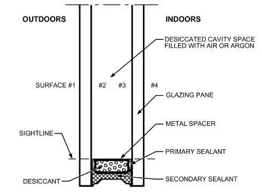

*Fig. 1 Construction Details of Typical Double-Glazing Unit*

<!-- str. 354 -->

Low-e coated glass is energy efficient, improves daylighting potential, and enhances occupant comfort. Thus, it is now used in the vast majority of fenestration products. Low-e coatings are typically applied to one of the protected internal surfaces of the glazing unit (surface #2 or #3 in Figure 1), but some manufacturers now offer double- or triple-glazed products with an additional low-e coating on the exposed room-side surface (surface #4 in Figure 1, or what would be #6 in triple glazing). Low-e coatings can also be applied to thin plastic films for use either as one of the middle layers in glazing units with three or more layers (stretched and held in place by a spacer system), or surface-applied film, where the exposed low-e coating is protected by a very thin, thermal-IR (TIR) transparent protective layer.

A wide variety of low-e coatings are used today. Physically, they can be divided into either soft- or hard-coat types. **Soft-coat low-e** is fabricated using a sputtering process in a vacuum chamber. This is done as a post-processing phase after glass has been produced, cut, and stored. The resulting coating is very fragile, especially to the effects of moisture, so these coatings are normally protected inside the sealed glazing unit. **Hard coatings** are created using chemical vapor deposition and are applied to the glass while it is still being floated in its final phases of production. This creates a durable low-e coating that can be exposed to moisture and elements.

From a performance standpoint, categories include (1) high versus low solar gain, (2) spectrally selective, (3) reflective, (4) absorptive, and (5) high light-to-solar-gain (LSG) ratio. Some of these categories are related and causal. As a rule of thumb, soft coats are often low solar gain, whereas hard coats are usually high solar gain.

High-solar-gain coatings, which are more transparent to the whole solar spectrum, are used primarily on south facades in northern heating climates in the northern hemisphere (and, conversely, on north facades in southern heating climates in the southern hemisphere), so solar heat gain during the day can offset thermal heat loss during long, cold winter nights. When this coating is applied to indoor-facing glazing lites (although still facing the glazing cavity), it further increases the solar heat gain coefficient (SHGC), because a higher portion of absorbed solar radiation is transferred to the room (inward-flowing fraction). Their low emissivity helps reduce thermal IR radiation, resulting in increased thermal insulation.

Low-solar-gain coatings, which are usually spectrally selective [blocking admission of the near infrared portion of the solar spectrum, also known as near IR (NIR) or solar IR], are typically applied in hot, cooling-dominated regions to reduce solar heat gains, or in buildings where solar heat gains are not desirable (e.g., commercial buildings with large fenestration areas or high internal heat gains). Such coatings are normally applied to the outdoor-facing glazing lite to reduce the inward-flowing fraction of SHGC. The glass surface’s low emissivity also reduces thermal IR radiation heat transfer and therefore increases thermal resistance of the fenestration product. Although the majority of low-e coatings are applied to the glazing surface facing the glazing cavity, increasing numbers of durable coatings are being applied to the room-facing glazing surface. This further improves thermal performance (U-factor) by substantially reducing thermal IR radiation heat transfer on the room side of the window. However, in building spaces with higher indoor humidity levels in cold climates, this approach may significantly increase the risk of moisture condensation on glass surfaces. A new class of low-e surface-applied films may be applied as a retrofit measure to the indoor-facing glass surface; these films can perform similarly to low-e coated glass, so their use is more likely to be as an easy retrofit measure, removing the need to replace glass or sash.

In addition to low-e, **fill gases** such as argon, krypton, and xenon are used in lieu of air in the gap between glass panes. These fill gases reduce convective heat transfer across the glazing cavity. Krypton and xenon also reduce gap width, because their optimal gap widths are nearly half that of air.

The main requirements of the edge seal are to exclude moisture, provide a desiccant for the sealed space, and retain the glazing unit’s structural integrity. Further, the edge seal isolates the cavity between the glazing materials, thereby reducing the number of surfaces to be cleaned, and creating an enclosure suitable for nondurable low-e coatings and/or fill gases. The edge seal is composed of a spacer, single- or multilevel sealant, and desiccant.

The **spacer** separates glazing layers and provides a surface for primary and secondary sealant adhesion. Several types of spacers are used, each of which provides different heat transfer properties, depending on spacer material and geometry.

Heat transfer at the edge of the glazing unit is greater than at its center because of (1) heat flow through the spacer system and (2) convective flow, which creates an area of higher convective heat transfer as the gas turns from one glazing to the other. To minimize this heat flow, warm-edge spacers have been developed that reduce edge heat transfer by using materials (e.g., stainless steel, galvanized steel, tin-plated steel, polymers, foamed silicone) of lower thermal conductivity than the typical aluminum alloy from which spacers have often been made. Fusing or bending the corners of the spacer minimizes moisture and hydrocarbon vapor transmission from the gap space.

Several different sealant configurations are used in glazing unit construction. In **dual-seal construction**, a primary seal minimizes moisture transmission and gas escape. A secondary seal provides structural integrity between the lites of the glazing unit, and ensures long-term adhesion and greater resistance to solvents, oils, and short-term water immersion. In typical dual-seal construction, the primary seal is made of compressed polyisobutylene (PIB), and the secondary seal is made of silicone, polysulfide, or polyurethane. **Single-seal construction** depends on a single sealant to adhere the glazing to the spacer and to minimize moisture transmission and gas escape. Single-seal construction is generally more cost effective than dual-seal systems. **Dual-seal-equivalent (DSE)** materials take advantage of advanced cross-linking polymers that provide low moisture transmission and structural properties equivalent to dual-seal systems.

**Desiccants** are used to absorb moisture trapped in the glazing unit during assembly or that gradually diffuses through seals after construction. Typical desiccants include molecular sieve, silica gel, or a matrix of both materials.

## 1.2 FRAMING

The three main categories of fenestration framing materials are wood, metal, and polymers. Wood has good structural integrity and insulating value but low resistance to weather, moisture, warpage, and organic degradation (from mold and insects). Metal is durable and has excellent structural characteristics, but it has very poor thermal performance. The metal of choice in fenestration is almost exclusively aluminum alloy, because of its ease of manufacture, low cost, and low mass, but aluminum alloy has a thermal conductivity roughly 1000 times that of wood or polymers. Steel is sometimes used. Although lower in its thermal conductivity, the overall U-factor of a steel frame is similar to that of an aluminum frame of the same geometry. The poor thermal performance of metal-frame fenestration can be improved with a thermal break (a nonmetal component that separates the metal frame exposed to the outdoors from the surfaces exposed to the indoors). However, to be most effective, there must be thermal breaks in all operable sashes as well as in the frame. Polymer frames are made of extruded vinyl [unplasticized PVC (uPVC)] or pultruded fiberglass (glass-reinforced polyester). Their thermal and structural performance is similar to that of wood. Vinyl frames for large fenestration must be reinforced, which degrades their thermal performance slightly and substantially increases their weight. Polymer frames are generally hollow and thus can also be filled with polyurethane insulation, which reduces convective and radiative heat transfer, thereby achieving a better thermal performance than wood.

<!-- str. 355 -->

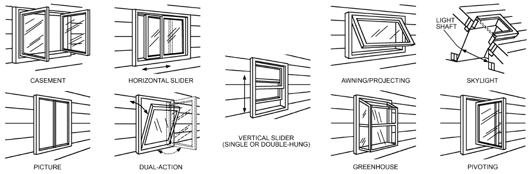

*Fig. 2 Various Framing Configurations for Residential Fenestration*

Manufacturers sometimes combine these materials as clad units (e.g., vinyl-clad aluminum, aluminum-clad wood, vinyl-clad wood) to increase durability, improve thermal performance, or improve aesthetics. In addition, curtain wall systems for commercial buildings may be structurally glazed, and the outdoor “framing” is simply rubber gaskets or silicone.

Generally, the framing system categorizes residential fenestration, as shown by the examples of traditional basic types in Figure 2. The glazing system can be mounted either directly in the frame (a direct-glazed or direct-set fenestration, which is not operable) or in a sash that moves in the frame (for an operating fenestration). In operable fenestration, a weather-sealing system between the frame and sash reduces air and water leakage.

## 1.3 SHADING

Shading devices are available in a wide range of products that differ greatly in their appearance and energy performance. They include louvered shades (e.g., venetian blinds, vertical blinds, louvered shutters), roller shades, solar screens, cellular shades, awnings, roller shutters, draperies (curtains), roman shades, perforated panels, etc. Shades can be positioned as indoor, outdoor, or between-glazing products. When shades are applied after the fenestration unit was installed, a popular retrofit measure, these products are called **fenes- tration attachments**. When a fenestration unit is sold with matched shading as a complete assembly, the shade is called **integral**. Materials used include metal, wood, polymer, woven, and nonwoven fabrics.

The ability of shading devices to control solar gains depends mainly on the location of the device. Shades on the outdoor side of the glazing can effectively reduce solar heat gains, but need more frequent maintenance and are often difficult to adjust. Conversely, indoor devices are ubiquitous and easier to maintain and operate, but may not be as effective in providing significant solar heat gain control, depending on the glazing type, shade properties, and control (Barnaby et al. 2009; Lee and Selkowitz 1995; Moeseke et al. 2007; Shen and Tzempelikos 2012; Tzempelikos and Athienitis 2007; Wright et al. 2009a). Shading devices often do not produce any significant improvement in a fenestration system’s U-factor (Barnaby et al. 2009; Wright et al. 2009b). However, several classes of insulating shades (e.g., roller shutters, cellular shades, window quilts) can provide substantial insulating value and be used as an effective retrofit option to improve thermal resistance, especially if they are sealed tightly around the perimeter, and are not porous to air.

Shading devices are well suited to deal with daylighting, privacy, views, glare, and thermal comfort issues. Some products, such as properly adjusted venetian blinds, are quite versatile in this respect. Motorized shading devices can be adjusted under changing outdoor conditions to reduce glare, maximize daylight, reduce internal temperatures (Newsham 1994; Reinhart 2004), or improve thermal comfort to building occupants (Bessoudo et al. 2010) while also providing increased hours of view to the outdoor (Rao and Tzempelikos 2012).

Shading of vertical fenestration is not confined to the use of shading devices. Building elements such as window reveals, side fins, and overhangs can also offer effective shading. Metal grilles with fixed louvers mounted horizontally at the top of a fenestration can block solar gain while still letting some light through, thereby avoiding the negative impacts of solid structural overhangs that act as thermal bridges in the building envelope and reduce daylight. Light shelves can provide shading and also redirect sunlight deeper into the room to provide a more even spatial distribution of daylight in a space. Metal perforated panels are a suitable compromise between completely cutting out views and alleviating glare and overillumination issues. Outdoor vegetative shading is particularly effective in reducing solar heat gain while enhancing the outdoor scene, but may be hard to maintain and also not be persistent over multiple years.

## 2. DETERMINING FENESTRATION ENERGY FLOW

Energy flows through fenestration via (1) conductive and convective heat transfer caused by the temperature difference between outdoor and indoor air; (2) net long-wave (above 2500 nm) radiative exchange between the fenestration and its surroundings and between glazing layers; (3) short-wave (below 2500 nm) solar radiation incident on the fenestration product, either directly from the sun or reflected from the ground or adjacent objects; and (4) air leakage through the fenestration. Simplified calculations are based on the observation that temperatures of the sky, ground, and surrounding objects (and hence their radiant emission) correlate with the outdoor air temperature. This is not the case for clear skies, particularly at night, which can be much colder than ambient air. The radiative interchanges are then approximated by assuming that all the radiating surfaces (including the sky) are at the same temperature as the outdoor air. With this assumption, the basic equation for the steady-state energy flow Q through a fenestration is Q = UA<sub>pf</sub>(t<sub>out</sub> – t<sub>in</sub>) + (SHGC)A<sub>pf</sub>E<sub>t</sub>+ (AL)A<sub>pf</sub>ρC<sub>p</sub>(t<sub>out</sub> – t<sub>in</sub>) (1)

<!-- str. 356 -->

where

- Q = instantaneous energy flow, W
- U = overall coefficient of heat transfer (U-factor), W/(m<sup>2</sup>·K)
- A<sub>pf</sub> = total projected area of fenestration (product’s rough opening in wall or roof less installation clearances), m<sup>2</sup>
- t<sub>in</sub> = indoor air temperature, °C
- t<sub>out</sub> = outdoor air temperature, °C
- SHGC = solar heat gain coefficient, dimensionless; also known as g-value in Europe
- E<sub>t</sub> = incident total irradiance, W/m<sup>2</sup>
- AL = air leakage at current conditions, m<sup>3</sup>/(s·m<sup>2</sup>)
- ρ = air density, kg/m<sup>3</sup>
- C<sub>p</sub> = specific heat of air, kJ/kg·K

Here, the first term on the right-hand side of Equation (1) represents heat transfer resulting from a temperature difference across the fenestration, the second term represents heat transfer caused by solar radiation, and the last term represents heat transfer caused by air leakage. The sections on U-factor (Thermal Transmittance), Solar Heat Gain Coefficient and Visible Transmittance, and Air Leakage discuss these topics, respectively.

The main justification for Equation (1) is its simplicity, achieved by collecting all the linked radiative, conductive, and convective energy transfer processes into U and SHGC. Note, however, that the values of U and SHGC vary because (1) convective heat transfer rates vary as fractional powers of temperature differences or free-stream speeds, (2) variations in temperature caused by weather or climate are small on the absolute temperature scale (K) that controls radiative heat transfer rates, (3) fenestration systems always involve at least two thermal resistances in series, and (4) solar heat gain coefficients depend on solar incident angle and spectral distribution. Using U and SHGC values taken from product ratings causes some error in calculating Q. Of the two, the larger error results from the use of normal-incidence SHGC.

## 3. U-FACTOR (THERMAL TRANSMITTANCE)

In the absence of sunlight, air infiltration, and moisture condensation, the first term on the right side of Equation (1) represents the heat transfer rate through a fenestration system. Most fenestration systems consist of transparent multipane glazing units and opaque elements comprising the sash and frame (hereafter called **frame**). The glazing unit’s heat transfer paths are subdivided into center-ofglass, edge-of-glass, and frame contributions (denoted by subscripts cg, eg, and f, respectively). Consequently, the total rate of heat transfer through a fenestration system can be calculated knowing the separate contributions of these three paths. (When present, glazing dividers, such as decorative grilles and muntin bars, also affect heat transfer, and their contribution must be considered.) The overall

U-factor is estimated using area-weighted U-factors for each contribution by

> U = (U A + U A + U A *cg cg eg eg f f*)/(A pf)&emsp;**(2a)**

Note that a product frame normally consists of several different areas, and that, for example, U<sub>f</sub>A<sub>f</sub> is really ∑U<sub>fi</sub>A<sub>fi</sub>, where i represents each frame region (e.g., sill, jamb, head, meeting rail). Likewise, each “edge of glazing” region is adjacent to a different frame region, so U<sub>eg</sub>A<sub>eg</sub> is really ∑U<sub>egi</sub>A<sub>egi</sub>. Equation (2a) is used in North America [e.g., for fenestration ratings by the National Fenestration Rating Council (NFRC)], Australia [by the Australian Fenestration Rating Council (AFRC; www.afrc.org.au)], India, and other countries. This approach is described as one of the two options in ISO Standard 15099:2003 and is the basis of the calculation used by the Lawrence Berkeley National Lab WINDOW program (LBNL 2016), a widely used software tool for modeling fenestration products’ solar-optical and thermal performance. ASHRAE-derived environmental conditions, as used by the NFRC, are applied when Equation (2a) is used. These environmental conditions are detailed in Table 2.

When a fenestration product has glazed surfaces in only one direction, the sum of the areas equals the projected area Apf. Skylights, greenhouse/garden windows, bay/bow windows, etc., because they extend beyond the plane of the wall/roof, have greater surface area for heat loss than fenestration with a similar glazing option and frame material; consequently, U-factors for such products are greater than for the nonprojecting versions. When the slope of a multiglazed fenestration product varies from vertical, the gas in the glazing cavity begins to exhibit vortices that also increase heat flow per unit area. This results in a further U-Factor penalty for products rated at a slope (such as skylights).

In Europe and in some other parts of the world, U-factor is calculated differently: instead of the area-based, edge-of-glass term of Equation (2a), a linear thermal transmittance term Ψ<sub>g</sub> is used to describe heat transfer near the perimeter of the glass area. This length-weighted method follows an alternative standard, ISO Standard 10077-2:2012, and is also described as second option in ISO Standard 15099.

> U = (U<sub>cg</sub>A<sub>cg</sub> + Ψ<sub>g</sub>l<sub>g</sub> + U<sub>f</sub>A<sub>f</sub>)/A<sub>pf</sub>&emsp;**(2b)**

where l<sub>g</sub> is the perimeter length of the entire vision area, delimited by the sightline. ISO Standards 10077-2 and 10077-1:2006 use simpler algorithms than ISO Standard 15099. In many fenestration systems, this leads to a different apparent U-factor, depending on which standard was followed. In a globalized economy, it is essential that designers and specifiers are aware of this lack of harmonization and that straight conversion between these standards is not possible.

### Comparison Between Area-Weighted and Length-Weighted Methods

Glazing units (double- and triple-pane, many with low-e coatings and noble gas fills) were modeled for U-factor and reviewed by Curcija (2005) and van Dijk (2003). The studies showed that ISO 10077 versus NFRC differences in glazing U-factor can be as great as 0.3 W/(m<sup>2</sup>·K). These discrepancies are larger than the precision with which U-factors are reported for ratings under the European and NFRC systems. Therefore, for some glazing systems a noticeable difference in U-factor will be seen.

In addition to differences between center-of-glass U-factors obtained by the two methods, it is important to note that large differences can occur in frame U-factors; ISO Standard 15099/NFRC frame U-factors can be ~1 W/(m<sup>2</sup>·K) greater than their ISO Standard 10077-2 equivalents. Although such differences are diluted when a whole-system, area-weighted calculation is performed, it cannot be assumed that these differences are negligible in all cases. Use ISO Standard 10077-based U-factors with caution and, for code compliance purposes in the United States, Canada, Australia, and some other countries, seek certifications based on NFRC procedures and environmental conditions. Refer to building codes for detailed requirements concerning NFRC compliance.

<!-- str. 357 -->

## 3.1 DETERMINING FENESTRATION U-FACTORS

### Center-of-Glass U-Factor

For single glazing, U-factors depend strongly on indoor and outdoor film coefficients. The U-factor for single glazing is

> U<sub>singleglazing</sub> = 1/(1 ⁄ h<sub>o</sub>+ 1 ⁄ h<sub>i</sub>+ L ⁄ k)&emsp;**(3)**

where

- h<sub>o</sub>, h<sub>i</sub> = outdoor and indoor respective glazing surface heat transfer coefficients, W/(m<sup>2</sup>·K)
- L = glazing thickness, m
- k = thermal conductivity of glass, W/(m<sup>2</sup>·K)

For other fenestration, values for U<sub>cg</sub> at standard indoor and outdoor conditions depend on glazing construction features such as the number of glazing lights, gas space dimensions, orientation relative to vertical, emissivity of each surface, and composition of fill gas. Several computer programs can be used to estimate glazing unit heat transfer for a wide range of glazing construction. The National Fenestration Rating Council (NFRC) calls for LBNL WINDOW 7.4 (LBNL 2016) as a standard calculation method for center of glazing.

Heat flow across the central glazed portion of a multipane unit must consider both convective and radiative transfer in the gas space, and may be considered one-dimensional. Convective heat transfer is estimated based on high-aspect-ratio, natural convection correlations for vertical and inclined air layers (El Sherbiny et al. 1982; Shewen 1986; Wright 1996a). Radiative heat transfer (ignoring gas absorption) is quantified using a more fundamental approach. Computational methods solving the combined heat transfer problem have been devised by Hollands and Wright (1982), Rubin (1982a, 1982b), and Rubin et al. (1998).

Figure 3 shows the effect of gas space width on U<sub>cg</sub> for vertical double- and triple-paned glazing units. U-factors are plotted for air, argon, and krypton fill gases and for high (uncoated) and low (coated) values of surface emissivity. The optimum gas space width is 13 mm for air and argon, and 8 mm for krypton. Greater widths have no significant effect on U<sub>cg</sub>. Greater glazing unit thicknesses decrease U<sub>o</sub> because the length of the shortest heat flow path through the frame increases. A low-emissivity coating combined with krypton gas fill offers significant potential for reducing heat transfer in narrow-gap-width glazing units.

### Edge-of-Glass U-Factor

The edge-of-glass area is typically taken to be a band 65 mm wide around the sightline. The width of this area is determined from the extent of two-dimensional heat transfer effects in current computer models, which are based on conduction-only analysis. In reality, because of convective and radiative effects, this area may extend beyond 65 mm (Beck et al. 1995; Curcija and Goss 1994; Wright and Sullivan 1995a), and depends on the type of glazing unit and its thickness. The edge region may also extend farther in opaque systems such as spandrel panels. The appropriate edge width to use can be determined using finite-element heat transfer modeling, as described by Curcija and Goss (1994).

In low-conductivity frames, most heat flow at the edge-of-glass and frame area is through the spacer, so the type of spacer has a greater impact on the edge-of-glass and frame U-factor. In metal frames, the edge-of-glass and frame U-factor varies little with the type of spacer (metal or insulating) because there is a significant heat flow through the highly conductive frame near the edge-ofglass area.

### Frame U-Factor

Fenestration frame elements consist of all structural members exclusive of glazing units and include sash, jamb, head, and sill members; meeting rails and stiles; mullions; and other glazing dividers. Estimating the rate of heat transfer through the frame is complicated by the (1) variety of fenestration products and frame configurations, (2) different combinations of materials used for frames, (3) different sizes available, and, to a lesser extent, (4) glazing unit width and spacer type. Internal dividers or grilles have little effect on the fenestration U-factor, provided there is at least a 3 mm gap between the divider and each glazing.

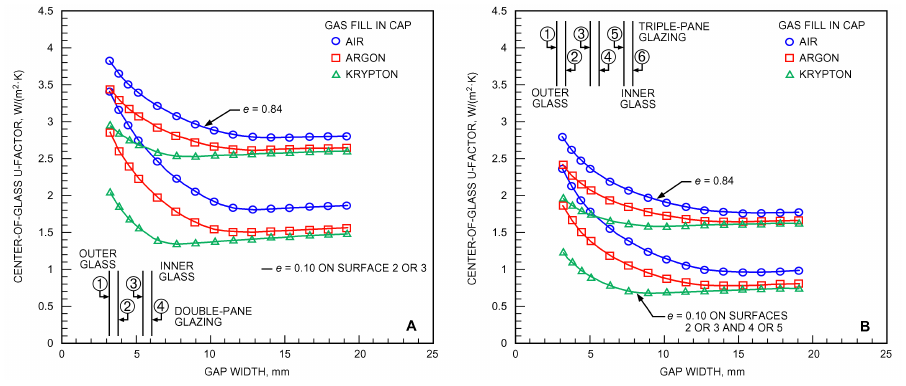

*Fig. 3 Center-of-Glass U-Factor for Vertical Double- and Triple-Pane Glazing Units*

Gas fill is assumed to be 90% argon, 10% air.

<!-- str. 358 -->

**Table 1 Representative Fenestration Frame U-Factors in W/(m2·K), Vertical Orientation**

| Frame Material | Type of Spacer | 1<sup>b</sup> | Operable 2<sup>c</sup> | 3<sup>d</sup> | 1<sup>b</sup> | Fixed 2<sup>c</sup> | Product Type/Number of Glazing Layers<br>3<sup>d</sup> | Product Type/Number of Glazing Layers Garden Window<br>1<sup>b</sup> | Product Type/Number of Glazing Layers Garden Window<br>2<sup>c</sup> | Product Type/Number of Glazing Layers Plant-Assembled<br>Skylight 1<sup>b</sup> 2<sup>c</sup> | Product Type/Number of Glazing Layers Plant-Assembled<br>3<sup>d</sup> | Product Type/Number of Glazing Layers Curtain Wall<sup>e</sup><br>1<sup>f</sup> | Curtain Wall<sup>e</sup><br>2<sup>g</sup> | Curtain Wall<sup>e</sup><br>3<sup>h</sup> | Sloped/Overhead<br>1<sup>f</sup> | Sloped/Overhead<br>Glazing<sup>e</sup> 2<sup>g</sup> | Sloped/Overhead<br>3<sup>h</sup> |
|---|---|---|---|---|---|---|---|---|---|---|---|---|---|---|---|---|---|
| Aluminum without thermal break | All 13.51 | 12.89 |  | 12.49 | 10.90 10.22 |  | 9.88 | 10.67 10.39 |  | 44.57 39.86 | 39.01 | 17.09 | 16.81 | 16.07 | 17.32 | 17.03 | 16.30 |
| Aluminum with | Metal | 6.81 | 5.22 | 4.71 | 7.49 | 6.42 | 6.30 |  |  | 39.46 28.67 | 26.01 | 10.22 | 9.94 | 9.37 | 10.33 | 9.99 | 9.43 |
| thermal break<sup>a</sup> | Insulated | N/A | 5.00 | 4.37 | N/A | 5.91 | 5.79 |  |  | N/A 26.97 | 23.39 | N/A | 9.26 | 8.57 | N/A | 9.31 | 8.63 |
| Aluminum-clad wood/ | Metal | 3.41 | 3.29 | 2.90 | 3.12 | 2.90 | 2.73 |  |  | 27.60 22.31 | 20.78 |  |  |  |  |  |  |
| reinforced vinyl | Insulated | N/A | 3.12 | 2.73 | N/A | 2.73 | 2.50 |  |  | N/A 21.29 | 19.48 |  |  |  |  |  |  |
| Wood/vinyl | Metal | 3.12 | 2.90 | 2.73 | 3.12 | 2.73 | 2.38 | 5.11 | 4.83 | 14.20 11.81 | 10.11 |  |  |  |  |  |  |
|  | Insulated | N/A | 2.78 | 2.27 | N/A | 2.38 | 1.99 | N/A | 4.71 | N/A 11.47 | 9.71 |  |  |  |  |  |  |
| Insulated fiberglass/ | Metal | 2.10 | 1.87 | 1.82 | 2.10 | 1.87 | 1.82 |  |  |  |  |  |  |  |  |  |  |
| vinyl | Insulated | N/A | 1.82 | 1.48 | N/A | 1.82 | 1.48 |  |  |  |  |  |  |  |  |  |  |
| Structural glazing | Metal |  |  |  |  |  |  |  |  |  |  | 10.22 | 7.21 | 5.91 | 10.33 | 7.27 | 5.96 |
|  | Insulated |  |  |  |  |  |  |  |  |  |  | N/A | 5.79 | 4.26 | N/A | 5.79 | 4.26 |

Note: This table should only be used as an estimating tool for early phases of design. <sup>e</sup>Glass thickness in curtainwall and sloped/overhead glazing is 6.4 mm.

<sup>a</sup>Depends strongly on width of thermal break. Value given is for 9.5 mm. <sup>f</sup>Single glazing corresponds to individual glazing unit thickness of 6 mm (nominal).

<sup>b</sup>Single glazing corresponds to individual glazing unit thickness of 3 mm (nominal). <sup>g</sup>Double glazing corresponds to individual glazing unit thickness of 25 mm (nominal).

<sup>c</sup>Double glazing corresponds to individual glazing unit thickness of 19 mm (nominal). <sup>h</sup>Triple glazing corresponds to individual glazing unit thickness of 44 mm (nominal).

<sup>d</sup>Triple glazing corresponds to individual glazing unit thickness of 35 mm (nominal). N/A: Not applicable

Computer simulations show that frame heat loss in most fenestration is controlled by a single component or controlling resistance, and only changes in this component significantly affect frame heat loss (EEL 1990). For example, the frame U-factor for thermally broken aluminum fenestration products is largely controlled by the depth of the thermal break material in the heat flow direction. For aluminum frames without a thermal break, the indoor film coefficient provides most of the resistance to heat flow. For vinyl- and wood-framed fenestrations, the controlling resistance is the shortest distance between the indoor and outdoor surfaces, which usually depends on the thickness of the sealed glazing unit.

Carpenter and McGowan (1993) experimentally validated frame U-factors for a variety of fixed and operable fenestration product types, sizes, and materials using computer modeling techniques. Table 1 lists frame U-factors for a variety of frame and spacer materials and glazing unit thicknesses. Frame and edge U-factors are normally determined by two-dimensional, finite-element computer simulation.

### Curtain Wall Construction

A curtain wall is an exterior building wall that carries no roof or floor loads and consists entirely or principally of glass and other surfacing materials supported by a framework. A curtain wall typically has a metal frame. To improve the thermal performance of standard metal frames, manufacturers provide both traditional thermal breaks as well as thermally improved products. The traditional thermal break is poured and debridged (i.e., urethane is poured into a metal U-channel in the frame and then the bottom of the channel is removed by machine). For this system to work well, there must be a thermal break between indoors and outdoors for all frame components, including those in any operable sash. Skip debridging (incomplete pour and debridging used for increased structural strength) can significantly degrade the U-factor. Bolts that penetrate the thermal break also degrade performance, but to a lesser degree. Griffith et al. (1998) showed that stainless steel bolts spaced 300 mm on center increased the frame U-factor by 18%. The paper also concluded that, in general, the isothermal planes method referenced in Chapter 27 provides a conservative approach to determining U-factors.

Thermally improved metal curtain wall products are now being used more widely. In these products, most of the metal frame tends to be located on the indoor side with only a metal cap exposed on the outdoor side. Plastic spacers isolate the glazing assembly from both the outdoor metal cap and the indoor metal frame. These products can have significantly better thermal performance than standard metal frames, but it is important to minimize the number and area of the bolts that penetrate from outdoor to indoor. Curtain wall systems using structural silicone glazing (SSG) can also provide better thermal performance than dry-glazed bolted systems. Silicone sealants, with a typical thermal conductivity of 0.35 W/(m·K) and a dimension of 6 mm between the glass and aluminum are considered thermal breaks per NFRC Technical Document 100 (NFRC 2014a). Work by Carbary et al. (2009) demonstrates that SSG systems have lower U-factors than comparable nonbroken or thermally improved dry-glazed systems, resulting in frame temperatures closer to interior ambient conditions.

A more recent development is the use of fiberglass as the framing material for curtain walls. Fiberglass provides the strength needed for taller buildings while having a U-factor equal to or lower than that of other nonmetal materials (e.g., wood, vinyl).

An important consideration in any curtain wall system is durability. Sealants or gaskets that degrade or fail over time allow additional air infiltration, which negatively affects energy consumption. A durable system minimizes air infiltration and thereby energy consumption.

## 3.2 SURFACE AND CAVITY HEAT TRANSFER COEFFICIENTS

Part of the overall thermal resistance of a fenestration system derives from convective and radiative heat transfer between the exposed surfaces and the environment, and in the cavity between glazings. Surface heat transfer coefficients h<sub>o</sub>, h<sub>i</sub>, and h<sub>c</sub> at the outer and inner glazing surfaces, and in the cavity, respectively, combine the effects of radiation and convection.

Wind speed and building orientation are important in determining h<sub>o</sub>. This relationship has long been studied, and many correlations have been proposed for h<sub>o</sub> as a function of wind speed. However, no universal relationship has been accepted, and limited field measurements at low wind speeds by Klems (1989) differ significantly from values used by others.

Convective heat transfer coefficients are usually determined at standard temperature and air velocity conditions on each side. Wind speed can vary from less than 0.2 m/s for calm weather, free convection conditions, to over 29 m/s for storm conditions. A nominal value of 26 W/(m<sup>2</sup>·K) corresponding to a 5.5 m/s wind is often used to represent winter design conditions. At low wind speeds, h<sub>o</sub> varies with outdoor air and surface temperature, orientation to vertical, and air moisture content. The overall surface heat transfer coefficient can be as low as 6.8 W/(m<sup>2</sup>·K) (Yazdanian and Klems 1993).

<!-- str. 359 -->

**Table 2 Indoor Surface Heat Transfer Coefficient hi in W/(m2·K), Vertical Orientation (Still Air Conditions)**

| Glazing ID<sup>a</sup> | Glazing Type | Glazing Height, m | Glazing Temp., °C | Winter Conditions<sup>b</sup> Temp. Diff., °C | h i, W/(m<sup>2</sup>·K) | Summer Conditions<sup>c</sup><br>Glazing Temp., °C | Summer Conditions<sup>c</sup><br>Temp. Diff., °C | Summer Conditions<sup>c</sup><br>h i, W/(m<sup>2</sup>·K) |
|---|---|---|---|---|---|---|---|---|
| 1 |  | 0.6 | −9 | 30 | 8.04 | 33 | 9 | 8.10 |
| Single glazing |  | 1.2 | −9 | 30 | 7.42 | 33 | 9 | 7.64 |
|  |  | 1.8 | −9 | 30 | 7.10 | 33 | 9 | 7.41 |
| 5 | Double glazing with | 0.6 | 7 | 14 | 7.72 | 35 | 11 | 8.30 |
|  | 12.7 mm airspace | 1.2 | 7 | 14 | 7.21 | 35 | 11 | 7.82 |
|  |  | 1.8 | 7 | 14 | 6.95 | 35 | 11 | 7.58 |
| 23 | Double glazing with | 0.6 | 13 | 8 | 7.44 | 34 | 10 | 8.20 |
|  | e = 0.1 on surface 2 | 1.2 | 13 | 8 | 7.00 | 34 | 10 | 7.73 |
|  | and 12.7 mm argon space |  |  |  |  |  |  |  |
|  |  | 1.8 | 13 | 8 | 6.77 | 34 | 10 | 7.50 |
| 43 | Triple glazing with | 0.6 | 17 | 4 | 7.09 | 40 | 16 | 8.73 |
|  | e = 0.1 on surfaces 2 and 5 | 1.2 | 17 | 4 | 6.72 | 40 | 16 | 8.20 |
|  | and 12.7 mm argon spaces |  |  |  |  |  |  |  |
|  |  | 1.8 | 17 | 4 | 6.53 | 40 | 16 | 7.94 |

Notes: <sup>c</sup>Summer conditions: room air temperature t<sub>i</sub> = 24°C, outdoor air temperature t<sub>o</sub> = 32°C, direct solar

<sup>a</sup>Glazing ID refers to fenestration assemblies in Table 4. irradiance E<sub>D</sub> = 748 W/m<sup>2</sup>

<sup>b</sup>Winter conditions: room air temperature t<sub>i</sub> = 21°C, outdoor h<sub>i</sub> = h<sub>ic</sub> + h<sub>iR</sub> = 1.46(ΔT/L)<sup>0.25</sup> + εσ(T<sub>i</sub><sup>4</sup> – T<sub>g</sub><sup>4</sup>)/ΔT, where ΔT = T<sub>i</sub> – T<sub>g</sub>, K; L = glazing height, m; T<sub>g</sub> = air temperature t<sub>o</sub> = −18°C, no solar radiation glazing temperature, K; σ = Stefan-Boltzmann constant; and ε = surface emissivity.

For natural convection and radiation at the indoor surface of a vertical fenestration product, surface coefficient h<sub>i</sub> depends on the indoor air and glazing surface temperatures and on the emissivity of the glazing surface. Table 2 shows the variation of h<sub>i</sub> for winter (t<sub>i</sub>= 21°C) and summer (t<sub>i</sub> = 24°C) design conditions, for a range of glazing system types and heights. Designers often use h<sub>i</sub> = 8.3 W/(m<sup>2</sup>·K), which corresponds to t<sub>i</sub> = 21°C, a glazing temperature of –9.4°C, and emissivity of e<sub>g</sub> = 0.84 (uncoated glass). For summer conditions, the same value [h<sub>i</sub> = 8.3 W/(m<sup>2</sup>·K)] is normally used, and corresponds approximately to a glazing temperature of 35°C, t<sub>i</sub>= 24°C, and e<sub>g</sub> = 0.84. For winter conditions, this most closely approximates single glazing with clear glass that is 600 mm tall, but it overestimates the value as the glazing unit conductance decreases and height increases. For summer conditions, this value approximates all types of glass that are 600 mm tall but, again, is less accurate as glass height increases. If the indoor surface of the glass has a low-e coating, h<sub>i</sub> values are about halved at both winter and summer conditions.

Heat transfer between the glazing surface and its environment is driven not only by local air temperatures but also by radiant temperatures to which the surface is exposed. The radiant temperature of the indoor environment is generally assumed to be equal to the indoor air temperature. This is a safe assumption where a small fenestration is exposed to a large room with surface temperatures equal to the air temperature, but it is not valid in rooms where the fenestration is exposed to other large areas of glazing surfaces (e.g., greenhouse, atrium) or to other cooled or heated surfaces (Parmelee and Huebscher 1947).

The radiant temperature of the outdoor environment is frequently assumed to be equal to the outdoor air temperature. This assumption may be in error, because additional radiative heat loss occurs between a fenestration and the clear sky (Berdahl and Martin 1984). Therefore, for clear-sky conditions, some effective outdoor temperature t<sub>o,e</sub> should replace t<sub>o</sub> in Equation (1). For methods of determining t<sub>o,e</sub>, see, for example, work by AGSL (1992). Note that a fully cloudy sky is assumed in ASHRAE design conditions.

The air space in a glazing unit constructed using glass with no reflective coating on the air space surfaces has a coefficient h<sub>s</sub> of 7.4 W/(m<sup>2</sup>·K). When a reflective coating is applied to an air space surface, h<sub>s</sub> can be selected from Table 3 by first calculating the effective air space emissivity e<sub>s,e</sub> by Equation (4):

> e<sub>s,e</sub> = 1/(1 ⁄ e<sub>o</sub>+ 1 ⁄ e<sub>i</sub>– 1)&emsp;**(4)**

where e<sub>o</sub> and e<sub>i</sub> are the hemispherical emissivities of the two air space surfaces. Hemispherical emissivity of ordinary uncoated glass is 0.84 over a wavelength range of 0.4 to 40 μm.

Table 4 lists computed U-factors, using winter design conditions, for a variety of generic fenestration products, based on ASHRAE-sponsored research involving laboratory testing and computer simulations. In the past, test data were used to provide more accurate results for specific products (Hogan 1988). Computer simulations (with validation by testing) are now accepted as the standard method for accurate product-specific U-factor determination. The simulation methodologies are specified in NFRC Technical Document 100 (NFRC 2014a) and are based on algorithms published in ISO Standard 15099. The *International Energy Conservation Code* and various state energy codes in the United States, the National Energy Code in Canada, and ASHRAE Standards 90.1 and 90.2 all reference these standards. Fenestration must be rated in accordance with the NFRC standards for code compliance. Use of Table 4 should be limited to that of an estimating tool for the early phases of design.

Values in Table 4 are for vertical installation and for skylights and other sloped installations with glazing surfaces sloped 20° from the horizontal. Data are based on center-of-glass and edge-of-glass component U-factors and assume that there are no dividers. However, they apply only to the specific design conditions described in the table’s footnotes, and are typically used only to determine peak load conditions for sizing heating equipment. Although these U-factors have been determined for winter conditions, they can also be used to estimate heat gain during peak cooling conditions, because conductive gain, which is one of several variables, is usually a small portion of the total heat gain for fenestration in direct sunlight. Glazing designs and framing materials may be compared in choosing a fenestration system that needs a specific winter design U-factor.

Table 4 lists 48 glazing types, with multiple glazing categories appropriate for sealed glazing units and the addition of storm sash to other glazing units. No distinction is made between flat and domed units such as skylights. For acrylic domes, use an average gas-space width to determine the U-factor. Note that garden window and sloped/pyramid/barrel vault skylight U-factors are approximately twice those of other similar products. Although this is partially because of the difference in slope in the case of sloped/pyramid/barrel vault skylights, it is largely because these products project out from the surface of the wall or roof. For instance, the skylight surface area, which includes the curb, can vary from 13 to 240% greater than the rough opening area, depending on the size and mounting method. Unless otherwise noted, all multiple-glazed units are filled with dry air. Argon units are assumed to be filled with 90% argon (Elmahdy and Yusuf 1995). U-factors for CO<sub>2</sub>-filled units are similar to argon fills. For spaces up to 13 mm, argon/SF<sub>6</sub> (sulfur hexafluoride) mixtures up to 70% SF<sub>6</sub> are generally the same as argon fills. Use of krypton gas can provide U-factors lower than those for argon for glazing spaces less than 13 mm.

<!-- str. 360 -->

**Table 3 Air Space Coefficients for Horizontal Heat Flow**

```text
   Air       Air     Air                                   2               Air      Air     Air
                             Air Space Coefficient h_s, W/(m ·K)                                     Air Space Coefficient h_s, W/(m^2·K)
  Space     Space   Temp.                                                Space     Space   Temp.
                                   Effective Emissivity e                                                 Effective Emissivity e
                                                        s,e                                                                    s,e
Thickness, Temp.,   Diff.,                                             Thickness, Temp.,   Diff.,
   mm        °C       K     0.82  0.72   0.40   0.20  0.10   0.05         mm         °C      K     0.82   0.72  0.40   0.20   0.10  0.05
    13      −15       5    5.0    4.6     3.3   2.6    2.2    2.0          10         0      5     6.2   5.7     4.3    3.3   2.9    2.6
                     15    5.1    4.7     3.5   2.7    2.3    2.1                           30     6.3   5.8     4.4    3.4   3.0    2.7
                     30    5.7    5.3     4.0   3.2    2.8    2.7                           50     6.6   6.1     4.6    3.7   3.2    3.0
                     40    6.0    5.6     4.3   3.6    3.2    3.0                    10      5     6.7   6.2     4.6    3.5   3.0    2.8
                     50    6.3    5.9     4.6   3.8    3.4    3.2                           30     6.8   6.3     4.6    3.6   3.1    2.8
               0      5    5.7    5.2     3.7   2.8    2.3    2.1                           50     7.0   6.5     4.8    3.8   3.2    3.0
                     15    5.7    5.3     3.8   2.9    2.4    2.2                    30      5     7.8   7.2     5.2    3.9   3.3    3.0
                     30    6.1    5.7     4.2   3.3    2.8    2.6                           30     7.9   7.2     5.2    4.0   3.3    3.0
                     40    6.4    6.0     4.5   3.5    3.1    2.8                           50     8.0   7.3     5.3    4.0   3.4    3.1
                     50    6.7    6.2     4.7   3.8    3.3    3.1                    50      5     9.1   8.3     5.9    4.3   3.6    3.2
              10      5    6.1    5.6     4.0   3.0    2.4    2.2                           30     9.1   8.4     5.9    4.4   3.6    3.2
                     15    6.2    5.7     4.0   3.0    2.5    2.2                           50     9.2   8.4     6.0    4.4   3.6    3.3
                     30    6.5    6.0     4.3   3.3    2.8    2.5           7       −15    <50     6.5   6.1     4.9    4.1   3.7    3.5
                     40    6.8    6.2     4.6   3.5    3.0    2.8                     0    <50     7.3   6.8     5.3    4.4   3.9    3.7
                     50    7.0    6.5     4.8   3.8    3.3    3.0                    10    <50     7.8   7.3     5.6    4.6   4.1    3.8
              30      5    7.2    6.6     4.6   3.3    2.7    2.4                    30    <50     9.0   8.4     6.3    5.1   4.4    4.1
                     15    7.3    6.6     4.6   3.3    2.7    2.4                    50    <50    10.3   9.5     7.1    5.6   4.8    4.4
                     30    7.4    6.8     4.7   3.5    2.8    2.5           6       −15    <50     7.1   6.7     5.4    4.6   4.2    4.0
                     40    7.6    6.9     4.9   3.6    3.0    2.7                     0    <50     7.9   7.4     5.9    5.0   4.5    4.3
                     50    7.8    7.2     5.1   3.9    3.2    2.9                    10    <50     8.4   7.9     6.2    5.2   4.7    4.4
              50      5    8.4    7.7     5.2   3.7    2.9    2.5                    30    <50     9.6   9.0     7.0    5.7   5.1    4.7
                     15    8.5    7.7     5.2   3.7    2.9    2.6                    50    <50    11.0  10.2     7.8    6.2   5.5    5.1
                     30    8.5    7.8     5.3   3.8    3.0    2.6           5       −15    <50     7.8   7.4     6.2    5.4   5.0    4.8
                     40    8.6    7.9     5.4   3.9    3.1    2.7                     0    <50     8.7   8.2     6.7    5.8   5.3    5.1
                     50    8.8    8.0     5.5   4.0    3.2    2.8                    10    <50     9.2   8.7     7.1    6.0   5.5    5.2
    10      −15       5    5.5    5.1     3.9   3.1    2.7    2.5                    30    <50    10.5   9.9     7.8    6.6   5.9    5.6
                     30    5.7    5.3     4.0   3.2    2.9    2.7                    50    <50    11.9  11.2     8.7    7.2   6.4    6.0
                     50    6.1    5.7     4.4   3.6    3.2    3.1
```

Table 4 provides data for six values of hemispherical emissivity and for 6 and 13 mm gas space widths. Emissivity of various low-e glasses varies considerably between manufacturers and processes. When emissivity is between the listed values, interpolation may be used. When manufacturers’ data are not available for low-e glass, assume that glass with a pyrolytic (hard) coating has a maximum emissivity of 0.20 and that glass with a sputtered (soft) coating has a maximum emissivity of 0.10. Tinted glass does not change the winter U-factor. Also, some surface-coated reflective glass may have an emissivity less than 0.84. Values listed are for glass units using aluminum edge spacers. If an insulated or nonmetallic spacer is used, the U-factors are approximately 0.17 W/(m<sup>2</sup>·K) lower.

Fenestration product types are subdivided first by vertical versus sloped installation and then into two general categories: manufactured and site assembled. **Manufactured products** are delivered as complete units to the site. These products are typically installed in low-rise residential and small commercial/institutional/industrial buildings. Use the operable category for vertical sliders, horizontal sliders, casement, awning, pivoted, and dual-action windows, and for sliding and swinging glass doors. For picture windows, use the fixed category. For products that project out from the surface of the wall, use the garden window category. For skylights, use the sloped skylight category.

**Site-assembled products** have frame extrusions that are assembled on site, and then glazing is added. These products are typically installed in high-rise residential and larger commercial/institutional/industrial buildings. Curtain walls are typically made up of vision (transparent) and spandrel (opaque) panels. Table 4 contains representative U-factors for the vision panel (including mullions) for these assemblies. The spandrel portion of curtain walls usually consists of a metal pan filled with insulation and covered with a sheet of glass or other weatherproof covering. Although the U-factor in the center of the spandrel panel can be quite low, the metal pan is a thermal bridge, significantly increasing the U-factor of the assembly. Two-dimensional simulation, validated by testing of a curtain wall having an aluminum frame with a thermal break, found that the U-factor for the edge of the spandrel panel (the 65 mm band around the perimeter adjacent to the frame) was 40% of the way toward the U-factor of the frame. The U-factor was 0.34 W/(m<sup>2</sup>·K) for the center of the spandrel, 2.56 for the edge of the spandrel, and 6.02 for the frame (Carpenter and Elmahdy 1994). Two-dimensional heat transfer analysis or physical testing is recommended to determine the U-factor of spandrel panels. Use the sloped/overhead glazing category for sloped glazing panels comparable to curtain walls.

Physical testing of double-glazed units showed U-factors of 5.74 W/(m<sup>2</sup>·K) for a thermally broken aluminum pyramidal skylight and 7.4 W/(m<sup>2</sup>·K) for an aluminum-frame half-round barrel 4. Product sizes are described in Figure 4, and frame U-factors are from Table 1.

<!-- str. 361 -->

**Table 4 U-Factors for Various Fenestration Products in W/(m ·K)**

| Product Type Frame Type<br>ID | Product Type Frame Type<br>Glass Only Center Edge of of Glazing Type Glass Glass | Operable (including sliding and swinging glass doors) Aluminum Aluminum Reinforced<br>Without With Thermal Thermal Break Break | Vertical Installation Operable (including sliding and swinging glass doors) Aluminum Aluminum Reinforced<br>Vinyl/Insulated Aluminum Wood/Fiberglass/Clad Wood Vinyl Vinyl | Vertical Installation<br>Fixed Aluminum Aluminum Reinforced Without With Vinyl/Insulated Thermal Thermal Aluminum Wood/Fiberglass/Break Break Clad Wood Vinyl Vinyl |
|---|---|---|---|---|
|  | Single Glazing |  |  |  |
| 1 | 3.2 mm glass 5.91 5.91 | 7.01 6.08 | 5.27 5.20 4.83 | 6.38 6.06 5.58 5.58 5.40 |
| 2 | 6 mm acrylic/polycarb 5.00 5.00 | 6.23 5.35 | 4.59 4.52 4.18 | 5.55 5.23 4.77 4.77 4.61 |
| 3 | 3.2 mm acrylic/polycarb 5.45 5.45<br>Double Glazing | 6.62 5.72 | 4.93 4.86 4.51 | 5.96 5.64 5.18 5.18 5.01 |
| 4 | 6 mm airspace 3.12 3.63 | 4.62 3.61 | 3.24 3.14 2.84 | 3.88 3.52 3.18 3.16 3.04 |
| 5 | 13 mm airspace 2.73 3.36 | 4.30 3.31 | 2.96 2.86 2.58 | 3.54 3.18 2.85 2.83 2.72 |
| 6 | 6 mm argon space 2.90 3.48 | 4.43 3.44 | 3.08 2.98 2.69 | 3.68 3.33 3.00 2.98 2.86 |
| 7 | 13 mm argon space 2.56 3.24<br>Double Glazing, e = 0.60 on surface 2 or 3 | 4.16 3.18 | 2.84 2.74 2.46 | 3.39 3.04 2.71 2.69 2.58 |
| 8 | 6 mm airspace 2.95 3.52 | 4.48 3.48 | 3.12 3.02 2.73 | 3.73 3.38 3.04 3.02 2.90 |
| 9 | 13 mm airspace 2.50 3.20 | 4.11 3.14 | 2.80 2.70 2.42 | 3.34 2.99 2.67 2.65 2.53 |
| 10 | 6 mm argon space 2.67 3.32 | 4.25 3.27 | 2.92 2.82 2.54 | 3.49 3.13 2.81 2.79 2.67 |
| 11 | 13 mm argon space 2.33 3.08<br>Double Glazing, e = 0.40 on surface 2 or 3 | 3.98 3.01 | 2.68 2.58 2.31 | 3.20 2.84 2.52 2.50 2.39 |
| 12 | 6 mm airspace 2.78 3.40 | 4.34 3.35 | 3.00 2.90 2.61 | 3.59 3.23 2.90 2.88 2.77 |
| 13 | 13 mm airspace 2.27 3.04 | 3.93 2.96 | 2.64 2.54 2.27 | 3.15 2.79 2.48 2.46 2.35 |
| 14 | 6 mm argon space 2.44 3.16 | 4.07 3.09 | 2.76 2.66 2.38 | 3.30 2.94 2.62 2.60 2.49 |
| 15 | 13 mm argon space 2.04 2.88<br>Double Glazing, e = 0.20 on surface 2 or 3 | 3.75 2.79 | 2.48 2.38 2.11 | 2.95 2.60 2.29 2.27 2.16 |
| 16 | 6 mm airspace 2.56 3.24 | 4.16 3.18 | 2.84 2.74 2.46 | 3.39 3.04 2.71 2.69 2.58 |
| 17 | 13 mm airspace 1.99 2.83 | 3.70 2.75 | 2.44 2.34 2.07 | 2.91 2.55 2.24 2.22 2.12 |
| 18 | 6 mm argon space 2.16 2.96 | 3.84 2.88 | 2.56 2.46 2.19 | 3.05 2.70 2.38 2.36 2.26 |
| 19 | 13 mm argon space 1.70 2.62<br>Double Glazing, e = 0.10 on surface 2 or 3 | 3.47 2.53 | 2.24 2.14 1.88 | 2.66 2.30 2.00 1.98 1.88 |
| 20 | 6 mm airspace 2.39 3.12 | 4.02 3.05 | 2.72 2.62 2.34 | 3.25 2.89 2.57 2.55 2.44 |
| 21 | 13 mm airspace 1.82 2.71 | 3.56 2.62 | 2.32 2.22 1.96 | 2.76 2.40 2.10 2.08 1.98 |
| 22 | 6 mm argon space 1.99 2.83 | 3.70 2.75 | 2.44 2.34 2.07 | 2.91 2.55 2.24 2.22 2.12 |
| 23 | 13 mm argon space 1.53 2.49<br>Double Glazing, e = 0.05 on surface 2 or 3 | 3.33 2.40 | 2.12 2.02 1.76 | 2.51 2.16 1.86 1.84 1.74 |
| 24 | 6 mm airspace 2.33 3.08 | 3.98 3.01 | 2.68 2.58 2.31 | 3.20 2.84 2.52 2.50 2.39 |
| 25 | 13 mm airspace 1.70 2.62 | 3.47 2.53 | 2.24 2.14 1.88 | 2.66 2.30 2.00 1.98 1.88 |
| 26 | 6 mm argon space 1.87 2.75 | 3.61 2.66 | 2.36 2.26 2.00 | 2.81 2.45 2.15 2.12 2.02 |
| 27 | 13 mm argon space 1.42 2.41<br>Triple Glazing | 3.24 2.31 | 2.04 1.94 1.69 | 2.42 2.06 1.76 1.74 1.65 |
| 28 | 6 mm airspace 2.16 2.96 | 3.78 2.78 | 2.46 2.42 2.17 | 3.02 2.68 2.36 2.36 2.25 |
| 29 | 13 mm airspace 1.76 2.67 | 3.46 2.47 | 2.18 2.14 1.90 | 2.68 2.34 2.03 2.03 1.92 |
| 30 | 6 mm argon space 1.93 2.79 | 3.60 2.60 | 2.30 2.26 2.02 | 2.82 2.49 2.17 2.17 2.06 |
| 31 | 13 mm argon space 1.65 2.58<br>Triple Glazing, e = 0.20 on surface 2, 3, 4, or 5 | 3.36 2.39 | 2.10 2.06 1.83 | 2.58 2.24 1.93 1.93 1.83 |
| 32 | 6 mm airspace 1.87 2.75 | 3.55 2.56 | 2.26 2.22 1.98 | 2.78 2.44 2.12 2.12 2.01 |
| 33 | 13 mm airspace 1.42 2.41 | 3.18 2.21 | 1.94 1.90 1.67 | 2.38 2.05 1.74 1.74 1.64 |
| 34 | 6 mm argon space 1.59 2.54 | 3.32 2.34 | 2.06 2.02 1.79 | 2.53 2.20 1.89 1.89 1.78 |
| 35 | 13 mm argon space 1.25 2.28<br>Triple Glazing, e = 0.20 on surfaces 2 or 3 and 4 or 5 | 3.04 2.08 | 1.82 1.78 1.55 | 2.24 1.90 1.60 1.60 1.50 |
| 36 | 6 mm airspace 1.65 2.58 | 3.36 2.39 | 2.10 2.06 1.83 | 2.58 2.24 1.93 1.93 1.83 |
| 37 | 13 mm airspace 1.14 2.19 | 2.95 1.99 | 1.74 1.69 1.48 | 2.14 1.80 1.50 1.50 1.40 |
| 38 | 6 mm argon space 1.31 2.32 | 3.09 2.12 | 1.86 1.82 1.59 | 2.29 1.95 1.65 1.65 1.55 |
| 39 | 13 mm argon space 0.97 2.05<br>Triple Glazing, e = 0.10 on surfaces 2 or 3 and 4 or 5 | 2.81 1.86 | 1.62 1.57 1.36 | 1.99 1.65 1.36 1.36 1.26 |
| 40 | 6 mm airspace 1.53 2.49 | 3.27 2.30 | 2.02 1.98 1.75 | 2.48 2.15 1.84 1.84 1.73 |
| 41 | 13 mm airspace 1.02 2.10 | 2.85 1.90 | 1.66 1.61 1.40 | 2.04 1.70 1.41 1.41 1.31 |
| 42 | 6 mm argon space 1.19 2.23 | 2.99 2.04 | 1.78 1.73 1.52 | 2.19 1.85 1.55 1.55 1.45 |
| 43 | 13 mm argon space 0.80 1.92 | 2.67 1.73 | 1.49 1.45 1.24 | 1.84 1.51 1.22 1.22 1.12 |
| **Quadruple Glazing, e = 0.10 on surfaces 2 or 3 and 4 or 5** |  |  |  |  |
| 44 | 6 mm airspaces 1.25 2.28 | 3.04 2.08 | 1.82 1.78 1.55 | 2.24 1.90 1.60 1.60 1.50 |
| 45 | 13 mm airspaces 0.85 1.96 | 2.71 1.77 | 1.54 1.49 1.28 | 1.89 1.55 1.26 1.26 1.17 |
| 46 | 6 mm argon spaces 0.97 2.05 | 2.81 1.86 | 1.62 1.57 1.36 | 1.99 1.65 1.36 1.36 1.26 |
| 47 | 13 mm argon spaces 0.68 1.83 | 2.57 1.64 | 1.41 1.37 1.16 | 1.74 1.41 1.12 1.12 1.03 |
| 48 | 6 mm krypton spaces 0.68 1.83 | 2.57 1.64 | 1.41 1.37 1.16 | 1.74 1.41 1.12 1.12 1.03 |

Notes: 1. All heat transmission coefficients in this table include film resistances and are based 2. Glazing layer surfaces are numbered from outdoor to indoor. Double, triple, and on winter conditions of –18°C outdoor air temperature and 21°C indoor air tempera- quadruple refer to number of glazing panels. All data are based on 3 mm glass, unless ture, with 6.7 m/s outdoor air velocity and zero solar flux. Except for single glazing, otherwise noted. Thermal conductivities are: 0.917 W/(m·K) for glass, and 0.19 W/small changes in the indoor and outdoor temperatures do not significantly affect over- (m·K) for acrylic and polycarbonate. all U-factors. Coefficients are for vertical position except skylight values, which are 3. Standard spacers are metal. Edge-of-glass effects are assumed to extend over the for 20° from horizontal with heat flow up. 63.5 mm band around perimeter of each glazing unit.

<!-- str. 362 -->

**Table 4 U-Factors for Various Fenestration Products in W/(m ·K) (Concluded)**

| Garden Windows Aluminum Without Thermal Wood/Break Vinyl | Vertical Installation Curtainwall Aluminum Aluminum Without With Thermal Thermal Structural Break Break Glazing | Glass Only (Skylights) Center Edge of of Glass Glass | Sloped Installation Manufactured Skylight Aluminum Aluminum Reinforced Without With Vinyl/Thermal Thermal Aluminum Wood/Break Break Clad Wood Vinyl | Site-Assembled Sloped/Overhead Glazing Aluminum Aluminum Without With Thermal Thermal Structural Break Break Glazing | ID |
|---|---|---|---|---|---|
| 14.21 11.94 | 6.86 6.27 6.27 | 6.76 6.76 | 10.03 9.68 9.16 8.05 | 7.66 7.64 7.10 | 1 |
| 12.70 10.42 | 6.03 5.44 5.44 | 5.85 5.85 | 9.09 8.74 8.23 7.45 | 6.83 6.80 6.27 | 2 |
| 13.45 11.18 | 6.44 5.86 5.86 | 6.30 6.30 | 9.56 9.21 8.70 7.89 | 7.24 7.22 6.68 | 3 |
| 9.78 7.50 | 4.38 3.79 3.56 | 3.29 3.75 | 6.23 5.46 5.21 4.79 | 4.54 4.71 3.75 | 4 |
| 9.19 6.92 | 4.03 3.45 3.22 | 3.24 3.71 | 6.17 5.41 5.16 4.74 | 4.49 4.68 3.70 | 5 |
| 9.44 7.17 | 4.18 3.60 3.37 | 3.01 3.56 | 5.96 5.19 4.94 4.54 | 4.30 4.52 3.51 | 6 |
| 8.94 6.67 | 3.89 3.30 3.07 | 3.01 3.56 | 5.96 5.19 4.94 4.54 | 4.30 4.52 3.51 | 7 |
| 9.53 7.25 | 4.23 3.65 3.41 | 3.07 3.60 | 6.01 5.24 4.99 4.59 | 4.35 4.56 3.55 | 8 |
| 8.86 6.58 | 3.84 3.25 3.02 | 3.01 3.56 | 5.96 5.19 4.94 4.54 | 4.30 4.52 3.51 | 9 |
| 9.11 6.84 | 3.99 3.40 3.17 | 2.78 3.40 | 5.74 4.97 4.72 4.34 | 4.10 4.37 3.31 | 10 |
| 8.61 6.33 | 3.69 3.11 2.88 | 2.78 3.40 | 5.74 4.97 4.72 4.34 | 4.10 4.37 3.31 | 11 |
| 9.28 7.00 | 4.08 3.50 3.27 | 2.90 3.48 | 5.85 5.08 4.83 4.44 | 4.20 4.45 3.41 | 12 |
| 8.52 6.25 | 3.64 3.06 2.83 | 2.84 3.44 | 5.79 5.02 4.78 4.39 | 4.15 4.41 3.36 | 13 |
| 8.77 6.50 | 3.79 3.21 2.97 | 2.50 3.20 | 5.46 4.69 4.45 4.09 | 3.86 4.18 3.07 | 14 |
| 8.18 5.91 | 3.45 2.86 2.63 | 2.61 3.28 | 5.57 4.80 4.56 4.19 | 3.96 4.25 3.17 | 15 |
| 8.94 6.67 | 3.89 3.30 3.07 | 2.61 3.28 | 5.57 4.80 4.56 4.19 | 3.96 4.25 3.17 | 16 |
| 8.10 5.82 | 3.40 2.81 2.58 | 2.61 3.28 | 5.57 4.80 4.56 4.19 | 3.96 4.25 3.17 | 17 |
| 8.35 6.08 | 3.54 2.96 2.73 | 2.22 3.00 | 5.19 4.42 4.18 3.84 | 3.61 3.98 2.83 | 18 |
| 7.67 5.39 | 3.15 2.56 2.33 | 2.27 3.04 | 5.24 4.47 4.24 3.89 | 3.66 4.02 2.88 | 19 |
| 8.69 6.42 | 3.74 3.16 2.92 | 2.50 3.20 | 5.46 4.69 4.45 4.09 | 3.86 4.18 3.07 | 20 |
| 7.84 5.57 | 3.25 2.66 2.43 | 2.50 3.20 | 5.46 4.69 4.45 4.09 | 3.86 4.18 3.07 | 21 |
| 8.10 5.82 | 3.40 2.81 2.58 | 2.04 2.88 | 5.02 4.25 4.02 3.69 | 3.46 3.86 2.68 | 22 |
| 7.41 5.14 | 3.00 2.42 2.18 | 2.16 2.96 | 5.13 4.36 4.13 3.79 | 3.56 3.94 2.78 | 23 |
| 8.61 6.33 | 3.69 3.11 2.88 | 2.39 3.12 | 5.35 4.58 4.34 3.99 | 3.76 4.10 2.97 | 24 |
| 7.67 5.39 | 3.15 2.56 2.33 | 2.44 3.16 | 5.41 4.64 4.40 4.04 | 3.81 4.14 3.02 | 25 |
| 7.93 5.65 | 3.30 2.71 2.48 | 1.93 2.79 | 4.91 4.14 3.91 3.58 | 3.37 3.77 2.58 | 26 |
| 7.24 4.96 | 2.90 2.32 2.09 | 2.04 2.88 | 5.02 4.25 4.02 3.69 | 3.46 3.86 2.68 | 27 |
| see see | 3.48 2.91 2.62 | 2.22 3.00 | 5.13 4.24 4.03 3.63 | 3.55 3.92 2.70 | 28 |
| note note | 3.14 2.57 2.27 | 2.04 2.88 | 4.96 4.07 3.87 3.48 | 3.40 3.80 2.56 | 29 |
| 7 7 | 3.28 2.71 2.42 | 1.99 2.83 | 4.91 4.01 3.81 3.43 | 3.35 3.76 2.51 | 30 |
|  | 3.04 2.47 2.17 | 1.87 2.75 | 4.80 3.90 3.70 3.33 | 3.25 3.68 2.41 | 31 |
| see see | 3.23 2.66 2.37 | 1.93 2.79 | 4.85 3.96 3.76 3.38 | 3.30 3.72 2.46 | 32 |
| note note | 2.84 2.27 1.97 | 1.76 2.67 | 4.68 3.79 3.59 3.22 | 3.16 3.59 2.31 | 33 |
| 7 7 | 2.99 2.42 2.12 | 1.59 2.54 | 4.52 3.63 3.43 3.07 | 3.01 3.47 2.17 | 34 |
|  | 2.69 2.12 1.83 | 1.53 2.49 | 4.46 3.57 3.37 3.02 | 2.96 3.43 2.12 | 35 |
| see see | 3.04 2.47 2.17 | 1.65 2.58 | 4.57 3.68 3.48 3.12 | 3.06 3.51 2.22 | 36 |
| note note | 2.59 2.02 1.73 | 1.53 2.49 | 4.46 3.57 3.37 3.02 | 2.96 3.43 2.12 | 37 |
| 7 7 | 2.74 2.17 1.87 | 1.36 2.36 | 4.29 3.40 3.21 2.86 | 2.81 3.30 1.97 | 38 |
|  | 2.44 1.87 1.58 | 1.25 2.28 | 4.18 3.29 3.10 2.76 | 2.71 3.22 1.87 | 39 |
| see see | 2.94 2.37 2.07 | 1.53 2.49 | 4.46 3.57 3.37 3.02 | 2.96 3.43 2.12 | 40 |
| note note | 2.49 1.92 1.63 | 1.42 2.41 | 4.35 3.46 3.27 2.91 | 2.86 3.34 2.02 | 41 |
| 7 7 | 2.64 2.07 1.78 | 1.19 2.23 | 4.13 3.24 3.04 2.71 | 2.66 3.18 1.82 | 42 |
|  | 2.29 1.72 1.43 | 1.14 2.19 | 4.07 3.18 2.99 2.66 | 2.61 3.13 1.77 | 43 |
|  | 2.69 2.12 1.83 | 1.25 2.28 | 4.18 3.29 3.10 2.76 | 2.71 3.22 1.87 | 44 |
| see see | 2.34 1.77 1.48 | 1.08 2.14 | 4.02 3.12 2.93 2.60 | 2.56 3.09 1.72 | 45 |
| note note | 2.44 1.87 1.58 | 1.02 2.10 | 3.96 3.07 2.88 2.55 | 2.51 3.05 1.67 | 46 |
| 7 7 | 2.19 1.62 1.33 | 0.91 2.01 | 3.85 2.96 2.77 2.45 | 2.41 2.96 1.58 | 47 |
|  | 2.19 1.62 1.33 | 0.74 1.87 | 3.68 2.79 2.60 2.29 | 2.26 2.83 1.43 | 48 |

5. Use U = 3.40 W/(m<sup>2</sup>·K) for glass block with mortar but without reinforcing or framing.

6. Use of this table should be limited to that of an estimating tool for early phases of design. 7. Values for triple- and quadruple-glazed garden windows are not listed, because these ar common products.

8. U-factors in this table were determined using NFRC 100-91. They have not been updated to the current rating methodology in NFRC 100 (2014a).

e not vault (both normalized to a rough opening of 2.4 by 2.4 m). Until more conclusive results are available, U-factors for these systems can be estimated by multiplying the site-assembled sloped/overhead glazing values in Table 4 by the ratio of total product surface area (including curbs) to rough opening area. These ratios range from 1.2 to 2.0 for low-slope skylights, 1.4 to 2.1 for pyramid assemblies sloped at 45°, and 1.7 to 2.9 for semicircular barrel vault assemblies.

<!-- str. 363 -->

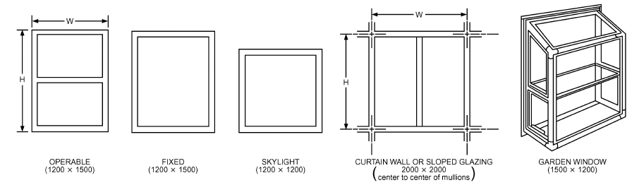

| Frame Material | Operable | Fixed | Frame Width, mm<br>Garden Window | Frame Width, mm<br>Skylight | Curtain Wall | Sloped/Overhead Glazing |
|---|---|---|---|---|---|---|
| Aluminum without thermal break | 38 | 33 | 44 | 18 | 57 | 57 |
| Aluminum with thermal break | 53 | 33 | N/A | 18 | 57 | 57 |
| Aluminum-clad wood/reinforcing vinyl | 71 | 41 | N/A | 23 | N/A | N/A |
| Wood/vinyl | 71 | 41 | 44 | 23 | N/A | N/A |
| Insulated fiberglass/vinyl | 79 | 46 | N/A | N/A | N/A | N/A |
| Structural glazing | N/A | N/A | N/A | N/A | 57 | 64 |

*Fig. 4 Frame Widths for Standard Fenestration Units*

U-factors in Table 4 are based on definitions of the six product types, frame sizes, and proportion of frame to glass area shown in Figure 4. Four of the products are manufactured type. Sizes are as defined in NFRC Technical Document 100 (2014a): operable and fixed (nonoperable) glazing units are 1.8 m<sup>2</sup> in area, and the overall size corresponds to a 1200 by 1500 mm fenestration product. The garden window category is 1.8 m<sup>2</sup> in projected area (3.24 m<sup>2</sup> in surface area) and 1500 mm wide by 1200 mm high by 380 mm deep. The manufactured skylight category is a nominal 1.44 m<sup>2</sup> in area, corresponding to a 1200 by 1200 mm skylight. The nominal dimensions of a roof-mounted skylight correspond to centerline spacing of roof framing members; consequently, the rough opening dimensions are 1180 by 1180 mm. The curtain wall and sloped/overhead glazing categories are a nominal 4 m<sup>2</sup> in area, representing repeating 2000 by 2000 mm panels. The nominal dimensions correspond to centerline spacing of the head and sill and vertical mullions.

Six frame types are listed (although not all for any one category) in order of improving thermal performance. The most conservative assumption is to use the frame category of aluminum frame without a thermal break (although there are products on the market that have higher U-factors). The aluminum frame with a thermal break is for frames having at least a 10 mm thermal break between the indoors and outdoors for all members including both the frame and the operable sash, if applicable. Some products are available with significantly wider thermal breaks, which achieve considerable improvement. The aluminum-clad wood/reinforced vinyl category represents vinyl-frame products, such as sliding glass doors or large windows that have extensive metal reinforcing within the frame and wood products with extensive metal, usually on the outdoor surface of the frame. Both of these factors provide short circuits, which degrade the thermal performance of the frame material. The wood/vinyl frame category represents the improved thermal performance that is possible if the thermal short circuits from the previous frame category do not exist. Insulated fiberglass/vinyl represents fiberglass or vinyl frames that do not have metal reinforcing and whose frame cavities are filled with insulation. For several site-assembled product types, there is a structural glazing frame category that represents products where sheets of glass are butt-glazed to each other using a sealant only, and framing members are not exposed to the exterior. For glazing with a steel frame, use aluminum frame values. For aluminum fenestration with wood trim or vinyl cladding, use the values for aluminum. Frame type refers to the primary unit; therefore, when storm sash is added over another fenestration product, use values given for the nonstorm product.

**Table 5 Glazing U-Factors for Various Wind Speeds in W/(m2·K)**

| 24 | Wind Speed, km/h 12 | 0 |
|---|---|---|
| 0.5 | 0.46 | 0.42 |
| 1.0 | 0.92 | 0.85 |
| 1.5 | 1.33 | 1.27 |
| 2.0 | 1.74 | 1.69 |
| 2.5 | 2.15 | 2.12 |
| 3.0 | 2.56 | 2.54 |
| 3.5 | 2.98 | 2.96 |
| 4.0 | 3.39 | 3.38 |
| 4.5 | 3.80 | 3.81 |
| 5.0 | 4.21 | 4.23 |
| 5.5 | 4.62 | 4.65 |
| 6.0 | 5.03 | 5.08 |
| 6.5 | 5.95 | 5.50 |

To estimate the overall U-factor of a fenestration product that differs significantly from the assumptions given in Table 4 and/or Figure 4, first determine the area that is frame/sash, center-ofglass, and edge-of-glass (based on a 63.5 mm band around the perimeter of each glazing unit). Next, determine the appropriate component U-factors. These can be taken either from the standard values listed in italics in Table 4 for glass, from the values in Table 1 for frames, or from some other source such as test data or computed factors. Finally, multiply the area and the component U-factors, sum these products, and then divide by the rough opening in the building envelope where this product will fit to obtain the overall U-factor U .

<!-- str. 364 -->

> o

Table 5 provides approximate data to convert the overall U-factor at one wind condition to a U-factor at another.

**Example 1.** Estimate the design U-factor for a manufactured fixed fenestration product with a reinforced vinyl frame and double-glazing with a sputter-type low-e coating (e = 0.10). The gap is 13 mm wide and argon-filled, and the spacer is metal. The outdoor wind speed is 12 km/h.

**Solution:** Locate the glazing system type in the first column of Table 4 (ID = 23), then find the appropriate product type (fixed) and frame type (reinforced vinyl). The U-factor listed (in the tenth column of U-factors) is 1.86 W/(m<sup>2</sup>·K). This U-factor is for 24 km/h outdoor wind speed.

From Table 5, interpolate 1.86 in the 24 km/h column to the corresponding value in the 12 km/h column.

> (1.86 – 1.50)/(2.00 – 1.50) = (U<sub>12km/h</sub>– 1.33)/(1.74 – 1.33)
>
> U<sub>12km/s</sub> = 1.63 W/(m<sup>2</sup>·K)

**Example 2.** Estimate a representative U-factor for a wood-framed, 970 by 2080 mm swinging French door with eight 280 by 400 mm panes (true divided panels), each consisting of clear double-glazing with a 6.5 mm air space and a metal spacer.

**Solution:** Without more detailed information, assume that the dividers have the same U-factor as the frame and that the divider edge has the same U-factor as the edge-of-glass. Calculate center-of-glass, edge-ofglass, and frame areas:

- A<sub>cg</sub> = 8[(280 – 130)(400 – 130)]/10<sup>6</sup> = 0.324 m<sup>2</sup>
- A<sub>eg</sub> = 8(280 × 400)/10<sup>6</sup> – 0.324 = 0.572 m<sup>2</sup>
- A<sub>f</sub> = (970 × 2080)/10<sup>6</sup> – 8(280 × 400)/10<sup>6</sup> = 1.122 m<sup>2</sup>

Select center-of-glass, edge-of-glass, and frame U-factors. These component U-factors are 3.12 and 3.63 W/(m<sup>2</sup>·K) (from Table 4, glazing ID = 4, U-factor columns 1 and 2) and 2.90 W/(m<sup>2</sup>·K) (from Table 1, wood frame, metal spacer, operable, double-glazing), respectively. From Equation (2), U<sub>frenchdoor</sub> = ((3.12 × 0.324) + (3.63 × 0.572) + (2.90 × 1.122))/((0.97 × 2.08) 2)

> = 3.14 W/(m ·K)

**Example 3.** Estimate the overall average U-factor for a multifloor curtain wall assembly that is part vision glass and part opaque spandrel. The typical floor-to-floor height is 3.6 m, and the building module is 1.2 m as reflected in the spacing of the mullions both horizontally and vertically. For a representative section 1.2 m wide and 3.6 m tall, one of the modules is glazed and the other two are opaque. The mullions are aluminum frame with a thermal break 80 mm wide and centered on the module. The glazing unit is double glazing with a pyrolytic low-e coating (e = 0.40) and has a 13 mm gap filled with air and a metal spacer. The spandrel panel has a metal pan backed by R = 3.5 (m<sup>2</sup>·K)/W insulation and no intermediate reinforcing members.

**Solution:** It is necessary to calculate the U-factor for the glazed module and for the opaque spandrel modules, and then to do an area-weighted average to determine the average U-factor for the overall curtain wall assembly.

First, calculate the overall U-factor for the glazed module. Calculate center-of-glass, edge-of-glass, and frame areas. The glazed area is 1120 by 1120 mm (1200 mm module, 38 mm of mullions on each edge).

> A<sub>cg</sub> = (1120 – 130)(1120 – 130)/10<sup>6</sup> = 0.9801 m<sup>2</sup>
>
> A<sub>eg</sub> = (1120 × 1120)/10<sup>6</sup> – 0.9801 = 0.2743 m<sup>2</sup>

> A<sub>f</sub> = [(1200 × 1200)/10<sup>6</sup> – (1120 × 1120)]/10<sup>6</sup> = 0.1856 m<sup>2</sup>

Select center-of-glass, edge-of-glass, and frame U-factors. These component U-factors are 2.27 and 3.04 W/(m<sup>2</sup>·K) (from Table 4, ID = 13, columns 1 and 2) and 9.94 W/(m<sup>2</sup>·K) (from Table 1, aluminum frame with a thermal break, metal spacer, curtain wall, double glazing), respectively. From Equation (2), U<sub>glazingmodule</sub> = ((2.27 × 0.9801) + (3.04 × 0.2743) + (9.94 × 0.1856))/((1.2 × 1.2) 2)

> = 3.41 W/(m ·K)

Then, calculate the overall U-factor for the two opaque spandrel modules. The center-of-spandrel, edge-of spandrel, and frame areas are the same as the glazed module. The frame U-factor is the same. Calculate the center-of-spandrel U-factor. In this particular case, the R-value of the insulation does not need to be rated, because there are no intermediate framing members penetrating it and providing thermal short circuits. When the resistance of the insulation [3.5 (m<sup>2</sup>·K)/W] is added to the exterior air film resistance of 0.03 (m<sup>2</sup>·K)/W and the interior air film resistance of 0.12 (m<sup>2</sup>·K)/W (from Table 1, Chapter 26), the total resistance is 3.65 (m<sup>2</sup>·K)/W, and the U-factor is 1/3.65 = 0.274 W/(m<sup>2</sup>·K). The edge-of-spandrel U-factor is 40% of the way to the frame U-factor, which is 0.274 + [0.40(9.94 –0.274)] = 4.14 W/(m<sup>2</sup>·K).

> U<sub>opaq</sub>
>
> *ue spandrel module*

(0.274 × 0.9801) + (4.14 × 0.2743) + (9.94 × 0.1856) = ---------------------------------------------------------------------------------------------------------------------------------

> (1.2 × 1.2)
>
> = 2.26 W/(m<sup>2</sup>·K)

Finally, calculate the overall average U-factor for the curtain wall assembly, including the one module of vision glass and the two modules of opaque spandrel.

U<sub>curtainwall</sub> = ([3.41 × (1.2 × 1.2)] + [2.26 × 2 × (1.2 × 1.2)])/(3 × (1.2 × 1.2) 2)

> = 2.64 W/(m ·K)

Note that even with double glazing having a low-e coating and with R = 3.5 (m<sup>2</sup>·K)/W in the opaque areas, this curtain wall with metal pans only has an overall R-value of approximately 0.38 (m<sup>2</sup>·K)/W.

**Example 4.** Estimate the U-factor for a semicircular barrel vault that is 6 m wide, 3 m tall, and 10 m long mounted on a 150 mm curb. The barrel vault has an aluminum frame without a thermal break. The glazing is double with a 13 mm gap width filled with air and a low-e coating (e = 0.20).

**Solution:** An approximation can be made by multiplying the U-factor for a site-assembled sloped/overhead glazing product having the same frame and glazing features by the ratio of the surface area (including the curb) of the barrel vault to the rough opening area in the roof that the barrel vault fits over. First, determine the surface area (including the curb) of the barrel vault:

Area of the curved portion of the barrel vault

> = (π × diameter/2) × length
>
> = (3.14 × 6/2) × 10 = 94.25 m<sup>2</sup>

Area of the two ends of the barrel vault

> = 2 × (π × radius<sup>2</sup>)/2 = πr<sup>2</sup>
>
> = 3.14 × 3<sup>2</sup> = 28.27 m<sup>2</sup>

Area of the curb

> = perimeter × curb height
>
> = (6 + 10 + 6 + 10) × 0.150 = 4.8 m<sup>2</sup>

Total surface area of the barrel vault

> = 94.25 + 28.27 + 4.8 = 127.3 m<sup>2</sup>

Second, determine the rough opening area in the roof that the barrel vault fits over:

> = length × width
>
> = 6 × 10 = 60 m<sup>2</sup>

Third, determine the ratio of the surface area to the rough opening area:

- = 127.3/60 = 2.12

Fourth, determine the U-factor from Table 4 of a site-assembled sloped/overhead glazing product having the same frame and glazing features.

<!-- str. 365 -->

The U-factor is 3.51 W/(m<sup>2</sup>·K) (ID = 17, 12th column on the second page of Table 4).

Fifth, determine the estimated U-factor of the barrel vault.

> U<sub>barre</sub>
>
> l vault

> = U<sub>slopedoverheadglazing</sub> × surface area/rough opening for the
>
> barrel vault

> = 3.51 × 2.12 = 7.44 W/(m<sup>2</sup>·K)

## 3.3 REPRESENTATIVE U-FACTORS FOR DOORS

Doors are often an overlooked component in the thermal integrity of the building envelope. Although entry doors (swinging, revolving, etc.) represent a small portion of the building envelope of residential, commercial, and institutional buildings, their U-factor is usually many times higher than that of the walls or ceilings. In some commercial and industrial buildings, vehicular access doors (upward-acting doors) represent a significant area of heat loss. Table 6 contains representative U-factors for swinging doors determined through computer simulation (Carpenter and Hogan 1996). These are generic values, and product-specific values determined in accordance with standards should be used whenever available. NFRC Technical Document 100 (NFRC 2014a) gives procedures for evaluating the performance of entry and vehicular access doors. Tables 7 to 9 contain representative U-factors for revolving, emergency exit, garage, and aircraft hangar doors determined through testing (McGowan et al. 2006).

Swinging doors can be divided into two categories: slab and stile-and-rail. A stile-and-rail door is a swinging door with a fullglass insert supported by horizontal rails and vertical stiles. The stiles and rails are typically either solid wood members or extruded aluminum or vinyl, as shown in Figure 5. Most residential doors are slab type with solid wood, steel, or a fiberglass skin over foam insulation in a wood frame with aluminum sill. The edges of the steel skin door are normally wood to provide a thermal break. In commercial construction, doors are either steel skin over foam insulation in a steel frame (i.e., utility doors) or a full glass door made up of aluminum stiles, rails, and frame (i.e., entrance doors). The most important factors affecting door U-factor are material construction, glass size, and glass type. Frame depth, slab width, and number of panels have a minor effect on door performance. Side lites and double doors have U-factors similar to a single door of the same construction. For wood slab doors in a wood frame, the glazing area has little effect on the U-factor. For an insulated steel slab in a wood frame, however, glazing area strongly affects U-factor. Typical commercial insulated slab doors have a U-factor approximately twice that of residential insulated doors, the prime reason being thermal bridging of the slab edge and the steel frame. Stile-and-rail doors, even if thermally broken, have U-factors 50% higher than a fullglass commercial steel slab door.

**Table 6 Design U-Factors of Swinging Doors in W/(m2·K)**

| Door Type (Rough Opening = 970 × 2080 mm) | Double Double Glazing Glazing with with e = 0.10, No Single 12.7 mm 12.7 mm Glazing GlazingAir Space Argon |
|---|---|
| Slab Doors |  |
| Wood slab in wood frame<sup>a</sup> | 2.61 |
| 6% glazing (560 × 200 lite) | — 2.73 2.61 2.50 |
| 25% glazing (560 × 910 lite) | — 3.29 2.61 2.38 |
| 45% glazing (560 × 1620 lite) | — 3.92 2.61 2.21 |
| More than 50% glazing | Use Table 4 (operable) |
| Insulated steel slab with wood edge in wood frame<sup>b</sup> | 0.91 |
| 6% glazing (560 × 200 lite) | — 1.19 1.08 1.02 |
| 25% glazing (560 × 910 lite) | — 2.21 1.48 1.31 |
| 45% glazing (560 × 1630 lite) | — 3.29 1.99 1.48 |
| More than 50% glazing | Use Table 4 (operable) |
| Foam-insulated steel slab with metal edge in steel frame<sup>c</sup> | 2.10 |
| 6% glazing (560 × 200 lite) | — 2.50 2.33 2.21 |
| 25% glazing (560 × 910 lite) | — 3.12 2.73 2.50 |
| 45% glazing (560 × 1630 lite) | — 4.03 3.18 2.73 |
| More than 50% glazing | Use Table 4 (operable) |
| Cardboard honeycomb slab with metal edge in steel frame | 3.46 |
| Stile-and-Rail Doors |  |
| Sliding glass doors/French doors | Use Table 4 (operable) |
| *Site-Assembled Stile-and-Rail Doors* |  |
| Aluminum in aluminum frame | — 7.49 5.28 4.49 |
| Aluminum in aluminum frame with thermal break | — 6.42 4.20 3.58 |

Notes:

<sup>a</sup>Thermally broken sill [add 0.17 W/(m<sup>2</sup>·K) for non-thermally broken sill]

<sup>b</sup>Non-thermally broken sill

<sup>c</sup>Nominal U-factors are through center of insulated panel before consideration of thermal bridges around edges of door sections and because of frame.

There are three generic types of upward-acting doors:

- Rolling (also called roll-up) doors consist of small metal slats of approximately 65 mm in height that travel in vertical guides and roll up around a metal barrel to open.
- Sectional (also called garage) doors consist of a series of approximately 460 to 815 mm high sections that travel in vertical tracks to open.
- Folding (also called biparting) doors, commonly used in aircraft hangars, have two large sections that also travel in vertical tracks to open, but fold together when the door is fully open.

There is a wide range in the design of insulated upward-acting doors. Factors affecting heat transfer include insulation thickness, section/slat design, and section/slat interface design (which may include a thermal break). For noninsulated upward-acting doors, there is very little difference between the center value and the total value: the value is essentially equal to that of single glazing. The center of an insulated door has a relatively low U-factor, but thermal bridging at the door frame and section interfaces can affect the door assembly U-factor. Center-of-door U-factors for vehicular access doors may be used in thermal calculations for buildings only if the door design or door size indicates little difference with respect to the total door assembly U-factor.

**Table 7 Design U-factors for Revolving Doors in W/(m2·K)**

| Type | Size (Width × Height) | U-Factor |
|---|---|---|
| 3-wing | 2.44 × 2.13 m | 4.46 |
|  | 3.28 × 2.44 m | 4.53 |
| 4-wing | 2.13 × 1.98 m | 3.56 |
|  | 2.13 × 2.29 m | 3.63 |
| Open* | 2.08 × 2.13 m | 7.49 |

*U-factor of open door determined using NFRC Technical Document 100-91. It has not been updated to current rating methodology in NFRC Technical Document 100 (2014a).

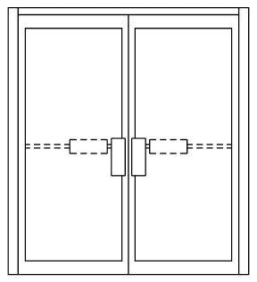

*Fig. 5 Details of Stile-and-Rail Door*

<!-- str. 366 -->

**Table 8 Design U-factors for Double-Skin Steel Emergency Exit Doors in W/(m2·K)**

| Thickness, mm | Core Insulation Type | Rough Opening Size<br>0.9 × 2 m | Rough Opening Size<br>1.8 × 2 m |
|---|---|---|---|
| 35* | Honeycomb kraft paper | 3.23 | 2.97 |
|  | Mineral wool, steel ribs | 2.50 | 2.05 |
|  | Polyurethane foam | 1.92 | 1.60 |
| 44* | Honeycomb kraft paper | 3.25 | 3.06 |
|  | Mineral wool, steel ribs | 2.30 | 1.90 |
|  | Polyurethane foam | 1.77 | 1.50 |
| 35 | Honeycomb kraft paper | 3.38 | 3.11 |
|  | Mineral wool, steel ribs | 2.67 | 2.21 |
|  | Polyurethane foam | 2.10 | 1.77 |
| 44 | Honeycomb kraft paper | 3.38 | 3.22 |
|  | Mineral wool, steel ribs | 2.47 | 2.08 |
|  | Polyurethane foam | 1.95 | 1.69 |

*With thermal break

**Table 9 Design U-Factors for Double-Skin Steel Sectional, Tilt-Up, and Aircraft Hangar Doors in W/(m2·K)**

| Insulation<br>Thickness, mm | Insulation<br>Type | Sectional or Tilt-Up<sup>a</sup> 2.7 × 2.1 m | Aircraft Hangar<br>22 × 3.7 m<sup>b</sup> | Aircraft Hangar<br>73 × 15.2 m<sup>c</sup> |
|---|---|---|---|---|
| 45 | Polyurethane, thermally broken | 1.59 |  |  |
| 35 | Extruded polystyrene, steel ribs | 2.21 |  |  |
|  | Expanded polystyrene, steel ribs | 2.04 |  |  |
| 50 | Extruded polystyrene, steel ribs | 1.87 |  |  |
|  | Expanded polystyrene, steel ribs | 1.76 |  |  |
| 75 | Extruded polystyrene, steel ribs | 1.59 |  |  |
|  | Expanded polystyrene, steel ribs | 1.53 |  |  |
| 100 | Extruded polystyrene, steel ribs | 1.42 |  |  |
|  | Expanded polystyrene, steel ribs | 1.36 |  |  |
| 150 | Extruded polystyrene, steel ribs | 1.19 |  |  |
|  | Expanded polystyrene, steel ribs | 1.19 |  |  |
| 100 | Expanded polystyrene |  | 1.42 | 0.91 |
|  | Mineral wool, steel ribs |  | 1.42 | 0.91 |
|  | Extruded polystyrene |  | 1.31 | 0.85 |
| 150 | Expanded polystyrene |  | 1.19 | 0.74 |
|  | Mineral wool, steel ribs |  | 1.31 | 0.734 |
|  | Extruded polystyrene |  | 1.14 | 0.68 |
| — | Uninsulated | 6.53<sup>d</sup> | 6.25 | 6.98 |

Notes:

<sup>a</sup>U-factor determined using NFRC Technical Document 100-91. Not updated to current rating methodology in NFRC (2014a) Technical Document 100-2014.

<sup>b</sup>Typical size for a small private airplane (single- or twin-engine.)

<sup>c</sup>Typical hangar door for a midsized commercial jet airliner.

<sup>d</sup>U-factor determined for 3 × 3 m sectional door, but is representative of similar products of different sizes.

Many commercial buildings use revolving entrance doors. Most of these doors are of similar design: single glazing in an aluminum frame without thermal break. The door, however, can be in two positions: closed (X-shaped as viewed from above) or open (+-shaped as viewed from above). At nighttime, these doors are locked in the X position, effectively creating a double-glazed system. During the daytime, the door revolves and is often left positioned so that there is only one glazing between the indoors and outdoors (+ position). U-factors are given in Table 7 for both positions.

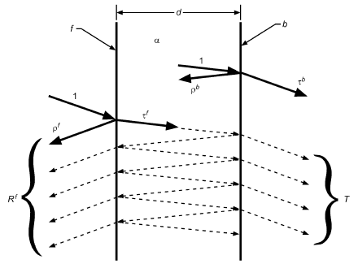

*Fig. 6 Optical Properties of a Single Glazing Layer*

## 4. SOLAR HEAT GAIN AND VISIBLE TRANSMITTANCE

Fenestration solar heat gain has two components. First is **directly transmitted solar radiation**. The quantity of radiation entering the fenestration directly is governed by the solar transmittance of the glazing system, and is determined by multiplying the incident irradiance by the glazing area and its solar transmittance. The second component is the inward flowing fraction of **absorbed solar radiation**, radiation that is absorbed in the glazing and framing materials of the fenestration, some of which is subsequently conducted, convected, or radiated to the interior of the building.

**Visible transmittance** is the solar radiation transmitted through fenestration weighted with respect to the photopic response of the human eye. It physically represents the perceived clearness of the fenestration, and is likely different from the solar transmittance of the same fenestration.

The underlying physics behind solar heat gain and visible transmittance can be very complex, but a rudimentary understanding is required if technologies such as low-e coatings are to be discussed. Accurately calculating the solar heat gain and visible transmittance of a fenestration system, including the effects of angular and spectral dependence, in the presence of multiple glazing and shade layers, is very complex. Refer to ISO Standard 15099 or the ASHRAE Handbook Online supplemental features for this chapter for complete details of how to do this calculation. Software such as LBNL WINDOW 7 (LBNL 2016) incorporate these advanced calculations and can be used for more detailed fenestration analysis.

## 4.1 SOLAR-OPTICAL PROPERTIES OF GLAZING

### Optical Properties of Single Glazing Layers

Radiation passing from one medium into another is partly transmitted and partly reflected at the interface between the two media. Further, as this radiation passes through either medium, an additional fraction is absorbed because of the absorptivity of the material. Materials that do not absorb radiation completely, such as air or glass, are classified as being transparent or translucent. Translucent glazings exhibit sufficient light-diffusing properties that images of objects viewed through it are blurred. Opaque glazings transmit no perceptible light.

<!-- str. 367 -->

If solar radiation incident on glazing is considered, the **trans- mittance T**, **reflectance R**, and **absorptance** A of the glazing layer contain the effects of multiple reflections between the two interfaces of the layer as well as the effects of absorption during the passage through the layer of each interreflection (Figure 6). For radiation incident on the front side of the glazing, the reflectance is called the **front reflectance R<sup>f</sup>**. The **back reflectance R<sup>b</sup>** (not shown in Figure 6) is the reflectance of the layer for radiation incident on back side b.

The transmittance, reflectance, and absorptance of a layer are formally defined as the fractions of incident flux that transmit, reflect, and are absorbed by the layer, respectively, including the effects of interreflection. Their sum equals unity, as shown in Equation (5).

> T + R + A = 1&emsp;**(5)**

The layer has a thickness d and is characterized by **transmis- sivity** τ and **reflectivity** ρ of each of the two surfaces and by the **absorptivity** α of the glazing layer of thickness d. In general, τ and ρ are characteristics of the interface between the material and the adjacent medium; they may in principle be different for the two surfaces (e.g., for a coated surface, or where a material layer is adjacent to another material rather than air). Physical arguments, however, dictate that T<sup>f</sup> and T<sup>b</sup> for the layer be the same (and the f and b superscripts are therefore omitted). R<sup>f</sup> and R<sup>b</sup> will be different given similar variations in coatings or adjacent materials, and examination of Equation (5) shows that A<sup>f</sup> and A<sup>b</sup> may be different as well. Uncoated glass has the same front and back properties.

**Angular Variations.** The interfacial properties τ and ρ, and consequently layer properties T, R, and A, also depend on the incident angle θ of the radiation incident on the layer. Figure 7 shows the optical properties of common window glass as a function of incidence angle. This variation of properties is small for incident angles below 40° but becomes significant at larger angles. Chapter 14 provides details on calculating the direction and magnitude of solar flux that is incident on a glazing system.

Rubin (1985) measured broadband transmittance and reflectances for many uncoated (monolithic) glass substrates, including tinted substrates at various thicknesses. These formed the basis for Figure 8, which compares the properties of glasses of different thickness and composition. As the incident angle increases from zero, transmittance decreases, reflectance increases, and absorptance first increases because of the lengthened optical path and then decreases as more incident radiation is reflected. Although the shapes of the (Refractive index n = 1.55, thickness t = 3.2 mm, absorptance α = 0.01/m)

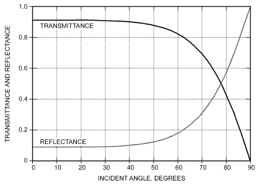

*Fig. 7 Transmittance and Reflectance of Glass Plate*

property curves are superficially similar, note that both the magnitude of the transmittance at normal incidence and the angle at which the transmittance changes significantly vary with glass type and thickness.

Wong (2016) normalized the measured solar transmittance (Rubin 1985) for 6 mm substrates. Two distinct sets of regressions coefficients appear to be adequate to represent the angular variation for a wide range of clear and tinted substrates. The result of the normalization is shown in Figure 9. These two distinct sets of regression coefficients were incorporated into the then WINDOW4 program (Finlayson et al. 1994) and all subsequent versions of that software. Note that tinted substrates considered here do not have as strong a spectrally selectively behavior as the high-performance tints described in Carmody et al. (2004).

The three curves all have slightly different shapes. For coated glasses or for multiple-pane glazing systems, this difference is more pronounced. One cannot assume that all glazings or glazing systems have a universal angular dependence.

ADOPT (1996) is a two-parameter model that describes the angular-dependent optical properties of glazing systems. It has been validated (Karlsson et al. 2001) against actual measurements (Rubin et al. 1999). Models have been developed from the ADOPT project, and validation of its accuracies at discrete angles of incidence had been reported (Hutchins et al. 2001; Rubin et al. 1998). The Simple Window Model (Arasteh et al. 2009) offers correlations for single-, double-, and triple-glazed systems for use in building energy simulation. The normalized transmittance curve is shown in Figure 10 below.

Angular performance is important when peak gains and annual energy performance are considered. In North America, peak summertime solar gains occur with east- and west-facing vertical

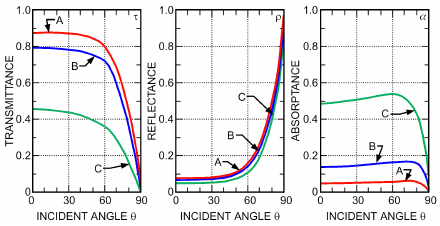

*Fig. 8 Variations with Incident Angle of Solar-Optical Properties for (A) Clear 3 mm Glass, (B) Clear 6 mm Glass, and (C) 6 mm Typical Heat-Absorbing (Tinted) Glass*

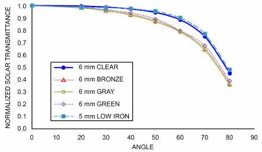

*Fig. 9 Normalized Solar Transmittance for Five Common Glass Substrates as Function of Incidence Angle in Degrees*

<!-- str. 368 -->

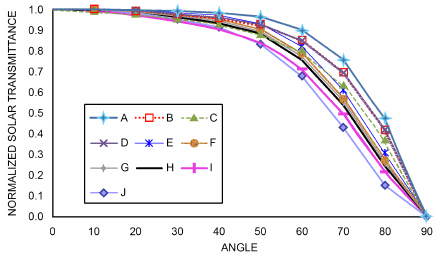

*Fig. 10 Normalized Solar Transmittance, as Function of Incidence Angle in Degrees, for 10 Glazing Systems (Single-, Double-. and Triple-Pane) as Developed for Simple Window Model*

> (Arasteh et al. 2009)

glazings at angles of incidence ranging from about 25 to 55°. The peak solar gain for horizontal glazings occurs typically at relatively small angles of incidence (midday sun high in sky in summer). For north- and south-facing vertical glazings, peak summertime solar gains occur at angles of incidence greater than about 40°. Angles of incidence important for annual energy performance calculations range from 5° to over 80° for east- and west-facing vertical and for horizontal glazings. This range is only slightly diminished for south-facing glazings. For north-facing glazings, the direct beam solar gains are small and their angles of incidence range from 62 to 86° (McCluney 1994a).

**Spectral Variations.** Many glazing systems have optical properties that are spectrally selective (i.e., they vary across the electromagnetic spectrum with wavelength λ). Ordinary clear float glass possesses this property, but to a modest degree that is seldom of much concern in load calculations. Tinted and coated glass can exhibit strong spectral selectivity, a desirable property for certain applications, and this effect must be accounted for in solar heat gain determinations.

Figure 11 (McCluney 1993) shows the normal incidence spectral transmittances of several common commercially available glazings. Figure 12 (McCluney 1996) shows the normal incidence spectral transmittances and outdoor reflectances of a variety of additional coated and tinted glasses, indicating the strong spectral selectivity now available from some glass and window manufacturers. Actual transmittance varies with the amount of iron or other absorbers in the glass. Uncoated glass with low iron content has a relatively constant spectral transmittance over the entire solar spectrum.

**Solar-Optical Property Data.** Transmittance and reflectance ar e the basic measurable quantities for an isolated glazing layer in air. Measurements on glazing layers are typically made using a spectrophotometer at normal or near-normal incidence, and the properties at other angles must be inferred from these measurements. A systematic compilation of these measured properties (for most glazings manufactured in the United States) called the International Glazing Database (IGDB) is maintained by the National Fenestration Rating Council and is available on the Internet at www.nfrc.org or from windows.lbl.gov/materials/IGDB/default.htm (LBNL 2016; NFRC 2014b). For uncoated glazings, layer properties can also be determined from first principles [e.g., McCluney (1994b)].

Advances in modeling complex glazing layers (e.g., screens, woven shades, blinds, some types of drapes) have led to the establishment of the Complex Glazing Database (CGDB 2016). Designed to support the LBNL (2016) WINDOW program and similar software, the CGDB contains detailed information on the angular and spectral

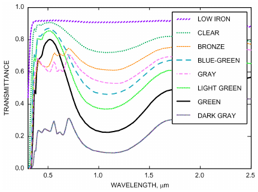

*Fig. 11 Spectral Transmittances of Commercially Available Glazings*

> (Kruis 2015)

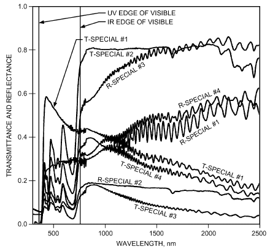

*Fig. 12 Spectral Transmittances and Reflectances of Strongly Spectrally Selective Commercially Available Glazings*

> (McCluney 1996)

properties of such materials, for total and diffuse transmittance and reflectance. The CGDB is being expanded to include products from many international manufacturers. More information may be found in the section on Shading and Fenestration Attachments.

Obtaining the necessary basic information about the solar-optical properties of coated glass requires spectrophotometric measurements. Alternatively, an approximation procedure is described by Finlayson and Arasteh (1993). Coated glazing properties should vary from these estimates by no more than ±20% at 60° incidence (Rubin et al. 1999). It is currently not practical to determine the solar-optical properties of coated glazings from first principles.

### Optical Properties of Glazing Systems

The optical properties of glazing systems (multiple glazing layers) are affected by interreflections between layers in addition to the specular and angular properties of the individual layers.

<!-- str. 369 -->

Consequently, the effect of a particular layer on the overall properties may not only depend on its solar-optical properties, but also on its position in the assembly. It is therefore necessary to expand glazing layer considerations to apply to the overall properties of systems and subsystems of glazing layers. The properties of any subsystem can be calculated by using recursion relations (LBNL 2016).

**Spectral Averaging of Glazing System Properties.** The solar-optical properties of a glazing are the wavelength-integrated (or total) transmittance, reflectance, and absorptance of the glazing to incident solar radiation. If the spectral optical properties T(λ), R(λ), and A(λ) of the glazing and the spectral irradiance E(λ) incident on the glazing are known, the solar optical properties can be calculated using ASTM Standards E971, E972, and E1084, as well as NFRC Technical Document 300 (NFRC 2014c).

> λ
>
> max

> X = (∫E<sub>STD</sub>(λ)X(λ)dλ λ min)/(λ max ∫E (λ)dλ)&emsp;**(6)**
>
> STD

> λ
>
> min

where

- X(λ) = T(λ), R(λ), or A(λ)
- E<sub>STD</sub>(λ) = standard solar distribution
- X = total T, R, or A to standard solar distribution

For multiple-layer glazing systems, the spectral averaging should in general be applied to the system spectral properties at each angle. Because all glazing layer properties are to some extent both angle and wavelength dependent, and because these equations are nonlinear in the glazing properties, this is the only procedure that is valid in principle.

Many glazings do not have strong spectral selectivity over the solar spectrum, so their spectral optical properties can be considered constant, even if the source spectrum changes substantially. In these cases, the transmitted spectral irradiance can be determined by multiplying the incident irradiance by the solar transmittance obtained with the standard solar distribution. For special combinations of climate and location, it may be desirable to use variant solar spectra as weighting functions, which requires an appropriate spectral solar radiation model (Gueymard 2007). It is still difficult, and seldom necessary, to perform radiative calculations using a detailed, time-dependent solar spectrum and the spectral glazing properties. Such additional calculations might only be justified in the case of glazings with strong spectral selectivity (Gueymard and DuPont 2009).

**Angular Averaging of Glazing System Properties.** It is relatively simple to account for angular dependence in beam solar radiation, because at a given time the radiation is incident from a single, easily determined direction. However, for diffuse solar and ground-reflected radiation, the situation is more complicated. In principle, energy flow through the glazing should equal the sum of individual energy flows caused by incident radiation from each direction.

Although such calculations can be done for specific sky conditions using detailed sky data or models, the labor involved is worthwhile only for very specific purposes. Usually, a drastically simplifying assumption is made. Both sky and ground radiation are assumed to be **ideally diffuse** (i.e., to have a sky radiance that is independent of direction). Diffuse properties are then determined by integrating over all directions. See the section on Diffuse Radiation under Solar Heat Gain Coefficient for more details. In addition, the spectral dependence is assumed to be the same as for beam solar radiation.

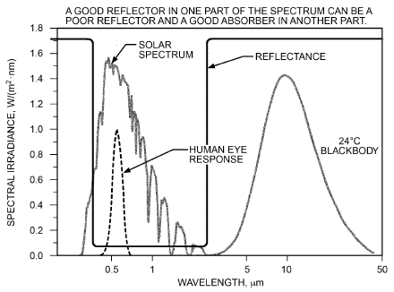

*Fig. 13 Solar Spectrum, Human Eye Response Spectrum, Scaled Blackbody Radiation Spectrum, and Idealized Glazing Reflectance Spectrum*

> X(θ)cosθdϖ
>
> π ⁄ 2

> X<sub>D</sub> = (∫∫ hem)/∫∫cosθdϖ = 2 ∫X(θ)cosθdθ&emsp;**(7)**
>
> 0

> hem

where

- X(θ) = T(θ), R(θ), or A(θ)
- ϖ = solid angle of integration
- X<sub>D</sub> = total T, R, or A of standard solar distribution

More careful consideration must be given to these quantities for tilted glazings or for direction-dependent shading (e.g., overhangs, venetian blinds) when greater accuracy is desired.

**Spectrally Selective Glazing and Glazing Systems.** Spectrally selective glazing shows strong changes in its optical properties with variations in wavelength over the spectrum. The spectral range from 300 nm to over 50 μm contains radiation from both the sun and sky incident on fenestration systems. The majority of this radiation is called **short-wave** or **solar** radiation. About 99% of the energy in the solar spectrum is between 0.3 to 3.5 μm. The spectral range from 3.5 to over 50 μm is called **long-wave**, **infrared**, or **thermal** radiation, which contains radiation from the sun and sky, but also from warm bodies both outside and inside the building. In Figure 13, the solar spectrum for an air mass m = 1.5 (corresponding to a solar altitude of 41.8°) represents short-wave radiation, with thermal radiation represented by a blackbody source at 24°C. The latter has been scaled up to better compare it with the shape of the solar spectrum. The reflectance spectrum shown is an idealization of typical glazing reflectance. Figure 13 clearly shows the separation of the solar spectrum from the long-wave spectrum characteristic of radiant emission from an indoor pane of a multiple-pane glazing system.

Figure 13 also shows the human eye spectral response (called the human photopic visibility function). To the human eye, the glazing represented in the figure does not appear very reflective. It is also strongly transmitting for solar radiation, including the visible portion. The glazing is, however, nearly opaque to long-wave radiation, demonstrating that visual perception of a material is a poor indicator of its overall spectral characteristics. The glazing system reflectance depicted in Figure 13 is good for admitting solar radiation while preventing the escape of long-wave radiation emitted by surfaces inside the room, a good design for cold sunny days.

<!-- str. 370 -->

Almost all window glass is opaque to long-wave radiation emitted by surfaces at temperatures below about 1200°C. This characteristic produces the **greenhouse effect**, by which solar radiation passing through fenestration is partially retained indoors by the following mechanism. Radiation absorbed by surfaces in the room is emitted as long-wavelength radiation, which cannot escape directly through the glass because of its opaqueness to radiation beyond 4.5 μm. Instead, radiation from room surfaces is absorbed and reemitted to both sides as determined by several parameters, such as the indoor and outdoor film heat transfer coefficients, the surface emissivities, and other glazing properties.

A good long-wave reflector can be a poor short-wave reflector and a good short-wave transmitter. Because of the conservation of energy (T + R + A = 1.0), high long-wave reflectance means low transmittance and absorptance. Kirchhoff’s law shows that low absorptance means low emissivity as well. This is the principle of operation of the high-solar-gain (or cold-climate) **low-e coating** on glass. Such a coating has high transmittance over the entire solar spectrum, producing high solar heat gain while being highly reflective to long-wave infrared radiation emitted by the indoor surfaces, reflecting this radiation inward. The term low-e refers to a low emissivity over the long-wavelength portion of the spectrum.

Figure 14 shows hypothetical glazing systems with performance tuned to specific climates. In this case, the sharp **reflectance edge** that the ideal high-solar-gain, cold-climate low-e coating exhibits just past the end of the solar spectrum in Figure 13 is shifted closer to the edge of the visible portion of the spectrum, thereby increasing the solar near-infrared (NIR) reflectance of the glazing. This results in a drop in the hot-climate transmittance to the right of the visible portion of the spectrum. The effect is to reflect the near-infrared portion of the solar spectrum outdoors, reducing solar gain, while still admitting visible light in the wavelength region below about 0.8 μm. This low-solar-gain, hot-climate coating also exhibits low emissivity over the long-wave spectrum, and is therefore also properly termed a low-e coating. To distinguish the cold- from the hot-climate version, a glazing with this type of spectral response is often termed **selective low-e**. This is something of a misnomer, because both hot- and cold-climate glazings are spectrally selective. Another term is **high-solar- gain, low-e** glazing system for cold climates, contrasted with **low-solar-gain, low-e** glazing system for hot climates.

The reduced infrared transmittance for the hot-climate glazing is ideally achieved by high reflectance and low absorptance (meaning also low emissivity). It can also be done with high infrared absorptance, if the flow of absorbed solar radiation to the interior of the building can be reduced, introducing a second approach to the construction of a hot-climate, low-solar-gain glazing system. In this case, the outer pane of a multiple-pane glazing system is made to have good visible transmittance but high absorptance over the solar infrared spectrum. To protect the interior of the building from the heat of this absorbed radiation, additional glazings, gas spaces, and cold-climate or low-solar-gain, low-e coatings are added.

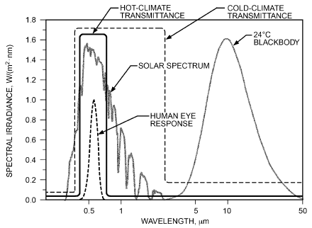

*Fig. 14 Demonstration of Two Spectrally Selective Glazing Concepts, Showing Ideal Spectral Transmittances for Glazings Intended for Hot and Cold Climates*

By this means, radiation, conduction, and convection of heat from the hot outer pane to the interior ones and to the interior of the building are reduced because of the coating, the gas space, and the additional panes. Such a glazing system for hot climates is insulated primarily not to protect the building from conductive heat losses in winter but to protect the interior from solar radiant heat absorbed by the hot outer pane in summer. Many manufacturers offer this kind of nonreflecting, spectrally selective glazing system for commercial and residential buildings having large cooling loads. Figure 14 shows that glazings intended for hot climates should have (1) high transmittance over the visible portion of the spectrum to let daylight in for both illumination and view and (2) low transmittance over all other portions of the spectrum to reduce solar heat gain. In contrast, glazings intended for very cold climates should have high transmittance over the whole solar spectrum, from 0.38 to over 3.5 μm, for maximum admission of solar radiant heat gain and light. In addition, glazings for cold climates should have low transmittance over the long-wavelength portion of the spectrum to block radiant heat emitted by the relatively warm indoor surfaces of buildings, preventing its escape to the outdoors.

Extreme spectral selectivity in glazing systems in the visible portion of the spectrum can produce an unwanted color shift in transmitted light. The color of transmitted light and its color-rendering properties should be considered in the design.

When discussing spectral behavior of fenestration, it is important to understand the relationship between the solar spectrum and the resulting broadband solar-optical properties of glazing systems. A brief introduction is provided here.

Calculation of a glazing system’s SHGC (see the section on Solar Heat Gain Coefficient) requires calculating broadband solar transmittance and absorptance. It is influenced by the solar spectrum and the spectral selectivity achieved through the combination of coatings and substrates that make up the glazing system. These two glazing attributes contribute strongly to spectral variations displayed by glazing systems.

To understand any spectral selectivity associated with a glazing layer, it is also necessary to have a good understanding of the spectral distribution of solar radiation. Typically, this is known as a **solar spectrum** or **weighting function,** whose wavelengths range from 300 to 2500 nm. Although there is energy at thermal wavelengths much longer than 2500 nm, glass and polymer layers are opaque to such wavelengths. Of available solar energy, the **direct normal irradiance (DNI)** exhibits the strongest intensity.

Accurate representation of the solar spectrum is essential to calculate broadband solar-optical properties of glazings, which in turn are used to calculate SHGC. It can also be used to compare the solar control characteristics of different glazing layers. Gueymard and Kambezidis (2004) reviewed ways to mathematically describe the atmospheric processes of scattering and absorption, to better consider the effect of atmospheric attenuation of extraterrestrial solar irradiation. This enables more realistic modeling of the DNI spectrum.

Over the past decade, better understanding of atmospheric phenomena that govern the attenuation of extraterrestrial solar radiation has led to updates of reference solar spectra. Because high-quality observational data have become more readily available, many aspects of the scattering and absorption process can now be modeled with increasing confidence. Reference spectra range from the original ASTM Standard E891-1989 (RA 1992) spectrum as referred to in the WINDOW4 documentation (Finlayson et al. 1993), through the use of ISO Standard 9845 as discussed in Rubin et al. (1998) and finally ASTM Standard G173-2003 (RA 2008) in the latest NFRC (2014c) Technical Document 300-2014.

<!-- str. 371 -->

Note that the solar spectrum referenced by NFRC Technical Document 300 (2014c) is identical to that used by the LBNL (2016) WINDOW program for NFRC certification purposes. At present, the DNI spectrum is used to calculate both broadband transmittance and reflectance.

Increased availability of high-quality observational data means it is now possible to develop mathematical models of the attenuation of solar radiation caused by scattering and absorption by aerosols and gases in the atmosphere. Several updates of the solar spectra have been published as a result of better consideration of atmospheric phenomena that govern the attenuation of extraterrestrial solar radiation.

ASTM Standards G173 and G197 are examples of recent standards based on version 2.9.2 of the Simple Model of the Atmospheric Radiative Transfer of Sunshine (SMARTS) atmospheric transmission code for the photovoltaic industry (Gueymard and Kambezidis 2004). Standards G173 and G197 use angles of tilt (from the horizontal) of 37 and 20°, respectively, which are different from those used in earlier standards such as ASTM Standard E891 and ISO Standard 9845.

Standards G173 and G197 are regarded as superior solar spectra because of their ability to consider more atmospheric interactions. They have better resolution (2002 wavelengths of information) than older standards (120 wavelengths).

Development and review of newly created solar spectra are ongoing, but there has not yet been a thorough analysis on the influence played by different spectra on the calculated broadband solar transmittance and reflectance. It has been found that some glazing systems (Gueymard and Kambezidis 2004; Lyons et al. 2010), especially those that exhibit strong spectral selectivity, are more sensitive to the choice of solar spectrum compared with glazings having less selective behavior (Gueymard and du Pont 2009). In addition, there has not been any clear guidance on how trapezoidal integration deals with improved resolutions introduced through the newer Standards G173 and G197 spectra (Finlayson et al. 1993; ISO Standard 15099; Rubin et al. 1998). Most spectral measurements for coated and monolithic glazing layers only have 111 and 441 records respectively, as required by the NFRC.

## 4.2 SOLAR HEAT GAIN COEFFICIENT

The concept of the solar heat gain coefficient is best shown for the case of a single glass pane in direct sunlight. If E<sub>D</sub> = E<sub>DN</sub>cosθ is the direct solar irradiance incident on the glass, with T the solar transmittance, A the solar absorptance, and N the **inward-flowing frac- tion** of the absorbed radiation, then the total solar gain (per unit area) q<sub>b</sub> that enters the space because of incident solar radiation is

> q<sub>b</sub> = E<sub>D</sub>(T + NA)&emsp;**(8)**

in units of energy flux per unit area, W/m<sup>2</sup>.

The inward-flowing fraction is thermal in origin; it depends on heat transfer properties of the assembly rather than on its optical properties. Absorbed solar radiation, including ultraviolet, visible, and infrared radiation from the sun and sky, is turned into heat inside the absorbing material. In fenestration, the glazing system temperature rises as a result to some approximately equilibrium value at which energy gains from absorbed radiation are balanced by equal losses. Absorbed solar radiation is dissipated through conduction, convection, and radiation. Some heat leaves the building, and the remainder goes indoors, adding to the directly transmitted solar radiation. The magnitude of the inward-flowing fraction depends on the nature of the air boundary layers adjacent to both sides of the glazing, including any gas between the panes of a multiple-pane glazing system (N<sub>i</sub> is often used to distinguish the inward-flowing fraction from the outward-flowing fraction, N<sub>o</sub>. However, because only the inward-flowing fraction is used here, the subscript i is dropped for clarity).

The quantity in parenthesis in Equation (8) is called the **solar heat gain coefficient (SHGC)**, also known as **g-value** or **total solar energy transmittance** in Europe. The total solar gain power per unit area (from direct beam radiation) can therefore be computed using the following equation:

> q<sub>b</sub> = E<sub>D</sub>SHGC&emsp;**(9)**

The SHGC is needed to determine the solar heat gain through a fenestration’s glazing system, and should be included along with U-factor and other instantaneous performance properties in any manufacturer’s description of a fenestration’s energy performance.

### Calculation of Solar Heat Gain Coefficient

Because the optical properties A and T vary with the angle of incidence and wavelength, the solar heat gain coefficient is also a function of these variables. In the most general way, the solar heat gain power per unit area q(θ) and the solar heat gain coefficient SHGC(θ,λ) are defined as

> q(θ) = ∫E<sub>D</sub>(λ)[T(θ, λ) + NA(θ, λ)]dλ
>
> λ&emsp;**(10)**

> = ∫E<sub>D</sub>(λ)SHGC(θ, λ)dλ
>
> λ

where

- E<sub>D</sub>(λ) = incident solar spectral irradiance
- T(θ, λ) = spectral transmittance of glazing system
- A(θ, λ) = total spectral absorptance of glazing system

Here, the angle- and wavelength-dependent solar heat gain coefficient is given by

> SHGC(θ, λ) = T(θ, λ) + NA(θ, λ)&emsp;**(11)**

Combined with Equation (6), this becomes the wavelengthaveraged solar heat gain coefficient:

> λ
>
> max

> SHGC(θ) = (E<sub>D</sub>(λ)[T(θ, λ) + N(λ)A(θ, λ)]dλ ∫λ min)/(λ max E (λ)dλ ∫)&emsp;**(12)**
>
> D

> λ
>
> min

Equations (10) to (12) indicate the preferred way of determining the solar gain of glazing systems and calculating the solar heat gain coefficient. Computer programs such as LBNL (2016) WINDOW are available to assist in the calculation. In WINDOW, the overall system optical properties at a given incident angle are calculated for each wavelength and the results averaged following Equation (12). The ASTM Standard G173 spectrum for direct irradiance is generally used in the averaging. The wavelength-averaged properties (at a given incident angle) can then be used in Equation (9). This approach has been adopted by the National Fenestration Rating Council in NFRC (2014d) Technical Document 200 for rating, certifying, and labeling fenestration for energy performance and by the Canadian Standards Association (CSA Standard A440.2). The method is valid for strongly spectrally selective (as well as nonselective) glazing systems.

When a glazing system is not strongly spectrally selective, the solar-weighted spectral broadband values of the optical properties can be used, and the integral over wavelength shown in Equations (10) and (12) is not needed. In this case, each glazing layer has its own individual inward-flowing fraction of the absorbed radiation for that layer. With the glazings numbered from the outdoors inward, and k the glazing index, the SHGC is given by

<!-- str. 372 -->

> L
>
> f

> SHGC(θ) = T<sup>f</sup>(θ) + N A<sub>k</sub>(θ)&emsp;**(13)**
>
> ∑ k

> k=1

where

- T<sup>f</sup> = front transmittance of glazing system
- L = number of glazing layers
- A<sub>k</sub><sup>f</sup> = absorptance of layer k as part of the composite L-layer system (Finlayson et al 1993; Rubin et al. 1998). This is different from the individual, stand-alone absorptance of layer k.
- N<sub>k</sub> = inward-flowing fraction for layer k

The inward-flowing fractions can be calculated from simplified heat transfer models, using the following equation:

> 1
>
> ∑ j–

> N<sub>k</sub> = U R <sub>1,j</sub>&emsp;**(14)**
>
> j =k

where

- ΣR<sub>j–1,j</sub> = sum of resistances from exterior air node up to center of kth glazing layer

Thus, the inward-flowing fraction of layer k is essentially the U-factor of the fenestration times the thermal resistance from the center of the kth layer to the outdoors. In more complicated multilayer glazing systems, it is advisable to perform a detailed heat transfer analysis of the system to determine the values of N<sub>k</sub>, because the effective heat transfer coefficients and U depend (weakly) on the glazing layer temperatures and other environmental conditions [e.g., Finlayson et al. (1993), LBNL (2016), Wright (1995a)].

### Diffuse Radiation

For incident diffuse radiation, the hemispherical average solar heat gain coefficient must be used. This may be calculated by combining Equation (12) with Equation (7) as follows:

> SHGC(θ)cosθdϖ
>
> ⟨SHGC(θ)⟩<sub>D</sub> = (∫∫ hem)/∫∫cosθdϖ&emsp;**(15)**

> hem
>
> π ⁄ 2

> = 2 ∫SHGC(θ)cosθdθ
>
> 0

Equivalently, T and A in Equation (13) can be hemispherically averaged using Equation (7) so that

> L
>
> ⟨SHGC⟩<sub>D</sub> = ⟨T<sup>f</sup>⟩<sub>D</sub> + N ⟨A<sub>k</sub><sup>f</sup>⟩<sub>D</sub>&emsp;**(16)**

> ∑ k
>
> k=1

In any case, N<sub>k</sub> is unaffected in averaging, because it does not depend on incident angle or wavelength. In contrast, T and A do depend on wavelength. The spectral distribution of diffuse light is notably different from that of direct radiation. However, under usual clear-sky conditions, the fractional amount of diffuse radiation is relatively low compared to that of its direct counterpart, so that the error introduced by neglecting this difference is low in general.

**Solar Gain Through Frame and Other Opaque Elements**

Figure 15 shows the mechanisms by which fenestration provides solar gain. It is assumed that all of the directly transmitted solar radiation is absorbed at indoor surfaces, where it is converted to heat. Solar gain also enters a building through opaque elements such as the frame and any mullion or dividers that are part of the fenestration system, because part of the solar energy absorbed at the surfaces of these elements is redirected to the indoor side by heat transfer.

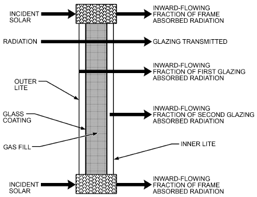

*Fig. 15 Components of Solar Radiant Heat Gain with Double-Pane Fenestration, Including Both Frame and Glazing Contributions*

The solar heat gain coefficient of the fenestration system can be calculated while accounting for solar gain through the opaque elements by area-weighting the solar heat gain coefficients of the glazing, frame, and M divider elements. Thus,

> SHGC = (SHGC<sub>g</sub>A<sub>g</sub>+ SHGC<sub>f</sub>A<sub>f</sub>+ <sup>M</sup> A<sub>i</sub>SHGC<sub>i</sub> ∑<sub>i=1</sub>)/(M A + A + A g f ∑ i i=1)&emsp;**(17)**

where SHGC<sub>g</sub>, SHGC<sub>f</sub>, and SHGC<sub>i</sub> are the solar heat gain coefficients of the glazed area, frame, and ith divider, respectively. A<sub>g</sub>, A<sub>f</sub>, and A<sub>i</sub> are the corresponding projected areas.

In some cases, it is useful to have an overall SHGC for the opaque elements only, which is defined by

> M
>
> SHGC A + A SHGC

> SHGC<sub>op</sub> = (f f ∑ i i i=1)/(A op)&emsp;**(18)**

where

> M
>
> ∑ i

> A<sub>op</sub> = A<sub>f</sub>+ A
>
> i=1

SHGC<sub>f</sub> can be estimated (ISO Standard 15099:2003; Wright 1995b) using

> (U<sub>f</sub>)( )
>
> SHGC<sub>f</sub> = α<sup>s</sup><sub>f</sub> ----- A<sub>f</sub>/(A surf)&emsp;**(19)**

> (h<sub>f</sub>)( )
>
> s

where α is the solar absorptance of the outdoor surface of the f frame, U<sub>f</sub> is the frame U-factor, and h<sub>f</sub> is the heat transfer coefficient (radiative plus convective) between the frame and the outdoor environment. The projected-to-surface area ratio (A<sub>f</sub>/A<sub>surf</sub>) corrects for the fact that U<sub>f</sub> is based on projected area A<sub>f</sub>, whereas h<sub>f</sub> is based on the exposed outdoor frame surface area A<sub>surf</sub>. SHGC<sub>i</sub> can be calculated in the same way:

> (U<sub>i</sub>)( A<sub>i</sub> )
>
> SHGC<sub>i</sub> = α<sub>i</sub><sup>s</sup> ----- ---------------&emsp;**(20)**

> h A
>
> ( i )( surf, i)

<!-- str. 373 -->

The outdoor-side heat transfer coefficients h<sub>f</sub> and h<sub>i</sub> can be estimated using

> h<sub>f</sub> or h<sub>i</sub> = h<sub>co</sub>+ 4σe<sub>f</sub> t<sub>o</sub><sup>3</sup><sub>ut</sub>&emsp;**(21)**

where h<sub>co</sub> is the convective heat transfer coefficient between the frame (or divider) surface and the outdoor environment, e<sub>f</sub> is the emissivity (long-wave) of the outdoor frame (or divider) surface, t<sub>out</sub> is the outdoor temperature, and σ is the Stefan-Boltzmann constant.

**Solar Heat Gain Coefficient, Visible Transmittance, and**

### Spectrally Averaged Solar-Optical Property Values

Table 10 lists visible transmittance, solar transmittance, front and back reflectance, and solar heat gain coefficients for common glazing and window systems. The ID number for each entry in Table 10 refers to an ID number in Table 4, and the window systems therefore include windows with aluminum or metal frames and windows with other frames that have a lower conductivity (e.g., thermally broken aluminum, wood, vinyl, and fiberglass). As can be seen in Table 10, total window solar heat gain coefficient varies with type of operator, size of fenestration product, and type of frame.

The glazing T<sub>v</sub>, T<sub>sol</sub>, R<sup>f</sup>, R<sup>b</sup>, and SHGC values have been calculated using manufacturers’ spectral data following methods described in Finlayson and Arasteh (1993) and Wright (1995b), and using the 1.5 air mass spectrum found in ASTM Standard G173. Glazing values are given for 3 and 6 mm glass and vary with glass thickness and manufacturer. Values shown are averages and may vary by ±0.05. It is recommended that actual values be determined using detailed spectral data from NFRC (2014b). The front reflectance is that of the unit to the outdoors, and the back reflectance is that to the room side.

Visible transmittances are provided in Table 10 for center-glazing values at normal incidence and for total window values at normal incidence. A rule of thumb is to select a glazing unit whose visible transmittance is 1.5 to 2.0 times greater than its solar heat gain coefficient, especially if daylighting strategies will be used in the building. For maximum light with minimum solar gain, some fenestration products have visible transmittances 2.5 times their SHGCs. For energy calculations on a daylit building, visible transmittance for the entire window should be used. The visible transmittance of a window can be calculated by multiplying the fraction of glazing area by the center-glazing visible transmittance.

Solar heat gain coefficients are provided for center-glazing and total window values. Center-glazing solar heat gain coefficients are given at normal incidence (0°) and at 40°, 50°, 60°, 70°, and 80° incidence angles. For angles other than those listed, straight-line interpolation can be used between the two closest angles for which values are shown. Total window solar heat gain coefficients assume normal incidence. The operable and fixed window sizes in Table 4 were used. To calculate the frame area, frame heights shown in Figure 4 for aluminum and aluminum-clad wood/wood/vinyl were used. The frame area for aluminum windows is 11% for operable size, and 10% for fixed. The frame area for other frames is 20% for the operable size and 12% for fixed. The ratio of projected frame dimension (PFD) to frame surface area is assumed to be 1.0, based on Wright (1995b). In reality, for most frames this ratio is in the range 0.7 to 0.9, because frames cannot simultaneously be flush with both outdoor and indoor glass surfaces. The PFD is defined by the sight line, which is the intersection of the opaque frame (which could be indoors or outdoors) and the vision area.

Frame solar heat gain coefficients used to determine the total window solar heat gain coefficients are calculated according to the section on Solar Gain Through Frame and Other Opaque Elements. Frame U-factors are taken from Table 1. Frame absorptance is assumed to be 0.5 (this is the default NFRC value for commercial frames; however, note that NFRC procedures stipulate 0.3 for residential frames). The outdoor convective film coefficient is 15 W/(m<sup>2</sup>·K), corresponding to a wind speed of 2.8 m/s. For the aluminum window, the frame solar heat gain coefficient is 0.14 for the operable window and 0.11 for the fixed. For the other frames, the frame solar heat gain coefficient varies between 0.02 and 0.07 for the various lower-conductivity frame types. A frame solar heat gain coefficient of 0.04 is used for the operable window, and 0.03 for the fixed. These values correspond directly to the aluminum-clad wood/reinforced vinyl frames.

Solar transmittances and front and back reflectances are also center-glazing values and are given at normal incidence (0°) and at 40°, 50°, 60°, 70°, and 80° incidence angles. The effective inward-flowing fraction of absorbed radiation for the entire system (not layer-specific values) can be determined from Equation (9) by inserting the solar transmittance and corresponding SHGC.

**Example 5.** Estimate the overall visible light transmittance for an operable wood casement window with clear, uncoated 6 mm double glazing. The operable window has 27% frame area with a wood frame.

**Solution:** The center-glazing visible light transmittance is 0.78 (see Table 10, glazing ID = 5b, first column). The overall visible light transmittance is

> T<sub>v</sub> = 0.27(0) + 0.73(0.78) = 0.57

### Airflow Windows

If properly managed, airflow between panes of a double-glazed window can improve fenestration performance. In normal use, a venetian blind is located between the glazing layers. Ventilation air from the room enters the double-glazed cavity, flows over the blind, and can be exhausted from the building or returned through the ducts to the central HVAC system.

These systems can control window heat transfer under many different operating conditions. During sunny winter days, the blind acts as a solar air collector; heat removed by the moving air can be used elsewhere in the building. Furthermore, the window acts as a heat exchanger when sunlit so that the indoor glazing temperature nearly equals the room air temperature and improves thermal comfort (also see the section on Occupant Comfort and Acceptance). In the summer, the window can have a very low solar heat gain coefficient if the blinds are appropriately placed, because the majority of solar gains are removed from the window.

Brandle and Boehm (1982) and Sodergren and Bostrom (1971) give details on airflow windows.

### Skylights

Skylight solar heat gain strongly depends on the configuration of the space below or adjacent to (i.e., in sloped applications) the skylight formed by the skylight curb and any associated light well.

Five aspects must be considered: (1) transmittance and absorptance of the skylight unit, (2) transmitted solar flux that reaches the aperture of the light well, (3) whether that aperture is covered by a diffuser, (4) transmitted solar flux that strikes the walls of the light well, and (5) reflectance of the walls of the light well. Data for flat skylights, which may be considered as sloped glazings, are found in Tables 4 and 11.

The following categories of skylights all admit daylight from the roof plane but differ markedly in their design.

**Domed Skylights.** Solar and total heat gains for domed skylights can be determined by the same procedure used for windows. Table 11 gives SHGCs for plastic domed skylights at normal incidence (Shutrum and Ozisik 1961). Manufacturers’ literature has further details. Given the poorly defined incident angle conditions for domed skylights, it is best to use these values without correction for incident angle, together with the correct (angle-dependent) value of incident solar irradiance. Results should be considered approximate. In the absence of other data, these values may also be used to make estimates for skylights on slanted roofs.

<!-- str. 374 -->

**Table 10 Visible Transmittance T , Solar Heat Gain Coefficient (SHGC), Solar Transmittance T, Front Reflectance R , f b Back Reflectance R , and Layer Absorptance A for Glazing and Window Systems**

```text
                                                                                                                                    f
                                          v
                                                                           n
                                                                                               Total Window SHGC      Total Window T_v at
                                                          Center-of-Glazing Properties         at Normal Incidence     Normal Incidence
                                                                                                           Other                  Other
             Glazing System                                     Incidence Angles              Aluminum     Frames    Aluminum    Frames
     Glass                          Center
     Thick.,                        Glazing
ID   mm                             T_v
Uncoated Single Glazing
 1a  3       CLR                    0.90   SHGC     0.86  0.84  0.82   0.78  0.67  0.42 0.78   0.78 0.79  0.70 0.76  0.80 0.81  0.72 0.79
                                           T        0.83  0.82  0.80   0.75  0.64  0.39 0.75
                                           R^f      0.08  0.08  0.10   0.14  0.25  0.51 0.14
                                           R^b      0.08  0.08  0.10   0.14  0.25  0.51 0.14
                                           A_1^f    0.09  0.10  0.10   0.11  0.11  0.11 0.10
 1b  6       CLR                    0.88   SHGC     0.81  0.80  0.78   0.73  0.62  0.39 0.73   0.74 0.74  0.66 0.72  0.78 0.79  0.70 0.77
                                           T        0.77  0.75  0.73   0.68  0.58  0.35 0.69
                                           R^f      0.07  0.08  0.09   0.13  0.24  0.48 0.13
                                           R^b      0.07  0.08  0.09   0.13  0.24  0.48 0.13
                                           A_1^f    0.16  0.17  0.18   0.19  0.19  0.17 0.17
 1c  3       BRZ                    0.68   SHGC     0.73  0.71  0.68   0.64  0.55  0.34 0.65   0.67 0.67  0.59 0.65  0.61 0.61  0.54 0.60
                                           T        0.65  0.62  0.59   0.55  0.46  0.27 0.56
                                           R^f      0.06  0.07  0.08   0.12  0.22  0.45 0.12
                                           R^b      0.06  0.07  0.08   0.12  0.22  0.45 0.12
                                           A_1^f    0.29  0.31  0.32   0.33  0.33  0.29 0.31
 1d  6       BRZ                    0.54   SHGC     0.62  0.59  0.57   0.53  0.45  0.29 0.54   0.57 0.57  0.50 0.55  0.48 0.49  0.43 0.48
                                           T        0.49  0.45  0.43   0.39  0.32  0.18 0.41
                                           R^f      0.05  0.06  0.07   0.11  0.19  0.42 0.10
                                           R^b      0.05  0.68  0.66   0.62  0.53  0.33 0.10
                                           A_1^f    0.46  0.49  0.50   0.51  0.49  0.41 0.48
 1e  3       GRN                    0.82   SHGC     0.70  0.68  0.66   0.62  0.53  0.33 0.63   0.64 0.64  0.57 0.62  0.73 0.74  0.66 0.72
                                           T        0.61  0.58  0.56   0.52  0.43  0.25 0.53
                                           R^f      0.06  0.07  0.08   0.12  0.21  0.45 0.11
                                           R^b      0.06  0.07  0.08   0.12  0.21  0.45 0.11
                                           A_1^f    0.33  0.35  0.36   0.37  0.36  0.31 0.35
 1f  6       GRN                    0.76   SHGC     0.60  0.58  0.56   0.52  0.45  0.29 0.54   0.55 0.55  0.49 0.53  0.68 0.68  0.61 0.67
                                           T        0.47  0.44  0.42   0.38  0.32  0.18 0.40
                                           R^f      0.05  0.06  0.07   0.11  0.20  0.42 0.10
                                           R^b      0.05  0.06  0.07   0.11  0.20  0.42 0.10
                                           A_1^f    0.47  0.50  0.51   0.51  0.49  0.40 0.49
 1g  3       GRY                    0.62   SHGC     0.70  0.68  0.66   0.61  0.53  0.33 0.63   0.64 0.64  0.57 0.62  0.55 0.56  0.50 0.55
                                           T        0.61  0.58  0.56   0.51  0.42  0.24 0.53
                                           R^f      0.06  0.07  0.08   0.12  0.21  0.44 0.11
                                           R^b      0.06  0.07  0.08   0.12  0.21  0.44 0.11
                                           A_1^f    0.33  0.36  0.37   0.37  0.37  0.32 0.35
 1h  6       GRY                    0.46   SHGC     0.59  0.57  0.55   0.51  0.44  0.28 0.52   0.54 0.54  0.48 0.52  0.41 0.41  0.37 0.40
                                           T        0.46  0.42  0.40   0.36  0.29  0.16 0.38
                                           R^f      0.05  0.06  0.07   0.10  0.19  0.41 0.10
                                           R^b      0.05  0.06  0.07   0.10  0.19  0.41 0.10
                                           A_1^f    0.49  0.52  0.54   0.54  0.52  0.43 0.51
 1i  6       BLUGRN                 0.75   SHGC     0.62  0.59  0.57   0.54  0.46  0.30 0.55   0.57 0.57  0.50 0.55  0.67 0.68  0.60 0.66
                                           T        0.49  0.46  0.44   0.40  0.33  0.19 0.42
                                           R^f      0.06  0.06  0.07   0.11  0.20  0.43 0.11
                                           R^b      0.06  0.06  0.07   0.11  0.20  0.43 0.11
                                           A_1^f    0.45  0.48  0.49  0.49   0.47  0.38 0.48
Reflective Single Glazing
 1j  6       SS on CLR 8%           0.08   SHGC     0.19  0.19  0.19   0.18  0.16  0.10 0.18   0.18 0.18  0.16 0.17  0.07 0.07  0.06 0.07
                                           T        0.06  0.06  0.06   0.05  0.04  0.03 0.05
                                           R^f      0.33  0.34  0.35   0.37  0.44  0.61 0.36
                                           R^b      0.50  0.50  0.51   0.53  0.58  0.71 0.52
                                           A_1^f    0.61  0.61  0.60   0.58  0.52  0.37 0.57
 1k  6       SS on CLR 14%          0.14   SHGC     0.25  0.25  0.24   0.23  0.20  0.13 0.23   0.24 0.24  0.21 0.22  0.12 0.13  0.11 0.12
                                           T        0.11  0.10  0.10   0.09  0.07  0.04 0.09
                                           R^f      0.26  0.27  0.28   0.31  0.38  0.57 0.30
                                           R^b      0.44  0.44  0.45   0.47  0.52  0.67 0.46
                                           A_1^f    0.63  0.63  0.62  0.60   0.55  0.39 0.60
```

```text
             Incidence Angles
```

<!-- str. 375 -->

**Table 10 Visible Transmittance T , Solar Heat Gain Coefficient (SHGC), Solar Transmittance T, Front Reflectance R , b f Back Reflectance R , and Layer Absorptance A for Glazing and Window Systems (Continued)**

```text
                                                                                                                                    f
                                          v
                                                                     n
                                                                                               Total Window SHGC      Total Window T_v at
                                                          Center-of-Glazing Properties         at Normal Incidence     Normal Incidence
                                                                                                           Other                  Other
             Glazing System                                     Incidence Angles              Aluminum     Frames    Aluminum    Frames
     Glass                          Center
     Thick.,                        Glazing
ID   mm                             T_v
 1l  6       SS on CLR 20%          0.20   SHGC     0.31  0.30  0.30  0.28  0.24  0.16  0.28   0.29 0.29  0.26 0.28  0.18 0.18  0.16 0.18
                                           T        0.15  0.15   0.14  0.13  0.11  0.06 0.13
                                           R^f      0.21  0.22   0.23  0.26  0.34  0.54 0.25
                                           R^b      0.38  0.38   0.39  0.41  0.48  0.64 0.41
                                           A_1^f    0.64  0.64  0.63  0.61   0.56 0.40  0.60
1m   6       SS on GRN 14%          0.12   SHGC     0.25   0.25  0.24  0.23  0.21  0.14  0.23  0.24 0.24  0.21 0.22  0.11 0.11  0.10 0.11
                                           T        0.06  0.06   0.06  0.06  0.04  0.03 0.06
                                           R^f      0.14  0.14   0.16  0.19  0.27  0.49 0.18
                                           R^b      0.44  0.44   0.45  0.47  0.52  0.67 0.46
                                           A_1^f    0.80  0.80   0.78  0.76  0.68  0.48 0.75
 1n  6       TI on CLR 20%          0.20   SHGC     0.29  0.29   0.28  0.27  0.23  0.15 0.27   0.27 0.27  0.24 0.26  0.18 0.18  0.16 0.18
                                           T        0.14  0.13   0.13  0.12  0.09  0.06 0.12
                                           R^f      0.22  0.22   0.24  0.26  0.34  0.54 0.26
                                           R^b      0.40  0.40   0.42  0.44  0.50  0.65 0.43
                                           A_1^f    0.65  0.65   0.64  0.62  0.57  0.40 0.62
 1o  6       TI on CLR 30%          0.30   SHGC     0.39  0.38   0.37  0.35  0.30  0.20 0.35   0.36 0.36  0.32 0.35  0.27 0.27  0.24 0.26
                                           T        0.23  0.22   0.21  0.19  0.16  0.09 0.20
                                           R^f      0.15  0.15   0.17  0.20  0.28  0.50 0.19
                                           R^b      0.32  0.33   0.34  0.36  0.43  0.60 0.36
                                           A_1^f    0.63  0.65   0.64  0.62  0.57  0.40 0.62
Uncoated Double Glazing
 5a  3       CLR CLR                0.81   SHGC     0.76  0.74   0.71  0.64  0.50  0.26 0.66   0.69 0.70  0.62 0.67  0.72 0.73  0.65 0.71
                                           T        0.70  0.68   0.65  0.58  0.44  0.21 0.60
                                           R^f      0.13  0.14   0.16  0.23  0.36  0.61 0.21
                                           R^b      0.13  0.14   0.16  0.23  0.36  0.61 0.21
                                           A_1^f    0.10  0.11   0.11  0.12  0.13  0.13 0.11
                                           A^f_2    0.07  0.08   0.08  0.08  0.07  0.05 0.07
 5b  6       CLR CLR                0.78   SHGC     0.70  0.67   0.64  0.58  0.45  0.23 0.60   0.64 0.64  0.57 0.62  0.69 0.70  0.62 0.69
                                           T        0.61  0.58   0.55  0.48  0.36  0.17 0.51
                                           R^f      0.11  0.12   0.15  0.20  0.33  0.57 0.18
                                           R^b      0.11  0.12   0.15  0.20  0.33  0.57 0.18
                                           A_1^f    0.17  0.18   0.19  0.20  0.21  0.20 0.19
                                           A^f_2    0.11  0.12   0.12  0.12  0.10  0.07 0.11
 5c  3       BRZ CLR                0.62   SHGC     0.62  0.60   0.57  0.51  0.39  0.20 0.53   0.57 0.57  0.50 0.55  0.55 0.56  0.50 0.55
                                           T        0.55  0.51   0.48  0.42  0.31  0.14 0.45
                                           R^f      0.09  0.10   0.12  0.16  0.27  0.49 0.15
                                           R^b      0.12  0.13   0.15  0.21  0.35  0.59 0.19
                                           A_1^f    0.30  0.33   0.34  0.36  0.37  0.34 0.33
                                           A^f_2    0.06  0.06   0.06  0.06  0.05  0.03 0.06
 5d  6       BRZ CLR                0.47   SHGC     0.49  0.46   0.44  0.39  0.31  0.17 0.41   0.45 0.45  0.40 0.43  0.42 0.42  0.38 0.41
                                           T        0.38  0.35   0.32  0.27  0.20  0.08 0.30
                                           R^f      0.07  0.08   0.09  0.13  0.22  0.44 0.12
                                           R^b      0.10  0.11   0.13  0.19  0.31  0.55 0.17
                                           A_1^f    0.48  0.51   0.52  0.53  0.53  0.45 0.50
                                           A^f_2    0.07  0.07   0.07  0.07  0.06  0.04 0.07
 5e  3       GRN CLR                0.75   SHGC     0.60  0.57   0.54  0.49  0.38  0.20 0.51   0.55 0.55  0.49 0.53  0.67 0.68  0.60 0.66
                                           T        0.52  0.49   0.46  0.40  0.30  0.13 0.43
                                           R^f      0.09  0.10   0.12  0.16  0.27  0.50 0.15
                                           R^b      0.12  0.13   0.15  0.21  0.35  0.60 0.19
                                           A_1^f    0.34  0.37   0.38  0.39  0.39  0.35 0.37
                                           A^f_2    0.05  0.05   0.05  0.04  0.04  0.03 0.04
 5f  6       GRN CLR                0.68   SHGC     0.49  0.46   0.44  0.39  0.31  0.17 0.41   0.45 0.45  0.40 0.43  0.61 0.61  0.54 0.60
                                           T        0.39  0.36   0.33  0.29  0.21  0.09 0.31
                                           R^f      0.08  0.08   0.10  0.14  0.23  0.45 0.13
                                           R^b      0.10  0.11   0.13  0.19  0.31  0.55 0.17
                                           A_1^f    0.49  0.51   0.05  0.53  0.52  0.43 0.50
                                           A^f_2    0.05  0.05  0.05  0.05   0.04 0.03  0.05
```

```text
             Incidence Angles
```

<!-- str. 376 -->

**Table 10 Visible Transmittance T , Solar Heat Gain Coefficient (SHGC), Solar Transmittance T, Front Reflectance R , f b Back Reflectance R , and Layer Absorptance A for Glazing and Window Systems (Continued)**

```text
                                                                                                                                    f
                                          v
                                                                     n
                                                                                               Total Window SHGC      Total Window T_v at
                                                          Center-of-Glazing Properties         at Normal Incidence     Normal Incidence
                                                                                                           Other                  Other
             Glazing System                                     Incidence Angles              Aluminum     Frames    Aluminum    Frames
     Glass                          Center
     Thick.,                        Glazing
ID   mm                             T_v
 5g  3       GRY CLR                0.56   SHGC     0.60  0.57  0.54  0.48  0.37  0.20  0.51   0.55 0.55  0.49 0.53  0.50 0.50  0.45 0.49
                                           T        0.51  0.48  0.45   0.39  0.29  0.12 0.42
                                           R^f      0.09  0.09  0.11   0.16  0.26  0.48 0.14
                                           R^b      0.12  0.13  0.15   0.21  0.34  0.59 0.19
                                           A_1^f    0.34  0.37  0.39   0.40  0.41  0.37 0.37
                                           A^f_2    0.05  0.06  0.06   0.05  0.05  0.03 0.05
 5h  6       GRY CLR                0.41   SHGC     0.47  0.44  0.42   0.37  0.29  0.16 0.39   0.43 0.43  0.38 0.42  0.36 0.37  0.33 0.36
                                           T        0.36  0.32  0.29   0.25  0.18  0.07 0.28
                                           R^f      0.07  0.07  0.08   0.12  0.21  0.43 0.12
                                           R^b      0.10  0.11  0.13   0.18  0.31  0.55 0.17
                                           A_1^f    0.51  0.54  0.56   0.57  0.56  0.47 0.53
                                           A^f_2    0.07  0.07  0.07  0.06   0.05  0.03 0.06
 5i  6       BLUGRN CLR             0.67   SHGC     0.50  0.47  0.45  0.40  0.32  0.17  0.43   0.46 0.46  0.41 0.44  0.60 0.60  0.54 0.59
                                           T        0.40  0.37  0.34   0.30  0.22  0.10 0.32
                                           R^f      0.08  0.08  0.10   0.14  0.24  0.46 0.13
                                           R^b      0.11  0.11  0.14   0.19  0.31  0.55 0.17
                                           A_1^f    0.47  0.49  0.50   0.51  0.50  0.42 0.48
                                           A^f_2    0.06  0.06  0.06   0.05  0.04  0.03 0.05
 5j  6       HI-P GRN CLR           0.59   SHGC     0.39  0.37  0.35   0.31  0.25  0.14 0.33   0.36 0.36  0.32 0.35  0.53 0.53  0.47 0.52
                                           T        0.28  0.26  0.24   0.20  0.15  0.06 0.22
                                           R^f      0.06  0.07  0.08   0.12  0.21  0.43 0.11
                                           R^b      0.10  0.11  0.13   0.19  0.31  0.55 0.17
                                           A_1^f    0.62  0.65  0.65   0.65  0.62  0.50 0.63
                                           A^f_2    0.03  0.03  0.03   0.03  0.02  0.01 0.03
Reflective Double Glazing
 5k  6       SS on CLR 8%, CLR      0.07   SHGC     0.13  0.12  0.12  0.11   0.10  0.06 0.11   0.13 0.13  0.11 0.12  0.06 0.06  0.06 0.06
                                           T        0.05  0.05  0.04  0.04   0.03  0.01 0.04
                                           R^f      0.33  0.34  0.35  0.37   0.44  0.61 0.37
                                           R^b      0.38  0.37  0.38  0.40   0.46  0.61 0.40
                                           A_1^f    0.61  0.61  0.60  0.58   0.53  0.37 0.56
                                           A^f_2    0.01  0.01  0.01  0.01   0.01  0.01 0.01
 5l  6       SS on CLR 14%, CLR     0.13   SHGC     0.17  0.17  0.16  0.15   0.13  0.08 0.16   0.17 0.16  0.14 0.15  0.12 0.12  0.10 0.11
                                           T        0.08  0.08  0.08  0.07   0.05  0.02 0.07
                                           R^f      0.26  0.27  0.28  0.31   0.38  0.57 0.30
                                           R^b      0.34  0.33  0.34  0.37   0.44  0.60 0.36
                                           A_1^f    0.63  0.64  0.64  0.63   0.61  0.56 0.60
                                           A^f_2    0.02  0.02  0.02  0.02   0.02  0.02 0.02
5m   6       SS on CLR 20%, CLR     0.18   SHGC     0.22  0.21  0.21  0.19   0.16  0.09 0.20   0.21 0.21  0.18 0.20  0.16 0.16  0.14 0.16
                                           T        0.12  0.11  0.11  0.09   0.07  0.03 0.10
                                           R^f      0.21  0.22  0.23  0.26   0.34  0.54 0.25
                                           R^b      0.30  0.30  0.31  0.34   0.41  0.59 0.33
                                           A_1^f    0.64  0.64  0.63  0.62   0.57  0.41 0.61
                                           A^f_2    0.03  0.03  0.03  0.03   0.02  0.02 0.03
 5n  6       SS on GRN 14%, CLR     0.11   SHGC     0.16  0.16  0.15  0.14   0.12  0.08 0.14   0.16 0.16  0.14 0.14  0.10 0.10  0.09 0.10
                                           T        0.05  0.05  0.05  0.04   0.03  0.01 0.04
                                           R^f      0.14  0.14  0.16  0.19   0.27  0.49 0.18
                                           R^b      0.34  0.33  0.34  0.37   0.44  0.60 0.36
                                           A_1^f    0.80  0.80  0.79  0.76   0.69  0.49 0.76
                                           A^f_2    0.01  0.01  0.01  0.01   0.01  0.01 0.01
 5o  6       TI on CLR 20%, CLR     0.18   SHGC     0.21  0.20  0.19  0.18   0.15  0.09 0.18   0.20 0.20  0.18 0.19  0.16 0.16  0.14 0.16
                                           T        0.11  0.10  0.10  0.08   0.06  0.03 0.09
                                           R^f      0.22  0.22  0.24  0.27   0.34  0.54 0.26
                                           R^b      0.32  0.31  0.32  0.35   0.42  0.59 0.35
                                           A_1^f    0.65  0.66  0.65  0.63   0.58  0.41 0.62
                                           A^f_2    0.02  0.02  0.02  0.02   0.02  0.01 0.02
 5p  6       TI on CLR 30%, CLR     0.27   SHGC     0.29  0.28  0.27  0.25   0.20  0.12 0.25   0.27 0.27  0.24 0.26  0.24 0.24  0.22 0.24
                                           T        0.18  0.17  0.16  0.14   0.10  0.05 0.15
                                           R^f      0.15  0.15  0.17  0.20   0.29  0.51 0.19
                                           R^b      0.27  0.27  0.28  0.31   0.40  0.58 0.31
                                           A_1^f    0.64  0.64  0.63  0.62   0.58  0.43 0.61
                                           A^f_2    0.04  0.04  0.04  0.04   0.03  0.02 0.04
```

```text
             Incidence Angles
```

<!-- str. 377 -->

**Table 10 Visible Transmittance T , Solar Heat Gain Coefficient (SHGC), Solar Transmittance T, Front Reflectance R , b f Back Reflectance R , and Layer Absorptance A for Glazing and Window Systems (Continued)**

```text
                                                                                                                                    f
                                          v
                                                                     n
                                                                                               Total Window SHGC      Total Window T_v at
                                                          Center-of-Glazing Properties         at Normal Incidence     Normal Incidence
                                                                                                           Other                  Other
             Glazing System                                     Incidence Angles              Aluminum     Frames    Aluminum    Frames
     Glass                          Center
     Thick.,                        Glazing
ID   mm                             T_v
Low-e Double Glazing, e = 0.2 on surface 2
17a  3       LE CLR                 0.76   SHGC     0.65  0.64  0.61  0.56   0.43 0.23  0.57   0.59 0.60  0.53 0.58  0.68 0.68  0.61 0.67
                                           T        0.59  0.56  0.54  0.48   0.36 0.18  0.50
                                           R^f      0.15  0.16  0.18  0.24   0.37 0.61  0.22
                                           R^b      0.17  0.18  0.20  0.26   0.38 0.61  0.24
                                           A_1^f    0.20  0.21  0.21  0.21   0.20 0.16  0.20
                                           A^f_2    0.07  0.07  0.08  0.08   0.07 0.05  0.07
17b  6       LE CLR                 0.73   SHGC     0.60  0.59  0.57  0.51   0.40 0.21  0.53   0.55 0.55  0.49 0.53  0.65 0.66  0.58 0.64
                                           T        0.51  0.48  0.46  0.41   0.30 0.14  0.43
                                           R^f      0.14  0.15  0.17  0.22   0.35 0.59  0.21
                                           R^b      0.15  0.16  0.18  0.23   0.35 0.57  0.22
                                           A_1^f    0.26  0.26  0.26  0.26   0.25 0.19  0.25
                                           A^f_2    0.10  0.11  0.11  0.11   0.10 0.07  0.10
Low-e Double Glazing, e = 0.2 on surface 3
17c  3       CLR LE                 0.76   SHGC     0.70  0.68  0.65  0.59   0.46 0.24  0.61   0.64 0.64  0.57 0.62  0.68 0.68  0.1  0.67
                                           T        0.59  0.56  0.54  0.48   0.36 0.18  0.50
                                           R^f      0.17  0.18  0.20  0.26   0.38 0.61  0.24
                                           R^b      0.15  0.16  0.18  0.24   0.37 0.61  0.22
                                           A_1^f    0.11  0.12  0.13  0.13   0.14 0.15  0.12
                                           A^f_2    0.14  0.14  0.14  0.13   0.11 0.07  0.13
17d  6       CLR LE                 0.73   SHGC     0.65  0.63  0.60  0.54   0.42 0.21  0.56   0.59 0.60  0.53 0.58  0.65 0.66  0.58 0.64
                                           T        0.51  0.48  0.46  0.41   0.30 0.14  0.43
                                           R^f      0.15  0.16  0.18  0.23   0.35 0.57  0.22
                                           R^b      0.14  0.15  0.17  0.22   0.35 0.59  0.21
                                           A_1^f    0.17  0.19  0.20  0.21   0.22 0.22  0.19
                                           A^f_2    0.17  0.17  0.17  0.15   0.13 0.07  0.16
17e  3       BRZ LE                 0.58   SHGC     0.57  0.54  0.51  0.46   0.35 0.18  0.48   0.52 0.52  0.46 0.51  0.52 0.52  0.46 0.51
                                           T        0.46  0.43  0.41  0.36   0.26 0.12  0.38
                                           R^f      0.12  0.12  0.14  0.18   0.28 0.50  0.17
                                           R^b      0.14  0.15  0.17  0.23   0.35 0.60  0.21
                                           A_1^f    0.31  0.34  0.35  0.37   0.38 0.35  0.34
                                           A^f_2    0.11  0.11  0.10  0.10   0.08 0.04  0.10
17f  6       BRZ LE                 0.45   SHGC     0.45  0.42  0.40  0.35   0.27 0.14  0.38   0.42 0.42  0.37 0.40  0.40 0.41  0.36 0.40
                                           T        0.33  0.30  0.28  0.24   0.17 0.07  0.26
                                           R^f      0.09  0.09  0.10  0.14   0.23 0.44  0.13
                                           R^b      0.13  0.14  0.16  0.21   0.34 0.58  0.20
                                           A_1^f    0.48  0.51  0.52  0.54   0.53 0.45  0.50
                                           A^f_2    0.11  0.11  0.10  0.09   0.07 0.04  0.09
17g  3       GRN LE                 0.70   SHGC     0.55  0.52  0.50  0.44   0.34 0.17  0.46   0.50 0.51  0.45 0.49  0.62 0.63  0.56 0.62
                                           T        0.44  0.41  0.38  0.33   0.24 0.11  0.36
                                           R^f      0.11  0.11  0.13  0.17   0.27 0.48  0.16
                                           R^b      0.14  0.15  0.17  0.23   0.35 0.60  0.21
                                           A_1^f    0.35  0.38  0.39  0.41   0.42 0.37  0.38
                                           A^f_2    0.11  0.10  0.10  0.09   0.07 0.04  0.09
17h  6       GRN LE                 0.61   SHGC     0.41  0.39   0.36  0.32  0.25  0.13 0.34   0.38 0.38  0.34 0.36  0.54 0.55  0.49 0.54
                                           T        0.29  0.26   0.24  0.21  0.15  0.06 0.23
                                           R^f      0.08  0.08   0.09  0.13  0.22  0.43 0.13
                                           R^b      0.13  0.14   0.16  0.21  0.34  0.58 0.20
                                           A_1^f    0.53  0.57   0.58  0.59  0.58  0.48 0.56
                                           A^f_2    0.10  0.09   0.09  0.08  0.06  0.03 0.08
17i  3       GRY LE                 0.53   SHGC     0.54  0.51   0.49  0.44  0.33  0.17 0.46   0.50 0.50  0.44 0.48  0.47 0.48  0.42 0.47
                                           T        0.43  0.40   0.38  0.33  0.24  0.11 0.35
                                           R^f      0.11  0.11   0.13  0.17  0.27  0.48 0.16
                                           R^b      0.14  0.15   0.17  0.22  0.35  0.60 0.21
                                           A_1^f    0.36  0.39   0.40  0.42  0.42  0.38 0.39
                                           A^f_2    0.10  0.10   0.10  0.09  0.07  0.04 0.09
```

```text
             Incidence Angles
```

<!-- str. 378 -->

**Table 10 Visible Transmittance T , Solar Heat Gain Coefficient (SHGC), Solar Transmittance T, Front Reflectance R , f b Back Reflectance R , and Layer Absorptance A for Glazing and Window Systems (Continued)**

```text
                                                                                                                                    f
                                          v
                                                                     n
                                                                                               Total Window SHGC      Total Window T_v at
                                                          Center-of-Glazing Properties         at Normal Incidence     Normal Incidence
                                                                                                           Other                  Other
             Glazing System                                     Incidence Angles              Aluminum     Frames    Aluminum    Frames
     Glass                          Center
     Thick.,                        Glazing
ID   mm                             T_v
17j  6       GRY LE                 0.37   SHGC     0.39   0.37  0.35  0.31  0.24  0.13  0.33  0.36 0.36  0.32 0.35  0.33 0.33  0.30 0.33
                                           T        0.27  0.25  0.23  0.20   0.14  0.06 0.21
                                           R^f      0.09  0.09  0.11  0.14   0.23  0.44 0.14
                                           R^b      0.13  0.14  0.16  0.22   0.34  0.58 0.20
                                           A_1^f    0.55  0.58  0.59  0.59   0.58  0.48 0.56
                                           A^f_2    0.09  0.09  0.08  0.07   0.06  0.03 0.08
17k  6       BLUGRN LE              0.62   SHGC     0.45  0.42  0.40   0.35  0.27  0.14 0.37   0.42 0.42  0.37 0.40  0.55 0.56  0.50 0.55
                                           T        0.32  0.29  0.27   0.23  0.17  0.07 0.26
                                           R^f      0.09  0.09  0.10   0.14  0.23  0.44 0.13
                                           R^b      0.13  0.14  0.16   0.21  0.34  0.58 0.20
                                           A_1^f    0.48  0.51  0.53   0.54  0.54  0.45 0.51
                                           A^f_2    0.11  0.10  0.10   0.09  0.07  0.03 0.09
17l  6       HI-P GRN LE            0.55   0.241    0.34  0.31  0.30   0.26  0.20  0.11 0.28   0.32 0.32  0.28 0.30  0.49 0.50  0.44 0.48
                                           T        0.22  0.19  0.18   0.15  0.10  0.04 0.17
                                           R^f      0.07  0.07  0.08   0.11  0.20  0.41 0.11
                                           R^b      0.13  0.14  0.16   0.21  0.33  0.58 0.20
                                           A_1^f    0.64  0.67  0.68   0.68  0.66  0.53 0.65
                                           A^f_2    0.08  0.07  0.06   0.06  0.04  0.02 0.06
Low-e Double Glazing, e = 0.1 on surface 2
21a  3       LE CLR                 0.76   SHGC     0.65  0.64  0.62   0.56  0.43  0.23 0.57   0.59 0.60  0.53 0.58  0.68 0.68  0.61 0.67
                                           T        0.59  0.56  0.54   0.48  0.36  0.18 0.50
                                           R^f      0.15  0.16  0.18   0.24  0.37  0.61 0.22
                                           R^b      0.17  0.18  0.20   0.26  0.38  0.61 0.24
                                           A_1^f    0.20  0.21  0.21   0.21  0.20  0.16 0.20
                                           A^f_2    0.07  0.07  0.08   0.08  0.07  0.05 0.07
21b  6       LE CLR                 0.72   SHGC     0.60  0.59  0.57   0.51  0.40  0.21 0.53   0.55 0.55  0.49 0.53  0.64 0.65  0.58 0.63
                                           T        0.51  0.48  0.46   0.41  0.30  0.14 0.43
                                           R^f      0.14  0.15  0.17   0.22  0.35  0.59 0.21
                                           R^b      0.15  0.16  0.18   0.23  0.35  0.57 0.22
                                           A_1^f    0.26  0.26  0.26   0.26  0.25  0.19 0.25
                                           A^f_2    0.10  0.11  0.11   0.11  0.10  0.07 0.10
Low-e Double Glazing, e = 0.1 on surface 3
21c  3       CLR LE                 0.75   SHGC     0.60  0.58  0.56   0.51  0.40  0.22 0.52   0.55 0.55  0.49 0.53  0.67 0.68  0.60 0.66
                                           T        0.48  0.45  0.43   0.37  0.27  0.13 0.40
                                           R^f      0.26  0.27  0.28   0.32  0.42  0.62 0.31
                                           R^b      0.24  0.24  0.26   0.29  0.38  0.58 0.28
                                           A_1^f    0.12  0.13  0.14   0.14  0.15  0.15 0.13
                                           A^f_2    0.14  0.15  0.15   0.16  0.16  0.10 0.15
21d  6       CLR LE                 0.72   SHGC     0.56  0.55  0.52   0.48  0.38  0.20 0.49   0.51 0.52  0.46 0.50  0.64 0.65  0.58 0.63
                                           T        0.42  0.40  0.37   0.32  0.24  0.11 0.35
                                           R^f      0.24  0.24  0.25   0.29  0.38  0.58 0.28
                                           R^b      0.20  0.20  0.22   0.26  0.34  0.55 0.25
                                           A_1^f    0.19  0.20  0.21   0.22  0.23  0.22 0.21
                                           A^f_2    0.16  0.17  0.17   0.17  0.16  0.10 0.16
21e  3       BRZ LE                 0.57   SHGC     0.48  0.46  0.44   0.40  0.31  0.17 0.42   0.44 0.44  0.39 0.43  0.51 0.51  0.46 0.50
                                           T        0.37  0.34  0.32   0.27  0.20  0.08 0.30
                                           R^f      0.18  0.17  0.19   0.22  0.30  0.50 0.21
                                           R^b      0.23  0.23  0.25   0.29  0.37  0.57 0.28
                                           A_1^f    0.34  0.37  0.38   0.39  0.39  0.35 0.37
                                           A^f_2    0.11  0.12  0.12  0.12   0.11  0.07 0.11
21f  6       BRZ LE                 0.45   SHGC     0.39  0.37  0.35   0.31  0.24  0.13  0.33  0.36 0.36  0.32 0.35  0.40 0.41  0.36 0.40
                                           T        0.27  0.24  0.22   0.19  0.13  0.05 0.21
                                           R^f      0.12  0.12  0.13   0.16  0.24  0.44 0.16
                                           R^b      0.19  0.20  0.22   0.25  0.34  0.55 0.24
                                           A_1^f    0.51  0.54  0.55   0.56  0.55  0.46 0.53
                                           A^f_2    0.10  0.10  0.10   0.10  0.09  0.05 0.10
```

```text
             Incidence Angles
```

<!-- str. 379 -->

**Table 10 Visible Transmittance T , Solar Heat Gain Coefficient (SHGC), Solar Transmittance T, Front Reflectance R , b f Back Reflectance R , and Layer Absorptance A for Glazing and Window Systems (Continued)**

```text
                                                                                                                                    f
                                          v
                                                                     n
                                                                                               Total Window SHGC      Total Window T_v at
                                                          Center-of-Glazing Properties         at Normal Incidence     Normal Incidence
                                                                                                           Other                  Other
             Glazing System                                     Incidence Angles              Aluminum     Frames    Aluminum    Frames
     Glass                          Center
     Thick.,                        Glazing
ID   mm                             T_v
21g  3       GRN LE                 0.68   SHGC     0.46  0.44   0.42  0.38  0.30  0.16 0.40   0.42 0.43  0.38 0.41  0.61 0.61  0.54 0.60
                                           T        0.36  0.32   0.30  0.26  0.18  0.08 0.28
                                           R^f      0.17  0.16   0.17  0.20  0.29  0.48 0.20
                                           R^b      0.23  0.23   0.25  0.29  0.37  0.57 0.27
                                           A_1^f    0.38  0.41   0.42  0.43  0.43  0.38 0.40
                                           A^f_2    0.10  0.11   0.11  0.11  0.10  0.06 0.10
21h  6       GRN LE                 0.61   SHGC     0.36  0.33   0.31  0.28  0.22  0.12 0.30   0.34 0.34  0.30 0.32  0.54 0.55  0.49 0.54
                                           T        0.24  0.21   0.19  0.16  0.11  0.05 0.18
                                           R^f      0.11  0.10   0.11  0.14  0.22  0.43 0.14
                                           R^b      0.19  0.20   0.22  0.25  0.34  0.55 0.24
                                           A_1^f    0.56  0.59   0.61  0.61  0.59  0.48 0.58
                                           A^f_2    0.09  0.09   0.09  0.08  0.08  0.04 0.08
21i  3       GRY LE                 0.52   SHGC     0.46  0.44   0.42  0.38  0.30  0.16 0.39   0.42 0.43  0.38 0.41  0.46 0.47  0.42 0.46
                                           T        0.35  0.32   0.30  0.25  0.18  0.08 0.28
                                           R^f      0.16  0.16   0.17  0.20  0.28  0.48 0.20
                                           R^b      0.23  0.23   0.25  0.29  0.37  0.57 0.27
                                           A_1^f    0.39  0.42   0.43  0.44  0.44  0.38 0.41
                                           A^f_2    0.10  0.11  0.11  0.11   0.10 0.06  0.10
21j  6       GRY LE                 0.37   SHGC     0.34   0.32  0.30  0.27  0.21  0.12  0.28  0.32 0.32  0.28 0.30  0.33 0.33  0.30 0.33
                                           T        0.23  0.20   0.18  0.15  0.11  0.04 0.17
                                           R^f      0.11  0.11   0.12  0.15  0.23  0.44 0.15
                                           R^b      0.20  0.20   0.22  0.25  0.34  0.55 0.24
                                           A_1^f    0.58  0.60   0.61  0.61  0.59  0.48 0.59
                                           A^f_2    0.08  0.08   0.08  0.08  0.07  0.04 0.08
21k  6       BLUGRN LE              0.62   SHGC     0.39  0.37   0.34  0.31  0.24  0.13 0.33   0.36 0.36  0.32 0.35  0.55 0.56  0.50 0.55
                                           T        0.28  0.25   0.23  0.20  0.14  0.06 0.22
                                           R^f      0.12  0.12   0.13  0.16  0.24  0.44 0.16
                                           R^b      0.23  0.23   0.25  0.28  0.37  0.57 0.27
                                           A_1^f    0.51  0.54   0.56  0.56  0.55  0.46 0.53
                                           A^f_2    0.08  0.09   0.08  0.08  0.08  0.05 0.08
21l  6       HI-P GRN W/LE CLR      0.57   SHGC     0.31  0.30   0.29  0.26  0.21  0.12 0.27   0.29 0.29  0.26 0.28  0.51 0.51  0.46 0.50
                                           T        0.22  0.21   0.19  0.17  0.12  0.06 0.18
                                           R^f      0.07  0.07   0.09  0.13  0.22  0.46 0.12
                                           R^b      0.23  0.23   0.24  0.28  0.37  0.57 0.27
                                           A_1^f    0.67  0.68   0.67  0.66  0.62  0.46 0.65
                                           A^f_2    0.04  0.05   0.05  0.05  0.04  0.03 0.04
Low-e Double Glazing, e = 0.05 on surface 2
25a  3       LE CLR                 0.72   SHGC     0.41  0.40   0.38  0.34  0.27  0.14 0.36   0.38 0.38  0.34 0.36  0.64 0.65  0.58 0.63
                                           T        0.37  0.35   0.33  0.29  0.22  0.11 0.31
                                           R^f      0.35  0.36   0.37  0.40  0.47  0.64 0.39
                                           R^b      0.39  0.39   0.40  0.43  0.50  0.66 0.42
                                           A_1^f    0.24  0.26   0.26  0.27  0.28  0.23 0.26
                                           A^f_2    0.04  0.04   0.04  0.04  0.03  0.03 0.04
25b  6       LE CLR                 0.70   SHGC     0.37  0.36   0.34  0.31  0.24  0.13 0.32   0.34 0.34  0.30 0.33  0.62 0.63  0.56 0.62
                                           T        0.30  0.28   0.27  0.23  0.17  0.08 0.25
                                           R^f      0.30  0.30   0.32  0.35  0.42  0.60 0.34
                                           R^b      0.35  0.35   0.35  0.38  0.44  0.60 0.37
                                           A_1^f    0.34  0.35   0.35  0.36  0.35  0.28 0.34
                                           A^f_2    0.06  0.07   0.07  0.06  0.06  0.04 0.06
25c  6       BRZ W/LE CLR           0.42   SHGC     0.26  0.25   0.24  0.22  0.18  0.10 0.23   0.25 0.25  0.22 0.23  0.37 0.38  0.34 0.37
                                           T        0.18  0.17   0.16  0.14  0.10  0.05 0.15
                                           R^f      0.15  0.16   0.17  0.21  0.29  0.51 0.20
                                           R^b      0.34  0.34   0.35  0.37  0.44  0.60 0.37
                                           A_1^f    0.63  0.63   0.63  0.61  0.57  0.42 0.60
                                           A^f_2    0.04  0.04  0.04  0.04   0.03 0.03  0.04
```

```text
             Incidence Angles
```

<!-- str. 380 -->

**Table 10 Visible Transmittance T , Solar Heat Gain Coefficient (SHGC), Solar Transmittance T, Front Reflectance R , f b Back Reflectance R , and Layer Absorptance A for Glazing and Window Systems (Continued)**

```text
                                                                                                                                    f
                                          v
                                                                     n
                                                                                               Total Window SHGC      Total Window T_v at
                                                          Center-of-Glazing Properties         at Normal Incidence     Normal Incidence
                                                                                                           Other                  Other
             Glazing System                                     Incidence Angles              Aluminum     Frames    Aluminum    Frames
     Glass                          Center
     Thick.,                        Glazing
ID   mm                             T_v
25d  6       GRN W/LE CLR           0.60   SHGC     0.31  0.30  0.28  0.26  0.21  0.12  0.27   0.29 0.29  0.26 0.28  0.53 0.54  0.48 0.53
                                           T        0.22  0.21  0.20   0.17  0.13  0.06 0.18
                                           R^f      0.10  0.10  0.12   0.16  0.25  0.48 0.15
                                           R^b      0.35  0.34  0.35   0.37  0.44  0.60 0.37
                                           A_1^f    0.64  0.64  0.64   0.63  0.59  0.43 0.62
                                           A^f_2    0.05  0.05  0.05  0.05   0.04  0.03 0.05
25e  6       GRY W/LE CLR           0.35   SHGC     0.24  0.23  0.22  0.20  0.16  0.09  0.21   0.23 0.23  0.20 0.21  0.31 0.32  0.28 0.31
                                           T        0.16  0.15  0.14   0.12  0.09  0.04 0.13
                                           R^f      0.12  0.13  0.15   0.18  0.26  0.49 0.17
                                           R^b      0.34  0.34  0.35   0.37  0.44  0.60 0.37
                                           A_1^f    0.69  0.69  0.68   0.67  0.62  0.45 0.66
                                           A^f_2    0.03  0.03  0.03   0.03  0.03  0.02 0.03
25f  6       BLUE W/LE CLR          0.45   SHGC     0.27  0.26  0.25   0.23  0.18  0.11 0.24   0.26 0.25  0.22 0.24  0.40 0.41  0.36 0.40
                                           T        0.19  0.18  0.17   0.15  0.11  0.05 0.16
                                           R^f      0.12  0.12  0.14   0.17  0.26  0.49 0.16
                                           R^b      0.34  0.34  0.35   0.37  0.44  0.60 0.37
                                           A_1^f    0.66  0.66  0.65   0.64  0.60  0.44 0.63
                                           A^f_2    0.04  0.04  0.04   0.04  0.04  0.03 0.04
25g  6       HI-P GRN W/LE CLR      0.53   SHGC     0.27  0.26  0.25   0.23  0.18  0.11 0.23   0.26 0.25  0.22 0.24  0.47 0.48  0.42 0.47
                                           T        0.18  0.17  0.16   0.14  0.10  0.05 0.15
                                           R^f      0.07  0.07  0.09   0.13  0.22  0.46 0.12
                                           R^b      0.35  0.34  0.35   0.38  0.44  0.60 0.37
                                           A_1^f    0.71  0.72  0.71   0.69  0.64  0.47 0.68
                                           A^f_2    0.04  0.04  0.04   0.04  0.03  0.02 0.04
Triple Glazing
29a  3       CLR CLR CLR            0.74   SHGC     0.68  0.65  0.62   0.54  0.39  0.18 0.57   0.62 0.62  0.55 0.60  0.66 0.67  0.59 0.65
                                           T        0.60  0.57  0.53   0.45  0.31  0.12 0.49
                                           R^f      0.17  0.18  0.21   0.28  0.42  0.65 0.25
                                           R^b      0.17  0.18  0.21   0.28  0.42  0.65 0.25
                                           A_1^f    0.10  0.11  0.12   0.13  0.14  0.14 0.12
                                           A^f_2    0.08  0.08  0.09   0.09  0.08  0.07 0.08
                                           A^f_3    0.06  0.06  0.06  0.06   0.05  0.03 0.06
29b  6       CLR CLR CLR            0.70   SHGC     0.61  0.58  0.55  0.48  0.35  0.16  0.51   0.56 0.56  0.50 0.54  0.62 0.63  0.56 0.62
                                           T        0.49  0.45  0.42   0.35  0.24  0.09 0.39
                                           R^f      0.14  0.15  0.18   0.24  0.37  0.59 0.22
                                           R^b      0.14  0.15  0.18   0.24  0.37  0.59 0.22
                                           A_1^f    0.17  0.19  0.20   0.21  0.22  0.21 0.19
                                           A^f_2    0.12  0.13  0.13   0.13  0.12  0.08 0.12
                                           A^f_3    0.08  0.08  0.08   0.08  0.06  0.03 0.08
29c  6       HI-P GRN CLR CLR       0.53   SHGC     0.32  0.29  0.27   0.24  0.18  0.10 0.26   0.30 0.30  0.26 0.29  0.47 0.48  0.42 0.47
                                           T        0.20  0.17  0.15   0.12  0.07  0.02 0.15
                                           R^f      0.06  0.07  0.08   0.11  0.20  0.41 0.11
                                           R^b      0.13  0.14  0.16   0.22  0.35  0.57 0.20
                                           A_1^f    0.64  0.67  0.68   0.68  0.66  0.53 0.65
                                           A^f_2    0.06  0.06  0.05   0.05  0.05  0.03 0.05
                                           A^f_3    0.04  0.04  0.04   0.03  0.02  0.01 0.04
Triple Glazing, e = 0.2 on surface 2
32a  3       LE CLR CLR             0.68   SHGC     0.60  0.58  0.55   0.48  0.35  0.17 0.51   0.55 0.55  0.49 0.53  0.61 0.61  0.54 0.60
                                           T        0.50  0.47  0.44   0.38  0.26  0.10 0.41
                                           R^f      0.17  0.19  0.21   0.27  0.41  0.64 0.25
                                           R^b      0.19  0.20  0.22   0.29  0.42  0.63 0.26
                                           A_1^f    0.20  0.20  0.20   0.21  0.21  0.17 0.20
                                           A^f_2    0.08  0.08  0.08   0.09  0.08  0.07 0.08
                                           A^f_3    0.06  0.06  0.06  0.06   0.05  0.03 0.06
```

```text
             Incidence Angles
```

<!-- str. 381 -->

**Table 10 Visible Transmittance T , Solar Heat Gain Coefficient (SHGC), Solar Transmittance T, Front Reflectance R , b f Back Reflectance R , and Layer Absorptance A for Glazing and Window Systems (Continued)**

```text
                                                                                                                                    f
                                          v
                                                                     n
                                                                                               Total Window SHGC      Total Window T_v at
                                                          Center-of-Glazing Properties         at Normal Incidence     Normal Incidence
                                                                                                           Other                  Other
             Glazing System                                     Incidence Angles              Aluminum     Frames    Aluminum    Frames
     Glass                          Center
     Thick.,                        Glazing
ID   mm                             T_v
32b  6       LE CLR CLR             0.64   SHGC     0.53  0.50  0.47  0.41  0.29  0.14  0.44   0.49 0.49  0.43 0.47  0.57 0.58  0.51 0.56
                                           T        0.39  0.36   0.33  0.27  0.17  0.06 0.30
                                           R^f      0.14  0.15   0.17  0.21  0.31  0.53 0.20
                                           R^b      0.16  0.16   0.19  0.24  0.36  0.57 0.22
                                           A_1^f    0.28  0.31   0.31  0.34  0.37  0.31 0.31
                                           A^f_2    0.11  0.11   0.11  0.11  0.10  0.08 0.11
                                           A^f_3    0.08  0.08  0.08  0.07  0.05  0.03  0.07
Triple Glazing, e = 0.2 on surface 5
32c  3       CLR CLR LE             0.68   SHGC     0.62  0.60   0.57  0.49  0.36  0.16 0.52   0.57 0.57  0.50 0.55  0.61 0.61  0.54 0.60
                                           T        0.50  0.47   0.44  0.38  0.26  0.10 0.41
                                           R^f      0.19  0.20   0.22  0.29  0.42  0.63 0.26
                                           R^b      0.18  0.19   0.21  0.27  0.41  0.64 0.25
                                           A_1^f    0.11  0.12   0.13  0.14  0.15  0.15 0.13
                                           A^f_2    0.09  0.10   0.10  0.10  0.10  0.08 0.10
                                           A^f_3    0.11  0.11   0.11  0.10  0.08  0.04 0.10
32d  6       CLR CLR LE             0.64   SHGC     0.56  0.53   0.50  0.44  0.32  0.15 0.47   0.51 0.52  0.46 0.50  0.57 0.58  0.1  0.56
                                           T        0.39  0.36   0.33  0.27  0.17  0.06 0.30
                                           R^f      0.16  0.16   0.19  0.24  0.36  0.57 0.22
                                           R^b      0.14  0.15   0.17  0.21  0.31  0.53 0.20
                                           A_1^f    0.17  0.19   0.20  0.21  0.22  0.22 0.19
                                           A^f_2    0.13  0.14   0.14  0.14  0.13  0.10 0.13
                                           A^f_3    0.15  0.16   0.15  0.14  0.12  0.05 0.14
Triple Glazing, e = 0.1 on surface 2 and 5
40a  3       LE CLR LE              0.62   SHGC     0.41  0.39   0.37  0.32  0.24  0.12 0.34   0.38 0.38  0.34 0.36  0.55 0.56  0.50 0.55
                                           T        0.29  0.26   0.24  0.20  0.13  0.05 0.23
                                           R^f      0.30  0.30   0.31  0.34  0.41  0.59 0.33
                                           R^b      0.30  0.30   0.31  0.34  0.41  0.59 0.33
                                           A_1^f    0.25  0.27   0.28  0.30  0.32  0.27 0.28
                                           A^f_2    0.07  0.08   0.08  0.08  0.07  0.06 0.07
                                           A^f_3    0.08  0.09   0.09  0.09  0.07  0.04 0.08
40b  6       LE CLR LE              0.59   SHGC     0.36  0.34   0.32  0.28  0.21  0.10 0.30   0.34 0.34  0.30 0.32  0.53 0.53  0.47 0.52
                                           T        0.24  0.21   0.19  0.16  0.10  0.03 0.18
                                           R^f      0.34  0.34   0.35  0.38  0.44  0.61 0.37
                                           R^b      0.23  0.23   0.25  0.28  0.36  0.56 0.27
                                           A_1^f    0.24  0.25   0.26  0.28  0.30  0.25 0.26
                                           A^f_2    0.10  0.11   0.11  0.11  0.10  0.07 0.10
                                           A^f_3    0.09  0.09  0.09  0.08  0.07  0.03  0.08
Triple Glazing, e = 0.05 on surface 2 and 4
49   3       LE LE CLR              0.58   SHGC     0.27  0.25   0.24  0.21  0.16  0.08 0.23   0.26 0.25  0.22 0.25  0.52 0.52  0.46 0.51
                                           T        0.18  0.17   0.16  0.13  0.08  0.03 0.14
                                           R^f      0.41  0.41   0.42  0.44  0.50  0.65 0.44
                                           R^b      0.46  0.45   0.46  0.48  0.53  0.68 0.47
                                           A_1^f    0.27  0.28   0.28  0.29  0.30  0.24 0.28
                                           A^f_2    0.12  0.12   0.12  0.12  0.11  0.07 0.12
                                           A^f_3    0.02  0.02   0.02  0.02  0.01  0.01 0.02
50   6       LE LE CLR              0.55   SHGC     0.26  0.25   0.23  0.21  0.16  0.08 0.22   0.25 0.25  0.21 0.24  0.49  0.0  0.44 0.48
                                           T        0.15  0.14   0.12  0.10  0.07  0.02 0.12
                                           R^f      0.33  0.33   0.34  0.37  0.43  0.60 0.36
                                           R^b      0.39  0.38   0.38  0.40  0.46  0.61 0.40
                                           A_1^f    0.34  0.36   0.36  0.37  0.36  0.28 0.35
                                           A^f_2    0.15  0.15   0.15  0.14  0.12  0.08 0.14
                                           A^f_3    0.03  0.03   0.03  0.03  0.02  0.01 0.03
KEY:
CLR = clear, BRZ = bronze, GRN = green, GRY = gray, BLUGRN = blue-green, SS = stainless steel T_v = visible transmittance, T = solar transmittance, SHGC = solar
reflective coating, TI = titanium reflective coating                                    heat gain coefficient, and H. = hemispherical SHGC
Reflective coating descriptors include percent visible transmittance as x%.            ID #s refer to U-factors in Table 4, except for products 49 and 50.
HI-P GRN = high-performance green tinted glass, LE = low-emissivity coating
```

```text
             Incidence Angles
```

<!-- str. 382 -->

**Table 11 Solar Heat Gain Coefficients for Domed Horizontal Skylights**

| Dome | Light Diffuser (Translucent) | Curb<br>Height, mm | Curb<br>Width-to-Height Ratio | Solar Heat Gain Coefficient | Visible Transmittance |
|---|---|---|---|---|---|
| Clear | Yes | 0 | ∞ | 0.53 | 0.56 |
| τ = 0.86 | τ = 0.58 | 225 | 5 | 0.50 | 0.58 |
|  |  | 450 | 2.5 | 0.44 | 0.59 |
| Clear |  | 0 | ∞ | 0.86 | 0.91 |
| τ = 0.86 | None | 225 | 5 | 0.77 | 0.91 |
|  |  | 450 | 2.5 | 0.70 | 0.91 |
| Translucent |  | 0 | ∞ | 0.50 | 0.46 |
| τ = 0.52 | None | 450 | 2.5 | 0.40 | 0.32 |
| Translucent |  | 0 | ∞ | 0.30 | 0.25 |
| τ = 0.27 | None | 225 | 5 | 0.26 | 0.21 |
|  |  | 450 | 2.5 | 0.24 | 0.18 |

Sources: Laouadi et al. (2003), Schutrum and Ozisik (1961).

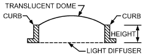

**Tubular Daylighting Devices (TDDs).** Tubular daylighting devices collect and channel daylight (diffuse sky and sunbeam light) from the roof of a building into interior spaces (Figure 16). TDDs are also known as **mirror light pipes** or **tubular skylights**. They are an alternative to conventional skylights and have the advantages of energy savings (small area relative to the amount of useful light they admit), lower solar heat gains, relative ease of installation, and tube lengths (depending on the tube length-to-diameter ratio) of up to 13 m. TDD technologies undergo continuous development to meet the increasing needs for high standards of energy efficiency in buildings and glare-free lighting. The energy-saving potential of TDDs is well recognized (Allen 1997; Carter 2008; Laouadi 2004), and TDDs are encouraged or mandated, particularly in commercial buildings [CEC 2010; see also U.S. Green Building Council’s (USGBC) Leadership in Energy and Environmental Design (LEED) program]. A variant known as a hybrid TDD (HTDD) is available from some manufacturers. In an HTDD, more than one material or geometry is present along the length of the tube (e.g., a round tube that transitions to a square ceiling diffuser).

The natural daylight that TDDs deliver is beneficial to the visual comfort, health, and well-being of building occupants (Boyce et al. 2003; Carter and Al-Marwaee 2009). The daylighting performance (light output) of a TDD depends on many location and material parameters, but a typical device can illuminate an area of up to 28 m<sup>2</sup>. The area of coverage depends on the height of the ceiling: the higher the ceiling, the more widely the light will be uniformly distributed.

TDD Components. TDDs typically consist of (1) a collector on the roof to gather sunbeams and diffuse sky light, (2) a hollow pipe guide in the plenum/attic space to channel light downwards, and (3) a light diffuser at ceiling level to spread light indoors (see Figure 16).

The **collector** is usually a single- or multilayer transparent glass or plastic dome projecting above the plane of the roof. It may also include passive or active geometries (e.g., static or tracking reflectors) or some optical devices (e.g., prisms, diffusing elements) to enhance the device’s lighting output, especially at low sun altitude angles (Laouadi 2013).

Straight **guides** (tubes) are common, but nonlinear light guides with bent sections (Figure 16) are sometimes needed to suit the geometry of a building. The guide can be rigid or flexible, and is typically made from an aluminum sheet with highly reflective interior coatings, which are sometimes spectrally selective. This

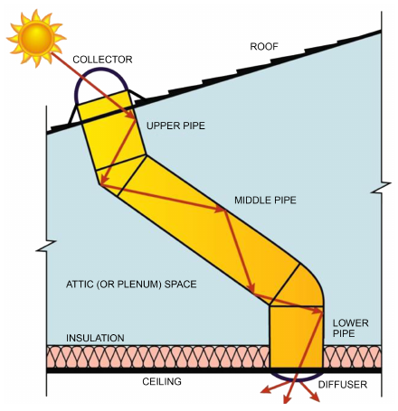

*Fig. 16 Generalized Tubular Daylighting Device*

> (NRCC 2011)

measure reduces solar heat transmission while preserving light transmission. Coating materials with a reflectivity exceeding 99% are commercially available. Vertical pipes without bends are more efficient than bent guides for low incidence angles (<60°; e.g., summer noon), and less efficient for higher incidence angles (e.g., winter noon) (Laouadi et al. 2013a).

**Diffusers** in the ceiling plane of TDDs are usually hemispherical or flat with single- or multilayer glass or poly(methyl methacrylate (PMMA, also known as acrylic) or polycarbonate. Diffusers typically use one of three types of glazing: prismatic, diffusing, or lensed. **Prismatic** glazing consists of arrays or layers of micro replicated shapes (conical prisms, ridges, wedges, etc.), which reflect, refract, and redirect the incoming light based on the angle of incidence. Typical prismatic diffusers are made of acrylic or polycarbonate sheets with conical prisms. **Diffusing** glazing consists of very fine particles, pigments, or films applied to clear glass or plastic sheets to make the glazing look opal (white). The scattering properties depend on the refractive index and the size of the microstructures used. **Lensed** glazing is comprised of arrays of diverging lenses (e.g., Fresnel lenses) that are very thin so that little light is lost by absorption.

Performance Metrics. Various theoretical and empirical models have been developed to predict the daylighting performance of TDDs [e.g., CIE (2006), Zhang and Muneer (2000)]. ASHRAE research project RP-1415 developed and validated models for the prediction of the optical and thermal performance of complex TDDs (Laouadi et al. 2013b, 2013c, 2013d). Several metrics were proposed, including

- **Visible transmittance (VT):** calculated or measured at a standard incidence angle, or averaged over a predetermined number of incidence angles. Angle of incidence is the angle between the entering ray and the axis of the upper tube section.
- **Normalized intensity distribution:** an index that treats TDDs as lighting luminaire systems. TDD intensity distribution is important for lighting energy calculation and spatial arrangement of TDDs.

<!-- str. 383 -->

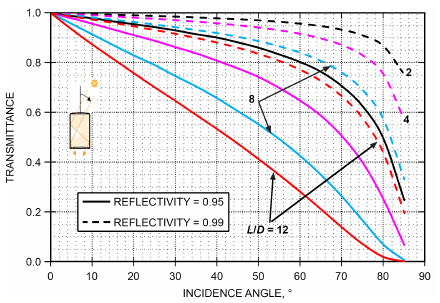

*Fig. 17 Transmittance of Straight Tube (Light Pipe) as Function of Reflectivity and Aspect Ratio (Length/Diameter)*

- **Daylighting area coverage (DAC):** portion of the work plane surface area under a daylight illuminance equal or greater than the recommended task illuminance under CIE standard clear sky conditions. DAC is an important parameter for TDD product rating and selection, and spatial arrangement that guarantees capital cost reduction (with minimum number of TDDs).
- **Spacing ratio (SR):** maximum distance between two pairs of TDDs, normalized by the ceiling height of buildings. SR is calculated based on the illuminance uniformity criterion on the work plane surface.
- **Solar heat gain coefficient (SHGC):** normalized solar heat gains penetrating the indoor space through a TDD system when sunbeam light is incident on the TDD pipe aperture at a standard angle.
- **Thermal transmittance (U-factor):** heat loss from a TDD to the outdoors per unit surface area and temperature difference between the indoor and outdoor environments under standard thermal conditions.

*Simplified Single-Angle Solar and Visible Analysis.* The following simplified equations are presented only as a guide to solar-optical behavior of a TDD. Real-world TDD performance is a function of many location-specific and season-dependent factors (especially solar angle of incidence) which lead to the final, effective SHGC and VT being a somewhat complex weighted average.

For a given input solar ray and angle of incidence, the visible (or solar) transmittance of a TDD is the product of the individual visible (or solar) transmittances of the collecting dome c, the tube t, and the ceiling diffuser d:

- T<sub>TDD</sub> = t<sub>c</sub>t<sub>t</sub>t<sub>d</sub>

Of the three terms on the right-hand side of the equation, tube transmittance t<sub>t</sub> is by far the most sensitive to the incidence angle of the ray (Figure 17) and the presence of any optical element in the collector, which may change the angle of the incident ray. The equation also assumes that multiple interreflections between TDD components make a negligible contribution to the overall system transmittance and throughput of light. This is approximately true for large aspect ratios. The solar heat gain coefficient of the TDD is the sum of the (solar) transmittance plus an indirect, thermal term that is analogous to the inward-flowing fraction of solar heat gain from a general glazing system. The fraction of original, outdoor solar power incident on the diffuser is

> I<sub>d</sub>/I<sub>s</sub> = t<sub>c</sub>t<sub>t</sub>

**Table 12 Performance Characteristics of Typical TDDs**

| Glazing of Collector/Diffuser | Single/Single Layer | Double/Double Layer | Double/Single Layer | Single/Double Layer | Single/Triple Layer |
|---|---|---|---|---|---|
| Visible transmittance* | 0.77 | 0.63 | 0.72 | 0.66 | 0.58 |
| SHGC* (250 mm insulation above ceiling) | 0.32 | 0.24 | 0.27 | 0.28 | 0.24 |
| SHGC* (250 mm insulation under roof) | 0.34 | 0.33 | 0.32 | 0.35 | 0.34 |
| U-factor, W/(m<sup>2</sup>·K) |  |  |  |  |  |
| (250 mm insulation above ceiling) | 3.54 | 2.16 | 3.53 | 2.17 | 1.55 |
| U-factor |  |  |  |  |  |
| (250 mm insulation under roof) | 7.62 | 4.70 | 4.70 | 7.60 | 7.58 |

*VT and SHGC calculated at solar incidence angle of 50° at due south; this angle is close to annual averaged incidence angle (48.84°) of NFRC Standard 203-2014.

where I<sub>s</sub> and I<sub>d</sub> are the solar fluxes (W/m<sup>2</sup>) incident on the collector dome and diffuser respectively.

The fraction of incident solar radiation energy absorbed in the diffuser is α<sub>d</sub> of which approximately half is transferred downward by convection and radiation into the building. The other half is transferred upward to the column of air in the tube. The fraction of this power that is transferred inward is equal to 0.5t<sub>c</sub>t<sub>t</sub>α<sub>d</sub>.

Thus the solar heat gain coefficient of the TDD system, and where all optical parameters are determined for the solar spectrum, is approximately

> SHGC<sub>TDD</sub> = T<sub>TDD</sub> + 0.5t<sub>c</sub>t<sub>t</sub>α<sub>d</sub> = t<sub>c</sub>t<sub>t</sub>(t<sub>d</sub> + 0.5α<sub>d</sub>)

The National Fenestration Rating Council (NFRC) sets the model sizes and environmental conditions for the product rating of TDDs. At the time of writing, NFRC ratings are based on physical testing only, after a former NFRC simulation procedure for U-factor of TDDs was retired in 2012. TDD ratings for U-factor follow NFRC (2014a) Technical Document 100. Ratings for SHGC follow NFRC (2014e) Technical Document 201-2014, whereas ratings for VT follow NFRC (2014f) Technical Document 203-2014, which in turn references ASTM Standard E1175-87 (RA 2015).

Table 12 shows the computed optical and thermal characteristics of a typical TDD made up of a 3 mm PMMA collector and a 3 mm polycarbonate diffuser with an NFRC standard-size pipe of 350 mm diameter and aspect ratio of 2.14. The tube reflectitivity is 99% and 76% for the visible and solar spectrum, respectively. The NFRC Technical Document 100 boundary conditions (NFRC 2014a) are used for the U-factor calculation. The table shows that, although the number of layers in the collector or diffuser has only a small effect on visible transmittance, as expected it has a significant effect on thermal performance. The table does not show any best arrangement, but provides information that can help a designer select an arrangement that best suits a particular application in residential or commercial buildings.

Practical Guidelines. When selecting TDDs, specifiers should consider the following:

- **Visible transmittance:** products with the highest visible transmittance should be selected for daylighting.
- **Solar heat gain coefficient:** ideally, for heating-dominated climates, TDDs would have moderate to high SHGC. However, most available TDDs have medium to low SHGC (<0.40) by design, because ENERGY STAR (www.energystar.gov) requires SHGC ≤ 0.40 except in the northern U.S. climate zone. Some indicative, real-world solar heat gain coefficients are given in Table 12. All exceed the minimum performance defined by ENERGY STAR (i.e., rated SHGC is lower than the ENERGY STAR upper limit).

<!-- str. 384 -->

**Table 13 Solar Heat Gain Coefficients for Standard Hollow Glass Block Wall Panels**

| Type of Glass Block<sup>a</sup> | Description of Glass Block | Solar Heat Gain Coefficient<br>In Sun | Solar Heat Gain Coefficient<br>In Shade<sup>b</sup> |
|---|---|---|---|
| Type I | Glass colorless or aqua<br>A, D: Smooth |  |  |
|  | B, C: Smooth or wide ribs, or flutes horizontal or vertical, or shallow configuration<br>E: None | 0.57 | 0.35 |
| Type IA | Same as type I except ceramic enamel on A | 0.23 | 0.17 |
| Type II | Same as type I except glass fiber screen partition E | 0.38 | 0.30 |
| Type III | Glass colorless or aqua<br>A, D: Narrow vertical ribs or flutes. |  |  |
|  | B, C: Horizontal light-diffusing prisms, or horizontal light-directing prisms<br>E: Glass fiber screen | 0.29 | 0.23 |
| **Type IIIA Same as type III except** |  |  |  |
|  | E: Glass fiber screen with green ceramic spray coating or glass fiber screen and gray glass or glass fiber screen with light-selecting prisms | 0.22 | 0.16 |
| Type IV | Same as type I except reflective oxide coating on A | 0.14 | 0.10 |

<sup>a</sup>All values are for 200 by 200 by 100 mm block, set in light-colored mortar. For 300 by 300 by 100 mm block, increase <sup>b</sup>For NE, E, and SE panels in shade, add 50% to coefficients by 15%, and for 150 by 150 by 100 mm block, reduce coefficients by 15%. values listed for panels in shade.

| Type IA | Same as type I except ceramic enamel on A | 0.23 | 0.17 |
|---|---|---|---|
| Type II | Same as type I except glass fiber screen partition E | 0.38 | 0.30 |
| Type III | Glass colorless or aqua<br>A, D: Narrow vertical ribs or flutes.<br>B, C: Horizontal light-diffusing prisms, or horizontal light-directing prisms<br>E: Glass fiber screen | 0.29 | 0.23 |
| **Type IIIA Same as type III except E: Glass fiber screen with green ceramic spray coating or glass fiber screen and gray glass or glass fiber screen with light-selecting prisms 0.22 0.16** |  |  |  |

Type IV Same as type I except reflective oxide coating on A 0.14 0.10

m block, set in light-colored mortar. For 300 by 300 by 100 mm block, increase <sup>b</sup>For NE, E, and SE panels in shade, add 50% to 0 by 100 mm block, reduce coefficients by 15%. values listed for panels in shade.

- **U-factor:** the lower the U-factor, the better. ENERGY STAR-qualified TDDs must achieve a U-factor of ≤ 1.5 W/(m<sup>2</sup>·K) in the northern U.S. climate zone. This is relaxed somewhat as one moves to progressively warmer climates, leading to a threshold of 2.3 W/(m<sup>2</sup>·K) in the southern climate zone. Products that are insulated above the ceiling perform considerably better than those with insulation under the roof.
- **Tubular daylighting devices:** TDDs should have multipane ceiling diffusers when insulation is placed at ceiling level (e.g., residential buildings) or multipane collectors when insulation is placed at roof level (e.g., commercial buildings) to reduce thermal losses. In residential applications, a multipane ceiling diffuser is the single most effective measure to reduce the overall U-factor of a TDD. This is because tubes typically penetrate an unconditioned attic zone. In winter, heat loss from tube cavity to attic zone can be severe, and disproportionately large in comparison with the TDD’s cross-sectional area, if the ceiling diffuser is only single-glazed.
- **Spacing ratio (SR):** SR relates to the normalized luminous intensity distribution of TDDs. To minimize capital cost (number of TDDs), select TDDs with higher spacing ratios. For ideally diffusing TDDs, SR varies from 1 to 1.5 for illuminance uniformity (minimum to average ratio) of 0.95 to 0.8, respectively.

Installation. Installation methods vary depending on roof type (asphalt shingles, roof tiles, membranes, metallic roofing, etc.). TDD assemblies must be installed to resist air and water infiltration, and damage from wind, hail, and snow load. Manufacturers’ instructions provide specific details. Attention to detail is required when the roof is replaced.

### Glass Block Walls

Glass block can be used for light transmission through outdoor walls when optical clarity for view is unnecessary. Table 13 describes a variety of glass block patterns and gives solar heat gain coefficients to be applied to solar irradiances so that approximate instantaneous solar heat gains can be calculated (Smith and Pennington 1964). Table 4, footnote 6, provides a representative U-factor for glass block. Note that the U-factor for glass block is poor when compared to double glazing with a low-emissivity coating.

Convection and low-temperature radiative heat gain for all hollow glass block panels fall within a narrow range. Differences in SHGCs are largely the result of differences in transmittance of glass blocks for solar radiation. Solar heat gain coefficients for any particular glass block pattern vary depending on orientation and time of day. The SHGC for western exposures in the morning (shaded) is depressed because of heat storage in the block, whereas the SHGC for eastern exposures in the afternoon (shaded) is elevated as stored heat is dissipated. Time lag effects from heat storage are estimated by using solar gains and air-to-air temperature differences for one hour earlier than the time for which the load calculation is made.

Calorimeter tests of Type 1A glass block showed little difference in solar heat gains between glass block with either black or white ceramic enamel on the exterior of the block. White and black ceramic enamel surfaces represent the two extremes for reflecting or absorbing solar energy; therefore, glass block with enamel surfaces of other colors should have solar heat gain coefficients between these values. Because glass blocks are good examples of strongly angularly selective fenestrations, appropriate caution must be taken.

### Plastic Materials for Glazing

Generally, factors outlined for glass apply also to glazing materials such as acrylic, polycarbonate, polystyrene, or other plastic panels. If solar transmittance, absorptance, and reflectance are known, the SHGC can be calculated in the same way as for glass. These properties can be obtained from the manufacturer or be determined by simple laboratory tests. The National Fenestration Rating Council developed standards for testing the optical properties of glazing (NFRC 2014d, 2014g).

In selecting plastic panels for glazing, concerns include possible deterioration from the sun, expansion and contraction because of temperature extremes, and possible damage from abrasion.

## 4.3 CALCULATION OF SOLAR HEAT GAIN

To calculate solar energy fluxes, first calculate the incident angle θ from the local standard time and the longitude. The direct normal solar irradiance E<sub>DN</sub>, diffuse sky irradiance E<sub>d</sub>, ground-reflected radiation E<sub>r</sub>, and total incident irradiance E<sub>t</sub> can then be determined. Note that the latter two are assumed to be ideally diffuse radiation. Calculation methods for these parameters are described in Chapter 14.

Solar energy flow through a fenestration may be divided into two parts: opaque (q<sub>op</sub>) and glazing (q<sub>s</sub>) portions. The glazing solar energy flux q<sub>s</sub> can be split into that from incident beam radiation (q<sub>b</sub>) and incident diffuse radiation (q<sub>d</sub>), which includes both diffuse sky radiation and radiation scattered (reflected) from the ground:

<!-- str. 385 -->

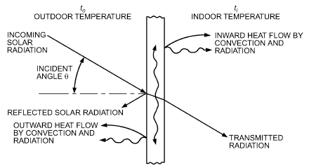

*Fig. 18 Instantaneous Heat Balance for Sunlit Glazing Material*

> q<sub>s</sub> = q<sub>b</sub> + q<sub>d</sub>&emsp;**(22)**

The net heat balance that would occur for a sunlit glazing if there were no diffuse radiation is shown in Figure 18. This net heat balance does not include any of the heat flows resulting from indoor/outdoor temperature differences. The heat balance is pictured as superimposed on the thermal effect. This superposition picture should not be carried too far, however, because the heat flows indicated in Figure 18 as resulting from convection and radiation depend in part on processes that are nonlinear with respect to temperature, so that in reality the two effects cannot be separated. To calculate them, the actual glazing (and other) temperatures are needed, not simply the incremental temperature rise caused by sunlight.

Figure 18 shows that the glazing solar energy flow from beam radiation consists of two parts:

> q<sub>b</sub> = q<sub>bt</sub> + q<sub>ba</sub>&emsp;**(23)**

where

- q<sub>bt</sub> = glazing solar energy flux caused by transmitted incident beam radiation
- q<sub>ba</sub> = glazing solar energy flux caused by inward heat flow of absorbed beam radiation

The glazing solar energy flux caused by incident beam radiation is calculated from

> q<sub>b</sub> = E<sub>DN</sub>cosθSHGC(θ)&emsp;**(24)**

where the beam solar heat gain coefficient is given by Equation (12) or (13). If, instead, the solar radiant and heat fluxes are needed separately, calculate the glazing transmitted solar flux (solar radiation traveling in the incident direction) from

> q<sub>bt</sub> = E<sub>DN</sub>cosθT(θ)&emsp;**(25)**

and the inward-flowing absorbed solar flux (heat) from

> L
>
> q<sub>ba</sub> = E<sub>DN</sub>cosθ N A<sub>k</sub><sup>f</sup>(θ)&emsp;**(26)**

> ∑ k
>
> k=1

Values of T (θ) and A<sup>f</sup>(θ) in these equations can be found in Table 10, and determination of N<sub>k</sub> is discussed in the section on Calculation of Solar Heat Gain Coefficient.

For diffuse radiation,

> q<sub>d</sub> = q<sub>dt</sub> + q<sub>da</sub>&emsp;**(27)**

where

- q<sub>dt</sub> = glazing solar energy flux caused by transmitted incident diffuse radiation
- q<sub>da</sub> = glazing solar energy flux caused by inward heat flow of absorbed diffuse radiation

Glazing solar energy flux caused by diffuse incident radiation is calculated from

> q<sub>d</sub> = (E<sub>d</sub> + E<sub>r</sub>)⟨SHGC⟩<sub>D</sub>&emsp;**(28)**

where the hemispherically averaged solar heat gain coefficient is calculated from Equation (15). Solar radiant and heat fluxes can be separately calculated from

> q<sub>dt</sub> = (E<sub>d</sub> + E<sub>r</sub>)⟨T⟩<sub>D</sub>&emsp;**(29)**

which is diffusely distributed solar radiation (note that effects of finite glazing size and thickness are neglected), and

> L
>
> q<sub>da</sub> = (E<sub>d</sub>+ E<sub>r</sub>) N ⟨A<sub>k</sub><sup>f</sup>⟩<sub>D</sub>&emsp;**(30)**

> ∑ k
>
> k=1

### Opaque Fenestration Elements

The opaque portion solar energy flux is calculated from

> q<sub>op</sub> = (E<sub>DN</sub> cosθ + E<sub>d</sub> + E<sub>r</sub>)SHGC<sub>op</sub>&emsp;**(31)**

where SHGC<sub>op</sub> is obtained from Equation (18).

**Example 6.** Calculate the solar energy flux through the glazing system ID 25a given θ = 60<sup>o</sup>, E<sub>DN</sub> = 600 W/m<sup>2</sup>, and E<sub>d</sub> = 150 W/m<sup>2</sup>.

**Solution:** The solar heat gain coefficients are SHGC(60°) = 0.34, and SHGC<sub>D</sub> = 0.36 (see Table 10, glazing ID 25a, 5th and 8th columns).

> q<sub>s</sub> = q<sub>b</sub> + q<sub>d</sub>
>
> = E<sub>DN</sub>cos(60)SHGC(60) + (E<sub>d</sub> + E<sub>r</sub>)⟨SHGC⟩<sub>D</sub>

> = (600.0)cos(60)(0.34) + (150)(0.36) = 156 W/m<sup>2</sup>

## 5. SHADING AND FENESTRATION ATTACHMENTS

## 5.1 SHADING

The most effective way to reduce the solar load on fenestration is to intercept direct radiation from the sun before it reaches the glazing system. Fenestration products fully shaded from the outdoors reduce solar heat gain by as much as 80%. Fenestration can be shaded by roof overhangs, vertical and horizontal architectural projections, awnings, heavily proportioned outdoor louvers, or a variety of vegetative shades, including trees, hedges, and trellis vines. In all outdoor shading structures, it is necessary to consider the structures’ geometry relative to changing sun position to determine the times and quantities of direct sunlight penetration. A detailed discussion of the effectiveness of outdoor shading is given in Ewing and Yellott (1976).

The general effect of shading is to attenuate solar radiation. Some of the beam radiation may reach the fenestration unaffected by the shade, and this is accounted for by the unshaded fraction F<sub>u</sub>. Assuming that the shade does not transmit or diffuse solar radiation, the solar heat gain of the fenestration can be approximated by modifying Equation (22):

> q<sub>s</sub> = F<sub>u</sub>q<sub>b</sub> + q<sub>d,shaded</sub>&emsp;**(32)**

Here, the term q<sub>d,shaded</sub> indicates that a new SHGC must be determined to account for the fact that the shading device restricts the amount of sky-diffuse radiation on the fenestration system. More complex models are required for situations where the shade is partially transmitting and diffusing in nature.

<!-- str. 386 -->

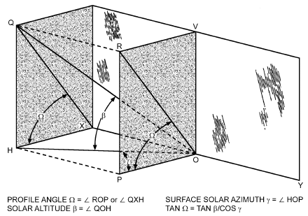

*Fig. 19 Profile Angle for South-Facing Horizontal Projections*

**Overhangs and Glazing Unit Recess:**

### Horizontal and Vertical Projections

In the northern hemisphere, horizontal projections can considerably reduce solar heat gain on south, southeast, and southwest exposures during late spring, summer, and early fall. On east and west exposures during the entire year, and on south exposures in winter, the solar altitude is generally so low that, to be effective, horizontal projections must be excessively long. On the other hand, recessing the fenestration deeper back into the wall achieves the same effect as a horizontal projection.

The ability of horizontal projections to intercept the direct component of solar radiation depends on their geometry and the profile or shadow-line angle Ω (Figure 19), defined as the angular difference between a horizontal plane and a plane tilted about a horizontal axis in the plane of the fenestration until it includes the sun. The vertical profile angle Ω can be calculated by

> tan Ω = tan β/cos γ&emsp;**(33)**

where

- β = solar altitude angle
- γ = solar azimuth

The shadow width S<sub>W</sub> and shadow height S<sub>H</sub> (Figure 20) produced by the vertical and horizontal projections (P<sub>V</sub>and P<sub>H</sub>), respectively, can be calculated using the surface solar azimuth γ and the vertical profile angle Ω determined by Equation (33).

> S<sub>W</sub> = P<sub>V</sub> |tan γ|&emsp;**(34)**
>
> S<sub>H</sub> = P<sub>H</sub>tanΩ&emsp;**(35)**

When the surface solar azimuth γ is greater than 90° and less than 270°, the fenestration product is completely in the shade; thus, S<sub>W</sub> = W + R<sub>w</sub> and sunlit area A<sub>SL</sub>= 0.

The sunlit (A<sub>SL</sub>) and shaded (A<sub>SH</sub>) areas of the fenestration product are variable during the day and can be calculated for each moment using the following relations:

> A<sub>SL</sub> = [W – (S<sub>W</sub> – R<sub>W</sub>)][H – (S<sub>H</sub> – R<sub>H</sub>)]&emsp;**(36)**
>
> A<sub>SH</sub> = A – A<sub>SL</sub>&emsp;**(37)**

where A is total fenestration product area.

For software-based or multiple calculations, McCluney (1990) describes an algorithm that can be used to calculate the unshaded fraction of a window equipped with overhangs, awnings, or side fins.

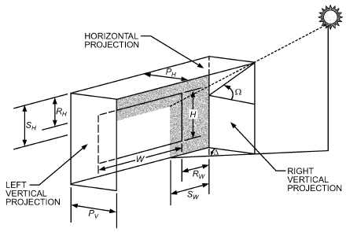

*Fig. 20 Vertical and Horizontal Projections and Related Profile Angles for Vertical Surface Containing Fenestration*

**Example 7.** A window facing 30° south of west (wall azimuth ψ = +60°)

in a building at 33.65°N latitude, and 84.42°W longitude is 1841.5 mm wide and 6286.5 mm high. The depth of the horizontal projection is 2438 mm. At 3:00 PM on July 21, it is calculated that the hour angle H = 15 × (13.27 – 12) = 19.03°; and the declination δ = 20.60°.

The solar altitude β is calculated to be:

- sin β = cos(33.65) cos(20.60) cos(19.03) + sin(33.65) sin(20.60)
- β = 68.7°

The solar azimuth φ is cos φ = [sin(68.68) sin(33.65) – sin(20.60)]/[cos(68.68) cos(33.65)]

> φ = 57.1°

Thus, the wall solar azimuth is γ = 57.1 – 60 = –2.9°.

(a) Find the sunlit and shaded area of the window.

(b) Find the depth of the projections necessary to fully shade the window.

**Solution:** (a) Using Equation (34), the width of the vertical projection shadow is

> S<sub>W</sub> = 0 |tan(–2.9)| = 0 mm

Using Equation (33), the profile angle for the horizontal projection is

> tan Ω = tan(68.7)/cos(2.9)
>
> Ω = 68.7°

Using Equation (35), the height of the horizontal projection shadow is

> S<sub>H</sub> = 96 tan(68.7) = 6255 mm

Using Equations (36) and (37), the sunlit and shaded areas of the window are now

> A<sub>SL</sub> = [1841.5 – (0 – 0)][6286.5 – (6255 – 0)]/10<sup>6</sup> = 0.058 m<sup>2</sup>
>
> A<sub>SH</sub> = (1841.5 × 6286.5)/10<sup>6</sup> – 0.058 = 11.519 m<sup>2</sup>

(b) The shadow length necessary to fully shade the given window SH(fs) and SW(fs<sub>)</sub> from the horizontal and vertical projection are given by (see Figure 20)

> S<sub>H(fs)</sub> = 6286.5 + 0 = 6286.5 mm
>
> S<sub>W(fs)</sub> = 1841.5 + 0 = 1841.5 mm

Thus, using Equations (34) and (35),

> P<sub>H(fs)</sub> = 6286.5cot(68.7) = 2453.5 mm
>
> P<sub>W(fs)</sub> = 1841.5|cot(–2.9)| = 36 351.7 mm

<!-- str. 387 -->

For this example, because both horizontal and vertical projections do not need to fully shade the window, a horizontal projection of 2454 mm is satisfactory. Also, to accurately analyze the influence of external projections, an hour-by-hour calculation must be performed over the periods of the year for which shading is desired.

## 5.2 FENESTRATION ATTACHMENTS

Fenestration attachments generally consist of items that can be used as part of a system to provide solar and daylighting control, as well as privacy, aesthetics, and comfort for building occupants. Attachments also include other devices that, though not intended for solar control, affect the solar and visual performance of the fenestration system. Attachments to the indoor side of fenestration can include horizontal louvers (venetian blinds), vertical louvers, roller shades, insect screens, and drapery. Between glazings of multiglazed fenestration, horizontal louvers and roller shades may be incorporated. On the outdoor side, insect screens can be added, as well as horizontal louvers in the plane of the fenestration.

Fenestrations with shading devices have a degree of thermal and optical complexity far greater than that of unshaded fenestrations, and are referred to as **complex fenestration**.

In unshaded fenestration, individual glazing layers can only communicate thermally with adjacent layers. This is not the case for complex fenestration. A fenestration layer such as a screen or louvered blind is not sealed, and allows convective heat transfer between nonadjacent layers. Similarly, shading layers are inherently diathermanous (i.e., they transmit both long- and short-wave radiation). Radiative heat transfer, therefore, can also occur between nonadjacent layers. For example, for a window with indoor venetian blinds, heat transfer occurs between the indoor glass and the blind, the indoor glass and the room, and between the blind and the room. Therefore, methods described previously for determining the U-factor and inward-flowing fractions of fenestration systems cannot be applied to complex fenestration (Collins and Wright 2006; Wright 2008).

Also, complex fenestration can have a **nonspecular optical element.** This is an element for which light (or short-wave infrared radiation) incident on the element from a single spatial direction does not emerge traveling in a single transmitted direction and/or a single reflected direction. Examples of nonspecular elements are shades, drapes, blinds, honeycombs, figured glass, ground glass, and other diffusers, lenses, prisms, and holographic glazings.

Two methods have been developed that allow the analysis of complex fenestration. The first method was proposed by Klems (1994a, 1994b, 2001), and relies on measurement of the bidirectional transmittance and reflectance of each glazing layer, and on calorimetrically determined values of inward flowing fraction, as input to a matrix calculation. It is a physically based and highly accurate approach that is also computationally and experimentally intensive. For details of this approach, see Chapter 31 of the 2005 ASHRAE Handbook—Fundamentals. The second method, developed through ASHRAE-sponsored research (Wright et al. 2008), is an empirically based approach that uses readily available information about the system geometry and material properties, and is designed to fit into established fenestration analysis methodology. The methodology has been shown to accurately predict complex fenestration performance from easily obtained data regarding shade geometry and material.

In contrast to these two methods, a simplified approach is presented in the following section for calculating the approximate SHGC for a selection of the more common shading elements and glazing systems.

### Simplified Methodology

Considering only the approximate total heat flux through the fenestration, measurements made on a fenestration under one set of conditions can often be extrapolated to other fenestrations and conditions to give an adequate answer. In this case, heat flux through the center-glass region is represented by

> q = E<sub>DN</sub>cos(θ)SHGC(θ)IAC(θ, Ω)
>
> + (E<sub>d</sub> + E<sub>r</sub>)⟨SHGC⟩<sub>D</sub>IAC<sub>D</sub>&emsp;**(38)**

where the solar heat gain coefficients are for the center-glass region of an unshaded glazing, and may be calculated using methods described previously, or obtained from Table 10. The **indoor solar attenuation coefficient (IAC)** represents the fraction of heat flow that enters the room, some energy having been excluded by the shading. Depending on the type of shade, it may vary angularly and with shade type and geometry. The IAC is defined as

> IAC(θ, Ω) = (SHGC(θ, Ω)<sub>cg,</sub> shaded)/SHGC(θ)<sub>cg</sub>&emsp;**(39)**
>
> IAC<sub>D</sub> = (⟨SHGC⟩ D, cg, shaded)/(⟨SHGC⟩<sub>D,c</sub> g)

where Ω is either the horizontal or vertical profile angle.

IAC values presented in the following sections have been determined using the ASHWAT models (Wright et al. 2008), which have been validated, with calorimetric results showing prediction of fenestration performance to within 5% (Figure 21).

Because shading layers generally have a small effect on the U-factor of complex fenestration systems (Wright et al. 2008), in this simplified analysis, the effects of shading devices on U-factor are ignored. System U-factor is assumed to be similar to that of the same glazing (minus the shade) and can be determined from Table 4.

Note that this simplified approach applies only to the SHGC of the center-glass region of the fenestration product. Results from this analysis must be combined with the methods provided in the Solar Heat Gain Coefficient and Solar Heat Gain sections.

### Slat-Type Sunshades

Slat-type sunshades consist of horizontal or vertically oriented louvers in located in the plane of the fenestration. They can be installed on the outdoor and indoor side of the fenestration, or between glazings in a multilayered glazing system. The transmitted solar radiation may consist of straight-through, transmitted diffuse, and reflected-through components.

The geometry considered is shown in Figure 22, with slat width w, slat crown c, slat spacing s, and slat angle φ. The ratios of w/s and w/c are assumed constant at 1.2 and 16 respectively, which are representative of many commercially available products. The profile angle Ω can represent either the vertical profile Ω<sub>V</sub> or the horizontal profile Ω<sub>H</sub>. The vertical profile angle is used for horizontal louvered shades, and is calculated using Equation (33). The horizontal profile angle is used for vertical louvered shades and is equal to the wall surface solar azimuth γ.

Tables 14A to 14G presents IAC values at profile angles of 0 and 60<sup>o</sup> for various glazing and shade combinations. IAC varies with profile angle where the profile angle can be the vertical profile (for horizontal louvers) or horizontal profile (for vertical louvers). The variation of IAC with profile angle can be determined from

> IAC(θ,Ω) = IAC<sub>0</sub> + IAC<sub>x</sub>× min(1.2Ω,60)/60&emsp;**(40)**

Barnaby et al. (2009), Collins et al. (2008), Huang et al. (2006), Kotey et al. (2009a), and Wright et al. (2008) contain more (normal incidence; various shading layers atta (Wright et comprehensive discussions of models used to determine IACs of louvered sunshades.

<!-- str. 388 -->

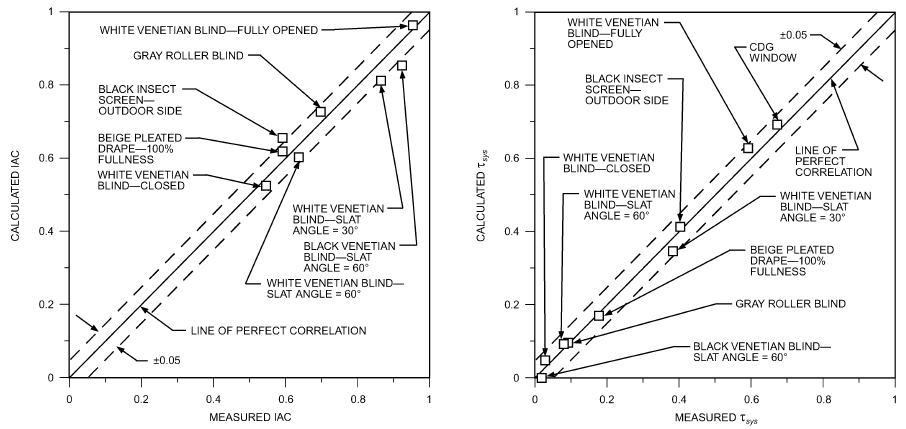

*Fig. 21 Comparison of IAC and Solar Transmission Values from ASHWAT Model Versus Measurements*

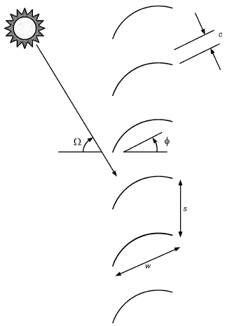

*Fig. 22 Geometry of Slat-Type Sunshades*

**Example 8.** Calculate the SHGC of glazing system ID 25a if a horizontally louvered shade is added (a) on the indoor side, (b) between the glazings, and (c) on the outdoor side. The shade material has a reflectance of 0.60 and the shades are installed in the open position (0°). θ = 60° and Ω<sub>V</sub> = 40°. Also consider (d) vertical louvers located on the indoor side of the glazing with Ω<sub>H</sub> = 40°.

**Solution:** Use Equations (39) and (40) and values from Table 14E. From Example 6, SHGC(60°) = 0.34, and SHGC<sub>D</sub>= 0.36.

ched to conventional double-glazed window)

al. 2009b)

(a) Indoor shade

> IAC(60,40) = IAC<sub>0</sub>+ (IAC<sub>60</sub>– IAC<sub>0</sub>) × min(1.2Ω, 60) ⁄ 60
>
> 40

> = 0.99 + (0.87 – 0.99) × -----
>
> 60

> = 0.91
>
> SHGC(θ,Ω)<sub>cg,shaded</sub> = IAC(60,40) × SHGC(θ)<sub>cg</sub>

> = 0.91 × 0.34
>
> = 0.31

> SHGC<sub>D,cg,shaded</sub> = IAC<sub>D</sub> × SHGC<sub>D,cg</sub>
>
> = 0.93 × 0.36

> = 0.33

(b) Louvers between glazings

> IAC(60,40) = IAC<sub>0</sub>+ (IAC<sub>60</sub>– IAC ) × min(1.2Ω, 60) ⁄ 60
>
> = 0.97 + (0.68 – 0.97) × (0 40)/60

> = 0.78
>
> SHGC(θ,Ω)<sub>cg,shaded</sub> = IAC(60,40) × SHGC(θ)<sub>cg</sub>

> = 0.78 × 0.34
>
> = 0.27

> SHGC<sub>D,cg,shaded</sub> = IAC<sub>D</sub> × SHGC<sub>D,cg</sub>
>
> = 0.82 × 0.36

> = 0.30

(c) Outdoor louvers

> IAC(60,40) = IAC<sub>0</sub>+ (IAC<sub>60</sub>– IAC ) × min(1.2Ω, 60) ⁄ 60
>
> = 0.94 + (0.15 – 0.94) × (0 40)/60

> = 0.41
>
> SHGC(θ,Ω)<sub>cg,shaded</sub> = IAC(60,40) × SHGC(θ)<sub>cg</sub>

> = 0.41 × 0.34
>
> = 0.14

> SHGC<sub>D,cg,shaded</sub> = IAC<sub>D</sub> × SHGC<sub>D,cg</sub>
>
> = 0.51 × 0.36

> = 0.18

(d) Vertical louvers

For the given conditions, results are the same as for part (a).

<!-- str. 389 -->

### Drapery

Drapery fabrics can be classified in terms of their solar-optical properties as having specific values of fabric transmittance and reflectance. Fabric reflectance is the major factor in determining the ability of a fabric to reduce solar heat gain. Based on their appearance, draperies can also be classified by yarn color as dark, medium, and light and by weave as closed, semiopen, and open. The apparent color of a fabric is determined by the reflectance of the yarn itself. Drapery fabrics are classified into nine types, rated by openness and yarn reflectances (Figures 23 and 24).

The solar-optical properties of drapery fabrics can be determined accurately by laboratory tests (Collins et al. 2011; Kotey et al. 2009b; Yellott 1963), and manufacturers can usually supply solar transmittance and reflectance values for their products. In addition to these properties, the openness factor (ratio of the open area between the fibers to the total area of the fabric) is a useful property that can be measured exactly (Keyes 1967; Pennington and Moore 1967). Visual estimations of openness and yarn reflectance, interpreted through Figures 23 and 24, are valuable in judging the effectiveness of drapes for (1) protection from excessive radiant energy from either sunlight or sun-heated glazing, (2) brightness control, (3) providing either outward view or privacy, and (4) sound control.

To understand drapery layer solar-optical properties, the **fullness** of the drapery is needed. As simplified in Figure 25, the pleating of the drape is assumed to be square, with pleat depth w and width s. For 100% fullness, the width of fabric used is twice the width of the fenestration. If the drapery is hung flat, like a fenestration product shade, the fullness is 0%.

Table 14G presents IAC and radiant heat transfer fraction F<sub>R</sub> values for typical glazing and shade combinations. For these types of shades, the IAC value is not strongly influenced by the incident angle of irradiation; therefore, a constant value of IAC can be used.

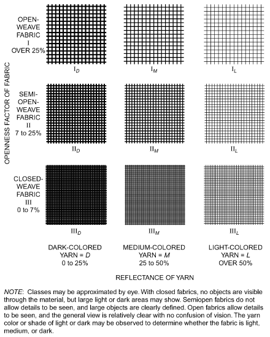

*Fig. 23 Designation of Drapery Fabrics*

Kotey et al. (2009b, 2009c, 2011) and Wright et al. (2009a) contain more comprehensive discussions of models used to determine IACs of draperies.

**Example 9.** Calculate the SHGC of glazing system ID 25a if a drapery is added on the indoor side. The fabric has an openness factor of 0.05 and a yarn reflectance of 0.60, and the drapery has 100% fullness.

**Solution:** In Figure 24, these lines intersect in the area of designator III<sub>L</sub>. Fabric is closed and light in color, with probable fabric reflectance of 0.52 and fabric transmittance of 0.30.

> From Table 14G, both IAC and IAC<sub>D</sub>= 0.68.
>
> SHGC(θ,Ω)<sub>cg,shaded</sub> = IAC × SHGC(θ)<sub>cg</sub>

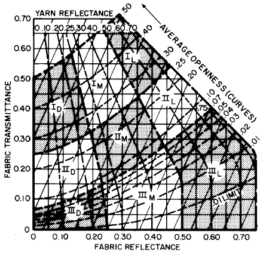

*Fig. 24 Drapery Fabric Properties*

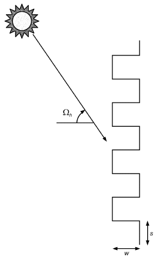

*Fig. 25 Geometry of Drapery Fabrics*

<!-- str. 390 -->

> = 0.68 × 0.34
>
> = 0.23

> SHGC<sub>D,cg,shaded</sub> = IAC<sub>D</sub> × SHGC<sub>D,cg</sub>
>
> = 0.68 × 0.36

> = 0.25

### Roller Shades and Insect Screens

In general, both roller shades and insect screens are equivalent to drapery of 0% fullness. Appropriately, much of the methodology applied to drapery fabrics applies for these devices as well.

Table 14G presents IAC for typical glazing and shade combinations. For these types of shades, the IAC value is not strongly influenced by the incident angle of irradiation; therefore, a constant value of IAC can be used.

For a more comprehensive discussion of models used to determine IACs, see Kotey et al. (2008, 2009d) for roller shades and Kotey et al. (2009e) for insect screens.

**Example 10.** Calculate the SHGC of glazing system ID 25a if a roller shade is added on the indoor side. The shade has an openness factor of 0.0 and a yarn reflectance of 0.65.

**Solution:** From Table 14G, both IAC and IAC<sub>D</sub>= 0.60.

> SHGC(θ,Ω)<sub>cg,shaded</sub> = IAC(60,40) × SHGC(θ)<sub>cg</sub>
>
> = 0.60 × 0.34

> = 0.20
>
> SHGC<sub>D,cg,shaded</sub> = IAC<sub>D</sub> × SHGC<sub>D,cg</sub>

> = 0.60 × 0.36
>
> = 0.22

## 6. VISUAL AND THERMAL CONTROLS

The ideal fenestration system allows optimum lighting, heating, ventilation, and visibility; minimizes moisture and sound transfer between the outdoors and the indoors; and produces a satisfactory physiological and psychological environment. The controls of an optimum system react to varying climatological and occupant demands. Fixed controls may have operation or cost advantages, or both, but do not react to physical and psychological variations. Variable controls are, therefore, more effective in energy conservation and environmental satisfaction.

### Operational Effectiveness of Shading Devices

Shading devices vary in their operational effectiveness. Some devices, such as overhangs, light shelves, and tinted glazings, do not require operation, have long life expectancies, and do not degrade significantly over their effective life. Other types of shading devices, especially operable indoor shades, may have reduced effectiveness because of less than optimal operation and degradation of effectiveness over time. It is important to evaluate operational effectiveness when considering the actual heat rejection potential of shading devices.

The performance of shading devices for reducing peak cooling loads and annual energy use should account for operational effectiveness or reliability in actual operation. Passive devices, such as architectural elements and glazing tinting, are considered 100% effective in operation. Glazing coatings and adherent films may degrade over time. Shade screens are removable and may be assumed to operate seasonally, but in any given population of users, some will remain in place all year long and some will not be installed or removed at optimum times. Automated shading devices controlled for optimum thermal operation are considered more effective than manual devices, but controls require ongoing maintenance, and some occupants may object to the lack of personal control with totally automated devices. Automated shading devices may also operate for nonthermal purposes such as glare and daylighting optimization, and this may reduce thermal effectiveness. Manually operated devices are subject to wide variation in use effectiveness, and this diversity in effective use should be considered when evaluating performance.

### Indoor Shading Devices

Although thermal comfort of occupants may be paramount to the HVAC designer, other factors that should be considered, some of which may be more important to the user, include the following:

**Radiant Energy Protection.** Unshaded fenestration products become sources of radiant heat by transmitting short-wave solar radiation and by emitting long-wave radiation to dissipate some of the absorbed solar energy. In winter, glazing temperatures usually fall below room air temperature, which may produce thermal discomfort to occupants near the fenestration. In summer, individuals seated near unshaded fenestration may experience discomfort from both direct solar rays and long-wave radiation emitted by sunheated glazing. In winter, loss of heat by radiation to cold glazing can also cause discomfort. Tightly woven, highly reflective drapes minimize such discomfort; drapes with high openness factors are less effective because they allow short- and long-wave radiation to pass more freely. Light-colored shading devices with maximum total surface usually provide the best protection because they absorb less heat and tend to lose heat readily by convection to the conditioned air.

**Outward Vision.** Outward vision is normally desirable in both business and living spaces. Open-weave, dark-colored fabrics of uniform pattern allow maximum outward vision, whereas uneven pattern weaves reduce the ability to see out. A semiopen weave modifies the view without completely obscuring the outdoors. Tightly woven fabrics block outward vision completely.

**Privacy.** Venetian blinds, either vertical or horizontal, can be adjusted and, when completely closed, afford full privacy. When draperies are closed, the degree of privacy is determined by their color and tightness of weave and the source of the principal illumination. To obscure the view so completely that not even shadows or silhouettes can be detected, fully opaque materials are used. Generally, the more brightly lit side of a partially shaded glazing is the most visible from the opposite side, making the indoors fairly private in daytime, but not at night.

**Brightness Control.** Visual comfort is essential in many occupied areas, and freedom from glare is an important factor in performing tasks. Discomfort glare is produced by uneven brightness in occupied spaces, with areas or spots that are much brighter than surrounding surfaces. Fenestrations themselves, when they look out onto bright skies or brightly reflecting surfaces, can be glare sources if care is not taken to keep surrounding brightness comparable. A maximum brightness ratio of about 3 to 1 is sometimes quoted. This ratio can be moderated by indoor furnishings and wall coverings, which on average have moderately high diffuse reflectances and access to admitted daylight. Conversely, dark indoor surfaces, and those shaded from daylight illumination, accentuate the brightness difference between the fenestration and its surroundings. Indoor surface brightness can also be elevated by ample use of indoor electric lighting, but this can have adverse consequences for the building’s energy use. In general, larger fenestration apertures admit more sunlight, increasing indoor brightness without affecting the perceived brightness of the fenestration, all other factors being equal.

An important guideline is that direct sunlight must not strike the eye, and reflected sunlight from bright or shiny surfaces is equally disturbing and even disabling. A tightly woven white fabric with high solar transmittance attains such brilliance when illuminated by direct sunshine that, by contrast with its surroundings, it creates excessive glare. Off-white colors should be used so their surface brightness is not too great. Venetian blinds allow considerable light to enter by interreflection between slats. When two shading devices are used, the one on the indoors (away from the fenestration product) should be darker and more open. With this arrangement, the indoor

<!-- str. 391 -->

```text
                                                            Table 14A IAC Values for Louvered Shades: Uncoated Single Glazings
                                                                                                                                                                                                                                 Fenestration
                                       Glazing ID:         1a                 1b                  1c                1d                  1e                  1f                1g                 1h                  1i
Louver Location Louver Reflection                                                                                         IAC 0 (IAC 60)/IACdiff , FR d
  Indoor Side         0.15              Worsta       0.98 (0.97)/0.86   0.98 (0.97)/0.86   0.98 (0.96)/0.86   0.97 (0.95)/0.87   0.98 (0.96)/0.87    0.97 (0.95)/0.87   0.98 (0.96)/0.87   0.97 (0.95)/0.87   0.97 (0.95)/0.87
                                                           0.92               0.91               0.88               0.82               0.87                0.82               0.87               0.81               0.83
                                          0°         0.98 (0.78)/0.87   0.98 (0.79)/0.87   0.98 (0.80)/0.88   0.97 (0.82)/0.88   0.98 (0.80)/0.88    0.97 (0.82)/0.89   0.98 (0.80)/0.88   0.97 (0.82)/0.89   0.97 (0.82)/0.88
                                                           0.69               0.68               0.66               0.64               0.66                0.63               0.66               0.63               0.64
                                    Excluded Beamb   0.73 (0.78)/0.87   0.74 (0.79)/0.87   0.75 (0.80)/0.88   0.77 (0.82)/0.88   0.76 (0.80)/0.88    0.77 (0.82)/0.88   0.76 (0.80)/0.88   0.78 (0.82)/0.88   0.77 (0.82)/0.88
                                                           0.43               0.43               0.42               0.41               0.42                0.41               0.42               0.41               0.41
                                         45°         0.80 (0.74)/0.83   0.80 (0.75)/0.83   0.81 (0.76)/0.84   0.82 (0.78)/0.85   0.81 (0.77)/0.84    0.83 (0.79)/0.85   0.81 (0.77)/0.84   0.83 (0.79)/0.85   0.82 (0.78)/0.85
                                                           0.47               0.46               0.45               0.44               0.45                0.43               0.45               0.43               0.44
                                        Closed       0.70 (0.70)/0.73   0.70 (0.70)/0.74   0.72 (0.72)/0.75   0.74 (0.74)/0.76   0.72 (0.72)/0.75    0.74 (0.74)/0.77   0.72 (0.72)/0.75   0.74 (0.74)/0.77   0.74 (0.74)/0.76
                                                           0.44               0.44               0.42                0.4               0.42                 0.4               0.42                0.4                0.4
  Indoor Side         0.50              Worsta       0.98 (0.96)/0.80   0.97 (0.96)/0.80   0.97 (0.96)/0.81   0.97 (0.95)/0.83   0.97 (0.96)/0.82    0.97 (0.95)/0.83   0.97 (0.96)/0.82   0.97 (0.95)/0.83   0.97 (0.95)/0.83
                                                           0.94               0.93               0.89               0.83               0.88                0.83               0.88               0.82               0.84
                                          0°         0.98 (0.70)/0.83   0.97 (0.70)/0.84   0.97 (0.72)/0.84   0.97 (0.75)/0.86   0.97 (0.73)/0.85    0.97 (0.76)/0.86   0.97 (0.73)/0.85   0.97 (0.76)/0.86   0.97 (0.75)/0.86
                                                           0.74               0.73               0.71               0.67                0.7                0.67                0.7               0.66               0.67
                                    Excluded Beamb   0.59 (0.70)/0.82   0.60 (0.70)/0.83   0.63 (0.72)/0.84   0.67 (0.75)/0.85   0.64 (0.73)/0.84    0.67 (0.76)/0.85   0.64 (0.73)/0.84   0.67 (0.76)/0.85   0.67 (0.75)/0.85
                                                            0.5                0.5               0.48               0.46               0.48                0.46               0.48               0.46               0.46
                                         45°         0.69 (0.58)/0.74   0.70 (0.59)/0.75   0.72 (0.62)/0.76   0.75 (0.66)/0.79   0.73 (0.63)/0.77    0.75 (0.67)/0.79   0.73 (0.63)/0.77   0.75 (0.67)/0.79   0.75 (0.66)/0.79
                                                           0.53               0.52                0.5               0.48                0.5                0.47                0.5               0.47               0.48
                                        Closed       0.51 (0.49)/0.58   0.52 (0.50)/0.58   0.55 (0.53)/0.61   0.60 (0.58)/0.65   0.56 (0.54)/0.62    0.60 (0.59)/0.65   0.56 (0.54)/0.62   0.61 (0.59)/0.66   0.60 (0.58)/0.65
                                                           0.46               0.45               0.43                0.4               0.42                 0.4               0.42               0.39                0.4
  Indoor Side         0.80              Worsta       0.97 (0.96)/0.73   0.97 (0.96)/0.74   0.97 (0.95)/0.76   0.96 (0.95)/0.78   0.97 (0.95)/0.76    0.96 (0.95)/0.79   0.97 (0.95)/0.76   0.96 (0.95)/0.79   0.96 (0.95)/0.78
                                                           0.95               0.94                0.9               0.85               0.89                0.84               0.89               0.83               0.85
                                          0°         0.97 (0.60)/0.78   0.97 (0.61)/0.79   0.97 (0.64)/0.80   0.96 (0.68)/0.82   0.97 (0.65)/0.81    0.96 (0.69)/0.83   0.97 (0.65)/0.81   0.96 (0.69)/0.83   0.96 (0.68)/0.82
                                                           0.82               0.81               0.78               0.73               0.77                0.72               0.77               0.72               0.73
                                    Excluded Beamb   0.45 (0.60)/0.77   0.47 (0.61)/0.77   0.51 (0.64)/0.79   0.57 (0.68)/0.81   0.52 (0.65)/0.79    0.57 (0.69)/0.81   0.52 (0.65)/0.79   0.58 (0.69)/0.82   0.57 (0.68)/0.81
                                                           0.66               0.65               0.61               0.56               0.59                0.55               0.59               0.55               0.56
                                         45°         0.59 (0.42)/0.66   0.60 (0.43)/0.67   0.63 (0.48)/0.69   0.67 (0.54)/0.73   0.64 (0.49)/0.70    0.68 (0.55)/0.73   0.64 (0.49)/0.70   0.68 (0.56)/0.73   0.68 (0.54)/0.73
                                                           0.66               0.65               0.61               0.56               0.59                0.55               0.59               0.55               0.56
                                        Closed       0.33 (0.29)/0.43   0.35 (0.31)/0.44   0.40 (0.37)/0.49   0.47 (0.44)/0.54   0.42 (0.38)/0.50    0.48 (0.45)/0.55   0.42 (0.38)/0.50   0.49 (0.46)/0.55   0.47 (0.44)/0.54
                                                           0.52               0.51               0.46               0.41               0.45                0.41               0.45               0.41               0.42
 Outdoor Side         0.15              Worsta       0.93 (0.89)/0.36   0.93 (0.89)/0.36   0.93 (0.89)/0.36   0.93 (0.89)/0.37   0.93 (0.89)/0.36    0.93 (0.89)/0.37   0.93 (0.89)/0.36   0.93 (0.89)/0.37   0.93 (0.89)/0.37
                                                           0.98               0.97               0.95               0.92               0.94                0.91               0.94               0.91               0.92
                                          0°         0.93 (0.05)/0.41   0.93 (0.06)/0.41   0.93 (0.06)/0.42   0.93 (0.06)/0.42   0.93 (0.06)/0.42    0.93 (0.06)/0.42   0.93 (0.06)/0.42   0.93 (0.07)/0.42   0.93 (0.06)/0.42
                                                            0.9               0.89               0.87               0.84               0.87                0.84               0.87               0.83               0.84
                                    Excluded Beamb   0.04 (0.05)/0.39   0.04 (0.06)/0.40   0.04 (0.06)/0.40   0.05 (0.06)/0.40   0.04 (0.06)/0.40    0.05 (0.06)/0.40   0.04 (0.06)/0.40   0.05 (0.07)/0.40   0.05 (0.06)/0.40
                                                           0.77               0.76               0.74               0.72               0.74                0.72               0.74               0.72               0.72
                                         45°         0.20 (0.04)/0.29   0.20 (0.04)/0.30   0.21 (0.04)/0.30   0.21 (0.05)/0.30   0.21 (0.04)/0.30    0.21 (0.05)/0.30   0.21 (0.04)/0.30   0.21 (0.05)/0.30   0.21 (0.05)/0.30
                                                           0.83               0.82               0.81               0.78                0.8                0.78                0.8               0.77               0.78
                                        Closed       0.03 (0.03)/0.11   0.03 (0.04)/0.11   0.04 (0.04)/0.11   0.04 (0.05)/0.12   0.04 (0.04)/0.11    0.05 (0.05)/0.12   0.04 (0.04)/0.11   0.05 (0.05)/0.12   0.04 (0.05)/0.12
                                                           0.65               0.65               0.65               0.64               0.64                0.64               0.64               0.64               0.64
 Outdoor Side         0.50              Worst a      0.94 (0.95)/0.44   0.94 (0.95)/0.44   0.94 (0.95)/0.44   0.94 (0.95)/0.44   0.94 (0.95)/0.44    0.94 (0.95)/0.44   0.94 (0.95)/0.44   0.94 (0.95)/0.44   0.94 (0.95)/0.44
                                                           0.98               0.97               0.95               0.92               0.94                0.91               0.94               0.91               0.92
                                          0°         0.94 (0.15)/0.50   0.94 (0.15)/0.50   0.94 (0.15)/0.50   0.94 (0.15)/0.50   0.94 (0.15)/0.50    0.94 (0.15)/0.50   0.94 (0.15)/0.50   0.94 (0.15)/0.50   0.94 (0.15)/0.50
                                                           0.96               0.96               0.93                0.9               0.92                0.89               0.92               0.89                0.9
                                    Excluded Beamb   0.08 (0.15)/0.48   0.08 (0.15)/0.48   0.09 (0.15)/0.48   0.09 (0.15)/0.48   0.09 (0.15)/0.48    0.09 (0.15)/0.48   0.09 (0.15)/0.48   0.09 (0.15)/0.48   0.09 (0.15)/0.48
                                                           0.92               0.91               0.89               0.85               0.88                0.85               0.88               0.84               0.85
                                         45°         0.26 (0.07)/0.36   0.26 (0.07)/0.36   0.26 (0.07)/0.36   0.26 (0.07)/0.37   0.26 (0.07)/0.36    0.26 (0.07)/0.37   0.26 (0.07)/0.36   0.26 (0.07)/0.37   0.26 (0.07)/0.37
                                                           0.93               0.92               0.89               0.86               0.89                0.85               0.89               0.85               0.86
                                                                                                                                                                                                                                 15.39
                                        Closed       0.05 (0.03)/0.14   0.05 (0.03)/0.14   0.05 (0.03)/0.14   0.05 (0.04)/0.15   0.05 (0.04)/0.14    0.06 (0.04)/0.15   0.05 (0.04)/0.14   0.06 (0.04)/0.15   0.05 (0.04)/0.15
                                                            0.8                0.8               0.77               0.75               0.77                0.74               0.77               0.74               0.75
```

<!-- str. 392 -->

```text
                                                                      Table 14A IAC Values for Louvered Shades: Uncoated Single Glazings (Continued)
                                                                                                                                                                                                                                                                              15.40
                                                    Glazing ID:                1a                     1b                  1c                    1d                      1e                      1f                      1g                      1h                1i
   Outdoor Side                 0.80                 Worsta           0.95 (1.02)/0.54        0.95 (1.02)/0.54     0.95 (1.01)/0.54    0.95 (1.00)/0.54         0.95 (1.01)/0.54        0.95 (1.00)/0.54        0.95 (1.01)/0.54        0.95 (1.00)/0.54   0.95 (1.01)/0.54
                                                                            0.98                    0.98                 0.95                0.92                     0.95                    0.91                    0.95                    0.91               0.92
                                                        0°            0.95 (0.28)/0.61        0.95 (0.28)/0.61     0.95 (0.28)/0.61    0.95 (0.28)/0.61         0.95 (0.28)/0.61        0.95 (0.28)/0.61        0.95 (0.28)/0.61        0.95 (0.28)/0.61   0.95 (0.28)/0.61
                                                                            0.98                    0.97                 0.95                0.91                     0.94                    0.91                    0.94                    0.91               0.91
                                               Excluded Beamb         0.17 (0.28)/0.59        0.17 (0.28)/0.59     0.17 (0.28)/0.58    0.17 (0.28)/0.58         0.17 (0.28)/0.58        0.17 (0.28)/0.58        0.17 (0.28)/0.58        0.17 (0.28)/0.59   0.17 (0.28)/0.59
                                                                            0.97                    0.96                 0.94                 0.9                     0.93                    0.89                    0.93                    0.89                0.9
                                                       45°            0.34 (0.12)/0.46        0.34 (0.12)/0.46     0.34 (0.12)/0.46    0.34 (0.12)/0.46         0.34 (0.12)/0.46        0.34 (0.12)/0.46        0.34 (0.12)/0.46        0.34 (0.12)/0.46   0.35 (0.12)/0.46
                                                                            0.97                    0.96                 0.94                 0.9                     0.93                     0.9                    0.93                    0.89                0.9
                                                     Closed           0.08 (0.04)/0.21        0.08 (0.04)/0.21     0.09 (0.04)/0.20    0.09 (0.04)/0.21         0.09 (0.04)/0.20        0.09 (0.04)/0.21        0.09 (0.04)/0.20        0.09 (0.04)/0.21   0.09 (0.04)/0.21
                                                                            0.93                    0.92                 0.89                0.86                     0.89                    0.85                    0.89                    0.85               0.86
         Sheer                                        100%                   0.7                    0.71                 0.72                0.74                     0.72                    0.74                    0.72                    0.74               0.74
                                                                             0.5                    0.49                 0.47                0.45                     0.47                    0.44                    0.47                    0.44               0.45
Notes:     aLouvers track so that profile angle equals negative slat angle and maximum direct beam is admitted.                       cGlazing cavity width equals original cavity width plus slat width.
           bLouvers track to block direct beam radiation. When negative slat angles result, slat defaults to 0°.                      dF is radiant fraction; ratio of radiative heat transfer to total heat transfer, on room side of glazing system.
                                                                                                                                        R
                                                                              Table 14B IAC Values for Louvered Shades: Uncoated Double Glazings
                                                    Glazing ID:                5a                     5b                 5c                    5d                       5e                      5f                      5g                      5h                5i
 Louver Location Louver Reflection                                                                                                                     IAC 0 (IAC 60)/IACdiff , FRd
    Indoor Side                0.15                  Worsta           0.99 (0.98)/0.92       0.99 (0.98)/0.92      0.99 (0.97)/0.92    0.98 (0.97)/0.93        0.99 (0.97)/0.92        0.98 (0.97)/0.93         0.99 (0.97)/0.92        0.98 (0.97)/0.93   0.98 (0.97)/0.93
                                                                            0.87                   0.84                  0.84                0.79                    0.83                    0.78                     0.83                    0.78               0.79
                                                        0°            0.99 (0.88)/0.93       0.99 (0.89)/0.93      0.99 (0.89)/0.93    0.98 (0.90)/0.93        0.99 (0.89)/0.93        0.98 (0.90)/0.94         0.99 (0.89)/0.93        0.98 (0.90)/0.94   0.98 (0.90)/0.93
                                                                            0.67                   0.65                  0.65                0.62                    0.65                    0.62                     0.65                    0.62               0.62
                                               Excluded Beamb         0.84 (0.88)/0.93       0.84 (0.89)/0.93      0.84 (0.89)/0.93    0.86 (0.90)/0.93        0.85 (0.89)/0.93        0.86 (0.90)/0.93         0.85 (0.89)/0.93        0.86 (0.90)/0.93   0.86 (0.90)/0.93
                                                                            0.42                   0.41                  0.41                 0.4                    0.41                     0.4                     0.41                     0.4                0.4
                                                       45°            0.88 (0.85)/0.90       0.88 (0.85)/0.90      0.88 (0.85)/0.90    0.89 (0.87)/0.91        0.88 (0.86)/0.90        0.89 (0.87)/0.91         0.88 (0.86)/0.90        0.89 (0.87)/0.91   0.89 (0.87)/0.91
                                                                            0.45                   0.44                  0.44                0.42                    0.44                    0.42                     0.44                    0.42               0.42
                                                     Closed           0.81 (0.81)/0.83       0.82 (0.82)/0.84      0.82 (0.82)/0.84    0.83 (0.84)/0.85        0.82 (0.82)/0.84        0.83 (0.84)/0.85         0.82 (0.82)/0.84        0.83 (0.84)/0.85   0.83 (0.84)/0.85
                                                                            0.41                    0.4                   0.4                0.38                     0.4                    0.38                      0.4                    0.38               0.38
    Indoor Side                0.50                  Worsta           0.98 (0.97)/0.86       0.98 (0.97)/0.87      0.98 (0.97)/0.87    0.98 (0.97)/0.88        0.98 (0.97)/0.87        0.98 (0.97)/0.89         0.98 (0.97)/0.87        0.98 (0.97)/0.89   0.98 (0.97)/0.88
                                                                                                                                                                                                                                                                              2021 ASHRAE Handbook—Fundamentals (SI)
                                                                            0.88                   0.86                  0.85                 0.8                    0.84                    0.79                     0.84                    0.79                0.8
                                                        0°            0.98 (0.80)/0.89       0.98 (0.82)/0.90      0.98 (0.81)/0.90    0.98 (0.84)/0.91        0.98 (0.82)/0.90        0.98 (0.84)/0.91         0.98 (0.82)/0.90        0.98 (0.84)/0.91   0.98 (0.84)/0.91
                                                                            0.71                   0.69                  0.69                0.65                    0.68                    0.65                     0.68                    0.65               0.65
                                               Excluded Beamb         0.70 (0.80)/0.88       0.72 (0.82)/0.89      0.72 (0.81)/0.89    0.75 (0.84)/0.90        0.73 (0.82)/0.89        0.76 (0.84)/0.90         0.73 (0.82)/0.89        0.76 (0.84)/0.90   0.75 (0.84)/0.90
                                                                            0.48                   0.47                  0.47                0.45                    0.46                    0.45                     0.46                    0.45               0.45
                                                       45°            0.78 (0.70)/0.82       0.80 (0.72)/0.83      0.79 (0.72)/0.83    0.82 (0.76)/0.85        0.80 (0.73)/0.84        0.82 (0.76)/0.85         0.80 (0.73)/0.84        0.82 (0.76)/0.85   0.82 (0.76)/0.85
                                                                             0.5                   0.49                  0.48                0.46                    0.48                    0.46                     0.48                    0.46               0.46
                                                     Closed           0.63 (0.63)/0.69       0.66 (0.65)/0.71      0.65 (0.65)/0.71    0.70 (0.70)/0.74        0.66 (0.66)/0.71        0.70 (0.70)/0.75         0.66 (0.66)/0.71        0.70 (0.70)/0.75   0.70 (0.70)/0.74
                                                                            0.42                    0.4                   0.4                0.38                     0.4                    0.38                      0.4                    0.38               0.38
    Indoor Side                0.80                  Worsta           0.97 (0.96)/0.80       0.97 (0.96)/0.81      0.97 (0.96)/0.81    0.97 (0.96)/0.84        0.97 (0.96)/0.82        0.97 (0.96)/0.84         0.97 (0.96)/0.82        0.97 (0.96)/0.84   0.97 (0.96)/0.84
                                                                             0.9                   0.87                  0.87                0.81                    0.86                     0.8                     0.86                     0.8               0.81
                                                        0°            0.97 (0.71)/0.84       0.97 (0.73)/0.85      0.97 (0.73)/0.85    0.97 (0.77)/0.87        0.97 (0.73)/0.85        0.97 (0.77)/0.87         0.97 (0.73)/0.85        0.97 (0.77)/0.87   0.97 (0.77)/0.87
                                                                            0.78                   0.75                  0.75                 0.7                    0.74                     0.7                     0.74                     0.7               0.71
                                               Excluded Beamb         0.57 (0.71)/0.83       0.60 (0.73)/0.84      0.60 (0.73)/0.84    0.65 (0.77)/0.86        0.61 (0.73)/0.84        0.66 (0.77)/0.86         0.61 (0.73)/0.84        0.66 (0.77)/0.86   0.65 (0.77)/0.86
                                                                             0.6                   0.58                  0.58                0.54                    0.57                    0.53                     0.57                    0.53               0.54
                                                       45°            0.68 (0.56)/0.74       0.71 (0.60)/0.76      0.70 (0.59)/0.76    0.74 (0.65)/0.79        0.71 (0.60)/0.76        0.75 (0.66)/0.79         0.71 (0.60)/0.76        0.75 (0.66)/0.79   0.74 (0.65)/0.79
                                                                             0.6                   0.58                  0.58                0.54                    0.57                    0.53                     0.57                    0.53               0.54
                                                     Closed           0.47 (0.45)/0.55       0.51 (0.50)/0.59      0.50 (0.49)/0.58    0.57 (0.56)/0.64        0.51 (0.50)/0.59        0.57 (0.57)/0.64         0.51 (0.50)/0.59        0.57 (0.57)/0.65   0.57 (0.56)/0.64
                                                                            0.46                   0.43                  0.43                 0.4                    0.43                    0.39                     0.43                    0.39                0.4
Between Glazingsc              0.15                  Worsta           0.97 (0.98)/0.66       0.97 (0.99)/0.67      0.96 (0.97)/0.67    0.95 (0.96)/0.69        0.95 (0.97)/0.67        0.95 (0.95)/0.69         0.95 (0.97)/0.67        0.95 (0.95)/0.69   0.95 (0.96)/0.69
                                                                            0.93                   0.91                  0.91                0.88                    0.91                    0.88                     0.91                    0.88               0.88
                                                        0°            0.97 (0.50)/0.70       0.97 (0.51)/0.71      0.96 (0.52)/0.70    0.95 (0.55)/0.72        0.95 (0.52)/0.70        0.95 (0.55)/0.72         0.95 (0.52)/0.70        0.95 (0.55)/0.72   0.95 (0.55)/0.72
                                                                            0.81                    0.8                   0.8                0.78                    0.79                    0.78                     0.79                    0.78               0.78
                                               Excluded Beamb         0.43 (0.50)/0.69       0.45 (0.51)/0.69      0.46 (0.52)/0.69    0.49 (0.55)/0.71        0.46 (0.52)/0.69        0.49 (0.55)/0.71         0.46 (0.52)/0.69        0.49 (0.55)/0.71   0.49 (0.55)/0.71
                                                                            0.66                   0.66                  0.66                0.65                    0.65                    0.65                     0.65                    0.65               0.65
                                                       45°            0.54 (0.47)/0.62       0.55 (0.48)/0.63      0.56 (0.49)/0.63    0.58 (0.52)/0.65        0.56 (0.49)/0.63        0.58 (0.52)/0.65         0.56 (0.49)/0.63        0.59 (0.52)/0.65   0.58 (0.52)/0.65
```

<!-- str. 393 -->

```text
                                                                   Table 14B IAC Values for Louvered Shades: Uncoated Double Glazings (Continued)
                                                                                                                                                                                                                                                                              Fenestration
                                                  Glazing ID:              5a                      5b                   5c                   5d                      5e                        5f                     5g                       5h                  5i
                                                                           0.7                     0.7                  0.7                 0.69                    0.69                     0.68                    0.69                     0.68               0.69
                                                   Closed           0.42 (0.45)/0.50        0.44 (0.47)/0.51     0.44 (0.47)/0.52     0.47 (0.50)/0.54        0.45 (0.48)/0.52         0.48 (0.51)/0.54        0.45 (0.48)/0.52         0.48 (0.51)/0.54   0.47 (0.50)/0.54
                                                                          0.65                    0.65                 0.65                 0.64                    0.64                     0.64                    0.64                     0.64               0.64
Between Glazingsc             0.50                 Worsta           0.97 (1.01)/0.67        0.97 (1.02)/0.67     0.96 (1.00)/0.67     0.95 (0.98)/0.69        0.95 (0.99)/0.68         0.95 (0.98)/0.69        0.95 (0.99)/0.68         0.95 (0.98)/0.69   0.95 (0.98)/0.69
                                                                          0.94                    0.92                 0.92                 0.89                    0.92                     0.89                    0.92                     0.89               0.89
                                                      0°            0.97 (0.49)/0.71        0.97 (0.50)/0.72     0.96 (0.51)/0.72     0.95 (0.54)/0.73        0.95 (0.52)/0.72         0.95 (0.55)/0.73        0.95 (0.52)/0.72         0.95 (0.55)/0.73   0.95 (0.54)/0.73
                                                                          0.84                    0.83                 0.83                  0.8                    0.82                      0.8                    0.82                      0.8                0.8
                                             Excluded Beamb         0.38 (0.49)/0.70        0.39 (0.50)/0.70     0.40 (0.51)/0.70     0.44 (0.54)/0.72        0.41 (0.52)/0.71         0.45 (0.55)/0.72        0.41 (0.52)/0.71         0.45 (0.55)/0.72   0.44 (0.54)/0.72
                                                                          0.72                    0.71                 0.71                 0.69                    0.71                     0.69                    0.71                     0.69               0.69
                                                     45°            0.51 (0.38)/0.61        0.52 (0.40)/0.62     0.53 (0.41)/0.62     0.56 (0.45)/0.64        0.53 (0.42)/0.62         0.56 (0.46)/0.64        0.53 (0.42)/0.62         0.56 (0.46)/0.64   0.56 (0.45)/0.64
                                                                          0.75                    0.74                 0.73                 0.72                    0.73                     0.71                    0.73                     0.71               0.72
                                                   Closed           0.32 (0.32)/0.42        0.33 (0.33)/0.43     0.35 (0.35)/0.44     0.39 (0.39)/0.47        0.36 (0.36)/0.45         0.39 (0.40)/0.48        0.36 (0.36)/0.45         0.40 (0.40)/0.48   0.39 (0.39)/0.47
                                                                          0.67                    0.66                 0.66                 0.65                    0.66                     0.65                    0.66                     0.65               0.66
Between Glazingsc             0.80                 Worsta           0.97 (1.04)/0.68        0.97 (1.04)/0.68     0.96 (1.02)/0.69     0.95 (1.01)/0.70        0.96 (1.02)/0.69         0.95 (1.00)/0.70        0.96 (1.02)/0.69         0.95 (1.00)/0.70   0.95 (1.01)/0.70
                                                                          0.94                    0.93                 0.93                  0.9                    0.93                      0.9                    0.93                     0.89                0.9
                                                      0°            0.97 (0.49)/0.73        0.97 (0.50)/0.74     0.96 (0.51)/0.74     0.95 (0.55)/0.75        0.96 (0.52)/0.74         0.95 (0.55)/0.75        0.96 (0.52)/0.74         0.95 (0.55)/0.75   0.95 (0.55)/0.75
                                                                          0.89                    0.88                 0.87                 0.84                    0.87                     0.84                    0.87                     0.84               0.84
                                             Excluded Beamb         0.35 (0.49)/0.72        0.36 (0.50)/0.72     0.37 (0.51)/0.72     0.42 (0.55)/0.74        0.38 (0.52)/0.72         0.42 (0.55)/0.74        0.38 (0.52)/0.72         0.42 (0.55)/0.74   0.42 (0.55)/0.74
                                                                          0.82                    0.81                  0.8                 0.76                    0.79                     0.76                    0.79                     0.76               0.77
                                                     45°            0.50 (0.32)/0.60        0.51 (0.33)/0.61     0.52 (0.35)/0.62     0.55 (0.40)/0.64        0.53 (0.36)/0.62         0.55 (0.41)/0.64        0.53 (0.36)/0.62         0.56 (0.41)/0.64   0.55 (0.40)/0.64
                                                                          0.83                    0.81                  0.8                 0.77                     0.8                     0.77                     0.8                     0.77               0.77
                                                   Closed           0.24 (0.20)/0.36        0.25 (0.22)/0.37     0.27 (0.25)/0.39     0.32 (0.30)/0.43        0.28 (0.26)/0.40         0.33 (0.31)/0.43        0.28 (0.26)/0.40         0.33 (0.31)/0.43   0.32 (0.30)/0.43
                                                                          0.74                    0.73                 0.71                 0.69                    0.71                     0.69                    0.71                     0.69               0.69
   Outdoor Side               0.15                 Worsta           0.93 (0.89)/0.35        0.93 (0.89)/0.36     0.93 (0.89)/0.36     0.93 (0.89)/0.36        0.93 (0.89)/0.36         0.93 (0.89)/0.36        0.93 (0.89)/0.36         0.93 (0.89)/0.36   0.93 (0.89)/0.36
                                                                          0.95                    0.94                 0.93                  0.9                    0.93                     0.89                    0.93                     0.89                0.9
                                                      0°            0.93 (0.05)/0.41        0.93 (0.05)/0.41     0.93 (0.05)/0.41     0.93 (0.05)/0.41        0.93 (0.05)/0.41         0.93 (0.06)/0.41        0.93 (0.05)/0.41         0.93 (0.06)/0.41   0.93 (0.05)/0.41
                                                                           0.9                    0.88                 0.88                 0.84                    0.87                     0.84                    0.87                     0.84               0.84
                                             Excluded Beamb         0.03 (0.05)/0.39        0.03 (0.05)/0.39     0.03 (0.05)/0.39     0.03 (0.05)/0.39        0.03 (0.05)/0.39         0.03 (0.06)/0.39        0.03 (0.05)/0.39         0.04 (0.06)/0.40   0.03 (0.05)/0.39
                                                                          0.78                    0.77                 0.76                 0.73                    0.76                     0.73                    0.76                     0.73               0.73
                                                     45°            0.19 (0.03)/0.29        0.19 (0.03)/0.29     0.20 (0.03)/0.29     0.20 (0.04)/0.29        0.20 (0.03)/0.29         0.20 (0.04)/0.29        0.20 (0.03)/0.29         0.20 (0.04)/0.30   0.20 (0.04)/0.29
                                                                          0.84                    0.82                 0.82                 0.79                    0.81                     0.78                    0.81                     0.78               0.79
                                                   Closed           0.02 (0.02)/0.10        0.02 (0.02)/0.10     0.02 (0.03)/0.10     0.03 (0.03)/0.11        0.03 (0.03)/0.10         0.03 (0.03)/0.11        0.03 (0.03)/0.10         0.03 (0.03)/0.11   0.03 (0.03)/0.11
                                                                          0.66                    0.66                 0.65                 0.64                    0.65                     0.64                    0.65                     0.64               0.64
   Outdoor Side               0.50                 Worsta           0.94 (0.98)/0.44        0.94 (0.98)/0.44     0.94 (0.97)/0.44     0.94 (0.96)/0.44        0.94 (0.96)/0.44         0.94 (0.95)/0.44        0.94 (0.96)/0.44         0.94 (0.95)/0.44   0.94 (0.96)/0.44
                                                                          0.95                    0.94                 0.93                  0.9                    0.93                      0.9                    0.93                     0.89                0.9
                                                      0°            0.94 (0.14)/0.50        0.94 (0.14)/0.50     0.94 (0.15)/0.50     0.94 (0.15)/0.50        0.94 (0.15)/0.50         0.94 (0.15)/0.50        0.94 (0.15)/0.50         0.94 (0.15)/0.50   0.94 (0.15)/0.50
                                                                          0.94                    0.93                 0.92                 0.89                    0.92                     0.88                    0.92                     0.88               0.89
                                             Excluded Beamb         0.07 (0.14)/0.48        0.07 (0.14)/0.48     0.08 (0.15)/0.48     0.08 (0.15)/0.48        0.08 (0.15)/0.48         0.08 (0.15)/0.48        0.08 (0.15)/0.48         0.08 (0.15)/0.48   0.08 (0.15)/0.48
                                                                          0.91                     0.9                 0.89                 0.85                    0.88                     0.85                    0.88                     0.84               0.85
                                                     45°            0.25 (0.06)/0.36        0.25 (0.06)/0.36     0.25 (0.06)/0.36     0.25 (0.07)/0.36        0.25 (0.06)/0.36         0.25 (0.07)/0.36        0.25 (0.06)/0.36         0.25 (0.07)/0.36   0.25 (0.07)/0.36
                                                                          0.92                     0.9                  0.9                 0.86                    0.89                     0.85                    0.89                     0.85               0.86
                                                   Closed           0.04 (0.02)/0.14        0.04 (0.03)/0.14     0.04 (0.03)/0.14     0.04 (0.03)/0.14        0.04 (0.03)/0.14         0.05 (0.03)/0.14        0.04 (0.03)/0.14         0.05 (0.03)/0.14   0.04 (0.03)/0.14
                                                                          0.82                    0.81                  0.8                 0.76                    0.79                     0.76                    0.79                     0.76               0.76
   Outdoor Side               0.80                 Worsta           0.95 (1.08)/0.55        0.95 (1.07)/0.55     0.95 (1.04)/0.55     0.95 (1.02)/0.54        0.95 (1.04)/0.55         0.95 (1.02)/0.54        0.95 (1.04)/0.55         0.95 (1.02)/0.54   0.95 (1.03)/0.54
                                                                          0.95                    0.94                 0.93                  0.9                    0.93                      0.9                    0.93                     0.89                0.9
                                                      0°            0.95 (0.29)/0.62        0.95 (0.29)/0.61     0.95 (0.28)/0.61     0.95 (0.28)/0.61        0.95 (0.28)/0.61         0.95 (0.28)/0.61        0.95 (0.28)/0.61         0.95 (0.28)/0.61   0.95 (0.28)/0.61
                                                                          0.95                    0.94                 0.94                  0.9                    0.93                      0.9                    0.93                     0.89                0.9
                                             Excluded Beamb         0.16 (0.29)/0.59        0.16 (0.29)/0.59     0.16 (0.28)/0.59     0.16 (0.28)/0.59        0.16 (0.28)/0.59         0.16 (0.28)/0.59        0.16 (0.28)/0.59         0.16 (0.28)/0.59   0.16 (0.28)/0.59
                                                                          0.94                    0.93                 0.92                 0.89                    0.92                     0.88                    0.92                     0.88               0.89
                                                     45°            0.34 (0.12)/0.47        0.34 (0.12)/0.47     0.33 (0.12)/0.47     0.33 (0.12)/0.46        0.33 (0.12)/0.46         0.33 (0.12)/0.46        0.33 (0.12)/0.46         0.33 (0.12)/0.46   0.34 (0.12)/0.46
                                                                          0.95                    0.93                 0.93                 0.89                    0.92                     0.88                    0.92                     0.88               0.89
                                                   Closed           0.08 (0.04)/0.21        0.08 (0.04)/0.21     0.08 (0.04)/0.21     0.08 (0.04)/0.21        0.08 (0.04)/0.21         0.08 (0.04)/0.21        0.08 (0.04)/0.21         0.08 (0.04)/0.21   0.08 (0.04)/0.21
                                                                          0.92                     0.9                 0.89                 0.86                    0.89                     0.85                    0.89                     0.85               0.86
                                                                                                                                                                                                                                                                              15.41
Notes:   aLouvers track so that profile angle equals negative slat angle and maximum direct beam is admitted.                       cGlazing cavity width equals original cavity width plus slat width.
         bLouvers track to block direct beam radiation. When negative slat angles result, slat defaults to 0°.                      dF is radiant fraction; ratio of radiative heat transfer to total heat transfer, on room side of glazing system.
                                                                                                                                      R
```

<!-- str. 394 -->

```text
                                                                                                                                                                                                                                                   15.42
                                                       Table 14C IAC Values for Louvered Shades: Coated Double Glazings with 0.2 Low-e
                                       Glazing ID:          17a             17b               17c              17d              17e                17f                17g          17h               17i             17j              17k
Louver Location Louver Reflection                                                                                                    IAC 0 (IAC 60)/IACdiff , FR d
   Indoor Side        0.15               Worsta       0.99 (0.98)/0.94 0.99 (0.98)/0.94 0.99 (0.98)/0.94 0.99 (0.98)/0.94 0.99 (0.98)/0.94 0.99 (0.98)/0.95 0.99 (0.98)/0.94 0.99 (0.98)/0.95 0.99 (0.98)/0.94 0.99 (0.98)/0.95 0.99 (0.98)/0.95
                                                            0.86             0.83             0.83             0.79             0.81             0.76              0.8             0.75              0.8             0.75             0.76
                                           0°         0.99 (0.91)/0.95 0.99 (0.91)/0.95 0.99 (0.91)/0.95 0.99 (0.92)/0.95 0.99 (0.92)/0.95 0.99 (0.93)/0.95 0.99 (0.92)/0.95 0.99 (0.93)/0.95 0.99 (0.92)/0.95 0.99 (0.93)/0.95 0.99 (0.93)/0.95
                                                            0.66             0.64             0.65             0.63             0.63             0.61             0.63              0.6             0.63              0.6             0.61
                                    Excluded Beamb 0.87 (0.91)/0.94 0.88 (0.91)/0.95 0.88 (0.91)/0.95 0.89 (0.92)/0.95 0.88 (0.92)/0.95 0.90 (0.93)/0.95 0.88 (0.92)/0.95 0.90 (0.93)/0.95 0.88 (0.92)/0.95 0.90 (0.93)/0.95 0.90 (0.93)/0.95
                                                         0.41             0.41             0.41             0.41             0.41              0.4             0.41              0.4             0.41              0.4              0.4
                                          45°         0.90 (0.88)/0.92 0.91 (0.89)/0.93 0.91 (0.89)/0.93 0.92 (0.89)/0.93 0.91 (0.89)/0.93 0.92 (0.90)/0.93 0.91 (0.89)/0.93 0.92 (0.90)/0.93 0.91 (0.89)/0.93 0.92 (0.90)/0.93 0.92 (0.90)/0.93
                                                            0.44             0.43             0.44             0.43             0.43             0.42             0.43             0.42             0.43             0.42             0.42
                                         Closed       0.85 (0.85)/0.87 0.86 (0.86)/0.88 0.85 (0.86)/0.88 0.86 (0.87)/0.88 0.86 (0.86)/0.88 0.87 (0.88)/0.89 0.86 (0.86)/0.88 0.87 (0.88)/0.89 0.86 (0.86)/0.88 0.87 (0.88)/0.89 0.87 (0.88)/0.89
                                                             0.4             0.39              0.4             0.39             0.39             0.37             0.39             0.37             0.39             0.37             0.37
   Indoor Side        0.50               Worsta       0.98 (0.98)/0.88 0.98 (0.98)/0.89 0.98 (0.98)/0.89 0.98 (0.98)/0.90 0.98 (0.98)/0.90 0.98 (0.98)/0.91 0.98 (0.98)/0.90 0.98 (0.98)/0.91 0.98 (0.98)/0.90 0.98 (0.98)/0.91 0.98 (0.98)/0.91
                                                            0.87             0.84             0.84              0.8             0.82             0.76             0.81             0.76             0.81             0.76             0.77
                                           0°         0.98 (0.83)/0.91 0.98 (0.85)/0.91 0.98 (0.85)/0.91 0.98 (0.86)/0.92 0.98 (0.85)/0.92 0.98 (0.87)/0.93 0.98 (0.85)/0.92 0.98 (0.87)/0.93 0.98 (0.85)/0.92 0.98 (0.87)/0.93 0.98 (0.87)/0.93
                                                             0.7             0.68             0.68             0.66             0.67             0.63             0.66             0.63             0.66             0.63             0.64
                                    Excluded Beamb 0.74 (0.83)/0.90 0.76 (0.85)/0.91 0.76 (0.85)/0.91 0.79 (0.86)/0.92 0.77 (0.85)/0.91 0.80 (0.87)/0.92 0.77 (0.85)/0.91 0.80 (0.87)/0.92 0.77 (0.85)/0.91 0.81 (0.87)/0.92 0.80 (0.87)/0.92
                                                         0.47             0.46             0.46             0.45             0.45             0.44             0.45             0.44             0.45             0.44             0.44
                                          45°         0.81 (0.74)/0.85 0.83 (0.76)/0.86 0.83 (0.76)/0.86 0.84 (0.79)/0.87 0.83 (0.77)/0.86 0.86 (0.81)/0.88 0.83 (0.77)/0.87 0.86 (0.81)/0.88 0.83 (0.77)/0.87 0.86 (0.81)/0.88 0.86 (0.81)/0.88
                                                            0.49             0.48             0.48             0.47             0.47             0.45             0.47             0.45             0.47             0.45             0.45
                                         Closed       0.67 (0.67)/0.73 0.70 (0.70)/0.75 0.70 (0.70)/0.75 0.73 (0.73)/0.78 0.71 (0.71)/0.76 0.75 (0.75)/0.79 0.72 (0.71)/0.76 0.76 (0.75)/0.79 0.72 (0.71)/0.76 0.76 (0.76)/0.80 0.75 (0.75)/0.79
                                                            0.41             0.39              0.4             0.38             0.39             0.37             0.38             0.37             0.38             0.37             0.37
   Indoor Side        0.80               Worsta       0.98 (0.97)/0.82 0.98 (0.97)/0.83 0.98 (0.97)/0.83 0.98 (0.97)/0.85 0.98 (0.97)/0.84 0.98 (0.97)/0.86 0.98 (0.97)/0.84 0.98 (0.97)/0.87 0.98 (0.97)/0.84 0.98 (0.97)/0.87 0.98 (0.97)/0.87
                                                            0.88             0.85             0.85             0.82             0.83             0.78             0.83             0.77             0.83             0.77             0.78
                                           0°         0.98 (0.74)/0.86 0.98 (0.76)/0.87 0.98 (0.76)/0.87 0.98 (0.79)/0.88 0.98 (0.77)/0.88 0.98 (0.81)/0.89 0.98 (0.77)/0.88 0.98 (0.81)/0.89 0.98 (0.77)/0.88 0.98 (0.81)/0.89 0.98 (0.81)/0.89
                                                            0.76             0.74             0.74             0.71             0.72             0.68             0.72             0.68             0.72             0.68             0.68
                                                                                                                                                                                                                                                   2021 ASHRAE Handbook—Fundamentals (SI)
                                    Excluded Beamb 0.61 (0.74)/0.84 0.64 (0.76)/0.86 0.64 (0.76)/0.86 0.68 (0.79)/0.87 0.66 (0.77)/0.86 0.71 (0.81)/0.88 0.66 (0.77)/0.87 0.71 (0.81)/0.89 0.66 (0.77)/0.87 0.72 (0.81)/0.89 0.71 (0.81)/0.88
                                                         0.59             0.56             0.56             0.54             0.55             0.51             0.54             0.51             0.54             0.51             0.51
                                          45°         0.71 (0.60)/0.77 0.74 (0.64)/0.79 0.74 (0.64)/0.79 0.77 (0.68)/0.81 0.75 (0.66)/0.80 0.79 (0.71)/0.83 0.75 (0.66)/0.80 0.79 (0.71)/0.83 0.75 (0.66)/0.80 0.79 (0.72)/0.83 0.79 (0.71)/0.83
                                                            0.59             0.56             0.56             0.54             0.55             0.51             0.54             0.51             0.54             0.51             0.51
                                         Closed       0.51 (0.50)/0.59 0.55 (0.54)/0.63 0.55 (0.55)/0.63 0.60 (0.60)/0.67 0.57 (0.57)/0.65 0.64 (0.64)/0.70 0.58 (0.57)/0.65 0.64 (0.64)/0.70 0.58 (0.57)/0.65 0.64 (0.64)/0.70 0.64 (0.64)/0.70
                                                            0.44             0.42             0.42              0.4             0.41             0.38              0.4             0.38              0.4             0.38             0.38
Between Glazingsc     0.15               Worsta       0.97 (1.02)/0.78 0.98 (1.02)/0.78 0.96 (0.96)/0.59 0.96 (0.96)/0.60 0.95 (0.95)/0.60 0.95 (0.95)/0.62 0.95 (0.95)/0.60 0.95 (0.95)/0.62 0.95 (0.95)/0.60 0.95 (0.95)/0.62 0.95 (0.95)/0.62
                                                            0.92              0.9             0.91             0.89              0.9             0.87              0.9             0.87              0.9             0.87             0.87
                                           0°         0.97 (0.66)/0.80 0.98 (0.67)/0.81 0.96 (0.39)/0.63 0.96 (0.40)/0.64 0.95 (0.41)/0.64 0.95 (0.44)/0.65 0.95 (0.41)/0.64 0.95 (0.44)/0.65 0.95 (0.41)/0.64 0.95 (0.44)/0.65 0.95 (0.44)/0.65
                                                             0.8             0.79             0.79             0.78             0.79             0.77             0.79             0.77             0.79             0.77             0.77
                                    Excluded Beamb 0.59 (0.66)/0.79 0.60 (0.67)/0.80 0.33 (0.39)/0.62 0.34 (0.40)/0.62 0.35 (0.41)/0.62 0.38 (0.44)/0.64 0.36 (0.41)/0.63 0.39 (0.44)/0.64 0.36 (0.41)/0.63 0.39 (0.44)/0.64 0.38 (0.44)/0.64
                                                         0.66             0.66             0.66             0.66             0.65             0.65             0.65             0.65             0.65             0.65             0.65
                                          45°      0.67 (0.62)/0.74 0.68 (0.63)/0.75 0.46 (0.36)/0.54 0.46 (0.37)/0.55 0.47 (0.38)/0.55 0.50 (0.41)/0.57 0.47 (0.38)/0.56 0.50 (0.41)/0.57 0.47 (0.38)/0.56 0.50 (0.41)/0.58 0.49 (0.41)/0.57
                                                         0.69             0.69              0.7              0.7              0.7             0.69              0.7             0.69              0.7             0.69             0.69
                                         Closed       0.57 (0.60)/0.64 0.58 (0.61)/0.65 0.32 (0.34)/0.40 0.33 (0.35)/0.41 0.34 (0.36)/0.42 0.37 (0.40)/0.44 0.35 (0.37)/0.42 0.38 (0.40)/0.45 0.35 (0.37)/0.42 0.38 (0.40)/0.45 0.37 (0.39)/0.44
                                                            0.65             0.65             0.64             0.64             0.64             0.64             0.64             0.64             0.64             0.64             0.64
Between Glazingsc     0.50               Worsta       0.97 (1.03)/0.75 0.97 (1.03)/0.75 0.96 (1.01)/0.61 0.96 (1.01)/0.62 0.96 (1.00)/0.62 0.95 (0.99)/0.64 0.95 (0.99)/0.62 0.95 (0.98)/0.64 0.95 (0.99)/0.62 0.95 (0.98)/0.64 0.95 (0.99)/0.64
                                                            0.92             0.91             0.91             0.89             0.91             0.87              0.9             0.87              0.9             0.87             0.88
                                           0°         0.97 (0.61)/0.79 0.97 (0.62)/0.79 0.96 (0.41)/0.66 0.96 (0.42)/0.67 0.96 (0.43)/0.67 0.95 (0.45)/0.68 0.95 (0.43)/0.67 0.95 (0.46)/0.68 0.95 (0.43)/0.67 0.95 (0.46)/0.69 0.95 (0.45)/0.68
                                                            0.83             0.82             0.83             0.82             0.82              0.8             0.82              0.8             0.82              0.8              0.8
                                    Excluded Beamb 0.49 (0.61)/0.77 0.50 (0.62)/0.78 0.31 (0.41)/0.65 0.32 (0.42)/0.65 0.33 (0.43)/0.65 0.36 (0.45)/0.67 0.33 (0.43)/0.66 0.37 (0.46)/0.67 0.33 (0.43)/0.66 0.37 (0.46)/0.67 0.36 (0.45)/0.67
                                                          0.7              0.7             0.72             0.72             0.71              0.7             0.71              0.7             0.71              0.7              0.7
```

<!-- str. 395 -->

```text
                                                        Table 14C IAC Values for Louvered Shades: Coated Double Glazings with 0.2 Low-e (Continued)
                                                                                                                                                                                                                                                             Fenestration
                                              Glazing ID:              17a                17b                    17c     17d               17e                 17f                 17g                  17h                  17i                 17j   17k
                                                  45°           0.61 (0.49)/0.69 0.62 (0.50)/0.70 0.45 (0.31)/0.55 0.46 (0.32)/0.56 0.47 (0.33)/0.56 0.49 (0.37)/0.58 0.47 (0.34)/0.56 0.50 (0.37)/0.58 0.47 (0.34)/0.56 0.50 (0.37)/0.58 0.49 (0.37)/0.58
                                                                      0.73             0.72             0.75             0.74             0.74             0.72             0.74             0.72             0.74             0.72             0.72
                                                Closed          0.42 (0.42)/0.52 0.43 (0.43)/0.53 0.25 (0.25)/0.35 0.26 (0.26)/0.36 0.28 (0.27)/0.37 0.31 (0.31)/0.40 0.28 (0.28)/0.38 0.32 (0.32)/0.41 0.28 (0.28)/0.38 0.32 (0.32)/0.41 0.31 (0.31)/0.40
                                                                      0.66             0.66             0.67             0.66             0.66             0.66             0.66             0.65             0.66             0.65             0.66
Between Glazingsc           0.80                Worsta          0.97 (1.05)/0.72 0.97 (1.05)/0.72 0.97 (1.05)/0.65 0.97 (1.05)/0.66 0.96 (1.04)/0.66 0.96 (1.02)/0.67 0.96 (1.03)/0.66 0.95 (1.02)/0.67 0.96 (1.03)/0.66 0.95 (1.02)/0.68 0.96 (1.02)/0.67
                                                                      0.94             0.92             0.92              0.9             0.91             0.88             0.91             0.88             0.91             0.88             0.88
                                                   0°           0.97 (0.55)/0.77 0.97 (0.56)/0.78 0.97 (0.45)/0.71 0.97 (0.46)/0.72 0.96 (0.46)/0.72 0.96 (0.49)/0.73 0.96 (0.47)/0.72 0.95 (0.49)/0.73 0.96 (0.47)/0.72 0.95 (0.50)/0.73 0.96 (0.49)/0.73
                                                                      0.88             0.86             0.88             0.86             0.87             0.84             0.86             0.83             0.86             0.83             0.84
                                          Excluded Beamb 0.40 (0.55)/0.75 0.41 (0.56)/0.76 0.31 (0.45)/0.69 0.32 (0.46)/0.70 0.33 (0.46)/0.70 0.37 (0.49)/0.71 0.34 (0.47)/0.70 0.37 (0.49)/0.71 0.34 (0.47)/0.70 0.37 (0.50)/0.71 0.37 (0.49)/0.71
                                                                0.8             0.78             0.82             0.81              0.8             0.77              0.8             0.77              0.8             0.77             0.77
                                                  45°           0.55 (0.37)/0.65 0.56 (0.39)/0.65 0.47 (0.28)/0.58 0.48 (0.29)/0.58 0.49 (0.31)/0.59 0.51 (0.34)/0.61 0.49 (0.31)/0.59 0.51 (0.35)/0.61 0.49 (0.31)/0.59 0.52 (0.35)/0.61 0.51 (0.34)/0.61
                                                                      0.81             0.79             0.83             0.81             0.81             0.77              0.8             0.77              0.8             0.77             0.78
                                                Closed          0.29 (0.25)/0.41 0.30 (0.27)/0.42 0.21 (0.17)/0.33 0.22 (0.18)/0.34 0.24 (0.20)/0.35 0.27 (0.25)/0.38 0.24 (0.21)/0.36 0.28 (0.25)/0.39 0.24 (0.21)/0.36 0.28 (0.26)/0.39 0.27 (0.25)/0.38
                                                                      0.72             0.71             0.75             0.73             0.72              0.7             0.72              0.7             0.72             0.69              0.7
   Outdoor Side             0.15                Worsta          0.93 (0.89)/0.35 0.93 (0.89)/0.35 0.93 (0.89)/0.35 0.93 (0.89)/0.35 0.93 (0.89)/0.35 0.93 (0.89)/0.35 0.93 (0.89)/0.35 0.93 (0.89)/0.35 0.93 (0.89)/0.35 0.93 (0.89)/0.36 0.93 (0.89)/0.35
                                                                      0.95             0.93             0.93             0.91             0.92             0.88             0.91             0.88             0.91             0.88             0.88
                                                   0°           0.93 (0.04)/0.41 0.93 (0.04)/0.41 0.93 (0.04)/0.41 0.93 (0.04)/0.41 0.93 (0.04)/0.41 0.93 (0.05)/0.41 0.93 (0.04)/0.41 0.93 (0.05)/0.41 0.93 (0.04)/0.41 0.93 (0.05)/0.41 0.93 (0.05)/0.41
                                                                       0.9             0.88             0.89             0.87             0.87             0.84             0.87             0.83             0.87             0.83             0.84
                                          Excluded Beamb 0.02 (0.04)/0.39 0.02 (0.04)/0.39 0.02 (0.04)/0.39 0.02 (0.04)/0.39 0.02 (0.04)/0.39 0.03 (0.05)/0.39 0.02 (0.04)/0.39 0.03 (0.05)/0.39 0.02 (0.04)/0.39 0.03 (0.05)/0.39 0.03 (0.05)/0.39
                                                                0.8             0.79              0.8             0.78             0.77             0.74             0.77             0.74             0.77             0.74             0.74
                                                  45°           0.19 (0.02)/0.28 0.19 (0.02)/0.29 0.19 (0.02)/0.28 0.19 (0.02)/0.29 0.19 (0.02)/0.29 0.19 (0.03)/0.29 0.19 (0.03)/0.29 0.20 (0.03)/0.29 0.19 (0.03)/0.29 0.20 (0.03)/0.29 0.19 (0.03)/0.29
                                                                      0.84             0.83             0.84             0.82             0.82             0.79             0.81             0.78             0.81             0.78             0.79
                                                Closed          0.02 (0.02)/0.09 0.02 (0.02)/0.09 0.02 (0.02)/0.09 0.02 (0.02)/0.09 0.02 (0.02)/0.09 0.02 (0.02)/0.10 0.02 (0.02)/0.09 0.02 (0.03)/0.10 0.02 (0.02)/0.09 0.02 (0.03)/0.10 0.02 (0.02)/0.10
                                                                      0.67             0.66             0.67             0.66             0.66             0.65             0.66             0.65             0.66             0.65             0.65
   Outdoor Side             0.50                Worsta          0.94 (0.98)/0.43 0.94 (0.98)/0.43 0.94 (0.99)/0.44 0.94 (0.98)/0.44 0.94 (0.97)/0.43 0.94 (0.95)/0.43 0.94 (0.96)/0.43 0.94 (0.95)/0.43 0.94 (0.96)/0.43 0.94 (0.95)/0.43 0.94 (0.96)/0.43
                                                                      0.95             0.93             0.93             0.91             0.92             0.88             0.91             0.88             0.91             0.88             0.88
                                                   0°           0.94 (0.14)/0.50 0.94 (0.14)/0.50 0.94 (0.14)/0.50 0.94 (0.14)/0.50 0.94 (0.14)/0.49 0.94 (0.14)/0.49 0.94 (0.14)/0.49 0.94 (0.14)/0.49 0.94 (0.14)/0.49 0.94 (0.14)/0.49 0.94 (0.14)/0.49
                                                                      0.94             0.92             0.92              0.9             0.91             0.87             0.91             0.87             0.91             0.87             0.88
                                          Excluded Beamb 0.07 (0.14)/0.47 0.07 (0.14)/0.47 0.07 (0.14)/0.48 0.07 (0.14)/0.48 0.07 (0.14)/0.47 0.07 (0.14)/0.47 0.07 (0.14)/0.47 0.07 (0.14)/0.47 0.07 (0.14)/0.47 0.08 (0.14)/0.47 0.07 (0.14)/0.47
                                                               0.91              0.9              0.9             0.88             0.88             0.85             0.88             0.84             0.88             0.84             0.85
                                                  45°           0.25 (0.06)/0.36 0.25 (0.06)/0.36 0.25 (0.06)/0.36 0.25 (0.06)/0.36 0.25 (0.06)/0.36 0.25 (0.06)/0.36 0.25 (0.06)/0.36 0.25 (0.06)/0.36 0.25 (0.06)/0.36 0.25 (0.06)/0.36 0.25 (0.06)/0.36
                                                                      0.92              0.9             0.91             0.88             0.89             0.85             0.88             0.85             0.88             0.85             0.85
                                                Closed          0.04 (0.02)/0.13 0.04 (0.02)/0.13 0.04 (0.02)/0.13 0.04 (0.02)/0.13 0.04 (0.02)/0.13 0.04 (0.03)/0.13 0.04 (0.02)/0.13 0.04 (0.03)/0.14 0.04 (0.02)/0.13 0.04 (0.03)/0.14 0.04 (0.03)/0.14
                                                                      0.84             0.82             0.83             0.81             0.81             0.77              0.8             0.77              0.8             0.77             0.77
   Outdoor Side             0.80                Worsta          0.95 (1.07)/0.55 0.95 (1.07)/0.55 0.95 (1.08)/0.55 0.95 (1.08)/0.55 0.95 (1.04)/0.55 0.95 (1.02)/0.54 0.95 (1.04)/0.54 0.95 (1.02)/0.54 0.95 (1.04)/0.54 0.95 (1.02)/0.54 0.95 (1.03)/0.54
                                                                      0.95             0.93             0.93             0.91             0.92             0.88             0.91             0.88             0.91             0.88             0.88
                                                   0°           0.95 (0.28)/0.61 0.95 (0.28)/0.61 0.95 (0.29)/0.62 0.95 (0.28)/0.61 0.95 (0.28)/0.61 0.95 (0.28)/0.61 0.95 (0.28)/0.61 0.95 (0.28)/0.61 0.95 (0.28)/0.61 0.95 (0.28)/0.61 0.95 (0.28)/0.61
                                                                      0.95             0.93             0.93             0.91             0.92             0.88             0.91             0.88             0.91             0.88             0.88
                                          Excluded Beamb 0.16 (0.28)/0.59 0.16 (0.28)/0.59 0.16 (0.29)/0.59 0.16 (0.28)/0.59 0.16 (0.28)/0.59 0.16 (0.28)/0.58 0.16 (0.28)/0.59 0.16 (0.28)/0.58 0.16 (0.28)/0.59 0.16 (0.28)/0.58 0.16 (0.28)/0.59
                                                               0.94             0.92             0.92              0.9             0.91             0.87              0.9             0.87              0.9             0.87             0.87
                                                  45°           0.34 (0.12)/0.47 0.34 (0.12)/0.47 0.34 (0.12)/0.47 0.34 (0.12)/0.47 0.33 (0.12)/0.46 0.33 (0.12)/0.46 0.33 (0.12)/0.46 0.33 (0.12)/0.46 0.33 (0.12)/0.46 0.33 (0.12)/0.46 0.33 (0.12)/0.46
                                                                      0.94             0.92             0.92              0.9             0.91             0.88             0.91             0.87             0.91             0.87             0.88
                                                Closed          0.08 (0.04)/0.21 0.08 (0.04)/0.21 0.08 (0.04)/0.21 0.08 (0.04)/0.21 0.08 (0.04)/0.21 0.08 (0.04)/0.20 0.08 (0.04)/0.21 0.08 (0.04)/0.20 0.08 (0.04)/0.21 0.08 (0.04)/0.20 0.08 (0.04)/0.20
                                                                      0.92              0.9             0.91             0.88             0.89             0.85             0.88             0.85             0.88             0.85             0.85
                                                                                                                                                                                                                                                             15.43
         aLouvers track so that profile angle equals negative slat angle and maximum direct beam is admitted.                      cGlazing cavity width equals original cavity width plus slat width.
Notes:
                                                                                                                                   dF is radiant fraction; ratio of radiative heat transfer to total heat transfer, on room side of glazing system.
         bLouvers track to block direct beam radiation. When negative slat angles result, slat defaults to 0°.                       R
```

<!-- str. 396 -->

```text
                                                                                                                                                                                                                                                   15.44
                                                        Table 14D IAC Values for Louvered Shades: Coated Double Glazings with 0.1 Low-e
                                        Glazing ID:         21a              21b              21c              21d              21e               21f                 21g          21h              21i              21j              21k
Louver Location Louver Reflection                                                                                                    IAC 0 (IAC 60)/IACdiff , FR d
   Indoor Side        0.15              Worsta        0.99 (0.98)/0.94 0.99 (0.98)/0.95 0.99 (0.98)/0.95 0.99 (0.98)/0.95 0.99 (0.98)/0.95 0.99 (0.98)/0.95 0.99 (0.98)/0.95 0.99 (0.98)/0.95 0.99 (0.98)/0.95 0.99 (0.98)/0.95 0.99 (0.98)/0.95
                                                            0.85             0.82             0.82              0.8              0.8             0.75             0.79             0.75             0.79             0.75             0.76
                                           0°         0.99 (0.92)/0.95 0.99 (0.92)/0.95 0.99 (0.93)/0.96 0.99 (0.93)/0.96 0.99 (0.93)/0.96 0.99 (0.93)/0.96 0.99 (0.93)/0.96 0.99 (0.94)/0.96 0.99 (0.93)/0.96 0.99 (0.94)/0.96 0.99 (0.93)/0.96
                                                            0.66             0.64             0.64             0.63             0.63             0.61             0.63              0.6             0.63              0.6             0.61
                                    Excluded Beamb 0.89 (0.92)/0.95 0.89 (0.92)/0.95 0.90 (0.93)/0.95 0.90 (0.93)/0.96 0.90 (0.93)/0.95 0.91 (0.93)/0.96 0.90 (0.93)/0.96 0.91 (0.94)/0.96 0.90 (0.93)/0.96 0.91 (0.94)/0.96 0.91 (0.93)/0.96
                                                         0.41             0.41             0.41             0.41              0.4              0.4              0.4              0.4              0.4              0.4              0.4
                                          45°         0.92 (0.89)/0.93 0.92 (0.90)/0.93 0.92 (0.90)/0.93 0.93 (0.91)/0.94 0.92 (0.91)/0.94 0.93 (0.91)/0.94 0.93 (0.91)/0.94 0.93 (0.91)/0.94 0.93 (0.91)/0.94 0.93 (0.91)/0.94 0.93 (0.91)/0.94
                                                            0.44             0.43             0.43             0.43             0.43             0.42             0.42             0.41             0.42             0.41             0.42
                                        Closed        0.86 (0.87)/0.88 0.87 (0.87)/0.89 0.87 (0.88)/0.89 0.88 (0.88)/0.90 0.88 (0.88)/0.89 0.89 (0.89)/0.90 0.88 (0.88)/0.90 0.89 (0.89)/0.90 0.88 (0.88)/0.90 0.89 (0.89)/0.90 0.89 (0.89)/0.90
                                                             0.4             0.39             0.39             0.39             0.38             0.37             0.38             0.37             0.38             0.37             0.37
   Indoor Side        0.50              Worsta        0.99 (0.98)/0.89 0.99 (0.98)/0.90 0.99 (0.98)/0.91 0.99 (0.98)/0.91 0.99 (0.98)/0.91 0.99 (0.98)/0.92 0.99 (0.98)/0.91 0.99 (0.98)/0.92 0.99 (0.98)/0.91 0.99 (0.98)/0.92 0.99 (0.98)/0.92
                                                            0.86             0.84             0.83             0.81             0.81             0.76              0.8             0.76              0.8             0.76             0.76
                                           0°         0.99 (0.85)/0.92 0.99 (0.86)/0.92 0.99 (0.87)/0.93 0.99 (0.87)/0.93 0.99 (0.87)/0.93 0.99 (0.89)/0.94 0.99 (0.87)/0.93 0.99 (0.89)/0.94 0.99 (0.87)/0.93 0.99 (0.89)/0.94 0.99 (0.89)/0.94
                                                             0.7             0.68             0.67             0.66             0.66             0.63             0.66             0.63             0.66             0.63             0.64
                                    Excluded Beamb 0.77 (0.85)/0.91 0.79 (0.86)/0.92 0.79 (0.87)/0.92 0.81 (0.87)/0.92 0.80 (0.87)/0.92 0.82 (0.89)/0.93 0.80 (0.87)/0.92 0.82 (0.89)/0.93 0.80 (0.87)/0.92 0.82 (0.89)/0.93 0.82 (0.89)/0.93
                                                         0.47             0.46             0.46             0.45             0.45             0.44             0.45             0.44             0.45             0.44             0.44
                                          45°         0.83 (0.77)/0.86 0.84 (0.79)/0.87 0.85 (0.79)/0.88 0.86 (0.81)/0.88 0.85 (0.80)/0.88 0.87 (0.82)/0.89 0.86 (0.80)/0.88 0.87 (0.83)/0.89 0.86 (0.80)/0.88 0.87 (0.83)/0.89 0.87 (0.82)/0.89
                                                            0.49             0.48             0.48             0.47             0.47             0.45             0.47             0.45             0.47             0.45             0.45
                                        Closed        0.71 (0.70)/0.75 0.73 (0.73)/0.77 0.74 (0.73)/0.78 0.75 (0.75)/0.79 0.75 (0.75)/0.79 0.77 (0.77)/0.81 0.75 (0.75)/0.79 0.78 (0.78)/0.81 0.75 (0.75)/0.79 0.78 (0.78)/0.81 0.77 (0.77)/0.81
                                                            0.41             0.39             0.39             0.38             0.39             0.37             0.38             0.37             0.38             0.37             0.37
   Indoor Side        0.80              Worsta        0.98 (0.97)/0.84 0.98 (0.97)/0.85 0.98 (0.97)/0.86 0.98 (0.97)/0.87 0.98 (0.97)/0.86 0.98 (0.97)/0.88 0.98 (0.97)/0.86 0.98 (0.97)/0.88 0.98 (0.97)/0.86 0.98 (0.97)/0.88 0.98 (0.97)/0.88
                                                            0.88             0.85             0.84             0.82             0.82             0.77             0.81             0.77             0.81             0.77             0.78
                                           0°         0.98 (0.76)/0.87 0.98 (0.78)/0.88 0.98 (0.79)/0.89 0.98 (0.81)/0.89 0.98 (0.80)/0.89 0.98 (0.83)/0.90 0.98 (0.81)/0.89 0.98 (0.83)/0.90 0.98 (0.81)/0.89 0.98 (0.83)/0.90 0.98 (0.83)/0.90
                                                            0.76             0.74             0.73             0.71             0.72             0.68             0.71             0.68             0.71             0.68             0.68
                                                                                                                                                                                                                                                   2021 ASHRAE Handbook—Fundamentals (SI)
                                    Excluded Beamb 0.64 (0.76)/0.86 0.67 (0.78)/0.87 0.69 (0.79)/0.88 0.71 (0.81)/0.89 0.70 (0.80)/0.88 0.73 (0.83)/0.90 0.70 (0.81)/0.88 0.74 (0.83)/0.90 0.70 (0.81)/0.88 0.74 (0.83)/0.90 0.73 (0.83)/0.90
                                                         0.59             0.56             0.56             0.54             0.55             0.52             0.54             0.52             0.54             0.52             0.52
                                          45°         0.74 (0.64)/0.79 0.76 (0.67)/0.81 0.77 (0.68)/0.81 0.79 (0.71)/0.83 0.78 (0.70)/0.82 0.80 (0.74)/0.84 0.78 (0.70)/0.82 0.81 (0.74)/0.84 0.78 (0.70)/0.82 0.81 (0.74)/0.84 0.81 (0.74)/0.84
                                                            0.59             0.57             0.56             0.54             0.55             0.52             0.55             0.52             0.55             0.51             0.52
                                        Closed        0.54 (0.53)/0.62 0.59 (0.58)/0.66 0.60 (0.59)/0.67 0.63 (0.62)/0.69 0.62 (0.61)/0.68 0.66 (0.66)/0.72 0.62 (0.62)/0.69 0.67 (0.66)/0.72 0.62 (0.62)/0.69 0.67 (0.67)/0.72 0.66 (0.66)/0.72
                                                            0.45             0.42             0.42             0.4              0.41             0.38             0.41             0.38             0.41             0.38             0.38
Between Glazingsc     0.15              Worsta        0.98 (1.01)/0.80 0.98 (1.01)/0.80 0.96 (0.99)/0.60 0.96 (0.99)/0.61 0.96 (0.98)/0.61 0.95 (0.97)/0.63 0.95 (0.98)/0.61 0.95 (0.97)/0.63 0.95 (0.98)/0.61 0.95 (0.97)/0.63 0.95 (0.97)/0.62
                                                            0.91              0.9              0.9             0.89             0.89             0.87             0.89             0.86             0.89             0.86             0.87
                                           0°         0.98 (0.69)/0.82 0.98 (0.70)/0.83 0.96 (0.40)/0.64 0.96 (0.40)/0.65 0.96 (0.42)/0.65 0.95 (0.44)/0.66 0.95 (0.42)/0.65 0.95 (0.45)/0.66 0.95 (0.42)/0.65 0.95 (0.45)/0.66 0.95 (0.44)/0.66
                                                             0.8             0.79             0.79             0.78             0.78             0.77             0.78             0.77             0.78             0.77             0.77
                                    Excluded Beamb 0.63 (0.69)/0.81 0.64 (0.70)/0.82 0.34 (0.40)/0.63 0.35 (0.40)/0.63 0.36 (0.42)/0.64 0.39 (0.44)/0.65 0.37 (0.42)/0.64 0.39 (0.45)/0.65 0.37 (0.42)/0.64 0.40 (0.45)/0.65 0.39 (0.44)/0.65
                                                         0.66             0.66             0.66             0.65             0.65             0.65             0.65             0.65             0.65             0.65             0.65
                                          45°         0.71 (0.66)/0.77 0.71 (0.67)/0.78 0.47 (0.36)/0.55 0.47 (0.37)/0.56 0.48 (0.38)/0.56 0.50 (0.41)/0.58 0.49 (0.39)/0.57 0.51 (0.42)/0.58 0.49 (0.39)/0.57 0.51 (0.42)/0.58 0.50 (0.41)/0.58
                                                            0.69             0.69              0.7              0.7             0.69             0.69             0.69             0.68             0.69             0.68             0.69
                                        Closed        0.61 (0.64)/0.68 0.63 (0.65)/0.69 0.33 (0.35)/0.41 0.34 (0.36)/0.41 0.35 (0.37)/0.42 0.38 (0.40)/0.45 0.35 (0.37)/0.43 0.38 (0.40)/0.45 0.35 (0.37)/0.43 0.38 (0.40)/0.45 0.38 (0.40)/0.45
                                                            0.65             0.65             0.64             0.64             0.64             0.64             0.64             0.64             0.64             0.64             0.64
Between Glazingsc     0.50              Worsta        0.97 (1.03)/0.77 0.97 (1.03)/0.78 0.97 (1.06)/0.63 0.97 (1.06)/0.63 0.96 (1.05)/0.64 0.95 (1.03)/0.65 0.96 (1.04)/0.64 0.95 (1.03)/0.65 0.96 (1.04)/0.64 0.95 (1.03)/0.65 0.95 (1.03)/0.65
                                                            0.92              0.9             0.91             0.89              0.9             0.87             0.89             0.87             0.89             0.87             0.87
                                           0°         0.97 (0.65)/0.81 0.97 (0.66)/0.81 0.97 (0.42)/0.68 0.97 (0.42)/0.68 0.96 (0.44)/0.69 0.95 (0.46)/0.69 0.96 (0.44)/0.69 0.95 (0.46)/0.70 0.96 (0.44)/0.69 0.95 (0.47)/0.70 0.95 (0.46)/0.69
                                                            0.83             0.82             0.83             0.82             0.82              0.8             0.81              0.8             0.81             0.79              0.8
                                    Excluded Beamb 0.54 (0.65)/0.80 0.55 (0.66)/0.80 0.32 (0.42)/0.66 0.32 (0.42)/0.67 0.34 (0.44)/0.67 0.37 (0.46)/0.68 0.34 (0.44)/0.67 0.37 (0.46)/0.68 0.34 (0.44)/0.67 0.38 (0.47)/0.68 0.37 (0.46)/0.68
                                                          0.7              0.7             0.72             0.71             0.71              0.7             0.71              0.7             0.71              0.7              0.7
```

<!-- str. 397 -->

```text
                                                          Table 14D IAC Values for Louvered Shades: Coated Double Glazings with 0.1 Low-e (Continued)
                                                                                                                                                                                                                                                              Fenestration
                                                Glazing ID:            21a                 21b                21c        21d               21e                  21f                 21g                 21h                  21i                  21j   21k
                                                   45°          0.64 (0.54)/0.72 0.65 (0.55)/0.73 0.47 (0.31)/0.56 0.47 (0.32)/0.57 0.48 (0.34)/0.58 0.50 (0.37)/0.59 0.49 (0.34)/0.58 0.51 (0.37)/0.59 0.49 (0.34)/0.58 0.51 (0.38)/0.59 0.50 (0.37)/0.59
                                                                      0.73             0.72             0.75             0.74             0.74             0.72             0.73             0.72             0.73             0.72             0.72
                                                 Closed         0.47 (0.47)/0.56 0.48 (0.48)/0.57 0.26 (0.25)/0.36 0.27 (0.26)/0.37 0.28 (0.28)/0.38 0.32 (0.32)/0.41 0.29 (0.29)/0.39 0.32 (0.32)/0.41 0.29 (0.29)/0.39 0.33 (0.32)/0.42 0.32 (0.32)/0.41
                                                                      0.66             0.66             0.67             0.66             0.66             0.65             0.66             0.65             0.66             0.65             0.66
Between Glazingsc           0.80                 Worsta         0.97 (1.04)/0.74 0.97 (1.04)/0.75 0.97 (1.12)/0.67 0.97 (1.12)/0.68 0.96 (1.11)/0.68 0.96 (1.09)/0.69 0.96 (1.11)/0.68 0.96 (1.09)/0.69 0.96 (1.11)/0.68 0.95 (1.09)/0.69 0.96 (1.09)/0.69
                                                                      0.93             0.92             0.91              0.9              0.9             0.88              0.9             0.88              0.9             0.88             0.88
                                                   0°           0.97 (0.60)/0.79 0.97 (0.60)/0.80 0.97 (0.46)/0.73 0.97 (0.46)/0.73 0.96 (0.47)/0.73 0.96 (0.50)/0.74 0.96 (0.48)/0.73 0.96 (0.50)/0.74 0.96 (0.48)/0.73 0.95 (0.50)/0.74 0.96 (0.50)/0.74
                                                                      0.88             0.86             0.87             0.86             0.86             0.84             0.86             0.83             0.86             0.83             0.84
                                           Excluded Beamb 0.45 (0.60)/0.78 0.46 (0.60)/0.78 0.33 (0.46)/0.71 0.33 (0.46)/0.71 0.35 (0.47)/0.71 0.38 (0.50)/0.72 0.35 (0.48)/0.72 0.38 (0.50)/0.72 0.35 (0.48)/0.72 0.39 (0.50)/0.72 0.38 (0.50)/0.72
                                                                 0.8             0.79             0.82             0.81              0.8             0.77             0.79             0.77             0.79             0.77             0.77
                                                   45°          0.59 (0.43)/0.68 0.59 (0.44)/0.68 0.49 (0.29)/0.60 0.50 (0.30)/0.60 0.51 (0.31)/0.61 0.53 (0.35)/0.62 0.51 (0.32)/0.61 0.53 (0.35)/0.63 0.51 (0.32)/0.61 0.53 (0.36)/0.63 0.53 (0.35)/0.62
                                                                      0.81              0.8             0.82             0.81              0.8             0.78              0.8             0.77              0.8             0.77             0.78
                                                 Closed         0.33 (0.30)/0.44 0.34 (0.31)/0.45 0.22 (0.17)/0.34 0.23 (0.18)/0.35 0.25 (0.21)/0.37 0.28 (0.25)/0.40 0.25 (0.22)/0.37 0.29 (0.26)/0.40 0.25 (0.22)/0.37 0.29 (0.26)/0.41 0.28 (0.25)/0.40
                                                                      0.73             0.72             0.75             0.74             0.72              0.7             0.72              0.7             0.72              0.7              0.7
   Outdoor Side             0.15                 Worsta         0.93 (0.90)/0.35 0.93 (0.90)/0.35 0.93 (0.90)/0.35 0.93 (0.90)/0.35 0.93 (0.89)/0.35 0.93 (0.89)/0.35 0.93 (0.89)/0.35 0.93 (0.89)/0.36 0.93 (0.89)/0.35 0.93 (0.89)/0.36 0.93 (0.89)/0.35
                                                                      0.94             0.93             0.92             0.91             0.91             0.88              0.9             0.88              0.9             0.88             0.88
                                                   0°           0.93 (0.04)/0.41 0.93 (0.04)/0.41 0.93 (0.04)/0.41 0.93 (0.04)/0.41 0.93 (0.04)/0.41 0.93 (0.05)/0.41 0.93 (0.04)/0.41 0.93 (0.05)/0.41 0.93 (0.04)/0.41 0.93 (0.05)/0.41 0.93 (0.05)/0.41
                                                                       0.9             0.88             0.88             0.87             0.87             0.84             0.86             0.84             0.86             0.83             0.84
                                           Excluded Beamb 0.02 (0.04)/0.39 0.02 (0.04)/0.39 0.02 (0.04)/0.39 0.02 (0.04)/0.39 0.02 (0.04)/0.39 0.03 (0.05)/0.39 0.02 (0.04)/0.39 0.03 (0.05)/0.39 0.02 (0.04)/0.39 0.03 (0.05)/0.39 0.03 (0.05)/0.39
                                                                 0.8             0.79             0.79             0.78             0.77             0.74             0.77             0.74             0.77             0.74             0.74
                                                   45°          0.19 (0.02)/0.29 0.19 (0.02)/0.29 0.19 (0.02)/0.29 0.19 (0.02)/0.29 0.19 (0.02)/0.29 0.20 (0.03)/0.29 0.19 (0.03)/0.29 0.20 (0.03)/0.29 0.19 (0.03)/0.29 0.20 (0.03)/0.29 0.20 (0.03)/0.29
                                                                      0.84             0.83             0.83             0.82             0.81             0.79             0.81             0.78             0.81             0.78             0.79
                                                 Closed         0.02 (0.02)/0.09 0.02 (0.02)/0.09 0.02 (0.02)/0.09 0.02 (0.02)/0.09 0.02 (0.02)/0.09 0.02 (0.02)/0.10 0.02 (0.02)/0.09 0.02 (0.03)/0.10 0.02 (0.02)/0.09 0.02 (0.03)/0.10 0.02 (0.02)/0.10
                                                                      0.67             0.66             0.67             0.66             0.66             0.65             0.66             0.65             0.66             0.65             0.65
   Outdoor Side             0.50                 Worsta         0.94 (1.02)/0.44 0.94 (1.01)/0.44 0.94 (1.01)/0.44 0.94 (1.01)/0.44 0.94 (0.98)/0.44 0.94 (0.96)/0.44 0.94 (0.98)/0.44 0.94 (0.96)/0.44 0.94 (0.98)/0.44 0.94 (0.96)/0.44 0.94 (0.97)/0.44
                                                                      0.94             0.93             0.92             0.91             0.91             0.88             0.91             0.88             0.91             0.88             0.88
                                                   0°           0.94 (0.14)/0.50 0.94 (0.14)/0.50 0.94 (0.14)/0.50 0.94 (0.14)/0.50 0.94 (0.14)/0.50 0.94 (0.14)/0.50 0.94 (0.14)/0.50 0.94 (0.14)/0.50 0.94 (0.14)/0.50 0.94 (0.14)/0.50 0.94 (0.14)/0.50
                                                                      0.94             0.92             0.92              0.9              0.9             0.87              0.9             0.87              0.9             0.87             0.88
                                           Excluded Beamb 0.07 (0.14)/0.48 0.07 (0.14)/0.48 0.07 (0.14)/0.48 0.07 (0.14)/0.48 0.07 (0.14)/0.48 0.08 (0.14)/0.48 0.07 (0.14)/0.48 0.08 (0.14)/0.48 0.07 (0.14)/0.48 0.08 (0.14)/0.48 0.08 (0.14)/0.48
                                                                0.91              0.9             0.89             0.88             0.88             0.85             0.87             0.84             0.87             0.84             0.85
                                                   45°          0.25 (0.06)/0.37 0.25 (0.06)/0.37 0.25 (0.06)/0.37 0.25 (0.06)/0.37 0.25 (0.06)/0.36 0.25 (0.06)/0.36 0.25 (0.06)/0.36 0.25 (0.06)/0.36 0.25 (0.06)/0.36 0.25 (0.06)/0.36 0.25 (0.06)/0.36
                                                                      0.92              0.9              0.9             0.89             0.88             0.85             0.88             0.85             0.88             0.85             0.85
                                                 Closed         0.04 (0.02)/0.14 0.04 (0.02)/0.14 0.04 (0.02)/0.14 0.04 (0.02)/0.14 0.04 (0.02)/0.14 0.04 (0.03)/0.14 0.04 (0.02)/0.14 0.04 (0.03)/0.14 0.04 (0.02)/0.14 0.04 (0.03)/0.14 0.04 (0.03)/0.14
                                                                      0.84             0.82             0.83             0.81              0.8             0.77              0.8             0.77              0.8             0.77             0.77
   Outdoor Side             0.80                 Worsta         0.95 (1.14)/0.56 0.95 (1.12)/0.56 0.95 (1.13)/0.56 0.95 (1.12)/0.56 0.95 (1.07)/0.55 0.95 (1.04)/0.55 0.95 (1.07)/0.55 0.95 (1.04)/0.54 0.95 (1.07)/0.55 0.95 (1.03)/0.54 0.95 (1.05)/0.55
                                                                      0.94             0.93             0.92             0.91             0.91             0.88             0.91             0.88             0.91             0.88             0.88
                                                   0°           0.95 (0.29)/0.62 0.95 (0.29)/0.62 0.95 (0.29)/0.62 0.95 (0.29)/0.62 0.95 (0.28)/0.61 0.95 (0.28)/0.61 0.95 (0.28)/0.61 0.95 (0.28)/0.61 0.95 (0.28)/0.61 0.95 (0.28)/0.61 0.95 (0.28)/0.61
                                                                      0.95             0.93             0.92             0.91             0.91             0.88             0.91             0.88             0.91             0.88             0.88
                                           Excluded Beamb 0.17 (0.29)/0.60 0.17 (0.29)/0.60 0.17 (0.29)/0.60 0.17 (0.29)/0.60 0.16 (0.28)/0.59 0.16 (0.28)/0.59 0.16 (0.28)/0.59 0.16 (0.28)/0.59 0.16 (0.28)/0.59 0.16 (0.28)/0.59 0.16 (0.28)/0.59
                                                                0.94             0.92             0.91              0.9              0.9             0.87              0.9             0.87              0.9             0.87             0.87
                                                   45°          0.35 (0.13)/0.49 0.35 (0.13)/0.48 0.35 (0.13)/0.48 0.35 (0.13)/0.48 0.34 (0.12)/0.47 0.34 (0.12)/0.46 0.34 (0.12)/0.47 0.34 (0.12)/0.46 0.34 (0.12)/0.47 0.34 (0.12)/0.46 0.34 (0.12)/0.47
                                                                      0.94             0.92             0.92              0.9              0.9             0.88              0.9             0.87              0.9             0.87             0.88
                                                 Closed         0.08 (0.04)/0.22 0.08 (0.04)/0.22 0.08 (0.04)/0.22 0.08 (0.04)/0.22 0.08 (0.04)/0.21 0.08 (0.04)/0.21 0.08 (0.04)/0.21 0.08 (0.04)/0.21 0.08 (0.04)/0.21 0.08 (0.04)/0.21 0.08 (0.04)/0.21
                                                                      0.92              0.9              0.9             0.89             0.88             0.85             0.88             0.85             0.88             0.85             0.85
                                                                                                                                                                                                                                                              15.45
Notes:    aLouvers track so that profile angle equals negative slat angle and maximum direct beam is admitted.                     cGlazing cavity width equals original cavity width plus slat width.
          bLouvers track to block direct beam radiation. When negative slat angles result, slat defaults to 0°.                    dF is radiant fraction; ratio of radiative heat transfer to total heat transfer, on room side of glazing system.
                                                                                                                                     R
```

<!-- str. 398 -->

```text
                                                                                                                                                                                         15.46
                                                     Table 14E IAC Values for Louvered Shades: Double Glazings with 0.05 Low-e
                                       Glazing ID:          25a                      25b                 25c                          26d                25e                25f
Louver Location Louver Reflection                                                                         IAC 0 (IAC 60)/IACdiff , FR d
   Indoor Side        0.15              Worsta        0.99 (0.99)/0.95         0.99 (0.98)/0.95    0.99 (0.98)/0.96             0.99 (0.98)/0.96   0.99 (0.98)/0.96   0.99 (0.98)/0.96
                                                            0.84                     0.81                0.74                         0.76               0.72               0.76
                                          0°          0.99 (0.93)/0.96         0.99 (0.93)/0.96    0.99 (0.94)/0.96             0.99 (0.94)/0.96   0.99 (0.95)/0.96   0.99 (0.94)/0.96
                                                            0.65                     0.64                 0.6                         0.61               0.59               0.61
                                    Excluded Beamb    0.90 (0.93)/0.96         0.91 (0.93)/0.96    0.92 (0.94)/0.96             0.92 (0.94)/0.96   0.92 (0.95)/0.96   0.92 (0.94)/0.96
                                                            0.41                      0.4                0.39                          0.4               0.39                0.4
                                         45°          0.93 (0.91)/0.94         0.93 (0.91)/0.94    0.94 (0.93)/0.95             0.94 (0.92)/0.95   0.94 (0.93)/0.95   0.94 (0.92)/0.95
                                                            0.43                     0.43                0.41                         0.42               0.41               0.42
                                        Closed        0.88 (0.88)/0.90         0.89 (0.89)/0.90    0.90 (0.90)/0.91             0.90 (0.90)/0.91   0.90 (0.91)/0.92   0.90 (0.90)/0.91
                                                            0.39                     0.39                0.36                         0.37               0.36               0.37
   Indoor Side        0.50              Worsta        0.99 (0.98)/0.91         0.99 (0.98)/0.92    0.99 (0.98)/0.93             0.99 (0.98)/0.93   0.99 (0.98)/0.93   0.99 (0.98)/0.93
                                                            0.86                     0.82                0.75                         0.77               0.73               0.77
                                          0°          0.99 (0.87)/0.93         0.99 (0.89)/0.94    0.99 (0.91)/0.95             0.99 (0.90)/0.94   0.99 (0.91)/0.95   0.99 (0.90)/0.94
                                                            0.69                     0.67                0.63                         0.64               0.62               0.64
                                    Excluded Beamb    0.80 (0.87)/0.92         0.82 (0.89)/0.93    0.85 (0.91)/0.94             0.85 (0.90)/0.94   0.86 (0.91)/0.94   0.84 (0.90)/0.94
                                                            0.47                     0.46                0.44                         0.44               0.43               0.45
                                         45°          0.85 (0.80)/0.88         0.87 (0.83)/0.90    0.89 (0.85)/0.91             0.89 (0.85)/0.91   0.89 (0.86)/0.91   0.89 (0.85)/0.91
                                                            0.49                     0.48                0.45                         0.46               0.45               0.46
                                        Closed        0.74 (0.74)/0.79         0.77 (0.77)/0.81    0.81 (0.81)/0.84             0.80 (0.80)/0.83   0.82 (0.82)/0.85   0.80 (0.80)/0.83
                                                             0.4                     0.39                0.37                         0.37               0.36               0.38
   Indoor Side        0.80              Worsta        0.98 (0.98)/0.86         0.98 (0.98)/0.88    0.98 (0.97)/0.90             0.98 (0.98)/0.90   0.98 (0.97)/0.90   0.98 (0.98)/0.89
                                                            0.87                     0.84                0.76                         0.78               0.74               0.78
                                          0°          0.98 (0.80)/0.89         0.98 (0.83)/0.91    0.98 (0.86)/0.92             0.98 (0.85)/0.92   0.98 (0.86)/0.92   0.98 (0.85)/0.92
                                                                                                                                                                                         2021 ASHRAE Handbook—Fundamentals (SI)
                                                            0.76                     0.73                0.68                         0.69               0.66               0.69
                                    Excluded Beamb    0.69 (0.80)/0.88         0.73 (0.83)/0.90    0.78 (0.86)/0.91             0.77 (0.85)/0.91   0.78 (0.86)/0.92   0.77 (0.85)/0.91
                                                            0.59                     0.56                0.52                         0.53               0.51               0.53
                                         45°          0.78 (0.69)/0.82         0.81 (0.73)/0.84    0.84 (0.78)/0.87             0.83 (0.77)/0.86   0.84 (0.79)/0.87   0.83 (0.77)/0.86
                                                            0.59                     0.57                0.52                         0.53               0.51               0.54
                                        Closed        0.60 (0.59)/0.67         0.65 (0.65)/0.71    0.71 (0.71)/0.76             0.70 (0.70)/0.75   0.72 (0.72)/0.77   0.70 (0.69)/0.75
                                                            0.45                     0.42                0.39                          0.4               0.38                0.4
Between Glazingsc     0.15              Worsta        0.97 (1.00)/0.80         0.97 (0.99)/0.81    0.95 (0.96)/0.80             0.95 (0.96)/0.80   0.94 (0.95)/0.80   0.96 (0.96)/0.80
                                                            0.91                     0.89                0.86                         0.86               0.85               0.86
                                          0°          0.97 (0.71)/0.82         0.97 (0.72)/0.82    0.95 (0.73)/0.82             0.95 (0.73)/0.82   0.94 (0.73)/0.82   0.96 (0.73)/0.82
                                                            0.79                     0.78                0.76                         0.77               0.76               0.77
                                    Excluded Beamb    0.66 (0.71)/0.82         0.67 (0.72)/0.82    0.69 (0.73)/0.81             0.69 (0.73)/0.81   0.70 (0.73)/0.81   0.69 (0.73)/0.81
                                                            0.65                     0.65                0.65                         0.65               0.64               0.65
                                         45°          0.73 (0.69)/0.78         0.73 (0.69)/0.78    0.75 (0.71)/0.78             0.75 (0.71)/0.78   0.75 (0.72)/0.79   0.75 (0.71)/0.78
                                                            0.68                     0.68                0.67                         0.67               0.67               0.67
                                        Closed        0.65 (0.67)/0.70         0.66 (0.68)/0.71    0.68 (0.70)/0.72             0.68 (0.70)/0.72   0.69 (0.71)/0.73   0.68 (0.70)/0.72
                                                            0.65                     0.65                0.64                         0.64               0.64               0.64
Between Glazingsc     0.50              Worsta        0.97 (1.01)/0.79         0.97 (1.00)/0.79    0.95 (0.97)/0.80             0.95 (0.98)/0.80   0.94 (0.96)/0.80   0.95 (0.98)/0.80
                                                            0.92                      0.9                0.86                         0.87               0.85               0.87
                                          0°          0.97 (0.68)/0.82         0.97 (0.69)/0.82    0.95 (0.71)/0.82             0.95 (0.71)/0.82   0.94 (0.72)/0.82   0.95 (0.71)/0.82
                                                            0.82                     0.81                0.79                         0.79               0.78               0.79
```

<!-- str. 399 -->

```text
                                                              Table 14E IAC Values for Louvered Shades: Double Glazings with 0.05 Low-e (Continued)
                                                                                                                                                                                                                                                                      Fenestration
                                                 Glazing ID:                      25a                              25b                          25c                                 26d                                  25e                             25f
                                             Excluded Beamb               0.58 (0.68)/0.81                   0.60 (0.69)/0.81           0.64 (0.71)/0.81                     0.63 (0.71)/0.81                    0.65 (0.72)/0.81                  0.63 (0.71)/0.81
                                                                                 0.7                                0.7                       0.68                                 0.69                                0.68                              0.69
                                                     45°                  0.68 (0.59)/0.74                   0.69 (0.61)/0.75           0.71 (0.65)/0.76                     0.71 (0.64)/0.76                    0.72 (0.66)/0.77                  0.71 (0.64)/0.76
                                                                                0.73                               0.72                        0.7                                 0.71                                 0.7                              0.71
                                                   Closed                 0.52 (0.52)/0.60                   0.54 (0.54)/0.61           0.59 (0.59)/0.65                     0.58 (0.58)/0.64                    0.60 (0.60)/0.65                  0.58 (0.58)/0.64
                                                                                0.66                               0.66                       0.65                                 0.66                                0.65                              0.66
Between Glazingsc             0.80                 Worsta                 0.97 (1.02)/0.77                   0.97 (1.01)/0.78           0.95 (0.98)/0.79                     0.95 (0.98)/0.79                    0.94 (0.97)/0.79                  0.95 (0.99)/0.79
                                                                                0.93                               0.91                       0.87                                 0.88                                0.86                              0.88
                                                      0°                  0.97 (0.65)/0.81                   0.97 (0.67)/0.82           0.95 (0.70)/0.82                     0.95 (0.69)/0.82                    0.94 (0.71)/0.82                  0.95 (0.69)/0.82
                                                                                0.87                               0.86                       0.83                                 0.83                                0.82                              0.84
                                             Excluded Beamb               0.51 (0.65)/0.80                   0.53 (0.67)/0.81           0.59 (0.70)/0.81                     0.58 (0.69)/0.81                    0.60 (0.71)/0.81                  0.58 (0.69)/0.81
                                                                                 0.8                               0.79                       0.76                                 0.76                                0.75                              0.76
                                                     45°                  0.64 (0.50)/0.71                   0.65 (0.53)/0.73           0.69 (0.59)/0.74                     0.68 (0.58)/0.74                    0.69 (0.60)/0.75                  0.68 (0.58)/0.74
                                                                                0.81                                0.8                       0.76                                 0.77                                0.76                              0.77
                                                   Closed                 0.39 (0.36)/0.49                   0.42 (0.39)/0.51           0.49 (0.47)/0.57                     0.48 (0.46)/0.56                    0.51 (0.49)/0.58                  0.48 (0.46)/0.56
                                                                                0.73                               0.73                        0.7                                 0.71                                 0.7                              0.71
   Outdoor Side               0.15                 Worsta                 0.93 (0.92)/0.36                   0.93 (0.92)/0.36           0.93 (0.90)/0.36                     0.93 (0.89)/0.36                    0.93 (0.90)/0.36                  0.93 (0.89)/0.36
                                                                                0.94                               0.92                       0.87                                 0.88                                0.86                              0.89
                                                      0°                  0.93 (0.05)/0.41                   0.93 (0.05)/0.41           0.93 (0.06)/0.41                     0.93 (0.05)/0.41                    0.93 (0.06)/0.42                  0.93 (0.05)/0.41
                                                                                0.89                               0.87                       0.82                                 0.83                                0.81                              0.84
                                             Excluded Beamb               0.03 (0.05)/0.39                   0.03 (0.05)/0.39           0.04 (0.06)/0.40                     0.03 (0.05)/0.39                    0.04 (0.06)/0.40                  0.03 (0.05)/0.39
                                                                                0.78                               0.77                       0.72                                 0.73                                0.71                              0.74
                                                     45°                  0.20 (0.03)/0.29                   0.20 (0.03)/0.29           0.20 (0.04)/0.30                     0.20 (0.03)/0.29                    0.20 (0.04)/0.30                  0.20 (0.03)/0.29
                                                                                0.83                               0.82                       0.77                                 0.78                                0.76                              0.78
                                                   Closed                 0.02 (0.02)/0.10                   0.02 (0.02)/0.10           0.03 (0.03)/0.11                     0.03 (0.03)/0.10                    0.03 (0.04)/0.11                  0.03 (0.03)/0.10
                                                                                0.66                               0.66                       0.64                                 0.65                                0.64                              0.65
   Outdoor Side               0.50                 Worsta                 0.94 (1.08)/0.45                   0.94 (1.06)/0.45           0.94 (0.99)/0.44                     0.94 (0.96)/0.44                    0.94 (0.98)/0.44                  0.94 (0.97)/0.44
                                                                                0.94                               0.92                       0.87                                 0.88                                0.86                              0.89
                                                      0°                  0.94 (0.15)/0.51                   0.94 (0.15)/0.51           0.94 (0.15)/0.50                     0.94 (0.15)/0.50                    0.94 (0.15)/0.50                  0.94 (0.15)/0.50
                                                                                0.93                               0.91                       0.86                                 0.87                                0.85                              0.88
                                             Excluded Beamb               0.08 (0.15)/0.49                   0.08 (0.15)/0.49           0.08 (0.15)/0.48                     0.08 (0.15)/0.48                    0.08 (0.15)/0.48                  0.08 (0.15)/0.48
                                                                                 0.9                               0.88                       0.83                                 0.84                                0.82                              0.85
                                                     45°                  0.26 (0.06)/0.38                   0.26 (0.06)/0.38           0.26 (0.07)/0.37                     0.25 (0.06)/0.36                    0.26 (0.07)/0.37                  0.25 (0.06)/0.36
                                                                                0.91                               0.89                       0.84                                 0.85                                0.82                              0.85
                                                   Closed                 0.04 (0.03)/0.15                   0.04 (0.03)/0.15           0.05 (0.03)/0.14                     0.04 (0.03)/0.14                    0.05 (0.03)/0.14                  0.04 (0.03)/0.14
                                                                                0.82                               0.81                       0.75                                 0.76                                0.74                              0.76
   Outdoor Side               0.80                 Worsta                 0.95 (1.25)/0.59                   0.95 (1.21)/0.58           0.95 (1.08)/0.56                     0.95 (1.04)/0.55                    0.95 (1.06)/0.55                  0.95 (1.05)/0.55
                                                                                0.94                               0.92                       0.87                                 0.88                                0.86                              0.89
                                                      0°                  0.95 (0.30)/0.64                   0.95 (0.30)/0.64           0.95 (0.29)/0.62                     0.95 (0.28)/0.61                    0.95 (0.29)/0.61                  0.95 (0.28)/0.61
                                                                                0.94                               0.92                       0.88                                 0.88                                0.86                              0.89
                                             Excluded Beamb               0.18 (0.30)/0.62                   0.18 (0.30)/0.62           0.17 (0.29)/0.60                     0.16 (0.28)/0.59                    0.17 (0.29)/0.59                  0.17 (0.28)/0.59
                                                                                0.93                               0.91                       0.86                                 0.87                                0.85                              0.88
                                                     45°                  0.37 (0.13)/0.51                   0.37 (0.13)/0.50           0.35 (0.13)/0.48                     0.34 (0.12)/0.47                    0.35 (0.13)/0.47                  0.34 (0.12)/0.47
                                                                                0.93                               0.91                       0.86                                 0.87                                0.85                              0.88
                                                   Closed                 0.09 (0.04)/0.24                   0.09 (0.04)/0.24           0.09 (0.04)/0.22                     0.08 (0.04)/0.21                    0.09 (0.04)/0.21                  0.08 (0.04)/0.21
                                                                                0.91                               0.89                       0.83                                 0.85                                0.82                              0.85
                                                                                                                                                                                                                                                                      15.47
Notes:   aLouvers track so that profile angle equals negative slat angle and maximum direct beam is admitted.                   cGlazing cavity width equals original cavity width plus slat width.
         bLouvers track to block direct beam radiation. When negative slat angles result, slat defaults to 0°.                  dF is radiant fraction; ratio of radiative heat transfer to total heat transfer, on room side of glazing system.
                                                                                                                                  R
```

<!-- str. 400 -->

```text
                                                                                                                                                                                                                                 15.48
                                                                     Table 14F IAC Values for Louvered Shades: Triple Glazing
                                       Glazing ID:         29a              29b              32a              32b              32c               32d             40a              40b              40c              40d
Louver Location Louver Reflection                                                                                          IAC 0 (IAC 60)/IACdiff , FR d
   Indoor Side        0.15              Worsta       0.99 (0.98)/0.94 0.99 (0.98)/0.95 0.99 (0.98)/0.95 0.99 (0.98)/0.96 1.00 (1.00)/0.97 1.00 (1.00)/0.97 1.00 (1.00)/0.98 1.00 (1.00)/0.98 0.99 (0.99)/0.96 0.99 (0.99)/0.96
                                                           0.82             0.78              0.8             0.75             0.76             0.71             0.73             0.67             0.78             0.73
                                          0°         0.99 (0.92)/0.95 0.99 (0.93)/0.95 0.99 (0.94)/0.96 0.99 (0.94)/0.96 1.00 (0.96)/0.98 1.00 (0.96)/0.98 1.00 (0.96)/0.98 1.00 (0.97)/0.99 0.99 (0.95)/0.97 0.99 (0.95)/0.97
                                                           0.65             0.62             0.64             0.61              0.6             0.56             0.58             0.54             0.63              0.6
                                    Excluded Beamb 0.88 (0.92)/0.95 0.89 (0.93)/0.95 0.90 (0.94)/0.96 0.91 (0.94)/0.96 0.93 (0.96)/0.97 0.93 (0.96)/0.98 0.94 (0.96)/0.98 0.95 (0.97)/0.98 0.92 (0.95)/0.97 0.93 (0.95)/0.97
                                                         0.41              0.4             0.41              0.4             0.39             0.36             0.37             0.35              0.4              0.4
                                          45°        0.91 (0.89)/0.93 0.92 (0.90)/0.93 0.93 (0.91)/0.94 0.93 (0.92)/0.95 0.95 (0.93)/0.96 0.95 (0.94)/0.97 0.95 (0.94)/0.97 0.96 (0.95)/0.97 0.94 (0.92)/0.95 0.94 (0.93)/0.96
                                                           0.43             0.43             0.43             0.42             0.41             0.38             0.39             0.37             0.42             0.41
                                        Closed       0.86 (0.87)/0.88 0.87 (0.88)/0.89 0.88 (0.89)/0.90 0.89 (0.90)/0.91 0.91 (0.91)/0.93 0.92 (0.92)/0.94 0.92 (0.93)/0.94 0.93 (0.94)/0.95 0.90 (0.90)/0.92 0.91 (0.91)/0.92
                                                           0.39             0.38             0.39             0.37             0.37             0.35             0.36             0.33             0.38             0.37
   Indoor Side        0.50              Worsta       0.98 (0.98)/0.90 0.98 (0.98)/0.91 0.99 (0.98)/0.91 0.99 (0.98)/0.92 0.99 (0.99)/0.92 1.00 (1.00)/0.93 0.99 (1.00)/0.93 1.00 (1.00)/0.95 0.99 (0.98)/0.92 0.99 (0.98)/0.93
                                                           0.83             0.79             0.81             0.76             0.77             0.72             0.74             0.68             0.79             0.74
                                          0°         0.98 (0.86)/0.92 0.98 (0.87)/0.93 0.99 (0.88)/0.93 0.99 (0.90)/0.94 0.99 (0.89)/0.94 1.00 (0.91)/0.95 0.99 (0.91)/0.95 1.00 (0.92)/0.96 0.99 (0.89)/0.94 0.99 (0.91)/0.95
                                                           0.68             0.65             0.67             0.64             0.62             0.58              0.6             0.56             0.66             0.63
                                    Excluded Beamb 0.77 (0.86)/0.91 0.80 (0.87)/0.92 0.80 (0.88)/0.93 0.83 (0.90)/0.94 0.81 (0.89)/0.94 0.83 (0.91)/0.95 0.83 (0.91)/0.95 0.86 (0.92)/0.96 0.82 (0.89)/0.93 0.84 (0.91)/0.94
                                                         0.46             0.45             0.45             0.44             0.42             0.39              0.4             0.37             0.45             0.44
                                          45°        0.83 (0.78)/0.87 0.85 (0.81)/0.88 0.85 (0.81)/0.89 0.87 (0.84)/0.90 0.86 (0.82)/0.90 0.88 (0.84)/0.91 0.88 (0.84)/0.91 0.90 (0.87)/0.93 0.87 (0.83)/0.90 0.89 (0.85)/0.91
                                                           0.48             0.46             0.47             0.45             0.43              0.4             0.41             0.38             0.46             0.45
                                        Closed       0.71 (0.72)/0.77 0.74 (0.75)/0.79 0.75 (0.76)/0.80 0.78 (0.79)/0.82 0.76 (0.76)/0.81 0.79 (0.80)/0.83 0.78 (0.80)/0.83 0.82 (0.83)/0.86 0.77 (0.78)/0.81 0.80 (0.81)/0.84
                                                           0.39             0.38             0.39             0.37             0.35             0.33             0.34             0.31             0.38             0.36
   Indoor Side        0.80              Worsta       0.98 (0.97)/0.85 0.98 (0.97)/0.87 0.98 (0.97)/0.86 0.98 (0.97)/0.88 0.99 (0.99)/0.87 0.99 (0.99)/0.89 0.99 (0.99)/0.88 0.99 (0.99)/0.90 0.98 (0.98)/0.87 0.98 (0.98)/0.89
                                                           0.84              0.8             0.82             0.77             0.79             0.73             0.75             0.69              0.8             0.75
                                          0°         0.98 (0.78)/0.88 0.98 (0.81)/0.89 0.98 (0.81)/0.89 0.98 (0.84)/0.91 0.99 (0.81)/0.90 0.99 (0.83)/0.91 0.99 (0.83)/0.91 0.99 (0.86)/0.93 0.98 (0.82)/0.90 0.98 (0.85)/0.92
                                                                                                                                                                                                                                 2021 ASHRAE Handbook—Fundamentals (SI)
                                                           0.74              0.7             0.72             0.68             0.67             0.62             0.64             0.59             0.71             0.67
                                    Excluded Beamb 0.66 (0.78)/0.87 0.70 (0.81)/0.89 0.69 (0.81)/0.88 0.74 (0.84)/0.90 0.69 (0.81)/0.89 0.73 (0.83)/0.90 0.72 (0.83)/0.90 0.77 (0.86)/0.92 0.71 (0.82)/0.89 0.76 (0.85)/0.91
                                                         0.56             0.53             0.55             0.52             0.49             0.45             0.46             0.42             0.54             0.51
                                          45°        0.75 (0.67)/0.80 0.78 (0.71)/0.83 0.77 (0.71)/0.82 0.81 (0.75)/0.85 0.77 (0.70)/0.83 0.80 (0.74)/0.85 0.80 (0.74)/0.85 0.83 (0.78)/0.87 0.79 (0.73)/0.84 0.82 (0.77)/0.86
                                                           0.56             0.53             0.55             0.52             0.49             0.44             0.46             0.42             0.54             0.51
                                        Closed       0.57 (0.58)/0.65 0.62 (0.64)/0.70 0.61 (0.63)/0.69 0.67 (0.68)/0.74 0.60 (0.62)/0.69 0.66 (0.67)/0.73 0.65 (0.66)/0.72 0.71 (0.72)/0.77 0.64 (0.65)/0.71 0.69 (0.71)/0.76
                                                           0.42              0.4             0.41             0.38             0.35             0.31             0.33             0.29              0.4             0.38
Between Glazingsc     0.15              Worsta       0.97 (1.01)/0.63 0.97 (1.02)/0.64 0.98 (1.05)/0.76 0.98 (1.05)/0.77 0.97 (1.01)/0.60 0.98 (1.02)/0.62 0.98 (1.05)/0.73 0.99 (1.05)/0.75 0.98 (1.04)/0.71 0.99 (1.04)/0.73
                                                            0.9             0.87             0.88             0.85             0.79             0.74             0.75              0.7             0.87             0.84
                                          0°         0.97 (0.44)/0.66 0.97 (0.46)/0.68 0.98 (0.62)/0.78 0.98 (0.63)/0.80 0.97 (0.40)/0.64 0.98 (0.42)/0.66 0.98 (0.57)/0.76 0.99 (0.60)/0.78 0.98 (0.55)/0.74 0.99 (0.58)/0.76
                                                           0.79             0.78             0.78             0.77             0.59             0.56             0.57             0.54             0.78             0.76
                                    Excluded Beamb 0.36 (0.44)/0.65 0.38 (0.46)/0.67 0.52 (0.62)/0.77 0.54 (0.63)/0.79 0.32 (0.40)/0.63 0.35 (0.42)/0.65 0.48 (0.57)/0.75 0.50 (0.60)/0.77 0.46 (0.55)/0.73 0.49 (0.58)/0.75
                                                         0.66             0.65             0.66             0.65             0.34             0.33             0.33             0.33             0.65             0.65
                                          45°        0.48 (0.41)/0.59 0.50 (0.43)/0.60 0.62 (0.58)/0.72 0.64 (0.60)/0.73 0.45 (0.37)/0.56 0.47 (0.40)/0.58 0.58 (0.54)/0.69 0.60 (0.57)/0.71 0.57 (0.52)/0.68 0.59 (0.55)/0.69
                                                            0.7             0.69             0.69             0.68             0.43             0.41              0.4             0.39             0.69             0.68
                                        Closed       0.36 (0.41)/0.46 0.38 (0.43)/0.48 0.51 (0.57)/0.61 0.53 (0.58)/0.63 0.32 (0.37)/0.43 0.34 (0.40)/0.45 0.46 (0.53)/0.57 0.49 (0.55)/0.60 0.45 (0.51)/0.56 0.48 (0.53)/0.58
                                                           0.64             0.64             0.65             0.65             0.31             0.31             0.32             0.32             0.64             0.64
Between Glazingsc     0.50              Worsta       0.97 (1.06)/0.65 0.98 (1.06)/0.66 0.98 (1.08)/0.74 0.98 (1.08)/0.75 0.97 (1.07)/0.63 0.98 (1.07)/0.65 0.98 (1.09)/0.72 0.99 (1.09)/0.74 0.98 (1.08)/0.71 0.99 (1.08)/0.72
                                                            0.9             0.88             0.89             0.86              0.8             0.75             0.77             0.71             0.88             0.85
                                          0°         0.97 (0.45)/0.69 0.98 (0.47)/0.71 0.98 (0.58)/0.78 0.98 (0.60)/0.79 0.97 (0.42)/0.68 0.98 (0.44)/0.69 0.98 (0.55)/0.77 0.99 (0.57)/0.78 0.98 (0.54)/0.75 0.99 (0.56)/0.77
                                                           0.83             0.81             0.81             0.79             0.66             0.62             0.62             0.59             0.81             0.79
```

<!-- str. 401 -->

```text
                                                                             Table 14F IAC Values for Louvered Shades: Triple Glazing (Continued)
                                                                                                                                                                                                                                                               Fenestration
                                                 Glazing ID:              29a                  29b               32a        32b               32c                   32d                   40a                   40b                   40c                40d
                                            Excluded Beamb 0.33 (0.45)/0.68 0.34 (0.47)/0.69 0.44 (0.58)/0.77 0.46 (0.60)/0.78 0.30 (0.42)/0.66 0.32 (0.44)/0.68 0.41 (0.55)/0.75 0.43 (0.57)/0.77 0.40 (0.54)/0.74 0.42 (0.56)/0.75
                                                                 0.71              0.7              0.7             0.69             0.46             0.43             0.42              0.4              0.7             0.69
                                                    45°            0.47 (0.35)/0.59 0.49 (0.37)/0.60 0.57 (0.47)/0.68 0.59 (0.48)/0.69 0.45 (0.32)/0.57 0.47 (0.35)/0.59 0.55 (0.44)/0.66 0.56 (0.46)/0.68 0.54 (0.43)/0.65 0.56 (0.45)/0.67
                                                                         0.74             0.73             0.72             0.71             0.51             0.48             0.47             0.44             0.72             0.71
                                                  Closed           0.28 (0.29)/0.39 0.29 (0.31)/0.41 0.38 (0.40)/0.50 0.40 (0.41)/0.51 0.25 (0.27)/0.37 0.27 (0.29)/0.39 0.35 (0.37)/0.48 0.37 (0.39)/0.49 0.34 (0.36)/0.46 0.36 (0.38)/0.48
                                                                         0.66             0.66             0.66             0.66             0.36             0.35             0.35             0.34             0.66             0.65
Between Glazingsc            0.80                 Worsta           0.97 (1.11)/0.68 0.98 (1.11)/0.69 0.97 (1.11)/0.73 0.98 (1.11)/0.73 0.98 (1.12)/0.67 0.98 (1.12)/0.69 0.98 (1.12)/0.72 0.99 (1.12)/0.73 0.98 (1.11)/0.71 0.99 (1.11)/0.72
                                                                         0.91             0.89              0.9             0.87             0.81             0.76             0.79             0.73             0.89             0.86
                                                     0°            0.97 (0.48)/0.74 0.98 (0.49)/0.75 0.97 (0.55)/0.78 0.98 (0.56)/0.79 0.98 (0.47)/0.73 0.98 (0.48)/0.74 0.98 (0.54)/0.78 0.99 (0.55)/0.79 0.98 (0.53)/0.77 0.99 (0.54)/0.78
                                                                         0.87             0.85             0.85             0.83             0.75              0.7             0.71             0.66             0.85             0.82
                                            Excluded Beamb 0.32 (0.48)/0.72 0.33 (0.49)/0.73 0.38 (0.55)/0.76 0.39 (0.56)/0.77 0.31 (0.47)/0.71 0.32 (0.48)/0.72 0.37 (0.54)/0.76 0.38 (0.55)/0.77 0.36 (0.53)/0.75 0.38 (0.54)/0.76
                                                                 0.81             0.79             0.78             0.76             0.63             0.59             0.58             0.54             0.78             0.76
                                                    45°            0.48 (0.31)/0.61 0.49 (0.32)/0.62 0.54 (0.37)/0.65 0.55 (0.38)/0.66 0.47 (0.30)/0.60 0.49 (0.32)/0.62 0.52 (0.36)/0.65 0.54 (0.37)/0.66 0.52 (0.35)/0.64 0.53 (0.36)/0.65
                                                                         0.82             0.79             0.79             0.77             0.65              0.6             0.59             0.55             0.79             0.77
                                                  Closed           0.22 (0.19)/0.36 0.23 (0.21)/0.37 0.27 (0.24)/0.41 0.29 (0.26)/0.42 0.21 (0.18)/0.35 0.22 (0.20)/0.37 0.26 (0.23)/0.40 0.28 (0.25)/0.41 0.25 (0.23)/0.39 0.27 (0.24)/0.40
                                                                         0.73             0.72             0.71              0.7             0.49             0.46             0.45             0.43             0.72              0.7
   Outdoor Side              0.15                 Worsta           0.93 (0.90)/0.35 0.93 (0.90)/0.35 0.93 (0.90)/0.35 0.93 (0.89)/0.35 0.93 (0.90)/0.35 0.93 (0.90)/0.35 0.93 (0.90)/0.35 0.93 (0.89)/0.35 0.93 (0.89)/0.35 0.93 (0.89)/0.35
                                                                         0.92              0.9             0.91             0.88             0.83             0.78             0.81             0.75              0.9             0.87
                                                     0°            0.93 (0.04)/0.41 0.93 (0.05)/0.41 0.93 (0.04)/0.40 0.93 (0.04)/0.41 0.93 (0.04)/0.41 0.93 (0.04)/0.41 0.93 (0.04)/0.40 0.93 (0.04)/0.41 0.93 (0.04)/0.40 0.93 (0.04)/0.40
                                                                         0.88             0.86             0.88             0.85             0.77             0.72             0.76              0.7             0.87             0.84
                                            Excluded Beamb 0.02 (0.04)/0.39 0.02 (0.05)/0.39 0.02 (0.04)/0.39 0.02 (0.04)/0.39 0.02 (0.04)/0.39 0.02 (0.04)/0.39 0.02 (0.04)/0.39 0.02 (0.04)/0.39 0.02 (0.04)/0.39 0.02 (0.04)/0.39
                                                                 0.78             0.76             0.79             0.77             0.59             0.55             0.59             0.55             0.79             0.77
                                                    45°            0.19 (0.02)/0.29 0.19 (0.03)/0.29 0.19 (0.02)/0.28 0.19 (0.02)/0.28 0.19 (0.02)/0.29 0.19 (0.02)/0.29 0.19 (0.02)/0.28 0.19 (0.02)/0.28 0.19 (0.02)/0.28 0.19 (0.02)/0.28
                                                                         0.83             0.81             0.83             0.81             0.67             0.63             0.66             0.62             0.83              0.8
                                                  Closed           0.02 (0.02)/0.09 0.02 (0.02)/0.09 0.01 (0.02)/0.09 0.02 (0.02)/0.09 0.02 (0.02)/0.09 0.02 (0.02)/0.09 0.01 (0.01)/0.09 0.01 (0.02)/0.09 0.01 (0.01)/0.09 0.01 (0.02)/0.09
                                                                         0.66             0.66             0.67             0.66             0.36             0.35             0.37             0.35             0.67             0.66
   Outdoor Side              0.50                 Worsta           0.94 (1.00)/0.44 0.94 (0.99)/0.44 0.94 (0.99)/0.44 0.94 (0.99)/0.44 0.94 (1.00)/0.44 0.94 (1.00)/0.44 0.94 (1.00)/0.44 0.94 (0.99)/0.44 0.94 (0.99)/0.44 0.94 (0.99)/0.43
                                                                         0.92              0.9             0.91             0.88             0.84             0.79             0.81             0.75              0.9             0.87
                                                     0°            0.94 (0.14)/0.50 0.94 (0.14)/0.50 0.94 (0.14)/0.50 0.94 (0.14)/0.50 0.94 (0.14)/0.50 0.94 (0.14)/0.50 0.94 (0.14)/0.50 0.94 (0.14)/0.50 0.94 (0.14)/0.50 0.94 (0.14)/0.50
                                                                         0.92             0.89             0.91             0.88             0.83             0.78             0.81             0.75              0.9             0.87
                                            Excluded Beamb 0.07 (0.14)/0.48 0.07 (0.14)/0.48 0.07 (0.14)/0.48 0.07 (0.14)/0.48 0.07 (0.14)/0.48 0.07 (0.14)/0.48 0.07 (0.14)/0.48 0.07 (0.14)/0.48 0.07 (0.14)/0.48 0.07 (0.14)/0.47
                                                                 0.89             0.86             0.88             0.85             0.78             0.73             0.76              0.7             0.88             0.85
                                                    45°            0.24 (0.06)/0.36 0.25 (0.06)/0.36 0.24 (0.06)/0.36 0.24 (0.06)/0.36 0.24 (0.06)/0.36 0.24 (0.06)/0.36 0.24 (0.06)/0.36 0.24 (0.06)/0.36 0.24 (0.06)/0.36 0.24 (0.06)/0.36
                                                                          0.9             0.87             0.89             0.86              0.8             0.74             0.78             0.72             0.88             0.85
                                                  Closed           0.04 (0.02)/0.14 0.04 (0.02)/0.14 0.03 (0.02)/0.13 0.04 (0.02)/0.13 0.03 (0.02)/0.14 0.04 (0.02)/0.14 0.03 (0.02)/0.13 0.03 (0.02)/0.13 0.03 (0.02)/0.13 0.03 (0.02)/0.13
                                                                         0.82             0.79             0.82             0.79             0.65             0.61             0.65              0.6             0.82             0.79
   Outdoor Side              0.80                 Worsta           0.95 (1.11)/0.56 0.95 (1.10)/0.56 0.95 (1.10)/0.56 0.95 (1.08)/0.55 0.95 (1.11)/0.56 0.95 (1.10)/0.56 0.95 (1.10)/0.56 0.95 (1.09)/0.55 0.95 (1.10)/0.55 0.95 (1.08)/0.55
                                                                         0.92              0.9             0.91             0.88             0.84             0.79             0.81             0.75              0.9             0.87
                                                     0°            0.95 (0.29)/0.62 0.95 (0.29)/0.62 0.95 (0.29)/0.62 0.95 (0.29)/0.62 0.95 (0.29)/0.62 0.95 (0.29)/0.62 0.95 (0.29)/0.62 0.95 (0.29)/0.62 0.95 (0.29)/0.62 0.95 (0.29)/0.62
                                                                         0.93              0.9             0.92             0.89             0.84             0.79             0.82             0.76              0.9             0.87
                                            Excluded Beamb 0.16 (0.29)/0.60 0.16 (0.29)/0.60 0.16 (0.29)/0.60 0.16 (0.29)/0.59 0.15 (0.29)/0.60 0.15 (0.29)/0.60 0.15 (0.29)/0.60 0.15 (0.29)/0.60 0.15 (0.29)/0.60 0.15 (0.29)/0.59
                                                                 0.91             0.88              0.9             0.87             0.82             0.76             0.79             0.73             0.89             0.86
                                                    45°            0.33 (0.13)/0.48 0.33 (0.13)/0.48 0.33 (0.12)/0.48 0.33 (0.12)/0.47 0.33 (0.13)/0.48 0.33 (0.13)/0.48 0.33 (0.12)/0.48 0.33 (0.12)/0.47 0.33 (0.12)/0.48 0.33 (0.12)/0.47
                                                                         0.92             0.89             0.91             0.88             0.83             0.77              0.8             0.74              0.9             0.87
                                                  Closed           0.08 (0.04)/0.22 0.08 (0.04)/0.22 0.08 (0.04)/0.21 0.08 (0.04)/0.21 0.08 (0.04)/0.22 0.08 (0.04)/0.22 0.08 (0.04)/0.21 0.08 (0.04)/0.21 0.08 (0.04)/0.21 0.08 (0.04)/0.21
                                                                         0.89             0.87             0.89             0.86             0.79             0.74             0.77             0.71             0.88             0.85
                                                                                                                                                                                                                                                               15.49
Notes:   aLouvers track so that profile angle equals negative slat angle and maximum direct beam is admitted.                         c Glazing cavity width equals original cavity width plus slat width.
         bLouvers track to block direct beam radiation. When negative slat angles result, slat defaults to 0°.                        dF is radiant fraction; ratio of radiative heat transfer to total heat transfer, on room side of glazing system.
                                                                                                                                        R
```

<!-- str. 402 -->

```text
                                                                                                                                                                                                                                15.50
                                                          Table 14G IAC Values for Draperies, Roller Shades, and Insect Screens
Drapery
                                       Glazing ID:          1a                1b                    1c                   1d              1e             1f                1g                   1h                    1i
Shade                   Fabric Designator   Fullness                                                                                    IAC, FRd
Dark Closed Weave             IIID           100%       0.71, 0.50        0.71, 0.49            0.72, 0.47            0.74, 0.45      0.72, 0.47    0.74, 0.44       0.72, 0.47            0.74, 0.44            0.74, 0.45
Medium Closed Weave           IIIM           100%       0.59, 0.53        0.60, 0.52            0.62, 0.49            0.65, 0.46      0.63, 0.49    0.66, 0.46       0.63, 0.49            0.66, 0.45            0.65, 0.46
Light Closed Weave            IIIL           100%       0.45, 0.62        0.46, 0.60            0.50, 0.56            0.55, 0.50      0.51, 0.54    0.56, 0.50       0.51, 0.54            0.56, 0.49            0.55, 0.51
Dark Semiopen Weave            IID           100%       0.75, 0.55        0.75, 0.54            0.76, 0.52            0.78, 0.49      0.76, 0.52    0.78, 0.49       0.76, 0.52            0.78, 0.49            0.78, 0.49
Medium Semiopen Weave          IIM           100%       0.65, 0.63        0.66, 0.62            0.68, 0.59            0.70, 0.55      0.68, 0.58    0.71, 0.54       0.68, 0.58            0.71, 0.54            0.70, 0.55
Light Semiopen Weave           IIL           100%       0.56, 0.79        0.57, 0.77            0.60, 0.71            0.64, 0.65      0.61, 0.70    0.65, 0.64       0.61, 0.70            0.65, 0.63            0.64, 0.65
Dark Open Weave                 ID           100%       0.80, 0.63        0.80, 0.62            0.81, 0.60            0.82, 0.57      0.82, 0.59    0.83, 0.56       0.82, 0.59            0.83, 0.56            0.82, 0.57
Medium Open Weave              IM            100%       0.71, 0.73        0.72, 0.72            0.73, 0.69            0.76, 0.64      0.74, 0.68    0.76, 0.63       0.74, 0.68            0.76, 0.63            0.76, 0.64
Light Open Weave                IL           100%       0.64, 0.87        0.65, 0.85            0.68, 0.80            0.71, 0.73      0.68, 0.78    0.71, 0.72       0.68, 0.78            0.72, 0.71            0.71, 0.73
Sheer                                        100%       0.73, 0.89        0.73, 0.88            0.75, 0.83            0.77, 0.77      0.75, 0.82    0.78, 0.76       0.75, 0.82            0.78, 0.75            0.77, 0.77
                                       Glazing ID:          5a                5b                    5c                   5d              5e             5f                5g                   5h                    5i
Dark Closed Weave             IIID           100%       0.81, 0.46        0.82, 0.45            0.82, 0.44            0.83, 0.42      0.82, 0.44    0.83, 0.42       0.82, 0.44            0.84, 0.42            0.83, 0.42
Medium Closed Weave           IIIM           100%       0.70, 0.48        0.72, 0.46            0.72, 0.46            0.75, 0.43      0.72, 0.46    0.75, 0.43       0.72, 0.46            0.75, 0.43            0.75, 0.43
Light Closed Weave            IIIL           100%       0.57, 0.54        0.60, 0.52            0.59, 0.52            0.64, 0.47      0.60, 0.51    0.65, 0.47       0.60, 0.51            0.65, 0.47            0.64, 0.47
Dark Semiopen Weave            IID           100%       0.84, 0.51        0.85, 0.50            0.85, 0.49            0.86, 0.47      0.85, 0.49    0.86, 0.47       0.85, 0.49            0.86, 0.46            0.86, 0.47
Medium Semiopen Weave          IIM           100%       0.75, 0.57        0.76, 0.55            0.76, 0.55            0.79, 0.51      0.76, 0.55    0.79, 0.51       0.76, 0.55            0.79, 0.51            0.79, 0.52
Light Semiopen Weave           IIL           100%       0.65, 0.70        0.68, 0.67            0.67, 0.67            0.71, 0.61      0.68, 0.66    0.72, 0.60       0.68, 0.66            0.72, 0.60            0.72, 0.61
Dark Open Weave                 ID           100%       0.88, 0.59        0.88, 0.57            0.88, 0.57            0.89, 0.54      0.88, 0.57    0.89, 0.54       0.88, 0.57            0.89, 0.54            0.89, 0.54
Medium Open Weave              IM            100%       0.79, 0.68        0.80, 0.65            0.80, 0.65            0.82, 0.61      0.80, 0.65    0.82, 0.60       0.80, 0.65            0.82, 0.60            0.82, 0.61
Light Open Weave                IL           100%       0.72, 0.79        0.74, 0.76            0.73, 0.76            0.77, 0.69      0.74, 0.75    0.77, 0.69       0.74, 0.75            0.77, 0.68            0.77, 0.69
Sheer                                        100%       0.78, 0.83         0.8, 0.8              0.8, 0.8             0.82, 0.73      0.8, 0.79     0.82, 0.73        0.8, 0.79            0.82, 0.73            0.82, 0.74
                                       Glazing ID:        17a           17b               17c                17d              17e        17f          17g           17h              17i                17j           17k
                                                                                                                                                                                                                                2021 ASHRAE Handbook—Fundamentals (SI)
Dark Closed Weave             IIID           100%      0.85, 0.45    0.86, 0.43        0.86, 0.44        0.87, 0.43      0.86, 0.43   0.88, 0.41   0.87, 0.42    0.88, 0.40       0.87, 0.42        0.88, 0.40     0.88, 0.41
Medium Closed Weave           IIIM           100%      0.74, 0.47    0.76, 0.45        0.76, 0.45        0.79, 0.44      0.77, 0.44   0.80, 0.42   0.78, 0.44    0.80, 0.41       0.78, 0.44        0.80, 0.41     0.80, 0.42
Light Closed Weave            IIIL           100%      0.60, 0.52    0.64, 0.50        0.64, 0.50        0.68, 0.47      0.66, 0.48   0.71, 0.44   0.66, 0.48    0.71, 0.44       0.66, 0.48        0.71, 0.44     0.71, 0.45
Dark Semiopen Weave            IID           100%      0.88, 0.50    0.89, 0.48        0.88, 0.49        0.89, 0.47      0.89, 0.48   0.90, 0.45   0.89, 0.47    0.90, 0.45       0.89, 0.47        0.90, 0.45     0.90, 0.45
Medium Semiopen Weave         IIM            100%      0.78, 0.56     0.8, 0.54         0.8, 0.54        0.82, 0.52      0.81, 0.52   0.83, 0.49   0.81, 0.52    0.83, 0.49       0.81, 0.52        0.83, 0.49     0.83, 0.49
Light Semiopen Weave           IIL           100%      0.68, 0.68    0.71, 0.64        0.71, 0.64        0.74, 0.61      0.72, 0.62   0.76, 0.57   0.73, 0.62    0.77, 0.57       0.73, 0.62        0.77, 0.57     0.76, 0.57
Dark Open Weave                 ID           100%      0.90, 0.58    0.91, 0.56        0.91, 0.56        0.91, 0.55      0.91, 0.55   0.92, 0.52   0.91, 0.55    0.92, 0.52       0.91, 0.55        0.92, 0.52     0.92, 0.52
Medium Open Weave              IM            100%      0.81, 0.66    0.83, 0.64        0.83, 0.64        0.85, 0.61      0.84, 0.62   0.86, 0.58   0.84, 0.62    0.86, 0.58       0.84, 0.62        0.86, 0.58     0.86, 0.58
Light Open Weave                IL           100%      0.74, 0.77    0.76, 0.73        0.76, 0.73        0.79, 0.69      0.77, 0.71   0.81, 0.65   0.78, 0.71    0.81, 0.65       0.78, 0.71        0.81, 0.65     0.81, 0.65
Sheer                                        100%      0.8, 0.81     0.82, 0.77        0.82, 0.78        0.84, 0.74      0.83, 0.75   0.85, 0.7    0.83, 0.75    0.85, 0.69       0.83, 0.75        0.85, 0.69      0.85, 0.7
                                       Glazing ID:        21a           21b               21c                21d              21e        21f          21g           21h              21i                21j           21k
Dark Closed Weave             IIID           100%      0.87, 0.44    0.88, 0.43        0.88, 0.43        0.88, 0.42      0.88, 0.42   0.89, 0.40   0.88, 0.42    0.89, 0.40       0.88, 0.42        0.89, 0.40     0.89, 0.40
Medium Closed Weave           IIIM           100%      0.77, 0.46    0.79, 0.45        0.79, 0.45        0.81, 0.43      0.80, 0.43   0.82, 0.41   0.80, 0.43    0.82, 0.41       0.80, 0.43        0.82, 0.41     0.82, 0.41
Light Closed Weave            IIIL           100%      0.64, 0.52    0.67, 0.49        0.68, 0.49        0.70, 0.47      0.69, 0.47   0.73, 0.45   0.70, 0.47    0.73, 0.44       0.70, 0.47        0.73, 0.44     0.73, 0.45
Dark Semiopen Weave            IID           100%      0.89, 0.49    0.90, 0.48        0.90, 0.48        0.90, 0.47      0.90, 0.47   0.91, 0.45   0.90, 0.47    0.91, 0.45       0.90, 0.47        0.91, 0.45     0.91, 0.45
Medium Semiopen Weave         IIM            100%      0.8, 0.55     0.82, 0.53        0.82, 0.53        0.83, 0.51      0.83, 0.52   0.85, 0.49   0.83, 0.51    0.85, 0.49       0.83, 0.51        0.85, 0.49     0.85, 0.49
Light Semiopen Weave           IIL           100%      0.71, 0.67    0.74, 0.64        0.74, 0.63        0.76, 0.61      0.75, 0.61   0.78, 0.57   0.76, 0.61    0.78, 0.57       0.76, 0.61        0.78, 0.57     0.78, 0.57
Dark Open Weave                 ID           100%      0.92, 0.57    0.92, 0.56        0.92, 0.55        0.92, 0.54      0.92, 0.54   0.93, 0.52   0.92, 0.54    0.93, 0.52       0.92, 0.54        0.93, 0.52     0.93, 0.52
Medium Open Weave              IM            100%      0.83, 0.65    0.85, 0.63        0.85, 0.63        0.86, 0.61      0.86, 0.61   0.87, 0.58   0.86, 0.61    0.87, 0.58       0.86, 0.61        0.87, 0.58     0.87, 0.58
Light Open Weave                IL           100%      0.76, 0.77    0.78, 0.73        0.79, 0.72        0.81, 0.69      0.80, 0.70   0.82, 0.65   0.80, 0.69    0.82, 0.65       0.80, 0.69        0.82, 0.65     0.82, 0.66
Sheer                                        100%      0.82, 0.81    0.83, 0.77        0.84, 0.76        0.85, 0.74      0.85, 0.74    0.86, 0.7   0.85, 0.74    0.86, 0.69       0.85, 0.74        0.86, 0.69      0.86, 0.7
```

<!-- str. 403 -->

```text
                                                         Table 14G IAC Values for Draperies, Roller Shades, and Insect Screens (Continued)
                                                                                                                                                                                                                                                               Fenestration
                                          Glazing ID:          25a             25b                25c           26d                 25e                25f                                                       Glazing ID:           29a            29b
Dark Closed Weave                  IIID     100%            0.88, 0.43      0.89, 0.42        0.90, 0.40     0.90, 0.40          0.91, 0.39      0.90, 0.40           Dark Closed Weave                   IIID       100%          0.86, 0.44     0.87, 0.42
Medium Closed Weave                IIIM     100%            0.80, 0.45      0.82, 0.44        0.85, 0.41     0.84, 0.41          0.85, 0.40      0.84, 0.42           Medium Closed Weave                 IIIM       100%          0.77, 0.45     0.80, 0.43
Light Closed Weave                 IIIL     100%            0.68, 0.51      0.72, 0.48        0.76, 0.44     0.76, 0.45           0.77, 3        0.76, 0.45           Light Closed Weave                  IIIL       100%          0.65, 0.50     0.69, 0.47
Dark Semiopen Weave                IID      100%            0.91, 0.48      0.91, 0.47        0.92, 0.44     0.92, 0.45          0.92, 0.43      0.92, 0.45           Dark Semiopen Weave                 IID        100%          0.89, 0.48     0.90, 0.47
Medium Semiopen Weave              IIM      100%            0.83, 0.54      0.85, 0.52        0.87, 0.48     0.86, 0.49          0.87, 0.47      0.86, 0.49           Medium Semiopen Weave               IIM        100%          0.81, 0.54     0.83, 0.51
Light Semiopen Weave               IIL      100%            0.75, 0.66      0.78, 0.63        0.81, 0.57     0.81, 0.58          0.82, 0.55      0.81, 0.58           Light Semiopen Weave                IIL        100%          0.72, 0.65     0.76, 0.60
Dark Open Weave                     ID      100%            0.93, 0.56      0.93, 0.55        0.94, 0.51     0.94, 0.52          0.94, 0.50      0.94, 0.52           Dark Open Weave                     ID         100%          0.91, 0.56     0.92, 0.54
Medium Open Weave                   IM      100%            0.86, 0.65      0.87, 0.62        0.89, 0.57     0.89, 0.58          0.89, 0.56      0.89, 0.59           Medium Open Weave                   IM         100%          0.84, 0.64     0.85, 0.60
Light Open Weave                    IL      100%            0.79, 0.75      0.82, 0.72        0.85, 0.65     0.84, 0.66          0.85, 0.63      0.84, 0.67           Light Open Weave                     IL        100%          0.77, 0.73     0.80, 0.69
Sheer                                       100%            0.84, 0.8       0.86, 0.76        0.88, 0.69      0.88, 0.7          0.89, 0.67      0.88, 0.71           Sheer                                          100%          0.83, 0.78     0.85, 0.73
                                          Glazing ID:             32a                         32b                      32c                       32d                          40a                   40b                     40c                    40d
Dark Closed Weave                  IIID     100%               0.89, 0.43                0.90, 0.41                 0.91, 0.42                0.92, 0.39                  0.93, 0.41             0.94, 0.37             0.90, 0.42              0.91, 0.40
Medium Closed Weave                IIIM     100%               0.80, 0.44                0.83, 0.42                 0.82, 0.42                0.84, 0.39                  0.84, 0.40             0.87, 0.37             0.82, 0.43              0.85, 0.41
Light Closed Weave                 IIIL     100%               0.69, 0.48                0.73, 0.45                 0.69, 0.44                0.73, 0.40                  0.73, 0.42             0.77, 0.38             0.71, 0.47              0.76, 0.44
Dark Semiopen Weave                IID      100%               0.91, 0.47                0.92, 0.46                 0.93, 0.46                0.94, 0.43                  0.94, 0.45             0.95, 0.41             0.92, 0.46              0.93, 0.45
Medium Semiopen Weave              IIM      100%               0.83, 0.52                0.85, 0.50                 0.84, 0.50                0.86, 0.46                  0.86, 0.48             0.89, 0.44             0.85, 0.51              0.87, 0.48
Light Semiopen Weave               IIL      100%               0.75, 0.62                0.79, 0.58                 0.75, 0.58                0.79, 0.52                  0.78, 0.55             0.82, 0.49             0.77, 0.60              0.80, 0.56
Dark Open Weave                     ID      100%               0.93, 0.55                0.93, 0.53                 0.95, 0.53                0.95, 0.50                  0.96, 0.51             0.96, 0.47             0.94, 0.54              0.94, 0.52
Medium Open Weave                   IM      100%               0.86, 0.62                0.87, 0.59                 0.87, 0.59                0.88, 0.54                  0.88, 0.56             0.90, 0.51             0.87, 0.60              0.89, 0.57
Light Open Weave                    IL      100%               0.80, 0.71                0.83, 0.66                 0.80, 0.66                0.82, 0.60                  0.82, 0.63             0.85, 0.57             0.81, 0.69              0.84, 0.64
Sheer                                       100%               0.84, 0.75                0.87, 0.7                  0.85, 0.71                0.87, 0.65                  0.86, 0.68             0.89, 0.61             0.86, 0.73              0.88, 0.68
Roller Shades and Insect Screens
Shade/Screen                   Openness   Refl./Trans.
                                          Glazing ID:             1a                     1b                    1c                     1d                         1e                     1f                  1g                    1h                 1i
Light Translucent                  0.14   0.60/0.25           0.44, 0.74             0.45, 0.72            0.49, 0.66              0.55, 0.59                0.51, 0.65             0.56, 0.59        0.51, 0.65            0.57, 0.58           0.55, 0.6
White Opaque                       0.00   0.65/0.00           0.34, 0.45             0.35, 0.44            0.4, 0.41               0.47, 0.38                0.42, 0.4              0.48, 0.38         0.42, 0.4            0.49, 0.38           0.47, 0.38
Dark Opaque                        0.00   0.20/0.00           0.64, 0.48             0.65, 0.47            0.67, 0.45              0.69, 0.43                0.67, 0.45             0.7, 0.42         0.67, 0.45            0.7, 0.42            0.69, 0.43
Light Gray Translucent             0.10   0.31/0.15           0.61, 0.57          0.62, 0.57               0.64, 0.54             0.68, 0.51                 0.65, 0.53             0.68, 0.5         0.65, 0.53            0.69, 0.5            0.68, 0.51
Dark Gray Translucent              0.14   0.17/0.19           0.71, 0.58          0.72, 0.58               0.73, 0.55             0.76, 0.52                 0.74, 0.55             0.76, 0.52        0.74, 0.55            0.76, 0.52           0.76, 0.52
Reflective White Opaque            0.00   0.84/0.00           0.3, 0.71           0.32, 0.68               0.38, 0.6               0.45, 0.53                0.39, 0.58             0.46, 0.52        0.39, 0.58            0.47, 0.52           0.45, 0.53
Reflective White Translucent       0.07   0.75/0.16           0.23, 0.42          0.25, 0.41               0.31, 0.38             0.39, 0.36                 0.33, 0.37             0.4, 0.35         0.33, 0.37            0.41, 0.35           0.39, 0.36
Outdoor Insect Screen                                         0.64, 0.98          0.64, 0.98               0.64, 0.95             0.64, 0.92                 0.64, 0.95             0.64, 0.91        0.64, 0.95            0.64, 0.91           0.64, 0.92
Indoor Insect Screen                                          0.88, 0.81             0.88, 0.8             0.89, 0.78              0.9, 0.75                 0.89, 0.78             0.9, 0.75         0.89, 0.78            0.9, 0.75            0.9, 0.76
                                          Glazing ID:             5a                  5b                       5c                     5d                         5e                      5f               5g                     5h                   5i
Light Translucent                  0.14   0.60/0.25           0.55, 0.65          0.58, 0.62               0.58, 0.62             0.63, 0.56                 0.58, 0.61             0.64, 0.56        0.58, 0.61            0.64, 0.56           0.63, 0.56
White Opaque                       0.00   0.65/0.00            0.48, 0.4          0.52, 0.39               0.51, 0.39             0.57, 0.37                 0.52, 0.39             0.58, 0.37        0.52, 0.39            0.58, 0.36           0.57, 0.37
Dark Opaque                        0.00   0.20/0.00           0.76, 0.44          0.77, 0.43               0.77, 0.43              0.8, 0.41                 0.78, 0.43              0.8, 0.41        0.78, 0.43              0.8, 0.4            0.8, 0.41
Light Gray Translucent             0.10   0.31/0.15           0.72, 0.53          0.74, 0.51               0.74, 0.51             0.77, 0.48                 0.74, 0.51             0.77, 0.48        0.74, 0.51            0.77, 0.48           0.77, 0.48
Dark Gray Translucent              0.14   0.17/0.19           0.81, 0.54          0.82, 0.53               0.82, 0.53              0.84, 0.5                 0.82, 0.52             0.84, 0.5         0.82, 0.52             0.84, 0.5            0.84, 0.5
Reflective White Opaque            0.00   0.84/0.00            0.43, 0.6          0.47, 0.55               0.46, 0.56              0.54, 0.5                 0.47, 0.55             0.55, 0.49        0.47, 0.55            0.55, 0.49            0.54, 0.5
Reflective White Translucent       0.07   0.75/0.16           0.37, 0.38          0.42, 0.36               0.41, 0.36             0.49, 0.34                 0.42, 0.36             0.5, 0.34         0.42, 0.36             0.5, 0.34           0.49, 0.34
                                                                                                                                                                                                                                                               15.51
Outdoor Insect Screen                                         0.64, 0.96          0.64, 0.94               0.64, 0.94             0.64, 0.91                 0.64, 0.94             0.64, 0.9         0.64, 0.94             0.64, 0.9           0.64, 0.91
Indoor Insect Screen                                          0.92, 0.78          0.93, 0.77               0.93, 0.76             0.93, 0.74                 0.93, 0.76             0.93, 0.74        0.93, 0.76            0.93, 0.73           0.93, 0.74
```

<!-- str. 404 -->

```text
                                                                                                                                                                                                                                                                                               15.52
                                                                    Table 14G IAC Values for Draperies, Roller Shades, and Insect Screens (Continued)
                                                  Glazing ID:            17a                17b                      17c              17d                   17e                   17f                  17g                17h              17i                    17j               17k
  Light Translucent                  0.14         0.60/0.25          0.58, 0.63          0.62, 0.6             0.62, 0.6          0.67, 0.56            0.64, 0.58            0.69, 0.53           0.64, 0.57          0.7, 0.53       0.64, 0.57              0.7, 0.53          0.7, 0.53
  White Opaque                       0.00         0.65/0.00          0.52, 0.39          0.56, 0.38            0.57, 0.38         0.61, 0.37            0.59, 0.37            0.65, 0.36           0.59, 0.37          0.65, 0.36      0.59, 0.37              0.65, 0.35        0.65, 0.36
  Dark Opaque                        0.00         0.20/0.00           0.8, 0.43          0.82, 0.42            0.82, 0.42         0.83, 0.41            0.82, 0.41            0.84, 0.39           0.82, 0.41          0.84, 0.39      0.82, 0.41              0.84, 0.39        0.84, 0.39
  Light Gray Translucent             0.10         0.31/0.15          0.76, 0.52          0.78, 0.5             0.78, 0.5           0.8, 0.48            0.78, 0.49            0.81, 0.46           0.79, 0.49          0.82, 0.46      0.79, 0.49              0.82, 0.46        0.81, 0.46
  Dark Gray Translucent              0.14         0.17/0.19          0.84, 0.53          0.85, 0.52            0.85, 0.52          0.86, 0.5            0.86, 0.51            0.87, 0.48           0.86, 0.51          0.88, 0.48      0.86, 0.51              0.88, 0.48        0.87, 0.48
  Reflective White Opaque            0.00         0.84/0.00          0.46, 0.57          0.52, 0.53            0.52, 0.53          0.58, 0.5            0.54, 0.51            0.61, 0.47           0.55, 0.51          0.62, 0.46      0.55, 0.51              0.62, 0.46        0.61, 0.47
  Reflective White Translucent       0.07         0.75/0.16          0.41, 0.37          0.47, 0.36            0.47, 0.36         0.53, 0.35            0.49, 0.35            0.57, 0.34            0.5, 0.35          0.58, 0.34       0.5, 0.35              0.58, 0.33        0.57, 0.34
  Outdoor Insect Screen                                              0.64, 0.95          0.64, 0.93            0.64, 0.94         0.64, 0.91            0.64, 0.92            0.64, 0.89           0.64, 0.92          0.64, 0.89      0.64, 0.92              0.64, 0.89        0.64, 0.89
  Indoor Insect Screen                                               0.94, 0.77          0.94, 0.76            0.94, 0.76         0.94, 0.74            0.94, 0.75            0.95, 0.72           0.94, 0.75          0.95, 0.72      0.94, 0.75              0.95, 0.72        0.95, 0.72
                                                  Glazing ID:            21a                21b                      21c              21d                   21e                   21f                  21g                21h              21i                    21j               21k
  Light Translucent                  0.14         0.60/0.25          0.61, 0.63          0.65, 0.59            0.66, 0.59         0.69, 0.56            0.68, 0.57            0.72, 0.53           0.68, 0.57          0.72, 0.53      0.68, 0.57              0.72, 0.53        0.72, 0.53
  White Opaque                       0.00         0.65/0.00          0.55, 0.39          0.6, 0.38             0.61, 0.38         0.64, 0.37            0.63, 0.37            0.67, 0.36           0.63, 0.37          0.67, 0.36      0.63, 0.37              0.68, 0.35        0.67, 0.36
  Dark Opaque                        0.00         0.20/0.00          0.82, 0.43          0.84, 0.42            0.84, 0.42         0.85, 0.41            0.85, 0.41            0.86, 0.39           0.85, 0.41          0.86, 0.39      0.85, 0.41              0.86, 0.39        0.86, 0.39
  Light Gray Translucent             0.10         0.31/0.15          0.78, 0.51           0.8, 0.5                0.8, 0.5        0.82, 0.48            0.81, 0.48            0.83, 0.46           0.81, 0.48          0.83, 0.46      0.81, 0.48              0.83, 0.46        0.83, 0.46
  Dark Gray Translucent              0.14         0.17/0.19          0.86, 0.53          0.87, 0.51            0.87, 0.51          0.88, 0.5            0.88, 0.5             0.89, 0.48            0.88, 0.5          0.89, 0.48       0.88, 0.5              0.89, 0.48        0.89, 0.48
  Reflective White Opaque            0.00         0.84/0.00           0.5, 0.56          0.55, 0.53            0.56, 0.52          0.6, 0.5             0.58, 0.51            0.63, 0.47            0.59, 0.5          0.64, 0.47       0.59, 0.5              0.64, 0.47        0.64, 0.47
  Reflective White Translucent       0.07         0.75/0.16          0.44, 0.36          0.5, 0.35             0.51, 0.35         0.56, 0.35            0.54, 0.35            0.6, 0.34            0.54, 0.35          0.6, 0.34       0.54, 0.35              0.6, 0.33          0.6, 0.34
  Outdoor Insect Screen                                              0.64, 0.95          0.64, 0.93            0.64, 0.93         0.64, 0.91            0.64, 0.92            0.64, 0.89           0.64, 0.91          0.64, 0.89      0.64, 0.91              0.64, 0.89        0.64, 0.89
  Indoor Insect Screen                                               0.94, 0.77          0.95, 0.75            0.95, 0.75         0.95, 0.74            0.95, 0.74            0.95, 0.72           0.95, 0.74          0.95, 0.72      0.95, 0.74              0.95, 0.72        0.95, 0.72
                                                  Glazing ID:           25a               25b                  25c              26d               25e                   25f                                                                Glazing ID:              29a                29b
  Light Translucent                  0.14         0.60/0.25         0.66, 0.62        0.71, 0.58          0.75, 0.53         0.75, 0.54        0.77, 0.52            0.74, 0.55         Light Translucent                       0.14       0.60/0.25              0.64, 0.6       0.68, 0.56
  White Opaque                       0.00         0.65/0.00          0.6, 0.38        0.66, 0.37          0.71, 0.35         0.7, 0.36         0.72, 0.35            0.7, 0.36          White Opaque                            0.00       0.65/0.00             0.58, 0.38       0.63, 0.37
                                                                                                                                                                                                                                                                                               2021 ASHRAE Handbook—Fundamentals (SI)
  Dark Opaque                        0.00         0.20/0.00         0.85, 0.42        0.86, 0.41          0.88, 0.39         0.88, 0.39        0.88, 0.38            0.87, 0.39         Dark Opaque                             0.00       0.20/0.00             0.82, 0.42       0.84, 0.41
  Light Gray Translucent             0.10         0.31/0.15          0.81, 0.5        0.83, 0.49          0.86, 0.46         0.85, 0.46        0.86, 0.45            0.85, 0.47         Light Gray Translucent                  0.10       0.31/0.15              0.78, 0.5       0.81, 0.48
  Dark Gray Translucent              0.14         0.17/0.19         0.88, 0.52        0.89, 0.51           0.9, 0.47         0.9, 0.48         0.91, 0.47            0.9, 0.48          Dark Gray Translucent                   0.14       0.17/0.19             0.86, 0.52       0.87, 0.5
  Reflective White Opaque            0.00         0.84/0.00         0.55, 0.55        0.61, 0.52          0.68, 0.47         0.67, 0.48        0.69, 0.46            0.66, 0.48         Reflective White Opaque                 0.00       0.84/0.00             0.53, 0.53       0.59, 0.49
  Reflective White Translucent       0.07         0.75/0.16          0.5, 0.36        0.57, 0.35          0.64, 0.33         0.62, 0.34        0.65, 0.33            0.62, 0.34         Reflective White Translucent            0.07       0.75/0.16             0.48, 0.36       0.55, 0.35
  Outdoor Insect Screen                                             0.65, 0.95        0.65, 0.93          0.64, 0.88         0.64, 0.89        0.64, 0.87            0.64, 0.89         Outdoor Insect Screen                                                    0.64, 0.94       0.64, 0.91
  Indoor Insect Screen                                              0.95, 0.76        0.96, 0.75          0.96, 0.72         0.96, 0.72        0.96, 0.71            0.96, 0.72         Indoor Insect Screen                                                     0.94, 0.76       0.95, 0.74
                                                  Glazing ID:                 32a                        32b                          32c                         32d                           40a                        40b                        40c                        40d
 Light Translucent                  0.14          0.60/0.25              0.67, 0.58                   0.72, 0.54                 0.67, 0.52                   0.71, 0.46                      0.7, 0.49                 0.75, 0.43               0.69, 0.56                   0.74, 0.52
 White Opaque                       0.00          0.65/0.00              0.62, 0.37                   0.68, 0.36                 0.62, 0.33                   0.67, 0.3                      0.67, 0.31                 0.72, 0.29               0.65, 0.37                   0.71, 0.36
 Dark Opaque                        0.00          0.20/0.00              0.85, 0.41                   0.87, 0.4                  0.87, 0.4                    0.89, 0.38                     0.89, 0.39                 0.91, 0.36               0.87, 0.41                   0.88, 0.39
 Light Gray Translucent             0.10          0.31/0.15              0.81, 0.49                   0.84, 0.47                 0.82, 0.46                   0.85, 0.43                     0.85, 0.44                 0.87, 0.41               0.83, 0.48                   0.85, 0.46
 Dark Gray Translucent              0.14          0.17/0.19              0.88, 0.51                   0.89, 0.49                 0.9, 0.49                    0.91, 0.45                     0.91, 0.47                 0.92, 0.43               0.89, 0.5                    0.91, 0.48
 Reflective White Opaque            0.00          0.84/0.00              0.57, 0.51                   0.64, 0.47                 0.57, 0.44                   0.63, 0.39                     0.61, 0.41                 0.68, 0.36                  0.6, 0.5                  0.67, 0.46
 Reflective White Translucent       0.07          0.75/0.16              0.53, 0.35                   0.61, 0.34                 0.52, 0.28                   0.59, 0.26                     0.58, 0.27                 0.65, 0.25               0.56, 0.35                   0.64, 0.34
 Outdoor Insect Screen                                                   0.64, 0.92                   0.64, 0.9                  0.64, 0.86                   0.64, 0.8                      0.64, 0.83                 0.64, 0.77               0.64, 0.91                   0.64, 0.88
 Indoor Insect Screen                                                    0.95, 0.75                   0.96, 0.73                 0.95, 0.7                    0.95, 0.67                     0.96, 0.68                 0.96, 0.64               0.96, 0.74                   0.96, 0.72
Notes:     aLouvers track so that profile angle equals negative slat angle and maximum direct beam is admitted.                                     cGlazing cavity width equals original cavity width plus slat width.
           bLouvers track to block direct beam radiation. When negative slat angles result, slat defaults to 0°.                                    dF is radiant fraction; ratio of radiative heat transfer to total heat transfer, on room side of glazing system.
                                                                                                                                                      R
```

<!-- str. 405 -->

**Table 15 Summary of Environmental Control Capabilities of Draperies**

| Item | I<sub>D</sub> | I<sub>M</sub> | I<sub>L</sub> | Designator (Figure 23)<br>II<sub>D</sub> | Designator (Figure 23)<br>II<sub>M</sub> | Designator (Figure 23)<br>II<sub>L</sub> | III<sub>D</sub> | III<sub>M</sub> | III<sub>L</sub> |
|---|---|---|---|---|---|---|---|---|---|
| 1. Protection from direct solar radiation and long-wave radiation to or from window areas | Fair | Fair | Fair | Fair | Good | Good | Fair | Good | Good |
| 2. Effectiveness in allowing outward vision through fenestration | Good | Good | Fair | Fair | Fair | Some | None | None | None |
| 3. Effectiveness in attaining privacy (limiting inward vision from | None | None | Poor<sup>a</sup> | Poor | Fair | Fair<sup>a</sup> | Good<sup>b</sup> | Good<sup>b</sup> | Good<sup>b</sup> |
| outdoors) |  |  | Good<sup>a</sup> |  |  | Good<sup>a</sup> |  |  |  |
| 4. Protection against excessive brightness and glare from sunshine | Mild | Mild | Mild<sup>c</sup> | Good | Good | Good<sup>c</sup> | Good | Good | Good<sup>c</sup> |
| and external objects |  |  | Poor<sup>c</sup> |  |  | Poor<sup>c</sup> |  |  | Poor<sup>c</sup> |
| 5. Effectiveness in modifying unattractive or distracting view out of window | Little | Little | Some | Some | Good | Good | Blocks | Blocks | Blocks |

<sup>a</sup>Good when bright illumination is on viewing side. <sup>c</sup>Poor rating applies to white fabric in direct sunlight. Use off-white color to avoid exces-

<sup>b</sup>To obscure view completely, material must be completely opaque. sive transmitted light.

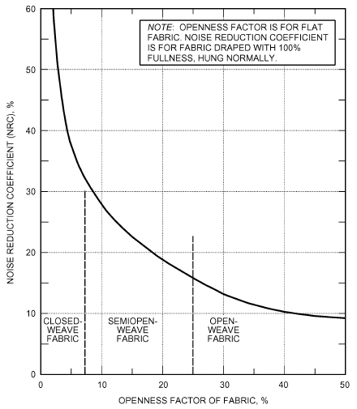

*Fig. 26 Noise Reduction Coefficient Versus Openness Factor for Draperies*

device can be used to control brightness for the other shading devices and, when used alone, to reduce brightness while still allowing some view of the outdoors.

**View Modification.** When the view is unattractive or distracting, draperies modify the view to some degree, depending on fabric weave and color (summarized in Table 15), but the fenestration product remains as an effective connection to the outdoors.

**Sound Control.** Indoor shading devices, particularly draperies, can absorb some sounds originating in the room but have little or no effect in preventing outdoor sounds from entering. For excessive internally generated sound, the usual remedy is to apply acoustical treatment to the ceiling and other room surfaces. Although these materials can be effective in controlling sound, they are often located on the two horizontal surfaces (ceiling and floor) and leave the opposing vertical surfaces of glazing and bare wall to reflect sound. The noise reduction coefficient (NRC = average absorptance coefficient at four frequencies) for venetian blinds is about 0.10, compared to 0.02 for glass and 0.03 for plaster. For drapery fabrics at 100% fullness, NRC ranges from 0.10 to 0.65, depending on the tightness of weave. Class III (tightly woven) fabrics have NRC values of 0.35 to 0.65. Figure 26 shows the relationship between NRC and openness factor for fabrics of normal weight.

### Double Drapery

Double draperies (two sets of drapery covering the same area) have a light, open weave on the fenestration product side for outward vision and daylight when desired and a heavy, closed weave or opaque drapery on the room side to block out sunlight and provide privacy when desired. When properly selected and used, double draperies can provide a reduced U-factor and a lowered IAC. The reduced U-factor results principally from adding a semiclosed air space to the barrier.

To most effectively reduce solar heat gain, drapery exposed to sunlight should have high reflectance and low transmittance. The light, open-weave drapery should be opened when the heavy drapery is closed to prevent entry of sunlight.

Properly used double draperies give (1) extreme flexibility of vision and light intensity, (2) a lowered U-factor and IAC, and (3) improved comfort, because the room-side drapery is more nearly at room temperature. Table 14 gives characteristics of individual draperies. For large areas, the IAC should be calculated in detail to determine the cooling load.

## 7. AIR LEAKAGE

### Infiltration Through Fenestration

Air infiltration through fenestration products affects occupant comfort and energy consumption. Infiltration is the uncontrolled inward leakage of air caused by pressure effects of wind or differences in air density, such as stack effect. Infiltration should not be confused with ventilation. Although fenestration products can be operated to intentionally provide natural ventilation and increase comfort, infiltration should be reasonably minimized to avoid unpleasant accompanying problems. If additional air is required, controlled ventilation is preferable to infiltration. Mechanical ventilation provides air in a comfortable manner and when desired. For infiltration, however, peak supply is more likely to occur as an uncomfortable draft and when least desired, such as during a storm or the coldest weather.

ASHRAE/IES Standard 90.1, ASHRAE’s energy standard for all buildings other than low-rise residential buildings, establishes an air leakage maximum of 0.3 L/s per square metre for curtain wall and storefront fenestration and 1.0 L/s per square metre of gross fenestration product area for most other products (5.0 L/s per square metre for glazed swinging entrance doors and revolving doors, 2.0 L/s per square metre for nonswinging opaque doors, and 1.5 L/s per square metre for unit skylights). This air leakage is as determined in accordance with NFRC Technical Document 400 (NFRC 2014h) and ASTM Standard E283 and allows direct comparison of all fenestration products: operable and fixed, windows and doors.

<!-- str. 406 -->

Most manufactured fenestration products achieve these reasonable standards of maximum air infiltration. However, products that do not completely seal, such as jalousie windows or doors, are not likely to do so and are most appropriate for installation in unconditioned spaces.

For products achieving this infiltration standard, energy consumption caused by infiltration is likely to be significantly less than energy associated with U-factor and solar heat gain coefficient. Also, although overall air infiltration is a significant component in determining a building’s heating and cooling loads, infiltration through fenestration products meeting the standard is generally likely to be a small portion of that total.

### Indoor Air Movement

Because supply air grilles are frequently located directly below fenestration products, air sweeps the indoor glazing surface. Heated supply air should be directed away from the glazing to prevent large temperature differences between the center and edges of the glazing. These thermal effects must be considered, particularly when annealed glass is used and air is forced over the glass surface during the heating season. Direct flow of heated air over the glass surface can increase the heat transfer coefficient and temperature difference, causing a substantial increase in heat loss, as well as leading to thermally induced stress and risk of glass breakage.

Systems designed predominantly for cooling lower the glazing temperature and rapidly pick up the cooling load. Both tend to improve comfort conditions. However, the air-conditioned space has an increased net heat gain caused by increases in (1) solar heat gain coefficient (SHGC) caused by delivery of more of the absorbed heat to the indoor space, (2) fenestration U-factor because of the greater convection effect at the indoor surface, and (3) air-to-air temperature difference because supply air rather than room air is in contact with the indoor glazing surface. The principal increase in heat gain with clear glazing is the result of increased U-factor and air-to-air temperature difference.

## 8. DAYLIGHTING

## 8.1 DAYLIGHT PREDICTION

Daylighting is the illumination of building interiors with sunlight and sky light and is known to affect visual performance, lighting quality, health, human performance, and energy efficiency. In many European countries with predominantly cloudy skies, codes regulate minimum window size, minimum daylight factor, and window position to provide views to all occupants and to create a minimum indoor brightness level. Daylighting also provides back-up indoor illumination in the event of power outages. Daylighting may have some positive or negative health effects on the skin, eyes, hormone secretion, and mood. Its intensity, spectral content, and diurnal and temporal variation may be used to combat jet lag, sick building syndrome, and other health problems.

In terms of energy efficiency, daylighting can provide substantial whole-building energy reductions in nonresidential buildings through the use of electric lighting controls. Daylight admission can displace the need for electric lighting at the perimeter zone with vertical windows (sidelighting) and at the core zone with skylights (toplighting) and special core sunlighting systems designed to bring sunlight to core spaces and distribute it as necessary, with good lighting quality. Lighting and its associated cooling energy use constitute 30 to 40% of a nonresidential building’s energy use. Energy use reductions can be achieved, perhaps less reliably, in residential buildings with manual or automated switching of electric lights on and off to match space occupancy. For internal-load-dominated buildings, daylight admission must be balanced against solar heat admission to achieve optimum energy efficiency. Because heat gains through the building envelope from solar radiation typically define peak load conditions, daylighting is also a very effective method of decreasing peak demand. Daylighting can not only decrease annual operating costs through energy efficiency, but may also reduce capital cost by mechanical system downsizing.

For daylighting designs using direct-beam sunlight entry, take care to avoid overheating and glare. Such problems can be avoided by carefully controlling or eliminating direct beam entry through orientation and shading of daylighting apertures, optical management components, and other architectural features.

For conventional sidelit nonresidential buildings, three basic relationships for daylight optimization are given as functions of (1) glazing properties and (2) fenestration area as a percent of the gross wall area:

1. Annual cooling energy use (including fan energy use) increases linearly with solar radiation admission, as indicated by the product of SHGC and WWR, but is affected (nonlinearly) by decreases in electric lighting heat gains.

2. Annual lighting energy use decreases exponentially/asymptotically with daylight admission, as indicated by the product of T<sub>v</sub> and WWR.

3. Annual heating energy use (including fan energy use) increases linearly with decreased lighting heat gains.

Figure 27 shows the first two relationships for a prototypical nonresidential building. A similar relationship can be demonstrated with skylights. Different shading properties and control would affect electricity use differently.

The fenestration design that achieves an optimum balance between daylight admission and solar rejection can be determined by iterative calculations where the glazing area and/or glazing solar-optical properties are varied parametrically (Tzempelikos and Athienitis 2005). For each case, the following general steps should be taken for each hour over a year:

1. **Indoor Daylight Illuminance.** Determine the building characteristics, configuration, outdoor design conditions, and operating schedules as described in Chapter 18. These include building orientation, outdoor obstructions, ground reflectance, etc. Determine the depth from the window wall for each electric lighting zone. Typical sidelighting windows can effectively daylight the perimeter zone to a depth of 1.5 times the head height of the window. In private offices, one dimming zone is typically cost effective, whereas in open-plan offices, two zones are cost effective.

Select a typical task location in each of the lighting zones. Determine indoor daylight illuminance from all window and skylight sources at these locations. Indoor illuminance may be determined using computer simulation tools or physical scale models. Comprehensive explanations of simple and computer-based tools are available (IEA 1999). The majority of these tools can model simple box geometry with noncomplex fenestration systems. Some advanced simulation tools, such as Radiance (Ward 1990) and Adeline (Erhorn and Dirksmöller 2000), can model complex geometry and fenestration systems with adequate bidirectional solar-optical data, but this capability is not routine.

2. **Lighting Energy Use.** Determine the type of lamps, ballasts, and control system to be used in the perimeter zones. Determine whether the lamp can be dimmed or switched. For example, LED and fluorescent lamps can be dimmed, but metal halides cannot be switched or dimmed. Cold, outdoor applications of some lamps may prevent switching. For electronic dimming ballasts, obtain dimming power and light output characteristics. Obtain control specifications to determine how the system will respond to available light; dead-band ranges, response times, and commissioning affect the sensitivity and accuracy of the system. The type of switching (on/off, bilevel, multilevel, and continuous dimming controls) are dictated by both the type of lamp and space use.

<!-- str. 407 -->

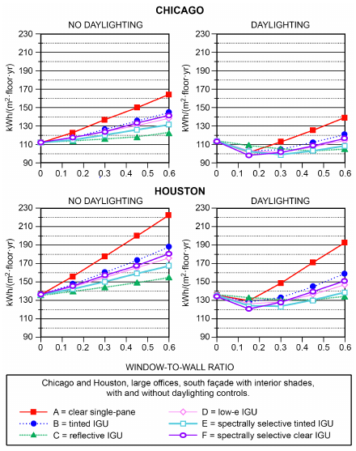

*Fig. 27 Window-to-Wall Ratio Versus Annual Electricity Use in kWh/(m2·floor·year)*

Determine the task illuminance design set point for each zone. Determine the percentage electric lighting power reduction F<sub>daylight</sub> that will result with automatic daylight controls, and apply to the installed wattage. Simplified methods for calculating lighting power reductions based on task illuminance levels are given in Robbins (1986). More sophisticated programs (Choi and Mistrick 1999) model commercially available photosensor dimming control systems (typically located in the ceiling above the work plane task) more rigorously; the spectral and bidirectional response of the photosensor to incident flux is used to determine voltage output, which is then used by the ballast controller algorithm to determine the lighting power reduction. Response delays and commissioning set points further affect this predicted output. Lights may also be switched manually, but there are very few modeling prediction tools for manual switching (Reinhart 2004). Field tests (Jennings et al. 1999) indicate that with bilevel switching, 45% of the lighting zone-hours were at less than full-power lighting, with 28% at only one-third of full lighting output levels. Manual switching occurred less in public spaces. Occupancy and other types of switching may occur as well and should be accounted for as a confounding effect with any daylighting controls.

3. **Mechanical Energy Use.** Determine mechanical energy use caused by fenestration loads and reduced electric lighting heat gains. Fenestration heat gains and losses may be computed using the section on Determining Fenestration Energy Flow.

Instantaneous lighting heat gains q<sub>el</sub>, described in Chapter 18, must be multiplied by the power reduction factor F<sub>daylight</sub>.

Mechanical loads and energy use may then be determined as described in Chapter 18. Many studies have investigated the magnitude of change in heating and cooling energy use associated with reductions of lighting energy use in nonresidential buildings, as will be realized with daylighting controls. In a DOE-2.1E simulation study (Sezgen and Koomey 1998), the greatest savings were generated in hospitals, large offices, and large hotels; for every $1.00 saved through lighting energy efficiency, additional savings as a result of reduced HVAC were $0.26, $0.16, and $0.14, respectively. These results emphasize the need to include HVAC effects when assessing the effects of daylighting. Simplified design tools are available to conduct such parametric runs for preliminary analysis. Skylighting tools based on regressions using DOE-2 data or simplified DOE-2 procedures are also available [American Architectural Manufacturers Association (AAMA) 1987; Heschong et al. 1998]. More comprehensive building energy prediction tools combined with daylighting algorithms, such as DOE-2.1E (Winkelmann 1983), implement hour-by-hour calculations using existing weather data and enable evaluation of glare, visual comfort, and quality of light as well (Hitchcock et al. 2008; Lee and Selkowitz 1995; Ochoa and Capeluto 2009; Tzempelikos and Athienitis 2007).

In the United States, a general rule has been that the fenestration area should be at least 20% of the floor area. In Europe, a similar rule was based on a minimum illumination value on the normal work plane from a standard overcast sky condition. In general, it is more energy efficient to use larger fenestration areas to elevate indoor surface brightness as a glare reduction strategy than to increase indoor electric lighting levels. As fenestration area increases, indoor brightness increases while fenestration brightness remains the same. Of course, mitigating considerations include increased cost and heat transfer with larger fenestration. The latter problem can be mitigated with multiple-pane fenestration and special coatings to reduce solar gain without serious loss of light transmission, as discussed in the section on Selecting Fenestration. Orientation and shading can also be effective at mitigating glare and overheating problems.

The secondary visual benefit of fenestration is the amount and quality of light it produces in the work environment. One general rule determined the need for auxiliary electric light by assuming that daylight was adequate for a depth of two and one-half times the height of the fenestration product into the room based on a normal sill height. To prevent excessive glare, all fenestration should have sun controls. Variable and removable controls are often more effective in daylighting than fixed controls.

For more accurate evaluation of daylight distribution in a space, several prediction tools, such as the *Recommended Practice of Day-* lighting (IES 1999), are available. This practice shows a simple way of calculating the daylight distribution on the work plane from windows and skylights with and without controls. Many other daylight prediction tools calculate illuminance from radiant flux transfer or ray tracing. The Illuminating Engineering Society’s Daylighting Committee, Subcommittee on Daylighting Metrics, identified various instantaneous and annual measures of daylighting performance in building spaces. New techniques and improved computer tools are being developed to help calculate these measures, and various building code bodies and energy incentive programs are expected to specify daylighting performance metrics for compliance with these programs.

Any or all of the various daylight prediction tools can be used to compare the relative value of daylight distribution from alternative fenestration systems, but ultimately the designer must evaluate costs and benefits to choose between alternative designs. This may be based on energy use or, more properly, on overall costs and benefits to the client. Also, the risk of total loss of productivity from an electric brown-out in a space with no natural ventilation or daylight may be as important as the benefits of many energy-saving schemes.

<!-- str. 408 -->

## 8.2 LIGHT TRANSMITTANCE AND DAYLIGHT USE

When daylight is to be the primary lighting system, the minimum expected daylight in the building must be calculated for the building performance cycle and integrated into lighting calculations. IES (1999) gives daylight design and calculation procedures. In some glazing applications, such as artists’ studios and showrooms, maximum transmittance may be required for adequate daylighting, and care is needed to maintain good color rendering when glazing tints and coatings are used. Regular clear glass, produced by float, plate, or sheet process, may be the logical choice.

When daylight is a supplementary light source, electric lighting can be designed independently of the daylight system. However, adequate switching must be included in the electric distribution to substitute available daylight for electric lighting by automatic or prescribed manual control whenever practical. Photosensitive controls automatically adjust shading devices to provide uniform illumination and reduce energy consumption. Manual control is less effective.

Buildings with large areas of glazing usually have glazing units with clear, tinted, or reflective coatings. Tinted and reflecting units reduce the brightness contrast between fenestration products and other room surfaces and provide a relatively glare-free environment for most daylight conditions.

Table 10 lists typical approximate solar energy transmittances and daylight transmittances for various glass types. Manufacturers’ literature has more appropriate type-specific values.

The color of glazing chosen for a building depends largely on where and how it is used. For commercial building lobbies, showroom fenestration products, and other areas where maximum visibility from outdoors to indoors is required, regular clear glass is generally best. Clear glass with a low-e coating is also suitable for these locations, including for retail storefronts, because it only decreases light transmittance by about 10%. For other glazing areas, tinted or coated glass may best complement the indoor colors. Bronze, gray, and reflective-film glasses also give some privacy to building occupants during daylight hours. Patterned, fritted, etched, or sandblasted glass that diffuses lighting is available. In warm climates, tinted outer glazing in an insulated double-pane system can have solar heat gain rejection benefits, while providing good colorrendering illumination of the interior without apparent color.

The primary purpose of a fenestration product is not just to save energy but to provide a view of the outdoors and bring useful daylight indoors. The light-transmitting properties of fenestration systems are therefore of great importance. It is conceivable that one could design a fenestration product with excellent solar heat gain performance for hot climates (meaning a very low solar heat gain coefficient) but very poor view and daylight illumination performance. If this problem is bad enough, it can cause occupants to turn on electric lights indoors during the daytime, which adds to the electric bill and possibly causes problems of thermal discomfort as well.

The light-transmitting property of a fenestration product is called the visible **transmittance T<sub>v</sub>**. It is similar to the solar-weighted solar transmittance, except that an additional weighting function is needed, in this case to account for the spectral response of the human eye.

In most applications, it is important to have high visible transmittance. In cooler climates, good solar heat gain is also important for offsetting wintertime heating costs. In warmer climates, low solar heat gain is good for offsetting summertime cooling costs. In the latter situation, it is difficult to have both high visible transmittance and a low solar heat gain coefficient. Figures 28 and 29 show plots of visible transmittance versus SHGC for several glazing systems covering a range of spectral selectivities (McCluney 1996). The data are for normal incidence and a single, ASTM standard solar spectral distribution.

For daylighting design, a rule of thumb is to select a glazing unit having a visible transmittance 1.5 to 2.0 times greater than its solar heat gain coefficient. For maximum light with minimum solar gain, there are fenestration products available having a visible transmittance as high as 3.0 times the SHGC. For maximizing passive solar gain (e.g., on a south orientation in a cold climate in the northern hemisphere), select a glazing unit with a low-e coating whose visible transmittance is greater than its solar heat gain coefficient.

Three different zones are delineated in Figure 29. In the **neutral zone**, it is possible to have colorless glazing systems (i.e., glazings with approximately uniform transmittance over the visible spectrum). Glazings in this zone can have some color, but this is not necessary. In the **color zone**, the only way to achieve higher visible transmittance for a given level of solar heat gain coefficient is by stripping off some of the red and blue wavelengths at the edges of

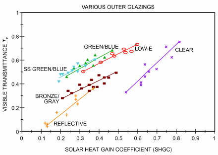

*Fig. 28 Visible Transmittance Versus SHGC for Several Glazings with Different Spectral Selectivities*

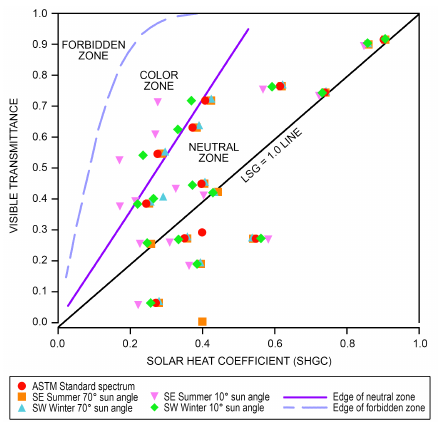

*Fig. 29 Visible Transmittance Versus SHGC at Various Spectral Selectivities*

> (McCluney 1996)

<!-- str. 409 -->

**Table 16 Spectral Selectivity of Several Glazings**

| Glazing | T<sub>v</sub> | SHGC | LSG |
|---|---|---|---|
| Reflective blue-green | 0.33 | 0.38 | 0.87 |
| Film on clear glass | 0.19 | 0.22 | 0.86 |
| Green tinted, medium | 0.75 | 0.69 | 1.09 |
| Green low-e | 0.71 | 0.49 | 1.45 |
| Sun-control low-e + green | 0.36 | 0.23 | 1.56 |
| Super low-e + clear | 0.71 | 0.40 | 1.77 |
| Super low-e + green | 0.60 | 0.30 | 2.00 |

the human spectral response function with a spectrally selective glazing transmittance, imparting color to the transmitted radiation (or by otherwise altering the spectral transmittance and hence the color over the visible portion of the spectrum). In the **forbidden zone**, no combination of visible transmittance and solar heat gain coefficient is possible for normal incidence and for the solar spectral distribution used. (Changing the solar spectral distribution used to calculate T<sub>v</sub> and SHGC shifts the transition curves somewhat. A low solar altitude angle, direct-beam spectrum will move the curves to the left on the plot in Figure 29.) Glazings that transmit more solar radiant heat than light cluster on the lower portion of the plot.

The T<sub>v</sub> versus SHGC chart can be a useful tool for illustrating the degree of spectral selectivity attained by a glazing system. These concepts lead to an index of spectral selectivity that can be useful. It is called the **light-to-solar-gain ratio (LSG)** (McCluney and Jindra 2001), defined as

> LSG = T<sub>v</sub>/SHGC&emsp;**(41)**

Some characteristic values for T<sub>v</sub>, SHGC, and LSG are given in Table 16 for several different glazings, using the ASTM standard spectral distribution at normal incidence to calculate the values.

The LSG can be useful in spotting errors in calculating the SHGC. Values of SHGC that lie outside reasonable ranges can be spotted fairly quickly and used to identify possible problems in calculations or measurements. In general, it is very difficult and therefore unlikely to have a useful glazing system for buildings with an LSG value greater than 3.0. Values below 0.3 should be particularly suspect, because they indicate a glazing that transmits considerably more heat than light and would be unlikely candidates for general use. Generally, a high value of LSG is desired for residential buildings in hot climates, to maximize daylight admission with minimal solar heat gain. This is also true for internal-load-dominated nonresidential buildings in many climates, because solar gain rejection is often desired for such buildings, even in cool or cold climates. Provided that the fenestration product has a low-e coating, an LSG value somewhat below 1.0 is appropriate in cold climates for residential buildings and nonresidential buildings without strong internal cooling loads.

## 9. SELECTING FENESTRATION

Because fenestration systems provide so many functions, and because environmental conditions and user needs vary widely, it is difficult to make a completely optimal selection of a fenestration system. Considering aesthetics and cost, visual and comfort performance, annual energy costs, peak-load consequences, and acoustic characteristics, the choice is seldom optimal. The HVAC system designer, fortunately, has a more restricted range of interests, mainly dealing with the energy consequences of a particular fenestration selection. This section therefore focuses on fenestration energy performance determination.

## 9.1 ANNUAL ENERGY PERFORMANCE

Instantaneous energy performance indices (e.g., U-factor, solar heat gain coefficient, visible transmittance, air leakage) are typically used to compare fenestration systems under a fixed set of conditions. However, the absolute and relative effect of these indices on a building’s heating and cooling load can fluctuate as environmental conditions change. Further, internal loads from electric lighting fluctuate as automatic controls dim or turn off electric lighting in response to available daylight. As a result, these indices alone are not good indicators of the annual energy performance attributable to the fenestration. Such energy performance is difficult to quantify in and of itself because of numerous dynamic responses between the fenestration system and the total environment in which it is installed. The four basic mechanisms of fenestration energy performance (thermal transfer, solar heat gains, air leakage, and daylighting) should all be taken into account but are not independent of many other parameters that influence performance. As a result, the annual energy performance of fenestration systems can be accurately determined only when many variables are considered. Building type and orientation, climate (weather, temperature, wind speed), microclimate (shading from adjacent buildings, trees, terrain), occupant usage patterns, and certain HVAC parameters can significantly affect the annual energy effects of fenestration systems.

For these reasons, the most effective means of establishing fenestration annual energy performance is through detailed, dynamic, hourly computer simulations for the specific building and climate of interest. Because instantaneous performance of fenestration often varies by differing magnitudes as climatic conditions change, the most accurate simulation results are obtained when these variances are accounted for in a building energy simulation computer program. After constructing the simulation model following the procedures defined in Chapters 17 and 18 (for residential and commercial construction, respectively), specific changes to the fenestration system can be modeled, and the annual energy performance changes attributable to fenestration can be quantified. These analytical techniques do not consider issues of performance durability for the various instantaneous indices and should only be used as an initial annual energy performance indicator (Mathis and Garries 1995).

### Simplified Techniques for Rough Estimates of Fenestration Annual Energy Performance

Although dynamic hourly modeling is certainly the most accurate technique for determining fenestration annual energy performance, and software for hourly modeling now runs on most desktop and laptop computers, it is not always available to decision makers and end users of fenestration products, simply because users may not want to make the necessary inputs to run the analysis. Under these circumstances, it may be useful to assess the relative importance of, or balance the trade-off between, the known instantaneous performance indices of U-factor, SHGC, T<sub>v</sub>, and air leakage, for any given fenestration system when considering heating, cooling, and lighting loads for many different building types and climates. Huang et al. (1999) and Mitchell et al. (1999, 2012) describe personal computer programs to run this simplified analysis for residential windows.

Broad generalizations can be made for some classifications of building types and climates. For instance, with large commercial buildings, which require substantial cooling energy use during daytime occupied hours because of high internal loads, significant thermal mass, or high orientation dependency, low SHGC is important to reduce the cooling load. Also, an evaluation of commercial fenestration annual energy use can take into account the trade-off between electric lighting and the natural daylighting benefits associated with a particular fenestration system. However, low U-factor is also important because commercial buildings have bimodal operation: they can have significant heating energy consumption during morning warm-up, which occurs during unoccupied predawn hours, before people arrive and lights and equipment are turned on, and before any passive solar gain. In low-rise, detached residential buildings, electric lighting loads are typically very small in comparison to the heating and cooling loads because of high envelope-dependent energy use, egress requirements, and occupant usage patterns. The slight energy benefits of daylighting may be neglected altogether when using light-emitting diode (LED) lighting, which reduces residential light loads substantially. Despite these generalizations, the problem still exists of balancing and assessing the effect of each of the remaining parameters to establish seasonal or annual energy performance for cases in which detailed computer modeling is not performed. Furthermore, in all building types, the fact that energy savings afforded by daylighting are small does not negate the desirability of well-controlled natural light: daylighting without glare or excessive contrast is an important amenity.

<!-- str. 410 -->

Developing simplified annual energy performance indices for fenestration typically involves using instantaneous fenestration performance indices to quantify building- and climate-independent scalars of annual or seasonal energy performance for rating purposes. Many of these performance indices can be relatively independent of building type, climate, distribution of products, orientation, and other items needed for hourly dynamic building energy analyses. These normalized, scalar-based approaches are also limited in accuracy for the same reasons. A further limitation of the simplified techniques is that they do not have broad applicability to varied building types (e.g., commercial versus residential buildings). The usefulness of these scalar-based approaches can be increased when limiting the comparison to a single building type. Currently, simplified techniques for characterizing fenestration annual energy performance are applicable only to fenestration systems for detached residential buildings and are not appropriate for use with multifamily residential or commercial building fenestration systems.

Where a building function requires controlling outdoor air through a door opening, evaluation of the fenestration annual energy performance involving the resulting air exchange cannot be based on instantaneous indices, but must be based on an annualized process. Evaluate an automated door product designed to limit dooropening, door-open, and door-closing times for its air exchange, air leakage, and thermal transmittance properties, and compare its performance to that of a conventionally operating automated insulated sectional door complying with U-factor and air leakage requirements. Because a door product limiting air exchange is specified in terms of the number of opening and closing cycles per day averaged over a one-year period, not only can its annual energy performance be assessed, but its heating and cooling savings can also be estimated with respect to the sectional door, assuming the same number of average cycles per day and a similar door-open time.

### Simplified Residential Annual Energy Performance Ratings

**Annual energy performance (AEP)** ratings can provide a simple means of product comparisons for consumers. These ratings have been derived with many assumptions, usually to suit local climatic conditions.

The Canadian Standards Association (CSA Standard A440.2) developed a simplified energy rating applicable to residential heating in the Canadian climate, which was adopted in the 1995 *National Energy Code for Houses*. The standard also provides for specific energy ratings to compare products by orientation and climate.

In the United States, where heating and cooling are both significant, NFRC is developing a rating system that includes both effects (Arasteh et al. 2000; Crooks et al. 1995). NFRC’s (2014i) Technical Document 901 provides guidance on how fenestration affects heating and cooling energy consumption in single-family residences.

In Australia, the Window Energy Rating Scheme (WERS; www .wers.net) publishes simplified, consumer-friendly AEP ratings for heating and cooling performance of residential windows. It displays regression-based AEP rankings as stars, on a scale of 0 to 10; one rating is for cooling performance, and another for heating. Ten stars for either heating and cooling corresponds to the “perfect” window for that purpose. As inputs, WERS uses U-factor and SHGC, determined using procedures licensed from the NFRC and the Australian Fenestration Rating Council (AFRC; www.afrc.org.au).

## 9.2 CONDENSATION RESISTANCE

Water vapor condenses in a film on fenestration surfaces that are at temperatures below the dew-point temperature of the indoor air. If the surface temperature is below freezing, frost forms. Sometimes, condensation occurs first, and ice from the condensed water forms when temperatures drop below freezing. Condensation frequently occurs on single glazing and on aluminum frames without a thermal break. The edge seal creates a thermal bridge at the perimeter of the glazing unit.

Circulation of fill gas caused by temperature differences in the glazing unit cavity contributes to the condensation problem at the bottom of the indoor glazing (Curcija and Goss 1994, 1995; Wright 1996b; Wright and Sullivan 1995a, 1995b). In winter, fill gas near the indoor glazing is warmed and flows up, while gas near the outdoor glazing is cooled and flows down. The descending gas becomes progressively colder until it reaches the bottom of the cavity. There, the gas turns and flows to the indoor glazing, resulting in higher heat transfer rates at the bottom. Thus, the bottom edge of the indoor glazing is cooled both by edge-seal conduction and by fillgas convection. The combined effect of these two heat transfer mechanisms is shown in Figure 30. The surface isotherms show a wider band of cold glazing at the bottom of the window. Typical condensation patterns match these isotherms. The vertical indoor surface temperature profile also shows the effect of edge-seal conduction and that the minimum indoor surface temperature is near the bottom edge of the glazing.

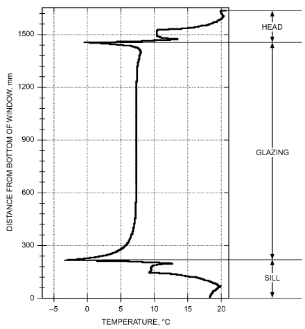

*Fig. 30 Temperature Distribution on Indoor Surfaces of Glazing Unit*

<!-- str. 411 -->

Condensation on fenestration and surrounding structures can cause extensive structural, aesthetic, and health problems. Specific examples include peeling of paint, rotting of wood, saturation of insulation, and mold growth. Ice can render doors and windows inoperable and prevent egress during an emergency.

Energy-efficient housing has been accompanied by reduced ventilation. The resulting increase in indoor humidity has contributed to the condensation problem. However, the solution does not lie in the reduction of humidity levels to a minimum. Relative humidity below 20% and above 70% can increase health risks and reduce comfort. Generally, a minimum of 30% rh should be maintained, and 40% to 50% is more desirable (Sterling et al. 1985). Consequently, a better solution is to improve the fenestration product so interior surface temperatures are warmer and condensation does not occur or is minimized.

Minimum indoor surface temperatures can be quantified in a variety of ways. De Abreu et al. (1996), Elmahdy (1996), Griffith et al. (1996), Sullivan et al. (1996), and Zhao et al. (1996) demonstrated good agreement between detailed two-dimensional numerical simulation and surface temperature measurements using thermographs. Curcija et al. (1996) and Wright and Sullivan (1995c) developed simplified simulation models to predict condensation resistance. Center-glass and bottom-edge surface temperatures that can be expected for two different glazing systems exposed to a range of outdoor temperature are shown in Figure 31. Both glazing systems include insulating foam edge seals. High-performance glazing systems (e.g., low-e/argon and insulated spacers) allow significantly higher indoor humidity levels.

Current measures of condensation resistance of a fenestration system are the **condensation resistance (CR)** as defined by NFRC 500 (2014j) and its user guide (2014h), the **condensation resis- tance factor (CRF)** as defined by AAMA (1988), or the **tempera- ture index (I)**, as defined in CSA Standards A440 and A440.1.

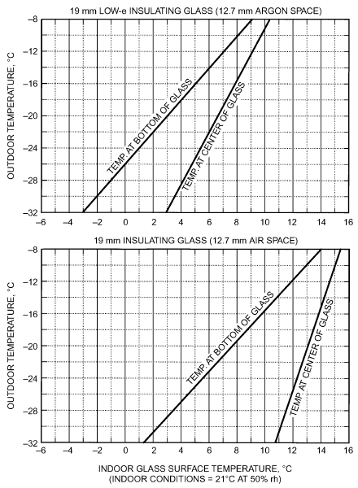

*Fig. 31 Minimum Indoor Surface Temperatures Before Condensation Occurs*

Note that the temperature index method in CSA Standard A440 stipulates that the test is performed on the fenestration with all the cracks not sealed. This represents a major difference between the CSA Standard A440 method and the AAMA and NFRC methods. There are some merits of leaving cracks unsealed during testing for condensation resistance. In particular, any inherent deficiencies in fenestration design may result in uncontrolled air leakage through the fenestration. This air leakage could not be detected or dealt with in the simulation models, and can only be seen in the results of the determined temperature index. On the other hand, there is some financial benefit to the window manufacturer in testing the fenestration for condensation resistance with cracks sealed, because one test can determine R-value and condensation resistance.

Research shows that air leakage does affect the temperature index (measure of condensation resistance as determined by CSA Standard A440). Elmahdy (2001, 2003) showed that sealing cracks during testing artificially improves the temperature index, compared to the results of the same window tested with cracks unsealed.

Condensation resistance is a measure of condensation potential, based on both area and temperature weighting and expressed as a minimum of center-of-glazing, edge-of-glazing, and frame CRs. The novelty of this index is that it is determined using computer simulation tools unless the overall thermal performance cannot be validated with testing. If thermal performance cannot be validated, a testing option for determining CR is used.

The other two standards define the values by a single dimensionless number as

> CRF or I = (t – t<sub>c</sub>)/(t<sub>h</sub>– t<sub>c</sub>)&emsp;**(42)**

where t<sub>h</sub> and t<sub>c</sub> are the warm- and cold-side temperatures, respectively. Figure 32 can be used to determine the acceptable range of CRF/I for a specific climatic zone.

The two standards differ in the methods used to determine temperature. The CSA test procedure is based on thermocouple measurements at the coldest location on the frame plus three locations on the glazing, each 10 mm above the bottom sightline. The AAMA procedure specifies two separate factors: one for the frame (CRF<sub>F</sub>), which uses weighted frame temperature obtained from surface temperature measurements at predetermined and roving locations on the frame, and one for the glazing unit (CRF<sub>G</sub>), which uses the average of six temperatures measured at predetermined locations near the top, middle, and bottom of the glazed area.

Indoor details can significantly alter the potential for condensation on fenestration surfaces. Items such as venetian blinds, roll blinds, insect screens, and drapes increase thermal resistance between the indoor space and fenestration and lower the temperature of the fenestration surfaces. These fenestration treatments do not prevent migration of moisture, so they can cause increased condensation. Figure 33 shows different situations that affect the potential for condensation. Note that window reveal plays an important role. If the window is placed near the outside of the wall, the increase in the outdoor film coefficient and decrease in the indoor film coefficient cause colder window surfaces. This effect is more pronounced near the corners of the recess where the indoor film coefficient is locally suppressed because air movement is restricted. Also, blinds should be placed at least 100 mm from the plane of the wall to allow some natural convection between the window and the blind.

Air leakage, especially in operable sections of fenestration, is another important cause of low surface temperature. Leakage near edge-of-glass sections can further increase the potential for condensation. However, the drier outdoor air decreases relative humidity near leakage sites and, in some cases, offsets the undesirable effect of lower surface temperatures. The net effect of air leakage cannot readily be determined experimentally or with simulation.

<!-- str. 412 -->

## 9.3 OCCUPANT COMFORT AND ACCEPTANCE

Human thermal comfort is an immediate sensation that reflects building occupants’ perceived response to many physical factors. Unlike much building design that is based primarily on long-term energy and economic considerations, comfort-related design focuses on, and must take heed of, short-term responses of the body’s physiology to its surroundings.

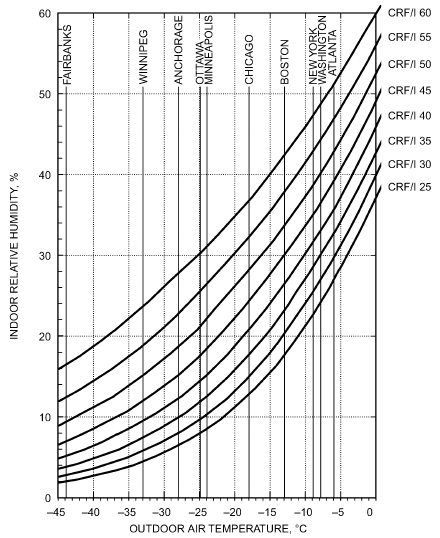

*Fig. 32 Minimum Condensation Resistance Requirements (th = 20°C)*

Fenestration influences thermal comfort through a combination of three mechanisms: long-wave radiation exchange, absorption of solar radiation, and convective draft effects (Figure 34). An understanding of these phenomena is important to help designers evaluate the benefits of improved fenestration and create comfortable buildings. Although it is well understood that high-performance fenestration can reduce building energy consumption, a better understanding of their effect on comfort might lead to further savings. For example, Hawthorne and Reilly (2000) suggest that significant energy consumption is caused by the standard practice of using perimeter duct distribution in houses to mitigate potential discomfort caused by fenestration. They found that perimeter heating is often not necessary when high-performance fenestration is installed and that heating energy savings of 10 to 15% could result from installing a simpler, less expensive duct system. Better windows can allow thermostat settings to be lowered with no loss of comfort. Another simulation study (Lyons et al. 2000) examined the relative magnitudes of a residential window’s physical influences under a wide variety of winter and summer climates, glazing parameters, and clothing levels. They found that

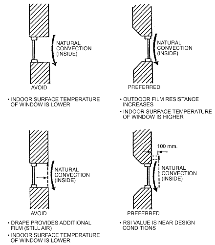

*Fig. 33 Location of Fenestration Product Reveals and Blinds/ Drapes and Their Effect on Condensation Resistance*

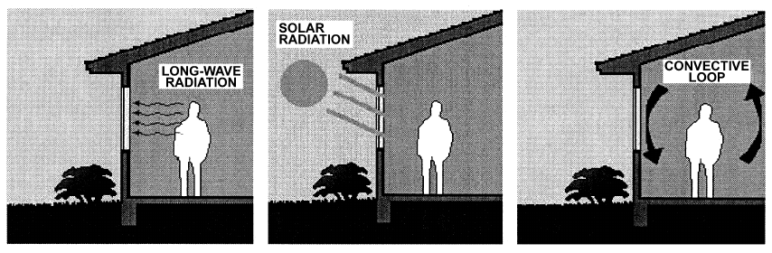

*Fig. 34 Fenestration Effects on Thermal Comfort: Long-Wave Radiation, Solar Radiation, Convective Draft*

<!-- str. 413 -->

- Long-wave, thermal radiation influences of the window dominate unless direct sun strikes the occupant
- Direct solar load has a major influence on perceptions of comfort
- For most residential-size windows, draft effects are generally small

With all but highly insulating fenestration, the indoor surface temperature of the fenestration is heavily influenced by outdoor conditions, and this temperature can significantly affect radiant heat exchange between an occupant and the environment. If this heat exchange moves outside the acceptable range, discomfort results. Mean radiant temperature (MRT) is commonly used to simplify the characterization of the radiant environment. On a cold day, the indoor surface temperature can easily drop below –9°C for a clear single-pane window and below 4°C for a clear, double-pane window. If the occupant is sitting sufficiently near the window, MRT could drop to 13°C for the single-pane case and 17°C for the double-pane case. Based on ASHRAE Standard 55, even use of the clear double-pane window could result in discomfort. [This example assumes an outdoor air temperature of –18°C, indoor air temperature of 22°C, nonwindow surface temperatures of 22°C, occupant/window view factor of 0.3, 0.9 clo (standard winter indoor clothing), and activity level of 1 met.] In addition to the MRT effect, a cold indoor glazing surface can induce a downward draft that increases air movement, contributing to further discomfort. If direct solar radiation strikes the glazing or occupant, the situation is much more complex. Conversely, for a double-pane window with a low-e coating and a triple-pane window with two low-e coatings, the net results would be MRTs of 19°C and 21°C, respectively. Both of these would satisfy the ASHRAE Standard 55 criteria for comfort.

In winter, the warming effect of sunlight on skin and clothing is often welcome, depending on the compounding effect of other factors such as air temperature. Fenestration also absorbs and transmits a significant amount of solar radiation. Because of such absorption, solar-heated fenestration may improve MRT for a nearby person. The premise of passive solar design is that occupants will welcome, or at least tolerate, solar gain in exchange for savings on heating energy. However, it is desirable that the onset of discomfort be able to be predicted; otherwise, the energy-saving design may be defeated if occupants draw shades to prevent overheating.

In summer, solar-heated glazing may become uncomfortably hot and, in commercial premises, actually devalue rented space near windows. The indoor surface of body-tinted, heat-absorbing glass can routinely reach temperatures above 50°C in summer conditions, raising MRT by as much as 8 K. This can be ameliorated by adding a second glazing on the indoors. Transmitted radiation often causes discomfort if it falls directly on the occupant. A person sitting near a window in direct solar radiation can experience heat gain equivalent to a 11 K rise in MRT (Arens et al. 1986). Similarly, in residential applications, the perceived need for solar control is affected both by the contribution of window surfaces to MRT and by overheating from direct solar load.

Advances in fenestration technology, especially high-performance glazings, mean that the designer has a choice of potential glazing systems. On the basis of annual energy performance for heating, cooling, and lighting, these alternatives may give similar outcomes. However, because they represent different combinations of U-factor, SHGC, and indoor glazing surface temperature, their comfort outcomes may differ considerably. Research continues to develop tools to help designers evaluate such difficult trade-offs. In the meantime, several general rules of thumb may be followed:

- In heating-dominated climates, fenestration with the lowest U-factor tends to give the best comfort outcomes. However, there is likely to be a trade-off between the twin goals of maximizing instantaneous comfort and minimizing annual energy consumption.

**Table 17 Sound Transmittance Loss for Various Types of Glass**

| Type of Glass | Sound Transmittance Loss, dB |
|---|---|
| 3 mm double-strength sheet glass | 24 |
| 6 mm plate or float glass | 27 |
| 13 mm plate glass | 32 |
| 19 mm plate glass | 35 |
| 25 mm plate glass | 36 |
| 6 mm laminated glass (11 mm plastic interlayer) | 30 |
| 25 mm double glass | 32 |
| 13 mm laminated glass (11 mm plastic interlayer) | 34 |
| Multiple-glazing unit, 150 mm air space, 6 mm plate or float glass | 40 |

- In cooling-dominated climates or for orientations where cooling loads are of concern, fenestration with the lowest rise in surface temperature for a given SHGC tends to give the best comfort outcomes.

### Sound Reduction

Proper acoustical treatment of outdoor walls can decrease noise levels in certain areas. The airtightness of a wall is the primary factor to consider in reducing sound transmission from outdoors. Once walls and fenestration products are tight, the choice of glazing and draperies becomes important. Draperies do not prevent sound from coming through the fenestration; they act as an absorber for sound that does penetrate. Table 17 lists average sound transmission losses for various types of glass. These averages apply for the frequency range of 125 to 4000 Hz and were determined by tests based on ASTM Standard E90.

### Strength and Safety

In addition to its thermal, visual, and aesthetic functions, glazing for building exteriors must also perform well structurally. Wind loads are specified in most building codes, and these requirements may be adequate for many structures. However, detailed wind tunnel tests should be run for tall or unusually shaped buildings and for buildings where the surroundings create unusual wind patterns. The strength of annealed, heat-strengthened, tempered, laminated, and insulated glass is given in ASTM Standard E1300.

Thermal expansion and contraction can break ordinary annealed glass. This expansion and contraction can be caused by solar radiation onto partly shaded glazing, by heat traps from drop ceilings and tight-fitting drapes, or by HVAC ducts incorrectly directed toward the glazing. High-performance tinted and reflective glasses with low-e coatings are usually more vulnerable to thermal stress breakage than clear glass. Heat treating (heat strengthening or fully tempering) the glass resists thermal stress breakage. Heat-strengthened glass, although not a safety glass, is usually preferred to tempered (safety) glass because it typically has less distortion and is much less likely to have spontaneous breakage, which can occur on very rare occasions in tempered glass. Consult the glass manufacturer or fabricator for information on thermal stress performance.

Building codes may require glass in certain positions to perform with certain breakage characteristics, which can be satisfied by tempered, laminated, or wired glass. In this case, glass should meet *Code of Federal Regulations* 16CFR1201 or other appropriate breakage performance requirements.

### Life-Cycle Costs

Alternative building shells should be compared to ensure satisfactory energy use and total energy budget compliance, if required. ASHRAE Standards 90.1 and 90.2 should be used as a starting point. A life-cycle cost model should be developed for each system considered. See Chapter 38 of the 2019 ASHRAE Handbook—HVAC Applications.

<!-- str. 414 -->

## 9.4 DURABILITY

Service life and long-term performance of fenestration systems depend on the durability of all the system’s components. Representative samples of glazing units are usually tested (for seal durability) according to test methods to ensure the integrity of the seal. Failure of glazing units is usually indicated by loss of adhesion of sealant to the glazing; as a result, fogging occurs inside the glazing cavity.

For argon-filled units, seal failure means a loss of argon and, hence, degradation in the unit’s thermal characteristics. Extensive study of the durability of glazing units filled with argon gas (Elmahdy and Yusuf 1995) indicated that, under normal conditions, argon loss by diffusion through the sealant is very small. However, when cracks or pinholes exist in the sealant, most of the argon gas escapes, which implies that stringent quality control procedures are essential for production of durable glazing units.

Degradation of organic materials and other chemical components in glazing units as a result of exposure to ultraviolet radiation is also a factor affecting durability and service life of fenestration systems. Low-e coatings on glass tend to enhance the appearance of chemical deposits on the glass surface. Also, inserting muntin bars in glazing cavities may result in excessive rates of unit failure during ultraviolet volatile (fogging) tests unless strict quality assurance processes are implemented. Current ASTM (United States) and CGSB (Canada) durability standards are being reviewed to reflect the emergence of new technologies in the fenestration industry.

A 15-year correlation study of insulating glazing units products by the Insulating Glass Manufacturers Association (IGMA) found that long-term performance and durability of glazing units correlated well with the test level to which the unit’s construction had been manufactured under ASTM Standard E2190’s specification for sealed glazing units. Units showing the highest percentage of resistance to seal failure were those tested in conformance with the ASTM Standard E2190 class CBA standard. Units that did not qualify to the A level showed a definite correlation to a higher percentage of failure. Field correlation studies found that units glazed in compliance with IGMA recommendations perform for longer periods than units not constructed properly, having deficiencies in the glazing system, or not meeting ASTM requirements.

Durability of fenestration systems also depends on durability of other system components, such as weatherstripping, gaskets, glazing tapes, air seals, and hardware. Wear of these elements with time and use may result in excessive air and water leakage, which affects overall performance and service life of the system. Excessive water leakage may cause damage to the fenestration product, especially the edge seal, as well as the wall section where the product is mounted. Excessive air leakage may lead to frost build-up and condensation on fenestration surfaces.

Studies conducted at the National Research Council of Canada (Elmahdy 1995) and elsewhere (Patenaude 1995) showed that, when windows are tested at high pressure and temperature differentials, they experience air leakage rates exceeding those determined at 75 Pa and zero temperature differential (conditions used in rating window air leakage in U.S. and Canadian standards). In other studies (CANMET 1991, 1993), pressure and motion cycling on windows resulted in excessive degradation in almost all performance factors, particularly condensation resistance, ease of operation, and air and water leakage.

To predict long-term performance, unit construction for glazing units should be tested and certified in accordance with ASTM Standard E2190 class CBA level and the requirements of IGMA or equivalent.

Durability may also affect long-term energy performance. Consequently, NFRC now requires third-party certification for sealedglass units.

## 9.5 SUPPLY AND EXHAUST AIRFLOW WINDOWS

**Airflow windows** allow air to flow between glass panes of multilayered glazing units, to improve the window assembly’s thermal performance.

**Exhaust air windows** allow indoor air to flow between the inner two panes of a triple-glazed window. In the cooling season, this airflow helps reduce the cooling load by transferring heat to the flowing air and discharging it to the outdoors. During the heating season, heat loss through the outer pane of the window comes mostly from exhaust airflow, which helps reduce thermal transmission loss through the window. In addition, exhaust airflow helps maintain the inner pane surface temperature close to the indoor air temperature, thus improving the thermal comfort of occupants (Haddad and Elmahdy 1998, 1999).

The **supply air window** allows outdoor air to flow between the outer two panes of a triple-glazed window and into the building. The airflow helps reduce the heating load when heat picked up by the flowing air finds its way back into the indoor space. In the cooling season, the supply air window may increase the cooling load when heat is picked up from the outer glass pane and delivered into the indoor space.

Haddad and Elmahdy (1998, 1999) provide results of computer models comparing thermal performance of supply and exhaust airflow windows with conventional windows in various locations in North America.

## 9.6 CODES AND STANDARDS

### National Fenestration Rating Council (NFRC)

The National Fenestration Rating Council (NFRC) was formed in 1989 to respond to a need for fair, accurate, and credible ratings for fenestration products. NFRC has developed rating procedures for U-factor [NFRC (2014a) Technical Document 100], solar heat gain coefficient and visible transmittance [NFRC (2014d) Technical Document 200], optical properties [NFRC (2014c) Technical Document 300], air leakage [NFRC (2014f) Technical Document 400], and condensation resistance [NFRC (2014j) Technical Document 500]. To provide certified ratings, manufacturers follow the requirements in the NFRC Product Certification Program (PCP), which involves working with laboratories accredited to the NFRC Laboratory Accreditation Program (LAP), and independent certification and inspection agencies accredited through the NFRC Certification Agency Program (CAP).

NFRC (2014a) Technical Document 100 was the first NFRC rating procedure approved and thus the first NFRC procedure adopted into energy codes in the United States. It requires using a combination of state-of-the-art computer simulations and improved thermal testing to determine U-factors for the whole product. The next step is product certification. NFRC has a series of checks and balances to ensure that the rating system is accurately and uniformly used. Products and their ratings are authorized for certification by an NFRC-licensed independent certification and inspection agency (IA). Finally, two labels are required: the temporary label, which contains the product ratings, and a permanent label, which allows tracking back to the IA and information in the NFRC Product Directory. In addition to informing the buyer, the temporary label provides the building inspector with information necessary to verify energy code compliance. The permanent label provides access to energy rating information for a future owner, property manager, building inspector, lending agency, or building energy rating organization.

<!-- str. 415 -->

This process has noteworthy features that make it superior to previous fenestration energy rating systems and correct past problems:

- The procedures provide a means for manufacturers to take credit for all the nuances and refinement in their product design and a common basis for others to compare product claims.
- Involvement of independent laboratories and the IA provides architects, engineers, designers, contractors, consumers, building officials, and utility representatives with greater confidence that the information is unbiased.
- Requiring simulation and testing provides an automatic check on accuracy. This also remedies a shortcoming of previous energy code requirements that relied on testing alone, which allowed manufacturers to perform several tests and then use the best one for code purposes.
- The certification process indicates that the manufacturer is consistently producing the product that was rated. This corrects a past concern that manufacturers were able to make an exceptionally high-quality sample and obtain a good rating in a test but not consistently produce that product.
- A readily visible temporary label can be used by the building inspector to quickly verify compliance with the energy code.
- A permanent label enables future access to energy rating information.

Although the NFRC program is similar for other fenestration characteristics, there are differences worth noting. Solar heat gain coefficient and visible transmittance ratings [NFRC (2014d) Technical Document 200], referenced in several codes, and condensation resistance ratings [NFRC (2014j) Technical Document 500] are based on simulation alone. Optical properties [NFRC (2014c) Technical Document 300] and emissivity [NFRC (2014g) Technical Document 301] are based on measurements by the manufacturer, with independent verification. Air leakage ratings [NFRC (2014h) Technical Document 400] are based on testing alone. For site-assembled fenestration products (e.g., curtain walls, window walls), an NFRC label certificate fulfills the labeling requirements and serves the certification purpose. A separate NFRC label certificate is required for each “individual product” in a particular project.

### United States Energy Policy Act (EPAct)

In the United States, the 1992 Energy Policy Act (EPAct) required the development of national fenestration energy rating systems and specified NFRC as the preferred developer. (The U.S. Department of Energy was to establish procedures if NFRC did not.) Although this recognition provided an impetus for NFRC to develop the desired procedures and programs, the EPAct sections on energy codes have been a key factor in their implementation.

EPAct set baselines for state energy codes. The ICC 2015 Inter-*national Energy Conservation Code<sup>®</sup> (IECC<sup>®</sup>)* and ASHRAE/IES Standard 90.1-2016, Energy Standard for Buildings Except Low-Rise Residential Buildings, are the current successors to the versions cited in the 1992 legislation. The majority of states have adopted the predecessors to the 2015 IECC (including the 2012, 2009, 2006, 2003, 2000, and 1998 IECC and the CABO 1995 Model Energy Code) and to ASHRAE/IES Standard 90.1-2016 (i.e., ASHRAE/IES Standard 90.1-2013/2010/2007/2004/2001/1999/1989) into their codes either directly or by reference when adopting a building code published by one of the three national code organizations in the United States. The ICC 2015 International Building Code (the U.S. model building code jointly developed by ICBO, BOCA, and SBCCI) references the 2015 IECC.

### ICC’s 2015 International Energy Conservation Code

The ICC’s 2015 IECC references NFRC (2014a) Technical Document 100 for U-factor (as did the 2012, 2009, 2006, 2003, 2000, and 1998 IECC and the 1995 *Model Energy Code*) and NFRC (2014d) Technical Document 200 for solar heat gain coefficient (SHGC) (as did the 2012, 2009, 2006, 2003, 2000, and 1998 IECC). Sections C303.1.1 and R303.1.3, which cover all occupancies, require U-factors and SHGCs and visible transmittances (T<sub>v</sub>s) of fenestration products (windows, doors, and skylights) to be determined in accordance with NFRC Technical Documents 100 and 200 by an accredited independent laboratory, and labeled and certified by the manufacturer. The language does not specify NFRC accreditation; however, it requires both the use of the NFRC rating procedure by an independent entity, and labeling and certification. Sections C402.4.3 and R402.4.3 cite NFRC (2014h) Technical Document 400, and others for air leakage testing.

### ASHRAE/IES Standard 90.1-2016

In 1999, ASHRAE and IES published a comprehensive update to Standard 90.1-1989 that included fenestration rating, labeling, and certification criteria in Sections 5.2.2 and 5.2.3. U-factors were to be determined in accordance with NFRC (2014a) Technical Document 100, solar heat gain coefficient and visible transmittance in accordance with NFRC (2014d) Technical Document 200, and air leakage in accordance with NFRC (2014h) Technical Document 400.

In 2001, ASHRAE and IES made nominal modifications to Standard 90.1. The most significant changes for the 2004 version were in the lighting section, with fenestration rating, labeling, and certification criteria found in Sections 5.8.2.

The 2007 revision included substantial increases in stringency for the building envelope, including both opaque assemblies and fenestration. The NFRC references remained unchanged.

The 2010 update had limited changes to the fenestration U-factor and SHGC criteria, but called for reduced air leakage. The standard began to address fenestration orientation and daylighting: in the northern hemisphere, vertical fenestration must have more area on the south side than on either the east or west side. Spaces with tall ceilings and under a roof must have a minimum skylight area for daylighting purposes. Exceptions are provided to the SHGC requirements for dynamic glazing.

The 2013 version made significant changes to fenestration U-factor and SHGC criteria. The standard expanded the consideration of daylighting by establishing criteria for a minimum VT/SHGC ratio where there is automatic control of lighting in daylight zones.

The 2016 update further changed the requirements for fenestration U-factors in most climate zones, and for SHGC in a few climate zones. Limited modifications were made to the fenestration orientation criteria.

For further information on U.S. energy codes, the Building Codes Assistance Project (BCAP) publishes a bimonthly summary entitled “Status of State Energy Codes,” which provides information on current codes and pending legislation. For additional information, contact BCAP at www.bcap-energy.org.

### ASHRAE/USGBC/IES Standard 189.1-2014

In 2006, ASHRAE, the U.S. Green Building Council (USGBC), and IES embarked on a project to develop a baseline standard for high-performance, green buildings that would apply to all buildings except low-rise residential buildings. Their Standard 189.1-2009 addresses sustainable sites, energy and water efficiency, the building’s effect on the atmosphere, materials and resources, and indoor environmental quality (IEQ). The standard is not a rating system, but it is hoped that it will be integrated into future building rating systems.

Energy-efficiency goals for the first version of Standard 189.1 were to achieve a 30% additional energy savings beyond that in ASHRAE/IES Standard 90.1-2007. Standard 189.1 builds on Standard 90.1, but the prescriptive option in Standard 189.1 substitutes more stringent values in the tables and adds other criteria. For example, the prescriptive option requires that, in the northern hemisphere, vertical fenestration on the west, south, and east be shaded by a device or devices with a 0.50 projection factor (e.g., an overhang that is one-half as wide as the window is tall).

<!-- str. 416 -->

There were subsequent updates in 2011 and 2014.

### ICC’s 2015 International Green Construction Code™

The ICC’s 2012 *International Green Construction Code™* (IgCC™) is an overlay code to ICC’s 2012 IECC. The fenestration criteria call for a 10% reduction in U-factor and SHGC from the 2012 IECC. The prescriptive option requires that, in the northern hemisphere, vertical fenestration on the west, south, and east be shaded by a device with a 0.25 projection factor (e.g., an overhang that is one-quarter as wide as the window is tall). The IgCC also allows ASHRAE/USGBC/IES Standard 189.1 as a compliance option.

After publication of the 2015 *International Green Construction* Code, ASHRAE and USGBC began investigating the possibilities for greater alignment between the IgCC and Standard 189.1.

### Canadian Standards Association (CSA)

In Canada, the Canadian Standards Association (CSA) promulgates fenestration energy rating standards. CSA Standard A440.2 addresses most fenestration products, and CSA Standard A453 addresses doors. These are companion standards to NFRC (2014a) Technical Document 100. NFRC and CSA established a Thermal Harmonization Task Force to attempt to harmonize their fenestration energy rating standards.

### Building Code of Australia/National Construction Code

In Australia, the Australian Building Codes Board maintains the *National Construction Code*, which includes the *Building Code of* Australia (BCA). The code is divided into separate volumes for residential and commercial construction. Sections 2 and 3 (residential) and Section J (commercial) set out various compliance paths for building envelope performance. Section J of the National Construction Code covers energy efficiency provisions for nonresidential building stock in Australia. To demonstrate compliance with Section J2 of the *National Construction Code*, the U-factor and SHGC of fenestration systems are to be rated in accordance to with Australian Fenestration Rating Council (AFRC; www.afrc.org.au), which adopts the same technical procedures as NFRC. Users should note that the energy provisions for fenestration systems are based on an energy-flow approach and do not have an upper limit for fenestration area as a percentage of gross wall area.

### Complex Glazings and Window Coverings

In North America, the European Union, and Australia, fenestration rating programs are being extended to include shading devices and other nonspecular, “complex” glazing layers. These rating schemes rely on expanded capabilities of existing modeling software and measurements of basic material properties, supported by a set of industry-consensus assumptions about fitting details. However, such calculations can also be performed in “expert” mode to serve the needs of building energy modelers who require exact, rather than generalized, details.

## 9.7 SYMBOLS

a = absorptance in a layer, considered as an isolated layer

A = total projected area of a fenestration product; apparent solar constant

A = absorptance in a layer or a collection of layers (system or

> subsystem)

e = hemispherical emissivity

E<sub>d</sub> = diffuse sky irradiance

E<sub>D</sub> = direct irradiance

E<sub>DN</sub> = direct normal irradiance

E<sub>r</sub> = diffuse ground reflected irradiance

E<sub>t</sub> = total irradiance

F<sub>R</sub> = radiant fraction h = surface heat transfer coefficient

> k = thermal conductivity
>
> L = glass thickness

> n = refractive index

P<sub>H</sub> = horizontal projection depth

P<sub>V</sub> = vertical projection depth

> q = instantaneous energy flux

Q = instantaneous energy flow

> R = reflectance of a layer or collection of layers (system or
>
> subsystem)

R<sub>H</sub> = height of opaque surface between fenestration product and horizontal projection

R<sub>W</sub> = width of opaque surface between fenestration product and vertical projection

S<sub>H</sub> = shadow height

S<sub>W</sub> = shadow width

SHGC = solar heat gain coefficient

> t = relative temperature

T = absolute temperature; transmittance of layer or collection of layers (system or subsystem)

U = overall coefficient of heat transfer

W = fenestration product width

### Greek

α = material absorptivity

> β = solar altitude angle
>
> γ = surface solar azimuth

> Δ = vertical projection profile angle
>
> δ = declination

> θ = incident angle
>
> λ = wavelength

> ξ = refractive angle

ρ<sub>g</sub> = ground reflectivity

> Σ = surface tilt
>
> τ = transmissivity

> φ = solar azimuth

Ω = horizontal projection profile angle

ϖ = solid angle

## REFERENCES

ASHRAE members can access ASHRAE Journal articles and ASHRAE research project final reports at technologyportal.ashrae .org. Articles and reports are also available for purchase by nonmembers in the online ASHRAE Bookstore at www.ashrae.org/bookstore.

AAMA. 1987*. Skylight handbook: Design guidelines.* American Architectural Manufacturers Association, Schamberg, IL.

AAMA. 1988. Voluntary test method for thermal transmittance and condensation resistance of windows, doors and glazed wall sections. Publication AAMA 1503.1-88. American Architectural Manufacturers Association, Schamberg, IL.

ADOPT. 1996. *Angle-dependent optical properties*. Commission of the European Communities, Standards, Measurement and Testing Programme, DG XII, Contract SMT4-CT96-2138. Coordinator A. Roos, University of Uppsala, Sweden.

AGSL. 1992. *Vision3: Glazing system thermal analysis—User manual*. Department of Mechanical Engineering, University of Waterloo, Ontario.

Allen, T. 1997. Conventional and tubular skylights: An evaluation of the daylighting systems at two ACT commercial buildings. *Proceedings of the* *22nd National Passive Solar Conference*, Washington, D.C., pp. 97-129.

Arasteh, D., J. Huang, R. Mitchell, B. Clear, and C. Kohler. 2000. A database of window annual energy use in typical North American single family houses. ASHRAE Transactions 106(1):562-574.

Arasteh, D., C. Kohler, and B. Griffith. 2009. Modeling windows in EnergyPlus with simple performance indices. Report LBNL-2804E. Lawrence Berkeley National Laboratory.

Arens, E.A., R. Gonzalez, and L. Berglund. 1986. Thermal comfort under an extended range of environmental conditions. ASHRAE Transactions 92(1).

ASHRAE. 2013. Thermal environmental conditions for human occupancy.

ANSI/ASHRAE Standard 55-2013.

ASHRAE. 2016. Energy standard for buildings except low-rise residential buildings. ANSI/ASHRAE/IES Standard 90.1-2016.

ASHRAE. 2007. Energy-efficient design of low-rise residential buildings.

ANSI/ASHRAE Standard 90.2-2007.

<!-- str. 417 -->

ASHRAE. 2014. Standard for the design of high-performance green buildings except low-rise residential buildings. ANSI/ASHRAE/USGBC/IES Standard 189.1-2014.

ASTM. 2009. Recommended practice for laboratory measurements of airborne sound transmission loss of building partitions. Standard E90-09. American Society for Testing and Materials, West Conshohocken, PA.

ASTM. 2012. Standard test method for determining rate of air leakage through exterior windows, curtain walls, and doors under specified pressure differences across the specimen. Standard E283-04 (2012). American Society for Testing and Materials, West Conshohocken, PA.

ASTM. 1992. Tables for terrestrial direct normal solar spectral irradiance tables for air mass 1.5. Standard E891-1989 (1992). Withdrawn 1999. American Society for Testing and Materials, West Conshohockehn, PA.

ASTM. 2011. Standard practice for calculation of photometric transmittance and reflectance of materials to solar radiation. Standard E971-11. American Society for Testing and Materials, West Conshohocken, PA.

ASTM. 2013. Standard test method for solar photometric transmittance of sheet materials using sunlight. Standard E972-92 (2013). American Society for Testing and Materials, West Conshohocken, PA.

ASTM. 2015. Standard test method for solar transmittance (terrestrial) of sheet materials using sunlight. Standard E1084-86 (2015). American Society for Testing and Materials, West Conshohocken, PA.

ASTM. 2015. Standard test method for determining solar or photopic reflectance, transmittance, and absorptance of materials using a large diameter integrating sphere. Standard E1175-87 (2015). American Society for Testing and Materials, West Conshohocken, PA.

ASTM. 2016. Standard practice for determining load resistance of glass in buildings. Standard E1300-16. American Society for Testing and Materials, West Conshohocken, PA.

ASTM. 2010. Standard specification for insulated glass unit performance and evaluation. Standard E2190-10. American Society for Testing and Materials, West Conshohocken, PA.

ASTM. 2012. Standard tables for reference solar spectral irradiances: Direct normal and hemispherical on 37° tilted surface. Standard G173-03 (2012). American Society for Testing and Materials, West Conshohocken, PA.

Barnaby, C.S., J.L. Wright, and M.R. Collins. 2009. Improving load calculations for fenestration with shading devices. ASHRAE Transactions 115(2):130-144.

Beck, F.A., B.T. Griffith, D. Turler, and D. Arasteh. 1995. Using infrared thermography for the creation of a window surface temperature database to validate computer heat transfer models*. Proceedings of Windows Inno-* *vations Conference ’95*, Toronto, ON.

Berdahl, P., and M. Martin. 1984. Emissivity of clear skies. Solar Energy 32(5).

Bessoudo, M., A. Tzempelikos, A.K. Athienitis, and R. Zmeureanu. 2010.

Indoor thermal environmental conditions near glazed facades with shading devices—Part I: Experiments and building thermal model. Building and Environment 45:2506-2516.

Boyce, P. C. Hunter, and O. Howlett. 2003. The benefits of daylight through windows. www.lrc.rpi.edu/programs/daylighting/pdf/DaylightBenefits .pdf. Lighting Research Center. New York.

Brandle, K., and R.F. Boehm. 1982. Airflow windows: Performance and applications. *Proceedings of Thermal Performance of the Exterior Enve-* *lopes of Buildings II*, ASHRAE/DOE Conference, ASHRAE Special Project SP-38.

CANMET. 1991. *A study of the long term performance of operating and* *fixed windows subjected to pressure cycling*. Catalogue M91-7/214-1993E. Efficiency and Alternative Energy Technology Branch, CAN-MET, Ottawa, ON.

CANMET. 1993. *Long term performance of operating windows subjected to* motion cycling. Catalogue M91-7/235-1993E. Efficiency and Alternative Energy Technology Branch, CANMET, Ottawa, ON.

Carbary, L., V. Hayez, A. Wolf, and M. Bhandari. 2009. Comparisons of thermal performance and energy consumptions of facades used in commercial buildings. *Proceedings of Glass Performance Days 2009*, pp. 89-94.

Carmody, J., S. Selkowitz, E.S. Lee, and D. Arasteh. 2004. Window systems *for high-performance buildings*. W.W. Norton & Company.

Carpenter, S., and A. Elmahdy. 1994. Thermal performance of complex fenestration systems. ASHRAE Transactions 100(2):1179-1186.

Carpenter, S., and J. Hogan. 1996. Recommended U-factors for swinging, overhead and revolving doors. ASHRAE Transactions 102(1):955-959.

Carpenter, S., and A. McGowan. 1993. Effect of framing systems on the thermal performance of windows. ASHRAE Transactions 99(1):907-914.

Carter, D.J. 2008. Tubular guidance systems for daylight: UK case studies.

*Building Research & Information* 36(5):520-535.

Carter, D.J,. and M. Al-Marwaee. 2009. User attitudes toward tubular daylight guidance systems. *Lighting Research and Technology* 41:71-88.

CEC. 2010. 2008 Building energy efficiency standards for residential and nonresidential buildings. *California Code of Regulations*, Title 24, Part 6. California Energy Commission.

CGDB. 2016. *Complex glazing database*. Lawrence Berkeley National Laboratory. windows.lbl.gov/software/CGDB/index.html.

Choi, A.S., and R.G. Mistrick. 1999. Analysis of daylight responsive dimming system performance. *Building and Environment* 34:231-243.

CIE. 2006. Tubular daylight guidance systems, CIE Technical Report 173:2006. Technical Committee TC3-38, International Commission on Illumination, Austria.

Code of Federal Regulations. Annual. *Safety standard for architectural glaz-* ing materials. 16CFR1201. U.S. Government Printing Office, Washington, D.C.

Collins, M.R., and J.L. Wright. 2006. Calculating center-glass performance indices of windows with a diathermanous layer. ASHRAE Transactions 112(2):22-29.

Collins, M.R., S.H. Tasnim, and J.L. Wright. 2008. Determination of convective heat transfer for glazing systems with between-the-glass louvered shades. *International Journal of Heat and Mass Transfer* 51:2742-2751.

Collins, M.R., J.L. Wright, and N.A. Kotey. 2011. Measuring off-normal solar optical properties of flat shading materials. *Journal of Measure-* ment (45):79-93.

Crooks, B.P., J. Larsen, R. Sullivan, D. Arasteh, and S. Selkowitz. 1995.

NFRC efforts to develop a residential fenestration annual energy rating methodology. *Proceedings of Windows Innovations Conference ’95*, Toronto, ON. Lawrence Berkeley Laboratory Publication 36896.

CSA. 2000. Windows. CAN/CSA Standard A440-00. Canadian Standards Association, Etobicoke, ON.

CSA. 2005. Windows/User selection guide to CSA Standard CAN/CSA-A440-00. CAN/CSA Special Publication A440.1-00 (R2005). Canadian Standards Association, Etobicoke, ON.

CSA. 2014. Fenestration energy performance. CAN/CSA Standard A440.2.

Canadian Standards Association, Etobicoke, ON.

CSA. 2000. Energy performance evaluation of swinging doors. CAN/CSA Standard A453-95 (R2000). Canadian Standards Association, Etobicoke, ON.

Curcija, D.C. 2005. *Discrepancies between ISO window simulation stan-* dards. Technical report to ISO TC 163, Subcommittee 2, Working Group 9. November 23, 2005.

Curcija, D., and W.P. Goss. 1994. Two-dimensional finite-element model of heat transfer in complete fenestration systems. ASHRAE Transactions 100(2):1207-1221.

Curcija, D., and W.P. Goss. 1995. Three-dimensional finite element model of heat transfer in complete fenestration systems. *Proceedings of Win-* *dows Innovations Conference ’95*, Toronto, ON.

Curcija, D., W.P. Goss, J.P. Power, and Y. Zhao. 1996. “Variable-h” model for improved prediction of surface temperatures in fenestration systems. Technical Report, University of Massachusetts at Amherst.

de Abreu, P., R.A. Fraser, H.F. Sullivan, and J.L. Wright. 1996. A study of insulated glazing unit surface temperature profiles using two-dimensional computer simulation. ASHRAE Transactions 102(2):497-507.

EEL. 1990. *FRAME/VISION window performance modelling and sensitivity* analysis. Institute for Research in Construction, National Research Council of Canada, Ottawa.

Elmahdy, A.H. 1995. Air leakage characteristics of windows subjected to simultaneous temperature and pressure differentials. Proceedings of *Windows Innovations Conference ’95*, CANMET.

Elmahdy, H. 1996. Surface temperature measurement of insulating glass units using infrared thermography. ASHRAE Transactions 102(2):489-496.

Elmahdy, A.H. 2001. To seal or not to seal? A critical look at the effects of air leakage on the condensation resistance of windows. The Whole-Life *Performance of Façades*, Bath, U.K.

Elmahdy, A.H. 2003. Quantification of air leakage effects on the condensation resistance of windows. ASHRAE Transactions 109(1):600-606.

<!-- str. 418 -->

Elmahdy, A.H., and S.A. Yusuf. 1995. Determination of argon concentration and assessment of the durability of high-performance insulating glass units filled with argon gas. ASHRAE Transactions 101(2):1026-1037.

El Sherbiny, S.M., K.G.T. Hollands, and G.D. Raithby. 1982. Heat transfer by natural convection across vertical and inclined air layers. Journal of Heat Transfer 104:96-102.

Erhorn, H., and M. Dirksmöller, eds. 2000. *Documentation of the software* *package ADELINE 3.* Fraunhofer Institut für Bauphysik, Stuttgart.

Ewing, W.B., and J.I. Yellott. 1976. Energy conservation through the use of exterior shading of fenestration. ASHRAE Transactions 82(1):703-733.

Finlayson, E.U., and D. Arasteh. 1993. WINDOW 4.0: Documentation of calculation procedures. Publication LBL-33943/UC-350, Lawrence Berkeley Laboratory, Energy & Environment Division, Berkeley, CA.

Griffith, B.T., D. Turler, and D. Arasteh. 1996. Surface temperatures of insulated glazing units: Infrared thermography laboratory measurements. ASHRAE Transactions 102(2):479-488.

Griffith, B., E. Finlayson, M. Yazdanian, and D. Arasteh. 1998. The significance of bolts in the thermal performance of curtain-wall frames for glazed facades. ASHRAE Transactions 105(1):1063-1069.

Gueymard, C.A. 2007. Advanced solar irradiance model and procedure for spectral solar heat gain calculation. ASHRAE Transactions 113(1):149-164.

Gueymard, C.A., and W.C. DuPont. 2009. Spectral effects on the transmittance, solar heat gain, and performance rating of glazing systems. Solar Energy 83:940-953.

Gueymard, C.A., and H.D. Kambezidis. 2004. Solar spectral radiation. Ch.

5 in *Solar radiation and daylight models*, T. Muneer, ed., pp. 221-301. Elsevier Butterworth-Heinemann, Oxford.

Haddad, K.H., and A.H. Elmahdy. 1998. Comparison of the thermal performance of a conventional window and a supply-air window. ASHRAE Transactions 104(1A):1261-1270.

Haddad, K.H., and A.H. Elmahdy. 1999. Comparison of the thermal performance of an exhaust-air window and a supply-air window. ASHRAE Transactions 105(2):918-926.

Hawthorne, W.A., and S. Reilly. 2000. The impact of glazing selection on residential duct design and comfort. ASHRAE Transactions 106(1):553-561.

Heschong, L., D. Mahone, F. Rubinstein, and J. McHugh. 1998. Skylighting guidelines. The Heschong Mahone Group, Sacramento, CA.

Hitchcock, R.J., R. Mitchell, M. Yazdanian, E. Lee, and C. Huigenza. 2008.

COMFEN—A commercial fenestration/façade design tool. Proceedings *of SimBuild 2008*, pp. 246-252.

Hogan, J.F. 1988. A summary of tested glazing U-values and the case for an industry wide testing program. ASHRAE Transactions 94(2).

Hollands, K.G.T. and J.L. Wright. 1982. Heat loss coefficients and effective τα products for flat plate collectors with diathermous covers. Solar Energy 30:211-216.

Huang, J., R. Mitchell, D. Arasteh, and S. Selkowitz. 1999. Residential fenestration performance analysis using RESFEN 3.1. Thermal Perfor-*mance of the Exterior Envelopes of Buildings VII*, ASHRAE.

Huang, N.Y.T., J.L. Wright, and M.R. Collins. 2006. Thermal resistance of a window with an enclosed venetian blind: Guarded heater plate measurements. ASHRAE Transactions 112(2):13-21.

Hutchins, M.G., A.J. Topping, C. Anderson, F. Olive, P.A. van Nijnatten, P.

Polato, A. Roos, and M. Rubin. 2001. Angle-dependent optical properties of coated glass products: results of an inter-laboratory comparison of spectral transmittance and reflectance. *Thin Solid Films* 392(2):269. ICC. 2015. *International building code<sup>®</sup>*(IBC<sup>®</sup>)<sup>.</sup>International Code Council, Washington, D.C.

ICC. 2015. *International energy conservation code<sup>®</sup>* (IECC<sup>®</sup>). International Code Council, Washington, D.C.

ICC. 2015. *International green construction code™* (IgCC™). International Code Council, Washington, D.C.

IEA. 1999. *Daylighting simulation: Methods, algorithms, and resources.* IEA SHC Task 21/ECBCS Annex 29. LBNL-44296, Lawrence Berkeley National Laboratory. www.iea-shc.org.

IES. 1999. *IES recommended practice of daylighting.* IES RP-5-99. Illuminating Engineering Society, New York.

ISO. 2015. Solar energy—Reference solar spectral irradiance at the ground at different receiving conditions—Part 1: Direct normal and hemispherical solar irradiance for air mass 1,5. Standard 9845-1992 (2005). International Organization for Standardization, Geneva.

ISO. 2006. Thermal performance of windows, doors and shutters—Calculation of thermal transmittance—Part 1: General. Standard 10077-1. International Organization for Standardization, Geneva.

ISO. 2012. Thermal performance of windows, doors and shutters—Calculation of thermal transmittance—Part 2: Numerical method for frames. Standard 10077-2. International Organization for Standardization, Geneva.

ISO. 2003. Thermal performance of windows, doors and shading devices—Detailed calculations. Standard 15099. International Organization for Standardization, Geneva.

Jennings, J.D., F.M. Rubinstein, D. DiBartolomeo, and S. Blanc. 1999.

*Comparison of control options in private offices in an advanced lighting* controls testbed. LBNL-43096, Lawrence Berkeley National Laboratory, Berkeley, CA.

Karlsson, J., M. Rubin, and A. Roos. 2001. Evaluation of some models for the angle-dependent total solar energy transmittance of glazing materials. Solar Energy 71(1).

Keyes, M.W. 1967. Analysis and rating of drapery materials used for indoor shading. ASHRAE Transactions 73(1):8.4.1.

Klems, J.H. 1989. U-values, solar heat gain, and thermal performance:

Recent studies using the MoWiTT. ASHRAE Transactions 95(1):609-617.

Klems, J.H. 1994a. A new method for predicting the solar heat gain of complex fenestration systems: I. Overview and derivation of the matrix layer calculation. ASHRAE Transactions 100(1):1065-1072.

Klems, J.H. 1994b. A new method for predicting the solar heat gain of complex fenestration systems: II. Detailed description of the matrix layer calculation. ASHRAE Transactions 100(1):1073-1086.

Klems, J.H. 2001. *Solar heat gain through fenestration systems containing* *shading: Procedures for estimating performance from minimal data*. LBNL-46682. Windows and Daylighting Group, Lawrence Berkeley National Laboratory, Berkeley, CA.

Kotey, N.A., J.L. Wright, and M.R. Collins. 2008. *Proceedings of the 3rd* *Annual Canadian Solar Buildings Conference*, Fredericton, NB. Solar Energy Society of Canada.

Kotey, N.A., M.R. Collins, J.L. Wright, and T. Jiang. 2009a. A simplified method for calculating the effective solar optical properties of a venetian blind layer for building energy simulation. *ASME Journal of Solar* Energy Engineering 131(2).

Kotey, N.A., J.L. Wright, and M.R. Collins. 2009b. Determination of angle-dependent solar optical properties of drapery fabrics. ASHRAE Transactions 115(2).

Kotey, N.A., J.L. Wright, and M.R. Collins. 2009c. A detailed model to determine the effective solar optical properties of draperies. ASHRAE Transactions 115(1).

Kotey, N.A., J.L. Wright, and M.R. Collins. 2009d. Determination of angle-dependent solar optical properties of roller blind materials. ASHRAE Transactions 115(1).

Kotey, N.A., J.L. Wright, and M.R. Collins. 2009e. Determination of angle-dependent solar optical properties of insect screens. ASHRAE Transactions 115(1).

Kotey, N.A., J.L. Wright, and M.R. Collins. 2011. A method for determining the effective longwave radiative properties of pleated draperies. HVAC&R Research (now *Science and Technology for the Built Environ-* ment) 17(5):660-669.

Kruis, N. 2016. Representative layer-by-layer descriptions for fenestration systems with specified bulk properties such as U-factor and SHGC. ASHRAE Research Project RP-1588, Report.

Laouadi, A. 2004. Design with SkyVision: A computer tool to predict daylighting performance of skylights. *CIB World Building Conference*, Toronto, pp. 1-11.

Laouadi, A. 2013. Advanced performance prediction of tubular daylighting devices: New research from the National Research Council of Canada takes an in-depth look inside TDDs. *Lighting Design and Application* (September):52.

Laouadi, A., A.D. Galasiu, M.R. Atif, and A. Haqqani. 2003. SkyVision: A software tool to calculate the optical characteristics and daylighting performance of skylights. *Building Simulation, 8th IBPSA Conference*, Eindhoven, Netherlands, pp. 705-712.

Laouadi, A., H.H. Saber, A.D. Galasiu, and C. Arsenault. 2013a. Optical model for tubular hollow light guides (1415-RP). HVAC&R Research (now *Science and Technology for the Built Environment*) 19(3):324-334.

<!-- str. 419 -->

Laouadi, A., A.D. Galasiu, H.H. Saber, and C. Arsenault. 2013b. Tubular daylighting devices- part I: development of an optical model (1415-RP). HVAC&R Research (now *Science and Technology for the Built Environ-* ment) 19(5):536-556.

Laouadi, A., C. Arsenault, H.H. Saber, and A.D. Galasiu. 2013c. Tubular daylighting devices- part II: validation of the optical model (1415-RP). HVAC&R Research (now *Science and Technology for the Built Environ-* ment) 19(5):557-572.

Laouadi, A., H.H. Saber, A.D. Galasiu, and C. Arsenault. 2013d. Tubular daylighting devices—Development and validation of a thermal model (1415-RP). HVAC&R Research (now *Science and Technology for the* Built Environment) 19(5):513-535.

LBNL. 2016. WINDOW 7. Windows and Daylighting Group, Lawrence Berkeley Laboratory, Berkeley, CA. windows.lbl.gov/software/window /window.html.

Lee, E., and S.E. Selkowitz. 1995. The design and evaluation of integrated envelope and lighting control strategies for commercial buildings. ASHRAE Transactions 101(1):326-342.

Lyons, P.R., D.A. Arasteh, and C. Huizenga. 2000. Window performance for human thermal comfort. ASHRAE Transactions 106(1):594-602.

Lyons, P., J. Wong, and M. Bhandari. 2010. A comparison of window modeling methods in Energyplus 4.0. SimBuild 2010, New York.

Mathis, R.C., and R. Garries. 1995. Instant, annual life: A discussion on the current practice and evolution of fenestration energy performance rating. *Proceedings of Windows Innovations Conference ’95*, Toronto, ON.

McCluney, R. 1990. Awning shading algorithm update. ASHRAE Transactions 96(1):34-38.

McCluney, R. 1993. Sensitivity of optical properties and solar gain of spectrally selective glazing systems to changes in solar spectrum. Solar ’93, 22nd American Solar Energy Society Conference, Washington, D.C.

McCluney, R. 1994a. Angle of incidence and diffuse radiation influences on glazing system solar gain. *Proceedings Solar ’94 Conference*, American Solar Energy Society, San Jose, CA.

McCluney, R. 1994b. *Introduction to radiometry and photometry*. Artech House, Boston.

McCluney, R. 1996. Sensitivity of fenestration solar gain to source spectrum and angle of incidence. ASHRAE Transactions 102(2):112-122.

McCluney, R., and P. Jindra. 2001. *Industry guide to selecting the best res-* *idential window options for the Florida climate*. FSEC-PF-358-01. Florida Solar Energy Center, University of Central Florida, Cocoa.

McGowan, A, R. Jutras, G. Riopel, and M. Hanam. 2006. Heat transfer through roll-up doors, revolving doors and opaque non-residential swinging, sliding and rolling doors. ASHRAE Research Project RP-1236, Final Report.

Mitchell, R., J. Huang, D. Arasteh, R. Sullivan, and S. Phillip. 1999. RES-*FEN 3.1: A PC program for calculating the heating and cooling energy* *use of windows in residential buildings—Program description.* LBNL-40682 Rev. BS-371. Lawrence Berkeley National Laboratory, Berkeley, CA.

Mitchell, R., M. Yazdanian, L. Zhu, D. Arasteh, and J. Huang. 2012. RES-*FEN6: Program description*. LBNL-40682 Rev. Lawrence Berkeley National Laboratory, Berkeley, CA.

Moeseke, G., I. Bruyere, and A.D. Herde. 2007. Impact of control rules on the efficiency of shading devices and free cooling for office buildings. *Building and Environment* 42:784-793.

Newsham, G.R. 1994. Manual control of window blinds and electric lighting: implications for comfort and energy consumption. Indoor Environment 3, pp. 135-144.

NFRC. 2014a. Procedure for determining fenestration product U-factors.

Technical Document 100-2014. National Fenestration Rating Council, Silver Spring, MD.

NFRC. 2014b. *Spectral data library.* Available from www.nfrc.org /software.aspx. National Fenestration Rating Council, Silver Spring, MD.

NFRC. 2014c. Standard test method for determining the solar optical properties of glazing materials and systems. Technical Document 300-2014. National Fenestration Rating Council, Silver Spring, MD.

NFRC. 2014d. Procedure for determining fenestration product solar heat gain coefficient and visible transmittance at normal incidence. Technical Document 200-2014. National Fenestration Rating Council, Silver Spring, MD.

NFRC. 2014e. Procedure for interim standard test method for measuring he solar heat gain coefficient of fenestration systems using calorimetry hot box methods. Technical Document 201-2014. National Fenestration Rating Council, Silver Spring, MD.

NRFC. 2014f. Procedure for determining visible transmittance of tubular daylighting devices. Technical Document 203-2014. National Fenestration Rating Council, Silver Spring, MD.

NFRC. 2014g. Standard test method for emittance of specular surfaces using spectromteric measurements. Technical Document 301-2014. National Fenestration Rating Council, Silver Spring, MD.

NFRC. 2014h. Procedure for determining fenestration product air leakage.

Technical Document 400-2014. National Fenestration Rating Council, Silver Spring, MD.

NFRC. 2014i. Guidelines to estimate the effects of fenestration on heating and cooling energy consumption in single family residences. Technical Document 901-2014. National Fenestration Rating Council, Silver Spring, MD.

NFRC. 2014j. Procedure for determining fenestration product condensation resistance values. Technical Document 500-2014. National Fenestration Rating Council, Silver Spring, MD.

NFRC. 2014k. User guide to the procedure for determining fenestration product condensation resistance rating values. Technical Document 501-2014. National Fenestration Rating Council, Silver Spring, MD.

NRCC. 2011. Tubular daylighting devices: An alternative to skylights. Construction Innovation 16(1). National Research Council Canada, Ottawa.

Ochoa, C.E., and I.G. Capeluto. 2009. Advice tool for early design stages of intelligent facades based on energy and visual comfort approach. Energy and Buildings 41(5):480-488.

Parmelee, G.V., and R.G. Huebscher. 1947. Forced convection heat transfer from flat surfaces. ASHVE Transactions, pp. 245-284.

Patenaude, A. 1995. Air infiltration rate of windows under temperature and pressure differentials. *Proceedings of Windows Innovations Conference* ’95, Toronto, ON.

Pennington, C.W., and G.L. Moore. 1967. Measurement and application of solar properties of drapery shading materials. ASHRAE Transactions 73(1):8.3.1.

Rao, S.R., and A. Tzempelikos. 2012. The impact of a combined dynamic shading system on the thermal performance of building perimeter zones. ASHRAE Transactions 118(1):265-273.

Reinhart, C.F. 2004. Lightswitch-2002: A model for manual and automated control of electric lighting and blinds. Solar Energy 77(2004):15-28.

Robbins, C.L. 1986. *Daylighting: Design and analysis*. Van Nostrand Reinhold, New York.

Rubin, M. 1982a. Solar optical properties of windows. Energy Research 6:

122-133.

Rubin, M. 1982b. Calculating heat transfer through windows. Energy Research 6:341-349.

Rubin, M. 1985. Optical constants and bulk optical properties of soda lime silica glasses for windows. *Solar Energy Materials* 12:275-288.

Rubin, M., K. von Rottkay, and R. Powles. 1998. Window optics. Solar Energy 62(3):149-161.

Rubin, M., R. Powles, and K. von Rottkay. 1999. Models for the angle-dependent optical properties of coated glazing materials. Solar Energy 66(4):267-276.

Schutrum, L.F., and N. Ozisik. 1961. Solar heat gains through domed skylights. ASHRAE Journal, pp. 51-60.

Sezgen, O., and J.G. Koomey. 1998. *Interactions between lighting and space* *conditioning energy use in U.S. commercial buildings.* LBNL-39795, Lawrence Berkeley National Laboratory, Berkeley, CA. eetd.lbl.gov /sites/all/files/lbnl-39795.pdf.

Shen, H., and A. Tzempelikos. 2012. Daylighting and energy analysis of private offices with automated interior roller shades. *Solar Energy 86*, pp. 681-704.

Shewen, E.C. 1986. *A Peltier-effect technique for natural convection heat* *flux measurement applied to the rectangular open cavity.* Ph.D. dissertation. Department of Mechanical Engineering, University of Waterloo, ON.

Smith, W.A., and C.W. Pennington. 1964. Shading coefficients for glass block panels. ASHRAE Journal 5(12):31.

Sodergren, D., and T. Bostrom. 1971. Ventilating with the exhaust air window. ASHRAE Journal 13(4):51.

Sterling, E.M., A. Arundel, and T.D. Sterling. 1985. Criteria for human exposure in occupied buildings. ASHRAE Transactions 91(1).

Sullivan, H.F., J.L. Wright, and R.A. Fraser. 1996. Overview of a project to determine the surface temperatures of insulated glazing units: Thermographic measurement and two-dimensional simulation. ASHRAE Transactions 102(2):516-522.

<!-- str. 420 -->

Tzempelikos, A., and A.K. Athienitis. 2005. Integrated daylighting and thermal analysis of office buildings. ASHRAE Transactions 111(1):227-238.

Tzempelikos, A., and A.K. Athienitis. 2007. The impact of shading design and control on building cooling and lighting demand. Solar Energy 81(3), 369-382.

van Dijk, D. 2003. *Comparison of standards on thermal, solar and/or light* *properties of windows and window components*. TNO Building and Construction Research, Delft, Netherlands. April 8.

Ward, G.W. 1990. Visualization. *Lighting Design + Application* 20(6):4-20. Winkelmann, F.C. 1983. *Daylighting calculation in DOE-2*. LBNL-11353.

Lawrence Berkeley National Laboratory, Berkeley, CA.

Wong, J.C.S. 2016. Personal communication.

Wright, J.L. 1995a. *VISION4 glazing system thermal analysis: Reference* manual. Advanced Glazing System Laboratory, University of Waterloo.

Wright, J.L. 1995b. Summary and comparison of methods to calculate solar heat gain. ASHRAE Transactions 101(1):802-818.

Wright, J.L. 1996a. A correlation to quantify convective heat transfer between window glazings. ASHRAE Transactions 102(1):940-946.

Wright, J.L. 1996b. A simplified numerical method for assessing the condensation resistance of windows. ASHRAE Transactions 104(1):1222-1229.

Wright, J.L. 2008. Calculating centre-glass performance indices of glazing systems with shading devices. ASHRAE Transactions 114(2):199-209.

Wright, J.L., and H.F. Sullivan. 1995a. A two-dimensional numerical model for glazing system thermal analysis. ASHRAE Transactions 101(1):819-831.

Wright, J.L., and H.F. Sullivan. 1995b. A two-dimensional numerical model for natural convection in a vertical, rectangular window cavity. ASHRAE Transactions 100(2):1193-1206.

Wright, J.L., and H.F. Sullivan. 1995c. A simplified method for the numerical condensation resistance analysis of windows. *Proceedings of Win-* *dows Innovations Conference ’95*, Toronto, ON.

Wright, J.L., N.Y.T. Huang, and M.R. Collins. 2008. Thermal resistance of a window with an enclosed venetian blind: A simplified model. ASHRAE Transactions 114(1):471-482.

Wright, J.L., M.R. Collins, and N. Kotey. 2009a. Solar gain through windows with shading devices: Simulations versus measurements. ASHRAE Transactions 115(2):18-30.

Wright, J.L., C. Barnaby, M.R. Collins, and N. Kotey. 2009b. Improving load calculations for fenestrations with shading devices. ASHRAE Research Project RP-1311, Final Report.

Yazdanian, M., and J.H. Klems. 1993. Measurement of the exterior convective film coefficient for windows in low-rise buildings. ASHRAE Transactions 100(1):1087-1096.

Yellott, J.I. 1963. Selective reflectance—A new approach to solar heat control. ASHRAE Transactions 69:418.

Zhang, X., and T. Muneer. 2000. Mathematical model for the performance of lightpipes. *Lighting Research and Technology* 32(3):141-146.

Zhao, Y., D. Curcija, and W.P. Goss. 1996. Condensation resistance validation project—Detailed computer simulations using finite element methods. ASHRAE Transactions 102(2):508-515.

## BIBLIOGRAPHY

Wright, J.L., and N.A. Kotey. 2006. Solar absorption by each element in a glazing/shading layer array. ASHRAE Transactions 112(2):3-12.

Zhao, Y., D. Curcija, and W.P. Goss. 1999. Convective heat transfer correlations for fenestration glazing cavities: A review. ASHRAE Transactions 105(2).
