# Chapter 16 — Ventilation and Infiltration

*Izvor: 2021 ASHRAE Handbook — Fundamentals (SI), Chapter 16 (PDF str. 421–459).*

> **Napomena o konverziji:** Tekst je automatski izdvojen iz originalnog PDF-a uz prepoznavanje dve kolone, spojene prelomljene reči i pasuse. Indeksi i eksponenti su označeni sa ``/``, tabele su pretvorene u Markdown tabele (veoma složene tabele su prikazane kao poravnat tekst), a slike su izrezane iz PDF-a u folder `img/`. Složene jednačine (razlomci, sume) mogu biti uprošćeno prikazane. **Pre upotrebe vrednosti u proračunu proveriti u originalnom PDF-u.** Oznake `<!-- str. N -->` pokazuju stranu PDF-a.

## Sadržaj

- [1. BASIC CONCEPTS AND TERMINOLOGY](#1-basic-concepts-and-terminology)
- [2. TRACER GAS MEASUREMENTS](#2-tracer-gas-measurements)
- [3. DRIVING MECHANISMS FOR VENTILATION AND INFILTRATION](#3-driving-mechanisms-for-ventilation-and-infiltration)
- [4. INDOOR AIR QUALITY](#4-indoor-air-quality)
- [5. THERMAL LOADS](#5-thermal-loads)
- [6. NATURAL VENTILATION](#6-natural-ventilation)
- [7. RESIDENTIAL AIR LEAKAGE](#7-residential-air-leakage)
- [8. RESIDENTIAL VENTILATION](#8-residential-ventilation)
- [9. RESIDENTIAL IAQ CONTROL](#9-residential-iaq-control)
- [10. SIMPLIFIED MODELS OF RESIDENTIAL VENTILATION AND INFILTRATION](#10-simplified-models-of-residential-ventilation-and-infiltration)
- [11. COMMERCIAL AND INSTITUTIONAL AIR LEAKAGE](#11-commercial-and-institutional-air-leakage)
- [12. COMMERCIAL AND INSTITUTIONAL VENTILATION](#12-commercial-and-institutional-ventilation)
- [13. OFFICE BUILDING EXAMPLE](#13-office-building-example)
- [14. SYMBOLS](#14-symbols)
- [REFERENCES](#references)
- [BIBLIOGRAPHY](#bibliography)

<!-- str. 421 -->

PROVIDING a comfortable and healthy indoor environment for building occupants is the primary concern of HVAC engineers.

Comfort and indoor air quality (IAQ) depend on many factors, including thermal regulation; control of internal and external sources of pollutants; supply of acceptable air; removal of unacceptable air; occupants’ activities and preferences; and proper construction, operation, and maintenance of building systems. Proper ventilation and infiltration are only part of achieving acceptable indoor air quality and thermal comfort. HVAC designers, occupants, and building owners must be aware of and address other factors as well. Further information on indoor environmental health may be found in Chapter 10. Changing ventilation and infiltration rates to solve thermal comfort problems and reduce energy consumption can affect indoor air quality and may be against building code or other regulations, so any changes should be approached with care and be under the direction of a registered professional engineer with expertise in HVAC analysis and design.

HVAC design engineers and others concerned with building ventilation and indoor air quality should obtain a copy of ASHRAE Standard 62.1 or 62.2, or those for specific applications (e.g., Standard 170 for health care), whichever is most relevant to the project. These standards are reviewed regularly and contain ventilation design and evaluation requirements for commercial and institutional (Standard 62.1) and residential (Standard 62.2) buildings, respectively. When designing a new building or analyzing an existing building, check which version of Standard 62 has been adopted by the local code authority. An existing building may be required to meet the current version of the standard, or allowed to comply with an older version. The last chapter of each year’s ASHRAE Handbook (Chapter 39 of this volume) has a list of current standards.

This chapter addresses commercial and institutional buildings, where ventilation concerns usually dominate (though infiltration should not be ignored), and single- and multifamily residences, where infiltration has traditionally been considered most important but ventilation issues have received increased attention in recent years. Basic concepts and terminology for both are presented before more advanced analytical and design techniques are given. Ventilation of industrial buildings is covered in Chapter 31 of the 2015 *ASHRAE Handbook—HVAC Applications*. However, many of the fundamental ideas and terminology presented in this chapter can also be applied to industrial buildings.

### Sustainable Building Standards and Rating Systems

Good indoor air quality is necessary for maintaining health and high productivity. Consequently, sustainable building standards such as ASHRAE Standard 189.1 and building rating systems, such as U.S. Green Building Council’s (USGBC) Leadership in Energy and Environmental Design™ (LEED®) program, place great importance on creating and maintaining acceptable IAQ. In fact, the LEED rating system was first developed to address IAQ concerns, and roughly one-quarter of the available credit points for new commercial buildings are still IAQ related. Preparers of such rating systems, like others, have struggled with how to characterize complex ventilation and infiltration issues. These issues are addressed in detail by many portions of this chapter; separate ASHRAE design guides, manuals, books, and standards; and the references cited; these sources also provide methods to demonstrate the effectiveness of various HVAC systems and techniques in providing good IAQ in residential, commercial, and other buildings. In all designs, care is needed to eliminate excessive ventilation (e.g., beyond that needed for IAQ or by an air-side economizer) to avoid inappropriately increasing energy use. Increasing the ventilation rate above that required by Standard 62.1, for example, does not necessarily increase the acceptability of the indoor air quality.

The preparation of this chapter is assigned to TC 4.3, Ventilation Requirements and Infiltration.

## 1. BASIC CONCEPTS AND TERMINOLOGY

Outdoor air that flows through a building is often used to dilute and remove indoor air contaminants. However, the energy required to condition this outdoor air can be a significant portion of the total space-conditioning load. The magnitude of outdoor airflow into the building must be determined to size the HVAC equipment properly, and to evaluate energy consumption (if required). For buildings without mechanical cooling and dehumidification, proper ventilation and infiltration airflows are important for providing acceptable IAQ and better thermal comfort for occupants. ASHRAE Standard 55 specifies conditions under which 80% or more of the occupants in a space will find it thermally acceptable. Chapter 9 of this volume also addresses thermal comfort.

Airflow into buildings and between zones also affects fires, smoke movement, and safe occupant egress. Smoke management is addressed in Chapter 54 of the 2019 ASHRAE Handbook—HVAC Applications.

### Ventilation and Infiltration

**Air exchange** of outdoor air with air already in a building can be divided into two broad classifications: ventilation and infiltration.

**Ventilation** is intentional introduction of air from the outdoors into a building; it is further subdivided into natural and mechanical ventilation. **Natural ventilation** is the flow of air through open windows, doors, grilles, and other planned building envelope penetrations. **Mechanical** (or **forced**) ventilation, shown in Figure 1, is the intentional movement of air into and out of a building using fans, ductwork, intake louvers, and exhaust grilles, for example.

**Infiltration** is the flow of outdoor air into a building through cracks and other unintentional openings and through the normal use of exterior doors for entrance and egress. Infiltration is also known as **air leakage** into a building. **Exfiltration**, depicted in Figure 1, is leakage of indoor air out of a building through similar types of openings. Like natural ventilation, infiltration and exfiltration are driven by natural and/or artificial pressure differences. These forces are discussed in detail in the section on Driving Mechanisms for Ventilation and Infiltration. **Transfer air** is air that moves from one interior space to another, either intentionally or not.

<!-- str. 422 -->

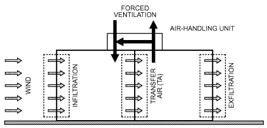

*Fig. 1 Two-Space Building with Mechanical Ventilation, Infiltration, and Exfiltration*

Ventilation and infiltration differ significantly in how they affect energy consumption, air quality, and thermal comfort, and can each vary with weather conditions, HVAC system operation, and building use. Although one mode may be expected to dominate in a particular building, both must be considered in the proper design and operation of an HVAC system. Seasonal weather and other transient factors must be considered, as well.

### Ventilation Air

Ventilation air is air used to provide acceptable indoor air quality. It may be composed of mechanical or natural ventilation, infiltration, suitably treated recirculated air, transfer air, or an appropriate combination, although the allowable means of providing ventilation air varies in standards and guidelines.

Modern commercial and institutional buildings normally have mechanical ventilation and are usually intended to be pressurized somewhat to reduce or eliminate infiltration. Mechanical ventilation has the greatest potential for control of air exchange when the system is properly designed, installed, and operated; it should provide acceptable indoor air quality and thermal comfort when ASHRAE Standards 55 and 62.1’s requirements are followed, although issues (e.g., unusually strong pollutant sources) can still result in unacceptable indoor environment conditions. Mechanical ventilation equipment and systems are described in Chapters 1, 4, and 10 of the 2020 *ASHRAE Handbook—HVAC Systems and Equipment*.

In commercial and institutional buildings, natural ventilation (e.g., through uncontrolled use of manually operated windows) may not be desirable from the points of view of energy conservation, comfort, security, or control of airborne pollen or other pollutants in some climates and locations. In commercial and institutional buildings with mechanical cooling and ventilation, an automatically controlled air- or water-side economizer may be preferable to operable windows for taking advantage of cool outdoor conditions when interior cooling is required. When moderate outdoor temperatures occur, an air-side economizer control scheme may not only increase the rate of ventilation but also operate the cooling equipment to optimize energy use (**hybrid** or **mixed mode**).

Infiltration may be significant in commercial and institutional buildings too, especially in tall, leaky, or partially pressurized buildings and in lobby and loading dock areas. The joint between roof decking and outer walls is often particularly leaky in commercial and other large buildings, and should be properly detailed, constructed, and inspected.

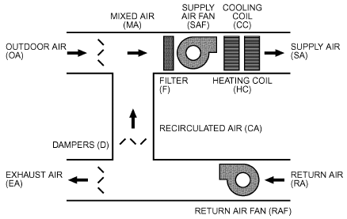

*Fig. 2 Simple All-Air Air-Handling Unit with Associated Airflows*

In most of the United States, residential buildings have historically relied on infiltration and natural ventilation to meet their ventilation air needs. Neither is reliable for ventilation air purposes because they depend on weather conditions, building construction, occupants, and maintenance. Natural ventilation, usually through operable windows and screened doors, is more likely to allow occupants to control indoor airborne contaminants and interior air temperature, but it can have a substantial energy cost if used while the residence’s heating or cooling equipment is operating. Opened windows and doors also may lead to security, noise, or other concerns.

In place of or in addition to operable windows, small exhaust fans should be provided for localized venting of residential spaces with high pollutant levels or moisture (e.g., kitchens, bathrooms). Not all local building codes require that such exhaust be vented to the outdoors, but it is required by ASHRAE Standard 62.2. Instead, a local code may allow the air to be treated and returned to the space or to be discharged to an attic space. Poor maintenance of these recirculating treatment devices can make nonducted vents ineffective for ventilation purposes. Warm exhaust air can hold much moisture, so condensation in attics should be avoided. If not already required by code, consider venting attached garages and other storage spaces to the outdoors, as well.

Increasingly, building codes require general mechanical ventilation in residences. Heat recovery heat exchangers are popular for reducing energy consumption, especially in cold climates. Residential buildings with low rates of infiltration and natural ventilation, including most new buildings, require mechanical ventilation at rates given in ASHRAE Standard 62.2.

### Forced-Air Distribution Systems

Figure 2 shows a simple **air-handling unit (AHU)** or **air handler** that conditions air for a building. Air brought back to the air handler from the conditioned space is **return air (RA)**. The return air either is discharged to the environment [**exhaust air (EA)]** or is reused [**recirculated air (CA)]**. Air brought in intentionally from the environment is **outdoor air (OA)**. Because outdoor air may need treatment to be acceptable for use in a building, it should not be called “fresh air.” Outdoor and recirculated air are combined to form **mixed air (MA)**, which is then conditioned and delivered to the spaces served as **supply air (SA)**. Any portion of the mixed air that intentionally or unintentionally circumvents conditioning is **bypass air (BA)**. Because of the wide variety of air-handling systems, the airflows shown in Figure 2 may not all be present in a particular system as defined here. Also, more complex systems may have additional airflows.

<!-- str. 423 -->

In HVAC design, volumetric airflow rates Q are normally reported in litres per second (L/s) or cubic metres per second (m3/s). The incorrect term “volume” should not be used to describe airflow rates.

### Outdoor Air Fraction

The outdoor airflow introduced to a building or zone by an air-handling unit can also be described by the **outdoor air fraction Xoa**, which is the ratio of the volumetric flow rate Q of outdoor air brought in by the air handler to the total supply airflow rate:

> Xoa = (Q oa)/(Q sa) = (Q oa)/(Q ma) = (Q oa)/(Q + Q oa ca)&emsp;**(1)**

When expressed as a percentage, the outdoor air fraction is called the **percent outdoor air**. The design outdoor airflow rate Qoa for a building’s or zone’s ventilation system is found by applying the requirements of ASHRAE Standard 62.1 or 62.2 to that specific building, occupancy, and HVAC system. The supply airflow rate Qsa is that required to meet the thermal load. The outdoor air fraction and percent outdoor air then describe the degree of recirculation, where a low value indicates a high rate of recirculation, and a high value shows little recirculation. Conventional all-air air-handling systems for commercial and institutional buildings often have approximately 10 to 40% outdoor air.

**100% outdoor air** means no recirculation of return air through the air-handling system. Instead, all the supply air is treated outdoor air, also known as **makeup air (KA)**, and all return air is discharged directly to the outdoors as **relief air (LA)**, via separate or centralized exhaust fans or relief dampers and grilles. An air-handling unit that provides exclusively 100% outdoor air to offset air that is exhausted is typically called a **makeup air unit (MAU)**.

When outdoor air via mechanical ventilation is used to provide ventilation air, as is common in commercial and institutional buildings and increasingly in residences, this outdoor air is usually delivered to spaces as all or part of the supply air. With a variableair-volume (VAV) system, the outdoor air fraction of the supply air may need to be increased when supply airflow is reduced to meet a particular thermal load. In some HVAC systems, such as a dedicated outdoor air system (DOAS), conditioned outdoor air may be delivered separately from the way the spaces’ loads are handled (Mumma and Shank 2001).

### Room Air Movement

Air movement within spaces affects the diffusion of ventilation air and, therefore, indoor air quality and comfort. Two distinct flow patterns are commonly used to characterize air movement in rooms: displacement flow and entrainment flow. **Displacement flow**, shown in Figure 3, is the movement of air within a space in a pistonor plug-type motion. Ideally, no mixing of the room air occurs, which is desirable for removing pollutants generated within a space. Air mixing does occur, however, to various degrees. A laminarflow air distribution system that is intended to sweep air across a space with reduced turbulence and mixing may produce a high degree of displacement flow and thus more effective pollutant removal. The pollutants’ buoyancy and occupants’ thermal comfort are concerns when deciding on the intended direction of airflow.

**Entrainment flow**, shown in Figure 4, is also known as **conven- tional mixing**. Systems with ceiling-based supply air diffusers and return air grilles are common examples of air distribution systems that produce entrainment flow. Airborne pollutants are removed by dilution by the ventilation air that is delivered as all or part of the supply air. Entrainment flow with very poor mixing in the room has been called **short-circuiting flow** because much of the supply air leaves the room without mixing with room air. There is little evidence that properly designed, installed, and operated air distribution systems exhibit substantial short circuiting, although poorly designed, installed, or operated systems may short circuit (especially ceiling-based systems in heating mode) to a higher degree (Offermann and Int-Hout 1989).

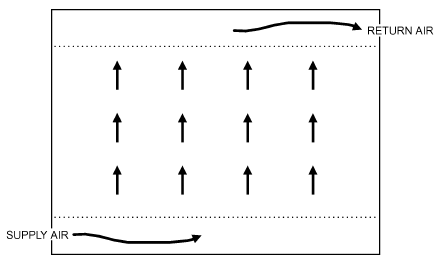

*Fig. 3 Displacement Flow Within a Space*

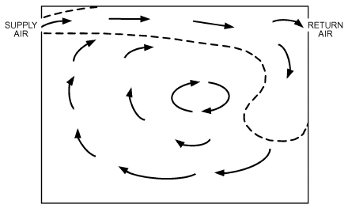

*Fig. 4 Entrainment Flow Within a Space*

**Theoretical perfect mixing** occurs when supply air is instantly and evenly distributed throughout a space. Perfect mixing is also known as **complete** or **uniform mixing**; the air may be called **well stirred** or **well mixed**. This theoretical performance is approached by entrainment flow systems that have good mixing and by displacement flow systems that allow too much mixing (Rock et al. 1995). The outdoor air requirements given in the minimum ventilation rate in breathing zone table of ASHRAE Standard 62.1 assume delivery of ventilation air with perfect mixing within spaces. For more detailed information on space air diffusion, see Chapter 20.

**Underfloor air distribution (UFAD** or **UAD)**, as shown in Figure 5, is a hybrid method of conditioning and ventilating spaces (Bauman and Daly 2003). Air is introduced through a floor plenum, with or without branch ductwork or terminal units, and delivered to a space by floor-mounted diffusers. These diffusers encourage air mixing near the floor to temper the supply air for thermal comfort. The combined air then moves vertically through the space, with reduced mixing, toward returns or exhausts placed in or near the ceiling. This vertical upward movement of the air is in the same direction as the thermal and contaminant plumes created by occupants and common equipment. The ventilating performance of UFAD systems is thus often between floor-to-ceiling displacement flow and uniform mixing.

Supply air that enters a space through a diffuser, grille, or nozzle is also known as **primary air**. An air **jet** is formed as this primary air leaves the supply air outlet. **Secondary air** is the room air entrained into the jet. **Total air** is the combination of primary and

<!-- str. 424 -->

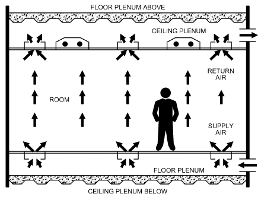

*Fig. 5 Underfloor Air Distribution to Occupied Space Above*

> (Rock and Zhu 2002)

secondary air at a specific point in a jet and increases with distance from the outlet as is described further in Chapter 20. The term **pri- mary air** is also used to describe supply air provided to fan-powered mixing boxes by a central air-handling unit.

For evaluation of indoor air quality and thermal comfort, rooms are often divided into two portions: the **occupied zone** and the remaining volume of the space. Often, this remaining volume is solely the space above the occupants and is referred to as the **ceiling zone**. The occupied zone is usually defined as the lowest 1.8 m of a room, although layers near the floor and walls are sometimes deducted from it; when these deductions are made, the occupied zone is sometimes renamed the **breathing zone**. Ceiling and floor plenums are not normally included in the occupied or ceiling zones. **Ther- mal zones** are different from these room air zones, and are defined for HVAC subsystems and their controls.

### Air Change Rate

The **air change** (or **exchange**) **rate I** compares airflow to the space’s volume and is

> I = Q/V&emsp;**(2)**

where

- Q = volumetric flow rate of air into space, m3/s
- V = interior volume of space, m3

The air change rate has units of 1/time, usually h–1. When the time unit is hours, the air change rate is also called **air changes per hour (ACH)**, with units of h–1. The air change rate may be defined for several different situations. For example, the air change rate for an entire building or thermal zone served by an air-handling unit compares the amount of outdoor air brought into the building or zone to the total interior volume. This **nominal air change rate IN** is

> IN = Qoa/V&emsp;**(3)**

where Qoa is the outdoor airflow rate including ventilation and infiltration. IN describes the outdoor air ventilation rate entering a building or zone. It does not describe recirculation or the distribution of ventilation air to each space in a building or zone.

For a particular space, the **space air exchange rate IS** compares the supply airflow rate Qsa to the volume of that space:

> IS = Qsa/V&emsp;**(4)**

For a particular space or zone, IS includes recirculated as well as any outdoor air in the supply air, and is used frequently in evaluating supply air outlet performance and space air mixing.

### Time Constants

**Time constants** τ, which have units of time (usually in hours or seconds), are also used to describe ventilation and infiltration. One time constant is the time required for one air change in a building, zone, or space if ideal displacement flow existed. It is the inverse of the air change rate:

> τ = 1/I = V/Q&emsp;**(5)**

The **nominal time constant** compares the interior volume of a building or zone to the volumetric outdoor airflow rate:

> τN = V/Qoa&emsp;**(6)**

Like the nominal air change rate, τN does not describe recirculation of air in a building or zone, or characterize the distribution of the outdoor air to individual spaces in a building or zone.

The **space time constant** compares the interior volume of a particular space to the total supply airflow rate to that space. The space time constant is the inverse of the space air change rate:

> τS = V/Qsa&emsp;**(7)**

The space time constant includes the effect of recirculated air that is part of the supply air as well as that of outdoor air introduced to the space through the supply air. If infiltration is significant in a space, then the infiltration flow rate should be included when determining both the space air change rate and the space time constant.

### Averaging Time-Varying Ventilation Rates

When assessing time-varying ventilation in terms of controlling indoor air quality, the quantity of interest is often the temporal average rather than the peak. The concept of **effective ventilation** (Sherman and Wilson 1986; Yuill 1986, 1991) describes the proper ventilation rate averaging process. In this concept, the average (effective) rate is the steady-state rate that yields the same average contaminant concentration over the period of interest in the occupied space as does the actual sequence of time-varying discrete ventilation rates over the same period and in the same space. This effective rate is only equal to the simple arithmetic average rate when the discrete ventilation rates are constant over the period of interest and the contaminant concentration has reached its steady-state value. Simple arithmetic averaging of instantaneous ventilation rates or concentrations cannot generally be used to determine these averages because of the nonlinear response of indoor concentrations to ventilation rate variations.

An important constraint in the effective ventilation concept is that the contaminant source strength F must be constant over the period of interest or must be uncorrelated with the ventilation rate. These conditions are satisfied in many residential and commercial buildings because the emission rates of many contaminants that are controlled by whole-building ventilation systems vary slowly. Sherman and Wilson (1986) describe how to deal with pollutants that have stepped but otherwise constant emission rates. Pollutants such as carbon monoxide, radon, and formaldehyde, whose emission rates can be affected by ventilation, cannot be properly characterized with this concept and require more complex analyses. For constant-source-strength pollutants, the relationship between effective air change rate, effective ventilation rate, volumetric flow, source strength, average concentration, and time-averaged effective turnover time is given by

> Im = Q/V = F/VC = 1/τe&emsp;**(8)**

<!-- str. 425 -->

The time-averaged effective turnover time τe in Equation (8) represents the characteristic time for the concentration in the occupied space to approach steady state over the period of interest. It can be determined from a sequence of discrete, instantaneous ventilation air change rates Ii using the following (Sherman and Wilson 1986):

> N
>
> 1/N∑ e, i

> τe = τ&emsp;**(9)**
>
> i=1

> for Ii > 0,τe,i = (1 – exp(–IiΔt))/Ii + τe,i–1exp(–IiΔt)&emsp;**(10)**
>
> for Ii = 0,τe,i = Δt + te,i–1&emsp;**(11)**

where

- Δt = length of each discrete time period
- τe = time-averaged effective turnover time
- τe,i = instantaneous turnover time in period i
- τe,i–1 = instantaneous turnover time in previous period

ASHRAE Standard 62.2 provides a set of factors to help calculate the annual effective air exchange rate.

### Age of Air

The **age of air** θage (Sandberg 1981) is the length of time t that some quantity of outdoor air has been in a building, zone, or space. The “youngest” air is at the point where outdoor air enters the building by mechanical or natural ventilation, or through infiltration (Grieve 1989). The “oldest” air may be at some location in the building or in the exhaust air. When the characteristics of the air distribution system are varied, age of air is inversely correlated with quality of outdoor air delivery. Units are of time, usually in seconds or minutes, so it is not a true efficiency or effectiveness measure. The age of air concept, however, has gained wide acceptance in Europe.

The age of air can be evaluated for existing buildings using tracer gas methods. Using either the decay (step-down) or growth (stepup) tracer gas method and assuming perfect mixing, the zone average or **nominal age of air** θage,N can be determined by taking concentration measurements in the exhaust air. The **local age of air** θage,L is evaluated through tracer gas measurements at any desired point in a space, such as at a worker’s desk. When time-dependent data of tracer gas concentration are available, the age of air can be calculated from

> ∫ ∞
>
> θage = (Cin– C)/(Cin– Co) dt&emsp;**(12)**

> t=0

where Cin is the concentration of tracer gas being injected.

Because evaluation of the age of air requires integration to infinite time, an exponential tail is usually added to the known concentration data (Farrington et al. 1990).

### Air Change Effectiveness

**Ventilation effectiveness** is a description of an air distribution system’s ability to remove internally generated pollutants from a building, zone, or space. **Air change effectiveness** is a description of an air distribution system’s ability to deliver ventilation air to a building, zone, or space. The HVAC design engineer usually does not have knowledge or control of actual pollutant sources within buildings, so the minimum prescribed ventilation rates of ASHRAE Standard 62.1 define outdoor air requirements for typical, expected building uses. For most projects, therefore, air change effectiveness is of more relevance to HVAC system design than ventilation effectiveness. Various definitions for air change effectiveness have been proposed. The specific measure that meets local code requirements must be determined, if any is needed at all.

Air change effectiveness measures εI are nondimensional gages of ventilation air delivery. One common definition of air change effectiveness is the ratio of a time constant to an age of air:

> εI = τ/θage&emsp;**(13)**

The **nominal air change effectiveness** εI,N shows the effectiveness of outdoor air delivery to the entire building, zone, or space:

> εI,N = τN/θage,N&emsp;**(14)**

where the nominal time constant τN is usually calculated from measured airflow rates.

The **local air change effectiveness** εI,L shows the effectiveness of outdoor air delivery to one specific point in a space:

> εI,L = τN/θage,L&emsp;**(15)**

where τN is found either through airflow measurements or from tracer gas concentration data. An εI,L value of 1.0 indicates that the air distribution system delivers air equivalent to that of a system with perfectly mixed air in the spaces. A value less than 1.0 shows less than perfect mixing with some degree of stagnation. A value of εI,L greater than 1.0 suggests that a degree of plug or displacement flow is present at that point (Rock 1992).

An HVAC design engineer often assumes that a properly designed, installed, operated, and maintained air distribution system provides an air change effectiveness of about 1. However, the zone air distribution table of ASHRAE Standard 62.1 provides some estimates of effectiveness for operating in heating or cooling mode, and with various air distribution techniques. These values are then adjusted for commercial and institutional building design when the ventilation rate procedure (VRP) is used. If the IAQ procedure of Standard 62.1 is used, then actual pollutant sources and the air change effectiveness must be known for the successful design of HVAC systems that have fixed ventilation airflow rates.

ASHRAE Standard 129 describes a method for measuring air change effectiveness of mechanically vented spaces and buildings with limited air infiltration, exfiltration, and air leakage with surrounding indoor spaces.

## 2. TRACER GAS MEASUREMENTS

The only reliable way to determine an existing building’s air change rate is to measure it. Several tracer gas measurement procedures exist (e.g., ASTM Standard E741 test method), all involving an inert or nonreactive gas used to label the indoor air (Charlesworth 1988; Dietz et al. 1986; Fisk et al. 1989; Fortmann et al. 1990; Harrje et al. 1981, 1990; Hunt 1980; Lagus 1989; Lagus and Persily 1985; Persily 1988; Persily and Axley 1990; Sherman 1989a, 1989b, 1990; Sherman et al. 1980). The tracer is released into the building in a specified manner, and the concentration of the tracer in the building is measured through time and related to the building’s air change rate. Various tracer gases and associated concentration detection devices have been used. Desirable qualities of a tracer gas are detectability, nonreactivity, nontoxicity, neutral buoyancy, relatively low concentration in ambient air, and low cost (Hunt 1980).

All tracer gas measurement techniques are based on a mass balance of the tracer gas in the building. Assuming the outdoor concentration is zero and the indoor air is well mixed, this total balance takes the following form:

> V dC/dt = F(t) – Q(t)C(t)&emsp;**(16)**

where

- V = volume of space being tested, m3

<!-- str. 426 -->

C(t) = tracer gas concentration at time t dC/dt = time rate of change of concentration, s−1

F(t) = tracer gas injection rate at time t, m3/s

Q(t) = airflow rate out of building at time t, m3/s t = time, s

In Equation (16), density differences between indoor and outdoor air are generally ignored for moderate climates; therefore, Q also refers to the airflow rate into the building. Although Q is often referred to as the infiltration rate, any measurement includes both mechanical and natural ventilation in addition to infiltration. The ratio of Q to the volume V being tested has units of 1/time, often converted to ACH, and is the air change rate I described previously in this chapter.

Equation (16) is based on the assumptions that (1) no unknown tracer gas sources exist, (2) airflow out of the building is the dominant means of removing the tracer gas from the space so the tracer gas does not react chemically in the space and/or is not adsorbed onto or absorbed by interior surfaces or air cleaners, and (3) the tracer gas concentration in the building can be represented by a single value (i.e., the tracer gas is uniformly mixed within the space). In such tracer gas experiments, box-type fans are often operated in rooms to enhance mixing.

Three different tracer gas procedures are used to measure air change rates: (1) decay or growth, (2) constant concentration, and (3) constant injection.

### Decay or Growth

**Decay.** The simplest tracer gas measurement technique is the decay method, also known as the step-down method. A small amount of tracer gas is injected into the space and is allowed to mix with the interior air. After the injection, F = 0 and then the solution to Equation (16) is

> C(t) = Coe–It&emsp;**(17)**

where Co is the concentration of the tracer in the space at t = 0.

Equation (17) is generally used to solve for I by measuring the tracer gas concentration periodically during the decay and then fitting the data to the logarithmic form of Equation (17):

> lnC(t) = lnCo – It&emsp;**(18)**

Like all tracer gas techniques, the decay method has advantages and disadvantages. One advantage is that, because logarithms of concentration are taken, only relative concentrations are needed, which can simplify calibration of concentration-measuring equipment. Also, the tracer gas injection rate need not be measured, although it must be controlled so that the tracer gas concentrations are within the range of the concentration-measuring device. The concentration-measuring equipment can be located on site, or building samples can be collected in suitable containers (e.g., grab bags) and analyzed elsewhere.

The most serious problem with the decay technique is imperfect mixing of tracer gas with interior air, both at initial injection and during decay. Equations (16) and (17) assume that the tracer gas concentration within the building is uniform at any particular time. If the tracer is not well mixed, this assumption is not appropriate and the determination of I is subject to errors. It is difficult to estimate the magnitude of errors caused by poor mixing, and there has been little analysis of this problem. Sometimes a two-zone model is applied to a room, and a mixing coefficient selected, to estimate the effect of poor mixing [e.g., Rock (1992)].

**Growth.** The growth or step-up method is similar to the decay method except that the initial tracer gas concentration is low and the injected tracer gas is increased suddenly during the test.

### Constant Concentration

In the constant concentration technique, the tracer gas injection rate is adjusted to maintain a constant concentration within the building. If the concentration is truly constant, then Equation (16) reduces to

> Q(t) = F(t)/C&emsp;**(19)**

There is less experience with this technique than with the decay procedure, and an increasing number of applications for it exist (Bohac et al. 1985; Collet 1981; Fortmann et al. 1990; Kumar et al. 1979; Walker and Forest 1995; Walker and Wilson 1998; Wilson and Walker 1993).

Because tracer gas injection is continuous, no initial mixing period is required. Another advantage is that tracer gas injection into each zone of the building can be separately controlled; thus, the amount of outdoor air flowing into each zone can be determined. This procedure is best suited for longer-term continuous monitoring of fluctuating infiltration rates. One disadvantage is that it requires measurement of absolute tracer concentrations and injection rates. Also, imperfect mixing of the tracer and interior air causes a delay in the response of the concentration to changes in the injection rate.

### Constant Injection

In the constant-injection procedure, the tracer is injected at a constant rate, and the solution to Equation (16) becomes

> C(t) = (F/Q)(1 – e–It)&emsp;**(20)**

After sufficient time, the transient term reduces to zero, the concentration attains equilibrium, and Equation (20) reduces to

> Q = F/C&emsp;**(21)**

Equation (21) is valid only when air change rate I and airflow rate Q are constant; thus, this technique is only appropriate for systems at or near equilibrium. It is particularly useful in spaces with mechanical ventilation or with high air change rates. Constant injection requires measurement of absolute concentrations and injection rates.

Dietz et al. (1986) used a special case of the constant-injection technique, using permeation tubes as a tracer gas source. The tubes release the tracer at an ideally constant rate into the building being tested, and a sampling tube packed with an adsorbent collects the tracer from the interior air at a constant rate by diffusion. After a sampling period of one week or more, the sampler is removed and analyzed to determine the average tracer gas concentration in the building during the sampling period.

Solving Equation (16) for C and taking the time average gives

> <C> = <F/Q> = F<1/Q>&emsp;**(22)**

where < . . . > denotes time average. Note that the time average of dC/dt is assumed to equal zero.

Equation (22) shows that the average tracer concentration <C> and injection rate F can be used to calculate the average of the inverse airflow rate. The average of the inverse is less than the inverse of the actual average, with the magnitude of this difference depending on the distribution of airflow rates during the measurement period. Sherman and Wilson (1986) calculated these differences to be about 20% for one-month averaging periods. Differences greater than 30% have been measured when occupant airing of houses caused large changes in air change rate; errors from 5 to 30% were measured when the variation was caused by weather effects (Bohac et al. 1987). Longer averaging periods and large changes in air change rates during the measurement periods generally lead to larger differences between the average inverse change rate and the inverse of the actual average rate.

<!-- str. 427 -->

### Multizone Air Change Measurement

Equation (16) assumes a single, well-mixed enclosure, and the techniques described are for single-zone measurements. Multizone measurement techniques address airflow between internal zones and between the exterior and individual internal zones (Fortmann et al. 1990; Harrje et al. 1985, 1990; Sherman and Dickerhoff 1989). These techniques are important when considering the transport of pollutants from one room of a building to another. A theoretical development is provided by Sinden (1978a). Multizone measurements typically use either multiple tracer gases for the different zones or the constant-concentration technique. A proper uncertainty analysis is essential in all multizone flow determination (Charlesworth 1988; D’Ottavio et al. 1988).

## 3. DRIVING MECHANISMS FOR VENTILATION AND INFILTRATION

Natural ventilation and infiltration are driven by pressure differences across the building envelope caused by wind and air density differences. Mechanical air-moving systems also induce pressure differences across the envelope through operation of appliances, such as combustion devices, leaky forced-air thermal distribution systems, and mechanical ventilation systems. The indoor/outdoor pressure difference at a location depends on the magnitude of these driving mechanisms as well as on the characteristics of the openings in the building envelope.

### Stack Pressure

Stack pressure is the hydrostatic pressure caused by the weight of a column of air located inside or outside a building. It can also occur within a flow element, such as a duct or chimney that has vertical separation between its inlet and outlet. The hydrostatic pressure in the air depends on density and the height of interest above a reference point.

Air density is a function of local barometric pressure, temperature, and humidity ratio, as described in Chapter 1. As a result, standard conditions should not be used to calculate the density. For example, a building site at 1500 m has air density that is about 20% less than if the building were at sea level. An air temperature increase from –30 to 20°C causes a similar air density difference. Combined, these elevation and temperature effects can reduce air density about 45%. Moisture effects on density are generally much less but can be significant if the change in elevation is great (e.g., in a natural draft cooling tower). Saturated air at 40°C has a density about 5% less than that of dry air at the same pressure.

Assuming the air temperature and humidity ratio are constant over the height of interest, the stack pressure decreases linearly as the distance above the reference point increases. For a single column of air, the stack pressure can be calculated as

> ps = pr – ρgH&emsp;**(23)**

where

- ps = stack pressure, Pa
- pr = stack pressure at reference height, Pa
- g = gravitational acceleration, 9.81 m/s2
- ρ = indoor or outdoor air density, kg/m3
- H = height above reference plane, m

For tall buildings or when significant temperature stratification occurs indoors, Equation (23) should be modified to include the density gradient over the height of the building.

Temperature, and thus air density differences between indoors and outdoors cause stack pressure differences that drive airflows across the building envelope; the **stack effect** is this buoyancy phenomenon. Sherman (1991) showed that any single-zone building can be treated as an equivalent box from the point of view of stack effect; if there is air leakage, follow the power law as described in the section on Residential Air Leakage. The building is then characterized by an effective stack height and neutral pressure level (NPL) or leakage distribution, as described in the section on Neutral Pressure Level. Once calculated, these parameters can be used in physical, single-zone models to estimate infiltration.

Neglecting vertical density gradients, the stack pressure difference for a horizontal leak at any vertical location is

> ( )
>
> Δps = (ρo – ρi)g(HNPL –H) = ρo (Ti– To)/Ti g(HNPL –H)&emsp;**(24)**

> ( )

where

- To = absolute outdoor temperature, K
- Ti = absolute indoor temperature, K
- ρo = outdoor air density, kg/m3
- ρi = indoor air density, kg/m3
- HNPL = height of neutral pressure level above reference plane without any other driving forces, m

Chastain and Colliver (1989) showed that, when there is stratification, the average of the vertical distribution of temperature differences is more appropriate to use in Equation (24) than the localized temperature difference near the opening of interest.

By convention, stack pressure differences are positive when the building is pressurized relative to outdoors, which causes flow out of the building. Therefore, absent other driving forces and assuming no stack effect within the flow elements themselves, when indoor air is warmer than outdoors, the base of the building is depressurized and the top is pressurized relative to outdoors; when indoor air is cooler than outdoors, the reverse is true. At some elevation in the building, with such conditions, the pressure indoors is equal to the outdoors: this height is the neutral pressure level.

Absent other driving forces, the location of the NPL is influenced by leakage distribution over the building exterior and by interior compartmentation. As a result, the NPL is not necessarily at the mid-height of the building; with effective horizontal barriers in tall buildings, it is also possible to have more than one NPL. NPL location and leakage distribution are described in the Combining Driving Forces and Neutral Pressure Level sections.

For a penetration through the building envelope for which (1) there is vertical separation between its inlet and outlet and (2) air inside the flow element is not at the indoor or outdoor temperature (e.g., in a chimney), more complex analyses than Equation (24) are required to determine the stack effect at any location on the building envelope.

### Wind Pressure

When wind impinges on and flows around and over a building, it creates a distribution of static pressures on the building’s exterior surfaces that depends on the wind direction, wind speed, air density, surface orientation, and surrounding conditions. Wind pressures are generally positive with respect to the static pressure in the undisturbed airstream on the windward side of a building and negative on the leeward sides and roof. However, these pressures depend highly on wind speed, angle, turbulence, the surroundings, and building shape. Static pressures over building surfaces are almost proportional to the velocity pressure of the undisturbed airstream. The wind pressure or velocity pressure is given by the Bernoulli equation, assuming no height change or pressure losses:

> pw = CpρU2/2&emsp;**(25)**

where

- pw = wind surface pressure relative to outdoor static pressure in undisturbed flow, Pa

<!-- str. 428 -->

ρ = outdoor air density, kg/m3 (about 1.2 at or near sea level)

U = wind speed, m/s

Cp = wind surface pressure coefficient, dimensionless

Cpis a function of location on the building envelope and wind direction. Chapter 24 provides additional information on values of Cp.

Most pressure coefficient data are for winds approaching perpendicularly to upwind building surfaces. Unfortunately, for a real building, this fixed wind direction rarely occurs, and when the wind is not normal to the upwind wall, these pressure coefficients do not apply. Walker and Wilson (1994) developed a harmonic trigonometric function to interpolate between the surface average pressure coefficients on a wall that were measured with the wind normal to each of the four building surfaces. This function was developed for low-rise buildings three stories or less in height. For each wall of the building, Cp is given by

> Cp(φ) = 1/2{[Cp(1) + Cp(2)](cos2φ)1/4
>
> + [Cp(1) – Cp(2)](cosφ)3/4

> + [Cp(3) + Cp(4)](sin2φ)2
>
> + [Cp(3) – Cp(4)]sinφ}&emsp;**(26)**

where

- Cp(1) = pressure coefficient when wind is at 0°
- Cp(2) = pressure coefficient when wind is at 180°
- Cp(3) = pressure coefficient when wind is at 90°
- Cp(4) = pressure coefficient when wind is at 270°
- φ = wind angle measured clockwise from the normal to wall 1

Because the cosine term in Equation (26) can be negative, its sign must be tracked. When cos(φ) is negative, subtract the value of the absolute of cos(φ) to the 3/4 power.

The measured data used to develop the harmonic function from Akins et al. (1979) and Wiren (1985) show that typical values for the pressure coefficients are Cp(1) = 0.6, Cp(2) = –0.3, and Cp(3) = Cp(4) = –0.65. Because of geometry effects on flow around a building, application of this interpolation function is limited to low-rise buildings of rectangular plan on flat, featureless sites, with the longest wall less than three times the length of the shortest wall. For less regular buildings or sites, simple correlations are inadequate and building-specific pressure coefficients are required; computational fluid dynamic models are often used. Chapter 24 discusses wind pressures for complex building shapes and for high-rise buildings in more detail.

The wind speed most commonly available for infiltration calculations is that measured at the local weather station, typically the nearest airport. This wind speed needs to be corrected for reductions caused by the difference between the height where the wind speed is measured and the height of the building, and reductions caused by shelter effects.

The reference wind speed used to determine pressure coefficients is usually the wind speed at the eave height for a low-rise building and the building height for a high-rise building. However, meteorological wind speed measurements are made at a different height, typically 10 m for official weather stations, and at a different location than for the buildings of interest. The difference in terrain between the measurement station and the building under study must also be addressed. Chapter 24 shows how to calculate the effective wind speed UH from the reference wind speed Umet using boundary layer theory and estimates of terrain effects.

In addition to the reduction in wind pressures caused by reduced wind speed, the effects of local shelter also act to reduce wind pressures. The shielding effects of trees, shrubbery, and other buildings within several building heights, horizontally, of a particular building produce large-scale turbulence eddies that not only reduce effective wind speed but also alter wind direction. Local geological features or gaps between neighboring large buildings can, at times, greatly increase wind velocity. Thus, meteorological wind speed data must be adjusted carefully when applied to specific buildings and their locations.

Infiltration rates measured by Wilson and Walker (1991) for a row of houses showed reductions in airflow rates of up to a factor of three when the wind changed direction from perpendicular to parallel to the row. They recommended estimating wind shelter for winds perpendicular to each side of the building and then using the interpolation function in Equation (27) to find the wind shelter for intermediate wind angles:

> 1
>
> s = --{[s(1) + s(2)]cos2φ + [s(1) – s(2)]cosφ

> 2&emsp;**(27)**
>
> + [s(3) + s(4)]sin2φ + [s(3) – s(4)]sinφ}

where

- s = shelter factor for the particular wind direction φ
- s(i) = shelter factor when wind is normal to wall i (i = 1 to 4, for four sides of a building)

Although this method gives a realistic variation of wind shelter effects with wind direction, estimates for numerical values of wind shelter factor s for each of the four cardinal directions must be provided. Table 8 in the section on Residential Calculation Examples lists typical shelter factors. The wind speed used in Equation (25) is then given by

> U = sUH&emsp;**(28)**

The magnitude of pressure differences found on the surfaces of buildings varies rapidly with time because of turbulent fluctuations in the wind (Etheridge and Nolan 1979; Grimsrud et al. 1979). However, using average wind pressures to calculate pressure differences is usually sufficient to calculate average infiltration values.

### Mechanical Systems

Operation of mechanical equipment, such as supply or exhaust systems and vented combustion devices, affects pressure differences across the building envelope and thus air change rates. Interior static pressure adjusts such that the sum of all airflows through openings in the building envelope plus equipment-induced airflows balances to zero. To predict these changes in pressure differences and airflow rates caused by mechanical equipment, the location of each opening in the envelope and relationship between pressure difference and airflow rate for each opening must be known. The interaction between mechanical ventilation system operation and envelope airtightness has been discussed for low-rise buildings (Nylund 1980) and for office buildings (Persily and Grot 1985a; Tamura and Wilson 1966, 1967a).

Air exhausted from a building by a whole-building exhaust system must be balanced by increasing airflow into the building through other openings or the air-handling systems. As pressures vary, air leakage at some locations changes from outflow to inflow. When using makeup air and no dedicated exhaust, the situation is reversed and envelope inflows may become outflows. Thus, the effects of a mechanical system on a building must be considered. Depressurization caused by an improperly designed exhaust system can increase the rate of radon entry into a building and can interfere with proper operation of combustion device venting or other exhaust systems. Pollutant entry can be increased from garages and other attached storage spaces. Depressurization can also force moist outdoor air through the building envelope; for example, during the cooling season in hot, humid climates, moisture may condense in the building envelope and cause rust, rot, or mold. A similar phenomenon, but in reverse, can occur during the heating, and potentially humidifying, season in cold climates if the building is pressurized. Active pressure control is often recommended, as is proper use of moisture retarders, drainage, and drying of in situ building materials.

<!-- str. 429 -->

The interaction between mechanical systems and the building envelope also pertains to systems serving zones of buildings. Performance of zone-specific exhaust or pressurization systems is affected by leakage in partitions between zones as well as through exterior walls.

Mechanical systems can also create infiltration-driving forces in single-zone buildings. Specifically, some single-family houses with central forced-air duct systems have many distributed supply registers, yet only one central return grille. When insufficiently undercut internal doors are closed in these houses, large positive indoor-to-outdoor pressure differentials are created for rooms with only supply registers, whereas the room or hallway with the return grille tends to depressurize relative to the outdoors. This is caused by the resistance of the internal door undercuts, often partially blocked by carpeting, to flow from the supply register to the return; the magnitudes of the indoor/outdoor pressure differentials created average 3 to 6 Pa (Modera et al. 1991). Balanced airflow systems with ducted air return and distributed grilles or adequately sized transfer grilles (where still allowed by fire code) reduce this effect significantly.

Building envelope airtightness and interzonal airflow resistance can also affect performance of mechanical systems. The actual airflow rate delivered by these systems, particularly ventilation systems, depends on the pressure differences they work against. This effect is the same as the interaction of a fan with its associated ductwork, which is discussed in Chapter 21 of this volume and Chapter 21 of the 2020 *ASHRAE Handbook—HVAC Systems and* Equipment. The building envelope and its leakage should be considered part of the ductwork in determining the pressure drop of the system.

Duct leakage can cause similar problems. Supply leaks to the outdoors tend to depressurize the building; return leaks from the outdoors tend to pressurize it. Keeping these ducts within the conditioned buildings, and sealing all ducts well with durable materials and high-quality construction methods, significantly reduces this problem.

### Combining Driving Forces

Pressure differences caused by wind, stack effect, and mechanical systems are considered in combination by adding them together and then determining the resulting airflow rate through each building envelope. The airflows must be determined in this manner, as opposed to adding the airflow rates caused by the separate driving forces, because the airflow rate through each opening is not linearly related to pressure difference.

For uniform indoor air temperatures, the total pressure difference across each leak can be written in terms of a reference wind parameter PU and stack effect parameter PT common to all leaks:

> PU = ρo(2 U H)/2&emsp;**(29)**
>
> PT = gρo[(Ti – To)/Ti]&emsp;**(30)**

where T is absolute air temperature in K.

The pressure difference across each leak, with positive pressures for flow into the building, is then given by

> Δp = s2CpPU + HPT + ΔpI&emsp;**(31)**

where ΔpI is the pressure that acts to balance inflows and outflows, including mechanical system flows. Equation (31) can then be applied to every leak for the building with appropriate values of Cp, s, and H. Thus, each leak is defined by its pressure coefficient, shelter, and height. Where indoor pressures are not uniform, more complex and often numerical analyses are required.

### Neutral Pressure Level

The neutral pressure level (NPL) varies and is that height or heights in the building envelope where, at that particular instant, there is no indoor-to-outdoor pressure difference. Internal partitions, stairwells, elevator shafts, utility ducts, chimneys, vents, operable windows, and mechanical supply and exhaust systems complicate the prediction of NPL location. An opening with a large area relative to the total building leakage causes the NPL to shift toward the opening. In particular, chimneys and openings at or above roof height raise the NPL in small buildings. Exhaust systems increase the height of the NPL; outdoor air supply systems lower it.

Figure 6 qualitatively shows the addition of driving forces for a building with uniform openings above and below mid-height and without significant internal resistance to airflow. The slopes of the pressure lines are a function of the densities of the indoor and outdoor air. In Figure 6A, with indoor air warmer than outdoor and pressure differences caused solely by thermal forces, the NPL is at mid-height, with inflow through lower openings and outflow through higher openings. For the low air velocities typical in and around buildings, the direction of flow is always from the higher to the lower-pressure region.

Figure 6B presents qualitative uniform pressure differences caused by wind alone, with opposing effects on the windward and leeward sides. When temperature difference and wind effects both exist, the pressures caused by each are added together to determine the total pressure difference across the building envelope. In Figure 6B, there is no NPL because no locations on the building envelope have zero pressure difference. Figure 6C shows the combination, where the wind force of Figure 6B has just balanced the thermal force of Figure 6A, causing no pressure difference at the top windward or bottom leeward side.

The relative importance of wind and stack pressures in a building depends on building height, internal resistance to vertical airflow, location and flow resistance characteristics of envelope openings, local terrain, and the immediate shielding of the building. The taller the building and the smaller its internal resistances to airflow, the stronger the stack effect. The stack effect can be reduced by effectively sealing the building internally between floors, typically by gasketing elevator and stairway doors, and sealing pipe, duct, and electrical penetrations; these measures, when done by code-approved means, also typically reduce undesired smoke migration during fire events. Gasketing interior doors, especially those from exterior spaces or to elevator lobbies, in tall buildings can also help restrict air leakage paths.

The effect of mechanical ventilation on envelope pressure differences is more complex and depends on both the direction of ventilation flow (exhaust or supply) and the differences in these ventilation flows among the zones of the building. If mechanically supplied outdoor air is provided uniformly to each story, the change in the exterior wall pressure difference pattern is uniform. With a nonuniform supply of outdoor air (e.g., to one story only), the extent of pressurization varies from story to story and depends on internal airflow resistance. Pressurizing all levels uniformly has little effect on pressure differences across floors and vertical shaft enclosures, but pressurizing individual stories increases the pressure drop across these internal separations. Pressurizing the ground level is often used in tall buildings in winter to reduce negative air pressures across entries; vestibules and revolving doors are also used to limit air leakage. Vestibules may also be used for elevator lobbies and stair towers to reduce air and smoke movement vertically through tall buildings.

<!-- str. 430 -->

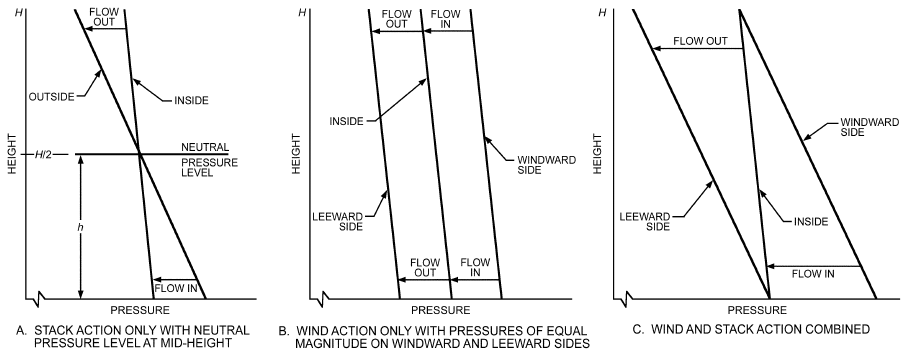

*Fig. 6 Distribution of Indoor and Outdoor Pressures over Height of Building*

Available data on the NPL in various kinds of buildings are limited. In tall buildings studied by Tamura and Wilson (1966, 1967b), the NPL varied from 0.3 to 0.7 of total building height. For houses, especially those with chimneys, the NPL is usually above mid-height. Operating a combustion heat source that vents to the outdoors raises the NPL further, sometimes above the ceiling (Shaw and Brown 1982).

### Thermal Draft Coefficient

Compartmentation of a building also affects the NPL location. Equation (24) provides a maximum stack pressure difference, given no internal airflow resistance. The sum of pressure differences across the exterior wall at the bottom and top of the building, as calculated by these equations, equals the total theoretical draft for the building. The sum of actual top and bottom pressure differences, divided by the total theoretical draft pressure difference, equals the **thermal draft coefficient**. The value of the thermal draft coefficient depends on the airflow resistance of exterior walls relative to the airflow resistance between floors. For a building without internal partitions, the total theoretical draft is achieved across the exterior walls (Figure 7A), and the thermal draft coefficient equals 1. In a building with airtight separations between each floor, each story acts independently, its own stack effect being unaffected by that of any other floor (Figure 7B). The theoretical draft is minimized in this case, and each story has its own NPL.

Real multistory buildings are neither open inside, nor airtight between stories. Vertical air passages, stairwells, elevators, and other service shafts allow airflow between floors. Figure 7C represents a heated building with uniform openings in the exterior wall, through each floor, and into the vertical shaft at each story. Between floors, the slope of the line representing the indoor pressure is the same as that shown in Figure 7A, and the discontinuity at each floor (Figure 7B) represents the pressure difference across it. Some of the pressure difference maintains flow through openings in the floors and vertical shafts. As a result, the pressure difference across the exterior wall at any level is less than it would be with no internal flow resistance.

Maintaining airtightness between floors and from floors to vertical shafts is a way to control indoor/outdoor pressure differences because of the stack effect and, therefore, infiltration and exfiltration. Good separation is also conducive to proper operation of mechanical ventilation and smoke management systems. However, care is needed to avoid creating pressure differences that could prevent egress doors from opening in an emergency. Tamura and Wilson (1967a) showed that when vertical shaft leakage is at least two times envelope leakage, the thermal draft coefficient is almost one and the effect of compartmentation is negligible. Measurements of pressure differences in three tall office buildings by Tamura and Wilson (1967b) indicated that the thermal draft coefficient ranged from 0.8 to 0.9 with ventilation systems off. Modern internal sealing techniques should result in much less vertical leakage.

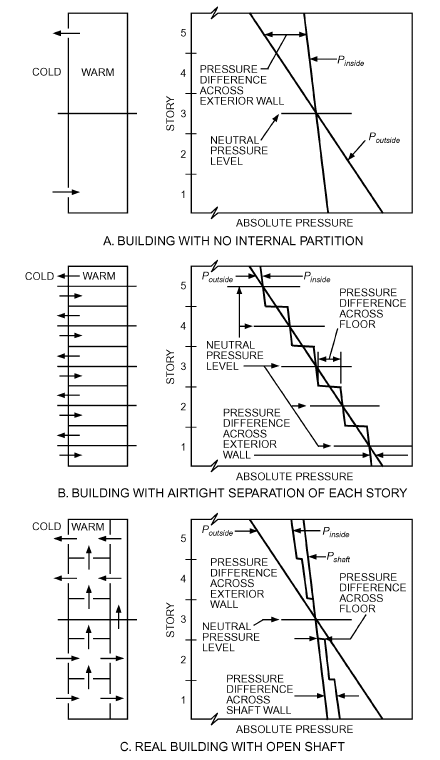

*Fig. 7 Compartmentation Effect in Buildings*

<!-- str. 431 -->

## 4. INDOOR AIR QUALITY

Outdoor air requirements for creating and maintaining acceptable indoor air quality (IAQ) have long been debated, and different rationales have produced radically different ventilation standards (Grimsrud and Teichman 1989; Janssen 1989; Klauss et al. 1970; Yaglou et al. 1936; Yaglou and Witheridge 1937). Historically, the major considerations have included the rate of outdoor air admission required to control airborne moisture, carbon dioxide (CO2), odors, and tobacco smoke generated by occupants. These considerations have led to prescriptions of minimum rates of outdoor air supply per occupant or by unit floor area, or both. More recently, a major concern has been maintaining acceptable indoor concentrations of various additional pollutants that are not generated primarily by occupants. Engineering experience and field studies indicate that an outdoor air supply of about 10 L/s per person is very likely to provide acceptable perceived indoor air quality in office spaces, whereas lower rates may lead to increased sick building syndrome symptoms (Apte et al. 2000; Mendell 1993; Seppanen et al. 1999; Sundell et al. 2011). Information on contaminants can be found in Chapter 11, and odors are addressed in Chapter 12.

Indoor pollutant concentrations depend on the strength of pollutant sources and the total rate of pollutant removal. Pollutant sources include outdoor air; indoor sources such as occupants, furnishings, and appliances; lack of cleanliness as well as use of cleaning and other products; soil adjacent to the building; and building materials themselves, especially when new. Pollutant removal processes include dilution with cleaner outdoor air, local exhaust ventilation, deposition on surfaces, chemical reactions, and air-cleaning processes. If (1) general building ventilation is the only significant pollutant removal process, (2) indoor air is thoroughly mixed, and (3) pollutant source strength and ventilation rate have been stable for a sufficient period, then the steady-state indoor concentration of a specific pollutant is given by

> Ci = Co + 106S/Qoa&emsp;**(32)**

where

- Ci = steady-state indoor concentration, ppm
- Co = outdoor concentration, ppm
- S = total pollutant source strength, m3/s
- Qoa = ventilation rate, m3/s

Variation in pollutant source strengths, rather than variation in ventilation rate, is considered the largest cause of building-tobuilding variation in concentrations of pollutants that are not generated by occupants. Turk et al. (1989) found that a lack of correlation between average indoor respirable particle concentrations and whole-building outdoor ventilation rate indicated that source strength, high outdoor concentrations, building volume, and removal processes are important. Because pollutant source strengths are highly variable, maintaining minimum ventilation rates does not ensure acceptable indoor air quality in all situations. The lack of health-based concentration standards for many indoor air pollutants, primarily because of the lack of health data, makes the specification of minimum ventilation rates difficult.

In cases of high contaminant source strengths, such as with indoor sanding, spray painting, or smoking, impractically high rates of dilution ventilation are required to control contaminant levels, and other methods of control are more effective. Removal or reduction of contaminant sources is the most effective means of control. Controlling a localized source by means of local exhaust, such as paint booths, laboratory fume hoods, range hoods, or bathroom exhaust fans, as well as filtration and absorption, may also be effective [e.g., Rock (2006)].

Some particles can be removed with various types of air filters. Gaseous contaminants with higher relative molecular mass can often be controlled with activated carbon or alumina pellets impregnated with a substance such as potassium permanganate. Chapter 29 of the 2020 *ASHRAE Handbook—HVAC Systems and Equipment* has information on air cleaning.

### Protection from Extraordinary Events

The design, operation and maintenance of a building’s ventilation system and envelope, as well as other factors, can significantly affect the building’s potential vulnerability to extraordinary threats, which range from intentional releases of chemical or biological agents inside or outside a building, to releases of chemicals in industrial or transportation accidents, to natural disasters. ASHRAE (2003) addresses several key steps to manage risk from extraordinary incidents, including

- Evaluate the risk to a facility of an extraordinary incident
- Assess the building’s vulnerability
- Determine the degree of acceptable vulnerability
- Consider protective measures or options in relation to new, renovated, and existing buildings

Persily (2004) details how ventilation affects buildings’ vulnerability to airborne chemical and biological releases, as well as some strategies for using ventilation, particularly involving airtightness and pressurizing the building interior to protect against outdoor releases, to increase the level of building protection against such incidents. Persily et al. (2007) evaluate retrofit options for protecting buildings from airborne threats; approaches considered include enhanced particle filtration, sorbent-based gaseous air cleaning, ventilation system recommissioning, building envelope airtightening, building pressurization, relocation of outdoor air intakes, shelter-in-place (SIP), isolation of vulnerable spaces such as lobbies, and system shutdown and purge cycles. The filtration and air cleaning options have the advantage of always being operational as long as the systems are properly designed, installed, and maintained. However, the lack of standard test methods is a critical issue in application of some air-cleaning technologies. Building envelope air sealing and pressurization can be quite effective in protecting against outdoor releases as long as effective filtration against the contaminant of concern is also in place. Protection provided by operational changes such as system shutdown and purging depends heavily on timing; if timing is inappropriate, occupant exposure may be increased. Isolating vulnerable zones and other systemrelated modifications depend on building layout and system design, and careful implementation is necessary for effectiveness under the range of conditions that exist in buildings. Finally, many retrofits can also increase energy efficiency and improve indoor air quality, which should be included in a life-cycle cost comparison of different options to the degree possible. Chapter 60 of the 2019 ASHRAE Handbook—HVAC Applications addresses extraordinary events further.

## 5. THERMAL LOADS

Outdoor air introduced into a building constitutes a large part of the total space-conditioning load, which is one reason to limit air change rates to the minimum required. Air exchange typically represents 20 to 50% of a modern, ventilation-code-compliant building’s thermal load in nontemperate climates. The effect on heating loads tends to be much larger than on cooling loads (McDowell et al. 2003). Chapters 17 and 18 address thermal loads in more detail.

<!-- str. 432 -->

Air exchange increases a building’s thermal load in several ways. First, incoming air must be heated or cooled from the outdoor air temperature to the indoor or supply air temperature. The rate of energy consumption by this sensible heating or cooling is

> q = Qρc ΔT&emsp;**(33)**
>
> s p

where

- qs = sensible heat load, W
- Q = airflow rate, m3/s
- ρ = air density, kg/m3 (about 1.2 at or near sea level)
- cp = specific heat of air, J/(kg·K) (about 1000)
- ΔT = temperature difference between indoors and outdoors, K and at or near sea-level air density, with an adjustment for typical room air humidity, this equation is commonly presented for design use as

> q = 1230QΔt&emsp;**(34)**
>
> s

Equations (33) and (34) are known as the **sensible heat equa- tion**. HVAC designers typically assume sea-level air pressure for locations with altitudes of 610 m or lower. A method to adjust for elevation is provided in Chapter 18.

Air exchange also modifies the moisture content of the air in a building. The rate of energy consumption associated with these latent loads, to add or remove water from the air and neglecting the energy associated with any condensate, is

> q = QρΔW(2501 + 1.805T)&emsp;**(35)**
>
> l

where

- ql = latent heat load, W
- ΔW = humidity ratio difference between indoors and outdoors, kg water/kg dry air, kg/kg
- T = average of indoor and outdoor temperatures, °C

Equation (35) is known as the **latent heat equation**. When at or near sea level, and for common comfort air temperatures, the right-

> 6

hand side of Equation (35) is approximately 3.01 × 10 QΔW.

**Example 1.** A makeup air unit (MAU) is to condition 2360 L/s of outdoor air in the winter for a building in Atlanta, Georgia. If the air is to be delivered directly to the occupied spaces at 24°C and 30% rh, how much sensible and latent heat must be added to this ventilation air at winter design conditions?

**Solution:** From the weather data tables provided on the CD included with this volume, Atlanta is at an elevation of about 300 m. Because this is below the rule-of-thumb cutoff of 600 m for assuming sea-level conditions, air density is assumed to be 1.20 kg/m3. Also from the Atlanta data table, the winter 99% design dry-bulb (db) temperature is –3.1°C, but a mean coincident wet bulb is not provided. However, for humidification design, a dew-point temperature of –12.7°C is given along with its –0.1°C mean coincident dry bulb (MCDB). Using these data, a –17.2°C dew point is assumed as the 99% mean coincident dew point. From ASHRAE’s sea-level psychrometric chart and the winter design conditions, the desired humidity ratio W of the 24°C, 30% rh makeup air is about 0.0056 kgw/kgda. For the very dry outdoor air, with a dew point of –17.2°C, a problem occurs: the standard sea-level psychrometric chart does not extend below 0°C. Designers often assume that air below this temperature has W = 0, and this assumption gives conservative results. However, both high- and low-temperature psychrometric charts are available from ASHRAE, as is a table of moist air properties at standard conditions in Chapter 1. From this table, saturated air at –17.2°C, which is also its dew point, has a humidity ratio of 0.0008298 kgw/kgda. With 2360 L/s of outdoor air to be conditioned, and using the sensible and latent heat equations for sea level, the energy needed to condition this outdoor air is

> qs = 1.23QΔT = 1.23 × 2360 L/s[24 – (–3.1°C)]
>
> = 78 666 W ≈ 78.7 kW

and ql = 3010QΔW = 3010 × 2360 L/s(0.0056 – 0.0008298 kgw/kgda) = 33 886 W ≈ 33.9 kW

Thus, the MAU’s heating coil and humidifier, neglecting fan heat, need to be sized to provide at least a net 78.7 kW of sensible heat, and 33.9 kW of latent heat. Humidification can be provided by cold water, warm water, or steam, so a more precise psychrometric analysis is needed to size the heating coil correctly after the humidification method is selected and it is decided whether the humidifier will be placed before or after the heating coil.

As Example 1 shows, ventilation loads are substantial. They are often 50% or more of the total space conditioning loads in modern, well-insulated, high-occupancy commercial buildings in less temperate climates. When cooling outdoor air, substantial moisture usually must be removed from the ventilation air; reheat or regenerative heat recovery may be required in all but dry climates.

### Effect on Envelope Insulation

Air exchange also can affect a building’s thermal load by altering performance of the envelope insulation system. Airflow through insulation can decrease the thermal load through heat exchange between infiltrating or exfiltrating air and the insulation. Conversely, air moving in and out of the insulation from the outdoors can increase the thermal load. Experimental and numerical studies demonstrate that significant thermal coupling can occur between air leakage and insulation layers, thereby modifying the heat transmission in building envelopes. In particular, research (Bankvall 1987; Berlad et al. 1978; Lecompte 1987; Wolf 1966) shows that convective airflow through air-permeable insulation in an envelope assembly may degrade its effective thermal resistance. This R-value degradation occurs when outdoor air moves through and/or around the insulation within the wall cavity and returns to the outdoors without reaching the conditioned space. A literature review by Powell et al. (1989) summarized the findings about air movement effects on the effective thermal resistance of porous insulation under various conditions. The effect of such airflow on insulation system performance is difficult to quantify, but should be considered. Airflow within the insulation system can also decrease the system’s performance because of moisture condensation in and on the insulation.

Even if air flows only through cracks instead of through the insulation, the actual heating/cooling load from the combined effect of conduction and airflow heat transfer can be lower than the heating/cooling load calculated by Equation (33). This reduction in total heating/cooling load is a consequence of the thermal coupling between conduction and convection heat transfer and is called **in- filtration heat recovery (IHR)**. Using a computer simulation, Kohonen et al. (1987) found that the conduction/infiltration thermal interaction reduced total heating load by 15%. Several experimental studies (e.g., Claridge and Bhattacharyya 1990; Claridge et al. 1988; Liu and Claridge 1992a, 1992b, 1992c, 1995; Timusk et al. 1992), using a test cell under both steady-state and dynamic conditions, found that the actual energy attributed to air infiltration can be 20 to 80% of the values given by Equation (35). Judkoff et al. (1997) measured heat recovery in a mobile home under steady-state conditions, and found that up to 40% heat recovery occurs during exfiltration through the envelope. Buchanan and Sherman (2000) performed two- and three-dimensional computational fluid dynamics (CFD) simulations to study the fundamental physics of the IHR process and developed a simple macro-scale mathematical model based on the steady-state one-dimensional convection-diffusion equation to predict a heat recovery factor. Their results show that the traditional method may overpredict the infiltration energy load. Using physical experiments, ASHRAE research project RP-1169 (Ackerman et al. 2006) showed that thermal resistances are affected by infiltration and exfiltration, but, on a net basis, the IHR effect can be neglected.

<!-- str. 433 -->

### Infiltration Degree-Days

Heating and cooling degree-days (HDDs and CDDs) are a simple way to characterize the severity of a particular climate. Heating and cooling degree-day values are based on sensible temperature data, but infiltration loads are both sensible and latent. **Infiltration degree days (IDDs)** more fully describe a climate and can be used to estimate heat loss or gain from infiltration in residences (Sherman 1986). Total infiltration degree-days is the sum of the heating and cooling infiltration degree-days and is calculated from hour-byhour weather data and base conditions using weather weighted by infiltration rate. The selection of base conditions is an important part of the calculation of the IDDs. ASHRAE Standard 119 lists IDDs for many locations with a particular set of base conditions.

## 6. NATURAL VENTILATION

Natural ventilation is the flow of outdoor air caused by wind and thermal pressures through intentional openings in a building’s shell. Under some circumstances, it can effectively control temperature, contaminants, and possibly airborne moisture in mild climates, but it is not considered practical in hot and humid climates in the summer or in cold climates during the winter. Temperature control by natural ventilation is often the only means of providing some cooling when mechanical air conditioning is not available. The arrangement, location, and control of ventilation openings should combine the driving forces of wind and temperature to achieve a desired ventilation rate and good distribution of ventilation air through the building. However, intentional openings cannot always guarantee adequate temperature and humidity control or indoor air quality because of the dependence on natural wind and stack effects to drive the flow (Wilson and Walker 1992). Using night ventilation and the building’s thermal mass effect may be effective for reducing conventional cooling energy consumption in some buildings and climates if moisture condensation can be controlled. Axley (2001a) and the Chartered Institute of Building Services Engineers (CIBSE 2005) reviewed natural ventilation in commercial buildings, including potential advantages and problems, natural ventilation components and system designs, and recommended design and analysis approaches.

### Natural Ventilation Openings

Natural ventilation openings include (1) operable windows, clerestories, doors, and skylights; (2) roof ventilators; (3) stacks; and (4) specially designed inlet or outlet openings such as OA louvers and EA grilles, ventilation penthouses or shafts, chimneys, windcatchers, and roof monitors.

**Operable windows** transmit light, and provide ventilation when opened. They may open by sliding vertically or horizontally; by tilting on horizontal pivots at or near the center; or by swinging on pivots at the top, bottom, or side. The type of pivoting used is important for weather protection and affects airflow rate. Exterior doors, often with insect screens, can also provide a path for natural ventilation; as with operable windows, security concerns must be considered.

**Roof ventilators** provide a weather-resistant air outlet. Capacity is determined by the ventilator’s location on the roof; the resistance to airflow of the ventilator and its ductwork; the ventilator’s ability to use kinetic wind energy to induce flow by centrifugal or ejector action; and the height of the draft.

Natural-draft or gravity roof ventilators can be stationary, pivoting, oscillating, or rotating. Selection criteria include appearance, ruggedness, corrosion resistance, stormproofing features, dampers and operating mechanisms, noise, cost, and maintenance. Natural ventilators can be supplemented with power-driven supply or exhaust fans; their motors need only be energized when the natural exhaust capacity is too low. Gravity ventilator dampers can be manual or controlled by thermostat or wind velocity.

A natural-draft roof ventilator should be positioned so that it receives full, unrestricted wind. Turbulence created by surrounding obstructions, including higher adjacent buildings, impairs a ventilator’s ejector action. Inlets can be conical or bell-mouthed to increase their flow coefficients. The opening area at any inlet should be increased if screens, grilles, or other structural members cause flow resistance. Building air inlets, most effectively installed at the lowest levels, should be larger than the combined throat areas of all roof ventilators.

**Stacks** or **vertical flues** should be located where wind can act on them from any direction. Without wind, stack effect alone removes some air from the rooms with inlets. Much practical experience with natural ventilation from before the adoption of modern air-conditioning appears in publications by ASHVE (a predecessor society to ASHRAE).

### Ceiling Heights

In buildings that use natural ventilation, floor-to-ceiling heights are often increased well beyond the normal 2.5 to 3.2 m. Higher ceilings, as seen in buildings constructed before air conditioning was available, allow warm air and contaminants to rise above the occupied portions of rooms. Air is then exhausted from the ceiling zones, and outdoor air is introduced near the floors; a degree of floor-to-ceiling displacement airflow is thus desirable when using natural ventilation during the cooling season.

### Required Flow for Indoor Temperature Control

The ventilation airflow rate required to remove a given amount of heat from a building can be calculated from Equations (33) and (35) if the quantity of heat to be removed and the indoor/outdoor temperature and humidity ratio differences are known.

### Airflow Through Large Intentional Openings

The relationship describing the airflow through a large intentional opening is based on the Bernoulli equation with steady, incompressible flow. The general form that includes stack, wind, and mechanical ventilation pressures across the opening is

> Q = CDA 2 Δp ⁄ρ&emsp;**(36)**

where

- Q = airflow rate, m3/s
- CD = discharge coefficient for opening, dimensionless
- A = cross-sectional area of opening, m2
- ρ = air density, kg/m3
- Δp = pressure difference across opening, Pa

The discharge coefficient CD is a dimensionless number that depends on the geometry of the opening and the Reynolds number of the flow.

### Flow Caused by Wind Only

Aspects of wind that affect the ventilation rate include average speed, prevailing direction, seasonal and daily variation in speed and direction, terrain, and local obstructions such as nearby buildings, hills, trees, and shrubbery. Liddament (1988) reviewed the relevance of wind pressure as a driving mechanism. A multiflow path simulation model was developed and used to illustrate the effects of wind on air change rate.

Average wind speeds may be lower in summer than in winter; directional frequency is also a function of season. Natural ventilation systems are often designed for wind speeds of one-half the seasonal average. Equation (37) shows the rate of air forced through ventilation inlet openings by wind or determines the proper size of openings to produce given airflow rates:

<!-- str. 434 -->

> Q = CvAU&emsp;**(37)**

where

- Q = airflow rate, m3/s
- Cv = effectiveness of openings (Cv is assumed to be 0.5 to 0.6 for perpendicular winds and 0.25 to 0.35 for diagonal winds)
- A = free area of inlet openings, m2
- U = wind speed, m/s

Air intakes should be placed in exterior high-pressure regions, and air reliefs should be placed in exterior low-pressure regions, but because of wind variations, these static locations will, at times, not be optimal. Other considerations include flow control when wind speed is high, and security. Air intakes should face directly into the prevailing wind. If they are not advantageously placed, flow will be less than that predicted by Equation (37); if intakes are unusually well placed, flow will be slightly more. Desirable air relief locations are (1) on the leeward side of the building directly opposite the intake; (2) on the roof, in the low-pressure area caused by flow separation; (3) on a side perpendicular to the windward face, where low-pressure areas occur; (4) in a dormer on the leeward side; (5) in roof ventilators; or (6) by stacks. Chapter 24 gives a general description of the wind pressure distribution on a building, but transient computational modeling will likely be required.

### Flow Caused by Thermal Forces Only

If building internal resistance is not significant, flow caused by stack effect can be expressed by

> Q = CDA 2g ΔHNPL(Ti– To) ⁄ Ti&emsp;**(38)**

where

- Q = airflow rate, m3/s
- CD = discharge coefficient for opening
- ΔHNPL = height from midpoint of lower opening to NPL, m
- Ti = absolute indoor temperature, K
- To = absolute outdoor temperature, K

Equation (38) applies when Ti > To. If Ti < To, replace Ti in the denominator with To, and replace (Ti – To) in the numerator with (To– Ti). If there is thermal stratification, use an average temperature for Ti. If the building has more than one opening for natural ventilation’s airflow, the relief and intake areas are considered equal. The discharge coefficient CD accounts for all viscous effects such as surface drag and interfacial mixing.

Estimating ΔHNPL is difficult for naturally ventilated buildings. If one window or door represents a large fraction (approximately 90%) of the total opening area in the envelope, then the NPL is at the mid-height of that aperture, and ΔHNPL equals one-half the height of the aperture. For this condition, flow through the opening is bidirectional (i.e., air from the warmer side flows through the top of the opening, and air from the colder side flows through the bottom). Interfacial mixing occurs across the counterflow interface, and the orifice coefficient can be calculated by (Kiel and Wilson 1986):

> CD = 0.40 + 0.0045|Ti – To|&emsp;**(39)**

If enough other openings are available, airflow through the opening will be unidirectional, and mixing cannot occur. A discharge coefficient of CD = 0.65 should then be used. Additional information on stack-driven airflows for natural ventilation can be found in Foster and Down (1987).

The greatest flow per unit area of openings is obtained when the intake and relief areas are equal; Equations (38) and (39) are based on this equality. Increasing the relief area over intake area (or vice versa) increases airflow but not in proportion to the added area.

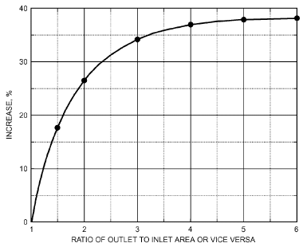

*Fig. 8 Increase in Airflow by Increasing Area of One Opening*

When openings are unequal, use the smaller area in Equation (38) and add the increase as determined from Figure 8.

### Natural Ventilation Guidelines

Several general guidelines should be observed in designing for natural ventilation. Some of these may conflict with other climateresponsive strategies such as using orientation and shading devices to minimize solar gain, with building codes that encourage compartmentalization to restrict fire and smoke movement, or with other design considerations.

### System selection

- In hot, humid climates, use mechanical cooling. If mechanical cooling is not available, air velocities should be maximized in the occupied zones of rooms.
- In hot, arid climates, consider evaporative cooling. Airflow throughout the building should be maximized for structural cooling, particularly at night when the outdoor air temperature is low.

### Building and surroundings characteristics

- Topography, landscaping, and surrounding buildings should be used to redirect airflow and give maximum exposure to breezes. Vegetation can funnel breezes and avoid wind dams, which reduce the driving pressure differential around the building. Site objects should not obstruct air intakes’ openings.
- The building should be shaped to expose maximum shell openings to breezes.
- Architectural elements such as wing walls, parapets, and overhangs should be used to promote airflow into the building interior.
- The long façade of the building and the majority of door and window openings should be oriented with respect to prevailing summer breezes. If there is no prevailing direction, openings should be sufficient to provide ventilation regardless of wind direction.

### Opening locations

- Windows should be located in opposing pressure zones. Two openings on opposite sides of a space increase ventilation flow. Openings on perpendicular sides of the building force air to change direction, providing ventilation to a greater area. The benefits of the window arrangement depend on the air relief location relative to the direction of the intake’s airstream.
- If a room has only one exterior wall, better airflow is achieved with two widely spaced windows.
- If openings are at the same level and near the ceiling, much of the flow may bypass the occupied portion of a room and be less effective in removing contaminants from there.

<!-- str. 435 -->

- Vertical distance between openings is required to take advantage of stack effect; the greater the vertical distance, the greater the ventilation rate.
- Openings near the NPL are least effective for thermally induced natural ventilation. If the building has only one large opening, the NPL tends to move to that level, which reduces pressure across the opening.

### Opening characteristics

- Greatest airflow per unit area of total opening is obtained by having openings of nearly equal areas. An inlet window smaller than the outlet creates higher inlet velocities. An outlet smaller than the inlet creates lower but more uniform airspeeds through the room.
- Openings with areas much larger than calculated are sometimes desirable when anticipating increased occupancy or very hot weather.
- In one room, horizontally separated windows are generally better than vertically separated windows. They produce more airflow over a wider range of wind directions and are most beneficial in locations where prevailing wind patterns shift.
- Window openings should be accessible to and operable by occupants, unless fully automated. For secondary fire egress, operable windows may be required.
- Intake and exhaust openings should not be obstructed by draperies, furniture, or nearby indoor partitions, for example. Partitions can be placed to split and redirect airflow but should not restrict flow between the building’s inlets and outlets. Vertical airshafts or open staircases, where allowable by fire code, can be used to increase and take advantage of stack effects. Enclosed staircases intended for evacuation or safe haven during a fire must not be used for ventilation.

Methods and tools have been developed in recent years to move the art of designing natural ventilation systems beyond the application of simple rules of thumb to engineered design (Axley et al. 2002; CIBSE 2005; Emmerich et al. 2012).

### Hybrid Ventilation

Successful application of purely natural ventilation systems for cooling may be very limited in hot or humid climates, such as in much of the United States, by thermal comfort issues and the need for reliability. However, hybrid (or mixed-mode) ventilation systems or operational strategies offer the possibility of saving energy in a greater number of buildings and climates by combining natural ventilation systems with mechanical equipment (Emmerich 2006). The **air-side economizer** is one form of hybrid ventilation control scheme, and enjoys wide use in commercial, industrial, and institutional buildings in appropriate climates. The report of the International Energy Agency’s (IEA) Annex 35 describes the principles of hybrid ventilation technologies, control strategies, design and analysis methods, and case studies (Heiselberg 2002). Integrated multizone airflow and thermal modeling is recommended when designing natural and hybrid ventilation systems (Axley 2001a; Dols et al. 2014; Li and Heiselberg 2003).

## 7. RESIDENTIAL AIR LEAKAGE

Most infiltration in U.S. low-rise residential buildings is dominated by unintentional envelope leakage. However, new construction tends toward tighter building envelopes; where mechanical or natural ventilation is not provided, it is possible for a residence to be too “tight,” especially if indoor sources of pollutants are not adequately controlled.

### Envelope Leakage Measurement

A building’s envelope leakage can be measured with **pres- surization testing,** commonly called a **blower-door test**. A fan pressurization test is relatively quick and inexpensive, and it characterizes building envelope airtightness independent of weather conditions; some jurisdictions now mandate that buildings be tested and rated. In this procedure, a large, variable-flow fan or blower is mounted in a door or window and induces a large, roughly uniform pressure difference across the building shell [ASTM Standards E779 and E1827; Canadian General Standards Board (CGSB) Standard 149.10; ISO Standard 9972]. The airflow required to maintain this pressure difference is then measured. The leakier the building is, the more airflow is necessary to induce a specific indoor/outdoor pressure difference. The airflow rate is generally measured at a series of pressure differences ranging from about 10 Pa to 75 Pa. Depressurization tests are also used.

The results of a pressurization test, therefore, consist of several combinations of pressure difference and airflow rate data. An example of typical data is shown in Figure 9. These data points characterize the air leakage of a building and are generally converted to a single value that is reported as the building’s airtightness. There are several different measures of airtightness, most of which involve fitting the data to a curve describing the relationship between the airflow Q through an opening in the building envelope and the pressure difference Δp across it. This relationship is called the **leakage function** of the opening. The form of the leakage function depends on the geometry of the opening. Background theoretical material relevant to leakage functions may be found in Chastain et al. (1987), Etheridge (1977), Hopkins and Hansford (1974), Kronvall (1980), and Walker et al. (1997).

Openings in a building envelope are usually not uniform in geometry, and wind varies, so generally flow never becomes fully developed. Each opening in the building envelope, however, is often described by Equation (40), commonly called the **power law equa- tion**:

> Q = c(Δp)n&emsp;**(40)**

where

- Q = airflow through opening, m3/s
- c = flow coefficient, m3/(s·Pan)
- n = pressure exponent, dimensionless

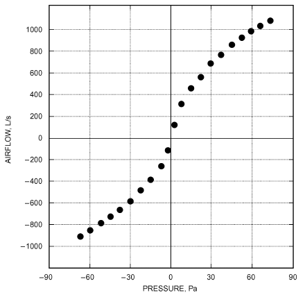

*Fig. 9 Airflow Rate Versus Pressure Difference Data from Whole-House Pressurization Test*

<!-- str. 436 -->

Sherman (1992a) showed how the power law can be developed analytically by looking at developing laminar flow in short pipes. Equation (40) only approximates the relationship between Q and Δp. Measurements of single cracks (Honma 1975; Kreith and Eisenstadt 1957) show that n can vary if Δp changes over a wide range. Additional investigation of pressure and flow data for simple cracks by Chastain et al. (1987) indicated the importance of adequately characterizing the three-dimensional geometry of openings and the entrance and exit effects. Walker et al. (1997) showed that, for the arrays of cracks in a building envelope over the range of pressures acting during infiltration, n is constant. A typical value for n is about 0.65. Values for c and n can be determined for a building by using fan pressurization testing.

### Airtightness Ratings

In some cases, the predicted airflow rate is converted to an **equiv- alent** or **effective air leakage area** as follows:

> AL = 10 000Qr(ρ ⁄ 2Δpr)/CD&emsp;**(41)**

where

- AL = equivalent or effective air leakage area, cm2
- Qr = predicted airflow rate at Δpr (from curve fit to pressurization test data), m3/s
- ρ = air density, kg/m3
- Δpr = reference pressure difference, Pa
- CD = discharge coefficient

All openings in the building shell are combined into an overall opening area and discharge coefficient for the building when the equivalent or effective air leakage area is calculated. Some users of the leakage area approach set CD= 1. Others set CD ≈ 0.6, which is the discharge coefficient for a sharp-edged orifice. The air leakage area of a building is, therefore, the area of an orifice with an assumed value of CD that would produce the same amount of leakage as the building envelope at the reference pressure.

An airtightness rating, whether based on an air leakage area or a predicted airflow rate, is generally normalized by some factor to account for building size. Normalization factors include floor area, exterior envelope area, and building volume.

With the wide variety of possible approaches to normalization and reference pressure difference, and the use of the air leakage area concept, many different airtightness ratings are used. Reference pressure differences include 4, 10, 25, 50, and 75 Pa. Reference pressure differences of 4 and 10 Pa are advocated by researchers because they are closer to the pressure differences that actually induce air exchange and, therefore, better model the opening’s flow characteristics. Although this may be true, they are below the typical range of measured values in the test; therefore, predicted airflow rates at 4 and 10 Pa are subject to significant uncertainty. This uncertainty and its implications for quantifying airtightness are discussed in Chastain (1987), Modera and Wilson (1990), and Persily and Grot (1985b). Round-robin tests by Murphy et al. (1991) to determine the repeatability and reproducibility of fan pressurization devices found that subtle errors in fan calibration or operator technique are greatly exaggerated when extrapolating the pressure versus flow curve down to 4 Pa, with errors as great as ±40%, mainly because of fan and meter calibration errors at low flow.

Some common airtightness ratings include the effective air leakage area at 4 Pa assuming CD = 1.0 (Sherman and Grimsrud 1980); the equivalent air leakage area at 10 Pa assuming CD = 0.611 (CGSB Standard 149.10); and the airflow rate at 50 Pa, divided by the building volume to give units of air changes per hour (Blomsterberg and Harrje 1979).

### Conversion Between Ratings

Air leakage areas at one reference pressure difference can be converted to air leakage areas at another reference pressure difference by

> .5
>
> ( D,1)( r,2)n–0

> C Δp
>
> Ar,2 = Ar,1 ---------- ------------&emsp;**(42)**

> C Δp
>
> ( D,2)( r,1)

where

- Ar,1 = air leakage area at reference pressure difference Δpr,1, cm2
- Ar,2 = air leakage area at reference pressure difference Δpr,2, cm2
- CD,1 = discharge coefficient used to calculate Ar,1
- CD,2 = discharge coefficient used to calculate Ar,2
- n = pressure exponent from Equation (40)

Air leakage area at one reference pressure difference can be converted to airflow rate at some other reference pressure difference by

> 2
>
> Qr,2 = (C A D,1 r,1)/(10 000) -- (Δpr,1)0.5–n(Δpr,2)n&emsp;**(43)**

> ρ

where Qr,2 is airflow rate at reference difference Δpr,2, in m3/s.

Flow coefficient c in Equation (40) may be converted to air leakage area by

> ρ
>
> AL = (10 000c)/CD -- Δpr(n–0.5&emsp;**(44)**

> 2

Finally, air leakage area may be converted to flow coefficient c in Equation (40) with

> CDAL
>
> 2

> c = ---------------- -- (Δpr)0.5–n&emsp;**(45)**
>
> 10 000 ρ

Equations (42) to (45) require assumption of a value for n, unless n is reported with the measurement results. When whole-building pressurization test data are fitted to Equation (40), the value of n generally is between 0.6 and 0.7. Therefore, using a value of n in this range is often reasonable.

### Building Air Leakage Data

Fan pressurization measures a building’s leakage behavior that ideally varies little with time and weather conditions. In reality, unless wind and temperature differences during the measurement period are sufficiently mild, pressure differences induced by weather during the blower door test cause measurement errors. Modera and Wilson (1990) and Persily (1982) studied the effects of wind speed on pressurization test results. Several experimental studies also showed variations of about 20 to 40% over a year in the measured airtightness in the homes studied (Kim and Shaw 1986; Persily 1982; Warren and Webb 1986).

Figure 10 summarizes envelope leakage measured in North American housing (Sherman and Dickerhoff 1998) and from several European and Canadian sources (AIVC 1994). This figure shows the large range of measured envelope tightness but also shows typical and extreme values in the housing stock.

ASHRAE Standard 62.2 establishes air leakage performance levels for residential buildings. These levels are in terms of effective annual average infiltration rate Qinf, which is based on normalized leakage area NL:

> ( )( )0.4
>
> ELA H

> NL = 0.1 ------------- -----&emsp;**(46)**
>
> A H

> ( floor)( r )

<!-- str. 437 -->

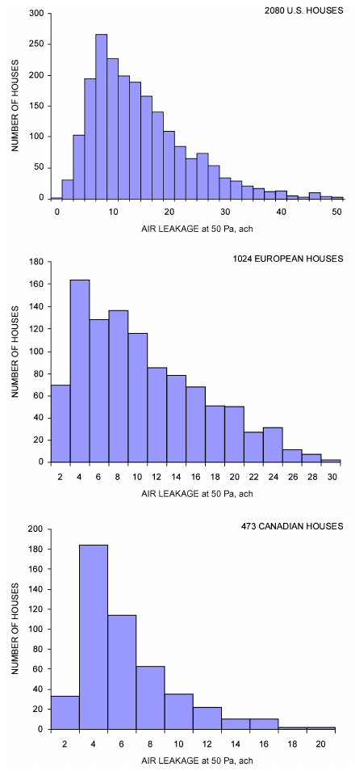

*Fig. 10 Envelope Leakage Measurements*

where

- NL = normalized leakage
- Hr = reference height, 2.5 m
- H = vertical distance from lowest above-grade floor to highest ceiling, m
- ELA = effective leakage area, m2, using 4 Pa reference pressure
- ELA = (L – L )/2 press depress where
- Lpress = leakage area from pressurization, m2
- Ldepress = leakage area from depressurization, m2

### Air Leakage of Building Components

The fan pressurization procedure discussed in the section on Envelope Leakage Measurement allows whole-building air leakage to be measured. The location and size of individual openings in building envelopes are extremely important because they influence the air infiltration rate of a building as well as the envelope’s heat and moisture transfer characteristics. Additional test procedures for pressure-testing individual building components such as windows, walls, and doors are discussed in ASTM Standards E283 and E783 for laboratory and field tests, respectively.

### Leakage Distribution

Dickerhoff et al. (1982) and Harrje and Born (1982) studied air leakage of individual building components and systems. The following points summarize the percentages of whole-building air leakage area that they found associated with various components and systems. Values in parentheses include the range determined for each component and the mean of the range.

**Walls (18 to 50%; 35%).** Both interior and exterior walls contribute to the leakage of the structure. Leakage can occur between the sill plate and the floor or foundation; through cracks below the bottom of the gypsum wallboard, around and through electrical boxes, and through plumbing penetrations; and into the attic at the top plates of walls. Holes drilled through the top plates into the attic for passage of wiring are often unsealed.

**Ceiling Details (3 to 30%; 18%).** Leakage across the top ceiling of the heated space is particularly insidious because it reduces the effectiveness of insulation on the attic floor and contributes to infiltration heat loss. Ceiling leakage also reduces the effectiveness of ceiling insulation in buildings without attics. Recessed lighting, plumbing, and other penetrations leading to the attic are some particular areas of concern, as are intentional openings such as access hatches or for whole-house fans.

**Forced-Air Heating and/or Cooling Systems (3 to 28%;** 18%). The location of the heating or cooling equipment, air handler, or ductwork in conditioned or unconditioned spaces; the venting arrangement of a fuel-burning device; and the existence and location of a combustion air supply all affect air leakage. Modera et al. (1991) and Robison and Lambert (1989), among others, found that the variability of leakage in ducts passing through unconditioned spaces is high, the coefficient of variation being about 50%. Field studies also showed that in situ repairs can eliminate one-quarter to two-thirds of the observed leakage (Cummings and Tooley 1989; Cummings et al. 1990; Jump et al. 1996; Robison and Lambert 1989). The 18% contribution of ducts to total leakage significantly underestimates their effect because, during system operation, pressure differentials across duct leaks are approximately ten times higher than typical pressure differences across envelope leaks (Modera 1989; Modera et al. 1991) and result in large (factors of two to three), changes in ventilation rate (Cummings et al. 1990; Walker 1999; Walker et al. 1999).

**Windows and Doors (6 to 22%; 15%).** More variation in window leakage is seen among window types (e.g., casement versus double-hung) than among new windows of the same type from different manufacturers (Weidt et al. 1979). Windows that seal by compressing the weather strip (casements, awnings) often show significantly lower leakage than windows with sliding seals. Leakage around the frames of windows also can be significant if not properly sealed, typically with controlled-expansion foam, during their installation. The door between a residence and an attached garage, or an enclosed hallway in multiunit housing, also needs gasketing to reduce air leakage as well as smoke and other pollutants’ movement.

**Fireplaces (0 to 30%; 12%).** When a fireplace is not in use, poorly fitting dampers allow indoor air to escape. Glass doors may not seal the fireplace structure more tightly than a closed damper does. Chimney caps or fireplace plugs (with signs that warn they are in place) effectively reduce leakage through a cold fireplace but may not be allowed by fire code. The gap between a metal fireplace insert and the surrounding wall, tiles, or brick is often another leakage path if not properly sealed.

<!-- str. 438 -->

**Exhaust Vents from Conditioned Spaces (2 to 12%; 5%).** Exhaust ducts going from conditioned spaces to the outdoors frequently have either no dampers or dampers that do not close properly. The gap between the duct and the wall or roof penetration often needs sealing, as well.

**Diffusion Through Walls and Ceilings (**<1%). Compared to infiltration through holes and other openings in the structure, diffusion through well-constructed walls and ceilings is not an important flow mechanism. At 5 Pa, the permeability of building materials produces an air change rate of less than 0.01 ach by wall diffusion in a typical house. Proper installation of an air-retarding membrane can help minimize this air leakage path.

**Component Leakage Areas.** Individual building component leakage areas vary widely from house to house. Typical variability for an individual component is about a factor of 10, depending on the component’s construction and installation. Testing should establish the installed leakage of a component in critical applications such as energy-efficient manufactured housing.

### Multifamily Building Leakage

Leakage distribution is particularly important in multifamily apartment buildings. These buildings often cannot be treated as single zones because of the internal resistance between apartments. Moreover, leakage between apartments varies widely, from very small for well-constructed buildings with air/moisture retarders and well-sealed wall and floor penetrations between units, to as high as 60% of the total apartment leakage in older, tall apartment buildings of masonry construction (Diamond et al. 1986; Modera et al. 1991). RDH (2013) reviewed the current state of airtightness in multifamily buildings, including testing requirements and techniques, performance targets, and current airtightness levels.

### Controlling Air Leakage

**New Buildings.** It is much easier and more cost-effective to build a tight building than to tighten an existing building. Elmroth and Levin (1983), Eyre and Jennings (1983), Marbek Resource Consultants (1984), and Nelson et al. (1985) provide information and construction details on airtight building design for houses. The economic paybacks for basic “weatherization” improvements are often the most attractive of all energy conservation measures in buildings where no actions have been taken previously.

A continuous **air infiltration retarder**, formerly known as an air barrier, can be an effective way to reduce air leakage through walls, around window and door frames, and at joints between major building elements. Take particular care to ensure its continuity at all wall, floor, and ceiling joints; at window and door frames; and at all penetrations of the retarder such as electrical boxes, plumbing connections, and utility service penetrations. Joints in the **air/vapor retarder** must be lapped and sealed. Plastic vapor retarders installed in the ceiling should be tightly sealed to the vapor retarder in the outer walls and should be continuous over the interior walls. A seal at the top of the interior walls reduces leakage into the attic; the plate on top of the studs generally gives a poor seal. In cold climates, the air infiltration retarder can be installed either on the inside of the wall framing, in which case it usually functions as a vapor retarder as well, or on the outside of the wall framing, in which case it should have a permeance rating high enough to allow diffusion of water vapor from the wall. For a discussion of moisture transfer in building envelopes, see Chapters 25 and 26.

**Existing Buildings.** Air leakage paths must first be located before the envelope of an existing building can be tightened. As discussed earlier, air leakage into and out of buildings is caused by not only windows and doors but also a wide range of unexpected and unobvious construction defects. Many important leakage routes can be very difficult to find. A variety of techniques developed to locate leakage paths are described in ASTM Standard E1186 and Charlesworth (1988).

Once leakages are located, they can be repaired with materials and techniques appropriate to the size and location of the leak. Diamond et al. (1982), Energy Resource Center (1982), Harrje et al. (1979), and many websites and online videos include information on airtightening or “weatherization” in existing residential buildings with caulking, sealing, weatherstripping, and use of door sweeps, for example. With these procedures, air leakage of residential buildings can be reduced dramatically: anywhere from 5% to more than 50%, depending on the extent of the tightening effort and the experience of those doing the work (Blomsterberg and Harrje 1979; Giesbrecht and Proskiw 1986; Harrje and Mills 1980; Jacobson et al. 1986; Verschoor and Collins 1986). Much less information is available for airtightening large, commercial buildings, but the same general principles apply (Parekh et al. 1991; Persily 1991); the joint between corrugated floor or ceiling decking and the exterior walls is often poorly sealed or not at all, and is often hidden from easy view.

## 8. RESIDENTIAL VENTILATION

Typical infiltration rates in housing in North America vary by an order of magnitude, from tightly constructed housing with seasonal average air change rates as low as 0.1 h–1 to loosely constructed housing with air change rates as great as 2.0 h–1 or even higher in a few cases. Figures 11 and 12 show histograms of infiltration rates measured in two different samples of North American housing (Grimsrud et al. 1982; Grot and Clark 1979). Figure 11 shows the average seasonal infiltration of 312 houses located in different areas in North America. The median infiltration value of this sample is 0.5 h–1. Figure 12 represents measurements in 266 houses located in 16 U.S. cities. The median value of this sample is 0.9 h–1. The group of houses in the Figure 11 sample is biased toward then-new, then “energy-efficient” houses, whereas the group in Figure 12 represents older, low-income housing. New houses constructed since these studies likely are somewhat tighter because of greater awareness of leakage paths and energy efficiency efforts, including mandated leakage testing in some locations. A modeling study using a set of 209 dwellings that represent 80% of U.S. housing stock estimated a median value of infiltration of 0.44 h–1 for all single-family houses, whereas the median for those built since 1990 was 0.26 h–1 (Persily et al. 2010).

Additional studies have found average values for houses in regional areas. Palmiter and Brown (1989) and Parker et al. (1990) found a heating season average of 0.40 h–1 (range: 0.13 to 1.11 h–1) for 134 houses in Pacific Northwest climates. In a comparison of 292 houses incorporating energy-efficient features, including measures to reduce air infiltration and provide ventilation heat recovery, with 331 control houses, Parker et al. (1990) found an average of about 0.25 h–1 (range: 0.02 to 1.63 h–1) for the energy-efficient houses versus 0.49 h–1 (range: 0.05 to 1.63 h–1) for the control group. Ek et al. (1990) found an average of 0.5 h–1 (range: 0.26 to 1.09 h–1) for 93 double-wide manufactured homes in the Pacific Northwest. Canadian housing stock has been characterized by Riley (1990) and Yuill and Comeau (1989). Although these studies do not represent random samples of North American housing, they indicate the distribution of infiltration rates expected in a group of buildings.

The influence of occupants on infiltration has not been measured directly and varies widely. These influences are, for example, operation of doors, windows, and small exhaust fans. Desrochers and Scott (1985) estimated that they add an average of 0.10 to 0.15 h–1 to the unoccupied values. Kvisgaard and Collet (1990) found that, in 16 Danish dwellings, occupants on average provided 63% of the total air change rate.

<!-- str. 439 -->

Ventilation air for houses in the United States has traditionally been provided with the assumption occupants will use windows and exhaust fans when needed, and that the building envelope is leaky enough so that infiltration will suffice. Possible difficulties with this approach include occupant error, low infiltration when natural forces (temperature difference and wind) are weak; unnecessary energy consumption when these forces are strong; drafts in cold climates; lack of control of ventilation rates to meet changing needs; poor humidity control; potential for interstitial condensation from exfiltration in cold climates or infiltration in hot humid climates; and lack of opportunity to recover energy used to condition ventilation air. The solution to these concerns is to have a tight building envelope and a properly designed and operated mechanical ventilation system with automatic control.

ASHRAE Standard 62.2 and the National Building Code of Canada (NRCC 2010) encourage tighter envelope construction. Hamlin (1991) found a 30% increase in airtightness of tract-built Canadian houses between 1982 and 1989. Also, 82% of newer houses had natural air change rates below 0.3 h–1 in March. Yuill (1991) derived a procedure to show the extent to which infiltration contributes toward meeting ventilation air requirements. As a result, the National Building Code of Canada has requirements for mechanical ventilation capability in all new dwelling units.

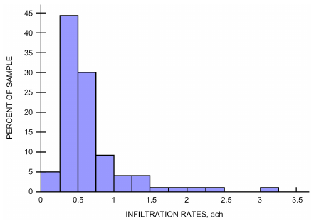

*Fig. 11 Histogram of Infiltration Values for Then-New Construction*

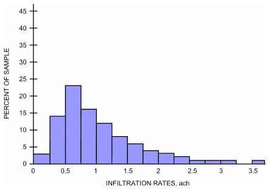

*Fig. 12 Histogram of Infiltration Values for Low-Income Housing*

Canadian Standards Association (CSA) Standard F326 expands the requirements for residential mechanical ventilation systems to include air distribution within the house, thermal comfort, minimum temperatures for equipment and ductwork, system controls, pressurization and depressurization of the dwelling, installation requirements, and verification of compliance. Verification can be by design or by test, but the total rate of outdoor air delivery must be measured.

Mechanical ventilation is required by ASHRAE Standard 62.2 and by building code in some U.S. states; some details of these requirements are described in this chapter. The net benefit of using controlled mechanical ventilation has been demonstrated and studied in various energy-efficient and advanced housing programs (Barley 2001; Palmiter et al. 1991; Riley 1990). Systems can be characterized as local or central; exhaust, supply, or balanced; with forced-air or radiant/hydronic heating/cooling systems; with or without heat recovery; and with continuous operation or with control by occupants, pollutant sensing, timers, or humidity. Note that not all combinations are viable. Various options are described by Fisk et al. (1984), Hekmat et al. (1986), Holton et al. (1997), Lubliner et al. (1997), Palmiter et al. (1991), Reardon and Shaw (1997), Sherman and Matson (1997), Sibbitt and Hamlin (1991), and Yuill et al. (1991).

The simplest systems use bathroom and kitchen fans to exhaust moisture and pollutants outdoors, and to depressurize to augment infiltration. Noise, installed capacity, durability under high or continuous operation, air movement from all rooms (especially bedrooms), envelope moisture, combustion safety, and energy efficiency issues need to be addressed. Many present bath and kitchen fans are ineffective ventilators because of poor installation and design, and many fail to exhaust outdoors. However, properly specified and installed exhaust fans can form part of good whole-house ventilation systems and are so specified in many building codes.

Some systems use their central air-handling unit blower to induce air from the outdoors and distribute it. However, the blower operates intermittently if thermostatically controlled and thus provides little ventilation in mild weather. Continuous blower operation increases energy consumption. If the blower operates continuously when the heat source is off, the combination of lower mixed-air temperature and high air speed can cause cold air drafts when in heating mode. To offset these problems, some systems use variable-speed blowers, which allow operation at lower speeds during mild weather. Others use a timer to cycle the blower when thermostatic demands are inadequate for ventilation purposes (Rudd 1998).

Central exhaust systems use leakage paths and, in some cases, intentional, controllable, and filtered openings in the building envelope for admitting makeup air. Such systems may be suitable for retrofit in existing houses. Energy can be recovered from the exhaust airstream to precondition makeup air or to warm potable water using a heat pump, for example.

For new houses with tightly constructed envelopes, balanced ventilation with passive heat recovery (e.g., air-to-air heat exchangers, heat recovery ventilators) can be appropriate in some climates. Fan-induced, filtered outdoor and exhaust airflow at nearly equal rates through a heat exchanger, where heat and sometimes moisture is transferred between the airstreams. This typically reduces the energy required to condition ventilation air by 60 to 80% (Cutter 1987). Concerns associated with these systems include airflow balance, leakage between streams, biological contamination of wet surfaces, frosting, and initial and maintenance costs.

Air-side economizers, which allow outdoor air to be up to 100% of the supply air at appropriate times, are not typically used in small buildings with low internal heat gains relative to the building envelope. Because of heat transfer through building envelopes, these small buildings quickly require heating or cooling as the outdoor air temperature falls or rises. Consequently, from an energy conservation point of view, small envelope-load-dominated buildings do not benefit as much as internal-load-dominated buildings in cool climates from daytime use of air-side economizers; night ventilation of residences during the cooling season may be very attractive, though, when the outdoor humidity ratio is low. Ventilation rates increase dramatically when air-side economizers are in operation, so the extra moisture introduced or removed must be considered.

<!-- str. 440 -->

The type of ventilation system can be selected based on house leakage class as defined in ASHRAE Standard 119. Balanced airto-air systems with heat recovery are optimal for tight houses (leakage classes A to C in the standard). The leakier the house, the larger the contribution from infiltration and the less effective heat recovery ventilation will be. Tightening the envelope beyond the level of ASHRAE Standard 62.2 may be warranted in extremely cold climates to better use the heat recovery effect (Sherman and Matson 1997). In mild climates, these systems can also effectively be used in leakage classes D to F. Central exhaust systems should not be used for leakage classes A to C unless special air intakes are provided; otherwise their operation may depressurize the house enough to cause backdrafting through fossil-fueled appliances without closed-combustion systems. Unbalanced systems (either supply or exhaust) are optimal for leakage classes D to F. Ventilation systems are normally not needed for leakage classes G to J, but when they are needed, an unbalanced system is usually the best choice. More discussion of mechanical systems for residences is available in Russell et al. (2005); some information on practices outside North America can be found in McWilliams and Sherman (2005).

### Shelter in Place

The most fundamental function of a house is to provide shelter from outdoor conditions. A first response to poor outdoor air quality is to go indoors. Closing windows and other air intakes and turning off exhaust fans reduces air exchange with the outdoors, decreasing the immediate intrusion of outdoor air into the home. However, because no home is perfectly airtight, closing doors and windows does not eliminate intrusion. Because all indoor air ultimately comes from outdoors, indoor air quality eventually comes to dynamic equilibrium with outdoor conditions in an idealized, unoccupied building. The tighter the building, the longer the time needed to come to equilibrium.

The delay time (the time it takes to completely change the air in a building) is determined by the ventilation rate. The effectiveness of sheltering within the home thus depends on envelope tightness. For a home with 0.35 air changes per hour, the delay time is roughly 3 h. For a very tight house without mechanical ventilation, the delay time can easily be twice as long. Most houses in the United States are leakier and thus could have a delay time of about one hour (Sherman and Matson 1997).

Reactive gases in outdoor air, such as ozone, can be decreased to some degree by the building envelope. For other outdoor contaminants, the building envelope serves to delay, not reduce, their introduction into the indoor environment. Such a delay is not very helpful at reducing exposures to outdoor contaminants that persist over days, but can be an effective strategy for short-duration (e.g., less than a few hours) sources. In houses without indoor sources, ozone levels tend to be higher in houses that do not have air conditioners than in those with air conditioners; ozone levels also are higher when windows are open than when they are closed (Weschler 2000). For outdoor exposure times shorter than the delay time, the house serves as a reservoir of cleaner air of that particular pollutant. After the outdoor contaminant is gone, windows can be opened to flush out pollutants that entered or were internally generated during the exposure period.

### Safe Havens

Simply going indoors may not be sufficient for highly unusual but potentially lethal events. Chemical spills or fires, explosions, bioterrorism, or similar toxic air pollutant releases can temporarily create dangerous outdoor conditions that render other air quality issues insignificant. With sufficient warning, occupants should leave the vicinity, but the unexpected nature of these events means that the only viable alternative may be to shelter in place.

This strategy may work for short-term releases of airborne toxins. Homes are often too leaky to provide the protection needed for longer-duration events, but individual rooms can be temporarily sealed to become safe havens. A safe haven should be chosen to have as little contact as possible with outer walls, and preferably be on the side of the house farthest downwind from the source. Impermeable tape can be used to seal leaks, cracks, seams, register grilles, and doors, with thick plastic sheeting used to span larger gaps (Sorensen and Vogt 2001). If such a shelter has an air change rate of 0.15 h–1 with the house, it can take 4 to 6 h for contaminated outdoor air to affect significantly the safe haven. With very well-sealed, occupied spaces, the air quality inside degrades because of the occupants and materials within, especially rapidly for smaller spaces with higher occupant density. Suffocation is remotely possible, but thermal stress and odor accumulation are more typical.

Where emergencies are somewhat more likely, engineered safe rooms with adequate HVAC systems are needed. In such cases, a safe haven can be designed in advance with thermal conditioning and a highly efficient particle/gas-phase filtration system capable of providing several hours, days, or weeks of protection (Ormerod 1983). A short-term safe haven might be effectively combined with another emergency shelter (e.g., tornado, hurricane, civil defense) to reduce cost.

## 9. RESIDENTIAL IAQ CONTROL

ASHRAE Standard 62.2 presents minimum requirements for residential ventilation air and acceptable indoor air quality, and its user’s manual (ASHRAE 2010a) has detailed information for designing and constructing residential buildings in compliance with the standard. Best or good practice may require going beyond the standard’s minima. This section describes good practice; however, it presumes that the minimum requirements of 62.2 are met as well.

Traditionally, ventilation air for residences has been provided by natural ventilation controlled by occupants, and also mechanically by increasing infiltration using exhaust fans vented outdoors. Sherman and Matson (1997) showed that many older residential buildings are leaky enough that infiltration alone can meet the minimum requirements of ASHRAE Standard 62.2. Houses built or retrofitted to new standards have substantially tighter envelopes and insufficient infiltration under most weather conditions to meet ventilation standards. Studies show that concerns over safety, noise, comfort, air quality, and energy minimize occupants' use of operable windows (Johnson and Long 2005; Price and Sherman 2006). As a result, these houses require supplemental mechanical ventilation to satisfy current standards.

The minimum residential ventilation rate is not always sufficient to adequately dilute all contaminants (e.g., radon), and can introduce undesired substances (e.g., pollen). In these cases, source control, local exhaust, extra ventilation, or more effective air treatment is required to manage contaminant levels. Therefore, especially in single-family dwellings, occupants must be responsible for monitoring and controlling contaminant sources in and around their indoor environments, as well as for operating their dwelling units to meet their individual needs. Increasingly, residences are also used for business or hobby purposes, which may introduce air contaminants not addressed in Standard 62.2; portions of these residences may require ventilation air as required by Standard 62.1 or industrial guidelines.

<!-- str. 441 -->

### Source Control

When considering how much whole-house ventilation should be supplied, both typical and unusual sources of indoor pollution should be controlled first to limit the required ventilation rate. This can be done either by mitigating the source itself or by using local exhaust to extract contaminants before they can mix into the indoor environment. Typical sources that should be considered include the following.

**Clothes Dryers and Central Vacuum Systems.** Clothes dryer exhaust is heavily laden with moisture and laundry by-products such as flammable lint and various gaseous contaminants. Many moisture problems have been traced to clothes dryers vented indoors or to attics, crawlspaces, garages, or other inappropriate locations. Exhaust from clothes dryers, which is typically about 70 L/s, must be vented directly to the outdoors. Similarly, central vacuum systems must be vented directly outdoors to exhaust the finer particles that pass through their filters.

**Combustion.** Water and carbon dioxide are always produced during combustion of hydrocarbons in air. Dangerous compounds are created, as well. All these products of combustion must be vented directly outdoors, preferably using sealed combustion or direct-vent equipment. Venting must meet or exceed all applicable codes. For buildings with naturally aspirated combustion appliances, excessive depressurization of the building by exhaust systems must be avoided to eliminate backdrafting. Consider a depressurization safety test, such as described in ASTM Standard E1998 or CGSB Standard 51.71. Fireplace combustion products should be isolated from the occupied space using tight-fitting doors and outdoor air intakes, when necessary. Flues and chimneys must be designed and installed to disperse combustion products well away from air intakes and operable windows, for example. Chapter 35 of the 2020 ASHRAE Hand-*book—HVAC Systems and Equipment* has more information on venting systems. Exhaust hoods and fans for ranges and cooktops must vent outdoors.

**Carbon monoxide** is one of the most unwelcome indoor contaminants, and in significant concentration, poses an imminent threat to life. It can come from virtually any source of combustion, including from motorized vehicles and generators (Emmerich et al. 2013). Even combustion appliances that meet manufacturers’ specifications can interact with the building and emit carbon monoxide. At least one carbon monoxide alarm meeting safety standards such as CSA Standard 6.19 should be installed near sleeping areas in each dwelling, including each unit of multifamily residential buildings, that has combustion appliances (e.g., fireplaces, stoves, furnaces, water heaters) within the pressure boundary, or has attached garages or storage sheds. Carbon monoxide alarms also should be considered for nonresidential buildings: poisonings have occurred in many building types, including hotels, motels, stores, restaurants, nursing homes, dormitories, laundromats, and schools.

**Garages.** Garages and storage spaces often contain many sources of contaminants. Doors between them and occupied spaces must be well sealed with gaskets or weatherstripping, including their sills, and possibly be self closing. Depressurized sections of HVAC systems for the regularly occupied portions of residences, such as the systems’ air handlers or return or intake ducts, should not be located in garages. If such sections must pass through garages, they must be well sealed and never have registers or grilles installed in the garages or storage spaces; if such spaces need conditioning, they must use their own isolated systems. Take care to ensure that there is a good pressure barrier between the garage and the occupied space, typically using an air/moisture retarder such as heavy polyethylene as well as excellent sealing of the door between. Carbon monoxide sources may be present in garages, so pressure barriers, fire-rated compartmentation, and ventilation of attached residences are life-safety measures. Separate ventilation systems that slightly depressurize attached garages and storage spaces and that exhaust directly outdoors should be considered, especially when these support spaces are tightly constructed or are in cold climates. Several studies (Batterman et al. 2006; Emmerich et al. 2003; Fugler 2004) of contaminant sources and transport in garages found that, in some cases, significant fractions of infiltration air enter houses from attached garages, and that modern residential garages are tighter than older garages to reduce energy consumption and to improve comfort; garages were previously assumed to be leaky enough to avoid many related IAQ problems.

**Particulates.** The ventilation system should be designed such that return and any outdoor air is well filtered before passing through the thermal conditioning components of the HVAC system. Pressure drops associated with this filtration must be considered in the design and installation of the air-handling system. Particulate filters or air cleaners should have a minimum efficiency of 60% for 3 μm particles, which is equivalent to a MERV 6 designated filter according to ASHRAE Standard 52.2.

**Microbiologicals.** Because ventilation can increase the source as well as removal rates of various air pollutants, it is, at best, moderately effective at reducing exposures to many airborne microbiologicals. Ventilation can, however, be part of the moisture balance that is critical to retarding fungal growth on surfaces and spores released into the air, depending on indoor and outdoor conditions.

**Radon and Other Soil Gases.** Buildings are exposed to gases and water that migrate through the soil into occupied spaces through cracks or other leaks. Soil gases vary with time and conditions, and can contain toxins from pesticides, landfills, fuels, or sewers, but the highest-profile pollutant in this category is radon and its radioactivedecay-produced “daughters.” Source control measures, such as differential pressure control and ground-to-building airtightening, are far more effective than ventilation mechanisms at controlling exposure to soil gas in buildings. See Chapter 11 for more information.

**Volatile Organic Compounds (VOCs).** VOCs are ubiquitous in modern life. Examples of products that emit VOCs include manufactured wood products, paints, stains, varnishes, solvents, pesticides, adhesives, wood preservatives, waxes, polishes, cleansers, lubricants, sealants, dyes, air fresheners, fuels, plastics, copy machines, printers, tobacco products, perfumes, cooking by-products, and dry-cleaned clothes. Whenever possible, VOCs and other toxic compounds should be stored outside the occupied space in loosely constructed or ventilated enclosures such as garden sheds or detached garages, and away from occupied buildings’ ventilation intakes and operable windows. When unusual amounts of such compounds are present, consider using additional ventilation should be considered (e.g., extra ventilation during and for a while after construction projects). Reduced-VOC-emitting products are often available.

**Outdoor Air.** Outdoor air may at times contain unacceptably high levels of pollutants, including ozone, pollen, carbon monoxide, particulate matter, odors, or toxic agents. At such times, it may be impossible to provide acceptable indoor air quality using solely outdoor air, and increased ventilation rates can actually decrease indoor air quality. In locations where this problem may be anticipated, provide automatic or manual controls to allow temporary reduction of the ventilation rate. If these events are frequent, consider a means to more effectively clean recirculated air during these times.

### Local Exhaust

After source elimination, the single most important source control mechanism in dwellings is local exhaust. Kitchens, utility rooms, bathrooms, and other spaces designed to allow specific contaminant releases should be provided with local exhaust that is vented to the outdoors. Workshops, recreation rooms, smoking areas, art studios, greenhouses, and hobby rooms may also require local ventilation and/or air cleaning to remove contaminants generated by the activities involved. Contaminants of concern should be evaluated to determine how much additional ventilation is required. Many of these rooms can be adequately ventilated by following the requirements for kitchens or bathrooms. If unvented combustion appliances must be used, rooms with these appliances should also meet general ventilation requirements for kitchens, because such appliances generate significant amounts of moisture and, often, ultrafine particles, even when operating properly.

<!-- str. 442 -->

Mechanical exhaust (i.e., a fan with ducting to the outdoors) with adequate makeup air is the preferred method for providing local ventilation. Normally, such an exhaust system is designed to operate intermittently under manual control to send contaminated air outdoors when occupants recognize the need for ventilation. However, in many circumstances, a continuous, lower-flow-rate exhaust can work as well. Specific provisions for intermittent versus continuous exhaust rates are typically included in ventilation standards such as ASHRAE Standard 62.2; some example information is provided here.

**Continuous Local Mechanical Exhaust.** A continuously operating mechanical exhaust system is intended to operate without occupant intervention. This exhaust may be part of a balanced whole-building mechanical ventilation system. The system should be designed to operate during all hours in which the dwelling is occupied. Override control, to provide higher exhaust rates when needed, should be provided. The minimum delivered ventilation should be at least that given in Table 1.

**Intermittent Local Mechanical Exhaust.** An intermittently operating local mechanical exhaust is intended to be operated as needed by the occupant. Shutoff timers, occupancy controls, multiple-speed fans, and switching integral with room lighting are helpful, provided they do not impede occupant control. The minimum airflow rate should be at least that given in Table 2.

**Alternatives.** Cleaning recirculated air can sometimes be substituted for local exhaust, if it can be shown to be effective and reliable in removing contaminants of concern. Natural ventilation is not generally a suitable method for local exhaust and ventilation air needs in many climates and spaces. Using natural ventilation can cause reentrainment problems when contaminated exhaust or exfiltrating air reenters the building. In milder climates, natural ventilation may be acceptable when the contaminant of concern is related to odor rather than health or safety. Purpose-designed passive exhaust systems have shown acceptable ventilation in some European settings, and may be considered in lieu of mechanical systems. Axley (2001b) discusses evaluation and design of passive residential ventilation systems further.

### Whole-House Ventilation

Although control of significant sources of pollution in a dwelling is important, whole-house ventilation through centrally introduced, conditioned, and distributed outdoor air may still be needed. Each dwelling should be provided with outdoor air according to code adopted by the local jurisdiction; general guidance according to ASHRAE Standard 62.2 is given in Table 3 of this chapter. The rate is the sum of the Area-Based and Occupancy-Based columns. Design occupancy expectations in the United States can be based on the number of bedrooms as follows: first bedroom, two persons; each additional bedroom, one person. Additional ventilation should be considered when occupant densities exceed one person per 25 m3.

**Natural whole-house ventilation** that relies on occupant operation should not be used to make up any part of the minimum total whole-house ventilation air requirement. However, because occupancy and sources vary significantly, the capacity to ventilate above minimum rates can be provided by operable exterior openings such as doors and windows.

**Table 1 Continuous Exhaust Airflow Rates**

| Application | Airflow Rate | Notes |
|---|---|---|
| Enclosed kitchen | 5 ach | Based on kitchen volume |
| Restroom | 10 L/s | Not less than 2 ach |

**Table 2 Intermittent Exhaust Airflow Rates**

| Application | Airflow Rate | Notes |
|---|---|---|
| Kitchen | 50 L/s 150 L/s | With a vented range hood With other exhaust fans, including downdraft |
| Restroom | 25 L/s | Not less than 2 ach |

**Table 3 Total Ventilation Air Requirements**

| Area Based | Occupancy Based |
|---|---|
| 0.15 L/s per square metre of | 3.5 L/s per person, based on normal |
| floor space | occupancy |

### Air Distribution

Ventilation air should be provided to each habitable room through mechanical and natural air distribution. If a room does not have a balance between air supply and return or exhaust, pathways for transfer air should be provided. These pathways may be door undercuts, transfer ducts with grilles, or simply grilles where ducts are not necessary; however, building codes must be checked, because compartmentation requirements for limiting fire and smoke movement may restrict transfer air means or require rated fire and smoke dampers, for example.

In houses without central air handlers, special provisions to distribute outdoor air may be required. Rooms in which occupants spend many continuous hours, such as bedrooms, may require special consideration. Local and whole-house ventilation equipment should be chosen to be energy efficient, easy to maintain, reliable, durable, and quiet. Consider using heat recovery, especially in cold climates.

**Selection Principles for Residential Ventilation Systems**

Occupant comfort, energy efficiency, ease of use, service life, initial and life-cycle costs, value-added features, and indoor environmental quality should be considered when selecting a strategy and system. Poorly designed, installed, or maintained HVAC and related systems can be potential contributors to poor indoor air quality. For example, occupants may not use the ventilation systems as intended if operation results in thermal or acoustical discomfort or excessive energy use. The resulting lack of ventilation might produce poor indoor air quality. Therefore, careful design, construction, commissioning, operation, and maintenance is necessary to provide optimum effectiveness.

All exhaust, supply, or air handler fans have the potential to change the pressure of an indoor space relative to the outdoors. High-flow fans, such as in the air handler and with some cooking exhausts, can cause significant depressurization, particularly in tightly constructed homes. Considering these effects is essential in design. Excessive depressurization of the living space relative to outdoors may cause backdrafting of combustion appliances and increased migration of contaminants such as radon or other soil gases, car exhaust, or insulation particles into the living space. Depressurization can also result in increased moisture intrusion into building cavities in warm, moist climates and may cause more structural damage and fungal growth. Pressurization of the living space can cause condensation in building cavities in cold climates, also resulting in structural damage. Excess pressure can best be prevented by balancing ventilation and exhaust systems and tightly sealing duct systems. In addition, adequate pathways must be available for all return air to the air-handling devices.

<!-- str. 443 -->

Occupant activities, operation of exhaust fans, and leaky ducts may depressurize the structure. Options to address backdrafting concerns include

- Using combustion appliances with sealed combustion systems
- Locating combustion appliances in a ventilated room isolated from depressurized zones by well-sealed partitions
- Providing supply or makeup air to balance exhaust from the zone
- Testing to ensure that depressurization is not excessive

The system must also be designed, built, operated, and maintained in a way that discourages growth of biological contaminants. Typical precautions include sloping condensate drain pans toward the drain, keeping condensate drains free of obstructions, keeping cooling coils free of dirt and other obstructions, maintaining humidifiers, and checking for and eliminating any cause of moisture inside ducts. Additional information on residential ventilation system design and IAQ control may be found in ASHRAE Guideline 24.

## 10. SIMPLIFIED MODELS OF RESIDENTIAL VENTILATION AND INFILTRATION

This section describes several calculation procedures, ranging from simple estimation techniques to more physical models. Orme (1999) provides a more thorough review of simplified models. For energy modeling or code compliance, a particular building’s air change rate cannot be reliably deduced from the building’s construction or age, or from a simple visual inspection. Some measurement is necessary, such as a pressurization test of envelope airtightness or a detailed quantification of the leakage sites and their magnitude. The air change rate of a building may be calculated given (1) the location and leakage function for every opening in the building envelope and between major building zones, (2) the wind pressure coefficients over the building envelope, and (3) any mechanical ventilation airflow rates. These data are generally unavailable for all except very simple structures or extremely well studied buildings. Therefore, their values must be assumed. The appropriateness of these assumptions influences the accuracy of predictions of air change rates.

### Empirical Models

These models of residential infiltration are based on statistical fits of infiltration rate data for specific houses. They use pressurization test results to account for house airtightness and take the form of simple relations between infiltration rate, an airtightness rating, and, in most cases, weather conditions. Empirical models account for envelope infiltration only and do not include intentional ventilation. In one approach, the calculated air change rate at 50 Pa based on a pressurization test is simply divided by a constant approximately equal to 20 (Sherman 1987). This technique does not account for the effect of infiltration-driving mechanisms on air exchange. Empirical models that do account for weather effects have been developed by Kronvall (1980), Reeves et al. (1979), and Shaw (1981).

The latter two models account for building air leakage using the values of c and n from Equation (40). The only other data required are wind speed and temperature difference. These empirical models predict long-term (one-week) infiltration rates very well in the houses from which they were developed; they do not, however, work as well in other houses because of the building-specific nature of leakage distribution, wind pressure, and internal partitioning. Persily (1986) and Persily and Linteris (1983) compared measured and predicted house infiltration rates for these and other models. The average long-term differences between measurements and predictions are generally about 40%, although individual predictions can be inaccurate by 100% or more (Persily 1986; Walker and Wilson 1998).

### Multizone Models

Multicell models of airflow in buildings treat buildings as a series of interconnected zones and assume that air within each zone is well mixed. Several such models have been developed by Allard and Herrlin (1989), Etheridge and Alexander (1980), Feustel and Raynor-Hoosen (1990), Herrlin (1985), Liddament and Allen (1983), Walton (1984, 1989), and Walton and Dols (2003). They are all based on a mass balance for each zone of the building. These mass balances are used to solve for interior static pressures in the building by requiring that inflows and outflows for each zone balance to zero. The user must provide information describing building envelope leakage, values to account for wind pressure on the building envelope, temperatures for each zone, and any mechanical ventilation airflow rates. Wind pressure coefficient data in the literature, air leakage measurement results from the building or its components, and air leakage data from research can be used as estimates. These models not only solve for whole-building and individual zone air change rates, but also determine airflow rates and pressure differences between zones. These interzone airflow rates are useful for predicting pollutant transport within buildings with well mixed zones. Chapter 13 has more details on multizone airflow and IAQ modeling.

### Single-Zone Models

Several procedures have been developed to calculate building air change rates that are based on physical models of the building interior as a single zone. These single-zone models are only appropriate for buildings with minimal internal resistance to airflow, and are therefore inappropriate for large, multizone buildings. Some models of this type have been developed by Cole et al. (1980), Sherman and Grims-rud (1980), Walker and Wilson (1998), and Warren and Webb (1980). The section on Residential Calculation Examples uses both basic and enhanced models (Bradley 1993; CHBA 1994; Hamlin and Pushka 1994; Palmiter and Bond 1994; Walker and Wilson 1998).

The **basic model** uses effective air leakage area AL at 4 Pa, which can be obtained from a whole-building pressurization test. The **enhanced model** uses pressurization test results to characterize house air leakage through leakage coefficient c and pressure exponent n. The enhanced model improves on the basic model by using a power law to represent envelope leakage, including a flue as a separate leakage path, and having separate wind effects for houses with crawlspaces or basements instead of slab-on-grade foundations.

For both models, the user must provide the wind speed, the temperature difference, information on the distribution of leakage over the building envelope, a wind shelter parameter or local shielding for the basic model, and a terrain coefficient. The predictive accuracy of the enhanced model can be very good, typically ±10% when parameters are well known for the building in question (Palmiter and Bond 1994; Sherman and Modera 1986; Walker and Wilson 1998). All models’ results are sensitive to the user-provided data, and some of these parameters are often quite difficult to determine.

### Superposition of Wind and Stack Effects

Simplified physical models of infiltration solve the problem of two natural driving forces (wind and stack) separately and then combine them in a process called **superposition**. Superposition is necessary because each physical process can affect internal and external air pressures on the building’s envelope, and can cause interactions between physical processes that are otherwise independent. An exact solution is impossible, because (1) detailed properties of all the building leaks are unknown and (2) leakage is a nonlinear process. Therefore, most modelers have developed a simplified superposition process to combine stack and wind effects. Sherman (1992b) compared various superposition procedures and derived a generalized superposition equation involving simple leakage distribution parameters, and showed that the result is always subadditive. Typically, only 35% of infiltration from the smaller effect can be added to the larger effect. Depending on the specific building and conditions, that percentage could go as high as 85% or as low as zero. Walker and Wilson (1993) compared several superposition techniques to measured data. Sherman, as well as Walker and Wilson, found quadrature, shown in Equation (47), to be a robust superposition technique:

<!-- str. 444 -->

> Q = Qs2 + Qw2&emsp;**(47)**

The following sections discuss how superposition is combined with calculation of wind and stack flows to determine total flow.

### Residential Calculation Examples

**Basic Model.** The following calculations are based on the Sherman and Grimsrud (1980) model, which uses the effective air leakage area at 4 Pa. This leakage area can be obtained from a whole-building pressurization test. Using effective air leakage area, the airflow rate from infiltration is

> Q = AL/1000 Cs ΔT + CwU2&emsp;**(48)**

where

- Q = airflow rate, m3/s
- AL = effective air leakage area, cm2
- Cs = stack coefficient, (L/s)2/(cm4·K)
- ΔT = average indoor-outdoor temperature difference for time interval of calculation, K
- Cw = wind coefficient, (L/s)2/[cm4·(m/s)2]
- U = average wind speed measured at local weather station for time interval of calculation, m/s

Table 4 shows values of Cs for one-, two-, and three-story houses. The value of wind coefficient Cw depends on the local shelter class of the building (Table 5) and the building height. Table 6 shows values of Cw for one-, two-, and three-story houses in shelter classes 1 to 5. In calculating values in Tables 4 and 6, the following assumptions were made:

- Terrain used for converting meteorological to local wind speeds is that of a rural area with scattered obstacles
- R = 0.5 (half the building leakage in the walls)

**Table 4 Basic Model Stack Coefficient C**

|   | One | House Height (Stories) Two | Three |
|---|---|---|---|
| Stack coefficient | 0.000 145 | 0.000 290 | 0.000 435 |

**Table 5 Local Shelter Classes**

| Shelter Class | Description |
|---|---|
| 1 | No obstructions or local shielding |
| 2 | Typical shelter for an isolated rural house |
| 3 | Typical shelter caused by other buildings across street from building under study |
| 4 | Typical shelter for urban buildings on larger lots where sheltering obstacles are more than one building height away |
| 5 | Typical shelter produced by buildings or other structures immediately adjacent (closer than one house height: e.g., neighboring houses on same side of street, trees, bushes) |

- X = 0 (equal amounts of leakage in the floor and ceiling)
- Heights of one-, two-, and three-story buildings = 2.5, 5.0, and 7.5 m, respectively

**Example 2.** Estimate the infiltration at winter design conditions for a two-story house in Lincoln, Nebraska. The house has effective air leakage area of 500 cm2 and volume of 340 m3, and the predominant wind is perpendicular to the street (shelter class 3). The indoor air temperature is 20°C.

**Solution:** The 99% design temperature for Lincoln is –19°C. Assume a design wind speed of 6.7 m/s. From Equation (48), with Cs = 0.000 290 from Table 4 and Cw = 0.000 231 from Table 6, the airflow rate caused by infiltration is

> 500
>
> Q = ----------- (0.000 290 × 39) + (0.000 231 × 6.72)

> 1000
>
> = 0.0736 m3/s = 265 m3/h

From Equation (2), air change rate I is equal to Q divided by the building volume:

- I = (265 m3/h)/340 m3 = 0.78 h–1 = 0.78 ach

**Example 3.** Predict the average infiltration during a one-week period in January for a one-story house in Portland, Oregon. During this period, the average indoor/outdoor temperature difference is 17 K, and average wind speed is 2.7 m/s. The house has volume of 255 m3 and effective air leakage area of 690 cm2, and it is located in an area with buildings and trees within 10 m in most directions (shelter class 4).

**Solution:** From Equation (48), the airflow rate caused by infiltration is

> 690
>
> Q = ----------- (0.000 145 × 17) + (0.000 104 × 2.72)

> 1000
>
> = 0.0392 m3/s = 141 m3/h

The air change rate is therefore

> I = 141/255 = 0.55 h–1 = 0.55 ach

**Example 4.** Estimate the average infiltration over the heating season in a two-story house with volume of 310 m3 and leakage area of 848 cm2. The house is located on a lot with several large trees but no other close buildings (shelter class 3). Average wind speed during the heating season is 3.2 m/s, and the average indoor/outdoor temperature difference is 20 K.

**Solution:** From Equation (48), the airflow rate from infiltration is

> 848
>
> Q = ----------- (0.000 290 × 20) + (0.000 231 × 3.22)

> 1000
>
> = 0.077 m3/s = 276 m3/h

> The average air change rate is therefore
>
> I = 276/310 = 0.89 h–1 = 0.89 ach

**Enhanced Model.** This section presents a simple, single-zone approach to calculating air infiltration rates in houses based on the Walker and Wilson (1998) model. The airflow rate from stack and wind infiltration is

> n
>
> Q = cC ΔT&emsp;**(49)**

> s s
>
> 2n

> Q = cC (sU)&emsp;**(50)**
>
> w w

where

- Qs = stack airflow rate, m3/s

**Table 6 Basic Model Wind Coefficient C**

| Shelter Class | One | House Height (Stories) Two | Three |
|---|---|---|---|
| 1 | 0.000 319 | 0.000 420 | 0.000 494 |
| 2 | 0.000 246 | 0.000 325 | 0.000 382 |
| 3 | 0.000 174 | 0.000 231 | 0.000 271 |
| 4 | 0.000 104 | 0.000 137 | 0.000 161 |
| 5 | 0.000 032 | 0.000 042 | 0.000 049 |

<!-- str. 445 -->

Qw = wind airflow rate, m3/s c = flow coefficient, m3/(s·Pan)

Cs = stack coefficient, (Pa/K)n

Cw = wind coefficient, (Pa·s2/m2)n s = shelter factor

ΔT = indoor – outdoor temperature difference, K n = pressure exponent

In calculating tabulated values of C , C , and s, the assumptions

> s w

were

- Each story is 2.5 m high.
- The flue is 15 cm in diameter and reaches 2 m above the upper ceiling.
- The flue is unsheltered.
- Half of envelope leakage (not including the flue) is in the walls and one-quarter each is at the floor and ceiling, respectively.
- n = 0.67

The following examples use typical values for terrain factors, house height, and wind speed measurement height, wind speed multiplier G given in Table 7, and use a relationship based on equations found in Chapter 24.

**Example 5.** Estimate the infiltration at winter design conditions for a two-story slab-on-grade house with a flue in Lincoln, Nebraska. The house has a flow coefficient of c = 0.051 m3/(s·Pan) and a pressure exponent of n = 0.67 (corresponding to effective leakage area of 500 cm2 at 4 Pa). The building volume is 340 m3. The 97.5% design temperature is –19°C, and design wind speed is 6.7 m/s.

**Solution:** For a slab-on-grade two-story house with a flue, Table 8 gives Cs = 0.089 (Pa/K)n and Cw = 0.156 (Pa·s2/m2)n. The house is maintained at 20°C indoors. The building wind speed is determined by taking the design wind speed Umet and applying by the wind speed multiplier G from Table 7:

- U = GUmet = 0.59(6.7) = 3.95 m/s

From Table 5, the shelter class for a typical urban house is 4. Table 9 gives the shelter factor for a two-story house with a flue and shelter class 4 as s = 0.64. The stack flow is calculated using Equation (49):

**Table 7 Enhanced Model Wind Speed Multiplier G**

|   | House Height (Stories) One | House Height (Stories) Two | House Height (Stories) Three |
|---|---|---|---|
| Wind speed multiplier G | 0.48 | 0.59 | 0.67 |

**Table 8 Enhanced Model Stack and Wind Coefficients**

|   | One Story No Flue | One Story With Flue | Two Story No Flue | Two Story With Flue | Three Story No Flue | Three Story With Flue |
|---|---|---|---|---|---|---|
| Cs | 0.054 | 0.069 | 0.078 | 0.089 | 0.098 | 0.107 |
| Cw for slab-on-grade | 0.156 | 0.142 | 0.170 | 0.156 | 0.170 | 0.167 |
| Cw for crawlspace | 0.128 | 0.128 | 0.142 | 0.142 | 0.151 | 0.154 |

**Table 9 Enhanced Model Shelter Factor s**

| Shelter Class | No Flue | One Story with Flue | Two Story with Flue | Three Story with Flue |
|---|---|---|---|---|
| 1 | 1.00 | 1.10 | 1.07 | 1.06 |
| 2 | 0.90 | 1.02 | 0.98 | 0.97 |
| 3 | 0.70 | 0.86 | 0.81 | 0.79 |
| 4 | 0.50 | 0.70 | 0.64 | 0.61 |
| 5 | 0.30 | 0.54 | 0.47 | 0.43 |

> Qs = (0.051)(0.089)[20 – (–19)]0.67 = 0.053 m3/s

The wind flow is calculated using Equation (50):

- Qw = (0.051)(0.156)(0.64 × 3.95)1.34 = 0.027 m3/s

Substituting Qs and Qw into Equation (47) gives Q = 0.059 m3/s = 214 m3/h. From Equation (2), air change rate I is equal to Q divided by the building volume:

- I = (214 m3/h)/340 m3 = 0.63 h–1 = 0.63 ach

**Example 6.** Estimate the average infiltration over a one-week cold-weather period for a single-story house with a crawlspace in Redmond, Washington. The house has a flow coefficient of c = 0.078 m3/(s·Pan) and a pressure exponent of n = 0.6 (corresponding to effective leakage area of 690 cm2 at 4 Pa). The building volume is 255 m3. During this period, the average indoor-to-outdoor temperature difference is 16 K, and wind speed is 2.7 m/s. The house is electrically heated and has no flue.

**Solution:** For a single-story house with no flue, Cs=0.054 (Pa/K)n. For a crawlspace, Cw = 0.128 (Pa·s2/m2)n. From Table 7, for a one-story house, G = 0.48.

> U = GUmet = 0.48(2.7) = 1.3 m/s

Table 9 gives shelter factor s = 0.50 for a house with no flue and shelter class 4. Stack flow is calculated using Equation (49):

- Qs = (0.078)(0.054)(16)0.6 = 0.022 m3/s

Wind flow is calculated using Equation (50):

- Qw = (0.078)(0.128)(0.50 × 1.3)1.34 = 0.006 m3/s

Substituting Qs and Qw into Equation (47) gives Q = 0.023 m3/s = 83 m3/h. From Equation (2), air change rate I is equal to Q divided by the building volume:

- I = (83 m3/h)/(255 m3) = 0.32 h–1 = 0.32 ach

**Example 7.** Estimate the infiltration for a three-story house in San Francisco, California. The house has a flow coefficient of c = 0.102 m3/(s·Pan) and a pressure exponent of n = 0.67 (corresponding to effective leakage area of 1000 cm2 at 4 Pa). The building volume is 395 m3. The indoor/outdoor temperature difference is 5 K and wind speed is 4.47 m/s. The house has a flue and a crawlspace.

**Solution:** For a three-story house with a flue, Cs= 0.107(Pa/K)n. For a crawlspace, Cw = 0.154 (Pa·s2/m2)n. From Table 7, for a three-story house, G = 0.67.

> U = GUmet = 0.67(4.47) = 3.0 m/s

The prevailing wind blows along the row of houses parallel to the street, so the house has a shelter class of 5. Table 9 gives the shelter factor for a three-story house with a flue and shelter class 5 as s = 0.43.

> Qs = (0.102)(0.107)(5)0.67 = 0.032 m3/s
>
> Qw = (0.102)(0.154)(0.43 × 3.0)1.34 = 0.022 m3/s

Substituting Qs and Qw in Equation (47) gives Q = 0.039 m3/s = 140 m3/h. The air changes per hour are

> I = (140 m3/h)/(395 m3) = 0.35 h–1 = 0.35 ach

### Combining Residential Infiltration and Mechanical Ventilation

Significant infiltration and mechanical ventilation often occur simultaneously in residences. The pressure difference from Equation (31) can be used for each building leak, and the flow network (including mechanical ventilation) for the building can be solved to find the airflow through all the leaks while accounting for the effect of the mechanical ventilation. However, for simplified models, natural infiltration and mechanical ventilation are usually determined separately and require a superposition method to combine the flow rates.

<!-- str. 446 -->

Sherman (1992b) compared various procedures and derived a generalized superposition equation that involves simple leakage distribution parameters. The result is always subadditive. For small, unbalanced fans, typically only half the mechanically introduced outdoor airflow contributes to the total, but this fraction can be anywhere between 0 and 100%, depending on leakage distribution. When the makeup air fan’s flow rate is large, infiltration may be ignored, because the building becomes either neutrally or positively pressurized.

In special cases when the leakage distribution is known and highly skewed, it may be necessary to work through the superposition method in more detail. For example, in a wind-dominated situation, a makeup air fan has a much bigger effect than an exhaust fan on changing the total ventilation rate; the same is true for houses with high neutral pressure levels in cold climates. For the general case, when details are not known or can be assumed to be broad and typical, the following superposition gives good results:

> Qcomb = Qbal + Qu2nbal + Qi2nfiltration&emsp;**(51)**

### Typical Practice

The preceding sections on estimating infiltration in low-rise residences represent current analytical techniques typically used for research and remediation purposes, but most small residential buildings are designed and constructed without direct involvement of ventilation engineers. Contractors, who typically prepare these buildings’ designs, are required to follow mandates in various codes and standards, and they apply experience-based rules of thumb when determining, for example, exhaust needs. Often, leaky buildings or air quality problems result. Research and experience have shown that tightening building envelopes and using mechanical ventilation with heat recovery can improve indoor air quality and reduce energy consumption. Retaining the services of a ventilation engineer before construction begins is advisable in some situations.

## 11. COMMERCIAL AND INSTITUTIONAL AIR LEAKAGE

### Envelope Leakage

ASTM Standard E779 and CGSB Standard 149.10 include methods to measure the airtightness of building envelopes of single-zone buildings. Although many multizone buildings can be treated as single-zone buildings for testing by opening interior doors or by inducing equal pressures in adjacent zones, these standards provide no guidelines for dealing with problems arising in tall buildings, such as stack and wind effects. Tall buildings require refinement and extensions of established procedures because they have obstacles to accurate measurement not present in small buildings, including large envelope leakage area, interfloor leakage, vertical shafts, and large wind and stack pressures. Chapter 4 in the 2019 ASHRAE Handbook—HVAC Applications discusses tall buildings and their challenges in detail.

For conducting a pressurization test in a large building, the building’s own air-handling equipment sometimes can be used to induce test pressures, as described in CGSB Standard 149.15. In other cases, a large fan is brought to the building to perform the test, as described by CIBSE Standard TM23. ASHRAE RP-1478’s final report (Anis and Brennan 2014) discusses how to test the envelope leakage of large commercial buildings.

In the past, building envelopes of large commercial buildings were often assumed to be quite airtight. Tamura and Shaw (1976a) found that, assuming a flow exponent n of 0.65 in Equation (40), air leakage measurements in eight Canadian office buildings with sealed windows ranged from 610 to 2440 cm3/(s·m2). Persily and Grot (1986) performed whole-building pressurization tests in large office buildings that showed that pressurization airflow rate divided by building volume was relatively low compared to that of houses. However, if these airflow rates are normalized by building envelope area instead of by volume, the results indicate envelope airtightness levels similar to those in typical North American houses. The same study also looked at eight U.S. office buildings and found air leakage ranging from 1080 to 5220 cm3/(s·m2) at 75 Pa. This means that the office buildings’ envelopes were leakier than expected. Typical air leakage values per unit wall area at 75 Pa were 500, 1500, and 3000 cm3/(s·m2) for tight, average, and leaky walls, respectively (Tamura and Shaw 1976a).

Emmerich and Persily (2014) summarized available measured airtightness data for almost 400 buildings, including about 70 constructed between 2000 and 2010. The average air leakage for the buildings was 20% tighter than the average for the 228 buildings included in a similar 2011 analysis. The data were analyzed to determine factors that affect airtightness (e.g., building type, height). Recent additions to the database, previously reported by Emmerich and Persily (2005), include numerous buildings constructed to meet the specifications of sustainable building programs such as U.S. Green Building Council’s LEED® rating system, as well as buildings designed and constructed with air retarders. The overall average airtightness reported was 13.1 m3/(h·m2) for six-sided (i.e., including slabs and basement surfaces) envelope surface areas at 75 Pa. The data show only weak trends related to year of construction, height, floor area, wall construction, or building type, but do demonstrate that buildings designed and constructed with attention to airtightness are much tighter than typical commercial buildings. The analysis found that the 79 buildings with air retarders had an average air leakage almost 70% less than the average for the 290 buildings not specified as having air retarders, thus demonstrating the critical need to design and construct commercial buildings with dedicated air retarders to support sustainable building design. However, the wide variation among the measures taken to limit or reduce air leakage among these buildings and the lack of detailed descriptions of the air retarders make it difficult to predict a specific level of airtightness that will result from use of a specific air retarder approach.

In the United States, commercial building construction practices are addressed by various standards, codes, and green building program requirements, and Table 10 summarizes some of the relevant air leakage limits from these requirements. Both ASHRAE Standards 90.1 and 189.1 require **continuous air barriers (CABs)** for most commercial buildings. Since 2010, Standard 90.1 requires the CAB to meet either a material tightness limit [0.02 L/(s·m2) under a pressure differential of 75 Pa] or an assembly tightness limit [0.2 L/(s·m2) under a pressure differential of 75 Pa], but it does not include a whole-building tightness limit or a requirement for whole-building pressurization testing. The building commissioning requirements of Standard 189.1-2014 include a whole-building test demonstrating the building meets a tightness limit of 1.25 L/(s·m2) under a pressure differential of 75 Pa or the implementation of a rigorous envelope commissioning program.

The 2012 International Energy Conservation Code® (IECC®) (ICC 2012a) has requirements with options for a CAB with material or assembly tightness or a whole-building test. The 2012 International Green Construction Code® (IgCC®) (ICC 2012b) includes the same requirements as the 2012 IECC but also includes a whole-building testing requirement consistent with the U.S. Army Corps of Engineers (USACE 2009) value. Many U.S. state building codes currently or will include requirements for continuous air barriers either through reference to IECC, IGCC, ASHRAE Standard 90.1 or 189.1, or their own independent requirements; a current list of requirements is available at www.airbarrier.org.

Since 2009, the USACE has required that conditioned buildings be built or retrofitted to include a continuous air barrier to control air leakage through the building envelope (USACE 2009). The specification requires whole-building testing with a maximum leakage of 1.25 L/(s·m2) at 75 Pa based on the six-sided building enclosure area (including slab and subgrade walls). The average tightness for a set of 285 new and retrofitted USACE buildings was reported to be 0.9 L/(s·m2) (Zhivov 2013). Also, the U.S. General Services Administration (GSA 2010) since 2010 requires all new U.S. federal buildings for the Public Buildings Service to include an air barrier with the whole building having an air leakage rate of not more than 2.0 L/(s·m2) at 75 Pa.

<!-- str. 447 -->

**Table 10 Summary of Building Airtightness Data**

| Standard or Code | Air Leakage, L/(s·m2) at 75 Pa Material | Air Leakage, L/(s·m2) at 75 Pa Assembly | Air Leakage, L/(s·m2) at 75 Pa Whole Building* |
|---|---|---|---|
| ASHRAE 90.1 | 0.02 | 0.2 | — |
| ASHRAE 189.1 | 0.02 | 0.2 | 1.25 |
| IECC | 0.02 | 0.2 | 2.0 |
| IgCC | Same as IECC | Same as IECC | 1.25 |
| USACE | 0.02 | — | 1.25 |
| GSA | 0.02 | 0.2 | 2.0 |

Notes: IECC= International Energy Conservation Code IgCC = International Green Construction Code USACE = U.S. Army Corps of Engineers GSA = U.S. General Services Administration

*Whole-building limits are based on six-sided enclosure, including slab and below-grade walls.

Grot and Persily (1986) also found that eight recently constructed office buildings had infiltration rates ranging from 0.1 to 0.6 ach when outdoor air intakes were deactivated. Infiltration rates exhibited varying degrees of weather dependence, generally much lower than that measured in houses. Infiltration in commercial buildings can have many negative consequences, including reduced thermal comfort, interference with proper operation of mechanical ventilation systems, degraded indoor air quality, moisture damage of building envelope components, and increased energy consumption. These results suggest strongly that commercial buildings’ envelopes require tighter construction, and that continuous air barrier systems should be used in the enclosures of all conditioned buildings. Since 1997, the Building Environment and Thermal Envelope Council of the National Institute of Building Sciences has sponsored several symposia on air barriers for buildings in North American climates. Others have also published articles on the importance of limiting air leakage in commercial buildings (Anis 2001; Ask 2003; Fennell and Haehnel 2005).

Envelope leakage in commercial buildings also depends on HVAC system operation. Often, commercial buildings and their HVAC systems are in operation during normal daytime business hours but switch into “unoccupied” operation at nights and on weekends and holidays. If pressurized while their HVAC systems operate, infiltration is often very low or even eliminated in buildings with tight envelopes. However, in unoccupied mode, this pressurization is often lost, so infiltration and potentially moisture intrusion may be significant at times.

### Air Leakage Through Internal Partitions

In large buildings, air leakage associated with internal partitions becomes very important. Walls, doors, floors, ceilings, plenums, chases, transfer ducts and grilles, and elevator and stairway enclosures are the major separations of concern in these buildings. Their leakage characteristics are needed in multizone models to predict infiltration through exterior walls and airflow patterns in a building. These internal resistances are also important in the event of a fire to predict smoke movement patterns and evaluate smoke management systems.

Table 11 gives air leakage areas calculated at 75 Pa with CD = 0.65 for different internal partitions of commercial buildings (Klote et al. 2012). Figure 13 presents examples of measured air leakage rates of elevator shaft walls (Tamura and Shaw 1976b), the type of data used to derive the values in Table 11. Consult Chapter 54 of the 2019 *ASHRAE Handbook—HVAC Applications* for performance models and applications of smoke control systems. As with the exterior shell, making significant effort to seal unintentional openings in internal partitions in large buildings can improve thermal comfort and energy efficiency, as well as improve the building’s performance in a fire.

**Table 11 Air Leakage Areas for Internal Partitions in Commercial Buildings (at 75 Pa and CD = 0.65)**

| Construction Element | Wall Tightness | Area Ratio |
|---|---|---|
|  |  | AL/Aw |
| Stairwell walls | Tight | 0.14 × 10−4 |
|  | Average | 0.11 × 10−3 |
|  | Loose | 0.35 × 10−3 |
| Elevator shaft walls | Tight | 0.18 × 10−3 |
|  | Average | 0.84 × 10−3 |
|  | Loose | 0.18 × 10−2 AL/Af |
| Floors | Average | 0.52 × 10−4 |

AL = air leakage area Aw = wall area Af = floor area

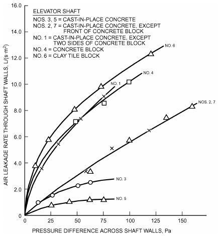

*Fig. 13 Air Leakage Rates of Elevator Shaft Walls*

Leakage paths, intentional or otherwise, at the top of elevator shafts are often equivalent to orifice areas of 0.4 to 1.0 m2. Air leakage rates through stair tower and elevator doors are shown in Figure 14 as a function of average crack width around the door. Sealing elevator and stair doors well, and possibly using indoor vestibules for them, can reduce air as well as smoke flow rates significantly. Air leakage areas associated with other openings in commercial buildings are also important for air movement calculations. These include interior doors and partitions, suspended ceilings in buildings where space above the ceiling is used for air supply or return, and other components of the air distribution system.

### Air Leakage Through Exterior Doors

Door infiltration depends on the type and use of door, room, and building, and on air speed and pressure differentials. In residences and small buildings where doors are used infrequently, a closed door is assumed, and air exchange can be estimated based on air leakage through cracks between door, frame, and sill. Where exterior door are used frequently, airflow through them increases significantly as door-opening frequency increases. Consider using vestibules or revolving doors for high-frequency applications.

<!-- str. 448 -->

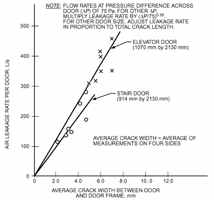

*Fig. 14 Air Leakage Rate of Door Versus Average Crack Width*

### Air Leakage Through Automatic Doors

Automatically swinging, sliding, rotating, or overhead doors are a major source of air leakage. They are normally installed where large numbers of people use the doors or where bulk goods or vehicles are transported through the doorways. These doors stay open longer with each use than manually operated doors. Air leakage through an automatic door can be reduced by installing a vestibule. However, pairs of automatic doors on the inside and outside of a vestibule normally have overlapping open periods, even when used by only one person at a time. Therefore, it is important that designers include airflow through automatic doors when calculating heating and cooling loads in adjacent spaces.

To calculate the average airflow rate through an automatic door, the designer must consider the area of the door, the pressure difference across it, the discharge coefficient of the door when it is open, and the fraction of time that it is open. Obtaining the discharge coefficient is complicated by the fact that it changes as the door opens and closes.

To simplify this calculation, ASHRAE research project RP-763 (Yuill 1996) developed Figure 15 to combine the discharge coefficients of doors as they open and close with the fraction of time that doors are open at a particular level of use. This figure presents an overall airflow coefficient as a function of the number of people using a door per hour. To obtain the average infiltration rate through an automatic door, multiply this coefficient by the door’s opening area and by the square root of the pressure difference between the outdoor and indoor air at the door’s location. The pressure difference across a door in a building is difficult to predict accurately and depends on wind pressure on the building, stack effect caused by the indoor/outdoor temperature difference, and effects of air-handling system operation. It also depends on leakage characteristics of the building’s exterior walls and of internal partitions.

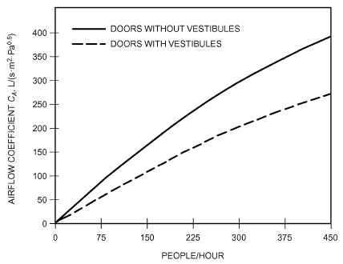

*Fig. 15 Airflow Coefficient for Automatic Doors*

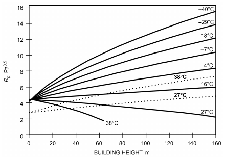

*Fig. 16 Pressure Factor for Automatic Doors*

Two simplified design methods are presented here. The first method uses practical assumptions to determine design values for Rp, the square root of the pressure difference across the automatic door, given in Figure 16. The second method requires explicit calculation of envelope pressures.

In Figure 16, airflows shown for outdoor air temperatures of 27 and 38°C, represented by dotted lines, are outward flows. They intercept the vertical axis at a lower point than the other lines because wind pressure coefficients on the building’s downwind face, where the greatest outward flows occur, are lower than on the upward face. In many buildings, air pressure in the building is controlled by varying the flow rate through return or exhaust fan(s) or by controlling the relief air dampers. These systems are usually set to maintain a pressure slightly above ambient in the lobby, but in a large building, multiple sensors may be used to regulate air pressure on each floor independently, for example. Subtracting the interior pressure maintained from the wind pressure gives the net pressure for estimating airflow through an exterior door.

**Method 1.** For the first method, the infiltration rate through the automatic door is

> Q = CAARp&emsp;**(52)**

where

- Q = airflow rate, L/s

<!-- str. 449 -->

CA = airflow coefficient from Figure 15, L/(s·m2·Pa0.5)

A = area of the door opening, m2

Rp = pressure factor from Figure 16, Pa0.5

**Method 2.** Airflow Q is

> Q = C A Δp&emsp;**(53)**
>
> A

where

- Q = airflow rate, L/s
- CA = airflow coefficient from Figure 15, L/(s·m2·Pa0.5)
- A = area of the door opening, m2
- Δp = pressure difference across door, Pa

To find Δp, it is necessary to find the pressure differential created by both wind and stack effect. To give the largest possible pressure difference across the door, there are no interactions between the two natural pressures:

> Δp = p – Δp&emsp;**(54)**
>
> w s

where

- pw = wind-induced surface pressure relative to static pressure, Pa
- Δps = pressure difference caused by stack effect, Pa

**Example Calculations**

Find the maximum possible winter infiltration through an automatic door on the ground floor of a 20-story building. The area of the door is 0.91 × 2.1 m = 1.9 m2. Each floor is 4 m high. Approximately 300 people per hour pass through the door. The design wind conditions are 6.7 m/s, indoor temperature is 21°C, and outdoor temperature is –7°C. The airflow coefficient from Figure 15, using the line for doors without vestibules, is approximately 306 L/(s·m2·Pa0.5).

**Method 1:**

The pressure factor from Figure 16 is 9.6 Pa0.5. Equation (52) gives the door’s airflow as

> Q = 306(1.9)9.6 = 5600 L/s

**Method 2:**

The worst possible case for wind surface pressure coefficient Cp at any point and in any position on the ground floor of the building is inferred from the figures in Chapter 24 to be about 0.75. Using this in Equation (25), together with the specified wind speed, results in pw= 20 Pa. Assume that H is one-half the door height (1.1 m). To have maximum pressure across the door, assume the neutral pressure plane is located halfway up the building such that

> 1
>
> HNPL = --(20 stories)(4 m)/story = 40 m

> 2

Substituting these values into Equation (24) gives Δps = –47 Pa. This is the maximum stack pressure difference given no internal resistance to airflow. To find the actual stack pressure difference, it is necessary to multiply this by a draft coefficient. For this example, the coefficient is assumed to be 0.9, which is the highest value that has been found for tall buildings. Therefore, Δps = 0.9(−–47 Pa) = –42 Pa. The total pressure is then Δ p = 20 – (–42) = 62 Pa. Substituting into Equation (53),

> Q = 306(1.9) 62 = 4580 L/s

If the building has a vestibule, the airflow coefficient is read from Figure 15 using the line for doors with vestibules, and it is approximately 208 L/(s·m2·Pa0.5), reducing airflow to 3100 L/s into the building.

Standard-sized revolving doors are often used where there is high use, but typically not where people would often be carrying large bags or pushing carts. Dols et al. (2014) applied a coupled building energy and airflow simulation tool to simulate airflow through entry doors in a prototype medium office building created by Ng et al. (2012) and found that using a vestibule reduced infiltration through the building entrance by 23%. More information on predicting infiltration rates through standard and extra-large revolving doors is still needed.

### Air Exchange Through Air Curtains

Air curtains are jets of air projected across envelope openings with the intention of reducing air exchange and the entrance of dust and insects, for example. They are commonly applied to loading dock doorways and high-use building entrances. Performance of air curtains strongly depends on factors such as jet characteristics, wind, and building pressurization. More discussion on air curtain performance is available in the research literature and in Chapter 20 of the 2020 *ASHRAE Handbook—HVAC Systems and Equipment*.

## 12. COMMERCIAL AND INSTITUTIONAL VENTILATION

ASHRAE Standard 62.1 contains requirements on ventilation and indoor air quality for commercial, institutional, and high-rise residential buildings. These requirements address system and equipment issues, design ventilation rates, commissioning and systems start-up, and operation and maintenance. The user’s manual for Standard 62.1-2010 (ASHRAE 2010b) provides details to help design, install, and operate building systems to meet requirements. The design requirements include two alternative procedures:

- The prescriptive **ventilation rate procedure (VRP)** contains a table of outdoor air ventilation requirements for a variety of space types, with adjustments for air distribution in rooms and systems serving multiple spaces. These requirements consist of both a per-person rate and a per-floor-area rate. Minimum outdoor air ventilation rates are based, in part, on research by Berg-Munch et al. (1986), Cain et al. (1983), Iwashita et al. (1989), and Yaglou et al. (1936), as well as years of experience of designers and building operators.
- The performance **indoor air quality procedure (IAQP)** seeks acceptable indoor air quality by controlling indoor contaminant concentrations through source control, air cleaning, and ventilation. It allows for either or both improved indoor air quality and reduced energy consumption. Chapter 29 of the 2020 ASHRAE *Handbook—HVAC Systems and Equipment* has information on air cleaning. The ventilation rate procedure is by far the more commonly used because of its prescriptive nature.

Combining source control and local exhaust, as opposed to dilution with ventilation air, is the method of choice in many industrial environments. Industrial ventilation is discussed in Chapters 31 and 32 of the 2019 *ASHRAE Handbook—HVAC Applications* and in In-*dustrial Ventilation: A Manual of Recommended Practice* (ACGIH 2016). Ventilation of medical facilities, where high indoor air quality is expected, is discussed in ASHRAE Standard 62.1, Chapter 8 of the 2019 *ASHRAE Handbook—HVAC Applications*, and other publications [e.g., FGI (2014)].

Commercial and institutional building ventilation systems are typically designed to provide slight pressurization to reduce infiltration. This pressurization is achieved by having the outdoor or makeup airflow rate higher than the exhaust or relief airflow rate. In these buildings, infiltration is therefore usually neglected in HVAC design except in areas such as lobbies and loading docks, where infiltration can be important because of doors. However, as discussed previously, this little to no infiltration may only be achieved in practice with very tight envelope construction (e.g., including a continuous air barrier). As discussed in the section on Driving Mechanisms for Ventilation and Infiltration, wind and stack effect can also cause significant infiltration and exfiltration. Ventilation airflow rates for commercial and institutional buildings are typically determined using procedures in ASHRAE Standard 62.1. In these procedures for designing mechanical ventilation systems, no credit is given for infiltration. However, weather-driven pressure differentials may be significant and need to be considered when designing the ventilation system.

<!-- str. 450 -->

### Ventilation Rate Procedure

Per ASHRAE Standard 62.1, the design ventilation rate is determined starting with a table of minimum ventilation requirements for different space types. These requirements are expressed as an outdoor airflow rate per occupant or per unit floor area, or often both, depending on space type. These ventilation rates are based on air pollutants generated by people, activities, and building materials and furnishings. The rates are then adjusted for various parameters (e.g., multiple zones, type of room air distribution).

The HVAC designer faces several challenges in designing an air distribution system to deliver outdoor air to building occupants. The first is to determine whether the outdoor air is acceptable for use, and to design a system for cleaning the air if it is not acceptable. A second is to design an air intake and distribution system that will deliver the required level of outdoor air to the occupied portions of the building, and not just admit it to an air handler. This outdoor air must be delivered not only at design conditions, but throughout the year. The task is complicated by weather-related variations in indoor/outdoor pressure difference. Other complications include pressure variations caused by building components such as intermittent exhaust fans or dirty filters, and probably most significantly by supply flow variations associated with variable-air-volume (VAV) systems (Janu et al. 1995; Mumma and Wong 1990). This delivery issue is related to the discussion in the section on Air Change Effectiveness.

### Multiple Spaces

Many commercial and institutional buildings have multiple-zone, recirculating ventilation systems wherein one or more conventional air handlers condition a mixture of outdoor and recirculated air (**supply air**) to more than one ventilation zone. Each zone may have a different outdoor air fraction required by ASHRAE Standard 62.1, but each air handler can typically only provide one outdoor air fraction. Therefore, the zone that requires the greatest outdoor air fraction (the **critical zone**) defines the outdoor air intake rate of the air handler. Consequently, all other zones receive more outdoor air than their minimum requirement. These zones can be considered to have unused ventilation air, which could be returned to the air handler and recirculated; thus, the outdoor air fraction at the air handler could be reduced while still meeting the needs of the critical zone. A method to address multiple-zone recirculating systems, based on the system ventilation efficiency equation (SVEE), is provided in the ventilation rate procedure of Standard 62.1. ASHRAE-sponsored research experimentally tested the validity of this equation and confirmed that the SVEE is a valid predictor of ventilation distribution in a building (Yuill et al. 2012).

**Secondary Path Systems.** Some systems circulate unused ventilation air through paths other than through the central air handler. Common examples include transfer fans and fan-powered boxes. Warden (1995) suggested that Standard 62.1 should allow for the increased distribution efficiency that is possible with these systems, and presented a generalized SVEE that includes secondary air paths. A form of this equation is given in Equation (A-3) of ASHRAE Standard 62.1-2010.

Equation (A-3) depends on the ventilating ability of the secondary air Er. The standard previously described Er in terms of the proportion of average system return air directly recirculated from the critical zone. Yuill et al. (2008) argued that the formulation of Equation (A-3) implicitly defines Er as a descriptor of the vitiation of the secondary air, and presented a formal definition of Er, a version of which was adopted for Standard 62.1. Under this definition, if secondary air is drawn from an area that is less contaminated than the building average, values of Er greater than 1 are possible. Yuill et al. (2012) measured Er in several locations in an office building and found results ranging from 0.74 to 1.01. Results in the same building could have ranged from 0.14 to 1.13 if the fan-powered boxes had been located differently.

### Survey of Ventilation Rates in Office Buildings

Relatively few measurements of as-built office building ventilation performance have been conducted, and those data generally have not used consistent measurement methods or involved representative collections of buildings. The U.S. Environmental Protection Agency (EPA) Building Assessment Survey and Evaluation (BASE) study involved indoor environmental measurements, including ventilation, in 100 randomly selected office buildings using a standardized protocol (EPA 2003). Persily et al. (2005) analyzed the BASE data and found that outdoor air ventilation rates measured using duct traverses at air handler intakes were higher than might be expected, with a mean of about 55 L/s per person. However, these elevated values are partially explained by low occupant density (mean of about four persons per 100 m2) and high outdoor air fractions (mean of about 35%). Considering only values that correspond to minimum outdoor air intake, the mean ventilation rate was 11 L/s per workstation. About one-half the ventilation rates under minimum outdoor air intake were below 9.4 L/s per person. Another key outcome of this study is documentation of measured airflow rates that are quite different from their design values. This finding highlights the need for good system commissioning and maintenance to achieve design intent. Designing and configuring systems to encourage regular maintenance by providing easy access to key system components is also important.

## 13. OFFICE BUILDING EXAMPLE

Ventilation and infiltration principles from this chapter, Standard 62.1-2010, and elsewhere are applied to a conventional office building in Atlanta, Georgia. The infiltration, local exhaust, or ventilation airflow rates determined can be used later in the design process (1) as input for the heating and cooling load calculations; (2) for sizing fans, ducts, and dampers; and (3) for inclusion in the construction documents’ air-handling units (AHUs) schedules and specifications.

This example relies on the 2010 edition of ASHRAE Standard 62.1; because this and other standards are updated frequently, users should check for the latest edition.

### Location

The example building is about 13 km northeast of downtown Atlanta, and is close to a major highway and its access roads. Atlanta’s climate is hot and humid in the summer, and has relatively mild winters. The average annual outdoor air temperature is about 15.9°C and the heating kelvin-days per year, base 18.3°C (HKD18.3), are about 1814 (Rock 2005). From Chapter 14, the winter 99% design outdoor air (OA) temperature is –5°C, whereas the 1% cooling dry-bulb temperature is 32.8°C, with a mean coincident wet-bulb temperature of 23.3°C. The 99.6 and 0.4% design wind speeds are 5.4 m/s in the winter and 4 m/s in the summer, both from the northwest. Warm and humid winds also travel north from the Gulf of Mexico, and occasionally the wind is from the Atlantic Ocean from the southeast.

### Building

The approximately 2835 m2 building is a two-story, flat-roofed, slab-on-grade commercial office building with a substantial roof overhang in each direction. Materials and construction quality are average commercial grade. Double-paned windows, and similar spandrel glass, are fixed in their metal curtain wall frames; all windows are nonoperable. The remaining portions of the exterior walls are brick. There are relatively few exterior doors, as described later in this example. The building is surrounded by black asphalt driveways, a parking lot, and some vegetation. The nearby highway is across a parallel two-lane access road, to the northwest.

<!-- str. 451 -->

### Occupancy

The building is occupied during normal weekday business hours, and occasionally for special weekend events. Night and weekend thermostat setbacks are used. On the perimeter of the building are mostly single-person offices and conference rooms. The core of the building is mainly open plan with cubicle workspaces, as well as various support rooms, restrooms, two stair towers, and an elevator. There is a large mailroom on the first floor and a lunchroom on the second. Occupant density is high during workdays. The overhead fluorescent lighting is typical of such office buildings, and there are significant computing, printing, and copying equipment loads. Smoking is not allowed in the building.

The building is owner occupied. Owners generally have long-term interests in minimizing costs, and in maximizing indoor air quality and thermal comfort so that workers’ productivity is high.

### Infiltration

For this example, assume a conventional all-air overhead HVAC system, and that the building is well sealed. Consequently, a slightly positive overall building pressurization is assumed during occupied hours. Because water condensation in the exterior envelope of the building is possible, air pressurization should be as low as is practical, and continuous air and moisture retarders should be installed. As a more expensive alternative to slight pressurization, the automatic control system could actively manage the dampers’ positions and fans’ operation to maintain an average neutral pressurization, relative to the outdoors. In either case, a good assumption is that infiltration is minimized, the windows and spandrel glass are fixed and well sealed, and the exterior doors are normally kept closed. During high-wind conditions beyond design, windward perimeter spaces may have some infiltration loads, but under nonpeak outdoor temperatures, a well-zoned HVAC system should have enough capacity to handle these extra loads. If both the OA temperature and wind are extreme, then these upwind perimeter spaces may become slightly uncomfortable. These extreme conditions are expected to occur only a few hours in a typical year.

Spaces with exterior doors can experience significant infiltration loads when people enter and leave. First-floor vestibules on the north and south sides of the building help limit this infiltration through the two main entrances. The double doors from stair tower #2 have infrequent use, and a high level of thermal comfort in stair towers is not typically expected. Thus, brief infiltration surges in stair tower #2 are deemed acceptable. However, the doors from the parking lot to the mailroom are frequently used by staff for shipping, receiving, entrance, and egress, and infiltration loads on the vestibules and mailroom are of concern. Many designers choose to ignore these extra loads in pressurized buildings, because they are transient and not easily characterized; the systems’ capacities are likely sufficient to minimize uncomfortable conditions in these spaces. In this example, however, the HVAC designer is concerned about summertime airborne moisture, especially in the mailroom where books and other publications are stored, because strong, humid, southerly winds easily overcome a slight indoor pressurization when the large doors to the parking lot are open.

This chapter and many of its supporting references describe detailed methods for estimating infiltration or air leakage. Typically, pressure differences, openings’ coefficients, and hour-byhour weather data are required to perform these transient calculations, usually using a computer program separate from that used for thermal load calculations. For HVAC design purposes for a building similar to the example, an air change rate of unconditioned outdoor air through infiltration, per space, expressed in air changes per hour or airflow rate (in L/s) is of more immediate use. Either value is then entered into the load calculation program. Unfortunately, accurate air changes per hour are difficult, if not impossible, to predict, so design estimates must be made. For example,

### North Vestibule

- Gross floor area ≈ 3.4 m × 4 m = 13.6 m2
- Room volume ≈ 13.6 m2 × 2.7 m = 36.7 m3
- ACHinf ≈ 1.0, so
- Qinf ≈ (36.7 m3 × 1000 L/m3 × 1.0)/3660 s/h ≈ 10.2 L/s outdoor air

Either 1.0 ach or 10.2 L/s of infiltration is then used as input for the load calculation program for this space. The 1.0 ach assumption was made by the designer during on-site observation that these particular manually operated exterior doors have low usage. If passage rates were known, Yuill’s (1996) flow rate estimation method would have been used instead.

### South Vestibule

- Gross floor area ≈ 2.4 m × 3 m = 7.2 m2
- Room volume ≈ 7.2 m2 × 2.7 m = 19.4 m3
- ACHinf ≈ 2.0, so
- Qinf ≈ (19.4 m3 × 1000 L/m3 × 2.0)/3600 s/h ≈ 10.8 L/s outdoor air

In practice, this back entrance from the parking lot on the southeast side of the building is the primary means of entrance and egress, and as such, the estimated infiltration for it is increased to 2.0 ach, compared to the north vestibule’s 1.0 ach.

In colder U.S. climates, it is common practice for low-cost commercial buildings to have only space heating, and not cooling, in stair towers and vestibules. However, for this building in the Southeast, the designer decided to provide cooling for these vestibules. Thus, the estimated infiltration rates are applied to both the heating and cooling load calculations for these spaces. The building’s mailroom, which also has exterior doors, is to be heated and cooled, too.

### Mailroom

- Gross floor area ≈ (15.5 m × 6.7 m) + (10 m × 3 m) = 134 m2
- Room volume ≈ 134 m2 × 2.7 m = 362 m3
- ACHinf ≈ 0.5, so
- Qinf ≈ (362 m3 × 1000 L/m3 × 0.5)/3600 s/h ≈ 50.3 L/s outdoor air

Even though the mailroom has only a single layer of doors to the outdoors, and not a vestibule, the designer estimated the infiltration at a lower rate (0.5 ach) than those for the vestibules. This is because of the mailroom’s large interior volume relative to its exterior doorway’s area.

Note that no estimate of air changes will be accurate at all times; this portion of HVAC design is still largely an art because of the many unknowns and variability of weather and building use. For improved energy conservation, all exterior doors must be extremely well weatherstripped and have automatic closers. A sign indicating that the doors should be kept closed when not in use should be placed on the mailroom’s exterior doors. High-quality gaskets and sealants for the windows and spandrel glass are also required to minimize infiltration.

### Local Exhausts

(This section assumes that ANSI/ASHRAE Standard 62.1-2010 has been adopted into the local building code without modification.) At least 10 rooms require direct, powered air exhaust: two restrooms per floor, a darkroom, three designated photocopy spaces, and two janitors’ closets. The restrooms have three flushable fixtures each, so from Table 6-4 of Standard 62.1-2010, with intermittent use, each restroom requires

> Qea = 3 units × 25 L/s per unit = 75 L/s

Also from Table 6-4, the darkroom on the second floor needs

> Gross floor area ≈ 3 m × 4.6 m = 13.8 m2

<!-- str. 452 -->

> Qea = 13.8 m2 × 5.0 L/(s·m2) = 69 L/s

Similarly, the designated photocopy areas need 2.5 L/(s·m2), so First floor, plan east: ≈7.4 m2 × 2.5 L/(s·m2) = 18.5 L/s exhaust air

> First floor, plan southwest:

- ≈14.9 m2 × 2.5 L/(s·m2) = 37.3 L/s exhaust air

Second floor, plan east: ≈10.4 m2 × 2.5 L/(s·m2) = 26 L/s exhaust air The two small janitors’ closets, one on each floor, also require exhaust:

- 5.6 m2 × 5.0 L/(s·m2) = 28 L/s exhaust air

These local exhaust airflow rates are then entered into the load calculation program. They are room loads, attached to each particular space, and are not combined and entered as systems-level loads. The load calculation program evaluates the room loads, appropriately combines them, and then finds the systems-level loads for various peak hours.

Some local code authorities amend the requirements of Standard 62.1, or have not yet adopted the most current version, so significant deviations from these examples are possible. For example, in much of the United States, janitorial closets and photocopy rooms have not been required to have local exhausts. Standard 62.1-2010 recognized that these spaces can be significant sources of airborne pollutants, and some direct exhaust from each of them can be very beneficial for improving indoor air quality.

### Ventilation

(This section also assumes that ANSI/ASHRAE Standard 62.1-2010 has been adopted into local code without changes.) Ventilation air is needed to maintain acceptable indoor air quality. The example building is well sealed, natural ventilation is not used, and no credit for any infiltration is taken toward ventilation air requirements, as is typical for conventional commercial buildings. Thus, minimum ventilation air required by Standard 62.1 is provided mechanically through the building’s AHUs. Because smoking is not allowed in the building, no extra ventilation for environmental tobacco smoke (ETS) is needed. However, considering outdoor air pollution from the major highway nearby as well as metropolitan Atlanta’s smog, some outdoor air pretreatment may be considered later in the design process.

Standard 62.1 has two methods for determining needed ventilation airflow rates: the performance IAQ procedure (IAQP), and the prescriptive ventilation rate procedure (VRP). Most HVAC designers of conventional buildings with normal occupancies and outdoor air conditions use the VRP, which is appropriate for this example building.

Required ventilation air, which is solely conditioned outdoor air, is admitted to this building through two air-handling units; each AHU serves one floor. Flow rates of outdoor air are input values for, and carried through to the results of, the load calculation simulation. Energy needed to condition the outdoor air ultimately is a systems-level load, because all of this ventilation air is conditioned by the AHUs before its introduction to the building.

Commercial load calculation programs often provide suggested values of ventilation airflow rates and occupancy schedules, but may not have been updated to reflect the latest VRP requirements and procedures of Standard 62.1. As such, it is difficult to present an example here; instead, a sample check using some assumed values for the first-floor executive director’s office is given. It is assumed that this room is a separate thermal zone because of its use and its location on the southwest corner of the building and thus two afternoon solar exposures.

### Executive Director’s Office

- Gross floor area ≈ 3.7 m × 6.4 m = 23.7 m2
- Room volume ≈ 23.7 m2 × 2.7 m = 64 m3
- Assumed supply air Qsa = 194 L/s

The supply airflow rate was estimated using 7.93 m2/kW, a sensible heat factor of 0.9, a cooling supply (12.8°C) to room (23.9°C) air temperature difference of 11.1 K, 1000 W per kW of cooling, and the sensible heat equation 1.23 × L/s × ΔT. From Table 6-1 of Standard 62.1-2010, the office’s population P can be estimated as

> P = 23.7 m2 × 5 occupants/100 m2 = 1.19

In this case, however, there is only one regular occupant of the space. The needed ventilation airflow rate to the breathing zone Vbz is then found from the table as follows:

- Vbz = RpPz + RaAz
- Vbz = [2.5 L/(s·person) × 1 person] + [0.3 L/(s·m2) × 23.7 m2] = 9.61 L/s where
- Rp = outdoor airflow rate required per person, from Standard 62.1’s Table 6-1, L/s
- Pz = zone population (largest number of people expected to occupy the zone during typical use)
- Ra = outdoor airflow rate required per unit area, from Standard 62.1’s Table 6-1, L/s
- Az = occupiable floor area of zone, m2

Note that Standard 62.1’s VRP includes a building component RaAz, as well as the traditional per-person people component.

Because this is a conventional office building, with ceiling plenums and no raised floors, overhead air supply and return is assumed. The cooling mode, not heating, is dominant in this and most other U.S. office buildings that have high internal heat gains and well-sealed and insulated envelopes. From the standard’s Table 6-2, with ceiling supply of cool air, the zone air distribution effectiveness Ez is estimated as 1.0. From Equation (6-2) of the standard, the design zone outdoor airflow rate Voz is then

> Voz = Vbz/Ez = (9.61 L/s)/1.0 = 9.61 L/s

But this is still not the amount of outdoor air that must be conditioned by the air handler: the rate must be adjusted for inefficiencies and recirculation in the air distribution system.

Because single-duct VAV with terminal reheat air distribution systems were initially planned by the designer, Standard 62.1’s multiple-zone recirculating systems adjustment is needed. For this thermal zone, the primary outdoor air fraction Zp for its VAV terminal unit and downstream is

> Zp = Voz/Vpz = (9.61 L/s)/(194 L/s) = 0.05, or 5%

However, for VAV systems, the minimum expected primary airflow rate should be used. In this case, 194 L/s is the peak design airflow rate. Designers often assume about 30% of this peak flow as the minimum in VAV systems, so for this space, 194 × 0.3 = 58.2 L/s. The adjusted primary outdoor air fraction is then

> Zp = Voz/Vpz = (9.61 L/s)/(58.2 L/s) = 0.17, or 17%

The preceding calculations need to be performed for every thermal zone on each air handler. Then, for each system, the highest primary outdoor air fraction is used to estimate the air distribution systems’ ventilation effectiveness; the 62.1 user’s manual (ASH-RAE 2010b) includes a spreadsheet for doing these calculations. Increasingly, load calculation programs include the necessary routines and data.

<!-- str. 453 -->

For the purposes of this example, 0.17 is assumed to be the maximum Zp, so, from Table 6.3 of Standard 62.1, the system ventilation efficiency Ev is 0.9. If, instead, the standard’s Appendix A method for determining Ev were used, a value closer to 1.0 for perfect mixing would likely result for this example’s conventional overhead all-air cooling system. Table 6-3’s value of 0.9 is likely somewhat conservative, but is obtained quickly for design purposes.

Next, the uncorrected outdoor air intake flow rate Vou is needed; Standard 62.1’s Equation (6-6) includes diversity factor D to adjust the people component of the flow rate. All zones’ flow rates are needed to perform this calculation. For this example, the uncorrected outdoor air intake flow rate for the first floor’s AHU was estimated from floor area, an occupancy of 5 people per 100 m2, and 9.4 L/s per person, and is assumed to be 720 L/s. The adjusted outdoor air intake flow rate Vot for this AHU is then

> Vot = Vou/Ev = (720 L/s)/0.9 = 800 L/s outdoor air

After load calculations are complete, these assumed airflow rates can be replaced with actual values for each zone, and the outdoor airflow rate can be updated. Repeating the load calculations may be necessary. The final value of the adjusted outdoor air intake flow rate is then reported on the AHU’s equipment schedule so that testing, adjusting, and balancing (TAB) personnel and others can use this information to ensure that the system admits the desired flow rate of ventilation air. The information is also used to select air cleaners, dampers, coils, ducts, and fans.

For more examples on determining ventilation air rates for commercial buildings, see the user’s manual for Standard 62.1 (ASH-RAE 2010b). For low-rise residential buildings, consult ASHRAE Standard 62.2 and its user’s manual (ASHRAE 2010a).

## 14. SYMBOLS

A = area, m2 or cm2 c = flow coefficient, m3/(s·Pan)

cp = specific heat, J/(kg·K) or kJ/(kg·K)

C = concentration, ppm

C = time averaged concentration

CA = airflow coefficient for automatic doors, L/(s·m2·Pa0.5)

CD = discharge coefficient

Cp = pressure coefficient

Cs = stack flow coefficient, (L/s)2/(cm4·K) or (Pa/K)n

Cv = effectiveness of openings

Cw = wind flow coefficient, (L/s)2[cm4·(m/s)2] or [Pa/(m/s)2]n

E = system efficiency

ELA = effective leakage area

F = tracer gas injection rate, m3/s

F = time-averaged contaminant source strength, m3/s f = fractional on-time g = gravitational acceleration, m/s2

G = wind speed multiplier, Table 7 h = specific enthalpy, kJ/kg

H = height, m i = hour of year

I = air change rate, 1/time

Ii = instantaneous air change rate, 1/time

Im = effective air change rate, 1/time

IDD = infiltration degree-days, K·day/yr

L = leakage area, m2 or cm2 n = pressure exponent

N = number of discrete time periods in period of interest

NL = normalized leakage p = pressure, Pa

P = parameter, or number of people q = heat rate, W

Q = volumetric flow rate, m3/s

Q = effective volumetric flow rate, m3/s

R = outdoor airflow rate, L/s s = shelter factor

S = source strength, m3/s t = time

T = temperature, °C or K

U = wind speed, m/s

V = volume, m3, or ventilation airflow rate, L/s

W = humidity ratio, kg/kg

εI = air change effectiveness

θage = age of air, s, min, or h

ρ = air density, kg/m3

τ = time constant, s, min, or h

φ = wind angle, degrees

### Subscripts

a = area b = base ba = bypass air bz = breathing zone c = calculated ca = recirculated air da = dry air depress = depressurization e = effective ea = exhaust air f = floor i = indoor or time counter for summation (instantaneous)

inf = infiltration

H = building height, eaves or roof ka = makeup air l = latent la = relief air

L = leakage or local ma = mixed air met = meteorological station location n = normalized

N = nominal

NPL = neutral pressure level o = outdoor, initial condition, or reference oa = outdoor air ot = adjusted outdoor air ou = uncorrected outdoor air oz = zone outdoor p = pressure, or primary press = pressurization r = reference s = sensible or stack sa = supply air

S = space or source w = wind or water v = ventilation z = zone

## REFERENCES

ASHRAE members can access ASHRAE Journal articles and ASHRAE research project final reports at technologyportal.ashrae .org. Articles and reports are also available for purchase by nonmembers in the online ASHRAE Bookstore at www.ashrae.org/bookstore.

ACGIH. 2016. *Industrial ventilation: A manual of recommended practice*, 29th ed. American Conference of Governmental Industrial Hygienists, Cincinnati, OH.

Ackerman, M.Y., J.D. Dale, and D.J. Wilson. 2006. Infiltration heat recovery, part 1: Field studies in an instrumented test building (RP-1169). ASHRAE Transactions 112(2):597-608. Paper QC-06-056.

AIVC. 1994. An analysis and data summary of the AIVC’s numerical database. Technical Note 44. International Energy Agency Air Infiltration and Ventilation Centre, Sint-Stevens-Woluwe, Belgium.

Akins, R.E., J.A. Peterka, and J.E. Cermak. 1979. Averaged pressure coefficients for rectangular buildings, vol. 1, *Proceedings of the Fifth Inter-* *national Wind Engineering Conference*, Fort Collins, pp. 369-380.

Allard, F., and M. Herrlin. 1989. Wind-induced ventilation. ASHRAE Transactions 95(2):722-728. Paper VA-89-10-2.

<!-- str. 454 -->

Anis, W. 2001. The impact of airtightness on system design. ASHRAE Journal 43(12):31-35.

Anis, W., and T. Brennan. 2014. Measuring airtightness of mid and high-rise non-residential buildings. ASHRAE Research Project RP-1478, Final Report.

Apte, M.G., W.J. Fisk, and J.M. Daisey. 2000. Associations between indoor CO2 concentrations and sick building syndrome symptoms in US office buildings: An analysis of the 1994-1996 BASE study data. Indoor Air 10(4):246-257.

ASHRAE. 2003. Risk management guidance for health, safety and environmental security under extraordinary incidents. Report, Presidential Ad Hoc Committee for Building Health and Safety Under Extraordinary Incidents.

ASHRAE. 2010a. Standard *62.2-2010 user’s manual*.

ASHRAE. 2010b. Standard *62.1-2010 user’s manual*.

ASHRAE. 2012. Method of testing general ventilation air-cleaning devices for removal efficiency by particle size. ANSI/ASHRAE Standard 52.2-2012.

ASHRAE. 2013. Thermal environmental conditions for human occupancy.

ASHRAE Standard 55-2013.

ASHRAE. 2010. Ventilation for acceptable indoor air quality. ANSI/ASHRAE Standard 62.1-2010.

ASHRAE. 2016. Ventilation and acceptable indoor air quality in low-rise residential buildings. ANSI/ASHRAE Standard 62.2-2016.

ASHRAE. 2016. Energy standard for buildings except low-rise residential buildings. ANSI/ASHRAE Standard 90.1-2016.

ASHRAE. 2004. Air leakage performance for detached single-family residential building. ANSI/ASHRAE Standard 119-1988 (RA 2004) (withdrawn).

ASHRAE. 2002. Measuring air-change effectiveness. ANSI/ASHRAE Standard 129-97 (RA 2002).

ASHRAE. 2013. Ventilation of health care facilities. ANSI/ASHRAE/ASHE Standard 170-2013.

ASHRAE. 2014. Standard for the design of high-performance green buildings. ANSI/ASHRAE/IES/USGBC Standard 189.1-2014.

ASHRAE. 2015. Ventilation and indoor air quality in low-rise residential buildings. ASHRAE Guideline 24-2015.

Ask, A. 2003. Ventilation and air leakage. ASHRAE Journal 45(11):28-36. ASTM. 2012. Test method for determining rate of air leakage through exterior windows, curtain walls, and doors under specified pressure differences across the specimen. Standard E283-04 (R2012). American Society for Testing and Materials, West Conshohocken, PA.

ASTM. 2011. Test method for determining air change in a single zone by means of a tracer gas dilution. Standard E741-11. American Society for Testing and Materials, West Conshohocken, PA.

ASTM. 2010. Test method for determining air leakage rate by fan pressurization. Standard E779-10. American Society for Testing and Materials, West Conshohocken, PA.

ASTM. 2010. Test method for field measurement of air leakage through installed exterior windows and doors. Standard E783-02 (R2010). American Society for Testing and Materials, West Conshohocken, PA.

ASTM. 2009. Practices for air leakage site detection in building envelopes and air barrier systems. Standard E1186-03 (R2009). American Society for Testing and Materials, West Conshohocken, PA.

ASTM. 2011. Test methods for determining airtightness of buildings using an orifice blower door. Standard E1827-11. American Society for Testing and Materials, West Conshohocken, PA.

ASTM. 2011. Guide for assessing depressurization-induced backdrafting and spillage from vented combustion appliances. Standard E1998-11. American Society for Testing and Materials, West Conshohocken, PA.

Axley, J.W. 2001a. *Application of natural ventilation for U.S. commercial* *buildings—Climate suitability, design strategies and methods, modeling* studies. GCR-01-820, National Institute of Standards and Technology, Gaithersburg, MD.

Axley, J.W. 2001b. Residential passive ventilation systems: Evaluation and design. Technical Note 54. International Energy Agency Air Infiltration and Ventilation Centre, Sint-Stevens-Woluwe, Belgium.

Axley, J., S. Emmerich, S. Dols, and G. Walton. 2002. An approach to the design of natural and hybrid ventilation systems for cooling buildings. *Proceedings of the 9th International Conference on Indoor Air Qual-* *ity and Climate*, Monterey, CA. Available at www.nist.gov/manuscript -publication-search.cfm?pub_id=860870.

Bankvall, C.G. 1987. Air movements and thermal performance of the building envelope. In *Thermal insulation: Materials and systems*, pp. 124-131. F.J. Powell and S.L. Mathews, eds. American Society for Testing and Materials, West Conshohocken, PA.

Barley, D. 2001. *Overview of residential ventilation activities in the Building* *America Program (phase I)*. NREL/TP-550-30107, National Renewable Energy Laboratory, Golden, CO.

Batterman, S., G. Hatzivasilis, and C. Jia. 2006. Concentrations and emissions of gasoline and other vapors from residential vehicle garages. Atmospheric Environment 40:1828-1844.

Bauman, F., and A. Daly. 2003. *Underfloor air distribution design guide*.

ASHRAE.

Berg-Munch, B., G. Clausen, and P.O. Fanger. 1986. Ventilation requirements for the control of body odor in spaces occupied by women. Environmental International 12(1-4):195.

Berlad, A.L., N. Tutu, Y. Yeh, R. Jaung, R. Krajewski, R. Hoppe and F. Salzano. 1978. Air intrusion effects on the performance of permeable insulation systems. In *Thermal insulation performance*, STP 718, pp. 181-194. D. McElroy and R. Tye, eds. American Society for Testing and Materials, West Conshohocken, PA.

Blomsterberg, A.K., and D.T. Harrje. 1979. Approaches to evaluation of air infiltration energy losses in buildings. ASHRAE Transactions 85(1):797. Paper PH-79-10-1.

Bohac, D.L., D.T. Harrje, and L.K. Norford. 1985. Constant concentration infiltration measurement technique: An analysis of its accuracy and field measurements, 176. *Proceedings of the ASHRAE/DOE/BTECC Confer-* *ence on the Thermal Performance of the Exterior Envelopes of Buildings* III, Clearwater Beach, FL.

Bohac, D.L., D.T. Harrje, and G.S. Horner. 1987. Field study comparisons of constant concentration and PFT infiltration measurements. Proceedings *of the 8th IEA Conference of the Air Infiltration and Ventilation Centre*, Überlingen, Germany, pp. 47-62.

Bradley, B. 1993. Implementation of the AIM-2 infiltration model in HOT-2000. Report, for Natural Resources Canada.

Buchanan, C.R., and M.H. Sherman. 2000. A mathematical model for infiltration heat recovery. *Proceedings of the 21st IEA Conference of the Air* *Infiltration and Ventilation Centre*, The Hague, Netherlands. Report LBNL-44294. Lawrence Berkeley National Laboratory, Berkeley, CA.

Cain, W.S., B. Leaderer, R. Isseroff, L. Berglund, R. Huey, and E. Lipsitt.

1983. Ventilation requirements in buildings—I. Control of occupancy odor and tobacco smoke odor. Atmospheric Environment 17(6):1183-1197.

CGSB. 2005. Depressurization test. CAN/CGSB Standard 51.71-2005.

Canadian General Standards Board, Ottawa, ON.

CGSB. 1986. Determination of the airtightness of building envelopes by the fan depressurization method. Standard 149.10-M86. Canadian General Standards Board, Ottawa, ON.

CGSB. 1996. Determination of the overall envelope airtightness of buildings by the fan pressurization method using the building’s air handling systems. Standard 149.15-96. Canadian General Standards Board, Ottawa, ON.

Charlesworth, P.S. 1988. Measurement of air exchange rates. Chapter 2 in *Air exchange rate and airtightness measurement techniques—An appli-* cations guide. International Energy Agency Air Infiltration and Ventilation Centre, Sint-Stevens-Woluwe, Belgium.

Chastain, J.P. 1987. *Pressure gradients and the location of the neutral pres-* *sure axis for low-rise structures under pure stack conditions*. Unpublished M.S. thesis. University of Kentucky, Lexington.

Chastain, J.P., and D.G. Colliver. 1989. Influence of temperature stratification on pressure differences resulting from the infiltration stack effect. ASHRAE Transactions 95(1):256-268. Paper 3230.

Chastain, J.P., D.G. Colliver, and P.W. Winner, Jr. 1987. Computation of discharge coefficients for laminar flow in rectangular and circular openings. ASHRAE Transactions 93(2):2259-2283. Paper NT-87-27-1.

CHBA. 1994. *HOT2000 technical manual*. Canadian Home Builders Association, Ottawa, ON.

CIBSE. 2000. Testing buildings for air leakage. Standard TM-23. Chartered Institution of Building Services Engineers, London.

CIBSE. 2005. *Natural ventilation in non-domestic buildings*. Chartered Institution of Building Services Engineers, London.

Claridge, D.E., and S. Bhattacharyya. 1990. The measured impact of infiltration in a test cell. *ASME Journal of Solar Energy Engineering* 112: 123-126.

<!-- str. 455 -->

Claridge, D.E., M. Krarti, and S. Bhattacharyya. 1988. Preliminary measurements of the energy impact of infiltration in a test cell. Proceedings *of the Fifth Annual Symposium on Improving Building Energy Efficiency* *in Hot and Humid Climates*, pp. 308-317.

Cole, J.T., T.S. Zawacki, R.H. Elkins, J.W. Zimmer, and R.A. Macriss. 1980.

Application of a generalized model of air infiltration to existing homes. ASHRAE Transactions 86(2):765. Paper DV-80-09-2.

Collet, P.F. 1981. Continuous measurements of air infiltration in occupied dwellings. *Proceedings of the 2nd IEA Conference of the Air Infiltration* Centre, Stockholm, p. 147.

CSA. 2016. Residential carbon monoxide alarming devices. CAN/CSA Standard C6.19-01 (R2016). Canadian Standards Association, Toronto.

CSA. 2014. Residential mechanical ventilation systems. CAN/CSA-F326-M91 (R2014). Canadian Standards Association, Toronto.

Cummings, J.B., and J.J. Tooley, Jr. 1989. Infiltration and pressure differences induced by forced air systems in Florida residences. ASHRAE Transactions 96(20):551-560. Paper VA-89-05-4.

Cummings, J.B., J.J. Tooley, Jr., and R. Dunsmore. 1990. Impacts of duct leakage on infiltration rates, space conditioning energy use and peak electrical demand in Florida homes. *Proceedings of the ACEEE Summer* Study, Pacific Grove, CA. American Council for an Energy-Efficient Economy, Washington, D.C.

Cutter. 1987. Air-to-air heat exchangers. In *Energy design update.* Cutter Information Corporation, Arlington, MA.

Desrochers, D., and A.G. Scott. 1985. Residential ventilation rates and indoor radon daughter levels. *Transactions of the APCA Specialty Con-* *ference, Indoor Air Quality in Cold Climates: Hazards and Abatement* Measures, Ottawa, p. 362.

Diamond, R.C., J.B. Dickinson, R.D. Lipschutz, B. O’Regan, and B. Shohl.

1982. The house doctor’s manual. Report PUB-3017. Lawrence Berkeley National Laboratory, Berkeley, CA.

Diamond, R.C., M.P. Modera, and H.E. Feustel. 1986. Ventilation and occupant behaviour in two apartment buildings. *Proceedings of the 7th IEA* *Conference of the Air Infiltration and Ventilation Centre*, Stratford-upon-Avon, U.K. Report LBL-21862. Lawrence Berkeley National Laboratory, Berkeley, CA.

Dickerhoff, D.J., D.T. Grimsrud, and R.D. Lipschutz. 1982. Component leakage testing in residential buildings. *Proceedings of the American* *Council for an Energy-Efficient Economy, 1982 Summer Study*, Santa Cruz, CA. Report LBL 14735. Lawrence Berkeley National Laboratory, Berkeley, CA.

Dietz, R.N., R.W. Goodrich, E.A. Cote, and R.F. Wieser. 1986. Detailed description and performance of a passive perfluorocarbon tracer system for building ventilation and air exchange measurement. In Measured air *leakage of buildings*, STP 904, p. 203. H.R. Trechsel and P.L. Lagus, eds. American Society for Testing and Materials, West Conshohocken, PA.

Dols, W. S., L. Wang, S. J. Emmerich, and B. J. Polidoro. 2014. Development and application of an updated whole-building coupled thermal, airflow and contaminant transport simulation program (TRNSYS/CONTAM). *Journal of Building Performance Simulation*: 1-21.

D’Ottavio, T.W., G.I. Senum, and R.N. Dietz. 1988. Error analysis techniques for perfluorocarbon tracer derived multizone ventilation rates. *Building and Environment* 23(40).

Ek, C.W., S.A. Anisko, and G.O. Gregg. 1990. Air leakage tests of manufactured housing in the Northwest United States. In *Air change rate and* *airtightness in buildings*, STP 1067, pp. 152-164. M.H. Sherman, ed. American Society for Testing and Materials, West Conshohocken, PA.

Elmroth, A., and P. Levin. 1983. *Air infiltration control in housing*. International Energy Agency Air Infiltration Centre, Sint-Stevens-Woluwe, Belgium.

Emmerich, S.J. 2006. Simulated performance of natural and hybrid ventilation systems in an office building. HVAC&R Research (now Science and *Technology for the Built Environment*) 12(4):975-1004.

Emmerich, S.J., and A.K. Persily. 2005. Airtightness of commercial buildings in the U.S. *Proceedings of the 26th IEA Conference of the Air Infil-* *tration and Ventilation Centre*, Brussels, pp 65-70.

Emmerich, S.J., and A.K. Persily. 2014. Analysis of US commercial building envelope air leakage database to support sustainable building design. *International Journal of Ventilation* 12(4):331-344. Available at www .nist.gov/manuscript-publication-search.cfm?pub_id=914293.

Emmerich, S.J., J.E. Gorfain, and C. Howard-Reed. 2003. Air and pollutant transport from attached garages to residential living spaces—Literature review and field test. *International Journal of Ventilation* 2(3):265-276.

Emmerich, S.J., W. S. Dols, and B. Polidoro. 2012. Application of a natural ventilation system design tool to a school building. Proceeding of SimBuild 2012, pp. 185-192. Available at www.nist.gov/customcf/get _ pdf.cfm?pub_id=911004.

Emmerich, S.J., A.K. Persily, and L. Wang. 2013. Modeling and measuring the effects of portable gasoline powered generator exhaust on indoor carbon monoxide level. Technical Note (NIST TN) 1781. U.S. Department of Commerce, National Institute of Standards and Technology. Available at www.nist.gov/manuscript-publication-search.cfm?pub_id=912197.

Energy Resource Center. 1982. *How to house doctor*. University of Illinois, Chicago.

EPA. 2003. *A standardized EPA protocol for characterizing indoor air* *quality in large office buildings*. U.S. Environmental Protection Agency, Washington, D.C. Available from www.epa.gov/indoor-air-quality -iaq/standardized-epa-protocol-characterizing-indoor-air-quality-large -office.

Etheridge, D.W. 1977. Crack flow equations and scale effect. Building and Environment 12:181.

Etheridge, D.W., and D.K. Alexander. 1980. The British gas multi-cell model for calculating ventilation. ASHRAE Transactions 86(2):808. Paper DV-80-09-4.

Etheridge, D.W., and J.A. Nolan. 1979. Ventilation measurements at model scale in a turbulent flow. *Building and Environment* 14(1):53.

Eyre, D., and D. Jennings. 1983. *Air-vapour barriers—A general perspec-* *tive and guidelines for installation*. Energy, Mines, and Resources Canada, Ottawa, ON.

Farrington, R., D. Martin, and R. Anderson. 1990. A comparison of displacement efficiency, decay time constant, and age of air for isothermal flow in an imperfectly mixed enclosure. *Proceedings of the ACEEE 1990* *Summer Study on Energy Efficiency in Buildings*, pp. 4.35-4.43. American Council for an Energy-Efficient Economy, Washington, D.C.

Fennell, H.C., and J. Haehnel. 2005. Setting airtightness standards. ASHRAE Journal 47(9):26-31.

Feustel, H.E., and A. Raynor-Hoosen, eds. 1990. Fundamentals of the multizone air flow model—COMIS. Technical Note 29. International Energy Agency Air Infiltration and Ventilation Centre, Sint-Stevens-Woluwe, Belgium.

FGI. 2014. *Guidelines for design and construction of hospital and health-* care facilities. American Institute of Architects, Facilities Guidelines Institute, and U.S. Department of Health and Human Services, Washington, D.C.

Fisk, W.J., R.K. Spencer, D.T. Grimsrud, F.J. Offermann, B. Pedersen, and R. Sextro. 1984. Indoor air quality control techniques: A critical review. Report LBL-16493. Lawrence Berkeley National Laboratory, Berkeley, CA.

Fisk, W.J., R.J. Prill, and O. Steppanen. 1989. A multi-tracer technique for studying rates of ventilation, air distribution patterns and air exchange efficiencies. *Proceedings of Conference on Building Systems—Room Air* *and Air Contaminant Distribution*, pp. 237-240. ASHRAE.

Fortmann, R.C., N.L. Nagda, and H.E. Rector. 1990. Comparison of methods for the measurement of air change rates and interzonal airflows to two test residences. In *Air change rate and airtightness in buildings*, STP 1067, pp. 104-118. M.H. Sherman, ed. American Society of Testing and Materials, West Conshohocken, PA.

Foster, M.P., and M.J. Down. 1987. Ventilation of livestock buildings by natural convection. *Journal of Agricultural Engineering Research* 37:1.

Fugler, D. 2004. Garage performance testing. *CMHC Research Highlights* (April). Canada Mortgage and Housing Corporation, Ottawa, ON.

Giesbrecht, P., and G. Proskiw. 1986. An evaluation of the effectiveness of air leakage sealing. In *Measured air leakage of buildings*, STP 904, p. 312. H.R. Trechsel and P.L. Lagus, eds. American Society for Testing and Materials, West Conshohocken, PA.

Grieve, P.W. 1989. *Measuring ventilation using tracer-gases*. Brüel and Kjær, Denmark.

Grimsrud, D.T., and K.Y. Teichman. 1989. The scientific basis of Standard 62-1989. ASHRAE Journal 31(10):51-54.

Grimsrud, D.T., M.H. Sherman, R.C. Diamond, P.E. Condon, and A.H. Rosenfeld. 1979. Infiltration-pressurization correlations: Detailed measurements in a California house. ASHRAE Transactions 85(1):851. Paper PH-79-10-5.

<!-- str. 456 -->

Grimsrud, D.T., M.H. Sherman, and R.C. Sonderegger. 1982. Calculating infiltration: Implications for a construction quality standard. Proceed-*ings of the ASHRAE/DOE Conference on the Thermal Performance of* *the Exterior Envelope of Buildings II*, Las Vegas, p. 422.

Grot, R.A., and R.E. Clark. 1979. Air leakage characteristics and weatherization techniques for low-income housing. *Proceedings of the ASHRAE/* *DOE Conference on the Thermal Performance of the Exterior Envelopes* of Buildings, p. 178. Orlando, FL.

Grot, R.A., and A.K. Persily. 1986. Measured air infiltration and ventilation rates in eight large office buildings. In *Measured air leakage of buildings*, STP 904, p. 151. H.R. Trechsel and P.L. Lagus, eds. American Society for Testing and Materials, West Conshohocken, PA.

GSA. 2010. *Facilities standards for the public buildings service*. PBS-P100.

U.S. General Services Administration, Washington, D.C.

Hamlin, T.L. 1991. Ventilation and airtightness in new, detached Canadian housing. ASHRAE Transactions 97(2):904-910. Paper IN-91-12-3.

Hamlin, T., and W. Pushka. 1994. Predicted and measured air change rates in houses with predictions of occupant IAQ comfort. *Proceedings of the* *15th IEA Air Infiltration and Ventilation Centre Conference*, Buxton, U.K., pp. 771-775.

Harrje, D.T., and G.J. Born. 1982. Cataloguing air leakage components in houses. *Proceedings of the ACEEE 1982 Summer Study*, Santa Cruz, CA. American Council for an Energy-Efficient Economy, Washington, D.C.

Harrje, D.T., and T.A. Mills, Jr. 1980. Air infiltration reduction through retrofitting. In *Building air change rate and infiltration measurements*. STP 719, p. 89. C.M. Hunt, J.C. King, and H.R. Trechsel, eds. American Society for Testing and Materials, West Conshohocken, PA.

Harrje, D.T., G.S. Dutt, and J. Beyea. 1979. Locating and eliminating obscure but major energy losses in residential housing. ASHRAE Transactions 85(2):521. Paper DE-79-03-1.

Harrje, D.T., R.A. Grot, and D.T. Grimsrud. 1981. Air infiltration site measurement techniques. *Proceedings of the 2nd IEA Conference of the Air* Infiltration Centre, p. 113. Stockholm, Sweden.

Harrje, D.T., G.S. Dutt, D.L. Bohac, and K.J. Gadsby. 1985. Documenting air movements and infiltration in multicell buildings using various tracergas techniques. ASHRAE Transactions 91(2):2012-2027. Paper HI-85-40-3.

Harrje, D.T., R.N. Dietz, M. Sherman, D.L. Bohac, T.W. D’Ottavio, and D.J.

Dickerhoff. 1990. Tracer gas measurement systems compared in a multifamily building. In *Air change rate and airtightness in buildings*, STP 1067, pp. 5-12. M.H. Sherman, ed. American Society for Testing and Materials, West Conshohocken, PA.

Heiselberg, P. 2002. Principles of hybrid ventilation. Final Report, International Energy Agency Energy Conservation in Buildings and Community Systems, Annex 35. Hybrid Ventilation Centre, Aalborg University, Denmark.

Hekmat, D., H.E. Feustel, and M.P. Modera. 1986. Impacts of ventilation strategies on energy consumption and indoor air quality in single-family residences. *Energy and Buildings* 9(3):239.

Herrlin, M.K. 1985. MOVECOMP: A static-multicell-airflow-model.

ASHRAE Transactions 91(2B):1989. Paper HI-85-40-1.

Holton, J.K., M.J. Kokayko, and T.R. Beggs. 1997. Comparative ventilation system evaluations. ASHRAE Transactions 103(2):675-692. Paper PH-97-08-1.

Honma, H. 1975. *Ventilation of dwellings and its disturbances*. Faibo Grafiska, Stockholm, Sweden.

Hopkins, L.P., and B. Hansford. 1974. Air flow through cracks. Building Service Engineer 42(September):123.

Hunt, C.M. 1980. Air infiltration: A review of some existing measurement techniques and data. In *Building air change rate and infiltration* measurements, STP 719, p. 3. C.M. Hunt, J.C. King, and H.R. Trechsel, eds. American Society for Testing and Materials, West Conshohocken, PA.

ICC. 2012a. *International energy conservation code*® (IECC®). International Code Council, Washington, D.C.

ICC. 2012b. *International green construction code*® (IgCC®). International Code Council, Washington, D.C.

ISO. 2006. Thermal performance of buildings—Determination of air permeability of buildings—Fan pressurization method. Standard 9972-2006. International Organization for Standardization, Geneva.

Iwashita, G., K. Kimura., et al. 1989. Pilot study on addition of olf units for perceived air pollution sources. *Proceedings of the SHASE Annual Meet-* ing, pp. 3221-3324. Society of Heating, Air-Conditioning and Sanitary Engineers of Japan, Tokyo.

Jacobson, D.I., G.S. Dutt, and R.H. Socolow. 1986. Pressurization testing, infiltration reduction, and energy savings. In *Measured air leakage of* buildings, STP 904, p. 265. H.R. Trechsel and P.L. Lagus, eds. American Society for Testing and Materials, West Conshohocken, PA.

Janssen, J.E. 1989. Ventilation for acceptable indoor air quality. ASHRAE Journal 31(10):40-48.

Janu, G.J., J.D. Wegner, and C.G. Nesler. 1995. Outdoor airflow control for VAV systems. ASHRAE Journal 37(4):62-68.

Johnson, T., and T. Long. 2005. Determining the frequency of open windows in residences: A pilot study in Durham, North Carolina during varying temperature conditions. *Journal of Exposure Analysis and Environmen-* tal Epidemiology 15(4):329-349.

Judkoff, R., J.D. Balcomb, C.E. Handcock, G. Barker, and K. Subbarao.

1997. Side-by-side thermal tests of modular offices: A validation study of the STEM method. Report. National Renewable Energy Laboratory, Golden, CO.

Jump, D.A., I.S. Walker, and M.P. Modera. 1996. Field measurements of efficiency and duct retrofit effectiveness in residential forced air distribution systems. *Proceedings of the 1996 ACEEE Summer Study*, pp. 1.147-1.156. American Council for an Energy-Efficient Economy, Washington, D.C.

Kiel, D.E., and D.J. Wilson. 1986. Gravity driven airflows through open doors, 15.1. *Proceedings of the 7th IEA Conference of the Air Infiltration* *and Ventilation Centre*, Stratford-upon-Avon, U.K.

Kim, A.K., and C.Y. Shaw. 1986. Seasonal variation in airtightness of two detached houses. In *Measured air leakage of buildings*, STP 904, p. 17. H.R. Trechsel and P.L. Lagus, eds. American Society for Testing and Materials, West Conshohocken, PA.

Klauss, A.K., R.H. Tull, L.M. Roots, and J.R. Pfafflin. 1970. History of the changing concepts in ventilation requirements. ASHRAE Journal 12(6):51-55.

Klote, J.H., J.A. Milke, P.G. Turnbull, A. Kashef, and M.J. Ferreira. 2012.

*Handbook of smoke control engineering*. ASHRAE.

Kohonen, R., T. Ojanen, and M. Virtanen. 1987. Thermal coupling of leakage flows and heating load of buildings. *Proceedings of the 8th IEA Air* *Infiltration and Ventilation Centre Conference*, Überlingen, Germany, pp. 10.1-10.22.

Kreith, F., and R. Eisenstadt. 1957. Pressure drop and flow characteristics of short capillary tubes at low Reynolds numbers. ASME Transactions, pp. 1070-1078.

Kronvall, J. 1980. *Correlating pressurization and infiltration rate data—* *Tests of an heuristic model*. Lund Institute of Technology, Division of Building Technology, Lund, Sweden.

Kumar, R., A.D. Ireson, and H.W. Orr. 1979. An automated air infiltration measuring system using SF6 tracer gas in constant concentration and decay methods. ASHRAE Transactions 85(2):385. Paper DE-2553.

Kvisgaard, B., and P.F. Collet. 1990. The user’s influence on air change. In *Air change rate and airtightness in buildings*, STP 1067, pp. 67-76. M.H. Sherman, ed. American Society for Testing and Materials, West Conshohocken, PA.

Lagus, P.L. 1989. Tracer measurement instrumentation suitable for infiltration, air leakage, and airflow pattern characterization. *Proceedings of the* *Conference on Building Systems—Room Air and Air Contaminant Dis-* tribution, pp. 97-102. ASHRAE.

Lagus, P., and A.K. Persily. 1985. A review of tracer-gas techniques for measuring airflows in buildings. ASHRAE Transactions 91(2B):1075. Paper HI-85-2-1.

Lecompte, J.G.N. 1987. The influence of natural convection in an insulated cavity on thermal performance of a wall. In *Insulation materials, testing,* and applications. American Society for Testing and Materials, West Conshohocken, PA.

Li, Y., and P. Heiselberg. 2003. Analysis methods for natural and hybrid ventilation—A critical literature review and recent developments. Interna-*tional Journal of Ventilation* 1(4):3-20.

Liddament, M.W. 1988. The calculation of wind effect on ventilation.

ASHRAE Transactions 94(2):1645-1660. Paper OT-88-13-1.

<!-- str. 457 -->

Liddament, M., and C. Allen. 1983. The validation and comparison of mathematical models of air infiltration. Technical Note 11. International Energy Agency Air Infiltration and Ventilation Centre, Sint-Stevens-Woluwe, Belgium.

Liu, M., and D.E. Claridge. 1992a. The measured energy impact of infiltration under dynamic conditions. *Proceedings of the 8th Symposium on* *Improving Building Systems in Hot and Humid Climates*, Dallas.

Liu, M., and D.E. Claridge. 1992b. The measured energy impact of infiltration in a test cell. *Proceedings of the 8th Symposium on Improving Build-* *ing Systems in Hot and Humid Climates*, Dallas.

Liu, M., and D.E. Claridge. 1992c. The energy impact of combined solar radiation/infiltration/conduction effects in walls and attics. Proceedings *of the Thermal Performance of Exterior Envelopes of Buildings, 5th* ASHRAE/DOE/BTECC Conference, Clearwater Beach, FL.

Liu, M., and D.E. Claridge. 1995. Experimental methods for identifying infiltration heat recovery in building. *Proceedings of the Thermal Perfor-* *mance of Exterior Envelopes of Buildings, 6th ASHRAE/DOE/BTECC* Conference, Clearwater Beach, FL.

Lubliner, M., D.T. Stevens, and B. Davis. 1997. Mechanical ventilation in HUD-code manufactured housing in the Pacific Northwest. ASHRAE Transactions 103(1):693-705. Paper PH-97-08-2.

Marbek Resource Consultants. 1984. *Air sealing homes for energy conser-* vation. Energy, Mines and Resources Canada, Buildings Energy Technology Transfer Program, Ottawa, ON.

McDowell, T.P., S. Emmerich, J.W. Thornton, and G. Walton. 2003. Integration of airflow and energy simulation using CONTAM and TRNSYS. ASHRAE Transactions 109(2):757-770. Paper KC-03-10-2.

McWilliams, J., and M. Sherman. 2005. Review of literature related to residential ventilation requirements. Paper LBNL-57236. Lawrence Berkeley National Laboratory, Berkeley, CA.

Mendell, M.J. 1993. Non-specific symptoms in office workers: A review and summary of the epidemiologic literature. Indoor Air 3 (4):227-236.

Modera, M.P. 1989. Residential duct system leakage: Magnitude, impacts, and potential for reduction. ASHRAE Transactions 96(2):561-569. Paper VA-89-05-5.

Modera, M.P., and D.J. Wilson. 1990. The effects of wind on residential building leakage measurements. In *Air change rate and airtightness in* buildings, STP 1067, pp. 132-145. M.H. Sherman, ed. Lawrence Berkeley National Laboratory, Berkeley, CA. Report LBL-24195.

Modera, M.P., D. Dickerhoff, R. Jansky, and B. Smith. 1991. Improving the energy efficiency of residential air distribution systems in California. Report LBL-30866. Lawrence Berkeley National Laboratory, Berkeley, CA.

Mumma, S.A., and K.M. Shank. 2001. Achieving dry outside air in an energy efficient manner. ASHRAE Transactions 107(1):553-561. Paper AT-01-07-2.

Mumma, S.A., and Y.M. Wong. 1990. Analytical evaluation of outdoor airflow rate variation vs. supply airflow rate variation in VAV systems when the outside air damper position is fixed. ASHRAE Transactions 90(1):1197-1208.

Murphy, W.E., D.G. Colliver, and L.R. Piercy. 1991. Repeatability and reproducibility of fan pressurization devices in measuring building air leakage. ASHRAE Transactions 97(2):885-895. Paper IN-91-12-1.

Nelson, B.D., D.A. Robinson, and G.D. Nelson. 1985. Designing the envelope—Guidelines for buildings (SP-49). *Proceedings of the ASHRAE/* *DOE/BTECC Conference—Thermal Performance of the Exterior Enve-* *lopes of Buildings III*, Florida, pp. 1117-1122.

Ng, L.C., A. Musser, A.K. Persily, and S.J. Emmerich. 2012. Airflow and indoor air quality models of DOE reference commercial buildings. Technical Note 1734. National Institute of Standards and Technology, Gaithersburg, MD.

NRCC. 2010. *National Building Code of Canada.* National Research Council of Canada, Ottawa, ON.

Nylund, P.O. 1980. Infiltration and ventilation. Report D22:1980. Swedish Council for Building Research, Stockholm.

Offermann, F., and D. Int-Hout. 1989. Ventilation effectiveness measurements of three supply/return air configurations. Environment International 15(1-6):585-592.

Orme, M. 1999. Applicable models for air infiltration and ventilation calculations. Technical Note 51. International Energy Agency Air Infiltration and Ventilation Centre, Sint-Stevens-Woluwe, Belgium.

Ormerod, R. 1983. *Nuclear shelters: A guide to design*. Architectural Press, London.

Palmiter, L., and T. Bond. 1994. Modeled and measured infiltration II—A detailed case study of three homes. Report TR 102511. Electric Power Research Institute, Palo Alto, CA.

Palmiter, L., and I. Brown. 1989. The Northwest residential infiltration survey: Description and summary of results. *Proceedings of the ASHRAE/* *DOE/BTECC/CIBSE Conference—Thermal Performance of the Exterior* *Envelopes of Buildings IV*, Florida, pp. 445-457.

Palmiter, L., I.A. Brown, and T.C. Bond. 1991. Measured infiltration and ventilation in 472 all-electric homes. ASHRAE Transactions 97(2):979-987. Paper IN-91-15-3.

Parekh, A., K. Ruest, and M. Jacobs. 1991. Comparison of airtightness, indoor air quality and power consumption before and after air-sealing of high-rise residential buildings. *Proceedings of the 12th IEA Conference* *of the Air Infiltration and Ventilation Centre*, Sint-Stevens-Woluwe, Belgium.

Parker, G.B., M. McSorley, and J. Harris. 1990. The Northwest residential infiltration survey: A field study of ventilation in new houses in the Pacific Northwest. In *Air change rate and airtightness in buildings*, STP 1067, pp. 93-103. M.H. Sherman, ed. American Society for Testing and Materials, West Conshohocken, PA.

Persily, A. 1982. Repeatability and accuracy of pressurization testing. Pro-*ceedings of the ASHRAE/DOE Conference, Thermal Performance of the* *Exterior Envelopes of Buildings II*, Las Vegas.

Persily, A.K. 1986. Measurements of air infiltration and airtightness in passive solar homes. In *Measured air leakage of buildings*, STP 904, p. 46. H.R. Trechsel and P.L. Lagus, eds. American Society for Testing and Materials, West Conshohocken, PA.

Persily, A.K. 1988. Tracer gas techniques for studying building air exchange. Report NBSIR 88-3708. National Institute of Standards and Technology, Gaithersburg, MD.

Persily, A.K. 1991. Design guidelines for thermal envelope integrity in office buildings. *Proceedings of the 12th IEA Conference of the Air Infil-* *tration and Ventilation Centre*, Ottawa, ON.

Persily, A.K. 2004. Building ventilation and pressurization as a security tool.

ASHRAE Journal 46 (9):18-24.

Persily, A.K., and J. Axley. 1990. Measuring airflow rates with pulse tracer techniques. In *Air change rate and airtightness in buildings*, pp. 31-51. STP 1067. M.H. Sherman, ed. American Society for Testing and Materials, West Conshohocken, PA.

Persily, A.K., and R.A. Grot. 1985a. The airtightness of office building envelopes. *Proceedings of the ASHRAE/DOE/BTECC Conference on the* *Thermal Performance of the Exterior Envelopes of Buildings III*, Clearwater Beach, FL, p. 125.

Persily, A.K., and R.A. Grot. 1985b. Accuracy in pressurization data analysis. ASHRAE Transactions 91(2B):105. Paper HI-85-03-2.

Persily, A.K., and R.A. Grot. 1986. Pressurization testing of federal buildings. In *Measured air leakage of buildings*, STP 904, p. 184. H.R. Trechsel and P.L. Lagus, eds. American Society for Testing and Materials, West Conshohocken, PA.

Persily, A.K., and G.T. Linteris. 1983. A comparison of measured and predicted infiltration rates. ASHRAE Transactions 89(2):183. Paper DC-83-04-1.

Persily, A.K., J. Gorfain, and G. Brunner. 2005. Ventilation design and performance in U.S. office buildings. ASHRAE Journal 47(4):30-35.

Persily, A.K., R.E. Chapman, S. Emmerich, W.S. Dols, H. Davis, P.

Lavappa, and A. Rushing. 2007. Building retrofits for increased protection against airborne chemical and biological releases. NISTIR Report 7379. National Institute of Standards and Technology, Gaithersburg, MD.

Persily, A.K., A. Musser, and S. Emmerich. 2010. Modeled infiltration rate distributions for U.S. housing. Indoor Air 20(6):473-485.

Powell, F., M. Krarti, and A. Tuluca. 1989. Air movement influence on the effective thermal resistance of porous insulations: A literature survey. *Journal of Thermal Insulation* 12:239-251.

Price, P.N., and M.H. Sherman. 2006. Ventilation behavior and household characteristics in new California houses. Report LBNL-59620.

RDH. 2013. *Air leakage control in multi-unit residential buildings*. Canada Mortgage and Housing Corporation.

Reardon, J.T., and C.-Y. Shaw. 1997. Evaluation of five simple ventilation strategies suitable for houses without forced-air heating. ASHRAE Transactions 103(1):731-744. Paper PH-97-08-5.

Reeves, G., M.F. McBride, and C.F. Sepsy. 1979. Air infiltration model for residences. ASHRAE Transactions 85(1):667. Paper PH-79-07A-1.

<!-- str. 458 -->

Riley, M. 1990. Indoor air quality and energy conservation: The R-2000 home program experience. *Proceedings of Indoor Air ’90: International* *Conference on Indoor Air Quality and Climate*, Ottawa, vol. 5, p. 143.

Robison, P.E., and L.A. Lambert. 1989. Field investigation of residential infiltration and heating duct leakage. ASHRAE Transactions 95(2):542-550. Paper VA-89-05-3.

Rock, B.A. 1992. *Characterization of transient pollutant transport, dilution,* *and removal for the study of indoor air quality*. Ph.D. dissertation, University of Colorado at Boulder. University Microfilms International.

Rock, B.A. 2005. A user-friendly model and coefficients for slab-on-grade load and energy calculations. ASHRAE Transactions 111(2):122-136. Paper 4795.

Rock, B.A. 2006. *Ventilation for environmental tobacco smoke*. Elsevier Science, New York, and ASHRAE.

Rock, B.A., and D. Zhu. 2002. *Designer’s guide to ceiling-based air diffu-* sion. ASHRAE.

Rock, B.A., M.J. Brandemuehl, and R. Anderson. 1995. Toward a simplified design method for determining the air change effectiveness. ASHRAE Transactions 101(1):217-227. Paper 3852.

Rudd, A.F. 1998. Design/sizing methodology and economic evaluation of central-fan-integrated supply ventilation systems. *ACEEE 1998 Summer* *Study on Energy Efficiency in Buildings*. 23-28 August, Pacific Grove, CA. American Council for an Energy Efficient Economy, Washington, D.C.

Russell, M., M. Sherman, and A. Rudd. 2005. Review of residential ventilation technologies. Paper LBNL-576. Lawrence Berkeley National Laboratory, Berkeley, CA.

Sandberg, M.H. 1981. What is ventilation efficiency? *Building and Environ-* ment 16:123-135.

Seppanen, O.A., W.J. Fisk and M.J. Mendell. 1999. Association of ventilation rates and CO2 concentrations with health and other responses in commercial and institutional buildings. Indoor Air 9(4):226-252.

Shaw, C.Y. 1981. A correlation between air infiltration and air tightness for a house in a developed residential area. ASHRAE Transactions 87(2):333. Paper CI-2655.

Shaw, C.Y., and W.C. Brown. 1982. Effect of a gas furnace chimney on the air leakage characteristic of a two-story detached house. Proceedings of *the 3rd IEA Conference of the Air Infiltration Centre*, London.

Sherman, M.H. 1986. Infiltration degree-days: A statistic for quantifying infiltration-related climate. ASHRAE Transactions 92(2):161-181. Paper 2986.

Sherman, M.H. 1987. Estimation of infiltration from leakage and climate indications. *Energy and Buildings* 10(1):81.

Sherman, M.H. 1989a. Uncertainty in airflow calculations using tracer gas measurements. *Building and Environment* 24(4):347-354.

Sherman, M.H. 1989b. On the estimation of multizone ventilation rates from tracer gas measurements. *Building and Environment* 24(4):355-362.

Sherman, M.H. 1990. Tracer gas techniques for measuring ventilation in a single zone. *Building and Environment* 25(4):365-374.

Sherman, M.H. 1991. Single-zone stack-dominated infiltration modeling.

*Proceedings of the 12th IEA Conference of the Air Infiltration and Ven-* tilation Centre, Ottawa, ON, pp. 297-314.

Sherman, M.H. 1992a. A power law formulation of laminar flow in short pipes. *Journal of Fluids Engineering* 114:601-605. Report LBL-29414, Lawrence Berkeley National Laboratory, Berkeley, CA.

Sherman, M.H. 1992b. Superposition in infiltration modeling. Indoor Air 2:101-114.

Sherman, M.H., and D. Dickerhoff. 1989. Description of the LBL multitracer measurement system. *Proceedings of the ASHRAE/DOE/BTECC/* *CIBSE Conference—Thermal Performance of the Exterior Envelopes of* Buildings IV, pp. 417-432.

Sherman, M.H., and D.J. Dickerhoff. 1998. Airtightness of U.S. dwellings.

ASHRAE Transactions 104(2):1359-1367. Paper TO-98-25-1.

Sherman, M.H., and D.T. Grimsrud. 1980. Infiltration-pressurization correlation: Simplified physical modeling. ASHRAE Transactions 86(2):778. Paper DV-80-09-3.

Sherman, M.H., and N. Matson. 1997. Residential ventilation and energy characteristics. ASHRAE Transactions 103(1):717-730. Paper PH-97-08-4.

Sherman, M.H., and M.P. Modera. 1986. Comparison of measured and predicted infiltration using the LBL infiltration model. In Measured air *leakage of buildings*, STP 904, p. 325. H.R. Trechsel and P.L. Lagus, eds. American Society for Testing and Materials, West Conshohocken, PA.

Sherman, M.H., and D.J. Wilson. 1986. Relating actual and effective ventilation in determining indoor air quality. *Building and Environment* 21(3/4):135.

Sherman, M.H., D.T. Grimsrud, P.E. Condon, and B.V. Smith. 1980. Air infiltration measurement techniques. *Proceedings of the 1st IEA Confer-* *ence of the Air Infiltration Centre*, London. Report LBL-10705. Lawrence Berkeley National Laboratory, Berkeley, CA.

Sibbitt, B.E., and T. Hamlin. 1991. *Meeting Canadian residential ventilation* *standard requirements with low-cost systems*. Canada Mortgage and Housing Corporation, Ottawa, ON.

Sinden, F.W. 1978a. Wind, temperature and natural ventilation—Theoretical considerations. *Energy and Buildings* 1(3):275.

Sinden, F.W. 1978b. Multi-chamber theory of air infiltration. Building and Environment 13:21-28.

Sorensen, J.H., and B.M. Vogt. 2001. Will duct tape and plastic really work?

Issues related to expedient sheltering-in-place. Report ORNL/TM-2001/154. Oak Ridge National Laboratory, Oak Ridge, TN.

Sundell, J., H. Levin, W.W. Nazaroff, W.S. Cain, W.J. Fisk, D.T. Grimsrud, and F. Gyntelberg. 2011. Ventilation rates and health: Multidisciplinary review of the scientific literature. Indoor Air 21(3):191-204.

Tamura, G.T., and C.Y. Shaw. 1976a. Studies on exterior wall air tightness and air infiltration of tall buildings. ASHRAE Transactions 82(1):122. Paper DA-2388.

Tamura, G.T., and C.Y. Shaw. 1976b. Air leakage data for the design of elevator and stair shaft pressurization system. ASHRAE Transactions 82(2):179. Paper SE-2413.

Tamura, G.T., and A.G. Wilson. 1966. Pressure differences for a nine-story building as a result of chimney effect and ventilation system operation. ASHRAE Transactions 72(1):180.

Tamura, G.T., and A.G. Wilson. 1967a. Pressure differences caused by chimney effect in three high buildings. ASHRAE Transactions 73(2):II.1.1.

Tamura, G.T., and A.G. Wilson. 1967b. Building pressures caused by chimney action and mechanical ventilation. ASHRAE Transactions 73(2):II.2.1.

Timusk, J., A.L. Seskus, and K. Linger. 1992. A systems approach to extend the limit of envelope performance. *Proceedings of the 6th ASHRAE/* *DOE/BTECC Conference—Thermal Performance of Exterior Envelopes* of Buildings, Clearwater Beach, FL.

Turk, B.T., D.T. Grimsrud, J.T. Brown, K.L. Geisling-Sobotka, J. Harrison, and R.J. Prill. 1989. Commercial building ventilation rates and particle concentrations. ASHRAE Transactions 95(1):422-433. Paper 3248.

USACE. 2009. U.S. Army Corps of Engineers air leakage test protocol for building envelopes. Air Barrier Association of America, Walpole, MA, and U.S. Army Corps of Engineers.

Verschoor, J.D., and J.O. Collins. 1986. Demonstration of air leakage reduction program in navy family housing. In *Measured air leakage of build-* ings, STP 904, p. 294. H.R. Trechsel and P.L. Lagus, eds. American Society for Testing and Materials, West Conshohocken, PA.

Walker, I.S. 1999. Distribution system leakage impacts on apartment building ventilation rates. ASHRAE Transactions 105(1):943-950. Paper CH-99-14-2.

Walker, I.S., and T.W. Forest. 1995. Field measurements of ventilation rates in attics. *Building and Environment* 30(3):333-347.

Walker, I.S., and D.J. Wilson. 1993. Evaluating models for superposition of wind and stack effects in air infiltration. *Building and Environment* 28(2):201-210.

Walker, I.S., and D.J. Wilson. 1994. Practical methods for improving estimates of natural ventilation rates. *Proceedings of the 15th IEA Confer-* *ence of the Air Infiltration and Ventilation Centre*, Buxton, U.K., pp. 517-526.

Walker, I.S., and D.J. Wilson. 1998. Field validation of algebraic equations for stack and wind driven air infiltration calculations. International Jour-*nal of HVAC&R Research* (now *Science and Technology for the Built* Environment) 4(2):119-140.

Walker, I.S., D.J. Wilson., and M.H. Sherman. 1997. A comparison of the power law to quadratic formulations for air infiltration calculations. *Energy and Buildings* 27(3).

Walker, I., M. Sherman, J. Siegel, D. Wang, C. Buchanan, and M. Modera.

1999. Leakage diagnostics, sealant longevity, sizing and technology transfer in residential thermal distribution systems: Part II. Report LBNL-42691.

<!-- str. 459 -->

Walton, G.N. 1984. A computer algorithm for predicting infiltration and interroom airflows. ASHRAE Transactions 90(1B):601. Paper AT-84-11-3.

Walton, G.N. 1989. Airflow network models for element-based building airflow modeling. ASHRAE Transactions 95(2):611-620. Paper VA-89-06-5.

Walton, G., and W.S. Dols. 2003. CONTAM 2.1 supplemental user guide and program documentation. NISTIR Report 7049, National Institute of Standards and Technology, Gaithersburg, MD.

Warden, D. 1995. Outdoor air: Calculation and delivery. ASHRAE Journal 37(6):54-63.

Warren, P.R., and B.C. Webb. 1980. The relationship between tracer gas and pressurization techniques in dwellings. *Proceedings of the 1st IEA Con-* *ference of the Air Infiltration Centre*, London.

Warren, P.R., and B.C. Webb. 1986. Ventilation measurements in housing.

CIBSE Symposium, Natural Ventilation by Design. Chartered Institution of Building Services Engineers, London.

Weidt, J.L., J. Weidt, and S. Selkowitz. 1979. Field air leakage of newly installed residential windows. *Proceedings of the ASHRAE/DOE Con-* *ference—Thermal Performance of the Exterior Envelopes of Buildings* Orlando, FL, p. 149.

Weschler, C.J. 2000. Ozone in indoor environments: Concentration and chemistry. Indoor Air 10:269-288.

Wilson, D.J., and I.S. Walker. 1991. Wind shelter effects on air infiltration for a row of houses. *Proceedings of the 12th IEA Conference of the Air* *Infiltration and Ventilation Centre*, Ottawa, ON, pp. 335-346.

Wilson, D.J., and I.S. Walker. 1992. Feasibility of passive ventilation by constant area vents to maintain indoor air quality in houses. Proceedings *of Indoor Air Quality ’92, ASHRAE/ACGIH/AIHA Conference*, San Francisco.

Wilson, D.J., and I.S. Walker. 1993. Infiltration data from the Alberta Home Heating Research Facility. Technical Note 41. Air Infiltration and Ventilation Centre, Sint-Stevens-Woluwe, Belgium.

Wiren, B.G. 1984. Wind pressure distributions and ventilation losses for a single-family house as influenced by surrounding buildings—A wind tunnel study. *Proceedings of the Air Infiltration Centre Wind Pressure* Workshop, Brussels, pp. 75-101.

Wolf, S. 1966. A theory of the effects of convective air flow through fibrous thermal insulation. ASHRAE Transactions 72(1):III 2.1-III 2.9.

Yaglou, C.P., and W.N. Witheridge. 1937. Ventilation requirements. ASHVE Transactions 43:423.

Yaglou, C.P., E.C. Riley, and D.I. Coggins. 1936. Ventilation requirements.

ASHVE Transactions 42:133.

Yuill, G.K. 1986. The variation of the effective natural ventilation rate with weather conditions. *Proceedings of the Solar Energy Society of Canada* *Renewable Energy Conference ’86*, pp. 70-75.

Yuill, G.K. 1991. The development of a method of determining air change rates in detached dwellings for assessing indoor air quality. ASHRAE Transactions 97(2):896-903. Paper IN-91-12-2.

Yuill, G.K. 1996. Impact of high use automatic doors on infiltration.

ASHRAE Research Project RP-763, Final Report.

Yuill, G.K., and G.M. Comeau. 1989. Investigation of the indoor air quality, air tightness and air infiltration rates of a random sample of 78 houses in Winnipeg. *Proceedings of IAQ ’89, The Human Equation—Health and* Comfort, pp. 122-127. ASHRAE.

Yuill, G.K., M.R. Jeanson, and C.P. Wray. 1991. Simulated performance of demand-controlled ventilation systems using carbon dioxide as an occupancy indicator. ASHRAE Transactions 97(2):963-968. Paper IN-91-15-1.

Yuill, D.P., G.K. Yuill, and A.H. Coward. 2008. Measurement and analysis of vitiation of secondary air in air distribution systems (RP-1276). HVAC&R Research (now *Science and Technology for the Built Environ-* ment) 14(3):345-357.

Yuill, D.P., G.K. Yuill, and A.H. Coward. 2012. Experimental validation of the multiple-zone system ventilation efficiency equation of ANSI/ASHRAE Standard 62.1 (RP-1276). HVAC&R Research (now Science *and Technology for the Built Environment*) 18(3).

Zhivov, A. 2013. Air tightness in new and retrofitted US army buildings. Air Barrier Association of America, Walpole, MA.

## BIBLIOGRAPHY

AIVC. [Ongoing]. *AIRBASE bibliographic database*. International Energy Agency Air Infiltration and Ventilation Centre, Sint-Stevens-Woluwe, Belgium. www.aivc.org/resources/airbase.

Brennan, T., W. Turner, G. Fisher, B. Thompson, and B. Ligman. 1992. Fan pressurization of school buildings. *Proceedings of Thermal Performance* *of the Exterior Envelopes of Buildings V*, pp. 643-645. ASHRAE.

Colliver, D.G., W.E. Murphy, and W. Sun. 1992. Evaluation of the techniques for the measurement of air leakage of building components. ASHRAE Research Project RP-438, Final Report. University of Kentucky, Lexington.

Lamming, S., and J. Salmon. 1998. Wind data for design of smoke control systems (RP-816). ASHRAE Transactions 104(1):742-751. Paper 4171.

Lstiburek, J.W. 2005. Understanding air barriers. ASHRAE Journal 47(7):

24-30.

Persily, A.K., W.S. Dols, S.J. Nabinger, and S. Kirchner. 1991. Preliminary results of the environmental evaluation of the Federal Records Center in Overland, Missouri. NISTIR Report 4634. National Institute of Standards and Technology, Gaithersburg, MD.

Potter, N. 2001. Air tightness testing—A guide for clients and contractors.

Technical Note 19/2001. Building Services Research and Information Association, Bracknell, U.K.

Sherman, M.H. 1995. The use of blower door data. Indoor Air 5:215-224. Yuill, D.P., G.K. Yuill, and A.H. Coward. 2007. A study of multiple space effects on ventilation system efficiency in Standard 62.1-2004 and experimental validation of the multiple spaces equation. ASHRAE Research Project RP-1276, Final Report.

Yuill, D.P., G.K. Yuill, and A.H. Coward. 2009. Experimental validation of the multiple spaces equation of ASHRAE Standard 62.1. ASHRAE Research Project RP-1276, Final Report.
