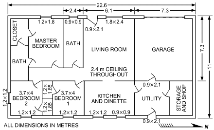

# Chapter 17 — Residential Cooling and Heating Load Calculations

*Izvor: 2021 ASHRAE Handbook — Fundamentals (SI), Chapter 17 (PDF str. 460–475).*

> **Napomena o konverziji:** Tekst je automatski izdvojen iz originalnog PDF-a uz prepoznavanje dve kolone, spojene prelomljene reči i pasuse. Indeksi i eksponenti su označeni sa `<sub>`/`<sup>`, tabele su pretvorene u Markdown tabele (veoma složene tabele su prikazane kao poravnat tekst), a slike su izrezane iz PDF-a u folder `img/`. Složene jednačine (razlomci, sume) mogu biti uprošćeno prikazane. **Pre upotrebe vrednosti u proračunu proveriti u originalnom PDF-u.** Oznake `<!-- str. N -->` pokazuju stranu PDF-a.

## Sadržaj

- [1. RESIDENTIAL FEATURES](#1-residential-features)
- [2. CALCULATION APPROACH](#2-calculation-approach)
- [3. OTHER METHODS](#3-other-methods)
- [4. RESIDENTIAL HEAT BALANCE (RHB) METHOD](#4-residential-heat-balance-rhb-method)
- [5. RESIDENTIAL LOAD FACTOR (RLF) METHOD](#5-residential-load-factor-rlf-method)
- [6. COMMON DATA AND PROCEDURES](#6-common-data-and-procedures)
- [7. COOLING LOAD](#7-cooling-load)
- [8. HEATING LOAD](#8-heating-load)
- [9. LOAD CALCULATION EXAMPLE](#9-load-calculation-example)
- [10. SYMBOLS](#10-symbols)
- [REFERENCES](#references)

<!-- str. 460 -->

THIS chapter covers cooling and heating load calculation procedures for residential buildings, including detailed heatbalance methods that serve as the basis for cooling load calculation. Simple cooling load procedures, suitable for hand calculations, are provided for typical cases. Straightforward heating load calculation procedures are also included.

Procedures in this chapter are based on the same fundamentals as the nonresidential methods in Chapter 18. However, many characteristics distinguish residential loads, and Chapter 18’s procedures should be applied with care to residential applications.

Additional information about residential heating and cooling is found in Chapter 1 of the 2019 *ASHRAE Handbook—HVAC Appli-* cations and Chapter 10 of the 2020 ASHRAE Handbook—HVAC *Systems and Equipment*.

## 1. RESIDENTIAL FEATURES

With respect to heating and cooling load calculation and equipment sizing, the following unique features distinguish residences from other types of buildings:

- **Smaller Internal Heat Gains.** Residential system loads are primarily imposed by heat gain or loss through structural components and by air leakage or ventilation. Internal heat gains, particularly those from occupants and lights, are small compared to those in commercial or industrial structures.
- **Varied Use of Spaces.** Use of spaces in residences is more flexible than in commercial buildings. Localized or temporary temperature excursions are often tolerable.
- **Fewer Zones.** Residences are generally conditioned as a single zone or, at most, a few zones. Typically, a thermostat located in one room controls unit output for multiple rooms, and capacity cannot be redistributed from one area to another as loads change over the day. This results in some hour-to-hour temperature variation or swing that has a significant moderating effect on peak loads, because of heat storage in building components.
- **Greater Distribution Losses.** Residential ducts are frequently installed in attics or other unconditioned buffer spaces. Duct leakage and heat gain or loss can require significant increases in unit capacity. Residential distribution gains and losses cannot be neglected or estimated with simple rules of thumb.
- **Partial Loads.** Most residential cooling systems use units of relatively small capacity (about 5 to 18 kW cooling, 18 to 32 kW heating). Because loads are largely determined by outdoor conditions, and few days each season are design days, the unit operates at partial load during most of the season; thus, an oversized unit is detrimental to good system performance, especially for cooling in areas of high wet-bulb temperature.

<sub>The preparation of this chapter is assigned to TC 4.1, Load Calculation Data and Procedures.</sub>

- **Dehumidification Issues.** Dehumidification occurs during cooling unit operation only, and space condition control is usually limited to use of room thermostats (sensible heat-actuated devices). Excessive sensible capacity results in short-cycling and severely degraded dehumidification performance.

In addition to these general features, residential buildings can be categorized according to their exposure:

- **Single-Family Detached.** A house in this category usually has exposed walls in four directions, often more than one story, and a roof. The cooling system is a single-zone, unitary system with a single thermostat. Two-story houses may have a separate cooling system for each floor. Rooms are reasonably open and generally have a centralized air return. In this configuration, both air and load from rooms are mixed, and a load-leveling effect, which requires a distribution of air to each room that is different from a pure commercial system, results. Because the amount of air supplied to each room is based on the load for that room, proper load calculation procedures must be used.
- **Multifamily.** Unlike single-family detached units, multifamily units generally do not have exposed surfaces facing in all directions. Rather, each unit typically has a maximum of three exposed walls and possibly a roof. Each living unit has a single unitary cooling system or a single fan-coil unit and the rooms are relatively open to one another. This configuration does not have the same load-leveling effect as a single-family detached house.
- **Other.** Many buildings do not fall into either of the preceding categories. Critical to the designation of a single-family detached building is well-distributed exposure so there is not a short-duration peak; however, if fenestration exposure is predominantly east or west, the cooling load profile resembles that of a multifamily unit. On the other hand, multifamily units with both east and west exposures or neither east nor west exposure exhibit load profiles similar to single-family detached.

## 2. CALCULATION APPROACH

Variations in the characteristics of residences can lead to surprisingly complex load calculations. Time-varying heat flows combine to produce a time-varying load. The relative magnitude and pattern of the heat flows depends on the building characteristics and exposure, resulting in a building-specific load profile. In general, an hourby-hour analysis is required to determine that profile and find its peak.

In theory, cooling and heating processes are identical; a common analysis procedure should apply to either. Acceptable simplifications are possible for heating; however, for cooling, different approaches are used.

Heating calculations use simple worst-case assumptions: no solar or internal gains, and no heat storage (with all heat losses evaluated instantaneously). With these simplifications, the heating problem is reduced to a basic UAΔt calculation. The heating procedures in this chapter use this long-accepted approach, and thus differ only in details from prior methods put forth by ASHRAE and others.

<!-- str. 461 -->

The cooling procedures in this chapter were extensively revised in 2005, based on the results of ASHRAE research project RP-1199, also supported by the Air-Conditioning Contractors of America (ACCA) (Barnaby et al. 2004, 2005). Although the complexity of residential cooling load calculations has been understood for decades, prior methods used a cooling load temperature difference/cooling load factor (CLTD/CLF) form requiring only hand-tractable arithmetic. Without such simplification, the procedures would not have been used; an approximate calculation was preferable to none at all. The simplified approaches were developed using detailed computer models and/or empirical data, but only the simplifications were published. Now that computing power is routinely available, it is appropriate to promulgate 24 h, equation-based procedures.

## 3. OTHER METHODS

Several residential load calculation methods have been published in North America over the last 30 years. All use the UAΔt heating formulation and some variation of the CLTD/CLF approach for cooling.

- **ACCA.** Manual J, 8th edition (ACCA 2016) is widely used in the United States. Cooling loads are calculated using semiempirical heat gain factors derived from experimental data taken at the University of Illinois in the 1950s. These factors, associated overview, and references are found in the 1985 and earlier editions of the ASHRAE Handbook—Fundamentals. The 8th edition retains the underlying factors but provides increased flexibility in their application, in addition to other extensions.
- **ASHRAE.** The 1989 to 2001 editions of the ASHRAE Handbook—Fundamentals contain an updated method based on ASHRAE research project RP-342 (McQuiston 1984). In this work, cooling factors were re-derived using a transfer-function building model that included temperature-swing effects.
- F280. This Canadian adaptation of the CLTD/CLF procedure (CAN/CSA Standard F280) also uses cooling methods based on ASHRAE RP-342. Heating procedures include detailed ground heat loss estimates.

A key common element of all cooling methods is attention to temperature swing, via empirical data or suitable models. Throughout the literature, it is repeatedly emphasized that direct application of nonresidential methods (based on a fixed set point) results in unrealistically high cooling loads for residential applications.

## 4. RESIDENTIAL HEAT BALANCE (RHB) METHOD

A 24 h procedure is required to accurately determine the cooling load profile of a residence. The heat balance (HB) method allows detailed simulation of space temperatures and heat flows. ASHRAE research project RP-1199 adapted HB to residential applications, resulting in the residential heat balance (RHB) method. Although RHB provides the technical basis for this chapter, it is a computeronly technique and is not documented here. HB is described in Chapter 18 and Pedersen et al. 1998; Barnaby et al. (2004, 2005) document RHB enhancements.

RP-1199 produced an implementation of the RHB method, called ResHB (Barnaby et al. 2004). This application is derived from the ASHRAE *Toolkit for Building Load Calculations* (Pedersen et al. 2001) and has the following features:

- **Multizone.** Whereas the original Toolkit code supported a single zone, ResHB can analyze projects that include multiple systems, zones, and rooms.
- **Temperature swing.** ResHB calculates cooling load with temperature swing. That is, the code searches for sensible capacity sufficient to hold the space temperature within a specified excursion above the set point.
- **Master/slave control.** ResHB allows control of cooling output in “slave” rooms based on the cooling requirements of a “master” room, where the thermostat is located. Rooms with incompatible load profiles will exhibit poor temperature control.
- **Residential defaults.** ResHB includes default values suitable for residential problems.

In its current form, ResHB is a research-oriented reference implementation of RHB. ResHB FORTRAN source code is available under license from ASHRAE.

## 5. RESIDENTIAL LOAD FACTOR (RLF) METHOD

The procedure presented in this chapter is the residential load factor (RLF) method. RLF is a simplified procedure derived from detailed ResHB analysis of prototypical buildings across a range of climates. The method is tractable by hand but is best applied using a spreadsheet. Two main applications are anticipated:

- **Education and training.** The transparency and simplicity of RLF make it suitable for use in introductory courses on building load calculations.
- **Quick load estimates.** In situations where detailed analysis is impractical, the RLF method is a possible alternative. For example, the method might be implemented as a spreadsheet on a hand-held device and used for on-site sizing of replacement cooling equipment.

Note that, although room-by-room calculations are possible with the RLF method, computerized methods based on RHB are more suitable for performing full room-level calculations required for equipment selection and distribution system design.

RLF was derived from several thousand ResHB cooling load results (Barnaby and Spitler 2005; Barnaby et al. 2004). A range of climates and building types were analyzed. Statistical regression techniques were used to find values for the load factors tabulated in later sections. Factor values were validated by comparing ResHB versus RLF results for buildings not involved in the regression analysis. Within its range of applicability, RLF cooling loads are generally within 10% of those calculated with ResHB. The RLF derivation was repeated for 2009 using the updated temperature profile and clear-sky model (see Chapter 14), resulting in minor revisions to load factors and other coefficients. Additional revisions to Chapter 14 occurred in 2013 and 2017; those changes would alter RLF values very little, so the 2009 factors are retained.

The RLF method should not be applied to situations outside the range of underlying cases, as shown in Table 1.

Note that the RLF calculation sequence involves two distinct steps. First, the cooling and heating load factors (CFs and HFs) are derived for all project component types. These factors are then applied to the individual components by a single multiplication. (The two-step approach is demonstrated in the Load Calculation Example section.) For a specific location and representative constructions, CFs and HFs can be precalculated and used repeatedly. In essence, the structure of RLF allows assembling location-specific versions of the rigid tables found in prior editions, and also documents the equations used to generate tabulated values. Using these equations, a complete implementation of the RLF method, including CF and HF calculation, is well within the capabilities of current PC spreadsheet applications.

## 6. COMMON DATA AND PROCEDURES

The following guidelines, data requirements, and procedures apply to all load calculation approaches, whether heating or cooling, hand-tractable or computerized.

<!-- str. 462 -->

**Table 1 RLF Limitations**

| Item | Valid Range Notes |
|---|---|
| Latitude | 20 to 60°N Also approximately valid for 20 to 60°S with N and S orientations reversed for southern hemisphere. |
| Date | July 21 Application must be summer peaking. Buildings in mild climates with significant SE/S/SW glazing may experience maximum cooling load in fall or even winter. Use RHB if local experience indicates this is a possibility. , method is acceptably |
| Elevation | Less than 2000 m RLF factors assume 50 m elevation. With elevation-corrected C<sub>s</sub> accurate except at very high elevations. |
| Climate | Warm/hot Design-day average outdoor temperature assumed to be above indoor design temperature. |
| Construction | Lightweight residential construction (wood May be applied to masonry veneer over frame construction; results are conservative. Use or metal framing, wood or stucco siding) RHB for structural masonry or unconventional construction. |
| Fenestration area | 0 to 15% of floor area on any façade, 0 to Spaces with high fenestration fraction should be analyzed with RHB. |
|  | 30% of floor area total |
| Fenestration tilt | Vertical or horizontal Skylights with tilt less than 30° can be treated as horizontal. Buildings with significant sloped glazing areas should be analyzed with RHB. |
| Occupancy | Residential Applications with high internal gains and/or high occupant density should be analyzed with<br>RHB or nonresidential procedures. |
| **Temperature swing 1.7 K** |  |
| Distribution losses | Typical Applications with extensive duct runs in unconditioned spaces should be analyzed with RHB. |

### General Guidelines

**Design for Typical Building Use.** In general, residential systems should be designed to meet representative maximum-load conditions, not extreme conditions. Normal occupancy should be assumed, not the maximum that might occur during an occasional social function. Intermittently operated ventilation fans should be assumed to be off. These considerations are especially important for cooling-system sizing.

**Building Codes and Standards.** This chapter presentation is necessarily general. Codes and regulations take precedence; consult local authorities to determine applicable requirements.

**Designer Judgment.** Designer experience with local conditions, building practices, and prior projects should be considered when applying the procedures in this chapter. For equipment-replacement projects, occupant knowledge concerning performance of the existing system can often provide useful guidance for achieving a successful design.

**Verification.** Postconstruction commissioning and verification are important steps in achieving design performance. Designers should encourage pressurization testing and other procedures that allow identification and repair of construction shortcomings.

**Uncertainty and Safety Allowances.** Residential load calculations are inherently approximate. Many building characteristics are estimated during design and ultimately determined by construction quality and occupant behavior. These uncertainties apply to all calculation methods, including first-principles procedures such as RHB. It is therefore tempting to include safety allowances for each aspect of a calculation. However, this practice has a compounding effect and often produces oversized results. Typical conditions should be assumed; safety allowances, if applied at all, should be added to the final calculated loads rather than to intermediate components. In addition, temperature swing provides a built-in safety factor for sensible cooling: a 20% capacity shortfall typically results in a temperature excursion of at most about one or two degrees.

### Basic Relationships

Common air-conditioning processes involve transferring heat via air transport or leakage. The sensible, latent, and total heat conveyed by air on a volumetric basis is

> q<sub>s</sub> = C<sub>s</sub>QΔt&emsp;**(1)**
>
> q<sub>l</sub> = C<sub>l</sub>QΔW&emsp;**(2)**

> q<sub>t</sub> = C<sub>t</sub>QΔh&emsp;**(3)**
>
> q<sub>t</sub> = q<sub>s</sub> + q<sub>l</sub>&emsp;**(4)**

where

- q<sub>s,</sub>q<sub>l</sub>, q<sub>t</sub> = sensible, latent, total heat transfer rates, W
- C<sub>s</sub> = air sensible heat factor, W/(L·s·K) (1.23 at sea level)
- C<sub>l</sub> = air latent heat factor, W/(L·s) (3010 at sea level)
- C<sub>t</sub> = air total heat factor, W/(L·s) per kJ/kg enthalpy h (1.2 at sea level)
- Q = air volumetric flow rate, L/s
- Δt = air temperature difference across process, K
- ΔW = air humidity ratio difference across process, kg<sub>w</sub>/kg<sub>da</sub>
- Δh = air enthalpy difference across process, kJ/kg

The heat factors C<sub>s</sub>, C<sub>l</sub>, and C<sub>t</sub> are elevation dependent. The sea-level values in the preceding definitions are appropriate for elevations up to about 300 m. Procedures are provided in Chapter 18 for calculating adjusted values for higher elevations.

### Design Conditions

The initial step in the load calculation is selecting indoor and outdoor design conditions.

**Indoor Conditions.** Indoor conditions assumed for design purposes depend on building use, type of occupancy, and/or code requirements. Chapter 9 and ASHRAE Standard 55 define the relationship between indoor conditions and comfort.

Typical practice for cooling is to design for indoor conditions of 24°C db and a maximum of 50 to 65% rh. For heating, 20°C db and 30% rh are common design values. These conditions are the default values used throughout this chapter.

**Outdoor Conditions.** Outdoor design conditions for load calculations should be selected from location-specific climate data in Chapter 14, or according to local code requirements as applicable.

Cooling. The 1% design dry-bulb temperature and mean coincident wet bulb temperature from Chapter 14 climate data are generally appropriate. As previously emphasized, oversized cooling equipment results in poor system performance. Extremely hot events are necessarily of short duration (conditions always moderate each night); therefore, sacrificing comfort under typical conditions to meet occasional extremes is not recommended.

Load calculations also require the hottest-month dry-bulb temperature daily range, and wind speed. These values can also be found in Chapter 14, although wind speed is commonly assumed to be 3.4 m/s.

Typical buildings in middle latitudes generally experience maximum cooling requirements in midsummer (July in the northern hemisphere and January in the southern hemisphere). For this reason, the RLF method is based on midsummer solar gains. However, this pattern does not always hold. Buildings at low latitudes or with significant south-facing glazing (north-facing in the southern hemisphere) should be analyzed at several times of the year using the RHB method. Local experience can provide guidance as to when maximum cooling is probable. For example, it is common for south-facing buildings in mild northern-hemisphere climates to have peak cooling loads in the fall because of low sun angles. Chapter 14 contains monthly temperature data to support calculations for any time of year.

<!-- str. 463 -->

Heating. General practice is to use the 99% design dry-bulb temperature from Chapter 14. Heating load calculations ignore solar and internal gains, providing a built-in safety factor. However, the designer should consider two additional factors:

- Many locations experience protracted (several-day) cold periods during which the outdoor temperature remains below the 99% value.
- Wind is a major determinant of infiltration. Residences with significant leakage (e.g., older houses) may have peak heating demand under conditions other than extreme cold, depending on site wind patterns.

Depending on the application and system type, the designer should consider using the 99.6% value or the mean minimum extreme as the heating design temperature. Alternatively, the heating load can be calculated at the 99% condition and a safety factor applied when equipment is selected. This additional capacity can also serve to meet pickup loads under nonextreme conditions.

**Adjacent Buffer Spaces.** Residential buildings often include unconditioned buffer spaces such as garages, attics, crawlspaces, basements, or enclosed porches. Accurate load calculations require the adjacent air temperature.

In many cases, a simple, conservative estimate is adequate, especially for heating calculations. For example, it is generally reasonable to assume that, under heating design conditions, adjacent uninsulated garages, porches, and attics are at outdoor temperature. Another reasonable assumption is that the temperature in an adjacent, unheated, insulated room is the mean of the indoor and outdoor temperatures.

In cases where a temperature estimate is required, a steady-state heat balance analysis yields the following:

> t<sub>b</sub> = (C<sub>s</sub>Qt<sub>o</sub>+ A U<sub>x</sub>t<sub>x</sub>+ q ∑ <sub>x</sub>)/(C<sub>s</sub>Q + A U<sub>x</sub> ∑ <sub>x</sub>)&emsp;**(5)**

where

- t<sub>b</sub> = buffer space temperature, °C
- Q = buffer space infiltration/ventilation flow rate, L/s
- t<sub>o</sub> = outdoor air temperature, °C
- A<sub>x</sub> = area ofx th buffer space surface, m<sup>2</sup>
- U<sub>x</sub> = U-factor of xth buffer space surface, W/(m<sup>2</sup>·K)
- t<sub>x</sub> = air temperature at outside of xth buffer space surface, °C (typically, outdoor air temperature for exterior surfaces, conditioned space temperature for surfaces between buffer space and house, or ground temperature for below-grade surfaces)
- q = additional buffer space heat gains, W (e.g., solar gains or distribution system losses)

### Building Data

**Component Areas.** To perform load calculations efficiently and reliably, standard methods must be used for determining building surface areas. For fenestration, the definition of component area must be consistent with associated ratings.

Gross area. It is both efficient and conservative to derive gross surface areas from outer building dimensions, ignoring wall and floor thicknesses. Thus, floor areas should be measured to the outside of adjacent exterior walls or to the centerline of adjacent partitions. When apportioning to rooms, façade area should be divided at partition centerlines. Wall height should be taken as floor-tofloor.

Using outer dimensions avoids separate accounting of floor edge and wall corner conditions. Further, it is standard practice in residential construction to define floor area in terms of outer dimensions, so outer-dimension takeoffs yield areas that can be readily checked against building plans (e.g., the sum of room areas should equal the plan floor area). Although outer-dimension procedures are recommended as expedient for load calculations, they are not consistent with rigorous definitions used in building-related standards (e.g., ASTM Standard E631). However, the inconsistencies are not significant in the load calculation context.

Fenestration area. Fenestration includes exterior windows, skylights, and doors. Fenestration U-factor and SHGC ratings (see Table 2) are based on the entire product area, including frames. Thus, for load calculations, fenestration area is the area of the rough opening in the wall or roof, less installation clearances (projected product area A<sub>pf</sub>). Installation clearances can be neglected; it is acceptable to use the rough opening as an approximation of A<sub>pf</sub>.

Net area. Net surface area is the gross surface area less fenestration area (rough opening or A<sub>pf</sub>) contained within the surface.

**Volume.** Building volume is expediently calculated by multiplying floor area by floor-to-floor height. This produces a conservative estimate of enclosed air volume, because wall and floor volumes are included in the total. More precise calculations are possible but are generally not justified in this context.

**Construction Characteristics.**

U-factors. Except for fenestration, construction U-factors should be calculated using procedures in Chapter 27, or taken from manufacturer’s data, if available. U-factors should be evaluated under heating (winter) conditions.

Fenestration. Fenestration is characterized by U-factor and solar heat gain coefficient (SHGC), which apply to the entire assembly (including frames). If available, rated values should be used, determined according to procedures set forth by National Fenestration Rating Council (NFRC), Canadian Standards Association (CSA), or other specifying body (see Chapter 15). Ratings can be obtained from product literature, product label, or online listings (NFRC 2017). For unrated products (e.g., in existing construction), the U-factor and SHGC can be estimated using Table 2 or tables in Chapter 15. Note that fenestration U-factors are evaluated under heating (winter) design conditions but are used in this chapter for both heating and cooling calculations.

Relatively few types of glazing are encountered in residential applications. Single-glazed clear, double-glazed clear, and double-glazed low-emissivity (“low-e”) glass predominate. Single-glazed is now rare in new construction but common in older homes. Tripleglazing, reflective glass, and heat-absorbing glass are encountered occasionally. Acrylic or glass skylights are common. Multipane low-e insulated glazing is available in high- and low-solar-gain variants, as discussed in Chapter 15. Low-solar is now the more common for new construction in all parts of the United States.

Properties of windows equipped with storm windows should be estimated from data for a similar configuration with an additional pane. For example, data for clear, double-glazed should be used for a clear single-glazed window with a storm window.

Fenestration interior and exterior shading must be included in cooling load calculations, as discussed in the Cooling Load section.

Table 2 shows representative window U-factor and SHGC values for common glazing and frame combinations. Consult Chapter 15 for skylight characteristics.

### Load Components

**Below-Grade Surfaces.** For cooling calculations, heat flow into the ground is usually ignored because it is difficult to quantify.

<!-- str. 464 -->

**Table 2 Typical Fenestration Characteristicsa**

| Glazing Type | Glazing Layers | ID<sup>b</sup> | Property<sup>c,d</sup> | Center of Glazing |   |   | Operable |   | Frame | Frame |   | Fixed |   |   |
|---|---|---|---|---|---|---|---|---|---|---|---|---|---|---|
| Clear | 1 | 1a | U | 5.91 | 7.24 | 6.12 | 5.14 | 5.05 | 4.61 | 6.42 | 6.07 | 5.55 | 5.55 | 5.35 |
|  |  |  | SHGC | 0.86 | 0.75 | 0.75 | 0.64 | 0.64 | 0.64 | 0.78 | 0.78 | 0.75 | 0.75 | 0.75 |
|  | 2 | 5a | U | 2.73 | 4.62 | 3.42 | 3.00 | 2.87 | 5.83 | 3.61 | 3.22 | 2.86 | 2.84 | 2.72 |
|  |  |  | SHGC | 0.76 | 0.67 | 0.67 | 0.57 | 0.57 | 0.57 | 0.69 | 0.69 | 0.67 | 0.67 | 0.67 |
|  | 3 | 29a | U | 1.76 | 3.80 | 2.60 | 2.25 | 2.19 | 1.91 | 2.76 | 2.39 | 2.05 | 2.01 | 1.93 |
|  |  |  | SHGC | 0.68 | 0.60 | 0.60 | 0.51 | 0.51 | 0.51 | 0.62 | 0.62 | 0.60 | 0.60 | 0.60 |
| Low-e, low-solar | 2 | 25a | U | 1.70 | 3.83 | 2.68 | 2.33 | 2.21 | 1.89 | 2.75 | 2.36 | 2.03 | 2.01 | 1.90 |
|  |  |  | SHGC | 0.41 | 0.37 | 0.37 | 0.31 | 0.31 | 0.31 | 0.38 | 0.38 | 0.36 | 0.36 | 0.36 |
|  | 3 | 40c | U | 1.02 | 3.22 | 2.07 | 1.76 | 1.71 | 1.45 | 2.13 | 1.76 | 1.44 | 1.40 | 1.33 |
|  |  |  | SHGC | 0.27 | 0.25 | 0.25 | 0.21 | 0.21 | 0.21 | 0.25 | 0.25 | 0.24 | 0.24 | 0.24 |
| Low-e, high-solar | 2 | 17c | U | 1.99 | 4.05 | 2.89 | 2.52 | 2.39 | 2.07 | 2.99 | 2.60 | 2.26 | 2.24 | 2.13 |
|  |  |  | SHGC | 0.70 | 0.62 | 0.62 | 0.52 | 0.52 | 0.52 | 0.64 | 0.64 | 0.61 | 0.61 | 0.61 |
|  | 3 | 32c | U | 1.42 | 3.54 | 2.36 | 2.02 | 1.97 | 1.70 | 2.47 | 2.10 | 1.77 | 1.73 | 1.66 |
|  |  |  | SHGC | 0.62 | 0.55 | 0.55 | 0.46 | 0.46 | 0.46 | 0.56 | 0.56 | 0.54 | 0.54 | 0.54 |
| Heat-absorbing | 1 | 1c | U | 5.91 | 7.24 | 6.12 | 5.14 | 5.05 | 4.61 | 6.42 | 6.07 | 5.55 | 5.55 | 5.35 |
|  |  |  | SHGC | 0.73 | 0.64 | 0.64 | 0.54 | 0.54 | 0.54 | 0.66 | 0.66 | 0.64 | 0.64 | 0.64 |
|  | 2 | 5c | U | 2.73 | 4.62 | 3.42 | 3.00 | 2.87 | 2.53 | 3.61 | 3.22 | 2.86 | 2.84 | 2.72 |
|  |  |  | SHGC | 0.62 | 0.55 | 0.55 | 0.46 | 0.46 | 0.46 | 0.56 | 0.56 | 0.54 | 0.54 | 0.54 |
|  | 3 | 29c | U | 1.76 | 3.80 | 2.60 | 2.25 | 2.19 | 1.91 | 2.76 | 2.39 | 2.05 | 2.01 | 1.93 |
|  |  |  | SHGC | 0.34 | 0.31 | 0.31 | 0.26 | 0.26 | 0.26 | 0.31 | 0.31 | 0.30 | 0.30 | 0.30 |
| Reflective | 1 | 1l | U | 5.91 | 7.24 | 6.12 | 5.14 | 5.05 | 4.61 | 6.42 | 6.07 | 5.55 | 5.55 | 5.35 |
|  |  |  | SHGC | 0.31 | 0.28 | 0.28 | 0.24 | 0.24 | 0.24 | 0.29 | 0.29 | 0.27 | 0.27 | 0.27 |
|  | 2 | 5p | U | 2.73 | 4.62 | 3.42 | 3.00 | 2.87 | 2.53 | 3.61 | 3.22 | 2.86 | 2.84 | 2.72 |
|  |  |  | SHGC | 0.29 | 0.27 | 0.27 | 0.22 | 0.22 | 0.22 | 0.27 | 0.27 | 0.26 | 0.26 | 0.26 |
|  | 3 | 29c | U | 1.76 | 3.80 | 2.60 | 2.25 | 2.19 | 1.91 | 2.76 | 2.39 | 2.05 | 2.01 | 1.93 |
|  |  |  | SHGC | 0.34 | 0.31 | 0.31 | 0.26 | 0.26 | 0.26 | 0.31 | 0.31 | 0.30 | 0.30 | 0.30 |

<sup>a</sup>Data are from Chapter 15, Tables 4 and 14 for selected <sup>b</sup>ID = Chapter 15 glazing type identifier. <sup>c</sup>U = U-factor, W/(m<sup>2</sup>·K). <sup>d</sup>SHGC = solar heat gain coefficient. combinations.

Surfaces adjacent to the ground are modeled as if well insulated on the outside, so there is no overall heat transfer, but diurnal heat storage effects are included. Heating calculations must include loss via slabs and basement walls and floors, as discussed in the Heating Load section.

**Infiltration.** Infiltration is generally a significant component of both cooling and heating loads. Refer to Chapter 16 for a detailed discussion of residential air leakage. The simplified residential models found in that chapter can be used to calculate infiltration rates for load calculations. Infiltration should be evaluated for the entire building, not individual rooms or zones.

Natural infiltration leakage rates are modified by mechanical pressurization caused by unbalanced ventilation or duct leakage. These effects are discussed in the section on Combined Ventilation and Infiltration Airflow.

Leakage rate. Air leakage rates are specified either as airflow rate Q<sub>i</sub>, or air exchanges per hour (ACH), related as follows:

> Q<sub>i</sub> = ACH(V/3.6)&emsp;**(6)**
>
> ACH = 3.6Q<sub>i</sub>/V&emsp;**(7)**

where

- Q<sub>i</sub> = infiltration airflow rate, L/s
- ACH = air exchange rate, changes/h
- V = building volume, m<sup>3</sup>

Infiltration airflow rate depends on two factors:

- Building effective leakage area (envelope leaks plus other air leakage paths, notably flues) and its distribution among ceilings, walls, floors, and flues.
- Driving pressure caused by buoyancy (stack effect) and wind.

Using the simplifying assumptions presented in Chapter 16, these factors can be evaluated separately and combined using Equation (8).

> Q<sub>i</sub> = A<sub>L</sub>IDF&emsp;**(8)**

where

- A<sub>L</sub> = building effective leakage area (including flue) at reference
- pressure difference = 4 Pa, assuming discharge coefficient

> C<sub>D</sub>= 1, cm<sup>2</sup>

IDF = infiltration driving force, L/(s·cm<sup>2</sup>)

The following sections provide procedures for determining A<sub>L</sub> and IDF.

Leakage area. As discussed in Chapter 16, there are several interconvertible ways to characterize building leakage, depending on reference pressure differences and assumed discharge coefficient. This formulation uses the effective leakage area at 4 Pa, assuming C<sub>D</sub> = 1, designated A<sub>L</sub> (Sherman and Grimsrud 1980).

The only accurate procedure for determining A<sub>L</sub>is by measurement using a pressurization test (commonly called a blower door test). Numerous field studies have shown that visual inspection is not adequate for obtaining even a crude estimate of leakage.

<!-- str. 465 -->

For buildings in design, a pressurization test is not possible and leakage area must be assumed for design purposes. Leakage can be estimated using tabulated component leakage areas found in Chapter 16. A simpler approach is based on an assumed average leakage per unit of building surface area:

> A<sub>L</sub> = A<sub>es</sub>A<sub>ul</sub>&emsp;**(9)**

where

- A<sub>es</sub> = building exposed surface area, m<sup>2</sup>
- A<sub>ul</sub> = unit leakage area, cm<sup>2</sup>/m<sup>2</sup> (from Table 3)

A<sub>ul</sub> is the leakage area per unit surface area; suitable design values are found in Table 3. Field experience indicates that the level of care applied to reducing leakage often depends on winter conditions, because cold-air leakage is readily detected. Thus, lower A<sub>ul</sub> values are expected in colder climates. Note that the A<sub>ul</sub> value doubles at each reduced construction quality step in Table 3; very high infiltration loads are typical in older houses.

In Equation (9), A<sub>es</sub> is the total building surface area at the envelope pressure boundary, defined as all above-grade surface area that separates the outdoors from conditioned or semiconditioned space. Table 4 provides guidance for evaluating A<sub>es</sub>.

IDF. To determine IDF, use the Chapter 16 methods cited previously. As a further simplification, Barnaby and Spitler (2005) derived the following relationship that yields results approximately equal to the AIM-2 model (Walker and Wilson 1990, 1998; Chapter 16’s enhanced model) at design conditions:

> IDF = ([I + I<sub>2</sub>(A<sub>L,flue</sub> ⁄ A<sub>L</sub>)] I<sub>0</sub>+ H Δt <sub>1</sub>)/1000&emsp;**(10)**

where

I<sub>0</sub>, I<sub>1</sub>, I<sub>2</sub>= coefficients, as follows:

|   | Cooling 3.4 m/s | Heating 6.7 m/s |
|---|---|---|
| I<sub>0</sub> | 25 | 51 |
| I<sub>1</sub> | 0.38 | 0.35 |
| I<sub>2</sub> | 0.12 | 0.23 |

H = building average stack height, m (typically 2.5 m per story)

**Table 3 Unit Leakage Areas**

| Construction | Description | A<sub>ul</sub>, cm<sup>2</sup>/m<sup>2</sup> |
|---|---|---|
| Tight | Construction supervised by air-sealing specialist | 0.7 |
| Good | Carefully sealed construction by knowledgeable builder | 1.4 |
| Average | Typical current production housing | 2.8 |
| Leaky | Typical pre-1970 houses | 5.6 |
| Very leaky | Old houses in original condition | 10.4 |

**Table 4 Evaluation of Exposed Surface Area**

| Situation | Include | Exclude |
|---|---|---|
| Ceiling/roof combination (e.g., cathedral ceiling without attic) | Gross surface area |  |
| Ceiling or wall adjacent to attic | Ceiling or wall area | Roof area |
| Wall exposed to ambient | Gross wall area (including fenestration area) |  |
| Wall adjacent to unconditioned buf- Common wall area |  | Exterior wall |
| fer space (e.g., garage or porch) |  | area |
| Floor over open or vented | Floor area | Crawlspace |
| crawlspace |  | wall area |
| Floor over sealed crawlspace | Crawlspace wall area | Floor area |
| Floor over conditioned or | Above-grade basement | Floor area |
| semiconditioned basement | wall area |  |
| Slab floor |  | Slab area |

Δt = difference between indoor and outdoor temperatures, K

A<sub>L,flue</sub> = flue effective leakage area at reference pressure difference = 4 Pa, assuming C<sub>D</sub> = 1, cm<sup>2</sup> (total for flues serving furnaces, domestic water heaters, fireplaces, or other vented equipment, evaluated assuming associated equipment is not operating and with dampers in closed position; see Chapter 16)

Building stack height H is the average height difference between the ceiling and floor (or grade, if the floor is below grade). Thus, for buildings with vented crawlspaces, the crawlspace height is not included. For basement or slab-on-grade construction, H is the average height of the ceiling above grade. Generally, there is significant leakage between basements and spaces above, so above-grade basement height should be included whether or not the basement is fully conditioned. With suitable adjustments for grade level, H can also be estimated as V/A<sub>cf</sub> (conditioned floor area).

Equation (10) is valid for typical suburban residential wind sheltering, A<sub>L,flue</sub> < A<sub>L</sub>/2, and at any elevation. Table 5 shows IDF values derived with Equation (10), assuming A<sub>L,flue</sub> = 0.

*Verification of leakage.* A postconstruction pressurization test is strongly recommended to verify that design leakage assumptions are actually achieved. Excess leaks should be located and repaired.

*Allocation of infiltration to rooms.* Total building infiltration should typically be allocated to rooms according to room volume; that is, it should be assumed that each room has the same air exchange rate as the whole building. In reality, leakage varies by room and over time, depending on outdoor temperature and wind conditions. These effects can either increase or decrease room leakage. In addition, system air mixing tends to redistribute localized leakage to all rooms. Thus, in most cases, there is no reasonable way to assign more or less leakage to specific rooms.

An exception is leaky, multistory houses. The preferable and cost-effective response is mitigation of the leakage. If repair is not possible, then for heating load calculation purposes, some leakage can be differentially assigned to lower story and/or windward rooms in proportion to exposed surface area (i.e., adjustment using an “exposure factor”).

Multifamily buildings. Usually, the simplified methods in Chapter 16 and this section do not apply to multifamily residences. However, they can be used for row houses that are full building height and have more than one exposed façade. For apartment units subdivided within a former detached residence, the entire building should be analyzed and the resulting exchange rate applied to the apartment volume. In other multifamily structures, infiltration is determined by many factors, including overall building height and degree of sealing between apartments. For low-rise construction, an upper bound for the infiltration rate can be found by evaluating the entire building. As building height increases, leakage problems can be magnified, as discussed in Chapter 16. Estimating leakage rates may require advice from a high-rise infiltration specialist.

**Ventilation.**

Whole-building ventilation. Because of energy efficiency concerns, residential construction has become significantly tighter over the last several decades. Natural leakage rates are often insufficient to maintain acceptable indoor air quality. ASHRAE Standard 62.2 specifies the required minimum whole-building ventilation rate as

**Table 5 Typical IDF Values, L/(s·cm2)**

| H, m | –40 | Heating Design Temperature, °C<br>–30 | Heating Design Temperature, °C<br>–20 | Heating Design Temperature, °C<br>–10 | 0 | 10 | Cooling Design Temperature, °C<br>30 | Cooling Design Temperature, °C<br>35 | 40 |
|---|---|---|---|---|---|---|---|---|---|
| 2.5 | 0.10 | 0.095 | 0.086 | 0.077 | 0.069 | 0.060 | 0.031 | 0.035 | 0.040 |
| 3 | 0.11 | 0.10 | 0.093 | 0.083 | 0.072 | 0.061 | 0.032 | 0.038 | 0.043 |
| 4 | 0.14 | 0.12 | 0.11 | 0.093 | 0.079 | 0.065 | 0.034 | 0.042 | 0.049 |
| 5 | 0.16 | 0.14 | 0.12 | 0.10 | 0.086 | 0.069 | 0.036 | 0.046 | 0.055 |
| 6 | 0.18 | 0.16 | 0.14 | 0.11 | 0.093 | 0.072 | 0.039 | 0.050 | 0.061 |
| 7 | 0.20 | 0.17 | 0.15 | 0.12 | 0.10 | 0.075 | 0.041 | 0.051 | 0.068 |
| 8 | 0.22 | 0.19 | 0.16 | 0.14 | 0.11 | 0.079 | 0.043 | 0.058 | 0.074 |

<!-- str. 466 -->

> Q<sub>v</sub> = 0.15A<sub>cf</sub> + 3.5(N<sub>br</sub> + 1)&emsp;**(11)**

where

- Q<sub>v</sub> = required ventilation flow rate, L/s
- A<sub>cf</sub> = building conditioned floor area, m<sup>2</sup>
- N<sub>br</sub> = number of bedrooms (not less than 1)

Certain mild climates are exempted from this standard; local building authorities ultimately dictate actual requirements. In addition, Standard 62.2 specifies alternative methods for determining ventilation requirements that may result in smaller Q<sub>v</sub> values. Whole-building ventilation is expected to become more common because of a combination of regulation and consumer demand. The load effect of Q<sub>v</sub> must be included in both cooling and heating calculations.

Heat recovery. Heat recovery devices should be considered part of mechanical ventilation systems. These appliances are variously called heat recovery ventilators (HRVs) or energy recovery ventilators (ERVs) and integrate with residential distribution systems, as described in Chapter 26 of the 2020 ASHRAE Handbook—HVAC *Systems and Equipment*. Either sensible heat or total heat (enthalpy) can be exchanged between the exhaust and intake airstreams. ERV/HRV units are characterized by their sensible and total effectiveness.

*Local mechanical exhaust.* Kitchen and bathroom exhaust fans are required by Standard 62.2 and are typically present. Exhaust fans that operate intermittently by manual control are generally not included in load calculations. Continuously operating ventilation should be included. Note that exhaust fans induce load only through enhanced infiltration because of building depressurization (see the section on Combined Ventilation and Infiltration Airflow for further discussion).

**Combustion Air.** Fuel-fired boilers, furnaces, and domestic water heaters require combustion air. If the combustion air source is within the building envelope (including in semiconditioned basements), additional infiltration and heating load are induced. Locating the equipment outside of conditioned space (e.g., in a garage or vented mechanical closet) or using sealed-combustion equipment eliminates this load.

Combustion air requirements for new forced-draft equipment can be estimated at 0.4 L/(s·kW) or about 12 L/s for a 30 kW heating appliance. The requirements for existing natural draft equipment should be estimated at twice that amount. In many cases, these quantities are relatively small and can be neglected.

For cooling load calculations, heating equipment is assumed to be not operating, leaving only any domestic water heaters, for which the combustion air requirements are generally neglected.

**Combined Ventilation and Infiltration Airflow.** Mechanical pressurization modifies the infiltration leakage rate. To assess this effect, overall supply and exhaust flow rates must be determined and then divided into “balanced” and “unbalanced” components.

> Q<sub>bal</sub> = min(Q<sub>sup</sub>, Q<sub>exh</sub>)&emsp;**(12)**
>
> Q<sub>unbal</sub> = max(Q<sub>sup</sub>, Q<sub>exh</sub>) – Q<sub>bal</sub>&emsp;**(13)**

where

- Q<sub>bal</sub> = balanced airflow rate, L/s
- Q<sub>sup</sub> = total ventilation supply airflow rate, L/s
- Q<sub>exh</sub> = total ventilation exhaust airflow rate (including any combustion air requirements), L/s
- Q<sub>unbal</sub> = unbalanced airflow rate, L/s

Note that unbalanced duct leakage can produce additional pressurization or depressurization. This effect is discussed in the section on Distribution Losses.

Airflow components can be combined with infiltration leakage as follows (Palmiter and Bond 1991; Sherman 1992):

> Q<sub>vi</sub> = max(Q<sub>unbal</sub>, Q<sub>i</sub> + 0.5Q<sub>unbal</sub>)&emsp;**(14)**

where

- Q<sub>vi</sub> = combined infiltration/ventilation flow rate (not including balanced component), L/s
- Q<sub>i</sub> = infiltration leakage rate assuming no mechanical pressurization, L/s

Ventilation/infiltration load. The cooling or heating load from ventilation and infiltration is calculated as follows:

> q<sub>vi,s</sub> = C<sub>s</sub>[Q<sub>vi</sub> + (1 – ε<sub>s</sub>)Q<sub>bal,hr</sub> + Q<sub>bal,oth</sub>]Δt&emsp;**(15)**
>
> q<sub>vi,l</sub> = C<sub>l</sub>(Q<sub>vi</sub> + Q<sub>bal,oth</sub>)ΔW (no HRV/ERV)&emsp;**(16)**

> q<sub>vi,t</sub> = C<sub>t6</sub>[Q<sub>vi</sub> + (1 – ε<sub>t</sub>)Q<sub>bal,hr</sub> + Q<sub>bal,oth</sub>]Δh&emsp;**(17)**
>
> q<sub>vi,l</sub> = q<sub>vi,t</sub> – q<sub>vi,s</sub>&emsp;**(18)**

where

- q<sub>vi,s</sub> = sensible ventilation/infiltration load, W
- ε<sub>s</sub> = HRV/ERV sensible effectiveness
- Q<sub>bal,hr</sub> = balanced ventilation flow rate via HRV/ERV equipment, L/s
- Q<sub>bal,oth</sub> = other balanced ventilation supply airflow rate, L/s
- Δt = indoor/outdoor temperature difference, K
- ΔW = indoor/outdoor humidity ratio difference
- q<sub>vi,t</sub> = total ventilation/infiltration load, W
- ε<sub>t</sub> = HRV/ERV total effectiveness
- Δh = indoor/outdoor enthalpy difference, kJ/kg
- q<sub>vi,l</sub> = latent ventilation/infiltration load, W

**Distribution Losses.** Air leakage and heat losses from duct systems frequently impose substantial equipment loads in excess of building requirements. The magnitude of losses depends on the location of duct runs, their surface areas, surrounding temperatures, duct wall insulation, and duct airtightness. These values are usually difficult to accurately determine at the time of preconstruction load calculations, and must be estimated using assumed values, so that selected equipment capacity is sufficient.

Good design and workmanship both reduce duct losses. In particular, locating duct runs within the conditioned envelope (above dropped hallway ceilings, for example) substantially eliminates duct losses. Specific recommendations are found in Chapter 10 of the 2020 *ASHRAE Handbook—HVAC Systems and Equipment*. Good workmanship and correct materials are essential to achieve low leakage. Many common sealing techniques, notably duct tape, have been shown to fail in a few years. Well-constructed duct systems show leakage rates of 5% of fan flow from supply and return runs, whereas 11% or more on each side is more typical. Because of the potentially large load impact of duct leakage, postconstruction verification of airtightness is strongly recommended.

Duct losses can be estimated using models specified in ASHRAE Standard 152, Francisco and Palmiter (1999), and Palmiter and Francisco (1997). The allowance for distribution losses is calculated as follows:

> q<sub>d</sub> = F<sub>dl</sub>q<sub>bl</sub>&emsp;**(19)**

where

- q<sub>d</sub> = distribution loss, W
- F<sub>dl</sub> = duct loss/gain factor, from Table 6 or ASHRAE Standard 152 design efficiencies or a detailed model
- q<sub>bl</sub> = total building load, W

Table 6 shows typical duct loss/gain factors calculated for the conditions indicated. These values can provide guidance for hand estimates, and illustrate the need for achieving low duct leakage. To the extent conditions differ from those shown, specific calculations should be made using a method cited previously. Note also that Table 6 cooling factors represent sensible gain only. Duct leakage may also introduce significant latent gain; see ASHRAE Standard 152.

<!-- str. 467 -->

**Table 6 Typical Duct Loss/Gain Factors**

| Duct Location | Supply/Return Leakage Insulation (m<sup>2</sup>·K)/W | R-0 | 11%/11% R-0.7 | 1 Story<br>R-1.4 | 1 Story<br>R-0 | 5%/5% R-0.7 | R-1.4 | R-0 | 11%/11% R-0.7 | 2 or More Stories<br>R-1.4 | 2 or More Stories<br>R-0 | 5%/5% R-0.7 | R-1.4 |
|---|---|---|---|---|---|---|---|---|---|---|---|---|---|
| Conditioned space |  |  |  |  |  |  | No loss (F<sub>dl</sub> | = 0) |  |  |  |  |  |
| Attic | C<br>H/F<br>H/HP | 1.26 0.49 0.56 | 0.71 0.29 0.37 | 0.63 0.25 0.34 | 0.68 0.34 0.34 | 0.33 0.16 0.19 | 0.27 0.13 0.16 | 1.02 0.41 0.49 | 0.66 0.26 0.35 | 0.60 0.24 0.33 | 0.53 0.27 0.28 | 0.29 0.14 0.17 | 0.25 0.12 0.15 |
| Basement | C<br>H/F<br>H/HP | 0.12 0.28 0.23 | 0.09 0.18 0.17 | 0.09 0.16 0.16 | 0.07 0.19 0.14 | 0.05 0.10 0.09 | 0.04 0.08 0.08 | 0.11 0.24 0.20 | 0.09 0.17 0.16 | 0.09 0.15 0.15 | 0.06 0.16 0.12 | 0.04 0.09 0.08 | 0.04 0.08 0.07 |
| Crawlspace | C<br>H/F<br>H/HP | 0.16 0.49 0.56 | 0.12 0.29 0.37 | 0.11 0.25 0.34 | 0.10 0.34 0.34 | 0.06 0.16 0.19 | 0.05 0.13 0.16 | 0.14 0.41 0.49 | 0.12 0.26 0.35 | 0.11 0.24 0.33 | 0.08 0.27 0.28 | 0.06 0.14 0.17 | 0.05 0.12 0.15 |

Values calculated for ASHRAE Standard 152 default duct system surface area using model of Francisco and Palmiter (1999). Values are provided as guidance only; losses can differ substantially for other conditions and configurations. Assumed surrounding temperatures: Cooling (C): t<sub>o</sub> = 35°C, t<sub>attic</sub> = 49°C, t<sub>b</sub> = 20°C, t<sub>crawl</sub> = 22°C Heating/furnace (H/F) and heating/heating pump (H/HP): t<sub>o</sub> = 0°C, t<sub>attic</sub> = 0°C, t<sub>b</sub> = 18°C, t<sub>crawl</sub> = 0°C

## 7. COOLING LOAD

A cooling load calculation determines total sensible cooling load from heat gain (1) through opaque surfaces (walls, floors, ceilings, and doors), (2) through transparent fenestration surfaces (windows, skylights, and glazed doors), (3) caused by infiltration and ventilation, and (4) because of occupancy. The latent portion of the cooling load is evaluated separately. Although the entire structure may be considered a single zone, equipment selection and system design should be based on room-by-room calculations. For proper design of the distribution system, the conditioned airflow required by each room must be known.

### Peak Load Computation

To select a properly sized cooling unit, the peak or maximum load (block load) for each zone must be computed. The block load for a single-family detached house with one central system is the sum of all the room loads. If the house has a separate system for each zone, each zone block load is required. When a house is zoned with one central cooling system, the system size is based on the entire house block load, whereas zone components, such as distribution ducts, are sized using zone block loads.

In multifamily structures, each living unit has a zone load that equals the sum of the room loads. For apartments with separate systems, the block load for each unit establishes the system size. Apartment buildings having a central cooling system with fan-coils in each apartment require a block load calculation for the complete structure to size the central system; each unit load establishes the size of the fan-coil and air distribution system for each apartment. One of the methods for nonresidential buildings discussed in Chapter 18 may be used to calculate the block load.

### Opaque Surfaces

Heat gain through walls, floors, ceilings, and doors is caused by (1) the air temperature difference across such surfaces and (2) solar gains incident on the surfaces. The heat capacity of typical construction moderates and delays building heat gain. This effect is modeled in detail in the computerized RHB method, resulting in accurate simultaneous load estimates.

**Table 7 Opaque Surface Cooling Factor Coefficients**

| Surface Type | OF<sub>t</sub> | OF<sub>b</sub>, K | OF<sub>b</sub>, K | OF<sub>r</sub> |
|---|---|---|---|---|
| Ceiling or wall adjacent to vented attic | 0.62 | 14.3α<sub>roof</sub> | – 4.5 | –0.19 |
| Ceiling/roof assembly | 1 | 38.3α<sub>roof</sub> | – 7.0 | –0.36 |
| Wall (wood frame) or door with solar exposure | 1 | 8.2 |  | –0.36 |
| Wall (wood frame) or door (shaded) | 1 | 0 |  | –0.36 |
| Floor over ambient | 1 | 0 |  | –0.06 |
| Floor over crawlspace | 0.33 | 0 |  | –0.28 |
| Slab floor (see Slab Floor section) |  |  |  |  |

α<sub>roof</sub> = roof solar absorptance (see Table 8).

**Table 8 Roof Solar Absorptance αroof**

| Material | White | Color<br>Light | Color<br>Medium | Dark |
|---|---|---|---|---|
| Asphalt shingles | 0.75 | 0.75 | 0.85 | 0.92 |
| Tile | 0.30 | 0.40 | 0.80 | 0.80 |
| Metal | 0.35 | 0.50 | 0.70 | 0.90 |
| Elastomeric coating | 0.30 |  |  |  |

Source: Summarized from Parker et al. (2000).

The RLF method uses the following to estimate cooling load:

> q<sub>opq</sub> = A × CF<sub>opq</sub>&emsp;**(20)**
>
> CF<sub>opq</sub> = U(OF<sub>t</sub>Δt + OF<sub>b</sub> + OF<sub>r</sub>DR)&emsp;**(21)**

where

- q<sub>opq</sub> = opaque surface cooling load, W
- A = net surface area, m<sup>2</sup>
- CF = surface cooling factor, W/m<sup>2</sup>
- U = construction U-factor, W/(m<sup>2</sup>·K)
- Δt = cooling design temperature difference, K
- OF<sub>t</sub>,OF<sub>b</sub>,OF<sub>r</sub> = opaque-surface cooling factors (see Table 7)
- DR = cooling daily range, K

OF factors, found in Table 7, represent construction-specific physical characteristics. OF<sub>t</sub> values less than 1 capture the buffering effect of attics and crawlspaces, OF<sub>b</sub> represents incident solar gain, and OF<sub>r</sub> captures heat storage effects by reducing the effective temperature difference. Note also that CF can be viewed as CF = U × CLTD, the formulation used in prior residential and nonresidential methods.

Table 7 factors for walls are simplified in two ways. First, the values do not depend on wall orientation. This has minimal effect on total load, because residences typically have a mix of exposures.

<!-- str. 468 -->

Second, only wood frame construction is included. The wood frame values can be used for heavier construction (e.g., masonry), but this overpredicts the wall’s contribution to cooling load and is thus conservative.

### Slab Floors

Slab floors produce a slight reduction in cooling load, as follows:

> q<sub>opq</sub> = A × CF<sub>slab</sub>&emsp;**(22)**
>
> CF<sub>slab</sub> = 1.9 – 1.4 h<sub>srf</sub>&emsp;**(23)**

where

- A = area of slab, m<sup>2</sup>
- CF<sub>slab</sub> = slab cooling factor, W/m<sup>2</sup>
- h<sub>srf</sub> = effective surface conductance, including resistance of slab covering material such as carpet =1/(R<sub>cvr</sub>+ 0.12), W/(m<sup>2</sup>·K). Representative R<sub>cvr</sub> values are found in Chapter 6 of the 2020 ASHRAE *Handbook—HVAC Systems and Equipment*.
- 1.9 = constant, W/m<sup>2</sup>
- 1.4 = factor, K

### Surfaces Adjacent to Buffer Space

Heat gain from adjacent unconditioned or semiconditioned spaces can be calculated based on the partition U-factor and temperature difference. Buffer space air temperature t<sub>b</sub> can be estimated using procedures discussed in the section on Adjacent Buffer Spaces. Generally, simple approximations are sufficient. If the partition surface is large and/or poorly insulated, buffer temperature should be calculated with more care.

### Transparent Fenestration Surfaces

Cooling load associated with nondoor fenestration is calculated as follows:

> q<sub>fen</sub> = A × CF<sub>fen</sub>&emsp;**(24)**
>
> CF<sub>fen</sub> = U(Δt – 0.46DR) + PXI × SHGC × IAC × FF<sub>s</sub>&emsp;**(25)**

where

- q<sub>fen</sub> = fenestration cooling load, W
- A = fenestration area (including frame), m<sup>2</sup>
- CF<sub>fen</sub> = surface cooling factor, W/m<sup>2</sup>
- U = fenestration NFRC heating U-factor, W/(m<sup>2</sup>·K)
- Δt = cooling design temperature difference, K
- PXI = peak exterior irradiance, including shading modifications, W/m<sup>2</sup> [see Equations (26) or (27)]
- SHGC = fenestration rated or estimated NFRC solar heat gain coefficient
- IAC = interior shading attenuation coefficient, Equation (29)
- FF<sub>s</sub> = fenestration solar load factor, Table 13

**Peak Exterior Irradiance (PXI).** Although solar gain occurs throughout the day, RP-1199 regression studies (Barnaby et al. 2004) showed that the cooling load contribution of fenestration correlates well with the peak-hour irradiance incident on the fenestration exterior. PXI is calculated as follows:

> PXI = T<sub>x</sub>E<sub>t</sub> (unshaded fenestration)&emsp;**(26)**
>
> PXI = T<sub>x</sub>[E<sub>d</sub> + (1 – F<sub>shd</sub>)E<sub>D</sub>] (shaded fenestration)&emsp;**(27)**

where

- PXI = peak exterior irradiance, W/m<sup>2</sup>
- E<sub>t,</sub> E<sub>d,</sub>E<sub>D</sub> = peak total, diffuse, and direct irradiance (Table 9 or 10), W/m<sup>2</sup>
- T<sub>x</sub> = transmission of exterior attachment (insect screen or shade screen)
- F<sub>shd</sub> = fraction of fenestration shaded by permanent overhangs, fins, or environmental obstacles

**Table 9 Peak Irradiance Equations**

| Horizontal surfaces |   |   |
|---|---|---|
| **Et = 816.2 + 10.20L – 0.1806L2** |  |  |
|  |  | E<sub>d</sub> = min(E<sub>t</sub>, 170)<br>E<sub>D</sub> = E<sub>t</sub> – E<sub>d</sub> |
| Vertical surfaces |  |  |
|  | ψ |  |
| **φ = -------- (normalized exposure, 0 – 1)** |  |  |
|  | 180 |  |
| **Et = 423.5 + 1240φ – 5143φ3 + 3191φ4+ 35.25φL + 0.1427φL2** |  |  |
| **– 12.89L – 0.6172L2 + [0. 7802L2/(φ + 1)]** |  |  |
| ( |  | <sub>2</sub> 4 ) 115.9 L |
| **Ed = min 356.3 – 37.73φ + 0.3022φL – ---------------------** |  |  |
|  |  | φ + 1 |
| ( where |  | )<br>E<sub>D</sub> = E<sub>t</sub> – E<sub>d</sub> |
| **Et, Ed, ED = peak hourly total, diffuse, and direct irradiance, W/m2** |  |  |
| **L = site latitude, °N** |  |  |
| **ψ = exposure (surface azimuth), ° from south (–180 to +180)** |  |  |

**Table 10 Peak Irradiance, W/m**

| Exposure | 20° | 25° | 30° | Latitude<br>35° | Latitude<br>40° | 45° | 50° | 55° | 60° |
|---|---|---|---|---|---|---|---|---|---|
| North E<sub>D</sub> | 106 | 98 | 98 | 104 | 117 | 138 | 167 | 203 | 106 |
| E<sub>d</sub> | 97 | 85 | 74 | 65 | 56 | 48 | 41 | 34 | 97 |
| E<sub>t</sub> | 203 | 183 | 172 | 169 | 174 | 187 | 208 | 237 | 203 |
| Northeast/Northwest E<sub>D</sub> | 442 | 442 | 444 | 447 | 451 | 457 | 465 | 474 | 442 |
| E<sub>d</sub> | 149 | 139 | 131 | 124 | 117 | 111 | 106 | 100 | 149 |
| E<sub>t</sub> | 590 | 582 | 575 | 571 | 568 | 568 | 570 | 574 | 590 |
| East/West E<sub>D</sub> | 524 | 548 | 570 | 590 | 608 | 624 | 638 | 651 | 524 |
| E<sub>d</sub> | 178 | 171 | 164 | 159 | 154 | 149 | 145 | 141 | 178 |
| E<sub>t</sub> | 702 | 719 | 734 | 748 | 761 | 773 | 783 | 792 | 702 |
| Southeast/Southwest E<sub>D</sub> | 299 | 355 | 407 | 455 | 499 | 540 | 577 | 610 | 299 |
| E<sub>d</sub> | 193 | 187 | 182 | 178 | 174 | 170 | 167 | 164 | 193 |
| E<sub>t</sub> | 492 | 542 | 589 | 632 | 673 | 710 | 744 | 775 | 492 |
| South E<sub>D</sub> | 21 | 114 | 203 | 286 | 365 | 439 | 509 | 574 | 21 |
| E<sub>d</sub> | 197 | 192 | 188 | 185 | 182 | 180 | 177 | 175 | 197 |
| E<sub>t</sub> | 218 | 306 | 391 | 471 | 547 | 619 | 686 | 749 | 218 |
| Horizontal E<sub>D</sub> | 788 | 790 | 782 | 765 | 739 | 705 | 661 | 608 | 788 |
| E<sub>d</sub> | 170 | 170 | 170 | 170 | 170 | 170 | 170 | 170 | 170 |
| E<sub>t</sub> | 958 | 960 | 952 | 935 | 909 | 875 | 831 | 778 | 958 |

For horizontal or vertical surfaces, peak irradiance values can be obtained from Table 10 for primary exposures, or from Table 9 equations for any exposure. Skylights with slope less than 30° from horizontal should be treated as horizontal. Steeper, nonvertical slopes are not supported by the RLF method.

**Exterior Attachments.** Common window coverings can significantly reduce fenestration solar gain. Table 11 shows transmission values for typical attachments.

**Permanent Shading.** The shaded fraction F<sub>shd</sub> can be taken as 1 for any fenestration shaded by adjacent structures during peak hours. Simple overhang shading can be estimated using the following:

> ( )
>
> F<sub>shd</sub> = min 1, max 0, (SLF × D<sub>oh</sub>– X<sub>oh</sub>)/h&emsp;**(28)**

> ( )

where

- SLF = shade line factor from Table 12
- D<sub>oh</sub> = depth of overhang (from plane of fenestration), m
- X<sub>oh</sub> = vertical distance from top of fenestration to overhang, m
- h = height of fenestration, m

<!-- str. 469 -->

The shade line factor (SLF) is the ratio of the vertical distance a shadow falls beneath the edge of an overhang to the depth of the overhang, so the shade line equals the SLF times the overhang depth. Table 12 shows SLFs for July 21 averaged over the hours of greatest solar intensity on each exposure.

More complex shading situations should be analyzed with the RHB method.

**Fenestration Solar Load Factors.** Fenestration solar load factors FF<sub>s</sub> depend on fenestration exposure and are found in Table 13. The values represent the fraction of transmitted solar gain that contributes to peak cooling load. It is thus understandable that morning (east) values are lower than afternoon (west) values. Higher values are included for multifamily buildings with limited exposure.

**Interior Shading.** Interior shading significantly reduces solar gain and is ubiquitous in residential buildings. Field studies show that a large fraction of windows feature some sort of shading; for example, James et al. (1997) studied 368 houses and found interior shading in 80% of audited windows. Therefore, in all but special circumstances, interior shading should be assumed when calculating cooling loads. In the RLF method, the interior attenuation coefficient (IAC) model is used, as described in Chapter 15. Residential values from that chapter are consolidated in Table 14. IAC values for many other configurations are found in Chapter 15, Tables 14A to 14G.

**Table 11 Exterior Attachment Transmission**

| Attachment | T<sub>x</sub> |
|---|---|
| None | 1.0 |
| Exterior insect screen | 0.64 (see Chapter 15, Table 13G) |
| Shade screen | Manufacturer shading coefficient (SC) value, |
|  | typically 0.4 to 0.6 |

**Table 12 Shade Line Factors (SLFs)**

| Exposure | 20° | 25° | 30° | Latitude<br>35° | Latitude<br>40° | 45° | 50° | 55° | 60° |
|---|---|---|---|---|---|---|---|---|---|
| North | 2.8 | 2.1 | 1.4 | 1.5 | 1.7 | 1.0 | 0.8 | 0.9 | 0.8 |
| Northeast/Northwest | 1.4 | 1.5 | 1.6 | 1.2 | 1.3 | 1.3 | 0.9 | 0.9 | 0.8 |
| East/West | 1.2 | 1.2 | 1.1 | 1.1 | 1.1 | 1.0 | 1.0 | 0.9 | 0.8 |
| Southeast/Southwest | 2.1 | 1.8 | 2.0 | 1.7 | 1.5 | 1.6 | 1.4 | 1.2 | 1.1 |
| South | 20.0 | 14.0 | 6.9 | 4.7 | 3.3 | 2.7 | 2.1 | 1.7 | 1.4 |

Note: Shadow length below overhang = SLF × D<sub>oh</sub>.

**Table 13 Fenestration Solar Load Factors FFs**

| Exposure | Single Family Detached | Multifamily |
|---|---|---|
| North | 0.44 | 0.27 |
| Northeast | 0.21 | 0.43 |
| East | 0.31 | 0.56 |
| Southeast | 0.37 | 0.54 |
| South | 0.47 | 0.53 |
| Southwest | 0.58 | 0.61 |
| West | 0.56 | 0.65 |
| Northwest | 0.46 | 0.57 |
| Horizontal | 0.58 | 0.73 |

In some cases, it is reasonable to assume that a shade is partially open. For example, drapes are often partially open to admit daylight. IAC values are computed as follows:

> IAC = 1 + F<sub>cl</sub>(IAC<sub>cl</sub> – 1)&emsp;**(29)**

where

- IAC = interior attenuation coefficient of fenestration with partially closed shade
- F<sub>cl</sub> = shade fraction closed (0 to 1)
- IAC<sub>cl</sub> = interior attenuation coefficient of fully closed configuration (from Table 14 or Chapter 15, Tables 14A to 14G)

### Infiltration and Ventilation

See the Common Data and Procedures section.

### Internal Gain

The contributions of occupants, lighting, and appliance gains to peak sensible and latent loads can be estimated as

> q<sub>ig,s</sub> = 136 + 2.2A<sub>cf</sub> + 22N<sub>oc</sub>&emsp;**(30)**
>
> q<sub>ig,l</sub> = 20 + 0.22A<sub>cf</sub> + 12N<sub>oc</sub>&emsp;**(31)**

where

- q<sub>ig,s</sub> = sensible cooling load from internal gains, W
- q<sub>ig,l</sub> = latent cooling load from internal gains, W
- A<sub>cf</sub> = conditioned floor area of building, m<sup>2</sup>
- N<sub>oc</sub> = number of occupants (if unknown, estimate as N<sub>br</sub> + 1)

Equations (30) and (31) and their coefficients are derived from Building America (2004) load profiles evaluated at 4:00 PM, as documented by Barnaby and Spitler (2005). Predicted gains are typical for U.S. homes. Further allowances should be considered when unusual lighting intensities or other equipment are in continuous use during peak cooling hours. In critical situations where intermittent high occupant density or other internal gains are expected, a parallel cooling system should be considered.

For room-by-room calculations, q<sub>ig,s</sub> should be evaluated for the entire conditioned area, and allocated to kitchen and living spaces.

### Air Distribution System: Heat Gain

See the Common Data and Procedures section.

### Total Latent Load

The latent cooling load is the result of three predominant moisture sources: outdoor air (infiltration and ventilation), occupants, and miscellaneous sources, such as cooking, laundry, and bathing. These components, discussed in previous sections, combine to yield the total latent load:

> q<sub>l</sub> = q<sub>vi,l</sub> + q<sub>ig,l</sub>&emsp;**(32)**

where

- q<sub>l</sub> = total latent load, W q<sub>vi,l</sub> = ventilation/infiltration latent gain, W, from Equation (16) or (18) q<sub>ig,l</sub> = internal latent gain, W, from Equation (31)

**Table 14 Interior Attenuation Coefficients (IACcl)**

| Glazing Layers | Glazing Type (ID<sup>*</sup>) | Open-Weave Light | Closed-Weave<br>Drapes Dark | Closed-Weave<br>Light | Opaque<br>Dark | Opaque<br>Roller Shades White | Translucent Light | Blinds<br>Medium | Blinds<br>White |
|---|---|---|---|---|---|---|---|---|---|
| 1 | Clear (1a) | 0.64 | 0.71 | 0.45 | 0.64 | 0.34 | 0.44 | 0.74 | 0.66 |
|  | Heat absorbing (1c) | 0.68 | 0.72 | 0.50 | 0.67 | 0.40 | 0.49 | 0.76 | 0.69 |
| 2 | Clear (5a) | 0.72 | 0.81 | 0.57 | 0.76 | 0.48 | 0.55 | 0.82 | 0.74 |
|  | Low-e high-solar (17c) | 0.76 | 0.86 | 0.64 | 0.82 | 0.57 | 0.62 | 0.86 | 0.79 |
|  | Low-e low-solar (25a) | 0.79 | 0.88 | 0.68 | 0.85 | 0.60 | 0.66 | 0.88 | 0.82 |
|  | Heat absorbing (5c) | 0.73 | 0.82 | 0.59 | 0.77 | 0.51 | 0.58 | 0.83 | 0.76 |

<sup>*</sup>Chapter 15 glazing identifier

<!-- str. 470 -->

Additional latent gains may be introduced through return duct leakage and specific atypical sources. These may be estimated and included. Lstiburek and Carmody (1993) provide data for household moisture sources; however, again note that Equation (31) adequately accounts for normal gains.

Because air conditioning systems are usually controlled by a thermostat, latent cooling is a side effect of equipment operation. During periods of significant latent gain but mild temperatures, there is little cooling operation, resulting in unacceptable indoor humidity. Multispeed equipment, combined temperature/humidity control, and dedicated dehumidification should be considered to address this condition.

### Summary of RLF Cooling Load Equations

Table 15 contains a brief list of equations used in the cooling load calculation procedure described in this chapter.

## 8. HEATING LOAD

Calculating a residential heating load involves estimating the maximum heat loss of each room or space to be heated and the simultaneous maximum (block) heat loss for the building, while maintaining a selected indoor air temperature during periods of design outdoor weather conditions. As discussed in the section on Calculation Approach, heating calculations use conservative assumptions, ignoring solar and internal gains, and building heat storage. This leaves a simple steady-state heat loss calculation, with the only significant difficulty being surfaces adjacent to grade.

### Exterior Surfaces Above Grade

All above-grade surfaces exposed to outdoor conditions (walls, doors, ceilings, fenestration, and raised floors) are treated identically, as follows:

> q = A × HF&emsp;**(33)**
>
> HF = UΔt&emsp;**(34)**

where HF is the heating load factor in W/m<sup>2</sup>.

Two ceiling configurations are common:

- For **ceiling/roof combinations** (e.g., flat roof or cathedral ceiling), the U-factor should be evaluated for the entire assembly.
- For **well-insulated ceilings (or walls) adjacent to vented attic** **space**, the U-factor should be that of the insulated assembly only (the roof is omitted) and the attic temperature assumed to equal the heating design outdoor temperature. The effect of attic radiant barriers can be neglected. In cases where the ceiling or wall is not well insulated, the adjacent buffer space procedure (see the section on Surfaces Adjacent to Buffer Space) can be used.

### Below-Grade and On-Grade Surfaces

The Heating Load Calculations section of Chapter 18 includes simplified procedures for estimating heat loss through below-grade walls and below- and on-grade floors. Those procedures are applicable to residential buildings. In more detailed work, Bahnfleth and Pedersen (1990) show a significant effect of the area-to-perimeter ratio. For additional generality and accuracy, see also methods described or cited in Beausoleil-Morrison and Mitalas (1997), CAN/CSA Standard F280, HRAI (2014), and Krarti and Choi (1996).

### Surfaces Adjacent to Buffer Space

Heat loss to adjacent unconditioned or semiconditioned spaces can be calculated using a heating factor based on the partition temperature difference:

> HF = U(t<sub>i</sub> – t<sub>b</sub>)&emsp;**(35)**

Buffer space air temperature t<sub>b</sub> can be estimated using procedures discussed in the section on Adjacent Buffer Spaces. Generally, simple approximations are sufficient except where the partition surface is poorly insulated.

Crawlspaces and basements are cases where the partition (the house floor) is often poorly insulated; they also involve heat transfer to the ground. Most codes require crawlspaces to be adequately vented year round. However, work highlighting problems with venting crawlspaces (DeWitt 2003) has led to application of sealed crawlspaces with insulated perimeter walls. Equation (5) may be applied to basements and crawlspace by including appropriate ground-related terms in the heat balance formulation. For example, when including below-grade walls, A<sub>x</sub> = A<sub>bw</sub>, U<sub>x</sub> = U<sub>avg,bw</sub>, and t<sub>x</sub>= t<sub>gr</sub> should be included as applicable in the summations in Equation (5). Losses from piping or ducting should be included as additional buffer space heat gain. Determining the ventilation or infiltration rate for crawlspaces and basements is difficult. Latta and Boileau (1969) estimated the air exchange rate for an uninsulated basement at 0.67 ach under winter conditions. Field measurements of eight ventilated crawlspaces summarized in Palmiter and Francisco (1996) yielded a median flow rate of 4.6 ach. Clearly, crawlspace infiltration rates vary widely, depending on vent configuration and operation.

### Ventilation and Infiltration

Infiltration of outdoor air causes both sensible and latent heat loss. The energy required to raise the temperature of outdoor infiltrating air to indoor air temperature is the sensible component; energy associated with net loss of moisture from the space is the latent component. Determining the volumetric flow Q of outdoor air entering the building is discussed in the Common Data and Procedures section and in Chapter 16. Determining the resulting sensible and latent loads is discussed in the Ventilation/Infiltration Load subsection.

**Table 15 Summary of RLF Cooling Load Equations**

| Load Source | Equation | Tables and Notes |
|---|---|---|
| Exterior opaque surfaces | q<sub>opq</sub> = A × CF<br>CF = U(OF<sub>t</sub>Δt + OF<sub>b</sub> + OF<sub>r</sub>DR) | OF factors from Table 7 |
| Exterior transparent surfaces | q<sub>fen</sub> = A × CF<br>CF = U(Δt – 0.46DR) + PXI × SHGC × IAC × FF<sub>s</sub> | PXI from Table 9 or 10 plus adjustments<br>FF<sub>s</sub> from Table 13 |
| Partitions to unconditioned space | q = AUΔt | Δt = temperature difference across partition |
| Ventilation/infiltration | q<sub>s</sub> = C<sub>s</sub>QΔt | See Common Data and Procedures section |
| Occupants and appliances | q<sub>ig,s</sub> = 136 + 2.2A<sub>cf</sub> + 22N<sub>oc</sub> |  |
| Distribution | q<sub>d</sub> = F<sub>dl</sub>Σq | F<sub>dl</sub> from Table 6 |
| Total sensible load | q<sub>s</sub> = q<sub>d</sub> + Σq |  |
| Latent load | q = q + q l vi,l ig,l |  |
| Ventilation/infiltration | q<sub>vi,l</sub> = C<sub>l</sub> QΔW |  |
| Internal gain | q<sub>ig,l</sub> = 20 + 0.22A<sub>cf</sub> + 12N<sub>oc</sub> |  |

<!-- str. 471 -->

### Humidification

In many climates, humidification is required to maintain comfortable indoor relative humidity under heating conditions. The latent ventilation and infiltration load calculated, assuming desired indoor humidity conditions, equals the sensible heat needed to evaporate water at a rate sufficient to balance moisture losses from air leakage. Self-contained humidifiers provide this heat from internal sources. If the heat of evaporation is taken from occupied space or the distribution system, the heating capacity should be increased accordingly.

### Pickup Load

For intermittently heated buildings and night thermostat setback, additional heat is required to raise the temperature of air, building materials, and material contents to the specified temperature. The rate at which this additional heat must be supplied is the pickup load, which depends on the structure’s heat capacity, its material contents, and the time in which these are to be heated.

Because the design outdoor temperature is generally much lower than typical winter temperatures, under most conditions excess heating capacity is available for pickup. Therefore, many engineers make no pickup allowance except for demanding situations. If pickup capacity is justified, the following guidance can be used to estimate the requirement.

Relatively little rigorous information on pickup load exists. Building simulation programs can predict recovery times and required equipment capacities, but a detailed simulation study is rarely practical. Armstrong et al. (1992a, 1992b) developed a model for predicting recovery from setback and validated it for a church and two office buildings. Nelson and MacArthur (1978) studied the relationship between thermostat setback, furnace capacity, and recovery time. Hedrick et al. (1992) compared Nelson and MacArthur’s results to tests for two test houses and found that the furnace oversizing required for a 2 h recovery time ranges from 20 to 120%, depending on size of setback, building mass, and heating Δt (colder locations require less oversizing on a percentage basis).

The designer should be aware that there are trade-offs between energy savings from thermostat setback and energy penalties incurred by oversizing equipment. Koenig (1978) studied a range of locations and suggested that 30% oversizing allows recovery times less than 4 h for nearly the entire heating season and is close to optimum from an energy standpoint.

The preceding guidance applies to residential buildings with fuel-fired furnaces. Additional considerations may be important for other types of heating systems. For air-source heat pumps with electric resistance auxiliary heat, thermostat setback may be undesirable (Bullock 1978).

Thermostats with optimum-start algorithms, designed to allow both energy savings and timely recovery to the daytime set point, are becoming routinely available and should be considered in all cases.

### Summary of Heating Load Procedures

Table 16 lists equations used in the heating load calculation procedures described in this chapter.

## 9. LOAD CALCULATION EXAMPLE

A single-family detached house with floor plan shown in Figure 1 is located in Atlanta, GA, USA. Construction characteristics are documented in Table 17. Using the RLF method, find the block (whole-house) design cooling and heating loads. A furnace/air-conditioner forced-air system is planned with a well-sealed and well-insulated (R-8 wrap) attic duct system.

**Solution**

**Design Conditions.** Table 18 summarizes design conditions. Typical indoor conditions are assumed. Outdoor conditions are determined from Chapter 14.

**Table 16 Summary of Heating Load Calculation Equations**

| Load Source | Equation | Tables and Notes |
|---|---|---|
| Exterior surfaces above grade | q = UAΔt | Δt = t<sub>i</sub> – t<sub>o</sub> |
| Partitions to unconditioned buffer space | q = UAΔt | Δt = temp. difference across partition |
| Walls below grade | q =U<sub>avg,bw</sub>A(t<sub>in</sub> – t<sub>gr</sub>) |  |
| Floors on grade | q = F<sub>p</sub>pΔt | See Chapter 18, Equations (41) and (42) |
| Floors below grade | q =U<sub>avg,bf</sub> A(t<sub>in</sub> – t<sub>gr</sub>) | See Chapter 18, Equations (37) and (38) |
| Ventilation/infiltration | q<sub>vi</sub> = C<sub>s</sub>QΔt | From Common Data and Procedures section |
| Total sensible load | q<sub>s</sub> = Σq |  |

**Table 17 Example House Characteristics**

| Component | Description | Factors |
|---|---|---|
| Roof/ceiling | Flat wood frame ceiling (insulated with R-5.3 fiberglass) beneath vented attic with medium asphalt shingle roof | U = 0.18 W/(m<sup>2</sup>·K) α<sub>roof</sub> = 0.85 (Table 8) |
| **Exterior walls Wood frame, exterior wood sheathing, interior gypsum board, R-2.3 fiberglass U = 51 W/(m2·K)** |  |  |
|  | insulation |  |
| Doors | Wood, solid core | U = 2.3 W/(m<sup>2</sup>·K) |
| Floor | Slab on grade with heavy carpet over rubber pad; R-0.9 edge insulation to 1 m below grade | R<sub>cvr</sub> = 0.21 (m<sup>2</sup>·K)/W (Table 3, Chapter 6, 2020 ASHRAE<br>*Handbook—HVAC Systems and Equipment*)<br>F<sub>p</sub> = 85 W/(m<sup>2</sup>·K) (estimated from Chapter 18, Table 24) |
| Windows | Low-e/low-solar in wood frames. Half fixed, half operable with insect screens | Fixed: U = 2.01 W/(m<sup>2</sup>·K); SHGC = 0.36 (Table 2) |
| **(except living room picture window, which is fixed). 0.6 m eave overhang on Operable: U = 2.21 W/(m2·K); SHGC = 0.31 (Table 2);** |  |  |
|  | east and west with eave edge at same height as top of glazing for all windows.<br>Allow for typical closed-weave light drape interior shading, half closed. | T<sub>x</sub> = 0.64 (Table 11)<br>IAC<sub>cl</sub> = 0.68 (Table 14) |
| Construction | Good | A<sub>ul</sub> = 1.4 cm<sup>2</sup>/m<sup>2</sup> (Table 3) |

<!-- str. 472 -->

**Table 18 Example House Design Conditions**

| Item | Heating | Cooling | Notes |
|---|---|---|---|
| Latitude | — | — | 33.64°N |
| Elevation | — | — | 315 m |
| Indoor temperature | 20°C | 24°C |  |
| Indoor relative humidity | N/A | 50% | No humidification |
| Outdoor temperature | –3.5°C | 33°C | Cooling: 1% value<br>Heating: 99% |
| Daily range | N/A | 9.3°K |  |
| Outdoor wet bulb | N/A | 23.2°C | MCWB* at 1% |
| Wind speed | 6.7 m/s | 3.4 m/s | Default assumption |
| Design Δt | 23.5 K | 9 K |  |
| Moisture difference |  | 0.0050 kg/kg | Psychrometric chart |

*MCWB = mean coincident wet bulb.



*Fig. 1 Example House*

**Component Quantities.** Areas and lengths required for load calculations are derived from plan dimensions (Figure 1). Table 19 summarizes these quantities.

**Opaque Surface Factors.** Heating and cooling factors are derived for each component condition. Table 20 shows the resulting factors and their sources.

**Window Factors.** Deriving cooling factors for windows requires identifying all unique glazing configurations in the house. Equation (25) input items indicate that the variations for this case are exposure, window height (with overhang shading), and frame type (which determines U-factor, SHGC, and the presence of insect screen). CF derivation for all configurations is summarized in Table 21.

For example, CF for operable 1 m high windows facing west (the second row in Table 21) is derived as follows:

- U-factor and SHGC are found in Table 2.
- Each operable window is equipped with an insect screen. From Table 11, T<sub>x</sub> = 0.64 for this arrangement.
- Overhang shading is evaluated with Equation (28). For west exposure and latitude 34°, Table 12 shows SLF = 1.1. Overhang depth (D<sub>oh</sub>) is 0.6 m and the window-overhang distance (X<sub>oh</sub>) is 0 m. With window height h of 0.9 m, F<sub>s</sub> = 0.73 (73% shaded).
- PXI depends on peak irradiance and shading. Approximating site latitude as 35°N, Table 10 shows E<sub>D</sub> = 570 and E<sub>d</sub> = 164 W/m<sup>2</sup> for west exposure. Equation (27) combines these values with T<sub>x</sub> and F<sub>s</sub> to find PXI = 0.64[164 + (1 – 0.73)570] = 203 W/m<sup>2</sup>.
- All windows are assumed to have some sort of interior shading in the half-closed position. Use Equation (29) with F<sub>cl</sub> = 0.5 and IAC<sub>cl</sub> = 0.68 (per Table 17) to derive IAC = 0.84.
- FF<sub>s</sub> is taken from Table 13 for west exposure.
- Finally, inserting the preceding values into Equation (25) gives CF = 2.21(9.1 – 0.46 × 9.3) + 203 × 0.31 × 0.84 × 0.56 = 40.3 W/m<sup>2</sup>.

**Table 19 Example House Component Quantities**

| Component | Quantity | Notes |
|---|---|---|
| Ceiling | 195.3 m<sup>2</sup> | Overall area less garage area |
|  |  | (22.6 × 11) – (7.3 × 7.3) |
| Doors | 3.8 m<sup>2</sup> | 2 (each 0.9 by 2.1 m) |
| Windows | 13.9 m<sup>2</sup> |  |
| Walls, exposed | 126.2 m<sup>2</sup> gross, | Wall height = 2.4 m |
| exterior | 108.5 m<sup>2</sup> net |  |
| Walls, garage | 35.0 m<sup>2</sup> |  |
| Floor area | 195.3 m<sup>2</sup> |  |
| Floor perimeter | 67.2 m | Include perimeter adjacent to garage |
| Total exposed | 67.2 m<sup>2</sup> | Wall gross area (including garage wall) |
| surface |  | plus ceiling area |
| Volume | 356.5 m<sup>3</sup> |  |

**Envelope Loads.** Given the load factors and component quantities, heating and cooling loads are calculated for each envelope element, as shown in Table 22.

**Infiltration and Ventilation.** From Table 3, A<sub>ul</sub> for this house is 1.4 cm<sup>2</sup>/m<sup>2</sup> of exposed surface area. Applying Equation (9) yields A<sub>L</sub> = A<sub>es</sub> × A<sub>ul</sub> = 356.5 × 1.4 = 499 cm<sup>2</sup>. Using Table 5, estimate heating and cooling IDF to be 0.073 and 0.035 (L·s)/cm<sup>2</sup>, respectively [alternatively, Equation (10) could be used to find IDF values]. Apply Equation (8) to find the infiltration leakage rates and Equation (7) to convert the rate to air changes per hour:

- Q<sub>i,h</sub> = 499 × 0.073 = 36 L/s (0.28 ach)
- Q<sub>i,c</sub> = 499 × 0.035 = 17 L/s (0.13 ach)

Calculate the ventilation outdoor air requirement with Equation (11) using A<sub>cf</sub> = 195.3 m<sup>2</sup> and N<sub>br</sub> = 3, resulting in Q<sub>v</sub> = 43 L/s. For design purposes, assume that this requirement is met by a mechanical system with balanced supply and exhaust flow rates (Q<sub>unbal</sub> = 0).

Find the combined infiltration/ventilation flow rates by summing the balanced ventilation flow with net infiltration flow derived with Equation (14):

- Q<sub>vi,h</sub> = 43 + max(0, 36 + 0.5 × 0) = 79 L/s
- Q<sub>vi,c</sub> = 43 + max(0, 17 + 0.5 × 0) = 60 L/s

At Atlanta’s elevation of 313 m, elevation adjustment of heat factors results in a small (4%) reduction in air heat transfer; thus, adjustment is unnecessary, resulting in C<sub>s</sub> = 23 W/(L·s·K). Use Equation (15) with Q<sub>bal,hr</sub> = 0 and Q<sub>bal,oth</sub> = 0 to calculate the sensible infiltration/ventilation loads:

- q<sub>vi,s,h</sub> = 1.23 × 79 × 23 = 2235 W
- q<sub>vi,s,c</sub> = 1.23 × 60 × 9.1 = 672 W

<!-- str. 473 -->

**Table 20 Example House Opaque Surface Factors**

```text
                                                 Heating                                            Cooling
                   U, W/(m^2·K) or
Component           F_p, W/(m·K)        HF          Reference          OF_t           OF_b             OF_r     CF         Reference
Ceiling                 0.18            4.14     Equation (34)         0.62           7.66            –0.19     2.08 Table 7 Equation (21)
Wall                    0.51           11.73                            1             8.20            –0.36     7.09
Garage wall             0.51           11.73                            1             0.00            –0.36     2.93
Door                    2.3            52.90                            1             8.20            –0.36    32.09
Floor perimeter         0.85           19.55 Chapter 18, Equation (42)
Floor area                                                             1.9  –1.4/(0.21 + 0.12) = –4.24         –2.34 Equation (23)
```

**Table 21 Example House Window Factors**

| Exposure | Height, m | Frame | U, W/(m<sup>2</sup>·K) Table 2 | HF Eq. (34) | T<sub>x</sub> Table 11 | F<sub>shd</sub> Eq. (28) | PXI Eq. (27) | SHGC Table 2 | IAC Eq. (29) | FF<sub>s</sub> Table 13 | CF Eq. (25) |
|---|---|---|---|---|---|---|---|---|---|---|---|
| West | 0.9 | Fixed | 2.01 | 46.2 | 1 | 0.73 | 318 | 0.36 | 0.84 | 0.56 | 63.5 |
|  | 0.9 | Operable | 2.21 | 50.8 | 0.64 | 0.73 | 203 | 0.31 | 0.84 | 0.56 | 40.3 |
|  | 1.8 | Fixed | 2.01 | 46.2 | 1 | 0.37 | 523 | 0.36 | 0.84 | 0.56 | 98.3 |
|  | 1.8 | Operable | 2.21 | 50.8 | 0.64 | 0.37 | 335 | 0.31 | 0.84 | 0.56 | 59.5 |
|  | 2.4 | Fixed | 2.01 | 46.2 | 1 | 0.28 | 574 | 0.36 | 0.84 | 0.56 | 107.0 |
| South | 1.2 | Fixed | 2.01 | 46.2 | 1 | 0.00 | 391 | 0.36 | 0.84 | 0.47 | 65.3 |
|  | 1.2 | Operable | 2.21 | 50.8 | 0.64 | 0.00 | 250 | 0.31 | 0.84 | 0.47 | 41.3 |
| East | 0.9 | Fixed | 2.01 | 46.2 | 1 | 0.73 | 318 | 0.36 | 0.84 | 0.31 | 39.5 |
|  | 0.9 | Operable | 2.21 | 50.8 | 0.64 | 0.73 | 203 | 0.31 | 0.84 | 0.31 | 27.1 |
|  | 1.2 | Fixed | 2.01 | 46.2 | 1 | 0.55 | 421 | 0.36 | 0.84 | 0.31 | 49.1 |
|  | 1.2 | Operable | 2.21 | 50.8 | 0.64 | 0.55 | 269 | 0.31 | 0.84 | 0.31 | 32.4 |

**Table 22 Example House Envelope Loads**

| Component | HF | CF | Quantity, m<sup>2</sup> or m | Heating Load, W | Cooling Load, W |
|---|---|---|---|---|---|
| Ceiling | 4.14 | 2.08 | 195.3 | 809 | 405 |
| Wall | 11.73 | 7.12 | 108.5 | 1273 | 772 |
| Garage wall | 11.73 | 2.93 | 35 | 411 | 103 |
| Door | 52.9 | 32.09 | 3.8 | 201 | 122 |
| Floor perimeter | 19.6 |  | 67.2 | 1317 | 0 |
| Floor area |  | –2.34 | 195.3 | 0 | –457 |
| W-Fixed-0.9 | 46.2 | 63.5 | 0.4 | 18 | 25 |
| W-Operable-0.9 | 50.8 | 40.3 | 0.4 | 20 | 16 |
| W-Fixed-1.8 | 46.2 | 98.3 | 1.1 | 51 | 108 |
| W-Operable-1.8 | 50.8 | 59.5 | 1.1 | 56 | 65 |
| W-Fixed-2.4 | 46.2 | 107.0 | 4.3 | 199 | 460 |
| S-Fixed-1.2 | 46.2 | 65.3 | 0.7 | 32 | 46 |
| S-Operable-1.2 | 50.8 | 41.3 | 0.7 | 36 | 29 |
| E-Fixed-0.9 | 46.2 | 39.5 | 0.4 | 18 | 16 |
| E-Operable-0.9 | 50.8 | 27.1 | 0.4 | 20 | 11 |
| E-Fixed-1.2 | 46.2 | 49.1 | 2.2 | 102 | 108 |
| E-Operable-1.2 | 50.8 | 32.4 | 2.2 | 112 | 71 |
| Envelope totals |  |  |  | 4674 | 1900 |

**Table 23 Example House Total Sensible Loads**

| Item | Heating Load, W | Cooling Load, W |
|---|---|---|
| Envelope<br>Infiltration/ventilation<br>Internal gain | 4674 2235 | 1900 672 654 |
| Subtotal<br>Distribution loss | 6909 898 | 3225 871 |
| Total sensible load | 7807 | 4096 |

**Internal Gain.** Apply Equation (30) to find the sensible cooling load from internal gain:

- q = 136 + 2.2 × 195.3 + 22(3 + 1) = 654 W ig,s

**Distribution Losses and Total Sensible Load.** Table 23 summarizes the sensible load components. Distribution loss factors F dl are estimated (from Table 6) at 0.13 for heating and 0.27 for cooling.

**Latent Load.** Use Equation (16) with C = 3010 W/(L·s), Q = l vi,c 60 L/s, Q = 0, and ΔW = 0.0050 to calculate the infiltration/bal,oth ventilation latent load = 903 W. Use Equation (31) to find the latent load from internal gains = 111 W. Therefore, the total latent cooling load is 752 W.

## 10. SYMBOLS

> A = area, m<sup>2</sup>; ground surface temperature amplitude, °C

A<sub>L</sub> = building effective leakage area (including flue) at 4 Pa, assuming C<sub>D</sub> = 1, cm<sup>2</sup>

C<sub>l</sub> = air latent heat factor, 3010 W/(L·s) at sea level

C<sub>s</sub> = air sensible heat factor, 23 W/(L·s·K) at sea level

C<sub>t</sub> = air total heat factor, 1.2 W/(L·s) (kJ/kg) at sea level

CF = cooling load factor, W/m<sup>2</sup>

D<sub>oh</sub> = depth of overhang (from plane of fenestration), m

DR = daily range of outdoor dry-bulb temperature, K

> E = peak irradiance for exposure, W/m<sup>2</sup>

F<sub>dl</sub> = distribution loss factor

F<sub>p</sub> = heat loss coefficient per unit length of perimeter, W/(m·K) F<sub>shd</sub> = shaded fraction

FF = coefficient for CF<sub>fen</sub>

G = internal gain coefficient h<sub>srf</sub> = effective surface conductance, including resistance of slab covering material such as carpet, 1/(R<sub>cvr</sub> + 0.12) W/(m<sup>2</sup>·K)

Δh = indoor/outdoor enthalpy difference, kJ/kg

H = height, m

HF = heating (load) factor, W/m<sup>2</sup>

> I = infiltration coefficient

IAC = interior shading attenuation coefficient

IDF = infiltration driving force, L/(s·cm<sup>2</sup>)

<!-- str. 474 -->

k = conductivity, W/(m·K)

LF = load factor, W/m<sup>2</sup>

OF = coefficient for CF<sub>opq</sub> p = perimeter or exposed edge of floor, m

PXI = peak exterior irradiance, including shading modifications,

> W/m<sup>2</sup>

q = heating or cooling load, W

Q = air volumetric flow rate, L/s

R = insulation thermal resistance, (m<sup>2</sup>·K)/W

SHGC = fenestration rated or estimated NFRC solar heat gain coefficient SLF = shade line factor t = temperature, °C

T<sub>x</sub> = solar transmission of exterior attachment

Δt = design dry-bulb temperature difference (cooling or heating), K U = construction U-factor, W/(m<sup>2</sup>·K) (for fenestration, NFRC rated heating U-factor)

w = width, m

ΔW = indoor-outdoor humidity ratio difference, kg<sub>w</sub>/kg<sub>da</sub>

V = building volume, m<sup>3</sup>

X<sub>oh</sub> = vertical distance from top of fenestration to overhang, m z = depth below grade, m

α<sub>roof</sub> = roof solar absorptance

ε = heat/energy recovery ventilation (HRV/ERV) effectiveness

### Subscripts

avg = average b = base (as in OF<sub>b</sub>), basement, building, buffer bal = balanced bf = basement floor bl = building load bw = basement wall br = bedrooms ceil = ceiling cf = conditioned floor cl = closed cvr = floor covering d = diffuse, distribution

D = direct da = dry air dl = distribution loss env = envelope es = exposed surface exh = exhaust fen = fenestration floor = floor gr = ground hr = heat recovery i = infiltration in = indoor ig = internal gain l = latent o = outdoor oc = occupant oh = overhang opq = opaque oth = other pf = projected product r = daily range (as in OF<sub>r</sub>)

rhb = calculated with RHB method s = sensible or solar shd = shaded slab = slab srf = surface sup = supply t = total or temperature (as in OF<sub>t</sub>)

ul = unit leakage unbal = unbalanced v = ventilation vi = ventilation/infiltration w = water wall = wall x = xth buffer space surface

## REFERENCES

ASHRAE members can access ASHRAE Journal articles and ASHRAE research project final reports at technologyportal.ashrae .org. Articles and reports are also available for purchase by nonmembers in the online ASHRAE Bookstore at www.ashrae.org/bookstore.

ACCA. 2016. *Manual J residential load calculations*, 8th ed., v. 2.5. Air Conditioning Contractors of America, Arlington, VA.

Armstrong, P.R., C.E. Hancock, and J.R. Seem. 1992a. Commercial building temperature recovery—Part 1: Design procedure based on a step response model (RP-491). ASHRAE Transactions 98(1):381-396.

Armstrong, P.R., C.E. Hancock, and J.R. Seem. 1992b. Commercial building temperature recovery—Part 2: Experiments to verify step response model (RP-491). ASHRAE Transactions 98(1):397-410.

ASHRAE. 2013. Thermal environmental conditions for human occupancy.

ANSI/ASHRAE Standard 55-2013.

ASHRAE. 2016. Ventilation and acceptable indoor air quality in low-rise residential buildings. ANSI/ASHRAE Standard 62.2-2016.

ASHRAE. 2014. Method of test for determining the design and seasonal efficiencies of residential thermal distribution systems. ANSI/ASHRAE Standard 152-2014.

ASTM. 1998. Standard terminology of building constructions. Standard E631-93a (1998)e1. American Society for Testing and Materials, West Conshohocken, PA.

Bahnfleth, W.P., and C.O. Pedersen 1990. A three-dimensional numerical study of slab-on-grade heat transfer. ASHRAE Transactions 96(2):61-72.

Barnaby, C.S., and J.D. Spitler. 2005. Development of the residential load factor method for heating and cooling load calculations. ASHRAE Transactions 111(1):291-307.

Barnaby, C.S., J.D. Spitler, and D. Xiao. 2004. Updating the ASHRAE/ACCA residential heating and cooling load calculation procedures and data (RP-1199). ASHRAE Research Project, Final Report.

Barnaby, C.S., J.D. Spitler, and D. Xiao. 2005. The residential heat balance method for heating and cooling load calculations (RP-1199). ASHRAE Transactions 111(1):308-319.

Beausoleil-Morrison, I., and G. Mitalas. 1997. BASESIMP: A residentialfoundation heat-loss algorithm for incorporating into whole-building energy-analysis programs. *Proceedings of Building Simulation ’97*, Prague.

Building America. 2004. *Building America research benchmark definition*, v. 3.1. Available at www.nrel.gov/docs/fy05osti/36429.pdf.

Bullock, C.E. 1978. Energy savings through thermostat setback with residential heat pumps. ASHRAE Transactions 84(2):352-363.

CSA Group. 2012. Determining the required capacity of residential space heating and cooling appliances. CAN/CSA Standard F280-12. CSA Group, Mississauga, ON, Canada.

DeWitt, C. 2003. Crawlspace myths. ASHRAE Journal 45:20-26.

Francisco, P.W., and L. Palmiter. 1999 (rev. 2003). Improvements to ASHRAE Standard 152P. Ecotope, Inc., Seattle, WA.

Hedrick, R.L., M.J. Witte, N.P. Leslie, and W.W. Bassett. 1992. Furnace sizing criteria for energy-efficient setback strategies. ASHRAE Transactions 98(1):1239-1246.

HRAI. 2014. *Residential heat loss and gain calculations: Student reference* guide. Heating, Refrigerating and Air Conditioning Institute of Canada. Mississauga, ON.

James, P., J. Cummings, J. Sonne, R. Vieira, and J. Klongerbo. 1997. The effect of residential equipment capacity on energy use, demand, and runtime. ASHRAE Transactions 103(2):297-303.

Koenig, K. 1978. Gas furnace sizing requirements for residential heating using thermostat night setback. ASHRAE Transactions 84(2):335-351.

Krarti, M., and S. Choi 1996. Simplified method for foundation heat loss calculation. ASHRAE Transactions 102(1):140-152.

Latta, J.K., and G.G. Boileau. 1969. Heat losses from house basements.

Canadian Building 19(10):39.

Lstiburek, J.L., and J. Carmody. 1993. *Moisture control handbook*. Van Nostrand Reinhold, New York.

McQuiston, F.C. 1984. A study and review of existing data to develop a standard methodology for residential heating and cooling load calculations (RP-342). ASHRAE Transactions 90(2A):102-136.

Nelson, L.W., and J.W. MacArthur. 1978. Energy savings through thermostat setback. ASHRAE Transactions 84(2):319-334.

NFRC. 2017. *NFRC certified products directory.* National Fenestration Rating Council, Greenbelt, MD. www.nfrc.org or search.nfrc.org.

<!-- str. 475 -->

Palmiter, L., and T. Bond. 1991. Interaction of mechanical systems and natural infiltration. *Proceedings of the 12th AIVC Conference on Air Move-* *ment and Ventilation Control Within Buildings.* Air Infiltration and Ventilation Centre, Coventry, U.K.

Palmiter, L., and P. Francisco. 1996. Modeled and measured infiltration:

Phase III. A detailed case study of three homes. Electric Power Research Institute Report TR-106288. Palo Alto, CA.

Palmiter, L., and P. Francisco. 1997. Development of a practical method of estimating the thermal efficiency of residential forced-air distribution systems. Electric Power Research Institute Report TR-107744. Palo Alto, CA.

Parker, D.S., J.E.R. McIlvaine, S.F. Barkaszi, D.J. Beal, and M.T. Anello.

2000. *Laboratory testing of the reflectance properties of roofing materi-* als. FSEC-CR670-00. Florida Solar Energy Center, Cocoa.

Pedersen, C.O., D.E. Fisher, J.D. Spitler, and R.J. Liesen. 1998. Cooling and *heating load calculation principles*. ASHRAE.

Pedersen, C.O., R.J. Liesen, R.K. Strand, D.E. Fisher, L. Dong, and P.G.

Ellis. 2001. *Toolkit for building load calculations*. ASHRAE.

Sherman, M.H. 1992. Superposition in infiltration modeling. Indoor Air 2:

101-114.

Sherman, M.H., and D.T. Grimsrud. 1980. Infiltration-pressurization correlation: Simplified physical modeling. ASHRAE Transactions 86(2):778.

Walker, I.S., and D.J. Wilson. 1990. The Alberta air infiltration model. The University of Alberta, Department of Mechanical Engineering, Technical Report 71.

Walker, I.S., and D.J. Wilson. 1998. Field validation of equations for stack and wind driven air infiltration calculations. *International Journal of* HVAC&R Research (now *Science and Technology for the Built Environ-* ment) 4(2).
