# Chapter 19 — Energy Estimating and Modeling Methods

*Izvor: 2021 ASHRAE Handbook — Fundamentals (SI), Chapter 19 (PDF str. 542–594).*

> **Napomena o konverziji:** Tekst je automatski izdvojen iz originalnog PDF-a uz prepoznavanje dve kolone, spojene prelomljene reči i pasuse. Indeksi i eksponenti su označeni sa ``/``, tabele su pretvorene u Markdown tabele (veoma složene tabele su prikazane kao poravnat tekst), a slike su izrezane iz PDF-a u folder `img/`. Složene jednačine (razlomci, sume) mogu biti uprošćeno prikazane. **Pre upotrebe vrednosti u proračunu proveriti u originalnom PDF-u.** Oznake `<!-- str. N -->` pokazuju stranu PDF-a.

## Sadržaj

- [1. GENERAL CONSIDERATIONS](#1-general-considerations)
- [1.1 MODELS AND APPROACHES](#11-models-and-approaches)
- [1.2 OVERALL MODELING STRATEGIES](#12-overall-modeling-strategies)
- [1.3 SIMULATING SECONDARY AND PRIMARY SYSTEMS](#13-simulating-secondary-and-primary-systems)
- [1.4 HISTORY OF SIMULATION METHOD DEVELOPMENT](#14-history-of-simulation-method-development)
- [1.5 USING ENERGY MODELS](#15-using-energy-models)
- [1.6 UNCERTAINTY IN MODELING](#16-uncertainty-in-modeling)
- [1.7 CHOOSING AN ANALYSIS METHOD](#17-choosing-an-analysis-method)
- [2. DEGREE-DAY AND BIN METHODS](#2-degree-day-and-bin-methods)
- [2.1 DEGREE-DAY METHOD](#21-degree-day-method)
- [2.2 BIN AND MODIFIED BIN METHODS](#22-bin-and-modified-bin-methods)
- [3. THERMAL LOADS MODELING](#3-thermal-loads-modeling)
- [3.1 SPACE SENSIBLE LOAD CALCULATION METHODS](#31-space-sensible-load-calculation-methods)
- [3.2 ENVELOPE COMPONENT MODELING](#32-envelope-component-modeling)
- [3.3 INPUTS TO THERMAL LOADS MODELS](#33-inputs-to-thermal-loads-models)
- [4. HVAC COMPONENT MODELING](#4-hvac-component-modeling)
- [4.1 MODELING STRATEGIES](#41-modeling-strategies)
- [4.2 TERMINAL COMPONENTS](#42-terminal-components)
- [4.3 SECONDARY SYSTEM COMPONENTS](#43-secondary-system-components)
- [4.4 PRIMARY SYSTEM COMPONENTS](#44-primary-system-components)
- [4.5 MODELING OF SYSTEM CONTROLS](#45-modeling-of-system-controls)
- [4.6 INTEGRATION OF SYSTEM MODELS](#46-integration-of-system-models)
- [5. LOW-ENERGY SYSTEM MODELING](#5-low-energy-system-modeling)
- [5.1 NATURAL AND HYBRID VENTILATION](#51-natural-and-hybrid-ventilation)
- [5.2 DAYLIGHTING](#52-daylighting)
- [5.3 PASSIVE HEATING](#53-passive-heating)
- [6. DATA-DRIVEN MODELING](#6-data-driven-modeling)
- [6.1 CATEGORIES OF DATA-DRIVEN METHODS](#61-categories-of-data-driven-methods)
- [6.2 TYPES OF DATA-DRIVEN MODELS](#62-types-of-data-driven-models)
- [6.3 MODEL ACCURACY AND GOODNESS OF FIT](#63-model-accuracy-and-goodness-of-fit)
- [6.4 EXAMPLES USING DATA-DRIVEN METHODS](#64-examples-using-data-driven-methods)
- [6.5 MODEL SELECTION](#65-model-selection)
- [7. MODEL CALIBRATION](#7-model-calibration)
- [7.1 BAYESIAN ANALYSIS](#71-bayesian-analysis)
- [7.2 PATTERN-BASED APPROACH](#72-pattern-based-approach)
- [7.3 MULTIOBJECTIVE OPTIMIZATION](#73-multiobjective-optimization)
- [8. VALIDATION AND TESTING](#8-validation-and-testing)
- [8.1 METHODOLOGICAL BASIS](#81-methodological-basis)
- [REFERENCES](#references)
- [BIBLIOGRAPHY](#bibliography)

<!-- str. 542 -->

ENERGY requirements of HVAC systems directly affect a building’s operating cost and indirectly affect the environment. This chapter discusses methods for estimating energy use for two purposes: modeling for building and HVAC system design and associated design optimization (**forward modeling**), and modeling energy use of existing buildings for establishing baselines, calculating retrofit savings, and implementing model predictive control (**data-driven modeling**) (Armstrong et al. 2006a; Gayeski et al. 2012; Krarti 2010).

## 1. GENERAL CONSIDERATIONS

## 1.1 MODELS AND APPROACHES

A mathematical **model** is a description of the behavior of a system. It is made up of three components (Beck and Arnold 1977):

- **Input variables** (statisticians call these regressor variables, whereas physicists call them forcing variables), which act on the system. There are two types: controllable by the experimenter (e.g., internal gains, thermostat settings), and uncontrollable (e.g., climate).
- **System structure and parameters/properties**, which provide the necessary physical description of the system (e.g., thermal mass or mechanical properties of the elements).
- **Output** (response, or dependent) variables, which describe the reaction of the system to the input variables. Energy use is often a response variable.

The science of mathematical modeling as applied to physical systems involves determining the third component of a system when the other two components are given or specified. There are two broad but distinct approaches to modeling: forward (classical) and data driven (inverse). The choice of approach is dictated by the objective or purpose of the investigation (Rabl 1988).

### Forward (Classical) Approach

The objective is to predict the output variables of a specified model with known structure and known parameters when subject to specified input variables. To ensure accuracy, models have tended to become increasingly detailed. This approach presumes knowledge not only of the various natural phenomena affecting system behavior but also of the magnitude of various interactions (e.g., effective thermal mass, heat and mass transfer coefficients). The main advantage of this approach is that the system need not be physically built to predict its behavior. The forward-modeling approach is ideal in the preliminary design when design details are limited.

Forward modeling of building energy use begins with a physical description of the building system or component of interest. For example, building geometry, geographical location, physical characteristics (e.g., wall material and thickness), type of equipment and operating schedules, type of HVAC system, building operating schedules, plant equipment, etc., are specified. The peak and average energy use of such a building can then be predicted or simulated by the forward-simulation model. The primary benefits of this method are that it is based on sound engineering principles and has gained widespread acceptance by the design and professional community. Major simulation codes, such as DOE-2, EnergyPlus, ESP-r, and TRNSYS are based on forward-simulation models.

The preparation of this chapter is assigned to TC 4.7, Energy Calculations.

Although procedures for estimating energy requirements vary considerably in their degree of complexity, they all have three common elements: calculation of (1) space load, (2) secondary equipment load and energy requirements, and (3) primary equipment energy requirements. Here, secondary refers to equipment that distributes the heating, cooling, or ventilating medium to conditioned spaces, whereas primary refers to central plant equipment that converts fuel or electric energy to heating or cooling effect.

The space load is the amount of energy that must be added to or extracted from a space to maintain thermal comfort. The simplest procedures assume that the energy required to maintain comfort is only a function of the outdoor dry-bulb temperature. More detailed methods consider humidity, solar effects, internal gains, heat and moisture storage in walls and interiors, and effects of wind on both building envelope heat transfer and infiltration. The section on Thermal Loads Modeling addresses some of these factors. ASHRAE Standard 183 and Chapters 17 and 18 discuss load calculation in detail.

Although energy calculations are similar to the heating and cooling design load calculations used to size equipment, they are not the same. Energy calculations are based on average use and typical weather conditions rather than on maximum use and worst-case weather. Currently, most procedures are based on hourly profiles for climatic conditions and operational characteristics for a number of typical days of the year or on 8760 hours of operation per year.

The space load is converted to a load on the secondary equipment. This can be a simple estimate of duct or piping losses or gains, or a complex hour-by-hour simulation of an air system, such as variableair-volume with outdoor-air cooling. This step must include calculation of all forms of energy required by the secondary system (e.g., electrical energy to operate fans and/or pumps, energy in heated or chilled water).

The secondary equipment load is converted to the fuel and energy required by the primary equipment and the peak demand on the utility system. It considers equipment efficiencies and part-load characteristics. It is often necessary to keep track of the different forms of energy, such as electrical, natural gas, and/or oil. In some cases, where calculations are required to ensure compliance with codes or standards, these energies must be converted to source energy or resource consumed, as opposed to energy delivered to the building boundary.

Previously, the steps were performed independently: each step was completed for the entire year and hourly results were passed to the next step. Current software usually performs all steps at each time interval, allowing effects such as insufficient plant capacity to be reflected in room conditions.

Often, energy calculations lead to an economic analysis to establish the cost effectiveness of efficiency measures (as in ASHRAE

<!-- str. 543 -->

Standard 90.1). Thus, thorough energy analysis provides intermediate data, such as time of energy use and maximum demand, so utility charges can be accurately estimated. Although not part of the energy calculations, capital equipment costs should also be estimated to assess the life-cycle costs of alternative efficiency measures.

### Data-Driven (Inverse) Approach

In this approach, input and output variables are known and measured, and the objective is to determine a mathematical description of the system and to estimate system parameters. In contrast to the forward approach, the data-driven approach is relevant only when the system has already been built and actual performance data are available for model development, calibration (see the section on Model Calibration), and/or identification. Two types of performance data can be used: nonintrusive and intrusive. **Intrusive data** are gathered under conditions of predetermined or planned experiments on the system to elicit system response under a wider range of system performance than would occur under normal system operation to allow more accurate model identification. When constraints on system operation do not allow such tests to be performed, the model must be identified from **nonintrusive data** obtained under normal operation.

The data-driven model has to meet requirements very different from the forward model. The data-driven model can only contain a relatively small number of parameters because of the limited and often repetitive information contained in the performance data. (For example, building operation from one day to the next is fairly repetitive.) It is thus a much simpler model that contains fewer terms representative of aggregated or macroscopic parameters (e.g., overall building heat loss coefficient and time constants). Because model parameters are deduced from actual building performance, it is much more likely to accurately capture as-built system performance, thus allowing more accurate prediction of future system behavior under certain specific circumstances. Performance data collection and model formulation need to be appropriately tailored for the specific circumstance, which often requires a higher level of user skill and expertise. In general, data-driven models are less flexible than forward models in evaluating energy implications of different design and operational alternatives, and so are not substitutes in this regard.

To better understand the uses of data-driven models, consider some of the questions that a building professional may ask about an existing building with known energy consumption (Rabl 1988):

- How does energy consumption compare with design predictions (and are any discrepancies caused by anomalous weather, unintended building operation, improper operation, as-built deficiency, etc.)?
- How would consumption change if thermostat settings, ventilation rates, or indoor lighting levels were changed?
- How much energy could be saved by retrofits to the building shell, changes to air handler operation from constant volume (CV) to variable air volume (VAV), or changes in the various control settings?
- If retrofits are implemented, can one verify that the savings are due to the retrofit and not to other causes (e.g., weather)?
- How can one detect faults in HVAC equipment and optimize control and operation?

All these questions are better addressed by the data-driven approach. The forward approach could also be used, for example, by going back to the blueprints of the building and of the HVAC system, and repeating the analysis performed at the design stage using actual building schedules and operating modes, but this is tedious and labor intensive, and materials and equipment often perform differently in reality than as specified. Tuning the forward-simulation model is often problematic, although it is an option (see the section on Model Calibration).

## 1.2 OVERALL MODELING STRATEGIES

In developing a simulation model for building energy prediction, two basic issues must be considered: (1) modeling components or subsystems and (2) overall modeling strategy. Modeling components, discussed in the sections on Thermal Loads Modeling and HVAC Component Modeling, results in sets of equations describing the individual components. The overall modeling strategy refers to the **sequence** and **procedures** used to solve these equations. The accuracy of results and the computer resources required to achieve these results depend on the modeling strategy.

Early building energy programs, including some still in common use, execute load models for every space for every hour of the simulation period. (Most models of this type use 1 h as the time step, which excludes any information on phenomena occurring in a shorter time span.) Next, the program runs models for every secondary system, one at a time, for every hour of the simulation. Finally, the plant simulation model is executed again for the entire period.

This procedure is shown in Figure 1. Solid lines represent data passed from one model to the next; dashed lines represent information, usually provided by the user, about one model passed to the preceding model. For example, the system information may consist of a piecewise-linear function of zone temperature that gives system capacity.

Because of this loads-systems-plants sequence, certain phenomena cannot be modeled precisely. For example, if the heat balance method for computing loads is used, and some component in the system simulation model cannot meet the load, the program can only report the current load. In actuality, the space temperature should readjust until the load matches equipment capacity, but this cannot be modeled, because loads have been precalculated and fixed. If the weighting-factor method is used for loads, this problem is partially overcome, because loads are continually readjusted during the system simulation. However, the weighting-factor technique is based on linear mathematics, and wide departures of room temperatures from those used during execution of the load program can introduce errors.

A similar problem arises in plant simulation. For example, in an actual building, as load on the central plant varies, the supply chilled-water temperature also varies. This variation in turn affects the capacity of secondary system equipment. In an actual building, when the central plant becomes overloaded, space temperatures should rise to reduce load. However, with this separate load-systemplant approach, this condition cannot occur; thus, only the overload condition can be reported. These are some of the penalties associated with decoupling the load, system, and plant models.

More recent building energy programs use an alternative strategy, in which all calculations are performed at each time step. Here, the load, system, and plant equations are solved simultaneously at each time interval. With this strategy, unmet loads and imbalances cannot occur; conditions at the plant are immediately reflected to the secondary system and then to the load model, forcing them to readjust to the instantaneous conditions throughout the building. The results of this modeling strategy are superior, although the magnitude and importance of the improvement are case specific.

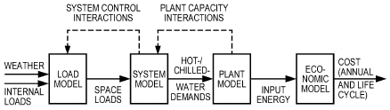

*Fig. 1 Overall Modeling Strategy*

<!-- str. 544 -->

The principal disadvantage of this approach, and the reason that it was not widely used in the past, is that it demands more computing resources. However, most current desktop computers can now run programs using the alternative approach in a reasonable amount of time. Programs that, to one degree or another, implement simultaneous solution of the loads, system, and plant models have been developed by ESRU (2016), Klein et al. (1994), Park et al. (1985), Taylor et al. (1990, 1991), and U.S. Department of Energy (1996-2016). Some of these programs can simulate the loads, systems, and plants using subhourly time steps.

An economic model, as shown in Figure 1, calculates energy costs (and sometimes capital costs) based on the estimated required input energy. Thus, the simulation model calculates energy use and cost for any given input weather and internal loads. By applying this model (i.e., determining output for given inputs) at each hour (or other suitable interval), the hour-by-hour energy consumption and cost can be determined. Maintaining running sums of these quantities yields monthly or annual energy usage and costs.

Because detailed models are computationally intensive, several simplified methods have been developed, including the degree-day, bin, and correlation methods. See the section on Degree-Day and Bin Methods for more information.

## 1.3 SIMULATING SECONDARY AND PRIMARY SYSTEMS

Traditionally, most energy analysis programs include a set of preprogrammed models that represent various systems (e.g., variable air volume, terminal reheat, multizone, variable refrigerant flow). In this scheme, the equations for each system are arranged so they can be solved sequentially. If this is not possible, the smallest number of equations that must be solved simultaneously is solved using an appropriate technique. Furthermore, individual equations may vary hourly in the simulation, depending on controls and operating conditions. For example, a dry coil uses different equations than a wet coil. The primary disadvantage of this scheme is that it is relatively inflexible: to modify a system, the program source code may have to be modified and recompiled.

An alternative strategy views the system as a series of components (e.g., fan, coil, pump, duct, pipe, damper, thermostat) that may be organized in a component library (Park et al. 1985; TRNSYS 2012). Users specify connections between the components, and the program then resolves the specification of components and connections into a set of simultaneous equations.

A refinement of component-based modeling is known as **equation-based modeling** (Buhl et al. 1993; Sowell and Moshier 1995). These models do not follow predetermined rules for a solution, and the user can specify which variables are inputs and which are outputs. Current research in this area centers on use of the Modelica object-oriented modeling language (Wetter et al. 2011).

## 1.4 HISTORY OF SIMULATION METHOD DEVELOPMENT

Significant historical events, such as World Wars I and II, the development of analog and digital computers and programming languages (1950s), and repeated oil crises (1967, 1973, and 1979) spurred the development of analysis methods and computer simulation programs now used to simulate building energy use. Before the 1950s, most of the fundamentals (i.e., gas laws, heat transfer properties, and thermodynamics) of today’s HVAC systems had been studied and published, which contributed significantly to the rapid development of today’s building energy simulation technology. Also, during this same period, researchers and engineers developed the essential methods for calculating and analyzing the dynamic heat gain through multilayer walls, overall dynamic building cooling and heating loads, solar heating performance, and internal reflected illuminance (Oh 2013; Oh and Haberl 2016a, 2016b, 2016c).

In the 1920s, one of the most important methods for calculating the dynamic heat gain through walls and roofs for whole-building energy simulation [i.e., the response factor method (RFM)] was developed and published by André Nessi and Léon Nisolle at École Centrale Paris (French University) in France (Nessi and Nisolle 1925). The RFM concept is widely used in most of today’s cooling and heating loads calculations, such as with the weighting factor method or the transfer function method (Mitalas and Stephenson 1967; Stephenson and Mitalas 1967, 1971) used in DOE-2.1E (Winkelmann et al. 1993), DOE-2.2/eQUEST (LBNL 1998), TRACE (Trane 2013), and HAP (Carrier 2013); the CLTD/CLF method used in TRACE; the heat balance method (Pedersen et al. 1997) used in BLAST (Hittle 1977) and EnergyPlus (Crawley et al. 2001); and the radiant time series method (Spitler et al. 1997) used in TRACE. In the 1940s, the concept of the resistance-capacitance (RC) network analysis method (i.e., the thermal network method) used in simulation programs for buildings was first introduced by Victor Paschkis, a research engineer at Columbia University (Paschkis 1942; Paschkis and Baker 1942). The thermal network concept is widely used today in whole-building simulation programs such as DOE-2.1E, DOE-2.2/eQUEST, and EnergyPlus and in detailed solar simulation programs such as TRNSYS and SUNREL (Deru et al. 2002).

In the 1950s, the most important method (i.e., the utilizability method) for calculating the performance of solar heating systems for design programs was developed (Whillier 1953). The utilizability method is used today in simplified solar design programs such as RETScreen (NRC 2004), F-Chart (Klein and Beckman 2001a), and PV F-Chart (Klein and Beckman 2001b).

Also during the 1950s, analog computers were first used to study the behavior of dynamic heat gain/loss and the impact of dynamic heat gain/loss on HVAC systems (Buchberg 1955, 1958; Nottage and Parmelee 1954; Willcox et al. 1954). During the 1960s, digital computers and the analysis methods suitable for the digital computers were developed and became widely used. Digital computers were quickly substituted for analog computers during this period because the digital computer was more convenient to program, more flexible, and more agile at describing the governing equations and driving functions than the methods used in analog computers. Finally, the scientific applications of the digital computer were considerably improved by the FORTRAN programming language, a high-level, scientific programming language that was first commercially released in 1957 by IBM. In the 1960s, FORTRAN allowed computer codes written on one computer to be run on another computer by a different analyst, which accelerated the wide-spread availability of building energy simulation programs. The combination of computer advances with the analysis methods developed by numerous researchers facilitated the development of today’s whole-building energy, solar energy, and daylighting simulation programs.

## 1.5 USING ENERGY MODELS

### Typical Applications

Energy models are useful for a range of applications, and the typical application of forward-modeling tools falls into three categories:

- **Comparison.** A common application is to use energy models to compare the estimated performance of design alternatives for new buildings or to compare retrofit alternatives for existing buildings. In such design studies, the goal is to estimate the relative performance of two or more options. Examples include comparing alternatives for building form and orientation, comparing different glazing selections, or comparing chiller alternatives. Energy models are especially well suited to such comparison studies, because the relative performance is likely to be estimated with reasonable accuracy even if some inputs, such as actual operating hours or plug loads, are not accurately known at the time of the study.

<!-- str. 545 -->

- **Compliance.** Using models for energy code compliance (e.g., ASHRAE Standard 90.1) and for building rating system credit (e.g., U.S. Green Building Council’s LEED® rating system) are very common applications. In most cases, these studies involve comparing two energy models: one representing a baseline building that meets the minimum code requirements, and the other representing the proposed building design, with the result an estimate of relative performance. Some utility and other incentive programs also use the same method for estimating energy savings for new and retrofit construction projects. Note that the models will not necessarily be good predictors of actual energy use unless the inputs have been carefully specified to represent the expected operation of the actual building.
- **Prediction.** An application of growing importance is using energy models to predict energy consumption. Some industry efforts, such as Architecture 2030 (AIA 2014), encourage building designers to set targets for energy consumption. In those cases, the goal is to design a building that meets an absolute energy target, often specified in terms of kWh/m2·yr. In addition, some owners seek zero-energy buildings that offset consumption with renewable energy. During the design of zero-energy buildings, accurate prediction of energy consumption is important for proper sizing of renewable energy systems. Energy models used for prediction require very careful attention to providing realistic inputs to represent the expected building operation.

### Choosing Measures for Evaluation

Forward-modeling programs are useful for evaluating many types of design elements, whereas they may be unnecessary or inappropriate for evaluating other elements. They are most useful for evaluating elements that affect heating and cooling loads. Many programs also provide the ability to compare the energy performance of different HVAC designs. The following are examples of design elements that are typically good candidates for evaluation with forward-modeling programs:

- **Building form and orientation.** Varying building dimensions.
- **Opaque envelope.** Varying levels of insulation and thermal mass.
- **Fenestration.** Alternative glazing and framing types, and both fixed and operable shading devices.
- **Daylighting controls.** Requires a program with an adequately accurate daylight illuminance calculation.
- **Cooling equipment efficiency**. Full- and partial-load performance.
- **Heating equipment efficiency**. Full- and partial-load performance, condensing versus noncondensing equipment.
- **Economizer cooling**. Air- and water-side economizers.
- **Variable-flow controls**. Air and hydronic distribution system control.
- **Basic HVAC controls.** Space temperature set points, HVAC supply temperature reset controls, start/stop scheduling, load management scheduling.
- **Combined heat and power systems.** Some programs can apply waste heat from cogeneration systems to building thermal demands.

Some design elements do not necessarily require an energy model for evaluation, and a reasonably accurate savings estimate may be possible using other methods. Although it may still be useful to represent them in an energy model along with other measures, it may not be worth the effort for an analysis looking exclusively at these measures:

- **Plug loads.** The majority of the impact is from direct savings that may be calculated simply with an estimate of connected power and operating hours. An energy model may be appropriate if the effect on heating and cooling loads is expected to be significant.
- **Interior lighting power.** Similar issues to plug loads.
- **Exterior lighting power and control.** Has no effect on heating and cooling loads.
- **Control of constant-speed/constant-volume equipment.** The savings from an adjustment in flow may be simple to calculate without using an energy model.
- **Photovoltaic and other on-site generation systems.** Although some programs offer the capability to model photovoltaic systems or other on-site electricity production, separate calculations may be equally accurate and require less effort.

Limitations to the capabilities of most forward-modeling programs are important to understand. Some programs may not be appropriate candidates for performing an evaluation, depending on the feature to be analyzed:

- **Daylight-redirecting devices**. Design elements such as light shelves or light-redirecting glazing are sometimes used to increase the daylighted area. It is important to understand the capabilities of the tool used for analysis.
- **Dynamic glazing**. Dynamic glazing may be used to control glare and solar heat gain. It is important to understand the capabilities of the modeling tool for this design element.
- **Natural ventilation**. Not all programs can model natural ventilation or the integration of mechanical and natural ventilation. See the section on Natural Ventilation for more information.
- **Specific HVAC system types**. The selected program might not have the ability to explicitly model a desired HVAC system configuration.
- **Specific HVAC system control strategies**. Programs vary in capability to represent varying control strategies.

### When to Use Energy Models

Energy modeling has appropriate applications throughout the stages of design, construction, and operation of a building. At the earliest conceptual design phase, comparative studies help designers compare options for building form, system types, and other decisions that will be hard to change at later stages. During subsequent phases, energy modeling studies can be used to refine design decisions such as component specifications. At the conclusion of design, the models can be used to document energy code or ratingsystem compliance. Although use of energy models during construction is less common, their use during commissioning to compare expected performance to observed performance is growing. Similarly, building performance can be verified by comparing actual energy consumption to modeled performance, and any observed differences can help the building operator identify potential areas for improvement. The American Institute of Architects has published a guide to integrating energy modeling in the design process (AIA 2012). Proposed ASHRAE Standard 209P specifies mandatory and optional modeling tasks for new construction projects.

### Energy Modelers

Creation of energy models has typically been done by specialists, and specialists continue today to perform a significant amount of energy modeling work. However, increasing user-friendliness of modeling software and the integration of building information models and energy modeling tools have made energy modeling more accessible to nonspecialists.

Anyone performing energy modeling should understand the way their program of choice works, understand assumptions being used by the program, and know how to interpret the results obtained from the program.

<!-- str. 546 -->

ASHRAE offers a Building Energy Modeling Professional (BEMP) qualification exam for modeler certification (www.ashrae .org/education--certification/certification/bemp-building-energy -modeling-professional-certification).

## 1.6 UNCERTAINTY IN MODELING

Uncertainty is inherent in modeling. When modeling a complex system, there are often uncertainties in identifying system inputs. In addition, there are uncertainties and variability in known model input parameters, and uncertainties in the model itself. It is important for modelers to characterize the uncertainties to understand how to interpret the uncertainty in the model prediction (Macdonald and Strachan 2001; de Wit and Augenbroe 2002). In reporting a model prediction, providing a value without providing its confidence interval implies 0% uncertainty, which is not possible because of many inherent uncertainties in the modeling process. Therefore, it is advisable to provide the predicted value as an interval rather than a precise value.

Uncertainties can be broken into two broad categories: aleatoric and epistemic (Kiureghaian and Ditlevsen 2009). **Aleatoric** uncertainties are those related to inherent randomness and variability of the system and the inputs to the system that cannot be reduced by better knowledge or system observation. They are typically characterized by probabilities. In other words, aleatoric uncertainties are “unknown unknowns.” Examples of these in energy modeling are weather-related model inputs or occupant-related loads. **Epi- stemic** uncertainties are those related to uncertainty of the system model itself or parameters to the model that are fixed/static but not known precisely and that could be reduced with better knowledge of the system or the inputs. Epistemic uncertainty is also referred to as **state-of-knowledge** uncertainty, **subjective** uncertainty, or **reducible** uncertainty. In other words, epistemic uncertainties are “known unknowns.” Examples include building geometry, thermal properties of enclosure materials, or efficiencies of equipment (Hopfe and Hensen 2011; Sun et al. 2014). Knowing the type of uncertainty associated with a parameter is important in understanding how to propagate that uncertainty through the model. Uncertainties can be propagated through a model using a variety of methods, including Monte Carlo, importance sampling, local expansion, most-probable-point methods, and numeric integration (Lee and Chen 2008). When using “black box” simulation engines, Monte Carlo methods and importance sampling are the most applicable.

Once the prediction uncertainty is quantified, there are various uses for the information. The output can be analyzed to obtain most probable values and/or variances. Output probability distributions can be analyzed for understanding the risk of underperformance. Uncertainty statistics can also be used for verifying that a model meets standards or guidelines for baseline predictions in measurement and verification, along with determining the uncertainty in cost savings calculations. ASHRAE Guideline 14 provides instruction on maximum levels of uncertainty in baseline models, along with simplified methods for assessing the quantifiable uncertainty in savings computations.

## 1.7 CHOOSING AN ANALYSIS METHOD

The most important step in selecting an energy analysis method is matching method capabilities with project requirements. The method must be capable of evaluating all design options with sufficient accuracy to make correct choices. The following factors apply generally (Sonderegger 1985):

- **Accuracy.** The method should be sufficiently accurate to allow correct choices. Because of the many parameters involved in energy estimation, absolutely accurate energy prediction is not possible (Waltz 1992). ANSI/ASHRAE Standard 140 was developed to identify and diagnose differences in predictions that may be caused by algorithmic differences, modeling limitations, coding errors, or input errors. More information on model validation and testing can be found in the Validation and Testing section of this chapter and in ANSI/ASHRAE Standard 140.
- **Sensitivity.** The method should be sensitive to the design options being considered. The difference in energy use between two choices should be adequately reflected.
- **Versatility.** The method should allow analysis of all options under consideration. When different methods must be used to consider different options, an accurate estimate of the differential energy use cannot be made.
- **Speed and cost.** The total time (gathering data, preparing input, calculations, and analysis of output) to make an analysis should be appropriate to the potential benefits gained. With greater speed, more options can be considered in a given time. The cost of analysis is largely determined by the total time of analysis.
- **Reproducibility.** The method should not allow so many vaguely defined choices that different analysts would get completely different results (Corson 1992).
- **Ease of use.** This affects both the economics of analysis (speed) and the reproducibility of results.

### Selecting Energy Analysis Computer Programs

Selecting a building energy analysis program depends on its application, number of times it will be used, experience of the user, and hardware available to run it. The first criterion is the ability of the program to deal with the application. For example, if the effect of a shading device is to be analyzed on a building that is also shaded by other buildings part of the time, the ability to analyze detached shading is an absolute requirement, regardless of any other factors.

The cost of the computer facilities and the software itself are typically a small part of running a building energy analysis; the major costs are of learning to use the program and of using it. Major issues that influence the cost of learning a program include (1) complexity of input procedures, (2) quality of the user’s manual, and (3) of a good support system to answer questions. As the user becomes more experienced, the cost of learning becomes less important, but the need to obtain and enter a complex set of input data continues to consume the time of even an experienced user until data are readily available in electronic form compatible with simulation programs.

**Complexity of input** is largely influenced by the availability of default values for the input variables. Default values can be used as a simple set of input data when detail is not needed or when building design is very conventional, but additional detail can be supplied when needed. Secondary defaults, which can be supplied by the user, are also useful in the same way. Some programs allow the user to specify a level of detail. Then the program requests only the information appropriate to that level of detail, using default values for all others. However, whenever default values are used, even internally in the software, the user should take care to understand the default values and whether they apply to the situation being analyzed.

**Quality of output** is another factor to consider. Reports should be easy to read and uncluttered. Titles and headings should be unambiguous. Units should be stated explicitly. The user’s manual should explain the meanings of data presented. Graphic output can be very helpful. In most cases, simple summaries of overall results are the most useful, but very detailed output is needed for certain studies and also for debugging program input during the early stages of analysis.

Before a final decision is made, manuals for the most suitable programs should be obtained and reviewed, and, if possible, demonstration versions of the programs should be obtained and run, and support from the software supplier should be tested. The availability of training should be considered when choosing a more complex program.

<!-- str. 547 -->

**Availability of weather data** and a weather data processing subroutine or program are major features of a program. Some programs include subroutine or supplementary programs that allow the user to create a weather file for any site for which weather data are available. Programs that do not have this capability must have weather files for various sites created by the program supplier. In that case, the available weather data and the terms on which the supplier will create new weather data files must be checked. More information on weather data can be found in Chapter 14.

**Auxiliary capabilities**, such as economic analysis and design calculations, are a final concern in selecting a program. An economic analysis may include only the ability to calculate annual energy bills from utility rates, or it might extend to calculations or even to life-cycle cost optimization. An integrated program may save time because some input data have been entered already for other purposes.

Results of computer calculations should be accepted with caution, because software vendors do not accept responsibility for the correctness of calculation methods and have no control over program use. Manual calculation should be done to develop a good understanding of underlying physical processes and building behavior. In addition, the user should (1) review the computer program documentation to determine what calculation procedures are used, (2) compare results with manual calculations and measured data, and (3) conduct sample tests to confirm that the program delivers acceptable results.

The most accurate methods for calculating building energy consumption are the costliest because of their intense computational requirements and the expertise needed by the designer or analyst. Simulation programs that assemble component models into system models and then exercise those models with weather and occupancy data are preferred by experts for determining energy use in buildings.

Often, energy consumption at a system or whole-building level must be estimated quickly to study trends, compare systems, or study building effects such as envelope characteristics. For these purposes, simpler methods, such as degree-day and bin, may be used.

The International Building Performance Simulation Association (IBPSA-USA) maintains a website (www.buildingenergysoftware tools.com) (IBPSA 2015) with information about hundreds of available software tools. Crawley et al. (2005) compare the capabilities of many building simulation tools.

## 2. DEGREE-DAY AND BIN METHODS

## 2.1 DEGREE-DAY METHOD

As described in Huang et al. (2001), the degree-day method was developed in the 1930s to estimate the heating energy consumption of a building. A degree-day is a measure of how often and by how many degrees the average daily temperature (the average of the daily maximum and minimum) for a location is above (for cooling) or below (for heating) a base temperature. For example, a day where the average daily temperature is 12 degrees lower than the base temperature would represent 12 degree-days; an equivalent would be 2 days, each of which was 6 degrees below the base temperature. A year’s summation of the number of heating or cooling degree-days for a location is a convenient single number indicating that location’s climate severity. The base temperature is that at which the building's internal heat gains counterbalance the heat losses to the outdoors, so that the building requires neither heating nor cooling. Below that “balance point” temperature, the building requires heating, whereas above that temperature the building requires cooling, in proportion to the difference from the base temperature.

Base 18°C heating degree-days and, to a lesser extent, base 18°C cooling degree-days have become widely accepted as the most convenient, simple indicators of climate severity. In the United States, heating degree-days vary from fewer than 500 in Miami, FL, 1000 to 3000 in the south, and 3000 to 7000 in the north, to extremes of more than 8000 in Bismarck, ND and 10 000 in Anchorage, AK. Correspondingly, cooling degree-days vary from 0 in Anchorage, AK, to fewer than 100 in Seattle, WA, 500 to 1200 in the north, 1200 to 3000 in the south, and more than 3000 in Phoenix, AZ and Miami, FL.

In the degree-day method, the building heat load (i.e., the amount of heating energy input or cooling energy extraction) is estimated as the number of degree-days times 24 (to convert to degree-hours), times the overall building heat loss coefficient W/K. The overall heat loss coefficient is the sum of the U-factor × area for all external surfaces, such as walls, windows, doors, roof, and losses or gains from infiltration. The cooling load equation is similar but uses cooling degree-days instead of heating degree-days.

**Example 1.** Estimate the heating energy requirements for an 170 m2 residence in Denver (3300 K-days) using the degree-day method. The volume of the residence is 400 m3, the overall heat loss coefficient is 200 W/K, 0.7 air changes per hour (ach). The residence is heated by a furnace with an AFUE of 0.78, with an average duct loss factor of 0.10.

**Solution:**

> The heating load equation is
>
> ( )

> Qh = HDD6 24h/day
>
> 5( )

> (
>
> × ∑ i

> U Ai+ Infiltration air changes/h × Volume
>
> ( i

> )
>
> × Volumetric heat capacity for a ir

> )

To derive the heating or cooling energy consumption, the heating or cooling loads must be divided by the efficiencies of the HVAC system.

Qh = (3300(24)[200 + 0.7(400)(1 ⁄ 3600)(1210)])/(0.78 × 0.9) = 33 200 kWh

The degree-day method, as demonstrated in Example 1, is limited in that it does not consider the effects of solar heat gain or building thermal mass, nor can it account for variations in infiltration rates, thermostat settings (such as night setback), or occupant actions such as window venting on cool summer nights or during the spring and fall seasons.

Efforts to improve the degree-day method, such as by using variable base temperatures, calculating degree-hours instead of days, etc., are described in the following section. The gains in accuracy from these modifications have been offset by increased difficulty in computation, nearly always requiring a computer program. Because the capability of personal computers has grown to handle programs using methods that capture the transient heat flows that dominate building thermal processes, degree-day methods have fallen increasingly out of favor, because they remain fundamentally steady-state calculations.

Even with these limitations, the degree-day method can still be of use in providing a quick answer that can be used as a starting point or check for more detailed calculations. The degree-day method may be adequate for cases in which gathering the additional data on climate and building conditions may be unwarranted or impractical, such as for estimating heating energy use in lightconstruction residential buildings with low solar gain in cold climates. The degree-day method can also be useful in analyzing results from more detailed, often hard-to-interpret calculations.

<!-- str. 548 -->

### Variable-Base Degree-Day Method

Further described in Huang et al. (2001), the variable-base degree-day (VBDD) method accounts for balance point temperatures varying between buildings and even within a building, depending on the time of day. The 18°C base temperature is based on the assumption that heat gains from the sun and internal processes contribute on average 3 K of “free heat,” allowing a set point of 21°C with heating required only when the outdoor temperature drops below 18°C. Better-insulated, more airtight buildings can have lower balance point temperatures.The average balance point temperature for modern residential buildings is now 13 to 14°C. Commercial buildings’ low surface-to-volume ratios, high windowto-wall ratios, and high internal gains allow balance point temperatures of 10°C or lower.

Balance point temperatures differ markedly between daytime and nighttime hours. Figure 2 shows the variation of the balance point temperature for a typical house (Nisson and Dutt 1985). In daytime, the house receives heat gain from the sun and from occupant activity (e.g., equipment, lights). The balance point temperature may be around 8 K below the indoor temperature set point. However, at night, with no solar heat gain and reduced human activity, it may be only 2 K lower than set point. The variation can be even greater for commercial buildings because of higher internal heat gains during the day and very low heat gains at night.

The VBDD method accounts for these different building conditions by calculating (1) the balance point temperature of a building and (2) the heating and cooling degree-hours at that temperature. To divide the daytime and nighttime, degree-hours must be used instead of degree-days. Instead of using the average between the daily maximum and minimum temperatures as for degree-days, degree-hours are calculated from the temperature for each hour. The number of degree-hours divided by 24 can be slightly to significantly larger than the number of degree-days at the same base temperature. An example of why this can occur is a spring day where the average daily temperature may be below the base temperature, but several afternoon hours are above it. Such a day would have no cooling degree-days but a number of cooling degree-hours; these differences can be particularly significant for cooling. The calculations are repeated for daytime and nighttime conditions for each month of the year using degree-hour totals for each period with different base temperatures.

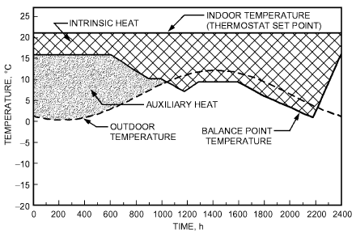

*Fig. 2 Variation of Balance Point Temperature and Internal Gains for Typical House*

> (Nisson and Dutt 1985)

For cooling, the VBDD method can be adjusted to identify the number of cooling degree hours that are actually met by the HVAC system. The cooling balance point changes dramatically depending on whether the building is being vented. If the windows are open, heat gains are flushed from the building and do not affect its cooling load. However, if the windows are closed, solar and internal gains make the balance temperature significantly lower than the thermostat set point for cooling. The VBDD method accounts for these different conditions by calculating the cooling degree-hours using the balance temperature with the windows closed, but not counting degree-hours when the temperatures are below the thermostat set point, when the windows are assumed to be open. Figure 3 shows the one-to-one relationship between cooling degree-hours and the temperature difference between the balance point and outdoor air temperature. Those degree-hours occurring in the ventilation section when the outdoor temperatures are below the thermostat set point are not added to the running total of cooling degree-hours.

VBDD method calculations are, in most cases, too tedious for either hand calculations or implementation in a spreadsheet. In the early 1980s, several PC programs were written using the VBDD method, such as CIRA (Computerized Instrumented Residential Audit) (Sonderegger et al. 1982). Variable-base degree-day programs such as CIRA represent the apex of the VBDD method’s application; however, it remains a steady-state method that does not recognize a building's thermal history.

### Sources of Degree-Day Data

The most general and directly usable source for degree-day data is the ASHRAE Weather Data Viewer DVD (ASHRAE 2013). This application performs useful aggregations for more than 6000 locations. In addition to design conditions, the Weather DataViewer derives annual and monthly degree-days relative to any base temperature, and also provides bin data. Results are in spreadsheet form. Precalculated annual and monthly degree-days for several common bases are included in the climatic data that accompany Chapter 14, and additional online and printed collections of climatic data are listed in the section on Other Sources of Climatic Information in that chapter.

Annual and monthly degree-days relative to an arbitrary base can be estimated using the Weather Data Viewer or the procedures documented in the section on Estimation of Degree-Days in Chapter 14. Other degree-day estimation methods include the Erbs et al. (1983) model, which needs as input only the average tofor each month of the year.

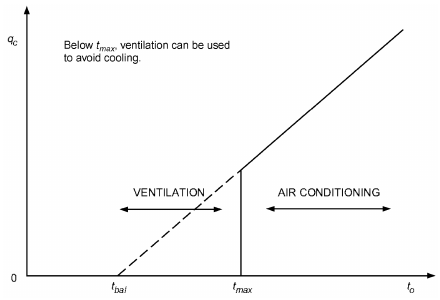

*Fig. 3 Uncounted Ventilation Degree-Hours versus Counted Cooling Degree-Hours*

<!-- str. 549 -->

**Table 1 Sample Annual Bin Data**

| Site | 39/41 | 36/38 | 33/35 | 30/32 | 27/29 | 24/21/26 23 | 18/20 | 15/12/17 14 | Bin 9/11 | 6/8 | 3/0/5 2 | –3/–1 | –6/–4 | –9/–7 | –12/–10 | –15/–13 | –18/ –21/ –16 | –18/ –21/ –19 |
|---|---|---|---|---|---|---|---|---|---|---|---|---|---|---|---|---|---|---|
| Chicago, IL |  |  | 74 | 176 | 431 | 512 960 | 660 | 591 780 | 510 | 770 | 686 1671 | 380 | 304 | 125 | 66 | 49 | 11 | 4 |
| Dallas/Ft. Worth, TX | 4 | 170 | 322 | 511 | 922 | 1100 1077 | 750 | 803 870 | 581 | 728 | 418 464 | 37 | 3 |  |  |  |  |  |
| Denver, CO |  |  | 81 | 217 | 406 | 390 570 | 726 | 712 902 | 809 | 783 | 750 1467 | 446 | 216 | 106 | 85 | 52 | 44 | 8 |
| Los Angeles, CA | 4 | 10 | 9 | 16 | 56 | 194 1016 | 1874 | 2280 2208 | 843 | 227 | 23 |  |  |  |  |  |  |  |
| Miami, FL |  |  | 14 | 648 | 2147 | 2581 1852 | 734 | 390 202 | 100 | 76 | 14 2 |  |  |  |  |  |  |  |
| Nashville, TN |  | 4 | 82 | 366 | 717 | 756 1291 | 831 | 693 801 | 670 | 858 | 639 793 | 141 | 89 | 29 |  |  |  |  |
| Seattle, WA |  |  |  | 10 | 88 | 139 330 | 497 | 898 1653 1392 |  | 1844 | 1127 715 | 40 | 26 | 1 |  |  |  |  |

## 2.2 BIN AND MODIFIED BIN METHODS

For many applications, the degree-day or variable-base degree-day methods should not be used, because the overall building heat loss coefficient Ktot, the efficiency ηh of the HVAC system, or the balance point temperature tbal may not be sufficiently constant. Heat pump efficiency, for example, varies strongly with outdoor temperature; efficiency of HVAC equipment may be affected indirectly by the outdoor temperature to when efficiency varies with load (common for boilers and chillers). Furthermore, in most commercial buildings, occupancy has a pronounced pattern that affects heat gain, indoor temperature, and ventilation rate.

In such cases, steady-state calculation can yield good results for annual energy consumption if different temperature intervals and time periods are evaluated separately. This approach is known as the **bin method**, because consumption is calculated for several values of to and multiplied by the number of hours Nbin in the temperature interval (bin) centered on that temperature:

> Qbin = Nbin(K tot)/ηh [tbal – to]+&emsp;**(1)**

The superscript plus sign indicates that only positive values are counted; no heating is needed when to is above tbal. Equation (1) is evaluated for each bin, and the total consumption is the sum of the Qbin over all bins. The underlying assumption of the bin method is that, for a given temperature at the same general time of day (morning, afternoon, evening, etc.), the heating and cooling loads of a building should be roughly the same. Therefore, one can derive a building’s annual heating and cooling loads by calculating its loads for a set of “snapshots” defined by temperature “bins,” multiplying the calculated loads by the number of hours represented by each bin, and then totaling the sums to derive the building’s annual heating and cooling loads. Table 1 provides sample annual bin data for several U.S. sites.

In the original formulation of the bin method, there was no accounting for effects such as occupancy, solar gain, or wind on the calculated loads. The **modified bin method** (Knebel 1983) extended the basic bin method to account for weekday/weekend and partial-day occupancy effects, to calculate net building loads (conduction, infiltration, internal loads, and solar loads) at four temperatures, rather than interpolate from design values, and to better describe secondary and primary equipment performance. Other versions of the bin method accounted for solar and wind effects by using more detailed binned data that gave the average wind speeds and solar gains by month, and the number of hours within bins disaggregated by month as well as time of day. Vadon et. al (1991) also presented an improvement for correlating the solar gains to the temperature bins.

**Example 2.** Estimate the energy requirements for a residence with a design heat loss Qdes of 11 700 W at 30°C design temperature difference. The indoor design temperature is 21°C. Average internal heat gains are estimated to be 1250 W. Assume a 10.5 kW heat pump with the char-acteristics given in Columns E and H of Table 2 and in Figure 4. **Solution:** The design heat loss is based on no internal heat generation. The heat pump system energy input is the net heat requirement of the space (i.e., envelope loss minus internal heat generation). The net heat loss per degree and the heating/cooling balance temperature may be computed:

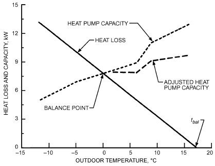

*Fig. 4 Heat Pump Capacity and Building Load*

- Ktot = Qdes/Δt = 11 700/30 = 390 W/K

The balance temperature tbal is defined as the temperature at which the external heat loss equals the internal heat gain Qint, and therefore

> Qint = Ktot(to – tbal)

and

> tbal = to – (Qint/Ktot)

thus

> tbal = 21 – (1250/390) = 17.8°C
>
> Table 2 is then computed, resulting in 7618 kWh.

## 3. THERMAL LOADS MODELING

## 3.1 SPACE SENSIBLE LOAD CALCULATION METHODS

Calculating instantaneous space sensible load is a key step in any building energy simulation. The **heat balance, comprehensive room transfer function (CRTF)**, and **weighting-factor methods** are used for these calculations. A fourth method, the **thermal- network method**, is similar in rigor to the heat balance and CRTF methods but not as widely used.

<!-- str. 550 -->

**Table 2 Calculation of Annual Heating Energy Consumption for Example 2**

| A Temp. Bin, °C | Climate B Temp. Diff., tbal – tbin | C Weather Data Bin, h | House D Heat Loss Rate, kW | E Heat Pump Integrated Heating Capacity, kW | Adjustment Capacity, F Cycling Capacity Factora | Adjustment Capacity, G Adjusted Heat Pump kWb | Electric Operating Supplied Pump Electric Heat Pump H Rated Input, kW | Electric Operating Supplied Pump Electric I Time Fractionc | Electric Operating Supplied Pump Electric Heating, Consumption, J Heat Pump kWhd | Electric Operating Supplied Pump Electric Heating, Consumption, K Seasonal Heat kWhe | Load, Required, L Space kWhf | Load, Required, Supplemental M Supplemental Heating kWhg | N Total Electric Energy Consumption, kWhh |
|---|---|---|---|---|---|---|---|---|---|---|---|---|---|
| 16 | 1.8 | 693 | 0.70 | 12.80 | 0.764 | 9.78 | 3.74 | 0.072 | 488 | 187 | 485 | — | 187 |
| 13 | 4.8 | 801 | 1.87 | 12.01 | 0.789 | 9.48 | 3.63 | 0.197 | 1496 | 573 | 1497 | — | 573 |
| 10 | 7.8 | 670 | 3.04 | 11.22 | 0.818 | 9.18 | 3.52 | 0.331 | 2036 | 781 | 2037 | — | 781 |
| 7 | 10.8 | 858 | 4.21 | 9.80 | 0.857 | 8.40 | 3.40 | 0.501 | 3611 | 1462 | 3612 | — | 1462 |
| 4 | 13.8 | 639 | 5.38 | 8.49 | 0.908 | 7.71 | 3.18 | 0.698 | 3439 | 1418 | 3438 | — | 1418 |
| 1 | 16.8 | 793 | 6.55 | 7.98 | 0.955 | 7.62 | 3.10 | 0.860 | 5196 | 2114 | 5195 | — | 2114 |
| –2 | 19.8 | 141 | 7.72 | 7.47 | 1.000 | 7.47 | 3.02 | 1.000 | 1053 | 426 | 1089 | 36 | 462 |
| –5 | 22.8 | 89 | 8.89 | 6.95 | 1.000 | 6.95 | 2.93 | 1.000 | 618 | 261 | 791 | 173 | 434 |
| –8 | 25.8 | 29 | 10.06 | 6.48 | 1.000 | 6.48 | 2.85 | 1.000 | 188 | 83 | 292 | 104 | 187 |
| –11 | 28.8 | 0 | 11.23 | 5.69 | 1.000 | — | — | — | — | — | — | — | — |
|  |  |  |  |  |  |  | Totals: |  | 18 125 | 7305 | 18 436 | 313 | 7618 |

aCycling Capacity Adjustment Factor = 1 − Cd(1 − x), where Cd = degradation coef- bColumn G = Column E × Column F fColumn L = Column C × Column D ficient (default = 0.25 unless part-load factor is known) and x = building heat loss cOperating time fraction equals smaller of 1 or gColumn M = Column L – Column J per unit capacity at temperature bin. Cycling capacity = 1 at balance point and Column D/Column G hColumn N = Column K + Column M below. Cycling capacity adjustment factor should be 1.0 at all temperature bins if dColumn J = Column I × Column G × Column C manufacturer includes cycling effects in heat pump capacity (Column E) and asso- eColumn K = Column I × Column H × Column ciated electrical input (Column H). C

The **instantaneous space sensible load** is the rate of heat flow into the space air mass. This quantity, sometimes called the cooling load, differs from heat gain, which usually contains a radiative component that passes through the air and is absorbed by other bounding surfaces. Instantaneous space sensible load is entirely convective; even loads from internal equipment, lights, and occupants enter the air by convection from the surface of such objects or by convection from room surfaces that have absorbed the radiant component of energy emitted from these sources. However, some adjustment must be made when radiant cooling and heating systems are evaluated because some of the space load is offset directly by radiant transfer without convective transfer to the air mass.

For equilibrium, the instantaneous space sensible load must match the heat removal rate of the conditioning equipment. Any imbalance in these rates changes the energy stored in the air mass. Customarily, however, the thermal mass (heat capacity) of the air itself is ignored in analysis, so the air is always assumed to be in thermal equilibrium. Under these assumptions, the instantaneous space sensible load and rate of heat removal are equal in magnitude and opposite in sign.

The weighting-factor, CRTF, and heat balance methods use conduction transfer functions (or their equivalents) to calculate transmission heat gain or loss. The main difference is in the methods used to calculate the subsequent internal heat transfers to the room. Experience has shown that all the methods produce similar results, provided model coefficients are determined for the specific building under analysis and room temperature variations are moderate.

### Heat Balance Method

The heat balance method for calculating net space sensible loads is described in Chapter 18 and in the *ASHRAE Toolkit for Building* Load Calculations (Barnaby et al. 2005, 2009; Iu and Fisher 2004; Pedersen et al. 2001, 2003). Its development relies on the first law of thermodynamics (conservation of energy) at each surface. Because the heat balance method involves fewer assumptions than the weighting-factor method, it is more flexible and physically rigorous. However, the heat balance method requires more calculations at each point in the simulation process, using more computer time. This method has been validated in several studies (Chantrasrisalai et al. 2003a, 2003b; Eldridge et al. 2003; Iu et al. 2003).

The heat balance method allows the net instantaneous sensible heating and/or cooling load to be calculated on the space air mass. Generally, a heat balance equation is written for each enclosing surface, plus one equation for room air. Although not necessary, linearization is commonly used to simplify the radiative transfer formulation. This set of equations can then be solved for the unknown surface and air temperatures. Once these temperatures are known, they can be used to calculate the convective heat flow to or from the space air mass. The heat balance method is developed in Chapter 18 for use in design cooling load calculations.

The procedure described in Chapter 18 is aimed at obtaining the design cooling load for a **fixed** zone air temperature. For building energy analysis purposes, it is preferable to know the actual heat extraction rate. This may be determined by recasting Equation (27) of Chapter 18 so that the system heat transfer is determined simultaneously with the zone air temperature. The system heat transfer is the rate at which heat is transferred to the space by the system. Although this can be done by simultaneously modeling the zone and the system (Taylor et al. 1990, 1991), it is often convenient to make a simple, linearized representation of the system known as a control profile. This usually takes the form

> qsysj = a + btaj&emsp;**(2)**

where

- qsysj = system heat transfer at time step j, W
- a, b = coefficients that apply over a certain range of zone air temperatures
- taj = zone air temperature at time step j, °C

System heat transfer qsysj may be considered positive when heating is provided to the space and negative when cooling is provided.

<!-- str. 551 -->

It is equal in magnitude but opposite in sign to the zone cooling load, as defined in Chapter 18, when zone air temperature is fixed.

Substituting Equation (2) into Equation (27) of Chapter 18 and solving for zone air temperature,

> N
>
> a + *A h t* + ρcV t + ρcV t + q

> taj = (∑ *i ci sii*,*j infilj oj ventj vj c*,intj i=1)/(N – b + A h + ρcV + ρcV ∑)&emsp;**(3)**
>
> *i ci infil vent*

> j j
>
> i=1

where

- N = number of zone surfaces
- Ai = area of ith surface, m2
- hci = convection coefficient for ith surface, W/(m2·K)
- tsii,j = surface temperature for ith surface at time step j, °C
- ρ = density, kg/m3
- c = specific heat of air, J/(kg·K)
- V = volumetric flow rate of air, m3/s
- toj = outdoor air temperature at time step j, °C
- tvj = ventilation air temperature at time step j, °C
- qc,intj = sum of convective portions of all internal heat gains at time step j, W

The zone air heat balance equation [Equation (3)] must be solved simultaneously with the interior and exterior surface heat balance equations [Equations (26) and (25) in Chapter 18]. Also, the correct temperature range must be found to use the proper set of a and b coefficients; this may be done iteratively. Once the zone air temperature is found, the actual system heat transfer rate may be found directly from Equation (2).

Beyond treatment of system heat transfer, other considerations that may be important in building energy analysis programs include treatment of radiant cooling and heating systems, treatment of interzone heat transfer, modeling convection heat transfer, and modeling radiation heat transfer.

The heat balance method in Chapter 18 assumes the use of a single design day. In a building energy analysis program, it is most commonly used with a year’s worth of design weather data. In this case, the first day of the year is usually simulated repeatedly until a steady-periodic response is obtained. Then, each day is simulated sequentially, and, where needed, historical data for surface temperatures and heat fluxes from the previous day are used.

When radiant cooling and heating systems are evaluated, the radiant source should be identified as a room surface. The calculation procedure considers the radiant source in the heat balance analysis. Therefore, the heat balance method is preferred over the weighting-factor method for evaluating radiant systems. Strand and Pedersen (1997) describe implementation of heat source conduction transfer functions that may be used for modeling radiant panels within a heat balance-based building simulation program.

In principle, this method extends directly to multiple spaces, with heat transfer between zones. In this case, some surface temperatures appear in the surface heat balance equations for two different zones. In practice, however, the size of the coefficient array required for solving the simultaneous equations becomes prohibitively large, and the solution time excessive. For this reason, some programs solve only one space at a time and assume that adjacent space temperatures are the same as the prior time step, or use iterative schemes to achieve a simultaneous solution. Other approaches may remove this limitation (Walton 1980).

Relatively simple exterior and interior convection models may be used for design cooling load calculation procedures. However, more sophisticated exterior convection models (Cooper and Tree 1973; Fracastoro et al. 1982; Melo and Hammond 1991; U.S.

Department of Energy 1996-2016; Walton 1983; Yazdanian and Klems 1994) that incorporate the effects of wind speed, wind direction, surface orientation, etc., may be preferable. More detailed interior convection correlations for use in buildings are also available (Alamdari and Hammond 1982, 1983; Altmayer et al. 1983; Bauman et al. 1983; Bohn et al. 1984; Chandra and Kerestecioglu 1984; U.S. Department of Energy 1996-2016 Goldstein and Novoselac 2010; Khalifa and Marshall 1990; Peeters et al. 2011; Spitler et al. 1991; Walton 1983).

Also, more detailed models of exterior [e.g., Cole (1976); Walton (1983)] and interior [e.g., Carroll (1980); Davies (1988); Kamal and Novak (1991); Steinman et al. (1989); Walton (1980)] long-wave radiation transfer have been implemented in detailed building simulation programs.

### Weighting-Factor Method

The weighting-factor method of calculating instantaneous space sensible load is a compromise between simpler methods (e.g., steady-state calculation) that ignore the ability of building mass to store energy, and more complex methods (e.g., complete energy balance calculations). With this method, space heat gains at constant space temperature are determined from a physical description of the building, ambient weather conditions, and internal load profiles. Along with the characteristics and availability of heating and cooling systems for the building, space heat gains are used to calculate air temperatures and heat extraction rates. This discussion is in terms of heat gains, cooling loads, and heat extraction rates. Heat losses, heating loads, and heat addition rates are merely different terms for the same quantities, depending on the direction of the heat flow.

The weighting factors represent Z-transfer functions (Kerrisk et al. 1981; York and Cappiello 1982). The Z-transform is a method for solving differential equations with discrete data. Two groups of weighting factors are used: heat gain and air temperature.

**Heat gain weighting factors** represent transfer functions that relate space cooling load to instantaneous heat gains. A set of weighting factors is calculated for each group of heat sources that differ significantly in the (1) relative amounts of energy appearing as convection to the air versus radiation, and (2) distribution of radiant energy intensities on different surfaces.

**Air temperature weighting factors** represent a transfer function that relates room air temperature to the net energy load of the room. Weighting factors for a particular heat source are determined by introducing a unit pulse of energy from that source into the room’s network. The network is a set of equations that represents a heat balance for the room. At each time step, including the initial introduction, the energy flow to the room air represents the amount of the pulse that becomes a cooling load. Thus, a long sequence of cooling loads can be generated, from which weighting factors are calculated. Similarly, a unit pulse change in room air temperature can be used to produce a sequence of cooling loads.

A two-step process is used to determine the air temperature and heat extraction rate of a room or building zone for a given set of conditions. First, the room air temperature is assumed to be fixed at some reference value, usually the average air temperature expected for the room over the simulation period. Instantaneous heat gains are calculated based on this constant air temperature. Various types of heat gains are considered. Some, such as solar energy entering through windows or energy from lighting, people, or equipment, are independent of the reference temperature. Others, such as conduction through walls, depend directly on the reference temperature.

A space sensible cooling load for the room, defined as the rate at which energy must be removed from the room to maintain the reference value of the air temperature, is calculated for each type of instantaneous heat gain. The cooling load generally differs from the instantaneous heat gain because some energy from heat gain is absorbed by walls or furniture and stored for later release to the air. At time θ, the calculation uses present and past values of the instantaneous heat gain (qθ, qθ–1), past values of the cooling load (Qθ–1, Qθ–2, ...), and the **heat gain weighting factors** (v0, v1, v2, ..., w1, w2, ...) for the type of heat gain under consideration. Thus, for each type of heat gain qθ, cooling load Qθ is calculated as

<!-- str. 552 -->

> … …
>
> Qθ = v0qθ + v1qθ–1 + – w1Qθ–1 – w2Qθ–2 –&emsp;**(4)**

The heat gain weighting factors are a set of parameters that determine how much of the energy entering a room is stored and how rapidly stored energy is released later. Mathematically, the weighting factors are coefficients in a Z-transfer function relating the heat gain to the cooling load.

These weighting factors differ for different heat gain sources because the relative amounts of convective and radiative energy leaving various sources differ and because the distribution of radiative energy can differ. Heat gain weighting factors also differ for different rooms because room construction affects the amount of incoming energy stored by walls or furniture and the rate at which it is released. Sowell (1988) showed the effects of 14 zone design parameters on zone dynamic response. After the first step, cooling loads from various heat gains are added to give a total cooling load for the room.

In the second step, the total cooling load is used (with information on the room’s HVAC system and a set of **air temperature weighting factors**) to calculate the actual heat extraction rate and air temperature. The actual heat extraction rate differs from the cooling load (1) because, in practice, air temperature can vary from the reference value used to calculate the cooling load, or (2) because of HVAC system characteristics. Deviation of air temperature tθ from the reference value at hour θ is calculated as

> tθ = 1/g0 + [(Qθ – ERθ) + P1(Qθ–1 – ERθ–1)
>
> … …

+ P2(Qθ–2 – ERθ–2) + – g1tθ–1 – g2tθ–2 – ] (5) where ERθ is the energy removal rate of the HVAC system at hour θ, and g0, g1, g2, …, P1, P2, … are air temperature weighting factors, which incorporate information about the room, particularly thermal coupling between the air and the storage capacity of the building mass.

Example values of weighting factors for typical building rooms are presented in the following table. One of the three groups of weighting factors, for light, medium, and heavy construction rooms, can be used to approximate the behavior of any room. Some automated simulation techniques allow weighting factors to be calculated specifically for the building under consideration. This option improves the accuracy of the calculated results, particularly for a building with an unconventional design. McQuiston and Spitler (1992) provided electronic tables of weighting factors for a large number of parametrically defined zones.

### Normalized Coefficients of Space Air Transfer Functions

|   | g0* | g1* | g2* | P0 | P1 |
|---|---|---|---|---|---|
| **Room Envelope** |  |  |  |  |  |
| Construction |  | W/(m2·K) |  | Dimensionless |  |
| Light | +9.54 | −9.82 | +0.28 | 1.0 | −0.82 |
| Medium | +10.28 | −10.73 | +0.45 | 1.0 | −0.87 |
| Heavy | +10.50 | −11.07 | +0.57 | 1.0 | −0.93 |

Two assumptions are made in the weighting-factor method. First, the processes modeled are linear. This assumption is necessary because heat gains from various sources are calculated independently and summed to obtain the overall result (i.e., the superposition principle is used). Therefore, nonlinear processes such as radiation or natural convection must be approximated linearly. This assumption is not a significant limitation because these processes can be linearly approximated with sufficient accuracy for most calculations. The second assumption is that system properties influencing the weighting factors are constant (i.e., they are not functions of time). Often, a single set of weighting factors is used during the entire simulation period; however, multiple sets of weighting factors can be used to represent daily or seasonal variations. This assumption can limit the use of weighting factors in situations where important room properties vary more frequently during the calculation (e.g., the distribution of solar radiation incident on the interior walls of a room, which can vary over the day, and indoor surface heat transfer coefficients).

When the weighting-factor method is used, a combined radiative/ convective heat transfer coefficient is used as the indoor surface heat transfer coefficient. This value is assumed constant even though, in a real room, (1) radiant heat transferred from a surface depends on the temperature of other room surfaces (not on room air temperature) and (2) the combined heat transfer coefficient is not constant. Under these circumstances, an average value of the property must be used to determine the weighting factors. Cumali et al. (1979) investigated extensions to the weighting-factor method to eliminate this limitation.

Weighting factors are derived by introducing a unit pulse in a heat balance analysis. These analyses are performed relatively quickly as a preprocess step. Once the weighting factors are established, the simulation time can be significantly reduced, compared with performing a heat balance at every time step. There is an implicit trade-off between the limitations of the weighting-factor method and its improved computation speed compared with that of the heat balance method.

### Comprehensive Room Transfer Function

The comprehensive room transfer function method (CRTF) is important as a reasonably accurate (comparable to weighting factor) model that is fast enough to be embedded in optimizations. One important application is model-predictive control. CRTF parameters may be estimated using forward (Seem et al. 1989) or inverse (Armstrong et al. 2006b; Gayeski et al. 2012) modeling. The interior terminating point of each wall is a common star node. Instead of separate surface flux and temperature for each wall, only the net star-node flux and temperature are evaluated. Exogenous radiant fluxes (solar and radiant shares of internal gains) are imposed on the star node as well. Radiant and convective exchange between walls also occurs through the star node. Convective heating and cooling by the system, on the other hand, as well as infiltration, ventilation, and the convective share of internal gains, enter the room model through its air node, which is coupled to the star node by a single, relatively small resistance. The resulting model has the topology of n conduction transfer functions terminating on a massless star node that is connected by a single resistance to an air capacitance node. However the c and d coefficients of all walls are combined, thus reducing the computational effort at each simulation time step. The CRTF thus has (up to the star node) the mathematical form of a multivariate autoregressive-moving-average with exogenous inputs (ARMAX) model. Methods of evaluating the common c and d coefficients and the star and air node resistances are described by Armstrong et al. (1992) and Seem et al. (1989).

### Thermal-Network Methods

Although implementations of the thermal-network method vary, they all have in common the discretization of the building into a network of nodes connected by heat transfer paths. In many respects, thermal-network models may be considered a variant of the heat balance method. Thermal-network models can include an arbitrary number of nodes as required for the problem under consideration. For example, heat balance models generally use simple methods for distributing radiation from lights; thermal-network models may model the lamp, ballast, and luminaire housing separately.

<!-- str. 553 -->

Thermal-network models depend on a heat balance at each node to determine node temperature and energy flow between all connected nodes. Energy flows may include conduction, convection, and short- or long-wave radiation. Methods have been developed that reduce the number of node interconnections (e.g., by replacing the general delta radiant exchange network with a star network) (Carroll 1980, 1981).

For any mode of energy flow, a range of finite-difference or finite-volume techniques may be used to model the energy flow between nodes. Taking transient conduction heat transfer as an example, the simplest thermal-network model would be a one- or two-capacitor resistance/capacitance network (Hammarsten 1987; Sonderegger 1977; Sowell 1990). Others have used more refined network discretization (Clarke 2001; Lewis and Alexander 1990; Walton 1993).

Advanced thermal-network models generally use a set of algebraic and differential equations. In most implementations, the solution procedure is separated from the models so that, in theory, different solvers might be used to perform the simulation. In contrast, in most heat balance and weighting factor programs the solution technique takes advantage of a constrained model structure. Various solution techniques have been used in conjunction with thermal-network models. Examples include graph theory combined with Newton-Raphson and predictor/corrector ordinary differential equation integration (Buhl et al. 1990) and the use of Euler explicit integration combined with sparse matrix techniques (Walton 1993).

Of the four sensible-load zone models discussed, thermal-network models are the most flexible and have the greatest potential for high accuracy. However, they also require the most computation time, and, in current implementations, require more user effort to take advantage of the flexibility.

## 3.2 ENVELOPE COMPONENT MODELING

### Above-Grade Opaque Surfaces

Heat transfer through above-grade, opaque envelope components (e.g., walls, roofs, ceilings) is often approximated using transient one-dimensional (1D) calculations. This approximation is common to most building energy simulation tools. Two- and three-dimensional effects, such as thermal bridging, are often accounted for by adjusting the properties of the materials in a 1D construction. Chapter 25 discusses the calculation of heat transfer through opaque building surfaces, including the overall effective thermal transmittance (or U-factor) of a flat building assembly.

Thermal properties of building materials and other solids can be found in Chapter 26 (Table 1) and Chapter 33 (Table 3), respectively.

Transient 1D heat transfer is calculated for multilayered constructions using one of three methods:

- **Response factors** (Kusuda 1969). These factors relate the heat flux through the surface to temperature changes. The response factors are generated by calculating the response to a simple transient event (e.g., a step change) and observing the resulting changes in heat flux over time. Once obtained, response factors can be reused throughout a simulation to estimate the heat flux response to other transient temperature changes.
- **Conduction transfer functions (CTFs).** Similar to response factors, CTFs relate the current heat flux through a surface to the heat fluxes of previous time steps. CTFs are also generated by imposing a simple transient event and observing the resulting heat flux over time.
- **Direct numerical methods** (e.g., finite difference, finite element). These methods are required for nonlinear analysis such as for phase change materials and variable thermal properties.

Iu and Fisher (2004) provide an overview and comparison of response factors and CTFs.

### Below-Grade Opaque Surfaces

Thermal modeling of building foundations (Claridge et al. 1993), including guidelines for placement of insulation, is described in Chapter 27 of this volume and Chapter 44 of the 2019 ASHRAE Handbook—HVAC Applications. Chapter 18 of this volume provides information for calculating transmission heat losses through slab foundations and through basement walls and floors. These calculations are appropriate for design loads but are not intended for estimating annual energy usage. This section provides information about calculation methods suitable for energy estimates over time periods of arbitrary length.

The magnitude of foundation heat transfer relative to other loads in the building depends on several factors, including the insulation design of the foundation and the shape and size of the foundation relative to the overall size of the building. Foundation heat losses (or gains) are more significant in buildings with lower foundation areato-perimeter ratios (Bahnfleth and Pedersen 1990; Kruis 2015). Low area-to-perimeter ratios often coincide with small buildings (e.g., detached residential construction) and building footprints with narrow cross sections. Where higher ground-coupled floor area-toperimeter ratios may occur (e.g., in warehouses, shopping malls, other low-rise commercial buildings), thermal mass effects related to the core-area (nonperimeter) portion of the ground-coupled floor may also be important.

Ground-coupled foundation heat transfer involves three-dimensional (3D) thermal conduction, moisture transport, and the long-time-constant heat storage properties of the ground. During the early 1990s, only simplified models could be routinely used for calculating ground heat transfer. These models were based on 1D steady-state conduction or 1D dynamic thermal diffusion modeling. Because of continuing increases in computing power, the state of the art in ground heat transfer modeling has improved. Several calculation methods have been developed and applied to building energy simulation software (Bahnfleth and Pedersen 1990; Beausoleil-Morrison 1996; Beausoleil-Morrison and Mitalas 1997; Clements 2004; ISO 1998). These methods are further described and compared to more detailed 3D numerical methods (Ben-Nakhi 2007; Crowley 2007; Deru 2003; Thornton 2007) as part of the IEA BESTEST ground-coupled heat transfer modeling test cases (Neymark et al. 2008).

Other examples of ground heat transfer modeling techniques applied to floors and basements are described in Andolsun et al. (2010), Krarti (1994a, 1994b), and Krarti and Chuangchid (1999), and a simplification of that method in Chapter 19 of the 2009 ASHRAE Handbook—Fundamentals, and in Krarti et al. (1988a, 1988b) and Winkelmann (2002).

Methods of estimating foundation heat transfer can be highly constrained simplifications to ease calculation requirements, or very detailed and computationally intensive. Although the state of the art in ground heat transfer modeling is improving, many whole-building simulation tools still rely on a loosely defined set of ground temperatures that are applied as an exterior boundary condition for a simplified 1D approximation. These temperatures are often based on lagged, monthly average outdoor dry-bulb temperatures. In reality, the temperature in the ground varies both spatially and temporally, and is heavily influenced by the presence of a conditioned building. Finding a balance between computation speed and numerical accuracy is the focus of the dissertation work performed by Kruis (2015). Kruis found that two-dimensional (2D) calculations capture much of the accuracy of the more detailed 3D methods with computation times reasonable for whole-building energy simulation tools.

<!-- str. 554 -->

### Fenestration

Fenestration systems (windows, skylights, and doors) affect building energy use through four basic mechanisms: (1) thermal heat transfer, (2) solar heat gain, (3) air leakage, and (4) daylighting. Details of each of these effects are covered in Chapter 15. Fenestration performance is characterized primarily by its overall coefficient of heat transfer (U-factor), solar heat gain coefficient (SHGC), and visible transmittance (VT). These metrics are typically used to rate fenestration products for a specific set of conditions that are not necessarily representative of the range of conditions encountered in a typical whole-building energy simulation.

The energy impact of fenestration systems depends on the thermal and spectral properties of each component, including

- Glazing substrates (panes)
- Glazing coatings
- Fill gas
- Opaque frame and divider
- Spacers between panes

Fenestration system models span a wide range of complexity and input requirements. Some of the simpler models apply a constant U-factor and SHGC to the system, whereas more advanced models may require finer details of the fenestration system that are not often available to energy modelers, such as

- Glazing reflectance (front and back) and transmittance at wavelengths spanning the solar, visible, and infrared spectrums, as well as at different angles of solar incidence
- Temperature-dependent thermal properties of fill gases
- Two-dimensional heat transfer through frames, dividers, and spacers

Many of these inputs can be found or generated in the suite of fenestration-related software tools developed by Lawrence Berkeley National Lab (LBNL 2016):

- WINDOW (for analyzing composite fenestration system thermal and optical properties)
- THERM (for analyzing two-dimensional heat transfer through building products)
- Optics (for analyzing optical properties of glazing systems)
- International Glazing Database (IGDB) (optical data for glazing products)

In most energy modeling applications, the level of detail required to compose a fenestration system using these software tools is not readily available. Instead, energy modelers are at most provided with the product’s rated U-factor, SHGC, and VT, or specific values defined by compliance rules and incentive programs (e.g., ASHRAE Standard 90.1, ENERGY STAR®). With this use case in mind, Arasteh et al. (2009) developed an approach in EnergyPlus to represent fenestration systems with angle-dependent optical properties using only the rated U-factor, SHGC, and VT. This approach offers a higher level of accuracy than the assumption of constant values, but does not explicitly simulate the opaque frame and dividers components or the fill gas in the fenestration system.

### Infiltration

Infiltration is defined as the flow of outdoor air via (1) leakage through unintentional openings (e.g., cracks, porosities) in the building envelope and (2) natural ventilation through exterior windows, doors, vents, etc. It is typically treated as an additional load for the purposes of whole-building energy modeling. The flow is driven by pressure differences and buoyancy forces, and may be counteracted by pressurizing the building or by sealing openings with air barriers, weatherstripping, and similar measures. Outdoor air that has entered a conditioned space will at some point need to be heated or cooled to maintain the space at the desired temperature. There are a number of procedures available for calculating infiltration and associated loads. Empirical models, based on the results of blower door tests, are most readily available for residential buildings because of more readily available measured data, such as effective leakage area and flow exponent. Models that treat the building as a single zone are most directly applicable to smaller buildings (e.g., houses). Models that treat buildings as a set of zones (not necessarily corresponding to thermal zones) are also available, but these models require parameters that may be difficult to determine without building-specific data. More information on these models and on the general issue can be found in Chapter 16. Discussion of natural ventilation modeling is included in this chapter’s section on Low-Energy System Modeling. In the absence of the information necessary to use a more detailed approach, infiltration rates from appropriate standards or guideline documents (e.g., ASHRAE Standard 90.1; Gowri et al. 2009) can be used to determine the inputs for an energy model. For commercial buildings, which are typically designed to be pressurized, this approach may be more successful than for residential buildings, which may not be pressurized.

## 3.3 INPUTS TO THERMAL LOADS MODELS

### Choosing Climate Data

Environmental data provide boundary conditions for many energy estimating and modeling methods. Many energy estimating and modeling methods require climate data from specific sources or in specific formats. The most common application is full-year hourly simulation using a typical meteorological year (TMY) to represent typical building operation. Other applications may require historical climate data (for model calibration), real-time climate data (for model predictive controls), or projected climate data (for predicting the impact of climate change on building energy consumption). Climate data are available from a growing number of sources. Chapter 14 discusses the use of climatic design information in greater detail and includes data for more than 8000 locations worldwide. Hensen and Lamberts (2011) list several other sources of climate data and discuss the requirements of climate data for various simulation applications.

### Internal Heat Gains

Accurate representation of internal heat gains in building simulation is important for several reasons. These heat gains often compose a significant portion of HVAC system loads. In addition, heat sources such as lighting and office equipment may be significant direct contributors to building energy consumption.

Typical sources of internal heat gain represented in a simulation include occupants, lighting, and plug loads. Some buildings also include significant heat from cooking, refrigeration, laboratory, or manufacturing equipment.

The following simulation inputs are generally necessary to characterize a source of internal heat gain:

- **Peak heat rate.** For example, installed lighting power. Note that the actual peak heat rate for sources such as office equipment is often lower than the equipment’s nameplate rating.
- **Time variation of heat rate.** The heat gain from most sources varies by hour and may vary by day of the week and by season.
- **Latent heat fraction.** Many sources of internal heat gain, such as lighting and most office equipment, produce only sensible heat. However, other sources, such as occupants and some cooking equipment, produce both sensible and latent heat. For those cases, the portion of the total heat gain entering the space as latent heat must be identified.
- **Radiant/convective split.** Sensible heat gain has two components: radiant and convective. The relative proportion between the two pathways affects the time delay between instantaneous heat gain and space load. Simulation programs often include default fractions for the split. Attention to these values is especially important when evaluating spaces with significant thermal mass.

<!-- str. 555 -->

- **Fraction of heat gain to space.** Not all of the heat produced by some sources of internal heat gain ends up directly in the space. In those cases, it may be necessary to specify the portion that goes to the space and the portion that goes elsewhere. One example is recessed lighting in a suspended ceiling: some of the energy consumed by the lights enters the space and the rest goes to the space above the ceiling. Another example is cooking equipment under a range hood: a portion of the heat enters the kitchen, primarily via radiation, and the rest of the heat goes to the exhaust air. The same concept applies to laboratory equipment in a fume hood or to industrial equipment where a portion of the heat output is captured by an exhaust system. Another example is a space using a displacement ventilation air delivery strategy: a portion of the heat gain from occupants and equipment in the occupied zone rises into the stratified zone or return air and does not end up as a load in the occupied zone.

Appropriate values for internal heat gain inputs may be different between energy calculations and HVAC system peak-load calculations. Although the basic form of input may be identical (e.g., both may require specifying office equipment power density), the objectives of the analyses are different. The typical objective of energy estimation is to determine likely energy consumption rather than worst-case energy consumption. Therefore, the appropriate values for internal heat gain inputs will typically be lower for energy estimation than for load calculations. ASHRAE research project RP-1093 developed different sets of diversity factors appropriate for energy calculations and for load calculations (Abushakra et al. 2000).

In many cases, information about actual internal heat gains is not available to the energy modeler, either because it is a new construction project and detailed equipment specifications are not available, or the project is an existing building and a detailed survey of heat sources is not practical. Therefore, it may be necessary to make assumptions. Chapter 18 provides valuable data on peak heat rates, radiant/convective splits, and fraction of heat to space for a range of equipment types. Other sources of internal gain assumptions include COMNET (2016), Building America simulation protocols (Wilson et al. 2014), and DOE reference buildings (Deru et al. 2011).

### Occupant Behavior

Technologies alone do not necessarily guarantee low energy use in buildings. Occupant behavior has a significant effect on building performance. Occupants’ expectations of satisfaction with their indoor environment drive various actions, such as adjusting thermostat settings, opening windows, turning on lights, closing window blinds, consuming domestic hot water, and moving around, to satisfy their physical and nonphysical needs. These actions affect the built environment and energy use. Clearly understanding and accurately modeling occupant behavior in buildings is crucial to reducing the gap between design and actual building energy performance (Gunay et al. 2013; Hoes et al. 2009; Turner and Frankel 2008; Yan et al. 2015), especially for low-energy buildings relying more on passive design features, occupancy-controlled technologies, and occupant engagement.

Occupant behavior is represented in predefined deterministic schedules or fixed settings to describe occupant movement and activities, the use of lighting, plug loads, and HVAC system operation. Assumptions of occupant input can be found in ASHRAE publications (e.g., Handbook, standards, guidelines), DOE reference buildings, simulation guides (COMNET 2016), building design documents, or measured data from existing buildings. Abushakra and Claridge (2008) developed a method for modeling occupancy in commercial buildings based on monitored lighting and receptacles energy use. The method provides typical occupancy load shapes that can be used in both forward building energy simulations and data-driven models. When these static schedules and settings are entered into building energy modeling (BEM) programs, the results are deterministic and homogeneous, ignoring the stochastic nature, dynamics, and diversity of occupant behavior. For example, occupants can open windows for various reasons: (1) feeling hot (thermal comfort driven), (2) feeling stuffy (indoor air quality driven), (3) arriving in a space (event driven), and (4) personal habit.

Alternative approaches used to integrate occupant behavior into models include embedded behavior modules adopted by BEM programs or agent-based modeling approaches that specify how agents (in this case, occupants) interact with one another and with their environment. Integration of occupant behavior with BEM programs ranges from built-in user functions to more flexible cosimulation. The user functions approach allows users, to a certain degree of flexibility, to write custom code to implement new or overwrite existing default building operation and supervisory controls. The cosimulation approach allows separate behavior tools to run simultaneously and exchange occupant information in a collaborative manner with BEM programs (Hong et al. 2016a; Wetter et al. 2011). Agent-based modeling specifies occupant attributes, behavioral rules, memory, resources, decision-making sophistication, and procedures for modifying current behavioral rules. Andrews et al. (2011), Langevin (2014), and Robinson (2011) developed agent-based modeling tools for cosimulation.

Despite advancements, there are significant and fundamental scientific problems remaining to be addressed in modeling occupant behavior, including (1) choosing the best modeling approach based on available data and for a particular application, (2) standardizing the representation of occupant behavior for interoperability (Hong et al. 2015), (3) selecting methods to evaluate occupant behavior models, (4) interpreting the simulation results from the use of stochastic models, and (5) considering social and behavioral influencing factors. IEA EBC (2013-2017) Annex 66 addresses some of these problems and provides a literature database on occupant behavior research.

### Thermal Zoning Strategies

Configuration of thermal zones for building energy simulation commonly follows the core and perimeter zone method (Hirsch 2003; LBNL 1984.). The core and perimeter approach divides a building into an approximate perimeter of thermal zones within 4.5 to 6 m from the exterior walls and then further divides the building into separate perimeter zones for each orientation.

A commonly used thermal zoning guideline is provided in ASHRAE Standard 90.1, Appendix G, which describes the standard’s performance rating method. The standard allows combining two or more actual thermal zones into a single zone if they have the same space usage, their exterior glazed surfaces have the same orientation (within 45°), and they are served by the same type of HVAC system.

In certain cases, spaces that have similar thermal conditions may be aggregated into fewer zones within a simulation model with only a minor difference in simulation outcome, as stated in Lokmanhekim (1971), who proposed a method to define thermal zones by grouping spaces based on comparison of load profile plots.

Several recent studies have considered different approaches for thermal zoning:

- Raftery (2011) developed a method that defines the various type of thermal zones in a simulation based on four major criteria: (1) function of the space, (2) position of the zone relative to the exterior, (3) available measured data, and (4) method used to condition the zone. Raftery’s method yields a more detailed thermal zoning plan than the traditional core and perimeter zoning method. However, the method is not automated, relying instead on a user’s subjective inputs to a simulation program.

<!-- str. 556 -->

- Georgescu et al. (2012) developed a method that analyzes a detailed building energy model using an optimization method to develop zoning approximations based on observations of zone temperature. However, in this method, a detailed model of all zones must first be created to establish a baseline simulation for comparison; this can take a significant amount of time and can introduce uncertainty as the number of parameters in the model increases. Like Raftery (2011), the Georgescu et al. (2015) method also lacks an automated procedure.
- Yi (2015) developed a user interface that suggests optimized thermal-zone layouts based on space arrangement. However, Yi’s method is based only on the spatial functions and does not consider varying internal load, space use, or system type. This method relies on the user’s judgment to perform the final selection of zones.
- Dogan et al. (2015) present an algorithm to automatically convert arbitrary building massing models into multiple-zone building energy models. The applications include model generation during schematic design and generation of models for urban massing studies.

Although these efforts provide promising steps toward improved thermal zoning for building energy simulation, a truly automated, one-size-fits-all approach remains to be developed.

## 4. HVAC COMPONENT MODELING

## 4.1 MODELING STRATEGIES

The performance of HVAC components varies based on component design, operating conditions, and control strategies. Two different strategies are commonly used to represent the performance of HVAC components: empirical (regression-based) models and first-principles models.

### Empirical (Regression-Based) Models

Although some secondary components (e.g., heat exchangers, valves) are readily described by fundamental engineering principles, the complex nature of some equipment (e.g., chillers, boilers, fans coupled with air distribution systems) has discouraged the use of first-principles models for energy calculations in favor of regression-based component models based on manufacturers’ empirical performance data.

Energy consumption of complex equipment generally depends on equipment design, load conditions, environmental conditions, and equipment control strategies. For example, chiller performance depends on the basic equipment design features (e.g., heat exchange surfaces, compressor design), temperatures and flow through the condenser and evaporator, and methods for controlling the chiller at different loads and operating conditions (e.g., inlet guide vane control or variable-speed compressor control on centrifugal chillers to maintain leaving chilled-water temperature set point). In general, these variables vary constantly and require calculations on an hourly or subhourly basis.

Energy consumption characteristics of primary equipment have traditionally been modeled using equations developed by regression analysis of manufacturers’ published design data. Historically, published data were available only for full-load design conditions, and additional correction functions were used to correct the full-load data to part-load conditions. However, industry efforts to standardize reporting of performance data over a range of operating conditions (proposed ASHRAE Standard 205P) are making it possible to capture the performance of specific equipment via automated performance maps or custom regression fits. Use of such standard-format data is expected to become the preferred approach for transmitting equipment performance characteristics to energy modeling software.

The functional form of the regression equations and correction functions takes many forms, including exponentials, Fourier series, and, most commonly, second- or third-order polynomials. Selection of an appropriate functional form depends on the behavior of the equipment. In some cases, energy consumption is calculated using direct interpolation from data tables.

A typical approach to modeling primary equipment in energy simulation programs is to assume the following functional form for equipment power consumption:

- P = PIR × Load (6)
- PIR = PIRnom f1(ta, tb, …)f2(PLR)
- Cavail = Cnom f3(ta, tb, …) (7)
- PLR = Load/(C avail)

where

- P = equipment power, kW
- PIR = power input ratio
- PIRnom = power input ratio under nominal full-load conditions
- Load = power delivered to load, kW
- Cavail = available equipment capacity, kW
- Cnom = nominal equipment capacity, kW
- f1 = function relating full-load power at off-design conditions (ta, tb, …) to full-load power at design conditions
- f2 = fraction full-load power function, relating part-load power to full-load power
- f3 = function relating available capacity at off-design conditions (ta, tb, …) to nominal capacity
- ta, tb = various operating temperatures that affect power
- PLR = part-load ratio

The part-load ratio is the ratio of the load to the available equipment capacity at given off-design operating conditions. Like the power, the available, or full-load, capacity is a function of operating conditions.

The particular forms of off-design functions f1and f3depend on the specific type of equipment. For example, for fossil-fuel boilers, full-load capacity and power (or fuel use) can be affected by thermal losses to ambient temperature. However, these off-design functions are typically considered to be unity in most building simulation programs. For condensing boilers, efficiency is significantly affected by boiler entering water temperature, which is therefore an important input for the f1 function (see also the section on Boilers). For chillers, both capacity and power are affected by condenser and evaporator temperatures, which are often characterized in terms of their secondary fluids. For direct-expansion air-cooled chillers, operating temperatures are typically the wet-bulb temperature of air entering the evaporator and the dry-bulb temperature of air entering the condenser. For liquid chillers, the temperatures are usually the leaving chilled-water temperature and the entering condenser water temperature (see also the section on Chillers). For fans and pumps, energy consumption is often represented as a polynomial function of airflow or fluid flow, as described in the section on Fans, Pumps, and Distribution Systems.

As an example, consider the cooling performance of a direct-expansion (DX) packaged single-zone rooftop unit. The nominal rated performance of these units is typically given for an outdoor air temperature of 35°C and evaporator entering coil conditions of 26.7°C db and 19.4°C wb. However, performance changes as outdoor temperature and entering coil conditions vary. To account for these effects, the DOE-2.1E simulation program expresses the off-design functions f1and f3with biquadratic functions of the outdoor dry-bulb temperature and the coil entering wet-bulb temperature. Many other programs use similar functions.

<!-- str. 557 -->

**Table 3 Correlation Coefficients for Off-Design Relationships**

| Corr. | 0 | 1 | 2 | 3 | 4 | 5 |
|---|---|---|---|---|---|---|
| f1 | –1.063931 | 0.0306584 | 0.0001269 | 0.0154213 | 0.0000497 | 0.0002096 |
| f3 | 0.8740302 | 0.0011416 | 0.0001711 | –0.002957 | 0.0000102 | 0.0000592 |

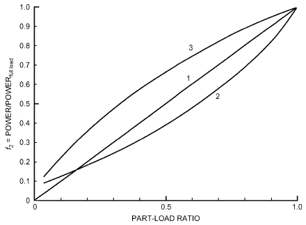

*Fig. 5 Possible Part-Load Power Curves*

> = a0+ a1twb,

f1(twb,ent, toa)

> ent&emsp;**(8)**
>
> + a2tw2b,ent+ a3toa+ a4to2a+ a5twb,enttoa

> = c0+ c1twb,

f3(twb,ent, toa)

> ent&emsp;**(9)**
>
> + c2t2wb,ent+ c3toa+ c4to2a+ c5twb,enttoa

The constants in Equations (8) and (9) are given in Table 3.

The fraction full-load power function f2 represents the change in equipment efficiency at part-load conditions and depends heavily on the control strategies used to match load and capacity. Figure 5 shows several possible shapes of these functional relationships. Curve 1 represents equipment with constant efficiency, independent of load. Curve 2 represents equipment that is most efficient in the middle of its operating range. Curve 3 represents equipment that is most efficient at full load. Note that these types of curves apply to both boilers and chillers.

### First-Principles Models

Engineering first principles such as thermodynamics as well as heat, mass, and momentum transfer can be used to develop models of primary equipment as well as secondary components. Gordon and Ng (1994, 1995), Gordon et al. (1995), Jiang and Reddy (2003), Lebrun et al. (1999), and others have sought to develop such models in which unknown model parameters are extracted from measured or published manufacturers’ data.

The energy analyst often must choose the appropriate model for the job. For example, a complex boiler model is not appropriate if the boiler operates at virtually constant efficiency. Similarly, a regression-based model might be appropriate when the user has a full dataset of reliable in-situ measurements of the plant. A regression-based model may also be a good choice when manufacturer performance data is provided for a full range of anticipated operating conditions. However, first-principles physical models generally have several advantages over pure regression models:

- Physical models allow confident extrapolation outside the range of available data.
- Regression is still required to obtain values for unknown physical parameters. However, the values of these parameters usually have physical significance, which can be used to estimate default parameter values, diagnose errors in data analysis through checks for realistic parameter values, and even evaluate potential performance improvements.
- The number of unknown parameters is generally much smaller than the number of unknown coefficients in the typical regression model. For example, the standard ARI compressor model requires as many as 30 coefficients, 10 each for regressions of capacity, power, and refrigerant flow. By comparison, a physical compressor model may have as few as four or five unknown parameters. Thus, physical models require fewer measured data.
- Data on part-load operation of chillers and boilers have been notoriously difficult to obtain but are becoming more readily available from manufacturers. Part-load corrections often represent the greatest uncertainty in the regression models, while causing the greatest effect on annual energy predictions. By comparison, physical models of full-load operation often allow direct extension to part-load operation with little additional required data.

Physical models of primary HVAC equipment can be found in many HVAC textbooks, but some of the models described here are specifically based on the work of Bourdouxhe et al. (1994a, 1994b, 1994c) in developing the ASHRAE *HVAC 1 Toolkit* (Lebrun et al. 1999). Each elementary component’s behavior is characterized by a limited number of physical parameters, such as heat exchanger heat transfer area or centrifugal compressor impeller blade angle. Values of these parameters are identified, or tuned, based on regression fits of overall performance compared to measured or published data.

Although physical models are based on physical characteristics, values obtained through a regression analysis of manufacturers’ data are not necessarily representative of the actual measured values. Strictly speaking, the parameter values are regression coefficients with estimated values, identified to minimize the error in overall system performance. In other words, errors in the fundamental models of equipment are offset by over- or underestimation of the parameter values.

## 4.2 TERMINAL COMPONENTS

### Terminal Units and Controls

Although many terminal units do not directly consume energy, they often have a significant effect on the energy consumed by primary and secondary equipment. For example, the minimum airflow set point for a variable-air-volume (VAV) terminal unit with a reheat coil affects supply fan energy, cooling energy consumption of the chiller or direct-expansion compressor, heating energy consumption of the electric reheat coil or central plant boiler, and pump energy for delivery of chilled and hot water. Therefore, the representation of terminal units in energy-estimating programs deserves special attention.

Several types of terminal units are commonly represented in energy-estimating programs: single-duct VAV boxes with and without reheat coils, single-duct VAV boxes with parallel or series induction fans, dual-duct VAV boxes, chilled-beam induction units, fan-coils, radiant panels, baseboard radiators, and others. Chapters 4, 5, and 20 of the 2020 *ASHRAE Handbook—HVAC Systems and* Equipment provide a description of many types of terminal units and their operation.

<!-- str. 558 -->

When selecting an energy-estimating program, it is important to note that not all programs explicitly represent some of these types of terminal units or they may not directly represent the desired control scheme.

The following considerations regarding accuracy and energy consumption are important when representing terminal units in energy-estimating programs:

- **VAV box minimum airflow set point.** As noted previously, this setting has a significant impact on energy consumption in a VAV system, and using default inputs may lead to inaccurate model results. In some actual systems, the minimum airflow set point is varied over time in a demand-controlled ventilation scheme, and in those cases it is important to ensure that the selected energy-estimating program can represent that strategy.
- **VAV box damper control in heating mode.** In actual systems, VAV box airflow in heating mode may remain at a fixed minimum position or may modulate to provide increased airflow as heating load increases, typically using a specific heating maximum airflow set point that may be different from the maximum cooling airflow. This later strategy is often called reverse-acting damper control (dual-maximum), and it can lead to reduced reheat energy. Many energy-estimating programs can represent both control strategies, and this is an important input to verify.
- **Fan power for VAV boxes with induction fans.** In some cases, these small induction fans are relatively inefficient, and this is an important input to verify.
- **Control of parallel induction fans in VAV boxes.** Typically, in a parallel induction VAV box, the fan runs only in heating mode. To accurately represent this fan operation, it is important to verify in the energy-estimating program how the control for this fan is specified.
- **Chilled-water temperature limits for chilled-beam systems.** In a typical chilled beam design, there is a minimum setpoint for entering water temperature to avoid condensation on the coils. This set point is higher than that for a typical chilled-water distribution system, and it may affect the efficiency of the chilled-water system and the pumping energy.
- **Temperature input requirements for radiant heating systems** **and radiators.** Different types of radiant heating terminal units have different hot-water temperature input requirements. The corresponding hot-water supply and return temperature requirements on the boilers will affect boiler operating efficiency, especially for condensing boilers.

### Underfloor Air Distribution

Underfloor air distribution (UFAD) is sometimes considered as an energy-efficient HVAC strategy, and a method to estimate its energy performance is a valuable design tool. UFAD systems offer potential for energy savings in several ways. These systems typically operate at higher cooling supply air temperatures compared to overhead air delivery systems, and offer potential for additional economizer energy savings. Primary cooling equipment efficiency may improve when providing higher-temperature supply air. In addition, if the UFAD system is operated to maintain partially mixed air distribution, as described in Chapter 57 of the 2019 *ASHRAE Handbook—HVAC Applications*, then the zone air distribution effectiveness may be better than that of an overhead air delivery system and allow a reduction in outdoor air ventilation rate.

A limitation of many energy-estimating programs is the assumption that air within thermal zones is fully mixed, and these programs cannot directly represent the performance of a UFAD system that is operated to create some temperature stratification. Approximate methods have been used by energy modelers, such as raising the thermostat set point in the UFAD zones to represent a higher average air temperature or representing the actual zone with two stacked zones in the model. See Energy Design Resources (2012) for more information.

A method for explicit modeling of UFAD systems has been developed for the EnergyPlus program, with separate models for interior and perimeter zones (Webster et al. 2013).

### Thermal Displacement Ventilation

Thermal displacement ventilation (TDV) is another air delivery strategy that offers energy efficiency benefits. A displacement system is typically designed to achieve fully stratified air distribution, as described in Chapter 57 of the 2019 ASHRAE Handbook—HVAC Applications. The potential efficiency benefits are similar to UFAD systems.

Modelers seeking to estimate the energy performance of a TDV system face the same basic limitations as with UFAD systems, and similar approximations have been used in practice. However, a method for modeling TDV represented by three nodes (floor temperature, occupied-zone temperature, and upper-zone temperature) is implemented in EnergyPlus (U.S. Department of Energy 1996-2016).

### Radiant Heating and Cooling Systems

Heating and cooling a space using heated and cooled panels is fundamentally different from using conditioned air. In a radiant system, a significant fraction of the sensible heating and cooling occurs by radiant heat transfer between the radiant panel and the surfaces in the space. This process is described in Chapter 6 of the 2020 *ASHRAE Handbook—HVAC Systems and Equipment*.

As noted in the Heat Balance Method section, energy-estimating programs that use the heat balance method for space load calculations are generally preferred for representing the performance of radiant systems. Use of the heat balance method allows accounting for radiant heat transfer among surfaces in a space, and a heated or cooled panel may be represented as one of those surfaces.

## 4.3 SECONDARY SYSTEM COMPONENTS

Secondary HVAC systems generally include all elements of the overall building energy system between a central heating and cooling plant and the building terminal units and zones. The precise definition depends heavily on the building design. A secondary system typically includes air-handling equipment; air distribution systems with associated ductwork; dampers; fans; and heating, cooling, and humidity-conditioning equipment. They also include liquid distribution systems between the central plant and the zone and air-handling equipment, including piping, valves, and pumps.

Although the exact design of secondary systems varies dramatically among buildings, they are composed of a relatively small set of generic HVAC components, including distribution components (e.g., pumps/fans, pipes/ducts, valves/dampers, headers/plenums, fittings) and heat and mass transfer components (e.g., heating coils, cooling and dehumidifying coils, liquid heat exchangers, air heat exchangers, evaporative coolers, steam injectors and other humidifiers). Most secondary systems can be described by simply connecting these components to form the complete system.

Energy estimation through computer simulation sometimes mimics the modular construction of secondary systems by using modular simulation elements [e.g., the ASHRAE HVAC2 Toolkit (Brandemuehl 1993; Brandemuehl and Gabel 1994), the simulation program TRNSYS (Klein et al. 1994; TRNSYS 2012), and Annex 10 activities of the International Energy Agency (IEA ECBCS 1987)]. To the extent that the secondary system consumes energy and transfers energy between the building and central plant, an energy analysis can be performed by characterizing the energy consumption of the individual components and the energy transferred among system components.

<!-- str. 559 -->

In many energy-estimating programs, secondary systems are represented by a mix of component models and simplified system models. For example, it is common for air and hydronic distribution systems to be represented by energy models that do not explicitly include components such as pipes/ducts, coils, and valves/dampers. Those methods are described in the following section.

In this chapter, secondary components are divided into two categories: (1) distribution components and (2) heat and mass transfer components.

### Fans, Pumps, and Distribution Systems

The distribution system of an HVAC system affects energy consumption in two ways. First, fans and pumps consume electrical energy directly, based on the flow and pressures under which a device operates. Ducts and dampers, or pipes and valves, and the system control strategies affect flow and pressure at each fan or pump. Second, thermal energy is often transferred to (or from) the fluid by (1) heat transfer through pipes and ducts and (2) electrical input to fans and pumps. Analysis of system components should, therefore, account for both direct electrical energy consumption and thermal energy transfer.

Fan and pump performance are discussed in Chapters 21 and 44 of the 2020 *ASHRAE Handbook—HVAC Systems and Equipment*. In addition, Chapter 21 of this volume covers pressure loss calculations for airflow in ducts and duct fittings, and the effects of system air leakage. Chapter 22 presents a similar discussion for fluid flow in pipes. Although these chapters do not specifically focus on energy estimation, energy use is governed by the same performance characteristics and engineering relationships. Strictly speaking, performance calculations for a building’s fan and air distribution system require a detailed pressure balance on the entire network. For example, in an air distribution system, airflow through the fan depends on its physical characteristics, operating speed, and pressure differential across the fan. Pressure drop through the air distribution system depends on duct construction (i.e., friction and fitting losses), coil and filter characteristics, damper positions, air leakage, and airflow through each component. Interaction between the fan and air distribution system results in a set of coupled, nonlinear algebraic equations. Models and subroutines for performing these calculations are available in the ASHRAE HVAC2 Toolkit (Brandemuehl 1993) and CONTAM (NIST 2000-2016). A simplified, physics-based model of the system curve, which represents the system pressure drop as seen by the fan, is described by Sherman and Wray (2010).

Detailed analysis of a distribution system requires flow and pressure balancing among the components, but nearly all commercially available energy analysis methods approximate the effect of the interactions with part-load performance curves [empirical (regression-based) component models]. This approach eliminates the need to calculate pressure drop through the distribution system at off-design conditions. Two simplified methods are described in the following sections.

**Polynomial Curve Fit.** Part-load curves are often expressed in terms of a **power input ratio** as a function of the part-load ratio, defined as the ratio of part-load flow to design flow:

> ( )
>
> PIR = W/(W full) = fplr Q/(Q full)&emsp;**(10)**

> ( )

where

- PIR = power input ratio
- W = fan motor input power at part load, W
- Wfull = fan motor input power at full load or design, W
- Q = fan airflow rate at part load, m3/s
- Qfull = fan airflow rate at full load or design, m3/s
- fplr = regression function, typically polynomial or power law

The exact shape of the part-load curve depends on the effect of flow control on the pressure and fan efficiency and may be calculated using a detailed analysis or measured field data. Figure 6 shows the relationship for three typical fan control strategies, as represented in a simulation program (York and Cappiello 1982). In the simulation program, the curves are represented by polynomial regression equations. Models and subroutines for performing these calculations are also available in the ASHRAE HVAC2 Toolkit (Brandemuehl 1993).

Figure 7 shows an example of a similar curve for the part-load operation of a fan system in a monitored building (Brandemuehl and Bradford 1999). In this case, the fan system represents 10 separate air handlers, each with supply and return fans, operating with variable-speed fan control to maintain a set duct static pressure.

**Component Model.** A second method can be used for fan system energy estimation in variable-airflow systems. It accounts

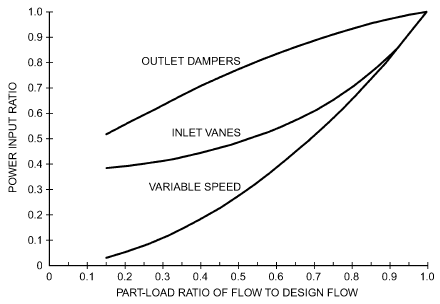

*Fig. 6 Part-Load Curves for Typical Fan Operating Strategies*

> (York and Cappiello 1982)

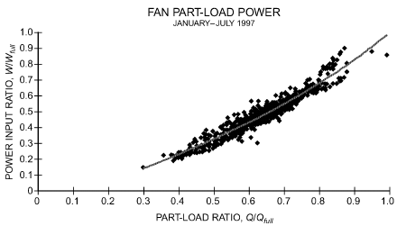

*Fig. 7 Fan Part-Load Curve Obtained from Measured Field Data under ASHRAE RP-823*

> (Brandemuehl and Bradford 1999)

<!-- str. 560 -->

separately for the substantial part-load performance variations that can occur for the fans, fan drive belts, fan motor, and variable-frequency drives (VFDs). For fans, dimensionless models are used to represent fan efficiency and speed variations with airflow. This method also uses a physics-based model (often called the “system curve”) for determining flow-dependent fan pressure rise (Sherman and Wray 2010). Note that system curves with duct static pressure controls or significant pressure drops through coils and filters do not follow the commonly assumed quadratic system curve. Fan power is calculated using airflow, pressure rise, and fan efficiency at each time step. Calculating fan power and speed allows determining fan shaft torque and the resulting loads on drive components (belts, motors, and VFDs). Note that fan laws do not apply to drive components. In the absence of physics-based models, regression models based on available data can be used to represent belt, motor, and VFD part-load efficiency variations. An implementation of this approach, developed by Wray in 2010, is included in EnergyPlus, and details are provided in the *EnergyPlus Engineering Reference* (U.S. Department of Energy 1996-2016).

A benefit of this approach is its ability to directly represent the impacts of low-pressure-drop distribution systems, air leakage reduction, and duct static-pressure reset control, which are important efficiency strategies for many systems. This approach can also represent the effects of fan system component oversizing and changes for components such as fans, belts, motors, and variable-frequency drives.

A disadvantage to the component model is that the additional capabilities require additional inputs. However, generic values for model parameters are provided in the EnergyPlus documentation.

**Fan and Pump Heat.** Heat dissipated to the airstream by fan operation increases airstream temperature. Fan shaft power is usually assumed to be dissipated fully in the airstream. Motor losses also contribute if the motor is mounted in the airstream. For pumps, these contributions are typically assumed to be zero because the motor is not mounted in the water stream, and the ratio of transport power to thermal capacitance rate is usually much less for water than for air.

The following equation provides a convenient and general model to calculate the heat transferred to the fluid by a motor:

> qfluid = [ηm+ (1 – ηm) fm,loss]W&emsp;**(11)**

where

- qfluid = heat transferred to fluid, W
- fm,loss = fraction of motor heat loss transferred to fluid stream, dimensionless (= 1 if fan mounted in airstream, = 0 if fan mounted outdoor airstream)
- W = fan motor input power, W
- ηm = motor efficiency

The heat rejected by VFDs and the fraction of motor heat not transferred to the airstream should be accounted for as building loads.

### Heat and Mass Transfer Components

Secondary HVAC systems comprise heat and mass transfer components (e.g., steam or hot-water air-heating coils, chilled-water cooling and dehumidifying coils, shell-and-tube liquid heat exchangers, air-to-air heat exchangers, evaporative coolers, steam injectors). Although these components do not consume energy directly, their thermal performance dictates interactions between building loads and energy-consuming primary components (e.g., chillers, boilers). In particular, secondary component performance determines the entering fluid conditions for primary components, which in turn determine energy efficiencies of primary equipment. In addition, heat and mass transfer components may affect air and fluid flow, which affect performance of energy-consuming secondary components such as fans and pumps. Accurate energy calculations cannot be performed without appropriate models of the system heat and mass transfer components.

For example, load on a chiller is typically described as the sum of zone sensible and latent loads, plus any heat gain from ducts, plenums, fans, pumps, and piping. However, the chiller’s energy consumption is determined not only by the load but also by the return chilled-water temperature and flow rate. The return water condition is determined by cooling coil performance and part-load operating strategy of the air and water distribution system. The cooling coil might typically be controlled to maintain a constant leaving air temperature by modulating water flow through the coil. In such a scenario, the cooling coil model must be able to calculate the leaving air humidity, water temperature, and water flow rate given the cooling coil design characteristics and entering air temperature and humidity, airflow, and water temperature.

Virtually all building energy simulation programs include, and require, models of heat and mass transfer components. These models are generally relatively simple. Whereas a coil designer might use a detailed tube-by-tube analysis of conduction and convection heat transfer and condensation on fin surfaces to develop an optimal combination of fin and tube geometry, an energy analyst is more interested in determining changes in leaving fluid states as operating conditions vary during the year. In addition, the energy analyst is likely to have limited design data on the equipment and, therefore, requires a model with very few parameters that depend on equipment geometry and detailed design characteristics.

A typical approach to modeling heat and mass transfer components for energy calculations is based on an **effectiveness-NTU heat exchanger model** (Kays and London 1984). The effectiveness-NTU (number of transfer units) model is described in most heat transfer textbooks and briefly discussed in Chapter 4. It is particularly appropriate for describing leaving fluid conditions when entering fluid conditions and equipment design characteristics are known. Also, this model requires only a single parameter to describe the characteristics of the exchanger: the overall transfer coefficient UA, which can be determined from limited design performance data.

Effectiveness methods are used to perform energy calculations for a variety of sensible heat exchangers in HVAC systems. For typical finned-tube air-heating coils, the cross-flow configuration with both fluid streams unmixed is most appropriate. Air-to-air heat exchangers may be cross- or counterflow. For liquid-to-liquid exchangers, tube-in-tube equipment can be modeled as parallel or counterflow, depending on flow directions; correlations for shelland-tube effectiveness and NTU, which depend on the extent of baffling and the number of tube passes, are given in heat transfer texts (Mills 1999).

The energy analyst must determine the UA to describe the operations of a specific heat exchanger. There are three ways to determine this important parameter: direct calculation, measurement, and manufacturers’ data. Given detailed information about the materials, geometry, and construction of the heat exchanger, fundamental heat transfer principles can be applied to calculate the overall heat transfer coefficient. However, the method most appropriate for energy estimation is use of manufacturers’ performance data or measurement of installed performance. In reporting the design performance of a heat exchanger, a manufacturer typically gives the heat transfer rate under various operating conditions, with operating conditions described in terms of entering fluid flow rates and temperatures. The effectiveness and UA can be calculated from the given heat transfer rate and entering fluid conditions.

**Example 3.** An energy analyst seeks to evaluate a hot-water heating system that includes a hot-water heating coil. The energy analysis program uses an effectiveness-NTU model of the coil and requires the UA of the coil as an input parameter. Although detailed information on the coil geometry and heat transfer surfaces is not available, the manufacturer states that the one-row hot-water heating coil delivers 240 kW of heat under the following design conditions:

<!-- str. 561 -->

### Design Performance

> Entering water temperature thi = 80°C
>
> Water mass flow rate ṁh= 5.0 kg/s

> Entering air temperature tci = 20°C
>
> Air mass flow rate ṁc= 8.0 kg/s

> Design heat transfer q = 240 kW

**Solution:** First determine the heat exchanger UA from design data, then use UA to predict performance at off-design conditions. Effectiveness-NTU relationships are used for both steps. The key assumption is that the UA is constant for both operating conditions.

a) An examination of flow rates and fluid specific heats allows calculation of the hot-fluid capacity rate Chand the cold-fluid capacity rate Cc at design conditions, and the capacity rate ratio Z.

> Ch = (m· cp)h= (5.0)(4.195) = 20.97 kW/K
>
> Cc = (m· cp)c= (8.0)(1.007) = 8.05 kW/K

> Cmax = *Ch Cmin = Cc*
>
> Z = (C min)/(C max) = 0.384

where cp is specific heat and cmax and cmin are the larger and smaller of the capacity rates, respectively, b) Effectiveness can be directly calculated from the heat transfer definition.

> ε = ((tco– tci))/((thi– tci)) = (q ⁄ Cc)/((thi– tci)) = (240 ⁄ 8.05)/((80 – 20)) = 0.497
>
> where tco is the leaving air temperature.

c) The effectiveness-NTU relationships for a cross-flow heat exchanger with both fluids unmixed allow calculation of the effectiveness in terms of the capacity rate ratio Z and the NTU [the relationships are available from most heat transfer textbooks and, specifically, in Kays and London (1984)]. Given the effectiveness and capacity rate ratio, NTU = 0.804.

d) The heat transfer UA is then determined from the definition of the NTU.

> UA = CminNTU = (8.05)(0.804) = 6.472 kW/K

### Application to Cooling and Dehumidifying Coils

Analysis of air-cooling and dehumidifying coils requires coupled, nonlinear heat and mass transfer relationships. These relationships form the basis for all HVAC components with moisture transfer, including cooling coils, cooling towers, air washers, and evaporative coolers. Although the complex heat and mass transfer theory presented in many textbooks is often required for cooling coil design, simpler models based on effectiveness concepts are usually more appropriate for energy estimation. For example, the bypass factor is a form of effectiveness in the approach of the leaving air temperature to the apparatus dew-point, or coil surface, temperature.

The effectiveness-NTU method is typically developed and applied in analysis of sensible heat exchangers, but it can also be used to analyze other types of exchangers, such as cooling and dehumidifying coils, that couple heat and mass transfer. By redefining the state variables, capacity rates, and overall exchange coefficient of these enthalpy exchangers, the effectiveness concept may be used to calculate heat transfer rates and leaving fluid states. For sensible heat exchangers, the state variable is temperature, the capacity is the product of mass flow and fluid specific heat, and the overall transfer coefficient is the conventional overall heat transfer coefficient. For cooling and dehumidifying coils, the state variable becomes moist air enthalpy, the capacity has units of mass flow, and the overall heat transfer coefficient is modified to reflect enthalpy exchange. This approach is the basis for models by Brandemuehl (1993), Braun et al. (1989), and Threlkeld (1970). The same principles also underlie the coil model described in Chapter 23 of the 2012 *ASHRAE Handbook—HVAC Systems and Equipment*.

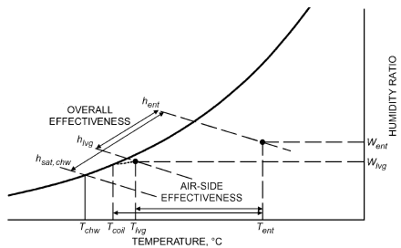

*Fig. 8 Psychrometric Schematic of Cooling Coil Processes*

The effectiveness model is based on the observation that, for a given set of entering air and liquid conditions, the heat and mass transfer are bounded by thermodynamic maximum values. Figure 8 shows the limits for leaving air states on a psychrometric chart. Specifically, the leaving chilled-water temperature cannot be warmer than the entering air temperature, and the leaving air temperature and humidity cannot be lower than the conditions of saturated moist air at the temperature of the entering chilled water.

Figure 8 also shows that performance of a cooling coil requires evaluating two different effectivenesses to identify the leaving air temperature and humidity. An overall effectiveness can be used to describe the approach of the leaving air enthalpy to the minimum possible value. An air-side effectiveness, related to the coil bypass factor, describes the approach of the leaving air temperature to the effective wet-coil surface temperature.

Effectiveness analysis is accomplished for wet coils by establishing a common state variable for both the moist air and liquid streams. As implied by the lower limit of the entering chilled-water temperature, this common state variable is the moist air enthalpy. In other words, all liquid and coil temperatures are transformed to the enthalpy of saturated moist air at the liquid or coil temperature. Changes in liquid temperature can similarly be expressed in terms of changes in saturated moist air enthalpy through a saturation specific heat cp,sat defined by the following:

> cp,sat = (Δh l, sat)/Δtl&emsp;**(12)**

Using the definition of Equation (12), the basic effectiveness relationships discussed in Chapter 4 can be written as

> q = Ca(ha,ent – ha,lvg) = Cl(hl,sat,lvg – hl,sat,ent)&emsp;**(13)**
>
> q = εCmin(ha,ent – hl,sat,ent)&emsp;**(14)**

> Ca = ṁa&emsp;**(15)**
>
> Cl = ((m· cp)l)/(c p, sat)&emsp;**(16)**

> Cmin = min(Ca, Cl)&emsp;**(17)**

where

- q = heat transfer from air to water, W
- C = fluid capacity, kg/h ṁa = dry air mass flow rate, kg/s ṁl = liquid mass flow rate, kg/s cp,l = liquid specific heat, kJ/(kg·K)

<!-- str. 562 -->

cp,sat = saturation specific heat, defined by Equation (12), kJ/(kg·K)

ha = enthalpy of moist air, kJ/kg hl,sat = enthalpy of saturated moist air at the temperature of the liquid, kJ/kg

The cooling coil effectiveness of Equation (14) is defined, then, as the ratio of moist air enthalpies in Figure 8. As with sensible heat exchangers, effectiveness is also a function of the physical coil characteristics and can be obtained by modeling the coil as a counterflow heat exchanger. However, because heat transfer calculations are performed based on enthalpies, the overall transfer coefficient must be based on enthalpy potential rather than temperature potential. The enthalpy-based heat transfer coefficient UAh is related to the conventional temperature-based coefficient by the specific heat:

- q = UAΔt = UAhΔh (18)
- UAh = UAΔt/Δh = UA/cp

A similar analysis can be performed to evaluate the air-side effectiveness, which identifies the leaving air temperature. Whereas the overall enthalpy-based effectiveness is based on an overall heat transfer coefficient between the chilled water and air, air-side effectiveness is based on a heat transfer coefficient between the coil surface and air.

As with sensible heat exchangers, the overall heat transfer coefficients UA can be determined either from direct calculation from coil properties or from manufacturers’ performance data. A sensible heat exchanger is modeled with a single effectiveness and can be described by a single parameter UA, but a wet cooling and dehumidifying coil requires two parameters to describe the two effectivenesses shown in Figure 8. These parameters are the internal and external UAs: one describes heat transfer between the chilled water and the air-side surface through the pipe wall, and the other between the surface and the moist air. UA values can be determined from the sensible and latent capacity of a cooling coil at a single rating condition. A significant advantage of the effectiveness-NTU method is that the component can be described with as little as one measured data point or one manufacturer’s design calculation.

## 4.4 PRIMARY SYSTEM COMPONENTS

Primary HVAC systems consume energy and deliver heating and cooling to a building, usually through secondary systems. Primary equipment generally includes chillers, boilers, cooling towers, cogeneration equipment, and plant-level thermal-storage equipment. In particular, primary equipment generally represents the major energy-consuming equipment of a building, so accurate characterization of building energy use relies on accurate modeling of primary equipment energy consumption.

### Boilers

The literature on boiler models is extensive, ranging from steady-state performance models (DeCicco 1990; Lebrun 1993) to detailed dynamic simulation models (Bonne and Jansen 1977; Lebrun et al. 1985), to a combination of these two schemes (Laret 1991; Malmström et al. 1985). However, the input information required for these models is not often readily available, and these models should be considered only in more complex situations (e.g., large boilers in large buildings, district heating systems, cogeneration systems), where a complete, detailed representation of heat distribution, emission, and operation and control under varying external conditions is warranted.

In most current energy-estimating programs, the performance of boilers is represented by regression equations and a full-load efficiency value as described in the section on Empirical (Regression-Based) Models. Those equations typically represent the boiler efficiency under varying load conditions and, in some cases, the equations also account for water temperature conditions. When using these regression-based models, two important issues to understand are efficiency rating conditions and the off-design efficiency calculation method used by the energy-estimating program.

**Rating Conditions**. The primary rating condition relevant for fuel-fired boiler efficiency is the entering water temperature, which is the return water temperature in most building heating applications. Efficiency improves as the return water temperature drops, because more heat can be extracted from exhaust gases. A condensing boiler can reach efficiencies up to 98% with entering water at 27°C. The minimum return water temperature for noncondensing boilers is typically about 60°C, because lower temperatures lead to condensation and damaging corrosion, and efficiency under that condition is usually in the range of 80% to 85%. The important point to consider when entering a value for fuel-fired boiler efficiency in an energy-estimating program is the assumption made by the program about rating conditions. For example, the DOE2.2 program expects noncondensing boiler efficiency values to correspond to 71°C entering water temperature and condensing water boiler efficiency values to correspond to 27°C entering water temperature. More information on boiler design and rating conditions is provided in Chapter 32 of the 2020 *ASHRAE Handbook—HVAC Systems and Equipment*.

**Off-Design Conditions.** Another important consideration in the use of energy-estimating programs is the type of model used to represent off-design conditions (i.e., how the efficiency is assumed to change at partial load or as the water temperature conditions change). Some models account only for changes in efficiency with changes in load. Other models consider both load and entering water temperature, and still others consider load and leaving water temperature. Some programs offer a choice of models. For best accuracy, models that account for load and entering water temperature are preferred.

Figures 9 and 10 show examples of how boiler efficiency is represented by different types of models. Figure 9 shows a model in which boiler efficiency is a function of part-load ratio alone. Different regression equation coefficients are used for atmospheric-draft and forced-draft boilers, and the forced-draft units are represented with better part-load efficiency. An implicit assumption of this model is that entering water temperature is in a range where it does not have a significant impact on efficiency, which may be reasonable for noncondensing boilers. Figure 10 shows a model for a condensing boiler in which efficiency is a function of both part-load ratio and entering water temperature. This model shows that efficiency increases as entering water temperature decreases and as load decreases.

### Chillers

Models representing energy consumption of chillers include both first-principles models and empirical models. Examples of first-principles models include detailed modeling techniques described in the ASHRAE *HVAC 1 Toolkit* (Lebrun et al. 1999) and the Gordon-Ng model (Gordon 2000). A discussion of the Gordon-Ng model is provided in the Data-Driven Modeling section, presented as an example of a physical model. From a practical point of view, the data required as inputs to these first-principles models will not always be available. Most current energy-estimating programs use empirical models to represent chiller performance. Hydeman et al. (2002) compares the prediction capabilities of several types of models.

Empirical chiller models typically comprise a set of regression equations that represent variations in cooling capacity and efficiency in operation. A common implementation consists of three polynomial equations. One represents variation in cooling capacity as a function of temperature conditions. A second represents the change in efficiency with changing temperature conditions. The third equation represents efficiency as a function of part-load ratio. The following are common inputs to empirical chiller models:

<!-- str. 563 -->

- Full-load efficiency
- Part-load ratio
- Chilled-water supply temperature (temperature leaving the evaporator)
- For water-cooled chillers: condenser water return temperature (temperature entering the condenser)
- For air-cooled chillers: outdoor air dry-bulb temperature

Different types of chillers have different performance characteristics, and their performance is typically represented by different sets of regression equation coefficients. Important chiller design differences include type of condenser (air- or water-cooled), type of compressor (reciprocating, screw, or centrifugal), and unloading mechanism (e.g., inlet vanes or variable-speed compressor control). Chapter 43 of the 2020 *ASHRAE Handbook—Systems and Equip-* ment provides descriptions of different types of chillers.

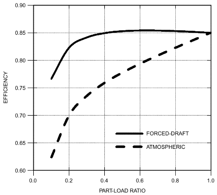

*Fig. 9 Example Boiler Model: Efficiency as Function of Part-Load Ratio*

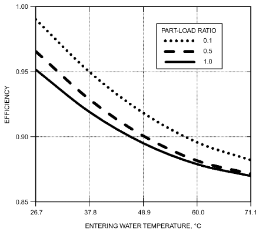

*Fig. 10 Example Boiler Model: Efficiency as Function of Part-Load Ratio and Entering Water Temperature*

Coefficients for chiller models are often supplied as defaults by energy-estimating programs. However, when the intent of analysis is to compare the energy performance of specific chiller alternatives, the recommended practice is to obtain performance data for the specific chillers to create calibrated sets of coefficients for each chiller. Manufacturers can typically provide such data, and it is very important to obtain a set of data representing the full range of potential operating conditions. The process of calculating coefficients for a chiller model is described in Hydeman and Gillespie (2002). For another discussion of empirical chiller models and the process of determining model coefficients, see the *HVAC Simulation Guide-* book, vol. 1 (Energy Design Resources 2012).

### Cooling Tower Model

A cooling tower is used in primary systems to reject heat from the chiller condenser. Controls typically manage tower fans and pumps to maintain a desired water temperature entering the condenser. Like cooling and dehumidifying coils in secondary systems, cooling tower performance has a strong influence on the chiller’s energy consumption. In addition, tower fans consume electrical energy directly.

Fundamentally, a cooling tower is a direct contact heat and mass exchanger. Equations describing the basic processes are given in Chapter 6 and in many HVAC textbooks. Chapter 40 of the 2020 *ASHRAE Handbook—HVAC Systems and Equipment* describes the specific performance of cooling towers. Performance subroutines are also available in Lebrun et al. (1999) and TRNSYS (2012).

For energy calculations, cooling tower performance is typically described in terms of the outdoor wet-bulb temperature, temperature drop of water flowing through the tower (range), and difference between leaving water and air wet-bulb temperatures (approach). Simple models assume constant range and approach, but more sophisticated models use rating performance data to relate leaving water temperature to the outdoor wet-bulb temperature, water flow, and airflow. Simple cooling tower models, such as those based on a single overall transfer coefficient that can be directly inferred from a single tower rating point, are often appropriate for energy calculations.

**Variable-Speed Vapor-Compression Heat Pump Model**

Although packaged equipment is most often modeled by empirical functions fit to manufacturers’ data, methods are also needed to model and evaluate advanced equipment such as variable-speed heat pumps. Zakula et al. (2011) detail a component-based heat pump model, including variable-speed fan and pump models; variable refrigerant-, air-, and water-side heat transfer coefficients; variable pressure drops; and staged compressors, one or more of which may operate over a wide speed range. Such models can produce performance maps for new equipment designs, including designs in which refrigerant and transport fluid flow rates and condenser subcooling are coordinated as optimized functions of conditions and imposed load (Zakula et al. 2012). A tricubic fit to such performance maps has been shown to represent performance accurately over a wide range of conditions and load.

As a special heat pump model, variable-refrigerant-flow (VRF) systems vary the refrigerant flow to meet the dynamic zone thermal loads. Hong et al. (2016) developed a new VRF heat pump model, which has physics-based component models. This VRF model, implemented in EnergyPlus, (1) enables advanced controls, including variable evaporating and condensing temperatures in the indoor and outdoor units, and variable fan speeds based on the temperature and zone load in the indoor units; (2) adds a detailed refrigerant pipe heat loss calculation using refrigerant flow rate, operational conditions, pipe length, and pipe insulation materials; (3) increases accuracy of simulation especially in partial load conditions; and (4) improves the usability of the model by significantly reducing the number of user input performance curves. A new heat recovery VRF model was also developed and is implemented in EnergyPlus, which enables more accurate modeling of heat recovery between zones with simultaneous cooling and heating loads. The new VRF models in EnergyPlus were validated with measured performance data from real buildings or laboratory experiments.

<!-- str. 564 -->

### Ground-Coupled Systems

Ground-coupled systems use the ground as the source/sink for heating or cooling a building. These types of systems are described in detail in Chapter 34 of the 2019 ASHRAE Handbook—HVAC Applications. For the most part, the HVAC system components used in these systems are similar to those used in other HVAC systems and do not require any special techniques to estimate their performance. The exception to this is simulating energy exchange with the ground.

Energy is exchanged with the ground through direct use of water from the ground or through ground heat exchangers. With a directuse system, the temperature entering the HVAC system from the ground is often considered to be constant or to vary only seasonally. This assumption can be valid when the extraction and injection wells are far enough apart to prevent mixing of the aquifer. A number of aquifer storage performance models have been developed for use with HVAC systems, but these have not yet reached mainstream simulation programs.

For simulating performance of ground heat exchangers, two different techniques have been developed: the duct ground storage (DST) model introduced by Hellstrom (1989) that calculates the transient thermal process of borehole fields, and a thermal response factor (g-function) approach based on work of Eskilson (1987). Both techniques give a relation between the heat extracted (or rejected) from the ground per unit borehole length and the borehole wall temperature. Both of these methods have been integrated into whole-building simulation programs.

## 4.5 MODELING OF SYSTEM CONTROLS

Building control systems are hierarchical: higher-level, supervisory controls typically generate set points for lower-level, local loop controls. Supervisory controls include reset and optimal control (see Chapter 42 of the 2019 ASHRAE Handbook—HVAC Applications) and often have a large effect on energy consumption. Local loop controllers may also affect energy performance; for example, proportional-only room temperature control results in a trade-off between energy use and comfort. Faults in control systems and devices can also affect energy consumption (e.g., leaking valves and dampers can significantly increase energy use). It is particularly important to account for these departures from ideal behavior when simulating performance of real buildings using calibrated models. Modeling and simulation of some supervisory control functions are increasingly handled by whole-building simulation programs, but very advanced optimal controls such as receding horizon control are not. Simulation of local loop controls also requires more specialized, component- or equation-based modeling environments.

Modern control systems, particularly direct digital controls (DDC), typically use integral action to drive the controlled variable to its set point. For energy modeling purposes, the controlled variable (e.g., supply air temperature) can be treated as being at the set point unless system capacity is insufficient. The simulation must determine whether the capacity required to meet set point exceeds available capacity. If it does, the available capacity is used to determine the actual value of the controlled variable. Where there is only proportional action, the resulting relationship between the controlled variable and the output of the system can be used to determine both values. For example, the action of a conventional pneumatic room temperature controller can be represented by a function relating heating and cooling delivery to space temperature. Similarly, supply air temperature reset control can be modeled as a relationship between outdoor or zone temperature and coil or fan discharge temperature. An accurate secondary system model must ensure that all controls are properly represented and that the governing equations are satisfied at each simulation time step. This often creates a need for iteration or for use of values from an earlier solution point.

Controls on space temperature affect the interaction between loads calculations and the secondary system simulation. A realistic model might require a dead band in space temperature in which no heating or cooling is called for; within this range, the secondary system operates at zero capacity, and the true space temperature must be modeled accordingly. If the thermostat has proportional control between zero and full capacity, the space temperature rises in proportion to the load during cooling and falls similarly during heating. Capacity to heat or cool also varies with space temperature after the control device has reached its maximum because capacity is proportional to the difference between supply and space temperatures. Failure to properly model these phenomena may result in overestimating energy use.

## 4.6 INTEGRATION OF SYSTEM MODELS

Energy calculations for secondary systems involve construction of the complete system from the set of HVAC components. As an example, consider a process for simulating a variable-air-volume (VAV) system, a single-path system that controls zone temperature by modulating airflow while maintaining constant supply air temperature. VAV terminal units, located at each zone, adjust the quantity of air reaching each zone depending on its load requirements. Reheat coils may be included to provide required heating for perimeter zones or to prevent overcooling of lightly loaded zones.

This VAV system simulation consists of a central air-handling unit and a VAV terminal unit with reheat coil located at each zone, as shown in Figure 11.The central air-handling unit includes a fan, cooling coil, preheat coil, and outdoor air economizer. Supply air leaving the air-handling unit is controlled to a fixed set point. The VAV terminal unit at each zone varies airflow to meet the cooling load. As zone cooling load decreases, the VAV terminal unit decreases zone airflow until the unit reaches its minimum position. If the cooling load continues to decrease, the reheat coil is activated to meet the zone load. As supply air volume leaving the unit decreases, fan power consumption also reduces. A variable-speed drive is used to control the supply fan.

The simulation is based on system characteristics and zone design requirements. For each zone, the inputs include sensible and latent loads, zone set-point temperature, and minimum zone supply-air mass flow. System characteristics include supply air temperature set point; entering water temperature of reheat, preheat, and cooling coils; minimum mass flow of outdoor air; and economizer temperature/enthalpy set point for minimum airflow.

The algorithm for performing calculations for this VAV system is shown in Figure 12. The algorithm directs sequential calculations of system performance. Calculations proceed from the zones along the return air path to the cooling coil inlet and back through the supply air path to the cooling coil discharge. An alternative finite-state machine (FSM) approach is found in Chapter 42 of the 2019 *ASHRAE Handbook—HVAC Applications*.

Moving back along the supply air path, the fan entering air temperature is calculated by setting fan outlet air temperature to the system design supply air temperature. The known fan inlet air temperature is then used as both the cooling coil and preheat coil discharge air temperature set point. Moving along the return air path, the cooling coil entering air temperature can be determined by sequentially moving through the economizer cycle and preheat coil.

<!-- str. 565 -->

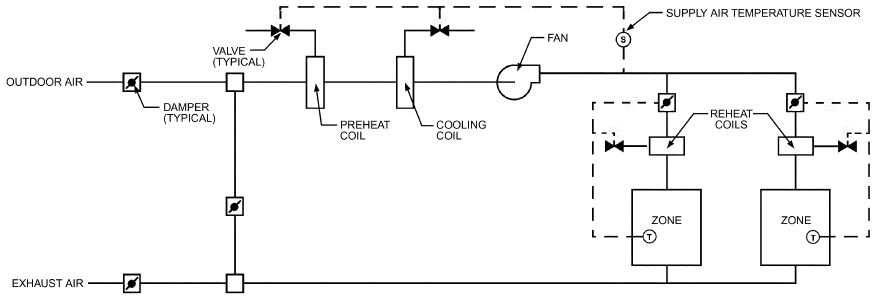

*Fig. 11 Schematic of Variable-Air-Volume System with Reheat*

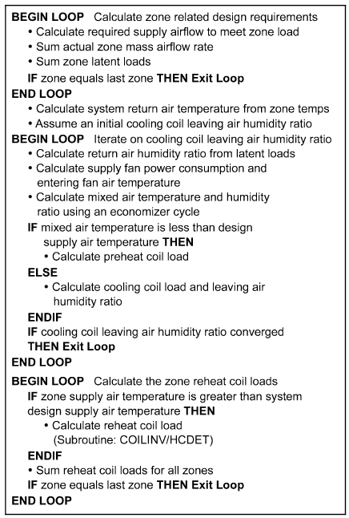

*Fig. 12 Algorithm for Calculating Performance of VAV with System Reheat*

Unlike temperature, the humidity ratio at any point in a system cannot be explicitly determined because of the dependence of cooling coil performance on the mixed air humidity ratio. The latent load defines the difference between zone humidity and supply air humidity. However, the humidity ratio of supply air depends on the humidity ratio entering the coil, which in turn depends on that of the return air. This calculation must be performed either by solving simultaneous equations or, as in this case, iteration.

Assuming a trial value for the humidity ratio at the cooling coil discharge (e.g., 13°C, 90% rh), the humidity ratio at all other points throughout the system can be calculated. With known cooling coil inlet air conditions and a design discharge air temperature, the inverted cooling coil subroutine iterates on the coil fluid mass flow to converge on the discharge air temperature with the discharge air humidity ratio as an output. The cooling coil discharge air humidity ratio is then compared to the previous discharge humidity ratio. Iteration continues through the loop several times until the values of the cooling coil discharge air humidity ratio stabilize within a specified tolerance.

This basic algorithm for simulation of a VAV system might be used in conjunction with a heat balance type of load calculation. For a weighting factor approach, it would have to be modified to allow zone temperatures to vary and consequently zone loads to be readjusted. It should also be enhanced to allow possible limits on reheat temperature and/or cooling coil limits, zone humidity limits, outdoor air control (economizers), and/or heat-recovery devices, zone exhaust, return air fan, heat gain in the return air path because of lights, the presence of baseboard heaters, and more realistic control profiles. Most current building energy programs incorporate these and other features as user options, as well as algorithms for other types of systems.

## 5. LOW-ENERGY SYSTEM MODELING

## 5.1 NATURAL AND HYBRID VENTILATION

Natural ventilation refers to the introduction of outdoor air into a building via intentionally provided openings (e.g., windows and trickle ventilators) whereby airflow is driven by naturally occurring forces such as wind and buoyancy (stack effect) to provide fresh air and ventilation cooling (free cooling). The movement of air resulting from natural ventilation can also provide direct cooling [see Aynsley et al. (1977) and Olgyay (1973)]. Hybrid or mixed-mode ventilation refers to the use of mechanical means to supplement or enhance natural ventilation when the driving forces of wind and/or buoyancy are unable to meet the required ventilation rate or thermal comfort targets. Hybrid ventilation can be loosely divided into three categories:

<!-- str. 566 -->

fully parallel natural and mechanical ventilation, fan-assisted natural ventilation, and stack- and wind-assisted mechanical ventilation (Hybrid Ventilation Centre 2002). Regardless of which system is implemented, control of the system components and interaction between ventilation modes is critical to system effectiveness.

The design of natural ventilation systems requires careful consideration of the climate in which the building is located. Not only must prevailing outdoor temperatures, wind speed, and direction be accounted for to gage the forces available to drive natural ventilation, but outdoor temperature and humidity can affect the level of thermal comfort attainable within the building. However, even in climates where external air temperatures are relatively high, it may be possible to use natural ventilation to deliver acceptable thermal comfort. This can be done in combination with other passive design measures such as exposed thermal mass, solar shading, and nighttime ventilation cooling, or as part of a hybrid ventilation solution (Lomas et al. 2007). Also, environmental pollutants can affect the level of indoor air quality (IAQ) that is achievable without the benefit of filtering the outdoor air as it enters the building. Simulation of natural and hybrid ventilation systems should capture as many of these aspects as possible. At the very least, consideration should be given to modeling and predicting the likely performance of the ventilation strategy in terms of ventilation rates and indoor environmental quality, including thermal comfort of the building occupants. Chapters 13 and 16, respectively, discuss modeling and ventilation (including natural ventilation) in more detail, and CIBSE (2005) provides a guide to designing natural ventilation systems in nondomestic buildings.

### Natural Ventilation

Tools for modeling natural ventilation systems fall into three main categories, discussed in the following sections. Although these modeling tools can be applied individually, simulation and design are better served by using the capabilities of multiple types of tools to provide a more comprehensive analysis.

**Simplified Models.** Simplified models can be used at the initial design stages for solving algebraic (nondifferential) equations to determine climate suitability, ventilation flow rates, and zoneaverage temperatures. This can be valuable information, especially at the concept design stage, when architects require approximate information about the feasibility of implementing natural ventilation and determining size and position of ventilation openings. The equations typically used in these models can be found in Chapter 16 and in CIBSE (2005). However, there are many other examples of simplified techniques used to predict the behavior of specific aspects of natural ventilation. For example, Linden et al. (1990) developed analytical models for predicting interface heights in stratified regimes, and Chenvidyakarn and Woods (2005) used analytical methods to predict solution multiplicity in large-volume spaces.

Climate-suitability analysis methods and tools are available for the predesign phase. These relatively simple models provide a first-order estimate of the potential effectiveness of natural ventilation to provide direct ventilation cooling, nighttime cooling, and thermal comfort, based on climate data representative of the building location. Axley and Emmerich (2002) present a climate suitability design method based on a single-zone, steady-state energy balance, and thermal comfort criteria. Lomas et al. (2007) present an analysis of ambient temperature and moisture content with respect to thermal comfort criteria plotted on a psychrometric chart.

One common form of analytical model involves first solving equations to determine the driving pressures caused by wind and buoyancy forces. These driving pressures are calculated with reference to the neutral pressure level (CIBSE 2005) and are used at proposed opening locations as input to mathematical representations of the airflow through the openings (e.g., the orifice flow equation).

Given the design airflow rate, these equations can then be used to calculate effective opening areas. Axley (2001) presents an opening sizing method that was subsequently formulated as a software tool (Emmerich et al. 2011; Dols et al. 2012). These methods and tools can also account for multiple openings and user-specified airflow patterns through a building (e.g., into the building via a trickle ventilator, through an air transfer grill, then out through a stack). As outlined in CIBSE (2005), driving pressures should be calculated for representative design scenarios when wind speeds and internal/external temperature differences are relatively low, because these will determine the maximum opening sizes required. Illustrations of how some of these simplified models can be used are given in Axley (2001), CIBSE (2005), and Emmerich et al. (2012).

**Network Airflow Models.** Network airflow models, also referred to as multizone models, are discussed in Chapter 13. They are more complex than the simplified models, because they solve the simultaneous (interdependent) airflows and pressure differences between multiple, interconnected building zones and the outdoors and are typically applied to the building in its entirety. In particular, using airflow network characteristics (e.g., airflow resistances) and climate data (along with assumed temperatures within the building), network airflow models calculate combined buoyancy- and wind-driven pressures and the rate and direction of airflows for all openings in the model. Some models can also be used to perform interzone contaminant mass transport calculations that can be useful in analyzing IAQ (Axley 2007) and simulating contaminant-based ventilation rate control schemes (e.g., CO2-based demand controlled ventilation) (Dols et al. 2016a). Network airflow models can be coupled with dynamic thermal simulation programs to calculate the internal zone temperatures used in the network airflow model (Clarke 2001; Dols et al. 2016a, 2016b; U.S. Department of Energy 1996-2016).

A distinct challenge in the use of network airflow models is selecting mathematical representations and parameters that best capture the airflow characteristics of the ventilation components. For example, airflow resistances can be described using a discharge coefficient (or pressure loss factor) and the effective opening area. However, specifying the component characteristics requires a clear understanding of how the model interprets these values. Details of the terminology used can be found in Jones et al. (2016).

**Computational Fluid Dynamics.** Computational fluid dynamics (CFD) is also discussed in Chapter 13. CFD models represent the most complex class of airflow models and can be valuable for simulating natural ventilation, including the effects of wind on the building envelope pressures and internal airflow patterns that develop as a result of various boundary conditions and representative portions of the building interior. CFD is not typically applicable to simulating entire buildings over long-term, transient time frames. However, there are many strategies available for using CFD in the design and analysis of natural ventilation systems; for example, Malkawi et al. (2016) describes using both CFD and a combined network airflow and energy calculation method.

The main feature that sets CFD models apart from numerical and network airflow models is the use of a fine mesh comprising many thousands of cells throughout the computational domain. For each cell, nonlinear partial differential equations are solved to predict the air speed, air temperature, turbulence, and pressure in each cell. This provides a very detailed representation of the spatial distribution of the airflow and has the advantage of highlighting drafts, warm zones, and thermal stratification. Boundary conditions are required in CFD models to drive the flow. They include temperature or heat flux values at solid surfaces and conditions of air speed and turbulence at openings. Surface temperatures are often obtained from the results of a dynamic thermal network simulation model. This approach has the advantage of including the effects of radiation without solving a separate radiation model in the CFD simulation. Boundary conditions at natural ventilation openings must be specified with care, because neither the flow rate nor the internal temperature are known a priori. This can be overcome by using the orifice flow equation, which simply provides a relationship between the flow rate and pressure difference across openings [e.g., Durrani et al. (2015)]. Another important challenge to be aware of when using CFD is the need for an iterative approach to solve the governing, nonlinear equations. It is therefore important to appreciate that simulation run times can be long (i.e., several hours), and that techniques for controlling convergence are often needed, especially in buoyancy-driven natural ventilation flows where driving pressures are small. Often, this control can be achieved by using a transient simulation or false time-stepping [e.g., Kaye et al. (2009)].

<!-- str. 567 -->

### Hybrid Ventilation

When design tools have predicted that natural ventilation is unlikely to be sufficient for providing adequate IAQ and thermal comfort and a hybrid strategy has been proposed, it is useful to carry out some modeling of the system to provide confidence and identify likely energy implications. This can be done by enhancing the techniques described previously for modeling natural ventilation with network airflow and CFD models.

Ventilation and energy performance of buildings with natural or mixed-mode ventilation systems can be simulated using whole-building network airflow models, including those that may be combined with or directly incorporate a whole-building thermal analysis model (e.g., EnergyPlus) (Dols et al. 2015, 2016b). The energy module sends information about the building, ambient weather conditions, and zone temperatures to the network airflow module. This information is used to calculate infiltration, ventilation, and interzone airflow by the airflow network module; the results will be sent back to the energy module and used in the next time step’s heat balance. In addition to the airflow characteristics through openings such as windows and transfers grilles connecting spaces, models of hybrid systems must also include fan airflow models (e.g., design flow rates and fan performance curves).

One of the primary challenges in modeling hybrid ventilation systems is simulating the controls systems that are inherently associated with these systems. Hybrid ventilation schemes may require multiple modes of operation depending on variations in climate, including seasonal, daily, and short-term local variations. These modes of operation can vary in complexity because of the number and type of system components involved. In buildings with automatically controlled ventilation openings or fans, the control system may require parameters such as wind speed and direction, among others, to open, close, or adjust openings; turn fans on/off; or adjust flow rates. This range of flexibility varies among available models. However, it is likely that users will need to input sensors, actuators, and control logic per the input methods of the tool being used, and the model should predict system performance accordingly (e.g., variations in fan airflow, ventilation opening status). Some modeling tools or combinations of tools enable transient simulations to be performed with user-defined control algorithms (e.g., DOE 2015; Dols et al. 2016a; Wetter 2011), and these may be used for performing annual simulations or at least over periods of time that address the various modes of operation.

## 5.2 DAYLIGHTING

Daylighting in buildings is used to reduce the use of electric lighting systems. A proper daylighting design provides improved illumination for occupants and reduces a building’s energy use. A building’s orientation, window size and properties, and shading (e.g., overhangs and fins) affect daylight illuminance at specific points in a space. Whole-building energy simulation programs, such as EnergyPlus and DOE-2.2/eQUEST, can keep track of how much supplemental electric lighting is reduced when daylighting is used. In addition, energy simulation programs calculate the thermal heat loss and gain associated with the fenestration for daylighting. Electric lighting level is determined by fraction of lighting area, lighting type, daylight illuminance level, and targeted illuminance. Additional details regarding daylighting and electric lighting control strategies are described in Chapter 15.

Historically, daylighting analysis programs have used three components to calculate the amount of daylight coming through a window or skylight: **sky component (SC)**, **external reflected com- ponent (ERC)**, and **internal reflected component (IRC)**.

Commonly used methods for estimating the IRC include the split-flux, radiosity, and ray-tracing methods. In the 1950s, the **split-flux method** was used to estimate the IRC using empirical formulas (Hopkinson et al. 1954). In this method, Hopkinson et al. assumed the interior surfaces of a room were a connected spherical shape and were perfectly diffused with no inner obstacles, which worked best in a room shaped as a cube without internal partitions (Winkelmann and Selkowitz 1985). Tregenza (1989) presented a modification to the split-flux method to account for large external obstacles such as overhangs. Figure 13 shows the concept of the split-flux method [ fs = window factor for the light incident on the window from sky, Rfw = average reflectance of the floor and those parts of the walls below the plane of the mid-height of the window (excluding the window-wall), fg = window factor for the light incident on the window from ground, and Rcw = average reflectance of the ceiling and those parts of the walls above the plane of the mid-height of the window (excluding the window-wall)] (Oh and Haberl 2016c). The split-flux method is widely used in whole-building energy simulation programs such as DOE-2.1E (Winkelmann et al. 1993), DOE-2.2/eQUEST (LBNL 1998), and EnergyPlus (U.S Department of Energy 1996-2016).

The **radiosity method** more accurately analyzes various geometries and reflectances than the split-flux method but less accurately than the ray-tracing method. The radiosity method provides an accurate method to analyze a zone where object-to-object reflection exists between diffuse surfaces in a zone. This procedure uses the energy balance concept for analyzing radiative heat transfer (i.e., radiant-flux transfer), which has been widely used by thermal engineers (Goral et al. 1984; O’Brien 1955). The radiant-flux transfer analysis between surfaces applies the light-flux transfer analysis in an enclosure using a lumped parameter network (O’Brien 1955; Oppenheim 1954). The radiosity method uses the electrical network approach to account for the initial and interreflected luminous emittances (i.e., the light-flux transfer). The surface reflectances (i.e.,

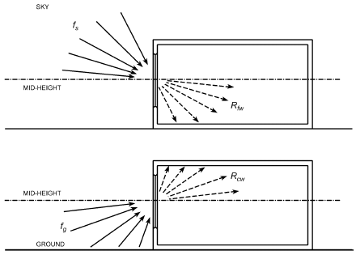

*Fig. 13 Split-Flux Method*

> (Oh and Haberl 2016c)

<!-- str. 568 -->

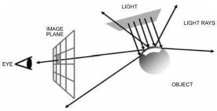

*Fig. 14 Forward Ray-Tracing Method*

> (Oh and Haberl 2016c)

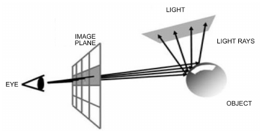

*Fig. 15 Backward Ray-Tracing Method*

> (Oh and Haberl 2016c)

the radiant properties) and the view factors (i.e., the relative geometry properties) of the luminous emittances are defined as the resistances in the network (O’Brien 1955). The method is used in Lumen Micro and in one of the daylighting models of EnergyPlus v.1.x and higher.

Finally, **ray tracing** is the most advanced and accurate method for analyzing the interreflections between both diffuse and specular surfaces in complex enclosures (Baker et al. 1993; Ward and Rubinstein 1988; Ward et al. 1988). The method follows the light rays in an enclosure and takes into account all the characteristics of various surface geometries and surface reflectances. The method was originally developed to create high-quality computer graphics in complex scenes (Baker et al. 1993). Ray tracing is typically used to analyze daylight illuminance itself, instead of being combined with whole-building energy simulation programs to account for electric lighting. The ray-tracing method is used in Radiance (Ward 1994) and DIVA (Jakubiec and Reinhart 2011). Additional details can be found in Oh and Haberl (2016c). The forward ray-tracing method traces the rays of light generated from a source of light to the eye of the viewer (Kuchkuda 1988). Figure 14 shows the concept of the forward ray-tracing method (Grantham 2008; Oh and Haberl 2016c). The backward ray-tracing method traces a ray of each point (i.e., each pixel) backwards from the viewer through the image plane to the object (Arvo 1986; Kuchkuda 1988; Ward and Rubinstein 1988; Ward et al. 1988). Figure 15 shows this concept (Grantham 2008; Oh and Haberl 2016c).

## 5.3 PASSIVE HEATING

Passive buildings use solar heating directly (i.e., without pumps, blowers, etc.) and sometimes include natural passive cooling. Solar direct gain, sunspaces, Trombe walls, and passive downdraft cool towers are examples of passive solar strategies. Detailed simulation programs such as TRNSYS (Duffie and Beckman 2013) and SUN-REL (Deru et al. 2002) can be used to analyze passive solar energy applications and building loads. TRNSYS and SUNREL use a thermal network approach (Paschkis 1942) to analyze the time-varying solar radiation and heat transfer in a building. In addition, simplified methods such as the solar load ratio (SLR) method (Balcomb and Hedstrom 1976) and the unutilizability method (Monsen and Klein 1980; Monsen et al. 1981) can be used to analyze passive solar systems. Computer simulations can be used to calculate the time-dependent, short-term, and long-term performance of solar energy systems in detail. Simplified methods that require fewer calculations than hourly solar simulations (Klein 1993) can be used to estimate the long-term performance of solar energy systems. Passive solar design analysis is useful for engineers to select and size solar systems when input data and on-site solar irradiation data may not be available (Evans et al. 1982). Additional details can be found in Oh and Haberl (2016b).

## 6. DATA-DRIVEN MODELING

The objective of data-driven (inverse) modeling is to determine a mathematical description of the system and to estimate system parameters when the input and output variables are known and measured. The data-driven approach is relevant only when the system has already been built and actual performance data are available for model development, calibration, and/or identification.

There are several important uses of data-driven models. They can be used to verify savings for implemented energy conservation measures, where the data-driven model provides an estimate of baseline energy consumption for comparison to post-retrofit energy consumption. Data-driven models can be used with energy management and control systems to predict energy use (Kreider and Haberl 1994). Hourly or daily comparisons of measured versus predicted energy use can be used to determine whether systems are being left on unnecessarily or are in need of maintenance. Combinations of predicted energy use and a knowledge-based system can indicate above-normal energy use and diagnose the possible cause of the malfunction if sufficient historical information has been previously gathered (Haberl and Claridge 1987). Hourly systems that use artificial neural networks have also been constructed (Kreider and Wang 1991).

## 6.1 CATEGORIES OF DATA-DRIVEN METHODS

Data-driven methods for energy-use estimation in buildings and related HVAC&R equipment can be classified into two broad categories. These approaches differ widely in data requirements, time and effort needed to develop the associated models, user skill requirements, and sophistication and reliability provided.

### Empirical or “Black-Box” Approach

With an empirical approach, a simple or multivariate regression model is identified between measured energy use and the various influential parameters (e.g., climatic variables, building occupancy). The form of the regression models can be either purely statistical or loosely based on some basic engineering formulation of energy use in the building. In any case, the identified model coefficients are such that no (or very little) physical meaning can be assigned to them. This approach can be used with any time scale (monthly, daily, hourly or subhourly) if appropriate data are available. Single-variate, multivariate, change point, Fourier series, and artificial neural network (ANN) models fall under this category. Least-squares regression is the most common approach to model identification, although more sophisticated regression techniques such as maximum likelihood and two-stage regression schemes can also be used.

<!-- str. 569 -->

Statistical regression models are usually adequate for estimating savings in demand-side management (DSM) programs for conventional energy conservation measures (lighting retrofits, air handler retrofits such as CV to VAV retrofits) and for baseline model development in energy conservation measurement and verification (M&V) projects (Claridge 1998; Dhar 1995; Dhar et al. 1998, 1999a, 1999b; Fels 1986; Haberl and Culp 2012; Haberl et al. 1998; Katipamula et al. 1998; Kissock et al. 1998; Krarti et al. 1998; Kreider and Wang 1991; MacDonald and Wasserman 1989; Miller and Seem 1991; Reddy et al. 1997; Ruch and Claridge 1991).

Statistical models may also be appropriate for modeling equipment such as pumps and fans, and even more elaborate equipment such as chillers and boilers, if the necessary performance data are available (Braun 1992; Chen et al. 2005; Englander and Norford 1992; Lorenzetti and Norford 1993; Phelan et al. 1996). Although this approach allows detection or flagging of equipment or system faults, it is usually of limited value for diagnosis and online control.

### Gray-Box Approach

The gray-box approach first formulates a physical model to represent the structure or physical configuration of the building or HVAC&R equipment or system, and then identifies important parameters representative of certain key and aggregated physical parameters and characteristics by statistical analysis (Rabl and Riahle 1992). This approach requires a high level of user expertise both in setting up the appropriate modeling equations and in estimating these parameters. Often an intrusive experimental protocol is necessary for proper parameter estimation. This approach has great potential, especially for fault detection and diagnosis (FDD) and online control, but its applicability to whole-building energy use is limited. Examples of parameter estimation studies applied to building energy use are Andersen and Brandemuehl (1992), Braun (1990), Gordon and Ng (1995), Guyon and Palomo (1999a), Hammarsten (1984), Rabl (1988), Reddy (1989), Reddy et al. (1999), Sonderegger (1977), and Subbarao (1988).

## 6.2 TYPES OF DATA-DRIVEN MODELS

**Steady-state models** do not consider effects such as thermal mass or capacitance that cause short-term temperature transients. Generally, these models are appropriate for monthly, weekly, or daily data and are often used for baseline model development. **Dynamic models** capture effects such as building warm-up or cooldown periods and peak loads, and are appropriate for building load control, FDD, and equipment control. A simple criterion to determine whether a model is steady-state or dynamic is to look for the presence of time-lagged variables, either in the response or regressor variables. Steady-state models do not contain time-lagged variables.

### Steady-State Models

Several types of steady-state models are used for both building and equipment energy use: single-variate, multivariate, polynomial, and physical.

**Single-Variate Models.** Single-variate models (i.e., models with one regressor variable only) are perhaps the most widely used. They formulate energy use in a building as a function of one driving force that affects building energy use. An important aspect in identifying statistical models of baseline energy use is the choice of the functional form and the independent (or regressor) variables. Extensive studies (Fels 1986; Katipamula et al. 1994; Kissock et al. 1993; Reddy et al. 1997) have indicated that the outdoor dry-bulb temperature is the most important regressor variable for typical buildings, especially at monthly time scales but also at daily time scales.

The simplest steady-state data-driven model is one developed by regressing monthly utility consumption data against average billing-period temperatures. The model must identify the balancepoint temperatures (or change points) at which energy use switches from weather-dependent to weather-independent behavior. In its simplest form, the 18.3°C degree-day model is a change-point model that has a fixed change point at 18.3°C. Other examples include three- and five-parameter Princeton scorekeeping methods (PRISM) based on the variable-base degree-day concept (Fels 1986). An allied modeling approach for commercial buildings is the four-parameter (4-P) model developed by Ruch and Claridge (1991), which is based on the monthly mean temperature (and not degree-days). Table 4 shows some commonly used model functional forms. The three parameters are a weather-independent base-level use, a change point, and a temperature-dependent energy use, characterized as a slope of a line that is determined by regression. The four parameters include a change point, a slope above the change point, a slope below the change point, and the energy use associated with the change point. A data-driven bin method has also been proposed to handle more than four change points (Thamilseran and Haberl 1995).

Figure 16 shows several types of steady-state, single-variate data-driven models. Figure 16A shows a simple one-parameter, or constant, model, and Table 4 gives the equivalent notation for calculating the constant energy use using this model. Figure 16B shows a steady-state two-parameter (2-P) model where b0 is the yaxis intercept and b1 is the slope of the regression line for positive values of x, where x represents the ambient air temperature. The 2-P model represents cases when either heating or cooling is always required.

Figure 16C shows a three-parameter change-point model, typical of natural gas energy use in a single-family residence that uses gas for space heating and domestic water heating. In the notation of Table 4 for the three-parameter model, b0 represents the baseline energy use and b1 is the slope of the regression line for values of ambient temperature less than the change point b2. In this type of notation, the superscripted plus sign indicates that only positive values of the parenthetical expression are considered. Figure 16D shows a three-parameter model for cooling energy use, and Table 4 provides the appropriate analytic expression.

**Table 4 Single-Variate Models Applied to Utility Billing Data**

| Model Type | Independent Variable(s) | Form | Examples |
|---|---|---|---|
| One-parameter or constant (1-P) | None | E = b0 | Non-weather-sensitive demand |
| Two-parameter (2-P) | Temperature | E = b0 +b1(T) |  |
| Three-parameter (3-P) | Degree-days/Temperature | E = b0 + b1(DDBT) E = b0 + b1(b2 − T)+ E = b0 + b1(T − b2)+ | Seasonal weather-sensitive use (fuel in winter, electricity in summer for cooling) |
| Four-parameter change point (4-P) | Temperature | E = b0 + b1(b3 − T)+− b2(T − b3)+ E = b0 – b1(b3 − T)+ + b2(T − b3)+ | Energy use in commercial buildings |
| Five-parameter (5-P) | Degree-days/Monthly mean temperature | E = b0 − b1(DDTH) + b2(DDTC) E = b0 + b1(b3 − T)+ + b2(*T – b*4)+ | Heating and cooling supplied by same meter |

Note: DD denotes degree-days and T is monthly mean daily outdoor dry-bulb temperature.

<!-- str. 570 -->

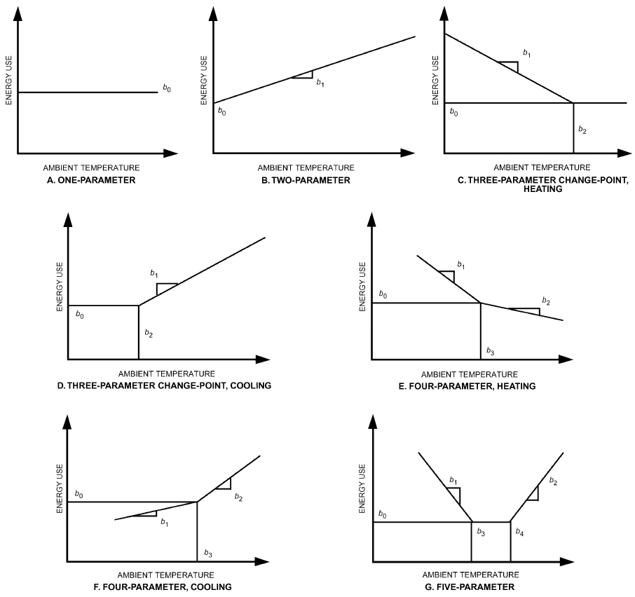

*Fig. 16 Steady-State, Single-Variate Models for Modeling Energy Use in Residential and Commercial Buildings*

Figures 16E and 16F show four-parameter models for heating and cooling, respectively. The appropriate expressions for calculating the heating and cooling energy consumption are found in Table 4: b0 represents the baseline energy exactly at the change point b3, and b1 and b2 are the lower and upper region regression slopes for ambient air temperature below and above the change point b3. Figure 16G shows a 5-P model (Fels 1986), which is useful for modeling buildings that are electrically heated and cooled. The 5-P model has two change points and a base level consumption value.

The advantage of these steady-state data-driven models is that their use can be easily automated and applied to large numbers of buildings where monthly utility billing data and average daily temperatures for the billing period are available. Steady-state single-variate data-driven models have also been applied with success to daily data (Kissock et al. 1998). In such a case, the variable-base degree-day method and monthly mean temperature models described previously for utility billing data analysis become identical in their functional form. Single-variate models can also be applied to daily data to compensate for differences such as weekday and weekend use by separating the data accordingly and identifying models for each period separately.

Disadvantages of steady-state single-variate data-driven models include insensitivity to dynamic effects (e.g., thermal mass) and to variables other than temperature (e.g., humidity and solar gain), and inappropriateness for some buildings (e.g., buildings with strong on/off schedule-dependent loads or buildings with multiple change points). Moreover, a single-variable, 3-P model such as the PRISM model (Fels 1986) has a physical basis only when energy use above a base level is linearly proportional to degree-days. This is a good approximation in the case of heating energy use in residential buildings where heating load never exceeds the heating system’s capacity. However, commercial buildings generally have higher internal heat generation with simultaneous heating and cooling energy use and are strongly influenced by HVAC system type and control strategy. This makes energy use in commercial buildings less strongly influenced by outdoor air temperature alone. Therefore, it is not surprising that blind use of single-variate models has had mixed success at modeling energy use in commercial buildings (MacDonald and Wasserman 1989).

<!-- str. 571 -->

Change-point regression models work best with heating data from buildings with systems that have few or no part-load nonlinearities (i.e., systems that become less efficient as they begin to cycle on/off with part loads). In general, single-variate change-point regression models do not predict cooling loads as well because outdoor humidity has a large influence on latent loads on the cooling coil. Other factors that decrease the accuracy of change-point models include solar effects, thermal lags, and on/off HVAC schedules. A change point model based on a linear combination of temperature and specific humidity, and in which direct and diffuse irradiance were included as separate explanatory variables, was found to work well for aggregates of buildings (Ali et al. 2011).

Four-parameter models are a better statistical fit than three-parameter models in buildings with continuous, year-round cooling or heating (e.g., grocery stores and office buildings with high internal loads). However, every model should be checked to ensure that the regression does not falsely indicate an unreasonable relationship. Paulus et al. (2015) provided an algorithm aiding in the selection of change-point linear regression models.

A major advantage of using a steady-state data-driven model to evaluate the effectiveness of energy conservation retrofits is its ability to factor out year-to-year weather variations by using a normalized annual consumption (NAC) (Fels 1986). Basically, annual energy conservation savings can be calculated by comparing the difference obtained by multiplying the pre- and post-retrofit parameters by the weather conditions for the average year. Typically, 10 to 20 years of average daily weather data from a nearby weather service site are used to calculate 365 days of average weather conditions, which are then used to calculate the average pre- and post-retrofit conditions.

Utilities and government agencies have found it advantageous to prescreen many buildings against test regression models. These data-driven models can be used to develop comparative figures of merit for buildings in a similar standard industrial code (SIC) classification. A minimum goodness of fit is usually established that determines whether the monthly utility billing data are well fitted by the one-, two-, three-, four-, or five-parameter model being tested. Comparative figures of merit can then be determined by dividing the parameters by the conditioned floor area to yield average daily energy use per unit area of conditioned space. For example, an areanormalized comparison of base-level parameters across residential buildings would be used to analyze weather-independent energy use. This information can be used by energy auditors to focus their efforts on those systems needing assistance (Haberl and Komor 1990a, 1990b).

**Multivariate Models.** Three types of steady-state, multivariate models have been reported:

- **Standard multiple-linear** or **change-point regression models**, where the set of data observations is treated without retaining the time-series nature of the data (Katipamula et al. 1998).
- **Fourier series models** that retain the time-series nature of building energy use data and capture the diurnal and seasonal cycles according to which buildings are operated (Dhar 1995; Dhar et al. 1998, 1999a, 1999b; Seem and Braun 1991).
- **Gaussian process (GP) models** use a nonparametric, nonlinear regression method that produces estimates of the prediction uncertainty along with predictions of energy use (Burkhart et al. 2014; Heo and Zavala 2012; Heo et al. 2013).

These models are a logical extension of single-variate models, provided that the choice of variables to be included and their functional forms are based on the engineering principles under which HVAC and other building systems operate. The goal of modeling energy use by the multivariate approach is to characterize building energy use with a few readily available and reliable input variables. These input variables should be selected with care. The model should contain variables not affected by the retrofit and thus unlikely to change (e.g., climatic variables) from pre-retrofit to post-retrofit periods. Other less obvious variables, such as changes in operating hours, base load, and occupancy levels, should be included in the model if these are not energy conservation measures (ECMs) but variables that may change during the post-retrofit period.

Environmental variables that meet these criteria for modeling heating and cooling energy use include outdoor air dry-bulb temperature, solar radiation, and outdoor specific humidity. Some of these variables are difficult to estimate or measure in an actual building and hence are not good candidates for regressor variables. Further, some of the variables change little over time. Although the effect of these variables on energy use may be important, a data-driven model will implicitly lump their effect into the parameter that represents constant load. In commercial buildings, internally generated loads, such as the heat given off by people, lights, and electrical equipment, also affect heating and cooling energy use. These internal loads are difficult to measure in their entirety. However, monitored electricity used by internal lights and equipment may be a good surrogate for total internal sensible loads (Reddy et al. 1999). For example, when the building is fully occupied, it is also likely to be experiencing high internal electric loads, and vice versa.

The effect of environmental variables is important for buildings such as offices but may be less so for buildings with loads dominated by internal heat gain (e.g., data centers) and buildings with loads dominated by occupants (e.g. assembly buildings).

Differences in HVAC system behavior during occupied and unoccupied periods can be modeled by a dummy or indicator variable (Draper and Smith 1981). For some office buildings, there seems to be little need to include a dummy variable, but its inclusion in the general functional form adds flexibility.

Air-side heating and cooling use in various HVAC system types has been addressed by Reddy et al. (1995) and subsequently applied to monitored data in commercial buildings (Katipamula et al. 1994, 1998). Because quadratic and cross-product terms of engineering equations are not usually picked up by multivariate models, strictly linear energy use models are often the only option.

In addition to outdoor temperature To, internal electric equipment and lighting load Eint, solar loads qsol, and latent effects via the outdoor dew-point temperature Tdp are candidate regressor variables. In commercial buildings, a major portion of the latent load derives from fresh air ventilation. However, this load appears only when the outdoor air dew-point temperature exceeds the cooling coil temperature. Hence, the term (Tdp – Ts)+ (where the + sign indicates that the term is to be set to zero if negative, and Ts is the mean surface temperature of the cooling coil, typically about 11 to 13°C) is a more realistic descriptor of the latent loads than is Tdp alone. Using (Tdp – Ts)+ as a regressor in the model is a simplification that seems to yield good accuracy.

Therefore, a multivariate linear regression model with an engineering basis has the following structure:

- Qbldg = b0+ b1(To– b3)–+ b2(To– b3)++ b4(Tdp– b6)–

> + b5(Tdp– b6)++ b7qsol+ b8Eint&emsp;**(19)**

<!-- str. 572 -->

Based on the preceding discussion, b4 = 0 because outdoor air does not introduce a latent cooling load when Tdp is less than the cooling coil surface temperature. Introducing indicator variable terminology (Draper and Smith 1981), Equation (19) becomes

> Qbldg = a + bTo+ cI + dITo+ eTd+p+ fqsol+ gEint&emsp;**(20)**

where the indicator variable I is introduced to handle the change in slope of the energy use due to To. The variable I is set equal to 1 for To values to the right of the change point (i.e., for high To range) and set equal to 0 for low To values. As with the single-variate segmented models (i.e., 3-P and 4-P models), a search method is used to determine the change point that minimizes the total sum of squares of residuals (Fels 1986; Kissock et al. 1993).

Katipamula et al. (1994) found that Equation (20), appropriate for VAV systems, could be simplified for constant-volume HVAC systems:

> Qbldg = a + bTo+ eTd+p+ fqsol+ gEint&emsp;**(21)**

Note that instead of using (Tdp – Ts)+, the absolute humidity potential (W0 – Ws)+ could also be used, where W0 is the outdoor absolute humidity, and Ws is the absolute humidity level at the dew point of the cooling coil (typically about 0.009 kg/kg). A final aspect to keep in mind is that the term Td+pshould be omitted from the regressor variable set when regressing heating energy use, because there are no latent loads on a heating coil.

These multivariate models are very accurate for daily time scales and slightly less so for hourly time scales. The inaccuracy at hourly time scales is because changes in the way the building is operated during the day and the night lead to different relative effects of the various regressors on energy use, which cannot be accurately modeled by one single hourly model. Breaking up energy use data into hourly bins corresponding to each hour of the day and then identifying 24 individual hourly models leads to appreciably greater accuracy (Katipamula et al. 1994).

Another accurate method uses a piecewise linear regression with respect to temperature and a time-of-week indicator variable to account for changes in energy use throughout each day of the week. This model (Matthieu 2011) may be applied to daily, hourly, or subhourly data.

Gaussian process (GP) models are nonparametric regression models, meaning the relationship between input and output variables is not strictly defined at the outset of the regression. In GP modeling, the measured output data are samples of a multivariate Gaussian distribution with the distribution parameters being the input variables. The distribution is defined by matching the covariance of the distribution to the covariance between the measured input and output data. For any new set of input variables, a Gaussian distribution is defined and the mean of the distribution is interpreted to be the predicted output and the variance of the distribution the uncertainty in the prediction. Thus, GP modeling not only produces an output value given a set of multivariate inputs, it also produces an estimate of the uncertainty of the prediction. Heo and Zavala (2012) used GP models to predict the hourly energy use of a chilled-water system using ambient temperature, occupancy, relative humidity, and chiller supply temperature and showed much better performance than standard multivariate regression models.

**Hybrid Inverse Change Point Model.** ASHRAE RP-1404 (Abushakra et al. 2014) was conducted primarily to develop analysis methodologies by which less than a whole year of field monitoring can be used for whole-building energy use prediction while satisfying current accuracy guidelines. The methodologies were developed to benefit ongoing efforts to spur diffusion of high-performance buildings by actual monitoring and to benefit energy service companies (ESCOs) and energy professionals who need a more cost-effective and acceptable alternative to year-long energy monitoring. Applications for the hybrid inverse change point model include detailed audits, green-building performance verification, and verification of post-retrofit claims using pre/post monitored data.

The modeling method is called hybrid because two regressions are performed at different time scales. The weather-dependent portion uses a year of monthly day-normalized utility bills, and the weather-independent portion uses either daily or hourly data covering a shorter time span, possibly as short as two weeks. The research revealed that (1) two weeks of hourly monitored data can be adequate for producing accurate long-term whole-building energy predictions, if the monitoring is taken at a correct time, and (2) adding more data to the regression model (extending the length of the short-term monitoring period) can, counterintuitively, make the predictive model poorer.

The analysis was completed in detail at two different time scales: daily and hourly. The analysis with both hourly and daily data revealed that the proper monitoring period is highly dependent on the time at which the data are taken, with the best time to collect data being during the spring and fall, or periods where the average temperature is close to the annual average temperature and the temperature has a wide range.

The following is an example of the modeling procedure that results in an hourly energy regression model. An example of the method applied to daily data can be found in Singh et al. (2013). The first regression uses one of the steady-state change point models shown in Figure 16 and Table 4, possibly with an additional weather-related independent variable, such as humidity. For example, the form could be a 3-P cooling shape (using the nomenclature of Table 4) such as

> Edaily = b0 + b1(Tdailyaverage – b2)+&emsp;**(22)**

where Edaily is day-normalized energy consumption in units of energy consumption per day.

For predicting cooling thermal loads, such as chilled-water use, investigate adding the outdoor humidity variable as a regressor in the model to account for latent loads. Equation (22) would become a multivariable linear regression of the form

Edaily = b0 + b1(Tdailyaverage – b2)+ + b3(ωdailyaverage – 0.009)+ (23)

The (ωdailyaverage – 0.009)+ term in Equation (23) is a surrogate for the latent load existing only when the absolute humidity ratio of air entering the cooling coil is above 0.009.

The dependent variable for the second regression is the residuals resulting from using the first equation to predict the temperature dependent energy portion at the hourly time scale, calculated by dividing the temperature dependent portion of the first regression by 24 hours/day. The second regression uses gathered hourly data consisting of weather and an internal driving variable(s), such as Xinternal,hourly, often an occupancy indicator or submetered lighting and equipment load. The second regression is then performed to calculate the coefficients for the internal driving variables and constant term. Using Equation (22), the second regression has the form

> Ehourly– b1/24(Thourly– b2)+ = b3+ b4(Xinternal,hourly)&emsp;**(24)**

The final equation for prediction at the hourly time scale is a rearrangement of Equation (24).

> Ehourly = b3+ b1/24(Thourly– b2)++ b4(Xinternal,hourly)&emsp;**(25)**

<!-- str. 573 -->

**Polynomial Models.** Historically, polynomial models have been widely used as pure statistical models to model the behavior of equipment such as pumps, fans, and chillers (Stoecker and Jones 1982), as discussed in the section on HVAC Component Modeling. The theoretical aspects of calculating pump performance are well understood and documented. Pump capacity and efficiency are calculated from measurements of pump pressure, flow rate, and pump electrical power input. Phelan et al. (1996) studied the predictive ability of linear and quadratic models for electricity consumed by pumps and water mass flow rate, and concluded that quadratic models are superior to linear models. For fans, Phelan et al. (1996) studied the predictive ability of linear and quadratic polynomial single-variate models of fan electricity consumption as a function of supply air mass flow rate, and concluded that, although quadratic models are superior in terms of predicting energy use, the linear model seems to be the better overall predictor of both energy use and demand (i.e., maximum monthly power consumed by the fan). This is a noteworthy conclusion given that a third-order polynomial is warranted analytically as well as from monitored field data presented by previous authors [e.g., Englander and Norford (1992), Lorenzetti and Norford (1993)].

Polynomial models have been used to correlate chiller (or heat pump) capacity Qevap and the electrical power consumed by the chiller (or compressor) Ecomp with the relevant number of influential physical parameters. For example, based on the functional form of the DOE-2 building simulation software (York and Cappiello 1982), models for part-load performance of energy equipment and plant, Ecomp, can be modeled as the following triquadratic polynomial:

- Ecomp = a + bQevap+ cTcinond+ dTeovuatp+ eQe2vap

> 2 2
>
> + f Tcionnd + gTeovuatp + hQevapTcionnd+ iTeovuatpQevap&emsp;**(26)**

> + jTcionndTeovuatp+ kQevapTcinondTeovuatp

In this model, there are 11 model parameters to identify. However, because all of them are unlikely to be statistically significant, a step-wise regression to the sample data set yields the optimal set of parameters to retain in a given model. For example, Armstrong et al. (2006b) found the b, i, and k terms, using Todb for Tcond and Tewb for Tevap, to provide an adequate model of three different fixed-speed rooftop units. Other authors, such as Braun (1992) and Hydeman et al. (2002), used slightly different polynomial forms. Over a wide range of capacity and lift a full tricubic polynomial can be justified for VRF heat pump equipment (Gayeski et al. 2011).

**Physical Models.** In contrast to polynomial models, which have no physical basis, physical models are based on fundamental thermodynamic or heat transfer considerations. These types of models are usually associated with the parameter estimation approach. Often, physical models are preferred because they generally have fewer parameters, and their mathematical formulation can be traced to actual physical principles that govern the performance of the building or equipment. Hence, model coefficients tend to be more robust, leading to sounder model predictions. Only a few studies have used steady-state physical models for parameter estimation relating to commercial building energy use [e.g., Reddy et al. (1999)]. Unlike in single-family residences, it is difficult to perform elaborately planned experiments in large buildings and obtain representative values of indoor fluctuations.

For example, the generalized Gordon and Ng (GN) model (Gordon and Ng 2000) is a simple, analytical, universal model for chiller performance based on first principles of thermodynamics and linearized heat losses. The model predicts the dependent chiller coefficient of performance (COP) (the ratio of thermal cooling capacity Qch to electrical power E consumed by the chiller) with easily measurable parameters such as the fluid (water or air) temperature entering the condenser Tcdi, fluid temperature entering the evaporator Tchi, and the thermal cooling capacity of the evaporator. The GN model is a three-parameter model in the following form:

> (1/COP ) (T chi)/(T cdi)
>
> + 1 – 1 = a1(T chi)/(Q ch) + a2((T – T ) cdi chi)/(T Q cdi ch)

> ( )&emsp;**(27a)**
>
> + a3((1 ⁄ COP + 1)Qch)/(T cdi)

where temperatures are in absolute units.

Substituting the following, x1 = (T chi)/(Q ch) x2 = ((T – T ) cdi chi)/(T Q cdi ch) x3 = ((1 ⁄ COP + 1)Qch)/(T cdi)

(27b)

> (1/COP )(T chi)/(T cdi)

and y = + 1 – 1

> ( )

the model given by Equation (27a) becomes

> y = a1x1 + a2x2 + a3x3&emsp;**(27c)**

which is a three-parameter linear model with no intercept term. The parameters of the model in Equation (27c) have the following physical meaning:

- a1 = ΔS = total internal entropy production in chiller
- a2 = Qleak = heat losses (or gains) from (or into) chiller
- a3 = R = total heat exchanger thermal resistance = 1/Ccd + 1/Cch, where C is effective thermal conductance

Gordon and Ng (2000) point out that Qleak is typically an order of magnitude smaller than the other terms, but it is not negligible for accurate modeling, and should be retained in the model if the other two parameters identified are to be used for chiller diagnostics. The same linear model structure as Equation (27c) can be used if the fluid temperature leaving the evaporator Tcho is used instead of Tchi. However, the physical interpretation of the term a3 is modified accordingly.

Reddy and Anderson (2002) and Sreedharan and Haves (2001) found that the GN and multivariate polynomial (MP) models were comparable in their predictive abilities. The GN model requires much less data if selected judiciously [even four well-chosen data points can yield accurate models, as demonstrated by Corcoran and Reddy (2003)]. Jiang and Reddy (2003) tested the GN model against more than 50 data sets covering various generic types and sizes of water-cooled chillers (single- and double-stage centrifugal chillers with inlet guide vanes and variable-speed drives, screw, scroll), and found excellent predictive ability (coefficient of variation of RMSE in the range of 2 to 5%).

### Dynamic Models

In contrast to steady-state data-driven models, which are used with monthly and daily data containing one or more independent variables, dynamic data-driven models are typically used with hourly or subhourly data in cases where the building’s thermal mass is significant enough to delay heat gains or losses. Dynamic models traditionally require solving a set of differential equations. Disadvantages of dynamic data-driven models include their complexity and the need for more detailed measurements to tune the model. Unlike steady-state data-driven models, dynamic data-driven models usually require a high degree of user interaction and knowledge of the building or system being modeled.

<!-- str. 574 -->

Several residential energy studies have used dynamic data-driven models based on parameter estimation approaches, usually involving intrusive data gathering. Rabl (1988) classified the various types of dynamic data-driven models used for whole-building energy use, and identified the common underlying features of these models. There are essentially four different types of model formulations: thermal network, time series, differential equation, and modal, all of which qualify as parameter-estimation approaches.

A few studies (Hammarsten 1984; Rabl 1988; Reddy 1989) evaluated these different approaches with the same data set. Several papers reported results of applying different techniques, such as thermal network and autoregressive-moving-average (ARMA) models, to residential and commercial building energy use. Examples of dynamic data-driven models for commercial buildings are found in Andersen and Brandemuehl (1992), Braun (1990), and Rabl (1988), and for apartment buildings in Armstrong et al. (2006a). Successful use of ARMA models for model-predictive control is reported by Gayeski et al. (2012).

Dynamic data-driven models based on pure statistical approaches have also been reported. Two examples are machine learning (Miller and Seem 1991) and artificial neural networks (Kreider and Haberl 1994; Kreider and Wang 1991; Miller and Seem 1991).

## 6.3 MODEL ACCURACY AND GOODNESS OF FIT

Good data-driven models are determined by their overall goodness-of-fit and accuracy metrics, by testing each parameter for significance, and ensuring that the chosen model form and regressors explain the response of the dependent variable as completely as possible.

Accuracy of model results may be represented by statistical metrics. Commonly used metrics are the normalized mean bias error (NMBE) and the coefficient of variance of the root mean square error [CV(RMSE)]. Equations for these metrics are provided in the section on Modeling Calibration. CV(RMSE) tests how well the model recreates the data and is also an indication of random error. NMBE tests how biased the model is in predicting outputs over the period the model was developed.

A widely used statistic to gage a model’s goodness of fit is the **coefficient of determination R2**(Draper and Smith 1981; Neter et al. 1989). A value of R2 = 1 indicates a perfect correlation between actual data and the regression equation; a value of R2 = 0 indicates no correlation. For tuning for a performance contract, a rule of thumb is that the value of R2 should not be less than 0.75.

When more than one independent variable is included in the regression, the adjusted R2 should be used to assess the goodness of fit, as the unadjusted R2 increases with the addition of variables, and can be misleading. When additional independent variables are included, each should be tested for significance. The standard error of the estimate of the coefficients on each independent variable should be assessed. The smaller the standard error compared to the coefficient’s magnitude, the more reliable the coefficient estimate. To identify the significance of individual coefficients, **t-statistics** (or **t-values**) are used. These are simply the ratio of the coefficient estimate divided by the standard error of the estimate.

The coefficient of each variable included in the regression has a t-statistic. For a coefficient to be statistically meaningful, the absolute value of its t-statistic must be at least 2.0. In other words, under no circumstances should a variable be included in a regression if the standard error of its coefficient estimate is greater than half the magnitude of the coefficient (even when including a variable that increases the adjusted R2). Generally, including more variables in a regression increases R2, but the significance of most individual coefficients is likely to decrease.

Some independent variables may be linearly correlated. This condition, called **multicollinearity**, can result in large uncertainty in the estimates of the regression coefficients (i.e., error) and can also lead to poorer model prediction accuracy compared to a model where the regressors are not linearly correlated.

Residuals should be plotted against each independent variable to check that no relationship of any sort (not just linear correlation) exists. The distribution of residuals should follow a normal distribution. For time-series data, the residuals should be checked for serial correlation (ASHRAE 2010).

Several authors recommend using **principal component analy- sis (PCA)** to overcome multicollinearity effects. PCA was one of the strongest analysis methods in the ASHRAE Predictor Shootout I and II contests (Haberl and Thamilseran 1996; Kreider and Haberl 1994). Analysis of multiyear monitored daily energy use in a grocery store found a clear superiority of PCA over multivariate regression models (Ruch et al. 1993), but this conclusion is unsupported for commercial building energy use in general. A more general evaluation by Reddy and Claridge (1994) of both analysis techniques using synthetic data from four different U.S. locations found that injudicious use of PCA may exacerbate rather than overcome problems associated with multicollinearity. Draper and Smith (1981) also caution against indiscriminate use of PCA.

## 6.4 EXAMPLES USING DATA-DRIVEN METHODS

### Modeling Utility Bill Data

The following example (taken from Sonderegger 1998) illustrates a utility bill analysis. Assume that values of utility bills over an entire year have been measured. To obtain the equation coefficients through regression, the utility bills must be normalized by the length of the time interval between utility bills. This is equivalent to expressing all utility bills, degree-days, and other independent variables by their daily averages.

Appropriate modeling software is used in which values are assumed for heating and cooling balance points; from these, the corresponding heating and cooling degree-days for each utility bill period are determined. Repeated regression is done till the regression equation represents the best fit to the meter data. The model coefficients are then assumed to be tuned. Some programs allow direct determination of these optimal model parameters (e.g., balance point temperature) without manual tuning of the parameters by the user.

Figure 17 shows how well a regression fit captures measured baseline energy use in a hospital building. Cooling degree-days are found to be a significant variable, with the best fit for a base temperature of 12.2°C.

In this analysis, some individual utility bills may be unsuitable to develop a baseline and should be excluded from the regression. For example, a bill may be atypically high because of a one-time equipment malfunction that was subsequently repaired. Given the justification to exclude some data, it is often tempting to look for more reasons to exclude bills that fall far from “the line” and not question those that are close to it. For example, bills for periods containing vacations or production shutdowns may look anomalously low, but excluding them from the regression would result in a chronic overestimate of the future baseline during the same period.

### Neural Network Models

Figure 18 shows results for a single neural network typical of several hundred networks constructed for an academic engineering center located in central Texas. The cooling load is created by solar gains, internal gains, outdoor air sensible heat, and outdoor air humidity loads. The neural network is used to predict the pre-retrofit energy consumption for comparison with measured consumption of the retrofitted building. Six months of pre-retrofit data were available to train the network. Solid lines show the known building consumption data, and dashed lines show the neural network (Sondereg predictions. This figure shows that a neural network trained for one period (September 1989) can predict energy consumption well into the future (in this case, January 1990).

<!-- str. 575 -->

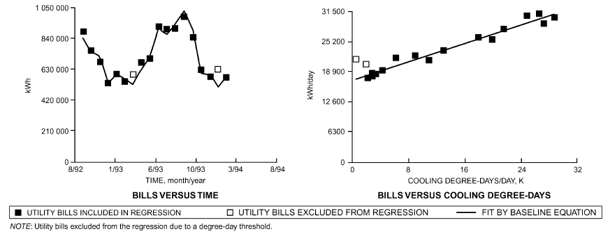

*Fig. 17 Variable-Base Degree-Day Model Identification Using Electricity Utility Bills at Hospital*

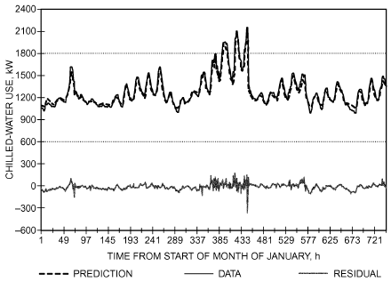

*Fig. 18 Neural Network Prediction of Whole-Building, Hourly Chilled-Water Consumption for Commercial Building*

The network used for this prediction had two hidden layers. The input layer contained eight neurons that receive eight different types of input data as listed below. The output layer consisted of one neuron that gave the output datum (chilled-water consumption). Each training fact (i.e., training data set), therefore, contained eight input data (independent variables) and one pattern datum (dependent variable). The following eight hourly input data used in each hour’s data vector were selected on physical bases (Kreider and Rabl 1994):

- Hour number (0 to 2300)
- Ambient dry-bulb temperature
- Horizontal insolation
- Humidity ratio
- Wind speed
- Weekday/weekend binary flag (0, 1)
- Past hour’s chilled-water consumption
- Second past hour’s chilled-water consumption ger 1998)

These measured independent variables were able to predict chilled-water use to an RMS error of less than 4% (JCEM 1992).

Choosing an optimal network’s configuration for a given problem remains an art. The number of hidden neurons and layers must be sufficient to meet the requirement of the given application. However, if too many neurons and layers are used, the network tends to memorize data rather than learning (i.e., finding the underlying patterns in the data). Further, choosing an excessively large number of hidden layers significantly increases the required training time for certain learning algorithms. Anstett and Kreider (1993), Krarti et al. (1998), Kreider and Wang (1991), and Wang and Kreider (1992) report additional case studies for commercial buildings.

## 6.5 MODEL SELECTION

Table 5 presents a decision diagram for selecting a forward or data-driven model where use of the model, degree of difficulty in understanding and applying the model, time scale for data used by the model, calculation time, and input variables used by the models are the criteria used to choose a particular model.

More information on data-driven models can be found in the ASHRAE *Inverse Modeling Toolkit* (Haberl and Cho 2004; Haberl et al. 2003; Kissock et al. 2003). This toolkit contains FORTRAN 90 and executable code for performing linear and change-point linear regressions, variable-based degree-days, multilinear regression, and combined regressions. It also includes a complete test suite of data sets for testing all models.

## 7. MODEL CALIBRATION

Calibration is the use of known data (e.g., utility bills) on the observed relationship between a dependent variable (e.g., simulation output) and an independent variable (e.g., simulation input) to make estimates of other values of the independent variable from new observations of the dependent variable. For energy simulation models, calibration typically involves observation of changes in simulation output as simulation inputs are modified, with the goal of identifying a set of inputs leading to simulation outputs that match measured building performance.

The perception of validity and usefulness of any energy simulation model is largely determined by how closely the simulation output matches actual building performance, usually in terms of energy consumption. The process of calibrating a model to match actual performance can be a complex and time-consuming endeavor. Identifying and isolating sources of discrepancy between the results of a model and actual data are not always possible, as described in the section on Uncertainty in Modeling. In addition, energy model calibration typically involves several input parameters that must be calibrated using a relatively limited amount of measured data; because of combinatorial complexity, calibration is an underdetermined system in which there can exist many unique (and substantially different) models that are within a tolerable error.

<!-- str. 576 -->

**Table 5 Capabilities of Different Forward and Data-Driven Modeling Methods**

| Methods | Usea | Difficulty | Time Scaleb | Calc. Time | Variablesc | Accuracy |
|---|---|---|---|---|---|---|
| Simple linear regression | ES | Simple | D, M | Very fast | T | Low |
| Multiple linear regression | D, ES | Simple | D, M | Fast | *T, H, S, W, t* | Medium |
| ASHRAE bin method and data-driven bin method | ES | Moderate | H | Fast | T | Medium |
| Change-point models | D, ES | Simple | H, D, M | Fast | T | Medium |
| ASHRAE TC 4.7 modified bin method | ES, DE | Moderate | H | Medium | *T, S, tm* | Medium |
| Artificial neural networks | D, ES, C | Complex | S, H | Fast | *T, H, S, W, t, tm* | High |
| Thermal network | D, ES, C | Complex | S, H | Fast | *T, S, tm* | High |
| Fourier series analysis | D, ES, C | Moderate | S, H | Medium | *T, H, S, W, t, tm* | High |
| ARMA model | D, ES, C | Moderate | S, H, D | Fast | *T, H, S, W, t, tm* | High |
| Modal analysis | D, ES, C | Complex | S, H | Medium | *T, H, S, W, t, tm* | High |
| Differential equation | D, ES, C | Complex | S, H | Fast | *T, H, S, W, t, tm* | High |
| Computer simulation (component-based) | D, ES, C, DE | Very complex | S, H | Slow | *T, H, S, W, t, tm* | Medium |
| (fixed schematic) | D, ES, DE | Very complex | H | Slow | *T, H, S, W, t, tm* | Medium |
| Computer emulation | D, C | Very complex | S, H | Very slow | *T, H, S, W, t, tm* | High |

Notes: bTime scales shown are hourly (H), daily (D), monthly (M), and subhourly (S).

aUse shown includes diagnostics (D), energy savings calculations (ES), design (DE), and cVariables include temperature (T), humidity (H), solar (S), wind (W), time (t), control (C). and thermal mass (tm).

A typical calibration requires an initial model, set of inputs to be calibrated, weather data, collection of measurements, error metric, and acceptance criteria. Once defined, a manual, semiautomatic, or automatic calibration process is invoked on these requirements. In some cases, there is a validation process afterward to assess how well the calibration process performed. Analytical, mathematical, or statistical techniques can be used for the calibration process or to assess the quality of calibration. Table 6 lists some of the common methods and techniques used for model calibration (Coakley et al. 2014). These methods have varying degrees of complexity and result in varying degrees of calibration accuracy.

The quality of a calibration is often evaluated in terms of statistical indicators that quantify discrepancies between the model output and measured output. These metrics are based on time steps, and it may be the case that a model calibrated to low-resolution (e.g., monthly) whole-building data is highly inaccurate when compared to higher-resolution temporal (e.g., hourly) or spatial (e.g., level of a thermal zone) data. Among statistical indicators, the normalized mean bias error (NMBE) and the coefficient of variance of the root mean square error [CV(RMSE)], Equations (28) and (29) respectively, are widely used. In these equations, the values are summed for each time step (e.g., monthly or hourly values) over the course of an evaluation period (e.g., year), and the parameter V is the building performance variable under consideration (usually monthly whole-building energy consumption):

> NMBE = ((V – V ) ∑ actual modeled)/((N – 1) × Mean(Vactual)) × 100%&emsp;**(28)**
>
> (Vactual– Vmodeled)2

> CV(RMSE) = (∑ ----------------------------------------------------------- N – 1)/Mean(Vactual) × 100%&emsp;**(29)**

where

- Vactual = parameter’s measured or metered value for each time step (e.g. month)

Vmodeled= parameter’s estimated or modeled value for each time step

N = number of time steps being analyzed during period of evaluation

ASHRAE Guideline 14-2014 states that a model can be considered calibrated if NMBE < 5% and CV(RMSE) < 15% when monthly data are used, or NMBE < 10% and CV(RMSE) < 30% when hourly data are used. Because CV(RMSE) is the positive average sum-squared error divided by the actual mean, it can be considered the percent error between the simulation and measured data. Because NMBE is a signed error divided by the mean, it indicates bias percent for under- (NMBE > 0) or overshooting (NMBE < 0) the actual data during the period of evaluation.

Additional resources and tools useful for energy model calibration include ASHRAE RP-1051 (Reddy 2006), ASHRAE RP-1093 (Abushakra et al. 2000), and NREL Technical Report 5500-60127 (Robertson 2013).

The main challenges of manual model calibration are that it is labor intensive and time consuming, it requires a high level of user skill and knowledge in both simulation and practical building operation, and the results often vary with the individual performing the calibration. Several practical difficulties prevent achieving a calibrated simulation or a simulation that closely reflects actual building performance, including (1) measurement and adaptation of weather data for use by simulation programs (e.g., converting global horizontal solar into beam and diffuse solar radiation), (2) collecting reliable actual meteorological year data for a specific building during the type period in which energy-use data was collected (Bhandari et al. 2012), (3) choice of methods used to calibrate the model, and (4) choice of methods used to measure required input parameters for the simulation (i.e., building mass, infiltration coefficients, and shading coefficients). Calibrated models typically involve a large number of input parameters to be calibrated, a high degree of expertise, multiple iterations, and substantial computing time. Every model, calibrated or not, carries assumptions and simplifications that are often deemed reasonable, but should be reevaluated when the model is used for different purposes. Bou-Saada and Haberl (1995a, 1995b), Bronson et al. (1992), Corson (1992), Garrett and New (2014), Haberl and Bou-Saada (1998), Kaplan et al. (1990), Liu and Liu (2011), Manke et al. (1996), Monfet et al. (2009), Norford et al. (1994), O’Neill et al. (2011), Reddy (2006, 2011), Reddy and Maor (2006), Reddy et al. (2007a, 2007b), Song and Haberl (2008a, 2008b), and Sun et al. (2016) provide examples of different methods used to calibrate simulation models. A methodology for testing calibration methods is described in the section on Model Validation and Testing.

<!-- str. 577 -->

**Table 6 Calibration Methods and Techniques**

| Method/Technique | Description |
|---|---|
| Detailed audit | Detailed audits are often conducted before building model development to gain a better knowledge of the building systems and characteristics (e.g., geometry, HVAC systems, lighting, equipment, occupancy schedules). |
| Expert knowledge/templates/ | Approaches that use |
| model database | • Expert knowledge or judgment as a key element of the process • Prior definition of typical building templates • Database of typical building parameters and components to reduce the requirement for user inputs during model development |
| Intrusive testing | Intrusive techniques require some intervention in operation of the actual building, such a “blink tests,” whereby groups of end-use loads (e.g., plug loads, lighting) are turned on and off in a controlled sequence to determine their overall effect on the baseline building load. |
| High-resolution (“high-res”) data | Data are recorded at hourly (or subhourly) levels as opposed to using daily load profiles or monthly utility bill data. |
| Short-term energy monitoring | Metering equipment is used to record on-site measurements for a short period of time (e.g., two weeks). This may be used in identifying typical energy end-use profiles and/or base loads. |
| Graphical comparison | Two- or three-dimensional plots are used to aid comparison of measured and simulated data in a way that can inform manual calibration. Whereas 2D scatterplots are frequently used, 3D techniques can allow effective visualization of larger quantities of data. |
| Signature analysis | Signature analysis techniques are a specific type of graphical analysis technique, typically used by HVAC simulation engineers to identify faulty parameters in air-handling unit (AHU) simulation. They may also be used to develop optimized operation and control schedules. Signature analysis methods are commonly used for the calibration of models based on the simplified energy analysis procedure (SEAP). |
| Statistical displays | Graphical representation of statistical indices and comparisons can facilitate intuitive interpretation for calibration. This includes data comparison techniques such as carpet plots, box-whisker-mean (BWM) plots, and monthly percent difference time-series graphs. |
| Base case modeling | The base case model refers to the use of measured base loads to calibrate the building model. Base loads refer to minimum, or weather independent, electrical and gas energy consumption. Calibration is carried out during the base case when heating and cooling loads are minimal and the building is dominated by internal loads, thus minimizing impact of weather dependent variables. |
| Model parameter estimation | Deduction of overall aggregate (or lumped) parameters (e.g., U-factors) using nonintrusive, measured data. |
| Parameter reduction | This involves reducing the requirement for detailed input for variable schedules (e.g., plug loads, lighting, occupancy, equipment). Day typing is one such approach, which works by analyzing long-term data and reducing this to manageable typical day-type schedules (e.g., weekdays versus weekends, winter versus summer). Zone typing may also be used to reduce large models into similar thermal zones (e.g., core, perimeter, offices, unoccupied spaces). |
| Data disaggregation | Data disaggregation refers to the application of nonintrusive load monitoring (NILM) techniques to decouple multiple derived data streams (e.g., lighting, miscellaneous plug loads) from a single measured data stream (e.g. whole-building electrical energy consumption). |
| Evidence-based model | Evidence-based approaches may be described as those that implement a procedural approach to model development, ther than ad hoc intervention. Strictly, this approach should account for |
| development | making changes according to source evidence ra adjustments to model parameters in a structured fashion (e.g., using version control software). |
| Sensitivity analysis | Sensitivity analysis procedures may be used in some studies to assess the influence of input parameters on model predictions. This information may be used to identify important parameters for measurement, calibration, or detailed investigation. |
| Uncertainty quantification | Parameter uncertainty may be used to directly assist in model calibration or provide a basis for quantification of risk propagation to the results (e.g., uncertainty-related risk in energy conservation measure analysis). |
| Bayesian calibration | Bayesian calibration is an alternative statistical approach to model calibration. The approach offers the advantage of naturally accounting for uncertainty in model prediction using prior input distributions. |
| Pattern-based approach | A process to calibrate energy models using patterns of monthly simulated and measured energy consumption using pattern fit criteria. |
| Multiobjective optimization | Most automated calibration techniques use a single- or multiobjective optimization function to reduce the difference between measured and simulated data. An objective function may be used to set a target of minimizing, for example, the mean square error between measured data and simulation output. Conversely, a penalty function may also be used to reduce the likelihood of deviating too far from the default value for a parameter. |

Calibration techniques can be roughly classified as either manual or automated methods. Manual calibration methods include graphical analysis and sensitivity analysis. Examples of methods used for automated calibration include Bayesian analysis, pattern matching, and multiobjective optimization.

Manual calibration is an iterative approach that can be labor intensive and involves separate manipulation of individual parameters. This approach involves using an existing building simulation model and “tuning” or calibrating the various input parameters so that simulation program output matches with observed energy use. Calibration can be performed using data from any time period (e.g., monthly, or only a few weeks over the year), but the final calibrated model is likely to be less accurate when fewer data are used during the calibration process. Hourly monitored energy data (most compatible with the time step adopted by most building energy simulation programs) can allow development of more accurate calibrated models, but calibrators often work without hourly data.

During the manual calibration process, graphical representations and/or statistics comparing modeled data to measured data are displayed in an attempt to elucidate the value that input parameters could be set to in order to improve the match between simulation output and measured data. Calibrators often use sensitivity analyses to focus calibration efforts on the parameters that make the biggest difference in terms of energy use. In contrast to manual calibration, automated techniques use mathematical, algorithmic techniques implemented as computer software. Bayesian analysis, pattern-based calibration, and multiobjective optimization are methods used for automated calibration.

<!-- str. 578 -->

## 7.1 BAYESIAN ANALYSIS

This approach uses a theorem originally proposed by Thomas Bayes, an English statistician (1701-1761). Bayesian analysis provides an updated, more refined (more accurate) model based on the model from the prior iteration and a likelihood function derived from a statistical model for the measured data. Individual parameters with varying degrees of uncertainty can be analyzed to predict the range of values for that parameter, and its most likely value. In most Bayesian analyses, the formulation of the likelihood function is based on the work of Kennedy and O’Hagan (2001).

Riddle and Muehleisen (2014) stated that, although Bayesian analysis can initially seem overwhelming, this method of calibration does not rely on extensive expertise. They further stated that this method provides an automated process for optimizing parameter values while accounting for multiple sources of uncertainty. Heo (2011) suggested that there are three primary strengths with Bayesian analysis: (1) it improves the reliability of a model by tuning important uncertain parameters in the model to represent actual building operations, (2) it results in calibrated models that are suitable to uncertainty analysis, and (3) the calibration procedure objectively quantifies uncertainty through the determination of a set of calibration parameters prioritized by their importance to the model outcome.

## 7.2 PATTERN-BASED APPROACH

This approach (Sun et al. 2016) automates a process to calibrate energy models using patterns of monthly simulated and measured energy use. The process contains four key steps: (1) running the original precalibrated energy model to obtain monthly simulated electricity and gas use; (2) establishing a pattern bias, either universal or seasonal, by comparing load shape patterns of simulated and actual monthly energy use; (3) using programmed logic to select which parameter to tune first based on bias pattern, weather, and input parameter interactions; and (4) automatically tuning the calibration parameters and checking the progress using pattern-fit criteria.

The automated calibration algorithm was implemented in the Commercial Building Energy Saver (Hong et al. 2015), a web-based building energy retrofit analysis toolkit. The novelty of the developed calibration methodology lies in linking parameter tuning with the underlying logic associated with bias pattern identification. Although there are some limitations (e.g., coverage of building and system types) to the current implementation, the pattern-based automated calibration methodology can be universally adopted as an alternative to manual or hierarchical calibration approaches.

## 7.3 MULTIOBJECTIVE OPTIMIZATION

This approach uses the well-established field of mathematical optimization to select the best value of an input parameter, from some set of available alternatives, with regard to a fitness function. Standard optimization can be used when a single fitness criterion (e.g., whole-building energy use) is considered, and multiobjective optimization can be used to evaluate any number of building performance criteria (e.g., submetering, temperatures, relative humidity, heat flux) for which a user may have measured data. This class of algorithms is advantageous in that it is fully automated, can calibrate hundreds of (uncertain) input parameters, and is simulation-engineagnostic (i.e., it can apply to any simulation/software that has inputs and generates outputs comparable to measured data). Optimization algorithms can also accommodate more intensive submetering expected in the future, because fitness functions can compare calibration performance to either monthly (12), hourly (8760), or submetered, subhourly (1,000,000+) data points in less than a second.

**Table 7 ANSI/ASHRAE Standard 140 Validation Test Matrix**

| Test Type/Building Thermal Fabric Model Type (Basic Building Physics)a | Mechanical Equipment and On-Site Energy Generation Equipmenta |
|---|---|
| Analytical Ground-Coupled Heat | HVAC BESTEST Volume 1 |
| verification Transfer BESTEST for Slab | (5.3) |
| On Grade (5.2.4) |  |
|  | Gas-Forced Air Furnace BESTEST (5.4.1, 5.4.2) Airside HVAC BESTEST Volume 1b(Neymark et. al. |
|  | 2016) |
| Comparative Thermal Fabric BESTEST | HVAC BESTEST Volume 2 |
| tests (5.2.1-5.2.3) | (5.3) |
| Residential Building | Gas-Forced Air Furnace |
| BESTEST (7.2) | BESTEST (5.4.3) |
| Empirical —validation | — |

aSections of Standard 140 relevant to a given test suite are indicated in parentheses [e.g., “(5.2.4)” indicates Section 5.2.4].

bAnticipated as Addendum a to Standard 140-2014 in 2017.

The disadvantage is that these algorithms, by themselves, do not capture the sense-making common of human calibrators and could thus generate physically unrealistic models that may not even simulate.

A method of comparing these techniques was defined (New et. al 2012), studied (Edwards 2013), and evaluated (Sanyal 2014), as defined in the section on Testing Model Calibration Techniques Using Synthetic Data, to determine (Garrett and New 2014) the best algorithm, of those tested, for calibration. In terms of robustness, speed, and calibration accuracy over a 20,000 building calibration study, the best algorithm was an evolutionary algorithm known as the nondominated sorting genetic algorithm (NSGA-II) (Deb et al. 2002). Optimal values for NSGA-II, mechanisms for speedup, and methods to mitigate limitations regarding physical realism were identified for the traditional use cases of calibrating to monthly (Garret et al. 2013) and hourly (Garrett and New 2015) whole-building electrical data before being made publicly available (New 2016).

## 8. VALIDATION AND TESTING

ANSI/ASHRAE Standard 140 was developed to identify and diagnose differences in predictions that may be caused by algorithmic differences, modeling limitations, faulty coding, or input errors. The methodological structure of Standard 140 allows all elements of a complete validation approach to be added as they become available. Table 7 shows the structure and the test suites in Standard 140-2014.

The table is an abbreviated way of representing the parameter space in which building energy simulation programs operate. Each cell in the matrix represents a large region in the space, so listing a test suite in a cell does not obviate the need for additional suites in that cell, and tests are needed in the empty cells. Class 1 tests in section 5 of the standard are based on procedures developed by the National Renewable Energy Laboratory (NREL) and field-tested by the International Energy Agency (IEA) over three IEA research tasks (Judkoff and Neymark 1995a; Neymark and Judkoff 2002, 2004). An additional section 5 test suite, which follows NREL’s methodology, was developed by Natural Resources Canada (Purdy and Beausoleil-Morrison 2003). Class 2 tests (section 7 of the standard) are based on procedures developed by NREL and field tested by the Home Energy Rating Systems (HERS) Council Technical Committee (Judkoff and Neymark 1995b). Additional tests not yet in Standard 140 were developed under ASHRAE research projects (Spitler et al. 2001; Yuill and Haberl 2002; Yuill et al. 2006), and under joint IEA Solar Heating and Cooling Programme/Energy Conservation in Buildings and Community Systems Task 34/Annex 43 (Judkoff and Neymark 2009); these may further populate the validation test matrix in the future. Standard 140 is cited by a number of codes, standards, and regulatory bodies, including ASHRAE Standard 90.1, the DOE Qualified Software List under IRS 179D energy tax credit regulations for commercial buildings (Energy.Gov 2015), the RESNET Home Energy Rating System software approval process (RESNET 2015), the *International Energy Conservation Code* (IECC 2015), the *International Green Construction Code®* (IgCC 2015), and ASHRAE Standard 189.1.

<!-- str. 579 -->

**Table 8 Validation Techniques**

| Technique | Advantages | Disadvantages |
|---|---|---|
| Empirical validation (test of model and | • Approximate truth standard within experimental | • Experimental uncertainties: |
| solution process) | accuracy • Any level of complexity | • Instrument calibration, spatial/temporal discretization • Instrumentation can alter the effect being measured • Imperfect knowledge/specification of experimental object (building) being simulated • High-quality, detailed measurements are expensive and time consuming • Only a limited number of test cases are practical • Diagnostics can be difficult • Requires empirical determination of inputs • Only a limited number of sensitivity test cases are practical |
| Analytical verification (test of solution | • No input uncertainty | • No test of model validity or suitability |
| process) | • Exact mathematical or secondary mathematical truth standard for given model • Inexpensive | • Limited to highly constrained cases for which analytical or quasi-analytical solutions can be developed* |
| Comparative testing (relative test of model | • No input uncertainty | • No absolute truth standard (only statistically based |
| and solution process) | • Any level of complexity • Many diagnostic comparisons possible • Inexpensive and quick | acceptance ranges are possible) |

Source: Judkoff and Neymark (2006).

*Use of verified numerical solutions can extend the analytical verification approach to more realistic cases (Neymark et al. 2008).

## 8.1 METHODOLOGICAL BASIS

There are three ways to evaluate a whole-building energy simulation program’s accuracy (Judkoff et al. 1983/2008; Judkoff and Neymark 2006, 2009):

- Empirical validation, which compares calculated results from a program, subroutine, algorithm, module, or software object to monitored data from a real building, test cell, or laboratory experiment
- Analytical verification, which compares the output from a program, subroutine, algorithm, module, or software object to results from a known analytical solution or to results from a set of closely agreeing quasi-analytical solutions or verified numerical models
- Comparative testing, which compares a program to itself or to other programs

Neymark and Judkoff (2002) summarize approximately 100 articles and research papers on analytical, empirical, and comparative testing, from 1980 through 2015. Some of these and other works are listed by subject in the Bibliography.

Table 8 compares these techniques (Judkoff 1988; Judkoff and Neymark 2006, 2009; Judkoff et al. 1983/2008). In this table, the term “model” is the representation of reality for a given physical behavior. For example, heat transfer may be simulated with one-, two-, or three-dimensional thermal conduction models. The term “solution process” encompasses the mathematics and computer coding to solve a given model. The solution process for a model can be perfect, while the model remains inappropriate for a given physical situation, such as using a one-dimensional conduction model where two-dimensional conduction dominates. The term “truth standard” represents the standard of accuracy for predicting real behavior. An analytical solution is a “mathematical truth standard,” and only tests the solution process for a model, not the appropriateness of the model. An approximate truth standard from an experiment tests both the solution process and appropriateness of the model within experimental uncertainty. The ultimate (or “absolute”) validation truth standard would be comparison of simulation results to a perfectly performed empirical validation experiment, with all simulation inputs perfectly defined.

### Empirical Validation

Establishing an absolute truth standard for evaluating a program’s ability to analyze physical behavior requires empirical validation, but this is only possible within the range of measurement uncertainty, including that related to instruments, spatial and temporal discretization, and the overall experimental design. Full-scale test cells and buildings are large, relatively complex experimental objects. The exact design details, material properties, and construction in the field cannot be perfectly known, so there is uncertainty about the simulation model inputs that accurately represent the experimental object. Meticulous care is required to describe the experimental apparatus as clearly as possible to modelers to minimize this uncertainty. This includes experimental determination of as many material properties and other simulation model inputs as possible, including overall building parameters such as overall steady-state heat transmission coefficient (UAo), infiltration (in the form of an effective UA), and thermal capacitance (Judkoff et al. 2000; Neymark et al. 2005; Subbarao 1988). Measuring these overall parameters allows for a closure check on the individual parameters that comprise the overall parameters (e.g., building envelope material properties or individual steady-state envelope component conductances that sum up to the measured overall steady-state heat transmission coefficient). Also required are detailed on-site meteorological measurements. For example, many experiments measure global horizontal solar radiation, but very few experiments measure the splits between direct, diffuse, and ground-reflected radiation, all of which are inputs to many whole-building energy simulation programs. Small-scale test cells also have shortcomings because of similitude factors for air convection and the increased relative proportion of corner conditions, which increases the importance of 2D and 3D heat transfer. Side-by-side experimental design can help to dampen the effects of input uncertainties, if the effects of the intentional differences between test objects are robust compared to those of the unintentional differences.

<!-- str. 580 -->

The National Renewable Energy Laboratory (NREL) divides empirical validation into different levels, because many past validation studies produced inconclusive results. The levels of validation depend on the degree of control over possible sources of error in a simulation. The higher the degree of control over error sources, the better the potential for diagnosing the causes of measured to modeled output differences. The error sources consist of seven types, divided into two groups (Judkoff et al. 1983/2008):

*External Error Types*

- Differences between actual building microclimate versus weather input used by the program
- Differences between actual schedules, control strategies, effects of occupant behavior, and other effects from the real building versus those assumed by the program user
- User error deriving building input files
- Differences between actual physical properties of the building (including HVAC systems) versus those input by the user

### Internal Error Types

- Differences between actual thermal transfer mechanisms in the real building and its HVAC systems versus the simplified model of those processes in the simulation (all models, no matter how detailed, are simplifications of reality)
- Errors or inaccuracies in the mathematical solution of the models
- Coding errors
- Ambiguous, incomplete, or faulty documentation

The simplest level of empirical validation compares a building’s actual long-term energy use to that calculated by a computer program, with no attempt to eliminate sources of discrepancy. Because this is similar to how a simulation tool is used in practice, it is favored by many in the building industry. However, it is difficult to interpret the results because all possible error sources are acting simultaneously. Even if there is good agreement between measured and calculated performance, possible offsetting errors prevent a definitive conclusion about the model’s accuracy. More informative levels of validation involve controlling or eliminating various combinations of error types and increasing the information density of output-to-data comparisons (e.g., comparing temperature and energy results at time scales ranging from subhourly to annual). At the most detailed level, all known sources of error are controlled to identify and quantify unknown error sources and to reveal causal relationships associated with error sources, thereby facilitating diagnostics. Long-term (ideally annual) overall energy use needed to maintain comfort has extra meaning as a metric, because it is an indicator of how important a fault or simplification in a simulation program is in the context of one of the model’s most important uses. A $15/yr error out of a $1500/yr energy bill is tolerable, but a $500/yr error is not. Other measurements, such as fluxes through individual surfaces, or short-term temperatures, are important to establish cause and effect but are inherently less indicative by themselves of the overall importance of an error. For example, it is difficult to assess the importance of a 0.3 K absolute average hourly one-week error between simulated and measured zone temperature.

These principles also apply to intermodel comparative testing and analytical verification. The more realistic the test case, the more difficult it is to establish causality and diagnose problems; the simpler and more controlled the test case, the easier it is to pinpoint sources of error or inaccuracy. Methodically building up from simple, highly controlled cases to realistic cases one parameter at a time is useful for understanding the impact of assumptions and simplifications in building energy simulation programs.

### Analytical Verification

Analytical verification compares outputs from a program, subroutine, algorithm, or software object to results from a known analytical solution or to results from a set of closely agreeing quasi-analytical solutions or verified numerical models. Here, the term **analytical solution** is the closed-form mathematical solution of a model that has an exact result for a given set of parameters and simplifying assumptions. The term **quasi-analytical solution** is the mathematical solution of a model for a given set of parameters and simplifying assumptions, which may require minor interpretation differences that cause minor results variations. Such a result may be computed by generally accepted numerical methods or other means, provided that such calculations occur outside the environment of a whole-building energy simulation program and can be scrutinized. The term **verified numerical model** is a numerical model with solution accuracy verified by close agreement with an analytical solution and/or other quasi-analytical or numerical solutions, according to a process that demonstrates convergence in the space and time domains. Such numerical models may be verified by applying an initial comparison with an analytical solution(s), followed by comparisons with other numerical models for incrementally more realistic cases where analytical solutions are not available.

**Mathematical Truth Standards.** An analytical solution provides an exact **mathematical truth standard**, limited to highly constrained cases for which exact analytical solutions can be derived. A **secondary mathematical truth standard** can be established based on the range of disagreement of a set of closely agreeing verified numerical models or other quasi-analytical solutions. Once verified against all available classical analytical solutions, and compared with each other for a number of other diagnostic test cases that do not have exact analytical solutions, the secondary mathematical truth standard can be used to test other models as implemented within whole-building simulation programs. Although a closed-form analytical solution provides the best possible mathematical truth standard, a secondary mathematical truth standard greatly enhances diagnostic capability for identifying software bugs and modeling errors as compared to the purely comparative method. This is because the range of disagreement among the results that comprise the secondary truth standard is typically much narrower than the range of disagreement among whole-building simulations. The secondary mathematical truth standard also allows more realistic (less constrained) boundary conditions to be used in the test cases, extending the analytical verification method beyond the constraints inherent for classical analytical solutions. This extends the usefulness of analytical verification methods by applying comparative techniques methodically, as outlined below.

**Establishing Secondary Mathematical Truth Standards.** The following methodology for verifying numerical models to develop a secondary mathematical truth standard facilitates extension of analytical verification techniques. The methodology applies to both development of test cases and implementation of the numerical models. The logic may be summarized as follows:

- Identify or develop exact analytical solutions that may be used as mathematical truth standards for testing detailed numerical models using parameters and simplifying assumptions of the analytical solution.
- Apply a numerical solution process that demonstrates convergence in the space and time domains for both the analyticalsolution test cases and additional test cases where numerical models are applied.

<!-- str. 581 -->

- Once validated against the analytical solutions, use the numerical models to develop test cases that progress toward more realistic (less idealized) conditions but do not have exact analytical solutions.
- Check the numerical models by rigorously comparing their results to each other while developing the more realistic cases.
- Tight agreement for the numerical models versus the analytical solution (and versus each other for subsequent test cases) verifies them as a secondary mathematical truth standard based on the range of disagreement among them.
- Use the verified numerical-model results as reference results for testing other models of the given behavior, which reside within whole building energy simulation computer programs.

Example applications of establishing secondary mathematical truth standards are provided in Neymark et al. (2008, 2009).

**Other Considerations.** The following general guidelines are helpful when developing effective empirical validation, analytical verification, and comparative test cases:

- Make test cases as simple as possible, to minimize input errors.
- Make test cases as robust as possible, to maximize signal to noise ratio for a tested feature.
- Vary test cases incrementally (varying just a single parameter when possible) so disagreements among results can be quickly diagnosed.
- For numerical models, check sensitivity to spatial and temporal discretization, length of simulation, convergence tolerance, iteration limits, etc., and demonstrate that modeling is at a level of detail where including further detail yields negligible sensitivity in the results; document such work in detailed modeler reports.
- Use independently developed and implemented models, and revise the test specification as needed to accommodate various modeling approaches; this reduces bias by ensuring that the test specification clearly addresses different modeling approaches.
- For resolving disagreements among results that comprise a secondary truth standard, it is helpful to use an additional, independent expert party not directly involved in developing the models or results being compared.
- Corrections to models must have a clear mathematical or physical basis and must be consistently applied across all test cases. Arbitrary alteration of a model solely for the purpose of better matching a given data set is not allowed.
- A greater number of results from independently developed quasi-analytical solutions or verified numerical solution models may be helpful for diagnosing disagreements among them.

### Combining Empirical, Analytical, and Comparative Techniques

A comparison between measured and calculated performance represents a small region in an immense N-dimensional parameter space. Investigators are constrained to exploring relatively few regions in this space, yet would like to ensure that the results are not coincidental (e.g., not a result of offsetting errors) and represent the validity of the simulation elsewhere in the parameter space. Analytical and comparative techniques minimize the uncertainty of extrapolations around the limited number of sampled empirical domains. Table 9 classifies these extrapolations.

Figure 19 shows one process to combine analytical, empirical, and comparative techniques. These three techniques may also be used together in other ways; for example, intermodel comparisons may be done before an empirical validation exercise, to better define the experiment and to help estimate experimental uncertainty by propagating all known error sources through one or more whole-building energy simulation programs (Hunn et al. 1982; Lomas et al. 1994).

**Table 9 Types of Extrapolation**

| Obtainable Data Points | Extrapolation |
|---|---|
| A few climates | Many climates |
| Short-term total energy use | Long-term total energy use, or vice versa |
| Short-term (hourly) temperatures | Long-term total energy use, or vice |
| and/or fluxes | versa |
| A few equipment performance points | Many equipment performance points |
| A few buildings representing a few | Many buildings representing many |
| sets of variable and parameter | sets of variable and parameter |
| combinations | combinations, or vice versa* |
| Small-scale: simple test cells, | Large-scale complex buildings with |
| buildings, and mechanical systems; | complex HVAC systems, or vice |
| laboratory experiments | versa |

Source: Judkoff and Neymark (2006).

*Extrapolation can go both ways (e.g., from short- to long-term data and from long- to short-term data). This does not mean that such extrapolations are correct, only that researchers and practitioners have explicitly or implicitly made such inferences in the past.

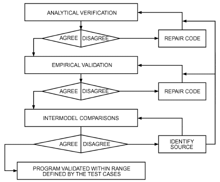

*Fig. 19 Validation Method*

> (Judkoff et al. 1983/2008)

For the path shown in Figure 19, the first step is running the code against analytical verification test cases to check its mathematical solutions. Discrepancies must be corrected before proceeding further. Second, the code is run against high-quality empirical validation data, and errors are corrected. Diagnosing error sources can be quite difficult. Comparative techniques can be used to create diagnostic procedures (Achermann and Zweifel 2003; Judkoff 1988; Judkoff and Neymark 1995a, 1995b; Judkoff et al. 1980, 1983/2008; Morck 1986; Neymark and Judkoff 2002, 2004; Purdy and Beausoleil-Morrison 2003; Spitler et al. 2001; Yuill and Haberl 2002) and better define the empirical experiments. The third step is to check agreement of several different programs with different thermal solution and modeling approaches (that have passed through steps 1 and 2) in a variety of representative cases. This uses the comparative technique as an extrapolation tool. Deviations in the program predictions indicate areas for further investigation.

When programs successfully complete these three stages, they are considered validated for cases where acceptable agreement was achieved (i.e., for the range of building, climate, and mechanical system types represented by the test cases). Once several detailed simulation programs have satisfactorily completed the procedure, other programs and simplified design tools can be tested against them. A validated code does not necessarily represent truth. It does represent a set of algorithms that have been shown, through a repeatable procedure, to perform according to the current state of the art. Similarly, the example results and associated computer programs in the nonnormative sections of Standard 140 do not represent truth, but rather an attempt to identify the range of uncertainty in the current state of the art via a well-defined and repeatable procedure. It is anticipated that, as building energy simulation programs improve, the informative example results in Standard 140 will be periodically updated, and the range of differences among test case results may be reduced.

<!-- str. 582 -->

The NREL methodology for validating building energy simulation programs has been generally accepted by the International Energy Agency (Irving 1988), ASHRAE Standard 140, ASHRAE Standard 90.1, and elsewhere, with refinements suggested by other researchers (Bland 1992; Bloomfield 1988, 1999; Guyon and Palomo 1999b; Irving 1988; Lomas 1991; Lomas and Bowman 1987; Lomas and Eppel 1992). Additionally, the Commission of European Communities has conducted considerable work under the PASSYS program (Jensen 1989; Jensen and van de Perre 1991).

### Testing Model Calibration Techniques Using Synthetic Data

Calibration is commonly used in conjunction with energy retrofit audit models (Judkoff et al. 2011a, 2011b; Reddy et al. 2006). This test method was initially developed by NREL for testing calibration procedures used with residential retrofit audit software; however, the fundamental concept could also be applied in a commercial building context. Other terms frequently used to describe model calibration include model tuning, model true-up, and model reconciliation.

Typically, residential and commercial model calibration has been implemented using monthly energy data collected from utility bills for an existing building that is about to receive an energy retrofit. Sometimes submetered, disaggregated, or higher-frequency data are also available. An audit gathers information about the building needed to construct an input file for a building energy simulation program. A calibration method reconciles model predictions with the data, and then the calibrated model is used to predict energy savings and energy cost savings from various combinations of retrofit measures. Many variations on this approach exist, including some where the savings predictions are subjected to calibration instead of, or along with, the model inputs.

Although it is logical to use the building’s actual performance data to tune the model, it is not certain that this results in a model that better predicts post-retrofit energy savings. When calibrating a large number of inputs to a limited number of outputs (in mathematics, an underdetermined or overparameterized problem), there are many combinations of input parameters that result in a close match to the utility bill data, so a close match is not in itself proof of good calibration (Reddy et al. 2006). The lower the frequency or informational content of the building performance data, the lower the probability that the calibration actually improves the model and associated energy savings predictions. Therefore, any method to test calibration techniques should use as many of the following three figures of merit as possible: (1) accuracy of the savings prediction, (2) how closely the calibrated input parameter values match the actual parameter values, and (3) the goodness of fit between the modeled and measured data. A limiting factor in attempting to empirically validate calibration techniques is the lack of high-quality annual monthly pre- and post-retrofit energy data, (higher frequency and submetered data are better), good pre- and post-retrofit building characteristics data, local pre- and post-retrofit weather data, and the dates of the retrofit installations. Until enough such empirical data are available to researchers, an alternative analytical method can be used in which a simulation program is used to generate its own synthetic pre and post-retrofit energy performance data. The synthetic data may be used as a surrogate for actual data. The method follows these general procedures:

1. Specify a building for a test case and introduce input uncertainty into the test specification (this represents the uncertainty associated with developing inputs from audit survey data):

(a) Perform sensitivity tests on inputs with potentially high uncertainties to determine their relative effects on outputs; select inputs that have both substantial uncertainties and effects on outputs as **approximate inputs**.

(b) Specify an uncertainty range (**approximate input range**) for each approximate input.

(c) Select **explicit inputs** from the approximate input ranges (those who perform the calibrations must not know the explicit inputs).

2. Perform simulations using explicit inputs to create synthetic utility bill data. (Currently, this is typically monthly data, but the method can be used to generate and test against higher- or lowerfrequency synthetic building energy performance data, or end-use data at varying levels of disaggregation, mimicking the availability of submetered data).

(a) Perform simulations to generate post-retrofit energy savings results by adjusting appropriate base-case inputs, including explicit inputs, as specified for each retrofit case and combinations of cases.

3. Develop tested program results (those who do this must not know the explicit inputs):

(a) Develop the preliminary base-case model for a given calibration scenario.

(b) Predict energy savings using one of the following:

i. Calibrate the base-case model inputs using synthetic utility bills (from step 2), then apply the specified retrofit cases to the calibrated model.

ii. Apply the specified retrofit to the uncirculated base case model and then calibrate or correct energy savings predictions using the synthetic utility bills (without adjustment to base-case model inputs); for example, (Calibrated savings) = (Predicted savings) × (Base-case actual bills)/(Base-case predicted bills).

iii. Other calibration methods. The test cases make no recommendation about how to perform calibrations. Any calibration method that seeks to improve energy savings predictions through use of pre-retrofit building energy performance data can be tested by this method.

4. Use the following comparisons as figures of merit to determine the usefulness of the calibration techniques being tested. Note that all three of the listed comparisons are important for assessing the accuracy of the calibration technique. A large disagreement in any one of them indicates the presence of compensating errors, or some other error.

(a) Compare the savings predictions from the tested program and any associated calibration techniques, versus the savings predictions from the same program run with the explicit inputs.

(b) Compare the goodness of fit between synthetic building energy performance data and the calibrated model output data for the pre-retrofit case(s).

(c) For programs where a calibrated base-case model is applied (see step 3bi), compare tested program inputs resulting from the tested program’s calibration techniques to the randomly selected explicit inputs.

The preceding method is a pure (isolated) test of the calibration technique: that is, the synthetic utility billing data are generated with the tested program, and the program accuracy related to building physics modeling is not tested. A pure calibration test requires (1) automated calibration where no human judgment is required that would be helped by knowing the explicit inputs, or (2) that the modeler running the calibration test does not know the

<!-- str. 583 -->

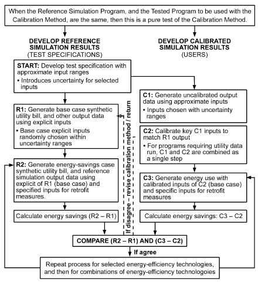

*Fig. 20 Calibration Cases Conceptual Flow*

> (Judkoff et al. 2011a)

explicit inputs used to develop the synthetic utility bills. This method facilitates self-testing of a calibration technique, and is useful in several ways, including (1) testing a single calibration method, (2) testing several calibration methods to determine under what test conditions each is best, and (3) investigating how much and what kind of informational content is needed in the synthetic calibration data to achieve good calibrations with different calibration methods. The pure calibration test, however, may not be practical for a certification test that must be administered by a third-party organization; for this case, a method developed by NREL (Judkoff et al. 2011a, 2011b) ensures that the person performing the test does not know the explicit inputs. The main feature of this test method is that several (preferably at least three) reference programs are used to generate the synthetic utility bills and create the reference energy savings data. The bills and savings are taken as the average of the reference program results. This method tests both the calibration technique, and how closely the physics models in the tested program match the physics models in the reference programs. Example acceptance criteria may be used to facilitate the comparison of energy savings predictions (Judkoff et al. 2011a). Figure 20 shows the overall conceptual approach to testing model calibration techniques.

## REFERENCES

ASHRAE members can access ASHRAE Journal articles and ASHRAE research project final reports at technologyportal.ashrae .org. Articles and reports are also available for purchase by nonmembers in the online ASHRAE Bookstore at www.ashrae.org/bookstore.

Abushakra, B., and D.E. Claridge. 2008. Modeling office building occupancy in hourly data-driven and detailed energy simulation programs. ASHRAE Transactions114(2).

Abushakra, B., J. Haberl, D. Claridge, and A. Sreshthaputra. 2000. Compilation of diversity factors and schedules for energy and cooling load calculations. ASHRAE Research Project RP-1093, Final Report.

Abushakra, B., T.A. Reddy, M.T. Paulus, and V. Singh. 2014. Measurement, modeling, analysis and reporting protocols for short-term M&V of whole building energy performance. ASHRAE Research Project RP-1404, Final Report.

Achermann, M., and G. Zweifel. 2003. *RADTEST—Radiant heating and* *cooling test cases*. University of Applied Sciences of Central Switzerland, Lucerne School of Engineering and Architecture. archive.iea-shc .org/publications/downloads/RADTEST_final.pdf.

AIA. 2012. *An architect’s guide to integrating energy modeling in the design* process. American Institute of Architects, Washington, D.C.

AIA. 2014. *AIA 2030 commitment, 2014 progress report*. American Institute of Architects, Washington, D.C.

Alamdari, F., and G.P. Hammond. 1982. Time-dependent convective heat transfer in warm-air heated rooms. *Energy Conservation in the Built* Environment: *Proceedings of the CIB W67 Third International Sympo-* sium, Dublin, pp. 209-220.

Alamdari, F., and G.P. Hammond. 1983. Improved data correlations for buoyancy-driven convection in rooms. *Building Services Engineering* *Research and Technology* 4(3):106-112.

Ali, M.T., M.M. Mokhtar, M. Chiesa, and P.R. Armstrong. 2011. A cooling change-point model of community-aggregate electrical load. Energy and Buildings 43(1):28-37.

Altmayer, E.F., A.J. Gadgil, F.S. Bauman, and R.C. Kammerud. 1983. Correlations for convective heat transfer from room surfaces. ASHRAE Transactions 89(2A):61-77.

Andersen, I., and M.J. Brandemuehl. 1992. Heat storage in building thermal mass: A parametric study. ASHRAE Transactions 98(1):910-918.

Andolsun, S., C. Culp, and J. Haberl. 2010. *EnergyPlus vs. DOE-2: The effect* *of ground coupling on heating and cooling energy consumption of a* *slab-on-grade code house in a cold climate*. ESL-PA-10-08-03. College Station, Texas: Texas A&M University. esl.tamu.edu/docs/terp/2010 /ESL-PA-10-08-03.pdf.

Andrews, C.J., D. Yi, U. Krogmann, J.A. Senick, and R.E. Wener. 2011.

Designing buildings for real occupants: An agent-based approach. IEEE *Transactions on Systems, Man and Cybernetics, Part A: Systems and* Humans.

Anstett, M., and J.F. Kreider. 1993. Application of artificial neural networks to commercial building energy use prediction. ASHRAE Transactions 99(1):505-517.

Arasteh, D., C. Kohler, and B. Griffith. 2009. Modeling windows in EnergyPlus with simple performance indices. Report LBNL-2804E. Lawrence Berkeley National Laboratory, Berkeley, CA.

Armstrong, P.R., C.E. Hancock, and J.E. Seem. 1992. Commercial building temperature recovery—Part I: Design procedure based on a stepresponse model. ASHRAE Transactions 98(1).

Armstrong, P.R., G.P. Sullivan, and G.B. Parker. 2006a. Field demonstration *of a high-efficiency packaged rooftop air conditioning unit at Fort Gor-* *don, Augusta, GA—Final Report*. PNNL-15746.

Arvo, J. 1986. Backward ray tracing. In *Developments in Ray Tracing* SIGGRAPH ’86 Course Notes, Volume 12. www.cs.washington.edu /education/courses/cse457/06au/projects/trace/extra/Backward.pdf.

ASHRAE. 2010. Engineering analysis of experimental data. Guideline 2-2010.

ASHRAE. 2014. Measurement of energy and demand savings. Guideline 14-2014.

ASHRAE. 2013. Energy standard for buildings except low-rise residential buildings. ANSI/ASHRAE/IES Standard 90.1-2013.

ASHRAE. 2014. Method of test for the evaluation of building energy analysis computer programs. ANSI/ASHRAE Standard 140-2014.

ASHRAE. 2007. Peak cooling and heating load calculations in buildings except low-rise residential buildings. ANSI/ASHRAE/ACCA Standard 183-2007 (RA2014).

ASHRAE. 2014. Design of high-performance, green buildings except low-rise residential buildings. ANSI/ASHRAE/USGBC/IES Standard 189.1-2014.

ASHRAE. 2013. *Weather data viewer, version 5.0*. (DVD).

Axley, J.W. 2001. Residential passive ventilation systems: Evaluation and design. AIVC Technical Note 54. Air Infiltration and Ventilation Centre, Energy in Buildings and Communities (EBC) Programme, International Energy Agency, Coventry, UK.

Axley, J.W. 2007. Multizone airflow modeling in buildings: History and theory. HVAC&R Research (now *Science and Technology for the Built Envi-* ronment) 13(6):907-928.

<!-- str. 584 -->

Axley, J.W., and S.J. Emmerich. 2002. A method to assess the suitability of a climate for natural ventilation of commercial buildings. Proceedings: *Indoor Air (2002)*, Monterey, CA.

Aynsley, R.M., B.J. Vickery, and W. Melbourne. 1977. Architectural aerodynamics. Chapter 6. Applied Sciences Publishers, Essex, England, UK.

Bahnfleth, W.P., and C.O. Pedersen. 1990. A three dimensional numerical study of slab-on-grade heat transfer. ASHRAE Transactions 2(96):61-72.

Baker, N.V., A. Fanchiotti, and K. Steemers. 1993. *Daylighting in architec-* *ture: A European reference book*. Earthscan, London.

Balcomb, J.D., and J.C. Hedstrom. 1976. A simplified method for calculating required solar collector array size for space heating. Proceedings of *International Solar Energy Society (ISES) Annual Meeting, Winnipeg,* Canada, August 15-20, pp. 280-294.

Barnaby, C., J. Spitler, and D. Xiao. 2005. The residential heat balance method for heating and cooling load calculations. ASHRAE Transactions 111(1):308-319.

Barnaby, C., J. Wright, and M. Collins. 2009. Improving load calculations for fenestration with shading devices. ASHRAE Transactions 115:31-44.

Bauman, F., A. Gadgil, R. Kammerud, E. Altmayer, and M. Nansteel. 1983.

Convective heat transfer in buildings: Recent research results. ASHRAE Transactions 89(1A):215-232.

Beausoleil-Morrison, I. 1996. BASECALC: A software tool for modelling residential foundation heat losses. *Proceedings of the Third Canadian* *Conference on Computing in Civil and Building Engineering*, Montreal, pp. 117-126.

Beausoleil-Morrison, I., and G. Mitalas. 1997. BASESIMP: A residentialfoundation heat-loss algorithm for incorporating into whole-building energy-analysis programs. *Proceedings of Building Simulation ’97* (2): 1-8. International Building Performance Simulation Association, Prague, Czech Republic.

Beck, J.V., and K.J. Arnold. 1977. *Parametric estimation in engineering and* science. John Wiley & Sons, New York.

Ben-Nakhi, A. 2007. *Modeler report for BESTEST cases GC10a-GC80c,* *FLUENT version 6.0.20*. In Section 2.9, Appendix II-B, in Neymark et al. (2008). Public Authority for Applied Education and Training, Kuwait.

Bhandari, M.S., S.S. Shrestha, and J.R. New. 2012. Evaluation of weather datasets for building energy simulation. *Energy and Buildings* 49:109-118. dx.doi.org/10.1016/j.enbuild.2012.01.033.

Bland, B. 1992. Conduction in dynamic thermal models: Analytical tests for validation. *Building Services Engineering Research & Technology* 13(4): 197-208.

Bloomfield, D. 1988. *An investigation into analytical and empirical valida-* *tion techniques for dynamic thermal models of buildings*, vol. 1, Executive Summary. SERC/BRE final report, Building Research Establishment, Garston, U.K.

Bloomfield. D. 1999. An overview of validation methods for energy and environmental software. ASHRAE Transactions 105(2).

Bohn, M.S., A.T. Kirkpatrick, and D.A. Olson. 1984. Experimental study of three-dimensional natural convection high-Rayleigh number. Journal of Heat Transfer 106:339-345.

Bonne, U., and J.E. Janssen. 1977. Efficiency and relative operating cost of central combustion heating system: IV, oil fired residential systems. ASHRAE Transactions 83(1):893-904.

Bourdouxhe, J.P., M. Grodent, J. Lebrun, and C. Saavedra. 1994a. A toolkit for primary HVAC system energy calculation—Part 1: Boiler model. ASHRAE Transactions 100(2):759-773.

Bourdouxhe, J.P., M. Grodent, J. Lebrun, C. Saavedra, and K. Silva. 1994b.

A toolkit for primary HVAC system energy calculation—Part 2: Reciprocating chiller models. ASHRAE Transactions 100(2):774-786.

Bourdouxhe, J.P., M. Grodent, and C. Silva. 1994c. Cooling tower model developed in a toolkit for primary HVAC system energy calculation—Part 1: Model description and validation using catalog data. *Proceedings of the* *Fourth International Conference on System Simulation in Buildings*.

Bou-Saada, T., and J. Haberl. 1995a. A weather-day typing procedure for disaggregating hourly end-use loads in an electrically heated and cooled building from whole-building hourly data. *Proceedings of the 30th IECEC*, pp. 349-356.

Bou-Saada, T., and J. Haberl. 1995b. An improved procedure for developing calibrated hourly simulation models. *Proceedings of Building Simulation* ’95. International Building Performance Simulation Association, Madison, WI.

Brandemuehl, M.J. 1993. *HVAC2 toolkit: Algorithms and subroutines for* *secondary HVAC systems energy calculations.* ASHRAE.

Brandemuehl, M.J., and J.D. Bradford. 1999. Optimal supervisory control of cooling plants without storage. ASHRAE Research Project RP-823, Final Report.

Brandemuehl, M.J., and S. Gabel. 1994. Development of a toolkit for secondary HVAC system energy calculations. ASHRAE Transactions 100(1):21-32.

Braun, J.E. 1990. Reducing energy costs and peak electrical demand through optimal control of building thermal mass. ASHRAE Transactions 96(2): 876-888.

Braun, J.E. 1992. A comparison of chiller-priority, storage-priority, and optimal control of an ice-storage system. ASHRAE Transactions 98(1): 893-902.

Braun, J.E., S.A. Klein, and J.W. Mitchell. 1989. Effectiveness models for cooling towers and cooling coils. ASHRAE Transactions 95(2):164-174.

Bronson, D., S. Hinchey, J. Haberl, and D. O’Neal. 1992. A procedure for calibrating the DOE-2 simulation program to non-weather dependent loads. ASHRAE Transactions 98(1):636-652.

Buchberg, H. 1955. Electric analogue prediction of the thermal behavior of an inhabitable enclosure. ASHVE Transactions 61:339-386.

Buhl, W.F., A.E. Erdem, J.M. Nataf, F.C. Winkelmann, M.A. Moshier, and E.F. Sowell. 1990. The US EKS: Advances in the SPANK-based energy kernel system. *Proceedings of the Third International Conference on* *System Simulation in Buildings*, pp. 107-150.

Buhl, W.F., A.E. Erdem, F.C. Winkelmann, and E.F. Sowell. 1993. Recent improvements in SPARK: Strong component decomposition, multivalued objects and graphical interface. *Proceedings of Building Simulation* ’93, pp. 283-390. International Building Performance Simulation Association.

Burkhart, M.C., Y. Heo, and V.M. Zavala. 2014. Measurement and verification of building systems under uncertain data: A Gaussian process modeling approach. *Energy and Buildings* 75(June):189-198. dx.doi.org /10.1016/j.enbuild.2014.01.048.

Carrier. 2013. *What’s new with HAP*. www.carrier.com/commercial/en /us/software/hvac-system-design/hourly-analysis-program/.

Carroll, J.A. 1980. An “MRT method” of computing radiant energy exchange in rooms. *Proceedings of Systems Simulation and Economic* Analysis, San Diego, pp. 343-348.

Carroll, J.A. 1981. A comparison of radiant interchange algorithms. Pro-*ceedings of the 3rd Annual Systems Simulation and Economics Analysis/* *Solar Heating and Cooling Operational Results Conference*, Reno. Solar Engineering, Proceedings of the ASME Solar Division.

Chandra, S., and A.A. Kerestecioglu. 1984. Heat transfer in naturally ventilated rooms: Data from full-scale measurements. ASHRAE Transactions 90(1B):211-224.

Chantrasrisalai, C., D. Fisher, I. Iu, and D. Eldridge. 2003a. Experimental validation of design cooling load procedures: The heat balance method. ASHRAE Transactions 109(2):160-173.

Chantrasrisalai, C., V. Ghatti, D. Fisher, and D. Scheatzle. 2003b. Experimental validation of the EnergyPlus low-temperature radiant simulation. ASHRAE Transactions 109(2):614-623.

Chen, H., S. Deng, D.E. Claridge, W.D. Turner, and N. Bensouda. 2005.

Replacing inefficient equipment—An engineering analysis to justify purchasing a more efficient chiller. *Proceedings of the 4th International* *Conference on Enhanced Building Operation*, Pittsburgh.

Chenvidyakarn, T., A. Woods. 2005. Multiple steady states in stack ventilation. *Building and Environment* 40:399-410.

CIBSE. 2005. Natural ventilation in non-domestic buildings. Applications Manual AM10, Chartered Institution of Building Services Engineers, London.

Claridge, D. 1998. A perspective on methods for analysis of measured energy data from commercial buildings. *ASME Journal of Solar Energy* Engineering 120:150.

Claridge, D., M. Krarti, and J. Kreider. 1993. Energy calculations for basements, slabs, and crawl spaces. ASHRAE Research Project RP-666, Final Report.

Clarke, J. A. 2001. *Energy simulation in building design,* 2nd ed. Routledge, Glasgow, Scotland, UK.

Clements, E. 2004. *Three dimensional foundation heat transfer modules for* *whole-building energy analysis*. MS thesis, Pennsylvania State University.

Coakley, D., P. Raftery, and M. Keane. 2014. A review of methods to match building energy simulation models to measured data. Renewable and *Sustainable Energy Reviews* 37:123-141.

<!-- str. 585 -->

Cole, R.J. 1976. The longwave radiation incident upon the external surface of buildings. *The Building Services Engineer* 44:195-206.

COMNET. 2016. COMNET Modeling Guidelines and Procedures. www .comnet.org.

Cooper, K.W., and D.R. Tree. 1973. A re-evaluation of the average convection coefficient for flow past a wall. ASHRAE Transactions 79:48-51.

Corcoran, J.P., and T.A. Reddy. 2003. Improving the process of certified and witnessed factory testing for chiller procurement. ASHRAE Transactions 109(1).

Corson, G.C. 1992. Input-output sensitivity of building energy simulations.

ASHRAE Transactions 98(1):618.

Crawley, D.B., L.K. Lawrie, F.C. Winkelmann, W.F. Buhl, Y. Joe Huang, C.O. Pedersen, R.K. Strand, R.J. Liesen, D.E. Fisher, M.J. Witte, and J. Glazer. 2001. EnergyPlus: Creating a new-generation building energy simulation program. *Energy and Buildings* 33(4):319-331.

Crawley, D.B., J.W. Hand, M. Kummert, and B.T. Griffith. 2005. Contrasting *the capabilities of building energy performance simulation programs*. U.S. Department of Energy, Washington, D.C.

Crowley, M. 2007. Modeler report for BESTEST cases GC10a-GC80c, MATLAB 7.0.4.365 (R14) service pack 2. Dublin Institute of Technology. Included with Section 2.9, Appendix II-C, of Neymark et al. (2008).

Cumali, Z., A.O. Sezgen, R. Sullivan, R.C. Kammerud, E. Bales, and L.B.

Bass. 1979. Extensions of methods used in analyzing building thermal loads. *Proceedings of the Thermal Performance of the Exterior Enve-* *lopes of Buildings*, pp. 411-420.

Davies, M.G. 1988. Design models to handle radiative and convective exchange in a room. ASHRAE Transactions 94(2):173-195.

Deb, K., A. Pratap, S. Agarwal, and T. Meyarivan. 2002. A fast and elitist multiobjective genetic algorithm: NSGA-II. *IEEE Transactions on Evo-* lutionary Computation 6(2):182-197.

DeCicco, J.M. 1990. Applying a linear model to diagnose boiler fuel consumption. ASHRAE Transactions 96(1):296-304.

Deru, M. 2003. A model for ground-coupled heat and moisture transfer from buildings. Report NREL/TP-550-33954. National Renewable Energy Laboratory, Golden, CO. www.nrel.gov/docs/fy03osti/33954.pdf.

Deru, M.P., R. Judkoff, and P. Torcellini. 2002. SUNREL, technical reference manual. Report NREL/BK-550-30193. National Renewable Energy Laboratory, Golden, CO.

Deru, M., K. Field, D. Studer, K. Benne, B. Griffith, P. Torcellini, B. Liu, M.

Halvorsen, D. Winiarski, M. Rosenberg, M. Yazdanian, J. Huang, and D. Crawley. 2011. U.S. Department of Energy commercial reference building models of the national building stock. Report NREL/TP-5500-46861. National Renewable Energy Laboratory, Golden, CO.

de Wit, S., and G. Augenbroe. 2002. Analysis of uncertainty in building design evaluations and its implications. *Energy and Buildings* 34:951-958.

Dhar, A. 1995. *Development of Fourier series and artificial neural network* *approaches to model hourly energy use in commercial buildings*. Ph.D. dissertation, Mechanical Engineering Department, Texas A&M University.

Dhar, A., T.A. Reddy, and D.E. Claridge. 1998. Modeling hourly energy use in commercial buildings with Fourier series functional forms. Journal of *Solar Energy Engineering* 120:217.

Dhar, A., T.A. Reddy, and D.E. Claridge. 1999a. A Fourier series model to predict hourly heating and cooling energy use in commercial buildings with outdoor temperature as the only weather variable. *Journal of Solar* Energy Engineering 121:47-53.

Dhar, A., T.A. Reddy, and D.E. Claridge. 1999b. Generalization of the Fourier series approach to model hourly energy use in commercial buildings. *Journal of Solar Energy Engineering* 121:54-62.

Dogan, T., C. Reinhart, and P. Michalatos. 2015. Autozoner: An algorithm for automatic thermal zoning of buildings with unknown interior space definitions. *Journal of Building Performance Simulation* 9(2):176-189.

Dols, W.S., S.J. Emmerich, and B.J. Polidoro. 2012. LoopDA 3.0, Natural ventilation design and analysis software user guide. NIST Technical Note 1735. National Institute of Standards and Technology, Gaithersburg, MD.

Dols, W.S., S.J. Emmerich, and B.J. Polidoro. 2016a. Using coupled energy, airflow and indoor air quality software (TRNSYS/CONTAM) to evaluate building ventilation strategies. *Building Services Engineering Research* and Technology 37(2):163-175.

Dols, W.S., S.J. Emmerich, and B.J. Polidoro. 2016b. Coupling the multizone airflow and contaminant transport software CONTAM with EnergyPlus using co-simulation. Building Simulation 9:469-479.

Draper, N., and H. Smith. 1981. *Applied regression analysis*, 2nd ed. John Wiley & Sons, New York.

Duffie, J.A., and W.A. Beckman. 2013. *Solar engineering of thermal pro-* cesses, 4th ed. John Wiley & Sons, Inc., Hoboken, NJ.

Durrani, F., M.J. Cook, and J.J McGuirk. 2015. Evaluation of LES and RANS CFD modelling of multiple steady states in natural ventilation. *Building and Environment* 92:167-181.

Edwards, R.E. 2013. *Automating large-scale simulation calibration to real-* *world sensor data*. Ph.D. dissertation. University of Tennessee, Knoxville.

Eldridge, D., D. Fisher, I. Iu, and C. Chantrasrisalai. 2003. Experimental validation of design cooling load procedures: Facility design. ASHRAE Transactions 109(2):151-159.

Emmerich, S. J., B. Polidoro, and J. W. Axley. 2011. Impact of adaptive thermal comfort on climatic suitability of natural ventilation in office buildings. *Energy and Buildings* 43(9):2101-2107.

Emmerich, S. J., W. S. Dols, and B. J. Polidoro. 2012. Application of a natural ventilation system design tool to a school building. SimBuild 2012, *Fifth National Conference of IBPSA-USA*, Madison, WI.

Energy Design Resources. 2012. *HVAC Simulation Guidebook,* vol. 1. www .energydesignresources.com/resources/publications/design-guidelines /design-guidelines-hvac-simulation-guidelines.aspx.

Energy.gov. 2015. Qualified software for calculating commercial building tax deductions. energy.gov/eere/buildings/qualified-software-calculating -commercial-building-tax-deductions.

Englander, S.L., and L.K. Norford. 1992. Saving fan energy in VAV systems—Part 1: Analysis of a variable-speed-drive retrofit. ASHRAE Transactions 98(1):3-18.

Erbs, D.G., S.A. Klein, and W.A. Beckman. 1983. Estimation of degree-days and ambient temperature bin data from monthly-average temperatures. ASHRAE Journal 25(6):60.

Eskilson, P. 1987. *Thermal analysis of heat extraction boreholes*. University of Lund, Sweden.

ESRU. 2016. *ESP-r—An integrated building/plant simulation tool*. Energy Systems Research Unit, University of Strathclyde, Glasgow. www.esru .strath.ac.uk/Programs/ESP-r.htm.

Evans, D.L., T.T. Rule, and B.D. Wood. 1982. A new look at long term collector performance and utilizability. Solar Energy 28(1):13-23.

Fels, M., ed. 1986. Measuring energy savings: The scorekeeping approach.

*Energy and Buildings* 9.

Fracastoro, G., M. Masoero, and M. Cali. 1982. Surface heat transfer in building components. *Proceedings of the Thermal Performance of the* *Exterior Envelopes of Buildings II*, pp. 180-203.

Garrett, A. and J.R. New. 2014. A scientific study of automated calibration applied to DOE commercial reference buildings. Report ORNL/TM-2014/709. Oak Ridge National Laboratory, Oak Ridge, TN.

Garrett, A. and J.R. New. 2015. Scalable tuning of building energy models to hourly data. *Journal of Energy* 84:493-502.

Garrett, A., J.R. New, and T. Chandler. 2013. Evolutionary tuning of building models to monthly electrical consumption. ASHRAE Transactions 119(2):89-100. Paper DE-13-008.

Gayeski, N.T., T. Zakula, P.R. Armstrong, and L.K. Norford. 2011. Empirical modeling of a rolling-piston compressor heat pump for predictive control in low-lift cooling. ASHRAE Transactions 117(2).

Gayeski, N.T., P.R. Armstrong, and L.K. Norford. 2012. Predictive pre-cooling of thermo-active building systems with low-lift chillers. HVAC&R Research (now *Science and Technology for the Built Environment*) 18(5):1-16.

Georgescu, M., B. Eisenhower, and I. Mezic. 2012. Creating zoning approximations to building energy models using the Koopman operator. Pro-*ceedings of the IBPSA-USA SimBuild 2012*, Madison, WI, pp. 40-47.

Goldstein, K., and A. Novoselac. 2010. Convective heat transfer in rooms with ceiling slot diffusers (RP-1416). HVAC&R Research (now Science *and Technology for the Built Environment*) 16(5):629-655.

Goral, C.M., K.E. Torrance, D.P.Greenberg, and B. Battaile. 1984. Modeling the interaction on light between diffuse surfaces. *Proceedings of the 11th* *Annual Conference on Computer Graphics and Interactive Techniques* *(SIGGRAPH ’84), New York, NY*, pp. 213-22.

Gordon, J.M., and K.C. Ng. 1994. Thermodynamic modeling of reciprocating chillers. *Journal of Applied Physics* 75(6):2769-2774.

Gordon, J.M., and K.C. Ng. 1995. Predictive and diagnostic aspects of a universal thermodynamic model for chillers. *International Journal of Heat* *and Mass Transfer* 38(5):807-818.

Gordon, J.M., and K.C. Ng. 2000. Cool thermodynamics. Cambridge Press.

<!-- str. 586 -->

Gordon, J.M., K.C. Ng, and H.T. Chua. 1995. Centrifugal chillers: Thermodynamic modeling and a case study. *International Journal of Refrigera-* tion 18(4):253-257.

Gordon, J.M., K.C. Ng, H.T. Chua, and C.K. Lim. 2000. How varying condenser coolant flow rate affects chiller performance: Thermodynamic modeling and experimental confirmation. *Applied Thermal Engineer-* ing 20.

Gowri, K., D. Winiarski, and R. Jarnagin. 2009. Infiltration modeling guidelines for commercial building analysis. Report PNNL-18898. Pacific Northwest National Laboratory, Richland, WA.

Grantham, B. 2008. COEN 290 Computer graphics I—Week 8—Ray tracing. www.plunk.org/COEN-290/Notes/Week8.ppt

Gunay, H.B., W. O’Brien, and I. Beausoleil-Morrison. 2013. A critical review of observation studies, modeling, and simulation of adaptive occupant behaviors in offices. *Building and Environment* 70:31-47.

Guyon, G., and E. Palomo. 1999a. Validation of two French building energy programs—Part 2: Parameter estimation method applied to empirical validation. ASHRAE Transactions 105(2):709-720.

Guyon, G., and E. Palomo. 1999b. Validation of two French building energy analysis programs—Part 1: Analytical verification. ASHRAE Transactions 105(2).

Haberl, J.S., and T.E. Bou-Saada. 1998. Procedures for calibrating hourly simulation models to measured building energy and environmental data. *ASME Journal of Solar Energy Engineering* 120(August):193.

Haberl, J., and S. Cho. 2004. Literature review of uncertainty of analysis methods: Inverse model toolkit. Report ESL-TR-04-10-03, Energy Systems Laboratory, Texas A&M University, College Station.

Haberl, J.S., and D.E. Claridge. 1987. An expert system for building energy consumption analysis: Prototype results. ASHRAE Transactions 93(1): 979-998.

Haberl, J.S., and C.H. Culp. 2012. Review of methods for measuring and verifying savings from energy conservation retrofits to existing buildings (second edition). Report ESL-TR-12-03-02, Energy Systems Laboratory, Texas A&M University, College Station.

Haberl, J., and P. Komor. 1990a. Improving commercial building energy audits: How annual and monthly consumption data can help. ASHRAE Journal 32(8):26-33.

Haberl, J., and P. Komor. 1990b. Improving commercial building energy audits: How daily and hourly data can help. ASHRAE Journal 32(9): 26-36.

Haberl, J.S., and S. Thamilseran. 1996. The great energy predictor shootout II: Measuring retrofit savings and overview and discussion of results. ASHRAE Transactions 102(2):419-435.

Haberl, J., S. Thamilseran, A. Reddy, D. Claridge, D. O’Neal, and W. Turner.

1998. Baseline calculations for measurement and verification of energy and demand savings in a revolving loan program in Texas. ASHRAE Transactions 104:841-858.

Haberl, J., D. Claridge, and K. Kissock. 2003. Inverse model toolkit (RP-1050): Application and testing. ASHRAE Transactions 109(2):435-448.

Hammarsten, S. 1984. *Estimation of energy balances for houses.* National Swedish Institute for Building Research.

Hammarsten, S. 1987. A critical appraisal of energy-signature models. Applied Energy 26(2):97-110.

Hellstrom, G. 1989. *Duct ground heat storage model: Manual for computer* code. Department of Mathematical Physics, University of Lund, Sweden.

Heo, Y. 2011. *Bayesian calibration of building energy models for energy ret-* *rofit decision-making under uncertainty*. Ph.D. dissertation. Georgia Institute of Technology, Atlanta.

Heo, Y., and V.M. Zavala. 2012. Gaussian process modeling for measurement and verification of building energy savings. *Energy and Buildings* 53 (October):7-18.

Heo, Y., D.J. Graziano, V.M. Zavala, P. Dickinson, M. Kamrath, and M. Kirshenbaum. 2013. Cost-effective measurement and verification method for determining energy savings under uncertainty. ASHRAE Transactions 119(2).

Hirsch, J.J. 2003. *eQUEST–Introductory Tutorial, version 3.64.* James J.

Hirsch & Associates, Camarillo, CA.

Hittle, D.C. 1977. The building loads analysis and system thermodynamics (BLAST) program. CERL Technical Report E-119. U.S. Army Construction Engineering Research Laboratory (CERL), Champaign, IL.

Hoes, P., J. Hensen, M.G.L.C. Loomans, B. de Vries, and D. Bourgeois.

2009. User behavior in whole building simulation. *Building and Environ-* ment 41:209-302.

Hong, T., S. D’Oca, S.C. Taylor-Lange, W.J.N. Turner, Y. Chen, and S.P.

Corgnati. 2015a. An ontology to represent energy-related occupant behavior in buildings. Part II: Implementation of the DNAS framework using an XML schema. *Building and Environment* 94:196-205.

Hong, T., M.A. Piette, Y. Chen, S.H. Lee, S.C. Taylor-Lange, R. Zhang, K.

Sun, and P. Price. 2015b. Commercial building energy saver: An energy retrofit analysis toolkit. Applied Energy 159:298-309.

Hong, T., H. Sun, Y. Chen, S. Taylor-Lange, D. Yan. 2016a. An occupant behavior modeling tool for co-simulation. *Energy and Buildings* 117: 272-281.

Hong, T., K. Sun, R. Zhang, R. Hinokuma, S. Kasahara, and Y. Yura. 2016b.

Development and validation of a new variable refrigerant flow system model in EnergyPlus. *Energy and Buildings* 117:399-411.

Hopfe, C.J., and J.L.M. Hensen. 2011. Uncertainty analysis in building performance simulation for design support. *Energy and Buildings* 43:2798-2805.

Hopkinson, R.G., J. Longmore, and P. Petherbridge. 1954. An empirical formula for the computation of the indirect component of daylight factor. *Transactions of the Illuminating Engineering Society* 19(7):201-19.

Huang, J., J.S. Haberl, and J.F. Kreider. 2001. *Handbook of heating, ventila-* *tion, and air conditioning.* J.F. Kreider, ed. CRC Press, Boca Raton, FL.

Hunn, B.D., W.V. Turk, and W.O. Wray. 1982. *Validation of passive solar* *analysis/design tools using Class A performance evaluation data*. LA-UR-82-1732, Los Alamos National Laboratory, NM.

Hybrid Ventilation Centre. 2002. *Principles of hybrid ventilation*. IEA Energy Conservation in Buildings and Community Systems Programme, Annex 35: Hybrid Ventilation in New and Retrofitted Office Buildings. P. Heiselberg, ed. Hybrid Ventilation Centre, Aalborg University, Denmark.

Hydeman, M., and K. Gillespie. 2002. Tools and techniques to calibrate electric chiller component models. ASHRAE Transactions 108(1):733-741.

Hydeman, M., N. Webb, P. Sreedharan, and S. Blanc. 2002. Development and testing of a reformulated regression-based electric chiller model. ASHRAE Transactions 108(2).

IBPSA-USA. 2015. *Building energy software tools directory*. www.building energysoftwaretools.com.

IEA EBC. 2013-2017. International Energy Agency’s Energy in Buildings and Communities Programme. Annex 66: Definition and simulation of occupant behavior in buildings. www.annex66.org.

IEA ECBCS. 1987. *Annex 10, building HEVAC system simulation*. International Energy Agency, Energy Conservation in Buildings and Community Systems Programme. Summary available at www.ecbcs.org/annexes /annex10.htm#p.

IECC. 2015. *International energy conservation code®*. International Code Council, Washington, D.C.

IgCC. 2015. *International green construction code®* (IgCC®). International Code Council, Washington, D.C.

Irving, A. 1988. *Validation of dynamic thermal models, energy, and build-* ings. Elsevier Sequoia, Lausanne, Switzerland.

ISO. 1998. Thermal performance of buildings—Heat transfer via the ground —Calculation methods. Standard 13370. European Committee for Standardization, Brussels.

Iu, I., and D. Fisher. 2004. Application of conduction transfer functions and periodic response factors in cooling load calculation procedures. ASH-RAE Transactions 110:829-841.

Iu, I., C. Chantrasrisalai, D. Eldridge, and D. Fisher. 2003. Experimental validation of design cooling load procedures: The radiant time series method. ASHRAE Transactions 109(2):139-150.

Jakubiec, J.A., and C.F. Reinhart. 2011. DIVA 2.0: Integrating daylight and thermal simulations using Rhinoceros 3D, Daysim and EnergyPlus. Pro-*ceedings of 12th IBPSA Conference,* Sydney, Australia, November 14-16.

JCEM. 1992. Final report: Artificial neural networks applied to LoanSTAR data. Joint Center for Energy Management Report TR/92/15.

Jensen, S., ed. 1989. *The PASSYS project phase 1—Subgroup model valida-* *tion and development, Final report—1986-1989.* Commission of the European Communities, Directorate General XII.

Jensen, S., and R. van de Perre. 1991. Tools for whole model validation of building simulation programs: Experience from the CEC concerted action PASSYS. *Proceedings of Building Simulation ’91*, Nice, France. International Building Performance Simulation Association.

<!-- str. 587 -->

Jiang, W., and T.A. Reddy. 2003. Re-evaluation of the Gordon-Ng performance models for water-cooled chillers. ASHRAE Transactions (109).

Jones, B.M., M.J. Cook, S.D. Fitzgerald, and C.R. Iddon. 2016. A review of ventilation opening area terminology. *Energy and Buildings* 118:249-258.

Judkoff, R. 1988. Validation of building energy analysis simulation programs at the Solar Energy Research Institute. *Energy and Buildings* 10(3):235.

Judkoff, R., and J. Neymark. 1995a. *International Energy Agency Building* *Energy Simulation Test (BESTEST) and diagnostic method*. NREL/TP-472-6231. National Renewable Energy Laboratory, Golden, CO. www .nrel.gov/docs/legosti/old/6231.pdf.

Judkoff, R., and J. Neymark. 1995b. *Home Energy Rating System Building* *Energy Simulation Test (HERS BESTEST)*, vols. 1 and 2. NREL/TP-472-7332. National Renewable Energy Laboratory, Golden, CO. www.nrel .gov/docs/legosti/fy96/7332a.pdf and www.nrel.gov/docs/legosti/fy96 /7332b.pdf.

Judkoff, R., and J. Neymark. 2006. Model validation and testing: The methodological foundation of ASHRAE Standard 140. ASHRAE Transactions 112(2):367-376.

Judkoff, R., and J. Neymark. 2009. What did they do in IEA 34/43? Or how to diagnose and repair bugs in 500,000 lines of code. Proceedings of Building Simulation 2009. Glasgow. International Building Performance Simulation Association. Preprint version, NREL Report CP-550-44978, National Renewable Energy Laboratory, Golden, CO. www.nrel.gov /docs/fy09osti/44978.pdf.

Judkoff, R., D. Wortman, C. Christensen, B. O’Doherty, D. Simms, and M.

Hannifan. 1980. *A comparative study of four passive building energy* *simulations: DOE-2.1, BLAST, SUNCAT-2.4, DEROB-III*. SERI/TP-721-837. UC-59c. Solar Energy Research Institute (now National Renewable Energy Laboratory), Golden, CO.

Judkoff, R., D. Wortman, B. O’Doherty, and J. Burch. 1983/2008. A method-*ology for validating building energy analysis simulations*. SERI/TR-254-1508. Solar Energy Research Institute (now National Renewable Energy Laboratory), Golden, CO. (Republished as NREL/TP-550-42059, April 2008.) www.nrel.gov/docs/fy08osti/42059.pdf.

Judkoff, R., J.D. Balcomb, C.E. Hancock, G.Barker, and K. Subbarao. 2000.

Side-by-side thermal tests of modular offices: A validation study of the STEM method. NREL Report TP-550-23940. National Renewable Energy Laboratory, Golden, CO.

Judkoff, R., J. Neymark, B. Polly, and M. Bianchi. 2011a. The Building Energy Simulation Test For Existing Homes (BESTEST-EX) methodology. *Proceedings Building Simulation 2011*, International Building Performance Simulation Association. Preprint version, NREL Report CP-5500-51655, National Renewable Energy Laboratory, Golden, CO. www.nrel.gov/docs/fy12osti/51655.pdf.

Judkoff, R., B. Polly, M. Bianchi, J. Neymark, and M. Kennedy. 2011b.

*Building Energy Simulation Test For Existing Homes (BESTEST-EX):* *Instructions for implementing the test procedure, calibration test refer-* *ence results, and example acceptance-range criteria*. NREL TP-5500-52414. National Renewable Energy Laboratory, Golden, CO. www.nrel .gov/docs/fy11osti/52414.pdf.

Kamal, S., and P. Novak. 1991. Dynamic analysis of heat transfer in buildings with special emphasis on radiation. *Energy and Buildings* 17(3): 231-241.

Kaplan, M., J. McFerran, J. Jansen, and R. Pratt. 1990. Reconciliation of a DOE2.1C model with monitored end-use data from a small office building. ASHRAE Transactions 96(1):981.

Katipamula, S., T.A. Reddy, and D.E. Claridge. 1994. Development and application of regression models to predict cooling energy consumption in large commercial buildings. *Proceedings of the 1994 ASME/JSME/* *JSES International Solar Energy Conference*, San Francisco, p. 307.

Katipamula, S., T.A. Reddy, and D.E. Claridge. 1998. Multivariate regression modeling. *ASME Journal of Solar Energy Engineering* 120 (August):176.

Kaye, N.B., Y. Ji, and M.J. Cook. 2009. Numerical simulation of transient flow development in a naturally ventilated room. *Building and Environ-* ment 44(5):889-897.

Kays, W.M., and A.L. London. 1984. *Compact heat exchangers*, 3rd ed.

McGraw-Hill, New York.

Kennedy, M. and A. O’Hagan. 2001. Bayesian calibration of computer models. *Journal of the Royal Statistical Society*, pp. 425-464.

Kerrisk, J.F., N.M. Schnurr, J.E. Moore, and B.D. Hunn. 1981. The custom weighting-factor method for thermal load calculation in the DOE-2 computer program. ASHRAE Transactions 87(2):569-584.

Khalifa, A.J.N., and R.H. Marshall. 1990. Validation of heat transfer coefficients on interior building surfaces using a real-sized indoor test cell. *International Journal of Heat and Mass Transfer* 33(10):2219-2236.

Kiureghian, A.D., and O. Ditlevsen. 2009. Aleatory or epistemic? Does it matter? Structural Safety 31:105-112.

Kissock, J.K., T.A. Reddy, J.S. Haberl, and D.E. Claridge. 1993. E-model: A new tool for analyzing building energy use data. *Proceedings of the* *Industrial Energy Technology Conference*, Texas A&M University.

Kissock, J.K., T.A. Reddy, and D.E. Claridge. 1998. Ambient temperature regression analysis for estimating retrofit savings in commercial buildings. *ASME Journal of Solar Energy Engineering* 120:168.

Kissock, K., J. Haberl, and D. Claridge. 2003. Inverse model toolkit (RP-1050): Numerical algorithms. ASHRAE Transactions 109(2):425-434.

Klein, S.A. 1993. Design methods for active solar systems. Ch. 3, pp. 39-80, in *Active solar systems*, G. Löf, ed. The MIT Press, Cambridge, MA.

Klein, S.A., and W.A. Beckman. 2001a. *F-chart user’s manual: F-chart* software. www.fchart.com.

Klein, S.A., and W.A. Beckman. 2001b. *PV F-Chart user’s manual: DOS* *version: F-Chart software*. www.fchart.com.

Klein, S.A., W.A. Beckman, and J.A. Duffie. 1994. *TRNSYS: A transient* simulation program. Engineering Experiment Station Report 38-14, University of Wisconsin-Madison.

Knebel, D.E. 1983. *Simplified energy analysis using the modified bin method*.

ASHRAE.

Krarti, M. 1994a. Time varying heat transfer from slab-on-grade floors with vertical insulation. *Building and Environment* 29(1):55-61.

Krarti, M. 1994b. Time varying heat transfer from horizontally insulated slab-on-grade floors. *Building and Environment* 29(1):63-71.

Krarti, M. 2010. *Energy audit of building systems: An engineering approach*, 2nd ed. CRC Press, FL.

Krarti, M., and P. Chuangchid. 1999. *Cooler floor heat gain for refrigerated* structures. ASHRAE Research Project TRP-953, Final Report.

Krarti, M., D.E. Claridge, and J. Kreider. 1988a. The ITPE technique applied to steady-state ground-coupling problems. *International Journal of Heat* *and Mass Transfer* 31:1885-1898.

Krarti, M., D.E. Claridge, and J. Kreider. 1988b. ITPE method applications to time-varying two-dimensional ground-coupling problems. Interna-*tional Journal of Heat and Mass Transfer* 31:1899-1911.

Krarti, M., J.F. Kreider, D. Cohen, and P. Curtiss. 1998. Estimation of energy savings for building retrofits using neural networks. *ASME Journal of* *Solar Energy Engineering* 120:211.

Kreider, J.F., and J. Haberl. 1994. Predicting hourly building energy usage:

The great predictor shootout—Overview and discussion of results. ASHRAE Transactions 100(2):1104-1118.

Kreider, J.F., and A. Rabl. 1994. *Heating and cooling of buildings*. McGraw-Hill, New York.

Kreider, J.F., and X.A. Wang. 1991. Artificial neural networks demonstration for automated generation of energy use predictors for commercial buildings. ASHRAE Transactions 97(1):775-779.

Kruis, N.J.F. 2015. *Development and application of a numerical framework* *for improving building foundation heat transfer calculations.* Ph.D. dissertation. Department of Civil, Environmental, and Architectural Engineering, University of Colorado, Boulder.

Kuchkuda, R. 1988. Theoretical foundations of computer graphics and CAD. In *An introduction to ray tracing*, pp. 1039-1060. R.A. Earnshaw, ed. Springer-Verlag, London.

Kusuda, T. 1969. Thermal response factors for multi-layer structures of various heat conduction systems. ASHRAE Transactions 75(1):246-271.

Langevin, J., P.L. Gurian, and J. Wen. 2014. Including occupants in building performance simulation: Integration of an agent-based occupant behavior algorithm with EnergyPlus. *ASHRAE/IBPSA-USA Simulation Con-* ference, Atlanta.

Laret, L. 1991. Simplified performance models for cycling operation of boilers. ASHRAE Transactions 97(2):212-218.

LBNL. 1984. *DOE-2 reference manual.* Lawrence Berkeley National Laboratory, Berkeley, CA.

LBNL. 1998. Overview of DOE-2.2. www.doe2.com/Download/Docs/22 _oview.pdf.

LBNL. 2016. *Windows & daylighting software tools*. windows.lbl.gov /software/.

Lebrun, J. 1993. Testing and modeling of fuel oil space-heating boilers—Synthesis of available results. ASHRAE Transactions 99(2).

<!-- str. 588 -->

Lebrun, J.J., J. Hannay, J.M. Dols, and M.A. Morant. 1985. Research of a good boiler model for HVAC energy simulation. ASHRAE Transactions 91(1B):60-83.

Lebrun, J., J.-P. Bourdouxhe, and M. Grodent. 1999. *HVAC 1 toolkit: A tool-* *kit for primary HVAC system energy calculation*. ASHRAE.

Lee, S.H., and W. Chen. 2008. A comparative study of uncertainty propagation methods for black-box-type problems. *Structural and Multidisci-* plinary Optimization 37:239-253.

Lewis, P.T., and D.K. Alexander. 1990. HTB2: A flexible model for dynamic building simulation. *Building and Environment* 25(1):7-16.

Linden, P.F., G.F. Lane-Serff, and D.A. Smeed. 1990. Emptying filling boxes: The fluid mechanics of natural ventilation. *Journal of Fluid* Mechanics 212:309-335.

Liu, G., and M. Liu. 2011. Applications of a simplified model calibration procedure for commonly used HVAC systems. ASHRAE Transactions 117:835-846.

Lokmanhekim, M. 1971. Description of the program and details of the load program. *Proceedings of the USPS Symposium: Computer Program for* *Analysis of Energy Utilization*, Washington, D.C., pp. 29-79.

Lomas, K. 1991. Dynamic thermal simulation models of buildings: New method of empirical validation. *Building Services Engineering Research* & Technology 12(1):25-37.

Lomas, K., and N. Bowman. 1987. Developing and testing tools for empirical validation. Ch. 14, vol. IV of SERC/BRE final report, *An investigation in* *analytical and empirical validation techniques for dynamic thermal mod-* *els of buildings*. Building Research Establishment, Garston, U.K.

Lomas, K., and H. Eppel. 1992. Sensitivity analysis techniques for building thermal simulation programs. *Energy and Buildings* (19)1:21-44.

Lomas, K., H. Eppel, C. Martin, and D. Bloomfield. 1994. Empirical valida-*tion of thermal building simulation programs using test room data*. Vol. 1, Final Report. International Energy Agency Report #IEA21RN399/94. Vol. 2, Empirical Validation Package (1993), IEA21RR5/93. Vol. 3, Working Reports (1993), IEA21RN375/93. De Montfort University, Leicester, U.K.

Lomas, K.J., M.J. Cook and D. Fiala. 2007. Low energy architecture for a severe US climate: Design and evaluation of a hybrid ventilation strategy. *Energy and Buildings* 39(1):32-44.

Lorenzetti, D.M., and L.K. Norford. 1993. Pressure reset control of variable air volume ventilation systems. *Proceedings of the ASME International* *Solar Energy Conference*, Washington, D.C., p. 445.

Macdonald, I., and P. Strachan. 2001. Practical application of uncertainty analysis. *Energy and Buildings* 33:219-227.

MacDonald, J.M., and D.M. Wasserman. 1989. Investigation of metered data analysis methods for commercial and related buildings. Oak Ridge National Laboratory Report ORNL/CON-279.

Malkawi, A., B. Yan, Y. Chen, and Z. Tong. 2016. Predicting thermal and energy performance of mixed-mode ventilation using an integrated simulation approach. Building Simulation 9:335-346.

Malmström, T.G., B. Mundt, and A.G. Bring. 1985. A simple boiler model.

ASHRAE Transactions 91(1B):87-108

Manke, J.M., D.C. Hittle, and C.E. Hancock. 1996. Calibrating building energy analysis models using short-term data. *Proceedings of the ASME* *International Solar Energy Conference*, San Antonio, p. 369.

Matthieu, J.L., P.N. Price, S. Kiliccote, and M.A. Piette. 2011. Quantifying changes in building electricity use, with application to demand response. *IEEE Transactions on Smart Grid* 2:507-518.

McQuiston, F.C., and J.D. Spitler. 1992. *Cooling and heating load calcula-* tion manual. ASHRAE.

Melo, C., and G.P. Hammond. 1991. Modeling and assessing the sensitivity of external convection from building facades. In *Heat and mass transfer* *in building materials and structures*, pp. 683-695. J.B. Chaddock and B. Todorovic, eds. Hemisphere, New York.

Miller, R., and J. Seem. 1991. Comparison of artificial neural networks with traditional methods of predicting return from night setback. ASHRAE Transactions 97(2):500-508.

Mills, A.F. 1999. Heat transfer, 2nd ed. Prentice-Hall.

Mitalas, G.P., and D.G. Stephenson. 1967. Room thermal response factors.

ASHRAE Transactions 73(1):III.2.1-III.2.10.

Monfet, D., R. Zmeureanu, R. Charneux, and N. Lemire. 2009. Calibration of a building energy model using measured data. ASHRAE Transactions 115(1):348-359.

Monsen,W.A., S.A. Klein, and W.A. Beckman. 1981. The unutilizability design method for collector-storage walls. *Proceedings of Annual Meet-* *ing, American Section of the International Solar Energy Society, Phila-* delphia, PA, May 26-30, pp. 862-866.

Morck, O. 1986. Simulation model validation using test cell data. IEA SHC Task VIII, Report 176, Thermal Insulation Laboratory, Technical University of Denmark, Lyngby.

Nessi, A., and N. Nisolle. 1925. *Regimes Variables de Fonctionnement dans* *les Installations de Chauffage Central*. Dunod, Paris.

Neter, J., W. Wasseran, and M. Kutner. 1989. *Applied linear regression mod-* els, 2nd ed. Richard C. Irwin, Homewood, IL.

New, J.R. 2016. Autotune calibration and trinity test evaluation. In Seminar *59, Simulation Calibration Methods: Which Should I Choose?* ASHRAE Winter Conference, Orlando, FL.

New, J.R., J. Sanyal, M.S. Bhandari., and S.S. Shrestha. 2012. Autotune EnergyPlus building energy models. *SimBuild 2012, 5th National Con-* *ference of IBPSA-USA*, Madison, WI. International Building Performance Simulation Association, www.ibpsa.us.

Neymark, J., and R. Judkoff. 2002. *International Energy Agency Building* *Energy Simulation Test and diagnostic method for heating, ventilating,* *and air-conditioning equipment models (HVAC BESTEST)*, vol. 1: Cases E100-E200. NREL/TP-550-30152. National Renewable Energy Laboratory, Golden, CO. www.nrel.gov/docs/fy02osti/30152.pdf.

Neymark, J., and R. Judkoff. 2004. *International Energy Agency Building* *Energy Simulation Test and diagnostic method for heating, ventilating,* *and air-conditioning equipment models (HVAC BESTEST)*, vol. 2: Cases E300-E545. NREL/TP-550-36754. National Renewable Energy Laboratory, Golden, CO. www.nrel.gov/docs/fy05osti/36754.pdf.

Neymark, J., P. Girault, G. Guyon, R. Judkoff, R. LeBerre, J. Ojalvo, and P.

Reimer. 2005. ETNA BESTEST empirical validation data set. NREL Report CP-2000-57544. Also in *Proceedings of Buildings Simulation* *2005: 9th Conference of International Building Performance Simulation* Association, pp. 839-846. National Renewable Energy Laboratory, Golden, CO.

Neymark, J., R. Judkoff, I. Beausoleil-Morrison, A. Ben-Nakhi, M. Crowley, M. Deru, R. Henninger, H. Ribberink, J. Thornton, A. Wijsman, and M. Witte. 2008. *International Energy Agency Building Energy Simula-* *tion Test and Diagnostic Method (IEA BESTEST) in-depth diagnostic* *cases for ground coupled heat transfer related to slab-on-grade con-* struction. NREL/TP-550-43388. National Renewable Energy Laboratory, Golden, CO. Available at www.nrel.gov/docs/fy08osti/43388.pdf.

Neymark, J., M. Kennedy, R. Judkoff, J. Gall, R. Henninger, T. Hong, D.

Knebel, T. McDowell, M. Witte, D. Yan, and X. Zhou. 2016. Airside HVAC BESTEST: Adaptation of ASHRAE RP 865 airside HVAC equipment modeling test cases for ASHRAE Standard 140, vol 1: Cases AE101-AE445. NREL/TP-5500-66000. National Renewable Energy Laboratory, Golden, CO. www.nrel.gov/docs/fy16osti/66000.pdf.

Nisson, J.D.N., and G. Dutt. 1985. *The superinsulated home book.* John Wiley & Sons, New York.

NIST. 2000-2016. CONTAM software. National Institute of Standards and Technology, Gaithersburg, MD. www.bfrl.nist.gov/IAQanalysis /CONTAM.

Norford, L.K., R.H. Socolow, E.S. Hsieh, and G.V. Spadaro. 1994. Two-toone discrepancy between measured and predicted performance of a low-energy office building: Insights from a reconciliation based on the DOE-2 model. *Energy and Buildings* 21:121.

Nottage, H.B., and G.V. Parelee. 1954. Circuit analysis applied to load estimating. ASHVE Transactions 60:59-102.

NRC. 2004. *Clean energy project analysis: RETScreen engineering & cases* textbook, Solar water heating project analysis chapter. Natural Resources Canada, Ottawa.

O’Brien, P.F. 1955. Interreflections in rooms by a network method. Journal *of the Optical Society of America* 45(6):419-24.

Oh, S. 2013. *Origins of analysis methods in energy simulation programs* *used for high performance commercial buildings*. Master’s thesis. Texas A&M University, College Station.

Oh, S., and J.S. Haberl. 2016a. Origins of analysis methods used to design high performance commercial buildings: Whole-building energy simulation. *Science and Technology for the Built Environment* 22(1):118-127. www.tandfonline.com/doi/abs/10.1080/23744731.2015.1063958.

<!-- str. 589 -->

Oh, S., and J.S. Haberl. 2016b. Origins of analysis methods used to design high performance commercial buildings: Solar energy analysis. Science *and Technology for the Built Environment* 22(1):87-106. www.tandfonline .com/doi/abs/10.1080/23744731.2015.1090277.

Oh, S., and J.S. Haberl. 2016c.Origins of analysis methods used to design high performance commercial buildings: Daylighting simulation. Science *and Technology for the Built Environment* 22(1):107-117. www.tandfonline .com/doi/abs/10.1080/23744731.2015.1090278?journalCode=uhvc21.

Olgyay, V. 1973. *Design with climate.* Chapter 9. Princeton University Press.

Princeton, NJ.

O’Neill, Z., B. Eisenhower, S. Yuan, T. Bailey, S. Narayanan, and V.

Fonoberov. 2011. Modeling and calibration of energy models for a DoD building. ASHRAE Transactions 117:358-365.

Oppenheim, A.K. 1954. *The network method of radiation analysis.* Heat Transfer and Fluid Mechanics Institute, University of California, Berkeley.

Park, C., D.R. Clark, and G.E. Kelly. 1985. An overview of HVACSIM+, a dynamic building/HVAC control systems simulation program. Proceed-*ings of the First Building Energy Simulation Conference*.

Paschkis, V. 1942. Periodic heat flow in building walls determined by electrical analogy method. ASHVE Transactions 48:75-90. American Society of Heating and Ventilating Engineers, New York.

Paschkis, V., and H.D. Baker. 1942. A method for determining unsteadystate heat transfer by means of an electrical analogy. ASME Transactions 64:105-12.

Paulus, M.T., D.E. Claridge, and C. Culp. 2015. Algorithm for automating the selection of a temperature dependent change point model. Energy and Buildings 87:95-104.

Pedersen, C.O., D.E. Fisher, and R.J. Liesen. 1997. Development of a heat balance procedure for calculating cooling loads. ASHRAE Transactions 103:459-68.

Pedersen, C.O., R.J. Liesen, R.K. Strand, D.E. Fisher, L. Dong, and P.G.

Ellis. 2001. *ASHRAE toolkit for building load calculations*. ASHRAE. Pedersen, C.O., D.E. Fisher, R.J. Liesen, and R.K. Strand. 2003. ASHRAE toolkit for building load calculations. ASHRAE Transactions 109(1):583-589.

Peeters, L., I. Beausoliel-Morrison, B. Griffith, and A. Novoselac. 2011.

Internal convection coefficients for building simulation. Proceedings of *Building Simulation 2011,* Sydney. International Building Performance Simulation Association.

Phelan, J., M.J. Brandemuehl, and M. Krarti. 1996. Final Report ASHRAE Project RP-827: Methodology development to measure in-situ chiller, fan, and pump performance. JCEM Report No. JCEM/TR/96-3, University of Colorado at Boulder.

Purdy, J., and I. Beausoleil-Morrison. 2003. Building Energy Simulation Test and diagnostic method for heating, ventilating, and air-conditioning equipment models (HVAC BESTEST), fuel-fired furnace. Natural Resources Canada CANMET Energy Technology Centre, Ottawa, ON. www.iea-shc.org/data/sites/1/publications/Furnace%20HVAC%20 BESTEST%20Report.pdf.

Rabl, A. 1988. Parameter estimation in buildings: Methods for dynamic analysis of measured energy use. *Journal of Solar Energy Engineering* 110:52-66.

Rabl, A., and A. Riahle. 1992. Energy signature model for commercial buildings: Test with measured data and interpretation. *Energy and Build-* ings 19:143-154.

Raftery, P. 2011. *Calibrated whole building energy simulation: An evidence-* based methodology. Ph.D. dissertation. College of Engineering and Informatics, National University of Ireland.

Reddy, T. 1989. Application of dynamic building inverse models to three occupied residences monitored non-intrusively. *Proceedings of the Ther-* *mal Performance of Exterior Envelopes of Buildings IV*, ASHRAE/DOE/BTECC/CIBSE.

Reddy, A. 2006. Literature review on calibration of building energy simulation programs: Uses, problems, procedures, uncertainty, and tools. ASH-RAE Transactions 112(1):226-240.

Reddy, A. 2011. *Applied data analysis and modeling for energy engineers* and scientists. Springer, New York.

Reddy, T.A., and K.K. Andersen. 2002. An evaluation of classical steady-state off-line linear parameter estimation methods applied to chiller performance data. *International Journal of HVAC&R Research* (now Science *and Technology for the Built Environment*) 8(1):101-124.

Reddy, T., and D. Claridge. 1994. Using synthetic data to evaluate multiple regression and principle component analyses for statistical modeling of daily building energy consumption. *Energy and Buildings* 24:35-44.

Reddy, A., and I. Maor. 2006. Procedures for reconciling computercalculated results with measured energy data. ASHRAE Research Project RP-1051, Final Report.

Reddy, T.A., S. Katipamula, J.K. Kissock, and D.E. Claridge. 1995. The functional basis of steady-state thermal energy use in air-side HVAC equipment. *Journal of Solar Energy Engineering* 117:31-39.

Reddy, T.A., N.F. Saman, D.E. Claridge, J.S. Haberl, W.D. Turner, and A.

Chalifoux. 1997. Baselining methodology for facility level monthly energy use—Part 1: Theoretical aspects. ASHRAE Transactions 103(2): 336-347.

Reddy, T.A., S. Deng, and D.E. Claridge. 1999. Development of an inverse method to estimate overall building and ventilation parameters of large commercial buildings. *Journal of Solar Energy Engineering* 121:47.

Reddy, T.A., I. Maor, C. Panjapornporn, and J. Sun. 2006. Procedures for reconciling computer-calculated results with measured energy use. ASHRAE Research Project RP-1051, Final Report.

Reddy, A., I. Maor, and C. Panjapornporn. 2007a. Calibrating detailed building energy simulation programs with measured data—Part I: General methodology (RP-1051). HVAC&R Research (now *Science and Technol-* *ogy for the Built Environment*) 13(2):221-241.

Reddy, A., I. Maor, and C. Panjapornporn. 2007b. Calibrating detailed building energy simulation programs with measured data—Part II: Application to three case study office buildings (RP-1051). HVAC&R Research (now *Science and Technology for the Built Environment*) 13(2):243-265.

RESNET. 2015. *Residential energy services network*. www.resnet.us /professional/programs.

Riddle, M., and R. Muehleisen. 2014. A guide to Bayesian calibration of building energy models. *Proceedings of the 2014 ASHRAE/IBPSA-USA* *Building Simulation Conference*, Atlanta.

Robertson, J., B. Polly, and J. Collis. 2013. *Evaluation of automated model* *calibration techniques for residential building energy simulation*. NREL/TP-5500-60127. National Renewable Energy Laboratory, Golden, CO.

Robinson, D., U. Wilke, and F. Haldi. 2011. Multi agent simulation of occupants’ presence and behavior. *Proceedings of Building Simulation*, Sydney, Australia.

Ruch, D., and D. Claridge. 1991. A four parameter change-point model for predicting energy consumption in commercial buildings. Proceedings of *the ASME International Solar Energy Conference*, pp. 433-440.

Ruch, D., L. Chen, J. Haberl, and D. Claridge. 1993. A change-point principle component analysis (CP/CAP) method for predicting energy use in commercial buildings: The PCA model. *Journal of Solar Energy Engi-* neering 115:77-84.

Sanyal, J., J.R. New., and R.E. Edwards. 2013. Calibrating building energy models using supercomputer trained machine learning agents. Journal *on Concurrency and Computation: Practice and Experience* 26(13): 2122-2133.

Seem, J.E., and J.E. Braun. 1991. Adaptive methods for real-time forecasting of building electricity demand. ASHRAE Transactions 97(1):710.

Seem, J.E., S.A. Klein, W.A. Beckman, and J.W. Mitchell. 1989. Comprehensive room transfer functions for efficient calculation of transient heat transfer in buildings. *ASME Journal of Heat Transfer* 111(5):264-273.

Sherman, M.H., and C.P. Wray. 2010. Parametric system curves: Correlations between fan pressure rise and flow for large commercial buildings. Report LBNL-3542E. Lawrence Berkeley National Laboratory, Berkeley, CA.

Singh, V., Reddy, T.A., and B. Abushakra. 2013. Predicting annual energy use in buildings using short-term monitoring and utility bills: The hybrid inverse model using daily data (HIM-D). ASHRAE Transactions 119(2): 169-180.

Sonderegger, R.C. 1977. *Dynamic models of house heating based on equiv-* *alent thermal parameters.* Ph.D. dissertation, Center for Energy and Environmental Studies Report 57. Princeton University, Princeton, NJ.

Sonderegger, R.C. 1985. Thermal modeling of buildings as a design tool.

*Proceedings of CHMA 2000*, vol. 1.

Sonderegger, R.C. 1998. Baseline equation for utility bill analysis using both weather and non-weather related variables. ASHRAE Transactions 104(2):859-870.

Sonderegger, R.C., Garnier, J.Y., and Dixon, J.D. 1982. Computerized instru-*mented residential audit (CIRA/sup TM/)*. Lawrence Berkeley National Laboratory, Berkeley, CA.

<!-- str. 590 -->

Song, S., and J. Haberl. 2008a. A procedure for the performance evaluation of a new commercial building: Part I—Calibrated as-built simulation. ASHRAE Transactions 114:375-388.

Song, S., and J. Haberl. 2008b. A procedure for the performance evaluation of a new commercial building: Part II—Overall methodology and comparison of methods. ASHRAE Transactions 114:389-403.

Sowell, E.F. 1988. Classification of 200,640 parametric zones for cooling load calculations. ASHRAE Transactions 94(2):716-736.

Sowell, E.F. 1990. Lights: A numerical lighting/HVAC test cell. ASHRAE Transactions 96(2):780-786.

Sowell, E.F., and M.A. Moshier. 1995. HVAC component model libraries for equation-based solvers. *Proceedings of Building Simulation ’95*, Madison, WI.

Spitler, J.D., C.O. Pedersen, and D.E. Fisher. 1991. Interior convective heat transfer in buildings with large ventilative flow rates. ASHRAE Transactions 97(1):505-515.

Spitler, J.D., D.E. Fisher, and C.O. Pedersen. 1997. The radiant time series cooling load calculation procedure. ASHRAE Transactions 103(2):503-15.

Spitler, J., S. Rees, and D. Xiao. 2001. Development of an analytical verification test suite for whole building energy simulation programs—Building fabric. ASHRAE Research Project RP-1052, Final Report. Oklahoma State University School of Mechanical and Aerospace Engineering, Stillwater.

Sreedharan, P., and P. Haves. 2001. Comparison of chiller models for use in model-based fault detection. *International Conference for Enhanced* Building Operations (ICEBO), Texas A&M University, Austin.

Steinman, M., L.N. Kalisperis, and L.H. Summers. 1989. The MRT-correction method: A new method of radiant heat exchange. ASHRAE Transactions 95(1):1015-1027.

Stephenson, D.G., and G.P. Mitalas. 1967. Cooling load calculations by thermal response factor method. ASHRAE Transactions 73(1):III.1.1-III.1.7.

Stephenson, D.G., and G.P. Mitalas. 1971. Calculation of heat conduction transfer functions for multi-layer slabs. ASHRAE Transactions 77(2): 117-126.

Stoecker, W.F., and J.W. Jones. 1982. *Refrigeration and air conditioning*, 2nd ed. McGraw-Hill, New York.

Strand, R.K., and C.O. Pedersen. 1997. Implementation of a radiant heating and cooling model into an integrated building energy analysis program. ASHRAE Transactions 103(1):949-958.

Subbarao, K. 1988. *PSTAR—Primary and secondary terms analysis and re-* *normalization: A unified approach to building energy simulations and* short-term monitoring. SERI/TR-253-3175.

Sun, K., T. Hong, S.C. Taylor-Lange, and M.A. Piette. 2016. A pattern-based automated approach to building energy model calibration. Applied Energy 165:214-224.

Sun, Y., L. Gu, C.F.J. Wu, and G. Augenbroe. 2014. Exploring HVAC system sizing under uncertainty. *Energy and Buildings* 81:243-252.

Taylor, R.D., C.O. Pedersen, and L. Lawrie. 1990. Simultaneous simulation of buildings and mechanical systems in heat balance based energy analysis programs. *Proceedings of the Third International Conference on* *System Simulation in Buildings*, Liege, Belgium.

Taylor, R.D., C.O. Pedersen, D. Fisher, R. Liesen, and L. Lawrie. 1991.

Impact of simultaneous simulation of buildings and mechanical systems in heat balance based energy analysis programs on system response and control. *Proceedings of Building Simulation ’91*. Sophia Antipolis, International Building Performance Simulation Association, Nice, France. Thamilseran, S., and J. Haberl. 1995. A bin method for calculating energy conservation retrofit savings in commercial buildings. *Proceedings of the* *1995 ASME/JSME/JSES International Solar Energy Conference*, pp. 111-124.

Thornton, J. 2007. *Modeler report for BESTEST cases GC10a-GC80c,* *TRNSYS version 16.1*. Thermal Energy System Specialists, Madison, WI. Included with Section 2.9, Appendix II-A, of Neymark et al. 2008.

Threlkeld, J.L. 1970. *Thermal environmental engineering*, 2nd ed. Prentice-Hall, Englewood Cliffs, NJ.

Trane. 2013. TRACE 700 version information. Trane Company, LaCrosse, WI. www.trane.com/commercial/north-america/us/en/products-systems /design-and-analysis-tools/analysis-tools/trace-700.html.

Tregenza, P.R. 1989. Modification of the split-flux formulae for mean daylight factor and internal reflected component with large external obstructions. *Lighting Research and Technology* 21:125-128.

TRNSYS. 2012. *TRNSYS: A Transient System Simulation Program—Refer-* ence manual, Ch. 4. S.A. Klein, et al. Solar Energy Laboratory, University of Wisconsin-Madison, June 2012.

Turner, C., and M. Frankel. 2008. *Energy performance of LEED® for new* *construction buildings: Final report.* U.S. Green Building Council, Washington, D.C. www.usgbc.org/Docs/Archive/General/Docs3930.pdf.

U.S. Department of Energy. 1996-2016. EnergyPlus. energyplus.net/.

Vadon, M., J.F. Kreider, and L.K. Norford. 1991. Improvement of the solar calculations in the modified bin method. ASHRAE Transactions 97(2).

Walton, G.N. 1980. A new algorithm for radiant interchange in room loads calculations. ASHRAE Transactions 86(2):190-208.

Walton, G.N. 1983. *Thermal analysis research program reference manual.* NBSIR 83-2655. National Institute of Standards and Technology, Gaithersburg, MD.

Walton, G.N. 1993. *Computer programs for simulation of lighting/HVAC* interactions. NISTIR 5322. National Institute of Standards and Technology, Gaithersburg, MD.

Waltz, J.P. 1992. Practical experience in achieving high levels of accuracy in energy simulations of existing buildings. ASHRAE Transactions 98(1): 606-617.

Wang, X.A., and J.F. Kreider. 1992. Improved artificial neural networks for commercial building energy use prediction. *Journal of Solar Energy* Engineering.

Ward, G.J. 1994. The RADIANCE lighting simulation and rendering system. *Proceedings of ’94 SIGGRAPH Conference*, Orlando, FL, July 24-29, pp. 459-472.

Ward, G.J., and F.M. Rubinstein. 1988. A new technique for computer simulation of illuminated spaces. *Journal of the Illuminating Engineering* Society 17(1):80-91.

Ward, G.J., F.M. Rubinstein, and R.D. Clear. 1988. A ray tracing solution for diffuse interreflection. Computer Graphics 22(4):85-92.

Webster, T., F. Bauman, K. Lee, S. Schiavon, A. Daly, T. Hoyt. 2013. CBE EnergyPlus modeling methods for UFAD systems. escholarship.org/uc /item/1tj8g346#page-1.

Wetter, M. 2011. Co-simulation of building energy and control systems with the building controls virtual test bed. *Journal of Building Performance* Simulation 4(3):185-203.

Wetter, M., W. Zuo, and T. S. Nouidui. 2011. Modeling of heat transfer in rooms in the Modelica “buildings” library. *Proceedings of Building Sim-* ulation 2011, Sydney.

Whillier, A. 1953. *Solar energy collection and its utilization for house* heating. Ph.D. dissertation, Massachusetts Institute of Technology, Cambridge.

Willcox, T.N., C.T. Oergerl, and S.G. Reque. 1954. Analogue computer analysis of residential cooling loads. ASHVE Transactions 60:505-524, Wilson, E., C. Engebrecht Metzger, S. Horowitz, and R. Hendron. 2014.

*2014 Building America simulation protocols*. NREL/TP-5500-60988. National Renewable Energy Laboratory, Golden, CO.

Winkelmann, F. 2002. Underground surfaces: How to get a better underground surface heat transfer calculation in DOE-2.1E. Building Energy *Simulation User News* 23(6):19-26.

Winkelmann, F.C., and S. Selkowitz. 1985. Daylighting simulation in DOE-2: Theory, validation, and applications. *Proceedings of the Building En-* *ergy Simulation Conference*, Seattle, WA, pp. 326-337.

Winkelmann, F.C., B.E. Birdsall, W.F. Buhl, K.L. Ellington, A.E. Erdem, J.J. Hirsch, and S. Gates. 1993. DOE-2 supplement version 2.1E. Report LBL-34947. Lawrence Berkeley National Laboratory, Berkeley, CA.

Yan, D., W. O’Brien, T. Hong, X. Feng, H.B. Gunay, F. Tahmasebi, and A.

Mahdavi. 2015. Occupant behavior modeling for building performance simulation: Current state and future challenges. *Energy and Buildings* 107:264-278. buildings.lbl.gov/sites/all/files/tianzhen_hong_-_occupant _behavior_modeling_for_building_performance_simulation_current _state_and_future_challenges.pdf.

Yazdanian, M., and J. Klems. 1994. Measurement of the exterior convective film coefficient for windows in low-rise buildings. ASHRAE Transactions 100(1):1087-1096.

Yi, H. 2015. User-driven automation for optimal thermal-zone layout during space programming phases. *Architectural Science Review* (April). www .researchgate.net/publication/274511916_User-driven_Automation_for _Optimal_Thermal-zone_Layout_during_Space_Programming_Phases.

York, D.A., and C.C. Cappiello, eds. 1982. DOE-2 engineers manual.

Lawrence Berkeley Laboratory Report LBL-11353 (LA-8520-M, DE83004575). National Technical Information Services, Springfield, VA.

<!-- str. 591 -->

Yuill, G., and J. Haberl. 2002. Development of accuracy tests for mechanical system simulation. ASHRAE Research Project RP-865, Final Report. University of Nebraska, Omaha.

Yuill, G., J. Haberl, and J. Caldwell. 2006. Accuracy tests for simulations of VAV dual duct, single zone, four-pipe fan coil, and four-pipe induction air-handling systems. ASHRAE Transactions 112(2):377-394.

Zakula, T., N.T. Gayeski, P.R. Armstrong, and L.K. Norford. 2011. Variable-speed heat pump model for a wide range of cooling conditions and load. HVAC&R Research (now *Science and Technology for the Built Environ-* ment) 17(5):670-691.

Zakula, T., N.T. Gayeski, P.R. Armstrong, and L.K. Norford. 2012. Optimal coordination of heat pump compressor and fan speeds and subcooling over a wide range of loads and conditions. HVAC&R Research (now Sci-*ence and Technology for the Built Environment*) 18(5).

## BIBLIOGRAPHY

Abushakra, B., J. Haberl, and D. Claridge. 2004. Overview of existing literature on diversity factors and schedules for energy and cooling load calculations. ASHRAE Transactions 110:164-176.

Adam, E.J., and J.L. Marchetti. 1999, Dynamic simulation of large boilers with natural recirculation. *Computer and Chemical Engineering* 23 (1999):1031-1040

Andrews, J.W. 1986. Impact of reduced firing rate on furnace and boiler efficiency. ASHRAE Transactions 92(1A):246-262.

Armstrong, P., S. Leeb, and L. Norford. 2006. Control with building mass part II: Simulation. ASHRAE Transactions 112:462-473.

ASHRAE. 1995. *Bin and degree hour weather data for simplified energy* calculations.

ASHRAE. 1999. A toolkit for primary HVAC system energy calculation.

ASHRAE Research Project RP-665, Report.

ASHRAE. 2013. Energy standard for buildings except low-rise residential buildings. ANSI/ASHRAE/IES Standard 90.1-2013.

Axley, J.W., S.J. Emmerich, and G.N. Walton. 2002. Modeling the performance of a naturally ventilated commercial building with a multizone coupled thermal/airflow simulation tool. ASHRAE Transactions 108(2): 1260-1275.

Axtell, R., C. Andrews, and M. Small. 2002. Agent-based modeling and industrial ecology. *Journal of Industrial Ecology* 5:10-14.

Ayres, M.J., and E. Stamper. 1995. Historical development of building energy calculations. ASHRAE Transactions 101(1):47-55.

Balcomb, J.D., R.W. Jones, R.D. McFarland, and W.O. Wray. 1982.

Expanding the SLR method. *Passive Solar Journal* 1(2).

Beasley, R., J. Haberl, W. Turner, and D. Claridge. 2002. Development of a methodology for baselining the energy use of large multi-building central plants. ASHRAE Transactions 108:251-259.

Bonne, U. 1985. Furnace and boiler system efficiency and operating cost versus increased cycling frequency. ASHRAE Transactions 91(1B):109-130.

Bonne, U., and A. Patani. 1980. Performance simulation of residential heating systems with HFLAME. ASHRAE Transactions 86(1):351.

Braun, J.E. 1988. *Methodologies for the design and control of chilled water* systems. Ph.D. dissertation, University of Wisconsin-Madison.

Claridge, D.E., M. Krarti, and M. Bida. 1987. A validation study of variable-base degree-day cooling calculations. ASHRAE Transactions 93(2): 90-104.

Clark, D.R. 1985. *HVACSIM+ building systems and equipment simulation* *program: Reference manual*. NBSIR 84-2996, U.S. Department of Commerce, Washington, D.C.

Claus, G., and W. Stephan. 1985. A general computer simulation model for furnaces and boilers. ASHRAE Transactions 91(1B):47-59.

Crawley, D., L. Lawrie, C. Pedersen, F. Winkelmann, M. Witte, R. Strand, R.

Liesen, W.F. Buhl, Y.J. Huang, R. Henninger, J. Glazer, D. Fisher, D. Shirey, B. Griffith, P. Ellis, and L. Gu. 2004. EnergyPlus: New capable and linked. *Proceedings of the SimBuild 2004 Conference*, Boulder, CO. International Building Performance Simulation Association.

Daoud, A., and N. Galanis. 2006. Calculation of the thermal loads of an ice rink using a zonal model and building energy simulation software. ASHRAE Transactions 112:526-537.

Deru, M., and P. Burns. 2003. Infiltration and natural ventilation model for whole building energy simulation of residential buildings. ASHRAE Transactions 109(2):801-811.

Djunaedy, E, J. Hensen, and M. Loomans. 2005. External coupling between CFD and energy simulation: Implementation and validation. ASHRAE Transactions 111(1):612-624.

Gunay, H.B., W. O'Brien, I. Beausoleil-Morrison, and B. Huchuk. 2014. On adaptive occupant-learning window blind and lighting controls. Building *Research & Information* 42(6):1-18.

Haberl, J.S., T.A. Reddy, I.E. Figuero, and M. Medina. 1997. Overview of LoanSTAR chiller monitoring—Analysis of in-situ chiller diagnostics using ASHRAE RP-827 test method. Paper presented at Cool Sense National Integrated Chiller Retrofit Forum, Presidio, San Francisco, September.

Hensen, J., and R. Lamberts, eds. 2011. *Building performance simulation* *for design and operation.* Routledge Publishing, Taylor and Francis, Inc.

IBPSA. 2016. *References and links*. International Building Performance Simulation Association. www.ibpsa.org/?page_id=54.

Katipamula, S., and D.E. Claridge. 1993. Use of simplified systems model to measure retrofit energy savings. *Transactions of the ASME Journal of* *Solar Energy Engineering* 115(May):57-68.

Kavanaugh, S., and S. Lambert. 2004. A bin method energy analysis for ground-coupled heat pumps. ASHRAE Transactions 110:535-542.

Kota, S., and Haberl, J. 2009. *Historical survey of daylighting calculations* *methods and their use in energy performance simulations*. ESL-IC-09-11-07, Energy Systems Laboratory, Texas A&M University, College Station, TX.

Kusuda, T., and T. Alereza. 1982. Development of equipment seasonal performance models for simplified energy analysis methods. ASHRAE Transactions 88(2).

Labs, K., J. Carmody, R. Sterling, L. Shen, Y. Huang, and D. Parker. 1988.

Building foundation design handbook. ORNL Report Sub/86-72143/1. Oak Ridge National Laboratory, Oak Ridge, TN.

Lachal, B., W.U. Weber, and O. Guisan. 1992. Simplified methods for the thermal analysis of multifamily and administrative buildings. ASHRAE Transactions 98.

Laret, L. 1988. Boiler physical models for use in large scale building simulation. SCS User 1 Conference, Ostend.

Landry, R.W., and D.E. Maddox. 1993. Seasonal efficiency and off-cycle flue loss measurements of two boilers. ASHRAE Transactions 99(2).

Landry, R.W., D.E. Maddox, and D.L. Bohac. 1994. Field validation of diagnostic techniques for estimating boiler part-load efficiency. ASHRAE Transactions 100(1):859-875.

Lee, W.D., M.M. Delichatsios, T.M. Hrycaj, and R.N. Caron. 1983. Review of furnace/boiler field test analysis techniques. ASHRAE Transactions 89(1B):700-705.

Liu, M. and D.E. Claridge. 1998. Use of calibrated HVAC system models to optimize system operation. *ASME Journal of Solar Energy Engineering* 120:131.

Lobenstein, M.S. 1994. Application of short-term diagnostic methods for measuring commercial boiler losses. ASHRAE Transactions 100(1):876-890.

Malkawi, A., and G. Augenbroe. 2004. *Advanced building simulation.* Routledge Publishing, Taylor and Francis, Inc.

McDowell, T., S. Emmerich, J. Thornton, and G. Walton. 2003. Integration of airflow and energy simulation using CONTAM and TRNSYS. ASHRAE Transactions 109(2):757-770.

Miller, D.E. 1980. The impact of HVAC process dynamics on energy use.

ASHRAE Transactions 86(2):535-556.

Mitalas, G.P. 1968. Calculations of transient heat flow through walls and roofs. ASHRAE Transactions 74(2):182-188.

Niu, Z., and K.V. Wong. 1998. Adaptive simulation of boiler unit performance. *Energy Conversion Management* 39(13):1383-1394.

Reddy, T.A., K.K. Andersen, and D. Niebur. 2003. Information content of incoming data during field monitoring: Application to chiller modeling. *International Journal of HVAC&R Research* (now *Science and Technol-* *ogy for the Built Environment*) 9(4):365-383.

Scottish Government. 2016. *Section six software*. www.gov.scot/Topics /Built-Environment/Building/Building-standards/techbooks/sectsixprg.

Seem, J., and E. Hancock. 1985. A method for characterizing the thermal performance of a solar storage wall from measured data. Thermal Per-*formance of the Exterior Envelopes of Buildings III: Proceedings of* ASHRAE/DOE/BTECC Conference, ASHRAE SP-49, pp. 1304-1315.

Sever, F., K. Kissock, D. Brown, and S. Mulqueen. 2011. Estimating industrial building energy savings using inverse simulation. ASHRAE Transactions 117:348-355.

<!-- str. 592 -->

Shavit, G. 1995. Short-time-step analysis and simulation of homes and buildings during the last 100 years. ASHRAE Transactions 101(1):856-868.

Shurcliff, W.A. 1984. *Frequency method of analyzing a building’s dynamic* thermal performance. Cambridge, MA.

Sowell, E.F., and G.N. Walton. 1980. Efficient computation of zone loads.

ASHRAE Transactions 86(1):49-72.

Sowell, E.F., and D.C. Hittle. 1995. Evolution of building energy simulation methodology. ASHRAE Transactions 101(1):850-855.

Spitler, J.D. 1996. *Annotated guide to load calculation models and algo-* rithms. ASHRAE.

Strand, R., Fisher, D., Liesen, R., and Pedersen, C. 2002. Modular HVAC simulation and the future integration of alternative cooling systems in a new building energy simulation program. ASHRAE Transactions 108(2): 1107-1117.

Subbarao, K. 1986. Thermal parameters for single and multi-zone buildings and their determination from performance data. SERI Report SERI/TR-253-2617. Solar Energy Research Institute (now National Renewable Energy Laboratory), Golden, CO.

Subbarao, K., Lei, Y., and Reddy, T. 2011. The nearest neighborhood method to improve uncertainty estimates in statistical building energy models. ASHRAE Transactions 117:459-471.

Thevenard, D. 2011. Methods for estimating heating and cooling degree-days to any base temperature. ASHRAE Transactions 117:884-891.

Tierney, T.M., and C.J. Fishman. 1994. Filed study of “real world” gas steam boiler seasonal efficiency ASHRAE Transactions 100(1):891-897.

U.K. Government. 2014. *Department for Communities and Local Govern-* *ment approved software for the production of non domestic energy per-* formance certificates. www.gov.uk/government/publications/department -for-communities-and-local-government-approved-software-for-the -production-of-non-domestic-energy-performance-certificates-epc.

U.S. Army. 1979. BLAST, the building loads analysis and system thermodynamics program—Users manual. U.S. Army Construction Engineering Research Laboratory Report E-153.

U.S. Department of Energy. 2001. *International performance measurement* *& verification protocol, concepts and options for determining energy and* water savings, vol. I. U.S. Department of Energy, Washington, D.C.

U.S. Department of Energy. 2001. *International Performance Measurement* *and Verification Protocol (IPMVP): Vol. I: Concepts and options for* *determining energy and water savings*. DOE/GO-102001-1187.

U.S. Department of Energy. 2001. *International Performance Measurement* *and Verification Protocol (IPMVP): Vol. II: Concepts and practices for* *improved indoor environmental quality*. DOE/GO-102001-1188.

U.S. Department of Energy. 2003. *International Performance Measurement* *and Verification Protocol (IPMVP): Vol. III: Concepts and practices for* *determining energy savings in new construction*.

U.S. Department of Energy. 2016. *Energy-efficient new homes tax credit for* home builders. energy.gov/savings/energy-efficient-new-homes-tax -credit-home-builders.

Wasserman, P.D. 1989. *Neural computing, theory and practice.* Van Nostrand Reinhold, New York.

Yuill, G.K. 1990. *An annotated guide to models and algorithms for energy* *calculations relating to HVAC equipment.* ASHRAE.

### Analytical Verification

Bland, B. 1993. *Conduction tests for the validation of dynamic thermal mod-* *els of buildings*. Building Research Establishment, Garston, U.K.

Bland, B.H., and D.P. Bloomfield. 1986. Validation of conduction algorithms in dynamic thermal models. *Proceedings of the CIBSE 5th Inter-* *national Symposium on the Use of Computers for Environmental* *Engineering Related to Buildings*, Bath, U.K.

CEN. 2004. PrEN ISO 13791. *Thermal performance of buildings—Calcula-* *tion of internal temperatures of a room in summer without mechanical* *cooling—General criteria and validation procedures*. Final draft. Comité Européen de la Normalisation, Brussels.

Judkoff, R., D. Wortman, and B. O’Doherty. 1981. *A comparative study of* *four building energy simulations, Phase II: DOE-2.1, BLAST-3.0, SUN-* *CAT-2.4, and DEROB-4*. Solar Energy Research Institute (now National Renewable Energy Laboratory), Golden, CO.

Neymark, J., R. Judkoff, G. Knabe, H. Le, M. Durig, A. Glass, and G.

Zweifel. 2002. An analytical verification procedure for testing the ability of whole-building energy simulation programs to model space conditioning equipment at typical design conditions. ASHRAE Transactions 108.2:1144-1154.

Pinney, A., and M. Bean. 1988. *A set of analytical tests for internal long-* *wave radiation and view factor calculations.* Final Report of the BRE/SERC Collaboration, vol. II, Appendix II.2. Building Research Establishment, Garston, U.K.

Rees, S., D. Xiao, and J. Spitler. 2002. An analytical verification test suite for building fabric models in whole building energy simulation programs. ASHRAE Transactions 108:30-41.

Rodriguez, E., and S. Alvarez. 1991. *Solar shading analytical tests (I)*. Universidad de Savilla, Seville.

San Isidro, M. 2000. *Validating the solar shading test of IEA.* Centro de Investigaciones Energeticas Medioambientales y Tecnologicas, Madrid.

Stefanizzi, P., A. Wilson, and A. Pinney. 1988. The internal longwave radiation exchange in thermal models, vol. II, Ch. 9. Final Report of the BRE/SERC Collaboration. Building Research Establishment, Garston, U.K.

Tuomaala, P., ed. 1999. *IEA task 22: A working document of subtask A.1,* analytical tests. VTT Building Technology, Espoo, Finland.

Tuomaala, P., K. Piira, J. Piippo, and C. Simonson. 1999. *A validation test* *set for building energy simulation tools results obtained by BUS++.* VTT Building Technology, Espoo, Finland.

Walton, G. 1989. *AIRNET—A computer program for building airflow net-* work modeling. Appendix B: AIRNET Validation Tests. NISTIR 89-4072. National Institute of Standards and Technology, Gaithersburg, MD.

Wortman, D., B. O’Doherty, and R. Judkoff. 1981. *The implementation of an* *analytical verification technique on three building energy analysis codes:* *SUNCAT 2.4, DOE 2.1, and DEROB III*. SERI/TP-721-1008, UL-59c. Solar Energy Research Institute (now National Renewable Energy Laboratory), Golden, CO.

Zhai, J., M. Krarti, and M-H. Johnson. 2010. Assess and implement natural and hybrid ventilation models in whole-building energy simulations. ASHRAE Research Project RP-1456.

See also Bland (1992), Guyon and Palomo (1999b), Neymark and Judkoff (2002), Neymark et al. (2008), Purdy and Beausoleil-Morrison (2003), Spitler et al. (2001), and Yuill and Haberl (2002) in the References.

### Empirical Validation

Ahmad, Q., and S. Szokolay. 1993. Thermal design tools in Australia: A comparative study of TEMPER, CHEETAH, ARCHIPAK and QUICK. *Building Simulation ’93*, Adelaide, Australia. International Building Performance Simulation Association.

Barakat, S. 1983. Passive solar heating studies at the Division of Building Research. *Building Research Note* 181. Division of Building Research, Ottawa, ON.

Beausoleil-Morrison, I., and P. Strachan. 1999. On the significance of modeling internal surface convection in dynamic whole-building simulation programs. ASHRAE Transactions 105(2).

Bloomfield, D., Y. Candau, P. Dalicieux, S. DeLille, S. Hammond, K.

Lomas, C. Martin, F. Parand, J. Patronis, and N. Ramdani. 1995. New techniques for validating building energy simulation programs. Proceed-*ings of Building Simulation ’95*, Madison, WI. International Building Performance Simulation Association.

Boulkroune, K., Y. Candau, G. Piar, and A. Jeandel. 1993. Modeling and simulation of the thermal behavior of a dwelling under ALLAN. Build-*ing Simulation ’93*, Adelaide, Australia. International Building Performance Simulation Association.

Bowman, N., and K. Lomas. 1985. Empirical validation of dynamic thermal computer models of buildings. *Building Service Engineering Research* and Technology 6(4):153-162.

Bowman, N., and K. Lomas. 1985. Building energy evaluation. Proceedings *of the CICA Conference on Computers in Building Services Design*, Nottingham, pp. 99-110. Construction Industry Computer Association.

Burch, J., D. Wortman, R. Judkoff, and B. Hunn. 1985. Solar Energy *Research Institute validation test house site handbook*. LA-10333-MS and SERI/PR-254-2028. Solar Energy Research Institute (now National Renewable Energy Laboratory), Golden, CO, and Los Alamos National Laboratory, NM.

Chantrasrisalai, C., D. Fisher, I. Iu, and D. Eldridge. 2003. Experimental validation of design cooling load procedures: The heat balance method. ASHRAE Transactions 109(2):160-173.

Chantrasrisalai, C., V. Ghatti, D. Fisher, and D. Scheatzle. 2003. Experimental validation of the EnergyPlus low-temperature radiant simulation. ASHRAE Transactions 109(2):614-623.

<!-- str. 593 -->

David, G. 1991. Sensitivity analysis and empirical validation of HLITE using data from the NIST indoor test cell. *Proceedings of Building Sim-* ulation ’91, Nice, France. International Building Performance Simulation Association.

Eppel, H., and K. Lomas. 1995. Empirical validation of three thermal simulation programs using data from a passive solar building. Proceedings *of Building Simulation ’95*, Madison, WI. International Building Performance Simulation Association.

Fisher, D.E., and C.O. Pedersen. 1997. Convective heat transfer in building energy and thermal load calculations. ASHRAE Transactions 103(2): 137-148.

Felsmann, C. 2008. *Mechanical equipment and control strategies for a* *chilled water and a hot water system.* Dresden, Germany: Technical University of Dresden. archive.iea-shc.org/publications/downloads/task34 -subtaskd.pdf.

Gong, X., D. Claridge, and D. Archer. 2010. Infiltration investigation of a radiantly heated and cooled office. ASHRAE Transactions 116:437-446.

Guyon, G., and N. Rahni. 1997. Validation of a building thermal model in CLIM2000 simulation software using full-scale experimental data, sensitivity analysis and uncertainty analysis. *Proceedings of Building Simu-* lation ’97, Prague. International Building Performance Simulation Association.

Guyon, G., S. Moinard, and N. Ramdani. 1999. Empirical validation of building energy analysis tools by using tests carried out in small cells. *Proceedings of Building Simulation ’99*, Kyoto. International Building Performance Simulation Association.

Haddad, K. 2004. An air-conditioning model validation and implementation into a building energy analysis software. ASHRAE Transactions 110:46-54.

Izquierdo, M., G. LeFebvre, E. Palomo, F. Boudaud, and A. Jeandel. 1995.

A statistical methodology for model validation in the ALLANÔ simulation environment. *Proceedings of Building Simulation ’95*, Madison, WI. International Building Performance Simulation Association.

Jensen, S. 1993. Empirical whole model validation case study: The PASSYS reference wall. *Proceedings of Building Simulation ’93*, Adelaide, Australia. International Building Performance Simulation Association.

Judkoff, R., and D. Wortman. 1984. *Validation of building energy analysis* *simulations using 1983 data from the SERI Class A test house* (draft). SERI/TR-253-2806. Solar Energy Research Institute (now National Renewable Energy Laboratory), Golden, CO.

Judkoff, R., D. Wortman, and J. Burch. 1983. *Measured versus predicted* *performance of the SERI test house: A validation study*. SERI/TP-254-1953. Solar Energy Research Institute (now National Renewable Energy Laboratory), Golden, CO.

Kalyanova, O., and P. Heiselberg. 2009. Empirical validation of building simulation software: Modeling of double facades, final report. DCE Technical Report No. 027. Aalborg, Denmark: Aalborg University. archive.iea-shc .org/publications/downloads/DSF_EMPIRICAL REPORT_18Jun2009 .pdf.

LeRoy, J., E. Groll, and J. Braun. 1997. Capacity and power demand of unitary air conditioners and heat pumps under extreme temperature and humidity conditions. ASHRAE Research Project RP-859, Final Report.

LeRoy, J., E. Groll, and J. Braun. 1998. Computer model predictions of dehumidification performance of unitary air conditioners and heat pumps under extreme operating conditions. ASHRAE Transactions 104(2).

Lomas, K., and N. Bowman. 1986. The evaluation and use of existing data sets for validating dynamic thermal models of buildings. Proceedings of *the CIBSE 5th International Symposium on the Use of Computers for* *Environmental Engineering Related to Buildings*, Bath, U.K.

Loutzenhiser, P., H. Manz, and G. Maxwell. 2007. Empirical Validations *of Shading/Daylighting/Load Interactions in Building Energy Simula-* tion Tools. Swiss Federal Laboratories for Materials Testing and Research; Iowa Energy Center. Available at archive.iea-shc.org/task34 /publications/index.html.

Martin, C. 1991. *Detailed model comparisons: An empirical validation exer-* *cise using SERI-RES*. Contractor Report to U.K. Department of Energy, ETSU S 1197-p9.

Maxwell, G., P. Loutzenhiser, and C. Klaassen. 2003. Daylighting—HVAC *interaction tests for the empirical validation of building energy analysis* tools. Iowa State University, Department of Mechanical Engineering, Ames. task22.iea-shc.org/data/sites/1/publications/IEA%20Daylighting %20Report%20Final.pdf.

Maxwell, G., P. Loutzenhiser, and C. Klaassen. 2004. Economizer control *tests for the empirical validation of building energy analysis tools*. Iowa State University, Department of Mechanical Engineering. Iowa Energy Center. task22.iea-shc.org/data/sites/1/publications/IEA%20Economizer% 20Report.pdf.

McFarland, R. 1982. *Passive test cell data for the solar laboratory winter* 1980-81. LA-9300-MS. Los Alamos National Laboratory, NM.

Moinard, S., and G. Guyon. 1999. *Empirical validation of EDF ETNA and* *GENEC test-cell models.* Final Report, IEA SHC Task 22, Building Energy Analysis Tools, Project A.3. Electricité de France, Moret sur Loing. archive.iea-shc.org/publications/downloads/Final_report.pdf.

Neymark, J., P. Girault, G. Guyon, R. Judkoff, R. LeBerre, J. Ojalvo, and P.

Reimer. 2005. The “ETNA BESTEST” empirical validation data set. *Proceedings of Building Simulation 2005*, Montreal. International Building Performance Simulation Association.

Nishitani, Y., M. Zheng, H. Niwa, and N. Nakahara. 1999. A comparative study of HVAC dynamic behavior between actual measurements and simulated results by HVACSIM+(J). *Proceedings of Building Sim-* ulation ’99, Kyoto. International Building Performance Simulation Association.

Rahni, N., N. Ramdani, Y. Candau, and G. Guyon. 1999. New experimental validation and model improvement tools for the CLIM2000 energy simulation software program. *Proceedings of Building Simulation ’99*, Kyoto. International Building Performance Simulation Association.

Sullivan, R. 1998. Validation studies of the DOE-2 building energy simulation program. LBNL-42241, Final Report. Lawrence Berkeley National Laboratory, CA.

Travesi, J., G. Maxwell, C. Klaassen, M. Holtz, G. Knabe, C. Felsmann, M.

Achermann, and M. Behne. 2001. Empirical validation of Iowa Energy Resource Station building energy analysis simulation models. Report, IEA SHC Task 22, Subtask A, Building Energy Analysis Tools, Project A.1 Empirical Validation. Centro de Investigaciones Energeticas, Medioambientales y Technologicas, Madrid. archive.iea-shc.org /publications/downloads/Iowa_Energy_Report.pdf.

Trombe, A., L. Serres, and A. Mavroulakis. 1993. Simulation study of coupled energy saving systems included in real site building. Proceedings of *Building Simulation ’93*, Adelaide, Australia. International Building Performance Simulation Association.

Walker, I., J. Siegel, and G. Degenetais. 2001. Simulation of residential HVAC system performance. *Proceedings of eSim 2001*, Natural Resources Canada, Ottawa, ON.

Yazdanian, M., and J. Klems. 1994. Measurement of the exterior convective film coefficient for windows in low-rise buildings. ASHRAE Transactions 100(1):1087-1096.

Zheng, M., Y. Nishitani, S. Hayashi, and N. Nakahara. 1999. Comparison of reproducibility of a real CAV system by dynamic simulation HVAC-SIM+ and TRNSYS. *Proceedings of Building Simulation ’99*, Kyoto. International Building Performance Simulation Association.

See also Guyon and Palomo (1999a), Jensen (1989), Jensen and van de Perre (1991), Lomas (1991), Lomas and Bowman (1987), and Spitler et al. (1991) in the References.

### Intermodel Comparative Testing

Deru, M., R. Judkoff, and J. Neymark. 2003. *Proposed IEA BESTEST* ground-coupled cases. International Energy Agency, Solar Heating and Cooling Programme Task 22, Working Document.

Fairey, P., M. Anello, L. Gu, D. Parker, M. Swami, and R. Vieira. 1998. Com-*parison of EnGauge 2.0 heating and cooling load predictions with the* *HERS BESTEST criteria.* FSEC-CR-983-98. Florida Solar Energy Center, Cocoa.

Haddad, K., and I. Beausoleil-Morrison. 2001. Results of the HERS BEST-EST on an energy simulation computer program. ASHRAE Transactions 107(2).

Haltrecht, D., and K. Fraser. 1997. Validation of HOT2000Ô using HERS BESTEST. *Proceedings of Building Simulation ’97*, Prague. International Building Performance Simulation Association.

ISSO. 2003. *Energie Diagnose Referentie Versie 3.0*. Institut voor Studie en Stimulering van Onderzoekop Het Gebied van Gebouwinstallaties, Rotterdam, The Netherlands.

Judkoff, R. 1985. *A comparative validation study of the BLAST-3.0, SERI-* *RES-1.0, and DOE-2.1 A computer programs using the Canadian direct* *gain test building* (draft). SERI/TR-253-2652. Solar Energy Research Institute (now National Renewable Energy Laboratory), Golden, CO.

<!-- str. 594 -->

Judkoff, R. 1985. International Energy Agency building simulation comparison and validation study. *Proceedings of the Building Energy Simulation* Conference, Seattle.

Judkoff, R. 1986. *International Energy Agency sunspace intermodel com-* parison (draft). SERI/TR-254-2977. Solar Energy Research Institute (now National Renewable Energy Laboratory), Golden, CO.

Judkoff, R., and J. Neymark. 1997. *Home Energy Rating System Building* *Energy Simulation Test for Florida (Florida-HERS BESTEST)*, vols. 1 and 2. NREL/TP-550-23124. National Renewable Energy Laboratory, Golden, CO. www.nrel.gov/docs/legosti/fy97/23124a.pdf and www.nrel .gov/docs/legosti/fy97/23124b.pdf.

Judkoff, R., and J. Neymark. 1998. The BESTEST method for evaluating and diagnosing building energy software. *Proceedings of the ACEEE* *Summer Study 1998*, Washington, D.C. American Council for an Energy-Efficient Economy.

Judkoff, R., and J. Neymark. 1999. Adaptation of the BESTEST intermodel comparison method for proposed ASHRAE Standard 140P: Method of test for building energy simulation programs. ASHRAE Transactions 105(2).

Judkoff, R., and J. Neymark. 2013. Twenty years on!: Updating the IEA BESTEST building thermal fabric test cases for ASHRAE Standard 140. *Proceedings Building Simulation 2013, Chambéry, France, August 25-* 28, 2013. International Building Performance Simulation Association. Also see the preprinted version, NREL CP-5500-58487. Golden, CO: National Renewable Energy Laboratory. www.nrel.gov/docs/ fy13osti /58487.pdf.

Mathew, P., and A. Mahdavi. 1998. High-resolution thermal modeling for computational building design assistance. *Proceedings of the Interna-* *tional Computing Congress, Computing in Civil Engineering*, Boston.

Neymark, J., and R. Judkoff. 1997. A comparative validation based certification test for home energy rating system software. Proceedings of *Building Simulation ’97*, Prague. International Building Performance Simulation Association.

Neymark, J., R. Judkoff, D. Alexander, C. Felsmann, P. Strachan, and A.

Wijsman. 2008. *International Energy Agency Building Energy Simula-* *tion Test and Diagnostic Method (IEA BESTEST) multi-zone non-airflow* *in-depth diagnostic cases: MZ320-MZ360*. NREL Report No. TP-550-43827. National Renewable Energy Laboratory, Golden, CO. www.nrel .gov/docs/fy08osti/43827.pdf.

Neymark, J., R. Judkoff, D. Alexander, C. Felsmann, P. Strachan, and A.

Wijsman, A. 2011. IEA BESTEST multi-zone non-airflow in-depth diagnostic cases. *Proceedings of Building Simulation 2011,* Sydney. International Building Performance Simulation Association. Preprint version, NREL CP-5500-51589, National Renewable Energy Laboratory, Golden, CO. www.nrel.gov/docs/fy12osti/51589.pdf.

NRC. 2000. *Benchmark test for the evaluation of building energy analysis* computer programs. Natural Resources Canada, Ottawa, ON. (Translation of original Japanese version, approved by the Japanese Ministry of Construction.)

RESNET. 2007. Procedures for verification of International Energy Conservation Code performance path calculation tools. RESNET Publication 07-003. Residential Energy Services Network, Inc., Oceanside, CA. www1.resnet.us/standards/iecc/procedures.pdf.

Sakamoto, Y. 2000. *Determination of standard values of benchmark test to* *evaluate annual heating and cooling load computer program*. Natural Resources Canada, Ottawa, ON.

Soubdhan, T., T. Mara, H. Boyer, and A. Younes. 1999. *Use of BESTEST* *procedure to improve a building thermal simulation program.* Université de la Réunion, St Denis, La Reunion, France.

Strachan, P., G. Kokogiannakis, L. MacDonald, and I. Beausoleil-Morrison.

2006. Integrated comparative validation tests as an aid for building simulation tool users and developers. ASHRAE Transactions 112:395-408. See also Achermann and Zweifel (2003), Judkoff et al. (1980, 1983), Judkoff and Neymark (1995a, 1995b), Judkoff et al. (2011a, 2011b), Morck (1986), Neymark and Judkoff (2004), and Purdy and Beausoleil-Morrison (2003) in the References.

### General Testing and Validation

Abushakra, B., and D. Claridge. 2008. Modeling office building occupancy in hourly data-driven and detailed energy simulation programs. ASHRAE Transactions 114(2):472-481.

Allen, E., D. Bloomfield, N. Bowman, K. Lomas, J. Allen, J. Whittle, and A.

Irving. 1985. Analytical and empirical validation of dynamic thermal building models. *Proceedings of the First Building Energy Simulation* Conference, Seattle, pp. 274-280.

Beausoleil-Morrison, I. 2000. *The adaptive coupling of heat and air flow* *modelling within dynamic whole-building simulation.* Ph.D. dissertation. Energy Systems Research Unit, Department of Mechanical Engineering, University of Strathclyde, Glasgow.

Bloomfield, D. 1985. Appraisal techniques for methods of calculating the thermal performance of buildings. *Building Services Engineering Re-* *search & Technology.* 6(1):13-20.

Bloomfield, D., ed. 1989. *Design tool evaluation: Benchmark cases*. IEA T8B4. Solar Heating and Cooling Program, Task VIII: Passive and Hybrid Solar Low-Energy Buildings. Building Research Establishment, Garston, U.K.

Bloomfield, D., K. Lomas, and C. Martin. 1992. Assessing programs which predict the thermal performance of buildings. BRE Information Paper IP7/92. Building Research Establishment, Garston, U.K.

Gough, M. 1999. A review of new techniques in building energy and environmental modelling. Final Report, BRE Contract BREA-42. Building Research Establishment, Garston, U.K.

Judkoff, R., S. Barakat, D. Bloomfield, B. Poel, R. Stricker, P. van Haaster, and D. Wortman. 1988. *International Energy Agency design tool evalu-* ation procedure. SERI/TP-254-3371. Solar Energy Research Institute (now National Renewable Energy Laboratory), Golden, CO.

Palomo, E., and G. Guyon. 2002. *Using parameters space analysis tech-* *niques for diagnostic purposes in the framework of empirical model val-* idation. LEPT-ENSAM, Talance, France. Electricité de France, Moret sur Loing.

See also Bloomfield (1988, 1999), Irving (1988), Judkoff et al. (1983), Judkoff (1988), Judkoff and Neymark (2006), and Lomas and Eppel (1992) in the References.
