# Chapter 20 — Space Air Diffusion

*Izvor: 2021 ASHRAE Handbook — Fundamentals (SI), Chapter 20 (PDF str. 595–604).*

> **Napomena o konverziji:** Tekst je automatski izdvojen iz originalnog PDF-a uz prepoznavanje dve kolone, spojene prelomljene reči i pasuse. Indeksi i eksponenti su označeni sa ``/``, tabele su pretvorene u Markdown tabele (veoma složene tabele su prikazane kao poravnat tekst), a slike su izrezane iz PDF-a u folder `img/`. Složene jednačine (razlomci, sume) mogu biti uprošćeno prikazane. **Pre upotrebe vrednosti u proračunu proveriti u originalnom PDF-u.** Oznake `<!-- str. N -->` pokazuju stranu PDF-a.

## Sadržaj

- [1. INDOOR AIR QUALITY AND SUSTAINABILITY](#1-indoor-air-quality-and-sustainability)
- [2. TERMINOLOGY](#2-terminology)
- [3. PRINCIPLES OF JET BEHAVIOR](#3-principles-of-jet-behavior)
- [4. SYMBOLS](#4-symbols)
- [REFERENCES](#references)
- [BIBLIOGRAPHY](#bibliography)

<!-- str. 595 -->

ROOM air distribution systems are intended to provide thermal comfort and ventilation for space occupants and processes.

Although air terminals (inlets and outlets), terminal units, fan-coil units, local ducts, and rooms themselves may affect room air diffusion, this chapter addresses only air inlets and outlets and their direct effect on occupant comfort. This chapter is intended to present HVAC designers the fundamental characteristics of air distribution devices. For information on naturally ventilated spaces, see Chapter 16. For a discussion of various air distribution strategies, tools, and guidelines for design and application, see Chapter 57 in the 2019 *ASHRAE Handbook—HVAC Applications*. Chapter 20 in the 2020 *ASHRAE Handbook—HVAC Systems and Equipment* describes the characteristics of various air inlets, outlets, fan-coil units, chilled beams, air curtain units, and terminal units, as well as selection tools and guidelines.

Room air diffusion methods can be classified as one of the following as shown in Figure 1:

- **Mixed systems** produce little or no thermal stratification of air within the space. Overhead air distribution is an example of this type of system.
- **Fully (thermally) stratified systems** produce little or no mixing of air within the occupied space. Thermal displacement ventilation is an example of this type of system.
- **Partially mixed systems** provide some mixing within the occupied and/or process space while creating stratified conditions in the volume above. Most underfloor air distribution and task/ambient conditioning designs are examples of this type of system.

The preparation of this chapter is assigned to TC 5.3, Room Air Distribution.

Local temperature and carbon dioxide (CO2) concentration have similar stratification profiles.

Air distribution systems, such as thermal displacement ventilation (TDV) and underfloor air distribution (UFAD), that deliver air in cooling mode at or near floor level and return air at or near ceiling level produce varying amounts of room air stratification. For floor-level supply, thermal plumes that develop over heat sources in the room play a major role in driving overall floor-to-ceiling air motion. The amount of stratification in the room is primarily determined by the balance between total room airflow and heat load. In practice, the actual temperature and concentration profile depends on the combined effects of various factors, but is largely driven by the characteristics of the room supply airflow and heat load configuration.

For room supply airflow, the major factors are

- Total room supply airflow quantity
- Room supply air temperature
- Diffuser type
- Diffuser throw height (or outlet velocity); this is associated with the amount of mixing provided by a floor diffuser (or room conditions near a low-sidewall TDV diffuser)

For room heat loads, the major factors are

- Magnitude and number of loads in space
- Load type (point or distributed source)
- Elevation of load (e.g., overhead lighting, person standing on floor, floor-to-ceiling glazing)
- Radiative/convective split
- Whether pollutants are associated with heat sources

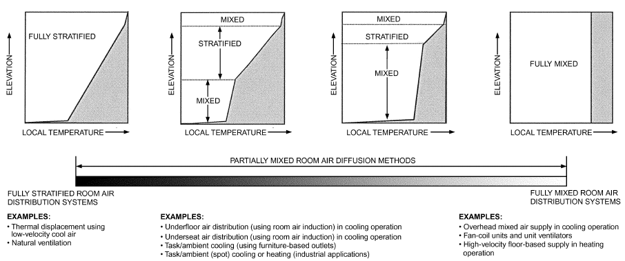

*Fig. 1 Classification of Air Diffusion Methods*

<!-- str. 596 -->

## 1. INDOOR AIR QUALITY AND SUSTAINABILITY

Air diffusion methods affect not only indoor air quality (IAQ) and thermal comfort, but also energy consumption over the building’s life. Choices made early in the design process are important. Programs such as U.S. Green Building Council’s (USGBC 2013) Leadership in Energy and Environmental Design (LEED®) v4 rating system, which was originally created in response to indoor air quality concerns, now include prerequisites and credits for increasing ventilation rates and improving indoor environmental quality. These program requirements are sometimes achievable by following good room air diffusion design principles, methods, and standards (see Chapter 57 of the 2019 ASHRAE Handbook—HVAC Applications).

ANSI/ASHRAE Standard 62.1 provides a table of typical values to help predict zone air distribution effectiveness. For example, well-designed ceiling-based air distribution systems produce nearperfect air mixing in cooling mode, and yield an air distribution effectiveness of 1.0. Displacement ventilation and underfloor air distribution (UFAD) systems have the potential for values greater than 1.0. More information on ceiling- and wall-mounted air inlets and outlets can be found in Rock and Zhu (2002). Displacement system performance is described in Chen and Glicksman (2003). ASHRAE’s (2013) *UFAD Design Guide* discusses UFAD in detail. More information on ANSI/ASHRAE Standard 62.1 is available in its user’s manual (ASHRAE 2010).

## 2. TERMINOLOGY

**Aspect ratio.** Ratio of length to width of opening or core of a grille.

**Attached jet.** A supply air jet drawn to a surface, parallel to the direction of airflow and caused by the Coanda effect.

**Axial jet.** A supply air jet with a conical discharge profile.

**Centerline velocity.** Maximum velocity of an air jet at any given cross section perpendicular to the direction of airflow.

**Coanda effect.** Effect of a moving jet attaching to a parallel surface because of negative pressure developed between jet and surface.

**Coefficient of discharge.** Ratio of area at vena contracta to free area of opening.

**Core area.** Area of a register, grille, or linear slot diffuser pertaining to the inside of the frame or border.

**Diffusion.** Distribution of air into a space.

**Distribution.** Moving air to or in a space by an outlet discharging supply air.

**Draft.** Current of air, when referring to localized effect (generally, the unwanted local cooling of the body caused by air movement) caused by one or more factors of high air velocity, low ambient temperature, or direction of airflow whereby more heat is withdrawn from a person’s skin than is normally dissipated.

**Drop.** Vertical distance that the lower edge of a horizontally projected airstream descends between the outlet and the end of its throw.

**Effective area.** Net area of an outlet or inlet device through which air can pass; equal to the free area times the coefficient of discharge.

**Entrainment.** Air drawn into an air jet because of the pressure differential caused by the airstream discharged from the outlet.

**Entrainment ratio.** Volumetric flow rate of total air (supply air plus entrained air) at a given distance from an outlet divided by the volumetric flow rate of supply air.

**Free area.** Total minimum area of openings in an air outlet or inlet through which air can pass.

**Free jet.** An air jet not obstructed or affected by walls, ceiling, or other surfaces.

**Induction.** Movement of space air into an air device.

**Induction ratio.** Volumetric flow rate of induced air divided by volumetric flow rate of primary air.

**Inlet.** A device that allows air to exit the zone (e.g., grilles, registers, diffusers)

**Isothermal jet.** An air jet in which supply air temperature equals surrounding room air temperature.

**Linear jet.** A supply air jet with a relatively high aspect ratio. **Neck area.** Nominal area of duct connection to air outlet or inlet.

**Nonisothermal jet.** An air jet in which supply air temperature does not equal surrounding room air temperature.

**Occupied zone.** The volume of space intended to be comfort conditioned for occupants (see ANSI/ASHRAE Standard 55).

**Outlet.** A device discharging supply air into the space (e.g., grilles, registers, diffusers). Classified according to location and type of discharge.

**Outlet velocity.** Average velocity of air discharging from an outlet.

**Primary air.** Air delivered to an outlet or terminal device. **Radial jet.** A supply air jet that discharges 360° and expands uniformly.

**Spread.** Divergence of an airstream in a horizontal and/or vertical plane after it leaves an outlet.

**Stratification height.** Vertical distance from floor to horizontal plane that defines lower boundary of upper mixed zone in a fully stratified or partially mixed system.

**Stratified zone.** Zone in which air movement is entirely driven by buoyancy caused by convective heat sources. Typically found in fully stratified or partially mixed systems.

**Supply Air.** Air delivered into a zone from an outlet.

**Terminal velocity.** An arbitrary specified centerline air velocity at a distance from an outlet.

**Throw.** The distance from the centerline of an outlet perpendicular to a point in the mixed airstream where the velocity has been reduced to a specified terminal velocity (e.g., 0.25, 0.5, 0.75, or 1.0 m/s), defined by ASHRAE Standard 70.

**Total air.** Combination of supply air and entrained air at a given distance from an outlet.

**Vena contracta.** Smallest cross-sectional area of a fluid stream leaving an orifice.

### Outlet Types and Characteristics

Straub and Chen (1957) and Straub et al. (1956) classified outlets into five major groups (the subgrouping was added in 2017 and was not part of the original research):

**Group A1.** Outlets mounted in or near the ceiling that discharge air horizontally (Figures 2 and 3).

**Group A2.** Outlets discharging horizontally that are not influenced by an adjacent surface (free jet; Figure 4).

**Group B.** Outlets mounted in or near the floor that discharge air vertically in a linear jet (Figure 5).

**Group C.** Outlets mounted in or near the floor that discharge air vertically in a spreading jet (Figure 6).

**Group D.** Outlets mounted in or near the floor that discharge air horizontally (Figure 7 and 8). When used in fully stratified systems (TDV), these outlets use low discharge velocities; in mixed systems, they use higher discharge velocities.

**Group E.** Outlets that project supply air vertically downward (Figures 9 and 10). When used in partially stratified systems (e.g., laminar flow outlets, TDV), these outlets use low discharge velocities; in mixed systems (e.g., air curtain units, other downward directed ceiling devices, etc.), they use higher discharge velocities.

<!-- str. 597 -->

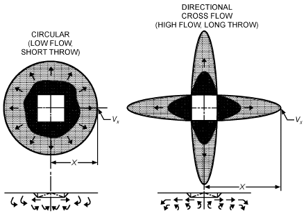

*Fig. 2 Example Airflow Patterns of Outlet Group A1*

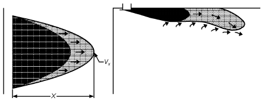

*Fig. 3 Example Airflow Patterns (Nonisothermal) of Outlet Group A1*

## 3. PRINCIPLES OF JET BEHAVIOR

### Air Jet Fundamentals

Air supplied to rooms through various types of outlets can be distributed by turbulent air jets (mixed and partially mixed systems) or in a low-velocity, unidirectional manner (stratified systems). The air jet discharged from an outlet is a primary factor affecting room air motion. The jet boundary contours are not well defined and are easily affected by external influences. Baturin (1972), Christianson (1989), and Murakami (1992) have further information on the relationship between the air jet and occupied zone.

If the supply air temperature is equal to the ambient room air temperature, the air jet is called an **isothermal jet**. A jet with an initial temperature different from the ambient air temperature is called a **nonisothermal jet**. The air temperature differential between supplied and ambient room air generates thermal forces (buoyancy) in jets, affecting the jet’s (1) trajectory, (2) location at which it attaches to and separates from the ceiling/floor, and (3) throw. The significance of these effects depends on the ratio between the thermal buoyancy of the air and jet momentum.

If an air jet is not obstructed or affected by walls, ceiling, or other surfaces, it is considered a **free jet**. When outlet area is small compared to the dimensions of the space normal to the jet, the jet may be considered free as long as

> X ≤ 1.5 AR&emsp;**(1)**

where

- X = distance from face of outlet, m
- AR = cross-sectional area of confined space normal to jet, m2

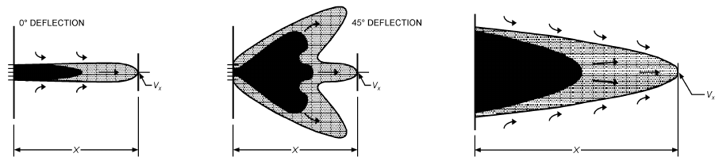

*Fig. 4 Example Airflow Patterns (Isothermal) of Outlet Group A2*

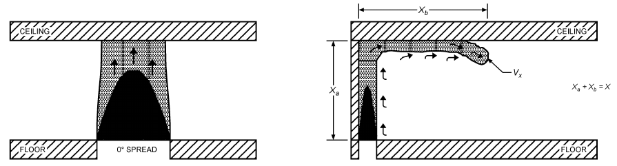

*Fig. 5 Example Airflow Patterns (Nonisothermal) of Outlet Group B*

<!-- str. 598 -->

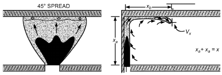

*Fig. 6 Example Airflow Patterns (Nonisothermal) of Outlet Group C*

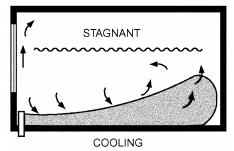

*Fig. 7 Example Airflow Patterns (Nonisothermal) of Outlet Group D (High Velocity)*

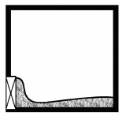

*Fig. 8 Example Airflow Patterns (Nonisothermal) of Outlet Group D (Low Velocity)*

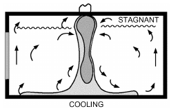

*Fig. 9 Example Airflow Patterns (Nonisothermal) of Outlet Group E (High Velocity)*

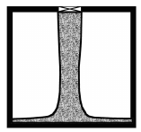

*Fig. 10 Example Airflow Patterns (Nonisothermal) of Outlet Group E (Low Velocity)*

**Jet Expansion Zones.** The full length of an air jet, in terms of the maximum or centerline velocity and temperature differential at the cross section, can be divided into four zones:

- Zone 1 extends from the outlet face, in which the velocity and temperature of the airstream remains practically unchanged.
- Zone 2 is a transition zone, with its length determined by the type of outlet, aspect ratio of the outlet, initial airflow turbulence, etc.
- Zone 3 is a zone of jet degradation, where centerline air velocity and temperature differential decrease rapidly. Turbulent flow is fully established and may be 25 to 100 equivalent air outlet diameters long. The angle of divergence is well defined. Typically, free air jets diverge at a constant angle, usually ranging from 20 to 24°, with an average of 22°. Coalescing jets for closely spaced multiple outlets expand at smaller angles, averaging 18°, and jets discharging into relatively small spaces show even smaller angles of expansion (McElroy 1943). The angle of divergence is easily affected by external influences, such as local eddies, vortices, and surges. Internal forces governing this air motion are extremely delicate (Nottage et al. 1952a).
- Zone 4 is important because, in most cases, the jet enters the occupied area in this zone. Distance to this zone and its length depend on the velocities and turbulence characteristics of ambient air. In a few diameters or widths, air velocity becomes less than 0.25 m/s.

**Centerline Velocities in Zones 1 and 2.** In zone 1, the ratio Vx/Vo is constant for a given outlet and ranges between 1.0 and 1.2, equal to the ratio of the centerline velocity of the jet at the start of expansion to the average initial velocity. The ratio Vx/Vo varies from approximately 1.0 for rounded entrance nozzles to about 1.2 for straight pipe discharges; it has higher values for diverging discharge outlets.

The aspect ratio (Tuve 1953) and turbulence (Nottage et al. 1952a) primarily affect centerline velocities in zones 1 and 2. Aspect ratio has little effect on the terminal zone of the jet when Ho is greater than 100 mm. This is particularly true of nonisothermal jets. When Ho is very small, induced air can penetrate the core of the jet, thus reducing centerline velocities. The difference in performance between a radial outlet with small Ho and an axial outlet with large Ho shows the importance of jet thickness.

When air is discharged from relatively large perforated panels, the constant-velocity core formed by coalescence of individual jets extends a considerable distance from the panel face. In zone 1, when the aspect ratio is less than 5, use the following equation for estimating centerline velocities (Koestel et al. 1949):

> Vx = 1.2Vo CdRfa&emsp;**(2)**

In zone 2, the ratio Vx/Vo begins to decrease. Experimental evidence indicates that, in zone 2,

> Vx/Vo = (K H c2 o)/X&emsp;**(3)**

where

- Vx = centerline velocity at distance X from outlet, m/s
- Vo = *Vc /Cd Rfa* = average initial velocity at discharge, m/s
- Vc = nominal velocity of discharge based on core area, m/s
- Cd = coefficient of discharge (usually between 0.65 and 0.90)
- Rfa = ratio of free area to core area
- Ho = width of jet at outlet or at vena contracta, m
- Kc2 = centerline velocity constant, depending on outlet type and discharge pattern
- X ≥ (1/Kc2Ho)1/2 = distance from outlet to measurement of centerline velocity Vx, m

**Centerline Velocity in Zone 3.** In zone 3, centerline velocities of radial and axial isothermal jets can be determined accurately from the following equation:

<!-- str. 599 -->

**Table 1 Generic Values for Centerline Velocity Constant Kc3a**

| Outlet Type | Discharge Pattern | Ao | Kc3a |
|---|---|---|---|
| High sidewall grilles | 0° deflectionb | Free | 5.7 |
| (Figure 4) | Wide deflection | Free | 4.2 |
| High sidewall linear | Core less than 100 mm highc | Free | 4.4 |
|  | Core more than 100 mm high | Free | 5.0 |
| Low sidewall | Up and on wall, no spread | Free | 4.5 |
| (Figure 7) | Wide spreadc | Free | 3.0 |
| Baseboard | Up and on wall, no spread | Core | 4.0 |
|  | Wide spread | Core | 2.0 |
| Floor grille (Figure 5) | No spreadc | Free | 4.7 |
|  | Wide spread | Free | 1.6 |
| Ceiling (Figure 2) | 360° horizontald | Neck | 1.1 |
|  | Four-way; little spread | Neck | 3.8 |
| Ceiling linear slot | Horizontal/vertical along surfacec | Free | 5.5 |
| (Figure 3) | Horizontal/vertical free jetc | Free | 3.9 |
|  | Free jet (air curtain units) | Free | 6.0 |

aGeneric values shown for example purposesbFree area is about 80% of core area. only. See manufacturer’s data for specificcFree area is about 50% of core area. Kc3 values. dCone free area is greater than duct area.

> Vx = (*K V A* c3 o o)/X = (K Q c3 o)/(X Ao)&emsp;**(4)**

where

- Kc3 = centerline velocity constant (see Table 1 for generic values)
- Vo = Vc/CdRfa = average initial velocity at discharge, m/s
- Ao = free area, core area, or neck area as shown in Table 1 (obtained from outlet manufacturer), m2
- Qo = volumetric flow rate of supply air, m3/s
- X = distance from face of outlet, m

For centerline velocities of linear jets, where Kc3 = Kc2, use Equation (3).

The effective area, according to ASHRAE Standard 70, can be used in place of Ao in Equation (4) with the appropriate value of Kc3.

**Centerline Velocity in Zone 4.** In zone 4, centerline velocities can be difficult to predict, based on the large dispersal pattern.

**Determining Centerline Velocities.** To correlate data from all four zones, plot centerline velocity ratios against distance from the outlet in Figures 11 and 12.

Airflow patterns of diffusers are related to the centerline velocity constants and throw distance. In general, diffusers with a circular airflow pattern (radial jet) have a shorter throw than those with a directional or cross-flow pattern (axial jet). During cooling, the circular pattern tends to curl back from the end of the throw toward the diffuser, reducing the drop and ensuring that the cool air remains near the ceiling.

In cross-flow airflow patterns, the airflow does not roll back to the diffuser at the end of the throw, but continues to move away from the diffuser at low velocities.

**Throw.** At a given supply airflow and centerline velocity, Equation (4) can be transposed into Equation (5) to determine the throw X of an outlet. The centerline velocity constant and appropriate outlet area Ao should be available from the outlet manufacturer.

According to Figures 11 and 12, 0.25 m/s terminal velocity can occur in zone 4. When this occurs, an accepted practice to approximate throw in zone 4 is to reduce the calculated throw in zone 3 by 30%.

> X = (K Q c3 o)/(Vx Ao)&emsp;**(5)**

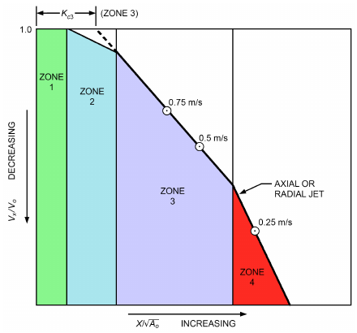

*Fig. 11 Zones of Expansion for Axial or Radial Air Jets*

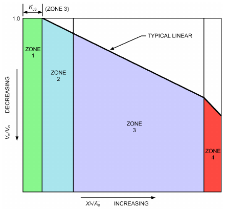

*Fig. 12 Zones of Expansion for Linear Air Jets*

See Informative Appendix B of ASHRAE Standard 70-2006 for the application of this methodology. The following example shows the use of Table 1 and Figures 11 and 12.

**Example 1.** A 300 by 450 mm high sidewall grille with an 280 by 430 mm core area is selected. From Table 1, Kc3 = 5 for zone 3, and Ao should be 80% of the core area, in square metres. If the airflow is 0.3 m3/s, what is the throw to 0.25, 0.5, and 0.75 m/s?

**Solution:**

> From Equation (5),
>
> X = (K Q c3 o)/(Vx Ao) = (5.7 × 0.3)/(Vx 0.8 × 280 × 430 ⁄ 106) = 1.71/(Vx× 0.31)

<!-- str. 600 -->

> Solving for 0.25 m/s throw,
>
> X = 1.71/(0.25 × 0.31) = 22 m

However, according to Figures 11 and 12, 0.25 m/s is in zone 4, which is typically 30% less than calculated in Equation (4), or

> X = 22 × 0.70 = 15 m
>
> Solving for 0.5 m/s throw,

> X = 1.71/(0.5 × 0.31) = 11 m
>
> Solving for 0.75 m/s throw,

> X = 1.71/(0.75 × 0.31) = 7 m

**Velocity Profiles of Jets.** In zone 3 of both axial and radial jets, the velocity distribution may be expressed by a single curve (Figures 11 and 12) in terms of dimensionless coordinates; this same curve can be used as a good approximation for adjacent portions of zones 2 and 4. Temperature and density differences have little effect on cross-sectional velocity profiles.

Velocity distribution in zone 3 can be expressed by the Gauss error function or probability curve, which is approximated by the following equation:

> ( )2
>
> r/(r 0.5V) = 3.3 logVx/V&emsp;**(6)**

> ( )

where

- r = radial distance of point under consideration from centerline of jet
- r0.5V = radial distance in same cross-sectional plane from axis to point where velocity is one-half centerline velocity (i.e., V = 0.5Vx)
- Vx = centerline velocity in same cross-sectional plane
- V = actual velocity at point being considered

Experiments show that the conical angle for r0.5V is approximately one-half the total angle of divergence of a jet. The velocity profile curve for one-half of a straight-flow turbulent jet (the other half being a symmetrical duplicate) is shown in Figure 13. For multiple-opening outlets, such as grilles or perforated panels, the velocity profiles are similar, but the angles of divergence are smaller.

**Entrainment Ratios.** The following equations are for entrainment of circular jets and of jets from long slots. For third-zone expansion of circular jets,

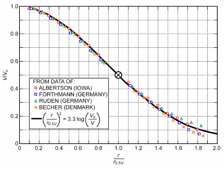

*Fig. 13 Cross-Sectional Velocity Profiles for Straight-Flow Turbulent Jets*

> Qx/Qo = 2X/(Kc Ao)&emsp;**(7)**

By substituting from Equation (4),

> Qx/Qo = 2Vo/Vx&emsp;**(8)**

For a continuous slot with active sections up to 3 m and separated by 0.6 m,

> Qx/Qo = 2/(K c3) X/Ho&emsp;**(9)**

or, substituting from Equation (3),

> Qx/Qo = 2Vo/Vx&emsp;**(10)**

where

- Qx = total volumetric flow rate at distance X from face of outlet, m3/s
- Qo = discharge from outlet, m3/s
- X = distance from face of outlet, m
- Kc = centerline velocity constant
- Ao = core area or neck area free (see Table 1), m2

The entrainment ratio Qx /Qo is important in determining total air movement at a given distance from an outlet. For a given outlet, the entrainment ratio is proportional to the distance X [Equation (7)] or to the square root of the distance X [Equation (9)] from the outlet. Equations (8) and (10) show that, for a fixed centerline velocity Vx, the entrainment ratio is proportional to outlet velocity. Equations (8) and (10) also show that, at a given centerline and outlet velocity, a circular jet has greater entrainment and total air movement than a long slot. Comparing Equations (7) and (9), the long slot should have a greater rate of entrainment. The entrainment ratio at a given distance is less with a large Kc3 than with a small Kc3.

### Isothermal Radial Flow Jets

In a radial jet, as with an axial jet, the cross-sectional area at any distance from the outlet varies as the square of this distance. Centerline velocity gradients and cross-sectional velocity profiles are similar to those of zone 3 of axial jets, and the angles of divergence are about the same.

### Nonisothermal Jets

When the temperature of introduced air is different from the room air temperature, the diffuser air jet is affected by thermal buoyancy caused by air density difference. The trajectory of a nonisothermal jet introduced horizontally is determined by the Archimedes number (Baturin 1972):

> Ar = (gLo(To– TA))/(2 V T o A)&emsp;**(11)**

where

- g = gravitational acceleration rate, m/s2
- Lo = length scale of diffuser outlet equal to hydraulic diameter of outlet, m
- (To – TA) = initial temperature of jet – temperature of ambient air, °C
- Vo = initial air velocity of jet, m/s
- TA = room air temperature, K

The influence of buoyant forces on horizontally projected heated and chilled jets is significant in heating and cooling with wall outlets. Koestel’s (1955) equation describes the behavior of these jets.

Helander and Jakowatz (1948), Helander et al. (1953, 1954, 1957), Knaak (1957), and Yen et al. (1956) developed equations for outlet characteristics that affect the downward throw of heated air. Koestel (1954, 1955) developed equations for temperatures and velocities in heated and chilled jets. Kirkpatrick and Elleson (1996) and Li et al. (1993) provide additional information on nonisothermal jets.

<!-- str. 601 -->

### Nonisothermal Horizontal Free Jet

A horizontal free jet rises or falls according to the temperature difference between it and the ambient environment. The horizontal jet throw to a given distance follows an arc, rising for heated air and falling for cooled air. Therefore, whether the equivalent temperature difference is positive or negative, the distance from the diffuser to a given terminal velocity along the discharge jet remains essentially the same.

### Comparison of Free Jet to Attached Jet

An attached jet entrains air along the exposed side of the jet, whereas a free jet can entrain air on all its surfaces. Because a free jet’s entrainment rate is larger compared to that of an attached jet, a free jet’s throw distance will be shorter. To calculate the throw distance X for a noncircular free jet from catalog data for an attached jet, the following estimate can be used.

> Xfree = Xattached × 0.707&emsp;**(12)**

Jets from ceiling diffusers initially tend to attach to the ceiling surface, because of the force exerted by the Coanda effect. However, air jets detach from the ceiling if the airstream’s buoyancy forces are greater than the inertia of the moving airstream.

With separation, a cold jet may enter the occupied space, and can result in thermal discomfort. The thermal discomfort is caused by two factors: the cold draft caused by the separated jet in the occupied space, and areas of the room not reached by the separated jet. The separation distance parameter xs is the distance from the diffuser at which a jet separates from the ceiling.

Separation distance correlates with outlet jet conditions (Kirkpatrick and Elleson 1996). Separation distance depends on the velocity constant Kc, outlet temperature, flow rate, and static pressure drop. For slot and round diffusers,

> xs = (48.04)CsKc1/2(ΔT/T)–1/2Qo1/4ΔP3/8&emsp;**(13)**

where

- xs = jet separation distance, m
- Cs = separation coefficient, 1.2
- Kc = centerline velocity constant
- ΔT = room-jet temperature difference, K
- T = average absolute room temperature, K
- Qo = outlet flow rate, m3/s
- ΔP = diffuser static pressure drop, Pa

Attached jets travel at a higher velocity and entrain less air than a free jet. Values of centerline velocity constant Kc are approximately those for a free jet multiplied by 2 .

When a jet is discharged parallel to but at some distance from a solid surface (wall, ceiling, or floor), its expansion in the direction of the surface is reduced, and entrained air must be obtained by recirculation from the jet instead of from ambient air (McElroy 1943; Nottage et al. 1952b; Zhang et al. 1990). The restriction to entrainment caused by the solid surface induces the **Coanda effect**, which makes the jet attach to a surface after it leaves the diffuser outlet. The jet then remains attached to the surface for some distance before separating again.

In nonisothermal cases, the jet’s trajectory is determined by the balance between thermal buoyancy and the Coanda effect, which depends on jet momentum and distance between the jet exit and solid surface. The behavior of such nonisothermal surface jets has been studied by Kirkpatrick et al. (1991), Oakes (1987), Wilson et al. (1970), and Zhang et al. (1990), each addressing different factors. More systematic study of these jets in room ventilation flows is needed to provide reliable guidelines for designing air distribution systems.

### Air Curtain Units

Non-recirculating air curtain units operate in zones 1 to 3 where velocity degradation is at a minimum. The air curtain unit is designed such that the jet strikes the floor, comparable, surface or another jet in zone 3 at a minimum of 2 m/s, to generate a stable split to resist minimal thermal and pressure differentials.

Recirculating air curtain units also operate in zones 1 to 3, where velocity degradation is at a minimum. The target distance is designed for the jet to be captured by the low-pressure return and maintain a minimum of 3 m/s velocity while in zone 3, to create a stable barrier to resist minimal thermal and pressure differentials.

### Multiple Jets

Twin parallel air jets act independently until they interfere. The point of interference and its distance from outlets vary with the distance between outlets. From outlets to the point of interference, maximum velocity, as for a single jet, is on the centerline of each jet. After interference, velocity on a line midway between and parallel to the two jet centerlines increases until it equals jet centerline velocity. From this point, maximum velocity of the combined jet stream is on the midway line, and the profile seems to emanate from a single outlet of twice the area of one of the two outlets.

### Air Movement in Occupied Zone

Zhang et al. (1990) found that, for a given heat load and room air supply rate, air velocity in the occupied zone increases when outlet discharge velocity increases. Therefore, the design supply air velocity should be high enough to maintain the jet traveling in the desired direction, to ensure adequate mixing before it reaches the occupied zone. Excessively high outlet air velocity produces high air velocities in the occupied zone and may result in thermal discomfort.

Air turbulence in a room is mainly produced at the diffuser jet region by interaction of supply air with room air and with solid surfaces in the vicinity. It is then transported to other parts of the room, including the occupied zone (Zhang et al. 1992). Air in the occupied zone usually contains very small amounts of turbulent kinetic energy compared to the jet region. Because turbulence may cause thermal discomfort (Fanger et al. 1988), air distribution systems should be designed to avoid air turbulence in the occupied zone (except in specialized applications such as task ambient or spot-conditioning systems).

**Thermal Plumes.** As a thermal plume rises because of natural convection above a heat source, it entrains surrounding air and therefore increases in size and volume, and decreases in velocity (Figure 14). The maximum height to which a plume rises depends primarily on the heat source’s strength (relative to the air turbulence surrounding the heat source), and secondarily on stratification in the room (which decreases the rising plume’s buoyancy). The stratified zone has little or no recirculation.

In fully stratified and partially mixed applications, cool supply air introduced at or near the floor gradually flows across the lower level of the space. In the case of fully stratified applications (e.g., TDV systems), this layer is typically 100 to 150 mm thick. In partially mixed systems, this layer typically ranges from 0.3 to 2.4 m thick, depending on the upward vertical projection of the outlets’ supply air jets. It is drawn horizontally toward convective heat sources located within or close to it, where it is entrained upward by the associated heat plume. Partially mixed systems are characterized by relatively well-mixed conditions from the floor up to the height where their supply air jet velocities decay to 0.25 m/s or less. This area is referred to as the **lower mixed zone**. These plumes expand and rise until they encounter equally warm air in the upper regions of the space. The **upper mixed zone** above the stratification height is characterized by low-velocity recirculation, which produces a fairly well-mixed layer of warm air with greater contaminant concentration than that in the lower levels of the space.

<!-- str. 602 -->

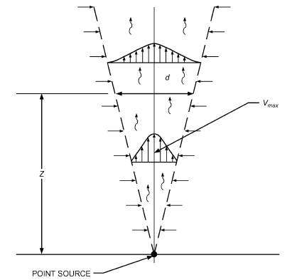

*Fig. 14 Thermal Plume from Point Source*

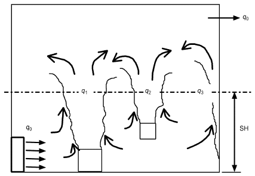

*Fig. 15 Schematic Diagram of Major Flow Elements in Room with Displacement Ventilation*

Typically, warmer, more polluted air will not reenter the stratified zone. This principle is the basis for the improved ventilation effectiveness and heat removal efficiency of TDV systems. In some situations (e.g., morning start-up, winter), there are also sources of cooling in the space, such as cold perimeter windows. The resulting cold downdraft may transport some air from the upper zone back down to the stratified zone.

Figure 15 shows basic elements in a simplified schematic of a TDV system. In the figure, q0 represents the supply airflow into the room from a low sidewall diffuser, and q1, q2, and q3 are the upward-moving airflows in thermal plumes that form above heat sources. In this simplified configuration, the stratification height occurs at a height SH, where the net upward-moving flow q1 + q2+ q3= q0. An important objective in designing and operating a TDV system is to maintain stratification above the occupied zone.

## 4. SYMBOLS

Ac = measured gross (core) area of outlet, m2

Ao = core area or neck area, m2

AR = cross-sectional area of confined space normal to jet, m2

Ar = Archimedes number [Equation (11)]

> c = pollutant concentration

Cd = discharge coefficient (usually between 0.65 and 0.90)

cR = concentration of pollutant at return grille near ceiling level g = gravitational acceleration rate, m/s2

H = height or width of slot [Equation (2)], or of room

Ho = width of jet at outlet or at vena contracta or width of slot, m Kc2 = centerline velocity constant in zone 2

Kc3 = centerline velocity constant in zone 3

Lo = length scale of diffuser outlet equal to hydraulic diameter of outlet, m

ΔP = diffuser static pressure drop, Pa

Qo = discharge from outlet, m3/s

Qx = total volumetric flow rate at distance X from face of outlet, m3/s r = radial distance of point under consideration from centerline of jet r0.5V = radial distance in same cross-sectional plane from axis to point where velocity is one-half centerline velocity (i.e., V = 0.5Vx) Rfa = ratio of free area to gross (core) area

SH = stratification height

> T = average absolute room temperature, K

ΔT = room/jet temperature difference, K

TA = temperature of ambient air, °C

TE = temperature at ceiling, °C

TF = temperature near floor, °C

TH = temperature at given height, °C

TO = initial temperature of jet, °C

TS = supply temperature, °C

> V = actual velocity at point being considered

Vc = nominal velocity of discharge based on core area, m/s

Vo = initial air velocity of jet, m/s

VT = terminal velocity, m/s

Vx = centerline velocity, m/s

X = distance from face of outlet to location of centerline velocity VX, m Xattached= throw distance of attached jet, m

Xfree = throw distance of free jet, m

XH = throw height from floor outlet, m

XVT = distance to given terminal velocity, m

## REFERENCES

ASHRAE members can access ASHRAE Journal articles and ASHRAE research project final reports at technologyportal .ashrae.org. Articles and reports are also available for purchase by nonmembers in the online ASHRAE Bookstore at www.ashrae.org /bookstore.

ASHRAE. 2013. Thermal environmental conditions for human occupancy.

ANSI/ASHRAE Standard 55-2013.

ASHRAE. 2013. Ventilation for acceptable indoor air quality. ANSI/ASHRAE Standard 62.1-2013.

ASHRAE. 2011. Method of testing for rating the performance of air outlets and inlets. ANSI/ASHRAE Standard 70-2006 (RA 2011).

ASHRAE. 2010. Standard *62.1 user’s manual*.

ASHRAE. 2013. *UFAD guide: Design, construction and operation of* *underfloor air distribution systems*.

Baturin, V.V. 1972. *Fundamentals of industrial ventilation*, 3rd ed. Translated by O.M. Blunn. Pergamon Press, New York.

Chen, Q., and L. Glicksman. 2003. *System performance evaluation and* *design guidelines for displacement ventilation*. ASHRAE.

Christianson, L.L., ed. 1989. *Building systems: Room air and air contami-* nant distribution. ASHRAE.

Fanger, P.O., A.K. Melikov, H. Hanzawa, and J. Ring. 1988. Air turbulence and sensation of draft. *Energy and Buildings* 12:21-39.

Helander, L., and C.V. Jakowatz. 1948. Downward projection of heated air.

ASHVE Transactions 54:71.

Helander, L., S.M. Yen, and R.E. Crank. 1953. Maximum downward travel of heated jets from standard long radius ASME nozzles. ASHVE Transactions 59:241.

<!-- str. 603 -->

Helander, L., S.M. Yen, and L.B. Knee. 1954. Characteristics of downward jets of heated air from a vertical delivery discharge unit heater. ASHVE Transactions 60:359.

Helander, L., S.M. Yen, and W. Tripp. 1957. Outlet characteristics that affect the downthrow of heated air jets. ASHAE Transactions 63:255.

Kirkpatrick, A., and J. Elleson. 1996. *Design guide for cold air distribution* systems. ASHRAE.

Kirkpatrick, A., T. Malmstrom, P. Miller, and V. Hassani. 1991. Use of low temperature air for cooling of buildings. *Proceedings of Building Simu-* lation.

Knaak, R. 1957. Velocities and temperatures on axis of downward heated jet from 4-inch long-radius ASME nozzle. ASHAE Transactions 63:527.

Koestel, A. 1954. Computing temperatures and velocities in vertical jets of hot or cold air. ASHVE Transactions 60:385.

Koestel, A. 1955. Paths of horizontally projected heated and chilled air jets.

ASHAE Transactions 61:213.

Koestel, A., P. Hermann, and G.L. Tuve. 1949. Air streams from perforated panels. ASHVE Transactions 55:283.

Li, Z., J.S. Zhang, A.M. Zhivov, and L.L. Christianson. 1993. Characteristics of diffuser air jets and airflow in the occupied regions of mechanically ventilated rooms: A literature review. ASHRAE Transactions 99(1): 1119-1127.

McElroy, G.E. 1943. Air flow at discharge of fan-pipe lines in mines. U.S.

Bureau of Mines *Report of Investigations* 19.

Murakami, S. 1992. New scales for ventilation efficiency and their application based on numerical simulation of room airflow. International Symposium on Room Air Convection and Ventilation Effectiveness.

Nottage, H.B., J.G. Slaby, and W.P. Gojsza. 1952a. Outlet turbulence intensity as a factor in isothermal-jet flow. ASHVE Transactions 58:343.

Nottage, H.B., J.G. Slaby, and W.P. Gojsza. 1952b. Isothermal ventilation jet fundamentals. ASHVE Transactions 58:107.

Oakes, W.C. 1987. *Experimental investigation of Coanda jet*. M.S. thesis, Michigan State University, East Lansing.

Rock, B.A., and D. Zhu. 2002. *Designer’s guide to ceiling-based air diffu-* sion (RP-1065). ASHRAE.

Tuve, G.L. 1953. Air velocities in ventilating jets. ASHVE Transactions 59:261.

USGBC. 2013. *LEED v4 for building design and construction*. U.S.

Green Building Council, Washington, D.C. www.usgbc.org/resources /leed-reference-guide-building-design-and-construction.

Wilson, J.D., M.L. Esmay, and S. Persson. 1970. Wall-jet velocity and temperature profiles resulting from a ventilation inlet. ASAE Transactions.

Yen, S.M., L. Helander, and L.B. Knee. 1956. Characteristics of downward jets from a vertical discharge unit heater. ASHAE Transactions 62:123.

Zhang, J.S., L.L. Christianson, and G.L. Riskowski. 1990. Regional airflow characteristics in a mechanically ventilated room under nonisothermal conditions. ASHRAE Transactions 96(1):751-759.

Zhang, J.S., L.L. Christianson, G.J. Wu, and G.L. Riskowski. 1992. Detailed measurements of room air distribution for evaluating numerical simulation models. ASHRAE Transactions 98(1):58-65.

## BIBLIOGRAPHY

Arens, E.A., F. Bauman, L. Johnston, and H. Zhang. 1991. Testing of localized ventilation systems in a new controlled environment chamber. Indoor Air 3:263-281.

Arens, E., S. Turner, H. Zhang, and G. Paliaga. 2009. Moving air for comfort. ASHRAE Journal 51(5):18-29.

ASHRAE. 2013. Energy standard for buildings except low-rise residential buildings. ANSI/ASHRAE/IES Standard 90.1-2013.

ASHRAE. 2013. Method of testing for room air diffusion. ANSI/ASHRAE Standard 113-2013.

ASHRAE. 2002. Measuring air-change effectiveness. ANSI/ASHRAE Standard 129-1997 (RA 2002).

Ball, H.D., R.G. Nevins, and H.E. Straub. 1971. Thermal analysis of heat removal troffers. ASHRAE Transactions 77(2).

Bauman, F., and E. Arens. 1996*. Task/ambient conditioning systems: Engi-* *neering and application guidelines*. Center for Environmental Design Research, University of California, Berkeley.

Bauman, F., P. Pecora, and T. Webster. 1999. *How low can you go? Air flow* *performance of low-height underfloor plenums.* Center for the Built Environment, University of California, Berkeley.

Bauman, F.S., L.P. Johnston, H. Zhang, and E.A. Arens. 1991. Performance testing of a floor-based, occupant-controlled office ventilation system. ASHRAE Transactions 97(1):553-565.

Bauman, F.S., H. Zhang, E. Arens, and C. Benton. 1993. Localized comfort control with a desktop task conditioning system: Laboratory and field measurements. ASHRAE Transactions 99(2):733-749.

Bauman, F.S., E.A. Arens, S. Tanabe, H. Zhang, and A. Baharlo. 1995. Testing and optimizing the performance of a floor-based task conditioning system. *Energy and Buildings* 22(3):173-186.

Bauman, F.S., T.G. Carter, A.V. Baughman, and E.A. Arens. 1998. Field study of the impact of a desktop task/ambient conditioning system in office buildings. ASHRAE Transactions 104(1):1153-1171.

Chen, Q., and L. Glicksman. 1999. Performance evaluation and development of design guidelines for displacement ventilation (RP-949). ASHRAE Research Project, Final Report.

de Dear, R.J., and G.S. Brager. 1999. Developing an adaptive model of thermal comfort and preference. ASHRAE Transactions 104(1A):145-167.

Faulkner, D., W.J. Fisk, and D.P. Sullivan. 1993. Indoor air flow and pollutant removal in a room with desktop ventilation. ASHRAE Transactions 99(2):750-758.

Faulkner, D., W.J. Fisk, D.P. Sullivan, and D.P. Wyon. 1999. Ventilation efficiencies of task/ambient conditioning systems with desk-mounted air supplies. *Proceedings of Indoor Air ’99*, Edinburgh, Scotland, 8-13 August.

Fisk, W.J., D. Faulkner, D. Pih, P. McNeel, F. Bauman, and E. Arens. 1991.

Indoor air flow and pollutant removal in a room with task ventilation. Indoor Air 3:247-262.

Hanzawa, H., and Y. Nagasawa. 1990. Thermal comfort with underfloor air-conditioning systems. ASHRAE Transactions 96(2).

Hart, G.H., and D. Int-Hout. 1980. The performance of a continuous linear diffuser in the perimeter zone of an office environment. ASHRAE Transactions 86(2).

Hart, G.H., and D. Int-Hout. 1981. The performance of a continuous linear diffuser in the interior zone of an open office environment. ASHRAE Transactions 87(2).

Heiselberg, P., and M. Sandberg. 1990. Convection from a slender cylinder in a ventilated room. *Proceedings of ROOMVENT ’90*, Oslo.

Houghton, D. 1995. *Turning air conditioning on its head: Underfloor air* *distribution offers flexibility, comfort, and effici*ency. E Source TU-95-8. E Source, Inc., Boulder, CO.

Houghten, F.C., C. Gutberlet, and E. Witkowski. 1938. Draft temperatures and velocities in relation to skin temperatures and feelings of warmth. ASHVE Transactions 44:289.

Howe, M., D. Holland, and A. Livchak. 2003. Displacement ventilation—Smart way to deal with increased heat gains in the telecommunication equipment room. ASHRAE Transactions 109(1):323-327.

Int-Hout, D. 1981. Measurement of room air diffusion in actual office environments to predict occupant thermal comfort. ASHRAE Transactions 87(2).

Int-Hout, D. 2007. Overhead heating: Revisiting a lost art. ASHRAE Journal 49(3):56-61.

Jackman, P.J. 1991. Displacement ventilation. CIBSE National Conference.

Chartered Institution of Building Services Engineers, London.

Jackman, P.J., and P.A. Appleby. 1990. Displacement flow ventilation.

BSRIA Project Report. Building Services Research and Information Association, Berkshire, U.K.

Kegel, B., and U.W. Schulz. 1989. Displacement ventilation for office buildings. *Proceedings of the 10th AIVC Conference*, Helsinki.

Koestel, A. 1957. Jet velocities from radial flow outlets. ASHAE Transactions 63:505.

Koestel, A., and J.B. Austin, Jr. 1956. Air velocities in two parallel ventilating jets. ASHAE Transactions 62:425.

Koestel, A., and G.L. Tuve. 1955. Performance and evaluation of room air distribution systems. ASHAE Transactions 61:533.

Koestel, A., P. Hermann, and G.L. Tuve. 1950. Comparative study of ventilating jets from various types of outlets. ASHVE Transactions 56:459.

Livchak, A., and D. Nall. 2001. Displacement ventilation—Application for hot and humid climate. *Proceedings of CLIMA 2000*, Napoli.

Loudermilk, K. 1999. Underfloor air distribution solutions for open office applications. ASHRAE Transactions 105(1):605-613.

Lorch, F.A., and H.E. Straub. 1983. Performance of overhead slot diffusers with simulated heating and cooling conditions. ASHRAE Transactions 89(1).

<!-- str. 604 -->

Matsunawa, K., H. Iizuka, and S. Tanabe. 1995. Development and application of an underfloor air-conditioning system with improved outlets for a “smart” building in Tokyo. ASHRAE Transactions 101(2):887-901.

Mattsson, M. 2000. A note on the thermal comfort in displacement ventilated classrooms. ROOMVENT 2000, *Proceedings of the 7th Interna-* *tional Conference on Air Distribution in Rooms*.

McCarry, B.T. 1995. Underfloor air distribution systems: Benefits and when to use the system in building design. ASHRAE Transactions 101(2):902-911.

McCarry, B.T. 1998. Innovative underfloor system. ASHRAE Journal 40(3). Melikov, A.K., and J.B. Nielsen. 1989. Local thermal discomfort due to draft and vertical temperature difference in rooms with displacement ventilation. ASHRAE Transactions 95(2):1050-1057.

Miller, P.L. 1971. Room air distribution performance of four selected outlets. ASHRAE Transactions 77(2):194.

Miller, P.L. 1979. Design of room air diffusion systems using the air diffusion performance index (ADPI). ASHRAE Journal 10:85.

Miller, P.L. 1989. Descriptive methods. In *Building systems: Room air and* *air contaminant distribution*, L.L. Christianson, ed. ASHRAE.

Miller, P.L., and R.T. Nash. 1971. A further analysis of room air distribution performance. ASHRAE Transactions 77(2):205.

Miller, P.L., and R.G. Nevins. 1969. Room air distribution with an air distributing ceiling—Part II. ASHRAE Transactions 75:118.

Miller, P.L., and R.G. Nevins. 1970. Room air distribution performance of ventilating ceilings and cone-type circular ceiling diffusers. ASHRAE Transactions 76(1):186.

Miller, P.L., and R.G. Nevins. 1972. An analysis of the performance of room air distribution systems. ASHRAE Transactions 78(2):191.

Nelson, D.W., and G.E. Smedberg. 1943. Performance of side outlets on horizontal ducts. ASHVE Transactions 49:58.

Nelson, D.W., H. Krans, and A.F. Tuthill. 1940. The performance of stack heads. ASHVE Transactions 46:205.

Nelson, D.W., D.H. Lamb, and G.E. Smedberg. 1942. Performance of stack heads equipped with grilles. ASHVE Transactions 48:279.

Nevins, R.G., and P.L. Miller. 1972. Analysis, evaluation and comparison of room air distribution performance. ASHRAE Transactions 78(2):235.

Nevins, R.G., and E.D. Ward. 1968. Room air distribution with an air distributing ceiling. ASHRAE Transactions 74:VI.2.1.

Nielsen, P.V. 1996. Temperature distribution in a displacement ventilated room. ROOMVENT 1996, *Proceedings of the 5th International Confer-* *ence on Air Distribution in Rooms*, Yokohama.

Poz, M.Y. 1991. Theoretical investigation and practical applications of nonisothermal jets for the rooms ventilating. Current East/West HVAC Developments. IEI/CIBSE/ABOK Joint Conference.

Reinmann, J.J., A. Koestel, and G.L. Tuve. 1959. Evaluation of three room air distribution systems for summer cooling. ASHRAE Transactions 65:717.

Rock, B.A. 2006. *Ventilation for environmental tobacco smoke—Con-* *trolling ETS irritants where smoking is allowed.* ASHRAE and Elsevier.

Rousseau, W.H. 1983. Perimeter air diffusion performance index tests for heating with a ceiling slot diffuser. ASHRAE Transactions 89(1).

Rydberg, J., and P. Norback. 1949. Air distribution and draft. ASHVE Transactions 55:225.

Scaret, E. 1985. *Ventilation by displacement: Characterization and design* implications. Elsevier Science, New York.

Seppanen, O.A., W.J. Fisk, J. Eto, and D.T. Grimsrud. 1989. Comparison of conventional mixing and displacement air-conditioning and ventilating systems in U.S. commercial buildings. ASHRAE Transactions 95(2): 1028-1040.

Sandberg, M., and C. Blomqvist. 1989. Displacement ventilation in office rooms. ASHRAE Transactions 95(2):1041-1049.

Shilkrot, E., and A. Zhivov. 1992. Room ventilation with designed vertical air temperature stratification*. ROOMVENT ’92, Proceedings of the 3rd* *International Conference on Engineering Aero- and Thermodynamics of* Ventilated Rooms.

Shute, R.W. 1992. Integrating access floor plenums for HVAC air distribution. ASHRAE Journal 34(10).

Shute, R.W. 1995. Integrated access floor HVAC: Lessons learned. ASHRAE Transactions 101(2):877-886.

Skistad, H. 1994. Displacement ventilation. Research Studies Press, John Wiley & Sons, West Sussex, U.K.

Skistad, H., E. Mundt, P. Nielsen, K. Hagstrom, and J. Railio. 2002. Displacement ventilation in non-industrial premises. REHVA Guidebook 1.

Sodec, F., and R. Craig. 1990. The underfloor air supply system—The European experience. ASHRAE Transactions 96(2).

Spoormaker, H.J. 1990. Low-pressure underfloor HVAC system. ASHRAE Transactions 96(2).

Straub, H.E., and M.M. Chen. 1957. Distribution of air within a room for year-round air conditioning—Part II. University of Illinois Engineering Experiment Station Bulletin 442.

Straub, H.E., S.F. Gilman, and S. Konzo. 1956. Distribution of air within a room for year-round air conditioning—Part I. University of Illinois Engineering Experiment Station Bulletin 435.

Stymne, H., M. Sandberg, and M. Mattsson. 1991. Dispersion pattern of contaminants in a displacement ventilation room—Implications for demand control. *Proceedings of the 12th Air Movement and Ventilation* *Control Within Buildings*, Ottawa.

Svensson, A.G.L. 1989. Nordic experiences of displacement ventilation systems. ASHRAE Transactions 95(2):1013-1017.

Tan, H., T. Murata, K. Aoki, and T. Kurabuchi. 1998. Cooled ceilings/displacement ventilation hybrid air conditioning system—Design criteria. *Proceedings of ROOMVENT ’98*, Stockholm.

Tanabe, S., and K. Kimura. 1996. Comparisons of ventilation performance and thermal comfort among displacement, underfloor and ceiling based air distribution systems by experiments in a real sized office chamber. *ROOMVENT ’96, Proceedings of the 5th International Conference on* *Air Distribution in Rooms*.

Tse, W.L., and A.T.P. So. 2006. The importance of human productivity to air-conditioned control in office environments. HVAC&R Research (now *Science and Technology for the Built Environment*) 13:3-21.

Tsuzuki, K., E.A. Arens, F.S. Bauman, and D.P. Wyon. 1999. Individual thermal comfort control with desk-mounted and floor-mounted task/ambient conditioning (TAC) systems. *Proceedings of Indoor Air ’99*, Edinburgh, vol. 2, pp. 368-373.
