# Chapter 21 — Duct Design

*Izvor: 2021 ASHRAE Handbook — Fundamentals (SI), Chapter 21 (PDF str. 605–636).*

> **Napomena o konverziji:** Tekst je automatski izdvojen iz originalnog PDF-a uz prepoznavanje dve kolone, spojene prelomljene reči i pasuse. Indeksi i eksponenti su označeni sa `<sub>`/`<sup>`, tabele su pretvorene u Markdown tabele (veoma složene tabele su prikazane kao poravnat tekst), a slike su izrezane iz PDF-a u folder `img/`. Složene jednačine (razlomci, sume) mogu biti uprošćeno prikazane. **Pre upotrebe vrednosti u proračunu proveriti u originalnom PDF-u.** Oznake `<!-- str. N -->` pokazuju stranu PDF-a.

## Sadržaj

- [1. BERNOULLI EQUATION](#1-bernoulli-equation)
- [1.1 HEAD AND PRESSURE](#11-head-and-pressure)
- [2. SYSTEM ANALYSIS](#2-system-analysis)
- [2.1 PRESSURE CHANGES IN SYSTEM](#21-pressure-changes-in-system)
- [3. FLUID RESISTANCE](#3-fluid-resistance)
- [3.1 FRICTION LOSSES](#31-friction-losses)
- [3.2 DYNAMIC LOSSES](#32-dynamic-losses)
- [3.3 DUCTWORK SECTIONAL LOSSES](#33-ductwork-sectional-losses)
- [4. FAN/SYSTEM INTERFACE](#4-fansystem-interface)
- [5. MECHANICAL EQUIPMENT ROOMS](#5-mechanical-equipment-rooms)
- [6. DUCT DESIGN](#6-duct-design)
- [6.1 DESIGN CONSIDERATIONS](#61-design-considerations)
- [6.2 DESIGN RECOMMENDATIONS](#62-design-recommendations)
- [6.3 DESIGN METHODS](#63-design-methods)
- [6.4 INDUSTRIAL EXHAUST SYSTEMS](#64-industrial-exhaust-systems)
- [REFERENCES](#references)
- [BIBLIOGRAPHY](#bibliography)

<!-- str. 605 -->

COMMERCIAL, industrial, and residential air duct system design must consider (1) space availability, (2) noise levels, (3) air leakage, (4) balancing, (5) fire and smoke control, (6) initial investment cost, and (7) system operating cost.

Deficiencies in duct design can result in systems that operate incorrectly or are expensive (increased energy) to own and operate. Poor design or lack of system sealing can produce inadequate airflow rates at the terminals, leading to discomfort, loss of productivity, and even adverse health effects. Lack of sound attenuation may lead to objectionable noise levels. Proper duct insulation eliminates excessive heat gain or loss.

In this chapter, system design and calculation of a system’s frictional and dynamic resistance (total pressure) to airflow are considered. Chapter 19 of the 2020 *ASHRAE Handbook—HVAC Systems* and Equipment examines duct construction and presents construction standards for residential, commercial, and industrial HVAC and exhaust systems. For design guidance specific to residential systems, refer to Manual D by ACCA (2014).

## 1. BERNOULLI EQUATION

The Bernoulli equation can be developed by equating the forces on an element of a stream tube in a frictionless fluid flow to the rate of momentum change. On integrating this relationship for steady flow, the following expression (Osborne 1966) results:

> ∫Δp/ρ
>
> v<sup>2</sup>/2 + + gz = constant, N·m/kg&emsp;**(1)**

where

- v = streamline (local) velocity, m/s
- p = absolute pressure, Pa (N/m<sup>2</sup>)
- ρ = density, kg/m<sup>3</sup>
- g = acceleration caused by gravity, m/s<sup>2</sup>
- z = elevation, m

Assuming constant fluid density in the system, Equation (1) reduces to

> p
>
> v<sup>2</sup>/2 + -- + gz = constant, N·m/kg&emsp;**(2)**

> ρ

Although Equation (2) was derived for steady, ideal frictionless flow along a stream tube, it can be extended to analyze flow through ducts in real systems with friction and dynamic losses. In terms of pressure, the relationship for fluid resistance between two sections is

<sub>The preparation of this chapter is assigned to TC 5.2, Duct Design.</sub>

> (2 ρ V 1 1)/2 + p<sub>1</sub> + gρ<sub>1</sub>z<sub>1</sub> =(2 ρ V 2 2)/2 + p<sub>2</sub> + gρ<sub>2</sub>z<sub>2</sub> + Δp<sub>t,1–2</sub>&emsp;**(3)**

where

- V = average duct velocity, m/s
- Δp<sub>t,1–2</sub> = total pressure loss caused by friction and dynamic losses between sections 1 and 2, Pa

In Equation (3), V (cross-section average velocity) replaces v (streamline velocity) because experimentally determined loss coefficients allow for errors in calculatingv<sup>2</sup>/2 (velocity pressure) across streamlines.

On the left side of Equation (3), add and subtract p<sub>z1</sub>; on the right side, add and subtract p<sub>z2</sub>, where p<sub>z1</sub> and p<sub>z2</sub> are the values of atmospheric air pressure at heights z<sub>1</sub> and z<sub>2</sub>. Thus,

> (2 ρ V 1 1)/2 + p<sub>1</sub>+ ( p<sub>z1</sub>– p<sub>z1</sub>) + gρ<sub>1</sub>z<sub>1</sub>&emsp;**(4)**
>
> = (2 ρ V 2 2)/2 + p<sub>2</sub>+ ( p<sub>z2</sub>– p<sub>z2</sub>) + gρ<sub>2</sub>z<sub>2</sub>+ Δp<sub>t,1-2</sub>

Atmospheric air pressure at any elevation (p<sub>z1</sub> and p<sub>z2</sub>) expressed in terms of the atmospheric pressure p<sub>a</sub> at the same datum elevation is given by

> p<sub>z1</sub> = p<sub>a</sub> – gρ<sub>a</sub>z<sub>1</sub>&emsp;**(5)**
>
> p<sub>z2</sub> = p<sub>a</sub> – gρ<sub>a</sub>z<sub>2</sub>&emsp;**(6)**

Substituting Equations (5) and (6) into Equation (4) and simplifying yields the total pressure change between sections 1 and 2. Assume no temperature change between sections 1 and 2 (e.g., no heat exchanger or significant heat loss or gain within the section); therefore, ρ<sub>1</sub> = ρ<sub>2</sub>. When a heat exchanger is located in the section, the arithmetic average of the heat exchanger inlet and outlet temperatures is generally used (with the heat exchanger treated as a duct section). Let ρ = ρ<sub>1</sub> = ρ<sub>2</sub>, and p<sub>s,1</sub> = ( p<sub>1</sub> – p<sub>z1</sub>) and p<sub>s,2</sub> = ( p<sub>2</sub> – p<sub>z2</sub>) are gage pressures at elevations z<sub>1</sub> and z<sub>2</sub>.

> ( )
>
> ( )

Δp<sub>t,1–2</sub> = p<sub>s,1</sub>+ ρV<sub>1</sub><sup>2</sup>/2 – p<sub>s,2</sub>+ ρV<sub>2</sub><sup>2</sup>/2 + g(ρ<sub>a</sub> – ρ)(z<sub>2</sub> – z<sub>1</sub>) (7a)

> ( )
>
> ( )

> Δp<sub>t,1–2</sub> = Δp<sub>t</sub> + Δp<sub>se</sub>&emsp;**(7b)**

Rearranging Equation (7b) yields

> Δp<sub>t</sub> = Δp<sub>t,1-2</sub> – Δp<sub>se</sub>&emsp;**(7c)**

where

- p<sub>s,1</sub> = static pressure, gage at elevation z<sub>1</sub>, Pa
- p<sub>s,2</sub> = static pressure, gage at elevation z<sub>2</sub>, Pa
- V<sub>1</sub> = average velocity at section 1, m/s
- V<sub>2</sub> = average velocity at section 2, m/s
- ρ<sub>a</sub> = density of ambient air, kg/m<sup>3</sup>

<!-- str. 606 -->

ρ = density of air or gas in duct, kg/m<sup>3</sup>

Δp<sub>se</sub> = thermal gravity effect, Pa

Δp<sub>t</sub> = total pressure change between sections 1 and 2, Pa

Δp<sub>t,1-2</sub> = total pressure loss caused by friction and dynamic losses plus thermal gravity effects between sections 1 and 2, Pa

## 1.1 HEAD AND PRESSURE

The terms **head** and **pressure** are often used interchangeably; however, head is the height of a fluid column supported by fluid flow, whereas pressure is the normal force per unit area. For liquids, it is convenient to measure head in terms of the flowing fluid. With a gas or air, however, it is customary to measure pressure exerted by the gas on a column of liquid.

### Static Pressure

The term p<sub>s</sub>/ρg is static head; p<sub>s</sub> is static pressure.

### Velocity Pressure

The term V<sup>2</sup>/2g refers to velocity head, and ρV<sup>2</sup>/2 refers to velocity pressure. Although velocity head is independent of fluid density, velocity pressure [Equation (8)] is not.

> p<sub>v</sub> = ρV<sup>2</sup>/2&emsp;**(8)**

where

- p<sub>v</sub> = velocity pressure, Pa
- V = fluid mean velocity, m/s

For air at standard conditions (1.204 kg/m<sup>3</sup>), Equation (8) becomes

> p<sub>v</sub> = 0.602 V<sup>2</sup>&emsp;**(9)**

Velocity is calculated by

> V = Q/1000A&emsp;**(10)**

where

- Q = airflow rate, L/s
- A = cross-sectional area of duct, m<sup>2</sup>

### Total Pressure

Total pressure is the sum of static pressure and velocity pressure:

> p<sub>t</sub> = p<sub>s</sub> + ρV<sup>2</sup>/2&emsp;**(11)**

or

> p<sub>t</sub> = p<sub>s</sub> + p<sub>v</sub>&emsp;**(12)**

where

- p<sub>t</sub> = total pressure, Pa
- p<sub>s</sub> = static pressure, Pa

### Pressure and Velocity Measurements

ASHRAE Standard 41.2-2018 provides procedures for measuring air pressure and velocity. It also describes the range, precision, and limitations of instruments used for these purposes. A manometer is a simple and useful means for measuring partial vacuum and low pressure. Static, velocity, and total pressures in a duct system relative to surrounding space pressures can be measured with a pitot tube connected to a manometer. Pitot tube construction and locations for traversing round and rectangular ducts are also presented in Standard 41.2-2018.

## 2. SYSTEM ANALYSIS

The total pressure change caused by friction, fittings, equipment, and net **thermal gravity effect** for each section of a duct system is calculated by the following equation:

> m n λ
>
> t<sub>i</sub> f<sub>i</sub> ∑ ij ∑ ik ∑ se<sub>ir</sub>

> Δp = Δp + Δp + Δp – Δp&emsp;**(13)**
>
> j =1 k =1 r =1

> for i = 1, 2, …, n + n
>
> up dn

where

- Δp<sub>ti</sub> = net total pressure change for i sections, Pa
- Δp<sub>fi</sub> = pressure loss caused by friction for i sections, Pa
- Δp<sub>ij</sub> = total pressure loss caused by j fittings, including fan system effect (FSE), for i sections, Pa
- Δp<sub>ik</sub> = pressure loss caused by k equipment for i sections, Pa
- Δp<sub>seir</sub> = thermal gravity effect caused by r stacks for i sections, Pa
- m = number of fittings within i sections
- n = number of equipment within i sections
- λ = number of stacks within i sections
- n<sub>up</sub> = number of duct sections upstream of fan (exhaust/return air subsystems)
- n<sub>dn</sub> = number of duct sections downstream of fan (supply air subsystems)

From Equation (7), the thermal gravity effect for each nonhorizontal duct with a density other than that of ambient air is determined by the following equation:

> Δp = g(ρ – ρ)(z – z )&emsp;**(14)**
>
> se a 2 1

where

- Δp<sub>se</sub> = thermal gravity effect, Pa
- z<sub>1</sub> and z<sub>2</sub> = elevation from datum in direction of airflow (Figure 1), m
- ρ<sub>a</sub> = density of ambient air, kg/m<sup>3</sup>
- ρ = density of air or gas within duct, kg/m<sup>3</sup>
- g = 9.81 = gravitational acceleration, m/s<sup>2</sup>

**Example 1.** For Figure 1, calculate the thermal gravity effect for two cases: (a) air cooled to –34°C, and (b) air heated to 540°C. Density of air at –34°C is 1.477 kg/m<sup>3</sup> and at 540°C is 0.434 kg/m<sup>3</sup>. Density of ambient air is 1.204 kg/m<sup>3</sup>. Stack height z = z<sub>2</sub> – z<sub>1</sub> is 15 m.

**Solution:**

> Δp<sub>se</sub> = 9.81(ρ<sub>a</sub> – ρ)z

(a) For ρ > ρ<sub>a</sub> (Figure 1A),

> Δp<sub>se</sub> = 9.81(1.204 – 1.477)15 = –40 Pa

(b) For ρ < ρ<sub>a</sub> (Figure 1B),

> Δp<sub>se</sub> = 9.81(1.204 – 0.434)15 = +113 Pa

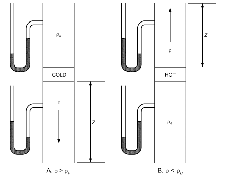

*Fig. 1 Thermal Gravity Effect for Example 1*

<!-- str. 607 -->

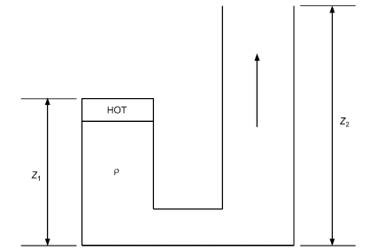

*Fig. 2 Multiple Stacks for Example 2*

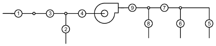

*Fig. 3 Illustrative 6-Path, 9-Section System*

**Example 2.** Calculate the thermal gravity effect for the two-stack system shown in Figure 2, where the air is 120°C and stack heights are 15 and 30 m. Density of 120°C air is 0.898 kg/m<sup>3</sup>; ambient air is 1.204 kg/m<sup>3</sup>. **Solution:**

Δp<sub>se</sub> = 9.81(ρ<sub>a</sub> – ρ)(z<sub>2</sub> – z<sub>1</sub>) = 9.81(1.204 – 0.898)(30 – 15) = 45 Pa

To determine the fan total pressure requirement for a system, use the following equation:

> ∑ t<sub>i</sub> ∑
>
> P<sub>t</sub> = Δp + Δp<sub>ti</sub> for i = 1, 2, …, n<sub>up</sub> + n<sub>dn</sub>&emsp;**(15)**

> iεF iεF
>
> up dn

where

- F<sub>up</sub> and F<sub>dn</sub> = sets of duct sections upstream and downstream of fan
- P<sub>t</sub> = fan total pressure, Pa
- ε = symbol that ties duct sections into system paths from exhaust/return air terminals to supply terminals

Figure 3 shows the use of Equation (15). This system has three supply and two return terminals consisting of nine sections connected in six paths: 1-3-4-9-7-5, 1-3-4-9-7-6, 1-3-4-9-8, 2-4-9-7-5, 2-4-9-7-6, and 2-4-9-8. Sections 1 and 3 are unequal area; thus, they are assigned separate numbers in accordance with the rules for identifying sections (see step 5 in the section on HVAC Duct Design Procedures). To determine the fan pressure requirement, apply the following six equations, derived from Equation (15). These equations must be satisfied to attain pressure balancing for design airflow. Relying entirely on dampers is not economical and may create objectionable flow-generated noise.

> {
>
> P<sub>t</sub> = Δp<sub>1</sub>+ Δp<sub>3</sub>+ Δp<sub>4</sub>+ Δp<sub>9</sub>+ Δp<sub>7</sub>+ Δp<sub>5</sub>

> P<sub>t</sub> = Δp<sub>1</sub>+ Δp<sub>3</sub>+ Δp<sub>4</sub>+ Δp<sub>9</sub>+ Δp<sub>7</sub>+ Δp<sub>6</sub>
>
> P<sub>t</sub> = Δp<sub>1</sub>+ Δp<sub>3</sub>+ Δp<sub>4</sub>+ Δp<sub>9</sub>+ Δp<sub>8</sub>&emsp;**(16)**

> {
>
> P<sub>t</sub> = Δp<sub>2</sub>+ Δp<sub>4</sub>+ Δp<sub>9</sub>+ Δp<sub>7</sub>+ Δp<sub>5</sub>

> P<sub>t</sub> = Δp<sub>2</sub>+ Δp<sub>4</sub>+ Δp<sub>9</sub>+ Δp<sub>7</sub>+ Δp<sub>6</sub>
>
> P<sub>t</sub> = Δp<sub>2</sub>+ Δp<sub>4</sub>+ Δp<sub>9</sub>+ Δp<sub>8</sub>

> {

**Example 3.** For Figures 4A and 4C, calculate the thermal gravity effect and fan total pressure required when the air is cooled to –34°C. The heat exchanger and ductwork (section 1 to 2) total pressure losses are 170 and 70 Pa respectively. The density of –34°C air is 1.477 kg/m<sup>3</sup>; ambient air is 1.204 kg/m<sup>3</sup>. Elevations are 21 and 3 m.

**Solution:** (a) For Figure4A (downward flow),

> Δp<sub>se</sub> = 9.81(ρ<sub>a</sub>– ρ)(z<sub>2</sub>– z<sub>1</sub>)
>
> = 9.81(1.204 – 1.477)(3 – 21)

> = 48 Pa
>
> P<sub>t</sub> = Δp<sub>t,3–2</sub>– Δ p<sub>se</sub>

> = (170 + 70) – (48)
>
> = 192 Pa

(b) For Figure 4C (upward flow),

> Δp<sub>se</sub> = 9.81(ρ<sub>a</sub>– ρ)(z<sub>2</sub>– z<sub>1</sub>)
>
> = 9.81(1.204 – 1.477)(21 – 3)

> = – 48 Pa
>
> P<sub>t</sub> = Δp<sub>t,3-2</sub>– Δp<sub>se</sub>

> = (170 + 70) – (– 48)
>
> = 288 Pa

**Example 4.** For Figures 4B and 4D, calculate the thermal gravity effect and fan total pressure required when air is heated to 120°C. Heat exchanger and ductwork (section 1 to 2) total pressure losses are 170 and 70 Pa respectively. Density of 120°C air is 0.898 kg/m<sup>3</sup>; ambient air is 1.204 kg/m<sup>3</sup>. Elevations are 21 and 3 m.

**Solution:** (a) For Figure 4B (downward flow),

> Δp<sub>se</sub> = 9.81(ρ<sub>a</sub>– ρ)(z<sub>2</sub>– z<sub>1</sub>)
>
> = 9.81(1.204 – 0.898)(3 – 21)

> = –54 Pa
>
> P<sub>t</sub> = Δ p<sub>t,3–2</sub>– Δp<sub>se</sub>

> = (170 + 70) – (–54)
>
> = 294 Pa

(b) For Figure 4D (upward flow),

> Δp<sub>se</sub> = 9.81(ρ<sub>a</sub>– ρ)(z<sub>2</sub>– z<sub>1</sub>)
>
> = 9.81(1.204 – 0.898)(21 – 3)

> = 54 Pa
>
> P<sub>t</sub> = Δp<sub>t,3-2</sub>– Δp<sub>se</sub>

> = (170 + 70) – (54)
>
> = 186 Pa

**Example 5.** Calculate the thermal gravity effect for each section of the system shown in Figure 5, and the systems’ net thermal gravity effect. Density of ambient air is 1.204 kg/m<sup>3</sup>, and the lengths are as follows:

- z<sub>1</sub> = 15 m, z<sub>2</sub> = 27 m, z<sub>4</sub> = 30 m, z<sub>5</sub> = 8 m, and z<sub>9</sub> = 60 m. Pressure required at section 3 is −25 Pa. Write the equation to determine the fan total pressure requirement.

**Solution:** The following table summarizes the thermal gravity effect for each section of the system as calculated by Equation (14). The net thermal gravity effect for the system is 118 Pa. To select a fan, use the following equation:

- P<sub>t</sub> = 25 + Δp<sub>t,1-7</sub>+ Δp<sub>t,8-9</sub>– Δp<sub>se</sub> = 25 + Δp<sub>t,1-7</sub>
- + Δp<sub>t,8-9</sub>– 118 = Δp<sub>t,1-7</sub>+ Δp<sub>t,8-9</sub>– 93

<!-- str. 608 -->

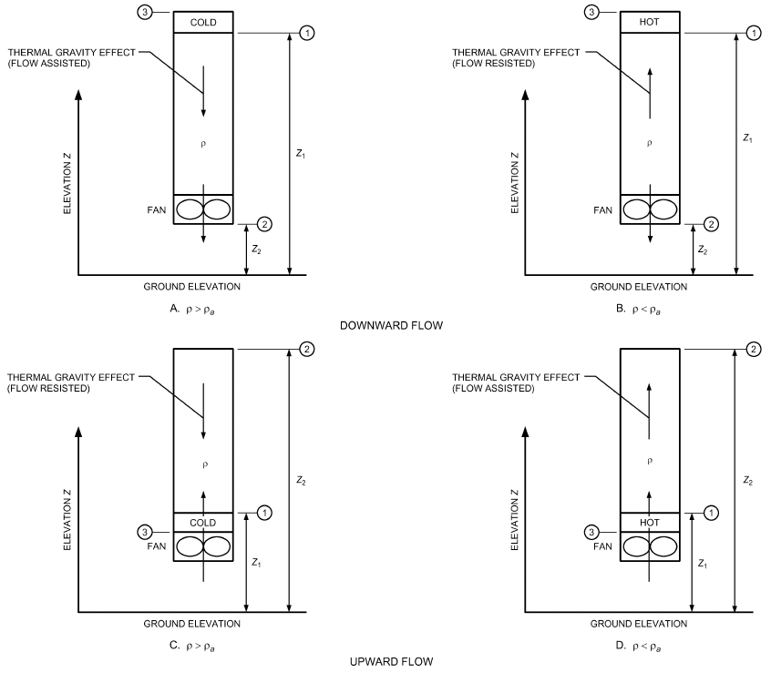

*Fig. 4 Single Stack with Fan for Examples 3 and 4*

| Path (x–x′) | Temp., °C | ρ, 3 kg/m | Δz (z<sub>x′</sub> – z<sub>x</sub>), m | Δρ (ρ – ρ ), <sup>a</sup> <sup>x−x</sup>′ 3 kg/m | Δp , se Pa [Eq. (14)] |
|---|---|---|---|---|---|
| 1-2 | 815 | 0.324 | (27 – 15) | +0.880 | +104 |
| 3-4 | 540 | 0.434 | 0 | +0.770 | 0 |
| 4-5 | 540 | 0.434 | (8 – 30) | +0.770 | –166 |
| 6-7 | 120 | 0.898 | 0 | +0.306 | 0 |
| 8-9 | 120 | 0.898 | (60 – 0) | +0.306 | +180 |
| Net Thermal Gravity Effect |  |  |  |  | 118 |

Airflow rate and direction depend on the sum of the stack, wind, and mechanically induced driving forces. Chapter 16 provides guidance on wind effects and on combining all of these driving forces.

## 2.1 PRESSURE CHANGES IN SYSTEM

Figure 6 shows total and static pressure changes in a fan/duct system consisting of a fan with both supply and return air ductwork. Also shown are total and static pressure gradients referenced to atmospheric pressure.

For all constant-area sections, total and static pressure losses are equal. At diverging transitions, velocity pressure decreases, absolute total pressure decreases, and absolute static pressure can increase. The static pressure increase at these sections is known as **static regain**.

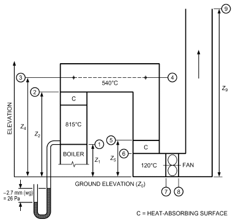

*Fig. 5 Triple Stack System for Example 5*

<!-- str. 609 -->

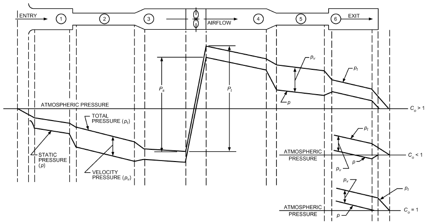

*Fig. 6 Pressure Changes During Flow in Ducts*

At converging transitions, velocity pressure increases in the direction of airflow, and absolute total and absolute static pressures decrease.

At the exit, total pressure loss depends on the shape of the fitting and the flow characteristics. Exit loss coefficients C<sub>o</sub> can be greater than, less than, or equal to one. Total and static pressure grade lines for the various coefficients are shown in Figure 6. Note that, for a loss coefficient less than one, static pressure upstream of the exit is less than atmospheric pressure (negative). Static pressure just upstream of the discharge fitting can be calculated by subtracting the upstream velocity pressure from the upstream total pressure.

At section 1, total pressure loss depends on the shape of the entry. Total pressure immediately downstream of the entrance equals the difference between the upstream pressure, which is zero (atmospheric pressure), and loss through the fitting. Static pressure of ambient air is zero; several diameters downstream, static pressure is negative, equal to the sum of the total pressure (negative) and the velocity pressure (always positive).

System resistance to airflow is noted by the total pressure grade line in Figure 6. Sections 3 and 4 include fan system effect pressure losses. To obtain the fan static pressure rise requirement for selecting fans rated using this parameter (i.e., for fans with unducted outlets, such as plenum fans) and where fan total pressure rise is known, use

> P<sub>s</sub> = P<sub>t</sub> – p<sub>v,o</sub>&emsp;**(17)**

where

- P<sub>s</sub> = fan static pressure rise, Pa
- P<sub>t</sub> = fan total pressure rise, Pa
- p<sub>v,o</sub> = fan outlet velocity pressure, Pa

Fan static pressure rise is also the difference between the fan outlet static pressure and the fan inlet total pressure (p<sub>s,o</sub> – p<sub>t,i</sub>). However, note that fan static pressure rise is not the difference in static pressure between the fan inlet and fan outlet, nor is it the sum of static pressure differences for components in the air-handling system.

## 3. FLUID RESISTANCE

Duct system losses are the irreversible transformation of mechanical energy into heat. The two types of losses are (1) friction and (2) dynamic.

## 3.1 FRICTION LOSSES

Friction losses are caused by shear stresses related to fluid viscosity. They result from adjacent fluid layers moving at different velocities. Turbulence also causes the fluid to transfer momentum, heat, and mass very rapidly across the flow. As a result, fluid velocities of the turbulent profile near the wall must drop to zero more rapidly than those of the laminar profile. In turn, friction losses are much greater in turbulent flow compared to laminar flow. Chapter 3 provides further details about ducted flows and friction losses. Friction losses occur along the entire duct length.

### Darcy and Colebrook Equations

For fluid flow in conduits, friction loss can be calculated by the Darcy equation:

> Δp<sub>f</sub> = 1000fL/D<sub>h</sub> × ρV<sup>2</sup>/2&emsp;**(18)**

where

- Δp<sub>f</sub> = friction losses in terms of total pressure, Pa
- f = friction factor, dimensionless
- L = duct length, m
- D<sub>h</sub> = hydraulic diameter [Equation (24)], mm
- V = velocity, m/s
- ρ = density, kg/m<sup>3</sup>

In the region of laminar flow (Reynolds numbers less than 2300), the friction factor is a function of Reynolds number only. For completely turbulent flow (fully rough), the friction factor depends on duct surface roughness and internal protuberances (e.g., joints). Between the bounding limits of hydraulically smooth behavior (laminar flow) and fully rough behavior is a transitional zone where the friction factor depends on both roughness and Reynolds number.

<!-- str. 610 -->

In both the transitional and fully rough regions (see Moody diagram: Figure 13 in Chapter 3), the friction factor f is calculated by Colebrook’s equation (Colebrook 1938-1939). Because Colebrook’s equation cannot be solved explicitly for f, use iterative techniques to determine f (Behls 1971).

> ( )
>
> 1/f = –2 log ε/3.7D<sub>h</sub> + 2.51/(Re f)&emsp;**(19)**

> ( )

where

- ε = material absolute roughness factor, mm
- Re = Reynolds number

Reynolds number (Re) is calculated using the following equation.

> Re = D<sub>h</sub>V/(1000 ν)&emsp;**(20)**

where ν = kinematic viscosity, m<sup>2</sup>/s.

For standard air and temperature between 4 and 38°C, Re can be calculated by

> Re = 66.4 D<sub>h</sub>V&emsp;**(21)**

### Roughness Factors

Roughness factors listed in Table 1, column 3, are recommended for use with Equation (19). For increased calculation accuracy, use an absolute roughness factor from column 2.

**Flexible Duct.** For fully stretched and compressed flexible duct, use Equation (22) or Figure 7 (Abushakra et al. 2004; Culp 2011), where the multiplier PDCF is based on flexible duct with an absolute roughness ε = 0.9 mm. The resistance of flexible duct can be calculated using Fitting CD11-2 in the *ASHRAE Duct Fitting Data-* base (ASHRAE 2016). Flexible duct should be installed fully extended; its resistance even when fully extended is approximately 50% more compared to the resistance of an equivalent diameter rigid galvanized-steel spiral duct. See Example 6 for the increase in resistance of flexible duct fully stretched and compressed relative to rigid spiral duct.

For commercial systems, flexible ducts should be

- Limited to connections of rigid ducts to diffusers. For diffuser installation suggestions, see Figure 8. The purpose of limiting the offset to D/8 in Figure 8B is to minimize noise generation. Flexible duct should not be installed upstream of variable-air-volume (VAV) boxes.

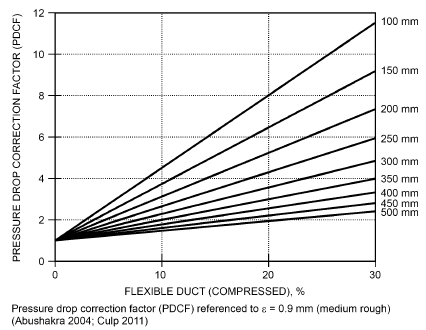

*Fig. 7 Pressure Loss Correction Factor for Flexible Duct Not Fully Extended*

Commentary: The loss coefficient or pressure loss for flexible duct elbows, such as those in Figure 8A, can be obtained from the *ASHRAE Duct Fitting Database* (ASHRAE 2016), Fitting CD3-22 (r/D = 1.0) or CD3-23 (r/D = 1.5). Loss coefficients are for fully stretched elbows.

- Limited to 2 m maximum, fully stretched.
- Installed without any radial compression.

**Example 6.** Compare the total pressure resistance of 250 mm, 1.8 m installed length, galvanized steel spiral and flexible duct, 0% compressed (fully stretched), 4%, 15%, and 30% compressed. Airflow is 470 L/s, air density is 1.204 kg/m<sup>3</sup>, and absolute roughnesses ε of spiral round and flexible ducts are 0.12 mm and 0.9 mm. Calculate using the *ASHRAE Duct Fitting Database* [DFDB; ASHRAE (2016)].

**Solution:** See Table 2 for results.

> PDCF = 1 + 0.58 K<sub>c</sub>e<sup>–0.00496D</sup>&emsp;**(22)**

with

> ( )
>
> K<sub>c</sub> = (L<sub>FE</sub>– L)/(L FE) 100&emsp;**(23)**

> ( )

where

- PDCF = pressure drop correction factor
- K<sub>c</sub> = flexible duct compressed, percent
- D = flexible duct diameter, mm
- L = installed duct length, m
- L<sub>FE</sub> = duct length fully extended, m

### Friction Chart

The friction chart (Figure 9) is a plot of the Darcy and Colebrook equations [Equations (18) and (19), respectively], where the absolute roughness is 0.09 mm and the air is standard air (density = 1.204 kg/m<sup>3</sup>)]. Figure 9 can be used for (1) duct construction/materials categorized as “average” in Table 1, (2) temperature variations of ±15 K from 20°C, (3) elevations to 500 m, and (4) duct pressures from –5 to +5 kPa relative to ambient pressure. These individual variations in temperature, elevation, and duct pressure result in duct losses within ±5% of the standard air friction chart.

The friction chart was changed in 1985 from an absolute roughness of 0.15 mm to 0.09 mm based on research by Griggs et al. (1987), who found that the roughness factor is affected by the material surface, joint spacing, and type of joint. The Wright friction chart appeared in the Handbook from 1946 to 1981. This chart was based on an absolute roughness ε = 0.15 mm, primarily because of the 760 mm joint spacing. In 1985 the friction chart was changed to ε = 0.09 mm because joint spacing was increasing. For the relative effect of straight duct resistance between charts, see Figure 10. For a 250 mm diameter duct at 10 m/s (491 L/s), the resistance decreased 5 to 6%.

### Noncircular Ducts

A momentum analysis can relate average wall shear stress to pressure drop per unit length for fully developed turbulent flow in a passage of arbitrary shape but uniform longitudinal cross-sectional area. This analysis leads to the definition of **hydraulic diameter**:

> D<sub>h</sub> = 4A/P&emsp;**(24)**

where

- D<sub>h</sub> = hydraulic diameter, mm
- A = duct area, mm<sup>2</sup>
- P = perimeter of cross section, mm

Although hydraulic diameter is often used to correlate noncircular data, exact solutions for laminar flow in noncircular passages show that this causes some inconsistencies. No exact solutions exist for turbulent flow. Tests over a limited range of turbulent flow indicated that fluid resistance is the same for equal lengths of duct for equal mean velocities of flow if the ducts have the same ratio of cross-sectional area to perimeter. From experiments using round, square, and rectangular ducts having essentially the same hydraulic diameter, Huebscher (1948) found that each, for most purposes, had the same flow resistance at equal mean velocities. Tests by Griggs and Khodabakhsh-Sharifabad (1992) also indicated that experimental rectangular duct data for airflow over the range typical of HVAC systems can be correlated satisfactorily using Equation (19) together with hydraulic diameter, particularly when a realistic experimental uncertainty is accepted. These tests support using hydraulic diameter to correlate noncircular duct data.

<!-- str. 611 -->

```text
                                          1                                                       2                         3
                                                                                                   Absolute Roughness ε, mm
Duct Type/Material                                                                             Range               Roughness Category
Drawn tubing (Madison and Elliot 1946)                                                         0.00046               Smooth 0.00046
PVC plastic pipe (Swim 1982)                                                                0.009 to 0.046         Medium smooth 0.046
Commercial steel or wrought iron (Moody 1944)                                                   0.046
Aluminum, round, longitudinal seams, crimped slip joints, 0.91 m spacing (Hutchinson 1953)  0.037 to 0.061
Friction chart:
Galvanized steel, round, longitudinal seams, variable joints (Vanstone, drawband, welded.   0.049 to 0.098             Average 0.09
 Primarily beaded coupling), 1.22 m joint spacing (Griggs et al. 1987)
Galvanized steel, spiral seams, 3.05 m joint spacing (Jones 1979)                            0.061 to 0.12
Galvanized steel, spiral seam with 1, 2, and 3 ribs, beaded couplings, 3.66 m joint spacing 0.088 to 0.116
 (Griggs et al. 1987)
Galvanized steel, rectangular, various type joints (Vanstone, drawband, welded. Beaded       0.082 to 0.15
 coupling), 1.22 m spacing^a (Griggs and Khodabakhsh-Sharifabad 1992)
Phenolic duct, aluminum foil on the interior face, sections connected with a four-bolt flange and
 cleat joint (Idem and Paruchuri 2018)
 1.52 m spacing:                                                                            0.149 to 0.391
 3.05 m spacing                                                                             0.075 to 0.298
Wright Friction Chart:
Galvanized steel, round, longitudinal seams, 0.76 m joint spacing, ε = 0.15 mm         Retained for historical purposes [See Wright (1945) for
                                                                                                  development of friction chart]
Flexible duct, nonmetallic and wire, fully extended (Abushakra et al. 2004; Culp 2011)        0.09 to 0.9           Medium rough 0.9
Galvanized steel, spiral, corrugated,^b Beaded slip couplings, 3.05 m spacing (Kulkarni et al. 2009) 0.54 to 0.91
Fibrous glass duct, rigid (tentative)^c                                                          —
Fibrous glass duct liner, air side with facing material (Swim 1978)                              1.52
Fibrous glass duct liner, air side spray coated (Swim 1978)                                     4.57                    Rough 3.0
Flexible duct, metallic corrugated, fully extended                                            1.2 to 2.1
Concrete (Moody 1944)                                                                         0.30 to 3.0
^aGriggs and Khodabakhsh-Sharifabad (1992) showed that ε values for rectangular duct construction combine effects of surface condition, joint spacing, joint type, and duct con-
struction (cross breaks, etc.), and that the ε-value range listed is representative.
^bSpiral seam spacing was 119 mm with two corrugations between seams. Corrugations were 19 mm wide by 6 mm high (semicircle).
^cSubject duct classified “tentatively medium rough” because no data available.
```

**Table 2 Solution for Example 6**

| Duct | DFDB Fitting | ε, mm | Airflow, L/s | Diameter, mm | Velocity, m/s | Compression, % | PDCF | Δp<sub>t</sub>, Pa | % Δp<sub>t</sub> Increased |
|---|---|---|---|---|---|---|---|---|---|
| Galvanized steel, spiral | CD11-1 | 0.12 | 470 | 250 | 9.6 | NA | NA | 7.7 | Base |
| Flexible | CD11-2 | 0.9 | 470 | 250 | 9.6 | (fully stretched) | 1.0 | 11.4 | 48 |
| Flexible | CD11-2 | 0.9 | 470 | 250 | 9.6 | 4 | 1.7 | 19.5 | 153 |
| Flexible | CD11-2 | 0.9 | 470 | 250 | 9.6 | 15 | 3.5 | 40.0 | 419 |
| Flexible | CD11-2 | 0.9 | 470 | 250 | 9.6 | 30 | 5.9 | 68.9 | 795 |

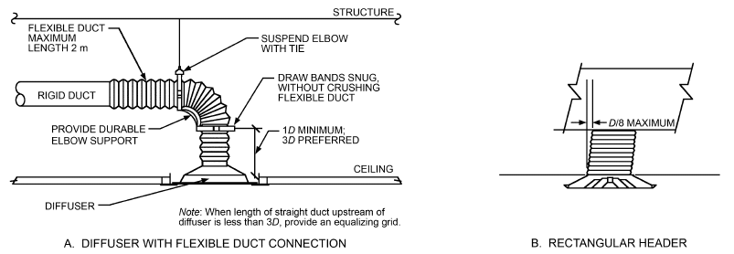

*Fig. 8 Diffuser Installation Suggestions*

<!-- str. 612 -->

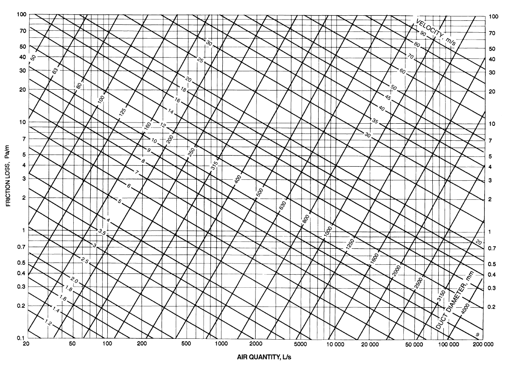

*Fig. 9 Friction Chart for Round Duct ( = 1.20 kg/m3 and  = 0.09 mm)*

<!-- str. 613 -->

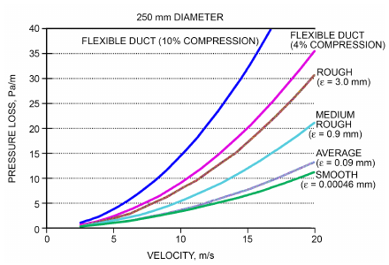

*Fig. 10 Plot Illustrating Relative Resistance of Roughness Categories*

**Rectangular Ducts.** Huebscher (1948) developed the relationship between rectangular and round ducts that is used to determine size equivalency based on equal flow, resistance, and length. This relationship, Equation (25), is the basis for Table 3.

> D<sub>e</sub> = (5 1.30(ab)<sup>0.62</sup>)/(0 (a + b)<sup>0.25</sup>)&emsp;**(25)**

where

- D<sub>e</sub> = circular equivalent of rectangular duct for equal length, fluid resistance, and airflow, mm
- a = length one side of duct, mm
- b = length adjacent side of duct, mm

To determine equivalent round duct diameter, use Table 3. Equations (18) and (19) must be used to determine pressure loss.

**Flat Oval Ducts.** To convert round ducts to flat oval sizes, use Table 4, which is based on Equation (26) (Heyt and Diaz 1975), the circular equivalent of a flat oval duct for equal airflow, resistance, and length. Equations (18) and (19) must be used to determine friction loss.

> D<sub>e</sub> = (5 1.55AR<sup>0.62</sup>)/(0.250 P)&emsp;**(26)**

where AR is the cross-sectional area of flat oval duct defined as

> AR = (πa<sup>2</sup>/4) + a(A – a)&emsp;**(27)**

and the perimeter P is calculated by

> P = πa + 2(A – a)&emsp;**(28)**

where

P = perimeter of flat oval duct, mm

A = major axis of flat oval duct, mm a = minor axis of flat oval duct, mm

## 3.2 DYNAMIC LOSSES

Dynamic losses result from flow disturbances caused by duct-mounted equipment and fittings that change flow direction (elbows), area changes (transitions), and converging/diverging junctions. For a detailed discussion of hydraulic networks, consult Idelchik et al. (1994).

### Local Loss Coefficients

The dimensionless coefficient C is used for fluid resistance because this coefficient has the same value in dynamically similar streams (i.e., streams with geometrically similar stretches, equal Reynolds numbers, and equal values of other criteria necessary for dynamic similarity). The fluid resistance coefficient represents the ratio of total pressure loss to velocity pressure at the referenced cross section:

> C = Δp<sub>t</sub>/(ρ(V<sup>2</sup>⁄ 2)) = Δp<sub>t</sub>/p<sub>v</sub>&emsp;**(29)**

where

- C = local loss coefficient, dimensionless
- Δp<sub>t</sub> = total pressure loss, Pa
- ρ = density, kg/m<sup>3</sup>
- V = velocity, m/s
- p<sub>v</sub> = velocity pressure, Pa

For all fittings, except junctions, total pressure loss is calculated by Equation (30):

> Δp<sub>t</sub> = C<sub>o</sub>p<sub>v,o</sub>&emsp;**(30)**

where

- Δp<sub>t</sub> = total pressure loss of fitting, Pa
- C<sub>o</sub> = local loss coefficient of fitting, dimensionless
- p<sub>v,o</sub> = velocity pressure at section o of fitting, Pa

Dynamic loss is based on the actual velocity in the duct, not the velocity in an equivalent circular duct. For the cross section to reference a fitting loss coefficient, see step 5 in the section on HVAC Duct Design Procedures. Where necessary (e.g., unequal-area fittings), convert a loss coefficient from section o to section 1 using Equation (31), where V is the velocity at the respective sections.

> C<sub>1</sub> = C<sub>o</sub>/((V<sub>1</sub>⁄ V<sub>o</sub>)<sup>2</sup>)&emsp;**(31)**

For converging and diverging flow junctions, total pressure loss through the straight (main) section is calculated by

> Δp<sub>t,s</sub> = C<sub>s</sub>p<sub>v,s</sub>&emsp;**(32)**

where

- Δp<sub>t,s</sub> = total pressure loss across straight-through section s of junction, Pa
- C<sub>s</sub> = local loss coefficient referenced to s section of junction, dimensionless
- p<sub>v,s</sub> = velocity pressure at section s, Pa

For total pressure loss through the branch section,

> Δp<sub>t,b</sub> = C<sub>b</sub>p<sub>v,b</sub>&emsp;**(33)**

where

- Δp<sub>t,b</sub> = total pressure loss across branch b section of junction, Pa
- C<sub>b</sub> = local loss coefficient referenced to b section of junction, dimensionless
- p<sub>v,b</sub> = velocity pressure at section b, Pa

<!-- str. 614 -->

**Table 3 Circular Equivalents of Rectangular Duct for Equal Friction and Airflow**

| Side Lengths, mm | 100 | 150 | 200 | Length of One Side of Rectangular Duct a, mm<br>250 | Length of One Side of Rectangular Duct a, mm Circular Duct Diameter, mm<br>300 | Length of One Side of Rectangular Duct a, mm Circular Duct Diameter, mm<br>400 | Length of One Side of Rectangular Duct a, mm Circular Duct Diameter, mm<br>500 | Length of One Side of Rectangular Duct a, mm<br>600 | 800 | 1 000 | 1 200 |
|---|---|---|---|---|---|---|---|---|---|---|---|
| 200 | 152 | 189 | 219 |  |  |  |  |  |  |  |  |
| 250 | 169 | 210 | 244 | 273 |  |  |  |  |  |  |  |
| 300 | 183 | 229 | 266 | 299 | 328 |  |  |  |  |  |  |
| 400 | 207 | 260 | 305 | 343 | 378 | 437 |  |  |  |  |  |
| 500 |  | 287 | 337 | 381 | 420 | 488 | 547 |  |  |  |  |
| 600 |  | 310 | 365 | 414 | 457 | 533 | 598 | 656 |  |  |  |
| 800 |  |  | 414 | 470 | 520 | 609 | 687 | 755 | 875 |  |  |
| 1 000 |  |  |  | 517 | 574 | 674 | 762 | 840 | 976 | 1 093 |  |
| 1 200 |  |  |  |  | 620 | 731 | 827 | 914 | 1 066 | 1 196 | 1 312 |
| 1 400 |  |  |  |  |  | 781 | 886 | 980 | 1 146 | 1 289 | 1 416 |
| 1 600 |  |  |  |  |  | 827 | 939 | 1 041 | 1 219 | 1 373 | 1 511 |
| 1 800 |  |  |  |  |  |  | 988 | 1 096 | 1 286 | 1 451 | 1 598 |
| 2 000 |  |  |  |  |  |  | 1 034 | 1 147 | 1 348 | 1 523 | 1 680 |

<sup>*</sup>Table based on Equation (25).

**Table 4 Equivalent Flat Oval Duct Dimensions**

| Circular Duct Diameter, mm | 70 | 100 | 125 | 150 | 175 | 200 | 250 | Minor Axis a, mm Major Axis A, mm<br>275 | Minor Axis a, mm Major Axis A, mm<br>300 | Minor Axis a, mm Major Axis A, mm<br>325 | 350 | 375 | 400 | 450 | 500 | 550 | 600 |
|---|---|---|---|---|---|---|---|---|---|---|---|---|---|---|---|---|---|
| 125 | 205 |  |  |  |  |  |  |  |  |  |  |  |  |  |  |  |  |
| 140 | 265 | 180 |  |  |  |  |  |  |  |  |  |  |  |  |  |  |  |
| 160 | 360 | 235 | 190 |  |  |  |  |  |  |  |  |  |  |  |  |  |  |
| 180 | 475 | 300 | 235 | 200 |  |  |  |  |  |  |  |  |  |  |  |  |  |
| 200 |  | 380 | 290 | 245 | 215 |  |  |  |  |  |  |  |  |  |  |  |  |
| 224 |  | 490 | 375 | 305 | — | 240 |  |  |  |  |  |  |  |  |  |  |  |
| 250 |  |  | 475 | 385 | 325 | 290 |  |  |  |  |  |  |  |  |  |  |  |
| 280 |  |  |  | 485 | 410 | 360 | — | 285 |  |  |  |  |  |  |  |  |  |
| 315 |  |  |  | 635 | 525 | — | — | 345 | 325 |  |  |  |  |  |  |  |  |
| 355 |  |  |  | 840 | — | 580 | 460 | 425 | 395 | 375 |  |  |  |  |  |  |  |
| 400 |  |  |  | 1 115 | — | 760 | — | 530 | 490 | 460 | 435 |  |  |  |  |  |  |
| 450 |  |  |  | 1 490 | — | 995 | — | 675 | — | 570 | 535 | 505 |  |  |  |  |  |
| 500 |  |  |  |  |  | 1 275 | — | 845 | — | 700 | 655 | 615 | 580 |  |  |  |  |
| 560 |  |  |  |  |  | 1 680 | — | 1 085 | — | 890 | 820 | 765 | 720 |  |  |  |  |
| 630 |  |  |  |  |  |  |  | 1 425 | — | 1 150 | 1 050 | 970 | 905 | 810 |  |  |  |
| 710 |  |  |  |  |  |  |  |  |  | 1 505 | 1 370 | 1 260 | 1 165 | 1 025 |  |  |  |
| 800 |  |  |  |  |  |  |  |  |  |  | 1 800 | 1 645 | 1 515 | 1 315 | 1 170 | 1 065 |  |
| 900 |  |  |  |  |  |  |  |  |  |  |  | 2 165 | 1 985 | 1 705 | 1 500 | 1 350 |  |
| 1 000 |  |  |  |  |  |  |  |  |  |  |  |  |  | 2 170 | 1 895 | 1 690 |  |
| 1 120 |  |  |  |  |  |  |  |  |  |  |  |  |  |  | 2 455 | 2 170 | 1 950 |
| 1 250 |  |  |  |  |  |  |  |  |  |  |  |  |  |  |  | 2 795 | 2 495 |

*Table based on Equation (26).

The junction of two parallel streams moving at different velocities is characterized by turbulent mixing of the streams, accompanied by pressure losses. In the course of this mixing, particles moving at different velocities exchange momentum, resulting in equalization of the velocity distributions in the common stream. The jet with higher velocity loses part of its kinetic energy by transmitting it to the slower jet. The loss in total pressure before and after mixing is always large and positive for the higher-velocity jet, and increases with an increase in the amount of energy transmitted to the lower-velocity jet. Consequently, the local loss coefficient [Equation (29)] is always positive. Energy stored in the lower-velocity jet can increase because of mixing. The loss in total pressure and the local loss coefficient can, therefore, also have negative values for the lower-velocity jet (Idelchik et al. 1994).

### Duct Fitting Database

Loss coefficients for more than 220 round, flat oval, and rectangular fittings are available in the *ASHRAE Duct Fitting Database* [DFDB; ASHRAE (2016)]. Also included are the pressure loss for round duct (CD11-1), flexible duct (CD11-2), rectangular duct

<!-- str. 615 -->

**Table 5 Duct Fitting Codes**

| Fitting Function | Geometry | Sequential Category Number |
|---|---|---|
| S: Supply | D: round (Diameter) | 1. Entries 1,2,3...n 2. Exits |
| E: Exhaust/Return | R: Rectangular | 3. Elbows 4. Transitions |
| C: Common | F: Flat oval | 5. Junctions |
| (supply and return) |  | 6. Obstructions 7. Fan and system interactions 8. Duct-mounted equipment 9. Dampers 10. Hoods 11. Straight duct |

**Table 6 200 mm VAV Box Data**

```text
                  Inlet   Outlet
Airflow,  Δp_s, Velocity, Velocity, p_v,in, p_v,out, Δp_v,  Δp_t,
  L/s      Pa      m/s     m/s      Pa      Pa       Pa      Pa
   1       2        3       4        5       6       7        8
  165     13.2      5.1    2.1      15.6     2.7    12.9     26.1
  236     27.1      7.3    3.0      31.9     5.6    26.3     53.4
  330     53.0    10.2     4.3      62.5    11.0    51.5    104.5
  425     87.8    13.1     5.5     103.3    18.1    85.1    173.0
Δp  = static pressure difference
  s
Δp  = total pressure difference at standard air conditions
  t
p   = inlet velocity pressure at standard air conditions
v,in
p   = outlet velocity pressure at standard air conditions
v,out
Δp  = velocity pressure difference at standard air conditions
  v
(CR11-1), and flat oval (CF11-1) duct, as well as the following
design tools:
• CD11-3, Straight Duct, Round, Velocity Limited
• CD11-4, Straight Duct, Round, Friction Rate Constant
• CD11-5, Straight Duct, Round, Minimum Velocity
    Commentary: CD11-3 determines the size of a duct knowing
 airflow such that the design velocity is not exceeded. CD11-4 is
 for sizing duct systems by the equal friction method, knowing the
 design (target) friction rate and airflow. CD4-11 determines the
 duct size for industrial systems that must maintain a minimum
 velocity to convey particulates.
    Example 8 uses CD11-3 in the equal friction and static regain
 designs, and CD11-4 for the equal friction design.
```

The fittings are numbered (coded) as shown in Table 5. Entries and converging junctions are only in the exhaust/return portion of systems. Exits and diverging junctions are only in supply systems. Equal-area elbows, obstructions, and duct-mounted equipment are common to both supply and exhaust systems. Transitions and unequal-area elbows can be either supply or exhaust fittings. Fitting ED5-1 is an Exhaust fitting with a round shape (Diameter). The number 5 indicates that the fitting is a junction, and 1 is its sequential number. Fittings SR31 and ER3-1 are Supply and Exhaust fittings, respectively. The R indicates that the fitting is Rectangular, and the 3 identifies the fitting as an elbow. Note that the cross-sectional areas at sections 0 and 1 are not equal. Otherwise, the elbow would be a Common fitting such as CR3-6.

**Terminal Unit Loss Coefficients.** Manufacturers’ data for terminal units are not useful for duct design because they are given in terms of static pressure resistance and velocity pressure at standard air conditions (1.204 kg/m<sup>3</sup>). The total pressure loss coefficient for the 200 mm terminal used in Example 7 is calculated from manufacturer’s published data (Table 6: Columns 1, 2, and 7) and plotting Δp<sub>v,in</sub> versus Δp<sub>t</sub> (Figure 11). The loss coefficient is 1.67 and is applicable for any elevation (air density). The total pressure loss (Δp<sub>t</sub>) in Table 6 is only useful for projects at sea level. ASHRAE Standard 130-2016, Section 5.2, covers the laboratory test for total pressure loss and the calculation of the loss coefficient. In the *ASHRAE Duct Fitting Database* (ASHRAE 2016), the single-duct reheat VAV box is the CD8-series.

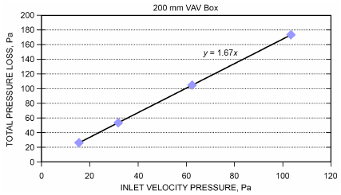

*Fig. 11 VAV Box Loss Coefficient Plot*

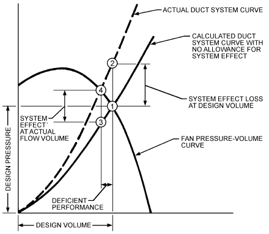

*Fig. 12 Deficient System Performance with System Effect Ignored*

## 3.3 DUCTWORK SECTIONAL LOSSES

### Darcy-Weisbach Equation

Total pressure loss in a duct section is calculated by combining Equations (18) and (29) in terms of Δp, where ΣC is the summation of local loss coefficients in the duct section. Each fitting loss coefficient must be referenced to that section’s velocity pressure.

> ( )( <sup>2</sup>)
>
> ρV

> Δp = (1000f L)/D<sub>h</sub> + ΣC&emsp;**(34)**
>
> ---------

> ( )( 2 )

## 4. FAN/SYSTEM INTERFACE

### Fan Inlet and Outlet Conditions

Fan performance data measured in the field may show lower performance capacity than manufacturers’ ratings. The most common causes of deficient performance of the fan/system combination are poor outlet connections, nonuniform inlet flow, and swirl at the fan inlet. These conditions alter the fan’s aerodynamic characteristics so that its full flow potential is not realized. One bad connection can reduce fan performance below its rating.

<!-- str. 616 -->

Ducted fans are tested with several different configurations, depending on the fan type and intended applications. The configurations include open or ducted inlets and open or ducted outlets (AMCA Standard 210). Straight ducts are used when present. These setups result in uniform flow into and out of the fan. If good inlet and outlet conditions are not provided in the design of duct systems, fan performance suffers.

Figure 12 shows deficient fan performance resulting from poor fan inlet and outlet connections to adjacent ductwork. The system curve shown is typical of a constant-air-volume system without coils or air filters (e.g., a return or exhaust fan system). Point 1 is the fan/system operating point without taking into account poor inlet and/or outlet conditions. Point 2 is the system operating point when the apparent resistance of poor connections is included in the calculations. Point 4 is the operating point on the original fan performance curve, taking into consideration the apparent system resistance of poor fan/system connections. Point 3 is the fan operating point on the original system curve when the apparent resistance of poor inlet and/or fan connections is not taken into account. The airflow difference between points 2 and 4 represents the deficiency in airflow from design airflow.

Note that for some systems, particularly constant- or variablevolume air systems that include coils and filters and that may also control duct static pressures at some points, the system resistance curves can deviate substantially from that shown in Figure 12. Sherman and Wray (2010) provide more details about these types of systems and the resulting system curve shapes, including the effects of system leakage.

### Fan System Effect Coefficients

The system effect concept was formulated by Farquhar (1973) and Meyer (1973); the magnitudes of the system effect, called **system effect factors**, were determined experimentally by the Air Movement and Control Association International (AMCA 2011a; Brown 1973; Clarke et al. 1978). The system effect factors, converted to local loss coefficients, are in the *ASHRAE Duct Fitting* Database (ASHRAE 2016) for both centrifugal and axial fans. Fan system effect coefficients are only an approximation. Fans of different types and even fans of the same type, but supplied by different manufacturers, do not necessarily react to a system in the same way. Therefore, judgment based on experience must be applied to any design.

**Fan Outlet Conditions.** Fans intended primarily for duct systems are usually tested with an outlet duct in place (AMCA Standard 210). Figure 13 shows the changes in velocity profiles at various distances from the fan outlet. For fully-developed flow, the duct, including transition, must meet the requirements for 100% effective duct length [L<sub>e</sub> (Figure 13)], which is calculated as follows:

For V<sub>o</sub> > 13 m/s,

> L<sub>e</sub> = (V<sub>o</sub> A<sub>o</sub>)/4500&emsp;**(35)**

For V<sub>o</sub> ≤ 13 m/s,

> L<sub>e</sub> = A<sub>o</sub>/350 [&emsp;**(36)**

where

- V<sub>o</sub> = duct velocity, m/s

L<sub>e</sub> = effective duct length, m

A<sub>o</sub> = duct area, mm<sup>2</sup>

Centrifugal fans should not abruptly discharge to the atmosphere. A diffuser design should be selected from Fitting SR7-2 or SR7-3. Consult the SR7-series fittings of the *ASHRAE Duct Fitting Data-* base (ASHRAE 2016) for guidance in the design of fan/ductwork connections.

**Fan Inlet Conditions.** For rated performance, air must enter the fan uniformly over the inlet area in an axial direction without prerotation. Nonuniform flow into the inlet is the most common cause of reduced fan performance. Such inlet conditions are not equivalent to a simple increase in system resistance, because they affect flow through the blade passages. Therefore, they cannot be treated as a percentage decrease in the flow and pressure from the fan. A poor inlet condition results in different fan performance.

Inlet spin may arise from many different approach conditions, and sometimes the cause is not obvious. Figure 14 shows some common duct connections that cause inlet spin. Inlet spin can be avoided by providing an adequate length of duct between the elbow and the fan inlet, as shown by Figure 15. Two L/D<sub>o</sub> duct lengths upstream of the fan inlet reduces swirl and pressure loss (loss coefficient) by approximately 45% (Table 7).

Fans within plenums and cabinets or next to walls should be located so that air may flow unobstructed into the inlets. Fan performance is reduced if the space between the fan inlet and the enclosure is too restrictive. System effect coefficients for fans in an enclosure or adjacent to walls are listed under Fitting ED7-1. How the airstream enters an enclosure in relation to the fan inlets also affects fan performance. Plenum or enclosure inlets or walls that are not symmetrical with the fan inlets cause uneven flow and/or inlet spin.

## 5. MECHANICAL EQUIPMENT ROOMS

In the initial phase of building design, the design engineer seldom has sufficient information to render the optimum HVAC design for the project, and its space requirements are often based on percentage of total area or other rule of thumb. The final design is usually a compromise between what the engineer recommends and what the architect can accommodate. Total mechanical and electrical space requirements range between 4 and 9% of gross building area, with most buildings in the 6 to 9% range. This range includes space for HVAC, electrical, plumbing, and fire protection equipment, as well as vertical shaft space for mechanical and electrical distribution through the building.

### Outdoor Air Intake and Exhaust Air Discharge Locations

A key factor in the location of mechanical equipment rooms is the source of outdoor air. If the air intake or exhaust system is not well designed, contaminants from nearby outdoor sources (e.g., vehicle exhaust) or from the building itself (e.g., laboratory fume hood exhaust) can enter the building with insufficient dilution. Poorly diluted contaminants may cause odors, health impacts, and reduced indoor air quality. Examples are toxic stack exhausts, automobile and truck traffic, kitchen cooking hoods, evaporative cooling towers, building general exhaust air, trash dumpsters, stagnant water bodies, snow and leaves, rain and fog, plumbing vents, vandalism, and terrorism.

Chapter 46 of the 2019 *ASHRAE Handbook—HVAC Applica-* tions discusses proper design of exhaust stacks and placement of air intakes to avoid adverse air quality impacts. Experience provides some general guidelines on air intake placement. Unless dispersion modeling analysis is conducted, air intakes should never be located on the roof in the same architectural screen enclosure as exhaust

<!-- str. 617 -->

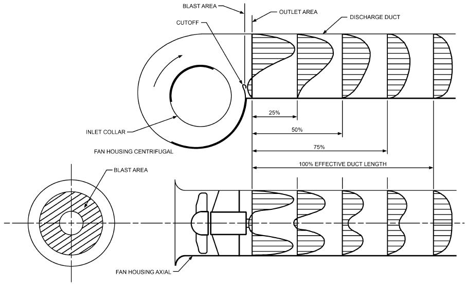

*Fig. 13 Establishment of Uniform Velocity Profile in Straight Fan Outlet Duct*

> (Adapted by permission from AMCA Publication 201)

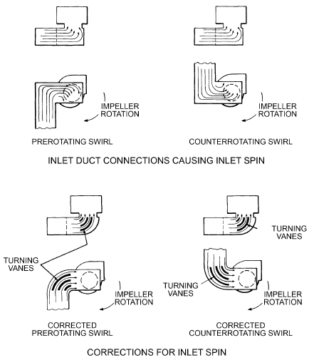

*Fig. 14 Inlet Duct Connections Causing Inlet Spin*

> (Adapted by permission from AMCA Publication 201)

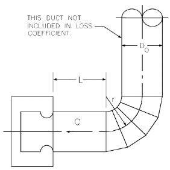

*Fig. 15 Fitting ED7-2 (Fan Inlet, Centrifugal Fan, SISW, with 4-Gore Elbow)*

> [*ASHRAE Duct Fitting Database* (ASHRAE 2016)]

**Table 7 ED7-2 Loss Coefficients (see Figure 15)**

| L/D<sub>o</sub> | 0 | L/D<sub>o</sub><br>2 | L/D<sub>o</sub><br>5 | 10 |
|---|---|---|---|---|
| 0.5 | 1.80 | 1.00 | 0.53 | 0.53 |
| 0.75 | 1.40 | 0.80 | 0.40 | 0.40 |
| 1.0 | 1.20 | 0.67 | 0.33 | 0.33 |
| 1.5 | 1.10 | 0.60 | 0.33 | 0.33 |
| 2.0 | 1.00 | 0.53 | 0.33 | 0.33 |
| 4.0 | 0.67 | 0.40 | 0.22 | 0.22 |

<!-- str. 618 -->

outlets. If exhaust is discharged from several locations on the roof, intakes should be located to minimize contamination. Typically, this means maximizing separation distance. Where all exhausts of concern are emitted from a single, relatively tall stack or tight cluster of stacks, a possible intake location might be close to the base of this tall stack, if this location is not adversely affected by other exhaust locations, or is not influenced by tall adjacent structures creating downwash. Architectural screens placed around rooftop equipment to reduce noise or hide equipment interact with the windflow patterns on the roof and can adversely affect exhaust dilution. Chapter 46 of the 2019 *ASHRAE Handbook—HVAC Applications* describes a method to account for these screens by modifying the physical stack height.

When wind is perpendicular to the upwind wall, air flows up and down the wall, dividing at about two-thirds up the wall. The downward flow creates ground-level swirl that stirs up dust and debris. To take advantage of the natural separation of wind over the upper and lower halves of a building, toxic or nuisance exhausts should be located on the roof and intakes on the lower one-third of the building, but high enough to avoid wind-blown dust, debris, and vehicle exhaust. If ground-level sources are major sources of contaminants, rooftop intake is desirable.

Buildings over three stories usually require vertical shafts to consolidate mechanical, electrical, and telecommunication distribution through the facility. Vertical shafts should be located in or adjacent to mechanical/fan rooms and as far as possible from noisesensitive areas. In general, duct shafts with an aspect ratio of 2:1 to 4:1 are easier to develop than large square shafts. The rectangular shaft also facilitates transition from equipment in the fan rooms to the shaft.

Fan rooms in a basement or at street level should be avoided. These locations are a security concern because harmful substances could easily be introduced. Using louvers at these locations is also a concern because debris, leaves, and snow may fill the area, resulting in safety, health, and fan performance concerns. Loading docks and nearby parking areas may also compromise ventilation air quality.

### Equipment Room Locations

Mechanical equipment rooms, including air-handling units, should be centrally located to centralize maintenance and operation. But, for many reasons, not all equipment rooms can be centrally located in the building. In any case, equipment should be kept together whenever possible to minimize space requirement, centralize maintenance and operation, and simplify electrical systems. All HVAC air system equipment rooms should have space for maintaining equipment and the replacement of fans, coils and other key equipment.

High-rise buildings may opt for decentralized fan rooms for each floor, or for more centralized service with one mechanical/fan room serving the lower 10 to 20 floors, one serving the middle floors of the building, and one at the roof serving the top floors.

**Decentralized Equipment Rooms.** Locate decentralized mechanical equipment rooms as far as possible from noise-sensitive areas, and surround equipment rooms with buffer zones such as toilet and storage rooms, as well as elevator, stair, and duct shafts. Figure 16 shows various core locations from poor to best. The number of decentralized fan rooms required depends largely on total floor area and any fan system power limitation imposed by codes or standards (e.g., ASHRAE Standard 90.1-2019, section 6.5.3.1). When decentralized air systems are located centrally to the spaces served, duct systems are shorter, occupy less volume, use less power, are quieter, and are less expensive. Pointing out these advantages can often help to convince architects to make desirable decentralized locations available.

## 6. DUCT DESIGN

## 6.1 DESIGN CONSIDERATIONS

### HVAC System Air Leakage

See Chapter 19 of the 2020 *ASHRAE Handbook—HVAC Systems* and Equipment for (1) sealant specifications, and (2) the rationale for HVAC system sealing and leakage testing.

**System Sealing.** All ductwork and plenum transverse joints, longitudinal seams, and duct penetrations should be sealed. Longitudinal seams are joints in the direction of airflow. Transverse joints are connections of two duct sections, with the connections oriented perpendicular to airflow. Openings for rotating shafts, wires, and pipes or tubes should be sealed with bushings or other devices that minimize air leakage but that do not interfere with shaft rotation or prevent thermal expansion. Spiral lock seams need not be sealed. Duct-mounted equipment, such as terminal units, reheat coils, access doors, sound attenuators, balancing dampers, control dampers, and fire dampers, should be specified as low leakage so that the system can meet the air leakage acceptance criteria set by the designer, standards, and codes. Recommended specifications for duct-mounted equipment are provided later in this section.

Sealing that would void product listings (e.g., for fire/smoke or volume control dampers) is not required. However, low-leakage duct-mounted components, including terminal units, reheat coils, and access doors, should be specified so that the combined HVAC system air leakage will not exceed criteria set by the designer, ASHRAE Handbook, standards, and codes. For example, some UL-listed and UL-labeled fire/smoke dampers allow sealing and gasketing of breakaway duct/sleeve connections; all can provide sealed non-breakaway duct/sleeve connections.

**Scope.** It is recommended that supply air (both upstream and downstream of the VAV box primary air inlet damper when used) and independent exhaust air systems or selected parts thereof be tested for air leakage after construction *at operating conditions* using ASHRAE Standard 215 (ASHRAE 2018) to verify (1) good workmanship, and (2) the use of low-leakage components as required to achieve the design allowable system air leakage. Testing these particular systems is important because of the potentially significant energy impacts caused by air leakage to or from them. As a minimum, 25% of the system based on duct surface area should be tested, and an additional 25% should be tested if any of the initial sections fail. If any section of the second 25% fails, the entire system should be tested. Sections to be tested should be selected randomly by the owner’s representative. These leakage tests should be conducted by an independent party responsible to the owner’s representative after the system sections to be tested are fully assembled but before the installation of insulation and concealment of ductwork. To ensure that a system passes its air leakage test at operating conditions, sufficient ductwork sections should be leak tested by pressurization during construction to vet construction techniques. To supplement these construction phase tests, leakage of duct-mounted components should be determined by specification and certified leakage data provided with equipment submittals. Leakage of air-handling units should be determined by specification and verification leakage tests.

**Independent exhaust air system:** air discharged from a space to the outdoors by a system not coupled to supply or return air systems.

**Acceptance Criteria.** To enable proper accounting of leakage-related impacts on fan energy and space conditioning loads, the allowable system air leakage for each fan system test section should be established by the design engineer as a percentage of fan airflow entering the test section at a reference operating condition. The method of test in ASHRAE Standard 215-2018 includes how to (Schaffer establish a reference operating condition, but because it is not a rating standard, it does not provide system air leakage acceptance criteria. However, as described in Chapter 19 of the 2020 ASHRAE *Handbook—HVAC Systems and Equipment*, the recommended maximum system leakage is 5% of design airflow. Exceptions: supply and return ductwork sections that leak directly to/from outdoors and exhaust system ductwork sections that draw in indoor air through leaks should be limited to 2%.

<!-- str. 619 -->

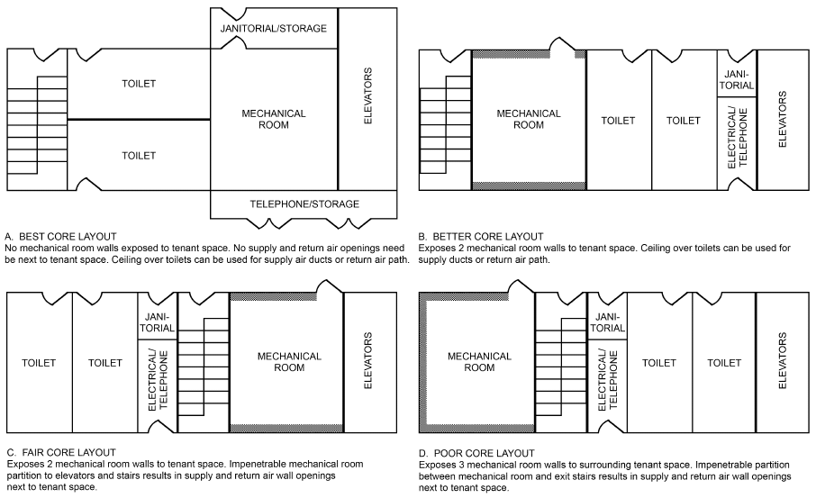

*Fig. 16 Comparison of Various Mechanical Equipment Room Locations*

Equation (37) is for use in a leakage test during construction to ensure that ductwork will meet the leakage specification. This equation translates system fractional air leakage to test section leakage class, as specified by ASHRAE Standard 90.1-2019, section 6.4.4.2.2.

> C<sub>L,section</sub> = ((Q ⁄ 100)(Q ⁄ A ) leak, *frac fan system*)/(0.65 Δp section)&emsp;**(37)**

where

C<sub>L,section</sub>= test section leakage class, L/s per Pa<sup>0.65</sup> per square metre of duct surface area

Q<sub>fan</sub> = maximum fan airflow that would occur during operation, L/s} Q<sub>leak,frac</sub>= system leakage fraction corresponding to maximum fan airflow that would occur during operation, %

A<sub>system</sub> = total system duct surface area, m<sup>2</sup>

Δp<sub>section</sub>= test section static pressure difference corresponding to maximum fan airflow that would occur during operation, Pa

Equation (37) shows that leakage class depends on fractional air leakage and normalized fan airflow (Q<sub>fan</sub>/A<sub>system</sub>), and varies inversely with the pressure difference raised to the 0.65 power. For example, to achieve 3% leakage for ductwork with Q<sub>fan</sub>/A<sub>system</sub> = 10 L/s per m<sup>2</sup> of duct surface area and Δp<sub>section</sub> = 750 Pa, the required leakage class is 0.004 L/s per Pa<sup>0.65</sup>per square metre of duct 2011)

surface area. With Δp<sub>section</sub> =125 Pa instead (six times less), the required leakage class is about three times greater (0.13).

The maximum acceptable air leakage for a test section corresponding to the leakage class determined by Equation (37) can be expressed by Equation (38).

> Q<sub>leak,section</sub> = C<sub>L,section</sub>A<sub>section</sub>⁄ Δp<sup>0</sup><sub>se</sub><sup>.6</sup><sub>c</sub><sup>5</sup><sub>tion</sub>&emsp;**(38)**

where where

- Q<sub>leak,section</sub> = test section air leakage, L/s
- A<sub>section</sub> = test section duct surface area, m<sup>2</sup>

Equations (37) and (38) can be combined so that the maximum acceptable air leakage for a test section during construction is simply a function of system fractional leakage, normalized fan airflow (Q<sub>fan</sub>/A<sub>system</sub>), and section duct surface area:

> ( )
>
> Q<sub>leak,section</sub> = (Q leak, frac)/100 (Q<sub>fan</sub>/A<sub>system</sub>) A<sub>section</sub>&emsp;**(39)**

> ( )

Thus, for air leakage tests during construction, the maximum acceptable leakage for a ductwork section is given by Equation (38) or (39). Duct surface area should be calculated in accordance with European Standard EN 14239. The test pressure for each section should be specified by the design engineer based on the maximum static pressure for that section that would occur during operation at maximum fan airflow.

**Example 7.** The system depicted by Figure 17 has the characteristics summarized by Table 8. For a maximum acceptable leakage of 3% of the 2360 L/s maximum fan airflow, which is 71 L/s total, what is the maximum allowable ductwork leakage in (1) each section that is to be tested at the pressures noted, and (2) sections 4 and 5 when leak tested together?

<!-- str. 620 -->

**Solution:** The calculations and maximum allowable leakage are also summarized in Table 8. Note that adjacent sections with the same static pressure can be grouped for leakage testing. In this case, Sections 4 and 5 can be grouped. The allowable leakage for Sections 4 and 5 when tested individually is 4 L/s and 20 L/s respectively. The allowable leakage for Sections 4 and 5 when tested together is 24 L/s.

**Recommended Specification for Duct-Mounted Equipment.** Duct-mounted component leakage is controlled by specification and certified leakage data provided with equipment submittals. The following are recommended leakage-related specifications for duct-mounted equipment.

- **Terminal Units.** Seal longitudinal seams of casings, inlet face of casings, and inlet collars with mastic. Seal damper shaft penetrations of casings. Casing leakage for the basic terminal unit should not exceed 2.1 L/s at 249 Pa static pressure differential. Terminal unit leakage with an access door should not exceed 2.2 L/s at 249 Pa. Testing should be by an accredited laboratory. Leakage tests should comply with ASHRAE Standard 130. Access doors in terminal unit casings should comply with AMCA Standard 500-D, and leakage rates should be certified per AMCA (2013) Publication 511. Access door (frame not included) leakage should not exceed 0.24 L/s at 2.49 kPa static pressure differential.
- **Electric Reheat Coils.** Flange-mount electric coils with a gasket. Coil leakage should not exceed 0.24 L/s at 249 Pa static pressure differential. Tests should be by an accredited laboratory. Leakage tests should be in compliance with ASHRAE Standard 126-2016 (ASHRAE 2016).
- **Hot-Water Reheat Coils.** Flange-mount hot-water coils with a gasket in an insulated plenum or casing. Seal all seams and casing penetrations for supply and return water tubes. Coil casing leakage (not counting transverse joints) should not exceed 0.24 L/s at 249 Pa static pressure differential. An accredited laboratory should perform leakage tests in compliance with ASHRAE Standard 126.

**Table 8 Solution for Example 7**

```text
         Section            Section      Section        Section
           Inlet            Static    Leakage Class,   Allowable
          Flow,   A_section, Pressure, L/s per m^2 per Leakage, L/s
           L/s      m^2       Pa          Pa^0.65
                                                     Equation (38)
 Section            Input             Equation (37)     or (39)
   1      2 360     46.5     750          0.003           10
   2        944     62.0     250          0.006           14
   3      1 416     69.7     500          0.004           15
   4        472     18.6     250          0.006             4
   5        944     92.9     250          0.006           20
  Total            289.6                                  63
 4 and 5  1 416    111.5     250          0.006           24
```

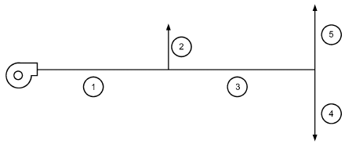

*Fig. 17 Duct Layout for Example 7*

- **Access Doors.** Access door leakage (excluding the frame) should not exceed 0.24 L/s at 2.49 kPa static pressure differential. Leakage tests should comply with AMCA Standard 500-D, and leakage rates certified per AMCA (2013) Publication 511.
- **Attenuators.** Sound attenuator casing seams should be sealed at the factory if used in-line with the ductwork. Attenuators stacked in plenums do not have to be sealed, but plenums should be sealed.
- **Fire/Smoke Dampers.** These dampers should be installed in accordance with the manufacturer’s UL installation instructions. Each fire damper should be furnished with a UL-approved sleeve. Sleeve seams should be continuously welded or sealed, and the transverse joint should be a sealed UL-approved flanged duct sleeve connection (break-away or non-break-away).
- **Balancing Dampers.** Balancing damper casing seams should be continuously welded or sealed, and the shaft penetrating the casing should have seals.
- **Control Dampers.** Control damper shafts penetrating ducts should have seals.

**Recommended Specification for Air-Handling Units.** Refer to Chapter 19 of the 2020 *ASHRAE Handbook—HVAC Systems and* Equipment for leakage-related specifications for air-handling units.

**Responsibilities.** The **engineer** should

- Specify HVAC system components, duct-mounted equipment, sealants, and sealing procedures that together will meet the system airtightness design objective.
- Inspect the system during construction for quality of workmanship and to verify that correct duct-mounted components and air-handling units are installed.
- Specify thec onstruction-stage ductwork leakage test standard or procedures.
- Specify the construction-stage test pressures to the nearest 25 Pa expected during operation at design conditions and the maximum allowable air leakage.
- Review and approve the sheet metal and test contractors’ leakage test reports. If any system has a leakage failure, the engineer should discuss remedies with the sheet metal contractor, vendor, and/or owner’s representative.

The **sheet metal contractor** should

- Construct the system using quality workmanship and correct duct-mounted components and air-handling units. If any installed duct-mounted equipment appears to be leakage suspect, the contractor should discuss remedies with the engineer and/or owner’s representative.
- Conduct ductwork leakage pressurization tests during construction. As a minimum, 25% of the ductwork system (based on duct surface area) should be tested during construction, and another 25% if any of the initial sections fail. If any section of the second 25% fails, the entire ductwork system should be leak tested.
- Provide connections for test apparatus, and separate test sections from each other as needed so that the test apparatus capacity is not exceeded.
- Report test results and, where required, take corrective action to seal ductwork and absorb the cost for conducting related additional leak tests.

The **test contractor** should

- Conduct the operating system leakage test in compliance with ASHRAE Standard 215-2018.
- Report test results, including reasons for any failures.

It should be the responsibility of the **owner or owner’s repre- sentative** to provide direction upon request.

<!-- str. 621 -->

### Fire and Smoke Control

Because duct systems can convey smoke, hot gases, and fire from one area to another and can accelerate a fire within the system, fire protection is an essential part of air-conditioning and ventilation system design. Generally, fire safety codes require compliance with the standards of national organizations. NFPA Standard 90A examines fire safety requirements for (1) ducts, connectors, and appurtenances; (2) plenums and corridors; (3) air outlets, air inlets, and fresh air intakes; (4) air filters; (5) fans; (6) electric wiring and equipment; (7) air-cooling and -heating equipment; (8) building construction, including protection of penetrations; and (9) controls, including smoke control.

Fire safety codes often refer to the testing and labeling practices of nationally recognized laboratories, such as Factory Mutual and Underwriters Laboratories (UL). UL’s annual Building Materials Directory lists fire and smoke dampers that have been tested and meet the requirements of UL Standards 555 and 555S. This directory also summarizes maximum allowable sizes for individual dampers and assemblies of these dampers. Fire dampers are 1.5 h or 3 h fire-rated. Smoke dampers are classified by (1) temperature degradation [ambient air or high temperature (120°C minimum)] and (2) leakage at 250 and 1000 Pa pressure difference (2 and 3 kPa classification optional). Smoke dampers are tested under conditions of maximum airflow. UL’s annual *Fire Resistance Directory* lists fire resistances of floor/roof and ceiling assemblies with and without ceiling fire dampers.

For a more detailed presentation of fire protection, see the NFPA (2008) *Fire Protection Handbook*, Chapter 54 of the 2019 ASHRAE Handbook—HVAC Applications, and Klote et al. (2012).

### Duct Insulation

In all new construction (except low-rise residential buildings), air-handling ducts and plenums that are part of an HVAC air distribution system should be thermally insulated in accordance with ASHRAE Standard 90.1. Duct insulation for new low-rise residential buildings should comply with ASHRAE Standard 90.2. Existing buildings should meet requirements of ASHRAE Standard 100. In all cases, thermal insulation should meet local code requirements. Insulation thicknesses in these standards are minimum values; economic and thermal considerations may justify higher insulation levels. Additional insulation, vapor retarders, or both may be required to limit vapor transmission and condensation.

Duct heat gains or losses must be known to calculate supply air quantities, supply air temperatures, and coil loads. To estimate duct heat transfer and entering or leaving air temperatures, refer to Chapters 4 and 23.

### Physical Security

Ducts entering into spaces considered secured or sensitive should contain measures to detect or inhibit forced entry into those spaces through the duct system. Inhibiting measures should be based on a delay or resistance time set by the facility owner or user. The following security measures should be considered:

- **Barrier duct bars:** placement should be at locations deemed appropriate by the facility owner and user, or where secured or sensitive area boundaries exist (e.g., duct penetration through the wall of a secured room). Bar diameter, material, and spacing should be established by the facility owner or user. Ensure that barriers do not inhibit proper operation and maintenance of dampers, detectors, sensors, and other devices in the duct system.
- **Welded diffuser and return grilles:** grille material and spacing should be established by the facility owner or user.
- **Sensors on access doors:** sensors should be connected to a facility security system or panel, and notify security personnel of a duct system breach. Communicating HVAC maintenance schedules to security personnel is necessary to ensure that an intrusive duct system breach is not confused with HVAC system maintenance.

### Louvers

Use Figure 18 for preliminary sizing of air intake and exhaust louvers. For air quantities greater than 3300 L/s per louver, the air intake gross louver openings are based on 2 m/s; for exhaust louvers, 2.5 m/s is used for air quantities of 2400 L/s per louver and greater. For smaller air quantities, see Figure 18. These criteria are presented on a per-louver basis (i.e., each louver in a bank of louvers) to include each louver frame. Representative productionrun louvers were used in establishing Figure 18, and all data used were based on AMCA Standard 500-L tests. For louvers larger than 1.5 m<sup>2</sup>, the free areas are greater than 45%; for louvers less than 1.5 m<sup>2</sup>, free areas are less than 45%. Unless specific louver data are analyzed, no louver should have a face area less than 0.4 m<sup>2</sup>. If debris can collect on the screen of an intake louver, or if louvers are located at grade with adjacent pedestrian traffic, louver face velocity should not exceed 0.5 m/s.

Louvers require special treatment because the blade shapes, angles, and spacing cause significant variations in louver-free area and performance (pressure drop and water penetration). Selection and analysis should be based on test data obtained from the manufacturer in accordance with AMCA Standard 500-L, which presents both pressure drop and water penetration test procedures and a uniform method for calculating the free area of a louver. Tests are conducted on a 1220 mm square louver with the frame mounted flush in the wall. For water penetration tests, rainfall is 100 mm/h, no wind, and the water flow down the wall is 0.05 L/s per linear metre of louver width.

AMCA Standard 500-L also includes a method for measuring water rejection performance of louvers. These louvers are subjected to simulated rain and wind pressure and tested at a rainfall of 76 mm/h falling on the louver’s face with a predetermined wind velocity directed at the face of the louver (typically 13 or 20 m/s). Effectiveness ratings are assigned at various airflow rates through the louver.

### Duct Shape Selection

**No Space Constraints.** Round ductwork is preferable to rectangular or flat oval ductwork when adequate space is available for the following reasons.

- **Mass** of round ductwork is less than rectangular. Figure 19 shows the relative weight of rectangular duct to round duct for duct pressures from ±125 to ±2500 Pa when the equivalent diameter of the rectangular duct is the same as the round duct diameter. Equivalent diameter is defined as the diameter of a rectangular duct that has equal resistance to flow for equal flow and length.
- **Perimeter** of round ducts is less than rectangular ducts. For rectangular duct aspect ratios from 2 to 4, the increase is approximately 30 to 55%. This increase results in increased insulation, including possible thickness to offset the additional heat transfer. For a comprehensive study of round and rectangular ducts as they affect system performance, consult McGill (1988).
- Round ducts have an excellent resistance to **low-frequency break-** **out noise** (Schaffer 2011).
- Duct **rumble** can occur in rectangular duct systems (Paulauskis 2016).

**Space Constraints.** Space constraints and obstructions, particularly ceiling height, are frequent problems. In these cases, the choice is round, rectangular, or flat oval ducts, depending on the air quantity that needs to be conveyed by the duct. Table 9 and Figure 20 cover three design cases: 0.65, 2, and 5 Pa/m friction rates. Friction rate 2

<!-- str. 622 -->

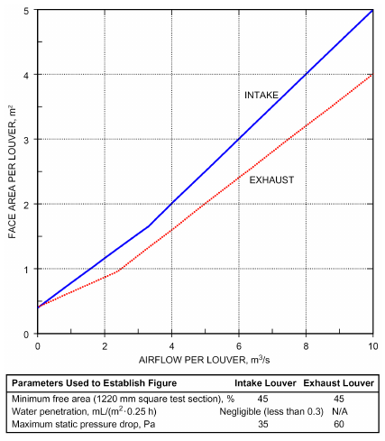

*Fig. 18 Criteria for Louver Sizing*

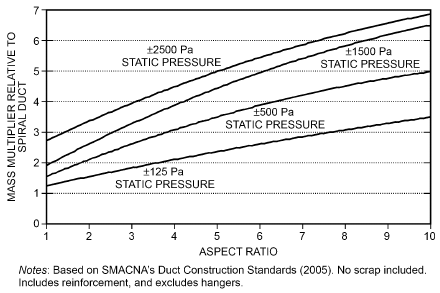

*Fig. 19 Relative Weight of Rectangular Duct to Round Spiral Duct*

Pa/m is at the middle range. In Table 9, six ceiling (plenum) heights ranging from 400 to 1100 mm, in approximately 200 mm increments, are covered. Space allocated for insulation and reinforcement is 50 mm all around. The aspect ratio of the rectangular and flat oval ducts is 2:1. Figure 20 shows the maximum airflow as a function of the design friction rates and plenum spaces, as noted. For example, the 900 mm plenum as a design friction rate of 2 Pa/m is 6360 L/s maximum for a 800 mm round duct; 14 500 L/s for a 1600 × 800 mm rectangular duct; and 21,000 cfm16 300 L/s for a 1600 × 800 mm flat oval duct. The airflow capacity of two round 800 mm ducts is 6360 L/s each.

When selecting a rectangular or flat oval duct, consider the following:

- Rectangular duct has the advantage in **mass** because construction standards for flat oval exist only for +2500 Pa, whereas rectangular has seven pressure classes, starting at 125 Pa. All rectangular pressure classes are ±.

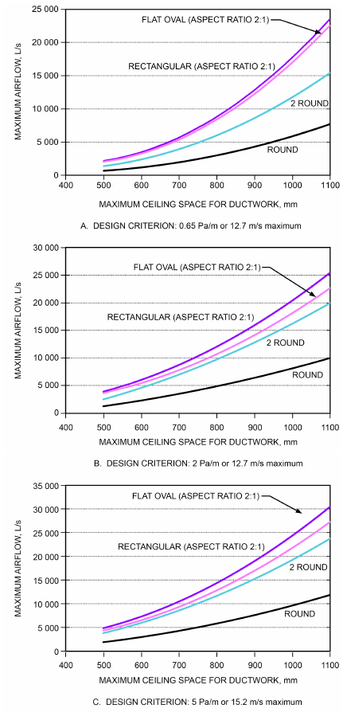

*Fig. 20 Maximum Airflow of Round, Flat Oval, and Rectangular Ducts as Function of Available Ceiling Space*

Note: Negative-pressure flat oval duct systems can be designed by using +2500 Pa sheet gages with the negative-pressure rectangular reinforcement welded to the duct.

- **Low-frequency breakout noise** for flat oval is good, fair for rectangular (Schaffer 2011).
- Duct **rumble** can occur in rectangular duct systems (Paulauskis 2016).
- **Perimeter.** Using rectangular duct instead of flat oval when sized for equivalent diameter increases the perimeter roughly 17 to 7% for aspect ratios ranging from 1 to 4, respectively. This increase results in an increased surface area. Flat oval requires less insulation. For a comprehensive study of flat oval and rectangular ducts as they affect system performance, consult McGill (1995).

<!-- str. 623 -->

- **Duct Lengths.** Rectangular duct is available in 1200, 1500, or 1800 mm lengths. Spiral round and flat oval can be provided in longer lengths.

### Testing and Balancing

Each air duct system should be tested, adjusted, and balanced. Guidance and procedures are given in Chapter 39 of the 2019 *ASHRAE Handbook—HVAC Applications* and in ASHRAE Standard 111. To determine fan total (or static) pressure from field measurements taking into account fan system effect, consult AMCA (2011b) Publication 203, which provides numerous fan/system configurations encountered in the field.

Many VAV noise complaints have been traced to control problems. Although most problems are associated with improper installation, many are caused by poor design. The designer should specify high-quality fans or air handlers within their optimum ranges, not at the edge of their operation ranges, where low system tolerances can lead to inaccurate fan flow capacity control. Also, in-duct static pressure sensors should be placed in duct sections having the lowest possible air turbulence (i.e., at least three equivalent duct diameters from any elbow, takeoff, transition, offset, or damper).

## 6.2 DESIGN RECOMMENDATIONS

- Engage the architect and structural engineer early to coordinate shafts for systems.

Commentary. Consult *Noise and Vibration Control for HVAC* Systems (Schaffer 2011) for the following guidelines related to duct systems:

- Selection of mechanical room walls
- Noise control for mechanical rooms
- Upward noise control for mechanical rooms
- Duct penetrations through walls
- Structural support of rooftop equipment for vibration control
- Route ducts as straight as possible to reduce pressure loss, noise, and first costs.
- Use round spiral ducts whenever round ducts can fit within space constraints.
- Avoid consecutive fittings and close-coupled fittings because they can significantly increase pressure losses.
- Use return air plenums when possible because they reduce both energy and first costs. Plenum return requires fire-rated construction.
- Design air distribution systems to minimize flow resistance and turbulence. High flow resistance increases fan pressure, which results in higher noise being generated by the fan, especially at low frequencies. Turbulence also increases flow noise generated by duct fittings and dampers, especially at low frequencies.
- Efficient fittings create the least turbulence and noise. Figure 21 provides generalized guidelines for minimizing regenerated noise from takeoffs. Tables 10 and 11 provide specific guidance for tees and wyes.
- Duct transitions should not exceed an included angle of 15°.
- To avoid fan system effects, fans should discharge into duct sections that remain straight for as long as possible, up to 10 duct diameters from the fan discharge to allow flow to fully develop (Figure 22). Use the *ASHRAE Duct Fitting Database* (ASHRAE 2016) to account for fan outlet system effects (SD7 and SR7-series).
- Design duct connections at the fan inlet for uniform and straight airflow. Both turbulence and flow separation at the fan blades can significantly increase fan-generated noise. To account for fan inlet system effects, use the *ASHRAE Duct Fitting Database* (ASHRAE 2016) (ED7 and ER7 series).
- For all except very-noise-sensitive applications, select VAV reheat boxes for a total pressure loss from 125 to 150 Pa; for a fan-powered VAV box, from 150 to 175 Pa. For details, see Taylor and Stein (2004).
- VAV terminal unit inlet duct should be the same size as the inlet to the box, unless the box is in the critical path or the length exceeds about 4.5 m from the takeoff. Duct upstream of box inlets should be rigid sheet metal duct, 1.2 m minimum. Do not use flexible duct immediately upstream of VAV boxes.
- See Figure 23 for Schaffer’s (2011) guidelines for the installation of single-duct, dual-duct, and induction terminal units, as well as parallel and series flow fan-powered units.
- Place fan-powered mixing boxes away from noise-sensitive areas.
- Use demand-based static pressure set-point reset to reduce fan energy and noise.
- For constant-volume systems, select the fan to operate as near as possible to its rated peak efficiency. Also, select a fan that generates the lowest possible noise at required design conditions. Using an oversized or undersized fan that does not operate at or near rated peak efficiency can substantially increase noise levels. For VAV applications, see Schaffer (2011).

## 6.3 DESIGN METHODS

**Equal Friction Method.** The equal friction method for sizing duct systems uses a constant friction rate. The target velocity determines the size of the first duct section both downstream and upstream of the fan. From the size determined by the target velocity, the design friction rate is determined to size all remaining duct sections except for connections to VAV and constant-volume (CV) terminal units and diffusers in the critical path, or for sections whose length exceeds around 4.5 m. In these cases, the inlet to terminal units should have at least three diameters of rigid duct and 2 m maximum of rigid or flexible duct (see Figure 8) to diffusers. The section upstream of the rigid duct to terminal units and the section of rigid/flexible duct to diffusers should be sized by the design friction rate, and an appropriate transition placed between sections. Refer to sections 8 and 9 in Figure 24 for an example.

**Static Regain Method.** The static regain method uses the conservation of momentum principle, which results in an increase in static pressure when the velocity is reduced in an airstream. This method sizes the main and branch ducts after a junction so that the recovery in static pressure caused by the reduced velocity is approximately equal to the total pressure drop caused by the duct and fittings in the subject duct section according to Equation (41). This is done iteratively by selecting a size for a section and checking to see if the section’s static pressure loss is close to zero. The basic steps are to design the first section at the velocity recommended in Table 12. Then each downstream section is subsequently sized using the same duct size as the upstream section as a starting point. If there is no static regain, meaning there is a positive static pressure loss, then the downstream section will be the same size as the upstream section. But, if there is static regain, meaning the change in static pressure is negative, then an opportunity exists to use a smaller duct section. Typically, the next smaller size available that is smaller than the upstream section is selected and the calculations are repeated. Refer to column 12 of Table 13 for examples of static regain.

<!-- str. 624 -->

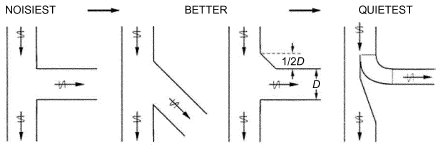

*Fig. 21 Guidelines For Minimizing Regenerated Noise in Takeoff*

> (Schaffer 2011)

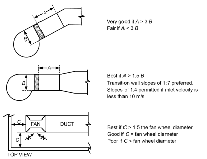

*Fig. 22 Guidelines for Centrifugal Fan Installations*

> (Schaffer 2011)

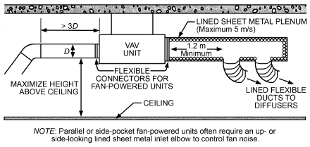

*Fig. 23 Guidelines for VAV Terminal Unit Installation*

> (Schaffer 2005)

For connections to VAV and CV terminal units and diffusers in the critical path or the section length with the terminal unit or diffuser exceeds around 4.5 m, the inlet to terminal units should have at least three diameters of rigid duct and 2 m maximum of rigid or flexible duct (see Figure 8) to diffusers. The section upstream of the rigid duct to terminal units and the section of rigid/flexible duct to diffusers should be sized by the static regain method and an appropriate transition placed between sections. Refer to sections 8 and 9 in Figure 24 for an example.

> p<sub>v1</sub> = Δp<sub>t,1–2</sub> + p<sub>v2</sub> + Δp<sub>s,1–2</sub>&emsp;**(40)**

Rearranging,

> Δp<sub>s,1–2</sub> = (p<sub>v1</sub> – p<sub>v2</sub>) – Δp<sub>t,1–2</sub>&emsp;**(41)**

where

- p<sub>v1</sub> = velocity pressure at section 1, Pa
- p<sub>v2</sub> = velocity pressure at section 2, Pa

Δp<sub>t,1–2</sub> = total pressure loss from section 1 to 2, Pa

Δp<sub>s,1–2</sub> = static pressure regain (+) or loss (–), Pa

**Balancing.** When system unbalance is greater than about 30%, it is recommended that balance be improved by changing duct size, and/or fittings from a select few that have comparable efficiency without introducing additional significant turbulence (noise). Tables 10 and 11 are examples.

### Noise Control

Understanding what noise is and how to control it is fundamental to duct design. The underlying principles of sound and vibration are covered in Chapter 8. Chapter 49 of the 2019 ASHRAE Handbook—HVAC Applications contains technical discussions and design examples helpful to the design engineer. AHRI Standard 885 has procedures for estimating sound pressure levels in the occupied zone for the portion of the system downstream of terminal units. For guidance in designing HVAC systems to avoid noise and vibration problems, consult Schaffer (2011). Specifying quiet equipment and designing systems to avoid noise and vibration problems are necessary parts of the design process.

Noise in system comes from fans and generated noise resulting from air turbulence in ducts, individual fittings, close-coupled fittings, dampers, air modulating equipment and diffusers/grilles. Objectionable self-generated duct noise can be controlled by limiting the duct velocity to the values listed in Table 12.

### Goals

The goal of duct design is an air distribution system without objectionable noise and minimum life-cycle cost (LCC). Noise can be controlled by limiting the duct velocity to the values listed in Table 12. For example, for ductwork above a suspended acoustical ceiling and with a maximum allowable NC or RC of 35 in the adjoining space, the maximum round and rectangular duct airflow velocities are 15.2 and 8.9 m/s, respectively. Use this velocity to size the first duct section either upstream or downstream from the fan for all duct design methods. Lowering duct velocity reduces system operating cost and minimizes noise from sources other than ducts (fittings, close-coupled fittings, and dampers).

Commentary: In 1988, Dr. Robert J. Tsal developed the T-method (Tsal and Adler 1987; Tsal et al. 1988, 1990) to design systems with a minimum LCC. The T-method was technically sound, but the system cost was not sufficiently accurate. As a result, the T-method was removed from the Handbook in 2013.

### Design Method to Use

**Supply Duct Sizing.**

- Size fan supply ducts by either the equal friction (EF) or static regain (SR) method. The duct velocity anywhere in the system should not exceed the velocity listed in Table 12.
- Size ducts downstream of terminal boxes, toilet exhaust ducts, and other low-pressure systems (e.g., in Figure 25C) using the equal friction method with a friction rate in the range from 160 Pa per metre such that the duct velocity in the duct anywhere in the system does not exceed the values in Table 12. Use Table 14 as a guide to select the design friction rate.
- Terminal unit (VAV box) runouts should be full size with the exception that runouts in the “critical” path or a runout length greater than about 4.5 m should be a minimum 1.5 m of rigid duct full size and the remainder’s size determined by the design method (e.g., Example 8 and Figure 24).
- Diffuser runouts should be full size, except for runouts in the critical path or a runout length greater than about 4.5 m: these runouts

<!-- str. 625 -->

**Table 9 Maximum Airflow of Round, Flat Oval and Rectangular Ducts as Function of Available Ceiling Space**

| A. Design Criterion: 0.65 Pa/m or 12.7 m/s Maximum | A. Design Criterion: 0.65 Pa/m or 12.7 m/s Maximum |   |   |   |   |
|---|---|---|---|---|---|
| Minimum Clearance for Duct, mm | 500 | 600 | 730 | 900 | 1100 |
| Single Round Duct<br>Duct diameter, mm<br>Airflow, L/s<br>Velocity, m/s<br>Rectangular Duct with Aspect Ratio = 2<br>Rectangular W × H, mm<br>Airflow, L/s<br>Velocity, m/s<br>Equivalent diameter D<sub>e</sub>, mm<br>Flat Oval Duct with Aspect Ratio = 2<br>Flat Oval A × a, mm<br>Airflow, L/s<br>Velocity, m/s<br>Equivalent diameter D<sub>e</sub>, mm<br>Two Round Ducts in Parallel<br>Duct diameter, mm<br>Airflow, L/s<br>Velocity, m/s | 400 680 5.4 800 × 400 2100 6.6 609 800 × 400 2000 7.0 591<br>Two 400 680 each 5.4 | 500 1230 6.3 1000 × 500 3780 7.6 762 1000 × 500 3600 8.1 739<br>Two 500 1230 each 6.3 | 630 2270 7.3 1200 × 600 6150 8.5 914 1200 × 600 5850 9.1 887<br>Two 630 2270 each 7.3 | 800 4290 8.5 1600 × 800 13 100 10.2 1219 1600 × 800 12 500 10.9 1183<br>Two 800 4290 each 8.5 | 1000 7730 9.8 2000 × 1000 23 500 11.8 1523 2000 × 1000 22 500 12.6 1479<br>Two 1000 7730 each 9.8 |
| **B. Design Criterion: 2 Pa/m or 12.7 m/s Maximum** |  |  |  |  |  |
| Minimum Clearance for Duct, mm | 500 | 600 | 730 | 900 | 1100 |
| Single Round Duct<br>Duct diameter, mm<br>Airflow, L/s<br>Velocity, m/s<br>Rectangular Duct with Aspect Ratio = 2<br>Rectangular W × H, mm<br>Airflow, L/s<br>Velocity, m/s<br>Equivalent Diameter D<sub>e</sub>, mm<br>Flat Oval Duct with Aspect Ratio = 2<br>Flat oval A × a, mm<br>Airflow, L/s, Velocity, m/s<br>Equivalent diameter D<sub>e</sub>, mm<br>Two Round Ducts in Parallel<br>Duct diameter, mm<br>Airflow, L/s<br>Velocity, m/s | 400 1250 9.9 800 × 400 3820 11.9 609 800 × 400 3630 12.7 591<br>Two 400 1250 each 9.9 | 500 2250 11.5 1000 × 500 6350 12.7 762 1000 × 500 5650 12.7 739<br>Two 500 2250 each 11.5 | 630 3950 12.7 1200 × 600 9150 12.7 914 1200 × 600 8150 12.7 887<br>Two 630 3950 each 12.7 | 800 6360 12.7 1600 × 800 16 300 12.7 1219 1600 × 800 14 500 12.7 1183<br>Two 800 6360 each 12.7 | 1000 10 000 12.7 2000 × 1000 25 400 12.7 1523 2000 × 1000 22 600 12.7 1479<br>Two 1000 10 000 each 12.7 |
| **C. Design Criterion: 5 Pa/m or 15.2 m/s Maximum** |  |  |  |  |  |
| Minimum Clearance for Duct, mm | 500 | 600 | 730 | 900 | 1100 |
| Single Round Duct<br>Duct diameter, mm<br>Airflow, L/s<br>Velocity, m/s<br>Rectangular Duct with Aspect Ratio = 2<br>Rectangular W × H, mm<br>Airflow, L/s<br>Velocity, m/s<br>Equivalent Diameter D<sub>e</sub>, mm<br>Flat Oval Duct with Aspect Ratio = 2<br>Flat oval A × a, mm<br>Airflow, L/s<br>Velocity, mm<br>Equivalent diameter D<sub>e</sub>, mm<br>Two Round Ducts in Parallel<br>Duct diameter, mm<br>Airflow, L/s<br>Velocity, m/s | 400 1910 15.2 800 × 400 4850 15.2 609 800 × 400 4350 15.2 591<br>Two 400 1910 each 15.2 | 500 2990 15.2 1000 × 500 7600 15.2 762 1000 × 500 6800 15.2 739<br>Two 500 2990 each 15.2 | 630 4750 15.2 1200 × 600 10 970 15.2 914 1200 × 600 9800 15.2 887<br>Two 630 4750 each 15.2 | 800 7620 15.2 1600 × 800 19 500 15.2 1219 1600 × 800 17 400 15.2 1183<br>Two 800 7620 each 15.2 | 1000 11 900 15.2 2000 × 1000 30 400 15.2 1523 2000 × 1000 27 200 15.2 1479<br>Two 1000 11 900 each 15.2 |

*European standard metric dimensions used to develop Table 7 (CEN 1998, 2007). Round duct diameters (mm): 80, 100, 125, 160, 200, 250, 315, 400, 500, 630, 800, 1000, 1250, and 1600. Rectangular/flat oval dimension (mm): 100, 150, 200, 250, 300, 400, 500, 600, 800, 1000, 1200, 1400, 1600, 1800, and 2000.

<!-- str. 626 -->

**Table 10 Options for Selecting 90° Takeoff**

| Code | Description | Efficiency | Loss Coefficient<br>Main<sup>a</sup> | Loss Coefficient<br>Branch<sup>b</sup> |
|---|---|---|---|---|
| SD5-12 | Tee, 45° entry branch | Highest | 0.15 | 0.64 |
| SD5-4 | Wye, 45°, Straight body branch with 45° elbow, 90° to main | — | 0.15 | 0.74 |
| SD5-11 | Tee, Conical branch | — | 0.15 | 0.87 |
| SD5-10 | Tee, Conical branch tapered into body | — | 0.15 | 1.10 |
| SD5-9 | Tee | Lowest | 0.15 | 1.80 |

<sup>a</sup>Q<sub>s</sub>/Q<sub>c</sub> = 0.8; A<sub>s</sub>/A<sub>c</sub> = 0.69 b

Q<sub>b</sub>/Q<sub>c</sub> = 0.2; A<sub>b</sub>/A<sub>c</sub> = 0.25

**Table 11 Options for Selecting 45° Takeoff (Wye)**

| Code | Description | Efficiency | Loss Coefficient<br>Main, C<sub>s</sub><sup>a</sup> | Loss Coefficient<br>Branch, C<sub>b</sub><sup>b</sup> |
|---|---|---|---|---|
| SD5-2 | Wye, 45°, Conical branch tapered into body | Highest | 0.15 | 0.45 |
| SD5-3 | Wye, 45°, Straight body branch with reduction transition | — | 0.15 | 0.50 |
| SD5-1 | Wye, 45° | Lowest | 0.15 | 0.70 |

<sup>a</sup>Q<sub>s</sub>/Q<sub>c</sub> = 0.8; A<sub>s</sub>/A<sub>c</sub> = 0.69 b

Q<sub>b</sub>/Q<sub>c</sub> = 0.2; A<sub>b</sub>/A<sub>c</sub> = 0.25 should be at least 2 m of flexible-duct full size, and the remainder’s size determined by the design method.

<!-- str. 627 -->

**Table 12 Recommended Maximum Airflow Velocities to Achieve Specified Acoustic Design Criteria Friction Rate**

| Duct Location | NC or RC Rating in Adjoining Occupancy | Maximum Airflow Velocity, m/s<br>Rectangular Duct | Maximum Airflow Velocity, m/s<br>Round Duct |
|---|---|---|---|
| 1 | 2 | 3 | 4 |
| In shaft or above solid drywall ceiling | 45 35 25 or less | 17.8 12.7 7.6 | 25.4 17.8 12.7 |
| Above suspended acoustical ceiling | 45 35 25 or less | 12.7 8.9 5.1 | 22.9 15.2 10.2 |
| Duct within occupied space | 45 35 25 or less | 10.2 7.4 4.8 | 19.8 13.2 8.6 |

*Adapted from Table 9 in Chapter 49 of the 2019 *ASHRAE Handbook—HVAC Appli-* cations and Schaffer 2011.

**Return Duct Systems.**

- Sizing ducted returns depend on economizer relief system. For systems with return fans (Figure 25A), the return air ducts are sized using the EF method. The SR method does not work for negative-pressure duct systems. If building relief is by relief fans or gravity/motorized dampers, pressure drop should be kept low as shown by the total pressure grade line associated with Figures 25B and 25C. Control dampers in the economizer system should be selected (parallel or opposed blade) and sized in compliance with ASH-RAE Guideline 16. Louvers should be sized in accordance with the section on Louvers, under Duct Design.
- Unducted return air shafts are typically sized for low pressure loss using either a fixed friction rate, velocity, or both. Typically, shafts are simply sized based on velocity. Maximum velocities are generally in the 4.1 to 6.1 m/s range through the free area at the top of the shaft (highest airflow rate).
- Diffuser/grille runouts should be designed by the design method of choice and a transition located at the outlet. For outlets in the critical path, the outlet duct size should be increased. Registers should not be used because of the damper.

**Example 8.** For the VAV system shown in Figure 25, design the duct system by both the equal friction (EF) and static regain (SR) methods, and compare the section duct sizes, total pressure required for each path, and the unbalance between paths.

The system is located in Denver (1655 m elevation) and the duct is spiral round, galvanized steel (absolute roughness ε = 0.12 mm). The duct system is located above a suspended acoustical ceiling, and the allowable background sound in the occupied spaces is NC-35. Terminals T1, T2, T3, and T4 (VAV boxes with a one-row hot-water coil) are 380 L/s. VAV box loss coefficients are 1.67.

**Solution:** Use the *ASHRAE Duct Fitting Database* (ASHRAE 2016) to determine the air density, which is used to identify the velocity pressure and fitting loss coefficients for fittings. Density is 0.978 kg/m<sup>3</sup> (Figure 26). The maximum design duct velocity from Table 12 is 15.2 m/s. The EF and SR calculations are shown by Tables 13 and 15.

For both the EF and SR designs, the duct size for Section 2 is 375 mm determined using CD11-3 (Figure 27). Sizing the remaining section depends on the design method. For the equal friction design method, the system equal friction (also from CD11-3) is 4.2 Pa/m.

**Table 13 Guide for Selecting Low-Pressure System Specified Acoustic Design Criteria Friction Rate**

| Airflow Q, L/s | 0.4 Pa/m<br>D, mm | 0.4 Pa/m<br>V, m/s | 0.8 Pa/m<br>D, mm | 0.8 Pa/m<br>V, m/s | 1.0 Pa/m<br>D, mm | 1.0 Pa/m<br>V, m/s | 1.2 Pa/m<br>D, mm | 1.2 Pa/m<br>V, m/s | 1.6 Pa/m<br>D, mm | 1.6 Pa/m<br>V, m/s |
|---|---|---|---|---|---|---|---|---|---|---|
| 240 | 312 | 3.1 | 270 | 4.2 | 258 | 4.6 | 248 | 5.0 | 234 | 5.6 |
| 470 | 402 | 3.7 | 348 | 4.9 | 332 | 5.4 | 320 | 5.8 | 302 | 6.6 |
| 940 | 520 | 4.4 | 452 | 5.9 | 432 | 6.4 | 416 | 6.9 | 394 | 7.7 |
| 1 420 | 608 | 4.9 | 530 | 6.4 | 506 | 7.1 | 488 | 7.6 | 460 | 8.5 |
| 1 890 | 678 | 5.2 | 590 | 6.9 | 564 | 7.6 | 544 | 8.1 | 512 | 9.2 |
| 2 360 | 738 | 5.5 | 642 | 7.3 | 614 | 8.0 | 592 | 8.6 | 558 | 9.7 |
| 4 720 | 958 | 6.5 | 834 | 8.6 | 796 | 9.5 | 768 | 10.2 | 726 | 11.4 |
| 7 080 | 1118 | 7.2 | 972 | 9.5 | 930 | 10.4 | 896 | 11.2 | 846 | 12.6 |
| 9 440 | 1248 | 7,7 | 1086 | 10.2 | 1038 | 11.2 | 1002 | 12.0 | 946 | 13.4 |
| 11 800 | 1358 | 8.1 | 1182 | 10.8 | 1130 | 11.5 | 1090 | 12.6 | 1030 | 14.2 |
| 14 160 | 1456 | 8.5 | 1268 | 11.2 | 1212 | 12.3 | 1168 | 13.2 | 1104 | 14.8 |

*Table developed using *ASHRAE Duct Fitting Database* (ASHRAE 2016): CD11-4 (ε = 0.12 mm; ρ = 1.204 kg/m<sup>3</sup>).

Knowing the system design friction rate, the duct sizes are determined by CD11-4. Figure 28 is an example for Section 4. For the static regain method, all sections other than the terminal unit runouts are sized by iterating using Equation (41) (column 12 in Table 13). For example, the results of the iteration for Section 4 are summarized by Table 16. The solution is the diameter that gives the result from Equation (41) that is closest to zero: in this case, 350 mm

Tables 17 and 18 summarize the results. The SR design is slightly better balanced, 19% compared to 23%, and the SR design requires 9% less energy. In addition, the SR sizes are slightly larger, and thus potentially less noisy. Both methods have static regain, but the SR design uses the regain more efficiently.

## 6.4 INDUSTRIAL EXHAUST SYSTEMS

Chapter 33 of the 2019 *ASHRAE Handbook—HVAC Applications* discusses design criteria, including hood design, for industrial exhaust systems. Exhaust systems conveying vapors, gases, and smoke are designed by the equal-friction method. Systems conveying particulates are designed by the constant velocity method at duct velocities adequate to convey particles to the system air cleaner. For contaminant transport velocities, see Table 2 in Chapter 33 of the 2019 *ASHRAE Handbook—HVAC Applications*. 350 mm

Two pressure-balancing methods can be considered when designing industrial exhaust systems. One method uses balancing devices (e.g., dampers, blast gates) to obtain design airflow through each hood. The other approach balances systems by adding resistance to ductwork sections (i.e., changing duct size, selecting different fittings, increasing airflow). This self-balancing method is preferred, especially for systems conveying abrasive materials. Where potentially explosive or radioactive materials are conveyed, the prebalanced system is mandatory because contaminants could accumulate at the balancing devices. To balance systems by increasing airflow, use Equation (42), which assumes that all ductwork has the same diameter and that fitting loss coefficients, including main and branch tee coefficients, are constant.

> Q<sub>c</sub> = Q<sub>d</sub>(P<sub>h</sub>/P<sub>l</sub>)<sup>0.5</sup>&emsp;**(42)**

where

- Q<sub>c</sub> = airflow rate required to increase P<sub>l</sub> to P<sub>h</sub>, L/s
- Q<sub>d</sub> = total airflow rate through low-resistance duct run, L/s
- P<sub>h</sub> = absolute value of pressure loss in high-resistance ductwork section(s), Pa

<!-- str. 628 -->

P<sub>l</sub> = absolute value of pressure loss in low-resistance ductwo

> section(s), Pa

For systems conveying particulates, use elbows with a lar terline radius-to-diameter ratio (r/D), greater than 1.5 whene sible. If r/D is 1.5 or less, abrasion in dust-handling syste reduce the life of elbows. Elbows are often made of seven gores, especially in large diameters. For converging flow fit rk hoods and equipment for specific operations, see Chapter 33 of the 2019 *ASHRAE Handbook—HVAC Applications* and ACGIH (2016).

ge cen-Commentary: Fitting CD11-5 of the *ASHRAE Duct Fitting* ver pos-Database (ASHRAE 2016) is available for sizing minimumms can

> velocity ducts conveying particulates.

or more tings, a **Example 9.** For the metalworking exhaust system in Figures 29 and 30, 30° entry angle is recommended to minimize energy losses and abrasize the ductwork and calculate fan static pressure requirement for an sion in dust-handling systems. For the entry loss coeffici ents of industrial exhaust designed to convey granular materials. Pressure-(

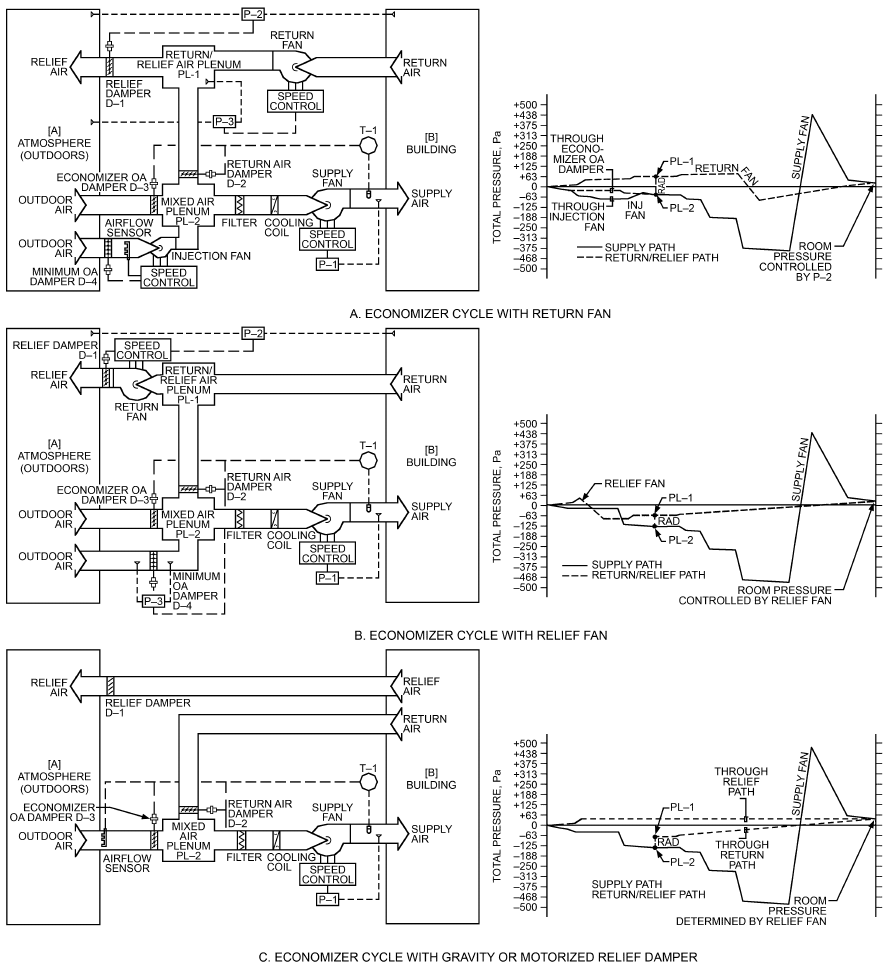

*Fig. 24 Economizer Duct System Shown*

ASHRAE Guideline 16)

<!-- str. 629 -->

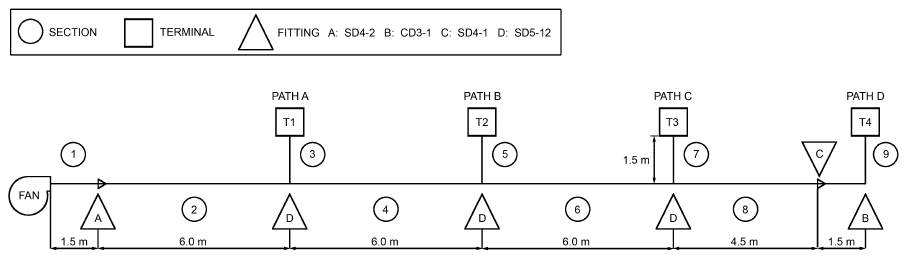

*Fig. 25 System Layout for Example 8*

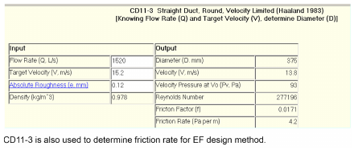

*Fig. 27 Sizing Section 2 for EF and SR Design Examples*

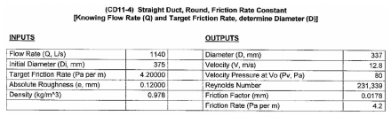

*Fig. 28 EF Design: Sizing Sections 4, 6, and 8 Knowing Design Friction Rate (Section 4 Shown)*

*ASHRAE Duct Fitting Database* (ASHRAE 2016)

balance the system by changing duct sizes and adjusting airflow rates.

Minimum particulate transport velocity for the chipping and grinding table ducts (sections 1 and 5, Figure 30) is 20 m/s. For ducts associated with the grinder wheels (sections 2, 3, 4, and 5), minimum duct velocity is 23 m/s. Ductwork is galvanized steel, with absolute roughness of 0.09 mm. Use sizes for which spiral duct is available (80, 100, 125, 140, 150, 160, 180, 200, 224, 250, 280, 300, 315, 355, 400, 450, 500, At 560, 600, 630, 710, 800, 900, 1000, 1120, 1250, 1300, 1400, 1500, tion o 1600, 1800, 2000, 2100, 2200, 2300, 2400, and 2500 mm).

when The building is one story, and the design wind velocity is 9 m/s. For and fa the stack, use design J shown in Figure 2 in Chapter 46 of the 2019 ter). T 900 L/s flow in section 1, 130 Pa imbalance remains at the juncf sections 1 and 4. By trial-and-error solution, balance is attained the flow in section 1 is 860 L/s. The duct between the collector n inlet is 355 mm round to match the fan inlet (340 mm diameo minimize downwash, the stack discharge velocity must exceed

*ASHRAE Handbook—HVAC Applications* for complete rain protection;

13.5 m/s, 1.5 times the design wind velocity (9 m/s) as stated in the stack height, determined by calculations from Chapter 46, is 4.9 m proble above the roof. This height is based on minimized stack downwash;

discha therefore, the stack discharge velocity must exceed 1.5 times the design

Ta wind velocity.

duct f **Solution:** The following table summarizes initial duct sizes and trans- and (1 port velocities for contaminated ducts upstream of the collector. essary The 22.8 m/s velocity in sections 2 and 3 is acceptable because the from t transport velocity is not significantly lower than 23 m/s. For the next grade available duct size (160 mm diameter), the duct velocity is 28.8 m/s, is 199 significantly higher than 23 m/s.

Design calculations up through the junction after sections 1 and 4 are where summarized as follows:

1440 For (initial) design 1, the imbalance between section 1 and section 2 the fa (or 3) is 383 Pa, with section 1 requiring additional resistance. Decreas-H ing section 1 duct diameter by manufactured spiral duct sizes results in calcul the least imbalance, 88 Pa, when the duct diameter is 200 mm (design m definition. Therefore, the stack is 355 mm round, and the stack rge velocity is 14.5 m/s.

ble 19 summarizes the system losses by sections. The straight riction factor and pressure loss were calculated by Equations (18)

9). Table 20 lists fitting loss coefficients and input parameters necto determine the loss coefficients. The fitting loss coefficients are he *ASHRAE Duct Fitting Database*. Figure 31 shows a pressure line of the system. Fan total pressure, calculated by Equation (15), 2 Pa. To calculate the fan static pressure, use Equation (17):

- P<sub>s</sub> = 1992 – 192 = 1800 Pa 192 Pa is the fan outlet velocity pressure. The fan airflow rate is L/s, and its outlet area is 0.081 m<sup>3</sup> (260 by 310 mm). Therefore, n outlet velocity is 17.9 m/s.

ood suction for the chipping and grinding table hood is 560 Pa, ated by Equation (5) from Chapter 33 of the 2019 ASHRAE Hand-

> book—HVAC Applications [P<sub>s,h</sub> = (1 + 0.25)(451) = 560 Pa, where 0.25

2). Because section 1 requires additional resistance, estimate the new airflow rate using Equation (42): is hoo few di Q<sub>c,1</sub> = 850(850/762)<sup>0.5</sup> = 900 L/s each g d entry loss coefficient C<sub>o</sub>, and 451 is duct velocity pressure P<sub>v</sub> a ameters downstream from the hood]. Similarly, hood suction for rinder wheel is 170 Pa

<!-- str. 630 -->

**Table 14 Example 8, Equal Friction Design**

| 1 | 2 | 3 | 4 | 5 | 6 | 7 | 8 | 9 | 10 | 11 |
|---|---|---|---|---|---|---|---|---|---|---|
|  |  | Fitting<br>Source<br>Drawings* | ASHRAE<br>Fitting<br>Code<br>Source<br>DFDB | Air<br>Quantity, L/s<br>Source<br>Drawing | Duct Size, mm<br>Source<br>DFDB | Velocity, m/s<br>Source<br>DFDB | Duct<br>Length, m<br>Source<br>Drawing | Velocity<br>Pressure p<sub>v</sub>, Pa<br>Source<br>DFDB | Loss<br>Coefficient C<br>Source<br>DFDB | Total<br>Pressure<br>Loss, Pa<br>Source Σ |
| Fan | 1 | Duct, Rectangular (Fan Outlet) | CR11-1 | 1520 | 450 × 500 | 6.8 | 1.5 | 22 | 0.00 | 1 0 |
| Section Total |  |  |  |  |  |  |  |  |  | 1 |
| 1 | 2 | Duct<br>Transition (H1 = 450 mm, W1 = 500 mm, Do = 375 mm, L = 600 in., Theta1 = 7<sup>o</sup>, Theta2 = 12<sup>o</sup><br>Sized at Maximum Velocity of 15.2 m/s using CD11-3 | CD11-3/CD11-1<br>SD4-2 | 1520 | 375 | 13.8 | 6 | 93 | 0.06 0.06 | 26 6 |
| Section Total |  |  |  |  |  |  |  |  |  | 32 |
| 2 | 4 | Duct<br>Tee, 45° Entry, Main (Dc = 375, Ds = 350, Db = 200) | CD11-1<br>SD5-12 | 1140 | 350 | 11.8 | 6 | 69 | 0.14 0.14 | 21 10 |
| Section Total |  |  |  |  |  |  |  |  |  | 31 |
| 4 | 6 | Duct<br>Tee, 45° Entry, Main (Dc = 350, Ds = 300, Db = 200) | CD11-1<br>SD5-12 | 760 | 300 | 10.8 | 6 | 57 | 0.13 0.13 | 21 7 |
| Section Total |  |  |  |  |  |  |  |  |  | 28 |
| 6 | 8 | Duct<br>Tee,45° Entry, Main (Dc = 300, Ds = 225, Db = 200) | CD11-1<br>SD5-12 | 380 | 225 | 9.6 | 4.5 | 45 | 0.14 0.14 | 18 6 |
| Section Total |  |  |  |  |  |  |  |  |  | 24 |
| 2 | 3 | Duct<br>Tee,45° Entry, Branch (Dc = 375, Ds = 350, Db = 200)<br>VAV Box | CD11-1<br>SD5-12 | 380 | 200 | 12.1 | 1.5 | 72 | 0.58 1.67 2.25 | 11 162 |
| Section Total |  |  |  |  |  |  |  |  |  | 173 |
| 4 | 5 | Duct<br>Tee,45° Entry, Branch (Dc = 350, Ds = 300, Db = 200)<br>VAV Box | CD11-1<br>SD5-12 | 380 | 200 | 12.1 | 1.5 | 72 | 0.38 1.67 2.05 | 11 148 |
| Section Total |  |  |  |  |  |  |  |  |  | 159 |
| 6 | 7 | Duct<br>Tee,45° Entry, Branch (Dc = 300, Ds = 225, Db = 200)<br>VAV Box | CD11-1<br>SD5-12 | 380 | 200 | 12.1 | 1.5 | 72 | 0.29 1.67 1.96 | 11 141 |
| Section Total |  |  |  |  |  |  |  |  |  | 152 |
| 8 | 9 | Duct<br>Elbow, Die Stamped, r/D = 1.5<br>Transition (D1 = 225 mm, Do = 200 mm, L = 300 mm, Theta = <sub>o</sub> 5 )<br>VAV Box | CD11-1<br>CD3-1<br>SD4-1 | 380 | 200 | 12.1 | 3 | 72 | 0.11 0.04 1.67 1.82 | 22 131 |
| Section Total |  |  |  |  |  |  |  |  |  | 153 |

*Symbols in column 3 (D<sub>c</sub>, D<sub>s</sub>, etc.) are input associated with subject fitting. Symbols are shown on drawings below DFDB input/output for each fitting.

| Source | Source | Source | Source | Source | Source | Source | Source | Source |
|---|---|---|---|---|---|---|---|---|
| Drawings*<br>Duct, Rectangular (Fan Outlet) | DFDB<br>CR11-1 | Drawing 1520 | DFDB 450 × 500 | DFDB 6.8 | Drawing 1.5 | DFDB | DFDB | Σ 1 |
| al<br>Duct<br>Transition (H1 = 450 mm, W1 = 500 mm, Do = 375 mm, L = 600 in., Theta1 = 7<sup>o</sup>, Theta2 = 12<sup>o</sup> | CD11-3/CD11-1<br>SD4-2 | 1520 | 375 | 13.8 | 6 | 22 | 0.00 0.06 | 0 1 26 |
| Sized at Maximum Velocity of 15.2 m/s using CD11-3 al<br>Duct<br>Tee, 45° Entry, Main (Dc = 375, Ds = 350, Db = 200) | CD11-1<br>SD5-12 | 1140 | 350 | 11.8 | 6 | 93 | 0.06 0.14 | 6 32 21 |
| al<br>Duct<br>Tee, 45° Entry, Main (Dc = 350, Ds = 300, Db = 200) | CD11-1<br>SD5-12 | 760 | 300 | 10.8 | 6 | 69 | 0.14 0.13 | 10 31 21 |
| al<br>Duct<br>Tee,45° Entry, Main (Dc = 300, Ds = 225, Db = 200) | CD11-1<br>SD5-12 | 380 | 225 | 9.6 | 4.5 | 57 | 0.13 0.14 | 7 28 18 |
| al<br>Duct<br>Tee,45° Entry, Branch (Dc = 375, Ds = 350, Db = 200)<br>VAV Box | CD11-1<br>SD5-12 | 380 | 200 | 12.1 | 1.5 | 45 | 0.14 0.58 1.67 | 6 24 11 |
| al<br>Duct<br>Tee,45° Entry, Branch (Dc = 350, Ds = 300, Db = 200)<br>VAV Box | CD11-1<br>SD5-12 | 380 | 200 | 12.1 | 1.5 | 72 | 2.25 0.38 1.67 | 162 173 11 |
| al<br>Duct<br>Tee,45° Entry, Branch (Dc = 300, Ds = 225, Db = 200)<br>VAV Box | CD11-1<br>SD5-12 | 380 | 200 | 12.1 | 1.5 | 72 | 2.05 0.29 1.67 | 148 159 11 |
| al<br>Duct<br>Elbow, Die Stamped, r/D = 1.5<br>Transition (D1 = 225 mm, Do = 200 mm, L = 300 mm, Theta = 5<sup>o</sup>)<br>VAV Box | CD11-1<br>CD3-1<br>SD4-1 | 380 | 200 | 12.1 | 3 | 72 | 1.96 0.11 0.04 1.67 | 141 152 22 |

72 1.82 131

**al 153**

<!-- str. 631 -->

**Table 15 Example 8, Static Regain Design**

| 1 | 2 | 3 | 4 | 5 | 6 | 7 | 8 | 9 | 10 | 11 | 12 |
|---|---|---|---|---|---|---|---|---|---|---|---|
|  |  | Fitting<br>Source<br>Drawings<sup>a</sup> | ASHRAE<br>Fitting<br>Code<br>Source<br>DFDB | Air<br>Quantity, L/s<br>Source<br>Drawing | Duct<br>Size, mm<br>Source<br>DFDB | Velocity, m/s<br>Source<br>DFDB | Duct<br>Length, m<br>Source<br>Drawing | Velocity<br>Pressure p<sub>v</sub>, Pa<br>Source<br>DFDB | Loss<br>Coefficient<br>C<br>Source<br>DFDB | Total<br>Pressure<br>Loss, Pa<br>Source Σ | Regain, Pa, [p<sub>v1</sub> – p<sub>v3</sub>] – Δp<sub>t</sub><br>Source<br>Static Regain Calculation |
| Fan | 1 | Duct, Rectangular (Fan Outlet) | CR11-1 | 1520 | 450 × 500 | 6.8 | 1.5 | 22 | 0.00 | 1 0 |  |
| Section Total |  |  |  |  |  |  |  |  |  | 1 |  |
| 1 | 2 | Duct<br>Transition (H1 = 450 mm, W1 = 500 mm, Do = 375 mm, L = 600 in., Theta1 = 7°, Theta2 = 12°<br>Sized at Maximum Velocity of 15.2 m/s using CD11-3 | CD11-1<br>SD4-2 | 1520 | 375 | 13.8 | 6 | 93 | 0.06 0.06 | 26 6 |  |
| Section Total |  |  |  |  |  |  |  |  |  | 32 |  |
| 2 | 4a | Duct<br>Tee, 45° Entry, Main (Dc = 375, Ds = 375, Db = 200) | CD11-1<br>SD5-12 | 1140 | 375 | 10.3 | 6 | 52 | 0.13 0.13 | 15 7 | (93 – 52) – 22 = 19 |
| Section Total |  |  |  |  |  |  |  |  |  | 22 | 19 |
| 2 | 4b<sup>b</sup> | Duct<br>Tee, 45° Entry, Main (Dc = 375, Ds = 350, Db = 200) | CD11-1<br>SD5-12 | 1140 | 350 | 11.8 | 6 | 69 | 0.14 0.14 | 21 10 | (93 – 69) – 31 = –7 |
| Section Total |  |  |  |  |  |  |  |  |  | 31 | –7 |
| 4 | 6a | Duct<br>Tee, 45° Entry, Main (Dc = 350, Ds = 350, Db = 200) | CD11-1<br>SD5-12 | 760 | 350 | 7.9 | 6 | 31 | 0.14 0.14 | 10 4 | (69 – 31) – 14 = 24 |
| Section Total |  |  |  |  |  |  |  |  |  | 14 | 24 |
| 4 | 6b<sup>b</sup> | Duct<br>Tee, 45° Entry, Main (Dc = 350, Ds = 325, Db = 200) | CD11-1<br>SD5-12 | 760 | 325 | 9.2 | 6 | 41 | 0.15 0.15 | 14 6 | (69 – 41) – 20 = 8 |
| Section Total |  |  |  |  |  |  |  |  |  | 20 | 8 |
| 4 | 6c | Duct<br>Tee, 45° Entry, Main (Dc = 350, Ds = 300, Db = 200) | CD11-1<br>SD5-12 | 760 | 300 | 10.8 | 6 | 57 | 0.13 0.13 | 21 7 | (69 – 57) – 28 = –16 |
| Section Total |  |  |  |  |  |  |  |  |  | 28 | –16 |
| 6 | 8a | Duct<br>Tee, 45° Entry, Main (Dc = 325, Ds = 325, Db = 200) | CD11-1<br>SD5-12 | 380 | 325 | 4.6 | 4.5 | 10 | 0.20 0.20 | 3 2 | (41 – 10) – 5 = 26 |
| Section Total |  |  |  |  |  |  |  |  |  | 5 | 26 |

<sup>a</sup>Symbols in column 3 (D<sub>c</sub>, D<sub>s</sub>, etc.) are input associated with subject fitting. Symbols are shown on drawings below DFDB input/output for each fitting. b

| Source | Source | Source | Source | Source | Source | Source | Source | Source | Source |
|---|---|---|---|---|---|---|---|---|---|
| Drawings<sup>a</sup><br>Duct, Rectangular (Fan Outlet) | DFDB<br>CR11-1 | Drawing 1520 | DFDB 450 × 500 | DFDB 6.8 | Drawing 1.5 | DFDB | DFDB | Σ 1 | Static Regain Calculation |
| otal<br>Duct<br>Transition (H1 = 450 mm, W1 = 500 mm, Do = 375 mm, L = 600 in., Theta1 = 7°, Theta2 = 12° | CD11-1<br>SD4-2 | 1520 | 375 | 13.8 | 6 | 22 | 0.00 0.06 | 0 1 26 |  |
| Sized at Maximum Velocity of 15.2 m/s using CD11-3 otal<br>Duct<br>Tee, 45° Entry, Main (Dc = 375, Ds = 375, Db = 200) | CD11-1<br>SD5-12 | 1140 | 375 | 10.3 | 6 | 93 | 0.06 0.13 | 6 32 15 |  |
| otal<br>Duct<br>Tee, 45° Entry, Main (Dc = 375, Ds = 350, Db = 200) | CD11-1<br>SD5-12 | 1140 | 350 | 11.8 | 6 | 52 | 0.13 0.14 | 7 22 21 | (93 – 52) – 22 = 19 19 |
| otal<br>Duct<br>Tee, 45° Entry, Main (Dc = 350, Ds = 350, Db = 200) | CD11-1<br>SD5-12 | 760 | 350 | 7.9 | 6 | 69 | 0.14 0.14 | 10 31 10 | (93 – 69) – 31 = –7 –7 |
| otal<br>Duct<br>Tee, 45° Entry, Main (Dc = 350, Ds = 325, Db = 200) | CD11-1<br>SD5-12 | 760 | 325 | 9.2 | 6 | 31 | 0.14 0.15 | 4 14 14 | (69 – 31) – 14 = 24 24 |
| otal<br>Duct<br>Tee, 45° Entry, Main (Dc = 350, Ds = 300, Db = 200) | CD11-1<br>SD5-12 | 760 | 300 | 10.8 | 6 | 41 | 0.15 0.13 | 6 20 21 | (69 – 41) – 20 = 8 8 |
| otal<br>Duct<br>Tee, 45° Entry, Main (Dc = 325, Ds = 325, Db = 200) | CD11-1<br>SD5-12 | 380 | 325 | 4.6 | 4.5 | 57 | 0.13 0.20 | 7 28 3 | (69 – 57) – 28 = –16 –16 |

10 0.20 2 (41 – 10) – 5 = 26

**otal 5** 26

Indicates size selected.

<!-- str. 632 -->

**Table 15 Example 8, Static Regain Design (Continued)**

| 1 | 2 | 3 | 4 | 5 | 6 | 7 | 8 | 9 | 10 | 11 | 12 |
|---|---|---|---|---|---|---|---|---|---|---|---|
|  |  | Fitting<br>Source<br>Drawings<sup>a</sup> | ASHRAE<br>Fitting<br>Code<br>Source<br>DFDB | Air<br>Quantity, L/s<br>Source<br>Drawing | Duct<br>Size, mm<br>Source<br>DFDB | Velocity, m/s<br>Source<br>DFDB | Duct<br>Length, m<br>Source<br>Drawing | Velocity<br>Pressure p<sub>v</sub>, Pa<br>Source<br>DFDB | Loss<br>Coefficient<br>C<br>Source<br>DFDB | Total<br>Pressure<br>Loss, Pa<br>Source Σ | Regain, Pa, [p<sub>v1</sub> – p<sub>v3</sub>] – Δp<sub>t</sub><br>Source<br>Static Regain Calculation |
| 6 | 8b | Duct<br>Tee, 45° Entry, Main (Dc = 325, Ds = 300, Db = 200) | CD11-1<br>SD5-12 | 380 | 300 | 5.4 | 4.5 | 14 | 0.17 0.17 | 4 2 | (41 – 14) –6 = 21 |
| Section Total |  |  |  |  |  |  |  |  |  | 6 | 21 |
| 6 | 8c | Duct<br>Tee, 45° Entry, Main (Dc = 325, Ds = 275, Db = 200) | CD11-1<br>SD5-12 | 380 | 275 | 6.4 | 4.5 | 20 | 0.16 0.16 | 7 3 | (41 – 20) – 10 = 11 |
| Section Total |  |  |  |  |  |  |  |  |  | 10 | 11 |
| 6 | 8d<sup>b</sup> | Duct<br>Tee, 45° Entry, Main (Dc = 325, Ds = 250, Db = 200) | CD11-1<br>SD5-12 | 380 | 250 | 7.7 | 4.5 | 29 | 0.14 0.14 | 11 4 | (41 – 29) – 15 = –3 |
| Section Total |  |  |  |  |  |  |  |  |  | 15 | –3 |
| 2 | 3 | Duct<br>Tee, 45° Entry, Main (Dc = 375, Ds = 350, Db = 200)<br>VAV Box | CD11-1<br>SD5-12 | 380 | 200 | 12.1 | 1.5 | 72 | 0.58 1.67 2.25 | 11 162 |  |
| Section Total |  |  |  |  |  |  |  |  |  | 173 |  |
| 4 | 5 | Duct<br>Tee, 45° Entry, Branch (Dc = 350, Ds = 325, Db = 200)<br>VAV Box | CD11-1<br>SD5-12 | 380 | 200 | 12.1 | 1.5 | 72 | 0.38 1.67 2.05 | 11 148 |  |
| Section Total |  |  |  |  |  |  |  |  |  | 159 |  |
| 6 | 7 | Duct<br>Tee, 45° Entry, Branch (Dc = 325, Ds = 250, Db = 200)<br>VAV Box | CD11-1<br>SD5-12 | 380 | 200 | 12.1 | 1.5 | 72 | 0.23 1.67 1.9 | 11 137 |  |
| Section Total |  |  |  |  |  |  |  |  |  | 148 |  |
| 8 | 9 | Duct<br>Elbow, Die Stamped, r/D = 1.5<br>Transition (D1 = 250 mm, Do = 200mm, L = 300 mm, Theta = 10°)<br>VAV Box | CD11-1<br>CD3-1<br>SD4-1 | 380 | 200 | 12.1 | 3 | 72 | 0.11 0.05 1.67 1.83 | 22 132 |  |
| Section Total |  |  |  |  |  |  |  |  |  | 154 |  |

<sup>a</sup>Symbols in column 3 (D<sub>c</sub>, D<sub>s</sub>, etc.) are input associated with subject fitting. Symbols are shown on drawings below DFDB input/output for each fitting. b

| Source | Source | Source | Source | Source | Source | Source | Source | Source | Source |
|---|---|---|---|---|---|---|---|---|---|
| Drawings<sup>a</sup><br>Duct<br>Tee, 45° Entry, Main (Dc = 325, Ds = 300, Db = 200) | DFDB<br>CD11-1<br>SD5-12 | Drawing 380 | DFDB 300 | DFDB 5.4 | Drawing 4.5 | DFDB | DFDB 0.17 | Σ 4 | Static Regain Calculation |
| otal<br>Duct<br>Tee, 45° Entry, Main (Dc = 325, Ds = 275, Db = 200) | CD11-1<br>SD5-12 | 380 | 275 | 6.4 | 4.5 | 14 | 0.17 0.16 | 2 6 7 | (41 – 14) –6 = 21 21 |
| otal<br>Duct<br>Tee, 45° Entry, Main (Dc = 325, Ds = 250, Db = 200) | CD11-1<br>SD5-12 | 380 | 250 | 7.7 | 4.5 | 20 | 0.16 0.14 | 3 10 11 | (41 – 20) – 10 = 11 11 |
| otal<br>Duct<br>Tee, 45° Entry, Main (Dc = 375, Ds = 350, Db = 200)<br>VAV Box | CD11-1<br>SD5-12 | 380 | 200 | 12.1 | 1.5 | 29 | 0.14 0.58 1.67 | 4 15 11 | (41 – 29) – 15 = –3 –3 |
| otal<br>Duct<br>Tee, 45° Entry, Branch (Dc = 350, Ds = 325, Db = 200)<br>VAV Box | CD11-1<br>SD5-12 | 380 | 200 | 12.1 | 1.5 | 72 | 2.25 0.38 1.67 | 162 173 11 |  |
| otal<br>Duct<br>Tee, 45° Entry, Branch (Dc = 325, Ds = 250, Db = 200)<br>VAV Box | CD11-1<br>SD5-12 | 380 | 200 | 12.1 | 1.5 | 72 | 2.05 0.23 1.67 | 148 159 11 |  |
| otal<br>Duct<br>Elbow, Die Stamped, r/D = 1.5<br>Transition (D1 = 250 mm, Do = 200mm, L = 300 mm, Theta = 10°)<br>VAV Box | CD11-1<br>CD3-1<br>SD4-1 | 380 | 200 | 12.1 | 3 | 72 | 1.9 0.11 0.05 1.67 | 137 148 22 |  |

72 1.83 132

**otal 154**

Indicates size selected.

<!-- str. 633 -->

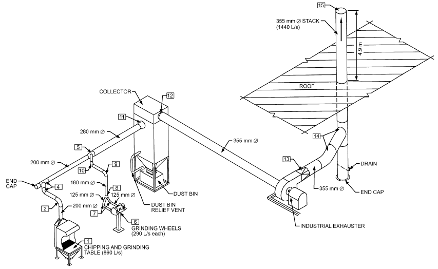

*Fig. 29 Metalworking Exhaust System for Example 9*

**Table 16 Static Regain Iteration Process for Section 4**

| Iteration | Calculation | Duct Size, mm | (p<sub>v1</sub> – p<sub>v2</sub>) –Δp<sub>i</sub> | Remarks |
|---|---|---|---|---|
| 1 | 4a | 375 | 19 |  |
| 2 | 4b | 350 | –7 | Solution |

**Table 17 Summary of System Duct Sizes**

| Section | Size, mm<br>EF | Size, mm<br>SR | Remarks |
|---|---|---|---|
| 1 | 450 × 500 | 450 × 500 | Fan outlet |
| 2 | 375 | 375 | Initial section |
| 4 | 350 | 350 |  |
| 6 | 300 | 325 | Sections affected by design method |
| 8 | 225 | 250 |  |
| 3 | 200 | 200 | Terminal runout |
| 5 | 200 | 200 | Terminal runout |
| 7 | 200 | 200 | Terminal runout |
| 9 | 200 | 200 | Terminal runout |

**Table 18 System Unbalance**

| Path | Equal Friction<br>P<sub>t</sub>, Pa | Equal Friction<br>Unbalance | Static Regain<br>P<sub>t</sub>, Pa | Static Regain<br>Unbalance |
|---|---|---|---|---|
| A | 206 | 23% | 206 | 19% |
| B | 223 | 17% | 223 | 12% |
| C | 244 | 9% | 232 | 8% |
| D | 269 | 0% | 252 | 0% |

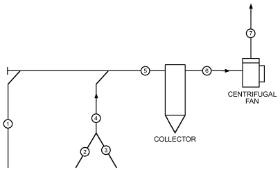

*Fig. 30 System Schematic with Section Numbers for Example 9*

| Duct Section | Design Airflow, L/s | Transport Velocity, m/s | Duct Diameter, mm | Duct Velocity, m/s |
|---|---|---|---|---|
| 1 | 850 | 20 | 224 | 21.6 |
| 2, 3 | 290 each | 23 | 125 | 23.6 |
| 4 | 580 | 23 | 180 | 22.8 |
| 5 | 1430 | 23 | 180 | 23.2 |

**Design Imbalance,**

**No. D<sub>1</sub>, mm** ∆ **p<sub>1</sub>, Pa** ∆ **p<sub>2+4</sub>, Pa** ∆**p<sub>1</sub> –** ∆ **p<sub>2+4</sub>** 1 224 411 794 –383 2 200 762 850 –88 3 180 1320 712 +609 Q<sub>1</sub> = 850 L/s Q<sub>3</sub> = 290 L/s; D<sub>3</sub> = 125 mm dia. Q<sub>2</sub> = 290 L/s; D<sub>2</sub> = 125 mm dia. Q<sub>4</sub> = 850 L/s; D<sub>4</sub> = 180 mm dia.

| Design No. D<sub>1</sub>, mm | ∆ p<sub>1</sub>, Pa | Imbalance, ∆ p<sub>2+4</sub>, Pa ∆p<sub>1</sub> – ∆ p<sub>2+4</sub> |
|---|---|---|
| 1 224 | 411 | 794 –383 |
| 2 200 | 762 | 850 –88 |
| 3 180 | 1320 | 712 +609 |
| Q<sub>1</sub> = 850 L/s |  | Q<sub>3</sub> = 290 L/s; D<sub>3</sub> = 125 mm dia. |
| Q<sub>2</sub> = 290 L/s; D<sub>2</sub> = 125 mm dia. |  | Q<sub>4</sub> = 850 L/s; D<sub>4</sub> = 180 mm dia. |

<!-- str. 634 -->

**Table 19 Total Pressure Loss Calculations by Sections for Example 9**

| Section<sup>a</sup> Duct Element<br>Duct | Section<sup>a</sup> Duct Element | Airflow, L/s | Duct Size, mm φ | Velocity, m/s | Velocity Pressure, Pa | Duct Length,<sup>b</sup> m | Summary of Fitting Loss Coefficients<sup>c</sup> | Duct Pressure Loss, Pa/m<sup>d</sup> | Total Pressure Loss, Pa | Section Pressure Loss, Pa |
|---|---|---|---|---|---|---|---|---|---|---|
| 1 | Duct | 860 | 200 | 27.4 | — | 7.32 | — | 40 | 293 |  |
|  | Fittings | 860 | — | 27.4 | 451 | — | 1.09 | — | 492 | 785 |
| 2, 3 | Duct | 290 | 125 | 23.6 | — | 2.7 | — | 54 | 146 |  |
|  | Fittings | 290 | — | 23.6 | 336 | — | 1.06 | — | 356 | 502 |
| 4 | Duct | 580 | 180 | 22.8 | — | 3.84 | — | 32 | 123 |  |
|  | Fittings | 580 | — | 22.8 | 313 | — | 0.51 | — | 160 | 283 |
| 5 | Duct | 1440 | 280 | 23.4 | — | 2.7 | — | 18.5 | 50 |  |
|  | Fittings | 1440 | — | 23.4 | 329 | — | 0.23 | — | 76 | 126 |
| — | Collector,<sup>e</sup>fabric | 1440 | — | — | — | — | — | — | 750 | 750 |
| 6 | Duct | 1440 | 355 | 14.5 | — | 3.0 | — | 6 | 18 |  |
|  | Fittings | 1440 | — | 14.5 | 127 | — | 0.03 | — | 4 | 22 |
| 7 | Duct | 1440 | 355 | 14.5 | — | 14.0 | — | 6 | 84 |  |
|  | Fittings | 1440 | — | 14.5 | 127 | — | 1.77 | — | 225 | 309 |

<sup>a</sup>See Figure 29. <sup>c</sup>See Table 20. <sup>e</sup>Collector manufacturers set fabric bag cleaning mechanism to actuate at a pressure dif-

<sup>b</sup>Duct lengths are to fitting center- <sup>d</sup>Duct pressure based on a 0.09 mm abso- ference of 750 Pa between inlet and outlet plenums. Pressure difference across clean lines. lute roughness factor. media is approximately 400 Pa.

**Table 20 Loss Coefficient Summary by Sections for Example 9**

| Section Number<br>Duct | Section Number Loss Coefficient<br>Fitting ASHRAE Type of Fitting Fitting No.<sup>a</sup> Parameters | Loss Coefficient |
|---|---|---|
| 1 | 1 Hood<sup>b</sup> — Hood face area: 0.9 by 1.2 m 2 Elbow CD3-10 90°, 7 gore, r/D = 2.5 4 Capped wye (45°), with 45° elbow ED5-6 A<sub>b</sub>/A<sub>c</sub> = 1 5 Wye (30°), main ED5-1 Q<sub>s</sub>/Q<sub>c</sub> = 0.60, A<sub>s</sub>/A<sub>c</sub> = 0.510, A<sub>b</sub>/A<sub>c</sub> = 0.413<br>Summation of Section 1 loss coefficients … | 0.25 0.11 0.61 (C<sub>b</sub>) 0.12 (C<sub>s</sub>) 1.09 |
| 2,3 | 6 Hood<sup>c</sup> — Type hood: For double wheels, dia. = 560 mm each, wheel width = 100 mm each; type takeoff: tapered 7 Elbow CD3-12 90°, 3 gore, r/D = 1.5 8 Symmetrical wye (60°) ED5-9 Q<sub>b</sub>/Q<sub>c</sub> = 0.5, A<sub>b1</sub>/A<sub>c</sub> = 0.482, A<sub>b2</sub>/A<sub>c</sub> = 0.482<br>Summation of Sections 2 and 3 loss coefficients … | 0.40 0.34 0.32 (C<sub>b</sub>) 1.06 |
| 4 | 9 Elbow CD3-10 90°, 7 gore, r/D = 2.5 10 Elbow CD3-13 60°, 3 gore, r/D = 1.5 5 Wye (30°), branch ED5-1 Q<sub>b</sub>/Q<sub>c</sub> = 0.40, A<sub>s</sub>/A<sub>c</sub> = 0.510, A<sub>b</sub>/A<sub>c</sub> = 0.413<br>Summation of Section 4 loss coefficients … | 0.11 0.19 0.21 (C<sub>b</sub>) 0.51 |
| 5 | 11 Exit, conical diffuser to collector ED2-1 L = 600 mm, L/D<sub>o</sub> = 2.14, A<sub>1</sub>/A<sub>o</sub> ≈ 21<br>Summation of Section 5 loss coefficients … | 0.23 0.23 |
| 6 | 12 Entry, bellmouth from collector ER2-1 r/D<sub>1</sub> = 0.21, r = 75 mm, C<sub>o</sub> = 4.69<br>Summation of Section 6 loss coefficients … | 0.03 (C<sub>1</sub>) 0.03 |
| 7 | 13 Diffuser, fan outlet<sup>d</sup> SD4-2 Fan outlet size: 260 by 310 mm; L = 460 mm 14 Capped wye (45°), with 45° elbow ED5-6 A<sub>b</sub>/A<sub>c</sub> = 1 15 Stackhead SD2-6 D<sub>e</sub>/D = 1<br>Summation of Section 7 loss coefficients … | 0.16 0.61 (C<sub>b</sub>) 1.00 1.77 |

<sup>a</sup>From *ASHRAE Duct Fitting Database*. <sup>c</sup>From Industrial Ventilation (ACGIH 2016, Figure VS-80-11).

<sup>b</sup>From Industrial Ventilation (ACGIH 2016, Figure VS-80-19). <sup>d</sup>Fan specified: Industrial exhauster for granular materials: 530 mm wheel diameter, 340 mm inlet diameter, 260 by 310 mm outlet, 6 kW motor.

> P<sub>2,3</sub> = (1 + 0.4)(336) = 470 Pa

where 0.4 is the hood entry loss coefficient, and 336 Pa is the duct velocity pressure.

## REFERENCES

ASHRAE members can access ASHRAE Journal articles and ASHRAE research project final reports at technologyportal .ashrae.org. Articles and reports are also available for purchase by nonmembers in the online ASHRAE Bookstore at www.ashrae.org /bookstore.

Abushakra, B., I.S. Walker, and M.H. Sherman. 2004. Compression effects on pressure loss in flexible HVAC ducts. *International Journal of* HVAC&R Research (now *Science and Technology for the Built Environ-* ment) 10(3):275-289.

ACCA. 2014. *Manual D—Residential duct systems*. Air Conditioning Contractors of America, Washington, DC.

ACGIH. 2016. *Industrial ventilation: A manual of recommended practice* for design, 29th ed. American Conference of Governmental Industrial Hygienists, Lansing, MI.

AHRI. 2008. Procedure for estimating occupied space sound levels in the application of air terminals and air outlets. Standard 885-2008 with Addendum 1. Air-Conditioning, Heating, and Refrigeration Institute, Arlington, VA.

AMCA. 2011a. Fans and systems. AMCA Publication 201-02 (R2011). Air Movement and Control Association International, Arlington Heights, IL.

AMCA. 2011b. Field performance measurement of fan systems. AMCA Publication 203-90 (R2011). Air Movement and Control Association International, Arlington Heights, IL.

AMCA. 2016. Laboratory methods for testing fans for certified aerodynamic performance rating. ANSI/AMCA Standard 210-16. Also ANSI/ASHRAE/AMCA Standard 51-16.

<!-- str. 635 -->

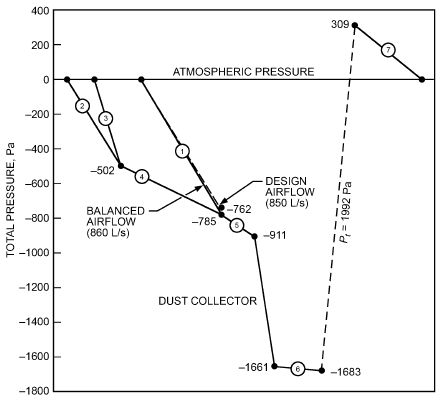

*Fig. 31 Total Pressure Grade Line for Example 9*

AMCA. 2012. Laboratory methods of testing dampers for rating. ANSI/AMCA Standard 500-D-12. Air Movement and Control Association International, Arlington Heights, IL.

AMCA. 2015. Laboratory method of testing louvers for rating. ANSI/AMCA Standard 500-L-12 (R2015). Air Movement and Control Association International, Arlington Heights, IL.

AMCA. 2013. Certified ratings program—Product rating manual for air control. AMCA Publication 511-10 (Rev. 2013). Air Movement and Control Association International, Arlington Heights, IL.

ASHRAE. 2016. *ASHRAE duct fitting database,* v. 6.00.05.10.

ASHRAE. 2019. Energy standard for buildings except low-rise residential buildings. ANSI/ASHRAE/IES Standard 90.1-2019.

ASHRAE. 2018. Energy-efficient design of low-rise residential buildings.

ANSI/ASHRAE Standard 90.2-2018.

ASHRAE. 2018. Energy conservation in existing buildings. ANSI/ASHRAE/IES Standard 100-2018.

ASHRAE. 2008. Measurement, testing, adjusting and balancing of building heating, ventilation and air-conditioning systems. ANSI/ASHRAE Standard 111-2008 (RA 2017).

ASHRAE. 2016. Method of testing HVAC air ducts and fittings. ANSI/ASHRAE/SMACNA Standard 126-2016.

ASHRAE. 2016. Methods of testing air terminal units. ANSI/ASHRAE Standard 130-2016.

ASHRAE. 2018. Standard methods for air velocity and airflow measurement. ANSI/ASHRAE Standard 41.2-2018.

ASHRAE. 2018. Method of test to determine leakage of operating HVAC air distribution systems. ANSI/ASHRAE Standard 215-2018.

ASHRAE. 2018. Selecting outdoor, return, and relief dampers for air-side economizer systems. ASHRAE Guideline 16-2018.

Behls, H.F. 1971. Computerized calculation of duct friction. Building Science Series 39, p. 363. National Institute of Standards and Technology, Gaithersburg, MD.

Brown, R.B. 1973. Experimental determinations of fan system effect factors. In *Fans and systems*, ASHRAE Symposium Bulletin LO-73-1, Louisville, KY (June).

CEN. 1998. Ventilation for buildings—Sheet metal air ducts and fittings with rectangular cross-section—Dimensions. European Standard EN 1505-1998. European Committee for Standardization, Brussels.

CEN. 2007. Ventilation for buildings—Sheet metal air ducts and fittings with circular cross-section—Dimensions. European Standard EN 1506-2007. European Committee for Standardization, Brussels.

CEN. 2004. Ventilation for buildings—Ductwork—Measurement of ductwork surface area. European Standard EN 14239-2004. European Committee for Standardization, Brussels.

Clarke, M.S., J.T. Barnhart, F.J. Bubsey, and E. Neitzel. 1978. The effects of system connections on fan performance. ASHRAE Transactions 84(2): 227-263.

Colebrook, C.F. 1938-1939. Turbulent flow in pipes, with particular reference to the transition region between the smooth and rough pipe laws. *Journal of the Institution of Civil Engineers* 11:133.

Culp, C.H. 2011. HVAC flexible duct pressure loss measurements. ASHRAE Research Project RP-1333, Final Report.

Farquhar, H.F. 1973. System effect values for fans. In *Fans and systems*, ASHRAE Symposium Bulletin LO-73-1, Louisville, KY (June).

Griggs, E.I., and F. Khodabakhsh-Sharifabad. 1992. Flow characteristics in rectangular ducts. ASHRAE Transactions 98(1):116-127.

Griggs, E.I., W.B. Swim, and G.H. Henderson. 1987. Resistance to flow of round galvanized ducts. ASHRAE Transactions 93(1):3-16.

Heyt, J.W., and M.J. Diaz. 1975. Pressure drop in flat-oval spiral air duct.

ASHRAE Transactions 81(2):221-232.

Huebscher, R.G. 1948. Friction equivalents for round, square and rectangular ducts. ASHVE Transactions 54:101-118.

Hutchinson, F.W. 1953. Friction losses in round aluminum ducts. ASHVE Transactions 59:127-138.

Idelchik, I.E., M.O. Steinberg, G.R. Malyavskaya, and O.G. Martynenko.

1994. *Handbook of hydraulic resistance*, 3rd ed. CRC Press/Begell House, Boca Raton.

Idem, S., and A. Paruchuri. 2018. Determine the absolute roughness of phenolic duct. ASHRAE Research Project RP-1764. Final Report.

Jones, C.D. 1979. *Friction factor and roughness of United Sheet Metal Com-* *pany spiral duct.* United Sheet Metal, Division of United McGill Corp., Westerville, OH (August). Based on data in *Friction loss tests*, United Sheet Metal Company Spiral Duct, Ohio State University Engineering Experiment Station, File T-1011, September 1958.

Klote, J.H., J.A. Milke, P.G. Tumbull, A. Kashef, and M.J. Ferreira. 2012.

*Handbook of smoke control engineering.* ASHRAE.

Kulkarni, D., S. Khaire, and S. Idem. 2009. Pressure loss of corrugated spiral duct. ASHRAE Transactions 115(1).

Madison, R.D., and W.R. Elliot. 1946. Friction charts for gases including correction for temperature, viscosity and pipe roughness. ASHVE Journal (October).

McGill. 1988. Round vs. rectangular duct. Engineering Report 147, United McGill Corp. (contact McGill Airflow Technical Service Department), Westerville, OH.

McGill. 1995. Flat oval vs. rectangular duct. Engineering Report 150, United McGill Corp. (contact McGill Airflow Technical Service Department), Westerville, OH.

Meyer, M.L. 1973. A new concept: The fan system effect factor. In Fans and Systems, ASHRAE Symposium Bulletin LO-73-1, Louisville, KY (June).

Moody, L.F. 1944. Friction factors for pipe flow. ASME Transactions 66:

671.

NFPA. 2008. *Fire protection handbook*, 20th ed. National Fire Protection Association. Quincy, MA.

NFPA. 2018. Installation of air-conditioning and ventilating systems. ANSI/NFPA Standard 90A. National Fire Protection Association, Quincy, MA.

Osborne, W.C. 1966. Fans. Pergamon, London.

Paulauskis, J.A. 2016. Understanding duct rumble. ASHRAE Journal 58(12):40-45.

Schaffer, M.E. 2011. *A practical guide to noise and vibration control for* *HVAC systems (SI)*, 2nd ed. ASHRAE.

Sherman, M., and C. Wray. 2010. Parametric system curves: correlations between fan pressure rise and flow for large commercial buildings. Lawrence Berkeley National Laboratory Report. LBNL-3542E. Lawrence Berkeley National Laboratory, Berkeley, Calif. doi.org/10.2172/983807.

Swim, W.B. 1978. Flow losses in rectangular ducts lined with fiberglass.

ASHRAE Transactions 84(2):216.

Swim, W.B. 1982. Friction factor and roughness for airflow in plastic pipe.

ASHRAE Transactions 88(1):269.

Taylor. S.J., and J. Stein. 2004. Sizing VAV boxes. ASHRAE Journal 46(3):

30-35.

<!-- str. 636 -->

Tsal, R.J., and M.S. Adler. 1987. Evaluation of numerical methods for ductwork and pipeline optimization. ASHRAE Transactions 93(1):17-34.

Tsal, R.J., H.F. Behls, and R. Mangel. 1988. T-method duct design, part I:

Optimization theory; Part II: Calculation procedure and economic analysis. ASHRAE Transactions 94(2):90-111.

Tsal, R.J., H.F. Behls, and R. Mangel. 1990. T-method duct design, part III:

Simulation. ASHRAE Transactions 96(2).

UL. Published annually. *Building materials directory*. Underwriters Laboratories, Northbrook, IL.

UL. Published annually. *Fire resistance directory.* Underwriters Laboratories, Northbrook, IL.

UL. 2013. Fire dampers. ANSI/UL Standard 555, 7th ed. Underwriters Laboratories, Northbrook, IL.

UL. 2014. Smoke dampers. ANSI/UL Standard 555S, 5th ed. Underwriters Laboratories, Northbrook, IL.

Wright, D.K., Jr. 1945. A new friction chart for round ducts. ASHVE Transactions 51:303-316.

## BIBLIOGRAPHY

Abushakra, B., I.S. Walker, and M.H. Sherman. 2002. A study of pressure losses in residential air distribution systems. *Proceedings of the ACEEE* *Summer Study 2002*, American Council for an Energy Efficient Economy, Washington, D.C. LBNL Report 49700. Lawrence Berkeley National Laboratory, CA.

Carrié, F.R., J. Andersson, and P. Wouters. 1999. Improving ductwork—A *time for tighter air distribution systems*. Air Infiltration and Ventilation Centre, Coventry, U.K.

Hyderman, M., S. Taylor, and J. Stein. 2009. *Advanced variable air volume* *VAV systems design guide*, 3rd edition. Pacific Gas and Electric Company.
