# Chapter 22 — Pipe Design

*Izvor: 2021 ASHRAE Handbook — Fundamentals (SI), Chapter 22 (PDF str. 637–675).*

> **Napomena o konverziji:** Tekst je automatski izdvojen iz originalnog PDF-a uz prepoznavanje dve kolone, spojene prelomljene reči i pasuse. Indeksi i eksponenti su označeni sa `<sub>`/`<sup>`, tabele su pretvorene u Markdown tabele (veoma složene tabele su prikazane kao poravnat tekst), a slike su izrezane iz PDF-a u folder `img/`. Složene jednačine (razlomci, sume) mogu biti uprošćeno prikazane. **Pre upotrebe vrednosti u proračunu proveriti u originalnom PDF-u.** Oznake `<!-- str. N -->` pokazuju stranu PDF-a.

## Sadržaj

- [1. FUNDAMENTALS](#1-fundamentals)
- [1.1 CODES AND STANDARDS](#11-codes-and-standards)
- [1.2 DESIGN CONSIDERATIONS](#12-design-considerations)
- [1.3 GENERAL PIPE SYSTEMS](#13-general-pipe-systems)
- [1.4 DESIGN EQUATIONS](#14-design-equations)
- [1.5 SIZING PROCEDURE](#15-sizing-procedure)
- [1.6 PIPE-SUPPORTING ELEMENTS](#16-pipe-supporting-elements)
- [1.7 PIPE EXPANSION AND FLEXIBILITY](#17-pipe-expansion-and-flexibility)
- [1.8 PIPE BENDS AND LOOPS](#18-pipe-bends-and-loops)
- [2. PIPE AND FITTING MATERIALS](#2-pipe-and-fitting-materials)
- [2.1 PIPE](#21-pipe)
- [2.2 FITTINGS](#22-fittings)
- [2.3 JOINING METHODS](#23-joining-methods)
- [2.4 EXPANSION JOINTS AND EXPANSION COMPENSATING DEVICES](#24-expansion-joints-and-expansion-compensating-devices)
- [3. APPLICATIONS](#3-applications)
- [3.1 WATER PIPING](#31-water-piping)
- [3.2 SERVICE WATER PIPING](#32-service-water-piping)
- [3.3 STEAM PIPING](#33-steam-piping)
- [3.4 LOW-PRESSURE STEAM PIPING](#34-low-pressure-steam-piping)
- [3.5 STEAM CONDENSATE SYSTEMS](#35-steam-condensate-systems)
- [3.6 GAS PIPING](#36-gas-piping)
- [3.7 FUEL OIL PIPING](#37-fuel-oil-piping)
- [REFERENCES](#references)
- [BIBLIOGRAPHY](#bibliography)

<!-- str. 637 -->

THIS CHAPTER discusses pipe systems, materials, design, installation, supports, stress calculations, pipe expansion and flexibility, bends and loops, and application of pipe systems commonly used for heating, air conditioning, refrigeration, and service water. When selecting and applying components; applicable local codes, state or provincial codes, and voluntary industry standards (some of which have been adopted by code jurisdictions) must be followed. Further details on specific piping systems can be found in application-specific chapters of the ASHRAE Handbook.

## 1. FUNDAMENTALS

## 1.1 CODES AND STANDARDS

The following organizations in the United States issue codes and standards for piping systems and components:

ASME American Society of Mechanical Engineers

ASTM American Society for Testing and Materials

NFPA National Fire Protection Association

ICC International Code Council

MSS Manufacturers Standardization Society of the Valve and Fittings Industry, Inc.

AWWA American Water Works Association

Parallel federal specifications also have been developed by government agencies and are used for many public works projects. Chapter IV of ASME Standard B31.9 lists applicable U.S. codes and standards for HVAC piping. In addition, it gives requirements for safe design and construction of piping systems for building heating and air conditioning. ASME Standard B31.5 gives similar requirements for refrigerant piping.

## 1.2 DESIGN CONSIDERATIONS

Pipes are conduits in which fluids [compressible (e.g., air, steam) and noncompressible (e.g., water)] flow in a system, in response to a pressure differential. Piping system designers should assess the following aspects:

- Code requirements.
- Load: the amount of energy or fluid to be moved through the pipe to where it is needed; determination of load is not covered in this chapter (see Chapters 16 to 18 for information on load calculations).
- Working fluid and fluid properties in the pipe.

<sub>The preparation of this chapter is assigned to TC 6.1, Hydronic and Steam Equipment and Systems.</sub>

- Pressure and temperature of the fluid.
- External environment of the pipe: outdoor installations deal with temperature extremes, environmental contaminants, and ultraviolet radiation. Other environments could contain caustic chemicals. Soil can contain elements that can be corrosive to underground pipe systems.
- Installation cost.
- Pipe’s resistance to chemical attack from the fluid.

When designing a fluid flow system, two related but distinct concerns emerge: sizing the pipe and determining the flow/pressure relationship. The two are often confused because they can use the same equations and design tools. Nevertheless, they should be determined separately.

This chapter focuses on sizing the pipe during the design phase, and to this end presents design charts and tables for specific fluids in addition to the equations that describe fluid flow in pipes. Once a system has been sized, it should be analyzed with more detailed methods of calculation to determine the pump pressure, if applicable, required to achieve the desired flow. Computerized methods are well suited to handling the details of calculating losses around an extensive system.

Not discussed in detail in this chapter, but of potentially great importance, are physical and chemical considerations such as pipe and fitting design; materials; and joining methods appropriate for working pressures and temperatures encountered, as well as resistance to chemical attack by the fluid. For more information, see Eshbach (2009), Heald (2002), and Nayyar (1999).

For fluids not included in this chapter or for piping materials of different dimensions, manufacturers’ literature frequently supplies pressure drop charts. The Darcy-Weisbach equation, with the Moody chart or Colebrook equation, can be used as an alternative to pressure drop charts or tables.

## 1.3 GENERAL PIPE SYSTEMS

### Metallic Pipe Systems

Each HVAC system and, under some conditions, portions of a system require a study of the conditions of operation to determine suitable materials. For example, because the static pressure of water in a high-rise building is higher in the lower levels than in the upper levels, a heavier pipe or different materials may be required for different vertical zones.

Table 1 lists some typical systems and materials used for heating and air-conditioning metallic piping. The list is not all inclusive, because piping systems are constantly being developed. The pressure and temperature rating of each component selected must be considered; the lowest rating establishes the operating limits of the system.

<!-- str. 638 -->

**Table 1 Common Applications of Pipe, Fittings, and Valves for Heating and Air Conditioning**

| Application Size, mm | Application Size, mm | Material | Type | Joint Type | Fitting Material | Class (When Temperature, Maximum Pressure at Applicable) °C | Class (When Temperature, Maximum Pressure at Applicable) °C<br>System<sup>g</sup> | Class (When Temperature, Maximum Pressure at<br>Temperature,<sup>a,b</sup> kPa |
|---|---|---|---|---|---|---|---|---|
| Chilled water | ≤51 62.5 to 305 10 to 25 13 to 152 | Steel Type F (CW)<br>Steel A or B, Type E<br>(ERW)<br>Copper, hard or soft<br>Copper, hard<br>PEX (barrier)<br>PE | Schedule 40<br>Schedule 40<br>Type K or L<br>Type M<br>SDR-9<br>Schedule 40,<sup>f</sup> 80, SDR | Thread<br>Weld<br>Flange<br>Solder<br>Flared (soft)<br>Rolled groove (51 to 203)<br>Press-connect (13 to 102)<br>Push connect (13 to 51)<br>Mechanical formed<br>Braze<br>Weld<br>Solder<br>Rolled groove (51 to 203)<br>Press-connect (13 to 102)<br>Push connect (13 to 51)<br>Mechanical formed<br>Braze<br>Weld<br>Crimp<br>Clamp<br>Expansion<br>Compression<br>Push fit<br>Proprietary<br>Thermal fusion, compression | Cast iron<br>Wrought steel<br>Wrought steel<br>Cast iron<br>Cast iron<br>Wrought or cast Cu<br>Wrought or cast Cu<br>Wrought or cast Cu<br>Wrought or cast Cu<br>Bronze<br>Brass<br>Copper<br>Engineered plastic<br>PE | 125<br>Standard 150 125 250 | 121 121 121 121 121 38 38 38 38 23 49 (60 limit for some applications) | 862 2758 1724 1207 2758 2586 Type K soft 4378 Type K hard 1724 Type L soft 2999 Type L hard 1724 Type L soft 2586 Type K soft 2724 Type M hard 1586 Type M soft 1000<br>Varies with pipe wall thickness, grade, schedule, size. Check manufacturer’s documentation for design ratings 207 to 758 at 54°C |
| Heating and recirculating smaller | 51 and 6 to 305 6 to 305 10 to 25 | Steel Type F (CW)<br>Steel B Type E<br>(ERW)<br>Copper, hard or soft<br>Copper, hard<br>PEX (barrier) | Schedule 40<br>Schedule 40<br>Type K or L<br>Type M<br>SDR-9 | Thread<br>Weld<br>Flange<br>Solder<br>Braze<br>Flared (soft)<br>Rolled groove (51 to 203)<br>Press-connect (13 to 102)<br>Push connect (13 to 51)<br>Mechanical formed<br>Braze<br>Weld<br>Solder<br>Rolled groove (51 to 203)<br>Press-connect (13 to 102)<br>Push connect (13 to 51)<br>Mechanical formed<br>Braze<br>Weld<br>Crimp<br>Clamp<br>Expansion<br>Compression<br>Push fit<br>Proprietary | Cast iron<br>Wrought steel<br>Wrought steel<br>Cast iron<br>Cast iron<br>Wrought or cast Cu<br>Wrought or cast Cu<br>Wrought or cast Cu<br>Wrought or cast Cu<br>Bronze<br>Brass<br>Copper<br>Engineered plastic | 125<br>Standard 150 125 250 | 121 121 121 121 121 93 93 93 93 93 | 862 2758 1724 862 2758 2069 Type K soft 4378 Type K hard 1413 Type L soft 2999 Type L hard 2069 Type K soft 1413 Type L soft 2724 Type M hard 1379 Type M soft 545 |
| Steam and condensate | 51 and smaller 51 to 305 | Steel Type F (CW) or S<br>Steel B Type E<br>(ERW) or S<br>Steel B Type E<br>(ERW) or S<br>Steel B Type E<br>(ERW) or S | Schedule 40<sup>d</sup><br>Schedule 40<sup>d</sup><br>Schedule 80<br>Schedule 40 | Thread<br>Thread<br>Socket<br>Thread<br>Thread<br>Socket<br>Thread<br>Socket<br>Thread<br>Socket<br>Weld<br>Flange | Cast iron<br>Malleable iron<br>Forged steel<br>Cast iron<br>Malleable iron<br>Forged steel<br>Cast iron<br>Malleable iron<br>Forged steel<br>Wrought steel<br>Wrought steel | 125 150 3000 125 150 3000 250 300 3000<br>Standard 150 |  | 621 621 621 690 862 2758 1379 1724 2758 1724 1379 |

<!-- str. 639 -->

**Table 1 Common Applications of Pipe, Fittings, and Valves for Heating and Air Conditioning (Continued)**

| Application Size, mm | Application Size, mm | Material | Type | Joint Type | Fitting Material | Class (When Temperature, Maximum Pressure at Applicable) °C | Class (When Temperature, Maximum Pressure at Applicable) °C<br>System<sup>g</sup> | Class (When Temperature, Maximum Pressure at<br>Temperature,<sup>a,b</sup> kPa |
|---|---|---|---|---|---|---|---|---|
|  |  | Steel B Type E<br>(ERW) or S | Schedule 80 | Weld<br>Flange | Cast iron<br>Wrought steel<br>Wrought steel<br>Cast iron | 125<br>XS 300 250 |  | 690 4826 3448 1379 |
| Ground-source heat pump | 6 to 51 10 to 25 | Copper, hard or soft<br>PEX (barrier) | Type L or ACR<br>SDR-9 | Flared or brazed<br>Crimp<br>Clamp<br>Expansion<br>Compression<br>Push fit<br>Proprietary | Wrought or cast Cu<br>Bronze<br>Brass<br>Copper<br>Engineered plastic |  | 93 82 | 1413 Type L soft, 2999 Type L hard, 4655 ACR soft, 3448 ACR hard 690 |
| Refrigerant | 10 to 105 | Steel B Type E<br>(ERW)<br>Copper, hard | Schedule 40<br>Type L or ACR | Weld<br>Braze | Wrought or Forged<br>Cu |  | Wrought steel 93 | 2999 Type L hard, 4655 ACR soft |
| Natural gas and LP | 6 to 305 10 to 105 10 to 25 13 to 152 13 to 152 | Copper, hard or soft<br>Copper, hard<br>PEX<br>PE<br>HDPE | Type K or L<br>ACR<br>SDR-9<br>Schedule 40, 80, SDR<br>SDR | Solder<br>Rolled groove (51 to 203)<br>Press-connect (13 to 102)<br>Push connect (13 to 51)<br>Mechanically formed<br>Braze<br>Weld<br>Solder<br>Braze<br>Crimp<br>Clamp<br>Expansion<br>Compression<br>Push fit<br>Proprietary<br>Thermal fusion, compression<br>Thermal fusion, compression | Wrought or cast Cu<br>Wrought or cast Cu<br>Wrought or cast Cu<br>Wrought or cast Cu<br>Bronze<br>Brass<br>Copper<br>Engineered plastic<br>PE<br>HDPE |  | 38 38 38 38 23 49 (60limit for some applications) 49 | 2551 Type K soft 4378 Type K hard 1724 Type L soft 2999 Type L hard 2551 Type K soft 1724 Type L soft 3448 Type ACR hard 2000 Type ACR Soft 1000<br>Depends on pipe, grade, schedule, size. Generally 207 to 758 at 54°C<br>Depends on pipe, grade, schedule, size. Generally 441 for SDR 11 at 49°C |
| Fuel oil, aboveground | 51 to 305 6 to 305 6 to 305 13 to 152 | Black Steel, B<br>Type E (ERW) or<br>S (seamless)<br>Copper, hard or soft<br>Copper, hard<br>ABS<br>HDPE | Schedule 40<br>Type K or L<br>Type M<br>Schedule 40,<sup>f</sup> 80, SDR<br>SDR-9 | Thread or weld<br>Solder<br>Flared (soft)<br>Rolled groove (51 to 203)<br>Press-connect (13 to 102)<br>Push connect (13 to 51)<br>Mechanical formed<br>Braze or weld<br>Solder<br>Braze<br>Rolled groove (51 to 203)<br>Press-connect (13 to 102)<br>Push connect (13 to 51)<br>Mechanical formed<br>Solvent weld, thread, flange<br>Thermal fusion, compression | Black malleable iron<br>Wrought steel weld<br>Forged steel flanges<br>Wrought or cast Cu<br>Wrought or cast Cu<br>Wrought or cast Cu<br>ABS<br>HDPE | 150 150 | 38 38 38 71 limit 49 | 2069 Type K soft 4378 Type K hard 1724 Type L soft 2999 Type L hard 2069 Type K soft, 1724 Type L soft 2724 Type M hard<br>Depends on pipe class: approximately 345 at 71°C<br>Depends on pipe, grade, schedule, size. Generally 441 for SDR 11 at 49°C |
| Compressed air | ≤62.5 and smaller >62.5 10 to 105 13 to 102 | Black steel<br>Black steel<br>Copper, hard<br>ABS<br>HDPE | Schedule 40<br>Schedule 40<br>ACR<br>Schedule 40<br>Schedule 40, 80, SDR | Thread<br>Flange or weld<br>Solder<br>Flared (soft)<br>Mechanical formed<br>Braze<br>Solvent weld | Black malleable iron<br>Black malleable iron<br>Wrought or cast Cu<br>ABS<br>HDPE | 150 150 | 177 177 93 93 23 | 4655 ACR soft 3448 ACR hard 4655 ACR hard 1276 |

<!-- str. 640 -->

**Table 1 Common Applications of Pipe, Fittings, and Valves for Heating and Air Conditioning (Continued)**

```text
                                                                                                    System^g
                                                                                         Class (When Temperature, Maximum Pressure at
Application Size, mm Material        Type           Joint Type          Fitting Material Applicable) °C        Temperature,^a,b kPa
           10 to 25  PEX             SDR-9
Potable water, 6 to 305 Steel, galvanized Schedule 40 Thread            Galv. cast iron  150        38         862
inside build-                                                           Galv. cast iron  150        38         1034
ing
                     Copper, hard or Type K or L    Solder^c            Wrought or cast Cu          38         2551 Type K soft
                     soft                           Flared (soft)                                              4378 Type K hard
                                                    Rolled groove (51 to 203)                                  1724 Type L soft
                                                    Press-connect (13 to 102)                                  2999 Type L hard
                                                    Push connect (13 to 51)
                                                    Mechanical formed
                                                    Braze               Wrought or cast Cu          38         2551 Type K soft
                                                    Weld                                                       1724 Type L soft
           6 to 305  Copper, hard    Type M         Solder^c            Wrought or cast Cu          38         2724 Type M hard
                                                    Rolled groove (51 to 203)
                                                    Press-connect (13 to 102)
                                                    Push connect (13 to 51)
                                                    Mechanical formed
                                                    Braze               Wrought or cast Cu          38         1586 Type M soft
                                                    Weld
           13 to 203 CPVC            Schedule 40,^f 80                  CPVC                        99 Limit, 93
                                                                                                    operating
           10 to 25  PEX             SDR-9          Crimp               Bronze                      38         1000
                                                    Clamp               Brass
                                                    Expansion           Copper
                                                    Compression         Engineered plastic
                                                    Push fit
                                                    Proprietary
           13 to 152 PE              Schedule 40,^f 80, Thermal fusion, PE                          49 (60 limit for Depends on pipe, grade, schedule,
                                      SDR           compression                                     some applica- size generally 207 to 758 at 54°C
                                                                                                    tions)
           13 to 152 PP              Schedule 40,^f 80, Thermal fusion, flange, PP                  82         345
                                      SDR           Thread^e
Water ser- Through 152Ductile iron   Class 50       Mechanical joint    Cast iron                   24         1724
vices, under-
           6 to 305  Copper, hard or Type K or L    Solder^c            Wrought or cast Cu          38         2551 Type K soft
ground
                     soft                           Flared (soft)                                              4378 Type K hard
                                                    Rolled groove (51 to 203)                                  1724 Type L soft
                                                    Press-connect (13 to 102)                                  2999 Type L hard
                                                    Push connect (13 to 51)
                                                    Mechanical formed
                                                    Braze               Wrought or cast Cu          38         2551 Type K soft
                                                    Weld                                                       1724 Type L soft
                                                    Flange              Bronze                      38
           6 to 305  Copper, hard    Type M         Solder^c            Wrought or cast Cu          38         2724 Type K hard
                                                    Rolled groove (51 to 203)
                                                    Press-connect (13 to 102)
                                                    Push connect (13 to 51)
                                                    Mechanical formed
                                                    Braze               Wrought or cast Cu          38         1586 Type M soft
                                                    Weld
           10 to 25  PEX             SDR-9          Crimp               Bronze                      23         1000
                                                    Clamp               Brass
                                                    Expansion           Copper
                                                    Compression         Engineered plastic
                                                    Push fit
                                                    Proprietary
           6 to 508  PVC             Schedule 40, 80, Solvent weld, thread,^f PVC                   66 limit, 60 545 to 724, depending on schedule
                                      120, SDR      thermal weld                                    operating   and size
Drainage,  32 to 203 Copper, hard    DWV            Solder              Wrought or cast Cu          38         1724 DWV hard
waste, and
           32 to 305 ABS             Schedule DWV,  Solvent weld, thread, ABS                       71 limit   Depends on pipe class: approxi-
vent (DWV)
                                      40,^f 80, SDR flange                                                      mately 345 at 71°C
           32 to 508 PV              Schedule 40,^f 80, Solvent weld, thread, PVC                   66 limit, 60 545 to 724, depending on schedule
                                      120, SDR      thermal weld                                    operating   and size
^aMaximum allowable working pressures have been derated in this table. Higher system ^dPiping codes typically require thicker-walled pipe for threaded joints to maintain
pressures can be used for lower temperatures and smaller pipe sizes. Pipe, fittings, joints, corrosion allowance and pressure ratings.
and valves must all be considered.                                         ^eAll plumbing codes require both hot and cold water piping to have a 689 kPa at
^bTemperature and pressure relationships can vary based on pipe material composition, 82°C rating.
size, class, and schedule.                                                 ^fThreads are not recommended on Schedule 40 plastic pipe.
^cLead- and antimony-based solders are prohibited for potable water systems. Brazing ^gDesigner should confirm that all materials are suitably rated for intended opera-
should be used.                                                             tion.
```

<!-- str. 641 -->

**Table 2 Manufacturers’ Recommendationsa,bfor Plastic Materials**

|   | PVC | CPVC | HDPE | PEX | PP | ABS | PVDF | RTRP |
|---|---|---|---|---|---|---|---|---|
| Cold-water service | R | R | R | R | R | R | R | R |
| Hot (60°C) water | N | R | R | R | R | R | R | R |
| Potable-water service | R | R | R | R | R | R | R | R |
| Drain, waste, and vent (DWV)R | R |  | — | — | R | R | — | — |
| Demineralized water | R | R | — | — | R | R | R | — |
| Deionized water | R | R | — | — | R | R | R | R |
| Salt water | R | R | R | R | R | R | — | R |
| Heating (93°C) hot water | N | N | N | N | N | N | — | R |
| Natural gas | N | N | R | R | N | N | — | — |
| Compressed air | N | N | R | R | N | R | — | — |
| Sunlight and weather resistance | N | N | R | R | — | R | R | R |
| Underground service | R | R | R | — | R | R | — | R |
| Food handling | R | R | — | — | R | R | R | R |

R = Recommended <sup>a</sup>Before selecting material, check availability of suitable range of sizes and fittings and of satisfactory joining N = Not recommended method. Also have manufacturer verify the best material for purpose intended. — = Insufficient information <sup>b</sup>Consult local building codes for compliance of materials listed.

### Nonmetallic (Plastic) Pipe Systems

Nonmetallic pipe is used in HVAC and plumbing. Plastic is light, generally inexpensive, and corrosion resistant. Plastic also has a low “C” factor (i.e., its surface is very smooth), resulting in lower pumping power requirements and smaller pipe sizes. Plastic pipe’s disadvantages include rapid loss of strength at temperatures above ambient and a high coefficient of linear expansion. The modulus of elasticity of plastics is low, resulting in a short support span. Some jurisdictions do not allow certain plastics in buildings because of toxic products emitted during fires. Plenum-rated plastic and insulation may be used to achieve a plenum rating; check with the authority having jurisdiction (AHJ).

Table 2 lists nonmetallic materials used for service water and heating and air-conditioning piping. The pressure and temperature rating of each component selected must be considered; the lowest rating establishes the operating limits of the system.

### Special Systems

Some piping systems are governed by separate codes or standards. Generally, any failure of the piping in these systems is dangerous to the public, so some local areas have adopted laws enforcing the codes, such as the following:

- **Boiler piping:** ASME Standard B31.1 and the ASME Boiler *and Pressure Vessel Code* (Section I) specify piping inside code-required stop valves on boilers that operate above 100 kPa (gage) with steam, or above 1.1 MPa or 120°C with water. These codes require fabricators and contractors to be certified for such work. The field or shop work must also be inspected while it is in progress, by inspectors commissioned by the National Board of Boiler and Pressure Vessel Inspectors.
- **Refrigeration piping:** ASHRAE Standard 15 and ASME Standard B31.5.
- **Plumbing systems:** Local codes.
- **Sprinkler systems:** NFPA Standard 13.
- **Fuel gas:** NFPA Standard 54/ANSI Standard Z223.1.

## 1.4 DESIGN EQUATIONS

### Darcy-Weisbach Equation

Pressure drop caused by fluid friction in fully developed flows of all well-behaved (Newtonian) fluids is described by the Darcy-Weisbach equation:

dominates; at high ε/D and Re (fully rough limit), the 2ε/D term

> ( )( )
>
> Δp = f L/D ρV<sup>2</sup>/2&emsp;**(1)**

> ( )( )

where

- Δp = pressure drop, Pa
- f = friction factor, dimensionless (from Moody chart, Figure 13 in Chapter 3)
- L = length of pipe, m
- D = internal diameter of pipe, m
- ρ = fluid density at mean temperature, kg/m<sup>3</sup>
- V = average velocity, m/s

This equation is often presented in specific energy form as

> ( )( )
>
> Δp L

> Δh = ------ = f --- V<sup>2</sup>/2g&emsp;**(2)**
>
> ρg D

> ( )( )

where

- Δh = energy loss, m
- g = acceleration of gravity, m/s<sup>2</sup>

In this form, the fluid’s density does not appear explicitly (although it is in the Reynolds number that influences f).

The friction factor f is a function of pipe roughness ε, inside diameter D, and parameter Re, the Reynolds number:

> Re = DVε/μ&emsp;**(3)**

where

- Re = Reynolds number, dimensionless
- ε = absolute roughness of pipe wall, m
- μ = dynamic viscosity of fluid, Pa·s

The friction factor is frequently presented on a Moody chart (Figure 13 in Chapter 3) giving f as a function of Re with ε/D as a parameter.

A useful fit of smooth and rough pipe data for the usual turbulent flow regime is the **Colebrook** equation:

> (
>
> 1/f = 1.74 – 2 log 2ε/D + () 18.7)/(Re f ))&emsp;**(4)**

> (

Another form of Equation (4) appears in Chapter 21, but the two are equivalent. Equation (4) is useful in showing behavior at limiting cases: as ε/D approaches 0 (smooth limit), the 18.7/Re f term dominates.

<!-- str. 642 -->

**Table 3 K Factors: Threaded Steel Pipe Fittings**

| Nominal Pipe Dia., mm | 90° Ell Reg. | 90° Ell Long | 45° Ell | Return Bend | Tee-Line | Tee-Branch | Globe Valve | Gate Valve | Angle Valve | Swing Check Valve | Bell Mouth Inlet | Square Inlet | Projected Inlet |
|---|---|---|---|---|---|---|---|---|---|---|---|---|---|
| 10 | 2.5 | — | 0.38 | 2.5 | 0.90 | 2.7 | 20 | 0.40 | — | 8.0 | 0.05 | 0.5 | 1.0 |
| 15 | 2.1 | — | 0.37 | 2.1 | 0.90 | 2.4 | 14 | 0.33 | — | 5.5 | 0.05 | 0.5 | 1.0 |
| 20 | 1.7 | 0.92 | 0.35 | 1.7 | 0.90 | 2.1 | 10 | 0.28 | 6.1 | 3.7 | 0.05 | 0.5 | 1.0 |
| 25 | 1.5 | 0.78 | 0.34 | 1.5 | 0.90 | 1.8 | 9 | 0.24 | 4.6 | 3.0 | 0.05 | 0.5 | 1.0 |
| 32 | 1.3 | 0.65 | 0.33 | 1.3 | 0.90 | 1.7 | 8.5 | 0.22 | 3.6 | 2.7 | 0.05 | 0.5 | 1.0 |
| 40 | 1.2 | 0.54 | 0.32 | 1.2 | 0.90 | 1.6 | 8 | 0.19 | 2.9 | 2.5 | 0.05 | 0.5 | 1.0 |
| 50 | 1.0 | 0.42 | 0.31 | 1.0 | 0.90 | 1.4 | 7 | 0.17 | 2.1 | 2.3 | 0.05 | 0.5 | 1.0 |
| 65 | 0.85 | 0.35 | 0.30 | 0.85 | 0.90 | 1.3 | 6.5 | 0.16 | 1.6 | 2.2 | 0.05 | 0.5 | 1.0 |
| 80 | 0.80 | 0.31 | 0.29 | 0.80 | 0.90 | 1.2 | 6 | 0.14 | 1.3 | 2.1 | 0.05 | 0.5 | 1.0 |
| 100 | 0.70 | 0.24 | 0.28 | 0.70 | 0.90 | 1.1 | 5.7 | 0.12 | 1.0 | 2.0 | 0.05 | 0.5 | 1.0 |

Source: *Engineering Data Book* (Hydraulic Institute 1990).

**Table 4 K Factors: Flanged Welded Steel Pipe Fittings**

| Nominal Pipe Dia., mm | 90° Ell Reg. | 90° Ell Long | 45° Ell Long | Return Bend Standard | Return Bend Long-Radius | Tee-Line | Tee-Branch | Globe Valve | Gate Valve | Angle Valve | Swing Check Valve |
|---|---|---|---|---|---|---|---|---|---|---|---|
| 25 | 0.43 | 0.41 | 0.22 | 0.43 | 0.43 | 0.26 | 1.0 | 13 | — | 4.8 | 2.0 |
| 32 | 0.41 | 0.37 | 0.22 | 0.41 | 0.38 | 0.25 | 0.95 | 12 | — | 3.7 | 2.0 |
| 40 | 0.40 | 0.35 | 0.21 | 0.40 | 0.35 | 0.23 | 0.90 | 10 | — | 3.0 | 2.0 |
| 50 | 0.38 | 0.30 | 0.20 | 0.38 | 0.30 | 0.20 | 0.84 | 9 | 0.34 | 2.5 | 2.0 |
| 65 | 0.35 | 0.28 | 0.19 | 0.35 | 0.27 | 0.18 | 0.79 | 8 | 0.27 | 2.3 | 2.0 |
| 80 | 0.34 | 0.25 | 0.18 | 0.34 | 0.25 | 0.17 | 0.76 | 7 | 0.22 | 2.2 | 2.0 |
| 100 | 0.31 | 0.22 | 0.18 | 0.31 | 0.22 | 0.15 | 0.70 | 6.5 | 0.16 | 2.1 | 2.0 |
| 150 | 0.29 | 0.18 | 0.17 | 0.29 | 0.18 | 0.12 | 0.62 | 6 | 0.10 | 2.1 | 2.0 |
| 200 | 0.27 | 0.16 | 0.17 | 0.27 | 0.15 | 0.10 | 0.58 | 5.7 | 0.08 | 2.1 | 2.0 |
| 250 | 0.25 | 0.14 | 0.16 | 0.25 | 0.14 | 0.09 | 0.53 | 5.7 | 0.06 | 2.1 | 2.0 |
| 300 | 0.24 | 0.13 | 0.16 | 0.24 | 0.13 | 0.08 | 0.50 | 5.7 | 0.05 | 2.1 | 2.0 |

Source: *Engineering Data Book* (Hydraulic Institute 1990).

Equation (4) is implicit in f; that is, f appears on both sides, so a value for f is usually obtained iteratively.

### Hazen-Williams Equation

A less widely used alternative to the Darcy-Weisbach formulation for calculating pressure drop is the Hazen-Williams equation, which is expressed as

> 7
>
> ( )<sup>1.852</sup>( )<sup>1.16</sup>

> Δp = 6.819L V/C 1/D (ρg)&emsp;**(5)**
>
> ( ) ( )

or

> 7
>
> ( )<sup>1.852</sup>( )<sup>1.16</sup>

> Δh = 6.819L V/C 1/D&emsp;**(6)**
>
> ( ) ( )

where C = roughness factor.

Typical values of C are 150 for plastic pipe and copper tubing, 140 for new steel pipe, down to 100 and below for badly corroded or very rough pipe.

### Valve and Fitting Losses

Valves and fittings cause pressure losses greater than those caused by the pipe alone. One formulation expresses losses as

> ( ) ( )
>
> Δp = Kρ V<sup>2</sup>/2 or Δh = K V<sup>2</sup>/2g&emsp;**(7)**

> ( ) ( )

where K = geometry- and size-dependent loss coefficient (Tables 3 to 6)and ρ = density of fluid ≈ 1000 kg/m<sup>3</sup> for water at temperatures below 120°C.

**Example 1.** Determine the pressure drop for 15°C water flowing at 1 m/s through a nominal 25 mm, 90° threaded elbow.

**Solution:** Use Equation (7). From Table 3, the K for a 25 mm, 90° threaded elbow is 1.5.

> Δp = 1.5 × 1000 × 1<sup>2</sup>/2 = 750 Pa

The loss coefficient for valves appears in another form as A<sub>v</sub>, a dimensional coefficient expressing the flow through a valve at a specified pressure drop.

> Q = A<sub>v</sub> Δp&emsp;**(8)**

where

- Q = volumetric flow, m<sup>3</sup>/s
- A<sub>v</sub> = valve coefficient, m<sup>3</sup>/s at Δp = 1 Pa
- Δp = pressure drop, Pa

See the section on Control Valve Sizing in Chapter 46 of the 2020 *ASHRAE Handbook—HVAC Systems and Equipment* for more information on valve coefficients.

**Example 2.** Determine the volumetric flow through a valve with A<sub>v</sub> = 0.00024 for an allowable pressure drop of 35 kPa.

**Solution:** Use Equation (8).

> Q = 0.00024 35 000 ⁄ 1000 = 0.0014 m<sup>3</sup>/s = 1.4 L/s

Alternative formulations express fitting losses in terms of equivalent lengths of straight pipe (see Tables 8 and 27). Pressure loss data for fittings are also presented in Idelchik (1986).

Equation (7) and data in Tables 3 and 4 are based on the assumption that separated flow in the fitting causes the K factors to be independent of Reynolds number. In reality, the K factor for most pipe fittings varies with Reynolds number. Tests by Rahmeyer (1999a, 1999b, 2002a, 2002b) (ASHRAE research projects RP-968 and RP-1034) on 50 mm threaded and 100, 300, 400, 500, and 600 mm welded steel fittings demonstrate the variation and are shown in Tables 6 and 7. The studies also present K factors of diverting and mixing flows in tees, ranging from full through flow to full branch flow. They also examined the variation in K factors caused by variations in geometry among manufacturers and by surface defects in individual fittings.

<!-- str. 643 -->

**Table 5 Approximate Range of Variation for K Factors of Steel Fittings**

| 90° Elbow | Regular threaded<br>Long-radius threaded<br>Regular flanged<br>Long-radius flanged | ±20% above 50 mm ±40% below 50 mm ±25% ±35% ±30% | Tee<br>Globe valve<br>Gate valve | Threaded, line or branch<br>Flanged, line or branch<br>Threaded<br>Flanged<br>Threaded | ±25% ±35% ±25% ±25% ±25% |
|---|---|---|---|---|---|
| 45° Elbow | Regular threaded<br>Long-radius flanged | ±10% ±10% | Angle valve | Flanged<br>Threaded | ±50% ±20% |
| Return bend (180°) | Regular threaded<br>Regular flanged | ±25% ±35% | Check valve | Flanged<br>Threaded | ±50% ±50% |
|  |  |  |  | Flanged | +200% |
|  | Long-radius flanged | ±30% |  |  |  |
|  |  |  |  |  | –80% |

Source: *Engineering Data Book* (Hydraulic Institute 1990).

**Table 6 Summary of K Values for Steel Ells, Reducers, and Expansions**

```text
                                                                                                      ASHRAE Research^b,c
                                                                   Past^a                  1.2 m/s           2.4 m/s          3.6 m/s
 50 mm S.R.^e ell (R/D = 1) thread                            0.60 to 1.0 (1.0)^d           0.60             0.68              0.736
 100 mm S.R. ell (R/D = 1) weld                                 0.30 to 0.34                0.37             0.34              0.33
 25 mm L.R. ell (R/D = 1.5) weld                                   to 1.0                    —                 —                —
 50 mm L.R. ell (R/D = 1.5) weld                                0.50 to 0.7                  —                 —                —
 100 mm L.R. ell (R/D = 1.5) weld                           0.22 to 0.33 (0.22)^d           0.26             0.24              0.23
 150 mm L.R. ell (R/D = 1.5) weld                                  0.25                     0.26             0.24              0.24
 200 mm L.R. ell (R/D = 1.5) weld                               0.20 to 0.26                0.22             0.20              0.19
 250 mm L.R. ell (R/D = 1.5) weld                                  0.17                     0.21             0.17              0.16
 300 mm L.R. ell (R/D = 1.5) weld                                  0.16                     0.17             0.17              0.17
 400 mm L.R. ell (R/D = 1.5) weld                                  0.12                     0.12             0.12              0.11
 500 mm L.R. ell (R/D = 1.5) weld                                  0.09                     0.12             0.10              0.10
 600 mm L.R. ell (R/D = 1.5) weld                                  0.07                     0.098            0.089             0.089
 Reducer (50 by 40 mm) thread                                       —                       0.53             0.28              0.20
         (100 by 80 mm) weld                                       0.22                     0.23             0.14              0.10
         (150 by 100 mm) weld                                                               0.62             0.54              0.53
         (200 by 150 mm) weld                                                               0.31             0.28              0.26
         (250 by 200 mm) weld                                                               0.16             0.14              0.14
         (300 by 250 mm) weld                                       —                       0.14             0.14              0.14
         (400 by 300 mm) weld                                       —                       0.17             0.16              0.17
         (500 by 400 mm) weld                                       —                       0.16             0.13              0.13
         (600 by 500 mm) weld                                       —                       0.053            0.053             0.055
 Expansion (40 by 50 mm) thread                                     —                       0.16             0.13              0.02
         (80 by 100 mm) weld                                        —                       0.11             0.11              0.11
         (100 by 150 mm) weld                                       —                       0.28             0.28              0.29
         (150 by 200 mm) weld                                       —                       0.15             0.12              0.11
         (200 by 250 mm) weld                                       —                       0.11             0.09              0.08
         (250 by 300 mm) weld                                       —                       0.11             0.11              0.11
         (300 by 400 mm) weld                                       —                       0.073            0.076             0.073
         (400 by 500 mm) weld                                       —                       0.024            0.021             0.022
         (500 by 600 mm) weld                                       —                       0.020            0.023             0.020
Source: Rahmeyer (2003a).                                                         ^cDing et al. (2005)
^aPublished data by Crane Co. (1988), Freeman (1941), and Hydraulic Institute (1990). ^d( ) Data published in 1993 ASHRAE Handbook—Fundamentals.
^bRahmeyer (1999a, 2002a).                                                        ^eS.R.—short radius or regular ell; L.R.—long-radius ell.
```

Hegberg (1995) and Rahmeyer (1999a, 1999b) discuss the origins of some of the data shown in Tables 6 and 7. The Hydraulic Institute (1990) data appear to have come from Freeman (1941), work that was actually performed in 1895. The work of Giesecke (1926) and Giesecke and Badgett (1931, 1932a, 1932b) may not be representative of present-day fittings.

Further extending the work on determination of fitting K factors to PVC piping systems, Rahmeyer (2003a, 2003b) (ASHRAE research project RP-1193) found the data in Tables 8 and 9 giving K factors for Schedule 80 PVC 50, 100, 150, and 200 mm ells, reducers, expansions, and tees. The results of these tests are also presented in the cited papers in terms of equivalent lengths. In general, PVC fitting geometry varied much more from one manufacturer to another than steel fittings did.

<!-- str. 644 -->

**Table 7 Summary of Test Data for Loss Coefficients K for Steel Pipe Tees**

```text
                                                                                             ASHRAE Research^b,c
                                                       Past^a                1.2 m/s                2.4 m/s                3.6 m/s
50 mm thread tee, 100% branch                    1.20 to 1.80 (1.4)^d         0.93                    —                      —
               100% line (flow-through)          0.50 to 0.90 (0.90)^d        0.19                    —                      —
               100% mix                                 —                     1.19                    —
100 mm weld tee, 100% branch                     0.70 to 1.02 (0.70)^d         —                     0.57                    —
              100% line (flow-through)           0.15 to 0.34 (0.15)^d         —                     0.06                    —
              100% mix                                  —                      —                     0.49                    —
150 mm weld tee, 100% branch                            —                      —                     0.56                    —
              100% line (flow-through)                  —                      —                     0.12                    —
              100% mix                                  —                      —                     0.88                    —
200 mm weld tee, 100% branch                            —                      —                     0.53                    —
               100% line (flow-through)                 —                      —                     0.08                    —
               100% mix                                 —                      —                     0.70                    —
250 mm weld tee, 100% branch                            —                      —                     0.52                    —
               100% line (flow-through)                 —                      —                     0.06                    —
               100% mix                                 —                      —                     0.77                    —
300 mm weld tee, 100% branch                           0.52                   0.70                   0.63                    0.62
               100% line (flow-through)                0.09                   0.062                  0.091                  0.096
               100% mix                                 —                     0.88                   0.72                    0.72
400 mm weld tee, 100% branch                           0.47                   0.54                   0.55                    0.54
               100% line (flow-through)                0.07                   0.032                  0.028                  0.028
               100% mix                                 —                     0.74                   0.74                    0.76
^aPublished data by Crane Co. (1988), Freeman (1941), and Hydraulic Institute (1990). ^cDing et al. (2005).
^bRahmeyer (1999b, 2002b).                                                   ^dData published in 1993 ASHRAE Handbook—Fundamentals.
```

**Table 8 Test Summary for Loss Coefficients K and Equivalent Loss Lengths**

```text
Schedule 80 PVC Fitting                     K           L, m
Injected molded elbow,     50 mm        0.91 to 1.00  2.6 to 2.8
                           100 mm       0.86 to 0.91  5.6 to 5.9
                           150 mm       0.76 to 0.91  8.0 to 9.5
                           200 mm       0.68 to 0.87 10.0 to 12.8
200 mm fabricated elbow, Type I,        0.40 to 0.42  5.9 to 6.2
 components
    Type II, mitered                   0.073 to 0.76 10.8 to 11.2
150 by 100 mm injected molded reducer   0.12 to 0.59  1.2 to 6.2
    Bushing type                        0.49 to 0.59  5.2 to 6.2
200 by 150 mm injected molded reducer   0.13 to 0.63  1.9 to 9.3
    Bushing type                        0.48 to 0.68  7.1 to 10.0
    Gradual reducer type                   0.21          3.1
100 by 150 mm injected molded expansion 0.069 to 1.19 0.46 to 7.7
    Bushing type                       0.069 to 1.14  0.46 to 7.4
150 by 200 mm injected molded expansion 0.95 to 0.96 10.0 to 10.1
     Bushing type                       0.94 to 0.95  9.9 to 10.0
     Gradual reducer type                  0.99         10.4
```

### Losses in Multiple Fittings

Typical fitting loss calculations are done as if each fitting is isolated and has no interaction with any other. Rahmeyer (2002c) (ASHRAE research project RP-1035) tested 50 mm threaded ells and 100 mm ells in two and three fitting assemblies of several geometries, at varying spacing. Figure 1 shows the geometries, and Figures 2 and 3 show the ratio of coupled K values to uncoupled K values (i.e., fitting losses for the assembly compared with the sum of losses from the same number of isolated fittings).

The most important conclusion is that the interaction between fittings always reduces the loss. Also, although geometry of the assembly has a definite effect, the effects are not the same for 50 mm threaded and 100 mm welded ells. Thus, the traditional practice of adding together losses from individual fittings gives a conservative (high-limit) estimate.

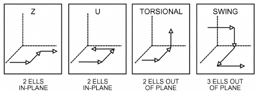

*Fig. 1 Close-Coupled Test Configurations*

### Calculating Pressure Losses

The most common engineering design flow loss calculation selects a pipe size for the desired total flow rate and available or allowable pressure drop.

Because either formulation of fitting losses requires a known diameter, pipe size must be selected before calculating the detailed influence of fittings. A frequently used rule of thumb assumes that the design length of pipe is 50 to 100% longer than actual to account for fitting losses. After a pipe diameter has been selected on this basis, the influence of each fitting can be evaluated.

### Stress Calculations

**Metallic Pipe.** Although stress calculations are seldom required, the factors involved should be understood. The main areas of concern are (1) internal pressure stress, (2) longitudinal stress caused by pressure and mass, and (3) stress from expansion and contraction.

ASME Standard B31 standards establish a basic allowable stress S equal to one-fourth of the minimum tensile strength of the material. This value is adjusted, as discussed in this section, because of the nature of certain stresses and manufacturing processes.

<!-- str. 645 -->

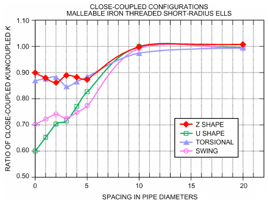

*Fig. 2 Summary Plot of Effect of Close-Coupled Configurations for 50 mm Ells*

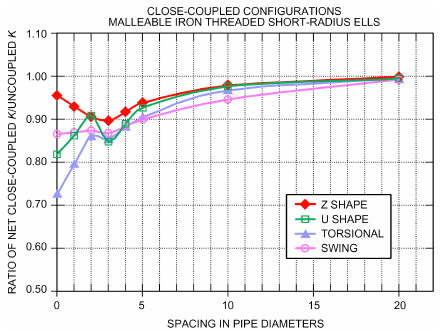

*Fig. 3 Summary Plot of Effect of Close-Coupled Configurations for 100 mm Ells*

Hoop stress caused by internal pressure is the major stress on pipes. Because some forming methods form a seam that may be weaker than the base material, ASME Standard B31.9 specifies a joint efficiency factor E, multiplied by the basic allowable stress to establish a maximum allowable stress value in tension S<sub>E</sub>. (Table A-1 in ASME Standard B31.9 lists values of S<sub>E</sub> for commonly used pipe materials.) The joint efficiency factor can be significant; for example, seamless pipe has a joint efficiency factor of 1, so it can be used to the full allowable stress (one-quarter of the tensile strength). In contrast, butt-welded pipe has a joint efficiency factor of 0.60, so its maximum allowable stress must be derated (S<sub>E</sub> = 0.6S).

Equation (9) determines the minimum wall thickness for a given pressure. Equation (10) determines the maximum pressure allowed for a given wall thickness.

> t<sub>m</sub> = pD/2S<sub>E</sub> + A&emsp;**(9)**
>
> p = (2S<sub>E</sub>(t<sub>m</sub>– A))/D&emsp;**(10)**

**Table 9 Test Summary for Loss Coefficients K of PVC Tees**

```text
                             Branching
Schedule 80 PVC Fitting                        K_1-2       K_1-3
50 mm injection molded branching tee, 100%  0.13 to 0.26    —
  line flow
   50/50 flow                                0 to 0.12  0.74 to 1.02
   100% branch flow                             —       0.98 to 1.39
100 mm injection molded branching tee, 100% 0.07 to 0.22    —
  line flow
   50/50 flow                               0.03 to 0.13 0.74 to 0.82
   100% branch flow                             —       0.97 to 1.12
150 mm injection molded branching tee, 100% 0.01 to 0.14    —
  line flow
   50/50 flow                               0.06 to 0.11 0.70 to 0.84
   100% branch flow                             —       0.95 to 1.15
150 mm fabricated branching tee, 100% line flow 0.21 to 0.22 —
   50/50 flow                               0.04 to 0.09 1.29 to 1.40
   100% branch flow                             —       1.74 to 1.88
200 mm injection molded branching tee, 100% 0.04 to 0.09    —
  line flow
   50/50 flow                               0.04 to 0.07 0.64 to 0.75
   100% branch flow                             —       0.85 to 0.96
200 mm fabricated branching tee, 100% line flow 0.09 to 0.16 —
   50/50 flow                               0.08 to 0.13 1.07 to 1.16
   100% branch flow                             —       1.40 to 1.62
                               Mixing
 PVC Fitting                                   K_1-2       K_3-2
50 mm injection molded mixing tee, 100% line 0.12 to 0.25   —
  flow
   50/50 flow                               1.22 to 1.19 0.89 to 1.88
   100% mix flow                                —       0.89 to 1.54
100 mm injection molded mixing tee, 100% line 0.07 to 0.18  —
  flow
   50/50 flow                               1.19 to 1.88 0.98 to 1.88
   100% mix flow                                —       0.88 to 1.02
150 mm injection molded mixing tee, 100% line 0.06 to 0.14  —
  flow
   50/50 flow                               1.26 to 1.80 1.02 to 1.60
   100% mix flow                                —       0.90 to 1.07
150 mm fabricated mixing tee, 100% line flow 0.19 to 0.21   —
   50/50 flow                               2.94 to 3.32 2.57 to 3.17
   100% mix flow                                —       1.72 to 1.98
200 mm injection molded mixing tee, 100% line 0.04 to 0.09  —
  flow
   50/50 flow                               1.10 to 1.60 0.96 to 1.32
   100% mix flow                                —       0.81 to 0.93
200 mm fabricated mixing tee, 100% line flow 0.13 to 0.70   —
   50/50 flow                              2.36 to 10.62 2.02 to 2.67
   100% mix flow                                —       1.34 to 1.53
Coefficients based on average velocity of 2.43 m/s. Range of values varies with fitting
manufacturers. Line or straight flow is Q_2/Q_1 = 100%. Branch flow is Q_2/Q_1 = 0%.
```

where

- S<sub>A</sub> = allowable stress range, kPa
- S<sub>c</sub> = allowable cold stress at coolest temperature system will experience, kPa
- S<sub>h</sub> = allowable hot stress at hottest temperature system will experience, kPa

Both equations incorporate an allowance factor A to compensate for manufacturing tolerances, material removed in threading or grooving, and corrosion. For the seamless, butt-welded, and electric resistance welded (ERW) pipe most commonly used in HVAC work, the standards apply a manufacturing tolerance of 12.5%. Working pressure for steel pipe (see Table 16) has been calculated using a manufacturing tolerance of 12.5%, standard allowance for depth of thread (where applicable), and a corrosion allowance of 1.65 mm for pipes 65 mm and larger and 0.64 mm for pipes 50 mm and smaller. Where corrosion is known to be greater or smaller, pressure rating can be recalculated using Equation (10). Higher pressure ratings than shown in Table 16 can be obtained (1) by using ERW or seamless pipe in lieu of continuous-weld (CW) pipe 100 mm and less, and seamless pipe in lieu of ERW pipe 125 mm and greater (because of higher joint efficiency factors); or (2) by using heavier-wall pipe.

<!-- str. 646 -->

Longitudinal stresses caused by pressure, mass, and other sustained forces are additive, and the sum of all such stresses must not exceed the basic allowable stress S at the highest temperature at which the system will operate. Longitudinal stress caused by pressure equals approximately one-half the hoop stress caused by internal pressure; thus, at least one-half the basic allowable stress is available for mass and other sustained forces. This factor is taken into account in Table 11.

Stresses caused by expansion and contraction are cyclical, and, because creep allows some stress relaxation, the ASME Standard B31 series allows designing to an allowable stress range S<sub>A</sub> as calculated by Equation (11). Table 15 lists allowable stress ranges for commonly used piping materials.

> S<sub>A</sub> = 1.25S<sub>c</sub> + 0.25S<sub>h</sub>&emsp;**(11)**

where

- S<sub>A</sub> = allowable stress range, kPa
- S<sub>c</sub> = allowable cold stress at coolest temperature system will experience, kPa
- S<sub>h</sub> = allowable hot stress at hottest temperature system will experience, kPa

**Nonmetallic.** Both thermoplastics and thermosets have an allowable stress derived from a **hydrostatic design basis stress (HDBS)**. The HDBS is determined by a statistical analysis of both static and cyclic stress rupture test data as set forth in ASTM Standard D2837 for thermoplastics and ASTM Standard D2992 for glass-fiber-reinforced thermosetting resins.

The allowable stress, called the **hydrostatic design stress (HDS)**, is obtained by multiplying the HDBS by a service factor. HDS values recommended by some manufacturers and those allowed by ASME Standard B31 are listed in Table 18.

The pressure design thickness for plastic pipe can be calculated using the code stress values and the formula in Equation (12):

> t = pD/(2S + p)&emsp;**(12)**

where

- t = pressure design thickness, mm
- p = internal design pressure, kPa (gage)
- D = pipe outside diameter, mm
- S = hydrostatic design stress (HDS), kPa

The minimum required wall thickness can be found by adding an allowance for mechanical strength, threading, grooving, erosion, and corrosion to the calculated pressure design thickness.

Another method of rating pressure rating of piping used by manufacturers is the **standard dimension ratio (SDR)**, which is the ratio of the pipe diameter to the wall thickness:

> SDR= D/s&emsp;**(13)**

where

- D = pipe outside diameter, mm
- s = pipe wall thickness, mm

An SDR of 11 means that the outside diameter D of the pipe is 11 times the thickness of the wall s. A high SDR means that the pipe’s wall is thin compared to its diameter, and a low SDR means that the pipe’s wall is thick relative to pipe diameter. SDR is inversely correlated with pressure rating: high SDR indicates a low pressure rating, whereas low-SDR pipes have higher pressure ratings.

There are many formulations of the polymers used for piping materials, and different joining methods for each, so manufacturers’ recommendations should be followed. Most catalogs give pressure ratings for pipe and fittings at various temperatures up to the maximum the material will withstand.

## 1.5 SIZING PROCEDURE

A procedure for sizing piping systems is as follows:

1. Determine system type (open, closed, compressible, incompressible, pumped, gravity feed, domestic, etc.).

2. Determine type and properties of fluid to be conveyed in the pipe.

3. Determine temperatures used (high, low) and temperature differentials.

4. Identify system pressures encountered in the system (working, maximum, low, fill, and relief pressures).

5. Determine load at each device (e.g., heating or cooling requirements, fixture units for plumbing) to find flow.

6. Sketch main, risers, and branches, and indicate equipment to be served and each device’s flow rate.

7. Determine flow of supply pipe for each pipe segment run by summing the loads at the furthest device and running back to the source.

8. Determine flow of each return pipe by starting at the first device returning water and summing the loads back to the source (when applicable).

9. Determine equivalent length of pipe in the main lines, risers, branches, and returns. Because pipe sizes are not known, the exact equivalent length of various fittings cannot be determined. Add the equivalent lengths, starting at the beginning and proceeding along the mains, risers, branches, and returns (when applicable).

10. **In domestic or gravity feed:** calculate the approximate design value of the average pressure drop per metre length of pipe in equivalent length determined in step 9. **In pumped system:** calculate pressure drop H using the flow rate and pressure drop for pipe from Equations (2) or (6), the valves and fittings using head drop from Equation (7), and head from the devices from the manufacturer’s data.

> Δp = (p<sub>s</sub> – 9.8H – p<sub>f</sub> – p<sub>m</sub>)/L&emsp;**(14)**

where

- Δp = average pressure loss per metre of equivalent length of pipe, kPa
- p<sub>s</sub> = pressure at the source, kPa
- p<sub>f</sub> = minimum pressure required to operate device, kPa
- p<sub>m</sub> = pressure drop through any meters, kPa
- H = height of highest fixture above source (if open system), m
- L = equivalent length determined in step 4, m 11. **In domestic or gravity system:** from the expected rate of flow (step 5) and Δp (step 10), select pipe sizes. **In pumped system:** select the pump using the flow rate and calculated H.

## 1.6 PIPE-SUPPORTING ELEMENTS

Pipe-supporting elements consist of (1) hangers, which support from above; (2) supports, which bear load from below; and (3) restraints, such as anchors and guides, that limit or direct movement as well as support loads. Pipe-supporting elements must withstand all static and dynamic conditions, including the following:

- Mass of pipe, valves, fittings, insulation, and fluid contents, including test fluid if using heavier-than-normal media
- Occasional loads such as ice, wind, and seismic forces or testing loads (e.g., hydrostatic loads on a steam pipe)

<!-- str. 647 -->

**Table 10 Capacities of ASTM A36 Steel Threaded Rods**

| Rod Diameter, mm | Root Area of Coarse Thread, mm<sup>2</sup> | Maximum Load,* N |
|---|---|---|
| 6.4 | 17.4 | 1 070 |
| 10 | 43.9 | 2 720 |
| 13 | 81.3 | 5 030 |
| 16 | 130.3 | 8 060 |
| 19 | 194.8 | 12 100 |
| 22 | 270.3 | 16 800 |
| 25 | 356.1 | 22 100 |
| 32 | 573.5 | 35 600 |

*Based on allowable stress of 83 MPa reduced by 25% using root area in accordance with ASME Standard B31.1 and MSS Standard SP-58.

- Forces imposed by thermal expansion and contraction of pipe bends and loops
- Frictional, spring, and pressure thrust forces imposed by expansion joints in the system
- Frictional forces of guides and supports
- Other loads (e.g., water hammer, vibration, reactive force of relief valves)
- Test load and force

In addition, pipe-supporting elements must be evaluated in terms of stress at the points of connection to the pipe and the building. Stress at the point of connection to the pipe is especially important for base elbow and trunnion supports, because this stress is usually the limiting parameter, not the strength of the structural member. Loads on anchors, cast-in-place inserts, and other attachments to concrete should not be more than one-fifth the ultimate strength of the attachment, as determined by manufacturers’ tests. All loads on the structure should be communicated to and coordinated with the structural engineer.

The ASME B31 standards establish criteria for the design of pipe-supporting elements, and the Manufacturers Standardization Society of the Valve and Fittings Industry (MSS) has established standards for the design, fabrication, selection, and installation of pipe hangers and supports based on these codes.

MSS Standard SP-69 and the catalogs of many manufacturers illustrate the various hangers and components and provide information on the types to use with different pipe systems. Table 10 lists maximum safe loads for threaded steel rods, and Tables 11 and 12 show suggested pipe support spacing for metal and PVC pipes, respectively.

Loads on most pipe-supporting elements are moderate and can be selected safely in accordance with manufacturers’ catalog data and the information presented in this section; however, some loads and forces can be very high, especially in multistory buildings and for large-diameter pipe, particularly where expansion joints are used at a high operating pressure. Consequently, a qualified engineer should design or review all anchors and pipe-supporting elements, especially for the following:

- Steam systems operating above 100 kPa (gage)
- Hydronic systems operating above 1.1 MPa or 120°C
- Risers over 10 stories or 30 m
- Systems with expansion joints, especially for pipe diameters 80 mm and greater
- Pipe sizes over 300 mm diameter
- Anchor loads greater than 44 kN
- Moments on pipe or structure in excess of 1.4 kN·m

### Hanger Spacing and Pipe Wall Thickness

Table 11 suggests minimum pipe hanger spacing for use unless exceeded by the local authority having jurisdiction or engineering calculations. The primary factors determining pipe wall thickness are hoop stress caused by internal pressure, and longitudinal stresses caused by pressure, mass, and other sustained loads. Detailed stress calculations are seldom required for HVAC applications because standard pipe has ample thickness to sustain the pressure and longitudinal stress caused by mass (assuming hangers are spaced in accordance with Table 11).

**Table 11 Suggested Hanger Spacing and Rod Size for Straight Horizontal Runs**

| Nominal O.D., mm | Standard Steel Pipe*<br>Water | Standard Steel Pipe*<br>Hanger Spacing, m Steam | Copper Tube Water | Rod Size, mm |
|---|---|---|---|---|
| 15 | 2.1 | 2.4 | 1.5 | 6.4 |
| 20 | 2.1 | 2.7 | 1.5 | 6.4 |
| 25 | 2.1 | 2.7 | 1.8 | 6.4 |
| 40 | 2.7 | 3.7 | 2.4 | 10 |
| 50 | 3.0 | 4.0 | 2.4 | 10 |
| 65 | 3.4 | 4.3 | 2.7 | 10 |
| 80 | 3.7 | 4.6 | 3.0 | 10 |
| 100 | 4.3 | 5.2 | 3.7 | 13 |
| 150 | 5.2 | 6.4 | 4.3 | 13 |
| 200 | 5.8 | 7.3 | 4.9 | 16 |
| 250 | 6.1 | 7.9 | 5.5 | 19 |
| 300 | 7.0 | 9.1 | 5.8 | 22 |
| 350 | 7.6 | 9.8 |  | 25 |
| 400 | 8.2 | 10.7 |  | 25 |
| 450 | 8.5 | 11.3 |  | 32 |
| 500 | 9.1 | 11.9 |  | 32 |

Source: Adapted from MSS Standard SP-69

*Spacing does not apply where span calculations are made or where concentrated loads are placed between supports such as flanges, valves, specialties, etc.

Support spacings for PVC and CPVC pipe systems are influenced by operating temperatures. Table 12 recommends horizontal spacing based on pipe size, schedule, material (PVC or industrialgrade CPVC), and operating temperature. Hangers and supports should not be clamped tightly because the axial movement of the pipe would be restricted. The charts are based on continuous spans and uninsulated lines carrying liquids. They are not applicable where loads between supports are concentrated (e.g., for valves, flanges) or where there is a change in direction. Hangers/supports should be located adjacent to joints, branch connections, and changes in direction. Risers should be in installed independently of adjacent horizontal hangers/supports.

For cast iron pipe, maximum spacing should be 3.7 m, with at least one hanger/support for each pipe section.

## 1.7 PIPE EXPANSION AND FLEXIBILITY

Temperature changes cause dimensional changes in all materials. Table 13 shows the coefficients of expansion for metallic piping materials commonly used in HVAC. For systems operating at high temperatures, such as steam and hot water, the rate of expansion is high, and significant movements can occur in short runs of piping. Even though rates of expansion may be low for systems operating in the range of 5 to 40°C, such as chilled and condenser water, they can cause large movements in long runs of piping, which are common in distribution systems and high-rise buildings. Therefore, in addition to design requirements for pressure, mass, and other loads, piping systems must accommodate thermal and other movements to prevent the following:

- Failure of pipe and supports from overstress and fatigue
- Leakage of joints
- Detrimental forces and stresses in connected equipment

An unrestrained pipe operates at the lowest overall stress level. Anchors and restraints are needed to support pipe mass and to protect equipment connections. Anchor forces and bowing of pipe

<!-- str. 648 -->

**Table 12 Suggested Maximum Spacing Betw een Hangers/Support for PVC and CPVC Pipe** anchored at both ends are generally too large to be acceptable, so general practice is to **never anchor a straight run of steel pipe at both ends**. Piping must be allowed to expand or contract through thermal changes. Ample flexibility can be attained by designing pipe bends and loops or by including supplemental devices, such as expansion joints.

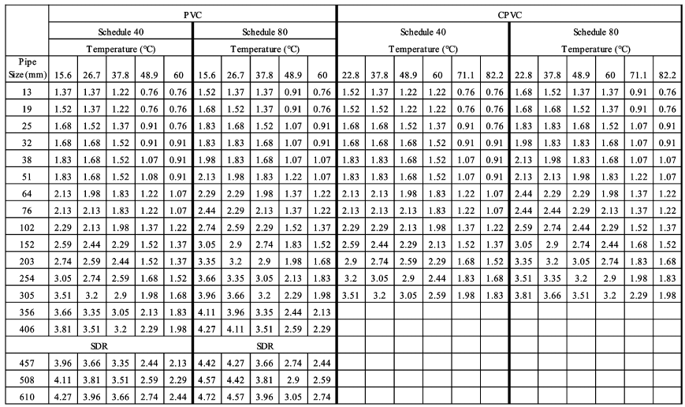

End reactions transmitted to rotating equipment, such as pumps or turbines, may deform the equipment case and cause bearing misalignment that may ultimately cause the component to fail. Consequently, manufacturers’ recommendations on allowable forces and movements that may be placed on their equipment should be followed.

## 1.8 PIPE BENDS AND LOOPS

Detailed stress analysis requires involved mathematical analysis and is generally performed by computer programs. However, such involved analysis is not typically required for most HVAC systems because the piping arrangements and temperature ranges at which they operate are usually simple to analyze. Expansion stresses discussed in this section relate only to aboveground pipe located in open air, or preinsulated pipe.

### L Bends

The guided cantilever beam method of evaluating L bends can be used to design L bends, Z bends, pipe loops, branch take-off connections, and some more complicated piping configurations. The guided cantilever equation [see Equation (17)] is generally conservative because it assumes that the pipe arrangement does not rotate. The anchor force results will be higher because of the lack of rotation, and rigorous analysis is recommended for complicated or expensive systems.

Equation (15) may be used to calculate the length of leg BC needed to accommodate thermal expansion or contraction of leg AB for a guided cantilever beam (Figure 4).

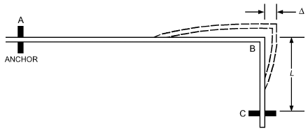

*Fig. 4 Guided Cantilever Beam*

> L = 3ΔDE/S<sub>A</sub>&emsp;**(15)**

where

- L = length of leg BC required to accommodate thermal expansion of long leg AB, mm
- Δ = thermal expansion or contraction of leg AB, mm
- D = actual pipe outside diameter, mm
- E = modulus of elasticity, kPa
- S<sub>A</sub> = allowable stress range, kPa

For the commonly used A53 Grade B seamless or ERW pipe, an allowable stress S<sub>A</sub> of 155 MPa (see Table 15) can be used without overstressing the pipe. However, this can result in very high end reactions and anchor forces, especially with large-diameter pipe. Designing to a stress range S<sub>A</sub> of 103 MPa and assuming E = 193 GPa, Equation (15) reduces to Equation (16), which provides reasonably low end reactions without requiring too much extra pipe. In addition, Equation (16) may be used with A53 continuous (butt-) welded, seamless, and ERW pipe, and B88 drawn copper tubing.

> L = 75 ΔD&emsp;**(16)**

<!-- str. 649 -->

**Table 13 Thermal Expansion of Metal Pipe**

| Saturated Steam Pressure, kPa (gage) | Temperature, Carbon<br>°C | Linear Thermal Expansion, mm/m Temperature, Carbon<br>Steel | Linear Thermal Expansion, mm/m<br>Type 304 Stainless Steel | Linear Thermal Expansion, mm/m<br>Copper |
|---|---|---|---|---|
|  | –34 | –0.16 | –0.25 | –0.27 |
|  | –29 | –0.10 | –0.17 | –0.18 |
|  | –23 | –0.05 | –0.08 | –0.09 |
|  | –18 | 0.00 | 0.00 | 0.00 |
|  | –12 | 0.07 | 0.09 | 0.10 |
|  | –7 | 0.13 | 0.18 | 0.20 |
| –100.7 | 0 | 0.20 | 0.30 | 0.31 |
| –100.7 | 4 | 0.25 | 0.38 | 0.38 |
| –100.0 | 10 | 0.32 | 0.47 | 0.47 |
| –99.3 | 16 | 0.38 | 0.56 | 0.57 |
| –98.6 | 21 | 0.44 | 0.65 | 0.66 |
| –97.9 | 27 | 0.51 | 0.75 | 0.75 |
| –96.5 | 32 | 0.57 | 0.84 | 0.85 |
| –94.5 | 38 | 0.63 | 0.93 | 0.94 |
| –89.6 | 49 | 0.76 | 1.13 | 1.14 |
| –81.4 | 60 | 0.88 | 1.31 | 1.33 |
| –69.0 | 71 | 1.02 | 1.49 | 1.50 |
| –49.6 | 82 | 1.14 | 1.68 | 1.71 |
| –22.1 | 93 | 1.27 | 1.87 | 1.92 |
| 0 | 100 | 1.35 | 1.98 | 2.03 |
| 17.2 | 104 | 1.41 | 2.07 | 2.10 |
| 71.0 | 116 | 1.54 | 2.26 | 2.30 |
| 142.7 | 127 | 1.68 | 2.45 | 2.49 |
| 238.6 | 138 | 1.82 | 2.64 | 2.68 |
| 360.6 | 149 | 1.96 | 2.83 | 2.88 |
| 517.1 | 160 | 2.11 | 3.03 | 3.08 |
| 712.3 | 171 | 2.25 | 3.23 | 3.28 |
| 953.6 | 182 | 2.40 | 3.43 | 3.48 |
| 1249 | 193 | 2.54 | 3.63 | 3.68 |
| 1604 | 204 | 2.69 | 3.83 | 4.06 |
| 9039 | 304 | 4.11 | 5.65 | 5.77 |
|  | 404 | 5.67 | 7.56 | 7.72 |
|  | 504 | 7.31 | 9.54 | 9.76 |

| –100.7 –100.7 –100.0 –99.3 –98.6 –97.9 –96.5 –94.5 –89.6 –81.4 –69.0 –49.6 –22.1 | 0 4 10 16 21 27 32 38 49 60 71 82 93 | 0.20 0.25 0.32 0.38 0.44 0.51 0.57 0.63 0.76 0.88 1.02 1.14 1.27 | 0.30 0.38 0.47 0.56 0.65 0.75 0.84 0.93 1.13 1.31 1.49 1.68 1.87 | 0.31 0.38 0.47 0.57 0.66 0.75 0.85 0.94 1.14 1.33 1.50 1.71 1.92 |
|---|---|---|---|---|
| 0 | 100 | 1.35 | 1.98 | 2.03 |
| 17.2 | 104 | 1.41 | 2.07 | 2.10 |
| 71.0 | 116 | 1.54 | 2.26 | 2.30 |
| 142.7 | 127 | 1.68 | 2.45 | 2.49 |
| 238.6 | 138 | 1.82 | 2.64 | 2.68 |
| 360.6 | 149 | 1.96 | 2.83 | 2.88 |
| 517.1 | 160 | 2.11 | 3.03 | 3.08 |
| 712.3 | 171 | 2.25 | 3.23 | 3.28 |
| 953.6 | 182 | 2.40 | 3.43 | 3.48 |
| 1249 | 193 | 2.54 | 3.63 | 3.68 |

1604 204 2.69 3.83 4.06 9039 304 4.11 5.65 5.77 404 5.67 7.56 7.72 504 7.31 9.54 9.76

The guided cantilever method of designing L bends assumes no restraints; therefore, care must be taken in supporting the pipe. For horizontal L bends, it is usually necessary to place a support near point B (see Figure 4), and any supports between points A and C must provide minimal resistance to piping movement; this is done by using slide plates or hanger rods of ample length, with hanger components selected to allow for swing no greater than 4°.

For L bends containing both vertical and horizontal legs, any supports on the horizontal leg must be spring hangers designed to support the full mass of pipe at normal operating temperature with a maximum load variation of 25%.

The force developed in an L bend that must be sustained by anchors or connected equipment is determined by the following equation:

> F = 12E<sub>c</sub>IΔ/10<sup>6</sup>L<sup>3</sup>&emsp;**(17)**

where

- F = force, kN
- E<sub>c</sub> = modulus of elasticity, kPa
- I = moment of inertia, mm<sup>4</sup>
- L = length of offset leg, mm
- Δ = deflection of offset leg, mm

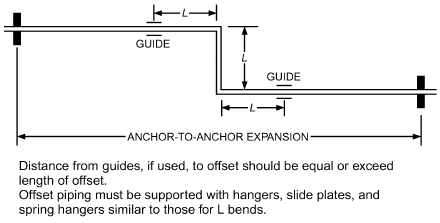

*Fig. 5 Z Bend in Pipe*

### Z Bends

Z bends, as shown in Figure 5, are very effective for accommodating pipe movements. A simple and conservative method of sizing Z bends is to design the offset leg to be 65% of the values used for an L bend in Equation (15):

> L = 48.7 ΔD&emsp;**(18)**

where

- L = length of offset leg, mm
- Δ = anchor-to-anchor expansion, mm
- D = pipe outside diameter, mm

The force developed in a Z bend can be calculated with acceptable accuracy as follows:

> F = C<sub>1</sub>Δ(D/L)<sup>2</sup>&emsp;**(19)**

where

- C<sub>1</sub> = 101 kN/mm
- F = force, kN
- D = pipe outside diameter, mm
- L = length of offset leg, mm
- Δ = anchor-to-anchor expansion, mm

### U Bends and Pipe Loops

Pipe loops or U bends are commonly used in long runs of piping. A simple method of designing pipe loops is to calculate the anchorto-anchor expansion and, using Equation (15), determine the length L necessary to accommodate this movement. The pipe loop dimensions can then be determined using W = L/5 and H = 2W.

Note that guides must be spaced no closer than twice the height of the loop, and piping between guides must be supported, as described in the section on L Bends, when the length of pipe between guides exceeds the maximum allowable hanger spacing for the size pipe.

Table 14 lists pipe loop dimensions for pipe sizes 25 to 600 mm and anchor-to-anchor expansion (contraction) of 50 to 300 mm.

No simple method has been developed to calculate pipe loop force; however, it is generally low. A conservative estimate is 35 N per millimetre diameter (e.g., a 50 mm pipe will develop 1.75 kN of force and a 300 mm pipe will develop 10.5 kN of force). Additional analysis should be done for pipes greater than 300 mm in diameter, because other simplified methodologies predict higher anchor forces.

**Expansion and Contraction Control of Other Materials**

To design expansion and contraction loops and bends for other materials, consult the Copper Development Association (CDA 2010) for copper pipes, and Plastic Pipe and Fitting Association (PPFA 2009) for plastic pipes.

<!-- str. 650 -->

**Table 14 Pipe Loop Design for A53 Grade B Carbon Steel Pipe Through 200°C**

```text
 Pipe                                                   Anchor-to-Anchor Expansion, mm
 Nom.,
                50                   100                    150                   200                   250                    300
 O.D.,
  mm       W         H           W         H            W        H            W         H           W         H            W        H
   25      0.6      1.2          0.9      1.8          1.1       2.1          1.2      2.4          1.4       2.7         1.5       3.0
   50      0.9      1.8          1.2      2.4          1.5       3.0          1.7      3.4          1.8       3.7         2.1       4.3
   80      1.1      2.1          1.5      3.0          1.8       3.7          2.0      4.0          2.3       4.6         2.4       4.9
  100      1.2      2.4          1.7      3.4          2.0       4.0          2.3      4.6          2.6       5.2         2.7       5.5
  150      1.5      3.0          2.0      4.0          2.4       4.9          2.7      5.5          3.0       6.1         3.4       6.7
  200      1.7      3.4          2.3      4.6          2.7       5.5          3.2      6.4          3.7       7.3         4.0       7.9
  250      1.8      3.7          2.6      5.2          3.0       6.1          3.5      7.0          4.0       7.9         4.3       8.5
  300      2.0      4.0          2.7      5.5          3.4       6.7          3.8      7.6          4.3       8.5         4.7       9.4
  350      2.1      4.3          2.9      5.8          3.5       7.0          4.0      7.9          4.6       9.1         4.9       9.8
  400      2.3      4.6          3.0      6.1          3.8       7.6          4.3      8.5          4.9       9.8         5.3      10.7
  450      2.4      4.9          3.4      6.7          4.0       7.9          4.6      9.1          5.2      10.4         5.6      11.3
  500      2.6      5.2          3.5      7.0          4.3       8.5          4.9      9.8          5.5      11.0         5.9      11.9
  600      2.7      5.5          3.8      7.6          4.4       8.8          5.3     10.7          5.9      11.9         6.4      12.8
Notes: 1. W and H dimensions are metres.                               3. Approximate force to deflect loop = 35 N/mm pipe diameter. For example, 200 mm
2. L is determined from Equation (15). W = L/5 H = 2W 2H + W = L         pipe creates 7600 N of force.
```

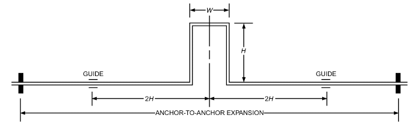

### Cold Springing of Pipe

Cold springing or cold positioning of pipe consists of offsetting or springing the pipe in a direction opposite the expected movement. Cold springing is not recommended for most HVAC piping. Furthermore, **cold springing does not allow designing a pipe bend or loop for twice the calculated movement**. For example, if a particular L bend can accommodate 75 mm of movement from a neutral position, cold springing does not allow the L bend to accommodate 150 mm of movement.

### Analyzing Existing Piping Configurations

Piping is best analyzed using a computer stress analysis program, which can provide all pertinent data, including stress, movements, and loads. Services can perform such analysis if programs are not available in house. However, many situations do not require such detailed analysis. A simple, satisfactory method for single and multiplane systems is to divide the system with real or imaginary anchors into a number of single-plane units, as shown in Figure 6, that can be evaluated as L and Z bends.

## 2. PIPE AND FITTING MATERIALS

## 2.1 PIPE

### Steel Pipe

Steel pipe is manufactured by several processes. Seamless pipe (Type S), made by piercing or extruding, has no longitudinal seam. Other manufacturing methods roll a strip or sheet of steel (skelp) into a cylinder and weld a longitudinal seam. A continuous-weld (Type F CW) furnace butt-welding (BW; i.e., welding pipe in a single plane) process forces and joins the edges together at high temperature. An electric current welds the seam in electric-resistance-welded (Type E ERW) pipe. ASTM standards such as A53 and A106 specify steel pipe A and B grades. The A grade has a lower tensile strength and is not widely used.

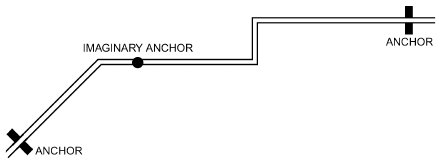

*Fig. 6 Multiplane Pipe System*

The ASME pressure piping codes require that a longitudinal joint efficiency factor E (Table 15) be applied to each type of seam when calculating the allowable stress. ASME Standard B36.10M specifies the dimensional standard for wrought steel pipe.

Steel pipe is manufactured with wall thicknesses identified by schedule or weight class. Although schedule numbers and weight class designations are related, they are not constant for all pipe sizes. United States standard (STD) and Schedule 40 pipe have the same wall thickness through 250 mm NPS. For 300 mm and larger standard weight pipe, the wall thickness remains constant at 10 mm, whereas Schedule 40 wall thickness increases with each size. A similar equality exists between Extra Strong (XS) and Schedule 80 pipe through 200 mm; above 200 mm, XS pipe has a 12.7 mm wall, whereas Schedule 80 increases in wall thickness. Table 16 lists properties of representative steel pipe.

Joints in steel pipe are made by welding or by using threaded, flanged, or grooved fittings or socket welding. Unreinforced welded-in branch connections weaken a main pipeline, and added reinforcement is necessary, unless the excess wall thickness of both mains and branches is sufficient to sustain the pressure.

<!-- str. 651 -->

**Table 15 Allowable Stressesa for Pipe and Tube**

| ASTM Specification | Grade | Type | Manufacturing Process | Available Sizes, mm | Minimum Tensile Strength, MPa | Basic Allowable Stress S, MPa | Joint Efficiency Factor E | Allowable Stress<sup>b</sup>S<sub>E</sub>, MPa | Allowable Stress Range<sup>c</sup> , MPa S<sub>A</sub> |
|---|---|---|---|---|---|---|---|---|---|
| A53 steel | — | F | Cont. weld | 15 to 100 | 310 | 77.5 | 0.6 | 46.5 | 117 |
| A53 steel | B | S | Seamless | 15 to 660 | 413 | 103 | 1.0 | 103 | 155 |
| A53 steel | B | E | ERW | 50 to 500 | 413 | 103 | 0.85 | 87.6 | 155 |
| A106 steel | B | S | Seamless | 15 to 660 | 413 | 103 | 1.0 | 103 | 155 |
| B88 copper | — | — | Hard drawn | 8 to 300 | 248 | 62 | 1.0 | 62 | 93.1 |

<sup>a</sup>Listed stresses are for temperatures to 340°C for steel pipe (to 205°C for Type F) and to 120°C for copper tubing.

<sup>b</sup>To be used for internal pressure stress calculations in Equations (10) and (11).

<sup>c</sup>To be used only for piping flexibility calculations; see Equations (12) and (13).

The ASME Standard B31 series gives formulas and guidelines for determining whether reinforcement is required. Such calculations are seldom needed in HVAC applications because (1) the fitting is designed in accordance with a standard listed in the applicable ASME B31 table and used within the pressure and temperature limits of that standard, and (2) fittings such as tees and reinforced outlet fittings provide integral reinforcement.

Type F steel pipe is not allowed for ASME Standard B31.5 refrigerant piping.

### Copper Tube

Because of their inherent resistance to corrosion and ease of installation, copper and copper alloys are often used in heating, air-conditioning, refrigeration, and water supply installations. The two main standards for copper tube are (1) ASTM Standard B88, which includes Types K, L, M, and DWV for water and drain service; and (2) ASTM Standard B280, which specifies air-conditioning and refrigeration (ACR) tube for refrigeration service.

Types K, L, M, and DWV designate descending wall thicknesses for copper tube. All types have the same outside diameter (OD) for corresponding sizes. Table 17 lists properties of ASTM B88 copper tube. In the plumbing industry, tube of nominal size approximates the inside diameter. The heating and refrigeration trades specify copper tube by the outside diameter. ACR tubing has a different set of wall thicknesses. Types K, L, and M tube may be hard drawn or annealed (soft) temper.

Copper tubing is joined with soldered or brazed, wrought or cast copper capillary socket-end fittings. See Table 20 for lists pressure/temperature ratings of soldered and brazed joints. Small copper tube is also joined by flare or compression fittings.

Hard-drawn tubing has a higher allowable stress than annealed tubing, but if hard tubing is joined by soldering or brazing, the annealed allowable stress should be used.

Brass pipe and copper pipe are also made in steel pipe thicknesses for threading. High cost has eliminated these materials from the market, except for special applications.

The heating and air-conditioning industry generally uses Types L and M tubing, which have higher internal working pressure ratings than the solder joints used at fittings. Type K may be used with brazed joints for higher pressure-temperature requirements or for direct burial. Type M should be used with care where exposed to potential external damage.

Copper and brass should not be used in ammonia refrigerating systems, or in acidic drains from condensing boilers. The section on Special Systems covers other limitations on refrigerant piping.

### Ductile Iron and Cast Iron

Cast-iron soil pipe comes as Class 4000 series. It is not used under pressure because the pipe is not suitable and the joints are not restrained. Cast-iron pipe and fittings typically have bell and spigot ends for lead and oakum joints or elastomer push-on joints. Cast-iron pipe and fittings are also furnished with no-hub ends for joining with no-hub clamps. Local plumbing codes specify permitted materials and joints.

Ductile iron has now replaced cast iron for pressure pipe. Ductile iron is stronger, less brittle, and similar to cast iron in corrosion resistance. It is commonly used for buried pressure water mains or in other locations where internal or external corrosion is a problem. Joints are made with flanged fittings, mechanical joint (MJ) fittings, or elastomer gaskets for bell and spigot ends. Bell and spigot and MJ joints are not self-restrained, though restrained MJ systems are available. Ductile-iron pipe is made in seven thickness classes for different service conditions. AWWA Standard C150/A21.50 covers the proper selection of pipe classes.

### Nonmetallic (Plastic)

Selecting a plastic for a specific purpose requires attention to the temperatures, pressures, chemicals, and stresses the piping will be subjected to in the specific application. All are suitable for cold water. Plastic pipe should not be used for compressed gases or compressed air if the pipe’s material is subject to brittle failure. For other liquids and chemicals, refer to charts provided by plastic pipe manufacturers and distributors. Table 18 gives properties of the various plastics discussed in this section; the last column gives the relative cost of small pipe in each category. Table 2 lists some applications pertinent to HVAC. The following are brief descriptions of common uses for the various materials.

Plastic piping materials fall into two main categories: thermoplastics and thermosets. Thermoplastics melt and are formed by extruding or molding. They are usually used without reinforcing filaments. Thermosets are cured and cannot be reformed. They are normally used with glass fiber reinforcing filaments.

For the purposes of this chapter, **thermoplastic** piping is made of the following materials:

**PVC.** Because polyvinyl chloride has the best overall range of properties at the lowest cost, it is the most widely used plastic. It is joined by solvent cementing, threading, or flanging. Gasketed push-on joints are also used for larger sizes. ASTM Standards D1784, D1785, and D2665 cover PVC pipe.

**CPVC.** Chlorinated polyvinyl chloride has the same properties as PVC and can withstand a higher temperature before losing strength. It is joined by the same methods as PVC. ASTM Standards D1784 and 1785 discuss CPVC.

**PE.** Low-density polyethylene (LDPE) is a flexible, low-mass tubing with good low-temperature properties. It is used in the food and beverage industry and for instrument tubing. Joins are mechanical, such as compression fittings or push-on connectors and clamps. See ASTM Standard D2239 for details.

**HDPE.** High-density polyethylene is a tough, weather-resistant material used for large pipelines in the gas industry. Fabricated fittings are available. It is joined by heat fusion for large sizes; flare, compression, or insert fittings can be used on small sizes. ASTM Standard D3350 discusses HDPE.

<!-- str. 652 -->

**Table 16 Steel Pipe Data**

```text
                                                                                                                    Working Pressure^c
  U.S.
                                                   Surface Area         Cross Section             Mass            ASTM A53 B to 200°C
Nominal Nominal               Wall      Inside
  Size,    Size,           Thickness Diameter Outside,     Inside,    Metal   Flow Area,     Pipe,    Water,      Mfr.     Joint    kPa
   in.     mm    Schedule^a  t, mm      d, mm     m^2/m    m^2/m    Area, mm^2   mm^2        kg/m      kg/m      Process   Type^b  (gage)
   1/4       8     40 ST      2.24        9.25   0.043     0.029         80.6       67.1     0.631     0.067       CW        T      1296
                   80 XS      3.02        7.67   0.043     0.024        101.5       46.2     0.796     0.046       CW        T      6006
   3/8      10     40 ST      2.31       12.52   0.054     0.039        107.7     123.2      0.844     0.123       CW        T      1400
                   80 XS      3.20       10.74   0.054     0.034        140.2       90.7     1.098     0.091       CW        T      5654
   1/2      15     40 ST      2.77       15.80   0.067     0.050        161.5     196.0      1.265     0.196       CW        T      1476
                   80 XS      3.73       13.87   0.067     0.044        206.5     151.1      1.618     0.151       CW        T      5192
   3/4      20     40 ST      2.87       20.93   0.084     0.066        214.6     344.0      1.68      0.344       CW        T      1496
                   80 XS      3.91       18.85   0.084     0.059        279.7     279.0      2.19      0.279       CW        T      4695
     1      25     40 ST      3.38       26.64   0.105     0.084        318.6     557.6      2.50      0.558       CW        T      1558
                   80 XS      4.55       24.31   0.105     0.076        412.1     464.1      3.23      0.464       CW        T      4427
 1 1/4      32     40 ST      3.56       35.05   0.132     0.110        431.3     965.0      3.38      0.965       CW        T      1579
                   80 XS      4.85       32.46   0.132     0.102        568.7     827.6      4.45      0.828       CW        T      4096
 1 1/2      40     40 ST      3.68       40.89   0.152     0.128        515.5    1 313       4.05      1.313       CW        T      1593
                   80 XS      5.08       38.10   0.152     0.120        689.0    1 140       5.40      1.140       CW        T      3972
     2      50     40 ST      3.91       52.50   0.190     0.165        690.3    2 165       5.43      2.165       CW        T      1586
                   80 XS      5.54       49.25   0.190     0.155         953     1 905       7.47      1.905       CW        T      3799
 2 1/2      65     40 ST      5.16       62.71   0.229     0.197       1 099     3 089       8.62      3.089       CW       W       3675
                   80 XS      7.01       59.00   0.229     0.185       1 454     2 734      11.40      2.734       CW       W       5757
     3      80     40 ST      5.49       77.93   0.279     0.245       1 438     4 769      11.27      4.769       CW       W       3323
                   80 XS      7.62       73.66   0.279     0.231       1 946     4 261      15.25      4.261       CW       W       5288
     4     100     40 ST      6.02     102.26    0.359     0.321       2 048     8 213      16.04      8.213       CW       W       2965
                   80 XS      8.56       97.18   0.359     0.305       2 844     7 417      22.28      7.417       CW       W       4792
     6     150     40 ST      7.11     154.05    0.529     0.484       3 601    18 639      28.22     18.64       ERW       W       4799
                   80 XS     10.97     146.33    0.529     0.460       5 423    16 817      42.49     16.82       ERW       W       8336
     8     200     30         7.04      205.0    0.688     0.644       4 687    33 000      36.73     33.01       ERW       W       3627
                   40 ST      8.18      202.7    0.688     0.637       5 419    32 280      42.46     32.28       ERW       W       4433
                   80 XS     12.70      193.7    0.688     0.608       8 234    29 460      64.51     29.46       ERW       W       7626
   10      250     30         7.80      257.5    0.858     0.809       6 498    52 060      50.91     52.06       ERW       W       3344
                   40 ST      9.27      254.5    0.858     0.800       7 683    50 870      60.20     50.87       ERW       W       4178
                      XS     12.70      247.7    0.858     0.778      10 388    48 170      81.39     48.17       ERW       W       6116
                   80        15.06      242.9    0.858     0.763      12 208    46 350      95.66     46.35       ERW       W       7453
   12      300     30         8.38      307.1    1.017     0.965       8 307    74 060      65.09     74.06       ERW       W       3096
                      ST      9.53      304.8    1.017     0.958       9 406    72 970      73.70     72.97       ERW       W       3641
                   40        10.31      303.2    1.017     0.953      10 158    72 190      79.59     72.21       ERW       W       4020
                     XS      12.70      298.5    1.017     0.938      12 414    69 940      97.28     69.96       ERW       W       5157
                   80        17.45      289.0    1.017     0.908      16 797    65 550     131.62     65.57       ERW       W       7419
   14      350     30 ST      9.53      336.6    1.117     1.057      10 356    88 970      81.15     88.96       ERW       W       3316
                   40        11.10      333.4    1.117     1.047      12 013    87 290      94.13     87.30       ERW       W       3999
                      XS     12.70      330.2    1.117     1.037      13 681    85 610     107.21     85.63       ERW       W       4695
                   80        19.05      317.5    1.117     0.997      20 142    79 160     157.82     79.17       ERW       W       7453
   16      400     30 ST      9.53      387.4    1.277     1.217      11 876   117 800      93.06    117.8        ERW       W       2903
                   40 XS     12.70      381.0    1.277     1.197      15 708   114 000     123.09    114.0        ERW       W       4109
   18      450        ST      9.53      438.2    1.436     1.376      13 396   150 800     104.98    150.8        ERW       W       2579
                   30        11.10      435.0    1.436     1.367      15 556   148 600     121.90    148.6        ERW       W       3110
                     XS      12.70      431.8    1.436     1.357      17 735   146 450     138.97    146.4        ERW       W       3654
                   40        14.27      428.7    1.436     1.347      19 863   144 300     155.65    144.3        ERW       W       4185
   20      500     20 ST      9.53      489.0    1.596     1.536      14 916   187 700     116.88    187.4        ERW       W       2324
                   30 XS     12.70      482.6    1.596     1.516      19 762   182 900     154.85    182.9        ERW       W       3289
                   40        15.06      477.9    1.596     1.501      23 325   179 400     182.78    179.4        ERW       W       4006
^aNumbers are schedule numbers per ASME Standard B36.10M; ST = Standard; XS = (2)An arbitrary corrosion allowance of 0.64 mm for pipe sizes through NPS 2 and 1.65 mm
Extra Strong.                                                          from NPS 2 1/2 through 20, plus
^bT = Thread; W = Weld                                              (3) A thread cutting allowance for sizes through NPS 2.
^cWorking pressures were calculated per ASME Standard B31.9 using furnace butt-
weld (continuous weld, CW) pipe through 100 mm and electric resistance weld Because the pipe wall thickness of threaded standard pipe is so small after deducting the
(ERW) thereafter. The allowance A has been taken as                  allowance A, the mechanical strength of the pipe is impaired. It is good practice to limit
(1) 12.5% of t for mill tolerance on pipe wall thickness, plus       standard threaded pipe pressure to 620 kPa (gage) for steam and 860 kPa (gage) for water.
```

<!-- str. 653 -->

**Table 17 Copper Tube Data**

```text
                                                                                                                     Working Pressure^a,b,c
                  Wall
                              Diameter              Surface Area          Cross Section              Mass            ASTM B88 to 120°C
   U.S.          Thick-
Nominal           ness    Outside    Inside     Outside,    Inside,      Metal   Flow Area,     Tube,     Water,          MPa (gage)
 Size, in. Type  t, mm    D, mm      d, mm        m^2/m      m^2/m    Area, mm^2    mm^2        kg/m       kg/m      Annealed    Drawn
   1/4      K    0.89      9.53       7.75       0.030      0.0244         24          47      0.216      0.047       5.868     11.004
            L    0.76      9.53       8.00       0.030      0.0250         21          50      0.188      0.050       5.033      9.432
   3/8      K    1.24     12.70      10.21       0.040      0.0320         45          82      0.400      0.082       6.164     11.556
            L    0.89     12.70      10.92       0.040      0.0344         33          94      0.295      0.094       4.399      8.253
            M    0.64     12.70      11.43       0.040      0.0360         24         103      0.216      0.103       3.144      5.895
   1/2      K    1.24     15.88      13.39       0.050      0.0421         57         141      0.512      0.141       4.930      9.246
            L    1.02     15.88      13.84       0.050      0.0436         48         151      0.424      0.151       4.027      7.543
            M    0.71     15.88      14.45       0.050      0.0454         34         164      0.302      0.164       2.820      5.282
   5/8      K    1.24     19.05      16.56       0.060      0.0521         70         215      0.622      0.215       4.109      7.702
            L    1.07     19.05      16.92       0.060      0.0530         60         225      0.539      0.225       3.523      6.605
   3/4      K    1.65     22.23      18.92       0.070      0.0594        106         281      0.954      0.281       4.668      8.757
            L    1.14     22.23      19.94       0.070      0.0628         75         312      0.677      0.312       3.234      6.061
            M    0.81     22.23      20.60       0.070      0.0646         55         333      0.488      0.333       2.303      4.309
    1       K    1.65     28.58      25.27       0.090      0.0792        139         502      1.249      0.502       3.634      6.812
            L    1.27     28.58      26.04       0.090      0.0817        109         532      0.973      0.532       2.792      5.240
            M    0.89     28.58      26.80       0.090      0.0841         77         564      0.691      0.564       1.958      3.668
  1 1/4     K    1.65     34.93      31.62       0.110      0.0994        173         785      1.543      0.785       2.972      5.571
            L    1.40     34.93      32.13       0.110      0.1009        147         811      1.316      0.811       2.517      4.716
            M    1.07     34.93      32.79       0.110      0.1030        114         845      1.015      0.845       1.924      3.599
          DWV    1.02     34.93      32.89       0.110      0.1033        108         850      0.967      0.850       1.827      3.427
  1 1/2     K    1.83     41.28      37.62       0.130      0.1183        226       1 111      2.025      1.111       2.786      5.226
            L    1.52     41.28      38.23       0.130      0.1201        190       1 148      1.701      1.148       2.324      4.351
            M    1.24     41.28      38.79       0.130      0.1219        157       1 181      1.399      1.182       1.896      3.558
          DWV    1.07     41.28      39.14       0.130      0.1228        135       1 203      1.204      1.203       1.627      3.048
    2       K    2.11     53.98      49.76       0.170      0.1564        343       1 945      3.070      1.945       2.455      4.606
            L    1.78     53.98      50.42       0.170      0.1585        292       1 997      2.606      1.997       2.069      3.951
            M    1.47     53.98      51.03       0.170      0.1603        243       2 045      2.171      2.045       1.717      3.220
          DWV    1.07     53.98      51.84       0.170      0.1628        177       2 111      1.585      2.111       1.241      2.331
  2 1/2     K    2.41     66.68      61.85       0.209      0.1942        487       3 004      4.35       3.004       2.275      4.268
            L    2.03     66.68      62.61       0.209      0.1966        413       3 079      3.69       3.079       1.917      3.592
            M    1.65     66.68      63.37       0.209      0.1990        337       3 154      3.02       3.154       1.558      2.917
    3       K    2.77     79.38      73.84       0.249      0.2320        666       4 282      5.96       4.282       2.193      4.109
            L    2.29     79.38      74.80       0.249      0.2350        554       4 395      4.95       4.395       1.813      3.392
            M    1.83     79.38      75.72       0.249      0.2378        446       4 503      3.98       4.503       1.448      2.717
          DWV    1.14     79.38      77.09       0.249      0.2423        281       4 667      2.51       4.667       0.903      1.696
  3 1/2     K    3.05     92.08      85.98       0.289      0.2701        852       5 806      7.62       5.806       2.082      3.903
            L    2.54     92.08      87.00       0.289      0.2733        714       5 944      6.39       5.944       1.738      3.254
            M    2.11     92.08      87.86       0.289      0.2761        596       6 063      5.33       6.063       1.441      2.703
    4       K    3.40    104.78      97.97       0.329      0.3078       1084       7 538      9.69       7.538       2.041      3.827
            L    2.79    104.78      99.19       0.329      0.3115        895       7 727      8.00       7.727       1.675      3.144
            M    2.41    104.78      99.95       0.329      0.3139        776       7 846      6.94       7.846       1.448      2.717
          DWV    1.47    104.78     101.83       0.329      0.3200        478       8 144      4.27       8.144       0.883      1.655
    5       K    4.06    130.18     122.05       0.409      0.3834       1610      11 699     14.39      11.70        1.965      3.682
            L    3.18    130.18     123.83       0.409      0.3889       1266      12 042     11.32      12.04        1.531      2.875
            M    2.77    130.18     124.64       0.409      0.3917       1108      12 201      9.91      12.20        1.338      2.510
          DWV    1.83    130.18     126.52       0.409      0.3975        737      12 572      6.59      12.57        0.883      1.655
    6       K    4.88    155.58     145.82       0.489      0.4581       2309      16 701     20.64      16.70        1.972      3.696
            L    3.56    155.58     148.46       0.489      0.4663       1698      17 311     15.18      17.31        1.434      2.696
            M    3.10    155.58     149.38       0.489      0.4694       1484      17 525     13.27      17.53        1.255      2.351
          DWV    2.11    155.58     151.36       0.489      0.4755       1016      17 993      9.09      17.99        0.855      1.600
    8       K    6.88    206.38     192.61       0.648      0.6050       4314      29 137     38.56      29.14        2.096      3.930
            L    5.08    206.38     196.22       0.648      0.6163       3212      30 238     28.71      30.24        1.544      2.903
            M    4.32    206.38     197.74       0.648      0.6212       2741      30 710     24.50      30.71        1.317      2.468
          DWV    2.77    206.38     200.84       0.648      0.6309       1771      31 680     15.83      31.62        0.841      1.579
   10       K    8.59    257.18     240.00       0.808      0.7541       6705      45 241     59.93      45.15        2.096      3.937
            L    6.35    257.18     244.48       0.808      0.7681       5004      46 942     44.73      46.94        1.551      2.910
            M    5.38    257.18     246.41       0.808      0.7742       4259      47 686     38.07      47.69        1.317      2.468
   12       K   10.29    307.98     287.40       0.968      0.9028       9621      64 873     85.99      64.87        2.103      3.937
            L    7.11    307.98     293.75       0.968      0.9229       6722      67 771     60.09      67.77        1.455      2.724
            M    6.45    307.98     295.07       0.968      0.9269       6112      68 382     54.63      68.38        1.317      2.468
^aWhen using soldered or brazed fittings, the joint determines the limiting pressure. ^cIf soldered or brazed fittings are used on hard-drawn tubing, use the annealed ratings.
^bWorking pressures were calculated using ASME Standard B31.9 allowable stresses. A Full-tube allowable pressures can be used with suitably rated flare or compression-type
5% mill tolerance has been used on the wall thickness. Higher tube ratings can be calcu- fittings.
lated using the allowable stress for lower temperatures.
```

<!-- str. 654 -->

**Table 18 Properties of Pipe Materialsa**

```text
                                            Hydrostatic^b  Upper
                                           Design Stress, Temperature
                                   Tensile                            HDS^b
             Material                      MPa (at 23°C)  Limit, °C
                                   Strength,                          Upper           Impact    Modulus of Coefficient of Thermal  Relative
             Type and              MPa (at       ASME         ASME    Limit, Density, Strength, N Elasticity, Expansion, Conductivity, Pipe
Designation  Grade      Cell No.    23°C)  Mfr.   B31    Mfr.  B31    MPa     kg/m^3 (at 23°C) GPa (at 23°C) μm/(m·K)    W/(m·K)    Cost^c
Metals
Copper       Type L     Drawn        248           62           204    56     8900               117           17.1       33.5       3.5
Steel        A 53 B     ERW          413           88           427    63     7800     1600      190           11.4        3.8       1.3
Stainless steel 304     Drawn or                                177           7900                193          17.6        1.2
                        Welded
Thermoplastics
PVC 1120     T I,G1     12454-B      52     14     14     60     66    3.0    1400       43        2.90         54        0.159      1.0
PVC 1200     T I,G2     12454-C                    14            66                                2.83         63
PVC 2120     T II,G1    14333-D                    14            66                                             54
CPVC 4120    T IV,G1    23447-B       55    14     14     99     99    2.2    1550       80        2.92         63        0.137      2.9
PE 2306      Gr. P23                               4.3           60                                0.62        144
PE 3306      Gr. P34                               4.3           70                                0.90        126
PE 3406      Gr. P33                               4.3           82                                1.03        108
HDPE 3408    Gr. P34    355434-C      34    11     5.5    60     82    5.5     960      640        0.76        216        0.389      1.1
PP                                    34     4.9         100     99            910       70        0.83        108        0.187      2.9
ABS          Acrylonitrile 6-3-3      38                  80                  1060      450        1.65        101        0.245      3.4
             copolymer
ABS 1210     T I,G2     5-2-2                       7            82    4.4                         1.72         99
ABS 1316     T I,G3     3-5-5                      11            82    6.9                         2.34         72
ABS 2112     T II,G1    4-4-5                      8.6           82    5.5                                      72
PVDF                                  48     8.8         138    135    2.1    1780      200        0.86        142        0.115     28.0
Thermosetting
Epoxy-glass  RTRP-11AF               303    55            99           48                          6.90       16 to 23    0.418
PEX          A,B,C^d                  22     4.3          93     82     0.54   940      200        0.52        162        0.462      0.75
Polyester-glass RTRP-12EF            303    62            93           34                          6.90       16 to 20    0.187
For Comparison
Steel        A 53 B     ERW          413           88           427    63     7800     1600      190           11.4       49.6       1.3
Copper       Type L     Drawn        248           62           204    56     8900               117           17.1                  3.5
^aProperties listed are for the specific materials listed; each plastic has other formulations. ^cBased on cost of pipe only, without factoring in fittings, joints, hangers, and
Consult the manufacturer of the system chosen. These values are for comparative pur- labor.
poses.                                                                      ^dA, B, and C are the three manufacturing processes of PEX pipe. The classifica-
^bHydrostatic design stress (HDS) is equivalent to allowable design stress.  tions are not related to a ranking system.
```

**PP.** Polypropylene is a low-mass plastic used for pressure applications and also for chemical waste lines, because it is inert to a wide range of chemicals. A broad variety of drainage fittings are available. For pressure uses, regular fittings are made. It is joined by heat fusion. See ASTM Standards F2830 and F2389 for details.

**ABS.** Acrylonitrile butadiene styrene is a high-strength, impactand weather-resistant material. Some formulations can be used for beverage industry. A wide range of fittings is available. It is joined by solvent cement, threading, or flanging. ASTM Standards D2661 and D3965 cover ABS.

**PVDF.** Polyvinylidene fluoride is widely used for ultrapure water systems and in the pharmaceutical industry and has a wide temperature range. This material is over 20 times more expensive than PVC. It is joined by heat fusion, and fittings are made for this purpose. For smaller sizes, mechanical joints can be used. See ASTM Standard D2122 for information on PVDF.

**Thermosetting** piping used in HVAC is called (1) reinforced thermosetting resin (RTR) and (2) fiberglass-reinforced plastic (FRP). RTR and FRP are interchangeable and refer to pipe and fittings commonly made of (1) fiberglass-reinforced epoxy resin, (2) fiberglass-reinforced vinyl ester, and (3) fiberglass-reinforced polyester.

Pipe and fittings made from epoxy resin are generally stronger and operate at a higher temperature than those made from polyester or vinyl ester resins, so they are more likely to be used in HVAC.

**PEX.** Cross-linked polyethylene is made from high-density polyethylene (HDPE) and contains cross-linked bonds in the polymer structure. This changes the thermoplastic to a thermoset. It can be used up to 150°C. PEX is used in building services pipework systems, hydronic radiant heating and cooling systems, and domestic water piping. PEX comes in two types: barrier and nonbarrier. The barrier, a thin sheet of aluminum between layers of PEX material or a layer of polymer film, prevents oxygen dissolved in water from diffusing through the pipe and corroding metal components. Nonbarrier PEX is acceptable for plumbing systems. PEX can be ordered as A, B, or C (these designations refer to the manufacturing process and not the pipe’s structural or chemical properties). All PEX tubing (A, B, C) comply with the same standards: refer to ASTM Standards F876, F877, and F2023; CSA Standard B137.5; and NSF/ANSI Standards 14 and 61 for further information.

## 2.2 FITTINGS

Table 19 lists standards that give dimensions and pressure ratings for fittings, flanges, and flanged fittings. These data are also available from manufacturers’ catalogs.

## 2.3 JOINING METHODS

### Threading

Threading as per ASME Standard B1.202M is the most common method for joining small-diameter steel or brass pipe. Pipe with a wall thickness less than standard should not be threaded. ASME Standard B31.5 limits the threading for various refrigerants and pipe sizes.

### Soldering and Brazing

Copper tube is usually joined by soldering or brazing socket end fittings. Brazing materials melt above 540°C and produce a stronger joint than solder. Table 20 lists soldered and brazed joint strengths. ASME Standard B16.22-specified wrought copper solder joint fittings and ASME Standard B16.18-specified cast copper solder joint fittings are pressure rated the same way as annealed Type L copper tube of the same size. Health concerns have caused many jurisdictions to ban solder containing lead or antimony for joining pipe in potable-water systems. Lead-based solder, in particular, must not be used for potable water.

<!-- str. 655 -->

**Table 19 Applicable Standards for Fittings**

| Steela | ASME Std. | Copper and Bronze<sup>c</sup>(Continued) | ASME Std. |
|---|---|---|---|
| Pipe flanges and flanged fittings | B16.5 | Cast copper alloy fittings for flared copper tubes | B16.26 |
| Factory-made wrought steel butt-welding fittings | B16.9 |  |  |
|  |  | Wrought copper and wrought copper alloy solder joint |  |
| Forged fittings, socket-welding and threaded | B16.11 | drainage fittings | B16.29<br>ASTM Std. |
| Wrought steel butt-welding short radius elbows and returns | B16.9 | Nonmetallic<sup>d</sup> |  |
| Cast Iron, Malleable Iron, Ductile Iron<sup>b</sup> | ASME Std. | Threaded PVC plastic pipe fittings, Schedule 80 | D2464 |
| Cast iron pipe flanges and flanged fittings | B16.1 | Threaded PVC plastic pipe fittings, Schedule 40 | D2466 |
| Malleable iron threaded fittings | B16.3 | Socket-Type PVC plastic pipe fittings, Schedule 80 | D2467 |
| Gray iron threaded fittings | B16.4 | Reinforced epoxy resin gas pressure pipe and fittings | D2517 |
| Cast iron threaded drainage fittings | B16.12 | Threaded CPVC plastic pipe fittings, Schedule 80<br>Socket-Type CPVC plastic pipe fittings, Schedule 40 | F437<br>F438 |
| Ductile iron pipe flanges and flanged fittings, |  |  |  |
| Classes 150 and 300 | B16.42 | Socket-Type CPVC plastic pipe fittings, Schedule 80 | F439 |
| Copper and Bronze<sup>c</sup> | ASME Std. | Insert fittings for PEX tubing | F877 |
| Cast bronze threaded fittings, Classes 125 and 25 | B16.15 | Plastic brass, bronze, and copper insert fittings for PEX tubing | F877 |
| Cast copper alloy solder joint pressure fittings | B16.18 | Solvent cements for PVC plastic piping systems | D2564 |
| Wrought copper and copper alloy solder joint pressure fittings | B16.22 | Solvent cements for CPVC plastic pipe and fittings | F493 |
| Cast copper alloy solder joint drainage fittings, DWV | B16.23 |  |  |
| Cast copper alloy pipe flanges and flanged fittings, |  |  |  |
| Classes 150, 300, 400, 600, 900, 1500, and 2500 | B16.24 |  |  |

<sup>a</sup>Wrought steel butt-welding fittings are made to match steel pipe wall thicknesses and are rated at the same working pressure as seamless pipe. Flanges and flanged fittings are rated by working steam pressure classes. Forged steel fittings are rated from 14 to 41 MPa in classes and are used for high-temperature and high-pressure service for small pipe sizes.

<sup>b</sup>Class numbers refer to maximum working saturated steam gage pressure (in pounds per square inch. Multiply these values by 6.9 to convert to kilopascals). For liquids at lower temperatures, higher pressures are allowed. Groove-end fittings of these materials are made by various manufacturers who publish their own ratings.

<sup>c</sup>Classes refer to maximum working steam gage pressure (in pounds per square inch. Multiply these values by 6.9 to convert to kilopascals). At ambient temperatures, higher liquid pressures are allowed. Solder joint fittings are limited by the strength of the soldered or brazed joint (see Table 20).

<sup>d</sup>Ratings of plastic fittings match the pipe of corresponding schedule number.

**Table 20 Internal Working Pressure for Copper Tube Joints**

```text
                                                                                Internal Working Pressure, kPa
                                                                                                                           Sat. Steam and
                                                                 Water and Noncorrosive Liquids and Gases^a                 Condensate
                                   Service
                                                                            Nominal Tube Size (Types K, L, M), mm
                                Temperature,
Alloy Used for Joints                 °C               8 to 25       32 to 50     65 to 100   125 to 200^a  250 to 300^a      8 to 200
50-50 tin/lead^b solder               38                 1380         1210          1030           900          690              —
(ASTM B32 Gr 50A)                     66                 1030          860           690           620          480              —
                                      93                  690          620           520           480          350              —
                                     120                  590          520           350           310          280             100
95-5 tin/antimony^c solder            38                 3450         2760          2070          1860         1030              —
(ASTM B32 Gr 50TA)                    66                 2760         2410          1900          1720         1030              —
                                      93                 2070         1720          1380          1240          970              —
                                     120                 1380         1200          1030           930          760             100
                                                          d             d             d            d             d
                                                                                                                                 —
Brazing alloys melting at or       38 to 93
above 540°C                          120                 2070         1450          1170          1030         1030              —
                                     175                 1860         1310          1030          1030         1030             830
Source: Based on ASME Standard B31.9                                           ^bLead solders must not be used in potable-water systems.
^aSolder joints are not to be used for                                         ^cTin/antimony solder is allowed for potable-water supplies in some jurisdic-
(1) Flammable or toxic gases or liquids                                         tions.
(2) Gas, vapor, or compressed air in tubing over 100 mm, unless maximum pressure is limited to ^dRated pressure for temperatures up to 93°C is that of the tube being joined.
   140 kPa (gage).
```

|   | Sat. Steam and |
|---|---|
| Water and Noncorrosive Liquids and Gases<sup>a</sup> | Condensate |
| Nominal Tube Size (Types K, L, M), mm |  |

### Flared and Compression Joints

Flared and compression fittings can be used to join copper, steel, stainless steel, and aluminum tubing. Properly rated fittings can keep the joints as strong as the tube.

### Flanges

Flanges can be used for large pipe and all piping materials. They are commonly used to connect to equipment and valves, and wherever the joint must be opened to allow service or replacement of components. For steel pipe, flanges are available in pressure ratings to 17 MPa. High-tensile-strength bolts must be used for high-pressure flanged joints.

For welded pipe, weld neck, slip-on, or socket weld flanges are available. Thread-on flanges are available for threaded pipe.

<!-- str. 656 -->

Flanges are generally flat faced or raised face. Flat-faced flanges with full-faced gaskets are most often used with cast iron and materials that cannot take high bending loads. Raised-face flanges with ring gaskets are preferred with steel pipe because they facilitate increasing the sealing pressure on the gasket to help prevent leaks. Other facings, such as O ring and ring joint, are available for special applications.

All flat-faced, raised-face, and lap-joint flanges require a gasket between the mating flange surfaces. Gaskets are made from rubber, synthetic elastomers, cork, fiber, plastic, polytetrafluoroethylene (PTFE), metal, and combinations of these materials. The gasket must be compatible with the flowing media and the temperatures at which the system operates.

### Welding

Welded-steel pipe joints offer the following advantages:

- Do not age, dry out, or deteriorate as gasketed joints do
- Can accommodate greater vibration and water hammer and higher temperatures and pressures than other joints
- For critical service, can be tested by several nondestructive examination (NDE) methods, such as radiography or ultrasound
- Provide maximum long-term reliability

The applicable sections of the ASME Standard B31 series and the ASME *Boiler and Pressure Vessel Code* give rules for welding. ASTM Standard B31 requires that all welders and welding procedure specifications (WPS) be qualified. Separate WPS are needed for different welding methods and materials. The qualifying tests and the variables requiring separate procedure specifications are set forth in the ASME *Boiler and Pressure Vessel Code*, Section IX. The manufacturer, fabricator, or contractor is responsible for the welding procedure and welders. ASME Standard B31.9 requires visual examination of welds and outlines limits of acceptability.

The following welding processes are often used in the HVAC industry:

- **Shielded metal arc welding (SMAW)**, also called stick welding): the molten weld metal is shielded by vaporization of the electrode coating.
- **Gas metal arc welding (GMAW)**, also called **metal inert gas** **(MIG) welding**: the electrode is a continuously fed wire shielded by argon or carbon dioxide gas from the welding gun nozzle.
- **Gas tungsten arc welding (GTAW)**, also called **tungsten insert** **gas (TIG) welding**: this process uses a nonconsumable tungsten electrode surrounded by a shielding gas. The weld material may be provided from a separate noncoated rod.

### Integrally Reinforced Outlet Fittings

Integrally reinforced outlet fittings are used to make branch and take-off connections and are designed to allow welding directly to pipe without supplemental reinforcing. Fittings are available with threaded, socket welded, or butt-weld outlets.

### Solvent Cement

Solvent cement welds nonmetallic pipe together by softening surface of the materials being joined. It is different from gluing, which hardens and holds the material together. Sometimes this join is called a **solvent-welded joint**.

### Rolled-Groove Joints

**Grooved joints** require special grooved fittings and a shallow groove cut or rolled into the pipe end. These joints can be used with steel, cast iron, ductile iron, copper, and plastic pipes. A segmented clamp engages the grooves and a special gasket uses internal pressure to tighten the seal. Some clamps are designed with clearance between tongue and groove to accommodate misalignment and thermal movements, and others are designed to limit movement and provide a rigid system. Manufacturers’ data give temperature and pressure limitations.

### Bell-and-Spigot Joints

A bell-and-spigot joint is mechanical joint consists of a **sleeve** slightly larger than the outside diameter of the pipe. The pipe ends are inserted into the sleeve, and gaskets are packed into the annular space between the pipe and coupling and held in place by retainer rings. This type of joint can accept some axial misalignment, but it must be anchored or otherwise restrained to prevent axial pullout or lateral movement. Manufacturers provide pressure/temperature data.

### Press-Connect (Press Fit) Joints

These joints rely on an elastomeric gasket or seal and an approved pressing tool and jaws to seal the joint.

### Push-Connect Joints

Push-connect joining use and integral elastomeric seal or gasket and stainless steel ring to make a leak-free joint. There are two common types, both of which form strong, permanent joints: one type is removable for servicing, and the other type is not easily removed after installation.

### Unions

Unions allow disassembly of threaded pipe systems. Unions are three-part fittings with a mating machined seat on the two parts that thread onto the pipe ends. A threaded locking ring holds the two ends tightly together. A union also allows threaded pipe to be turned at the last joint connecting two pieces of equipment. Companion flanges (a pair) for small pipe serve the same purpose.

## 2.4 EXPANSION JOINTS AND EXPANSION COMPENSATING DEVICES

Although the inherent flexibility of the piping should be used to the maximum extent possible, expansion joints must be used where movements are too large to accommodate with pipe bends or loops or where insufficient room exists to construct a loop of adequate size. Typical situations are tunnel piping and risers in high-rise buildings, especially for steam and hot-water pipes where large thermal movements are involved.

Packed and packless expansion joints and expansion compensating devices are used to accommodate movement, either axially or laterally.

In the **axial method** of accommodating movement, the expansion joint is installed between anchors in a straight-line segment and accommodates axial motion only. This method has high anchor loads, primarily because of pressure thrust. It requires careful guiding, but expansion joints can be spaced conveniently to limit movement of branch connections. The axial method finds widest application for long runs without natural offsets, such as tunnel and underground piping and risers in tall buildings.

The **lateral** or **offset method** requires the device to be installed in a leg perpendicular to the expected movement and accommodates lateral movement only. This method generally has low anchor forces and minimal guide requirements. It finds widest application in lines with natural offsets, especially where there are few or no branch connections.

**Packed expansion joints** depend on slipping or sliding surfaces to accommodate the movement and require some type of seals or packing to seal the surfaces. Most such devices require some maintenance but are not subject to catastrophic failure. Further, with most packed expansion joint devices, any leaks that develop can be repacked under full line pressure without shutting down the system.

**Packless expansion joints** depend on the flexing or distortion of the sealing element to accommodate movement. They generally do not require any maintenance, but maintenance or repair is not usually possible. If a leak occurs, the system must be shut off and drained, and the entire device must be replaced. Further, catastrophic failure of the sealing element can occur and, although likelihood of such failure is remote, it must be considered in certain design situations.

<!-- str. 657 -->

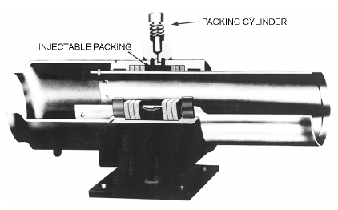

*Fig. 7 Packed Slip Expansion Joint*

Packed expansion joints are preferred where long-term system reliability is of prime importance (using types that can be repacked under full line pressure) and where major leaks can be life threatening or extremely costly. Typical applications are risers, tunnels, underground pipe, and distribution piping systems. Packless expansion joints are generally used where even small leaks cannot be tolerated (e.g., for gas and toxic chemicals), where temperature limitations preclude the use of packed expansion joints, and for very-large-diameter pipe where packed expansion joints cannot be constructed or the cost would be excessive.

In all cases, expansion joints should be installed, anchored, and guided in accordance with expansion joint manufacturers’ recommendations.

### Packed Expansion Joints

There are two types of packed expansion joints: packed slip expansion joints and flexible ball joints.

**Packed Slip Expansion Joints.** These are telescoping devices designed to accommodate axial movement only. Packing seals the sliding surfaces. The original packed slip expansion joint used multiple layers of braided compression packing, similar to the stuffing box commonly used with valves and pumps; this arrangement requires shutting and draining the system for maintenance and repair. Advances in design and packing technology have eliminated these problems, and most current packed slip joints use selflubricating semiplastic packing, that can be injected under full line pressure without shutting off the system (Figure 7). (Many manufacturers use asbestos-based packings, unless requested otherwise. Asbestos-free packings, such as flake graphite, are available and, although more expensive, should be specified in lieu of products containing asbestos.)

Standard packed slip expansion joints are constructed of carbon steel with weld or flange ends in sizes 40 to 910 mm for pressures up to 2.1 MPa and temperatures up to 425°C. Larger, higher-temperature, and higher-pressure designs are available. Standard single joints are generally designed for 100, 200, or 300 mm axial traverse; double joints with an intermediate anchor base can accommodate twice these movements. Special designs for greater movements are available.

**Flexible Ball Joints.** These joints are used in pairs to accommodate lateral or offset movement and must be installed in a leg perpendicular to the expected movement. The original flexible ball joint design incorporated only inner and outer containment seals that could not be serviced or replaced without removing the ball joint from the system. The packing technology of the packed slip expansion joint, explained previously, has been incorporated into the flexible ball joint design; now, packed flexible ball joints have self-lubricating semiplastic packing that can be injected under full line pressure without shutting off the system (Figure 8).

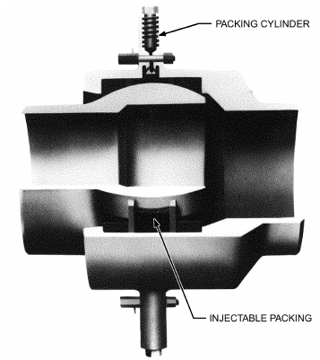

*Fig. 8 Flexible Ball Joint*

Standard flexible ball joints are available in sizes 32 to 760 mm with threaded (32 to 50 mm), weld, and flange ends for pressures to 2.1 MPa and temperatures to 400°C. Flexible ball joints are available in larger sizes and for higher temperature and pressure ranges.

### Packless Expansion Joints

Types include metal bellows expansion joints, rubber expansion joints, and flexible hose or pipe connectors.

**Metal Bellows Expansion Joints.** These expansion joints have a thin-walled convoluted section that accommodates movement by bending or flexing. The bellows material is generally Type 304, 316, or 321 stainless steel, but other materials are commonly used to satisfy service conditions. Small-diameter expansion joints 20 to 80 mm are generally called **expansion compensators** and are available in all-bronze or steel construction. Metal bellows expansion joints can generally be designed for the pressures and temperatures commonly encountered in HVAC systems and can also be furnished in rectangular configurations for ducts and chimney connectors.

Overpressurization, improper guiding, and other forces can distort the bellows element. For low-pressure applications, such distortion can be controlled by the geometry of the convolution or the thickness of the bellows material. For higher pressure, internally pressurized joints require reinforcing. Externally pressurized designs are not subject to such distortion and are not generally furnished without supplemental bellows reinforcing.

Single- and double-bellows expansion joints primarily accommodate axial movement only, similar to packed slip expansion joints. Although bellows expansion joints can accommodate some lateral movement, the **universal tied bellows expansion joint** better accommodates large lateral movement. This device operates much like a pair of flexible ball joints, except that bellows elements are used instead of flexible ball elements. The tie rods on this joint contain the pressure thrust, so anchor loads are much lower than with axial-type expansion joints.

<!-- str. 658 -->

**Table 21 Piping System Design Maximum Flow Rate for Energy Conservationa,b**

| Operating Hours/year Pipe Size, mm<br>Nominal | Operating Hours/year Pipe Size, mm<br>IPS Sched. 40 Std. ID | Other<br>L/s | ≤2000 Other<br>m/s | ≤2000 Variable Flow/ Variable Speed<br>L/s | Variable Flow/ Variable Speed<br>m/s | Other<br>L/s | >2000 and ≤4400 Other<br>m/s | >2000 and ≤4400 Variable Flow/ Variable Speed<br>L/s | Variable Flow/ Variable Speed<br>m/s | Other<br>L/s | >4400 Other<br>m/s | >4400 Variable Flow/ Variable Speed<br>L/s | Variable Flow/ Variable Speed<br>m/s |
|---|---|---|---|---|---|---|---|---|---|---|---|---|---|
| 63 | 62.7 | 7.57 | 2.5 | 11.35 | 3.7 | 5.35 | 1.7 | 8.20 | 2.5 | 4.29 | 1.5 | 6.95 | 2.2 |
| 76 | 77.9 | 11.35 | 2.5 | 17.03 | 3.5 | 8.83 | 1.8 | 13.25 | 2.8 | 6.95 | 1.5 | 10.72 | 2.2 |
| 102 | 102.3 | 22.08 | 2.7 | 33.45 | 4.1 | 16.40 | 2.0 | 25.25 | 3.1 | 13.25 | 1.5 | 20.19 | 2.5 |
| 127 | 128.2 | 25.87 | 2.0 | 39.12 | 3.0 | 19.55 | 1.5 | 29.65 | 2.3 | 15.77 | 1.2 | 23.35 | 1.8 |
| 152 | 153.8 | 47.32 | 2.5 | 64.00 | 3.7 | 39.55 | 1.9 | 54.25 | 2.9 | 27.75 | 1.5 | 42.90 | 2.3 |
| 203 | 202.7 | 75.71 | 2.3 | 113.55 | 3.5 | 56.78 | 1.8 | 88.33 | 2.7 | 44.15 | 1.5 | 69.40 | 2.1 |
| 255 | 254.5 | 113.55 | 2.2 | 170.35 | 3.3 | 82.02 | 1.5 | 126.18 | 2.5 | 63.09 | 1.2 | 100.95 | 2.0 |
| 305 | 303.2 | 157.72 | 2.2 | 239.75 | 3.3 | 119.87 | 1.7 | 182.95 | 2.5 | 94.65 | 1.3 | 145.11 | 2.0 |
| >305 |  | NA | 2.5 | NA | 4.0 | NA | 2.0 | NA | 2.9 | NA | 1.5 | NA | 2.3 |

<sup>a</sup>Source: Based on ASHRAE Standard 90.1-2013 Table 6.5.4.5 with the addition of IPS and calculation for velocity in metres per second.

<sup>b</sup>This table does not apply to district energy systems, and velocities in larger-bore piping can exceed these values per an interpretation of the ASHRAE 90.1 committee.

**Table 22 Water Velocities Based on Type of Service**

| Type of Service | Velocity, m/s | Reference |
|---|---|---|
| General service | 1.2 to 3.0 | a, b, c |
| City water | 0.9 to 2.1 | a, b |
|  | 0.6 to 1.5 | c |
| Boiler feed | 1.8 to 4.6 | a, c |
| Pump suction and drain lines | 1.2 to 2.1 | a, b |

<sup>a</sup>Crane Co. (1976). <sup>b</sup>Carrier (1960). <sup>c</sup>Grinnell Company (1951).

**Rubber Expansion Joints.** Similar to single-metal bellows expansion joints, rubber expansion joints incorporate a nonmetallic elastomeric bellows sealing element and generally have more stringent temperature and pressure limitations. Although rubber expansion joints can be used to accommodate expansion and contraction of the piping, they are primarily used as flexible connectors at equipment to isolate sound and vibration and eliminate stress at equipment nozzles.

**Flexible Hose.** This type of hose can be constructed of elastomeric material or corrugated metal with an outer braid for reinforcing and end restraint. Flexible hose is primarily used as a flexible connector at equipment to isolate sound and vibration and eliminate stress at equipment nozzles; however, flexible metal hose is well suited for use as an **offset-type expansion joint**, especially for copper tubing and branch connections off risers.

## 3. APPLICATIONS

## 3.1 WATER PIPING

### Flow Rate Limitations

Stewart and Dona (1987) surveyed the literature relating to water flow rate limitations. Noise, erosion, and installation and operating costs all limit the maximum and minimum velocities in piping systems. If piping sizes are too small, noise levels, erosion levels, and pumping costs can be unfavorable. If piping sizes are too large, installation costs are excessive. Therefore, pipe sizes are chosen to minimize initial cost while avoiding the undesirable effects of high velocities. ASHRAE Standard 90.1 has been accepted by authorities having jurisdiction (AHJs) as a code and, as such, limits the flow for energy conservation. The table (Table 21) is reproduced with modification showing velocity limitations.

Various upper limits of water velocity and/or pressure drop in piping and piping systems are used. One recommendation places a velocity limit of 1.2 m/s for 50 mm pipe and smaller, and a pressure drop limit of 400 Pa/m for piping over 50 mm. Other guidelines are based on the type of service (Table 22) or annual operating hours (Table 23). These limitations are imposed either to control the levels of pipe and valve noise, erosion, and water hammer pressure or for economic reasons. Carrier (1960) recommends that the velocity not exceed 4.6 m/s in any case.

**Table 23 Maximum Water Velocity to Minimize Erosion**

| Normal Operation, h/yr | Water Velocity, m/s |
|---|---|
| 1500 | 4.6 |
| 2000 | 4.4 |
| 3000 | 4.0 |
| 4000 | 3.7 |
| 6000 | 3.0 |

Source: Carrier (1960).

### Noise Generation

Velocity-dependent noise in piping and piping systems results from any or all of four sources: turbulence, cavitation, release of entrained air, and water hammer. In investigations of flow-related noise, Ball and Webster (1976), Marseille (1965), and Rogers (1953, 1954, 1956) reported that velocities on the order of 3 to 5 m/s lie within the range of allowable noise levels for residential and commercial buildings. The experiments showed considerable variation in noise levels obtained for a specified velocity. Generally, systems with longer pipe and with more numerous fittings and valves were noisier. In addition, sound measurements were taken under widely differing conditions; for example, some tests used plastic-covered pipe, whereas others did not. Thus, no detailed correlations relating sound level to flow velocity in generalized systems are available.

Noise generated by fluid flow in a pipe increases sharply if cavitation or release of entrained air occurs. Usually, the combination of high water velocity with a change in flow direction or a decrease in pipe cross section, causing a sudden pressure drop, is necessary to cause cavitation. Ball and Webster (1976) found that at their maximum velocity of 13 m/s, cavitation did not occur in straight 10 and 15 mm pipe; using the apparatus with two elbows, cold-water velocities up to 6.5 m/s caused no cavitation. Cavitation did occur in orifices of 1:8 area ratio (orifice flow area is one-eighth of pipe flow area) at 1.5 m/s and in 1:4 area ratio orifices at 3 m/s (Rogers 1954).

Some data are available for predicting hydrodynamic (liquid) noise generated by control valves. The International Society of Automation compiled prediction correlations in an effort to develop control valves for reduced noise levels (ISA 2007). The correlation to predict hydrodynamic noise from control valves is

> SL = 10log A<sub>v</sub> + 20 logΔp – 30 log t + 76.6&emsp;**(20)**

<!-- str. 659 -->

where

- SL = sound level, dB
- A<sub>v</sub> = valve coefficient, m<sup>3</sup>/(s·Pa)<sup>0.5</sup>
- Q = flow rate, m<sup>3</sup>/s
- Δp = pressure drop across valve, Pa
- t = downstream pipe wall thickness, mm

Air entrained in water usually has a higher partial pressure than the water. Even when flow rates are small enough to avoid cavitation, the release of entrained air may create noise. Every effort should be made to vent the piping system or otherwise remove entrained air.

### Erosion

Erosion in piping systems is caused by water bubbles, sand, or other solid matter impinging on the inner surface of the pipe. Generally, at velocities lower than 3 m/s, erosion is not significant as long as there is no cavitation. When solid matter is entrained in the fluid at high velocities, erosion occurs rapidly, especially in bends. Thus, high velocities should not be used in systems where sand or other solids are present or where slurries are transported.

### Allowances for Aging

With age, the internal surfaces of pipes become increasingly rough. This reduces the available flow with a fixed pressure supply. However, designing with excessive age allowances may result in oversized piping. Age-related decreases in capacity depend on type of water, type of pipe material, temperature of water, and type of system (open or closed) and include

- Sliming (biological growth or deposited soil on the pipe walls): occurs mainly in unchlorinated, raw water systems.
- Caking of calcareous salts: occurs in hard water (i.e., water bearing calcium salts) and increases with water temperature.
- Corrosion (incrustations of ferrous and ferric hydroxide on the pipe walls): occurs in metal pipe in soft water. Because oxygen is necessary for corrosion to take place, significantly more corrosion takes place in open systems.

Allowances for expected decreases in capacity are sometimes treated as a specific amount (percentage). Dawson and Bowman (1933) added an allowance of 15% friction loss to new pipe (equivalent to an 8% decrease in capacity). The *HDR Design Guide* (1981) increased the friction loss by 15 to 20% for closed piping systems and 75 to 90% for open systems. Carrier (1960) indicates a factor of approximately 1.75 between friction factors for closed and open systems.

Obrecht and Pourbaix (1967) differentiated between the corrosive potential of different metals in potable water systems and concluded that iron is the most severely attacked, then galvanized steel, lead, copper, and finally copper alloys (e.g., brass). Freeman (1941) and Hunter (1941) showed the same trend. After four years of coldand hot-water use, copper pipe had a capacity loss of 25 to 65%. Aged ferrous pipe has a capacity loss of 40 to 80%. Smith (1983) recommended increasing the design discharge by 1.55 for uncoated cast iron, 1.08 for iron and steel, and 1.06 for cement or concrete.

The Plastic Pipe Institute (1971) found that corrosion is not a problem in plastic pipe; the capacity of plastic pipe in Europe and the United States remains essentially the same after 30 years in use.

Extensive age-related flow data are available for use with the Hazen-Williams empirical equation. Difficulties arise in its application, however, because the original Hazen-Williams roughness coefficients are valid only for the specific pipe diameters, water velocities, and water viscosities used in the original experiments. Thus, when the Cs are extended to different diameters, velocities, and/or water viscosities, errors of up to about 50% in pipe capacity can occur (Sanks 1978; Williams and Hazen 1933).

### Water Hammer

When any moving fluid (not just water) is abruptly stopped, as when a valve closes suddenly, large pressures can develop. Although detailed analysis requires knowledge of the elastic properties of the pipe and the flow-time history, the limiting case of rigid pipe and instantaneous closure is simple to calculate. Under these conditions,

> Δp<sub>h</sub> = ρc<sub>s</sub>V&emsp;**(21)**

where

- Δp<sub>h</sub> = pressure rise caused by water hammer, Pa
- ρ = fluid density, kg/m<sup>3</sup>
- c<sub>s</sub> = velocity of sound in fluid, m/s
- V = fluid flow velocity, m/s

The c<sub>s</sub> for water is 1439 m/s, although the pipe’s elasticity reduces the effective value.

**Example 3.** What is the maximum pressure rise if water flowing at 3 m/s is stopped instantaneously?

**Solution:** Δp<sub>h</sub> = 1000 × 1439 × 3 = 4.32 MPa

## 3.2 SERVICE WATER PIPING

Sizing service water piping differs from sizing process lines in that design flows in service water piping are determined by the probability of simultaneous operation of multiple individual loads such as water closets, urinals, lavatories, sinks, and showers. The full-flow characteristics of each load device are readily obtained from manufacturers; however, service water piping sized to handle all load devices simultaneously would be seriously oversized. Thus, a major issue in sizing service water piping is to determine the diversity of the loads.

The procedure shown in this chapter uses the work of R.B. Hunter for estimating diversity (Hunter 1940, 1941). The present-day plumbing designer is usually constrained by building or plumbing codes, which specify the individual and collective loads to be used for pipe sizing. Frequently used codes (including the ICC Interna-*tional Plumbing Code* and the PHCC *National Standard Plumbing* Code) contain procedures quite similar to those shown here. The designer must be aware of the applicable code for the location being considered.

Federal mandates are forcing plumbing fixture manufacturers to reduce design flows to many types of fixtures, but these may not yet be included in locally adopted codes. Also, the designer must be aware of special considerations; for example, toilet usage at sports arenas will probably have much less diversity than codes allow and thus may require larger supply piping than the minimum specified by codes.

Table 24 gives the rate of flow desirable for many common fixtures and the average pressure necessary to give this rate of flow. Pressure varies with fixture design.

In estimating load, the rate of flow is frequently computed in **fix- ture units** that are relative indicators of flow. Table 25 gives the demand weights in terms of fixture units for different plumbing fixtures under several conditions of service, and Figure 9 gives the estimated demand corresponding to any total number of fixture units. Figures 10 and 11 provide more accurate estimates at the lower end of the scale.

The estimated demand load for fixtures used intermittently on any supply pipe can be obtained by multiplying the number of each kind of fixture supplied through that pipe by its weight from Table 25, adding the products, and then referring to the appropriate curve of Figure 9, 10, or 11 to find the demand corresponding to the total fixture units. In using this method, note that the demand for fixture or supply outlets other than those listed in the table of fixture units is not yet included in the estimate. The demands for outlets (e.g., hose connections and air-conditioning apparatus) that are likely to impose continuous demand during heavy use of the weighted fixtures should be estimated separately and added to demand for fixtures used intermittently to estimate total demand.

<!-- str. 660 -->

**Table 24 Proper Flow and Pressure Required During Flow for Different Fixtures**

| Fixture | Flow Pressure, kPa (gage)<sup>a</sup> Flow, L/s | Flow Pressure, kPa (gage)<sup>a</sup> Flow, L/s |
|---|---|---|
| Ordinary basin faucet | 55 | 0.2 |
| Self-closing basin faucet | 85 | 0.2 |
| Sink faucet, 10 mm | 70 | 0.3 |
| Sink faucet, 15 mm | 35 | 0.3 |
| Dishwasher | 105 to 175 | —<sup>b</sup> |
| Bathtub faucet | 35 | 0.4 |
| Laundry tube cock, 8 mm | 35 | 0.3 |
| Shower | 85 | 0.2 to 0.6 |
| Ball cock for closet | 105 | 0.2 |
| Flush valve for closet | 70 to 140 | 1.0 to 2.5<sup>c</sup> |
| Flush valve for urinal | 105 | 1.0 |
| Garden hose, 15 m, and sill cock | 210 | 0.3 |

<sup>a</sup>Flow pressure is that in pipe at entrance to fixture.

<sup>b</sup>Varies; see manufacturers’ data.

<sup>c</sup>Wide range because of variation in design and type of flush valve closets.

**Table 25 Demand Weights of Fixtures in Fixture Unitsa**

| Fixture or Group<sup>b</sup> | Occupancy | Type of Supply Control | Weight in Fixture Units<sup>c</sup> |
|---|---|---|---|
| Water closet | Public | Flush valve | 10 |
|  |  | Flush tank | 5 |
| Pedestal urinal | Public | Flush valve | 10 |
| Stall or wall urinal | Public | Flush valve | 5 |
|  |  | Flush tank | 3 |
| Lavatory | Public | Faucet | 2 |
| Bathtub | Public | Faucet | 4 |
| Shower head | Public | Mixing valve | 4 |
| Service sink | Office, etc. | Faucet | 3 |
| Kitchen sink | Hotel or restaurant | Faucet | 4 |
| Water closet | Private | Flush valve | 6 |
|  |  | Flush tank | 3 |
| Lavatory | Private | Faucet | 1 |
| Bathtub | Private | Faucet | 2 |
| Shower head | Private | Mixing valve | 2 |
| Bathroom group | Private | Flush valve for closet | 8 |
|  |  | Flush tank for closet | 6 |
| Separate shower | Private | Mixing valve | 2 |
| Kitchen sink | Private | Faucet | 2 |
| Laundry trays (1 to 3) | Private | Faucet | 3 |
| Combination fixture | Private | Faucet | 3 |

Source: Hunter (1941).

<sup>a</sup>For supply outlets likely to impose continuous demands, estimate continuous supply separately, and add to total demand for fixtures.

<sup>b</sup>For fixtures not listed, weights may be assumed by comparing fixture to listed one using water in similar quantities and at similar rates.

<sup>c</sup>Given weights are for total demand. For fixtures with both hot- and cold-water supplies, weights for maximum separate demands can be assumed to be 75% of listed demand for the supply.

The Hunter curves in Figures 9, 10, and 11 are based on use patterns in residential buildings and can be erroneous for other usages such as sports arenas. Williams (1976) discusses the Hunter assumptions and presents an analysis using alternative assumptions.

So far, the information presented shows the *design rate of flow* to be determined in any particular section of piping. The next step is to determine the size of piping. As water flows through a pipe, the pressure continually decreases along the pipe because of loss of energy from friction. The problem is then to ascertain the minimum pressure in the street main and the minimum pressure required to operate the topmost fixture. (A pressure of 100 kPa may be ample for most flush valves, but manufacturers’ requirements should be consulted. Some fixtures require a pressure up to 175 kPa. A minimum of 55 kPa should be allowed for other fixtures.) The pressure differential

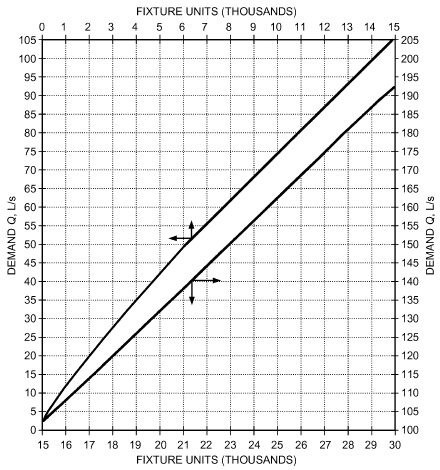

*Fig. 9 Demand Versus Fixture Units, Mixed System, High Part of Curve*

> (Adapted from Hunter 1941)

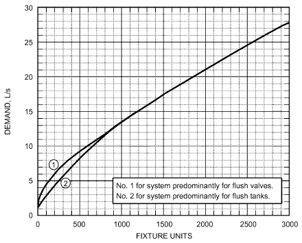

*Fig. 10 Estimate Curves for Demand Load*

> (Adapted from Hunter 1941)

overcomes pressure losses in the distributing system and the difference in elevation between the water main and the highest fixture.

The pressure loss (in kPa) resulting from the difference in elevation between the street main and the highest fixture can be obtained by multiplying the difference in elevation in metres by the conversion factor 9.8.

Pressure losses in the distributing system consist of pressure losses in the piping itself, plus the pressure losses in the pipe fittings, valves, and the water meter, if any. Approximate design pressure losses and flow limits for disk-type meters for various rates of flow are given in Figure 12. Water authorities in many localities require compound meters for greater accuracy with varying flow; consult the local utility. Design data for compound meters differ from the data in Figure 12. Manufacturers give data on exact pressure losses and capacities.

<!-- str. 661 -->

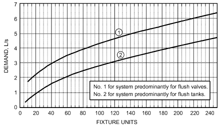

*Fig. 11 Section of Figure 10 on Enlarged Scale*

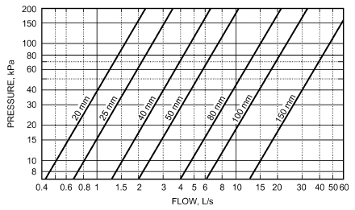

*Fig. 12 Pressure Losses in Disk-Type Water Meters*

Figure 13 shows the variation of pressure loss with rate of flow for various faucets and cocks. The water demand for hose bibbs or other large-demand fixtures taken off the building main frequently results in inadequate water supply to the upper floor of a building. This condition can be prevented by sizing the distribution system so that pressure drops from the street main to all fixtures are the same. An ample building main (not less than 25 mm where possible) should be maintained until all branches to hose bibbs have been connected. Where street main pressure is excessive and a pressure-reducing valve is used to prevent water hammer or excessive pressure at fixtures, hose bibbs should be connected ahead of the reducing valve.

The principles involved in sizing upfeed and downfeed systems are the same. In the downfeed system, however, the difference in elevation between the overhead supply mains and the fixtures provides the pressure required to overcome pipe friction. Because friction pressure loss and height pressure loss are not additive, as in an upfeed system, smaller pipes may be used with a downfeed system.

### Plastic Pipe

The maximum safe water velocity in a thermoplastic piping system under most operating conditions is typically 1.5 m/s; however, higher velocities can be used in cases where the operating characteristics of valves and pumps are known so that sudden changes in flow velocity can be controlled. The total pressure in the system at any time (operating pressure plus surge of water hammer) should not exceed 150% of the pressure rating of the system.

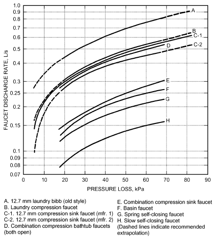

*Fig. 13 Variation of Pressure Loss with Flow Rate for Various Faucets and Cocks*

### Procedure for Sizing Cold-Water Systems

The recommended procedure for sizing piping systems is as follows:

1. Sketch the main lines, risers, and branches, and indicate the fixtures to be served. Indicate the rate of flow of each fixture.

2. Using Table 25, compute the demand weights of the fixtures in fixture units.

3. Determine the total demand in fixture units and, using Figure 9, 10, or 11, find the expected demand.

4. Determine the equivalent length of pipe in the main lines, risers, and branches. Because the sizes of the pipes are not known, the exact equivalent length of various fittings cannot be determined. Add the equivalent lengths, starting at the street main and proceeding along the service line, main line of the building, and up the riser to the top fixture of the group served.

5. Determine the average minimum pressure in the street main and the minimum pressure required for operation of the topmost fixture, which should be 50 to 175 kPa above atmospheric.

6. Calculate the approximate design value of the average pressure drop per unit length of pipe in equivalent length determined in step 4 and using Equation (1).

> Δp = (p<sub>s</sub> – 9.8H – p<sub>f</sub> – p<sub>m</sub>)/L

where

- Δp = average pressure loss per metre of equivalent length of pipe, kPa
- p<sub>s</sub> = pressure in street main, kPa
- p<sub>f</sub> = minimum pressure required to operate topmost fixture, kPa
- p<sub>m</sub> = pressure drop through water meter, kPa
- H = height of highest fixture above street main, m
- L = equivalent length determined in step 4, m

If the system is downfeed supply from a gravity tank, height of water in the tank, converted to kPa by multiplying by 9.8, replaces the street main pressure, and the term 9.8H is added instead of subtracted in calculating Δp. In this case, H is the vertical distance of the fixture below the bottom of the tank. The pressure conversion factor 9.8 is determined by the mass of

<!-- str. 662 -->

> 3 2

water occupying a 1 m volume, or 9800 N/m (9.8 kPa/m). 7. From the expected rate of flow determined in step 3 and the value of Δp calculated in step 6, choose the sizes of pipe from Figure 14, 15, or 16.

**Example 4.** Assume a minimum street main pressure of 375 kPa; a height of topmost fixture (a urinal with flush valve) above street main of 15 m; an equivalent pipe length from water main to highest fixture of 30 m; a total load on the system of 50 fixture units; and that the water closets are flush valve operated. Find the required size of supply main.

**Solution:** Use Equation (1):

- Δp = (p<sub>s</sub> – 9.8H – p<sub>f</sub> – p<sub>m</sub>)/L
- p<sub>s</sub> = Street main pressure (given) = 375 kPa
- H = 15 m (given)
- P<sub>f</sub> = 105 kPa from Table 24
- Flow = 3.2 L/s from Figure 11

For a trial run, use 40 mm; then P<sub>m</sub>= 45 kPa from Figure 12 at 3.2 L/s. The pressure drop available for overcoming friction in pipes and fittings is 375 – 9.8 × 15 – 105 – 45 = 78 kPa.

At this point, estimate the equivalent pipe length of the fittings on the direct line from the street main to the highest fixture. The exact equivalent length of the various fittings cannot be determined because the pipe sizes of the building main, riser, and branch leading to the highest fixture are not yet known, but a first approximation is necessary to tentatively select pipe sizes. If the computed pipe sizes differ from those used in determining the equivalent length of pipe fittings, a recalculation using the computed pipe sizes for the fittings will be necessary. It is common practice for the first trial to assume that the total equivalent length of the pipe fittings is 50% of the total length of pipe. In this example, 30 m × 50% = 15 m.

The permissible pressure loss per metre of equivalent pipe is 78/(30 + 15) = 1.7 kPa/m. A 40 mm building main is adequate.

The sizing of the branches of the building main, the risers, and the fixture branches follows these principles. For example, assume that one of the branches of the building main carries the cold-water supply for three water closets, two bathtubs, and three lavatories. Using the permissible pressure loss of 1.7 kPa/m, the size of branch (determined from Table 25 and Figures 14 and 11) is found to be 40 mm. Items included in the computation of pipe size are as follows:

Table 26 is a guide to minimum pipe sizing where flush valves are used.

| Fixtures, No. and Type | Fixture Units (Table 25 and Note c) | Fixture Units (Table 25 and Note c) | (Table 25 and Note c)<br>Demand Pipe Size (Figure 11) (Figure 14) |
|---|---|---|---|
| 3 flush valves | 3 × 6 | = | 18 |
| 2 bathtubs | 0.75 × 2 × 2 | = | 3 |
| 3 lavatories | 0.75 × 3 × 1 | = | 2.25 |
| Total |  | = | 23.25 2.4 L/s 40 mm |

Velocities exceeding 3 m/s cause undesirable noise in the piping system. This usually governs the size of larger pipes in the system, whereas in small pipe sizes, the friction loss usually governs the selection because the velocity is low compared to friction loss. Velocity is the governing factor in downfeed systems, where friction loss is usually neglected. Velocity in branches leading to pump suctions should not exceed 1.5 m/s.

If the street pressure is too low to adequately supply upper-floor fixtures, the pressure must be increased. Constant- or variable-speed booster pumps, alone or in conjunction with gravity supply tanks, or hydropneumatic systems may be used.

Flow control valves for individual fixtures under varying pressure conditions automatically adjust flow at the fixture to a predetermined quantity. These valves allow the designer to (1) limit flow at the individual outlet to the minimum suitable for the purpose, (2) hold total demand for the system more closely to the required minimum, and (3) design the piping system as accurately as is practicable for the requirements.

### Hydronic System Piping

The Darcy-Weisbach equation with friction factors from the Moody chart or Colebrook equation (or, alternatively, the Hazen-Williams equation) is fundamental to calculating pressure drop in hot- and chilled-water piping; however, charts calculated from these equations (such as Figures 14, 15, and 16) provide easy determination of pressure drops for specific fluids and pipe standards. In addition, tables of pressure drops can be found in Crane Co. (1976) and Hydraulic Institute (1990).

The Reynolds numbers represented on the charts in Figures 14, 15, and 16 are all in the turbulent flow regime. For smaller pipes and/or lower velocities, the Reynolds number may fall into the laminar regime, in which the Colebrook friction factors are no longer valid.

Most tables and charts for water are calculated for properties at 15°C. Using these for hot water introduces some error, although the answers are conservative (i.e., cold-water calculations overstate the pressure drop for hot water). Using 15°C water charts for 90°C water should not result in errors in Δp exceeding 20%.

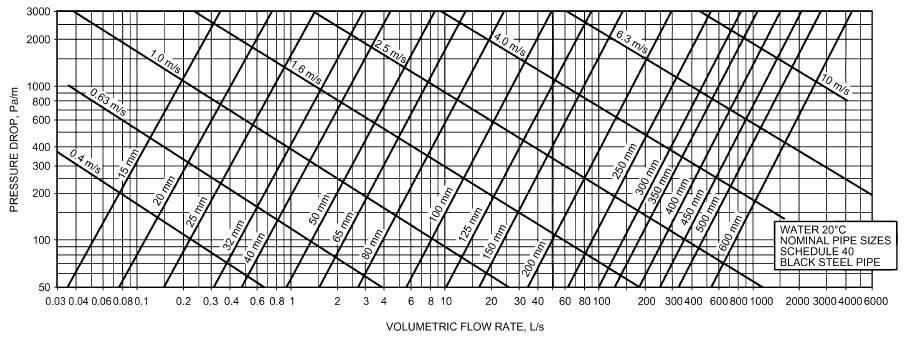

*Fig. 14 Friction Loss for Water in Commercial Steel Pipe (Schedule 40)*

<!-- str. 663 -->

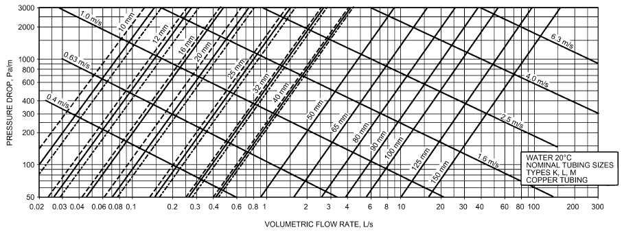

*Fig. 15 Friction Loss for Water in Copper Tubing (Types K, L, M)*

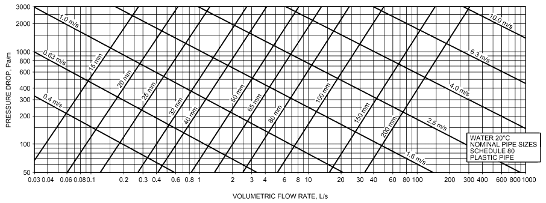

*Fig. 16 Friction Loss for Water in Plastic Pipe (Schedule 80)*

**Table 26 Allowable Number of 25 mm Flush Valves Served by Various Sizes of Water Pipe**

| Pipe Size, mm | No. of 25 mm Flush Valves |
|---|---|
| 32 | 1 |
| 40 | 2 to 4 |
| 50 | 5 to 12 |
| 65 | 13 to 25 |
| 75 | 26 to 40 |
| 100 | 41 to 100 |

*Two 20 mm flush valves are assumed equal to one 25 mm flush valve but can be served by a 25 mm pipe. Water pipe sizing must consider demand factor, available pressure, and length of run.

### Range of Usage of Pressure Drop Charts

**General Design Range.** The general range of pipe friction loss used for design of hydronic systems is between 100 and 400 Pa per metre of pipe. A value of 250 Pa/m represents the mean to which most systems are designed. Wider ranges may be used in specific designs if certain precautions are taken.

**Piping Noise.** Closed-loop hydronic system piping is generally sized below certain arbitrary upper limits, such as a velocity limit of 1.2 m/s for 50 mm pipe and under, and a pressure drop limit of 400 Pa/m for piping over 50 mm in diameter. Velocities in excess of 1.2 m/s can be used in piping of larger size. This limitation is generally accepted, although it is based on relatively inconclusive experience with noise in piping. **Water velocity noise** is not caused by water but by free air, sharp pressure drops, turbulence, or a combination of these, that cause cavitation or flashing of water into steam. Therefore, higher velocities may be used if proper precautions are taken to eliminate air and turbulence.

### Air Separation

Air in hydronic systems is usually undesirable because it causes flow noise, allows oxygen to react with piping materials, and sometimes even prevents flow in parts of a system. Air may enter a system at an air/water interface in an open system or in an expansion tank in a closed system, or it may be brought in dissolved in makeup water. Most hydronic systems use air separation devices to remove air. The solubility of air in water increases with pressure and decreases with temperature; thus, **separation of air from water is best achieved at the point of lowest pressure and/or highest temperature in a system**. For more information, see Chapter 13 of the 2020 *ASHRAE Handbook—HVAC Systems and* Equipment.

<!-- str. 664 -->

**Table 27 Equivalent Length in Metres of Pipe for 90° Elbows**

| Velocity, m/s | 15 | 20 | 25 | 32 | 40 | 50 | Pipe Size, mm<br>65 | Pipe Size, mm<br>90 | 100 | 125 | 150 | 200 | 250 | 300 |
|---|---|---|---|---|---|---|---|---|---|---|---|---|---|---|
| 0.33 | 0.4 | 0.5 | 0.7 | 0.9 | 1.1 | 1.4 | 1.6 | 2.0 | 2.6 | 3.2 | 3.7 | 4.7 | 5.7 | 6.8 |
| 0.67 | 0.4 | 0.6 | 0.8 | 1.0 | 1.2 | 1.5 | 1.8 | 2.3 | 2.9 | 3.6 | 4.2 | 5.3 | 6.3 | 7.6 |
| 1.00 | 0.5 | 0.6 | 0.8 | 1.1 | 1.3 | 1.6 | 1.9 | 2.5 | 3.1 | 3.8 | 4.5 | 5.6 | 6.8 | 8.0 |
| 1.33 | 0.5 | 0.6 | 0.8 | 1.1 | 1.3 | 1.7 | 2.0 | 2.5 | 3.2 | 4.0 | 4.6 | 5.8 | 7.1 | 8.4 |
| 1.67 | 0.5 | 0.7 | 0.9 | 1.2 | 1.4 | 1.8 | 2.1 | 2.6 | 3.4 | 4.1 | 4.8 | 6.0 | 7.4 | 8.8 |
| 2.00 | 0.5 | 0.7 | 0.9 | 1.2 | 1.4 | 1.8 | 2.2 | 2.7 | 3.5 | 4.3 | 5.0 | 6.2 | 7.6 | 9.0 |
| 2.35 | 0.5 | 0.7 | 0.9 | 1.2 | 1.5 | 1.9 | 2.2 | 2.8 | 3.6 | 4.4 | 5.1 | 6.4 | 7.8 | 9.2 |
| 2.67 | 0.5 | 0.7 | 0.9 | 1.3 | 1.5 | 1.9 | 2.3 | 2.8 | 3.6 | 4.5 | 5.2 | 6.5 | 8.0 | 9.4 |
| 3.00 | 0.5 | 0.7 | 0.9 | 1.3 | 1.5 | 1.9 | 2.3 | 2.9 | 3.7 | 4.5 | 5.3 | 6.7 | 8.1 | 9.6 |
| 3.33 | 0.5 | 0.8 | 0.9 | 1.3 | 1.5 | 1.9 | 2.4 | 3.0 | 3.8 | 4.6 | 5.4 | 6.8 | 8.2 | 9.8 |

**Table 28 Iron and Copper Elbow Equivalents**

| Fitting |   | Iron Pipe | Copper Tubing | Copper Tubing |
|---|---|---|---|---|
| Elbow, 90° |  | 1.0 |  | 1.0 |
| 45° |  | 0.7 |  | 0.7 |
| 90° long-radius |  | 0.5 |  | 0.5 |
| 90° welded |  | 0.5 |  | 0.5 |
| Reduced coupling |  | 0.4 |  | 0.4 |
| Open return bend |  | 1.0 |  | 1.0 |
| Angle radiator valve |  | 2.0 |  | 3.0 |
| Radiator or convector |  | 3.0 |  | 4.0 |
| Boiler or heater |  | 3.0 |  | 4.0 |
| Open gate valve | 0.5 |  | 0.7 |  |
| Open globe valve | 12.0 |  | 17.0 |  |

Sources: Giesecke (1926) and Giesecke and Badgett (1931, 1932a).

*See Table 10 for equivalent length of one elbow.

In the absence of venting, air can be entrained in the water and carried to separation units at flow velocities of 0.5 to 0.6 m/s or more in pipe 50 mm and under. Minimum velocities of 0.6 m/s are therefore recommended. For pipe sizes 50 mm and over, minimum velocities corresponding to a pressure loss of 75 Pa are normally used. Maintaining minimum velocities is particularly important in the upper floors of high-rise buildings where the air tends to come out of solution because of reduced pressures. Higher velocities should be used in **downcomer** return mains feeding into air separation units located in the basement.

**Example 5.** Determine the iron pipe size for a circuit requiring 1.25 L/s flow.

**Solution:** Enter Figure 4 at 1.25 L/s, read up to pipe size within normal design range (100 to 400 Pa/m), and select 40 mm. Velocity is 1 m/s and pressure loss is 300 Pa/m.

### Valve and Fitting Pressure Drop

Valves and fittings can be listed in elbow equivalents, with an elbow being equivalent to a length of straight pipe. Table 27 lists equivalent lengths of 90° elbows; Table 28 lists elbow equivalents for valves and fittings for iron and copper.

**Example 6.** Determine equivalent length of pipe for a 100 mm open gate valve at a flow velocity of approximately 1.33 m/s.

**Solution:** From Table 27, at 1.33 m/s, each elbow is equivalent to 3.2 m of 100 mm pipe. From Table 28, the gate valve is equivalent to 0.5 elbows. The actual equivalent pipe length (added to measured circuit length for pressure drop determination) will be 3.2 × 0.5, or 1.6 m of 100 mm.

**Tee Fitting Pressure Drop.** Pressure drop through pipe tees varies with flow through the branch. Figure 17 shows pressure drops for nominal 25 mm tees of equal inlet and outlet sizes and for the flow patterns shown. Idelchik (1986) also presents data for threaded tees.

Different investigators present tee loss data in different forms,

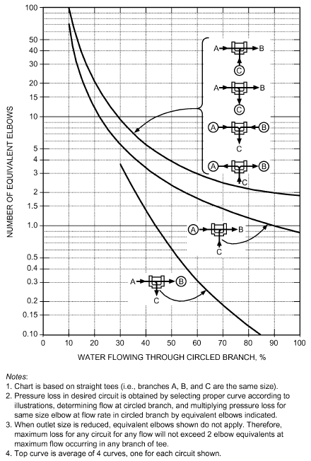

*Fig. 17 Elbow Equivalents of Tees at Various Flow Conditions*

> (Giesecke and Badgett 1931, 1932b)

sources. As an estimate of the upper limit to tee losses, a pressure or head loss coefficient of 1.0 may be assumed for entering and leaving

> 2 2

flows (i.e., Δp = 1.0ρV /2 + 1.0ρV /2).

> in out

**Example 7.** Determine the pressure or head losses for a 25 mm (all openings) threaded pipe tee flowing 25% to the side branch, 75% through. The entering flow is 1 L/s (1.79 m/s).

**Solution:** From Figure 17, bottom curve, the number of equivalent elbows for the through-flow is 0.15 elbows; the through-flow is 0.75 L/s (1.34 m/s); and the pressure drop is based on the exit flow rate. Table 27 gives the equivalent length of a 25 mm elbow at 1.33 m/s as 0.8 m. Using Figure 14, the head loss is 900 Pa/m for 25 mm pipe and 0.75 L/s flow.

<!-- str. 665 -->

Δp = (0.15)(0.8)(900)

> = 108 Pa = 0.108 kPa pressure drop

Δh = (0.15)(0.8)(900)/(1000)(9.8)

> = 0.0110 m head loss

From Figure 17, top curve, the number of equivalent elbows for the branch flow of 25% is 13 elbows; the branch flow is 0.75 L/s (0.45 m/s); and the head loss or pressure drop is based on the exit flow rate. Table 27 gives the equivalent of a 25 mm elbow at 0.45 m/s as 0.75 m. Using Figure 14, the pressure drop is 130 Pa/m for 25 mm pipe and 0.25 L/s flow.

> Δp = (13)(0.75)(130)
>
> = 1268 Pa = 1.268 kPa pressure drop

> Δh = (13)(0.75)(130)/(1000)(9.8)
>
> = 0.129 m head loss

## 3.3 STEAM PIPING

Pressure losses in steam piping for flows of dry or nearly dry steam are governed by Equations (2) to (8) in the section on Design Equations. This section incorporates these principles with other information specific to steam systems.

### Pipe Sizes

Required pipe sizes for a given load in steam heating depend on the following factors:

- The initial pressure and the total pressure drop that can be allowed between the source of supply and the end of the return system
- The maximum velocity of steam allowable for quiet and dependable operation of the system, taking into consideration the direction of condensate flow
- The equivalent length of the run from the boiler or source of steam supply to the farthest heating unit

**Initial Pressure and Pressure Drop.** Table 29 lists pressure drops commonly used with corresponding initial steam pressures for sizing steam piping.

Several factors, such as initial pressure and pressure required at the end of the line, should be considered, but it is most important that (1) the total pressure drop does not exceed the initial gage pressure of the system (in practice, it should never exceed one-half the initial gage pressure); (2) pressure drop is not great enough to cause excessive velocities; (3) a constant initial pressure is maintained, except on systems specially designed for varying initial pressures (e.g., subatmospheric pressure), that normally operate under controlled partial vacuums; and (4) for gravity return systems, pressure drop to heating units does not exceed the water column available for removing condensate (i.e., height above the boiler water line of the lowest point on the steam main, on the heating units, or on the dry return).

**Maximum Velocity.** For quiet operation, steam velocity should be 40 to 60 m/s, with a maximum of 75 m/s. The lower the velocity, the quieter the system. When condensate must flow against the steam, even in limited quantity, the steam’s velocity must not exceed limits above which the disturbance between the steam and the counterflowing water may (1) produce objectionable sound, such as water hammer, or (2) result in the retention of water in certain parts of the system until the steam flow is reduced sufficiently to allow water to pass. These limits are a function of (1) pipe size; (2) pitch of the pipe if it runs horizontally; (3) quantity of condensate flowing against the steam; and (4) freedom of the piping from water pockets that, under certain conditions, act as a restriction in pipe size. Table 30 lists maximum capacities for various size steam lines.

**Equivalent Length of Run.** All tables for the flow of steam in pipes based on pressure drop must allow for pipe friction, as well as for the resistance of fittings and valves. These resistances are generally stated in terms of straight pipe; that is, a certain fitting produces a drop in pressure equivalent to the stated length of straight run of the same size of pipe. Table 31 gives the length of straight pipe usually allowed for the more common types of fittings and valves. In all pipe sizing tables in this chapter, *length of run* refers to the *equivalent length of run* as distinguished from the actual length of pipe. A common sizing method is to assume the length of run and to check this assumption after pipes are sized. For this purpose, length of run is usually assumed to be double the actual length of pipe.

**Example 8.** Using Table 31, determine the equivalent length of pipe for the run shown.

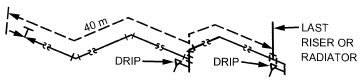

> Measured length = 40 m
>
> 100 mm gate valve = 0.6 m

> Four 100 mm elbows = 10m.8

**Table 29 Pressure Drops Used for Sizing Steam Pipea**

| Initial Steam Pressure, kPa<sup>b</sup> | Pressure Drop, Pa/m | Total Pressure Drop in Steam Supply Piping, kPa |
|---|---|---|
| Vacuum return | 30 to 60 | 7 to 14 |
| 101 | 7 | 0.4 |
| 108 | 30 | 0.4 to 1.7 |
| 115 | 30 | 3.5 |
| 135 | 60 | 10 |
| 170 | 115 | 20 |
| 205 | 225 | 30 |
| 310 | 450 | 35 to 70 |
| 445 | 450 to 1100 | 70 to 105 |
| 790 | 450 to 1100 | 105 to 170 |
| 1140 | 450 to 2300 | 170 to 210 |

<sup>a</sup>Equipment, control valves, and so forth must be selected based on delivered pressures.

<sup>b</sup>Subtract 101 to convert to pressure above atmospheric.

**Table 30 Comparative Capacity of Steam Lines at Various Pitches for Steam and Condensate Flowing in Opposite Directions**

| Pitch of Pipe, mm/m | Capacity | 20 Maximum Velocity | Capacity | 25 Maximum Velocity | Nominal Pipe Diameter, mm<br>Capacity | Nominal Pipe Diameter, mm<br>32 Maximum Velocity | Capacity | 40 Maximum Velocity | Capacity | 50 Maximum Velocity |
|---|---|---|---|---|---|---|---|---|---|---|
| 20 | 0.4 | 2.4 | 0.9 | 2.7 | 1.5 | 3.4 | 2.5 | 3.7 | 5.4 | 4.6 |
| 40 | 0.5 | 3.4 | 1.1 | 3.7 | 2 | 4.3 | 3.3 | 4.9 | 6.8 | 5.5 |
| 80 | 0.7 | 4.0 | 1.5 | 4.6 | 2.5 | 5.2 | 4.2 | 5.8 | 8.7 | 7.3 |
| 120 | 0.8 | 4.3 | 1.6 | 5.2 | 3.1 | 6.1 | 4.7 | 6.7 | 10.5 | 8.2 |
| 170 | 0.9 | 4.9 | 1.9 | 5.8 | 3.4 | 6.7 | 5.3 | 7.3 | 11.7 | 9.1 |
| 250 | 1.0 | 5.2 | 2.2 | 6.7 | 3.9 | 7.6 | 5.9 | 7.9 | 12.5 | 9.8 |
| 350 | 1.2 | 6.7 | 2.4 | 7.3 | 4.2 | 7.9 | 6.4 | 8.5 | 12.9 | 9.8 |
| 420 | 1.3 | 6.7 | 2.6 | 7.6 | 4.9 | 9.4 | 7.5 | 10.1 | 14.5 | 10.1 |

Source: Laschober et al. (1966). Capacity in g/s; velocity in m/s.

<!-- str. 666 -->

> Two 100 mm tees = 11 m
>
> Equivalent = 62.4m

### Sizing Charts

Figure 18 is the basic chart for determining the flow rate and velocity of steam in Schedule 40 pipe for various values of pressure drop per unit length, based on saturated steam at standard pressure (101.325 kPa). Using the multiplier chart (Figure 19), Figure 18 can be used at all saturation pressures between 101 and 1500 kPa (see Example 10).

## 3.4 LOW-PRESSURE STEAM PIPING

Values in Table 32 (taken from Figure 18) provide a more rapid means of selecting pipe sizes for the various pressure drops listed and for systems operated at 25 and 85 kPa (gage). The flow rates shown for 25 kPa can be used for saturated pressures from 7 to 41 kPa, and those shown for 85 kPa can be used for saturated pressures from 55 to 110 kPa with an error not exceeding 8%.

Both Figure 18 and Table 32 can be used where the flow of condensate does not inhibit the flow of steam. Columns B and C of Table 33 are used in cases where steam and condensate flow in opposite directions, as in risers or runouts that are not dripped. Columns D, E, and F are for one-pipe systems and include risers, radiator valves and vertical connections, and radiator and riser runout sizes, all of which are based on the critical velocity of the steam to allow counterflow of condensate without noise.

Return piping can be sized by Table 34, using pipe capacities for wet, dry, and vacuum return lines for several values of pressure drop per metres of equivalent length.

**Example 9.** What pressure drop should be used for the steam piping of a system if the measured length of the longest run is 150 m, and the initial pressure must not exceed 14 kPa above atmospheric?

**Solution:** It is assumed, if the measured length of the longest run is 150 m, that when the allowance for fittings is added, the equivalent length of run does not exceed 300 m. Then, with the pressure drop not over one-half of the initial pressure, the drop could be 7 kPa or less. With a pressure drop of 7 kPa and a length of run of 300 m, the drop would be 23 Pa/m; if the total drop were 3.5 kPa, the drop would be 12 Pa/m. In both cases, the pipe could be sized for a desired capacity according to Figure 18.

On completion of the sizing, the drop could be checked by taking the longest line and actually calculating the equivalent length of run from the pipe sizes determined. If the calculated drop is less than that assumed, the pipe size is adequate; if it is more, an unusual number of fittings is probably involved, and either the lines must be straightened, or the next larger pipe size must be tried.

### High-Pressure Steam Piping

Many heating systems for large industrial buildings use high-pressure steam [100 to 1000 kPa (gage)]. These systems usually have unit heaters or large built-up fan units with blast heating coils.

**Table 31 Equivalent Length of Fittings to Be Added to Pipe Run**

| Nominal Pipe Diameter, mm | Standard Elbow | Length to Be Added to Run, m<br>Side Outlet Tee<sup>b</sup> | Length to Be Added to Run, m<br>Gate Valve<sup>a</sup> | Length to Be Added to Run, m<br>Globe Valve<sup>a</sup> | Angle Valve<sup>a</sup> |
|---|---|---|---|---|---|
| 15 | 0.4 | 0.9 | 0.1 | 4 | 2 |
| 20 | 0.5 | 1.2 | 0.1 | 5 | 3 |
| 25 | 0.7 | 1.5 | 0.1 | 7 | 4 |
| 32 | 0.9 | 1.8 | 0.2 | 9 | 5 |
| 40 | 1.1 | 2.1 | 0.2 | 10 | 6 |
| 50 | 1.3 | 2.4 | 0.3 | 14 | 7 |
| 65 | 1.5 | 3.4 | 0.3 | 16 | 8 |
| 80 | 1.9 | 4.0 | 0.4 | 20 | 10 |
| 100 | 2.7 | 5.5 | 0.6 | 28 | 14 |
| 125 | 3.3 | 6.7 | 0.7 | 34 | 17 |
| 150 | 4.0 | 8.2 | 0.9 | 41 | 20 |
| 200 | 5.2 | 11 | 1.1 | 55 | 28 |
| 250 | 6.4 | 14 | 1.4 | 70 | 34 |
| 300 | 8.2 | 16 | 1.7 | 82 | 40 |
| 350 | 9.1 | 19 | 1.9 | 94 | 46 |

<sup>a</sup>Valve in full-open position.

<sup>b</sup>Values apply only to a tee used to divert the flow in the main to the last riser.

**Table 32 Flow Rate of Steam in Schedule 40 Pipe**

| Nominal Pipe Size, mm | 14 Pa/m Sat. Press., kPa<br>25 | 14 Pa/m Sat. Press., kPa<br>85 | 28 Pa/m Sat. Press., kPa<br>25 | 28 Pa/m Sat. Press., kPa<br>85 | 58 Pa/m Sat. Press., kPa<br>25 | 58 Pa/m Sat. Press., kPa<br>85 | Pressure Drop, Pa/m 113 Pa/m Sat. Press., kPa<br>25 | Pressure Drop, Pa/m 113 Pa/m Sat. Press., kPa<br>85 | 170 Pa/m Sat. Press., kPa<br>25 | 170 Pa/m Sat. Press., kPa<br>85 | 225 Pa/m Sat. Press., kPa<br>25 | 225 Pa/m Sat. Press., kPa<br>85 | 450 Pa/m Sat. Press., kPa<br>25 | 450 Pa/m Sat. Press., kPa<br>85 |
|---|---|---|---|---|---|---|---|---|---|---|---|---|---|---|
| 20 | 1.1 | 1.4 | 1.8 | 2.0 | 2.5 | 3.0 | 3.7 | 4.4 | 4.5 | 5.4 | 5.3 | 6.3 | 7.6 | 9.2 |
| 25 | 2.1 | 2.6 | 3.3 | 3.9 | 4.7 | 5.8 | 6.8 | 8.3 | 8.6 | 10 | 10 | 12 | 14 | 17 |
| 32 | 4.5 | 5.7 | 6.7 | 8.3 | 9.8 | 12 | 14 | 17 | 18 | 21 | 20 | 25 | 29 | 35 |
| 40 | 7.1 | 8.8 | 11 | 13 | 15 | 19 | 22 | 26 | 27 | 33 | 31 | 38 | 45 | 54 |
| 50 | 14 | 17 | 20 | 24 | 29 | 36 | 42 | 52 | 53 | 64 | 60 | 74 | 89 | 107 |
| 65 | 22 | 27 | 33 | 39 | 48 | 58 | 68 | 83 | 86 | 103 | 98 | 120 | 145 | 173 |
| 80 | 40 | 48 | 59 | 69 | 83 | 102 | 121 | 146 | 150 | 180 | 174 | 210 | 246 | 302 |
| 90 | 58 | 69 | 84 | 101 | 125 | 153 | 178 | 214 | 219 | 265 | 252 | 305 | 372 | 435 |
| 100 | 81 | 101 | 120 | 146 | 178 | 213 | 249 | 302 | 309 | 378 | 363 | 436 | 529 | 617 |
| 125 | 151 | 180 | 212 | 265 | 307 | 378 | 450 | 536 | 552 | 662 | 643 | 769 | 945 | 1080 |
| 150 | 242 | 290 | 355 | 422 | 499 | 611 | 718 | 857 | 882 | 1080 | 1060 | 1260 | 1500 | 1790 |
| 200 | 491 | 605 | 702 | 882 | 1020 | 1260 | 1440 | 1800 | 1830 | 2230 | 2080 | 2580 | 3020 | 3720 |
| 250 | 907 | 1110 | 1290 | 1590 | 1890 | 2290 | 2650 | 3280 | 3300 | 4030 | 3780 | 4660 | 5380 | 6550 |
| 300 | 1440 | 1730 | 2080 | 2460 | 2950 | 3580 | 4160 | 5040 | 5170 | 6240 | 6050 | 7250 | 8540 | 10200 |

Notes: 2. The flow rates at 25 kPa cover saturated pressure from 7 to 41 kPa, and the rates at 1. Flow rate is in g/s at initial saturation pressures of 25 and 85 kPa (gage). Flow is 85 kPa cover saturated pressure from 55 to 110 kPa with an error not exceeding 8%. based on Moody friction factor, where the flow of condensate does not inhibit 3. The steam velocities corresponding to the flow rates given in this table can be found the flow of steam. from Figures 18 and 19.

<!-- str. 667 -->

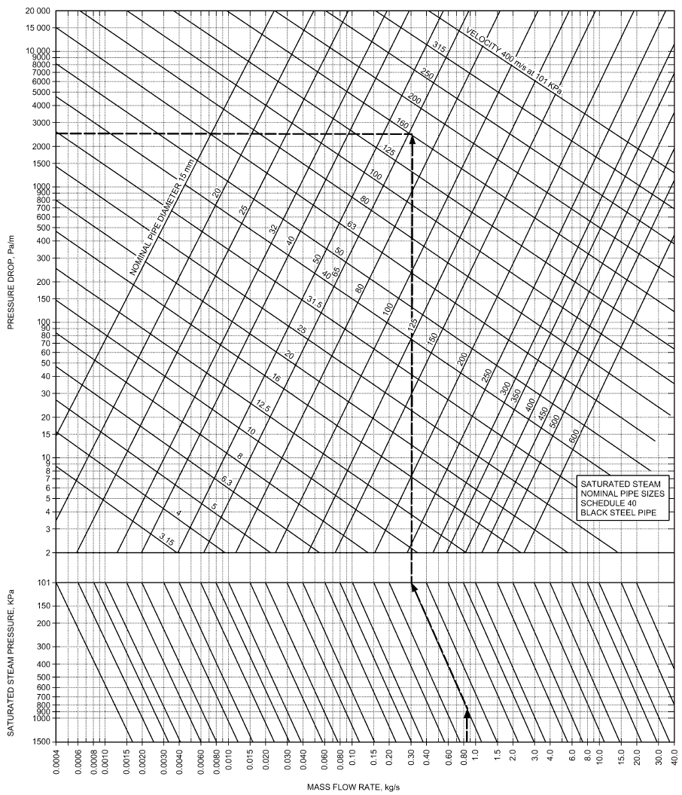

*Fig. 18 Flow Rate and Velocity of Steam in Schedule 40 Pipe at Saturation Pressure of 101 kPa*

<!-- str. 668 -->

**Table 33 Steam Pipe Capacities for Low-Pressure Sy stems** Temperatures are controlled by a modulating or throttling thermostatic valve or by face or bypass dampers controlled by the room air

| Nominal Pipe Size, mm | Two-Pipe System Condensate Flowing Against Steam<br>Vertical | Two-Pipe System Condensate Flowing Against Steam<br>Horizontal | Capacity, g/s Supply Risers Upfeed | One-Pipe Systems<br>Radiator Valves and Vertical Connections | One-Pipe Systems<br>Radiator and Riser Runouts |
|---|---|---|---|---|---|
| A | B<sup>a</sup> | C<sup>b</sup> | D<sup>c</sup> | E | F<sup>b</sup> |
| 20 | 1.0 | 0.9 | 0.8 | — | 0.9 |
| 25 | 1.8 | 1.8 | 1.4 | 0.9 | 0.9 |
| 32 | 3.9 | 3.4 | 2.5 | 2.0 | 2.0 |
| 40 | 6.0 | 5.3 | 4.8 | 2.9 | 2.0 |
| 50 | 12 | 11 | 9.1 | 5.3 | 2.9 |
| 65 | 20 | 17 | 14 | — | 5.3 |
| 80 | 36 | 25 | 25 | — | 8.2 |
| 90 | 49 | 36 | 36 | — | 15 |
| 100 | 64 | 54 | 48 | — | 23 |
| 125 | 132 | 99 | — | — | 35 |
| 150 | 227 | 176 | — | — | 69 |
| 200 | 472 | 378 | — | — | — |
| 250 | 882 | 718 | — | — | — |
| 300 | 1450 | 1200 | — | — | — |
| 400 | 2770 | 2390 | — | — | — |

Notes: 1. For one- or two-pipe systems in which condensate flows against steam flow. 2. Steam at average pressure of 7 kPa (gage) used as basis of calculating capacities.

<sup>a</sup>Do not use column B for pressure drops of less than 13 Pa per metre of equivalent run. Use Figure 18 or Table 31 instead.

<sup>b</sup>Pitch of horizontal runouts to risers and radiators should be not less than 40 mm/m.

> temperature, fan inlet, or fan outlet.

### Use of Basic and Velocity Multiplier Charts

**Example 10.** Given a flow rate of 0.85 kg/s, an initial steam pressure of 800 kPa, and a pressure drop of 2.5 kPa/m, find the size of Schedule 40

> pipe required and the velocity of steam in the pipe.

**Solution:** The following steps are shown by the broken line on Figures

> 18 and 19.

1. Enter Figure 18 at a flow rate of 0.85 kg/s, and move vertically to

> the horizontal line at 800 kPa

2. Follow along inclined multiplier line (upward and to the left) to horizontal 101 kPa line. The equivalent mass flow at 101 kPa is

> about 0.30 kg/s.

3. Follow the 0.30 kg/s line vertically until it intersects the horizontal line at 2500 Pa/m pressure drop. Nominal pipe size is 65 mm. The equivalent steam velocity at 101 kPa is about 165 m/s.

4. To find the steam velocity at 800 kPa, locate the value of 165 m/s on the ordinate of the velocity multiplier chart (Figure 19) at 101 kPa.

5. Move along the inclined multiplier line (downward and to the right) until it intersects the vertical 800 kPa pressure line. The velocity is

> about 65 m/s.

Note: Steps 1 through 5 would be rearranged or reversed if different

> data were given.

## 3.5 STEAM CONDENSATE SYSTEMS

The majority of steam systems used in heating applications are two-pipe systems (steam pipe and condensate pipe). This discussion is limited to sizing the condensate lines in two-pipe systems.

Where this pitch cannot be obtained, runouts over 2.5 m in length should be size larger than that called for in this table.

<sup>c</sup>Do not use column D for pressure drops of less than 9 Pa per metre of equiv except on sizes 80 mm and over. Use Figure 18 or Table 31 instead.

one pipe **Two-Pipe Systems**

When steam is used for heating a liquid to 102°C or less (e.g., in alent run, domestic water heat exchangers, domestic heating water converters, or air-heating coils), the devices are usually provided with a steam control valve. As the control valve throttles, the absolute pressure in the load device decreases, removing all pressure motivation for flow in the condensate return system. To ensure the flow of steam condensate from the load device through the trap and into the return system, it is necessary to provide a vacuum breaker on the device ahead of the trap. This ensures a minimum pressure at the trap inlet of atmospheric pressure plus whatever liquid leg the designer has provided. Then, to ensure flow through the trap, it is necessary to design the condensate system so that it will never have a pressure above atmospheric in the condensate return line.

**Table 34 Return Main and Riser Capacities for Low-Pressure Systems, g/s**

```text
    Pipe        7 Pa/m               9 Pa/m                14 Pa/m               28 Pa/m                57 Pa/m             113 Pa/m
    Size,
     mm    Wet    Dry   Vac.   Wet    Dry    Vac.    Wet    Dry    Vac.     Wet    Dry    Vac.    Wet     Dry    Vac.   Wet Dry     Vac.
      G     H       I    J      K      L      M       N      O       P       Q      R      S        T      U      V      W     X     Y
      20     —      —     —     —      —        5      —      —      13      —      —       18      —       —      25     —    —      36
      25      16      8   —      18      9     18      22     10     22       32     13     31      44      14     44     —    —      62
      32      27    16    —      31     19     31      38     21     38       54     27     54      76      30     76     —    —     107
      40      43    26    —      50     30     49      60     33     60       85     43     85     120      48    120     —    —     169
      50      88    59    —     102     67    103     126     72    126      176     93   179      252     104    252     —    —     357
      65    149     96    —     199    109    171     212    120    212      296    155   300      422     171    422     —    —     596
      80    237    184    —     268    197    275     338    221    338      473    284   479      674     315    674     —    —     953
      90    347    248    —     416    277    410     504    315    504      693    407   716     1010     451   1010     —    —    1424
     100    489    369    —     577    422    567     693    473    693      977    609   984     1390     678   1390     —    —    1953
     125     —      —     —     —      —      993      —      —    1220      —      —    1730       —       —    2440     —    —    3440
     150     —      —     —     —      —     1590      —      —    1950      —      —    2770       —       —    3910     —    —    5519
      20     —        6   —     —        6     18      —       6     22      —        6     31      —        6     44     —    —      62
      25     —      14    —     —       14     31      —      14     38      —       14     54      —       14     76     —    —     107
      32     —      31    —     —       31     49      —      31     60      —       31     85      —       31    120     —    —     169
      40     —      47    —     —       47    103      —      47    126      —       47   179       —       47    252     —    —     357
      50     —      95    —     —       95    171      —      95    212      —       95   300       —       95    422     —    —     596
      65     —      —     —     —      —      275      —      —     338      —      —     479       —       —     674     —    —     953
      80     —      —     —     —      —      410      —      —     504      —      —     716       —       —    1010     —    —    1424
      90     —      —     —     —      —      564      —      —     693      —      —     984       —       —    1390     —    —    1953
     100     —      —     —     —      —      993      —      —    1220      —      —    1730       —       —    2440     —    —    3440
     125     —      —     —     —      —     1590      —      —    1950      —      —    2772       —       —    3910     —    —    5519
```

<!-- str. 669 -->

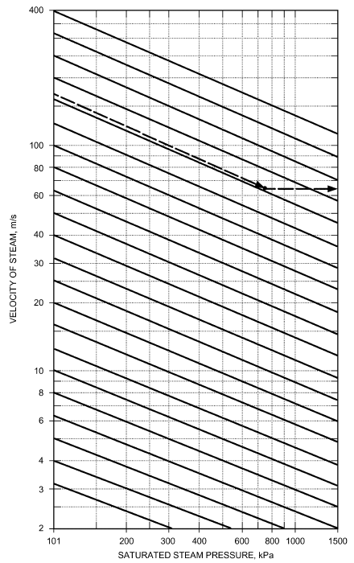

*Fig. 19 Velocity Multiplier Chart for Figure 18*

**Vented (Open) Return Systems.** To achieve this pressure requirement, the condensate return line is usually vented to the atmosphere (1) near the point of entrance of the flow streams from the load traps, (2) in proximity to all connections from drip traps, and (3) at transfer pumps or feedwater receivers.

The dry return lines in a vented return system have flowing liquid in the bottom of the line and gas or vapor in the top (Figure 20A). The liquid is the condensate, and the gas may be steam, air, or a mixture of the two. The flow phenomenon for these dry return systems is open channel flow, which is best described by the **Manning equatio**n:

> Q = 1.00Ar<sup>2⁄3</sup>S<sup>1⁄2</sup>/n&emsp;**(22)**

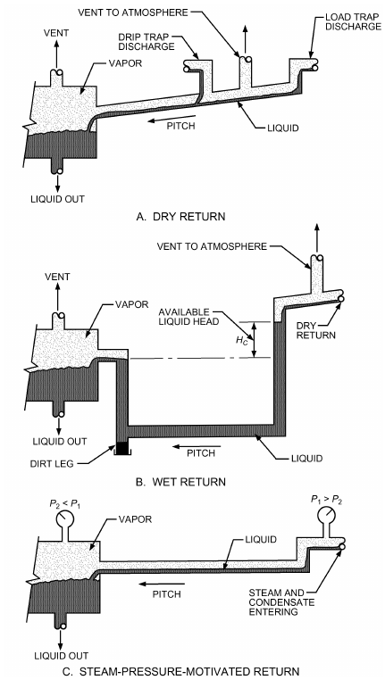

*Fig. 20 Types of Condensate Return Systems*

where

- Q = volumetric flow rate, m<sup>3</sup>/s
- A = cross-sectional area of conduit, m<sup>2</sup>
- r = hydraulic radius of conduit, m
- n = coefficient of roughness (usually 0.012)
- S = slope of conduit, m/m

Table 35 is a solution to Equation (22) that shows pipe size capacities for steel pipes with various pitches. Recommended practice is to size vertical lines by the maximum pitch shown, although they would actually have a capacity far in excess of that shown. As pitch increases, hydraulic jump that could fill the pipe and other transient effects that could cause water hammer should be avoided. Flow values in Table 35 are calculated for Schedule 40 steel pipe, with a factor of safety of 3.0, and can be used for copper pipes of the same nominal pipe size.

The flow characteristics of **wet return lines** (Figure 20B) are best described by the Darcy-Weisbach equation [Equation (1)]. The motivation for flow is the fluid pressure difference between the entering section of the flooded line and the leaving section. It is common practice, in addition to providing for the fluid pressure differential, to slope the return in the direction of flow to a collection point such as a dirt leg to clear the line of sediment or solids. Table 36 is a solution to Equation (1) that shows pipe size capacity for steel pipes with various available fluid pressures. Table 36 can also be used for copper tubing of equal nominal pipe size.

<!-- str. 670 -->

**Nonvented (Closed) Return Systems.** For systems with a continual steam pressure difference between the point where the condensate enters the line and the point where it leaves (Figure 20C), Table 34 or Table 35, as applicable, can be used for sizing the condensate lines. Although these tables express condensate capacity without slope, common practice is to slope the lines in the direction of flow to a collection point (similar to wet returns) to clear the lines of sediment or solids.

When saturated condensate at pressures above the return system pressure enters the return (condensate) mains, some of the liquid flashes to steam. This occurs typically at drip traps into a vented return system or at load traps leaving process load devices that are not valve controlled and typically have no subcooling. If the return main is vented, the vent lines relieve any excessive pressure and prevent a backpressure phenomenon that could restrict flow through traps from valved loads; the pipe sizing would be as described for vented dry returns. If the return line is not vented, flash steam causes a pressure rise at that point and the piping could be sized as described for closed returns, and in accordance with Table 34 or Table 37, as applicable.

**Table 35 Vented Dry Condensate Return for Gravity Flow Based on Manning Equation**

| Nominal Diameter, mm | 0.5% | Condensate Flow, g/s<sup>a,b</sup> Condensate Line Slope<br>1% | Condensate Flow, g/s<sup>a,b</sup> Condensate Line Slope<br>2% | 4% |
|---|---|---|---|---|
| 15 | 5 | 7 | 10 | 13 |
| 20 | 10 | 14 | 20 | 29 |
| 25 | 19 | 27 | 39 | 54 |
| 32 | 40 | 57 | 80 | 113 |
| 40 | 60 | 85 | 121 | 171 |
| 50 | 117 | 166 | 235 | 332 |
| 65 | 189 | 267 | 377 | 534 |
| 80 | 337 | 476 | 674 | 953 |
| 100 | 695 | 983 | 1390 | 1970 |
| 125 | 1270 | 1800 | 2540 | 3590 |
| 150 | 2070 | 2930 | 4150 | 5860 |

<sup>a</sup>Flow is in g/s of 82°C water for Schedule 40 steel pipes.

<sup>b</sup>Flow was calculated from Equation (22) and rounded.

Passage of fluid through the steam trap is a throttling or constantenthalpy process. The resulting fluid on the downstream side of the trap can be a mixture of saturated liquid and vapor. Thus, in nonvented returns, it is important to understand the fluid’s condition when it enters the return line from the trap.

The condition of the condensate downstream of the trap can be expressed by the quality x, defined as

> x = m<sub>v</sub>/(m<sub>l</sub>+ m<sub>v</sub>)&emsp;**(23)**

where

- m<sub>v</sub> = mass of saturated vapor in condensate
- m<sub>l</sub> = mass of saturated liquid in condensate

Likewise, the volume fraction V<sub>c</sub> of the vapor in the condensate is expressed as

> V<sub>c</sub> = V<sub>v</sub>/(V<sub>l</sub>+ V<sub>v</sub>)&emsp;**(24)**

where

- V<sub>v</sub> = volume of saturated vapor in condensate
- V<sub>l</sub> = volume of saturated liquid in condensate

The quality and the volume fraction of the condensate downstream of the trap can also be estimated from Equations (25) and (26), respectively.

> x = (h<sub>1</sub>– h<sub>f2</sub>)/(h<sub>g2</sub> – h<sub>f2</sub>)&emsp;**(25)**
>
> V<sub>c</sub> = xv<sub>g2</sub>/(v<sub>f2</sub>(1 – x) + xv<sub>g2</sub>)&emsp;**(26)**

where

- h<sub>1</sub> = enthalpy of liquid condensate entering trap evaluated at supply pressure for saturated condensate or at saturation pressure corresponding to temperature of subcooled liquid condensate
- h<sub>f2</sub> = enthalpy of saturated liquid at return or downstream pressure of trap
- h<sub>g2</sub> = enthalpy of saturated vapor at return or downstream pressure of trap
- v<sub>f2</sub> = specific volume of saturated liquid at return or downstream pressure of trap
- v<sub>g2</sub> = specific volume of saturated vapor at return or downstream pressure of trap.

**Table 36 Vented Wet Condensate Return for Gravity Flow Based on Darcy-Weisbach Equation**

| Nominal Diameter, mm | 50 | 100 | 150 | Condensate Flow, g/s<sup>a,b</sup> Condensate Pressure, Pa/m<br>200 | Condensate Flow, g/s<sup>a,b</sup> Condensate Pressure, Pa/m<br>250 | 300 | 350 | 400 |
|---|---|---|---|---|---|---|---|---|
| 15 | 13 | 19 | 24 | 28 | 32 | 35 | 38 | 41 |
| 20 | 28 | 41 | 51 | 60 | 68 | 74 | 81 | 87 |
| 25 | 54 | 79 | 98 | 114 | 129 | 142 | 154 | 165 |
| 32 | 114 | 165 | 204 | 238 | 267 | 294 | 318 | 341 |
| 40 | 172 | 248 | 308 | 358 | 402 | 442 | 479 | 513 |
| 50 | 334 | 482 | 597 | 694 | 779 | 857 | 928 | 994 |
| 65 | 536 | 773 | 956 | 1110 | 1250 | 1370 | 1480 | 1590 |
| 80 | 954 | 1370 | 1700 | 1970 | 2210 | 2430 | 2630 | 2810 |
| 100 | 1960 | 2810 | 3470 | 4030 | 4520 | 4960 | 5370 | 5750 |
| 125 | 3560 | 5100 | 6290 | 7290 | 8180 | 8980 | 9720 | 10400 |
| 150 | 5770 | 8270 | 10200 | 11800 | 13200 | 14500 | 15700 | 16800 |

<sup>a</sup>Flow is in g/s of 82°C water for Schedule 40 steel pipes. <sup>b</sup>Flow calculated from Equation (1) and rounded.

<!-- str. 671 -->

**Table 38 Flash Steam from Steam Trap on Pressure Drop**

| Supply Pressure, kPa (gage) | Return Pressure, kPa (gage) | x, Fraction Vapor, Mass Basis | V<sub>c</sub>, Fraction Vapor, Volume Basis |
|---|---|---|---|
| 35 | 0 | 0.016 | 0.962 |
| 103 | 0 | 0.040 | 0.985 |
| 207 | 0 | 0.065 | 0.991 |
| 345 | 0 | 0.090 | 0.994 |
| 690 | 0 | 0.133 | 0.996 |
| 1030 | 0 | 0.164 | 0.997 |
| 690 | 103 | 0.096 | 0.989 |
| 1030 | 103 | 0.128 | 0.992 |

**Table 39 Estimated Return Line Pressures**

| Pressure Drop, Pa/m | Pressure in Return Line, Pa (gage)<br>200 kPa (gage) Supply | Pressure in Return Line, Pa (gage)<br>1000 kPa (gage) Supply |
|---|---|---|
| 30 | 3.5 | 9 |
| 60 | 7 | 18 |
| 120 | 14 | 35 |
| 180 | 21 | 52 |
| 240 | 28 | 70 |
| 480 | — | 138 |

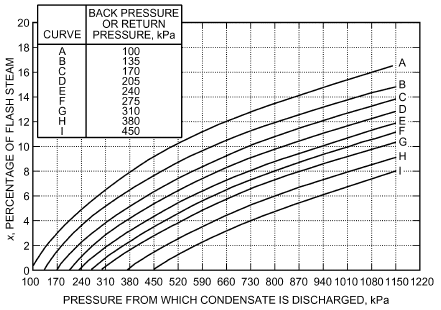

*Fig. 21 Working Chart for Determining Percentage of Flash Steam (Quality)*

Table 38 presents some values for quality and volume fraction for typical supply and return pressures in heating and ventilating systems. Note that the percent of vapor on a mass basis x is small, although the percent of vapor on a volume basis V<sub>c</sub> is very large. This indicates that the return pipe cross section is predominantly occupied by vapor. Figure 21 is a working chart to determine the quality of condensate entering the return line from the trap for various combinations of supply and return pressures. If the liquid is subcooled entering the trap, the saturation pressure corresponding to the liquid temperature should be used for the supply or upstream pressure. Typical pressures in the return line are given in Table 39.

### One-Pipe Systems

Gravity one-pipe air vent systems in which steam and condensate flow in the same pipe, frequently in opposite directions, are considered obsolete and are no longer being installed. Chapter 33 of the 1993 ASHRAE Handbook—Fundamentals or earlier ASH-RAE Handbook volumes include descriptions of and design information for one-pipe systems.

## 3.6 GAS PIPING

Piping for gas appliances should be of adequate size and installed so that it provides a supply of gas sufficient to meet the maximum demand without undue loss of pressure between the point of supply (the meter) and the appliance. The size of gas pipe required depends on (1) maximum gas consumption to be provided, (2) length of pipe and number of fittings, (3) allowable pressure loss from the outlet of the meter to the appliance, and (4) density of the gas.

Insufficient gas flow from excessive pressure losses in gas supply lines can cause inefficient operation of gas-fired appliances and sometimes create hazardous operations. Gas-fired appliances are normally equipped with a data plate giving information on maximum gas flow requirements or input as well as inlet gas pressure requirements. The local gas utility can give the gas pressure available at the utility’s gas meter. Using this information, the required size of gas piping can be calculated for satisfactory operation of the appliance(s).

Table 40 gives pipe capacities for gas flow for up to 60 m of pipe based on a gas density of 0.735 kg/m<sup>3</sup>. Capacities for pressures less than 10 kPa may also be determined by the following equation from NFPA/IAS *National Fuel Gas Code* (NFPA Standard 54/ANSI Standard Z223.1):

> Q = 0.0001d<sup>2.623</sup>(Δp/CL)<sup>0.541</sup>&emsp;**(27)**

where

- Q = flow rate at 15°C and 101 kPa, L/s d = inside diameter of pipe, mm

**Table 40 Maximum Capacity of Gas Pipe in Litres per Second**

| Nominal Iron Pipe Size, mm | Internal Diameter, mm | 5 | 10 | 15 | 20 | 25 | Length of Pipe, m<br>30 | Length of Pipe, m<br>35 | 40 | 45 | 50 | 55 | 60 |
|---|---|---|---|---|---|---|---|---|---|---|---|---|---|
| 8 | 9.25 | 0.19 | 0.13 | 0.11 | 0.09 | 0.08 | 0.07 | 0.07 | 0.06 | 0.06 | 0.06 | 0.05 | 0.05 |
| 10 | 12.52 | 0.43 | 0.29 | 0.24 | 0.20 | 0.18 | 0.16 | 0.15 | 0.14 | 0.13 | 0.12 | 0.12 | 0.11 |
| 15 | 15.80 | 0.79 | 0.54 | 0.44 | 0.37 | 0.33 | 0.30 | 0.28 | 0.26 | 0.24 | 0.23 | 0.22 | 0.21 |
| 20 | 20.93 | 1.65 | 1.13 | 0.91 | 0.78 | 0.69 | 0.63 | 0.58 | 0.54 | 0.50 | 0.47 | 0.45 | 0.43 |
| 25 | 26.14 | 2.95 | 2.03 | 1.63 | 1.40 | 1.24 | 1.12 | 1.03 | 0.96 | 0.90 | 0.85 | 0.81 | 0.77 |
| 32 | 35.05 | 6.4 | 4.4 | 3.5 | 3.0 | 2.7 | 2.4 | 2.2 | 2.1 | 1.9 | 1.8 | 1.7 | 1.7 |
| 40 | 40.89 | 9.6 | 6.6 | 5.3 | 4.5 | 4.0 | 3.6 | 3.3 | 3.1 | 2.9 | 2.8 | 2.6 | 2.5 |
| 50 | 52.50 | 18.4 | 12.7 | 10.2 | 8.7 | 7.7 | 7.0 | 6.4 | 6.0 | 5.6 | 5.3 | 5.0 | 4.8 |
| 65 | 62.71 | 29.3 | 20.2 | 16.2 | 13.9 | 12.3 | 11.1 | 10.2 | 9.5 | 8.9 | 8.4 | 8.0 | 7.7 |
| 80 | 77.93 | 51.9 | 35.7 | 28.6 | 24.5 | 21.7 | 19.7 | 18.1 | 16.8 | 15.8 | 14.9 | 14.2 | 13.5 |
| 100 | 102.26 | 105.8 | 72.7 | 58.4 | 50.0 | 44.3 | 40.1 | 36.9 | 34.4 | 32.2 | 30.4 | 28.9 | 27.6 |

Note: Capacity is in litres per second at gas pressures of 3.5 kPa (gage) or less and Copyright by American Gas Association and National Fire Protection Association. pressure drop of 75 kPa; density = 0.735 kg/m<sup>3</sup>. Used by permission of copyright holders.

<!-- str. 672 -->

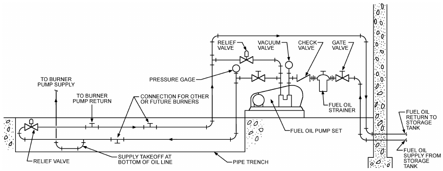

*Fig. 22 Typical Oil Circulating Loop*

Δp = pressure drop, Pa

C = factor for viscosity, density, and temperature

> = 0.00223(t + 273)s<sup>0.848</sup>μ<sup>0.152</sup>

t = temperature, °C s = ratio of density of gas to density of air at 15°C and 101 kPa μ = viscosity of gas, μPa·s (12 for natural gas, 8 for propane)

L = pipe length, m

Gas service in buildings is generally delivered in the low-pressure range of 1.7 kPa (gage). The maximum pressure drop allowable in piping systems at this pressure is generally 125 Pa but is subject to regulation by local building, plumbing, and gas appliance codes [see also the NFPA/IAS *National Fuel Gas Code* (NFPA Standard 54/ANSI Standard Z223.1)].

Where large quantities of gas are required or where long lengths of pipe are used (e.g., in industrial buildings), low-pressure limitations result in large pipe sizes. Local codes may allow (and local gas companies may deliver) gas at higher pressures [e.g., 15, 35, or 70 kPa (gage)]. Under these conditions, an allowable pressure drop of 10% of the initial pressure is used, and pipe sizes can be reduced significantly. Gas pressure regulators at the appliance must be specified to accommodate higher inlet pressures. NFPA/IAS (2012) provides information on pipe sizing for various inlet pressures and pressure drops at higher pressures. More complete information on gas piping can be found in the Gas Engineers’ Handbook (1970).

## 3.7 FUEL OIL PIPING

The pipe used to convey fuel oil to oil-fired appliances must be large enough to maintain low pump suction pressure and, in the case of circulating loop systems, to prevent overpressure at the burner oil pump inlet. Pipe materials must be compatible with the fuel and must be carefully assembled to eliminate all leaks. Leaks in suction lines can cause pumping problems that result in unreliable burner operation. Leaks in pressurized lines create fire hazards. Cast-iron or aluminum fittings and pipe are unacceptable. Pipe joint compounds must be selected carefully.

Oil pump suction lines should be sized so that at maximum suction line flow conditions, the maximum vacuum will not exceed 34 kPa for distillate grade fuels and 50 kPa for residual oils. Oil supply lines to burner oil pumps should not be pressurized by circulating loop systems or aboveground oil storage tanks to more than 34 kPa, or pump shaft seals may fail. A typical oil circulating loop system is shown in Figure 22.

**Table 41 Recommended Nominal Size for Fuel Oil Suction Lines from Tank to Pump (Residual Grades No. 5 and No. 6)**

| Pumping Rate, L/h | 10 | 20 | at Maximum Suction Lift of 4.5 kPa<br>30 | Length of Run in Metres at Maximum Suction Lift of 4.5 kPa<br>40 | Length of Run in Metres at Maximum Suction Lift of 4.5 kPa<br>50 | Length of Run in Metres at Maximum Suction Lift of 4.5 kPa<br>60 | Length of Run in Metres at Maximum Suction Lift of 4.5 kPa<br>70 | at Maximum Suction Lift of 4.5 kPa<br>80 | 90 | 100 |
|---|---|---|---|---|---|---|---|---|---|---|
| 50 | 40 | 40 | 40 | 50 | 50 | 50 | 65 | 65 | 65 | 80 |
| 100 | 40 | 40 | 50 | 50 | 65 | 65 | 65 | 65 | 80 | 80 |
| 200 | 40 | 50 | 50 | 50 | 65 | 65 | 65 | 80 | 80 | 80 |
| 300 | 50 | 50 | 65 | 65 | 65 | 80 | 80 | 80 | 80 | 80 |
| 400 | 50 | 50 | 65 | 65 | 80 | 80 | 80 | 80 | 80 | 100 |
| 500 | 50 | 65 | 65 | 65 | 80 | 80 | 80 | 80 | 100 | 100 |
| 600 | 65 | 65 | 65 | 80 | 80 | 80 | 100 | 100 | 100 | 100 |
| 700 | 65 | 65 | 65 | 80 | 80 | 100 | 100 | 100 | 100 | 100 |
| 800 | 65 | 65 | 80 | 80 | 100 | 100 | 100 | 100 | 100 | 100 |

Notes: 1. Sizes (in millimetres) are nominal. 2. Pipe sizes smaller than 25 mm ISO are not recommended for use with residual grade fuel oils. 3. Lines conveying fuel oil from pump discharge port to burners and tank return may be reduced by one or two sizes, depending on piping length and pressure losses.

In assembling long fuel pipe lines, be careful to avoid air pockets. On overhead circulating loops, the line should vent air at all high points. Oil supply loops for one or more burners should be the continuous circulation type, with excess fuel returned to the storage tank. Dead-ended pressurized loops can be used, but air or vapor venting is more problematic.

Where valves are used, select ball or gate valves. Globe valves are not recommended because of their high pressure drop characteristics.

Oil lines should be tested after installation, particularly if they are buried, enclosed, or otherwise inaccessible. Failure to perform this test is a frequent cause of later operating difficulties. A suction line can be hydrostatically tested at 1.5 times its maximum operating pressure or at a vacuum of not less than 70 kPa. Pressure or vacuum tests should continue for at least 60 min. If there is no noticeable drop in the initial test pressure, the lines can be considered tight.

### Pipe Sizes for Heavy Oil

Tables 41 and 42 give recommended pipe sizes for handling No. 5 and No. 6 oils (residual grades) and No. 1 and No. 2 oils (distillate grades), respectively. Storage tanks and piping and pumping facilities for delivering the oil from the tank to the burner are important considerations in the design of an industrial oil-burning system. The construction and location of the tank and oil piping are usually subject to local regulations and National Fire Protection Association (NFPA) Standards 30 and 31.

<!-- str. 673 -->

**Table 42 Recommended Nominal Size for Fuel Oil Suction Lines from Tank to Pump (Distillate Grades No. 1 and No. 2)**

| Pumping Rate, L/h | 10 | 20 | at Maximum Suction Lift of 9.0 kPa<br>30 | Length of Run in Metres at Maximum Suction Lift of 9.0 kPa<br>40 | Length of Run in Metres at Maximum Suction Lift of 9.0 kPa<br>50 | Length of Run in Metres at Maximum Suction Lift of 9.0 kPa<br>60 | Length of Run in Metres at Maximum Suction Lift of 9.0 kPa<br>70 | at Maximum Suction Lift of 9.0 kPa<br>80 | 90 | 100 |
|---|---|---|---|---|---|---|---|---|---|---|
| 50 | 15 | 15 | 15 | 15 | 15 | 20 | 20 | 20 | 25 | 25 |
| 100 | 15 | 15 | 15 | 15 | 20 | 20 | 20 | 20 | 25 | 25 |
| 200 | 15 | 20 | 20 | 20 | 20 | 20 | 25 | 25 | 25 | 25 |
| 300 | 15 | 20 | 20 | 20 | 20 | 25 | 25 | 25 | 25 | 32 |
| 400 | 20 | 20 | 20 | 20 | 25 | 25 | 25 | 25 | 32 | 32 |
| 500 | 20 | 25 | 25 | 25 | 25 | 25 | 32 | 32 | 32 | 32 |
| 600 | 20 | 25 | 25 | 25 | 25 | 32 | 32 | 32 | 32 | 50 |
| 700 | 20 | 25 | 25 | 25 | 25 | 32 | 32 | 32 | 50 | 50 |
| 800 | 20 | 25 | 25 | 25 | 32 | 32 | 32 | 32 | 50 | 50 |

Note: Sizes (in millimetres) are nominal.

## REFERENCES

ASHRAE members can access ASHRAE Journal articles and ASHRAE research project final reports at technologyportal.ashrae .org. Articles and reports are also available for purchase by nonmembers in the online ASHRAE Bookstore at www.ashrae.org/bookstore.

ASHRAE. 2013. Safety standard for refrigeration systems. ANSI/ASHRAE Standard 15-2013.

ASHRAE. 2013. Energy standard for buildings except low-ride residential buildings. ANSI/ASHRAE/IES Standard 90.1-2013.

ASME. 2013. Pipe threads, general purpose, inch. Standard B1.20.1-2013.

American Society of Mechanical Engineers, New York.

ASME. 2006. Pipe threads, 60 deg. general purpose (metric). Standard B1.20.2M-2006. American Society of Mechanical Engineers, New York.

ASME. 2015. Gray iron pipe flanges and flanged fittings: Classes 25, 125, and 250. Standard B16.1-2015. American Society of Mechanical Engineers, New York.

ASME. 2011. Malleable iron threaded fittings: Classes 150 and 300. Standard B16.3-2011. American Society of Mechanical Engineers, New York.

ASME. 2011. Gray iron threaded fittings: Classes 125 and 250. Standard B16.4-2011. American Society of Mechanical Engineers, New York.

ASME. 2009. Pipe flanges and flanged fittings: NPS 1/2 through NPS 24 metric/inch standard. Standard B16.5-2009. American Society of Mechanical Engineers, New York.

ASME. 2012. Factory made wrought buttwelding fittings. Standard B16.9-2012. American Society of Mechanical Engineers, New York.

ASME. 2009. Forged fittings, socket-welding and threaded. Standard B16.11-2009. American Society of Mechanical Engineers, New York.

ASME. 2009. Cast iron threaded drainage fittings. Standard B16.12-2009.

American Society of Mechanical Engineers, New York.

ASME. 2013. Cast copper alloy threaded fittings: Classes 125 and 250.

Standard B16.15-2013. American Society of Mechanical Engineers, New York.

ASME. 2012. Cast copper alloy solder joint pressure fittings. Standard B16.18-2012. American Society of Mechanical Engineers, New York.

ASME. 2013. Wrought copper and copper alloy solder-joint pressure fittings. Standard B16.22-2013. American Society of Mechanical Engineers, New York.

ASME. 2011. Cast copper alloy solder joint drainage fittings: DWV. Standard B16.23-2011. American Society of Mechanical Engineers, New York.

ASME. 2011. Cast copper alloy pipe flanges and flanged fittings: Classes 150, 300, 600, 900, 1500, and 2500. Standard B16.24-2011. American Society of Mechanical Engineers, New York.

ASME. 2011. Cast copper alloy fittings for flared copper tubes. Standard B16.26-2011. American Society of Mechanical Engineers, New York.

ASME. 2012. Wrought copper and wrought copper alloy solder-joint drainage fittings—DWV. Standard B16.29-2012. American Society of Mechanical Engineers, New York.

ASME. 2011. Ductile iron pipe flanges and flanged fittings: Classes 150 and 300. Standard B16.42-2011. American Society of Mechanical Engineers, New York.

ASME. 2016. Power piping. Standard B31.1-2016. American Society of Mechanical Engineers, New York.

ASME. 2016. Refrigeration piping and heat transfer components. Standard B31.5-2016. American Society of Mechanical Engineers, New York.

ASME. 2014. Building services piping. Standard B31.9-2014. American Society of Mechanical Engineers, New York.

ASME. 2015. Welded and seamless wrought steel pipe. Standard B36.10M-2015. American Society of Mechanical Engineers, New York.

ASME. 2015. Qualification standard for welding and brazing procedures, welders, brazers, and welding and brazing operators. *Boiler and Pressure* Vessel Code, Section IX. American Society of Mechanical Engineers, New York.

ASTM. 2012. Standard specification for pipe, steel, black and hot-dipped, zinc-coated, welded, and seamless. Standard A53. American Society for Testing and Materials, West Conshohocken, PA.

ASTM. 2015. Standard specification for seamless carbon steel pipe for high-temperature service. Standard A106. American Society for Testing and Materials, West Conshohocken, PA.

ASTM. 2014. Standard specification for seamless copper water tube. Standard B88. American Society for Testing and Materials, West Conshohocken, PA.

ASTM. 2016. Standard specification for seamless copper tube for air conditioning and refrigeration field service. Standard B280. American Society for Testing and Materials, West Conshohocken, PA.

ASTM. 2011. Standard specification for rigid poly(vinyl chloride) (PVC)

compounds and chlorinated poly(vinyl chloride) (CPVC) compounds. Standard D1784. American Society for Testing and Materials, West Conshohocken, PA.

ASTM. 2015. Standard specification for poly(vinyl chloride) (PVC) plastic pipe, schedules 40, 80, and 120. Standard D1785. American Society for Testing and Materials, West Conshohocken, PA.

ASTM. 2015. Standard test method for determining dimensions of thermoplastic pipe and fittings. Standard D2122. American Society for Testing and Materials, West Conshohocken, PA.

ASTM. 2012. Standard specification for polyethylene (PE) plastic pipe (SIDR-PR) based on controlled inside diameter. Standard D2239. American Society for Testing and Materials, West Conshohocken, PA.

ASTM. 2015. Standard specification for threaded poly(vinyl chloride)

(PVC) plastic pipe fittings, schedule 80. Standard D2464. American Society for Testing and Materials, West Conshohocken, PA.

ASTM. 2015. Standard specification for poly(vinyl chloride) (PVC) plastic pipe fittings, schedule 40. Standard D2466. American Society for Testing and Materials, West Conshohocken, PA.

ASTM. 2015. Standard specification for poly(vinyl chloride) (PVC) plastic pipe fittings, schedule 80. Standard D2467. American Society for Testing and Materials, West Conshohocken, PA.

ASTM. 2012. Standard specification for solvent cements for poly(vinyl chloride) (PVC) plastic piping systems. Standard D2564. American Society for Testing and Materials, West Conshohocken, PA.

ASTM. 2014. Standard specification for acrylonitrile-butadiene-styrene (ABS) schedule 40 plastic drain, waste, and vent pipe and fittings. Standard D2661. American Society for Testing and Materials, West Conshohocken, PA.

ASTM. 2014. Standard specification for poly(vinyl chloride) (PVC) plastic drain, waste, and vent pipe and fittings. Standard D2665. American Society for Testing and Materials, West Conshohocken, PA.

ASTM. 2013. Standard test method for obtaining hydrostatic design basis for thermoplastic pipe materials or pressure design basis for thermoplastic pipe products. Standard D2837-13e1. American Society for Testing and Materials, West Conshohocken, PA.

ASTM. 2012. Standard practice for obtaining hydrostatic or pressure design basis for “fiberglass” (glass-fiber-reinforced thermosetting-resin) pipe and fittings. Standard D2992. American Society for Testing and Materials, West Conshohocken, PA.

<!-- str. 674 -->

ASTM. 2014. Standard specification for polyethylene plastics pipe and fittings materials. Standard D3350. American Society for Testing and Materials, West Conshohocken, PA.

ASTM. 2016. Standard classification system and basis for specifications for rigid acrylonitrile-butadiene-styrene (ABS) materials for pipe and fittings. Standard D3965. American Society for Testing and Materials, West Conshohocken, PA.

ASTM. 2015. Standard specification for threaded chlorinated poly(vinyl chloride) (CPVC) plastic pipe fittings, schedule 80. Standard F437. American Society for Testing and Materials, West Conshohocken, PA.

ASTM. 2015. Standard specification for socket-type chlorinated poly(vinyl chloride) (CPVC) plastic pipe fittings, schedule 40. Standard F438. American Society for Testing and Materials, West Conshohocken, PA.

ASTM. 2013. Standard specification for chlorinated poly(vinyl chloride)

(CPVC) plastic pipe fittings, schedule 80. Standard F439. American Society for Testing and Materials, West Conshohocken, PA.

ASTM. 2015. Standard specification for crosslinked polyethylene (PEX)

tubing. Standard F876. American Society for Testing and Materials, West Conshohocken, PA.

ASTM. 2011. Standard specification for crosslinked polyethylene (PEX)

hot- and cold-water distribution systems. Standard F877. American Society for Testing and Materials, West Conshohocken, PA.

ASTM. 2014. Standard specification for solvent cements for chlorinated poly(vinyl chloride) (CPVC) plastic pipe and fittings. Standard F493. American Society for Testing and Materials, West Conshohocken, PA.

ASTM. 2015. Standard test method for evaluating the oxidative resistance of crosslinked polyethylene (PEX) pipe, tubing and systems to hot chlorinated water. Standard F2023. American Society for Testing and Materials, West Conshohocken, PA.

ASTM. 2015. Standard specification for pressure-rated polypropylene (PP)

piping systems. Standard F2389. American Society for Testing and Materials, West Conshohocken, PA.

ASTM. 2011. Standard specification for manufacture and joining of polyethylene (PE) gas pressure pipe with a peelable polypropylene (PP) outer layer. Standard F2830. American Society for Testing and Materials, West Conshohocken, PA.

AWWA. 2014. Thickness design of ductile-iron pipe. Standard C150/A21.50. American Water Works Association, Denver.

Ball, E.F., and C.J.D. Webster. 1976. Some measurements of water-flow noise in copper and ABS pipes with various flow velocities. The Building Services Engineer 44(2):33.

Carrier. 1960. Piping design. In *System design manual*. Carrier Air Conditioning Company, Syracuse, NY.

CDA. 2010. *The copper tube handbook*. Copper Development Association, New York.

Crane Co. 1976. Flow of fluids through valves, fittings and pipe. Technical Paper 410. Crane Company, New York.

Crane Co. 1988. Flow of fluids through valves, fittings and pipe. Technical Paper 410M. Crane Company, New York.

Dawson, F.M., and J.S. Bowman. 1933. Interior water supply piping for residential buildings. University of Wisconsin Experiment Station Bulletin 77.

Ding, C., L. Carlson, C. Ellis, and O. Mohseni. 2005. Pressure loss coefficients in 6, 8, and 10 inch steel pipe fittings. ASHRAE Research Project TRP-1116, Final Report. University of Minnesota, Saint Anthony Falls Laboratory.

Eshbach, O.W. 2009. *Eshbach’s handbook of engineering fundamentals*, 5th ed. M. Kutz, ed. John Wiley & Sons, New York.

Freeman, J.R. 1941. *Experiments upon the flow of water in pipes*. American Society of Mechanical Engineers, New York.

*Gas Engineers’ Handbook*. 1970. Industrial Press, New York.

Giesecke, F.E. 1926. Friction of water elbows. ASHVE Transactions 32:303. Giesecke, F.E., and W.H. Badgett. 1931. Friction heads in one-inch standard cast-iron tees. ASHVE Transactions 37:395.

Giesecke, F.E., and W.H. Badgett. 1932a. Loss of head in copper pipe and fittings. ASHVE Transactions 38:529.

Giesecke, F.E., and W.H. Badgett. 1932b. Supplementary friction heads in one-inch cast-iron tees. ASHVE Transactions 38:111.

Grinnell Company. 1951. *Piping design and engineering.* Grinnell Company, Cranston, RI.

*HDR design guide.* 1981. Hennington, Durham and Richardson, Omaha, NE.

Heald, C.C. 2002. *Cameron hydraulic data*, 19th ed. Flowserve Corporation, Irving, TX.

Hegberg, R.A. 1995. Where did the k-factors for pressure loss in fittings come from? ASHRAE Transactions 101(1):1264-78. Paper CH-95-20-3.

Hunter, R.B. 1940. Methods of estimating loads in plumbing systems. NBS Report BMS 65. National Institute of Standards and Technology, Gaithersburg, MD.

Hunter, R.B. 1941. Water distributing systems for buildings. NBS Report BMS 79. National Institute of Standards and Technology, Gaithersburg, MD.

Hydraulic Institute. 1990. *Engineering data book*. Hydraulic Institute, Parsippany, NJ.

ICC. 2012. *International plumbing code<sup>®</sup>.* International Code Council, Washington, D.C.

Idelchik, I.E. 1986. *Handbook of hydraulic resistance.* Hemisphere Publishing, New York.

ISA. 2007. Flow equations for sizing control valves. Standard 75.01.01-07.

International Society of Automation, Research Triangle Park, NC. Laschober, R.R., G.Y. Anderson, and D.G. Barbee. 1966. Counterflow of steam and condensate in slightly pitched pipes. ASHRAE Transactions 72(1):157.

Marseille, B. 1965. Noise transmission in piping. *Heating and Ventilating* Engineering (June):674.

MSS. 2009. Pipe hangers and supports—Materials, design, manufacture, selection, application, and installation. ANSI/MSS Standard SP-58. Manufacturers Standardization Society of the Valve and Fittings Industry, Vienna, VA.

MSS. 2003. Pipe hangers and supports—Selection and application. Standard SP-69. Manufacturers Standardization Society of the Valve and Fittings Industry, Vienna, VA.

Nayyar, M. 1999. Piping handbook. McGraw-Hill, New York.

NFPA. 2010. Installation of sprinkler systems. Standard 13. National Fire Protection Association, Quincy, MA.

NFPA/AGA. 2012. *National fuel gas code*. ANSI/NFPA Standard 54. National Fire Protection Association, Quincy, MA. ANSI/AGA Standard Z223.1-2002. American Gas Association, Arlington, VA.

NSF/ANSI. 2016. Plastics piping system components and related materials.

ANSI/NSF Standard 14-2016. NSF International, Ann Arbor, MI. NSF/ANSI. 2016. Drinking water system components—Health effects.

ANSI/NSF Standard 61. NSF International, Ann Arbor, MI.

Obrecht, M.F., and M. Pourbaix. 1967. Corrosion of metals in potable water systems. AWWA 59:977. American Water Works Association, Denver, CO.

PHCC. 2012. *National standard plumbing code*. Plumbing-Heating-Cooling Contractors Association, Falls Church, VA.

Plastic Pipe Institute. 1971. *Water flow characteristics of thermoplastic* pipe. Plastic Pipe Institute, New York.

PPFA. 2009. *PVC piping systems for commercial and industrial applica-* *tions design guide*. Plastic Pipe and Fitting Association, Glenn Ellyn, IL

Rahmeyer, W.J. 1999a. Pressure loss coefficients of threaded and forged weld pipe fittings for ells, reducing ells, and pipe reducers (RP-968). ASHRAE Transactions 105(2):334-354. Paper 4308.

Rahmeyer, W.J. 1999b. Pressure loss coefficients of pipe fittings for threaded and forged weld pipe tees (RP-968). ASHRAE Transactions 105(2):355-385. Paper 4309.

Rahmeyer, W.J. 2002a. Pressure loss data for large pipe ells, reducers, and expansions. ASHRAE Transactions 108(1):360-375. Paper 4533.

Rahmeyer, W.J. 2002b. Pressure loss data for large pipe tees. ASHRAE Transactions 108(1):376-389. Paper 4534.

Rahmeyer, W.J. 2002c. Pressure loss coefficients for close-coupled pipe ells.

ASHRAE Transactions 108(1):390-406. Paper 4535.

Rahmeyer, W.J. 2003a. Pressure loss data for PVC pipe elbows, reducers, and expansions (RP-1193). ASHRAE Transactions 109(2):230-251. Paper 4653.

Rahmeyer, W.J. 2003b. Pressure loss data for PVC pipe tees (RP-1193).

ASHRAE Transactions 109(2):252-271. Paper 4654.

Rogers, W.L. 1953. Experimental approaches to the study of noise and noise transmission in piping systems. ASHVE Transactions 59:347-360.

Rogers, W.L. 1954. Sound-pressure levels and frequencies produced by flow of water through pipe and fittings. ASHRAE Transactions 60:411-430.

Rogers, W.L. 1956. Noise production and damping in water piping. ASHAE Transactions 62:39.

<!-- str. 675 -->

Sanks, R.L. 1978. *Water treatment plant design for the practicing engineer.* Ann Arbor Science, Ann Arbor, MI.

Smith, T. 1983. Reducing corrosion in heating plants with special reference to design considerations. *Anti-Corrosion Methods and Materials* 30 (October):4.

Stewart, W.E., and C.L. Dona. 1987. Water flow rate limitations (RP-450).

ASHRAE Transactions 93(2):811-825. Paper 3106.

Williams, G.J. 1976. The Hunter curves revisited. Heating/Piping/Air Conditioning (November):67.

Williams, G.S., and A. Hazen. 1933. Hydraulic tables. John Wiley & Sons, New York.

## BIBLIOGRAPHY

ASTM. 2009. Standard specification for chlorinated poly(vinyl chloride)

(CPVC) plastic pipe, Schedules 40 and 80. Standard F441/F441M. American Society for Testing and Materials, West Conshohocken, PA.
