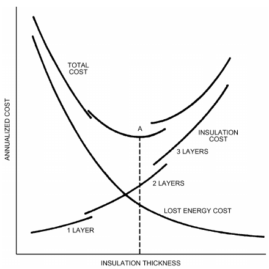
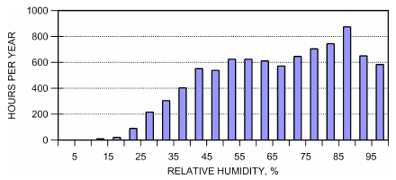
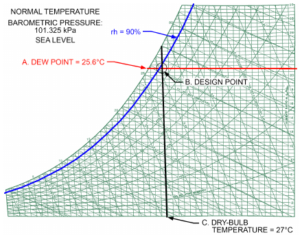
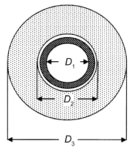
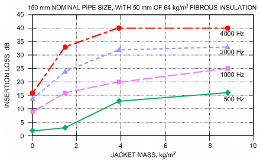
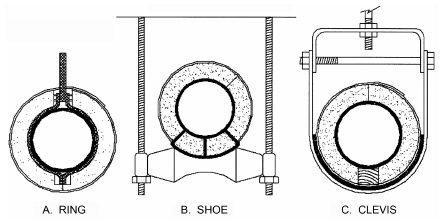
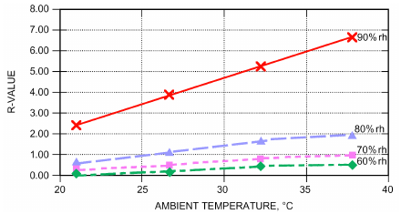
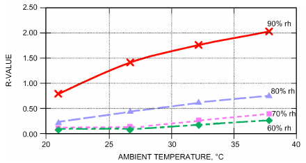

# Chapter 23 — Insulation for Mechanical Systems

*Izvor: 2021 ASHRAE Handbook — Fundamentals (SI), Chapter 23 (PDF str. 676–697).*

> **Napomena o konverziji:** Tekst je automatski izdvojen iz originalnog PDF-a uz prepoznavanje dve kolone, spojene prelomljene reči i pasuse. Indeksi i eksponenti su označeni sa `<sub>`/`<sup>`, tabele su pretvorene u Markdown tabele (veoma složene tabele su prikazane kao poravnat tekst), a slike su izrezane iz PDF-a u folder `img/`. Složene jednačine (razlomci, sume) mogu biti uprošćeno prikazane. **Pre upotrebe vrednosti u proračunu proveriti u originalnom PDF-u.** Oznake `<!-- str. N -->` pokazuju stranu PDF-a.

## Sadržaj

- [1. DESIGN OBJECTIVES AND CONSIDERATIONS](#1-design-objectives-and-considerations)
- [2. MATERIALS AND SYSTEMS](#2-materials-and-systems)
- [3. INSTALLATION](#3-installation)
- [4. DESIGN DATA](#4-design-data)
- [5. PROJECT SPECIFICATIONS](#5-project-specifications)
- [REFERENCES](#references)

<!-- str. 676 -->

THIS chapter deals with applications of thermal and acoustical insulation for mechanical systems in residential, commercial, and industrial facilities. Applications include pipes, tanks, vessels and equipment, and ducts.

Thermal insulation is primarily used to limit heat gain or loss from surfaces operating at temperatures above or below ambient temperature. Insulation may be used to satisfy one or more of the following design objectives:

- **Energy conservation**: minimizing unwanted heat loss/gain from building HVAC systems, as well as preserving natural and financial resources
- **Economic thickness**: selecting the thickness of insulation that yields the minimum total life-cycle cost
- **Personnel protection**: controlling surface temperatures to avoid contact burns (hot or cold)
- **Condensation control**: minimizing condensation by keeping surface temperature above the dew point of surrounding air
- **Process control**: minimizing temperature change in process fluids where close control is needed
- **Freeze protection**: minimizing energy required for heat tracing systems and/or extending the time to freezing in the event of system failure or when the system is purposefully idle
- **Noise control**: reducing/controlling noise in mechanical systems
- **Fire safety**: protecting critical building elements and slowing the spread of fire in buildings

Fundamentals of thermal insulation are covered in Chapter 25; applications in insulated assemblies are discussed in Chapter 27; and data on thermal and water vapor transmission data are in Chapter 26.

## 1. DESIGN OBJECTIVES AND CONSIDERATIONS

### Energy Conservation

Thermal insulation is commonly used to reduce energy consumption of HVAC systems and equipment. Minimum insulation levels for ductwork and piping are often dictated by energy codes, many of which are based on ASHRAE Standards 90.1 and 90.2. In many cases, it may be cost-effective to go beyond the minimum levels dictated by energy codes. Thicknesses greater than the optimum economic thickness may be required for other technical reasons such as condensation control, personnel protection, or noise control.

Tables 1 to 3 contain minimum insulation levels for ducts and pipes, excerpted from ANSI/ASHRAE Standard 90.1-2010.

Interest in **green buildings** (i.e., those that are environmentally responsible and energy efficient, as well as healthier places to work) is increasing. The LEED<sup>®</sup> (Leadership in Energy and Environmental Design) Green Building Rating System™, created by the U.S. Green Building Council, is a voluntary rating system that sets out sustainable design and performance criteria for buildings. It evaluates environmental performance from a whole-building perspective and awards points based on satisfying performance criteria in several different categories. Different levels of green building certification are awarded based on the total points earned. The role of mechanical insulation in reducing energy usage, along with the associated greenhouse gas emissions, can help to contribute to LEED certification and should be considered when designing an insulation system.

<sub>The preparation of this chapter is assigned to TC 1.8, Mechanical Systems Insulation.</sub>

### Economic Thickness

Economics can be used to (1) select the optimum insulation thickness for a specific insulation, or (2) evaluate two or more insulation materials for least cost for a given level of thermal performance. In either case, economic considerations determine the most cost-effective solution for insulating over a specific period.

Life-cycle costing considers the initial cost of the insulation system plus the ongoing value of energy savings over the expected service lifetime. The economic thickness is defined as the thickness that minimizes the total life-cycle cost.

Labor and material costs of installed insulation increase with thickness. Insulation is often applied in multiple layers (1) because materials are not manufactured in single layers of sufficient thickness and (2) in many cases, to accommodate expansion and contraction of insulation and system components. Figure 1 shows installed costs for a multilayer application. The slope of the curves is discontinuous and increases with the number of layers because labor and material costs increase more rapidly as thickness increases. Figure 1 shows curves of total cost of operation, insulation costs, and lost energy costs. Point A on the total cost curve corresponds to the economic insulation thickness, which, in this example, is in the double-layer range. Viewing the calculated economic thickness as a minimum thickness provides a hedge against unforeseen fuel price increases and conserves energy.



*Fig. 1 Determination of Economic Thickness of Insulation*

<!-- str. 677 -->

**Table 1 Minimum Duct Insulation R-Value, Cooling and Heating Only Supply Ducts and Return Ducts**

| Climate Zone<sup>d</sup> | Exterior | Ventilated Attic | Unvented Attic Above Insulated Ceiling | Duct Location Unvented Attic with Roof Insulation<sup>a</sup> | Unconditioned Space<sup>b</sup> | Indirectly Conditioned Space<sup>c</sup> | Buried |
|---|---|---|---|---|---|---|---|
| 1, 2 3 4 5 6 7 8 | none<br>R-0.62<br>R-0.62<br>R-1.06<br>R-1.06<br>R-1.41<br>R-1.41 | none none none<br>R-0.62<br>R-1.06<br>R-1.06<br>R-1.41 | none none none none<br>R-0.62<br>R-1.06<br>R-1.06 | Heating-Only Ducts none none none none none none none | none none none none none<br>R-0.62<br>R-1.06 | none none none none none none none | none none none<br>R-0.62<br>R-0.62<br>R-0.62<br>R-1.06 |
| 1 2 3 4 5, 6 7, 8 | R-1.06<br>R-1.06<br>R-1.06<br>R-0.62<br>R-0.62<br>R-0.34 | R-1.06<br>R-1.06<br>R-1.06<br>R-0.62<br>R-0.34<br>R-0.34 | R-1.41<br>R-1.06<br>R-1.06<br>R-1.06<br>R-0.62<br>R-0.34 | Cooling-Only Ducts<br>R-0.62<br>R-0.62<br>R-0.62<br>R-0.34<br>R-0.34<br>R-0.34 | R-0.62<br>R-0.62<br>R-0.64<br>R-0.34<br>R-0.34<br>R-0.34 | none none none none none none | R-0.62<br>R-0.62 none none none none |
| 1 to 8 | R-0.62 | R-0.62 | R-0.62 | Return Ducts none | none | none | none |

<sup>a</sup>Insulation R-values, measured in (m<sup>2</sup>·K)/W, are for the insulation as installed and do not include film resistance. The required minimum thicknesses do not consider water vapor transmission and possible surface condensation. Where exterior walls are used as plenum walls, wall insulation must be as required by the most restrictive condition of Section 6.4.4.2 or Section 5 of 90.1-2010. Insulation resistance measured on a horizontal plane in accordance with ASTM C518 at a mean temperature of 23.9°C at the installed thickness.

<sup>b</sup>Includes crawlspaces, both ventilated and nonventilated.

<sup>c</sup>Includes return air plenums with or without exposed roofs above.

<sup>d</sup>Climate zones for the continental United States defined in ASHRAE Standard 90.1-2010.

**Table 2 Minimum Pipe Insulation Thickness, mm**

| Fluid Design Operating Temp. Range, °C | Nominal Pipe or Tube Size, mm<br>Insulation Conductivity Conductivity, Mean Rating W/(m·K) Temp., °C <25 25 to <40 | Nominal Pipe or Tube Size, mm<br>40 to <100 | Nominal Pipe or Tube Size, mm<br>100 to <200 | ≥200 |
|---|---|---|---|---|
| **Heating Systems (Steam, Steam Condensate, Hot Water, and Domestic Hot Water)b,c** |  |  |  |  |
| >177 | 0.046 to 0.049 121 114 127 | 127 | 127 | 127 |
| 122 to 177 | 0.042 to 0.046 93 89 102 | 114 | 114 | 114 |
| 94 to 121 | 0.039 to 0.043 66 64 64 | 76 | 76 | 76 |
| 61 to 93 | 0.036 to 0.042 52 38 38 | 51 | 51 | 51 |
| 41 to 60 | 0.032 to 0.040 38 25 25<br>Cooling Systems (Chilled Water, Brine, and Refrigerant)<sup>d</sup> | 38 | 38 | 38 |
| 4 to 16 | 0.032 to 0.040 24 13 13 | 25 | 25 | 25 |
| <4 | 0.032 to 0.040 10 13 25 | 25 | 25 | 38 |

<sup>a</sup>For insulation outside stated conductivity range, determine minimum thickness bThese thicknesses are based on energy efficiency considerations only. Additional T as follows: insulation is sometimes required relative to safety issues/surface temperature. T = r{(1 + t/r)<sup>K/k</sup> – 1} <sup>c</sup>Piping insulation is not required between the control valve and coil on run-outs when where T = minimum insulation thickness (mm), r = actual outside radius of pipe the control valve is located within 1.2 m of the coil and the pipe size is 25 mm or less. (mm), t = insulation thickness listed in this table for applicable fluid temperature and

<sup>d</sup>These thicknesses are based on energy efficiency considerations only. Issues such as pipe size, K = conductivity of alternative material at mean rating temperature water vapor permeability or surface condensation sometimes require vapor retarders indicated for applicable fluid temperature [W/(m·K)]; and k = upper value of or additional insulation. conductivity range listed in this table for applicable fluid temperature.

Initially, as insulation is applied, the total life-cycle cost decreases because the value of incremental energy savings is greater than the incremental cost of insulation. Additional insulation reduces total cost up to a thickness where the change in total cost is equal to zero. At this point, no further reduction can be obtained; beyond it, incremental insulation costs exceed the additional energy savings derived by adding another increment of insulation.

Economic analysis should also consider the time value of money, which can be based on a desired rate of return for the insulation investment. Energy costs are volatile, and a fuel cost inflation factor is sometimes included to account for the possibility that fuel costs may increase more quickly than general inflation. Insulation system maintenance costs should also be included, along with cost savings associated with the ability to specify lower capacity equipment, resulting in lower first costs.

Chapter 37 of the 2019 *ASHRAE Handbook—HVAC Applica-* tions has more information on economic analysis.

### Personnel Protection

In many applications, insulation is provided to protect personnel from burns. The potential for burns to human skin is a complex function of surface temperature, surface material, and time of contact.

<!-- str. 678 -->

**Table 3 Minimum Duct Insulation R-Value,a Combined Heating and Cooling Supply Ducts and Return Ducts**

| Climate Zone | Exterior | Ventilated Attic | Unvented Attic Above Insulated Ceiling | Duct Location Unvented Attic with Roof Insulation<sup>a</sup> | Unconditioned Space<sup>b</sup> | Indirectly Conditioned Space<sup>c</sup> | Buried |
|---|---|---|---|---|---|---|---|
|  |  |  |  | Supply Ducts |  |  |  |
| 1 | R-1.06 | R-1.06 | R-1.41 | R-0.62 | R-0.62 | none | R-0.62 |
| 2 | R-1.06 | R-1.06 | R-1.06 | R-0.62 | R-0.62 | none | R-0.62 |
| 3 | R-1.06 | R-1.06 | R-1.06 | R-0.62 | R-0.62 | none | R-0.62 |
| 4 | R-1.06 | R-1.06 | R-1.06 | R-0.62 | R-0.62 | none | R-0.62 |
| 5 | R-1.06 | R-1.06 | R-1.06 | R-0.34 | R-0.62 | none | R-0.62 |
| 6 | R-1.41 | R-1.06 | R-1.06 | R-0.34 | R-0.62 | none | R-0.62 |
| 7 | R-1.41 | R-1.06 | R-1.06 | R-0.34 | R-0.62 | none | R-0.62 |
| 8 | R-1.41 | R-1.41 | R-1.41 | R-0.34<br>Return Ducts | R-1.06 | none | R-1.06 |
| 1 to 8 | R-0.62 | R-0.62 | R-0.62 | none | none | none | none |

a Insulation R-values, measured in (m<sup>2</sup>·K)/W, are for the insulation as installed and do not include film resistance. The required minimum thicknesses do not consider water vapor transmission and possible surface condensation. Where exterior walls are used as plenum walls, wall insulation must be as required by the most restrictive condition of Section 6.4.4.2 or Section 5 of 90.1-2010. Insulation resistance measured on a horizontal plane in accordance with ASTM C518 at a mean temperature of 23.9°C at the installed thickness. b Includes crawlspaces, both ventilated and nonventilated. c Includes return air plenums with or without exposed roofs above.

ASTM Standard C1055 has a good discussion of these factors. Standard industry practice is to specify a maximum temperature of 60°C for surfaces that may be contacted by personnel. For indoor applications, maximum air temperatures depend on the facility and location, and are typically lower than design outdoor conditions. For outdoor installations, base calculations on summer design ambient temperatures with no wind (i.e., the worst case). Surface temperatures increase because of solar loading, but are usually neglected because of variability in orientation, solar intensity, and many other complicating factors. Engineering judgment must be used in selecting ambient and operating temperatures and wind conditions for these calculations.

Note that the choice of jacketing strongly affects a surface’s relative safety. Higher-emittance jacketing materials (e.g., plastic, painted metals) can be selected to minimize the surface temperature. Jacketing material also affects the relative safety at a given surface temperature. For example, at 80°C, a stainless steel jacket blisters skin more severely than a nonmetallic jacket at equal contact time.

### Condensation Control

For below-ambient systems, condensation control is often the overriding design objective. The design problem is best addressed as two separate issues: (1) avoiding surface condensation on the outer surface of the insulation system and (2) minimizing or managing water vapor intrusion.

Avoiding surface condensation is desirable because it (1) prevents dripping, which can wet surfaces below; (2) minimizes mold growth by eliminating the liquid water many molds require; and (3) avoids staining and possible damage to exterior jacketing.

The design goal is to keep the surface temperature above the dew-point temperature of surrounding air. Calculating surface temperature is relatively simple, but selecting the appropriate design conditions is often confusing. The appropriate design condition is normally the worst-case condition expected for the application. For condensation control, however, a design that satisfies the worst case is sometimes impossible.

To illustrate, Table 4 shows insulation thicknesses required to prevent condensation on the exterior surface of a hypothetical insulated tank containing a liquid held at 4°C in a mechanical room with a temperature of 27°C. Note that, at high relative humidities, the thickness required to prevent surface condensation increases dramatically, and becomes impractical above 90% rh.

**Table 4 Insulation Thickness Required to Prevent Surface Condensation**

| Relative Humidity, % | Thickness, mm |
|---|---|
| 20 | — |
| 30 | 2.5 |
| 40 | 5.0 |
| 50 | 7.5 |
| 60 | 13 |
| 70 | 18 |
| 80 | 33 |
| 90 | 74 |
| 95 | 150 |

Note: Calculated using Equation (14), assuming surface conductance of 6.8 W/(m<sup>2</sup>·K) and insulation with thermal conductivity of 0.043 W/(m·K). Different assumed values yield different results.



*Fig. 2 Relative Humidity Histogram for Charlotte, NC*

For outdoor applications (or for unconditioned spaces vented to outdoor air), there are always some hours per year where the ambient air is saturated or nearly saturated. For these times, no amount of insulation will prevent surface condensation. Figure 2 shows the frequency distribution of outdoor relative humidity based on typical meteorological year weather data for Charlotte, North Carolina (Marion and Urban 1995). Note that there are over 1200 h per year when the relative humidity is equal to or greater than 90%, and nearly 600 h per year when the relative humidity is equal to or greater than 95%.

For outdoor applications and mechanical rooms vented to outdoor conditions, it is suggested to design for a relative humidity of 90%. Appropriate water-resistant vapor-retarder jacketing or mastics must then be specified to protect the system from the inevitable surface condensation.

<!-- str. 679 -->



*Fig. 3 ASHRAE Psychrometric Chart No. 1*

Table 5 summarizes design weather data for a select number of cities. The design dew-point temperature and the corresponding dry-bulb temperatures at 90% rh are given, along with the number of hours per year that the relative humidity would exceed 90%. Additional design dew-point data can be found in Chapter 14.

**Design Example: Tampa, Florida.**

Chilled-water supply piping is to be located outdoors to serve a commercial building expansion in Tampa, Florida. The supply piping is 150 mm NPS steel and the design temperature of the chilled-water supply is 4.4°C. Determine the appropriate design ambient conditions for this installation. From Table 5, the design dew-point temperature for Tampa is 25.6°C.

The design conditions are best visualized using a psychrometric chart, which graphically represents the properties of moist air. The horizontal axis is dry-bulb temperature, and the vertical axis is humidity ratio (kg of water vapor per kg of dry air). The chart includes the saturation curve (relative humidity = 100%) as well as parallel curves for other values of constant relative humidity. Lines of constant dew-point temperature are horizontal on the psychrometric chart.

Using Figure 3, enter the chart on the saturation curve at a dew point of 25.6°C (point A. in the figure) and draw a horizontal line. The design point is located where this horizontal line intersects the 90% rh curve. The dry-bulb temperature associated with this design point is read from the horizontal axis at point C, which for this example is approximately 27°C. The insulation system should therefore be designed for an operating temperature of 4.4°C, an ambient temperature of 27°C, and an ambient relative humidity of 90%.

This section is based on WDBG (2012).

For indoor designs in conditioned spaces, care is needed when selecting design conditions. Often, the HVAC system is sized to provide indoor conditions of 24°C/50% rh on a design summer day. However, those indoor conditions do not represent the worst-case indoor conditions for insulation design. Part-load conditions could result in higher humidity levels, or night and/or weekend shutdown could result in more severe conditions.

In addition to avoiding condensation on the exposed surface, another important design consideration is minimizing or managing water vapor intrusion, which is extremely important for piping and equipment operating at below-ambient temperatures. Water-related problems include thermal performance loss, health and safety issues, structural degradation, and aesthetic issues. Water entry into the insulation system may be through diffusion of water vapor, air leakage carrying water vapor, and leakage of surface water.

**Table 5 Design Weather Data for Condensation Control**

| City | Design Dew-Point Temp., °C | Corresponding Dry-Bulb Temp. at 90% rh, °C | Hours per Year >90% rh |
|---|---|---|---|
| New Orleans, LA | 26.1 | 27.8 | 1253 |
| Houston, TX | 25.6 | 27.2 | 2105 |
| Miami, FL | 25.6 | 27.2 | 633 |
| Tampa, FL | 25.6 | 27.2 | 992 |
| Savannah, GA | 25.0 | 26.7 | 1560 |
| Norfolk, VA | 24.4 | 26.1 | 1279 |
| San Antonio, TX | 24.4 | 26.1 | 932 |
| Charlotte, NC | 23.3 | 25.0 | 1233 |
| Honolulu, HI | 23.3 | 25.0 | 166 |
| Columbus, OH | 22.8 | 24.4 | 531 |
| Minneapolis, MN | 22.8 | 24.4 | 619 |
| Seattle, WA | 15.6 | 17.2 | 1212 |

When the operating temperature is below the dew point of the surrounding ambient air, there is a difference in water vapor pressure across the insulation system. This vapor-pressure difference drives diffusion of water vapor from the ambient toward the cold surface. Piping and equipment typically create an absolute barrier to the passage of water vapor, so any vapor-pressure difference imposed across the insulation system results in the potential for condensation either in the insulation or at the cold surface. The vapor-pressure difference can range from below 345 Pa for a supply air duct operating in the return air plenum of a commercial building, to over 4 kPa for a cryogenic system operating outdoors near the U.S. Gulf Coast. Although these pressure differences seem small, the effect over many operating hours can be significant.

Several fundamental design principles are used in managing water vapor intrusion. One method is to reduce the driving force by reducing the moisture content of the surrounding air. The insulation designer typically does not have control of the location of the piping, ductwork, or equipment to be insulated, but there are opportunities for the mechanical engineer to influence ambient conditions. Certainly, locating cold piping, ductwork, and equipment in unconditioned portions of buildings should be minimized. Consider conditioning mechanical rooms if feasible.

Another common method is moisture blocking, wherein passage of water vapor is eliminated or minimized to an insignificant level. The design must incorporate the following: (1) a vapor retarder with suitably low permeance; (2) a joint and seam sealing system that maintains vapor retarding system integrity; and (3) accommodation for future damage repair, joint and seam resealing, and reclosing after maintenance.

A vapor retarder is a material or system that adequately reduces transmission of water vapor through the insulation system. The vapor retarder system is seldom intended to resist entry of surface water or prevent air leakage, but can occasionally be considered the second line of defense for these moisture sources.

An effective vapor retarder material or system is essential for blocking systems to perform adequately. Mumaw (2001) showed that the design, installation, and performance of vapor retarder systems are key to the ability of an insulation system to minimize water vapor ingress. Performance of the vapor retarder material or system is characterized by the water vapor permeance: the lower the permeance, the better. The water vapor permeance can be evaluated using procedures outlined in ASTM Standard E96. In this test, a vapor pressure difference is imposed across vapor retarder material that has been sealed to a test cup, and the moisture gain or loss is measured gravimetrically.

The insulation system should be dry before applying a vapor retarder to prevent trapping water vapor in the insulation system.

<!-- str. 680 -->

The insulation system also must be protected from undue weather exposure that could introduce moisture into the insulation before the system is sealed.

Faulty application techniques can impair vapor retarder performance. The effectiveness of installation and application techniques must be considered during selection. Factors such as vapor retarder structure, number of joints, mastics and adhesives that are used, as well as inspection procedures affect system performance and durability.

When selecting a vapor retarder, the vapor-pressure difference across the insulation system should be considered. Higher vapor-pressure differences typically require a vapor retarder with a lower permeance to control the overall moisture pickup of the insulated system. Service conditions affect the direction and magnitude of the vapor pressure difference: unidirectional flow exists when the water vapor pressure is constantly higher on one side of insulation system, whereas reversible flow exists when vapor pressure may be higher on either side (typically caused by diurnal or seasonal changes on one side of the insulation system). Properties of the insulation system materials should be considered. All materials reduce the flow of water vapor; the low permeance of some insulation materials can add to the overall resistance to water vapor transport of the insulation system. All vapor retarder joints should be tightly sealed with manufacturer-recommended sealants.

Another fundamental design principle is moisture storage design. In many systems, some condensation can be tolerated, the amount depending on the water-holding capacity or tolerance of a particular system. The moisture storage principle allows accumulation of water in the insulation system, but at a rate designed to prevent harmful effects. This concept is applicable when (1) unidirectional vapor flow occurs, but accumulations during severe conditions can be adequately expelled during less severe conditions; or (2) reverse flow regularly occurs on a seasonal or diurnal cycle. Design solutions using this principle include (1) periodically flushing the cold side with low-dew-point air (requires a supply of conditioned air and a means for distribution), and (2) using an insulation system supplemented by selected vapor retarders and absorbent materials such that an accumulation of condensation is of little importance. Such a design must ensure sufficient expulsion of accumulated moisture.

ASTM Standard C755 discusses various design principles. Chapters 25 to 27 of this volume thoroughly describe the physics associated with water vapor transport. Additional information is found in Chapter 10 of the 2018 ASHRAE Handbook—Refrigeration, and in ASTM (2001).

### Freeze Prevention

It is important to recognize that insulation retards heat flow; it does not stop it completely. If the surrounding air temperature remains low enough for an extended period, insulation cannot prevent freezing of still water or of water flowing at a rate insufficient for the available heat content to offset heat loss. Insulation can prolong the time required for freezing, or prevent freezing if flow is maintained at a sufficient rate. To calculate time θ (in hours) required for water to cool to 0°C with no flow, use the following equation:

> θ = (1/3600)ρC<sub>p</sub>π(D<sub>1</sub>/2)<sup>2</sup>R<sub>T</sub>ln[(t<sub>i</sub> – t<sub>a</sub>)/(t<sub>f</sub>–t<sub>a</sub>)]&emsp;**(1)**

where

- θ = time to freezing, h
- ρ = density of water = 1000 kg/m<sup>3</sup>
- C<sub>p</sub> = specific heat of water = 4200 J/(kg·K)
- D<sub>1</sub> = inside diameter of pipe, m (see Figure 4)
- R<sub>T</sub> = combined thermal resistance of pipe wall, insulation, and exterior air film (for a unit length of pipe)
- t<sub>i</sub> = initial water temperature, °C
- t<sub>a</sub> = ambient air temperature, °C t<sub>f</sub> = freezing temperature, °C



*Fig. 4 Time to Freeze Nomenclature*

**Table 6 Time to Cool Water to Freezing, h**

| Nominal Pipe Size, mm | 13 | Insulation Thickness, mm<br>25 | Insulation Thickness, mm<br>38 | Insulation Thickness, mm<br>50 | Insulation Thickness, mm<br>75 | 100 |
|---|---|---|---|---|---|---|
| 15 | 0.1 | 0.2 | 0.2 | 0.3 | — | — |
| 25 | 0.3 | 0.4 | 0.5 | 0.6 | 0.8 | — |
| 40 | 0.4 | 0.8 | 1.0 | 1.3 | 1.5 | — |
| 50 | 0.6 | 1.1 | 1.4 | 1.7 | 2.2 | 2.5 |
| 80 | 0.9 | 1.7 | 2.3 | 2.9 | 3.7 | 4.5 |
| 100 | 1.3 | 2.4 | 3.3 | 4.1 | 5.5 | 6.6 |
| 125 | 1.6 | 3.0 | 4.3 | 5.4 | 7.4 | 9.1 |
| 150 | 1.9 | 3.7 | 5.3 | 6.9 | 9.4 | 11.7 |
| 200 | — | 5.3 | 7.6 | 9.6 | 13.7 | 16.9 |
| 250 | — | 6.5 | 10.2 | 12.9 | 17.9 | 22.3 |
| 300 | — | 8.8 | 12.5 | 15.8 | 22.1 | 27.7 |

Note: Assumes initial temperature = 5.5°C, ambient air temperature = –28°C, and insulation thermal conductivity = 0.0432 W/(m·K). Thermal resistances of pipe and air film are neglected. Different assumed values yield different results.

As a conservative assumption for insulated pipes, thermal resistances of pipe walls and exterior air film are usually neglected. Resistance of the insulation layer for a unit length of pipe is calculated as

> R<sub>T</sub> = ln(D<sub>3</sub>/D<sub>2</sub>)/(2πk)&emsp;**(2)**

where

- D<sub>3</sub> = outer diameter of insulation, m
- D<sub>2</sub> = inner diameter of insulation, m
- k = thermal conductivity of insulation material, W/(m·K)

Table 6 shows estimated time to freezing, calculated using these equations for the specific case of still water with t<sub>i</sub> = 6°C and t<sub>a</sub> = –28°C.

When unusual conditions make it impractical to maintain protection with insulation or flow, a hot trace pipe or electric resistance heating cable is required along the bottom or top of the water pipe. The heating system then supplies the heat lost through the insulation.

Clean water in pipes usually supercools several degrees below freezing before any ice is formed. Then, upon nucleation, dendritic ice forms in the water and the temperature rises to freezing. Ice can be formed from water only by the release of the latent heat of fusion (335 kJ/kg) through the pipe insulation. Well-insulated pipes may greatly retard this release of latent heat. Gordon (1996) showed that water pipes burst not because of ice crystal growth in the pipe, but because of elevated fluid pressure within a confined pipe section occluded by a growing ice blockage.

<!-- str. 681 -->

### Noise Control

**Duct Insulation**. Without insulation, the acoustical environment of mechanically conditioned buildings can be greatly compromised, resulting in reduced productivity and a decrease in occupant comfort. HVAC ducts act as conduits for mechanical equipment noise, and also carry office noise between occupied spaces. Additionally, some ducts can create their own noise through duct wall vibrations or expansion and contraction. Lined sheet metal ducts and fibrous glass rigid ducts can greatly reduce transmission of HVAC noise through the duct system. The insulation also reduces cross-talk from one room to another through the ducts. A good discussion of duct acoustics is provided in Chapter 48 of the 2019 ASHRAE Handbook—HVAC Applications. Duct insulation can be used to provide both attenuation loss and breakout noise reduction.

**Attenuation loss** is noise absorbed within the duct. In uninsulated ducts, it is a function of duct geometry and dimensions as well as noise frequency. Internal insulation liners are generally available for most duct geometries. Chapter 48 in the 2019 ASHRAE Handbook—HVAC Applications provides attenuation losses for square, rectangular, and round ducts lined with fibrous glass, and also gives guidance on use of insulation in plenums to absorb duct system noise. Internal linings can be very effective in fittings such as elbows, which can have 2 to 8 times more attenuation than an unlined elbow of the same size. For alternative lining materials, consult individual manufacturers.

It is difficult to write specifications for sound attenuation because it changes with every duct dimension and configuration. Thus, insulation materials are generally selected for attenuation based on sound absorption ratings. Sound absorption tests are run per ASTM Standard C423 in large reverberation rooms with random sound incidence. The test specimens are laid on the chamber floor per ASTM Standard E795, type A mounting. This mode of sound exposure is different from the exposure of internal linings installed in an air duct; therefore, sound absorption ratings for materials can only be used for general comparisons of effectiveness when used in air ducts of varying dimensions (Kuntz and Hoover 1987).

**Breakout noise** is from vibration of the duct wall caused by air pressure fluctuations in the duct. Absorptive insulation can be used in combination with mass-loaded jacketing materials or mastics on the duct exterior to reduce breakout noise. This technique is only minimally effective on rectangular ducts, which require the insulation and mass composite to be physically separated from the duct wall to be very effective. For round ducts, as with pipes, absorptive insulation and mass composite can be effective even when directly applied to the duct surface. Chapter 48 in the 2019 ASHRAE Handbook—HVAC Applications provides breakout noise guidance data.

**Noise Radiating from Pipes.** Noise from piping can be reduced by adding an absorptive insulation and jacketing material. By knowing the sound insertion loss of insulation and jacketing material combinations, the expected level of noise reduction in the field can be estimated. A range of jacket weights and insulation thicknesses can be used to reduce noise. Jackets used to reduce noise are typically referred to as being mass filled. Some products for outdoor applications use mass-filled vinyl (MFV) in combination with aluminum.

**Pipe insertion loss** is a measurement (in dB) of the reduction in sound pressure level from a pipe as a result of application of insulation and jacketing. Measured at different frequencies, the noise level from the jacketed pipe is subtracted from that of the bare pipe; the larger the insertion loss number, the larger the amount of noise reduction.

ASTM Standard E1222 describes how to determine insertion loss of pipe jacketing systems. A band-limited white noise test signal is produced inside a steel pipe located in a reverberation room, using a loudspeaker or acoustic driver at one end of the pipe to produce the noise. Average sound pressure levels are measured in the room for two conditions: with sound radiating from a bare pipe, and with the same pipe covered with a jacketing system. The insertion loss of the jacketing system is the difference in the sound pressure levels measured, adjusted for changes in room absorption caused by the jacketing system’s presence. Results may be obtained in a series of 100 Hz wide bands or in one-third octave bands from 500 to 5000 Hz.



*Fig. 5 Insertion Loss Versus Mass of Jacket*

Table 7 gives measured insertion loss values for several pipe insulation and jacket combinations. The mass of the jacket material significantly affects insertion loss of pipe insulation systems. Figure 5 represents insertion loss of typical fibrous pipe insulations with various weights of jacketing (Miller 2001).

It is very important that sound sources be well identified in industrial settings. It is possible to treat a noisy pipe very effectively and have no significant influence on ambient sound measurement after treatment. All sources of noise above desired levels must receive acoustical treatment, beginning with the largest source, or no improvement will be observed.

### Fire Safety

Materials used to insulate mechanical equipment generally must meet the requirements of local codes adopted by governmental entities having jurisdiction over the project. In the United States, most local codes incorporate or are patterned after model codes developed and maintained by organizations such as the National Fire Protection Association (NFPA) and International Code Council (International Codes). Refer to local codes to determine specific requirements.

Most codes related to insulation product fire safety refer to the surface burning characteristics as determined by the Steiner tunnel test (ASTM Standard E84, UL Standard 723, or CAN/ULC Standard S-102). These similar test methods evaluate the flame spread and smoke developed from samples mounted in a 7.62 m long tunnel and subsequently exposed to a controlled flame. Results are given in terms of flame spread and smoke developed indices, which are relative to a baseline index and calibration standards of inorganic reinforced cement board (0) and select-grade red oak flooring (100). Samples are normally mounted with the exposed surface face down in the ceiling of the tunnel. Upon ignition, the progress of the flame front is timed while being tracked visually for distance down the tunnel, with the results used to calculate the flame spread index. Smoke index is determined by measuring smoke density with a light cell mounted in the exhaust stream.

Using supporting materials on the underside of the test specimen can lower the flame spread index. Materials that melt, drip, or delaminate to such a degree that the continuity of the flame front is destroyed give low flame spread indices that do not relate directly to indices obtained by testing materials that remain in place. Alternative means of testing may be necessary to fully evaluate some of these materials.

<!-- str. 682 -->

**Table 7 Insertion Loss for Pipe Insulation Materials, dB**

| Pipe Size, mm | Insulation Material | Insulation Thickness, mm | Jacket | 500 | Frequency, Hz<br>1000 | Frequency, Hz<br>2000 | 4000 |
|---|---|---|---|---|---|---|---|
| 150 | Fibrous glass | 50 | ASJ<sup>a</sup> | 2 | 9 | 14 | 16 |
|  |  | 50 | 0.5 mm aluminum | 3 | 16 | 24 | 33 |
|  |  | 50 | 5 kg/m<sup>2</sup> MFV<sup>b</sup> with Al | 13 | 20 | 32 | 40 |
|  |  | 100 | ASJ | 4 | 21 | 27 | 33 |
|  |  | 100 | 0.5 mm aluminum | 3 | 17 | 27 | 42 |
|  | Flexible elastomeric | 13 | None | 0 | 2 | 5 | 10 |
|  |  | 25 | None | 0 | 2 | 5 | 10 |
|  |  | 13 | 5 kg/m<sup>2</sup> MFV with Al | 0 | 14 | 18 | 20 |
|  |  | 25 | 5 kg/m<sup>2</sup> MFV with Al | 0 | 16 | 20 | 26 |
| 300 | Fibrous glass | 50 | ASJ | 0 | 12 | 19 | 23 |
|  |  | 50 | 0.5 mm aluminum | 4 | 19 | 25 | 26 |
|  |  | 100 | ASJ | 8 | 16 | 22 | 26 |
|  |  | 100 | 0.5 mm aluminum | 12 | 22 | 30 | 32 |
|  |  | 100 | 5 kg/m<sup>2</sup> MFV with Al | 14 | 23 | 31 | 31 |
|  | Mineral wool | 50 | 0.4mm aluminum | 1 | 9 | 18 | 28 |
|  |  | 75 | 0.4mm aluminum | 0 | 14 | 19 | 30 |

<sup>a</sup>ASJ = all-service jacket, a typical factory-applied vapor retarder applied to many products.

<sup>b</sup>MFV = mass filled vinyl, a field-installed jacket, which has considerably more mass than ASJ.

For pipe and duct insulation products, samples are prepared and mounted in the tunnel per ASTM Standard E2231, which directs that “the material, system, composite, or assembly tested shall be representative of the completed insulation system used in actual field installations, in terms of the components, including their respective thicknesses.” Samples are constructed to mimic, as closely as possible, the products as they will be used, including any facings and adhesives as appropriate.

Duct insulation generally requires a flame spread index of not more than 25 and a smoke developed index of not more than 50, when tested in accordance with ASTM Standard E84. Codes often require factory-made duct insulations (e.g., insulated flexible ducts, rigid fibrous glass ducts) to be listed and labeled per UL Standard 181. This standard specifies several other fire tests (e.g., flame penetration and low-energy ignition) as part of the listing requirements.

Some building codes require that duct insulations meet the fire hazard requirements of NFPA Standard 90A or 90B, to restrict spread of smoke, heat, and fire through duct systems, and to minimize ignition sources. Local code authorities should also be consulted for specific requirements.

For pipe insulation, the requirement is generally a maximum flame spread index of 25 and a maximum smoke developed index of 450 in nonplenum spaces (in plenums, less than or equal to 25 and 50, respectively). Consult local code authorities for specific requirements.

The term noncombustible, as defined by building codes, refers to materials that pass the requirements of ASTM Standard E136. This test method involves introducing a small specimen of the material into a furnace initially maintained at a temperature of 750°C. The temperature rise of the furnace is monitored and the specimen is observed for any flaming. Criteria for passing include limits on temperature rise, flaming, and weight loss of the specimen. Some building codes accept as noncombustible a composite material having a structural base of noncombustible material and a surfacing not more than 3 mm thick that has a flame spread index not greater than 50. A related term sometimes referenced in building codes is limited combustible, which is an intermediate category that considers the potential heat content of materials determined per the testing requirements of NFPA Standard 259.

Mechanical insulation materials are often used as a component in systems or assemblies designed to protect buildings and equipment from the effects or spread of fire (i.e., **fire-resistance assem- blies**). They can include walls, roofs, floors, columns, beams, partitions, joints, and through-penetration fire stops. Specific designs are tested and assigned hourly ratings based on performance in full-scale fire tests. Note that insulation materials alone are not assigned hourly fire resistance ratings; ratings are assigned to a system or assembly that may include specific insulation products, along with other elements such as framing members, fasteners, wallboard, etc.

Fire resistance ratings are often developed using ASTM Standard E119. This test exposes assemblies (walls, partitions, floor or roof assemblies, and through-penetration fire stops) to a standard fire exposure controlled to achieve specified temperatures throughout a specified time period. The time/temperature curve is intended to represent building fires where the primary fuel is solid, and specifies a temperature of 540°C at 5 min, 930°C at 1 h, and 1260°C at 8 h. In the hydrocarbon processing industry, liquid hydrocarbonfueled pool fires are a concern; fire resistance ratings for these applications are tested per ASTM Standard E1529. This time/temperature curve rises rapidly to 1090°C within 5 min, and remains there for the duration of the test.

Fire-resistant rated designs can be found in the directories of listing agencies. Examples of such agencies include Underwriters Laboratories, Factory Mutual, UL Canada, and Intertek.

The following standard cross-references are provided for products to be tested in Canada. Although these are parallel Canadian standards, the requirements may differ from those of ASTM standards.

ASTM Standard CAN/ULC Standard S102, Standard Method of E84 Test for Surface Burning Characteristics of

> Building Materials and Assemblies

ASTM Standard CAN/ULC Standard S101-M, Standard Methods E119 of Fire Endurance Tests of Building Construction

> and Materials

ASTM Standard CAN Standard 4-S114, Standard Method of E136 Test for Determination of Noncombustibility in

> Building Materials

ASTM Standard There is no Canadian equivalent standard on this E1529 subject

<!-- str. 683 -->

### Corrosion Under Insulation

Corrosion of metal pipe, vessels, and equipment under insulation, though not typically caused by the insulation, is still a significant issue that must be considered during the design of any mechanical insulation system. The propensity for corrosion depends on many factors, including the ambient environment, operating temperature of the metal, proper installation, and maintenance of the insulated system.

Corrosion under insulation (CUI) is most prevalent in outdoor industrial environments such as refineries and chemical plants. Corrosion can be very costly because of forced downtime of processes and can be a health and safety hazard as well. Although insulation itself may not necessarily be the cause of corrosion, it can be a passive component because it is in direct contact with the pipe or equipment surface.

Very little information is published on corrosion in commercial environments. Although corrosion under insulation is less likely to be a major concern for most insulated surfaces located indoors, it may be a factor on indoor systems that are frequently washed down, such as in the food processing industry.

Water from condensation on cold surfaces can be present on both indoor and outdoor insulation systems if there is damage to the vapor retarder. Hot processes can also be subject to condensation during periods of system shutdown.

The following factors may lead to corrosion under insulation.

- **Water** must be present. Water ingress may occur at some point on insulated surfaces. The entry point for water is through breaks in weatherproofing materials such as lagging, mastic, caulk, or adhesives.
- A general lack of **inspection and maintenance** increases the potential for corrosion.
- **Temperature** affects the rate of corrosion. In general, temperatures up to 175°C increase the corrosion rate (NACE Standard SP0198).
- **Contaminants** in the plant environment can accelerate corrosion. For instance, chlorides, sulfates, and other corrosion-causing ions could reside on the insulation’s exterior jacket, then be washed into the insulation system by rain or washdown. Other sources of corrosive ions include rainwater, ocean mist, and cooling tower spray, each of which can provide a major and virtually inexhaustible supply of ions. Even if the level of ions in the water is low, significant amounts of ions can accumulate at the pipe surface by a continuing cycle of water penetrations and evaporation. Chloride and other ions only contribute to stress corrosion cracking of stainless steel when water (liquid or vapor) and these ions are present at the surface of a pipe at temperatures above ambient, usually when the surface is above about 60°C and below about 150°C; water and corrosive ions on the pipe surface may contribute to normal oxidative (rusting) corrosion of carbon steel at temperatures between –4 and 175°C [see Kalis (1999) and NACE Standard SP0198]. Exposure of the insulation system to water from some outside source is inevitable, so the key to eliminating stress corrosion cracking lies in preventing moisture and ions, even in small amounts, from reaching the metal surface.
- **Insulation** can contain leachable corrosive agents. Information on the potential corrosion of carbon steel by insulation materials is available from tests conducted using ASTM Standard C1617. The information may be available from the insulation ASTM material standard or from the insulation manufacturer.
- **Austenitic stainless steels** are particularly susceptible to attack from chlorides. Austenitic stainless steels are generally classified as “18-8s”: austenitic alloys containing approximately 18% chromium, 8% nickel, and the balance iron. Besides the basic alloy UNS S30400, these stainless alloys include molybdenum (UNS S31600 and S31700), carbon-stabilized (UNS S321000 and S347000), and low-carbon grades (UNS S30403 and S31603) (NACE Standard SP0198).

For outdoor applications, to prevent ingress of moisture and corrosive ions from precipitation, a properly designed, installed, and maintained weather-protective jacket is recommended. For more specific guidelines, consult the insulation material manufacturer. If process temperatures are lower than ambient (even for short periods of time such as during shutdowns), a vapor retarder is also required.

Even with a protective jacket and vapor retarder, it is likely that some moisture and ions will eventually enter the system because of abuse, wear, age, or improper installation. No installation is ideal in any real-world setting. Because most people only consider the chlorides arising from the insulation material, the crucial issue of water and ions infiltrating the insulation system from the environment and yielding metal corrosion remains largely unaddressed. Thus, painting the pipe is the second and most important line of defense, and is necessary if pipe temperature is in the 60 to 150°C range for significant periods of time. To minimize the potential for corrosion, metal pipe should be primed with, for example, an epoxy coating. This alternative offers superior protection against corrosion, because priming protects against ions arising from the insulation and, more importantly, from ions that enter the system from the environment.

To minimize corrosion,

- Design, install, and maintain insulation systems to minimize ponding water or penetration of water into the system. Flat sections should be designed with a pitch to shed water. Top sections should overlap the sides to provide a watershed effect on ducts, preventing water penetration in the seam. Jacketing joints should be oriented so as to shed water. Design should always minimize penetrations; necessary protrusions (e.g., supports, valves, flanges) should be designed to shed rather than capture water. Water from external sources can enter at any discontinuity in the insulation system.
- Insulation should be appropriate for its intended application and service temperature. NACE Standard RP0198 states, “CUI of carbon steel is possible under all types of insulation. The insulation type may only be a contributing factor. The insulation characteristics with the most influence on CUI are (1) water-leachable salt content in insulation that may contribute to corrosion, such as chloride, sulfate, and acidic materials in fire retardants; (2) water retention, permeability, and wettability of the insulation; and (3) foams containing residual compounds that react with water to form hydrochloric or other acids. Because CUI is a product of wet metal exposure duration, the insulation system that holds the least amount of water and dries most quickly should result in the least amount of corrosion damage to equipment.”
- Ancillary materials used for weatherproofing (e.g., sealants, caulks, weather stripping, adhesives, mastics) should be appropriate for the application, and be applied following the manufacturer’s recommendations.
- Maintenance should monitor for and immediately repair compromises in the protective jacketing system. Because water may infiltrate the insulation system, inspection ports should be used to facilitate inspection without requiring insulation removal. This is particularly important on subambient systems.
- Because some water will eventually enter the system, a protective pipe coating is necessary for good design. The type of coating depends on temperature (see NACE Standard RP0198 for coating guidelines). In Europe, essentially all piping is coated for corrosion protection. This is not necessarily the case in the United States, but should be considered as part of good design practice.
- When using austenitic stainless steel, all insulation products and accessories should meet the requirements of ASTM Standard C795 if the system will operate at or spend time between 60 and 150°C. Likewise, any ancillary weatherproofing materials should have low chloride content.

<!-- str. 684 -->

## 2. MATERIALS AND SYSTEMS

### Categories of Insulation Materials

Turner and Malloy (1981) categorized insulation materials into four types:

- **Fibrous** insulations are composed of small-diameter fibers that finely divide the air space. The fibers may be organic or inorganic, and are normally (but not always) held together by a binder.
- **Granular** insulations are composed of small nodules that contain voids or hollow spaces. These materials are sometimes considered open-cell materials, because gases can transfer between the individual spaces.
- **Cellular** insulations are composed of small, individual cells, either interconnecting or sealed from each other, to form a cellular structure. Glass, plastics, and rubber may comprise the base material, and various foaming agents are used. Cellular insulations are often further classified as either open-cell (i.e., cells are interconnecting) or closed-cell (i.e., cells sealed from each other). Generally, materials with greater than 90% closed-cell content are considered to be closed-cell materials.
- **Reflective** insulations and treatments are added to surfaces to lower long-wave emittance, thereby reducing radiant heat transfer from the surface. Low-emittance jackets and facings are often used in combination with other insulation materials.

Another material sometimes called **thermal insulating paint** or **coating** is available for use on pipes ducts and tanks. These products’ performance must be clearly understood before using them as thermal insulation. These paints and coatings have not been extensively tested and additional research is needed to verify their performance. Further discussion of these products can be found in Hart (2006).

### Physical Properties of Insulation Materials

Selecting an insulation material for a particular application requires understanding the various physical properties associated with available materials.

**Operating temperature** is often the primary consideration. Maximum temperature capability is normally assessed using ASTM Standard C411 by exposing samples to hot surfaces for an extended time, and assessing the materials for any changes in properties. Evidence of warping, cracking, delamination, flaming, melting, or dripping are indications that the maximum use temperature of the material has been exceeded. There is currently no industry-accepted test method for determining the minimum operating temperature of an insulation material, but minimum temperatures are normally determined by evaluating the material’s integrity and physical properties after exposure to low temperatures.

**Thermal conductivity** of insulation materials is a function of temperature. Many specifications call for insulation conductivity values evaluated at a mean temperature of 24°C. Most manufacturers provide conductivity data over a range of temperatures to allow evaluations closer to actual operating conditions. Conductivity of flat product is generally measured per ASTM Standards C177 or C518, whereas pipe insulation conductivity is generally determined using ASTM Standard C335. Additional information on this property is presented in the following section.

**Compressive resistance** is important where the insulation must support a load without crushing (e.g., insulation inserts in pipe hangers and supports). When insulation is used in an expansion or contraction joint to take up a dimensional change, lower values of compressive resistance are desirable. ASTM Standard C165 is used to measure compressive resistance for fibrous materials, and ASTM Standard D1621 is used for foam plastic materials.

**Water vapor permeability** is the water vapor flux through a material induced by a unit vapor pressure gradient across the material. For insulating materials, it is commonly expressed in units of ng/(s·m·Pa). A related and often-confused term is **water vapor permeance** [in ng/(s·m<sup>2</sup>·Pa)], which measures water vapor flux through a material of specific thickness and is generally used to define vapor retarder performance. In below-ambient applications, it is important to minimize the rate of water vapor flow to the cold surface. This is normally accomplished by using vapor retarders or insulation materials (e.g., cellular glass insulation) with a permeance less than or equal to 1.15 ng/(s·m<sup>2</sup>·Pa), or both. However, some flexible closed-cell insulation materials have been used successfully without a separate vapor retarder material. ASTM Standard E96 is used to measure water vapor transmission properties of insulation materials.

**Water absorption** is generally measured by immersing a sample of material under a specified pressure of water for a specified time period. It is a useful measure of the amount of liquid water absorbed from water leaks in weather barriers or during construction.

Typical physical properties of interest are given in Table 8. Values in this table are taken from the relevant ASTM material specification with permission from ASTM International. Within each material category, a variety in types and grades of materials exist. A representative type and grade are listed in Table 8 for each material category; refer to ASTM standards or to manufacturers for specific data.

**Thermal Conductivity of Below-Ambient Pipe Insulation Systems.** Mechanical pipe insulation systems are installed around cold cylindrical surfaces, such as chilled pipes, and work below ambient temperature in several industrial and commercial building applications. Thermal performance of a pipe insulation system is affected by ambient temperature and humidity and might vary gradually with time. For below-ambient temperature applications of pipe insulation, most published data are extrapolated from flat slab configurations of insulation material, and may not be accurate for cylindrical pipe insulation systems because of radial configuration and longitudinal split joints. Thus, ASHRAE research project RP-1356 (Cremaschi et al. 2012) developed an experimental apparatus to measure the thermal conductivity of mechanical pipe insulation systems below ambient temperature. Thermal conductivities of five pipe insulation systems under low-humidity, noncondensing conditions are provided in Table 9 at mean insulation temperatures of 13 and 24°C; the insulation was installed on a 75 mm nominal pipe size diameter aluminum pipe, and the test specimens were 1 m long. Radial heat flux was inward and ranged from 7.6 to 33.3 W/m. Nominal wall thickness of the pipe insulation systems varied from 250 to 500 mm. Vapor barriers on the outer surface of the pipe insulation were not installed. The dry test were performed with the aluminum pipe surface temperature at 4.7°C ± 0.3 K, ambient temperature from 22.8 to 43.3°C, and air dew-point temperature below 4.4°C. For these test conditions, water vapor does not condense on the aluminum pipe surface.

The relation between the pipe insulation’s thermal conductivity and its mean temperature is linear, and the thermal conductivity of pipe insulation system had a weak dependence on the nominal wall thickness. Note that, for some cases, joint sealant is recommended for the installation of the pipe insulation. Values in Table 9 represent a combined thermal conductivity of the pipe insulation with a certain type of joint sealant applied on the longitudinal joints, where two C-shells come in contact with each other. The combined thermal conductivity of the pipe insulation might be higher than the thermal conductivity of pipe insulation C-shells that are mechanically joint together without sealant on the longitudinal joints. For example, if a butyl rubber sealant with a layer thickness ranging from 1.59 to 2.54 mm is used, it is possible that the combined thermal conductivity increases up to 15% with respect to the value of the same pipe insulation system without joint sealant.

<!-- str. 685 -->

**Table 8 Performance Property Guide for Insulation Materials**

|   | Calcium Silicate | Flexible Elastomeric | Mineral Fiber | Cellular Glass | Cellular Polystyrene | Cellular Polyisocyanurate | Cellular Phenolic | Cellular Polyolefin |
|---|---|---|---|---|---|---|---|---|
| ASTM Standard | C533 | C534 | C547, C553, C612 | C552 | C578 | C591 | C1126 | C1427 |
| Type/grade listed | Type I | Type I<br>Grade 1 | Type IVB<br>Category 1 | Type I<br>Grade 1 | Type XIII | Type IV<br>Grade 2 | Type III | Type I<br>Grade 1 |
| Max. operating temperature, °C | 649 | 104 | 649 | 427 | 74 | 150 | 125 | 93 |
| Min. operating temperature, °C | 60 | –57 | –18 | –268 | –183 | –183 | –179 | –101 |
| Min. compressive resistance, kPa | 688 at 5% | N/S | N/S | 45 at failure | 138 at 10% | 145 at 10% | 124 | N/S |
| Max. thermal conductivity, W/(m·K) |  |  |  |  |  |  |  |  |
| –18°C mean | N/A | 0.038 | N/A | 0.039 | 0.032 | 0.026 | 0.02 | 0.048 |
| –4°C | N/A | N/S | 0.034 | N/S | 0.034 | N/S | N/S | N/S |
| 24°C | N/A | 0.040 | 0.035 | 0.045 | 0.037 | 0.026 | 0.02 | 0.050 |
| 93°C | 0.065 | N/A | 0.043 | 0.058 | N/A | 0.035 | 0.04 | N/A |
| 204°C | 0.079 | N/A | 0.061 | 0.084 | N/A | N/A | N/A | N/A |
| 316°C | 0.095 | N/A | 0.091 | N/A | N/A | N/A | N/A | N/A |
| Maximum water vapor permeability, ng/(s·m·Pa) | N/S | 0.15 | N/A | 0.007 | 2.2 | 5.8 | 0.72 | 0.07 |
| Maximum liquid water absorption, % volume | N/S | 0.2 | N/S | 0.5 | 0.5 (24 h) | 0.5 (24 h) | 0.43 | 0.2 |
| Maximum water vapor sorption, % mass | N/S | N/S | 5 | N/S | N/S | N/S | N/S | N/S |
| Maximum surface burning characteristics | 0/0 | 25/50 | 25/50 | 5/0 | N/S | N/S | 25/50 | N/S |

Note: N/A = not applicable. N/S = not stated (i.e., ASTM standards do not include a value for this property). Properties not stated do not necessarily indicate that material is not appropriate for a given application depending on that property. See previous editions of ASHRAE Handbook—Fundamentals for data on historical insulation materials.

**Table 9 Thermal Conductivities of Cylindrical Pipe Insulation at 12.8 and 24°C**

| Pipe Insulation Material | Nominal Wall Thickness mm | Joint Sealant Type | Thermal Conductivity<br>at 12.8°C, W/(m·K) | Thermal Conductivity<br>at 24°C, W/(m·K) |
|---|---|---|---|---|
| Cellular glass | 25.4 | Butyl rubber | 0.0432 | 0.0454 |
|  | 50.8 | Butyl rubber | 0.0399 | 0.0467 |
| PIR | 25.4 | Butyl rubber | 0.0282 | 0.0293 |
| Glass fiber | 50.8 | Contact cement | 0.0335 | 0.0345 |
| Elastomeric | 50.8 | Contact | 0.0347 | 0.0358 |
| rubber |  | cement |  |  |
| Phenolic | 25.4 | Butyl rubber | 0.0322 | 0.0344 |
|  | 50.8 | Butyl rubber | 0.0271 | 0.0305 |

ASHRAE research project RP-1356 also measured the thermal conductivity of mechanical pipe insulation systems below ambient temperature in high humidity without vapor retarders, resulting in rapid moisture ingress. Two types of pipe insulation, installed on a 75 mm nominal pipe size diameter aluminum pipe that was 1 m long, were exposed for less than a month to a warm, humid environment, resulting in water vapor condensation in the insulation samples and increased thermal conductivities. The nominal wall thickness of the pipe insulation systems was 50 mm.

Vapor barriers were not installed on the outer surface of the pipe insulation, and the thermal conductivities increased as result of condensed water being retained into the insulation systems. For one type of pipe insulation, the thermal conductivity increased by 3.15 times when the moisture content was about 11% volume. For the other insulation, the thermal conductivity was 1.55 times of the original dry value when the moisture content reached 5% by volume. Each test was run for less than 1 month at high ambient humidity (>80% rh at 35°C. The test conditions were intentionally different from each other, and the thermal performance of the two pipe insulation systems tested in warm, high-humidity conditions should not be compared.

Caution is needed in using this data. Only two types of pipe insulation were tested, and neither had a vapor retarder. The manufacturers of these materials do not recommend these pipe insulation materials be installed in this manner for below-ambient applications. Nevertheless, these data are significant because they demonstrate both the necessity of installing an effective water vapor retarder and the negative impact of water retention in the insulation on its thermal conductivity. These results are only an example of this phenomenon, and any insulation that absorbs and retains water could be similarly affected.

### Weather Protection

Weather barriers, often referred to as jacketing, are extremely important. Premature failure can lead to insulation failure, with safety and economic consequences.

Safety consequences

- If insulation is installed for burn protection from a hot pipe or equipment, water entering the insulation system can vaporize into steam and cause a surface temperature well above the expected 60°C, the common design temperature for personnel protection.
- Pipe or equipment can corrode, rupture, and release a hazardous material.

Economic consequences

- Wet insulation has higher thermal conductivity and lower insulation values.
- On a hot system, 1 kg of water entering the system requires 1 kJ to revaporize. If this vapor cannot vent easily, it can condense, causing interior jacket corrosion; the weather barrier will begin consuming itself from the inside out. Consequently, the system cannot deliver the desired energy efficiency and will quickly require an expensive repair.
- On a very cold system, improper vapor retarder selection allows moisture to migrate to the cold surface because of the continuous drive of vapor pressure. A hole in the system allows direct water influx. Either of these entry mechanisms results in ice formation, which separates the insulation and weather protection barrier from the pipe or vessel surface and compromises thermal performance. Many more scenarios must be considered, especially when the broad range of features required of a weather barrier are considered. Turner and Malloy (1981) define a weather barrier as “a material or materials, which, when installed on the outer surface of thermal insulation, protects the insulation from . . . rain, snow, sleet, wind, solar radiation, atmospheric contamination and mechanical damage.” With this definition in mind, several service requirements must be considered.

<!-- str. 686 -->

- **Internal mechanical forces**: Expansion and contraction of the pipe or vessel must be considered because the resulting forces are transferred to the external surface of the weather barrier. Ability to slide, elongate, or contract must be provided.
- **External mechanical forces**: Mechanical abuse (i.e., tools being dropped, abrasion from wind-driven sand, personnel walking on the system) inflicted on a pipe or vessel needs to be considered in design. This may affect insulation type, as well as the weather barrier jacketing type.
- **Dimensional stability**: Some cellular materials can show irreversible dimensional change after installation. Manufacturers of these materials provide installation guidelines to minimize the effects of dimensional change. If guidelines are not followed, failure of joint seals can occur, which can lead to system failure.
- **Chemical resistance**: Some industrial environments may have airborne or spilled corrosive agents that accumulate on the weather barrier and chemically attack the pipe or vessel jacketing. Elements that create corrosive issues must be well understood and accounted for. Insulation design of coastal facilities should account for chloride attack.
- **Galvanic corrosion**: Contacts between two different types of metal must be considered for galvanic corrosion potential. Similarly, water can act as an electrolyte, and galvanic corrosion can occur because of the different potential of the pipe or vessel and the metal jacketing.
- **Crevice/pitting corrosion**: Water trapped against the interior surface of a metal weather barrier/jacket can lead to pitting/crevicetype corrosion on the interior surface of the jacket (Young 2011).
- **Insulation corrosivity**: Some insulation materials can cause metal jacket corrosion or chemically attack some polymer films. Both of these situations shorten service life.
- **Thermal degradation**: Hot systems are typically designed so that the surface temperature of the insulation and jacketing material do not exceed 60°C. The long-term effect of 60°C on the jacketing material must be considered. Additionally, there may be solar radiation load and perhaps parallel heat loss from an adjacent pipe. Turner and Malloy (1981) suggest that 120°C should be considered as the long-term operating temperature of the jacketing material selected. This is a critical design consideration, particularly for a nonmetal jacket.
- **Installation and application logistics**: Often, the insulation contractor installs more insulation in a day than can be protected with jacket. If it rains, the exposed insulation gets saturated and, the next day, the jacket is installed over the wet insulation. This creates an obvious potential corrosion and performance issue before the installation is operational, and must be corrected immediately. It should also be understood that the size, shape, and adjacent space available for work may dictate the type of weather barrier used, even if it is a less desirable option. If this is the case, the maintenance schedule must recognize and accommodate for this.
- **Maintenance**: The importance of a maintenance and inspection plan cannot be overemphasized to achieve the service life expected of the design.

**Materials Used as Weather Barriers for Insulation.** Metal rolls or sheets of various thicknesses are available with embossing, corrugation, moisture barriers, and different banding and closure methods. Elbows and tees are also available for piping. Typical metal jacketing materials are

- Bare aluminum
- Polymer-film-coated aluminum
- Painted aluminum
- Stainless steel
- Painted steel
- Galvanized steel
- Aluminum-zinc coated steel

All metal weather barrier/jacketing should have a 0.76 mm thick multiple-layer moisture barrier factory heat laminated to the interior surface to help prevent galvanic and pitting/crevice corrosion on the interior surface of the jacketing (Young 2011).

Polymeric (plastic) rolls or sheets are available at various thicknesses. These materials are glued or solvent-welded, depending on the polymer. Elbows and tees are also available for piping for some type of polymers. Typical polymeric (plastic) jacketing materials include

- Polyvinyl chloride (PVC)
- Polyvinyliedene chloride (PVDC)
- Polyisobutylene
- Multiple-layer composite materials (e.g., polymeric/foil/mesh laminates)
- Fabrics (silicone-impregnated fiberglass)

Numerous mastics are available. Mastics are often used with fiber-glass cloth or canvas to encapsulate pipes, tanks, or other vessels; they are also used at insulation terminations and at or around protrusions such as valves or supports. It is important to choose the correct mastic for the application, considering surface temperature, insulation type, fire hazard classification, water resistance, and vapor permeability requirements. Mastics are brushed, troweled, or sprayed on the surface at a thickness recommended by the manufacturer.

**Importance of Workmanship and Knowledge.** Workmanship and knowledge are key to successful insulation weather barrier design. The importance of working with the installing contractor and material manufacturers regarding fitness for use of each material is paramount. The Midwest Insulation Contractors Association (MICA) publishes an excellent resource regarding materials used as weather barriers: the *National Commercial and Industrial Insula-* tion Manual (2011), in print and as a PDF file, is available from www.micainsulation.org/standards-manual.html.

### Vapor Retarders

Water vapor control is extremely important for piping and equipment operating below ambient temperatures. These systems are typically insulated to prevent surface condensation and control heat gain. Piping and equipment typically create an absolute barrier to passage of water vapor, so any vapor-pressure difference imposed across the insulation system results in the potential for condensation at the cold surface. A high-quality vapor retarder material or system is essential for these systems to perform adequately. Mumaw (2001) showed that the design, installation, and performance of the vapor retarder systems are key to an insulation system’s ability to minimize water vapor ingress. This research also suggests that in-place system vapor permeance may be greater than the rated performance based on standard material test methods.

Moisture-related problems include thermal performance loss, health and safety issues, structural degradation, corrosion, and aesthetic issues. Water may enter the insulation system through water vapor diffusion, air leakage carrying water vapor, and leakage of surface water. A vapor retarder is a material or system that adequately reduces the transmission of water vapor through the insulation system. The vapor retarder system is seldom intended to resist the entry of surface water or prevent air leakage, but can occasionally be considered the second line of defense for these moisture sources.

<!-- str. 687 -->

The performance of the vapor retarder material or system is characterized by its water vapor permeance. Chapter 25 has a thorough description of the physics associated with water vapor transport. Water vapor permeance can be evaluated per ASTM Standard E96, using either procedure A (desiccant method) or procedure B (water method), by imposing a vapor pressure difference across vapor retarder material that has been sealed to a test cup, and gravimetrically measuring the moisture gain or loss. It is recommended that both tests be performed and the results of both be evaluated.

Faulty application can impair vapor retarder performance. The effectiveness of installation and application techniques must be considered when selecting a vapor retarder system. Factors such as vapor retarder structure, number of joints, mastics and adhesives that are used, and inspection procedures affect performance and durability.

The insulation system should be dry before application of a vapor retarder to prevent trapping water vapor in the system. The system must be protected from undue weather exposure that could introduce moisture into the insulation before the system is sealed.

When selecting a vapor retarder, the vapor pressure difference across the insulation system should be considered. Higher vapor pressure differences typically require a lower-permeance vapor retarder to control water vapor intrusion into the system. Service conditions affect the direction and magnitude of the vapor pressure difference. Unidirectional flow exists when water vapor pressure is constantly higher on one side of insulation system.

Typically, in buildings located in humid climates, vapor pressure differences in unconditioned spaces are significantly greater than in conditioned spaces. For example, in a conditioned space at 24°C and 50% rh, the vapor pressure difference across the insulation system, on 5.6°C chilled-water lines, is less than 0.68 kPa. For below-ambient, insulated pipes running in humid unconditioned spaces, the vapor pressure difference across the insulation system can be as great as 2.7 kPa in the continental United States, and even greater in places with tropical climates. Hence, for below-ambient pipes running in humid unconditioned spaces, the vapor retarder may require a lower vapor permeance than for those same pipes running in conditioned spaces.

Reversible flow exists when vapor pressure may be higher on either side, typically caused by diurnal or seasonal changes on one side of the system. Properties of insulating materials used should be considered. All materials reduce water vapor flow, but low-permeance insulations can add to the overall water vapor transport resistance of the insulation system. Some low-permeability materials are considered to be vapor retarders without any additional jacket material.

**Vapor Retarder Jackets.** There is some inconsistency in the nomenclature used for materials used as vapor retarders for pipe, tank, and equipment insulation. Designations such as jacket, jacketing, facing, and all-service jacket (ASJ) are all applied to this component, sometimes interchangeably. On the other hand, the vapor retarder component of insulation for air-handling systems, such as duct wrap and duct board, is typically referred to only as facing. The term *vapor diffusion retarder* (VDR) is also used to generically describe these materials.

In this chapter, vapor retarder denotes the vapor-retarding membrane of the system, but the reader should be aware of the various terms that may be encountered. In addition, some insulation materials are considered vapor retarders in themselves without any additional retarding membrane.

**Vapor Retarders for Pipe, Tank, and Equipment Insulation.** Materials or combinations of materials used for vapor retarders can take many different forms. Necessarily, one component must be a material that offers significant resistance to vapor passage. A commonly used preformed material for pipe, tank, and equipment vapor retarder applications is laminated white paper, reinforcing glass-fiber scrim, and aluminum foil or metallized polyester film. These products are generally referred to as **all-service jackets (ASJs)**, and meet the requirements of ASTM Test Method C1136 with a vapor permeance of 1.15 ng/(s·m<sup>2</sup>·Pa), per procedure A of ASTM Standard E96; C1136 is the accepted industry vapor retarder material standard for mechanical insulation applications. These facings are commonly used as the outer finish in low-abuse indoor areas; elsewhere, they should be covered by a protective jacket. Many types of insulation are supplied with factory-applied ASJ vapor retarders.

Note that ASJs with exposed paper may have service limitations on below-ambient systems in wet environments, particularly in unconditioned spaces in hot, humid climates. In such spaces, during periods of high humidity, expect condensation to occur on the insulation’s surface some of the time (e.g., when relative humidity exceeds 90%). Condensation on the surface can degrade the ASJ by wetting the exposed kraft paper surface, leading to mold growth on the paper, degradation of the paper itself, and/or corrosion of the aluminum vapor retarder component.

In addition to traditional ASJ vapor retarders, low-permeance monolayer plastic film and sheet, ASJ without exposed paper, laminates using aluminum foil, and other types of sheet structures are used in low- and very-low-temperature applications. They usually are water resistant; that is, when condensation occurs on their surface, they do not absorb the water. These are not always referred to as ASJ, and may be either factory applied by the insulation manufacturer or procured separately from the insulation and applied in fabrication shops or in the field. Examples of laminates include 3- to 13-ply sheet materials with thicknesses up to about 0.4 mm; these plies include at least one layer of aluminum foil and many have a permeance < 0.3 ng/(s·m<sup>2</sup>·Pa). There are also rubber and asphalt membranes, with an aluminum facing, with the same permeance. An example of one of the plastic films is polyvinylidene chloride (PVDC). This is typically used in more demanding applications, and often is covered by protective jacket. Many of these ASJ facings meet the requirements of ASTM Standard C1136, Type VII or VIII, or ASTM Standard C921, and generally have a permeance < 1.15 ng/(s·m<sup>2</sup>·Pa) per ASTM Standard E96, procedure A.

The moisture-sensitive nature of paper and the relative frailty of uncoated aluminum foil can be problematic in the potentially highhumidity environment of unconditioned spaces with below-ambient applications. Exposure to water, either from condensation caused by inadequate insulation thickness or from ambient sources, can cause degradation and distortion of the paper, higher likelihood of mold growth, and foil corrosion, leading to vapor retarder failure. The presence of leachable chloride can promote corrosion of the foil or metallized film. The trend in vapor retarders for pipe insulation is toward structures without exposed paper, such as plastic films, coated metallized films, and better-protected foil laminates. Many have water vapor permeance ratings < 0.3 ng/(s·m<sup>2</sup>·Pa).

For most common vapor retarder jackets, matching pressure-sensitive tapes are available for making joint and puncture seals. With careful installation, these can be used to effectively seal joints in the vapor retarder system. In addition, vapor retarder mastics are available; these should be designated as such by their manufacturer and have a low vapor permeance rating, no greater than that of the vapor retarder membrane. Applying mastic thickly enough is critical to providing sufficient permeance. Vapor retarder mastics are typically used where fittings, supports, and other obstructions make a proper vapor seal difficult to achieve. Highly conformable tapes are sometimes used for this purpose, as well. Applied mastic systems are a vapor-retarding layer; they are often called **vapor barri- ers** by manufacturers, but their vapor resistance is a function of their permeability, thickness, and quality of the mastic application. Also, some mastics may not be compatible with certain insulation types. For this reason, always consult the insulation manufacturer for recommendations on the correct type of vapor retarder to use in the application. Weather barrier mastics are not vapor retarder mastics and should not be used for below-ambient applications unless they also have a low vapor permeability or are used in conjunction with a separate vapor retarder.

<!-- str. 688 -->

Below-ambient piping and equipment in general, and belowfreezing applications in particular, are the most demanding applications for an insulation vapor retarder. Even though extremely low-permeance [<0.3 ng/(s·m<sup>2</sup>·Pa)] vapor retarder materials exist, it is extremely difficult to achieve a perfect barrier in a system that is field installed and includes numerous joints and penetrations. It follows that adequate system design, proper insulation and jacketing material selection, and careful workmanship are all equally important.

For pipes operating at below-ambient temperatures, it is recommended that every 4.5 to 6 lineal metres, or at every fitting, a vapor stop (also called vapor dam) be installed. Should a leak occur in the vapor retarder, a vapor stop isolates vapor intrusion to that pipe insulation section and thereby prevents vapor and condensed water intrusion into the adjacent section(s) of pipe insulation or adjacent fitting insulation. A vapor stop is made by applying a vapor retarder mastic liberally to the pipe surface, for 75 mm along its length, adjacent to the end of the pipe insulation section. After installing that pipe insulation section, the mastic is then applied liberally to the end of the pipe insulation. Using a glass fiber or polyester scrim allows visual confirmation that the mastic is thick enough. For illustrations of vapor stops, see MICA’s (2011) *National Commercial and Indus-* *trial Insulation Standards*.

**Air-Handling Systems.** Vapor retarders for equipment and duct insulation take various forms. Because of the relatively less severe and demanding conditions in air-handling systems located in conditioned spaces (because of their higher operating temperatures and lower indoor ambient humidity), current vapor retarder materials have been shown to adequately meet these performance requirements. In general, moisture problems are not often encountered if insulation design is adequate for the application, and some lowpermeability insulation materials are used without separate vapor retarders. For fiberglass duct wrap and duct board, a lamination of aluminum **foil, scrim, and kraft paper (FSK)** has long been the material of choice, although flexible vinyl and other white or black facings are occasionally used. All of these facings can be procured separately in roll form, and used on any type of insulation. ASTM Standard C1136, type II, is a typical specification for factory-applied vapor retarder on duct insulation (except flexible duct). Flexible (flex) ducting typically incorporates a plastic film or film lamination that contains a metallized substrate as a vapor-retarding component. For outdoor ducts, laminate jacketing, manufacturerrated to have a low vapor permeance [<0.3 ng/(s·m<sup>2</sup>·Pa)] and for outdoor use, can be installed over the previously mentioned types of duct insulation using a compatible tape for closures, to provide protection from both weather exposure and vapor intrusion to the duct insulation.

Application-specific pressure-sensitive tapes or mastics are typically used to seal joints. As in any cold system where a vapor retarder is required, design, selection of materials, and workmanship must be properly addressed. The insulation manufacturer’s recommendations should be followed.

## 3. INSTALLATION

### Pipe Insulation

Small pipes can be insulated with cylindrical half-sections of rigid insulation or with preformed flexible material. Larger pipes can be insulated with flexible material or with curved, flat segmented, or cylindrical half, third, or quarter sections of rigid insulation. Fittings (valves, tees, crosses, and elbows) use preformed fitting insulation, fabricated fitting insulation, individual pieces cut from sectional straight-pipe insulation, or insulating cements. Fitting insulations should always be equal in thermal performance to the pipe insulation.

**Securing Methods.** The method of securing varies with the type of insulation, size of pipe, form and weight of insulation, and type of jacketing (i.e., field- or factory-applied). Insulation with factory-applied jacketing can be secured on small piping by securing the overlapping jacket, which usually includes an integral sealing tape. Additional tape around the circumference may be necessary. Large piping may require supplemental wiring or banding. Insulation on large piping requiring separate jacketing is wired or banded in place, and the jacket is cemented, wired, or banded, depending on the type. Flexible closed-cell materials require no jacket for most applications and are applied using specially formulated contact adhesives.

**Insulating Pipe Hangers.** All piping is held in place by hangers and supports. Selection and treatment of pipe hangers and supports can significantly affect thermal performance of an insulation system. Thus, it is important that the piping engineer and insulation specifier coordinate during project design to ensure that correct hangers are used and sufficient physical space is maintained to allow for the required thickness of insulation.

**Table 10 Minimum Saddle Lengths for Use with Fibrous Glass Pipe Insulation**

```text
                             Minimum Saddle Length, mm
          Insulation
                                  Hanger Spacing, m
Pipe Size, Thickness,
  NPS        mm       1.2  1.5  1.8  2.1  2.4  2.7  3.0  3.3  3.7
   25         13      125  125  150  200
              25      75   75   125  125
              38      75   75   125  125
              50      75   75   75   75
              75      75   75   75   75
   50         13      150  200  200  275  275  300  350
              25      125  125  150  200  225  275  275
              38      125  125  150  200  200  225  225
              50      125  125  125  150  150  200  200
              75      125  125  125  150  150  150  200
   80         13                300  375  425  500  525  600  650
              25                275  300  375  425  450  500  575
              38                225  275  300  350  375  425  450
              50                225  225  275  300  350  350  375
              75                225  225  275  300  350  350  375
For pipe sizes above 80 mm, use high-density inserts to support the pipe.
```

**Table 11 Minimum Saddle Lengths for Use with 32 kg/m3 Polyisocyanurate Foam Insulation (13 to 75 mm thick)**

| Pipe Size, NPS | 1.2 | 1.5 | Minimum Saddle Length,* mm<br>1.8 | Minimum Saddle Length,* mm Hanger Spacing, m<br>2.1 | Minimum Saddle Length,* mm Hanger Spacing, m<br>2.4 | Minimum Saddle Length,* mm Hanger Spacing, m<br>2.7 | Minimum Saddle Length,* mm<br>3.0 | 3.3 | 3.7 |
|---|---|---|---|---|---|---|---|---|---|
| 80 | 100 | 100 | 100 | 100 | 100 | 100 | 100 | 100 | 150 |
| 100 | 100 | 100 | 100 | 150 | 150 | 150 | 200 | 200 | 200 |
| 150 | 150 | 150 | 150 | 150 | 200 | 200 | 200 | 200 | 200 |
| 200 | 200 | 200 | 200 | 200 | 200 | 200 | 200 | 200 | 300 |
| 250 | 200 | 200 | 200 | 300 | 300 | 300 | 300 | 300 | 300 |
| 300 | 200 | 200 | 300 | 300 | 300 | 300 | 300 | 300 | 300 |
| 400 | 300 | 300 | 450 | 450 | 450 | 450 | 450 | 450 | 450 |

*22 gage hung; 20 gage setting.

<!-- str. 689 -->



*Fig. 6 Insulating Pipe Hangers*

A typical **ring** or **line size** hanger is illustrated in Figure 6A. This type of hanger is commonly used on above-ambient lines at moderate temperature. However, it provides a thermal short circuit through the insulation, and the penetration is difficult to seal effectively against water vapor, so it is not recommended for below-ambient applications.

**Pipe shoes** (Figure 6B) are used for hot piping of large diameter (high mass) and where significant pipe movement is expected. The design allows for pipe movement without damage to the insulation or the finish. The design is not recommended for below-ambient applications because of the thermal short circuit and difficulty in vapor sealing.

A better solution is to use **clevis** hangers (Figure 6C), which are sized to allow clearance for the specified thickness of insulation, and avoid the short circuit associated with ring hangers and pipe shoes. Shields (or saddles) spread the load from the pipe, its contents, and the insulation material over an area sufficient to support the system without significantly compressing the insulation material. Table 10 provides guidance on sheet metal saddle lengths for glass fiber pipe insulation. For pipe sizes above 80 mm, it is recommended that highcompressive-strength inserts (e.g., foam, high-density fiberglass, calcium silicate) be used. Table 11 gives recommended saddle lengths for 32 kg/m<sup>3</sup> polyisocyanurate foam insulation. Preinsulated saddles are available. Note that wood blocks have poor thermal conductivity and are not recommended, especially for cold pipe systems.

When the goal is avoiding compression of low-compressivestrength insulation products, it is recommended to use high-strength insulation inserts, made of a product that offers the desired compressive strength and other necessary performance properties. Other higher-strength materials that are not thermal insulation material and interrupt the insulation envelope, or do not allow complete sealing of an insulation system against water vapor ingress, are not recommended for supporting insulated piping on pipe hangers.

**Insulation Finish for Above-Ambient Temperatures.** Requirements for pipe insulation finishes for above-ambient applications are usually governed by location. Appearance and durability are the primary design considerations for indoor applications. For outdoor applications, finishes are provided primarily for weather protection. The finishes may be factory-applied jackets or field-applied metal or polymeric jackets.

On indoor steam and hot-water distribution piping, it is common for flange pairs and flanged fittings such as gate valves, butterfly valves, strainers, pressure-relief valves, and other pipe fittings to be left bare (i.e., uninsulated). Whether this is done intentionally or by neglect, the end result is the same: enormous quantities of wasted thermal energy and, in unventilated spaces, very high air temperatures (Hart 2011). It is recommended that all these fittings be insulated with conventional pipe insulation or with removable/reusable insulation blankets, because a bare 175°C steam pipe indoors loses about eight times more heat than does the same pipe with only 25 mm of conventional pipe insulation. If maintenance personnel need ready access to these flanged fittings, removable/reusable insulation blankets are preferable. ASTM Standard C1695-10 includes different requirements for indoor and outdoor applications of removable/reusable insulation blankets.

Many blankets used indoors are secured in place using hookand-loop fastening tape, which allows personnel to remove the insulation, perform maintenance, then reinstall the insulation blankets without tools. Removable/reusable insulation blankets are available either as custom-made components or as kits. If specifying custom-made blankets, time must be allowed in the schedule to have a technical support person measure for the insulation, design and fabricate the blankets, deliver them, and install them. Although ASHRAE Standard 90.1-2010 specifies 113 to 125 mm thick insulation on pipes operating above 175°C, it is recommended that permission be sought to use removable/reusable insulation blankets that are 50 mm thick or less for easier removability and reinstallation.

**Insulation Finish for Below-Ambient Temperatures.** Piping at temperatures below ambient is insulated to limit heat gain and prevent condensation of moisture from the ambient air. Because metallic piping is an absolute barrier to water vapor, it becomes the condensing surface. Therefore, for high-permeability insulation materials [i.e., permeability/thickness combination > 1.15 ng/(s·m<sup>2</sup>·Pa)], the outer surface of the insulation should be covered by a low-permeance membrane. However, some flexible closed-cell insulation materials have been used successfully without a separate vapor retarder material.

Vapor retarders for straight pipe insulation are generally designed to meet permeance, operating temperature, fire safety, and appearance requirements. Sheet-type vapor retarders used on below-ambient pipe insulation should have a maximum permeance of 1.15 ng/(s·m<sup>2</sup>·Pa), when tested per ASTM Standard E96, procedure A (desiccant method) or B (water method). Insulation materials that meet the permeance requirements of an application can be installed without separate vapor retarders, relying on the low permeability and thickness of the insulation material to resist vapor flow, but must be carefully sealed or cemented at all joints to avoid gaps in the insulation. Jacketing used as a vapor retarder may use various materials, alone or in combination, such as paper, aluminum foil, vacuummetallized or low-permeance plastic films, and reinforcing. The most commonly used products have been ASJ (white), foil-scrimkraft (FSK), metallized polyester film, or plastic sheeting. An important feature of such jacketing is very low permeance in a relatively thin layer, which provides flexibility for ease of cementing and sealing laps and end-joint strips. This type of jacketing is commonly used indoors without additional treatment. In some cases of operating temperatures below –18°C, multilayer insulation and jacketing may be used. With long lines of piping, insulation should be sealed off every 5 or 6 m with vapor stops to limit water penetration if vapor retarder damage occurs (see Figure 7).

Insulation fittings are usually vapor-sealed by applying suitable materials in the field, and may vary with the type of insulation and operating temperature. The vapor seal can be a lapped spiral wrap of plastic film adhesive tape or a relatively thin coat of vapor-seal mastic. If these do not provide the required permeance, a common practice is to double-wrap a very-low-permeance plastic film adhesive tape or apply two coats of vapor-seal mastic reinforced with open-weave glass or other fabric.

Vapor retarder mastics should be applied in a greater thickness to achieve a lower permeance. Consult the mastic manufacturer for recommendations on the thickness required to achieve a particular permeance.

Insulated cold piping should receive special attention when exposed to ambient or unconditioned air. Because cold piping frequently operates year-round, a unidirectional vapor drive may exist.

<!-- str. 690 -->

Even with vapor-retarding insulation, jackets, and vapor sealing of joints and fittings, moisture inevitably accumulates in permeable insulations. This not only reduces the thermal resistance of the insulation, it also accelerates condensation on the jacket surface with consequent dripping of water and possible growth of mold and mildew. Depending on local conditions, these problems can arise in less than 3 years, or as many as 30 years. Periodic insulation replacement should be considered, and the piping installation should be accessible for such replacement. Very-low-permeability insulating materials, sometimes in combination with vapor retarders, can be used to extend system life and reduce replacement frequency. This is normally done by using vapor retarders, insulation materials (e.g., cellular glass insulation), or both, with a permeance no more than 1.15 ng/(s·m·Pa). However, some flexible closed-cell insulation materials have been used successfully without a separate vapor retarder material. The lower the insulation system’s permeance, the longer its life, given proper installation.

An alternative approach is to accept the inevitable water vapor ingress, and to provide a means of removing condensed water from the system. One means of accomplishing this is the use of a hydrophilic wicking material to remove condensed water from the surface of cold piping for transport (via the combination of capillary forces and gravity) outside the system where it can be evaporated to the ambient air (Brower 2000; Crall 2002; Korsgaard 1993). The wick keeps the hydrophobic insulation dry, allowing the thermal insulation to perform effectively. Dripping is avoided if ambient conditions allow evaporation. The concept is limited to pipe temperatures above freezing.

For dual-temperature service, where pipe operating temperatures cycle, the vapor-seal finish, including mastics, must withstand pipe movement and exposure temperatures without deterioration. When flexible closed-cell insulation is used, it should be applied slightly compressed to prevent it from being strained when the piping expands.

Outdoor pipe insulation may be vapor-sealed in the same manner as indoor piping, by applying added weather protection jacketing without damage to the vapor retarder and sealing it to keep out water. In some instances, heavy-duty weather and vapor-seal finish may be used. It is recommended that weather protection jackets installed over vapor retarders use bands or some other closure method that does not penetrate the weather protection jacketing, because other types have a high likelihood of also penetrating the underlying vapor retarder.

**Underground Pipe Insulation.** Both heated and cooled underground piping systems are insulated. Protecting underground insulated piping is more difficult than protecting aboveground piping. Groundwater conditions, including chemical or electrolytic contributions by the soil and the existence of water pressure, require special design to protect insulated pipes from corrosion and maintain insulation thermal integrity. For optimal performance, walk-through tunnels, conduits, or integral protective coverings are generally provided to protect the pipe and insulation from water. Examples and general design features of conduits, tunnels, and direct-burial systems can be found in Chapter 12 of the 2020 ASHRAE Handbook—*HVAC Systems and Equipment*.

### Tanks, Vessels, and Equipment

Flat, curved, and irregular surfaces, such as tanks, vessels, boilers, and chimney connectors, are normally insulated with flexible or semirigid sheets or boards or rigid insulation blocks fabricated to fit the specific application. Tank and vessel head segments must be curved or flat cut to fit in single piece or segments per ASTM Standard C450. Head segments must be cut to eliminate voids at the head section, and in a minimum number of pieces to minimize joints. Prefabricated flat head sections should be installed in the same number of layers and thickness as the vessel walls, and void areas behind the flat head should be filled with packable insulation. Typically, the curved segments are fabricated to fit the contour of the vessel surface in equal pieces to go around the vessel with a minimum number of joints. Because no general procedure can apply to all materials and conditions, manufacturers’ specifications and instructions must be followed for specific applications.

**Securing Methods.** Insulations are secured in various ways, depending on the form of insulation and contour of the surface to be insulated. Flexible insulations are adhered to tanks, vessels, and equipment using contact adhesive, pressure-sensitive adhesives, or other systems recommended by the manufacturers. The insulation’s flexibility lends itself to curved surfaces. Rigid or semirigid insulations on small-diameter, cylindrical vessels can be prefabricated and adhered or mechanically attached, as appropriate. On larger cylindrical vessels, angle iron ledges to support the insulation against slippage can supplement banding. Where diameters exceed 3 to 4 m, slotted angle iron may be run lengthwise on the cylinder, at intervals around the circumference to secure and avoid an excessive length of banding.

Rigid and semirigid insulations can be secured on large flat and cylindrical surfaces by banding or wiring and can be supplemented by fastening with various welded studs at frequent intervals. Springs may be necessary on banding to allow for expansion/contraction of the tank and insulation. On large flat, cylindrical, and spherical surfaces, it is often advantageous to secure the insulation by impaling it on welded studs or pins and fastening it with speed washers. Flexible closed-cell insulations are adhered directly to these surfaces, using a suitable contact adhesive.

**Insulation Finish.** Insulation finish is often required to protect insulation against mechanical damage and weather, consistent with acceptable appearance. On smaller indoor equipment, insulation is commonly covered with tightly stretched and secured hexagonal wire mesh. Then, a base and hard finish coat of cement is applied, and sometimes painted. For the same equipment outdoors, insulation can be finished with a coat of hard cement, properly secured hexagonal mesh, and a coat of weather-resistant mastic. A variation is to apply only two coats of weather-resistant mastic reinforced with open-mesh glass or other fabric; however, this finish is limited to an operating temperature of about 150°C, because metal expansion can rupture the finish at insulation joints. Larger equipment may be finished indoors and out with suitable sheet metal.

Outdoor finish is generally metal jacketing with a 0.076 mm thick multilayer moisture barrier factory heat laminated to the interior surface, properly flashed around penetrations (e.g., access openings, pipe connections, and structural supports) to maintain weathertightness. Various outdoor finishes are available for different types of insulations.

For below-ambient operating temperatures, insulation is finished, as required, to prevent condensation and protect against mechanical damage and weather, consistent with acceptable appearance. In accordance with the operating temperature, the finish must retard vapor to avoid moisture entry from surrounding air, which can increase the insulation’s thermal conductivity or deterioration, or corrode the metal equipment surface.

Whenever a vapor retarder is required, all penetrations such as access openings, pipe connections, and structural supports must be properly treated with an appropriate vapor-retarder film, mastic, or other sealant. Equipment must be insulated from structural steel by isolating supports of high compressive strength and reasonably low thermal conductivity, such as a rigid insulation material. The vapor retarder must carry over this insulation from the equipment to the supporting steel to ensure proper sealing.

If the equipment rests directly on steel supports, the supports must be insulated for some distance from the points of contact.

<!-- str. 691 -->

Commonly, insulation and vapor retarder are extended four times the thickness of the insulation applied to the equipment.

For dual-temperature service, where vessels are alternately cold and hot, vapor retarder finish materials and design must withstand movement caused by temperature change.

### Ducts

Ducts are used to convey air or process gases for several purposes. In general, their uses can be divided into process ducts and HVAC ducts. **Process ducts** can range from industrial hot exhaust to subambient process gases, and can be outdoors or indoors. They can need insulation for various reasons, including thermal energy conservation, personnel protection, process control, condensation control and noise attenuation. Because of the wide range of possible operating temperatures and environmental conditions, selection of duct insulation and jacketing materials for industrial processes requires careful consideration of all operational, environmental, and human safety factors. Issues of energy conservation, personnel protection, condensation control, and process control can be solved by careful analysis of heat flow. Computer programs are available for calculating heat transfer, surface temperatures for personnel protection, condensation control, and economic thickness.

**HVAC ducts** carry air to conditioned spaces inhabited by people, animals, sensitive equipment, or a combination thereof. Thermal and acoustical duct insulation is one of the keys to a well-designed system that provides both occupant comfort and acceptable indoor air quality (IAQ). These insulation products help maintain a consistent air temperature throughout the system, reduce condensation, absorb system operation noise, and conserve energy.

Typical air temperatures for HVAC applications are 4 to 50°C. Because of the more moderate temperature ranges associated with HVAC applications, there is a wide range of insulation materials available. Where acoustical and thermal considerations are significant, sheet metal ducts are often internally insulated, or the ducts themselves are constructed of materials that form both the airconveying duct and the insulation. Where acoustical concerns are not significant, sheet metal ducts can be externally insulated with rigid, semirigid, or flexible insulation materials. Again, another alternative is to use ducts that incorporate insulation as part of their construction. The determining factor in duct construction and insulation materials selection is often a combination of performance criteria and budgetary limitations.

The need for duct insulation is influenced by the

- Duct location (e.g., indoors or outdoors; conditioned, semiconditioned, or unconditioned space)
- Effect of heat loss or gain on equipment size and operating cost
- Need to prevent condensation on low-temperature ducts
- Need to control temperature change in long duct lengths
- Need to control noise transmitted within the duct or through the duct wall

All HVAC ducts exposed to outdoor conditions, as well as those passing through unconditioned or semiconditioned spaces, should be insulated. Analyses of temperature change, heat loss or gain, and other factors affecting the economics of thermal insulation are essential for large commercial and industrial projects. ASHRAE Standard 90.1 and building codes set minimum standards for thermal efficiency, but economic thickness is often greater than the minimum. Additionally, the standards and codes do not address surface condensation issues. These considerations are often the primary driver of minimum thickness in unconditioned or semiconditioned locations subject to moderate or greater relative humidity.

Duct thermal efficiencies are generally regulated by local or national codes by specifying minimum thermal resistances, or R-values. These R-values are most often determined by testing per ASTM Standards C518 or C177, as required by the Federal Trade Commission (FTC) for reporting R-values of duct wrap insulations. Neither method allows for increased thermal resistance caused by convective or radiative surface effects. To comply with current code language, it is recommended that R-value requirements in specifications for duct insulation be based on Standards C177 or C518 testing at 24°C mean temperature and at the installed thickness of the insulation. Insulation products for ducts are available in a range of R-values, dependent predominantly on insulation thickness, but also somewhat on insulation density.

**Temperature Control Calculations for Air Ducts.** Duct heat gains or losses must be known for the calculation of supply air quantities, supply air temperatures, and coil loads (see Chapter 17 of this volume and Chapter 4 of the 2020 *ASHRAE Handbook—HVAC Sys-* *tems and Equipmen*t). Heat loss programs based on ASTM Standard C680 may be used to calculate thermal energy transfer through the duct walls. Duct air exit temperatures can then be estimated using the following equations:

> ( )
>
> t or t = qPL/VC<sub>p</sub>ρA&emsp;**(3)**

> drop gain
>
> ( )

then, for warm air ducts,

> t = t – t&emsp;**(4)**
>
> *exit enter drop*

and for cold air ducts,

> t = t – t&emsp;**(5)**
>
> *exit enter gain*

where

- t<sub>drop</sub> = temperature loss for warm air ducts, K
- t<sub>enter</sub> = entering air temperature, K
- t<sub>gain</sub> = temperature rise for cool air ducts, K
- t<sub>exit</sub> = exit temperature for either warm or cool air ducts, °C
- q = heat loss through duct wall, W/m<sup>2</sup>
- P = duct perimeter, m
- L = length of duct run, m
- V = air velocity in duct, m/s
- C<sub>p</sub> = specific heat of air, 1.001 J/(kg·K)
- ρ = density of air, 1.20 kg/m<sup>3</sup>
- A = area of duct, m<sup>2</sup>

**Example 1.** A 20 m length of 0.6 by 0.9 m uninsulated sheet metal duct, freely suspended, conveys heated air through a space maintained at 4°C. The ASTM Standard C680 heat loss calculation gives a heat transfer rate of 444 W/m<sup>2</sup>. Based on heat loss calculations for the heated zone, 8.1 m<sup>3</sup>/s of standard air [c<sub>p</sub> = 1006 J/(kg·K)] at a supply air temperature of 50°C is required. The duct is connected directly to the heated zone. Determine the temperature of the air entering the duct. **Solution**: The area of the duct is 0.6 × 0.9 = 0.54 m<sup>2</sup>.

> Air velocity V is calculated as
>
> (Volumetric flow)/Area = 8.1/0.54 = 15 m/s

> Duct perimeter P is
>
> (0.6 + 0.9) × 2 = 3 m

> Temperature drop t<sub>drop</sub> is
>
> (444 × 3 × 20)/(15 × 1006 × 1.20 × 0.54) = 2.7 K

> Temperature of air entering the duct is thus
>
> 50 + 2.7 = 52.7°C

**Example 2.** Repeat Example 1, except the duct is insulated externally with 25 mm thick insulation material having a heat transfer rate of 44.7 W/m<sup>2</sup>.

**Solution:** All values except q remain the same as in the previous example. Therefore, t<sub>drop</sub> is

<!-- str. 692 -->



*Fig. 7 R-Value Required to Prevent Condensation on Surface with Emittance ε = 0.1*



*Fig. 8 R-Value Required to Prevent Condensation on Surface with Emittance ε = 0.9*

> (44.7 × 3 × 20)/(15 × 1006 × 1.20 × 0.54) = 0.27 K
>
> Temperature of air entering the duct is thus

> 50 + 0.3 = 50.3°C

**Preventing Surface Condensation on Cool Air Ducts.** Insulation also can prevent surface condensation on cool air ducts operating in warm and humid environments. This reduces the opportunity for microbial growth as well as other moisture-related building damage. Condensation forms on cold air-conditioning ducts anywhere the exterior surface temperature reaches the dew point. The moisture may remain in place or drip, causing moisture damage and creating a potential for microbial contamination.

Preventing surface condensation requires that sufficient thermal resistance be installed for the condensation design conditions. Figures 7 and 8 give installed R-value requirements to prevent surface condensation on insulated air ducts. The first chart (for emittance = 0.1) should be used for foil-faced insulation products. The second chart is based on materials with a surface emittance of 0.9. The designer must choose the appropriate environmental conditions for the location. It may be financially imprudent to design for the most extreme condition that could occur during a system’s life, but it is also important to be aware that the worst-case condition for condensation control is not the maximum design load of coincident dry bulb and wet bulb. Rather, the worst case for condensation occurs when relative humidity is high, such as when the dry bulb is only very slightly above the wet bulb. This condition often occurs in the early morning in many climates.

For cold-duct applications, it is critical that water vapor not be allowed to enter the insulation system and condense on the cold duct surface. Once water begins to condense, loss of thermal efficiency is inevitable. This leads to further surface condensation on the surface of the insulation. To prevent this, exterior duct insulations must have a low vapor permeance. Permeance values of 5.75 ng/(s·m<sup>2</sup>·Pa) or less are generally recommended for cold-duct applications. It is equally important that all exterior duct insulation joints are well sealed. Areas of special concern are often found around duct flanges, hangers, and other fittings.

**Insulation Materials for HVAC Ducts.** Insulated ducts in buildings can consist of insulated sheet metal, fibrous glass, or insulated flexible ducts, all of which provide combined air barrier, thermal insulation, and some degree of sound absorption. Ducts embedded in or below floor slabs may be of compressed fiber, ceramic tile, or other rigid materials. Depending on the insulation material, there are a number of standards that specify the material requirements.

Duct insulations include semirigid boards and flexible blanket types, composed of organic and inorganic materials in fibrous, cellular, or bonded particle forms. Insulations for exterior surfaces may have attached vapor retarders or facings, or vapor retarders may be applied separately. When applied to the duct interior as a liner, insulation both insulates thermally and absorbs sound. Duct liner insulations have sound-permeable surfaces on the side facing the airstream capable of withstanding duct design air velocities or duct cleaning without deterioration.

**Abuse Resistance.** One important consideration in the choice of external insulations for air ducts is abuse resistance. Some insulation materials have more abuse resistance than others, but most insulation materials will not withstand high abuse such as foot traffic. In high-traffic locations, a combination of insulation and protective jacketing materials is required. In areas where the insulation is generally inaccessible to human contact, less rigid insulations are acceptable.

One important consideration for internal insulation abuse resistance is that, in large commercial units, it is common for maintenance personnel to enter and move around. In these instances, it is critical that structural elements be provided to keep foot traffic off the insulation.

**Duct Airstream Surface Durability.** One of the most important considerations in choosing internal duct insulations is resistance to air erosion. Each material has a maximum airflow velocity rating, which should be determined using an erosion test methodology in accordance with either UL Standard 181 or ASTM Standard C1071. Under these methods, the liner material is subjected to velocities that are two and one-half times the maximum rated air velocity. Air erosion testing should include evaluation of the insulation for evidence of erosion, cracking, or delamination.

Additionally, internal insulation must be resistant to aging effects in the air duct environment. Insulation materials have maximum temperatures for prolonged exposure, and some codes impose temperature requirements. Ensure that the material selected will have no aging effects at either the anticipated maximum duct temperature or the temperature specified by the code bodies for the local jurisdiction.

Another durability concern is ultraviolet (UV) resistance. Ultraviolet-generating equipment is used to mitigate microbial activity. Determine, both from the UV equipment manufacturer as well as the insulation manufacturer, whether the anticipated UV exposure poses a threat to the insulation.

**Duct Airflow Characteristics.** Internal duct insulations and ducts that have insulation as part of their construction have increased frictional pressure loss characteristics compared to bare sheet metal. Generally, duct dimensions are oversized to compensate for the increased frictional pressure losses and the decrease in internal cross section caused by the insulation thickness. However, frictional losses are only part of the total static pressure loss in a duct; dynamic fitting losses should also be considered in any required resizing. Generally, internal linings conform to the shape of the fitting in which they are installed. For this reason, the insulated fitting is assumed to have the same dynamic pressure loss as the uninsulated fitting of the same dimension. See Chapter 21 for further details on frictional pressure loss characteristics of internal linings and how they affect pressure drop and duct-sizing requirements.

<!-- str. 693 -->

**Securing Methods.** Exterior rigid or flexible duct insulation can be attached with adhesive, with supplemental preattached pins and clips, or with wiring or banding. Individual manufacturers of these materials should be consulted for their installation requirements. Flexible duct wraps do not require attachment except on bottom duct panels more than 600 mm wide. For larger ducts, pins placed at a maximum spacing of 600 mm or less are sufficient. Internal liners are attached with adhesive and pins, in accordance with industry standards.

**Leakage Considerations.** To achieve the full thermal benefits of insulation, air ducts should be substantially sealed against leakage under operating pressure. The insulation material should not be counted on to provide leakage resistance, unless the insulation is part of the actual duct. Using the case in Example 1, 10% air leakage from an unsealed duct represents an energy loss of 1.66 times the energy lost through heat transfer through the entire 20 m of uninsulated duct. When that same 10% leakage is compared against an insulated duct, the energy lost through leakage is 15.3 times the losses through heat transfer through the insulation over the entire duct length.

**Outdoor Applications.** Insulated air ducts located outdoors generally require specific protection against the elements, including water, ice, hail, wind, ultraviolet exposure, vermin, birds, other animals, and mechanical abuse. Strategies for protecting externally insulated ducts located outdoors include protective metal jackets and glass fabric with weather barrier mastic. Note that most of these protective weather treatments do not replace the need for a vapor retarder for cold-duct applications.

**Special Considerations.**

*Cooling-only ducts in cold climates.* These applications generally occur in northern climates with ducts that run through unconditioned spaces such as attics. Warm air from the conditioned space enters through registers and into the unused ducts. This relatively moist air then condenses in the cold portions of the duct. Condensation encourages odor problems, mold growth, and degradation of the insulation. In the worst cases, water build-up becomes so excessive that water-soaked or frozen ducts can collapse and break through ceilings. The solution is to completely seal all entry points into the ducts, generally by sealing behind all registers, using a very good vapor retarder such as 0.2 mm polyethylene sheet.

*Covering ducts with insulation in attics in hot and humid cli-* mates. In an effort to conserve energy, attic insulation levels have been increasing. Often, these attics are insulated with pneumatically applied loose fill insulation. If this insulation comes into contact with duct insulation, it could lower surface temperatures on the facing of the duct insulation below dew point during humid conditions. For this reason, it is important that the ducts be supported so that they are above the attic insulation. Many building codes in humid areas (e.g., Florida) require this, and it should be considered good practice in all humid climates.

## 4. DESIGN DATA

### Estimating Heat Loss and Gain

Fundamentals of heat transfer are covered in Chapter 4, and the concepts are extended to insulation systems in Chapter 25. Steady-state, one-dimensional heat flow through insulation systems is governed by Fourier’s law:

> Q = –kA dT/dx&emsp;**(6)**

where

- Q = rate of heat flow, W
- A = cross-sectional area normal to heat flow, m<sup>2</sup>
- k = thermal conductivity of insulation material, W/(m·K)
- dT/dx = temperature gradient, °C/m

For flat geometry of finite thickness, the equation reduces to

> Q = kA(T<sub>1</sub> – T<sub>2</sub>)/L&emsp;**(7)**

where L is insulation thickness, in m.

For radial geometry, the equation becomes

> Q = kA<sub>2</sub>(T<sub>1</sub> – T<sub>2</sub>)/[r<sub>2</sub> ln(r<sub>2</sub>/r<sub>1</sub>)]&emsp;**(8)**

where

- r<sub>2</sub> = outer radius, m
- r<sub>1</sub> = inner radius, m
- A<sub>2</sub> = area of outer surface, m<sup>2</sup>

The term r<sub>2</sub>ln(r<sub>2</sub>/r<sub>1</sub>) is sometimes called the **equivalent thick- ness** of the insulation layer. Equivalent thickness is the thickness of insulation that, if installed on a flat surface, would equal the heat flux at the outer surface of the cylindrical geometry.

Heat transfer from surfaces is a combination of convection and radiation. Usually, these modes are assumed to be additive, and therefore a combined surface coefficient can be used to estimate the heat flow to and from a surface:

> h<sub>s</sub> = h<sub>c</sub> + h<sub>r</sub>&emsp;**(9)**

where

- h<sub>s</sub> = combined surface coefficient, W/(m<sup>2</sup>·K)
- h<sub>c</sub> = convection coefficient, W/(m<sup>2</sup>·K)
- h<sub>r</sub> = radiation coefficient, W/(m<sup>2</sup>·K)

Assuming the radiant environment is equal to the ambient air temperature, the heat loss/gain at a surface can be calculated as

> Q = h<sub>s</sub>A(T<sub>surf</sub> – T<sub>amb</sub>)&emsp;**(10)**

The radiation coefficient is usually estimated as

> h<sub>r</sub> = εσ(T<sub>s</sub><sup>4</sup><sub>urf</sub> – T<sub>a</sub><sup>4</sup><sub>mb</sub>) /(T<sub>surf</sub> – T<sub>amb</sub>)&emsp;**(11)**

where

- ε = surface emittance
- σ = Stephen-Boltzmann constant, 5.67 × 10<sup>–8</sup> W/(m<sup>2</sup>·K<sup>4</sup>)

Table 12 gives the approximate emittance of commonly used materials.

### Controlling Surface Temperatures

A common calculation associated with mechanical insulation systems involves determining the thickness of insulation required to control the surface temperature to a certain value given the operating temperature of the process and the ambient temperature. For example, it may be desired to calculate the thickness of tank insulation required to keep the outer surface temperature at or below 60°C when the fluid in the tank is 232°C and the ambient temperature is 27°C.

At steady state, the heat flow through the insulation to the outer surface equals heat flow from the surface to the ambient air:

> Q<sub>ins</sub> = Q<sub>surf</sub>&emsp;**(12)**

or

> (k/X)A(T<sub>hot</sub> – T<sub>surf</sub>) = hA(T<sub>surf</sub> – T<sub>amb</sub>)&emsp;**(13)**

Rearranging this equation yields

> X = (k/h)[(T<sub>hot</sub> – T<sub>surf</sub>)/(T<sub>surf</sub> – T<sub>amb</sub>)]&emsp;**(14)**

<!-- str. 694 -->

Because the ratio of temperature differences is known, the required thickness can be calculated by multiplying the temperature difference and the ratio of the insulation material conductivity to the surface coefficient.

For this example, assume the surface coefficient can be estimated as 5.7 W/(m<sup>2</sup>·K), and the conductivity of the insulation to be used is 0.036 W/(m·K). The required thickness can then be estimated as

> ( )
>
> X = 0.036/5.7 ((230 – 60))/((60 – 27)) = 0.032 m or 32 mm&emsp;**(15)**

> ( )

This estimated thickness would be rounded up to the next available size, probably 38 mm.

For radial heat flow, the thickness calculated represents the equivalent thickness; the actual thickness (r<sub>2</sub> – r<sub>1</sub>) is less, per Equation (8).

This simple procedure can be used as a first-order estimate. In reality, the surface coefficient is not constant, but varies as a function of surface temperature, air velocity, orientation, and surface emittance.

When performing these calculations, it is important to use the actual dimensions for the pipe and tubing insulation. Many (but not all) pipe and tubing insulation products conform to dimensional standards originally published by the U.S. Navy in Military Standard MIL-I-2781 and since adopted by other organizations, including ASTM. Standard pipe and insulation dimensions are given for reference in Table 13, and standard tubing and insulation dimensions in Table 14. Corresponding dimensional data for flexible closed-cell insulations are given in Tables 15 and 16.

For mechanical insulation systems, it is also important to realize that the thermal conductivity k of most insulation products varies significantly with temperature. Manufacturer’s literature usually provides curves or tabulations of conductivity versus temperature. When performing heat transfer calculations, it is important to use the effective thermal conductivity, which can be obtained by integration of the conductivity versus temperature curve, or (as an approximation) using the conductivity evaluated at the mean temperature across the insulation layer. ASTM Standard C680 provides the algorithms and calculation methodologies for incorporating these equations in computer programs.

These complications are readily handled for a variety of boundary conditions using available computer programs, such as the NAIMA 3E Plus<sup>®</sup> program [available as a download from the website of the North American Insulation Manufacturers Association (NAIMA), www.naima.org].

Estimates of the heat loss from bare pipe and tubing are given in Tables 17 and 18. These are useful for quickly estimating the cost of lost energy from uninsulated piping.

## 5. PROJECT SPECIFICATIONS

The importance of a well-prepared specification to meet energy conservation objectives is paramount. Specifications should

- Identify systems and equipment that must be insulated
- Identify precisely the materials selected, including thickness and jacketing, etc.
- Define the procedure for submitting alternative materials and systems
- Specify installation, inspection, and repair requirements
- Describe procedures to ensure the job is done correctly
- Comply with regional and national building codes

Although each of these steps is important, identifying systems that must be insulated is critical. When defining the materials to be used, it is important to specify them exactly, while allowing for submission of generic equivalents or value-engineered materials. Overspecifying materials limits potentially good options, and underspecifying may allow underperforming materials to be used.

**Table 12 Emittance Data of Commonly Used Materials**

| Material | Emittance ε at ~27°C |
|---|---|
| All-service jacket (ASJ) | 0.9 |
| Aluminum paint | 0.5 |
| Aluminum |  |
| Anodized | 0.8 |
| Commercial sheet | 0.1 |
| Embossed | 0.2 |
| Oxidized | 0.1 to 0.2 |
| Polished | 0.04 |
| Aluminum-zinc coated steel | 0.06 |
| Canvas | 0.7 to 0.9 |
| Colored mastic | 0.9 |
| Copper |  |
| Highly polished | 0.03 |
| Oxidized | 0.8 |
| Elastomeric or polyisobutylene | 0.9 |
| Galvanized steel |  |
| Dipped or dull | 0.3 |
| New, bright | 0.1 |
| Iron or steel | 0.8 |
| Painted metal | 0.8 |
| Plastic pipe or jacket (PVC, PVDC, or PET) | 0.9 |
| Roofing felt and black mastic | 0.9 |
| Rubber | 0.9 |
| Silicon-impregnated fiberglass fabric | 0.9 |
| Stainless steel |  |
| New, cleaned | 0.2 |
| Oxidized in service | 0.32 |

A proper balance is needed, and specifying key properties is required. Specifying installation requirements is as important as specifying the correct materials. Specifying procedures for submittals and quality control at the job ensures correctness.

Reference standards from ASHRAE, ASTM, MICA, and others should be incorporated into the specifications; this practice saves time with respect to specification development, and shortens the specification considerably. Specifications that are not reviewed and updated periodically can perpetuate old technologies and obsolete materials, and fall out of code compliance.

Essentially all manufacturers of mechanical insulation products offer guide specifications for their products. These documents are insightful and offer credible information about specific products and the accessories commonly used with them. These documents are widely available on manufacturers’ websites.

### STANDARDS

### ANSI/ASHRAE

Standard 90.2 Energy-Efficient Design of Low-Rise

> Residential Buildings

### ANSI/ASHRAE/IES

Standard 90.1 Energy Standard for Buildings Except Low-

> Rise Residential Buildings

### ASTM

Standard 165 Test Method for Measuring Compressive

> Properties of Thermal Insulations

C177 Test Method for Steady-State Heat Flux

> Measurements and Thermal Transmission

Properties by Means of the Guarded-Hot-Plate

> Apparatus

<!-- str. 695 -->

**Table 13 Inner and Outer Diameters of Standard Pipe Insulation**

| Pipe Size, mm | Pipe OD, mm. | Insulation ID, mm | 25 | 38 | 50 | Insulation Nominal Thickness, mm<br>63 | Insulation Nominal Thickness, mm<br>75 | Insulation Nominal Thickness, mm<br>88 | 100 | 113 | 125 |
|---|---|---|---|---|---|---|---|---|---|---|---|
| 15 | 21.3 | 22 | 73 | 102 | 127 | 168 | 194 | 219 | 244 | 273 | 298 |
| 20 | 26.7 | 27 | 73 | 102 | 127 | 168 | 194 | 219 | 244 | 273 | 298 |
| 25 | 33.4 | 34 | 89 | 114 | 141 | 168 | 194 | 219 | 244 | 273 | 298 |
| 32 | 42.2 | 43 | 89 | 127 | 141 | 168 | 194 | 219 | 244 | 273 | 298 |
| 40 | 48.3 | 49 | 102 | 127 | 168 | 194 | 219 | 244 | 273 | 298 | 324 |
| 50 | 60.3 | 61 | 114 | 141 | 168 | 194 | 219 | 244 | 273 | 298 | 324 |
| 65 | 73.0 | 74 | 127 | 168 | 194 | 219 | 244 | 273 | 298 | 324 | 356 |
| 80 | 88.9 | 90 | 141 | 168 | 194 | 219 | 244 | 273 | 298 | 324 | 356 |
| 90 | 102 | 102 | 168 | 194 | 219 | 244 | 273 | 298 | 324 | 356 | 356 |
| 100 | 114 | 115 | 168 | 194 | 219 | 244 | 273 | 298 | 324 | 356 | 381 |
| 115 | 127 | 128 | 194 | 219 | 244 | 273 | 298 | 324 | 356 | 381 | 381 |
| 125 | 141 | 143 | 194 | 219 | 244 | 273 | 298 | 324 | 356 | 381 | 406 |
| 150 | 168 | 170 | 219 | 244 | 273 | 298 | 324 | 356 | 381 | 406 | 432 |
| 175 | 194 | 196 | — | 273 | 298 | 324 | 356 | 381 | 406 | 432 | 457 |
| 200 | 219 | 221 | — | 298 | 324 | 356 | 381 | 406 | 432 | 457 | 483 |
| 225 | 244 | 246 | — | 324 | 356 | 381 | 406 | 432 | 457 | 483 | 508 |
| 250 | 273 | 275 | — | 356 | 381 | 406 | 432 | 457 | 483 | 508 | 533 |
| 275 | 298 | 300 | — | 381 | 406 | 432 | 457 | 483 | 508 | 533 | 559 |
| 300 | 324 | 326 | — | 406 | 432 | 457 | 483 | 508 | 533 | 559 | 584 |
| 350 | 356 | 358 | — | 432 | 457 | 483 | 508 | 533 | 559 | 584 | 610 |

| 25 | 38 | 50 | 63 75 88 | 100 | 113 | 125 |
|---|---|---|---|---|---|---|
| 73 | 102 | 127 | 168 194 219 | 244 | 273 | 298 |
| 73 | 102 | 127 | 168 194 219 | 244 | 273 | 298 |
| 89 | 114 | 141 | 168 194 219 | 244 | 273 | 298 |
| 89 | 127 | 141 | 168 194 219 | 244 | 273 | 298 |
| 102 | 127 | 168 | 194 219 244 | 273 | 298 | 324 |
| 114 | 141 | 168 | 194 219 244 | 273 | 298 | 324 |
| 127 | 168 | 194 | 219 244 273 | 298 | 324 | 356 |
| 141 | 168 | 194 | 219 244 273 | 298 | 324 | 356 |
| 168 | 194 | 219 | 244 273 298 | 324 | 356 | 356 |
| 168 | 194 | 219 | 244 273 298 | 324 | 356 | 381 |
| 194 | 219 | 244 | 273 298 324 | 356 | 381 | 381 |
| 194 | 219 | 244 | 273 298 324 | 356 | 381 | 406 |
| 219 | 244 | 273 | 298 324 356 | 381 | 406 | 432 |
| — | 273 | 298 | 324 356 381 | 406 | 432 | 457 |
| — | 298 | 324 | 356 381 406 | 432 | 457 | 483 |
| — | 324 | 356 | 381 406 432 | 457 | 483 | 508 |
| — | 356 | 381 | 406 432 457 | 483 | 508 | 533 |
| — | 381 | 406 | 432 457 483 | 508 | 533 | 559 |
| — | 406 | 432 | 457 483 508 | 533 | 559 | 584 |
| —able 14 Inner and Outer Diameters of Standard Tubing Insulation | 432 | 457 | 483 508 533<br>Insulation Nominal Thickness, mm | 559 | 584 | 610 |

25 38 50 63 75 88 100 113 125 60 89 114 141 168 — — — —73 89 114 141 168 — — — —73 102 127 168 194 219 244 273 298 73 102 127 168 194 219 244 273 298 89 114 141 168 194 219 244 273 298 89 114 141 168 194 219 244 273 298 102 127 168 194 219 244 273 298 324 114 141 168 194 219 244 273 298 324 127 168 194 219 244 273 298 324 356 141 168 194 219 244 273 298 324 356 168 194 219 244 273 298 324 356 381 194 219 244 273 298 324 356 381 406 219 244 273 298 324 356 381 406 432

**Table 14 Inner and Outer Diameters of Standard Tubing Insulation**

| Tube Size, mm | Tube OD, mm | Insulation ID, mm | 25 | 38 | 50 | Insulation Nominal Thickness, mm<br>63 | Insulation Nominal Thickness, mm<br>75 | Insulation Nominal Thickness, mm<br>88 | 100 | 113 | 125 |
|---|---|---|---|---|---|---|---|---|---|---|---|
| 10 | 12.7 | 13 | 60 | 89 | 114 | 141 | 168 | — | — | — | — |
| 15 | 15.9 | 16 | 73 | 89 | 114 | 141 | 168 | — | — | — | — |
| 20 | 22.2 | 23 | 73 | 102 | 127 | 168 | 194 | 219 | 244 | 273 | 298 |
| 25 | 28.6 | 29 | 73 | 102 | 127 | 168 | 194 | 219 | 244 | 273 | 298 |
| 32 | 34.9 | 35 | 89 | 114 | 141 | 168 | 194 | 219 | 244 | 273 | 298 |
| 40 | 41.3 | 42 | 89 | 114 | 141 | 168 | 194 | 219 | 244 | 273 | 298 |
| 50 | 54.0 | 55 | 102 | 127 | 168 | 194 | 219 | 244 | 273 | 298 | 324 |
| 65 | 66.7 | 68 | 114 | 141 | 168 | 194 | 219 | 244 | 273 | 298 | 324 |
| 80 | 79.4 | 80 | 127 | 168 | 194 | 219 | 244 | 273 | 298 | 324 | 356 |
| 90 | 92.1 | 93 | 141 | 168 | 194 | 219 | 244 | 273 | 298 | 324 | 356 |
| 100 | 105 | 106 | 168 | 194 | 219 | 244 | 273 | 298 | 324 | 356 | 381 |
| 125 | 130 | 131 | 194 | 219 | 244 | 273 | 298 | 324 | 356 | 381 | 406 |
| 150 | 156 | 157 | 219 | 244 | 273 | 298 | 324 | 356 | 381 | 406 | 432 |

**Table 15 Inner and Outer Diameters of Standard Flexible Closed-Cell Pipe Insulation Closed-Cell Tubing Insulation**

| Pipe Size, mm | Pipe OD, mm | Insulation ID, mm | Insulation OD, mm Insulation Nominal Thickness, mm<br>13 | Insulation OD, mm Insulation Nominal Thickness, mm<br>19 | Insulation OD, mm Insulation Nominal Thickness, mm<br>25 |
|---|---|---|---|---|---|
| 15 | 21.3 | 24.6 | 47.5 | 62.7 | 75.4 |
| 20 | 26.7 | 28.7 | 51.6 | 66.8 | 79.5 |
| 25 | 33.4 | 36.6 | 62.0 | 74.7 | 87.4 |
| 32 | 42.2 | 45.2 | 70.6 | 85.9 | 96.0 |
| 40 | 48.3 | 51.6 | 77.0 | 92.2 | 102 |
| 50 | 60.3 | 63.5 | 88.9 | 104 | 114 |
| 65 | 73.0 | 76.2 | 102 | 117 | 127 |
| 80 | 88.9 | 94.0 | 118 | 134 | 146 |
| 90 | 102 | 107 | 135 | 150 | 163 |
| 100 | 114 | 119 | 149 | 163 | 175 |
| 125 | 141 | 146 | 174 | 189 | 202 |
| 150 | 168 | 173 | 201 | 217 | 229 |
| 200 | 219 | 224 | 252 | 267 | — |

**Table 16 Inner and Outer Diameters of Standard Flexible Closed-Cell Pipe Insulation Closed-Cell Tubing Insulation**

| Tube Nominal Size, mm | Tube OD, mm | Insulation ID, mm | Insulation OD, mm Insulation Nominal Thickness, mm<br>13 | Insulation OD, mm Insulation Nominal Thickness, mm<br>19 | Insulation OD, mm Insulation Nominal Thickness, mm<br>25 |
|---|---|---|---|---|---|
| 10 | 12.7 | 15.2 | 38.1 | 49.5 | — |
| 15 | 15.9 | 19.1 | 41.9 | 54.0 | 69.9 |
| 20 | 22.2 | 25.4 | 49.5 | 63.5 | 76.2 |
| 25 | 28.6 | 31.8 | 56.4 | 72.4 | 82.6 |
| 32 | 34.9 | 38.1 | 63.5 | 78.7 | 88.9 |
| 40 | 41.3 | 44.5 | 69.9 | 85.1 | 95.3 |
| 50 | 54.0 | 57.2 | 82.6 | 97.8 | 108 |
| 65 | 66.7 | 69.9 | 95.3 | 110 | 121 |
| 80 | 79.4 | 82.6 | 108 | 123 | 133 |
| 90 | 92.1 | 95.3 | 123 | 138 | 151 |
| 100 | 105 | 108 | 136 | 151 | 164 |

<!-- str. 696 -->

**Table 17 Heat Loss from Bare Steel Pipe to Still Air at 27°C, W/m**

| Nominal Pipe Size, mm | 82 | Pipe Inside Temperature, °C<br>138 | Pipe Inside Temperature, °C<br>193 | Pipe Inside Temperature, °C<br>249 | 304 |
|---|---|---|---|---|---|
| 15 | 54.1 | 133 | 234 | 362 | 524 |
| 20 | 65.5 | 160 | 285 | 441 | 640 |
| 25 | 79.3 | 195 | 346 | 538 | 781 |
| 32 | 98.1 | 241 | 429 | 668 | 971 |
| 40 | 110 | 272 | 484 | 756 | 1100 |
| 50 | 135 | 336 | 599 | 936 | 1360 |
| 65 | 161 | 400 | 714 | 1120 | 1630 |
| 80 | 193 | 480 | 856 | 1350 | 1960 |
| 90 | 219 | 543 | 971 | 1520 | 2220 |
| 100 | 244 | 607 | 1090 | 1700 | 2490 |
| 115 | 270 | 670 | 1200 | 1880 | 2750 |
| 125 | 301 | 747 | 1340 | 2100 | 3070 |
| 150 | 354 | 880 | 1580 | 2480 | 3620 |
| 175 | 405 | 1000 | 1810 | 2840 | 4140 |
| 200 | 455 | 1130 | 2030 | 3190 | 4670 |
| 225 | 505 | 1260 | 2250 | 3540 | 5190 |
| 250 | 560 | 1390 | 2510 | 3940 | 5770 |
| 300 | 660 | 1640 | 2950 | 4640 | 6820 |
| 350 | 718 | 1790 | 3210 | 5060 | 7420 |
| 400 | 817 | 2040 | 3660 | 5770 | 8450 |
| 450 | 916 | 2290 | 4100 | 6470 | 9490 |
| 500 | 1020 | 2530 | 4550 | 7170 | 10500 |
| 600 | 1210 | 3030 | 5440 | 8570 | 12600 |

| 82 | 138 193 | 249 | 304 |
|---|---|---|---|
| 54.1 | 133 234 | 362 | 524 |
| 65.5 | 160 285 | 441 | 640 |
| 79.3 | 195 346 | 538 | 781 |
| 98.1 | 241 429 | 668 | 971 |
| 110 | 272 484 | 756 | 1100 |
| 135 | 336 599 | 936 | 1360 |
| 161 | 400 714 | 1120 | 1630 |
| 193 | 480 856 | 1350 | 1960 |
| 219 | 543 971 | 1520 | 2220 |
| 244 | 607 1090 | 1700 | 2490 |
| 270 | 670 1200 | 1880 | 2750 |
| 301 | 747 1340 | 2100 | 3070 |
| 354 | 880 1580 | 2480 | 3620 |
| 405 | 1000 1810 | 2840 | 4140 |
| 455 | 1130 2030 | 3190 | 4670 |
| 505 | 1260 2250 | 3540 | 5190 |
| 560 | 1390 2510 | 3940 | 5770 |
| 660 | 1640 2950 | 4640 | 6820 |
| 718 | 1790 3210 | 5060 | 7420 |
| 817 | 2040 3660 | 5770 | 8450 |
| 916 | 2290 4100 | 6470 | 9490 |
| 1020 | 2530 4550 | 7170 | 10500 |
| 1210 | 3030 5440 | 8570 | 12600 |
| 8 Heat Loss from Bare Copper Tube to Still Air |  |  |  |
|  | at 27°C, W/m |  |  |
| **Pipe Inside Temperature, °C** |  |  |  |

**Table 18 Heat Loss from Bare Copper Tube to Still Air at 27°C, W/m**

| Nominal Pipe Size, mm | 49 | Pipe Inside Temperature, °C<br>66 | Pipe Inside Temperature, °C<br>82 | Pipe Inside Temperature, °C<br>99 | 116 |
|---|---|---|---|---|---|
| 10 | 10.2 | 19.8 | 30.7 | 42.5 | 55.3 |
| 15 | 12.2 | 23.7 | 36.7 | 51.0 | 66.5 |
| 20 | 16.1 | 31.4 | 48.7 | 67.7 | 88.3 |
| 25 | 19.9 | 38.9 | 60.5 | 84.1 | 110 |
| 32 | 23.6 | 46.4 | 72.0 | 100 | 131 |
| 40 | 27.4 | 53.7 | 83.5 | 116 | 152 |
| 50 | 34.7 | 68.3 | 106 | 148 | 193 |
| 65 | 42.0 | 82.7 | 129 | 180 | 235 |
| 80 | 49.2 | 97.1 | 151 | 210 | 276 |
| 90 | 56.4 | 112 | 173 | 241 | 316 |
| 100 | 63.5 | 125 | 195 | 272 | 357 |
| 125 | 77.8 | 153 | 238 | 334 | 436 |
| 150 | 91.9 | 181 | 283 | 394 | 517 |
| 200 | 120 | 237 | 368 | 515 | 676 |
| 250 | 148 | 291 | 455 | 635 | 833 |
| 300 | 176 | 346 | 540 | 756 | 991 |

C355 Test Method for Steady-State Heat Transfer

> Properties of Horizontal Pipe Insulation

C411 Test Method for Hot-Surface Performance of

> High-Temperature Thermal Insulation

C423 Test Method for Sound Absorption and Sound Absorption Coefficients by the Reverberation

> Room Method

C450 Practice for Fabrication of Thermal Insulating

> Fitting Covers for NPS Piping, and Vessel
>
> Lagging

C518 Test Method for Steady-State Thermal

Transmission Properties by Means of the Heat

> Flow Meter Apparatus

C533 Specification for Calcium Silicate Block and

> Pipe Thermal Insulation

C534 Specification for Preformed Flexible

> Elastomeric Cellular Thermal Insulation in
>
> Sheet and Tubular Form

C547 Specification for Mineral Fiber Pipe Insulation C552 Specification for Cellular Glass Thermal

> Insulation

C553 Specification for Mineral Fiber Blanket

> Thermal Insulation for Commercial and
>
> Industrial Applications

C578 Specification for Rigid, Cellular Polystyrene

> Thermal Insulation

C585 Practice for Inner and Outer Diameters of Rigid Thermal Insulation for Nominal Sizes of Pipe

> and Tubing (NPS System)

C591 Specification for Unfaced Preformed Rigid Cellular Polyisocyanurate Thermal Insulation

C612 Specification for Mineral Fiber Block and

> Board Thermal Insulation

C680 Practice for Estimate of the Heat Gain or Loss and the Surface Temperatures of Insulated Flat, Cylindrical, and Spherical Systems by Use of

> Computer Programs

795 Specification for Thermal Insulation for Use in

> Contact with Austentic Stainless Steel

C921 Practice for Determining the Properties of

> Jacketing Materials for Thermal Insulation

C1055 Guide for Heated System Surface Conditions

> That Produce Contact Burn Injuries

C1071 Specification for Fibrous Glass Duct Lining

> Insulation (Thermal and Sound Absorbing
>
> Material)

C1126 Specification for Faced or Unfaced Rigid

> Cellular Phenolic Thermal Insulation

C1136 Specification for Flexible Low Permeance

> Vapor Retarders for Thermal Insulation

C1427 Specification for Preformed Flexible Cellular

> Polyolefin Thermal Insulation in Sheet and
>
> Tubular Form

C1695 Standard Specification for Fabrication of

> Flexible Removable and Reusable Blanket
>
> Insulation for Hot Service

D1621 Test Method for Compressive Properties of

> Rigid Cellular Plastics

E84 Test Method for Surface Burning

> Characteristics of Building Materials

E96 Test Methods for Water Vapor Transmission of

> Materials

E119 Test Methods for Fire Tests of Building

> Construction and Materials

E136 Test Method for Behavior of Materials in a

> Vertical Tube Furnace at 750°C

E795 Practice for Mounting Test Specimens during

> Sound Absorption Tests

E1222 Test Method for Laboratory Measurement of

> the Insertion Loss of Pipe Lagging Systems

E1529 Test Methods for Determining Effects of Large

> Hydrocarbon Pool Fires on Structural
>
> Members and Assemblies

E2231 Practice for Specimen Preparation and

> Mounting of Pipe and Duct Insulation
>
> Materials to Assess Surface Burning

> Characteristics

<!-- str. 697 -->

### MICA

2011 *National Commercial and Industrial Insulation*

> Standards, 7th ed.

### NACE

SP0198 The Control of Corrosion under Thermal

> Insulation and Fireproofing Materials—A
>
> Systems Approach

### NFPA

Standard 90A Installation of Air-Conditioning and

> Ventilating Systems

90B Installation of Warm Air Heating and Air-

> Conditioning Systems

255 Method of Test of Surface Burning

> Characteristics of Building Materials

259 Test Method for Potential Heat of Building

> Materials

### UL/UL Canada

Standard 181 Factory-Made Air Ducts and Air Connectors 723 Standard for Test for Surface Burning

> Characteristics of Building Materials

CAN/ULC-S101 Methods of Fire Endurance Tests of Building

> Construction and Materials

CAN/ULC-S102 Method of Test for Surface Burning

> Characteristics of Building Materials and
>
> Assemblies

CAN4-S114 Method of Test for Determination of Non-

> Combustibility in Building Materials (Rev
>
> 1997)

### U.S. Navy

Standard MIL-1-2781 Insulation, Pipe, Thermal

## REFERENCES

ASHRAE members can access ASHRAE Journal articles and ASHRAE research project final reports at technologyportal .ashrae.org. Articles and reports are also available for purchase by nonmembers in the online ASHRAE Bookstore at www.ashrae.org /bookstore.

ASTM. 2001. *Moisture analysis and condensation control in building enve-* lopes. MNL 40. American Society for Testing and Materials, West Conshohocken, PA.

Brower, G. 2000. A new solution for controlling water vapor problems in low temperature insulation systems. Insulation Outlook (September).

Crall, G.C.P. 2002. The use of wicking technology to manage moisture in below ambient insulation systems. *Insulation Materials, Testing and* Applications, vol. 4, pp. 326-334, A.O. Desjarlais and R.R. Zarr, eds. ASTM STP 1426. American Society for Testing and Materials, West Conshohocken, PA.

Cremaschi, L., A. Ghajar, S. Cai, and K. Worthington. 2012. Methodology to measure thermal performance of pipe insulation at below-ambient temperatures (RP-1356). ASHRAE Research Project RP-1356, Final Report.

Gordon, J. 1996. An investigation into freezing and bursting water pipes in residential construction. Research Report 90-1. University of Illinois Building Research Council.

Hart, G. 2006. Thermal insulation coatings (TICs): How effective are they as insulation? Insulation Outlook (July).

Hart, G. 2011. Saving energy by insulating pipe components on steam and hot water distribution systems. ASHRAE Journal (October).

Kalis, J. 1999. Water and insulation: A corrosive mix. Insulation Outlook (April).

Korsgaard, V. 1993. Innovative concept to prevent moisture formation and icing of cold pipe insulation. ASHRAE Transactions 99(1):270-273.

Kuntz, H.L., and R.M. Hoover. 1987. The interrelationship between the physical properties of fibrous duct lining materials and lined duct sound attenuation (RP-478). ASHRAE Transactions 93(2).

Marion, W., and K. Urban. 1995. *User’s manual for TMY2’s typical meteo-* rological years. National Renewable Energy Laboratory, Golden, CO.

Miller, W.S. 2001. Acoustical lagging systems. Insulation Outlook (April):

41-46.

Mumaw, J.R. 2001. Below ambient piping insulation systems. Insulation Outlook (September).

Turner, W.C., and J.F. Malloy. 1981. *Thermal insulation handbook*. Robert E. Kreiger Publishing, McGraw Hill Book Company, New York.

WDBG. 2012. *Mechanical insulation design guide—Design objectives*.

www.wbdg.org/design/midg_design.php. Whole Building Design Guide, National Institute of Building Sciences, Washington, D.C.

Young, J. 2011. Preventing corrosion on the interior surface of metal jacketing. Insulation Outlook (November).
