# Chapter 24 — Airflow Around Buildings

*Izvor: 2021 ASHRAE Handbook — Fundamentals (SI), Chapter 24 (PDF str. 698–715).*

> **Napomena o konverziji:** Tekst je automatski izdvojen iz originalnog PDF-a uz prepoznavanje dve kolone, spojene prelomljene reči i pasuse. Indeksi i eksponenti su označeni sa ``/``, tabele su pretvorene u Markdown tabele (veoma složene tabele su prikazane kao poravnat tekst), a slike su izrezane iz PDF-a u folder `img/`. Složene jednačine (razlomci, sume) mogu biti uprošćeno prikazane. **Pre upotrebe vrednosti u proračunu proveriti u originalnom PDF-u.** Oznake `<!-- str. N -->` pokazuju stranu PDF-a.

## Sadržaj

- [1. FLOW PATTERNS](#1-flow-patterns)
- [2. WIND PRESSURE ON BUILDINGS](#2-wind-pressure-on-buildings)
- [3. SOURCES OF WIND DATA](#3-sources-of-wind-data)
- [4. WIND EFFECTS ON SYSTEM OPERATION](#4-wind-effects-on-system-operation)
- [5. BUILDING PRESSURE BALANCE AND INTERNAL FLOW CONTROL](#5-building-pressure-balance-and-internal-flow-control)
- [6. ENVIRONMENTAL IMPACTS OF BUILDING EXTERNAL FLOW](#6-environmental-impacts-of-building-external-flow)
- [7. PHYSICAL AND COMPUTATIONAL MODELING](#7-physical-and-computational-modeling)
- [8. SYMBOLS](#8-symbols)
- [REFERENCES](#references)
- [BIBLIOGRAPHY](#bibliography)

<!-- str. 698 -->

AIRFLOW around buildings affects worker safety, process and building equipment operation, pollution infiltration at building inlets, and the ability to control indoor environmental parameters such as temperature, humidity, air motion, and contaminants. Wind causes variable surface pressures on buildings that can change intake and exhaust system flow rates, natural ventilation, infiltration and exfiltration, and interior pressures. The mean flow patterns and turbulence of wind passing over a building can also lead to recirculation of exhaust gases into air intakes.

This chapter provides basic information for evaluating wind flow patterns, estimating wind pressures, and identifying problems caused by the effects of wind on pedestrians and buildings, including ventilation intakes, exhausts, and equipment. In most cases, detailed solutions are addressed in other chapters. Related information can be found in Chapters 11, 14, 16, and 37 of this volume; in Chapters 31, 32, 45, 47, and 53 of the 2019 *ASHRAE Handbook—HVAC Appli-* cations; and in Chapters 30, 35, and 40 of the 2020 ASHRAE Hand-*book—HVAC Systems and Equipment*.

## 1. FLOW PATTERNS

### Flow Patterns Around Isolated, Rectangular Block- Type Buildings

Buildings with even moderately complex shapes, such as L- or U-shaped structures, can generate flow patterns too complex to generalize for design. To determine flow conditions for such buildings, wind tunnel or water channel tests of physical scale models, full-scale tests of existing buildings, or appropriate computational modeling efforts are required (see the section on Physical and Computational Modeling). Thus, only isolated, rectangular block-type buildings are discussed here.

Figure 1 shows the wind flow pattern around a single, wide, high-rise building slab, with the main flow features indicated by numbers. The following description of the flow pattern is adapted from Blocken et al. (2011). As wind impinges on the building, part of the flow is deviated over the building (point 1) and part flows around it (2, 9). A stagnation point is present at the windward façade at about 70% of the building height. From this point, part of the flow is deviated upward (**upwash**) (3), part is deviated sideways (4), and a large part is directed downwards (**downwash**) (5). This downflow develops into a ground-level vortex (6) called standing vortex, frontal vortex, or horseshoe vortex. The main flow direction of this vortex near ground level is opposite to the direction of the approach flow. Both flows collide at the stagnation point at ground level in front of the building (7). The standing vortex subsequently wraps around the building corners, yielding the concentrated **corner streams**, characterized by very high wind speed amplification (8). These corner streams are further amplified by the general ground-level flow around the building (9). At the building’s leeward side, the underpressure zone results in recirculation flow (10, 13). A stagnation zone is also present downstream of the building at ground level, [Adapted from Blocken et al. (2016) and Beranek and Van Koten (1979)]

The preparation of this chapter is assigned to TC 4.3, Ventilation Requirements and Infiltration.

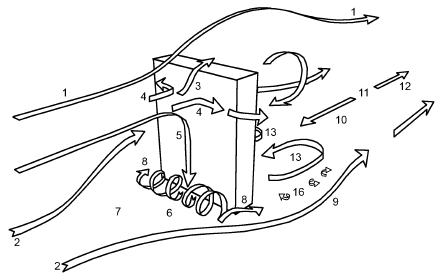

*Fig. 1 Wind Flow Pattern Around High-Rise Building Slab*

where the flow directions are opposite and wind speeds are low (11). Further downstream, the wind speed remains low for a considerable distance behind the building (i.e., the far wake) (12). Backflow is also responsible for creating slow-rotating vortices behind the building (13). Between these vortices and the corner streams (9) is a zone with a high velocity gradient (**shear layer**) that comprises small, fast-rotating vortices (16).

Figure 2 provides a more detailed illustration of the wind flow pattern around an isolated building. It more clearly shows the vortical nature of the corner streams, and it indicates the areas of flow separation and reattachment and the flow in the near wake. It is important to note that Figures 1 and 2 only show the mean wind flow pattern, and that the actual flow pattern exhibits pronounced transient features, such as the build-up and collapse of the separation/recirculation bubbles and periodic vortex shedding in the wake (Murakami 1993; Tominaga et al. 2008a).

For a building with height H that is three or more times the width W of the upwind face, an intermediate stagnation zone can exist between the upwash and downwash regions, where surface streamlines pass horizontally around the building (Figure 3A). (In Figure 3, the upwind building surface is “folded out” to illustrate upwash, downwash, and stagnation zones.) Downwash on the lower surface of the upwind face separates from the building before it reaches ground level and moves upwind to form the standing vortex. Figure 3B shows the near-surface flow patterns for oblique approach flow. Strong vortices develop from the upwind edges of the roof, causing strong downwash onto the roof. High speeds in these vortices (**vorticity**) cause large negative pressures near roof corners that can be a hazard to roof-mounted equipment during high winds. In some extreme cases, the negative pressures can be strong enough to lift heavy objects such as roof pavers, which can result in a projectile hazard.

When the angle between the wind direction and the upwind face of the building is less than about 70°, the upwash/downwash patterns on the upwind face of the building are less pronounced, as is the ground-level vortex shown in Figure 1 and 2. Figure 3B shows that, (Hunt et al. 1978)

<!-- str. 699 -->

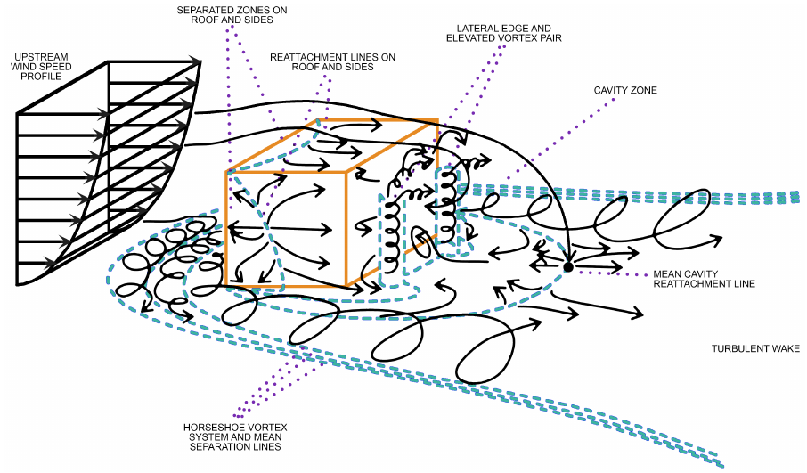

*Fig. 2 Wind Flow Pattern Around Isolated Building*

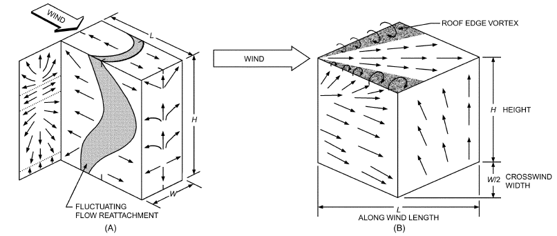

*Fig. 3 Surface Flow Patterns for Normal and Oblique Winds*

(Wilso for an approach flow angle of 45°, streamlines remain close to the horizontal in their passage around the sides of the building, except near roof level, where the flow is drawn upwards into the roof edge vortices (Cochran 1992).

Both the upwind velocity profile shape and its turbulence intensity strongly influence flow patterns and surface pressures (Melbourne 1979).

The downwind wall of a building exhibits a region of low average velocity and high turbulence (i.e., a **flow recirculation** region) extending a distanceLrdownwind. If the building has sufficient length L in the windward direction, the flow reattaches to the building and n 1979)

may generate two distinct regions of separated recirculation flow, on the roof of the building and in its wake, as shown in Figure 4. Figure 4 also shows a rooftop recirculation cavity of length Lc at the upwind roof edge and a recirculation zone of lengthLrdownwind of the rooftop penthouse. Velocities near the downwind wall are typically one-quarter of those at the corresponding upwind wall location. Figures 2 and 3 show that an upward flow exists over most of the downwind walls.

Streamline patterns and the size of the wake(s) are generally independent of wind speed and depend mainly on building shape and upwind conditions. Because of the three-dimensional flow around a building, the shape and size of the recirculation airflow are not constant over the surface. Airflow reattaches closer to the upwind building face along the edges of the building than it does near the middle of the roof and sidewalls (Figure 3). Recirculation cavity height Hc (Figure 4) also decreases near roof edges. Calculating characteristic dimensions for recirculation zones Hc, Lc, and Lr is discussed in Chapter 45 of the 2019 *ASHRAE Handbook—HVAC Applications*.

<!-- str. 700 -->

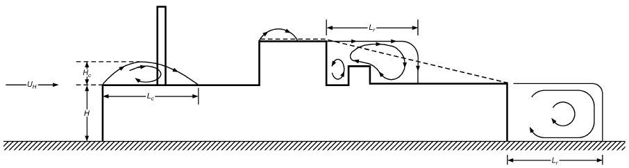

*Fig. 4 Flow Recirculation Regions*

For wind perpendicular to a building wall, the height H and width W of the upwind building face determine the **scaling length R** that characterizes the building’s influence on wind flow. According to Wilson (1979),

> R = Bs0.67BL0.33&emsp;**(1)**

where

- Bs = smaller of upwind building face dimensions H and W
- BL = larger of upwind building face dimensions H and W

When BL is larger than 8Bs, use BL = 8Bs in Equation (1). For buildings with varying roof levels or with wings separated by at least a distance of Bs, only the height and width of the building face below the portion of the roof in question should be used to calculate R.

Flow accelerates as the streamlines compress over the roof and decelerates as they spread downward over the wake on the downwind side of the building. The height above roof level where a building influences the flow is approximately 1.5R. In addition, roof pitch also begins to affect flow when it exceeds about 15° (1:4). When roof pitch reaches 20° (1:3), flow remains attached to the upwind pitched roof and produces a recirculation region downwind of the roof ridge that is larger than that for a flat roof.

### Flow Patterns Around Building Groups

In building groups, the flow patterns can interact, yielding a higher complexity. To determine flow conditions around building groups, wind tunnel or water channel tests of physical scale models, full-scale tests of existing buildings, or careful computational modeling efforts are required (see the section on Physical and Computational Modeling). English and Fricke (1997), Hosker (1984, 1985), Khanduri et al. (1998), Saunders and Melbourne (1979), and Walker et al. (1996) review the effects of nearby buildings, whereas Blocken et al. (2007a, 2008), Stathopoulos and Storms (1986), Yoshie et al. (2007), and others assess the effects of nearby buildings by wind tunnel testing and computational modeling. To illustrate the complexity of wind flow patterns induced by nearby buildings, Figure 5 provides a top view of two high rise buildings in V shape. Depending on the wind direction, this configuration is labeled as converging or diverging. Although the highest wind speed in the passage between both buildings might be expected to occur for the converging arrangement, wind tunnel tests and numerical simulations indicate that the diverging arrangement actually has higher wind speed. This is shown by the

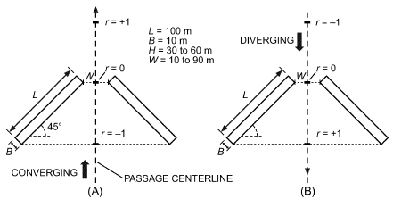

*Fig. 5 Buildings in (A) Converging and (B) Diverging Configuration*

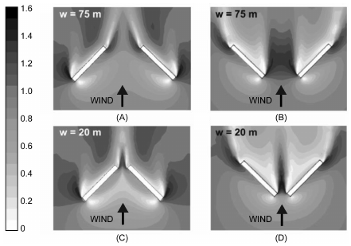

*Fig. 6 Amplification Factor K in Horizontal Plane at y = 2 m above Ground for Converging and Diverging Arrangement with H = 30 m and w = 75 m and 20 m*

> (Blocken et al. 2008)

amplification factors in Figure 6, which are defined as the ratio of the local wind speed to the wind speed that would occur at the same height in absence of the buildings. The higher amplification factor in the diverging arrangement is caused by the lesser flow resistance in this configuration. The Venturi effect does not apply in this case: the Venturi effect refers to confined flows, whereas wind flow in the atmosphere is unconfined. Further information on this study can be found in Blocken et al. (2008).

Figure 7 shows the flow over building arrays with increasing H/W. The description of these flow patterns is adopted from Oke (1988). If the buildings are sufficiently apart (H/W > 0.05), their flow fields do

<!-- str. 701 -->

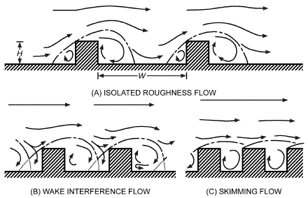

*Fig. 7 Flow Regimes Associated with Airflow over Building Arrays of Increasing H/W*

> (Oke 1988)

not interact, and the flow is called **isolated roughness flow**. When the buildings are positioned closer together, their flow patterns show some degree of interaction, mainly manifested as a disturbance of the wake structure (**wake interference flow**). When the ratio H/W increases further, a stable circulatory vortex is formed in the canyon and the bulk of the flow does not enter the canyon (**skimming flow**).

## 2. WIND PRESSURE ON BUILDINGS

In addition to flow patterns described previously, the turbulence or gustiness of approaching wind and the unsteady character of separated flows cause surface pressures to fluctuate. Pressures discussed here are time-averaged values, with a full-scale averaging period of about 600 s. This is approximately the shortest time period considered to be a “steady-state” condition when considering atmospheric winds; the longest is typically 3600 s. Instantaneous pressures may vary significantly above and below these averages, and peak pressures two or three times the mean values are possible. Peak pressures are important with regard to structural loads, and mean values are more appropriate for computing infiltration and ventilation rates. Time-averaged surface pressures are proportional to wind velocity pressure pv given by Bernoulli’s equation:

> pv = (2 ρ U a H)/2&emsp;**(2)**

where

- pv = wind velocity pressure at roof level, Pa
- UH = approach wind speed at upwind wall height H, m/s [see Equation (4)]
- ρa = ambient (outdoor) air density, kg/m3

The proportional relationship is shown in the following equation, in which the difference ps between the pressure on the building surface and the local outdoor atmospheric pressure at the same level in an undisturbed wind approaching the building is

> ps = Cppv&emsp;**(3)**

where Cp is the local wind pressure coefficient at a point on the building surface.

### Approach Wind Speed

The local wind speed UH at the top of the wall required for Equation (2) is estimated by applying terrain and height corrections to the hourly wind speed Umet from a nearby meteorological station.

Umet is generally measured in flat, open terrain (i.e., category 3 in Table 1). The anemometer that records Umet is located at height

**Table 1 Atmospheric Boundary Layer Parameters**

| Terrain Category | Description | Exponent Thickness a | Exponent Thickness Layer δ, m |
|---|---|---|---|
| 1 | Large city centers, in which at least 50% of | 0.33 | 460 |
|  | buildings are higher than 25 m, over a |  |  |
|  | distance of at least 0.8 km or 10 times the height of the structure upwind, whichever is greater |  |  |
| 2 | Urban and suburban areas, wooded areas, or other terrain with numerous closely spaced obstructions having the size of single-family dwellings or larger, over a distance of at | 0.22 | 370 |
|  | least 460 m or 10 times the height of the structure upwind, whichever is greater |  |  |
| 3 | Open terrain with scattered obstructions | 0.14 | 270 |
|  | having heights generally less than 9 m, including flat open country typical of meteorological station surroundings |  |  |
| 4 | Flat, unobstructed areas exposed to wind | 0.10 | 210 |
|  | flowing over water for at least 1.6 km, over a |  |  |
|  | distance of 460 m or 10 times the height of the structure inland, whichever is greater |  |  |

Hmet, usually 10 m above ground level. The hourly average wind speed UH in the undisturbed wind approaching a building in its local terrain can be calculated from Umet as follows:

> ( δ )amet( )a
>
> UH = Umet ----m----e---t H/δ&emsp;**(4)**

> (Hmet) ( )

The atmospheric boundary layer thickness δ and exponent a for the local building terrain and amet and δmet for the meteorological station are determined from Table 1. Typical values for meteorological stations (category 3 in Table 1) are amet = 0.14 and δmet = 270 m. The values and terrain categories in Table 1 are consistent with those adopted in other engineering applications (e.g., ASCE Standard 7). Equation (4) gives the wind speed that occurs at a certain height H above the average height of local obstacles, such as buildings and vegetation, weighted by the plan area. At heights at or below this average obstacle height (e.g., at roof height in densely built-up suburbs), speed depends on the geometrical arrangement of the buildings, and Equation (4) is less reliable.

An alternative mathematical description of the atmospheric boundary layer, which uses a logarithmic function, is given by Deaves and Harris (1978). Although their model is more complicated than the power law used in Equation (4), it more closely models the real physics of the atmosphere and has been adopted by several codes around the world (e.g., SA/SNZ 2002).

**Example 1.** Assuming a 10 m/s anemometer wind speed for a height Hmet of 10 m at a nearby airport, determine the wind speed UH at roof level H = 15 m above grade for a building located in a city suburb.

**Solution:** From Table 1, the atmospheric boundary layer properties for the anemometer are amet = 0.14 and δmet = 270 m. The atmospheric boundary layer properties at the building site are a = 0.22 and δ = 370 m. Using Equation (4), wind speed UH at 15 m is

> ( 0.14(15/370)0.22
>
> UH = 10 270)/(10 )) = 7.8 m/s

> ( ( )

### Local Wind Pressure Coefficients

Values of the mean local wind pressure coefficient Cp used in Equation (3) depend on building shape, wind direction, and influence of nearby buildings, vegetation, and terrain features. Accurate determination of Cp can be obtained only from wind tunnel model tests of the specific site and building or full-scale tests. Ventilation rate calculations for single, unshielded rectangular buildings can be reasonably estimated using existing wind tunnel data. Many wind load codes (e.g., ASCE Standard 7; ASCE 1999; SA/SNZ Standard AS/NZS 1170.2) give mean pressure coefficients for common building shapes.

<!-- str. 702 -->

Figure 8 shows pressure coefficients for walls of a tall rectangular cross section high-rise building sited in urban terrain (Davenport and Hui 1982). Figure 9 shows pressure coefficients for walls of a low-rise building (Holmes 1986). Generally, for high-rise buildings, height H is more than three times the crosswind width W. For H > 3W, use Figure 8; for H < 3W, use Figure 9. At a wind angle θ = 0° (e.g., wind perpendicular to the face in question), pressure coefficients are positive, and their magnitudes decrease near the sides and the top as flow velocities increase.

As shown in Figure 8, Cp generally increases with height, which reflects increasing velocity pressure in the approach flow as wind speed increases with height. As wind direction moves off normal (θ = 0°), the region of maximum pressure occurs closer to the upwind edge (B in Figure 8) of the building. At a wind angle of θ = 45°, pressures become negative at the downwind edge (A in Figure 8) of the front face. At some angle θ between 60° and 75°, pressures become negative over the whole front face. For θ = 90°, maximum suction (negative) pressure occurs near the upwind edge (B in Figure 8) of the building side and then recovers towards a lower-magnitude negative coefficient as the downwind edge (A in Figure 8) is approached. The degree of this recovery depends on the length of the side in relation to the width W of the structure. For wind angles larger than θ = 100°, the side is completely within the separated flow of the wake and spatial variations in pressure over the face are not as great. In summary, the average pressure on a face is positive for wind angles from θ = 0° to almost 60° and negative (suction) for θ = 60° to 180°.

A similar pattern of behavior in wall pressure coefficients for a low-rise building is shown in Figure 9. Here, recovery from strong suction with distance from the upwind edge is more rapid.

### Surface-Averaged Wall Pressures

Surface-averaged pressure coefficients may be used to determine ventilation and/or infiltration rates, as discussed in Chapter 16. Figure 10 shows the surface pressure coefficient Cs averaged over a complete wall of a high-rise building (Akins et al. 1979). Similar results for a low-rise building are shown in Figure 11 (based on methodology of Swami and Chandra 1987). This figure also includes values calculated from pressure distributions in Figure 9.

### Roof Pressures

Figure 12 shows the average pressure coefficient over the roof of a tall building (Akins et al. 1979).

Surface pressures on the roof of a low-rise building depend strongly on roof slope. Figure 13 shows typical distributions for a wind direction normal to a side of the building. Note that the direction and magnitude of pressure coefficients are indicated by the direction and length of the arrows. For very low slopes (less than about 10°), pressures are negative over the whole roof surface. The magnitude is greatest within the separated flow zone near the leading edge and recovers toward the free-stream pressure downwind of (Davenport an d Hui 1982)

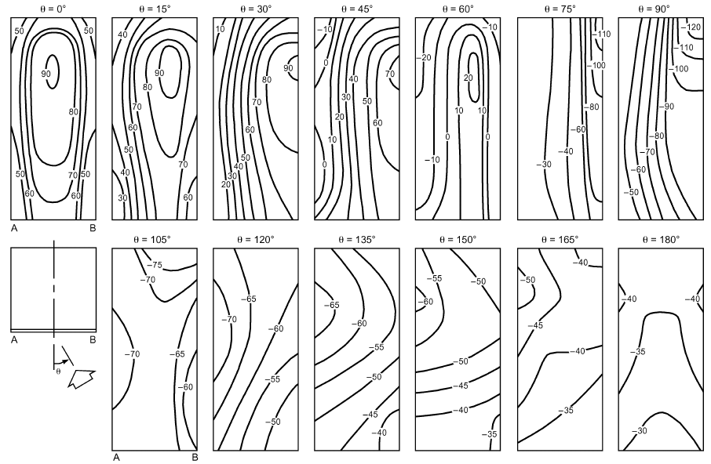

*Fig. 8 Local Pressure Coefficients (Cp × 100) for High-Rise Building with Varying Wind Direction*

<!-- str. 703 -->

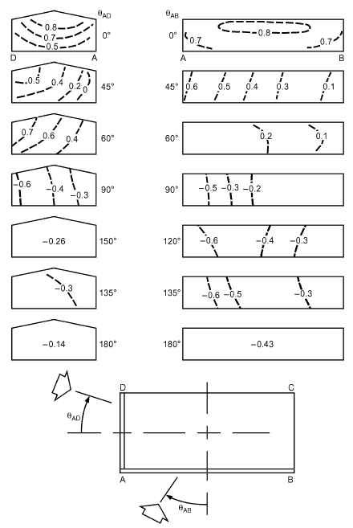

*Fig. 9 Local Pressure Coefficients for Low-Rise Building with Varying Wind Direction*

> (Holmes 1986)

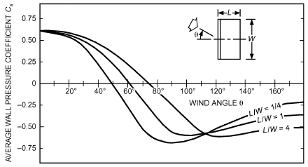

*Fig. 10 Surface-Averaged Wall Pressure Coefficients for High-Rise Buildings*

> (Akins et al. 1979)

the edge. For intermediate slopes (about 10 to 20°), two largemagnitude low-pressure regions a re formed, one at the leading roof edge and another one beginning at the roof peak. For steeper slopes (greater than about 20°), pressures are weakly positive on the upwind slope and negative within the separated flow over the downwind slope.

With a wind angle of about 45°, the vortices originating at the leading corner of a roof with a low slope can induce very large, Courtesy of Florida Solar Energy Center (based on methodology of Swami

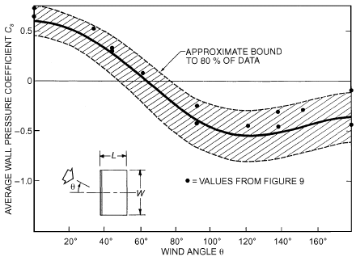

*Fig. 11 Surface-Averaged Wall Pressure Coefficients for Low-Rise Buildings*

> and Chandra 1987)

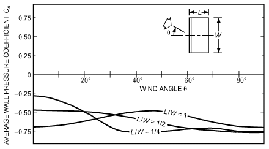

*Fig. 12 Surface-Averaged Roof Pressure Coefficients for Tall Buildings*

> (Akins et al. 1979)

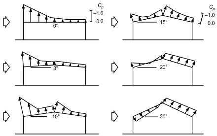

*Fig. 13 Local Roof Pressure Coefficients for Roof of Low-Rise Buildings*

> (Holmes 1983)

localized negative pressures (see Figure 3B). A similar vortex forms on the downwind side of a leading ridge end on a steep roof, as discussed in Cochran et al. (1999). Roof corner vortices and how to disrupt their influence are discussed in Cochran and Cermak (1992) and Cochran and English (1997).

<!-- str. 704 -->

### Interference and Shielding Effects on Pressures

Nearby structures strongly influence surface pressures on both high- and low-rise buildings, particularly for spacing-to-height ratios less than five, where distributions of pressure shown in Figures 8 to 13 do not apply. Although the effect of shielding for low-rise buildings is still significant at larger spacing, it is largely accounted for by the reduction in pv with increased terrain roughness. Bailey and Kwok (1985), Khanduri et al. (1998), Saunders and Melbourne (1979), Sherman and Grimsrud (1980), and Walker et al. (1996) discuss interference. English and Fricke (1997) discuss shielding through use of an interference index, and Walker et al. (1996) present a wind shadow model for predicting shelter factors. Chapter 16 gives shielding classes for air infiltration and ventilation applications.

## 3. SOURCES OF WIND DATA

### Wind at Recording Stations

To design buildings taking into account wind effects, wind speed and direction frequency data are necessary. The simplest forms of wind data are tables or charts of climatic normals, which give hourly average wind speeds, prevailing wind directions, and peak gust wind speeds for each month. This information can be found in sources such as *The Weather Almanac* (Bair 1992) and the *Climatic Atlas of* *the United States* (DOC 1968). Climatic design information, including wind speed at various frequencies of occurrence, is included in Chapter 14. Information on wind speed and direction frequencies is available from the National Climatic Data Center (NCDC) in Asheville, NC. Where more detailed information is required, digital records of hourly winds and other meteorological parameters are available from the NCDC for stations throughout the world. Most countries also have weather services that provide data. For example, in Canada, the Meteorological Service of Canada provides hourly meteorological data and summaries.

When an hourly wind speed Umet at a specified probability level (e.g., the wind speed that is exceeded 1% of the time) is desired, but only the average annual wind speed Uannual is available for a given meteorological station, Umet may be estimated using Table 2. The ratios Umet/Uannual are based on long-term data from 24 weather stations widely distributed over North America. At these stations, Uannual ranges from 3.1 to 6.3 m/s The uncertainty ranges listed in Table 2 are one standard deviation of the wind speed ratios. Example 2 demonstrates the use of Table 2.

**Example 2.** The wind speed Umet that is exceeded 1% of the time (88 hours per year) is needed for a building pressure or exhaust dilution calculation. If Uannual = 4 m/s, find Umet.

**Solution:** From Table 2, the wind speed Umet exceeded 1% of the time is 2.5 ± 0.4 times Uannual. For Uannual = 4 m/s, Umet is 10 m/s with an uncertainty range of 8.4 to 11.6 m/s at one standard deviation.

Using a single prevailing wind direction for design can cause serious errors. For any set of wind direction frequencies, one direction always has a somewhat higher frequency of occurrence. Thus, it is often called the **prevailing wind**, even though winds from other directions may be almost as frequent.

**Table 2 Typical Relationship of Hourly Wind Speed Umet to Annual Average Wind Speed Uannu**

| Percentage of Hourly Values That Exceed Umet | Wind Speed Ratio Umet/Uannu al |
|---|---|
| 90% | 0.2 ± 0.1 |
| 75% | 0.5 ± 0.1 |
| 50% | 0.8 ± 0.1 |
| 25% | 1.2 ± 0.15 |
| 10% | 1.6 ± 0.2 |
| 5% | 1.9 ± 0.3 |
| 1% | 2.5 ± 0.4 |

When using long-term meteorological records, check the anemometer location history, because the instrument may have been relocated and its height varied. This can affect its directional exposure and the recorded wind speeds. Equation (4) can be used to correct wind data collected at different mounting heights. Poor anemometer exposure caused by obstructions or mounting on top of a building cannot be easily corrected, and records for that period should be deleted.

If an estimate of the probability of an extreme wind speed outside the range of the recorded values at a site is required, the observations may be fitted to an appropriate probability distribution (e.g., a Weibull distribution) and the particular probabilities calculated from the resulting function (Figure 14). This process is usually repeated for each of 16 wind directions (e.g., 22.5° intervals). Note that most recent wind data records are provided in 10° intervals, for which the same method may be used, except that the process is repeated for each of 36 wind directions. If both types of data are to be used, one data set must be transformed to match the other.

Where estimates at extremely low probability (high wind speed) are required, curve fitting at the tail of the probability distribution is very important and may require special statistical techniques applicable to extreme values (see Chapter 14). Building codes for wind loading on structures contain information on estimating extreme wind conditions. For ventilation applications, extreme winds are usually not required, and the 99th percentile limit can be accurately estimated from meteorological station data averaged over less than 10 years.

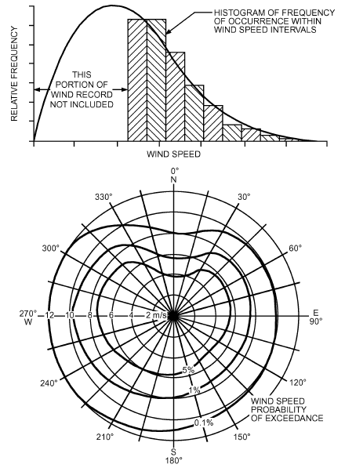

*Fig. 14 Frequency Distribution of Wind Speed and Direction*

<!-- str. 705 -->

### Estimating Wind at Sites Remote from Recording Stations

Many building sites are located far from the nearest long-term wind recording site, which is usually an airport meteorological station. To estimate wind conditions at such sites, the terrain surrounding both the anemometer site and the building site should be checked. In the simplest case of flat or slightly undulating terrain with few obstructions extending for large distances around and between the anemometer site and building site, recorded wind data can be assumed to be representative of that at the building site. Wind direction occurrence frequency at a building site should be inferred from airport data only if the two locations are on the same terrain, with no terrain features that could alter wind direction between them.

In cases where the only significant difference between the anemometer site terrain and the building site terrain is surface roughness, the mean wind speed can be adjusted using Equation (4) and Table 1, to yield approximate wind velocities at the building site. Wind direction frequencies at the site are assumed to be the same as at the recording station.

In using Equation (4), there may be cases where, for a given wind direction, the terrain upwind of either the building or recording site does not fall into just one of the categories in Table 1. The terrain immediately upwind of the site may fall into one category, and that farther upwind fall into a different category. For example, at a downtown airport the terrain may be flat and open (category 3) immediately around the recording instrument, but urban or suburban (category 2) a relatively short distance away. This difference in terrains also occurs when a building or recording site is in an urban area near open water or at the edge of town. In these cases, the suggested approach is to use the terrain category most representative of the average condition within approximately 1.6 km upwind of the site (Deaves 1981). If the average condition is somewhere between two categories described in Table 1, the values of a and δ can be interpolated from those given in the table.

Several other factors are important in causing wind speed and direction at a building site to differ from values recorded at a nearby meteorological station. Wind speeds for buildings on hillcrests or in valleys where the wind is accelerated or channeled can be 1.5 times higher than meteorological station data. Wind speeds for buildings sheltered in the lee of hills and escarpments can be reduced to 0.5 times the values at nearby flat meteorological station terrain.

In more complex terrain, both wind speed and direction may be significantly different from those at the distant recording site. In these cases, building site wind conditions should not be estimated from airport data. Options are either to establish an on-site wind recording station or to commission a detailed wind tunnel correlation study between the building site and long-term meteorological station wind observations.

When wind is calm or light in the rural area surrounding a city, urban air tends to rise in a buoyant plume over the city center. This rising air, heated by anthropogenic sources and higher solar absorption in the city, is replaced by air pushed toward the city center from the edges. In this way, the urban heat island can produce light wind speeds and direction frequencies significantly different than those at a rural meteorological station.

## 4. WIND EFFECTS ON SYSTEM OPERATION

A building with only upwind openings is positively pressurized because of the wind (Figure 15A). Building pressures are negative when there are only downwind openings (Figure 15B). A building with internal partitions and openings (Figure 15C) is under various pressures, depending on the relative sizes of openings and wind direction. With larger openings on the upwind face, the building interior tends toward positive pressure; the reverse is also true (see Figures 8 to 13, and Chapter 16).

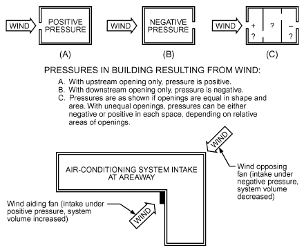

*Fig. 15 Sensitivity of System Volume to Locations of Building Openings, Intakes, and Exhausts*

With few exceptions, building intakes and exhausts cannot be located or oriented such that a prevailing wind ensures effective ventilation and air-conditioning system operation. Wind can assist or hinder inlet and exhaust fans, depending on their positions on the building, but even in locations with a predominant wind direction, the ventilating system must perform adequately for all other directions. To avoid variable system flow rates, use Figures 8, 9, and 12 as a guide to placing inlets and exhausts in locations where surface pressure coefficients do not vary greatly with wind direction. Also consider the potential for cross contamination; see Chapter 45 of the 2019 *ASHRAE Handbook—HVAC Applications* for details.

Airflow through a wall opening results from differential pressures, which may exceed 125 Pa during high winds. Supply and exhaust systems, openings, dampers, louvers, doors, and windows make building flow conditions too complex for direct calculation. Iterative calculations are required because of the nonlinear dependence of volume flow rate on the differential pressure across an opening. Several multizone airflow models are available for these iterative calculations (Feustel and Dieris 1992; Walton and Dols 2005). Opening and closing of doors and windows by building occupants add further complications. In determining Cp, wind direction is more important than the position of an opening on a wall, as shown in Figures 8 and 9. Refer to Chapter 16 for details on wind effects on building ventilation, including natural and mechanical systems.

Cooling towers and similar equipment should be oriented to take advantage of prevailing wind directions, if possible, based on careful study of meteorological data and flow patterns on the building for the area and time of year.

### Natural and Mechanical Ventilation

With natural ventilation, wind may augment, impede, or sometimes reverse the airflow through a building. For flat roof areas with large along-wind sides, wind can reattach to the roof downwind of the leading edge (see Figures 3 and 4). For peaked roofs, the upwind slope may be positively pressurized while the downwind slope may be negatively pressurized, as shown in Figure 12. Thus, any natural ventilation openings could see either a positive or negative pressure, dependent on wind speed and direction. Positive pressure existing where negative pressures were expected could reverse expected natural ventilation. These reversals can be avoided by using stacks, continuous roof ventilators, or other exhaust devices in which flow is augmented by wind.

<!-- str. 706 -->

Mechanical ventilation is also affected by wind conditions. A low-pressure wall exhaust fan (12 to 25 Pa) can suffer drastic reduction in capacity. Flow can be reduced or reversed by wind pressure on upwind walls, or increased substantially when subjected to negative pressure on the downwind wall. Side walls may be subjected to either positive or negative pressure, depending on wind direction. Clarke (1967), measuring medium-pressure air-conditioning systems (250 to 370 Pa), found flow rate changes of 25% for wind blowing into intakes on an L-shaped building compared to wind blowing away from intakes. Such changes in flow rate can cause noise at supply outlets and drafts in the space served.

For mechanical systems, wind can be thought of as an additional pressure source in series with a system fan, either assisting or opposing it (Houlihan 1965). Where system stability is essential, supply and exhaust systems must be designed for high pressures (about 750 to 1000 Pa) or use devices to actively minimize unacceptable variations in flow rate. To conserve energy, the selected system pressure should be the minimum consistent with system needs.

Quantitative estimates of wind effects on a mechanical ventilation system can be made by using the pressure coefficients in Figures 8 to 13 to calculate wind pressure on air intakes and exhausts. A simple worst-case estimate is to assume a system with 100% makeup air supplied by a single intake and exhausted from a single outlet. The building is treated as a single zone, with an exhaust-only fan as shown in Figure 16. This overestimates the effect of wind on system volume flow.

Combining Equations (2) and (3), surface wind pressures at air intake and exhaust locations are

> psintake = Cpintake(2 ρ U a H)/2&emsp;**(5)**
>
> psexhaust = Cpexhaust(2 ρ U a H)/2&emsp;**(6)**

For the single-zone building shown in Figure 16, a worst-case estimate of wind effect neglects any flow resistance in the intake grill and duct, making interior building pressure pinterior equal to outdoor wind pressure on the intake (pinterior = psintake). Then, with all system flow resistance assigned to the exhaust duct in Figure 16, and a pressure rise Δpfan across the fan, pressure drop from outdoor intake to outdoor exhaust yields

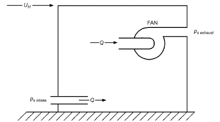

*Fig. 16 Intake and Exhaust Pressures on Exhaust Fan in Single-Zone Building*

> (p – p ) + Δp = F ρQ2/(2 A L)&emsp;**(7)**
>
> *s intake s exhaust fan sys*

where F is system flow resistance, A is flow leakage area, and Q sys L is system volume flow rate. This result shows that, for the worst-case estimate, the wind-induced pressure difference simply adds to or subtracts from the fan pressure rise. With inlet and exhaust pressures from Equations (5) and (6), the effective fan pressure rise Δp is fan eff

> Δp = Δp + Δp&emsp;**(8)**
>
> *fan eff fan wind*

where

> Δp = (C – C )(2 ρ U a H)/2&emsp;**(9)**
>
> *wind p intake p exhaust*

The fan is wind assisted when C > C and wind

> *p intake p exhaust*

opposed when the wind direction changes, causing C <

> p intake

C . The effect of wind-assisted and wind-opposed pressure p exhaust differences is shown in Figure 17.

**Example 3.** Make a worst-case estimate for the effect of wind on the supply fan for a low-rise building with height H = 15 m, located in a city suburb. Use the hourly average wind speed that will be exceeded only 1% of the time and assume an annual hourly average speed of Uannual = 4 m/s measured on a meteorological tower at height Hmet = 10 m at a nearby airport. Outdoor air density is ρa = 1.2 kg/m3.

**Solution:** From Table 2, the wind speed exceeded only 1% of the hours each year is a factor of 2.5 ± 0.4 higher than the annual average of 4 m/s, so the 1% maximum speed at the airport meteorological station is

> Umet = 2.5 × 4 = 10 m/s
>
> From Example 1, building wind speed UH is 7.8 m/s.

A worst-case estimate of wind effect must assume intake and exhaust locations on the building that produce the largest difference (Cpintake – Cpexhaust) in Equations (8) and (9). From Figure 9, the largest difference occurs for the intake on the upwind wall AB and the exhaust on the downwind wall CD, with a wind angle θAB = 0°. For this worst case, Cpintake = +0.8 on the upwind wall and Cpexhaust = –0.43 on the downwind wall. Using these coefficients in Equations (8) and (9) to evaluate effective fan pressure Δpfaneff,

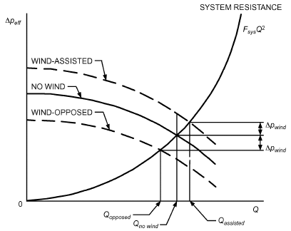

*Fig. 17 Effect of Wind-Assisted and Wind-Opposed Flow*

<!-- str. 707 -->

> Δpfaneff = Δpfan + [0.8 – (–0.43)]1.2(7.8)2/2
>
> = Δpfan + 44.9 Pa

This wind-assisted hourly averaged pressure is exceeded only 1% of the time (88 hours per year). When wind direction reverses, the outlet will be on the upwind wall and the inlet on the downwind wall, producing wind-opposed flow, changing the sign from +44.9 to –44.9 Pa. The importance of these pressures depends on their size relative to the fan pressure rise Δpfan, as shown in Figure 17.

### Minimizing Wind Effect on System Volume Flow Rate

Wind effect can be reduced by careful selection of inlet and exhaust locations. Because wall surfaces are subject to a wide variety of positive and negative pressures, wall openings should be avoided when possible. When they are required, wall openings should be away from corners formed by building wings (see Figure 15). Mechanical ventilation systems should operate at a pressure high enough to minimize wind effect. Low-pressure systems and propeller exhaust fans should not be used with wall openings unless their ventilation rates are small or they are used in noncritical services (e.g., storage areas).

Although roof air intakes in flow recirculation zones best minimize wind effect on system flow rates, current and future air quality in these zones must be considered. These locations should be avoided if a contamination source exists or may be added in the future. The best area is near the middle of the roof, because the negative pressure there is small and least affected by changes in wind direction (see Figure 12). Consider avoiding edges of the roof and walls, where large pressure fluctuations occur. Either vertical or horizontal (mushroom) openings can be used. On roofs with large areas, where intake may be outside the roof recirculation zone, mushroom or 180° gooseneck designs minimize impact pressure from wind flow. Vertical louvered openings or 135° goosenecks are undesirable for this purpose or for rain protection.

Heated air or contaminants should be exhausted vertically through stacks, above the roof recirculation zone. Horizontal, louvered (45° down), and 135° gooseneck discharges are undesirable, even for heat removal systems, because of their sensitivity to wind effects. A 180° gooseneck for hot-air systems may be undesirable because of air impingement on tar and felt roofs. Vertically discharging stacks in a recirculation region (except near a wall) have the advantage of being subjected only to negative pressure created by wind flow over the tip of the stack. See Chapter 45 of the 2019 ASHRAE Handbook—HVAC Applications for information on stack design.

### Chemical Hood Operation

Wind effects can interfere with safe chemical hood operation. Supply volume flow rate variations can cause both disturbances at hood faces and a lack of adequate hood makeup air. Volume flow rate surges, caused by fluctuating wind pressures acting on the exhaust system, can cause momentary inadequate hood exhaust. If highly toxic contaminants are involved, surging is unacceptable. The system should be designed to eliminate this condition. On low-pressure exhaust systems, it is impossible to test the hoods under wind-induced, surging conditions. These systems should be tested during calm conditions for safe flow into the hood faces, and rechecked by smoke tests during high wind conditions. For more information on chemical hoods, see Chapter 16 of the 2019 *ASHRAE Handbook—HVAC Applications*. For more information on stack and intake design, see Chapter 45 of that volume.

## 5. BUILDING PRESSURE BALANCE AND INTERNAL FLOW CONTROL

Proper building pressure balance avoids flow conditions that make doors hard to open and cause drafts. In some cases (e.g., office buildings), pressure balance may be used to prevent confinement of contaminants to specific areas. In other cases (e.g., laboratories), the correct internal airflow is towards the contaminated area.

### Pressure Balance

Although supply and exhaust systems in an indoor area may be in nominal balance, wind can upset this balance, not only because of its effects on fan capacity but also by superimposing infiltrated or exfiltrated air (or both). These effects can make it challenging to control environmental conditions. Where building balance and infiltration are important, consider the following:

- Design HVAC system with pressure adequate to minimize wind effects
- Include controls to regulate flow rate, pressure, or both
- Separate supply and exhaust systems to serve each building area requiring control or balance
- Use revolving or other self-closing doors or double-door air locks to noncontrolled adjacent areas, particularly exterior doors
- Seal windows and other leakage sources
- Close natural ventilation openings

### Internal Flow Control

Airflow direction is maintained by controlling pressure differentials between spaces. In a laboratory building, for example, peripheral rooms such as offices and conference rooms are kept at positive pressure, and laboratories at negative pressure, both with reference to corridor pressure. Pressure differentials between spaces are normally obtained by balancing supply system airflows in the spaces in conjunction with exhaust systems in the laboratories. Differential pressure instrumentation is normally used to control airflow.

The pressure differential for a room adjacent to a corridor can be controlled using the corridor pressure as the reference. Outdoor pressure cannot usually control pressure differentials within internal spaces, even during periods of relatively constant wind velocity (wind-induced pressure). A single pressure sensor can measure the outdoor pressure at one point only and may not be representative of pressures elsewhere.

Airflow (or pressure) in corridors is sometimes controlled by an outdoor reference probe that senses static pressure at doorways and air intakes. The differential pressure measured between the corridor and the outdoors may then signal a controller to increase or decrease airflow to (or pressure in) the corridor. Unfortunately, it is difficult to locate an external probe where it will sense the proper external static pressure. High wind velocity and resulting pressure changes around entrances can cause great variations in pressure.

To measure ambient static pressure, the probe should be located where airflow streamlines are not affected by the building or nearby buildings. One possibility is at a height of 1.5R, as shown in Figure 18. However, this is usually not feasible. If an internal space is to be pressurized relative to ambient conditions, the pressure must be known on each exterior surface in contact with the space. For example, a room at the northeast corner of the building should be pressurized with respect to pressure on both the north and east building faces, and possibly the roof. In some cases, multiple probes on a single building face may be required. Figures 8 to 12 may be used as guides in locating external pressure probes. System volume and pressure control is described in Chapter 45 of the 2019 ASHRAE Handbook—HVAC Applications.

<!-- str. 708 -->

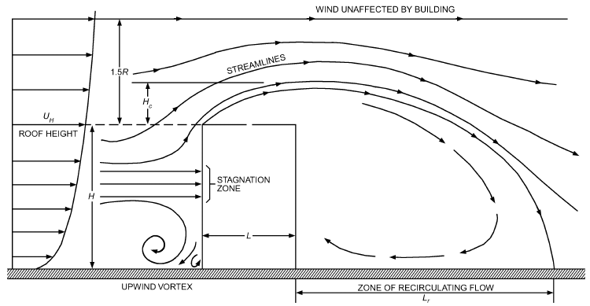

*Fig. 18 Flow Patterns Around Rectangular Block Building*

(modified from

## 6. ENVIRONMENTAL IMPACTS OF BUILDING EXTERNAL FLOW

### Pollutant Dispersion and Exhaust Reentrainment

Pollutant dispersion around buildings is highly affected by the complex flow field. Contaminants are not always transported along the approaching flow direction and can be advected windward by reverse flows and retained in wake flows (Huber and Snyder 1982; Li and Meroney 1983; Stathopoulos et al. 2002). Intakes and exhausts should be installed carefully, considering wind direction and roof geometry (e.g., stack height, rooftop structures) to avoid air intake contamination and exhaust reentrainment (Gupta et al. 2012; Lazure et al. 2002; Stathopoulos et al. 2004). Empirical guidelines that can be used are given in Chapter 45 of the 2019 ASHRAE Handbook—HVAC Applications. More detailed prediction can be done by physical and numerical modeling, as explained in the section on Physical and Computational Modeling. State-of-the-art reviews on modeling of pollutant dispersion were performed by Canepa (2004), Di Sabatino et al. (2013), Lateb et al. (2016), Meroney (2004), and Tominaga and Stathopoulos (2013).

### Pedestrian Wind Comfort and Safety

Although thermal comfort is also important [e.g., Metje et al. (2008); Stathopoulos (2006)], wind comfort and safety generally only refer to the mechanical effects of wind on people [e.g., Lawson and Penwarden (1975); Willemsen and Wisse (2007)]. Particularly near high-rise buildings, high wind velocities can occur at pedestrian level that can be uncomfortable or even dangerous. For an isolated high-rise building or one amid low rise buildings, high wind speed at pedestrian level can be caused by the downflow that creates the standing vortex and the corner streams (see Figure 1). For building groups, amplified wind speed can occur in passages through and between buildings. Uncomfortable wind conditions can be detrimental to the success of new buildings. Wise (1970) reported shops that were left untenanted because of the windy environment that discouraged shoppers. Lawson and Penwarden (1975) reported dangerous wind conditions to be responsible for the death of two elderly women who were blown over by sudden wind gusts near a high-rise building. Many current urban authorities recognize the importance of pedestrian wind comfort and wind safety, and require studies before granting building permits for new buildings or new urban

Hosker 1984)

areas. ASCE (2004) documented the state of the art of outdoor human comfort and its assessment. The first standard on wind comfort and wind safety was developed in the Netherlands and published in 2006 (NEN Standard 8100; Willemsen and Wisse 2007) and applied in several published case studies [e.g., Blocken et al. (2012)]. Reviews on studies of pedestrian wind comfort and safety were provided by Blocken (2014), Blocken and Stathopoulos (2013), Blocken et al. (2016), Mochida and Lun (2008), and Stathopoulos (2006). Although laser Doppler anemometry, particle image velocimetry, and large-eddy simulation (LES) are inherently more accurate techniques, Blocken et al. (2016) recommended faster and less expensive techniques for pedestrian-level wind (PLW) studies, such as hot-wire anemometry, Irwin probes, or steady Reynolds-averaged Navier-Stokes computational fluid dynamics (RANS CFD) simulations. The reason is that their lower accuracy at lower amplification factors does not necessarily compromise the accuracy of PLW comfort assessment, because the higher amplification factors provide the largest contribution to the discomfort exceedance probability in the comfort criterion.

### Wind-Driven Rain on Buildings

Wind-driven rain (WDR), also called **driving rain,** is one of the most important moisture sources for building facades. It is an essential boundary condition for the analysis of the hygrothermal behavior and durability of historical and contemporary building facade components (Blocken and Carmeliet 2004; Dalgliesh and Surry 2003; Masters et al. 2008; Sanders 1996; Tang et al. 2004).

Wind-driven rain can be assessed by full-scale measurements, wind tunnel measurements, semiempirical formulas, or numerical simulation with CFD. The experimental methods consist of measuring WDR with WDR gages. However, for practical purposes, measurements are generally time consuming, expensive, and often impractical. Blocken and Carmeliet (2006) and Högberg et al. (1999) found that WDR measurements are very prone to error. In addition, measurements made on facades of a particular building at a particular site have limited applicability to facades of other buildings at other sites. This awareness has led researchers to develop calculation models, which have been progressively improved throughout the years. Today, the most advanced and most frequently used models are the semiempirical model in ISO Standard 15927-3 (ISO model), the semiempirical model by Straube (1998) and Straube and Burnett (2000) (SB model), and the CFD model by Choi (1991, 1993, 1994) extended into the time domain by Blocken and Carmeliet (2002). State-of-the-art reviews on the assessment of WDR on building facades were provided by ASCE (2014) and Blocken and Carmeliet (2004, 2010).

<!-- str. 709 -->

## 7. PHYSICAL AND COMPUTATIONAL MODELING

For many routine design applications, flow patterns and wind pressures can be estimated using the data and equations presented in the previous sections. Exhaust dilution for simple building geometries in homogeneous terrain environments (e.g., no larger buildings or terrain features nearby) can be estimated using the data and equations presented in the previous sections and in Chapter 45 of the 2019 *ASHRAE Handbook—HVAC Applications*. However, in critical applications, such as where health and safety are of concern, more accurate estimates may be required.

### Physical Modeling

Measurements on small-scale models in wind tunnels or water channels can provide information for design before construction. These measurements can also be used as an economical method of performance evaluation for existing facilities. Full-scale testing is not generally useful in the initial design phase because of the time and expense required to obtain meaningful information, but it is useful for verifying data derived from physical modeling and for planning remedial changes to improve existing facilities (Cochran 2006).

Detailed accounts of physical modeling, field measurements and applications, and engineering problems resulting from atmospheric flow around buildings are available in international journals, proceedings of conferences, and research reports on wind engineering (see the Bibliography).

The wind tunnel is the main tool used to assess and understand airflow around buildings. Water channels or tanks can also be used, but are more difficult to implement and give only qualitative results for some cases. Models of buildings, complexes, and the local surrounding topography are constructed and tested in a simulated turbulent atmospheric boundary layer. Airflow, wind pressures, snow loads, structural response, or pollutant concentrations can then be measured directly by properly scaling wind, building geometry, and exhaust flow characteristics. Wind tunnel studies of natural ventilation are particularly suitable for buildings with large openings that provide a strong coupling between outdoor wind flow and indoor airflow (Karava et al. 2011; Kato et al. 1992). Dalgliesh (1975) and Petersen (1987a) found generally good agreement between the results of wind tunnel simulations and corresponding full-scale data. Cochran (1992) and Cochran and Cermak (1992) found good agreement between model and full-scale measurements of low-rise architectural aerodynamics and cladding pressures, respectively. Stathopoulos et al. (1999, 2002, 2004) obtained good agreement between model and full-scale measurements of the dispersion of gaseous pollutants from rooftop stacks on two different buildings in an urban environment.

### Similarity Requirements

Physical modeling is most appropriate for applications involving small-scale atmospheric motions, such as recirculation of exhaust downwind of a laboratory, wind loads on structures, wind speeds around building clusters, snow loads on roofs, and airflow over hills or other terrain features. Winds associated with tornadoes, thunderstorms, and large-scale atmospheric motion cannot currently be physically modeled accurately, although the physical modeling of tornadoes and thunderstorm downbursts is a current topic of significant research.

Snyder (1981) gives guidelines for fluid modeling of atmospheric diffusion. This report contains explicit directions and should be used whenever designing wind tunnel studies to assess concentration levels of air pollutants. ASCE Standard 7, ASCE Manual of Practice 67 (ASCE 1999), and AWES *Quality Assurance Manual* (AWES 2001) also provide guidance when wind tunnels are used for evaluating wind effects on structures.

A complete and exact simulation of airflow over buildings and the resulting concentration or pressure distributions cannot be achieved in a physical model. However, this is not a serious limitation. Cermak (1971, 1975, 1976a, 1976b), Petersen (1987a, 1987b), and Snyder (1981) found that transport and dispersion of laboratory exhaust can be modeled accurately if the following criteria are met in the model and full scale:

1. Match exhaust velocity to wind speed ratios, Ve/UH.

2. Match exhaust to ambient air density ratios, ρe/ρa.

3. Match exhaust Froude numbers. Fr2 = ρaVe2/[(ρe – ρa)gd], where d is effective exhaust stack diameter.

4. Ensure fully turbulent stack gas flow by ensuring stack flow Reynolds number (Res = Ved/ν) is greater than 2000 [where ν is the kinematic viscosity of ambient (outdoor) air], or by placing an obstruction inside the stack to enhance turbulence.

5. Ensure fully turbulent wind flow.

6. Scale all dimensions and roughness by a common factor. 7. Match atmospheric stability by the bulk Richardson number (Cermak 1975). For most applications related to airflow around buildings, neutral stratification is assumed, and no Richardson number matching is required.

8. Match mean velocity and turbulence distributions in the wind. 9. Ensure building wind Reynolds number (Reb = UHR/ν) is greater than 11 000 for sharp-edged structures, or greater than 90 000 for round-edged structures.

10. Ensure less than 5% blockage of wind tunnel cross section.

For wind speeds, flow patterns, or pressure distributions around buildings, only conditions 5 to 10 are necessary. Usually, each wind tunnel study requires a detailed assessment to determine the appropriate parameters to match in the model and full scale.

In wind tunnel simulations of exhaust gas recirculation, buoyancy of the exhaust gas (condition 3) is often not modeled. This allows using a high wind tunnel speed or a smaller model to achieve high enough Reynolds numbers (conditions 4, 5, and 9). Neglecting buoyancy is justified if density of building exhaust air is within 10% of the ambient (outdoor) air. Also, critical minimum dilution Dcrit occurs generally at wind speeds high enough to produce a well-mixed, neutrally stable atmosphere, allowing stability matching (condition 7) to be neglected (see Chapter 45 of the 2019 ASHRAE Handbook—HVAC Applications for discussion of Dcrit). However, in some cases and depending on emission sources, calm conditions may produce critical dilution. Nevertheless, omission of conditions 3 and 7 simplifies the test procedure considerably, reducing both testing time and cost.

Buoyancy should be properly simulated for high-temperature exhausts such as boilers and diesel generators. Equality of model and prototype Froude numbers (condition 3) requires tunnel speeds of less than 0.5 m/s for testing. However, greater tunnel speeds may be needed to meet the minimum building Reynolds number requirement (condition 4).

### Wind Simulation Facilities

Boundary-layer wind tunnels are required for conducting most wind studies. The wind tunnel test section should be long enough to establish, upwind of the model building, a deep boundary layer that slowly changes with downwind distance.

Other important wind tunnel characteristics include width and height of the test section, range of wind speeds, roof adjustability, and temperature control. Larger models can be used in tunnels that are wider and taller, which, in turn, give better measurement resolution. Model blockage effects can be minimized by an adjustable roof height. Temperature control of the tunnel surface and airflow is required when atmospheric conditions other than neutral stability are to be simulated. Boundary-layer characteristics appropriate for the site are established by using roughness elements on the tunnel floor that produce mean velocity, turbulence intensity profiles, and spectra characteristic of full scale.

<!-- str. 710 -->

Water can also be used for the modeling fluid if an appropriate flow facility is available. Flow facilities may be in the form of a tunnel, tank, or open channel. Water tanks with a free surface ranging in size up to that of a wind tunnel test section have been used by towing a model (upside down) through the nonflowing fluid. Stable stratification can be obtained by adding a salt solution. This technique does not allow development of a boundary layer and therefore yields only approximate, qualitative information on flow around buildings. Water channels can be designed to develop thick, turbulent boundary layers similar to those developed in the wind tunnel. One advantage of such a flow system is ease of flow visualization, but this is offset by a greater difficulty in developing the correct turbulence structure and the measurement of flow variables and concentrations.

### Designing Model Test Programs

The first step in planning a test program is selecting the model length scale. This choice depends on cross-sectional dimensions of the test section, dimensions of the buildings to be modeled, and/or topographic features and thickness of the simulated atmospheric boundary layer. Typical geometric scales range from about 120:1 to 1000:1.

Because a large model is desirable to meet minimum Reynolds and Froude number requirements, a wide test section is advantageous. In general, the model at any section should be small compared to the test section area so that blockage is less than 5% (Melbourne 1982).

The test program must include specifications of the meteorological variables to be considered (e.g., wind direction, wind speed, thermal stability). Data taken at the nearest meteorological station should be reviewed to obtain a realistic assessment of wind climate for a particular site. Ordinarily, local winds around a building, pressures, and/or concentrations are measured for 16 wind directions (e.g., 22.5° intervals). This is easily accomplished by mounting the building model and its nearby surroundings on a turntable. More than 16 wind directions are required for highly toxic exhausts or for finding peak fluctuating pressures on a building. If only local wind information and pressures are of interest, testing at one wind speed with neutral stability is sufficient.

### Computational Modeling

Computational fluid dynamics (CFD) models attempt to resolve airflow around buildings by solving the Navier-Stokes equations or an approximate form of these equations in discretized form. The potential for computational wind engineering (CWE) has increased tremendously in the past decades. Nevertheless, there are some topics for which CWE in its current stage remains inappropriate.

According to Stathopoulos (2000, 2002), there is great potential for CWE, but the numerical wind tunnel “is still virtual rather than real.” According to Murakami (2000), CWE has become a more popular tool, but results usually include numerical errors and prediction inaccuracies. According to a review by Blocken (2014), since 1960, computational wind engineering (CWE) has undergone a successful transition from an emerging field into an increasingly established field in wind engineering research, practice, and education, and its application has continued to spread to a very large range of topics, from pedestrian wind conditions to natural ventilation to pollutant dispersion around buildings. However, in line with the reviews by Stathopoulos (1997, 2000, 2002), it is clear that the largest potential of CWE is still in the field of environmental wind engineering rather than structural wind engineering. Indeed, although CWE can adequately provide mean values of variables for pedestrian wind comfort and wind safety, natural ventilation, or wind-driven rain studies, correct prediction of peak values for wind loading studies, for example, remains very difficult.

Methods for predicting turbulent flow around buildings include the following.

**Direct numerical simulation (DNS)** directly resolves all the spatial and temporal scales in the flow based on the exact Navier-Stokes equations. This requires very extensive computational resources (runs lasting from several hours to days, depending on computer characteristics, power, and capacity) and can at present only be applied for flow in simple geometries and at low Reynolds numbers (Re). For complex, high-Re flows in wind engineering, application of DNS will not be possible in the foreseeable future.

**Large eddy simulation (LES)** is a simplified method in which the spatially filtered Navier-Stokes equations are solved. Turbulent structures larger than the filter (sometimes taken equal to the grid size) are explicitly solved, whereas those smaller than the filter are modeled (i.e., approximated) by a subfilter model. Information on filtering and subfilter models can be found in Ferziger and Peric (2002), Geurts (2003), and Meyers et al. (2008).

In **Reynolds-averaged Navier-Stokes (RANS) simulation,** the equations are obtained by averaging the Navier-Stokes equations (time-averaging if the flow is statistically steady, or ensembleaveraging for time-dependent flows). With RANS, only the mean flow is solved, whereas all scales of turbulence must be modeled. Averaging generates additional unknowns for which turbulence models are required. Many turbulence models are available, but no single turbulence model is universally accepted as being the best for all types of applications.

In addition, hybrid RANS/LES approaches are available, in which **unsteady RANS (URANS)** is used near the wall, and LES in the rest of the flow field. This avoids the excessively high near-wall grid resolution required for application of LES near walls in high-Re flow problems. An example of a hybrid RANS/LES approach is **detached eddy simulation (DES)**, as proposed by Spalart et al. (1997).

The statistically steady RANS method is the most widely applied and validated in CWE. It has been used for a wide range of building applications, including estimating pressure coefficients (Meroney et al. 2002; Murakami et al. 1992; Oliveira and Younis 2000; Richards and Hoxey 1992; Stathopoulos 1997; Stathopoulos and Zhou 1993), natural ventilation (Chen 2009; Evola and Popov 2006; Kato et al. 1997; Norton et al. 2009; Ramponi and Blocken 2012; van Hooff and Blocken 2010), wind-driven rain (Blocken and Carmeliet 2004; 2010; Choi 1993, 1994; Tang and Davidson 2004), pollutant dispersion (Cowan et al. 1997; Dawson et al. 1991; Gousseau et al. 2011; Leitl et al. 1997; Li and Stathopoulos 1997; Meroney 2004; Meroney et al. 1999; Tominaga and Stathopoulos 2010, 2011, 2013), pedestrian wind conditions (Blocken et al. 2008, 2012; Richards et al. 2002; Stathopoulos and Baskaran 1996; Yoshie et al. 2007), snow drift (Sundsbo 1998; Thiis 2000; Tominaga and Mochida 1999), and cooling tower drift (Meroney 2006, 2008). Although many past applications of RANS have been limited to isolated buildings or relatively simple building arrangements, large and sometimes very large discrepancies have been found in comparisons with wind tunnel and full-scale measurements. These are at least partly attributed to turbulence model limitations and to the statistically steady solution of flows that exhibit pronounced transient features, such as intermittent separation, recirculation zones, and vortex shedding [e.g., Murakami (1993), Tominaga et al. (2008a)]. In addition, a wide range of other computational aspects can contribute to uncertainties and errors, divided by COST 732 (Franke et al. 2007) into two broad categories: physical and numerical. **Physical modeling errors** and uncertainties result from assumptions and approximations made in the mathematical description of the physical process. Examples are simplifications of the actual physical complexity (e.g., using RANS instead of DNS) and uncertainties and/or simplifications of the geometric and physical boundary conditions. **Numerical errors** and uncertainties are the result of the numerical solution of the mathematical model. Examples are computer programming errors, computer round-off errors, spatial and temporal discretization errors, and iterative convergence errors.

<!-- str. 711 -->

LES is a time-dependent approach in which more of the turbulence is resolved. It therefore has a larger potential to provide accurate results than statistically steady RANS simulations (Murakami et al. 1992; Tominaga et al. 1997). LES also provides more information about the flow, such as instantaneous and peak wind speeds, pressures, and pollutant concentrations. However, it requires considerably higher CPU times and memory than RANS. It also requires time- and space-resolved data as boundary conditions to properly simulate inflow. Such experimental data are rarely available in practice (Franke et al. 2007). LES is also considered to require more experience for users to apply effectively than does RANS. Several studies have compared RANS and LES modeling for atmospheric dispersion for generic configurations such as isolated buildings (Tominaga and Stathopoulos 2010) and street canyons (Salim et al. 2011; Tominaga and Stathopoulos 2011) and for actual urban environments (Gousseau et al. 2011; Hanna et al. 2006), where LES is shown to consistently outperform steady RANS modeling. However, the drawbacks of LES imply that the practical application of CWE will continue to be mainly based on statistically steady RANS for a considerable while.

Guidelines for using CFD have been developed and assembled to help users avoid, reduce, and estimate errors and uncertainties in applying CFD. ERCOFTAC (2000) provides extensive guidelines for industrial CFD applications, many of which are also applicable to CWE. Franke et al. (2007) assembled a comprehensive bestpractice guideline document for CFD simulation of flows in the urban environment. Important guidelines for application of CFD to pedestrian wind conditions around buildings and for predicting wind loads on buildings have been developed by the Architectural Institute of Japan and reported by Mochida et al. (2002), Tamura et al. (2008), Tominaga et al. (2008b), and Yoshie et al. (2007). A set of ten tips and tricks for CFD simulations in urban physics has been provided by Blocken (2015). Other efforts have focused on specific problems, such as those encountered in simulating equilibrium atmospheric boundary layers in computational domains [e.g., Balogh and Parente (2015); Blocken et al. (2007a, 2007b); Gorlé et al. (2009); Hargreaves and Wright (2007); Parente et al. (2011); Richards and Hoxey (1993); Richards and Norris (2011, 2015); Yang et al. (2008)]. Most of these guidelines apply to statistically steady RANS simulations.

Regardless of whether RANS or LES is used, evaluating the accuracy of CFD results by comparing them with wind tunnel or field experiments is very important because turbulence models are based on assumptions; no turbulence model is universally valid for all applications. Physical modeling therefore remains an indispensable tool in (computational) wind engineering.

## 8. SYMBOLS

a = exponent in power law wind speed profile for local building terrain, Equation (4) and Table 1, dimensionless

AL = flow leakage area, Equation (7), m2 amet = exponent a for the meteorological station, Equation (4) and Table 1, dimensionless

BL = larger of two upwind building face dimensions H and W,

> Equation (1), m

Bs = smaller of two upwind building face dimensions H and W, Equation (1), m

Cp = local wind pressure coefficient for building surface, Equation (3), dimensionless

Cs = surface-averaged pressure coefficient, Figure 6, dimensionless d = effective stack diameter, m

Dcrit = critical dilution factor at roof level for uncapped vertical exhaust at critical wind speed (see Chapter 45 of the 2019 ASHRAE Handbook—HVAC Applications), dimensionless

Fr = Froude number, dimensionless

Fsys = system flow resistance, Equation (7), dimensionless

> g = acceleration of gravity, 9.8 m/s2

H = wall height above ground on upwind building face, Equation (4) and Figure 3, m

Hc = maximum height above roof level of upwind roof edge flow recirculation zone, Figure 4, m

Hmet = height of anemometer at meteorological station, Equation (4), m hs = exhaust stack height (typically above roof unless otherwise specified, m (see Chapter 45 in the 2019 ASHRAE Handbook—HVAC Applications)

> L = length of building in wind direction, Figure 3, m

Lc = length of upwind roof edge recirculation zone, Figure 4, m Lr = length of flow recirculation zone behind rooftop obstacle or building, Figure 4, m ps = wind pressure difference between exterior building surface and local ambient (outdoor) atmospheric pressure at same elevation in undisturbed approach wind, Equation (3), Pa pv = wind velocity pressure at roof level, Equation (2), Pa

Q = volumetric flow rate, Equation (7), m3/s

> R = scaling length for roof flow patterns, Equation (1), m

Reb = building Reynolds number, dimensionless

Res = stack flow Reynolds number, dimensionless

> S = stretched-string distance; shortest distance from exhaust to

intake over obstacles and along building surface, m (see Chapter 45 in the 2019 *ASHRAE Handbook—HVAC Applications*) Uannual = annual average of hourly wind speeds Umet, Table 2, m/s

UH = mean wind speed at height H of upwind wall in undisturbed flow approaching building, Equation (2) and Figure 4, m/s

Umet = meteorological station hourly wind speed, measured at height Hmet above ground in smooth terrain, Equation (4) and Table 2, m/s

Ve = exhaust face velocity, m/s

W = width of upwind building face, Figure 3, m

### Greek

δ = fully developed atmospheric boundary layer thickness, Equation (4) and Table 1, m

δmet = atmospheric boundary layer thickness at meteorological station, Equation (4) and Table 1, m

Δpfan = pressure rise across fan, Equation (7), Pa

Δpfaneff = effective pressure rise across fan, Equation (8), Pa

Δpwind = wind-induced pressure, Equations (8) and (9), Pa

θ = angle between perpendicular line from upwind building face and wind direction, Figures 8 to 12, degrees

> ν = kinematic viscosity of ambient (outdoor) air, m2/s

ρa = ambient (outdoor) air density, Equation (2), kg/m3

ρe = density of exhaust gas mixture, kg/m3

## REFERENCES

ASHRAE members can access ASHRAE Journal articles and ASHRAE research project final reports at technologyportal .ashrae.org. Articles and reports are also available for purchase by nonmembers in the online ASHRAE Bookstore at www.ashrae.org /bookstore.

Akins, R.E., J.A. Peterka, and J.E. Cermak. 1979. Averaged pressure coefficients for rectangular buildings. *Wind Engineering: Proceedings of the* *Fifth International Conference*, vol. 7, pp. 369-380.

ASCE. 2010. Minimum design loads for buildings and other structures.

Standard ASCE/SEI 7-10. American Society of Civil Engineers, Reston, VA.

<!-- str. 712 -->

ASCE. 1999. Wind tunnel studies of buildings and structures. ASCE Manu-*als and Reports on Engineering Practice* 67. American Society of Civil Engineers, Reston, VA.

ASCE. 2004. *Outdoor human comfort and its assessment: State of the art*.

American Society of Civil Engineers Task Committee on Outdoor Human Comfort of the Aerodynamics Committee, Reston, VA.

ASCE. 2014. Wind-driven rain effects on buildings. Report, Task Committee on Wind-Driven Rain Effects Environmental Wind Engineering Committee—Technical Council on Wind Engineering. American Society of Civil Engineers, Reston, VA.

AWES. 2001. *Quality assurance manual—Wind engineering studies of* buildings. AWES-QAM-1-2001. The Australasian Wind Engineering Society, Melbourne.

Bailey, P.A., and K.C.S. Kwok. 1985. Interference excitation of twin tall buildings. *Wind Engineering and Industrial Aerodynamics* 21:323-338.

Bair, F.E. 1992. *The weather almanac*, 6th ed. Gale Research, Inc., Detroit. Balogh, M., and A Parente. 2015. Realistic boundary conditions for the simulation of atmospheric boundary layer flows using an improved k-ε model. *Journal of Wind Engineering and Industrial Aerodynamics* 144(9):183-190.

Beranek, W.J., and H. van Kloten. 1979. Limiting wind nuisance around buildings, part 1—Stichting Bouwresearch no. 65. Kluwer Technische Boeken BV, Deventer, The Netherlands.

Blocken, B. 2014. 50 years of computational wind engineering: Past, present and future. *Journal of Wind Engineering and Industrial Aerodynamics* 129:69-102.

Blocken, B. 2015. Computational fluid dynamics for urban physics: Importance, scales, possibilities, limitations and ten tips and tricks towards accurate and reliable simulations. *Building and Environment* 91:219-245.

Blocken, B., and J. Carmeliet. 2002. Spatial and temporal distribution of driving rain on a low-rise building. *Wind and Structures* 5(5):441-462.

Blocken, B., and J. Carmeliet. 2004. A review of wind-driven rain research in building science. *Journal of Wind Engineering and Industrial Aerody-* namics 92(13):1079-1130.

Blocken, B., and J. Carmeliet. 2006. On the accuracy of wind-driven rain measurements on buildings. *Building and Environment* 41(12):1798-1810.

Blocken, B., and J. Carmeliet. 2010. Overview of three state-of-the-art wind-driven rain assessment models and comparison based on model theory. *Building and Environment* 45(3):691-703.

Blocken, B., and T. Stathopoulos. 2013. Editorial to virtual special issue:

CFD simulation of pedestrian-level wind conditions around buildings: Past achievements and prospects. *Journal of Wind Engineering and* Industrial Aerodynamics 121:138-145.

Blocken, B., J. Carmeliet, and T. Stathopoulos. 2007a. CFD evaluation of the wind speed conditions in passages between buildings—Effect of wallfunction roughness modifications on the atmospheric boundary layer flow. *Journal of Wind Engineering and Industrial Aerodynamics* 95(9-11):941-962.

Blocken, B., T. Stathopoulos, and J. Carmeliet. 2007b. CFD simulation of the atmospheric boundary layer: Wall function problems. Atmospheric Environment 41(2):238-252.

Blocken, B., P. Moonen, T. Stathopoulos, and J. Carmeliet. 2008. A numerical study on the existence of the Venturi effect in passages between perpendicular buildings. *Journal of Engineering Mechanics—ASCE* 134(12).

Blocken, B., T. Stathopoulos, J. Carmeliet, and J.L.M. Henson. 2011. Application of CFD in building performance simulation for the outdoor environment: An overview. *Journal of Building Performance Simulation* 4(2):157-184.

Blocken, B., W.D. Janssen, and T. van Hooff. 2012. CFD simulation for pedestrian wind comfort and wind safety in urban areas: General decision framework and case study for the Eindhoven University campus. *Environmental Modelling & Software* 30:15-34.

Blocken, B., T. Stathopoulos, and J.P.A.J. van Beeck. 2016. Pedestrian-level wind conditions around buildings: Review of wind-tunnel and CFD techniques and their accuracy for wind comfort assessment. Building and Environment 100:50-81.

Canepa, E. 2004. An overview about the study of downwash effects on dispersion of airborne pollutants. *Environmental Modelling & Software* 19(12):1077-1087.

Cermak, J.E. 1971. Laboratory simulation of the atmospheric boundary layer. AIAA Journal 9(9):1746.

Cermak, J.E. 1975. Applications of fluid mechanics to wind engineering.

*Journal of Fluid Engineering, Transactions of ASME* 97:9.

Cermak, J.E. 1976a. Nature of airflow around buildings. ASHRAE Transactions 82(1):1044-1060.

Cermak, J.E. 1976b. Aerodynamics of buildings. *Annual Review of Fluid* Mechanics 8:75.

Chen, Q. 2009. Ventilation performance prediction for buildings: A method overview and recent applications. *Building and Environment* 44(4):848-858.

Choi, E.C.C. 1991. Numerical simulation of wind-driven rain falling onto a 2-D building. *Asia Pacific Conference on Computational Mechanics*, Hong Kong, pp. 1721-1728.

Choi, E.C.C. 1993. Simulation of wind-driven rain around a building. Jour-*nal of Wind Engineering and Industrial Aerodynamics* 46/47:721-729.

Choi, E.C.C. 1994. Determination of wind-driven rain intensity on building faces. *Journal of Wind Engineering and Industrial Aerodynamics* 51:55-69.

Clarke, J.H. 1967. Airflow around buildings. *Heating, Piping and Air Con-* ditioning 39(5):145.

Cochran, L.S. 1992. Low-rise architectural aerodynamics: The Texas Tech University experimental building. *Architectural Science Review* 35(4): 131-136.

Cochran, L.S. 2006. State of the art review of wind tunnels and physical modeling to obtain structural loads and cladding pressures. Architectural Science Review 50(1):7-16.

Cochran, L.S., and J.E. Cermak. 1992. Full and model scale cladding pressures on the Texas Tech University experimental building. Journal of *Wind Engineering and Industrial Aerodynamics* 41-44:1589-1600.

Cochran, L.S., and E.C. English. 1997. Reduction of wind loads by architectural features. *Architectural Science Review* 40(3):79-87.

Cochran, L.S., J.A. Peterka, and R.J. Derickson. 1999. Roof surface wind speed distributions on low-rise buildings. *Architectural Science Review* 42(3):151-160.

Cowan, I.R., I.P. Castro, and A.G. Robins. 1997. Numerical considerations for simulations of flow and dispersion around buildings. *Journal of Wind* *Engineering and Industrial Aerodynamics* 67/68:535-545.

Dalgliesh, W.A. 1975. Comparison of model/full-scale wind pressures on a high-rise building. *Journal of Industrial Aerodynamics* 1:55-66.

Dalgliesh, W.A., and D. Surry. 2003. BLWT, CFD and HAM modelling vs.

the real world: Bridging the gaps with full-scale measurements. Journal *of Wind Engineering and Industrial Aerodynamics* 91(12-15):1651-1669.

Davenport, A.G., and H.Y.L. Hui. 1982. *External and internal wind pres-* *sures on cladding of buildings.* Boundary Layer Wind Tunnel Laboratory, University of Western Ontario, London, Canada. BLWT-820133.

Dawson, P., D.E. Stock, and B. Lamb. 1991. The numerical simulation of airflow and dispersion in three-dimensional atmospheric recirculation zones. *Journal of Applied Meteorology* 30:1005-1024.

Deaves, D.M. 1981. Computations of wind flow over changes in surface roughness. *Journal of Wind Engineering and Industrial Aerodynamics* 7:65-94.

Deaves, D.M., and R.I. Harris. 1978. A mathematical model of the structure of strong winds. Report 76. Construction Industry Research and Information Association (U.K.).

Di Sabatino, S., R. Buccolieri, and P. Salizzoni. 2013. Recent advancements in numerical modelling of flow and dispersion in urban areas: A short review. *International Journal Environment and Pollution* 52(3-4):172-191.

DOC. 1968. *Climatic atlas of the United States*. U.S. Department of Commerce, Washington, D.C.

English, E.C., and F.R. Fricke. 1997. The interference index and its prediction using a neural network analysis of wind tunnel data. Fourth Asia-*Pacific Symposium on Wind Engineering*, APSOWE IV University of Queensland, pp. 363-366.

ERCOFTAC. 2000. *Special interest group on quality and trust in industrial* *CFD: Best practice guidelines.* M. Casey, and T. Wintergerste, eds. European Research Community on Flow, Turbulence and Combustion, Brussels.

Evola, G., and V. Popov. 2006. Computational analysis of wind driven natural ventilation in buildings. *Energy and Buildings* 38(5):491-501.

Ferziger, J.H., and M. Peric. 2002. *Computational methods for fluid me-* chanics. Springer.

<!-- str. 713 -->

Feustel, H.E., and J. Dieris. 1992. A survey of airflow models for multizone buildings. *Energy and Buildings* 18:79-100.

Franke, J., A. Hellsten, H. Schlünzen, and B. Carissimo, eds. 2007. Best *practice guideline for the CFD simulation of flows in the urban environ-* *ment. COST action 732: Quality assurance and improvement of mi-* *croscale meteorological models*. European Cooperation in the field of Scientific and Technical Research, Brussels.

Geurts, B.J. 2003. *Elements of direct and large-eddy simulation*. Edwards Publishing, Las Vegas.

Gousseau, P., B. Blocken, T. Stathopoulos, and G.J.F. van Heijst. 2011. CFD simulation of near-field pollutant dispersion on a high-resolution grid: A case study by LES and RANS for a building group in downtown Montreal. Atmospheric Environment 45(2):428-438.

Gupta, A., T. Stathopoulos, and P. Saathoff. 2012. Wind tunnel investigation of the downwash effect of a rooftop structure on plume dispersion. Atmospheric Environment 46:496-507.

Hanna, S.R., M.J. Brown, F.E. Camelli, S.T. Chan, W.J. Coirier, O.R. Hansen, A.H. Huber, S. Kim, and R.M. Reynolds. 2006. Detailed simulations of atmospheric flow and dispersion in downtown Manhattan. An application of five computational fluid dynamics models. *Bulletin of the* *American Meteorological Society* 87:1713-1726.

Hargreaves, D.M., and N.G. Wright. 2007. On the use of the k-ε model in commercial CFD software to model the neutral atmospheric boundary layer. *Journal of Wind Engineering and Industrial Aerodynamics* 95(5):355-369.

Högberg, A.B., M.K. Kragh, and F.J.R. van Mook. 1999. A comparison of driving rain measurements with different gauges. *Proceedings of the 5th* *Symposium on Building Physics in the Nordic Countries*, Gothenburg, pp. 361-368.

Holmes, J.D. 1983. *Wind loads on low rise buildings—A review*. Commonwealth Scientific and Industrial Research Organisation (CSIRO), Division of Building Research, Australia.

Holmes, J.D. 1986. *Wind loads on low-rise buildings: The structural and* *environmental effects of wind on buildings and structures*, Chapter 12. Faculty of Engineering, Monash University, Melbourne, Australia.

Hosker, R.P. 1984. Flow and diffusion near obstacles. In Atmospheric sci-*ence and power production*. U.S. Department of Energy DOE/TIC-27601 (DE 84005177).

Hosker, R.P. 1985. Flow around isolated structures and building clusters: A review. ASHRAE Transactions 91(2b):1671-1692.

Houlihan, T.F. 1965. Effects of relative wind on supply air systems. ASH-RAE Journal 7(7):28.

Huber, A.H., and W.H. Snyder. 1982. Wind tunnel investigation of the effects of a rectangular shaped building on dispersion of effluent from short adjacent stacks. Atmospheric Environment 16:2837-2848.

Hunt, J.C.R., C.J. Abell, J.A. Peterka, and H. Woo. 1978. Kinematical studies of the flows around free or surface-mounted obstacles; Applying topology to flow visualization. *Journal of Fluid Mechanics* 86(1):179-200.

ISO. 2009. Hygrothermal performance of buildings—Calculation and presentation of climatic data—Part 3: Calculation of a driving rain index for vertical surfaces from hourly wind and rain data. ISO Standard 15927-3:2009. International Organization for Standardization, Geneva.

Karava, P., T. Stathopoulos, and A.K. Athienitis. 2011. Airflow assessment in cross-ventilated buildings with operable facade elements. Building and Environment 46(1):266-279.

Kato, S., S. Murakami, A. Mochida, S. Akabayashi, and Y. Tominaga. 1992.

Velocity-pressure field of cross ventilation with open windows analyzed by wind tunnel and numerical simulation. *Journal of Wind Engineering* *and Industrial Aerodynamics* 44(1-3):2575-2586.

Kato, S., S. Murakami, T. Takahashi, and T. Gyobu. 1997. Chained analysis of wind tunnel test and CFD on cross ventilation of large-scale market building. *Journal of Wind Engineering and Industrial Aerodynamics* 67-68:573-587.

Khanduri, A.C., T. Stathopoulos, and C. Bédard. 1998. Wind-induced interference effects on buildings—A review of the state-of-the-art. Engineering Structures 20(7):617-630.

Lateb, M., R.N. Meroney, M. Yataghene, H. Fellouah, F. Saleh, and M.C.

Boufadel. 2016. On the use of numerical modelling for near-field pollutant dispersion in urban environments. Environmental Pollution 208A: 271-283.

Lawson, T.V., and A.D. Penwarden. 1975. The effects of wind on people in the vicinity of buildings. *Proceedings of the 4th International Confer-* *ence on Wind Effects on Buildings and Structures*, Cambridge University Press, pp. 605-622.

Lazure, L., P. Saathoff, and T. Stathopoulos, T. 2002. Air intake contamination by building exhausts: Tracer gas investigation of atmospheric dispersion models in the urban environment. *Journal of the Air & Waste* Management Association 52(2):160-166.

Leitl, B.M., P. Kastner-Klein, M. Rau, and R.N. Meroney. 1997. Concentration and flow distributions in the vicinity of U-shaped buildings: Windtunnel and computational data. *Journal of Wind Engineering and Indus-* trial Aerodynamics 67/68:745-755.

Li, W., and R.N. Meroney. 1983. Gas dispersion near a cubical model building, part I, mean concentration measurements. *Journal of Wind Engi-* *neering and Industrial Aerodynamics* 12:15-33.

Li, Y., and T. Stathopoulos. 1997. Numerical evaluation of wind-induced dispersion of pollutants around a building. *Journal of Wind Engineering* *and Industrial Aerodynamics* 67/68:757-766.

Masters, F.J., K.R. Gurley, and D.O. Prevatt. 2008. Full-scale simulation of turbulent wind-driven rain effects on fenestration and wall systems. 3rd International Symposium on Wind Effects on Buildings and Urban Environment, Tokyo.

Melbourne, W.H. 1979. Turbulence effects on maximum surface pressures;

A mechanism and possibility of reduction. *Proceedings of the Fifth* *International Conference on Wind Engineering*, J.E. Cermak, ed., pp. 541-551.

Melbourne, W.H. 1982. Wind tunnel blockage effects and corrections. Pro-*ceedings of the International Workshop on Wind Tunnel Modeling Crite-* *ria and Techniques in Civil Engineering Applications*, T.A. Reinhold, ed., pp. 197-216.

Meroney, R.N. 2004. *Wind tunnel and numerical simulation of pollution* *dispersion: A hybrid approach*. Invited lecture at Croucher Advanced Study Institute on Wind Tunnel Modeling, Hong Kong University of Science and Technology, 6-10 December, 2004. www.engr.colostate .edu/~meroney /projects/ASI Crocher Paper Final.pdf.

Meroney, R.N. 2006. CFD prediction of cooling tower drift. *Journal of Wind* *Engineering and Industrial Aerodynamics* 94(6):463-490.

Meroney, R.N. 2008. Protocol for CFD prediction of cooling-tower drift in an urban environment. *Journal of Wind Engineering and Industrial Aero-* dynamics 96(10-11):1789-1804.

Meroney, R.N., B.M. Leitl, S. Rafailidis, and M. Schatzmann. 1999. Windtunnel and numerical modeling of flow and dispersion about several building shapes. *Journal of Wind Engineering and Industrial Aerody-* namics 81(1-3):333-345.

Meroney, R.N., C.W. Letchford, and P.P. Sarkar. 2002. Comparison of numerical and wind tunnel simulation of wind loads on smooth, rough and dual domes immersed in a boundary layer. *Wind and Structures* 5(2-4):347-358.

Metje, N., M. Sterling, and C.J. Baker. 2008. Pedestrian comfort using clothing values and body temperatures. *Journal of Wind Engineering and* Industrial Aerodynamics 96(4):412-435.

Meyers, J., B.J. Geurts, and P. Sagaut, eds. 2008. Quality and reliability of large-eddy simulations. ERCOFTAC Series, vol. 12. European Research Community on Flow, Turbulence, and Combustion, Lausanne, Switzerland, and Springer, Netherlands.

Mochida, A., and I.Y.F. Lun. 2008. Pedestrian wind environment and thermal comfort at pedestrian level in urban area. *Journal of Wind Engineer-* *ing and Industrial Aerodynamics* 96:1498-1527.

Mochida, A., Y. Tominaga, S. Murakami, R. Yoshie, T. Ishihara, and R.

Ooka. 2002. Comparison of various k-ε models and DSM to flow around a high rise building—Report of AIJ cooperative project for CFD prediction of wind environment. *Wind and Structures* 5(2-4):227-244.

Murakami, S. 1993. Comparison of various turbulence models applied to a bluff body. *Journal of Wind Engineering and Industrial Aerodynamics* 46/47:21-36.

Murakami, S. 2000. Overview of CWE 2000. International Symposium on Computational Wind Engineering. PF Consultants.

Murakami, S., A. Mochida, Y. Hayashi, and S. Sakamoto. 1992. Numerical study on velocity-pressure field and wind forces for bluff bodies by k-ε, ASM and LES. *Journal of Wind Engineering and Industrial Aerodynam-* ics 41-44:2841-2852.

NEN. 2006. Wind comfort and wind danger in the built environment. NEN Standard 8100 (in Dutch). Nederlands Normalisatie-Instituut, Delft.

<!-- str. 714 -->

Norton, T., J. Grant, R. Fallon, and D.W. Sun. 2009. Assessing the ventilation effectiveness of naturally ventilated livestock buildings under wind dominated conditions using computational fluid dynamics. Biosystems Engineering 103(1):78-99.

Oke, T.R. 1988. Street design and urban canopy layer climate. Energy and Buildings 11:103-113.

Oliveira, P.J., and B.A. Younis. 2000. On the prediction of turbulent flows around full-scale buildings. *Journal of Wind Engineering and Industrial* Aerodynamics 86(2-3):203-220.

Parente, A., C. Gorlé, J. van Beeck, and C. Benocci. 2011. Improved k-ε model and wall function formulation for the RANS simulation of ABL flows. *Journal of Wind Engineering and Industrial Aerodynamics* 99(4):267-278.

Petersen, R.L. 1987a. Wind tunnel investigation of the effect of platformtype structures on dispersion of effluents from short stacks. Journal of *Air Pollution Control Association* 36:1347-1352.

Petersen, R.L. 1987b. Designing building exhausts to achieve acceptable concentrations of toxic effluent. ASHRAE Transactions 93(2):2165-2185.

Ramponi, R., and B. Blocken. 2012. CFD simulation of cross-ventilation for a generic isolated building: Impact of computational parameters. Build-*ing and Environment* 53:34-48.

Richards, P.J., and R.P. Hoxey. 1992. Computational and wind tunnel modelling of mean wind loads on the Silsoe structures building. Journal of *Wind Engineering and Industrial Aerodynamics* 43(1-3):1641-1652.

Richards, P.J., and R.P. Hoxey. 1993. Appropriate boundary conditions for computational wind engineering models using the k-ε turbulence model. *Journal of Wind Engineering and Industrial Aerodynamics* 46/47:145-153.

Richards, P.J., and S.E. Norris. 2011. Appropriate boundary conditions for computational wind engineering models revisited. *Journal of Wind Engi-* *neering and Industrial Aerodynamics* 99(4):257-266.

Richards, P.J., and S.E. Norris. 2015. Appropriate boundary conditions for a pressure-driven boundary layer. *Journal of Wind Engineering and Indus-* trial Aerodynamics 142(7):43-52.

Richards, P.J., G.D. Mallison, D. McMillan, and Y.F. Li. 2002. Pedestrian level wind speeds in downtown Auckland. *Wind and Structures* 5(2-4): 151-164.

Salim, M.S., R. Buccolieri, A. Chan, and S. Di Sabatino. 2011. Numerical simulation of atmospheric pollutant dispersion in an urban street canyon: Comparison between RANS and LES. *Journal of Wind Engineering and* Industrial Aerodynamics 99(2-3):103-113.

Sanders, C. 1996. Heat, air and moisture transfer in insulated envelope parts:

Environmental conditions. International Energy Agency, Annex 24. Final report, vol. 2. Acco, Leuven.

SA/SNZ. 2002. Structural design actions—Part 2: Wind actions. Standard AS/NZS 1170.2:2002. Standards Australia International Ltd., Sydney.

Saunders, J.W., and W.H. Melbourne. 1979. Buffeting effect of upwind buildings. *Fifth International Conference on Wind Engineering.* Pergamon Press, pp. 593-606.

Sherman, M.H., and D.T. Grimsrud. 1980. The measurement of infiltration using fan pressurization and weather data. Report LBL-10852. Lawrence Berkeley Laboratory, University of California.

Snyder, W.H. 1981. Guideline for fluid modeling of atmospheric diffusion.

Environmental Protection Agency Report EPA-600/881-009.

Spalart, P., W.-H. Jou, M. Strelets, and S. Allmaras. 1997. Comments on the feasibility of LES for wings and on the hybrid RANS/LES approach. *Advances in DNS/LES, 1st AFOSR International Conference on DNS/* LES, Greden Press.

Stathopoulos, T. 1997. Computational wind engineering: Past achievements and future challenges. *Journal of Wind Engineering and Industrial Aero-* dynamics 67/68:509-532.

Stathopoulos, T. 2000. The numerical wind tunnel for industrial aerodynamics: Real or virtual in the new millennium? Third International Symposium on Computational Wind Engineering. PF Consultants.

Stathopoulos, T. 2002. The numerical wind tunnel for industrial aerodynamics: Real or virtual in the new millennium? *Wind and Structures* 5(2-4): 193-208.

Stathopoulos T. 2006. Pedestrian level winds and outdoor human comfort.

*Journal of Wind Engineering and Industrial Aerodynamics* 94(11):769-780.

Stathopoulos, T., and B.A. Baskaran. 1996. Computer simulation of wind environmental conditions around buildings. Engineering Structures 18(11):876-885.

Stathopoulos, T., and R. Storms. 1986. Wind environmental conditions in passages between buildings. *Journal of Wind Engineering and Industrial* Aerodynamics 24(1):19-31.

Stathopoulos, T., and Y.S. Zhou. 1993. Numerical simulation of wind-induced pressures on buildings of various geometries. *Journal of Wind* *Engineering and Industrial Aerodynamics* 46/47:419-430.

Stathopoulos, T., L. Lazure, and P. Saathoff. 1999. Tracer gas investigation of reingestion of building exhaust in an urban environment. IRSST Report R-213, Robert-Sauvé Institute of Occupational Health and Safety Research (IRSST), Montreal, Canada.

Stathopoulos, T., L. Lazure, P. Saathoff, and X. Wei. 2002. Dilution of exhaust from a rooftop stack on a cubical building in an urban environment. Atmospheric Environment 36:4577-4591.

Stathopoulos, T., L. Lazure, P. Saathoff, and A. Gupta. 2004. The effect of stack height, stack location and rooftop structures on air intake contamination. A laboratory and full-scale study. IRSST Report R-392. Robert-Sauvé Institute of Occupational Health and Safety Research (IRSST), Montreal, Canada.

Straube, J.F. 1998. *Moisture control and enclosure wall systems*. Ph.D. dissertation, Civil Engineering, University of Waterloo, Ontario.

Straube, J.F., and E.F.P. Burnett. 2000. Simplified prediction of driving rain on buildings. *Proceedings of the International Building Physics Confer-* ence, Eindhoven, The Netherlands, pp. 375-382.

Sundsbo, P.A. 1998. Numerical simulations of wind deflection fins to control snow accumulation in building steps. *Journal of Wind Engineering* *and Industrial Aerodynamics* 74-76:543-552.

Swami, M.V., and S. Chandra. 1987. Procedures for calculating natural ventilation airflow rates in buildings. Final Report FSEC-CR-163-86. Florida Solar Energy Center, Cape Canaveral.

Tamura, T., K. Nozawa, and K. Kondo. 2008 AIJ guide for numerical prediction of wind loads on buildings. *Journal of Wind Engineering and* Industrial Aerodynamics 96(10-11):1974-1984.

Tang, W., and C.I. Davidson. 2004. Erosion of limestone building surfaces caused by wind-driven rain: 2. Numerical modeling. Atmospheric Environment 38(33):5601-5609.

Tang, W., C.I. Davidson, S. Finger, and K. Vance. 2004. Erosion of limestone building surfaces caused by wind-driven rain: 1. Field measurements. Atmospheric Environment 38(33):5589-5599.

Thiis, T.K. 2000. A comparison of numerical simulations and full-scale measurements of snowdrifts around buildings. *Wind and Structures* 3(2): 73-81.

Tominaga, Y., and A. Mochida. 1999. CFD prediction of flowfield and snowdrift around a building complex in a snowy region. *Journal of Wind* *Engineering and Industrial Aerodynamics* 81(1-3):273-282.

Tominaga, Y., and T. Stathopoulos. 2010. Numerical simulation of dispersion around an isolated cubic building: Model evaluation of RANS and LES. *Building and Environment* 45(10):2231-2239.

Tominaga, Y., and T. Stathopoulos. 2011. CFD modeling of pollution dispersion in a street canyon: Comparison between LES and RANS. Jour-*nal of Wind Engineering and Industrial Aerodynamics* 99(4):340-348.

Tominaga, Y., and T. Stathopoulos. 2013. CFD simulation of near-field pollutant dispersion in the urban environment: A review of current modelling techniques. Atmospheric Environment 79:716-730.

Tominaga, Y., S. Murakami, and A. Mochida. 1997. CFD prediction of gaseous diffusion around a cubic model using a dynamic mixed SGS model based on composite grid technique. *Journal of Wind Engineering and* Industrial Aerodynamics 67/68:827-841.

Tominaga, Y., A. Mochida, S. Murakami, and S. Sawaki. 2008a. Comparison of various revised k-ε models and LES applied to flow around a high-rise building model with 1:1:2 shape placed within the surface boundary layer. *Journal of Wind Engineering and Industrial Aerodynamics* 96(4): 389-411.

Tominaga, Y., A. Mochida, R. Yoshie, H. Kataoka, T. Nozu, M. Yoshikawa, and T. Shirasawa. 2008b. AIJ guidelines for practical applications of CFD to pedestrian wind environment around buildings. *Journal of Wind* *Engineering and Industrial Aerodynamics* 96(10-11):1749-1761.

van Hooff, T., and B. Blocken. 2010. Coupled urban wind flow and indoor natural ventilation modelling on a high-resolution grid: A case study for the Amsterdam Arena stadium. *Environmental Modelling and Software* 25(1):51-65.

<!-- str. 715 -->

Walker, I.S., D.J. Wilson, and T.W. Forest. 1996. Wind shadow model for air infiltration sheltering by upwind obstacles. *International Journal of* HVAC&R Research (now *Science and Technology for the Built Environ-* ment) 2(4):265-283.

Walton, G.N., and W.S. Dols. 2005. *CONTAM 2.4 user guide and program* documentation. NISTIR 7251. National Institute of Standards and Technology, Gaithersburg, Maryland.

Willemsen, E., and J.A. Wisse. 2007. Design for wind comfort in The Netherlands: Procedures, criteria and open research issues. *Journal of Wind* *Engineering and Industrial Aerodynamics* 95(9-11):1541-1550.

Wilson, D.J. 1979. Flow patterns over flat roofed buildings and application to exhaust stack design. ASHRAE Transactions 85(2):284-295.

Wise, A.F.E. 1970. Wind effects due to groups of buildings. Proceedings of *the Royal Society Symposium Architectural Aerodynamics, Session 3,* *Effect of Buildings on the Local Wind*, London. pp. 26-27.

Yang, W., Y. Quan, X. Jin, Y. Tamura, and M. Gu. 2008. Influences of equilibrium atmosphere boundary layer and turbulence parameters on wind load distributions of low-rise buildings. *Journal of Wind Engineering* *and Industrial Aerodynamics* 96(10-11):2080-2092.

Yoshie, R., A. Mochida, Y. Tominaga, H. Kataoka, K. Harimoto, T. Nozu, and T. Shirasawa. 2007. Cooperative project for CFD prediction of pedestrian wind environment in the architectural institute of Japan. Jour-*nal of Wind Engineering and Industrial Aerodynamics* 95(9-11):1551-1578.

## BIBLIOGRAPHY

AIHA. 2012. Laboratory ventilation. ANSI/AIHA Standard Z9.5-2012.

American Industrial Hygiene Association, Fairfax, VA.

ASCE. 1999. Wind tunnel studies of buildings and structures. Manual of Practice 67. N. Isyumov, ed. American Society of Civil Engineers, New York.

ASCE. 2012. Wind tunnel testing for buildings and other structures. ASCE/SEI Standard 49-12. Structural Engineering Institute, American Society of Civil Engineers, New York.

Cermak, J.E. 1977. Wind-tunnel testing of structures. *Journal of the Engi-* *neering Mechanics Division*, ASCE 103, EM6:1125.

Cermak, J.E., ed. 1979. Wind engineering. *Wind Engineering: Proceedings* *of the Fifth International Conference*, Colorado State University, Fort Collins, CO. Pergamon Press, New York.

Clarke, J.H. 1965. The design and location of building inlets and outlets to minimize wind effect and building reentry of exhaust fumes. Journal of *American Industrial Hygiene Association* 26:242.

CWE. 1993. Proceedings of the 1st International Symposium on Computational Wind Engineering, Tokyo, Japan. Elsevier.

CWE. 1997. Proceedings of the 2nd International Symposium on Computational Wind Engineering, Colorado State University, Fort Collins. Elsevier.

CWE. 2000. Proceedings of the 3rd International Symposium on Computational Wind Engineering. PF Consultants.

CWE. 2006. Proceedings of the 4th International Symposium on Computational Wind Engineering, Yokohama, Japan. Elsevier.

Defant, F. 1951. Local winds. In *Compendium of meteorology*, pp. 655-672.

American Meteorology Society, Boston.

Elliot, W.P. 1958. The growth of the atmospheric internal boundary layer.

*Transactions of the American Geophysical Union* 39:1048-1054. ESDU. 1990. Strong winds in the atmospheric boundary layer. Part 1: Mean hourly wind speeds, pp. 15-17. *Engineering Science Data Unit*, Item 82-26, London.

Geiger, R. 1966. *The climate near the ground*. Harvard University, Cambridge.

Houghton, E.L., and N.B. Carruthers. 1976. *Wind forces on buildings and* *structures: An introduction*. Edward Arnold, London.

Landsberg, H. 1981. *The urban climate*. Academic Press, New York. Meroney, R.N., and B. Bienkiewicz, eds. 1997. *Computational wind engi-* neering 2. Elsevier, Amsterdam.

Moonen, P., T. Defraeye, V. Dorer, B. Blocken, and J. Carmeliet. 2012.

Urban physics: Effect of the microclimate on comfort, health and energy demand. *Frontiers of Architectural Research* 1(3):197-228.

Panofsky, H.A., and J.A. Dutton. 1984. *Atmospheric turbulence: Models* *and methods for engineering applications*. John Wiley & Sons, New York.

Simiu, V., and R. Scanlan. 1986. *Wind effects on structures: An introduction* *to wind engineering*, 2nd ed. Wiley Interscience, New York.

Svendsen, S.D. 1955. Driving rain. Experimental research on the resistance of external walls against rain penetration. Report 20, Norwegian Building Research Institute, Oslo.

WERC. 1985. *Proceedings of the 5th U.S. National Conference on Wind* Engineering, 6-8 November, Texas Tech University, Lubbock. K.C. Mehta and R.A. Dillingham, eds. Wind Engineering Research Center, Lubbock.
