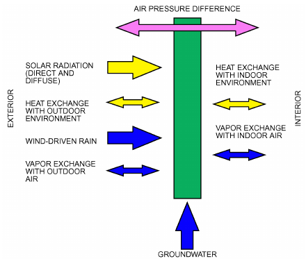
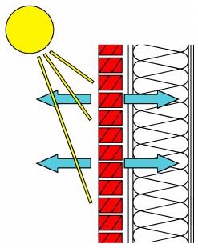
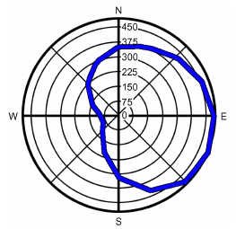
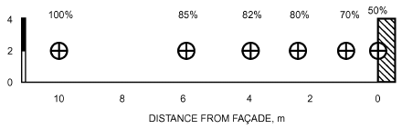
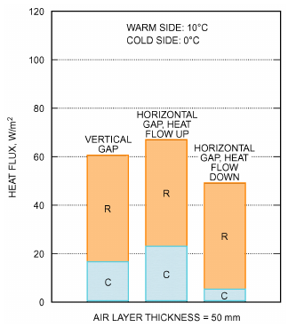
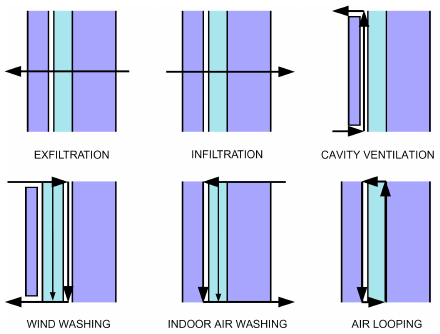
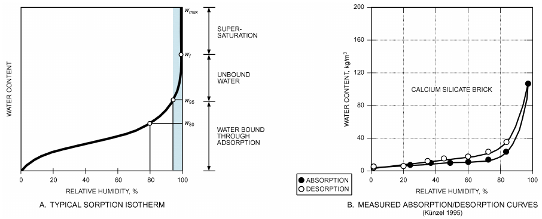
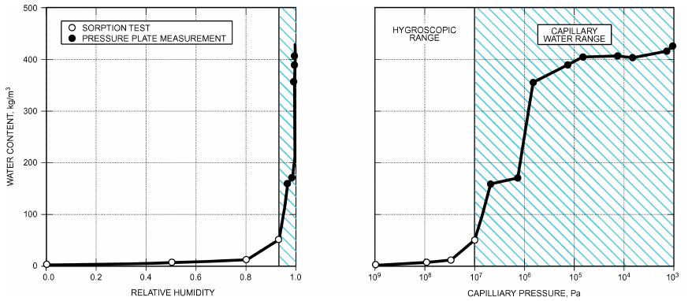
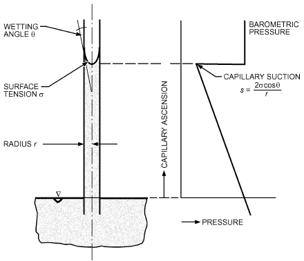
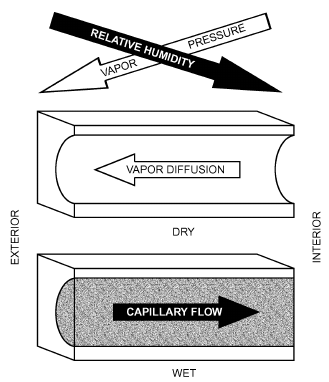

# Chapter 25 — Heat, Air, and Moisture Control in Building Assemblies—Fundamentals

*Izvor: 2021 ASHRAE Handbook — Fundamentals (SI), Chapter 25 (PDF str. 716–733).*

> **Napomena o konverziji:** Tekst je automatski izdvojen iz originalnog PDF-a uz prepoznavanje dve kolone, spojene prelomljene reči i pasuse. Indeksi i eksponenti su označeni sa ``/``, tabele su pretvorene u Markdown tabele (veoma složene tabele su prikazane kao poravnat tekst), a slike su izrezane iz PDF-a u folder `img/`. Složene jednačine (razlomci, sume) mogu biti uprošćeno prikazane. **Pre upotrebe vrednosti u proračunu proveriti u originalnom PDF-u.** Oznake `<!-- str. N -->` pokazuju stranu PDF-a.

## Sadržaj

- [1. FUNDAMENTALS](#1-fundamentals)
- [1.1 TERMINOLOGY AND SYMBOLS](#11-terminology-and-symbols)
- [1.2 HYGROTHERMAL LOADS AND DRIVING FORCES](#12-hygrothermal-loads-and-driving-forces)
- [2. HEAT TRANSFER](#2-heat-transfer)
- [2.1 STEADY-STATE THERMAL RESPONSE](#21-steady-state-thermal-response)
- [2.2 TRANSIENT THERMAL RESPONSE](#22-transient-thermal-response)
- [3. AIRFLOW](#3-airflow)
- [4. MOISTURE TRANSFER](#4-moisture-transfer)
- [4.1 MOISTURE STORAGE IN BUILDING MATERIALS](#41-moisture-storage-in-building-materials)
- [4.2 MOISTURE FLOW MECHANISMS](#42-moisture-flow-mechanisms)
- [5. COMBINED HEAT, AIR, AND MOISTURE TRANSFER](#5-combined-heat-air-and-moisture-transfer)
- [6. SIMPLIFIED HYGROTHERMAL DESIGN CALCULATIONS AND ANALYSES](#6-simplified-hygrothermal-design-calculations-and-analyses)
- [6.1 SURFACE HUMIDITY AND CONDENSATION](#61-surface-humidity-and-condensation)
- [6.2 INTERSTITIAL CONDENSATION AND DRYING](#62-interstitial-condensation-and-drying)
- [7. TRANSIENT COMPUTATIONAL ANALYSIS](#7-transient-computational-analysis)
- [7.1 CRITERIA TO EVALUATE HYGROTHERMAL SIMULATION RESULTS](#71-criteria-to-evaluate-hygrothermal-simulation-results)
- [REFERENCES](#references)
- [BIBLIOGRAPHY](#bibliography)

<!-- str. 716 -->

PROPER design of space heating, cooling, and air-conditioning systems requires detailed knowledge of the building envelope’s overall heat, air, and moisture performance. This chapter discusses the fundamentals of combined heat, air, and moisture movement as it relates to the analysis and design of envelope assemblies. Guidance for designing mechanical systems is found in other chapters of the ASHRAE Handbook.

Because heat, air, and moisture transfer are coupled and interact closely with each other, they should not be treated separately. For example, improving a building envelope’s energy performance may cause moisture-related problems. Conversely, evaporation of water and removal of moisture by other means are processes that require energy. Only a sophisticated moisture control strategy can ensure hygienic conditions and adequate durability for modern, energy-efficient building assemblies. Effective moisture control design must deal with all **hygrothermal** (heat and humidity) loads acting on the building envelope.

## 1. FUNDAMENTALS

## 1.1 TERMINOLOGY AND SYMBOLS

The following heat, air, and moisture definitions, properties, and symbols are commonly used.

A **building envelope** or **building enclosure** provides physical separation between the indoor space and the outdoor environment. A **building assembly** is any part of the building envelope, such as a wall, window, or roof assembly, that faces the interior and exterior of the building. A **building component** is any element, layer, or material within a building assembly.

### Heat

**Specific heat capacity c** is the change in heat (energy) of a unit mass of material for a unit change of temperature in J/(kg·K).

**Volumetric heat capacity** ρc is the change in heat stored in a unit volume of material for a unit change of temperature, in J/(m3·K).

**Heat flux q**, a vector, is the time rate of heat transfer through a unit area, in the direction perpendicular to that area, in W/m2.

**Thermal conductivity k** [in Europe, the Greek letter λ (lambda) is used] is a material property describing ability to conduct heat, and is defined by Fourier’s law of heat conduction. Thermal conductivity is the property that describes heat flux through a unit thickness of a material in a direction perpendicular to the isothermal planes, induced by a unit temperature difference. (ASTM Standard C168 defines homogeneity.) Units are W/(m·K). For anisotropic materials, the direction of heat flux in the material must be noted. Thermal conductivity must be evaluated for a specific mean temperature, thickness, age, and moisture content. Thermal conductivity is normally considered an intrinsic property of a homogenous material. In porous materials, heat flow occurs by a combination of conduction, convection, and radiation, and may depend on orientation, direction, or both. When nonconductive modes of heat transfer occur within the specimen or the test specimen is nonhomogeneous, the measured property of such materials is called **apparent thermal conductivity**. The specific test conditions (e.g., sample thickness, orientation, environment, environmental pressure, surface temperature, mean temperature, temperature difference, moisture distribution) should be reported with the values of apparent thermal conductivity. The symbol kapp (or λapp) is used to denote the absence of pure conduction or to indicate that all values reported are apparent. Materials with a low apparent thermal conductivity are called **insulation** materials (see Chapter 26 for more detail).

The preparation of this chapter is assigned to TC 4.4, Building Materials and Building Envelope Performance.

**Thermal resistivity ru** is the reciprocal of thermal conductivity. Units are (m·K)/W.

**Thermal resistance R** is an extrinsic property that describes the resistance of a material layer or assembly to heat transfer. It is determined by the steady-state or time-averaged temperature difference (between two defined surfaces of a material layer within a building assembly) that induces a unit heat flux, in (m2·K)/W. When the two defined surfaces have unequal areas, as with heat flux through material layers of nonuniform thickness, an appropriate mean area and mean thickness must be given. Thermal resistance formulas involving materials that are not uniform slabs must contain shape factors to account for the area variation involved. When heat flux occurs by conduction alone, the thermal resistance of a layer of constant thickness may be obtained by dividing the material’s thickness by its thermal conductivity. When several modes of heat transfer are involved, the **apparent thermal resistance** may be obtained by dividing the material’s thickness by its apparent thermal conductivity. When air circulates within or passes through insulation, as may happen in low-density fibrous materials, the apparent thermal resistance is affected. Thermal resistances of common building and insulation materials are listed in Chapter 26.

**Thermal conductance C** is the reciprocal of thermal resistance. Units are W/(m2·K).

**Heat transfer** or **surface film coefficient h** is the value that describes the total heat flux by both convection and radiation between a surface and the surrounding environment. It is defined as the heat transfer per unit time and unit area induced by a unit temperature difference between the surface and the reference temperature in the surrounding environment. Units are W/(m2·K). For convection to occur, the surrounding space must be filled with a fluid, usually air. If the space is evacuated, heat flow occurs by radiation only. In the context of this discussion, **indoor** or **outdoor heat transfer** or **sur- face film coefficient hi** or **ho** relates to an interior or exterior surface of a building envelope assembly. The heat transfer film coefficient is also commonly known as the **surface film conductance.**

<!-- str. 717 -->

**Thermal transmittance U** is the quantity equal to the steady-state or time-averaged heat flux from the environment on the one side of a body to the environment on the other side, per unit temperature difference between the two environments, in W/(m2·K). Thermal transmittance is sometimes called the **overall coefficient of heat transfer** or **U-factor**. Average thermal transmittance differs from clear-wall transmittance, in that the former considers all thermal bridge effects in the assembly.

**Thermal emissivity** is the ratio of radiant flux emitted by a surface to that emitted by a black surface at the same temperature. Emissivity refers to intrinsic properties of a material’s surface and is defined only for a specimen of the material that is thick enough to be completely opaque and has an optically smooth surface.

**Effective emittance E** refers to the properties of a particular object. It depends on surface layer thickness, oxidation, roughness, etc.

### Air

**Air transfer Ma** is the time rate of mass transfer by airflow induced by an air pressure difference, caused by wind, stack effect, or mechanical systems, in kg/s.

**Air flux ma**, a vector, is the air transfer through a unit area in the direction perpendicular to that unit area, in kg/(s·m2).

**Air permeability ka** is an intrinsic property of a porous material defined by Darcy’s Law (the equation for laminar flow through porous materials). Air permeability is the quantity of air flux induced by a unit air pressure difference through a unit thickness of homogeneous porous material in the direction perpendicular to the isobaric planes. Units are in kg/(Pa·s·m) or s.

**Air permeance Ka** is the extrinsic quantity equivalent to the time rate of steady-state air transfer through a unit surface of a porous membrane or layer, a unit length of joint or crack, or a local leak induced by a unit air pressure difference over that layer, joint and crack, or local leak. Units are kg/(Pa·s·m2) for a layer, kg/(Pa·s·m) for a joint or crack, or kg/(Pa·s) for a local leak.

### Moisture

**Moisture content w** is the amount of moisture per unit volume of porous material, in kg/m3.

**Moisture ratio X** (in mass) or Ψ (in volume) is the amount of moisture per unit mass of dry porous material or the volume of moisture per unit volume of dry material, in percent.

**Specific moisture content** is the ratio between a change in moisture content and the corresponding change in driving potential (i.e., relative humidity or suction).

**Specific moisture ratio** is the ratio between a change in moisture ratio and the corresponding change in driving potential (i.e., relative humidity or suction).

**Water vapor flux mv**, a vector, is the time rate of water vapor transfer through a unit area in the direction perpendicular to that unit area, in kg/(s·m2).

**Moisture transfer Mm** is the moisture flow induced by a difference in suction or in relative humidity, in kg/s.

**Moisture flux mm**, a vector, is the time rate of moisture transfer through a unit area in the direction perpendicular to that unit area, in kg/(s·m2).

**Water vapor permeability** μp is the steady-state water vapor flux through a unit thickness of homogeneous material in a direction perpendicular to the isobaric planes, induced by a unit partial water vapor pressure difference, under specified conditions of temperature and relative humidity. Units are kg/(Pa·s·m). When permeability varies with psychrometric conditions, the specific permeability defines the property at a specific condition.

**Water vapor permeance M** is the steady-state water vapor flux by diffusion through a unit area of a flat layer, induced by a unit partial water vapor pressure difference across that layer, in kg/(Pa·s·m2).

**Water vapor resistance Z** is the reciprocal of water vapor permeance, in (m2·s·Pa)/kg.

**Moisture permeability km** is the steady-state moisture flux through a unit thickness of a homogeneous material in a direction perpendicular to the isosuction planes, induced by a unit difference in suction. Units are kg/(Pa·s·m) (suction).

**Moisture diffusivity Dm** is the ratio between the moisture permeability and the specific moisture content, in m2/s.

## 1.2 HYGROTHERMAL LOADS AND DRIVING FORCES

This section describes the hygrothermal loads acting on the building envelope. That description is used to predict the influence on the hygrothermal behavior of building assemblies, as a basis for design recommendations and moisture control measures (Künzel and Karagiozis 2004). Cooling and heating load estimations for sizing mechanical systems can be found in Chapters 17 and 18.

In Figure 1, the loads relevant for building envelope design are presented schematically for an external wall. Generally, they show diurnal and seasonal variations at the exterior surface and mainly seasonal variations at the interior surface. In sunny weather, the exterior wall surface heats by solar radiation, leading to evaporation of moisture from the surface layer. Around sunset, when solar radiation decreases, long-wave (infrared) emission to the clear sky may lead to cooling of the exterior surface below the ambient air temperature, even below the dew-point temperature, so surface condensation may occur. This phenomenon is called **undercooling**. The exterior surfaces are also exposed to moisture from precipitation and wind-driven rain.

Usually, several load cycles overlap (e.g., summer/winter, day/night, rain/sun). Therefore, a precise analysis of the expected loads should be done before designing any building envelope component. However, the magnitude of the loads is not independent of building geometry and the component’s properties. Analysis of the transient hygrothermal loads is generally based on hourly meteorological data, although a shorter time step may be needed. However, determination of local conditions at the envelope’s surface is complicated and requires specific experience. In some cases, computer simulations are necessary to assess the microclimate acting on differently oriented, overhang-protected, or inclined building assemblies.

*Fig. 1 Hygrothermal Loads and Alternating Diurnal or Seasonal Directions Acting on Building Envelope*

<!-- str. 718 -->

### Ambient Temperature and Humidity

Ambient temperature and humidity, represented by the partial water vapor pressure, are the boundary conditions always affecting both sides of the building envelope. The climate-dependent exterior conditions may show large diurnal and seasonal variations. Therefore, at least hourly data are required for detailed building simulations, though monthly data may suffice in case simple calculation methods are applicable. Chapter 14 provides such meteorological data sets, including temperature and relative humidity, for many locations worldwide. These data sets usually represent average meteorological years based on long-term observations at specific locations. However, data of more extreme climate conditions may be important to assess the risks of moisture damage. Therefore, Sanders (1996) proposed using data of the coldest or warmest year in 10 years for hygrothermal analysis instead of data from an average year. Another method to obtain a severe annual data set concerning the moisture-related damage risk starting from several decades of hourly data has been developed by Salonvaara (2011). This method analyzes the data with respect to their effect on moisture behavior of typical building assemblies. The more severe data sets increase the safety of risk prediction for the service life of building envelope components, but they are less suitable for analyzing the long-term behavior (performance over several years) of constructions because the probability of a sequence of severe years is very low. Also, note that the temperature at the building site may differ from the meteorological reference data when the site’s altitude differs from that of the station recording the data. On average, there is a temperature shift of 0.65 K for every ±100 m. The microclimate around the building may result in an additional temperature shift that depends on the season. For example, the proximity of a lake can moderate seasonal temperature variations, with higher temperatures in winter and lower temperatures in summer compared to sites without water nearby. A low-lying site experiences lower temperatures in winter, whereas city temperatures are higher year round (METEOTEST 2007).

### Indoor Temperature and Humidity

Indoor conditions depend on the purpose and occupation of the building. For most commercial constructions, temperature and humidity are controlled by HVAC systems with usually well-defined set points. Indoor humidity conditions in residential buildings, however, are often influenced by the outdoor climate and by occupant behavior. (For details on this highly variable vapor release, see Chapter 37.) That water vapor must be removed by ventilation or air conditioning. The resulting relative humidity may be determined by a hygrothermal whole-building simulation or by simple estimation methods using information on moisture production, air change rates, and climate-dependent HVAC operation (TenWolde and Walker 2001). The presence of spas or swimming pools increases the load substantially. Less obvious but sometimes of equal importance are loads from the ground, from penetrating precipitation, or from construction moisture in the building materials. Moisture loads from occupant behavior show an especially transient pattern: they are characterized by peaks (e.g., cooking, showering). Humidity-buffering envelope materials, partition wall materials, and furniture (e.g., carpets, curtains, paper) help to dampen indoor humidity peaks, but they also reduce the moisture removal efficiency of intermittent ventilation (e.g., periodically opening windows, operating ventilation fans). Information on typical indoor climate conditions of special-purpose constructions such as swimming pools, spas, ice rinks, or agricultural buildings and production plants may be found in the 2019 *ASHRAE Handbook—HVAC Applications*.

*Fig. 2 Solar Vapor Drive and Interstitial Condensation*

### Solar Radiation

Incident solar radiation is the major thermal load at the building exterior. For direct solar radiation, the resultant irradiation depends on the angle between the sun and the normal on the exposed surface and on its color (short-wave absorptivity). For calculation of incident solar heat flux and spectra, see Chapter 15.

For moisture control, solar radiation is usually considered beneficial. However, in some cases solar radiation combined with water from precipitation or other sources (e.g., construction moisture) can lead to severe moisture problems by solar-driven vapor flow. For example, as shown in Figure 2, if the water-absorbing exterior layer of an assembly (e.g., brick veneer, a typical example of “reservoir” cladding) has been wetted by wind-driven rain, solar irradiation creates such high vapor pressure that, in addition to vapor diffusion toward the outdoors, part of the evaporating water diffuses inwards, leading to condensation on and in material layers within the assembly (e.g., sheathing boards, insulation layers, vapor retarders). Adapting the permeance of vapor retarders and weather-resistive barriers (WRB) to the potential loads may improve the situation. ASHRAE research project RP-1091 (Burnett et al. 2004) showed that cladding ventilation is also an effective remedy within specified exterior air humidity limits.

### Exterior Condensation

**Long-Wave Radiant Effects.** Long-wave radiation exchange of the envelope surface with the cold layers of the lower atmosphere is a major heat transfer process. At night or with the sun at a low angle, it results in a net heat flux to the sky (i.e., heat energy sink) (see Chapter 15). Depending on the building assembly’s thermal properties, this may lead to a drop in the envelope’s outdoor surface temperature below the ambient air temperature (undercooling). If this surface temperature reaches the air’s dew point, condensation occurs on that exterior surface. Massive structures with a high thermal inertia do not usually lose enough heat to the nighttime radiation sink to bring the outdoor surface temperature below the air’s dew point for a significant period of time. However, many modern building assemblies, such as lightweight roofs or exterior insulation finish systems (EIFSs), have little thermal inertia in their exterior surface layers and are therefore subject to considerable amounts of exterior condensation (Künzel 2007).

**Interior Temperature Differential.** Exterior condensation can also occur on poorly insulated assemblies in cooling climates because of the operation of air-conditioning systems. Repeated exterior condensation or long-lasting, high relative humidity often provides the basis for soiling or microbial growth (fungi or algae), which may not be acceptable even though the durability of the assembly is unlikely to be affected.

<!-- str. 719 -->

**Effect on Other Layers.** Under exterior condensation conditions, ventilated assemblies may also experience condensation within the ventilated air layer. This phenomenon was discovered by investigating pitched roofs with cathedral ceiling insulation (Hens 1992; Janssens 1998; Künzel and Grosskinski 1989). However, damage because of condensation in the ventilation plane is rare, except in metal roofs and ventilated low-mass, low-sloped roofs with moisture-sensitive decks (Hens et al. 2007a, 2007b; Zheng et al. 2004). Occasionally, soiling because of condensate runoff has been reported.

### Wind-Driven Rain

The load from rain, especially wind-driven rain, is the main reason for moisture-related building failure. Because the requirements of sometimes costly rain-protection measures depend on the local climate, some countries have introduced regional drivingrain classifications. Generally, coastal regions and those on the windward side of mountains receive the highest precipitation load. Areas of low rainfall do not have the potential for severe wind-driven rain.

Regional precipitation and wind are significant factors in determining local wind-driven rain load, but local exposure conditions are of equal importance. A building in an open field receives a higher load than one sheltered by a forest or other buildings. A quantification of exposure conditions for walls depending on landscape, neighborhood, and building size and geometry can be found in the British Standard BS 8104 and in the European ISO/DIN Standard 15927-3:2006. The average wind-driven rain load RD in open ground was investigated by Lacy (1965). It is estimated from normal rain RN and the wind velocity component v parallel to the considered orientation:

> RD = fvRN&emsp;**(1)**

where

- RD = wind-driven rain intensity, kg/(s·m2)
- f = empirical factor = approximately 0.2 s/m
- v = mean wind velocity, m/s
- RN = rain intensity on a horizontal surface in open field, kg/(s·m2)

Figure 3 shows a “rain rose” of results from Equation (1) plotted in polar coordinates indicating the amount of wind-driven rain in mass per unit area hitting an unobstructed and isolated vertical surface in the open field.

The driving rain load close to a façade is considerably less than in the open field (as shown in Figure 4), and it becomes irregular. Tops and edges of walls generally receive the highest amount. This is caused by the airflow pattern around a building (see Chapter 24 for more information). At the windward side, high pressure gradients coincide with large changes in air velocity. The building acts as an obstacle for the wind, slowing down airflow and subsequently reducing the wind-driven rain load near the façade. Gravity and the rain droplets’ momentum prevent them from following the airflow around the building, causing them to strike the façade mainly at the edges of the flow obstacle (Straube and Burnett 2000).

*Fig. 3 Typical Wind-Driven Rain Rose for Open Ground*

However, the irregular driving rain deposition is often evened out by water running off the hard-hit areas, especially when the façade surface has low water absorptivity or the wind-driven rain load is high enough to capillary-saturate the most exposed surface layers.

Roof overhangs can reduce the driving rain load on low-rise buildings. Slightly inclined wall sections or protruding façade elements may receive a considerable amount of splash water from façade areas above them, in addition to the direct driving rain deposition. This is often a problem for buildings with walls slightly out of vertical (Künzel 2007).

Rain penetrating the exterior cladding of exposed walls may cause severe damage if it cannot be drained and dried out quickly enough. Experience shows that it is almost impossible to seal joints and connections hermetically against wind-driven rain. Therefore, building envelope assemblies should be designed to tolerate a limited amount of water entry (see ASHRAE Standard 160-2009).

### Construction Moisture

Building damage as a result of migrating construction moisture has become more frequent because tight construction schedules leave little time for building materials to dry. Although often disregarded, construction moisture is either delivered with the building products or absorbed by the materials during storage or construction. Cast-in-place concrete, autoclaved aerated concrete (AAC), calcium silicate brick (CSB), and “green” wood are examples of materials that contain significant volumes of moisture when delivered. Stucco, mortar, clay brick, and concrete blocks are examples of materials that are either mixed or brought into contact with water at the construction site. All other porous building materials may take up considerable amounts of precipitation or groundwater when left unprotected during storage or construction before the enclosure of the building. A single-family house made of AAC may initially contain up to more than 13 Mg of water in its walls.

Care is needed to safely remove that water, either by additional ventilation during the first years of operation or by using construction dryers while heating the building before putting it into service. Even “dry” materials have an initial water content of approximately the equilibrium moisture content at 80% rh (EMC80).When significant construction moisture is encountered, EMC80 can be exceeded by a factor of two or more.

### Ground- and Surface Water

A high groundwater table or surface water running toward the building and filling the loose fill triangle around the basement represents an important moisture load to the lower parts of the building envelope. These loads should be met by grading the ground away from the building, by perimeter drainage, and by waterproofing the basement and foundation. Instead of waterproofing with bituminous membranes or coatings, water-impermeable structural elements may also be used (e.g., reinforced concrete, which may, however, be vapor permeable). The resulting vapor flux also presents a load that must be addressed (e.g., by basement ventilation). Moisture loads in the ground may impair performance of exterior basement insulation applied on the outside of the waterproofing layer. Therefore, special care must be taken to protect insulation from moisture accumulation unless the insulation material is itself impermeable to water and vapor [e.g., extruded polystyrene (XPS), foam glass].

*Fig. 4 Measured Reduction in Catch Ratio Close to Façade of One-Story Building at Height of 2 m*

<!-- str. 720 -->

Wicking of ground- or surface water into porous walls by capillary action is called **rising damp**. This phenomenon may be a sign of poor drainage or waterproofing of the building’s basement or foundation. However, other phenomena show moisture patterns similar to rising damp. If the wall is contaminated with salts, which is often the case in historic buildings, the wall’s moisture content might stay elevated because of a hygroscopicity increase caused by water uptake by the salt crystals. Another reason for the appearance of rising damp is surface condensation in unheated buildings during summer.

### Air Pressure Differentials

Wind, mechanical systems, and stack effects (caused by differences between indoor and outdoor temperature) result in air pressure differentials over the building envelope. In contrast to wind, stack pressure is a constant load that may not be neglected. Worse, pressure differentials may drive airflow in the same direction as vapor pressure: from indoors to outdoors during the heating season, and in the opposite direction during the cooling season. Therefore, airflow through cracks, imperfect joints, or air-permeable assembly layers may cause interstitial condensation in a manner similar to vapor diffusion. However, condensation is likely to be more intense and concentrated around leaks in the building envelope. This can become a problem at the top of a building, which may be especially vulnerable because of discontinuities in the air barrier at the parapets. To avoid moisture damage, airflow through and within the building envelope should be prevented by a continuous air barrier. However, it is difficult to guarantee total airtightness, so the hygrothermal effect of airflow can be important, especially when high pressure differentials are expected (e.g., in multistory or mechanically pressurized buildings). For the practical determination of pressure differentials and airflow, see Chapter 16. Air pressures across the envelope may also drive liquid water inward or outward.

## 2. HEAT TRANSFER

Heat flow through the building envelope is mainly associated with the building’s energy performance. However, other aspects are equally important. Interior surface temperatures not only serve as an indicator for hygienic conditions in the building (e.g., conditions preventing surface condensation or mold growth), but they can also be a major factor for thermal comfort. Temperature peaks and fluctuations within the building envelope or on its surfaces may further affect the envelope’s durability. At low temperatures, some building materials tend to become less elastic and sometimes brittle, making them vulnerable to strain or mechanical impact. At high temperatures, some materials degrade because of chemical reactions or irreversible deformation. Deformation and local mechanical failure can also occur under the influence of steep temperature gradients or transients. Whereas some of these aspects can be assessed by steady-state calculations (e.g., heating energy losses, energy end use), others require transient simulations for accurate evaluation.

As explained in Chapter 4, heat transfer by apparent conduction in a solid is governed by Fourier’s law:

> ( ∂t )
>
> k ∂t/∂x + k ∂t/∂y + k ----

> q = –k grad(t) = – x y z&emsp;**(2)**
>
> ∂z

> ( )

where

- q = heat flux, W/m2
- t = temperature, °C kx, ky, kz= apparent thermal conductivity in direction of x, y, and z axes, W/(m·K)

grad(t) = gradient of temperature (change in temperature per unit length, perpendicular to isothermal surfaces in solid), K/m

∂t/∂x = gradient of temperature along x axis, K/m

∂t/∂y = gradient of temperature along y axis, K/m

∂t/∂z = gradient of temperature along z axis, K/m

In Equation (2), the thermal conductivity k of the material is assumed to be directionally dependent. In fact, many building materials (e.g., wood and wood-based materials, mineral fiber insulation, perforated bricks) show considerable anisotropy. Therefore, k , k , x y and k are not equal in these materials; in isotropic materials, they z are equal.

Substituting Equation (2) into the relationship for conservation of energy yields

> ∂h/∂t × ∂t/∂τ = div[k grad(t)] + S&emsp;**(3)**
>
> ( ) ( ) ( )

> k ∂t/∂x k ∂t/∂y k ∂t/∂z
>
> = ∂/∂x + ∂/∂y y + ∂/∂z z + S

> x
>
> ( ) ( ) ( )

where

- h = enthalpy per unit volume, J/m3
- S = heat sources and sinks [e.g., caused by latent heat of evaporation/condensation in presence of moisture, by chemical reactions such as hydration in concrete, or by phase change from solid to liquid or vice versa of special additives consisting of paraffins or salt hydrates, known as phase-change materials (PCM)], W/m3 with

> ∂h/∂τ = ρ c + wc&emsp;**(4)**
>
> *s s w*

where

- ρs = density of solid (dry material), kg/m3
- cs = specific heat capacity of dry solid, J/(kg·K)
- cw = specific heat capacity of liquid water, J/(kg·K)
- w = moisture content, kg/m3

## 2.1 STEADY-STATE THERMAL RESPONSE

In steady state without sources or sinks, Equation (3) reduces to

> ( ) ( ) ( )
>
> ∂/∂x k ∂t/∂x k ∂t/∂y k ∂t/∂z

> x + ∂/∂y y + ∂/∂z z = 0&emsp;**(5)**
>
> ( ) ( ) ( )

If the steady-state heat flux is only in one direction (e.g., perpendicular to the building envelope) and materials are assumed to be isotropic, Equation (2) can be rewritten for each material layer within the building envelope as

> q = –k Δt/Δx = –C Δt = 1/RΔt&emsp;**(6)**
>
> m

where

- Δt = temperature difference between two interfaces of one material layer, K
- Δx = layer thickness, m
- km = mean thermal conductivity of material layer with thickness Δx, W/(m·K)
- C = thermal conductance of layer with thickness Δx, W/(m2·K)
- R = thermal resistance of layer with thickness Δx, (m2·K)/W

<!-- str. 721 -->

Under steady-state conditions, the one-dimensional heat flux is the same through all material layers, but their individual thermal conductance or resistance is usually different.

### Surface-to-Surface Thermal Resistance of

**a Flat Assembly**

A single layer’s thermal resistance to heat flow is given by the ratio of its thickness to its apparent thermal conductivity. Accordingly, the surface-to-surface thermal resistance of a flat building assembly composed of parallel layers (e.g., a ceiling, floor, or wall), or a slightly curved component, consists of the sum of the resistances of all layers in series:

> …
>
> Rs = R1 + R2 + R3 + R4 + + Rn&emsp;**(7)**

where

R1, R2, . . ., Rn = resistances of individual layers, (m2·K)/W

Rs = resistance of building assembly surface to surface (system resistance), (m2·K)/W

For building components with nonuniform or irregular sections, such as hollow clay and concrete blocks, use the R-value of the unit as manufactured.

### Combined Convective and Radiative Surface Heat Transfer

The surface film resistances and their reciprocal, the surface film coefficients, specify heat transfer to or from a surface by the effects of convection and radiation.

Although heat transfer by convection is affected by surface roughness and temperature difference between air and surface, the largest influence is that of air movement, turbulence, and velocity close to the surface. Because air movement at the envelope’s outer surface depends on wind speed and direction, as well as on flow patterns around the building, which are usually unknown, an average surface heat transfer film coefficient at the exterior is normally used. Correlations such as those of Schwarz (1971) link the convective film coefficient to wind speed recorded at a height of 10 m and to orientation of the surface (windward or leeward side). The same holds for the inside surface, where buoyancy plays a prime role. However, because the surface-to-surface thermal resistance of a wall is usually high compared with the surface film resistances, an exact value is of minor importance for most applications.

Because air is rather permeable to long-wave radiation, heat transfer by radiation takes place between the surface of the building and the surfaces of objects in the environment, not the surrounding air. Heat transfer by radiation between two surfaces is controlled by the character of the surfaces (emittance and reflectance), the temperature difference between them, and the angle factor through which they see each other. Indoors, the external wall surface exchanges radiation with partition walls, floor, and ceiling, furniture, and other external walls. In winter, most of the other surfaces have a higher temperature than the external wall surface; therefore, radiative exchange gives a net heat flux to the external wall. Outdoors, the external wall surface sees the ground, neighboring buildings, and the sky. Without sun, thermal radiation from the sky and the environment is normally lower than radiation from the wall. This means the wall is losing energy. Especially during clear nights, the temperature of the exterior wall surface may drop below the ambient air temperature. In this case, convective and radiative heat transfer at the surface are opposed to each other.

For simplicity, convective and radiative surface heat transfer are often combined, leading to an **apparent surface heat transfer film coefficient h**:

> q = h(ten – ts)&emsp;**(8)**

with

> h = hc + hr&emsp;**(9)**

where

- q = total surface heat transfer, W/m2
- h = apparent surface film transfer coefficient, W/(m2·K)
- hr = radiant surface film coefficient to account for long-wave radiation exchange, W/(m2·K)
- hc = convective surface film coefficient, W/(m2·K)
- ten = environmental reference temperature, °C
- ts = surface temperature, °C

For indoor surface heat transfer, this approach is acceptable when only heat transport through the building envelope is considered. Environmental temperature ten also includes the air temperature as the mean temperature of all surfaces in the field of view of the considered envelope assembly. When all these surfaces are of partition walls and floors that have the same temperature as the indoor air, ten may be replaced by the indoor air temperature.

This approach becomes questionable when heat transfer at the outdoor surface is concerned. Because radiation to the sky can lead to surface temperatures below ambient air temperature, Equation (8) underestimates the real heat flux when the environmental temperature is replaced by the outdoor air temperature. Therefore, ten must include all short- and long-wave radiation contributions perpendicular to the assembly’s exterior surface. However, ten cannot be used for moisture transfer calculations. Therefore, a more convenient way may be to treat heat transfer by convection and radiation separately. In this case, hr is skipped in Equation (9), which now applies to convection only, and ten equals the outdoor air temperature. The heat exchange by radiation is calculated by balancing the solar and environmental radiation onto the assembly’s exterior surface with the long-wave emission from it.

Steady-state calculation of thermal transport through the building envelope is generally done using surface film resistances based on combined surface heat transfer by radiation and convection, with R being the inverse of the combined surface film coefficient h. Because of greater air movement outdoors, the mean thermal surface film resistance at the exterior surface is lower than at the interior surface. Typical ranges for the combined exterior and interior surface film resistances with surface infrared reflectance ≤0.1 (nonmetallic) are

> Ro = 0.03 to 0.06 (m2·K)/W
>
> Ri = 0.12 to 0.20 (m2·K)/W

### Heat Flow Across an Air Space

Heat flow across an air space is affected by the nature of the boundary surfaces, slope of the air space, distance between boundary surfaces, direction of heat flow, mean temperature of air, and temperature difference between both boundary surfaces. Air space thermal conductance, the reciprocal of the air space thermal resistance, is the sum of a radiation component, a conduction component, and a convection component. For computational purposes, spaces are considered airtight, with neither air leakage nor air washing along the boundary surfaces.

The radiation portion depends on the temperature of the two boundary surfaces and their respective surface properties. Assuming infinite parallel plates, radiation is not affected by thickness or slope of the air space, direction of heat flow, or which surface is hot or cold. For surfaces that can be considered ideally gray, the surface properties are emittance, absorptance, and reflectance. Chapter 4 explains all three in depth. For an opaque surface, reflectance is equal to one minus the emittance, which varies with surface type and condition and radiation wavelength. The combined effect of the emittances of the two boundary surfaces is expressed by the effective emittance E of the air space. Table 2 in Chapter 26 lists typical emittance values for reflective surfaces and building materials, and the corresponding effective emittance for air spaces. More exact surface emittance values should be obtained by tests.

<!-- str. 722 -->

*Fig. 5 Heat Flux by Thermal Radiation and Combined Convection and Conduction Across Vertical or Horizontal Air Layer*

The convective portion is affected markedly by the slope of the air space, direction of heat flow, temperature difference across the space, and, in some cases, thickness of the space. It is also slightly affected by the mean temperatures of both surfaces.

For air spaces in building components, radiation and convection together define total heat flow. An example of their magnitudes for total flow across a vertical or horizontal airspace (up and down) is given in Figure 5.

Table 3 in Chapter 26 lists typical thermal resistance values of sealed air spaces of uniform thickness with moderately smooth, plane, parallel surfaces. These data are based on experimental measurements (Robinson et al. 1954). Resistance values for systems with air spaces can be estimated from these results if emittance values are corrected for field conditions. However, for some common composite building insulation systems involving mass-type insulation with a reflective surface in conjunction with an air space, the resistance value may be appreciably lower than the estimated value, particularly if the air space is not sealed or of uniform thickness (Palfey 1980). For critical applications, a particular design’s effectiveness should be confirmed by actual test data undertaken by using the ASTM hot-box method (ASTM Standard C1363). This test is especially necessary for constructions combining reflective and nonreflective thermal insulation.

### Total Thermal Resistance of a Flat Building Assembly

Total thermal resistance to heat flow through a flat building assembly composed of parallel layers between the environments at both sides is given by

> RT = Ri + Rs + Ro&emsp;**(10)**

where

- Ri = combined inner-surface film resistance, (m2·K)/W
- Ro = combined outer-surface film resistance, (m2·K)/W
- Rs = resistance of building assembly surface to surface, including thermal resistances of possible air layers in component (system resistance), (m2·K)/W

### Thermal Transmittance of a Flat Building Assembly

The thermal transmittance or U-factor of a flat building assembly composed of parallel layers is the reciprocal of RT:

> U = 1/RT&emsp;**(11)**

Calculating thermal transmittance requires knowing the (1) apparent thermal resistance of all homogeneous layers, (2) thermal resistance of the nonhomogeneous layers, (3) surface film resistances at both sides of the construction, and (4) thermal resistances of air spaces in the construction. The lower values of the surface film resistances given previously should be used.

The steady-state heat flux Qn across the building envelope assembly is then defined by

> Qn = AnUn(*ti – to*)&emsp;**(12)**

where

- ti, to = indoor and outdoor reference temperatures, °C
- An = component area, m2
- Un = U-factor of component, W/(m2·K)

### Interface Temperatures in a Flat Building Component

The temperature drop through any layer of an assembly is proportional to its thermal resistance. Thus, the temperature drop Δtj through layer j is

> Δtj = (Rj(ti– to))/RT&emsp;**(13)**

The temperature in an interface j then becomes (to < ti)

> tj = to + (j R o)/RT (ti – to)&emsp;**(14)**

where Roj is the sum of thermal resistances between inside and interface j in the flat assembly, in (m2·K)/W.

If the apparent thermal conductivity of materials in a building component is highly temperature dependent, the mean temperature must be known before assigning an appropriate thermal resistance. In such a case, apply successive calculation steps; some software can perform these iterative calculations. First, select the thermal resistances for the particular layers. Then calculate total resistance RT with Equation (9) and the temperature at each interface using Equation (13). The mean temperature in each layer (arithmetic mean of its surface temperatures) can then be used to obtain secondgeneration R-values. The procedure is repeated until the R-values are correctly selected for the resulting mean temperatures. Generally, this demands two or three steps.

To calculate interior surface temperatures for risk assessment of surface condensation or mold growth, the higher interior and lower exterior surface film resistance values, given previously, should be used.

### Series and Parallel Heat Flow Paths

In many building assemblies (e.g., wood-frame construction), components are arranged so that heat flows in parallel paths of different conductances. If no heat flows through lateral paths, the thermal transmittance through each path may be calculated. The average transmittance of the enclosure is then

> …
>
> Uav = aUa + bUb + + nUn&emsp;**(15)**

where a, b, . . . , n are the surface-weighted path fractions for a typical basic area composed of several different paths with transmittances Ua, Ub, . . . , Un.

If heat can flow laterally with little resistance in any continuous layer, so that transverse isothermal planes result, the flat construction performs as a series combination of layers, of which one or more provide parallel paths. Total average resistance RT(av) in that case is the sum of the resistance of the layers between the isothermal planes, each layer being calculated and the results weighted by the contributing surface area. For further information, see Chapter 27.

<!-- str. 723 -->

The U-factor, assuming parallel heat flow only, is usually lower than that assuming combined series-parallel heat flow. The actual U-factor lies between the two. Without test results, a best choice must be selected. Generally, if the construction contains a layer in which lateral heat conduction is high compared to heat flux through the wall, a value closer to the series-parallel calculation should be used. If, however, there is no layer of high lateral thermal conductance, use a value closer to the parallel calculation. For assemblies with large differences in material thermal conductivities (e.g., assemblies using metal structural elements), the zone method is recommended (see Chapter 27) or the methods discussed in the following section.

### Thermal Bridging and Thermal Performance of Multidimensional Construction

Passing highly conductive materials through insulation layers (**thermal bridging**) results in building envelopes with higher overall thermal transmittances and colder surface temperatures compared to an assembly with continuous, unbroken insulation. Not recognizing the effect of thermal bridging on the building envelope’s thermal performance can lead to inefficient design of HVAC systems, building operation inefficiencies, inadequate condensation resistance at component intersections, and compromised occupant comfort.

Heat flow through building envelopes occurs in two and three dimensions when considering all components and their intersections (e.g., glazing, wall, roof, parapet, balconies, floor slabs). Multidimensional heat flow caused by highly conductive thermal bridges (e.g., steel and concrete sections) cannot be effectively evaluated using simplified hand calculations (see Chapter 27) and must be evaluated using a multidimensional computer model or guarded hot-box test measurement (ASTM Standard C1363).

Construction details are often lumped into an overall heat flow of the entire opaque area or evaluated separately by defining an effective length or area (or zone of influence). Individual details with transmittances defined by an **effective area** are combined with other components to calculate an overall thermal transmittance using a weighted average method. However, effective areas often have no real significance or have a large variance that depends on many factors (location of insulation layers in relation to structural framing, insulation levels, orientation of structural framing, predominate heat flow path, etc.). Moreover, the effect of individual details is averaged over the adjacent assemblies, regardless of size of the effective area or length. Consequently, the absolute effect or thermal quality of a detail is difficult to assess using an effective area approach (Morrison Hershfield 2011).

Contributions of heat flow for specific construction details (e.g., slab edges, parapets, glazing transitions) are best quantified by determining the extra heat loss caused by an individual detail (i.e., thermal bridge at an intersection of components) above the heat loss of the undisturbed assembly and ascribe that difference to a line or point through their linear or point thermal transmittance. This method can simplify calculation of overall heat loss and highlight the effect of the thermal bridge (Morrison Hershfield 2011).

### Linear and Point Thermal Transmittances

Using linear and point thermal transmittance requires dividing thermal transmittances into three categories:

- **Clear field**: heat loss if no thermal bridges modified the heat flow through the assembly (area based)
- **Linear**: additional heat loss along a considerable portion of a building perimeter or height in one dimension (e.g., slab edges, balconies, parapets, corner framing, window interfaces)
- **Point**: additional heat loss from thermal bridges at countable points on a building (e.g., three-way corners, beam penetrations)

Calculating the overall heat flow is simply adding the contribution of each linear and point thermal transmittance to the clear-field assembly heat flow. The overall heat flow through the opaque elements of the building envelope (wall or roof) then is

> ∑ anomalies ∑ o ∑ ∑ ∑ o
>
> Q = Q + Q = (ΨL) + χ + Q&emsp;**(16)**

where

- Q = overall heat flow through building envelope, W/K
- Qanomalies = additional heat flow for linear and point transmittance details, W/K
- Qo = clear-field heat flow without linear and point transmittance details, W/K
- Ψ = linear transmittance, W/(m·K)
- χ = point transmittance, W/K
- L = characteristic length of linear transmittance detail, m

The overall heat flow per unit area, U-value, can be derived by dividing the previous equation by the total projected surface area of the assembly considered.

> U = ((ΨL) + χ ∑ ∑)/(A Total) + Uo&emsp;**(17)**

where

- U = overall thermal transmittance, including anomalies, W/(m2·K)
- Uo = clear field thermal transmittance (assembly), W/(m2·K)
- Atotal = total opaque projected surface area, m2

Thermal bridging and multidimensional heat flow also affect surface temperatures, concealed surfaces, and surfaces exposed to the indoor and outdoor environments. The temperature distribution from multidimensional heat flow is important to consider for controlling localized dirt pick-up on cold surfaces, mold growth, and condensation. A practical, convenient means to evaluate surface temperatures for multidimensional construction is to represent the coldest surface temperatures of interest relative to a temperature difference. This nondimensional ratio is sometimes referred to as a temperature index, factor, or ratio, with the following basic form but represented by many different symbols (CAN/CSA Standard A440; ISO Standard 13788; Morrison Hershfield 2011):

> Tindex = (T – T surface outdoor)/(T – T indoor outdoor)&emsp;**(18)**

where

- Tindex = temperature index
- Tsurface = coldest temperature of surface
- Toutdoor = outdoor temperature
- Tindoor = indoor temperature

The temperature index for a critical surface can then be compared to a minimum or design temperature index based on numerous performance criteria (e.g., risk of condensation, mold growth, corrosion). More detailed discussion of using temperature ratios and hygrothermal analysis can be found in the section on Simplified Hygrothermal Design Calculations and Analyses.

## 2.2 TRANSIENT THERMAL RESPONSE

Steady-state calculations are used to estimate the net heating energy demand on a monthly basis in cold and cool climates. However, in climates where daily temperature swings oscillate around a comfortable mean temperature, transient analysis to define net energy demand for heating and cooling and judge overheating probability is more appropriate. In order of importance, the thermal response of a building to daily swings in temperature and solar radiation depends on the thermal transmittance and solar heat gain coefficient (SHGC) of transparent components (fenestration) in the envelope, ventilation strategy, accessible thermal capacity of the internal walls and floors, and thermal transmittance/inertia of opaque components in the envelope.

<!-- str. 724 -->

The effects of the mutual dependences of these four factors are complex. In cool climates, a simplified approach that accounts for these interactions combines a steady-state daily mean heat balance for a most probable hot day with a lower-limit value for the daily harmonic temperature damping at room level. Temperature damping at room level increases with higher admittance and higher harmonic thermal resistance of opaque envelope components; higher admittance and higher harmonic thermal resistance of all inside walls, floor, and ceiling; and higher thermal inertia of furniture and furnishings. A lower thermal transmittance of transparent components in the envelope and more outdoor air ventilation results in decreased daily harmonic temperature damping at room level. In general, however, and in any climate, whole-building simulations complying with ANSI/ASHRAE Standard 140 are recommended when a clear picture of overheating probability and net energy demand for heating and cooling is needed.

High admittances presume the presence of thermal storage materials that are easily assessable for heat. Stored heat can be sensible or latent, as shown in Equation (19). The first requires the use of heavy materials with high and constant capacitance and sufficient thickness to store heat by increasing the temperature of the materials (e.g., bricks, stone, sand-lime stone, concrete).The second uses phase change materials (PCMs), which are materials that store heat by changing phase, typically between solid to liquid. Most models used in building energy simulation programs simulate PCMs by using a temperature-dependent specific heat or enthalpy formulation of Equation (19).

> ( )
>
> ∂ ∂T

> ρcV dT/dt = kA----- -----&emsp;**(19)**
>
> ∂x ∂x

> ( )

where

- ρ = density, kg/(m3)
- c = specific heat, kJ/(kg·K)
- V = volume, m3
- dT/dt = gradient of temperature with respect to time, K/s
- k = thermal conductivity, W/(m·K)
- A = surface area, m2
- ∂T/∂x = gradient of temperature along x axis, K/m

There are multiple approaches to solve for transient heat transfer equation. Chapters 4 and 18 describe some approaches to solve for transient problem; Mitchel and Braun (2012) provide more detail. For information about PCM standards and properties, see Chapter 26.

## 3. AIRFLOW

Airflow through and within building components is driven by stack pressure, wind pressure, and pressure differentials induced by mechanicals. These driving forces are all described in greater detail in Chapters 16 and 24. In calculating air flux in buildings, a distinction must be made between flow through open porous materials, and that through open orifices such as layers composed of small elements, cavities, cracks, leaks, and intentional vents. Air flux through an open porous material is given by

> ma = –kagrad(Pa)&emsp;**(20)**

where

- ma = air flux, kg/(s·m2)
- ka = air permeability of open porous material, kg/(Pa·s·m)
- grad(Pa) = gradient in total air pressure (stack, wind, and mechanical systems), (Pa/m

*Fig. 6 Examples of Airflow Patterns*

The air flux or air transfer equation for flow through the various orifice types is

> ma or Ma = C(ΔPa)n&emsp;**(21)**

where the flow coefficient C and flow exponent n are determined experimentally.

As shown in Figure 6, there are six simplified single airflow patterns characteristic of flow in buildings:

- **Exfiltration (air outflow)**: air passes across an envelope component moving from inside the building to the outdoors
- **Infiltration (air inflow)**: air passes across an envelope component from the outdoors to the indoors
- **Cavity ventilation**: outdoor air flows along an air cavity at the exterior of the thermal insulation layer without washing or penetrating the insulation layer
- **Wind washing**: outdoor air permeates the thermal insulation layer and/or flows along the air layer behind
- **Indoor air washing**: indoor air permeates the thermal insulation layer and/or flows along the air layer in front
- **Air looping**: buoyancy forces cause air to flow around and wash the thermal insulation layer filling a cavity

In reality, these single patterns never act in isolation but in combination, creating complicated airflow networks along and through building components. These combined flows act to degrade the hygrothermal response of components, envelopes, and even whole building fabrics. For calculating airflow in such cases, Kronvall (1982) developed an equivalent hydraulic network methodology, which was adapted by Janssens (1998) to calculate airflow in low-mass sloped roofs.

A single layer with low air permeability (an **air barrier**) can substantially minimize air inflow and outflow as long as it is both continuous and leak free. An air barrier must also be strong enough to withstand the air pressure difference imposed across the building envelope. This approach can also avoid moisture damage by preventing airflow through the building envelope.

### Heat Flux with Airflow

Air leakage through building components may undesirably contribute to the ventilation in a building beyond that needed for comfort and indoor air quality (see Chapter 16). Air also carries energy that may degrade a building’s thermal performance. A conditioned building also requires more energy to maintain internal comfort conditions when conditioned air is able to leak out of the building, and unconditioned air is able to leak into the building through infiltration. Airflow changes the assumption implicit in Equation (1), that no mass flow develops in the solid. In general, the sensible heat (enthalpy) displaced by airflow equals

<!-- str. 725 -->

> Φ = cMa(t – to)&emsp;**(22)**

where

- c = specific heat capacity of air, kJ/(kg·K)
- Ma = airflow, kg/s
- t = air temperature, °C
- to = reference temperature, °C

Only a few simple steady-state cases of combined heat conduction and air-carried enthalpy displacement can be solved analytically. In most cases, testing is the preferred way to get information about the impact. Note that enthalpy flow can increase heat exchange substantially, while reducing temperature damping and time shifting. For example, a full-scale straw bale wall was constructed according to the Tucson, Arizona, structural code with stucco on the exterior side and two layers of 13 mm gypsum board on the interior, with a straw bale thickness of 470 mm. The thermal resistance of the straw by itself was measured as 12.3 (m·K)/W. However, the measured heat flow (in a hot box, tested according to ASTM Standard C1363) was more than twice that expected for the level of thermal resistance. Subsequent dissection of the wall revealed small gaps between the facing surfaces and the straw bales, creating air looping, as shown in Figure 6. A computational fluid dynamics model, using the measured anisotropic air permeability of the straw bales, explored the increased heat transfer through the wall caused by circulation through these gaps. That model found that without the gaps, the wall would have performed as predicted, even considering the relatively high air permeance of the straw itself. However, even very small gaps increased the heat transfer to a value comparable to the experimental measurements. A second wall was built with special attention paid to eliminating these gaps, and the heat transfer fell by 60% (Christian et al. 1998).

## 4. MOISTURE TRANSFER

Moisture may enter a building envelope by various paths, including construction moisture, water leaks, wind-driven rain, rising damp, and foundation leaks. Water vapor activates sorption in the envelope materials, and water vapor flow in and through the envelope may cause condensation on both nonporous and wet, porous surfaces.

Visible and invisible degradation caused by moisture is an important factor limiting the service life of building components. Invisible degradation includes the decrease of thermal resistance of building and insulating materials and the decrease in strength and stiffness of load-bearing materials. Visible degradation includes (1) mold on surfaces, (2) decay of wood-based materials, (3) spalling of masonry and concrete caused by freeze/thaw cycles, (4) hydration of plastic materials, (5) corrosion of metals, (6) damage from expansion of materials (e.g., buckling of wood floors), and (7) decline in appearance. In addition, high moisture levels can lead to odors.

## 4.1 MOISTURE STORAGE IN BUILDING MATERIALS

Many building materials are porous. The pores provide a large internal surface, which generally has an affinity for water molecules. In some materials, such as wood, moisture may also be adsorbed in the cell wall itself. The amount of water in these **hygroscopic** (water-attracting) materials is related to the relative humidity of the surrounding air. When relative humidity rises, hygroscopic materials gain moisture (**adsorption**), and when relative humidity drops, they lose moisture (**desorption**). The relationship between relative humidity and moisture content at a particular temperature is represented in a graph called the **sorption isotherm** (Figure 7). Isotherms obtained by adsorption are not identical to those obtained by desorption; this difference is called **hysteresis**. At high relative humidity, small pores become entirely filled with water by capillary condensation. The maximum moisture content should be reached at 100% rh, when all pores are filled, but experimentally this can only be achieved in a vacuum, by boiling the material, or by keeping it in contact with water for an extremely long time. In practice, the maximum moisture content of a porous material is lower. That value is referred to as **free water saturation** wf or sometimes **capillary moisture content**. Figure 7 shows a typical sorption curve, giving the equilibrium moisture content as a function of relative humidity. The equilibrium moisture content increases with relative humidity, especially above 80% rh. It decreases slightly with increasing temperature. Moisture contents above w95 (the equilibrium water content at 95% rh) cannot be

*Fig. 7 Sorption Isotherms for Porous Building Materials*

<!-- str. 726 -->

*Fig. 8 Sorption Isotherm and Suction Curve for Autoclaved Aerated Concrete (AAC)*

> (Künzel and Holm 2001)

achieved solely by vapor adsorption, because this region is characterized by capillary (unbound) water.

Chapter 32 describes hygroscopic substances and their use as dehumidifying agents. Chapter 26 has data on the moisture content of various materials in equilibrium with the atmosphere at various relative humidities. Wood and many other hygroscopic materials change dimensions with variations in moisture content.

Porous materials also absorb liquid water when in contact with it. Liquid water may be present because of construction moisture, leaks, rain penetration, flooding, or surface and interstitial condensation. Wetting may be so complete that the material reaches free water saturation once the largest pores are filled with water. Up to this point there is still a distinct equilibrium between the moisture content of the material and its environment. This becomes evident when different porous materials are brought in direct (capillary) contact with each other. In that case, there is capillary flow from one material to the other until all pores at a certain size are filled with water in both materials; all pores with sizes above this limit remain empty because smaller capillaries have a higher suction force than larger ones. This phenomenon is used to determine the moisture storage function above 95% rh, which represents the limit of vapor sorption tests in climatic chambers. Dalehaug et al. (2005), Krus (1996), and Roels et al. (2003) described using a pressure plate apparatus, in which water-saturated material samples are placed on a porous membrane permeable to water but impermeable to air. Then pressure is applied in different steps until capillary equilibrium is achieved. The equilibrium moisture content at each pressure step is determined by weighing the samples. The moisture storage function from zero pressure (free water saturation at 100% rh) up to 10 MPa, which corresponds to approximately 93% rh, is defined by plotting the equilibrium water content over the applied pressure (Figure 8), which is assumed to be equal to the suction pressure of the largest still-water-filled capillaries.

For a continuous moisture storage function from the dry state to 100% rh, the sorption isotherm and the resultant curve from the pressure plate test are combined, either by converting the suction pressure into relative humidity or vice versa, using Kelvin’s equation:

> ( )
>
> φ = exp – s/ρwRDT&emsp;**(23)**

> ( )

where

- φ = relative humidity of air in pores
- s = suction pressure, Pa
- ρw = density of water, kg/m3
- RD = gas constant for water vapor, J/(kg·K)
- T = absolute temperature, K

The hatched zones in Figure 8 represent the overhygroscopic range where the converted results from pressure plate tests are plotted to complete the sorption isotherm. This narrow range is less important if vapor diffusion is the dominant moisture transport mechanism, for which an approximative interpolation of the moisture storage function between the end of the sorption isotherm and the free water saturation suffices. However, if capillary water flow from one material to the other becomes dominant (e.g., water absorption by bricks from mortar or stucco), the influence of the pressure plate results on the calculation’s outcome may not be negligible (Krus 1996). In that case, the detailed suction curve (Figure 8, right) should be used for simulations.

## 4.2 MOISTURE FLOW MECHANISMS

Water vapor and liquid water migrate by a variety of transport mechanisms, including the following:

- Water vapor diffusion by partial water vapor pressure gradients
- Displacement of water vapor by air movement
- Surface diffusion and capillary suction of liquid water in porous building materials
- Liquid flow by gravity or water and air pressure gradients

In the past, moisture control strategies focused on water vapor diffusion. Displacement of water vapor by air movement was treated superficially, and liquid water transport provoked by wind-driven rain or soil moisture was overlooked almost completely. When present, however, these mechanisms can move far greater amounts of moisture than diffusion does. Therefore, air movement and liquid flow have a high priority in moisture control.

<!-- str. 727 -->

Liquid flow by gravity and by pressure gradients is not discussed here, but a short description of the other mechanisms follows. More comprehensive treatment of moisture transport and storage may be found in Hens (1996), Künzel (1995), and Pedersen (1990). For a discussion of water vapor in air, see Chapter 1.

### Water Vapor Flow by Diffusion

Normally, diffusion moves water vapor through air and building materials, in small quantities. As a driver, it can still be important in industrial applications, such as cold-storage facilities and built-in refrigerators, or in buildings where a high indoor partial water vapor pressure is needed or present because of activities in the space (e.g., in natatoriums). Controlling diffusion also becomes more important with increasingly airtight construction.

The equation used to calculate water vapor flux by diffusion through materials is based on Fick’s law for diffusion of a very dilute gas (water vapor) in a binary system (water vapor and dry air):

> mv = –μp grad(p)&emsp;**(24)**

where

- grad(p) = gradient of partial water vapor pressure, Pa
- μp = water vapor permeability of porous material, kg/(Pa·s·m)

According to Equation (24), water vapor flux by diffusion closely parallels Fourier’s equation for heat flux by conduction. However, actual diffusion of water vapor through a material is far more complex than the equation suggests. For hygroscopic materials, water vapor permeability may be a function of relative humidity or, more accurately, moisture content. Also, temperature has an impact. The permeability may even vary spatially or by orientation because of variations or anisotropy in the material’s porous system.

Test methods for measuring water vapor permeability are described in ASTM Standard E96. Water vapor flux through a material is determined gravimetrically while maintaining constant temperature and partial water vapor pressure differential across the specimen. Tests are usually done in a climatic chamber at controlled temperature (20 or 23°C) and 50% rh. The material samples are sealed to the top of a cup that contains either a desiccant (dry-cup) or water or a saturated salt solution (wet-cup).

Permeability is usually expressed in kg/(Pa·s·m) and permeance in kg/(Pa·s·m2). Whereas permeability refers to the water vapor flux per unit thickness, permeance is used in reference to a material of a specific thickness. For example, a material that is 50 mm thick generally is assumed to have half the permeance of a 25 mm thick material, even though permeances of many materials often are not strictly proportional to thickness. In many cases, the property ignores the effect of cracks or holes in the surface. It is inappropriate to refer to permeability with regard to inhomogeneous or composite materials, such as structural insulated panels (SIPs) or film-faced insulation batts.

Methods have been developed that allow measurement of water vapor transport with temperature gradients across the specimen (Douglas et al. 1992; Galbraith et al. 1998; Krus 1996). These methods may give more accurate data on water vapor transfer through materials and eventually allow better distinction between the various transport modes.

There are some plastic materials [e.g., polyamide (Künzel 1999)] where the vapor permeability rises substantially with ambient relative humidity because of slight changes in the pore structure: water molecules squeeze between polymer molecules and thereby create new passages through the material. This effect is called **solution diffusion**. Moisture transport by solution diffusion can be described by Equation (23) using humidity-dependent vapor permeability functions determined by cup tests at several average relative humidity steps.

### Water Vapor Flow by Air Movement

Air transports not only enthalpy but also the water vapor it contains. Related water vapor flux is represented by

> mv = Wma ≈ 0.62/Pa map&emsp;**(25)**

where

- W = humidity ratio of moving air
- ma = air flux, kg/(s·m2)
- p = partial water vapor pressure in air, Pa
- Pa = atmospheric air pressure, Pa

Even small air fluxes can carry much larger volumes of water vapor compared to vapor diffusion. However, potentially damaging airflow mostly occurs through cracks and leaky joints rather than through the entire area of a building component. Exceptions include masonry, tiled roofs, slated roofs, mineral and glass wool boards, wood wool, and cement boards.

### Water Flow by Capillary Suction

Within small pores of an equivalent diameter less than 0.1 mm, molecular attraction between the pore wall and the water molecules causes capillary suction (Figure 9), defined as

> s = (2σ cosθ)/r&emsp;**(26)**

where

- s = capillary suction, Pa
- σ = surface tension of water, N/m
- r = equivalent radius of capillary, m
- θ = contact wetting angle, degrees

The contact angle is the angle between the water meniscus and capillary surface. The smaller the contact angle, the larger the capillary suction. In hydrophilic (water-attracting) materials, the contact wetting angle is less than 90°; in hydrophobic (water-repelling) materials, it is between 90 and 180°.

Capillary water movement is governed by the gradient in capillary suction s:

*Fig. 9 Capillary Rise in Hydrophilic Materials*

<!-- str. 728 -->

> ml = –kmgrad(s)&emsp;**(27)**

where

- ml = liquid flux, kg/(s·m2)
- km = water permeability, kg/(Pa·s·m)

Alternatively, with relative humidity as the driving factor [for the conversion, see Kelvin’s Equation (23)]:

> ml = –δφ grad(φ)&emsp;**(28)**

where δφ is the liquid transport coefficient related to the relative humidity as driving potential, in kg/(m·s).

Capillary suction is greater in smaller capillaries, so water moves from larger to smaller capillaries. In pores with constant equivalent radius, water moves toward zones with smaller contact angles. Although surface tension is a decreasing function of temperature (the higher the temperature, the lower the surface tension) and water moves toward zones with lower temperature, that effect is small compared to the effect of equivalent pore diameter and contact angle.

Capillary suction increases linearly with the inverse of the radius [see Equation (26)], but the flow resistance increases proportionally to the fourth power of the inverse radius. Therefore, larger pores have a much greater liquid transport capacity than smaller pores. Because larger pores can only be filled with water once the smaller pores are saturated, the liquid transport capacity is a function of moisture content. Thus, water permeability km and liquid transport coefficient δφ are also functions of water content. Determination of these functions is, however, quite difficult because it requires the measurement of suction with respect to relative humidity distributions during transient water absorption and drying tests (Plagge et al. 2007).

Whereas measuring suction requires experience and special preparation of material samples, determining one-dimensional moisture content distributions in porous building materials can be done accurately with state-of-the-art scanning technologies using nuclear magnetic resonance (NMR), or gamma ray or x-ray attenuation (Krus 1996; Kumaran 1991; van Besien et al. 2002). Transient water content profiles recorded during such scanning tests serve to determine the liquid diffusivity Dw of the examined material, which is defined by

> ml = –Dwgrad(w)&emsp;**(29)**

where

- w = moisture content, kg/m3
- Dw = liquid diffusivity, m2/s

For most hygroscopic building materials, Dw is a function of moisture content.

Although Equation (29), which resembles Fick’s law for diffusion, would seem a natural choice for calculating liquid flow, its use is not recommended because water content is not a continuous potential in building envelopes consisting of different materials. Using Equation (27) or (28) is recommended because relative humidity φ and capillary suction s are considered to be continuous potentials (no jumps at material interfaces). Where diffusivity functions are available, the liquid transport coefficient δφ in Equation (28) can be determined by

> δφ = Dwdw/dφ&emsp;**(30)**

where dw/dφ is the slope of the moisture retention curve, in kg/m3.

### Liquid Flow at Low Moisture Content

The explanation of liquid flow at low moisture content is still a matter of controversy. Some researchers assume it is surface diffusion (e.g., Krus 1996), whereas others believe liquid flow only fully starts beyond critical moisture content (Carmeliet et al. 1999; Kumaran et al. 2003; Vos and Coelman 1967). Liquid flow begins within the hygroscopic range, and is often mistaken for a part of vapor diffusion. In porous materials with a fixed pore structure, the apparent increase in vapor permeability during a wet-cup test may be partly because of liquid transport phenomena, and partly to shorter diffusion paths among water islands in the porous system formed by capillary condensation. Surface diffusion is defined as molecular movement of water adsorbed at the pore walls of the material. The driving potential is the mobility of the molecules, which depends on relative humidity in the pores (i.e., the adsorbed water migrates from zones of high to low relative humidity). Liquid flow, if present at low moisture content, can be described by Equations (28) or (29), as for capillary flow.

*Fig. 10 Moisture Fluxes by Vapor Diffusion and Liquid Flow in Single Capillary of Exterior Wall under Winter Conditions*

Under isothermal conditions, it is impossible to differentiate between vapor and liquid flow at low moisture content. However, in the presence of a temperature gradient, both transport processes may oppose each other in a pore; the fluxes may go in opposite directions (Künzel 1995). This can be explained by looking at the physical processes in a single capillary going through a wall, as shown in Figure 10. For heating climates in winter, the indoor vapor pressure is usually higher than outdoors while the indoor humidity is lower than outdoors. Therefore, the partial vapor pressure gradient is opposed to the relative humidity gradient over the cross section of a exterior wall. Looking at one capillary in that wall under very dry conditions (Figure 10), the only moisture transport mechanism is vapor diffusion and the total flux is directed towards the exterior. If the average humidity in the wall rises to 50 to 80% rh, liquid water begins to move in the opposite direction either by surface diffusion or by capillary suction in the nanopores. Under these conditions, the total moisture flux may go to zero if both fluxes are of the same magnitude (Krus 1996). When conditions are very wet (e.g., from wind-driven rain), most of the capillary pores are filled with water, and the dominant transport mechanism is flow by capillary suction.

### Transient Moisture Flow

It is difficult to experimentally distinguish between liquid flow by suction and water vapor flow by diffusion in porous, hygroscopic materials. Because these materials have a very complex porous system and each surface is transversed by liquid-filled pore fractions and vapor-filled pore fractions, vapor and liquid flow are often treated as parallel processes. This allows expression of moisture flow as the summation of the two transport equations, one using water vapor pressure to drive water vapor flow by diffusion, and the other using either capillary suction or relative humidity φ to drive liquid moisture flow. The conservation equation in that case can be written as

<!-- str. 729 -->

> ∂w/∂t = – div(mw + mv) + Sw&emsp;**(31)**

where

- w = moisture content of building material, kg/m3
- mv = water vapor flux, kg/(m2·s)
- mw = liquid water flux, kg/(m2·s)
- Sw = moisture source or sink, kg/(m3·s)
- div = divergence (resulting inflow or outflow per unit volume of solid), m–1

Vapor and liquid fluxes are given by Equations (23), (27), and (28), which may be rewritten in terms of only two driving forces capillary suction pressure s and partial vapor pressure p:

> ∂w/∂s × ∂s/∂t = div kmgrad(s) + μpgrad(p) + Sw&emsp;**(32)**

where

- s = capillary suction pressure, Pa
- p = partial vapor pressure, Pa
- μp = vapor permeability (related to partial vapor pressure), kg/(Pa·s·m)
- km = water permeability (related to partial suction pressure), kg/(Pa·s·m)
- Sw = moisture source or sink, kg/(m3·s)

Alternatively, suction pressure s in Equation (32) can be replaced by relative humidity as the sole variable, with saturation pressure psat only a function of temperature:

> ∂w/∂φ × ∂φ/∂τ = div δφgrad(φ) + μpgrad(φpsat) + Sw&emsp;**(33)**

where

- φ = relative humidity, %
- psat = saturation vapor pressure, Pa
- μp = vapor permeability (related to partial vapor pressure), kg/(Pa·s·m)
- δφ = liquid transport coefficient (related to relative humidity), kg/(s·m)

Because of the strong temperature dependence of vapor pressure with respect to saturation vapor pressure, Equation (32) with respect to (33) must be coupled with Equation (3) to describe nonisothermal moisture flow. Under isothermal conditions, Equation (32) with respect to (33) could be solved independently. However, pure isothermal conditions hardly ever exist in reality; as soon as water evaporates or condenses, the latent heat effect leads to temperature differences. Other potentials may be used if material properties appropriate to those potentials are available.

## 5. COMBINED HEAT, AIR, AND MOISTURE TRANSFER

Combined heat, air, and moisture transfer can have a detrimental effect on a building. Air in- and exfiltration short-circuit the U-factor as a designed wall performance. Wind washing, indoor air washing, and stack-induced air movement may increment the U-factor by a factor of 2.5 or more. High moisture levels in building materials may also have a negative effect on the building envelope’s thermal performance. Therefore, it is advisable to analyze the combined heat, air, and moisture transfer through building assemblies. However, some of these transport phenomena, especially those involving airflow, are three-dimensional in nature and difficult to predict because they mostly occur through accidental gaps, cracks, or imperfect joints. Research into these effects is ongoing, but at present, practitioners can only use simplified tools or hygrothermal models that do not yet cover all airflow-, gravity-, and pressuregradient-induced moisture flow aspects.

## 6. SIMPLIFIED HYGROTHERMAL DESIGN CALCULATIONS AND ANALYSES

## 6.1 SURFACE HUMIDITY AND CONDENSATION

Surface condensation occurs when water vapor contacts a nonporous surface that has a temperature lower than the dew point of the surrounding air. Insulation should therefore be thick enough to ensure that the surface temperature on the warm side of an insulated assembly always exceeds the dew-point temperature there. However, even without reaching the dew point, relative humidity at the surface may become so high that, given enough time, mold growth occurs. According to Hens (1990), a simple design rule is that surface relative humidity in layers warmer than 5°C should not exceed 80% on a monthly mean basis.

The temperature ratio fhi is useful for calculating the surface temperature:

> fhi = (ts– to)/(ti– to)&emsp;**(34)**

where

- ts = surface temperature on warm side, °C
- to = ambient temperature on cold side, °C
- ti = ambient temperature on warm side, °C

The minimum temperature ratio to avoid surface condensation is

> fhi,min = (t – t d,i o)/(ti– to)&emsp;**(35)**

where td,i is the dew point of ambient air on the warm side, °C.

The minimum insulation thickness to avoid surface condensation on a flat element can be calculated from

> Lmin = k (f hi,min)/(hi(1 – fhi,min)) – Radd&emsp;**(36)**

where Radd is the thermal resistance between the surface on the warm side and the cold ambient for the wall without thermal insulation, (m2·K)/W.

The condensation resistance of glazing is often estimated from outdoor and indoor design temperatures, U-factor of the window assembly, and air film resistance. A window assembly may have different U-factors at the glass, frame, and edge where the glass meets the frame; condensation resistance must be calculated at each of these locations. A procedure for these calculations can be found in NFRC (2004). The likelihood of window condensation depends strongly on the indoor air film resistance. This resistance may be reduced by washing the window with supply air. It may be increased by using window treatments indoors such as blinds or curtains, or by attaching self-adhesive infrared (IR) reflective films. Condensation on glazing is not inherently damaging, unless water is allowed to run onto painted or other surfaces that can be damaged by water.

## 6.2 INTERSTITIAL CONDENSATION AND DRYING

### Dew-Point Method

The best-known simple steady-state design tools for evaluating interstitial condensation and drying within exterior envelopes (walls, roofs, and ceilings) are the dew-point method and the Glaser method (which uses the same underlying principles as the dew-point method, but uses graphic rather than computational methods). These methods assume that steady-state conduction governs heat flow and steady-state diffusion governs water vapor flow. Both analyses compare partial water vapor pressures in the envelope, as calculated by steady-state water vapor diffusion, with saturation water vapor pressures, which are based on calculated steady-state temperatures in the envelope.

<!-- str. 730 -->

The condition where the calculated partial water vapor pressure is greater than saturation has been called **condensation**. Strictly speaking, condensation is the change in phase from vapor to liquid, as occurs on glass, metal, synthetic foils, etc. For porous and hygroscopic building materials (e.g., wood, gypsum, masonry materials), vapor may be adsorbed or absorbed and only forms the droplets usually associated with true condensation when the moisture content passes capillary saturation. Nevertheless, the term condensation is used for this method to indicate vapor pressure in excess of saturation vapor pressure, although this could be misleading about actual water conditions on porous and hygroscopic surfaces. This is one of the unfortunate simplifications inherent in a steady-state analytic tool.

Steady-state heat conduction and vapor diffusion impose severe limitations on applicability and interpretation. The greatest one is that the main focus is on preventing sustained interstitial condensation, as indicated by vapor pressures beyond saturation vapor pressures. Many building failures (e.g., mold, buckling of siding, paint failure) are not necessarily related to interstitial condensation; conversely, limited interstitial condensation can often be tolerated, depending on the materials involved, temperature conditions, and speed at which the material dries out. (Drying can only be approximated because both the dew-point and Glaser methods neglect moisture storage and capillary flow.)

Because all moisture transfer mechanisms except water vapor diffusion are excluded, results should be considered as approximations and should be used with extreme care. Their validity and usefulness depend on judicious selection of boundary conditions, initial conditions, and material properties. Specifically, the methods should be used to estimate monthly or seasonal mean conditions only, rather than daily or weekly means. Furthermore, water vapor permeances may vary with relative humidity, and rain, flashing imperfections, leaky or poorly formed joints, rain exposure, airflow, and sunshine can have overriding effects. The dew-point and Glaser methods, however, are still used by design professionals and actually form the basis for most codes dealing with moisture control and vapor retarders.

For those who want to use this simple tool despite its shortcomings, a description of the dew-point method is presented in this chapter, with two application examples in Chapter 27. A comprehensive description of the dew-point and Glaser methods can be found in TenWolde (1994). The dew-point method uses the equations for steady-state heat conduction and diffusion in a flat component, with the vapor flux in a layer written as

> –mv = μpΔp/d = Δp/Z&emsp;**(37)**

where

- mv = water vapor flux through layer of material, ng/(s·m2)
- Δp = partial water vapor pressure difference across layer, Pa
- μp = water vapor permeability of material, ng/(Pa·s·m)
- d = thickness of layer, m
- Z = water vapor resistance, (Pa·s·m2)/ng

Over time, the dew-point method has been upgraded: (1) the concept of critical moisture content allows accounting for moisture build-up and upgraded calculation of drying, and (2) carried vapor flow has been included, underlining the importance of airtightness to avoid moisture deposition by condensation in building assemblies.

Calculations have also been based on monthly mean outdoor weather data, corrected for solar gains, long-wave losses, the nonlinear relation between temperature and water vapor saturation pressure, and monthly mean indoor environmental data rather than on daily extremes (Hens 2007, 2016; Vos and Coelman 1967).

## 7. TRANSIENT COMPUTATIONAL ANALYSIS

Computer models can analyze and predict the heat, air, and moisture response of building components. These transient models can predict the varying hygrothermal situations in building components for different design configurations under various conditions and climates, and their capabilities are continually improved. Hens (1996) reviewed the state of the art of heat, air, and moisture transport modeling for buildings and identified 37 different models, most of which were research tools that are not readily available and may have been too complex for use by practitioners. Some, however, were available either commercially, free of charge, or through a consultant. Trechsel (2001) provided an update on existing tools and approaches.

For many applications and for design guide development, the actual behavior of an assembly under transient climatic conditions must be simulated, to account for short-term processes such as driving rain absorption, summer condensation, and phase changes. Understanding the application limits of such models is an important part of that process.

The features of a complete moisture analysis model include transient heat, air, and moisture transport formulation, incorporating the physics of contact conditions between layers and materials. Interfaces may be bridgeable for vapor diffusion, airflow, and gravity or pressure liquid flow only. They may be ideally capillary (no flow resistance from one layer to the next) or behave as a real contact (have an additional capillary resistance at the interface).

Not all these features are required for every analysis, though additional features may be needed in some applications (e.g., moisture flow through unintentional cracks and intentional openings, rain penetration through veneer walls and exterior cladding). To model these phenomena accurately, experiments may be needed to define subsystem performance under various loads (Straube and Burnett 1997). It is usually preferable to take performance measurements of system and subsystems in field situations, because only then are all exterior loads and influences captured.

Transient models enable timestep-by-timestep analysis of heat, air, and moisture conditions in building components, and give much more realistic results than steady-state conduction/diffusion and conduction/diffusion/airflow models. However, they are complex and usually not transparent, and require judgment and expertise on the part of the user. Existing models are one, two, or three dimensional, requiring the user to devise a realistic representation of the building component to be analyzed. Users should be aware which transport phenomena and types of boundary conditions are included and which are not. For instance, some models cannot handle air transport or rain wetting of the exterior. Results also tend to be very sensitive to the choice of indoor and outdoor conditions. Usually, exact conditions are not known. Indoor and outdoor conditions to be used were established by ASHRAE Standard 160. More extensive data on material properties are available [e.g., Kumaran (2006)], but it can be problematic finding accurate data for all the materials in a component.

Validation, verification, and benchmarking of combined heat, air, and moisture models is a formidable task. Currently, only limited internationally accepted experimental data exist. The main difficulty lies in the fact that it is difficult to measure air and moisture fluxes and moisture transport potentials, even under laboratory conditions. In addition, even an already validated model should be verified for each new application.

<!-- str. 731 -->

In most full hygrothermal models, common outputs are vapor pressure; temperature; moisture content; relative humidity; and air, heat, and moisture fluxes. Results must be checked for consistency, accuracy, grid independence, and sensitivity to parameter changes. The results may be used to evaluate the moisture tolerance of an envelope system subjected to various interior and exterior loads. Heat fluxes may be used to determine thermal performance under the influence of moisture and airflow. Furthermore, the transient output data may be used for durability and indoor air quality assessment. Postprocessing tools concerning durability (e.g., corrosion, mold growth, freeze and thaw, hygrothermal stress and strain, indoor air humidity) have been developed or are under development. For instance, Carmeliet (1992) linked full hygrothermal modeling to probability-based fracture mechanics to predict the risk of crack development and growth in an exterior insulation finish system (EIFS) by weathering. A transient model to estimate the rate of mold growth was developed by Sedlbauer (2001).

Combined heat, air, and moisture models also have limitations. Rain absorption, for example, can be modeled, but rainwater runoff and its consequences at joints, sills, and parapets cannot, although runoff followed by gravity-induced local penetration is one of the main causes of severe moisture problems. Even an apparently simple problem, such as predicting rain leakage through a brick veneer, is beyond many tools’ capabilities. In such cases, simple qualitative schemes and field tests still are the way to proceed (Hens 2007).

## 7.1 CRITERIA TO EVALUATE HYGROTHERMAL SIMULATION RESULTS

At the building assembly and whole-building level, combined heat, air, and moisture transfer has consequences for thermal comfort, perceived indoor air quality, health, durability, and energy efficiency. Hygrothermal conditions in a building or within a building envelope assembly can be crucial for overall performance of the construction and its mechanical systems. Therefore, simulation results should be compared to limit conditions and widely accepted performance criteria determined for the following performance issues.

### Thermal Comfort

Thermal comfort, defined as a condition of mind that expresses satisfaction with the thermal environment (ASHRAE Standard 55), depends on two human parameters (clothing and metabolism) and a set of environmental variables, among them relative humidity. At effective temperatures below 25°C, relative humidity’s effect on thermal comfort is minimal, but above 25°C, its importance increases as latent heat loss becomes a main mechanism in getting rid of metabolic heat. If, at those temperatures, the air feels too moist, the thermal environment is perceived as uncomfortable. At low relative humidity, polluted air can irritate the mucosa, and electric discharges when touching insulators (e.g., plastic chairs) are felt. However, in most residential buildings and in many offices, temperature is controlled but not relative humidity, except in hot and humid climates. Its instantaneous value depends on the equilibrium between vapor release indoors, ventilation, airflow among rooms, and temporary vapor storage by finishes and furnishings (often called moisture buffering). The average value over longer periods depends on ventilation and vapor release only, influenced somewhat by moisture buffering.

### Perceived Air Quality

Air quality may be defined exactly by measuring the pollutants present. However, occupants typically perceive drier, cooler air as smelling “fresher” than humid, warmer air. Thus, temperature and relative humidity affect perception of air freshness. Together, they define the air’s enthalpy. Testing shows that higher enthalpy lowers the perception of freshness (Fang et al. 1998). Despite this fact, in most buildings, relative humidity is uncontrolled.

### Human Health

Mold in buildings is of concern to occupants. Mold can grow on most surfaces if the relative humidity at the surface is above a critical value, the surface temperature is conducive to growth, and the substrate provides nutritional value to the organism. The growth rate depends on the magnitude and duration of surface relative humidity. Surface relative humidity is a complex function of material moisture content, local surface temperature, and humidity conditions in the space. In recognition of the issue’s complexity, the International Energy Agency established a surface relative humidity criterion for design purposes: monthly average values should remain below 80% (Hens 1990). Other proposals include the Canada Mortgage and Housing Corporation’s stringent requirement of always keeping surface relative humidity below 65% (CMHC 1999). Although there still is no agreement on which criterion is most appropriate, mold growth can usually be avoided by allowing surface relative humidity over 80% only for short time periods. The relative humidity criterion may be relaxed for nonporous surfaces that are regularly cleaned. Most molds only grow at temperatures above 5°C. Moisture accumulation below 5°C may not cause mold growth if the material is allowed to dry out below the hygroscopic moisture content for a relative humidity of 80% before the temperature rises above 5°C. Mathematical models for predicting a mold growth index were developed by Hukka and Viitanen (1999) and Sedlbauer (2001); these can be linked to results from hygrothermal analysis.

Dust mites trigger allergies and asthma. Dust mites thrive at high relative humidities (over 70%) at room temperature, but will not survive sustained relative humidities below 50% (Burge et al. 1994). Note that these values relate to local conditions in the places that mites tend to inhabit (e.g., mattresses, carpets, soft furniture).

### Durability of Finishes and Structure

Moisture behind paint films may cause paint failure, and water or condensation may also cause streaking or staining. Excessive changes in moisture content of wood-based panels or boards may cause buckling or warp. Excessive moisture in masonry and concrete may cause salt efflorescence, or, when combined with low temperatures, freeze/thaw damage and spalling (chipping).

Structural failures caused by wood decay are rare but have occurred (Merrill and TenWolde 1989). Decay generally requires wood moisture content at fiber saturation (usually about 30% by mass) or higher and temperatures between 10 and 40°C. Such high wood moisture contents are possible in green lumber or by absorption of liquid water from condensation, leaks, groundwater, or saturated materials in contact with the wood. To maintain a safety margin, 20% moisture content by mass is sometimes used as the maximum allowable. Because wood moisture content can vary widely with sample location, a local moisture content of 20% or higher may indicate fiber saturation elsewhere. Once established, decay fungi produce water that enables them to maintain moisture conditions conducive to their growth.

Rusting of nails, nail plates, or other metal building components is also a potential cause of structural failure. Corrosion may occur at relative humidities near the metal surface above 60% or as a result of liquid water from elsewhere. Wood moisture content over 20% encourages corrosion of steel fasteners in the wood, especially if the wood is treated with preservatives. In buildings, metal fasteners are often the coldest surfaces, encouraging condensation and corrosion.

### Energy Efficiency

Moisture can significantly degrade thermal performance of most insulation materials. Moisture contributes to heat transfer in both sensible and latent forms, as well as through mass transfer. The effect depends on the type of insulation material, moisture content, temperature of the insulation material and its thermal history, location of moisture in the insulation material, and the building envelope’s interior and exterior environments. Reported relationships between thermal performance of the insulation material and moisture content vary significantly. Kyle and Desjarlais (1994) estimated that water distribution accounts for a difference of up to 25% in heat flux in some cases. Evaporation on the warm side and condensation or adsorption on the cold side add important latent heat components to the heat flux (Kumaran 1987).

<!-- str. 732 -->

Under conditions where water vapor pressure gradients change slowly or where the insulation layer has an extremely low water vapor permeance, little water vapor is transported, but moisture still affects sensible heat transfer in the building envelope component. Epstein and Putnam (1977) and Larsson et al. (1977) showed a nearly linear increase in sensible heat transfer of approximately 3 to 5% for each volume percent increase in moisture content in cellular plastic insulations. For example, an insulation material with about a 5% moisture content by volume has 15 to 25% greater heat transfer than when dry. Other field studies by Dechow and Epstein (1978) and Ovstaas et al. (1983) showed similar results for insulations installed in below-grade applications such as foundation walls.

## REFERENCES

ASHRAE members can access ASHRAE Journal articles and ASHRAE research project final reports at technologyportal .ashrae.org. Articles and reports are also available for purchase by nonmembers in the online ASHRAE Bookstore at www.ashrae.org /bookstore.

ASHRAE. 2010. Thermal environmental conditions for human occupancy.

ANSI/ASHRAE Standard 55-2010.

ASHRAE. 2007. Method of test for the evaluation of building energy analysis computer programs. ANSI/ASHRAE Standard 140-2007.

ASHRAE. 2009. Criteria for moisture-control design analysis in buildings.

ANSI/ASHRAE Standard 160-2009.

ASTM. 2010. Terminology relating to thermal insulation. Standard C168-10.

American Society for Testing and Materials, West Conshohocken, PA. ASTM. 2011. Test method for thermal performance of building materials and envelope assemblies by means of a hot box apparatus. Standard C1363-11. American Society for Testing and Materials, West Conshohocken, PA.

ASTM. 2010. Test methods for water vapor transmission of materials. Standard E96/E96M-10. American Society for Testing and Materials, West Conshohocken, PA.

BSI. 1992. Code of practice for assessing exposure of walls to wind-driven rain. Standard BS 8104:1992. British Standards Institution, London.

Burge, H.A., H.J. Su, and J.D. Spengler. 1994. Moisture, organisms, and health effects. Chapter 6 in *Moisture control in buildings*, ASTM Manual MNL 18. American Society for Testing and Materials, West Conshohocken, PA.

Burnett, E., J. Straube, and A. Karagiozis. 2004. Development of design strategies for rainscreen and sheathing membrane performance in wood frame walls. ASHRAE Research Project RP-1091, Final Report.

CAN/CSA. 2005. Windows. Standard A440-00 (R2005). Canadian Standards Association, Mississauga, ON.

Carmeliet, J. 1992. *Durability of fiber-reinforced rendering for exterior insu-* lation systems. Ph.D. dissertation, Catholic University–Leuven, Belgium.

Carmeliet, J., G. Houvenaghel, and F. Descamps. 1999. Multiscale network for simulating liquid water and water vapour transfer properties of porous materials. *Transport in Porous Materials* 35:67-88.

Christian, J.E., A.O. Desjarlais, and T.K. Stovall. 1998. Straw bale wall hot box test results and analysis. *Thermal Performance of the Exterior Enve-* *lopes of Buildings VII*, ASHRAE.

CMHC. 1999. *Best practice guide, wood frame envelopes*. Canada Mortgage and Housing Corporation and Canada Wood Council, Ottawa.

Dalehaug, A., O. Aunronning, and B. Time. 2005. Measurement of water retention properties of plaster: A parameter study of the influence on moisture balance of an external wall construction from variations of this parameter. *Proceedings of the 7th Symposium on Building Physics in the* Nordic Countries, Reykjavik, pp. 94-101.

Dechow, F.J., and K.A. Epstein. 1978. Laboratory and field investigations of moisture absorption and its effect on thermal performance of various insulations. ASTM *Special Technical Publication* STP 660:234-260.

Douglas, J.S., T.H. Kuehn, and J.W. Ramsey. 1992. A new moisture permeability measurement method and representative test data. ASHRAE Transactions 98(2):513-519.

Epstein, K.A., and L.E. Putnam. 1977. Performance criteria for the protected membrane roof system. *Proceedings of the Symposium on Roofing Tech-* nology. National Institute of Standards and Technology, Gaithersburg, MD, and National Roofing Contractors Association, Rosemont, IL.

Fang, L., G. Clausen, and P.O. Fanger. 1998. Impact of temperature and humidity on the perception of indoor air quality. Indoor Air 8:80-90.

Galbraith, G.H., R.C. McLean, and J.S. Guo. 1998. Moisture permeability data presented as a mathematical relationship. *Building Research &* Information 20(6):364-372.

Hedlin, C.P. 1988. Heat flow through a roof insulation having moisture contents between 0 and 1% by volume, in summer. ASHRAE Transactions 94(2):1579-1594.

Hens, H. 1990. *Guidelines & practice.* International Energy Agency Annex XIV, Leuven, Belgium.

Hens, H. 1992. Air/wind tightness of pitched roofs—How they really behave. (In German.) Bauphysik 14(6):161-174.

Hens, H. 1996. Heat, air and moisture transfer in highly insulated envelope parts, task 1: Modelling. Final Report, vol. 1, International Energy Agency, Annex 24. Catholic University–Leuven, Laboratorium for Building Physics, Belgium.

Hens, H. 2007. Does heat, air moisture modeling really help in solving hygrothermal problems? Proceedings Rakennusfysiikka, Technical University of Tampere, Finland.

Hens, H. 2016. *Applied building physics: Boundary conditions, building* *performance, material properties*, 2nd ed. Ernst & Sohn, Berlin.

Hens, H., A. Janssens, W. Depraetere, J. Carmeliet, and J. Lecompte. 2007a.

Brick cavity walls: A performance analysis based on measurements and simulation. *Journal of Building Physics* 31(2):95-124.

Hens, H., F. Vaes, A. Janssens, and G. Houvenaghel. 2007b. A flight over a roof landscape: Impact of 40 years of roof research on roof practices in Belgium. *Thermal Performance of the Exterior Envelopes of Whole* Buildings X. ASHRAE.

Hukka, A., and H. Viitanen. 1999. A mathematical model of mold growth on wooden material. *Wood Science and Technology* 33(6):475-485.

ISO/DIN. 2009. Hygrothermal performance of buildings—Calculation and presentation of climatic data—Part 3: Calculation of a driving rain index for vertical surfaces from hourly wind and rain data. Standard 15927-3:2009. International Organization for Standardization, Geneva, and Deutsches Institut für Normung, Berlin.

Janssens, A. 1998. *Reliable control of interstitial condensation in light-* *weight roof systems.* Ph.D. dissertation, Catholic University–Leuven, Belgium.

Kronvall, J. 1982. Air flows in building components. Report TVBH-1002.

Division of Building Technology, Lund University of Technology, Sweden.

Krus, M. 1996. *Moisture transport and storage coefficients of porous min-* *eral building materials: Theoretical principles and new test methods*. Fraunhofer IRB Verlag, Stuttgart.

Kumaran, M.K. 1987. Vapor transport characteristics of mineral fiber insulation from heat flow measurements. In *Water vapor transmission* *through building materials and systems: Mechanisms and measure-* ments. ASTM *Special Technical Publication* STP 1039:19-27.

Kumaran, M.K. 1991. Application of gamma-ray spectroscopy for determination of moisture distribution in insulating materials. *Proceedings of the* *International Centre for Heat and Mass Transfer*, pp. 95-103.

Kumaran, M.K. 2006. A thermal and moisture transport database for common building and insulating materials (RP-1018). ASHRAE Transactions 112(2):485-497.

Kumaran, M., J. Lackey, N. Normandin, F. Tariku, and D. Van Reenen.

2003. Variations in the hygrothermal properties of several wood-based building products. In *Research in Building Physics: Proceedings of the*

<!-- str. 733 -->

*Second International Conference on Building Physics*, Leuven, Belgium, pp. 35-42. J. Carmeliet, H. Hens, and G. Vermeir, eds. Taylor and Francis, London.

Künzel, H.M. 1995. *Simultaneous heat and moisture transport in building* *components: One- and two-dimensional calculation using simple* parameters. Fraunhofer IRB Verlag, Stuttgart.

Künzel, H.M. 1999. More moisture load tolerance of construction assemblies through the application of a smart vapor retarder. *Thermal Performance of* *Exterior Envelopes of Buildings VII*, pp. 129-132. ASHRAE.

Künzel, H.M. 2007. Factors determining surface moisture on external walls.

*Thermal Performance of the Exterior Envelopes of Whole Buildings X.* ASHRAE.

Künzel, H.M., and T. Grosskinski. 1989. Non-ventilated and fully insulated—The best solution for the pitched roof. (In German). Warme- und *Kalteschutz im Bau* 27.

Künzel, H.M., and A. Holm. 2001. *Simulation of heat and moisture trans-* *fer in construction assemblies*. Fraunhofer IBP, Holzkirchen. publica .fraunhofer.de/documents/N-26888.html.

Künzel, H.M., and A. Karagiozis. 2004. Vapor control in cold and coastal climate zones. *Proceedings of the Canadian Conference on Building* *Energy Simulation, eSim 2004*, pp. 55-60.

Kyle, D.M., and A.O. Desjarlais. 1994. Assessment of technologies for constructing self-drying low-slope roofs. Oak Ridge National Laboratory Report ORNL/CON-380. Oak Ridge, TN.

Lacy, R.E. 1965. Driving-rain maps and the onslaught of rain on buildings.

*Proceedings of the RILEM/CIB Symposium on Moisture Problems in* Buildings, Helsinki, Finland.

Larsson, L.E., J. Ondrus, and B.A. Petersson. 1977. The protected membrane roof (PMR)—A study combining field and laboratory tests. Pro-*ceedings of the Symposium on Roofing Technology*. National Institute of Standards and Technology, Gaithersburg, MD, and National Roofing Contractors Association, Rosemont, IL.

Merrill, J.L., and A. TenWolde. 1989. Overview of moisture-related damage in one group of Wisconsin manufactured homes. ASHRAE Transactions 95(1):405-414.

METEOTEST. 2007. *Handbook of METEONORM—Global meteorological* *database for engineers, planners and education*. METEOTEST, Bern, Switzerland.

Morrison Hershfield. 2011. Thermal performance of building envelope details for mid- and high-rise buildings. ASHRAE Research Project RP-1365, Report.

NFRC. 2004. Procedure for determining fenestration product condensation resistance values. Technical Document 500. National Fenestration Rating Council, Silver Spring, MD.

Ovstaas, G., S. Smith, W. Strzepek, and G. Titley. 1983. Thermal performance of various insulations in below-earth-grade perimeter application. ASTM *Special Technical Publication* STP 789:435-454.

Palfey, A.J. 1980. Thermal performance of low emittance building sheathing. *Journal of Thermal Insulation* (now *Journal of Building Physics*) 3:129-141.

Pedersen, C.R. 1990. Combined heat and moisture transfer in building constructions. Report 214. Technical University of Denmark.

Pedersen-Rode, C., T.W. Petrie, G.E. Courville, P.W. Childs, and K.E.

Wilkes. 1991. Moisture migration and drying rates for low slope roofs—Preliminary results. *Proceedings of the 3rd International Symposium* *on Roofing Technology*. National Roofing Contractors Association, Rosemont, IL.

Plagge, R., G. Scheffler, and A. Nicolai. 2007. Experimental methods to derive hygrothermal material functions for numerical simulation tools. *Thermal Performance of Exterior Envelopes of Buildings X*. ASHRAE.

Robinson, H.E., F.J. Powlitch, and R.S. Dill. 1954. The thermal insulating value of airspaces. Housing and Home Finance Agency, Housing Research Paper 32, U.S. Government Printing Office, Washington, D.C.

Roels, S., J. Carmeliet, and H. Hens. 2003. Hamstad, WP 1: Moisture transfer properties and material characterisation. Final Report (GRD1-1999-2007), KUL2003-18, Catholic University–Leuven, Belgium.

Salonvaara, M. 2011. Environmental weather loads for hygrothermal analysis and design of buildings. ASHRAE Research Project RP-1325, Report.

Sanders, C. 1996. Environmental conditions. IEA Annex 24 Report, vol. 2, Catholic University–Leuven, Belgium.

Schwarz, B. 1971. *Die Wärme- und Stoffübertragung an Außenwandober-* flächen. (*Heat and mass transfer at exterior wall surfaces*.) Dissertation, University of Stuttgart.

Sedlbauer, K. 2001. *Prediction of mould fungus formation on the surface of* *and inside building components*. Ph.D. dissertation, University of Stuttgart.

Shuman, E.C. 1980. Field measurement of heat flux through a roof with saturated thermal insulation and covered with black and white granules. ASTM *Special Technical Publication* STP 718:519-539.

Straube, J., and E. Burnett. 1997. Rain control and screened wall systems.

*7th Conference on Building Science and Technology, Durability of Build-* *ings—Design, Maintenance, Codes and Practices*, pp. 17-37.

Straube J., and E. Burnett. 2000. Simplified prediction of driving rain on buildings. *Proceedings of the First International Building Physics Con-* ference, Technische Universiteit–Eindhoven, the Netherlands, pp. 375-382.

TenWolde, A. 1994. Design tools. Chapter 11 in *Moisture control in build-* ings. ASTM Manual MNL 18. American Society for Testing and Materials, West Conshohocken, PA.

TenWolde, A., and I. Walker. 2001. Interior moisture design loads for residences. In *Thermal Performance of Exterior Envelopes of Buildings VIII*. ASHRAE.

Trechsel, H. 2001. *Moisture analysis and condensation control in building* envelopes. ASTM Manual MNL 40. American Society for Testing and Materials, West Conshohocken, PA.

Van Besien, T., S. Roels, and J. Carmeliet. 2002. Experimental determination of moisture: Diffusivity of porous building materials using x-ray radiography. *Proceedings of the 6th Nordic Symposium on Building* Physics, Trondheim, Norway.

Vos, B.H., and E.J.W. Coelman. 1967. Condensation in structures. Report BI-67-33/23, TNO-IBBC, Rijswijk, the Netherlands.

Zheng, R., A. Janssens, J. Carmeliet, W. Bogaerts, and H. Hens. 2004. An evaluation of highly insulated cold zinc roofs in a moderate humid climate, Part 2—Corrosion behaviour of zinc sheeting. Construction and Building Materials 18(1):61-71.

## BIBLIOGRAPHY

ASTM. 2015. Test method for steady-state thermal transmission properties by means of the heat flow meter apparatus. Standard C518. American Society for Testing and Materials, West Conshohocken, PA.

Hens, H. 2012. *Building physics: Heat, air and moisture—Fundamentals* *and engineering methods with examples and exercises*, 2nd ed. Ernst & Sohn, Berlin.

Kumaran, M.K. 1999. Moisture diffusivity of building materials from water absorption measurements. *Journal of Thermal Envelope and Building* Science 22:349-355.

Sedlbauer, K., M. Krus, C. Fitz, and H.M. Künzel. 2011. Reducing the risk of microbial growth on insulated walls by PCM enhanced renders and IR reflecting paints. *Proceedings 12DBMC—International Conference on* *Durability of Building Materials and Components*.

Tomlinson, J., C. Jotshi, and D. Goswami. 1992. Solar thermal energy storage in phase change materials. *Proceedings of Solar ’92: The American* *Solar Energy Society Annual Conference*, Cocoa Beach, FL.
