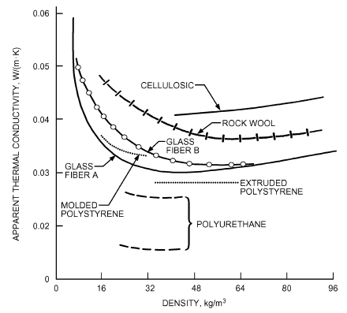
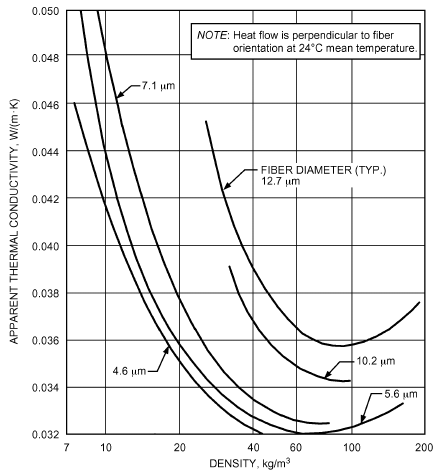
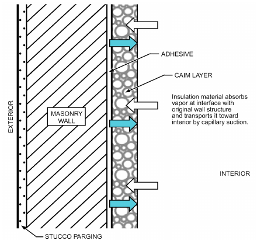
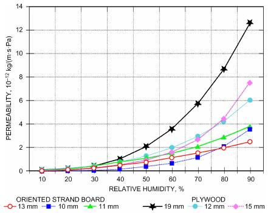
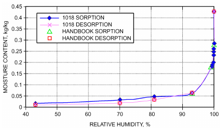
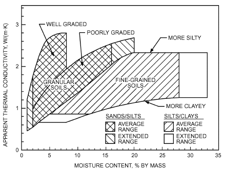

# Chapter 26 — Heat, Air, and Moisture Control in Building Assemblies—Material Properties

*Izvor: 2021 ASHRAE Handbook — Fundamentals (SI), Chapter 26 (PDF str. 734–756).*

> **Napomena o konverziji:** Tekst je automatski izdvojen iz originalnog PDF-a uz prepoznavanje dve kolone, spojene prelomljene reči i pasuse. Indeksi i eksponenti su označeni sa `<sub>`/`<sup>`, tabele su pretvorene u Markdown tabele (veoma složene tabele su prikazane kao poravnat tekst), a slike su izrezane iz PDF-a u folder `img/`. Složene jednačine (razlomci, sume) mogu biti uprošćeno prikazane. **Pre upotrebe vrednosti u proračunu proveriti u originalnom PDF-u.** Oznake `<!-- str. N -->` pokazuju stranu PDF-a.

## Sadržaj

- [1. INSULATION MATERIALS AND INSULATING SYSTEMS](#1-insulation-materials-and-insulating-systems)
- [1.1 APPARENT THERMAL CONDUCTIVITY](#11-apparent-thermal-conductivity)
- [1.2 MATERIALS AND SYSTEMS](#12-materials-and-systems)
- [2. AIR BARRIERS](#2-air-barriers)
- [3. WATER VAPOR RETARDERS](#3-water-vapor-retarders)
- [4. DATA TABLES](#4-data-tables)
- [4.1 THERMAL PROPERTY DATA](#41-thermal-property-data)
- [4.2 SURFACE EMISSIVITY AND EMITTANCE DATA](#42-surface-emissivity-and-emittance-data)
- [4.3 THERMAL RESISTANCE OF PLANE AIR SPACES](#43-thermal-resistance-of-plane-air-spaces)
- [4.4 AIR PERMEANCE DATA](#44-air-permeance-data)
- [4.5 WATER VAPOR PERMEANCE DATA](#45-water-vapor-permeance-data)
- [4.6 MOISTURE STORAGE DATA](#46-moisture-storage-data)
- [4.7 SOILS DATA](#47-soils-data)
- [4.8 SURFACE FILM COEFFICIENTS/ RESISTANCES](#48-surface-film-coefficients-resistances)
- [4.9 CODES AND STANDARDS](#49-codes-and-standards)
- [REFERENCES](#references)
- [BIBLIOGRAPHY](#bibliography)

<!-- str. 734 -->

THIS chapter contains material property data related to the thermal-, air-, and moisture-related performance of building assemblies. The information can be used in simplified calculation methods as applied in Chapter 27, or in software-based methods for transient solutions. Heat transfer under steady-state and transient conditions is covered in Chapter 4, and Chapter 25 discusses combined heat, air, and moisture transport in building assemblies. For information on thermal insulation for mechanical systems (including insulation used in a range of temperatures), see Chapter 23. For information on insulation materials used in refrigerant piping systems and cryogenic or low-temperature applications, see Chapters 10 and 47 of the 2018 ASHRAE Handbook—Refrigeration. For properties of materials not typically used in building construction, see Chapter 33 of this volume.

Density and thermal properties such as thermal conductivity, thermal resistance, specific heat capacity, and emissivity for long-wave radiation are provided for a wide range of building materials, insulating materials, and insulating systems. Air and moisture properties (e.g., air permeance, water vapor permeance or permeability, capillary water-absorption coefficients, sorption isotherms) are given for several materials, with a brief description of how to use the tabulated data. Data on soil thermal conductivity, air cavity resistances, and surface film coefficients, which are also important when considering performance of building assemblies, are also provided.

## 1. INSULATION MATERIALS AND INSULATING SYSTEMS

The main purpose of using thermal insulation materials is to reduce conductive, convective, and radiant heat flows. When properly applied in building envelopes, insulating materials do at least one of the following:

- Increase energy efficiency by reducing the building’s heat loss or gain
- Control surface temperatures for occupant comfort
- Help to control temperatures within an assembly, to reduce the potential for condensation
- Modulate temperature fluctuations in unconditioned or partly conditioned spaces

The primary property of a thermal insulation material is a low apparent thermal conductivity. Additional functions may be served, such as providing support for a surface finish, impeding water vapor transmission and air leakage into or out of controlled spaces, reducing damage to structures from exposure to fire and freezing conditions, and providing better control of noise and vibration. These functions, of course, should be consistent with the capabilities of the materials.

<sub>The preparation of this chapter is assigned to TC 4.4, Building Materials and Building Envelope Performance.</sub>

ASTM Standard C168 defines terms related to thermal insulating materials.

## 1.1 APPARENT THERMAL CONDUCTIVITY

The primary property of a thermal insulation material is a low apparent thermal conductivity, though selection of the appropriate material for a given application also involves consideration of the other performance characteristics mentioned previously.

Thermal conductivity (symbol k, λ in Europe) is a property of a homogeneous, nonporous material. Thermal insulation materials are highly porous, however, with porosities typically exceeding 90%. As a consequence, heat transmission involves conduction in the solid matrix but mainly gas conduction and radiation in the pores (even convection can occur in larger pores). This is why the term **apparent thermal conductivity** is used. That property is affected by structural parameters such as density, matrix type (fibrous or cellular), and thickness. Each sample of a given insulation material has a unique value of apparent thermal conductivity for a particular combination of temperature, temperature difference, moisture content, and age, a value that is not representative for other conditions. For more details, refer to ASTM Standards C168, C177, C335, C518, C976, and C1045.

### Influencing Conditions

**Density and Structure.** Figure 1 shows the variation of the apparent thermal conductivity with density at one mean temperature (i.e., 24°C) for a number of insulation materials used in building envelopes. For most mass-type insulations, there is a minimum that not only depends on the type and form of the material but also on temperature and direction of heat flow. For fibrous materials, the values of density at which the minimum occurs increase as the fiber diameter [or cell size; see Figure 2 (Lotz 1969)] and mean temperature increase.

Structural factors also include compaction and settling of insulation, air permeability, type and amount of binder used, additives that influence the bond or contact between fibers or particles, and type and form of the radiation transfer inhibitor, if any. In cellular materials, most factors that influence strength also control the apparent thermal conductivity: size, shape, and orientation of cells, and thickness of cell walls. As Figures 1 and 2 suggest, a specific combination of cell size, density, and gas composition in those materials produces optimum thermal conductivity.

<!-- str. 735 -->



*Fig. 1 Apparent Thermal Conductivity Versus Density of Several Thermal Insulations Used as Building Insulations*



*Fig. 2 Variation of Apparent Thermal Conductivity with Fiber Diameter and Density*

> (Lotz 1969)

**Temperature.** At most normal operating temperatures, the apparent thermal conductivity of insulating materials generally increases with temperature. The rate of change varies with material type and density. Some materials have an inflection in the curve where the blowing agent changes phase from gas to liquid. The apparent thermal conductivity of a sample at one mean temperature (average of the two surface temperatures) only applies to the material at the particular thickness tested. Further testing is required to obtain values suitable for all thicknesses.

Insulating materials that allow a large percentage of heat transfer by radiation, such as low-density fibrous and cellular products, show the greatest change in apparent thermal conductivity with temperature and surrounding surface emissivity.

The effect of temperature on structural integrity is unimportant for most insulation materials in low-temperature applications. At very low temperatures, however, some polymeric compounds may undergo glass transition, which is characterized by a marked increase in thermal conductivity. For urethanes and butyl-based compounds, this occurs at approximately –40°C, but for silicones the glass transition temperature is more in the range of –90°C, which is not normally encountered in building applications. In any case, decomposition, excessive linear shrinkage, softening, or other effects limit the maximum suitable temperature for a material.

**Moisture Content.** The apparent thermal conductivity of insulation materials increases with moisture content. If moisture condenses in the insulation, it not only reduces thermal resistance, but it may also physically damage the system, because some insulation materials deteriorate with exposure to water. Most materials would be damaged if moisture were allowed to freeze in the material, because water expands when it freezes. The increase in apparent thermal conductivity depends on the material, temperature, moisture content, and moisture distribution. Section A3 of the CIBSE Guide A (CIBSE 2006) covers thermal properties of building structures affected by moisture.

**Thickness.** Radiant heat transfer in pores of some materials increases the measured apparent thermal conductivity. For low-density insulation (e.g., 5.5 kg/m<sup>3</sup>), the effect becomes more pronounced with installed thickness) (Pelanne 1979). The effect on thermal resistance is small, even negligible for building applications. No thickness effect is observed in foam insulation.

**Age.** As mentioned previously, most heat transfer in insulation materials at temperatures encountered in buildings and outdoors occurs by conduction through air or another gas in the pores (Lander 1955; Rowley et al. 1952; Simons 1955; Verschoor and Greebler 1952). In fact, heat transfer in dry insulation materials can be closely approximated by combining gas conduction with conduction through the matrix and radiation in the pores, each determined separately. If air in the pores of a cellular insulation material is replaced by a gas with a different thermal conductivity, the apparent thermal conductivity changes by an amount approximately equal to the difference between the thermal conductivity of air and the gas. For example, replacing air with an inert gas can lower the apparent thermal conductivity by as much as 50%. Cellular plastic foams with a high proportion (i.e., more than 90%) of closed cells retain the blowing agent for extended periods of time. Newly produced, they have apparent thermal conductivities of approximately 0.022 W/(m·K) at 24°C. This value increases with time as air diffuses into the cells and the gas gradually dissolves in the polymer or diffuses out. Diffusion rates and increase in apparent thermal conductivity depend on several factors, including permeance of cell walls to the gases involved, foam age, temperature, geometry of the insulation (thickness), and integrity of the surface facing or covering provided. Brandreth (1986) and Tye (1988) showed that aging of unfaced polyurethane and polyisocyanurate is reasonably well understood analytically and confirmed experimentally. The dominant parameters for minimum aging are

- Closed-cell content >90%, preferably >95%
- Small, uniform cell diameter <<1 mm
- Small anisotropy in cell structure
- High density
- Increased thickness
- High initial pressure of blowing agent in the cells
- Polymer highly resistant to gas diffusion and solubility

<!-- str. 736 -->

- Larger proportion of polymer evenly distributed in struts and windows between cells
- Low temperature

For laminated and spray-applied products, aging is further reduced with higher-density polymer skins, or by well-adhered facings and coverings with low gas and moisture permeance. An oxygen diffusion rate of less than 3.5 mm<sup>3</sup>/(m<sup>2</sup>·day) for a 25 μm thick facing is one criterion used by some industry organizations for manufacturers of laminated products. Adhesion of the facing must be continuous, and every effort must be made during manufacturing to eliminate or minimize the shear plane layer at the foam/substrate interface (Ostrogorsky and Glicksman 1986).

Before 1987, chlorinated fluorocarbons were commonly used as cell gas. Because of their high ozone-depleting potential, chlorofluorocarbons (CFCs) were phased out during the 1990s in accordance with the Montreal Protocol of 1987. Alternatives used today are fluorinated hydrocarbons, CO<sub>2</sub>, n-pentane, and c-pentane.

Closed-cell phenolic-type materials and products, which are blown with similar gases, age differently and much more slowly because of their closed-cell structure.

**Other Influences.** Convection and air infiltration in or through some insulation systems may increase heat transfer. Low-density, loose-fill, large open-cell, and fibrous insulation, and poorly designed or installed reflective systems are the most susceptible. The temperature difference across the insulation and the height and width of the insulated space influence the amount of convection. In some cases, natural convection may be inherent to the system (Wilkes and Childs 1992; Wilkes and Rucker 1983), but in many cases it is a consequence of careless design and/or construction of the insulated structure (Donnelly et al. 1976). Gaps between board- and batt-type insulations lower their effectiveness. Board-type insulation may not be perfectly square, may be installed improperly, and may be applied to uneven surfaces. A 4% void area around batt insulation can produce a 50% loss in effective thermal resistance for ceiling application with R = 3.4 (m<sup>2</sup>·K)/W (Verschoor 1977). Similar and worse results have been obtained for wall configurations (Brown et al. 1993; Hedlin 1985; Lecompte 1989; Lewis 1979; Rasmussen et al. 1993; Tye and Desjarlais 1981). As a solution, preformed joints in boardtype insulation allow boards to fit together without air gaps. Boards and batts can be installed in two layers, with joints between layers offset and staggered. The requirements of ASHRAE Standard 90.1 provide additional guidance on proper installation of insulating materials, as does Chapter 45 in the 2019 ASHRAE Handbook—HVAC Applications.

**Measurement.** Apparent thermal conductivity for insulation materials and systems is obtained by the measuring methods listed in ASTM (2008). These methods apply mainly to laboratory measurements on dried or conditioned samples at specific mean temperatures and temperature gradient conditions. Although fundamental heat transmission characteristics of a material or system can be determined accurately, actual performance in a structure may vary from laboratory results. Only field measurements can clarify the differences. Field-test procedures continue to be developed. Envelope design, construction, and material may all affect the procedure to be followed, as detailed in ASTM (1985a, 1985b, 1988, 1990, 1991).

## 1.2 MATERIALS AND SYSTEMS

### Glass Fiber and Mineral Wool

Glass fiber is produced using recycled glass, whereas mineral wool uses diabase stone. Glass and stone are melted, after which a spinning head stretches the melt into fibers with diameter <10 μm. These fall through a spray of phenol or silicon binder onto the facings for blankets and batts, which lie on a conveyor belt. The fiber blankets, batts, or boards pass a heated press where the binder hardens and the insulation gets its final density and thickness. After passing through the press, the blankets, batts, or boards are cut to size. The spectrum of finished products includes loose fill; over blankets and batts; and soft, semidense, and dense boards. Blankets cannot take any extra load, except their own weight. Dense boards are moderately compression resistant, with a modulus of σ<sub>10</sub>, or about 0.04 to 0.08 MPa.

Mineral wool and glass fiber may look similar, but there are important differences. Glass fiber consists of well-ordered, long fibers, whereas mineral wool is composed of unordered, shorter fibers. Glass is also amorphous, whereas diabase stone is crystalline.

The thermal conductivity of glass fiber is somewhat lower than for mineral wool (see Table 1), with lower values for higher-density blankets in both materials. Glass and mineral fiber are very vapor permeable. The coefficient of thermal expansion is low for both materials, at ~7 × 10<sup>–6</sup> K<sup>–1</sup>, and irreversible hygrothermal deformation does not occur. The two are also very temperature resistant, although the binder may start evaporating above 250°C and degrades above 600°C for glass fiber and above 850°C for mineral wool (consequently, mineral wool is preferred for high-temperature applications). Both insulation materials are quite moisture tolerant, although wet batts and blankets lose their shape, and the stiffness and compression strength of some dense boards degrade when wet. Glass fibers slowly pulverize when exposed to a combination of high temperature, moisture, and oxygen. Neither glass fiber nor mineral wool burn, but the binder may be combustible. Binder concentrations below 4% simply evaporate, but more concentrated binders can burn. Also, most facing layers are flammable.

Glass fiber and mineral wool are widely used insulation materials. Applications range from low-slope roofs (dense boards) and pitched roofs (blankets, batts, and soft boards) to cavity fill (semidense water-repellant boards), timber-frame insulation, exterior insulation finishing systems (EIFS) (dense boards), floor insulation (dense boards), and perimeter insulation (dense boards). Manufacturers modify specific products for many applications, including boards with improved water-repellent properties for fullcavity fill and boards with a dense upper layer for low-slope roofing.

### Cellulose Fiber

The base material for cellulose fiber is unsold or recycled newspaper and cardboard. Borax salts are added during processing to reduce flammability and mold sensitivity. The material is available in loose form, and is placed into the desired space by wet or dry blowing, which results in densities between 24 to 60 kg/m<sup>3</sup>, depending on blowing pressure. The material is also available in board form.

Cellulose fibers are very hygroscopic, and the borax salt magnifies that property. The fibers are also capillary active, and quite vapor permeable. Avoid loading beyond the mass of a loose fill. Less densely packed cellulose fibers show irreversible settling and are sensitive to hygric swelling and shrinking; wet-blown fibers exhibit shrinkage upon drying. Long-lasting moisture content above 20% (as a percentage of dry mass) should be avoided, because this ultimately leads to decay. Despite the borax salts, cellulose fibers are rather combustible. The borax salts are also not benign: simple exposure may cause respiratory and skin irritation, and ingestion could induce gastrointestinal distress (including nausea, persistent vomiting, abdominal pain, and diarrhea); less common effects on the vascular system and brain are headaches and lethargy.

Cellulose fibers are typically used as an alternative for glass fiber and mineral wool. Typical applications are insulation of timberframed walls, and insulation of the ceiling between living spaces and attics. The boards are used for insulating pitched roofs. One important limitation: never apply cellulose fiber (or any insulation, for that matter) where continued long-term wetness may be expected.

<!-- str. 737 -->

### Plastic Foams

**Expanded Polystyrene (EPS).** The basic material for EPS is pentane-blown polystyrene pearls. The pearls are first heated above 100°C, at which temperature the evaporating pentane causes expansion. The expanded pearls are then stored for a few days, allowing diffusion of the remaining pentane. Then they are poured into molds and steam heated, so that the expanded pearls coagulate in their own melt. Once cool, the blocks are cut into boards and stored until initial shrinkage ends. EPS is a thermoplastic with a problematic fire reaction: it melts and drips when burning. Consequently, additives are used to slow down flammability.

**Extruded Polystyrene (XPS).** The basic material for XPS is polystyrene pearls, which are melted, blown with a blowing agent, and extruded into boards with a dense skin. The extruded foam is then stabilized in a water bed and cut into separate boards. As with EPS, XPS is stored for several weeks before application. XPS is also a thermoplastic with additives used to slow down flammability. The water vapor resistance of XPS boards is very high, allowing their use in inverted roofs and as perimeter insulation in humid soils.

**Polyurethane (PUR and Polyisocyanurate (PIR).** PUR and PIR are the only insulation materials produced chemically by isocyanate reacting with polyolefin in the presence of a catalyst, a blowing agent, and additives. The difference between the two is the isocyanate ratio: in PIR, this ratio is high enough (60 to 65% kg/kg instead of 50 to 55% kg/kg) to form autopolymers. The main result is a better reaction in combustion. Because the explosive isocyanate/polyolefin reaction is highly sensitive to temperature and relative humidity, strict control of both parameters is needed. The reaction product is also very sticky, which allows the mixture to be sprayed on many kinds of substrates, or to be used to produce sandwich panels (Figure 3). Once the reaction is finished, the boards are cut to the desired size and stored.

R-11 [a CFC with ozone depletion potential (ODP) = 1] was used as a blowing agent until the early 1990s. Since then, blowing agents with zero ODP are preferred, such as hydrofluorocarbons (HFCs) for PUR insulation boards, HFCs or CO<sub>2</sub> for spray-applied PUR, and pentane for PIR boards.



*Fig. 3 Working Principle of Capillary-Active Interior Insulation*

### Cellular Glass

Cellular glass is a light, expanded-glass insulation with closed-cell pores. It is water- and vaportight, allowing neither vapor diffusion nor capillary suction through the material. Depending on the production process, cellular glass is delivered either as insulating boards or as loose-fill aggregate. The boards are used for roof, wall, basement, and foundation insulation; loose fill is only used for foundation or basement insulation. Cellular glass boards must be protected from frost damage caused by water freezing in its open surface pores. The R-value of cellular glass boards is not affected by moisture, but the thermal resistance of loose fill decreases in moist conditions because of water clinging to the surface of the aggregates.

### Capillary-Active Insulation Materials (CAIMs)

CAIMs are used as interior wall insulation for existing buildings. Despite being rather vapor permeable, they are applied without a vapor-retarding layer because condensing moisture is supposed to be wicked away from the dew point toward the interior wall surface (Figure 3). In contrast to conventional insulation systems that need a vapor retarder to protect the wall structure from harmful condensation, CAIMs provide condensation control without reducing the drying potential towards the indoors. Because of increasing demand in Europe, several capillary-active insulation systems made of calcium silicate, foamed concrete, or hydrophilic glass fiber have appeared on the market. Tests [e.g., (Zhao et al. (2017)] show that these materials may differ in their wicking ability, but most of them succeed in redistributing condensate by capillary suction. However, even the best-performing CAIM cannot prevent increased relative humidity at the interface between interior insulation and original wall surface of 95% or more in winter (Binder et al. 2010). The benefits of CAIMs for insulating existing wall structures are therefore still debatable. Other potential concerns are that their thermal resistances are also generally inferior to those of conventional insulation [k = 0.05 to 0.06 W/(m·K)].

### Transparent Insulation

Transparent insulation material (TIM) combines transparency for short-wave radiation with low heat conduction, extremely low convection, and opacity for long-wave radiation. The material comprises thin parallel transparent plastic tubes or transparent glass fibers sandwiched between two glass sheets. TIM has a higher thermal conductivity than classic insulation materials [between 0.049 and 0.063 W/(m·K)] but allows solar gains into the conditioned space, so the net heat balance (equilibrium between losses and gains) may be more favorable.

Still, use of this material remains limited because of soiling and overheating. The plastic tubes slowly yellow, and, if the space between the two glass sheets is not vaportight, water vapor may diffuse into the panels and condense against the coldest sheet. Dust may enter the TIM boards through spacer leaks and be fixed in the condensate. Also the exterior surface of the panels can become soiled. Overheating is moderated by combining the TIM with solar shading, but this is currently too expensive to be economically viable.

### Vacuum Insulation Panels

Vacuum insulation (sometimes called **modified-atmosphere insulation** because the interior is not a hard vacuum) is available in rigid and semirigid panels of various sizes. Vacuum insulation panels consist of an interior filler material and an exterior barrier material. Heat conduction through the center of the panel is typically less than 0.007 W/(m·K); some panels have been manufactured with a centerof-panel thermal conductivity less than 0.0025 W/(m·K) However, heat is also transported around the edges of the panel, and that heat transport (often referred to as **edge effect**) can significantly reduce the thermal resistance of the whole panel compared to the thermal resistance of the center region. For that reason, the resistance of the whole assembly should be considered, and larger panels are generally preferred. In buildings, vacuum panels may be used when the space available for thermal insulation is tightly constricted, such as in historic building retrofits. Vacuum insulation panels are also used in appliances and shipping containers.

<!-- str. 738 -->

Vacuum insulation panels rely on reduced gaseous conduction, via reduced air pressure, for their thermal performance and must therefore be protected from puncture or other physical damage. Depending on the permeability of the barrier material and the nature of the seam joining the barrier material around the unit’s perimeter, panels age through air diffusion. To delay this phenomenon, most barrier materials incorporate a very thin metallic layer (often produced using vapor deposition methods). Another way to slow aging is to incorporate getter materials (i.e., any reactive material that absorbs small amounts of gas in an evacuated space) within the panel; some filler materials act as getters themselves. The filler material supports the exterior atmospheric pressure load on the panel and reduces both radiative and gaseous heat transport across the panel. To reduce gaseous heat transfer, voids in the filler material must be smaller than the mean free path of the gas molecules, which is in turn determined by the air pressure in the panel. Therefore, filler materials with finer void sizes retain their heat transfer reduction abilities at higher pressures than fillers with greater void sizes do.

### Reflective Insulation Systems

Reflective insulation consists of surfaces having high reflectivity (and low emissivity) for long-wave radiation, thus reducing radiant heat transfer. To be effective, these surfaces must face an air layer, or no radiant heat transfer is available to be reduced. Conventional calculation methods ascribe the radiative properties to the facing air layer, rather than to the reflective insulation system, to avoid double-counting the reflective effect. Multiple layers of reflective materials facing smooth and parallel sealed air spaces increase overall thermal resistance, though thermal conductivity will never be less than that of still air. In any case, air exchange and movement must be inhibited or the reduction in radiative heat transfer will be overshadowed by increased convection.

Conventional insulation can be combined with reflective surfaces facing air spaces to increase thermal resistance. However, each design must be evaluated, because thermal performance of these systems depends on factors such as condition of insulation, shape and form of construction, means to avoid air leakage and movement, and condition and aging characteristics of reflective surfaces.

Values for foil insulation products supplied by manufacturers must be used with caution because they apply only to systems that are identical to the configuration in which the product was tested. In addition, surface oxidation, dust accumulation, condensation, and other factors that change the condition of the low-emittance surface can reduce the thermal effectiveness (Hooper and Moroz 1952). Deterioration results from contact with acidic or basic solutions (e.g., wet cement mortar, preservatives found in decay-resistant lumber). Polluted environments may cause rapid and severe degradation. However, Hooper and Moroz found that site inspections showed a predominance of well-preserved reflective surfaces, with only a small number of cases of rapid and severe deterioration. An extensive review of the reflective building insulation system performance literature is provided by Goss and Miller (1989).

## 2. AIR BARRIERS

The main characteristic of an air barrier system is reduced air permeance. To create that performance, the barrier must

- Meet material permeability requirements.
- Be continuous when installed (i.e., tight joints in air barrier assembly; effective bonds in air barrier materials at intersections such as wall/roof, wall/foundation, and wall/windows; tightly sealed penetrations).
- Accommodate dimensional changes caused by temperature or shrinkage without damaging joints or air barrier material.
- Be strong enough to support stresses applied to air barrier material or assembly. The air barrier must not be ruptured or excessively deformed by wind and stack effect. Where an adhesive is used to complete a joint, the assembly must be designed to withstand forces that might gradually peel away the air barrier material. Where the material is not strong enough to withstand anticipated wind and other loads, it must be supported on both sides to account for positive and negative wind gust pressures.

In addition, the following properties can be important, depending on the application:

- Elasticity
- Thermal stability
- Fire and flammability resistance
- Inertness to deteriorating elements
- Ease of fabrication, application, and joint sealing

Air barriers may control both vapor and airflow (i.e., they may act as an air/vapor retarder), depending on the characteristics of the materials used. Many designs are based on this idea, with measures taken to ensure that the layer with vapor-retarding properties is continuous to control airflow. Some designs treat airflow and vapor retarders as separate entities, but an airflow retarder should not be where it can cause moisture to condense if it also has vapor-retarding properties. For example, a vapor-retarding air barrier placed on the cold side of a building envelope may cause condensation, particularly if the vapor retarder at the other side of the building is ineffective. Instead, a carefully installed, sealed cold-side air retarder that has sufficient thermal resistance may lower the potential for condensation by raising the temperature at its inside surface during the cold season (Ojanen et al. 1994).

Air leakage characteristics can be determined with the ASTM Standard E1186 test method for air barriers on the interior side of the building envelope, and described according to ASTM Standard E1677. Specific air leakage criteria for air barriers in cold heating climates are found in Di Lenardo et al. (1995). These specifications provide classes for air leakage rates of 0.05, 0.10, 0.15, and 0.20 L/(s·m<sup>2</sup>) when measured with an air pressure difference of 75 Pa, depending on the water vapor permeance of the outermost layer of the building envelope. The highest leakage rate applies if the permeance of the outermost layer is greater than 600 ng/(Pa·s·m<sup>2</sup>); the lowest rate applies if the permeance is less than 60 ng/(Pa·s·m<sup>2</sup>). Intermediate values are also provided. The recommendations apply only to heating climates.

The required air permeance of an air barrier material has been set by some building codes at 0.02 L/(s·m<sup>2</sup>) at a pressure difference of 75 Pa. A 2008 addendum to ASHRAE Standard 90.1 also references this value. ASTM Standard E1677 provides an alternative minimum air barrier test and criteria specifically suitable for framed walls of low-rise buildings.

Air leakage characteristics of an air barrier assembly can be determined with the ASTM Standard E2357 test method, which measures the air leakage of three wall specimens: (1) with the air barrier material installed using air barrier accessories alone, (2) with the air barrier material installed and connected to air barrier components (window, doors, and other premanufactured elements) using air barrier accessories, and (3) with an air barrier wall assembly connected to a foundation assembly and roof assembly using air barrier accessories. The test method reports the air leakage rate at a reference pressure difference of 75 Pa, not because it is necessarily representative of in-service conditions, but because it provides a more accurate measurement that can then be adjusted for actual conditions.

<!-- str. 739 -->

Building assemblies are constructed and the various air barrier assemblies are connected to form an air barrier system for the whole building. The building’s air leakage characteristics can be determined with the ASTM Standard E779 test method. A 2008 addendum to ASHRAE Standard 90.1 requires 2.0 L/(s·m<sup>2</sup>) at 75 Pa pressure difference.

The effectiveness of an air barrier is greatly reduced by openings and penetrations, even small ones. These openings can be caused by poor design, poor workmanship during application, insufficient coating thickness, improper caulking and flashing, uncompensated thermal expansion, mechanical forces, aging, and other forms of degradation. Faults or leaks typically occur at electrical boxes, plumbing penetrations, telephone and television wiring, and other unsealed openings in the structure. This is especially true if telephone, television, or other services are installed after the envelope has been inspected and/or tested. A ceiling air barrier should be continuous at chases for plumbing, ducts, flues, and electrical wiring. In flat roofing, mechanical fasteners are sometimes used to adhere the system to the deck, and often penetrate the air barrier. In heating climates, the resulting holes may allow air exfiltration and accompanying water vapor leakage into the roof. ASTM Standard E1186 describes several techniques for locating air leakage sites in building envelopes and air barrier systems.

As noted previously, air barrier assemblies must withstand pressures exerted by stack effects, wind, or both during construction and over the building’s life. The magnitude of pressure varies, depending on building type and sequence of construction. At one extreme, single-family dwellings may be built with exterior cladding partly or entirely installed and insulation in place before the air barrier is added. Chimney effects in these buildings are small, even in cold weather, so stresses on the air barrier during construction are small. At the other extreme, wind and chimney effect forces in tall buildings are much greater. A fragile, unprotected sheet material should not be used as an air barrier because it will probably be torn by wind before construction is completed.

Calculations of water vapor flow, interstitial condensation, and related moisture accumulation using only water vapor resistances are useless when airflow is involved. More information on air leakage in buildings may be found in Chapter 16.

## 3. WATER VAPOR RETARDERS

The main characteristic of a water vapor retarder is low vapor permeance. The following properties are also important, depending on the application:

- Mechanical strength in tension, shear, impact, and flexure
- Adhesion
- Elasticity Thermal stability
- Fire and flammability resistance
- Resistance to other deteriorating elements [e.g., chemicals, ultraviolet (UV) radiation]
- Ease of fabrication, application, and joint sealing

Although a flow of dry air may accelerate drying of a wet building component (Karagiozis and Salonvaara 1999a, 1999b), vapor retarders are completely ineffective without effective airflow control, A single layer may serve both purposes, of course: the designer must assess the needs for control of water vapor and air movement in a building envelope, and devise a system that guarantees the required vapor retarder and air barrier properties.

Water vapor retarders demand consideration in every building design. The need for and type of system depend on the climate zone, construction type, building usage, and moisture sources other than indoor water vapor to be considered. Water vapor retarders were originally designed to protect building elements from water vapor diffusing through building materials and condensing against and in layers at the cold side of the thermal insulation. It is now recognized that it is just as important to allow a building assembly to dry as it is to keep the building assembly from getting wet by vapor diffusion. In some cases, to allow the building assembly to dry, a water vapor retarder may not be needed, or should be semipermeable. In other cases, the environmental conditions, building construction, and building usage may dictate that a material with very low water vapor permeance should be installed to protect building components. A balanced design approach is required: a vapor retarder can reduce the potential for an assembly to dry, but can also reduce the potential for the assembly getting wet. ASHRAE Standard 160 should be followed to determine the need for and placement of a vapor retarder.

The 2007 supplement to the International Codes (ICC 2007) lists three water vapor retarder classes:

- **Class I:** 5.7 ng/(Pa·s·m<sup>2</sup>) or less
- **Class II:** more than 5.7 ng/(Pa·s·m<sup>2</sup>) but less than or equal to 57 ng/(Pa·s·m<sup>2</sup>)
- **Class III:** more than 57 ng/(Pa·s·m<sup>2</sup>) but less than or equal to 570 ng/(Pa·s·m<sup>2</sup>)

The designer should determine the type of water vapor retarder needed and its location in the envelope assembly, based on climatic conditions, other materials used in the assembly, additional sources of humidity, and the building’s use (e.g., intended relative humidity).

A vapor retarder typically slows the rate of water vapor diffusion, but does not totally prevent it. In most cases, requirements for vapor retarders in envelope assemblies are not extremely stringent: because conditions on the inside and outside of buildings vary continually, air movement and ventilation can provide wetting as well as drying at various times, and water vapor entering one side of an envelope assembly can be stored temporarily as hygroscopic moisture and released later. A vapor barrier is often used to try to stop water vapor transport when the real problem is transport of water vapor by air transport. This causes confusion between the use and function of vapor barriers/retarders and those of air barriers. However, if conditions are conducive to excessive humidification, water vapor retarders help to (1) keep the thermal insulation dry; (2) prevent structural damage from rot, corrosion, freeze/thaw, and other environmental actions; and (3) reduce paint problems on exterior walls (although rain absorption through cracks in the paint may be a more probable cause of paint problems) (ASTM Standard C755). Judicious placement of a vapor retarder may also help an assembly to dry out. Another way to look at a vapor retarder is that it is the most vapor-resistant layer in the assembly; a capable designer knows where this layer is and ensures that it does not promote excessive moisture accumulation or prevent the assembly from drying. Therefore, all building envelope assemblies should be assessed to ensure that an unintentional water vapor retarder does not create problems.

The vapor retarder’s effectiveness depends on its vapor permeance, installation, and location in the insulation. The retarder should be at or near the surface exposed to higher water vapor pressure and higher temperature. In heating climates, this is usually the winterwarm side.

Water vapor retarders are classified as rigid, flexible, or coating materials. **Rigid retarders** include reinforced plastics, aluminum, and stainless steel. These usually are mechanically fastened in place and are vapor-sealed at the joints. **Flexible retarders** include metal foils, laminated foil and treated papers, coated felts and papers, and plastic films or sheets. They are supplied in roll form or as an integral part of a building material (e.g., insulation). Accessory materials are required for sealing joints. **Coating retarders** may be semifluid or mastic; paint (called surface coatings); or hot melt, including thermofusible sheet materials. Their basic composition may be asphaltic, resinous, or polymeric, with or without pigments and solvents, as required to meet design conditions. They can be applied by spray, brush, trowel, roller, dip, or mop, or in sheet form, depending on the type of coating and surface to which it is applied. Potentially, each of these materials is an air barrier; however, to meet air barrier specifications, it must satisfy requirements for strength, continuity, and air permeance. A construction of several materials, some perhaps of substantial thickness, can also constitute a vapor retarder system. In fact, designers have many options. For example, airflow and moisture movement might be controlled using an interior finish, such as drywall, to provide strength and stiffness, along with a low-permeability coating, such as a vapor-retarding paint, to provide the required low permeance. Other designs may use more than one component. However, (1) any component that qualifies as a vapor retarder usually also impedes airflow, and is thus subject to air pressure differences that it must resist; and (2) any component that impedes airflow may also retard vapor movement and promote condensation or frost formation if it is at the wrong location in the assembly.

<!-- str. 740 -->

Several studies found a significant increase in apparent permeance as a result of small holes in the vapor retarder. For example, Seiffert (1970) reported a hundredfold increase in the vapor permeance of aluminum foil when it is 0.014% perforated, and a 4000-fold increase when 0.22% of the surface is perforated. In general, penetrations particularly degrade a vapor retarder’s effectiveness if it has very low permeance (e.g., polyethylene or aluminum foil). In addition, perforations may lead to air leakage, which further erodes effectiveness.

“Smart” vapor retarders allow substantial summer drying while functioning as effective vapor retarders during the cold season. One type of smart vapor retarder has low vapor permeance but conducts liquid water, allowing moisture that condenses on the retarder to dry. Korsgaard and Pedersen (1989, 1992) describe such a retarder composed of synthetic fabric sandwiched between staggered strips of plastic film. The fabric wicks liquid water while the plastic film retards vapor flow. Another type of smart vapor retarder provides low vapor permeance at low relative humidities, but much higher permeance at high relative humidity. During the heating season in cold and moderate climates, the indoor humidity usually is below 50% and the smart vapor retarder’s permeance is low. In the summer or on winter days with high solar heat gains, when the temperature gradient is inward, moisture moving from exterior parts of the wall or roof raises the relative humidity at the vapor retarder. This increases vapor permeance and potential for the wall or roof to dry out. One such vapor retarder is described by Kuenzel (1999). Below 50% rh, the film’s permeance is less than 57 ng/(Pa·s·m<sup>2</sup>), but it increases above 60% rh, reaching 2050 ng/(Pa·s·m<sup>2</sup>) at 90% rh.

## 4. DATA TABLES

## 4.1 THERMAL PROPERTY DATA

Steady-state thermal resistances (R-values) of building assemblies (walls, floors, windows, roof systems, etc.) can be calculated from thermal properties of the materials in the component, provided by Table 1, or heat flow through the assembled component can be measured directly with laboratory equipment such as the guarded hot box (ASTM Standard C1363). Direct measurement is the most accurate method of determining the overall thermal resistance for a combination of building materials combined as a building envelope assembly. However, not all combinations may be conveniently or economically tested in this manner. For many simple constructions, calculated R-values (see Chapter 25) agree reasonably well with values determined by hot-box measurement.

Values in Table 1 were developed by testing under controlled laboratory conditions. In practice, overall thermal performance can be reduced significantly by factors such as improper installation, quality of workmanship and shrinkage, settling, or compression of the insulation (Tye 1985, 1986; Tye and Desjarlais 1983). Good workmanship becomes increasingly important as the insulation requirement becomes greater. Therefore, some engineers include additional insulation or other safety factors based on experience in their design

Values in Table 1 are recorded at 24°C, and are intended to be representative values of generic materials. The tabulated thermal conductivities are either relatively constant as tested, or vary over a range of densities. For the most part, thermal conductivity varies directly with density, which provides some guidance for users here a range is presented. A conservative design might use values at the higher end of the range (unless moisture content is a concern, in which case low-conductivity materials might reduce the assembly’s ability to dry out, and would thus be a more conservative choice). References are provided for each material, so users can investigate the as-tested conditions, and additional information regarding the test specimens.

Caution: values in Table 1 should not be used without referring to the footnotes, which define limitations and some of the as-tested conditions for the materials listed.

Because commercially available materials vary, not all values apply to specific products.

## 4.2 SURFACE EMISSIVITY AND EMITTANCE DATA

Table 2 provides measured long-wave emissivities for various surfaces, which are used to characterize radiant heat transfer to or from these surfaces. To simplify radiant heat transfer calculations, the combined emittance for two surfaces is also provided, although these values can be calculated using ε<sub>eff</sub> = 1/(1/ε<sub>1</sub> + 1/ε<sub>2</sub> – 1). As described previously, surface oxidation, dust accumulation, condensation, and other factors can impair the emissivity of highly reflective surfaces, so slightly higher values should be used.

## 4.3 THERMAL RESISTANCE OF PLANE AIR SPACES

Table 3 provides effective resistance values for plane (i.e., generally flat) air spaces that are enclosed within an assembly. Where an assembly incorporates reflective insulation, the effect of the reflective surface is ascribed to the air space, not to the material component. It should be understood that the reflective surface must face an air space to have any effect in reducing thermal transmittance, and assigning the value of the reflective surface to the air space in a design calculation reinforces this concept. Note that “reflective insulation systems” are bounded by an enclosed air space within an assembly, whereas “radiant barrier systems” feature a reflective surface facing an open airspace. Reflective insulation may be described as modifying the effective R-value of the assembly, but a radiant barrier system may not. This includes reflective surfaces behind siding, which should not be considered as “reflective insulation” (in most cases, the nature of the heat transfer will be dominated by wind-driven convection, rather than radiant exchange). Thermal resistance values for siding with reflective foil backing are provided in Table 1.

## 4.4 AIR PERMEANCE DATA

Table 4 provides measured air permeability of different materials, tested in accordance with Bomberg and Kumaran (1986), to be used in assessing the suitability of these materials in an air barrier assembly. As discussed previously, low air permeance is not sufficient to ensure a reliable air barrier assembly: the system must be properly fastened and supported (on both sides) to resist wind loads, and all materials must be durable for the expected service life of the assembly. The air barrier must also be continuous, and should be installed in such a way as to discourage wind washing (i.e., air movement that reduces the thermal resistance of insulation layers in the assembly).

<!-- str. 741 -->

**Table 1 Building and Insulating Materials: Design Values**

| Description | Density, kg/m<sup>3</sup> | Conductivity<sup>b</sup> k, Resistance R,<br>W/(m·K) | Conductivity<sup>b</sup> k, Resistance R,<br>(m<sup>2</sup>·K)/W | kJ/(kg·K) Reference<sup>o</sup><br>Specific Heat, | kJ/(kg·K) Reference<sup>o</sup> |
|---|---|---|---|---|---|
| Insulating Materials |  |  |  |  |  |
| *Blanket and batt*<sup>c,d</sup> |  |  |  |  |  |
| Glass-fiber batts … |  |  |  | 0.8 | Kumaran (2002) |
|  | 7.5 to 8.2 | 0.046 to 0.048 | — | — | Four manufacturers (2011) |
|  | 9.8 to 12 | 0.040 to 0.043 | — | — | Four manufacturers (2011) |
|  | 13 to 14 | 0.037 to 0.039 | — | — | Four manufacturers (2011) |
|  | 22 | 0.033 | — | — | Four manufacturers (2011) |
| Rock and slag wool batts … | — | — | — | 0.8 | Kumaran (1996) |
|  | 32 to 37 | 0.036 to 0.037 | — | — | One manufacturer (2011) |
|  | 45 | 0.033 to 0.035 | — | — | One manufacturer (2011) |
| Mineral wool, felted … | 16 to 48 | 0.040 | — | — | CIBSE (2006), NIST (2000) |
|  | 16 to 130 | 0.035 | — | — | NIST (2000) |
| *Board and slabs* |  |  |  |  |  |
| Cellular glass … | 120 | 0.042 | — | 0.8 | One manufacturer (2011) |
| Cement fiber slabs, shredded wood with Portland cement |  |  |  |  |  |
| binder … | 400 to 430 | 0.072 to 0.076 | — | — |  |
| with magnesia oxysulfide binder … | 350 | 0.082 | — | 1.3 |  |
| Glass fiber board … | — | — | — | 0.8 | Kumaran (1996) |
|  | 24 to 96 | 0.033 to 0.035 | — | — | One manufacturer (2011) |
| Expanded rubber (rigid) … | 64 | 0.029 | — | 1.7 | Nottage (1947) |
| Extruded polystyrene, smooth skin … | — | — | — | 1.5 | Kumaran (1996) |
| aged per CAN/ULC Standard S770-2003 … | 22 to 58 | 0.026 to 0.029 | — | — | Four manufacturers (2011) |
| aged 180 days … | 22 to 58 | 0.029 |  |  | One manufacturer (2011) |
| European product … | 30 | 0.030 |  |  | One manufacturer (2011) |
| aged 5 years at 24°C … blown with low global warming potential (GWP) (<5) | 32 to 35 | 0030 | — | — | One manufacturer (2011) |
| blowing agent … |  | 0.035 to 0.036 | — | — | One manufacturer (2011) |
| Expanded polystyrene, molded beads … | — | — | — | 1.5 | Kumaran (1996) |
|  | 16 to 24 | 0.035 to 0.037 | — | — | Independent test reports (2008) |
|  | 29 | 0.033 | — | — | Independent test reports (2008) |
| Mineral fiberboard, wet felted … | 160 | 0.037 | — | 0.8 | Kumaran (1996) |
| Rock wool board … | — | — | — | 0.8 | Kumaran (1996) |
| floors and walls … | 64 to 130 | 0.033 to 0.036 | — | — | Five manufacturers (2011) |
| roofing … | 160 to 180. | 0.039 to 0.042 | — | 0.8 | Five manufacturers (2011) |
| Acoustical tileg … | 340 to 370 | 0.052 to 0.053 | — | 0.6 to 0.8 |  |
| Perlite board … | 140 | 0.052 | — | — | One manufacturer (2010) |
| Polyisocyanurate … | — | — | — | 1.5 | Kumaran (1996) |
| unfaced, aged per CAN/ULC Standard S770-2003 … | 26 to 37 | 0.023 to 0.025 | — | — | Seven manufacturers (2011) |
| with foil facers, aged 180 days … | — | 0.022 to 0.023 | — | — | Two manufacturers (2011) |
| Phenolic foam board with facers, agedf … | — | 0.020 to 0.023 | — | — | One manufacturer (2011) |
| Loose fill |  |  |  |  |  |
| Cellulose fiber, loose fill … | — | — | — | 1.4 | NIST (2000), Kumaran (1996) |
| attic application up to 100 mm … | 16 to 19 | 0.045 to 0.046 | — | — | Four manufacturers (2011) |
| attic application > 100 mm … | 19 to 26 | 0.039 to 0.040 | — | — | Four manufacturers (2011) |
| wall application, dense packed … | 56 | 0.039 to 0.040 | — | — | One manufacturer (2011) |
| Perlite, expanded … | 32 to 64 | 0.039 to 0.045 | — | 1.1 | (Manufacturer, pre 2001) |
|  | 64 to 120 | 0.045 to 0.052 | — | — | (Manufacturer, pre 2001) |
|  | 120 to 180 | 0.052 to 0.061 | — | — | (Manufacturer, pre 2001) |
| Glass fiber<sup>d</sup> |  |  |  |  |  |
| attics, ~100 to 600 mm … | 6.4 to 8.0 | 0.052 to 0.055 | — | — | Four manufacturers (2011) |
| attics, ~600 to 1100 mm … | 8 to 9.6 | 0.049 to 0.052 | — | — | Four manufacturers (2011) |
| closed attic or wall cavities … | 29 to 37 | 0.035 to 0.036 | — | — | Four manufacturers (2011) |
| Rock and slag wool<sup>d</sup> |  |  |  |  |  |
| attics, ~90 to 115 mm … | 24 to 26 | 0.049 | — | — | Three manufacturers (2011) |
| attics, ~125 to 430 mm … | 24 to 29 | 0.046 to 0.048 | — | — | Three manufacturers (2011) |
| closed attic or wall cavities … | 64 | 0.039 to 0.042 | — | — | Three manufacturers (2011) |
| Vermiculite, exfoliated … | 112 to 131 | 0.068 | — | 1.3 | Sabine et al. (1975) |
|  | 64 to 96 | 0.063 | — | — | Manufacturer (pre 2001) |
| Spray-applied |  |  |  |  |  |
| Cellulose, sprayed into open wall cavities … | 26 to 42 | 0.039 to 0.040 | — | — | Two manufacturers (2011) |
| Glass fiber, sprayed into open wall or attic cavities … | 16 | 0.039 to 0.042 | — | — | Manufacturers’ association (2011) |
|  | 29 to 37 | 0.033 to 0.037 | — | — | Four manufacturers (2011) |
| Polyurethane foam … | — | — | — | 1.5 | Kumaran (2002) |
| low density, open cell … | 7.2 to 10 | 0.037 to 0.042 | — | — | Three manufacturers (2011) |
| medium density, closed cell, aged 180 days … | 30 to 51 | 0.020 to 0.029 | — | — | Five manufacturers (2011) |

<!-- str. 742 -->

**Table 1 Building and Insulating Materials: Design Values (Continued)**

```text
                                                                                              a
                                                      Density,   Conductivity^b k, Resistance R, Specific Heat,
Description                                            kg/m^3       W/(m·K)        (m^2·K)/W     kJ/(kg·K)  Reference^o
Building Board and Siding
Board
Asbestos/cement board........................................................ 1900 0.57 —           1.00    Nottage (1947)
Cement board ...................................................................... 1150 0.25 —     0.84    Kumaran (2002)
Fiber/cement board.............................................................. 1400 0.25 —        0.84    Kumaran (2002)
                                                        1000           0.19            —            0.84    Kumaran (1996)
                                                         400           0.07            —            1.88    Kumaran (1996)
                                                         300           0.06            —            1.88    Kumaran (1996)
Gypsum or plaster board ..................................................... 640 0.16 —            1.15    Kumaran (2002)
Oriented strand board (OSB).............................9 to 11 mm 650 —              0.11          1.88    Kumaran (2002)
   .........................................................................12.7 mm 650 — 0.12      1.88    Kumaran (2002)
Plywood (douglas fir)............................................12.7 mm 460 —        0.14          1.88    Kumaran (2002)
   .........................................................................15.9 mm 540 — 0.15      1.88    Kumaran (2002)
Plywood/wood panels............................................19.0 mm 450 —          0.19          1.88    Kumaran (2002)
Vegetable fiber board                                    650           —              0.11          1.88    Kumaran (2002)
   sheathing, regular density................................12.7 mm 290 —            0.23          1.30    Lewis (1967)
      intermediate density ..................................12.7 mm 350 —            0.19          1.30    Lewis (1967)
   nail-based sheathing ........................................12.7 mm 400 —         0.19          1.30
   shingle backer....................................................9.5 mm 290 —     0.17          1.30
   sound deadening board....................................12.7 mm 240 —             0.24          1.26
   tile and lay-in panels, plain or acoustic             290          0.058            —            0.59
   laminated paperboard                                  480          0.072            —            1.38    Lewis (1967)
   homogeneous board from repulped paper                 480          0.072            —            1.17
Hardboard
   medium density ............................................................. 800 0.105 —         1.30    Lewis (1967)
   high density, service-tempered grade and service grade 880          0.12            —            1.34    Lewis (1967)
   high density, standard-tempered grade.......................... 1010 0.144          —            1.34    Lewis (1967)
Particleboard
   low density .................................................................... 590 0.102 —     1.30    Lewis (1967)
   medium density ............................................................. 800 0.135 —         1.30    Lewis (1967)
   high density ................................................................... 1000 1.18 —     —       Lewis (1967)
   underlayment.................................................. 15.9 mm 640 —       1.22          1.21    Lewis (1967)
Waferboard.......................................................................... 700 0.072 —    1.88    Kumaran (1996)
Shingles
   Asbestos/cement............................................................ 1900 — 0.037         —
   Wood, 400 mm, 190 mm exposure ............................... —     —              0.15          1.30
   Wood, double, 400 mm, 300 mm exposure .................. —          —              0.21          1.17
   Wood, plus ins. backer board.............................. 8 mm —   —              0.25          1.30
   Siding.............................................................................              —
   Asbestos/cement, lapped .................................. 6.4 mm — —             0.037          1.01
   Asphalt roll siding ......................................................... — — 0.026          1.47
Siding
   Asphalt insulating siding (12.7 mm bed) ...................... —    —              0.26          1.47
   Hardboard siding............................................... 11 mm —             —            0.12    1.17
   Wood, drop, 200 mm......................................... 25 mm — —              0.14          1.17
   Wood, bevel
      200 mm, lapped..........................................13 mm —  —              0.14          1.17
      250 mm, lapped..........................................19 mm —  —              0.18          1.17
   Wood, plywood, lapped.................................... 9.5 mm —  —              0.10          1.22
   Aluminum, steel, or vinyl,^j,k over sheathing .................                     —
                                                                                                       i
      hollow-backed ....................................................... — —       0.11         1.22
      insulating-board-backed........................... 9.5 mm —      —              0.32          1.34
      foil-backed................................................ 9.5 mm — —          0.52          —
      insulated vinyl siding........................ 19 to 32 mm                  0.35 to 0.48
   Architectural (soda-lime float) glass                2500           1.0             —            0.84
Building Membrane
Vapor-permeable felt........................................................... — —  0.011          —
Vapor: seal, 2 layers of mopped 0.73 kg/m^2 felt................. —    —              0.21          —
Vapor: seal, plastic film....................................................... — — Negligible     —
Finish Flooring Materials
Carpet and rebounded urethane pad........................ 19 mm 110    —              0.42          —       NIST (2000)
Carpet and rubber pad (one-piece) ........................ 9.5 mm 320  —              0.12          —       NIST (2000)
Pile carpet with rubber pad......................... 9.5 to 12.7 mm 290 —             0.28          —       NIST (2000)
Linoleum/cork tile.................................................. 6.4 mm 465 —     0.09          —       NIST (2000)
PVC/rubber floor covering.................................................. — 0.40     —            —       CIBSE (2006)
   rubber tile .......................................................... 25 mm 1900 — 0.06         —       NIST (2000)
   terrazzo.............................................................. 25 mm — —  0.014          0.80
```

<!-- str. 743 -->

**Table 1 Building and Insulating Materials: Design Values (Continued)**

```text
                                                                                              a
                                                      Density,   Conductivity^b k, Resistance R, Specific Heat,
Description                                            kg/m^3       W/(m·K)        (m^2·K)/W     kJ/(kg·K)  Reference^o
Metals (See Chapter 33, Table 3)
Roofing
Asbestos/cement shingles.................................................... 1920 —  0.037          1.00
Asphalt (bitumen with inert fill) ......................................... 1600 0.43  —            —       CIBSE (2006)
                                                        1900           0.58            —            —       CIBSE (2006)
                                                        2300           1.15            —            —       CIBSE (2006)
Asphalt roll roofing ............................................................. 920 — 0.027      1.51
Asphalt shingles................................................................... 920 — 0.078     1.26
Built-up roofing....................................................... 10 mm 920 —  0.059          1.47
Mastic asphalt (heavy, 20% grit) ........................................ 950 0.19     —            —       CIBSE (2006)
Reed thatch.......................................................................... 270 0.09 —    —       CIBSE (2006)
Roofing felt.......................................................................... 2250 1.20 —  —       CIBSE (2006)
Slate......................................................................... 13 mm — — 0.009      1.26
Straw thatch......................................................................... 240 0.07 —    —       CIBSE (2006)
Wood shingles, plain and plastic-film-faced....................... —   —             0.166          1.30
Plastering Materials
Cement plaster, sand aggregate........................................... 1860 0.72    —            0.84
Sand aggregate......................................................... 10 mm — —    0.013          0.84
   ........................................................................... 20 mm — — 0.026      0.84
Gypsum plaster.................................................................... 1120 0.38 —      —       CIBSE (2006)
                                                        1280           0.46            —            —       CIBSE (2006)
Lightweight aggregate............................................. 13 mm 720           —           0.056    —
   ............................................................................16 mm 720 —         0.066    —
   on metal lath...................................................... 19 mm — —     0.083          —
Perlite aggregate.................................................................. 720 0.22 —      1.34
Sand aggregate..................................................................... 1680 0.81 —     0.84
   on metal lath...................................................... 19 mm — —     0.023          —
Vermiculite aggregate ......................................................... 480 0.14 —          —       CIBSE (2006)
                                                         600           0.20            —            —       CIBSE (2006)
                                                         720           0.25            —            —       CIBSE (2006)
                                                         840           0.26            —            —       CIBSE (2006)
                                                         960           0.30            —            —       CIBSE (2006)
Perlite plaster....................................................................... 400 0.08 —   —       CIBSE (2006)
                                                         600           0.19            —            —       CIBSE (2006)
Pulpboard or paper plaster................................................... 600 0.07 —            —       CIBSE (2006)
Sand/cement plaster, conditioned........................................ 1560 0.63     —            —       CIBSE (2006)
Sand/cement/lime plaster, conditioned................................ 1440 0.48        —            —       CIBSE (2006)
Sand/gypsum (3:1) plaster, conditioned.............................. 1550 0.65         —            —       CIBSE (2006)
Masonry Materials
Masonry units
Brick, fired clay................................................................... 2400 1.21 to 1.47 — —  Valore (1988)
                                                        2240       1.07 to 1.30        —            —       Valore (1988)
                                                        2080       0.92 to 1.12        —            —       Valore (1988)
                                                        1920       0.81 to 0.98        —            0.80    Valore (1988)
                                                        1760       0.71 to 0.85        —            —       Valore (1988)
                                                        1600       0.61 to 0.74        —            —       Valore (1988)
                                                        1440       0.52 to 0.62        —            —       Valore (1988)
                                                        1280       0.43 to 0.53        —            —       Valore (1988)
                                                        1120       0.36 to 0.45        —            —       Valore (1988)
Clay tile, hollow
   1 cell deep.......................................................... 75 mm — —    0.14          0.88    Rowley and Algren (1937)
      ....................................................................100 mm — —  0.20          —       Rowley and Algren (1937)
   2 cells deep...................................................... 150 mm — —      0.27          —       Rowley and Algren (1937)
      ....................................................................200 mm — —  0.33          —       Rowley and Algren (1937)
      ....................................................................250 mm — —  0.39          —       Rowley and Algren (1937)
   3 cells deep...................................................... 300 mm — —      0.44          —       Rowley and Algren (1937)
Lightweight brick ................................................................ 800 0.20 —       —       Kumaran (1996)
                                                         770           0.22            —            —       Kumaran (1996)
Concrete blocks^h.i
Limestone aggregate
   ~200 mm, 16.3 kg, 2200 kg/m3 concrete, 2 cores......... —           —               —            —
      with perlite-filled cores............................................ — —       0.37          —       Valore (1988)
   ~300 mm, 25 kg, 2200 kg/m3 concrete, 2 cores............ —                          —            —
      with perlite-filled cores............................................ — —       0.65          —       Valore (1988)
Normal-weight aggregate (sand and gravel)
   ~200 mm, 16 kg, 2100 kg/m3 concrete, 2 or 3 cores…    —             —          0.20 to 0.17      0.92    Van Geem (1985)
      with perlite-filled cores............................................ — —       0.35          —       Van Geem (1985)
```

<!-- str. 744 -->

**Table 1 Building and Insulating Materials: Design Values (Continued)**

| Description | Density, kg/m<sup>3</sup> | Conductivity<sup>b</sup> k, Resistance R, Specific Heat,<br>W/(m·K) | Conductivity<sup>b</sup> k, Resistance R, Specific Heat,<br>(m<sup>2</sup>·K)/W | Conductivity<sup>b</sup> k, Resistance R, Specific Heat, kJ/(kg·K) Reference<sup>o</sup> | kJ/(kg·K) Reference<sup>o</sup> |
|---|---|---|---|---|---|
| with vermiculite-filled cores … | — | — | 0.34 to 0.24 | — | Valore (1988) |
| ~300 mm, 22.7 kg, 2000 kg/m3 concrete, 2 cores … | — | — | 0.217 | 0.92 | Valore (1988) |
| **Medium-weight aggregate (combinations of normal and lightweight aggregate)** |  |  |  |  |  |
| ~200 mm, 13 kg, 1550 to 1800 kg/m3 concrete, 2 or 3 cores | — | — | 0.30 to 0.22 | — | Van Geem (1985) |
| with perlite-filled cores … | — | — | 0.65 to 0.41 | — | Van Geem (1985) |
| with vermiculite-filled cores … | — | — | 0.58 | — | Van Geem (1985) |
| with molded-EPS-filled (beads) cores … | — | — | 0.56 | — | Van Geem (1985) |
| with molded EPS inserts in cores … | — | — | 0.47 | — | Van Geem (1985) |
| **Low-mass aggregate (expanded shale, clay, slate or slag, pumice)** |  |  |  |  |  |
| ~150 mm, 7 1/2 kg, 1400 kg/m2 concrete, 2 or 3 cores | — | — | 0.34 to 0.29 | — | Van Geem (1985) |
| with perlite-filled cores … | — | — | 0.74 | — | Van Geem (1985) |
| with vermiculite-filled cores … | — | — | 0.53 | — | Van Geem (1985) |
| 200 mm, 8 to 10 kg, 1150 to 1380 kg/m2 concrete … | — | — | 0.56 to 0.33 | 0.88 | Van Geem (1985) |
| with perlite-filled cores … | — | — | 1.20 to 0.77 | — | Van Geem (1985) |
| with vermiculite-filled cores … | — | — | 0.93 to 0.69 | — | Shu et al. (1979) |
| with molded-EPS-filled (beads) cores … | — | — | 0.85 | — | Shu et al. (1979) |
| with UF foam-filled cores … | — | — | 0.79 | — | Shu et al. (1979) |
| with molded EPS inserts in cores … | — | — | 0.62 | — | Shu et al. (1979) |
| 300 mm, 16 kg, 1400 kg/m3, concrete, 2 or 3 cores … | — | — | 0.46 to 0.40 | — | Van Geem (1985) |
| with perlite-filled cores … | — | — | 1.6 to 1.1 | — | Van Geem (1985) |
| with vermiculite-filled cores … | — | — | 1.0 | — | Valore (1988) |
| Stone, lime, or sand … | 2880 | 10.4 | — | — | Valore (1988) |
| Quartzitic and sandstone … | 2560 | 6.2 | — | — | Valore (1988) |
|  | 2240 | 3.46 | — | — | Valore (1988) |
|  | 1920 | 1.88 | — | 0.88 | Valore (1988) |
| Calcitic, dolomitic, limestone, marble, and granite … | 2880 | 4.33 | — | — | Valore (1988) |
|  | 2560 | 3.17 | — | — | Valore (1988) |
|  | 2240 | 2.31 | — | — | Valore (1988) |
|  | 1920 | 1.59 | — | 0.88 | Valore (1988) |
|  | 1600 | 1.15 | — | — | Valore (1988) |
| Gypsum partition tile |  |  |  |  |  |
| 75 by 300 by 760 mm, solid … | — | — | 0.222 | 0.79 | Rowley and Algren (1937) |
| 4 cells … | — | — | 0.238 | — | Rowley and Algren (1937) |
| 100 by 300 by 760 mm, 3 cells … | — | — | 0.294 | — | Rowley and Algren (1937) |
| Limestone … | 2400 | 0.57 | — | 0.84 | Kumaran (2002) |
|  | 2600 | 0.93 | — | 0.84 | Kumaran (2002) |
| Concretes<sup>i</sup> |  |  |  |  |  |
| Sand and gravel or stone aggregate concretes … | 2400 | 1.4 to 2.9 | — | — | Valore (1988) |
| (concretes with >50% quartz or quartzite sand have conductivities in higher end of range) | 2240 | 1.3 to 2.6 | — | 0.80 to 1.00 | Valore (1988) |
|  | 2080 | 1.0 to 1.9 | — | — | Valore (1988) |
| Low-mass aggregate or limestone concretes … | 1920 | 0.9 to 1.3 | — | — | Valore (1988) |
| expanded shale, clay, or slate; expanded slags; cinders; | 1600 | 0.68 to 0.89 | — | 0.84 | Valore (1988) |
| pumice (with density up to 1600 kg/m<sup>3</sup>); scoria (sanded concretes have conductivities in higher end of range) | 1280 | 0.48 to 0.59 | — | 0.84 | Valore (1988) |
|  | 960 | 0.30 to 0.36 | — | — | Valore (1988) |
|  | 640 | 0.18 | — | — | Valore (1988) |
| Gypsum/fiber concrete (87.5% gypsum, 12.5% wood chips) | 800 | 0.24 | — | 0.84 | Rowley and Algren (1937) |
| Cement/lime, mortar, and stucco … | 1920 | 1.40 | — | — | Valore (1988) |
|  | 1600 | 0.97 | — | — | Valore (1988) |
|  | 1280 | 0.65 | — | — | Valore (1988) |
| Perlite, vermiculite, and polystyrene beads … | 800 | 0.26 to 0.27 | — | — | Valore (1988) |
|  | 640 | 0.20 to 0.22 | — | 0.63 to 0.96 | Valore (1988) |
|  | 480 | 0.16 | — | — | Valore (1988) |
|  | 320 | 0.12 | — | — | Valore (1988) |
| Foam concretes … | 1920 | 0.75 | — | — | Valore (1988) |
|  | 1600 | 0.60 | — | — | Valore (1988) |
|  | 1280 | 0.44 | — | — | Valore (1988) |
|  | 1120 | 0.36 | — | — | Valore (1988) |
| Foam concretes and cellular concretes … | 960 | 0.30 | — | — | Valore (1988) |
|  | 640 | 0.20 | — | — | Valore (1988) |
|  | 320 | 0.12 | — | — | Valore (1988) |
| Aerated concrete (oven-dried) … 430 to 800 |  | 0.20 | — | 0.84 | Kumaran (1996) |
| Polystyrene concrete (oven-dried) … 255 to 800 |  | 0.37 | — | 0.84 | Kumaran (1996) |
| Polymer concrete … | 1950 | 1.64 | — | — | Kumaran (1996) |
|  | 2200 | 1.03 | — | — | Kumaran (1996) |
| Polymer cement … | 1870 | 0.78 | — | — | Kumaran (1996) |
| Slag concrete … | 960 | 0.22 | — | — | Touloukian et al (1970) |
|  | 1280 | 0.32 | — | — | Touloukian et al. (1970) |

<!-- str. 745 -->

**Table 1 Building and Insulating Materials: Design Values (Continued)**

```text
                                                                                              a
                                                                             b
                                                      Density,   Conductivity k, Resistance R, Specific Heat,
                                                            3                        2                                o
Description                                            kg/m         W/(m·K)        (m ·K)/W      kJ/(kg·K)  Reference
                                                        1600           0.43            —            —       Touloukian et al. (1970)
                                                        2000           1.23            —            —       Touloukian et al. (1970)
                            l
Woods (12% moisture content)
                                                                                                       n
Hardwoods                                                —              —              —           1.63     Wilkes (1979)
Oak ...................................................................................... 660 to 750 0.16 to 0.18 — — Cardenas and Bible (1987)
Birch.................................................................................... 680 to 725 0.17 to 0.18 — — Cardenas and Bible (1987)
Maple................................................................................... 635 to 700 0.16 to 0.17 — — Cardenas and Bible (1987)
Ash....................................................................................... 615 to 670 0.15 to 0.16 — — Cardenas and Bible (1987)
                                                                                                       n
Softwoods                                                —              —              —           1.63     Wilkes (1979)
Southern pine....................................................................... 570 to 660 0.14 to 0.16 — — Cardenas and Bible (1987)
Southern yellow pine........................................................... 500 0.13 —          —       Kumaran (2002)
Eastern white pine ............................................................... 400 0.10 —       —       Kumaran (2002)
Douglas fir/larch.................................................................. 535 to 580 0.14 to 0.15 — — Cardenas and Bible (1987)
Southern cypress.................................................................. 500 to 515 0.13 — —      Cardenas and Bible (1987)
Hem/fir, spruce/pine/fir....................................................... 390 to 500 0.11 to 0.13 — — Cardenas and Bible (1987)
Spruce.................................................................................. 400 0.09 — —       Kumaran (2002)
Western red cedar................................................................ 350 0.09 —        —       Kumaran (2002)
West coast woods, cedars.................................................... 350 to 500 0.10 to 0.13 — —    Cardenas and Bible (1987)
Eastern white cedar.............................................................. 360 0.10 —        —       Kumaran (2002)
California redwood.............................................................. 390 to 450 0.11 to 0.12 — — Cardenas and Bible (1987)
Pine (oven-dried) ................................................................ 370 0.092 —      1.88    Kumaran (1996)
Spruce (oven-dried) ............................................................ 395 0.10 —         1.88    Kumaran (1996)
                                                             Notes for Table 1
^aValues are for mean temperature of 24°C. Representative values for dry materials are intended ^kVinyl specific heat = 1.0 kJ/(kg·K)
as design (not specification) values for materials in normal use. Thermal values of insulating l
                                                                           See Adams (1971), MacLean (1941), and Wilkes (1979). Conductivity values
materials may differ from design values depending on in situ properties (e.g., density and
                                                                           listed are for heat transfer across the grain. Thermal conductivity of wood varies
moisture content, orientation, etc.) and manufacturing variability. For properties of specific
                                                                           linearly with density, and density ranges listed are those normally found for wood
product, use values supplied by manufacturer or unbiased tests.
                                                                           species given. If density of wood species is not known, use mean conductivity
^bSymbol λ also used to represent thermal conductivity.
                                                                           value. For extrapolation to other moisture contents, the following empirical equa-
^cDoes not include paper backing and facing, if any. Where insulation forms boundary (reflec-
                                                                           tion developed by Wilkes (1979) may be used:
tive or otherwise) of airspace, see Tables 2 and 3 for insulating value of airspace with appro-
priate effective emittance and temperature conditions of space.
                                                                                                   (1.874 × 10^–2 + 5.753 × 10^–4M)ρ
                                                                                       k = 0.1791 + --------------------------------------------------------------------------------
^dConductivity varies with fiber diameter (see Chapter 25). Batt, blanket, and loose-fill min-
                                                                                                            1 + 0.01M
eral fiber insulations are manufactured to achieve specified R-values, the most common of
which are listed in the table. Because of differences in manufacturing processes and materi- where ρ is density of moist wood in kg/m3, and M is moisture content in percent.
als, the product thicknesses, densities, and thermal conductivities vary over considerable
                                                                          m
                                                                            Dimension referenced is taken at the maximum siding profile thickness. The
ranges for a specified R-value.
                                                                           range of R values and associated thicknesses represent values for products tested
^eValues are for aged products with gas-impermeable facers on the two major surfaces. An
                                                                           to ASTM Standard D7793, which requires applying 6.7 m/s airstream perpendic-
aluminum foil facer of 25 μm thickness or greater is generally considered impermeable to
                                                                           ular to surface of siding during testing.
gases. For change in conductivity with age of expanded polyisocyanurate, see SPI Bulletin
U108.                                                                     ^nFrom Wilkes (1979), an empirical equation for specific heat of moist wood at
fCellular phenolic insulation may no longer be manufactured.               24°C is as follows:
^gInsulating values of acoustical tile vary, depending on density of board and on type, size, and
                                                                                                    (0.299 + 0.01M)
depth of perforations.
                                                                                               c_p = --------------------------------------- + Δc_p
^hValues for fully grouted block may be approximated using values for concrete with similar          (1 + 0.01M)
unit density.
                                                                           where Δc_p accounts for heat of sorption and is denoted by
^iValues for concrete block and concrete are at moisture contents representative of normal use.
^jValues for metal or vinyl siding applied over flat surfaces vary widely, depending on venti-
lation of the airspace beneath the siding; whether airspace is reflective or nonreflective; and Δc_p = M(1.921 × 10^–3 – 3.168 × 10^–5M)
on thickness, type, and application of insulating backing-board used. Values are averages for
use as design guides, and were obtained from several guarded hot box tests (ASTM Stan-
                                                                           where M is moisture content in percent by mass.
dard C1363) on hollow-backed types and types made using backing of wood fiber, foamed
                                                                          ^oBlank space in reference column indicates historical values from previous vol-
plastic, and glass fiber. Departures of ±50% or more from these values may occur.
                                                                           umes of ASHRAE Handbook. Source of information could not be determined.
```

## 4.5 WATER VAPOR PERMEANCE DATA

Table 5 gives typical water vapor permeance and permeability values for common building materials. These values can be used to calculate water vapor flow through building components and assemblies using equations in Chapter 25.

Water vapor permeability of most building materials is a function of moisture content, which, in turn, is a function of ambient relative humidity. Permeance values at various relative humidities are presented in Table 6 for several building materials. Figure 4 depicts the increase in permeability with increasing relative humidity for oriented strand board (OSB) and plywood samples (Kumaran 2002).

Users of the dew-point method may use constant values found in Table 5. However, if condensation in the assembly is predicted, then a more appropriate value should be used. Transient hygrothermal modeling typically uses vapor permeability values that vary with relative humidity. Vapor permeability of homogeneous materials can be calculated from thickness and vapor permeance (as given in Table 6).

<!-- str. 746 -->

**Table 2 Emissivity of Various Surfaces and Effective Emittances of Facing Air Spacesa**

| Surface | Average Emissivity ε | Effective Emittance ε<sub>eff</sub> of Air Space<br>One Surface’s Emittance ε; Other, 0.9 | Effective Emittance ε<sub>eff</sub> of Air Space<br>Both Surfaces’ Emittance ε |
|---|---|---|---|
| Aluminum foil, bright | 0.05 | 0.05 | 0.03 |
| Aluminum foil, with |  |  |  |
| condensate just visible (>0.5 g/m<sup>2</sup>) | 0.30<sup>b</sup> | 0.29 | — |
| Aluminum foil, with |  |  |  |
| condensate clearly visible (>2.0 g/m<sup>2</sup>) | 0.70<sup>b</sup> | 0.65 | — |
| Aluminum sheet | 0.12 | 0.12 | 0.06 |
| Aluminum-coated paper, |  |  |  |
| polished | 0.20 | 0.20 | 0.11 |
| Brass, nonoxidized | 0.04 | 0.038 | 0.02 |
| Copper, black oxidized | 0.74 | 0.41 | 0.59 |
| Copper, polished | 0.04 | 0.038 | 0.02 |
| Iron and steel, polished | 0.2 | 0.16 | 0.11 |
| Iron and steel, oxidized | 0.58 | 0.35 | 0.41 |
| Lead, oxidized | 0.27 | 0.21 | 0.16 |
| Nickel, nonoxidized | 0.06 | 0.056 | 0.03 |
| Silver, polished | 0.03 | 0.029 | 0.015 |
| Steel, galvanized, bright | 0.25 | 0.24 | 0.15 |
| Tin, nonoxidized | 0.05 | 0.047 | 0.026 |
| Aluminum paint | 0.50 | 0.47 | 0.35 |
| Building materials: wood, |  |  |  |
| paper, masonry, nonmetallic paints | 0.90 | 0.82 | 0.82 |
| Regular glass | 0.84 | 0.77 | 0.72 |

<sup>a</sup>Values apply in 4 to 40 μm range of electromagnetic spectrum. Also, oxidation, corrosion, and accumulation of dust and dirt can dramatically increase surface emittance. Emittance values of 0.05 should only be used where the highly reflective surface can be maintained over the service life of the assembly. Except as noted, data from VDI (1999).

<sup>b</sup>Values based on data in Bassett and Trethowen (1984).

## 4.6 MOISTURE STORAGE DATA

Transient analysis of assemblies requires consideration of the materials’ moisture storage capacity. Some materials (**hygro- scopic)** adsorb or reject moisture to achieve equilibrium with adjacent air. Storage capacity of these materials is typically shown by graphs of moisture content versus humidity. The curve showing uptake of moisture (the **sorption isotherm**) is usually above the curve showing drying (the **desorption isotherm**) because the material’s uptake and release of moisture are inhibited by surface tension. Table 7 provides data for these curves for several hygroscopic materials, and Kumaran (1996, 2002) and McGowan (2007) provide actual curves, additional data, and conditions under which they were determined.

Table 7 expresses moisture content as percentage of dry mass, followed by a subscript value of the relative air humidity at which this moisture content occurs. Note that these values are based on measurement of materials that have reached equilibrium with their surroundings, which in some cases can take many weeks. Most hygrothermal simulation software programs that use these values assume that equilibrium is achieved instantaneously.

Maximum values in Table 7 are those that could be realistically measured in laboratory conditions, so not all materials have a listing for maximum moisture content at 100% relative humidity. For those that do, there may be two listings: the moisture content measured when the material’s capillary pores were saturated (shown as 100c), and the value at total saturation (shown as 100t). Note that the moisture content of any material is 0.0 at a theoretical relative humidity of 0%, so this point is not shown in the table.



*Fig. 4 Permeability of Wood-Based Sheathing Materials at Various Relative Humidities*



*Fig. 5 Sorption/Desorption Isotherms, Cement Board*

Figure 5 shows an example of a conventional sorption isotherm graph. Curves show sorption (wetting) and desorption (drying) for data in Table 7 and from Kumaran (2002). (Data from Table 7 were selectively used to provide an accurate representation of the sorption isotherm; not all data from the original source are represented.)

## 4.7 SOILS DATA

Apparent soil thermal conductivity is difficult to estimate and may change in the same soil at different times because of changed moisture conditions and freezing temperatures.

Figure 6 shows typical apparent soil thermal conductivity as a function of moisture content for different general types of soil. The figure is based on data presented in Salomone and Marlowe (1989) using envelopes of thermal behavior coupled with field moisture content ranges for different soil types. In Figure 6, “well graded” applies to granular soils with good representation of all particle sizes from largest to smallest. “Poorly graded” refers to granular soils with either uniform gradation, in which most particles are about the same size, or skip (or gap) gradation, in which particles of one or more intermediate sizes are not present.

Although thermal conductivity varies greatly over the complete range of possible moisture contents, this range can be narrowed if it is conduction/convection coefficient, ε<sub>eff</sub>h<sub>r</sub> is radiation coefficient ≈ 0.227ε<sub>eff</sub>[(t<sub>m</sub> + 273)/1 t<sub>m</sub> is mean temperature of air space. Values for h<sub>c</sub> were determined from data developed b son et al. (1954). Equations (5) to (7) in Yarbrough (1983) show data in this table in anal For extrapolation from this table to air spaces less than 12.5 mm (e.g., insulating windo assume h<sub>c</sub> = 21.8(1 + 0.00274t<sub>m</sub>)/l, where l is air space thickness in mm, and h<sub>c</sub> is heat tr W/(m<sup>2</sup>·K) through air space only.

<!-- str. 747 -->

**Table 3 Thermal Resistances of Plane Air Spaces, (m ·K)/W**

```text
                                                                                        a,b,c  2
                                                                                                           e
                                  Air Space                                        Effective Emittance ε_effd,
                                                                13 mm Air Space^c                            20 mm Air Space^c
 Position of  Direction of    Mean       Temp.
  Air Space    Heat Flow    Temp.^d, °C Diff.,^d K    0.03     0.05     0.2     0.5     0.82       0.03    0.05     0.2     0.5     0.82
                               32.2        5.6         0.37    0.36    0.27     0.17    0.13       0.41    0.39    0.28     0.18    0.13
                               10.0       16.7         0.29    0.28    0.23     0.17    0.13       0.30    0.29    0.24     0.17    0.14
                               10.0        5.6         0.37    0.36    0.28     0.20    0.15       0.40    0.39    0.30     0.20    0.15
Horiz.       Up               −17.8       11.1         0.30    0.30    0.26     0.20    0.16       0.32    0.32    0.27     0.20    0.16
                              −17.8        5.6         0.37    0.36    0.30     0.22    0.18       0.39    0.38    0.31     0.23    0.18
                              −45.6       11.1         0.30    0.29    0.26     0.22    0.18       0.31    0.31    0.27     0.22    0.19
                              −45.6        5.6         0.36    0.35    0.31     0.25    0.20       0.38    0.37    0.32     0.26    0.21
                               32.2        5.6         0.43    0.41    0.29     0.19    0.13       0.52    0.49    0.33     0.20    0.14
                               10.0       16.7         0.36    0.35    0.27     0.19    0.15       0.35    0.34    0.27     0.19    0.14
                               10.0        5.6         0.45    0.43    0.32     0.21    0.16       0.51    0.48    0.35     0.23    0.17
45°
             Up               −17.8       11.1         0.39    0.38    0.31     0.23    0.18       0.37    0.36    0.30     0.23    0.18
Slope
                              −17.8        5.6         0.46    0.45    0.36     0.25    0.19       0.48    0.46    0.37     0.26    0.20
                              −45.6       11.1         0.37    0.36    0.31     0.25    0.21       0.36    0.35    0.31     0.25    0.20
                              −45.6        5.6         0.46    0.45    0.38     0.29    0.23       0.45    0.43    0.37     0.29    0.23
                               32.2        5.6         0.43    0.41    0.29     0.19    0.14       0.62    0.57    0.37     0.21    0.15
                               10.0       16.7         0.45    0.43    0.32     0.22    0.16       0.51    0.49    0.35     0.23    0.17
                               10.0        5.6         0.47    0.45    0.33     0.22    0.16       0.65    0.61    0.41     0.25    0.18
Vertical     Horiz.           −17.8       11.1         0.50    0.48    0.38     0.26    0.20       0.55    0.53    0.41     0.28    0.21
                              −17.8        5.6         0.52    0.50    0.39     0.27    0.20       0.66    0.63    0.46     0.30    0.22
                              −45.6       11.1         0.51    0.50    0.41     0.31    0.24       0.51    0.50    0.42     0.31    0.24
                              −45.6        5.6         0.56    0.55    0.45     0.33    0.26       0.65    0.63    0.51     0.36    0.27
                               32.2        5.6         0.44    0.41    0.29     0.19    0.14       0.62    0.58    0.37     0.21    0.15
                               10.0       16.7         0.46    0.44    0.33     0.22    0.16       0.60    0.57    0.39     0.24    0.17
                               10.0        5.6         0.47    0.45    0.33     0.22    0.16       0.67    0.63    0.42     0.26    0.18
45°
             Down             −17.8       11.1         0.51    0.49    0.39     0.27    0.20       0.66    0.63    0.46     0.30    0.22
Slope
                              −17.8        5.6         0.52    0.50    0.39     0.27    0.20       0.73    0.69    0.49     0.32    0.23
                              −45.6       11.1         0.56    0.54    0.44     0.33    0.25       0.67    0.64    0.51     0.36    0.28
                              −45.6        5.6         0.57    0.56    0.45     0.33    0.26       0.77    0.74    0.57     0.39    0.29
                               32.2        5.6         0.44    0.41    0.29     0.19    0.14       0.62    0.58    0.37     0.21    0.15
                               10.0       16.7         0.47    0.45    0.33     0.22    0.16       0.66    0.62    0.42     0.25    0.18
                               10.0        5.6         0.47    0.45    0.33     0.22    0.16       0.68    0.63    0.42     0.26    0.18
Horiz.       Down             −17.8       11.1         0.52    0.50    0.39     0.27    0.20       0.74    0.70    0.50     0.32    0.23
                              −17.8        5.6         0.52    0.50    0.39     0.27    0.20       0.75    0.71    0.51     0.32    0.23
                              −45.6       11.1         0.57    0.55    0.45     0.33    0.26       0.81    0.78    0.59     0.40    0.30
                              −45.6        5.6         0.58    0.56    0.46     0.33    0.26       0.83    0.79    0.60     0.40    0.30
                                  Air Space                     40 mm Air Space^c                            90 mm Air Space^c
                               32.2        5.6        0.45     0.42    0.30    0.19     0.14       0.50    0.47    0.32     0.20    0.14
                               10.0       16.7        0.33     0.32    0.26    0.18     0.14       0.27    0.35    0.28     0.19    0.15
                               10.0        5.6        0.44     0.42    0.32    0.21     0.16       0.49    0.47    0.34     0.23    0.16
Horiz.       Up               −17.8       11.1        0.35     0.34    0.29    0.22     0.17       0.40    0.38    0.32     0.23    0.18
                              −17.8        5.6        0.43     0.41    0.33    0.24     0.19       0.48    0.46    0.36     0.26    0.20
                              −45.6       11.1        0.34     0.34    0.30    0.24     0.20       0.39    0.38    0.33     0.26    0.21
                              −45.6        5.6        0.42     0.41    0.35    0.27     0.22       0.47    0.45    0.38     0.29    0.23
                               32.2        5.6        0.51     0.48    0.33    0.20     0.14       0.56    0.52    0.35     0.21    0.14
                               10.0       16.7        0.38     0.36    0.28    0.20     0.15       0.40    0.38    0.29     0.20    0.15
                               10.0        5.6        0.51     0.48    0.35    0.23     0.17       0.55    0.52    0.37     0.24    0.17
45°
             Up               −17.8       11.1        0.40     0.39    0.32    0.24     0.18       0.43    0.41    0.33     0.24    0.19
Slope
                              −17.8        5.6        0.49     0.47    0.37    0.26     0.20       0.52    0.51    0.39     0.27    0.20
                              −45.6       11.1        0.39     0.38    0.33    0.26     0.21       0.41    0.40    0.35     0.27    0.22
                              −45.6        5.6        0.48     0.46    0.39    0.30     0.24       0.51    0.49    0.41     0.31    0.24
                               32.2        5.6        0.70     0.64    0.40    0.22     0.15       0.65    0.60    0.38     0.22    0.15
                               10.0       16.7        0.45     0.43    0.32    0.22     0.16       0.47    0.45    0.33     0.22    0.16
                               10.0        5.6        0.67     0.62    0.42    0.26     0.18       0.64    0.60    0.41     0.25    0.18
Vertical     Horiz.           −17.8       11.1        0.49     0.47    0.37    0.26     0.20       0.51    0.49    0.38     0.27    0.20
                              −17.8        5.6        0.62     0.59    0.44    0.29     0.22       0.61    0.59    0.44     0.29    0.22
                              −45.6       11.1        0.46     0.45    0.38    0.29     0.23       0.50    0.48    0.40     0.30    0.24
                              −45.6        5.6        0.58     0.56    0.46    0.34     0.26       0.60    0.58    0.47     0.34    0.26
```

<!-- str. 748 -->

**Table 3 Thermal Resistances of Plane Air Spaces, (m ·K)/W (Continued)**

```text
                                                                                  a,b,c  2
                                                                                                           e
                                  Air Space                                        Effective Emittance ε_effd,
 Position of  Direction of    Mean       Temp.                  40 mm Air Space^c                            90 mm Air Space^c
  Air Space    Heat Flow    Temp.^d, °C Diff.,^d K    0.03     0.05     0.2     0.5     0.82       0.03    0.05     0.2     0.5     0.82
                               32.2        5.6        0.89     0.80    0.45    0.24     0.16       0.85    0.76    0.44     0.24    0.16
                               10.0       16.7        0.63     0.59    0.41    0.25     0.18       0.62    0.58    0.40     0.25    0.18
                               10.0        5.6        0.90     0.82    0.50    0.28     0.19       0.83    0.77    0.48     0.28    0.19
45°
             Down             −17.8       11.1        0.68     0.64    0.47    0.31     0.22       0.67    0.64    0.47     0.31    0.22
Slope
                              −17.8        5.6        0.87     0.81    0.56    0.34     0.24       0.81    0.76    0.53     0.33    0.24
                              −45.6       11.1        0.64     0.62    0.49    0.35     0.27       0.66    0.64    0.51     0.36    0.28
                              −45.6        5.6        0.82     0.79    0.60    0.40     0.30       0.79    0.76    0.58     0.40    0.30
                               32.2        5.6        1.07     0.94    0.49    0.25     0.17       1.77    1.44    0.60     0.28    0.18
                               10.0       16.7        1.10     0.99    0.56    0.30     0.20       1.69    1.44    0.68     0.33    0.21
                               10.0        5.6        1.16     1.04    0.58    0.30     0.20       1.96    1.63    0.72     0.34    0.22
Horiz.       Down             −17.8       11.1        1.24     1.13    0.69    0.39     0.26       1.92    1.68    0.86     0.43    0.29
                              −17.8        5.6        1.29     1.17    0.70    0.39     0.27       2.11    1.82    0.89     0.44    0.29
                              −45.6       11.1        1.36     1.27    0.84    0.50     0.35       2.05    1.85    1.06     0.57    0.38
                              −45.6        5.6        1.42     1.32    0.86    0.51     0.35       2.28    2.03    1.12     0.59    0.39
                                  Air Space                     143 mm Air Space^c
                                32.2       5.6         0.53    0.50    0.33    0.20     0.14
                                10.0      16.7         0.39    0.38    0.29    0.20     0.15
                                10.0       5.6         0.52    0.50    0.36    0.23     0.17
Horiz.       Up                 17.8      11.1         0.42    0.41    0.33    0.24     0.19
                                17.8       5.6         0.51    0.49    0.38    0.27     0.20
                                45.6      11.1         0.41    0.40    0.34    0.27     0.22
                                45.6       5.6         0.49    0.48    0.40    0.30     0.24
                                32.2       5.6         0.57    0.54    0.35    0.21     0.15
                                10.0      16.7         0.39    0.37    0.29    0.20     0.15
                                10.0       5.6         0.56    053     0.37    0.24     0.17
45°
             Up                 17.8      11.1         0.41    0.40    0.33    0.24     0.18
Slope
                                17.8       5.6         0.53    0.51    0.39    0.27     0.20
                                45.6      11.1         0.38    0.37    0.32    0.26     0.21
                                45.6      11.1         0.49    0.48    0.40    0.30     0.24
                                32.2       5.6         0.66    0.61    0.38    0.22     0.15
                                10.0      16.7         0.50    0.47    0.35    0.23     0.16
                                10.0       5.6         0.66    0.61    0.42    0.25     0.18
Vertical     Horiz.             17.8      11.1         0.54    0.52    0.40    0.28     0.21
                                17.8       5.6         0.64    0.61    0.46    0.30     0.22
                                45.6      11.1         0.53    0.52    0.43    0.32     0.25
                                45.6      11.1         0.63    0.61    0.49    0.35     0.27
                                32.2       5.6         0.865   0.78    0.44    0.24     0.16
                                10.0      16.7         0.68    0.64    0.43    0.26     0.18
                                10.0       5.6         0.87    0.80    0.49    0.28     0.19
45°
             Down               17.8      11.1         0.75    0.71    0.50    0.32     0.23
Slope
                                17.8       5.6         0.87    0.82    0.56    0.34     0.24
                                45.6      11.1         0.75    0.73    0.56    0.39     0.29
                                45.6      11.1         0.87    0.83    0.62    0.41     0.31
                                32.2       5.6         2.06    1.63    0.63    0.28     0.18
                                10.0      16.7         1.87    1.57    0.71    0.34     0.22
                                10.0       5.6         2.24    1.82    0.75    0.35     0.22
Horiz.       Down               17.8      11.1         2.13    1.84    0.90    0.44     0.29
                                17.8       5.6         2.43    2.05    0.95    0.46     0.29
                                45.6      11.1         2.19    1.96    1.10    0.58     0.39
                                45.6      11.1         2.57    2.26    1.18    0.61     0.40
^aSee Chapter 25. Thermal resistance values were determined from R = 1/C, where C = h_c + ε_effh_r, h_c ^cA single resistance value cannot account for multiple air spaces; each air
                                                                         3
```

<sup>b</sup>Values based on data presented by Robinson et al. (1954). (Also see Chapter 4, Tables 5 a Chapter 33.) Values apply for ideal conditions (i.e., air spaces of uniform thickness bo plane, smooth, parallel surfaces with no air leakage to or from the space). **This table sh be used for hollow siding or profiled cladding: see Table 1.** For greater accuracy, use o factors determined through guarded hot box (ASTM Standard C1363) testing. Thermal r values for multiple air spaces must be based on careful estimates of mean temperature di for each air space.

00] , and space requires a separate resistance calculation that applies only for y Robin- established boundary conditions. Resistances of horizontal spaces with ytic form. heat flow downward are substantially independent of temperature differw glass), ence.

ansfer in <sup>d</sup>Interpolation is permissible for other values of mean temperature, temperature difference, and effective emittance ε<sub>eff</sub>. Interpolation and modernd 6, and ate extrapolation for air spaces greater than 90 mm are also permissible. unded by <sup>e</sup>Effective emittance ε<sub>eff</sub> of air space is given by 1/ε<sub>eff</sub> = 1/ε<sub>1</sub> + 1/ε<sub>2</sub> − 1, **ould not** where ε<sub>1</sub> and ε<sub>2</sub> are emittances of surfaces of air space (see Table 2). verall U- **Also, oxidation, corrosion, and accumulation of dust and dirt can** esistance **dramatically increase surface emittance. Emittance values of 0.05** fferences **should only be used where the highly reflective surface can be main- tained over the service life of the assembly.**

<!-- str. 749 -->

**Table 4 Air Permeability of Different Materials**

| Material | Mean Air Permeability, kg/(Pa·s·m) |
|---|---|
| Cement board, 12.5 mm, 1140 kg/m<sup>3</sup> | 3 ×10<sup>–8</sup> |
| Fiber cement board, 6.3 mm, 1380 kg/m<sup>3</sup> | 3 × 10<sup>–12</sup> |
| Gypsum wall board, 12.5 mm, 625 kg/m<sup>3</sup> | 4.2 × 10<sup>–9</sup> |
| with one coat primer | 2.2 ×10<sup>–8</sup> |
| with one coat primer/two coats latex paint | 2.5 × 10<sup>–9</sup> |
| Hardboard siding, 9.5 mm, 740 kg/m<sup>3</sup> | 4.5 × 10<sup>–9</sup> |
| Oriented strand board (OSB), 1140 kg/m<sup>3</sup>, 9.5 mm | 1 × 10<sup>–9</sup> |
| 11 mm | 2 × 10<sup>–9</sup> |
| 12.5 mm | 1 × 10<sup>–9</sup> |
| Douglas fir plywood, 12.5 mm, 455 kg/m<sup>3</sup> | 4 × 10<sup>–11</sup> |
| 16 mm, 545 kg/m<sup>3</sup> | 1 × 10<sup>–9</sup> |
| Canadian softwood plywood, 19 mm, 450 kg/m<sup>3</sup> | 2 × 10<sup>–11</sup> |
| Wood fiber board, 9.5 mm, 320 kg/m<sup>3</sup> | 2.5 × 10<sup>–7</sup> |
| Masonry Materials |  |
| Aerated concrete, 460 kg/m<sup>3</sup> | 5 × 10<sup>–9</sup> |
| Cement mortar, 1600 kg/m<sup>3</sup> | 1.5 × 10<sup>–9</sup> |
| Clay brick, 100 by 100 by 200 mm, 1990 kg/m<sup>3</sup> | 2 to 5 × 10<sup>–10</sup> |
| Limestone, 2500 kg/m<sup>3</sup> | negligible |
| Portland stucco mix, 1990 kg/m<sup>3</sup> | 1 × 10<sup>–11</sup> |
| Eastern white cedar, (transverse) 19 mm, | negligible |
| 465 kg/m<sup>3</sup> |  |
| Eastern white pine, (transverse) 19 mm, 465 kg/m<sup>3</sup> | 1 × 10<sup>–12</sup> |
| Southern yellow pine, (transverse) 19 mm, | 3 × 10<sup>–11</sup> |
| 500 kg/m<sup>3</sup> |  |
| Spruce, (transverse) 19 mm, 400 kg/m<sup>3</sup> | 5 × 10<sup>–11</sup> |
| Western red cedar, (transverse) 19 mm, 350 kg/m<sup>3</sup> | < 1 × 10<sup>–12</sup> |
| Cellulose insulation, dry blown, 32 kg/m<sup>3</sup> | 2.9 × 10<sup>–4</sup> |
| Glass fiber batt, 16 kg/m<sup>3</sup> | 2.5 × 10<sup>–4</sup> |
| Polystyrene expanded, 16 kg/m<sup>3</sup> | 1.1 × 10<sup>–8</sup> |
| sprayed foam, 38 kg/m<sup>3</sup> | 1 × 10<sup>–11</sup> |
| 6.5 to 19 kg/m<sup>3</sup> | 4.2 × 10<sup>–9</sup> |
| Polyisocyanurate insulation, 26.5 kg/m<sup>3</sup> | negligible |
| Bituminous paper (#15 felt), (transverse) | 2.5 × 10<sup>–6</sup> |
| 0.7 mm, 865 kg/m<sup>3</sup> |  |
| Asphalt-impregnated paper | 1.1 × 10<sup>–6</sup> |
| #10, (transverse) 0.13 mm, 95 kg/m<sup>3</sup> |  |
| #30, (transverse) 0.15 mm, 130 kg/m<sup>3</sup> | 6.6 × 10<sup>–6</sup> |
| #60, (transverse) 0.23 mm, 260 kg/m<sup>3</sup> | 7.1 × 10<sup>–6</sup> |
| Spun bonded polyolefin (SBPO) (transverse) | 4.6 × 10<sup>–7</sup> |
| 0.1 mm, 14 kg/m<sup>3</sup> |  |
| with crinkled surface, (transverse) 0.075-0.1 mm, | 3 × 10<sup>–7</sup> |
| 15 kg/m<sup>3</sup> |  |
| Wallpaper, vinyl, (transverse) 0.13 mm, 94 kg/m<sup>3</sup> | 5 × 10<sup>–9</sup> |
| Exterior insulated finish system (EIFS), 1 mm, | 0 |
| 1140 kg/m<sup>3</sup> |  |

As heat flows through soil, moisture tends to move away from the heat source. This moisture migration provides initial mass transport of heat, but it also dries the soil adjacent to the heat source, thus lowering the apparent thermal conductivity in that zone of soil.

Typically, when other factors are held constant, k increases with moisture content and with dry density of a soil, but decreases with increasing organic content of a soil and for uniform gradations and rounded soil grains (because grain-to-grain contacts are reduced). The k of a frozen soil may be higher or lower than that of the same unfrozen soil (because the conductivity of ice is higher than that of water but lower than that of typical soil grains). Differences in k below moisture contents of 7 to 8% are quite small. At approximately 15% moisture content, k may vary up to 30% from unfrozen values.

When calculating annual energy use, choose values that represent typical mean site conditions. In climates where ground freezing is significant, accurate heat transfer simulations should include the is assumed that the moisture contents of most field soils lie between the **wilting point** of the soil (i.e., the moisture content of a soil below which a plant cannot alleviate its wilting symptoms) and the **field capacity** of the soil (i.e., the moisture content of a soil that has been thoroughly wetted and then drained until the drainage rate has become negligibly small). After a prolonged dry spell, moisture is near the wilting point, and after a rainy period, soil has moisture content near its field capacity. Moisture contents at these limits have been studied by many agricultural researchers, and data for different types of soil are given by Kersten (1949) and Salomone and Marlowe (1989). Shaded areas in Figure 6 approximate (1) the full range of moisture contents for different soil types and (2) a range between average values of each limit.

**Table 4 Air Permeability of Different Materials**

```text
                                                   Mean Air
                                                 Permeability,
Material                                          kg/(Pa·s·m)
Source: Kumaran (2002).
```



*Fig. 6 Trends of Apparent Thermal Conductivity of Moist Soils*

Table 8 summarizes design values for thermal conductivities of the basic soil classes. Table 9 gives ranges of thermal conductivity for some basic classes of rock. The value chosen depends on whether heat transfer is calculated for minimum heat loss through the soil, as in a ground heat exchange system, or a maximum value, as in peak winter heat loss calculations for a basement. Hence, high and low values are given for each soil class.

effect of the latent heat of fusion of water. Energy released during this phase change significantly retards the progress of the frost front in moist soils.

For further information, see Chapter 17, which includes a method for estimating heat loss through foundations.

## 4.8 SURFACE FILM COEFFICIENTS/ RESISTANCES

As explained in Chapter 25, the overall thermal resistance of an assembly comprises its surface-to-surface thermal resistance R<sub>s</sub> and the surface film resistances between the assembly’s surfaces and the interior and exterior environment (R<sub>i</sub> and R<sub>o</sub>). Table 10 gives typical values for the surface film coefficients h<sub>i</sub> and h<sub>o</sub> and their reciprocals, the surface resistances R<sub>i</sub> and R<sub>o</sub>. As shown, the indoor values depend on position of the surface, direction of heat transfer, and the surface’s long-wave emissivity. Outdoors, the values depends on air speed and the surface’s long-wave emissivity. Table 10 reflects standard situations, with an assumed (approximate) interior surface temperature representative of wall or roof assemblies. For situations that deviate substantially from standard conditions, including interior surface temperatures for fenestration systems, use ASHRAE (1998)

<!-- str. 750 -->

**Table 5 Typical Water Vapor Permeance and Permeability for Common Building Materials**

```text
                                                                                                                      a
                                                                                       Permeance, ng/(Pa·s·m^2)
                                                       Mass,     Thickness,                                                 Permeability,
Material                                               kg/m^2        mm         Dry-Cup        Wet-Cup      Other Method    ng/(Pa·s·m)
Plastic and Metal Foils and Films^b
Aluminum foil                                                       0.025          0.0
                                                                    0.009          2.9
Polyethylene                                                        0.051          9.1                                       4.7 × 10^–4
                                                                     0.1           4.6                                       4.7 × 10^–4
                                                                    0.15           3.4^b                                     4.7 × 10^–4
                                                                     0.2           2.3^b                                     4.7 × 10^–4
                                                                    0.25                                         1.7         4.7 × 10^–4
Polyvinylchloride, unplasticized                                    0.051          39^b
Polyvinylchloride, plasticized                                       0.1         46 to 80
Polyester                                                           0.025          42
                                                                    0.09           13
                                                                    0.19           4.6
Cellulose acetate                                                   0.25           263
                                                                     3.2           18
Liquid-Applied Coating Materials
Commercial latex paints (dry film thickness)
   Vapor retarder paint                                             0.07                                         26
   Primer-sealer                                                    0.03                                         360
   Vinyl acetate/acrylic primer                                     0.05                                         424
   Vinyl/acrylic primer                                             0.04                                         491
   Semigloss vinyl/acrylic enamel                                   0.06                                         378
   Exterior acrylic house and trim                                  0.04                                         313
Paint, 2 coats
   Asphalt paint on plywood                                                                                      23
   Aluminum varnish on wood                                                                                    17 to 29
   Enamels on smooth plaster                                                                                   29 to 86
   Primers and sealers on interior insulation board                                                           51 to 120
   Various primers plus 1 coat flat oil paint on plaster                                                      91 to 172
   Flat paint on interior insulation board                                                                       229
Water emulsion on interior insulation board                                                                  1716 to 4863
Paint, 3 coats
   Exterior paint, white lead and oil on wood siding                             17 to 57
   Exterior paint, white lead/zinc oxide and oil on wood                           51
   Styrene/butadiene latex coating                      0.6                        629
   Polyvinyl acetate latex coating                      1.2                        315
   Chlorosulfonated polyethylene mastic                 1.1                        97
                                                        2.2                        3.4
Asphalt cutback mastic
   1.6 mm, dry                                                                     8.0
   4.8 mm, dry                                                                     0.0
Hot-melt asphalt                                        0.6                        29
                                                        1.1                        5.7
Building Paper, Felts, Roofing Papers^c
Duplex sheet, asphalt laminated, aluminum foil one side 0.42                       0.1            10
Saturated and coated roll roofing                       3.18                       2.9            14
Kraft paper and asphalt laminated, reinforced           0.33                       17             103
Blanket thermal insulation back-up paper, asphalt coated 0.30                      23          34 to 240
Asphalt, saturated and coated vapor retarder paper      0.42                     11 to 17         34
Asphalt, saturated, but not coated, sheathing paper     0.21                       190           1160
   asphalt felt, 0.73 kg/m^2                            0.68                       57             320
   tar felt, 0.73 kg/m^2                                0.68                       230           1040
Single kraft, double                                    0.16                      1170           2400
Polyamide film, 2 mil                                                              62.9          1174
Source: Lotz (1964).
^aThis table allows comparisons of materials, but when selecting vapor retarder materials, exact values for permeance ^bUsually installed as vapor retarders, although sometimes
or permeability should be obtained from manufacturer or from laboratory tests. Values shown indicate variations used as exterior finish and elsewhere near the cold side,
among mean values for materials that are similar but of different density, orientation, lot, or source. Values should where special considerations are then required for warm-
not be used as design or specification data. Values from dry- and wet-cup methods were usually obtained from side barrier effectiveness.
investigations using ASTM Standards C355 and E96; other values were obtained by two-temperature, special cell, ^cLow-permeance sheets used as vapor retarders. High per-
and air velocity methods.                                                                    meance used elsewhere in construction.
```

<!-- str. 751 -->

**Table 6 Water Vapor Permeance at Various Relative Humidities and Capillary Water Absorption Coefficient**

```text
                                                  Permeance at Various Relative Humidities, ng/
                                                                                                  Water Absorption
                                                                   (Pa·s·m2)
                                   Thickness,                                                        Coefficient,
Material                              mm        10%       30%        50%         70%        90%      kg/(m^2·s^1/2) References/Comments
Building Board and Siding
Asbestos cement board                  3                 230-460                                                    Dry cup
  with oil-base finishes                                  17-29                                                     Dry cup
Cement board, 1130 kg/m^3             12.5      600        600        740         980       1290        0.013       Kumaran (2002)
Fiber cement board, 1380 kg/m^3        8         26        73         200         590       1850        0.025       Kumaran (2002)
Gypsum board, asphalt impregnated     12.5                2300                                                      Dry cup
Gypsum wall board, 625 kg/m^3         12.5      2340      2720       3190        3760       4470        0.0019      Kumaran (2002)
  with one coat primer                          680       1490       2200        2890       3590                    Kumaran (2002)
  with one coat primer/two coats                110        210        400         800       1650                    Kumaran (2002)
    latex paint
Hardboard siding, 740 kg/m^3          10.8      360        400        430         470        520       0.00072      Kumaran (2002)
Oriented strand board (OSB),          9.9       0.65       18         49          140        390        0.0016      Kumaran (2002)
  660 kg/m^3
  650 kg/m^3                          10.8      2.4        56         110         210        380        0.0022      Kumaran (2002)
  650 kg/m^3                          12.3      3.6        28         73          140        220        0.0016      Kumaran (2002)
Particleboard, 762 kg/m^3              19                  230        220         280        490                    Burch et al. (1992)
Plywood                                12        16        49         120         270        540        0.0042      Kumaran (2002)
  Douglas fir, 470 kg/m^3
  Douglas fir, 550 kg/m^3              15        10        27         73          190        530        0.0031      Kumaran (2002)
  Canadian softwood, 445 kg/m^3       17.8      3.3        32         130         340        750        0.0037      Kumaran (2002)
  Exterior-grade, 580 kg/m^3          12.1       21        22         30           96        620                    Burch and Desjarlais
                                                                                                                    (1995)
  Exterior-grade, 510 kg/m^3           13                  67         78          180        880                    Burch et al. (1992)
Wood fiber board, 320 kg/m^3          11.8      1050      1150       1270        1390       1530       0.00094      Kumaran (2002)
  300 kg/m^3                          25.1      2710      2780       2900        3070       3330                    Burch and Desjarlais
                                                                                                                    (1995)
Masonry Materials
Aerated concrete, 460 kg/m^3          20.3      550        780       1130        1640       2460        0.036       Kumaran (2002)
Cement mortar, 1600 kg/m^3             13       1050      1270       1550        1880       2320         0.02       Kumaran (2002)
Clay brick, 1980 kg/m^3               12.4      330        360        380         410        440         0.17       Kumaran (2002)
Concrete, 2200 kg/m^3                  25                  50         56          100        260        0.018       Kumaran (1996)
Concrete block (cored, limestone      200                             140
 aggregate)
Lightweight concrete, 1330 kg/m^3      25                  490                    460        750                    Kumaran (1996)
Limestone, 2500 kg/m^3                 25                  10         10           10         11       0.00033      Kumaran (2002)
Perlite board, 160 kg/m^3              25                 1100                   1300       3300                    Kumaran (1996)
  173 kg/m^3                          25.1      2550      2550       2550        2550       2550                    Burch and Desjarlais
                                                                                                                    (1995)
Plaster, on metal lath                 19                             860
  on wood lath                                                        630
  on plain gypsum lath (with                                         1150
    studs)
Polystyrene concrete, 260-             25       650        680        720         800        940                    Kumaran (1996)
 800 kg/m^3
Portland stucco mix, 1985 kg/m^3       14        58        82         120         160        230        0.012       Kumaran (2002)
Tile masonry, glazed                  100                             6.9
Woods
Cedar                                  19       0.66       4.1        26          160       1100        0.0016      Kumaran (2002)
  Eastern white cedar, 360 kg/m^3
    (transverse)
  Western red cedar, 350 kg/m^3        18       5.9        13         27           59        130        0.0010      Kumaran (2002)
    (transverse)
Pine                                   25                 1200       1600        3000       4800        0.0163      Kumaran (1996)
  340 kg/m^3 (longitudinal)
  Eastern white pine, 460 kg/m^3       19       2.5        9.4        35          140        540        0.0066      Kumaran (2002)
    (transverse)
  Southern yellow pine, 500 kg/m^3    19.5      6.2        21         70          240        870        0.0014      Kumaran (2002)
    (transverse)
  Sugar pine, 365 kg/m^3 (transverse)  13        26        31         54          130        480                    Burch et al. (1992)
Spruce                                13.2      2300      5600       6400        6900       7000        0.0096      Kumaran (1996)
  450 kg/m^3 (longitudinal)
```

<!-- str. 752 -->

**Table 6 Water Vapor Permeance at Various Relative Humidities and Capillary Water Absorption Coefficient (Continued)**

```text
                                                  Permeance at Various Relative Humidities, ng/
                                                                                                  Water Absorption
                                                                   (Pa·s·m2)
                                   Thickness,                                                        Coefficient,
Material                              mm        10%       30%        50%         70%        90%      kg/(m^2·s^1/2) References/Comments
  410 kg/m^3(transverse)              11.5                 60         120         500       1700                    Kumaran (1996)
  400 kg/m^3(transverse)              19.5       19        55         160         480       1510        0.0020      Kumaran (2002)
Insulation
Air (still)                            25                            7000
Cellular glass                                                        0.0
Cellulose, dry blown, 30 kg/m^3       64.5      1740      2170       2420        2600       2760         0.10       Kumaran (2002)
Corkboard                              25                120-150                  550
Glass fiber batt, 11.5 kg/m^3          88       1960      1960       1960        1960       1960                    Kumaran (2002)
Glass-fiber insulation board, 120 kg/ 23.6      8300      8300       8300        8300       8300                    Burch and Desjarlais
                                                                                                                    (1995)
m^3
  facer, 880 kg/m^3                   1.6       0.24       0.73       2.2         6.6         20                    Burch and Desjarlais
                                                                                                                    (1995)
Mineral fiber insulation, 148 to       25       5080      5080       5080        5080       5080                    Kumaran (1996)
 172 kg/m^3
Mineral wool (unprotected)             25                            6660
Phenolic foam (covering removed)       25                            1500
Polyisocyanurate insulation,           25       160        180        210         230        260                    Kumaran (2002)
  26.5 kg/m^3
  32.5 kg/m^3                         24.6      120        130        140         160        190                    Burch and Desjarlais
                                                                                                                    (1995)
Polyisocyanurate glass-mat facer,     0.8       600        860       1260        1860       2760                    Burch and Desjarlais
                                                                                                                    (1995)
  430 kg/m^3
Polystyrene                           24.3      120        140        160         190        230                    Kumaran (2002)
  expanded, 14.8 kg/m^3
  extruded, 28.6 kg/m^3               25.4       48        48         48           48         48                    Kumaran (2002)
Polyurethane                           25                23 to 92                                                   Dry cup
  expanded board stock
  sprayed foam, 39.0 kg/m^3            25        94        100        110         120        130                    Kumaran (2002)
    6.5 to 8.5 kg/m^3                  25       3500      3500       3500        3500       3500                    Kumaran (2002)
Structural insulating board, sheathing 25                            1100-
 quality                                                             2900
  interior, uncoated                   13                            2900-
                                                                     5200
Unicellular synthetic flexible rubber  25                1.1-8.6                                                    Dry cup
foam
Foil, Felt, Paper (transverse)
Asphalt-impregnated paper, 10 min     0.20      240        430        780        1480       3060       0.00099      Kumaran (2002)
 rating, 170 g/m^2
  30 min rating, 200 g/m^2            0.22      440        740       1280        2310       4670       0.00093      Kumaran (2002)
  60 min rating, 280 g/m^2            0.34      1510      1910       2440        3180       4240        0.0011      Kumaran (2002)
Bituminous paper (#15 felt), 515 g/m^2 0.72     290        290        290         400       1170       0.00051      Kumaran (2002)
Polyamide film                       0.050                 53         240         610       2000                    Gatland II (2005)
Spun bonded polyolefin (SBPO),    0.14 to 0.15  4370      4370       4370        4370       4370       0.00031      Kumaran (2002)
 65 g/m^2
with crinkled surface, 67 g/m^2   0.10 to 0.11  3.17       3.17       3.17        3.17       3.17      0.00024      Kumaran (2002)
Wallpaper
  paper, 151-168 g/m^2                0.28              5000-7000             14000-22000                           Kumaran (1996)
  textile, 291-333 g/m^2           0.425-0.70           620-1100              9200-29000                            Kumaran (1996)
  vinyl, 170 g/m^2                   0.205       85        140        210         320        460       0.00025      Kumaran (2002)
Other Construction Materials
Built-up roofing (hot-mopped)                                         0.0
Exterior insulated finish system                 95        95         95           95         95       0.00053      Kumaran (2002)
 (EIFS), 1140 kg/m^3
Glass fiber reinforced sheet, acrylic 1.4                   7                                                       Dry cup
  polyester                           1.2                   3                                                       Dry cup
Historical data, no reference available
EIFS vapor permeance was tested with polymer cement base coat and latex acrylic finish coat of 4.4 mm thickness applied to expanded polystyrene of 34 mm thickness.
```

<!-- str. 753 -->

**Table 7 Sorption/Desorption Isotherms of Building Materials at Various Relative Humidities**

```text
                                    Sorption, % Moisture Content at               Desorption, % Moisture Content at
Material                                  % Relative Humidity                            % Relative Humidity               References
Building Board and Siding
Cement board, 13 mm,         1_43    1.9_70 3.4_81  6.1_93  42.7_100t       1.6_43  3.2_70 4.6_81  6.2_93  18_99.27 28_99.93 Kumaran (2002)
   1130 kg/m^3
Fiber cement board, 8 mm,    4_50.6  5.8_70.4 16.8_89.9 34.7_100t           6.6_50.5 12.3_70.5 19.6_90.6 31.3_95.3232.5_99.4933.9_99.93 Kumaran (2002)
   1380 kg/m^3
Gypsum wall board, 13 mm,    0.4_50.5 0.65_70.5 1.8_90.8 4.2_94 68.9_100c 113_100t 0.99_50.4 1.32_71.5 1.69_84.8 1.82_88.3 Kumaran (2002)
   625 kg/m^3
Hardboard siding, 11 mm,     4.7_50.3 6.9_69.6 13.1_91.3 90_100t            4.4_50.3 7.6_69.2 13.4_91.3 38_91.3            Kumaran (2002)
   740 kg/m^3
Oriented strand board (OSB), 4.6_48.9 7.6_69.1 14.7_88.6 126_100c           6.9_49.9 9.1_69.4 16.2_90.3 17.3_92.3 39.3_99.3 60.6_99.8 Kumaran (2002)
   9.5 mm, 660 kg/m^3
11.1 mm, 650 kg/m^3          5.4_48.9 8.2_69.1 14.7_88.6 160_100t           7.9_49.9 9.9_69.4 17.4_90.3 39.1_99.3 62.7_99.8 Kumaran (2002)
12.7 mm, 650 kg/m^3          4.6_48.9 7.8_69.1 14.8_88.6 124_100t           7.9_49.9 10_69.4 17.6_90.3 20_92.3 42_99.3 59.5 Kumaran (2002)
Particle board, 19 mm,       1.2_11.3 6.3_57.6 9.7_78.6 11.3_84.1 15.9_93.6 21.5_97.3 1.7_11.3 8.8_57.6 14_78.6 16.6_84.1 19_93.6 23.3_97.6 Kumaran (1996)
   760 kg/m^3
Plywood, 13 mm               7_48.9  9.2_69.1 15.8_88.6 170_100t            8.4_49.9 10.8_69.4 18.2_90.3 19_92.3 70_99.3 101 Kumaran (2002)
        16 mm                6.8_48.9 9.6_69.1 16.8_88.6 140_100t           8.6_49.9 11.3_69.4 19.8_90.3 19.3_92.3 47_99.3 79 Kumaran (2002)
        19 mm                6.7_48.9 10.1_69.1 17.6_88.6 190_100t          8.9_49.9 11.3_69.4 19.3_90.3 20.7_92.3 66_99.3 99_99.8 Kumaran (2002)
Plywood (exterior-grade),    1.83_11.3 6.9_58 9.5_78.7 12.1_84.5 17.9_93.8 22.1 2.09_11.3 9.3_58 13.7_78.7 15.2_84.5 19.8_93.8 23.4 Burch et al.
   12 mm, 580 kg/m^3
Wood fiber board,            4.6_50.6 7.4_70.5 15.8_91.1 304                3.9_50.6 7.4_71.1 15_90.6 230_99.71 230_99.85 230_99.93 Kumaran (2002)
   11 mm, 320 kg/m^3
   25 mm, 300 kg/m^3         0.63_11.3 5.7_58 9.2_78.7 11.3_84.5 16.4_93.8 24.6_97.4 1.26_11.3 7.6_58 12_78.7 14.6_84.5 20.6_93.8 28.1_97.4
Masonry Materials
Aerated concrete, 460 kg/m^3 1.1_50.6 2.1_71.5 5_88.1 83_100c 172           1.1_50.6 2.2_71.5 6.3_88.1 34_97.81 72_99.85 92_99.99 Kumaran (2002)
                600 kg/m^3   1.8_17.8 3.2_75.8 4.6_90.3 6.4_92.4 9.6_95.9 17.5_98.4 2.3_17.8 2.8_33 4_55.2 6.6_75.6 15.4_91.6 36.5_98 Kumaran (1996)
Cement mortar, 1600 kg/m^3   0.42_49.9 2.3_70.1 5.3_89.9 26_100t            3.4_49.9 4.4_70.2 6.1_89.9 17_98.9 22_99.63 25_99.93 Kumaran (2002)
Clay brick, 100 × 100 × 200 mm, 0.08_50 0.12_69.1 0.1_91.2 9.9_100t         0_50    0_91.2 4.5_98.9 6_99.63 8.2_99.71 9.1_99.93 Kumaran (2002)
   1980 kg/m^3
Concrete, 2200 kg/m^3        0.88_25.2 1.15_44.9 1.74_65 2.62_80 3.35_89.8 4.45_98.2 0.94_20 2.19_45.4 2.98_65.6 3.85_84.8 4.57_94.8 Kumaran (1996)
Lightweight concrete,        2.9_24.4 3.4_45.2 4_65.2 4.6_85 6.6_98         3.1_19.6 4.4_40 5.2_59.8 6_79.6 7.1_94.7       Kumaran (1996)
   1100 kg/m^3
Limestone, 2500 kg/m^3       0_50    0_70   0.1_88.5 1.8_100t               0_70.5  0.1_88.6 0.21_95.3 0.5_98.9 0.6_99.27 1.3_99.93 Kumaran (2002)
Perlite board                130_33  160_52 260_75  380_86  800_97  1170_99.8                                              Kumaran (1996)
Portland stucco mix, 1985 kg/m^33_50 3.7_70.3 5.8_89.9 12_100t              4.2_50  5.2_70.3 7_90.3 10.3_95.2911.6_98.9 11.7_99.93 Kumaran (2002)
Woods
Eastern white cedar,         3.4_49.8 7.6_70 12.8_88.5 228_100t             1.7_50  7.4_70.5 11.9_88.7 85_98.9 118_99.63 176_99.92
   25 mm, 360 kg/m^3
Eastern white pine,          3.2_49.8 7.6_70 12_88.5 192_100t               3.2_50  9_70.5 12.4_88.7 84_99.78
   25 mm, 460 kg/m^3
Southern yellow pine,        3.6_49.8 8.1_70 15.2_88.5 158_100t             4.3_50  10_70.5 15.6_88.7 57_99.78
   25 mm, 500 kg/m^3
Spruce (transverse)          4.1_49.8 9.2_70 16.7_88.5 228_100t             4.9_50  11.3_70.5 17.7_88.7 148_95.96 187_99.78
Western red cedar,           3.4_49.8 6_70  9.6_88.5 228_100t               1_50    9_70.5 13.3_88.7 113_99.78
   25 mm, 350 kg/m^3
Insulation
Cellulose, dry-blown,        6.1_50.5 9.6_71.5 24_88.1                      5_50.2  12_72.8 26_88                          Kumaran (2002)
   30 kg/m^3
Glass fiber batt, 11.5 kg/m^3 0.21_50.6 0.34_71.5 0.75_88.1                 0.24_50.4 0.35_71.4 0.67_88.2                  Kumaran (2002)
Glass-fiber board,           0.16_11.3 0.75 0.82_78.7 0.96_84.5 1.3_93.8 2.03_97.4 0.43_11.3 0.86_32.8 1.11_58 1.26_84.5 1.74_93.8 2.16_97.4 Burch et al.
   24 mm, 120 kg/m^3
Glass-fiber board facer,     0.09_11.3 0.53_58 0.76_78.7 0.84_84.5 1.14_93.8 1.54_97.4 0.18_11.3 0.56_58 0.87_78.7 1.09_84.5 1.45_93.8 1.81_97.4 Burch et al.
   1.6 mm, 880 kg/m^3
Mineral fiber, 40 kg/m^3     0.5_20.1 0.55_45.4 0.59_65 0.7_85.2 0.76_94.5 0.8_97.5 0.5_20.1 0.58_44.9 0.63_64.9 0.81_84.5 1.1_94.7 1.6_97.8 Kumaran (1996)
Polystyrene, expanded,       0.4_50.4 0.3_68.3 0.2_88.3                     0.4_50.1 0.5_67.9 0.5_87.9                     Kumaran (2002)
             14.8 kg/m^3
           extruded,         0.6_50.4 0.5_68.3 0.4_88.3                     0.5_50.1 0.5_67.9 0.4_87.9                     Kumaran (2002)
             28.6 kg/m^3
Polyurethane, sprayed foam,  1.3_50.4 1.7_68.3 2_88.4                       1.1_50.1 1.5_67.9 1.8_87.9                     Kumaran (2002)
   39 kg/m^3
   6.5 to 8.5 kg/m^3         0.5_50.4 1_70.2 1.6_90.3                       1_50.5  2.1_70.9 7_91.3                        Kumaran (2002)
Polyisocyanurate, 26.5 kg/m^3 1.3_50.4 1.7_68.3 2.1_88.3                    1.1_50.1 1.5_67.9 1.9_87.9                     Kumaran (2002)
Polyisocyanurate glass facer, 1.36_11.3 4.5_58 6.8_78.7 9_84.5 12.5_93.8 17.9_97.4 0.89_11.3 5.8_58 8.3_78.7 10.9 14.4_93.8 18.4_97.4 Burch et al.
   1 mm, 430 kg/m^3
```

<!-- str. 754 -->

or values from Chapter 15 to determine the surface film coefficients/resistances. Table 11 lists the standard surface film coefficient values used in European standards.

## 4.9 CODES AND STANDARDS

ASHRAE. 2010. Energy standard for buildings except low-rise residential buildings. ANSI/ASHRAE/IES Standard 90.1-2010.

ASTM. 2010. Standard terminology relating to thermal insulation. Standard C168-10. American Society for Testing and Materials, West Conshohocken, PA.

ASTM. 2010. Standard test method for steady-state heat flux measurements and thermal transmission properties by means of the guarded-hot-plate apparatus. Standard C177-10. American Society for Testing and Materials, West Conshohocken, PA.

ASTM. 2010. Standard test method for steady-state heat transfer properties of pipe insulation. Standard C335/C335M-10e1. American Society for Testing and Materials, West Conshohocken, PA.

ASTM. 2010. Standard test method for steady-state thermal transmission properties by means of the heat flow meter apparatus. Standard C518-10. American Society for Testing and Materials, West Conshohocken, PA.

ASTM. 2015. Standard practice for selection of water vapor retarders for thermal insulation. Standard C755-10 (R2015). American Society for Testing and Materials, West Conshohocken, PA.

ASTM. 2005. Standard classification of potential health and safety concerns associated with thermal insulation materials and accessories. Standard C930-05. American Society for Testing and Materials, West Conshohocken, PA.

ASTM. 2013. Standard practice for calculating thermal transmission properties under steady-state conditions. Standard C1045-07 (R2013). American Society for Testing and Materials, West Conshohocken, PA.

ASTM. 2011. Standard test method for thermal performance of building materials and envelope assemblies by means of a hot box apparatus. Standard C1363-11. American Society for Testing and Materials, West Conshohocken, PA.

ASTM. 2016. Standard specification for insulated vinyl siding. Standard D7793-16. American Society for Testing and Materials, West Conshohocken, PA.

ASTM. 2010. Standard test methods for water vapor transmission of materials. Standard E96/E96M-10. American Society for Testing and Materials, West Conshohocken, PA.

**Table 8 Typical Apparent Thermal Conductivity Values for Soils, W/(m·K)**

|   | Normal Range | Recommended Values for Design<sup>a</sup><br>Low<sup>b</sup> | Recommended Values for Design<sup>a</sup><br>High<sup>c</sup> |
|---|---|---|---|
| Sands | 0.6 to 2.5 | 0.78 | 2.25 |
| Silts | 0.9 to 2.5 | 1.64 | 2.25 |
| Clays | 0.9 to 1.6 | 1.12 | 1.56 |
| Loams | 0.9 to 2.5 | 0.95 | 2.25 |

<sup>a</sup>Reasonable values for use when no site- or soil-specific data are available.

<sup>b</sup>Moderately conservative values for minimum heat loss through soil (e.g., use in soil heat exchanger or earth-contact cooling calculations). Values are from Salomone and Marlowe (1989).

<sup>c</sup>Moderately conservative values for maximum heat loss through soil (e.g., use in peak winter heat loss calculations). Values are from Salomone and Marlowe (1989).

**Table 9 Typical Apparent Thermal Conductivity Values for Rocks, W/(m·K)**

|   | Normal Range |
|---|---|
| Pumice, tuff, obsidian | 0.5 to 2.2 |
| Basalt | 0.5 to 2.6 |
| Shale | 0.9 to 4.0 |
| Granite | 1.7 to 4.3 |
| Limestone, dolomite, marble | 1.2 to 4.3 |
| Quartzose sandstone | 1.4 to 7.8 |

ASTM. 2009. Standard practices for air leakage site detection in building envelopes and air barrier systems. Standard E1186-03 (2009). American Society for Testing and Materials, West Conshohocken, PA.

ASTM. 2011. Standard specification for air barrier (AB) material or system for low-rise framed building walls. Standard E1677-11. American Society for Testing and Materials, West Conshohocken, PA.

ASTM. 2011. Standard test method for determining air leakage of air barrier assemblies. Standard E2357-11. American Society for Testing and Materials, West Conshohocken, PA.

CAN/ULC. 2003. Standard for determination of log-term thermal resistance of closed-cell thermal insulating foams. CAN/ULC Standard S770-2003. Standards Council of Canada, Ottawa, ON, and Underwriters Laboratories Canada, Toronto, ON.

VDI. 1999. Environmental meteorology—Interactions between atmosphere and surfaces—Calculation of short-wave and long-wave radiation. Standard 3789 Part 2. Verein Deutscher Ingenieure (Association of German Engineers), Dusseldorf.

## REFERENCES

ASHRAE members can access ASHRAE Journal articles and ASHRAE research project final reports at technologyportal.ashrae .org. Articles and reports are also available for purchase by nonmembers in the online ASHRAE Bookstore at www.ashrae.org/bookstore.

Adams, L. 1971. Supporting cryogenic equipment with wood. Chemical Engineering (May):156-158.

**Table 10 Surface Film Coefficients/Resistances**

| Direction Position of of Surface Heat Flow | Nonreflective ε = 0.90<br>h<sub>i</sub> | Surface Emittance, ε Nonreflective ε = 0.90<br>R<sub>i</sub> | Surface Emittance, ε ε = 0.20<br>h<sub>i</sub> | Surface Emittance, ε Reflective ε = 0.20<br>R<sub>i</sub> | Surface Emittance, ε Reflective ε = 0.05<br>h<sub>i</sub> | ε = 0.05<br>R<sub>i</sub> |
|---|---|---|---|---|---|---|
| Indoor |  |  |  |  |  |  |
| Horizontal Upward | 9.26 | 0.11 | 5.17 | 0.19 | 4.32 | 0.23 |
| Sloping at 45° Upward | 9.09 | 0.11 | 5.00 | 0.20 | 4.15 | 0.24 |
| Vertical Horizontal | 8.29 | 0.12 | 4.20 | 0.24 | 3.35 | 0.30 |
| Sloping at 45° Downward | 7.50 | 0.13 | 3.41 | 0.29 | 2.56 | 0.39 |
| Horizontal Downward | 6.13 | 0.16 | 2.10 | 0.48 | 1.25 | 0.80 |
| Outdoor (any position) | h<sub>o</sub> | R<sub>o</sub> |  |  |  |  |
| Any | 34.0 | 0.030 | — | — | — | — |
| Wind (for win- |  |  |  |  |  |  |
| ter) at 6.7 m/s |  |  |  |  |  |  |
| Any | 22.7 | 0.044 | — | — | — | — |
| Wind (for sum- |  |  |  |  |  |  |
| mer) at 3.4 m/s |  |  |  |  |  |  |

Notes: 1. Surface conductance h<sub>i</sub> and h<sub>o</sub> measured in W/(m<sup>2</sup>·K); resistance R<sub>i</sub> and R<sub>o</sub> in 2

| h<sub>i</sub> | R<sub>i</sub> | h<sub>i</sub> | R<sub>i</sub> | h<sub>i</sub> | R<sub>i</sub> |
|---|---|---|---|---|---|
| 9.26 | 0.11 | 5.17 | 0.19 | 4.32 | 0.23 |
| 9.09 | 0.11 | 5.00 | 0.20 | 4.15 | 0.24 |
| 8.29 | 0.12 | 4.20 | 0.24 | 3.35 | 0.30 |
| 7.50 | 0.13 | 3.41 | 0.29 | 2.56 | 0.39 |
| 6.13 | 0.16 | 2.10 | 0.48 | 1.25 | 0.80 |
| h<sub>o</sub> | R<sub>o</sub> |  |  |  |  |

(m ·K)/W.

2. No surface has both an air space resistance value and a surface resistance value. 3. Conductances are for surfaces of the stated emittance facing virtual blackbody surroundings at same temperature as ambient air. Values based on surface/air temperature difference of 5.6 K and surface temperatures of 21°C.

4. See Chapter 4 for more detailed information.

5. Condensate can have significant effect on surface emittance (see Table 2). Also, oxidation, corrosion, and accumulation of dust and dirt can dramatically increase surface emittance. Emittance values of 0.05 should only be used where highly reflective surface can be maintained over the service life of the assembly.

**Table 11 European Surface Film Coefficients/Resistances**

| Position of Surface | Direction of Heat Flow | W/(m<sup>2</sup>·K) (m<sup>2</sup>·K)/W<br>h, | W/(m<sup>2</sup>·K) (m<sup>2</sup>·K)/W<br>R, |
|---|---|---|---|
| Indoors |  |  |  |
| Horizontal, sloping till 45° | Upward | 10 | 0.1 |
|  | Downward | 6 | 0.17 |
| Vertical, sloping beyond 45° | Any direction | 7.7 | 0.13 |
| Outdoors |  | 25 | 0.04 |

<!-- str. 755 -->

ASHRAE. 1998. Standard method for determining and expressing the heat transfer and total optical properties of fenestration products. SPC 142.

ASTM. 1985a. Guarded hot plate and heat flow meter methodology. Special Technical Publication STP 879. American Society for Testing and Materials, West Conshohocken, PA.

ASTM. 1985b. Building applications of heat flux transducers. Special Technical Publication STP 885. American Society for Testing and Materials, West Conshohocken, PA.

ASTM. 1988. Thermal insulation: Material and systems. Special Technical Publication STP 922. American Society for Testing and Materials, West Conshohocken, PA.

ASTM. 1990. Insulation materials: Testing and applications. Special Technical Publication STP 1030. American Society for Testing and Materials, West Conshohocken, PA.

ASTM. 1991. Insulation materials: Testing and applications, 2nd vol. Spe-*cial Technical Publication* STP 1116. American Society for Testing and Materials, West Conshohocken, PA.

ASTM. Annual. *Annual book of ASTM standards*, vol. 04.06, Thermal insu-*lation; building and environmental acoustics*. American Society for Testing and Materials, West Conshohocken, PA.

Bassett, M.R., and H.A. Trethowen. 1984. Effect of condensation on emittance of reflective insulation. *Journal of Thermal Insulation* 8(October):127.

Binder, A., D. Zirkelbach, and H.M. Künzel. 2010. Test method to quantify the wicking properties of insulation materials designed to prevent interstitial condensation. *Proceedings of Buildings XI Conference*, ASHRAE.

Bomberg, M.T., and M.K. Kumaran. 1986. A test method to determine air flow resistance of exterior membranes and sheathings. *Journal of Ther-* mal Insulation 9:224-235.

Brandreth, D.A., ed. 1986. *Advances in foam aging—A topic in energy con-* servation series. Caissa Editions, Yorklyn, DE.

Brown, W.C., M.T. Bomberg, J. Rasmussen, and J. Ullett. 1993. Measured thermal resistance of frame walls with defects in the installation of mineral fibre insulation. *Journal of Thermal Insulation and Building Enve-* lopes 16(April):318-339.

Burch, D.M., and A.O. Desjarlais. 1995. Water vapor measurements of low-slope roofing materials. Report NISTIR 5681. National Institute of Standards and Technology, Gaithersburg, MD.

Burch, D.M., W.C. Thomas, and A.H. Fanney. 1992. Water vapor permeability measurements of common building materials. ASHRAE Transactions 98(2).

CIBSE. 2006. Thermal properties of building structures. Chapter 3 in CIBSE Guide A: Environmental Design. The Chartered Institution of Building Services Engineers, London, U.K.

Construction Specifications Canada. 1990. *Tek-AID on air barrier systems*.

Toronto.

Di Lenardo, B., W.C. Brown, W.A. Dalgleish, K. Kumaran, and G.F. Poirier.

1995. *Technical guide for air barrier systems for exterior walls of low-* rise buildings. Canadian Construction Materials Centre, National Research Council Canada, Ottawa, Ontario.

Donnelly, R.G., V.J. Tennery, D.L. McElroy, T.G. Godfrey, and J.O. Kolb.

1976. Industrial thermal insulation: An assessment. Oak Ridge National Laboratory Reports TM-5283, TM-5515, and TID-27120.

Glaser, P.E., I.A. Black, R.S. Lindstrom, F.E. Ruccia, and A.E. Wechsler.

1967. Thermal insulation systems—A survey. NASA Report SP5027. Goss, W.P., and R.G. Miller. 1989. Literature review of measurement and prediction of reflective building insulation system performance: 1900-1989. ASHRAE Transactions 95(2).

Hedlin, C.P. 1985. Effect of insulation joints on heat loss through flat roofs.

ASHRAE Transactions 91(2B):608-622.

Hooper, F.C., and W.J. Moroz. 1952. The impact of aging factors on the emissivity of reflective insulations. ASTM Bulletin (May):92-95.

ICC. 2007. *2007 supplement to the International Codes*. International Code Council, Washington, D.C.

ISO. 2003. Thermal performance of windows, doors, and shading devices—Detailed calculations. Standard 15099. International Organization for Standardization, Geneva.

Karagiozis, A.N., and H.M. Salonvaara. 1999a. Hygrothermal performance of EIFS-clad walls: Effect of vapor diffusion and air leakage on the drying of construction moisture. *Special Technical Publication* STP 1352, pp. 32-51. American Society for Testing and Materials, West Conshohocken, PA.

Karagiozis, A.N., and H.M. Salonvaara. 1999b. *Whole building hygrother-* *mal performance: Proceedings of the 5th Symposium on Building Physics* *in the Nordic Countries*, Goteborg, vol. 2, pp. 745-753. C.E. Hagentoft and P.I. Sandberg, eds.

Kersten, M.S. 1949. Thermal properties of soils. University of Minnesota, Engineering Experiment Station Bulletin 28 (June).

Korsgaard, V., and C.R. Pedersen. 1989. Transient moisture distribution in flat roofs with hygro diode vapor retarder. *Proceedings of ASHRAE/* *DOE/BTECC/CIBSE Conference on Thermal Performance of Exterior* *Envelopes of Buildings IV*.

Korsgaard, V., and C.R. Pedersen. 1992. Laboratory and practical experience with a novel water-permeable vapor retarder. *Proceedings of ASHRAE/* *DOE/BTECC/CIBSE Conference on Thermal Performance of Exterior* *Envelopes of Buildings V*, pp. 480-490.

Kuenzel, H.M. 1999. More moisture load tolerance of construction assemblies through the application of a smart vapor retarder. Proceedings of *Thermal Performance of the Exterior Envelopes of Buildings VII*, pp. 129-132. ASHRAE.

Kumaran, M.K. 1989. Experimental investigation on simultaneous heat and moisture transport through thermal insulation. *Proceedings of the Conseil* *International du Batiment/International Building Council (CIB) 11th In-* ternational Conference 2:275-284.

Kumaran, M.K. 1996. Heat, air and moisture transport. Final Report, vol. 3, task 3: Material properties. International Energy Agency Annex 24.

Kumaran, M.K. 2002. A thermal and moisture transport database for common building and insulating materials. ASHRAE Research Project RP-1018, Final Report. National Research Council, Canada.

Lander, R.M. 1955. Gas is an important factor in the thermal conductivity of most insulating materials. ASHRAE Transactions 61:151.

Lecompte, J. 1989. The influence of natural convection in an insulated cavity on the thermal performance of the wall. *Special Technical Publication* STP 1000:397-420. American Society for Testing and Materials, West Conshohocken, PA.

Lewis, W.C. 1967. Thermal conductivity of wood-base fiber and particle panel materials. Forest Products Laboratory, Research Paper FPL 77, June.

Lewis, J.E. 1979. Thermal evaluation of the effects of gaps between adjacent roof insulation panels. *Journal of Thermal Insulation* (October):80-103.

Lotz, W.A. 1964. Vapor barrier design, neglected key to freezer insulation effectiveness. *Quick Frozen Foods* (November):122.

Lotz, W.A. 1969. Facts about thermal insulation. ASHRAE Journal (June):

83-84.

MacLean, J.D. 1941. Thermal conductivity of wood. ASHVE Transactions 47:323.

McGowan, A.G. 2007. Catalog of material thermal property data (RP-905).

ASHRAE Research Project, Final Report.

NIST. 2000. *NIST standard reference database 81: NIST heat transmission* *properties of insulating and building materials*. U.S. Department of Commerce, National Institute of Standards and Materials, Gaithersburg, MD. srdata.nist.gov/insulation/.

Nottage, H.B. 1947. Thermal properties of building materials used in heat flow calculations. ASHVE Transactions 53:215-243.

Ojanen, T., R. Kohonen, and M.K Kumaran. 1994. Modeling heat, air, and moisture transport through building materials and components. Chapter 2 in Manual MNL 18, *Moisture control in buildings*. American Society for Testing and Materials, West Conshohocken, PA.

Ostrogorsky, A.G., and L.R. Glicksman. 1986. Laboratory tests of effectiveness of diffusion barriers. *Journal of Cellular Plastics* 22:303.

Pelanne, C.M. 1979. Thermal insulation heat flow measurements: Requirements for implementation. ASHRAE Journal 21(3):51.

Rasmussen J., W.C. Brown, M. Bomberg, and J.M. Ullett. 1993. Measured thermal performance of frame walls with defects in the installation of mineral fibre insulation. *Proceedings of the 3rd Symposium on Building* *Physics in the Nordic Countries*, pp. 209-217.

Robinson, H.E., F.J. Powlitch, and R.S. Dill. 1954. The thermal insulation value of airspaces. *Housing Research Paper* 32, Housing and Home Finance Agency.

Robinson, H.E., F.J. Powell, and L.A. Cosgrove. 1957. Thermal resistance of airspaces and fibrous insulations bounded by reflective surfaces. National Bureau of Standards, *Building Materials and Structures Report* BMS 151.

Rowley, F.B., and A.B. Algren. 1937. Thermal conductivity of building materials. University of Minnesota Bulletin #12, Minneapolis.

<!-- str. 756 -->

Rowley, F.B., R.C. Jordan, C.E. Lund, and R.M. Lander. 1952. Gas is an important factor in the thermal conductivity of most insulating materials. ASHVE Transactions 58:155.

Sabine, H.J., M.B. Lacher, D.R. Flynn, and T.L. Quindry. 1975. Acoustical and thermal performance of exterior residential walls, doors and windows. NBS *Building Science Series* 77. National Institute of Standards and Technology, Gaithersburg, MD.

Salomone, L.A., and J.I. Marlowe. 1989. *Soil and rock classification ac-* *cording to thermal conductivity: Design of ground-coupled heat pump* systems. EPRI CU-6482. Electric Power Research Institute, Palo Alto, CA.

Seiffert, K. 1970. *Damp diffusion and buildings*. Elsevier, Amsterdam, the Netherlands.

Shu, L.S., A.E. Fiorato, and J.W. Howanski. 1979. Heat transmission coefficients of concrete block walls with core insulation. *Proceedings of the* *ASHRAE/DOE-ORNL Conference on Thermal Performance of the Exte-* *rior Envelopes of Buildings*, ASHRAE SP 28, pp. 421-435.

Simons, E. 1955. In-place studies of insulated structures. Refrigerating Engineering 63:40, 128.

Touloukian, Y.S., R.W. Powell, C.Y. Ho, and I.G. Clemens. 1970. Thermophysical properties of matter. *Thermal conductivity data tables of non-* metallic solids. IFI/Plenum, New York.

Tye, R.P. 1985. Upgrading thermal insulation performance of industrial processes. *Chemical Engineering Progress* (February):30-34.

Tye, R.P. 1986. Effects of product variability on thermal performance of thermal insulation. *Proceedings of the First Asian Thermal Properties* Conference, Beijing, People’s Republic of China.

Tye, R.P. 1988. Aging of cellular plastics: A comprehensive bibliography.

*Journal of Thermal Insulation* 11:196-222.

Tye, R.P., and A.O. Desjarlais. 1981. *Performance characteristics of foam-in-* *place urea formaldehyde insulation*. ORNL/Sub-78/86993/1. Oak Ridge National Laboratory, Oak Ridge, TN.

Tye, R.P., and A.O. Desjarlais. 1983. Factors influencing the thermal performance of thermal insulations for industrial applications. In Thermal insu-*lation, materials, and systems for energy conservation in the ’80s*, F.A. Govan, D.M. Greason, and J.D. McAllister, eds. ASTM STP 789:733-748.

Valore, R.C., 1988. *Thermophysical properties of masonry and its constitu-* *ents, parts I and II*. International Masonry Institute, Washington, D.C.

Van Geem, M.G. 1985. Thermal transmittance of concrete block walls with core insulation. ASHRAE Transactions 91(2).

Verschoor, J.D. 1977. Effectiveness of building insulation applications.

USN/CEL Report CR78.006—NTIS AD-AO53 452/9ST.

Verschoor, J.D., and P. Greebler. 1952. Heat transfer by gas conductivity and radiation in fibrous insulations. ASME Transactions 74(6):961-968.

Wilkes, K.E. 1979. Thermophysical properties data base activities at Owens-Corning Fiberglas. *Proceedings of the ASHRAE/DOE-ORNL Confer-* *ence on Thermal Performance of the Exterior Envelopes of Buildings*, ASHRAE SP 28, pp. 662-677.

Wilkes, K.E., and P.W. Childs. 1992. Thermal performance of fiberglass and cellulose attic insulations. *Proceedings of the ASHRAE/DOE/BTECC/* *CIBSE Conference on Thermal Performance of the Exterior Envelopes of* Buildings V, pp. 357-367.

Wilkes, K.E., and J.L. Rucker. 1983. Thermal performance of residential attic insulation. *Energy and Buildings* 5:263-277.

Yarbrough, D.W. 1983. *Assessment of reflective insulations for residential* *and commercial applications*. ORNL/TM-8891. Oak Ridge National Laboratory, Oak Ridge, TN.

Zhao, J., J. Grunewald, U. Ruisinger, and S. Feng. 2017. Evaluation of capillary-active mineral insulation systems for interior retrofit solution. *Building and Environment* 115:215-227. dx.doi.org/10.1016/j.buildenv .2017.01.004.

## BIBLIOGRAPHY

ASHRAE. 1996. Building insulation system thermal anomalies. ASHRAE Research Report RP-758. Enermodal Engineering, Ltd.

ASTM. 1974. Heat transmission measurements in thermal insulations. Spe-*cial Technical Publication* STP 544. American Society for Testing and Materials, West Conshohocken, PA.

ASTM. 1978. Thermal transmission measurements of insulation. Special Technical Publication STP 660. American Society for Testing and Materials, West Conshohocken, PA.

ASTM. 1980. Thermal insulation performance. *Special Technical Publica-* tion STP 718. American Society for Testing and Materials, West Conshohocken, PA.

ASTM. 1983. Thermal insulations, materials, and systems for energy conservation in the ’80s. *Special Technical Publication* STP 789. American Society for Testing and Materials, West Conshohocken, PA.

Cardenes, T.J., and G.T. Bible. 1987. *The thermal properties of wood—Data* base. American Society of Testing and Materials, West Conshohocken, PA.

CIMA. 2007. Measured thermal resistances for cellulose insulation products commercially available in 2007. Report prepared by R&D Services, Inc., for the Cellulose Insulation Manufacturers Association.

Hedlin, C.P. 1988. Heat flow through a roof insulation having moisture contents between 0 and 1% by volume, in summer. ASHRAE Transactions 94(2):1579-1594.

Pelanne, C.M. 1977. Heat flow principles in thermal insulation. Journal of Thermal Insulation 1:48.

Raznjevic, K. 1976. Thermal conductivity tables. In *Handbook of thermo-* *dynamic tables and charts*. McGraw-Hill, New York.

Rowley, F.B., and A.B. Algren. 1932. Heat transmission through building materials. University of Minnesota Bulletin 8, Minneapolis.

Yarbrough, D.W., R.S. Graves, D.L. McElroy, A.O. Desjarlais, and R.P. Tye.

1987. The thermal resistance of spray-applied fiber insulations. Journal *of Thermal Insulation* 11(2):81-95.
