# Chapter 27 — Heat, Air, and Moisture Control in Building Assemblies—Examples

*Izvor: 2021 ASHRAE Handbook — Fundamentals (SI), Chapter 27 (PDF str. 757–768).*

> **Napomena o konverziji:** Tekst je automatski izdvojen iz originalnog PDF-a uz prepoznavanje dve kolone, spojene prelomljene reči i pasuse. Indeksi i eksponenti su označeni sa `<sub>`/`<sup>`, tabele su pretvorene u Markdown tabele (veoma složene tabele su prikazane kao poravnat tekst), a slike su izrezane iz PDF-a u folder `img/`. Složene jednačine (razlomci, sume) mogu biti uprošćeno prikazane. **Pre upotrebe vrednosti u proračunu proveriti u originalnom PDF-u.** Oznake `<!-- str. N -->` pokazuju stranu PDF-a.

## Sadržaj

- [1. HEAT TRANSFER](#1-heat-transfer)
- [1.1 ONE-DIMENSIONAL ASSEMBLY U-FACTOR CALCULATION](#11-one-dimensional-assembly-u-factor-calculation)
- [1.2 TWO-DIMENSIONAL ASSEMBLY U-FACTOR CALCULATION](#12-two-dimensional-assembly-u-factor-calculation)
- [2. MOISTURE TRANSPORT](#2-moisture-transport)
- [2.1 WALL WITH INSULATED SHEATHING](#21-wall-with-insulated-sheathing)
- [2.2 VAPOR PRESSURE PROFILE](#22-vapor-pressure-profile)
- [3. TRANSIENT HYGROTHERMAL MODELING](#3-transient-hygrothermal-modeling)
- [4. AIR MOVEMENT](#4-air-movement)
- [REFERENCES](#references)
- [BIBLIOGRAPHY](#bibliography)

<!-- str. 757 -->

THERMAL and moisture design as well as long-term performance must be considered during the planning phase of buildings. Installing appropriate insulation layers and taking appropriate air and moisture control measures can be much more economical during construction than later. Design and material selection should be based on

- Building use
- Interior and exterior climate
- Space availability
- Thermal and moisture properties of materials
- Other properties required by location of materials
- Durability of materials
- Compatibility with adjacent materials
- Performance expectations of the assembly

Designers and builders often rely on generic guidelines and past building practice as the basis for system and material selection. Although this approach may provide insight for design decisions, selections and performance requirements should be set through engineering analysis of project-specific criteria. Recent developments have increased the capabilities of available tools and methods of thermal and moisture analysis.

This chapter draws on Chapter 25’s fundamental information on heat, air and moisture transport in building assemblies, as well as Chapter 26’s material property data. Examples here demonstrate calculation of heat, moisture, and air transport in typical assemblies. For design guidance for common building envelope assemblies and conditions, see Chapter 45 of the 2019 ASHRAE Handbook—HVAC Applications.

Insulation specifically for mechanical systems is discussed in Chapter 23. For specific industrial applications of insulated assemblies, see the appropriate chapter in other ASHRAE Handbook volumes. In the 2018 ASHRAE Handbook—Refrigeration, for refrigerators and freezers, see Chapters 15, 16, and 17; for insulation systems for refrigerant piping, see Chapter 10; for refrigerated-facility design, see Chapters 23 and 24; for trucks, trailers, rail cars, and containers, see Chapter 25; for marine refrigeration, see Chapter 26. For environmental test facilities, see Chapter 37 in the 2002 ASHRAE Handbook—Refrigeration.

Engineering practice is predicated on the assumption that performance effects can be viewed in functional format, where discrete input values lead to discrete output values that may be assessed for acceptability. Heat transfer in solids lends itself to engineering analysis because material properties are relatively constant and easy to characterize, the transport equations are well established, analysis results tend toward linearity, and, for well-defined input values, output values are well defined. Airflow and moisture transport analysis, in contrast, is difficult: material properties are difficult to characterize, transport equations are not well defined, analysis results tend toward nonlinearity, and both input and output values include great uncertainty. Air movement is even more difficult to characterize than moisture transport.

<sub>The preparation of this chapter is assigned to TC 4.4, Building Materials and Building Envelope Performance.</sub>

Engineering makes use of the continuum in understanding from physical principles, to simple applications, to complex applications, to design guidance. Complex design applications can be handled by computers; however, this chapter begins by presenting simpler examples as a learning tool. Because complex applications are built up from simpler ones, understanding the simpler applications ensures that a critical engineering oversight of complex (computer) applications is retained. Computers have facilitated widespread use of twoand three-dimensional analysis as well as transient (time-dependent) calculations. As a consequence, steady-state calculations are less widely used. Design guidance, notably guidance regarding use of air and vapor barriers, faces changes in light of sophisticated transient calculations. ASHRAE Standard 160 creates a framework for using transient hygrothermal calculations in building envelope design. However, designers should recognize the limitations of these tools, as discussed in the following sections, and the need for continued advancements in the methods of analysis and understanding of heat and moisture migration in buildings.

The following definitions pertain to heat transfer properties of envelope assemblies (see Chapter 25).

| Symbol | Definition |
|---|---|
| R<sub>System</sub>, C<sub>System</sub> | System resistance (conductance); surface-to-surface resistance (conductance) for all materials in wall, including parallel paths for framing |
| R<sub>Assembly</sub>, U<sub>Assembly</sub> | Assembly resistance (transmittance); air-to-air thermal resistance (transmittance), equal to system value plus film resistances (conductances) |
| U<sub>Whole</sub> | Assembly thermal transmittance, including thermal bridges (i.e., U<sub>Assembly</sub> plus bridge conductances) |

Note: For all code applications that call for U, U<sub>Whole</sub> should be used.

## 1. HEAT TRANSFER

## 1.1 ONE-DIMENSIONAL ASSEMBLY U-FACTOR CALCULATION

### Wall Assembly U-Factor

The assembly U-factor for a building envelope assembly determines the rate of steady-state heat conduction through the assembly. One-dimensional heat flow through building envelope assemblies is the starting point for determining whole-building heat transmittance.

**Example 1.** Calculate the system R-value R<sub>System</sub>, assembly total resistance (R<sub>Assembly</sub>), and U<sub>Assembly</sub>-factor of the sandwich panel assembly shown in Figure 1; assume winter conditions when selecting values for air films from Table 3 in Chapter 26.

**Solution:** Determine indoor and outdoor air film resistances from Table 3 in Chapter 26, and thermal resistance of all components from Table 1 in that chapter. If any elements are described by conductivity (independent of thickness) rather than thermal resistance (thicknessdependent), then calculate the resistance.

<!-- str. 758 -->

| Element |   | R, (m<sup>2</sup>·K)/W |
|---|---|---|
| 1. Outdoor air film |  | 0.030 |
| 2. Vinyl siding (hollow backed) |  | 0.107 |
| 3. Vapor-permeable felt |  | 0.011 |
| 4. Oriented strand board (OSB), 11 mm |  | 0.11 |
| 5. 150 mm expanded polystyrene, extruded (smooth skin) |  | 5.28 |
| 6. 13 mm gypsum wallboard |  | 0.079 |
| 7. Indoor air film |  | 0.120 |
|  | Total | 5.70 |

The conductivity k of expanded polystyrene is 0.035 W/(m·K). For 150 mm thickness, R<sub>foam</sub> = x/k = 0.150/0.035 = 4.29 (m<sup>2</sup>·K)/W To calculate the system’s R-value in the example, sum the R-values of the system components only, disregarding indoor and outdoor air films. R<sub>System</sub> = 0.107 + 0.011 + 0.07 + 4.29 + 0.079 = 4.56 (m<sup>2</sup>·K)/W The assembly R-value (R<sub>Assembly</sub>) consists of the system’s R-value plus the thermal resistance of the interior and exterior air films. R<sub>Assembly</sub> = R<sub>o</sub> + R<sub>System</sub>+ R<sub>i</sub> = 4.70 (m<sup>2</sup>·K)/W The wall’s U<sub>Assembly</sub>-factor is 1/R<sub>Assembly</sub>, or 0.21 W/(m<sup>2</sup>·K).

### Roof Assembly U-Factor

**Example 2.** Find the U-factor of the commercial roof assembly shown in Figure 2; assume summer conditions when selecting values for air films from Table 3 in Chapter 26.

**Solution:** The calculation procedure is similar to that shown in Example 1. Note the U-factor of nonvertical assemblies depends on the direction of heat flow [i.e., whether the calculation is for winter (heat flow up) or summer (heat flow down)], because the resistances of indoor air films and plane air spaces in ceilings differ, based on the heat flow direction (see Table 3 in Chapter 26). The effects of mechanical fasteners are not addressed in this example.

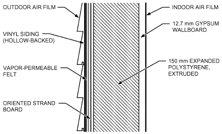

*Fig. 1 Structural Insulated Panel Assembly (Example 1)*

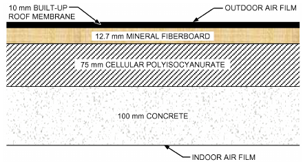

*Fig. 2 Roof Assembly (Example 2)*

| Element | R, (m<sup>2</sup>·K)/W |
|---|---|
| 1. Indoor air film | 0.16 |
| 2. 100 mm concrete, 1920 kg/m<sup>3</sup>,k = 1.1 | 0.09 |
| 3. 75 mm cellular polyisocyanurate (gasimpermeable facers) | 4.97 |
| 4. 25 mm mineral fiberboard | 0.52 |
| 5. 10 mm built-up roof membrane | 0.06 |
| 6. Outdoor air film | 0.04 |
| Total | 5.83 |

Using U<sub>Assembly</sub> = 1/R<sub>Assembly</sub>, the U<sub>Assembly</sub>-factor is 0.17 W/(m<sup>2</sup>·K).

### Attics

During sunny periods, unconditioned attics may be hotter than outdoor air. Peak attic temperatures on a hot, sunny day may be 10 to 45 K above outdoor air temperature, depending on factors such as shingle color, roof framing type, air exchange rate through vents, and use of radiant barriers. Therefore, simple one-dimensional solutions cannot be offered for attics. Energy efficiency estimates can be obtained using models such as Wilkes (1991).

### Basement Walls and Floors

Heat transfer through basement walls and floors to the ground depends on the following factors: (1) the difference between the air temperature in the room and that of the ground and outside air, (2) the material of the walls or floor, and (3) the thermal conductivity of surrounding earth. The latter varies with local conditions and is usually unknown. Because of the great thermal inertia of surrounding soil, ground temperature varies with depth, and there is a substantial time lag between changes in outdoor air temperatures and corresponding changes in ground temperatures. As a result, ground-coupled heat transfer is less amenable to steady-state representation than above-grade building elements. However, there are several simplified procedures for estimating ground-coupled heat transfer. These fall into two main categories: (1) those that reduce the ground heat transfer problem to a closed-form solution, and (2) those that use simple regression equations developed from statistically reduced multidimensional transient analyses.

Closed-form solutions, including Latta and Boileau’s (1969) procedure discussed in Chapter 17, generally reduce the problem to one-dimensional, steady-state heat transfer. These procedures use simple, “effective” U-factors or ground temperatures or both. Methods differ in the various parameters averaged or manipulated to obtain these effective values. Closed-form solutions provide acceptable results in climates that have a single dominant season, because the dominant season persists long enough to allow a reasonable approximation of steady-state conditions at shallow depths. The large errors (percentage) that are likely during transition seasons should not seriously affect building design decisions, because these heat flows are relatively insignificant compared to those of the principal season.

The ASHRAE arc-length procedure (Latta and Boileau 1969) is a reliable method for wall heat losses in cold winter climates. Chapter 17 discusses a slab-on-grade floor model developed by one study. Although both procedures give results comparable to transient computer solutions for cold climates, their results for warmer U.S. climates differ substantially.

Research conducted by Dill et al. (1945) and Hougten et al. (1942) indicates a heat flow of approximately 6.3 W/m<sup>2</sup> through an uninsulated concrete basement floor with a temperature difference of 11 K between the basement floor and the air 150 mm above it. A U-factor of 5.7 W/(m<sup>2</sup>·K) is sometimes used for concrete basement floors on the ground. For basement walls below grade, the temperature difference for winter design conditions is greater than for the floor. Test results indicate that, at the mid-height of the below-grade portion of the basement wall, the unit area heat loss is approximately twice that of the floor.

<!-- str. 759 -->

For small concrete slab floors (equal in area to a 7.5 by 7.5 m house) in contact with the ground at grade level, tests indicate that heat loss can be calculated as proportional to the length of exposed edge rather than total area. This amounts to 1.4 W per linear metre of exposed edge per degree temperature difference between indoor air and the average outdoor air temperature. This value can be reduced appreciably by installing insulation under the ground slab and along the edge between the floor and abutting walls. In most calculations, if the perimeter loss is calculated accurately, no other floor losses need to be considered. Chapters 17 and 18 contain heat transfer and load calculation guidance for floors on grade and at different depths below grade.

The second category of simplified procedures uses transient two-dimensional computer models to generate ground heat transfer data, which are then reduced to compact form by regression analysis (Mitalas 1982, 1983; Shipp 1983). These are the most accurate procedures available, but the database is very expensive to generate. In addition, these methods are limited to the range of climates and constructions specifically examined. Extrapolating beyond the outer bounds of the regression surfaces can produce significant errors.

Guide details and recommendations related to application of concepts for basements are provided in Chapter 45 of the 2019 ASHRAE Handbook—HVAC Applications. Detailed analysis of heat transfer through foundation insulation may also be found in the Building *Foundation Design Handbook* (Labs et al. 1988).

## 1.2 TWO-DIMENSIONAL ASSEMBLY U-FACTOR CALCULATION

The following examples show three methods of two-dimensional, steady-state conductive heat transfer analysis through wall assemblies. They offer approximations to overall rates of heat transfer (U-factor) when assemblies contain a layer composed of dissimilar materials. The methods are described in Chapter 25. The **parallel- path method** is used when the thermal conductivity of the dissimilar materials in the layer are rather close in value (within the same order of magnitude), as with wood-frame walls. The **isothermal-planes method** is appropriate for materials with conductivities moderately different from those of adjacent materials (e.g., masonry). The **zone method** and the **modified zone method** are appropriate for materials with a very high difference in conductivity (two orders of magnitude or more), such as with assemblies containing metal.

Two-dimensional, steady-state heat transfer analysis is often conducted using computer-based finite difference methods. If the resolution of the analysis is sufficiently fine, computer methods provide better simulations than any of the methods described here, and the results typically show better agreement with measured values.

The methods described here do not take into account heat storage in the materials, nor do they account for varying material properties (e.g., when thermal conductivity is affected by moisture content or temperature). Transient analysis is often used in such cases.

### Wood-Frame Walls

The assembly R-values and U-factors of wood-frame walls can be calculated by assuming either parallel heat flow paths through areas with different thermal resistances or by assuming isothermal planes. Equation (15) in Chapter 25 provides the basis for the two methods.

The **framing factor** expresses the fraction of the total building component (wall or roof) area that is framing. The value depends on the specific type of construction, and may vary based on local construction practices, even for the same type of construction. For stud walls 400 mm on center (OC), the fraction of insulated cavity may be as low as 0.75, where the fraction of studs, plates, and sills is 0.21 and the fraction of headers is 0.04. For studs 600 mm OC, the respective values are 0.78, 0.18, and 0.04. These fractions contain an allowance for multiple studs, plates, sills, extra framing around windows, headers, and band joists. These assumed framing fractions are used in Example 3, to illustrate the importance of including the effect of framing in determining a building’s overall thermal conductance. The actual framing fraction should be calculated for each specific construction.

**Example 3.** Calculate the U<sub>Assembly</sub>-factor of the 38 by 90 mm stud wall shown in Figure 3. The studs are at 400 mm OC. There is 90 mm mineral fiber batt insulation (R-2.3) in the stud space. The inside finish is 13 mm gypsum wallboard, and the outside is finished with rigid foam insulating sheathing (R-0.7) and vinyl siding. The insulated cavity occupies approximately 75% of the transmission area; the studs, plates, and sills occupy 21%; and the headers occupy 4%.

**Solution:** If the R-values of building elements are not already specified, obtain the R-values from Tables 1 and 3 of Chapter 26. Assume R = 7.0 (m<sup>2</sup>·K)/W for the wood framing. Also, assume the headers are solid wood, and group them with the studs, plates, and sills.

Two simple methods may be used to determine the U-factor of wood frame walls: parallel path and isothermal planes. For highly conductive framing members such as metal studs, the modified zone method must be used.

Parallel-Path Method:

| Element | R (Insulated Cavity), (m<sup>2</sup>·K)/W | R (Studs, Plates, and Headers), (m<sup>2</sup>·K)/W |
|---|---|---|
| 1. Outdoor air film, 6.7 m/s wind | 0.03 | 0.03 |
| 2. Vinyl siding (hollow-backed) | 0.11 | 0.11 |
| 3. Rigid foam insulating sheathing | 0.70 | 0.70 |
| 4. Mineral fiber batt insulation, 90 mm | 2.30 | — |
| 5. Wood stud, nominal 38 by 90 mm | — | 0.77 |
| 6. Gypsum wallboard, 13 mm | 0.08 | 0.08 |
| 7. Indoor air film, still air | 0.12<br>R<sub>1</sub> = 3.31 | 0.12<br>R<sub>2</sub> = 1.81 |

Individual U-factors are reciprocals of the R-value, so U<sub>1</sub> = 0.301 2

and U<sub>2</sub> = 0.553 W/(m ·K). If the wood framing is accounted for using the parallel-path flow method, the wall’s U-factor is determined using Equation (15) from Chapter 25. The fractional area of insulated cavity is 0.75 and the fractional area of framing members is 0.25.

U<sub>Assembly</sub> = (0.75 × 0.301) + (0.25 × 0.553) = 0.36 W/(m<sup>2</sup>·K)

> R<sub>Assembly</sub> =1/U<sub>Assembly</sub> = 2.78 (m<sup>2</sup>·K)/W

With the isothermal-planes method, the fractional areas are applied only to the building layer that contains the studs and cavity-fill insulation. The average R-value for this layer (R<sub>avs</sub>) is added to the R-values of the other components for a total R for the assembly.

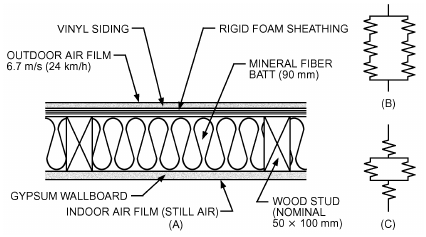

*Fig. 3 (A) Wall Assembly for Example 3, with Equivalent Electrical Circuits: (B) Parallel Path and (C) Isothermal Planes*

<!-- str. 760 -->

Isothermal-Planes Method:

| Element | (Stud Cavity Average Cavity,<br>R Elements), (m<sup>2</sup>·K)/W | (Stud Cavity Average Cavity,<br>R (Studs, Plates, and Headers), (m<sup>2</sup>·K)/W |
|---|---|---|
| 1. Outdoor air film, 6.7 m/s wind |  | 0.03 |
| 2. Vinyl siding (hollow-backed) |  | 0.11 |
| 3. Rigid foam insulating sheathing |  | 0.70 |
| 4. Mineral fiber batt insulation, 90 mm | 2.30 | 1.54 (R<sub>avs</sub>) |
| 5. Wood stud, nominal 38 by 90 mm | 0.77 |  |
| 6. Gypsum wallboard, 13 mm |  | 0.08 |
| 7. Indoor air film, still air |  | 0.12<br>R<sub>T</sub> = 2.58 |

The average R-value R<sub>avs</sub> of the stud cavity is calculated using the fractional area of stud and insulation using Equation (15) from Chapter 25. U<sub>avs</sub> = 0.75(1/2.3) + 0.25(1/0.77) = 0.651 R<sub>avs</sub> = 1/U<sub>avs</sub> = 1.54 (m<sup>2</sup>·K)/W If the wood framing is included using the isothermal-planes method, the U-factor of the wall is determined using Equations (10) and (11) from Chapter 25 as follows: R<sub>Assembly</sub> = 2.58 (m<sup>2</sup>·K)/W U<sub>Assembly</sub> = 1/R<sub>Assembly</sub> = 0.388 W/(m<sup>2</sup>·K) For a frame wall with a 600 mm OC stud space, the assembly R-value is 2.76 (m<sup>2</sup>·K)/W. Similar calculation procedures may be used to evaluate other wall designs, except those with thermal bridges.

### Masonry Walls

The average overall R-values of masonry walls can be estimated by assuming a combination of layers in series, one or more of which provides parallel paths. This method is used because heat flows laterally through block face shells so that transverse isothermal planes result. Average total resistance R is the sum of the resistances

> Assembly

of the layers between such planes, each layer calculated as shown in Example 4.

**Example 4.** Calculate the overall thermal resistance and average U-factor of the 194 mm thick insulated concrete block wall shown in Figure 4. The two-core block has an average web thickness of 25 mm and a face shell thickness of 32 mm. Overall block dimensions are 194 by 194 by 395 mm. Measured thermal resistances of 1700 kg/m<sup>3</sup> concrete and 110 kg/m<sup>3</sup> expanded perlite insulation are 0.70 and 20 (m<sup>2</sup>·K)/W, respectively. (Note: This type of insulation is no longer commonly used with concrete block walls. This historical example has been retained because it is a simplified case with supporting experimental data.)

**Solution:** The equation used to determine the overall thermal resistance of the insulated concrete block wall is derived from Equations (7) and (15) from Chapter 25 and is given below:

- U<sub>Avg</sub> = a<sub>w</sub>/R<sub>w</sub> + a<sub>c</sub>/R<sub>c</sub> R<sub>Avg</sub> = 1/(U Avg)
- R<sub>Assembly</sub> = R<sub>i</sub> + R<sub>f</sub> + *R<sub>avg</sub> + R<sub>o</sub>* where
- R<sub>T(av)</sub> = overall thermal resistance based on assumption of isothermal planes
- R<sub>i</sub> = thermal resistance of inside air surface film (still air)
- R<sub>o</sub> = thermal resistance of outside air surface film (6.7 m/s wind)
- R<sub>f</sub> = total thermal resistance of face shells
- R<sub>c</sub> = thermal resistance of cores between face shells
- R<sub>w</sub> = thermal resistance of webs between face shells
- a<sub>w</sub> = fraction of total area transverse to heat flow represented by webs of blocks
- a<sub>c</sub> = fraction of total area transverse to heat flow represented by cores of blocks

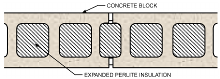

*Fig. 4 Insulated Concrete Block Wall (Example 4)*

From the information given and the data in Tables 1 and 3 in Chapter 26, determine the values needed to compute the overall thermal resistance.

R<sub>i</sub> = 0.12

R<sub>o</sub> = 0.03

R<sub>f</sub> = 2 × 0.032 × 0.70 = 0.045

R<sub>c</sub> = (0.194 − 2 × 0.032) × 20 = 2.60

R<sub>w</sub> = (0.194 − 2 × 0.032) × 0.70 = 0.091 a<sub>w</sub> = 3 × 25/395 = 0.190 a<sub>c</sub> = 1 − 0.190 = 0.810

Using the equation given, the overall thermal resistance and average U-factor are calculated as follows:

- U<sub>avs</sub> = 0.190/0.09 + 0.810/2.60 = 2.42
- R<sub>avs</sub> = 1/U<sub>avs</sub> = 0.413 (m<sup>2</sup>·K)/W
- R<sub>Assembly</sub> = 0.12 + 0.045 + 0.413 + 0.03 = 0.608 (m<sup>2</sup>·K)/W
- U<sub>Assembly</sub> = 1/R<sub>Assembly</sub> = 1.64 W/(m<sup>2</sup>·K)

Based on guarded hot-box tests of this wall without mortar joints, Tye and Spinney (1980) measured the assembly R-value for this insulated concrete block wall as 0.551 (m<sup>2</sup>·K)/W.

Assuming parallel heat flow only, the calculated resistance is higher than that calculated on the assumption of isothermal planes. The actual resistance generally is some value between the two calculated values. In the absence of test values, examination of the construction usually reveals whether a value closer to the higher or lower calculated R-value should be used. Generally, if the construction contains a layer in which lateral conduction is high compared with transmittance through the construction, the calculation with isothermal planes should be used. If the construction has no layer of high lateral conductance, the parallel heat flow calculation should be used.

Hot-box tests of insulated and uninsulated masonry walls constructed with block of conventional configuration show that thermal resistances calculated using the isothermal planes heat flow method agree well with measured values (Shu et al. 1979; Valore 1980; Van Geem 1985). Neglecting horizontal mortar joints in conventional block can result in thermal transmittance values up to 16% lower than actual, depending on the masonry’s density and thermal properties, and 1 to 6% lower, depending on the core insulation material (McIntyre 1984; Van Geem 1985). For aerated concrete block walls, other solid masonry, and multicore block walls with full mortar joints, neglecting mortar joints can cause errors in R-values up to 40% (Valore 1988). Horizontal mortar joints, usually found in concrete block wall construction, are neglected in Example 4.

### Constructions Containing Metal

Curtain and metal stud-wall constructions often include metallic and other thermal bridges, which can significantly reduce the thermal resistance. However, the capacity of the adjacent facing materials to transmit heat transversely to the metal is limited, and some contact resistance between all materials in contact limits the reduction. Contact resistances in building structures are only 0.01 to 0.1 (m<sup>2</sup>·K)/W, too small to be of concern in many cases. For these metal stud/wall constructions, the recommended approach is the modified zone method (see Example 7) or two-dimensional analysis software such as THERM.

<!-- str. 761 -->

Thermal characteristics for panels of sandwich construction can be computed by combining the thermal resistances of the layers. R-values for assembled sections should be determined on a representative sample by using a hot-box method. If the sample is a wall section with air cavities on both sides of fibrous insulation, the sample must be of representative height because convective airflow can contribute significantly to heat flow through the test section. Computer modeling can also be useful, but all heat transfer mechanisms must be considered.

The metal studs in Example 5 are 90 mm deep and placed at 400 mm on center. The metal member is only 0.5 mm thick, but it is in contact with adjacent facings over a 32 mm wide area. The steel member is 32 mm deep, has a thermal resistance of approximately 0.0019 (m<sup>2</sup>·K)/W, and is virtually isothermal.

For this insulated steel frame wall, Farouk and Larson (1983) measured an assembly R-value of 1.16 (m<sup>2</sup>·K)/W. For the same assembly, the recommended modified zone method (see Example 5) gives an assembly R-value of 1.18 (m<sup>2</sup>·K)/W. Two-dimensional analysis (THERM) yields U<sub>av</sub> = 1.0 or R = 1.00 (m<sup>2</sup>·K)/W. ASHRAE/IES Standard 90.1 describes how to determine the thermal resistance of wall assemblies containing metal framing by using insulation/framing adjustment factors in Table A9.2B of the standard. For 38 by 90 mm steel framing, 400 mm OC, F = 0.50. Using

> c

the correction factor method, an assembly R-value of 1.13 (m<sup>2</sup>·K)/W [0.08 + 1.94(0.50) + 0.08] is obtained for the wall described here.

### Zone Method of Calculation

For structures with widely spaced metal members of substantial cross-sectional area, the isothermal planes method can give thermal resistance values that are too low. For these constructions, the **zone method** can be used. This method involves two separate computations: one for a chosen limited portion, zone A, containing the highly conductive element; the other for the remaining portion of simpler construction, zone B. The two computations are then combined using the parallel-flow method, and the average transmittance per unit overall area is calculated. The basic laws of heat transfer are applied by adding the area conductances CA of elements in parallel, and adding area resistances R/A of elements in series. The modified zone method improves on the zone method with better guidance for defining the widths of zones A and B.

### Modified Zone Method for Metal Stud Walls

**with Insulated Cavities**

The modified zone method is similar to the parallel-path and zone methods; all three are based on parallel-path calculations. Figure 5 shows the width w of the zone of thermal anomalies around a metal stud. This zone can be assumed to equal the length of the stud flange L (parallel-path method), or can be calculated as a sum of the length of stud flange and a distance double that from wall surface to metal Σd (zone method). In the modified zone method,

> i

the width of the zone depends on three parameters:

- Ratio between thermal resistivity of sheathing material and cavity insulation
- Size (depth) of stud
- Thickness of sheathing material

**Example 5.** Calculate the U-factor of the wall section shown in Figure 5 using the modified zone method.

**Solution:** The wall cross section is divided into two zones: the zone of thermal anomalies around the metal stud (zone W), and the cavity zone (zone cav). Wall material layers are grouped into exterior and interior surface sections A (sheathing, siding) and B (wallboard), and interstitial sections I and II (cavity insulation, metal stud flange).

Assuming that the wall materials in section A are thicker than those in section B, as shown, they can be described as follows:

> n m
>
> ∑ i ∑ j

> d ≥ d
>
> i=1 j=1

where

- n = number of material layers (of thickness d<sub>i</sub>) between metal stud flange and wall surface for section A
- m = number of material layers (of thickness d<sub>j</sub>) for section B

Then, the width W of zone W can be estimated by

> n
>
> f∑ i

> W = L + z d
>
> i=1

where

- L = stud flange size
- d<sub>i</sub> = thickness of material layers in section A
- z<sub>f</sub> = zone factor, shown in Figure 6 (z<sub>f</sub> = 2 for zone method) Kosny and Christian (1995) developed the modified zone method and verified its accuracy for over 200 simulated cases of metal frame walls with insulated cavities. For all configurations considered, the discrepancy between results were within ±2%. Hot-box-measured R-values for 15 metal stud walls tested by Barbour et al. (1994) were compared with results obtained by Kosny and Christian (1995) and McGowan and Desjarlais (1997). The modified zone method was found to be the most accurate simple method for estimating the clear-wall R-value of light-gage steel stud walls with insulated cavities. However, this analysis does not apply to construction with metal sheathing. Also, ASHRAE Standard 90.1 may require a different method of analysis.

**Step 1.** Determine zone factor z<sub>f</sub>, and the ratio of the exterior sheathing material’s resistivity to the cavity material’s resistivity. Resistivity r is the reciprocal of conductivity; Table 1 in Chapter 26 lists conductivities of various materials.

| Element | Symbol | Value | Units |
|---|---|---|---|
| Stud spacing | s | 0.406 | m |
| Resistivity of sheathing material | r<sub>i</sub> | 34.67 | (m·K)/W |
| Resistivity of cavity insulation | r<sub>ins</sub> | 23.92 | (m·K)/W |
| Ratio r<sub>i</sub>/r<sub>ins</sub> |  | 1.449 | (no units) |
| Zone factor from chart | z<sub>f</sub> | 1.71 | (no units) |

**Step 2.** Calculate width W of affected zone W:

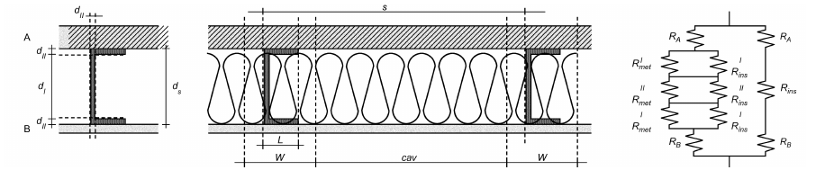

*Fig. 5 Wall Section and Equivalent Electrical Circuit (Example 5)*

<!-- str. 762 -->

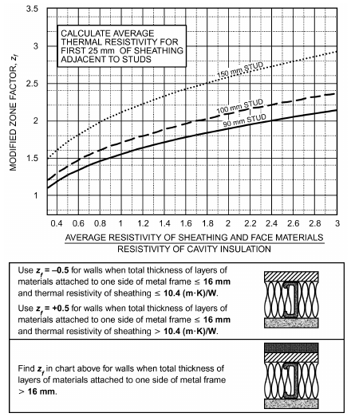

*Fig. 6 Modified Zone Factor for Calculating R-Value of Metal Stud Walls with Cavity Insulation*

> ∑ i
>
> W = L + z<sub>f</sub> d

```text
Element                                Symbol    Value   Units
Cavity thickness                          d_s    0.089     m
Thickness of metal                        d_II   0.0010    m
Interior dimension between flanges        d_I    0.088     m
Thickness of exterior insulating materials       0.051     m
Flange length                             L      0.038     m
Affected zone thickness                   W      0.125     m
  Step 3. Calculate the exterior and interior thermal resistances, using
conductivity or thermal resistance values from step 1.
Element                          Symbol   Value      Units
Exterior materials
 Thickness of first exterior material d_e 0.0381       m
 Resistivity of first exterior material r_e 34.7    (m·K)/W
 Resistance of first material              1.32    (m^2·K)/W
 Resistances of other materials           0.145
 Sum of resistances of exterior    R_A     1.47    (m^2·K)/W
   materials
Interior materials
 Thickness of interior material     d_j  0.00127       m
 Resistivity of interior material   r_j    6.24     (m·K)/W
 Resistance of interior material   R_B    0.043    (m^2·K)/W
  Step 4. Calculate the thermal resistance of the sections in zone
around the metal element. The building elements in series from outside
to inside are shown in Figure 7.
Element                  Symbol      Value          Units
Resistivity of steel       r_met     0.0208        (m·K)/W
R_i^I_ns                   d_x^I_ri   2.10        (m^2·K)/W
R_i^I_n^I_s               d_x^II_ri  0.024        (m^2·K)/W
R_m^I_et                  d_x^I_rmet 0.00183      (m^2·K)/W
R_m^II_et                d_x^II_rmet 0.00002      (m^2·K)/W
```

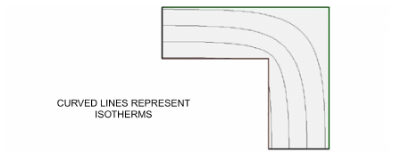

*Fig. 7 Corner Composed of Homogeneous Material Showing Locations of Isotherms*

The particular thermal resistances of the zone elements are then calculated.

Zone W is the zone at the web of the metal member. For width W, the thermal conductance C is calculated as the sum of the contributory areas. Because the thickness of the web of the metal member is d<sub>I</sub> and the length along the flange section is L,

> C<sub>I</sub> = (W – d<sub>I</sub>)/W C<sub>ins</sub>+ d<sub>I</sub>/WC<sub>met</sub> and C<sub>II</sub> = (W – L)/WC<sub>ins</sub>+ L/WC<sub>met</sub>

Using resistance rather than conductance, the contributing R-values are calculated as R<sub>I</sub> = (I I *R R W* met ins)/(*I I I* d (R – R ) + WR *I ins met met*) and R<sub>II</sub> = (II II *R R W* met ins)/(*II II II* L(R – R ) + WR *ins met met*)

> At the cavity, the sum of the series R-values is
>
> R <sub>v</sub> = R<sub>A</sub>+ R<sub>B</sub>+ R<sub>i</sub><sup>I</sup><sub>ns</sub>+ 2R<sub>i</sub><sup>I</sup><sub>n</sub><sup>I</sup><sub>s</sub>

> ∑ ca
>
> In zone W, the sum of the R-values is

> ∑ W
>
> R = R<sub>A</sub>+ R<sub>B</sub>+ R<sub>I</sub>+ 2R<sub>II</sub>

The total conductivity across the length s is proportional to the contributing lengths of zone W and the cavity:

- C<sub>tot</sub> = W/sC<sub>W</sub>+ cav/sC<sub>cav</sub> or

> R<sub>tot</sub> = (*R R s* ∑ W∑ cav)/(( – ) W ∑R ∑R + s∑R<sub>W</sub> ( <sup>cav W</sup>))

| Element | Symbol | Value | Units |
|---|---|---|---|
| Resistance at web | R<sub>I</sub> | 0.203 | (m<sup>2</sup>·K)/W |
| Resistance at flange | R<sub>II</sub> | 0.00007 | (m<sup>2</sup>·K)/W |
| Sum of resistances at cavity | ΣR<sub>cav</sub> | 3.66 | (m<sup>2</sup>·K)/W |
| Sum of resistances at zone W | ΣR<sub>W</sub> | 1.713 | (m<sup>2</sup>·K)/W |
| Assembly R | R<sub>Assembly</sub> | 2.71 | (m<sup>2</sup>·K)/W |
| Assembly U | U<sub>Assembly</sub> | 0.369 | W/(m<sup>2</sup>·K) |

In this example, the calculated total R-value for the wall is 2.71 (m<sup>2</sup>·K)/W, and the wall’s U-factor is 0.369 W/(m<sup>2</sup>·K).

### Complex Assemblies

Building enclosure geometry of two- and three-dimensional assemblies may be complex, including corners, terminations of materials, and junctures of different materials. Such assemblies cannot be analyzed effectively with explicit calculations; rather, they require iterative calculations using computers. These calculations have been made for a number of common assemblies (Hershfield 2011), and the results can be applied within a simpler estimation method, as shown in Example 6.

Buildings with thermal mass or other forms of thermal storage require dynamic models to evaluate their performance in the environmental climate of interest.

<!-- str. 763 -->

Figure 7 shows a corner composed of homogeneous material. Surface temperatures can be estimated from the intersections of isotherms and the surface. If, in this figure, the interior were warm with respect to outside, then the line at the corner would be colder than the remainder of the interior surface. This effect may be exacerbated by the air film at the corner, which has a greater effective thickness than on the plane of the wall, and therefore offers greater thermal resistance, further lowering the corner temperature.

Figure 8 shows an insulating material applied to a conductive material. Insulation is placed at the inside, during a period of cold outdoor temperatures. A computer program may be used to trace the isotherms. The interior isotherm is cut where the insulating material is interrupted, indicating lowered temperature at that location (point A). In fact, the temperature at the edge of the interrupted insulation is even lower than that at the surface of the uninsulated wall. Interruptions in insulation can lead to thermal bridges. For this reason, insulating conductive assemblies such as masonry or concrete is often more successful when applied to the outside rather than to the inside of the building.

**Example 6**. Comparing Linear Transmittance Method to Area-Weighted Method for Brick Veneer Shelf Angle Anomaly.

Calculate the overall U-value of the steel-stud brick veneer assembly with a slab and shelf angle with exterior insulation R-15 (2.6 RSI) and interior stud cavity insulation R-12 (2.1 RSI) (see Figure 9), using the following information and method:

- Gross wall height = 2.7 m
- Gross wall length = 15.2 m

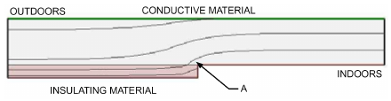

*Fig. 8 Insulating Material Installed on Conductive Material, Showing Temperature Anomaly (Point A) at Insulation Edge*

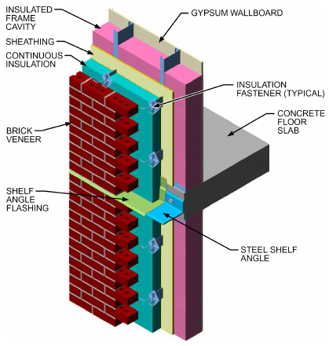

*Fig. 9 Brick Veneer Shelf for Example 6*

> Gross wall area = 41.0 m

Area-Weighted Method. The thermal transmittance U<sub>b</sub> for the area around the shelf angle is 1.162 W/(m<sup>2</sup>·K) for the effective lengths L<sub>1</sub>= 205 mm, L<sub>2</sub> = 619 mm, and U<sub>o</sub> = 0.287 W/(m<sup>2</sup>·K). [Area thermal transmittance depends on the definition of the effective lengths (Hershfield 2011). This calculation is not shown here.]

Calculate area for the thermal anomaly and area for the clear field:

> A<sub>b</sub> =0.619 m × 15.2 m = 9.4 m<sup>2</sup> A<sub>o</sub> = 41.0 – 9.4 = 31.6 m<sup>2</sup>
>
> Calculate the overall U-value:

- U = ((U<sub>b</sub>A<sub>b</sub>+ U<sub>o</sub>A<sub>o</sub>))/(A total) = ((1.162 × 9.4 + 0.287 × 31.6))/41 = 0.49 W/m<sup>2</sup>·K)

*Linear Transmittance Method.* From Appendix F of RP-1365, for this brick veneer assembly, U<sub>o</sub> = 0.287 W/(m<sup>2</sup>·K) and the linear transmittance Ψ of a slab with a shelf angle for this assembly is 0.544 W/(m·K).

> Calculate the overall U-value

ΨL/(A total) U = ΨL/(A total) + U<sub>o</sub> = 0.544 × 15.2/41 + 0.29 = 0.49 W/(m<sup>2</sup>·K)

This example illustrates the simplicity of the linear transmittance method compared to the area-weighted method for thermal anomalies in opaque building envelope assemblies. The amount of information that must be provided is reduced and the calculation is simpler. The weighted average method is further complicated for a whole-building elevation when accounting for 3D intersections. Some [e.g., Kemp (1997)] suggest that the overlapping effects be combined using mitered corners.

### Windows and Doors

Table 4 of Chapter 15 lists U-factors for various fenestration products. For heat transmission coefficients for wood and steel doors, see Table 6 in Chapter 15. All U-factors are approximate, because a significant portion of the resistance of a window or door is contained in the air film resistances, and some parameters that may have important effects are not considered. For example, the listed U-factors assume the surface temperatures of surrounding bodies are equal to the ambient air temperature. However, the indoor surface of a window or door in an actual installation may be exposed to nearby radiating surfaces, such as radiant heating panels, or opposite walls with much higher or lower temperatures than the indoor air. Air movement across the surface of a window or door, such as that caused by nearby heating and cooling outlet grilles or by wind outdoors, increases the U-factor.

## 2. MOISTURE TRANSPORT

The following examples build on the previous sections by discussing methods that combine heat and moisture transport analysis. The theory of hygrothermal analysis is described in Chapter 25. The methods include fundamental calculations that can be performed by hand as well as more advanced transient calculations that require computer modeling. A few simplified examples are presented here to aid in understanding these multimode, dynamic transport cases. These examples are simplified so that they can be explicitly calculated by assuming steady-state conditions, thus neglecting all storage phenomena. For other examples of explicit methods, see the Bibliography.

## 2.1 WALL WITH INSULATED SHEATHING

For an initial assessment of the impact of including any materials with low water vapor permeability in a building assembly, estimate the condensation resistance using a simplified moisture analysis. This simplified analysis assumes that interior surfaces may have little or no resistance to air or vapor flow, assumes steady-state conditions, and neglects the effect of radiative heat transfer on the exposed surfaces. The section on Surface Condensation in Chapter 25 describes how to determine the risk of condensation on lowpermeability surfaces.

<!-- str. 764 -->

**Example 7.** For the assembly shown in Figure 3 (but assume the wall has a thicker layer of mineral wool insulation, per following table), determine the range of indoor relative humidity for which condensation does not occur on the inside of the insulating sheathing. Assume a design outdoor temperature of –1°C, and indoor temperature of 21°C. Assume that the cavity air is at the same vapor pressure as the indoor air, which can occur with openings through the wallboard. Ignore radiant effects on the wall exterior. Assume the rigid insulation is vapor impermeable, and interior materials have little resistance to air or vapor flow.

| Air Film or Material | Air Film or Material | Thermal Resistance, (m<sup>2</sup>·K)/W |
|---|---|---|
| 1. | Indoor air film coefficient | 0.12 |
| 2. | Gypsum wallboard | 0.08 |
| 3. | Mineral fiber insulation | 3.34 |
| 4. | 25 mm extruded polystyrene | 0.88 |
| 5. | OSB sheathing, 13 mm | 0.12 |
| 6. | Vinyl siding (hollow backed) | 0.107 |
| 7. | Exterior air film coefficient | 0.03 |
|  | Assembly R-value | 4.68 |

**Solution:** The temperature difference is 22 K. The sum of the R-values from the foam/mineral fiber interface inward is 3.54 (m<sup>2</sup>·K)/W. The sum of the R-values from that interface outward is 1.14 (m<sup>2</sup>·K)/W. The temperature difference ratio [Equation (14), Chapter 25] is 1.14/4.68, or –0.24. The interface temperature is 4.3°C. The saturation vapor pressure of indoor air is 2476 Pa, and the saturation vapor pressure at the interface is 831 Pa (see Chapter 1). The upper bound for indoor relative humidity is therefore 831/2476, or 34% rh. (Another way to approach this problem would be to assume a given relative humidity within the indoor space and determine the range of outdoor temperatures for which condensation would not occur at this location.)

Many factors influence the likelihood (or not) of damage in an assembly such as this with exterior rigid insulation. Solar effects generally ensure a period of high temperatures that allows drying, so a design based on this result alone may be overly conservative. On the other hand, cold sky temperatures may increase heat loss from the assembly, which lowers the surface temperature below ambient, so a design based on this result alone may be subject to moisture damage. Even when indoor humidity is high enough that condensation at the interface is indicated, the rate of water formation may be slowed by airtightness at the wallboard and by vapor diffusion protection. In light of these dynamic effects, the analyst must consider the number of hours at which condensation could occur without damaging the assembly. The varying nature of the boundary conditions, as well as the storage capability of the assembly materials, lead to the need for more comprehensive dynamic evaluations (ASHRAE Standard 160).

## 2.2 VAPOR PRESSURE PROFILE

> **(GLASER OR DEW-POINT) ANALYSIS**

The historical steady-state one-dimension tool for evaluating moisture accumulation and drying within exterior envelopes (walls, roofs, and ceilings) is the dew-point or Glaser method. With the increasing prominence of transient modeling tools, much more accurate estimates of temperature and humidity can be achieved than were possible using steady-state analysis. Users should recognize the limitations of the steady-state approach, which include the following:

- Condensation is a phase change from vapor to liquid. As long as relative humidity in the pores of hygroscopic, capillary-porous building materials stays below 100%, vapor does not condense but is adsorbed as hygroscopic moisture or absorbed as liquid.

Only once moisture content at the surface touches the capillary maximum will vapor condense on that surface. The dew-point method results have often been interpreted to indicate condensation, when, in fact, increases in moisture content were through sorption or absorption, not visible condensation at the surface.

- Heat and moisture storage effects are not included in a dew-point analysis. Experience shows they play a significant role in heat and moisture performance of assemblies. To account for storage, it is recommended to use average values (e.g., monthly average temperature) rather than more extreme design temperatures.
- Diffusion is the only moisture transport mechanism considered. Airflow, capillary transport, rain wetting, initial conditions, latent effects, solar effects, and ventilation cannot or only approximately can be included in the method. They may have a dominant effect on building assembly performance.
- The dew-point method allows calculation of a rate of moisture accumulation or rate of drying from a critical location within the assembly. However, the method does not allow estimating damage associated with any rate of accumulation or drying.

The method is presented here for reasons of historical continuity, and because it serves as an illustration of the principles of heat conduction and vapor diffusion. However, the dew-point method is not recommended as a sole basis for hygrothermal design of building envelope assemblies. ASHRAE Standard 160 is recommended to assist in hygrothermal analysis for design purposes.

### Winter Wall Wetting Examples

**Example 8.** For a wood-framed wall, assume monthly mean conditions of 21°C, 40% rh indoors and –6.6°C, 50% rh outdoors. Indoor and outdoor vapor pressures are 995 and 175 Pa, respectively.

**Solution:**

**Step 1.** List the components in the building assembly, with their R-values and permeances.

| Air Film or Material | Air Film or Resistance, Material | Resistance,<br>Thermal (m<sup>2</sup>·K)/W | Proportional Temperature Drop | Vapor Permeance, ng/(s·m<sup>2</sup>·Pa) | Vapor Diffusion Resistance, (Pa·s·m<sup>2</sup>)/ng | Proportional Vapor Pressure Drop |
|---|---|---|---|---|---|---|
| 1 | Surface film coefficient | 0.12 | 0.050 | 9200 | 0.000109 | 0.003 |
| 2 | Gypsum board, painted, cracked joints | 0.08 | 0.033 | 290 | 0.00345 | 0.088 |
| 3 | Insulation, mineral fiber | 1.90 | 0.785 | 1700.0 | 0.00059 | 0.015 |
| 4 | Plywood sheathing | 0.11 | 0.045 | 29 | 0.03448 | 0.881 |
| 5 | Wood siding | 0.18 | 0.074 | 2010 | 0.00050 | 0.013 |
| 6 | Surface film coefficient | 0.03 | 0.012 | 57000 | 0.00002 | 0.000 |
|  | Total | 2.42 | 1.000 |  | 0.03914 | 1.000 |

**Step 2.** List the indoor and outdoor temperature and relative humidity. Vapor pressure at indoor and outdoor locations is determined by multiplying the saturation vapor pressure at that temperature by the relative humidity.

**Step 3.** Calculate the proportional temperature drop across each layer. The temperature drop is proportional to the R-value:

- (Δt layer)/(t<sub>i</sub>– t<sub>o</sub>) = (R layer)/R<sub>T</sub>

The table in step 1 lists the resulting proportional temperature drops. Calculate the proportional water vapor pressure drops across each layer. These are calculated the same way as the proportional temperature drops in step 1:

<!-- str. 765 -->

> (Δp layer)/(p<sub>i</sub>– p<sub>o</sub>) = (Z layer)/Z<sub>T</sub>

where

- Z<sub>T</sub> = total water vapor diffusion resistance of wall (sum of diffusion resistances of all layers), (Pa·s·m<sup>2</sup>)/ng
- p = partial water vapor pressure, Pa pressure at that interface (see the corrected vapor pressure column in step 3).

| Boundary or Interface Between Materials | Tempera ture, °C | Saturation Vapor Pressure, Pa | Rel. Hum., % | Initial Vapor Pressure, Pa | Corrected Vapor Pressure, Pa |
|---|---|---|---|---|---|
| Indoor air | 21 | 2488 | 40 | 995 | 995 |
| 5-6 interface | 19.6 | 2286 |  | 993 | 760 |
| 4-5 interface | 18.7 | 2161 |  | 921 | 756 |
| 3-4 interface | –2.9 | 478 |  | 908 | 478 |
| 2-3 interface | –4.2 | 430 |  | 186 | 430 |
| 1-2 interface | –6.3 | 361 |  | 175 | 183 |
| Outdoor air | –6.6 | 350 | 50 | 175 | 175 |
| Difference | 27.6 | Difference |  | 820 |  |

**Step 4.** Determine the temperature at each interface, using the temperature difference from indoors to outdoors, and the proportional temperature drop. Find the saturation water vapor pressure corresponding to the interface temperatures from step 1. These values can be found in Table 2 in Chapter 1.

**Step 5.** From step 1, the total water vapor diffusion resistance of the wall without the vapor retarder is Z<sub>wall</sub> = 1/9200 + 1/290 + 1/1700 + 1/29 + 1/2010 + 1/57 000 = 0.04 (Pa·s·m<sup>2</sup>)/ng The partial water vapor pressure drop across the whole wall is calculated from the indoor and outdoor saturation water vapor pressures and relative humidities (see the table in step 3). p<sub>wall</sub> = p<sub>i</sub> – p<sub>o</sub> = (40/100)2488 – (50/100)350 = 820 Pa

**Step 6.** Figure 10 shows the calculated saturation and partial water vapor pressures. Comparison reveals that the calculated partial water vapor pressure on the interior surface of the sheathing is well above saturation. This indicates incipient accumulation of water (condensation or sorption), probably on the surface of the sheathing, not within the insulation. If the accumulation rate is of interest, two additional steps are necessary.

**Step 7.** The calculated water vapor pressure exceeds the saturation water vapor pressure by the greatest amount at the back side of the sheathing (Figure 12). Therefore, this is the most likely location for accumulation. Under conditions of phase change (condensation or sorption), the water vapor pressure should equal the saturation water vapor

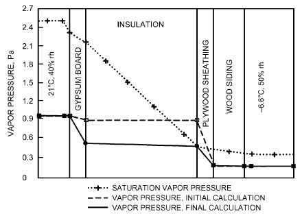

*Fig. 10 Dew-Point Calculation in Wood-Framed Wall (Example 8)*

**Step 8.** The change of water vapor pressure on the OSB sheathing alters all other partial water vapor pressures as well as water vapor flux through the wall. Calculating partial water vapor pressures is similar to the calculation in step 3, but the wall is now divided in two parts: one on the interior of the condensation interface (i.e., gypsum board and insulation) and the other on the exterior (OSB sheathing and wood siding). Water vapor pressure drop over the first (interior) part of the wall is

> Δp<sub>1</sub> = 995 – 478 = 517 Pa

and over the second (exterior) part is

> Δp<sub>2</sub> = 478 – 175 = 303 Pa
>
> The diffusion resistances of both parts of the wall are

> Z<sub>1</sub> = 1/9200 + 1/290 + 1/1700 = 0.004 (Pa·s·m<sup>2</sup>)/ng
>
> Z<sub>2</sub> = 1/29 + 1/2010 + 1/57000 = 0.035 (Pa·s·m<sup>2</sup>)/ng

The water vapor pressure drops across each material can be calculated from the part between the inside and sheathing

> (Δp layer)/(p – p′ i sheathing) = (Z layer)/(sheathing Z i)

and the part between the sheathing and outside

> (Δp layer)/(p′ – p sheathing o) = (Z layer)/(o Z sheathing)

|   | Z<sub>tot</sub>, (Pa·s·m<sup>2</sup>)/ng | Vapor Pressure Difference, Pa | Vapor Flow, ng/(s·m<sup>2</sup>) |
|---|---|---|---|
| Indoor air to critical interface | 0.004 | 517 | 124 746 |
| Critical interface to outdoor air | 0.035 | 303 | 8 661 |

As shown in Figure 10, final calculations of water vapor pressure no longer exceed saturation, which means that the condensation plane was chosen correctly. However, vapor flux is no longer the same throughout the wall. The flux from inside increases; to the outside it decreases. The difference between both is the rate of moisture accumulation by interstitial condensation at the back side of the sheathing: p<sub>i</sub>– p′<sub>sheathing</sub> p′<sub>sheathing</sub>– p<sub>o</sub> m<sub>c</sub> = ----------<sub>s</sub>--<sub>h</sub>---<sub>e</sub>--<sub>a</sub>---<sub>t</sub>-<sub>h</sub>---<sub>i</sub>-<sub>n</sub>---<sub>g</sub>----- – -----------<sub>o</sub>-----------------------Z<sub>i</sub> Z<sub>shea</sub> thing In this case m<sub>c</sub> = 116 000 ng/(s·m<sup>2</sup>). Assume the12 mm OSB 3

sheathing (density of 500 kg/m ) begins with moisture content of 10%. The mass of dry OSB at that thickness is 6.5 kg/m<sup>2</sup>, so the mass of water is 0.65 kg. If these conditions persist for 30 days (720 h), then the amount of accumulated water is 0.30 kg. This raises the moisture content of the wood to 12.5%. It is evident that wetting by diffusion is very slow.

The Glaser method should not be used to show simply that calculated vapor pressure at one location exceeds saturation vapor pressure at that location. If that condition is detected, then the rate of accumulation must be calculated and the results compared to the affected material’s estimated storage potential. Unfortunately, guidance on interpretation of accumulated water with the Glaser method is not available. Considerations of moisture storage potential in building materials can be addressed only with transient modeling, not with steady-state methods.

**Example 9.** A wood-framed construction has a wet layer inside. The wall layers include a 0.2 mm polyethylene membrane between insulation and gypsum board, and an exterior insulation and finish system (EIFS) with 40 mm of expanded polystyrene as substrate and a spun-glass reinforced stucco finish. If the OSB sheathing became soaked because of rain infiltration at the windows, how long before the OSB reaches hygroscopic equilibrium after leaks are sealed? Solve for two monthly mean conditions: winter, with 21°C, 40% rh indoors and –6.6°C, 50% rh outdoors; and summer, with 25°C, 70% rh indoors and 23°C, 70% rh outdoors.

<!-- str. 766 -->

**Solution:**

**Step 1.** List the components in the building assembly, with their R-values and permeances.

```text
                         Propor-                        Propor-
               Thermal    tional   Vapor      Vapor      tional
                Resis-  Temper-   Perme-     Diffusion   Vapor
Air Film or    tance R,   ature  ance, ng/  Resistance, Pressure
Material      (m^2·K)/W   Drop   (Pa·s·m^2) (Pa·s·m^2)/ng Drop
1.Air film       0.120    0.038    9200       0.0001     0.000
 coefficient
2.Gypsum         0.079    0.025     290       0.003      0.001
 board, painted
3.Polyethylene   0.000    0.000    0.435      2.299      0.975
 foil
4.Insulation,    1.900    0.595    1700       0.001      0.000
 mineral fiber
5.OSB            0.055    0.017     29        0.034      0.015
 sheathing
6.EPS            1.000    0.313     72.5      0.014      0.006
7.EIFS stucco    0.010    0.003     185       0.005      0.002
 lamina and
 finish
8.Air film       0.030    0.009    57 000    0.00002     0.000
 coefficient
         Total   3.190    1.000                2.36      1.000
  Step 2. List the indoor and outdoor temperature and relative humid-
ity. As in Example 8, indoor and outdoor vapor pressure is determined
by multiplying the saturation vapor pressure at that temperature by the
relative humidity.
   Winter conditions:
                            Saturated     Relative    Vapor
            Temperature,      Vapor      Humidity,   Pressure,
                  °C       Pressure, Pa     %           Pa
Indoors           21           2488         40          995
  1 and 2        20.0          2334                     995
  2 and 3        19.3          2237                     995
  3 and 4        19.3          2237                     751
  4 and 5         2.9          751                      751
  5 and 6         2.4          726                      726
  6 and 7        –6.3          361                      330
  7 and 8        –6.3          358                      176
Outdoors         –6.6          350          50          175
Difference       27.6
   Summer conditions:
                          Saturated      Relative     Vapor
          Temperature,      Vapor       Humidity,    Pressure,
               °C        Pressure, Pa       %           Pa
Indoors        25            3169           70         2219
 1 and 2      24.9           3155                      2219
 2 and 3      24.9           3146                      2220
 3 and 4      24.9           3146                      2929
 4 and 5      23.7           2929                      2929
 5 and 6      23.7           2923                      2923
 6 and 7      23.0           2815                      2237
 7 and 8      23.0           2814                      1968
Outdoors       23            2811           70         1967
Difference     2.0
  Step 3. Indoor and outdoor vapor pressures are calculated from the
given conditions of temperature and relative humidity. The vapor pres-
sure at each side of the OSB sheathing is assigned the value of the satu-
ration vapor pressure at that temperature (see bold values in the
summer and winter condition tables).
```

**Step 4.** Calculate the total vapor resistance on either side of the critical OSB layer. Between inside and sheathing,

> (Δp layer)/(p – p′ i sheathing) = (Z layer)/(sheathing Z i)

Between sheathing and outside,

> (Δp layer)/(p′ – p sheathing o) = (Z layer)/(o Z sheathing)

From the summer and winter condition tables, the diffusion resistances of both parts of the wall are

> Z<sub>1</sub> = 0.0001 + 0.003 + 2.299 + 0.001 = 2.303 (Pa·s·m<sup>2</sup>)/ng
>
> Z<sub>2</sub> = 0.014 + 0.005 + 0.00002 = 0.019 (Pa·s·m<sup>2</sup>)/ng

**Step 5**. Calculate the vapor pressure difference on either side of the critical OSB layer (the last column in the summer and winter condition tables). From the vapor resistance on each side and the vapor pressure difference on each side, vapor flow in each direction can be calculated. Winter m<sub>shething,i</sub> = (p – p′ i sheathing)/(i Z sheathing) = 106 ng/(s·m<sup>2</sup>) = 106 ng/(s·m<sup>2</sup>)

> m<sub>shething,o</sub> = (p′ – p sheathing o)/(sheathing Z o) = 28 659 ng/(s·m<sup>2</sup>)

```text
                                        Vapor Pressure  Vapor
                                Z_tot,    Difference,   Flow,
                           (Pa·s·m^2)/ng      Pa      ng/(s·m^2)
Indoor air to critical interface 2.303      244.4          106
Critical interface to outdoor air 0.019     550.7       28 659
                                       Net drying, ng/s 28 553
   Summer
                     p_i– p′_sheat
          m_shething,i = ----------_i----------------^h---^i-^n---^g = –309 ng/(s·m^2)
                       Z_shea
                            thing
                    p′_sheathing– p_o
        m_shething,o = ----------_s--_h---_e--_a---_t--_h--_i--_n--_g------ = 49 744 ng/(s·m^2)
                      Z_o
                                            Vapor
                                 Z_tot,
                                          Pressure     Vapor
                              (Pa·s·m^2)/ Difference, Flow, ng/
                                  ng         Pa        (s·m^2)
Indoor air to critical interface 2.303      –710.8       –309
Critical interface to outdoor air 0.019      955.9     49 744
                                      Net drying, ng/s 50 052
   Drying consequently amounts to 74 g/m^2 per month in winter and
130 g/m^2 per month in summer. OSB soaked with water can have
excess moisture content of up to 4.8 kg/m^2. Drying only by one-
dimensional diffusion would appear to take several years at this rate.
Radiation, air movement, and two- and three-dimensional effects can
change the rate of drying.
   Figures 11 and 12 show the calculated water vapor pressure in win-
ter and summer. The OSB is at water vapor saturation pressure; satura-
tion is not reached at any other interface.
```

## 3. TRANSIENT HYGROTHERMAL MODELING

Fundamentals of hygrothermal modeling tools, including modeling criteria and method of reporting, are discussed in Chapter 25. Although this chapter does not provide a complete example, it introduces input data commonly required by these programs and discusses considerations for analyzing output when using these tools.

<!-- str. 767 -->

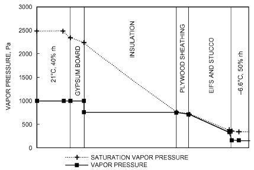

*Fig. 11 Drying Wet Sheathing, Winter (Example 9)*

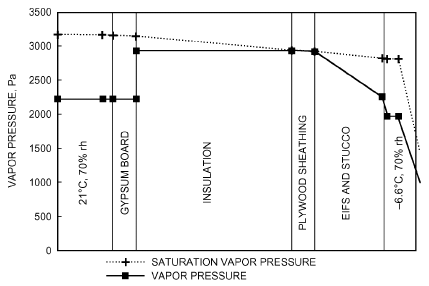

*Fig. 12 Drying Wet Sheathing, Summer (Example 9)*

For many applications and for design guide development, actual behavior of an assembly under transient climatic conditions may be simulated to account for short-term processes such as driving rain absorption, summer condensation, and phase changes. Computer simulations allow designers to model these conditions over time. It is important, however, to understand the model’s application limits.

Applying one of these models requires at least the following information: exterior climate conditions, indoor temperature and humidity, and building assembly materials and sizes. Many programs include a material property database and exterior climate and indoor condition data, allowing simple modeling to be performed without customization. However, using generic material property and weather data may not accurately recreate actual target conditions.

Features of a complete moisture analysis model include

- Transient heat, air, and moisture transport formulation, incorporating the physics of – Airflow – Water vapor transport by advection (combination of water vapor diffusion and air-driven vapor flow) – Liquid transport by capillary action, gravity, and pressure differences – Heat flow by apparent conduction, convection, and radiation – Heat and moisture storage/capacity of materials – Condensation and evaporation processes with linked latent-tosensible heat transformation – Freezing and thawing processes with linked latent-to-sensible heat transformation and based on laws of conservation of heat, mass, and momentum
- Material properties as functions of moisture content, relative humidity, and temperature, such as – Density – Air properties: permeability and permeance – Thermal properties: specific heat capacity, apparent thermal conductivity, Nusselt numbers, and long-wave emittance (for cavities and air spaces) – Moisture properties: porosity, sorption curve, water retention curve, vapor permeability, water permeability, or liquid diffusivity
- Boundary conditions (generally on an hourly basis) – Outside temperature and relative humidity – Incident short-wave solar and long-wave sky radiation (depending on inclination and orientation) – Wind speed, orientation, and pressures – Wind-driven rain at exterior surfaces (depending on location and aerodynamics) – Interior temperature, air pressure excess, relative humidity (or interior moisture sources and ventilation flows), and air stratification – Surface conditions – Heat transfer film coefficients (combined convection and radiation, separate for convection and radiation) – Mass transfer film coefficients – Short-wave absorptance of exterior surfaces – Long-wave emittance of exterior surfaces – Contact conditions between layers and materials. Interfaces may be bridgeable for vapor diffusion, airflow, and gravity or pressure liquid flow only. They may be ideally capillary, introduce additional capillary resistance, or behave as real contact.

Not all these features are required for every analysis, and some applications may need additional information (e.g., moisture flow through unintentional cracks and intentional openings, rain penetration through veneer walls and exterior cladding). To model these phenomena accurately, experiments may be needed to define systems and subsystems in field situation, because only then are all exterior loads and influences captured.

It is important to recognize that simulation results are based on input data. Therefore, the more accurate the input data used, the closer the results will match real-world conditions. Exterior weather conditions, material properties, and interior operating conditions all vary widely, so it is important to get the best data available on materials being modeled. For most users, this is a difficult task. Many product manufacturers do not provide the material property data needed for the simulations. Developing weather data for a particular site is also beyond the expertise of many.

Combined heat, air, and moisture models also have limitations. Users should be aware which transport phenomena and types of boundary conditions are included and which are not. For instance, some models cannot handle air transport or rain wetting of the exterior. Even an apparently simple problem, such as predicting rain leakage through a brick veneer, is beyond existing tools’ capabilities. In such cases, simple qualitative schemes and field tests still are the way to proceed. In addition, results also tend to be very sensitive to the choice of indoor and outdoor conditions. Usually, exact conditions are not known.

Outputs from these programs typically include the moisture content of materials as well as relative humidity within the assembly. Interpretation of results is not easy: accurate data on moisture and temperature conditions that materials can tolerate are often not available. Although moisture accumulation may result in indoor air quality issues or material degradation, the effect of moisture accumulation in building assemblies depends on many factors, including choice of construction materials, and varies by building, making interpretation of results even more difficult.

<!-- str. 768 -->

## 4. AIR MOVEMENT

Moisture movement through building envelope assemblies is more strongly affected by air movement than by diffusion. To minimize moisture penetration by air leakages, the building envelope should be as airtight as possible. The airflow retarder must also be sufficiently strong and well supported to resist wind loads.

In older residential buildings, air leakage provided sufficient ventilation and rarely led to interstitial condensation. However, in airtight buildings, mechanical ventilation is needed to ensure acceptable air quality and prevent moisture and health problems caused by excessive indoor humidity. Ventilation of the wall assembly and/or drainage must go to the outside of the airtight layer of construction, or it will increase building air leakage. To avoid moisture problems at the airtight layer, either the layer temperature must be kept above the dew point by locating it on the warm side of the insulation, or the layer permeance must allow vapor transmission.

As described in detail in the section on Leakage Distribution in Chapter 16, air leakage through building envelopes is not confined to doors and windows. Although 6 to 22% of air leakage occurs there, 18 to 50% typically takes place through walls, and 3 to 30% through the ceiling. Leakage often occurs between sill plate and foundation, through interior walls, electrical outlets, plumbing penetrations, and cracks at top and bottom of exterior walls.

Not all cracks and openings can be sealed in existing buildings, nor can absolutely tight construction be achieved in new buildings. Provide as tight an enclosure as possible to reduce leakage, minimize potential condensation within the envelope, and reduce energy loss. However, the project team must also recognize the impact of airtightness.

Moisture accumulation in building envelopes can also be minimized by controlling the dominant direction of airflow by operating the building at a small negative or positive air pressure, depending on climate. In cooling climates, pressure should be positive to keep out humid outside air. In heating climates, pressure should be neither strongly negative, which could risk drawing soil gas or combustion products indoors and affect occupant comfort, nor strongly positive, which could risk driving moisture into building envelope cavities.

### Equivalent Permeance

Dew-point analysis allows simple estimation of the effect of wall and roof cavity ventilation on heat and vapor transport by using parallel thermal and vapor diffusion resistances (TenWolde and Carll 1992; Trethowen 1979). These parallel resistances account for heat and vapor that bypass exterior material layers with ventilation air from outside. Equivalent thermal and water vapor diffusion resistances are approximated from the following equations:

- R<sub>par</sub> = 1/m<sub>a</sub>c
- Z<sub>par</sub> = 1/m<sub>a</sub>ξ where
- R<sub>par</sub> = parallel equivalent thermal resistance, (m<sup>2</sup>·K)/W
- Z<sub>par</sub> = parallel equivalent water vapor diffusion vapor flow resistance, (Pa·s·m<sup>2</sup>)/ng
- m<sub>a</sub> = ventilation flux, kg/(m<sup>2</sup>·s)
- ξ = 0.62/P<sub>a</sub>, where P<sub>a</sub> is atmospheric pressure, Pa

## REFERENCES

ASHRAE members can access ASHRAE Journal articles and ASHRAE research project final reports at technologyportal.ashrae .org. Articles and reports are also available for purchase by nonmembers in the online ASHRAE Bookstore at www.ashrae.org/bookstore.

ASHRAE. 2009. Criteria for moisture-control design analysis in buildings.

ANSI/ASHRAE Standard 160-2009.

ASHRAE. 2010. Energy standard for buildings except low-rise residential buildings. ANSI/ASHRAE/IES Standard 90.1-2010.

Barbour, E., J. Goodrow, J. Kosny, and J.E. Christian. 1994. Thermal per-*formance of steel-framed walls*. Prepared for American Iron and Steel Institute by NAHB Research Center.

Dill, R.S., W.C. Robinson, and H.E. Robinson. 1945. Measurements of heat losses from slab floors. National Bureau of Standards. Building Materi-*als and Structures Report* BMS 103.

Farouk, B., and D.C. Larson. 1983. Thermal performance of insulated wall systems with metal studs. *Proceedings of the 18th Intersociety Energy* *Conversion Engineering Conference*, Orlando, FL.

Hershfield, M. 2011. Thermal performance of building envelope details for mid- and high-rise buildings. Final Report, ASHRAE Research Project RP-1365.

Hougten, F.C., S.I. Taimuty, C. Gutberlet, and C.J. Brown. 1942. Heat loss through basement walls and floors. ASHVE Transactions 48:369.

Kemp, S. 1997. Modeling two- and three-dimensional heat transfer through composite wall and roof assemblies in transient energy simulation programs. Final Report, ASHRAE Research Project RP-1145.

Kosny, J., and J.E. Christian. 1995. Reducing the uncertainties associated with using the ASHRAE zone method for R-value calculations of metal frame walls. ASHRAE Transactions 101(2):779-788.

Labs, K., J. Carmody, R. Sterling, L. Shen, Y.J. Huang, and D. Parker. 1988.

Building foundation design handbook. Report ORNL/SUB/86-72143/1. Oak Ridge National Laboratory, Oak Ridge, TN.

Latta, J.K., and G.G. Boileau. 1969. Heat losses from house basements.

Canadian Building 19(10).

McGowan, A., and A.O. Desjarlais. 1997. An investigation of common thermal bridges in walls. ASHRAE Transactions 103(1):509-517.

McIntyre, D.A. 1984. *The increase in U-value of a wall caused by mortar* joints. ECRC/M1843. The Electricity Council Research Centre, Copenhurst, U.K.

Mitalas, G.P. 1982. *Basement heat loss studies at DBR/NRC*. NRCC 20416.

Division of Building Research, National Research Council of Canada, September.

Mitalas, G.P. 1983. Calculation of basement heat loss. ASHRAE Transactions 89(1B):420.

Shipp, P.H. 1983. Basement, crawlspace and slab-on-grade thermal performance. *Proceedings of the ASHRAE/DOE Conference, Thermal Per-* *formance of the Exterior Envelopes of Buildings II*, ASHRAE SP 38: 160-179.

Shu, L.S., A.E. Fiorato, and J.W. Howanski. 1979. Heat transmission coefficients of concrete block walls with core insulation. *Proceedings of the* *ASHRAE/DOE-ORNL Conference, Thermal Performance of the Exterior* *Envelopes of Buildings*, ASHRAE SP 28:421-435.

TenWolde A. and C. Carll. 1992. Effect of cavity ventilation on moisture in walls and roofs. *Proceedings of ASHRAE Conference, Thermal Perfor-* *mance of the Exterior Envelopes of Buildings V*, pp. 555-562.

THERM. 2012. THERM. windows.lbl.gov/software/therm/therm.html. Trethowen, H.A. 1979. The Kieper method for building moisture design.

BRANZ Reprint 12, Building Research Association of New Zealand. Tye, R.P., and S.C. Spinney. 1980. A study of various factors affecting the thermal performance of perlite insulated masonry construction. Dynatech Report PII-2. Holometrix, Inc. (formerly Dynatech R/D Company), Cambridge, MA.

Valore, R.C. 1980. Calculation of U-values of hollow concrete masonry.

American Concrete Institute, Concrete International 2(2):40-62.

Valore, R.C. 1988. *Thermophysical properties of masonry and its constitu-* ents, parts I and II. International Masonry Institute, Washington, D.C.

Van Geem, M.G. 1985. Thermal transmittance of concrete block walls with core insulation. ASHRAE Transactions 91(2).

Wilkes, K.E. 1991. Thermal model of attic systems with radiant barriers.

Report ORNL/CON-262. Oak Ridge National Laboratory, TN.

## BIBLIOGRAPHY

Hens, H. 1978. Condensation in concrete flat roofs. *Building Research and* Practice Sept./Oct.:292-309.

TenWolde, A. 1994. Design tools. Chapter 11 in *Moisture control in build-* ings. ASTM Manual MNL 18. American Society for Testing and Materials, West Conshohocken, PA.

Vos, B.H., and E.J.W. Coelman. 1967. Condensation in structures. Report B-67-33/23, TNO-IBBC, Rijswijk, the Netherlands.
