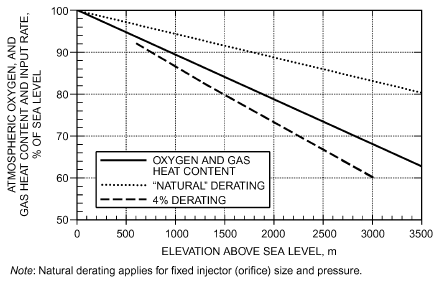
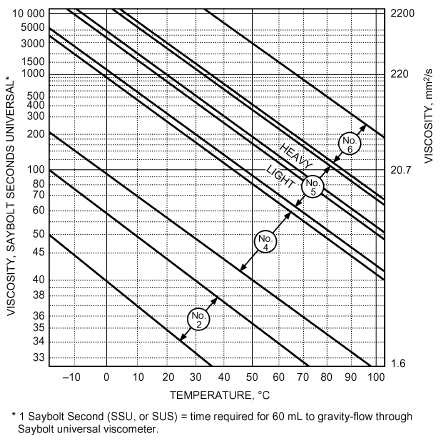
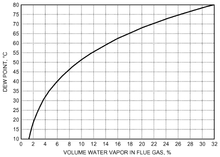
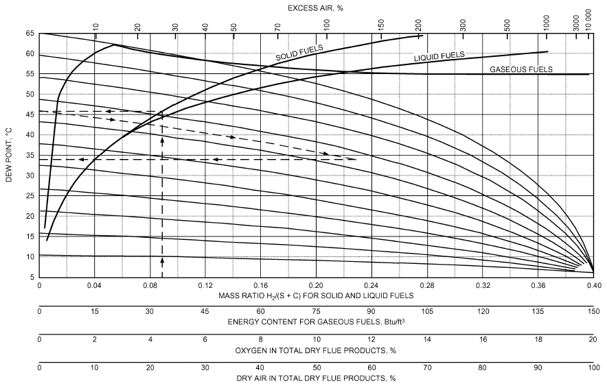
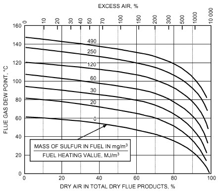
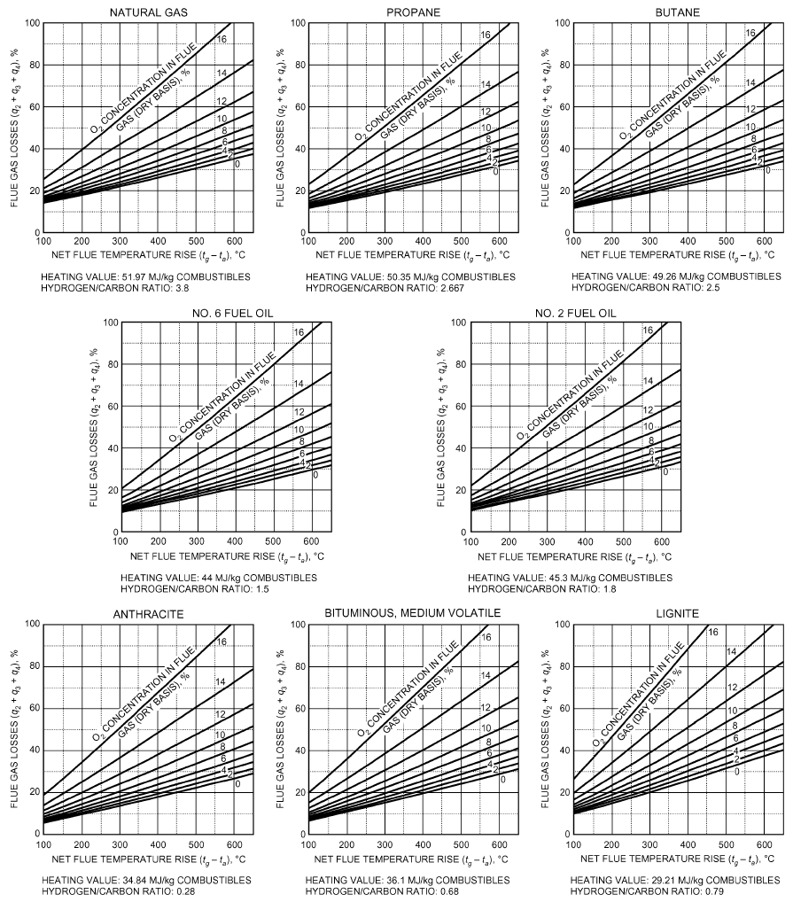
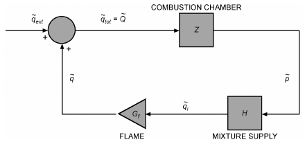

# Chapter 28 — Combustion and Fuels

*Izvor: 2021 ASHRAE Handbook — Fundamentals (SI), Chapter 28 (PDF str. 769–789).*

> **Napomena o konverziji:** Tekst je automatski izdvojen iz originalnog PDF-a uz prepoznavanje dve kolone, spojene prelomljene reči i pasuse. Indeksi i eksponenti su označeni sa ``/``, tabele su pretvorene u Markdown tabele (veoma složene tabele su prikazane kao poravnat tekst), a slike su izrezane iz PDF-a u folder `img/`. Složene jednačine (razlomci, sume) mogu biti uprošćeno prikazane. **Pre upotrebe vrednosti u proračunu proveriti u originalnom PDF-u.** Oznake `<!-- str. N -->` pokazuju stranu PDF-a.

## Sadržaj

- [1. PRINCIPLES OF COMBUSTION](#1-principles-of-combustion)
- [2. FUEL CLASSIFICATION](#2-fuel-classification)
- [3. GASEOUS FUELS](#3-gaseous-fuels)
- [4. LIQUID FUELS](#4-liquid-fuels)
- [5. SOLID FUELS](#5-solid-fuels)
- [6. COMBUSTION CALCULATIONS](#6-combustion-calculations)
- [7. EFFICIENCY CALCULATIONS](#7-efficiency-calculations)
- [8. COMBUSTION CONSIDERATIONS](#8-combustion-considerations)
- [REFERENCES](#references)
- [BIBLIOGRAPHY](#bibliography)

<!-- str. 769 -->

## 1. PRINCIPLES OF COMBUSTION

COMBUSTION is a chemical reaction in which an oxidant reacts rapidly with a fuel to liberate stored energy as thermal energy, generally in the form of high-temperature gases. Small amounts of electromagnetic energy (light), electric energy (free ions and electrons), and mechanical energy (noise) are also produced during combustion. Except in special applications, the oxidant for combustion is oxygen in the air. The oxidation normally occurs with the fuel in vapor form. One notable exception is oxidation of solid carbon, which occurs directly with the solid phase.

Conventional fuels contain primarily hydrogen and carbon, in elemental form or in various compounds (hydrocarbons). Their complete combustion produces mainly carbon dioxide (CO2) and water (H2O); however, small quantities of carbon monoxide (CO) and partially reacted flue gas constituents (gases and liquid or solid aerosols) may form. Most conventional fuels also contain small amounts of sulfur, which is oxidized to sulfur dioxide (SO2) or sulfur trioxide (SO3) during combustion, and noncombustible substances such as mineral matter (ash), water, and inert gases. Flue gas is the product of complete or incomplete combustion and includes excess air (if present), but not dilution air (air added to flue gas downstream of the combustion process, such as through the relief opening of a draft hood).

Fuel combustion rate depends on the (1) rate of chemical reaction of combustible fuel constituents with oxygen, (2) rate at which oxygen is supplied to the fuel (mixing of air and fuel), and (3) temperature in the combustion region. The reaction rate is fixed by fuel selection. Increasing the mixing rate or temperature increases the combustion rate.

With **complete combustion** of hydrocarbon fuels, all hydrogen and carbon in the fuel are oxidized to H2O and CO2. Generally, complete combustion requires excess oxygen or excess air beyond the amount theoretically required to oxidize the fuel. Excess air is usually expressed as a percentage of the air required to completely oxidize the fuel.

In **stoichiometric combustion** of a hydrocarbon fuel, fuel is reacted with the exact amount of oxygen required to oxidize all carbon, hydrogen, and sulfur in the fuel to CO2, H2O, and SO2. Therefore, exhaust gas from stoichiometric combustion theoretically contains no incompletely oxidized fuel constituents and no unreacted oxygen (i.e., no carbon monoxide and no excess air or oxygen). The percentage of CO2 contained in products of stoichiometric combustion is the maximum attainable and is referred to as the **stoi- chiometric CO2**, **ultimate CO2**, or **maximum theoretical percent- age of CO2**.

Stoichiometric combustion is seldom realized in practice because of imperfect mixing and finite reaction rates. For economy and safety, most combustion equipment should operate with some excess air. This ensures that fuel is not wasted and that combustion is complete despite variations in fuel properties and supply rates of fuel and air. The amount of excess air to be supplied to any combustion equipment depends on (1) expected variations in fuel properties and in fuel and air supply rates, (2) equipment application, (3) degree of operator supervision required or available, and (4) control requirements. For maximum efficiency, combustion at low excess air is desirable.

The preparation of this chapter is assigned to TC 6.10, Fuels and Combustion.

**Incomplete combustion** occurs when a fuel element is not completely oxidized during combustion. For example, a hydrocarbon may not completely oxidize to carbon dioxide and water, but may form partially oxidized compounds, such as carbon monoxide, aldehydes, and ketones. Conditions that promote incomplete combustion include (1) insufficient air and fuel mixing (causing local fuel-rich and fuel-lean zones), (2) insufficient air supply to the flame (providing less than the required amount of oxygen), (3) insufficient reactant residence time in the flame (preventing completion of combustion reactions), (4) flame impingement on a cold surface (quenching combustion reactions), or (5) flame temperature that is too low (slowing combustion reactions).

Incomplete combustion uses fuel inefficiently, can be hazardous because of carbon monoxide production, and contributes to air pollution.

### Combustion Reactions

The reaction of oxygen with combustible elements and compounds in fuels occurs according to fixed chemical principles, including

- Chemical reaction equations
- Law of matter conservation: the mass of each element in the reaction products must equal the mass of that element in the reactants
- Law of combining masses: chemical compounds are formed by elements combining in fixed mass relationships
- Chemical reaction rates

Oxygen for combustion is normally obtained from air, which is a mixture of nitrogen, oxygen, small amounts of water vapor, carbon dioxide, and inert gases. For practical combustion calculations, dry air consists of 20.95% oxygen and 79.05% inert gases (nitrogen, argon, etc.) by volume, or 23.15% oxygen and 76.85% inert gases by mass. For calculation purposes, nitrogen is assumed to pass through the combustion process unchanged (although small quantities of nitrogen oxides form). Table 1 lists oxygen and air requirements for stoichiometric combustion and the products of stoichiometric combustion of some pure combustible materials (or constituents) found in common fuels.

### Flammability Limits

Fuel burns in a self-sustained reaction only when the volume percentages of fuel and air in a mixture at standard temperature and pressure are within the upper and lower flammability limits (UFL and LFL), also called explosive limits (UEL and LEL; see Table 2). Both temperature and pressure affect these limits. As mixture temperature increases, the upper limit increases and the lower limit decreases. As the pressure of the mixture decreases below atmospheric pressure, the upper limit decreases and the lower limit increases. However, as pressure increases above atmospheric, the upper limit increases and the lower limit is relatively constant.

<!-- str. 770 -->

**Table 1 Combustion Reactions of Common Fuel Constituents**

| Constituent | Molecular Formula | Combustion Reactions | Stoichiometric Oxygen and kg/kg Fuela O2 | Stoichiometric Oxygen and Air Requirements kg/kg Fuela Air | Stoichiometric Oxygen and Air Requirements m3/m3 Fuel O2 | Stoichiometric Oxygen and Air Requirements m3/m3 Fuel Air | Flue Gas from Stoichiometric Combustion with Air Ultimate CO2, % | Flue Gas from Stoichiometric Combustion with Air Dew Point,c °C | Flue Gas from Stoichiometric Combustion with Air m3/m3Fuel CO2 | Flue Gas from Stoichiometric Combustion with Air m3/m3Fuel H2O | Flue Gas from Stoichiometric Combustion with Air kg/kg Fuel CO2 | Flue Gas from Stoichiometric Combustion with Air kg/kg Fuel H2O |
|---|---|---|---|---|---|---|---|---|---|---|---|---|
| Carbon (to CO) | C | C + 0.5O2 → CO | 1.33 | 5.75 | b | b | — | — | — | — | — | — |
| Carbon (to CO2) | C | C + O2 → CO2 | 2.66 | 11.51 | b | b | 29.30 | — | — | — | 3.664 | — |
| Carbon monoxide | CO | CO + 0.5O2 → CO2 | 0.57 | 2.47 | 0.50 | 2.39 | 34.70 | — | 1.0 | — | 1.571 | — |
| Hydrogen | H2 | H2 + 0.5O2 → H2O | 7.94 | 34.28 | 0.50 | 2.39 | — | 72 | — | 1.0 | — | 8.937 |
| Methane | CH4 | CH4 + 2O2 → CO2 + 2H2O | 3.99 | 17.24 | 2.00 | 9.57 | 11.73 | 59 | 1.0 | 2.0 | 2.744 | 2.246 |
| Ethane | C2H6 | C2H6 + 3.5O2 → 2CO2 + 3H2O | 3.72 | 16.09 | 3.50 | 16.75 | 13.18 | 57 | 2.0 | 3.0 | 2.927 | 1.798 |
| Propane | C3H8 | C3H8 + 5O2 → 3CO2 + 4H2O | 3.63 | 15.68 | 5.00 | 23.95 | 13.75 | 55 | 3.0 | 4.0 | 2.994 | 1.634 |
| Butane | C4H10 | C4H10 + 6.5O2 → 4CO2 + 5H2O | 3.58 | 15.47 | 6.50 | 31.14 | 14.05 | 54 | 4.0 | 5.0 | 3.029 | 1.550 |
| Alkanes | CnH2n+2 | CnH2n+2 + (1.5n + 0.5)O2 → | — | — | 1.5n | 7.18n | — | 53 | n | n + 1 | 44.01n | 18.01(n + 1) |
|  |  |  |  |  | + 0.5 | + 2.39 |  |  |  |  |  |  |
|  |  | nCO2 + (n + 1)H2O |  |  |  |  |  |  |  |  |  |  |
| **14.026n + 2.016 14.026n + 2.016** |  |  |  |  |  |  |  |  |  |  |  |  |
| Ethylene | C2H4 | C2H4 + 3O2 → 2CO2 + 2H2O | 3.42 | 14.78 | 3.00 | 14.38 | 15.05 | 52 | 2.0 | 2.0 | 3.138 | 1.285 |
| Propylene | C3H6 | C3H6 + 4.5O2 → 3CO2 + 3H2O | 3.42 | 14.78 | 4.50 | 21.53 | 15.05 | 52 | 3.0 | 3.0 | 3.138 | 1.285 |
| Alkenes | CnH2n | CnH2n + 1.5nO2 → nCO2 + nH2O | 3.42 | 14.78 | 1.50n | 7.18n | 15.05 | 52 | n | n | 3.138 | 1.285 |
| Acetylene | C2H2 | C2H2 + 2.5O2 → 2CO2 + H2O | 3.07 | 13.27 | 2.50 | 11.96 | 17.53 | 39 | 2.0 | 1.0 | 3.834 | 0.692 |
| Alkynes | CnH2m | CnH2m + (n + 0.5m)O2 → | — | — | n + | 4.78n | — | — | n | m | 22.005n | 9.008m |
| **0.5m + 2.39m** |  |  |  |  |  |  |  |  |  |  |  |  |
|  |  | nCO2 + mH2O |  |  |  |  |  |  |  |  |  |  |
| **6.005n + 1.008m 6.005n + 1.008m** |  |  |  |  |  |  |  |  |  |  |  |  |
|  |  |  |  |  |  |  |  |  | SOx | H2O | SOx | H2O |
| Sulfur (to SO2) | S | S + O2 → SO2 | 1.00 | 4.31 | b | b | — | — | 1.0SO2 | — | 1.998 (SO2) | — |
| Sulfur (to SO3) | S | S + 1.5O2 → SO3 | 1.50 | 6.47 | b | b | — | — | 1.0SO3 | — | 2.497 (SO3) | — |
| Hydrogen sulfide | H2S | H2S + 1.5O2 → SO2 + H2O | 1.41 | 6.08 | 1.50 | 7.18 | — | 52 | 1.0SO2 | 1.0 | 1.880 (SO2) | 0.528 |

Adapted, in part, from *Gas Engineers Handbook* (1965). bVolume ratios are not given for fuels that do not exist in vapor form at reasonable temperatures or pressure.

aAtomic masses: H = 1.008, C = 12.01, O = 16.00, S = 32.06.

**Table 2 Flammability Limits and Ignition Temperatures of Common Fuels in Fuel/Air Mixtures**

| Substance | Molecular Lower Flammability Formula | Molecular Lower Flammability Limit, % | Upper Flammability Limit, % | Ignition Temperature, °C | References |
|---|---|---|---|---|---|
| Carbon | C | — | — | 660 | Hartman (1958) |
| Carbon monoxide | CO | 12.5 | 74 | 609 | Scott et al. (1948) |
| Hydrogen | H2 | 4.0 | 75.0 | 520 | Zabetakis (1956) |
| Methane | CH4 | 5.0 | 15.0 | 705 | *Gas Engineers Handbook* (1965) |
| Ethane | C2H6 | 3.0 | 12.5 | 520 to 630 | Trinks (1947) |
| Propane | C3H8 | 2.1 | 10.1 | 466 | NFPA (1962) |
| n-Butane | C4H10 | 1.86 | 8.41 | 405 | NFPA (1962) |
| Ethylene | C2H4 | 2.75 | 28.6 | 490 | Scott et al. (1948) |
| Propylene | C3H6 | 2.00 | 11.1 | 450 | Scott et al. (1948) |
| Acetylene | C2H2 | 2.50 | 81 | 406 to 440 | Trinks (1947) |
| Sulfur | S | — | — | 190 | Hartman (1958) |
| Hydrogen sulfide | H2S | 4.3 | 45.50 | 292 | Scott et al. (1948) |

Flammability limits adapted from Coward and Jones (1952). All values corrected to 15.6°C, 104 kPa, dry.

### Ignition Temperature

**Ignition temperature** is the lowest temperature at which heat is generated by combustion faster than it is lost to the surroundings and combustion becomes self propagating (see Table 2). The fuel/air mixture will not burn freely and continuously below the ignition temperature unless heat is supplied, but chemical reaction between the fuel and air may occur. Ignition temperature is affected by a large number of factors.

The ignition temperature and flammability limits of a fuel/air mixture, together, are a measure of the potential for ignition (Gas Engineers Handbook 1965).

### Combustion Modes

Combustion reactions occur in either continuous or pulse flame modes. **Continuous combustion** burns fuel in a sustained manner as long as fuel and air are continuously fed to the combustion zone and the fuel/air mixture is within the flammability limits. Continuous combustion is more common than pulse combustion and is used in most fuel-burning equipment.

**Pulse combustion** is an acoustically resonant process that burns various fuels in small, discrete fuel/air mixture volumes in a very rapid series of combustions.

The introduction of fuel and air into the pulse combustor is controlled by mechanical or aerodynamic valves. Typical combustors consist of one or more valves, a combustion chamber, an exit pipe, and a control system (ignition means, fuel-metering devices, etc.). Typically, combustors for warm-air furnaces, hot-water boilers, and commercial cooking equipment use mechanical valves. Aerodynamic valves are usually used in higher-pressure applications, such as thrust engines. Separate valves for air and fuel, a single valve for premixed air and fuel, or multiple valves of either type can be used. Premix valve systems may require a flame trap at the combustion chamber entrance to prevent flashback.

In a mechanically valved pulse combustor, air and fuel are forced into the combustion chamber through the valves under pressures less than 3.5 kPa. An ignition source, such as a spark, ignites the fuel/air mixture, causing a positive pressure build-up in the combustion chamber. The positive pressure causes the valves to close, leaving only the exit pipe of the combustion chamber as a pressure relief opening. Combustion chamber and exit pipe geometry determine the resonant frequency of the combustor.

<!-- str. 771 -->

The pressure wave from initial combustion travels down the exit pipe at sonic velocity. As this wave exits the combustion chamber, most of the flue gases present in the chamber are carried with it into the exit pipe. Flue gases remaining in the combustion chamber begin to cool immediately. Contraction of cooling gases and momentum of gases in the exit pipe create a vacuum inside the chamber that opens the valves and allows more fuel and air into the chamber. While the fresh charge of fuel/air enters the chamber, the pressure wave reaches the end of the exit pipe and is partially reflected from the open end of the pipe. The fresh fuel/air charge is ignited by residual combustion and/or heat. The resulting combustion starts another cycle.

Typical pulse combustors operate at 30 to 100 cycles per second and emit resonant sound, which must be considered in their application. The pulses produce high convective heat transfer rates.

### Heating Value

Combustion produces thermal energy (heat). The quantity of heat generated by complete combustion of a unit of specific fuel is constant and is called the **heating value**, **heat of combustion**, or **caloric value** of that fuel. A fuel’s heating value can be determined by measuring the heat evolved during combustion of a known quantity of the fuel in a calorimeter, or it can be estimated from quantitative chemical analysis of the fuel and the heating values of the various chemical elements in the fuel. For information on calculating heating values, see the sections on Characteristics of Fuel Oils and Characteristics of Coal.

**Higher heating value (HHV)**, **gross heating value**, or **total heating value** includes the latent heat of vaporization and is determined when water vapor in the fuel combustion products is cooled and condensed at standard temperature and pressure. Conversely, **lower heating value (LHV)** or **net heating value** does not include latent heat of vaporization. In the United States, when the heating value of a fuel is specified without designating higher or lower, it generally means the higher heating value. (LHV is mainly used for internal combustion engine fuels.)

Heating values are usually expressed in kJ/L or MJ/m3 for gaseous fuels, MJ/L for liquid fuels, and MJ/kg for solid fuels. Heating values are always given in relation to standard temperature and pressure, usually 16, 20, or 25°C and 101.325 kPa, depending on the particular industry practice. Heating values in the United States and Canada are based on standard conditions of 15.6°C and 101.4 kPa, dry. Heating values of several substances in common fuels are listed in Table 3.

With incomplete combustion, not all fuel is completely oxidized, and the heat produced is less than the heating value of the fuel. Therefore, the quantity of heat produced per unit of fuel consumed decreases (lower combustion efficiency).

Not all heat produced during combustion can be used effectively. The greatest heat loss is the thermal energy of the increased temperature of hot exhaust gases above the temperature of incoming air and fuel. Other heat losses include radiation and convection heat transfer from the outer walls of combustion equipment to the environment.

### Altitude Compensation

Air at altitudes above sea level is less dense and has less mass of oxygen per unit volume. The volume concentration of oxygen, however, remains the same as sea level. Therefore, combustion at altitudes above sea level has less available oxygen to burn with the fuel unless compensation is made for the altitude. Combustion occurs, but the amount of excess air is reduced. If excess air is reduced enough by an increase in altitude, combustion is incomplete or ceases.

**Table 3 Heating Values of Substances Occurring in Common Fuels**

| Substance | Molecular Formula | Higher Heating Values,a MJ/m3 | Higher Heating Values,a MJ/kg | Lower Heating Values,a MJ/kg | Specific Density,b kg/m3 |
|---|---|---|---|---|---|
| Carbon (to CO) | C | — | 9.188 | 9.188 | — |
| Carbon (to CO2) | C | — | 32.780 | 32.780 | — |
| Carbon monoxide | CO | 12.0 | 10.111 | 10.111 | 1.187 |
| Hydrogen | H2 | 12.1 | 142.107 | 120.075 | 0.085 |
| Methane | CH4 | 37.7 | 55.533 | 49.997 | 0.679 |
| Ethane | C2H6 | 66.1 | 51.923 | 47.492 | 1.28 |
| Propane | C3H8 | 94.0 | 50.402 | 46.373 | 1.92 |
| Butane | C4H10 | 128.9 | 49.593 | 45.771 | 2.53 |
| Ethylene | C2H4 | 59.8c | 50.325 | 47.160 | — |
| Propylene | C3H6 | 87.2c | 48.958 | 45.792 | 1.78 |
| Acetylene | C2H2 | 55.0 | 50.014 | 48.309 | 1.120 |
| Sulfur (to SO2) | S | — | 9.257 | 9.257 | — |
| Sulfur (to SO3) | S | — | 13.816 | 13.816 | — |
| Hydrogen sulfide | H2S | 24.1 | 16.508 | 15.205 | 1.456 |

Adapted from *Gas Engineers Handbook* (1965).

aAll values corrected to 15.6°C, 101.4 kPa, dry. For gases saturated with water vapor at 16°C, deduct 1.74% of value to adjust for gas volume displaced by water vapor.

bAt 0°C and 101.3 kPa.

c*North American Combustion Handbook* (1986).

When gas-fired appliances operate at altitudes substantially above sea level, three notable effects occur (see Chapter 31 of the 2020 *ASHRAE Handbook—HVAC Systems and Equipment*):

- Oxygen available for combustion is reduced in proportion to the atmospheric pressure reduction.
- With gaseous fuels, the heat of combustion per unit volume of fuel gas (gas heat content) is reduced because of reduced fuel gas density in proportion to the atmospheric pressure reduction.
- Reduced air density affects the performance and operating temperature of heat exchangers and appliance cooling mechanisms.

Altitude compensation matches fuel and air supply rates to attain complete combustion without too much excess air or too much fuel. This can be done at increased altitude by increasing the air supply amount to the combustion zone with a combustion air blower (air compensation), or by decreasing the fuel supply rate to the combustion zone by decreasing the fuel input (derating).

Power burners use combustion air blowers and can increase the air supply rate to compensate for altitude. The combustion zone can be pressurized to attain the same air density in the combustion chamber as that at sea level.

Derating can be used as an alternative to power combustion. U.S. fuel gas codes generally do not require derating of nonpower burners at altitudes up to 600 m. At altitudes above 600 m, many fuel gas codes require that burners be derated 4% for each 300 m above sea level (NFPA/AGA *National Fuel Gas Code*). Chimney or vent operation also must be considered at high altitudes (see Chapter 35 of the 2020 *ASHRAE Handbook—HVAC Systems and Equipment*).

In addition to reducing the gas heat content of fuel gases, reduced fuel gas density also causes increased gas velocity through flow metering orifices. The net effect is for gas input rate to decrease naturally with increases in altitude, but at less than the rate at which atmospheric oxygen decreases. This effect is one reason that derating is required when appliances are operated at altitudes significantly above sea level. Early research with draft hood-equipped appliances established that appliance input rates should be reduced at the rate of 4% per 300 m above sea level, for altitudes higher than 600 m above sea level (Figure 1).

<!-- str. 772 -->

*Fig. 1 Altitude Effects on Gas Combustion Appliances*

Experience with recently developed appliances with fan-assisted combustion systems demonstrates that the 4% rule may not be required in all cases. It is therefore important to consult the manufacturer’s listed appliance installation instructions, which are based on how the combustion system operates, and other factors (e.g., impaired heat transfer).

ASHRAE research projects RP-1182 (Fleck et al. 2007) and RP-1388 (Suchovsky et al. 2011) concluded that the tested induced-draft combustion systems experienced a natural derate of 1.8% (the dotted curve in Figure 1) in gas input rate per 305 m increase in altitude above sea level. This gas input derate for altitude may provide safe combustion operation (less than 400 ppm of CO concentration in air-free flue gas) for induced-draft combustion systems where the combustion air drawn in by the inducer does not participate in gas entrainment or gas orifice outlet pressure that affects the gas rate. Additionally, the gas regulation reference pressure and the gas orifice outlet pressure must be at the same fluidic potential during operation. Alternatively, gas-fired systems where the gas orifice outlet pressure is affected by mechanical draft and not equal to the gas regulation pressure follow a different natural derate. Gas control systems such as the 100% premix systems using a zero-pressure (or near-zero) regulator gas delivery system and the Bernoulli principle for gas entrainment (often called **constant-gas/air-ratio** or **tracking systems**) have a natural derate of 3.1% per 305 m of elevation. These combustion systems can follow a 1:1 ratio with barometric pressure changes (the solid curve in Figure 1). These ASHRAE research projects showed that some gas-fired products as currently designed and constructed can be installed and operated safely and acceptably at some higher altitudes with no modifications to the sea-level gas orifices, gas manifold pressure, etc.

It is important for appliance specifiers to be aware that the heating capacity of appliances is substantially reduced at altitudes significantly above sea level. To ensure adequate delivery of heat, derating of heating capacity must also be considered and quantified.

By definition, fuel gas HHV value remains constant for all altitudes because (in North America) it is based on standard conditions of 101.4 kPa, dry, and 15.6°C. Some fuel gas suppliers at high altitudes (e.g., at Denver, Colorado, at 1524 m) may report fuel gas heat content at local barometric pressure instead of standard pressure. This can be calculated using the following equation:

> HC = HHV × B/Ps&emsp;**(1)**

where

- HC = local gas heat content at local barometric pressure and standard temperature conditions, MJ/m3

HHV = gas higher heating value at standard temperature and pressure of 15.6°C and 101.4 kPa, respectively, MJ/m3

B = local barometric pressure, kPa (not corrected to sea level: do not use barometric pressure as reported by weather forecasters, because it is corrected to sea level)

Ps = standard pressure = 101.4 kPa

For example, at 1524 m, the barometric pressure is 84.316 kPa.

> 3

If the HHV of a fuel gas sample is 37.5 MJ/m (at standard tem-3 perature and pressure), local gas heat content is 31.21 MJ/m at 84.316 kPa barometric pressure 1524 m above sea level.

> 3 3

HC = 37.5 MJ/m × 84.316 kPa/101.4 kPa = 31.18 MJ/m Therefore, local gas heat content of a sample of fuel gas can be

> 3

expressed as 31.18 MJ/m at local barometric pressure of 84.316 kPa

> 3

and standard temperature, or as 37.5 MJ/m (HHV). Both gas heat contents are correct, but the application engineer must understand the difference to use each one correctly. As described earlier, local heat content HC can be used to determine appliance input rate.

When gas heat value (either HHV or HC) is used to determine gas input rate, the gas pressure and temperature in the meter must also be considered. Add the gage pressure of gas in the meter to the local barometric pressure to calculate the heat content of the gas at the pressure in the meter. Gas temperature in the meter also affects the heat content of the gas in the meter. Gas heat value is directly proportional to gas pressure and inversely proportional to its absolute temperature in accordance with the perfect gas laws, as shown in the following example calculations for gas input rate with either the HHV or local heat content method.

**Example 1.** Calculate the gas input rate for 37.5 MJ/m3 HHV fuel gas, 2.800 m3/h volumetric flow rate of 24°C fuel gas at 84.316 kPa barometer pressure (1525 m altitude) with 1.700 kPa fuel gas pressure in the gas meter.

HHV Method:

- Q = 0.2778HHV × VFRs where
- Q = fuel gas input rate, kW
- 0.2778 = conversion factor, MJ/h to kW
- HHV = fuel gas higher heating value at standard temperature and pressure, MJ/m3
- VFRs = fuel gas volumetric flow rate adjusted to standard temperature and pressure, m3/h = VFR(Ts × P)/(T × Ps)
- VFR = fuel gas volumetric flow rate at local temperature and pressure conditions, m3/h
- Ts = standard temperature, 288.75 K (15.6°C + 273.15)
- P = gas meter absolute pressure, kPa (local barometer pressure + gas pressure in meter relative to barometric pressure) = 84.316 kPa + 1.700 kPa = 86.016 kPa gas meter absolute pressure
- T = absolute temperature of fuel gas, K (fuel gas temperature in °C + 273.15 K)
- Ps = standard pressure, 101.4 kPa

Substituting given values into the equation for VFRs gives

> VFRs = (2.800 m3/h × 288.75 K × 86.016 kPa)/((24.00°C + 273.15 K)101.4 kPa) = 2.308 m3/h

Then,

> Q = 0.2778 × 37.5 MJ/m3 × 2.308 m3/h = 24.061 kW

*Local Gas Heat Content Method*: The local gas heat content is simply the HHV adjusted to local gas meter pressure and temperature conditions. The gas input rate is simply the observed volumetric gas flow rate times the local gas heat content.

> Q = 0.2778HC × VFR

where

- Q = fuel gas input rate, kW 0.2778 = conversion factor, MJ/h to kW

<!-- str. 773 -->

> HC = fuel gas heat content at local gas meter pressure and tem-
>
> perature conditions, MJ/m3

VFR = fuel gas volumetric flow rate, referenced to local gas meter pressure and temperature conditions, m3/h

> HC = HHV(Ts × P)/(T × Ps)

Ts = standard temperature, 288.75 K (15.6°C + 273.15 K)

P = gas meter absolute pressure, kPa (local barometer pressure + gas pressure in gas meter relative to barometric pressure)

Ps = standard pressure = 101.4 kPa

Pl = local barometric pressure = 84.316 kPa

T = absolute temperature of fuel gas, 297.15 K (24.00°C fuel gas temperature + 273.15 K)

Substituting given values into the equation for HC gives

> HC = (37.5 × 288.75(84.316 + 1.700))/(297.15 × 101.4) = 30.91 MJ/m3

Then,

> Q = 0.2778 × 30.91 MJ/m3 × 2.800 m3/h = 24.044 kW

The gas input rate is about the same for both calculation methods.

## 2. FUEL CLASSIFICATION

Generally, hydrocarbon fuels are classified according to physical state (gas, liquid, or solid). Different types of combustion equipment are usually needed to burn fuels in the different physical states. Gaseous fuels can be burned in premix or diffusion burners. Liquid fuel burners must include a means for atomizing or vaporizing fuel and must provide adequate mixing of fuel and air. Solid fuel combustion equipment must (1) heat fuel to vaporize sufficient volatiles to initiate and sustain combustion, (2) provide residence time to complete combustion, and (3) provide space for ash containment.

Principal fuel applications include space heating and cooling of residential, commercial, industrial, and institutional buildings; service water heating; steam generation; and refrigeration. Major fuels for these applications are natural and liquefied petroleum gases (LPG), fuel oils, diesel and gas turbine fuels (for on-site energy applications), and coal. Fuels of limited use, such as manufactured gases, kerosene, liquid fuels derived from biological materials (wood, vegetable oils, and animal fat products), briquettes, wood, and coke, are not discussed here.

Fuel choice is based on one or more of the following:

Fuel factors

- Availability, including dependability of supply
- Convenience of use and storage
- Economy
- Cleanliness, including amount of contamination in unburned fuel [affecting (1) usability in fuel-burning equipment and (2) environmental impact]

Combustion equipment factors

- Operating requirements
- Cost
- Service requirements
- Ease of control

## 3. GASEOUS FUELS

Although various gaseous fuels have been used as energy sources in the past, heating and cooling applications are presently limited to natural gas and liquefied petroleum gases.

### Types and Properties

**Natural Gas.** This is a nearly odorless, colorless gas that accumulates in the upper parts of oil and gas reservoirs. Raw natural gas is a mixture of methane (55 to 98%), higher hydrocarbons (primarily ethane), and noncombustible gases. Some constituents, principally water vapor, hydrogen sulfide, helium, liquefied petroleum gases, and gasoline, are removed before distribution.

Natural gas used as fuel typically contains methane, CH4 (70 to 96%); ethane, C2H6 (1 to 14%); propane, C3H8 (0 to 4%); butane, C4H10 (0 to 2%); pentane, C5H12 (0 to 0.5%); hexane, C6H14 (0 to 2%); carbon dioxide, CO2 (0 to 2%); oxygen, O2 (0 to 1.2%); and nitrogen, N2 (0.4 to 17%).

The composition of natural gas depends on its geographical source. Because the gas is drawn from various sources, the composition of gas distributed in a given location can vary slightly, but a fairly constant heating value is usually maintained for control and safety. Local gas utilities are the best sources of current gas composition data for a particular area.

Heating values of natural gases vary from 34 to 45 MJ/m3; the usual range is 37.3 to 39.1 MJ/m3 at sea level. The heating value for a particular gas can be calculated from the composition data and values in Table 3.

For safety purposes, odorants (e.g., mercaptans) are added to natural gas and LPG to give them noticeable odors.

**Liquefied Petroleum Gases (LPG).** These gases consist primarily of propane and butane, and are usually obtained as a by-product of oil refinery operations or by stripping liquefied petroleum gases from the natural gas stream. Propane and butane are gaseous under usual atmospheric conditions, but can be liquefied under moderate pressures at normal temperatures.

**Commercial propane** consists primarily of propane but generally contains about 5 to 10% propylene. Its heating value is about 50.15 MJ/kg, about 93 MJ/m3 of gas, or about 25.4 GJ/m3 of liquid propane. At atmospheric pressure, commercial propane has a boiling point of about –42°C. The low boiling point of propane allows it to be used during winter in the northern United States and southern Canada. Tank heaters and vaporizers allow its use also in colder climates and where high fuel flow rates are required. American Society for Testing and Materials (ASTM) Standard D1835 and Gas Processors Association (GPA) Standard 2140, which are similar, provide formulating specifications for required properties of liquefied petroleum gases at the time of delivery. Propane is shipped in cargo tank vehicles, rail cars, and barges. It is stored at consumer sites in tanks that comply with requirements of the ASME *Boiler and Pressure* Vessel Code or transportable cylinders that comply with requirements of the U.S. Department of Transportation.

HD-5 propane is a special LPG product for use in internal combustion engines under moderate to high severity. Its specifications are included in ASTM Standard D1835 and GPA Standard 2140.

Propane/air mixtures are used in place of natural gas in small communities and by natural gas companies to supplement normal supplies at peak loads. Table 4 lists heating values and densities for various fuel/air ratios.

**Commercial butane** consists primarily of butane but may contain up to 5% butylene. It has a heating value of about 49.3 MJ/kg, about 120 MJ/m3 of gas, or about 28.4 GJ/m3 of liquid butane. At atmospheric pressure, commercial butane has a relatively high boiling point of about 0°C. Therefore, butane cannot be used in cold weather unless the gas temperature is maintained above 0°C or the partial pressure is decreased by dilution with a gas having a lower boiling point. Butane is usually available in bottles, tank trucks, or tank cars, but not in cylinders.

Butane/air mixtures are used in place of natural gas in small communities and by natural gas companies to supplement normal supplies at peak loads. Table 4 lists heating values and densities for various fuel/air ratios.

**Commercial propane/butane mixtures** with various ratios of propane and butane are available. Their properties generally fall between those of the unmixed fuels.

<!-- str. 774 -->

**Table 4 Propane/Air and Butane/Air Gas Mixtures**

| Heating Value, MJ/m3 | % Gas | Propane/Aira % Air Density, kg/m3 % Gas | Propane/Aira % Air Density, kg/m3 % Gas | % Air Density, kg/m3 % Gas | Butane/Airb % Air Density, kg/m3 | Butane/Airb % Air Density, kg/m3 |
|---|---|---|---|---|---|---|
| 18 | 19.16 | 80.84 | 1.41 | 14.81 | 85.19 | 1.48 |
| 22 | 23.41 | 76.59 | 1.44 | 18.11 | 81.89 | 1.52 |
| 26 | 27.67 | 72.33 | 1.46 | 21.40 | 78.60 | 1.56 |
| 30 | 31.93 | 68.07 | 1.49 | 24.69 | 75.31 | 1.60 |
| 34 | 36.18 | 63.82 | 1.52 | 27.98 | 72.02 | 1.64 |
| 38 | 40.44 | 59.56 | 1.54 | 31.27 | 68.73 | 1.68 |
| 42 | 44.70 | 55.30 | 1.57 | 34.57 | 65.43 | 1.72 |
| 46 | 48.95 | 51.05 | 1.60 | 37.86 | 62.14 | 1.76 |
| 50 | 53.21 | 46.79 | 1.63 | 41.15 | 58.85 | 1.80 |
| 54 | 57.47 | 42.53 | 1.65 | 44.44 | 55.56 | 1.84 |
| 58 | 61.72 | 38.28 | 1.68 | 47.74 | 52.26 | 1.88 |
| 62 | 65.98 | 34.02 | 1.71 | 51.03 | 48.97 | 1.92 |
| 66 | 70.24 | 29.76 | 1.73 | 54.32 | 45.68 | 1.96 |

Adapted from *Gas Engineers Handbook* (1965). Air density at 0°C and 101.325 kPa is 1.292 kg/m3.

aValues used for calculation: 93.97 MJ/m3; density = 1.92 kg/m3.

bValues used for calculation: 121.5 MJ/m3; density = 2.53 kg/m3.

**Manufactured gases** are combustible gases produced from coal, coke, oil, liquefied petroleum gases, or natural gas. For more detailed information, see the *Gas Engineers Handbook* (1965). These fuels are used primarily for industrial in-plant operations or as specialty fuels (e.g., acetylene for welding).

**Renewable Gases.** There are two primary processes that produce renewable gas from various feedstocks: anaerobic digestion and thermal gasification. Both processes are discussed here in general.

*Anaerobic Digestion (AD)*. In this process, complex organic matter (source material) is broken down into simpler constituents, directly through microbial action and in the absence of oxygen. The degradation process usually occurs in some form of tank, called a **digester** or **reactor**. Organic matter, perhaps first pretreated by grinding or by mechanical or chemical hydrolysis, enters the tank and is held there for a predefined length of time. For systems based on animal manure, this time ranges from a few days to a few weeks; for systems that use energy crops, residence time can be up to several tens of days. During that period, microbial activity breaks down the organic matter, and the resultant gaseous products contain a large fraction of methane and carbon dioxide along with trace amounts of other gases. Eventually, the material is expelled from the digester and replaced by new feed matter to continue the digestion/degradation process. The new organic matter may replace the entirety of the resident matter in batch, or it may replace it semicontinuously, depending on the reactor and on the collection and processing of the source matter.

The four stages of anaerobic digestion are as follows:

1. In **hydrolysis**, bacteria liquefy and break down organic matter comprised of complex organic polymers and cell structures. The end products are organic molecules that consist primarily of sugars, amino acids, peptides, and fatty acids.

2. In **acidogenesis**, acid-forming bacteria break down the products of the hydrolytic stage, forming volatile organic acids, CO2, hydrogen, and ammonia.

3. Next, in **acetogenesis**, bacteria convert the volatile organic acids from acidogenesis into acetic acid (CH3COOH) and acetate, CO2, and hydrogen.

4. Finally, **methanogenesis** uses methane-producing bacteria to change CO2 and acetic acid (products of the acidogenic and acetogenic stages) into methane (CH4). The resultant gas yield consists primarily of CH4, CO2, and other trace gases such as hydrogen sulfide (H2S).

**Wastewater treatment plant (WWTP) gases** are generated from waste liquids and solids from household or commercial water usage or from industrial processes. Depending on the architecture of the sewer system and local regulation, it may also contain stormwater from roofs, streets, or other runoff areas. The contents may include anything expelled (legally or not) from a household that enters the drains. If stormwater is included in the wastewater sewer flow, it may also contain components collected during runoff (e.g., soil, metals, organic compounds, animal waste, oils, solid debris such as leaves and branches).

Processing influent to a large wastewater treatment plant typically has three stages: mechanical, biological, and sometimes chemical processing. The goal of such treatments is to prepare solids (treated sludge) and liquids (treated effluent) output from the WWTP that is environmentally safe and able to be landfilled (treated solids) or returned to the environment (treated effluent). One step in the processing of the wastewater sludge may be anaerobic digestion, from which methane can be produced.

**Landfill gas (LFG)** derives from municipal solid waste (MSW) in landfills. In the United States, the primary federal law currently controlling disposal of solid and hazardous waste is the Resource Conservation and Recovery Act (RCRA), which sets criteria under which landfills can accept municipal solid waste and nonhazardous industrial solid waste. It also prohibits open dumping of waste, and ensures that hazardous waste is managed from the time of its creation to the time of its disposal.

For energy production, MSW can be used in either of two ways: it can be gasified directly through thermochemical processes [see the section on Thermal Gasification (TG)], or it can be deposited into a landfill and undergo AD. Although most surveys indicate the material composition of all landfill constituents, the important components of MSW for the production of landfill gas are the organic fractions, which form the substrates that anaerobically decompose in the landfill. Typical or approximate contents of the organic fractions of MSW appear in Table 5.

Landfill gas is the result of these anaerobic processes acting on the organic matter within a landfill. In a sense, the landfill itself substitutes for an anaerobic digester tank: a closed volume that contains putrescible matter and over time becomes devoid of oxygen.

Methane and carbon dioxide are the principal components of the gas, though the overall composition of raw LFG can vary depending on the materials in the landfill: it can contain significant amounts of hydrogen sulfide as well as trace amounts of ammonia, mercury, chlorine, fluorine, siloxanes, and volatile metallic compounds.

Variation in source MSW, its organic contents, temperature conditions, moisture conditions, compaction densities, landfill operational procedures, and other landfill attributes account for variations in LFG content. Typical compounds and their reported concentration ranges are shown in Table 6. Methane concentration is generally reported as being around 55 mol%, and carbon dioxide is often measured at 40%. Nitrogen, hydrogen, oxygen, and hydrogen sulfide are found in smaller but significant quantities.

The composition of raw biogas can vary depending on the materials being digested. Methane and carbon dioxide are the principal components of landfill gas, though the overall composition of raw LFG can contain significant amounts of H2S as well as trace amounts of ammonia, mercury, chlorine, fluorine, siloxanes, and volatile metallic compounds (EPA 2017).

However, the composition of **biogas generated from dairy manure** tends to be more consistent because the dairy industry is regulated as a producer of milk for human consumption. Typical compounds and their reported concentration ranges for digesterbased biogas are shown in Table 7. Methane concentration can be as high as 70% but is generally reported at around 60%. Landfill gas, unless the landfill is specifically designed for gas production, typically has a slightly lower methane fraction (e.g., around 55%).

<!-- str. 775 -->

**Table 5 Components of Organic Portion of Municipal Solid Waste from Anaerobic Digester**

| Component Composition | Mass, % |
|---|---|
| Moisture | 20.7 |
| Cellulose, sugar, starch | 46.6 |
| Lipids | 4.5 |
| Protein | 2.1 |
| Other organics | 1.2 |
| Inert materials | 24.9 |
| Total | 100 |

**Table 6 Landfill Gas Composition**

| Compound | mol% |
|---|---|
| Methane (CH4) | 45 to 60 |
| Carbon dioxide (CO2) | 40 to 60 |
| Nitrogen (N2) | 2 to 5 |
| Hydrogen (H2) | 0 to 0.2 |
| Carbon monoxide (CO) | 0 to 0.2 |
| Oxygen (O2) | 0.1 to 1 |
| Sulfides, disulfides, mercaptans, etc. | 0 to 1 |
| Ammonia (NH3) | 0.1 to 1 |
| Trace elements, amines, sulfur compounds, nonmethane volatile organic carbons halocarbons | 0.01 to 0.6 |

Adding food wastes into a manure-based digester (**codigestion**) seems to improve biogas production and may increase methane concentration, but is not addressed in this chapter. CO2, the other major biogas component, is often measured around 40%. Nitrogen, hydrogen, oxygen, and H2S are found in smaller quantities.

Similarly to natural gas, biogas derived from biomass feedstocks also must undergo one or more cleanup processes to remove unwanted components and to upgrade it suitably for natural gas pipelines. Quality control is required to prevent or minimize entry of raw, unconditioned biogas or less-than-pipeline-quality biomethane into the natural gas grid. Many methods and processes can be used to remove contaminants from subquality gas streams. Some are appropriate for use on farms, and others are only economical at gas flows measuring 30 000 m3 per day or more and where sulfur removal rates are measured in megagrams per day. The ability of a process to remove unwanted compounds depends on many factors, and assessment of the true practicality of a method for a given application requires careful evaluation.

*Thermal Gasification (TG)*. This process encompasses a fairly broad range of processes and reactions that convert carbonaceous feedstocks (coal, heavy oils, wood, biomass, sludge, etc.) into a mixture of gases, primarily hydrogen, carbon monoxide, steam, carbon dioxide, some methane, small amounts of ethane and higher hydrocarbons, small amounts of hydrogen sulfide, and nitrogen (if gasification is conducted with air). Depending on feedstock and operating conditions, TG of biomass typically generates tars and oils that are undesirable by-products.

Thermal gasification is conducted in reducing (substoichiometric or incompletely combusting) atmospheres. Some of the process heat for the endothermic gasification reactions is typically provided by burning some of the carbon in the feedstock. Process heating can be direct or indirect. Indirect heating of the gasifier is called **all- thermal gasification**. A typical range of syngas compositions from oxygen- or air-blown operation is presented in Table 8.

This mixture of gases is known as synthesis gas or **syngas**, and can be further catalytically converted into methane to generate refinery gas (RG). The syngas can also be converted into liquid products by Fischer-Tropsch synthesis [see DOE (2017) for a description] for use as transportation fuel, or transformed into a host of chemical products such as methanol, dimethyl ether, fuel gas/town gas, ethylene/propylene, or acetic acid. It can also be combusted directly in a gas turbine to drive a generator. In some cases, a catalyst is included with the feedstock to accelerate reactions and allow a reduced operating temperature. TG can be carried out at temperatures in the range of 650 to 1100°C and at pressures ranging from ambient to greater than 7000 kPa. If the TG process is conducted at ambient or fairly low pressure, then the product RG must be compressed so it can be injected into the transmission or distribution line at the appropriate pressure.

**Table 7 Typical Compounds and Concentrations in Biogas Waste from Anaerobic Digester**

| Compound | Concentration |
|---|---|
| Methane (CH4) | 54 to 70% |
| Carbon dioxide (CO2) | 27 to 45% |
| Nitrogen (N2) | 0.5 to 3% |
| Hydrogen (H2) | 1 to 10% |
| Carbon monoxide (CO) | 0 to 0.1% |
| Oxygen (O2) | 0 to 0.1% |
| Hydrogen sulfide (H2S) | 600 to 7000+ ppm |

**Table 8 Typical Compounds and Concentrations Found in Table 6 Landfill Gas Composition Syngas from Thermal Gasification**

| Compound Typical Range | Air-Blown Fixed Bed | Fluidized Bed Entrained Flow Steam-Blown | Fluidized Bed Entrained Flow Oxygen-Blown |
|---|---|---|---|
| Calorific value, MJ/m3 | 4 to 6 | 12 to 14 | 10 to 12 |
| Hydrogen (H2), mol% | 11 to 16 | 35 to 45 | 23 to 28 |
| Carbon monoxide (CO), mol% | 13 to 18 | 22 to 25 | 45 to 55 |
| Carbon dioxide (CO2), mol% | 12 to 16 | 20 to 23 | 10 to 15 |
| Methane (CH4), mol% | 2 to 6 | 9 to 11 | <1 |
| Nitrogen (N2), mol% | 45 to 60 | <1 | <5 |

## 4. LIQUID FUELS

Significant liquid fuels include various fuel oils for firing combustion equipment and engine fuels for on-site energy systems. Liquid fuels, with few exceptions, are mixtures of hydrocarbons derived by refining crude petroleum. In addition to hydrocarbons, crude petroleum usually contains small quantities of sulfur, oxygen, nitrogen, vanadium, other trace metals, and impurities such as water and sediment. Refining produces a variety of fuels and other products. Nearly all lighter hydrocarbons are refined into fuels (e.g., liquefied petroleum gases, gasoline, kerosene, jet fuels, diesel fuels, light heating oils). Heavy hydrocarbons are refined into residual fuel oils and other products (e.g., lubricating oils, waxes, petroleum coke, asphalt).

Crude petroleums from different oil fields vary in hydrocarbon molecular structure. Crude is paraffin-base (principally chainstructured paraffin hydrocarbons), naphthene- or asphaltic-base (containing relatively large quantities of saturated ring-structural naphthenes), aromatic-base (containing relatively large quantities of unsaturated, ring-structural aromatics, including multi-ring compounds such as asphaltenes), or mixed- or intermediate-base (between paraffin- and naphthene-base crudes). Except for heavy fuel oils, the crude type has little significant effect on resultant distillate products and combustion applications.

### Types of Fuel Oils

Fuel oils for heating are broadly classified as **distillate fuel oils** (lighter oils) or **residual fuel oils** (heavier oils). ASTM Standard D396 has specifications for fuel oil properties that subdivide the oils into various grades. Grades No. 1 and 2 are distillates; grades 4, 5 (Light), 5 (Heavy), and 6 are residual. Specifications for the grades are based on required characteristics of fuel oils for use in different types of burners.

<!-- str. 776 -->

*Grade No. 1* is a light distillate intended for vaporizing-type burners. High volatility is essential to continued evaporation with minimum residue. This fuel is also used in extremely cold climates for residential heating using pressure-atomizing burners.

*Grade No. 2* is heavier than No. 1 and is used primarily with pressure-atomizing (gun) burners that spray oil into a combustion chamber. Vapor from the atomized oil mixes with air and burns. This grade is used in most domestic burners and many medium-capacity commercial/industrial burners. A dewaxed No. 2 oil with a pour point of –50°C is supplied only to areas where regular No. 2 oil would jell. Grade No. 2—low sulfur is a relatively new category that has a sulfur content of 0.05%. Lower fuel sulfur content reduces fouling rates of boiler heat exchangers (Butcher et al. 1997).

*Grade No. 4* is an intermediate fuel that is considered either a heavy distillate or a light residual. Intended for burners that atomize oils of higher viscosity than domestic burners can handle, its permissible viscosity range allows it to be pumped and atomized at relatively low storage temperatures.

*Grade No. 5* (Light) is a residual fuel of intermediate viscosity for burners that handle fuel more viscous than No. 4 without preheating. Preheating may be necessary in some equipment for burning and, in colder climates, for handling.

*Grade No. 5* (Heavy) is a residual fuel more viscous than No. 5 (Light), but intended for similar purposes. Preheating is usually necessary for burning and, in colder climates, for handling.

*Grade No. 6*, sometimes referred to as Bunker C, is a highviscosity oil used mostly in commercial and industrial heating. It requires preheating in the storage tank to allow pumping, and additional preheating at the burner to allow atomizing.

Low-sulfur residual oils are marketed in many areas to allow users to meet sulfur dioxide emission regulations. These fuel oils are produced (1) by refinery processes that remove sulfur from the oil (hydrodesulfurization), (2) by blending high-sulfur residual oils with low-sulfur distillate oils, or (3) by a combination of these methods. These oils have significantly different characteristics from regular residual oils. For example, the viscosity/temperature relationship can be such that low-sulfur fuel oils have viscosities of No. 6 fuel oils when cold, and of No. 4 when heated. Therefore, normal guidelines for fuel handling and burning can be altered when using these fuels.

Another liquid fuel of increasing interest is biodiesel. It is made from biological sources (e.g., vegetable oils, used cooking oils, tallow). ASTM Standard D6751 addresses biodiesel; requirements are largely similar to those for petroleum diesel (cetane number, flash point, etc.; see the section on Types and Properties of Liquid Fuels for Engines). In practice, biodiesel is almost always blended, most often with ASTM heating oils when used for stationary heating applications, because of cost and cold-flow properties of 100% biodiesel. However, the benefits of a renewable fuel that has very low net carbon dioxide emission in its life cycle, reduced particulate and sulfur emissions, and lower NOx emissions in many heating applications balance the need for mixing.

Fuel oil grade selection for a particular application is usually based on availability and economic factors, including fuel cost, clean air requirements, preheating and handling costs, and equipment cost. Installations with low firing rates and low annual fuel consumption cannot justify the cost of preheating and other methods that use residual fuel oils. Large installations with high annual fuel consumption cannot justify the premium cost of distillate fuel oils.

### Characteristics of Fuel Oils

Characteristics that determine grade classification and suitability for given applications are (1) viscosity, (2) flash point, (3) pour point, (4) water and sediment content, (5) carbon residue, (6) ash, (7) distillation qualities or distillation temperature ranges, (8) density, (9) sulfur content, (10) heating value, (11) carbon/ hydrogen content, (12) aromatic content, and (13) asphaltene content. Not all of these are included in ASTM Standard D396.

*Fig. 2 Approximate Viscosity of Fuel Oils*

**Viscosity** is an oil’s resistance to flow. It is significant because it indicates the ease with which oil flows or can be pumped and the ease of atomization. Differences in fuel oil viscosities are caused by variations in the concentrations of fuel oil constituents and different refining methods. Approximate viscosities of fuel oils are shown in Figure 2.

**Flash point** is the lowest temperature to which an oil must be heated for its vapors to ignite in a flame. Minimum permissible flash point is usually prescribed by state and municipal laws.

**Pour point** is the lowest temperature at which a fuel can be stored and handled. Fuels with higher pour points can be used when heated storage and piping facilities are provided.

**Water** and **sediment content** should be low to prevent fouling the facilities. Sediment accumulates on filter screens and burner parts. Water in distillate fuels can cause tanks to corrode and emulsions to form in residual oil.

**Carbon residue** is obtained by a test in which the oil sample is destructively distilled in the absence of air. When commercial fuels are used in proper burners, this residue has almost no relationship to soot deposits, except indirectly when deposits are formed by vaporizing burners.

**Ash** is the noncombustible material in an oil. An excessive amount indicates the presence of materials that cause high wear on burner pumps.

The **distillation** test shows the volatility and ease of vaporization of a fuel.

**Relative density** is the ratio of the density of a fuel oil to the density of water at a specific temperature. Relative densities cover a range in each grade, with some overlap between distillate and residual grades.

Air pollution considerations are important in determining the allowable **sulfur content** of fuel oils. Sulfur content is frequently limited by legislation aimed at reducing sulfur oxide emissions from combustion equipment; usual maximum allowable sulfur content levels are 1.0, 0.5, or 0.3%. Table 9 lists sulfur levels of some marketed fuel oils. Research (Lee et al. 2002a, 2002b) suggests that fuel sulfur content affects the sulfate content of particulate emissions, which are reported to be associated with adverse health effects.

<!-- str. 777 -->

**Table 9 Sulfur Content of Marketed Fuel Oils**

| Grade of Oil | No. 1 | No. 2 | No. 4 | No. 5 (Light) | No. 5 (Heavy) | No. 6 |
|---|---|---|---|---|---|---|
| Total fuel samples | 31 | 61 | 13 | 15 | 16 | 96 |
| **Sulfur content, % mass** |  |  |  |  |  |  |
| minimum | 0.001 | 0.03 | 0.46 | 0.90 | 0.57 | 0.32 |
| maximum | 0.120 | 0.50 | 1.44 | 3.50 | 2.92 | 4.00 |
| average | 0.023 | 0.20 | 0.83 | 1.46 | 1.46 | 1.41 |
| No. samples with S |  |  |  |  |  |  |
| over 0.3% | 0 | 17 | 13 | 15 | 16 | 96 |
| over 0.5% | 0 | 2 | 11 | 15 | 16 | 93 |
| over 1.0% | 0 | 0 | 3 | 9 | 11 | 60 |
| over 3.0% | 0 | 0 | 0 | 2 | 0 | 8 |

Data for No. 1 and No. 2 oil derived from Dickson and Sturm (1994). Data for No. 4, 5, and 6 oil derived from Shelton (1974).

**Table 10 Typical Density and Higher Heating Value of Standard Grades of Fuel Oil**

| Grade No. | Density, kg/m3 | Higher Heating Value, GJ/m3 |
|---|---|---|
| 1 | 833 to 800 | 38.2 to 37.0 |
| 2 | 874 to 834 | 39.5 to 38.2 |
| 4 | 933 to 886 | 41.3 to 39.9 |
| 5L | 951 to 921 | 41.8 to 40.9 |
| 5H | 968 to 945 | 42.4 to 41.6 |
| 6 | 1012 to 965 | 43.5 to 42.2 |

Sulfur in fuel oils is also undesirable because sulfur compounds in flue gas are corrosive. Although low-temperature corrosion can be minimized by maintaining the stack at temperatures above the dew point of the flue gas, this limits the overall thermal efficiency of combustion equipment. The presence of sulfur oxides in the flue gas raises the dew point temperature (see the section on Combustion Calculations).

For certain industrial applications (e.g., direct-fired metallurgy, where work is performed in the combustion zone), fuel sulfur content must be limited because of adverse effects on product quality. Sulfur contents of typical fuel oils are listed in Table 9.

**Heating value** is an important property, although ASTM Standard D396 does not list it as one of the criteria for fuel oil classification. Table 10 shows the relationship between heating value and density for several oil grades. In the absence of more specific data, heating values can be calculated as derived from the North Ameri-*can Combustion Handbook* (1978):

> Higher heating value, MJ/kg = 51.92 – 8.79 ×10–6ρ2&emsp;**(2)**

Distillate fuel oils (grades 1 and 2) have a **carbon/hydrogen content** of 84 to 86% carbon, with the remainder predominantly hydrogen. Heavier residual fuel oils (grades 4, 5, and 6) may contain up to 88% carbon and as little as 11% hydrogen. An approximate relationship for determining the hydrogen content of fuel oils is

> Hydrogen, % = 26 – (15 × Relative density)&emsp;**(3)**

ASTM Standard D396 is more a classification than a specification, distinguishing between six generally nonoverlapping grades, one of which characterizes any commercial fuel oil. Quality is not defined, as a refiner might control it; for example, the standard lists the distillation temperature 90% point for grade No. 2 as having a maximum of 338°C, whereas commercial practice rarely exceeds 315°C.

### Types and Properties of Liquid Fuels for Engines

The primary stationary engine fuels are diesel and gas turbine oils, natural gases, and LPGs. Other fuels include sewage gas, manufactured gas, and other commercial gas mixtures. Gasoline and the JP series of gas turbine fuels are rarely used for stationary engines.

Only properties of diesel and gas turbine fuel oils are covered here; properties of natural and liquefied petroleum gases are found in the section on Gaseous Fuels. For properties of gasolines and JP turbine fuel, consult texts on internal combustion engines and gas turbines. Properties of currently marketed gasolines can be found in ASTM Standard D4814.

Properties of the three **grades of diesel fuel oils** (1-D, 2-D, and 4D) are listed in ASTM Standard D975.

*Grade No. 1-D* includes the class of volatile fuel oils from kerosene to intermediate distillates. They are used in high-speed engines with frequent and relatively wide variations in loads and speeds and where abnormally low fuel temperatures are encountered.

*Grade No. 2-D* includes the class of lower-volatility distillate gas oils. They are used in high-speed engines with relatively high loads and uniform speeds, or in engines not requiring fuels with the higher volatility or other properties specified for grade No. 1-D.

*Grade No. 4-D* covers the more viscous distillates and blends of these distillates with residual fuel oils. They are used in low- and medium-speed engines involving sustained loads at essentially constant speed.

Property specifications and test methods for grade No. 1-D, 2-D, and 4-D diesel fuel oils are essentially identical to specifications of grade No. 1, 2, and 4 fuel oils, respectively. However, diesel fuel oils have an additional specification for **cetane number**, which measures ignition quality and influences combustion roughness. Cetane number requirements depend on engine design, size, speed and load variations, and starting and atmospheric conditions. An increase in cetane number over values actually required does not improve engine performance. Thus, the cetane number should be as low as possible to ensure maximum fuel availability. ASTM Standard D975 provides several methods for estimating cetane number from other fuel oil properties.

ASTM Standard D2880 for gas turbine fuel oils relates gas turbine fuel oil grades to fuel and diesel fuel oil grades. Test methods for determining properties of gas turbine fuel oils are essentially identical to those for fuel oils. However, gas turbine specifications limit quantities of some trace elements that may be present, to prevent excessive corrosion in gas turbine engines. For a detailed discussion of fuels for gas turbines and combustion in gas turbines, see Chapters 5 and 9, respectively, in Hazard (1971).

## 5. SOLID FUELS

Solid fuels include coal, coke, wood, and waste products of industrial and agricultural operations. Of these, only coal is widely used for heating and cooling applications.

Coal’s complex composition makes classification difficult. Chemically, coal consists of carbon, hydrogen, oxygen, nitrogen, sulfur, and a mineral residue, ash. Chemical analysis provides some indication of quality, but does not define its burning characteristics sufficiently. Coal users are principally interested in the available energy per unit mass of coal and the amount of ash and dust produced, but are also interested in burning characteristics and handling and storing properties. A description of coal qualities and characteristics from the U.S. Bureau of Mines as well as other information can be obtained from the U.S. Geological Survey at energy .er.usgs.gov/products/databases/USCoal/index.htm and the Energy Information Administration at www.eia.doe.gov/fuelcoal.html.

<!-- str. 778 -->

**Table 11 Classification of Coals by Ranka**

|   | Class |   | Group | Limits of Fixed Carbon or Energy Content, Mineral-Matter-Free Basis | Requisite Physical Properties |
|---|---|---|---|---|---|
| I | Anthracite | 1. 2. 3. | Metaanthracite Anthracite Semianthracite | Dry FC, 98% or more (Dry VM, 2% or less) Dry FC, 92% or more, and less than 98% (Dry VM, 8% or less, and more than 2%) Dry FC, 86% or more, and less than 92% (Dry VM, 14% or less, and more than 8%) | Nonagglomerating |
| II | Bituminousd | 1. 2. 3. 4. 5. | Low-volatile bituminous coal Medium-volatile bituminous coal High-volatile Type A bituminous coal High-volatile Type B bituminous coal High-volatile Type C bituminous coal | Dry FC, 78% or more, and less than 86% (Dry VM, 22% or less, and more than 14%) Dry FC, 69% or more, and less than 78% (Dry VM, 31% or less, and more than 22%) Dry FC, less than 69% (Dry VM, more than 31%), and moist,c about 32.6 MJ/kge or more Moist,c about 30.2 MJ/kg or more, and less than 32.6 MJ/kge Moist,c about 25.6 MJ/kg or more, and less than 30.2 MJ/kge | Either agglomeratingb or nonweatheringf |
| III | Subbituminous | 1. 2. 3. | Subbituminous Type A coal Subbituminous Type B coal Subbituminous Type C coal | Moist,c about 25.6 MJ/kg or more, and less than 30.2 MJ/kge Moist,c about 22.1 MJ/kg or more, and less than 25.6 MJ/kge Moist,c about 19.3 MJ/kg or more, and less than 22.1 MJ/kge | Both weathering and nonagglomeratingb |
| IV | Lignitic | 1. 2. | Lignite Brown coal | Moist,c less than 19.3 MJ/kg Moist,c less than 19.3 MJ/kg | Consolidated Unconsolidated |

Source: Data from ASTM Standard D388. bIf agglomerating, classify in group 1 of class II. FC = fixed carbon; VM = volatile matter; MMF = mineral-matter-free cMoist refers to coal containing natural bed moisture but without visible water on coal surface.

aClassification does not include a few coals of unusual physical and chemical dThere may be noncaking varieties in each group of class II. properties that come within limits of fixed carbon or energy content of high- eCoals with 69% or more fixed carbon on dry, MMF basis are classified according to FC, regardvolatile bituminous and subbituminous ranks. All these coals either contain less of energy content. less than 48% dry, MMF FC, or have more than about 36.1 MJ/kg, which is fThere are three varieties of coal in group 5: variety 1, agglomerating and nonweathering; variety moist, MMF. 2, agglomerating and weathering; and variety 3, nonagglomerating and nonweathering.

### Types of Coals

Commonly accepted definitions for classifying coals are listed in Table 11. This classification is arbitrary because there are no distinct demarcation lines between coal types.

**Anthracite** is a clean, dense, hard coal that creates little dust in handling. It is comparatively difficult to ignite, but burns freely once started. It is noncaking and burns uniformly and smokelessly with a short flame.

**Semianthracite** has a higher volatile content than anthracite. It is not as hard and ignites more easily. Otherwise, its properties are similar to those of anthracite.

**Bituminous coal** includes many types of coal with distinctly different compositions, properties, and burning characteristics. Coals range from high-grade bituminous, such as those found in the eastern United States, to low-rank coals, such as those found in the western United States. Caking properties range from coals that melt or become fully plastic, to those from which volatiles and tars are distilled without changing form (classed as noncaking or free-burning). Most bituminous coals are strong and nonfriable enough to allow screened sizes to be delivered free of fines. Generally, they ignite easily and burn freely. Flame length is long and varies with different coals. If improperly fired, much smoke and soot are possible, especially at low burning rates.

**Semibituminous coal** is soft and friable, and handling creates fines and dust. It ignites slowly and burns with a medium-length flame. Its caking properties increase as volatile matter increases, but the coke formed is weak. With only half the volatile matter content of bituminous coals, burning produces less smoke; hence, it is sometimes called smokeless coal.

**Subbituminous coal**, such as that found in the western United States, is high in moisture when mined and tends to break up as it dries or is exposed to the weather; it is likely to ignite spontaneously when piled or stored. It ignites easily and quickly, has a mediumlength flame, and is noncaking and free-burning. The lumps tend to break into small pieces if poked. Very little smoke and soot are formed.

**Lignite** is woody in structure, very high in moisture when mined, of low heating value, and clean to handle. It has a greater tendency than subbituminous coals to disintegrate as it dries and is also more likely to ignite spontaneously. Because of its high moisture, freshly mined lignite ignites slowly and is noncaking. The char left after moisture and volatile matter are driven off burns very easily, like charcoal. The lumps tend to break up in the fuel bed and pieces of char that fall into the ash pit continue to burn. Very little smoke or soot forms.

### Characteristics of Coal

The characteristics of coals that determine classification and suitability for given applications are the proportions of (1) volatile matter, (2) fixed carbon, (3) moisture, (4) sulfur, and (5) ash. Each of these is reported in the proximate analysis. Coal analyses can be reported on several bases: as-received, moisture-free (or dry), and mineral-matter-free (or ash-free). As-received is applicable for combustion calculations; moisture-free and mineral-matter-free, for classification purposes.

**Volatile matter** is driven off as gas or vapor when the coal is heated according to a standard temperature test. It consists of a variety of organic gases, generally resulting from distillation and decomposition. Volatile products given off by heated coals differ materially in the ratios (by mass) of the gases to oils and tars. No heavy oils or tars are given off by anthracite, and very small quantities are given off by semianthracite. As volatile matter increases to as much as 40% of the coal (dry and ash-free basis), increasing amounts of oils and tars are released. However, for coals of higher volatile content, the quantity of oils and tars decreases and is relatively low in the subbituminous coals and in lignite.

**Fixed carbon** is the combustible residue left after the volatile matter is driven off. It is not all carbon. Its form and hardness are an indication of fuel coking properties and, therefore, guide the choice of combustion equipment. Generally, fixed carbon represents that portion of fuel that must be burned in the solid state.

**Moisture** is difficult to determine accurately because a sample can lose moisture on exposure to the atmosphere, particularly when reducing the sample size for analysis. To correct for this loss, total moisture content of a sample is customarily determined by adding the moisture loss obtained when air-drying the sample to the measured moisture content of the dried sample. Moisture does not represent all of the water present in coal; water of decomposition (combined water) and of hydration are not given off under standardized test conditions.

<!-- str. 779 -->

**Table 12 Typical Ultimate Analyses for Coals**

| Rank | As Received, MJ/kg | Constituents, Percent by Mass O | Constituents, Percent by Mass H | Constituents, Percent by Mass C | Constituents, Percent by Mass N | Constituents, Percent by Mass S | Constituents, Percent by Mass Ash |
|---|---|---|---|---|---|---|---|
| Anthracite | 29.5 | 5.0 | 2.9 | 80.0 | 0.9 | 0.7 | 10.5 |
| Semianthracite | 31.6 | 5.0 | 3.9 | 80.4 | 1.1 | 1.1 | 8.5 |
| Low-volatile bituminous | 33.4 | 5.0 | 4.7 | 81.7 | 1.4 | 1.2 | 6.0 |
| Medium-volatile bituminous | 32.6 | 5.0 | 5.0 | 81.4 | 1.4 | 1.5 | 6.0 |
| **High-volatile bituminous** |  |  |  |  |  |  |  |
| Type A | 32.1 | 9.3 | 5.3 | 75.9 | 1.5 | 1.5 | 6.5 |
| B | 29.1 | 13.8 | 5.5 | 67.8 | 1.4 | 3.0 | 8.5 |
| C | 25.6 | 20.6 | 5.8 | 59.6 | 1.1 | 3.5 | 9.4 |
| Subbituminous |  |  |  |  |  |  |  |
| Type B | 20.9 | 29.5 | 6.2 | 52.5 | 1.0 | 1.0 | 9.8 |
| C | 19.8 | 35.7 | 6.5 | 46.4 | 0.8 | 1.0 | 9.6 |
| Lignite | 16.0 | 44.0 | 6.9 | 40.1 | 0.7 | 1.0 | 7.3 |

**Ash** is the noncombustible residue remaining after complete coal combustion. Generally, the mass of ash is slightly less than that of mineral matter before burning.

**Sulfur** is an undesirable constituent in coal, because sulfur oxides formed when it burns contribute to air pollution and cause combustion system corrosion. Table 12 lists the sulfur content of typical coals. Legislation has limited the sulfur content of coals burned in certain locations.

**Heating value** may be reported on an as-received, dry, dry and mineral-matter-free, or moist and mineral-matter-free basis. Higher heating values of coals are frequently reported with their proximate analysis. When more specific data are lacking, the higher heating value of higher-quality coals can be calculated by the Dulong formula:

> Higher heating value, MJ/kg
>
> = 33.829C + 144.28[H – (O/8)] + 9.42S&emsp;**(4)**

where C, H, O, and S are the mass fractions of carbon, hydrogen, oxygen, and sulfur in the coal obtained from the ultimate analysis.

Other important parameters in judging coal suitability include

- **Ultimate analysis**, which is another method of reporting coal composition. Percentages of C, H, O, N, S, and ash in the coal sample are reported. Ultimate analysis is used for detailed fuel studies and for computing a heat balance when required in heating device testing. Typical ultimate analyses of various coals are shown in Table 12.
- **Ash-fusion temperature**, which indicates the fluidity of the ash at elevated temperatures. It is helpful in selecting coal to be burned in a particular furnace and in estimating the possibility of ash handling and slagging problems.
- The **grindability index**, which indicates the ease with which a coal can be pulverized and is helpful in estimating ball mill capacity with various coals. There are two common methods for determining the index: Hardgrove (see Hardgrove Grindability Index at www.acarp.com.au/Media/ACARP-WP-5-Hardgrove GrindabilityIndex.pdf) and ball mill.
- The **free-swelling index**, which denotes the extent of coal swelling on combustion on a fuel bed and indicates the coking characteristics of coal.

## 6. COMBUSTION CALCULATIONS

Calculations of the quantities of (1) air required for combustion and (2) flue gas products generated during combustion are frequently needed for sizing system components and as input to efficiency calculations. Other calculations, such as values for excess air and theoretical CO2, are useful in estimating combustion system performance.

Frequently, combustion calculations can be simplified by using relative molecular mass. The relative molecular mass of a compound equals the sum of the atomic masses of the elements in the compound. Molecular mass can be expressed in any mass units. The gram molecular mass or gram mole is the molecular mass of the compound expressed in grams. The molecular mass of any substance contains the same number of molecules as the molecular mass of any other substance.

Corresponding to measurement standards common to the industries, calculations involving gaseous fuels are generally based on volume, and those involving liquid and solid fuels generally use mass.

Some calculations described here require data on concentrations of carbon dioxide, carbon monoxide, and oxygen in the flue gas. Gas analyses for CO2, CO, and O2 can be obtained by volumetric chemical analysis and other analytical techniques, including electromechanical cells used in portable electronic flue gas analyzers.

### Air Required for Combustion

Stoichiometric (or theoretical) air is the exact quantity of air required to provide oxygen for complete combustion.

The three most prevalent components in hydrocarbon fuels (C, H2, and S) are completely burned as in the following fundamental reactions:

> C + O2 → CO2
>
> H2 + 0.5O2 → H2O

> S + O2 → SO2

In the reactions, C, H2, and S can be taken to represent 1 kg mole of carbon, hydrogen, and sulfur, respectively. Using approximate atomic masses (C = 12, H = 1, S = 32, and O = 16), 12 kg of C are oxidized by 32 kg of O2 to form 44 kg of CO2, 2 kg of H2 are oxidized by 16 kg of O2 to form 18 kg of H2O, and 32 kg of S are oxidized by 32 kg of O2 to form 64 kg of SO2. These relationships can be extended to include hydrocarbons.

The mass of dry air required to supply a given quantity of oxygen is 4.32 times the mass of the oxygen. The mass of air required to oxidize the fuel constituents listed in Table 1 was calculated on this basis. Deduct oxygen contained in the fuel, except the amount in ash, from the amount of oxygen required, because this oxygen is already combined with fuel components. In addition, when calculating the mass of supply air for combustion, allow for water vapor, which is always present in atmospheric air.

Combustion calculations for gaseous fuels are based on volume. **Avogadro’s law** states that, for any gas, one mole occupies the same volume at a given temperature and pressure. Therefore, in reactions involving gaseous compounds, the gases react in volume ratios identical to the gram mole ratios. That is, to oxidize hydrogen in the preceding reaction, one volume (or 1 kg mole) of hydrogen reacts with one-half volume (or 0.5 kg mole) of oxygen to form one volume (or 1 kg mole) of water vapor.

The volume of air required to supply a given volume of oxygen is 4.78 times the volume of oxygen. The volumes of dry air required to oxidize the fuel constituents listed in Table 1 were calculated on this basis. Volume ratios are not given for fuels that do not exist in vapor form at reasonable temperatures or pressures. Again, oxygen contained in the fuel should be deducted from the quantity of oxygen required, because this oxygen is already combined with fuel components. Allow for water vapor, which increases the volume of dry air by 1 to 3%.

<!-- str. 780 -->

From the relationships just described, the theoretical mass ma of dry air required for stoichiometric combustion of a unit mass of any hydrocarbon fuel is

> ma = 0.0144(8C + 24H + 3S – 3O)&emsp;**(5)**

where C, H, S, and O are the mass percentages of carbon, hydrogen, sulfur, and oxygen in the fuel.

Analyses of gaseous fuels are generally based on hydrocarbon components rather than elemental content.

If fuel analysis is based on mass, the theoretical mass ma of dry air required for stoichiometric combustion of a unit mass of gaseous fuel is

> ma = 2.47CO + 34.28H2 + 17.24CH4 + 16.09C2H6
>
> + 15.68C3H8 + 15.47C4H10 + 13.27C2H2

> + 14.78C2H4 + 6.08H2S – 4.32O2&emsp;**(6)**

If fuel analysis is reported on a volumetric or molecular basis, it is simplest to calculate air requirements based on volume and, if necessary, convert to mass. The theoretical volume Va of air required for stoichiometric combustion of a unit volume of gaseous fuels is

> Va = 2.39CO + 2.39H2 + 9.57CH4 + 16.75C2H6
>
> + 23.95C3H8 + 31.14C4H10 + 11.96C2H2

> + 14.38C2H4 + 7.18H2S – 4.78O2
>
> + 30.47 illuminants&emsp;**(7)**

where CO, H2, and so forth are the volumetric fractions of each constituent in the fuel gas.

**Illuminants** include a variety of compounds not separated by usual gas analysis. In addition to ethylene (C2H4) and acetylene (C2H2), the principal illuminants included in Equation (7), and the dry air required for combustion, per unit volume of each gas, are as follows: propylene (C3H6), 21.44; butylene (C4H8), 28.58; pentene (C5H10), 35.73; benzene (C6H6); 35.73, toluene (C7H8), 42.88; and xylene (C8H10), 50.02. Because toluene and xylene are normally scrubbed from the gas before distribution, they can be disregarded in computing air required for combustion of gaseous fuels. The percentage of illuminants present in gaseous fuels is small, so the values can be lumped together, and an approximate value of 30 unit volumes of dry air per unit volume of gas can be used. If ethylene and acetylene are included as illuminants, a value of 20 unit volumes of dry air per unit volume of gaseous illuminants can be used.

For many combustion calculations, only approximate values of air requirements are necessary. If approximate values for theoretical air are sufficient, or if complete information on the fuel is not available, the values in Tables 13 and 14 can be used. Another value used for estimating air requirements is 0.24 m3 of air for 1 MJ of fuel.

In addition to the amount theoretically required for combustion, **excess air** must be supplied to most practical combustion systems to ensure complete combustion:

> Excess air, % = (Air supplied – Theoretical air)/(Theoretical air)&emsp;**(8)**

The excess air level at which a combustion process operates significantly affects its overall efficiency. Too much excess air dilutes flue gas excessively, lowering its heat transfer temperature and increasing sensible flue gas loss. Conversely, too little excess air can lead to incomplete combustion and loss of unburned combustible gases. Combustion efficiency is usually maximized when just enough excess air is supplied and properly mixed with combustible gases to ensure complete combustion. The general practice is to supply 5 to 50% excess air, depending on the type of fuel burned, combustion equipment, and other factors.

**Table 13 Approximate Air Requirements for Stoichiometric Combustion of Fuels by Category**

| Type of Fuel | Air Required kg/kg Fuel | Air Required m3/Unit Fuel* | Approx. Precision, % | Exceptions |
|---|---|---|---|---|
| Solid | MJ/kg | MJ/kg | 3 | Fuels containing more |
|  | × 0.314 | × 0.26 |  | than 30% water |
| Liquid | MJ/kg | MJ/kg | 3 | Results low for gasoline |
|  | × 0.305 | × 0.35 |  | and kerosene |
| Gas | MJ/kg | MJ/m3 | 5 | 11.2 MJ/m3 or less |
|  | × 0.288 | × 0.24 |  |  |

Source: Data based on Shnidman (1954).

*Unit fuel for solid and liquid fuels in kg, for gas in L.

**Table 14 Theoretical Air Requirements for Stoichiometric Combustion of Various Fuels**

| Type of Fuel | Theoretical Air Required for Combustion |
|---|---|
| Solid fuels | kg/kg fuel |
| Anthracite | 9.6 |
| Semibituminous | 11.2 |
| Bituminous | 10.3 |
| Lignite | 6.2 |
| Coke | 11.2 |
| Liquid fuels | Mg/m3 fuel |
| No. 1 fuel oil | 12.34 |
| No. 2 fuel oil | 12.70 |
| No. 5 fuel oil | 13.42 |
| No. 6 fuel oil | 13.66 |
| Gaseous fuels | m3/m3 fuel |
| Natural gas | 9.6 |
| Butane | 31.1 |
| Propane | 24.0 |

The amount of dry air supplied per unit mass of fuel burned can be obtained from the following equation, which is reasonably precise for most solid and liquid fuels:

> Dry air supplied = C(3.04N2)/(CO2+ CO)&emsp;**(9)**

where

- Dry air supplied = unit mass per unit mass of fuel
- C = unit mass of carbon burned per unit mass of fuel, corrected for carbon in ash
- CO2, CO, N2 = percentages by volume from flue gas analysis

These values of dry air supplied and theoretical air can be used in Equation (8) to determine excess air.

Excess air can also be calculated from unit volumes of stoichiometric combustion products and air, and from volumetric analysis of the flue gas:

> ( )(U – CO2)
>
> Excess air, % = 100 P/A --------------------&emsp;**(10)**

> CO
>
> ( )( 2 )

where

- U = ultimate carbon dioxide of flue gases resulting from stoichiometric combustion, %
- CO2 = carbon dioxide content of flue gases, %
- P = dry products from stoichiometric combustion, unit volume per unit volume of gas burned
- A = air required for stoichiometric combustion, unit volume per unit volume of gas burned

Because the ratio P/A is approximately 0.9 for most natural gases, a value of 90 can be substituted for 100(P/A) in Equation (10) for rough calculation.

<!-- str. 781 -->

**Table 15 Approximate Maximum Theoretical (Stoichiometric) CO2 Values, and CO2 Values**

| Type of Fuel | Theoretical or Maximum CO2, % | Percent CO2 at Given Excess Air Values 20% | Percent CO2 at Given Excess Air Values 40% | Percent CO2 at Given Excess Air Values 60% |
|---|---|---|---|---|
| Gaseous fuels |  |  |  |  |
| Natural gas | 12.1 | 9.9 | 8.4 | 7.3 |
| Propane gas (commercial) | 13.9 | 11.4 | 9.6 | 8.4 |
| Butane gas (commercial) | 14.1 | 11.6 | 9.8 | 8.5 |
| Mixed gas (natural and carbureted water gas) | 11.2 | 12.5 | 10.5 | 9.1 |
| Carbureted water gas | 17.2 | 14.2 | 12.1 | 10.6 |
| Coke oven gas | 11.2 | 9.2 | 7.8 | 6.8 |
| Liquid fuels |  |  |  |  |
| No. 1 and 2 fuel oil | 15.0 | 12.3 | 10.5 | 9.1 |
| No. 6 fuel oil | 16.5 | 13.6 | 11.6 | 10.1 |
| Solid fuels |  |  |  |  |
| Bituminous coal | 18.2 | 15.1 | 12.9 | 11.3 |
| Anthracite | 20.2 | 16.8 | 14.4 | 12.6 |
| Coke | 21.0 | 17.5 | 15.0 | 13.0 |

Because excess air calculations are almost invariably made from flue gas analysis results and theoretical air requirements are not always known, another convenient method of expressing Equation (8) is

> Excess air, % = (100[O2– (CO ⁄ 2)])/(0.264N2– [O2– (CO ⁄ 2)])&emsp;**(11)**

(12) where O2, CO, and N2 are percentages by volume from the flue gas analysis, dry basis.

### Theoretical CO

> 2

The theoretical (or ultimate, stoichiometric, or maximum) CO2 concentration attainable in the products from the combustion of a hydrocarbon fuel with air is obtained when the fuel is completely burned with the theoretical quantity of air and zero excess air. Theoretical CO2 varies with the carbon/hydrogen ratio of the fuel. For combustion with excess air present, theoretical CO2 values can be calculated from the flue gas analysis:

> Theoretical CO2, % = U = CO2/(1 – (O2⁄ 20.95))&emsp;**(12)**

where CO2 and O2 are percentages by volume from the flue gas analysis, dry basis.

Table 15 gives approximate theoretical CO2 values for stoichiometric combustion of several common types of fuel, as well as CO2 values attained with different amounts of excess air. In practice, desirable CO2 values depend on the excess air, fuel, firing method, and other considerations.

### Quantity of Flue Gas Produced

The mass of dry flue gas produced per mass of fuel burned is required in heat loss and efficiency calculations. This mass is equal to the sum of the mass of (1) fuel (minus ash retained in the furnace), (2) air theoretically required for combustion, and (3) excess air. For solid fuels, this mass, determined from the flue gas analysis, is Adapted from *Gas Engineers Handbook* (1965). Printed with permission of Industrial Press and American Gas Association.

*Fig. 3 Water Vapor and Dew Point of Flue Gas*

> Dry flue gas = (11CO2+ 8O2+ 7(CO + N2))/(3(CO2+ CO))&emsp;**(13)**

where

- Dry flue gas = kg/kg of fuel
- C = kg of carbon burned per kg of fuel, corrected for carbon in ash
- CO2, O2, CO, N2 = percentages by volume from flue gas analysis

The total dry gas volume of flue gases from combustion of one unit volume of gaseous fuels for various percentages of CO2 is

> ( )( )
>
> 100

> Dry flue gas = (Volume of CO2 produced)/(Unit vol. of gas burned) ----------&emsp;**(14)**
>
> CO

> ( )( 2)

where

- Dry flue gas = unit volume per unit volume of gaseous fuel
- CO2 = percentage by volume from the flue gas analysis

Excess air quantity can be estimated by subtracting the quantity of dry flue gases resulting from stoichiometric combustion from the total volume of flue gas.

### Water Vapor and Dew Point of Flue Gas

Water vapor in flue gas is the total of the water (1) contained in the fuel, (2) contained in the stoichiometric and excess air, and (3) produced from combustion of hydrogen or hydrocarbons in the fuel. The amount of water vapor in stoichiometric combustion products may be calculated from the fuel burned by using the water data in Table 1.

The dew point is the temperature at which condensation begins and can be determined using Figure 3. The volume fraction of water vapor Pwv in the flue gas can be determined as follows:

> Pwv = Vw/((100Vc⁄ Pc) + Vw)&emsp;**(15)**

where

- Vw = total water vapor volume (from fuel; stoichiometric, excess, and dilution air; and combustion)
- Vc = unit volume of CO2 produced per unit volume of gaseous fuel
- Pc = percent CO2 in flue gas

Using Figure 4, the dew points of solid, liquid, or gaseous fuels may be estimated. For example, to find the dew point of flue gas resulting from the combustion of a solid fuel with a mass ratio

<!-- str. 782 -->

*Fig. 4 Theoretical Dew Points of Combustion Products of Industrial Fuels*

Adapted from *Gas Engineers Handbook* (1965). Printed with (hydrogen to carbon-plus-sulfur) of 0.088 and sufficient excess air to produce 11.4% oxygen in the flue gas, start with the mass ratio of 0.088. Proceed vertically to the intersection of the solid fuels curve and then to the theoretical dew point of 46°C on the dew-point scale (see dashed lines in Figure 4). Follow the curve fixed by this point (down and to the right) to 11.4% oxygen in the flue gas (on the abscissa). The actual dew point is 34°C and is found on the dew-point scale.

The dew point can be estimated for flue gas from natural gas having a higher heating value (HHV) of 38 MJ/m3 with 6.3% oxygen or 31.5% air. Start with 38 MJ/m3 and proceed vertically to the intersection of the gaseous fuels curve and then to the theoretical dew point of 59°C on the dew-point scale. Follow the curve fixed by this point to 6.3% oxygen or 31.5% air in the flue gas. The actual dew point is 53°C.

The presence of sulfur dioxide, and particularly sulfur trioxide, influences the vapor pressure of condensate in flue gas, and the dew point can be raised by as much as 14 to 42°C, as shown in Figure 5. For a manufactured gas with an HHV of 20.5 MJ/m3 containing 340 mg of sulfur per cubic metre being burned with 40% excess air, the proper curve in Figure 5 is determined as follows:

> (Mass sulfur in fuel, mg/m3)/(Fuel heating value, MJ/m3) = 340/20.5 = 16.6&emsp;**(16)**

This curve lies between the 0 and 20 curves and is close to the 20 curve. The dew point for any percentage of excess air from zero to 100% can be determined on this curve. For this flue gas with 40% permission of Industrial Press and American Gas Association.

*Fig. 5 Influence of Sulfur Oxides on Flue Gas Dew Point*

excess air, the dew point is about 80°C, instead of 65°C for zero sulfur at 40% excess air.

### Sample Combustion Calculations

**Example 2.** Analysis of flue gases from burning a natural gas shows 10.0% CO2, 3.1% O2, and 86.9% N2 by volume. Analysis of the fuel is 90%

<!-- str. 783 -->

CH4, 5% N2, and 5% C2H6 by volume. Find U (maximum theoretical percent CO2), and percentage of excess air.

**Solution:** From Equation (12),

> U = 10.0/(1 – (3.1 ⁄ 20.95)) = 11.74% CO2

From Equation (10), using 100(P/A) = 90,

> Excess air = ((11.74 – 10.0)90)/10 = 15.7%

**Example 3.** For the same analysis as in Example 2, find, per cubic metre of fuel gas, the volume of dry air required for combustion, the volume of each constituent in the flue gases, and the total volume of dry and wet flue gases.

**Solution:** From Equation (7), the volume of dry air required for combustion is

> 9.57CH4 + 16.75C2H6 = (9.57 × 0.90) + (16.75 × 0.05)
>
> = 9.45 m3 per m3 of fuel gas

(The volume of dry air may also be calculated using Table 14.)

From Table 1, the cubic metres of flue gas constituents per cubic metre of fuel gas are as follows:

Nitrogen, N2

> From methane (0.9CH4)(9.57 − 2.0) = 6.81
>
> From ethane (0.05C2H6)(16.75 − 3.5) = 0.66

> Nitrogen in fuel = 0.05
>
> Nitrogen in excess air 0.791 × 0.157 × 9.45 = 1.17

> Total nitrogen = 8.69 m3

Oxygen, O2

> In excess air 0.209 × 0.157 × 9.45 = 0.31 m3

Carbon dioxide, CO2

> From methane (0.9CH4)(1.0) = 0.90
>
> From ethane (0.05C2H6)(2.0) = 0.10

> Total carbon dioxide = 1.00 m3

Water vapor, H2O (does not appear in some flue gas analyses)

> From methane (0.9CH4)(2.0) = 1.8
>
> From ethane (0.05C2H6)(3.0) = 0.15

> Total water vapor = 1.95 m3

Total volume of dry gas per cubic metre of fuel gas

> 8.69 + 0.31 + 1.00 = 10.0 m3

Total volume of wet gases per cubic metre of fuel gas (neglecting water vapor in combustion air)

> 10.0 + 1.95 = 11.95 m3

The cubic metres of dry flue gas per cubic metre of fuel gas can also be computed from Equation (14):

- (1.00)(100)/10.0 = 10.0 m3

## 7. EFFICIENCY CALCULATIONS

In analyzing heating appliance efficiency, an energy balance is made that accounts (as much as possible) for disposition of all thermal energy released by combustion of the fuel quantity consumed. The various components of this balance are generally expressed in terms of megajoules per kilogram of fuel burned or as a percentage of its higher heating value. The following are major components of an energy balance and their calculation methods:

1. Useful heat q , or heat transferred to the heated medium; for con-1 vection heating equipment, this value is computed as the product of the mass rate of flow and enthalpy change.

2. Heat loss as sensible heat in the dry flue gases

> q = m c (t – t )&emsp;**(17)**
>
> 2 *g pg g a*

where m (mass of dry flue gas per mass of fuel, kg/kg) is calcug lated as in Equation (13).

3. Heat loss in water vapor in products formed by combustion of hydrogen

> q = (9H /100)[(h) – (h ) ]&emsp;**(18)**
>
> 3 2 *tg f ta*

4. Heat loss in water vapor in the combustion air

> q = Mm [(h) – (h ) ]&emsp;**(19)**
>
> 4 *a tg g ta*

where m is calculated as in Equations (5) and (6).

> a

5. Heat loss from incomplete combustion of carbon

> ( )
>
> q = 23 591C CO/(CO2+ CO)&emsp;**(20)**

> 5
>
> ( )

6. Heat loss from unburned carbon in the ash or refuse

> q = 33 957[(C /100) – C]&emsp;**(21)**
>
> 6 u

7. Unaccounted-for heat losses, q

> 7

The following symbols are used in Equations (17) to (21):

- q1 = useful heat, kJ/kg of fuel
- q2 = heat loss in dry flue gases, kJ/kg of fuel
- q3 = heat loss in water vapor from combustion of hydrogen, kJ/kg of fuel
- q4 = heat loss in water vapor in combustion air, kJ/kg of fuel
- q5 = heat loss from incomplete combustion of carbon, kJ/kg of fuel
- q6 = heat loss from unburned carbon in ash, kJ/kg of fuel
- q7 = unaccounted-for heat losses, kJ/kg of fuel
- cpg = mean specific heat of flue gases at constant pressure [from 1.01 to 1.06 kJ/(kg·K) for flue gas temperatures from 150 to 540°C], kJ/(kg·K)
- (h)tg = enthalpy of superheated steam at flue gas temperature and 101.4 kPa, kJ/kg
- (hf)ta = enthalpy of saturated water liquid at air temperature, kJ/kg
- (hg)ta = enthalpy of saturated steam at combustion air temperature, kJ/kg
- ma = mass of combustion air per mass of fuel used, kg/kg of fuel
- mg = mass of dry flue gas per mass of fuel, kg/kg of fuel
- ta = temperature of combustion air, °C
- tg = temperature of flue gases at exit of heating device, °C
- H2 = hydrogen in fuel, % by mass (from ultimate analysis of fuel)
- M = humidity ratio of combustion air, mass of water vapor per mass of dry air
- CO, CO2 = carbon monoxide and carbon dioxide in flue gases, % by volume
- C = mass of carbon burned per unit of mass of fuel, corrected for carbon in ash, kg/kg of fuel

> C = (WCu– WaCa)/100W&emsp;**(22)**

where

- Cu = percentage of carbon in fuel by mass from ultimate analysis
- Wa = mass of ash and refuse
- Ca = percent of combustible in ash by mass (combustible in ash is usually considered to be carbon)
- W = mass of fuel used

Useful heat (item 1) is generally measured for a particular piece of combustion equipment.

Flue gas loss is the sum of items 2 to 6. However, for cleanburning gas- and oil-fired equipment, items 5 and 6 are usually negligible and flue gas loss is the sum of items 2, 3, and 4.

Flue gas losses (the sum of items 2, 3, and 4) can be determined with sufficient precision for most purposes from the curves in Figure 6, if O content and flue gas temperature are known. Values 2 of the losses were computed from typical ultimate analyses, assuming 1% water vapor (by mass) in the combustion air. Curves for medium-volatile bituminous coal can be used for high-volatile bituminous coal with no appreciable error.

<!-- str. 784 -->

Generally, item 5 is negligible for modern combustion equipment in good operating condition.

Item 6 is generally negligible for gas and oil firing, but should be determined for coal-firing applications.

*Fig. 6 Flue Gas Losses with Various Fuels*

(Flue gas temperature rise shown. Lo ss based on 18°C room temperature.)

<!-- str. 785 -->

Item 7 consists primarily of radiation and convection losses from combustion equipment surfaces and losses caused by incomplete combustion not included in items 5 and 6. Heat loss from incomplete combustion is determined by subtracting the sum of items 1 to 6 from the fuel heating value.

Radiation and convection losses are not usually determined by direct measurement, but if the heating appliance is located within the heated space, radiation and convection losses can be considered useful heat rather than lost heat and can be omitted from heat loss calculations or added to item 1.

If CO is present in flue gases, small amounts of unburned hydrogen and hydrocarbons may also be present. The small losses caused by incomplete combustion of these gases would be included in item 7, if item 7 was determined by subtracting items 1 to 6 from the fuel heating value.

The overall thermal efficiency of combustion equipment is defined as

> Thermal efficiency, % = 100 × (Useful heat)/(Heating value of fuel)&emsp;**(23)**

Equation (24) can be used to estimate efficiency for equipment where item 7 is small or radiation and convection are useful heat:

Thermal efficiency, % = 100 × (Heating value of fuel – (q2+ q3+ q4+ q5+ q6))/(Heating value of fuel) (24)

Using heating values based on gas volume, a gas appliance’s thermal efficiency can be computed with sufficient precision by the following equation:

> η = (100(Qh– Qfl))/Qh&emsp;**(25)**

where

- η = thermal efficiency, %
- Qh = higher heating value of fuel gas per unit volume
- Qfl = flue gas losses per unit volume of fuel gas

To produce heat efficiently by burning any common fuel, flue gas losses must be minimized by (1) providing adequate heat-absorbing surface in the appliance, (2) keeping heat transfer surfaces clean on both fire and water or air sides, and (3) reducing excess air to the minimum level consistent with complete combustion and discharge of combustion products.

### Seasonal Efficiency

The method just presented is useful for calculating the steady-state efficiency of a heating system or device. Unfortunately, the seasonal efficiency can be significantly different from the steady-state efficiency. The primary factor affecting seasonal efficiency is flue loss during the burner-off period. The warm stack that exists at the end of the firing period can cause airflow in the stack while the burner is off, which can remove heat from furnace and heat exchanger components, the structure itself, and pilot flames. Also, if combustion air is drawn from the heated space within the structure, the heated air lost must be at least partly replaced with cold infiltrated air. For further discussion of seasonal efficiency, see Chapters 10 and 33 of the 2020 *ASHRAE Handbook—HVAC Systems and* Equipment and Chapter 19 of this volume.

**Table 16 NOx Emission Factors for Combustion Sources**

| Source | NOx Emission Factor, mg/MJ of Heat Input Without Emission Controls | NOx Emission Factor, mg/MJ of Heat Input With Emission Controls |
|---|---|---|
| Gas-fired equipment |  |  |
| Small industrial boilers | 60 | 9 |
| Commercial boilers | 43 | 9 |
| Residential furnaces | 39 | 14 |
| Distillate-oil-fired small industrial boilers, commercial boilers, and residential furnaces | 60 |  |
| Residual-oil-fired small industrial boilers and commercial boilers | 160 |  |

## 8. COMBUSTION CONSIDERATIONS

### Air Pollution

Combustion processes constitute the largest single source of anthropogenic (human-caused) air pollution. Pollutants can be grouped into five categories:

- Products of incomplete fuel combustion - Combustible aerosols (solid and liquid), including smoke, soot, and organics, but excluding ash - Carbon monoxide CO - Gaseous hydrocarbons
- Carbon dioxide CO2
- Oxides of nitrogen (collectively referred to as NOx) - Nitric oxide NO - Nitrogen dioxide NO2
- Emissions resulting from fuel contaminants - Sulfur oxides, primarily sulfur dioxide SO2 and small quantities of sulfur trioxide SO3 - Ash - Trace metals
- Emissions resulting from additives - Combustion-controlling additives - Mercaptans - Other additives

Emission levels of nitrogen oxides and products of incomplete combustion are directly related to the combustion process and can be controlled, to some extent, by process modification. Emissions from fuel contaminants are related to fuel selection and are slightly affected by the combustion process. Emissions from additives must be considered in the overall evaluation of the merits of using additives.

Carbon dioxide as a pollutant has gained attention because of its suspected effect on global warming. Carbon dioxide is produced by HVAC&R equipment (either directly or as a result of generating the electric power to operate the HVAC&R equipment), transportation, industry, and other sources. Carbon dioxide emissions can be minimized by increasing appliance operating efficiencies and using fuels with higher hydrogen content.

Nitrogen oxides are produced during combustion, either (1) by thermal fixation (reaction of nitrogen and oxygen at high combustion temperatures), or (2) from fuel nitrogen (oxidation of organic nitrogen in fuel molecules). Unfortunately, high excess air and high flame temperature techniques, which ensure complete fuel combustion, tend to promote NOx formation. NO levels in flames where the reactants are premixed tend to peak with excess air levels around 10%. Higher excess air levels generally reduce the amount of NOx and flame temperatures.

<!-- str. 786 -->

Table 16 lists some NOx emission factors for fuel-burning equipment. Differences in emissions are caused by flame temperature and different levels of fuel nitrogen. Carbon monoxide emissions depend less on fuel type and typically range from 13 to 17 mg/MJ of heat input. For gas-fired commercial and industrial boilers, particulate emissions range from 2.2 to 2.6 mg/MJ. For distillate-oil-fired commercial and industrial boilers, particulates are typically 6.0 mg/MJ. For residential oil-fired equipment, particulate emission factors are 1.3 mg/MJ. For residual-oil-fired equipment, particulate emissions depend on the sulfur content and, to a lesser extent, the mineral content. For a sulfur content of 1%, the particulate emission rate is typically 36 mg/MJ.

Emission levels of products of incomplete fuel combustion can be reduced by reducing burner cycling, ensuring adequate excess air, improving mixing of air and fuel (by increasing turbulence, improving distribution, and improving liquid fuel atomization), increasing residence time in the hot combustion zone (possibly by decreasing the firing rate), increasing combustion zone temperatures (to speed reactions), and avoiding quenching the flame before reactions are completed.

Relative humidity of combustion air affects the amount of NOx produced and must be considered when specifying acceptable NOx emission rates and measuring NOx production during appliance tests.

The relative contribution of each of these mechanisms to the total NOx emissions depends on the amount of organic nitrogen in the fuel. Natural gas normally contains very little nitrogen. Virtually all NOx emissions with gas firing are due to the thermal mechanism. Nitrogen content of distillate oil varies, but an average of 20 ppm of fuel NOx is produced (about 20 to 30% of the total NOx). Levels in residual oil can be significantly higher, with fuel NOx contributing heavily to the total emissions.

Thermal fixation depends strongly on flame maximum temperature. For example, increasing the flame temperature from 1400 to 1500°C increases thermal NOx tenfold. Therefore, methods to control thermal NOx are based on methods to reduce the maximum flame temperature. Flue gas recirculation is perhaps the most effective method for commercial and industrial boilers. In gas-fired boilers, NOx can be reduced 70% with 15 to 20% recirculation of flue gas into the flame. The NOx reduction decreases with increasing fuel nitrogen content. With distillate-oil firing, reductions of 60 to 70% can be achieved. In residual-oil-fired boilers, flue gas recirculation can reduce NOx emissions by 15 to 30%. The maximum rate of flue gas recirculation is limited by combustion instability and CO production.

Two-stage firing is the only technique that reduces NOx produced both by thermal fixation and fuel nitrogen in industrial and utility applications. The fuel-rich or air-deficient primary combustion zone retards NOx formation early in combustion (when NOx forms most readily from fuel nitrogen), and avoids peak temperatures, reducing thermal NOx. Retrofit low-NOx burners that control air distribution and fuel air mixing in the flame zone can be used to achieve staged combustion. With oil firing, NOx reductions of 20 to 50% can be obtained with low-NOx burners. Application of flue gas recirculation and other control methods to residential, oil-fired heating systems was reviewed by Butcher et al. (1994).

The following are some methods of reducing NOx emissions from gas-fired appliances (Murphy and Putnam 1985):

- Total premix
- Burner adjustment
- Flame inserts (radiation screens or rods)
- Staged combustion and delayed mixing
- Secondary air baffling
- Catalytic and radiant burners
- Pulse

Radiation screens or rods (flame inserts) surrounding or inserted into the flame absorb radiation to reduce flame temperature and retard NOx formation. Proprietary appliance burners with no flame inserts have been produced to comply with the very strict NOx emission limitations of California’s Air Quality Management Districts.

The U.S. EPA sets limits on air pollutant emissions (Source Performance Standards) from boilers larger than 3 MW of heat input. In addition, states set emission regulations that are at least as strict at the federal limits and may apply to smaller equipment.

The EPA’s automobile emission standard is 0.62 g of NO2 per kilometre, which is equivalent to 750 ng/J of NOx emission. California’s maximum is 0.25 g/km, equivalent to 300 ng/J. California’s Air Quality Management Districts for the South Coast (Los Angeles) and the San Francisco Bay Area limit NOx emission to 14 ng/J of useful heat for some natural gas-fired central furnaces.

For further discussion of air pollution aspects of fuel combustion, see EPA (1971a, 1971b).

### Portable Combustion Analyzers (PCAs)

These battery-powered electronic instruments, also known as flue gas analyzers (FGAs), have been widely used for over 30 years. Their sensors measure various gases found in flues of combustion appliances, whether fired by gas, oil, or solid fuels.

Users place the analyzer’s probe in the flue of an appliance to extract combustion gases for measurement. These gases pass through a water trap to create a dry gas for measurement, and then have excess particles removed by a filter before entering the PCA with help from its internal pump.

The PCA’s sensors measure or calculate real-time readings of oxygen (O2), carbon monoxide (CO), and carbon dioxide (CO2). Most PCAs also measure temperature, pressure, and draft; some measure the ratio of CO to CO2, detect gas leaks, or measure other gases such as nitric oxide (NO), nitrogen dioxide (NO2), sulfur dioxide (SO2), and hydrocarbons (CH4) and transfer test results to a printer, PC, smartphone, or tablet. If in doubt, ask the manufacturer which model is appropriate for a specific application.

Pay particular attention to the user manual’s care instructions. These include switching on in outdoor air to allow sensors to tare (zero out) correctly, not leaving a PCA overnight in a cold vehicle, and ensuring the PCA is annually recertified by an authorized service provider to keep its metrological performance within specification.

An annual calibration certificate is essential. As a minimum, it should include

- PCA serial number and type
- Calibration date
- Next calibration due date or certificate expiration date
- Reference to test gases and instruments used during calibration process
- Ambient conditions at time of test
- Calibration results of parameters calibrated
- Uncertainty measurement

All calibrated PCAs should have a label or sticker applied including the name of the company who performed the work and the PCA’s next service date. The label should reference the PCA using a serial number or certificate number, be tamperproof, and be placed where it can easily be seen. PCAs generally rely on service software, usually only available from the manufacturer or an approved service center. Using nonauthorized companies may invalidate the PCA’s warranty and may lead to incorrect replacement parts being used.

An American PCA performance standard, AHRI Standard 1260P, is in development, but most PCAs are already certified to European Standard CEN Standard 50379, which has three parts:

<!-- str. 787 -->

- Part 1 defines general requirements of and test methods for PCAs
- Part 2 defines PCA performance requirements where statutory inspections are required
- Part 3 defines PCA performance requirements where nonstatutory inspections are required (e.g., in most European countries other than Germany and Austria)

CEN Standard 50379 defines which gases are included (CO, NO, SO2, O2, and CO2 if fitted to the PCA) and what accuracy, response, and performance criteria PCAs must meet. The standard also tests for sensor cross sensitivity, long life, drop, and vibration to ensure reliability in normal applications under competent use. Some PCAs are used to measure ambient levels of CO and CO2 in residential or commercial environments. In Europe, these PCAs must meet the performance requirements of CEN Standard 50543; some PCAs are already certified to this standard as well as to CEN Standard 50379.

### Condensation and Corrosion

Fuel-burning systems that cycle on and off to meet demand cool down during the off cycle. When the appliance starts again, condensate forms briefly on surfaces until they are heated above the dew-point temperature. Low-temperature corrosion occurs in system components (heat exchangers, flues, vents, chimneys) when their surfaces remain below the dew-point temperature of flue gas constituents (water vapor, sulfides, chlorides, fluorides, etc.) long enough to cause condensation. Corrosion increases as condensate dwell time increases.

Acids in flue gas condensate are the principal substances responsible for low-temperature corrosion in fuel-fired systems. Sulfuric, hydrochloric, and other acids are formed when acidic compounds in fuel and air combustion products combine with condensed moisture in appliance heat exchangers, flues, or vents. Corrosion can be avoided by maintaining these surfaces above the flue gas dew point.

In high-efficiency, condensing-type appliances and economizers, flue gas temperatures are intentionally reduced below the flue gas dew-point temperatures to achieve efficiencies approaching 100%. In these systems, surfaces subjected to condensate must be made of corrosion-resistant materials. The most corrosive conditions exist at the leading edge of the condensing region, especially areas that experience evaporation during each cycle (Stickford et al. 1988). Draining condensate retards the concentration of acids on system surfaces; regions from which condensate partially or completely drains away before evaporation are less severely attacked than regions from which condensate does not drain before evaporation.

The metals most resistant to condensate corrosion are stainlesssteel alloys with high chromium and molybdenum content, and nickel-chromium alloys with high molybdenum content (Stickford et al. 1988). Aluminum experiences general corrosion rather than pitting when exposed to flue gas condensate. If applied in sufficiently thick cross section to allow for metal loss, aluminum can be used in condensing regions. Most ceramic and high-temperature polymer materials resist the corrosive effects of flue gas condensate. These materials may have application in the condensing regions, if they can meet the structural and temperature requirements of a particular application.

In coal-fired power plants, the rate of corrosion for carbon steel condensing surfaces by mixed acids (primarily sulfuric and hydrochloric) is reported to be maximum at about 50°C ± 10 K (Davis 1987). Mitigation techniques include (1) acid neutralization with a base such as NH3 or Ca(OH)2; (2) use of protective linings of glassfilled polyester or coal-tar epoxy; and (3) replacing steel with molybdenum-bearing stainless steels, nickel alloys, polymers, or other corrosion-resistant materials. Other elements in residual fuel oils and coals that contribute to high-temperature corrosion include sodium, potassium, and vanadium. Each fuel-burning system component should be evaluated during installation, or when modified, to determine the potential for corrosion and the means to retard corrosion (Paul et al. 1988).

If fuel-burning appliances accumulate condensate that does not evaporate, the condensate must be routed into a trapped drainage system. Because the condensate may be acidic, the drainage system must be suitable and environmentally acceptable. Condensate freezing must be considered in cold climates.

### Abnormal Combustion Noise in Gas Appliances

During development of a new boiler, furnace, or other gas-fired appliance, tonal noise can be unacceptable. Because the frequency of the tone is equal to a resonance frequency of the system, this problem is often called a combustion resonance, but this term is misleading: changing the appliance’s resonance frequency merely changes the frequency of the tone without much effect on the amplitude.

The proper term is **combustion-driven oscillation**, which is caused by feedback instability. Pressure oscillations in the combustion chamber (which manifest themselves as objectionable noise) also interact with the flame, modulating the instantaneous rate of combustion, which, in turn, causes more pressure oscillations (Putnam 1971). This feedback involves the acoustic response of the combustion chamber and of the fuel-air supply system, as well as that of the flame. For some combinations of response properties, the feedback loop is unstable. Instabilities may result from either perturbation of the mixture flow or of the air/fuel ratio. Instability because of a fluctuating air/fuel ratio is more likely to occur at low frequencies (Herrin et al. 2012).

The feedback loop suggested by Baade (1978) and modified by ASHRAE research project RP-1517 (Herrin et al. 2012) is very useful for understanding and solving oscillation problems. Baade identified three transfer functions that must be determined. Transfer functions Z and H are acoustic and can be determined experimentally or by simulation. Transfer function Gf is related to the flame and is best determined experimentally, though a few models are available. Figure 7 shows a schematic of Baade’s feedback loop stability model for predicting combustion oscillations. Perturbations to the volume velocity of the flame, which are external to the feedback loop, are indicated by q˜ext. The driving point impedance Z of the combustion chamber is the ratio of the oscillating pressure p˜ to the

> ˜

volume velocity in the combustion chamber q˜tot or Q . The transfer function H relates the perturbation of the mixture flow q˜i to the acoustic pressure in the combustion chamber p˜ . As shown in Figure 7, the acoustic impedance of the chamber relates the flame perturbations to the sound pressure in the chamber. Acoustic impedance is primarily a function of the geometry of the combustion chamber and length of the exhaust. The sound pressure in the chamber in turn modulates either the mixture supply or air/fuel ratio. The respective transfer functions relating the sound pressures to the mixture supply or air/fuel ratio fluctuations are mainly controlled by the geometry of the intake. Mixture supply or air/fuel ratio fluctuations then drive the flame perturbations completing the feedback loop. The flame transfer function, which relates flame perturbations to the mixture supply and air/fuel ratio fluctuations, is related to several factors, including the burner type.

Predicting instability in a design is generally not practical for domestic or small commercial appliances because there is not enough information to predict the acoustic response of some of the components, particularly the flame.

A model of the feedback loop is very useful, however, for solving existing oscillation problems, where the only concern is the particular frequency at which the oscillation occurs. Reducing the response of the flame, air/fuel mixture supply, or combustion chamber at that frequency should be the focus. This concept can be easily

<!-- str. 788 -->

*Fig. 7 Feedback Loop Stability Model Defined by Baade (1978, 2004)*

> (Herrin et al. 2012)

demonstrated with a small brazing torch in a tube of variable length (Baade 1987, 2004).

In some systems, the flame can be modified to reduce its response at the oscillation frequency. Often, this involves simply changing the fuel/air ratio further away from the stochiometric ratio (Elsari and Cummings 2003; Goldschmidt et al. 1978), thus lengthening the flame, which can also be done by increasing the size of burner ports (Matsui 1981; Schimmer 1979). Other possibilities for reducing flame response are using a suitable mix of differently sized burner ports (Kagiya 2000) and modifying the heat transfer characteristics of the burner matrix (Schreel et al. 2002).

The fuel supply system response can be reduced by avoiding resonance at or near the frequency of oscillation (Kilham et al. 1964) or by tuning the supply system to an antiresonance at that frequency (Neumann 1974). Higher-flow-resistance burners add acoustic damping to the fuel supply system. Designs for this can be evaluated by modeling the mixture supply system using transmission matrices (Munjal 1987) and computer programs for matrix multiplication, which are widely available (Baade and Tomarchio 2008).

Be careful to avoid any unnecessary resonances in the combustion chamber (Herrin et al. 2012). Structural resonances are sometimes the primary cause of a combustion oscillation, and can be identified by using an impact hammer and measuring the components’ vibrational response using an accelerometer. Increasing damping can effectively resolve instabilities, if the system can increase damping enough: any damping less than the critical amount will have very little effect. Acoustic damping or sound absorption can be added by installing perforated panels or fiber. However, damping treatments are only likely to be effective for instabilities at high frequencies.

In some systems, the oscillation frequency may be a function of the flue pipe length. In such cases, consider changing the length as well as adding damping.

For large systems, active feedback may be used to eliminate combustion oscillations (Sattinger et al. 2000). However, active feedback is not likely to be cost effective for residential and small commercial systems.

### Soot

Soot deposits on flue surfaces of a boiler or heater act as an insulating layer over the surface, reducing heat transfer to the water or air. Soot can also clog flues, reduce draft and available air, and prevent proper combustion. Proper burner adjustment can minimize soot accumulation. Using off-specification fuel can contribute to soot generation.

## REFERENCES

ASHRAE members can access ASHRAE Journal articles and ASHRAE research project final reports at technologyportal.ashrae .org. Articles and reports are also available for purchase by nonmembers in the online ASHRAE Bookstore at www.ashrae.org/bookstore.

AHRI. [In development.] Performance rating of flue gas combustion analyzers. Standard 1260P. Air-Conditioning, Heating, and Refrigeration Institute, Arlington, VA.

ASME. 2015. *Boiler and pressure vessel code*. American Society of Mechanical Engineers, New York.

ASTM. 2015. Standard classification of coals by rank. Standard D388-15.

American Society for Testing and Materials, West Conshohocken, PA. ASTM. 2015. Standard specification for fuel oils. ANSI/ASTM Standard D396-15c. American Society for Testing and Materials, West Conshohocken, PA.

ASTM. 2015. Standard specification for diesel fuel oils. ANSI/ASTM Standard D975-15c. American Society for Testing and Materials, West Conshohocken, PA.

ASTM. 2013. Standard specification for liquefied petroleum (LP) gases.

ANSI/ASTM Standard D1835-13. American Society for Testing and Materials, West Conshohocken, PA.

ASTM. 2015. Standard specification for gas turbine fuel oils. ANSI/ASTM Standard D2880-15. American Society for Testing and Materials, West Conshohocken, PA.

ASTM. 2016. Specification for automotive spark-ignition engine fuel. Standard D4814-16b. American Society for Testing and Materials, West Conshohocken, PA.

ASTM. 2015. Specification for biodiesel fuel blend stock (B100) for middle distillate fuels. Standard D6751-15ce1. American Society for Testing and Materials, West Conshohocken, PA.

Baade, P.K. 1978. Design criteria and models for preventing combustion oscillations. ASHRAE Transactions 84(1):449.

Baade, P.K. 1987. Demonstration of methods for solving combustion “resonance” noise problems. *NOISE-CON ’87 Proceedings*, pp. 195-200.

Baade, P.K. 2004. How to solve abnormal combustion noise problems.

*Sound and Vibration* 4(7):22-27.

Baade, P.K., and M.J. Tomarchio. 2008. Tricks and tools for solving abnormal combustion noise problems. *Sound and Vibration* (July):12-17.

Butcher, T.A., L. Fisher, B. Kamath, T. Kirchstetter, and J. Batey. 1994.

Nitrogen oxides (NOx) and oil burners. *Proceedings of the 1994 Oil Heat* *Technology Conference and Workshops*. BNL Report 52430. Brookhaven National Laboratory, Upton, NY.

Butcher, T.A., S.W. Lee, Y. Celebi, and W. Litzke. 1997. Fouling of heattransfer surfaces in oil-fired boilers for domestic heating. *Journal of the* *Institute of Energy* 70:151-159.

CEN. 2012. Specification for portable electrical apparatus designed to measure combustion flue gas parameters of heating appliances. Part 1—General requirements and test methods. Part 2—Performance requirements for apparatus used in statutory inspections and assessment. Standard 50379-1 and 2. Comité Européen de Normalisation, Brussels.

CEN. 2011. Electronic portable and transportable apparatus designed to detect and measure carbon dioxide and/or carbon monoxide in indoor ambient air—Requirements and test methods. Standard 50543. Comité Européen de Normalisation, Brussels.

Coward, H.F., and G.W. Jones. 1952. Limits of flammability of gases and vapors. Bulletin 503. U.S. Bureau of Mines, Washington, D.C.

Davis, J.R., ed. 1987. Metals handbook, 9th ed., vol. 13, Corrosion. ASM International, Metals Park, OH.

Dickson, C.L., and G.P. Sturm, Jr. 1994. Heating oils. National Institute for Petroleum and Energy Research, Bartlesville, OK.

DOE. 2017. Fischer-Tropsch synthesis. National Energy Technology Laboratory, U.S. Department of Energy, Washington, D.C. www.netl.doe.gov /research/coal/energy-systems/gasification/gasifipedia/ftsynthesis.

Elsari, M., and A. Cummings. 2003. Combustion oscillations in gas fired appliances: Eigen-frequencies and stability regimes. Applied Acoustics 64(6):565-580.

EPA. 1971a. Standards of performance for new stationary sources, Group I.

Federal Register 36, August 17. U.S. Environmental Protection Agency, Washington, D.C.

<!-- str. 789 -->

EPA. 1971b. Standards of performance for new stationary sources, Group I, Part II. Federal Register 36, December 23. U.S. Environmental Protection Agency, Washington, D.C.

EPA. 2017. *Basic information about landfill gas*. Landfill Methane Outreach Program (LMOP). U.S. Environmental Protection Agency, Washington, D.C. www.epa.gov/lmop/basic-information-about-landfill-gas.

Fleck, B.A., S.C. Arnold, M.Y. Ackerman, J.D. Dale, W.E. Klaczek, and D.J. Wilson. 2007. Field testing and residential fan-assisted gas-fired furnaces: Effects of altitude and assessment of current derating standards. ASHRAE Research Project RP-1182, Final Report.

*Gas engineers handbook*. 1965. Industrial Press, New York.

Goldschmidt, V., R.G. Leonard, J.F. Riley, G. Wolfbrandt, and P.K. Baade.

1978. Transfer functions of gas flames: Methods of measurement and representative data. ASHRAE Transactions 84(1):466-476.

GPA. 1997. Liquefied petroleum gas specifications and test methods. Standard 2140-97. Gas Processors Association, Tulsa, OK.

Hartman, I. 1958. Dust explosions. In *Mechanical engineers’ handbook*, 6th ed., Section 7, pp. 41-48. McGraw-Hill, New York.

Hazard, H.R. 1971. Gas turbine fuels. In *Gas turbine handbook*. Gas Turbine Publications, Stamford, CT.

Herrin, D., L. Zhou, and T. Li. 2012. Validation of a low-order acoustic model of boilers and its application for diagnosing combustion driven oscillations. ASHRAE Research Project RP-1517, Final Report.

Kagiya, S. 2000. Practical burner design for the suppression of combustion oscillations. *Annual Technical Report Digest*, vol. 10. Tokyo Gas Co.

Kilham, J.K., E.G. Jackson, and T.J.B. Smith. 1964. Oscillatory combustion in tunnel burners. *10th Symposium (International) on Combustion*, England, pp. 1231-1240. The Combustion Institute, Pittsburgh, PA.

Lee, S.W., I. He, T. Herage, V. Razbin, E. Kelly, and B. Young. 2002a. Influ-*ence of fuel sulphur in particulate emissions from pilot-scale research* furnaces. Natural Resources Canada. CETC 02-08 (CF).

Lee, S.W., I. He, T. Herage, B. Young, and E. Kelly. 2002b. Fuel sulphur *effects on particulate emissions from oil combustion systems under* *accelerated laboratory conditions*. Natural Resources Canada. CETC 02-09 (CF).

Matsui, Y. 1981. An experimental study on pyro-acoustic amplification of premixed laminar flames. *Combustion and Flame* 43:199-209.

Munjal, M.L. 1987. *Acoustics of ducts and mufflers*. Wiley Interscience, Hoboken, NJ.

Murphy, M.J., and A.A. Putnam. 1985. Burner technology bulletin: Control of NOx emissions from residential gas appliances. Report GRI-85/0132. Battelle Columbus Division for Gas Research Institute.

Neumann, E.G. 1974. An impedance condition for avoiding acoustic oscillations generated by gas flames. Acustica 30:229-235.

NFPA. 1962. Fire-hazard properties of flammable liquids, gases and volatile solids. In *Fire protection handbook*, 12th ed., Tables 6-126, pp. 6-131 ff. National Fire Protection Association, Quincy, MA.

*North American combustion handbook*, 3rd ed. 1986. North American Manufacturing Co., Cleveland, OH.

Paul, D.D., A.L. Rutz, S.G. Talbert, J.J. Crisafolli, G.R. Whitacre, and R.D.

Fischer. 1988. User’s manual for Vent-II Ver. 3.0—A dynamic microcomputer program for analyzing gas venting systems. Report GRI-88/0304. Battelle Columbus Division for Gas Research Institute.

Putnam, A. 1971. *Combustion-driven oscillations in industry*. Elsevier, New York.

Sattinger, S.S., Y. Neumeier, A. Nabi, B.T. Zinn, D.J. Amos, and D.D. Darling. 2000. Sub-scale demonstration of the active feedback control of gas-turbine combustion instabilities. ASME Transactions, Journal of *Engineering for Gas Turbines and Power* 122(2):262-268.

Schimmer, H. 1979. Selbsterregte Schwingungen in Brennkammern—Ihre Entstehung und Massnahmen zu ihrer Vermeidung. *Gas Waerme Inter-* national 26:17-23.

Schreel, K.R.A.M., R. Rook, and L.P.H. de Goey. 2002. The acoustic response of burner stabilized flat flames. *Proceedings of the Combustion* Institute, Sapporo, Japan, vol. 29, pp. 115-121.

Scott, G.S., G.W. Jones, and F.E. Scott. 1948. Determination of ignition temperatures of combustible liquids and gases. Analytical Chemistry 20: 238-241.

Shelton, E.M. 1974. Burner oil fuels*. Petroleum Products Survey* 86. U.S.

Bureau of Mines, Washington, D.C.

Shnidman, L. 1954. Gaseous fuels. American Gas Association, Arlington, VA.

Stickford, G.H., S.G. Talbert, B. Hindin, and D.W. Locklin. 1988. Research on corrosion-resistant materials for condensing heat exchangers. Pro-*ceedings of the 39th Annual International Appliance Technical Confer-* ence.

Suchovsky, C., R. Sheridan, and J. Nagorka. 2011. Recommendations based on field testing and analysis of high altitude installations of gas-fired boilers and water heaters. ASHRAE Research Project RP-1388, Final Report.

Trinks, W. 1947. Simplified calculation of radiation from non-luminous furnace gases. Industrial Heating 14:40-46.

U.S. Bureau of Mines. Semiannually. *Mineral industry surveys, motor gas-* olines. Washington, D.C.

Zabetakis, M.G. 1956. Research on the combustion and explosion hazards of hydrogen-water vapor-air mixtures. Division of Explosives Technology, Progress Report 1. U.S. Bureau of Mines, Washington, D.C.

## BIBLIOGRAPHY

ASA. 2013. Acoustical terminology. ANSI/ASA Standard S1.1-2013.

American National Standards Institute, New York, and Acoustical Society of America, Melville, NY.

Bonne, U., and A. Patani. 1982. Combustion system performance analysis and simulation study. Report GRI-81/0093 (PB 83-161 406). Honeywell SSPL, Bloomington, MN.

EPA. 2016. Compilation of air pollutant emission factors. Report AP-42.

U.S. Environmental Protection Agency, Washington, D.C. www.epa.gov /air-emissions-factors-and-quantification/ap-42-compilation-air-emission -factors.

Fricker, N., and C.A. Roberts. 1979. An experimental and theoretical approach to combustion driven oscillations. *Gas Waerme International* 28(13).

Gas Appliance Technology Center, Gas Research Institute. Manufacturer *update on status of GATC research on heat-exchanger corrosion, May* 1984. Battelle Columbus Laboratories and American Gas Association Laboratories.

Lewis, B., and G. von Elbe. 1987. *Combustion, flames, and explosion of* gases, 3rd ed. Academic Press, New York.

NFPA/AGA. 2015. National fuel gas code, Section 11.1.2. ANSI/NFPA Standard 54-2015. National Fire Protection Association, Quincy, MA. ANSI/AGA Standard Z223.1-2012. American Gas Association, Washington, D.C.

Stickford, G.H., S.G. Talbert, and D.W. Locklin. 1987. Condensate corrosivity in residential condensing appliances. *Proceedings of the Interna-* *tional Symposium on Condensing Heat Exchangers*, Paper 3, BNL Report 52068, 1 and 2. Brookhaven National Laboratory, Upton, NY.
