# Chapter 30 — Thermophysical Properties of Refrigerants

*Izvor: 2021 ASHRAE Handbook — Fundamentals (SI), Chapter 30 (PDF str. 802–879).*

> **Napomena o konverziji:** Tekst je automatski izdvojen iz originalnog PDF-a uz prepoznavanje dve kolone, spojene prelomljene reči i pasuse. Indeksi i eksponenti su označeni sa `<sub>`/`<sup>`, tabele su pretvorene u Markdown tabele (veoma složene tabele su prikazane kao poravnat tekst), a slike su izrezane iz PDF-a u folder `img/`. Složene jednačine (razlomci, sume) mogu biti uprošćeno prikazane. **Pre upotrebe vrednosti u proračunu proveriti u originalnom PDF-u.** Oznake `<!-- str. N -->` pokazuju stranu PDF-a.

## Sadržaj

- [REFERENCES](#references)

<!-- str. 802 -->

For each cryogenic fluid, a second table of properties is provided for vapor at a pressure of one standard atmosphere; these data are needed when such gases are used in heat transfer or purge gas applications. For zeotropic blends, including R-729 (air), tables are incremented in pressure, with properties given for liquid on the bubble line and vapor on the dew line. This arrangement is used because pressure is more commonly measured in the field while servicing equipment; it also highlights the difference between bubble and dew-point temperatures (the “temperature glide” experienced with blends).

Most CFC refrigerants have been deleted. Tables for R-11, R-13, R-113, R-114, R-141b, R-142b, R-500, R-502, R-503, and R-720 where applicable: thermodynamic properties of R-12, R-22, R-32, R-123, R-125, R-134a, R-143a, R-152a, R-717 (ammonia), and R-744 (carbon dioxide) and refrigerant blends R-404A, R-407C, R-410A, and R-507 conform to ISO Standard 17584, Refrigerant Properties.

Reference states used for most refrigerants correspond to the international convention of 200 kJ/kg for enthalpy and 1 kJ/(kg·K) for entropy, both for saturated liquid at 0°C. Exceptions are water and fluids with very low critical temperatures (e.g., ethylene, cryogens).

These data are intended to help engineers make preliminary comparisons among unfamiliar fluids. For greater detail and a wider range of data, see the sources in the References.

| Refrigerant | Page | Refrigerant | Page |
|---|---|---|---|

### Halocarbon Refrigerants

Methane Series

- R-12 (dichlorodifluoromethane) … 30.2
- R-22 (chlorodifluoromethane) … 30.4
- R-23 (trifluoromethane) … 30.6
- R-32 (difluoromethane) … 30.8

Ethane Series

- R-123 (2,2-dichloro-1,1,1-trifluoroethane) … 30.10
- R-124 (2-chloro-1,1,1,2-tetrafluoroethane) … 30.12
- R-125 (pentafluoroethane) … 30.14
- R-134a (1,1,1,2-tetrafluoroethane) … 30.16
- R-143a (1,1,1-trifluoroethane) … 30.20
- R-152a (1,1-difluoroethane) … 30.22

Propane Series

- R-245fa (1,1,1,3,3-pentafluoropropane) … 30.24

Propylene Series

R-1233zd(E) (trans-1-chloro-3,3,3-trifluoroprop-1-ene) 30.26

- R-1234yf (2,3,3,3-tetrafluoroprop-1-ene) … 30.28
- R-1234ze(E) (trans-1,3,3,3-tetrafluoropropene) … 30.30

*Zeotropic Blends (% by mass)*

- R-404A [R-125/143a/134a (44/52/4)] … 30.32
- R-407C [R-32/125/134a (23/25/52)] … 30.34
- R-410A [R-32/125 (50/50)] … 30.36

Azeotropic Blends

- R-507A [R-125/143a (50/50)] … 30.38

The preparation of this chapter is assigned to TC 3.1, Refrigerants and Second

### Inorganic Refrigerants

- R-717 (ammonia) … 30.40
- R-718 (water/steam) … 30.42
- R-744 (carbon dioxide) … 30.44

### Hydrocarbon Refrigerants

- R-50 (methane) … 30.46
- R-170 (ethane) … 30.48
- R-290 (propane) … 30.50
- R-600 (n-butane) … 30.52
- R-600a (isobutane) … 30.54
- R-1150 (ethylene) … 30.56
- R-1270 (propylene) … 30.58

### Cryogenic Fluids

- R-704 (helium) … 30.60
- R-728 (nitrogen) … 30.62
- R-729 (air) … 30.64
- R-732 (oxygen) … 30.66
- R-740 (argon) … 30.68

### Absorption Solutions

- Ammonia/Water … 30.70
- Water/Lithium Bromide … 30.72 ary Coolants.

<!-- str. 803 -->

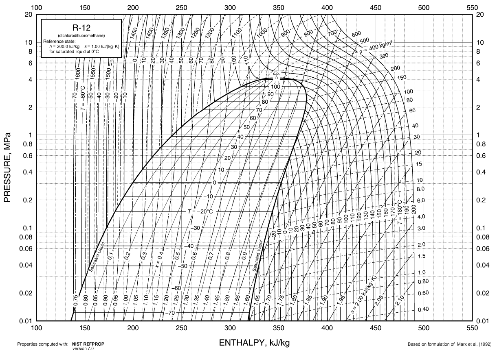

*Fig. 1 Pressure-Enthalpy Diagram for Refrigerant 12*

<!-- str. 804 -->

**Refrigerant 12 (Dichlorodifluoromethane) Prope rties of Saturated Liquid and Saturated Vapor**

| Temp.,* °C | Pressure, MPa | Density,Volume,<br>kg/m<sup>3</sup> Liquid | Density,Volume,<br>m<sup>3</sup>/kg Vapor | Enthalpy, kJ/kg<br>Liquid | Enthalpy, kJ/kg<br>Vapor | Entropy, kJ/(kg·K)<br>Liquid | Entropy, kJ/(kg·K)<br>Vapor | Specific Heat c , kJ/(kg·K)<br><sup>p</sup> Liquid | Specific Heat c , kJ/(kg·K)<br>Vapor | c /c p v Vapor | Velocity of Sound, m/s<br>Liquid | Velocity of Sound, m/s<br>Vapor | Viscosity, μPa·s<br>Liquid | Viscosity, μPa·s<br>Vapor | Thermal Cond., mW/(m·K)<br>Liquid | Thermal Cond., mW/(m·K)<br>Vapor | Tension, Temp.,*<br>Surface mN/m | Tension, Temp.,*<br>°C |
|---|---|---|---|---|---|---|---|---|---|---|---|---|---|---|---|---|---|---|
| –100 | 0.00119 | 1679.1 | 10.0040 | 113.32 | 306.09 | 0.6077 | 1.7210 | 0.819 | 0.449 | 1.182 | 1035 | 118.5 | 1005.0 | 6.78 | 116.7 | 4.27 | 26.48 | –100 |
| –90 | 0.00286 | 1652.8 | 4.3948 | 121.53 | 310.59 | 0.6538 | 1.6861 | 0.824 | 0.465 | 1.176 | 990 | 121.4 | 819.0 | 7.18 | 112.0 | 4.67 | 24.90 | –90 |
| –80 | 0.00619 | 1626.3 | 2.1355 | 129.81 | 315.19 | 0.6978 | 1.6576 | 0.831 | 0.481 | 1.172 | 945 | 124.1 | 684.9 | 7.58 | 107.4 | 5.08 | 23.35 | –80 |
| –70 | 0.01228 | 1599.5 | 1.1286 | 138.17 | 319.87 | 0.7400 | 1.6344 | 0.840 | 0.497 | 1.168 | 902 | 126.7 | 584.0 | 7.97 | 103.0 | 5.50 | 21.81 | –70 |
| –60 | 0.02261 | 1572.3 | 0.63992 | 146.62 | 324.61 | 0.7806 | 1.6156 | 0.850 | 0.513 | 1.166 | 859 | 129.1 | 505.1 | 8.37 | 98.8 | 5.93 | 20.30 | –60 |
| –50 | 0.03911 | 1544.7 | 0.38494 | 155.18 | 329.39 | 0.8197 | 1.6004 | 0.861 | 0.530 | 1.165 | 816 | 131.2 | 441.8 | 8.76 | 94.7 | 6.38 | 18.81 | –50 |
| –40 | 0.06409 | 1516.5 | 0.24342 | 163.86 | 334.18 | 0.8577 | 1.5882 | 0.873 | 0.548 | 1.166 | 775 | 133.0 | 389.8 | 9.16 | 90.7 | 6.84 | 17.35 | –40 |
| –30 | 0.10026 | 1487.7 | 0.16057 | 172.67 | 338.94 | 0.8946 | 1.5784 | 0.886 | 0.566 | 1.169 | 733 | 134.5 | 346.2 | 9.55 | 86.9 | 7.32 | 15.91 | –30 |
| –29.75<sup>b</sup> | 0.10133 | 1487.0 | 0.15900 | 172.89 | 339.06 | 0.8955 | 1.5782 | 0.887 | 0.567 | 1.169 | 732 | 134.5 | 345.2 | 9.56 | 86.8 | 7.33 | 15.88 | –29.75 |
| –28 | 0.10910 | 1481.9 | 0.14841 | 174.44 | 339.89 | 0.9019 | 1.5767 | 0.889 | 0.570 | 1.170 | 725 | 134.7 | 338.3 | 9.63 | 86.1 | 7.41 | 15.63 | –28 |
| –26 | 0.11854 | 1476.0 | 0.13736 | 176.23 | 340.83 | 0.9091 | 1.5751 | 0.892 | 0.574 | 1.171 | 717 | 135.0 | 330.6 | 9.71 | 85.3 | 7.51 | 15.35 | –26 |
| –24 | 0.12860 | 1470.1 | 0.12731 | 178.02 | 341.78 | 0.9163 | 1.5735 | 0.895 | 0.578 | 1.171 | 709 | 135.2 | 323.2 | 9.79 | 84.6 | 7.61 | 15.06 | –24 |
| –22 | 0.13931 | 1464.1 | 0.11815 | 179.81 | 342.72 | 0.9234 | 1.5720 | 0.898 | 0.582 | 1.172 | 701 | 135.4 | 316.0 | 9.87 | 83.8 | 7.71 | 14.78 | –22 |
| –20 | 0.15070 | 1458.1 | 0.10978 | 181.62 | 343.65 | 0.9305 | 1.5706 | 0.901 | 0.586 | 1.174 | 693 | 135.6 | 309.0 | 9.95 | 83.1 | 7.80 | 14.50 | –20 |
| –18 | 0.16279 | 1452.1 | 0.10213 | 183.42 | 344.59 | 0.9376 | 1.5693 | 0.904 | 0.590 | 1.175 | 684 | 135.8 | 302.2 | 10.03 | 82.4 | 7.90 | 14.23 | –18 |
| –16 | 0.17562 | 1446.1 | 0.09512 | 185.24 | 345.52 | 0.9447 | 1.5680 | 0.907 | 0.594 | 1.176 | 676 | 136.0 | 295.6 | 10.10 | 81.6 | 8.01 | 13.95 | –16 |
| –14 | 0.18920 | 1440.0 | 0.08870 | 187.06 | 346.44 | 0.9517 | 1.5667 | 0.910 | 0.598 | 1.178 | 668 | 136.1 | 289.2 | 10.18 | 80.9 | 8.11 | 13.67 | –14 |
| –12 | 0.20358 | 1433.8 | 0.08280 | 188.89 | 347.37 | 0.9587 | 1.5655 | 0.913 | 0.602 | 1.179 | 660 | 136.3 | 283.0 | 10.26 | 80.2 | 8.21 | 13.40 | –12 |
| –10 | 0.21878 | 1427.6 | 0.07737 | 190.72 | 348.29 | 0.9656 | 1.5644 | 0.917 | 0.607 | 1.181 | 652 | 136.4 | 276.9 | 10.34 | 79.4 | 8.31 | 13.12 | –10 |
| –8 | 0.23483 | 1421.4 | 0.07237 | 192.56 | 349.20 | 0.9726 | 1.5633 | 0.920 | 0.611 | 1.183 | 644 | 136.5 | 271.0 | 10.42 | 78.7 | 8.41 | 12.85 | –8 |
| –6 | 0.25176 | 1415.1 | 0.06777 | 194.41 | 350.11 | 0.9795 | 1.5623 | 0.923 | 0.616 | 1.184 | 636 | 136.6 | 265.2 | 10.50 | 78.0 | 8.52 | 12.58 | –6 |
| –4 | 0.26960 | 1408.8 | 0.06352 | 196.27 | 351.01 | 0.9863 | 1.5613 | 0.927 | 0.620 | 1.186 | 628 | 136.6 | 259.6 | 10.58 | 77.3 | 8.62 | 12.31 | –4 |
| –2 | 0.28839 | 1402.5 | 0.05959 | 198.13 | 351.91 | 0.9932 | 1.5603 | 0.930 | 0.625 | 1.189 | 620 | 136.7 | 254.1 | 10.66 | 76.6 | 8.73 | 12.04 | –2 |
| 0 | 0.30815 | 1396.1 | 0.05595 | 200.00 | 352.81 | 1.0000 | 1.5594 | 0.934 | 0.630 | 1.191 | 612 | 136.7 | 248.7 | 10.74 | 75.9 | 8.84 | 11.77 | 0 |
| 2 | 0.32891 | 1389.6 | 0.05258 | 201.88 | 353.69 | 1.0068 | 1.5586 | 0.938 | 0.635 | 1.193 | 604 | 136.7 | 243.5 | 10.82 | 75.1 | 8.95 | 11.51 | 2 |
| 4 | 0.35071 | 1383.1 | 0.04946 | 203.76 | 354.57 | 1.0136 | 1.5577 | 0.942 | 0.640 | 1.196 | 596 | 136.7 | 238.4 | 10.90 | 74.4 | 9.06 | 11.24 | 4 |
| 6 | 0.37358 | 1376.5 | 0.04656 | 205.65 | 355.45 | 1.0203 | 1.5569 | 0.946 | 0.645 | 1.199 | 588 | 136.7 | 233.4 | 10.98 | 73.7 | 9.17 | 10.98 | 6 |
| 8 | 0.39756 | 1369.9 | 0.04386 | 207.56 | 356.32 | 1.0270 | 1.5561 | 0.950 | 0.650 | 1.202 | 580 | 136.6 | 228.6 | 11.07 | 73.0 | 9.28 | 10.71 | 8 |
| 10 | 0.42267 | 1363.2 | 0.04135 | 209.46 | 357.18 | 1.0337 | 1.5554 | 0.954 | 0.656 | 1.205 | 572 | 136.5 | 223.8 | 11.15 | 72.3 | 9.39 | 10.45 | 10 |
| 12 | 0.44895 | 1356.5 | 0.03901 | 211.38 | 358.03 | 1.0404 | 1.5547 | 0.958 | 0.661 | 1.208 | 564 | 136.5 | 219.1 | 11.23 | 71.6 | 9.51 | 10.19 | 12 |
| 14 | 0.47643 | 1349.7 | 0.03683 | 213.31 | 358.88 | 1.0471 | 1.5540 | 0.962 | 0.667 | 1.211 | 556 | 136.3 | 214.6 | 11.31 | 70.9 | 9.62 | 9.94 | 14 |
| 16 | 0.50514 | 1342.8 | 0.03480 | 215.24 | 359.71 | 1.0537 | 1.5533 | 0.967 | 0.672 | 1.215 | 548 | 136.2 | 210.1 | 11.40 | 70.2 | 9.74 | 9.68 | 16 |
| 18 | 0.53513 | 1335.9 | 0.03290 | 217.18 | 360.54 | 1.0603 | 1.5527 | 0.971 | 0.678 | 1.219 | 540 | 136.1 | 205.7 | 11.48 | 69.6 | 9.86 | 9.42 | 18 |
| 20 | 0.56642 | 1328.9 | 0.03112 | 219.14 | 361.36 | 1.0669 | 1.5521 | 0.976 | 0.685 | 1.223 | 532 | 135.9 | 201.4 | 11.57 | 68.9 | 9.98 | 9.17 | 20 |
| 22 | 0.59905 | 1321.8 | 0.02946 | 221.10 | 362.17 | 1.0735 | 1.5515 | 0.981 | 0.691 | 1.228 | 524 | 135.7 | 197.2 | 11.65 | 68.2 | 10.10 | 8.92 | 22 |
| 24 | 0.63305 | 1314.6 | 0.02790 | 223.07 | 362.97 | 1.0801 | 1.5509 | 0.986 | 0.697 | 1.232 | 516 | 135.5 | 193.1 | 11.74 | 67.5 | 10.23 | 8.67 | 24 |
| 26 | 0.66846 | 1307.4 | 0.02643 | 225.05 | 363.76 | 1.0866 | 1.5503 | 0.991 | 0.704 | 1.237 | 508 | 135.2 | 189.0 | 11.83 | 66.8 | 10.36 | 8.42 | 26 |
| 28 | 0.70531 | 1300.1 | 0.02506 | 227.04 | 364.54 | 1.0932 | 1.5498 | 0.997 | 0.711 | 1.242 | 499 | 134.9 | 185.0 | 11.92 | 66.1 | 10.49 | 8.17 | 28 |
| 30 | 0.74365 | 1292.7 | 0.02377 | 229.04 | 365.31 | 1.0997 | 1.5492 | 1.002 | 0.718 | 1.248 | 491 | 134.7 | 181.1 | 12.01 | 65.4 | 10.62 | 7.92 | 30 |
| 32 | 0.78350 | 1285.2 | 0.02256 | 231.06 | 366.07 | 1.1062 | 1.5487 | 1.008 | 0.726 | 1.254 | 483 | 134.3 | 177.3 | 12.10 | 64.8 | 10.75 | 7.68 | 32 |
| 34 | 0.82491 | 1277.6 | 0.02142 | 233.08 | 366.81 | 1.1127 | 1.5481 | 1.014 | 0.734 | 1.260 | 475 | 134.0 | 173.5 | 12.19 | 64.1 | 10.89 | 7.43 | 34 |
| 36 | 0.86791 | 1269.9 | 0.02034 | 235.12 | 367.54 | 1.1192 | 1.5476 | 1.020 | 0.742 | 1.267 | 467 | 133.6 | 169.8 | 12.28 | 63.4 | 11.03 | 7.19 | 36 |
| 38 | 0.91253 | 1262.2 | 0.01933 | 237.16 | 368.26 | 1.1257 | 1.5470 | 1.026 | 0.750 | 1.274 | 459 | 133.2 | 166.1 | 12.38 | 62.7 | 11.18 | 6.95 | 38 |
| 40 | 0.95882 | 1254.3 | 0.01838 | 239.22 | 368.96 | 1.1322 | 1.5465 | 1.033 | 0.759 | 1.282 | 450 | 132.8 | 162.5 | 12.48 | 62.1 | 11.33 | 6.72 | 40 |
| 42 | 1.00680 | 1246.3 | 0.01748 | 241.29 | 369.65 | 1.1387 | 1.5459 | 1.040 | 0.768 | 1.290 | 442 | 132.4 | 159.0 | 12.57 | 61.4 | 11.48 | 6.48 | 42 |
| 44 | 1.05660 | 1238.1 | 0.01662 | 243.38 | 370.33 | 1.1451 | 1.5454 | 1.048 | 0.778 | 1.299 | 434 | 131.9 | 155.5 | 12.67 | 60.7 | 11.63 | 6.25 | 44 |
| 46 | 1.10810 | 1229.9 | 0.01582 | 245.47 | 370.98 | 1.1516 | 1.5448 | 1.055 | 0.788 | 1.308 | 426 | 131.4 | 152.0 | 12.78 | 60.0 | 11.79 | 6.01 | 46 |
| 48 | 1.16140 | 1221.5 | 0.01505 | 247.59 | 371.62 | 1.1580 | 1.5443 | 1.063 | 0.798 | 1.318 | 417 | 130.9 | 148.6 | 12.88 | 59.4 | 11.96 | 5.78 | 48 |
| 50 | 1.21660 | 1213.0 | 0.01433 | 249.71 | 372.24 | 1.1645 | 1.5437 | 1.072 | 0.810 | 1.329 | 409 | 130.3 | 145.3 | 12.99 | 58.7 | 12.13 | 5.55 | 50 |
| 52 | 1.27370 | 1204.4 | 0.01365 | 251.85 | 372.85 | 1.1710 | 1.5431 | 1.081 | 0.821 | 1.340 | 400 | 129.7 | 141.9 | 13.10 | 58.0 | 12.31 | 5.33 | 52 |
| 54 | 1.33270 | 1195.6 | 0.01300 | 254.01 | 373.43 | 1.1774 | 1.5425 | 1.090 | 0.834 | 1.353 | 392 | 129.1 | 138.7 | 13.21 | 57.3 | 12.49 | 5.10 | 54 |
| 56 | 1.39380 | 1186.6 | 0.01238 | 256.18 | 373.99 | 1.1839 | 1.5418 | 1.100 | 0.847 | 1.366 | 383 | 128.4 | 135.4 | 13.33 | 56.7 | 12.68 | 4.88 | 56 |
| 58 | 1.45680 | 1177.5 | 0.01180 | 258.38 | 374.53 | 1.1904 | 1.5411 | 1.111 | 0.861 | 1.381 | 375 | 127.7 | 132.2 | 13.45 | 56.0 | 12.87 | 4.66 | 58 |
| 60 | 1.52190 | 1168.1 | 0.01124 | 260.58 | 375.05 | 1.1969 | 1.5404 | 1.122 | 0.876 | 1.397 | 366 | 127.0 | 129.1 | 13.57 | 55.3 | 13.08 | 4.44 | 60 |
| 62 | 1.58920 | 1158.6 | 0.01071 | 262.81 | 375.54 | 1.2033 | 1.5397 | 1.135 | 0.892 | 1.414 | 357 | 126.3 | 125.9 | 13.70 | 54.7 | 13.29 | 4.23 | 62 |
| 64 | 1.65860 | 1148.9 | 0.01021 | 265.06 | 376.00 | 1.2099 | 1.5389 | 1.148 | 0.910 | 1.433 | 348 | 125.5 | 122.8 | 13.83 | 54.0 | 13.51 | 4.01 | 64 |
| 66 | 1.73020 | 1139.0 | 0.00973 | 267.33 | 376.44 | 1.2164 | 1.5381 | 1.162 | 0.929 | 1.453 | 339 | 124.6 | 119.7 | 13.96 | 53.3 | 13.75 | 3.80 | 66 |
| 68 | 1.80410 | 1128.8 | 0.00927 | 269.62 | 376.84 | 1.2229 | 1.5372 | 1.177 | 0.949 | 1.476 | 330 | 123.8 | 116.7 | 14.11 | 52.6 | 13.99 | 3.59 | 68 |
| 70 | 1.88020 | 1118.3 | 0.00883 | 271.94 | 377.22 | 1.2295 | 1.5363 | 1.193 | 0.971 | 1.501 | 321 | 122.9 | 113.6 | 14.26 | 52.0 | 14.25 | 3.39 | 70 |
| 75 | 2.08110 | 1090.9 | 0.00782 | 277.84 | 377.99 | 1.2461 | 1.5337 | 1.241 | 1.037 | 1.576 | 298 | 120.4 | 106.1 | 14.66 | 50.3 | 14.96 | 2.88 | 75 |
| 80 | 2.29750 | 1061.4 | 0.00691 | 283.94 | 378.48 | 1.2629 | 1.5306 | 1.302 | 1.122 | 1.677 | 274 | 117.7 | 98.6 | 15.11 | 48.7 | 15.80 | 2.40 | 80 |
| 85 | 2.53040 | 1029.1 | 0.00608 | 290.27 | 378.64 | 1.2801 | 1.5268 | 1.384 | 1.239 | 1.817 | 249 | 114.7 | 91.1 | 15.65 | 47.2 | 16.82 | 1.93 | 85 |
| 90 | 2.78080 | 993.2 | 0.00533 | 296.91 | 378.35 | 1.2978 | 1.5220 | 1.501 | 1.410 | 2.026 | 224 | 111.4 | 83.4 | 16.29 | 45.9 | 18.11 | 1.49 | 90 |
| 95 | 3.05010 | 952.2 | 0.00463 | 303.95 | 377.45 | 1.3163 | 1.5159 | 1.679 | 1.683 | 2.362 | 197 | 107.8 | 75.6 | 17.11 | 45.1 | 19.81 | 1.07 | 95 |
| 100 | 3.33990 | 903.8 | 0.00396 | 311.58 | 375.60 | 1.3360 | 1.5076 | 1.996 | 2.192 | 2.990 | 169 | 103.7 | 67.3 | 18.20 | 45.7 | 22.27 | 0.69 | 100 |
| 105 | 3.65250 | 842.2 | 0.00330 | 320.24 | 372.08 | 1.3581 | 1.4952 | 2.754 | 3.458 | 4.544 | 139 | 99.3 | 58.1 | 19.87 | 51.7 | 26.34 | 0.35 | 105 |
| 110 | 3.99240 | 742.7 | 0.00252 | 331.82 | 363.95 | 1.3874 | 1.4712 | 7.81 | 11.440 | 14.140 | 105 | 94.0 | 46.3 | 23.46 | 113.7 | 39.46 | 0.07 | 110 |
| 111.97<sup>c</sup> | 4.13610 | 565.0 | 0.00177 | 347.76 | 347.76 | 1.4283 | 1.4283 | ∞ | ∞ | ∞ | 0 | 0.0 | — | — | ∞ | ∞ | 0.00 | 111.97 |

*Temperatures on ITS-90 scale <sup>b</sup>Normal boiling point <sup>c</sup>Critical point

<!-- str. 805 -->

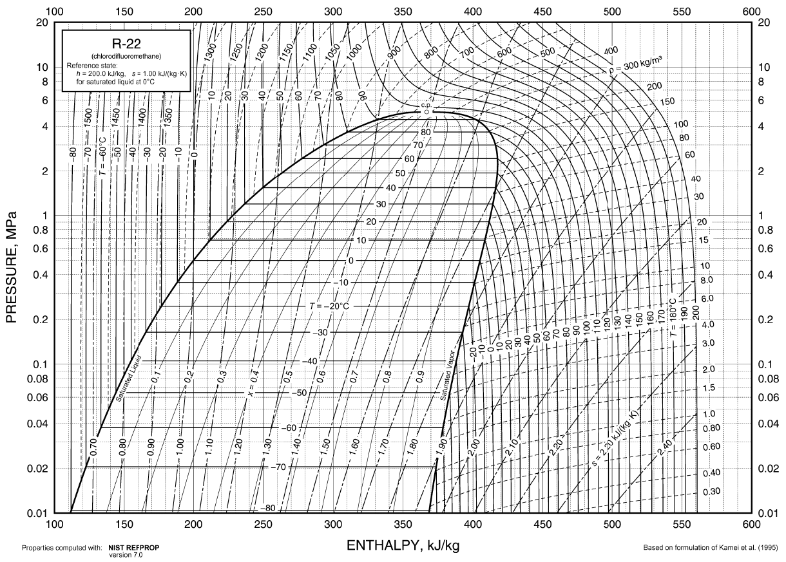

*Fig. 2 Pressure-Enthalpy Diagram for Refrigerant 22*

<!-- str. 806 -->

### Refrigerant 22 (Chlorodifluoromethane) Prope

**rties of Saturated Liquid and Saturated Vapor**

| Temp.,* °C | Pressure, MPa | Density, Volume,<br>kg/m<sup>3</sup> Liquid | Density, Volume,<br>m<sup>3</sup>/kg Vapor | Enthalpy, kJ/kg<br>Liquid | Enthalpy, kJ/kg<br>Vapor | Entropy, kJ/(kg·K)<br>Liquid | Entropy, kJ/(kg·K)<br>Vapor | Specific Heat c , kJ/(kg·K)<br><sup>p</sup> Liquid | Specific Heat c , kJ/(kg·K)<br>Vapor | c /c p v Vapor | Velocity of Sound, m/s Liquid Vapor | Velocity of Sound, m/s Liquid Vapor | Viscosity, μPa·s<br>Liquid | Viscosity, μPa·s<br>Vapor | Thermal Cond., mW/(m·K)<br>Liquid | Thermal Cond., mW/(m·K)<br>Vapor | Tension, Temp.,*<br>Surface mN/m | Tension, Temp.,*<br>°C |
|---|---|---|---|---|---|---|---|---|---|---|---|---|---|---|---|---|---|---|
| –100 | 0.00201 | 1571.3 | 8.26600 | 90.71 | 358.97 | 0.5050 | 2.0543 | 1.061 | 0.497 | 1.243 | 1127 | 143.6 | 845.8 | 7.25 | 143.1 | 4.46 | 28.12 | –100 |
| –90 | 0.00481 | 1544.9 | 3.64480 | 101.32 | 363.85 | 0.5646 | 1.9980 | 1.061 | 0.512 | 1.237 | 1080 | 147.0 | 699.4 | 7.67 | 137.8 | 4.84 | 26.36 | –90 |
| –80 | 0.01037 | 1518.2 | 1.77820 | 111.94 | 368.77 | 0.6210 | 1.9508 | 1.062 | 0.528 | 1.233 | 1033 | 150.3 | 591.0 | 8.09 | 132.6 | 5.25 | 24.63 | –80 |
| –70 | 0.02047 | 1491.2 | 0.94342 | 122.58 | 373.70 | 0.6747 | 1.9108 | 1.065 | 0.545 | 1.231 | 986 | 153.3 | 507.6 | 8.52 | 127.6 | 5.68 | 22.92 | –70 |
| –60 | 0.03750 | 1463.7 | 0.53680 | 133.27 | 378.59 | 0.7260 | 1.8770 | 1.071 | 0.564 | 1.230 | 940 | 156.0 | 441.4 | 8.94 | 122.6 | 6.12 | 21.24 | –60 |
| –50 | 0.06453 | 1435.6 | 0.32385 | 144.03 | 383.42 | 0.7752 | 1.8480 | 1.079 | 0.585 | 1.232 | 893 | 158.3 | 387.5 | 9.36 | 117.8 | 6.59 | 19.58 | –50 |
| –48 | 0.07145 | 1429.9 | 0.29453 | 146.19 | 384.37 | 0.7849 | 1.8428 | 1.081 | 0.589 | 1.233 | 884 | 158.7 | 377.8 | 9.45 | 116.9 | 6.69 | 19.25 | –48 |
| –46 | 0.07894 | 1424.2 | 0.26837 | 148.36 | 385.32 | 0.7944 | 1.8376 | 1.083 | 0.594 | 1.234 | 875 | 159.1 | 368.6 | 9.53 | 115.9 | 6.79 | 18.92 | –46 |
| –44 | 0.08705 | 1418.4 | 0.24498 | 150.53 | 386.26 | 0.8039 | 1.8327 | 1.086 | 0.599 | 1.235 | 865 | 159.5 | 359.6 | 9.62 | 115.0 | 6.89 | 18.59 | –44 |
| –42 | 0.09580 | 1412.6 | 0.22402 | 152.70 | 387.20 | 0.8134 | 1.8278 | 1.088 | 0.603 | 1.236 | 856 | 159.9 | 351.0 | 9.70 | 114.0 | 6.99 | 18.27 | –42 |
| –40.81<sup>b</sup> | 0.10132 | 1409.2 | 0.21260 | 154.00 | 387.75 | 0.8189 | 1.8250 | 1.090 | 0.606 | 1.236 | 851 | 160.1 | 346.0 | 9.75 | 113.5 | 7.05 | 18.08 | –40.81 |
| –40 | 0.10523 | 1406.8 | 0.20521 | 154.89 | 388.13 | 0.8227 | 1.8231 | 1.091 | 0.608 | 1.237 | 847 | 160.3 | 342.6 | 9.79 | 113.1 | 7.09 | 17.94 | –40 |
| –38 | 0.11538 | 1401.0 | 0.18829 | 157.07 | 389.06 | 0.8320 | 1.8186 | 1.093 | 0.613 | 1.238 | 838 | 160.6 | 334.5 | 9.87 | 112.2 | 7.19 | 17.62 | –38 |
| –36 | 0.12628 | 1395.1 | 0.17304 | 159.27 | 389.97 | 0.8413 | 1.8141 | 1.096 | 0.619 | 1.239 | 828 | 160.9 | 326.7 | 9.96 | 111.2 | 7.29 | 17.30 | –36 |
| –34 | 0.13797 | 1389.1 | 0.15927 | 161.47 | 390.89 | 0.8505 | 1.8098 | 1.099 | 0.624 | 1.241 | 819 | 161.2 | 319.1 | 10.04 | 110.3 | 7.40 | 16.98 | –34 |
| –32 | 0.15050 | 1383.2 | 0.14682 | 163.67 | 391.79 | 0.8596 | 1.8056 | 1.102 | 0.629 | 1.242 | 810 | 161.5 | 311.7 | 10.12 | 109.4 | 7.51 | 16.66 | –32 |
| –30 | 0.16389 | 1377.2 | 0.13553 | 165.88 | 392.69 | 0.8687 | 1.8015 | 1.105 | 0.635 | 1.244 | 800 | 161.8 | 304.6 | 10.21 | 108.5 | 7.61 | 16.34 | –30 |
| –28 | 0.17819 | 1371.1 | 0.12528 | 168.10 | 393.58 | 0.8778 | 1.7975 | 1.108 | 0.641 | 1.246 | 791 | 162.0 | 297.7 | 10.29 | 107.5 | 7.72 | 16.02 | –28 |
| –26 | 0.19344 | 1365.0 | 0.11597 | 170.33 | 394.47 | 0.8868 | 1.7937 | 1.112 | 0.646 | 1.248 | 782 | 162.3 | 291.0 | 10.38 | 106.6 | 7.83 | 15.70 | –26 |
| –24 | 0.20968 | 1358.9 | 0.10749 | 172.56 | 395.34 | 0.8957 | 1.7899 | 1.115 | 0.653 | 1.250 | 772 | 162.5 | 284.4 | 10.46 | 105.7 | 7.94 | 15.39 | –24 |
| –22 | 0.22696 | 1352.7 | 0.09975 | 174.80 | 396.21 | 0.9046 | 1.7862 | 1.119 | 0.659 | 1.253 | 763 | 162.7 | 278.1 | 10.55 | 104.8 | 8.06 | 15.07 | –22 |
| –20 | 0.24531 | 1346.5 | 0.09268 | 177.04 | 397.06 | 0.9135 | 1.7826 | 1.123 | 0.665 | 1.255 | 754 | 162.8 | 271.9 | 10.63 | 103.9 | 8.17 | 14.76 | –20 |
| –18 | 0.26479 | 1340.3 | 0.08621 | 179.30 | 397.91 | 0.9223 | 1.7791 | 1.127 | 0.672 | 1.258 | 744 | 163.0 | 265.9 | 10.72 | 103.0 | 8.29 | 14.45 | –18 |
| –16 | 0.28543 | 1334.0 | 0.08029 | 181.56 | 398.75 | 0.9311 | 1.7757 | 1.131 | 0.678 | 1.261 | 735 | 163.1 | 260.1 | 10.80 | 102.1 | 8.40 | 14.14 | –16 |
| –14 | 0.30728 | 1327.6 | 0.07485 | 183.83 | 399.57 | 0.9398 | 1.7723 | 1.135 | 0.685 | 1.264 | 726 | 163.2 | 254.4 | 10.89 | 101.1 | 8.52 | 13.83 | –14 |
| –12 | 0.33038 | 1321.2 | 0.06986 | 186.11 | 400.39 | 0.9485 | 1.7690 | 1.139 | 0.692 | 1.267 | 716 | 163.3 | 248.8 | 10.98 | 100.2 | 8.65 | 13.52 | –12 |
| –10 | 0.35479 | 1314.7 | 0.06527 | 188.40 | 401.20 | 0.9572 | 1.7658 | 1.144 | 0.699 | 1.270 | 707 | 163.3 | 243.4 | 11.06 | 99.3 | 8.77 | 13.21 | –10 |
| –8 | 0.38054 | 1308.2 | 0.06103 | 190.70 | 401.99 | 0.9658 | 1.7627 | 1.149 | 0.707 | 1.274 | 697 | 163.4 | 238.1 | 11.15 | 98.4 | 8.89 | 12.91 | –8 |
| –6 | 0.40769 | 1301.6 | 0.05713 | 193.01 | 402.77 | 0.9744 | 1.7596 | 1.154 | 0.715 | 1.278 | 688 | 163.4 | 233.0 | 11.24 | 97.5 | 9.02 | 12.60 | –6 |
| –4 | 0.43628 | 1295.0 | 0.05352 | 195.33 | 403.55 | 0.9830 | 1.7566 | 1.159 | 0.722 | 1.282 | 679 | 163.4 | 227.9 | 11.32 | 96.6 | 9.15 | 12.30 | –4 |
| –2 | 0.46636 | 1288.3 | 0.05019 | 197.66 | 404.30 | 0.9915 | 1.7536 | 1.164 | 0.731 | 1.287 | 669 | 163.4 | 223.0 | 11.41 | 95.7 | 9.28 | 12.00 | –2 |
| 0 | 0.49799 | 1281.5 | 0.04710 | 200.00 | 405.05 | 1.0000 | 1.7507 | 1.169 | 0.739 | 1.291 | 660 | 163.3 | 218.2 | 11.50 | 94.8 | 9.42 | 11.70 | 0 |
| 2 | 0.53120 | 1274.7 | 0.04424 | 202.35 | 405.78 | 1.0085 | 1.7478 | 1.175 | 0.748 | 1.296 | 650 | 163.2 | 213.5 | 11.59 | 93.9 | 9.56 | 11.40 | 2 |
| 4 | 0.56605 | 1267.8 | 0.04159 | 204.71 | 406.50 | 1.0169 | 1.7450 | 1.181 | 0.757 | 1.301 | 641 | 163.1 | 208.9 | 11.68 | 93.1 | 9.70 | 11.10 | 4 |
| 6 | 0.60259 | 1260.8 | 0.03913 | 207.09 | 407.20 | 1.0254 | 1.7422 | 1.187 | 0.766 | 1.307 | 632 | 163.0 | 204.4 | 11.77 | 92.2 | 9.84 | 10.81 | 6 |
| 8 | 0.64088 | 1253.8 | 0.03683 | 209.47 | 407.89 | 1.0338 | 1.7395 | 1.193 | 0.775 | 1.313 | 622 | 162.8 | 200.0 | 11.86 | 91.3 | 9.99 | 10.51 | 8 |
| 10 | 0.68095 | 1246.7 | 0.03470 | 211.87 | 408.56 | 1.0422 | 1.7368 | 1.199 | 0.785 | 1.319 | 613 | 162.6 | 195.7 | 11.96 | 90.4 | 10.14 | 10.22 | 10 |
| 12 | 0.72286 | 1239.5 | 0.03271 | 214.28 | 409.21 | 1.0505 | 1.7341 | 1.206 | 0.795 | 1.326 | 603 | 162.4 | 191.5 | 12.05 | 89.5 | 10.29 | 9.93 | 12 |
| 14 | 0.76668 | 1232.2 | 0.03086 | 216.70 | 409.85 | 1.0589 | 1.7315 | 1.213 | 0.806 | 1.333 | 594 | 162.2 | 187.3 | 12.14 | 88.6 | 10.45 | 9.64 | 14 |
| 16 | 0.81244 | 1224.9 | 0.02912 | 219.14 | 410.47 | 1.0672 | 1.7289 | 1.220 | 0.817 | 1.340 | 584 | 161.9 | 183.2 | 12.24 | 87.7 | 10.61 | 9.35 | 16 |
| 18 | 0.86020 | 1217.4 | 0.02750 | 221.59 | 411.07 | 1.0755 | 1.7263 | 1.228 | 0.828 | 1.348 | 575 | 161.6 | 179.2 | 12.33 | 86.8 | 10.77 | 9.06 | 18 |
| 20 | 0.91002 | 1209.9 | 0.02599 | 224.06 | 411.66 | 1.0838 | 1.7238 | 1.236 | 0.840 | 1.357 | 565 | 161.3 | 175.3 | 12.43 | 85.9 | 10.95 | 8.78 | 20 |
| 22 | 0.96195 | 1202.3 | 0.02457 | 226.54 | 412.22 | 1.0921 | 1.7212 | 1.244 | 0.853 | 1.366 | 555 | 161.0 | 171.5 | 12.53 | 85.0 | 11.12 | 8.50 | 22 |
| 24 | 1.01600 | 1194.6 | 0.02324 | 229.04 | 412.77 | 1.1004 | 1.7187 | 1.252 | 0.866 | 1.375 | 546 | 160.6 | 167.7 | 12.63 | 84.1 | 11.30 | 8.22 | 24 |
| 26 | 1.07240 | 1186.7 | 0.02199 | 231.55 | 413.29 | 1.1086 | 1.7162 | 1.261 | 0.879 | 1.385 | 536 | 160.2 | 163.9 | 12.74 | 83.2 | 11.49 | 7.94 | 26 |
| 28 | 1.13090 | 1178.8 | 0.02082 | 234.08 | 413.79 | 1.1169 | 1.7136 | 1.271 | 0.893 | 1.396 | 527 | 159.7 | 160.3 | 12.84 | 82.3 | 11.69 | 7.66 | 28 |
| 30 | 1.19190 | 1170.7 | 0.01972 | 236.62 | 414.26 | 1.1252 | 1.7111 | 1.281 | 0.908 | 1.408 | 517 | 159.2 | 156.7 | 12.95 | 81.4 | 11.89 | 7.38 | 30 |
| 32 | 1.25520 | 1162.6 | 0.01869 | 239.19 | 414.71 | 1.1334 | 1.7086 | 1.291 | 0.924 | 1.420 | 507 | 158.7 | 153.1 | 13.06 | 80.5 | 12.10 | 7.11 | 32 |
| 34 | 1.32100 | 1154.3 | 0.01771 | 241.77 | 415.14 | 1.1417 | 1.7061 | 1.302 | 0.940 | 1.434 | 497 | 158.2 | 149.6 | 13.17 | 79.6 | 12.31 | 6.84 | 34 |
| 36 | 1.38920 | 1145.8 | 0.01679 | 244.38 | 415.54 | 1.1499 | 1.7036 | 1.314 | 0.957 | 1.448 | 487 | 157.6 | 146.1 | 13.28 | 78.7 | 12.54 | 6.57 | 36 |
| 38 | 1.46010 | 1137.3 | 0.01593 | 247.00 | 415.91 | 1.1582 | 1.7010 | 1.326 | 0.976 | 1.463 | 478 | 157.0 | 142.7 | 13.40 | 77.8 | 12.77 | 6.30 | 38 |
| 40 | 1.53360 | 1128.5 | 0.01511 | 249.65 | 416.25 | 1.1665 | 1.6985 | 1.339 | 0.995 | 1.480 | 468 | 156.4 | 139.4 | 13.52 | 76.9 | 13.02 | 6.04 | 40 |
| 42 | 1.60980 | 1119.6 | 0.01433 | 252.32 | 416.55 | 1.1747 | 1.6959 | 1.353 | 1.015 | 1.498 | 458 | 155.7 | 136.1 | 13.64 | 76.0 | 13.28 | 5.77 | 42 |
| 44 | 1.68870 | 1110.6 | 0.01360 | 255.01 | 416.83 | 1.1830 | 1.6933 | 1.368 | 1.037 | 1.517 | 448 | 155.0 | 132.8 | 13.77 | 75.1 | 13.55 | 5.51 | 44 |
| 46 | 1.77040 | 1101.4 | 0.01291 | 257.73 | 417.07 | 1.1913 | 1.6906 | 1.384 | 1.061 | 1.538 | 437 | 154.2 | 129.5 | 13.90 | 74.1 | 13.83 | 5.25 | 46 |
| 48 | 1.85510 | 1091.9 | 0.01226 | 260.47 | 417.27 | 1.1997 | 1.6879 | 1.401 | 1.086 | 1.561 | 427 | 153.4 | 126.3 | 14.04 | 73.2 | 14.13 | 5.00 | 48 |
| 50 | 1.94270 | 1082.3 | 0.01163 | 263.25 | 417.44 | 1.2080 | 1.6852 | 1.419 | 1.113 | 1.586 | 417 | 152.6 | 123.1 | 14.18 | 72.3 | 14.45 | 4.74 | 50 |
| 52 | 2.03330 | 1072.4 | 0.01104 | 266.05 | 417.56 | 1.2164 | 1.6824 | 1.439 | 1.142 | 1.614 | 407 | 151.7 | 120.0 | 14.32 | 71.4 | 14.78 | 4.49 | 52 |
| 54 | 2.12700 | 1062.3 | 0.01048 | 268.89 | 417.63 | 1.2248 | 1.6795 | 1.461 | 1.173 | 1.644 | 396 | 150.8 | 116.9 | 14.47 | 70.4 | 15.14 | 4.24 | 54 |
| 56 | 2.22390 | 1052.0 | 0.00995 | 271.76 | 417.66 | 1.2333 | 1.6766 | 1.485 | 1.208 | 1.677 | 386 | 149.8 | 113.8 | 14.63 | 69.5 | 15.52 | 4.00 | 56 |
| 58 | 2.32400 | 1041.3 | 0.00944 | 274.66 | 417.63 | 1.2418 | 1.6736 | 1.511 | 1.246 | 1.714 | 375 | 148.8 | 110.7 | 14.80 | 68.6 | 15.92 | 3.75 | 58 |
| 60 | 2.42750 | 1030.4 | 0.00896 | 277.61 | 417.55 | 1.2504 | 1.6705 | 1.539 | 1.287 | 1.755 | 364 | 147.7 | 107.6 | 14.98 | 67.6 | 16.36 | 3.51 | 60 |
| 65 | 2.70120 | 1001.4 | 0.00785 | 285.18 | 417.06 | 1.2722 | 1.6622 | 1.626 | 1.413 | 1.881 | 337 | 144.9 | 100.0 | 15.46 | 65.3 | 17.61 | 2.92 | 65 |
| 70 | 2.99740 | 969.7 | 0.00685 | 293.10 | 416.09 | 1.2945 | 1.6529 | 1.743 | 1.584 | 2.056 | 309 | 141.7 | 92.4 | 16.02 | 62.9 | 19.16 | 2.36 | 70 |
| 75 | 3.31770 | 934.4 | 0.00595 | 301.46 | 414.49 | 1.3177 | 1.6424 | 1.913 | 1.832 | 2.315 | 280 | 138.1 | 84.6 | 16.70 | 60.6 | 21.16 | 1.82 | 75 |
| 80 | 3.66380 | 893.7 | 0.00512 | 310.44 | 412.01 | 1.3423 | 1.6299 | 2.181 | 2.231 | 2.735 | 249 | 134.2 | 76.6 | 17.55 | 58.6 | 23.87 | 1.30 | 80 |
| 85 | 4.03780 | 844.8 | 0.00434 | 320.38 | 408.19 | 1.3690 | 1.6142 | 2.682 | 2.984 | 3.532 | 215 | 129.7 | 68.1 | 18.71 | 57.4 | 27.82 | 0.83 | 85 |
| 90 | 4.44230 | 780.1 | 0.00356 | 332.09 | 401.87 | 1.4001 | 1.5922 | 3.981 | 4.975 | 5.626 | 177 | 124.6 | 58.3 | 20.48 | 59.3 | 34.55 | 0.40 | 90 |
| 95 | 4.88240 | 662.9 | 0.00262 | 349.56 | 387.28 | 1.4462 | 1.5486 | 17.31 | 25.29 | 26.43 | 128 | 118.0 | 44.4 | 24.76 | 83.5 | 59.15 | 0.05 | 95 |
| 96.15<sup>c</sup> | 4.99000 | 523.8 | 0.00191 | 366.90 | 366.90 | 1.4927 | 1.4927 | ∞ | ∞ | ∞ | 0 | 0.0 | — | — | ∞ | ∞ | 0.00 | 96.15 |

*Temperatures on ITS-90 scale <sup>b</sup>Normal boiling point <sup>c</sup>Critical point

<!-- str. 807 -->

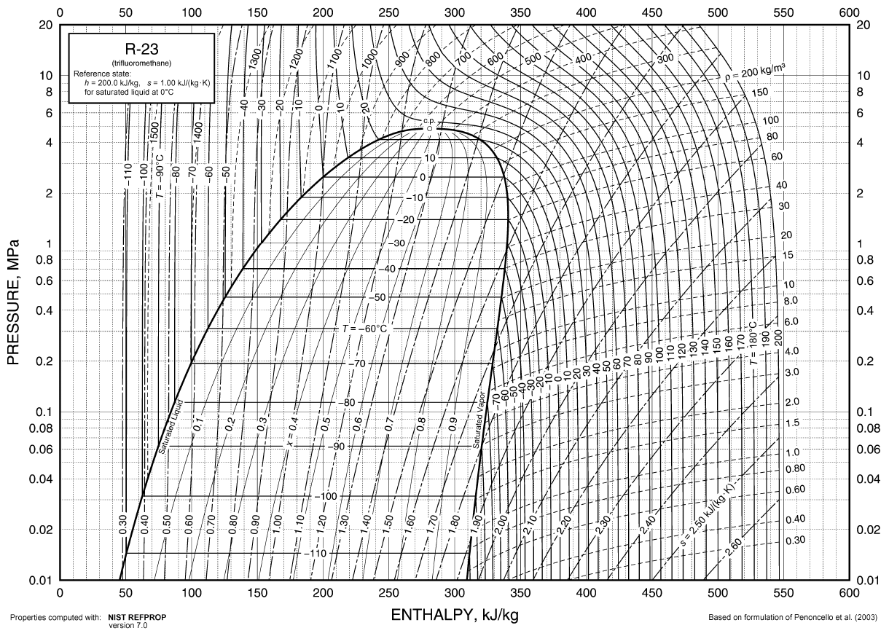

*Fig. 3 Pressure-Enthalpy Diagram for Refrigerant 23*

<!-- str. 808 -->

### Refrigerant 23 (Trifluoromethane) Propertie

**s of Saturated Liquid and Saturated Vapor**

| Temp.,* °C | Pressure, MPa | Density, kg/m<sup>3</sup> Liquid | Volume, m<sup>3</sup>/kg Vapor | Enthalpy, kJ/kg<br>Liquid | Enthalpy, kJ/kg<br>Vapor | Entropy, kJ/(kg·K)<br>Liquid | Entropy, kJ/(kg·K)<br>Vapor | Specific Heat c , kJ/(kg·K)<br><sup>p</sup> Liquid | Specific Heat c , kJ/(kg·K)<br>Vapor | c /c p v Vapor | Velocity of Sound, m/s<br>Liquid | Velocity of Sound, m/s<br>Vapor | Viscosity, μPa·s<br>Liquid | Viscosity, μPa·s<br>Vapor | Thermal Cond., mW/(m·K)<br>Liquid | Thermal Cond., mW/(m·K)<br>Vapor | Tension, Temp.,*<br>Surface mN/m | Tension, Temp.,*<br>°C |
|---|---|---|---|---|---|---|---|---|---|---|---|---|---|---|---|---|---|---|
| –155.13<sup>a</sup> | 0.00006 | 1701.9 | 241.360 | –3.67 | 289.21 | –0.0705 | 2.4111 | 1.221 | 0.500 | 1.315 | 1211 | 135.7 | 2055.0 | 5.35 | 268.6 | 3.80 | 34.37 | –155.13 |
| –150 | 0.00014 | 1685.3 | 105.950 | 2.54 | 291.73 | –0.0190 | 2.3293 | 1.205 | 0.506 | 1.311 | 1200 | 138.4 | 1662.0 | 5.64 | 250.2 | 4.07 | 33.12 | –150 |
| –140 | 0.00060 | 1652.0 | 26.330 | 14.53 | 296.65 | 0.0746 | 2.1934 | 1.195 | 0.522 | 1.304 | 1151 | 143.3 | 1153.0 | 6.22 | 220.9 | 4.61 | 30.71 | –140 |
| –130 | 0.00206 | 1617.9 | 8.21940 | 26.48 | 301.56 | 0.1612 | 2.0828 | 1.195 | 0.541 | 1.297 | 1092 | 147.9 | 845.9 | 6.80 | 198.2 | 5.15 | 28.35 | –130 |
| –120 | 0.00588 | 1583.3 | 3.06950 | 38.45 | 306.45 | 0.2420 | 1.9919 | 1.199 | 0.565 | 1.292 | 1033 | 152.2 | 648.3 | 7.37 | 180.1 | 5.70 | 26.03 | –120 |
| –110 | 0.01447 | 1548.2 | 1.32190 | 50.47 | 311.27 | 0.3179 | 1.9165 | 1.205 | 0.593 | 1.289 | 976 | 156.0 | 514.4 | 7.93 | 165.3 | 6.25 | 23.75 | –110 |
| –100 | 0.03157 | 1512.3 | 0.63807 | 62.56 | 315.98 | 0.3898 | 1.8534 | 1.213 | 0.625 | 1.290 | 921 | 159.5 | 419.2 | 8.48 | 152.9 | 6.82 | 21.53 | –100 |
| –90 | 0.06239 | 1475.7 | 0.33766 | 74.76 | 320.51 | 0.4582 | 1.8000 | 1.225 | 0.661 | 1.294 | 866 | 162.4 | 349.0 | 9.03 | 142.4 | 7.42 | 19.35 | –90 |
| –82.02<sup>b</sup> | 0.10132 | 1445.6 | 0.21446 | 84.60 | 323.96 | 0.5106 | 1.7630 | 1.237 | 0.694 | 1.301 | 823 | 164.3 | 305.1 | 9.47 | 135.0 | 7.92 | 17.65 | –82.02 |
| –80 | 0.11370 | 1437.9 | 0.19248 | 87.10 | 324.81 | 0.5236 | 1.7543 | 1.241 | 0.702 | 1.304 | 812 | 164.7 | 295.3 | 9.58 | 133.2 | 8.05 | 17.23 | –80 |
| –78 | 0.12712 | 1430.2 | 0.17333 | 89.59 | 325.63 | 0.5364 | 1.7459 | 1.245 | 0.711 | 1.306 | 801 | 165.1 | 286.1 | 9.69 | 131.5 | 8.18 | 16.81 | –78 |
| –76 | 0.14175 | 1422.5 | 0.15644 | 92.09 | 326.44 | 0.5491 | 1.7378 | 1.249 | 0.721 | 1.309 | 790 | 165.4 | 277.2 | 9.80 | 129.8 | 8.31 | 16.40 | –76 |
| –74 | 0.15768 | 1414.7 | 0.14151 | 94.60 | 327.24 | 0.5617 | 1.7299 | 1.253 | 0.730 | 1.312 | 779 | 165.8 | 268.8 | 9.91 | 128.2 | 8.45 | 15.98 | –74 |
| –72 | 0.17496 | 1406.8 | 0.12828 | 97.12 | 328.03 | 0.5742 | 1.7221 | 1.258 | 0.740 | 1.315 | 769 | 166.1 | 260.7 | 10.01 | 126.6 | 8.59 | 15.57 | –72 |
| –70 | 0.19370 | 1398.9 | 0.11652 | 99.64 | 328.79 | 0.5866 | 1.7146 | 1.262 | 0.750 | 1.319 | 758 | 166.3 | 253.0 | 10.12 | 125.1 | 8.73 | 15.16 | –70 |
| –68 | 0.21395 | 1390.9 | 0.10605 | 102.18 | 329.55 | 0.5990 | 1.7073 | 1.267 | 0.760 | 1.323 | 747 | 166.6 | 245.6 | 10.23 | 123.5 | 8.87 | 14.76 | –68 |
| –66 | 0.23582 | 1382.8 | 0.09669 | 104.72 | 330.29 | 0.6112 | 1.7001 | 1.272 | 0.771 | 1.327 | 736 | 166.8 | 238.5 | 10.34 | 122.0 | 9.02 | 14.36 | –66 |
| –64 | 0.25937 | 1374.7 | 0.08832 | 107.28 | 331.01 | 0.6234 | 1.6931 | 1.278 | 0.782 | 1.332 | 725 | 167.0 | 231.6 | 10.45 | 120.5 | 9.16 | 13.96 | –64 |
| –62 | 0.28469 | 1366.4 | 0.08081 | 109.85 | 331.71 | 0.6356 | 1.6863 | 1.283 | 0.793 | 1.337 | 714 | 167.1 | 225.1 | 10.56 | 119.1 | 9.32 | 13.56 | –62 |
| –60 | 0.31188 | 1358.1 | 0.07406 | 112.43 | 332.40 | 0.6476 | 1.6796 | 1.290 | 0.805 | 1.342 | 703 | 167.2 | 218.7 | 10.67 | 117.7 | 9.47 | 13.16 | –60 |
| –58 | 0.34102 | 1349.7 | 0.06798 | 115.02 | 333.06 | 0.6596 | 1.6731 | 1.296 | 0.817 | 1.347 | 692 | 167.3 | 212.6 | 10.78 | 116.2 | 9.63 | 12.77 | –58 |
| –56 | 0.37220 | 1341.3 | 0.06249 | 117.62 | 333.71 | 0.6716 | 1.6667 | 1.303 | 0.830 | 1.354 | 681 | 167.3 | 206.7 | 10.89 | 114.9 | 9.79 | 12.38 | –56 |
| –54 | 0.40552 | 1332.7 | 0.05753 | 120.24 | 334.33 | 0.6835 | 1.6604 | 1.310 | 0.843 | 1.360 | 670 | 167.4 | 201.1 | 11.00 | 113.5 | 9.96 | 11.99 | –54 |
| –52 | 0.44106 | 1324.0 | 0.05303 | 122.88 | 334.94 | 0.6953 | 1.6542 | 1.317 | 0.856 | 1.367 | 659 | 167.3 | 195.6 | 11.11 | 112.1 | 10.13 | 11.61 | –52 |
| –50 | 0.47893 | 1315.3 | 0.04895 | 125.53 | 335.52 | 0.7071 | 1.6482 | 1.325 | 0.870 | 1.375 | 648 | 167.3 | 190.3 | 11.22 | 110.8 | 10.30 | 11.22 | –50 |
| –48 | 0.51921 | 1306.4 | 0.04523 | 128.19 | 336.07 | 0.7189 | 1.6422 | 1.333 | 0.885 | 1.383 | 637 | 167.2 | 185.1 | 11.34 | 109.5 | 10.48 | 10.85 | –48 |
| –46 | 0.56201 | 1297.4 | 0.04185 | 130.87 | 336.61 | 0.7306 | 1.6363 | 1.342 | 0.900 | 1.392 | 625 | 167.0 | 180.1 | 11.45 | 108.2 | 10.66 | 10.47 | –46 |
| –44 | 0.60743 | 1288.3 | 0.03877 | 133.57 | 337.11 | 0.7423 | 1.6305 | 1.351 | 0.915 | 1.401 | 614 | 166.8 | 175.3 | 11.57 | 106.9 | 10.85 | 10.10 | –44 |
| –42 | 0.65557 | 1279.0 | 0.03595 | 136.29 | 337.59 | 0.7539 | 1.6248 | 1.361 | 0.932 | 1.411 | 603 | 166.6 | 170.6 | 11.68 | 105.6 | 11.04 | 9.73 | –42 |
| –40 | 0.70653 | 1269.7 | 0.03336 | 139.02 | 338.04 | 0.7655 | 1.6191 | 1.371 | 0.949 | 1.422 | 591 | 166.4 | 166.0 | 11.80 | 104.3 | 11.24 | 9.36 | –40 |
| –38 | 0.76042 | 1260.2 | 0.03100 | 141.78 | 338.46 | 0.7771 | 1.6135 | 1.382 | 0.967 | 1.433 | 580 | 166.1 | 161.6 | 11.92 | 103.1 | 11.45 | 9.00 | –38 |
| –36 | 0.81734 | 1250.5 | 0.02882 | 144.56 | 338.85 | 0.7887 | 1.6080 | 1.393 | 0.985 | 1.446 | 569 | 165.7 | 157.3 | 12.04 | 101.8 | 11.66 | 8.64 | –36 |
| –34 | 0.87740 | 1240.7 | 0.02682 | 147.36 | 339.21 | 0.8002 | 1.6025 | 1.405 | 1.005 | 1.459 | 557 | 165.3 | 153.1 | 12.16 | 100.5 | 11.88 | 8.28 | –34 |
| –32 | 0.94071 | 1230.7 | 0.02498 | 150.18 | 339.53 | 0.8118 | 1.5970 | 1.418 | 1.026 | 1.474 | 545 | 164.9 | 149.0 | 12.29 | 99.3 | 12.10 | 7.93 | –32 |
| –30 | 1.00740 | 1220.5 | 0.02328 | 153.03 | 339.82 | 0.8233 | 1.5915 | 1.432 | 1.048 | 1.490 | 534 | 164.4 | 144.9 | 12.42 | 98.0 | 12.33 | 7.58 | –30 |
| –28 | 1.07750 | 1210.1 | 0.02171 | 155.90 | 340.06 | 0.8348 | 1.5861 | 1.447 | 1.072 | 1.507 | 522 | 163.9 | 141.0 | 12.55 | 96.8 | 12.57 | 7.23 | –28 |
| –26 | 1.15130 | 1199.6 | 0.02026 | 158.80 | 340.27 | 0.8464 | 1.5806 | 1.462 | 1.097 | 1.526 | 510 | 163.3 | 137.2 | 12.68 | 95.5 | 12.82 | 6.89 | –26 |
| –24 | 1.22880 | 1188.8 | 0.01892 | 161.73 | 340.43 | 0.8579 | 1.5752 | 1.479 | 1.123 | 1.546 | 498 | 162.7 | 133.4 | 12.81 | 94.3 | 13.08 | 6.55 | –24 |
| –22 | 1.31000 | 1177.8 | 0.01767 | 164.69 | 340.55 | 0.8695 | 1.5697 | 1.497 | 1.152 | 1.569 | 486 | 162 | 129.7 | 12.95 | 93.1 | 13.35 | 6.21 | –22 |
| –20 | 1.39530 | 1166.6 | 0.01651 | 167.68 | 340.62 | 0.8810 | 1.5642 | 1.517 | 1.182 | 1.593 | 474 | 161.3 | 126.1 | 13.10 | 91.8 | 13.63 | 5.88 | –20 |
| –18 | 1.48460 | 1155.0 | 0.01544 | 170.71 | 340.63 | 0.8927 | 1.5586 | 1.538 | 1.215 | 1.620 | 462 | 160.5 | 122.6 | 13.25 | 90.5 | 13.92 | 5.56 | –18 |
| –16 | 1.57810 | 1143.2 | 0.01443 | 173.77 | 340.59 | 0.9043 | 1.5530 | 1.561 | 1.251 | 1.650 | 449 | 159.7 | 119.1 | 13.40 | 89.3 | 14.23 | 5.23 | –16 |
| –14 | 1.67600 | 1131.1 | 0.01350 | 176.88 | 340.49 | 0.9160 | 1.5473 | 1.586 | 1.290 | 1.682 | 437 | 158.8 | 115.6 | 13.56 | 88.0 | 14.55 | 4.92 | –14 |
| –12 | 1.77840 | 1118.7 | 0.01263 | 180.02 | 340.33 | 0.9277 | 1.5416 | 1.613 | 1.333 | 1.719 | 424 | 157.9 | 112.2 | 13.73 | 86.7 | 14.88 | 4.60 | –12 |
| –10 | 1.88530 | 1105.9 | 0.01181 | 183.21 | 340.09 | 0.9395 | 1.5357 | 1.643 | 1.38 | 1.759 | 411 | 156.9 | 108.9 | 13.90 | 85.4 | 15.23 | 4.29 | –10 |
| –8 | 1.99710 | 1092.7 | 0.01105 | 186.45 | 339.78 | 0.9514 | 1.5297 | 1.676 | 1.432 | 1.805 | 399 | 155.8 | 105.6 | 14.09 | 84.1 | 15.60 | 3.99 | –8 |
| –6 | 2.11370 | 1079.1 | 0.01033 | 189.75 | 339.39 | 0.9634 | 1.5235 | 1.712 | 1.491 | 1.857 | 386 | 154.7 | 102.3 | 14.28 | 82.7 | 15.99 | 3.69 | –6 |
| –4 | 2.23540 | 1064.9 | 0.00966 | 193.10 | 338.91 | 0.9755 | 1.5172 | 1.754 | 1.556 | 1.916 | 372 | 153.5 | 99.0 | 14.49 | 81.4 | 16.40 | 3.40 | –4 |
| –2 | 2.36240 | 1050.3 | 0.00902 | 196.51 | 338.33 | 0.9877 | 1.5107 | 1.800 | 1.630 | 1.983 | 359 | 152.3 | 95.8 | 14.71 | 80.0 | 16.83 | 3.11 | –2 |
| 0 | 2.49470 | 1035.1 | 0.00843 | 200.00 | 337.64 | 1.0000 | 1.5039 | 1.853 | 1.715 | 2.061 | 345 | 151.0 | 92.5 | 14.94 | 78.5 | 17.29 | 2.83 | 0 |
| 2 | 2.63260 | 1019.2 | 0.00786 | 203.56 | 336.83 | 1.0125 | 1.4969 | 1.915 | 1.814 | 2.152 | 332 | 149.6 | 89.3 | 15.19 | 77.1 | 17.79 | 2.55 | 2 |
| 4 | 2.77620 | 1002.5 | 0.00733 | 207.22 | 335.89 | 1.0252 | 1.4895 | 1.986 | 1.929 | 2.259 | 318 | 148.1 | 86.1 | 15.47 | 75.6 | 18.32 | 2.28 | 4 |
| 6 | 2.92590 | 985.0 | 0.00683 | 210.97 | 334.78 | 1.0382 | 1.4817 | 2.071 | 2.067 | 2.388 | 303 | 146.5 | 82.8 | 15.77 | 74.0 | 18.89 | 2.02 | 6 |
| 8 | 3.08170 | 966.5 | 0.00635 | 214.84 | 333.50 | 1.0514 | 1.4735 | 2.173 | 2.234 | 2.545 | 289 | 144.9 | 79.6 | 16.10 | 72.4 | 19.51 | 1.76 | 8 |
| 10 | 3.24380 | 946.7 | 0.00589 | 218.84 | 332.01 | 1.0650 | 1.4647 | 2.300 | 2.441 | 2.742 | 274 | 143.2 | 76.2 | 16.47 | 70.7 | 20.20 | 1.52 | 10 |
| 12 | 3.41270 | 925.6 | 0.00545 | 223.00 | 330.27 | 1.0790 | 1.4552 | 2.461 | 2.704 | 2.993 | 259 | 141.3 | 72.9 | 16.89 | 68.9 | 20.95 | 1.28 | 12 |
| 14 | 3.58850 | 902.6 | 0.00502 | 227.37 | 328.22 | 1.0936 | 1.4448 | 2.673 | 3.053 | 3.325 | 243 | 139.4 | 69.4 | 17.38 | 67.0 | 21.80 | 1.05 | 14 |
| 16 | 3.77150 | 877.4 | 0.00461 | 231.98 | 325.79 | 1.1089 | 1.4333 | 2.966 | 3.536 | 3.787 | 227 | 137.3 | 65.8 | 17.95 | 65.0 | 22.76 | 0.83 | 16 |
| 18 | 3.96220 | 849.1 | 0.00421 | 236.93 | 322.84 | 1.1252 | 1.4203 | 3.404 | 4.252 | 4.474 | 210 | 135.0 | 62.0 | 18.64 | 62.7 | 23.88 | 0.63 | 18 |
| 20 | 4.16100 | 816.4 | 0.00381 | 242.36 | 319.17 | 1.1430 | 1.4050 | 4.130 | 5.429 | 5.602 | 193 | 132.5 | 57.9 | 19.51 | 60.2 | 25.25 | 0.44 | 20 |
| 25 | 4.69860 | 680.1 | 0.00263 | 261.94 | 301.55 | 1.2067 | 1.3396 | 18.870 | 26.84 | 26.080 | 141 | 124.3 | 44.3 | 24.79 | 53.4 | 35.21 | 0.05 | 25 |
| 26.14<sup>c</sup> | 4.83200 | 526.5 | 0.00190 | 280.97 | 280.97 | 1.2697 | 1.2697 | ∞ | ∞ | ∞ | 0 | 0.0 | — | — | ∞ | ∞ | 0.00 | 26.14 |

*Temperatures on ITS-90 scale <sup>a</sup>Triple point <sup>b</sup>Normal boiling point <sup>c</sup>Critical point

<!-- str. 809 -->

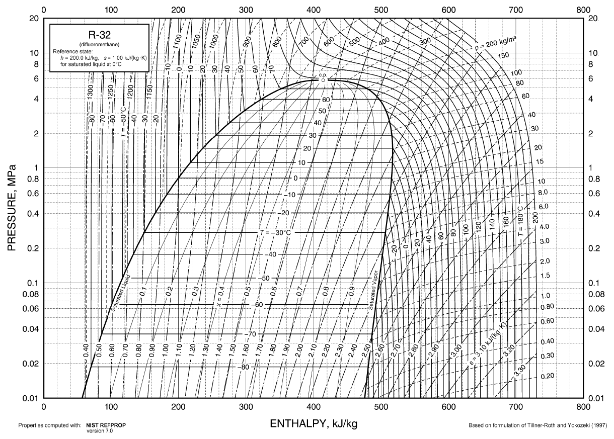

*Fig. 4 Pressure-Enthalpy Diagram for Refrigerant 32*

<!-- str. 810 -->

### Refrigerant 32 (Difluoromethane) Properties

**of Saturated Liquid and Saturated Vapor**

| Temp.,* °C | Pres- Density, Volume,<br>sure, kg/m<sup>3</sup> MPa Liquid | Pres- Density, Volume,<br>m<sup>3</sup>/kg Vapor | Enthalpy, kJ/kg<br>Liquid | Enthalpy, kJ/kg<br>Vapor | Entropy, kJ/(kg·K)<br>Liquid | Entropy, kJ/(kg·K)<br>Vapor | Specific Heat c , kJ/(kg·K)<br>Liquid | Specific Heat c , kJ/(kg·K)<br><sup>p</sup> Vapor | c /c p v Vapor | Velocity of Sound, m/s<br>Liquid | Velocity of Sound, m/s<br>Vapor | Viscosity, μPa·s<br>Liquid | Viscosity, μPa·s<br>Vapor | Thermal Cond., mW/(m·K)<br>Liquid | Thermal Cond., mW/(m·K)<br>Vapor | Tension, Temp.,*<br>Surface mN/m | Tension, Temp.,*<br>°C |
|---|---|---|---|---|---|---|---|---|---|---|---|---|---|---|---|---|---|
| –136.81<sup>a</sup> | 0.00005 1429.3 | 453.850 | –19.07 | 444.31 | –0.1050 | 3.2937 | 1.592 | 0.660 | 1.321 | 1414 | 169.6 | 1226.0 | 5.70 | 242.9 | 6.95 | 39.01 | –136.81 |
| –130 | 0.00013 1412.7 | 174.360 | –8.26 | 448.77 | –0.0276 | 3.1651 | 1.583 | 0.665 | 1.318 | 1378 | 173.6 | 1023.0 | 5.97 | 240.6 | 6.97 | 37.47 | –130 |
| –120 | 0.00048 1388.4 | 51.1840 | 7.52 | 455.33 | 0.0790 | 3.0030 | 1.573 | 0.674 | 1.315 | 1326 | 179.2 | 811.8 | 6.39 | 236.1 | 7.02 | 35.23 | –120 |
| –110 | 0.00145 1363.8 | 17.9070 | 23.20 | 461.86 | 0.1782 | 2.8668 | 1.565 | 0.686 | 1.312 | 1273 | 184.5 | 664.6 | 6.80 | 230.6 | 7.12 | 33.02 | –110 |
| –100 | 0.00381 1339.0 | 7.22200 | 38.83 | 468.31 | 0.2711 | 2.7515 | 1.560 | 0.703 | 1.310 | 1221 | 189.5 | 556.1 | 7.22 | 224.3 | 7.27 | 30.83 | –100 |
| –90 | 0.00887 1313.9 | 3.27210 | 54.42 | 474.61 | 0.3586 | 2.6529 | 1.559 | 0.725 | 1.310 | 1169 | 194.1 | 472.6 | 7.64 | 217.4 | 7.45 | 28.68 | –90 |
| –80 | 0.01865 1288.4 | 1.63160 | 70.02 | 480.72 | 0.4415 | 2.5679 | 1.561 | 0.754 | 1.311 | 1118 | 198.3 | 406.4 | 8.06 | 210.0 | 7.68 | 26.56 | –80 |
| –70 | 0.03607 1262.4 | 0.88072 | 85.66 | 486.57 | 0.5204 | 2.4939 | 1.566 | 0.790 | 1.314 | 1066 | 202.0 | 352.7 | 8.48 | 202.2 | 7.96 | 24.48 | –70 |
| –60 | 0.06496 1235.7 | 0.50786 | 101.38 | 492.11 | 0.5958 | 2.4289 | 1.576 | 0.833 | 1.320 | 1014 | 205.1 | 308.2 | 8.91 | 194.2 | 8.28 | 22.42 | –60 |
| –51.65<sup>b</sup> | 0.10133 1212.9 | 0.33468 | 114.59 | 496.45 | 0.6565 | 2.3805 | 1.587 | 0.875 | 1.328 | 971 | 207.4 | 276.7 | 9.26 | 187.4 | 8.60 | 20.74 | –51.65 |
| –50 | 0.11014 1208.4 | 0.30944 | 117.22 | 497.27 | 0.6683 | 2.3714 | 1.589 | 0.883 | 1.329 | 962 | 207.7 | 271.0 | 9.33 | 186.0 | 8.66 | 20.41 | –50 |
| –40 | 0.17741 1180.2 | 0.19743 | 133.23 | 502.02 | 0.7382 | 2.3200 | 1.608 | 0.940 | 1.343 | 910 | 209.7 | 239.4 | 9.75 | 177.8 | 9.10 | 18.44 | –40 |
| –38 | 0.19409 1174.4 | 0.18134 | 136.45 | 502.91 | 0.7519 | 2.3103 | 1.612 | 0.952 | 1.347 | 900 | 210.1 | 233.6 | 9.84 | 176.1 | 9.19 | 18.05 | –38 |
| –36 | 0.21197 1168.6 | 0.16680 | 139.69 | 503.78 | 0.7655 | 2.3008 | 1.616 | 0.965 | 1.350 | 889 | 210.4 | 228.1 | 9.92 | 174.5 | 9.29 | 17.66 | –36 |
| –34 | 0.23111 1162.8 | 0.15365 | 142.93 | 504.63 | 0.7791 | 2.2916 | 1.621 | 0.977 | 1.354 | 879 | 210.6 | 222.6 | 10.01 | 172.8 | 9.39 | 17.27 | –34 |
| –32 | 0.25159 1156.9 | 0.14173 | 146.18 | 505.47 | 0.7926 | 2.2824 | 1.626 | 0.990 | 1.358 | 868 | 210.9 | 217.4 | 10.09 | 171.2 | 9.50 | 16.89 | –32 |
| –30 | 0.27344 1151.0 | 0.13091 | 149.45 | 506.27 | 0.8060 | 2.2735 | 1.631 | 1.004 | 1.363 | 858 | 211.1 | 212.3 | 10.18 | 169.5 | 9.60 | 16.50 | –30 |
| –28 | 0.29675 1145.0 | 0.12107 | 152.72 | 507.06 | 0.8193 | 2.2647 | 1.637 | 1.017 | 1.367 | 847 | 211.3 | 207.4 | 10.26 | 167.9 | 9.71 | 16.12 | –28 |
| –26 | 0.32157 1138.9 | 0.11211 | 156.01 | 507.83 | 0.8326 | 2.2561 | 1.642 | 1.031 | 1.372 | 837 | 211.4 | 202.6 | 10.35 | 166.3 | 9.83 | 15.74 | –26 |
| –24 | 0.34796 1132.9 | 0.10393 | 159.31 | 508.57 | 0.8458 | 2.2476 | 1.648 | 1.045 | 1.377 | 826 | 211.5 | 197.9 | 10.43 | 164.6 | 9.95 | 15.36 | –24 |
| –22 | 0.37600 1126.7 | 0.09646 | 162.62 | 509.28 | 0.8589 | 2.2392 | 1.654 | 1.060 | 1.383 | 816 | 211.6 | 193.3 | 10.52 | 163.0 | 10.07 | 14.99 | –22 |
| –20 | 0.40575 1120.6 | 0.08963 | 165.94 | 509.97 | 0.8720 | 2.2310 | 1.661 | 1.075 | 1.389 | 805 | 211.7 | 188.9 | 10.61 | 161.3 | 10.19 | 14.61 | –20 |
| –18 | 0.43728 1114.3 | 0.08337 | 169.28 | 510.64 | 0.8850 | 2.2229 | 1.668 | 1.090 | 1.395 | 794 | 211.7 | 184.6 | 10.70 | 159.7 | 10.32 | 14.24 | –18 |
| –16 | 0.47067 1108.0 | 0.07762 | 172.63 | 511.28 | 0.8979 | 2.2149 | 1.675 | 1.106 | 1.401 | 784 | 211.7 | 180.5 | 10.78 | 158.1 | 10.46 | 13.87 | –16 |
| –14 | 0.50597 1101.7 | 0.07234 | 175.99 | 511.89 | 0.9109 | 2.2070 | 1.682 | 1.122 | 1.408 | 773 | 211.7 | 176.4 | 10.87 | 156.5 | 10.60 | 13.50 | –14 |
| –12 | 0.54327 1095.2 | 0.06749 | 179.37 | 512.47 | 0.9237 | 2.1992 | 1.690 | 1.139 | 1.416 | 762 | 211.6 | 172.4 | 10.96 | 154.9 | 10.74 | 13.14 | –12 |
| –10 | 0.58263 1088.8 | 0.06301 | 182.76 | 513.02 | 0.9365 | 2.1915 | 1.698 | 1.156 | 1.423 | 751 | 211.5 | 168.5 | 11.05 | 153.2 | 10.89 | 12.77 | –10 |
| –8 | 0.62414 1082.2 | 0.05889 | 186.18 | 513.54 | 0.9493 | 2.1839 | 1.706 | 1.174 | 1.432 | 741 | 211.4 | 164.8 | 11.14 | 151.6 | 11.04 | 12.41 | –8 |
| –6 | 0.66786 1075.6 | 0.05508 | 189.60 | 514.03 | 0.9620 | 2.1764 | 1.715 | 1.192 | 1.440 | 730 | 211.2 | 161.1 | 11.23 | 150.0 | 11.21 | 12.05 | –6 |
| –4 | 0.71388 1068.9 | 0.05155 | 193.05 | 514.49 | 0.9747 | 2.1690 | 1.725 | 1.211 | 1.450 | 719 | 211.0 | 157.5 | 11.32 | 148.4 | 11.38 | 11.69 | –4 |
| –2 | 0.76226 1062.1 | 0.04829 | 196.52 | 514.91 | 0.9874 | 2.1616 | 1.735 | 1.231 | 1.460 | 708 | 210.8 | 154.0 | 11.42 | 146.8 | 11.55 | 11.34 | –2 |
| 0 | 0.81310 1055.3 | 0.04527 | 200.00 | 515.30 | 1.0000 | 2.1543 | 1.745 | 1.251 | 1.470 | 697 | 210.5 | 150.6 | 11.51 | 145.3 | 11.73 | 10.99 | 0 |
| 2 | 0.86647 1048.3 | 0.04246 | 203.50 | 515.65 | 1.0126 | 2.1471 | 1.756 | 1.272 | 1.481 | 686 | 210.2 | 147.3 | 11.61 | 143.7 | 11.93 | 10.63 | 2 |
| 4 | 0.92245 1041.3 | 0.03986 | 207.03 | 515.96 | 1.0252 | 2.1399 | 1.767 | 1.294 | 1.493 | 675 | 209.8 | 144.0 | 11.70 | 142.1 | 12.13 | 10.29 | 4 |
| 6 | 0.98113 1034.2 | 0.03743 | 210.58 | 516.24 | 1.0377 | 2.1327 | 1.779 | 1.317 | 1.506 | 664 | 209.4 | 140.8 | 11.80 | 140.5 | 12.34 | 9.94 | 6 |
| 8 | 1.04260 1027.0 | 0.03518 | 214.15 | 516.47 | 1.0503 | 2.1256 | 1.792 | 1.341 | 1.519 | 652 | 209.0 | 137.7 | 11.90 | 139.0 | 12.56 | 9.60 | 8 |
| 10 | 1.10690 1019.7 | 0.03308 | 217.74 | 516.66 | 1.0628 | 2.1185 | 1.806 | 1.367 | 1.534 | 641 | 208.5 | 134.6 | 12.00 | 137.4 | 12.79 | 9.25 | 10 |
| 12 | 1.17420 1012.2 | 0.03112 | 221.36 | 516.80 | 1.0753 | 2.1114 | 1.820 | 1.393 | 1.549 | 630 | 208.0 | 131.6 | 12.10 | 135.9 | 13.04 | 8.91 | 12 |
| 14 | 1.24450 1004.7 | 0.02929 | 225.01 | 516.90 | 1.0878 | 2.1043 | 1.835 | 1.421 | 1.565 | 618 | 207.5 | 128.7 | 12.48 | 134.3 | 13.29 | 8.58 | 14 |
| 16 | 1.31790 997.1 | 0.02758 | 228.68 | 516.95 | 1.1003 | 2.0972 | 1.851 | 1.450 | 1.583 | 607 | 206.9 | 125.8 | 12.60 | 132.8 | 13.56 | 8.24 | 16 |
| 18 | 1.39460 989.3 | 0.02598 | 232.39 | 516.95 | 1.1128 | 2.0902 | 1.868 | 1.481 | 1.602 | 595 | 206.3 | 123.0 | 12.73 | 131.2 | 13.85 | 7.91 | 18 |
| 20 | 1.47460 981.4 | 0.02448 | 236.12 | 516.90 | 1.1253 | 2.0831 | 1.886 | 1.514 | 1.622 | 584 | 205.6 | 120.3 | 12.86 | 129.7 | 14.16 | 7.59 | 20 |
| 22 | 1.55790 973.3 | 0.02307 | 239.89 | 516.79 | 1.1378 | 2.0760 | 1.905 | 1.548 | 1.644 | 572 | 204.9 | 117.5 | 13.00 | 128.2 | 14.48 | 7.26 | 22 |
| 24 | 1.64480 965.2 | 0.02175 | 243.69 | 516.62 | 1.1503 | 2.0688 | 1.926 | 1.585 | 1.668 | 560 | 204.1 | 114.9 | 13.14 | 126.6 | 14.83 | 6.94 | 24 |
| 26 | 1.73530 956.8 | 0.02051 | 247.53 | 516.39 | 1.1629 | 2.0616 | 1.948 | 1.624 | 1.693 | 548 | 203.3 | 112.2 | 13.28 | 125.1 | 15.19 | 6.62 | 26 |
| 28 | 1.82950 948.3 | 0.01935 | 251.40 | 516.09 | 1.1755 | 2.0544 | 1.972 | 1.667 | 1.721 | 536 | 202.4 | 109.7 | 13.43 | 123.6 | 15.59 | 6.30 | 28 |
| 30 | 1.92750 939.6 | 0.01826 | 255.32 | 515.72 | 1.1881 | 2.0471 | 1.997 | 1.712 | 1.750 | 524 | 201.5 | 107.1 | 13.58 | 122.1 | 16.01 | 5.99 | 30 |
| 32 | 2.02940 930.7 | 0.01722 | 259.28 | 515.29 | 1.2007 | 2.0397 | 2.025 | 1.760 | 1.783 | 512 | 200.6 | 104.6 | 13.74 | 120.6 | 16.46 | 5.68 | 32 |
| 34 | 2.13530 921.7 | 0.01625 | 263.28 | 514.77 | 1.2134 | 2.0322 | 2.055 | 1.813 | 1.819 | 499 | 199.6 | 102.1 | 13.90 | 119.1 | 16.95 | 5.37 | 34 |
| 36 | 2.24540 912.4 | 0.01533 | 267.34 | 514.17 | 1.2262 | 2.0246 | 2.088 | 1.870 | 1.858 | 487 | 198.5 | 99.7 | 14.07 | 117.6 | 17.47 | 5.07 | 36 |
| 38 | 2.35970 902.8 | 0.01447 | 271.45 | 513.49 | 1.2391 | 2.0169 | 2.124 | 1.933 | 1.901 | 474 | 197.4 | 97.3 | 14.25 | 116.1 | 18.04 | 4.77 | 38 |
| 40 | 2.47830 893.0 | 0.01365 | 275.61 | 512.71 | 1.2520 | 2.0091 | 2.163 | 2.001 | 1.948 | 461 | 196.2 | 94.9 | 14.44 | 114.6 | 18.65 | 4.47 | 40 |
| 42 | 2.60140 883.0 | 0.01287 | 279.84 | 511.82 | 1.2650 | 2.0011 | 2.206 | 2.077 | 2.001 | 448 | 194.9 | 92.5 | 14.64 | 113.1 | 19.32 | 4.18 | 42 |
| 44 | 2.72920 872.6 | 0.01214 | 284.13 | 510.83 | 1.2781 | 1.9929 | 2.255 | 2.160 | 2.060 | 435 | 193.6 | 90.2 | 14.84 | 111.6 | 20.05 | 3.89 | 44 |
| 46 | 2.86160 861.9 | 0.01144 | 288.50 | 509.72 | 1.2914 | 1.9845 | 2.309 | 2.254 | 2.126 | 421 | 192.3 | 87.8 | 15.06 | 110.1 | 20.85 | 3.61 | 46 |
| 48 | 2.99890 850.8 | 0.01078 | 292.95 | 508.48 | 1.3048 | 1.9759 | 2.369 | 2.358 | 2.201 | 408 | 190.8 | 85.5 | 15.29 | 108.6 | 21.73 | 3.33 | 48 |
| 50 | 3.14120 839.3 | 0.01015 | 297.49 | 507.10 | 1.3183 | 1.9670 | 2.439 | 2.477 | 2.287 | 394 | 189.3 | 83.2 | 15.54 | 107.0 | 22.69 | 3.06 | 50 |
| 52 | 3.28870 827.3 | 0.00955 | 302.12 | 505.57 | 1.3321 | 1.9578 | 2.518 | 2.613 | 2.385 | 379 | 187.7 | 80.8 | 15.80 | 105.5 | 23.77 | 2.79 | 52 |
| 54 | 3.44150 814.8 | 0.00897 | 306.87 | 503.86 | 1.3461 | 1.9482 | 2.609 | 2.771 | 2.499 | 365 | 186.0 | 78.5 | 16.09 | 104.0 | 24.97 | 2.52 | 54 |
| 56 | 3.59970 801.7 | 0.00843 | 311.74 | 501.95 | 1.3603 | 1.9382 | 2.717 | 2.956 | 2.633 | 350 | 184.3 | 76.1 | 16.39 | 102.5 | 26.31 | 2.26 | 56 |
| 58 | 3.76350 787.9 | 0.00790 | 316.75 | 499.82 | 1.3749 | 1.9277 | 2.845 | 3.175 | 2.793 | 335 | 182.4 | 73.8 | 16.73 | 100.9 | 27.83 | 2.01 | 58 |
| 60 | 3.93320 773.3 | 0.00740 | 321.93 | 497.44 | 1.3898 | 1.9166 | 3.001 | 3.441 | 2.987 | 320 | 180.4 | 71.4 | 17.09 | 99.4 | 29.55 | 1.76 | 60 |
| 62 | 4.10890 757.8 | 0.00691 | 327.30 | 494.76 | 1.4052 | 1.9048 | 3.193 | 3.771 | 3.228 | 304 | 178.3 | 68.9 | 17.49 | 97.8 | 31.54 | 1.52 | 62 |
| 64 | 4.29090 741.1 | 0.00644 | 332.90 | 491.73 | 1.4211 | 1.8922 | 3.438 | 4.190 | 3.535 | 288 | 176.1 | 66.4 | 17.95 | 96.3 | 33.85 | 1.29 | 64 |
| 66 | 4.47930 723.0 | 0.00598 | 338.78 | 488.26 | 1.4377 | 1.8785 | 3.761 | 4.743 | 3.938 | 271 | 173.7 | 63.8 | 18.46 | 94.8 | 36.59 | 1.06 | 66 |
| 68 | 4.67450 703.2 | 0.00553 | 345.02 | 484.25 | 1.4553 | 1.8634 | 4.207 | 5.508 | 4.495 | 254 | 171.2 | 61.1 | 19.06 | 93.3 | 39.90 | 0.85 | 68 |
| 70 | 4.87680 680.9 | 0.00508 | 351.73 | 479.52 | 1.4740 | 1.8464 | 4.865 | 6.639 | 5.316 | 236 | 168.4 | 58.2 | 19.76 | 92.0 | 44.04 | 0.64 | 70 |
| 75 | 5.41680 605.9 | 0.00391 | 372.39 | 461.72 | 1.5314 | 1.7880 | 10.130 | 15.600 | 11.720 | 186 | 159.6 | 49.5 | 22.56 | 91.5 | 62.91 | 0.19 | 75 |
| 78.11<sup>c</sup> | 5.78200 424.0 | 0.00236 | 414.15 | 414.15 | 1.6486 | 1.6486 | ∞ | ∞ | ∞ | 0 | 0.0 | — | — | ∞ | ∞ | 0.00 | 78.11 |

*Temperatures on ITS-90 scale <sup>a</sup>Triple point <sup>b</sup>Normal boiling point <sup>c</sup>Critical point

<!-- str. 811 -->

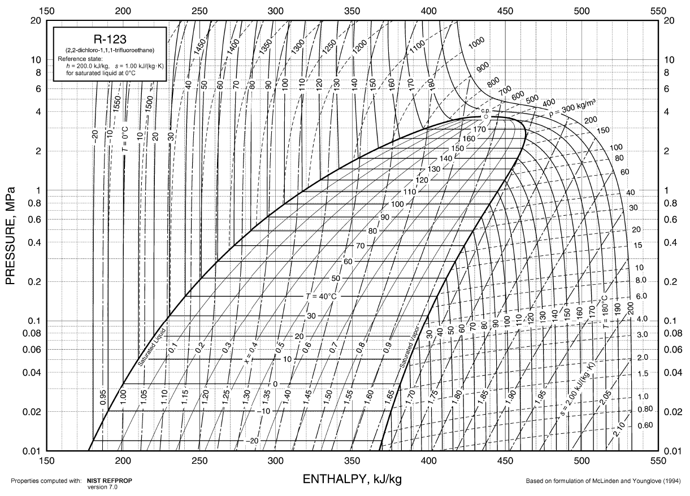

*Fig. 5 Pressure-Enthalpy Diagram for Refrigerant 123*

<!-- str. 812 -->

### Refrigerant 123 (2,2-Dichloro-1,1,1-Trifluoroethane) Properties of Saturated Liquid and Saturated Vapor

| Temp.,* °C | Pressure, MPa | Density, Volume,<br>kg/m<sup>3</sup> Liquid | Density, Volume,<br>m<sup>3</sup>/kg Vapor | Enthalpy, kJ/kg<br>Liquid | Enthalpy, kJ/kg<br>Vapor | Entropy, kJ/(kg·K)<br>Liquid | Entropy, kJ/(kg·K)<br>Vapor | Specific Heat c , kJ/(kg·K)<br><sup>p</sup> Liquid | Specific Heat c , kJ/(kg·K)<br>Vapor | c /c p v Vapor | Velocity of Sound, m/s<br>Liquid | Velocity of Sound, m/s<br>Vapor | Viscosity, μPa·s<br>Liquid | Viscosity, μPa·s<br>Vapor | Thermal Cond., mW/(m·K)<br>Liquid | Thermal Cond., mW/(m·K)<br>Vapor | Tension, Temp.,*<br>Surface mN/m | Tension, Temp.,*<br>°C |
|---|---|---|---|---|---|---|---|---|---|---|---|---|---|---|---|---|---|---|
| –80 | 0.00013 | 1709.6 | 83.6670 | 123.92 | 335.98 | 0.6712 | 1.7691 | 0.924 | 0.520 | 1.117 | 1133 | 108.3 | 2093.0 | 6.68 | 107.4 | 3.22 | 28.42 | –80 |
| –70 | 0.00034 | 1687.4 | 32.8420 | 133.17 | 341.25 | 0.7179 | 1.7422 | 0.927 | 0.537 | 1.113 | 1091 | 110.8 | 1680.0 | 7.09 | 104.8 | 3.79 | 27.09 | –70 |
| –60 | 0.00081 | 1665.1 | 14.3330 | 142.46 | 346.66 | 0.7625 | 1.7206 | 0.932 | 0.553 | 1.110 | 1049 | 113.3 | 1383.0 | 7.50 | 102.0 | 4.35 | 25.78 | –60 |
| –50 | 0.00177 | 1642.6 | 6.84600 | 151.81 | 352.21 | 0.8054 | 1.7034 | 0.939 | 0.569 | 1.107 | 1006 | 115.6 | 1160.0 | 7.91 | 99.1 | 4.92 | 24.48 | –50 |
| –40 | 0.00358 | 1620.0 | 3.53190 | 161.25 | 357.88 | 0.8468 | 1.6901 | 0.948 | 0.585 | 1.105 | 964 | 117.9 | 986.4 | 8.31 | 96.1 | 5.49 | 23.19 | –40 |
| –30 | 0.00675 | 1597.0 | 1.94700 | 170.78 | 363.65 | 0.8868 | 1.6800 | 0.958 | 0.601 | 1.103 | 923 | 120.0 | 848.0 | 8.70 | 93.0 | 6.05 | 21.92 | –30 |
| –20 | 0.01200 | 1573.8 | 1.13640 | 180.41 | 369.52 | 0.9256 | 1.6726 | 0.968 | 0.617 | 1.102 | 881 | 122.0 | 735.4 | 9.09 | 89.8 | 6.61 | 20.66 | –20 |
| –10 | 0.02025 | 1550.1 | 0.69690 | 190.15 | 375.45 | 0.9633 | 1.6675 | 0.979 | 0.634 | 1.102 | 841 | 123.8 | 642.4 | 9.47 | 86.7 | 7.18 | 19.41 | –10 |
| 0 | 0.03265 | 1526.1 | 0.44609 | 200.00 | 381.44 | 1.0000 | 1.6642 | 0.990 | 0.651 | 1.102 | 801 | 125.4 | 564.6 | 9.84 | 83.7 | 7.74 | 18.18 | 0 |
| 2 | 0.03574 | 1521.3 | 0.40991 | 201.98 | 382.64 | 1.0072 | 1.6638 | 0.993 | 0.654 | 1.103 | 793 | 125.7 | 550.6 | 9.91 | 83.1 | 7.86 | 17.94 | 2 |
| 4 | 0.03907 | 1516.4 | 0.37720 | 203.97 | 383.84 | 1.0144 | 1.6634 | 0.995 | 0.658 | 1.103 | 785 | 126.0 | 537.0 | 9.99 | 82.5 | 7.97 | 17.70 | 4 |
| 6 | 0.04264 | 1511.5 | 0.34759 | 205.97 | 385.05 | 1.0216 | 1.6631 | 0.997 | 0.661 | 1.103 | 777 | 126.3 | 523.8 | 10.06 | 81.9 | 8.08 | 17.45 | 6 |
| 8 | 0.04647 | 1506.6 | 0.32075 | 207.96 | 386.25 | 1.0287 | 1.6628 | 0.999 | 0.665 | 1.103 | 769 | 126.6 | 511.1 | 10.13 | 81.3 | 8.20 | 17.21 | 8 |
| 10 | 0.05057 | 1501.6 | 0.29637 | 209.97 | 387.46 | 1.0358 | 1.6626 | 1.002 | 0.668 | 1.104 | 761 | 126.8 | 498.8 | 10.20 | 80.7 | 8.31 | 16.97 | 10 |
| 12 | 0.05495 | 1496.7 | 0.27420 | 211.97 | 388.66 | 1.0428 | 1.6625 | 1.004 | 0.672 | 1.104 | 754 | 127.1 | 486.8 | 10.28 | 80.1 | 8.43 | 16.73 | 12 |
| 14 | 0.05963 | 1491.7 | 0.25401 | 213.99 | 389.87 | 1.0499 | 1.6624 | 1.006 | 0.675 | 1.104 | 746 | 127.3 | 475.3 | 10.35 | 79.5 | 8.54 | 16.49 | 14 |
| 16 | 0.06463 | 1486.7 | 0.23559 | 216.00 | 391.08 | 1.0569 | 1.6623 | 1.009 | 0.679 | 1.105 | 738 | 127.6 | 464.0 | 10.42 | 79.0 | 8.66 | 16.25 | 16 |
| 18 | 0.06995 | 1481.7 | 0.21877 | 218.02 | 392.29 | 1.0638 | 1.6623 | 1.011 | 0.682 | 1.105 | 730 | 127.8 | 453.2 | 10.49 | 78.4 | 8.77 | 16.01 | 18 |
| 20 | 0.07561 | 1476.6 | 0.20338 | 220.05 | 393.49 | 1.0707 | 1.6624 | 1.014 | 0.686 | 1.106 | 723 | 128.0 | 442.6 | 10.56 | 77.8 | 8.89 | 15.77 | 20 |
| 22 | 0.08163 | 1471.5 | 0.18929 | 222.08 | 394.70 | 1.0776 | 1.6625 | 1.016 | 0.690 | 1.106 | 715 | 128.2 | 432.4 | 10.63 | 77.3 | 9.01 | 15.53 | 22 |
| 24 | 0.08802 | 1466.4 | 0.17637 | 224.12 | 395.91 | 1.0845 | 1.6626 | 1.018 | 0.693 | 1.107 | 707 | 128.4 | 422.4 | 10.70 | 76.7 | 9.12 | 15.30 | 24 |
| 26 | 0.09480 | 1461.3 | 0.16451 | 226.16 | 397.12 | 1.0913 | 1.6628 | 1.021 | 0.697 | 1.107 | 700 | 128.6 | 412.8 | 10.77 | 76.1 | 9.24 | 15.06 | 26 |
| 27.82<sup>b</sup> | 0.10133 | 1456.6 | 0.15453 | 228.03 | 398.22 | 1.0975 | 1.6630 | 1.023 | 0.701 | 1.108 | 693 | 128.7 | 404.2 | 10.84 | 75.6 | 9.35 | 14.84 | 27.82 |
| 28 | 0.10198 | 1456.2 | 0.15360 | 228.21 | 398.32 | 1.0981 | 1.6630 | 1.023 | 0.701 | 1.108 | 692 | 128.7 | 403.4 | 10.84 | 75.6 | 9.36 | 14.82 | 28 |
| 30 | 0.10958 | 1451.0 | 0.14356 | 230.26 | 399.53 | 1.1049 | 1.6633 | 1.026 | 0.705 | 1.109 | 684 | 128.9 | 394.3 | 10.91 | 75.0 | 9.48 | 14.59 | 30 |
| 32 | 0.11762 | 1445.8 | 0.13431 | 232.31 | 400.73 | 1.1116 | 1.6635 | 1.028 | 0.709 | 1.109 | 677 | 129.0 | 385.4 | 10.98 | 74.5 | 9.60 | 14.35 | 32 |
| 34 | 0.12611 | 1440.6 | 0.12577 | 234.38 | 401.93 | 1.1183 | 1.6639 | 1.031 | 0.712 | 1.110 | 669 | 129.1 | 376.8 | 11.05 | 74.0 | 9.72 | 14.12 | 34 |
| 36 | 0.13507 | 1435.4 | 0.11789 | 236.44 | 403.14 | 1.1250 | 1.6642 | 1.033 | 0.716 | 1.111 | 662 | 129.3 | 368.4 | 11.12 | 73.4 | 9.84 | 13.89 | 36 |
| 38 | 0.14452 | 1430.1 | 0.11060 | 238.51 | 404.34 | 1.1317 | 1.6646 | 1.036 | 0.720 | 1.112 | 654 | 129.4 | 360.3 | 11.19 | 72.9 | 9.96 | 13.66 | 38 |
| 40 | 0.15447 | 1424.8 | 0.10385 | 240.59 | 405.54 | 1.1383 | 1.6651 | 1.038 | 0.724 | 1.113 | 647 | 129.5 | 352.4 | 11.26 | 72.4 | 10.08 | 13.43 | 40 |
| 42 | 0.16495 | 1419.4 | 0.09759 | 242.67 | 406.73 | 1.1449 | 1.6655 | 1.041 | 0.728 | 1.114 | 639 | 129.5 | 344.7 | 11.33 | 71.8 | 10.20 | 13.20 | 42 |
| 44 | 0.17597 | 1414.1 | 0.09179 | 244.76 | 407.93 | 1.1515 | 1.6660 | 1.044 | 0.732 | 1.115 | 632 | 129.6 | 337.2 | 11.40 | 71.3 | 10.32 | 12.97 | 44 |
| 46 | 0.18755 | 1408.7 | 0.08641 | 246.86 | 409.12 | 1.1581 | 1.6665 | 1.046 | 0.736 | 1.116 | 624 | 129.7 | 329.9 | 11.46 | 70.8 | 10.45 | 12.74 | 46 |
| 48 | 0.19971 | 1403.3 | 0.08140 | 248.95 | 410.31 | 1.1646 | 1.6670 | 1.049 | 0.741 | 1.117 | 617 | 129.7 | 322.8 | 11.53 | 70.3 | 10.57 | 12.51 | 48 |
| 50 | 0.21246 | 1397.8 | 0.07674 | 251.06 | 411.50 | 1.1711 | 1.6676 | 1.052 | 0.745 | 1.119 | 610 | 129.7 | 315.9 | 11.60 | 69.8 | 10.70 | 12.28 | 50 |
| 52 | 0.22584 | 1392.3 | 0.07240 | 253.17 | 412.69 | 1.1776 | 1.6682 | 1.055 | 0.749 | 1.120 | 602 | 129.7 | 309.1 | 11.67 | 69.3 | 10.82 | 12.05 | 52 |
| 54 | 0.23985 | 1386.8 | 0.06836 | 255.28 | 413.87 | 1.1840 | 1.6688 | 1.058 | 0.753 | 1.121 | 595 | 129.7 | 302.6 | 11.74 | 68.8 | 10.95 | 11.83 | 54 |
| 56 | 0.25451 | 1381.2 | 0.06458 | 257.41 | 415.05 | 1.1905 | 1.6694 | 1.060 | 0.758 | 1.123 | 588 | 129.7 | 296.2 | 11.80 | 68.3 | 11.08 | 11.60 | 56 |
| 58 | 0.26985 | 1375.6 | 0.06106 | 259.53 | 416.23 | 1.1969 | 1.6701 | 1.063 | 0.762 | 1.124 | 580 | 129.7 | 289.9 | 11.87 | 67.8 | 11.21 | 11.38 | 58 |
| 60 | 0.28589 | 1370.0 | 0.05777 | 261.67 | 417.40 | 1.2033 | 1.6707 | 1.066 | 0.767 | 1.126 | 573 | 129.6 | 283.9 | 11.94 | 67.3 | 11.34 | 11.16 | 60 |
| 62 | 0.30264 | 1364.3 | 0.05469 | 263.81 | 418.57 | 1.2096 | 1.6714 | 1.069 | 0.771 | 1.127 | 566 | 129.6 | 277.9 | 12.01 | 66.8 | 11.47 | 10.93 | 62 |
| 64 | 0.32013 | 1358.6 | 0.05180 | 265.95 | 419.73 | 1.2160 | 1.6721 | 1.072 | 0.776 | 1.129 | 558 | 129.5 | 272.1 | 12.07 | 66.3 | 11.61 | 10.71 | 64 |
| 66 | 0.33838 | 1352.8 | 0.04910 | 268.10 | 420.89 | 1.2223 | 1.6728 | 1.076 | 0.781 | 1.131 | 551 | 129.4 | 266.5 | 12.14 | 65.9 | 11.74 | 10.49 | 66 |
| 68 | 0.35740 | 1347.0 | 0.04656 | 270.26 | 422.05 | 1.2286 | 1.6735 | 1.079 | 0.785 | 1.133 | 544 | 129.3 | 261.0 | 12.21 | 65.4 | 11.88 | 10.27 | 68 |
| 70 | 0.37722 | 1341.2 | 0.04418 | 272.42 | 423.20 | 1.2349 | 1.6743 | 1.082 | 0.790 | 1.135 | 536 | 129.2 | 255.6 | 12.28 | 64.9 | 12.01 | 10.05 | 70 |
| 72 | 0.39787 | 1335.3 | 0.04195 | 274.60 | 424.35 | 1.2411 | 1.6750 | 1.085 | 0.795 | 1.137 | 529 | 129.0 | 250.4 | 12.35 | 64.5 | 12.15 | 9.84 | 72 |
| 74 | 0.41936 | 1329.3 | 0.03985 | 276.77 | 425.50 | 1.2474 | 1.6758 | 1.089 | 0.800 | 1.139 | 522 | 128.9 | 245.2 | 12.42 | 64.0 | 12.29 | 9.62 | 74 |
| 76 | 0.44171 | 1323.4 | 0.03787 | 278.96 | 426.63 | 1.2536 | 1.6766 | 1.092 | 0.806 | 1.142 | 515 | 128.7 | 240.2 | 12.49 | 63.5 | 12.44 | 9.40 | 76 |
| 78 | 0.46494 | 1317.3 | 0.03601 | 281.15 | 427.77 | 1.2598 | 1.6774 | 1.096 | 0.811 | 1.144 | 507 | 128.5 | 235.3 | 12.55 | 63.1 | 12.58 | 9.19 | 78 |
| 80 | 0.48909 | 1311.2 | 0.03426 | 283.35 | 428.89 | 1.2660 | 1.6781 | 1.100 | 0.816 | 1.147 | 500 | 128.3 | 230.5 | 12.63 | 62.6 | 12.73 | 8.97 | 80 |
| 82 | 0.51416 | 1305.1 | 0.03261 | 285.55 | 430.01 | 1.2722 | 1.6789 | 1.103 | 0.822 | 1.150 | 493 | 128.1 | 225.9 | 12.70 | 62.2 | 12.87 | 8.76 | 82 |
| 84 | 0.54019 | 1298.9 | 0.03105 | 287.77 | 431.13 | 1.2783 | 1.6797 | 1.107 | 0.827 | 1.152 | 486 | 127.8 | 221.3 | 12.77 | 61.7 | 13.02 | 8.55 | 84 |
| 86 | 0.56720 | 1292.6 | 0.02958 | 289.99 | 432.23 | 1.2845 | 1.6806 | 1.111 | 0.833 | 1.156 | 478 | 127.6 | 216.8 | 12.84 | 61.3 | 13.17 | 8.34 | 86 |
| 88 | 0.59520 | 1286.3 | 0.02819 | 292.22 | 433.33 | 1.2906 | 1.6814 | 1.115 | 0.839 | 1.159 | 471 | 127.3 | 212.5 | 12.91 | 60.8 | 13.33 | 8.13 | 88 |
| 90 | 0.62423 | 1279.9 | 0.02687 | 294.45 | 434.43 | 1.2967 | 1.6822 | 1.120 | 0.845 | 1.162 | 464 | 127.0 | 208.2 | 12.98 | 60.4 | 13.48 | 7.92 | 90 |
| 92 | 0.65430 | 1273.5 | 0.02563 | 296.70 | 435.51 | 1.3028 | 1.6830 | 1.124 | 0.851 | 1.166 | 457 | 126.6 | 204.0 | 13.06 | 59.9 | 13.64 | 7.71 | 92 |
| 94 | 0.68544 | 1266.9 | 0.02445 | 298.95 | 436.59 | 1.3089 | 1.6838 | 1.129 | 0.858 | 1.169 | 449 | 126.3 | 199.9 | 13.14 | 59.5 | 13.80 | 7.50 | 94 |
| 96 | 0.71768 | 1260.3 | 0.02334 | 301.21 | 437.66 | 1.3150 | 1.6846 | 1.133 | 0.864 | 1.173 | 442 | 125.9 | 195.9 | 13.21 | 59.1 | 13.96 | 7.30 | 96 |
| 98 | 0.75103 | 1253.7 | 0.02228 | 303.49 | 438.72 | 1.3211 | 1.6854 | 1.138 | 0.871 | 1.177 | 435 | 125.5 | 191.9 | 13.29 | 58.6 | 14.13 | 7.09 | 98 |
| 100 | 0.78553 | 1246.9 | 0.02128 | 305.77 | 439.77 | 1.3271 | 1.6862 | 1.143 | 0.878 | 1.182 | 427 | 125.1 | 188.1 | 13.37 | 58.2 | 14.29 | 6.89 | 100 |
| 110 | 0.97603 | 1211.9 | 0.01697 | 317.32 | 444.88 | 1.3572 | 1.6902 | 1.172 | 0.917 | 1.208 | 391 | 122.8 | 169.9 | 13.80 | 56.0 | 15.17 | 5.88 | 110 |
| 120 | 1.19900 | 1174.4 | 0.01361 | 329.15 | 449.67 | 1.3872 | 1.6938 | 1.207 | 0.964 | 1.243 | 354 | 119.8 | 153.4 | 14.29 | 53.9 | 16.14 | 4.91 | 120 |
| 130 | 1.45780 | 1133.6 | 0.01094 | 341.32 | 454.07 | 1.4173 | 1.6969 | 1.254 | 1.026 | 1.294 | 317 | 116.0 | 138.1 | 14.89 | 51.7 | 17.22 | 3.98 | 130 |
| 140 | 1.75630 | 1088.3 | 0.00879 | 353.92 | 457.94 | 1.4475 | 1.6992 | 1.318 | 1.111 | 1.369 | 279 | 111.5 | 123.8 | 15.65 | 49.5 | 18.44 | 3.09 | 140 |
| 150 | 2.09870 | 1036.8 | 0.00703 | 367.10 | 461.05 | 1.4782 | 1.7003 | 1.415 | 1.240 | 1.493 | 239 | 106.0 | 110.2 | 16.68 | 47.2 | 19.87 | 2.24 | 150 |
| 160 | 2.49010 | 975.7 | 0.00555 | 381.13 | 463.01 | 1.5101 | 1.6991 | 1.584 | 1.473 | 1.726 | 198 | 99.3 | 96.8 | 18.19 | 44.8 | 21.63 | 1.45 | 160 |
| 170 | 2.93720 | 896.9 | 0.00425 | 396.61 | 462.89 | 1.5443 | 1.6939 | 1.979 | 2.033 | 2.309 | 154 | 91.1 | 82.7 | 20.71 | 42.3 | 24.05 | 0.74 | 170 |
| 180 | 3.45060 | 765.9 | 0.00292 | 416.22 | 456.82 | 1.5867 | 1.6763 | 4.549 | 5.661 | 6.158 | 102 | 80.6 | 64.3 | 26.59 | 39.7 | 28.82 | 0.15 | 180 |
| 183.68<sup>c</sup> | 3.66180 | 550.0 | 0.00182 | 437.39 | 437.39 | 1.6325 | 1.6325 | ∞ | ∞ | ∞ | 0 | 0.0 | — | — | ∞ | ∞ | 0.00 | 183.68 |

*Temperatures on ITS-90 scale <sup>b</sup>Normal boiling point <sup>c</sup>Critical point

<!-- str. 813 -->

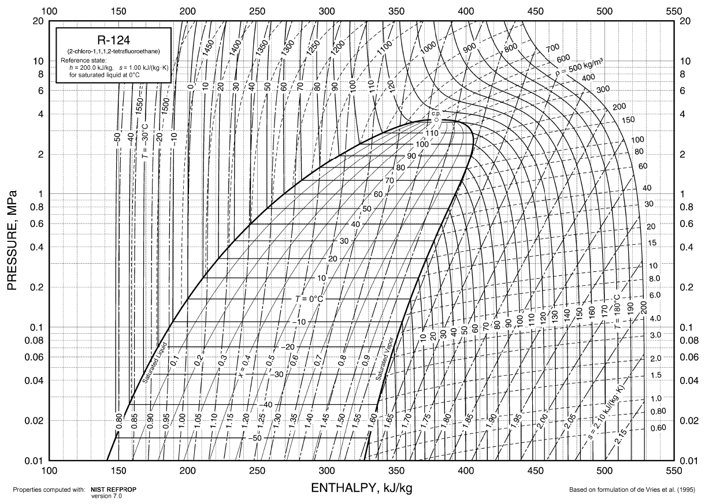

*Fig. 6 Pressure-Enthalpy Diagram for Refrigerant 124*

<!-- str. 814 -->

**Refrigerant 124 (2-Chloro-1,1,1,2-Tetrafluoroethane)**

### Properties of Saturated Liquid and Saturated Vapor

| Temp.,* °C | Pressure, MPa | Density, Volume,<br>kg/m<sup>3</sup> Liquid | Density, Volume,<br>m<sup>3</sup>/kg Vapor | Enthalpy, kJ/kg<br>Liquid | Enthalpy, kJ/kg<br>Vapor | Entropy, kJ/(kg·K)<br>Liquid | Entropy, kJ/(kg·K)<br>Vapor | Specific Heat c , kJ/(kg·K)<br><sup>p</sup> Liquid | Specific Heat c , kJ/(kg·K)<br>Vapor | c /c p v Vapor | Velocity of Sound, m/s<br>Liquid | Velocity of Sound, m/s<br>Vapor | Viscosity, μPa·s<br>Liquid | Viscosity, μPa·s<br>Vapor | Thermal Cond., mW/(m·K)<br>Liquid | Thermal Cond., mW/(m·K)<br>Vapor | Tension, Temp.,*<br>Surface mN/m | Tension, Temp.,*<br>°C |
|---|---|---|---|---|---|---|---|---|---|---|---|---|---|---|---|---|---|---|
| –100 | 0.00024 | 1714.6 | 44.37500 | 98.87 | 302.29 | 0.5417 | 1.7165 | 0.953 | 0.534 | 1.129 | 1052 | 109.1 | 1964.0 | 6.66 | 111.8 | 4.81 | 26.10 | –100 |
| –90 | 0.00067 | 1688.6 | 16.53100 | 108.45 | 307.68 | 0.5954 | 1.6832 | 0.962 | 0.551 | 1.125 | 1007 | 111.9 | 1521.0 | 7.05 | 108.7 | 5.26 | 24.69 | –90 |
| –80 | 0.00169 | 1662.3 | 6.96450 | 118.13 | 313.21 | 0.6469 | 1.6569 | 0.972 | 0.569 | 1.122 | 963 | 114.6 | 1215.0 | 7.45 | 105.4 | 5.74 | 23.30 | –80 |
| –70 | 0.00379 | 1635.9 | 3.25230 | 127.91 | 318.86 | 0.6962 | 1.6362 | 0.983 | 0.586 | 1.119 | 919 | 117.2 | 994.1 | 7.84 | 101.9 | 6.23 | 21.92 | –70 |
| –60 | 0.00779 | 1609.1 | 1.65600 | 137.80 | 324.62 | 0.7437 | 1.6202 | 0.995 | 0.605 | 1.117 | 875 | 119.6 | 829.0 | 8.23 | 98.5 | 6.74 | 20.56 | –60 |
| –50 | 0.01482 | 1582.0 | 0.90713 | 147.81 | 330.46 | 0.7896 | 1.6081 | 1.007 | 0.624 | 1.116 | 832 | 121.8 | 701.6 | 8.62 | 94.9 | 7.27 | 19.21 | –50 |
| –40 | 0.02642 | 1554.3 | 0.52863 | 157.95 | 336.36 | 0.8340 | 1.5993 | 1.020 | 0.644 | 1.116 | 790 | 123.8 | 600.9 | 9.01 | 91.3 | 7.82 | 17.88 | –40 |
| –30 | 0.04452 | 1526.1 | 0.32470 | 168.23 | 342.29 | 0.8772 | 1.5930 | 1.034 | 0.665 | 1.118 | 748 | 125.5 | 519.4 | 9.39 | 87.7 | 8.39 | 16.56 | –30 |
| –20 | 0.07145 | 1497.3 | 0.20856 | 178.66 | 348.23 | 0.9191 | 1.5890 | 1.049 | 0.688 | 1.120 | 706 | 126.9 | 452.4 | 9.78 | 84.1 | 8.98 | 15.26 | –20 |
| –18 | 0.07813 | 1491.4 | 0.19180 | 180.76 | 349.42 | 0.9274 | 1.5884 | 1.052 | 0.693 | 1.121 | 698 | 127.1 | 440.4 | 9.86 | 83.4 | 9.10 | 15.00 | –18 |
| –16 | 0.08529 | 1485.5 | 0.17665 | 182.87 | 350.61 | 0.9356 | 1.5879 | 1.056 | 0.698 | 1.122 | 690 | 127.3 | 428.8 | 9.93 | 82.7 | 9.22 | 14.74 | –16 |
| –14 | 0.09296 | 1479.6 | 0.16293 | 184.99 | 351.79 | 0.9438 | 1.5874 | 1.059 | 0.703 | 1.123 | 682 | 127.5 | 417.6 | 10.01 | 82.0 | 9.34 | 14.49 | –14 |
| –12 | 0.10117 | 1473.6 | 0.15048 | 187.11 | 352.97 | 0.9519 | 1.5870 | 1.062 | 0.708 | 1.124 | 673 | 127.7 | 406.8 | 10.09 | 81.2 | 9.46 | 14.23 | –12 |
| –11.96<sup>b</sup> | 0.10133 | 1473.5 | 0.15026 | 187.15 | 352.99 | 0.9521 | 1.5870 | 1.062 | 0.708 | 1.124 | 673 | 127.7 | 406.6 | 10.09 | 81.2 | 9.46 | 14.23 | –11.96 |
| –10 | 0.10993 | 1467.6 | 0.13917 | 189.24 | 354.15 | 0.9600 | 1.5867 | 1.065 | 0.713 | 1.125 | 665 | 127.9 | 396.3 | 10.16 | 80.5 | 9.59 | 13.98 | –10 |
| –8 | 0.11928 | 1461.6 | 0.12888 | 191.38 | 355.33 | 0.9681 | 1.5864 | 1.069 | 0.718 | 1.126 | 657 | 128.1 | 386.2 | 10.24 | 79.8 | 9.71 | 13.72 | –8 |
| –6 | 0.12923 | 1455.5 | 0.11950 | 193.52 | 356.51 | 0.9761 | 1.5862 | 1.072 | 0.723 | 1.127 | 649 | 128.2 | 376.4 | 10.32 | 79.1 | 9.84 | 13.47 | –6 |
| –4 | 0.13983 | 1449.4 | 0.11093 | 195.68 | 357.68 | 0.9841 | 1.5860 | 1.076 | 0.729 | 1.128 | 641 | 128.3 | 366.9 | 10.40 | 78.4 | 9.96 | 13.22 | –4 |
| –2 | 0.15108 | 1443.2 | 0.10310 | 197.83 | 358.86 | 0.9921 | 1.5859 | 1.079 | 0.734 | 1.129 | 633 | 128.5 | 357.7 | 10.47 | 77.7 | 10.09 | 12.97 | –2 |
| 0 | 0.16303 | 1437.0 | 0.09593 | 200.00 | 360.02 | 1.0000 | 1.5858 | 1.083 | 0.740 | 1.131 | 625 | 128.6 | 348.8 | 10.55 | 77.0 | 10.22 | 12.72 | 0 |
| 2 | 0.17570 | 1430.8 | 0.08936 | 202.17 | 361.19 | 1.0079 | 1.5858 | 1.087 | 0.746 | 1.132 | 617 | 128.6 | 340.2 | 10.63 | 76.3 | 10.35 | 12.47 | 2 |
| 4 | 0.18911 | 1424.5 | 0.08333 | 204.35 | 362.35 | 1.0158 | 1.5858 | 1.090 | 0.751 | 1.134 | 609 | 128.7 | 331.8 | 10.71 | 75.6 | 10.49 | 12.22 | 4 |
| 6 | 0.20331 | 1418.1 | 0.07779 | 206.54 | 363.51 | 1.0236 | 1.5859 | 1.094 | 0.757 | 1.135 | 601 | 128.7 | 323.7 | 10.79 | 74.9 | 10.62 | 11.97 | 6 |
| 8 | 0.21830 | 1411.8 | 0.07268 | 208.74 | 364.67 | 1.0314 | 1.5860 | 1.098 | 0.763 | 1.137 | 593 | 128.8 | 315.8 | 10.87 | 74.2 | 10.75 | 11.72 | 8 |
| 10 | 0.23414 | 1405.3 | 0.06798 | 210.94 | 365.82 | 1.0392 | 1.5861 | 1.102 | 0.769 | 1.139 | 585 | 128.8 | 308.2 | 10.95 | 73.5 | 10.89 | 11.48 | 10 |
| 12 | 0.25084 | 1398.9 | 0.06364 | 213.15 | 366.97 | 1.0469 | 1.5863 | 1.106 | 0.776 | 1.141 | 577 | 128.7 | 300.8 | 11.03 | 72.8 | 11.03 | 11.23 | 12 |
| 14 | 0.26844 | 1392.3 | 0.05964 | 215.37 | 368.11 | 1.0546 | 1.5865 | 1.110 | 0.782 | 1.143 | 569 | 128.7 | 293.5 | 11.11 | 72.1 | 11.17 | 10.99 | 14 |
| 16 | 0.28696 | 1385.7 | 0.05593 | 217.60 | 369.25 | 1.0623 | 1.5868 | 1.114 | 0.788 | 1.145 | 561 | 128.7 | 286.5 | 11.19 | 71.4 | 11.31 | 10.74 | 16 |
| 18 | 0.30644 | 1379.1 | 0.05250 | 219.84 | 370.38 | 1.0700 | 1.5870 | 1.119 | 0.795 | 1.148 | 553 | 128.6 | 279.7 | 11.28 | 70.8 | 11.46 | 10.50 | 18 |
| 20 | 0.32692 | 1372.4 | 0.04932 | 222.09 | 371.51 | 1.0776 | 1.5873 | 1.123 | 0.802 | 1.150 | 545 | 128.5 | 273.1 | 11.36 | 70.1 | 11.61 | 10.26 | 20 |
| 22 | 0.34842 | 1365.6 | 0.04636 | 224.34 | 372.63 | 1.0852 | 1.5876 | 1.128 | 0.809 | 1.153 | 537 | 128.4 | 266.6 | 11.44 | 69.4 | 11.75 | 10.02 | 22 |
| 24 | 0.37097 | 1358.8 | 0.04362 | 226.60 | 373.75 | 1.0928 | 1.5880 | 1.132 | 0.816 | 1.156 | 529 | 128.2 | 260.3 | 11.53 | 68.7 | 11.91 | 9.78 | 24 |
| 26 | 0.39462 | 1351.9 | 0.04107 | 228.88 | 374.85 | 1.1004 | 1.5883 | 1.137 | 0.823 | 1.159 | 521 | 128.1 | 254.2 | 11.61 | 68.1 | 12.06 | 9.54 | 26 |
| 28 | 0.41938 | 1345.0 | 0.03870 | 231.16 | 375.96 | 1.1079 | 1.5887 | 1.142 | 0.830 | 1.162 | 513 | 127.9 | 248.2 | 11.70 | 67.4 | 12.22 | 9.30 | 28 |
| 30 | 0.44530 | 1337.9 | 0.03648 | 233.45 | 377.05 | 1.1154 | 1.5891 | 1.147 | 0.838 | 1.165 | 505 | 127.7 | 242.4 | 11.79 | 66.8 | 12.38 | 9.06 | 30 |
| 32 | 0.47241 | 1330.8 | 0.03442 | 235.75 | 378.14 | 1.1229 | 1.5895 | 1.152 | 0.845 | 1.169 | 497 | 127.5 | 236.7 | 11.88 | 66.1 | 12.54 | 8.83 | 32 |
| 34 | 0.50075 | 1323.7 | 0.03249 | 238.07 | 379.22 | 1.1304 | 1.5900 | 1.157 | 0.853 | 1.172 | 489 | 127.2 | 231.2 | 11.97 | 65.5 | 12.71 | 8.59 | 34 |
| 36 | 0.53034 | 1316.4 | 0.03069 | 240.39 | 380.29 | 1.1379 | 1.5904 | 1.163 | 0.861 | 1.176 | 481 | 126.9 | 225.8 | 12.06 | 64.8 | 12.88 | 8.36 | 36 |
| 38 | 0.56123 | 1309.1 | 0.02901 | 242.72 | 381.36 | 1.1453 | 1.5909 | 1.168 | 0.870 | 1.180 | 473 | 126.6 | 220.5 | 12.16 | 64.2 | 13.05 | 8.13 | 38 |
| 40 | 0.59345 | 1301.6 | 0.02743 | 245.07 | 382.41 | 1.1528 | 1.5913 | 1.174 | 0.878 | 1.185 | 465 | 126.3 | 215.4 | 12.25 | 63.5 | 13.23 | 7.90 | 40 |
| 42 | 0.62704 | 1294.1 | 0.02596 | 247.43 | 383.45 | 1.1602 | 1.5918 | 1.180 | 0.887 | 1.189 | 457 | 125.9 | 210.4 | 12.35 | 62.9 | 13.41 | 7.67 | 42 |
| 44 | 0.66202 | 1286.5 | 0.02457 | 249.79 | 384.49 | 1.1676 | 1.5923 | 1.187 | 0.897 | 1.194 | 449 | 125.6 | 205.5 | 12.45 | 62.3 | 13.59 | 7.44 | 44 |
| 46 | 0.69845 | 1278.8 | 0.02327 | 252.17 | 385.51 | 1.1750 | 1.5928 | 1.193 | 0.906 | 1.199 | 441 | 125.2 | 200.7 | 12.55 | 61.7 | 13.79 | 7.21 | 46 |
| 48 | 0.73635 | 1271.0 | 0.02205 | 254.56 | 386.52 | 1.1824 | 1.5933 | 1.200 | 0.916 | 1.205 | 433 | 124.7 | 196.0 | 12.66 | 61.0 | 13.98 | 6.98 | 48 |
| 50 | 0.77577 | 1263.1 | 0.02090 | 256.97 | 387.53 | 1.1897 | 1.5937 | 1.207 | 0.926 | 1.211 | 425 | 124.3 | 191.4 | 12.77 | 60.4 | 14.18 | 6.76 | 50 |
| 52 | 0.81675 | 1255.1 | 0.01982 | 259.39 | 388.51 | 1.1971 | 1.5942 | 1.214 | 0.937 | 1.217 | 417 | 123.8 | 187.0 | 12.88 | 59.8 | 14.39 | 6.53 | 52 |
| 54 | 0.85931 | 1247.0 | 0.01880 | 261.82 | 389.49 | 1.2044 | 1.5947 | 1.221 | 0.948 | 1.224 | 409 | 123.3 | 182.6 | 12.99 | 59.2 | 14.61 | 6.31 | 54 |
| 56 | 0.90350 | 1238.7 | 0.01784 | 264.26 | 390.45 | 1.2118 | 1.5951 | 1.229 | 0.959 | 1.231 | 401 | 122.7 | 178.3 | 13.11 | 58.6 | 14.83 | 6.09 | 56 |
| 58 | 0.94937 | 1230.3 | 0.01693 | 266.73 | 391.39 | 1.2191 | 1.5956 | 1.238 | 0.971 | 1.239 | 393 | 122.1 | 174.1 | 13.27 | 58.0 | 15.08 | 5.87 | 58 |
| 60 | 0.99695 | 1221.8 | 0.01607 | 269.20 | 392.33 | 1.2265 | 1.5960 | 1.246 | 0.984 | 1.247 | 385 | 121.5 | 169.9 | 13.40 | 57.5 | 15.32 | 5.65 | 60 |
| 62 | 1.04630 | 1213.2 | 0.01527 | 271.69 | 393.24 | 1.2338 | 1.5965 | 1.255 | 0.997 | 1.256 | 376 | 120.9 | 165.9 | 13.53 | 56.9 | 15.57 | 5.43 | 62 |
| 64 | 1.09740 | 1204.3 | 0.01450 | 274.20 | 394.14 | 1.2411 | 1.5969 | 1.265 | 1.011 | 1.266 | 368 | 120.2 | 161.9 | 13.67 | 56.3 | 15.83 | 5.21 | 64 |
| 66 | 1.15040 | 1195.4 | 0.01378 | 276.72 | 395.01 | 1.2485 | 1.5972 | 1.275 | 1.026 | 1.276 | 360 | 119.5 | 158.0 | 13.82 | 55.7 | 16.10 | 5.00 | 66 |
| 68 | 1.20520 | 1186.2 | 0.01309 | 279.27 | 395.87 | 1.2558 | 1.5976 | 1.286 | 1.042 | 1.287 | 351 | 118.7 | 154.2 | 13.97 | 55.2 | 16.38 | 4.79 | 68 |
| 70 | 1.26200 | 1176.9 | 0.01244 | 281.83 | 396.71 | 1.2631 | 1.5979 | 1.297 | 1.058 | 1.299 | 343 | 117.9 | 150.4 | 14.12 | 54.6 | 16.68 | 4.58 | 70 |
| 72 | 1.32070 | 1167.4 | 0.01183 | 284.41 | 397.52 | 1.2705 | 1.5982 | 1.310 | 1.076 | 1.313 | 334 | 117.1 | 146.7 | 14.28 | 54.1 | 16.98 | 4.37 | 72 |
| 74 | 1.38150 | 1157.6 | 0.01124 | 287.01 | 398.31 | 1.2779 | 1.5985 | 1.323 | 1.095 | 1.327 | 326 | 116.2 | 143.0 | 14.45 | 53.5 | 17.30 | 4.16 | 74 |
| 76 | 1.44430 | 1147.7 | 0.01069 | 289.63 | 399.08 | 1.2852 | 1.5987 | 1.337 | 1.115 | 1.343 | 317 | 115.3 | 139.4 | 14.63 | 53.0 | 17.64 | 3.95 | 76 |
| 78 | 1.50930 | 1137.5 | 0.01016 | 292.28 | 399.81 | 1.2926 | 1.5989 | 1.352 | 1.137 | 1.360 | 309 | 114.4 | 135.8 | 14.82 | 52.5 | 17.99 | 3.75 | 78 |
| 80 | 1.57640 | 1127.0 | 0.00965 | 294.95 | 400.52 | 1.3001 | 1.5990 | 1.368 | 1.160 | 1.379 | 300 | 113.4 | 132.3 | 15.01 | 51.9 | 18.36 | 3.54 | 80 |
| 85 | 1.75400 | 1099.6 | 0.00849 | 301.75 | 402.14 | 1.3187 | 1.5990 | 1.415 | 1.229 | 1.436 | 278 | 110.7 | 123.7 | 15.54 | 50.6 | 19.39 | 3.05 | 85 |
| 90 | 1.94620 | 1070.1 | 0.00746 | 308.74 | 403.51 | 1.3376 | 1.5986 | 1.475 | 1.318 | 1.513 | 255 | 107.8 | 115.2 | 16.16 | 49.4 | 20.58 | 2.56 | 90 |
| 95 | 2.15420 | 1037.8 | 0.00653 | 315.97 | 404.56 | 1.3568 | 1.5975 | 1.554 | 1.437 | 1.618 | 231 | 104.4 | 106.9 | 16.88 | 48.2 | 22.00 | 2.09 | 95 |
| 100 | 2.37870 | 1001.8 | 0.00569 | 323.50 | 405.20 | 1.3766 | 1.5955 | 1.665 | 1.607 | 1.773 | 207 | 100.7 | 98.4 | 17.75 | 47.0 | 23.73 | 1.64 | 100 |
| 105 | 2.62120 | 960.8 | 0.00492 | 331.44 | 405.26 | 1.3971 | 1.5923 | 1.835 | 1.873 | 2.022 | 182 | 96.6 | 89.8 | 18.85 | 46.0 | 25.94 | 1.21 | 105 |
| 110 | 2.88310 | 912.1 | 0.00419 | 339.99 | 404.46 | 1.4188 | 1.5870 | 2.135 | 2.357 | 2.478 | 156 | 91.9 | 80.8 | 20.30 | 45.1 | 28.94 | 0.80 | 110 |
| 115 | 3.16620 | 849.5 | 0.00347 | 349.58 | 402.13 | 1.4428 | 1.5782 | 2.837 | 3.513 | 3.576 | 127 | 86.6 | 70.7 | 22.45 | 45.0 | 33.62 | 0.43 | 115 |
| 120 | 3.47390 | 749.1 | 0.00267 | 361.94 | 395.71 | 1.4734 | 1.5593 | 6.828 | 9.976 | 9.676 | 93 | 80.2 | 57.3 | 26.73 | 48.2 | 44.96 | 0.11 | 120 |
| 122.28<sup>c</sup> | 3.62430 | 560.0 | 0.00179 | 378.79 | 378.79 | 1.5156 | 1.5156 | ∞ | ∞ | ∞ | 0 | 0.0 | — | — | ∞ | ∞ | 0.00 | 122.28 |

*Temperatures on ITS-90 scale <sup>b</sup>Normal boiling point <sup>c</sup>Critical point

<!-- str. 815 -->

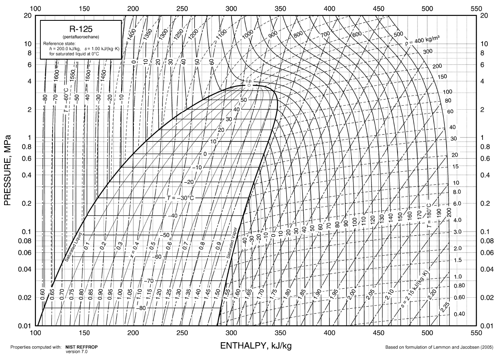

*Fig. 7 Pressure-Enthalpy Diagram for Refrigerant 125*

<!-- str. 816 -->

### Refrigerant 125 (Pentafluoroethane) Properti

**es of Saturated Liquid and Saturated Vapor**

| Temp.,* °C | Pressure, MPa | Density, Volume,<br>kg/m<sup>3</sup> Liquid | Density, Volume,<br>m<sup>3</sup>/kg Vapor | Enthalpy, kJ/kg<br>Liquid | Enthalpy, kJ/kg<br>Vapor | Entropy, kJ/(kg·K)<br>Liquid | Entropy, kJ/(kg·K)<br>Vapor | Specific Heat c<sub>p</sub>, kJ/(kg·K)<br>Liquid | Specific Heat c<sub>p</sub>, kJ/(kg·K)<br>Vapor | c /c p v Vapor | Velocity of Sound, m/s<br>Liquid | Velocity of Sound, m/s<br>Vapor | Viscosity, μPa·s<br>Liquid | Viscosity, μPa·s<br>Vapor | Thermal Cond., mW/(m·K)<br>Liquid | Thermal Cond., mW/(m·K)<br>Vapor | Tension, Temp.,*<br>Surface mN/m | Tension, Temp.,*<br>°C |
|---|---|---|---|---|---|---|---|---|---|---|---|---|---|---|---|---|---|---|
| –100.63<sup>a</sup> | 0.00291 | 1690.7 | 4.0880 | 87.13 | 277.39 | 0.4902 | 1.5931 | 1.035 | 0.569 | 1.142 | 933 | 116.4 | 1152 | 7.43 | 116.0 | 5.23 | 21.79 | –100.63 |
| –100 | 0.00309 | 1688.7 | 3.8709 | 87.78 | 277.74 | 0.4940 | 1.5911 | 1.035 | 0.570 | 1.141 | 929 | 116.6 | 1134 | 7.46 | 115.7 | 5.28 | 21.69 | –100 |
| –90 | 0.00729 | 1656.2 | 1.7303 | 98.18 | 283.36 | 0.5524 | 1.5634 | 1.045 | 0.592 | 1.138 | 878 | 119.4 | 890.8 | 7.90 | 111.0 | 5.92 | 20.08 | –90 |
| –80 | 0.01547 | 1623.4 | 0.85534 | 108.70 | 289.06 | 0.6082 | 1.5421 | 1.058 | 0.615 | 1.136 | 827 | 121.9 | 720.6 | 8.34 | 106.3 | 6.58 | 18.50 | –80 |
| –70 | 0.03008 | 1589.9 | 0.45942 | 119.36 | 294.83 | 0.6620 | 1.5257 | 1.074 | 0.639 | 1.136 | 779 | 124.1 | 595.2 | 8.77 | 101.6 | 7.25 | 16.94 | –70 |
| –60 | 0.05432 | 1555.7 | 0.26432 | 130.19 | 300.60 | 0.7140 | 1.5135 | 1.091 | 0.664 | 1.138 | 731 | 126.0 | 499.3 | 9.20 | 96.8 | 7.92 | 15.41 | –60 |
| –58 | 0.06066 | 1548.7 | 0.23836 | 132.38 | 301.75 | 0.7242 | 1.5114 | 1.095 | 0.669 | 1.138 | 721 | 126.3 | 482.8 | 9.29 | 95.9 | 8.06 | 15.11 | –58 |
| –56 | 0.06758 | 1541.7 | 0.21542 | 134.57 | 302.91 | 0.7343 | 1.5095 | 1.099 | 0.675 | 1.139 | 712 | 126.6 | 467.0 | 9.37 | 95.0 | 8.20 | 14.81 | –56 |
| –54 | 0.07511 | 1534.7 | 0.19510 | 136.78 | 304.06 | 0.7444 | 1.5077 | 1.103 | 0.680 | 1.140 | 702 | 126.9 | 452.0 | 9.46 | 94.0 | 8.33 | 14.51 | –54 |
| –52 | 0.08329 | 1527.6 | 0.17706 | 138.99 | 305.20 | 0.7544 | 1.5060 | 1.107 | 0.686 | 1.141 | 693 | 127.2 | 437.6 | 9.54 | 93.1 | 8.47 | 14.21 | –52 |
| –50 | 0.09216 | 1520.5 | 0.16100 | 141.21 | 306.35 | 0.7644 | 1.5044 | 1.111 | 0.692 | 1.142 | 683 | 127.4 | 423.8 | 9.63 | 92.2 | 8.61 | 13.91 | –50 |
| –48.09<sup>b</sup> | 0.10132 | 1513.6 | 0.14728 | 143.34 | 307.44 | 0.7739 | 1.5030 | 1.115 | 0.697 | 1.143 | 674 | 127.6 | 411.1 | 9.71 | 91.3 | 8.75 | 13.63 | –48.09 |
| –48 | 0.10177 | 1513.3 | 0.14668 | 143.44 | 307.49 | 0.7743 | 1.5029 | 1.115 | 0.697 | 1.143 | 674 | 127.6 | 410.5 | 9.71 | 91.3 | 8.75 | 13.61 | –48 |
| –46 | 0.11214 | 1506.0 | 0.13387 | 145.68 | 308.63 | 0.7842 | 1.5016 | 1.119 | 0.703 | 1.144 | 664 | 127.8 | 397.9 | 9.80 | 90.3 | 8.89 | 13.32 | –46 |
| –44 | 0.12332 | 1498.8 | 0.12240 | 147.92 | 309.77 | 0.7940 | 1.5003 | 1.123 | 0.709 | 1.145 | 655 | 128.0 | 385.7 | 9.89 | 89.4 | 9.03 | 13.02 | –44 |
| –42 | 0.13536 | 1491.4 | 0.11209 | 150.18 | 310.90 | 0.8037 | 1.4991 | 1.128 | 0.715 | 1.146 | 645 | 128.2 | 374.0 | 9.97 | 88.5 | 9.17 | 12.73 | –42 |
| –40 | 0.14830 | 1484.0 | 0.10283 | 152.44 | 312.03 | 0.8134 | 1.4980 | 1.132 | 0.722 | 1.148 | 636 | 128.3 | 362.8 | 10.06 | 87.6 | 9.32 | 12.44 | –40 |
| –38 | 0.16218 | 1476.6 | 0.09448 | 154.71 | 313.16 | 0.8231 | 1.4969 | 1.137 | 0.728 | 1.150 | 627 | 128.5 | 352.0 | 10.14 | 86.7 | 9.46 | 12.15 | –38 |
| –36 | 0.17705 | 1469.1 | 0.08693 | 157.00 | 314.28 | 0.8327 | 1.4960 | 1.142 | 0.734 | 1.151 | 617 | 128.6 | 341.6 | 10.23 | 85.7 | 9.61 | 11.86 | –36 |
| –34 | 0.19295 | 1461.5 | 0.08011 | 159.29 | 315.40 | 0.8423 | 1.4951 | 1.146 | 0.741 | 1.153 | 608 | 128.7 | 331.6 | 10.32 | 84.8 | 9.75 | 11.57 | –34 |
| –32 | 0.20994 | 1453.8 | 0.07393 | 161.59 | 316.51 | 0.8519 | 1.4943 | 1.151 | 0.748 | 1.155 | 599 | 128.7 | 321.9 | 10.40 | 83.9 | 9.90 | 11.29 | –32 |
| –30 | 0.22806 | 1446.1 | 0.06831 | 163.90 | 317.61 | 0.8614 | 1.4935 | 1.157 | 0.755 | 1.157 | 589 | 128.7 | 312.6 | 10.49 | 83.0 | 10.05 | 11.00 | –30 |
| –28 | 0.24735 | 1438.4 | 0.06321 | 166.22 | 318.71 | 0.8708 | 1.4928 | 1.162 | 0.762 | 1.160 | 580 | 128.7 | 303.6 | 10.58 | 82.1 | 10.20 | 10.72 | –28 |
| –26 | 0.26787 | 1430.5 | 0.05855 | 168.56 | 319.80 | 0.8802 | 1.4922 | 1.167 | 0.769 | 1.162 | 570 | 128.7 | 294.9 | 10.66 | 81.2 | 10.35 | 10.44 | –26 |
| –24 | 0.28968 | 1422.6 | 0.05431 | 170.90 | 320.88 | 0.8896 | 1.4916 | 1.173 | 0.776 | 1.165 | 561 | 128.7 | 286.5 | 10.75 | 80.3 | 10.50 | 10.15 | –24 |
| –22 | 0.31281 | 1414.5 | 0.05043 | 173.26 | 321.96 | 0.8990 | 1.4911 | 1.178 | 0.784 | 1.167 | 552 | 128.6 | 278.4 | 10.84 | 79.4 | 10.65 | 9.88 | –22 |
| –20 | 0.33733 | 1406.4 | 0.04688 | 175.62 | 323.03 | 0.9083 | 1.4906 | 1.184 | 0.791 | 1.170 | 542 | 128.5 | 270.5 | 10.93 | 78.5 | 10.81 | 9.60 | –20 |
| –18 | 0.36328 | 1398.3 | 0.04363 | 178.00 | 324.09 | 0.9176 | 1.4901 | 1.190 | 0.799 | 1.173 | 533 | 128.4 | 262.9 | 11.02 | 77.7 | 10.97 | 9.32 | –18 |
| –16 | 0.39072 | 1390.0 | 0.04064 | 180.39 | 325.14 | 0.9268 | 1.4897 | 1.196 | 0.807 | 1.177 | 523 | 128.2 | 255.5 | 11.11 | 76.8 | 11.12 | 9.05 | –16 |
| –14 | 0.41970 | 1381.6 | 0.03789 | 182.80 | 326.19 | 0.9361 | 1.4894 | 1.203 | 0.815 | 1.181 | 514 | 128.0 | 248.4 | 11.21 | 75.9 | 11.29 | 8.78 | –14 |
| –12 | 0.45028 | 1373.1 | 0.03536 | 185.21 | 327.22 | 0.9453 | 1.4890 | 1.209 | 0.824 | 1.184 | 505 | 127.8 | 241.4 | 11.30 | 75.0 | 11.45 | 8.50 | –12 |
| –10 | 0.48252 | 1364.5 | 0.03303 | 187.64 | 328.24 | 0.9544 | 1.4887 | 1.216 | 0.832 | 1.189 | 495 | 127.5 | 234.7 | 11.40 | 74.1 | 11.62 | 8.23 | –10 |
| –8 | 0.51646 | 1355.8 | 0.03088 | 190.08 | 329.25 | 0.9636 | 1.4884 | 1.223 | 0.841 | 1.193 | 486 | 127.3 | 228.1 | 11.49 | 73.3 | 11.79 | 7.97 | –8 |
| –6 | 0.55218 | 1347.0 | 0.02890 | 192.54 | 330.25 | 0.9727 | 1.4882 | 1.231 | 0.850 | 1.198 | 476 | 126.9 | 221.8 | 11.59 | 72.4 | 11.96 | 7.70 | –6 |
| –4 | 0.58972 | 1338.1 | 0.02706 | 195.01 | 331.23 | 0.9818 | 1.4879 | 1.238 | 0.860 | 1.203 | 467 | 126.6 | 215.6 | 11.69 | 71.6 | 12.14 | 7.44 | –4 |
| –2 | 0.62915 | 1329.0 | 0.02535 | 197.50 | 332.20 | 0.9909 | 1.4877 | 1.246 | 0.870 | 1.209 | 457 | 126.2 | 209.6 | 11.79 | 70.7 | 12.32 | 7.17 | –2 |
| 0 | 0.67052 | 1319.8 | 0.02377 | 200.00 | 333.16 | 1.0000 | 1.4875 | 1.255 | 0.880 | 1.215 | 448 | 125.8 | 203.7 | 11.89 | 69.8 | 12.50 | 6.91 | 0 |
| 2 | 0.71390 | 1310.5 | 0.02230 | 202.52 | 334.10 | 1.0091 | 1.4873 | 1.263 | 0.890 | 1.222 | 439 | 125.3 | 198.0 | 12.00 | 69.0 | 12.69 | 6.65 | 2 |
| 4 | 0.75935 | 1301.0 | 0.02093 | 205.05 | 335.02 | 1.0181 | 1.4870 | 1.273 | 0.902 | 1.229 | 429 | 124.9 | 192.4 | 12.11 | 68.1 | 12.88 | 6.40 | 4 |
| 6 | 0.80694 | 1291.3 | 0.01966 | 207.60 | 335.92 | 1.0272 | 1.4868 | 1.282 | 0.913 | 1.237 | 420 | 124.3 | 187.0 | 12.22 | 67.3 | 13.08 | 6.14 | 6 |
| 8 | 0.85672 | 1281.5 | 0.01848 | 210.17 | 336.80 | 1.0362 | 1.4866 | 1.292 | 0.926 | 1.246 | 410 | 123.8 | 181.7 | 12.33 | 66.5 | 13.29 | 5.89 | 8 |
| 10 | 0.90875 | 1271.5 | 0.01737 | 212.76 | 337.66 | 1.0452 | 1.4863 | 1.303 | 0.939 | 1.255 | 400 | 123.2 | 176.5 | 12.45 | 65.6 | 13.50 | 5.64 | 10 |
| 12 | 0.96312 | 1261.3 | 0.01634 | 215.37 | 338.50 | 1.0542 | 1.4860 | 1.314 | 0.954 | 1.265 | 391 | 122.5 | 171.4 | 12.57 | 64.8 | 13.72 | 5.39 | 12 |
| 14 | 1.0199 | 1250.9 | 0.01537 | 218.00 | 339.31 | 1.0633 | 1.4857 | 1.326 | 0.969 | 1.277 | 381 | 121.9 | 166.5 | 12.70 | 64.0 | 13.95 | 5.14 | 14 |
| 16 | 1.0791 | 1240.3 | 0.01447 | 220.65 | 340.10 | 1.0723 | 1.4854 | 1.339 | 0.986 | 1.289 | 371 | 121.1 | 161.6 | 12.83 | 63.1 | 14.18 | 4.90 | 16 |
| 18 | 1.1408 | 1229.4 | 0.01362 | 223.32 | 340.85 | 1.0813 | 1.4850 | 1.352 | 1.003 | 1.303 | 362 | 120.4 | 156.9 | 12.96 | 62.3 | 14.43 | 4.66 | 18 |
| 20 | 1.2052 | 1218.3 | 0.01283 | 226.02 | 341.58 | 1.0904 | 1.4846 | 1.367 | 1.023 | 1.318 | 352 | 119.6 | 152.2 | 13.10 | 61.5 | 14.69 | 4.42 | 20 |
| 22 | 1.2722 | 1206.9 | 0.01208 | 228.74 | 342.28 | 1.0995 | 1.4842 | 1.382 | 1.044 | 1.334 | 342 | 118.7 | 147.6 | 13.25 | 60.7 | 14.96 | 4.18 | 22 |
| 24 | 1.3420 | 1195.3 | 0.01138 | 231.49 | 342.95 | 1.1085 | 1.4836 | 1.399 | 1.067 | 1.352 | 332 | 117.8 | 143.1 | 13.40 | 59.8 | 15.24 | 3.95 | 24 |
| 26 | 1.4146 | 1183.3 | 0.01072 | 234.26 | 343.57 | 1.1176 | 1.4831 | 1.417 | 1.093 | 1.372 | 322 | 116.8 | 138.7 | 13.57 | 59.0 | 15.55 | 3.72 | 26 |
| 28 | 1.4901 | 1171.0 | 0.01010 | 237.07 | 344.16 | 1.1268 | 1.4824 | 1.436 | 1.121 | 1.395 | 312 | 115.8 | 134.4 | 13.74 | 58.2 | 15.87 | 3.49 | 28 |
| 30 | 1.5685 | 1158.4 | 0.00951 | 239.91 | 344.71 | 1.1359 | 1.4817 | 1.457 | 1.152 | 1.420 | 302 | 114.8 | 130.1 | 13.92 | 57.4 | 16.21 | 3.26 | 30 |
| 32 | 1.6501 | 1145.4 | 0.00895 | 242.78 | 345.22 | 1.1452 | 1.4809 | 1.481 | 1.186 | 1.448 | 292 | 113.7 | 125.9 | 14.11 | 56.6 | 16.57 | 3.04 | 32 |
| 34 | 1.7347 | 1131.9 | 0.00843 | 245.69 | 345.67 | 1.1544 | 1.4799 | 1.507 | 1.224 | 1.480 | 282 | 112.5 | 121.7 | 14.32 | 55.8 | 16.97 | 2.82 | 34 |
| 36 | 1.8226 | 1117.9 | 0.00793 | 248.64 | 346.07 | 1.1637 | 1.4789 | 1.536 | 1.267 | 1.516 | 272 | 111.3 | 117.6 | 14.54 | 54.9 | 17.39 | 2.60 | 36 |
| 38 | 1.9138 | 1103.5 | 0.00746 | 251.63 | 346.42 | 1.1731 | 1.4778 | 1.568 | 1.316 | 1.558 | 261 | 109.9 | 113.5 | 14.77 | 54.1 | 17.86 | 2.39 | 38 |
| 40 | 2.0085 | 1088.4 | 0.00702 | 254.67 | 346.69 | 1.1826 | 1.4764 | 1.605 | 1.372 | 1.606 | 251 | 108.6 | 109.4 | 15.03 | 53.3 | 18.37 | 2.18 | 40 |
| 42 | 2.1067 | 1072.7 | 0.00659 | 257.76 | 346.90 | 1.1921 | 1.4750 | 1.647 | 1.436 | 1.662 | 240 | 107.1 | 105.4 | 15.31 | 52.5 | 18.93 | 1.97 | 42 |
| 44 | 2.2084 | 1056.2 | 0.00619 | 260.92 | 347.02 | 1.2018 | 1.4733 | 1.697 | 1.511 | 1.728 | 229 | 105.6 | 101.3 | 15.61 | 51.7 | 19.55 | 1.77 | 44 |
| 46 | 2.3140 | 1038.9 | 0.00580 | 264.14 | 347.05 | 1.2116 | 1.4714 | 1.755 | 1.600 | 1.808 | 218 | 104.0 | 97.3 | 15.95 | 50.9 | 20.25 | 1.57 | 46 |
| 48 | 2.4234 | 1020.6 | 0.00543 | 267.44 | 346.96 | 1.2216 | 1.4692 | 1.824 | 1.708 | 1.906 | 207 | 102.3 | 93.3 | 16.32 | 50.1 | 21.04 | 1.38 | 48 |
| 50 | 2.5368 | 1001.1 | 0.00507 | 270.83 | 346.75 | 1.2318 | 1.4667 | 1.910 | 1.842 | 2.029 | 196 | 100.5 | 89.2 | 16.75 | 49.3 | 21.95 | 1.19 | 50 |
| 52 | 2.6544 | 980.2 | 0.00472 | 274.33 | 346.38 | 1.2422 | 1.4638 | 2.019 | 2.014 | 2.187 | 184 | 98.6 | 85.1 | 17.23 | 48.5 | 23.02 | 1.01 | 52 |
| 54 | 2.7763 | 957.5 | 0.00439 | 277.95 | 345.82 | 1.2529 | 1.4604 | 2.162 | 2.241 | 2.398 | 172 | 96.6 | 80.9 | 17.79 | 47.7 | 24.29 | 0.84 | 54 |
| 56 | 2.9027 | 932.6 | 0.00406 | 281.75 | 345.00 | 1.2641 | 1.4563 | 2.359 | 2.559 | 2.695 | 159 | 94.5 | 76.5 | 18.45 | 47.0 | 25.83 | 0.67 | 56 |
| 58 | 3.0339 | 904.5 | 0.00373 | 285.77 | 343.85 | 1.2758 | 1.4512 | 2.652 | 3.036 | 3.142 | 146 | 92.2 | 71.9 | 19.25 | 46.3 | 27.80 | 0.51 | 58 |
| 60 | 3.1703 | 872.1 | 0.00340 | 290.10 | 342.21 | 1.2884 | 1.4448 | 3.139 | 3.833 | 3.889 | 132 | 89.8 | 67.1 | 20.27 | 45.9 | 30.44 | 0.36 | 60 |
| 62 | 3.3121 | 832.4 | 0.00305 | 294.95 | 339.79 | 1.3024 | 1.4362 | 4.120 | 5.435 | 5.389 | 116 | 87.3 | 61.6 | 21.67 | 46.0 | 34.37 | 0.22 | 62 |
| 64 | 3.4602 | 777.5 | 0.00265 | 300.86 | 335.77 | 1.3195 | 1.4230 | 7.17 | 10.29 | 9.90 | 100 | 84.4 | 54.8 | 23.90 | 47.8 | 41.79 | 0.09 | 64 |
| 66.02<sup>c</sup> | 3.6177 | 573.6 | 0.00174 | 318.06 | 318.06 | 1.3696 | 1.3696 | ∞ | ∞ | ∞ | 0 | 0.0 | — | — | ∞ | ∞ | 0.00 | 66.02 |

*Temperatures on ITS-90 scale <sup>a</sup>Triple point <sup>b</sup>Normal boiling point <sup>c</sup>Critical point

<!-- str. 817 -->

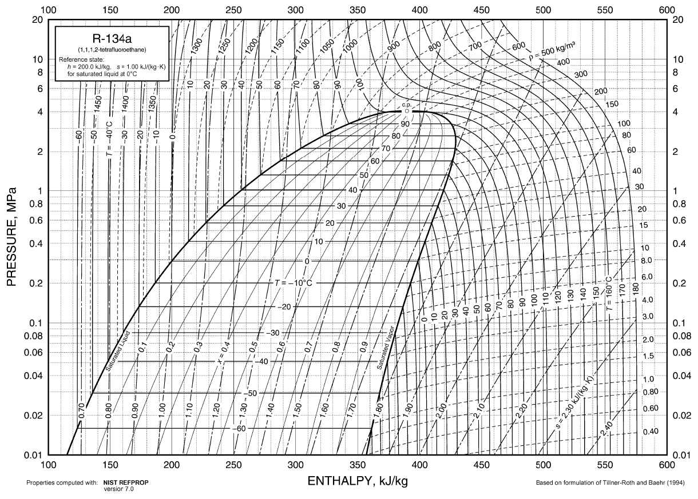

*Fig. 8 Pressure-Enthalpy Diagram for Refrigerant 134a*

<!-- str. 818 -->

**Refrigerant 134a (1,1,1,2-Tetrafluoroethane) Prop erties of Saturated Liquid and Saturated Vapor**

| Temp.,* °C | Pressure, MPa | Density, Volume,<br>kg/m<sup>3</sup> Liquid | Density, Volume,<br>m<sup>3</sup>/kg Vapor | Enthalpy, kJ/kg<br>Liquid | Enthalpy, kJ/kg<br>Vapor | Entropy, kJ/(kg·K)<br>Liquid | Entropy, kJ/(kg·K)<br>Vapor | Specific Heat c , kJ/(kg·K)<br><sup>p</sup> Liquid | Specific Heat c , kJ/(kg·K)<br>Vapor | c /c p v Vapor | Velocity of Sound, m/s<br>Liquid | Velocity of Sound, m/s<br>Vapor | Viscosity, μPa·s<br>Liquid | Viscosity, μPa·s<br>Vapor | Thermal Cond., mW/(m·K)<br>Liquid | Thermal Cond., mW/(m·K)<br>Vapor | Tension,Temp.,*<br>Surface mN/m | Tension,Temp.,*<br>°C |
|---|---|---|---|---|---|---|---|---|---|---|---|---|---|---|---|---|---|---|
| –103.30<sup>a</sup> | 0.00039 | 1591.1 | 35.4960 | 71.46 | 334.94 | 0.4126 | 1.9639 | 1.184 | 0.585 | 1.164 | 1120 | 126.8 | 2175.0 | 6.46 | 145.2 | 3.08 | 28.07 | –103.30 |
| –100 | 0.00056 | 1582.4 | 25.1930 | 75.36 | 336.85 | 0.4354 | 1.9456 | 1.184 | 0.593 | 1.162 | 1103 | 127.9 | 1893.0 | 6.60 | 143.2 | 3.34 | 27.50 | –100 |
| –90 | 0.00152 | 1555.8 | 9.7698 | 87.23 | 342.76 | 0.5020 | 1.8972 | 1.189 | 0.617 | 1.156 | 1052 | 131.0 | 1339.0 | 7.03 | 137.3 | 4.15 | 25.79 | –90 |
| –80 | 0.00367 | 1529.0 | 4.2682 | 99.16 | 348.83 | 0.5654 | 1.8580 | 1.198 | 0.642 | 1.151 | 1002 | 134.0 | 1018.0 | 7.46 | 131.5 | 4.95 | 24.10 | –80 |
| –70 | 0.00798 | 1501.9 | 2.0590 | 111.20 | 355.02 | 0.6262 | 1.8264 | 1.210 | 0.667 | 1.148 | 952 | 136.8 | 809.2 | 7.89 | 126.0 | 5.75 | 22.44 | –70 |
| –60 | 0.01591 | 1474.3 | 1.0790 | 123.36 | 361.31 | 0.6846 | 1.8010 | 1.223 | 0.692 | 1.146 | 903 | 139.4 | 663.1 | 8.30 | 120.7 | 6.56 | 20.80 | –60 |
| –50 | 0.02945 | 1446.3 | 0.60620 | 135.67 | 367.65 | 0.7410 | 1.7806 | 1.238 | 0.720 | 1.146 | 855 | 141.7 | 555.1 | 8.72 | 115.6 | 7.36 | 19.18 | –50 |
| –40 | 0.05121 | 1417.7 | 0.36108 | 148.14 | 374.00 | 0.7956 | 1.7643 | 1.255 | 0.749 | 1.148 | 807 | 143.6 | 472.2 | 9.12 | 110.6 | 8.17 | 17.60 | –40 |
| –30 | 0.08438 | 1388.4 | 0.22594 | 160.79 | 380.32 | 0.8486 | 1.7515 | 1.273 | 0.781 | 1.152 | 760 | 145.2 | 406.4 | 9.52 | 105.8 | 8.99 | 16.04 | –30 |
| –28 | 0.09270 | 1382.4 | 0.20680 | 163.34 | 381.57 | 0.8591 | 1.7492 | 1.277 | 0.788 | 1.153 | 751 | 145.4 | 394.9 | 9.60 | 104.8 | 9.15 | 15.73 | –28 |
| –26.07<sup>b</sup> | 0.10133 | 1376.7 | 0.19018 | 165.81 | 382.78 | 0.8690 | 1.7472 | 1.281 | 0.794 | 1.154 | 742 | 145.7 | 384.2 | 9.68 | 103.9 | 9.31 | 15.44 | –26.07 |
| –26 | 0.10167 | 1376.5 | 0.18958 | 165.90 | 382.82 | 0.8694 | 1.7471 | 1.281 | 0.794 | 1.154 | 742 | 145.7 | 383.8 | 9.68 | 103.9 | 9.32 | 15.43 | –26 |
| –24 | 0.11130 | 1370.4 | 0.17407 | 168.47 | 384.07 | 0.8798 | 1.7451 | 1.285 | 0.801 | 1.155 | 732 | 145.9 | 373.1 | 9.77 | 102.9 | 9.48 | 15.12 | –24 |
| –22 | 0.12165 | 1364.4 | 0.16006 | 171.05 | 385.32 | 0.8900 | 1.7432 | 1.289 | 0.809 | 1.156 | 723 | 146.1 | 362.9 | 9.85 | 102.0 | 9.65 | 14.82 | –22 |
| –20 | 0.13273 | 1358.3 | 0.14739 | 173.64 | 386.55 | 0.9002 | 1.7413 | 1.293 | 0.816 | 1.158 | 714 | 146.3 | 353.0 | 9.92 | 101.1 | 9.82 | 14.51 | –20 |
| –18 | 0.14460 | 1352.1 | 0.13592 | 176.23 | 387.79 | 0.9104 | 1.7396 | 1.297 | 0.823 | 1.159 | 705 | 146.4 | 343.5 | 10.01 | 100.1 | 9.98 | 14.21 | –18 |
| –16 | 0.15728 | 1345.9 | 0.12551 | 178.83 | 389.02 | 0.9205 | 1.7379 | 1.302 | 0.831 | 1.161 | 695 | 146.6 | 334.3 | 10.09 | 99.2 | 10.15 | 13.91 | –16 |
| –14 | 0.17082 | 1339.7 | 0.11605 | 181.44 | 390.24 | 0.9306 | 1.7363 | 1.306 | 0.838 | 1.163 | 686 | 146.7 | 325.4 | 10.17 | 98.3 | 10.32 | 13.61 | –14 |
| –12 | 0.18524 | 1333.4 | 0.10744 | 184.07 | 391.46 | 0.9407 | 1.7348 | 1.311 | 0.846 | 1.165 | 677 | 146.8 | 316.9 | 10.25 | 97.4 | 10.49 | 13.32 | –12 |
| –10 | 0.20060 | 1327.1 | 0.09959 | 186.70 | 392.66 | 0.9506 | 1.7334 | 1.316 | 0.854 | 1.167 | 668 | 146.9 | 308.6 | 10.33 | 96.5 | 10.66 | 13.02 | –10 |
| –8 | 0.21693 | 1320.8 | 0.09242 | 189.34 | 393.87 | 0.9606 | 1.7320 | 1.320 | 0.863 | 1.169 | 658 | 146.9 | 300.6 | 10.41 | 95.6 | 10.83 | 12.72 | –8 |
| –6 | 0.23428 | 1314.3 | 0.08587 | 191.99 | 395.06 | 0.9705 | 1.7307 | 1.325 | 0.871 | 1.171 | 649 | 147.0 | 292.9 | 10.49 | 94.7 | 11.00 | 12.43 | –6 |
| –4 | 0.25268 | 1307.9 | 0.07987 | 194.65 | 396.25 | 0.9804 | 1.7294 | 1.330 | 0.880 | 1.174 | 640 | 147.0 | 285.4 | 10.57 | 93.8 | 11.17 | 12.14 | –4 |
| –2 | 0.27217 | 1301.4 | 0.07436 | 197.32 | 397.43 | 0.9902 | 1.7282 | 1.336 | 0.888 | 1.176 | 631 | 147.0 | 278.1 | 10.65 | 92.9 | 11.34 | 11.85 | –2 |
| 0 | 0.29280 | 1294.8 | 0.06931 | 200.00 | 398.60 | 1.0000 | 1.7271 | 1.341 | 0.897 | 1.179 | 622 | 146.9 | 271.1 | 10.73 | 92.0 | 11.51 | 11.56 | 0 |
| 2 | 0.31462 | 1288.1 | 0.06466 | 202.69 | 399.77 | 1.0098 | 1.7260 | 1.347 | 0.906 | 1.182 | 612 | 146.9 | 264.3 | 10.81 | 91.1 | 11.69 | 11.27 | 2 |
| 4 | 0.33766 | 1281.4 | 0.06039 | 205.40 | 400.92 | 1.0195 | 1.7250 | 1.352 | 0.916 | 1.185 | 603 | 146.8 | 257.6 | 10.90 | 90.2 | 11.86 | 10.99 | 4 |
| 6 | 0.36198 | 1274.7 | 0.05644 | 208.11 | 402.06 | 1.0292 | 1.7240 | 1.358 | 0.925 | 1.189 | 594 | 146.7 | 251.2 | 10.98 | 89.4 | 12.04 | 10.70 | 6 |
| 8 | 0.38761 | 1267.9 | 0.05280 | 210.84 | 403.20 | 1.0388 | 1.7230 | 1.364 | 0.935 | 1.192 | 585 | 146.5 | 244.9 | 11.06 | 88.5 | 12.22 | 10.42 | 8 |
| 10 | 0.41461 | 1261.0 | 0.04944 | 213.58 | 404.32 | 1.0485 | 1.7221 | 1.370 | 0.945 | 1.196 | 576 | 146.4 | 238.8 | 11.15 | 87.6 | 12.40 | 10.14 | 10 |
| 12 | 0.44301 | 1254.0 | 0.04633 | 216.33 | 405.43 | 1.0581 | 1.7212 | 1.377 | 0.956 | 1.200 | 566 | 146.2 | 232.9 | 11.23 | 86.7 | 12.58 | 9.86 | 12 |
| 14 | 0.47288 | 1246.9 | 0.04345 | 219.09 | 406.53 | 1.0677 | 1.7204 | 1.383 | 0.967 | 1.204 | 557 | 146.0 | 227.1 | 11.32 | 85.9 | 12.77 | 9.58 | 14 |
| 16 | 0.50425 | 1239.8 | 0.04078 | 221.87 | 407.61 | 1.0772 | 1.7196 | 1.390 | 0.978 | 1.209 | 548 | 145.7 | 221.5 | 11.40 | 85.0 | 12.95 | 9.30 | 16 |
| 18 | 0.53718 | 1232.6 | 0.03830 | 224.66 | 408.69 | 1.0867 | 1.7188 | 1.397 | 0.989 | 1.214 | 539 | 145.5 | 216.0 | 11.49 | 84.1 | 13.14 | 9.03 | 18 |
| 20 | 0.57171 | 1225.3 | 0.03600 | 227.47 | 409.75 | 1.0962 | 1.7180 | 1.405 | 1.001 | 1.219 | 530 | 145.1 | 210.7 | 11.58 | 83.3 | 13.33 | 8.76 | 20 |
| 22 | 0.60789 | 1218.0 | 0.03385 | 230.29 | 410.79 | 1.1057 | 1.7173 | 1.413 | 1.013 | 1.224 | 520 | 144.8 | 205.5 | 11.67 | 82.4 | 13.53 | 8.48 | 22 |
| 24 | 0.64578 | 1210.5 | 0.03186 | 233.12 | 411.82 | 1.1152 | 1.7166 | 1.421 | 1.025 | 1.230 | 511 | 144.5 | 200.4 | 11.76 | 81.6 | 13.72 | 8.21 | 24 |
| 26 | 0.68543 | 1202.9 | 0.03000 | 235.97 | 412.84 | 1.1246 | 1.7159 | 1.429 | 1.038 | 1.236 | 502 | 144.1 | 195.4 | 11.85 | 80.7 | 13.92 | 7.95 | 26 |
| 28 | 0.72688 | 1195.2 | 0.02826 | 238.84 | 413.84 | 1.1341 | 1.7152 | 1.437 | 1.052 | 1.243 | 493 | 143.6 | 190.5 | 11.95 | 79.8 | 14.13 | 7.68 | 28 |
| 30 | 0.77020 | 1187.5 | 0.02664 | 241.72 | 414.82 | 1.1435 | 1.7145 | 1.446 | 1.065 | 1.249 | 483 | 143.2 | 185.8 | 12.04 | 79.0 | 14.33 | 7.42 | 30 |
| 32 | 0.81543 | 1179.6 | 0.02513 | 244.62 | 415.78 | 1.1529 | 1.7138 | 1.456 | 1.080 | 1.257 | 474 | 142.7 | 181.1 | 12.14 | 78.1 | 14.54 | 7.15 | 32 |
| 34 | 0.86263 | 1171.6 | 0.02371 | 247.54 | 416.72 | 1.1623 | 1.7131 | 1.466 | 1.095 | 1.265 | 465 | 142.1 | 176.6 | 12.24 | 77.3 | 14.76 | 6.89 | 34 |
| 36 | 0.91185 | 1163.4 | 0.02238 | 250.48 | 417.65 | 1.1717 | 1.7124 | 1.476 | 1.111 | 1.273 | 455 | 141.6 | 172.1 | 12.34 | 76.4 | 14.98 | 6.64 | 36 |
| 38 | 0.96315 | 1155.1 | 0.02113 | 253.43 | 418.55 | 1.1811 | 1.7118 | 1.487 | 1.127 | 1.282 | 446 | 141.0 | 167.7 | 12.44 | 75.6 | 15.21 | 6.38 | 38 |
| 40 | 1.0166 | 1146.7 | 0.01997 | 256.41 | 419.43 | 1.1905 | 1.7111 | 1.498 | 1.145 | 1.292 | 436 | 140.3 | 163.4 | 12.55 | 74.7 | 15.44 | 6.13 | 40 |
| 42 | 1.0722 | 1138.2 | 0.01887 | 259.41 | 420.28 | 1.1999 | 1.7103 | 1.510 | 1.163 | 1.303 | 427 | 139.7 | 159.2 | 12.65 | 73.9 | 15.68 | 5.88 | 42 |
| 44 | 1.1301 | 1129.5 | 0.01784 | 262.43 | 421.11 | 1.2092 | 1.7096 | 1.523 | 1.182 | 1.314 | 418 | 138.9 | 155.1 | 12.76 | 73.0 | 15.93 | 5.63 | 44 |
| 46 | 1.1903 | 1120.6 | 0.01687 | 265.47 | 421.92 | 1.2186 | 1.7089 | 1.537 | 1.202 | 1.326 | 408 | 138.2 | 151.0 | 12.88 | 72.1 | 16.18 | 5.38 | 46 |
| 48 | 1.2529 | 1111.5 | 0.01595 | 268.53 | 422.69 | 1.2280 | 1.7081 | 1.551 | 1.223 | 1.339 | 399 | 137.4 | 147.0 | 13.00 | 71.3 | 16.45 | 5.13 | 48 |
| 50 | 1.3179 | 1102.3 | 0.01509 | 271.62 | 423.44 | 1.2375 | 1.7072 | 1.566 | 1.246 | 1.354 | 389 | 136.6 | 143.1 | 13.12 | 70.4 | 16.72 | 4.89 | 50 |
| 52 | 1.3854 | 1092.9 | 0.01428 | 274.74 | 424.15 | 1.2469 | 1.7064 | 1.582 | 1.270 | 1.369 | 379 | 135.7 | 139.2 | 13.24 | 69.6 | 17.01 | 4.65 | 52 |
| 54 | 1.4555 | 1083.2 | 0.01351 | 277.89 | 424.83 | 1.2563 | 1.7055 | 1.600 | 1.296 | 1.386 | 370 | 134.7 | 135.4 | 13.37 | 68.7 | 17.31 | 4.41 | 54 |
| 56 | 1.5282 | 1073.4 | 0.01278 | 281.06 | 425.47 | 1.2658 | 1.7045 | 1.618 | 1.324 | 1.405 | 360 | 133.8 | 131.6 | 13.51 | 67.8 | 17.63 | 4.18 | 56 |
| 58 | 1.6036 | 1063.2 | 0.01209 | 284.27 | 426.07 | 1.2753 | 1.7035 | 1.638 | 1.354 | 1.425 | 350 | 132.7 | 127.9 | 13.65 | 67.0 | 17.96 | 3.95 | 58 |
| 60 | 1.6818 | 1052.9 | 0.01144 | 287.50 | 426.63 | 1.2848 | 1.7024 | 1.660 | 1.387 | 1.448 | 340 | 131.7 | 124.2 | 13.79 | 66.1 | 18.31 | 3.72 | 60 |
| 62 | 1.7628 | 1042.2 | 0.01083 | 290.78 | 427.14 | 1.2944 | 1.7013 | 1.684 | 1.422 | 1.473 | 331 | 130.5 | 120.6 | 13.95 | 65.2 | 18.68 | 3.49 | 62 |
| 64 | 1.8467 | 1031.2 | 0.01024 | 294.09 | 427.61 | 1.3040 | 1.7000 | 1.710 | 1.461 | 1.501 | 321 | 129.4 | 117.0 | 14.11 | 64.3 | 19.07 | 3.27 | 64 |
| 66 | 1.9337 | 1020.0 | 0.00969 | 297.44 | 428.02 | 1.3137 | 1.6987 | 1.738 | 1.504 | 1.532 | 311 | 128.1 | 113.5 | 14.28 | 63.4 | 19.50 | 3.05 | 66 |
| 68 | 2.0237 | 1008.3 | 0.00916 | 300.84 | 428.36 | 1.3234 | 1.6972 | 1.769 | 1.552 | 1.567 | 301 | 126.8 | 109.9 | 14.46 | 62.6 | 19.95 | 2.83 | 68 |
| 70 | 2.1168 | 996.2 | 0.00865 | 304.28 | 428.65 | 1.3332 | 1.6956 | 1.804 | 1.605 | 1.607 | 290 | 125.5 | 106.4 | 14.65 | 61.7 | 20.45 | 2.61 | 70 |
| 72 | 2.2132 | 983.8 | 0.00817 | 307.78 | 428.86 | 1.3430 | 1.6939 | 1.843 | 1.665 | 1.653 | 280 | 124.0 | 102.9 | 14.85 | 60.8 | 20.98 | 2.40 | 72 |
| 74 | 2.3130 | 970.8 | 0.00771 | 311.33 | 429.00 | 1.3530 | 1.6920 | 1.887 | 1.734 | 1.705 | 269 | 122.6 | 99.5 | 15.07 | 59.9 | 21.56 | 2.20 | 74 |
| 76 | 2.4161 | 957.3 | 0.00727 | 314.94 | 429.04 | 1.3631 | 1.6899 | 1.938 | 1.812 | 1.766 | 259 | 121.0 | 96.0 | 15.30 | 59.0 | 22.21 | 1.99 | 76 |
| 78 | 2.5228 | 943.1 | 0.00685 | 318.63 | 428.98 | 1.3733 | 1.6876 | 1.996 | 1.904 | 1.838 | 248 | 119.4 | 92.5 | 15.56 | 58.1 | 22.92 | 1.80 | 78 |
| 80 | 2.6332 | 928.2 | 0.00645 | 322.39 | 428.81 | 1.3836 | 1.6850 | 2.065 | 2.012 | 1.924 | 237 | 117.7 | 89.0 | 15.84 | 57.2 | 23.72 | 1.60 | 80 |
| 85 | 2.9258 | 887.2 | 0.00550 | 332.22 | 427.76 | 1.4104 | 1.6771 | 2.306 | 2.397 | 2.232 | 207 | 113.1 | 80.2 | 16.67 | 54.9 | 26.22 | 1.14 | 85 |
| 90 | 3.2442 | 837.8 | 0.00461 | 342.93 | 425.42 | 1.4390 | 1.6662 | 2.756 | 3.121 | 2.820 | 176 | 107.9 | 70.9 | 17.81 | 52.8 | 29.91 | 0.71 | 90 |
| 95 | 3.5912 | 772.7 | 0.00374 | 355.25 | 420.67 | 1.4715 | 1.6492 | 3.938 | 5.020 | 4.369 | 141 | 101.9 | 60.4 | 19.61 | 51.7 | 36.40 | 0.33 | 95 |
| 100 | 3.9724 | 651.2 | 0.00268 | 373.30 | 407.68 | 1.5188 | 1.6109 | 17.59 | 25.35 | 20.81 | 101 | 94.0 | 45.1 | 24.21 | 59.9 | 60.58 | 0.04 | 100 |
| 101.06<sup>c</sup> | 4.0593 | 511.9 | 0.00195 | 389.64 | 389.64 | 1.5621 | 1.5621 | ∞ | ∞ | ∞ | 0 | 0.0 | — | — | ∞ | ∞ | 0.00 | 101.06 |

*Temperatures on ITS-90 scale <sup>a</sup>Triple point <sup>b</sup>Normal boiling point <sup>c</sup>Critical point

<!-- str. 819 -->

### Refrigerant 134a Proper

**ties of Superheated Vapor**

|   | Pressure = 0.101325 MPa<br>Saturation temperature = −26.07°C |   |   |   |   | Pressure = 0.200 MPa<br>Saturation temperature = −10.07°C |   |   |   | Pressure = 0.400 MPa<br>Saturation temperature = 8.94°C |   |   |   |
|---|---|---|---|---|---|---|---|---|---|---|---|---|---|
| Temp.,* | Density, | Enthalpy, | Entropy, | Vel. of | Temp.,* | Density, | Enthalpy, Entropy, | Vel. of | Temp.,* | Density, | Enthalpy, | Entropy, | Vel. of |
| °C | kg/m<sup>3</sup> | kJ/kg | kJ/(kg·K) Sound, m/s |  | °C | kg/m<sup>3</sup> | kJ/kg kJ/(kg·K) Sound, m/s |  | °C | kg/m<sup>3</sup> | kJ/kg | kJ/(kg·K) Sound, m/s |  |
| Saturated |  |  |  |  | Saturated |  |  |  | Saturated |  |  |  |  |
| Liquid | 1374.34 | 166.07 | 0.8701 | 747.1 | Liquid | 1325.78 | 186.69 0.9506 | 672.8 | Liquid | 1263.84 | 212.08 | 1.0432 | 583.8 |
| Vapor | 5.26 | 382.90 | 1.7476 | 145.7 | Vapor | 10.01 | 392.71 1.7337 | 146.9 | Vapor | 19.52 | 403.80 | 1.7229 | 146.6 |
| –20 | 5.11 | 387.68 | 1.7667 | 147.8 |  |  |  |  |  |  |  |  |  |
| –10 | 4.89 | 395.65 | 1.7976 | 151.0 | –10 | 10.01 | 392.77 1.7339 | 147.0 |  |  |  |  |  |
| 0 | 4.69 | 403.74 | 1.8278 | 154.2 | 0 | 9.54 | 401.21 1.7654 | 150.6 |  |  |  |  |  |
| 10 | 4.50 | 411.97 | 1.8574 | 157.2 | 10 | 9.13 | 409.73 1.7961 | 154.0 | 10 | 19.41 | 404.78 | 1.7263 | 147.0 |
| 20 | 4.34 | 420.34 | 1.8864 | 160.1 | 20 | 8.76 | 418.35 1.8260 | 157.3 | 20 | 18.45 | 414.00 | 1.7583 | 151.2 |
| 30 | 4.18 | 428.85 | 1.9150 | 162.9 | 30 | 8.42 | 427.07 1.8552 | 160.4 | 30 | 17.61 | 423.21 | 1.7892 | 155.0 |
| 40 | 4.04 | 437.52 | 1.9431 | 165.7 | 40 | 8.12 | 435.90 1.8839 | 163.4 | 40 | 16.87 | 432.46 | 1.8192 | 158.6 |
| 50 | 3.91 | 446.33 | 1.9708 | 168.4 | 50 | 7.83 | 444.87 1.9121 | 166.3 | 50 | 16.20 | 441.76 | 1.8485 | 162.0 |
| 60 | 3.78 | 455.30 | 1.9981 | 171.0 | 60 | 7.57 | 453.97 1.9398 | 169.2 | 60 | 15.60 | 451.15 | 1.8771 | 165.3 |
| 70 | 3.67 | 464.43 | 2.0251 | 173.6 | 70 | 7.33 | 463.20 1.9671 | 171.9 | 70 | 15.05 | 460.63 | 1.9051 | 168.4 |
| 80 | 3.56 | 473.70 | 2.0518 | 176.1 | 80 | 7.11 | 472.57 1.9940 | 174.6 | 80 | 14.54 | 470.21 | 1.9326 | 171.4 |
| 90 | 3.46 | 483.13 | 2.0781 | 178.6 | 90 | 6.89 | 482.08 2.0206 | 177.2 | 90 | 14.08 | 479.91 | 1.9597 | 174.3 |
| 100 | 3.36 | 492.71 | 2.1041 | 181.0 | 100 | 6.70 | 491.74 2.0468 | 179.7 | 100 | 13.65 | 489.72 | 1.9864 | 177.1 |
| 110 | 3.27 | 502.44 | 2.1298 | 183.4 | 110 | 6.51 | 501.53 2.0727 | 182.2 | 110 | 13.24 | 499.65 | 2.0126 | 179.8 |
| 120 | 3.19 | 512.32 | 2.1553 | 185.7 | 120 | 6.34 | 511.47 2.0983 | 184.7 | 120 | 12.87 | 509.71 | 2.0386 | 182.4 |
| 130 | 3.11 | 522.35 | 2.1805 | 188.1 | 130 | 6.17 | 521.55 2.1236 | 187.1 | 130 | 12.51 | 519.90 | 2.0641 | 185.0 |
| 140 | 3.03 | 532.52 | 2.2054 | 190.3 | 140 | 6.01 | 531.76 2.1486 | 189.4 | 140 | 12.18 | 530.21 | 2.0894 | 187.5 |
| 150 | 2.96<br>Pressure = 0.600 MPa<br>Saturation temperature = 21.58°C | 542.83 | 2.2301 | 192.6 | 150 | 5.87<br>Pressure = 0.800 MPa<br>Saturation temperature = 31.33°C | 542.12 2.1734 | 191.7 | 150 | 11.87<br>Pressure = 1.000 MPa<br>Saturation temperature = 39.39°C | 540.66 | 2.1144 | 190.0 |
| Temp.,* | Density, | Enthalpy, | Entropy, | Vel. of | Temp.,* | Density, | Enthalpy, Entropy, | Vel. of | Temp.,* | Density, | Enthalpy, | Entropy, | Vel. of |
| °C | kg/m<sup>3</sup> | kJ/kg | kJ/(kg·K) Sound, m/s |  | °C | kg/m<sup>3</sup> | kJ/kg kJ/(kg·K) Sound, m/s |  | °C | kg/m<sup>3</sup> | kJ/kg | kJ/(kg·K) Sound, m/s |  |
| Saturated |  |  |  |  | Saturated |  |  |  | Saturated |  |  |  |  |
| Liquid | 1219.08 | 229.62 | 1.1035 | 524.0 | Liquid | 1181.92 | 243.58 1.1495 | 477.4 | Liquid | 1149.06 | 255.44 | 1.1874 | 438.6 |
| Vapor | 29.13 | 410.67 | 1.7178 | 145.0 | Vapor | 38.99 | 415.58 1.7144 | 142.9 | Vapor | 49.16 | 419.31 | 1.7117 | 140.6 |
| 30 | 27.79 | 418.97 | 1.7455 | 149.0 |  |  |  |  |  |  |  |  |  |
| 40 | 26.41 | 428.72 | 1.7772 | 153.4 | 40 | 36.98 | 424.61 1.7437 | 147.6 | 40 | 48.95 | 419.99 | 1.7139 | 141.0 |
| 50 | 25.21 | 438.44 | 1.8077 | 157.4 | 50 | 35.03 | 434.85 1.7758 | 152.4 | 50 | 45.86 | 430.91 | 1.7482 | 146.9 |
| 60 | 24.16 | 448.16 | 1.8374 | 161.2 | 60 | 33.36 | 444.98 1.8067 | 156.8 | 60 | 43.34 | 441.56 | 1.7807 | 152.0 |
| 70 | 23.22 | 457.93 | 1.8662 | 164.7 | 70 | 31.90 | 455.08 1.8366 | 160.8 | 70 | 41.21 | 452.05 | 1.8117 | 156.7 |
| 80 | 22.37 | 467.75 | 1.8944 | 168.0 | 80 | 30.62 | 465.17 1.8656 | 164.6 | 80 | 39.36 | 462.47 | 1.8416 | 160.9 |
| 90 | 21.59 | 477.65 | 1.9221 | 171.2 | 90 | 29.46 | 475.30 1.8939 | 168.1 | 90 | 37.74 | 472.86 | 1.8706 | 164.9 |
| 100 | 20.88 | 487.64 | 1.9492 | 174.3 | 100 | 28.41 | 485.49 1.9215 | 171.5 | 100 | 36.29 | 483.26 | 1.8989 | 168.6 |
| 110 | 20.22 | 497.72 | 1.9759 | 177.3 | 110 | 27.46 | 495.74 1.9486 | 174.7 | 110 | 34.99 | 493.69 | 1.9265 | 172.1 |
| 120 | 19.61 | 507.92 | 2.0022 | 180.1 | 120 | 26.58 | 506.07 1.9753 | 177.8 | 120 | 33.80 | 504.19 | 1.9535 | 175.4 |
| 130 | 19.04 | 518.22 | 2.0280 | 182.9 | 130 | 25.77 | 516.50 215 | 180.8 | 130 | 32.71 | 514.75 | 1.9800 | 178.6 |
| 140 | 18.51 | 528.63 | 2.0536 | 185.6 | 140 | 25.01 | 527.03 2.0272 | 183.7 | 140 | 31.70 | 525.39 | 2.0061 | 181.7 |
| 150 | 18.01 | 539.17 | 2.0787 | 188.2 | 150 | 24.31 | 537.66 2.0527 | 186.4 | 150 | 30.76 | 536.12 | 2.0318 | 184.6 |
| 160 | 17.54 | 549.82 | 2.1036 | 190.8 | 160 | 23.65 | 548.40 2.0777 | 189.2 | 160 | 29.90 | 546.95 | 2.0571 | 187.5 |
| 170 | 17.10 | 560.59 | 2.1282 | 193.3 | 170 | 23.03 | 559.24 2.1025 | 191.8 | 170 | 29.08 | 557.88 | 2.0820 | 190.3 |
| 180 | 16.68 | 571.48 | 2.1525 | 195.8 | 180 | 22.45 | 570.20 2.1270 | 194.4 | 180 | 28.32 | 568.91 | 2.1066 | 193.0 |
| 190 | 16.29 | 582.50 | 2.1766 | 198.2 | 190 | 21.89 | 581.28 2.1511 | 196.9 | 190 | 27.60 | 580.05 | 2.1309 | 195.6 |
| 200 | 15.91<br>Pressure = 1.200 MPa<br>Saturation temperature = 46.32°C | 593.63 | 2.2003 | 200.6 | 200 | 21.37<br>Pressure = 1.400 MPa<br>Saturation temperature = 52.43°C | 592.46 2.1750 | 199.4 | 200 | 26.92<br>Pressure = 1.600 MPa<br>Saturation temperature = 57.91°C | 591.29 | 2.1550 | 198.2 |
| Temp.,* | Density, | Enthalpy, | Entropy, | Vel. of | Temp.,* | Density, | Enthalpy, Entropy, | Vel. of | Temp.,* | Density, | Enthalpy, | Entropy, | Vel. of |
| °C | kg/m<sup>3</sup> | kJ/kg | kJ/(kg·K) Sound, m/s |  | °C | kg/m<sup>3</sup> | kJ/kg kJ/(kg·K) Sound, m/s |  | °C | kg/m<sup>3</sup> | kJ/kg | kJ/(kg·K) Sound, m/s |  |
| Saturated |  |  |  |  | Saturated |  |  |  | Saturated |  |  |  |  |
| Liquid | 1118.89 | 265.91 | 1.2200 | 405.0 | Liquid | 1090.50 | 275.38 1.2488 | 375.1 | Liquid | 1063.28 | 284.11 | 1.2748 | 348.1 |
| Vapor | 59.73 | 422.22 | 1.7092 | 138.2 | Vapor | 70.76 | 424.50 1.7068 | 135.6 | Vapor | 82.34 | 426.27 | 1.7042 | 132.9 |
| 50 | 58.09 | 426.51 | 1.7226 | 140.7 |  |  |  |  |  |  |  |  |  |
| 60 | 54.32 | 437.83 | 1.7571 | 146.9 | 60 | 66.61 | 433.69 1.7347 | 141.2 | 60 | 80.74 | 428.99 | 1.7124 | 134.7 |
| 70 | 51.26 | 448.81 | 1.7896 | 152.3 | 70 | 62.25 | 445.31 1.7691 | 147.5 | 70 | 74.43 | 441.47 | 1.7493 | 142.3 |
| 80 | 48.69 | 459.61 | 1.8206 | 157.1 | 80 | 58.74 | 456.56 1.8014 | 153.0 | 80 | 69.61 | 453.30 | 1.7833 | 148.7 |
| 90 | 46.49 | 470.30 | 1.8504 | 161.5 | 90 | 55.79 | 467.60 1.8322 | 158.0 | 90 | 65.71 | 464.76 | 1.8153 | 154.2 |
| 100 | 44.55 | 480.94 | 1.8794 | 165.6 | 100 | 53.24 | 478.53 1.8619 | 162.5 | 100 | 62.43 | 476.01 | 1.8458 | 159.2 |
| 110 | 42.83 | 491.58 | 1.9075 | 169.4 | 110 | 51.03 | 489.39 1.8906 | 166.6 | 110 | 59.62 | 487.13 | 1.8753 | 163.8 |
| 120 | 41.28 | 502.25 | 1.9350 | 173.0 | 120 | 49.05 | 500.25 1.9186 | 170.5 | 120 | 57.14 | 498.19 | 1.9038 | 168.0 |
| 130 | 39.87 | 512.95 | 1.9619 | 176.4 | 130 | 47.28 | 511.11 1.9459 | 174.2 | 130 | 54.95 | 509.23 | 1.9315 | 171.9 |
| 140 | 38.58 | 523.72 | 1.9882 | 179.7 | 140 | 45.67 | 522.02 1.9726 | 177.7 | 140 | 52.98 | 520.28 | 1.9586 | 175.6 |
| 150 | 37.39 | 534.56 | 2.0142 | 182.8 | 150 | 44.19 | 532.97 1.9988 | 181.0 | 150 | 51.18 | 531.36 | 1.9851 | 179.1 |
| 160 | 36.29 | 545.48 | 2.0397 | 185.8 | 160 | 42.83 | 544 2.0246 | 184.2 | 160 | 49.54 | 542.49 | 2.0111 | 182.5 |
| 170 | 35.26 | 556.50 | 2.0648 | 188.8 | 170 | 41.57 | 555.10 2.0499 | 187.2 | 170 | 48.03 | 553.68 | 2.0366 | 185.7 |
| 180 | 34.31 | 567.60 | 2.0896 | 191.6 | 180 | 40.41 | 566.28 2.0748 | 190.2 | 180 | 46.63 | 564.94 | 2.0617 | 188.8 |
| 190 | 33.40 | 578.80 | 2.1141 | 194.4 | 190 | 39.31 | 577.55 2.0994 | 193.1 | 190 | 45.32 | 576.29 | 2.0865 | 191.8 |
| 200 | 32.56 | 590.11 | 2.1382 | 197.1 | 200 | 38.28 | 588.92 2.1237 | 195.9 | 200 | 44.10 | 587.71 | 2.1109 | 194.7 |
| 210 | 31.76 | 601.51 | 2.1621 | 199.7 | 210 | 37.32 | 600.38 2.1477 | 198.6 | 210 | 42.96 | 599.23 | 2.1350 | 197.6 |
| 220 | 31.01 | 613.02 | 2.1856 | 202.3 | 220 | 36.41 | 611.94 2.1714 | 201.3 | 220 | 41.88 | 610.84 | 2.1588 | 200.3 |
| 230 | 30.29 | 624.64 | 2.2090 | 204.8 | 230 | 35.55 | 623.60 2.1948 | 203.9 | 230 | 40.87 | 622.55 | 2.1823 | 203.0 |
| 240 | 29.61 | 636.36 | 2.2320 | 207.2 | 240 | 34.73 | 635.35 2.2179 | 206.4 | 240 | 39.91 | 634.35 | 2.2055 | 205.6 |
| 250 | 28.96 | 648.18 | 2.2548 | 209.7 | 250 | 33.96 | 647.22 2.2408 | 208.9 | 250 | 39.00 | 646.25 | 2.2285 | 208.2 |

*Temperatures on ITS-90 scale

| Temp.,* °C | Density, Enthalpy, Entropy, Vel. of kg/m<sup>3</sup> kJ/kg kJ/(kg·K) Sound, m/s |
|---|---|
| Saturated<br>Liquid<br>Vapor –10 0 10 20 30 40 50 60 70 80 90 100 110 120 130 140 150 | 1325.78 186.69 0.9506 672.8 10.01 392.71 1.7337 146.9 10.01 392.77 1.7339 147.0 9.54 401.21 1.7654 150.6 9.13 409.73 1.7961 154.0 8.76 418.35 1.8260 157.3 8.42 427.07 1.8552 160.4 8.12 435.90 1.8839 163.4 7.83 444.87 1.9121 166.3 7.57 453.97 1.9398 169.2 7.33 463.20 1.9671 171.9 7.11 472.57 1.9940 174.6 6.89 482.08 2.0206 177.2 6.70 491.74 2.0468 179.7 6.51 501.53 2.0727 182.2 6.34 511.47 2.0983 184.7 6.17 521.55 2.1236 187.1 6.01 531.76 2.1486 189.4 5.87 542.12 2.1734 191.7 |
|  | Pressure = 0.800 MPa<br>Saturation temperature = 31.33°C |
| Temp.,* °C | Density, Enthalpy, Entropy, Vel. of kg/m<sup>3</sup> kJ/kg kJ/(kg·K) Sound, m/s |
| Saturated<br>Liquid<br>Vapor 40 50 60 70 80 90 100 110 120 130 140 150 160 170 180 190 200 | 1181.92 243.58 1.1495 477.4 38.99 415.58 1.7144 142.9 36.98 424.61 1.7437 147.6 35.03 434.85 1.7758 152.4 33.36 444.98 1.8067 156.8 31.90 455.08 1.8366 160.8 30.62 465.17 1.8656 164.6 29.46 475.30 1.8939 168.1 28.41 485.49 1.9215 171.5 27.46 495.74 1.9486 174.7 26.58 506.07 1.9753 177.8 25.77 516.50 215 180.8 25.01 527.03 2.0272 183.7 24.31 537.66 2.0527 186.4 23.65 548.40 2.0777 189.2 23.03 559.24 2.1025 191.8 22.45 570.20 2.1270 194.4 21.89 581.28 2.1511 196.9 21.37 592.46 2.1750 199.4 |
|  | Pressure = 1.400 MPa<br>Saturation temperature = 52.43°C |
| Temp.,* °C | Density, Enthalpy, Entropy, Vel. of kg/m<sup>3</sup> kJ/kg kJ/(kg·K) Sound, m/s |

<!-- str. 820 -->

### Refrigerant 134a Properties of Superheated Vapor (Concluded)

|   | Pressure = 1.800 MPa<br>Saturation temperature = 62.90°C |   |   |   | Pressure = 2.000 MPa<br>Saturation temperature = 67.49°C |   |   |   | Saturation temperature = 71.74°C | Pressure = 2.200 MPa |   |   |   |
|---|---|---|---|---|---|---|---|---|---|---|---|---|---|
| Temp.,* | Density, | Enthalpy, Entropy, | Vel. of | Temp.,* | Density, | Enthalpy, | Entropy, | Vel. of | Temp.,* | Density, | Enthalpy, | Entropy, | Vel. of |
| °C | kg/m<sup>3</sup> | kJ/kg kJ/(kg·K) Sound, m/s |  | °C | kg/m<sup>3</sup> | kJ/kg | kJ/(kg·K) Sound, m/s |  | °C | kg/m<sup>3</sup> | kJ/kg | kJ/(kg·K) Sound, m/s |  |
| Saturated |  |  |  | Saturated |  |  |  |  | Saturated |  |  |  |  |
| Liquid | 1036.81 | 292.26 1.2987 | 323.2 | Liquid | 1010.74 | 299.96 | 1.3209 | 300.1 | Liquid | 984.76 | 307.32 | 1.3417 | 278.4 |
| Vapor | 94.53 | 427.59 1.7014 | 130.1 | Vapor | 107.46 | 428.52 | 1.6983 | 127.2 | Vapor | 121.25 | 429.08 | 1.6948 | 124.3 |
| 70 | 88.23 | 437.17 1.7296 | 136.5 | 70 | 104.37 | 432.22 | 1.7091 | 129.9 |  |  |  |  |  |
| 80 | 81.54 | 449.76 1.7657 | 144.0 | 80 | 94.85 | 445.86 | 1.7483 | 138.9 | 80 | 110.03 | 441.49 | 1.7303 | 133.3 |
| 90 | 76.38 | 461.74 1.7992 | 150.3 | 90 | 87.97 | 458.49 | 1.7835 | 146.2 | 90 | 100.70 | 454.98 | 1.7680 | 141.8 |
| 100 | 72.17 | 473.36 1.8308 | 155.9 | 100 | 82.58 | 470.57 | 1.8164 | 152.4 | 100 | 93.78 | 467.61 | 1.8023 | 148.7 |
| 110 | 68.64 | 484.78 1.8610 | 160.8 | 110 | 78.17 | 482.32 | 1.8474 | 157.8 | 110 | 88.25 | 479.75 | 1.8344 | 154.7 |
| 120 | 65.60 | 496.06 1.8900 | 165.4 | 120 | 74.44 | 493.86 | 1.8772 | 162.7 | 120 | 83.70 | 491.59 | 1.8649 | 160.0 |
| 130 | 62.91 | 507.29 1.9183 | 169.6 | 130 | 71.18 | 505.30 | 1.9059 | 167.2 | 130 | 79.79 | 503.25 | 1.8942 | 164.9 |
| 140 | 60.53 | 518.50 1.9457 | 173.5 | 140 | 68.33 | 516.68 | 1.9338 | 171.4 | 140 | 76.41 | 514.81 | 1.9226 | 169.3 |
| 150 | 58.37 | 529.71 1.9725 | 177.3 | 150 | 65.78 | 528.03 | 1.9609 | 175.4 | 150 | 73.40 | 526.32 | 1.9501 | 173.5 |
| 160 | 56.42 | 540.95 1.9988 | 180.8 | 160 | 63.47 | 539.39 | 1.9875 | 179.1 | 160 | 70.71 | 537.81 | 1.9769 | 177.4 |
| 170 | 54.62 | 552.24 2.0246 | 184.2 | 170 | 61.37 | 550.79 | 2.0135 | 182.6 | 170 | 68.28 | 549.31 | 2.0032 | 181.1 |
| 180 | 52.97 | 563.59 2.0499 | 187.4 | 180 | 59.45 | 562.23 | 2.0390 | 186.0 | 180 | 66.06 | 560.84 | 2.0289 | 184.6 |
| 190 | 51.44 | 575.01 2.0748 | 190.6 | 190 | 57.67 | 573.72 | 2.0641 | 189.3 | 190 | 64.02 | 572.42 | 2.0542 | 188.0 |
| 200 | 50.01 | 586.50 2.0993 | 193.6 | 200 | 56.02 | 585.28 | 2.0888 | 192.4 | 200 | 62.13 | 584.06 | 2.0790 | 191.3 |
| 210 | 48.68 | 598.08 2.1236 | 196.5 | 210 | 54.49 | 596.92 | 2.1131 | 195.5 | 210 | 60.38 | 595.76 | 2.1035 | 194.4 |
| 220 | 47.43 | 609.74 2.1475 | 199.4 | 220 | 53.05 | 608.64 | 2.1371 | 198.4 | 220 | 58.74 | 607.53 | 2.1276 | 197.5 |
| 230 | 46.25 | 621.50 2.1710 | 202.1 | 230 | 51.70 | 620.44 | 2.1608 | 201.3 | 230 | 57.21 | 619.38 | 2.1514 | 200.4 |
| 240 | 45.14 | 633.34 2.1944 | 204.9 | 240 | 50.43 | 632.33 | 2.1842 | 204.1 | 240 | 55.77 | 631.31 | 2.1749 | 203.3 |
| 250 | 44.09<br>Pressure =2.400 MPa<br>Saturation temperature = 75.70°C | 645.28 2.2174 | 207.5 | 250 | 49.23<br>Pressure = 2.600 MPa<br>Saturation temperature = 79.41°C | 644.30 | 2.2073 | 206.8 | 250<br>Saturation temperature = 82.90°C | 54.42<br>Pressure = 2.800 MPa | 643.33 | 2.1981 | 206.1 |
| Temp.,* | Density, | Enthalpy, Entropy, | Vel. of | Temp.,* | Density, | Enthalpy, | Entropy, | Vel. of | Temp.,* | Density, | Enthalpy, | Entropy, | Vel. of |
| °C | kg/m<sup>3</sup> | kJ/kg kJ/(kg·K) Sound, m/s |  | °C | kg/m<sup>3</sup> | kJ/kg | kJ/(kg·K) Sound, m/s |  | °C | kg/m<sup>3</sup> | kJ/kg | kJ/(kg·K) Sound, m/s |  |
| Saturated |  |  |  | Saturated |  |  |  |  | Saturated |  |  |  |  |
| Liquid | 958.58 | 314.40 1.3616 | 257.9 | Liquid | 931.88 | 321.29 | 1.3806 | 238.2 | Liquid | 904.29 | 328.05 | 1.3990 | 219.1 |
| Vapor | 136.07 | 429.27 1.6908 | 121.4 | Vapor | 152.12 | 429.08 | 1.6863 | 118.3 | Vapor | 169.71 | 428.50 | 1.6812 | 115.3 |
| 80 | 127.96 | 436.42 1.7112 | 126.9 | 80 | 150.48 | 430.22 | 1.6895 | 119.3 |  |  |  |  |  |
| 90 | 114.90 | 451.12 1.7523 | 137.0 | 90 | 131.08 | 446.81 | 1.7359 | 131.7 | 90 | 150.13 | 441.84 | 1.7183 | 125.9 |
| 100 | 105.89 | 464.44 1.7885 | 144.8 | 100 | 119.15 | 461.03 | 1.7745 | 140.8 | 100 | 133.85 | 457.32 | 1.7603 | 136.4 |
| 110 | 99.00 | 477.04 1.8218 | 151.5 | 110 | 110.50 | 474.19 | 1.8093 | 148.1 | 110 | 122.89 | 471.16 | 1.7970 | 144.6 |
| 120 | 93.44 | 489.22 1.8532 | 157.2 | 120 | 103.72 | 486.75 | 1.8417 | 154.4 | 120 | 114.63 | 484.17 | 1.8305 | 151.5 |
| 130 | 88.79 | 501.14 1.8831 | 162.4 | 130 | 98.17 | 498.96 | 1.8724 | 160.0 | 130 | 108.00 | 496.70 | 1.8620 | 157.5 |
| 140 | 84.77 | 512.90 1.9119 | 167.2 | 140 | 93.46 | 510.94 | 1.9017 | 165.0 | 140 | 102.49 | 508.93 | 1.8919 | 162.9 |
| 150 | 81.27 | 524.57 1.9398 | 171.6 | 150 | 89.39 | 522.79 | 1.9301 | 169.7 | 150 | 97.78 | 520.97 | 1.9207 | 167.8 |
| 160 | 78.15 | 536.20 1.9670 | 175.7 | 160 | 85.80 | 534.57 | 1.9576 | 174.0 | 160 | 93.66 | 532.90 | 1.9486 | 172.3 |
| 170 | 75.35 | 547.82 1.9935 | 179.6 | 170 | 82.59 | 546.30 | 1.9844 | 178.1 | 170 | 90.01 | 544.77 | 1.9757 | 176.5 |
| 180 | 72.81 | 559.45 2.0195 | 183.3 | 180 | 79.70 | 558.04 | 2.0106 | 181.9 | 180 | 86.74 | 556.61 | 2.0021 | 180.5 |
| 190 | 70.48 | 571.11 2.0449 | 186.8 | 190 | 77.07 | 569.79 | 2.0362 | 185.5 | 190 | 83.78 | 568.45 | 2.0279 | 184.3 |
| 200 | 68.34 | 582.82 2.0699 | 190.2 | 200 | 74.65 | 581.57 | 2.0614 | 189.0 | 200 | 81.08 | 580.31 | 2.0533 | 187.9 |
| 210 | 66.36 | 594.58 2.0945 | 193.4 | 210 | 72.43 | 593.40 | 2.0861 | 192.4 | 210 | 78.59 | 592.21 | 2.0782 | 191.4 |
| 220 | 64.51 | 606.41 2.1188 | 196.6 | 220 | 70.36 | 605.29 | 2.1105 | 195.6 | 220 | 76.29 | 604.16 | 2.1027 | 194.7 |
| 230 | 62.79 | 618.31 2.1427 | 199.6 | 230 | 68.44 | 617.24 | 2.1345 | 198.8 | 230 | 74.15 | 616.17 | 2.1268 | 198.0 |
| 240 | 61.18 | 630.29 2.1662 | 202.5 | 240 | 66.64 | 629.27 | 2.1581 | 201.8 | 240 | 72.16 | 628.25 | 2.1505 | 201.1 |
| 250 | 59.66<br>Pressure = 3.000 MPa<br>Saturation temperature = 86.20°C | 642.35 2.1895 | 205.4 | 250<br>Saturation temperature = 100.35°C | 64.95<br>Pressure = 4.000 MPa | 641.37 | 2.1815 | 204.8 | 250<br>Saturation temperature = n/a (supercritical) | 70.30<br>Pressure = 6.00 MPa | 640.39 | 2.1740 | 204.1 |
| Temp.,* | Density, | Enthalpy, Entropy, | Vel. of | Temp.,* | Density, | Enthalpy, | Entropy, | Vel. of | Temp.,* | Density, | Enthalpy, | Entropy, | Vel. of |
| °C | kg/m<sup>3</sup> | kJ/kg kJ/(kg·K) Sound, m/s |  | °C | kg/m<sup>3</sup> | kJ/kg | kJ/(kg·K) Sound, m/s |  | °C | kg/m<sup>3</sup> | kJ/kg | kJ/(kg·K) Sound, m/s |  |
| Saturated |  |  |  | Saturated |  |  |  |  |  |  |  |  |  |
| Liquid | 875.30 | 334.75 1.4171 | 200.4 | Liquid | 626.95 | 376.48 | 1.5272 | 101.3 |  |  |  |  |  |
| Vapor | 189.25 | 427.47 1.6752 | 112.2 | Vapor | 396.29 | 404.57 | 1.6024 | 93.4 |  |  |  |  |  |
| 90 | 173.82 | 435.84 1.6983 | 119.1 |  |  |  |  |  |  |  |  |  |  |
| 100 | 150.47 | 453.20 1.7455 | 131.8 |  |  |  |  |  |  |  |  |  |  |
| 110 | 136.36 | 467.93 1.7845 | 141.0 | 110 | 233.68 | 446.28 | 1.7131 | 119.8 | 110 | 762.66 | 375.61 | 1.5174 | 173.6 |
| 120 | 126.23 | 481.47 1.8194 | 148.5 | 120 | 199.79 | 465.29 | 1.7621 | 132.5 | 120 | 591.77 | 405.75 | 1.5950 | 127.4 |
| 130 | 118.34 | 494.36 1.8518 | 155.0 | 130 | 179.83 | 481.11 | 1.8018 | 142.0 | 130 | 418.90 | 439.87 | 1.6807 | 120.4 |
| 140 | 111.89 | 506.86 1.8824 | 160.7 | 140 | 165.73 | 495.51 | 1.8371 | 149.7 | 140 | 333.91 | 465.19 | 1.7428 | 130.1 |
| 150 | 106.45 | 519.11 1.9117 | 165.9 | 150 | 154.89 | 509.13 | 1.8697 | 156.4 | 150 | 289.37 | 484.69 | 1.7894 | 139.9 |
| 160 | 101.75 | 531.21 1.9399 | 170.6 | 160 | 146.10 | 522.25 | 1.9004 | 162.4 | 160 | 260.70 | 501.52 | 1.8288 | 148.3 |
| 170 | 97.62 | 543.21 1.9673 | 175.0 | 170 | 138.74 | 535.07 | 1.9296 | 167.8 | 170 | 239.96 | 516.92 | 1.8639 | 155.7 |
| 180 | 93.94 | 555.16 1.9940 | 179.2 | 180 | 132.41 | 547.69 | 1.9578 | 172.7 | 180 | 223.87 | 531.45 | 1.8963 | 162.2 |
| 190 | 90.62 | 567.10 2.0201 | 183.1 | 190 | 126.88 | 560.17 | 1.9850 | 177.4 | 190 | 210.82 | 545.43 | 1.9269 | 168.1 |
| 200 | 87.61 | 579.05 2.0456 | 186.8 | 200 | 121.97 | 572.58 | 2.0115 | 181.7 | 200 | 199.88 | 559.04 | 1.9559 | 173.6 |
| 210 | 84.84 | 591.02 2.0706 | 190.4 | 210 | 117.55 | 584.95 | 2.0374 | 185.8 | 210 | 190.50 | 572.39 | 1.9839 | 178.6 |
| 220 | 82.30 | 603.03 2.0952 | 193.8 | 220 | 113.56 | 597.30 | 2.0627 | 189.7 | 220 | 182.31 | 585.57 | 2.0109 | 183.4 |
| 230 | 79.94 | 615.10 2.1195 | 197.2 | 230 | 109.90 | 609.66 | 2.0875 | 193.4 | 230 | 175.06 | 598.64 | 2.0371 | 187.8 |
| 240 | 77.74 | 627.22 2.1433 | 200.4 | 240 | 106.55 | 622.05 | 2.1119 | 197.0 | 240 | 168.56 | 611.63 | 2.0626 | 192.1 |
| 250 | 75.69 | 639.41 2.1668 | 203.4 | 250 | 103.44 | 634.47 | 2.1359 | 200.5 | 250 | 162.68 | 624.57 | 2.0876 | 196.2 |
| 260 | 73.77 | 651.66 2.1900 | 206.5 | 260 | 100.56 | 646.93 | 2.1595 | 203.8 | 260 | 157.33 | 637.50 | 2.1121 | 200.0 |
| 270 | 71.96 | 664 2.2130 | 209.4 | 270 | 97.87 | 659.45 | 2.1827 | 207.1 | 270 | 152.41 | 650.43 | 2.1361 | 203.8 |
| 280 | 70.25 | 676.41 2.2356 | 212.2 | 280 | 95.35 | 672.03 | 2.2057 | 210.2 | 280 | 147.88 | 663.38 | 2.1598 | 207.4 |
| 290 | 68.63 | 688.89 2.2580 | 215.0 | 290 | 92.98 | 684.67 | 2.2283 | 213.3 | 290 | 143.67 | 676.35 | 2.1830 | 210.9 |
| 300 | 67.10 | 701.46 2.2801 | 217.8 | 300 | 90.75 | 697.38 | 2.2507 | 216.2 | 300 | 139.75 | 689.36 | 2.2059 | 214.3 |

*Temperatures on ITS-90 scale

```text
 Temp.,   Density, Enthalpy, Entropy, Vel. of
   °C      kg/m^3   kJ/kg  kJ/(kg·K) Sound, m/s
Saturated
 Liquid   1010.74  299.96   1.3209    300.1
  Vapor    107.46  428.52   1.6983    127.2
   70      104.37  432.22   1.7091    129.9
   80       94.85  445.86   1.7483    138.9
   90       87.97  458.49   1.7835    146.2
  100       82.58  470.57   1.8164    152.4
  110       78.17  482.32   1.8474    157.8
  120       74.44  493.86   1.8772    162.7
  130       71.18  505.30   1.9059    167.2
  140       68.33  516.68   1.9338    171.4
  150       65.78  528.03   1.9609    175.4
  160       63.47  539.39   1.9875    179.1
  170       61.37  550.79   2.0135    182.6
  180       59.45  562.23   2.0390    186.0
  190       57.67  573.72   2.0641    189.3
  200       56.02  585.28   2.0888    192.4
  210       54.49  596.92   2.1131    195.5
  220       53.05  608.64   2.1371    198.4
  230       51.70  620.44   2.1608    201.3
  240       50.43  632.33   2.1842    204.1
  250       49.23  644.30   2.2073    206.8
             Pressure = 2.600 MPa
        Saturation temperature = 79.41°C
 Temp.,   Density, Enthalpy, Entropy, Vel. of
   °C      kg/m^3   kJ/kg  kJ/(kg·K) Sound, m/s
Saturated
 Liquid    931.88  321.29   1.3806    238.2
  Vapor    152.12  429.08   1.6863    118.3
   80      150.48  430.22   1.6895    119.3
   90      131.08  446.81   1.7359    131.7
  100      119.15  461.03   1.7745    140.8
  110      110.50  474.19   1.8093    148.1
  120      103.72  486.75   1.8417    154.4
  130       98.17  498.96   1.8724    160.0
  140       93.46  510.94   1.9017    165.0
  150       89.39  522.79   1.9301    169.7
  160       85.80  534.57   1.9576    174.0
  170       82.59  546.30   1.9844    178.1
  180       79.70  558.04   2.0106    181.9
  190       77.07  569.79   2.0362    185.5
  200       74.65  581.57   2.0614    189.0
  210       72.43  593.40   2.0861    192.4
  220       70.36  605.29   2.1105    195.6
  230       68.44  617.24   2.1345    198.8
  240       66.64  629.27   2.1581    201.8
  250       64.95  641.37   2.1815    204.8
             Pressure = 4.000 MPa
        Saturation temperature = 100.35°C
 Temp.,   Density, Enthalpy, Entropy, Vel. of
   °C      kg/m^3   kJ/kg  kJ/(kg·K) Sound, m/s
```

<!-- str. 821 -->

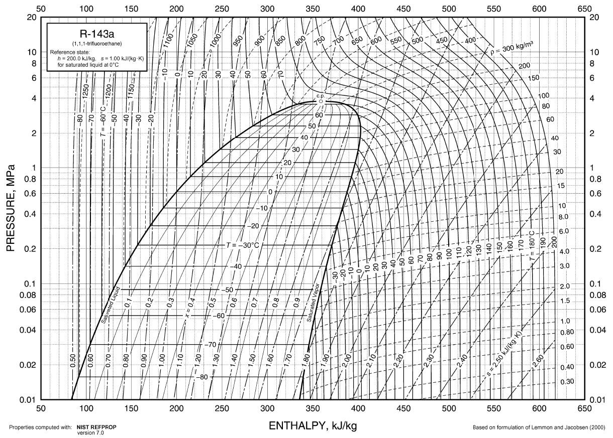

*Fig. 9 Pressure-Enthalpy Diagram for Refrigerant 143a*

<!-- str. 822 -->

**Refrigerant 143a (1,1,1-Trifluoroethane) Proper ties of Saturated Liquid and Saturated Vapor**

| Temp.,* °C | Pressure, MPa | Density, Volume,<br>kg/m<sup>3</sup> Liquid | Enthalpy, Density, Volume, kJ/kg<br>m<sup>3</sup>/kg Vapor Liquid | Enthalpy, kJ/kg<br>Vapor | Entropy, kJ/(kg·K)<br>Liquid | Entropy, kJ/(kg·K)<br>Vapor | Specific Heat c , kJ/(kg·K)<br>Liquid | Specific Heat c , kJ/(kg·K)<br><sup>p</sup> Vapor | c /c p v Vapor | Velocity of Sound, m/s<br>Liquid | Velocity of Sound, m/s<br>Vapor | Viscosity, μPa·s<br>Liquid | Viscosity, μPa·s<br>Vapor | Thermal Cond., mW/(m·K)<br>Liquid | Thermal Cond., mW/(m·K)<br>Vapor | Tension, Temp.,*<br>Surface mN/m | Tension, Temp.,*<br>°C |
|---|---|---|---|---|---|---|---|---|---|---|---|---|---|---|---|---|---|
| –111.81<sup>a</sup> | 0.00107 | 1330.5 | 14.807 52.52 | 319.59 | 0.3142 | 1.9695 | 1.211 | 0.630 | 1.192 | 1058 | 137.6 | 912.1 | 5.91 | 137.0 | 4.90 | 13.72 | –111.81 |
| –110 | 0.00129 | 1326.2 | 12.430 54.71 | 320.68 | 0.3277 | 1.9579 | 1.212 | 0.635 | 1.191 | 1049 | 138.2 | 867.9 | 5.97 | 135.8 | 5.00 | 13.75 | –110 |
| –100 | 0.00333 | 1301.9 | 5.1127 66.87 | 326.81 | 0.4000 | 1.9012 | 1.220 | 0.664 | 1.185 | 1002 | 141.7 | 680.1 | 6.34 | 129.5 | 5.53 | 13.80 | –100 |
| –90 | 0.00761 | 1277.2 | 2.3596 79.13 | 333.06 | 0.4688 | 1.8553 | 1.233 | 0.694 | 1.181 | 954 | 144.9 | 553.4 | 6.72 | 123.5 | 6.10 | 13.71 | –90 |
| –80 | 0.01572 | 1252.2 | 1.1971 91.55 | 339.40 | 0.5348 | 1.8180 | 1.250 | 0.726 | 1.178 | 907 | 147.8 | 462.1 | 7.08 | 117.8 | 6.70 | 13.48 | –80 |
| –70 | 0.02991 | 1226.7 | 0.65675 104.16 | 345.80 | 0.5984 | 1.7879 | 1.270 | 0.759 | 1.177 | 859 | 150.4 | 393.0 | 7.45 | 112.5 | 7.34 | 13.11 | –70 |
| –60 | 0.05307 | 1200.6 | 0.38446 116.99 | 352.21 | 0.6599 | 1.7635 | 1.293 | 0.794 | 1.178 | 811 | 152.5 | 338.8 | 7.82 | 107.4 | 8.02 | 12.61 | –60 |
| –50 | 0.08874 | 1173.9 | 0.23754 130.05 | 358.58 | 0.7197 | 1.7438 | 1.318 | 0.833 | 1.182 | 764 | 154.2 | 294.9 | 8.19 | 102.5 | 8.73 | 12.00 | –50 |
| –48 | 0.09773 | 1168.5 | 0.21695 132.69 | 359.85 | 0.7314 | 1.7403 | 1.323 | 0.841 | 1.184 | 754 | 154.5 | 287.1 | 8.26 | 101.6 | 8.88 | 11.86 | –48 |
| –47.24<sup>b</sup> | 0.10133 | 1166.4 | 0.20971 133.70 | 360.33 | 0.7359 | 1.7391 | 1.325 | 0.844 | 1.184 | 751 | 154.6 | 284.2 | 8.29 | 101.2 | 8.94 | 11.81 | –47.24 |
| –46 | 0.10742 | 1163.0 | 0.19849 135.35 | 361.11 | 0.7431 | 1.7370 | 1.328 | 0.850 | 1.185 | 745 | 154.7 | 279.6 | 8.33 | 100.6 | 9.03 | 11.72 | –46 |
| –44 | 0.11786 | 1157.5 | 0.18191 138.01 | 362.37 | 0.7548 | 1.7339 | 1.334 | 0.858 | 1.186 | 735 | 154.9 | 272.3 | 8.41 | 99.7 | 9.18 | 11.57 | –44 |
| –42 | 0.12907 | 1152.0 | 0.16697 140.69 | 363.62 | 0.7664 | 1.7308 | 1.339 | 0.867 | 1.188 | 726 | 155.1 | 265.3 | 8.48 | 98.8 | 9.33 | 11.42 | –42 |
| –40 | 0.14109 | 1146.4 | 0.15350 143.38 | 364.86 | 0.7779 | 1.7279 | 1.345 | 0.876 | 1.189 | 716 | 155.3 | 258.6 | 8.56 | 97.8 | 9.49 | 11.27 | –40 |
| –38 | 0.15398 | 1140.8 | 0.14133 146.08 | 366.10 | 0.7894 | 1.7251 | 1.351 | 0.885 | 1.191 | 707 | 155.5 | 252.0 | 8.63 | 96.9 | 9.65 | 11.11 | –38 |
| –36 | 0.16775 | 1135.1 | 0.13031 148.79 | 367.34 | 0.8008 | 1.7224 | 1.357 | 0.894 | 1.193 | 697 | 155.6 | 245.7 | 8.70 | 96.0 | 9.81 | 10.95 | –36 |
| –34 | 0.18247 | 1129.4 | 0.12032 151.52 | 368.56 | 0.8122 | 1.7198 | 1.363 | 0.904 | 1.195 | 688 | 155.7 | 239.6 | 8.78 | 95.1 | 9.97 | 10.79 | –34 |
| –32 | 0.19816 | 1123.7 | 0.11124 154.25 | 369.78 | 0.8236 | 1.7173 | 1.369 | 0.913 | 1.198 | 678 | 155.8 | 233.6 | 8.85 | 94.2 | 10.13 | 10.62 | –32 |
| –30 | 0.21488 | 1117.9 | 0.10297 157.00 | 370.99 | 0.8348 | 1.7149 | 1.375 | 0.923 | 1.200 | 669 | 155.8 | 227.8 | 8.93 | 93.3 | 10.30 | 10.44 | –30 |
| –28 | 0.23267 | 1112.1 | 0.09544 159.77 | 372.19 | 0.8461 | 1.7126 | 1.382 | 0.933 | 1.203 | 659 | 155.9 | 222.3 | 9.18 | 92.4 | 10.49 | 10.27 | –28 |
| –26 | 0.25156 | 1106.2 | 0.08857 162.54 | 373.39 | 0.8573 | 1.7104 | 1.388 | 0.944 | 1.206 | 650 | 155.9 | 216.8 | 9.26 | 91.6 | 10.66 | 10.09 | –26 |
| –24 | 0.27161 | 1100.3 | 0.08228 165.33 | 374.57 | 0.8685 | 1.7083 | 1.395 | 0.955 | 1.209 | 640 | 155.8 | 211.6 | 9.33 | 90.7 | 10.83 | 9.90 | –24 |
| –22 | 0.29286 | 1094.3 | 0.07652 168.13 | 375.74 | 0.8796 | 1.7062 | 1.402 | 0.966 | 1.212 | 630 | 155.8 | 206.4 | 9.41 | 89.8 | 11.01 | 9.72 | –22 |
| –20 | 0.31535 | 1088.3 | 0.07125 170.95 | 376.91 | 0.8907 | 1.7043 | 1.409 | 0.977 | 1.216 | 621 | 155.7 | 201.4 | 9.48 | 89.0 | 11.19 | 9.53 | –20 |
| –18 | 0.33915 | 1082.2 | 0.06640 173.78 | 378.06 | 0.9018 | 1.7024 | 1.417 | 0.988 | 1.219 | 611 | 155.6 | 196.6 | 9.56 | 88.1 | 11.37 | 9.33 | –18 |
| –16 | 0.36428 | 1076.0 | 0.06194 176.63 | 379.20 | 0.9128 | 1.7005 | 1.424 | 1.000 | 1.223 | 602 | 155.4 | 191.8 | 9.64 | 87.2 | 11.55 | 9.14 | –16 |
| –14 | 0.39081 | 1069.8 | 0.05784 179.49 | 380.33 | 0.9238 | 1.6987 | 1.432 | 1.012 | 1.227 | 592 | 155.2 | 187.2 | 9.71 | 86.4 | 11.74 | 8.94 | –14 |
| –12 | 0.41877 | 1063.6 | 0.05405 182.37 | 381.44 | 0.9347 | 1.6970 | 1.440 | 1.025 | 1.232 | 582 | 155.0 | 182.7 | 9.79 | 85.5 | 11.94 | 8.74 | –12 |
| –10 | 0.44823 | 1057.2 | 0.05056 185.27 | 382.54 | 0.9457 | 1.6953 | 1.449 | 1.038 | 1.237 | 573 | 154.8 | 178.4 | 9.87 | 84.7 | 12.13 | 8.53 | –10 |
| –8 | 0.47923 | 1050.8 | 0.04733 188.18 | 383.63 | 0.9566 | 1.6937 | 1.457 | 1.051 | 1.242 | 563 | 154.5 | 174.1 | 9.95 | 83.9 | 12.33 | 8.32 | –8 |
| –6 | 0.51182 | 1044.3 | 0.04434 191.11 | 384.70 | 0.9675 | 1.6921 | 1.466 | 1.065 | 1.247 | 553 | 154.2 | 169.9 | 10.04 | 83.0 | 12.53 | 8.12 | –6 |
| –4 | 0.54606 | 1037.7 | 0.04158 194.05 | 385.75 | 0.9783 | 1.6906 | 1.476 | 1.079 | 1.253 | 544 | 153.9 | 165.8 | 10.12 | 82.2 | 12.74 | 7.90 | –4 |
| –2 | 0.58199 | 1031.0 | 0.03901 197.02 | 386.79 | 0.9892 | 1.6890 | 1.485 | 1.093 | 1.260 | 534 | 153.5 | 161.8 | 10.21 | 81.4 | 12.96 | 7.69 | –2 |
| 0 | 0.61967 | 1024.3 | 0.03662 200.00 | 387.81 | 1.0000 | 1.6876 | 1.495 | 1.109 | 1.266 | 524 | 153.1 | 157.9 | 10.29 | 80.5 | 13.17 | 7.47 | 0 |
| 2 | 0.65916 | 1017.4 | 0.03440 203.00 | 388.81 | 1.0108 | 1.6861 | 1.505 | 1.124 | 1.273 | 515 | 152.6 | 154.1 | 10.38 | 79.7 | 13.40 | 7.25 | 2 |
| 4 | 0.70051 | 1010.5 | 0.03234 206.03 | 389.79 | 1.0216 | 1.6846 | 1.516 | 1.141 | 1.281 | 505 | 152.1 | 150.3 | 10.47 | 78.9 | 13.63 | 7.03 | 4 |
| 6 | 0.74378 | 1003.5 | 0.03042 209.07 | 390.75 | 1.0324 | 1.6832 | 1.528 | 1.158 | 1.289 | 495 | 151.6 | 146.6 | 10.57 | 78.1 | 13.87 | 6.81 | 6 |
| 8 | 0.78901 | 996.3 | 0.02862 212.13 | 391.68 | 1.0432 | 1.6818 | 1.539 | 1.176 | 1.298 | 485 | 151.0 | 143.0 | 10.66 | 77.2 | 14.12 | 6.59 | 8 |
| 10 | 0.83628 | 989.1 | 0.02695 215.22 | 392.60 | 1.0539 | 1.6804 | 1.552 | 1.194 | 1.307 | 475 | 150.4 | 139.5 | 10.76 | 76.4 | 14.38 | 6.36 | 10 |
| 12 | 0.88564 | 981.7 | 0.02538 218.33 | 393.48 | 1.0647 | 1.6790 | 1.565 | 1.214 | 1.317 | 465 | 149.8 | 136.0 | 10.86 | 75.6 | 14.64 | 6.14 | 12 |
| 14 | 0.93714 | 974.2 | 0.02392 221.47 | 394.35 | 1.0755 | 1.6775 | 1.578 | 1.234 | 1.328 | 455 | 149.1 | 132.6 | 10.96 | 74.8 | 14.92 | 5.91 | 14 |
| 16 | 0.99085 | 966.5 | 0.02255 224.63 | 395.18 | 1.0863 | 1.6761 | 1.593 | 1.256 | 1.340 | 445 | 148.4 | 129.3 | 11.07 | 74.0 | 15.21 | 5.68 | 16 |
| 18 | 1.0468 | 958.7 | 0.02126 227.81 | 395.98 | 1.0970 | 1.6747 | 1.608 | 1.278 | 1.353 | 435 | 147.6 | 126.0 | 11.18 | 73.2 | 15.51 | 5.45 | 18 |
| 20 | 1.1052 | 950.8 | 0.02005 231.02 | 396.76 | 1.1078 | 1.6732 | 1.624 | 1.302 | 1.366 | 425 | 146.8 | 122.7 | 11.29 | 72.4 | 15.82 | 5.22 | 20 |
| 22 | 1.1659 | 942.7 | 0.01892 234.27 | 397.50 | 1.1186 | 1.6717 | 1.641 | 1.328 | 1.381 | 415 | 145.9 | 119.5 | 11.40 | 71.5 | 16.15 | 4.99 | 22 |
| 24 | 1.2290 | 934.4 | 0.01785 237.54 | 398.20 | 1.1295 | 1.6701 | 1.659 | 1.355 | 1.398 | 405 | 145.0 | 116.4 | 11.52 | 70.7 | 16.50 | 4.76 | 24 |
| 26 | 1.2947 | 926.0 | 0.01685 240.84 | 398.87 | 1.1403 | 1.6685 | 1.679 | 1.384 | 1.416 | 394 | 144.0 | 113.3 | 11.64 | 69.9 | 16.87 | 4.53 | 26 |
| 28 | 1.3630 | 917.3 | 0.01591 244.18 | 399.49 | 1.1512 | 1.6669 | 1.699 | 1.416 | 1.435 | 384 | 143.0 | 110.2 | 11.77 | 69.1 | 17.26 | 4.30 | 28 |
| 30 | 1.4340 | 908.4 | 0.01501 247.56 | 400.07 | 1.1621 | 1.6652 | 1.722 | 1.449 | 1.457 | 374 | 141.9 | 107.2 | 11.91 | 68.3 | 17.67 | 4.07 | 30 |
| 32 | 1.5077 | 899.3 | 0.01417 250.97 | 400.61 | 1.1730 | 1.6634 | 1.746 | 1.486 | 1.480 | 363 | 140.8 | 104.2 | 12.04 | 67.5 | 18.11 | 3.84 | 32 |
| 34 | 1.5842 | 890.0 | 0.01338 254.42 | 401.09 | 1.1840 | 1.6616 | 1.772 | 1.526 | 1.507 | 352 | 139.6 | 101.2 | 12.19 | 66.6 | 18.58 | 3.61 | 34 |
| 36 | 1.6636 | 880.4 | 0.01262 257.91 | 401.52 | 1.1951 | 1.6596 | 1.801 | 1.570 | 1.536 | 342 | 138.4 | 98.3 | 12.34 | 65.8 | 19.09 | 3.38 | 36 |
| 38 | 1.7460 | 870.5 | 0.01191 261.45 | 401.89 | 1.2062 | 1.6575 | 1.832 | 1.618 | 1.569 | 331 | 137.1 | 95.4 | 12.50 | 65.0 | 19.63 | 3.16 | 38 |
| 40 | 1.8314 | 860.3 | 0.01123 265.04 | 402.19 | 1.2174 | 1.6553 | 1.867 | 1.671 | 1.606 | 320 | 135.7 | 92.5 | 12.67 | 64.2 | 20.22 | 2.93 | 40 |
| 42 | 1.9200 | 849.7 | 0.01059 268.68 | 402.42 | 1.2286 | 1.6530 | 1.906 | 1.732 | 1.648 | 309 | 134.3 | 89.7 | 12.85 | 63.3 | 20.87 | 2.71 | 42 |
| 44 | 2.0117 | 838.7 | 0.00998 272.39 | 402.56 | 1.2400 | 1.6505 | 1.949 | 1.799 | 1.696 | 298 | 132.8 | 86.8 | 13.03 | 62.5 | 21.57 | 2.49 | 44 |
| 46 | 2.1068 | 827.3 | 0.00940 276.15 | 402.62 | 1.2515 | 1.6478 | 1.998 | 1.877 | 1.752 | 286 | 131.2 | 84.0 | 13.24 | 61.7 | 22.35 | 2.27 | 46 |
| 48 | 2.2053 | 815.4 | 0.00884 279.98 | 402.58 | 1.2631 | 1.6448 | 2.054 | 1.966 | 1.817 | 275 | 129.6 | 81.1 | 13.45 | 60.8 | 23.20 | 2.06 | 48 |
| 50 | 2.3073 | 803.0 | 0.00831 283.90 | 402.43 | 1.2748 | 1.6416 | 2.118 | 2.070 | 1.894 | 263 | 127.9 | 78.3 | 13.69 | 60.0 | 24.16 | 1.85 | 50 |
| 52 | 2.4130 | 789.9 | 0.00780 287.90 | 402.15 | 1.2868 | 1.6381 | 2.194 | 2.194 | 1.985 | 251 | 126.1 | 75.4 | 13.94 | 59.1 | 25.23 | 1.64 | 52 |
| 54 | 2.5224 | 776.1 | 0.00731 292.00 | 401.72 | 1.2989 | 1.6343 | 2.285 | 2.343 | 2.097 | 238 | 124.2 | 72.5 | 14.23 | 58.2 | 26.45 | 1.44 | 54 |
| 56 | 2.6357 | 761.5 | 0.00684 296.22 | 401.12 | 1.3113 | 1.6300 | 2.395 | 2.528 | 2.236 | 226 | 122.2 | 69.6 | 14.54 | 57.4 | 27.84 | 1.24 | 56 |
| 58 | 2.7530 | 745.8 | 0.00639 300.57 | 400.31 | 1.3240 | 1.6252 | 2.534 | 2.762 | 2.413 | 213 | 120.1 | 66.6 | 14.89 | 56.5 | 29.45 | 1.05 | 58 |
| 60 | 2.8744 | 728.9 | 0.00594 305.09 | 399.24 | 1.3371 | 1.6197 | 2.714 | 3.069 | 2.647 | 200 | 117.9 | 63.6 | 15.29 | 55.6 | 31.37 | 0.87 | 60 |
| 65 | 3.1977 | 678.3 | 0.00486 317.45 | 394.94 | 1.3726 | 1.6018 | 3.564 | 4.532 | 3.763 | 164 | 111.8 | 55.4 | 16.64 | 53.6 | 38.41 | 0.45 | 65 |
| 70 | 3.5527 | 600.8 | 0.00370 333.19 | 385.42 | 1.4172 | 1.5694 | 7.720 | 11.500 | 9.040 | 122 | 104.2 | 45.1 | 19.30 | 53.2 | 55.97 | 0.11 | 70 |
| 72.71<sup>c</sup> | 3.7610 | 431.0 | 0.00232 358.91 | 358.91 | 1.4906 | 1.4906 | ∞ | ∞ | ∞ | 0 | 0.0 | — | — | ∞ | ∞ | 0.00 | 72.71 |

*Temperatures on ITS-90 scale <sup>a</sup>Triple point <sup>b</sup>Normal boiling point <sup>c</sup>Critical point

<!-- str. 823 -->

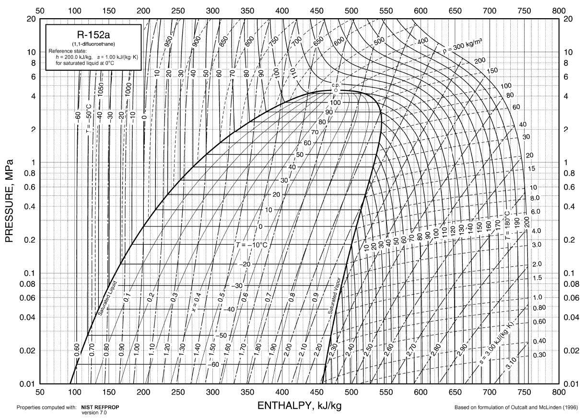

*Fig. 10 Pressure-Enthalpy Diagram for Refrigerant 152a*

<!-- str. 824 -->

**Refrigerant 152a (1,1-Difluoroethane) Properti es of Saturated Liquid and Saturated Vapor**

| Temp.,* °C | Pressure, MPa | Density,Volume,<br>kg/m<sup>3</sup> Liquid | Density,Volume,<br>m<sup>3</sup>/kg Vapor | Enthalpy, kJ/kg<br>Liquid | Enthalpy, kJ/kg<br>Vapor | Entropy, kJ/(kg·K)<br>Liquid | Entropy, kJ/(kg·K)<br>Vapor | Specific Heat c , kJ/(kg·K)<br>Liquid | Specific Heat c , kJ/(kg·K)<br><sup>p</sup> Vapor | c /c p v Vapor | Velocity of Sound, m/s<br>Liquid | Velocity of Sound, m/s<br>Vapor | Viscosity, μPa·s<br>Liquid | Viscosity, μPa·s<br>Vapor | Thermal Cond., mW/(m·K)<br>Liquid | Thermal Cond., mW/(m·K)<br>Vapor | Tension,Temp.,*<br>Surface mN/m | Tension,Temp.,*<br>°C |
|---|---|---|---|---|---|---|---|---|---|---|---|---|---|---|---|---|---|---|
| –118.59<sup>a</sup> | 0.00006 | 1192.9 | 303.290 | 13.79 | 419.32 | 0.1119 | 2.7357 | 1.477 | 0.699 | 1.220 | 1401 | 154.0 | 2025.0 | 5.20 | 176.3 | 0.10 | 31.65 | –118.59 |
| –110 | 0.00019 | 1177.1 | 107.740 | 26.62 | 425.38 | 0.1927 | 2.6368 | 1.505 | 0.717 | 1.214 | 1337 | 157.8 | 1528.0 | 5.48 | 170.2 | 0.94 | 30.23 | –110 |
| –100 | 0.00058 | 1158.7 | 37.6170 | 41.75 | 432.59 | 0.2827 | 2.5399 | 1.518 | 0.740 | 1.207 | 1275 | 162.0 | 1153.0 | 5.81 | 163.4 | 1.91 | 28.58 | –100 |
| –90 | 0.00153 | 1140.1 | 15.0520 | 56.96 | 439.97 | 0.3681 | 2.4593 | 1.524 | 0.763 | 1.201 | 1219 | 166.0 | 904.0 | 6.14 | 156.9 | 2.89 | 26.96 | –90 |
| –80 | 0.00359 | 1121.3 | 6.74380 | 72.23 | 447.48 | 0.4492 | 2.3920 | 1.530 | 0.789 | 1.196 | 1166 | 169.8 | 730.2 | 6.47 | 150.7 | 3.86 | 25.34 | –80 |
| –70 | 0.00765 | 1102.4 | 3.31970 | 87.57 | 455.08 | 0.5266 | 2.3357 | 1.539 | 0.816 | 1.192 | 1115 | 173.4 | 603.5 | 6.80 | 144.7 | 4.84 | 23.75 | –70 |
| –60 | 0.01500 | 1083.2 | 1.76820 | 103.02 | 462.74 | 0.6009 | 2.2885 | 1.551 | 0.845 | 1.190 | 1066 | 176.6 | 507.4 | 7.14 | 139.0 | 5.82 | 22.18 | –60 |
| –50 | 0.02742 | 1063.7 | 1.00640 | 118.62 | 470.40 | 0.6723 | 2.2487 | 1.567 | 0.877 | 1.189 | 1016 | 179.5 | 432.5 | 7.47 | 133.5 | 6.81 | 20.63 | –50 |
| –40 | 0.04721 | 1043.8 | 0.60583 | 134.40 | 478.02 | 0.7414 | 2.2152 | 1.587 | 0.913 | 1.190 | 967 | 182.1 | 372.5 | 7.80 | 128.2 | 7.80 | 19.09 | –40 |
| –30 | 0.07718 | 1023.5 | 0.38242 | 150.39 | 485.55 | 0.8085 | 2.1868 | 1.610 | 0.952 | 1.193 | 919 | 184.2 | 323.6 | 8.14 | 123.1 | 8.80 | 17.58 | –30 |
| –28 | 0.08469 | 1019.4 | 0.35056 | 153.62 | 487.04 | 0.8216 | 2.1817 | 1.615 | 0.960 | 1.194 | 909 | 184.5 | 314.8 | 8.21 | 122.1 | 9.01 | 17.29 | –28 |
| –26 | 0.09276 | 1015.3 | 0.32186 | 156.86 | 488.52 | 0.8348 | 2.1767 | 1.620 | 0.968 | 1.195 | 899 | 184.9 | 306.4 | 8.27 | 121.2 | 9.21 | 16.99 | –26 |
| –24.02<sup>b</sup> | 0.10133 | 1011.2 | 0.29622 | 160.07 | 489.98 | 0.8477 | 2.1719 | 1.625 | 0.977 | 1.196 | 889 | 185.2 | 298.4 | 8.34 | 120.2 | 9.41 | 16.69 | –24.02 |
| –24 | 0.10142 | 1011.1 | 0.29595 | 160.11 | 490.00 | 0.8478 | 2.1719 | 1.625 | 0.977 | 1.196 | 889 | 185.2 | 298.3 | 8.34 | 120.2 | 9.41 | 16.69 | –24 |
| –22 | 0.11072 | 1006.9 | 0.27253 | 163.37 | 491.47 | 0.8608 | 2.1672 | 1.630 | 0.985 | 1.197 | 880 | 185.5 | 290.5 | 8.41 | 119.2 | 9.62 | 16.39 | –22 |
| –20 | 0.12068 | 1002.7 | 0.25131 | 166.64 | 492.94 | 0.8737 | 2.1627 | 1.635 | 0.994 | 1.199 | 870 | 185.8 | 282.9 | 8.48 | 118.2 | 9.82 | 16.10 | –20 |
| –18 | 0.13133 | 998.5 | 0.23206 | 169.92 | 494.40 | 0.8866 | 2.1583 | 1.641 | 1.003 | 1.200 | 860 | 186.1 | 275.6 | 8.54 | 117.3 | 10.03 | 15.80 | –18 |
| –16 | 0.14271 | 994.2 | 0.21457 | 173.21 | 495.85 | 0.8994 | 2.1541 | 1.647 | 1.013 | 1.202 | 850 | 186.3 | 268.6 | 8.61 | 116.3 | 10.23 | 15.51 | –16 |
| –14 | 0.15484 | 989.9 | 0.19865 | 176.52 | 497.29 | 0.9122 | 2.1500 | 1.653 | 1.022 | 1.203 | 841 | 186.5 | 261.7 | 8.68 | 115.4 | 10.44 | 15.22 | –14 |
| –12 | 0.16777 | 985.6 | 0.18414 | 179.83 | 498.72 | 0.9249 | 2.1460 | 1.658 | 1.032 | 1.205 | 831 | 186.7 | 255.1 | 8.75 | 114.5 | 10.65 | 14.93 | –12 |
| –10 | 0.18152 | 981.3 | 0.17090 | 183.16 | 500.15 | 0.9375 | 2.1421 | 1.665 | 1.041 | 1.207 | 821 | 186.9 | 248.7 | 8.82 | 113.5 | 10.86 | 14.64 | –10 |
| –8 | 0.19614 | 976.9 | 0.15879 | 186.50 | 501.56 | 0.9501 | 2.1383 | 1.671 | 1.051 | 1.209 | 811 | 187.0 | 242.6 | 8.88 | 112.6 | 11.07 | 14.35 | –8 |
| –6 | 0.21166 | 972.5 | 0.14770 | 189.86 | 502.96 | 0.9627 | 2.1347 | 1.677 | 1.062 | 1.211 | 801 | 187.1 | 236.6 | 8.95 | 111.7 | 11.28 | 14.06 | –6 |
| –4 | 0.22812 | 968.1 | 0.13754 | 193.22 | 504.36 | 0.9752 | 2.1311 | 1.684 | 1.072 | 1.213 | 792 | 187.2 | 230.8 | 9.02 | 110.8 | 11.50 | 13.77 | –4 |
| –2 | 0.24555 | 963.6 | 0.12821 | 196.61 | 505.74 | 0.9876 | 2.1277 | 1.690 | 1.083 | 1.215 | 782 | 187.3 | 225.1 | 9.09 | 109.8 | 11.71 | 13.48 | –2 |
| 0 | 0.26399 | 959.1 | 0.11963 | 200.00 | 507.11 | 1.0000 | 2.1243 | 1.697 | 1.094 | 1.218 | 772 | 187.4 | 219.7 | 9.16 | 108.9 | 11.93 | 13.20 | 0 |
| 2 | 0.28349 | 954.6 | 0.11174 | 203.41 | 508.47 | 1.0124 | 2.1211 | 1.704 | 1.105 | 1.221 | 762 | 187.4 | 214.4 | 9.23 | 108.0 | 12.14 | 12.91 | 2 |
| 4 | 0.30407 | 950.0 | 0.10447 | 206.83 | 509.82 | 1.0247 | 2.1179 | 1.711 | 1.116 | 1.224 | 752 | 187.4 | 209.2 | 9.30 | 107.1 | 12.36 | 12.63 | 4 |
| 6 | 0.32578 | 945.4 | 0.09776 | 210.27 | 511.16 | 1.0370 | 2.1148 | 1.719 | 1.128 | 1.227 | 742 | 187.4 | 204.2 | 9.37 | 106.2 | 12.58 | 12.35 | 6 |
| 8 | 0.34867 | 940.8 | 0.09156 | 213.72 | 512.48 | 1.0492 | 2.1118 | 1.726 | 1.139 | 1.230 | 733 | 187.3 | 199.4 | 9.44 | 105.4 | 12.80 | 12.07 | 8 |
| 10 | 0.37277 | 936.1 | 0.08583 | 217.19 | 513.78 | 1.0614 | 2.1089 | 1.734 | 1.152 | 1.233 | 723 | 187.2 | 194.7 | 9.51 | 104.5 | 13.03 | 11.79 | 10 |
| 12 | 0.39812 | 931.3 | 0.08052 | 220.67 | 515.08 | 1.0736 | 2.1060 | 1.742 | 1.164 | 1.237 | 713 | 187.1 | 190.1 | 9.58 | 103.6 | 13.25 | 11.51 | 12 |
| 14 | 0.42476 | 926.6 | 0.07560 | 224.17 | 516.36 | 1.0857 | 2.1032 | 1.750 | 1.177 | 1.240 | 703 | 187.0 | 185.6 | 9.65 | 102.7 | 13.48 | 11.23 | 14 |
| 16 | 0.45275 | 921.8 | 0.07104 | 227.69 | 517.62 | 1.0978 | 2.1005 | 1.759 | 1.190 | 1.244 | 693 | 186.8 | 181.3 | 9.73 | 101.8 | 13.71 | 10.96 | 16 |
| 18 | 0.48211 | 916.9 | 0.06680 | 231.22 | 518.86 | 1.1098 | 2.0978 | 1.768 | 1.203 | 1.249 | 683 | 186.6 | 177.1 | 9.80 | 101.0 | 13.95 | 10.68 | 18 |
| 20 | 0.51291 | 912.0 | 0.06286 | 234.77 | 520.09 | 1.1219 | 2.0952 | 1.776 | 1.217 | 1.253 | 673 | 186.4 | 173.0 | 9.87 | 100.1 | 14.18 | 10.41 | 20 |
| 22 | 0.54517 | 907.0 | 0.05919 | 238.34 | 521.30 | 1.1339 | 2.0926 | 1.786 | 1.231 | 1.258 | 663 | 186.1 | 169.0 | 9.95 | 99.3 | 14.42 | 10.14 | 22 |
| 24 | 0.57894 | 902.0 | 0.05577 | 241.93 | 522.50 | 1.1459 | 2.0901 | 1.795 | 1.246 | 1.263 | 653 | 185.8 | 165.1 | 10.02 | 98.4 | 14.66 | 9.87 | 24 |
| 26 | 0.61428 | 896.9 | 0.05258 | 245.53 | 523.67 | 1.1578 | 2.0876 | 1.805 | 1.261 | 1.268 | 643 | 185.5 | 161.3 | 10.10 | 97.5 | 14.91 | 9.60 | 26 |
| 28 | 0.65122 | 891.8 | 0.04960 | 249.16 | 524.83 | 1.1698 | 2.0852 | 1.815 | 1.277 | 1.274 | 633 | 185.1 | 157.6 | 10.18 | 96.7 | 15.16 | 9.33 | 28 |
| 30 | 0.68982 | 886.6 | 0.04682 | 252.80 | 525.96 | 1.1817 | 2.0828 | 1.826 | 1.293 | 1.280 | 623 | 184.7 | 154.0 | 10.26 | 95.9 | 15.41 | 9.06 | 30 |
| 32 | 0.73012 | 881.4 | 0.04422 | 256.47 | 527.07 | 1.1936 | 2.0804 | 1.837 | 1.309 | 1.286 | 613 | 184.3 | 150.4 | 10.34 | 95.0 | 15.67 | 8.80 | 32 |
| 34 | 0.77216 | 876.0 | 0.04179 | 260.16 | 528.16 | 1.2055 | 2.0780 | 1.848 | 1.326 | 1.293 | 602 | 183.9 | 147.0 | 10.42 | 94.2 | 15.93 | 8.54 | 34 |
| 36 | 0.81600 | 870.7 | 0.03951 | 263.86 | 529.23 | 1.2174 | 2.0757 | 1.860 | 1.344 | 1.300 | 592 | 183.4 | 143.6 | 10.50 | 93.3 | 16.20 | 8.27 | 36 |
| 38 | 0.86169 | 865.2 | 0.03737 | 267.60 | 530.27 | 1.2292 | 2.0734 | 1.872 | 1.362 | 1.307 | 582 | 182.9 | 140.3 | 10.58 | 92.5 | 16.47 | 8.01 | 38 |
| 40 | 0.90927 | 859.7 | 0.03536 | 271.35 | 531.28 | 1.2411 | 2.0711 | 1.885 | 1.381 | 1.315 | 572 | 182.3 | 137.1 | 10.66 | 91.7 | 16.74 | 7.75 | 40 |
| 42 | 0.95879 | 854.1 | 0.03348 | 275.13 | 532.27 | 1.2529 | 2.0689 | 1.898 | 1.401 | 1.324 | 561 | 181.7 | 134.0 | 10.75 | 90.8 | 17.03 | 7.50 | 42 |
| 44 | 1.01030 | 848.4 | 0.03170 | 278.93 | 533.23 | 1.2648 | 2.0666 | 1.912 | 1.421 | 1.333 | 551 | 181.1 | 130.9 | 10.84 | 90.0 | 17.32 | 7.24 | 44 |
| 46 | 1.06390 | 842.6 | 0.03004 | 282.76 | 534.16 | 1.2766 | 2.0643 | 1.926 | 1.443 | 1.342 | 541 | 180.4 | 127.9 | 11.21 | 89.2 | 17.60 | 6.99 | 46 |
| 48 | 1.11960 | 836.7 | 0.02846 | 286.62 | 535.06 | 1.2884 | 2.0620 | 1.941 | 1.465 | 1.353 | 530 | 179.7 | 125.0 | 11.32 | 88.4 | 17.90 | 6.73 | 48 |
| 50 | 1.17740 | 830.8 | 0.02699 | 290.50 | 535.93 | 1.3003 | 2.0598 | 1.957 | 1.489 | 1.364 | 520 | 178.9 | 122.1 | 11.42 | 87.5 | 18.22 | 6.48 | 50 |
| 52 | 1.23740 | 824.7 | 0.02559 | 294.41 | 536.77 | 1.3121 | 2.0575 | 1.974 | 1.513 | 1.375 | 509 | 178.2 | 119.2 | 11.53 | 86.7 | 18.54 | 6.23 | 52 |
| 54 | 1.29970 | 818.6 | 0.02427 | 298.35 | 537.56 | 1.3240 | 2.0552 | 1.992 | 1.539 | 1.388 | 499 | 177.3 | 116.5 | 11.64 | 85.9 | 18.87 | 5.98 | 54 |
| 56 | 1.36430 | 812.3 | 0.02303 | 302.33 | 538.32 | 1.3358 | 2.0528 | 2.010 | 1.566 | 1.402 | 488 | 176.4 | 113.7 | 11.76 | 85.1 | 19.21 | 5.74 | 56 |
| 58 | 1.43130 | 805.9 | 0.02185 | 306.34 | 539.04 | 1.3477 | 2.0504 | 2.030 | 1.595 | 1.416 | 478 | 175.5 | 111.1 | 11.88 | 84.2 | 19.56 | 5.50 | 58 |
| 60 | 1.50070 | 799.4 | 0.02074 | 310.38 | 539.72 | 1.3596 | 2.0480 | 2.051 | 1.626 | 1.432 | 467 | 174.6 | 108.4 | 12.00 | 83.4 | 19.92 | 5.25 | 60 |
| 62 | 1.57260 | 792.7 | 0.01968 | 314.45 | 540.35 | 1.3716 | 2.0456 | 2.073 | 1.658 | 1.450 | 456 | 173.6 | 105.8 | 12.12 | 82.6 | 20.30 | 5.01 | 62 |
| 64 | 1.64710 | 785.9 | 0.01868 | 318.57 | 540.94 | 1.3835 | 2.0431 | 2.097 | 1.693 | 1.468 | 445 | 172.5 | 103.3 | 12.26 | 81.8 | 20.70 | 4.78 | 64 |
| 66 | 1.72420 | 779.0 | 0.01774 | 322.72 | 541.47 | 1.3955 | 2.0405 | 2.122 | 1.730 | 1.488 | 435 | 171.4 | 100.8 | 12.39 | 80.9 | 21.11 | 4.54 | 66 |
| 68 | 1.80390 | 771.9 | 0.01684 | 326.92 | 541.95 | 1.4076 | 2.0379 | 2.150 | 1.769 | 1.511 | 424 | 170.2 | 98.3 | 12.53 | 80.1 | 21.54 | 4.31 | 68 |
| 70 | 1.88640 | 764.6 | 0.01598 | 331.16 | 542.37 | 1.4196 | 2.0351 | 2.179 | 1.812 | 1.535 | 413 | 169.0 | 95.9 | 12.68 | 79.3 | 22.00 | 4.08 | 70 |
| 72 | 1.97170 | 757.2 | 0.01517 | 335.45 | 542.73 | 1.4318 | 2.0323 | 2.211 | 1.859 | 1.562 | 402 | 167.8 | 93.5 | 12.83 | 78.5 | 22.48 | 3.85 | 72 |
| 74 | 2.05990 | 749.5 | 0.01440 | 339.79 | 543.02 | 1.4440 | 2.0294 | 2.245 | 1.909 | 1.591 | 390 | 166.5 | 91.1 | 12.99 | 77.6 | 22.98 | 3.62 | 74 |
| 76 | 2.15100 | 741.6 | 0.01366 | 344.18 | 543.24 | 1.4562 | 2.0264 | 2.283 | 1.964 | 1.624 | 379 | 165.1 | 88.7 | 13.16 | 76.8 | 23.51 | 3.40 | 76 |
| 78 | 2.24520 | 733.5 | 0.01296 | 348.63 | 543.38 | 1.4686 | 2.0232 | 2.324 | 2.025 | 1.661 | 368 | 163.7 | 86.4 | 13.34 | 76.0 | 24.08 | 3.18 | 78 |
| 80 | 2.34240 | 725.2 | 0.01228 | 353.15 | 543.43 | 1.4810 | 2.0198 | 2.370 | 2.092 | 1.702 | 356 | 162.2 | 84.1 | 13.52 | 75.2 | 24.69 | 2.96 | 80 |
| 90 | 2.87800 | 678.5 | 0.00933 | 376.87 | 542.06 | 1.5451 | 2.0000 | 2.703 | 2.586 | 2.016 | 297 | 153.7 | 72.6 | 14.64 | 71.0 | 28.54 | 1.91 | 90 |
| 100 | 3.50500 | 618.5 | 0.00686 | 403.59 | 536.28 | 1.6151 | 1.9707 | 3.495 | 3.776 | 2.805 | 233 | 143.1 | 60.7 | 16.35 | 67.0 | 35.03 | 0.96 | 100 |
| 110 | 4.24320 | 517.4 | 0.00446 | 439.22 | 517.31 | 1.7058 | 1.9096 | 9.260 | 12.220 | 8.530 | 158 | 129.1 | 45.6 | 20.19 | 67.5 | 53.48 | 0.17 | 110 |
| 113.26<sup>c</sup> | 4.51680 | 368.0 | 0.00272 | 477.55 | 477.55 | 1.8037 | 1.8037 | ∞ | ∞ | ∞ | 0 | 0.0 | — | — | ∞ | ∞ | 0.00 | 113.26 |

*Temperatures on ITS-90 scale <sup>a</sup>Triple point <sup>b</sup>Normal boiling point <sup>c</sup>Critical point

<!-- str. 825 -->

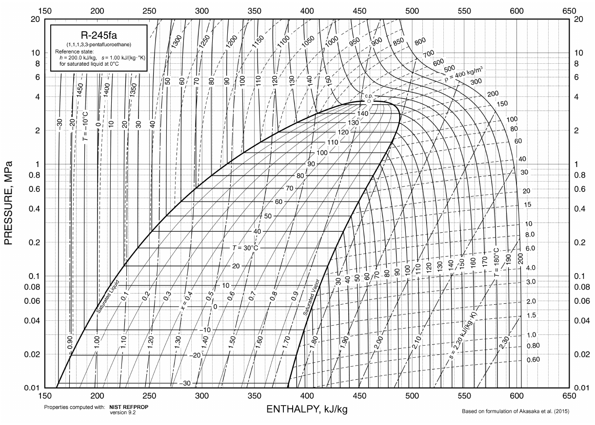

*Fig. 11 Pressure-Enthalpy Diagram for Refrigerant 245fa*

<!-- str. 826 -->

**Refrigerant 245fa (1,1,1,3,3-Pentafluoroethane) Pro perties of Saturated Liquid and Saturated Vapor**

| Temp., °C | Pressure, MPa | Density, Volume,<br>kg/m<sup>3</sup> Liquid | Density, Volume,<br>m<sup>3</sup>/kg Vapor | Enthalpy, kJ/kg<br>Liquid | Enthalpy, kJ/kg<br>Vapor | Entropy, kJ/(kg·K)<br>Liquid | Entropy, kJ/(kg·K)<br>Vapor | Specific Heat c<sub>p</sub>, kJ/(kg·K)<br>Liquid | Specific Heat c<sub>p</sub>, kJ/(kg·K)<br>Vapor | c /c p v Vapor | Velocity of Sound, m/s<br>Liquid | Velocity of Sound, m/s<br>Vapor | Viscosity, μPa·s<br>Liquid | Viscosity, μPa·s<br>Vapor | Thermal Cond., mW/(m·K)<br>Liquid | Thermal Cond., mW/(m·K)<br>Vapor | Tension, Temp.,<br>Surface mN/m | Tension, Temp.,<br>°C |
|---|---|---|---|---|---|---|---|---|---|---|---|---|---|---|---|---|---|---|
| –60 | 0.00131 | 1548.2 | 10.041 | 127.42 | 361.18 | 0.7006 | 1.7973 | 1.166 | 0.695 | 1.099 | 1043 | 120.3 | 1879.0 | 7.17 | 114.9 | 4.97 | 25.13 | –60 |
| –50 | 0.00289 | 1525.0 | 4.7815 | 139.14 | 368.14 | 0.7543 | 1.7805 | 1.178 | 0.716 | 1.097 | 996 | 122.8 | 1495.0 | 7.57 | 112.0 | 5.87 | 23.73 | –50 |
| –40 | 0.00584 | 1501.5 | 2.4619 | 150.99 | 375.25 | 0.8063 | 1.7681 | 1.192 | 0.738 | 1.095 | 950 | 125.2 | 1205.0 | 7.96 | 109.0 | 6.78 | 22.33 | –40 |
| –30 | 0.01103 | 1477.7 | 1.3552 | 162.99 | 382.49 | 0.8566 | 1.7594 | 1.207 | 0.760 | 1.094 | 904 | 127.3 | 984.2 | 8.35 | 106.0 | 7.68 | 20.95 | –30 |
| –20 | 0.01961 | 1453.5 | 0.79014 | 175.14 | 389.83 | 0.9056 | 1.7537 | 1.224 | 0.783 | 1.093 | 859 | 129.3 | 814.4 | 8.74 | 102.8 | 8.58 | 19.59 | –20 |
| –10 | 0.03307 | 1429.0 | 0.48405 | 187.48 | 397.25 | 0.9533 | 1.7505 | 1.242 | 0.807 | 1.094 | 816 | 131.0 | 682.5 | 9.11 | 99.6 | 9.48 | 18.23 | –10 |
| 0 | 0.05327 | 1403.9 | 0.30947 | 200.00 | 404.72 | 1.0000 | 1.7495 | 1.261 | 0.833 | 1.095 | 773 | 132.5 | 578.8 | 9.49 | 96.3 | 10.37 | 16.89 | 0 |
| 2 | 0.05831 | 1398.8 | 0.28429 | 202.53 | 406.22 | 1.0092 | 1.7495 | 1.265 | 0.838 | 1.096 | 764 | 132.8 | 560.8 | 9.56 | 95.7 | 10.55 | 16.63 | 2 |
| 4 | 0.06372 | 1393.7 | 0.26153 | 205.07 | 407.72 | 1.0184 | 1.7496 | 1.270 | 0.843 | 1.096 | 756 | 133.0 | 543.5 | 9.63 | 95.0 | 10.73 | 16.36 | 4 |
| 6 | 0.06953 | 1388.6 | 0.24093 | 207.61 | 409.22 | 1.0275 | 1.7497 | 1.274 | 0.849 | 1.097 | 748 | 133.2 | 527.1 | 9.71 | 94.4 | 10.91 | 16.10 | 6 |
| 8 | 0.07576 | 1383.4 | 0.22226 | 210.17 | 410.72 | 1.0366 | 1.7500 | 1.278 | 0.854 | 1.097 | 739 | 133.5 | 511.3 | 9.78 | 93.7 | 11.09 | 15.83 | 8 |
| 10 | 0.08242 | 1378.3 | 0.20530 | 212.73 | 412.22 | 1.0457 | 1.7502 | 1.282 | 0.860 | 1.098 | 731 | 133.7 | 496.2 | 9.85 | 93.1 | 11.27 | 15.57 | 10 |
| 12 | 0.08954 | 1373.0 | 0.18987 | 215.30 | 413.72 | 1.0547 | 1.7506 | 1.287 | 0.865 | 1.098 | 723 | 133.9 | 481.7 | 9.93 | 92.4 | 11.45 | 15.31 | 12 |
| 14 | 0.09714 | 1367.8 | 0.17582 | 217.88 | 415.22 | 1.0637 | 1.7510 | 1.291 | 0.871 | 1.099 | 714 | 134.0 | 467.9 | 10.00 | 91.8 | 11.62 | 15.05 | 14 |
| 15.05<sup>b</sup> | 0.10132 | 1365.1 | 0.16896 | 219.24 | 416.01 | 1.0684 | 1.7512 | 1.293 | 0.874 | 1.100 | 710 | 134.1 | 460.8 | 10.04 | 91.4 | 11.72 | 14.91 | 15.05 |
| 16 | 0.10525 | 1362.5 | 0.16301 | 220.47 | 416.72 | 1.0727 | 1.7514 | 1.296 | 0.877 | 1.100 | 706 | 134.2 | 454.5 | 10.07 | 91.1 | 11.80 | 14.79 | 16 |
| 18 | 0.11388 | 1357.2 | 0.15131 | 223.07 | 418.22 | 1.0816 | 1.7519 | 1.300 | 0.883 | 1.101 | 698 | 134.4 | 441.8 | 10.15 | 90.5 | 11.98 | 14.53 | 18 |
| 20 | 0.12306 | 1351.9 | 0.14061 | 225.68 | 419.72 | 1.0905 | 1.7524 | 1.305 | 0.888 | 1.102 | 690 | 134.5 | 429.5 | 10.22 | 89.8 | 12.16 | 14.27 | 20 |
| 22 | 0.13282 | 1346.6 | 0.13080 | 228.29 | 421.22 | 1.0994 | 1.7530 | 1.309 | 0.894 | 1.102 | 682 | 134.6 | 417.7 | 10.29 | 89.1 | 12.34 | 14.01 | 22 |
| 24 | 0.14317 | 1341.2 | 0.12182 | 230.92 | 422.71 | 1.1082 | 1.7537 | 1.314 | 0.900 | 1.103 | 673 | 134.7 | 406.3 | 10.36 | 88.5 | 12.52 | 13.75 | 24 |
| 26 | 0.15415 | 1335.7 | 0.11356 | 233.56 | 424.21 | 1.1170 | 1.7544 | 1.319 | 0.907 | 1.104 | 665 | 134.8 | 395.4 | 10.44 | 87.8 | 12.69 | 13.49 | 26 |
| 28 | 0.16578 | 1330.3 | 0.10598 | 236.20 | 425.70 | 1.1258 | 1.7551 | 1.324 | 0.913 | 1.106 | 657 | 134.9 | 384.9 | 10.51 | 87.2 | 12.87 | 13.23 | 28 |
| 30 | 0.17808 | 1324.8 | 0.09899 | 238.86 | 427.19 | 1.1346 | 1.7559 | 1.329 | 0.919 | 1.107 | 649 | 134.9 | 374.8 | 10.58 | 86.5 | 13.05 | 12.98 | 30 |
| 32 | 0.19108 | 1319.3 | 0.09256 | 241.52 | 428.68 | 1.1433 | 1.7567 | 1.334 | 0.926 | 1.108 | 641 | 135.0 | 365.0 | 10.65 | 85.9 | 13.23 | 12.72 | 32 |
| 34 | 0.20481 | 1313.7 | 0.08662 | 244.20 | 430.17 | 1.1520 | 1.7575 | 1.339 | 0.932 | 1.109 | 633 | 135.0 | 355.6 | 10.72 | 85.2 | 13.41 | 12.47 | 34 |
| 36 | 0.21930 | 1308.1 | 0.08113 | 246.89 | 431.65 | 1.1607 | 1.7584 | 1.344 | 0.939 | 1.111 | 625 | 135.0 | 346.4 | 10.80 | 84.6 | 13.59 | 12.22 | 36 |
| 38 | 0.23457 | 1302.4 | 0.07606 | 249.58 | 433.13 | 1.1694 | 1.7593 | 1.349 | 0.946 | 1.112 | 617 | 135.0 | 337.6 | 10.87 | 83.9 | 13.77 | 11.96 | 38 |
| 40 | 0.25065 | 1296.7 | 0.07137 | 252.29 | 434.61 | 1.1780 | 1.7602 | 1.355 | 0.952 | 1.114 | 609 | 134.9 | 329.1 | 10.94 | 83.3 | 13.95 | 11.71 | 40 |
| 42 | 0.26757 | 1291.0 | 0.06702 | 255.01 | 436.08 | 1.1866 | 1.7612 | 1.360 | 0.959 | 1.115 | 601 | 134.9 | 320.9 | 11.01 | 82.6 | 14.13 | 11.46 | 42 |
| 44 | 0.28535 | 1285.2 | 0.06298 | 257.74 | 437.55 | 1.1952 | 1.7622 | 1.366 | 0.967 | 1.117 | 593 | 134.8 | 312.9 | 11.09 | 82.0 | 14.31 | 11.21 | 44 |
| 46 | 0.30403 | 1279.3 | 0.05923 | 260.48 | 439.01 | 1.2038 | 1.7632 | 1.371 | 0.974 | 1.119 | 585 | 134.7 | 305.2 | 11.16 | 81.4 | 14.49 | 10.96 | 46 |
| 48 | 0.32364 | 1273.4 | 0.05575 | 263.23 | 440.47 | 1.2123 | 1.7642 | 1.377 | 0.981 | 1.121 | 577 | 134.6 | 297.7 | 11.23 | 80.7 | 14.67 | 10.71 | 48 |
| 50 | 0.34421 | 1267.5 | 0.05251 | 266.00 | 441.93 | 1.2209 | 1.7653 | 1.383 | 0.989 | 1.123 | 569 | 134.4 | 290.4 | 11.31 | 80.1 | 14.85 | 10.46 | 50 |
| 52 | 0.36576 | 1261.5 | 0.04949 | 268.77 | 443.38 | 1.2294 | 1.7664 | 1.389 | 0.996 | 1.125 | 560 | 134.3 | 283.3 | 11.38 | 79.4 | 15.03 | 10.22 | 52 |
| 54 | 0.38833 | 1255.4 | 0.04667 | 271.56 | 444.82 | 1.2379 | 1.7675 | 1.395 | 1.004 | 1.128 | 552 | 134.1 | 276.5 | 11.45 | 78.8 | 15.21 | 9.97 | 54 |
| 56 | 0.41195 | 1249.3 | 0.04405 | 274.36 | 446.26 | 1.2463 | 1.7686 | 1.401 | 1.012 | 1.130 | 544 | 133.9 | 269.8 | 11.53 | 78.1 | 15.40 | 9.73 | 56 |
| 58 | 0.43665 | 1243.2 | 0.04159 | 277.17 | 447.69 | 1.2548 | 1.7697 | 1.407 | 1.021 | 1.133 | 536 | 133.7 | 263.3 | 11.60 | 77.5 | 15.58 | 9.48 | 58 |
| 60 | 0.46246 | 1236.9 | 0.03930 | 279.99 | 449.11 | 1.2632 | 1.7709 | 1.414 | 1.029 | 1.135 | 528 | 133.4 | 256.9 | 11.68 | 76.9 | 15.77 | 9.24 | 60 |
| 62 | 0.48941 | 1230.6 | 0.03715 | 282.83 | 450.53 | 1.2717 | 1.7720 | 1.420 | 1.038 | 1.138 | 520 | 133.1 | 250.8 | 11.75 | 76.2 | 15.96 | 9.00 | 62 |
| 64 | 0.51754 | 1224.3 | 0.03514 | 285.68 | 451.94 | 1.2801 | 1.7732 | 1.427 | 1.046 | 1.141 | 512 | 132.8 | 244.7 | 11.83 | 75.6 | 16.14 | 8.76 | 64 |
| 66 | 0.54689 | 1217.8 | 0.03326 | 288.54 | 453.34 | 1.2885 | 1.7744 | 1.434 | 1.056 | 1.145 | 504 | 132.5 | 238.9 | 11.90 | 75.0 | 16.33 | 8.52 | 66 |
| 68 | 0.57747 | 1211.3 | 0.03149 | 291.42 | 454.73 | 1.2968 | 1.7755 | 1.441 | 1.065 | 1.148 | 496 | 132.2 | 233.1 | 11.98 | 74.3 | 16.52 | 8.28 | 68 |
| 70 | 0.60933 | 1204.7 | 0.02984 | 294.31 | 456.11 | 1.3052 | 1.7767 | 1.448 | 1.075 | 1.152 | 487 | 131.8 | 227.5 | 12.06 | 73.7 | 16.72 | 8.04 | 70 |
| 72 | 0.64250 | 1198.0 | 0.02828 | 297.22 | 457.48 | 1.3136 | 1.7779 | 1.456 | 1.084 | 1.156 | 479 | 131.4 | 222.0 | 12.14 | 73.1 | 16.91 | 7.81 | 72 |
| 74 | 0.67702 | 1191.3 | 0.02681 | 300.13 | 458.84 | 1.3219 | 1.7791 | 1.464 | 1.095 | 1.160 | 471 | 131.0 | 216.7 | 12.21 | 72.5 | 17.11 | 7.57 | 74 |
| 76 | 0.71292 | 1184.4 | 0.02543 | 303.07 | 460.19 | 1.3303 | 1.7803 | 1.472 | 1.105 | 1.165 | 463 | 130.5 | 211.4 | 12.29 | 71.8 | 17.31 | 7.34 | 76 |
| 78 | 0.75024 | 1177.5 | 0.02414 | 306.02 | 461.53 | 1.3386 | 1.7815 | 1.480 | 1.116 | 1.169 | 454 | 130.0 | 206.3 | 12.37 | 71.2 | 17.51 | 7.11 | 78 |
| 80 | 0.78901 | 1170.5 | 0.02291 | 308.98 | 462.86 | 1.3469 | 1.7826 | 1.488 | 1.128 | 1.175 | 446 | 129.5 | 201.2 | 12.46 | 70.6 | 17.72 | 6.88 | 80 |
| 82 | 0.82927 | 1163.4 | 0.02176 | 311.96 | 464.17 | 1.3552 | 1.7838 | 1.497 | 1.140 | 1.180 | 438 | 129.0 | 196.2 | 12.54 | 70.0 | 17.93 | 6.65 | 82 |
| 84 | 0.87105 | 1156.1 | 0.02067 | 314.96 | 465.46 | 1.3636 | 1.7850 | 1.506 | 1.152 | 1.186 | 429 | 128.4 | 191.4 | 12.62 | 69.3 | 18.14 | 6.42 | 84 |
| 86 | 0.91440 | 1148.8 | 0.01964 | 317.97 | 466.74 | 1.3719 | 1.7861 | 1.516 | 1.165 | 1.192 | 421 | 127.8 | 186.6 | 12.71 | 68.7 | 18.36 | 6.19 | 86 |
| 88 | 0.95935 | 1141.3 | 0.01867 | 321.01 | 468.01 | 1.3802 | 1.7872 | 1.525 | 1.178 | 1.199 | 412 | 127.1 | 181.9 | 12.79 | 68.1 | 18.58 | 5.96 | 88 |
| 90 | 1.0059 | 1133.7 | 0.01774 | 324.06 | 469.26 | 1.3885 | 1.7883 | 1.536 | 1.192 | 1.206 | 404 | 126.4 | 177.3 | 12.88 | 67.5 | 18.80 | 5.74 | 90 |
| 92 | 1.0542 | 1126.0 | 0.01687 | 327.12 | 470.48 | 1.3968 | 1.7894 | 1.546 | 1.207 | 1.214 | 395 | 125.7 | 172.7 | 12.97 | 66.9 | 19.03 | 5.52 | 92 |
| 94 | 1.1042 | 1118.2 | 0.01605 | 330.21 | 471.69 | 1.4051 | 1.7905 | 1.557 | 1.223 | 1.222 | 387 | 125.0 | 168.2 | 13.06 | 66.3 | 19.27 | 5.30 | 94 |
| 96 | 1.1559 | 1110.2 | 0.01526 | 333.32 | 472.88 | 1.4134 | 1.7915 | 1.569 | 1.239 | 1.231 | 378 | 124.2 | 163.8 | 13.15 | 65.7 | 19.52 | 5.08 | 96 |
| 98 | 1.2095 | 1102.0 | 0.01452 | 336.45 | 474.04 | 1.4217 | 1.7925 | 1.582 | 1.257 | 1.241 | 369 | 123.4 | 159.4 | 13.25 | 65.1 | 19.77 | 4.86 | 98 |
| 100 | 1.2649 | 1093.7 | 0.01381 | 339.60 | 475.19 | 1.4301 | 1.7934 | 1.595 | 1.275 | 1.252 | 360 | 122.5 | 155.1 | 13.34 | 64.4 | 20.03 | 4.64 | 100 |
| 105 | 1.4117 | 1072.1 | 0.01220 | 347.57 | 477.92 | 1.4509 | 1.7956 | 1.630 | 1.327 | 1.283 | 338 | 120.2 | 144.5 | 13.60 | 62.9 | 20.73 | 4.11 | 105 |
| 110 | 1.5711 | 1049.3 | 0.01077 | 355.71 | 480.46 | 1.4719 | 1.7975 | 1.673 | 1.389 | 1.323 | 316 | 117.5 | 134.3 | 13.87 | 61.4 | 21.51 | 3.59 | 110 |
| 115 | 1.7437 | 1024.9 | 0.00950 | 364.02 | 482.77 | 1.4930 | 1.7990 | 1.723 | 1.466 | 1.374 | 292 | 114.6 | 124.2 | 14.17 | 59.9 | 22.41 | 3.08 | 115 |
| 120 | 1.9304 | 998.6 | 0.00836 | 372.54 | 484.79 | 1.5144 | 1.7999 | 1.786 | 1.563 | 1.442 | 269 | 111.4 | 114.3 | 14.50 | 58.4 | 23.47 | 2.59 | 120 |
| 125 | 2.1320 | 970.0 | 0.00734 | 381.31 | 486.45 | 1.5360 | 1.8001 | 1.867 | 1.693 | 1.535 | 245 | 107.9 | 104.6 | 14.88 | 57.0 | 24.75 | 2.11 | 125 |
| 130 | 2.3495 | 938.4 | 0.00641 | 390.39 | 487.64 | 1.5581 | 1.7993 | 1.977 | 1.875 | 1.670 | 220 | 103.9 | 94.8 | 15.33 | 55.5 | 26.38 | 1.66 | 130 |
| 135 | 2.5841 | 902.7 | 0.00555 | 399.87 | 488.22 | 1.5809 | 1.7973 | 2.137 | 2.148 | 1.877 | 194 | 99.6 | 85.0 | 15.88 | 54.1 | 28.56 | 1.22 | 135 |
| 140 | 2.8370 | 861.1 | 0.00476 | 409.90 | 487.91 | 1.6046 | 1.7934 | 2.398 | 2.606 | 2.232 | 167 | 94.9 | 75.0 | 16.61 | 52.8 | 31.65 | 0.82 | 140 |
| 145 | 3.1099 | 810.0 | 0.00399 | 420.80 | 486.22 | 1.6300 | 1.7865 | 2.927 | 3.536 | 2.961 | 139 | 89.6 | 64.6 | 17.67 | 52.0 | 36.54 | 0.46 | 145 |
| 150 | 3.4050 | 738.4 | 0.00321 | 433.55 | 481.69 | 1.6594 | 1.7732 | 4.734 | 6.570 | 5.361 | 108 | 83.4 | 52.6 | 19.55 | 53.2 | 46.38 | 0.16 | 150 |
| 153.86<sup>c</sup> | 3.6510 | 519.4 | 0.00193 | 459.00 | 459.00 | 1.7183 | 1.7183 | ∞ | ∞ | ∞ | 0 | 0.0 | — | — | ∞ | ∞ | 0.00 | 153.86 |

<sup>b</sup>Normal boiling point

<sup>c</sup>Critical point

<!-- str. 827 -->

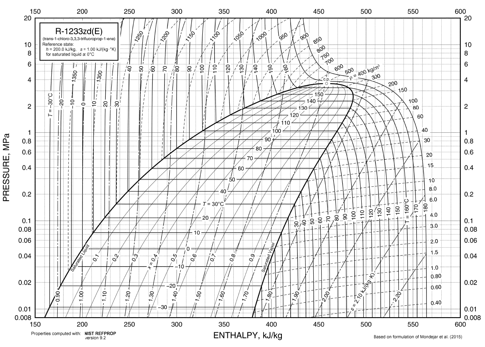

*Fig. 12 Pressure-Enthalpy Diagram for Refrigerant R-1233zd(E)*

<!-- str. 828 -->

**Refrigerant 1233zd(E) (trans-1-chloro-3,3,3-trifluoroprop-1**

**-ene) Properties of Saturated Liquid and Saturated Vapor**

| Temp., °C | Pressure, MPa | Density, Volume,<br>kg/m<sup>3</sup> Liquid | Density, Volume,<br>m<sup>3</sup>/kg Vapor | Enthalpy, kJ/kg<br>Liquid | Enthalpy, kJ/kg<br>Vapor | Entropy, kJ/(kg·K)<br>Liquid | Entropy, kJ/(kg·K)<br>Vapor | Specific Heat c<sub>p</sub>, kJ/(kg·K)<br>Liquid | Specific Heat c<sub>p</sub>, kJ/(kg·K)<br>Vapor | c /c p v Vapor | Velocity of Sound, m/s<br>Liquid | Velocity of Sound, m/s<br>Vapor | Viscosity, μPa·s<br>Liquid | Viscosity, μPa·s<br>Vapor | Thermal Cond., mW/(m·K)<br>Liquid | Thermal Cond., mW/(m·K)<br>Vapor | Tension, Temp.,<br>Surface mN/m | Tension, Temp.,<br>°C |
|---|---|---|---|---|---|---|---|---|---|---|---|---|---|---|---|---|---|---|
| –50 | 0.00289 | 1429.8 | 4.9048 | 142.87 | 369.48 | 0.7694 | 1.7849 | 1.109 | 0.660 | 1.108 | 992 | 125.2 | 2041.0 | 8.31 | 106.3 | 6.08 | 25.07 | –50 |
| –45 | 0.00410 | 1419.3 | 3.5348 | 148.43 | 372.76 | 0.7940 | 1.7773 | 1.115 | 0.672 | 1.107 | 971 | 126.3 | 1735.0 | 8.50 | 104.6 | 6.39 | 24.33 | –45 |
| –40 | 0.00570 | 1408.7 | 2.5918 | 154.02 | 376.08 | 0.8182 | 1.7707 | 1.122 | 0.683 | 1.105 | 949 | 127.5 | 1504.0 | 8.69 | 102.9 | 6.70 | 23.60 | –40 |
| –35 | 0.00781 | 1398.1 | 1.9310 | 159.65 | 379.43 | 0.8421 | 1.7650 | 1.128 | 0.694 | 1.104 | 928 | 128.6 | 1322.0 | 8.87 | 101.3 | 7.01 | 22.87 | –35 |
| –30 | 0.01052 | 1387.4 | 1.4601 | 165.31 | 382.82 | 0.8656 | 1.7602 | 1.135 | 0.704 | 1.104 | 907 | 129.7 | 1175.0 | 9.06 | 99.7 | 7.33 | 22.15 | –30 |
| –25 | 0.01398 | 1376.6 | 1.1193 | 171.00 | 386.24 | 0.8888 | 1.7561 | 1.142 | 0.715 | 1.103 | 886 | 130.7 | 1054.0 | 9.25 | 98.1 | 7.65 | 21.43 | –25 |
| –20 | 0.01833 | 1365.7 | 0.86907 | 176.73 | 389.68 | 0.9116 | 1.7528 | 1.149 | 0.726 | 1.103 | 865 | 131.7 | 953.2 | 9.43 | 96.5 | 7.97 | 20.72 | –20 |
| –18 | 0.02035 | 1361.3 | 0.78804 | 179.03 | 391.06 | 0.9207 | 1.7517 | 1.152 | 0.730 | 1.102 | 857 | 132.1 | 917.2 | 9.51 | 95.8 | 8.10 | 20.44 | –18 |
| –16 | 0.02256 | 1357.0 | 0.71589 | 181.34 | 392.45 | 0.9297 | 1.7506 | 1.154 | 0.734 | 1.102 | 849 | 132.4 | 883.3 | 9.58 | 95.2 | 8.23 | 20.15 | –16 |
| –14 | 0.02495 | 1352.6 | 0.65150 | 183.65 | 393.83 | 0.9386 | 1.7497 | 1.157 | 0.739 | 1.102 | 841 | 132.8 | 851.5 | 9.66 | 94.6 | 8.36 | 19.87 | –14 |
| –12 | 0.02755 | 1348.1 | 0.59392 | 185.97 | 395.22 | 0.9475 | 1.7488 | 1.160 | 0.743 | 1.102 | 833 | 133.1 | 821.4 | 9.73 | 94.0 | 8.49 | 19.59 | –12 |
| –10 | 0.03036 | 1343.7 | 0.54235 | 188.29 | 396.62 | 0.9564 | 1.7480 | 1.163 | 0.747 | 1.103 | 825 | 133.5 | 793.1 | 9.80 | 93.3 | 8.63 | 19.31 | –10 |
| –8 | 0.03340 | 1339.3 | 0.49606 | 190.62 | 398.01 | 0.9652 | 1.7473 | 1.166 | 0.751 | 1.103 | 817 | 133.8 | 766.2 | 9.88 | 92.7 | 8.76 | 19.03 | –8 |
| –6 | 0.03668 | 1334.8 | 0.45444 | 192.96 | 399.41 | 0.9740 | 1.7467 | 1.169 | 0.756 | 1.103 | 809 | 134.1 | 740.8 | 9.95 | 92.1 | 8.89 | 18.75 | –6 |
| –4 | 0.04021 | 1330.3 | 0.41695 | 195.30 | 400.80 | 0.9827 | 1.7462 | 1.171 | 0.760 | 1.103 | 800 | 134.4 | 716.7 | 10.02 | 91.4 | 9.03 | 18.48 | –4 |
| –2 | 0.04402 | 1325.8 | 0.38313 | 197.65 | 402.20 | 0.9914 | 1.7458 | 1.174 | 0.764 | 1.103 | 792 | 134.7 | 693.8 | 10.10 | 90.8 | 9.16 | 18.20 | –2 |
| 0 | 0.04811 | 1321.3 | 0.35257 | 200.00 | 403.60 | 1.0000 | 1.7454 | 1.177 | 0.769 | 1.104 | 784 | 135.0 | 672.1 | 10.17 | 90.2 | 9.30 | 17.92 | 0 |
| 2 | 0.05250 | 1316.7 | 0.32490 | 202.36 | 405.00 | 1.0086 | 1.7451 | 1.180 | 0.773 | 1.104 | 776 | 135.3 | 651.3 | 10.24 | 89.6 | 9.44 | 17.65 | 2 |
| 4 | 0.05720 | 1312.2 | 0.29981 | 204.72 | 406.40 | 1.0171 | 1.7448 | 1.183 | 0.778 | 1.104 | 769 | 135.6 | 631.6 | 10.32 | 89.0 | 9.58 | 17.38 | 4 |
| 6 | 0.06224 | 1307.6 | 0.27702 | 207.10 | 407.80 | 1.0257 | 1.7447 | 1.186 | 0.782 | 1.105 | 761 | 135.8 | 612.7 | 10.39 | 88.3 | 9.72 | 17.10 | 6 |
| 8 | 0.06762 | 1303.0 | 0.25630 | 209.47 | 409.21 | 1.0341 | 1.7445 | 1.189 | 0.787 | 1.105 | 753 | 136.1 | 594.7 | 10.46 | 87.7 | 9.86 | 16.83 | 8 |
| 10 | 0.07337 | 1298.3 | 0.23743 | 211.86 | 410.61 | 1.0426 | 1.7445 | 1.192 | 0.791 | 1.106 | 745 | 136.3 | 577.4 | 10.54 | 87.1 | 10.00 | 16.56 | 10 |
| 12 | 0.07949 | 1293.7 | 0.22022 | 214.25 | 412.01 | 1.0510 | 1.7445 | 1.195 | 0.796 | 1.106 | 737 | 136.5 | 560.9 | 10.61 | 86.5 | 10.14 | 16.29 | 12 |
| 14 | 0.08601 | 1289.0 | 0.20449 | 216.64 | 413.41 | 1.0593 | 1.7445 | 1.198 | 0.801 | 1.107 | 729 | 136.7 | 545.1 | 10.68 | 85.9 | 10.28 | 16.02 | 14 |
| 16 | 0.09295 | 1284.3 | 0.19011 | 219.04 | 414.81 | 1.0676 | 1.7447 | 1.201 | 0.805 | 1.108 | 721 | 136.9 | 529.9 | 10.75 | 85.3 | 10.43 | 15.75 | 16 |
| 18 | 0.10032 | 1279.6 | 0.17694 | 221.45 | 416.20 | 1.0759 | 1.7448 | 1.205 | 0.810 | 1.108 | 713 | 137.1 | 515.3 | 10.83 | 84.7 | 10.57 | 15.49 | 18 |
| 18.26<sup>b</sup>0.10132 |  | 1278.9 | 0.17529 | 221.77 | 416.39 | 1.0770 | 1.7448 | 1.205 | 0.811 | 1.108 | 712 | 137.1 | 513.5 | 10.84 | 84.6 | 10.59 | 15.45 | 18.26 |
| 20 | 0.10815 | 1274.8 | 0.16486 | 223.87 | 417.60 | 1.0841 | 1.7450 | 1.208 | 0.815 | 1.109 | 705 | 137.2 | 501.3 | 10.90 | 84.1 | 10.72 | 15.22 | 20 |
| 22 | 0.11644 | 1270.0 | 0.15376 | 226.29 | 419.00 | 1.0924 | 1.7453 | 1.211 | 0.820 | 1.110 | 698 | 137.4 | 487.9 | 10.97 | 83.5 | 10.87 | 14.96 | 22 |
| 24 | 0.12522 | 1265.2 | 0.14356 | 228.72 | 420.39 | 1.1005 | 1.7456 | 1.214 | 0.825 | 1.111 | 690 | 137.5 | 474.9 | 11.05 | 82.9 | 11.02 | 14.69 | 24 |
| 26 | 0.13452 | 1260.4 | 0.13417 | 231.15 | 421.78 | 1.1087 | 1.7459 | 1.218 | 0.830 | 1.112 | 682 | 137.6 | 462.4 | 11.12 | 82.3 | 11.17 | 14.43 | 26 |
| 28 | 0.14434 | 1255.5 | 0.12552 | 233.59 | 423.17 | 1.1168 | 1.7463 | 1.221 | 0.835 | 1.113 | 674 | 137.7 | 450.4 | 11.19 | 81.7 | 11.32 | 14.17 | 28 |
| 30 | 0.15471 | 1250.6 | 0.11753 | 236.04 | 424.56 | 1.1249 | 1.7467 | 1.224 | 0.840 | 1.114 | 666 | 137.8 | 438.8 | 11.26 | 81.1 | 11.48 | 13.91 | 30 |
| 32 | 0.16566 | 1245.7 | 0.11015 | 238.50 | 425.94 | 1.1329 | 1.7472 | 1.228 | 0.845 | 1.115 | 659 | 137.9 | 427.6 | 11.34 | 80.5 | 11.63 | 13.65 | 32 |
| 34 | 0.17719 | 1240.7 | 0.10333 | 240.96 | 427.32 | 1.1409 | 1.7477 | 1.231 | 0.850 | 1.116 | 651 | 138.0 | 416.8 | 11.41 | 79.9 | 11.79 | 13.39 | 34 |
| 36 | 0.18934 | 1235.7 | 0.09702 | 243.43 | 428.70 | 1.1489 | 1.7482 | 1.235 | 0.856 | 1.117 | 643 | 138.0 | 406.3 | 11.48 | 79.3 | 11.95 | 13.13 | 36 |
| 38 | 0.20212 | 1230.7 | 0.09116 | 245.91 | 430.08 | 1.1569 | 1.7488 | 1.238 | 0.861 | 1.119 | 635 | 138.0 | 396.2 | 11.55 | 78.7 | 12.11 | 12.87 | 38 |
| 40 | 0.21555 | 1225.6 | 0.08573 | 248.39 | 431.45 | 1.1648 | 1.7493 | 1.242 | 0.866 | 1.120 | 627 | 138.0 | 386.4 | 11.63 | 78.1 | 12.27 | 12.62 | 40 |
| 42 | 0.22966 | 1220.5 | 0.08069 | 250.88 | 432.81 | 1.1727 | 1.7500 | 1.246 | 0.872 | 1.122 | 620 | 138.0 | 376.9 | 11.70 | 77.5 | 12.43 | 12.36 | 42 |
| 44 | 0.24447 | 1215.4 | 0.07600 | 253.38 | 434.18 | 1.1805 | 1.7506 | 1.250 | 0.878 | 1.123 | 612 | 138.0 | 367.7 | 11.78 | 76.9 | 12.60 | 12.11 | 44 |
| 46 | 0.26000 | 1210.2 | 0.07163 | 255.89 | 435.54 | 1.1884 | 1.7513 | 1.254 | 0.884 | 1.125 | 604 | 138.0 | 358.8 | 11.85 | 76.3 | 12.76 | 11.86 | 46 |
| 48 | 0.27628 | 1205.0 | 0.06757 | 258.40 | 436.89 | 1.1962 | 1.7520 | 1.258 | 0.889 | 1.127 | 597 | 137.9 | 350.2 | 11.92 | 75.8 | 12.93 | 11.61 | 48 |
| 50 | 0.29332 | 1199.7 | 0.06378 | 260.93 | 438.24 | 1.2040 | 1.7527 | 1.262 | 0.895 | 1.128 | 589 | 137.8 | 341.8 | 12.00 | 75.2 | 13.10 | 11.36 | 50 |
| 52 | 0.31116 | 1194.4 | 0.06024 | 263.46 | 439.59 | 1.2117 | 1.7534 | 1.266 | 0.902 | 1.130 | 581 | 137.7 | 333.7 | 12.07 | 74.6 | 13.27 | 11.11 | 52 |
| 54 | 0.32981 | 1189.1 | 0.05693 | 266.00 | 440.93 | 1.2195 | 1.7542 | 1.270 | 0.908 | 1.132 | 573 | 137.6 | 325.8 | 12.15 | 74.0 | 13.45 | 10.86 | 54 |
| 56 | 0.34929 | 1183.7 | 0.05385 | 268.55 | 442.26 | 1.2272 | 1.7550 | 1.274 | 0.914 | 1.134 | 566 | 137.5 | 318.1 | 12.22 | 73.5 | 13.62 | 10.62 | 56 |
| 58 | 0.36964 | 1178.3 | 0.05096 | 271.10 | 443.59 | 1.2349 | 1.7558 | 1.279 | 0.921 | 1.137 | 558 | 137.3 | 310.6 | 12.30 | 72.9 | 13.80 | 10.37 | 58 |
| 60 | 0.39088 | 1172.8 | 0.04825 | 273.67 | 444.91 | 1.2426 | 1.7566 | 1.283 | 0.927 | 1.139 | 550 | 137.2 | 303.3 | 12.38 | 72.3 | 13.98 | 10.13 | 60 |
| 62 | 0.41303 | 1167.2 | 0.04571 | 276.24 | 446.23 | 1.2502 | 1.7574 | 1.288 | 0.934 | 1.142 | 542 | 137.0 | 296.2 | 12.45 | 71.8 | 14.16 | 9.89 | 62 |
| 64 | 0.43612 | 1161.7 | 0.04333 | 278.83 | 447.54 | 1.2578 | 1.7582 | 1.293 | 0.941 | 1.144 | 535 | 136.7 | 289.3 | 12.53 | 71.2 | 14.34 | 9.64 | 64 |
| 66 | 0.46017 | 1156.0 | 0.04110 | 281.42 | 448.84 | 1.2655 | 1.7591 | 1.298 | 0.948 | 1.147 | 527 | 136.5 | 282.6 | 12.61 | 70.6 | 14.53 | 9.40 | 66 |
| 68 | 0.48521 | 1150.3 | 0.03900 | 284.03 | 450.14 | 1.2730 | 1.7600 | 1.303 | 0.955 | 1.150 | 519 | 136.3 | 276.0 | 12.69 | 70.1 | 14.72 | 9.17 | 68 |
| 70 | 0.51126 | 1144.6 | 0.03702 | 286.64 | 451.43 | 1.2806 | 1.7608 | 1.308 | 0.963 | 1.153 | 512 | 136.0 | 269.6 | 12.77 | 69.5 | 14.91 | 8.93 | 70 |
| 72 | 0.53835 | 1138.8 | 0.03517 | 289.26 | 452.70 | 1.2882 | 1.7617 | 1.313 | 0.970 | 1.156 | 504 | 135.7 | 263.4 | 12.85 | 69.0 | 15.10 | 8.69 | 72 |
| 74 | 0.56651 | 1132.9 | 0.03342 | 291.90 | 453.98 | 1.2957 | 1.7626 | 1.319 | 0.978 | 1.159 | 496 | 135.3 | 257.3 | 12.93 | 68.4 | 15.29 | 8.46 | 74 |
| 76 | 0.59576 | 1127.0 | 0.03177 | 294.54 | 455.24 | 1.3032 | 1.7635 | 1.324 | 0.986 | 1.163 | 488 | 135.0 | 251.3 | 13.02 | 67.9 | 15.49 | 8.23 | 76 |
| 78 | 0.62613 | 1121.0 | 0.03021 | 297.20 | 456.49 | 1.3107 | 1.7644 | 1.330 | 0.995 | 1.167 | 481 | 134.6 | 245.5 | 13.10 | 67.3 | 15.69 | 7.99 | 78 |
| 80 | 0.65765 | 1114.9 | 0.02875 | 299.86 | 457.73 | 1.3182 | 1.7653 | 1.336 | 1.003 | 1.171 | 473 | 134.2 | 239.8 | 13.19 | 66.8 | 15.89 | 7.76 | 80 |
| 90 | 0.83345 | 1083.4 | 0.02253 | 313.38 | 463.78 | 1.3555 | 1.7697 | 1.370 | 1.050 | 1.195 | 434 | 131.8 | 213.1 | 13.64 | 64.1 | 16.94 | 6.64 | 90 |
| 100 | 1.0423 | 1049.7 | 0.01778 | 327.24 | 469.49 | 1.3926 | 1.7739 | 1.412 | 1.107 | 1.227 | 394 | 128.7 | 188.9 | 14.15 | 61.6 | 18.07 | 5.55 | 100 |
| 110 | 1.2880 | 1013.1 | 0.01408 | 341.51 | 474.77 | 1.4297 | 1.7775 | 1.465 | 1.179 | 1.273 | 354 | 124.8 | 166.8 | 14.74 | 59.0 | 19.30 | 4.51 | 110 |
| 120 | 1.5750 | 972.6 | 0.01116 | 356.29 | 479.44 | 1.4671 | 1.7803 | 1.538 | 1.277 | 1.342 | 312 | 120.0 | 146.4 | 15.45 | 56.6 | 20.69 | 3.51 | 120 |
| 130 | 1.9080 | 926.9 | 0.00881 | 371.74 | 483.27 | 1.5050 | 1.7816 | 1.643 | 1.423 | 1.455 | 270 | 114.2 | 127.1 | 16.37 | 54.3 | 22.34 | 2.58 | 130 |
| 140 | 2.2928 | 873.1 | 0.00687 | 388.12 | 485.81 | 1.5441 | 1.7805 | 1.819 | 1.675 | 1.661 | 225 | 107.1 | 108.5 | 17.65 | 52.0 | 24.52 | 1.71 | 140 |
| 150 | 2.7364 | 805.4 | 0.00522 | 406.03 | 486.16 | 1.5856 | 1.7750 | 2.193 | 2.232 | 2.141 | 177 | 98.7 | 89.7 | 19.67 | 49.8 | 27.90 | 0.93 | 150 |
| 160 | 3.2485 | 704.0 | 0.00368 | 427.43 | 481.49 | 1.6340 | 1.7588 | 3.751 | 4.545 | 4.191 | 123 | 88.04 | 68.4 | 23.83 | 48.6 | 35.43 | 0.28 | 160 |
| 166.45c | 3.6237 | 480.2 | 0.00208 | 458.27 | 458.27 | 1.7032 | 1.7032 | ∞ | ∞ | ∞ | 0 | 0.00 | — | — | ∞ | ∞ | 0.00 | 166.45 |

<sup>b</sup>Normal boiling point <sup>c</sup>Critical point

<!-- str. 829 -->

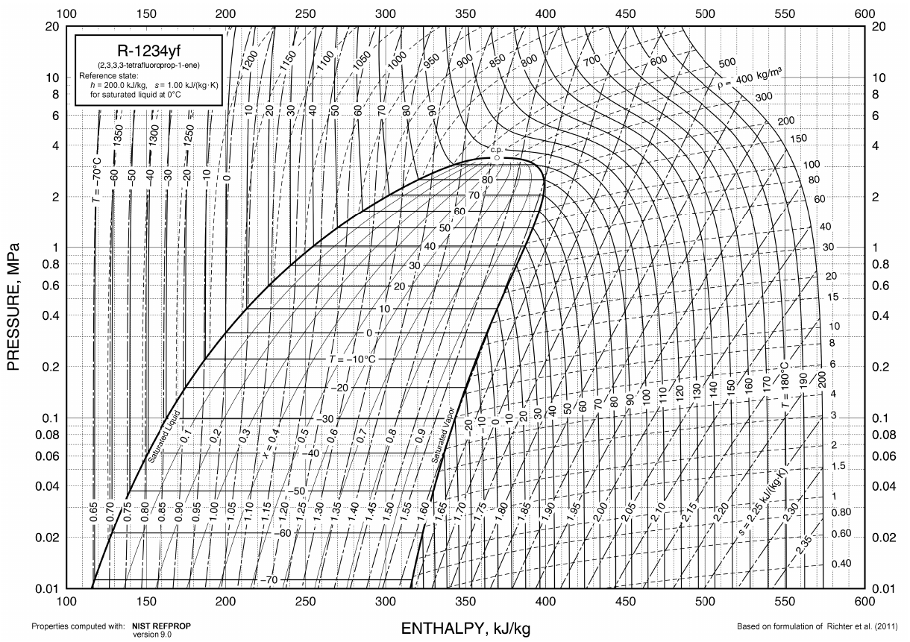

*Fig. 13 Pressure-Enthalpy Diagram for Refrigerant 1234yf*

<!-- str. 830 -->

**Refrigerant 1234yf (2,3,3,3-tetrafluoroprop-1-ene) P roperties of Saturated Liquid and Saturated Vapor**

| Temp., °C | Pressure, MPa | Density, Volume,<br>kg/m<sup>3</sup> Liquid | Density, Volume,<br>m<sup>3</sup>/kg Vapor | Enthalpy, kJ/kg<br>Liquid | Enthalpy, kJ/kg<br>Vapor | Entropy, kJ/(kg·K)<br>Liquid | Entropy, kJ/(kg·K)<br>Vapor | Specific Heat c<sub>p</sub>, kJ/(kg·K)<br>Liquid | Specific Heat c<sub>p</sub>, kJ/(kg·K)<br>Vapor | c /c p v Vapor | Velocity of Sound, m/s<br>Liquid | Velocity of Sound, m/s<br>Vapor | Viscosity, μPa·s<br>Liquid | Viscosity, μPa·s<br>Vapor | Thermal Cond., mW/(m·K)<br>Liquid | Thermal Cond., mW/(m·K)<br>Vapor | Tension, Temp.,<br>Surface mN/m | Tension, Temp.,<br>°C |
|---|---|---|---|---|---|---|---|---|---|---|---|---|---|---|---|---|---|---|
| –50 | 0.03742 | 1318.4 | 0.42472 | 139.63 | 329.85 | 0.7573 | 1.6098 | 1.128 | 0.746 | 1.124 | 783 | 132.1 | 369.8 | 7.68 | 89.0 | 7.64 | 17.09 | –50 |
| –45 | 0.04862 | 1305.2 | 0.33259 | 145.31 | 333.21 | 0.7825 | 1.6060 | 1.143 | 0.762 | 1.125 | 759 | 132.9 | 347.6 | 7.96 | 87.1 | 8.04 | 16.27 | –45 |
| –40 | 0.06237 | 1291.9 | 0.26354 | 151.07 | 336.58 | 0.8074 | 1.6031 | 1.157 | 0.778 | 1.126 | 736 | 133.7 | 327.0 | 8.23 | 85.3 | 8.43 | 15.46 | –40 |
| –35 | 0.07904 | 1278.3 | 0.21110 | 156.90 | 339.95 | 0.8321 | 1.6007 | 1.173 | 0.794 | 1.127 | 713 | 134.3 | 307.9 | 8.49 | 83.5 | 8.83 | 14.67 | –35 |
| –30 | 0.09906 | 1264.5 | 0.17079 | 162.81 | 343.32 | 0.8566 | 1.5990 | 1.188 | 0.811 | 1.129 | 690 | 134.9 | 290.1 | 8.75 | 81.7 | 9.22 | 13.89 | –30 |
| –29.49<sup>b</sup> | 0.10132 | 1263.1 | 0.16719 | 163.42 | 343.67 | 0.8591 | 1.5988 | 1.190 | 0.813 | 1.129 | 688 | 134.9 | 288.3 | 8.78 | 81.5 | 9.26 | 13.81 | –29.49 |
| –28 | 0.10810 | 1259.0 | 0.15732 | 165.20 | 344.67 | 0.8663 | 1.5984 | 1.195 | 0.818 | 1.130 | 681 | 135.0 | 283.3 | 8.85 | 81.0 | 9.38 | 13.58 | –28 |
| –26 | 0.11778 | 1253.4 | 0.14512 | 167.60 | 346.02 | 0.8760 | 1.5980 | 1.201 | 0.825 | 1.131 | 672 | 135.2 | 276.7 | 8.96 | 80.3 | 9.54 | 13.27 | –26 |
| –24 | 0.12812 | 1247.7 | 0.13404 | 170.01 | 347.36 | 0.8857 | 1.5976 | 1.207 | 0.832 | 1.132 | 664 | 135.4 | 270.3 | 9.06 | 79.6 | 9.70 | 12.97 | –24 |
| –22 | 0.13916 | 1242.0 | 0.12398 | 172.43 | 348.71 | 0.8954 | 1.5973 | 1.214 | 0.839 | 1.133 | 655 | 135.5 | 264.0 | 9.16 | 78.9 | 9.86 | 12.66 | –22 |
| –20 | 0.15092 | 1236.3 | 0.11482 | 174.87 | 350.05 | 0.9050 | 1.5970 | 1.220 | 0.847 | 1.135 | 646 | 135.6 | 258.0 | 9.25 | 78.2 | 10.02 | 12.36 | –20 |
| –18 | 0.16344 | 1230.5 | 0.10647 | 177.32 | 351.39 | 0.9146 | 1.5968 | 1.227 | 0.854 | 1.136 | 637 | 135.7 | 252.0 | 9.35 | 77.5 | 10.17 | 12.06 | –18 |
| –16 | 0.17676 | 1224.7 | 0.09884 | 179.79 | 352.73 | 0.9242 | 1.5967 | 1.234 | 0.862 | 1.137 | 628 | 135.7 | 246.2 | 9.45 | 76.8 | 10.33 | 11.76 | –16 |
| –14 | 0.19090 | 1218.8 | 0.09187 | 182.27 | 354.06 | 0.9338 | 1.5967 | 1.240 | 0.869 | 1.139 | 620 | 135.8 | 240.6 | 9.55 | 76.2 | 10.49 | 11.47 | –14 |
| –12 | 0.20590 | 1212.9 | 0.08548 | 184.76 | 355.39 | 0.9433 | 1.5967 | 1.247 | 0.877 | 1.141 | 611 | 135.8 | 235.1 | 9.64 | 75.5 | 10.65 | 11.18 | –12 |
| –10 | 0.22178 | 1207.0 | 0.07962 | 187.26 | 356.72 | 0.9528 | 1.5968 | 1.254 | 0.885 | 1.142 | 602 | 135.8 | 229.7 | 9.74 | 74.8 | 10.82 | 10.88 | –10 |
| –8 | 0.23860 | 1200.9 | 0.07424 | 189.78 | 358.04 | 0.9623 | 1.5969 | 1.261 | 0.893 | 1.144 | 594 | 135.7 | 224.5 | 9.83 | 74.1 | 10.98 | 10.60 | –8 |
| –6 | 0.25637 | 1194.9 | 0.06930 | 192.31 | 359.36 | 0.9717 | 1.5970 | 1.268 | 0.901 | 1.146 | 585 | 135.7 | 219.4 | 9.93 | 73.5 | 11.14 | 10.31 | –6 |
| –4 | 0.27514 | 1188.7 | 0.06474 | 194.86 | 360.68 | 0.9812 | 1.5973 | 1.275 | 0.909 | 1.149 | 576 | 135.6 | 214.4 | 10.02 | 72.8 | 11.30 | 10.02 | –4 |
| –2 | 0.29495 | 1182.5 | 0.06054 | 197.42 | 361.99 | 0.9906 | 1.5975 | 1.282 | 0.918 | 1.151 | 568 | 135.5 | 209.5 | 10.12 | 72.1 | 11.47 | 9.74 | –2 |
| 0 | 0.31582 | 1176.3 | 0.05667 | 200.00 | 363.29 | 1.0000 | 1.5978 | 1.289 | 0.926 | 1.153 | 559 | 135.4 | 204.7 | 10.21 | 71.5 | 11.63 | 9.46 | 0 |
| 2 | 0.33780 | 1170.0 | 0.05309 | 202.59 | 364.59 | 1.0094 | 1.5981 | 1.297 | 0.935 | 1.156 | 551 | 135.2 | 200.1 | 10.31 | 70.8 | 11.80 | 9.19 | 2 |
| 4 | 0.36092 | 1163.6 | 0.04977 | 205.20 | 365.88 | 1.0187 | 1.5985 | 1.304 | 0.944 | 1.159 | 542 | 135.1 | 195.5 | 10.40 | 70.2 | 11.97 | 8.91 | 4 |
| 6 | 0.38523 | 1157.2 | 0.04670 | 207.82 | 367.16 | 1.0281 | 1.5989 | 1.312 | 0.953 | 1.162 | 533 | 134.8 | 191.0 | 10.50 | 69.5 | 12.14 | 8.64 | 6 |
| 8 | 0.41075 | 1150.6 | 0.04385 | 210.45 | 368.44 | 1.0374 | 1.5993 | 1.320 | 0.962 | 1.165 | 525 | 134.6 | 186.7 | 10.59 | 68.9 | 12.31 | 8.37 | 8 |
| 10 | 0.43753 | 1144.0 | 0.04121 | 213.10 | 369.70 | 1.0467 | 1.5998 | 1.327 | 0.972 | 1.168 | 516 | 134.3 | 182.4 | 10.69 | 68.2 | 12.48 | 8.10 | 10 |
| 12 | 0.46561 | 1137.4 | 0.03875 | 215.77 | 370.96 | 1.0560 | 1.6003 | 1.335 | 0.982 | 1.172 | 508 | 134.1 | 178.2 | 10.78 | 67.6 | 12.65 | 7.83 | 12 |
| 14 | 0.49503 | 1130.6 | 0.03646 | 218.45 | 372.21 | 1.0653 | 1.6008 | 1.344 | 0.992 | 1.176 | 499 | 133.7 | 174.1 | 10.88 | 67.0 | 12.83 | 7.57 | 14 |
| 16 | 0.52583 | 1123.8 | 0.03433 | 221.15 | 373.45 | 1.0746 | 1.6013 | 1.352 | 1.002 | 1.180 | 490 | 133.4 | 170.1 | 10.98 | 66.3 | 13.01 | 7.31 | 16 |
| 18 | 0.55804 | 1116.9 | 0.03235 | 223.87 | 374.67 | 1.0838 | 1.6018 | 1.361 | 1.013 | 1.185 | 482 | 133.0 | 166.1 | 11.07 | 65.7 | 13.19 | 7.05 | 18 |
| 20 | 0.59172 | 1109.9 | 0.03049 | 226.60 | 375.89 | 1.0931 | 1.6024 | 1.369 | 1.024 | 1.190 | 473 | 132.6 | 162.3 | 11.17 | 65.1 | 13.38 | 6.80 | 20 |
| 22 | 0.62690 | 1102.8 | 0.02876 | 229.34 | 377.09 | 1.1023 | 1.6029 | 1.378 | 1.035 | 1.195 | 464 | 132.1 | 158.5 | 11.27 | 64.5 | 13.57 | 6.55 | 22 |
| 24 | 0.66363 | 1095.5 | 0.02714 | 232.11 | 378.28 | 1.1115 | 1.6034 | 1.387 | 1.047 | 1.201 | 456 | 131.7 | 154.7 | 11.37 | 63.8 | 13.76 | 6.30 | 24 |
| 26 | 0.70194 | 1088.2 | 0.02562 | 234.89 | 379.45 | 1.1208 | 1.6040 | 1.397 | 1.060 | 1.207 | 447 | 131.1 | 151.1 | 11.48 | 63.2 | 13.96 | 6.05 | 26 |
| 28 | 0.74189 | 1080.8 | 0.02420 | 237.69 | 380.61 | 1.1300 | 1.6045 | 1.407 | 1.073 | 1.213 | 438 | 130.6 | 147.5 | 11.58 | 62.6 | 14.16 | 5.81 | 28 |
| 30 | 0.78351 | 1073.3 | 0.02287 | 240.51 | 381.75 | 1.1392 | 1.6051 | 1.417 | 1.086 | 1.220 | 429 | 130.0 | 144.0 | 11.69 | 62.0 | 14.37 | 5.56 | 30 |
| 32 | 0.82686 | 1065.7 | 0.02162 | 243.35 | 382.87 | 1.1484 | 1.6056 | 1.427 | 1.101 | 1.228 | 421 | 129.4 | 140.5 | 11.79 | 61.4 | 14.58 | 5.33 | 32 |
| 34 | 0.87197 | 1057.9 | 0.02044 | 246.21 | 383.98 | 1.1576 | 1.6061 | 1.438 | 1.116 | 1.236 | 412 | 128.7 | 137.1 | 11.90 | 60.8 | 14.80 | 5.09 | 34 |
| 36 | 0.91890 | 1050.0 | 0.01934 | 249.09 | 385.06 | 1.1668 | 1.6066 | 1.449 | 1.132 | 1.245 | 403 | 128.1 | 133.8 | 12.01 | 60.2 | 15.03 | 4.86 | 36 |
| 38 | 0.96769 | 1042.0 | 0.01830 | 251.98 | 386.13 | 1.1759 | 1.6071 | 1.461 | 1.149 | 1.254 | 394 | 127.3 | 130.5 | 12.13 | 59.6 | 15.26 | 4.63 | 38 |
| 40 | 1.0184 | 1033.8 | 0.01732 | 254.90 | 387.17 | 1.1851 | 1.6075 | 1.473 | 1.167 | 1.265 | 385 | 126.6 | 127.2 | 12.25 | 59.0 | 15.50 | 4.40 | 40 |
| 42 | 1.0711 | 1025.5 | 0.01639 | 257.84 | 388.19 | 1.1943 | 1.6079 | 1.486 | 1.186 | 1.276 | 376 | 125.7 | 124.0 | 12.37 | 58.5 | 15.76 | 4.18 | 42 |
| 44 | 1.1257 | 1017.0 | 0.01552 | 260.81 | 389.18 | 1.2035 | 1.6083 | 1.500 | 1.207 | 1.289 | 367 | 124.9 | 120.9 | 12.49 | 57.9 | 16.02 | 3.96 | 44 |
| 46 | 1.1825 | 1008.3 | 0.01469 | 263.80 | 390.14 | 1.2128 | 1.6087 | 1.515 | 1.229 | 1.302 | 358 | 124.0 | 117.8 | 12.62 | 57.3 | 16.29 | 3.74 | 46 |
| 48 | 1.2413 | 999.4 | 0.01392 | 266.81 | 391.08 | 1.2220 | 1.6089 | 1.531 | 1.252 | 1.317 | 349 | 123.1 | 114.7 | 12.75 | 56.7 | 16.57 | 3.53 | 48 |
| 50 | 1.3023 | 990.4 | 0.01318 | 269.85 | 391.98 | 1.2312 | 1.6092 | 1.548 | 1.277 | 1.333 | 340 | 122.1 | 111.7 | 12.89 | 56.1 | 16.87 | 3.32 | 50 |
| 52 | 1.3656 | 981.1 | 0.01248 | 272.92 | 392.85 | 1.2405 | 1.6094 | 1.566 | 1.305 | 1.351 | 331 | 121.0 | 108.7 | 13.03 | 55.6 | 17.19 | 3.12 | 52 |
| 54 | 1.4311 | 971.6 | 0.01182 | 276.02 | 393.68 | 1.2498 | 1.6095 | 1.586 | 1.335 | 1.371 | 322 | 120.0 | 105.8 | 13.18 | 55.0 | 17.52 | 2.92 | 54 |
| 56 | 1.4989 | 961.8 | 0.01119 | 279.15 | 394.48 | 1.2592 | 1.6095 | 1.607 | 1.367 | 1.393 | 312 | 118.8 | 102.8 | 13.34 | 54.4 | 17.87 | 2.72 | 56 |
| 58 | 1.5692 | 951.7 | 0.01059 | 282.32 | 395.23 | 1.2685 | 1.6095 | 1.631 | 1.403 | 1.418 | 303 | 117.6 | 99.9 | 13.50 | 53.8 | 18.25 | 2.52 | 58 |
| 60 | 1.6419 | 941.3 | 0.01002 | 285.53 | 395.93 | 1.2779 | 1.6093 | 1.656 | 1.442 | 1.445 | 293 | 116.4 | 97.0 | 13.67 | 53.3 | 18.65 | 2.33 | 60 |
| 62 | 1.7171 | 930.6 | 0.00948 | 288.77 | 396.58 | 1.2874 | 1.6091 | 1.685 | 1.485 | 1.477 | 283 | 115.1 | 94.2 | 13.85 | 52.7 | 19.08 | 2.15 | 62 |
| 64 | 1.7949 | 919.5 | 0.00897 | 292.06 | 397.18 | 1.2969 | 1.6087 | 1.717 | 1.534 | 1.512 | 272 | 113.7 | 91.3 | 14.05 | 52.1 | 19.54 | 1.97 | 64 |
| 66 | 1.8754 | 907.9 | 0.00848 | 295.39 | 397.71 | 1.3065 | 1.6082 | 1.752 | 1.589 | 1.553 | 262 | 112.3 | 88.4 | 14.25 | 51.5 | 20.04 | 1.79 | 66 |
| 68 | 1.9586 | 895.8 | 0.00801 | 298.78 | 398.18 | 1.3162 | 1.6076 | 1.792 | 1.651 | 1.600 | 251 | 110.8 | 85.6 | 14.47 | 51.0 | 20.59 | 1.62 | 68 |
| 70 | 2.0445 | 883.2 | 0.00756 | 302.22 | 398.57 | 1.3260 | 1.6068 | 1.837 | 1.724 | 1.655 | 240 | 109.3 | 82.7 | 14.70 | 50.4 | 21.19 | 1.45 | 70 |
| 72 | 2.1334 | 870.0 | 0.00712 | 305.72 | 398.87 | 1.3359 | 1.6058 | 1.890 | 1.808 | 1.719 | 229 | 107.6 | 79.8 | 14.96 | 49.8 | 21.86 | 1.29 | 72 |
| 74 | 2.2252 | 856.1 | 0.00671 | 309.30 | 399.07 | 1.3459 | 1.6045 | 1.951 | 1.907 | 1.797 | 217 | 105.9 | 76.9 | 15.23 | 49.2 | 22.60 | 1.14 | 74 |
| 76 | 2.3201 | 841.4 | 0.00631 | 312.95 | 399.16 | 1.3561 | 1.6030 | 2.025 | 2.028 | 1.891 | 206 | 104.2 | 74.0 | 15.54 | 48.7 | 23.43 | 0.99 | 76 |
| 78 | 2.4181 | 825.7 | 0.00592 | 316.69 | 399.11 | 1.3664 | 1.6011 | 2.114 | 2.176 | 2.009 | 194 | 102.3 | 71.1 | 15.88 | 48.1 | 24.38 | 0.84 | 78 |
| 80 | 2.5194 | 809.0 | 0.00555 | 320.54 | 398.90 | 1.3770 | 1.5989 | 2.227 | 2.364 | 2.158 | 182 | 100.3 | 68.1 | 16.26 | 47.6 | 25.48 | 0.71 | 80 |
| 85 | 2.7879 | 760.4 | 0.00464 | 330.81 | 397.40 | 1.4049 | 1.5909 | 2.702 | 3.168 | 2.803 | 150 | 94.9 | 60.2 | 17.47 | 46.4 | 29.23 | 0.39 | 85 |
| 90 | 3.0803 | 694.1 | 0.00372 | 342.79 | 393.32 | 1.4370 | 1.5762 | 4.186 | 5.688 | 4.820 | 116 | 88.4 | 51.0 | 19.49 | 46.6 | 36.40 | 0.14 | 90 |
| 94.70<sup>c</sup> | 3.3822 | 475.6 | 0.00210 | 369.55 | 369.55 | 1.5087 | 1.5087 | ∞ | ∞ | ∞ | 0 | 0.00 | — | — | ∞ | ∞ | 0.00 | 94.70 |

<sup>b</sup>Normal boiling point <sup>c</sup>Critical point

<!-- str. 831 -->

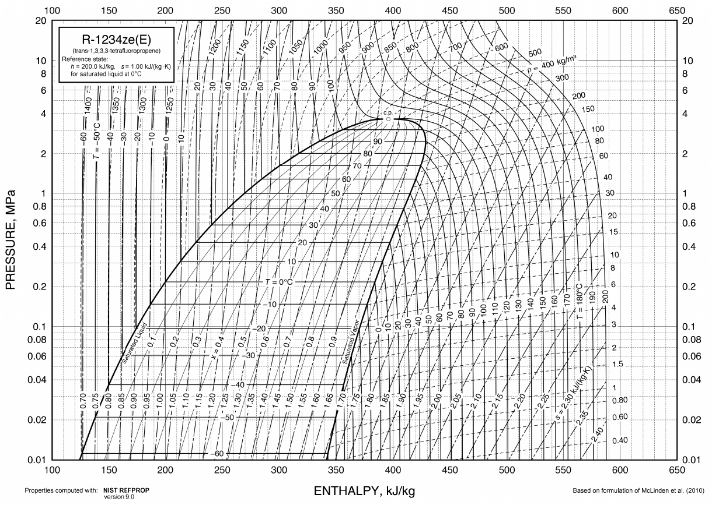

*Fig. 14 Pressure-Enthalpy Diagram for Refrigerant 1234ze(E)*

<!-- str. 832 -->

**Refrigerant 1234ze(E) (trans-1,3,3,3-tetrafluoropropene**

**) Properties of Saturated Liquid and Saturated Vapor**

| Temp., °C | Pressure, MPa | Density, Volume,<br>kg/m<sup>3</sup> Liquid | Density, Volume,<br>m<sup>3</sup>/kg Vapor | Enthalpy, kJ/kg<br>Liquid | Enthalpy, kJ/kg<br>Vapor | Entropy, kJ/(kg·K)<br>Liquid | Entropy, kJ/(kg·K)<br>Vapor | Specific Heat c<sub>p</sub>, kJ/(kg·K)<br>Liquid | Specific Heat c<sub>p</sub>, kJ/(kg·K)<br>Vapor | c /c p v Vapor | Velocity of Sound, m/s<br>Liquid | Velocity of Sound, m/s<br>Vapor | Viscosity, μPa·s<br>Liquid | Viscosity, μPa·s<br>Vapor | Thermal Cond., mW/(m·K)<br>Liquid | Thermal Cond., mW/(m·K)<br>Vapor | Tension, Temp.,<br>Surface mN/m | Tension, Temp.,<br>°C |
|---|---|---|---|---|---|---|---|---|---|---|---|---|---|---|---|---|---|---|
| –50 | 0.02092 | 1375.3 | 0.76762 | 136.20 | 348.81 | 0.7429 | 1.6956 | 1.240 | 0.755 | 1.115 | 867 | 132.9 | 515.9 | 7.66 | 102.5 | 7.70 | 20.06 | –50 |
| –45 | 0.02793 | 1362.4 | 0.58586 | 142.42 | 352.37 | 0.7704 | 1.6907 | 1.246 | 0.766 | 1.115 | 845 | 133.9 | 481.3 | 7.98 | 100.4 | 8.09 | 19.26 | –45 |
| –40 | 0.03675 | 1349.5 | 0.45337 | 148.66 | 355.94 | 0.7975 | 1.6865 | 1.251 | 0.777 | 1.115 | 822 | 134.9 | 449.3 | 8.29 | 98.4 | 8.48 | 18.46 | –40 |
| –35 | 0.04768 | 1336.5 | 0.35533 | 154.94 | 359.51 | 0.8241 | 1.6831 | 1.258 | 0.789 | 1.116 | 800 | 135.8 | 419.5 | 8.60 | 96.4 | 8.88 | 17.67 | –35 |
| –30 | 0.06109 | 1323.3 | 0.28176 | 161.25 | 363.09 | 0.8503 | 1.6803 | 1.265 | 0.801 | 1.117 | 777 | 136.6 | 391.9 | 8.91 | 94.5 | 9.27 | 16.89 | –30 |
| –25 | 0.07735 | 1309.9 | 0.22584 | 167.60 | 366.65 | 0.8761 | 1.6782 | 1.272 | 0.814 | 1.118 | 755 | 137.3 | 366.2 | 9.21 | 92.5 | 9.66 | 16.12 | –25 |
| –20 | 0.09687 | 1296.4 | 0.18282 | 173.99 | 370.20 | 0.9015 | 1.6766 | 1.280 | 0.826 | 1.120 | 733 | 137.9 | 342.3 | 9.52 | 90.6 | 10.04 | 15.36 | –20 |
| –18.97<sup>b</sup> | 0.10132 | 1293.6 | 0.17525 | 175.31 | 370.93 | 0.9067 | 1.6763 | 1.282 | 0.829 | 1.121 | 728 | 138.0 | 337.7 | 9.58 | 90.2 | 10.12 | 15.20 | –18.97 |
| –18 | 0.10569 | 1290.9 | 0.16843 | 176.56 | 371.62 | 0.9116 | 1.6761 | 1.284 | 0.832 | 1.121 | 724 | 138.1 | 333.3 | 9.64 | 89.8 | 10.20 | 15.05 | –18 |
| –16 | 0.11512 | 1285.4 | 0.15540 | 179.13 | 373.03 | 0.9216 | 1.6756 | 1.287 | 0.837 | 1.122 | 715 | 138.3 | 324.5 | 9.76 | 89.0 | 10.35 | 14.75 | –16 |
| –14 | 0.12520 | 1279.9 | 0.14357 | 181.71 | 374.44 | 0.9316 | 1.6752 | 1.291 | 0.843 | 1.123 | 706 | 138.4 | 315.9 | 9.88 | 88.3 | 10.50 | 14.45 | –14 |
| –12 | 0.13596 | 1274.3 | 0.13281 | 184.30 | 375.85 | 0.9415 | 1.6749 | 1.294 | 0.848 | 1.125 | 697 | 138.6 | 307.6 | 10.00 | 87.5 | 10.66 | 14.15 | –12 |
| –10 | 0.14744 | 1268.7 | 0.12302 | 186.90 | 377.25 | 0.9513 | 1.6747 | 1.298 | 0.854 | 1.126 | 688 | 138.7 | 299.6 | 10.12 | 86.8 | 10.81 | 13.85 | –10 |
| –8 | 0.15965 | 1263.1 | 0.11409 | 189.50 | 378.64 | 0.9612 | 1.6745 | 1.302 | 0.860 | 1.127 | 679 | 138.8 | 291.7 | 10.24 | 86.0 | 10.97 | 13.56 | –8 |
| –6 | 0.17263 | 1257.4 | 0.10593 | 192.11 | 380.04 | 0.9709 | 1.6744 | 1.306 | 0.865 | 1.128 | 671 | 138.9 | 284.1 | 10.36 | 85.3 | 11.12 | 13.26 | –6 |
| –4 | 0.18642 | 1251.7 | 0.09847 | 194.73 | 381.42 | 0.9807 | 1.6743 | 1.310 | 0.871 | 1.130 | 662 | 139.0 | 276.7 | 10.48 | 84.5 | 11.28 | 12.97 | –4 |
| –2 | 0.20105 | 1245.9 | 0.09163 | 197.36 | 382.80 | 0.9904 | 1.6743 | 1.314 | 0.877 | 1.132 | 653 | 139.0 | 269.6 | 10.60 | 83.8 | 11.43 | 12.67 | –2 |
| 0 | 0.21655 | 1240.1 | 0.08537 | 200.00 | 384.18 | 1.0000 | 1.6743 | 1.318 | 0.884 | 1.133 | 644 | 139.1 | 262.6 | 10.72 | 83.1 | 11.58 | 12.38 | 0 |
| 2 | 0.23296 | 1234.3 | 0.07961 | 202.65 | 385.55 | 1.0096 | 1.6743 | 1.323 | 0.890 | 1.135 | 635 | 139.1 | 255.8 | 10.84 | 82.3 | 11.74 | 12.09 | 2 |
| 4 | 0.25031 | 1228.4 | 0.07431 | 205.30 | 386.91 | 1.0192 | 1.6744 | 1.327 | 0.897 | 1.137 | 626 | 139.1 | 249.3 | 10.96 | 81.6 | 11.90 | 11.81 | 4 |
| 6 | 0.26863 | 1222.4 | 0.06944 | 207.97 | 388.27 | 1.0287 | 1.6746 | 1.332 | 0.903 | 1.139 | 618 | 139.0 | 242.9 | 11.08 | 80.9 | 12.05 | 11.52 | 6 |
| 8 | 0.28797 | 1216.4 | 0.06494 | 210.64 | 389.62 | 1.0382 | 1.6748 | 1.337 | 0.910 | 1.141 | 609 | 139.0 | 236.7 | 11.20 | 80.2 | 12.21 | 11.24 | 8 |
| 10 | 0.30836 | 1210.4 | 0.06079 | 213.32 | 390.96 | 1.0476 | 1.6750 | 1.342 | 0.917 | 1.144 | 600 | 138.9 | 230.6 | 11.32 | 79.4 | 12.37 | 10.95 | 10 |
| 12 | 0.32983 | 1204.3 | 0.05695 | 216.02 | 392.29 | 1.0571 | 1.6752 | 1.347 | 0.924 | 1.146 | 591 | 138.8 | 224.8 | 11.44 | 78.7 | 12.53 | 10.67 | 12 |
| 14 | 0.35243 | 1198.1 | 0.05340 | 218.72 | 393.61 | 1.0664 | 1.6755 | 1.353 | 0.932 | 1.149 | 582 | 138.6 | 219.1 | 11.56 | 78.0 | 12.69 | 10.39 | 14 |
| 16 | 0.37619 | 1191.9 | 0.05012 | 221.44 | 394.93 | 1.0758 | 1.6758 | 1.358 | 0.939 | 1.152 | 574 | 138.5 | 213.5 | 11.68 | 77.3 | 12.85 | 10.11 | 16 |
| 18 | 0.40114 | 1185.6 | 0.04707 | 224.16 | 396.23 | 1.0851 | 1.6761 | 1.364 | 0.947 | 1.155 | 565 | 138.3 | 208.2 | 11.80 | 76.6 | 13.01 | 9.84 | 18 |
| 20 | 0.42734 | 1179.3 | 0.04423 | 226.90 | 397.53 | 1.0944 | 1.6765 | 1.370 | 0.955 | 1.158 | 556 | 138.1 | 202.9 | 11.92 | 75.9 | 13.17 | 9.56 | 20 |
| 22 | 0.45482 | 1172.8 | 0.04160 | 229.65 | 398.81 | 1.1037 | 1.6768 | 1.376 | 0.963 | 1.161 | 547 | 137.8 | 197.9 | 12.05 | 75.2 | 13.34 | 9.29 | 22 |
| 24 | 0.48362 | 1166.4 | 0.03915 | 232.41 | 400.09 | 1.1129 | 1.6772 | 1.382 | 0.971 | 1.165 | 538 | 137.6 | 192.9 | 12.17 | 74.6 | 13.51 | 9.02 | 24 |
| 26 | 0.51377 | 1159.8 | 0.03687 | 235.19 | 401.35 | 1.1221 | 1.6776 | 1.389 | 0.980 | 1.169 | 530 | 137.3 | 188.1 | 12.29 | 73.9 | 13.67 | 8.75 | 26 |
| 28 | 0.54533 | 1153.2 | 0.03475 | 237.98 | 402.60 | 1.1313 | 1.6780 | 1.396 | 0.989 | 1.173 | 521 | 137.0 | 183.4 | 12.41 | 73.2 | 13.85 | 8.48 | 28 |
| 30 | 0.57833 | 1146.4 | 0.03276 | 240.78 | 403.83 | 1.1405 | 1.6784 | 1.403 | 0.999 | 1.177 | 512 | 136.6 | 178.9 | 12.53 | 72.5 | 14.02 | 8.21 | 30 |
| 32 | 0.61281 | 1139.6 | 0.03091 | 243.59 | 405.06 | 1.1497 | 1.6788 | 1.410 | 1.008 | 1.181 | 503 | 136.2 | 174.5 | 12.66 | 71.9 | 14.20 | 7.95 | 32 |
| 34 | 0.64882 | 1132.8 | 0.02918 | 246.42 | 406.27 | 1.1588 | 1.6792 | 1.418 | 1.018 | 1.186 | 495 | 135.8 | 170.2 | 12.78 | 71.2 | 14.38 | 7.69 | 34 |
| 36 | 0.68640 | 1125.8 | 0.02755 | 249.27 | 407.46 | 1.1679 | 1.6796 | 1.426 | 1.029 | 1.192 | 486 | 135.4 | 166.0 | 12.90 | 70.5 | 14.57 | 7.43 | 36 |
| 38 | 0.72560 | 1118.7 | 0.02603 | 252.13 | 408.64 | 1.1770 | 1.6801 | 1.434 | 1.039 | 1.197 | 477 | 134.9 | 161.9 | 13.03 | 69.9 | 14.76 | 7.17 | 38 |
| 40 | 0.76645 | 1111.5 | 0.02461 | 255.00 | 409.80 | 1.1861 | 1.6805 | 1.443 | 1.051 | 1.203 | 468 | 134.4 | 157.9 | 13.15 | 69.2 | 14.95 | 6.91 | 40 |
| 42 | 0.80901 | 1104.2 | 0.02327 | 257.89 | 410.95 | 1.1952 | 1.6809 | 1.452 | 1.063 | 1.210 | 459 | 133.9 | 154.0 | 13.28 | 68.6 | 15.15 | 6.66 | 42 |
| 44 | 0.85332 | 1096.8 | 0.02202 | 260.80 | 412.07 | 1.2043 | 1.6813 | 1.462 | 1.075 | 1.217 | 450 | 133.3 | 150.2 | 13.41 | 67.9 | 15.35 | 6.40 | 44 |
| 46 | 0.89943 | 1089.3 | 0.02084 | 263.73 | 413.18 | 1.2134 | 1.6816 | 1.472 | 1.088 | 1.224 | 441 | 132.7 | 146.5 | 13.53 | 67.3 | 15.56 | 6.15 | 46 |
| 48 | 0.94738 | 1081.6 | 0.01972 | 266.68 | 414.26 | 1.2224 | 1.6820 | 1.482 | 1.101 | 1.232 | 432 | 132.0 | 142.9 | 13.66 | 66.6 | 15.78 | 5.91 | 48 |
| 50 | 0.99722 | 1073.8 | 0.01868 | 269.64 | 415.33 | 1.2315 | 1.6823 | 1.493 | 1.116 | 1.241 | 423 | 131.4 | 139.4 | 13.79 | 66.0 | 16.00 | 5.66 | 50 |
| 52 | 1.0490 | 1065.9 | 0.01769 | 272.63 | 416.37 | 1.2405 | 1.6826 | 1.505 | 1.131 | 1.250 | 414 | 130.6 | 136.0 | 13.92 | 65.4 | 16.24 | 5.42 | 52 |
| 54 | 1.1028 | 1057.8 | 0.01676 | 275.63 | 417.38 | 1.2496 | 1.6829 | 1.517 | 1.147 | 1.260 | 404 | 129.9 | 132.6 | 14.05 | 64.7 | 16.48 | 5.18 | 54 |
| 56 | 1.1586 | 1049.5 | 0.01588 | 278.66 | 418.37 | 1.2587 | 1.6831 | 1.530 | 1.165 | 1.272 | 395 | 129.1 | 129.3 | 14.18 | 64.1 | 16.73 | 4.94 | 56 |
| 58 | 1.2165 | 1041.1 | 0.01505 | 281.71 | 419.33 | 1.2677 | 1.6833 | 1.544 | 1.184 | 1.284 | 386 | 128.3 | 126.1 | 14.32 | 63.5 | 17.00 | 4.70 | 58 |
| 60 | 1.2766 | 1032.5 | 0.01427 | 284.78 | 420.26 | 1.2768 | 1.6835 | 1.558 | 1.204 | 1.297 | 376 | 127.4 | 122.9 | 14.45 | 62.8 | 17.27 | 4.47 | 60 |
| 62 | 1.3388 | 1023.7 | 0.01353 | 287.88 | 421.16 | 1.2859 | 1.6836 | 1.574 | 1.225 | 1.312 | 367 | 126.5 | 119.8 | 14.59 | 62.2 | 17.56 | 4.24 | 62 |
| 64 | 1.4033 | 1014.7 | 0.01282 | 291.01 | 422.03 | 1.2950 | 1.6836 | 1.591 | 1.249 | 1.328 | 357 | 125.5 | 116.8 | 14.73 | 61.6 | 17.87 | 4.01 | 64 |
| 66 | 1.4702 | 1005.5 | 0.01216 | 294.16 | 422.86 | 1.3041 | 1.6836 | 1.609 | 1.274 | 1.345 | 347 | 124.5 | 113.8 | 14.87 | 61.0 | 18.19 | 3.79 | 66 |
| 68 | 1.5393 | 996.0 | 0.01152 | 297.34 | 423.65 | 1.3133 | 1.6835 | 1.628 | 1.302 | 1.365 | 337 | 123.4 | 110.8 | 15.02 | 60.4 | 18.54 | 3.56 | 68 |
| 70 | 1.6110 | 986.2 | 0.01092 | 300.56 | 424.40 | 1.3225 | 1.6834 | 1.649 | 1.333 | 1.386 | 327 | 122.3 | 107.9 | 15.16 | 59.8 | 18.90 | 3.34 | 70 |
| 72 | 1.6851 | 976.2 | 0.01035 | 303.80 | 425.10 | 1.3317 | 1.6831 | 1.672 | 1.367 | 1.411 | 317 | 121.2 | 105.1 | 15.32 | 59.2 | 19.30 | 3.13 | 72 |
| 74 | 1.7617 | 965.9 | 0.00980 | 307.09 | 425.76 | 1.3410 | 1.6828 | 1.698 | 1.404 | 1.438 | 307 | 119.9 | 102.2 | 15.47 | 58.6 | 19.72 | 2.92 | 74 |
| 76 | 1.8410 | 955.2 | 0.00929 | 310.41 | 426.36 | 1.3503 | 1.6824 | 1.726 | 1.445 | 1.468 | 296 | 118.7 | 99.4 | 15.63 | 58.0 | 20.17 | 2.71 | 76 |
| 78 | 1.9230 | 944.1 | 0.00879 | 313.77 | 426.90 | 1.3596 | 1.6818 | 1.757 | 1.492 | 1.503 | 286 | 117.3 | 96.6 | 15.79 | 57.4 | 20.66 | 2.50 | 78 |
| 80 | 2.0077 | 932.7 | 0.00832 | 317.19 | 427.38 | 1.3691 | 1.6811 | 1.792 | 1.545 | 1.542 | 275 | 116.0 | 93.8 | 15.96 | 56.8 | 21.20 | 2.30 | 80 |
| 85 | 2.2321 | 901.9 | 0.00722 | 325.95 | 428.25 | 1.3930 | 1.6787 | 1.901 | 1.712 | 1.671 | 248 | 112.2 | 86.9 | 16.42 | 55.3 | 22.78 | 1.81 | 85 |
| 90 | 2.4755 | 867.2 | 0.00623 | 335.12 | 428.52 | 1.4177 | 1.6749 | 2.062 | 1.963 | 1.868 | 219 | 108.0 | 79.8 | 16.96 | 53.9 | 24.85 | 1.35 | 90 |
| 95 | 2.7395 | 826.9 | 0.00531 | 344.89 | 427.93 | 1.4435 | 1.6691 | 2.327 | 2.386 | 2.206 | 189 | 103.3 | 72.4 | 17.63 | 52.6 | 27.76 | 0.92 | 95 |
| 100 | 3.0260 | 777.3 | 0.00444 | 355.59 | 425.95 | 1.4715 | 1.6600 | 2.859 | 3.258 | 2.905 | 157 | 97.9 | 64.2 | 18.58 | 51.6 | 32.26 | 0.53 | 100 |
| 105 | 3.3378 | 708.1 | 0.00356 | 368.23 | 421.12 | 1.5040 | 1.6438 | 4.573 | 6.122 | 5.179 | 121 | 91.7 | 54.3 | 20.27 | 52.2 | 41.13 | 0.20 | 105 |
| 109.36<sup>c</sup> | 3.6349 | 489.2 | 0.00204 | 395.54 | 395.54 | 1.5744 | 1.5744 | ∞ | ∞ | ∞ | 0 | 0.0 | — | — | ∞ | ∞ | 0.00 | 109.36 |

<sup>b</sup>Normal boiling point <sup>c</sup>Critical point

<!-- str. 833 -->

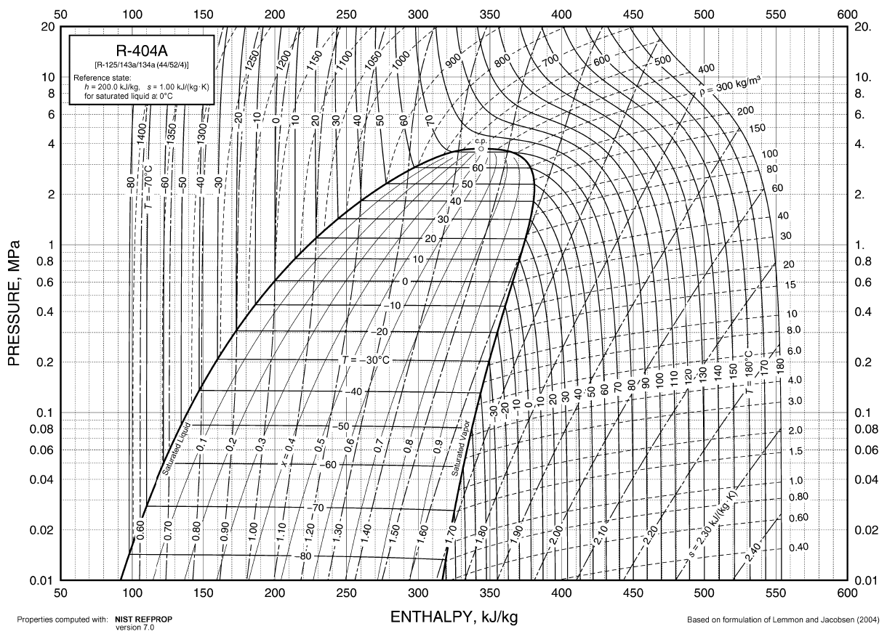

*Fig. 15 Pressure-Enthalpy Diagram for Refrigerant 404A*

<!-- str. 834 -->

**Refrigerant 404A [R-125/143a/134a (44/52/4)] Properti es of Liquid on Bubble Line and Vapor on Dew Line**

| Pressure, MPa | Temperature,* °C<br>Bubble | Temperature,* °C<br>Dew | Density,Volume,<br><sub>3</sub> kg/m Liquid | Density,Volume,<br><sub>3</sub> m /kg Vapor | Enthalpy, kJ/kg<br>Liquid | Enthalpy, kJ/kg<br>Vapor | Entropy, kJ/(kg·K)<br>Liquid | Entropy, kJ/(kg·K)<br>Vapor | Specific Heat c , kJ/(kg·K)<br><sup>p</sup> Liquid | Specific Heat c , kJ/(kg·K)<br>Vapor | c /c p v Vapor | Velocity of Sound, m/s<br>Liquid | Velocity of Sound, m/s<br>Vapor | Viscosity, μPa·s<br>Liquid | Viscosity, μPa·s<br>Vapor | Thermal Cond., mW/(m·K)<br>Liquid | Thermal Cond., mW/(m·K)<br>Vapor | Surface Tension, mN/m | Pressure, MPa |
|---|---|---|---|---|---|---|---|---|---|---|---|---|---|---|---|---|---|---|---|
| 0.005 | –93.70 | –92.50 | 1447.1 | 3.05794 | 81.16 | 311.61 | 0.4716 | 1.7532 | 1.220 | 0.640 | 1.163 | 998 | 132.9 | 764.9 | 7.32 | 122.5 | 6.15 | 17.78 | 0.005 |
| 0.006 | –91.48 | –90.32 | 1440.6 | 2.57690 | 83.85 | 312.92 | 0.4865 | 1.7450 | 1.218 | 0.646 | 1.162 | 980 | 133.6 | 727.8 | 7.41 | 121.2 | 6.28 | 17.58 | 0.006 |
| 0.007 | –89.56 | –88.42 | 1434.9 | 2.22992 | 86.19 | 314.06 | 0.4993 | 1.7382 | 1.216 | 0.651 | 1.161 | 966 | 134.1 | 697.9 | 7.48 | 120.1 | 6.40 | 17.40 | 0.007 |
| 0.008 | –87.86 | –86.74 | 1429.9 | 1.96748 | 88.26 | 315.07 | 0.5106 | 1.7324 | 1.215 | 0.655 | 1.161 | 953 | 134.6 | 673.0 | 7.55 | 119.2 | 6.50 | 17.24 | 0.008 |
| 0.009 | –86.32 | –85.22 | 1425.4 | 1.76182 | 90.13 | 315.99 | 0.5206 | 1.7273 | 1.214 | 0.660 | 1.160 | 942 | 135.0 | 651.7 | 7.61 | 118.3 | 6.60 | 17.09 | 0.009 |
| 0.01 | –84.93 | –83.84 | 1421.3 | 1.59620 | 91.83 | 316.83 | 0.5296 | 1.7229 | 1.214 | 0.663 | 1.160 | 933 | 135.4 | 633.3 | 7.66 | 117.5 | 6.68 | 16.96 | 0.01 |
| 0.02 | –75.05 | –74.08 | 1392.4 | 0.83425 | 103.81 | 322.78 | 0.5917 | 1.6953 | 1.215 | 0.691 | 1.159 | 870 | 137.9 | 523.7 | 8.04 | 112.2 | 7.31 | 16.00 | 0.02 |
| 0.04 | –63.85 | –62.97 | 1359.4 | 0.43619 | 117.48 | 329.58 | 0.6587 | 1.6707 | 1.225 | 0.725 | 1.159 | 807 | 140.4 | 431.3 | 8.47 | 106.4 | 8.05 | 14.85 | 0.04 |
| 0.06 | –56.57 | –55.75 | 1337.7 | 0.29837 | 126.44 | 334.00 | 0.7007 | 1.6578 | 1.234 | 0.749 | 1.161 | 770 | 141.7 | 383.8 | 8.74 | 102.8 | 8.55 | 14.08 | 0.06 |
| 0.08 | –51.03 | –50.25 | 1321.0 | 0.22779 | 133.31 | 337.36 | 0.7320 | 1.6494 | 1.243 | 0.767 | 1.163 | 742 | 142.6 | 352.7 | 8.95 | 100.1 | 8.93 | 13.48 | 0.08 |
| 0.1 | –46.50 | –45.74 | 1307.1 | 0.18467 | 138.97 | 340.08 | 0.7571 | 1.6434 | 1.251 | 0.784 | 1.166 | 719 | 143.2 | 329.8 | 9.12 | 98.0 | 9.25 | 12.98 | 0.1 |
| 0.10132<sup>b</sup> | –46.22 | –45.47 | 1306.3 | 0.18240 | 139.31 | 340.25 | 0.7586 | 1.6430 | 1.252 | 0.785 | 1.166 | 718 | 143.2 | 328.5 | 9.13 | 97.8 | 9.27 | 12.95 | 0.10132 |
| 0.12 | –42.63 | –41.90 | 1295.1 | 0.15551 | 143.83 | 342.40 | 0.7783 | 1.6387 | 1.259 | 0.798 | 1.169 | 700 | 143.6 | 311.9 | 9.26 | 96.2 | 9.53 | 12.55 | 0.12 |
| 0.14 | –39.24 | –38.53 | 1284.5 | 0.13443 | 148.12 | 344.41 | 0.7967 | 1.6349 | 1.266 | 0.811 | 1.171 | 684 | 143.9 | 297.3 | 9.39 | 94.6 | 9.78 | 12.17 | 0.14 |
| 0.16 | –36.20 | –35.51 | 1275.0 | 0.11846 | 151.97 | 346.20 | 0.8130 | 1.6318 | 1.273 | 0.823 | 1.174 | 669 | 144.1 | 285.0 | 9.50 | 93.2 | 10.01 | 11.82 | 0.16 |
| 0.18 | –33.45 | –32.78 | 1266.2 | 0.10592 | 155.49 | 347.81 | 0.8277 | 1.6292 | 1.279 | 0.834 | 1.177 | 656 | 144.2 | 274.4 | 9.60 | 91.9 | 10.21 | 11.51 | 0.18 |
| 0.2 | –30.93 | –30.27 | 1258.0 | 0.09581 | 158.73 | 349.28 | 0.8411 | 1.6270 | 1.285 | 0.844 | 1.179 | 644 | 144.3 | 265.1 | 9.69 | 90.8 | 10.40 | 11.21 | 0.2 |
| 0.22 | –28.59 | –27.94 | 1250.4 | 0.08748 | 161.75 | 350.63 | 0.8534 | 1.6250 | 1.291 | 0.855 | 1.182 | 633 | 144.3 | 256.9 | 9.78 | 89.7 | 10.58 | 10.94 | 0.22 |
| 0.24 | –26.42 | –25.78 | 1243.3 | 0.08049 | 164.57 | 351.88 | 0.8649 | 1.6233 | 1.297 | 0.864 | 1.185 | 623 | 144.4 | 249.5 | 9.86 | 88.7 | 10.75 | 10.69 | 0.24 |
| 0.26 | –24.37 | –23.75 | 1236.5 | 0.07454 | 167.23 | 353.04 | 0.8755 | 1.6217 | 1.303 | 0.873 | 1.188 | 613 | 144.3 | 242.8 | 9.94 | 87.8 | 10.91 | 10.45 | 0.26 |
| 0.28 | –22.45 | –21.83 | 1230.1 | 0.06941 | 169.75 | 354.13 | 0.8855 | 1.6203 | 1.308 | 0.882 | 1.190 | 604 | 144.3 | 236.7 | 10.01 | 87.0 | 11.06 | 10.22 | 0.28 |
| 0.3 | –20.62 | –20.02 | 1223.9 | 0.06494 | 172.14 | 355.15 | 0.8950 | 1.6190 | 1.313 | 0.891 | 1.193 | 595 | 144.2 | 231.1 | 10.08 | 86.2 | 11.21 | 10.01 | 0.3 |
| 0.32 | –18.89 | –18.29 | 1218.0 | 0.06101 | 174.43 | 356.12 | 0.9039 | 1.6179 | 1.319 | 0.899 | 1.196 | 587 | 144.1 | 225.9 | 10.15 | 85.4 | 11.34 | 9.81 | 0.32 |
| 0.34 | –17.24 | –16.65 | 1212.4 | 0.05752 | 176.61 | 357.03 | 0.9125 | 1.6168 | 1.324 | 0.907 | 1.199 | 579 | 144.0 | 221.1 | 10.21 | 84.7 | 11.48 | 9.61 | 0.34 |
| 0.36 | –15.66 | –15.08 | 1206.9 | 0.05441 | 178.71 | 357.90 | 0.9206 | 1.6158 | 1.329 | 0.915 | 1.202 | 572 | 143.9 | 216.6 | 10.27 | 84.0 | 11.61 | 9.42 | 0.36 |
| 0.38 | –14.15 | –13.57 | 1201.6 | 0.05162 | 180.73 | 358.72 | 0.9283 | 1.6149 | 1.334 | 0.923 | 1.205 | 565 | 143.8 | 212.4 | 10.33 | 83.3 | 11.73 | 9.24 | 0.38 |
| 0.4 | –12.69 | –12.12 | 1196.5 | 0.04909 | 182.68 | 359.51 | 0.9358 | 1.6141 | 1.339 | 0.931 | 1.208 | 558 | 143.7 | 208.4 | 10.39 | 82.7 | 11.85 | 9.07 | 0.4 |
| 0.42 | –11.29 | –10.73 | 1191.6 | 0.04680 | 184.56 | 360.26 | 0.9429 | 1.6133 | 1.344 | 0.938 | 1.211 | 551 | 143.5 | 204.7 | 10.44 | 82.1 | 11.97 | 8.90 | 0.42 |
| 0.44 | –9.94 | –9.39 | 1186.7 | 0.04471 | 186.38 | 360.98 | 0.9498 | 1.6125 | 1.349 | 0.946 | 1.214 | 545 | 143.4 | 201.2 | 10.49 | 81.5 | 12.08 | 8.74 | 0.44 |
| 0.46 | –8.64 | –8.09 | 1182.0 | 0.04279 | 188.15 | 361.67 | 0.9564 | 1.6118 | 1.353 | 0.953 | 1.217 | 538 | 143.2 | 197.8 | 10.55 | 81.0 | 12.19 | 8.58 | 0.46 |
| 0.48 | –7.37 | –6.83 | 1177.5 | 0.04103 | 189.86 | 362.33 | 0.9628 | 1.6112 | 1.358 | 0.960 | 1.220 | 532 | 143.0 | 194.6 | 10.60 | 80.4 | 12.30 | 8.43 | 0.48 |
| 0.5 | –6.15 | –5.61 | 1173.0 | 0.03940 | 191.53 | 362.96 | 0.9690 | 1.6105 | 1.363 | 0.967 | 1.223 | 527 | 142.8 | 191.6 | 10.65 | 79.9 | 12.41 | 8.28 | 0.5 |
| 0.55 | –3.24 | –2.72 | 1162.3 | 0.03584 | 195.51 | 364.45 | 0.9837 | 1.6091 | 1.374 | 0.984 | 1.231 | 513 | 142.4 | 184.6 | 10.77 | 78.7 | 12.66 | 7.93 | 0.55 |
| 0.6 | –0.53 | –0.02 | 1152.0 | 0.03284 | 199.26 | 365.81 | 0.9973 | 1.6078 | 1.386 | 1.001 | 1.239 | 500 | 141.9 | 178.2 | 10.88 | 77.5 | 12.91 | 7.61 | 0.6 |
| 0.65 | 2.02 | 2.52 | 1142.3 | 0.03029 | 202.81 | 367.06 | 1.0101 | 1.6066 | 1.397 | 1.018 | 1.247 | 488 | 141.3 | 172.5 | 10.99 | 76.5 | 13.16 | 7.30 | 0.65 |
| 0.7 | 4.42 | 4.91 | 1132.9 | 0.02809 | 206.18 | 368.21 | 1.0222 | 1.6055 | 1.409 | 1.034 | 1.256 | 476 | 140.8 | 167.2 | 11.10 | 75.5 | 13.41 | 7.01 | 0.7 |
| 0.75 | 6.70 | 7.18 | 1123.8 | 0.02618 | 209.41 | 369.28 | 1.0336 | 1.6044 | 1.420 | 1.051 | 1.264 | 465 | 140.2 | 162.4 | 11.20 | 74.5 | 13.65 | 6.74 | 0.75 |
| 0.8 | 8.87 | 9.34 | 1115.1 | 0.02449 | 212.49 | 370.27 | 1.0444 | 1.6035 | 1.432 | 1.067 | 1.274 | 455 | 139.6 | 157.9 | 11.30 | 73.6 | 13.89 | 6.48 | 0.8 |
| 0.85 | 10.94 | 11.40 | 1106.5 | 0.02300 | 215.46 | 371.19 | 1.0547 | 1.6025 | 1.443 | 1.084 | 1.283 | 445 | 139.0 | 153.6 | 11.40 | 72.8 | 14.12 | 6.23 | 0.85 |
| 0.9 | 12.92 | 13.37 | 1098.2 | 0.02166 | 218.32 | 372.05 | 1.0646 | 1.6016 | 1.455 | 1.100 | 1.293 | 435 | 138.3 | 149.7 | 11.50 | 72.0 | 14.35 | 5.99 | 0.9 |
| 0.95 | 14.81 | 15.26 | 1090.2 | 0.02046 | 221.09 | 372.85 | 1.0741 | 1.6007 | 1.466 | 1.117 | 1.303 | 426 | 137.7 | 146.0 | 11.59 | 71.2 | 14.59 | 5.76 | 0.95 |
| 1.0 | 16.64 | 17.08 | 1082.2 | 0.01937 | 223.77 | 373.59 | 1.0832 | 1.5999 | 1.478 | 1.134 | 1.313 | 417 | 137.1 | 142.5 | 11.69 | 70.4 | 14.82 | 5.54 | 1.0 |
| 1.1 | 20.09 | 20.52 | 1066.9 | 0.01749 | 228.89 | 374.94 | 1.1005 | 1.5982 | 1.503 | 1.169 | 1.336 | 400 | 135.7 | 136.1 | 11.88 | 69.0 | 15.29 | 5.13 | 1.1 |
| 1.2 | 23.32 | 23.73 | 1052.0 | 0.01590 | 233.75 | 376.12 | 1.1166 | 1.5965 | 1.528 | 1.206 | 1.360 | 384 | 134.4 | 130.2 | 12.07 | 67.7 | 15.76 | 4.75 | 1.2 |
| 1.3 | 26.35 | 26.75 | 1037.5 | 0.01455 | 238.37 | 377.14 | 1.1318 | 1.5949 | 1.554 | 1.244 | 1.386 | 368 | 133.0 | 124.9 | 12.26 | 66.5 | 16.23 | 4.39 | 1.3 |
| 1.4 | 29.22 | 29.60 | 1023.4 | 0.01338 | 242.81 | 378.02 | 1.1462 | 1.5932 | 1.582 | 1.285 | 1.414 | 354 | 131.6 | 119.9 | 12.45 | 65.3 | 16.71 | 4.06 | 1.4 |
| 1.5 | 31.93 | 32.30 | 1009.5 | 0.01236 | 247.07 | 378.78 | 1.1599 | 1.5914 | 1.611 | 1.329 | 1.445 | 340 | 130.1 | 115.3 | 12.65 | 64.2 | 17.21 | 3.75 | 1.5 |
| 1.6 | 34.51 | 34.87 | 995.7 | 0.01146 | 251.19 | 379.42 | 1.1730 | 1.5896 | 1.643 | 1.376 | 1.478 | 327 | 128.7 | 111.0 | 12.84 | 63.1 | 17.72 | 3.45 | 1.6 |
| 1.7 | 36.97 | 37.32 | 982.1 | 0.01066 | 255.17 | 379.95 | 1.1856 | 1.5878 | 1.676 | 1.426 | 1.515 | 314 | 127.2 | 107.0 | 13.05 | 62.1 | 18.24 | 3.17 | 1.7 |
| 1.8 | 39.33 | 39.67 | 968.6 | 0.00994 | 259.05 | 380.38 | 1.1977 | 1.5858 | 1.712 | 1.481 | 1.556 | 301 | 125.7 | 103.2 | 13.25 | 61.2 | 18.80 | 2.91 | 1.8 |
| 1.9 | 41.58 | 41.91 | 955.1 | 0.00930 | 262.83 | 380.70 | 1.2095 | 1.5838 | 1.751 | 1.541 | 1.601 | 289 | 124.1 | 99.5 | 13.47 | 60.2 | 19.37 | 2.66 | 1.9 |
| 2.0 | 43.75 | 44.07 | 941.6 | 0.00871 | 266.52 | 380.92 | 1.2208 | 1.5817 | 1.794 | 1.607 | 1.652 | 277 | 122.6 | 96.1 | 13.70 | 59.3 | 19.98 | 2.43 | 2.0 |
| 2.1 | 45.84 | 46.15 | 928.1 | 0.00817 | 270.14 | 381.05 | 1.2319 | 1.5794 | 1.841 | 1.681 | 1.709 | 266 | 121.0 | 92.7 | 13.93 | 58.5 | 20.62 | 2.21 | 2.1 |
| 2.2 | 47.85 | 48.15 | 914.4 | 0.00768 | 273.70 | 381.08 | 1.2427 | 1.5770 | 1.893 | 1.763 | 1.774 | 254 | 119.4 | 89.5 | 14.18 | 57.6 | 21.31 | 2.00 | 2.2 |
| 2.3 | 49.80 | 50.08 | 900.6 | 0.00723 | 277.20 | 381.01 | 1.2532 | 1.5745 | 1.952 | 1.856 | 1.847 | 243 | 117.8 | 86.5 | 14.44 | 56.8 | 22.04 | 1.80 | 2.3 |
| 2.4 | 51.68 | 51.95 | 886.5 | 0.00680 | 280.66 | 380.83 | 1.2635 | 1.5718 | 2.019 | 1.962 | 1.932 | 232 | 116.2 | 83.5 | 14.72 | 56.0 | 22.83 | 1.61 | 2.4 |
| 2.5 | 53.50 | 53.76 | 872.2 | 0.00641 | 284.09 | 380.55 | 1.2737 | 1.5689 | 2.095 | 2.085 | 2.032 | 222 | 114.5 | 80.5 | 15.02 | 55.3 | 23.69 | 1.43 | 2.5 |
| 2.6 | 55.26 | 55.51 | 857.5 | 0.00604 | 287.50 | 380.15 | 1.2837 | 1.5658 | 2.183 | 2.229 | 2.149 | 211 | 112.9 | 77.7 | 15.34 | 54.5 | 24.62 | 1.26 | 2.6 |
| 2.7 | 56.97 | 57.21 | 842.4 | 0.00569 | 290.89 | 379.62 | 1.2937 | 1.5624 | 2.288 | 2.401 | 2.289 | 200 | 111.2 | 74.9 | 15.69 | 53.8 | 25.65 | 1.10 | 2.7 |
| 2.8 | 58.63 | 58.86 | 826.8 | 0.00536 | 294.29 | 378.96 | 1.3036 | 1.5587 | 2.414 | 2.609 | 2.459 | 190 | 109.5 | 72.1 | 16.07 | 53.2 | 26.79 | 0.94 | 2.8 |
| 2.9 | 60.24 | 60.46 | 810.5 | 0.00505 | 297.70 | 378.14 | 1.3135 | 1.5547 | 2.569 | 2.868 | 2.672 | 179 | 107.7 | 69.3 | 16.49 | 52.6 | 28.06 | 0.80 | 2.9 |
| 3.0 | 61.81 | 62.01 | 793.4 | 0.00475 | 301.15 | 377.15 | 1.3234 | 1.5503 | 2.765 | 3.197 | 2.944 | 169 | 106.0 | 66.5 | 16.95 | 52.0 | 29.51 | 0.67 | 3.0 |
| 3.2 | 64.82 | 64.99 | 755.6 | 0.00417 | 308.25 | 374.49 | 1.3438 | 1.5397 | 3.381 | 4.233 | 3.797 | 148 | 102.3 | 60.9 | 18.09 | 51.2 | 33.17 | 0.43 | 3.2 |
| 3.4 | 67.67 | 67.81 | 709.8 | 0.00361 | 315.97 | 370.45 | 1.3657 | 1.5255 | 4.771 | 6.536 | 5.689 | 126 | 98.5 | 54.7 | 19.68 | 51.3 | 38.73 | 0.23 | 3.4 |
| 3.729<sup>c</sup> | 72.05 | 72.05 | 486.5 | 0.00206 | 343.92 | 343.92 | 1.4455 | 1.4455 | — | — | — | — | — | — | — | — | — | 0.00 | 3.729 |

*Temperatures on ITS-90 scale <sup>b</sup>Bubble and dew points at one standard atmosphere <sup>c</sup>Critical point

<!-- str. 835 -->

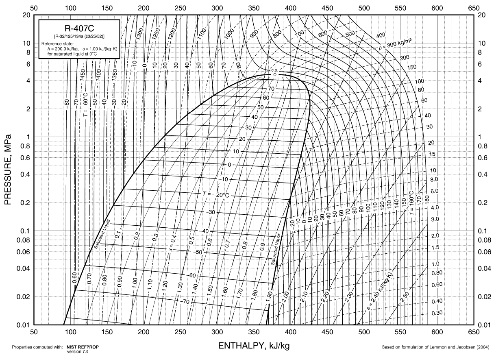

*Fig. 16 Pressure-Enthalpy Diagram for Refrigerant 407C*

<!-- str. 836 -->

**Refrigerant 407C [R-32/125/134a (23/25/52)] Properti es of Liquid on Bubble Line and Vapor on Dew Line**

| Pressure, MPa | Temperature,* °C<br>Bubble | Temperature,* °C<br>Dew | Density,Volume,<br><sub>3</sub> kg/m Liquid | Density,Volume,<br><sub>3</sub> m /kg Vapor | Enthalpy, kJ/kg<br>Liquid | Enthalpy, kJ/kg<br>Vapor | Entropy, kJ/(kg·K)<br>Liquid | Entropy, kJ/(kg·K)<br>Vapor | Specific Heat c , kJ/(kg·K)<br><sup>p</sup> Liquid | Specific Heat c , kJ/(kg·K)<br>Vapor | c /c p v Vapor | Velocity of Sound, m/s Liquid Vapor | Velocity of Sound, m/s Liquid Vapor | Viscosity, μPa·s<br>Liquid | Viscosity, μPa·s<br>Vapor | Thermal Cond., mW/(m·K)<br>Liquid | Thermal Cond., mW/(m·K)<br>Vapor | Tension, sure,<br>Surface mN/m | Tension, sure,<br>Pres-MPa |
|---|---|---|---|---|---|---|---|---|---|---|---|---|---|---|---|---|---|---|---|
| 0.01 | –82.45 | –74.81 | 1495.5 | 1.89703 | 90.48 | 366.78 | 0.5259 | 1.9471 | 1.281 | 0.668 | 1.182 | 1008 | 149.1 | 779.8 | 8.43 | 151.5 | 6.94 | 24.75 | 0.01 |
| 0.02 | –72.50 | –65.02 | 1466.7 | 0.99017 | 103.24 | 372.75 | 0.5910 | 1.9104 | 1.283 | 0.694 | 1.181 | 953 | 151.8 | 632.8 | 8.83 | 145.4 | 7.52 | 22.93 | 0.02 |
| 0.04 | –61.25 | –53.95 | 1433.7 | 0.51705 | 117.72 | 379.47 | 0.6612 | 1.8761 | 1.291 | 0.727 | 1.182 | 893 | 154.6 | 513.1 | 9.28 | 138.5 | 8.19 | 20.91 | 0.04 |
| 0.06 | –53.96 | –46.79 | 1412.0 | 0.35346 | 127.17 | 383.77 | 0.7050 | 1.8573 | 1.299 | 0.750 | 1.184 | 856 | 156.1 | 453.1 | 9.57 | 134.1 | 8.64 | 19.62 | 0.06 |
| 0.08 | –48.42 | –41.34 | 1395.3 | 0.26975 | 134.39 | 386.99 | 0.7374 | 1.8445 | 1.306 | 0.769 | 1.187 | 828 | 157.1 | 414.4 | 9.79 | 130.7 | 8.99 | 18.65 | 0.08 |
| 0.1 | –43.90 | –36.90 | 1381.5 | 0.21865 | 140.31 | 389.59 | 0.7635 | 1.8349 | 1.312 | 0.786 | 1.190 | 806 | 157.8 | 386.2 | 9.97 | 128.1 | 9.28 | 17.87 | 0.1 |
| 0.10132<sup>b</sup> | –43.63 | –36.63 | 1380.7 | 0.21595 | 140.67 | 389.75 | 0.7650 | 1.8343 | 1.312 | 0.787 | 1.190 | 804 | 157.8 | 384.6 | 9.98 | 127.9 | 9.29 | 17.82 | 0.10132 |
| 0.12 | –40.05 | –33.11 | 1369.7 | 0.18411 | 145.39 | 391.78 | 0.7854 | 1.8273 | 1.318 | 0.800 | 1.193 | 787 | 158.3 | 364.3 | 10.12 | 125.8 | 9.52 | 17.21 | 0.12 |
| 0.14 | –36.67 | –29.79 | 1359.1 | 0.15916 | 149.86 | 393.68 | 0.8043 | 1.8210 | 1.324 | 0.813 | 1.196 | 770 | 158.7 | 346.6 | 10.25 | 123.8 | 9.75 | 16.63 | 0.14 |
| 0.16 | –33.65 | –26.83 | 1349.7 | 0.14025 | 153.86 | 395.36 | 0.8211 | 1.8156 | 1.329 | 0.825 | 1.199 | 755 | 159.0 | 331.8 | 10.37 | 122.0 | 9.94 | 16.12 | 0.16 |
| 0.18 | –30.92 | –24.15 | 1341.0 | 0.12542 | 157.51 | 396.86 | 0.8362 | 1.8110 | 1.334 | 0.837 | 1.201 | 742 | 159.3 | 319.1 | 10.48 | 120.4 | 10.13 | 15.66 | 0.18 |
| 0.2 | –28.41 | –21.69 | 1333.0 | 0.11347 | 160.87 | 398.22 | 0.8499 | 1.8069 | 1.339 | 0.848 | 1.204 | 730 | 159.5 | 308.0 | 10.57 | 119.0 | 10.29 | 15.24 | 0.2 |
| 0.22 | –26.09 | –19.41 | 1325.5 | 0.10362 | 163.99 | 399.47 | 0.8625 | 1.8033 | 1.344 | 0.858 | 1.207 | 719 | 159.6 | 298.2 | 10.66 | 117.6 | 10.45 | 14.86 | 0.22 |
| 0.24 | –23.93 | –17.29 | 1318.4 | 0.09536 | 166.91 | 400.62 | 0.8742 | 1.8000 | 1.349 | 0.868 | 1.210 | 708 | 159.7 | 289.5 | 10.75 | 116.4 | 10.60 | 14.50 | 0.24 |
| 0.26 | –21.90 | –15.31 | 1311.8 | 0.08833 | 169.65 | 401.69 | 0.8851 | 1.7970 | 1.354 | 0.877 | 1.213 | 698 | 159.8 | 281.6 | 10.83 | 115.2 | 10.74 | 14.16 | 0.26 |
| 0.28 | –19.99 | –13.43 | 1305.5 | 0.08227 | 172.24 | 402.69 | 0.8954 | 1.7942 | 1.358 | 0.886 | 1.216 | 689 | 159.8 | 274.4 | 10.90 | 114.2 | 10.87 | 13.85 | 0.28 |
| 0.3 | –18.19 | –11.66 | 1299.5 | 0.07699 | 174.71 | 403.62 | 0.9050 | 1.7917 | 1.362 | 0.895 | 1.219 | 680 | 159.8 | 267.8 | 10.97 | 113.1 | 10.99 | 13.56 | 0.3 |
| 0.32 | –16.47 | –9.98 | 1293.7 | 0.07235 | 177.06 | 404.49 | 0.9141 | 1.7894 | 1.367 | 0.903 | 1.222 | 672 | 159.8 | 261.8 | 11.04 | 112.2 | 11.11 | 13.28 | 0.32 |
| 0.34 | –14.83 | –8.38 | 1288.2 | 0.06824 | 179.30 | 405.32 | 0.9228 | 1.7872 | 1.371 | 0.911 | 1.224 | 664 | 159.8 | 256.1 | 11.11 | 111.2 | 11.23 | 13.01 | 0.34 |
| 0.36 | –13.27 | –6.85 | 1282.9 | 0.06457 | 181.45 | 406.10 | 0.9310 | 1.7851 | 1.375 | 0.919 | 1.227 | 656 | 159.8 | 250.9 | 11.17 | 110.4 | 11.35 | 12.76 | 0.36 |
| 0.38 | –11.77 | –5.38 | 1277.8 | 0.06127 | 183.52 | 406.85 | 0.9389 | 1.7832 | 1.379 | 0.927 | 1.230 | 649 | 159.7 | 246.0 | 11.23 | 109.5 | 11.46 | 12.52 | 0.38 |
| 0.4 | –10.33 | –3.97 | 1272.8 | 0.05830 | 185.52 | 407.55 | 0.9465 | 1.7814 | 1.383 | 0.934 | 1.233 | 642 | 159.7 | 241.4 | 11.28 | 108.7 | 11.57 | 12.29 | 0.4 |
| 0.42 | –8.94 | –2.61 | 1268.0 | 0.05559 | 187.44 | 408.23 | 0.9537 | 1.7796 | 1.387 | 0.942 | 1.236 | 635 | 159.6 | 237.1 | 11.34 | 107.9 | 11.68 | 12.07 | 0.42 |
| 0.44 | –7.61 | –1.31 | 1263.4 | 0.05313 | 189.30 | 408.87 | 0.9607 | 1.7780 | 1.391 | 0.949 | 1.239 | 629 | 159.5 | 233.0 | 11.39 | 107.2 | 11.78 | 11.85 | 0.44 |
| 0.46 | –6.31 | –0.04 | 1258.8 | 0.05087 | 191.11 | 409.48 | 0.9674 | 1.7764 | 1.395 | 0.956 | 1.242 | 622 | 159.4 | 229.1 | 11.45 | 106.5 | 11.88 | 11.65 | 0.46 |
| 0.48 | –5.06 | 1.18 | 1254.4 | 0.04879 | 192.86 | 410.07 | 0.9739 | 1.7750 | 1.399 | 0.963 | 1.245 | 616 | 159.3 | 225.4 | 11.50 | 105.8 | 11.98 | 11.45 | 0.48 |
| 0.5 | –3.85 | 2.36 | 1250.1 | 0.04687 | 194.56 | 410.64 | 0.9801 | 1.7735 | 1.403 | 0.970 | 1.248 | 610 | 159.2 | 221.9 | 11.54 | 105.1 | 12.08 | 11.26 | 0.5 |
| 0.55 | –0.98 | 5.17 | 1239.8 | 0.04267 | 198.61 | 411.95 | 0.9950 | 1.7702 | 1.413 | 0.987 | 1.255 | 596 | 158.9 | 213.9 | 11.66 | 103.5 | 12.31 | 10.81 | 0.55 |
| 0.6 | 1.70 | 7.79 | 1230.0 | 0.03915 | 202.42 | 413.15 | 1.0087 | 1.7672 | 1.422 | 1.004 | 1.262 | 583 | 158.6 | 206.7 | 11.77 | 102.1 | 12.54 | 10.40 | 0.6 |
| 0.65 | 4.22 | 10.24 | 1220.7 | 0.03615 | 206.02 | 414.25 | 1.0216 | 1.7644 | 1.432 | 1.020 | 1.270 | 571 | 158.2 | 200.1 | 11.88 | 100.7 | 12.75 | 10.01 | 0.65 |
| 0.7 | 6.60 | 12.56 | 1211.7 | 0.03356 | 209.44 | 415.25 | 1.0338 | 1.7618 | 1.441 | 1.036 | 1.278 | 559 | 157.8 | 194.1 | 11.98 | 99.4 | 12.96 | 9.64 | 0.7 |
| 0.75 | 8.85 | 14.76 | 1203.1 | 0.03131 | 212.71 | 416.18 | 1.0452 | 1.7594 | 1.451 | 1.052 | 1.286 | 548 | 157.4 | 188.6 | 12.08 | 98.2 | 13.17 | 9.30 | 0.75 |
| 0.8 | 11.00 | 16.85 | 1194.9 | 0.02933 | 215.83 | 417.03 | 1.0561 | 1.7571 | 1.460 | 1.067 | 1.294 | 537 | 157.0 | 183.6 | 12.17 | 97.1 | 13.37 | 8.98 | 0.8 |
| 0.85 | 13.04 | 18.84 | 1186.8 | 0.02757 | 218.83 | 417.83 | 1.0665 | 1.7550 | 1.469 | 1.082 | 1.302 | 527 | 156.6 | 178.8 | 12.26 | 96.0 | 13.58 | 8.67 | 0.85 |
| 0.9 | 15.00 | 20.74 | 1179.1 | 0.02600 | 221.71 | 418.57 | 1.0764 | 1.7529 | 1.479 | 1.098 | 1.310 | 518 | 156.1 | 174.4 | 12.35 | 94.9 | 13.78 | 8.38 | 0.9 |
| 0.95 | 16.88 | 22.56 | 1171.5 | 0.02460 | 224.50 | 419.25 | 1.0859 | 1.7509 | 1.488 | 1.113 | 1.319 | 508 | 155.6 | 170.3 | 12.44 | 93.9 | 13.98 | 8.11 | 0.95 |
| 1.0 | 18.69 | 24.32 | 1164.1 | 0.02332 | 227.19 | 419.89 | 1.0950 | 1.7491 | 1.498 | 1.128 | 1.327 | 499 | 155.2 | 166.4 | 12.52 | 93.0 | 14.18 | 7.84 | 1.0 |
| 1.1 | 22.11 | 27.63 | 1149.9 | 0.02111 | 232.34 | 421.03 | 1.1122 | 1.7455 | 1.517 | 1.159 | 1.346 | 482 | 154.2 | 159.2 | 12.68 | 91.1 | 14.59 | 7.35 | 1.1 |
| 1.2 | 25.30 | 30.73 | 1136.2 | 0.01926 | 237.20 | 422.03 | 1.1283 | 1.7421 | 1.537 | 1.190 | 1.365 | 466 | 153.2 | 152.8 | 12.84 | 89.5 | 14.99 | 6.89 | 1.2 |
| 1.3 | 28.30 | 33.63 | 1123.0 | 0.01768 | 241.82 | 422.89 | 1.1434 | 1.7389 | 1.557 | 1.222 | 1.385 | 451 | 152.1 | 146.9 | 13.01 | 87.9 | 15.39 | 6.47 | 1.3 |
| 1.4 | 31.14 | 36.37 | 1110.2 | 0.01631 | 246.24 | 423.63 | 1.1577 | 1.7358 | 1.578 | 1.255 | 1.406 | 436 | 151.0 | 141.5 | 13.15 | 86.4 | 15.80 | 6.07 | 1.4 |
| 1.5 | 33.83 | 38.97 | 1097.7 | 0.01512 | 250.48 | 424.27 | 1.1713 | 1.7328 | 1.600 | 1.289 | 1.428 | 423 | 150.0 | 136.5 | 13.31 | 85.0 | 16.22 | 5.70 | 1.5 |
| 1.6 | 36.39 | 41.43 | 1085.5 | 0.01408 | 254.57 | 424.80 | 1.1843 | 1.7298 | 1.622 | 1.324 | 1.452 | 409 | 148.8 | 131.8 | 13.47 | 83.7 | 16.64 | 5.35 | 1.6 |
| 1.7 | 38.84 | 43.78 | 1073.5 | 0.01315 | 258.51 | 425.25 | 1.1967 | 1.7269 | 1.645 | 1.361 | 1.477 | 397 | 147.7 | 127.5 | 13.62 | 82.4 | 17.07 | 5.02 | 1.7 |
| 1.8 | 41.18 | 46.03 | 1061.7 | 0.01231 | 262.33 | 425.61 | 1.2086 | 1.7241 | 1.669 | 1.400 | 1.504 | 385 | 146.6 | 123.4 | 13.78 | 81.2 | 17.52 | 4.71 | 1.8 |
| 1.9 | 43.43 | 48.18 | 1050.0 | 0.01157 | 266.05 | 425.89 | 1.2200 | 1.7212 | 1.695 | 1.440 | 1.533 | 373 | 145.4 | 119.6 | 13.94 | 80.1 | 17.98 | 4.42 | 1.9 |
| 2.0 | 45.59 | 50.25 | 1038.5 | 0.01089 | 269.66 | 426.10 | 1.2311 | 1.7184 | 1.722 | 1.483 | 1.564 | 361 | 144.2 | 115.9 | 14.10 | 78.9 | 18.45 | 4.14 | 2.0 |
| 2.1 | 47.67 | 52.24 | 1027.1 | 0.01027 | 273.19 | 426.23 | 1.2418 | 1.7155 | 1.750 | 1.529 | 1.597 | 350 | 143.0 | 112.5 | 14.27 | 77.9 | 18.94 | 3.87 | 2.1 |
| 2.2 | 49.68 | 54.15 | 1015.7 | 0.00971 | 276.64 | 426.29 | 1.2522 | 1.7126 | 1.780 | 1.577 | 1.633 | 339 | 141.8 | 109.2 | 14.44 | 76.8 | 19.45 | 3.62 | 2.2 |
| 2.3 | 51.63 | 56.00 | 1004.4 | 0.00919 | 280.02 | 426.28 | 1.2624 | 1.7097 | 1.813 | 1.629 | 1.671 | 329 | 140.6 | 106.0 | 14.62 | 75.8 | 19.98 | 3.38 | 2.3 |
| 2.4 | 53.51 | 57.79 | 993.1 | 0.00871 | 283.34 | 426.20 | 1.2723 | 1.7068 | 1.847 | 1.684 | 1.713 | 318 | 139.4 | 103.0 | 14.79 | 74.9 | 20.54 | 3.15 | 2.4 |
| 2.5 | 55.34 | 59.51 | 981.8 | 0.00827 | 286.60 | 426.06 | 1.2819 | 1.7038 | 1.884 | 1.744 | 1.758 | 308 | 138.2 | 100.0 | 14.98 | 73.9 | 21.12 | 2.93 | 2.5 |
| 2.6 | 57.11 | 61.19 | 970.5 | 0.00786 | 289.82 | 425.85 | 1.2914 | 1.7007 | 1.924 | 1.810 | 1.808 | 298 | 136.9 | 97.2 | 15.17 | 73.0 | 21.73 | 2.72 | 2.6 |
| 2.7 | 58.83 | 62.81 | 959.0 | 0.00747 | 292.99 | 425.57 | 1.3006 | 1.6976 | 1.968 | 1.881 | 1.863 | 288 | 135.6 | 94.5 | 15.37 | 72.1 | 22.38 | 2.52 | 2.7 |
| 2.8 | 60.51 | 64.38 | 947.5 | 0.00711 | 296.12 | 425.21 | 1.3097 | 1.6944 | 2.016 | 1.958 | 1.923 | 279 | 134.4 | 91.9 | 15.58 | 71.3 | 23.06 | 2.33 | 2.8 |
| 2.9 | 62.14 | 65.91 | 935.9 | 0.00677 | 299.23 | 424.79 | 1.3187 | 1.6911 | 2.069 | 2.044 | 1.990 | 269 | 133.1 | 89.3 | 15.80 | 70.4 | 23.79 | 2.14 | 2.9 |
| 3.0 | 63.73 | 67.40 | 924.1 | 0.00645 | 302.31 | 424.29 | 1.3276 | 1.6877 | 2.128 | 2.139 | 2.065 | 259 | 131.7 | 86.8 | 16.03 | 69.6 | 24.56 | 1.96 | 3.0 |
| 3.2 | 66.80 | 70.25 | 899.9 | 0.00587 | 308.43 | 423.06 | 1.3450 | 1.6805 | 2.268 | 2.365 | 2.243 | 240 | 129.1 | 81.9 | 16.53 | 68.1 | 26.26 | 1.63 | 3.2 |
| 3.4 | 69.73 | 72.94 | 874.6 | 0.00533 | 314.54 | 421.46 | 1.3622 | 1.6726 | 2.451 | 2.657 | 2.475 | 222 | 126.4 | 77.1 | 17.09 | 66.6 | 28.22 | 1.33 | 3.4 |
| 3.6 | 72.53 | 75.50 | 847.6 | 0.00484 | 320.71 | 419.45 | 1.3795 | 1.6639 | 2.701 | 3.050 | 2.789 | 203 | 123.6 | 72.5 | 17.75 | 65.2 | 30.54 | 1.05 | 3.6 |
| 3.8 | 75.22 | 77.92 | 818.1 | 0.00439 | 327.02 | 416.91 | 1.3970 | 1.6540 | 3.065 | 3.613 | 3.239 | 184 | 120.7 | 67.7 | 18.52 | 64.0 | 33.33 | 0.79 | 3.8 |
| 4.0 | 77.82 | 80.21 | 785.1 | 0.00395 | 333.64 | 413.66 | 1.4152 | 1.6424 | 3.647 | 4.486 | 3.935 | 165 | 117.7 | 62.9 | 19.48 | 63.1 | 36.86 | 0.56 | 4.0 |
| 4.2 | 80.32 | 82.37 | 746.0 | 0.00352 | 340.83 | 409.34 | 1.4348 | 1.6281 | 4.726 | 6.029 | 5.159 | 146 | 114.6 | 57.6 | 20.75 | 62.7 | 41.59 | 0.36 | 4.2 |
| 4.63<sup>c</sup> | 86.03 | 86.03 | 484.2 | 0.00207 | 378.48 | 378.48 | 1.5384 | 1.5384 | — | — | — | — | — | — | — | — | — | 0.00 | 4.63 |

*Temperatures on ITS-90 scale <sup>b</sup>Bubble and dew points at one standard atmosphere <sup>c</sup>Critical point

<!-- str. 837 -->

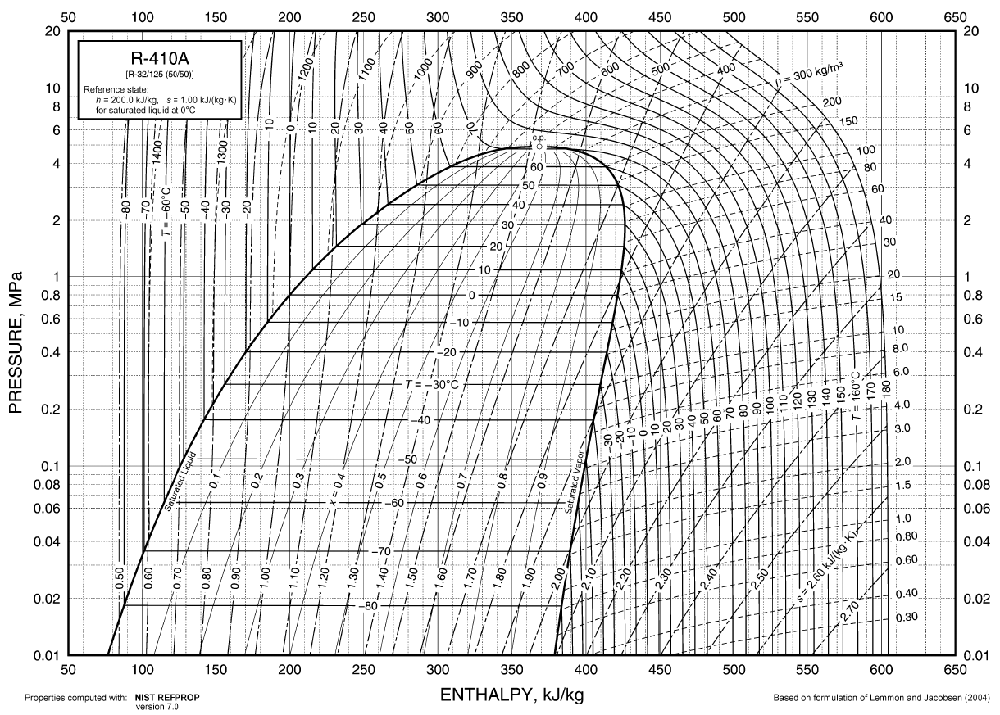

*Fig. 17 Pressure-Enthalpy Diagram for Refrigerant 410A*

<!-- str. 838 -->

**Refrigerant 410A [R-32/125 (50/50)] Properties of**

### Liquid on Bubble Line and Vapor on Dew Line

| Pressure, MPa | Temperature,*<br>Bubble | Temperature,*<br>°C Dew | Density,Volume,<br><sub>3</sub> kg/m Liquid | Enthalpy, Density,Volume, kJ/kg<br><sub>3</sub> m /kg Vapor Liquid | Enthalpy, kJ/kg<br>Vapor | Entropy, kJ/(kg·K)<br>Liquid | Entropy, kJ/(kg·K)<br>Vapor | Specific Heat c , kJ/(kg·K)<br><sup>p</sup> Liquid | Specific Heat c , kJ/(kg·K)<br>Vapor | c /c p v Vapor | Velocity of Sound, m/s<br>Liquid | Velocity of Sound, m/s<br>Vapor | Viscosity, μPa·s<br>Liquid | Viscosity, μPa·s<br>Vapor | Thermal Cond., mW/(m·K)<br>Liquid | Thermal Cond., mW/(m·K)<br>Vapor | Tension, sure,<br>Surface mN/m | Tension, sure,<br>Pres-MPa |
|---|---|---|---|---|---|---|---|---|---|---|---|---|---|---|---|---|---|---|
| 0.01 | –88.23 | –88.14 | 1460.6 | 2.09888 76.56 | 378.76 | 0.4588 | 2.0927 | 1.344 | 0.668 | 1.227 | 1004 | 159.7 | 669.9 | 8.29 | 177.3 | 7.44 | 24.72 | 0.01 |
| 0.02 | –78.79 | –78.70 | 1432.9 | 1.09659 89.26 | 384.25 | 0.5258 | 2.0432 | 1.345 | 0.696 | 1.228 | 958 | 162.8 | 552.9 | 8.71 | 170.8 | 7.79 | 22.91 | 0.02 |
| 0.04 | –68.12 | –68.04 | 1401.1 | 0.57309 103.64 | 390.29 | 0.5978 | 1.9956 | 1.351 | 0.734 | 1.231 | 906 | 165.8 | 454.8 | 9.17 | 163.3 | 8.21 | 20.90 | 0.04 |
| 0.06 | –61.22 | –61.14 | 1380.0 | 0.39193 113.00 | 394.10 | 0.6426 | 1.9687 | 1.358 | 0.762 | 1.235 | 872 | 167.5 | 404.6 | 9.47 | 158.3 | 8.50 | 19.62 | 0.06 |
| 0.08 | –55.98 | –55.90 | 1363.9 | 0.29918 120.14 | 396.92 | 0.6758 | 1.9500 | 1.364 | 0.785 | 1.239 | 847 | 168.7 | 371.8 | 9.70 | 154.6 | 8.73 | 18.66 | 0.08 |
| 0.1 | –51.70 | –51.62 | 1350.5 | 0.24256 125.99 | 399.17 | 0.7024 | 1.9358 | 1.369 | 0.805 | 1.243 | 826 | 169.5 | 347.8 | 9.88 | 151.5 | 8.93 | 17.88 | 0.1 |
| 0.10132<sup>b</sup>–51.44 |  | –51.36 | 1349.7 | 0.23957 126.34 | 399.31 | 0.7040 | 1.9350 | 1.370 | 0.807 | 1.244 | 824 | 169.5 | 346.4 | 9.90 | 151.3 | 8.94 | 17.84 | 0.10132 |
| 0.12 | –48.06 | –47.98 | 1339.0 | 0.20427 130.99 | 401.05 | 0.7247 | 1.9243 | 1.375 | 0.823 | 1.247 | 808 | 170.1 | 329.0 | 10.04 | 148.9 | 9.11 | 17.23 | 0.12 |
| 0.14 | –44.87 | –44.79 | 1328.8 | 0.17661 135.39 | 402.67 | 0.7441 | 1.9147 | 1.380 | 0.839 | 1.251 | 792 | 170.6 | 313.8 | 10.18 | 146.6 | 9.26 | 16.65 | 0.14 |
| 0.16 | –42.02 | –41.94 | 1319.6 | 0.15565 139.34 | 404.09 | 0.7612 | 1.9065 | 1.385 | 0.854 | 1.255 | 778 | 170.9 | 300.9 | 10.30 | 144.6 | 9.40 | 16.15 | 0.16 |
| 0.18 | –39.44 | –39.36 | 1311.2 | 0.13921 142.93 | 405.36 | 0.7766 | 1.8993 | 1.390 | 0.868 | 1.259 | 765 | 171.2 | 289.9 | 10.41 | 142.8 | 9.53 | 15.69 | 0.18 |
| 0.2 | –37.07 | –36.99 | 1303.4 | 0.12595 146.23 | 406.50 | 0.7905 | 1.8928 | 1.395 | 0.881 | 1.263 | 753 | 171.5 | 280.3 | 10.51 | 141.1 | 9.66 | 15.27 | 0.2 |
| 0.22 | –34.89 | –34.80 | 1296.2 | 0.11503 149.29 | 407.53 | 0.8034 | 1.8871 | 1.399 | 0.893 | 1.266 | 743 | 171.6 | 271.8 | 10.61 | 139.5 | 9.77 | 14.89 | 0.22 |
| 0.24 | –32.85 | –32.76 | 1289.4 | 0.10587 152.15 | 408.49 | 0.8153 | 1.8818 | 1.404 | 0.904 | 1.270 | 732 | 171.8 | 264.2 | 10.70 | 138.1 | 9.88 | 14.54 | 0.24 |
| 0.26 | –30.94 | –30.85 | 1283.0 | 0.09807 154.84 | 409.36 | 0.8264 | 1.8770 | 1.408 | 0.916 | 1.274 | 723 | 171.9 | 257.2 | 10.78 | 136.7 | 9.98 | 14.21 | 0.26 |
| 0.28 | –29.14 | –29.05 | 1276.9 | 0.09135 157.38 | 410.18 | 0.8368 | 1.8726 | 1.413 | 0.926 | 1.277 | 714 | 172.0 | 251.0 | 10.86 | 135.5 | 10.08 | 13.90 | 0.28 |
| 0.3 | –27.44 | –27.35 | 1271.1 | 0.08550 159.80 | 410.94 | 0.8466 | 1.8685 | 1.417 | 0.936 | 1.281 | 705 | 172.0 | 245.2 | 10.93 | 134.3 | 10.18 | 13.60 | 0.30 |
| 0.32 | –25.82 | –25.73 | 1265.5 | 0.08035 162.10 | 411.65 | 0.8558 | 1.8647 | 1.421 | 0.946 | 1.285 | 697 | 172.0 | 239.8 | 11.00 | 133.10 | 10.27 | 13.33 | 0.32 |
| 0.34 | –24.28 | –24.19 | 1260.2 | 0.07579 164.29 | 412.32 | 0.8646 | 1.8611 | 1.426 | 0.956 | 1.288 | 689 | 172.1 | 234.9 | 11.07 | 132.10 | 10.36 | 13.06 | 0.34 |
| 0.36 | –22.81 | –22.72 | 1255.0 | 0.07172 166.40 | 412.95 | 0.8703 | 1.8577 | 1.430 | 0.965 | 1.292 | 682 | 172.1 | 230.3 | 11.13 | 131.00 | 10.46 | 12.81 | 0.36 |
| 0.38 | –21.40 | –21.31 | 1250.1 | 0.06806 168.43 | 413.54 | 0.8810 | 1.8545 | 1.434 | 0.975 | 1.295 | 675 | 172.0 | 226.0 | 11.19 | 130.10 | 10.55 | 12.57 | 0.38 |
| 0.4 | –20.04 | –19.95 | 1245.3 | 0.06476 170.38 | 414.10 | 0.8887 | 1.8514 | 1.438 | 0.983 | 1.299 | 668 | 172.0 | 221.9 | 11.25 | 129.10 | 10.64 | 12.35 | 0.40 |
| 0.42 | –18.74 | –18.65 | 1240.6 | 0.06176 172.26 | 414.64 | 0.8960 | 1.8486 | 1.443 | 0.992 | 1.303 | 661 | 172.0 | 218.1 | 11.31 | 128.20 | 10.73 | 12.13 | 0.42 |
| 0.44 | –17.48 | –17.39 | 1236.1 | 0.05902 174.08 | 415.14 | 0.9031 | 1.8458 | 1.447 | 1.001 | 1.306 | 655 | 171.9 | 214.5 | 11.36 | 127.30 | 10.82 | 11.92 | 0.44 |
| 0.46 | –16.27 | –16.18 | 1231.8 | 0.05652 175.84 | 415.63 | 0.9099 | 1.8432 | 1.451 | 1.009 | 1.310 | 649 | 171.8 | 211.1 | 11.42 | 126.50 | 10.91 | 11.71 | 0.46 |
| 0.48 | –15.10 | –15.00 | 1227.5 | 0.05421 177.55 | 416.09 | 0.9165 | 1.8407 | 1.455 | 1.017 | 1.313 | 643 | 171.8 | 207.8 | 11.47 | 125.70 | 10.99 | 11.52 | 0.48 |
| 0.5 | –13.96 | –13.86 | 1223.3 | 0.05209 179.21 | 416.53 | 0.9228 | 1.8383 | 1.459 | 1.025 | 1.317 | 637 | 171.7 | 204.7 | 11.52 | 124.90 | 11.08 | 11.33 | 0.50 |
| 0.55 | –11.26 | –11.16 | 1213.4 | 0.04743 183.17 | 417.54 | 0.9379 | 1.8326 | 1.469 | 1.045 | 1.326 | 623 | 171.4 | 197.6 | 11.64 | 123.10 | 11.28 | 10.89 | 0.55 |
| 0.6 | –8.74 | –8.64 | 1203.9 | 0.04352 186.89 | 418.46 | 0.9518 | 1.8275 | 1.479 | 1.064 | 1.335 | 610 | 171.2 | 191.2 | 11.75 | 121.40 | 11.48 | 10.47 | 0.60 |
| 0.65 | –6.38 | –6.28 | 1194.9 | 0.04019 190.40 | 419.28 | 0.9649 | 1.8227 | 1.489 | 1.083 | 1.344 | 597 | 170.9 | 185.3 | 11.86 | 119.70 | 11.68 | 10.09 | 0.65 |
| 0.7 | –4.15 | –4.05 | 1186.3 | 0.03732 193.74 | 420.03 | 0.9772 | 1.8183 | 1.499 | 1.101 | 1.354 | 586 | 170.5 | 180.0 | 11.96 | 118.20 | 11.88 | 9.73 | 0.70 |
| 0.75 | –2.04 | –1.93 | 1178.1 | 0.03482 196.92 | 420.71 | 0.9888 | 1.8141 | 1.509 | 1.119 | 1.363 | 574 | 170.2 | 175.1 | 12.06 | 116.80 | 12.07 | 9.39 | 0.75 |
| 0.8 | –0.03 | 0.08 | 1170.1 | 0.03262 199.96 | 421.33 | 0.9998 | 1.8102 | 1.519 | 1.136 | 1.373 | 564 | 169.8 | 170.6 | 12.15 | 115.50 | 12.26 | 9.07 | 0.80 |
| 0.85 | 1.89 | 1.99 | 1162.4 | 0.03068 202.88 | 421.89 | 1.0103 | 1.8065 | 1.529 | 1.154 | 1.382 | 554 | 169.4 | 166.4 | 12.24 | 114.20 | 12.45 | 8.77 | 0.85 |
| 0.9 | 3.72 | 3.83 | 1154.9 | 0.02894 205.69 | 422.41 | 1.0204 | 1.8030 | 1.540 | 1.171 | 1.392 | 544 | 169.0 | 162.4 | 12.33 | 113.00 | 12.64 | 8.48 | 0.90 |
| 0.95 | 5.48 | 5.58 | 1147.6 | 0.02738 208.40 | 422.88 | 1.0300 | 1.7996 | 1.550 | 1.188 | 1.402 | 535 | 168.6 | 158.7 | 12.41 | 111.80 | 12.82 | 8.21 | 0.95 |
| 1.0 | 7.17 | 7.27 | 1140.5 | 0.02596 211.02 | 423.31 | 1.0392 | 1.7964 | 1.560 | 1.205 | 1.413 | 525 | 168.1 | 155.3 | 12.49 | 110.70 | 13.01 | 7.95 | 1.00 |
| 1.1 | 10.36 | 10.47 | 1126.8 | 0.02351 216.03 | 424.07 | 1.0567 | 1.7903 | 1.581 | 1.239 | 1.434 | 508 | 167.2 | 148.8 | 12.65 | 108.60 | 13.39 | 7.46 | 1.10 |
| 1.2 | 13.34 | 13.46 | 1113.7 | 0.02145 220.76 | 424.68 | 1.0730 | 1.7846 | 1.603 | 1.274 | 1.457 | 492 | 166.3 | 143.1 | 12.81 | 106.70 | 13.79 | 7.01 | 1.20 |
| 1.3 | 16.15 | 16.26 | 1101.0 | 0.01970 225.26 | 425.19 | 1.0883 | 1.7792 | 1.624 | 1.31 | 1.481 | 477 | 165.4 | 137.8 | 12.95 | 104.80 | 14.19 | 6.59 | 1.30 |
| 1.4 | 18.79 | 18.91 | 1088.8 | 0.01819 229.56 | 425.59 | 1.1027 | 1.7741 | 1.647 | 1.347 | 1.506 | 462 | 164.4 | 133.0 | 13.12 | 103.10 | 14.60 | 6.20 | 1.40 |
| 1.5 | 21.30 | 21.41 | 1076.9 | 0.01687 233.68 | 425.89 | 1.1165 | 1.7691 | 1.670 | 1.385 | 1.532 | 448 | 163.4 | 128.5 | 13.23 | 101.50 | 15.03 | 5.83 | 1.50 |
| 1.6 | 23.68 | 23.80 | 1065.2 | 0.01571 237.65 | 426.11 | 1.1296 | 1.7644 | 1.694 | 1.424 | 1.560 | 435 | 162.4 | 124.3 | 13.38 | 99.98 | 15.46 | 5.49 | 1.60 |
| 1.7 | 25.96 | 26.07 | 1053.8 | 0.01468 241.48 | 426.25 | 1.1421 | 1.7597 | 1.719 | 1.465 | 1.590 | 422 | 161.4 | 120.4 | 13.52 | 98.53 | 15.91 | 5.16 | 1.70 |
| 1.8 | 28.13 | 28.25 | 1042.6 | 0.01376 245.19 | 426.31 | 1.1542 | 1.7552 | 1.745 | 1.509 | 1.621 | 410 | 160.3 | 116.8 | 13.66 | 97.15 | 16.38 | 4.86 | 1.80 |
| 1.9 | 30.22 | 30.34 | 1031.6 | 0.01293 248.79 | 426.31 | 1.1657 | 1.7508 | 1.772 | 1.555 | 1.655 | 398 | 159.3 | 113.3 | 13.81 | 95.82 | 16.86 | 4.57 | 1.90 |
| 2.0 | 32.22 | 32.34 | 1020.7 | 0.01218 252.29 | 426.24 | 1.1769 | 1.7464 | 1.800 | 1.603 | 1.690 | 386 | 158.2 | 110.1 | 13.95 | 94.56 | 17.36 | 4.29 | 2.00 |
| 2.1 | 34.16 | 34.28 | 1009.9 | 0.0115 255.71 | 426.10 | 1.1878 | 1.7421 | 1.830 | 1.655 | 1.728 | 375 | 157.1 | 107.0 | 14.10 | 93.34 | 17.88 | 4.03 | 2.10 |
| 2.2 | 36.02 | 36.14 | 999.2 | 0.01088 259.05 | 425.90 | 1.1983 | 1.7379 | 1.861 | 1.709 | 1.769 | 364 | 156.0 | 104.0 | 14.25 | 92.17 | 18.42 | 3.78 | 2.20 |
| 2.3 | 37.82 | 37.94 | 988.6 | 0.01031 262.32 | 425.64 | 1.2085 | 1.7336 | 1.894 | 1.768 | 1.813 | 353 | 154.9 | 101.2 | 14.40 | 91.05 | 18.99 | 3.54 | 2.30 |
| 2.4 | 39.56 | 39.68 | 978.0 | 0.00978 265.52 | 425.33 | 1.2185 | 1.7294 | 1.929 | 1.831 | 1.860 | 343 | 153.8 | 98.5 | 14.55 | 89.96 | 19.58 | 3.31 | 2.40 |
| 2.5 | 41.25 | 41.37 | 967.5 | 0.00929 268.67 | 424.95 | 1.2282 | 1.7251 | 1.967 | 1.898 | 1.911 | 332 | 152.6 | 95.9 | 14.71 | 88.91 | 20.21 | 3.10 | 2.50 |
| 2.6 | 42.89 | 43.00 | 957.0 | 0.00883 271.77 | 424.51 | 1.2377 | 1.7209 | 2.008 | 1.971 | 1.966 | 322 | 151.5 | 93.4 | 14.87 | 87.89 | 20.87 | 2.89 | 2.60 |
| 2.7 | 44.48 | 44.59 | 946.4 | 0.00841 274.82 | 424.02 | 1.2470 | 1.7166 | 2.052 | 2.050 | 2.026 | 313 | 150.3 | 91.0 | 15.03 | 86.91 | 21.56 | 2.69 | 2.70 |
| 2.8 | 46.02 | 46.14 | 935.8 | 0.00802 277.84 | 423.47 | 1.2561 | 1.7123 | 2.100 | 2.136 | 2.091 | 303 | 149.1 | 88.6 | 15.21 | 85.96 | 22.29 | 2.50 | 2.80 |
| 2.9 | 47.53 | 47.64 | 925.2 | 0.00764 280.82 | 422.85 | 1.2651 | 1.7079 | 2.153 | 2.230 | 2.163 | 293 | 147.9 | 86.3 | 15.38 | 85.04 | 23.07 | 2.31 | 2.90 |
| 3.0 | 48.99 | 49.10 | 914.5 | 0.00729 283.78 | 422.18 | 1.2740 | 1.7035 | 2.211 | 2.333 | 2.243 | 284 | 146.7 | 84.1 | 15.57 | 84.14 | 23.89 | 2.14 | 3.00 |
| 3.2 | 51.81 | 51.91 | 892.6 | 0.00665 289.62 | 420.62 | 1.2913 | 1.6944 | 2.348 | 2.575 | 2.429 | 265 | 144.2 | 79.9 | 15.96 | 82.42 | 25.70 | 1.81 | 3.20 |
| 3.4 | 54.49 | 54.59 | 870.0 | 0.00607 295.43 | 418.78 | 1.3085 | 1.6849 | 2.522 | 2.879 | 2.663 | 247 | 141.7 | 75.7 | 16.39 | 80.81 | 27.77 | 1.50 | 3.40 |
| 3.6 | 57.05 | 57.15 | 846.3 | 0.00555 301.26 | 416.60 | 1.3254 | 1.6747 | 2.752 | 3.276 | 2.970 | 229 | 139.0 | 71.7 | 16.87 | 79.29 | 30.17 | 1.22 | 3.60 |
| 3.8 | 59.50 | 59.59 | 821.0 | 0.00506 307.16 | 414.03 | 1.3425 | 1.6638 | 3.070 | 3.815 | 3.386 | 210 | 136.3 | 67.7 | 17.43 | 77.90 | 33.02 | 0.97 | 3.80 |
| 4.0 | 61.85 | 61.93 | 793.5 | 0.00460 313.24 | 410.97 | 1.3600 | 1.6517 | 3.541 | 4.596 | 3.987 | 192 | 133.4 | 63.7 | 18.08 | 76.68 | 36.48 | 0.74 | 4.00 |
| 4.2 | 64.10 | 64.17 | 762.6 | 0.00417 319.65 | 407.24 | 1.3783 | 1.6380 | 4.306 | 5.826 | 4.929 | 173 | 130.4 | 59.4 | 18.87 | 75.77 | 40.86 | 0.53 | 4.20 |
| 4.903<sup>c</sup> | 71.36 | 71.36 | 459.5 | 0.00218 368.55 | 368.55 | 1.5181 | 1.5181 | — | — | — | — | — | — | — | — | — | 0.00 | 4.903 |

*Temperatures on ITS-90 scale <sup>b</sup>Bubble and dew points at one standard atmosphere <sup>c</sup>Critical point

<!-- str. 839 -->

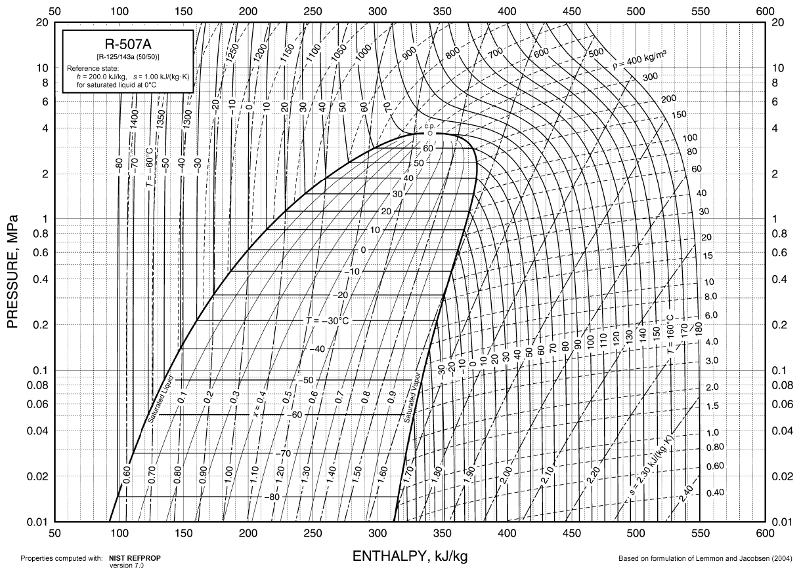

*Fig. 18 Pressure-Enthalpy Diagram for Refrigerant 507A*

<!-- str. 840 -->

### Refrigerant 507A [R-125/143a (50/50)] Propert

**ies of Saturated Liquid and Saturated Vapor**

| Temp.,* sure,**<br>°C | Temp.,* sure,**<br>Pres-MPa | Density, Volume,<br>kg/m<sup>3</sup> Liquid | Density, Volume,<br>m<sup>3</sup>/kg Vapor | Enthalpy, kJ/kg<br>Liquid | Enthalpy, kJ/kg<br>Vapor | Entropy, kJ/(kg·K)<br>Liquid | Entropy, kJ/(kg·K)<br>Vapor | Specific Heat c , kJ/(kg·K)<br>Liquid | Specific Heat c , kJ/(kg·K)<br><sup>p</sup> Vapor | c /c p v Vapor | Velocity of Sound, m/s<br>Liquid | Velocity of Sound, m/s<br>Vapor | Viscosity, μPa·s<br>Liquid | Viscosity, μPa·s<br>Vapor | Thermal Cond., mW/(m·K)<br>Liquid | Thermal Cond., mW/(m·K)<br>Vapor | Tension,Temp.,*<br>Surface mN/m | Tension,Temp.,*<br>°C |
|---|---|---|---|---|---|---|---|---|---|---|---|---|---|---|---|---|---|---|
| –100 | 0.00295 | 1476.9 | 4.92920 | 74.41 | 303.90 | 0.4323 | 1.7579 | 1.219 | 0.618 | 1.164 | 1046 | 129.6 | — | — | 124.6 | 5.77 | 18.35 | –100 |
| –95 | 0.00458 | 1461.7 | 3.25360 | 80.48 | 306.85 | 0.4669 | 1.7377 | 1.210 | 0.631 | 1.162 | 1000 | 131.2 | 784.2 | 7.29 | 121.7 | 6.06 | 17.88 | –95 |
| –90 | 0.00693 | 1446.8 | 2.20850 | 86.51 | 309.83 | 0.5003 | 1.7197 | 1.205 | 0.644 | 1.161 | 960 | 132.6 | 701.5 | 7.49 | 118.8 | 6.36 | 17.41 | –90 |
| –85 | 0.01019 | 1431.9 | 1.53750 | 92.53 | 312.83 | 0.5327 | 1.7036 | 1.203 | 0.658 | 1.159 | 925 | 134.0 | 631.9 | 7.68 | 116.1 | 6.67 | 16.92 | –85 |
| –80 | 0.01464 | 1417.1 | 1.09510 | 98.54 | 315.85 | 0.5642 | 1.6893 | 1.203 | 0.672 | 1.159 | 892 | 135.4 | 572.7 | 7.88 | 113.4 | 6.99 | 16.43 | –80 |
| –75 | 0.02058 | 1402.3 | 0.79638 | 104.57 | 318.88 | 0.5950 | 1.6766 | 1.205 | 0.686 | 1.158 | 862 | 136.6 | 521.7 | 8.07 | 110.8 | 7.31 | 15.92 | –75 |
| –70 | 0.02836 | 1387.4 | 0.59012 | 110.60 | 321.92 | 0.6250 | 1.6652 | 1.208 | 0.701 | 1.158 | 833 | 137.8 | 477.4 | 8.27 | 108.2 | 7.63 | 15.40 | –70 |
| –65 | 0.03837 | 1372.5 | 0.44482 | 116.66 | 324.96 | 0.6545 | 1.6552 | 1.213 | 0.716 | 1.159 | 806 | 138.9 | 438.5 | 8.46 | 105.7 | 7.96 | 14.88 | –65 |
| –60 | 0.05105 | 1357.4 | 0.34056 | 122.74 | 328.00 | 0.6833 | 1.6463 | 1.220 | 0.732 | 1.160 | 779 | 139.8 | 404.3 | 8.65 | 103.2 | 8.30 | 14.34 | –60 |
| –55 | 0.06688 | 1342.3 | 0.26444 | 128.87 | 331.03 | 0.7116 | 1.6384 | 1.227 | 0.749 | 1.161 | 754 | 140.7 | 373.8 | 8.84 | 100.8 | 8.65 | 13.80 | –55 |
| –50 | 0.08638 | 1326.9 | 0.20801 | 135.03 | 334.05 | 0.7395 | 1.6314 | 1.235 | 0.766 | 1.164 | 729 | 141.4 | 346.5 | 9.02 | 98.4 | 9.00 | 13.24 | –50 |
| –48 | 0.09533 | 1320.7 | 0.18960 | 137.51 | 335.25 | 0.7505 | 1.6288 | 1.239 | 0.773 | 1.165 | 719 | 141.6 | 336.4 | 9.10 | 97.4 | 9.14 | 13.02 | –48 |
| –46.74<sup>b</sup> | 0.10132 | 1316.8 | 0.17902 | 139.07 | 336.01 | 0.7574 | 1.6273 | 1.241 | 0.777 | 1.166 | 713 | 141.8 | 330.2 | 9.15 | 96.8 | 9.23 | 12.88 | –46.74 |
| –46 | 0.10499 | 1314.5 | 0.17313 | 139.99 | 336.45 | 0.7615 | 1.6264 | 1.243 | 0.780 | 1.166 | 709 | 141.9 | 326.7 | 9.17 | 96.5 | 9.28 | 12.80 | –46 |
| –44 | 0.11541 | 1308.2 | 0.15836 | 142.48 | 337.65 | 0.7724 | 1.6241 | 1.247 | 0.787 | 1.167 | 699 | 142.1 | 317.4 | 9.25 | 95.5 | 9.42 | 12.57 | –44 |
| –42 | 0.12662 | 1301.9 | 0.14510 | 144.99 | 338.84 | 0.7832 | 1.6219 | 1.251 | 0.795 | 1.169 | 690 | 142.3 | 308.4 | 9.32 | 94.6 | 9.57 | 12.34 | –42 |
| –40 | 0.13867 | 1295.6 | 0.13317 | 147.49 | 340.03 | 0.7940 | 1.6198 | 1.255 | 0.803 | 1.170 | 680 | 142.5 | 299.8 | 9.40 | 93.7 | 9.71 | 12.12 | –40 |
| –38 | 0.15159 | 1289.2 | 0.12240 | 150.01 | 341.21 | 0.8047 | 1.6178 | 1.259 | 0.810 | 1.172 | 670 | 142.6 | 291.4 | 9.47 | 92.7 | 9.86 | 11.89 | –38 |
| –36 | 0.16542 | 1282.8 | 0.11268 | 152.54 | 342.38 | 0.8153 | 1.6159 | 1.264 | 0.818 | 1.174 | 661 | 142.7 | 283.4 | 9.55 | 91.8 | 10.01 | 11.66 | –36 |
| –34 | 0.18022 | 1276.3 | 0.10388 | 155.08 | 343.55 | 0.8260 | 1.6141 | 1.269 | 0.826 | 1.176 | 651 | 142.8 | 275.7 | 9.62 | 90.9 | 10.16 | 11.42 | –34 |
| –32 | 0.19602 | 1269.7 | 0.09590 | 157.63 | 344.72 | 0.8365 | 1.6123 | 1.274 | 0.835 | 1.178 | 642 | 142.9 | 268.3 | 9.70 | 90.0 | 10.31 | 11.19 | –32 |
| –30 | 0.21287 | 1263.2 | 0.08865 | 160.18 | 345.88 | 0.8470 | 1.6107 | 1.279 | 0.843 | 1.180 | 632 | 142.9 | 261.1 | 9.77 | 89.1 | 10.46 | 10.96 | –30 |
| –28 | 0.23081 | 1256.5 | 0.08205 | 162.75 | 347.03 | 0.8575 | 1.6092 | 1.284 | 0.852 | 1.183 | 622 | 143.0 | 254.1 | 9.85 | 88.2 | 10.61 | 10.72 | –28 |
| –26 | 0.24989 | 1249.8 | 0.07604 | 165.33 | 348.17 | 0.8679 | 1.6077 | 1.289 | 0.861 | 1.186 | 613 | 143.0 | 247.4 | 9.93 | 87.3 | 10.77 | 10.49 | –26 |
| –24 | 0.27016 | 1243.1 | 0.07055 | 167.92 | 349.30 | 0.8783 | 1.6063 | 1.295 | 0.870 | 1.188 | 603 | 142.9 | 240.9 | 10.00 | 86.5 | 10.93 | 10.25 | –24 |
| –22 | 0.29167 | 1236.3 | 0.06553 | 170.52 | 350.43 | 0.8886 | 1.6049 | 1.301 | 0.879 | 1.191 | 594 | 142.9 | 234.5 | 10.08 | 85.6 | 11.08 | 10.02 | –22 |
| –20 | 0.31446 | 1229.4 | 0.06094 | 173.13 | 351.54 | 0.8989 | 1.6037 | 1.307 | 0.888 | 1.195 | 584 | 142.8 | 228.4 | 10.15 | 84.7 | 11.24 | 9.78 | –20 |
| –18 | 0.33858 | 1222.5 | 0.05673 | 175.76 | 352.65 | 0.9091 | 1.6024 | 1.313 | 0.898 | 1.198 | 575 | 142.7 | 222.5 | 10.23 | 83.8 | 11.40 | 9.54 | –18 |
| –16 | 0.36408 | 1215.4 | 0.05286 | 178.39 | 353.75 | 0.9193 | 1.6013 | 1.319 | 0.908 | 1.202 | 566 | 142.5 | 216.8 | 10.31 | 83.0 | 11.56 | 9.30 | –16 |
| –14 | 0.39102 | 1208.4 | 0.04931 | 181.04 | 354.83 | 0.9295 | 1.6001 | 1.326 | 0.918 | 1.206 | 556 | 142.3 | 211.2 | 10.39 | 82.1 | 11.73 | 9.06 | –14 |
| –12 | 0.41945 | 1201.2 | 0.04603 | 183.71 | 355.91 | 0.9397 | 1.5991 | 1.333 | 0.929 | 1.210 | 547 | 142.1 | 205.7 | 10.47 | 81.2 | 11.89 | 8.82 | –12 |
| –10 | 0.44941 | 1193.9 | 0.04301 | 186.39 | 356.97 | 0.9498 | 1.5980 | 1.340 | 0.940 | 1.214 | 537 | 141.9 | 200.5 | 10.55 | 80.4 | 12.06 | 8.58 | –10 |
| –8 | 0.48096 | 1186.6 | 0.04023 | 189.08 | 358.02 | 0.9599 | 1.5971 | 1.348 | 0.951 | 1.219 | 528 | 141.6 | 195.3 | 10.63 | 79.5 | 12.23 | 8.34 | –8 |
| –6 | 0.51416 | 1179.2 | 0.03765 | 191.78 | 359.06 | 0.9699 | 1.5961 | 1.355 | 0.962 | 1.224 | 518 | 141.3 | 190.3 | 10.71 | 78.7 | 12.41 | 8.10 | –6 |
| –4 | 0.54906 | 1171.7 | 0.03527 | 194.51 | 360.08 | 0.9800 | 1.5952 | 1.363 | 0.974 | 1.230 | 508 | 141.0 | 185.5 | 10.79 | 77.8 | 12.58 | 7.86 | –4 |
| –2 | 0.58571 | 1164.0 | 0.03306 | 197.25 | 361.08 | 0.9900 | 1.5943 | 1.372 | 0.987 | 1.236 | 499 | 140.6 | 180.7 | 10.88 | 77.0 | 12.76 | 7.62 | –2 |
| 0 | 0.62417 | 1156.3 | 0.03101 | 200.00 | 362.07 | 1.0000 | 1.5934 | 1.381 | 0.999 | 1.242 | 489 | 140.2 | 176.1 | 10.97 | 76.2 | 12.96 | 7.37 | 0 |
| 2 | 0.66450 | 1148.5 | 0.02910 | 202.77 | 363.05 | 1.0100 | 1.5925 | 1.390 | 1.012 | 1.249 | 480 | 139.8 | 171.6 | 11.05 | 75.3 | 13.16 | 7.13 | 2 |
| 4 | 0.70676 | 1140.5 | 0.02733 | 205.56 | 364.00 | 1.0199 | 1.5917 | 1.399 | 1.026 | 1.256 | 470 | 139.3 | 167.2 | 11.14 | 74.5 | 13.36 | 6.89 | 4 |
| 6 | 0.75099 | 1132.4 | 0.02568 | 208.37 | 364.94 | 1.0299 | 1.5908 | 1.410 | 1.040 | 1.264 | 460 | 138.8 | 162.9 | 11.23 | 73.7 | 13.57 | 6.65 | 6 |
| 8 | 0.79728 | 1124.2 | 0.02415 | 211.20 | 365.85 | 1.0398 | 1.5900 | 1.420 | 1.055 | 1.272 | 451 | 138.2 | 158.7 | 11.33 | 72.8 | 13.79 | 6.41 | 8 |
| 10 | 0.84566 | 1115.9 | 0.02271 | 214.04 | 366.75 | 1.0498 | 1.5891 | 1.431 | 1.071 | 1.282 | 441 | 137.6 | 154.5 | 11.43 | 72.0 | 14.01 | 6.17 | 10 |
| 12 | 0.89622 | 1107.4 | 0.02138 | 216.91 | 367.61 | 1.0597 | 1.5883 | 1.443 | 1.088 | 1.291 | 431 | 137.0 | 150.5 | 11.52 | 71.2 | 14.24 | 5.93 | 12 |
| 14 | 0.94900 | 1098.7 | 0.02012 | 219.80 | 368.46 | 1.0696 | 1.5874 | 1.455 | 1.105 | 1.302 | 422 | 136.3 | 146.6 | 11.63 | 70.4 | 14.49 | 5.69 | 14 |
| 16 | 1.00410 | 1089.9 | 0.01895 | 222.71 | 369.28 | 1.0796 | 1.5865 | 1.468 | 1.124 | 1.314 | 412 | 135.6 | 142.7 | 11.73 | 69.6 | 14.75 | 5.45 | 16 |
| 18 | 1.06150 | 1080.9 | 0.01785 | 225.65 | 370.07 | 1.0895 | 1.5856 | 1.482 | 1.144 | 1.327 | 402 | 134.9 | 138.9 | 11.86 | 68.8 | 15.01 | 5.21 | 18 |
| 20 | 1.12140 | 1071.7 | 0.01683 | 228.61 | 370.83 | 1.0995 | 1.5846 | 1.497 | 1.165 | 1.341 | 392 | 134.1 | 135.1 | 11.97 | 67.9 | 15.29 | 4.97 | 20 |
| 22 | 1.18370 | 1062.4 | 0.01586 | 231.60 | 371.55 | 1.1094 | 1.5836 | 1.513 | 1.188 | 1.356 | 382 | 133.2 | 131.5 | 12.09 | 67.1 | 15.58 | 4.74 | 22 |
| 24 | 1.24860 | 1052.8 | 0.01495 | 234.61 | 372.25 | 1.1194 | 1.5826 | 1.530 | 1.212 | 1.372 | 372 | 132.3 | 127.9 | 12.22 | 66.3 | 15.89 | 4.50 | 24 |
| 26 | 1.31610 | 1043.0 | 0.01410 | 237.66 | 372.91 | 1.1294 | 1.5815 | 1.548 | 1.239 | 1.391 | 362 | 131.4 | 124.3 | 12.35 | 65.5 | 16.21 | 4.27 | 26 |
| 28 | 1.38640 | 1032.9 | 0.01329 | 240.73 | 373.52 | 1.1394 | 1.5804 | 1.568 | 1.268 | 1.411 | 352 | 130.4 | 120.8 | 12.48 | 64.7 | 16.54 | 4.04 | 28 |
| 30 | 1.45940 | 1022.6 | 0.01253 | 243.84 | 374.10 | 1.1495 | 1.5792 | 1.589 | 1.299 | 1.433 | 341 | 129.3 | 117.4 | 12.62 | 63.9 | 16.90 | 3.81 | 30 |
| 32 | 1.53520 | 1011.9 | 0.01182 | 246.98 | 374.63 | 1.1595 | 1.5779 | 1.612 | 1.333 | 1.458 | 331 | 128.2 | 114.0 | 12.77 | 63.1 | 17.28 | 3.58 | 32 |
| 34 | 1.61400 | 1001.0 | 0.01114 | 250.16 | 375.11 | 1.1697 | 1.5765 | 1.637 | 1.371 | 1.485 | 321 | 127.1 | 110.6 | 12.93 | 62.2 | 17.68 | 3.35 | 34 |
| 36 | 1.69580 | 989.7 | 0.01050 | 253.39 | 375.54 | 1.1799 | 1.5750 | 1.664 | 1.413 | 1.516 | 310 | 125.9 | 107.3 | 13.10 | 61.4 | 18.12 | 3.12 | 36 |
| 38 | 1.78070 | 978.1 | 0.00989 | 256.65 | 375.91 | 1.1901 | 1.5734 | 1.695 | 1.459 | 1.551 | 300 | 124.6 | 104.0 | 13.28 | 60.6 | 18.58 | 2.90 | 38 |
| 40 | 1.86880 | 966.0 | 0.00932 | 259.96 | 376.22 | 1.2004 | 1.5717 | 1.729 | 1.511 | 1.591 | 289 | 123.2 | 100.7 | 13.47 | 59.8 | 19.09 | 2.68 | 40 |
| 42 | 1.96020 | 953.5 | 0.00877 | 263.33 | 376.46 | 1.2108 | 1.5698 | 1.767 | 1.570 | 1.636 | 278 | 121.8 | 97.5 | 13.68 | 59.0 | 19.63 | 2.47 | 42 |
| 44 | 2.05490 | 940.5 | 0.00825 | 266.74 | 376.61 | 1.2213 | 1.5678 | 1.811 | 1.638 | 1.689 | 267 | 120.4 | 94.3 | 13.90 | 58.1 | 20.23 | 2.25 | 44 |
| 46 | 2.15310 | 926.9 | 0.00776 | 270.23 | 376.68 | 1.2320 | 1.5655 | 1.860 | 1.716 | 1.750 | 256 | 118.8 | 91.0 | 14.14 | 57.3 | 20.89 | 2.04 | 46 |
| 48 | 2.25480 | 912.7 | 0.00728 | 273.78 | 376.66 | 1.2427 | 1.5631 | 1.918 | 1.807 | 1.823 | 245 | 117.2 | 87.8 | 14.41 | 56.5 | 21.62 | 1.83 | 48 |
| 50 | 2.36030 | 897.7 | 0.00683 | 277.41 | 376.52 | 1.2536 | 1.5603 | 1.985 | 1.915 | 1.910 | 233 | 115.5 | 84.6 | 14.70 | 55.7 | 22.43 | 1.63 | 50 |
| 55 | 2.64090 | 856.2 | 0.00578 | 286.91 | 375.54 | 1.2818 | 1.5519 | 2.225 | 2.304 | 2.228 | 203 | 110.8 | 76.4 | 15.59 | 53.6 | 24.98 | 1.15 | 55 |
| 60 | 2.94760 | 806.1 | 0.00480 | 297.28 | 373.26 | 1.3120 | 1.5401 | 2.677 | 3.060 | 2.855 | 171 | 105.5 | 67.7 | 16.86 | 51.7 | 28.77 | 0.70 | 60 |
| 65 | 3.28380 | 739.1 | 0.00384 | 309.30 | 368.44 | 1.3465 | 1.5215 | 3.940 | 5.190 | 4.625 | 135 | 99.3 | 57.9 | 18.93 | 50.7 | 35.54 | 0.31 | 65 |
| 70 | 3.65570 | 599.6 | 0.00260 | 328.32 | 353.47 | 1.4007 | 1.4740 | 31.960 | 44.630 | 36.780 | 92 | 90.7 | 42.0 | 25.07 | 63.2 | 67.27 | 0.02 | 70 |
| 70.62<sup>c</sup> | 3.70500 | 490.8 | 0.00204 | 340.45 | 340.45 | 1.4358 | 1.4358 | ∞ | ∞ | ∞ | 0 | 0.0 | — | — | — | — | 0.00 | 70.62 |

*Temperatures on ITS-90 scale **Small deviations from azeotropic behavior occur at some conditions; tabulated <sup>b</sup>Normal boiling point <sup>c</sup>Critical point pressures are average of bubble and dew-point pressures

<!-- str. 841 -->

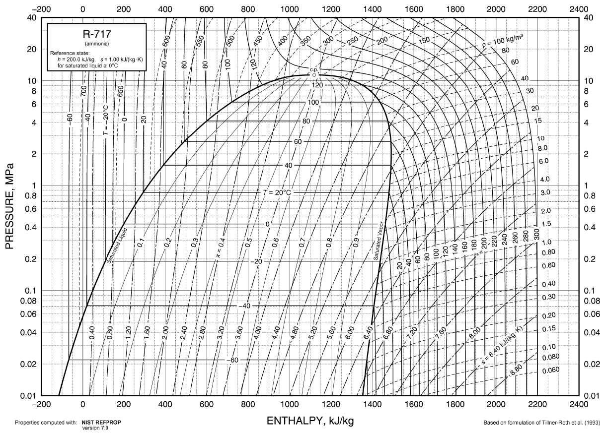

*Fig. 19 Pressure-Enthalpy Diagram for Refrigerant 717 (Ammonia)*

<!-- str. 842 -->

### Refrigerant 717 (Ammonia) Properties of

### Saturated Liquid and Saturated Vapor

| Temp.,* °C | Pres- Density, Volume,<br>sure, MPa | Pres- Density, Volume,<br>kg/m<sup>3</sup> Liquid | Pres- Density, Volume,<br>m<sup>3</sup>/kg Vapor | Enthalpy, kJ/kg<br>Liquid | Enthalpy, kJ/kg<br>Vapor | Entropy, kJ/(kg·K)<br>Liquid | Entropy, kJ/(kg·K)<br>Vapor | Specific Heat c , kJ/(kg·K)<br>Liquid | Specific Heat c , kJ/(kg·K)<br><sup>p</sup> Vapor | c /c p v Vapor | Velocity of Sound, m/s<br>Liquid | Velocity of Sound, m/s<br>Vapor | Viscosity, μPa·s<br>Liquid | Viscosity, μPa·s<br>Vapor | Thermal Cond., mW/(m·K)<br>Liquid | Thermal Cond., mW/(m·K)<br>Vapor | Tension, Temp.,*<br>Surface mN/m | Tension, Temp.,*<br>°C |
|---|---|---|---|---|---|---|---|---|---|---|---|---|---|---|---|---|---|---|
| –77.65<sup>a</sup> | 0.00609 | 732.9 | 15.602 | –143.15 | 1341.23 | –0.4716 | 7.1213 | 4.202 | 2.063 | 1.325 | 2124 | 354.1 | 559.6 | 6.84 | 819.0 | 19.64 | 62.26 | –77.65 |
| –70 | 0.01094 | 724.7 | 9.0079 | –110.81 | 1355.55 | –0.3094 | 6.9088 | 4.245 | 2.086 | 1.327 | 2051 | 360.5 | 475.0 | 7.03 | 792.1 | 19.73 | 59.10 | –70 |
| –60 | 0.02189 | 713.6 | 4.7057 | –68.06 | 1373.73 | –0.1040 | 6.6602 | 4.303 | 2.125 | 1.330 | 1967 | 368.4 | 391.3 | 7.30 | 757.0 | 19.93 | 55.05 | –60 |
| –50 | 0.04084 | 702.1 | 2.6277 | –24.73 | 1391.19 | 0.0945 | 6.4396 | 4.360 | 2.178 | 1.335 | 1890 | 375.6 | 328.9 | 7.57 | 722.3 | 20.24 | 51.11 | –50 |
| –40 | 0.07169 | 690.2 | 1.5533 | 19.17 | 1407.76 | 0.2867 | 6.2425 | 4.414 | 2.244 | 1.342 | 1816 | 382.2 | 281.2 | 7.86 | 688.1 | 20.64 | 47.26 | –40 |
| –38 | 0.07971 | 687.7 | 1.4068 | 28.01 | 1410.96 | 0.3245 | 6.2056 | 4.424 | 2.259 | 1.343 | 1802 | 383.4 | 273.1 | 7.92 | 681.4 | 20.73 | 46.51 | –38 |
| –36 | 0.08845 | 685.3 | 1.2765 | 36.88 | 1414.11 | 0.3619 | 6.1694 | 4.434 | 2.275 | 1.345 | 1787 | 384.6 | 265.3 | 7.98 | 674.6 | 20.83 | 45.75 | –36 |
| –34 | 0.09795 | 682.8 | 1.1604 | 45.77 | 1417.23 | 0.3992 | 6.1339 | 4.444 | 2.291 | 1.347 | 1773 | 385.8 | 257.9 | 8.03 | 667.9 | 20.93 | 45.00 | –34 |
| –33.33<sup>b</sup> | 0.10133 | 682.0 | 1.1242 | 48.76 | 1418.26 | 0.4117 | 6.1221 | 4.448 | 2.297 | 1.348 | 1768 | 386.2 | 255.5 | 8.05 | 665.7 | 20.97 | 44.75 | –33.33 |
| –32 | 0.10826 | 680.3 | 1.0567 | 54.67 | 1420.29 | 0.4362 | 6.0992 | 4.455 | 2.308 | 1.349 | 1759 | 387.0 | 250.8 | 8.09 | 661.3 | 21.04 | 44.26 | –32 |
| –30 | 0.11943 | 677.8 | 0.96396 | 63.60 | 1423.31 | 0.4730 | 6.0651 | 4.465 | 2.326 | 1.351 | 1744 | 388.1 | 244.1 | 8.15 | 654.6 | 21.15 | 43.52 | –30 |
| –28 | 0.13151 | 675.3 | 0.88082 | 72.55 | 1426.28 | 0.5096 | 6.0317 | 4.474 | 2.344 | 1.353 | 1730 | 389.2 | 237.6 | 8.21 | 648.0 | 21.26 | 42.78 | –28 |
| –26 | 0.14457 | 672.8 | 0.80614 | 81.52 | 1429.21 | 0.5460 | 5.9989 | 4.484 | 2.363 | 1.355 | 1716 | 390.2 | 231.4 | 8.27 | 641.5 | 21.38 | 42.05 | –26 |
| –24 | 0.15864 | 670.3 | 0.73896 | 90.51 | 1432.08 | 0.5821 | 5.9667 | 4.494 | 2.383 | 1.358 | 1702 | 391.2 | 225.5 | 8.33 | 634.9 | 21.51 | 41.32 | –24 |
| –22 | 0.17379 | 667.7 | 0.67840 | 99.52 | 1434.91 | 0.6180 | 5.9351 | 4.504 | 2.403 | 1.360 | 1687 | 392.2 | 219.8 | 8.39 | 628.4 | 21.63 | 40.60 | –22 |
| –20 | 0.19008 | 665.1 | 0.62373 | 108.55 | 1437.68 | 0.6538 | 5.9041 | 4.514 | 2.425 | 1.363 | 1673 | 393.2 | 214.4 | 8.45 | 622.0 | 21.77 | 39.88 | –20 |
| –18 | 0.20756 | 662.6 | 0.57428 | 117.60 | 1440.39 | 0.6893 | 5.8736 | 4.524 | 2.446 | 1.365 | 1659 | 394.1 | 209.2 | 8.51 | 615.5 | 21.90 | 39.16 | –18 |
| –16 | 0.22630 | 660.0 | 0.52949 | 126.67 | 1443.06 | 0.7246 | 5.8437 | 4.534 | 2.469 | 1.368 | 1645 | 395.0 | 204.2 | 8.57 | 609.1 | 22.05 | 38.45 | –16 |
| –14 | 0.24637 | 657.3 | 0.48885 | 135.76 | 1445.66 | 0.7597 | 5.8143 | 4.543 | 2.493 | 1.371 | 1631 | 395.8 | 199.3 | 8.63 | 602.8 | 22.19 | 37.74 | –14 |
| –12 | 0.26782 | 654.7 | 0.45192 | 144.88 | 1448.21 | 0.7946 | 5.7853 | 4.553 | 2.517 | 1.375 | 1616 | 396.7 | 194.7 | 8.69 | 596.4 | 22.35 | 37.04 | –12 |
| –10 | 0.29071 | 652.1 | 0.41830 | 154.01 | 1450.70 | 0.8293 | 5.7569 | 4.564 | 2.542 | 1.378 | 1602 | 397.5 | 190.2 | 8.75 | 590.1 | 22.50 | 36.34 | –10 |
| –8 | 0.31513 | 649.4 | 0.38767 | 163.16 | 1453.14 | 0.8638 | 5.7289 | 4.574 | 2.568 | 1.382 | 1588 | 398.2 | 185.9 | 8.81 | 583.9 | 22.67 | 35.65 | –8 |
| –6 | 0.34114 | 646.7 | 0.35970 | 172.34 | 1455.51 | 0.8981 | 5.7013 | 4.584 | 2.594 | 1.385 | 1574 | 398.9 | 181.7 | 8.87 | 577.7 | 22.83 | 34.96 | –6 |
| –4 | 0.36880 | 644.0 | 0.33414 | 181.54 | 1457.81 | 0.9323 | 5.6741 | 4.595 | 2.622 | 1.389 | 1559 | 399.6 | 177.7 | 8.93 | 571.5 | 23.00 | 34.27 | –4 |
| –2 | 0.39819 | 641.3 | 0.31074 | 190.76 | 1460.06 | 0.9662 | 5.6474 | 4.606 | 2.651 | 1.393 | 1545 | 400.2 | 173.8 | 8.99 | 565.3 | 23.18 | 33.59 | –2 |
| 0 | 0.42938 | 638.6 | 0.28930 | 200.00 | 1462.24 | 1.0000 | 5.6210 | 4.617 | 2.680 | 1.398 | 1531 | 400.8 | 170.1 | 9.06 | 559.2 | 23.37 | 32.91 | 0 |
| 2 | 0.46246 | 635.8 | 0.26962 | 209.27 | 1464.35 | 1.0336 | 5.5951 | 4.628 | 2.710 | 1.402 | 1516 | 401.4 | 166.5 | 9.12 | 553.1 | 23.55 | 32.24 | 2 |
| 4 | 0.49748 | 633.1 | 0.25153 | 218.55 | 1466.40 | 1.0670 | 5.5695 | 4.639 | 2.742 | 1.407 | 1502 | 401.9 | 162.9 | 9.18 | 547.1 | 23.75 | 31.57 | 4 |
| 6 | 0.53453 | 630.3 | 0.23489 | 227.87 | 1468.37 | 1.1003 | 5.5442 | 4.651 | 2.774 | 1.412 | 1487 | 402.4 | 159.5 | 9.24 | 541.1 | 23.95 | 30.91 | 6 |
| 8 | 0.57370 | 627.5 | 0.21956 | 237.20 | 1470.28 | 1.1334 | 5.5192 | 4.663 | 2.807 | 1.417 | 1473 | 402.8 | 156.2 | 9.30 | 535.1 | 24.15 | 30.24 | 8 |
| 10 | 0.61505 | 624.6 | 0.20543 | 246.57 | 1472.11 | 1.1664 | 5.4946 | 4.676 | 2.841 | 1.422 | 1458 | 403.2 | 153.0 | 9.36 | 529.1 | 24.37 | 29.59 | 10 |
| 12 | 0.65866 | 621.8 | 0.19237 | 255.95 | 1473.88 | 1.1992 | 5.4703 | 4.689 | 2.877 | 1.428 | 1443 | 403.6 | 149.9 | 9.43 | 523.2 | 24.58 | 28.94 | 12 |
| 14 | 0.70463 | 618.9 | 0.18031 | 265.37 | 1475.56 | 1.2318 | 5.4463 | 4.702 | 2.913 | 1.434 | 1429 | 403.9 | 146.9 | 9.49 | 517.3 | 24.81 | 28.29 | 14 |
| 16 | 0.75303 | 616.0 | 0.16914 | 274.81 | 1477.17 | 1.2643 | 5.4226 | 4.716 | 2.951 | 1.440 | 1414 | 404.2 | 144.0 | 9.55 | 511.5 | 25.04 | 27.65 | 16 |
| 18 | 0.80395 | 613.1 | 0.15879 | 284.28 | 1478.70 | 1.2967 | 5.3991 | 4.730 | 2.990 | 1.446 | 1399 | 404.4 | 141.1 | 9.61 | 505.6 | 25.27 | 27.01 | 18 |
| 20 | 0.85748 | 610.2 | 0.14920 | 293.78 | 1480.16 | 1.3289 | 5.3759 | 4.745 | 3.030 | 1.453 | 1384 | 404.6 | 138.3 | 9.68 | 499.9 | 25.52 | 26.38 | 20 |
| 22 | 0.91369 | 607.2 | 0.14029 | 303.31 | 1481.53 | 1.3610 | 5.3529 | 4.760 | 3.071 | 1.460 | 1370 | 404.8 | 135.6 | 9.74 | 494.1 | 25.77 | 25.75 | 22 |
| 24 | 0.97268 | 604.3 | 0.13201 | 312.87 | 1482.82 | 1.3929 | 5.3301 | 4.776 | 3.113 | 1.468 | 1355 | 404.9 | 133.0 | 9.80 | 488.4 | 26.03 | 25.12 | 24 |
| 26 | 1.03450 | 601.3 | 0.12431 | 322.47 | 1484.02 | 1.4248 | 5.3076 | 4.793 | 3.158 | 1.475 | 1340 | 404.9 | 130.4 | 9.87 | 482.7 | 26.29 | 24.50 | 26 |
| 28 | 1.09930 | 598.2 | 0.11714 | 332.09 | 1485.14 | 1.4565 | 5.2853 | 4.810 | 3.203 | 1.484 | 1324 | 405.0 | 127.9 | 9.93 | 477.0 | 26.57 | 23.89 | 28 |
| 30 | 1.16720 | 595.2 | 0.11046 | 341.76 | 1486.17 | 1.4881 | 5.2631 | 4.828 | 3.250 | 1.492 | 1309 | 404.9 | 125.5 | 10.00 | 471.4 | 26.85 | 23.28 | 30 |
| 32 | 1.23820 | 592.1 | 0.10422 | 351.45 | 1487.11 | 1.5196 | 5.2412 | 4.847 | 3.299 | 1.501 | 1294 | 404.8 | 123.1 | 10.06 | 465.7 | 27.14 | 22.67 | 32 |
| 34 | 1.31240 | 589.0 | 0.09840 | 361.19 | 1487.95 | 1.5509 | 5.2194 | 4.867 | 3.349 | 1.510 | 1279 | 404.7 | 120.7 | 10.13 | 460.1 | 27.43 | 22.07 | 34 |
| 36 | 1.39000 | 585.8 | 0.09296 | 370.96 | 1488.70 | 1.5822 | 5.1978 | 4.888 | 3.401 | 1.520 | 1263 | 404.5 | 118.4 | 10.19 | 454.6 | 27.74 | 21.47 | 36 |
| 38 | 1.47090 | 582.6 | 0.08787 | 380.78 | 1489.36 | 1.6134 | 5.1763 | 4.909 | 3.455 | 1.530 | 1248 | 404.3 | 116.2 | 10.26 | 449.1 | 28.05 | 20.88 | 38 |
| 40 | 1.55540 | 579.4 | 0.08310 | 390.64 | 1489.91 | 1.6446 | 5.1549 | 4.932 | 3.510 | 1.541 | 1232 | 404.0 | 114.0 | 10.33 | 443.5 | 28.38 | 20.29 | 40 |
| 42 | 1.64350 | 576.2 | 0.07863 | 400.54 | 1490.36 | 1.6756 | 5.1337 | 4.956 | 3.568 | 1.553 | 1216 | 403.7 | 111.9 | 10.39 | 438.0 | 28.71 | 19.71 | 42 |
| 44 | 1.73530 | 572.9 | 0.07445 | 410.48 | 1490.70 | 1.7065 | 5.1126 | 4.981 | 3.628 | 1.565 | 1201 | 403.3 | 109.8 | 10.46 | 432.6 | 29.06 | 19.13 | 44 |
| 46 | 1.83100 | 569.6 | 0.07052 | 420.48 | 1490.94 | 1.7374 | 5.0915 | 5.007 | 3.691 | 1.577 | 1185 | 402.9 | 107.8 | 10.53 | 427.1 | 29.41 | 18.56 | 46 |
| 48 | 1.93050 | 566.3 | 0.06682 | 430.52 | 1491.06 | 1.7683 | 5.0706 | 5.034 | 3.756 | 1.591 | 1169 | 402.4 | 105.8 | 10.60 | 421.7 | 29.78 | 17.99 | 48 |
| 50 | 2.03400 | 562.9 | 0.06335 | 440.62 | 1491.07 | 1.7990 | 5.0497 | 5.064 | 3.823 | 1.605 | 1153 | 401.9 | 103.8 | 10.67 | 416.3 | 30.16 | 17.43 | 50 |
| 55 | 2.31110 | 554.2 | 0.05554 | 466.10 | 1490.57 | 1.8758 | 4.9977 | 5.143 | 4.005 | 1.643 | 1112 | 400.3 | 99.0 | 10.86 | 402.9 | 31.16 | 16.04 | 55 |
| 60 | 2.61560 | 545.2 | 0.04880 | 491.97 | 1489.27 | 1.9523 | 4.9458 | 5.235 | 4.208 | 1.687 | 1070 | 398.3 | 94.5 | 11.05 | 389.6 | 32.26 | 14.69 | 60 |
| 65 | 2.94910 | 536.0 | 0.04296 | 518.26 | 1487.09 | 2.0288 | 4.8939 | 5.341 | 4.438 | 1.739 | 1028 | 396.0 | 90.1 | 11.25 | 376.4 | 33.47 | 13.37 | 65 |
| 70 | 3.31350 | 526.3 | 0.03787 | 545.04 | 1483.94 | 2.1054 | 4.8415 | 5.465 | 4.699 | 1.799 | 984 | 393.3 | 85.9 | 11.47 | 363.2 | 34.80 | 12.08 | 70 |
| 75 | 3.71050 | 516.2 | 0.03342 | 572.37 | 1479.72 | 2.1823 | 4.7885 | 5.610 | 5.001 | 1.870 | 940 | 390.1 | 81.9 | 11.70 | 350.2 | 36.30 | 10.83 | 75 |
| 80 | 4.14200 | 505.7 | 0.02951 | 600.34 | 1474.31 | 2.2596 | 4.7344 | 5.784 | 5.355 | 1.955 | 895 | 386.5 | 78.0 | 11.95 | 337.1 | 38.00 | 9.61 | 80 |
| 85 | 4.61000 | 494.5 | 0.02606 | 629.04 | 1467.53 | 2.3377 | 4.6789 | 5.993 | 5.777 | 2.058 | 848 | 382.5 | 74.2 | 12.23 | 324.1 | 39.95 | 8.44 | 85 |
| 90 | 5.11670 | 482.8 | 0.02300 | 658.61 | 1459.19 | 2.4168 | 4.6213 | 6.250 | 6.291 | 2.187 | 800 | 377.9 | 70.5 | 12.55 | 311.0 | 42.24 | 7.30 | 90 |
| 95 | 5.66430 | 470.2 | 0.02027 | 689.19 | 1449.01 | 2.4973 | 4.5612 | 6.573 | 6.933 | 2.349 | 751 | 372.7 | 66.8 | 12.91 | 297.9 | 44.99 | 6.20 | 95 |
| 100 | 6.25530 | 456.6 | 0.01782 | 721.00 | 1436.63 | 2.5797 | 4.4975 | 6.991 | 7.762 | 2.562 | 701 | 367.0 | 63.2 | 13.32 | 284.8 | 48.36 | 5.15 | 100 |
| 105 | 6.89230 | 441.9 | 0.01561 | 754.35 | 1421.57 | 2.6647 | 4.4291 | 7.555 | 8.877 | 2.851 | 649 | 360.5 | 59.6 | 13.82 | 271.5 | 52.65 | 4.15 | 105 |
| 110 | 7.57830 | 425.6 | 0.01360 | 789.68 | 1403.08 | 2.7533 | 4.3542 | 8.360 | 10.46 | 3.26 | 594 | 353.3 | 56.0 | 14.42 | 258.1 | 58.33 | 3.20 | 110 |
| 115 | 8.31700 | 407.2 | 0.01174 | 827.74 | 1379.99 | 2.8474 | 4.2702 | 9.630 | 12.91 | 3.91 | 538 | 345.0 | 52.3 | 15.19 | 244.6 | 66.28 | 2.31 | 115 |
| 120 | 9.11250 | 385.5 | 0.00999 | 869.92 | 1350.23 | 2.9502 | 4.1719 | 11.940 | 17.21 | 5.04 | 477 | 335.4 | 48.3 | 16.21 | 231.2 | 78.40 | 1.50 | 120 |
| 125 | 9.97002 | 357.8 | 0.00828 | 919.68 | 1309.12 | 3.0702 | 4.0483 | 17.660 | 27.00 | 7.62 | 411 | 323.6 | 43.8 | 17.73 | 219.1 | 100.01 | 0.77 | 125 |
| 130 | 10.89770 | 312.3 | 0.00638 | 992.02 | 1239.32 | 3.2437 | 3.8571 | 54.210 | 76.49 | 20.66 | 334 | 306.6 | 37.3 | 20.63 | 221.9 | 160.39 | 0.18 | 130 |
| 132.25<sup>c</sup> | 11.33300 | 225.0 | 0.00444 1119.22 |  | 1119.22 | 3.5542 | 3.5542 | ∞ | ∞ | ∞ | 0 | 0.0 | — | — | ∞ | ∞ | 0.00 | 132.25 |

*Temperatures on ITS-90 scale <sup>a</sup>Triple point <sup>b</sup>Normal boiling point <sup>c</sup>Critical point

<!-- str. 843 -->

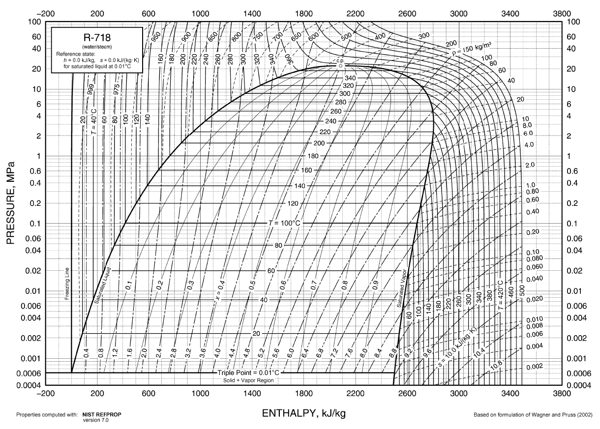

*Fig. 20 Pressure-Enthalpy Diagram for Refrigerant 718 (Water/Steam)*

<!-- str. 844 -->

### Refrigerant 718 (Water/Steam) Properties

**of Saturated Liquid and Saturated Vapor**

| Temp.,* °C | Pressure, MPa | Density, Volume,<br>kg/m<sup>3</sup> Liquid | Density, Volume,<br>Enthalpy, kJ/kg m<sup>3</sup>/kg Vapor Liquid Vapor | Entropy, kJ/(kg·K)<br>Liquid | Entropy, kJ/(kg·K)<br>Vapor | Specific Heat c , kJ/(kg·K)<br>Liquid | Specific Heat c , kJ/(kg·K)<br><sup>p</sup> Vapor | c /c p v Vapor | Velocity of Sound, m/s<br>Liquid | Velocity of Sound, m/s<br>Vapor | Viscosity, μPa·s<br>Liquid | Viscosity, μPa·s<br>Vapor | Thermal Cond., mW/(m·K)<br>Liquid | Thermal Cond., mW/(m·K)<br>Vapor | Tension, Temp.,*<br>Surface mN/m | Tension, Temp.,*<br>°C |
|---|---|---|---|---|---|---|---|---|---|---|---|---|---|---|---|---|
| 0.01<sup>a</sup> | 0.00061 | 999.8 | 205.990 0.00 2500.92 | 0.0000 | 9.1555 | 4.220 | 1.884 | 1.329 | 1402 | 409.0 | 1791.2 | 9.22 | 561.0 | 17.07 | 75.65 | 0.01 |
| 5 | 0.00087 | 999.9 | 147.010 21.02 2510.06 | 0.0763 | 9.0248 | 4.205 | 1.889 | 1.328 | 1426 | 412.6 | 1518.3 | 9.34 | 570.5 | 17.34 | 74.94 | 5 |
| 10 | 0.00123 | 999.7 | 106.300 42.02 2519.21 | 0.1511 | 8.8998 | 4.196 | 1.895 | 1.328 | 1447 | 416.2 | 1306.0 | 9.46 | 580.0 | 17.62 | 74.22 | 10 |
| 15 | 0.00171 | 999.1 | 77.8750 62.98 2528.33 | 0.2245 | 8.7803 | 4.189 | 1.900 | 1.328 | 1466 | 419.7 | 1137.6 | 9.59 | 589.3 | 17.92 | 73.49 | 15 |
| 20 | 0.00234 | 998.2 | 57.7570 83.91 2537.43 | 0.2965 | 8.6660 | 4.184 | 1.906 | 1.327 | 1482 | 423.2 | 1001.6 | 9.73 | 598.4 | 18.23 | 72.74 | 20 |
| 25 | 0.00317 | 997.0 | 43.3370 104.83 2546.51 | 0.3672 | 8.5566 | 4.182 | 1.912 | 1.327 | 1497 | 426.6 | 890.1 | 9.87 | 607.2 | 18.55 | 71.97 | 25 |
| 30 | 0.00425 | 995.6 | 32.8780 125.73 2555.55 | 0.4368 | 8.4520 | 4.180 | 1.918 | 1.327 | 1509 | 430.0 | 797.4 | 10.01 | 615.5 | 18.89 | 71.19 | 30 |
| 35 | 0.00563 | 994.0 | 25.2050 146.63 2564.55 | 0.5051 | 8.3517 | 4.180 | 1.925 | 1.327 | 1520 | 433.4 | 719.3 | 10.16 | 623.3 | 19.24 | 70.40 | 35 |
| 40 | 0.00738 | 992.2 | 19.5150 167.53 2573.51 | 0.5724 | 8.2555 | 4.180 | 1.931 | 1.327 | 1529 | 436.7 | 653.0 | 10.31 | 630.6 | 19.60 | 69.60 | 40 |
| 45 | 0.00959 | 990.2 | 15.2520 188.43 2582.43 | 0.6386 | 8.1633 | 4.180 | 1.939 | 1.327 | 1536 | 440.0 | 596.1 | 10.46 | 637.3 | 19.97 | 68.78 | 45 |
| 50 | 0.01235 | 988.0 | 12.0270 209.34 2591.29 | 0.7038 | 8.0748 | 4.182 | 1.947 | 1.328 | 1542 | 443.2 | 546.8 | 10.62 | 643.6 | 20.36 | 67.94 | 50 |
| 55 | 0.01576 | 985.7 | 9.5643 230.26 2600.09 | 0.7680 | 7.9898 | 4.183 | 1.955 | 1.328 | 1547 | 446.4 | 504.0 | 10.77 | 649.2 | 20.77 | 67.10 | 55 |
| 60 | 0.01995 | 983.2 | 7.6672 251.18 2608.83 | 0.8313 | 7.9081 | 4.185 | 1.965 | 1.328 | 1551 | 449.5 | 466.4 | 10.93 | 654.3 | 21.19 | 66.24 | 60 |
| 65 | 0.02504 | 980.5 | 6.1935 272.12 2617.50 | 0.8937 | 7.8296 | 4.187 | 1.975 | 1.329 | 1553 | 452.6 | 433.2 | 11.10 | 659.0 | 21.62 | 65.37 | 65 |
| 70 | 0.03120 | 977.7 | 5.0395 293.07 2626.10 | 0.9551 | 7.7540 | 4.190 | 1.986 | 1.330 | 1555 | 455.6 | 403.9 | 11.26 | 663.1 | 22.07 | 64.48 | 70 |
| 75 | 0.03860 | 974.8 | 4.1289 314.03 2634.60 | 1.0158 | 7.6812 | 4.193 | 1.999 | 1.331 | 1555 | 458.5 | 377.7 | 11.43 | 666.8 | 22.53 | 63.58 | 75 |
| 80 | 0.04741 | 971.8 | 3.4052 335.01 2643.02 | 1.0756 | 7.6111 | 4.197 | 2.012 | 1.332 | 1554 | 461.4 | 354.3 | 11.59 | 670.0 | 23.01 | 62.67 | 80 |
| 85 | 0.05787 | 968.6 | 2.8258 356.01 2651.33 | 1.1346 | 7.5434 | 4.201 | 2.027 | 1.333 | 1553 | 464.2 | 333.3 | 11.76 | 672.8 | 23.51 | 61.75 | 85 |
| 90 | 0.07018 | 965.3 | 2.3591 377.04 2659.53 | 1.1929 | 7.4781 | 4.205 | 2.043 | 1.334 | 1550 | 466.9 | 314.4 | 11.93 | 675.3 | 24.02 | 60.82 | 90 |
| 95 | 0.08461 | 961.9 | 1.9806 398.09 2667.61 | 1.2504 | 7.4151 | 4.210 | 2.061 | 1.335 | 1547 | 469.6 | 297.3 | 12.10 | 677.3 | 24.55 | 59.87 | 95 |
| 99.97<sup>b</sup> | 0.10133 | 958.4 | 1.6732 419.06 2675.53 | 1.3069 | 7.3544 | 4.216 | 2.080 | 1.337 | 1543 | 472.2 | 281.8 | 12.27 | 679.1 | 25.09 | 58.92 | 99.97 |
| 100 | 0.10142 | 958.3 | 1.6718 419.17 2675.57 | 1.3072 | 7.3541 | 4.216 | 2.080 | 1.337 | 1543 | 472.2 | 281.7 | 12.27 | 679.1 | 25.10 | 58.91 | 100 |
| 105 | 0.12090 | 954.7 | 1.4184 440.27 2683.39 | 1.3633 | 7.2952 | 4.222 | 2.101 | 1.339 | 1538 | 474.7 | 267.6 | 12.44 | 680.5 | 25.66 | 57.94 | 105 |
| 110 | 0.14338 | 950.9 | 1.2093 461.42 2691.06 | 1.4188 | 7.2381 | 4.228 | 2.124 | 1.341 | 1533 | 477.1 | 254.7 | 12.61 | 681.7 | 26.24 | 56.96 | 110 |
| 115 | 0.16918 | 947.1 | 1.0358 482.59 2698.58 | 1.4737 | 7.1828 | 4.236 | 2.150 | 1.343 | 1527 | 479.5 | 242.9 | 12.78 | 682.6 | 26.85 | 55.97 | 115 |
| 120 | 0.19867 | 943.1 | 0.89121 503.81 2705.93 | 1.5279 | 7.1291 | 4.244 | 2.177 | 1.346 | 1520 | 481.7 | 232.1 | 12.96 | 683.2 | 27.47 | 54.97 | 120 |
| 125 | 0.23224 | 939.0 | 0.77003 525.07 2713.10 | 1.5816 | 7.0770 | 4.252 | 2.207 | 1.349 | 1512 | 483.9 | 222.1 | 13.13 | 683.6 | 28.11 | 53.96 | 125 |
| 130 | 0.27028 | 934.8 | 0.66800 546.38 2720.08 | 1.6346 | 7.0264 | 4.261 | 2.239 | 1.352 | 1504 | 486.0 | 212.9 | 13.30 | 683.7 | 28.76 | 52.93 | 130 |
| 135 | 0.31323 | 930.5 | 0.58173 567.74 2726.87 | 1.6872 | 6.9772 | 4.272 | 2.274 | 1.355 | 1496 | 487.9 | 204.4 | 13.47 | 683.6 | 29.44 | 51.90 | 135 |
| 140 | 0.36154 | 926.1 | 0.50845 589.16 2733.44 | 1.7392 | 6.9293 | 4.283 | 2.311 | 1.359 | 1486 | 489.8 | 196.5 | 13.65 | 683.3 | 30.14 | 50.86 | 140 |
| 145 | 0.41568 | 921.6 | 0.44596 610.64 2739.80 | 1.7907 | 6.8826 | 4.294 | 2.351 | 1.363 | 1476 | 491.6 | 189.2 | 13.82 | 682.8 | 30.86 | 49.80 | 145 |
| 150 | 0.47616 | 917.0 | 0.39245 632.18 2745.93 | 1.8418 | 6.8371 | 4.307 | 2.394 | 1.368 | 1466 | 493.3 | 182.5 | 13.99 | 682.0 | 31.60 | 48.74 | 150 |
| 155 | 0.54350 | 912.3 | 0.34646 653.79 2751.81 | 1.8924 | 6.7926 | 4.321 | 2.440 | 1.373 | 1455 | 494.8 | 176.1 | 14.16 | 681.1 | 32.35 | 47.67 | 155 |
| 160 | 0.61823 | 907.4 | 0.30678 675.47 2757.44 | 1.9426 | 6.7491 | 4.335 | 2.488 | 1.379 | 1443 | 496.3 | 170.2 | 14.34 | 680.0 | 33.13 | 46.59 | 160 |
| 165 | 0.70093 | 902.5 | 0.27243 697.24 2762.81 | 1.9923 | 6.7066 | 4.351 | 2.540 | 1.385 | 1431 | 497.6 | 164.7 | 14.51 | 678.6 | 33.93 | 45.50 | 165 |
| 170 | 0.79219 | 897.5 | 0.24259 719.08 2767.90 | 2.0417 | 6.6650 | 4.368 | 2.594 | 1.392 | 1419 | 498.9 | 159.6 | 14.68 | 677.0 | 34.75 | 44.41 | 170 |
| 175 | 0.89260 | 892.3 | 0.21658 741.02 2772.71 | 2.0906 | 6.6241 | 4.386 | 2.652 | 1.399 | 1405 | 500.0 | 154.7 | 14.85 | 675.3 | 35.59 | 43.30 | 175 |
| 180 | 1.00280 | 887.0 | 0.19384 763.05 2777.21 | 2.1392 | 6.5840 | 4.405 | 2.713 | 1.407 | 1392 | 501.0 | 150.1 | 15.03 | 673.3 | 36.45 | 42.19 | 180 |
| 185 | 1.12350 | 881.6 | 0.17390 785.19 2781.41 | 2.1875 | 6.5447 | 4.425 | 2.777 | 1.416 | 1378 | 501.9 | 145.8 | 15.20 | 671.1 | 37.33 | 41.07 | 185 |
| 190 | 1.25520 | 876.1 | 0.15636 807.43 2785.28 | 2.2355 | 6.5059 | 4.447 | 2.844 | 1.425 | 1363 | 502.7 | 141.8 | 15.37 | 668.8 | 38.24 | 39.95 | 190 |
| 195 | 1.39880 | 870.4 | 0.14089 829.79 2788.82 | 2.2832 | 6.4678 | 4.471 | 2.915 | 1.436 | 1348 | 503.4 | 137.9 | 15.54 | 666.1 | 39.16 | 38.81 | 195 |
| 200 | 1.55490 | 864.7 | 0.12721 852.27 2792.01 | 2.3305 | 6.4302 | 4.496 | 2.990 | 1.447 | 1332 | 503.9 | 134.3 | 15.71 | 663.3 | 40.11 | 37.67 | 200 |
| 205 | 1.72430 | 858.8 | 0.11508 874.88 2794.83 | 2.3777 | 6.3930 | 4.523 | 3.068 | 1.459 | 1316 | 504.3 | 130.9 | 15.89 | 660.3 | 41.09 | 36.53 | 205 |
| 210 | 1.90770 | 852.7 | 0.10429 897.63 2797.27 | 2.4245 | 6.3563 | 4.551 | 3.150 | 1.472 | 1299 | 504.6 | 127.6 | 16.06 | 657.0 | 42.09 | 35.38 | 210 |
| 215 | 2.10580 | 846.5 | 0.09468 920.53 2799.32 | 2.4712 | 6.3200 | 4.582 | 3.237 | 1.486 | 1282 | 504.8 | 124.5 | 16.24 | 653.4 | 43.11 | 34.23 | 215 |
| 220 | 2.31960 | 840.2 | 0.08609 943.58 2800.95 | 2.5177 | 6.2840 | 4.615 | 3.329 | 1.501 | 1264 | 504.8 | 121.5 | 16.41 | 649.7 | 44.17 | 33.07 | 220 |
| 225 | 2.54970 | 833.7 | 0.07840 966.80 2802.15 | 2.5640 | 6.2483 | 4.650 | 3.426 | 1.518 | 1246 | 504.6 | 118.7 | 16.59 | 645.6 | 45.26 | 31.90 | 225 |
| 230 | 2.79710 | 827.1 | 0.07150 990.19 2802.90 | 2.6101 | 6.2128 | 4.688 | 3.528 | 1.536 | 1228 | 504.4 | 116.0 | 16.76 | 641.3 | 46.38 | 30.74 | 230 |
| 235 | 3.06250 | 820.3 | 0.06530 1013.77 2803.17 | 2.6561 | 6.1775 | 4.728 | 3.638 | 1.556 | 1209 | 503.9 | 113.4 | 16.94 | 636.7 | 47.53 | 29.57 | 235 |
| 240 | 3.34690 | 813.4 | 0.05970 1037.55 2802.96 | 2.7020 | 6.1423 | 4.772 | 3.754 | 1.578 | 1189 | 503.3 | 110.9 | 17.12 | 631.8 | 48.73 | 28.39 | 240 |
| 245 | 3.65120 | 806.2 | 0.05465 1061.55 2802.22 | 2.7478 | 6.1072 | 4.819 | 3.878 | 1.601 | 1169 | 502.6 | 108.4 | 17.31 | 626.7 | 49.97 | 27.22 | 245 |
| 250 | 3.97620 | 798.9 | 0.05008 1085.77 2800.93 | 2.7935 | 6.0721 | 4.870 | 4.011 | 1.627 | 1148 | 501.6 | 106.1 | 17.49 | 621.2 | 51.26 | 26.04 | 250 |
| 255 | 4.32290 | 791.4 | 0.04594 1110.23 2799.07 | 2.8392 | 6.0369 | 4.925 | 4.153 | 1.655 | 1127 | 500.5 | 103.9 | 17.68 | 615.4 | 52.61 | 24.87 | 255 |
| 260 | 4.69230 | 783.6 | 0.04217 1134.96 2796.60 | 2.8849 | 6.0016 | 4.986 | 4.308 | 1.686 | 1105 | 499.2 | 101.7 | 17.88 | 609.2 | 54.03 | 23.69 | 260 |
| 265 | 5.08530 | 775.7 | 0.03875 1159.96 2793.49 | 2.9307 | 5.9661 | 5.051 | 4.475 | 1.720 | 1083 | 497.7 | 99.6 | 18.07 | 602.8 | 55.53 | 22.51 | 265 |
| 270 | 5.50300 | 767.5 | 0.03562 1185.27 2789.69 | 2.9765 | 5.9304 | 5.123 | 4.656 | 1.757 | 1060 | 496.0 | 97.5 | 18.28 | 595.9 | 57.11 | 21.34 | 270 |
| 275 | 5.94640 | 759.0 | 0.03277 1210.90 2785.17 | 3.0224 | 5.8944 | 5.202 | 4.855 | 1.798 | 1037 | 494.1 | 95.5 | 18.48 | 588.7 | 58.80 | 20.16 | 275 |
| 280 | 6.41660 | 750.3 | 0.03015 1236.88 2779.87 | 3.0685 | 5.8579 | 5.289 | 5.073 | 1.845 | 1013 | 491.9 | 93.5 | 18.70 | 581.1 | 60.61 | 18.99 | 280 |
| 285 | 6.91470 | 741.3 | 0.02776 1263.25 2773.73 | 3.1147 | 5.8209 | 5.385 | 5.314 | 1.896 | 988 | 489.5 | 91.6 | 18.92 | 573.2 | 62.57 | 17.83 | 285 |
| 290 | 7.44180 | 731.9 | 0.02555 1290.03 2766.70 | 3.1612 | 5.7834 | 5.493 | 5.582 | 1.954 | 962 | 486.9 | 89.7 | 19.15 | 565.0 | 64.71 | 16.66 | 290 |
| 295 | 7.99910 | 722.2 | 0.02353 1317.27 2758.70 | 3.2080 | 5.7451 | 5.614 | 5.882 | 2.019 | 936 | 483.9 | 87.8 | 19.40 | 556.3 | 67.05 | 15.51 | 295 |
| 300 | 8.58790 | 712.1 | 0.02166 1345.01 2749.64 | 3.2552 | 5.7059 | 5.750 | 6.220 | 2.094 | 909 | 480.7 | 85.9 | 19.65 | 547.4 | 69.65 | 14.36 | 300 |
| 310 | 9.86510 | 690.7 | 0.01833 1402.22 2727.95 | 3.3510 | 5.6244 | 6.085 | 7.045 | 2.277 | 853 | 473.3 | 82.2 | 20.21 | 528.7 | 75.84 | 12.09 | 310 |
| 320 | 11.28430 | 667.1 | 0.01547 1462.22 2700.59 | 3.4494 | 5.5372 | 6.537 | 8.159 | 2.528 | 793 | 464.4 | 78.4 | 20.85 | 509.2 | 83.91 | 9.86 | 320 |
| 330 | 12.85810 | 640.8 | 0.01298 1525.87 2666.03 | 3.5518 | 5.4422 | 7.186 | 9.753 | 2.889 | 729 | 453.7 | 74.5 | 21.61 | 489.1 | 94.94 | 7.70 | 330 |
| 340 | 14.60070 | 610.7 | 0.01078 1594.53 2621.85 | 3.6601 | 5.3356 | 8.210 | 12.24 | 3.45 | 658 | 440.7 | 70.4 | 22.55 | 468.5 | 110.91 | 5.63 | 340 |
| 350 | 16.52940 | 574.7 | 0.00880 1670.89 2563.64 | 3.7784 | 5.2110 | 10.120 | 16.69 | 4.46 | 578 | 424.4 | 65.9 | 23.82 | 447.4 | 135.95 | 3.67 | 350 |
| 360 | 18.66600 | 527.6 | 0.00695 1761.66 2481.49 | 3.9167 | 5.0536 | 15.000 | 27.36 | 6.83 | 480 | 402.4 | 60.3 | 25.72 | 425.7 | 181.51 | 1.88 | 360 |
| 370 | 21.04360 | 451.4 | 0.00495 1890.69 2334.52 | 4.1112 | 4.8012 | 45.160 | 96.60 | 21.15 | 360 | 362.8 | 52.1 | 29.68 | 425.0 | 323.84 | 0.39 | 370 |
| 373.95<sup>c</sup> | 22.06400 | 322.0 | 0.00311 2084.26 2084.26 | 4.4070 | 4.4070 | ∞ | ∞ | ∞ | 0 | 0.0 | — | — | ∞ | ∞ | 0.00 | 373.95 |

*Temperatures on ITS-90 scale <sup>a</sup>Triple point <sup>b</sup>Normal boiling point <sup>c</sup>Critical point

<!-- str. 845 -->

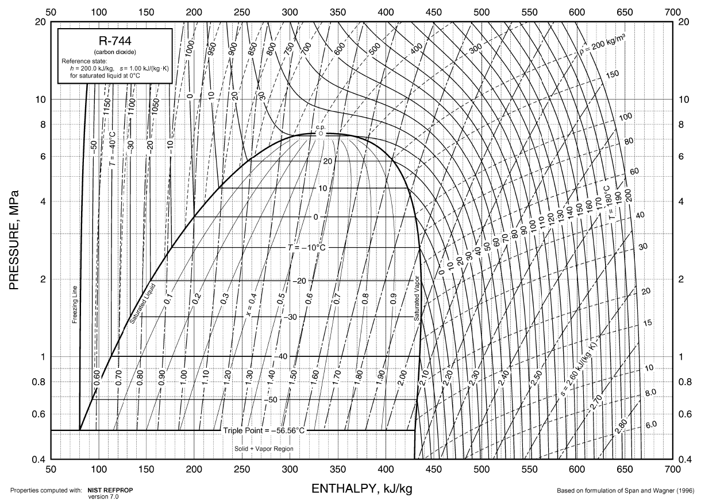

*Fig. 21 Pressure-Enthalpy Diagram for Refrigerant 744 (Carbon Dioxide)*

<!-- str. 846 -->

### Refrigerant 744 (Carbon Dioxide) Properties

**of Saturated Liquid and Saturated Vapor**

| Temp.,* °C | Pressure, MPa | Density, Volume,<br>kg/m<sup>3</sup> Liquid | Density, Volume,<br>m<sup>3</sup>/kg Vapor | Enthalpy, kJ/kg<br>Liquid | Enthalpy, kJ/kg<br>Vapor | Entropy, kJ/(kg·K)<br>Liquid | Entropy, kJ/(kg·K)<br>Vapor | Specific Heat c , kJ/(kg·K)<br>Liquid | Specific Heat c , kJ/(kg·K)<br><sup>p</sup> Vapor | c /c p v Vapor | Velocity of Sound, m/s<br>Liquid | Velocity of Sound, m/s<br>Vapor | Viscosity, μPa·s<br>Liquid | Viscosity, μPa·s<br>Vapor | Thermal Cond., mW/(m·K)<br>Liquid | Thermal Cond., mW/(m·K)<br>Vapor | Tension, Temp.,*<br>Surface mN/m | Tension, Temp.,*<br>°C |
|---|---|---|---|---|---|---|---|---|---|---|---|---|---|---|---|---|---|---|
| –56.56<sup>a</sup> | 0.51796 | 1178.5 | 0.07267 | 80.04 | 430.42 | 0.5213 | 2.1390 | 1.953 | 0.909 | 1.444 | 976 | 222.8 | 256.7 | 10.95 | 180.6 | 11.01 | 17.16 | –56.56 |
| –50 | 0.68234 | 1154.6 | 0.05579 | 92.94 | 432.68 | 0.5794 | 2.1018 | 1.971 | 0.952 | 1.468 | 928 | 223.4 | 229.3 | 11.31 | 172.1 | 11.58 | 15.53 | –50 |
| –48 | 0.73949 | 1147.1 | 0.05162 | 96.90 | 433.29 | 0.5968 | 2.0909 | 1.978 | 0.967 | 1.477 | 914 | 223.5 | 221.6 | 11.42 | 169.5 | 11.76 | 15.04 | –48 |
| –46 | 0.80015 | 1139.6 | 0.04782 | 100.88 | 433.86 | 0.6142 | 2.0801 | 1.985 | 0.982 | 1.486 | 900 | 223.6 | 214.3 | 11.53 | 166.9 | 11.95 | 14.56 | –46 |
| –44 | 0.86445 | 1132.0 | 0.04435 | 104.87 | 434.39 | 0.6314 | 2.0694 | 1.993 | 0.998 | 1.496 | 885 | 223.6 | 207.2 | 11.64 | 164.4 | 12.14 | 14.07 | –44 |
| –42 | 0.93252 | 1124.2 | 0.04118 | 108.88 | 434.88 | 0.6486 | 2.0589 | 2.002 | 1.015 | 1.507 | 871 | 223.6 | 200.3 | 11.75 | 161.8 | 12.34 | 13.60 | –42 |
| –40 | 1.00450 | 1116.4 | 0.03828 | 112.90 | 435.32 | 0.6656 | 2.0485 | 2.012 | 1.033 | 1.518 | 856 | 223.5 | 193.8 | 11.87 | 159.3 | 12.54 | 13.12 | –40 |
| –38 | 1.08050 | 1108.5 | 0.03562 | 116.95 | 435.72 | 0.6826 | 2.0382 | 2.022 | 1.052 | 1.530 | 842 | 223.4 | 187.4 | 11.98 | 156.8 | 12.75 | 12.65 | –38 |
| –36 | 1.16070 | 1100.5 | 0.03318 | 121.01 | 436.07 | 0.6995 | 2.0281 | 2.033 | 1.072 | 1.544 | 827 | 223.2 | 181.3 | 12.10 | 154.3 | 12.97 | 12.18 | –36 |
| –34 | 1.24520 | 1092.4 | 0.03093 | 125.10 | 436.37 | 0.7163 | 2.0180 | 2.045 | 1.094 | 1.558 | 813 | 223.1 | 175.4 | 12.22 | 151.8 | 13.20 | 11.72 | –34 |
| –32 | 1.33420 | 1084.1 | 0.02886 | 129.20 | 436.62 | 0.7331 | 2.0079 | 2.059 | 1.116 | 1.573 | 798 | 222.8 | 169.7 | 12.34 | 149.3 | 13.43 | 11.26 | –32 |
| –30 | 1.42780 | 1075.7 | 0.02696 | 133.34 | 436.82 | 0.7498 | 1.9980 | 2.073 | 1.141 | 1.590 | 783 | 222.5 | 164.2 | 12.46 | 146.9 | 13.68 | 10.80 | –30 |
| –28 | 1.52610 | 1067.2 | 0.02519 | 137.50 | 436.96 | 0.7665 | 1.9880 | 2.089 | 1.166 | 1.608 | 768 | 222.2 | 158.9 | 12.59 | 144.4 | 13.94 | 10.35 | –28 |
| –26 | 1.62930 | 1058.6 | 0.02356 | 141.69 | 437.04 | 0.7831 | 1.9781 | 2.105 | 1.194 | 1.627 | 753 | 221.8 | 153.8 | 12.72 | 141.9 | 14.20 | 9.90 | –26 |
| –24 | 1.73750 | 1049.8 | 0.02205 | 145.91 | 437.06 | 0.7997 | 1.9683 | 2.124 | 1.223 | 1.648 | 738 | 221.4 | 148.8 | 12.85 | 139.5 | 14.49 | 9.46 | –24 |
| –22 | 1.85090 | 1040.8 | 0.02065 | 150.16 | 437.01 | 0.8163 | 1.9584 | 2.144 | 1.255 | 1.671 | 723 | 220.9 | 144.0 | 12.98 | 137.1 | 14.78 | 9.02 | –22 |
| –20 | 1.96960 | 1031.7 | 0.01934 | 154.45 | 436.89 | 0.8328 | 1.9485 | 2.165 | 1.289 | 1.696 | 708 | 220.4 | 139.3 | 13.12 | 134.6 | 15.09 | 8.59 | –20 |
| –19 | 2.03100 | 1027.0 | 0.01873 | 156.61 | 436.81 | 0.8411 | 1.9436 | 2.177 | 1.307 | 1.709 | 700 | 220.1 | 137.1 | 13.18 | 133.4 | 15.25 | 8.37 | –19 |
| –18 | 2.09380 | 1022.3 | 0.01813 | 158.77 | 436.70 | 0.8494 | 1.9386 | 2.189 | 1.326 | 1.723 | 692 | 219.8 | 134.8 | 13.26 | 132.2 | 15.42 | 8.16 | –18 |
| –17 | 2.15810 | 1017.6 | 0.01756 | 160.95 | 436.58 | 0.8576 | 1.9337 | 2.201 | 1.346 | 1.738 | 684 | 219.5 | 132.6 | 13.33 | 131.0 | 15.59 | 7.95 | –17 |
| –16 | 2.22370 | 1012.8 | 0.01700 | 163.14 | 436.44 | 0.8659 | 1.9287 | 2.215 | 1.366 | 1.753 | 676 | 219.2 | 130.4 | 13.40 | 129.8 | 15.77 | 7.74 | –16 |
| –15 | 2.29080 | 1008.0 | 0.01647 | 165.34 | 436.27 | 0.8742 | 1.9237 | 2.228 | 1.388 | 1.768 | 668 | 218.8 | 128.3 | 13.47 | 128.6 | 15.95 | 7.53 | –15 |
| –14 | 2.35930 | 1003.1 | 0.01595 | 167.55 | 436.09 | 0.8825 | 1.9187 | 2.243 | 1.410 | 1.785 | 660 | 218.5 | 126.2 | 13.55 | 127.4 | 16.14 | 7.32 | –14 |
| –13 | 2.42940 | 998.1 | 0.01545 | 169.78 | 435.89 | 0.8908 | 1.9137 | 2.258 | 1.433 | 1.802 | 651 | 218.1 | 124.1 | 13.63 | 126.2 | 16.34 | 7.11 | –13 |
| –12 | 2.50100 | 993.1 | 0.01497 | 172.01 | 435.66 | 0.8991 | 1.9086 | 2.273 | 1.457 | 1.821 | 643 | 217.7 | 122.0 | 13.70 | 125.0 | 16.54 | 6.90 | –12 |
| –11 | 2.57400 | 988.1 | 0.01450 | 174.26 | 435.41 | 0.9074 | 1.9036 | 2.290 | 1.483 | 1.840 | 635 | 217.4 | 120.0 | 13.78 | 123.8 | 16.74 | 6.70 | –11 |
| –10 | 2.64870 | 982.9 | 0.01405 | 176.52 | 435.14 | 0.9157 | 1.8985 | 2.307 | 1.509 | 1.860 | 626 | 216.9 | 118.0 | 13.86 | 122.5 | 16.96 | 6.50 | –10 |
| –9 | 2.72490 | 977.7 | 0.01361 | 178.80 | 434.84 | 0.9240 | 1.8934 | 2.325 | 1.537 | 1.881 | 617 | 216.5 | 116.1 | 13.95 | 121.3 | 17.18 | 6.29 | –9 |
| –8 | 2.80270 | 972.5 | 0.01319 | 181.09 | 434.51 | 0.9324 | 1.8882 | 2.345 | 1.566 | 1.904 | 609 | 216.1 | 114.1 | 14.03 | 120.1 | 17.42 | 6.09 | –8 |
| –7 | 2.88210 | 967.1 | 0.01278 | 183.39 | 434.17 | 0.9408 | 1.8830 | 2.365 | 1.597 | 1.927 | 600 | 215.6 | 112.2 | 14.12 | 118.9 | 17.66 | 5.89 | –7 |
| –6 | 2.96320 | 961.7 | 0.01238 | 185.71 | 433.79 | 0.9491 | 1.8778 | 2.386 | 1.629 | 1.952 | 591 | 215.2 | 110.3 | 14.20 | 117.7 | 17.91 | 5.70 | –6 |
| –5 | 3.04590 | 956.2 | 0.01200 | 188.05 | 433.38 | 0.9576 | 1.8725 | 2.408 | 1.663 | 1.979 | 582 | 214.7 | 108.4 | 14.30 | 116.5 | 18.17 | 5.50 | –5 |
| –4 | 3.13030 | 950.6 | 0.01162 | 190.40 | 432.95 | 0.9660 | 1.8672 | 2.432 | 1.699 | 2.007 | 573 | 214.2 | 106.6 | 14.39 | 115.3 | 18.44 | 5.30 | –4 |
| –3 | 3.21640 | 945.0 | 0.01126 | 192.77 | 432.48 | 0.9744 | 1.8618 | 2.457 | 1.737 | 2.037 | 564 | 213.7 | 104.8 | 14.48 | 114.1 | 18.73 | 5.11 | –3 |
| –2 | 3.30420 | 939.2 | 0.01091 | 195.16 | 431.99 | 0.9829 | 1.8563 | 2.484 | 1.777 | 2.068 | 555 | 213.1 | 102.9 | 14.58 | 112.9 | 19.03 | 4.92 | –2 |
| –1 | 3.39380 | 933.4 | 0.01057 | 197.57 | 431.46 | 0.9914 | 1.8509 | 2.512 | 1.819 | 2.102 | 546 | 212.6 | 101.2 | 14.68 | 111.6 | 19.34 | 4.73 | –1 |
| 0 | 3.48510 | 927.4 | 0.01024 | 200.00 | 430.89 | 1.0000 | 1.8453 | 2.542 | 1.865 | 2.138 | 536 | 212.0 | 99.4 | 14.79 | 110.4 | 19.67 | 4.54 | 0 |
| 1 | 3.57830 | 921.4 | 0.00992 | 202.45 | 430.29 | 1.0086 | 1.8397 | 2.574 | 1.913 | 2.176 | 527 | 211.5 | 97.6 | 14.89 | 109.2 | 20.02 | 4.35 | 1 |
| 2 | 3.67330 | 915.2 | 0.00961 | 204.93 | 429.65 | 1.0172 | 1.8340 | 2.609 | 1.965 | 2.218 | 518 | 210.9 | 95.9 | 15.00 | 108.0 | 20.38 | 4.17 | 2 |
| 3 | 3.77010 | 909.0 | 0.00931 | 207.43 | 428.97 | 1.0259 | 1.8282 | 2.645 | 2.020 | 2.262 | 508 | 210.3 | 94.2 | 15.12 | 106.8 | 20.76 | 3.99 | 3 |
| 4 | 3.86880 | 902.6 | 0.00901 | 209.95 | 428.25 | 1.0346 | 1.8223 | 2.685 | 2.080 | 2.309 | 499 | 209.6 | 92.5 | 15.24 | 105.5 | 21.17 | 3.80 | 4 |
| 5 | 3.96950 | 896.0 | 0.00872 | 212.50 | 427.48 | 1.0434 | 1.8163 | 2.727 | 2.144 | 2.360 | 489 | 209.0 | 90.8 | 15.36 | 104.3 | 21.60 | 3.62 | 5 |
| 6 | 4.07200 | 889.4 | 0.00845 | 215.08 | 426.67 | 1.0523 | 1.8102 | 2.772 | 2.213 | 2.416 | 480 | 208.3 | 89.1 | 15.49 | 103.1 | 22.06 | 3.45 | 6 |
| 7 | 4.17650 | 882.6 | 0.00817 | 217.69 | 425.81 | 1.0612 | 1.8041 | 2.822 | 2.289 | 2.476 | 470 | 207.6 | 87.5 | 15.62 | 101.8 | 22.54 | 3.27 | 7 |
| 8 | 4.28310 | 875.6 | 0.00791 | 220.34 | 424.89 | 1.0702 | 1.7977 | 2.875 | 2.370 | 2.541 | 460 | 206.9 | 85.8 | 15.76 | 100.6 | 23.06 | 3.10 | 8 |
| 9 | 4.39160 | 868.4 | 0.00765 | 223.01 | 423.92 | 1.0792 | 1.7913 | 2.934 | 2.460 | 2.612 | 451 | 206.2 | 84.2 | 15.91 | 99.4 | 23.61 | 2.93 | 9 |
| 10 | 4.50220 | 861.1 | 0.00740 | 225.73 | 422.88 | 1.0884 | 1.7847 | 2.998 | 2.558 | 2.690 | 441 | 205.4 | 82.6 | 16.06 | 98.1 | 24.21 | 2.76 | 10 |
| 11 | 4.61490 | 853.6 | 0.00715 | 228.49 | 421.79 | 1.0976 | 1.7779 | 3.068 | 2.666 | 2.776 | 431 | 204.6 | 80.9 | 16.22 | 96.9 | 24.84 | 2.59 | 11 |
| 12 | 4.72970 | 845.9 | 0.00691 | 231.29 | 420.62 | 1.1070 | 1.7710 | 3.145 | 2.786 | 2.871 | 421 | 203.8 | 79.3 | 16.39 | 95.6 | 25.53 | 2.42 | 12 |
| 13 | 4.84660 | 837.9 | 0.00668 | 234.13 | 419.37 | 1.1165 | 1.7638 | 3.232 | 2.919 | 2.977 | 411 | 203.0 | 77.7 | 16.56 | 94.4 | 26.27 | 2.26 | 13 |
| 14 | 4.96580 | 829.7 | 0.00645 | 237.03 | 418.05 | 1.1261 | 1.7565 | 3.328 | 3.068 | 3.095 | 401 | 202.1 | 76.1 | 16.75 | 93.1 | 27.08 | 2.10 | 14 |
| 15 | 5.08701 | 821.2 | 0.00622 | 239.99 | 416.64 | 1.1359 | 1.7489 | 3.436 | 3.237 | 3.228 | 391 | 201.2 | 74.4 | 16.95 | 91.9 | 27.96 | 1.95 | 15 |
| 16 | 5.21080 | 812.4 | 0.00600 | 243.01 | 415.12 | 1.1458 | 1.7411 | 3.558 | 3.429 | 3.378 | 381 | 200.3 | 72.8 | 17.16 | 90.6 | 28.93 | 1.79 | 16 |
| 17 | 5.33680 | 803.3 | 0.00578 | 246.10 | 413.50 | 1.1559 | 1.7329 | 3.698 | 3.649 | 3.550 | 370 | 199.3 | 71.2 | 17.39 | 89.4 | 29.99 | 1.64 | 17 |
| 18 | 5.46510 | 793.8 | 0.00557 | 249.26 | 411.76 | 1.1663 | 1.7244 | 3.858 | 3.905 | 3.748 | 360 | 198.3 | 69.5 | 17.64 | 88.1 | 31.16 | 1.49 | 18 |
| 19 | 5.59580 | 783.8 | 0.00536 | 252.52 | 409.89 | 1.1769 | 1.7155 | 4.044 | 4.204 | 3.979 | 349 | 197.2 | 67.8 | 17.90 | 86.9 | 32.47 | 1.35 | 19 |
| 20 | 5.72910 | 773.4 | 0.00515 | 255.87 | 407.87 | 1.1877 | 1.7062 | 4.264 | 4.560 | 4.252 | 338 | 196.1 | 66.1 | 18.19 | 85.7 | 33.94 | 1.20 | 20 |
| 21 | 5.86480 | 762.4 | 0.00494 | 259.33 | 405.67 | 1.1989 | 1.6964 | 4.526 | 4.990 | 4.578 | 326 | 194.9 | 64.4 | 18.50 | 84.5 | 35.61 | 1.06 | 21 |
| 22 | 6.00310 | 750.8 | 0.00474 | 262.93 | 403.26 | 1.2105 | 1.6860 | 4.846 | 5.519 | 4.976 | 314 | 193.6 | 62.7 | 18.85 | 83.4 | 37.52 | 0.93 | 22 |
| 23 | 6.14400 | 738.4 | 0.00453 | 266.68 | 400.63 | 1.2225 | 1.6749 | 5.248 | 6.185 | 5.472 | 302 | 192.3 | 60.9 | 19.23 | 82.4 | 39.74 | 0.80 | 23 |
| 24 | 6.28770 | 725.0 | 0.00433 | 270.61 | 397.70 | 1.2352 | 1.6629 | 5.767 | 7.049 | 6.107 | 288 | 190.8 | 59.0 | 19.66 | 81.5 | 42.35 | 0.67 | 24 |
| 25 | 6.43420 | 710.5 | 0.00412 | 274.78 | 394.43 | 1.2485 | 1.6498 | 6.467 | 8.212 | 6.949 | 274 | 189.1 | 57.0 | 20.16 | 80.8 | 45.51 | 0.55 | 25 |
| 26 | 6.58370 | 694.5 | 0.00391 | 279.26 | 390.71 | 1.2627 | 1.6353 | 7.460 | 9.862 | 8.121 | 259 | 187.2 | 55.0 | 20.73 | 80.5 | 49.44 | 0.44 | 26 |
| 27 | 6.73610 | 676.4 | 0.00369 | 284.14 | 386.39 | 1.2783 | 1.6189 | 8.970 | 12.38 | 9.870 | 243 | 185.0 | 52.8 | 21.42 | 80.7 | 54.56 | 0.33 | 27 |
| 28 | 6.89180 | 655.3 | 0.00346 | 289.62 | 381.20 | 1.2958 | 1.5999 | 11.550 | 16.69 | 12.780 | 225 | 182.1 | 50.3 | 22.27 | 81.9 | 61.73 | 0.23 | 28 |
| 29 | 7.05090 | 629.4 | 0.00320 | 296.07 | 374.61 | 1.3163 | 1.5763 | 16.950 | 25.74 | 18.630 | 205 | 178.2 | 47.5 | 23.41 | 85.2 | 73.19 | 0.13 | 29 |
| 30 | 7.21370 | 593.3 | 0.00290 | 304.55 | 365.13 | 1.3435 | 1.5433 | 35.340 | 55.82 | 36.660 | 177 | 171.3 | 43.8 | 25.17 | 95.4 | 98.02 | 0.05 | 30 |
| 30.98<sup>c</sup> | 7.37730 | 467.6 | 0.00214 | 332.25 | 332.25 | 1.4336 | 1.4336 | ∞ | ∞ | ∞ | 0 | 0.0 | — | — | ∞ | ∞ | 0.00 | 30.98 |

*Temperatures on ITS-90 scale <sup>a</sup>Triple point <sup>c</sup>Critical point

<!-- str. 847 -->

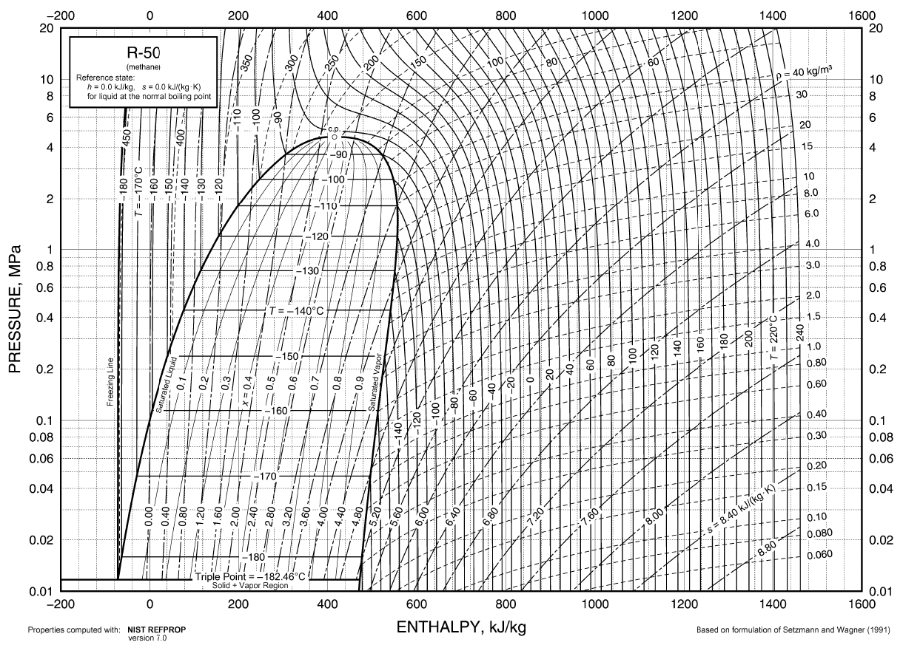

*Fig. 22 Pressure-Enthalpy Diagram for Refrigerant 50 (Methane)*

<!-- str. 848 -->

### Refrigerant 50 (Methane) Properties of Saturated Liquid and Saturated Vapor

| Temp.,* °C | Pressure, MPa | Density, Volume,<br>kg/m<sup>3</sup> Liquid | Enthalpy, Density, Volume, kJ/kg<br>m<sup>3</sup>/kg Vapor Liquid | Enthalpy, kJ/kg<br>Vapor | Entropy, kJ/(kg·K)<br>Liquid | Entropy, kJ/(kg·K)<br>Vapor | Specific Heat c , kJ/(kg·K)<br>Liquid | Specific Heat c , kJ/(kg·K)<br><sup>p</sup> Vapor | c /c p v Vapor | Velocity of Sound, m/s<br>Liquid | Velocity of Sound, m/s<br>Vapor | Viscosity, μPa·s<br>Liquid | Viscosity, μPa·s<br>Vapor | Thermal Cond., mW/(m·K)<br>Liquid | Thermal Cond., mW/(m·K)<br>Vapor | Tension, Temp.,*<br>Surface mN/m | Tension, Temp.,*<br>°C |
|---|---|---|---|---|---|---|---|---|---|---|---|---|---|---|---|---|---|
| –182.46<sup>a</sup> | 0.01170 | 451.5 | 3.9881 –71.82 | 472.44 | –0.7099 | 5.2911 | 3.368 | 2.110 | 1.341 | 1539 | 249.1 | 204.5 | 3.64 | 211.2 | 8.85 | 18.76 | –182.46 |
| –180 | 0.01590 | 448.2 | 3.0071 –63.53 | 477.22 | –0.6199 | 5.1853 | 3.377 | 2.118 | 1.343 | 1516 | 252.2 | 189.5 | 3.73 | 208.3 | 9.15 | 18.09 | –180 |
| –175 | 0.02823 | 441.4 | 1.7755 –46.58 | 486.76 | –0.4429 | 4.9910 | 3.399 | 2.137 | 1.348 | 1470 | 258.0 | 163.9 | 3.93 | 202.1 | 9.78 | 16.74 | –175 |
| –170 | 0.04723 | 434.5 | 1.1081 –29.49 | 495.99 | –0.2735 | 4.8208 | 3.426 | 2.162 | 1.355 | 1422 | 263.4 | 143.4 | 4.12 | 195.5 | 10.42 | 15.43 | –170 |
| –165 | 0.07509 | 427.4 | 0.72466 –12.24 | 504.85 | –0.1108 | 4.6704 | 3.457 | 2.192 | 1.365 | 1373 | 268.3 | 126.8 | 4.32 | 188.7 | 11.09 | 14.17 | –165 |
| –161.48<sup>b</sup> | 0.10133 | 422.4 | 0.55054 0.00 | 510.83 | 0.0000 | 4.5746 | 3.481 | 2.218 | 1.373 | 1338 | 271.5 | 116.8 | 4.46 | 183.9 | 11.58 | 13.30 | –161.48 |
| –160 | 0.11429 | 420.2 | 0.49291 5.19 | 513.28 | 0.0459 | 4.5363 | 3.492 | 2.229 | 1.377 | 1323 | 272.7 | 112.9 | 4.52 | 181.8 | 11.79 | 12.94 | –160 |
| –155 | 0.16757 | 412.7 | 0.34665 22.82 | 521.22 | 0.1973 | 4.4156 | 3.533 | 2.274 | 1.392 | 1273 | 276.5 | 101.3 | 4.73 | 174.8 | 12.53 | 11.75 | –155 |
| –150 | 0.23784 | 405.0 | 0.25077 40.69 | 528.60 | 0.3440 | 4.3058 | 3.580 | 2.328 | 1.412 | 1221 | 279.7 | 91.4 | 4.95 | 167.7 | 13.30 | 10.60 | –150 |
| –145 | 0.32817 | 397.1 | 0.18583 58.84 | 535.34 | 0.4866 | 4.2049 | 3.635 | 2.393 | 1.436 | 1168 | 282.3 | 82.8 | 5.17 | 160.5 | 14.13 | 9.49 | –145 |
| –140 | 0.44177 | 388.8 | 0.14054 77.30 | 541.38 | 0.6257 | 4.1111 | 3.701 | 2.472 | 1.466 | 1114 | 284.3 | 75.2 | 5.40 | 153.4 | 15.01 | 8.43 | –140 |
| –135 | 0.58192 | 380.2 | 0.10813 96.13 | 546.63 | 0.7618 | 4.0228 | 3.780 | 2.569 | 1.504 | 1059 | 285.6 | 68.6 | 5.63 | 146.3 | 15.96 | 7.42 | –135 |
| –130 | 0.75201 | 371.1 | 0.08440 115.39 | 550.97 | 0.8956 | 3.9384 | 3.876 | 2.690 | 1.552 | 1002 | 286.2 | 62.7 | 5.88 | 139.2 | 16.99 | 6.44 | –130 |
| –125 | 0.95550 | 361.6 | 0.06666 135.17 | 554.29 | 1.0276 | 3.8566 | 3.996 | 2.842 | 1.613 | 943 | 286.2 | 57.3 | 6.15 | 132.1 | 18.13 | 5.52 | –125 |
| –120 | 1.1959 | 351.4 | 0.05315 155.58 | 556.43 | 1.1585 | 3.7759 | 4.148 | 3.038 | 1.694 | 882 | 285.4 | 52.4 | 6.43 | 125.0 | 19.39 | 4.64 | –120 |
| –118 | 1.3033 | 347.2 | 0.04865 163.94 | 556.91 | 1.2108 | 3.7437 | 4.220 | 3.133 | 1.733 | 858 | 284.8 | 50.5 | 6.55 | 122.1 | 19.95 | 4.31 | –118 |
| –116 | 1.4174 | 342.8 | 0.04457 172.44 | 557.16 | 1.2631 | 3.7112 | 4.302 | 3.240 | 1.777 | 832 | 284.2 | 48.7 | 6.68 | 119.3 | 20.53 | 3.98 | –116 |
| –114 | 1.5384 | 338.3 | 0.04087 181.08 | 557.15 | 1.3155 | 3.6785 | 4.393 | 3.362 | 1.827 | 807 | 283.4 | 47.0 | 6.81 | 116.4 | 21.15 | 3.66 | –114 |
| –112 | 1.6668 | 333.6 | 0.03750 189.88 | 556.87 | 1.3681 | 3.6454 | 4.497 | 3.501 | 1.885 | 780 | 282.5 | 45.3 | 6.95 | 113.5 | 21.81 | 3.35 | –112 |
| –110 | 1.8026 | 328.8 | 0.03442 198.85 | 556.28 | 1.4209 | 3.6117 | 4.615 | 3.662 | 1.951 | 754 | 281.4 | 43.6 | 7.09 | 110.7 | 22.52 | 3.04 | –110 |
| –108 | 1.9462 | 323.7 | 0.03160 208.03 | 555.37 | 1.4741 | 3.5773 | 4.751 | 3.848 | 2.028 | 726 | 280.2 | 42.0 | 7.24 | 107.8 | 23.28 | 2.75 | –108 |
| –106 | 2.0978 | 318.4 | 0.02900 217.42 | 554.09 | 1.5278 | 3.5419 | 4.910 | 4.068 | 2.119 | 698 | 278.9 | 40.4 | 7.40 | 104.9 | 24.12 | 2.46 | –106 |
| –104 | 2.2578 | 312.9 | 0.02662 227.06 | 552.39 | 1.5821 | 3.5054 | 5.097 | 4.331 | 2.227 | 670 | 277.4 | 38.8 | 7.57 | 102.0 | 25.05 | 2.19 | –104 |
| –102 | 2.4264 | 307.1 | 0.02441 236.99 | 550.24 | 1.6372 | 3.4675 | 5.322 | 4.650 | 2.358 | 641 | 275.7 | 37.2 | 7.76 | 99.0 | 26.09 | 1.92 | –102 |
| –100 | 2.6040 | 301.0 | 0.02236 247.25 | 547.56 | 1.6934 | 3.4278 | 5.596 | 5.044 | 2.520 | 610 | 273.9 | 35.6 | 7.96 | 96.1 | 27.28 | 1.66 | –100 |
| –95 | 3.0895 | 283.6 | 0.01781 274.80 | 537.86 | 1.8408 | 3.3174 | 6.654 | 6.608 | 3.153 | 529 | 268.4 | 31.7 | 8.55 | 88.6 | 31.27 | 1.07 | –95 |
| –90 | 3.6399 | 261.7 | 0.01384 306.71 | 521.52 | 2.0062 | 3.1791 | 9.10 | 10.37 | 4.64 | 437 | 261.3 | 27.5 | 9.39 | 81.2 | 38.68 | 0.55 | –90 |
| –85 | 4.2648 | 227.5 | 0.00993 349.75 | 488.81 | 2.2241 | 2.9632 | 21.88 | 30.57 | 12.16 | 320 | 250.2 | 22.3 | 10.95 | 77.5 | 62.99 | 0.13 | –85 |
| –82.59<sup>c</sup> | 4.5992 | 162.7 | 0.00615 415.59 | 415.59 | 2.5624 | 2.5624 | ∞ | ∞ | ∞ | 0 | 0.0 | — | — | ∞ | ∞ | 0.00 | –82.59 |

*Temperatures on ITS-90 scale <sup>a</sup>Triple point <sup>b</sup>Normal boiling point <sup>c</sup>Critical point

### Refrigerant 50 (Methane) Properties of Gas a

**t 0.101 325 MPa (one standard atmosphere)**

|   |   |   |   |   |   | Vel. of |   | Thermal |   |   |   |   |   |   | Vel. of |   | Thermal |
|---|---|---|---|---|---|---|---|---|---|---|---|---|---|---|---|---|---|
| Temp., Density, Enthalpy, |  |  | Entropy, | c<sub>p</sub>, kJ/ |  | Sound, | Visc., | Cond., | Temp.,Density, Enthalpy, |  |  | Entropy, | c<sub>p</sub>, kJ/ |  | Sound, | Visc., | Cond., |
| °C | kg/m<sup>3</sup> | kJ/kg | kJ/(kg·K) | (kg·K) | c<sub>p</sub>/c<sub>v</sub> | m/s | μPa·s mW/(m·K) |  | °C | kg/m<sup>3</sup> | kJ/kg | kJ/(kg·K) | (kg·K) | c<sub>p</sub>/c<sub>v</sub> | m/s | μPa·s | mW/(m·K) |
| –161.5<sup>a</sup> | 1.8164 | 510.83 | 4.5746 | 2.218 | 1.373 | 271.5 | 4.46 | 11.58 | 50 | 0.6058 | 966.50 | 6.8565 | 2.293 | 1.295 | 465.1 | 11.98 | 37.86 |
| –160 | 1.7899 | 514.11 | 4.6037 | 2.208 | 1.371 | 273.5 | 4.52 | 11.74 | 60 | 0.5875 | 989.57 | 6.9269 | 2.321 | 1.290 | 471.4 | 12.29 | 39.35 |
| –155 | 1.7064 | 525.08 | 4.6986 | 2.183 | 1.366 | 280.3 | 4.71 | 12.30 | 70 | 0.5703 | 1012.92 | 6.9959 | 2.350 | 1.285 | 477.6 | 12.60 | 40.87 |
| –150 | 1.6310 | 535.95 | 4.7887 | 2.165 | 1.362 | 286.9 | 4.90 | 12.87 | 80 | 0.5541 | 1036.57 | 7.0638 | 2.380 | 1.281 | 483.7 | 12.90 | 42.42 |
| –145 | 1.5626 | 546.74 | 4.8746 | 2.151 | 1.359 | 293.2 | 5.10 | 13.45 | 90 | 0.5388 | 1060.52 | 7.1307 | 2.411 | 1.276 | 489.6 | 13.20 | 44.01 |
| –140 | 1.5000 | 557.47 | 4.9567 | 2.141 | 1.356 | 299.4 | 5.29 | 14.03 | 100 | 0.5243 | 1084.79 | 7.1967 | 2.443 | 1.271 | 495.5 | 13.49 | 45.63 |
| –135 | 1.4425 | 568.15 | 5.0355 | 2.132 | 1.354 | 305.4 | 5.48 | 14.62 | 110 | 0.5106 | 1109.39 | 7.2617 | 2.476 | 1.266 | 501.2 | 13.79 | 47.28 |
| –130 | 1.3894 | 578.79 | 5.1112 | 2.125 | 1.351 | 311.2 | 5.67 | 15.21 | 120 | 0.4975 | 1134.32 | 7.3259 | 2.510 | 1.262 | 506.8 | 14.08 | 48.96 |
| –120 | 1.2947 | 599.99 | 5.2543 | 2.116 | 1.348 | 322.5 | 6.06 | 16.40 | 130 | 0.4852 | 1159.60 | 7.3894 | 2.545 | 1.257 | 512.3 | 14.36 | 50.67 |
| –110 | 1.2124 | 621.11 | 5.3879 | 2.109 | 1.345 | 333.3 | 6.44 | 17.58 | 140 | 0.4734 | 1185.22 | 7.4522 | 2.580 | 1.253 | 517.7 | 14.64 | 52.41 |
| –100 | 1.1403 | 642.18 | 5.5133 | 2.106 | 1.343 | 343.8 | 6.81 | 18.77 | 150 | 0.4622 | 1211.21 | 7.5143 | 2.616 | 1.248 | 523.1 | 14.92 | 54.18 |
| –90 | 1.0764 | 663.23 | 5.6315 | 2.104 | 1.341 | 353.8 | 7.19 | 19.96 | 160 | 0.4515 | 1237.55 | 7.5759 | 2.652 | 1.244 | 528.3 | 15.20 | 55.97 |
| –80 | 1.0194 | 684.27 | 5.7433 | 2.105 | 1.339 | 363.5 | 7.56 | 21.15 | 170 | 0.4413 | 1264.25 | 7.6368 | 2.689 | 1.240 | 533.5 | 15.47 | 57.79 |
| –70 | 0.9683 | 705.33 | 5.8496 | 2.107 | 1.337 | 372.9 | 7.92 | 22.31 | 180 | 0.4315 | 1291.32 | 7.6972 | 2.726 | 1.236 | 538.6 | 15.74 | 59.63 |
| –60 | 0.9221 | 726.42 | 5.9509 | 2.111 | 1.335 | 382.0 | 8.29 | 23.49 | 190 | 0.4222 | 1318.76 | 7.7571 | 2.763 | 1.232 | 543.7 | 16.01 | 61.50 |
| –50 | 0.8802 | 747.57 | 6.0479 | 2.118 | 1.332 | 390.7 | 8.64 | 24.68 | 200 | 0.4132 | 1346.57 | 7.8165 | 2.800 | 1.228 | 548.7 | 16.28 | 63.39 |
| –40 | 0.8419 | 768.78 | 6.1409 | 2.126 | 1.330 | 399.2 | 9.00 | 25.89 | 210 | 0.4047 | 1374.76 | 7.8755 | 2.837 | 1.224 | 553.6 | 16.54 | 65.30 |
| –30 | 0.8069 | 790.10 | 6.2304 | 2.137 | 1.327 | 407.5 | 9.35 | 27.12 | 220 | 0.3965 | 1403.32 | 7.9340 | 2.875 | 1.221 | 558.5 | 16.80 | 67.23 |
| –20 | 0.7747 | 811.53 | 6.3168 | 2.149 | 1.324 | 415.4 | 9.69 | 28.36 | 230 | 0.3886 | 1432.26 | 7.9921 | 2.912 | 1.217 | 563.4 | 17.06 | 69.18 |
| –10 | 0.7450 | 833.09 | 6.4003 | 2.164 | 1.320 | 423.2 | 10.03 | 29.63 | 240 | 0.3810 | 1461.57 | 8.0498 | 2.950 | 1.214 | 568.2 | 17.31 | 71.15 |
| 0 | 0.7175 | 854.82 | 6.4814 | 2.181 | 1.316 | 430.7 | 10.37 | 30.93 | 250 | 0.3737 | 1491.26 | 8.1071 | 2.988 | 1.211 | 572.9 | 17.56 | 73.14 |
| 10 | 0.6919 | 876.72 | 6.5601 | 2.200 | 1.312 | 437.9 | 10.70 | 32.25 | 260 | 0.3667 | 1521.32 | 8.1640 | 3.025 | 1.207 | 577.6 | 17.81 | 75.14 |
| 20 | 0.6682 | 898.82 | 6.6368 | 2.221 | 1.308 | 445.0 | 11.02 | 33.61 | 270 | 0.3599 | 1551.76 | 8.2205 | 3.062 | 1.204 | 582.3 | 18.06 | 77.16 |
| 30 | 0.6460 | 921.14 | 6.7117 | 2.243 | 1.304 | 451.9 | 11.35 | 34.99 | 280 | 0.3534 | 1582.57 | 8.2768 | 3.100 | 1.201 | 586.9 | 18.31 | 79.20 |
| 40 | 0.6252 | 943.69 | 6.7849 | 2.268 | 1.299 | 458.6 | 11.66 | 36.41 | 290 | 0.3471 | 1613.75 | 8.3326 | 3.137 | 1.198 | 591.5 | 18.55 | 81.25 |
|  |  |  |  |  |  |  |  |  | 300 | 0.3411 | 1645.31 | 8.3882 | 3.174 | 1.196 | 596.0 | 18.79 | 83.31 |

<sup>a</sup>Saturated vapor at normal boiling point

<!-- str. 849 -->

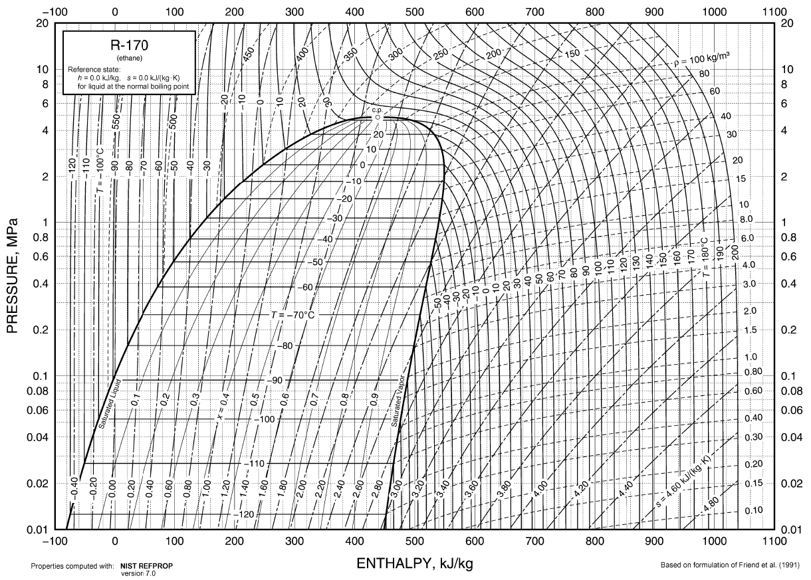

*Fig. 23 Pressure-Enthalpy Diagram for Refrigerant 170 (Ethane)*

<!-- str. 850 -->

### Refrigerant 170 (Ethane) Properties of S

**aturated Liquid and Saturated Vapor**

| Temp.,* °C | Pressure, MPa | Density, Volume,<br>kg/m<sup>3</sup> Liquid | Density, Volume,<br>m<sup>3</sup>/kg Vapor | Enthalpy, kJ/kg<br>Liquid | Enthalpy, kJ/kg<br>Vapor | Entropy, kJ/(kg·K)<br>Liquid | Entropy, kJ/(kg·K)<br>Vapor | Specific Heat c<sub>p</sub>, kJ/(kg·K)<br>Liquid | Specific Heat c<sub>p</sub>, kJ/(kg·K)<br>Vapor | c /c p v Vapor | Velocity of Sound, m/s<br>Liquid | Velocity of Sound, m/s<br>Vapor | Viscosity, μPa·s<br>Liquid | Viscosity, μPa·s<br>Vapor | Thermal Cond., mW/(m·K)<br>Liquid | Thermal Cond., mW/(m·K)<br>Vapor | Tension, Temp.,*<br>Surface mN/m | Tension, Temp.,*<br>°C |
|---|---|---|---|---|---|---|---|---|---|---|---|---|---|---|---|---|---|---|
| –175 | 0.00001 | 643.0 | 3649.3 | –201.26 | 384.73 | –1.4643 | 4.5060 | 2.288 | 1.184 | 1.305 | 1952 | 188.2 | 933.9 | 3.26 | 249.4 | 3.35 | 30.35 | –175 |
| –170 | 0.00002 | 637.5 | 1353.1 | –189.85 | 390.67 | –1.3510 | 4.2770 | 2.277 | 1.194 | 1.302 | 1916 | 192.7 | 783.6 | 3.41 | 245.2 | 3.64 | 29.51 | –170 |
| –165 | 0.00005 | 632.0 | 555.95 | –178.48 | 396.66 | –1.2433 | 4.0747 | 2.273 | 1.204 | 1.298 | 1880 | 197.0 | 669.0 | 3.55 | 240.8 | 3.93 | 28.67 | –165 |
| –160 | 0.00013 | 626.5 | 249.56 | –167.11 | 402.69 | –1.1405 | 3.8953 | 2.274 | 1.215 | 1.295 | 1844 | 201.3 | 579.6 | 3.70 | 236.3 | 4.23 | 27.83 | –160 |
| –155 | 0.00027 | 621.0 | 120.95 | –155.73 | 408.76 | –1.0421 | 3.7356 | 2.278 | 1.226 | 1.292 | 1808 | 205.4 | 508.5 | 3.84 | 231.6 | 4.54 | 26.99 | –155 |
| –150 | 0.00054 | 615.5 | 62.674 | –144.33 | 414.87 | –0.9476 | 3.5932 | 2.283 | 1.238 | 1.289 | 1772 | 209.4 | 450.9 | 3.99 | 226.9 | 4.86 | 26.15 | –150 |
| –145 | 0.00103 | 609.9 | 34.435 | –132.89 | 421.00 | –0.8566 | 3.4657 | 2.290 | 1.251 | 1.287 | 1735 | 213.3 | 403.6 | 4.14 | 222.1 | 5.18 | 25.31 | –145 |
| –140 | 0.00185 | 604.3 | 19.920 | –121.42 | 427.16 | –0.7688 | 3.3513 | 2.299 | 1.265 | 1.284 | 1699 | 217.0 | 364.1 | 4.29 | 217.3 | 5.50 | 24.48 | –140 |
| –135 | 0.00316 | 598.7 | 12.060 | –109.90 | 433.34 | –0.6839 | 3.2484 | 2.308 | 1.279 | 1.282 | 1663 | 220.7 | 330.8 | 4.44 | 212.4 | 5.84 | 23.64 | –135 |
| –130 | 0.00519 | 593.0 | 7.6020 | –98.34 | 439.53 | –0.6017 | 3.1557 | 2.318 | 1.293 | 1.280 | 1626 | 224.2 | 302.4 | 4.59 | 207.5 | 6.18 | 22.81 | –130 |
| –125 | 0.00821 | 587.3 | 4.9668 | –86.72 | 445.71 | –0.5219 | 3.0719 | 2.328 | 1.307 | 1.278 | 1589 | 227.6 | 277.8 | 4.74 | 202.5 | 6.54 | 21.98 | –125 |
| –120 | 0.01255 | 581.5 | 3.3504 | –75.04 | 451.89 | –0.4445 | 2.9962 | 2.340 | 1.320 | 1.277 | 1552 | 230.9 | 256.4 | 4.90 | 197.6 | 6.90 | 21.15 | –120 |
| –115 | 0.01863 | 575.7 | 2.3254 | –63.31 | 458.04 | –0.3691 | 2.9274 | 2.353 | 1.333 | 1.277 | 1515 | 234.0 | 237.6 | 5.05 | 192.7 | 7.28 | 20.33 | –115 |
| –110 | 0.02691 | 569.8 | 1.6556 | –51.50 | 464.15 | –0.2957 | 2.8649 | 2.366 | 1.347 | 1.277 | 1478 | 237.0 | 220.9 | 5.21 | 187.7 | 7.67 | 19.51 | –110 |
| –105 | 0.03793 | 563.9 | 1.2060 | –39.62 | 470.20 | –0.2241 | 2.8078 | 2.381 | 1.362 | 1.278 | 1440 | 239.7 | 206.0 | 5.36 | 182.8 | 8.07 | 18.69 | –105 |
| –100 | 0.05230 | 557.9 | 0.89662 | –27.66 | 476.16 | –0.1542 | 2.7556 | 2.397 | 1.380 | 1.280 | 1403 | 242.3 | 192.5 | 5.52 | 178.0 | 8.48 | 17.88 | –100 |
| –95 | 0.07068 | 551.8 | 0.67900 | –15.61 | 482.04 | –0.0858 | 2.7076 | 2.415 | 1.401 | 1.282 | 1365 | 244.7 | 180.4 | 5.68 | 173.1 | 8.92 | 17.07 | –95 |
| –90 | 0.09380 | 545.6 | 0.52278 | –3.46 | 487.79 | –0.0188 | 2.6635 | 2.434 | 1.425 | 1.286 | 1326 | 246.9 | 169.3 | 5.84 | 168.3 | 9.36 | 16.26 | –90 |
| –88.58<sup>b</sup>0.10132 |  | 543.8 | 0.48676 | 0.00 | 489.40 | 0.0000 | 2.6516 | 2.439 | 1.433 | 1.287 | 1316 | 247.4 | 166.4 | 5.89 | 167.0 | 9.49 | 16.03 | –88.58 |
| –85 | 0.12243 | 539.3 | 0.40856 | 8.79 | 493.42 | 0.0469 | 2.6227 | 2.455 | 1.454 | 1.290 | 1288 | 248.8 | 159.2 | 6.00 | 163.6 | 9.83 | 15.46 | –85 |
| –80 | 0.15741 | 532.9 | 0.32361 | 21.15 | 498.91 | 0.1115 | 2.5850 | 2.478 | 1.487 | 1.295 | 1249 | 250.4 | 149.9 | 6.16 | 158.9 | 10.31 | 14.67 | –80 |
| –78 | 0.17338 | 530.3 | 0.29583 | 26.13 | 501.07 | 0.1370 | 2.5707 | 2.487 | 1.501 | 1.297 | 1234 | 251.0 | 146.4 | 6.23 | 157.0 | 10.51 | 14.35 | –78 |
| –76 | 0.19055 | 527.7 | 0.27094 | 31.13 | 503.20 | 0.1623 | 2.5567 | 2.497 | 1.515 | 1.300 | 1218 | 251.6 | 143.0 | 6.30 | 155.2 | 10.72 | 14.04 | –76 |
| –74 | 0.20899 | 525.1 | 0.24859 | 36.16 | 505.30 | 0.1875 | 2.5432 | 2.508 | 1.531 | 1.302 | 1203 | 252.1 | 139.6 | 6.36 | 153.3 | 10.92 | 13.72 | –74 |
| –72 | 0.22877 | 522.5 | 0.22847 | 41.20 | 507.38 | 0.2125 | 2.5300 | 2.519 | 1.546 | 1.305 | 1187 | 252.5 | 136.4 | 6.43 | 151.5 | 11.13 | 13.41 | –72 |
| –70 | 0.24993 | 519.8 | 0.21033 | 46.27 | 509.43 | 0.2373 | 2.5172 | 2.530 | 1.562 | 1.308 | 1171 | 252.9 | 133.3 | 6.50 | 149.7 | 11.35 | 13.09 | –70 |
| –68 | 0.27255 | 517.1 | 0.19394 | 51.36 | 511.45 | 0.2621 | 2.5048 | 2.542 | 1.579 | 1.312 | 1156 | 253.3 | 130.3 | 6.56 | 147.9 | 11.56 | 12.78 | –68 |
| –66 | 0.29668 | 514.4 | 0.17909 | 56.48 | 513.44 | 0.2867 | 2.4926 | 2.554 | 1.596 | 1.315 | 1140 | 253.6 | 127.3 | 6.63 | 146.0 | 11.79 | 12.47 | –66 |
| –64 | 0.32238 | 511.6 | 0.16563 | 61.62 | 515.40 | 0.3111 | 2.4808 | 2.567 | 1.614 | 1.319 | 1124 | 253.9 | 124.4 | 6.70 | 144.2 | 12.01 | 12.16 | –64 |
| –62 | 0.34972 | 508.9 | 0.15339 | 66.79 | 517.34 | 0.3355 | 2.4692 | 2.580 | 1.633 | 1.323 | 1108 | 254.2 | 121.6 | 6.77 | 142.4 | 12.24 | 11.86 | –62 |
| –60 | 0.37877 | 506.1 | 0.14224 | 71.99 | 519.23 | 0.3597 | 2.4580 | 2.594 | 1.651 | 1.327 | 1092 | 254.3 | 118.9 | 6.84 | 140.6 | 12.48 | 11.55 | –60 |
| –58 | 0.40958 | 503.2 | 0.13208 | 77.21 | 521.10 | 0.3838 | 2.4470 | 2.608 | 1.671 | 1.331 | 1076 | 254.5 | 116.2 | 6.91 | 138.9 | 12.72 | 11.24 | –58 |
| –56 | 0.44223 | 500.4 | 0.12279 | 82.47 | 522.93 | 0.4078 | 2.4362 | 2.623 | 1.691 | 1.336 | 1060 | 254.6 | 113.6 | 6.99 | 137.1 | 12.96 | 10.94 | –56 |
| –54 | 0.47677 | 497.5 | 0.11429 | 87.75 | 524.73 | 0.4317 | 2.4257 | 2.638 | 1.711 | 1.342 | 1044 | 254.6 | 111.1 | 7.06 | 135.3 | 13.21 | 10.63 | –54 |
| –52 | 0.51328 | 494.6 | 0.10650 | 93.07 | 526.48 | 0.4556 | 2.4154 | 2.654 | 1.732 | 1.347 | 1028 | 254.6 | 108.6 | 7.13 | 133.6 | 13.46 | 10.33 | –52 |
| –50 | 0.55183 | 491.6 | 0.09935 | 98.42 | 528.20 | 0.4793 | 2.4053 | 2.671 | 1.754 | 1.353 | 1012 | 254.6 | 106.2 | 7.21 | 131.8 | 13.73 | 10.03 | –50 |
| –48 | 0.59247 | 488.7 | 0.09277 | 103.80 | 529.88 | 0.5029 | 2.3954 | 2.689 | 1.777 | 1.359 | 996 | 254.5 | 103.9 | 7.28 | 130.1 | 13.99 | 9.73 | –48 |
| –46 | 0.63529 | 485.7 | 0.08671 | 109.22 | 531.52 | 0.5265 | 2.3856 | 2.707 | 1.800 | 1.366 | 979 | 254.4 | 101.5 | 7.36 | 128.4 | 14.26 | 9.44 | –46 |
| –44 | 0.68034 | 482.6 | 0.08113 | 114.68 | 533.11 | 0.5500 | 2.3760 | 2.726 | 1.824 | 1.373 | 963 | 254.2 | 99.3 | 7.44 | 126.7 | 14.54 | 9.14 | –44 |
| –42 | 0.72770 | 479.5 | 0.07597 | 120.18 | 534.66 | 0.5735 | 2.3666 | 2.746 | 1.850 | 1.381 | 947 | 253.9 | 97.1 | 7.51 | 125.0 | 14.83 | 8.85 | –42 |
| –40 | 0.77744 | 476.4 | 0.07120 | 125.71 | 536.16 | 0.5969 | 2.3573 | 2.767 | 1.876 | 1.390 | 930 | 253.6 | 94.9 | 7.59 | 123.3 | 15.12 | 8.55 | –40 |
| –38 | 0.82963 | 473.2 | 0.06679 | 131.29 | 537.60 | 0.6202 | 2.3481 | 2.789 | 1.904 | 1.399 | 914 | 253.2 | 92.8 | 7.68 | 121.6 | 15.42 | 8.26 | –38 |
| –36 | 0.88433 | 470.0 | 0.06269 | 136.91 | 539.00 | 0.6435 | 2.3390 | 2.812 | 1.932 | 1.408 | 897 | 252.8 | 90.7 | 7.76 | 119.9 | 15.73 | 7.97 | –36 |
| –34 | 0.94163 | 466.7 | 0.05889 | 142.57 | 540.34 | 0.6668 | 2.3301 | 2.836 | 1.963 | 1.419 | 880 | 252.4 | 88.7 | 7.84 | 118.2 | 16.04 | 7.68 | –34 |
| –32 | 1.0016 | 463.4 | 0.05536 | 148.28 | 541.62 | 0.6900 | 2.3211 | 2.862 | 1.995 | 1.430 | 864 | 251.8 | 86.7 | 7.93 | 116.6 | 16.37 | 7.40 | –32 |
| –30 | 1.0643 | 460.0 | 0.05207 | 154.04 | 542.85 | 0.7133 | 2.3123 | 2.889 | 2.028 | 1.442 | 847 | 251.2 | 84.7 | 8.02 | 114.9 | 16.70 | 7.11 | –30 |
| –28 | 1.1298 | 456.6 | 0.04900 | 159.86 | 544.00 | 0.7365 | 2.3035 | 2.918 | 2.064 | 1.455 | 830 | 250.6 | 82.7 | 8.11 | 113.3 | 17.05 | 6.83 | –28 |
| –26 | 1.1982 | 453.1 | 0.04614 | 165.72 | 545.10 | 0.7597 | 2.2947 | 2.948 | 2.102 | 1.469 | 813 | 249.9 | 80.8 | 8.20 | 111.6 | 17.40 | 6.55 | –26 |
| –24 | 1.2696 | 449.6 | 0.04347 | 171.64 | 546.12 | 0.7829 | 2.2859 | 2.980 | 2.142 | 1.485 | 796 | 249.1 | 79.0 | 8.30 | 110.0 | 17.77 | 6.27 | –24 |
| –22 | 1.3440 | 446.0 | 0.04097 | 177.62 | 547.06 | 0.8062 | 2.2772 | 3.014 | 2.185 | 1.501 | 778 | 248.3 | 77.1 | 8.40 | 108.4 | 18.15 | 6.00 | –22 |
| –20 | 1.4215 | 442.3 | 0.03863 | 183.67 | 547.93 | 0.8295 | 2.2684 | 3.050 | 2.231 | 1.519 | 761 | 247.4 | 75.3 | 8.50 | 106.7 | 18.55 | 5.72 | –20 |
| –18 | 1.5023 | 438.5 | 0.03644 | 189.78 | 548.72 | 0.8528 | 2.2596 | 3.089 | 2.281 | 1.539 | 744 | 246.4 | 73.5 | 8.61 | 105.1 | 18.96 | 5.45 | –18 |
| –16 | 1.5863 | 434.7 | 0.03439 | 195.95 | 549.41 | 0.8761 | 2.2507 | 3.130 | 2.334 | 1.561 | 726 | 245.4 | 71.8 | 8.71 | 103.5 | 19.38 | 5.18 | –16 |
| –14 | 1.6737 | 430.8 | 0.03245 | 202.20 | 550.02 | 0.8996 | 2.2417 | 3.175 | 2.392 | 1.584 | 708 | 244.3 | 70.0 | 8.83 | 101.9 | 19.83 | 4.92 | –14 |
| –12 | 1.7645 | 426.8 | 0.03064 | 208.53 | 550.52 | 0.9231 | 2.2326 | 3.223 | 2.455 | 1.610 | 690 | 243.1 | 68.3 | 8.94 | 100.3 | 20.29 | 4.65 | –12 |
| –10 | 1.8588 | 422.6 | 0.02892 | 214.94 | 550.91 | 0.9467 | 2.2234 | 3.275 | 2.523 | 1.639 | 672 | 241.9 | 66.6 | 9.07 | 98.7 | 20.78 | 4.39 | –10 |
| –8 | 1.9568 | 418.4 | 0.02731 | 221.43 | 551.19 | 0.9704 | 2.2140 | 3.331 | 2.598 | 1.671 | 654 | 240.6 | 64.9 | 9.19 | 97.1 | 21.30 | 4.13 | –8 |
| –6 | 2.0585 | 414.1 | 0.02579 | 228.02 | 551.35 | 0.9942 | 2.2045 | 3.393 | 2.681 | 1.706 | 635 | 239.2 | 63.3 | 9.33 | 95.6 | 21.84 | 3.88 | –6 |
| –4 | 2.1640 | 409.7 | 0.02435 | 234.71 | 551.37 | 1.0182 | 2.1947 | 3.460 | 2.773 | 1.746 | 617 | 237.7 | 61.6 | 9.46 | 94.0 | 22.41 | 3.63 | –4 |
| –2 | 2.2734 | 405.1 | 0.02298 | 241.50 | 551.24 | 1.0423 | 2.1847 | 3.534 | 2.875 | 1.791 | 598 | 236.1 | 60.0 | 9.61 | 92.4 | 23.02 | 3.38 | –2 |
| 0 | 2.3867 | 400.3 | 0.02169 | 248.41 | 550.96 | 1.0667 | 2.1743 | 3.617 | 2.990 | 1.841 | 579 | 234.5 | 58.4 | 9.77 | 90.8 | 23.68 | 3.13 | 0 |
| 5 | 2.6883 | 387.7 | 0.01874 | 266.27 | 549.46 | 1.1287 | 2.1468 | 3.871 | 3.352 | 2.001 | 531 | 229.9 | 54.3 | 10.20 | 86.9 | 25.53 | 2.54 | 5 |
| 10 | 3.0172 | 373.7 | 0.01612 | 285.14 | 546.55 | 1.1928 | 2.1161 | 4.227 | 3.878 | 2.236 | 480 | 224.8 | 50.3 | 10.71 | 83.0 | 27.85 | 1.97 | 10 |
| 15 | 3.3755 | 357.9 | 0.01377 | 305.36 | 541.71 | 1.2602 | 2.0804 | 4.773 | 4.713 | 2.611 | 427 | 218.9 | 46.2 | 11.34 | 79.0 | 30.90 | 1.43 | 15 |
| 20 | 3.7655 | 339.0 | 0.01160 | 327.57 | 533.99 | 1.3328 | 2.0369 | 5.746 | 6.249 | 3.299 | 368 | 212.1 | 41.8 | 12.17 | 75.2 | 35.30 | 0.93 | 20 |
| 25 | 4.1903 | 315.0 | 0.00952 | 353.26 | 521.20 | 1.4152 | 1.9785 | 8.05 | 10.02 | 4.96 | 302 | 204.1 | 37.0 | 13.38 | 72.0 | 42.79 | 0.48 | 25 |
| 30 | 4.6551 | 276.3 | 0.00723 | 388.24 | 494.95 | 1.5263 | 1.8783 | 21.69 | 32.79 | 14.35 | 220 | 192.0 | 30.6 | 15.75 | 74.9 | 64.07 | 0.11 | 30 |
| 32.17<sup>c</sup> | 4.8722 | 206.2 | 0.00485 | 438.99 | 438.99 | 1.6901 | 1.6901 | ∞ | ∞ | ∞ | 0 | 0.0 | — | — | ∞ | ∞ | 0.00 | 32.17 |

*Temperatures on ITS-90 scale <sup>b</sup>Normal boiling point <sup>c</sup>Critical point

<!-- str. 851 -->

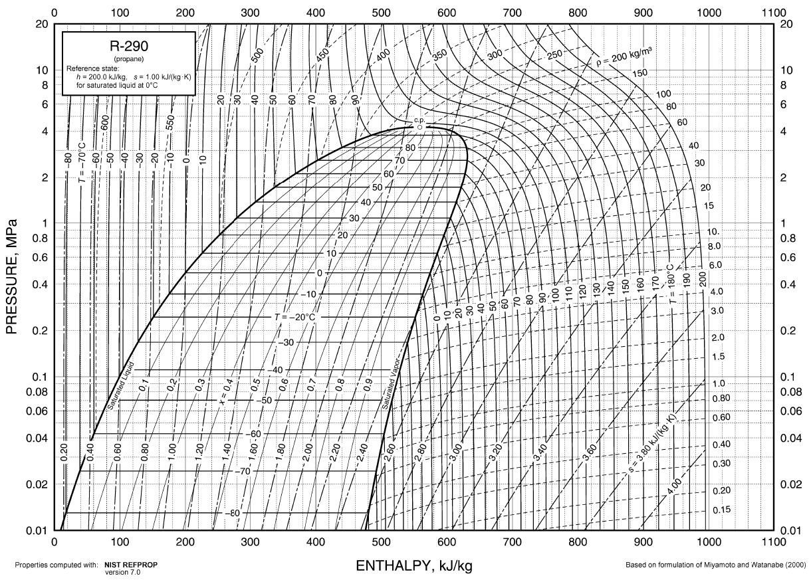

*Fig. 24 Pressure-Enthalpy Diagram for Refrigerant 290 (Propane)*

<!-- str. 852 -->

### Refrigerant 290 (Propane) Properties of

### Saturated Liquid and Saturated Vapor

| Temp., °C | Pressure, MPa | Density, Volume,<br>kg/m<sup>3</sup> Liquid | Density, Volume,<br>m<sup>3</sup>/kg Vapor | Enthalpy, kJ/kg<br>Liquid | Enthalpy, kJ/kg<br>Vapor | Entropy, kJ/(kg·K)<br>Liquid | Entropy, kJ/(kg·K)<br>Vapor | Specific Heat c<sub>p</sub>, kJ/(kg·K)<br>Liquid | Specific Heat c<sub>p</sub>, kJ/(kg·K)<br>Vapor | c /c p v Vapor | Velocity of Sound, m/s<br>Liquid | Velocity of Sound, m/s<br>Vapor | Viscosity, μPa·s<br>Liquid | Viscosity, μPa·s<br>Vapor | Thermal Cond., mW/(m·K)<br>Liquid | Thermal Cond., mW/(m·K)<br>Vapor | Tension, Temp.,<br>Surface mN/m | Tension, Temp.,<br>°C |
|---|---|---|---|---|---|---|---|---|---|---|---|---|---|---|---|---|---|---|
| –150 | 0.00001 | 694.6 | 4316.4 | –123.78 | 402.06 | –0.6903 | 3.5796 | 1.962 | 1.020 | 1.227 | 1880 | 168.8 | 1343.0 | 3.55 | 192.9 | 3.68 | 31.84 | –150 |
| –140 | 0.00003 | 684.5 | 864.49 | –104.09 | 412.43 | –0.5366 | 3.3426 | 1.977 | 1.054 | 1.218 | 1813 | 174.9 | 985.4 | 3.80 | 187.7 | 4.28 | 30.29 | –140 |
| –130 | 0.00012 | 674.4 | 223.53 | –84.23 | 423.12 | –0.3929 | 3.1514 | 1.994 | 1.087 | 1.210 | 1745 | 180.7 | 761.7 | 4.05 | 182.2 | 4.90 | 28.76 | –130 |
| –120 | 0.00041 | 664.3 | 70.785 | –64.21 | 434.11 | –0.2576 | 2.9962 | 2.012 | 1.119 | 1.203 | 1679 | 186.3 | 611.6 | 4.31 | 176.4 | 5.55 | 27.24 | –120 |
| –110 | 0.00116 | 654.0 | 26.386 | –43.99 | 445.38 | –0.1298 | 2.8697 | 2.032 | 1.151 | 1.197 | 1612 | 191.7 | 505.0 | 4.56 | 170.4 | 6.23 | 25.73 | –110 |
| –100 | 0.00290 | 643.7 | 11.231 | –23.56 | 456.88 | –0.0083 | 2.7664 | 2.054 | 1.184 | 1.192 | 1545 | 196.8 | 425.7 | 4.82 | 164.4 | 6.94 | 24.23 | –100 |
| –90 | 0.00645 | 633.3 | 5.3300 | –2.90 | 468.58 | 0.1077 | 2.6820 | 2.078 | 1.220 | 1.188 | 1478 | 201.5 | 364.5 | 5.08 | 158.2 | 7.67 | 22.74 | –90 |
| –80 | 0.01305 | 622.8 | 2.7676 | 18.03 | 480.44 | 0.2189 | 2.6130 | 2.106 | 1.258 | 1.184 | 1411 | 205.9 | 315.9 | 5.34 | 152.1 | 8.43 | 21.27 | –80 |
| –70 | 0.02440 | 612.0 | 1.5487 | 39.25 | 492.41 | 0.3259 | 2.5566 | 2.137 | 1.300 | 1.182 | 1345 | 209.9 | 276.4 | 5.60 | 145.9 | 9.22 | 19.81 | –70 |
| –60 | 0.04269 | 601.1 | 0.92250 | 60.81 | 504.44 | 0.4294 | 2.5107 | 2.172 | 1.346 | 1.181 | 1278 | 213.5 | 243.6 | 5.85 | 139.8 | 10.04 | 18.37 | –60 |
| –50 | 0.07057 | 589.9 | 0.57905 | 82.75 | 516.48 | 0.5298 | 2.4734 | 2.212 | 1.397 | 1.182 | 1213 | 216.5 | 216.0 | 6.11 | 133.8 | 10.88 | 16.94 | –50 |
| –42.11<sup>b</sup> | 0.10133 | 580.9 | 0.41388 | 100.36 | 525.95 | 0.6070 | 2.4491 | 2.246 | 1.440 | 1.183 | 1161 | 218.4 | 197.2 | 6.31 | 129.2 | 11.57 | 15.83 | –42.11 |
| –40 | 0.11112 | 578.4 | 0.37985 | 105.12 | 528.48 | 0.6275 | 2.4433 | 2.256 | 1.453 | 1.184 | 1147 | 218.9 | 192.6 | 6.36 | 128.0 | 11.76 | 15.54 | –40 |
| –38 | 0.12105 | 576.1 | 0.35076 | 109.65 | 530.87 | 0.6468 | 2.4380 | 2.265 | 1.464 | 1.185 | 1134 | 219.3 | 188.3 | 6.41 | 126.8 | 11.94 | 15.26 | –38 |
| –36 | 0.13166 | 573.8 | 0.32437 | 114.20 | 533.26 | 0.6660 | 2.4330 | 2.275 | 1.476 | 1.185 | 1121 | 219.6 | 184.1 | 6.47 | 125.6 | 12.12 | 14.98 | –36 |
| –34 | 0.14297 | 571.4 | 0.30037 | 118.77 | 535.64 | 0.6851 | 2.4282 | 2.285 | 1.488 | 1.186 | 1108 | 220.0 | 180.1 | 6.52 | 124.5 | 12.30 | 14.70 | –34 |
| –32 | 0.15502 | 569.0 | 0.27853 | 123.36 | 538.01 | 0.7041 | 2.4236 | 2.295 | 1.501 | 1.187 | 1095 | 220.3 | 176.1 | 6.57 | 123.3 | 12.48 | 14.42 | –32 |
| –30 | 0.16783 | 566.6 | 0.25861 | 127.97 | 540.38 | 0.7231 | 2.4192 | 2.305 | 1.513 | 1.188 | 1082 | 220.6 | 172.3 | 6.62 | 122.2 | 12.67 | 14.15 | –30 |
| –28 | 0.18144 | 564.2 | 0.24041 | 132.61 | 542.75 | 0.7419 | 2.4150 | 2.316 | 1.526 | 1.189 | 1069 | 220.9 | 168.6 | 6.67 | 121.1 | 12.86 | 13.87 | –28 |
| –26 | 0.19589 | 561.8 | 0.22376 | 137.26 | 545.11 | 0.7607 | 2.4109 | 2.327 | 1.539 | 1.191 | 1056 | 221.1 | 165.0 | 6.73 | 120.0 | 13.05 | 13.60 | –26 |
| –24 | 0.21119 | 559.4 | 0.20851 | 141.94 | 547.46 | 0.7795 | 2.4071 | 2.338 | 1.553 | 1.192 | 1043 | 221.3 | 161.5 | 6.78 | 118.8 | 13.24 | 13.33 | –24 |
| –22 | 0.22739 | 556.9 | 0.19452 | 146.64 | 549.80 | 0.7982 | 2.4034 | 2.349 | 1.566 | 1.193 | 1030 | 221.5 | 158.1 | 6.83 | 117.7 | 13.43 | 13.06 | –22 |
| –20 | 0.24452 | 554.5 | 0.18167 | 151.36 | 552.13 | 0.8168 | 2.3999 | 2.361 | 1.580 | 1.195 | 1016 | 221.6 | 154.7 | 6.89 | 116.6 | 13.63 | 12.79 | –20 |
| –18 | 0.26261 | 552.0 | 0.16984 | 156.11 | 554.46 | 0.8353 | 2.3965 | 2.373 | 1.595 | 1.197 | 1003 | 221.8 | 151.5 | 6.94 | 115.5 | 13.83 | 12.52 | –18 |
| –16 | 0.28170 | 549.5 | 0.15894 | 160.88 | 556.77 | 0.8538 | 2.3933 | 2.385 | 1.609 | 1.198 | 990 | 221.8 | 148.3 | 6.99 | 114.4 | 14.03 | 12.25 | –16 |
| –14 | 0.30181 | 546.9 | 0.14889 | 165.68 | 559.08 | 0.8722 | 2.3903 | 2.397 | 1.624 | 1.200 | 977 | 221.9 | 145.2 | 7.05 | 113.4 | 14.23 | 11.98 | –14 |
| –12 | 0.32300 | 544.4 | 0.13961 | 170.50 | 561.37 | 0.8906 | 2.3874 | 2.410 | 1.639 | 1.202 | 964 | 221.9 | 142.2 | 7.10 | 112.3 | 14.44 | 11.71 | –12 |
| –10 | 0.34528 | 541.8 | 0.13103 | 175.35 | 563.65 | 0.9090 | 2.3846 | 2.423 | 1.655 | 1.205 | 951 | 221.9 | 139.3 | 7.16 | 111.2 | 14.65 | 11.45 | –10 |
| –8 | 0.36870 | 539.2 | 0.12308 | 180.22 | 565.92 | 0.9273 | 2.3819 | 2.436 | 1.671 | 1.207 | 938 | 221.8 | 136.4 | 7.22 | 110.1 | 14.86 | 11.18 | –8 |
| –6 | 0.39329 | 536.6 | 0.11571 | 185.12 | 568.18 | 0.9455 | 2.3794 | 2.450 | 1.687 | 1.209 | 925 | 221.8 | 133.6 | 7.27 | 109.1 | 15.08 | 10.92 | –6 |
| –4 | 0.41909 | 533.9 | 0.10887 | 190.05 | 570.42 | 0.9637 | 2.3769 | 2.464 | 1.704 | 1.212 | 912 | 221.6 | 130.9 | 7.33 | 108.0 | 15.29 | 10.65 | –4 |
| –2 | 0.44613 | 531.3 | 0.10252 | 195.01 | 572.65 | 0.9819 | 2.3746 | 2.478 | 1.721 | 1.215 | 899 | 221.5 | 128.2 | 7.39 | 107.0 | 15.52 | 10.39 | –2 |
| 0 | 0.47446 | 528.6 | 0.09661 | 200.00 | 574.87 | 1.0000 | 2.3724 | 2.493 | 1.739 | 1.218 | 885 | 221.3 | 125.6 | 7.45 | 106.0 | 15.74 | 10.13 | 0 |
| 2 | 0.50410 | 525.9 | 0.09111 | 205.02 | 577.06 | 1.0181 | 2.3703 | 2.508 | 1.757 | 1.221 | 872 | 221.1 | 123.0 | 7.51 | 104.9 | 15.97 | 9.87 | 2 |
| 4 | 0.53510 | 523.1 | 0.08598 | 210.06 | 579.24 | 1.0362 | 2.3682 | 2.524 | 1.776 | 1.225 | 859 | 220.8 | 120.5 | 7.57 | 103.9 | 16.20 | 9.62 | 4 |
| 6 | 0.56749 | 520.4 | 0.08120 | 215.14 | 581.41 | 1.0542 | 2.3663 | 2.540 | 1.795 | 1.229 | 846 | 220.5 | 118.1 | 7.63 | 102.9 | 16.44 | 9.36 | 6 |
| 8 | 0.60131 | 517.6 | 0.07673 | 220.25 | 583.55 | 1.0722 | 2.3644 | 2.556 | 1.815 | 1.232 | 833 | 220.2 | 115.7 | 7.69 | 101.9 | 16.68 | 9.10 | 8 |
| 10 | 0.63660 | 514.7 | 0.07255 | 225.40 | 585.67 | 1.0902 | 2.3626 | 2.573 | 1.835 | 1.237 | 819 | 219.8 | 113.3 | 7.75 | 100.9 | 16.93 | 8.85 | 10 |
| 12 | 0.67340 | 511.9 | 0.06865 | 230.57 | 587.77 | 1.1082 | 2.3608 | 2.591 | 1.856 | 1.241 | 806 | 219.3 | 111.0 | 7.82 | 99.9 | 17.18 | 8.60 | 12 |
| 14 | 0.71175 | 509.0 | 0.06498 | 235.79 | 589.85 | 1.1261 | 2.3592 | 2.609 | 1.878 | 1.246 | 793 | 218.9 | 108.8 | 7.88 | 99.0 | 17.44 | 8.34 | 14 |
| 16 | 0.75168 | 506.0 | 0.06155 | 241.03 | 591.91 | 1.1440 | 2.3575 | 2.627 | 1.901 | 1.251 | 780 | 218.4 | 106.6 | 7.95 | 98.0 | 17.70 | 8.09 | 16 |
| 18 | 0.79324 | 503.1 | 0.05833 | 246.32 | 593.94 | 1.1620 | 2.3560 | 2.646 | 1.925 | 1.256 | 766 | 217.8 | 104.4 | 8.02 | 97.0 | 17.97 | 7.85 | 18 |
| 20 | 0.83646 | 500.1 | 0.05530 | 251.64 | 595.95 | 1.1799 | 2.3544 | 2.666 | 1.949 | 1.262 | 753 | 217.2 | 102.3 | 8.09 | 96.1 | 18.24 | 7.60 | 20 |
| 22 | 0.88139 | 497.0 | 0.05246 | 256.99 | 597.93 | 1.1978 | 2.3529 | 2.687 | 1.975 | 1.268 | 739 | 216.6 | 100.2 | 8.16 | 95.1 | 18.53 | 7.35 | 22 |
| 24 | 0.92807 | 493.9 | 0.04978 | 262.39 | 599.88 | 1.2157 | 2.3514 | 2.708 | 2.001 | 1.275 | 726 | 215.9 | 98.1 | 8.23 | 94.2 | 18.81 | 7.11 | 24 |
| 26 | 0.97653 | 490.8 | 0.04726 | 267.83 | 601.80 | 1.2336 | 2.3500 | 2.730 | 2.029 | 1.282 | 713 | 215.2 | 96.1 | 8.31 | 93.3 | 19.11 | 6.87 | 26 |
| 28 | 1.0268 | 487.6 | 0.04488 | 273.31 | 603.68 | 1.2515 | 2.3486 | 2.753 | 2.058 | 1.290 | 699 | 214.4 | 94.1 | 8.38 | 92.3 | 19.41 | 6.62 | 28 |
| 30 | 1.0790 | 484.4 | 0.04264 | 278.83 | 605.54 | 1.2695 | 2.3471 | 2.777 | 2.088 | 1.298 | 685 | 213.5 | 92.2 | 8.46 | 91.4 | 19.72 | 6.38 | 30 |
| 32 | 1.1331 | 481.1 | 0.04053 | 284.40 | 607.35 | 1.2874 | 2.3457 | 2.802 | 2.119 | 1.307 | 672 | 212.6 | 90.3 | 8.54 | 90.5 | 20.05 | 6.15 | 32 |
| 34 | 1.1891 | 477.8 | 0.03853 | 290.01 | 609.13 | 1.3053 | 2.3443 | 2.827 | 2.152 | 1.316 | 658 | 211.7 | 88.4 | 8.63 | 89.6 | 20.38 | 5.91 | 34 |
| 36 | 1.2472 | 474.4 | 0.03664 | 295.68 | 610.87 | 1.3233 | 2.3429 | 2.855 | 2.187 | 1.326 | 645 | 210.7 | 86.5 | 8.71 | 88.7 | 20.72 | 5.68 | 36 |
| 38 | 1.3072 | 471.0 | 0.03485 | 301.39 | 612.57 | 1.3413 | 2.3414 | 2.883 | 2.224 | 1.337 | 631 | 209.7 | 84.7 | 8.80 | 87.8 | 21.07 | 5.44 | 38 |
| 40 | 1.3694 | 467.5 | 0.03315 | 307.15 | 614.21 | 1.3594 | 2.3399 | 2.913 | 2.263 | 1.349 | 617 | 208.6 | 82.8 | 8.89 | 86.9 | 21.43 | 5.21 | 40 |
| 42 | 1.4337 | 463.9 | 0.03154 | 312.96 | 615.81 | 1.3774 | 2.3384 | 2.944 | 2.304 | 1.362 | 603 | 207.4 | 81.0 | 8.99 | 86.0 | 21.81 | 4.98 | 42 |
| 44 | 1.5002 | 460.3 | 0.03002 | 318.83 | 617.36 | 1.3955 | 2.3368 | 2.977 | 2.348 | 1.375 | 589 | 206.2 | 79.3 | 9.08 | 85.2 | 22.20 | 4.76 | 44 |
| 46 | 1.5690 | 456.5 | 0.02857 | 324.76 | 618.86 | 1.4137 | 2.3352 | 3.012 | 2.395 | 1.391 | 575 | 204.9 | 77.5 | 9.19 | 84.3 | 22.60 | 4.53 | 46 |
| 48 | 1.6400 | 452.7 | 0.02720 | 330.75 | 620.29 | 1.4319 | 2.3335 | 3.050 | 2.445 | 1.407 | 561 | 203.6 | 75.8 | 9.29 | 83.5 | 23.03 | 4.31 | 48 |
| 50 | 1.7133 | 448.9 | 0.02589 | 336.80 | 621.66 | 1.4502 | 2.3317 | 3.089 | 2.499 | 1.425 | 547 | 202.2 | 74.1 | 9.40 | 82.6 | 23.47 | 4.09 | 50 |
| 55 | 1.9072 | 438.8 | 0.02288 | 352.23 | 624.77 | 1.4962 | 2.3268 | 3.201 | 2.652 | 1.478 | 511 | 198.3 | 69.8 | 9.70 | 80.5 | 24.65 | 3.55 | 55 |
| 60 | 2.1168 | 428.0 | 0.02020 | 368.14 | 627.36 | 1.5429 | 2.3210 | 3.337 | 2.841 | 1.548 | 474 | 194.1 | 65.7 | 10.03 | 78.4 | 26.00 | 3.02 | 60 |
| 65 | 2.3430 | 416.3 | 0.01781 | 384.60 | 629.29 | 1.5903 | 2.3139 | 3.509 | 3.086 | 1.641 | 437 | 189.3 | 61.5 | 10.42 | 76.3 | 27.56 | 2.52 | 65 |
| 70 | 2.5868 | 403.6 | 0.01565 | 401.75 | 630.37 | 1.6389 | 2.3052 | 3.735 | 3.421 | 1.773 | 398 | 184.0 | 57.4 | 10.86 | 74.3 | 29.41 | 2.03 | 70 |
| 75 | 2.8493 | 389.5 | 0.01367 | 419.76 | 630.33 | 1.6891 | 2.2939 | 4.053 | 3.914 | 1.970 | 358 | 178.2 | 53.2 | 11.40 | 72.2 | 31.71 | 1.56 | 75 |
| 80 | 3.1319 | 373.3 | 0.01185 | 438.93 | 628.73 | 1.7417 | 2.2791 | 4.545 | 4.707 | 2.288 | 315 | 171.6 | 48.8 | 12.07 | 70.2 | 34.75 | 1.12 | 80 |
| 85 | 3.4361 | 354.0 | 0.01012 | 459.81 | 624.75 | 1.7980 | 2.2586 | 5.433 | 6.182 | 2.883 | 269 | 164.1 | 44.1 | 12.96 | 68.3 | 39.13 | 0.72 | 85 |
| 90 | 3.7641 | 328.8 | 0.00840 | 483.71 | 616.47 | 1.8616 | 2.2272 | 7.623 | 9.888 | 4.374 | 218 | 155.5 | 38.8 | 14.28 | 67.1 | 46.66 | 0.36 | 90 |
| 95 | 4.1195 | 286.5 | 0.00640 | 516.33 | 595.81 | 1.9476 | 2.1635 | 23.59 | 36.07 | 14.62 | 158 | 144.1 | 31.4 | 17.00 | 73.6 | 69.48 | 0.06 | 95 |
| 96.74<sup>c</sup> | 4.2512 | 220.5 | 0.00454 | 555.24 | 555.24 | 2.0516 | 2.0516 | ∞ | ∞ | ∞ | 0 | 0.0 | — | — | ∞ | ∞ | 0.00 | 96.74 |

<sup>b</sup>Normal boiling point <sup>c</sup>Critical point

<!-- str. 853 -->

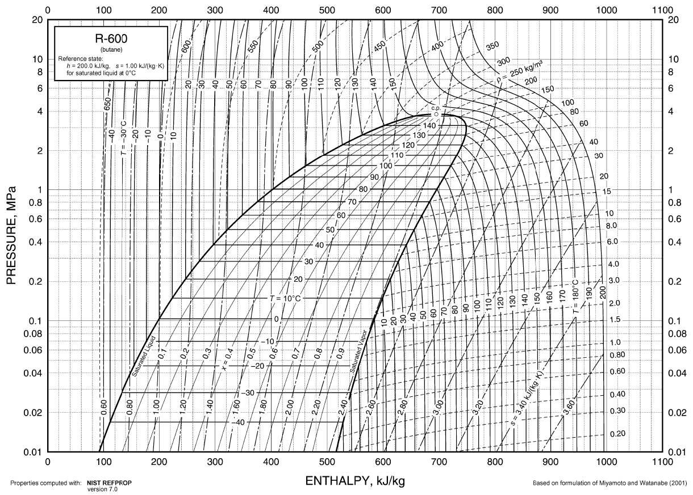

*Fig. 25 Pressure-Enthalpy Diagram for Refrigerant 600 (n-Butane)*

<!-- str. 854 -->

### Refrigerant 600 (n-Butane) Properties of

### Saturated Liquid and Saturated Vapor

| Temp.,* °C | Pressure, MPa | Density, Volume,<br>kg/m<sup>3</sup> Liquid | Density, Volume,<br>m<sup>3</sup>/kg Vapor | Enthalpy, kJ/kg<br>Liquid | Enthalpy, kJ/kg<br>Vapor | Entropy, kJ/(kg·K)<br>Liquid | Entropy, kJ/(kg·K)<br>Vapor | Specific Heat c<sub>p</sub>, kJ/(kg·K)<br>Liquid | Specific Heat c<sub>p</sub>, kJ/(kg·K)<br>Vapor | c /c p v Vapor | Velocity of Sound, m/s<br>Liquid | Velocity of Sound, m/s<br>Vapor | Viscosity, μPa·s<br>Liquid | Viscosity, μPa·s<br>Vapor | Thermal Cond., mW/(m·K)<br>Liquid | Thermal Cond., mW/(m·K)<br>Vapor | Tension, Temp.,*<br>Surface mN/m | Tension, Temp.,*<br>°C |
|---|---|---|---|---|---|---|---|---|---|---|---|---|---|---|---|---|---|---|
| –100 | 0.00016 | 699.3 | 150.44 | –13.65 | 450.85 | 0.0318 | 2.7144 | 2.013 | 1.231 | 1.132 | 1592 | 167.4 | 792.2 | 4.30 | 161.6 | 6.83 | 28.03 | –100 |
| –95 | 0.00028 | 694.6 | 91.606 | –3.57 | 457.02 | 0.0892 | 2.6746 | 2.021 | 1.247 | 1.130 | 1563 | 169.6 | 719.0 | 4.43 | 159.4 | 7.12 | 27.33 | –95 |
| –90 | 0.00045 | 689.9 | 57.588 | 6.56 | 463.27 | 0.1453 | 2.6389 | 2.029 | 1.263 | 1.128 | 1534 | 171.8 | 655.9 | 4.55 | 157.2 | 7.43 | 26.64 | –90 |
| –85 | 0.00072 | 685.2 | 37.271 | 16.73 | 469.58 | 0.2000 | 2.6069 | 2.038 | 1.279 | 1.127 | 1505 | 174.0 | 601.2 | 4.68 | 154.9 | 7.73 | 25.94 | –85 |
| –80 | 0.00111 | 680.5 | 24.773 | 26.94 | 475.97 | 0.2536 | 2.5784 | 2.048 | 1.295 | 1.125 | 1477 | 176.1 | 553.2 | 4.81 | 152.6 | 8.05 | 25.26 | –80 |
| –75 | 0.00168 | 675.8 | 16.873 | 37.21 | 482.41 | 0.3061 | 2.5529 | 2.058 | 1.312 | 1.124 | 1449 | 178.1 | 510.9 | 4.93 | 150.2 | 8.38 | 24.57 | –75 |
| –70 | 0.00247 | 671.0 | 11.752 | 47.53 | 488.92 | 0.3575 | 2.5303 | 2.069 | 1.330 | 1.122 | 1420 | 180.1 | 473.4 | 5.06 | 147.9 | 8.71 | 23.89 | –70 |
| –65 | 0.00355 | 666.2 | 8.3565 | 57.90 | 495.50 | 0.4080 | 2.5103 | 2.081 | 1.347 | 1.121 | 1392 | 182.1 | 439.9 | 5.18 | 145.5 | 9.05 | 23.22 | –65 |
| –60 | 0.00501 | 661.4 | 6.0558 | 68.34 | 502.13 | 0.4575 | 2.4926 | 2.094 | 1.366 | 1.120 | 1364 | 184.0 | 409.8 | 5.31 | 143.1 | 9.40 | 22.54 | –60 |
| –55 | 0.00695 | 656.6 | 4.4659 | 78.85 | 508.82 | 0.5062 | 2.4772 | 2.108 | 1.385 | 1.119 | 1336 | 185.8 | 382.8 | 5.43 | 140.8 | 9.75 | 21.88 | –55 |
| –50 | 0.00947 | 651.7 | 3.3470 | 89.42 | 515.56 | 0.5541 | 2.4638 | 2.122 | 1.404 | 1.118 | 1309 | 187.5 | 358.3 | 5.55 | 138.4 | 10.11 | 21.21 | –50 |
| –45 | 0.01270 | 646.8 | 2.5462 | 100.07 | 522.35 | 0.6013 | 2.4522 | 2.137 | 1.425 | 1.118 | 1281 | 189.2 | 336.1 | 5.68 | 136.0 | 10.48 | 20.55 | –45 |
| –40 | 0.01679 | 641.9 | 1.9638 | 110.80 | 529.19 | 0.6478 | 2.4423 | 2.153 | 1.446 | 1.117 | 1253 | 190.8 | 315.8 | 5.80 | 133.6 | 10.86 | 19.90 | –40 |
| –35 | 0.02190 | 636.9 | 1.5341 | 121.62 | 536.08 | 0.6937 | 2.4340 | 2.170 | 1.468 | 1.117 | 1226 | 192.3 | 297.3 | 5.92 | 131.3 | 11.25 | 19.25 | –35 |
| –30 | 0.02821 | 631.9 | 1.2127 | 132.52 | 543.01 | 0.7389 | 2.4271 | 2.188 | 1.490 | 1.116 | 1198 | 193.8 | 280.3 | 6.04 | 128.9 | 11.64 | 18.60 | –30 |
| –25 | 0.03591 | 626.8 | 0.96911 | 143.51 | 549.98 | 0.7836 | 2.4216 | 2.206 | 1.514 | 1.116 | 1171 | 195.1 | 264.7 | 6.16 | 126.6 | 12.05 | 17.96 | –25 |
| –20 | 0.04521 | 621.7 | 0.78237 | 154.60 | 556.98 | 0.8278 | 2.4173 | 2.226 | 1.538 | 1.116 | 1144 | 196.3 | 250.3 | 6.28 | 124.3 | 12.46 | 17.32 | –20 |
| –15 | 0.05635 | 616.6 | 0.63759 | 165.79 | 564.02 | 0.8715 | 2.4141 | 2.246 | 1.563 | 1.117 | 1116 | 197.5 | 237.0 | 6.41 | 122.0 | 12.88 | 16.69 | –15 |
| –10 | 0.06955 | 611.4 | 0.52415 | 177.08 | 571.08 | 0.9147 | 2.4120 | 2.267 | 1.589 | 1.117 | 1089 | 198.5 | 224.7 | 6.53 | 119.8 | 13.30 | 16.06 | –10 |
| –5 | 0.08509 | 606.1 | 0.43441 | 188.48 | 578.17 | 0.9576 | 2.4108 | 2.289 | 1.616 | 1.118 | 1062 | 199.4 | 213.2 | 6.65 | 117.5 | 13.74 | 15.44 | –5 |
| –0.49<sup>b</sup>0.10132 |  | 601.3 | 0.36910 | 198.87 | 584.58 | 0.9959 | 2.4105 | 2.310 | 1.641 | 1.119 | 1038 | 200.1 | 203.5 | 6.76 | 115.5 | 14.14 | 14.88 | –0.49 |
| 0 | 0.10323 | 600.7 | 0.36275 | 200.00 | 585.27 | 1.0000 | 2.4105 | 2.312 | 1.644 | 1.119 | 1035 | 200.2 | 202.5 | 6.77 | 115.3 | 14.19 | 14.82 | 0 |
| 2 | 0.11127 | 598.6 | 0.33818 | 204.64 | 588.12 | 1.0169 | 2.4106 | 2.321 | 1.655 | 1.120 | 1024 | 200.5 | 198.4 | 6.82 | 114.4 | 14.37 | 14.58 | 2 |
| 4 | 0.11980 | 596.4 | 0.31562 | 209.30 | 590.97 | 1.0337 | 2.4108 | 2.331 | 1.667 | 1.120 | 1014 | 200.7 | 194.4 | 6.87 | 113.6 | 14.55 | 14.33 | 4 |
| 6 | 0.12882 | 594.2 | 0.29488 | 213.98 | 593.82 | 1.0505 | 2.4112 | 2.341 | 1.678 | 1.121 | 1003 | 201.0 | 190.6 | 6.91 | 112.7 | 14.74 | 14.09 | 6 |
| 8 | 0.13837 | 592.0 | 0.27578 | 218.68 | 596.67 | 1.0672 | 2.4116 | 2.350 | 1.690 | 1.122 | 992 | 201.2 | 186.8 | 6.96 | 111.8 | 14.93 | 13.85 | 8 |
| 10 | 0.14845 | 589.8 | 0.25817 | 223.40 | 599.53 | 1.0838 | 2.4122 | 2.360 | 1.702 | 1.122 | 981 | 201.4 | 183.2 | 7.01 | 111.0 | 15.11 | 13.60 | 10 |
| 12 | 0.15909 | 587.6 | 0.24192 | 228.13 | 602.38 | 1.1005 | 2.4129 | 2.371 | 1.715 | 1.123 | 971 | 201.6 | 179.6 | 7.06 | 110.1 | 15.31 | 13.36 | 12 |
| 14 | 0.17031 | 585.4 | 0.22691 | 232.89 | 605.24 | 1.1170 | 2.4137 | 2.381 | 1.727 | 1.124 | 960 | 201.7 | 176.1 | 7.11 | 109.3 | 15.50 | 13.12 | 14 |
| 16 | 0.18213 | 583.1 | 0.21302 | 237.68 | 608.09 | 1.1335 | 2.4146 | 2.391 | 1.740 | 1.125 | 949 | 201.9 | 172.7 | 7.16 | 108.4 | 15.69 | 12.88 | 16 |
| 18 | 0.19457 | 580.9 | 0.20016 | 242.48 | 610.95 | 1.1500 | 2.4156 | 2.402 | 1.752 | 1.126 | 938 | 202.0 | 169.4 | 7.21 | 107.6 | 15.89 | 12.65 | 18 |
| 20 | 0.20765 | 578.6 | 0.18823 | 247.30 | 613.80 | 1.1665 | 2.4167 | 2.413 | 1.765 | 1.127 | 928 | 202.0 | 166.2 | 7.26 | 106.7 | 16.09 | 12.41 | 20 |
| 22 | 0.22139 | 576.3 | 0.17717 | 252.15 | 616.66 | 1.1829 | 2.4179 | 2.424 | 1.778 | 1.128 | 917 | 202.1 | 163.0 | 7.31 | 105.9 | 16.29 | 12.17 | 22 |
| 24 | 0.23582 | 574.0 | 0.16688 | 257.02 | 619.51 | 1.1992 | 2.4191 | 2.435 | 1.792 | 1.129 | 906 | 202.1 | 159.9 | 7.36 | 105.1 | 16.49 | 11.94 | 24 |
| 26 | 0.25095 | 571.7 | 0.15732 | 261.91 | 622.36 | 1.2155 | 2.4205 | 2.446 | 1.805 | 1.130 | 895 | 202.2 | 156.9 | 7.41 | 104.3 | 16.70 | 11.70 | 26 |
| 28 | 0.26680 | 569.3 | 0.14842 | 266.82 | 625.21 | 1.2318 | 2.4219 | 2.458 | 1.819 | 1.131 | 885 | 202.1 | 153.9 | 7.47 | 103.5 | 16.90 | 11.47 | 28 |
| 30 | 0.28341 | 567.0 | 0.14012 | 271.76 | 628.06 | 1.2481 | 2.4234 | 2.470 | 1.833 | 1.133 | 874 | 202.1 | 151.1 | 7.52 | 102.7 | 17.11 | 11.24 | 30 |
| 32 | 0.30079 | 564.6 | 0.13238 | 276.72 | 630.91 | 1.2643 | 2.4250 | 2.481 | 1.847 | 1.134 | 863 | 202.0 | 148.2 | 7.57 | 101.9 | 17.33 | 11.00 | 32 |
| 34 | 0.31897 | 562.2 | 0.12516 | 281.71 | 633.75 | 1.2805 | 2.4266 | 2.494 | 1.862 | 1.136 | 853 | 201.9 | 145.5 | 7.62 | 101.1 | 17.54 | 10.77 | 34 |
| 36 | 0.33796 | 559.8 | 0.11841 | 286.72 | 636.59 | 1.2966 | 2.4283 | 2.506 | 1.876 | 1.137 | 842 | 201.8 | 142.8 | 7.68 | 100.3 | 17.76 | 10.54 | 36 |
| 38 | 0.35779 | 557.4 | 0.11209 | 291.76 | 639.42 | 1.3127 | 2.4301 | 2.518 | 1.891 | 1.139 | 831 | 201.7 | 140.2 | 7.73 | 99.5 | 17.98 | 10.32 | 38 |
| 40 | 0.37849 | 554.9 | 0.10618 | 296.82 | 642.25 | 1.3288 | 2.4319 | 2.531 | 1.906 | 1.141 | 820 | 201.5 | 137.6 | 7.79 | 98.7 | 18.21 | 10.09 | 40 |
| 42 | 0.40007 | 552.4 | 0.10065 | 301.90 | 645.08 | 1.3449 | 2.4338 | 2.544 | 1.922 | 1.143 | 810 | 201.3 | 135.0 | 7.84 | 97.9 | 18.43 | 9.86 | 42 |
| 44 | 0.42256 | 550.0 | 0.09545 | 307.02 | 647.90 | 1.3609 | 2.4358 | 2.557 | 1.937 | 1.145 | 799 | 201.1 | 132.5 | 7.90 | 97.2 | 18.66 | 9.64 | 44 |
| 46 | 0.44599 | 547.4 | 0.09058 | 312.15 | 650.71 | 1.3769 | 2.4378 | 2.571 | 1.953 | 1.147 | 788 | 200.8 | 130.1 | 7.95 | 96.4 | 18.90 | 9.41 | 46 |
| 48 | 0.47038 | 544.9 | 0.08600 | 317.32 | 653.52 | 1.3929 | 2.4398 | 2.585 | 1.970 | 1.149 | 777 | 200.5 | 127.7 | 8.01 | 95.7 | 19.14 | 9.19 | 48 |
| 50 | 0.49575 | 542.3 | 0.08170 | 322.51 | 656.32 | 1.4089 | 2.4419 | 2.598 | 1.986 | 1.151 | 767 | 200.2 | 125.4 | 8.07 | 94.9 | 19.38 | 8.97 | 50 |
| 55 | 0.56365 | 535.8 | 0.07201 | 335.62 | 663.28 | 1.4488 | 2.4473 | 2.635 | 2.029 | 1.158 | 740 | 199.2 | 119.7 | 8.22 | 93.1 | 20.00 | 8.42 | 55 |
| 60 | 0.63824 | 529.1 | 0.06366 | 348.91 | 670.19 | 1.4885 | 2.4529 | 2.673 | 2.075 | 1.165 | 713 | 198.1 | 114.3 | 8.38 | 91.3 | 20.64 | 7.87 | 60 |
| 65 | 0.71991 | 522.3 | 0.05642 | 362.39 | 677.02 | 1.5282 | 2.4587 | 2.713 | 2.123 | 1.173 | 685 | 196.7 | 109.1 | 8.54 | 89.5 | 21.32 | 7.34 | 65 |
| 70 | 0.80908 | 515.2 | 0.05012 | 376.06 | 683.77 | 1.5679 | 2.4646 | 2.756 | 2.174 | 1.183 | 658 | 195.1 | 104.1 | 8.71 | 87.8 | 22.03 | 6.81 | 70 |
| 75 | 0.90616 | 507.9 | 0.04462 | 389.95 | 690.41 | 1.6075 | 2.4705 | 2.802 | 2.229 | 1.194 | 631 | 193.3 | 99.3 | 8.89 | 86.1 | 22.77 | 6.29 | 75 |
| 80 | 1.0116 | 500.4 | 0.03978 | 404.06 | 696.94 | 1.6471 | 2.4765 | 2.851 | 2.288 | 1.207 | 603 | 191.2 | 94.7 | 9.08 | 84.5 | 23.56 | 5.78 | 80 |
| 85 | 1.1258 | 492.6 | 0.03552 | 418.40 | 703.32 | 1.6868 | 2.4824 | 2.905 | 2.353 | 1.223 | 575 | 188.8 | 90.2 | 9.29 | 82.9 | 24.39 | 5.28 | 85 |
| 90 | 1.2493 | 484.5 | 0.03175 | 433.00 | 709.53 | 1.7266 | 2.4881 | 2.964 | 2.425 | 1.241 | 546 | 186.1 | 85.8 | 9.51 | 81.3 | 25.28 | 4.79 | 90 |
| 95 | 1.3825 | 476.0 | 0.02840 | 447.87 | 715.53 | 1.7665 | 2.4936 | 3.029 | 2.506 | 1.263 | 518 | 183.1 | 81.6 | 9.75 | 79.7 | 26.23 | 4.31 | 95 |
| 100 | 1.5259 | 467.1 | 0.02541 | 463.03 | 721.29 | 1.8066 | 2.4987 | 3.102 | 2.599 | 1.290 | 488 | 179.8 | 77.4 | 10.01 | 78.2 | 27.26 | 3.84 | 100 |
| 105 | 1.6801 | 457.8 | 0.02273 | 478.51 | 726.75 | 1.8469 | 2.5034 | 3.186 | 2.708 | 1.324 | 458 | 176.1 | 73.3 | 10.29 | 76.8 | 28.37 | 3.38 | 105 |
| 110 | 1.8456 | 447.9 | 0.02032 | 494.36 | 731.87 | 1.8876 | 2.5075 | 3.285 | 2.841 | 1.366 | 428 | 172.0 | 69.3 | 10.61 | 75.3 | 29.60 | 2.93 | 110 |
| 115 | 2.0230 | 437.3 | 0.01813 | 510.61 | 736.55 | 1.9287 | 2.5108 | 3.403 | 3.004 | 1.420 | 396 | 167.5 | 65.4 | 10.96 | 73.9 | 30.96 | 2.50 | 115 |
| 120 | 2.2131 | 425.9 | 0.01615 | 527.34 | 740.69 | 1.9704 | 2.5131 | 3.552 | 3.213 | 1.492 | 364 | 162.5 | 61.4 | 11.37 | 72.5 | 32.50 | 2.08 | 120 |
| 125 | 2.4166 | 413.4 | 0.01432 | 544.65 | 744.15 | 2.0129 | 2.5140 | 3.748 | 3.493 | 1.592 | 331 | 157.0 | 57.4 | 11.83 | 71.1 | 34.29 | 1.68 | 125 |
| 130 | 2.6344 | 399.6 | 0.01264 | 562.68 | 746.70 | 2.0566 | 2.5130 | 4.023 | 3.891 | 1.739 | 296 | 150.8 | 53.4 | 12.39 | 69.8 | 36.44 | 1.30 | 130 |
| 135 | 2.8675 | 383.7 | 0.01105 | 581.69 | 747.97 | 2.1020 | 2.5094 | 4.450 | 4.511 | 1.973 | 260 | 144.1 | 49.2 | 13.07 | 68.4 | 39.16 | 0.94 | 135 |
| 140 | 3.1172 | 364.7 | 0.00953 | 602.17 | 747.29 | 2.1502 | 2.5015 | 5.227 | 5.631 | 2.405 | 222 | 136.5 | 44.7 | 13.97 | 67.3 | 42.94 | 0.60 | 140 |
| 145 | 3.3853 | 339.9 | 0.00801 | 625.32 | 743.11 | 2.2041 | 2.4858 | 7.147 | 8.349 | 3.462 | 182 | 128.0 | 39.6 | 15.27 | 66.7 | 49.21 | 0.31 | 145 |
| 150 | 3.6746 | 297.7 | 0.00621 | 656.27 | 729.01 | 2.2755 | 2.4474 | 19.80 | 25.55 | 10.14 | 136 | 117.8 | 32.5 | 17.87 | 73.0 | 67.32 | 0.06 | 150 |
| 151.98<sup>c</sup> | 3.7960 | 228.0 | 0.00439 | 693.91 | 693.91 | 2.3631 | 2.3631 | ∞ | ∞ | ∞ | 0 | 0.0 | — | — | ∞ | ∞ | 0.00 | 151.98 |

*Temperatures on ITS-90 scale <sup>b</sup>Normal boiling point <sup>c</sup>Critical point

<!-- str. 855 -->

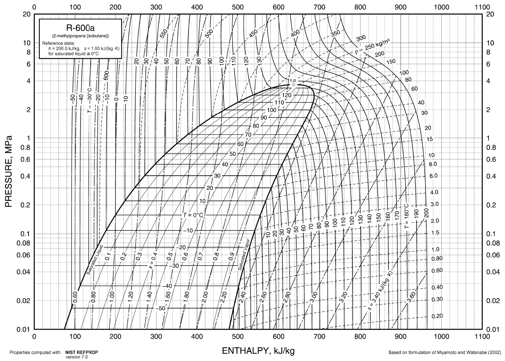

*Fig. 26 Pressure-Enthalpy Diagram for Refrigerant 600a (Isobutane)*

<!-- str. 856 -->

### Refrigerant 600a (Isobutane) Properties of

### Saturated Liquid and Saturated Vapor

| Temp.,* °C | Pressure, MPa | Density, Volume,<br>kg/m<sup>3</sup> Liquid | Density, Volume,<br>m<sup>3</sup>/kg Vapor | Enthalpy, kJ/kg<br>Liquid | Enthalpy, kJ/kg<br>Vapor | Entropy, kJ/(kg·K)<br>Liquid | Entropy, kJ/(kg·K)<br>Vapor | Specific Heat c<sub>p</sub>, kJ/(kg·K)<br>Liquid | Specific Heat c<sub>p</sub>, kJ/(kg·K)<br>Vapor | c /c p v Vapor | Velocity of Sound, m/s<br>Liquid | Velocity of Sound, m/s<br>Vapor | Viscosity, μPa·s<br>Liquid | Viscosity, μPa·s<br>Vapor | Thermal Cond., mW/(m·K)<br>Liquid | Thermal Cond., mW/(m·K)<br>Vapor | Tension, Temp.,*<br>Surface mN/m | Tension, Temp.,*<br>°C |
|---|---|---|---|---|---|---|---|---|---|---|---|---|---|---|---|---|---|---|
| –100 | 0.00038 | 683.9 | 65.234 | –6.40 | 428.19 | 0.0671 | 2.5770 | 1.878 | 1.131 | 1.145 | 1558 | 168.3 | 936.5 | 4.40 | 140.0 | 6.03 | 25.52 | –100 |
| –95 | 0.00062 | 679.1 | 41.078 | 3.04 | 433.86 | 0.1208 | 2.5391 | 1.894 | 1.151 | 1.143 | 1526 | 170.5 | 837.2 | 4.53 | 138.0 | 6.39 | 24.88 | –95 |
| –90 | 0.00098 | 674.2 | 26.648 | 12.55 | 439.62 | 0.1734 | 2.5052 | 1.911 | 1.171 | 1.140 | 1494 | 172.6 | 753.2 | 4.65 | 136.0 | 6.76 | 24.24 | –90 |
| –85 | 0.00151 | 669.4 | 17.764 | 22.14 | 445.46 | 0.2251 | 2.4750 | 1.927 | 1.191 | 1.138 | 1462 | 174.7 | 681.3 | 4.78 | 134.0 | 7.13 | 23.59 | –85 |
| –80 | 0.00227 | 664.5 | 12.140 | 31.82 | 451.39 | 0.2759 | 2.4481 | 1.944 | 1.212 | 1.136 | 1431 | 176.7 | 619.2 | 4.91 | 131.9 | 7.50 | 22.96 | –80 |
| –75 | 0.00333 | 659.5 | 8.4874 | 41.59 | 457.40 | 0.3258 | 2.4242 | 1.961 | 1.233 | 1.134 | 1400 | 178.7 | 565.3 | 5.03 | 129.8 | 7.88 | 22.32 | –75 |
| –70 | 0.00478 | 654.6 | 6.0592 | 51.44 | 463.48 | 0.3749 | 2.4031 | 1.979 | 1.254 | 1.132 | 1370 | 180.6 | 518.1 | 5.16 | 127.7 | 8.27 | 21.68 | –70 |
| –65 | 0.00671 | 649.6 | 4.4096 | 61.38 | 469.63 | 0.4232 | 2.3845 | 1.997 | 1.276 | 1.130 | 1340 | 182.4 | 476.6 | 5.28 | 125.6 | 8.67 | 21.05 | –65 |
| –60 | 0.00927 | 644.6 | 3.2662 | 71.41 | 475.86 | 0.4708 | 2.3683 | 2.015 | 1.298 | 1.129 | 1309 | 184.2 | 439.8 | 5.41 | 123.5 | 9.06 | 20.41 | –60 |
| –55 | 0.01258 | 639.5 | 2.4590 | 81.54 | 482.14 | 0.5177 | 2.3541 | 2.034 | 1.321 | 1.128 | 1280 | 185.9 | 407.0 | 5.53 | 121.3 | 9.47 | 19.78 | –55 |
| –50 | 0.01680 | 634.4 | 1.8792 | 91.76 | 488.49 | 0.5640 | 2.3419 | 2.054 | 1.344 | 1.126 | 1250 | 187.5 | 377.6 | 5.65 | 119.2 | 9.88 | 19.16 | –50 |
| –45 | 0.02211 | 629.3 | 1.4561 | 102.09 | 494.89 | 0.6098 | 2.3315 | 2.074 | 1.368 | 1.126 | 1220 | 189.0 | 351.2 | 5.78 | 117.1 | 10.29 | 18.53 | –45 |
| –40 | 0.02870 | 624.1 | 1.1427 | 112.51 | 501.35 | 0.6549 | 2.3227 | 2.094 | 1.393 | 1.125 | 1191 | 190.4 | 327.4 | 5.90 | 115.0 | 10.71 | 17.91 | –40 |
| –35 | 0.03680 | 618.9 | 0.90737 | 123.04 | 507.85 | 0.6995 | 2.3154 | 2.115 | 1.418 | 1.125 | 1162 | 191.8 | 305.8 | 6.02 | 112.9 | 11.14 | 17.29 | –35 |
| –30 | 0.04662 | 613.6 | 0.72839 | 133.68 | 514.40 | 0.7437 | 2.3095 | 2.137 | 1.444 | 1.125 | 1133 | 193.0 | 286.2 | 6.14 | 110.8 | 11.57 | 16.67 | –30 |
| –25 | 0.05843 | 608.3 | 0.59062 | 144.43 | 520.99 | 0.7874 | 2.3048 | 2.159 | 1.471 | 1.125 | 1104 | 194.1 | 268.3 | 6.26 | 108.7 | 12.01 | 16.05 | –25 |
| –20 | 0.07248 | 602.9 | 0.48339 | 155.30 | 527.61 | 0.8306 | 2.3013 | 2.182 | 1.499 | 1.125 | 1075 | 195.1 | 251.9 | 6.38 | 106.6 | 12.45 | 15.44 | –20 |
| –15 | 0.08905 | 597.4 | 0.39904 | 166.29 | 534.26 | 0.8735 | 2.2989 | 2.206 | 1.527 | 1.126 | 1047 | 196.0 | 236.9 | 6.50 | 104.6 | 12.90 | 14.83 | –15 |
| –11.75<sup>b</sup>0.10133 |  | 593.8 | 0.35378 | 173.49 | 538.60 | 0.9012 | 2.2979 | 2.222 | 1.547 | 1.126 | 1028 | 196.5 | 227.8 | 6.58 | 103.3 | 13.20 | 14.44 | –11.75 |
| –10 | 0.10845 | 591.9 | 0.33204 | 177.40 | 540.93 | 0.9160 | 2.2975 | 2.231 | 1.557 | 1.127 | 1018 | 196.8 | 223.1 | 6.62 | 102.6 | 13.36 | 14.23 | –10 |
| –5 | 0.13098 | 586.3 | 0.27833 | 188.63 | 547.63 | 0.9582 | 2.2969 | 2.256 | 1.587 | 1.128 | 990 | 197.4 | 210.3 | 6.74 | 100.6 | 13.83 | 13.63 | –5 |
| 0 | 0.15696 | 580.6 | 0.23491 | 200.00 | 554.34 | 1.0000 | 2.2972 | 2.283 | 1.619 | 1.130 | 961 | 197.9 | 198.6 | 6.86 | 98.6 | 14.30 | 13.03 | 0 |
| 2 | 0.16839 | 578.3 | 0.21989 | 204.59 | 557.02 | 1.0167 | 2.2975 | 2.293 | 1.632 | 1.131 | 950 | 198.0 | 194.1 | 6.91 | 97.9 | 14.49 | 12.79 | 2 |
| 4 | 0.18045 | 576.0 | 0.20604 | 209.19 | 559.71 | 1.0333 | 2.2980 | 2.304 | 1.645 | 1.132 | 939 | 198.2 | 189.8 | 6.96 | 97.1 | 14.68 | 12.55 | 4 |
| 6 | 0.19316 | 573.6 | 0.19324 | 213.82 | 562.40 | 1.0498 | 2.2985 | 2.316 | 1.658 | 1.132 | 928 | 198.3 | 185.6 | 7.01 | 96.3 | 14.88 | 12.32 | 6 |
| 8 | 0.20654 | 571.3 | 0.18140 | 218.47 | 565.09 | 1.0663 | 2.2992 | 2.327 | 1.672 | 1.133 | 916 | 198.3 | 181.5 | 7.06 | 95.5 | 15.07 | 12.08 | 8 |
| 10 | 0.22061 | 568.9 | 0.17044 | 223.15 | 567.78 | 1.0828 | 2.3000 | 2.338 | 1.686 | 1.135 | 905 | 198.4 | 177.5 | 7.11 | 94.8 | 15.27 | 11.84 | 10 |
| 12 | 0.23541 | 566.5 | 0.16028 | 227.85 | 570.47 | 1.0993 | 2.3008 | 2.350 | 1.699 | 1.136 | 894 | 198.4 | 173.7 | 7.16 | 94.0 | 15.47 | 11.61 | 12 |
| 14 | 0.25094 | 564.2 | 0.15086 | 232.57 | 573.15 | 1.1157 | 2.3018 | 2.362 | 1.714 | 1.137 | 883 | 198.4 | 170.0 | 7.21 | 93.3 | 15.67 | 11.38 | 14 |
| 16 | 0.26724 | 561.7 | 0.14210 | 237.32 | 575.84 | 1.1320 | 2.3028 | 2.374 | 1.728 | 1.138 | 871 | 198.4 | 166.3 | 7.26 | 92.5 | 15.88 | 11.14 | 16 |
| 18 | 0.28432 | 559.3 | 0.13395 | 242.09 | 578.52 | 1.1484 | 2.3039 | 2.386 | 1.743 | 1.140 | 860 | 198.3 | 162.8 | 7.31 | 91.8 | 16.08 | 10.91 | 18 |
| 20 | 0.30222 | 556.9 | 0.12637 | 246.88 | 581.21 | 1.1647 | 2.3051 | 2.398 | 1.757 | 1.141 | 849 | 198.2 | 159.3 | 7.37 | 91.1 | 16.29 | 10.68 | 20 |
| 22 | 0.32095 | 554.4 | 0.11930 | 251.70 | 583.89 | 1.1810 | 2.3064 | 2.411 | 1.772 | 1.143 | 838 | 198.1 | 156.0 | 7.42 | 90.3 | 16.50 | 10.45 | 22 |
| 24 | 0.34054 | 551.9 | 0.11271 | 256.55 | 586.56 | 1.1972 | 2.3078 | 2.424 | 1.788 | 1.144 | 826 | 198.0 | 152.7 | 7.47 | 89.6 | 16.72 | 10.22 | 24 |
| 26 | 0.36102 | 549.4 | 0.10655 | 261.42 | 589.24 | 1.2134 | 2.3093 | 2.437 | 1.803 | 1.146 | 815 | 197.8 | 149.5 | 7.52 | 88.9 | 16.93 | 9.99 | 26 |
| 28 | 0.38240 | 546.9 | 0.10080 | 266.32 | 591.91 | 1.2296 | 2.3108 | 2.450 | 1.819 | 1.148 | 804 | 197.6 | 146.5 | 7.58 | 88.2 | 17.15 | 9.76 | 28 |
| 30 | 0.40472 | 544.3 | 0.09542 | 271.24 | 594.57 | 1.2458 | 2.3123 | 2.463 | 1.835 | 1.150 | 793 | 197.4 | 143.4 | 7.63 | 87.5 | 17.37 | 9.53 | 30 |
| 32 | 0.42800 | 541.7 | 0.09038 | 276.19 | 597.23 | 1.2619 | 2.3140 | 2.477 | 1.852 | 1.152 | 781 | 197.1 | 140.5 | 7.69 | 86.8 | 17.59 | 9.31 | 32 |
| 34 | 0.45226 | 539.1 | 0.08566 | 281.17 | 599.88 | 1.2780 | 2.3157 | 2.491 | 1.869 | 1.154 | 770 | 196.8 | 137.6 | 7.74 | 86.1 | 17.82 | 9.08 | 34 |
| 36 | 0.47753 | 536.5 | 0.08124 | 286.18 | 602.53 | 1.2941 | 2.3174 | 2.505 | 1.886 | 1.157 | 759 | 196.5 | 134.8 | 7.80 | 85.4 | 18.05 | 8.86 | 36 |
| 38 | 0.50384 | 533.9 | 0.07708 | 291.22 | 605.17 | 1.3102 | 2.3192 | 2.520 | 1.903 | 1.159 | 747 | 196.2 | 132.1 | 7.85 | 84.7 | 18.29 | 8.63 | 38 |
| 40 | 0.53121 | 531.2 | 0.07317 | 296.28 | 607.80 | 1.3263 | 2.3211 | 2.535 | 1.921 | 1.162 | 736 | 195.8 | 129.4 | 7.91 | 84.1 | 18.52 | 8.41 | 40 |
| 42 | 0.55966 | 528.5 | 0.06950 | 301.37 | 610.43 | 1.3423 | 2.3230 | 2.550 | 1.939 | 1.165 | 725 | 195.3 | 126.8 | 7.97 | 83.4 | 18.77 | 8.19 | 42 |
| 44 | 0.58923 | 525.8 | 0.06605 | 306.50 | 613.04 | 1.3583 | 2.3249 | 2.566 | 1.958 | 1.168 | 714 | 194.9 | 124.2 | 8.03 | 82.7 | 19.01 | 7.97 | 44 |
| 46 | 0.61995 | 523.0 | 0.06279 | 311.65 | 615.65 | 1.3744 | 2.3269 | 2.582 | 1.977 | 1.171 | 702 | 194.4 | 121.7 | 8.09 | 82.1 | 19.26 | 7.75 | 46 |
| 48 | 0.65182 | 520.2 | 0.05973 | 316.84 | 618.24 | 1.3904 | 2.3289 | 2.598 | 1.997 | 1.174 | 691 | 193.9 | 119.3 | 8.15 | 81.4 | 19.52 | 7.53 | 48 |
| 50 | 0.68490 | 517.4 | 0.05683 | 322.06 | 620.82 | 1.4064 | 2.3309 | 2.615 | 2.017 | 1.178 | 680 | 193.3 | 116.9 | 8.22 | 80.8 | 19.78 | 7.31 | 50 |
| 55 | 0.77299 | 510.2 | 0.05029 | 335.25 | 627.22 | 1.4464 | 2.3361 | 2.659 | 2.069 | 1.188 | 651 | 191.7 | 111.1 | 8.38 | 79.2 | 20.45 | 6.78 | 55 |
| 60 | 0.86916 | 502.7 | 0.04459 | 348.66 | 633.53 | 1.4863 | 2.3414 | 2.706 | 2.125 | 1.199 | 622 | 189.9 | 105.6 | 8.56 | 77.6 | 21.16 | 6.24 | 60 |
| 65 | 0.97386 | 495.0 | 0.03962 | 362.29 | 639.72 | 1.5263 | 2.3467 | 2.757 | 2.186 | 1.213 | 593 | 187.8 | 100.3 | 8.74 | 76.1 | 21.92 | 5.72 | 65 |
| 70 | 1.0875 | 487.0 | 0.03525 | 376.17 | 645.77 | 1.5664 | 2.3520 | 2.812 | 2.252 | 1.229 | 564 | 185.4 | 95.2 | 8.94 | 74.6 | 22.72 | 5.21 | 70 |
| 75 | 1.2107 | 478.6 | 0.03140 | 390.31 | 651.64 | 1.6065 | 2.3572 | 2.874 | 2.326 | 1.248 | 535 | 182.7 | 90.4 | 9.16 | 73.2 | 23.59 | 4.71 | 75 |
| 80 | 1.3438 | 469.9 | 0.02799 | 404.73 | 657.31 | 1.6469 | 2.3621 | 2.942 | 2.409 | 1.272 | 505 | 179.7 | 85.6 | 9.39 | 71.8 | 24.53 | 4.21 | 80 |
| 85 | 1.4874 | 460.7 | 0.02496 | 419.46 | 662.73 | 1.6874 | 2.3667 | 3.020 | 2.507 | 1.301 | 475 | 176.3 | 81.0 | 9.65 | 70.4 | 25.56 | 3.73 | 85 |
| 90 | 1.6420 | 451.1 | 0.02226 | 434.54 | 667.86 | 1.7283 | 2.3708 | 3.110 | 2.625 | 1.338 | 444 | 172.6 | 76.6 | 9.95 | 69.1 | 26.70 | 3.26 | 90 |
| 95 | 1.8081 | 440.7 | 0.01983 | 450.00 | 672.62 | 1.7696 | 2.3743 | 3.217 | 2.769 | 1.385 | 413 | 168.4 | 72.1 | 10.27 | 67.8 | 27.98 | 2.80 | 95 |
| 100 | 1.9865 | 429.6 | 0.01764 | 465.90 | 676.94 | 1.8114 | 2.3769 | 3.347 | 2.951 | 1.447 | 381 | 163.8 | 67.8 | 10.65 | 66.6 | 29.44 | 2.36 | 100 |
| 105 | 2.1778 | 417.6 | 0.01565 | 482.33 | 680.70 | 1.8539 | 2.3785 | 3.513 | 3.189 | 1.531 | 348 | 158.7 | 63.4 | 11.09 | 65.4 | 31.14 | 1.93 | 105 |
| 110 | 2.3826 | 404.3 | 0.01383 | 499.39 | 683.74 | 1.8974 | 2.3785 | 3.736 | 3.517 | 1.650 | 313 | 153.1 | 59.0 | 11.62 | 64.2 | 33.18 | 1.53 | 110 |
| 115 | 2.6019 | 389.4 | 0.01214 | 517.26 | 685.81 | 1.9423 | 2.3765 | 4.059 | 4.002 | 1.831 | 278 | 146.9 | 54.5 | 12.27 | 63.1 | 35.72 | 1.14 | 115 |
| 120 | 2.8366 | 372.0 | 0.01056 | 536.26 | 686.46 | 1.9893 | 2.3714 | 4.585 | 4.806 | 2.139 | 240 | 139.9 | 49.8 | 13.09 | 62.2 | 39.05 | 0.78 | 120 |
| 125 | 3.0880 | 350.6 | 0.00902 | 557.01 | 684.81 | 2.0400 | 2.3610 | 5.629 | 6.428 | 2.770 | 200 | 132.1 | 44.6 | 14.22 | 61.8 | 43.91 | 0.46 | 125 |
| 130 | 3.3578 | 321.0 | 0.00742 | 581.26 | 678.44 | 2.0985 | 2.3396 | 8.91 | 11.56 | 4.77 | 156 | 123.0 | 38.5 | 15.99 | 63.3 | 52.88 | 0.18 | 130 |
| 134.66<sup>c</sup> | 3.6290 | 225.5 | 0.00443 | 633.94 | 633.94 | 2.2259 | 2.2259 | ∞ | ∞ | ∞ | 0 | 0.0 | — | — | ∞ | ∞0.00 | 134.66 |  |

*Temperatures on ITS-90 scale <sup>b</sup>Normal boiling point <sup>c</sup>Critical point

<!-- str. 857 -->

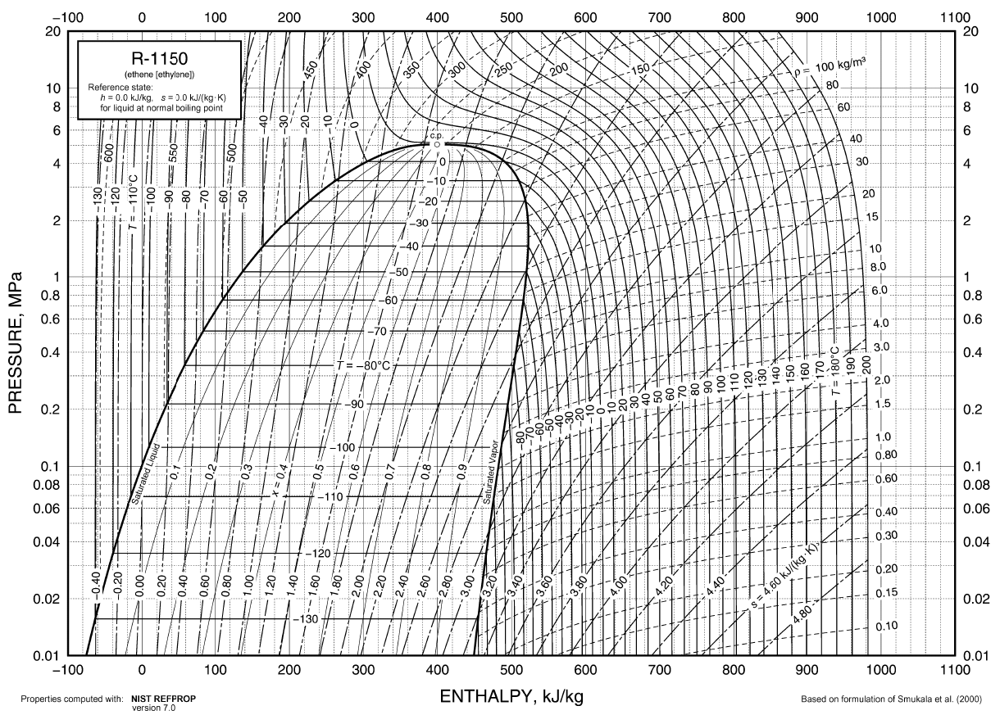

*Fig. 27 Pressure-Enthalpy Diagram for Refrigerant 1150 (Ethylene)*

<!-- str. 858 -->

### Refrigerant 1150 (Ethylene) Properties of

### Saturated Liquid and Saturated Vapor

| Temp.,* °C | Pressure, MPa | Density, Volume,<br>kg/m<sup>3</sup> Liquid | Density, Volume,<br>m<sup>3</sup>/kg Vapor | Enthalpy, kJ/kg<br>Liquid | Enthalpy, kJ/kg<br>Vapor | Entropy, kJ/(kg·K)<br>Liquid | Entropy, kJ/(kg·K)<br>Vapor | Specific Heat c , kJ/(kg·K)<br>Liquid | Specific Heat c , kJ/(kg·K)<br><sup>p</sup> Vapor | c /c p v Vapor | Velocity of Sound, m/s<br>Liquid | Velocity of Sound, m/s<br>Vapor | Viscosity, μPa·s<br>Liquid | Viscosity, μPa·s<br>Vapor | Thermal Cond., mW/(m·K)<br>Liquid | Thermal Cond., mW/(m·K)<br>Vapor | Tension, Temp.,*<br>Surface mN/m | Tension, Temp.,*<br>°C |
|---|---|---|---|---|---|---|---|---|---|---|---|---|---|---|---|---|---|---|
| –169.16<sup>a</sup> | 0.00012 | 654.6 | 252.640 | –158.09 | 409.42 | –1.1789 | 4.2787 | 2.429 | 1.187 | 1.333 | 1767 | 202.7 | 685.7 | 0.77 | 270.6 | 6.80 | 28.14 | –169.16 |
| –165 | 0.00025 | 649.3 | 129.690 | –147.97 | 414.35 | –1.0835 | 4.1160 | 2.432 | 1.188 | 1.333 | 1740 | 206.7 | 598.1 | 1.64 | 264.9 | 6.62 | 27.31 | –165 |
| –160 | 0.00053 | 643.0 | 62.7190 | –135.81 | 420.24 | –0.9736 | 3.9408 | 2.432 | 1.189 | 1.333 | 1707 | 211.3 | 514.5 | 2.47 | 258.1 | 6.59 | 26.33 | –160 |
| –155 | 0.00107 | 636.6 | 32.5570 | –123.66 | 426.12 | –0.8685 | 3.7848 | 2.429 | 1.191 | 1.334 | 1673 | 215.9 | 448.6 | 3.13 | 251.3 | 6.71 | 25.35 | –155 |
| –150 | 0.00203 | 630.1 | 17.9740 | –111.52 | 431.97 | –0.7679 | 3.6454 | 2.424 | 1.194 | 1.334 | 1639 | 220.3 | 395.8 | 3.66 | 244.5 | 6.92 | 24.38 | –150 |
| –145 | 0.00362 | 623.6 | 10.4720 | –99.41 | 437.78 | –0.6715 | 3.5204 | 2.419 | 1.198 | 1.335 | 1604 | 224.5 | 352.7 | 4.09 | 237.9 | 7.18 | 23.42 | –145 |
| –140 | 0.00614 | 617.1 | 6.39510 | –87.33 | 443.54 | –0.5790 | 3.4080 | 2.414 | 1.203 | 1.336 | 1569 | 228.6 | 317.2 | 4.44 | 231.2 | 7.47 | 22.47 | –140 |
| –135 | 0.01000 | 610.5 | 4.07100 | –75.27 | 449.24 | –0.4902 | 3.3065 | 2.409 | 1.210 | 1.337 | 1534 | 232.5 | 287.5 | 4.74 | 224.7 | 7.78 | 21.53 | –135 |
| –130 | 0.01565 | 603.8 | 2.68800 | –63.22 | 454.85 | –0.4046 | 3.2145 | 2.406 | 1.218 | 1.339 | 1498 | 236.3 | 262.3 | 5.00 | 218.3 | 8.09 | 20.59 | –130 |
| –125 | 0.02368 | 597.1 | 1.83310 | –51.19 | 460.37 | –0.3220 | 3.1310 | 2.404 | 1.228 | 1.341 | 1463 | 239.8 | 240.7 | 5.23 | 212.0 | 8.39 | 19.66 | –125 |
| –120 | 0.03474 | 590.3 | 1.28650 | –39.16 | 465.79 | –0.2423 | 3.0548 | 2.404 | 1.240 | 1.344 | 1427 | 243.2 | 222.0 | 5.44 | 205.8 | 8.70 | 18.74 | –120 |
| –115 | 0.04961 | 583.4 | 0.92612 | –27.12 | 471.08 | –0.1651 | 2.9850 | 2.406 | 1.254 | 1.348 | 1390 | 246.3 | 205.7 | 5.63 | 199.7 | 9.00 | 17.83 | –115 |
| –110 | 0.06911 | 576.5 | 0.68196 | –15.06 | 476.22 | –0.0903 | 2.9210 | 2.409 | 1.271 | 1.353 | 1354 | 249.2 | 191.3 | 5.81 | 193.7 | 9.30 | 16.93 | –110 |
| –105 | 0.09420 | 569.4 | 0.51239 | –2.97 | 481.21 | –0.0176 | 2.8619 | 2.416 | 1.290 | 1.358 | 1316 | 251.8 | 178.5 | 5.99 | 187.9 | 9.61 | 16.04 | –105 |
| –103.77<sup>b</sup> | 0.10133 | 567.7 | 0.47899 | 0.00 | 482.41 | 0.0000 | 2.8481 | 2.418 | 1.295 | 1.360 | 1307 | 252.4 | 175.6 | 6.03 | 186.5 | 9.68 | 15.83 | –103.77 |
| –100 | 0.12585 | 562.2 | 0.39198 | 9.16 | 486.03 | 0.0532 | 2.8073 | 2.424 | 1.312 | 1.365 | 1279 | 254.2 | 167.0 | 6.16 | 182.2 | 9.92 | 15.16 | –100 |
| –98 | 0.14059 | 559.3 | 0.35377 | 14.02 | 487.90 | 0.0810 | 2.7866 | 2.429 | 1.321 | 1.368 | 1264 | 255.1 | 162.7 | 6.23 | 179.9 | 10.04 | 14.82 | –98 |
| –96 | 0.15662 | 556.4 | 0.32007 | 18.90 | 489.74 | 0.1085 | 2.7664 | 2.434 | 1.331 | 1.371 | 1249 | 255.9 | 158.6 | 6.30 | 177.7 | 10.17 | 14.47 | –96 |
| –94 | 0.17402 | 553.5 | 0.29026 | 23.79 | 491.55 | 0.1358 | 2.7468 | 2.439 | 1.342 | 1.375 | 1233 | 256.7 | 154.7 | 6.37 | 175.5 | 10.30 | 14.12 | –94 |
| –92 | 0.19285 | 550.5 | 0.26382 | 28.69 | 493.32 | 0.1628 | 2.7277 | 2.445 | 1.353 | 1.379 | 1218 | 257.4 | 150.9 | 6.44 | 173.3 | 10.44 | 13.78 | –92 |
| –90 | 0.21320 | 547.5 | 0.24030 | 33.60 | 495.06 | 0.1896 | 2.7092 | 2.451 | 1.365 | 1.383 | 1203 | 258.1 | 147.2 | 6.51 | 171.2 | 10.57 | 13.44 | –90 |
| –88 | 0.23514 | 544.5 | 0.21933 | 38.53 | 496.76 | 0.2161 | 2.6911 | 2.458 | 1.377 | 1.387 | 1187 | 258.7 | 143.6 | 6.58 | 169.0 | 10.71 | 13.10 | –88 |
| –86 | 0.25874 | 541.4 | 0.20058 | 43.48 | 498.43 | 0.2425 | 2.6734 | 2.465 | 1.391 | 1.392 | 1172 | 259.3 | 140.2 | 6.65 | 166.9 | 10.85 | 12.76 | –86 |
| –84 | 0.28409 | 538.4 | 0.18378 | 48.44 | 500.05 | 0.2686 | 2.6562 | 2.473 | 1.404 | 1.397 | 1156 | 259.9 | 136.9 | 6.72 | 164.8 | 11.00 | 12.42 | –84 |
| –82 | 0.31127 | 535.3 | 0.16869 | 53.41 | 501.64 | 0.2945 | 2.6394 | 2.482 | 1.419 | 1.402 | 1140 | 260.4 | 133.7 | 6.80 | 162.7 | 11.15 | 12.09 | –82 |
| –80 | 0.34034 | 532.2 | 0.15510 | 58.41 | 503.18 | 0.3202 | 2.6229 | 2.491 | 1.434 | 1.408 | 1125 | 260.8 | 130.6 | 6.87 | 160.7 | 11.30 | 11.75 | –80 |
| –78 | 0.37141 | 529.0 | 0.14284 | 63.43 | 504.68 | 0.3457 | 2.6069 | 2.501 | 1.450 | 1.414 | 1109 | 261.2 | 127.5 | 6.95 | 158.6 | 11.46 | 11.42 | –78 |
| –76 | 0.40454 | 525.8 | 0.13176 | 68.47 | 506.14 | 0.3711 | 2.5911 | 2.512 | 1.467 | 1.420 | 1093 | 261.5 | 124.6 | 7.02 | 156.6 | 11.62 | 11.09 | –76 |
| –74 | 0.43982 | 522.6 | 0.12172 | 73.53 | 507.55 | 0.3963 | 2.5757 | 2.524 | 1.484 | 1.427 | 1077 | 261.8 | 121.7 | 7.10 | 154.6 | 11.79 | 10.77 | –74 |
| –72 | 0.47733 | 519.3 | 0.11260 | 78.61 | 508.91 | 0.4214 | 2.5606 | 2.536 | 1.503 | 1.435 | 1061 | 262.1 | 118.9 | 7.18 | 152.6 | 11.96 | 10.44 | –72 |
| –70 | 0.51716 | 516.1 | 0.10431 | 83.72 | 510.23 | 0.4463 | 2.5457 | 2.549 | 1.522 | 1.443 | 1044 | 262.3 | 116.2 | 7.26 | 150.6 | 12.14 | 10.12 | –70 |
| –68 | 0.55939 | 512.7 | 0.09675 | 88.86 | 511.49 | 0.4710 | 2.5311 | 2.563 | 1.543 | 1.451 | 1028 | 262.4 | 113.6 | 7.34 | 148.6 | 12.33 | 9.80 | –68 |
| –66 | 0.60411 | 509.4 | 0.08985 | 94.03 | 512.70 | 0.4957 | 2.5168 | 2.578 | 1.565 | 1.460 | 1012 | 262.5 | 111.0 | 7.42 | 146.7 | 12.52 | 9.48 | –66 |
| –64 | 0.65141 | 506.0 | 0.08354 | 99.23 | 513.85 | 0.5202 | 2.5026 | 2.594 | 1.588 | 1.470 | 995 | 262.5 | 108.5 | 7.51 | 144.7 | 12.72 | 9.16 | –64 |
| –62 | 0.70136 | 502.5 | 0.07776 | 104.46 | 514.95 | 0.5446 | 2.4887 | 2.611 | 1.612 | 1.480 | 978 | 262.4 | 106.0 | 7.60 | 142.8 | 12.92 | 8.85 | –62 |
| –60 | 0.75406 | 499.0 | 0.07246 | 109.72 | 515.99 | 0.5689 | 2.4749 | 2.629 | 1.638 | 1.491 | 962 | 262.3 | 103.6 | 7.68 | 140.9 | 13.14 | 8.53 | –60 |
| –58 | 0.80960 | 495.5 | 0.06758 | 115.02 | 516.97 | 0.5932 | 2.4614 | 2.648 | 1.665 | 1.503 | 945 | 262.2 | 101.2 | 7.78 | 139.0 | 13.36 | 8.23 | –58 |
| –56 | 0.86807 | 491.9 | 0.06310 | 120.36 | 517.88 | 0.6173 | 2.4479 | 2.668 | 1.694 | 1.516 | 928 | 262.0 | 98.9 | 7.87 | 137.1 | 13.59 | 7.92 | –56 |
| –54 | 0.92955 | 488.2 | 0.05896 | 125.74 | 518.73 | 0.6414 | 2.4346 | 2.690 | 1.725 | 1.529 | 911 | 261.7 | 96.6 | 7.96 | 135.2 | 13.84 | 7.61 | –54 |
| –52 | 0.99414 | 484.5 | 0.05514 | 131.16 | 519.51 | 0.6654 | 2.4214 | 2.714 | 1.757 | 1.544 | 894 | 261.3 | 94.4 | 8.06 | 133.4 | 14.09 | 7.31 | –52 |
| –50 | 1.0619 | 480.8 | 0.05161 | 136.62 | 520.21 | 0.6894 | 2.4083 | 2.739 | 1.792 | 1.560 | 876 | 260.9 | 92.2 | 8.16 | 131.5 | 14.35 | 7.01 | –50 |
| –48 | 1.1330 | 476.9 | 0.04834 | 142.14 | 520.84 | 0.7133 | 2.3953 | 2.766 | 1.829 | 1.577 | 859 | 260.5 | 90.1 | 8.27 | 129.7 | 14.63 | 6.71 | –48 |
| –46 | 1.2075 | 473.0 | 0.04530 | 147.70 | 521.39 | 0.7372 | 2.3824 | 2.795 | 1.869 | 1.596 | 841 | 259.9 | 87.9 | 8.38 | 127.8 | 14.91 | 6.42 | –46 |
| –44 | 1.2854 | 469.1 | 0.04249 | 153.32 | 521.86 | 0.7611 | 2.3694 | 2.826 | 1.912 | 1.616 | 823 | 259.3 | 85.8 | 8.49 | 126.0 | 15.22 | 6.13 | –44 |
| –42 | 1.3669 | 465.0 | 0.03987 | 158.99 | 522.24 | 0.7850 | 2.3565 | 2.859 | 1.958 | 1.638 | 806 | 258.7 | 83.8 | 8.60 | 124.2 | 15.53 | 5.84 | –42 |
| –40 | 1.4521 | 460.9 | 0.03743 | 164.73 | 522.53 | 0.8089 | 2.3436 | 2.895 | 2.007 | 1.662 | 787 | 257.9 | 81.8 | 8.72 | 122.3 | 15.86 | 5.55 | –40 |
| –38 | 1.5410 | 456.7 | 0.03515 | 170.52 | 522.72 | 0.8328 | 2.3306 | 2.934 | 2.061 | 1.688 | 769 | 257.1 | 79.7 | 8.84 | 120.5 | 16.21 | 5.27 | –38 |
| –36 | 1.6339 | 452.4 | 0.03303 | 176.39 | 522.81 | 0.8568 | 2.3176 | 2.976 | 2.119 | 1.717 | 751 | 256.3 | 77.8 | 8.97 | 118.7 | 16.58 | 4.99 | –36 |
| –34 | 1.7307 | 448.0 | 0.03105 | 182.33 | 522.79 | 0.8809 | 2.3045 | 3.022 | 2.182 | 1.749 | 732 | 255.3 | 75.8 | 9.10 | 116.8 | 16.97 | 4.71 | –34 |
| –32 | 1.8315 | 443.5 | 0.02919 | 188.35 | 522.65 | 0.9050 | 2.2913 | 3.072 | 2.252 | 1.784 | 714 | 254.3 | 73.8 | 9.24 | 115.0 | 17.38 | 4.44 | –32 |
| –30 | 1.9366 | 438.9 | 0.02745 | 194.45 | 522.38 | 0.9292 | 2.2779 | 3.127 | 2.328 | 1.823 | 695 | 253.2 | 71.9 | 9.39 | 113.2 | 17.82 | 4.17 | –30 |
| –28 | 2.0459 | 434.1 | 0.02581 | 200.65 | 521.98 | 0.9535 | 2.2643 | 3.188 | 2.413 | 1.866 | 676 | 252.0 | 70.0 | 9.54 | 111.3 | 18.29 | 3.90 | –28 |
| –26 | 2.1596 | 429.2 | 0.02427 | 206.94 | 521.44 | 0.9780 | 2.2505 | 3.254 | 2.507 | 1.914 | 656 | 250.7 | 68.1 | 9.69 | 109.5 | 18.78 | 3.64 | –26 |
| –24 | 2.2779 | 424.2 | 0.02283 | 213.34 | 520.74 | 1.0027 | 2.2365 | 3.329 | 2.612 | 1.969 | 637 | 249.4 | 66.2 | 9.86 | 107.6 | 19.32 | 3.38 | –24 |
| –22 | 2.4008 | 419.0 | 0.02146 | 219.85 | 519.86 | 1.0276 | 2.2221 | 3.412 | 2.731 | 2.031 | 617 | 248.0 | 64.3 | 10.04 | 105.8 | 19.90 | 3.13 | –22 |
| –20 | 2.5284 | 413.6 | 0.02017 | 226.49 | 518.80 | 1.0527 | 2.2074 | 3.506 | 2.866 | 2.101 | 596 | 246.4 | 62.4 | 10.22 | 103.9 | 20.53 | 2.88 | –20 |
| –18 | 2.6610 | 408.0 | 0.01895 | 233.27 | 517.53 | 1.0781 | 2.1922 | 3.612 | 3.021 | 2.182 | 576 | 244.8 | 60.5 | 10.42 | 102.0 | 21.22 | 2.63 | –18 |
| –16 | 2.7985 | 402.2 | 0.01780 | 240.21 | 516.04 | 1.1039 | 2.1765 | 3.735 | 3.200 | 2.277 | 555 | 243.1 | 58.7 | 10.63 | 100.0 | 21.98 | 2.39 | –16 |
| –14 | 2.9412 | 396.1 | 0.01670 | 247.32 | 514.28 | 1.1300 | 2.1602 | 3.878 | 3.411 | 2.387 | 533 | 241.3 | 56.8 | 10.86 | 98.1 | 22.83 | 2.15 | –14 |
| –12 | 3.0893 | 389.8 | 0.01565 | 254.63 | 512.24 | 1.1567 | 2.1431 | 4.046 | 3.661 | 2.520 | 511 | 239.3 | 54.9 | 11.10 | 96.1 | 23.78 | 1.92 | –12 |
| –10 | 3.2428 | 383.0 | 0.01466 | 262.17 | 509.87 | 1.1839 | 2.1252 | 4.247 | 3.965 | 2.680 | 489 | 237.3 | 52.9 | 11.36 | 94.1 | 24.88 | 1.70 | –10 |
| –8 | 3.4019 | 375.9 | 0.01370 | 269.96 | 507.10 | 1.2118 | 2.1062 | 4.493 | 4.339 | 2.877 | 465 | 235.1 | 51.0 | 11.65 | 92.0 | 26.15 | 1.48 | –8 |
| –6 | 3.5669 | 368.3 | 0.01278 | 278.07 | 503.89 | 1.2406 | 2.0859 | 4.802 | 4.815 | 3.127 | 441 | 232.8 | 49.0 | 11.98 | 89.9 | 27.66 | 1.26 | –6 |
| –4 | 3.7379 | 360.1 | 0.01189 | 286.56 | 500.12 | 1.2705 | 2.0640 | 5.201 | 5.438 | 3.452 | 416 | 230.3 | 46.9 | 12.34 | 87.8 | 29.52 | 1.06 | –4 |
| –2 | 3.9152 | 351.1 | 0.01103 | 295.51 | 495.66 | 1.3018 | 2.0400 | 5.739 | 6.291 | 3.894 | 390 | 227.6 | 44.8 | 12.75 | 85.6 | 31.88 | 0.86 | –2 |
| 0 | 4.0990 | 341.2 | 0.01018 | 305.06 | 490.32 | 1.3350 | 2.0132 | 6.507 | 7.526 | 4.526 | 362 | 224.6 | 42.6 | 13.23 | 83.5 | 35.04 | 0.67 | 0 |
| 5 | 4.5896 | 308.8 | 0.00802 | 333.52 | 470.25 | 1.4327 | 1.9243 | 11.680 | 16.100 | 8.720 | 283 | 214.9 | 36.2 | 15.01 | 79.8 | 52.44 | 0.25 | 5 |
| 9.20<sup>c</sup> | 5.0418 | 214.2 | 0.00467 | 399.43 | 399.43 | 1.6614 | 1.6614 | ∞ | ∞ | ∞ | 0 | 0.0 | — | — | ∞ | ∞ | 0.00 | 9.20 |

*Temperatures on ITS-90 scale <sup>a</sup>Triple point <sup>b</sup>Normal boiling point <sup>c</sup>Critical point

<!-- str. 859 -->

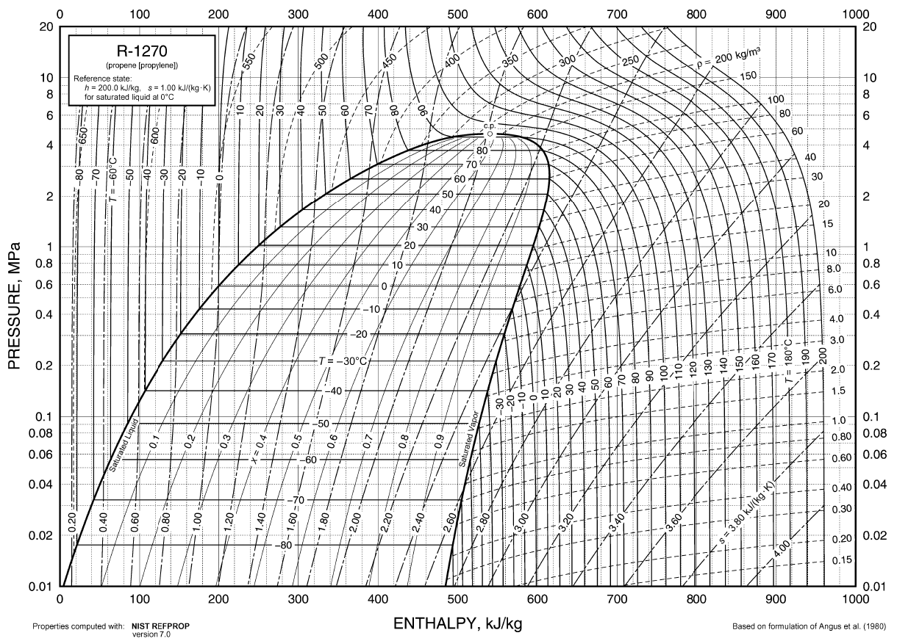

*Fig. 28 Pressure-Enthalpy Diagram for Refrigerant 1270 (Propylene)*

<!-- str. 860 -->

### Refrigerant 1270 (Propylene) Properties o

**f Saturated Liquid and Saturated Vapor**

| Temp.,* °C | Pressure, MPa | Density, kg/m<sup>3</sup> Liquid | Volume, m<sup>3</sup>/kg Vapor | Enthalpy, kJ/kg<br>Liquid | Enthalpy, kJ/kg<br>Vapor | Entropy, kJ/(kg·K)<br>Liquid | Entropy, kJ/(kg·K)<br>Vapor | Specific Heat c , kJ/(kg·K)<br><sup>p</sup> Liquid | Specific Heat c , kJ/(kg·K)<br>Vapor | c /c p v Vapor | Velocity of Sound, m/s<br>Liquid | Velocity of Sound, m/s<br>Vapor | Viscosity, μPa·s<br>Liquid | Viscosity, μPa·s<br>Vapor | Thermal Cond., mW/(m·K)<br>Liquid | Thermal Cond., mW/(m·K)<br>Vapor | Tension,Temp.,*<br>Surface mN/m | Tension,Temp.,*<br>°C |
|---|---|---|---|---|---|---|---|---|---|---|---|---|---|---|---|---|---|---|
| –150 | 0.00001 | 727.9 2789.30000 |  | –117.02 | 419.51 | –0.6521 | 3.7046 | 1.834 | 0.991 | 1.249 | 1834 | 174.3 | 1324.0 | 3.51 | 179.9 | 4.60 | 33.49 | –150 |
| –140 | 0.00005 | 716.3 | 583.08000 | –98.37 | 429.53 | –0.5066 | 3.4582 | 1.893 | 1.015 | 1.242 | 1754 | 180.7 | 945.7 | 3.79 | 177.6 | 5.07 | 31.76 | –140 |
| –130 | 0.00018 | 704.9 | 156.04000 | –79.20 | 439.78 | –0.3677 | 3.2577 | 1.939 | 1.039 | 1.235 | 1683 | 186.9 | 718.7 | 4.06 | 175.0 | 5.55 | 30.05 | –130 |
| –120 | 0.00059 | 693.6 | 50.84700 | –59.62 | 450.25 | –0.2356 | 3.0936 | 1.974 | 1.064 | 1.229 | 1617 | 192.7 | 571.2 | 4.34 | 172.2 | 6.06 | 28.36 | –120 |
| –110 | 0.00166 | 682.2 | 19.42300 | –39.73 | 460.91 | –0.1098 | 2.9588 | 2.002 | 1.090 | 1.223 | 1554 | 198.3 | 468.9 | 4.62 | 169.1 | 6.60 | 26.69 | –110 |
| –100 | 0.00404 | 670.8 | 8.44420 | –19.59 | 471.73 | 0.0100 | 2.8475 | 2.026 | 1.118 | 1.218 | 1493 | 203.5 | 394.1 | 4.90 | 165.8 | 7.16 | 25.04 | –100 |
| –90 | 0.00881 | 659.4 | 4.08250 | 0.80 | 482.68 | 0.1244 | 2.7555 | 2.050 | 1.149 | 1.214 | 1432 | 208.4 | 337.1 | 5.18 | 162.3 | 7.75 | 23.41 | –90 |
| –80 | 0.01754 | 647.8 | 2.15470 | 21.43 | 493.72 | 0.2341 | 2.6793 | 2.075 | 1.183 | 1.211 | 1370 | 212.9 | 292.2 | 5.46 | 158.6 | 8.36 | 21.80 | –80 |
| –70 | 0.03232 | 636.1 | 1.22310 | 42.34 | 504.79 | 0.3395 | 2.6159 | 2.103 | 1.220 | 1.209 | 1309 | 216.9 | 255.9 | 5.73 | 154.7 | 9.01 | 20.22 | –70 |
| –60 | 0.05578 | 624.1 | 0.73772 | 63.55 | 515.84 | 0.4412 | 2.5631 | 2.135 | 1.263 | 1.209 | 1247 | 220.4 | 226.1 | 6.01 | 150.6 | 9.69 | 18.66 | –60 |
| –50 | 0.09111 | 611.9 | 0.46816 | 85.11 | 526.79 | 0.5398 | 2.5191 | 2.171 | 1.309 | 1.211 | 1184 | 223.4 | 201.1 | 6.29 | 146.4 | 10.40 | 17.14 | –50 |
| –48 | 0.09991 | 609.4 | 0.42975 | 89.47 | 528.96 | 0.5592 | 2.5112 | 2.179 | 1.319 | 1.211 | 1171 | 223.9 | 196.6 | 6.35 | 145.6 | 10.55 | 16.83 | –48 |
| –47.69<sup>b</sup> | 0.10133 | 609.1 | 0.42416 | 90.14 | 529.30 | 0.5621 | 2.5100 | 2.180 | 1.321 | 1.211 | 1169 | 224.0 | 195.9 | 6.36 | 145.4 | 10.58 | 16.79 | –47.69 |
| –46 | 0.10935 | 606.9 | 0.39515 | 93.84 | 531.13 | 0.5784 | 2.5035 | 2.187 | 1.330 | 1.212 | 1158 | 224.4 | 192.2 | 6.40 | 144.7 | 10.70 | 16.53 | –46 |
| –44 | 0.11949 | 604.4 | 0.36390 | 98.23 | 533.29 | 0.5976 | 2.4962 | 2.195 | 1.340 | 1.213 | 1145 | 224.8 | 188.0 | 6.46 | 143.8 | 10.86 | 16.23 | –44 |
| –42 | 0.13033 | 601.9 | 0.33564 | 102.64 | 535.45 | 0.6167 | 2.4891 | 2.203 | 1.351 | 1.214 | 1133 | 225.3 | 183.9 | 6.52 | 143.0 | 11.01 | 15.93 | –42 |
| –40 | 0.14192 | 599.4 | 0.31004 | 107.06 | 537.59 | 0.6356 | 2.4822 | 2.212 | 1.362 | 1.215 | 1120 | 225.7 | 179.9 | 6.57 | 142.1 | 11.17 | 15.63 | –40 |
| –38 | 0.15429 | 596.8 | 0.28680 | 111.51 | 539.73 | 0.6545 | 2.4756 | 2.221 | 1.373 | 1.216 | 1107 | 226.1 | 176.0 | 6.63 | 141.2 | 11.33 | 15.34 | –38 |
| –36 | 0.16748 | 594.3 | 0.26566 | 115.97 | 541.85 | 0.6733 | 2.4692 | 2.230 | 1.385 | 1.217 | 1094 | 226.4 | 172.3 | 6.69 | 140.3 | 11.49 | 15.04 | –36 |
| –34 | 0.18152 | 591.7 | 0.24642 | 120.45 | 543.97 | 0.6921 | 2.4630 | 2.239 | 1.396 | 1.218 | 1081 | 226.7 | 168.7 | 6.75 | 139.4 | 11.65 | 14.75 | –34 |
| –32 | 0.19644 | 589.1 | 0.22886 | 124.95 | 546.08 | 0.7107 | 2.4570 | 2.249 | 1.408 | 1.220 | 1068 | 227.0 | 165.1 | 6.80 | 138.5 | 11.82 | 14.45 | –32 |
| –30 | 0.21228 | 586.5 | 0.21282 | 129.47 | 548.17 | 0.7292 | 2.4512 | 2.259 | 1.421 | 1.221 | 1056 | 227.3 | 161.7 | 6.86 | 137.6 | 11.99 | 14.16 | –30 |
| –28 | 0.22908 | 583.8 | 0.19814 | 134.01 | 550.26 | 0.7477 | 2.4456 | 2.269 | 1.433 | 1.223 | 1043 | 227.5 | 158.4 | 6.92 | 136.7 | 12.16 | 13.87 | –28 |
| –26 | 0.24687 | 581.2 | 0.18469 | 138.57 | 552.33 | 0.7661 | 2.4402 | 2.279 | 1.446 | 1.225 | 1030 | 227.7 | 155.1 | 6.98 | 135.7 | 12.34 | 13.58 | –26 |
| –24 | 0.26569 | 578.5 | 0.17234 | 143.15 | 554.38 | 0.7845 | 2.4350 | 2.290 | 1.459 | 1.227 | 1017 | 227.9 | 152.0 | 7.04 | 134.8 | 12.52 | 13.29 | –24 |
| –22 | 0.28558 | 575.8 | 0.16100 | 147.76 | 556.43 | 0.8027 | 2.4299 | 2.300 | 1.473 | 1.229 | 1004 | 228.1 | 148.9 | 7.10 | 133.9 | 12.70 | 13.00 | –22 |
| –20 | 0.30657 | 573.1 | 0.15056 | 152.38 | 558.46 | 0.8209 | 2.4250 | 2.311 | 1.487 | 1.231 | 991 | 228.2 | 145.9 | 7.17 | 132.9 | 12.89 | 12.72 | –20 |
| –18 | 0.32871 | 570.4 | 0.14093 | 157.03 | 560.48 | 0.8391 | 2.4203 | 2.323 | 1.501 | 1.234 | 978 | 228.3 | 143.0 | 7.23 | 132.0 | 13.08 | 12.43 | –18 |
| –16 | 0.35203 | 567.6 | 0.13206 | 161.71 | 562.48 | 0.8571 | 2.4157 | 2.335 | 1.515 | 1.236 | 965 | 228.3 | 140.2 | 7.29 | 131.0 | 13.28 | 12.15 | –16 |
| –14 | 0.37657 | 564.8 | 0.12385 | 166.40 | 564.46 | 0.8752 | 2.4112 | 2.347 | 1.530 | 1.239 | 952 | 228.3 | 137.4 | 7.36 | 130.1 | 13.48 | 11.87 | –14 |
| –12 | 0.40237 | 562.0 | 0.11626 | 171.12 | 566.43 | 0.8931 | 2.4068 | 2.359 | 1.546 | 1.242 | 939 | 228.3 | 134.8 | 7.42 | 129.1 | 13.68 | 11.59 | –12 |
| –10 | 0.42947 | 559.2 | 0.10924 | 175.87 | 568.37 | 0.9111 | 2.4026 | 2.372 | 1.562 | 1.245 | 925 | 228.2 | 132.1 | 7.49 | 128.2 | 13.89 | 11.31 | –10 |
| –8 | 0.45791 | 556.3 | 0.10272 | 180.64 | 570.30 | 0.9289 | 2.3985 | 2.385 | 1.578 | 1.248 | 912 | 228.1 | 129.6 | 7.56 | 127.2 | 14.11 | 11.03 | –8 |
| –6 | 0.48773 | 553.5 | 0.09667 | 185.44 | 572.22 | 0.9468 | 2.3945 | 2.398 | 1.594 | 1.252 | 899 | 228.0 | 127.1 | 7.63 | 126.2 | 14.33 | 10.76 | –6 |
| –4 | 0.51897 | 550.6 | 0.09105 | 190.27 | 574.11 | 0.9645 | 2.3907 | 2.412 | 1.612 | 1.256 | 886 | 227.8 | 124.6 | 7.69 | 125.3 | 14.55 | 10.48 | –4 |
| –2 | 0.55167 | 547.6 | 0.08582 | 195.12 | 575.98 | 0.9823 | 2.3869 | 2.426 | 1.629 | 1.260 | 873 | 227.6 | 122.2 | 7.77 | 124.3 | 14.78 | 10.21 | –2 |
| 0 | 0.58588 | 544.6 | 0.08094 | 200.00 | 577.82 | 1.0000 | 2.3832 | 2.441 | 1.648 | 1.264 | 860 | 227.4 | 119.9 | 7.84 | 123.3 | 15.02 | 9.94 | 0 |
| 2 | 0.62163 | 541.6 | 0.07640 | 204.91 | 579.65 | 1.0177 | 2.3796 | 2.456 | 1.666 | 1.268 | 847 | 227.1 | 117.6 | 7.91 | 122.3 | 15.27 | 9.67 | 2 |
| 4 | 0.65896 | 538.6 | 0.07216 | 209.85 | 581.45 | 1.0353 | 2.3761 | 2.471 | 1.686 | 1.273 | 834 | 226.7 | 115.4 | 7.99 | 121.3 | 15.52 | 9.40 | 4 |
| 6 | 0.69793 | 535.5 | 0.06820 | 214.82 | 583.22 | 1.0529 | 2.3726 | 2.487 | 1.706 | 1.278 | 820 | 226.4 | 113.2 | 8.07 | 120.3 | 15.79 | 9.13 | 6 |
| 8 | 0.73856 | 532.4 | 0.06449 | 219.83 | 584.97 | 1.0705 | 2.3693 | 2.504 | 1.726 | 1.284 | 807 | 226.0 | 111.1 | 8.15 | 119.3 | 16.06 | 8.87 | 8 |
| 10 | 0.78091 | 529.3 | 0.06102 | 224.86 | 586.69 | 1.0881 | 2.3660 | 2.521 | 1.748 | 1.289 | 794 | 225.5 | 109.0 | 8.23 | 118.3 | 16.33 | 8.60 | 10 |
| 12 | 0.82502 | 526.1 | 0.05777 | 229.93 | 588.39 | 1.1056 | 2.3627 | 2.538 | 1.770 | 1.296 | 781 | 225.0 | 106.9 | 8.31 | 117.3 | 16.62 | 8.34 | 12 |
| 14 | 0.87093 | 522.9 | 0.05472 | 235.03 | 590.05 | 1.1231 | 2.3595 | 2.557 | 1.793 | 1.302 | 767 | 224.5 | 104.9 | 8.4 | 116.3 | 16.92 | 8.08 | 14 |
| 16 | 0.91868 | 519.7 | 0.05186 | 240.17 | 591.68 | 1.1407 | 2.3563 | 2.575 | 1.817 | 1.309 | 754 | 223.9 | 102.9 | 8.48 | 115.3 | 17.23 | 7.82 | 16 |
| 18 | 0.96832 | 516.4 | 0.04917 | 245.34 | 593.28 | 1.1582 | 2.3532 | 2.595 | 1.842 | 1.316 | 741 | 223.3 | 101.0 | 8.57 | 114.3 | 17.55 | 7.56 | 18 |
| 20 | 1.01990 | 513.0 | 0.04664 | 250.55 | 594.84 | 1.1756 | 2.3501 | 2.615 | 1.867 | 1.324 | 727 | 222.6 | 99.1 | 8.67 | 113.3 | 17.88 | 7.31 | 20 |
| 22 | 1.07350 | 509.6 | 0.04426 | 255.8 | 596.37 | 1.1931 | 2.3470 | 2.637 | 1.894 | 1.333 | 714 | 221.9 | 97.2 | 8.76 | 112.2 | 18.22 | 7.05 | 22 |
| 24 | 1.12900 | 506.2 | 0.04202 | 261.09 | 597.86 | 1.2106 | 2.3440 | 2.659 | 1.923 | 1.342 | 701 | 221.1 | 95.4 | 8.86 | 111.2 | 18.58 | 6.80 | 24 |
| 26 | 1.18670 | 502.7 | 0.03990 | 266.42 | 599.31 | 1.2281 | 2.3409 | 2.682 | 1.952 | 1.351 | 687 | 220.3 | 93.6 | 8.97 | 110.2 | 18.95 | 6.55 | 26 |
| 28 | 1.24650 | 499.2 | 0.03791 | 271.79 | 600.72 | 1.2456 | 2.3378 | 2.706 | 1.983 | 1.362 | 674 | 219.4 | 91.8 | 9.06 | 109.2 | 19.34 | 6.31 | 28 |
| 30 | 1.30840 | 495.6 | 0.03602 | 277.21 | 602.08 | 1.2631 | 2.3348 | 2.731 | 2.015 | 1.373 | 661 | 218.5 | 90.0 | 9.17 | 108.1 | 19.74 | 6.06 | 30 |
| 32 | 1.37250 | 491.9 | 0.03424 | 282.67 | 603.40 | 1.2807 | 2.3317 | 2.757 | 2.049 | 1.385 | 647 | 217.5 | 88.3 | 9.28 | 107.1 | 20.15 | 5.82 | 32 |
| 34 | 1.43900 | 488.2 | 0.03255 | 288.18 | 604.67 | 1.2982 | 2.3286 | 2.785 | 2.085 | 1.398 | 634 | 216.5 | 86.6 | 9.40 | 106.0 | 20.58 | 5.58 | 34 |
| 36 | 1.50770 | 484.4 | 0.03095 | 293.74 | 605.88 | 1.3158 | 2.3255 | 2.814 | 2.123 | 1.412 | 620 | 215.4 | 84.9 | 9.52 | 105.0 | 21.03 | 5.34 | 36 |
| 38 | 1.57880 | 480.6 | 0.02944 | 299.35 | 607.05 | 1.3334 | 2.3223 | 2.845 | 2.163 | 1.427 | 606 | 214.3 | 83.3 | 9.64 | 104.0 | 21.50 | 5.10 | 38 |
| 40 | 1.65230 | 476.7 | 0.02801 | 305.01 | 608.15 | 1.3510 | 2.3191 | 2.878 | 2.206 | 1.443 | 593 | 213.1 | 81.6 | 9.77 | 102.9 | 22.00 | 4.86 | 40 |
| 42 | 1.72820 | 472.7 | 0.02664 | 310.72 | 609.19 | 1.3687 | 2.3158 | 2.913 | 2.251 | 1.460 | 579 | 211.8 | 80.0 | 9.91 | 101.9 | 22.52 | 4.63 | 42 |
| 44 | 1.80670 | 468.6 | 0.02535 | 316.50 | 610.17 | 1.3865 | 2.3124 | 2.950 | 2.300 | 1.480 | 565 | 210.5 | 78.4 | 10.05 | 100.8 | 23.06 | 4.40 | 44 |
| 46 | 1.88780 | 464.4 | 0.02412 | 322.34 | 611.07 | 1.4043 | 2.3090 | 2.990 | 2.352 | 1.501 | 552 | 209.1 | 76.8 | 10.20 | 99.7 | 23.63 | 4.17 | 46 |
| 48 | 1.97150 | 460.2 | 0.02295 | 328.24 | 611.90 | 1.4221 | 2.3054 | 3.032 | 2.408 | 1.523 | 538 | 207.7 | 75.2 | 10.36 | 98.7 | 24.24 | 3.95 | 48 |
| 50 | 2.05790 | 455.8 | 0.02183 | 334.21 | 612.65 | 1.4401 | 2.3017 | 3.078 | 2.469 | 1.549 | 524 | 206.2 | 73.6 | 10.52 | 97.6 | 24.88 | 3.73 | 50 |
| 55 | 2.28610 | 444.4 | 0.01926 | 349.47 | 614.13 | 1.4854 | 2.2919 | 3.211 | 2.644 | 1.624 | 488 | 202.2 | 69.7 | 10.97 | 94.9 | 26.63 | 3.18 | 55 |
| 60 | 2.53250 | 432.1 | 0.01696 | 365.26 | 614.95 | 1.5315 | 2.2809 | 3.380 | 2.868 | 1.723 | 452 | 197.7 | 65.8 | 11.49 | 92.2 | 28.67 | 2.65 | 60 |
| 65 | 2.79810 | 418.8 | 0.01490 | 381.71 | 614.94 | 1.5786 | 2.2683 | 3.604 | 3.163 | 1.859 | 415 | 192.8 | 61.9 | 12.10 | 89.4 | 31.07 | 2.15 | 65 |
| 70 | 3.08420 | 404.1 | 0.01302 | 399.01 | 613.87 | 1.6273 | 2.2535 | 3.921 | 3.578 | 2.055 | 377 | 187.4 | 57.9 | 12.83 | 86.6 | 33.94 | 1.67 | 70 |
| 75 | 3.39220 | 387.4 | 0.01130 | 417.46 | 611.33 | 1.6785 | 2.2353 | 4.416 | 4.213 | 2.363 | 337 | 181.3 | 53.7 | 13.73 | 83.8 | 37.50 | 1.21 | 75 |
| 80 | 3.72380 | 367.5 | 0.00967 | 437.66 | 606.61 | 1.7335 | 2.2120 | 5.315 | 5.332 | 2.918 | 294 | 174.7 | 49.1 | 14.90 | 81.1 | 42.14 | 0.79 | 80 |
| 85 | 4.08100 | 341.7 | 0.00808 | 461.03 | 598.06 | 1.7964 | 2.1790 | 7.507 | 7.921 | 4.221 | 248 | 167.2 | 43.8 | 16.55 | 79.2 | 48.98 | 0.41 | 85 |
| 90 | 4.46680 | 298.9 | 0.00630 | 493.45 | 579.55 | 1.8829 | 2.1200 | 20.390 | 21.470 | 11.110 | 195 | 159.2 | 36.3 | 19.59 | 81.9 | 64.05 | 0.10 | 90 |
| 92.42<sup>c</sup> | 4.66460 | 223.4 | 0.00448 | 540.41 | 540.41 | 2.0097 | 2.0097 | ∞ | ∞ | ∞ | 0 | 0.0 | — | — | ∞ | ∞ | 0.00 | 92.42 |

*Temperatures on IPTS-68 scale <sup>b</sup>Normal boiling point <sup>c</sup>Critical point

<!-- str. 861 -->

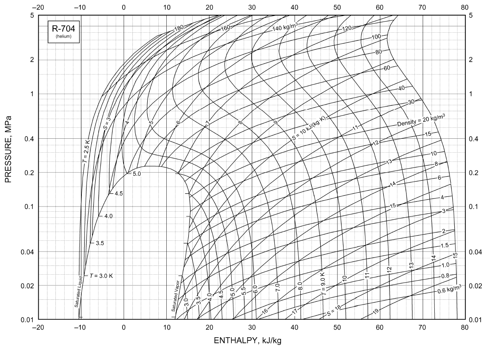

*Fig. 29 Pressure-Enthalpy Diagram for Refrigerant 704 (Helium)*

<!-- str. 862 -->

### Refrigerant 704 (Helium) Properties of

### Saturated Liquid and Saturated Vapor

```text
                                 Enthalpy,        Entropy,    Specific Heat c ,     Velocity of    Viscosity, Thermal Cond.,
       Absolute Density, Volume,                                          ^p                                                 Surface
                                   kJ/kg         kJ/(kg·K)       kJ/(kg·K)          Sound, m/s      μPa·s       mW/(m·K)
                                                                             c /c
Temp., Pressure, kg/m^3 m^3/kg                                                p v                                            Tension, Temp.,
  K      MPa    Liquid Vapor   Liquid  Vapor   Liquid  Vapor  Liquid  Vapor Vapor  Liquid Vapor  Liquid Vapor  Liquid Vapor   mN/m     K
 2.18^a 0.00486 146.24 0.87297  2.34   25.56   1.4040 12.0746  6.318  6.061  1.747  217    83.2   —      —      —      —      0.388   2.18
 2.20   0.00515 146.19 0.83068  2.48   25.66   1.4682 12.0035  5.800  6.076  1.750  217    83.6   —      —      —      —      0.385   2.20
 2.30   0.00653 145.87 0.67831  2.98   26.05   1.6865  11.7174 4.164  6.139  1.763  216    85.0   —      —      —      —      0.371   2.30
 2.40   0.00814 145.46 0.56257  3.35   26.44   1.8414 11.4586  3.217  6.199  1.778  216    86.3   —      —      —      —      0.356   2.40
 2.50   0.01000 144.96 0.47252  3.66   26.81   1.9607 11.2211  2.700  6.258  1.795  216    87.6   —      —      —      —      0.342   2.50
 2.60   0.01213 144.38 0.40113  3.93   27.17   2.0604  11.0011 2.453  6.318  1.813  217    88.8   —      —      —      —      0.328   2.60
 2.70   0.01454 143.72 0.34364  4.18   27.52   2.1502 10.7956  2.372  6.380  1.834  217    90.0   —      —      —      —      0.314   2.70
 2.80   0.01727 143.00 0.29674  4.44   27.86   2.2356 10.6024  2.394  6.446  1.857  217    91.1   —      —      —      —      0.300   2.80
 2.90   0.02032 142.21 0.25805  4.70   28.19   2.3196  10.4198 2.477  6.516  1.882  216    92.1   —      —      —      —      0.286   2.90
 3.00   0.02373 141.34 0.22582  4.97   28.50   2.4039 10.2464  2.598  6.592  1.910  214    93.0   —      —      —      —      0.272   3.00
 3.10   0.02750 140.42 0.19871  5.26   28.79   2.4894 10.0808  2.740  6.676  1.941  213    93.9   —      —      —      —      0.258   3.10
 3.20   0.03166 139.43 0.17574  5.56   29.07   2.5765  9.9222  2.897  6.768  1.976  210    94.8   —      —      —      —      0.244   3.20
 3.30   0.03622 138.38 0.15612  5.88   29.33   2.6653  9.7694  3.062  6.872  2.015  208    95.5   —      —      —      —      0.231   3.30
 3.40   0.04121 137.25 0.13925  6.22   29.57   2.7559  9.6216  3.234  6.989  2.059  205    96.3   —      —      —      —      0.217   3.40
 3.50   0.04664 136.06 0.12466  6.58   29.79   2.8482  9.4781  3.414  7.122  2.108  202    96.9   —      —      —      —      0.203   3.50
 3.60   0.05252 134.80 0.11195  6.96   29.98   2.9422  9.3381  3.603  7.274  2.165  199    97.5   3.5   1.00    17.9   7.31   0.190   3.60
 3.70   0.05888 133.45 0.10081  7.35   30.16   3.0380  9.2007  3.803  7.449  2.229  196    98.1   3.4   1.04    18.1   7.56   0.177   3.70
 3.80   0.06573 132.03 0.09101  7.77   30.31   3.1355  9.0653  4.020  7.654  2.303  193    98.6   3.4   1.07    18.2   7.82   0.164   3.80
 3.90   0.07310 130.51 0.08232  8.21   30.43   3.2351  8.9312  4.257  7.894  2.389  189    99.1   3.3   1.11    18.4   8.09   0.150   3.90
 4.00   0.08100 128.90 0.07459  8.67   30.52   3.3367  8.7975  4.523  8.179  2.491  186    99.5   3.3   1.15    18.5   8.36   0.138   4.00
 4.10   0.08945 127.17 0.06767  9.16   30.57   3.4407  8.6633  4.826  8.521  2.611  182    99.8   3.2   1.19    18.6   8.66   0.125   4.10
 4.20   0.09847 125.32 0.06144  9.68   30.59   3.5475  8.5277  5.179  8.938  2.756  178   100.1   3.2   1.24    18.6   8.97   0.112   4.20
 4.23^b 0.10132 124.73 0.05967  9.84   30.59   3.5806  8.4861  5.299  9.083  2.806  176   100.2   3.2   1.25    18.7   9.06   0.108   4.23
 4.30   0.10809 123.33 0.05581 10.22   30.57   3.6577  8.3896  5.600  9.455  2.934  173   100.4   3.1   1.28    18.7   9.30   0.099   4.30
 4.40   0.11832 121.17 0.05067 10.80   30.50   3.7719  8.2476  6.118 10.1100 3.158  169   100.6   3.1   1.33    18.8   9.66   0.087   4.40
 4.50   0.12920 118.81 0.04596 11.42   30.36   3.8912  8.0999  6.776 10.9640 3.448  164   100.8   3.0   1.38    18.8  10.07   0.075   4.50
 4.60   0.14075 116.20 0.04161 12.09   30.16   4.0171  7.9440  7.646 12.117  3.838  159   100.9   3.0   1.43    18.8  10.54   0.063   4.60
 4.70   0.15301 113.27 0.03753 12.83   29.87   4.1517  7.7767  8.863 13.7540 4.388  153   101.0   2.9   1.48    18.9  11.08   0.051   4.70
 4.80   0.16602 109.90 0.03367 13.64   29.45   4.2986  7.5924 10.7000 16.2440 5.224 147   101.1   2.8   1.55    19.0  11.76   0.040   4.80
 4.90   0.17983 105.89 0.02993 14.57   28.87   4.4641  7.3821 13.813 20.464  6.637  140   101.3   2.7   1.62    19.1  12.63   0.029   4.90
 5.00   0.19453 100.83 0.02617 15.69   28.02   4.6615  7.1273 20.2400 29.0940 9.531 133   101.6   2.6   1.70    19.3  13.86   0.018   5.00
 5.10   0.21023  93.53 0.02206 17.20   26.63   4.9283  6.7774 40.7700 55.8660 18.545 124  102.5   2.5   1.80    19.9  15.77   0.008   5.10
 5.20^c 0.22746  69.64 0.01436 21.71   21.71   5.7639  5.7639    ∞     ∞      ∞       0     0.0   —      —       ∞     ∞      0.000   5.20
Temperatures on EPT-76 scale                     ^aLower lambda point                      ^bNormal boiling point               ^cCritical point
                      Refrigerant 704 (Helium) Properties of Gas at 0.101 325 MPa (one standard atmosphere)
                                             Vel. of         Thermal                                                Vel. of        Thermal
Temp., Density, Enthalpy, Entropy, c_p, kJ/  Sound,  Visc., Cond., mW/ Temp., Density, Enthalpy, Entropy, c_p, kJ/ Sound,   Visc., Cond., mW/
  °C    kg/m^3  kJ/kg kJ/(kg·K) (kg·K) c_p/c_v m/s   μPa·s    (m·K)     °C    kg/m^3  kJ/kg kJ/(kg·K) (kg·K)  c_p/c_v m/s  μPa·s    (m·K)
–268.9^b 16.758  30.59  8.4861  9.083  2.806  100.2   1.25     9.05     100  0.1307  1953.16 32.7129  5.193  1.667 1137.0   23.15   181.41
–260   3.7508    82.19 15.2748  5.327  1.708  213.6   2.72    20.17     120  0.1240  2057.02 32.9840  5.193  1.667 1167.0   24.00   188.10
–250   2.1049   134.88 18.2572  5.236  1.678  284.4   3.93    28.69     140  0.1180  2160.88 33.2417  5.193  1.667 1196.3   24.84   194.69
–240   1.4677   187.10 20.1325  5.213  1.671  340.1   4.93    35.90     160  0.1126  2264.74 33.4872  5.193  1.667 1224.9   25.67   201.19
–220   0.9155   291.20 22.5899  5.200  1.668  430.1   6.60    48.56     180  0.1076  2368.60 33.7216  5.193  1.667 1252.9   26.49   207.60
–200   0.6655   395.16 24.2500  5.196  1.667  504.3   8.04    59.86     200  0.1031  2472.46 33.9459  5.193  1.667 1280.2   27.29   213.93
–180   0.5228   499.06 25.5057  5.195  1.667  568.8   9.35    70.30     220  0.0989  2576.32 34.1609  5.193  1.667 1307.0   28.09   220.18
–160   0.4305   602.95 26.5160  5.194  1.667  626.7  10.39    80.09     240  0.0950  2680.18 34.3673  5.193  1.667 1333.2   28.88   226.35
–140   0.3659   706.82 27.3614  5.194  1.667  679.7  11.56    89.41     260  0.0915  2784.04 34.5659  5.193  1.667 1358.9   29.66   232.46
–120   0.3182   810.69 28.0882  5.193  1.666  728.8  12.68    98.32     280  0.0882  2887.90 34.7571  5.193  1.667 1384.1   30.43   238.50
–100   0.2815   914.56 28.7256  5.193  1.666  774.9  13.75   106.90     300  0.0851  2991.76 34.9416  5.193  1.667 1408.9   31.20   244.47
–80    0.2524  1018.42 29.2932  5.193  1.667  818.3  14.79   115.20     320  0.0822  3095.62 35.1197  5.193  1.667 1433.3   31.96   250.39
–60    0.2287  1122.28 29.8049  5.193  1.667  859.6  15.80   123.25     340  0.0795  3199.48 35.2919  5.193  1.667 1457.2   32.71   256.24
–40    0.2091  1226.14 30.2707  5.193  1.667  898.9  16.79   131.09     360  0.0770  3303.34 35.4586  5.193  1.667 1480.8   33.45   262.04
–20    0.1926  1330.00 30.6980  5.193  1.667  936.7  17.75   138.73     380  0.0747  3407.20 35.6201  5.193  1.667 1504.0   34.19   267.79
  0    0.1785  1433.87 31.0929  5.193  1.667  972.9  18.70   146.20     400  0.0725  3511.06 35.7767  5.193  1.667 1526.8   34.92   273.48
 20    0.1663  1537.73 31.4599  5.193  1.667 1007.9  19.62   153.50     420  0.0704  3614.92 35.9288  5.193  1.667 1549.3   35.65   279.13
 40    0.1557  1641.58 31.8026  5.193  1.667 1041.6  20.52   160.67     440  0.0684  3718.78 36.0765  5.193  1.667 1571.5   36.37   284.73
 60    0.1464  1745.44 32.1241  5.193  1.667 1074.4  21.41   167.70     460  0.0665  3822.64 36.2201  5.193  1.667 1593.4   37.08   290.28
 80    0.1381  1849.30 32.4269  5.193  1.667 1106.1  22.29   174.61     480  0.0648  3926.50 36.3599  5.193  1.667 1615.0   37.79   295.78
                                                                        500  0.0631  4030.36 36.4960  5.193  1.667 1636.3   38.49   301.25
^bSaturated vapor at normal boiling point
```

<!-- str. 863 -->

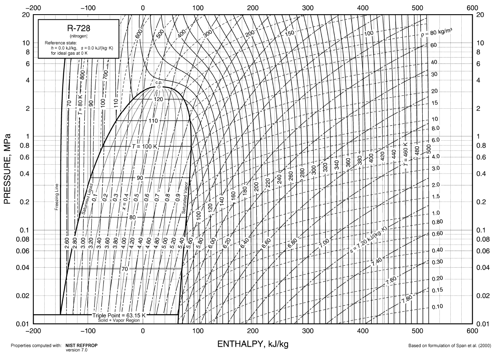

*Fig. 30 Pressure-Enthalpy Diagram for Refrigerant 728 (Nitrogen)*

<!-- str. 864 -->

### Refrigerant 728 (Nitrogen) Properties of

### Saturated Liquid and Saturated Vapor

| Temp.,* Pressure,<br>K | Temp.,* Pressure,<br>Absolute MPa | Density, kg/m<sup>3</sup> Liquid | Volume, m<sup>3</sup>/kg Vapor | Enthalpy, kJ/kg<br>Liquid | Enthalpy, kJ/kg<br>Vapor | Entropy, kJ/(kg·K)<br>Liquid | Entropy, kJ/(kg·K)<br>Vapor | Specific Heat c , kJ/(kg·K)<br>Liquid | Specific Heat c , kJ/(kg·K)<br><sup>p</sup> Vapor | c /c p v Vapor | Velocity of Sound, m/s<br>Liquid | Velocity of Sound, m/s<br>Vapor | Viscosity, μPa·s<br>Liquid | Viscosity, μPa·s<br>Vapor | Thermal Cond., mW/(m·K)<br>Liquid | Thermal Cond., mW/(m·K)<br>Vapor | Tension, Temp.,*<br>Surface mN/m | Tension, Temp.,*<br>K |
|---|---|---|---|---|---|---|---|---|---|---|---|---|---|---|---|---|---|---|
| 63.15<sup>a</sup> | 0.01252 | 867.2 | 1.48310 | –150.73 | 64.78 | 2.4257 | 5.8383 | 2.000 | 1.058 | 1.411 | 995 | 161.1 | 311.6 | 4.38 | 173.2 | 5.62 | 12.24 | 63.15 |
| 64 | 0.01460 | 863.7 | 1.28720 | –149.03 | 65.59 | 2.4524 | 5.8059 | 2.002 | 1.061 | 1.413 | 987 | 162.1 | 297.5 | 4.44 | 171.5 | 5.71 | 12.03 | 64 |
| 66 | 0.02062 | 855.4 | 0.93698 | –145.02 | 67.47 | 2.5140 | 5.7336 | 2.005 | 1.066 | 1.417 | 966 | 164.3 | 267.8 | 4.59 | 167.5 | 5.92 | 11.55 | 66 |
| 68 | 0.02848 | 847.0 | 0.69642 | –141.00 | 69.31 | 2.5739 | 5.6667 | 2.010 | 1.073 | 1.421 | 946 | 166.4 | 242.3 | 4.73 | 163.5 | 6.14 | 11.07 | 68 |
| 70 | 0.03854 | 838.5 | 0.52743 | –136.97 | 71.10 | 2.6321 | 5.6045 | 2.014 | 1.082 | 1.427 | 926 | 168.4 | 220.2 | 4.88 | 159.5 | 6.35 | 10.59 | 70 |
| 72 | 0.05121 | 829.9 | 0.40625 | –132.93 | 72.83 | 2.6889 | 5.5466 | 2.020 | 1.091 | 1.433 | 906 | 170.3 | 201.1 | 5.03 | 155.5 | 6.58 | 10.12 | 72 |
| 74 | 0.06691 | 821.1 | 0.31772 | –128.87 | 74.50 | 2.7442 | 5.4925 | 2.027 | 1.102 | 1.441 | 885 | 172.1 | 184.3 | 5.19 | 151.5 | 6.80 | 9.65 | 74 |
| 76 | 0.08610 | 812.2 | 0.25192 | –124.79 | 76.11 | 2.7983 | 5.4417 | 2.035 | 1.114 | 1.450 | 865 | 173.8 | 169.6 | 5.34 | 147.5 | 7.03 | 9.19 | 76 |
| 77.35<sup>b</sup> | 0.10132 | 806.1 | 0.21682 | –122.02 | 77.16 | 2.8342 | 5.4090 | 2.041 | 1.124 | 1.457 | 851 | 174.8 | 160.7 | 5.44 | 144.8 | 7.19 | 8.87 | 77.35 |
| 78 | 0.10926 | 803.1 | 0.20226 | –120.70 | 77.64 | 2.8511 | 5.3939 | 2.045 | 1.129 | 1.461 | 845 | 175.3 | 156.6 | 5.49 | 143.5 | 7.26 | 8.73 | 78 |
| 80 | 0.13687 | 793.9 | 0.16422 | –116.58 | 79.10 | 2.9028 | 5.3487 | 2.056 | 1.145 | 1.473 | 824 | 176.7 | 145.1 | 5.65 | 139.5 | 7.51 | 8.27 | 80 |
| 82 | 0.16947 | 784.6 | 0.13470 | –112.43 | 80.47 | 2.9534 | 5.3059 | 2.068 | 1.163 | 1.487 | 804 | 178.0 | 134.8 | 5.81 | 135.6 | 7.76 | 7.83 | 82 |
| 84 | 0.20757 | 775.0 | 0.11152 | –108.26 | 81.75 | 3.0031 | 5.2651 | 2.083 | 1.184 | 1.503 | 783 | 179.2 | 125.6 | 5.97 | 131.6 | 8.01 | 7.38 | 84 |
| 86 | 0.25174 | 765.2 | 0.09310 | –104.05 | 82.93 | 3.0520 | 5.2262 | 2.099 | 1.208 | 1.521 | 762 | 180.2 | 117.2 | 6.14 | 127.7 | 8.29 | 6.94 | 86 |
| 88 | 0.30251 | 755.2 | 0.07831 | –99.81 | 84.01 | 3.1000 | 5.1888 | 2.119 | 1.235 | 1.542 | 741 | 181.0 | 109.7 | 6.31 | 123.7 | 8.57 | 6.51 | 88 |
| 90 | 0.36046 | 745.0 | 0.06632 | –95.52 | 84.97 | 3.1473 | 5.1527 | 2.141 | 1.266 | 1.567 | 719 | 181.8 | 102.8 | 6.48 | 119.8 | 8.87 | 6.09 | 90 |
| 92 | 0.42616 | 734.5 | 0.05651 | –91.18 | 85.81 | 3.1940 | 5.1178 | 2.166 | 1.300 | 1.594 | 697 | 182.4 | 96.5 | 6.66 | 115.9 | 9.19 | 5.67 | 92 |
| 94 | 0.50020 | 723.8 | 0.04842 | –86.79 | 86.52 | 3.2401 | 5.0839 | 2.196 | 1.341 | 1.626 | 675 | 182.8 | 90.7 | 6.84 | 111.9 | 9.53 | 5.25 | 94 |
| 96 | 0.58316 | 712.7 | 0.04169 | –82.34 | 87.10 | 3.2858 | 5.0507 | 2.231 | 1.387 | 1.664 | 652 | 183.1 | 85.4 | 7.03 | 108.0 | 9.89 | 4.84 | 96 |
| 98 | 0.67565 | 701.2 | 0.03605 | –77.81 | 87.51 | 3.3311 | 5.0181 | 2.271 | 1.440 | 1.707 | 629 | 183.3 | 80.4 | 7.23 | 104.0 | 10.29 | 4.44 | 98 |
| 100 | 0.77827 | 689.4 | 0.03129 | –73.21 | 87.77 | 3.3761 | 4.9858 | 2.318 | 1.503 | 1.758 | 605 | 183.3 | 75.8 | 7.43 | 100.1 | 10.73 | 4.05 | 100 |
| 105 | 1.08330 | 657.5 | 0.02224 | –61.27 | 87.56 | 3.4882 | 4.9055 | 2.479 | 1.714 | 1.931 | 543 | 182.5 | 65.3 | 7.98 | 90.3 | 12.04 | 3.10 | 105 |
| 110 | 1.46580 | 621.5 | 0.01598 | –48.49 | 85.84 | 3.6015 | 4.8226 | 2.743 | 2.062 | 2.221 | 476 | 180.8 | 56.0 | 8.63 | 80.4 | 13.83 | 2.21 | 110 |
| 115 | 1.93700 | 578.7 | 0.01146 | –34.39 | 81.91 | 3.7198 | 4.7311 | 3.240 | 2.749 | 2.778 | 403 | 177.7 | 47.3 | 9.44 | 70.6 | 16.58 | 1.39 | 115 |
| 120 | 2.51060 | 523.4 | 0.00799 | –17.87 | 74.17 | 3.8514 | 4.6185 | 4.508 | 4.631 | 4.216 | 317 | 172.6 | 38.4 | 10.62 | 61.0 | 21.72 | 0.66 | 120 |
| 125 | 3.20690 | 426.1 | 0.00487 | 6.40 | 55.03 | 4.0373 | 4.4263 | 16.720 | 23.740 | 16.930 | 195 | 160.3 | 26.9 | 13.33 | 56.4 | 41.54 | 0.08 | 125 |
| 126.19<sup>c</sup> | 3.39580 | 313.3 | 0.00319 | 29.23 | 29.23 | 4.2149 | 4.2149 | ∞ | ∞ | ∞ | 0 | 0.0 | — | — | ∞ | ∞ | 0.00 | 126.19 |

*Temperatures on ITS-90 scale <sup>a</sup>Triple point <sup>b</sup>Normal boiling point <sup>c</sup>Critical point

### Refrigerant 728 (Nitrogen) Properties of Gas

**at 0.101 325 MPa (one standard atmosphere)**

|   |   |   |   |   |   | Vel. of |   | Thermal |   |   |   |   |   |   | Vel. of |   | Thermal |
|---|---|---|---|---|---|---|---|---|---|---|---|---|---|---|---|---|---|
| Temp., | Density, Enthalpy, |  | Entropy, | c<sub>p</sub>, kJ/ |  | Sound, | Visc., | Cond., | Temp., | Density, Enthalpy, |  | Entropy, | c<sub>p</sub>, kJ/ |  | Sound, | Visc., | Cond., |
| °C | kg/m<sup>3</sup> | kJ/kg | kJ/(kg·K) | (kg·K) | c<sub>p</sub>/c<sub>v</sub> | m/s | μPa·s | mW/(m·K) | °C | kg/m<sup>3</sup> | kJ/kg | kJ/(kg·K) | (kg·K) | c<sub>p</sub>/c<sub>v</sub> | m/s | μPa·s | mW/(m·K) |
| –195.8<sup>b</sup> | 4.6121 | 77.16 | 5.4090 | 1.124 | 1.457 | 174.8 | 5.44 | 7.19 | 150 | 0.8065 | 439.66 | 7.2005 | 1.047 | 1.397 | 419.0 | 23.14 | 34.30 |
| –180 | 3.7571 | 94.51 | 5.6133 | 1.081 | 1.432 | 194.0 | 6.51 | 8.72 | 160 | 0.7879 | 450.14 | 7.2249 | 1.048 | 1.396 | 423.8 | 23.53 | 34.93 |
| –160 | 3.0593 | 115.90 | 5.8213 | 1.061 | 1.419 | 215.2 | 7.81 | 10.63 | 170 | 0.7701 | 460.62 | 7.2489 | 1.049 | 1.396 | 428.6 | 23.92 | 35.56 |
| –140 | 2.5858 | 137.02 | 5.9932 | 1.052 | 1.412 | 234.2 | 9.06 | 12.49 | 180 | 0.7531 | 471.12 | 7.2723 | 1.050 | 1.395 | 433.3 | 24.31 | 36.18 |
| –120 | 2.2414 | 158.02 | 6.1402 | 1.048 | 1.409 | 251.6 | 10.27 | 14.28 | 190 | 0.7368 | 481.62 | 7.2952 | 1.051 | 1.394 | 438.0 | 24.69 | 36.80 |
| –100 | 1.9789 | 178.95 | 6.2687 | 1.045 | 1.406 | 267.9 | 11.42 | 16.03 | 200 | 0.7212 | 492.14 | 7.3177 | 1.053 | 1.394 | 442.6 | 25.07 | 37.42 |
| –90 | 1.8696 | 189.40 | 6.3273 | 1.045 | 1.405 | 275.6 | 11.99 | 16.88 | 210 | 0.7063 | 502.67 | 7.3397 | 1.054 | 1.393 | 447.1 | 25.44 | 38.03 |
| –80 | 1.7719 | 199.85 | 6.3829 | 1.044 | 1.405 | 283.1 | 12.54 | 17.71 | 220 | 0.6920 | 513.22 | 7.3613 | 1.055 | 1.392 | 451.6 | 25.81 | 38.63 |
| –70 | 1.6839 | 210.28 | 6.4355 | 1.043 | 1.404 | 290.4 | 13.08 | 18.54 | 230 | 0.6782 | 523.78 | 7.3825 | 1.057 | 1.391 | 456.0 | 26.18 | 39.23 |
| –60 | 1.6043 | 220.71 | 6.4857 | 1.043 | 1.404 | 297.5 | 13.61 | 19.35 | 240 | 0.6650 | 534.36 | 7.4033 | 1.059 | 1.390 | 460.4 | 26.54 | 39.83 |
| –50 | 1.5320 | 231.14 | 6.5335 | 1.042 | 1.403 | 304.4 | 14.14 | 20.15 | 250 | 0.6523 | 544.95 | 7.4238 | 1.060 | 1.389 | 464.7 | 26.90 | 40.42 |
| –40 | 1.4659 | 241.56 | 6.5791 | 1.042 | 1.403 | 311.2 | 14.65 | 20.94 | 260 | 0.6401 | 555.56 | 7.4439 | 1.062 | 1.389 | 468.9 | 27.26 | 41.01 |
| –30 | 1.4053 | 251.98 | 6.6229 | 1.042 | 1.403 | 317.9 | 15.16 | 21.72 | 270 | 0.6283 | 566.19 | 7.4636 | 1.064 | 1.388 | 473.2 | 27.62 | 41.59 |
| –20 | 1.3496 | 262.40 | 6.6649 | 1.042 | 1.402 | 324.4 | 15.66 | 22.49 | 280 | 0.6169 | 576.84 | 7.4831 | 1.066 | 1.387 | 477.3 | 27.97 | 42.17 |
| –10 | 1.2981 | 272.82 | 6.7053 | 1.042 | 1.402 | 330.7 | 16.15 | 23.25 | 290 | 0.6060 | 587.50 | 7.5022 | 1.068 | 1.386 | 481.5 | 28.32 | 42.75 |
| 0 | 1.2504 | 283.23 | 6.7441 | 1.041 | 1.402 | 337.0 | 16.63 | 24.00 | 300 | 0.5954 | 598.19 | 7.5210 | 1.070 | 1.385 | 485.5 | 28.66 | 43.32 |
| 10 | 1.2061 | 293.65 | 6.7815 | 1.041 | 1.402 | 343.1 | 17.10 | 24.74 | 310 | 0.5852 | 608.90 | 7.5395 | 1.072 | 1.384 | 489.6 | 29.00 | 43.89 |
| 20 | 1.1648 | 304.06 | 6.8177 | 1.041 | 1.401 | 349.1 | 17.57 | 25.47 | 320 | 0.5753 | 619.62 | 7.5577 | 1.074 | 1.383 | 493.6 | 29.35 | 44.46 |
| 30 | 1.1263 | 314.47 | 6.8526 | 1.041 | 1.401 | 355.0 | 18.03 | 26.20 | 330 | 0.5658 | 630.37 | 7.5757 | 1.076 | 1.381 | 497.5 | 29.68 | 45.02 |
| 40 | 1.0903 | 324.89 | 6.8864 | 1.041 | 1.401 | 360.8 | 18.49 | 26.91 | 340 | 0.5565 | 641.14 | 7.5934 | 1.078 | 1.380 | 501.4 | 30.02 | 45.58 |
| 50 | 1.0565 | 335.30 | 6.9191 | 1.042 | 1.401 | 366.5 | 18.94 | 27.62 | 350 | 0.5476 | 651.93 | 7.6109 | 1.080 | 1.379 | 505.3 | 30.35 | 46.13 |
| 60 | 1.0247 | 345.72 | 6.9509 | 1.042 | 1.400 | 372.1 | 19.38 | 28.32 | 360 | 0.5390 | 662.74 | 7.6281 | 1.082 | 1.378 | 509.1 | 30.68 | 46.69 |
| 70 | 0.9948 | 356.14 | 6.9817 | 1.042 | 1.400 | 377.7 | 19.82 | 29.01 | 370 | 0.5306 | 673.58 | 7.6451 | 1.085 | 1.377 | 512.9 | 31.01 | 47.23 |
| 80 | 0.9666 | 366.56 | 7.0117 | 1.042 | 1.400 | 383.1 | 20.25 | 29.69 | 380 | 0.5225 | 684.44 | 7.6618 | 1.087 | 1.376 | 516.7 | 31.34 | 47.78 |
| 90 | 0.9399 | 376.99 | 7.0408 | 1.043 | 1.400 | 388.5 | 20.68 | 30.37 | 390 | 0.5146 | 695.32 | 7.6783 | 1.089 | 1.375 | 520.4 | 31.66 | 48.33 |
| 100 | 0.9147 | 387.42 | 7.0691 | 1.043 | 1.399 | 393.7 | 21.10 | 31.04 | 400 | 0.5069 | 706.22 | 7.6947 | 1.092 | 1.374 | 524.1 | 31.98 | 48.87 |
| 110 | 0.8908 | 397.85 | 7.0967 | 1.044 | 1.399 | 398.9 | 21.52 | 31.70 | 420 | 0.4923 | 728.10 | 7.7267 | 1.096 | 1.371 | 531.4 | 32.62 | 49.94 |
| 120 | 0.8681 | 408.30 | 7.1236 | 1.044 | 1.398 | 404.0 | 21.93 | 32.36 | 440 | 0.4785 | 750.08 | 7.7580 | 1.101 | 1.369 | 538.6 | 33.24 | 51.00 |
| 130 | 0.8466 | 418.74 | 7.1498 | 1.045 | 1.398 | 409.1 | 22.34 | 33.01 | 460 | 0.4655 | 772.15 | 7.7885 | 1.106 | 1.367 | 545.6 | 33.87 | 52.06 |
| 140 | 0.8261 | 429.20 | 7.1755 | 1.046 | 1.397 | 414.1 | 22.74 | 33.66 | 480 | 0.4531 | 794.32 | 7.8183 | 1.111 | 1.365 | 552.6 | 34.48 | 53.10 |
|  |  |  |  |  |  |  |  |  | 500 | 0.4414 | 816.59 | 7.8475 | 1.116 | 1.363 | 559.4 | 35.08 | 54.14 |

<sup>b</sup>Saturated vapor at normal boiling point

<!-- str. 865 -->

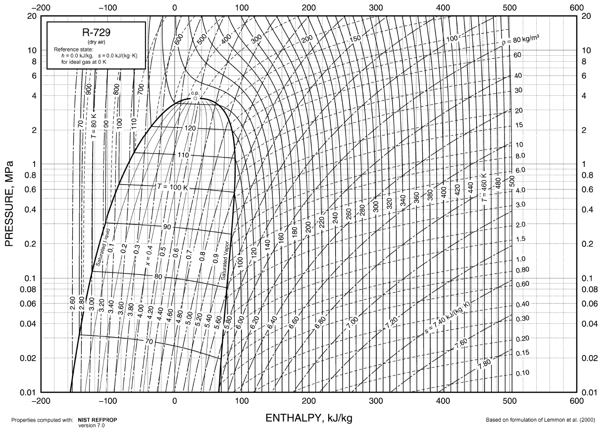

*Fig. 31 Pressure-Enthalpy Diagram for Refrigerant 729 (Air)*

<!-- str. 866 -->

### Refrigerant 729 (Air) Properties of Liquid on

**the Bubble Line and Vapor on the Dew Line**

```text
                                          Enthalpy,       Entropy,   Specific Heat c ,      Velocity of   Viscosity, Thermal Cond.,
Absolute               Density, Volume,                                          p                                                  Surface
        Temperature, K      _3   _3        kJ/kg         kJ/(kg·K)      kJ/(kg·K)           Sound, m/s      μPa·s      mW/(m·K)
                                                                                    c /c
Pressure,               kg/m    m /kg                                                p v                                            Tension,
  MPa    Bubble   Dew   Liquid  Vapor  Liquid  Vapor   Liquid  Vapor  Liquid Vapor Vapor  Liquid Vapor  Liquid Vapor  Liquid Vapor   mN/m
0.00526  59.75   63.09  957.8  3.42745 –162.40 62.73  2.4517   6.1507 1.895  1.014 1.405   1056 158.9   424.8  4.47   185.2  5.83   14.95
0.008    61.83   65.12  949.2  2.32401 –158.45 64.67  2.5165   6.0614 1.897  1.017 1.407   1035 161.3   377.9  4.62   181.2  6.04   14.41
0.01     63.00   66.27  944.4  1.88990 –156.22 65.75  2.5522   6.0142 1.899  1.019 1.408   1023 162.6   354.6  4.70   179.0  6.16   14.11
0.015    65.27   68.47  934.9  1.29870 –151.92 67.82  2.6193   5.9293 1.902  1.023 1.411   1001 165.0   315.3  4.87   174.7  6.38   13.54
0.02     66.99   70.15  927.6  0.99558 –148.64 69.35  2.6687   5.8697 1.904  1.026 1.414    984 166.8   289.6  4.99   171.4  6.55   13.11
0.03     69.58   72.68  916.5  0.68481 –143.68 71.62  2.7412   5.7866 1.909  1.033 1.420    959 169.4   256.4  5.18   166.5  6.80   12.46
0.04     71.57   74.61  907.9  0.52523 –139.88 73.30  2.7948   5.7282 1.913  1.039 1.425    940 171.3   234.8  5.33   162.7  7.00   11.97
0.05     73.19   76.19  900.8  0.42756 –136.77 74.63  2.8378   5.6832 1.917  1.044 1.430    925 172.8   219.0  5.45   159.7  7.16   11.57
0.06     74.58   77.53  894.7  0.36139 –134.10 75.75  2.8738   5.6467 1.921  1.050 1.434    911 174.0   206.8  5.55   157.0  7.29   11.24
0.08     76.89   79.78  884.3  0.27713 –129.64 77.55  2.9323   5.5893 1.928  1.060 1.443    889 175.9   188.7  5.72   152.7  7.52   10.68
0.1      78.79   81.62  875.7  0.22550 –125.95 78.96  2.9794   5.5450 1.936  1.070 1.452    871 177.3   175.6  5.86   149.1  7.71   10.22
0.10132^b 78.90  81.73  875.1  0.22277 –125.73 79.05  2.9822   5.5424 1.936  1.071 1.452    869 177.4   174.8  5.87   148.9  7.72   10.20
0.15     82.51   85.23  858.4  0.15488 –118.68 81.55  3.0688   5.4648 1.953  1.094 1.471    834 179.9   153.5  6.15   142.1  8.07    9.35
0.2      85.39   88.02  844.6  0.11849 –113.01 83.38  3.1357   5.4079 1.969  1.117 1.409    806 181.6   139.3  6.37   136.8  8.37    8.68
0.3      89.82   92.32  822.7  0.08100 –104.17 85.84  3.2353   5.3272 2.002  1.162 1.527    762 183.7   120.9  6.72   128.5  8.88    7.67
0.4      93.26   95.65  805.0  0.06165 –97.17  87.42  3.3104   5.2691 2.034  1.207 1.564    727 184.9   108.9  7.00   122.1  9.37    6.90
0.5      96.12   98.42  789.7  0.04977 –91.26  88.49  3.3715   5.2231 2.068  1.253 1.601    697 185.6   100.1  7.25   116.8  9.82    6.28
0.6      98.59  100.80  776.0  0.04169 –86.07  89.22  3.4235   5.1848 2.102  1.299 1.639    670 186.0    93.3  7.47   112.2 10.24    5.75
0.8     102.76  104.83  751.9  0.03136 –77.12  89.99  3.5098   5.1221 2.176  1.398 1.721    625 186.3    83.0  7.86   104.4 11.03    4.88
 1      106.23  108.18  730.4  0.02500 –69.40  90.12  3.5811   5.0708 2.258  1.506 1.813    585 186.0    75.3  8.21    98.0 11.81    4.18
1.5      113.15 114.83  682.6  0.01623 –53.12  88.65  3.7230   4.9678 2.515  1.844 2.101    500 184.2    61.9  9.00    85.2 13.87    2.85
 2      118.58  120.02  638.2  0.01162 –39.06  85.27  3.8379   4.8805 2.899  2.359 2.538    427 181.4    52.5  9.79    75.2 16.31    1.89
2.5     123.11  124.32  592.9  0.00869 –25.82  80.04  3.9407   4.7966 3.558  3.27  3.286    359 177.8    44.8 10.68    66.9 19.55    1.16
 3       127.03 127.99  541.8  0.00658 –12.26  72.34  4.0419   4.7056 5.008  5.303 4.895    290 173.4    37.7 11.82    60.0 24.56    0.59
3.78781^c 132.53 132.53 342.6  0.00292  29.38  29.38  4.3479   4.3479   —     —      —      —     —       —     —       —     —      0.00
Temperatures on ITS-90 scale                                         ^bBubble and dew points at one standard atmosphere          ^cCritical point
                        Refrigerant 729 (Air) Properties of Gas at 0.101 325 MPa (one standard atmosphere)
                                              Vel. of        Thermal                                                Vel. of        Thermal
Temp.,  Density, Enthalpy, Entropy, c_p, kJ/  Sound,  Visc.,  Cond.,   Temp., Density, Enthalpy, Entropy, c_p, kJ/  Sound,  Visc.,  Cond.,
  °C    kg/m3   kJ/kg  kJ/(kg·K) (kg·K) c_p/c_v m/s   μPa·s mW/(m·K)     °C    kg/m3  kJ/kg  kJ/(kg·K) (kg·K) c_p/c_v m/s   μPa·s mW/(m·K)
–191.4^d 4.4889 79.05  5.5424   1.071  1.452  177.4   5.87     7.72      150  0.8338  424.81  7.2142  1.017  1.394  411.7  24.11    34.75
 –180   3.8887  91.09  5.6804   1.044  1.435  190.8   6.68     8.84      160  0.8145  434.99  7.2379  1.019  1.394  416.4  24.52    35.39
 –160   3.1648 111.75  5.8814   1.025  1.421  211.7   8.04    10.76      170  0.7961  445.18  7.2612  1.020  1.393  421.1  24.93    36.04
 –140   2.6744 132.15  6.0474   1.016  1.414  230.4   9.35    12.63      180  0.7785  455.39  7.2840  1.022  1.392  425.7  25.34    36.67
 –120   2.3178 152.43  6.1893   1.012  1.410  247.6  10.61    14.45      190  0.7617  465.62  7.3063  1.023  1.391  430.2  25.74    37.31
 –100   2.0462 172.63  6.3133   1.009  1.408  263.5  11.82    16.20      200  0.7456  475.86  7.3282  1.025  1.390  434.7  26.13    37.93
  –90   1.9332 182.71  6.3699   1.008  1.407  271.1  12.41    17.06      210  0.7302  486.12  7.3497  1.027  1.389  439.1  26.53    38.56
  –80   1.8321 192.79  6.4235   1.007  1.406  278.5  12.99    17.91      220  0.7154  496.40  7.3707  1.029  1.388  443.5  26.92    39.17
  –70   1.7411 202.86  6.4743   1.007  1.406  285.7  13.55    18.74      230  0.7011  506.70  7.3914  1.031  1.387  447.8  27.30    39.79
  –60   1.6588 212.93  6.5227   1.007  1.405  292.7  14.11    19.56      240  0.6875  517.02  7.4117  1.033  1.386  452.0  27.69    40.40
  –50   1.5840 222.99  6.5688   1.006  1.405  299.5  14.66    20.37      250  0.6743  527.35  7.4317  1.035  1.385  456.2  28.06    41.00
  –40   1.5156 233.06  6.6130   1.006  1.404  306.2  15.20    21.17      260  0.6617  537.71  7.4513  1.037  1.384  460.4  28.44    41.60
  –30   1.4530 243.11  6.6552   1.006  1.404  312.7  15.73    21.96      270  0.6495  548.09  7.4705  1.039  1.383  464.5  28.81    42.20
  –20   1.3953 253.17  6.6957   1.006  1.404  319.1  16.25    22.74      280  0.6378  558.49  7.4895  1.041  1.381  468.6  29.18    42.80
  –10   1.3421 263.23  6.7347   1.006  1.403  325.4  16.76    23.51      290  0.6264  568.91  7.5082  1.043  1.380  472.6  29.55    43.39
    0   1.2927 273.29  6.7722   1.006  1.403  331.5  17.27    24.27      300  0.6155  579.35  7.5266  1.045  1.379  476.6  29.91    43.97
   10   1.2469 283.35  6.8084   1.006  1.402  337.5  17.77    25.02      310  0.6049  589.82  7.5447  1.048  1.378  480.5  30.27    44.56
   20   1.2043 293.41  6.8433   1.006  1.402  343.4  18.26    25.77      320  0.5947  600.30  7.5625  1.050  1.377  484.4  30.63    45.14
   30   1.1644 303.48  6.8771   1.007  1.402  349.2  18.75    26.50      330  0.5849  610.81  7.5801  1.052  1.376  488.3  30.98    45.71
   40   1.1272 313.55  6.9098   1.007  1.401  354.9  19.22    27.22      340  0.5753  621.35  7.5974  1.055  1.375  492.1  31.34    46.29
   50   1.0922 323.62  6.9414   1.008  1.401  360.5  19.70    27.94      350  0.5661  631.90  7.6145  1.057  1.373  495.9  31.69    46.86
   60   1.0594 333.70  6.9721   1.008  1.400  366.0  20.16    28.65      360  0.5572  642.48  7.6313  1.059  1.372  499.7  32.03    47.42
   70   1.0284 343.79  7.0020   1.009  1.400  371.4  20.62    29.36      370  0.5485  653.09  7.6479  1.062  1.371  503.4  32.38    47.99
   80   0.9993 353.88  7.0310   1.010  1.399  376.7  21.08    30.05      380  0.5401  663.71  7.6643  1.064  1.370  507.1  32.72    48.55
   90   0.9717 363.98  7.0592   1.011  1.399  381.9  21.52    30.74      390  0.5320  674.37  7.6805  1.066  1.369  510.7  33.06    49.11
  100   0.9456 374.09  7.0866   1.011  1.398  387.1  21.97    31.42      400  0.5241  685.04  7.6965  1.069  1.368  514.3  33.40    49.66
  110   0.9209 384.21  7.1134   1.012  1.397  392.1  22.41    32.10      420  0.5089  706.47  7.7279  1.074  1.365  521.5  34.06    50.76
  120   0.8975 394.34  7.1395   1.014  1.397  397.1  22.84    32.77      440  0.4947  727.98  7.7585  1.078  1.363  528.5  34.72    51.86
  130   0.8752 404.49  7.1650   1.015  1.396  402.1  23.27    33.43      460  0.4812  749.60  7.7884  1.083  1.361  535.4  35.37    52.94
  140   0.8540 414.64  7.1899   1.016  1.395  406.9  23.69    34.09      480  0.4684  771.31  7.8176  1.088  1.359  542.3  36.02    54.01
                                                                         500  0.4563  793.12  7.8461  1.093  1.357  549.0  36.65    55.08
^dSaturated vapor at dew-point temperature
```

<!-- str. 867 -->

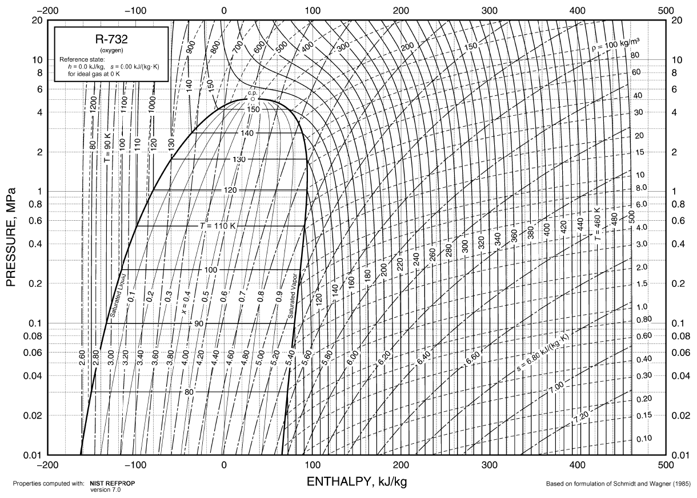

*Fig. 32 Pressure-Enthalpy Diagram for Refrigerant 732 (Oxygen)*

<!-- str. 868 -->

### Refrigerant 732 (Oxygen) Properties of

### Saturated Liquid and Saturated Vapor

| Temp.,* Pressure,<br>K | Temp.,* Pressure,<br>Absolute MPa | Density, Volume,<br>kg/m<sup>3</sup> Liquid | Enthalpy, Density, Volume, kJ/kg<br>m<sup>3</sup>/kg Vapor Liquid | Enthalpy, kJ/kg<br>Vapor | Entropy, kJ/(kg·K)<br>Liquid | Entropy, kJ/(kg·K)<br>Vapor | Specific Heat c kJ/(kg·K)<br>Liquid | Specific Heat c kJ/(kg·K)<br>p Vapor | , c /c p v Vapor | Velocity of Sound, m/s<br>Liquid | Velocity of Sound, m/s<br>Vapor | Viscosity, μPa·s<br>Liquid | Viscosity, μPa·s<br>Vapor | Thermal Cond., mW/(m·K)<br>Liquid | Thermal Cond., mW/(m·K)<br>Vapor | Surface Tension, mN/m | Temp.,* K |
|---|---|---|---|---|---|---|---|---|---|---|---|---|---|---|---|---|---|
| 54.36<sup>a</sup> | 0.00015 | 1306.1 | 96.54300 –193.61 | 49.11 | 2.0921 | 6.5571 | 1.673 | 0.926 | 1.395 | 1123 | 140.3 | 773.6 | 4.10 | 201.9 | 4.42 | 22.68 | 54.36 |
| 55 | 0.00018 | 1303.5 | 80.00900 –192.55 | 49.68 | 2.1117 | 6.5159 | 1.672 | 0.928 | 1.394 | 1127 | 141.1 | 747.5 | 4.15 | 201.0 | 4.48 | 22.50 | 55 |
| 60 | 0.00073 | 1282.0 | 21.46200 –184.19 | 54.19 | 2.2571 | 6.2301 | 1.673 | 0.948 | 1.390 | 1127 | 147.0 | 578.1 | 4.55 | 193.9 | 4.98 | 21.12 | 60 |
| 65 | 0.00233 | 1259.7 | 7.21880 –175.81 | 58.66 | 2.3912 | 5.9985 | 1.677 | 0.967 | 1.387 | 1102 | 152.6 | 457.9 | 4.96 | 186.8 | 5.49 | 19.76 | 65 |
| 70 | 0.00626 | 1237.0 | 2.89250 –167.42 | 63.09 | 2.5156 | 5.8086 | 1.678 | 0.978 | 1.387 | 1066 | 158.1 | 371.8 | 5.36 | 179.7 | 5.99 | 18.41 | 70 |
| 75 | 0.01455 | 1213.9 | 1.32930 –159.02 | 67.45 | 2.6313 | 5.6510 | 1.679 | 0.979 | 1.392 | 1027 | 163.3 | 308.7 | 5.75 | 172.6 | 6.51 | 17.09 | 75 |
| 80 | 0.03012 | 1190.5 | 0.68099 –150.61 | 71.69 | 2.7397 | 5.5185 | 1.682 | 0.974 | 1.402 | 987 | 168.4 | 261.2 | 6.15 | 165.4 | 7.03 | 15.78 | 80 |
| 85 | 0.05683 | 1166.6 | 0.38047 –142.18 | 75.75 | 2.8417 | 5.4055 | 1.688 | 0.969 | 1.417 | 947 | 173.1 | 224.6 | 6.54 | 158.3 | 7.57 | 14.49 | 85 |
| 90 | 0.09935 | 1142.1 | 0.22794 –133.69 | 79.55 | 2.9383 | 5.3076 | 1.699 | 0.970 | 1.436 | 906 | 177.3 | 195.6 | 6.94 | 151.0 | 8.12 | 13.22 | 90 |
| 90.19<sup>b</sup> | 0.10133 | 1141.2 | 0.22386 –133.37 | 79.69 | 2.9419 | 5.3042 | 1.699 | 0.971 | 1.437 | 904 | 177.5 | 194.7 | 6.95 | 150.8 | 8.15 | 13.17 | 90.19 |
| 95 | 0.16308 | 1116.9 | 0.14450 –125.12 | 83.04 | 3.0303 | 5.2215 | 1.715 | 0.982 | 1.460 | 864 | 181.0 | 172.1 | 7.33 | 143.8 | 8.71 | 11.98 | 95 |
| 100 | 0.25400 | 1090.9 | 0.09592 –116.45 | 86.16 | 3.1185 | 5.1445 | 1.738 | 1.006 | 1.491 | 822 | 184.1 | 152.6 | 7.73 | 136.6 | 9.34 | 10.75 | 100 |
| 105 | 0.37853 | 1063.8 | 0.06612 –107.64 | 88.85 | 3.2033 | 5.0746 | 1.767 | 1.046 | 1.528 | 779 | 186.4 | 135.9 | 8.13 | 129.2 | 10.01 | 9.56 | 105 |
| 110 | 0.54340 | 1035.5 | 0.04699 –98.64 | 91.05 | 3.2855 | 5.0100 | 1.807 | 1.101 | 1.576 | 735 | 188.1 | 121.5 | 8.55 | 121.9 | 10.75 | 8.39 | 110 |
| 115 | 0.75559 | 1005.6 | 0.03424 –89.42 | 92.72 | 3.3657 | 4.9495 | 1.858 | 1.177 | 1.638 | 689 | 189.1 | 108.8 | 8.98 | 114.6 | 11.57 | 7.25 | 115 |
| 120 | 1.02230 | 973.9 | 0.02544 –79.90 | 93.75 | 3.4444 | 4.8915 | 1.927 | 1.276 | 1.721 | 642 | 189.4 | 97.4 | 9.43 | 107.2 | 12.51 | 6.14 | 120 |
| 125 | 1.35090 | 939.7 | 0.01919 –70.02 | 94.06 | 3.5222 | 4.8349 | 2.021 | 1.411 | 1.835 | 592 | 189.0 | 87.1 | 9.91 | 99.9 | 13.61 | 5.07 | 125 |
| 130 | 1.74910 | 902.5 | 0.01463 –59.66 | 93.47 | 3.6001 | 4.7780 | 2.153 | 1.600 | 2.000 | 540 | 187.8 | 77.6 | 10.45 | 92.6 | 14.94 | 4.04 | 130 |
| 135 | 2.22500 | 861.0 | 0.01120 –48.65 | 91.74 | 3.6791 | 4.7191 | 2.354 | 1.886 | 2.252 | 484 | 185.7 | 68.7 | 11.06 | 85.4 | 16.64 | 3.05 | 135 |
| 140 | 2.78780 | 813.2 | 0.00856 –36.70 | 88.47 | 3.7612 | 4.6552 | 2.691 | 2.370 | 2.682 | 423 | 182.8 | 60.2 | 11.82 | 78.2 | 18.98 | 2.13 | 140 |
| 145 | 3.44770 | 755.1 | 0.00646 –23.22 | 82.83 | 3.8498 | 4.5812 | 3.368 | 3.369 | 3.561 | 355 | 178.8 | 51.9 | 12.88 | 71.1 | 22.58 | 1.27 | 145 |
| 150 | 4.21860 | 675.5 | 0.00465 –6.67 | 72.56 | 3.9546 | 4.4828 | 5.464 | 6.625 | 6.315 | 274 | 172.8 | 42.9 | 14.72 | 64.2 | 29.67 | 0.51 | 150 |
| 154.58<sup>c</sup> | 5.04300 | 436.1 | 0.00229 32.42 | 32.42 | 4.2008 | 4.2008 | ∞ | ∞ | ∞ | 0 | 0.0 | — | — | ∞ | ∞ | 0.00 | 154.58 |

*Temperatures on ITS-90 scale <sup>a</sup>Triple point <sup>b</sup>Normal boiling point <sup>c</sup>Critical point

### Refrigerant 732 (Oxygen) Properties of Gas a

**t 0.101 325 MPa (one standard atmosphere)**

|   |   |   |   |   |   | Vel. of |   | Thermal |   |   |   |   |   |   | Vel. of |   | Thermal |
|---|---|---|---|---|---|---|---|---|---|---|---|---|---|---|---|---|---|
| Temp.,* | Density, | Enthalpy, | Entropy, | c<sub>p</sub>, kJ/ |  | Sound, | Visc., | Cond., | Temp.,* Density, |  | Enthalpy, | Entropy, | c<sub>p</sub>, kJ/ |  | Sound, | Visc., | Cond., |
| °C | kg/m3 | kJ/kg | kJ/(kg·K) | (kg·K) | c<sub>p</sub>/c<sub>v</sub> | m/s | μPa·s | mW/(m·K) | °C | kg/m3 | kJ/kg | kJ/(kg·K) | (kg·K) | c<sub>p</sub>/c<sub>v</sub> | m/s | μPa·s | mW/(m·K) |
| –183.0<sup>b</sup> | 4.4671 | 79.69 | 5.3042 | 0.971 | 1.437 | 177.5 | 6.95 | 8.15 | 150 | 0.9215 | 387.55 | 6.7333 | 0.948 | 1.379 | 389.3 | 26.96 | 35.69 |
| –180 | 4.3120 | 82.52 | 5.3352 | 0.948 | 1.439 | 181.1 | 7.18 | 8.43 | 160 | 0.9002 | 397.05 | 6.7555 | 0.951 | 1.377 | 393.7 | 27.43 | 36.41 |
| –160 | 3.5050 | 101.23 | 5.5171 | 0.931 | 1.422 | 201.0 | 8.71 | 10.34 | 170 | 0.8799 | 406.58 | 6.7772 | 0.954 | 1.375 | 398.0 | 27.90 | 37.11 |
| –140 | 2.9596 | 119.78 | 5.6681 | 0.924 | 1.414 | 218.8 | 10.18 | 12.22 | 180 | 0.8605 | 416.14 | 6.7986 | 0.957 | 1.373 | 402.2 | 28.37 | 37.81 |
| –120 | 2.564 | 138.20 | 5.7970 | 0.919 | 1.409 | 235.2 | 11.59 | 14.07 | 190 | 0.8419 | 425.72 | 6.8195 | 0.961 | 1.372 | 406.4 | 28.83 | 38.51 |
| –100 | 2.2629 | 156.56 | 5.9096 | 0.916 | 1.407 | 250.4 | 12.96 | 15.88 | 200 | 0.8241 | 435.35 | 6.8400 | 0.964 | 1.370 | 410.5 | 29.28 | 39.21 |
| –90 | 2.1378 | 165.72 | 5.9611 | 0.916 | 1.406 | 257.6 | 13.62 | 16.76 | 210 | 0.8070 | 445.00 | 6.8602 | 0.967 | 1.368 | 414.5 | 29.73 | 39.89 |
| –80 | 2.0258 | 174.87 | 6.0097 | 0.915 | 1.405 | 264.6 | 14.28 | 17.64 | 220 | 0.7906 | 454.68 | 6.8801 | 0.970 | 1.367 | 418.5 | 30.18 | 40.58 |
| –70 | 1.9251 | 184.02 | 6.0559 | 0.915 | 1.404 | 271.5 | 14.92 | 18.51 | 230 | 0.7749 | 464.40 | 6.8996 | 0.973 | 1.365 | 422.5 | 30.63 | 41.26 |
| –60 | 1.8340 | 193.16 | 6.0998 | 0.914 | 1.404 | 278.1 | 15.55 | 19.37 | 240 | 0.7598 | 474.14 | 6.9188 | 0.976 | 1.363 | 426.4 | 31.06 | 41.94 |
| –50 | 1.7512 | 202.30 | 6.1418 | 0.914 | 1.403 | 284.6 | 16.17 | 20.22 | 250 | 0.6743 | 527.35 | 7.4345 | 1.035 | 1.385 | 456.2 | 27.56 | 40.55 |
| –40 | 1.6756 | 211.45 | 6.1818 | 0.914 | 1.402 | 290.9 | 16.78 | 21.06 | 260 | 0.7313 | 493.73 | 6.9562 | 0.983 | 1.360 | 434.2 | 31.93 | 43.28 |
| –30 | 1.6063 | 220.59 | 6.2202 | 0.915 | 1.401 | 297.1 | 17.39 | 21.90 | 270 | 0.7178 | 503.58 | 6.9745 | 0.986 | 1.359 | 438.0 | 32.36 | 43.94 |
| –20 | 1.5425 | 229.74 | 6.2571 | 0.915 | 1.401 | 303.1 | 17.98 | 22.72 | 280 | 0.7048 | 513.45 | 6.9925 | 0.989 | 1.357 | 441.7 | 32.78 | 44.61 |
| –10 | 1.4836 | 238.90 | 6.2926 | 0.916 | 1.400 | 309.0 | 18.57 | 23.54 | 290 | 0.6923 | 523.36 | 7.0103 | 0.992 | 1.355 | 445.4 | 33.20 | 45.27 |
| 0 | 1.4290 | 248.06 | 6.3268 | 0.917 | 1.399 | 314.8 | 19.14 | 24.35 | 300 | 0.6802 | 533.29 | 7.0278 | 0.995 | 1.354 | 449.1 | 33.62 | 45.92 |
| 10 | 1.3784 | 257.23 | 6.3597 | 0.918 | 1.398 | 320.5 | 19.71 | 25.15 | 310 | 0.6686 | 543.26 | 7.0450 | 0.998 | 1.352 | 452.8 | 34.04 | 46.57 |
| 20 | 1.3312 | 266.41 | 6.3916 | 0.919 | 1.397 | 326.0 | 20.27 | 25.95 | 320 | 0.6573 | 553.26 | 7.0620 | 1.001 | 1.351 | 456.4 | 34.45 | 47.22 |
| 30 | 1.2871 | 275.61 | 6.4225 | 0.920 | 1.396 | 331.4 | 20.83 | 26.73 | 330 | 0.6464 | 563.28 | 7.0788 | 1.004 | 1.350 | 460.0 | 34.85 | 47.87 |
| 40 | 1.2459 | 284.82 | 6.4524 | 0.922 | 1.395 | 336.7 | 21.37 | 27.51 | 340 | 0.6358 | 573.34 | 7.0953 | 1.007 | 1.348 | 463.6 | 35.26 | 48.51 |
| 50 | 1.2073 | 294.05 | 6.4814 | 0.924 | 1.394 | 342.0 | 21.91 | 28.29 | 350 | 0.6256 | 583.43 | 7.1116 | 1.010 | 1.347 | 467.1 | 35.66 | 49.15 |
| 60 | 1.1709 | 303.29 | 6.5095 | 0.926 | 1.392 | 347.1 | 22.44 | 29.05 | 360 | 0.6157 | 593.54 | 7.1277 | 1.013 | 1.345 | 470.6 | 36.06 | 49.78 |
| 70 | 1.1367 | 312.56 | 6.5369 | 0.928 | 1.391 | 352.1 | 22.97 | 29.82 | 370 | 0.6062 | 603.68 | 7.1436 | 1.016 | 1.344 | 474.1 | 36.46 | 50.42 |
| 80 | 1.1045 | 321.85 | 6.5636 | 0.930 | 1.390 | 357.0 | 23.49 | 30.57 | 380 | 0.5969 | 613.86 | 7.1593 | 1.019 | 1.343 | 477.5 | 36.85 | 51.05 |
| 90 | 1.0740 | 331.16 | 6.5896 | 0.932 | 1.388 | 361.9 | 24.00 | 31.32 | 390 | 0.5879 | 624.05 | 7.1748 | 1.021 | 1.342 | 480.9 | 37.24 | 51.68 |
| 100 | 1.0452 | 340.49 | 6.6150 | 0.935 | 1.387 | 366.6 | 24.51 | 32.06 | 400 | 0.5792 | 634.28 | 7.1901 | 1.024 | 1.340 | 484.3 | 37.63 | 52.30 |
| 110 | 1.0179 | 349.85 | 6.6397 | 0.937 | 1.385 | 371.3 | 25.01 | 32.80 | 420 | 0.5624 | 654.81 | 7.2202 | 1.029 | 1.338 | 491.0 | 38.39 | 53.54 |
| 120 | 0.9919 | 359.23 | 6.6639 | 0.940 | 1.384 | 375.9 | 25.50 | 33.53 | 440 | 0.5467 | 675.45 | 7.2495 | 1.034 | 1.336 | 497.6 | 39.15 | 54.78 |
| 130 | 0.9673 | 368.64 | 6.6875 | 0.943 | 1.382 | 380.5 | 25.99 | 34.26 | 460 | 0.5318 | 696.19 | 7.2782 | 1.039 | 1.334 | 504.2 | 39.90 | 56.00 |
| 140 | 0.9439 | 378.08 | 6.7107 | 0.945 | 1.38 | 384.9 | 26.48 | 34.98 | 480 | 0.5176 | 717.02 | 7.3062 | 1.044 | 1.332 | 510.6 | 40.64 | 57.21 |
|  |  |  |  |  |  |  |  |  | 500 | 0.5042 | 737.95 | 7.3336 | 1.049 | 1.330 | 517.0 | 41.36 | 58.42 |

*Temperatures on IPTS-68 scale

<!-- str. 869 -->

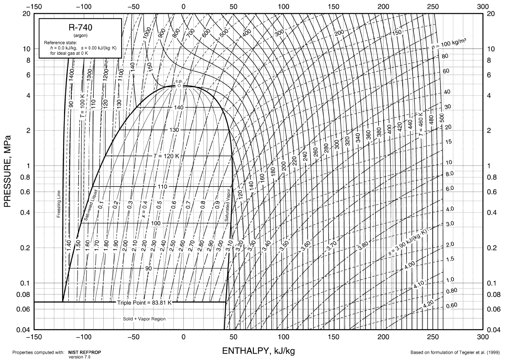

*Fig. 33 Pressure-Enthalpy Diagram for Refrigerant 740 (Argon)*

<!-- str. 870 -->

### Refrigerant 740 (Argon) Properties of S

**aturated Liquid and Saturated Vapor**

| Temp.,* Pressure,<br>K | Temp.,* Pressure,<br>Absolute MPa | Density, kg/m<sup>3</sup> Liquid | Volume, m<sup>3</sup>/kg Vapor | Enthalpy, kJ/kg<br>Liquid | Enthalpy, kJ/kg<br>Vapor | Entropy, kJ/(kg·K)<br>Liquid | Entropy, kJ/(kg·K)<br>Vapor | Specific Heat c , kJ/(kg·K)<br><sup>p</sup> Liquid | Specific Heat c , kJ/(kg·K)<br>Vapor | c /c p v Vapor | Velocity of Sound, m/s<br>Liquid | Velocity of Sound, m/s<br>Vapor | Viscosity, μPa·s<br>Liquid | Viscosity, μPa·s<br>Vapor | Thermal Cond., mW/(m·K)<br>Liquid | Thermal Cond., mW/(m·K)<br>Vapor | Surface Tension, mN/m | Temp.,* K |
|---|---|---|---|---|---|---|---|---|---|---|---|---|---|---|---|---|---|---|
| 83.81<sup>a</sup> | 0.06889 | 1416.8 | 0.24663 | –121.44 | 42.28 | 1.3295 | 3.2830 | 1.116 | 0.555 | 1.709 | 862 | 168.1 | 290.2 | 6.86 | 133.6 | 5.36 | 13.42 | 83.81 |
| 84 | 0.07045 | 1415.6 | 0.24164 | –121.22 | 42.36 | 1.3321 | 3.2794 | 1.116 | 0.556 | 1.710 | 861 | 168.3 | 288.4 | 6.87 | 133.3 | 5.37 | 13.37 | 84 |
| 86 | 0.08811 | 1403.4 | 0.19687 | –118.98 | 43.13 | 1.3583 | 3.2433 | 1.116 | 0.562 | 1.719 | 847 | 169.9 | 270.9 | 7.05 | 130.4 | 5.52 | 12.86 | 86 |
| 87.30<sup>b</sup> | 0.10132 | 1395.4 | 0.17320 | –117.52 | 43.62 | 1.3750 | 3.2208 | 1.117 | 0.566 | 1.725 | 838 | 170.9 | 260.3 | 7.17 | 128.5 | 5.62 | 12.53 | 87.3 |
| 88 | 0.10901 | 1391.1 | 0.16198 | –116.74 | 43.87 | 1.3839 | 3.2090 | 1.118 | 0.568 | 1.728 | 833 | 171.4 | 254.8 | 7.23 | 127.4 | 5.68 | 12.35 | 88 |
| 90 | 0.13351 | 1378.6 | 0.13448 | –114.49 | 44.57 | 1.4090 | 3.1763 | 1.121 | 0.576 | 1.740 | 819 | 172.8 | 240.0 | 7.41 | 124.5 | 5.83 | 11.85 | 90 |
| 92 | 0.16199 | 1366.0 | 0.11258 | –112.23 | 45.23 | 1.4335 | 3.1451 | 1.125 | 0.584 | 1.752 | 805 | 174.2 | 226.4 | 7.60 | 121.6 | 6.00 | 11.36 | 92 |
| 94 | 0.19485 | 1353.2 | 0.09496 | –109.96 | 45.85 | 1.4577 | 3.1152 | 1.131 | 0.593 | 1.766 | 791 | 175.5 | 213.8 | 7.78 | 118.7 | 6.16 | 10.86 | 94 |
| 96 | 0.23249 | 1340.3 | 0.08067 | –107.68 | 46.41 | 1.4814 | 3.0865 | 1.137 | 0.603 | 1.782 | 776 | 176.7 | 202.2 | 7.97 | 115.8 | 6.33 | 10.38 | 96 |
| 98 | 0.27532 | 1327.1 | 0.06897 | –105.38 | 46.93 | 1.5048 | 3.0590 | 1.145 | 0.614 | 1.800 | 762 | 177.8 | 191.3 | 8.16 | 113.0 | 6.51 | 9.89 | 98 |
| 100 | 0.32377 | 1313.7 | 0.05932 | –103.06 | 47.40 | 1.5278 | 3.0324 | 1.154 | 0.627 | 1.820 | 747 | 178.9 | 181.3 | 8.35 | 110.2 | 6.69 | 9.42 | 100 |
| 102 | 0.37825 | 1300.1 | 0.05129 | –100.72 | 47.81 | 1.5505 | 3.0068 | 1.164 | 0.641 | 1.842 | 732 | 179.9 | 172.0 | 8.54 | 107.4 | 6.88 | 8.94 | 102 |
| 104 | 0.43920 | 1286.2 | 0.04458 | –98.37 | 48.17 | 1.5730 | 2.9819 | 1.175 | 0.656 | 1.867 | 717 | 180.8 | 163.3 | 8.74 | 104.6 | 7.08 | 8.48 | 104 |
| 106 | 0.50706 | 1272.0 | 0.03892 | –95.98 | 48.46 | 1.5952 | 2.9578 | 1.188 | 0.673 | 1.894 | 701 | 181.6 | 155.2 | 8.95 | 101.9 | 7.28 | 8.02 | 106 |
| 108 | 0.58226 | 1257.6 | 0.03413 | –93.57 | 48.68 | 1.6172 | 2.9343 | 1.202 | 0.691 | 1.926 | 685 | 182.4 | 147.6 | 9.15 | 99.1 | 7.50 | 7.56 | 108 |
| 110 | 0.66526 | 1242.8 | 0.03004 | –91.13 | 48.84 | 1.6390 | 2.9114 | 1.218 | 0.712 | 1.960 | 669 | 183.0 | 140.4 | 9.37 | 96.4 | 7.73 | 7.11 | 110 |
| 112 | 0.75650 | 1227.6 | 0.02654 | –88.65 | 48.92 | 1.6606 | 2.8890 | 1.235 | 0.736 | 2.000 | 653 | 183.6 | 133.7 | 9.59 | 93.7 | 7.98 | 6.67 | 112 |
| 114 | 0.85644 | 1212.1 | 0.02351 | –86.14 | 48.93 | 1.6821 | 2.8669 | 1.255 | 0.762 | 2.044 | 636 | 184.1 | 127.4 | 9.81 | 91.0 | 8.24 | 6.23 | 114 |
| 116 | 0.96553 | 1196.2 | 0.02090 | –83.59 | 48.85 | 1.7035 | 2.8452 | 1.278 | 0.791 | 2.094 | 619 | 184.5 | 121.4 | 10.04 | 88.4 | 8.52 | 5.80 | 116 |
| 118 | 1.08420 | 1179.7 | 0.01862 | –81.00 | 48.68 | 1.7248 | 2.8238 | 1.303 | 0.825 | 2.151 | 602 | 184.8 | 115.7 | 10.29 | 85.7 | 8.82 | 5.38 | 118 |
| 120 | 1.21300 | 1162.8 | 0.01663 | –78.35 | 48.41 | 1.7461 | 2.8025 | 1.332 | 0.863 | 2.216 | 584 | 185.1 | 110.2 | 10.54 | 83.1 | 9.15 | 4.96 | 120 |
| 125 | 1.58230 | 1117.9 | 0.01263 | –71.49 | 47.27 | 1.7995 | 2.7495 | 1.425 | 0.986 | 2.426 | 538 | 185.3 | 97.6 | 11.23 | 76.7 | 10.14 | 3.95 | 125 |
| 130 | 2.02550 | 1068.1 | 0.00966 | –64.16 | 45.30 | 1.8538 | 2.6957 | 1.564 | 1.172 | 2.741 | 488 | 184.8 | 85.9 | 12.03 | 70.4 | 11.45 | 3.00 | 130 |
| 135 | 2.55090 | 1011.5 | 0.00739 | –56.18 | 42.21 | 1.9102 | 2.6390 | 1.790 | 1.482 | 3.262 | 433 | 183.7 | 74.7 | 13.02 | 64.2 | 13.34 | 2.10 | 135 |
| 140 | 3.16820 | 943.7 | 0.00559 | –47.16 | 37.47 | 1.9712 | 2.5757 | 2.225 | 2.104 | 4.258 | 372 | 181.5 | 63.6 | 14.32 | 58.1 | 16.39 | 1.29 | 140 |
| 145 | 3.88960 | 854.3 | 0.00409 | –36.19 | 29.76 | 2.0425 | 2.4973 | 3.399 | 3.896 | 6.880 | 297 | 176.6 | 52.1 | 16.27 | 52.0 | 22.53 | 0.58 | 145 |
| 150 | 4.73460 | 680.4 | 0.00253 | –17.88 | 11.52 | 2.1589 | 2.3550 | 23.580 | 35.470 | 43.160 | 175 | 157.0 | 36.8 | 21.18 | 57.6 | 55.88 | 0.04 | 150 |
| 150.69<sup>c</sup> | 4.86300 | 535.6 | 0.00187 | –4.33 | –4.33 | 2.2476 | 2.2476 | ∞ | ∞ | ∞ | 0 | 0.0 | — | — | ∞ | ∞ | 0.00 | 150.69 |

*Temperatures on ITS-90 scale <sup>a</sup>Triple point <sup>b</sup>Normal boiling point <sup>c</sup>Critical point

### Refrigerant 740 (Argon) Properties of Gas at

### 0.101 325 MPa (one standard atmosphere)

|   |   |   |   |   |   | Vel. of |   | Thermal |   |   |   |   |   |   | Vel. of |   | Thermal |
|---|---|---|---|---|---|---|---|---|---|---|---|---|---|---|---|---|---|
| Temp., | Density, | Enthalpy, | Entropy, | c<sub>p</sub>, kJ/ |  | Sound, | Visc., | Cond., | Temp., | Density, | Enthalpy, | Entropy, | c<sub>p</sub>, kJ/ |  | Sound, | Visc., | Cond., |
| °C | kg/m3 | kJ/kg | kJ/(kg·K) | (kg·K) | c<sub>p</sub>/c<sub>v</sub> | m/s | μPa·s | mW/(m·K) | °C | kg/m3 | kJ/kg | kJ/(kg·K) | (kg·K) | c<sub>p</sub>/c<sub>v</sub> | m/s | μPa·s | mW/(m·K) |
| –185.8<sup>b</sup> | 5.7736 | 43.62 | 3.2208 | 0.566 | 1.725 | 170.9 | 7.17 | 5.62 | 150 | 1.1504 | 220.08 | 4.0554 | 0.521 | 1.668 | 383.3 | 29.99 | 23.53 |
| –180 | 5.3774 | 46.90 | 3.2571 | 0.556 | 1.715 | 177.2 | 7.66 | 6.01 | 160 | 1.1239 | 225.28 | 4.0676 | 0.521 | 1.668 | 387.8 | 30.54 | 23.96 |
| –160 | 4.3721 | 57.80 | 3.3632 | 0.538 | 1.696 | 196.6 | 9.32 | 7.30 | 170 | 1.0985 | 230.49 | 4.0795 | 0.521 | 1.668 | 392.2 | 31.09 | 24.38 |
| –140 | 3.6930 | 68.48 | 3.4501 | 0.531 | 1.686 | 214.0 | 10.93 | 8.56 | 180 | 1.0742 | 235.70 | 4.0911 | 0.521 | 1.668 | 396.6 | 31.62 | 24.80 |
| –120 | 3.2000 | 79.06 | 3.5242 | 0.527 | 1.681 | 229.9 | 12.50 | 9.79 | 190 | 1.0510 | 240.91 | 4.1025 | 0.521 | 1.668 | 401.0 | 32.16 | 25.22 |
| –100 | 2.8246 | 89.58 | 3.5887 | 0.525 | 1.677 | 244.7 | 14.02 | 10.99 | 200 | 1.0288 | 246.12 | 4.1136 | 0.521 | 1.668 | 405.3 | 32.68 | 25.64 |
| –90 | 2.6684 | 94.83 | 3.6182 | 0.525 | 1.676 | 251.8 | 14.77 | 11.57 | 210 | 1.0075 | 251.32 | 4.1245 | 0.521 | 1.668 | 409.6 | 33.21 | 26.04 |
| –80 | 2.5287 | 100.08 | 3.6461 | 0.524 | 1.675 | 258.6 | 15.50 | 12.15 | 220 | 0.9870 | 256.53 | 4.1351 | 0.521 | 1.668 | 413.8 | 33.73 | 26.45 |
| –70 | 2.4031 | 105.31 | 3.6725 | 0.524 | 1.674 | 265.3 | 16.22 | 12.72 | 230 | 0.9674 | 261.74 | 4.1456 | 0.521 | 1.668 | 418.0 | 34.24 | 26.85 |
| –60 | 2.2894 | 110.55 | 3.6977 | 0.523 | 1.673 | 271.8 | 16.94 | 13.28 | 240 | 0.9485 | 266.94 | 4.1558 | 0.521 | 1.667 | 422.1 | 34.75 | 27.25 |
| –50 | 2.1861 | 115.78 | 3.7217 | 0.523 | 1.672 | 278.1 | 17.64 | 13.83 | 250 | 0.9304 | 272.15 | 4.1659 | 0.521 | 1.667 | 426.2 | 35.25 | 27.65 |
| –40 | 2.0917 | 121.00 | 3.7446 | 0.523 | 1.672 | 284.3 | 18.33 | 14.38 | 260 | 0.9129 | 277.36 | 4.1758 | 0.521 | 1.667 | 430.2 | 35.75 | 28.04 |
| –30 | 2.0052 | 126.23 | 3.7665 | 0.522 | 1.671 | 290.4 | 19.02 | 14.91 | 270 | 0.8961 | 282.56 | 4.1854 | 0.521 | 1.667 | 434.2 | 36.25 | 28.43 |
| –20 | 1.9256 | 131.45 | 3.7876 | 0.522 | 1.671 | 296.3 | 19.69 | 15.44 | 280 | 0.8799 | 287.77 | 4.1949 | 0.521 | 1.667 | 438.2 | 36.74 | 28.81 |
| –10 | 1.8520 | 136.67 | 3.8078 | 0.522 | 1.671 | 302.2 | 20.36 | 15.97 | 290 | 0.8643 | 292.98 | 4.2043 | 0.521 | 1.667 | 442.2 | 37.23 | 29.19 |
| 0 | 1.7840 | 141.89 | 3.8273 | 0.522 | 1.670 | 307.9 | 21.02 | 16.48 | 300 | 0.8492 | 298.18 | 4.2134 | 0.521 | 1.667 | 446.1 | 37.71 | 29.57 |
| 10 | 1.7207 | 147.11 | 3.8460 | 0.522 | 1.670 | 313.5 | 21.67 | 16.99 | 310 | 0.8346 | 303.39 | 4.2224 | 0.521 | 1.667 | 450.0 | 38.20 | 29.95 |
| 20 | 1.6618 | 152.33 | 3.8641 | 0.522 | 1.670 | 319.0 | 22.31 | 17.50 | 320 | 0.8206 | 308.59 | 4.2313 | 0.521 | 1.667 | 453.8 | 38.67 | 30.32 |
| 30 | 1.6068 | 157.54 | 3.8816 | 0.522 | 1.669 | 324.4 | 22.94 | 17.99 | 330 | 0.8069 | 313.80 | 4.2400 | 0.521 | 1.667 | 457.6 | 39.15 | 30.69 |
| 40 | 1.5554 | 162.76 | 3.8985 | 0.521 | 1.669 | 329.7 | 23.56 | 18.48 | 340 | 0.7938 | 319.01 | 4.2485 | 0.521 | 1.667 | 461.4 | 39.61 | 31.06 |
| 50 | 1.5071 | 167.97 | 3.9149 | 0.521 | 1.669 | 334.9 | 24.18 | 18.97 | 350 | 0.7810 | 324.21 | 4.2570 | 0.521 | 1.667 | 465.1 | 40.08 | 31.42 |
| 60 | 1.4618 | 173.18 | 3.9308 | 0.521 | 1.669 | 340.1 | 24.79 | 19.45 | 360 | 0.7687 | 329.42 | 4.2652 | 0.521 | 1.667 | 468.8 | 40.54 | 31.78 |
| 70 | 1.4191 | 178.39 | 3.9462 | 0.521 | 1.669 | 345.1 | 25.40 | 19.92 | 370 | 0.7567 | 334.62 | 4.2734 | 0.521 | 1.667 | 472.5 | 41.00 | 32.14 |
| 80 | 1.3788 | 183.61 | 3.9612 | 0.521 | 1.669 | 350.1 | 25.99 | 20.39 | 380 | 0.7452 | 339.83 | 4.2814 | 0.521 | 1.667 | 476.2 | 41.46 | 32.50 |
| 90 | 1.3408 | 188.82 | 3.9758 | 0.521 | 1.669 | 355.1 | 26.58 | 20.85 | 390 | 0.7339 | 345.03 | 4.2893 | 0.521 | 1.667 | 479.8 | 41.91 | 32.85 |
| 100 | 1.3048 | 194.03 | 3.9899 | 0.521 | 1.668 | 359.9 | 27.17 | 21.31 | 400 | 0.7230 | 350.24 | 4.2971 | 0.521 | 1.667 | 483.4 | 42.36 | 33.20 |
| 110 | 1.2707 | 199.24 | 4.0037 | 0.521 | 1.668 | 364.7 | 27.74 | 21.76 | 420 | 0.7022 | 360.65 | 4.3124 | 0.521 | 1.667 | 490.5 | 43.25 | 33.90 |
| 120 | 1.2383 | 204.45 | 4.0171 | 0.521 | 1.668 | 369.4 | 28.32 | 22.21 | 440 | 0.6825 | 371.06 | 4.3272 | 0.520 | 1.667 | 497.6 | 44.13 | 34.58 |
| 130 | 1.2076 | 209.66 | 4.0302 | 0.521 | 1.668 | 374.1 | 28.88 | 22.66 | 460 | 0.6638 | 381.47 | 4.3416 | 0.520 | 1.667 | 504.5 | 45.00 | 35.26 |
| 140 | 1.1783 | 214.87 | 4.0430 | 0.521 | 1.668 | 378.7 | 29.44 | 23.09 | 480 | 0.6462 | 391.88 | 4.3556 | 0.520 | 1.667 | 511.3 | 45.86 | 35.93 |
|  |  |  |  |  |  |  |  |  | 500 | 0.6295 | 402.29 | 4.3692 | 0.520 | 1.667 | 518.1 | 46.70 | 36.59 |

<sup>b</sup>Saturated vapor at normal boiling point

<!-- str. 871 -->

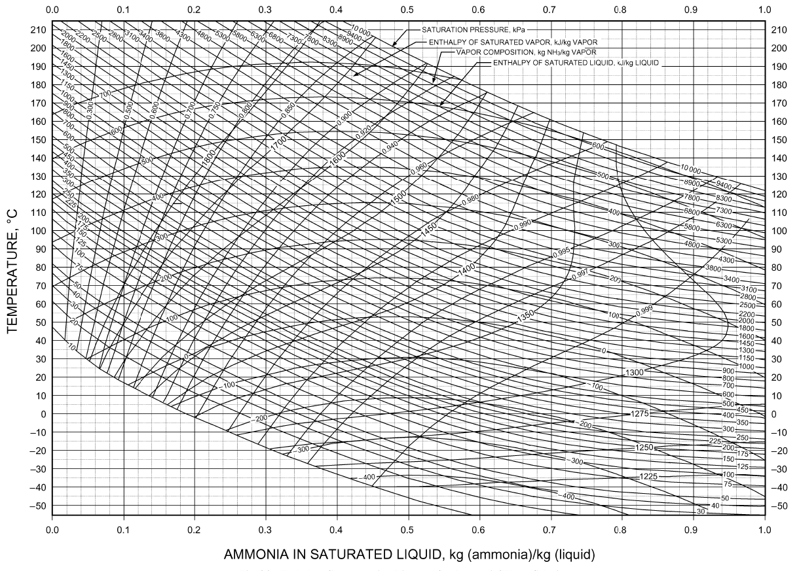

*Fig. 34 Enthalpy-Concentration Diagram for Ammonia/Water Solutions*

<!-- str. 872 -->

### Specific Volume of Saturated Am

**monia-Water Solutions, m<sup>3</sup>/kg**

```text
                                                      Concentration, Ammonia (Mass basis)
 Temp.,                                                                                                                             Temp.,
   °C         0          10         20         30         40         50         60        70         80         90         100        °C
   –10     0.00100    0.00103    0.00106    0.00109    0.00114    0.00118    0.00122    0.00128    0.00135    0.00142    0.00151     –10
     0     0.00100    0.00103    0.00107    0.00110    0.00114    0.00119    0.00124    0.00130    0.00137    0.00146    0.00156      0
    10     0.00100    0.00104    0.00107    0.00111    0.00115    0.00120    0.00125    0.00132    0.00139    0.00149    0.00160      10
    20     0.00100    0.00104    0.00108    0.00112    0.00116    0.00121    0.00127    0.00133    0.00142    0.00152    0.00164      20
    30     0.00100    0.00105    0.00108    0.00113    0.00117    0.00123    0.00128    0.00135    0.00145    0.00156    0.00168      30
    40     0.00101    0.00105    0.00109    0.00114    0.00119    0.00124    0.00130    0.00138    0.00148    0.00159    0.00173      40
    50     0.00101    0.00106    0.00110    0.00115    0.00120    0.00125    0.00132    0.00140    0.00151    0.00163    0.00177      50
    60     0.00102    0.00106    0.00111    0.00116    0.00121    0.00127    0.00134    0.00143    0.00154    0.00167    0.00183      60
    70     0.00102    0.00107    0.00112    0.00117    0.00122    0.00129    0.00136    0.00146    0.00158    0.00172    0.00190      70
    80     0.00103    0.00108    0.00113    0.00118    0.00124    0.00130    0.00139    0.00149    0.00162    0.00178    0.00198      80
    90     0.00104    0.00109    0.00114    0.00119    0.00125    0.00132    0.00141    0.00153    0.00167    0.00184    0.00208      90
   100     0.00104    0.00110    0.00115    0.00121    0.00127    0.00135    0.00145    0.00157    0.00172    0.00191    0.00219     100
Prepared under ASHRAE research project RP-271, sponsored by TC 8.3.
Data reference: B.H. Jennings, Ammonia water properties (paper presented at ASHRAE meeting, January 1965).
                     Refrigerant Temperature (t′ = °C) and Enthalpy (h = kJ/kg) of Lithium Bromide Solutions
                                                                           Percent LiBr
  Temp.,
  (t = °C)                0         10         20         30         40        45         50         55         60        65         70
               t′       20.0       19.1       17.7       15.0       9.8        5.8       –0.4       –7.7     –15.8      –23.4#     –29.3#
    20
               h        84.0       67.4       52.6       40.4      33.5       33.5       38.9       53.2      78.0      111.0#     145.0#
               t′       30.0       29.0       27.5       24.6      19.2       15.0        8.6        1.0      –7.3      –15.2#     –21.6#
    30
               h       125.8      103.3       84.0       68.6      58.3       56.8       60.5       73.5      96.8      128.4#     161.7#
               t′       40.0       38.9       37.3       34.3      28.5       24.1       17.5        9.8       1.3       –7.0#     –14.0#
    40
               h       167.6      139.5      115.8       96.0      82.5       79.7       82.2       93.5     115.4      146.0#     178.3#
               t′       50.0       48.8       47.2       44.0      37.9       33.3       26.5       18.5       9.9        1.3       –6.3#
    50
               h       209.3      175.2      147.0      123.4     106.7      102.6      103.8      114.0     134.5      163.5      195.0#
               t′       60.0       58.8       57.0       53.6      47.3       42.5       35.5       27.3      18.4        9.5        1.4#
    60
               h       251.1      211.7      179.1      151.4     131.7      125.8      125.8      134.7     153.7      181.4      211.9#
               t′       70.0       68.7       66.8       63.3      56.6       51.6       44.4       36.1      27.0       17.7        9.0#
    70
               h       293.0      247.7      210.5      178.8     155.7      148.9      148.0      155.6     173.2      199.4      228.8#
               t′       80.0       78.6       76.7       73.0      66.0       60.8       53.4       44.8      35.6       26.0       16.7#
    80
               h       334.9      287.8      243.6      207.3     181.0      172.8      170.0      176.2     192.6      217.2      245.7#
               t′       90.0       88.6       86.5       82.6      75.4       70.0       62.3       53.6      44.1       34.2       24.3#
    90
               h       376.9      321.1      275.6      235.4     206.1      195.8      192.3      197.1     212.2      235.6      262.9#
               t′      100.0       98.5       96.3       92.3      84.7       79.1       71.3       62.4      52.7       42.4       32.0
   100
               h       419.0      357.6      307.9      263.8     231.0      219.9      214.6      218.2     231.5      253.5      279.7
               t′      110.0      108.4      106.2      101.9      94.1       88.3       80.2       71.1      61.3       50.6       39.7
   110
               h       461.3      394.3      340.1      292.4     255.9      243.3      236.8      239.1     251.0      271.4      296.3
               t′      120.0      118.3      116.0      111.6     103.4       97.5       89.2       79.9      69.8       58.9       47.3
   120
               h       503.7      431.0      372.5      320.9     281.0      267.0      259.0      260.0     270.2      289.5      313.4
               t′      130.0      128.3      125.8      121.3     112.8      106.7       92.8       88.7      78.4       67.1       55.0
   130
               h       546.5      468.4      404.5      349.6     306.2      290.7      281.0      280.4     289.1      306.9      330.2
               t′      140.0      138.2      135.7      130.9     122.2      115.8      107.1       97.4      87.0       75.3       62.7
   140
               h       589.1      505.6      437.8      377.9     331.3      314.2      303.2      301.1     308.1      324.7      346.9
               t′      150.0      148.1      145.5      140.6     131.5      125.0      116.1      106.2      95.5       83.5       70.3
   150
               h       632.2      542.7      470.5      406.8     356.6      337.8      325.5      321.6     327.3      342.7      363.6
               t′      160.0      158.1      155.3      150.3     140.9      134.2      125.0      115.0     104.1       91.8       78.9
   160
               h       675.6      580.8      503.1      435.4     381.9      361.2      347.7      342.2     346.1      360.3      380.1
               t′      170.0      168.0      165.2      159.9     150.3      143.3      134.0      123.7     112.7      100.0       85.7
   170
               h       719.2      618.9      536.1      464.3     406.8      384.9      369.9      362.9     365.4      378.3      396.0
               t′      180.0      177.9      175.0      169.6     159.6      152.5      142.9      132.5     121.2      108.2       93.3
   180
               h       763.2      657.1      569.4      493.4     432.1      408.8      392.1      383.4     384.3      395.8      411.3
Extensions of data above 115°C are well above the original data and should be used with care.
#Supersaturated solution.
```

<!-- str. 873 -->

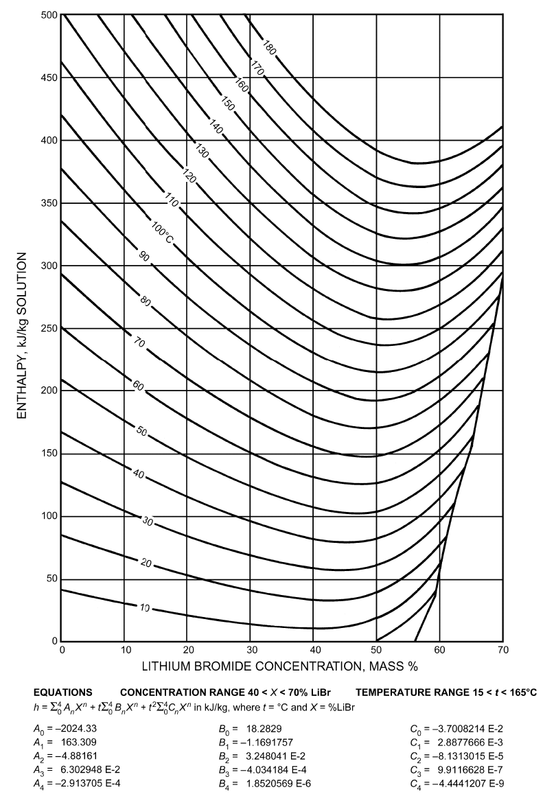

*Fig. 35 Enthalpy-Concentration Diagram for Water/Lithium Bromide Solutions*

<!-- str. 874 -->

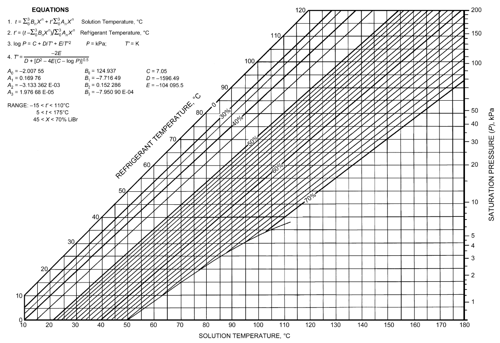

*Fig. 36 Equilibrium Chart for Aqueous Lithium Bromide Solutions*

<!-- str. 875 -->

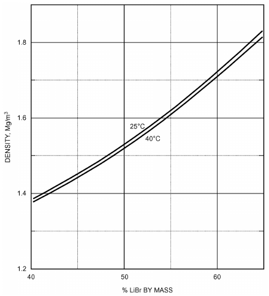

*Fig. 37 Specific Density of Aqueous Solutions of Lithium Bromide*

## REFERENCES

Tables added or revised for the 2017 edition [R-245fa, R1233zd(E), R-1234yf, and R-1234ze(E)] were calculated using

Lemmon, E.W., M.L. Huber, and M.O. McLinden. 2016. NIST standard *reference database 23, NIST reference fluid thermodynamic and trans-* port properties—REFPROP, v. 9.2. Standard Reference Data Program, National Institute of Standards and Technology, Gaithersburg, MD.

The tables for R-125, R-170, R-290, R-600, and R-600a have not changed from the 2009 ASHRAE Handbook—Fundamentals; these tables are indicated with a * after the fluid name and were calculated using

Lemmon, E.W., M.L. Huber, and M.O. McLinden. 2007. *NIST standard ref-* *erence database 23, NIST reference fluid thermodynamic and transport* properties—REFPROP, v. 8.0. Standard Reference Data Program, National Institute of Standards and Technology, Gaithersburg, MD.

Many tables (indicated with a ‡ after the fluid name) have not changed from the 2005 ASHRAE Handbook—Fundamentals. These tables were calculated using

Lemmon, E.W., M.O. McLinden, and M.L. Huber. 2002. *NIST standard ref-* *erence database 23, NIST reference fluid thermodynamic and transport* properties—REFPROP, v. 7.0. Standard Reference Data Program, National Institute of Standards and Technology, Gaithersburg, MD.

Some tables (indicated with a † following the fluid name) have not changed from the 2001 ASHRAE Handbook—Fundamentals. These tables were calculated using

McLinden, M.O., S.A. Klein, E.W. Lemmon, and A.P. Peskin. 2000a. *NIST standard reference database 23: Thermodynamic and transport prop-* *erties of refrigerants and refrigerant mixtures—REFPROP*, v. 6.10. Standard Reference Data Program, National Institute of Standards and Technology, Gaithersburg, MD.

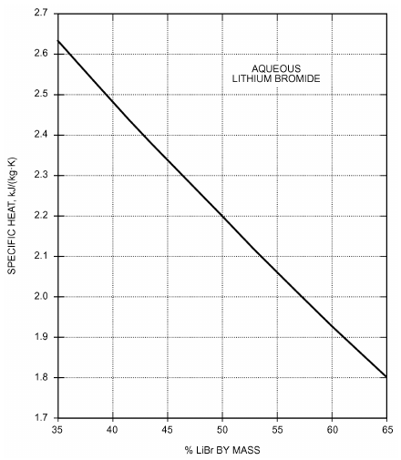

*Fig. 38 Specific Heat of Aqueous Lithium Bromide Solutions*

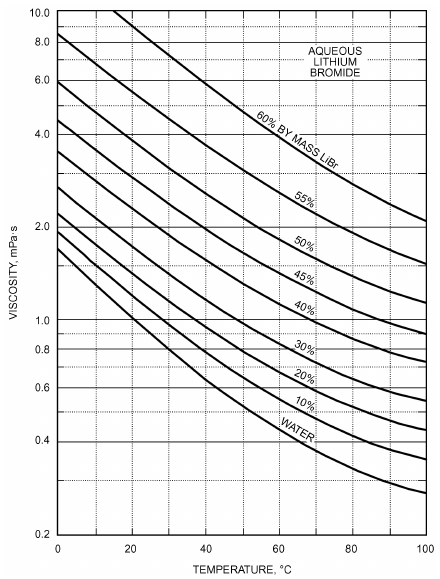

*Fig. 39 Viscosity of Aqueous Solutions of Lithium Bromide*

<!-- str. 876 -->

Tables for R-704 have not changed from the 1997 ASHRAE Handbook—Fundamentals; these tables were calculated using the programs noted.

The underlying sources for these computer packages are listed as follows by fluid and property. The reference listed under “Equation of state” was used for vapor pressure, liquid density, vapor volume, enthalpy, entropy, specific heat, and velocity of sound.

R-12†

*Equation of state*

Marx, V., A. Pruss, and W. Wagner. 1992. Neue Zustandsgleichungen für R-12, R-22, R-11 und R-113. Beschreibung des thermodynamischen Zustandsverhaltens bei Temperaturen bis 525 K und Drücken bis 200 MPa. VDI-Fortschritt-Ber Wärmetechnik/Kältetechnik 19(57). VDI Verlag, Düsseldorf.

Viscosity

Klein, S.A., M.O. McLinden, and A. Laesecke. 1997. An improved extended corresponding states method for estimation of viscosity of pure refrigerants and mixtures. *International Journal of Refrigeration* 20:208-217.

Thermal conductivity

McLinden, M.O., S.A. Klein, and R.A. Perkins. 2000b. An extended corresponding states model for the thermal conductivity of refrigerants and refrigerant mixtures. *International Journal of Refrigeration* 23:43-63. Surface tension

Okada, M., and K. Watanabe. 1988. Surface tension correlations for several fluorocarbon refrigerants. *Heat Transfer—Japanese Research* 17:35-52.

R-22†

*Equation of state*

Kamei, A., S.W. Beyerlein, and R.T. Jacobsen. 1995. Application of nonlinear regression in the development of a wide range formulation for HCFC-22. *International Journal of Thermophysics* 16(5):1155-1164. Viscosity

Klein et al. 1997. op. cit. (See R-12.)

Thermal conductivity

McLinden et al. 2000b. op. cit. (See R-12.)

Surface tension

Okada, M., and K. Watanabe. 1988. op. cit. (See R-12.)

R-23‡

*Equation of state*

Penoncello, S.G., E.W. Lemmon, Z. Shan, and R.T. Jacobsen. 2003. An equation of state for the calculation of the thermodynamic properties of trifluoromethane (R-23). *Journal of Physical and Chemical Reference* Data 32:1473.

*Viscosity and thermal conductivity*

Shan, Z., S.G. Penoncello, and R.T. Jacobsen. 2000. A generalized model for viscosity and thermal conductivity of trifluoromethane (R-23). ASHRAE Transactions 106(1):757-767.

Surface tension

Penoncello, S.G. 1999. Thermophysical properties of trifluoromethane (R-23). ASHRAE Research Project RP-997, Final Report.

R-32‡

*Equation of state*

Tillner-Roth, R., and A. Yokozeki. 1997. An international standard equation of state for difluoromethane (R-32) for temperatures from the triple point at 136.34 K to 435 K and pressures up to 70 MPa. *Journal of Phys-* *ical and Chemical Reference Data* 26:1273-1328.

Viscosity

Huber, M.L., A. Laesecke, and R.A. Perkins. 2003. Estimation of the viscosity and thermal conductivity of refrigerants including a new correlation for the viscosity of R134a. *Industrial & Engineering Chemistry* Research 42:3163-3178.

Thermal conductivity

Perkins, R.A. 2002. Personal communication, correlation to data as implemented in the NIST REFPROP Database. National Institute of Standards and Technology, Boulder, CO.

Surface tension

Okada, M., and Y. Higashi. 1995. Experimental surface tensions for HFC-32, HCFC-124, HFC-125, HCFC-141b, HCFC-142b, and HFC-152a. *International Journal of Thermophysics* 16(3):791-800.

R-123†

*Equation of state*

Younglove, B.A., and M.O. McLinden. 1994. An international standard equation-of-state formulation of the thermodynamic properties of refrigerant 123 (2,2-dichloro-1,1,1-trifluoroethane). *Journal of Physical and* *Chemical Reference Data* 23(5):731-779.

Viscosity

Tanaka, Y., and T. Sotani. 1995. *Thermodynamic and physical proper-* ties, Chapter 2: Transport properties (thermal conductivity and viscosity), R-123. International Institute of Refrigeration, Paris.

Thermal conductivity

Laesecke, A., R.A. Perkins, and J.B. Howley. 1996. An improved correlation for the thermal conductivity of HCFC-123 (2,2-dichloro-1,1,1-trifluoroethane). *International Journal of Refrigeration* 19:231-238. Surface tension

Okada and Higashi. 1995. op. cit. (See R-32.)

R-124‡

*Equation of state* de Vries, B., R. Tillner-Roth, and H.D. Baehr. 1995. Thermodynamic properties of HCFC-124. *19th International Congress of Refrigeration,* *International Institute of Refrigeration* IVa:582-589.

*Viscosity and thermal conductivity*

Huber et al. 2003. op. cit. (See R-32.)

Surface tension

Okada and Higashi. 1995. op. cit. (See R-32.)

R-125*

*Equation of state*

Lemmon, E.W., and R.T. Jacobsen. 2005. A new functional form and new fitting techniques for equations of state with application to pentafluoroethane (HFC-125). *Journal of Physical and Chemical Reference Data* 34(1):69-108.

Viscosity

Huber, M.L., and A. Laesecke. 2006. Correlation for the viscosity of pentafluoroethane (R-125) from the triple point to 500 K at pressures up to 60 MPa. *Industrial & Engineering Chemistry Research* 45(12):4447-4453.

Thermal conductivity

Perkins, R.A., and M.L. Huber. 2006. Measurement and correlation of the thermal conductivity of pentafluoroethane (R-125) from 190 K to 512 K at pressures to 70 MPa. *Journal of Chemical & Engineering Data* 51(3):898-904.

Surface tension

Okada and Higashi. 1995. op. cit. (See R-32.)

R-134a†

*Equation of state*

Tillner-Roth, R., and H.D. Baehr. 1994. An international standard formulation of the thermodynamic properties of 1,1,1,2-tetrafluoroethane (HFC-134a) covering temperatures from 170 K to 455 K at pressures up to 70 MPa. *Journal of Physical and Chemical Reference Data* 23:657-729.

Viscosity

Huber et al. 2003. op. cit. (See R-32.)

Thermal conductivity

Perkins, R.A., A. Laesecke, J. Howley, M.L.V. Ramires, A.N. Gurova, and L. Cusco. 2000. Experimental thermal conductivity values for the IUPAC round-robin sample of 1,1,1,2-tetrafluoroethane (R134a). NISTIR 6605.

Surface tension

Okada, M., and Y. Higashi. 1994. Surface tension correlation of HFC-134a and HCFC-123. *CFCs, the Day After: Proceedings of Joint Meeting* *of IIR Commissions B1, B2, E1, and E2*, pp. 541-548.

R-143a†

*Equation of state*

Lemmon, E.W., and R.T. Jacobsen. 2001. An international standard formulation for the thermodynamic properties of 1,1,1-trifluoroethane (HFC- 143a) for temperatures from 161 to 500 K and pressures to 60 MPa. *Journal of Physical and Chemical Reference Data* 29(4):521-552. Viscosity

<!-- str. 877 -->

Klein et al. 1997. op. cit. (See R-12.)

Thermal conductivity

McLinden et al. 2000b. op. cit. (See R-12.)

Surface tension

Schmidt, J.W., E. Carrillo-Nava, and M.R. Moldover. 1996. Partially halogenated hydrocarbons CHFCl-CF , CF -CH , CF -CHF-CHF , 3 3 3 3 2 CF -CH -CF , CHF -CF -CH F, CF -CH -CHF , CF -O-CHF :

3 2 3 2 2 2 3 2 2 3 2 Critical temperature, refractive indices, surface tension and estimates of liquid, vapor and critical densities. *Fluid Phase Equilibria* 122:187-206. R-152a‡

*Equation of state*

Outcalt, S.L., and M.O. McLinden. 1996. A modified Benedict-Webb-Rubin equation of state for the thermodynamic properties of R-152a (1,1-difluoroethane). *Journal of Physical and Chemical Reference Data* 25(2):605-636.

Viscosity

Klein et al. 1997. op. cit. (see R-12), ECS model of McLinden et al. (2000b) correlated to data as implemented in NIST REFPROP.

Thermal conductivity

Krauss, R., V.C. Weiss, T.A. Edison, J.V. Sengers, and K. Stephan. 1996. Transport properties of 1,1-difluoroethane (R-152a). International Jour-*nal of Thermophysics* 17:731-757.

Surface tension

Okada and Higashi. 1995. op. cit. (See R-32.)

**R-245fa**

*Equation of state*

Akasaka, R., Y. Zhou, and E.W. Lemmon. 2015. A fundamental equation of state for 1,1,1,3,3-pentafluoropropane (R-245fa). *Journal of Physical* *and Chemical Reference Data* 44:013104.

*Viscosity and thermal conductivity*

Perkins, R.A., M.L. Huber, and M.J. Assael. 2016. Measurements of the thermal conductivity of 1,1,1,3-3-pentafluoropropane (R-245fa) and correlations for the viscosity and thermal conductivity surfaces. Journal of *Chemical and Engineering Data* 61:3286-3294.

Surface tension

Mulero, A., I. Cachadiña, and M.I. Parra. 2015. Recommended correlations for the surface tension of common fluids. *Journal of Physical and* *Chemical Reference Data* 41:043105.

**R-1233zd(E)**

*Equation of state*

Mondejar, M.E., M.O. McLinden, and E.W. Lemmon. 2015. Thermodynamic properties of trans-1-chloro-3,3,3-trifluoro-propene [R1233zd(E)]: Vapor pressure, p-ρ-T data, speed of sound measurements and equation of state. *Journal of Chemical and Engineering Data* 60: 2477-2489.

Viscosity

Hulse, R.J., R.S. Basu, R.R. Singh, and R.H.P. Thomas. 2012. Physical properties of HCFO-1233zd(E). *Journal of Chemical and Engineering* Data 57:3581-3586.

Thermal conductivity

Perkins, R.A., M.L. Huber, and M.J. Assael. 2017. Measurement and correlation of the thermal conductivity of trans-1-chloro-3,3,3-trifluoropropene (R1233zd(E)). *Journal of Chemical and Engineering Data*. dx.doi.org/10.1021/acs.jced.7b00106.

Surface tension

Kondou, C., R. Nagata, N. Nii, S. Koyama, and Y. Higashi. 2015 Surface tension of low GWP refrigerants R1243zf, R1234ze(Z), and R1233zd(E). *International Journal of Refrigeration* 53:80-89.

**R-1234yf**

*Equation of state*

Richter, M., M.O. McLinden, and E.W. Lemmon. 2011. Thermodynamic properties of 2,3,3,3-tetrafluoroprop-1-ene (R-1234yf); p-ρ-T measurements and an equation of state. *Journal of Chemical & Engineering Data* 56:3254-3264.

Viscosity

Huber, M.L., and M.J. Assael. 2016. Correlations for the viscosity of 2,3,3,3-tetrafluoroprop-1-ene (R1234yf) and trans-1,2,2,2-tetrafluoropropene (R1234ze(E)). *International Journal of Refrigeration* 71:39-45.

Thermal conductivity

Perkins, R.A., and M.L. Huber. 2011. Measurement and correlation of the thermal conductivity of 2,3,3,3-tetrafluoroprop-1-ene (R-1234fy) and trans-1,3,3,3-tetrafluoropropene (R-1234ze). *Journal of Chemical &* Engineering Data 56:4868-4874.

Surface tension

Mulero et al. 2015. op. cit. (See R-245fa).

**R-1234ze(E)**

*Equation of state*

Thol, M., and E.W. Lemmon. 2016. Equation of state for the thermodynamic properties of trans-1,3,3,3-Tetrafluoropropene [R1234ze(E)]. *International Journal of Thermophysics* 37:28.

Viscosity

Huber and Assael. op. cit. (See R-1234yf.)

Thermal conductivity

Perkins and Huber. 2011. op. cit. (See R-1234yf).

Surface tension

Mulero et al. 2015. op. cit. (See R-245fa).

R-404A‡

*Equation of state*

Lemmon, E.W., and R.T. Jacobsen. 2004a. Equations of state for mixtures of R-32, R-125, R-134a, R-143a, and R-152a. *Journal of Physical* *and Chemical Reference Data* 33(2):593-620.

Viscosity

Klein et al. 1997. op. cit. (See R-12.)

Thermal conductivity

McLinden et al. 2000b. op. cit. (See R-12.)

Surface tension

Moldover, M.R., and J.C. Rainwater. 1988. Interfacial tension and vaporliquid equilibria in the critical region of mixtures. *Journal of Chemical* Physics 88:7772-7780.

R-407C‡

*Equation of state*

Lemmon and Jacobsen. 2004a. op. cit. (See R-404A.)

Viscosity

Klein et al. 1997. op. cit. (See R-12.)

Thermal conductivity

McLinden et al. 2000b. op. cit. (See R-12.)

Surface tension

Moldover and Rainwater. 1988. op. cit. (See R-404A.)

R-410A‡

*Equation of state*

Lemmon and Jacobsen. 2004a. op. cit. (See R-404A.)

Viscosity

Klein et al. 1997. op. cit. (See R-12.)

Thermal conductivity

McLinden et al. 2000b. op. cit. (See R-12.)

Surface tension

Moldover and Rainwater. 1988. op. cit. (See R-404A.)

R-507A‡

*Equation of state*

Lemmon and Jacobsen. 2004a. op. cit. (See R-404A.)

Viscosity

Klein et al. 1997. op. cit. (See R-12.)

Thermal conductivity

McLinden et al. 2000b. op. cit. (See R-12.)

Surface tension

Moldover and Rainwater. 1988. op. cit. (See R-404A.)

### R-717 (Ammonia)†

*Equation of state*

Tillner-Roth, R., F. Harms-Watzenberg, and H.D. Baehr. 1993. Eine neue Fundamentalgleichung für Ammoniak. DKV-Tagungsbericht 20(II):167-181.

Viscosity

Fenghour, A., W.A. Wakeham, V. Vesovic, J.T.R. Watson, J. Millat, and E. Vogel. 1995a. The viscosity of ammonia. *Journal of Physical and* *Chemical Reference Data* 24:1649-1667.

<!-- str. 878 -->

Thermal conductivity

Tufeu, R., D.Y. Ivanov, Y. Garrabos, and B. Le Neindre. 1984. Thermal conductivity of ammonia in a large temperature and pressure range including the critical region. *Berichte der Bunsen-Gesellschaft—Physi-* cal Chemistry 88:422-427.

Surface tension

Stairs, R.A., and M.J. Sienko. 1956. Surface tension of ammonia and of solutions of alkalai halides in ammonia. *Journal of American Chemical* Society 78:920-923.

### R-718 (Water/Steam)†

*Data computed using*

Harvey, A.H., S.A. Klein, and A.P. Peskin. 1999. *NIST Standard Refer-* ence Database 10. NIST/ASME steam properties database, v. 2.2. Standard Reference Data Program.

*Equation of state*

Wagner, W., and A. Pruss. 2002. The IAPWS formulation 1995 for the thermodynamic properties of ordinary water substance for general and scientific use. *Journal of Physical and Chemical Reference Data* 31:387-535.

*Viscosity and thermal conductivity*

Kestin, J., J.V. Sengers, B. Kamgar-Parsi, and J.M.H. Levelt Sengers. 1984. Thermophysical properties of fluid H<sub>2</sub>O. *Journal of Physical and* *Chemical Reference Data* 13:175.

Surface tension

IAPWS. 1995. Physical chemistry of aqueous systems: Meeting the needs of industry. *Proceedings of the 12th International Conference on* *the Properties of Water and Steam*, Orlando. Begell House, Inc., A139-A142. International Association for the Properties of Steam.

### R-744 (Carbon Dioxide)†

*Equation of state*

Span, R., and W. Wagner. 1996. A new equation of state for carbon dioxide covering the fluid region from the triple-point temperature to 1100 K at pressures up to 800 MPa. *Journal of Physical and Chemical Reference* Data 26:1509-1596.

Viscosity

Fenghour, A., W.A. Wakeham, and V. Vesovic. 1995b. The viscosity of carbon dioxide. *Journal of Physical and Chemical Reference Data* 27: 31-44.

Thermal conductivity

Vesovic, V., W.A. Wakeham, G.A. Olchowy, J.V. Sengers, J.T.R. Watson, and J. Millat. 1990. The transport properties of carbon dioxide. Jour-*nal of Physical and Chemical Reference Data* 19:763-808.

Surface tension

Rathjen, W., and J. Straub. 1977. *Heat transfer in boiling*, Chapter 18, Temperature dependence of surface tension, coexistence curve, and vapor pressure of CO<sub>2</sub>, CClF<sub>3</sub>, CBrF<sub>3</sub>, and SF<sub>6</sub>. Academic Press, New York.

### R-50 (Methane)†

*Equation of state*

Setzmann, U., and W. Wagner. 1991. A new equation of state and tables of thermodynamic properties for methane covering the range from the melting line to 625 K at pressures to 1000 MPa. *Journal of Physical and* *Chemical Reference Data* 20:1061-1151.

Viscosity

Younglove, B.A., and J.F. Ely. 1987. Thermophysical properties of fluids. II. Methane, ethane, propane, isobutane and normal butane. Journal *of Physical and Chemical Reference Data* 16:577-798.

Thermal conductivity

Friend, D.G., J.F. Ely, and H. Ingham. 1989. Thermophysical properties of methane. *Journal of Physical and Chemical Reference Data* 18(2): 583-638.

Surface tension

Somayajulu, G.R. 1988. A generalized equation for surface tension from the triple point to the critical point. *International Journal of Thermo-* physics 9:559-566.

### R-170 (Ethane)

*Equation of state*

Bücker, D., and W. Wagner. 2006. A reference equation of state for the thermodynamic properties of ethane for temperatures from the melting line to 675 K and pressures up to 900 MPa. *Journal of Physical and* *Chemical Reference Data* 35:205.

*Viscosity, and thermal conductivity*

Friend, D.G., H. Ingham, and J.F. Ely. 1991. Thermophysical properties of ethane. *Journal of Physical and Chemical Reference Data* 20(2): 275-347.

Surface tension

Soares, V.A.M., B.d.J.V.S. Almeida, I.A. McLure, and R.A. Higgins. 1986. Surface tension of pure and mixed simple substances at low temperature. *Fluid Phase Equilibria* 32:9-16.

*Pressure-enthalpy diagram based on data of*

Friend, D.G., H. Ingham, and J.F. Ely. 1991. Thermophysical properties of ethane. *Journal of Physical and Chemical Reference Data* 20(2): 275-347.

### R-290 (Propane)

*Equation of state*

Lemmon, E.W., W. Wagner, and M.O. McLinden. 2009. Thermodynamic properties of propane, III: Equation of state. *Journal of Chemi-* *cal & Engineering Data* 54:3141-3180.

Viscosity

Vogel, E., C. Küchenmeister, E. Bich, and A. Laesecke. 1998. Reference correlation of the viscosity of propane. *Journal of Physical and Chemical* Reference Data 27:947-970.

Thermal conductivity

Marsh, K., R. Perkins, and M.L.V. Ramires. 2002. Measurement and correlation of the thermal conductivity of propane from 86 to 600 K at pressures to 70 MPa. *Journal of Chemical & Engineering Data* 47:932-940. Surface tension

Baidakov, V.G., and I.I. Sulla. 1985. Surface tension of propane and isobutane at near-critical temperatures. *Russian Journal of Physical* Chemistry 59:551-554.

*Pressure-enthalpy diagram based on data of*

Miyamoto, H., and K. Watanabe. 2000. A thermodynamic property model for fluid-phase propane. *International Journal of Thermophysics* 21:1045-1072.

### R-600 (n-Butane)

*Equation of state*

Bücker, D., and W. Wagner. 2006. Reference equations of state for the thermodynamic properties of fluid phase n-butane and isobutane. Jour-*nal of Physical and Chemical Reference Data* 35:929.

Viscosity

Vogel, E., C. Kuchenmeister, and E. Bich. 1999. Viscosity for n-butane in the fluid region. *High Temperatures—High Pressures* 31:173-186. Thermal conductivity

Perkins, R.A., M.L.V. Ramires, C.A. Nieto de Castro, and L. Cusco. 2002. Measurement and correlation of the thermal conductivity of butane. *Journal of Chemical and Engineering Data* 47:1263-1271.

Surface tension

Calado, J.C.G., I.A. McLure, and V.A.M. Soares. 1978. Surface tension for octafluorocyclobutane, n-butane and their mixtures from 233 K to 254 K, and vapour pressure, excess Gibbs function and excess volume for the mixture at 233 K. *Fluid Phase Equilibria* 2:199-213.

Coffin, C.C., and O. Maass. 1928. The preparation and physical properties of α-, β- and γ-butylene and normal and isobutane. *Journal of the* *American Chemical Society* 50(5):1427-1437.

*Pressure-enthalpy diagram based on data of*

Miyamoto, H., and K. Watanabe. 2001. Thermodynamic property model for fluid-phase n-butane. *International Journal of Thermophysics* 22:459-475.

### R-600a (Isobutane)

*Equation of state*

Bücker and Wagner. 2006. op. cit. (See R-600.)

Viscosity

Vogel, E., C. Küchenmeister, and E. Bich. 2000. Viscosity correlation for isobutane over wide ranges of the fluid region. *International Journal of* Thermophysics 21:343-356.

<!-- str. 879 -->

Thermal conductivity

Perkins, R.A. 2002. Measurement and correlation of the thermal conductivity of isobutane. *Journal of Chemical Engineering Data* 47:1272-1279.

Surface tension

Baidakov and Sulla. 1985. op. cit. (See R-290.)

*Pressure-enthalpy diagram based on data of*

Miyamoto, H., and K. Watanabe. 2002. A thermodynamic property model for fluid-phase isobutane. *International Journal of Thermophysics* 23:477-499.

### R-1150 (Ethylene)†

*Equation of state*

Smukala, J., R. Span, and W. Wagner. 2000. A new equation of state for ethylene covering the fluid region for temperatures from the melting line to 450 K and pressures up to 300 MPa. *Journal of Physical and Chemical* Reference Data 29:1053-1122.

*Viscosity and thermal conductivity*

Holland, P.M., B.E. Eaton, and H.J.M. Hanley. 1983. A correlation of the viscosity and thermal conductivity data of gaseous and liquid ethylene. *Journal of Physical and Chemical Reference Data* 12:917-932.

Surface tension

Soares et al. op. cit. (See R-170.)

### R-1270 (Propylene)‡

*Equation of state*

Angus, S., B. Armstrong, and K.M. de Reuck. 1980. International ther-*modynamic tables of the fluid state—7: Propylene*. Pergamon Press, Oxford, U.K.

*Viscosity and thermal conductivity*

Huber et al. 2003. op. cit. (See R-32.)

Surface tension

Maass, O., and C.H. Wright. 1921. Some physical properties of hydrocarbons containing two and three carbon atoms. *Journal of the American* Chemical Society 43:1098-1111.

### R-704 (Helium)

Thermodynamic data computed using the ALLPROPS database, v. 4.0:

Lemmon, E.W., R.T. Jacobsen, S.G. Penoncello, and S.W. Beyerlein. 1994. Computer programs for the calculation of thermodynamic properties of cryogenic and other fluids. *Advances in Cryogenic Engineering* 39:1891-1897.

Transport data computed using the NIST 12 database, v. 3.0:

Friend, D.G., R.D. McCarty, and V. Arp. 1992. NIST thermophysical *properties of pure fluids database*, v. 3.0. Standard Reference Data Program.

*Equation of state, viscosity, and thermal conductivity*

Arp, V.D., R.D. McCarty, and D.G. Friend. 1995. Thermophysical properties of helium-4 from 0.8 to 1500 K with pressures to 2000 MPa. NIST Technical Note 1334 (revised).

Surface tension

Liley, P.E., and P.D. Desai. 1993. *ASHRAE thermophysical properties of* refrigerants.

### R-728 (Nitrogen)‡

*Equation of state, viscosity, and thermal conductivity*

Span, R., E.W. Lemmon, R.T. Jacobsen, W. Wagner, and A. Yokozeki. 2000. A reference equation of state for the thermodynamic properties of nitrogen for temperatures from 63.151 to 1000 K and pressures to 2200 MPa. *Journal of Physical and Chemical Reference Data* 29:1361-1433.

*Viscosity and thermal conductivity*

Lemmon, E.W., and R.T. Jacobsen. 2004b. Viscosity and thermal conductivity equations for nitrogen, oxygen, argon, and air. International *Journal of Thermophysics* 25:21-69.

Surface tension

Lemmon, E.W., and S.G. Penoncello. 1994. The surface tension of air and air component mixtures. *Advances in Cryogenic Engineering* 39:1927-1934.

### R-729 (Air)‡

*Equation of state*

Lemmon, E.W., R.T. Jacobsen, S.G. Penoncello, and D.G. Friend. 2000. Thermodynamic properties of air and mixtures of nitrogen, argon, and oxygen from 60 to 2000 K at pressures to 2000 MPa. *Journal of Physical* *and Chemical Reference Data* 29:331-385.

*Viscosity and thermal conductivity*

Lemmon and Jacobsen. 2004b. op. cit. (See R-728.)

Surface tension

Lemmon and Penoncello. 1994. op. cit. (See R-728.)

### R-732 (Oxygen)‡

*Equation of state*

Schmidt, R., and W. Wagner. 1985. A new form of the equation of state for pure substances and its application to oxygen. *Fluid Phase Equilibria* 19:175-200.

*Viscosity and thermal conductivity*

Lemmon and Jacobsen. 2004b. op. cit. (See R-728)

Surface tension

Lemmon and Penoncello. 1994. op. cit. (See R-728.)

### R-740 (Argon)‡

*Equation of state*

Tegeler, C., R. Span, and W. Wagner. 1999. A new equation of state for argon covering the fluid region for temperatures from the melting line to 700 K at pressures up to 1000 MPa. *Journal of Physical and Chemical* Reference Data 28:779-850.

*Viscosity and thermal conductivity*

Lemmon and Jacobsen. 2004b. op. cit. (See R-728.)

Surface tension

Lemmon and Penoncello. 1994. op. cit. (See R-728.)
