# Chapter 31 — Physical Properties of Secondary Coolants (Brines)

*Izvor: 2021 ASHRAE Handbook — Fundamentals (SI), Chapter 31 (PDF str. 880–892).*

> **Napomena o konverziji:** Tekst je automatski izdvojen iz originalnog PDF-a uz prepoznavanje dve kolone, spojene prelomljene reči i pasuse. Indeksi i eksponenti su označeni sa ``/``, tabele su pretvorene u Markdown tabele (veoma složene tabele su prikazane kao poravnat tekst), a slike su izrezane iz PDF-a u folder `img/`. Složene jednačine (razlomci, sume) mogu biti uprošćeno prikazane. **Pre upotrebe vrednosti u proračunu proveriti u originalnom PDF-u.** Oznake `<!-- str. N -->` pokazuju stranu PDF-a.

## Sadržaj

- [1. SALT-BASED BRINES](#1-salt-based-brines)
- [2. INHIBITED GLYCOLS](#2-inhibited-glycols)
- [3. HALOCARBONS](#3-halocarbons)
- [4. NONHALOCARBON, NONAQUEOUS FLUIDS](#4-nonhalocarbon-nonaqueous-fluids)
- [REFERENCES](#references)
- [BIBLIOGRAPHY](#bibliography)

<!-- str. 880 -->

IN many refrigeration applications, heat is transferred to a **second- ary coolant**, which can be any liquid cooled by the refrigerant and used to transfer heat without changing state. These liquids are also known as **heat transfer fluids**, **brines**, or **secondary refrigerants**.

Other ASHRAE Handbook volumes describe various applications for secondary coolants. In the 2018 ASHRAE Handbook—Refrigeration, refrigeration systems are discussed in Chapter 13, their uses in food processing in Chapters 23 and 28 to 42, and ice rinks in Chapter 44. In the 2019 *ASHRAE Handbook—HVAC Appli-* cations, solar energy use is discussed in Chapter 35, and snow melting and freeze protection in Chapter 51. Thermal storage is covered in Chapter 51 of the 2020 *ASHRAE Handbook—HVAC Systems and* Equipment.

This chapter describes physical properties of the more common secondary coolants based on ethylene glycol, propylene glycol, sodium chloride, or calcium chloride and provides information on their use. Less widely used secondary coolants such as ethyl alcohol or potassium formate are not included in this chapter, but their physical properties are summarized in Melinder (2007). Physical property data for nitrate and nitrite salt solutions used for stratified thermal energy storage are presented by Andrepont (2012). The chapter also includes information on corrosion protection. Supplemental information on corrosion inhibition can be found in Chapter 49 of the 2019 *ASHRAE Handbook—HVAC Applications* and Chapter 13 of the 2018 ASHRAE Handbook—Refrigeration.

## 1. SALT-BASED BRINES

### Physical Properties

Water solutions of calcium chloride and sodium chloride have historically been the most common refrigeration brines. Tables 1 and 2 list the properties of pure calcium chloride brine and sodium chloride brine. For commercial grades, use the formulas in the footnotes to these tables. For calcium chloride brines, Figure 1 shows specific heat, Figure 2 shows the ratio of mass of solution to that of water, Figure 3 shows viscosity, and Figure 4 shows thermal conductivity. Figures 5 to 8 show the same properties for sodium chloride brines.

**Table 1 Properties of Pure Calcium Chloride Brines**

| Pure CaCl , % 2 by Mass | Specific Heat at 15°C, J/(kg·K) | Crystallization Starts, °C | Density at 16°C, kg/m3 CaCl2 | Density at 16°C, kg/m3 Brine | Density at Various Temperatures, kg/m3 –20°C –10°C | Density at Various Temperatures, kg/m3 0°C | Density at Various Temperatures, kg/m3 10°C |
|---|---|---|---|---|---|---|---|
| 0 | 4184 | 0.0 | 0.0 | 999 |  |  |  |
| 5 | 3866 | –2.4 | 52.2 | 1044 |  | 1042 | 1041 |
| 6 | 3824 | –2.9 | 63.0 | 1049 |  | 1051 | 1050 |
| 7 | 3757 | –3.4 | 74.2 | 1059 |  | 1060 | 1059 |
| 8 | 3699 | –4.1 | 85.5 | 1068 |  | 1070 | 1068 |
| 9 | 3636 | –4.7 | 96.9 | 1078 |  | 1079 | 1077 |
| 10 | 3577 | –5.4 | 108.6 | 1087 |  | 1088 | 1086 |
| 11 | 3523 | –6.2 | 120.5 | 1095 |  | 1097 | 1095 |
| 12 | 3464 | –7.1 | 132.5 | 1104 |  | 1107 | 1104 |
| 13 | 3414 | –8.0 | 144.8 | 1113 |  | 1116 | 1114 |
| 14 | 3364 | –9.2 | 157.1 | 1123 |  | 1126 | 1123 |
| 15 | 3318 | –10.3 | 169.8 | 1132 | 1140 | 1136 | 1133 |
| 16 | 3259 | –11.6 | 182.6 | 1141 | 1150 | 1145 | 1142 |
| 17 | 3209 | –13.0 | 195.7 | 1152 | 1160 | 1155 | 1152 |
| 18 | 3163 | –14.5 | 209.0 | 1161 | 1170 | 1165 | 1162 |
| 19 | 3121 | –16.2 | 222.7 | 1171 | 1179 | 1175 | 1172 |
| 20 | 3084 | –18.0 | 236.0 | 1180 | 1189 | 1185 | 1182 |
| 21 | 3050 | –19.9 | 249.6 | 1189 |  |  |  |
| 22 | 2996 | –22.1 | 264.3 | 1201 1214 | 1210 | 1206 | 1202 |
| 23 | 2958 | –24.4 | 278.7 | 1211 |  |  |  |
| 24 | 2916 | –26.8 | 293.5 | 1223 1235 | 1231 | 1227 | 1223 |
| 25 | 2882 | –29.4 | 308.2 | 1232 |  |  |  |
| 26 | 2853 | –32.1 | 323.1 | 1242 |  |  |  |
| 27 | 2816 | –35.1 | 338.5 | 1253 |  |  |  |
| 28 | 2782 | –38.8 | 354.0 | 1264 |  |  |  |
| 29 | 2753 | –45.2 | 369.9 | 1275 |  |  |  |
| 29.87 | 2741 | –55.0 | 378.8 | 1289 |  |  |  |
| 30 | 2732 | –46.0 | 358.4 | 1294 |  |  |  |
| 32 | 2678 | –28.6 | 418.1 | 1316 |  |  |  |
| 34 | 2636 | –15.4 | 452.0 | 1339 |  |  |  |

Source: CCI (1953)

*Mass of Type 1 (77% min.) CaCl2 = (mass of pure CaCl2)/(0.77). Mass of Type 2 (94% min.) CaCl2 = (mass of pure CaCl2)/(0.94). ________ The preparation of this chapter is assigned to TC 3.1, Refrigerants and Secondary Coolants.

<!-- str. 881 -->

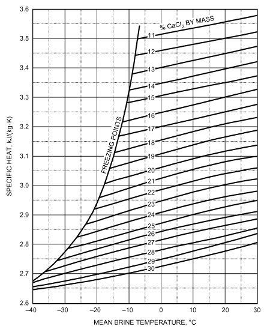

*Fig. 1 Specific Heat of Calcium Chloride Brines*

> (CCI 1953)

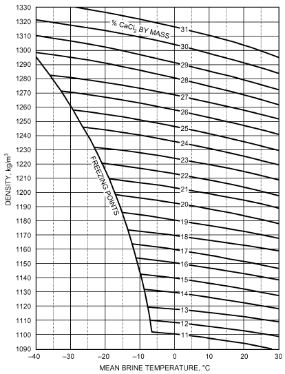

*Fig. 2 Density of Calcium Chloride Brines*

> (CCI 1953)

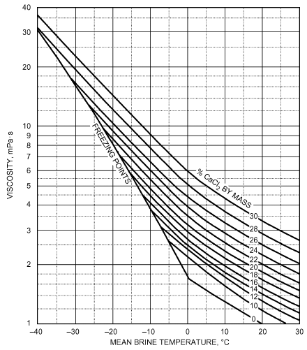

*Fig. 3 Viscosity of Calcium Chloride Brines*

> (CCI 1953)

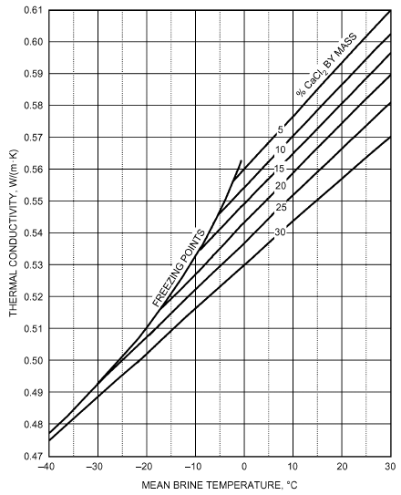

*Fig. 4 Thermal Conductivity of Calcium Chloride Brines*

> (CCI 1953)

<!-- str. 882 -->

**Table 2 Properties of Pure Sodium Chloride Brines**

| Pure NaCl, % by Mass | Specific Heat at 15°C, J/(kg·K) | Crystallization Starts, °C | Density at 16°C, kg/m3 NaCl | Density at 16°C, kg/m3 Brine | Density at Various Temperatures, kg/m3 –10°C | Density at Various Temperatures, kg/m3 –0°C | Density at Various Temperatures, kg/m3 10°C | Density at Various Temperatures, kg/m3 20°C |
|---|---|---|---|---|---|---|---|---|
| 0 | 4184 | 0.0 | 0.0 | 1000 |  |  |  |  |
| 5 | 3925 | –2.9 | 51.7 | 1035 |  | 1038.1 | 1036.5 | 1034.0 |
| 6 | 3879 | –3.6 | 62.5 | 1043 |  | 1045.8 | 1043.9 | 1041.2 |
| 7 | 3836 | –4.3 | 73.4 | 1049 |  | 1053.7 | 1051.4 | 1048.5 |
| 8 | 3795 | –5.0 | 84.6 | 1057 |  | 1061.2 | 1058.9 | 1055.8 |
| 9 | 3753 | –5.8 | 95.9 | 1065 |  | 1069.0 | 1066.4 | 1063.2 |
| 10 | 3715 | –6.6 | 107.2 | 1072 |  | 1076.8 | 1074.0 | 1070.6 |
| 11 | 3678 | –7.3 | 118.8 | 1080 |  | 1084.8 | 1081.6 | 1078.1 |
| 12 | 3640 | –8.2 | 130.3 | 1086 |  | 1092.4 | 1089.6 | 1085.6 |
| 13 | 3607 | –9.1 | 142.2 | 1094 |  | 1100.3 | 1097.0 | 1093.2 |
| 14 | 3573 | –10.1 | 154.3 | 1102 |  | 1108.2 | 1104.7 | 1100.8 |
| 15 | 3544 | –10.9 | 166.5 | 1110 | 1119.4 | 1116.2 | 1112.5 | 1108.5 |
| 16 | 3515 | –11.9 | 178.9 | 1118 | 1127.6 | 1124.2 | 1120.4 | 1116.2 |
| 17 | 3485 | –13.0 | 191.4 | 1126 | 1135.8 | 1132.2 | 1128.3 | 1124.0 |
| 18 | 3456 | –14.1 | 204.1 | 1134 | 1144.1 | 1140.3 | 1136.2 | 1131.8 |
| 19 | 3427 | –15.3 | 217.0 | 1142 | 1153.4 | 1148.5 | 1144.3 | 1139.7 |
| 20 | 3402 | –16.5 | 230.0 | 1150 | 1160.7 | 1156.7 | 1154.1 | 1147.7 |
| 21 | 3376 | –17.8 | 243.2 | 1158 | 1169.1 | 1165.0 | 1160.5 | 1155.8 |
| 22 | 3356 | –19.1 | 256.6 | 1166 | 1177.6 | 1173.3 | 1168.7 | 1163.9 |
| 23 | 3330 | –20.6 | 270.0 | 1174 | 1186.1 | 1181.7 | 1177.0 | 1172.0 |
| 24 | 3310 | –15.7 | 283.7 | 1182 | 1194.7 | 1190.1 | 1185.3 | 1180.3 |
| 25 | 3289 | –8.8 | 297.5 | 1190 |  |  |  |  |
| 25.2 |  | 0.0 |  |  |  |  |  |  |

aMass of commercial NaC1 required = (mass of pure NaCl required)/(% purity).

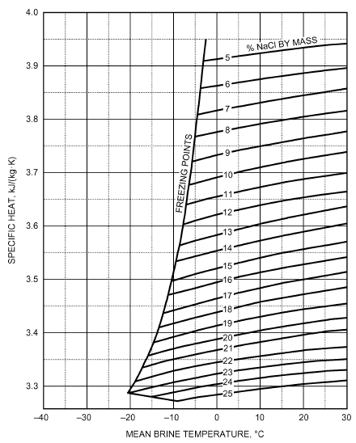

*Fig. 5 Specific Heat of Sodium Chloride Brines*

> (adapted from Carrier 1959)

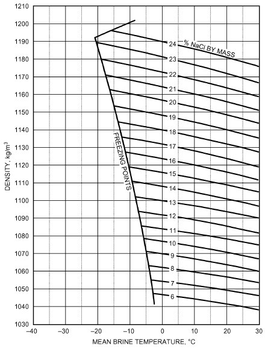

*Fig. 6 Density of Sodium Chloride Brines*

> (adapted from Carrier 1959)

<!-- str. 883 -->

Brine applications in refrigeration are mainly in industrial machinery and in skating rinks. Corrosion is the principal problem for calcium chloride brines, especially in ice-making tanks where galvanized iron cans are immersed.

Ordinary salt (sodium chloride) is used where contact with calcium chloride is intolerable (e.g., the brine fog method of freezing fish and other foods). It is used as a spray to air-cool unit coolers to prevent frost formation on coils. In most refrigerating work, the lower freezing point of calcium chloride solution makes it more convenient to use.

Commercial calcium chloride, available as Type 1 (77% minimum) and Type 2 (94% minimum), is marketed in flake, solid, and solution forms; flake form is used most extensively. Commercial sodium chloride is available both in crude (rock salt) and refined grades. Because magnesium salts tend to form sludge, their presence in sodium or calcium chloride is undesirable.

### Corrosion Inhibition

All brine systems must be treated to control corrosion and deposits. Historically, chloride-based brines were maintained at neutral pH and treated with sodium chromate. However, using chromate as

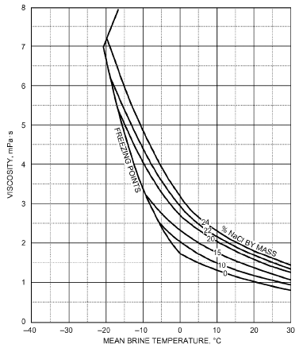

*Fig. 7 Viscosity of Sodium Chloride Brines*

> (adapted from Carrier 1959)

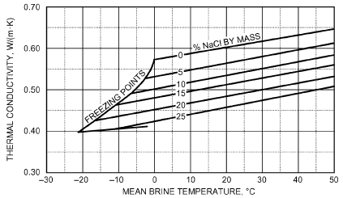

*Fig. 8 Thermal Conductivity of Sodium Chloride Brines*

> (adapted from Carrier 1959)

a corrosion inhibitor is no longer deemed acceptable because of its detrimental environmental effects. Chromate has been placed on hazardous substance lists by several regulatory agencies. For example, the U.S. Agency for Toxic Substances and Disease Registry’s (ATSDR 2016) *Priority List of Hazardous Substances* ranks hexavalent chromium 17th out of 275 chemicals of concern (based on frequency, toxicity, and potential for human exposure at National Priorities List facilities). Consequently, hexavalent chrome and several chromates are also listed on several state right-to-know hazardous substance lists, including New Jersey, California, Minnesota, Pennsylvania and others.

Instead of chromate, most brines use a sodium-nitrite-based inhibitor ranging from approximately 3000 mg/kg in calcium brines to 4000 mg/kg in sodium brines. Other, proprietary organic inhibitors are also available to mitigate the inherent corrosiveness of brines.

Before using any inhibitor package, review federal, state, and local regulations concerning the use and disposal of the spent fluids. If the regulations prove too restrictive, an alternative inhibition system should be considered.

## 2. INHIBITED GLYCOLS

Ethylene glycol and propylene glycol, when properly inhibited for corrosion control, are used as aqueous-freezing-point depressants (antifreeze) and heat transfer media. Their chief attributes are their ability to efficiently lower the freezing point of water, their low volatility, and their relatively low corrosivity when properly inhibited. Inhibited ethylene glycol solutions have better thermophysical properties than propylene glycol solutions, especially at lower temperatures. However, the less toxic propylene glycol is preferred for applications involving possible human contact or where mandated by regulations. If a heat transfer fluid may have incidental food contact, then it should be made from propylene glycol that meets U.S. Pharmacopeia (USP 2016) *Food Chemical Codex* (FCC) specifications. Avoid other, less pure grades of propylene glycol: they can contain toxic or unwanted impurities that also adversely affect performance characteristics (e.g., foaming propensity, corrosion).

### Physical Properties

Ethylene glycol and propylene glycol are colorless, practically odorless liquids that are miscible with water and many organic compounds. Table 3 shows properties of the pure materials.

The freezing and boiling points of aqueous solutions of ethylene glycol and propylene glycol are given in Tables 4 and 5. Note that increasing the concentration of ethylene glycol above 60% by mass causes the freezing point of the solution to increase. Propylene glycol solutions above 60% by mass do not have freezing points. Instead of freezing, propylene glycol solutions supercool and become a glass (a liquid with extremely high viscosity and the appearance and properties of a noncrystalline amorphous solid). On the dilute side of the eutectic (the mixture at which freezing produces a solid phase of the same composition), ice forms on freezing; on the concentrated side, solid glycol separates from solution on freezing. The freezing rate of such solutions is often quite slow, but, in time, they set to a hard, solid mass.

Physical properties (i.e., density, specific heat, thermal conductivity, and viscosity) for aqueous solutions of ethylene glycol can be found in Tables 6 to 9 and Figures 9 to 12; similar data for aqueous solutions of propylene glycol are in Tables 10 to 13 and Figures 13 to 16. Densities are for aqueous solutions of industrially inhibited glycols, and are somewhat higher than those for pure glycol and water alone. Typical corrosion inhibitor packages do not significantly affect other physical properties. Physical properties for the two fluids are similar, except for viscosity. At the same concentration, aqueous solutions of propylene glycol are more viscous than solutions of ethylene glycol. This higher viscosity accounts for the majority of the performance difference between the two fluids.

<!-- str. 884 -->

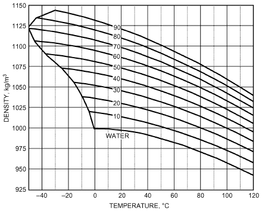

*Fig. 9 Density of Aqueous Solutions of Industrially Inhibited Ethylene Glycol (vol. %)*

> (Dow Chemical 2001b)

**Table 3 Physical Properties of Ethylene Glycol and Propylene Glycol**

| Property | Ethylene Glycol | Propylene Glycol |
|---|---|---|
| Relative molecular mass | 62.07 | 76.10 |
| Density at 20°C, kg/m3 | 1113 | 1036 |
| Boiling point, °C |  |  |
| at 101.3 kPa | 198 | 187 |
| at 6.67 kPa | 123 | 116 |
| at 1.33 kPa | 89 | 85 |
| Vapor pressure at 20°C, Pa | 6.7 | 9.3 |
| Freezing point, °C | –12.7 | Sets to glass below –51°C |
| Viscosity, mPa·s |  |  |
| at 0°C | 57.4 | 243 |
| at 20°C | 20.9 | 60.5 |
| at 40°C | 9.5 | 18.0 |
| Refractive index nD at 20°C | 1.4319 | 1.4329 |
| Specific heat at 20°C, kJ/(kg·K) | 2.347 | 2.481 |
| Heat of fusion at –12.7°C, kJ/kg | 187 | — |
| Heat of vaporization at 101.3 kPa, kJ/kg | 846 | 688 |
| Heat of combustion at 20°C, MJ/kg | 19.246 | 23.969 |

Sources: Dow Chemical (2001a, 2001b)

The choice of glycol concentration depends on the type of protection required by the application. If the fluid is being used to prevent equipment damage during idle periods in cold weather, such as winterizing coils in an HVAC system, 30% by volume ethylene glycol or 35% by volume propylene glycol is sufficient. These concentrations allow the fluid to freeze. As the fluid freezes, it forms a slush that expands and flows into any available space. Therefore, expansion volume must be included with this type of protection. If the application requires that the fluid remain entirely liquid, use a concentration with a freezing point 3 K below the lowest expected temperature. Avoid excessive glycol concentration because it increases initial cost and adversely affects the fluid’s physical properties.

Additional physical property data are available from suppliers of industrially inhibited ethylene and propylene glycol.

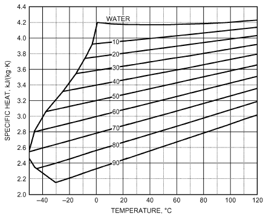

*Fig. 10 Specific Heat of Aqueous Solutions of Industrially Inhibited Ethylene Glycol (vol. %)*

> (Dow Chemical 2001b)

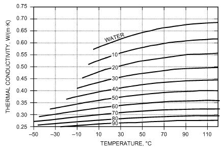

*Fig. 11 Thermal Conductivity of Aqueous Solutions of Industrially Inhibited Ethylene Glycol (vol. %)*

> (Dow Chemical 2001b)

### Corrosion Inhibition

Interestingly, ethylene glycol and propylene glycol, when not diluted with water, are actually less corrosive than water is with common construction metals. However, once diluted with water (as is typical), all aqueous glycol solutions are more corrosive than the water from which they are prepared: when uninhibited glycols thermally degrade and oxidize with use, they form acidic degradation products, which create an increasingly more corrosive environment if corrosion inhibitors and pH buffering compounds are not present. The amount of oxidation is influenced by temperature, degree of aeration, and type of metal components to which the glycol solution is exposed. In general, hydronic heating systems cause more degradation of glycol-based heat transfer fluids than do chilled-water systems. It is therefore necessary for glycol-based heat transfer fluids not only to use corrosion inhibitors that are effective at protecting common metals from corrosion, but also to contain additional additives to buffer or neutralize the acidic glycol degradation products that form during use. Corrosion inhibitors form a surface barrier that protects metal from attack, but their effectiveness is highly dependent on solution pH. Failure to compensate for glycol degradation

<!-- str. 885 -->

**Table 4 Freezing and Boiling Points of Aqueous Solutions of Ethylene Glycol Propylene Glycol**

| Percent Ethylene Glycol By Mass | Percent Ethylene Glycol By Volume | Freezing Point, °C | Boiling Point, °C at 100.7 kPa |
|---|---|---|---|
| 0.0 | 0.0 | 0.0 | 100.0 |
| 5.0 | 4.4 | –1.4 | 100.6 |
| 10.0 | 8.9 | –3.2 | 101.1 |
| 15.0 | 13.6 | –5.4 | 101.7 |
| 20.0 | 18.1 | –7.8 | 102.2 |
| 21.0 | 19.2 | –8.4 | 102.2 |
| 22.0 | 20.1 | –8.9 | 102.2 |
| 23.0 | 21.0 | –9.5 | 102.8 |
| 24.0 | 22.0 | –10.2 | 102.8 |
| 25.0 | 22.9 | –10.7 | 103.3 |
| 26.0 | 23.9 | –11.4 | 103.3 |
| 27.0 | 24.8 | –12.0 | 103.3 |
| 28.0 | 25.8 | –12.7 | 103.9 |
| 29.0 | 26.7 | –13.3 | 103.9 |
| 30.0 | 27.7 | –14.1 | 104.4 |
| 31.0 | 28.7 | –14.8 | 104.4 |
| 32.0 | 29.6 | –15.4 | 104.4 |
| 33.0 | 30.6 | –16.2 | 104.4 |
| 34.0 | 31.6 | –17.0 | 104.4 |
| 35.0 | 32.6 | –17.9 | 105.0 |
| 36.0 | 33.5 | –18.6 | 105.0 |
| 37.0 | 34.5 | –19.4 | 105.0 |
| 38.0 | 35.5 | –20.3 | 105.0 |
| 39.0 | 36.5 | –21.3 | 105.0 |
| 40.0 | 37.5 | –22.3 | 105.6 |
| 41.0 | 38.5 | –23.2 | 105.6 |
| 42.0 | 39.5 | –24.3 | 105.6 |
| 43.0 | 40.5 | –25.3 | 106.1 |
| 44.0 | 41.5 | –26.4 | 106.1 |
| 45.0 | 42.5 | –27.5 | 106.7 |
| 46.0 | 43.5 | –28.8 | 106.7 |
| 47.0 | 44.5 | –29.8 | 106.7 |
| 48.0 | 45.5 | –31.1 | 106.7 |
| 49.0 | 46.6 | –32.6 | 106.7 |
| 50.0 | 47.6 | –33.8 | 107.2 |
| 51.0 | 48.6 | –35.1 | 107.2 |
| 52.0 | 49.6 | –36.4 | 107.2 |
| 53.0 | 50.6 | –37.9 | 107.8 |
| 54.0 | 51.6 | –39.3 | 107.8 |
| 55.0 | 52.7 | –41.1 | 108.3 |
| 56.0 | 53.7 | –42.6 | 108.3 |
| 57.0 | 54.7 | –44.2 | 108.9 |
| 58.0 | 55.7 | –45.6 | 108.9 |
| 59.0 | 56.8 | –47.1 | 109.4 |
| 60.0 | 57.8 | –48.3 | 110.0 |
| 65.0 | 62.8 | * | 112.8 |
| 70.0 | 68.3 | * | 116.7 |
| 75.0 | 73.6 | * | 120.0 |
| 80.0 | 78.9 | –46.8 | 123.9 |
| 85.0 | 84.3 | –36.9 | 133.9 |
| 90.0 | 89.7 | –29.8 | 140.6 |
| 95.0 | 95.0 | –19.4 | 158.3 |

Source: Dow Chemical (2001b)

*Freezing points are below –50°C.

**Table 5 Freezing and Boiling Points of Aqueous Solutions of Ethylene Glycol Propylene Glycol**

| Percent Propylene Glycol By Mass | Percent Propylene Glycol By Volume | Freezing Point, °C | Boiling Point, °C at 100.7 kPa |
|---|---|---|---|
| 0.0 | 0.0 | 0.0 | 100.0 |
| 5.0 | 4.8 | –1.6 | 100.0 |
| 10.0 | 9.6 | –3.3 | 100.0 |
| 15.0 | 14.5 | –5.1 | 100.0 |
| 20.0 | 19.4 | –7.1 | 100.6 |
| 21.0 | 20.4 | –7.6 | 100.6 |
| 22.0 | 21.4 | –8.0 | 100.6 |
| 23.0 | 22.4 | –8.6 | 100.6 |
| 24.0 | 23.4 | –9.1 | 100.6 |
| 25.0 | 24.4 | –9.6 | 101.1 |
| 26.0 | 25.3 | –10.2 | 101.1 |
| 27.0 | 26.4 | –10.8 | 101.1 |
| 28.0 | 27.4 | –11.4 | 101.7 |
| 29.0 | 28.4 | –12.0 | 101.7 |
| 30.0 | 29.4 | –12.7 | 102.2 |
| 31.0 | 30.4 | –13.4 | 102.2 |
| 32.0 | 31.4 | –14.1 | 102.2 |
| 33.0 | 32.4 | –14.8 | 102.2 |
| 34.0 | 33.5 | –15.6 | 102.2 |
| 35.0 | 34.4 | –16.4 | 102.8 |
| 36.0 | 35.5 | –17.3 | 102.8 |
| 37.0 | 36.5 | –18.2 | 102.8 |
| 38.0 | 37.5 | –19.1 | 103.3 |
| 39.0 | 38.5 | –20.1 | 103.3 |
| 40.0 | 39.6 | –21.1 | 103.9 |
| 41.0 | 40.6 | –22.1 | 103.9 |
| 42.0 | 41.6 | –23.2 | 103.9 |
| 43.0 | 42.6 | –24.3 | 103.9 |
| 44.0 | 43.7 | –25.5 | 103.9 |
| 45.0 | 44.7 | –26.7 | 104.4 |
| 46.0 | 45.7 | –27.9 | 104.4 |
| 47.0 | 46.8 | –29.3 | 104.4 |
| 48.0 | 47.8 | –30.6 | 105.0 |
| 49.0 | 48.9 | –32.1 | 105.0 |
| 50.0 | 49.9 | –33.5 | 105.6 |
| 51.0 | 50.9 | –35.0 | 105.6 |
| 52.0 | 51.9 | –36.6 | 105.6 |
| 53.0 | 53.0 | –38.2 | 106.1 |
| 54.0 | 54.0 | –39.8 | 106.1 |
| 55.0 | 55.0 | –41.6 | 106.1 |
| 56.0 | 56.0 | –43.3 | 106.1 |
| 57.0 | 57.0 | –45.2 | 106.7 |
| 58.0 | 58.0 | –47.1 | 106.7 |
| 59.0 | 59.0 | –49.0 | 106.7 |
| 60.0 | 60.0 | –51.1 | 107.2 |
| 65.0 | 65.0 | * | 108.3 |
| 70.0 | 70.0 | * | 110.0 |
| 75.0 | 75.0 | * | 113.9 |
| 80.0 | 80.0 | * | 118.3 |
| 85.0 | 85.0 | * | 125.0 |
| 90.0 | 90.0 | * | 132.2 |
| 95.0 | 95.0 | * | 154.4 |

Source: Dow Chemical (2001a)

*Above 60% by mass, solutions do not freeze but become a glass.

<!-- str. 886 -->

**Table 6 Density of Aqueous Solutions of Ethylene Glycol**

| Temperature, °C | 10% | 20% | Concentrations in Volume Percent Ethylene Glycol 30% | Concentrations in Volume Percent Ethylene Glycol 40% | Concentrations in Volume Percent Ethylene Glycol 50% | Concentrations in Volume Percent Ethylene Glycol 60% | Concentrations in Volume Percent Ethylene Glycol 70% | 80% | 90% |
|---|---|---|---|---|---|---|---|---|---|
| –35 |  |  |  |  | 1089.94 | 1104.60 | 1118.61 | 1132.11 |  |
| –30 |  |  |  |  | 1089.04 | 1103.54 | 1117.38 | 1130.72 |  |
| –25 |  |  |  |  | 1088.01 | 1102.36 | 1116.04 | 1129.21 | 1141.87 |
| –20 |  |  |  | 1071.98 | 1086.87 | 1101.06 | 1114.58 | 1127.57 | 1140.07 |
| –15 |  |  |  | 1070.87 | 1085.61 | 1099.64 | 1112.99 | 1125.82 | 1138.14 |
| –10 |  |  | 1054.31 | 1069.63 | 1084.22 | 1098.09 | 1111.28 | 1123.94 | 1136.09 |
| –5 |  | 1036.85 | 1053.11 | 1068.28 | 1082.71 | 1096.43 | 1109.45 | 1121.94 | 1133.91 |
| 0 | 1018.73 | 1035.67 | 1051.78 | 1066.80 | 1081.08 | 1094.64 | 1107.50 | 1119.82 | 1131.62 |
| 5 | 1017.57 | 1034.36 | 1050.33 | 1065.21 | 1079.33 | 1092.73 | 1105.43 | 1117.58 | 1129.20 |
| 10 | 1016.28 | 1032.94 | 1048.76 | 1063.49 | 1077.46 | 1090.70 | 1103.23 | 1115.22 | 1126.67 |
| 15 | 1014.87 | 1031.39 | 1047.07 | 1061.65 | 1075.46 | 1088.54 | 1100.92 | 1112.73 | 1124.01 |
| 20 | 1013.34 | 1029.72 | 1045.25 | 1059.68 | 1073.35 | 1086.27 | 1098.48 | 1110.13 | 1121.23 |
| 25 | 1011.69 | 1027.93 | 1043.32 | 1057.60 | 1071.11 | 1083.87 | 1095.92 | 1107.40 | 1118.32 |
| 30 | 1009.92 | 1026.02 | 1041.26 | 1055.39 | 1068.75 | 1081.35 | 1093.24 | 1104.55 | 1115.30 |
| 35 | 1008.02 | 1023.99 | 1039.08 | 1053.07 | 1066.27 | 1078.71 | 1090.43 | 1101.58 | 1112.15 |
| 40 | 1006.01 | 1021.83 | 1036.78 | 1050.62 | 1063.66 | 1075.95 | 1087.51 | 1098.48 | 1108.89 |
| 45 | 1003.87 | 1019.55 | 1034.36 | 1048.05 | 1060.94 | 1073.07 | 1084.46 | 1095.27 | 1105.50 |
| 50 | 1001.61 | 1017.16 | 1031.81 | 1045.35 | 1058.09 | 1070.06 | 1081.30 | 1091.93 | 1101.99 |
| 55 | 999.23 | 1014.64 | 1029.15 | 1042.54 | 1055.13 | 1066.94 | 1078.01 | 1088.48 | 1098.36 |
| 60 | 996.72 | 1011.99 | 1026.36 | 1039.61 | 1052.04 | 1063.69 | 1074.60 | 1084.90 | 1094.60 |
| 65 | 994.10 | 1009.23 | 1023.45 | 1036.55 | 1048.83 | 1060.32 | 1071.06 | 1081.20 | 1090.73 |
| 70 | 991.35 | 1006.35 | 1020.42 | 1033.37 | 1045.49 | 1056.83 | 1067.41 | 1077.37 | 1086.73 |
| 75 | 988.49 | 1003.34 | 1017.27 | 1030.07 | 1042.04 | 1053.22 | 1063.64 | 1073.43 | 1082.61 |
| 80 | 985.50 | 1000.21 | 1014.00 | 1026.65 | 1038.46 | 1049.48 | 1059.74 | 1069.36 | 1078.37 |
| 85 | 982.39 | 996.96 | 1010.60 | 1023.10 | 1034.77 | 1045.63 | 1055.72 | 1065.18 | 1074.01 |
| 90 | 979.15 | 993.59 | 1007.09 | 1019.44 | 1030.95 | 1041.65 | 1051.58 | 1060.87 | 1069.53 |
| 95 | 975.80 | 990.10 | 1003.45 | 1015.65 | 1027.01 | 1037.55 | 1047.32 | 1056.44 | 1064.92 |
| 100 | 972.32 | 986.48 | 999.69 | 1011.74 | 1022.95 | 1033.33 | 1042.93 | 1051.88 | 1060.20 |
| 105 | 968.73 | 982.75 | 995.81 | 1007.71 | 1018.76 | 1028.99 | 1038.43 | 1047.21 | 1055.35 |
| 110 | 965.01 | 978.89 | 991.81 | 1003.56 | 1014.46 | 1024.52 | 1033.80 | 1042.41 | 1050.38 |
| 115 | 961.17 | 974.91 | 987.68 | 999.29 | 1010.03 | 1019.94 | 1029.05 | 1037.50 | 1045.29 |
| 120 | 957.21 | 970.81 | 983.43 | 994.90 | 1005.48 | 1015.23 | 1024.18 | 1032.46 | 1040.08 |
| 125 | 953.12 | 966.59 | 979.07 | 990.38 | 1000.81 | 1010.40 | 1019.19 | 1027.30 | 1034.74 |

Source: Dow Chemical (2001b) Note: Density in kg/m3.

**Table 7 Specific Heat of Aqueous Solutions of Ethylene Glycol**

| Temperature, °C | 10% | 20% | Concentrations in Volume Percent Ethylene Glycol 30% | Concentrations in Volume Percent Ethylene Glycol 40% | Concentrations in Volume Percent Ethylene Glycol 50% | Concentrations in Volume Percent Ethylene Glycol 60% | Concentrations in Volume Percent Ethylene Glycol 70% | 80% | 90% |
|---|---|---|---|---|---|---|---|---|---|
| –35 |  |  |  |  | 3.068 | 2.844 | 2.612 | 2.370 |  |
| –30 |  |  |  |  | 3.088 | 2.866 | 2.636 | 2.397 |  |
| –25 |  |  |  |  | 3.107 | 2.888 | 2.660 | 2.423 | 2.177 |
| –20 |  |  |  | 3.334 | 3.126 | 2.909 | 2.685 | 2.450 | 2.206 |
| –15 |  |  |  | 3.351 | 3.145 | 2.931 | 2.709 | 2.477 | 2.235 |
| –10 |  |  | 3.560 | 3.367 | 3.165 | 2.953 | 2.733 | 2.503 | 2.264 |
| –5 |  | 3.757 | 3.574 | 3.384 | 3.184 | 2.975 | 2.757 | 2.530 | 2.293 |
| 0 | 3.937 | 3.769 | 3.589 | 3.401 | 3.203 | 2.997 | 2.782 | 2.556 | 2.322 |
| 5 | 3.946 | 3.780 | 3.603 | 3.418 | 3.223 | 3.018 | 2.806 | 2.583 | 2.351 |
| 10 | 3.954 | 3.792 | 3.617 | 3.435 | 3.242 | 3.040 | 2.830 | 2.610 | 2.380 |
| 15 | 3.963 | 3.803 | 3.631 | 3.451 | 3.261 | 3.062 | 2.854 | 2.636 | 2.409 |
| 20 | 3.972 | 3.815 | 3.645 | 3.468 | 3.281 | 3.084 | 2.878 | 2.663 | 2.438 |
| 25 | 3.981 | 3.826 | 3.660 | 3.485 | 3.300 | 3.106 | 2.903 | 2.690 | 2.467 |
| 30 | 3.989 | 3.838 | 3.674 | 3.502 | 3.319 | 3.127 | 2.927 | 2.716 | 2.496 |
| 35 | 3.998 | 3.849 | 3.688 | 3.518 | 3.339 | 3.149 | 2.951 | 2.743 | 2.525 |
| 40 | 4.007 | 3.861 | 3.702 | 3.535 | 3.358 | 3.171 | 2.975 | 2.770 | 2.554 |
| 45 | 4.015 | 3.872 | 3.716 | 3.552 | 3.377 | 3.193 | 3.000 | 2.796 | 2.583 |
| 50 | 4.024 | 3.884 | 3.730 | 3.569 | 3.396 | 3.215 | 3.024 | 2.823 | 2.612 |
| 55 | 4.033 | 3.895 | 3.745 | 3.585 | 3.416 | 3.236 | 3.048 | 2.850 | 2.641 |
| 60 | 4.042 | 3.907 | 3.759 | 3.602 | 3.435 | 3.258 | 3.072 | 2.876 | 2.670 |
| 65 | 4.050 | 3.918 | 3.773 | 3.619 | 3.454 | 3.280 | 3.097 | 2.903 | 2.699 |
| 70 | 4.059 | 3.930 | 3.787 | 3.636 | 3.474 | 3.302 | 3.121 | 2.929 | 2.728 |
| 75 | 4.068 | 3.941 | 3.801 | 3.653 | 3.493 | 3.324 | 3.145 | 2.956 | 2.757 |
| 80 | 4.077 | 3.953 | 3.816 | 3.669 | 3.512 | 3.345 | 3.169 | 2.983 | 2.786 |
| 85 | 4.085 | 3.964 | 3.830 | 3.686 | 3.532 | 3.367 | 3.193 | 3.009 | 2.815 |
| 90 | 4.094 | 3.976 | 3.844 | 3.703 | 3.551 | 3.389 | 3.218 | 3.036 | 2.844 |
| 95 | 4.103 | 3.987 | 3.858 | 3.720 | 3.570 | 3.411 | 3.242 | 3.063 | 2.873 |
| 100 | 4.112 | 3.999 | 3.872 | 3.736 | 3.590 | 3.433 | 3.266 | 3.089 | 2.902 |
| 105 | 4.120 | 4.010 | 3.886 | 3.753 | 3.609 | 3.454 | 3.290 | 3.116 | 2.931 |
| 110 | 4.129 | 4.022 | 3.901 | 3.770 | 3.628 | 3.476 | 3.315 | 3.143 | 2.960 |
| 115 | 4.138 | 4.033 | 3.915 | 3.787 | 3.647 | 3.498 | 3.339 | 3.169 | 2.989 |
| 120 | 4.147 | 4.045 | 3.929 | 3.804 | 3.667 | 3.520 | 3.363 | 3.196 | 3.018 |
| 125 | 4.155 | 4.056 | 3.943 | 3.820 | 3.686 | 3.542 | 3.387 | 3.223 | 3.047 |

Source: Dow Chemical (2001b) Note: Specific heat in kJ/(kg·K).

<!-- str. 887 -->

**Table 8 Thermal Conductivity of Aqueous Solutions of Ethylene Glycol**

| Temperature, °C | 10 | 20 | Concentrations in Volume Percent Ethylene Glycol 30 | Concentrations in Volume Percent Ethylene Glycol 40 | Concentrations in Volume Percent Ethylene Glycol 50 | Concentrations in Volume Percent Ethylene Glycol 60 | Concentrations in Volume Percent Ethylene Glycol 70 | 80 | 90 |
|---|---|---|---|---|---|---|---|---|---|
| –35 |  |  |  |  |  | 0.300 | 0.279 | 0.262 |  |
| –30 |  |  |  |  | 0.328 | 0.303 | 0.282 | 0.264 |  |
| –25 |  |  |  |  | 0.332 | 0.306 | 0.284 | 0.266 | 0.252 |
| –20 |  |  |  | 0.366 | 0.336 | 0.310 | 0.287 | 0.268 | 0.253 |
| –15 |  |  |  | 0.371 | 0.340 | 0.313 | 0.289 | 0.270 | 0.255 |
| –10 |  |  | 0.411 | 0.376 | 0.344 | 0.316 | 0.292 | 0.271 | 0.256 |
| –5 |  | 0.458 | 0.417 | 0.381 | 0.348 | 0.319 | 0.294 | 0.273 | 0.257 |
| 0 | 0.512 | 0.466 | 0.423 | 0.386 | 0.352 | 0.322 | 0.297 | 0.275 | 0.259 |
| 5 | 0.520 | 0.472 | 0.429 | 0.391 | 0.356 | 0.325 | 0.299 | 0.277 | 0.260 |
| 10 | 0.528 | 0.479 | 0.435 | 0.395 | 0.360 | 0.328 | 0.301 | 0.278 | 0.261 |
| 15 | 0.535 | 0.486 | 0.440 | 0.400 | 0.363 | 0.331 | 0.303 | 0.280 | 0.262 |
| 20 | 0.543 | 0.492 | 0.445 | 0.404 | 0.366 | 0.334 | 0.305 | 0.281 | 0.263 |
| 25 | 0.550 | 0.498 | 0.450 | 0.408 | 0.370 | 0.336 | 0.307 | 0.283 | 0.264 |
| 30 | 0.556 | 0.503 | 0.455 | 0.412 | 0.373 | 0.338 | 0.309 | 0.284 | 0.265 |
| 35 | 0.563 | 0.509 | 0.459 | 0.415 | 0.376 | 0.341 | 0.311 | 0.285 | 0.266 |
| 40 | 0.569 | 0.514 | 0.463 | 0.419 | 0.378 | 0.343 | 0.312 | 0.286 | 0.267 |
| 45 | 0.574 | 0.518 | 0.467 | 0.422 | 0.381 | 0.345 | 0.314 | 0.288 | 0.268 |
| 50 | 0.579 | 0.523 | 0.471 | 0.425 | 0.383 | 0.347 | 0.315 | 0.289 | 0.268 |
| 55 | 0.584 | 0.527 | 0.474 | 0.427 | 0.385 | 0.348 | 0.316 | 0.289 | 0.269 |
| 60 | 0.588 | 0.530 | 0.477 | 0.430 | 0.387 | 0.350 | 0.317 | 0.290 | 0.270 |
| 65 | 0.592 | 0.534 | 0.480 | 0.432 | 0.389 | 0.351 | 0.318 | 0.291 | 0.270 |
| 70 | 0.596 | 0.537 | 0.483 | 0.434 | 0.391 | 0.352 | 0.319 | 0.292 | 0.271 |
| 75 | 0.599 | 0.540 | 0.485 | 0.436 | 0.392 | 0.354 | 0.320 | 0.292 | 0.271 |
| 80 | 0.602 | 0.542 | 0.487 | 0.438 | 0.394 | 0.355 | 0.321 | 0.293 | 0.271 |
| 85 | 0.605 | 0.544 | 0.489 | 0.439 | 0.395 | 0.355 | 0.322 | 0.293 | 0.272 |
| 90 | 0.607 | 0.546 | 0.490 | 0.440 | 0.396 | 0.356 | 0.322 | 0.294 | 0.272 |
| 95 | 0.609 | 0.548 | 0.491 | 0.441 | 0.396 | 0.357 | 0.322 | 0.294 | 0.272 |
| 100 | 0.610 | 0.549 | 0.493 | 0.442 | 0.397 | 0.357 | 0.323 | 0.294 | 0.272 |
| 105 | 0.612 | 0.550 | 0.493 | 0.443 | 0.398 | 0.358 | 0.323 | 0.294 | 0.272 |
| 110 | 0.613 | 0.551 | 0.494 | 0.443 | 0.398 | 0.358 | 0.323 | 0.294 | 0.272 |
| 115 | 0.614 | 0.552 | 0.495 | 0.444 | 0.398 | 0.358 | 0.323 | 0.294 | 0.272 |
| 120 | 0.614 | 0.552 | 0.495 | 0.444 | 0.398 | 0.358 | 0.323 | 0.294 | 0.272 |
| 125 | 0.615 | 0.552 | 0.495 | 0.444 | 0.398 | 0.358 | 0.323 | 0.294 | 0.271 |

Source: Dow Chemical (2001b) Note: Thermal conductivity in W/(m·K).

| 10 | 20 | 30 | 40 | 50 60 | 70 | 80 | 90 |
|---|---|---|---|---|---|---|---|
|  |  |  |  | 0.300 | 0.279 | 0.262 |  |
|  |  |  |  | 0.328 0.303 | 0.282 | 0.264 |  |
|  |  |  |  | 0.332 0.306 | 0.284 | 0.266 | 0.252 |
|  |  |  | 0.366 | 0.336 0.310 | 0.287 | 0.268 | 0.253 |
|  |  |  | 0.371 | 0.340 0.313 | 0.289 | 0.270 | 0.255 |
|  |  | 0.411 | 0.376 | 0.344 0.316 | 0.292 | 0.271 | 0.256 |
|  | 0.458 | 0.417 | 0.381 | 0.348 0.319 | 0.294 | 0.273 | 0.257 |
| 0.512 | 0.466 | 0.423 | 0.386 | 0.352 0.322 | 0.297 | 0.275 | 0.259 |
| 0.520 | 0.472 | 0.429 | 0.391 | 0.356 0.325 | 0.299 | 0.277 | 0.260 |
| 0.528 | 0.479 | 0.435 | 0.395 | 0.360 0.328 | 0.301 | 0.278 | 0.261 |
| 0.535 | 0.486 | 0.440 | 0.400 | 0.363 0.331 | 0.303 | 0.280 | 0.262 |
| 0.543 | 0.492 | 0.445 | 0.404 | 0.366 0.334 | 0.305 | 0.281 | 0.263 |
| 0.550 | 0.498 | 0.450 | 0.408 | 0.370 0.336 | 0.307 | 0.283 | 0.264 |
| 0.556 | 0.503 | 0.455 | 0.412 | 0.373 0.338 | 0.309 | 0.284 | 0.265 |
| 0.563 | 0.509 | 0.459 | 0.415 | 0.376 0.341 | 0.311 | 0.285 | 0.266 |
| 0.569 | 0.514 | 0.463 | 0.419 | 0.378 0.343 | 0.312 | 0.286 | 0.267 |
| 0.574 | 0.518 | 0.467 | 0.422 | 0.381 0.345 | 0.314 | 0.288 | 0.268 |
| 0.579 | 0.523 | 0.471 | 0.425 | 0.383 0.347 | 0.315 | 0.289 | 0.268 |
| 0.584 | 0.527 | 0.474 | 0.427 | 0.385 0.348 | 0.316 | 0.289 | 0.269 |
| 0.588 | 0.530 | 0.477 | 0.430 | 0.387 0.350 | 0.317 | 0.290 | 0.270 |
| 0.592 | 0.534 | 0.480 | 0.432 | 0.389 0.351 | 0.318 | 0.291 | 0.270 |
| 0.596 | 0.537 | 0.483 | 0.434 | 0.391 0.352 | 0.319 | 0.292 | 0.271 |
| 0.599 | 0.540 | 0.485 | 0.436 | 0.392 0.354 | 0.320 | 0.292 | 0.271 |
| 0.602 | 0.542 | 0.487 | 0.438 | 0.394 0.355 | 0.321 | 0.293 | 0.271 |
| 0.605 | 0.544 | 0.489 | 0.439 | 0.395 0.355 | 0.322 | 0.293 | 0.272 |
| 0.607 | 0.546 | 0.490 | 0.440 | 0.396 0.356 | 0.322 | 0.294 | 0.272 |
| 0.609 | 0.548 | 0.491 | 0.441 | 0.396 0.357 | 0.322 | 0.294 | 0.272 |
| 0.610 | 0.549 | 0.493 | 0.442 | 0.397 0.357 | 0.323 | 0.294 | 0.272 |
| 0.612 | 0.550 | 0.493 | 0.443 | 0.398 0.358 | 0.323 | 0.294 | 0.272 |
| 0.613 | 0.551 | 0.494 | 0.443 | 0.398 0.358 | 0.323 | 0.294 | 0.272 |
| 0.614 | 0.552 | 0.495 | 0.444 | 0.398 0.358 | 0.323 | 0.294 | 0.272 |
| 0.614 | 0.552 | 0.495 | 0.444 | 0.398 0.358 | 0.323 | 0.294 | 0.272 |
| 0.615 | 0.552 | 0.495 | 0.444 | 0.398 0.358 | 0.323 | 0.294 | 0.271 |
| l (2001b) |  |  |  | Note: Thermal conductivity in W/(m·K). |  |  |  |
|  | Table 9 | Viscosity of Aqueous Solutions of Ethylene Glycol |  |  |  |  |  |
| **Concentrations in Volume Percent Ethylene Glycol** |  |  |  |  |  |  |  |

10 20 30 40 50 60 70 80 90 66.93 93.44 133.53 191.09 43.98 65.25 96.57 141.02 30.50 46.75 70.38 102.21 196.87 15.75 22.07 34.28 51.94 74.53 128.43 11.74 16.53 25.69 38.88 55.09 87.52 6.19 9.06 12.74 19.62 29.53 41.36 61.85 3.65 5.03 7.18 10.05 15.25 22.76 31.56 45.08 2.08 3.02 4.15 5.83 8.09 12.05 17.79 24.44 33.74 1.79 2.54 3.48 4.82 6.63 9.66 14.09 19.20 25.84 1.56 2.18 2.95 4.04 5.50 7.85 11.31 15.29 20.18 1.37 1.89 2.53 3.44 4.63 6.46 9.18 12.33 16.04 1.21 1.65 2.20 2.96 3.94 5.38 7.53 10.05 12.95 1.08 1.46 1.92 2.57 3.39 4.52 6.24 8.29 10.59 0.97 1.30 1.69 2.26 2.94 3.84 5.23 6.90 8.77 0.88 1.17 1.50 1.99 2.56 3.29 4.42 5.79 7.34 0.80 1.06 1.34 1.77 2.26 2.84 3.76 4.91 6.21 0.73 0.96 1.21 1.59 2.00 2.47 3.23 4.19 5.30 0.67 0.88 1.09 1.43 1.78 2.16 2.80 3.61 4.56 0.62 0.81 0.99 1.29 1.59 1.91 2.43 3.12 3.95 0.57 0.74 0.90 1.17 1.43 1.69 2.13 2.72 3.45 0.53 0.69 0.83 1.06 1.29 1.51 1.88 2.39 3.03 0.50 0.64 0.76 0.97 1.17 1.35 1.67 2.11 2.67 0.47 0.59 0.70 0.89 1.07 1.22 1.49 1.87 2.37 0.44 0.55 0.65 0.82 0.98 1.10 1.33 1.66 2.12 0.41 0.52 0.60 0.76 0.89 1.00 1.20 1.49 1.90 0.39 0.49 0.56 0.70 0.82 0.92 1.09 1.34 1.71 0.37 0.46 0.52 0.65 0.76 0.84 0.99 1.21 1.54 0.35 0.43 0.49 0.60 0.70 0.77 0.90 1.10 1.40 0.33 0.40 0.46 0.56 0.65 0.71 0.82 1.00 1.27 0.32 0.38 0.43 0.53 0.60 0.66 0.76 0.91 1.16 0.30 0.36 0.41 0.49 0.56 0.61 0.70 0.83 1.07 0.29 0.34 0.38 0.46 0.53 0.57 0.64 0.77 0.98 0.28 0.33 0.36 0.43 0.49 0.53 0.60 0.71 0.90

l (2001b) Note: Viscosity in mPa/s.

**Table 9 Viscosity of Aqueous Solutions of Ethylene Glycol**

| Temperature, °C | 10 | 20 | Concentrations in Volume Percent Ethylene Glycol 30 | Concentrations in Volume Percent Ethylene Glycol 40 | Concentrations in Volume Percent Ethylene Glycol 50 | Concentrations in Volume Percent Ethylene Glycol 60 | Concentrations in Volume Percent Ethylene Glycol 70 | 80 | 90 |
|---|---|---|---|---|---|---|---|---|---|
| –35 |  |  |  |  | 66.93 | 93.44 | 133.53 | 191.09 |  |
| –30 |  |  |  |  | 43.98 | 65.25 | 96.57 | 141.02 |  |
| –25 |  |  |  |  | 30.50 | 46.75 | 70.38 | 102.21 | 196.87 |
| –20 |  |  |  | 15.75 | 22.07 | 34.28 | 51.94 | 74.53 | 128.43 |
| –15 |  |  |  | 11.74 | 16.53 | 25.69 | 38.88 | 55.09 | 87.52 |
| –10 |  |  | 6.19 | 9.06 | 12.74 | 19.62 | 29.53 | 41.36 | 61.85 |
| –5 |  | 3.65 | 5.03 | 7.18 | 10.05 | 15.25 | 22.76 | 31.56 | 45.08 |
| 0 | 2.08 | 3.02 | 4.15 | 5.83 | 8.09 | 12.05 | 17.79 | 24.44 | 33.74 |
| 5 | 1.79 | 2.54 | 3.48 | 4.82 | 6.63 | 9.66 | 14.09 | 19.20 | 25.84 |
| 10 | 1.56 | 2.18 | 2.95 | 4.04 | 5.50 | 7.85 | 11.31 | 15.29 | 20.18 |
| 15 | 1.37 | 1.89 | 2.53 | 3.44 | 4.63 | 6.46 | 9.18 | 12.33 | 16.04 |
| 20 | 1.21 | 1.65 | 2.20 | 2.96 | 3.94 | 5.38 | 7.53 | 10.05 | 12.95 |
| 25 | 1.08 | 1.46 | 1.92 | 2.57 | 3.39 | 4.52 | 6.24 | 8.29 | 10.59 |
| 30 | 0.97 | 1.30 | 1.69 | 2.26 | 2.94 | 3.84 | 5.23 | 6.90 | 8.77 |
| 35 | 0.88 | 1.17 | 1.50 | 1.99 | 2.56 | 3.29 | 4.42 | 5.79 | 7.34 |
| 40 | 0.80 | 1.06 | 1.34 | 1.77 | 2.26 | 2.84 | 3.76 | 4.91 | 6.21 |
| 45 | 0.73 | 0.96 | 1.21 | 1.59 | 2.00 | 2.47 | 3.23 | 4.19 | 5.30 |
| 50 | 0.67 | 0.88 | 1.09 | 1.43 | 1.78 | 2.16 | 2.80 | 3.61 | 4.56 |
| 55 | 0.62 | 0.81 | 0.99 | 1.29 | 1.59 | 1.91 | 2.43 | 3.12 | 3.95 |
| 60 | 0.57 | 0.74 | 0.90 | 1.17 | 1.43 | 1.69 | 2.13 | 2.72 | 3.45 |
| 65 | 0.53 | 0.69 | 0.83 | 1.06 | 1.29 | 1.51 | 1.88 | 2.39 | 3.03 |
| 70 | 0.50 | 0.64 | 0.76 | 0.97 | 1.17 | 1.35 | 1.67 | 2.11 | 2.67 |
| 75 | 0.47 | 0.59 | 0.70 | 0.89 | 1.07 | 1.22 | 1.49 | 1.87 | 2.37 |
| 80 | 0.44 | 0.55 | 0.65 | 0.82 | 0.98 | 1.10 | 1.33 | 1.66 | 2.12 |
| 85 | 0.41 | 0.52 | 0.60 | 0.76 | 0.89 | 1.00 | 1.20 | 1.49 | 1.90 |
| 90 | 0.39 | 0.49 | 0.56 | 0.70 | 0.82 | 0.92 | 1.09 | 1.34 | 1.71 |
| 95 | 0.37 | 0.46 | 0.52 | 0.65 | 0.76 | 0.84 | 0.99 | 1.21 | 1.54 |
| 100 | 0.35 | 0.43 | 0.49 | 0.60 | 0.70 | 0.77 | 0.90 | 1.10 | 1.40 |
| 105 | 0.33 | 0.40 | 0.46 | 0.56 | 0.65 | 0.71 | 0.82 | 1.00 | 1.27 |
| 110 | 0.32 | 0.38 | 0.43 | 0.53 | 0.60 | 0.66 | 0.76 | 0.91 | 1.16 |
| 115 | 0.30 | 0.36 | 0.41 | 0.49 | 0.56 | 0.61 | 0.70 | 0.83 | 1.07 |
| 120 | 0.29 | 0.34 | 0.38 | 0.46 | 0.53 | 0.57 | 0.64 | 0.77 | 0.98 |
| 125 | 0.28 | 0.33 | 0.36 | 0.43 | 0.49 | 0.53 | 0.60 | 0.71 | 0.90 |

Source: Dow Chemical (2001b) Note: Viscosity in mPa/s.

<!-- str. 888 -->

**Table 10 Density of Aqueous Solutions of Industrially Inhibited Propylene Glycol**

| Temperature, °C | 10% | 20% | Concentrations in Volume Percent Propylene Glycol 30% | Concentrations in Volume Percent Propylene Glycol 40% | Concentrations in Volume Percent Propylene Glycol 50% | Concentrations in Volume Percent Propylene Glycol 60% | Concentrations in Volume Percent Propylene Glycol 70% | 80% | 90% |
|---|---|---|---|---|---|---|---|---|---|
| –35 |  |  |  |  |  | 1072.92 | 1079.67 | 1094.50 | 1092.46 |
| –30 |  |  |  |  |  | 1071.31 | 1077.82 | 1090.85 | 1088.82 |
| –25 |  |  |  |  | 1062.11 | 1069.58 | 1075.84 | 1087.18 | 1085.15 |
| –20 |  |  |  |  | 1060.49 | 1067.72 | 1073.74 | 1083.49 | 1081.46 |
| –15 |  |  |  | 1050.43 | 1058.73 | 1065.73 | 1071.51 | 1079.77 | 1077.74 |
| –10 |  |  | 1039.42 | 1048.79 | 1056.85 | 1063.61 | 1069.16 | 1076.04 | 1074.00 |
| –5 |  | 1027.24 | 1037.89 | 1047.02 | 1054.84 | 1061.37 | 1066.69 | 1072.27 | 1070.24 |
| 0 | 1013.85 | 1025.84 | 1036.24 | 1045.12 | 1052.71 | 1059.00 | 1064.09 | 1068.49 | 1066.46 |
| 5 | 1012.61 | 1024.32 | 1034.46 | 1043.09 | 1050.44 | 1056.50 | 1061.36 | 1064.68 | 1062.65 |
| 10 | 1011.24 | 1022.68 | 1032.55 | 1040.94 | 1048.04 | 1053.88 | 1058.51 | 1060.85 | 1058.82 |
| 15 | 1009.75 | 1020.91 | 1030.51 | 1038.65 | 1045.52 | 1051.13 | 1055.54 | 1057.00 | 1054.96 |
| 20 | 1008.13 | 1019.01 | 1028.35 | 1036.24 | 1042.87 | 1048.25 | 1052.44 | 1053.12 | 1051.09 |
| 25 | 1006.40 | 1016.99 | 1026.06 | 1033.70 | 1040.09 | 1045.24 | 1049.22 | 1049.22 | 1047.19 |
| 30 | 1004.54 | 1014.84 | 1023.64 | 1031.03 | 1037.18 | 1042.11 | 1045.87 | 1045.30 | 1043.26 |
| 35 | 1002.56 | 1012.56 | 1021.09 | 1028.23 | 1034.15 | 1038.85 | 1042.40 | 1041.35 | 1039.32 |
| 40 | 1000.46 | 1010.16 | 1018.42 | 1025.30 | 1030.98 | 1035.47 | 1038.81 | 1037.38 | 1035.35 |
| 45 | 998.23 | 1007.64 | 1015.62 | 1022.24 | 1027.69 | 1031.95 | 1035.09 | 1033.39 | 1031.35 |
| 50 | 995.88 | 1004.99 | 1012.69 | 1019.06 | 1024.27 | 1028.32 | 1031.25 | 1029.37 | 1027.34 |
| 55 | 993.41 | 1002.21 | 1009.63 | 1015.75 | 1020.72 | 1024.55 | 1027.28 | 1025.33 | 1023.30 |
| 60 | 990.82 | 999.31 | 1006.44 | 1012.30 | 1017.04 | 1020.66 | 1023.19 | 1021.27 | 1019.24 |
| 65 | 988.11 | 996.28 | 1003.13 | 1008.73 | 1013.23 | 1016.63 | 1018.97 | 1017.19 | 1015.15 |
| 70 | 985.27 | 993.12 | 999.69 | 1005.03 | 1009.30 | 1012.49 | 1014.63 | 1013.08 | 1011.04 |
| 75 | 982.31 | 989.85 | 996.12 | 1001.21 | 1005.24 | 1008.21 | 1010.16 | 1008.95 | 1006.91 |
| 80 | 979.23 | 986.44 | 992.42 | 997.25 | 1001.05 | 1003.81 | 1005.57 | 1004.79 | 1002.76 |
| 85 | 976.03 | 982.91 | 988.60 | 993.17 | 996.73 | 999.28 | 1000.86 | 1000.62 | 998.58 |
| 90 | 972.70 | 979.25 | 984.65 | 988.95 | 992.28 | 994.63 | 996.02 | 996.41 | 994.38 |
| 95 | 969.25 | 975.47 | 980.57 | 984.61 | 987.70 | 989.85 | 991.06 | 992.19 | 990.16 |
| 100 | 965.68 | 971.56 | 976.36 | 980.14 | 983.00 | 984.94 | 985.97 | 987.94 | 985.91 |
| 105 | 961.99 | 967.53 | 972.03 | 975.54 | 978.16 | 979.90 | 980.76 | 983.68 | 981.64 |
| 110 | 958.17 | 963.37 | 967.56 | 970.81 | 973.20 | 974.74 | 975.42 | 979.38 | 977.35 |
| 115 | 954.24 | 959.09 | 962.97 | 965.95 | 968.11 | 969.45 | 969.96 | 975.07 | 973.03 |
| 120 | 950.18 | 954.67 | 958.26 | 960.97 | 962.89 | 964.03 | 964.38 | 970.73 | 968.69 |
| 125 | 945.99 | 950.14 | 953.41 | 955.86 | 957.55 | 958.49 | 958.67 | 966.37 | 964.33 |

Source: Dow Chemical (2001a) Note: Density in kg/m3.

| 10% | 20% | 30% | 40% | 50% 60% | 70% | 80% | 90% |
|---|---|---|---|---|---|---|---|
|  |  |  |  | 1072.92 | 1079.67 | 1094.50 | 1092.46 |
|  |  |  |  | 1071.31 | 1077.82 | 1090.85 | 1088.82 |
|  |  |  |  | 1062.11 1069.58 | 1075.84 | 1087.18 | 1085.15 |
|  |  |  |  | 1060.49 1067.72 | 1073.74 | 1083.49 | 1081.46 |
|  |  |  | 1050.43 | 1058.73 1065.73 | 1071.51 | 1079.77 | 1077.74 |
|  |  | 1039.42 | 1048.79 | 1056.85 1063.61 | 1069.16 | 1076.04 | 1074.00 |
|  | 1027.24 | 1037.89 | 1047.02 | 1054.84 1061.37 | 1066.69 | 1072.27 | 1070.24 |
| 1013.85 | 1025.84 | 1036.24 | 1045.12 | 1052.71 1059.00 | 1064.09 | 1068.49 | 1066.46 |
| 1012.61 | 1024.32 | 1034.46 | 1043.09 | 1050.44 1056.50 | 1061.36 | 1064.68 | 1062.65 |
| 1011.24 | 1022.68 | 1032.55 | 1040.94 | 1048.04 1053.88 | 1058.51 | 1060.85 | 1058.82 |
| 1009.75 | 1020.91 | 1030.51 | 1038.65 | 1045.52 1051.13 | 1055.54 | 1057.00 | 1054.96 |
| 1008.13 | 1019.01 | 1028.35 | 1036.24 | 1042.87 1048.25 | 1052.44 | 1053.12 | 1051.09 |
| 1006.40 | 1016.99 | 1026.06 | 1033.70 | 1040.09 1045.24 | 1049.22 | 1049.22 | 1047.19 |
| 1004.54 | 1014.84 | 1023.64 | 1031.03 | 1037.18 1042.11 | 1045.87 | 1045.30 | 1043.26 |
| 1002.56 | 1012.56 | 1021.09 | 1028.23 | 1034.15 1038.85 | 1042.40 | 1041.35 | 1039.32 |
| 1000.46 | 1010.16 | 1018.42 | 1025.30 | 1030.98 1035.47 | 1038.81 | 1037.38 | 1035.35 |
| 998.23 | 1007.64 | 1015.62 | 1022.24 | 1027.69 1031.95 | 1035.09 | 1033.39 | 1031.35 |
| 995.88 | 1004.99 | 1012.69 | 1019.06 | 1024.27 1028.32 | 1031.25 | 1029.37 | 1027.34 |
| 993.41 | 1002.21 | 1009.63 | 1015.75 | 1020.72 1024.55 | 1027.28 | 1025.33 | 1023.30 |
| 990.82 | 999.31 | 1006.44 | 1012.30 | 1017.04 1020.66 | 1023.19 | 1021.27 | 1019.24 |
| 988.11 | 996.28 | 1003.13 | 1008.73 | 1013.23 1016.63 | 1018.97 | 1017.19 | 1015.15 |
| 985.27 | 993.12 | 999.69 | 1005.03 | 1009.30 1012.49 | 1014.63 | 1013.08 | 1011.04 |
| 982.31 | 989.85 | 996.12 | 1001.21 | 1005.24 1008.21 | 1010.16 | 1008.95 | 1006.91 |
| 979.23 | 986.44 | 992.42 | 997.25 | 1001.05 1003.81 | 1005.57 | 1004.79 | 1002.76 |
| 976.03 | 982.91 | 988.60 | 993.17 | 996.73 999.28 | 1000.86 | 1000.62 | 998.58 |
| 972.70 | 979.25 | 984.65 | 988.95 | 992.28 994.63 | 996.02 | 996.41 | 994.38 |
| 969.25 | 975.47 | 980.57 | 984.61 | 987.70 989.85 | 991.06 | 992.19 | 990.16 |
| 965.68 | 971.56 | 976.36 | 980.14 | 983.00 984.94 | 985.97 | 987.94 | 985.91 |
| 961.99 | 967.53 | 972.03 | 975.54 | 978.16 979.90 | 980.76 | 983.68 | 981.64 |
| 958.17 | 963.37 | 967.56 | 970.81 | 973.20 974.74 | 975.42 | 979.38 | 977.35 |
| 954.24 | 959.09 | 962.97 | 965.95 | 968.11 969.45 | 969.96 | 975.07 | 973.03 |
| 950.18 | 954.67 | 958.26 | 960.97 | 962.89 964.03 | 964.38 | 970.73 | 968.69 |
| 945.99 | 950.14 | 953.41 | 955.86 | 957.55 958.49 | 958.67 | 966.37 | 964.33 |
| l (2001a) |  |  |  | Note: Density in kg/m3. |  |  |  |
|  | Table 10 | Specific Heat of Aqueous Solutions of Propylene Glycol |  |  |  |  |  |
| **Concentrations in Volume Percent Propylene Glycol** |  |  |  |  |  |  |  |

10% 20% 30% 40% 50% 60% 70% 80% 90% 3.096 2.843 2.572 2.264 3.118 2.868 2.600 2.295 3.358 3.140 2.893 2.627 2.326 3.378 3.162 2.918 2.655 2.356 3.586 3.397 3.184 2.943 2.683 2.387 3.765 3.603 3.416 3.206 2.968 2.710 2.417 3.918 3.779 3.619 3.435 3.228 2.993 2.738 2.448 4.042 3.929 3.793 3.636 3.455 3.250 3.018 2.766 2.478 4.050 3.940 3.807 3.652 3.474 3.272 3.042 2.793 2.509 4.058 3.951 3.820 3.669 3.493 3.295 3.067 2.821 2.539 4.067 3.962 3.834 3.685 3.513 3.317 3.092 2.849 2.570 4.075 3.973 3.848 3.702 3.532 3.339 3.117 2.876 2.600 4.083 3.983 3.862 3.718 3.551 3.361 3.142 2.904 2.631 4.091 3.994 3.875 3.735 3.570 3.383 3.167 2.931 2.661 4.099 4.005 3.889 3.751 3.590 3.405 3.192 2.959 2.692 4.107 4.016 3.903 3.768 3.609 3.427 3.217 2.987 2.723 4.115 4.027 3.917 3.784 3.628 3.449 3.242 3.014 2.753 4.123 4.038 3.930 3.801 3.648 3.471 3.266 3.042 2.784 4.131 4.049 3.944 3.817 3.667 3.493 3.291 3.070 2.814 4.139 4.060 3.958 3.834 3.686 3.515 3.316 3.097 2.845 4.147 4.071 3.972 3.850 3.706 3.537 3.341 3.125 2.875 4.155 4.082 3.985 3.867 3.725 3.559 3.366 3.153 2.906 4.163 4.093 3.999 3.883 3.744 3.581 3.391 3.180 2.936 4.171 4.104 4.013 3.900 3.763 3.603 3.416 3.208 2.967 4.179 4.115 4.027 3.916 3.783 3.625 3.441 3.236 2.997 4.187 4.126 4.040 3.933 3.802 3.647 3.465 3.263 3.028 4.195 4.136 4.054 3.949 3.821 3.670 3.490 3.291 3.058 4.203 4.147 4.068 3.966 3.841 3.692 3.515 3.319 3.089 4.211 4.158 4.082 3.982 3.860 3.714 3.540 3.346 3.119 4.219 4.169 4.095 3.999 3.879 3.736 3.565 3.374 3.150 4.227 4.180 4.109 4.015 3.898 3.758 3.590 3.402 3.181 4.235 4.191 4.123 4.032 3.918 3.780 3.615 3.429 3.211 4.243 4.202 4.137 4.049 3.937 3.802 3.640 3.457 3.242

l (2001a) Note: Specific heat in kJ/(kg·K).

**Table 10 Specific Heat of Aqueous Solutions of Propylene Glycol**

| Temperature, °C | 10% | 20% | Concentrations in Volume Percent Propylene Glycol 30% | Concentrations in Volume Percent Propylene Glycol 40% | Concentrations in Volume Percent Propylene Glycol 50% | Concentrations in Volume Percent Propylene Glycol 60% | Concentrations in Volume Percent Propylene Glycol 70% | 80% | 90% |
|---|---|---|---|---|---|---|---|---|---|
| –35 |  |  |  |  |  | 3.096 | 2.843 | 2.572 | 2.264 |
| –30 |  |  |  |  |  | 3.118 | 2.868 | 2.600 | 2.295 |
| –25 |  |  |  |  | 3.358 | 3.140 | 2.893 | 2.627 | 2.326 |
| –20 |  |  |  |  | 3.378 | 3.162 | 2.918 | 2.655 | 2.356 |
| –15 |  |  |  | 3.586 | 3.397 | 3.184 | 2.943 | 2.683 | 2.387 |
| –10 |  |  | 3.765 | 3.603 | 3.416 | 3.206 | 2.968 | 2.710 | 2.417 |
| –5 |  | 3.918 | 3.779 | 3.619 | 3.435 | 3.228 | 2.993 | 2.738 | 2.448 |
| 0 | 4.042 | 3.929 | 3.793 | 3.636 | 3.455 | 3.250 | 3.018 | 2.766 | 2.478 |
| 5 | 4.050 | 3.940 | 3.807 | 3.652 | 3.474 | 3.272 | 3.042 | 2.793 | 2.509 |
| 10 | 4.058 | 3.951 | 3.820 | 3.669 | 3.493 | 3.295 | 3.067 | 2.821 | 2.539 |
| 15 | 4.067 | 3.962 | 3.834 | 3.685 | 3.513 | 3.317 | 3.092 | 2.849 | 2.570 |
| 20 | 4.075 | 3.973 | 3.848 | 3.702 | 3.532 | 3.339 | 3.117 | 2.876 | 2.600 |
| 25 | 4.083 | 3.983 | 3.862 | 3.718 | 3.551 | 3.361 | 3.142 | 2.904 | 2.631 |
| 30 | 4.091 | 3.994 | 3.875 | 3.735 | 3.570 | 3.383 | 3.167 | 2.931 | 2.661 |
| 35 | 4.099 | 4.005 | 3.889 | 3.751 | 3.590 | 3.405 | 3.192 | 2.959 | 2.692 |
| 40 | 4.107 | 4.016 | 3.903 | 3.768 | 3.609 | 3.427 | 3.217 | 2.987 | 2.723 |
| 45 | 4.115 | 4.027 | 3.917 | 3.784 | 3.628 | 3.449 | 3.242 | 3.014 | 2.753 |
| 50 | 4.123 | 4.038 | 3.930 | 3.801 | 3.648 | 3.471 | 3.266 | 3.042 | 2.784 |
| 55 | 4.131 | 4.049 | 3.944 | 3.817 | 3.667 | 3.493 | 3.291 | 3.070 | 2.814 |
| 60 | 4.139 | 4.060 | 3.958 | 3.834 | 3.686 | 3.515 | 3.316 | 3.097 | 2.845 |
| 65 | 4.147 | 4.071 | 3.972 | 3.850 | 3.706 | 3.537 | 3.341 | 3.125 | 2.875 |
| 70 | 4.155 | 4.082 | 3.985 | 3.867 | 3.725 | 3.559 | 3.366 | 3.153 | 2.906 |
| 75 | 4.163 | 4.093 | 3.999 | 3.883 | 3.744 | 3.581 | 3.391 | 3.180 | 2.936 |
| 80 | 4.171 | 4.104 | 4.013 | 3.900 | 3.763 | 3.603 | 3.416 | 3.208 | 2.967 |
| 85 | 4.179 | 4.115 | 4.027 | 3.916 | 3.783 | 3.625 | 3.441 | 3.236 | 2.997 |
| 90 | 4.187 | 4.126 | 4.040 | 3.933 | 3.802 | 3.647 | 3.465 | 3.263 | 3.028 |
| 95 | 4.195 | 4.136 | 4.054 | 3.949 | 3.821 | 3.670 | 3.490 | 3.291 | 3.058 |
| 100 | 4.203 | 4.147 | 4.068 | 3.966 | 3.841 | 3.692 | 3.515 | 3.319 | 3.089 |
| 105 | 4.211 | 4.158 | 4.082 | 3.982 | 3.860 | 3.714 | 3.540 | 3.346 | 3.119 |
| 110 | 4.219 | 4.169 | 4.095 | 3.999 | 3.879 | 3.736 | 3.565 | 3.374 | 3.150 |
| 115 | 4.227 | 4.180 | 4.109 | 4.015 | 3.898 | 3.758 | 3.590 | 3.402 | 3.181 |
| 120 | 4.235 | 4.191 | 4.123 | 4.032 | 3.918 | 3.780 | 3.615 | 3.429 | 3.211 |
| 125 | 4.243 | 4.202 | 4.137 | 4.049 | 3.937 | 3.802 | 3.640 | 3.457 | 3.242 |

Source: Dow Chemical (2001a) Note: Specific heat in kJ/(kg·K).

<!-- str. 889 -->

**Table 10 Thermal Conductivity of Aqueous Solutions of Propylene Glycol**

| Temperature, °C | 10 | 20 | Concentrations in Volume Percent Propylene Glycol 30 | Concentrations in Volume Percent Propylene Glycol 40 | Concentrations in Volume Percent Propylene Glycol 50 | Concentrations in Volume Percent Propylene Glycol 60 | Concentrations in Volume Percent Propylene Glycol 70 | 80 | 90 |
|---|---|---|---|---|---|---|---|---|---|
| –35 |  |  |  |  |  | 0.269 | 0.242 | 0.220 | 0.203 |
| –30 |  |  |  |  | 0.302 | 0.272 | 0.245 | 0.222 | 0.204 |
| –25 |  |  |  |  | 0.306 | 0.275 | 0.247 | 0.224 | 0.205 |
| –20 |  |  |  | 0.346 | 0.311 | 0.278 | 0.250 | 0.226 | 0.206 |
| –15 |  |  |  | 0.351 | 0.315 | 0.282 | 0.252 | 0.227 | 0.207 |
| –10 |  |  | 0.397 | 0.356 | 0.319 | 0.285 | 0.254 | 0.229 | 0.208 |
| –5 |  | 0.449 | 0.403 | 0.361 | 0.323 | 0.288 | 0.256 | 0.230 | 0.209 |
| 0 | 0.510 | 0.456 | 0.409 | 0.366 | 0.327 | 0.291 | 0.259 | 0.232 | 0.210 |
| 5 | 0.518 | 0.463 | 0.415 | 0.371 | 0.331 | 0.294 | 0.261 | 0.233 | 0.211 |
| 10 | 0.526 | 0.470 | 0.421 | 0.376 | 0.334 | 0.297 | 0.263 | 0.235 | 0.212 |
| 15 | 0.534 | 0.477 | 0.426 | 0.380 | 0.338 | 0.299 | 0.265 | 0.236 | 0.213 |
| 20 | 0.541 | 0.483 | 0.431 | 0.384 | 0.341 | 0.302 | 0.267 | 0.237 | 0.214 |
| 25 | 0.548 | 0.489 | 0.436 | 0.388 | 0.344 | 0.304 | 0.268 | 0.239 | 0.215 |
| 30 | 0.555 | 0.494 | 0.441 | 0.392 | 0.347 | 0.307 | 0.270 | 0.240 | 0.215 |
| 35 | 0.561 | 0.500 | 0.445 | 0.396 | 0.350 | 0.309 | 0.272 | 0.241 | 0.216 |
| 40 | 0.567 | 0.505 | 0.450 | 0.399 | 0.353 | 0.311 | 0.273 | 0.242 | 0.216 |
| 45 | 0.573 | 0.509 | 0.453 | 0.402 | 0.355 | 0.313 | 0.274 | 0.242 | 0.217 |
| 50 | 0.578 | 0.514 | 0.457 | 0.405 | 0.358 | 0.314 | 0.275 | 0.243 | 0.217 |
| 55 | 0.583 | 0.518 | 0.460 | 0.408 | 0.360 | 0.316 | 0.277 | 0.244 | 0.218 |
| 60 | 0.587 | 0.521 | 0.463 | 0.410 | 0.362 | 0.317 | 0.277 | 0.244 | 0.218 |
| 65 | 0.591 | 0.525 | 0.466 | 0.413 | 0.363 | 0.319 | 0.278 | 0.245 | 0.218 |
| 70 | 0.595 | 0.528 | 0.469 | 0.415 | 0.365 | 0.320 | 0.279 | 0.245 | 0.218 |
| 75 | 0.598 | 0.531 | 0.471 | 0.416 | 0.366 | 0.321 | 0.280 | 0.246 | 0.218 |
| 80 | 0.601 | 0.533 | 0.473 | 0.418 | 0.367 | 0.321 | 0.280 | 0.246 | 0.218 |
| 85 | 0.604 | 0.535 | 0.474 | 0.419 | 0.368 | 0.322 | 0.281 | 0.246 | 0.218 |
| 90 | 0.606 | 0.537 | 0.476 | 0.420 | 0.369 | 0.323 | 0.281 | 0.246 | 0.218 |
| 95 | 0.608 | 0.538 | 0.477 | 0.421 | 0.370 | 0.323 | 0.281 | 0.246 | 0.218 |
| 100 | 0.609 | 0.540 | 0.478 | 0.422 | 0.370 | 0.323 | 0.281 | 0.246 | 0.218 |
| 105 | 0.611 | 0.541 | 0.479 | 0.423 | 0.371 | 0.323 | 0.281 | 0.246 | 0.218 |
| 110 | 0.612 | 0.542 | 0.480 | 0.423 | 0.371 | 0.323 | 0.281 | 0.246 | 0.217 |
| 115 | 0.613 | 0.542 | 0.480 | 0.423 | 0.371 | 0.323 | 0.281 | 0.245 | 0.217 |
| 120 | 0.613 | 0.543 | 0.480 | 0.423 | 0.371 | 0.323 | 0.280 | 0.245 | 0.216 |

Source: Dow Chemical (2001a) Note: Thermal conductivity in W/(m·K).

| 10 | 20 | 30 | 40 | 50 60 70 | 80 | 90 |
|---|---|---|---|---|---|---|
|  |  |  |  | 0.269 0.242 | 0.220 | 0.203 |
|  |  |  |  | 0.302 0.272 0.245 | 0.222 | 0.204 |
|  |  |  |  | 0.306 0.275 0.247 | 0.224 | 0.205 |
|  |  |  | 0.346 | 0.311 0.278 0.250 | 0.226 | 0.206 |
|  |  |  | 0.351 | 0.315 0.282 0.252 | 0.227 | 0.207 |
|  |  | 0.397 | 0.356 | 0.319 0.285 0.254 | 0.229 | 0.208 |
|  | 0.449 | 0.403 | 0.361 | 0.323 0.288 0.256 | 0.230 | 0.209 |
| 0.510 | 0.456 | 0.409 | 0.366 | 0.327 0.291 0.259 | 0.232 | 0.210 |
| 0.518 | 0.463 | 0.415 | 0.371 | 0.331 0.294 0.261 | 0.233 | 0.211 |
| 0.526 | 0.470 | 0.421 | 0.376 | 0.334 0.297 0.263 | 0.235 | 0.212 |
| 0.534 | 0.477 | 0.426 | 0.380 | 0.338 0.299 0.265 | 0.236 | 0.213 |
| 0.541 | 0.483 | 0.431 | 0.384 | 0.341 0.302 0.267 | 0.237 | 0.214 |
| 0.548 | 0.489 | 0.436 | 0.388 | 0.344 0.304 0.268 | 0.239 | 0.215 |
| 0.555 | 0.494 | 0.441 | 0.392 | 0.347 0.307 0.270 | 0.240 | 0.215 |
| 0.561 | 0.500 | 0.445 | 0.396 | 0.350 0.309 0.272 | 0.241 | 0.216 |
| 0.567 | 0.505 | 0.450 | 0.399 | 0.353 0.311 0.273 | 0.242 | 0.216 |
| 0.573 | 0.509 | 0.453 | 0.402 | 0.355 0.313 0.274 | 0.242 | 0.217 |
| 0.578 | 0.514 | 0.457 | 0.405 | 0.358 0.314 0.275 | 0.243 | 0.217 |
| 0.583 | 0.518 | 0.460 | 0.408 | 0.360 0.316 0.277 | 0.244 | 0.218 |
| 0.587 | 0.521 | 0.463 | 0.410 | 0.362 0.317 0.277 | 0.244 | 0.218 |
| 0.591 | 0.525 | 0.466 | 0.413 | 0.363 0.319 0.278 | 0.245 | 0.218 |
| 0.595 | 0.528 | 0.469 | 0.415 | 0.365 0.320 0.279 | 0.245 | 0.218 |
| 0.598 | 0.531 | 0.471 | 0.416 | 0.366 0.321 0.280 | 0.246 | 0.218 |
| 0.601 | 0.533 | 0.473 | 0.418 | 0.367 0.321 0.280 | 0.246 | 0.218 |
| 0.604 | 0.535 | 0.474 | 0.419 | 0.368 0.322 0.281 | 0.246 | 0.218 |
| 0.606 | 0.537 | 0.476 | 0.420 | 0.369 0.323 0.281 | 0.246 | 0.218 |
| 0.608 | 0.538 | 0.477 | 0.421 | 0.370 0.323 0.281 | 0.246 | 0.218 |
| 0.609 | 0.540 | 0.478 | 0.422 | 0.370 0.323 0.281 | 0.246 | 0.218 |
| 0.611 | 0.541 | 0.479 | 0.423 | 0.371 0.323 0.281 | 0.246 | 0.218 |
| 0.612 | 0.542 | 0.480 | 0.423 | 0.371 0.323 0.281 | 0.246 | 0.217 |
| 0.613 | 0.542 | 0.480 | 0.423 | 0.371 0.323 0.281 | 0.245 | 0.217 |
| 0.613 | 0.543 | 0.480 | 0.423 | 0.371 0.323 0.280 | 0.245 | 0.216 |
| l (2001a) |  |  |  | Note: Thermal conductivity in W/(m·K). |  |  |
|  | Table 10 | Viscosity of Aqueous Solutions of Propylene Glycol |  |  |  |  |
| **Concentrations in Volume Percent Propylene Glycol** |  |  |  |  |  |  |

10 20 30 40 50 60 70 80 90 524.01 916.18 1434.22 3813.29 171.54 330.39 551.12 908.47 2071.34 109.69 211.43 340.09 575.92 1176.09 48.90 72.42 137.96 215.67 368.77 696.09 33.07 49.29 92.00 140.62 239.86 428.19 11.84 23.11 34.51 62.78 94.23 159.02 272.94 4.98 9.07 16.63 24.81 43.84 64.83 107.64 179.78 2.68 4.05 7.07 12.30 18.28 31.32 45.74 74.45 122.03 2.23 3.34 5.61 9.32 13.77 22.87 33.04 52.63 85.15 1.89 2.79 4.52 7.21 10.59 17.05 24.41 37.99 60.93 1.63 2.36 3.69 5.70 8.30 12.96 18.41 28.00 44.62 1.42 2.02 3.06 4.59 6.62 10.04 14.15 21.04 33.38 1.25 1.74 2.57 3.75 5.36 7.91 11.08 16.10 25.45 1.11 1.52 2.19 3.12 4.41 6.34 8.81 12.55 19.76 0.99 1.34 1.88 2.62 3.68 5.15 7.12 9.94 15.60 0.89 1.18 1.63 2.24 3.10 4.25 5.84 7.99 12.49 0.81 1.06 1.43 1.93 2.65 3.55 4.85 6.52 10.15 0.73 0.95 1.26 1.68 2.28 3.00 4.08 5.39 8.35 0.67 0.86 1.13 1.48 1.99 2.57 3.46 4.51 6.95 0.62 0.78 1.01 1.31 1.75 2.22 2.98 3.82 5.85 0.57 0.71 0.92 1.18 1.55 1.93 2.58 3.28 4.97 0.53 0.66 0.83 1.06 1.38 1.70 2.26 2.83 4.26 0.49 0.60 0.76 0.96 1.24 1.51 1.99 2.47 3.69 0.46 0.56 0.70 0.88 1.12 1.35 1.77 2.18 3.22 0.43 0.52 0.65 0.81 1.02 1.22 1.59 1.94 2.83 0.40 0.49 0.60 0.75 0.93 1.10 1.43 1.73 2.50 0.38 0.45 0.56 0.69 0.86 1.01 1.30 1.56 2.23 0.35 0.43 0.53 0.65 0.79 0.92 1.18 1.42 2.00 0.33 0.40 0.50 0.60 0.74 0.85 1.08 1.29 1.80 0.32 0.38 0.47 0.57 0.69 0.79 1.00 1.19 1.63 0.30 0.36 0.45 0.54 0.64 0.74 0.93 1.09 1.48 0.28 0.34 0.42 0.51 0.60 0.69 0.86 1.02 1.35

l (2001a) Note: Viscosity in mPa·s.

**Table 10 Viscosity of Aqueous Solutions of Propylene Glycol**

| Temperature, °C | 10 | 20 | Concentrations in Volume Percent Propylene Glycol 30 | Concentrations in Volume Percent Propylene Glycol 40 | Concentrations in Volume Percent Propylene Glycol 50 | Concentrations in Volume Percent Propylene Glycol 60 | Concentrations in Volume Percent Propylene Glycol 70 | 80 | 90 |
|---|---|---|---|---|---|---|---|---|---|
| –35 |  |  |  |  |  | 524.01 | 916.18 | 1434.22 | 3813.29 |
| –30 |  |  |  |  | 171.54 | 330.39 | 551.12 | 908.47 | 2071.34 |
| –25 |  |  |  |  | 109.69 | 211.43 | 340.09 | 575.92 | 1176.09 |
| –20 |  |  |  | 48.90 | 72.42 | 137.96 | 215.67 | 368.77 | 696.09 |
| –15 |  |  |  | 33.07 | 49.29 | 92.00 | 140.62 | 239.86 | 428.19 |
| –10 |  |  | 11.84 | 23.11 | 34.51 | 62.78 | 94.23 | 159.02 | 272.94 |
| –5 |  | 4.98 | 9.07 | 16.63 | 24.81 | 43.84 | 64.83 | 107.64 | 179.78 |
| 0 | 2.68 | 4.05 | 7.07 | 12.30 | 18.28 | 31.32 | 45.74 | 74.45 | 122.03 |
| 5 | 2.23 | 3.34 | 5.61 | 9.32 | 13.77 | 22.87 | 33.04 | 52.63 | 85.15 |
| 10 | 1.89 | 2.79 | 4.52 | 7.21 | 10.59 | 17.05 | 24.41 | 37.99 | 60.93 |
| 15 | 1.63 | 2.36 | 3.69 | 5.70 | 8.30 | 12.96 | 18.41 | 28.00 | 44.62 |
| 20 | 1.42 | 2.02 | 3.06 | 4.59 | 6.62 | 10.04 | 14.15 | 21.04 | 33.38 |
| 25 | 1.25 | 1.74 | 2.57 | 3.75 | 5.36 | 7.91 | 11.08 | 16.10 | 25.45 |
| 30 | 1.11 | 1.52 | 2.19 | 3.12 | 4.41 | 6.34 | 8.81 | 12.55 | 19.76 |
| 35 | 0.99 | 1.34 | 1.88 | 2.62 | 3.68 | 5.15 | 7.12 | 9.94 | 15.60 |
| 40 | 0.89 | 1.18 | 1.63 | 2.24 | 3.10 | 4.25 | 5.84 | 7.99 | 12.49 |
| 45 | 0.81 | 1.06 | 1.43 | 1.93 | 2.65 | 3.55 | 4.85 | 6.52 | 10.15 |
| 50 | 0.73 | 0.95 | 1.26 | 1.68 | 2.28 | 3.00 | 4.08 | 5.39 | 8.35 |
| 55 | 0.67 | 0.86 | 1.13 | 1.48 | 1.99 | 2.57 | 3.46 | 4.51 | 6.95 |
| 60 | 0.62 | 0.78 | 1.01 | 1.31 | 1.75 | 2.22 | 2.98 | 3.82 | 5.85 |
| 65 | 0.57 | 0.71 | 0.92 | 1.18 | 1.55 | 1.93 | 2.58 | 3.28 | 4.97 |
| 70 | 0.53 | 0.66 | 0.83 | 1.06 | 1.38 | 1.70 | 2.26 | 2.83 | 4.26 |
| 75 | 0.49 | 0.60 | 0.76 | 0.96 | 1.24 | 1.51 | 1.99 | 2.47 | 3.69 |
| 80 | 0.46 | 0.56 | 0.70 | 0.88 | 1.12 | 1.35 | 1.77 | 2.18 | 3.22 |
| 85 | 0.43 | 0.52 | 0.65 | 0.81 | 1.02 | 1.22 | 1.59 | 1.94 | 2.83 |
| 90 | 0.40 | 0.49 | 0.60 | 0.75 | 0.93 | 1.10 | 1.43 | 1.73 | 2.50 |
| 95 | 0.38 | 0.45 | 0.56 | 0.69 | 0.86 | 1.01 | 1.30 | 1.56 | 2.23 |
| 100 | 0.35 | 0.43 | 0.53 | 0.65 | 0.79 | 0.92 | 1.18 | 1.42 | 2.00 |
| 105 | 0.33 | 0.40 | 0.50 | 0.60 | 0.74 | 0.85 | 1.08 | 1.29 | 1.80 |
| 110 | 0.32 | 0.38 | 0.47 | 0.57 | 0.69 | 0.79 | 1.00 | 1.19 | 1.63 |
| 115 | 0.30 | 0.36 | 0.45 | 0.54 | 0.64 | 0.74 | 0.93 | 1.09 | 1.48 |
| 120 | 0.28 | 0.34 | 0.42 | 0.51 | 0.60 | 0.69 | 0.86 | 1.02 | 1.35 |

Source: Dow Chemical (2001a) Note: Viscosity in mPa·s.

<!-- str. 890 -->

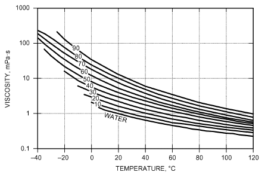

*Fig. 12 Viscosity of Aqueous Solutions of Industrially Inhibited Ethylene Glycol (vol. %)*

> (Dow Chemical 2001b)

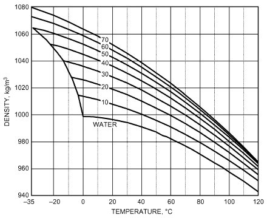

*Fig. 13 Density of Aqueous Solutions of Industrially Inhibited Propylene Glycol (vol. %)*

> (Dow Chemical 2001b)

leads to a downward shift in solution pH, which negates the usefulness of some corrosion inhibitors (particularly for cast iron and carbon steels, but also solders). Properly inhibited glycol products should be used.

### Service Considerations

**Design Considerations.** Inhibited glycols can be used at temperatures as high as 175°C. However, maximum-use temperatures vary from fluid to fluid, so the manufacturer’s suggested temperature-use ranges should be followed. In systems with a high degree of aeration, the bulk fluid temperature should not exceed 65°C; however, temperatures up to 175°C are permissible in a pressurized system if air intake is eliminated. Maximum film temperatures should not exceed 28 K above the bulk temperature. Nitrogen blanketing minimizes oxidation when the system operates at elevated temperatures for extended periods.

Minimum operating temperatures for a recirculating fluid are typically –29°C for ethylene glycol solutions and –18°C for propylene glycol solutions. Operation below these temperatures is generally impractical, because the fluids’ viscosity builds dramatically,

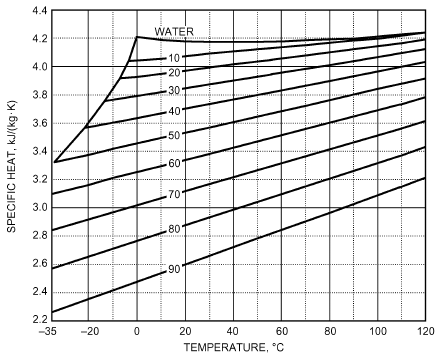

*Fig. 14 Specific Heat of Aqueous Solutions of Industrially Inhibited Propylene Glycol (vol. %)*

> (Dow Chemical 2001b)

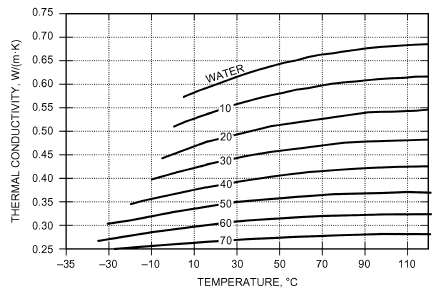

*Fig. 15 Thermal Conductivity of Aqueous Solutions of Industrially Inhibited Propylene Glycol (vol. %)*

> (Dow Chemical 2001b)

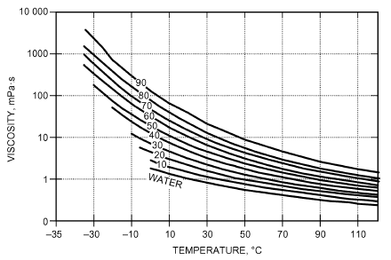

*Fig. 16 Viscosity of Aqueous Solutions of Industrially Inhibited Propylene Glycol (vol. %)*

> (Dow Chemical 2001a)

<!-- str. 891 -->

thus increasing pumping power requirements and reducing heat transfer film coefficients.

Standard materials can be used with most inhibited glycol solutions, except galvanized metals, which form insoluble zinc salts with the corrosion inhibitors. This depletes corrosion inhibitors below effective limits, and can cause excessive insoluble salt (sludge) formation.

Because removal of sludge and other contaminants is critical, install suitable filters. If inhibitors are rapidly and completely adsorbed by such contamination, the fluid is ineffective for corrosion inhibition. Consider such adsorption when selecting filters.

**Storage and Handling.** Inhibited glycol concentrates are stable, relatively noncorrosive materials with high flash points. These fluids can be stored in mild steel, stainless steel, or aluminum vessels. However, aluminum should be used only when the fluid temperature is below 65°C. Corrosion in the vapor space of vessels may be a problem, because the fluid’s inhibitor package cannot reach these surfaces to protect them. A protective coating may be necessary (e.g., novolac-based vinyl ester resins, high-bake phenolic resins, polypropylene, polyvinylidene fluoride). To ensure the coating is suitable for a particular application and temperature, consult the manufacturer. Because the chemical properties of an inhibited glycol concentrate differ from those of its dilutions, the effect of the concentrate on different containers should be known when selecting storage.

Choose transfer pumps only after considering temperature/viscosity data. Centrifugal pumps with electric motor drives are often used. Materials compatible with ethylene or propylene glycol should be used for pump packing material. Mechanical seals are also satisfactory. Bypass or in-line filters are recommended to remove suspended particles, which can abrade seal surfaces. Welded mild steel transfer piping with a minimum diameter is normally used in conjunction with the piping, although flanged and gasketed joints are also satisfactory.

**Preparation Before Application.** Before an inhibited glycol is charged into a system, remove residual contaminants such as sludge, rust, brine deposits, and oil so the newly installed fluid functions properly. Avoid strong acid cleaners; if they are required, consider inhibited acids. Completely remove the cleaning agent before charging with inhibited glycol, because residual cleaning agents are known to cause system foaming problems.

**Foaming.** Adding glycols to water reduces surface tension and increases viscosity, particularly for propylene glycol, and this affects the rate at which dispersed gas bubbles coalesce and release to the surface of the liquid. If relatively high amounts of impurities accumulate either from the original source of glycol-based heat transfer fluid or from thermal oxidative degradation of the glycol, severe foaming problems may occur.

**Dilution Water.** Purified water such as distilled, deionized, or condensate water should be used whenever diluting or topping off a system. Nonpurified water contains corrosive ions and scale-promoting elements that reduce the effectiveness of the inhibited formulation. If purified water of this quality is unavailable, then ensure the source of water contains less than 25 mg/kg chloride, less than 25 mg/kg sulfate, and less than 100 mg/kg of total hardness before using.

**Fluid Maintenance.** Glycol concentrations can be determined by refractive index, gas chromatography, or Karl Fischer analysis for water (assuming that the concentration of other fluid components, such as inhibitor, is known). Using density to determine glycol concentration is unsatisfactory because (1) density measurements are temperature sensitive, (2) inhibitor concentrations can change density, (3) values for propylene glycol are close to those of water, and (4) propylene glycol values exhibit a maximum at 70 to 75% concentration.

An effective inhibitor monitoring and maintenance schedule is essential to keep a glycol solution relatively noncorrosive for a long period. Inspection immediately after installation, and annually thereafter, is normally an effective practice. Visual inspection of solution and filter residue can often detect potential system problems.

Many manufacturers of inhibited glycol-based heat transfer fluids provide analytical service to ensure that their product remains in good condition. This analysis may include some or all of the following: percent of ethylene and/or propylene glycol, freezing point, pH, reserve alkalinity, corrosion inhibitor evaluation, contaminants, total hardness, metal content, and degradation products. If maintenance on the fluid is required, recommendations may be given along with the analysis results.

Properly inhibited and maintained glycol solutions provide better corrosion protection than brine solutions in most systems. A long, though not indefinite, service life can be expected. Avoid indiscriminate mixing of inhibited formulations.

## 3. HALOCARBONS

Many common refrigerants are used as secondary coolants as well as primary refrigerants. Their favorable properties as heat transfer fluids include low freezing points, low viscosities, nonflammability, and good stability. Chapters 29 and 30 present physical and thermodynamic properties for common refrigerants.

Tables 1 and 2 in Chapter 29 summarizes comparative safety characteristics for halocarbons. ACGIH has more information on halocarbon toxicity threshold limit values and biological exposure indices (see the Bibliography).

Construction materials and stability factors in halocarbon use are discussed in Chapter 29 of this volume and Chapter 6 of the 2018 ASHRAE Handbook—Refrigeration.

## 4. NONHALOCARBON, NONAQUEOUS FLUIDS

Numerous additional secondary refrigerants, used primarily by the chemical processing and pharmaceutical industries, have been used rarely in the HVAC and allied industries because of their cost and relative novelty. Before choosing these types of fluids, consider electrical classifications, disposal, potential worker exposure, process containment, and other relevant issues.

Tables 14 to 16 list physical properties for a mixture of dimethylsiloxane polymers of various relative molecular masses (Dow Corning 1989) and d-limonene. Information on d-limonene is limited; it is based on measurements made over small temperature ranges or simply on standard physical property estimation techniques. The compound (molecular formula C10H16) is derived as an extract from orange and lemon oils.

The mixture of dimethylsiloxane polymers can be used with most standard construction materials; d-limonene, however, can be quite corrosive, easily autooxidizing at ambient temperatures. This fact should be understood and considered before using d-limonene in a system.

## REFERENCES

ASHRAE members can access ASHRAE Journal articles and ASHRAE research project final reports at technologyportal .ashrae.org. Articles and reports are also available for purchase by nonmembers in the online ASHRAE Bookstore at www.ashrae.org /bookstore.

Andrepont, J.A. 2012. Applications of low temperature fluid in thermally stratified thermal energy storage. Paper CH-12-C063. Presented at ASHRAE Winter Conference, Chicago.

ATSDR. 2016. *Priority list of hazardous substances that will be the can-* *didates for toxicological profiles*. www.atsdr.cdc.gov/SPL/index.html. Agency for Toxic Substances and Disease Registry, Atlanta, GA.

Carrier Air Conditioning Company. 1959. Basic data, Section 17M. Syracuse, NY.

<!-- str. 892 -->

**Table 10 Properties of Polydimethylsiloxane Heat Transfer Fluid**

| Temperature, Pressure, Viscosity, °C | Temperature, Pressure, Viscosity, Vapor kPa | Temperature, Pressure, Viscosity, mPa·s | Density, kg/m3 | Heat Capacity, kJ/(kg·K) | Thermal Conductivity, W/(m·K) | Temperature, Pressure, Viscosity, °C | Temperature, Pressure, Viscosity, Vapor kPa | Temperature, Pressure, Viscosity, mPa·s | Density, kg/m3 | Heat Capacity, kJ/(kg·K) | Thermal Conductivity, W/(m·K) |
|---|---|---|---|---|---|---|---|---|---|---|---|
| –73 | 0.00 | 12.4 | 924.6 | 1.410 | 0.1294 | 100 | 10.73 | 0.56 | 768.7 | 1.854 | 0.0925 |
| –70 | 0.00 | 11.2 | 922.1 | 1.418 | 0.1288 | 110 | 15.45 | 0.51 | 758.3 | 1.880 | 0.0901 |
| –60 | 0.00 | 8.26 | 913.5 | 1.443 | 0.1269 | 120 | 21.75 | 0.47 | 747.7 | 1.905 | 0.0877 |
| –50 | 0.00 | 6.24 | 905.0 | 1.469 | 0.1251 | 130 | 29.95 | 0.43 | 736.8 | 1.931 | 0.0852 |
| –40 | 0.00 | 4.83 | 896.4 | 1.495 | 0.1231 | 140 | 40.45 | 0.40 | 725.6 | 1.957 | 0.0827 |
| –30 | 0.00 | 3.81 | 887.9 | 1.520 | 0.1212 | 150 | 53.67 | 0.37 | 714.1 | 1.982 | 0.0802 |
| –20 | 0.00 | 3.07 | 879.3 | 1.546 | 0.1192 | 160 | 70.06 | 0.34 | 702.3 | 2.008 | 0.0777 |
| –10 | 0.01 | 2.51 | 870.7 | 1.572 | 0.1171 | 170 | 90.10 | 0.32 | 690.2 | 2.033 | 0.0751 |
| 0 | 0.03 | 2.09 | 862.0 | 1.597 | 0.1150 | 180 | 114.29 | 0.30 | 677.7 | 2.059 | 0.0725 |
| 10 | 0.08 | 1.76 | 853.3 | 1.623 | 0.1129 | 190 | 143.17 | 0.28 | 664.8 | 2.085 | 0.0699 |
| 20 | 0.16 | 1.49 | 844.5 | 1.649 | 0.1108 | 200 | 177.27 | 0.26 | 651.6 | 2.110 | 0.0673 |
| 30 | 0.32 | 1.29 | 835.5 | 1.674 | 0.1086 | 210 | 217.14 | 0.25 | 638.0 | 2.136 | 0.0646 |
| 40 | 0.61 | 1.12 | 826.5 | 1.700 | 0.1064 | 220 | 263.36 | 0.24 | 623.9 | 2.162 | 0.0620 |
| 50 | 1.09 | 0.98 | 817.3 | 1.726 | 0.1042 | 230 | 316.47 | 0.22 | 609.5 | 2.187 | 0.0593 |
| 60 | 1.85 | 0.86 | 807.9 | 1.751 | 0.1019 | 240 | 377.03 | 0.21 | 594.5 | 2.213 | 0.0566 |
| 70 | 3.02 | 0.77 | 798.4 | 1.777 | 0.0996 | 250 | 445.61 | 0.20 | 579.1 | 2.239 | 0.0538 |
| 80 | 4.76 | 0.69 | 788.7 | 1.803 | 0.0973 | 260 | 522.74 | 0.19 | 563.3 | 2.264 | 0.0511 |
| 90 | 7.25 | 0.62 | 778.8 | 1.828 | 0.0949 |  |  |  |  |  |  |

Source: Dow Chemical (1998)

**Table 11 Summary of Physical Properties of Polydimethylsiloxane Mixture and d-Limonene**

|   | Polydimethylsiloxane Mixture | d-Limonene |
|---|---|---|
| Flash point, °C, closed cup | 46.7 | 46.1 |
| Boiling point, °C | 175 | 154.4 |
| Freezing point, °C | –111.1 | –96.7 |
| Operational temperature range, °C | –73.3 to 260 | None published |

Source: Dow Corning (1989).

**Table 12 Physical Properties of d-Limonene**

| Temperature, °C | Specific Heat, kJ/(kg·K) | Viscosity, mPa·s | Density, kg/m3 | Thermal Conductivity, W/(m·K) |
|---|---|---|---|---|
| –73 | 1.27 | 3.8 | 914.3 | 0.137 |
| –50 | 1.39 | 3.0 | 897.1 | 0.133 |
| –25 | 1.51 | 2.3 | 878.3 | 0.128 |
| 0 | 1.65 | 1.8 | 859.2 | 0.124 |
| 25 | 1.78 | 1.4 | 839.8 | 0.119 |
| 50 | 1.91 | 1.1 | 820.1 | 0.114 |
| 75 | 2.04 | 0.8 | 800.0 | 0.110 |
| 100 | 2.17 | 0.7 | 779.5 | 0.105 |
| 125 | 2.30 | 0.5 | 758.4 | 0.100 |
| 150 | 2.41 | 0.4 | 736.6 | 0.096 |

Source: Dow Corning (1989)

Note: Properties are estimated or based on incomplete data.

CCI. 1953. Calcium chloride for refrigeration brine. Manual RM-1. Calcium Chloride Institute.

Dow Chemical. 1998. *Syltherm XLT heat transfer fluid*. Midland, MI.

Dow Chemical USA. 2001a. *Engineering and operating guideline for* *DOWFROST and DOWFROST HD inhibited propylene glycol heat* transfer fluids. Midland, MI.

Dow Chemical USA. 2001b. *Engineering manual for DOWTHERM SR-1* *and DOWTHERM 4000 inhibited ethylene glycol heat transfer fluids*. Midland, MI.

Dow Corning USA (now Dow Chemical). 1989. *Syltherm heat transfer liq-* uids. Midland, MI.

Melinder, Å. 2007. *Thermo-physical properties of aqueous solutions used as* *secondary working fluids*. Ph.D. dissertation, Department of Energy Technology, Kungliga Tekniska Högskolan, Stockholm. urn.kb.se/resolve ?urn=urn:nbn:se:kth:diva-4406.

USP. 2016. *Food chemicals codex (FCC)*, 10th ed. U.S. Pharmacopeial Convention, Rockville, MD.

## BIBLIOGRAPHY

ACGIH. Annual. TLVs® and BEIs®. American Conference of Governmental Industrial Hygienists, Cincinnati.

ASM. 2000. *Corrosion: Understanding the basics*. J.R. Davis, ed. ASM International, Materials Park, OH.

Born, D.W. 1989. *Inhibited glycols for corrosion and freeze protection in* *water-based heating and cooling systems*. Midland, MI.

Fontana, M.G. 1986. Corrosion engineering. McGraw-Hill, New York. NACE. 1973. Corrosion inhibitors. C.C. Nathan, ed. National Association of Corrosion Engineers, Houston.

NACE. 2002. *NACE corrosion engineer’s reference book*, 3rd ed. R.

Baboian, ed. National Association of Corrosion Engineers, Houston.
