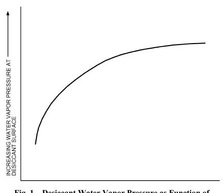
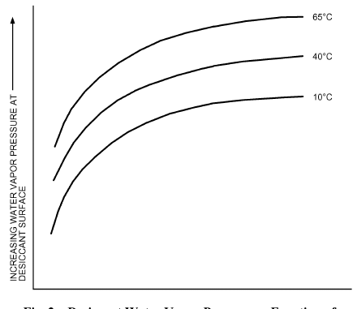
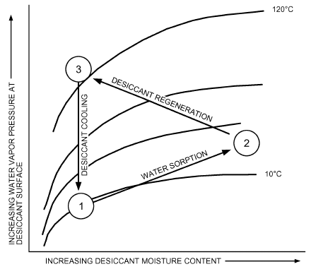
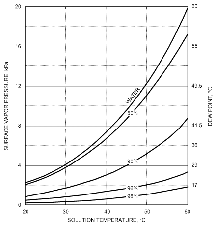
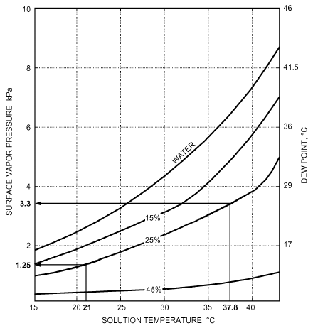
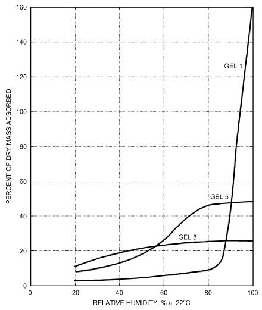
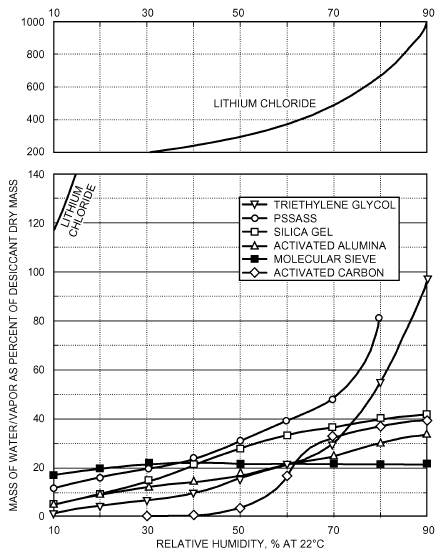

# Chapter 32 — Sorbents and Desiccants

*Izvor: 2021 ASHRAE Handbook — Fundamentals (SI), Chapter 32 (PDF str. 893–898).*

> **Napomena o konverziji:** Tekst je automatski izdvojen iz originalnog PDF-a uz prepoznavanje dve kolone, spojene prelomljene reči i pasuse. Indeksi i eksponenti su označeni sa ``/``, tabele su pretvorene u Markdown tabele (veoma složene tabele su prikazane kao poravnat tekst), a slike su izrezane iz PDF-a u folder `img/`. Složene jednačine (razlomci, sume) mogu biti uprošćeno prikazane. **Pre upotrebe vrednosti u proračunu proveriti u originalnom PDF-u.** Oznake `<!-- str. N -->` pokazuju stranu PDF-a.

## Sadržaj

- [1. DESICCANT APPLICATIONS](#1-desiccant-applications)
- [2. DESICCANT CYCLE](#2-desiccant-cycle)
- [3. TYPES OF DESICCANTS](#3-types-of-desiccants)
- [4. DESICCANT ISOTHERMS](#4-desiccant-isotherms)
- [5. DESICCANT LIFE](#5-desiccant-life)
- [6. COSORPTION OF WATER VAPOR AND INDOOR AIR CONTAMINANTS](#6-cosorption-of-water-vapor-and-indoor-air-contaminants)
- [REFERENCES](#references)
- [BIBLIOGRAPHY](#bibliography)

<!-- str. 893 -->

SORPTION refers to the binding of one substance to another.

**Sorbents** are materials that have an ability to attract and hold other gases or liquids. They can be used to attract gases or liquids other than water vapor, which makes them very useful in chemical separation processes. **Desiccants** are a subset of sorbents; they have a particular affinity for water.

Virtually all materials are desiccants; that is, they attract and hold water vapor. Wood, natural fibers, clays, and many synthetic materials attract and release moisture as commercial desiccants do, but they lack holding capacity. For example, woolen carpet fibers attract up to 23% of their dry mass in water vapor, and nylon can take up almost 6% of its mass in water. In contrast, a commercial desiccant takes up between 10 and 1100% of its dry mass in water vapor, depending on its type and on the moisture available in the environment. Furthermore, commercial desiccants continue to attract moisture even when the surrounding air is quite dry, a characteristic that other materials do not share.

All desiccants behave in a similar way: they attract moisture until they reach equilibrium with the surrounding air. Moisture is usually removed from the desiccant by heating it to temperatures between 50 and 205°C and exposing it to a scavenger airstream. After the desiccant dries, it must be cooled so that it can attract moisture once again. Sorption always generates sensible heat equal to the latent heat of the water vapor taken up by the desiccant plus an additional heat of sorption that varies between 5 and 25% of the latent heat of the water vapor. This heat is transferred to the desiccant and to the surrounding air.

The process of attracting and holding moisture is described as either adsorption or absorption, depending on whether the desiccant undergoes a chemical change as it takes on moisture. **Adsorption** does not change the desiccant, except by addition of the mass of water vapor; it is similar in some ways to a sponge soaking up water. **Absorption**, on the other hand, changes the desiccant. An example of an absorbent is lithium chloride, which changes from a solid to a liquid as it absorbs moisture.

## 1. DESICCANT APPLICATIONS

Desiccants can dry either liquids or gases, including ambient air, and are used in many air-conditioning applications, particularly when the

- Latent load is large in comparison to the sensible load
- Energy cost to regenerate the desiccant is low compared to the cost of energy to dehumidify the air by chilling it below its dew point and reheating it
- Moisture control level for the space would require chilling the air to subfreezing dew points if compression refrigeration alone were used to dehumidify the air

The preparation of this chapter is assigned to TC 8.12, Desiccant Dehumidification Equipment and Components.

- Temperature control level for the space or process requires continuous delivery of air at subfreezing temperatures
- Air delivered to a space or ductwork must be at less than 70% rh

In any of these situations, the cost of running a vapor compression cooling system can be very high. A desiccant process may offer considerable advantages in energy, initial cost of equipment, and maintenance.

Because desiccants can attract and hold more than simply water vapor, they can remove contaminants from airstreams to improve indoor air quality. Desiccants have been used to remove organic vapors and, in special circumstances, to control microbiological contaminants (Battelle 1971; Buffalo Testing Laboratory 1974). Hines et al. (1991) also confirmed their usefulness in removing vapors that can degrade indoor air quality. Desiccant materials can adsorb hydrocarbon vapors while collecting moisture from air. These cosorption phenomena show promise of improving indoor air quality in typical building HVAC systems.

Desiccants are also used in drying compressed air to low dew points. In this application, moisture can be removed from the desiccant without heat. Desorption uses differences in vapor pressures compared to the total pressures of the compressed and ambient pressure airstreams.

Finally, desiccants are used to dry the refrigerant circulating in air-conditioning and refrigeration systems. This reduces corrosion in refrigerant piping and prevents valves and capillaries from becoming clogged with ice crystals. In this application, the desiccant is not regenerated; it is discarded when it has adsorbed its limit of water vapor.

This chapter discusses the water sorption characteristics of desiccant materials and explains some of the implications of those characteristics in ambient pressure air-conditioning applications. Information on other applications for desiccants can be found in Chapter 36 of this volume; Chapters 7, 8, 18, 39, and 44 of the 2018 ASHRAE Handbook—Refrigeration; Chapters 1, 2, 6, 10, 18, 20, 23, 30, and 46 of the 2019 *ASHRAE Handbook—HVAC Applications*; and Chapters 24 and 26 of the 2020 ASHRAE Handbook—HVAC *Systems and Equipment*.

## 2. DESICCANT CYCLE

Practically speaking, all desiccants function the same way: by moisture transfer caused by a difference between water vapor pressures at their surface and of the surrounding air. When the vapor pressure at the desiccant surface is lower than that of the air, the desiccant attracts moisture. When the surface vapor pressure is higher than that of the surrounding air, the desiccant releases moisture.

Figure 1 shows the moisture content relationship between a desiccant and its surface vapor pressure. As the desiccant’s moisture content rises, so does the water vapor pressure at its surface. At some point, the vapor pressure at the desiccant surface is the same as that of the air: the two are in equilibrium. Then, moisture cannot move in

<!-- str. 894 -->

*Fig. 1 Desiccant Water Vapor Pressure as Function of Moisture Content*

> (Harriman 2003)

*Fig. 2 Desiccant Water Vapor Pressure as Function of Desiccant Moisture Content and Temperature*

> (Harriman 2003)

either direction until some external force changes the vapor pressure at the desiccant or in the air.

Figure 2 shows the effect of temperature on vapor pressure at the desiccant surface. Both higher temperature and increased moisture content increase surface vapor pressure. When surface vapor pressure exceeds that of the surrounding air, moisture leaves the desiccant (**reactivation** or **regeneration**). After the desiccant is dried (reactivated) by the heat, its vapor pressure remains high, so it has very little ability to absorb moisture. **Cooling** the desiccant reduces its surface vapor pressure so that it can absorb moisture again. The complete cycle is illustrated in Figure 3.

The economics of desiccant operation depend on the energy cost of moving a given material through this cycle. Dehumidifying air (loading the desiccant with water vapor) generally proceeds without energy input other than fan and pump costs. The major portion of energy is invested in regenerating the desiccant (moving from point 2 to point 3) and cooling the desiccant (point 3 to point 1).

*Fig. 3 Desiccant Cycle*

> (Harriman 2003)

**Table 1 Vapor Pressures and Dew-Point Temperatures Corresponding to Different Relative Humidities at 21°C**

| Relative Humidity at 21°C, % | Dew Point, °C | Vapor Pressure, kPa |
|---|---|---|
| 10 | –10.5 | 0.25 |
| 20 | –2.5 | 0.50 |
| 30 | 2.8 | 0.75 |
| 40 | 6.9 | 1.00 |
| 50 | 10.2 | 1.24 |
| 60 | 13.0 | 1.49 |
| 70 | 15.3 | 1.74 |
| 80 | 17.4 | 1.99 |
| 90 | 19.3 | 2.24 |
| 100 | 21.0 | 2.49 |

**Regeneration energy** is equal to the sum of the heat

- Necessary to raise the desiccant to a temperature high enough to make its surface vapor pressure higher than that of the surrounding air
- Necessary to vaporize the moisture it contains (about 2465 kJ/kg)
- From desorption of water from the desiccant (a small amount)

The **cooling energy** is proportional to the (1) mass of desiccant cycled and (2) difference between its temperature after regeneration and the lower temperature that allows the desiccant to remove water from the airstream again.

The cycle is similar when desiccants are regenerated using pressure differences in a compressed air application. The desiccant is saturated in a high-pressure chamber (i.e., that of the compressed air). Then valves open, isolating the compressed air from the material, and the desiccant is exposed to air at ambient pressure. The saturated desiccant’s vapor pressure is much higher than ambient air at normal pressures; thus, moisture leaves the desiccant for the surrounding air. An alternative desorption strategy returns a small portion of dried air to the moist desiccant bed to reabsorb moisture, then vents that moist air to the atmosphere.

Table 1 shows the range of vapor pressures over which the desiccant must operate in space-conditioning applications. It converts the relative humidity at 21°C to dew point and the corresponding vapor pressure. The greater the difference between the air and desiccant surface vapor pressures, the greater the ability of the material to absorb moisture from the air at that moisture content.

<!-- str. 895 -->

The ideal desiccant for a particular application depends on the range of water vapor pressures likely to occur in the air, temperature of the regeneration heat source, and moisture sorption and desorption characteristics of the desiccant within those constraints. In commercial practice, however, most desiccants can be made to perform well in a wide variety of operating situations through careful engineering of mechanical aspects of the dehumidification system. Some of these hardware issues are discussed in Chapter 24 of the 2020 *ASHRAE Handbook—HVAC Systems* and Equipment.

## 3. TYPES OF DESICCANTS

Desiccants can be liquids or solids and can hold moisture through absorption or adsorption, as described earlier. Most absorbents are liquids, and most adsorbents are solids.

### Liquid Absorbents

Liquid absorption dehumidification can best be illustrated by comparison to air washer operation. When air passes through an air washer, its dew point approaches the temperature of water supplied to the machine. Air that is more humid is dehumidified, and air that is less humid is humidified. Similarly, a liquid absorption dehumidifier brings air into contact with a liquid desiccant solution. The liquid’s vapor pressure is lower than water at the same temperature, and air passing over the solution approaches this reduced vapor pressure; it is dehumidified.

A liquid absorption solution’s vapor pressure is directly proportional to its temperature and inversely proportional to its concentration. Figure 4 illustrates the effect of increasing desiccant concentration on the water vapor pressure at its surface. The figure shows the vapor pressures of various solutions of water and triethylene glycol, a commercial liquid desiccant. As the mixture’s glycol

*Fig. 4 Surface Vapor Pressure of Water/Triethylene Glycol Solutions*

> (from data of Dow 1981)

content increases, its vapor pressure decreases. This lower pressure allows the glycol solution to absorb moisture from the air whenever the air’s vapor pressure is greater than that of the solution.

Viewed another way, the vapor pressure of a given concentration of absorbent solution approximates the vapor pressure values of a fixed relative humidity line on a psychrometric chart. Higher solution concentrations give lower equilibrium relative humidities, which allow the absorbent to dry air to lower levels.

Figure 5 illustrates the effect of temperature on vapor pressures of various solutions of water and lithium chloride (LiCl), another common liquid desiccant. A solution that is 25% lithium chloride has a vapor pressure of 1.25 kPa at a temperature of 21°C. If the same 25% solution is heated to 37.8°C, its vapor pressure more than doubles to 3.3 kPa. Expressed another way, the 21°C, 25% solution is in equilibrium with air at a 10.5°C dew point. The same 25% solution at 37.8°C is at equilibrium with an airstream at a 26°C dew point. The warmer the desiccant, the less moisture it can attract from the air.

In standard practice, behavior of a liquid desiccant is controlled by adjusting its temperature, concentration, or both. Desiccant temperature is controlled by simple heaters and coolers. Concentration is controlled by heating the desiccant to drive moisture out into a waste airstream or directly to the ambient.

Commercially available liquid desiccants have an especially high water-holding capacity. Each molecule of LiCl, for example, can hold two water molecules, even in the dry state. Above two water molecules per molecule of LiCl, the desiccant becomes a liquid and continues to absorb water. If the solution is in equilibrium with air at 90% rh, approximately 26 water molecules are attached to each molecule of LiCl. This represents a water absorption of more than 1000% on a dry-mass basis.

As a practical matter, however, the absorption process is limited by the exposed surface area of desiccant and by the contact time allowed for reaction. More surface area and more contact time allow

*Fig. 5 Surface Vapor Pressure of Water/Lithium Chloride Solutions*

> (from data of Foote Mineral 1988)

<!-- str. 896 -->

the desiccant to approach its theoretical capacity. Commercial desiccant systems stretch these limits by flowing liquid desiccant onto an extended surface, much like in a cooling tower.

### Solid Adsorbents

Adsorbents are solid materials with a tremendous internal surface area per unit of mass; a single gram can have more than 4600 m2 of surface area. Structurally, adsorbents resemble a rigid sponge, and the surface of the sponge in turn resembles the ocean coastline of a fjord. This analogy indicates the scale of the different surfaces in an adsorbent. The fjords can be compared to the **capillaries** in the adsorbent. Spaces between the grains of sand on the fjord beaches can be compared to the spaces between the individual molecules of adsorbent, all of which have the capacity to hold water molecules. The bulk of adsorbed water is contained by condensation into the capillaries, and the majority of the surface area that attracts individual water molecules is in the crystalline structure of the material itself.

Adsorbents attract moisture because of the electrical field at the desiccant surface. The field is not uniform in either force or charge, so specific sites on the desiccant surface attract water molecules that have a net opposite charge. When the complete surface is covered, the adsorbent can hold still more moisture because vapor condenses into the first water layer and fills capillaries throughout the material. As with liquid absorbents, an adsorbent’s ability to attract moisture depends on the difference in vapor pressure between its surface and the air.

Capacity of solid adsorbents is generally less than the capacity of liquid absorbents. For example, a typical molecular sieve adsorbent can hold 17% of its dry mass in water when the air is at 21°C and 20% rh. In contrast, LiCl can hold 130% of its mass at the same temperature and relative humidity.

Solid adsorbents have several advantages, however. For example, molecular sieves continue to adsorb moisture even when they are quite hot, allowing dehumidification of very warm airstreams. Also, several solid adsorbents can be manufactured to precise tolerances, with pore diameters that can be closely controlled. This means they can be tailored to adsorb molecules of a specific diameter. Water, for example, has an effective molecular diameter of 0.32 nm. A molecular sieve adsorbent with an average pore diameter of 0.40 nm adsorbs water but has almost no capacity for larger molecules, such as organic solvents. This selective adsorption characteristic is useful in many applications. For example, several desiccants with different pore sizes can be combined in series to remove first water and then other specific contaminants from an airstream.

**Adsorption Behavior.** Adsorption behavior depends on (1) total surface area, (2) total volume of capillaries, and (3) range of capillary diameters. A large surface area gives the adsorbent a larger capacity at low relative humidities. Large capillaries provide a high capacity for condensed water, which gives the adsorbent a higher capacity at high relative humidities. A narrow range of capillary diameters makes an adsorbent more selective in the vapor molecules it can hold.

In designing a desiccant, some tradeoffs are necessary. For example, materials with large capillaries necessarily have a smaller surface area per unit of volume than those with smaller capillaries. As a result, adsorbents are sometimes combined to provide a high adsorption capacity across a wide range of operating conditions. Figure 6 illustrates this point using three noncommercial silica gel adsorbents prepared for use in laboratory research. Each has a different internal structure, but because they are all silicas, they have similar surface adsorption characteristics. Gel 1 has large capillaries, making its total volume large but its total surface area small. It has a large adsorption capacity at high relative humidities but adsorbs a small amount at low relative humidities.

In contrast, gel 8 has a capillary volume one-seventh the size of gel 1, but a total surface area almost twice as large. This gives it a higher capacity at low relative humidities but a lower capacity to hold the moisture that condenses at high relative humidities.

Silica gels and most other adsorbents can be manufactured to provide optimum performance in a specific application, balancing capacity against strength, mass, and other favorable characteristics (Bry-Air 1986).

**Types of Solid Adsorbents.** General classes of solid adsorbents include

- Silica gels
- Zeolites
- Synthetic zeolites (molecular sieves)
- Activated aluminas
- Carbons
- Synthetic polymers

**Silica gels** are amorphous solid structures formed by condensing soluble silicates from solutions of water or other solvents. Advantages include relatively low cost and relative simplicity of structural customizing. They are available as large as spherical beads about 5 mm in diameter or as small as grains of a fine powder.

**Zeolites** are aluminosilicate minerals. They occur in nature and are mined rather than synthesized. Zeolites have a very open crystalline lattice that allows molecules such as water vapor to be held inside the crystal itself, like an object in a cage. Particular atoms of

*Fig. 6 Adsorption and Structural Characteristics of Some Experimental Silica Gels*

| Gel Number | Total Surface Area, m2/g | Average Capillary Diameter, nm | Total Volume of Capillaries, mm3/g |
|---|---|---|---|
| 1 | 315 | 21 | 1700 |
| 5 | 575 | 3.8 | 490 |
| 8 | 540 | 2.2 | 250 |

> (from data of Oscic and Cooper 1982)

<!-- str. 897 -->

an aluminosilicate determine the size of the openings between the “bars” of the cage, which in turn governs the maximum size of the molecule that can be adsorbed into the structure.

**Synthetic zeolites**, also called **molecular sieves**, are crystalline aluminosilicates manufactured in a thermal process. Controlling process temperature and composition of ingredient materials allows close control of the adsorbent’s structure and surface characteristics. At a somewhat higher cost, this provides a much more uniform product than naturally occurring zeolites.

**Activated aluminas** are oxides and hydrides of aluminum that are manufactured in thermal processes. Their structural characteristics can be controlled by the gases used to produce them and by the temperature and duration of the thermal process.

**Carbons** are most frequently used for adsorption of gases other than water vapor because they have a greater affinity for the nonpolar molecules typical of organic solvents. Like other adsorbents, carbons have a large internal surface and especially large capillaries. This capillary volume gives them a high capacity to adsorb water vapor at relative humidities of 45 to 100%.

**Synthetic polymers** have potential for use as desiccants, as well. Long molecules, like those found in polystyrenesulfonic acid sodium salt (PSSASS), are twisted together like strands of string. Each of the many sodium ions in the long PSSASS molecules has the potential to bind several water molecules, and the spaces between the packed strings can also contain condensed water, giving the polymer a capacity exceeding that of many other solid adsorbents.

## 4. DESICCANT ISOTHERMS

Figure 7 shows a rough comparison of sorption characteristics of different desiccants. Large variations from these isotherms occur because manufacturers use different methods to optimize materials for different applications. Suitability of a given desiccant to a particular application generally depends as much on the engineering of the mechanical system that presents the material to airstreams as on the characteristics of the material itself.

Several sources give details of desiccant equipment design and information about desiccant isotherm characteristics. Brunauer (1945) considers five basic isotherm shapes. Sing (1985) added a sixth isotherm shape and defined four types of hysteresis loops that are often identified with specific pore structures. Each shape is determined by the dominant sorption mechanisms of the desiccant, which give rise to its specific capacity characteristics at different vapor pressures. Isotherm shape can be important in designing the optimum desiccant for applications where a narrow range of operating conditions can be expected. Collier (1986, 1988) illustrates how an optimum isotherm shape can be used to ensure a maximum coefficient of performance in one particular air-conditioning desiccant application.

## 5. DESICCANT LIFE

The useful life of desiccant materials depends largely on the quantity and type of contamination in the airstreams they dry. In commercial equipment, desiccants last from 10 000 to 100 000 h or longer before they need replacement. Normally, three mechanisms cause loss of desiccant capacity: (1) change in desiccant sorption characteristics through **chemical reactions** with contaminants, (2) loss of effective surface area through clogging or **hydrothermal degradation**, or (3) clogging or masking the pore system’s surface by **contaminants**.

Liquid absorbents are more susceptible to chemical reaction with airstream contaminants other than water vapor than are solid adsorbents. For example, certain sulfur compounds can react with LiCl to form lithium sulfate, which is not a desiccant. If the concentration of sulfur compounds in the airstream were below 10 mg/kg and the desiccant were in use 24 h a day, capacity reduction would be approximately 10 to 20% after three years of operation. If the concentration were 30 mg/kg, this reduction would occur after one year. In contaminated environments, equipment manufacturers often arrange filters to remove these products of reaction, and provide devices to replenish desiccant so that capacity stays constant.

Solid adsorbents tend to be less chemically reactive and more sensitive to clogging, a function of the type and quantity of particulate material in the airstream. Also, certain types of silica gel can be sensitive to saturated airstreams or to liquid moisture carried over from cooling coils into the desiccant bed. In more challenging applications, thermally stabilized desiccants are used in place of less durable materials.

In air-conditioning applications, desiccant equipment is designed to minimize the need for desiccant replacement in much the same way that vapor compression cooling systems are designed to avoid the need for compressor replacement. Unlike filters, desiccants are seldom intended to be frequently replaced during normal service in an air-drying application.

## 6. COSORPTION OF WATER VAPOR AND INDOOR AIR CONTAMINANTS

Hines et al. (1991) confirmed that many desiccant materials can collect common indoor pollutants while they collect water vapor from ambient air. This characteristic promises to become useful in future air-conditioning systems where indoor air quality is especially important.

*Fig. 7 Sorption Isotherms of Various Desiccants*

<!-- str. 898 -->

The behavior of different desiccant and vapor mixtures is complex, but in general, pollutant sorption reactions can be classified into five categories:

- Humidity-neutral sorption
- Humidity-reduced sorption
- Humidity-enhanced sorption
- Humidity-pollutant displacement
- Desiccant-catalyzed pollutant conversion

Humidity-reduced sorption is illustrated by the behavior of water vapor and chloroform on activated carbon. Sorption is humidityneutral until relative humidity exceeds 45%, when the uptake of chloroform is reduced. The adsorbed water blocks sites that would otherwise attract and hold chloroform. In contrast, water and carbonyl chloride mixtures on activated carbon demonstrate humidityenhanced sorption (i.e., sorption of the pollutant increases at high relative humidities). Hines et al. (1991) attribute this phenomenon to the high water solubility of carbonyl chloride.

## REFERENCES

ASHRAE members can access ASHRAE Journal articles and ASHRAE research project final reports at technologyportal .ashrae.org. Articles and reports are also available for purchase by nonmembers in the online ASHRAE Bookstore at www.ashrae.org /bookstore.

Battelle. 1971. Project No. N-0914-5200-1971. Battelle Memorial Institute, Columbus, OH.

Brunauer, S. 1945. *The adsorption of gases and vapors*, vol. I. Princeton University Press, Princeton, NJ. Quoted and expanded in *The physical chem-* *istry of surfaces*, by Arthur W. Adamson. John Wiley & Sons, New York, 1982.

Bry-Air. 1986. *MVB series engineering data*. Bry-Air Inc., Sunbury, OH.

Collier, R.K. 1986, 1988. Advanced desiccant materials assessment.

Research Report 5084-243-1089. Phase I-1986, Phase II-1988. Gas Research Institute, Chicago.

Czanderna, A.W. 1988. Polymers as advanced materials for desiccant applications. Research Report NREL/PR-255-3308. National Renewable Energy Laboratory, Golden, CO.

Davidson Chemical Division of W.R. Grace Co. 1958. Adsorption and dehydration with silica gel. Technical Bulletin 202.

Dow. 1981. *Guide to glycols*. Dow Chemical Corporation, Organic Chemicals Division, Midland, MI.

Foote Mineral. 1988. Lithium chloride technical data. Bulletin 151. Foote Mineral Corporation, Exton, PA.

Harriman, L.G., III. 2003. *The dehumidification handbook*, 2nd ed. Munters Corporation, Amesbury, MA.

Hines, A.J., T.K. Ghosh, S.K. Loyalka, and R.C. Warder, Jr. 1991. Investigation of co-sorption of gases and vapors as a means to enhance indoor air quality. ASHRAE Research Project 475-RP and Gas Research Institute Project GRI-90/0194. Gas Research Institute, Chicago.

Oscic, J., and I.L. Cooper. 1982. Adsorption. John Wiley & Sons, New York.

Sing, K.S.W. 1985. Reporting physisorption data for gas/solid systems with special reference to the determination of surface area and porosity (Recommendations 1984). *Pure and Applied Chemistry* 57:603-620.

## BIBLIOGRAPHY

Adamson, A.W., and A.P. Gast. 1997. *The physical chemistry of surfaces*, 6th ed. John Wiley & Sons, New York.

Falcone, J.S., Jr., ed. 1982. Soluble silicates. Symposium Series 194. American Chemical Society, Washington, D.C.

Lowel, S., J.E. Shields, M.A. Thomas, and M. Thommes (eds.). 2004. Char-*acterization of porous solids and powders: Surface area, pore size and* density. Kluwer Academic Publishers, Dordrecht, the Netherlands.

Ruthven, D.M. 1984. *Principles of adsorption and adsorption processes.* John Wiley & Sons, New York.

SUNY Buffalo School of Medicine. Effects of glycol solution on microbiological growth. Niagrara Blower Report No. 03188.

Valenzuela, D., and A. Myers. 1989. *Adsorption equilibrium data handbook*.

Simon & Schuster/Prentice-Hall, Englewood Cliffs, NJ.
