# Chapter 34 — Energy Resources

*Izvor: 2021 ASHRAE Handbook — Fundamentals (SI), Chapter 34 (PDF str. 903–911).*

> **Napomena o konverziji:** Tekst je automatski izdvojen iz originalnog PDF-a uz prepoznavanje dve kolone, spojene prelomljene reči i pasuse. Indeksi i eksponenti su označeni sa ``/``, tabele su pretvorene u Markdown tabele (veoma složene tabele su prikazane kao poravnat tekst), a slike su izrezane iz PDF-a u folder `img/`. Složene jednačine (razlomci, sume) mogu biti uprošćeno prikazane. **Pre upotrebe vrednosti u proračunu proveriti u originalnom PDF-u.** Oznake `<!-- str. N -->` pokazuju stranu PDF-a.

## Sadržaj

- [1. CHARACTERISTICS OF ENERGY AND ENERGY RESOURCE FORMS](#1-characteristics-of-energy-and-energy-resource-forms)
- [1.1 ON-SITE ENERGY/ENERGY RESOURCE RELATIONSHIPS](#11-on-site-energyenergy-resource-relationships)
- [1.2 SUMMARY](#12-summary)
- [2. ENERGY RESOURCE PLANNING](#2-energy-resource-planning)
- [2.1 INTEGRATED RESOURCE PLANNING (IRP)](#21-integrated-resource-planning-irp)
- [2.2 TRADABLE EMISSION CREDITS](#22-tradable-emission-credits)
- [3. OVERVIEW OF GLOBAL ENERGY RESOURCES](#3-overview-of-global-energy-resources)
- [3.1 WORLD ENERGY RESOURCES](#31-world-energy-resources)
- [3.2 CARBON EMISSIONS](#32-carbon-emissions)
- [3.3 U.S. ENERGY USE](#33-us-energy-use)
- [3.4 U.S. AGENCIES AND ASSOCIATIONS](#34-us-agencies-and-associations)
- [REFERENCES](#references)
- [BIBLIOGRAPHY](#bibliography)

<!-- str. 903 -->

ENERGY used in buildings and facilities is responsible for 30 to 40% of the world's energy use, significantly impacting world energy resources. ASHRAE’s work to reduce energy consumption in the built environment is equally as important as research on new, more sustainable energy sources in helping ensure a reliable and secure supply of energy for future generations.

Many governmental agencies regulate energy conservation, often through the procedures to obtain building permits. Required efficiency values for building energy use strongly influence selection of HVAC&R systems and equipment and how they are applied.

More information on sustainable design is available in the ASHRAE GreenGuide (2013) and in Chapter 35.

## 1. CHARACTERISTICS OF ENERGY AND ENERGY RESOURCE FORMS

The HVAC&R industry deals with energy forms as they occur on or arrive at a building site. Generally, these forms are fossil fuels (natural gas, oil, and coal) and electricity. Solar and wind energy are also available at most sites, as is biomass. Geothermal energy is available at some locations.

### Fossil Fuels and Electricity

Most on-site energy for buildings in developed countries involves electricity and fossil fuels as energy sources. Both fossil fuels and electricity can be described by their energy content (joules). This implies that energy forms are comparable and that an equivalence can be established. In reality, however, they are only comparable in energy terms when they are used to generate heat. Fossil fuels, for example, cannot directly drive motors or energize light bulbs. Conversely, electricity gives off heat as a by-product regardless of whether it is used for running a motor or lighting a light bulb, and regardless of whether that heat is needed. Thus, electricity and fossil fuels have different characteristics, uses, and capabilities aside from any differences in their derivation.

Other differences between energy forms include methods of extraction, transformation, transportation, and delivery, and characteristics of the resource itself. Natural gas arrives at the site in virtually the same form in which it was extracted from the earth. Oil is processed (distilled) before arriving at the site; having been extracted as crude oil, it arrives at a given site as, for example, No. 2 oil or diesel fuel. Electricity is created (converted) from a different energy form, often a fossil fuel, which itself may first be converted to a thermal form. The total electricity conversion, generation, and distribution process includes energy losses governed largely by the laws of thermodynamics.

Fossil fuels undergo a conversion process by combustion (oxidation) and heat transfer to thermal energy in the form of steam or hot water. The conversion equipment is a boiler or a furnace in lieu of a generator, and conversion usually occurs on a project site rather than off site. (District heating or cooling is an exception.) Inefficiencies of fossil fuel conversion occur on site, whereas inefficiencies of most electricity generation occur off site, before the electricity arrives at the building site. (Cogeneration is an exception.)

The preparation of this chapter is assigned to TC 2.8, Building Environmental Impacts and Sustainability.

Sustainability is an important consideration for energy use. The United Nations’ Brundtland Report (UN 1987) stated that the development of the built environment is sustainable if it “meets the needs of the present without compromising the ability of future generations to meet their own needs.” More information is in Chapter 35.

### Forms of On-Site Energy

Fossil fuels and electricity are commodities that are usually metered or measured for payment at the facility’s location. Solar or wind energy is freely available but does incur cost for the means to use it. Geothermal energy, which is not universally available, may or may not be a sold commodity, depending on the particular locale and local regulations. Chapter 34 of the 2019 ASHRAE Handbook—HVAC Applications has more information on geothermal energy.

The term **energy source** refers to on-site energy in the form in which it arrives at or occurs on a site (e.g., electricity, gas, oil, coal). **Energy resource** refers to the raw energy that (1) is extracted from the earth (wellhead or mine-mouth), (2) is used to generate the energy source delivered to a building site (e.g., coal used to generate electricity), or (3) occurs naturally and is available at a site (solar, wind, or geothermal energy). Some on-site energy forms require further processing or conversion into more suitable forms for the particular systems and equipment in a building or facility. For instance, natural gas or oil is burned in a boiler to produce steam or hot water, which is then distributed to various use points (e.g., heating coils in air-handling systems, unit heaters, convectors, fin-tube elements, steam-powered cooling units, humidifiers, kitchen equipment) throughout the building. Although the methods and efficiencies of these processes fall within the scope of the HVAC&R designer, how an energy source arrives at a given facility site is not under direct control. On-site energy choices, when available, may be controlled by the designer based in part on the present and projected future availability of the resources.

Energy sources used for heating may be natural gas, oil, coal, or electricity. Cooling may be produced by electricity, thermal energy, or natural gas. If electricity is generated on site, the generator may be driven by an engine or fuel cell that consumes fossil fuels or hydrogen on site, by a turbine using steam or gas directly, or by on-site renewable sources.

### Nonrenewable and Renewable Energy Resources

From the standpoint of energy conservation, energy resources can be classified as either (1) nonrenewable resources, which have definite, although sometimes unknown, limitations; or (2) renewable resources, which have the potential to regenerate in a reasonable period. Resources used most in industrialized countries are nonrenewable (ASHRAE 2003).

<!-- str. 904 -->

Note that renewable does not mean an infinite supply. For instance, hydropower is limited by rainfall and appropriate sites, usable geothermal energy is available only in limited areas, and crops are limited by the available farm area and competing non-energy land uses. Other forms of renewable energy also have supply limitations.

**Nonrenewable resources** of energy include

- Coal
- Crude oil
- Natural gas
- Uranium or plutonium (nuclear energy)

**Renewable resources** of energy include

- Hydropower
- Solar
- Wind
- Geothermal
- Biomass (wood, wood wastes, and municipal solid waste, landfill methane, etc.)
- Tidal power
- Ocean thermal
- Crops (for alcohol production or as boiler fuel)

### Environmental Considerations

The most widely recognized environmental impact from energy use in buildings is **greenhouse gas emissions;** carbon dioxide emissions is usually the most important greenhouse gas resulting from energy use in buildings. In this area, use of renewable resources and nuclear power generally results in no net greenhouse gas emissions, whereas fossil fuel energy use generally results in substantial greenhouse gas emissions.

However, note that the important issue is the amount of greenhouse gas emissions released into the air, not the amount of a fuel used. It has been argued that some biomass energy sources are not really carbon-free sources, because they result in carbon dioxide releases that are not directly offset by carbon dioxide capture through growing vegetation to replace the biomass fuel. Even for fossil fuel energy use, research is ongoing for carbon capture and sequestration for emissions from fossil fuel electric power plants. If the carbon dioxide from a fossil fuel energy source is not released into the atmosphere, there are no greenhouse gas emissions resulting from the use of that fuel.

In addition to greenhouse gases, there are also local air pollution issues from combustion of fuels. These include emissions of carbon monoxide, nitrogen oxides, sulfur dioxide, heavy metals, and particulates. These occur in the combustion of fossil fuels and biomass, and do not occur from the use of renewable energy (other than biomass) or nuclear power. Emissions of local air pollutants vary greatly, depending on design of the combustion equipment and controls technology used. Note that biomass energy sources may require similar mitigation measures to reduce local air emissions as would be required for fossil fuel energy sources.

## 1.1 ON-SITE ENERGY/ENERGY RESOURCE RELATIONSHIPS

An HVAC&R designer must select one or more forms of energy. Most often, these are fossil fuels and electricity, although installations are sometimes designed using a single energy source (e.g., only a fossil fuel or only electricity).

Solar energy normally impinges on the site (and on the facilities to be put there), so it affects the facility’s energy consumption. The designer must account for this effect and may have to decide whether to make active use of solar energy. Other naturally occurring and distributed renewable forms such as wind power and geothermal (if available) might also be considered.

The designer should be aware of the relationship between on-site energy sources and raw energy resources, including how these resources are used and what they are used for. The relationship between energy sources and energy resources involves two parts: (1) quantifying the energy resource units expended and (2) considering the societal effect of depletion of one energy resource (caused by on-site energy use) with respect to others.

### Quantifiable Relationships

As on-site energy sources are consumed, a corresponding amount of resources are consumed to produce that on-site energy. For instance, for every volume of No. 2 oil consumed by a boiler at a building site, some greater volume of crude oil is extracted from the earth. On leaving the well, the crude oil is transported and processed into its final form, perhaps stored, and then transported to the site where it will be used.

Even though natural gas often requires no significant processing, it is transported, often over long distances, to reach its final destination, which causes some energy loss. Electricity may have as its raw energy resource a fossil fuel, uranium, or an elevated body of water (hydroelectric generating plant).

Data are available to help determine the amount of resource use per delivered on-site energy source unit. In the United States, data are available from entities within the U.S. Department of Energy and from the agencies and associations listed at the end of this chapter.

A **resource utilization factor (RUF)** is the ratio of resources consumed to energy delivered (for each form of energy) to a building site. Specific RUFs may be determined for various energy sources normally consumed on site, including nonrenewable sources such as coal, gas, oil, and electricity, and renewable sources such as solar, geothermal, waste, and wood energy. With electricity, which may derive from several resources depending on the particular fuel mix of the generating stations in the region served, the overall RUF is the weighted combination of individual factors applicable to electricity and a particular energy resource. Grumman (1984) gives specific formulas for calculating RUFs.

There are great differences in the efficiency of equipment used in buildings. Although electricity incurs losses in its production, it is often much more efficient than direct fuel use at the building site, particularly for lighting or heat pump applications. Minimizing both energy cost and the amount of energy resources needed to accomplish a task effectively should be a major design goal, which requires consideration of both RUFs and end-use efficiency of building equipment.

Although a designer is usually not required to determine the amount of energy resources attributable to a given building or building site for its design or operation, this information may be helpful when assessing the long-range availability of energy for a building or the building’s effect on energy resources. Fuel-quantity-to-energyresource ratios or factors are often used, which suggests that energy resources are of concern to the HVAC&R industry.

### Intangible Relationships

Energy resources should not simply be converted into common energy units (e.g., gigajoule) because the commonality gives a misleading picture of the equivalence of these resources. Other differences and limitations of each of the resources defy easy quantification. For instance, electricity used on a site can be generated from coal, oil, natural gas, uranium, or hydropower. The end result is the same: electricity at x kV, y Hz. However, the societal impact of a kilowatt-hour electricity generated by hydropower may not equal that of a kilowatt-hour generated by coal, uranium, domestic oil, or imported oil.

<!-- str. 905 -->

Intangible factors such as safety, environmental acceptability, availability, and national interest also are affected in different ways by the consumption of each resource. Heiman (1984) proposes a procedure for weighting the following intangible factors:

### National/Global Considerations

- Balance of trade
- Environmental impacts
- International policy
- Employment
- Minority employment
- Availability
- Alternative uses
- National defense
- Domestic policy
- Effect on capital markets

### Local Considerations

- Exterior environmental impact
- Air
- Solid waste
- Water resources
- Local employment
- Local balance of trade
- Use of distribution infrastructure
- Local energy independence
- Land use
- Exterior safety

### Site Considerations

- Reliability of supply
- Indoor air quality
- Aesthetics
- Interior safety
- Anticipated changes in energy resource prices

## 1.2 SUMMARY

In HVAC&R system design, the need to address immediate issues such as economics, performance, and space constraints often prevents designers from fully considering the energy resources affected. Today’s energy resources are less certain because of issues such as availability, safety, national interest, environmental concerns, and the world political situation. As a result, the reliability, economics, and continuity of many common energy resources over the potential life of a building being designed are unclear. For this reason, the designer of building energy systems must consider the energy resources on which the long-term operation of the building will depend. If the continued viability of those resources is reason for concern, the design should provide for, account for, or address such an eventuality.

## 2. ENERGY RESOURCE PLANNING

The energy supplier (or suppliers) in a particular jurisdiction must plan for that jurisdiction’s future energy needs. For competitive energy markets where these decisions do not have high societal costs, these plans are made by energy suppliers and are not revealed to governmental authorities or the public more than is absolutely necessary, because of the advantage competitors could gain by this knowledge. For electricity (and, to a lesser extent, natural gas), significant societal issues are involved in energy resource planning decisions that cannot be made by energy suppliers without approval by many different groups. Issues include

- **Reliability**, which is affected by the diversity of supply sources available. For gas, this includes the number of geographic supply sources and pipelines; for electricity, it includes the percentage of generation from various fuel sources. Consider the projected future supply and reliability of energy resources, including the possibility of supply disruption by natural or political events, and the likelihood of future supply shortages, which could reduce reliability.
- **Reserve margins**, or the ratio of total supply sources to expected peak supply source needs. Reserve levels that are too high result in waste of resources, higher environmental costs, and possibly poor financial health of the energy suppliers. Reserves that are too low result in volatile and very high peak energy prices and reduced reliability.
- **Land use.** Energy production and transmission often require governmental cooperation to condemn private property for energy production and transmission facilities. Construction and maintenance are also regulated to protect wetlands, prevent toxic waste releases, and other environmental issues.

Note that some energy regulation plans provide no guidance at all on energy supplies, through integrated resource planning (IRP) or other methods. Energy suppliers choose whether to expand their capacity, and what types of fuel those facilities use, based on their own assessment of the future profitability of that investment. In these markets, decisions are made with little societal input other than permitting and pollution control regulations, just as a decision might be made by a manufacturer in an industry such as steel or paper. This does not mean that decisions are made independent of larger societal issues, because laws and regulations (e.g., tradable emissions credits, renewable portfolio standards) factor into the economic considerations of competing suppliers. There is simply more direct planning by governmental authorities, and more opportunities for public input, in the integrated resource planning process typically done by regulated utility providers, as described in more detail in the following.

## 2.1 INTEGRATED RESOURCE PLANNING (IRP)

In regulated utility markets, integrated resource planning is commonly used for planning significant new energy facilities, especially for electricity. Steps include (1) forecasting the amount of new resources needed and (2) determining the type and provider of this resource. Traditionally, the local utility provider forecasts future needs of a given energy resource, then either builds the necessary facility with the approval of regulators or uses a standard offer bid to determine what nonutility provider (or the utility itself) would provide the new energy resource.

Supplying new energy resources through either a standard bid process by a supplier or traditional utility regulation usually results in selection of the lowest-cost supply option, without regard for environmental costs or other societal needs. IRP allows a greater variety of resource options and allows environmental and other indirect societal costs to be given greater consideration.

IRP addresses a wider population of stakeholders than most other planning processes. Many regulatory agencies involve the public in the formulation and review of integrated resource plans. Customers, environmentalists, and other public interest groups are often prominent in these proceedings.

In deregulated energy markets, supplying markets with new energy resources is typically left up to competitive market forces. This has sometimes resulted in excessive reliance on one form of energy, such as natural gas generation. Another result has been highly volatile prices, when supply is not provided because of insufficient price signals, followed by much higher prices and energy shortages until new supply sources can be obtained (which may not be for several years because of the time required for construction and environmental approval processes). Energy efficiency and demand response programs are increasingly treated as an energy resource on a par with energy production options, with incentives and compensation provided for participants in these programs.

<!-- str. 906 -->

**Demand-side management (DSM)** is a common option for providing new energy resources, especially for electricity. These are actions taken to reduce the demand for energy, rather than increase the supply of energy. DSM is desirable because its environmental costs are almost always lower than those of building new energy facilities. However, the following factors have caused a decline in the number of DSM programs:

- Building and equipment codes and standards are a highly efficient form of DSM, reducing energy use with much lower administrative costs than programs that reward installation of more efficient equipment at a single site. However, they are more subtle than traditional DSM programs and may not always be recognized as a form of DSM.
- Opening markets to competing suppliers makes it more difficult to administer and implement DSM programs. However, they are still possible if regulators wish to continue them, and set appropriate rules and regulations for the market to allow implementation of DSM programs.

Many IRP participants may be interested in only one aspect of the process. For example, the energy industry’s main interest may be cost minimization, whereas environmentalists may want to minimize pollutant emissions and prevent environmental damage from construction of energy facilities. Participation by all affected interest groups helps provide the best overall solution for society, including indirect costs and benefits from these energy resource decisions.

## 2.2 TRADABLE EMISSION CREDITS

Increasingly, quotas and limits apply to emissions of various pollutants. Often, a market-based system of tradable credits is used with these quotas. A company is given the right to produce a given level of emissions, and it earns a credit, which can be sold to others, if it produces fewer emissions than that level. If one company can reduce its emissions at a lower cost than another, it can do so and sell the emissions credit to the second company and earn a profit from its pollution control efforts. In the United States, emissions quota and trading programs currently include sulfur dioxide (SO2) and nitrogen oxides (NOx), with plans to implement carbon dioxide (CO2) trading now under consideration, as well. In Europe, emissions trading for CO2 has been active for several years.

Designers must be aware of any regulations concerning pollutant emissions; failure to comply with these regulations may result in civil or criminal penalties for designers or their clients. However, understand the options available under these regulations. The purchase or sale of emissions credits may allow reduced construction or building operations costs if the equipment can overcomply at a lower cost than the cost of another source of emissions to comply, or vice versa. In some cases, documentation of energy savings beyond what codes and regulations require can result in receiving emissions credits that may be sold later.

## 3. OVERVIEW OF GLOBAL ENERGY RESOURCES

## 3.1 WORLD ENERGY RESOURCES

Data in this section are from the *Statistical Review of World* Energy 2015 (BP 2015).

### Production

Energy production trends, by leading producers and world regions, from 2004 to 2014 are shown in Figure 1.

World primary energy production increased 21.2% from 2004 to 2014, because strong economic growth occurred in countries such as China, which increased its energy production more than 60% since 2004. The largest total energy producers in 2014 were China (19%), the United States (16%), Russia (10%), and Saudi Arabia (7%). Together, they produced about 52% of the world’s energy production. (Note: for this and for similar graphs, the “Europe and Eurasia” region consists of the nations of western Europe plus the countries comprised by the former Soviet Union.)

Total world energy production by resource type for 2004 and 2014 is shown in Figure 2. The greatest growth in energy production among major sources has been hydroelectricity, up nearly 33% in usage from 2004 to 2014, and coal, which has increased 30.3%, and natural gas, up 10.3%. Petroleum use only rose 7.1%. Nonhydroelectric renewables use more than doubled, but is still a small percentage of total world energy production (BP 2015).

**Crude Oil.** World crude oil production was 88.7 million barrels (10 577 000 m3) per day in 2014. The biggest crude-oil-producing region in 2014 was the Middle East, with 32% of the total. Among individual countries, the United States (13.1%), Saudi Arabia (13.0%), and Russia (12.2%) were the leading countries, following by China and Canada, each with 4.8% of total production. Since

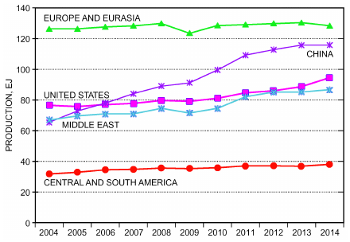

*Fig. 1 Energy Production Trends: 2004-2014*

> (Basis: EIA 2015)

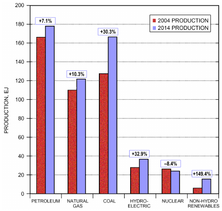

*Fig. 2 World Primary Energy Production by Resource: 2004 Versus 2014*

> (Basis: EIA 2015)

<!-- str. 907 -->

2004, oil production increased 56% in the United States and about 25% in both China and Russia.

**Natural Gas.** World production reached 3460.6 billion m3 in 2014, up 14.4% from the 2004 level. The biggest producers in 2014 were the United States (22%), Russia (17%), Qatar (5%), Iran (5%), and Canada (5%). Since 2004, natural gas production in Qatar more than quadrupled, and was up 79% in Iran and 39% in the United States.

**Coal.** At 164.7 EJ in 2014, coal production was up 38.7% since 2004. Leading producers of coal were China (47%), the United States (13%), India (7%), and Indonesia (6%). Since 2004, Indonesia more than tripled coal production, China increased coal production 67%, and India increased 56%, whereas U.S. production fell by 11%.

### Reserves

On January 1, 2015, estimated world reserves of crude oil and gas were distributed by world region as shown in Figures 3 and 4. Countries with the largest reported crude oil reserves are Venezuela (17.5%), Saudi Arabia (15.7%), Canada (10.2%), Iran (9.3%), and Iraq (8.8%). For natural gas, the countries with the largest reported reserves are Iran (18.2%), Russia (17.4%), Qatar (13.1%), Turkmenistan (9.3%), and the United States (5.2%).

Note that several factors make crude oil and natural gas reserve estimates less precise than some other energy statistics:

- For nations with national oil companies, reserve estimates are not verifiable by third parties, as is typically the case with the reserve estimates of publicly traded corporations.
- Technologies used for extracting hydrocarbons from nontraditional reserves (e.g., tar sands, shale deposits) are rapidly changing. This can result in very large revisions to reserve estimates that often lag production changes. For example, approximately 10 years ago, Canadian oil reserves rose substantially due to inclusion of tar sands in the total. More recently, reported crude oil and natural gas reserves in the United States have lagged production

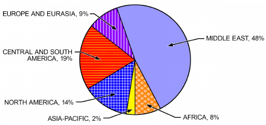

*Fig. 3 World Crude Oil Reserves: 2015*

> (Basis: BP 2016)

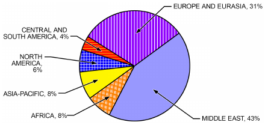

*Fig. 4 World Natural Gas Reserves: 2015*

> (Basis: BP 2016)

growth, because of uncertainty concerning the size of the total available resource that can be economically extracted.

- The definition of proved resource includes a requirement that it can be economically extracted, which can result in substantial changes due to fluctuations in the price of oil and natural gas.

World coal reserves as of January 1, 2015, are shown by region in Figure 5. The most plentiful reserves, as a percent of total, were in the United States (27%), Russia (18%), China (13%), Australia (9%), and India (7%).

An important factor is the relative amount of these energy resources that has not yet been consumed. A standard measure is called **proved energy reserves**, which is the remaining known deposits that could be recovered economically given current economic and operating conditions. Dividing proved reserves by the current production rate gives the number of years of the resource remaining. Using this measure, the reserve-to-production ratio at the end of 2014 for crude oil was 56.9 years; for natural gas, 55.0 years; and for coal, 109.2 years.

This does not mean that these resources will be depleted in that length of time: additional resources may be discovered in new areas, and improved technology may increase the amount of a resource that may be economically extracted. Also, the future rate of production and consumption may be higher or lower than current levels, which would decrease or increase the remaining years of a resource. However, reserve-to-production ratios provide insights into the limited nature of nonrenewable energy resources and the need to find alternatives, especially for resources with fewer years of remaining reserves.

### Consumption

Data on world energy consumption are available only by type of resource rather than by total energy consumed.

**Petroleum.** Consumption trends of the leading consumers from 1965 to 2014 are depicted in Figure 6. In 2014, the United States consumed far more petroleum than any other country: 19.9% of the world total. Other major petroleum-consuming countries were China (12.4%), Japan (4.7%), Russia (3.5%), Brazil (3.4%), and Saudi Arabia (3.4%).

**Natural Gas.** In 2014, the two biggest natural gas producers (the United States and Russia) were also the two biggest consumers. Figure 7 depicts natural gas consumption by the leading consumer countries as a percentage of world consumption. The United States in 2014 consumed only 4% more than it produced, and Russia consumed 29% less than it produced. Of the other major natural-gas-consuming nations, China, Mexico, Germany, and the United Kingdom consumed at least 25% more than they produced. Iran, Saudi Arabia, and the United Arab Emirates were net consumers, but consumed less than 25% more than their production. Canada and Russia were the only major consuming nations that produced more than they consumed, but given current trends the United States is expected to be a net exporter of natural gas within a few years.

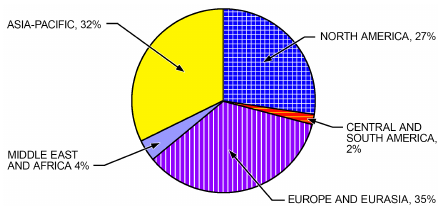

*Fig. 5 World Recoverable Coal Reserves: 2015*

> (Basis: BP 2016)

<!-- str. 908 -->

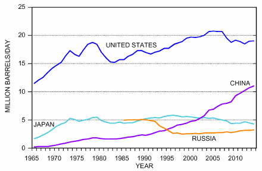

*Fig. 6 World Petroleum Consumption: 2015*

> (Basis: BP 2016)

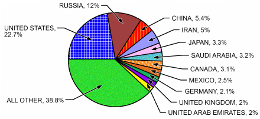

*Fig. 7 World Natural Gas Consumption: 2014*

> (Basis: BP 2015)

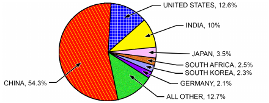

*Fig. 8 World Coal Consumption: 2014*

> (Basis: BP 2015)

**Coal.** The two largest coal producers in 2014 (China and the United States) were also the two largest consumers. China is by far the largest coal consumer, with consumption more than four times that of the United States in 2014. Figure 8 depicts the percentage of world consumption by the leading consumers during 2014. Since 1980, world coal consumption has doubled, largely because of remarkable growth in coal consumption in China. Figure 9 shows the change in coal consumption since 1980 for the United States, China, and India. Over this span, consumption by China increased 544%, in India 535%, and in the United States 17%. However, coal consumption has been declining in the United States over the past 10 years, and growth in coal consumption in China has slowed dramatically since 2010. Growth of coal consumption in India has continued. Although not shown on the graph, coal consumption is declining in most European countries.

**Electricity.** Figure 10 shows the world’s electricity generation by energy resource in 2002 and 2012. (Note: unlike other energy statistics, which generally include 2014 data, the most recent year in

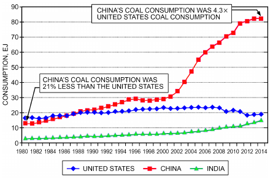

*Fig. 9 Coal Consumption in United States, China, and India, 1980-2014*

> (Basis: BP 2015)

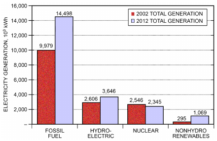

*Fig. 10 World Electricity Generation by Resource: 2002 and 2012*

> (EIA 2012)

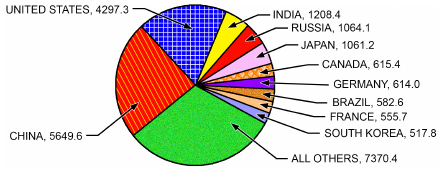

*Fig. 11 World Electricity Generation 2014*

> (Basis: BP 2015)

which generation by fuel type is available is 2012.) Fossil fuel generation increased 45.3%, hydroelectric generation increased 39.9%, and nuclear generation decreased 7.9%, although this level of decrease may be temporary, driven by the shutdown of almost all nuclear generation in Japan during 2012. Nonhydroelectric renewable generation increased by the largest percentage (262.3%), but is still substantially less than the other resources.

Figure 11 shows total electricity generation by geographic region for 2014. China and the United States produced the most electricity, followed by India, Russia, and Japan.

**Per Capita.** Figure 12 compares the per capita energy consumption of selected countries for 2014. As is apparent, per capita energy

<!-- str. 909 -->

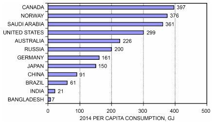

*Fig. 12 Per Capita Energy Consumption by Selected Countries: 2011*

> (Basis: BP 2015; CIA 2016)

consumption in countries with extreme weather, whether cold or hot, tends to be highest; also, the level in more developed countries is vastly different from that in less developed countries and differs considerably even among the more developed countries. Note that, although China’s total energy use has grown very rapidly in recent years, on a per capita basis it is still substantially below the levels of more developed countries.

## 3.2 CARBON EMISSIONS

Worldwide carbon emissions from burning and flaring fossil fuels rose 21.8% from 2004 to 2014. Other sources of greenhouse gas emissions are included under international treaties; however, this section only shows the portion from marketed fossil fuel production, and so does not include greenhouse gas emissions from energy production, methane emission from various sources, or releases of high-global-warming-potential (GWP) chemicals such as refrigerants. Total carbon emissions were 35.499 billion tonnes of carbon dioxide in 2014, up from 29.143 billion tonnes in 2004. Figure 13A shows the changes in carbon emissions from burning fossil fuels from 2004 to 2014 for the total world and for selected countries. Greenhouse gas emissions dropped 7.4% in the United States, and dropped 18.8% in the European Union. Countries such as China, India, and Saudi Arabia showed the largest increases. Note that, although developing countries have the highest growth rates, their per capita carbon emissions are much less than in wealthier nations. A graph of per capita carbon emissions would look very similar to Figure 12, which shows per capita energy consumption of selected countries. Carbon emissions from fossil fuel use alone were not readily available for the EU as a whole. The data shown are for 22 of the 28 countries in the EU for which fossil fuel data was available by country. The six countries not included are very small, so the difference between the emissions shown and the EU total is not substantial.

## 3.3 U.S. ENERGY USE

### Per Capita Energy Consumption

Figure 14, based on data from BP (2012), shows the growth in per capita energy use since 1965 for the world and for the United States. As can be seen in the graph, United States per capita energy use was approximately six times the world average in 1965, dropping to five times in 1985, and is now about four times the world average. Although the world average per capita energy use has steadily risen, U.S. per capita energy use peaked in the late 1960s, rose at a slow rate in the 1990s, and has generally declined in recent years.

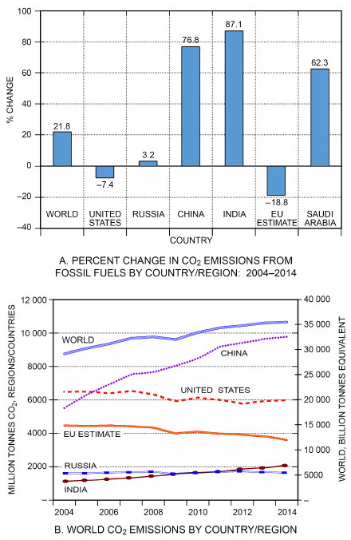

*Fig. 13 World Carbon Emissions*

> (Basis: EIA 2015)

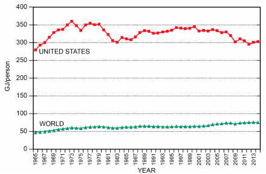

*Fig. 14 Per Capita United States Energy Consumption*

> (Basis: BP 2015)

### Projected Overall Energy Consumption

The International Energy Outlook is a projection of total world energy use developed by the United States Department of Energy Information Administration (EIA 2016). Figure 15 shows projected energy consumption through the year 2040.

<!-- str. 910 -->

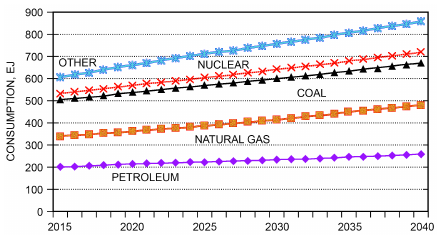

*Fig. 15 Projected World Energy Consumption by Resource*

Petroleum consumption is projected to increase by 1.10% percent per year, resulting in increased usage of 30% by 2040. Natural gas usage is projected to increase 1.90% per year, for a 64% increase by 2040. Coal is projected to increase 0.60% per year, for a 12% total increase. Nuclear power is projected to grow 2.3% yearly, for an 87% increase. “Other” energy sources, which includes renewables, are projected to grow at the highest rate, 2.60% annually, for an 87% increase by 2040.

The *Annual Energy Outlook* is the basic source of data for projecting energy use in the United States (EIA 2015). Figures 16 and 17 summarize data from this source. Information is available in greater detail for United States projected energy use than for world energy use.

EIA (2016) forecasts energy trends based on macroeconomic growth scenarios, which include a variety of energy price and economic growth assumptions. Figures 16 and 17 (the baseline or reference case) assume average annual growth of the real gross domestic product (GDP) at 2.2%, of the labor force at 0.7%, and of productivity at 1.7%. To be policy neutral, the forecast also assumes that all federal, state, and local laws and regulations in effect at the end of 2015 remain unchanged through 2040. Note: based on laws in effect at the end of 2015, this forecast assumes the implementation of the United States’ Clean Power Plan, which proposed to reduce the allowable greenhouse gas emissions for existing electric power plants by 30% compared to 2005 levels (EPA 2016). However, later in 2016 this proposal was suspended, pending review by the United States Supreme Court. An alternative scenario developed by EIA assumed that the Clean Power Plan was not implemented, and projected less renewable energy growth and a lower rate of decline in coal consumption. Figure 16 shows energy use by major end-use sector (i.e., residential, commercial, industrial, and transportation). HVAC&R engineers are primarily concerned with the first three sectors. Figure 17 shows energy consumption by type of resource.

The following observations apply to the overall picture of projected energy use in the United States over the next two decades (Figures 16 and 17):

- As discussed previously, the base forecast assumes implementation of the Clean Power Plan for reducing greenhouse gas emissions for existing electric power plants, which is currently under legal review. Carbon emissions from energy use are projected to decline slowly, decreasing by an average of 0.2% per year through 2040 because of projected shifts in fuel use from coal to less carbon-intensive fuels (gas and renewables), and because of higher efficiency standards for appliances and commercial equipment, stronger building codes, and higher required mileage from vehicles. Per capita carbon emissions are projected to decline 0.8% per year.

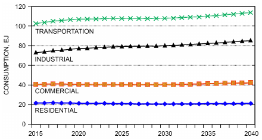

*Fig. 16 Projected Total U.S. Energy Consumption by End-Use Sector*

> (Basis: EIA 2016)

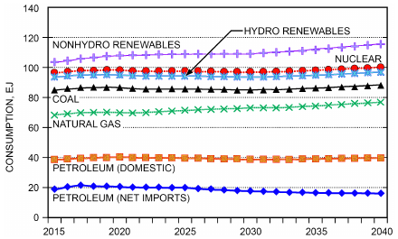

*Fig. 17 Projected Total U.S. Energy Consumption by Resource*

> (Basis: EIA 2016)

- Crude oil prices are expected to rise at an annual rate of 3.9% more than inflation. This high rate of increase is due to a low starting point for crude oil prices in 2015, rather than a fundamental change in projected supply and demand conditions.
- The wellhead price of natural gas was projected to rise at an annual rate of 2.5% more than inflation from 2015 through 2040. However, the starting point is about $2.46/gigajoule wellhead price, well below historic prices of recent years. Natural gas prices are projected to reach $4.74 per gigajoule in 2024, and stay stable near that price until 2040. This forecast assumes a long-term stable price for natural gas, tracking the rate of general inflation, due to abundant supplies of natural gas that result in 20% of United States natural gas production being exported by 2040. For coal used as a fuel, consumption is expected to decrease by 1.6% per year, resulting in a decline of about 40% in consumption compared to 2014 levels. The price of coal used as a fuel is expected to grow at an annual rate of 0.3% more than inflation over the same period. This is less than previous forecasts, and is a result of lower forecasted demand.
- Commercial electricity prices are projected to increase at the rate of inflation over the forecast period to 2040. Lower fuel costs, including increased usage of renewable energy, will be offset by investments in new generation and replacement of aging assets.
- Nuclear power generation is expected to be stable with a 0% growth rate over the forecast period, with construction of new nuclear power plants projected to offset retirements of existing units. Some older nuclear units have applied for a second 20-year life extension permit, which would allow operation for a total of 80 years.

<!-- str. 911 -->

- Electricity generation using renewable sources (which includes cogenerators) is expected to increase by 3.6% per year. Total renewables, including hydroelectric power, are projected to grow from their current 12% share of electric generation to 25% in 2040.
- Petroleum consumption will grow by 0.2% annually, led by the transportation sector, where most of it (72%) is used.
- The share of petroleum consumption met by net imports is projected to be 41% in 2040, down from 51% in 2015. The U.S. reduction in oil imports is remarkable: as recently as 2005, imports were 60% of liquid fuel use. A steady, slow decline in net imports is expected across the forecast period.
- Natural gas consumption will increase by 0.9% per year in all sectors, driven mostly by increased electric generation using natural gas.
- Coal consumption will decrease at an average annual rate of 1.4%, as coal used for electric generation is replaced by other energy sources.
- Electricity consumption is projected to grow by 0.7% annually, with efficiency gains offset by increased use of electricity-using equipment and an increasing population.
- Total energy consumption in the residential sector is projected to decline by 0.1% per year, and commercial energy consumption is projected to grow by 0.5% per year, as increased efficiency and other factors approximately balance population growth.
- Energy use by the transportation sector is projected to decline by 0.2% per year, with variations from this average depending heavily on prevailing fuel prices. Transportation energy use is declining, which reflects increased fuel efficiency during the forecast period.
- Per capita energy use is projected to decline by 0.2% annually, because increases in efficiency more than offset population growth and new energy-consuming products.
- Total energy use per dollar of gross domestic product (energy intensity) will continue to fall at an average rate of about 1.7% per year through 2040.
- Total carbon emissions are projected to decline by 0.2% annually through 2040, based on current regulations in place, including the Clean Power Plan to restrict electric power sector carbon emissions.

### Outlook Summary

In general, the following key issues will dominate energy matters in the next two decades:

- Reduced U.S. dependency on imported oil.
- Increased use of natural gas and renewables, with particularly strong growth in the use of renewables.
- Role of technology developments, including energy conservation and energy efficiency as alternatives to energy production.
- Substantial increases in use of renewable energy, rising from 7.1% of total U.S. production in 2015 to 13.0% in 2040. For electric generation, renewables increase from 12.8% in 2015 to 27.8% by 2040.
- Continued growth in total worldwide carbon emissions, and debate over actions to deal with the issue.
- Relative merits of various energy alternatives, including nuclear power and different renewable energy options.
- Population growth, coupled with the shift of large population segments into retirement.

## 3.4 U.S. AGENCIES AND ASSOCIATIONS

American Gas Association (AGA), Washington, D.C.

American Petroleum Institute (API), Washington, D.C.

Bureau of Mines, Department of Interior, Washington, D.C.

Council on Environmental Quality (CEQ), Washington, D.C.

Edison Electric Institute (EEI), Washington, D.C.

Electric Power Research Institute (EPRI), Palo Alto, CA

Energy Information Administration (EIA), Washington, D.C.

Gas Research Institute (GRI), Des Plaines, IL

National Coal Association (NCA), Washington, D.C.

North American Electric Reliability Council (NAERC), Princeton, NJ Organization of Petroleum Exporting Countries (OPEC), Vienna, Austria United States Green Building Council (USGBC), Washington, D.C.

## REFERENCES

ASHRAE members can access ASHRAE Journal articles and ASHRAE research project final reports at technologyportal.ashrae .org. Articles and reports are also available for purchase by nonmembers in the online ASHRAE Bookstore at www.ashrae.org/bookstore.

ASHRAE. 2003. *ASHRAE energy position document*.

ASHRAE. 2013. *ASHRAE greenguide: Design, construction, and operation* *of sustainable buildings*, 4th ed.

BP. 2015. *BP statistical review of world energy June 2015.* www.bp.com /content/dam/bp/en/corporate/pdf/bp-statistical-review-of-world-energy -2015-full-report.pdf.

BP. 2016. *BP statistical review of world energy June 2016.* www.bp.com /content/dam/bp/en/corporate/pdf/bp-statistical-review-of-world-energy -2016-full-report.pdf.

CIA. 2016. *The world factbook*. U.S. Central Intelligence Agency, Washington, D.C. www.cia.gov/library/publications/resources/the-world-factbook /index.html.

EIA. 2012. *Annual energy outlook 2012 with projections to 2035*. U.S.

Energy Information Administration, Washington, D.C. www.eia.gov /outlooks/aeo/pdf/0383(2012).pdf.

EIA. 2015. *Annual energy outlook 2015 with projections to 2040*. U.S.

Energy Information Administration, Washington, D.C. www.eia.gov /outlooks/aeo/pdf/0383(2015).pdf.

EIA. 2016. *International energy outlook 2016*. U.S. Energy Information Administration, Washington, D.C. www.eia.gov/outlooks/ieo/.

EPA. 2016. *Fact sheet: Clean Power Plan overview: Cutting carbon pol-* *lution from power plants*. U.S. Environmental Protection Agency, Washington, D.C. www.epa.gov/cleanpowerplan/fact-sheet-clean-power -plan-overview.

Grumman, D.L. 1984. Energy resource accounting: ASHRAE Standard 90C-1977R. ASHRAE Transactions 90(1B):531-546.

Heiman, J.L. 1984. Proposal for a simple method for determining resource impact factors. ASHRAE Transactions 90(1B):564-570.

UN. 1987. Our common future: Report of the World Commission on Environment and Development. Annex to General Assembly document A/42/427, *Development and International Co-operation: Environment*. United Nations. www.un-documents.net/wced-ocf.htm.

## BIBLIOGRAPHY

DOE. 1979. *Impact assessment of a mandatory source-energy approach to* *energy conservation in new construction*. U.S. Department of Energy, Washington, D.C.

EIA. 2001. *Annual energy review 2000*. DOE/EIA-0384(2000). Energy Information Administration, U.S. Department of Energy, Washington, D.C.

EIA. 2006. *Annual energy review 2005*. DOE/EIA-0384(2005). Energy Information Administration, U.S. Department of Energy, Washington, D.C. www.eia.gov/totalenergy/data/annual/archive/038405.pdf.

EIA. 2011. *International energy statistics*. U.S. Energy Information Administration, Washington, D.C.

EISA. 2007. *Energy independence and security act of 2007*. HR-6. 110th Congress, 1st session. www.gpo.gov/fdsys/pkg/BILLS-110hr6enr/pdf /BILLS-110hr6enr.pdf.

Pacific Northwest Laboratory. 1987. *Development of whole-building energy* *design targets for commercial buildings phase 1 planning*. PNL-5854, vol. 2. U.S. Department of Energy, Washington, D.C.

Simmons, M.R. 2006. *Twilight in the desert: The coming world oil shock* *and the world economy*. John Wiley & Sons.

USGBC. 2013. LEED™ reference guides, v.4. U.S. Green Building Council, San Francisco.
