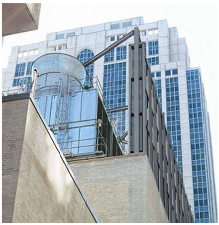
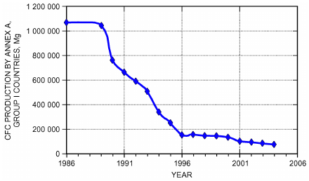
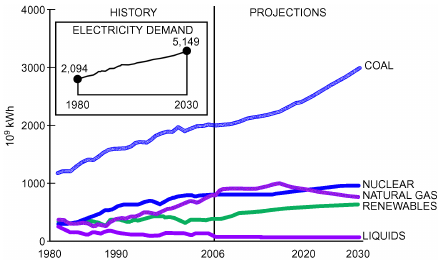

# Chapter 35 — Sustainability

*Izvor: 2021 ASHRAE Handbook — Fundamentals (SI), Chapter 35 (PDF str. 912–923).*

> **Napomena o konverziji:** Tekst je automatski izdvojen iz originalnog PDF-a uz prepoznavanje dve kolone, spojene prelomljene reči i pasuse. Indeksi i eksponenti su označeni sa ``/``, tabele su pretvorene u Markdown tabele (veoma složene tabele su prikazane kao poravnat tekst), a slike su izrezane iz PDF-a u folder `img/`. Složene jednačine (razlomci, sume) mogu biti uprošćeno prikazane. **Pre upotrebe vrednosti u proračunu proveriti u originalnom PDF-u.** Oznake `<!-- str. N -->` pokazuju stranu PDF-a.

## Sadržaj

- [1. DEFINITION](#1-definition)
- [2. CHARACTERISTICS OF SUSTAINABILITY](#2-characteristics-of-sustainability)
- [3. FACTORS IMPACTING SUSTAINABILITY](#3-factors-impacting-sustainability)
- [4. PRIMARY HVAC&R CONSIDERATIONS IN SUSTAINABLE DESIGN](#4-primary-hvacr-considerations-in-sustainable-design)
- [5. FACTORS DRIVING SUSTAINABILITY INTO DESIGN PRACTICE](#5-factors-driving-sustainability-into-design-practice)
- [6. DESIGNING FOR EFFECTIVE ENERGY RESOURCE USE](#6-designing-for-effective-energy-resource-use)
- [REFERENCES](#references)
- [BIBLIOGRAPHY](#bibliography)

<!-- str. 912 -->

SUSTAINABILITY is today a goal that just about every organization, institution, business, or individual claims to be striving for, and sometimes claims to have achieved.

Given the profound impact of buildings on the environment, the work of HVAC&R design engineers is inextricably linked to sustainability. The engineering sector has seminal influence on building performance, and HVAC&R designers’ work is inherently related to overall sustainability in buildings.

HVAC&R engineering design on projects concerned with performance and sustainability requires understanding of and involvement with more than just HVAC, including projected energy and water demands, stormwater runoff generation, waste generation, and air quality impacts. This chapter is intended to provide key information and identify reference sources for further resources on

- Defining the energy, water, and other resource-consuming aspects of projects
- Quantifying the relative environmental impacts of competing design alternatives

These aspects of sustainability are addressed with respect to energy and water conservation, greenhouse gas and air quality impacts, and other impacts of buildings, such as stormwater runoff and potable water use.

The need to address sustainability in the built environment is being accelerated by external concerns such as environmental and resource issues, rising energy prices, indoor environmental quality, climate change, international pressure, natural disasters, and energy security. While economies transition from carbon-based to other forms of more sustainable energy, engineers will be challenged to meet an ever-increasing tide of regulation, demand, and expectations.

## 1. DEFINITION

Sustainability is defined in the ASHRAE GreenGuide (ASHRAE 2013), in general terms, as “providing for the needs of the present without detracting from the ability to fulfill the needs of the future,” a definition very similar to that developed in 1987 by the United Nations’ Brundtland Commission (UN 1987). Others have defined sustainability as “the concept of maximizing the effectiveness of resource use while minimizing the impact of that use on the environment” (ASHRAE 2006) and an environment in which “… an equilibrium … exists between human society and stable ecosystems” (Townsend 2006).

Sustaining (i.e., keeping up or prolonging) those elements on which humankind’s existence and that of the planet depend, such as energy, the environment, and health, are worthy goals.

The preparation of this chapter is assigned to TC 2.8, Building Environmental Impacts and Sustainability.

## 2. CHARACTERISTICS OF SUSTAINABILITY

### Sustainability Addresses the Future

Sustainability is focused on the distant future. Any actions taken under the name of sustainability must address the impact of present actions on conditions likely to prevail in that future time frame.

In designing the built environment, the emphasis has often been on the present or the near future, usually in the form of capital (or first-cost) impact. As is apparent when life-cycle costing analysis is applied, capital cost assumes less importance the longer the future period under consideration.

This emphasis on the distant future can differentiate sustainable design from **green design**. Whereas green design addresses many of the same characteristics as sustainable design, it may also emphasize near-term impacts such as indoor environmental quality, operation and maintenance features, and meeting current client needs. Thus, green design may focus more on the immediate future (i.e., starting when the building is first constructed and then occupied). Sustainable design is of paramount importance to the global environment in the long term while still incorporating features of green design that focus on the present and near future.

### Sustainability Has Many Contributors

Sustainability is not just about energy, carbon emissions, pollution, waste disposal, or population growth. Although these are central ideas in thinking about sustainability, it is an oversimplification to think that addressing one factor, or even any one set of factors, can result in a sustainable future for the planet.

It is likewise a mistake to think that HVAC&R design practitioners, by themselves and just through activities within their purview, can create a sustainable result. To be sure, their activities can contribute to sustainability by creating a sustainable building, development, or other related project. But they cannot by themselves create global sustainability. Such an endeavor depends on many outside factors that cannot be controlled by HVAC&R engineers; however, they should make their fair-share contribution to sustainability in all their endeavors, and encourage other individuals and entities to do the same.

### Sustainability Is Comprehensive

Sustainability has no borders or limits. A good-faith effort to make a project sustainable does not mean that sustainability will be achieved globally. A superb design job on a building with sustainability as a goal will probably not contribute much to the global situation if a significant number of other buildings are not so designed, or if the transportation sector makes an inadequate contribution, or if only a few regions of the world do their fair share toward making the planet sustainable. A truly sustainable outcome thus depends on comprehensive efforts in all sectors the world around.

<!-- str. 913 -->

### Technology Plays Only a Partial Role

It may well be that in due time technology will have the theoretical capability, if diligently applied, to create a sustainable future for the planet and humankind. Having the capability to apply technology, however, does not guarantee that it will be applied; that must come from attitude or mindset. As with all things related to comprehensive change, there must be the will.

For example, automobile companies have long had the technical capability to make cars much more efficient; some developed countries highly dependent on imported oil have brought their transportation sectors close to self sufficiency. Until recently, that has not been the case in the United States. Part of the change is because of increased customer demand, but more of it is driven by government regulation (efficiency standards). The technology is available, but the will is not there; large-scale motivation is absent, what exists being mostly driven by regulation and the motivated few.

Similarly, HVAC&R designers know how to design buildings that are much more energy efficient than they have been in the past, but such buildings are still relatively rare, especially in the general commercial market (as opposed to those owned by high-profile entities). ASHRAE’s long-standing guidance in designing energy-efficient (now green and/or sustainable) buildings, and the motivation provided by its own and other entities’ programs, have pointed the way technologically for the built environment and related industries to make their fair-share contribution to sustainability. Such programs include (1) ASHRAE’s net-zero energy buildings (NZEB) thrust; (2) the U.S. Green Building Council’s (USGBC) Leadership

> ®

in Energy and Environmental Design (LEED ) Green Building Rating System™; (3) the American Institute of Architects’ (AIA) 2030 Challenge (AIA 2011); (4) the Green Building Institute’s (GBI) Green Globes (www.thegbi.org/greenglobes); and (5) the U.S. Environmental Protection Agency’s (EPA) ENERGY STAR® program (www.energystar.gov/). The European Union (E.U.) has also taken a lead in the fight against climate change and promoting a low-carbon economy, although unsustainable trends persist in many areas.

ASHRAE’s mission “to advance the arts and sciences of HVAC&R to serve humanity and promote a sustainable world” and its vision to “be the global leader, [and] the foremost source of technical and educational information” (www.ashrae.org/about-ashrae) has already had significant impact. However, more can be done, both within its technological purview and in overcoming other, nontechnological barriers. ASHRAE has set a good example in its area of expertise and can also encourage, advise, and inspire other sectors to do their part to move towards sustainability. Examples include ASHRAE’s guidance provided to the U.S. government on effective building energy efficiency programs, as well as its many publications such as the *Advanced Energy Design Guides* (AEDGs), the ASHRAE GreenGuide, and its numerous standards and guidelines.

## 3. FACTORS IMPACTING SUSTAINABILITY

The major factors impacting global sustainability are the following:

- Population growth and migration
- Food supply
- Disease control and amelioration
- Energy resource availability
- Material resource availability and management
- Fresh water supply, both potable and nonpotable
- Effective and efficient usage practices for energy resources and water
- Air and water pollution
- Solid and liquid waste disposal
- Land use

The preceding are only broad categories, yet they encompass many subsidiary factors that have received public attention recently. For instance, climate change/global warming, carbon emissions, acid rain, deforestation, transportation, and watershed management are important factors as well. However, each of these can be viewed as a subset of one or more of the listed major areas.

## 4. PRIMARY HVAC&R CONSIDERATIONS IN SUSTAINABLE DESIGN

The main areas falling within an HVAC&R designer’s (and ASHRAE’s) purview on most projects are those dealing with energy and water use, material resources, air and water pollution, and solid waste disposal. Although HVAC&R professionals’ expertise may impact issues such as land use and food supply on certain specialized projects, these more typically fall under the purview of other professionals and their organizations.

### Energy Resource Availability

Although conventional energy resources and their availability largely fall beyond the scope of HVAC&R designers’ work, an understanding of these topics is often required for participation in project discussions or utility programs relating to projects. Chapter 34 has more information on energy resources.

Some **renewable** energy resources, in contrast with traditional energy and fuels, are ubiquitous by nature and are thus available on many building sites. **Wind** and **solar** energy are widely distributed (if not always continuously available) on almost any site for use in active or passive ways. Chapter 35 of the 2019 ASHRAE Handbook—HVAC Applications and Chapter 37 of the 2020 ASHRAE *Handbook—Systems and Equipment* provide information on solar energy resources, passive and active space heating and cooling, domestic hot water, and applications of photovoltaics. High-level (high-temperature) **geothermal** energy is only present at limited sites, and may thus be unavailable as a direct energy source on most projects. Low-level geothermal, on the other hand, depends on the nearly constant temperature of the near-surface earth for use as an energy source or sink, and thus can be used on almost any project if other factors align in its favor. See Chapter 34 of the 2019 ASHRAE Handbook—HVAC Applications for more information.

Climatic conditions may often provide another source of “renewable” energy. In arid climates, air systems using evaporative cooling (both direct and indirect) can supplement conventionally powered cooling and refrigeration systems.

Designers should be familiar with the characteristics of common traditional (nonrenewable) energy resources (natural gas, heating oil, electricity) from the standpoint of their use in relevant building applications. Designers are typically very familiar with the relative per-unit cost as it affects the operating cost of the building being designed. Other energy characteristics traditionally taken into account by the designer might also include ease of handling and use, cleanliness, emissions produced, and local availability, because these also have a direct effect on design and installation. Until recently, designers had little reason to consider an energy resource’s characteristics beyond the site line of the project at hand.

However, recent public focus on the impacts of building energy use on the environment has changed that approach. Designers now must consider a resource’s broader characteristics that may affect the regional, national, and global environment, such as its origin (domestic or foreign), security, future availability, emissions characteristics, broad economics, generation/use limitations [gravimetric energy density (J/kg) and areal power density (W/m2)] and social acceptability. Though responsible designers may not be able to do much about such factors, they should be aware of them; indeed, that awareness may affect decisions within the designer’s control.

<!-- str. 914 -->

For instance, familiarity with an energy resource’s emissions characteristics, whether at the well head, mine mouth, or generating station, may influence the designer to make the building more energy efficient, or provide the designer with arguments to convince the owner that energy-saving features in the building would be worth additional capital cost. Furthermore, as owners and developers of buildings become more aware of sustainability factors, designers must stay informed of the latest information and impacts.

One way to reduce a project’s use of nonrenewable energy, beyond energy-efficient design itself, is to replace such energy use with renewable energy. Designers should develop familiarity with how projects might incorporate and benefit from renewable energy. Many kinds of passive design features can take advantage of naturally occurring energy.

Increasingly common examples of nonpassive approaches are solar systems, whether photovoltaic (electricity-generating) or solar thermal (hot-fluid generating). Low-level geothermal systems take advantage of naturally occurring and widely distributed earth-embedded energy. Wind systems are increasingly applied to supplement electric power grids, and are also sometimes incorporated on a smaller scale into on-site or distributed generation approaches.

Some large power users, such as municipalities or large industries, require that a minimum percentage of power they purchase be from renewable sources. Also, renewable portfolio standards are being imposed on electric utility companies by regulators.

### Fresh Water Supply

HVAC&R systems can impact potable and nonpotable water supplies both directly and indirectly. First, some building systems (e.g., evaporative cooling towers) use potable water. Second, some building systems can discharge treated water or other waste streams with contaminants of concern that can impact local watersheds and water supplies. Indirect impacts include water consumption for electricity generation and in mineral and fuel extraction.

### Effective and Efficient Use of Energy Resources

**and Water**

This area is where HVAC&R engineers can have a profound impact on achieving sustainability goals. Impacts of building consumption can be at least partially mitigated through overall system performance improvement, as well as through increased use of on-site renewable energy and certain off-site energy resources. See the section on Designing for Effective Energy Resource Use for more information on addressing energy efficiency in the design process.

**Water Consumption.** Building systems’ water use can be reduced by reusing clean water from on site, such as condensate drain water, or by using less potable water. For example, hybrid cooling towers can operate as water-to-air heat exchangers when run dry, and can operate their water sprays for additional evaporative capacity only when conditions require. (See also the section on Energy Resource Availability.) In process control and refrigeration systems, similar opportunities exist.

The U.S. EPA’s WaterSense program (www3.epa.gov/water sense/) rates products on their water use efficiency; similarly to the EPA’s ENERGY STAR program, products are certified by an outside third party before they can claim the WaterSense label. ASHRAE is also developing a standard to provide minimum requirements for the design of mechanical systems that limit the volume of water required to operate HVAC systems (Proposed Standard 191P).

In Europe, the U.K. Building Regulations (U.K. 2015) requires that design water consumption be reduced in new homes, with a combined hot- and cold-water consumption of no more than 125 L per person per day of potable water. Alternative sources of lowergrade water, such as harvested rainwater and reclaimed gray water, may also be used for functions such as toilet flushing, subject to specific measures. The 2015 edition introduced an optional requirement of 110 L per person per day where required by planning permission, and an alternative fittings-based approach to demonstrating compliance instead of the prescribed calculation method.

Discharge from building systems can be reduced through careful design, proper sequences and control, and choosing lower-impact chemical or nonchemical water treatment. These techniques may not eliminate chemical treatment in all applications, but negative effects from such usage can be substantially reduced.

**Water/Energy Nexus.** The water/energy nexus refers to the interdependent and inseparable nature of these two important resources. From large-scale utilities to the built environment, water production requires energy to extract and deliver for consumption, and electricity generation and energy sources (e.g., thermal and nuclear power generation, hydraulic fracturing, biofuels) demand significant amounts of water for production. With approximately 8% of the global energy generation used for pumping, treatment, and transportation of water resources and approximately 15% of the world’s total water withdrawal used for energy production, each resource will continue to face rising demands and constraints as a consequence of economic and population growth and climate change.

Increasing energy demands, as well as naturally occurring water constraints such as droughts, heat waves, or human-induced shortages, mean that demands on water resources can be expected to increase. In addition, changing temperatures, shifting precipitation patterns, increasing variability, and more extreme weather add significant uncertainty about water availability. Water and energy, in their various classifications, are generally viewed in individual silos, which has limited adoption of integrated solutions. To properly address the challenges and opportunities around the water/energy nexus, emphasis on policy incentives and sustainable engineering solutions promoting optimized, efficient use of each resource, as well as advancement in technologies promoting both water and energy conservation, are needed.

### Material Resource Availability and Management

Environmentally conscious design and construction practices are increasingly motivating design teams to apply life-cycle thinking and look in to the embodied impacts (e.g., embodied energy, embodied CO2, other equivalent environmental impact indicators) of their systems’ design, although this is not yet a common practice. For example, within the LEED framework, building systems under the purview of HVAC&R designers are currently excluded from credits for locally procured building materials and resources. However, the same concepts can be applied in selection and procurement of HVAC&R system components. For example, recycled steel content in system components could be required to be stated in HVAC&R product submittals. In some areas, locally assembled or manufactured components may be available that can reduce transportation impacts.

### Embodied Energy

As buildings become more energy efficient and their operational energy is reduced, more emphasis will shift toward reducing their embodied energy (UNEP 2014). Materials used directly in the construction and the components, equipment, and systems for building operation embody the energy used during their manufacturing, transportation, and installation (ASHRAE 2013). Material selection should also consider the environmental impact of demolition and disposal after the service life of the products. Building **life-cycle assessment (LCA)** focuses on the environmental impact of a product system (from materials acquisition to manufacturing, use, and final disposition) and plays a major role in promoting sustainability. This is a cradle-to-grave approach that evaluates all stages of individual materials and the product’s life to determine their cumulative environmental impact. Srinivasan et al. (2014) reviews various building assessment methods that support environmental decision making. Designers should give preference to resource-efficient materials and reduce waste by recycling and reusing whenever possible.

<!-- str. 915 -->

LCA is an internationally standardized methodology (ISO Standard 14040). Consecutive parts of an LCA include a life-cycle inventory (e.g., collection and analysis of air and water emissions, waste generation, and resource consumption over the product’s life cycle) and life-cycle impact assessment (LCIA), which is an estimation of indicators of the environmental pressures in terms of climate change, summer smog, resource depletion, acidification, human health effects, etc., attributable to the product’s life cycle. More information on the LCA approach is available online from the EPA (www.epa .gov/saferchoice/design-environment-life-cycle-assessments) and the European Commission (ec.europa.eu/environment/ipp/lca.htm). Various LCA databases and tools available from commercial as well as governmental or public domain sources can be used to calculate and compare the embodied energy (e.g., total energy per unit mass), related embodied emissions (e.g., total mass of CO2 per unit mass of material or product), or other embodied environmental impacts of common building materials and products.

A challenge for modeling life-cycle energy use in buildings is using consistent system boundaries and data collection (Srinivasan et al. 2014). Available software to address these concerns includes Building for Environmental and Economic Sustainability (BEES; www.nist.gov/services-resources/software/bees) and the Tool for Reduction and Assessment of Chemicals and Other Environmental Impacts (TRACI), which focus on chemical releases and raw materials usage in products. The Athena Sustainable Materials Institute’s decision support tool provides a cradle-to-grave, process-based LCA, including regional data such as energy mix for power generation, transportation modes, etc. (www.athenasmi.org/what-we-do /lca-data-software/). Regional data are important because conversion factors to primary energy and GHG emissions can differ by country, depending on energy sources used (e.g., coal- or oil-fired power plants versus solar or natural-gas-based generation).

LCA-based information may be in the form of environmental product declarations (EPD) based on CEN Standard 15804, or product environmental footprints (PEFs) inspired by ISO Standards 14040 and 14044 and voluntary environmental declarations (ISO Standard 14025). They have been gaining in popularity beyond building construction materials, given the growing criteria of green building certifications such as LEED v4 credit, which now rewards selection of HVAC products with EPDs, based on the updated LEED credit interpretation in early 2015. Another example is the French EPD program and national decree that regulates EPDs for construction products, which will also address HVAC equipment and other technical installations by mid-2017 (Passer et al. 2015).

LCA can also assess specific refurbishments intended to improve energy performance of systems in existing buildings. For example, replacing electric or gas water heaters with solar hot-water systems can provide net emissions savings compared with the conventional systems after 0.6 month to 2.5 years, depending on the auxiliary fuel (Crawford et al. 2003). For solar domestic hot-water systems and solar central space heating, the energy consumed by producing and installing the solar systems is recovered in about 1.2 years, and the payback time for the systems’ embodied energy emissions varies from a few months (for solar domestic water heating) to 9.5 years (for solar central space heating), again depending on the energy carrier for the conventional system and the specific environmental emission indicators considered (Kalogirou 2004).

### Air, Noise, and Water Pollution

HVAC&R systems and equipment can interact with both local and global environments. On a local scale, HVAC&R systems interact with the environment in ways such as acoustical noise generated by heat rejecting equipment (e.g., condensing units, cooling tower). Occasionally, this may require the addition of special barriers to prevent sound migration from the site, as shown in Figure 1.

Local impacts of combustion from on-site heat or electricity generation can be mitigated to an extent through careful consideration of the location of sources (emitters) with respect to nearby receptors, including outdoor air intakes and residences or other buildings with operable windows.

On a larger scale, air and water pollution occurs indirectly through the consumption of energy to operate building systems. This occurs in generating the electricity (whether from fossil fuel, nuclear, or hydroelectric resources), steam, or hot water for building heating or cooling. In this sense, improved efficiency is an approach to partial mitigation.

### Solid and Liquid Waste Disposal

The solid waste disposal burden from installation and operations of building systems can be substantially reduced. Competing alternatives can be assessed through life-cycle analysis. For example, an air-cooled unitary system with a shorter service life than a costlier water-cooled alternative could, over the course of the building’s life, increase the solid waste burden when it is discarded. Reuse options should also be considered for locally available materials or process by-products.

An example of an HVAC&R design impacting liquid waste disposal is using glycol to protect coils from freezing, where the glycol must be eliminated in summer to provide required capacity. Because reusing glycol is not a common practice, such a design would likely result in an annual glycol discharge.

In many locations, water quality regulations and agencies essentially limit or prohibit liquid waste disposal. Other approaches to pursue in reducing liquid waste disposal are discussed in the section on Effective and Efficient Use of Energy Resources and Water.

*Fig. 1 Cooling Tower Noise Barrier*

> (Courtesy Neil Moiseev)

<!-- str. 916 -->

## 5. FACTORS DRIVING SUSTAINABILITY INTO DESIGN PRACTICE

HVAC&R designers face many challenges as they assimilate sustainability into their engineering practices. These challenges include climate change, a fast-changing regulatory and legal environment, and evolving standards of care. New tools, technologies, and approaches are required for well-prepared HVAC&R engineers. The challenges and the responses are creating new opportunities, just as changing project processes are allowing or requiring engineers to participate in projects in new ways.

### Climate Change

In addition to their causal role, energy systems are exposed to significant vulnerabilities resulting from climate change (Bruckner et al. 2014). Increased volatility in weather profoundly affects HVAC&R practice. Historical weather data and extremes may inadequately describe conditions faced by a project built today, even over a modest building lifespan.

In 1988, the United Nations Environment Programme (UNEP) and the World Meteorological Organization (WMO) established the Intergovernmental Panel on Climate Change (IPCC) (www.ipcc.ch) to study and report on the scientific issues, potential impacts, and mitigation methods associated with climate change. A series of publications discusses the possible outcomes and interventions required to mitigate the impacts of anthropogenic emissions.

During the United Nations Framework Convention on Climate Change in Paris, 195 nations reached a historic agreement to combat climate change and encourage actions and investment toward a low-carbon, resilient, and sustainable future (UNFCC 2015); the agreement governs greenhouse gas emissions measures from 2020 and limits average global warming to 2 K above preindustrial temperatures, while striving for a limit of 1.5 K. It also aims to strengthen the ability to deal with the impacts of climate change. Crucial areas include

- Mitigation: reducing emissions quickly enough to achieve the temperature goal
- Transparency system and global stock-taking: accounting for climate action
- Adaptation: strengthening countries’ ability to deal with climate impacts
- Loss and damage: strengthening ability to recover from climate impacts
- Support (including financial support): for nations to build clean, resilient futures (e.g., work to define a clear roadmap on ratcheting up climate finance to USD 100 billion by 2020 for developing nations)

The agreement will come into force after 55 countries that account for at least 55% of global emissions have deposited their instruments of ratification. Accordingly, each country should set up a bottom-up system, setting its own goals for nationally determined contribution and a coherent plan for reaching these objectives. Starting in 2018, each country will have to increase their pledges over time and submit new plans every five years. (See also the discussion in the section on Regulatory Environment.)

Responsible designers are concerned with multiple dimensions of climate change: not only what they can do to reduce their designs’ contribution, but also whether and how their designs should anticipate the future. It is the first that is the focus of this chapter and a majority of the available information on sustainable design. Warming trends currently occurring have been observed with certainty. As a result, historical weather data may not be the best source for load calculations. Depending on the rate of change, anticipating future weather may become more significant in its impact on the climate control of building systems.

Responsible designers are concerned with two dimensions of climate change: not only what they can do to reduce their designs’ contribution, but also whether and how their designs should anticipate the future. It is the first that is the focus of this chapter and a majority of the available information on sustainable design. Warming trends currently occurring have been observed with certainty. As a result, historical weather data may not be the best source for load calculations. Depending on the rate of change, anticipating future weather may become more significant in its impact on the climate control of building systems.

### Regulatory Environment

The global community has responded to two major environmental issues during the past two decades. In the late 1980s, the Montreal Protocol (UNEP 2003) regulated the manufacture and trade of refrigerants that had been shown to damage the stratosphere by depleting stratospheric ozone. The effect on the HVAC&R industry was to require research and investment in alternative materials to those that had become the mainstays of the industry, as shown in Figure 2.

Next, in the early 1990s, came the much more controversial issue of greenhouse gas (GHG) emissions and their potential for causing global warming. In response to these threats, some countries signed and accepted the Kyoto Protocol (UNFCCC 1998), which placed future limits on these emissions, but most large-emitter countries did not. By 2011, when follow-up climate talks occurred in Durban, South Africa, overall global GHG emissions not only had not been reduced but had increased. No new GHG emission reduction targets came out of those talks, although the countries agreed to look at the limits issue again in 2020 and to set up a “green fund” to help poor nations deal with climate change.

Despite the lack of effective global action, evidence of climate change is compelling. The Synthesis Report that integrated the findings of the three working group contributions to the Fifth Assessment Report of the Intergovernmental Panel on Climate Change (IPCC 2014) confirmed that “human influence on the climate system is clear and growing, with impacts observed across all conti-

- nents and oceans … Many of the observed changes since the 1950s are unprecedented over decades to millennia. The IPCC is now 95% certain that humans are the main cause of current global warming.” Similar conclusions have also been supported by the National Academy of Sciences (NAS 2010), which concluded that “Climate change is occurring, is caused largely by human activities, and poses significant risk for—and in many cases is already affecting—a broad range of human and natural systems.”

The predominant greenhouse gas pollutant is carbon dioxide, which is mainly a by-product of fossil fuel combustion in the transportation, power, industrial, residential, and commercial sectors. According to the EPA (2016), CO2 contributed about 82% of total U.S. emissions in 2013. Methane is the next highest contributor, accounting for about 10% of the total U.S. emissions. Sources of methane emissions include oil and gas systems, enteric fermentation, landfills, coal mines, etc. Nitrous oxide (N2O) and fluorocarbon gases are other contributors to GHG emissions. In 2014, the top four emitting countries/regions, accounting for almost two-thirds (61%) of the total global CO2 emissions, are China (30%), the United States (15%), the 28 E.U. Member States (10%), and India (6.5%). On a per capita basis, emissions in the United States (16.5 tonnes CO2 per capita) are twice as high as those of China (7.6) and the European Union (6.7) (Olivier et al. 2015).

*Fig. 2 Effect of Montreal Protocol on Global Chlorofluorocarbon (CFC) Production*

<!-- str. 917 -->

Various standards, policies, and regulations under way that target reduction of U.S. GHGs in various sectors: examples include state renewable portfolio standards (RPS) programs, corporate average fuel economy (CAFE) standards, state emission performance standards for power plants [e.g., California (2006) Senate Bill SB 1368], and cap-and-trade programs in the Regional Greenhouse Gas Initiative (RGGI; www.rggi.org) states and California.

In the United States, a consolidation of green building codes is planned: the merger of ASHRAE Standard 189.1 and ICC’s Inter-*national Green Construction Code* (see also the section on Evolving Standards of Care) is on track to occur in 2018. Energy efficiency levels in U.S. codes will continue to improve, with the green building codes evolving toward a net energy intensity level that, by 2025, is 20 to 25% of the code minimums that existed at the turn of the 21st century.

Under its 2020 strategy, the E.U. has committed to an ambitious plan and introduced binding legislation for the E.U. Member States to meet three climate and energy targets by the end of 2020: (1) 20% cut in GHG emissions from 1990 levels, (2) obtain 20% of E.U. energy from renewables, and (3) 20% improvement in energy efficiency (ec.europa.eu/clima/policies/strategies/index_en.htm). The E.U. emissions trading system (E.U. ETS) is a cornerstone of the policy to combat climate change and a key tool for reducing industrial GHG cost effectively. The ETS covers more than 11 000 power stations and industrial plants in 31 countries, as well as airlines, and accounts for about 55% of total E.U. emissions. For sectors not in the ETS, the E.U. Member States have taken on binding annual targets until 2020 for cutting emissions under the effort-sharing decision (between 2013 and 2020) according to national wealth, measured by gross domestic product per capita; these targets range from a 20% cut for the richest countries (e.g., Luxembourg, Denmark) to a maximum 20% increase for the least wealthy (e.g., Bulgaria). Moreover, a new E.U. framework has set three key targets for 2030: (1) at least 40% cuts in GHG, (2) at least 27% share for renewable energy, and (3) at least 27% improvement in energy efficiency. The 2050 roadmap suggests that the E.U. should cut emissions to 80 to 95% below 1990 levels.

### Evolving Standards of Care

This section is based on Lawrence et al. (2016).

Litigation relating to sustainability and global climate issues has increased. For example, a consortium of states successfully sued, and the U.S. Supreme Court agreed in 2007, that the U.S. EPA may act to consider CO2 a pollutant that is harming the environment and thus take measures to regulate its emissions. This ruling is one of several developments in the continued and broadened response to CO2 emissions by society at large. Building design and construction industries are already being impacted.

Sustainability is being adopted into building codes at different levels of government and with varying motivation. Different approaches reflect local societal perceptions, political priorities, national policies and economic factors [see, e.g., Lawrence et al.

(2016) and references therein for an overview of current status and trends of sustainable building codes adopted in the United States and the E.U.].

**U.S. Initiatives.** In the United States, a combination of methods and programs have gradually increased focus on sustainability in new commercial and residential construction. The methods range from voluntary programs (including rating systems and guidelines) to standards and mandatory enforceable codes. One early voluntary program was **U.S. Green Building Council’s Leadership in Ener- gy and Environmental Design (USGCB’s LEED),** which was at the forefront of including sustainable design practices in building codes worldwide. LEED ratings can be applied to a wide variety of building types and aspects (e.g., interior design and construction, neighborhood development, operations and maintenance); see www .usgbc.org/resources/grid/leed for specific ratings systems. At least 16 U.S. states now require LEED Silver certification for public buildings, and in most states some level of LEED certification is a required option for state buildings.

Most states’ building codes follow the **International Green Construction Code™ (IgCC™)** for sustainability guidance. One of IgCC’s compliance options involves following ASHRAE Standard 189.1’s mandatory criteria in all topical areas (e.g., site, construction, materials, energy, indoor environmental quality, water).

In 2010, California adopted its own statewide green buildings code, **CALGreen,** an updated version of which came into effect January 2014 (CALGreen 2013). Unlike most other U.S. codes, this approach includes criteria for both residential and nonresidential buildings in the same program.

ASHRAE’s **Building Energy Quotient® (Building EQ®**; www .buildingenergyquotient.org/) focuses on lowering building operating cost and increasing value. Both as-designed and in-operation energy use ratings are available.

As with green building codes, cities are beginning to require energy reporting and benchmarking for commercial buildings. As of early 2016, 14 major cities (Atlanta, Austin, Berkeley, Boston, Boulder, Cambridge, Chicago, Kansas City, New York, Philadelphia, Portland, San Francisco, Seattle, and Washington, D.C.) had adopted some form of energy reporting in local ordinances, although the size and type of buildings involved may differ. The motivation for these requirements is usually increasing overall citywide energy efficiency, as well as creating local energy auditing jobs.

**E.U. Initiatives.** Outside the United States, the most notable voluntary program is the **BREEAM** method (www.breeam.com), an environmental assessment method and rating system introduced in the U.K. in 1990. This is a consensus-based, market-oriented assessment and sustainability benchmarking program for any type of building or large-scale community worldwide. It has one mandatory assessment area (the building’s potential environmental impact) and two optional assessment areas (design process, and operation/maintenance). Over 425,000 buildings have been certified. Specific national schemes are available in Germany, Norway, Sweden, Spain, and The Netherlands.

Another U.K. rating system is the **Global Environmental Meth- od (GEM)** (www.greenglobes.com/existing/homeuk.asp), which is a version of the U.S. and Canadian program Green Globes (www .greenglobes.com).

In Germany, the **passive house** concept has evolved to an international association for standardizing the design and construction of low-energy buildings (passiv.de/en/). Similar approaches and labels, especially for residential buildings, are also used in France (e.g., **Effinergie**) and Switzerland (e.g., **Minerigie**).

European regulatory efforts have also introduced several mandatory directives towards sustainability at all stages of the energy chain, targeting the buildings sector that plays a major role. The European Union’s Sustainable Development Strategy (SDS)

<!-- str. 918 -->

(ec.europa.eu/environment/eussd/index.htm) addresses climate change and clean energy, sustainable consumption and production, conservation and management of natural resources, public health, social inclusion, global poverty and sustainable development challenges, and education and training. The main E.U. sustainable consumption and production (ESCP) initiatives support efforts to meet the goals of SDS (ec.europa.eu/environment/eussd/escp_en .htm) and build on international and E.U.-wide initiatives and tools [e.g., the United Nations’ Marrakech Process (esa.un.org/marrakech process/index.shtml)]. Beyond operational energy issues for sustainable buildings, E.U. ESCP policy focuses on resources such as materials (including waste), water, and embodied energy. The E.U. Waste Framework Directive (WFD; E.U. Directive 2008/98/EC) aims for 70% for reuse, recycling, and others forms of material recovery (excluding energy recovery), and is the main European policy driver toward better recycling of construction and demolition waste. The WFD is expected to reduce burdens on the waste stream, because construction and demolition waste (CDW) accounts for 25 to 30% of the waste generated in Europe. CDW has a high potential for recycling and reuse, averaging about 46% across Europe (depending on value of the materials and availability of well-developed technology and infrastructure) (Dodd et al. 2015).

Energy efficiency can be increased at all stages of the energy chain, from generation to consumption (ec.europa.eu/energy/en /topics/energy-efficiency). The main European legislative tool for improving buildings’ energy efficiency and reducing carbon emissions is the Energy Performance of Buildings Directive (EPBD; E.U. Directive 2010/31/EC): E.U. Member States must apply minimum energy performance requirements on all new and existing residential and nonresidential buildings when undergoing major renovation (25% of building surface or value). The EPBD requires that all new buildings must be nearly zero energy as of January 2021; new buildings occupied or owned by public authorities must comply as of January 2019. Other major policies include

- Renewable Energy Directive (RED; E.U. Directive 2009/28/EC), which establishes an overall policy for the production and promotion of energy from renewables
- Ecodesign (ED; E.U. Directive 2009/125/EC) and Energy Labelling Directives (ELD; E.U. Directive 2010/30/E.U.), which establish minimum energy efficiency standards for various products (including air-conditioners, boilers, circulators, motors, fans, pumps)
- Energy Efficiency Directive (EED; E.U. Directive 2012/27/E.U.), which establishes a common framework for promotion of energy efficiency, and sets energy savings requirements for buildings

In accordance with the EPBD, energy performance certification (EPC) of European buildings is an ongoing process for several years; see ASHRAE (2013) for examples. EPCs document the building’s energy performance, usually using an easy-to-understand indicator expressed as a ranking energy label (building class) with an index in terms of primary or final energy use, carbon dioxide emissions, or energy cost per unit of conditioned floor area. EPCs also may include an assessment of indoor environmental quality. In January 2013, The Netherlands became the first E.U. Member State to require measurement of GHG in buildings (Dodd et al. 2015): the Dutch Building Decree requires reporting of GHG emissions and depletion of natural resources for structural components of residential and office buildings (over 100 m2) on application for a building permit.

### Changing Design Process

Even in jurisdictions without regulatory action, change is happening in the HVAC&R industry. Today’s engineer can contribute value to projects that have sustainability goals, using some of the many resources and approaches cited in this chapter. (See the section on Designing for Effective Energy Resource Use.)

ASHRAE, in partnership with the Illuminating Engineering Society (IES) and USGBC, developed Standard 189.1 for high-performance green buildings, which calls for a determination of annual CO2 equivalent emissions in addition to overall energy savings and other requirements. The component of such emissions from electricity use depends on the mix of fuels used to generate that electricity. In addition to regional variations, the overall fuel mix is projected to change, as shown in Figure 3.

Emissions considerations alone are not the only driver for design decision making. Energy prices and societal pressures continue to mount. Examples of recent drivers include

- Antiquated electric transmission and distribution infrastructure and plans to develop a smart grid to improve it
- Power plants being forced to become cleaner and more efficient, expediting closure of cheap, dirty generators
- Mandates imposed on utilities to provide more renewable energy to customers
- Influence of commodities trading markets on spot and future prices
- Constrained natural gas reserves and growth in demand continuing to increase volatility in the natural gas market
- Climate change, through environmental pressures to reduce carbon emissions in the face of increased demand for electricity, and infrastructure damage from more frequent storms
- Growing impatience from some elements, both domestically and internationally, over the perceived slow pace of acceptance of sustainable design, leading proponents to push harder for seriously addressing climate and energy resource issues

These and other pressures are changing project teams and their work; those teams are being asked to

- Incorporate sustainable design guidance, standards, and rating systems into their work
- Add a variety of new team members to bring additional expertise to address sustainability
- Gather quantitative data related to energy, water, occupant satisfaction, greenhouse gas emissions, etc.
- Use new analysis tools (e.g., daylighting modeling) to help maximize sustainability

Opportunities relating to sustainability for the well-prepared engineer are growing. The increased focus on sustainability in the built environment allows for more integrated, effective, and efficient ways to meet the nexus between environment, economy, regulation, and societal pressure. The challenge for the industry is how quickly

*Fig. 3 Electricity Generation by Fuel, 1980–2030*

> (EIA 2008)

<!-- str. 919 -->

it can adapt to these new opportunities and grow in an increasingly regulated environment. At the very least, the standard of care for engineers must be tracked and implemented to manage liability. Sustainability can provide an opportunity for engineers and others to increase market share while exceeding current regulatory constraints and anticipating future regulations. More details on design considerations are provided in the section on Designing for Effective Energy Resource Use.

Integrating sustainability into HVAC&R system design can result in built environments that respect the greater environment and provide safe and comfortable indoor environments. The three occurrences of the letter i in sustainability can be thought of as representing key concepts in sustainable design: interactive, iterative, and integrated. Design processes that require greater interaction between team members and more iterative analysis to improve design solutions can be undertaken by teams through what has become known as integrated design.

Sustainability is inherently multidisciplinary. Recognizing this, teams often assemble a broad array of experts in a collaborative, interdisciplinary approach to achieve the highest levels of sustainability possible. This integrated design approach is addressed in Chapter 58 of the 2019 *ASHRAE Handbook—HVAC Applications* and in ASHRAE (2013).

### Other Opportunities

In addition to designing HVAC&R systems, engineers may increasingly be called upon to help address issues ranging from transportation to irrigation to on-site renewable energy. The approach to sustainable design alternatives opens the door for creativity and innovation in the design process. Rather than taking a one-size-fits-all approach to design, engineers can provide a range of available solutions and facilitate flexible implementation. Often, engineers are asked to develop and evaluate measures based on both economic and environmental performance. Success may require several design iterations to achieve the desired performance.

## 6. DESIGNING FOR EFFECTIVE ENERGY RESOURCE USE

Most energy used in buildings is from nonrenewable resources, the cost of which historically has not considered replenishment or environmental impact. Thus, consideration of energy use in design has been based primarily on economic advantages, which are weighted to encourage more rather than less use.

As resources become less readily available and more exotic, and replenishable sources are investigated, the need to operate buildings effectively using less energy becomes paramount. Extensive studies since the mid-1970s [see, e.g., Doris et al. (2009) and references therein] have shown that building energy use can be significantly reduced by applying the fundamental principles discussed in the following sections.

**Energy Ethic: Resource Conservation Design Principles**

The basic approach to energy-efficient design is reducing loads (power), improving transport systems, and providing efficient components and “intelligent” controls. Important design concepts include understanding the relationship between energy and power, maintaining simplicity, using self-imposed budgets, and applying energy-smart design practices.

### Energy and Power

From an economic standpoint, more energy-efficient systems need not be more expensive than less efficient systems. Quite the opposite is true because of the simple relationship between energy and power, in which power is simply the time rate of energy use (or, conversely, energy is power times time). Power terms such as kilowatts are used in expressing the size of a motor, chiller, boiler, or transformer. Generally, the smaller the equipment, the less it costs. Other things being equal, as smaller equipment operates over time, it consumes less energy. Thus, in designing for energy efficiency, the first objective is always to reduce the power required to the bare minimum necessary to provide the desired performance, starting with the building’s heating and cooling loads (a power term, in kilowatts) and continuing with the various systems and subsystems.

### Simplicity

Complex designs to save energy seldom function in the manner intended unless the systems are continually managed and operated by technically skilled individuals. Experience has shown that long-term, energy-efficient performance with a complex system is seldom achievable. Further, when complex systems are operated by minimally skilled individuals, both energy efficiency and performance suffer. Most techniques discussed in this chapter can be implemented with great simplicity.

### Self-Imposed Budgets

Just as an engineer must work to a cost budget with most designs, self-imposed power budgets can be similarly helpful in achieving energy-efficient design. The *Advanced Energy Design Guide* series from ASHRAE are a source for guidance on achievable design budgets. For example, the following are possible categories of power (or power-affecting) design budgets for a mid-rise office building:

- Installed lighting (overall) W/m2
- Space sensible cooling W/m2
- Space heating load W/m2
- Electric power (overall) W/m2
- Thermal power (overall) W/m2
- Hydronic system head kPa
- Water chiller (water-cooled) kW/kW cooling (COP)
- Chilled-water system auxiliaries kW/kW cooling
- Unitary air-conditioning systems kW/kW cooling (COP)
- Annual electric energy MJ/(m2·yr)
- Annual thermal energy kJ/(m2·yr·K·day)

As the building and systems are designed, all decisions become interactive as each subsystem’s power or energy performance is continually compared to the budget.

### Design Process for Energy-Efficient Projects

Consider energy efficiency at the beginning of the building design process, because energy-efficient features are most easily and effectively incorporated at that time. Seek the active participation of all members of the design team, including the owner, architect, engineer, and often the contractor, early in the design process. Consider building attributes such as building function, form, orientation, window/wall ratio, and HVAC system types early in the process, because each has major energy implications. Identify meaningful energy performance benchmarks suited to the project, and set project-specific goals. Energy benchmarks for a sample project are shown in Table 1. Consider energy resources, on-site energy sources, and use of renewable energy, credits, utility rebates, or carbon offsets to mitigate environmental impacts of energy use.

Address a building’s energy requirements in the following sequence:

1. **Minimize the impact of the building’s functional require- ments** by analyzing how the building relates to its external environment. Advocate changes in building form, aspect ratio, and other attributes that reduce, redistribute, or delay (shift) loads. The load calculation should be interactive so that the effect of those factors can be seen immediately.

<!-- str. 920 -->

**Table 1 Example Benchmark and Energy Targets for University Research Laboratory**

| Building area, m2 | Gross 15 793 | Lit/Conditioned 10 266 |   |   |   |   |   |   |
|---|---|---|---|---|---|---|---|---|
| **Electricity Electricity for Electricity for Electricity Electricity for** |  |  |  |  |  |  |  |  |
|  | for | Ventilation | In-Building | for Plug | Unidentified | Total | Cogenerated | Grid |
| Electric | Lighting | (Fans) | Pumps | Loads | Loads | Electricity | Electricity | Electricity |
| Design load, W/m2 | 5.60 | 5.38 | 6.46 | 10.4 | — | 28.0 | — |  |
| Peak demand, W/m2 | 4.52 | 5.38 | 4.52 | 7.86 | 0.0017 | 22.3 | — |  |
| Peak demand, kW (Projected submetered peak) | 71 | 85 | 72 | 124 | 20 | 372 | — |  |
| Annual consumption, kWh/yr (Projected submetered reading) | 218 154 | 346 598 | 191 245 | 891 503 | 175 200 | 1 823 000 | 966 000 | 857 000 |
| Annual use index goal, kWh/yr | 1.28 | 2.04 | 1.12 | 5.24 | 1.03 | 10.72 |  |  |
| Annual use index goal, site MJ/m2 gross·yr | 4378 | 6956 | 3838 | 17 893 | 3516 | 36 583 |  |  |
| Annual use index, kWh/m2 gross·yr* | 27.0 to 35.7 | 48.2 to 74.0 | included | 47.3 to 61.0 | NA | 158.7 to |  |  |
|  |  |  | elsewhere |  |  | 192.8 |  |  |
| Annual use index, site MJ/m2 gross·yr* | 97.3 | 173.6 | — | 170.1 | — | 571.1 to |  |  |
|  |  |  |  |  |  | 694.0 |  |  |

*From Labs21 program of U.S. Environmental Protection Agency (EPA) and U.S. Department of Energy (DOE). See labs21benchmarking.lbl.gov.

2. **Minimize loads** by analyzing external and internal loads imposed on the building’s energy-using subsystems, both for peak- and part-load conditions. Design for efficient and effective operation off-peak, where the majority of operating hours and energy use typically occurs.

3. **Maximize subsystem efficiency** by analyzing the diversified energy and power requirements of each energy-using subsystem serving the building’s functional requirements. Consider static and dynamic efficiencies of energy conversion and energy transport subsystems, and consider opportunities to reclaim, redistribute, and store energy for later use.

4. **Study alternative ways to integrate subsystems** into the building by considering both power and time components of energy use. Identify, evaluate, and design each of these components to control overall design energy consumption. Consider the following when integrating major building subsystems:

- Address more than one problem at a time when developing design solutions, and make maximum use of the building’s advantageous features (e.g., windows, structural mass).
- Examine design solutions that consider time (i.e., when energy use occurs), because sufficient energy may already be present from the environment (e.g., solar heat, night cooling) or from internal equipment (e.g., lights, computers) but available at times different from when needed. Active (e.g., heat pumps with water tanks) and passive (e.g., building mass) storage techniques may need to be considered.
- Examine design solutions that consider the anticipated use of space. For example, in large but relatively unoccupied spaces, consider task or zone lighting. Consider transporting excess energy (light and heat) from locations of production and availability to locations of need instead of purchasing additional energy.
- Never reject waste energy at temperatures usable for space conditioning or other practical purposes without calculating the economic benefit of energy recovery or treatment for reuse.
- Consider or advocate design solutions that provide more comfortable surface temperatures or increase the availability of controlled daylight in buildings where human occupancy is a primary function.
- Use easily understood design solutions, because they have a greater probability of use by building operators and occupants.
- Where the functional requirements of a building are likely to change over time, design the installed environmental system to adapt to meet anticipated changes and to provide flexibility in meeting future changes in use, occupancy, or other functions.
- Develop energy performance benchmarks, metrics, and targets that allow building owners and operators to better achieve the design intent. The effectiveness of these benchmarks was studied in ASHRAE research project 1627, which examines performance of K-12 schools and small office buildings that use the AEDGs (Jones et al. 2016).
- Differentiate between peak loads for system design and selection and lower operating loads that determine actual energy use.

### Building Energy Use Elements

**Envelope.** Control thermal conductivity by using insulation (including movable insulation), thermal mass, and/or phase-change thermal storage at levels that minimize net heating and cooling loads on a time-integrated (annual) basis.

- Minimize unintentional or uncontrolled thermal bridges, and include them in energy-related calculations because they can radically alter building envelope conductivity. Examples include wall studs, balconies, ledges, and extensions of building slabs.
- Minimize infiltration so that it approaches zero. (An exception is when infiltration provides the sole means of ventilation, such as in small residential units.) This minimizes fan energy consumption in pressurized buildings during occupied periods and minimizes heat loss (or unwanted heat gain, in warm climates) during unoccupied periods. In warm, humid climates, a tight envelope also improves indoor air quality. Reduce infiltration through design details that enhance the fit and integrity of building envelope joints in ways that may be readily achieved during construction (e.g., caulking, weatherstripping, vestibule doors, revolving doors), with construction meeting accepted specifications. Building envelope commissioning or testing can help verify these design and construction targets.
- Consider operable windows to allow occupant-controlled ventilation. This requires careful design of the building’s mechanical system to minimize unnecessary HVAC energy consumption, and building operators and occupants should be cautioned about improper use of operable windows. CIBSE (2005) provides comprehensive design considerations for natural ventilation.

<!-- str. 921 -->

- Strive to maintain occupant radiant comfort regardless of whether the building envelope is designed to be a static or dynamic membrane. Design opaque surfaces so that average inside surface temperatures remain within 3 K of room temperature in the coldest anticipated weather (i.e., winter design conditions) and so that the coldest inside surface remains within 14 K of room temperature (but always above the indoor dew point). In a building with time-varying internal heat generation, consider thermal mass for controlling radiant comfort. In the perimeter zone, thermal mass is more effective when it is positioned inside the envelope’s insulation.
- Effective control of solar radiation is critical to energy-efficient design because of the high level of internal heat production in most commercial buildings. In some climates, lighting energy consumption savings from daylighting techniques can be greater than the heating and cooling energy penalties that result from additional glazed surface area required, if the building envelope is properly designed for daylighting and lighting controls are installed and used. (In other climates, there may not be net savings.) Daylighting designs are most effective if direct solar beam radiation is not allowed to cause glare in building spaces.
- Design transparent parts of the building envelope to prevent solar radiant gain above that necessary for effective daylighting and solar heating. On south-facing facades (in the northern hemisphere), using low shading coefficients is generally not as effective as external physical shading devices in achieving this balance. Consider low-emissivity, high-visible-transmittance glazings for effective control of radiant heat gains and losses. For shading control, judicious use of vegetation may block excess gain year-round or seasonally, depending on the plant species chosen.

**Lighting.** Lighting is both a major energy end use in commercial buildings (especially office buildings) and a major contributor to internal loads by increasing cooling loads and decreasing heating loads. Design should both meet the lighting functional criteria of the space and minimize energy use. IES (2011) recommends illuminance levels for visual tasks and surrounding lighted areas. Principles of energy-conserving design within that context include the following:

- Energy use is determined by the lighting load (demand power) and its duration of use (time). Minimize actual demand load rather than just apparent connected load. Control the load rather than just area switching, if switching may adversely affect the quality of the luminous environment.
- Consider daylighting with proper controls to reduce costs of electric lighting. Design should be sensitive to window glare, sudden changes in luminances, and general user acceptance of daylighting controls. Carefully select window treatment (blinds, drapes, and shades) and glazing to control direct solar penetration and luminance extremes while maintaining the view and daylight penetration.
- Design the lighting system so that illumination required for tasks is primarily limited to the location of the task and comes from a direction that minimizes direct glare and veiling reflections on the task. When the design is based on nonuniform illuminance, walls should be a light to medium color or illuminated to provide visual comfort. In densely occupied work spaces, uniform distribution of general lighting may be most appropriate. Where necessary, provide supplementary task illumination. General ambient illumination should not be lower than a third of the luminance required for the task, to help maintain visually comfortable luminance ratios.
- Use local task lighting to accommodate needs for higher lighting levels because of task visual difficulty, glare, intermittently changing requirements, or individual visual differences (poor or aging eyesight).
- Group similar activities so that high illuminance or special lighting for particular tasks can be localized in certain rooms or areas, and so that less-efficient fixtures required for critical glare control do not have to be installed uniformly when they are only required sparsely.
- Use lighting controls throughout so lighting is available when and where it is needed, but not wasted when tasks are less critical or spaces are not fully occupied. Also consider user acceptance of control strategies to maximize energy saving.
- Only use lower-efficiency incandescent lamps in applications where their characteristics cannot be duplicated by other sources, because manufacturing of most incandescent lamps will be discontinued during the life of the building.
- Carry lighting design through the rest of the building’s interior design. Reduced light absorption may be achieved by using lighter finishes, particularly on ceilings, walls, and partitions.

**Other Loads.**

- Minimize thermal impact of equipment and appliances on HVAC systems by using hoods, radiation shields, or other confining techniques, and by using controls to turn off equipment when not needed. Where practical, locate major heat-generating equipment where it can balance other heat losses. Computer centers or kitchen areas usually have separate, dedicated HVAC equipment. In addition, consider heat recovery for this equipment.
- Use storage techniques to level or distribute loads that vary on a time or spatial basis to allow operation of a device at maximum (often full-load) efficiency.

**HVAC System Design.**

- Consider separate HVAC systems to serve areas expected to operate on widely differing operating schedules or design conditions. For instance, systems serving office areas should generally be separate from those serving retail areas.
- Arrange systems so that spaces with relatively constant, weather-independent loads are served by systems separate from those serving perimeter spaces. Areas with special temperature or humidity requirements (e.g., computer rooms) should be served by systems separate from those serving areas that require comfort heating and cooling only. Alternatively, provide these areas with supplementary or auxiliary systems.
- Sequence the supply of zone cooling and heating to prevent simultaneous operation of heating and cooling systems for the same space, to the extent possible. Where this is not possible because of ventilation, humidity control, or air circulation requirements, reduce air quantities as much as possible before incorporating reheating, recooling, or mixing hot and cold airstreams. For example, if reheat is needed to dehumidify and prevent overcooling, only ventilation air needs to be treated, not the entire recirculated air quantity. Finally, reset supply air temperature up to the extent possible to reduce reheating, recooling, or mixing losses.
- Provide controls to allow operation in occupied and unoccupied modes. In occupied mode, controls may provide for a gradually changing control point as system demands change from cooling to heating. In unoccupied mode, ventilation and exhaust systems should be shut off if possible, and comfort heating and cooling systems should be shut off except to maintain space conditions ready for the next occupancy cycle.
- In geographical areas where diurnal temperature swings and humidity levels permit, consider judicious coupling of air distribution and building structural mass to allow nighttime cooling to reduce the requirement for daytime mechanical cooling.
- High ventilation rates, where required for special applications, can impose enormous heating and cooling loads on HVAC equipment. In these cases, consider recirculating filtered and cleaned air to the extent possible, rather than 100% outdoor air. Also, consider preheating outdoor air with reclaimed heat from other sources.

<!-- str. 922 -->

**HVAC Equipment Selection.**

- To allow HVAC equipment operation at the highest efficiencies, match conversion devices to load increments, and sequence the operation of modules. Oversized or large-scale systems should never serve small seasonal loads (e.g., a large heating boiler serving a summer-service water-heated load). Include specific low-load units and auxiliaries where prolonged use at minimal capacities is expected.
- Select the most efficient (or highest-COP) equipment practical at both design and reduced capacity (part-load) operating conditions.
- When selecting large-power devices such as chillers (including their auxiliary energy burdens), perform an economic analysis of the complete life-cycle costs. See Chapter 37 of the 2019 ASH-*RAE Handbook—HVAC Applications* for more information on detailed economic analysis.
- Keep fluid temperatures for heating equipment devices as low as practical and for cooling equipment as high as practical, while still meeting loads and minimizing flow quantities.

**Energy Transport Systems.** Energy should be transported as efficiently as possible. The following options are listed in order of theoretical efficiency, from the lowest energy transport burden (most efficient) to the highest (least efficient):

1. Electric wire or fuel pipe 2. Two-phase fluid pipe (steam or refrigerant)

3. Single-phase liquid/fluid pipe (water, glycol, etc.)

4. Air duct

Select a distribution system that complements other parameters such as control strategies, storage capabilities, conversion efficiency, and utilization efficiency.

The following specific design techniques may be applied to thermal energy transport systems:

Steam Systems.

- Include provisions for seasonal or nonuse shutdown.
- Minimize venting of steam and ingestion of air, with design directed toward full-vapor performance.
- Avoid subcooling, if practical.
- Return condensate to boilers or source devices at the highest possible temperature.

Hydronic Systems.

- Minimize flow quantity by designing for the maximum practical temperature range.
- Vary flow quantity with load where possible.
- Design for the lowest practical pressure rise (or drop).
- Provide operating and idle control modes.
- When locating equipment, identify the critical pressure path and size runs for the minimum reasonable pressure drop.

Air Systems.

- Minimize airflow by careful load analysis and an effective distribution system. If the application allows, supply air quantity should vary with sensible load (i.e., VAV systems). Hold the fan pressure requirement to the lowest practical value and avoid using fan pressure as a source for control power.
- Provide normal and idle control modes for fan and psychrometric systems.
- Keep duct runs as short as possible, and keep runs on the critical pressure path sized for minimum practical pressure drop.

**Power Distribution.**

- Size transformers and generating units as closely as possible to the actual anticipated load (i.e., avoid oversizing to minimize fixed thermal losses).
- Consider distribution of electric power at the highest practical voltage and load selection at the maximum power factor consistent with safety.
- Consider tenant submetering in commercial and multifamily buildings as a cost-effective energy conservation measure. (A large portion of energy use in tenant facilities occurs simply because there is no economic incentive to conserve.)

**Domestic Hot-Water Systems.**

- Choose shower heads that provide and maintain user comfort and energy savings. They should not have removable flow-restricting inserts to meet flow limitation requirements.
- Consider point-of-use water heaters where their use will reduce energy consumption and annual energy cost.
- Consider using storage to facilitate heat recovery when the heat to be recovered is out of phase with the demand for hot water or when energy use for water heating can be shifted to take advantage of off-peak rates.

**Controls.** Well-designed digital control provides information to managers and operators as well as to the data processor that serves as the intelligent controller. Include the energy-saving concepts discussed previously throughout the operating sequences and control logic. However, energy conservation should not be sought at the expense of adequate performance; in a well-designed system, these two parameters are compatible. See Chapter 7 of this volume and Chapter 47 of the 2019 *ASHRAE Handbook—HVAC Applications* for more information on controls.

## REFERENCES

ASHRAE members can access ASHRAE Journal articles and ASHRAE research project final reports at technologyportal.ashrae .org. Articles and reports are also available for purchase by nonmembers in the online ASHRAE Bookstore at www.ashrae.org /bookstore.

AIA. 2011. 2030 challenges. architecture2030.org/category/2030-challenges/. ASHRAE. 2006. *ASHRAE’s sustainability roadmap—The approach to de-* *fining a leadership position in sustainability*. Presidential Ad Hoc Committee.

ASHRAE. 2013. *ASHRAE greenguide: The design, construction, and oper-* *ation of sustainable buildings*, 4rd ed. A. Darwich, J. Means and T. Lawrence, eds.

Athena. 2017. *LCA data and software*. Athena Sustainable Materials Institute, Ottawa, ON. www.athenasmi.org.

Bruckner, T., I.A. Bashmakov, Y. Mulugetta, H. Chum, A. de la Vega Navarro, J. Edmonds, A. Faaij, B. Fungtammasan, A. Garg, E. Hertwich, D. Honnery, D. Infield, M. Kainuma, S. Khennas, S. Kim, H.B. Nimir, K. Riahi, N. Strachan, R. Wiser, and X. Zhang. 2014. Energy systems. Ch. 7 in *Climate change 2014: Mitigation of climate change. Contribution of* *Working Group III to the Fifth Assessment Report of the Intergovernmen-* *tal Panel on Climate Change*, O. Edenhofer, R. Pichs-Madruga, Y. Sokona, E. Farahani, S. Kadner, K. Seyboth, A. Adler, I. Baum, S. Brunner, P. Eickemeier, B. Kriemann, J. Savolainen, S. Schlömer, C. von Stechow, T. Zwickel, and J.C. Minx, eds. Cambridge University Press, U.K. www.ipcc.ch/pdf/assessment-report/ar5/wg3/ipcc_wg3_ar5_chapter7 .pdf.

CALGreen. 2013. California Green Building Standards Code, California Code of Regulations, Title 24, Part 11.

California. 2006. Emission performance standards. Senate Bill SB 1368. California Energy Commission, Sacramento. www.energy.ca.gov/emission _standards/.

<!-- str. 923 -->

CEN. 2013. Sustainability of construction works—Environmental product declarations—Core rules for the product category of construction products. European Standard EN 15804+A1. European Committee for Standardization, Brussels.

CIBSE. 2005. *Natural ventilation in non-domestic buildings*. Applications Manual 10. Chartered Institution of Building Services Engineers, London.

Crawford, R.H., G.J. Treloar, B.D. Ilozor and P.E.D. Love. 2003. Comparative greenhouse emissions analysis of domestic solar hot water systems. *Building Research & Information* 31(1):34-47.

Dodd, N., S. Donatello, E. Garbarino and M. Gama-Caldas. 2015. Identifying macro-objectives for the life cycle environmental performance and resource efficiency of EU buildings. Joint Research Centre, European Commission. susproc.jrc.ec.europa.eu/Efficient_Buildings/docs/150528 %20Resource%20Efficient%20Buildings_Macro%20objectives%20WP _Draft%20final.pdf.

Doris, E., J. Cochran, and M. Vorum. 2009. Energy efficiency policy of the United States: Overview of trends at different levels of government. Technical Report NREL/TP-6A2-46532. National Renewable Energy Laboratory, Golden, CO. www.nrel.gov/docs/fy10osti/46532.pdf.

EIA. 2015. *Annual energy outlook 2015.* DOE/EIA-0383(2007). Energy Information Administration, U.S. Department of Energy, Washington, D.C.

EPA. 2016. *Tool for reduction and assessment of chemicals and other envi-* *ronmental impacts (TRACI)*, v. 2.1. U.S. Environmental Protection Agency, Washington, D.C. www.epa.gov/chemical-research/tool-reduction -and-assessment-chemicals-and-other-environmental-impacts-traci.

E.U. 2008. Directive 2008/98/EC of the European Parliament and of the Council of 19 November 2008 on waste and repealing certain directives. E.U. Directive 2008/98/EC. eur-lex.europa.eu/legal-content/EN/TXT /?qid=1487004114713&uri=CELEX:32008L0098.

E.U. 2009. Directive 2009/28/EC of the European Parliament and of the Council of 23 April 2009 on the promotion of the use of energy from renewable sources. E.U. Directive 2009/28/EC. eur-lex.europa.eu/legal -content/EN/TXT/?uri=celex:32009L0028.

E.U. 2009. Directive 2009/125/EC of the European Parliament and of the Council of 21 October 2009 establishing a framework for the setting of ecodesign requirements for energy-related products. E.U. Directive 2009/125/EC. eur-lex.europa.eu/legal-content/EN/TXT/?qid=14870033 89208&uri=CELEX:32009L0125.

E.U. 2010. Directive 2010/30/EU of the European Parliament and of the Council of 19 May 2010 on the indication by labelling and standard product information of the consumption of energy and other resources by energy-related products. E.U. Directive 2010/30/EU. eur-lex.europa.eu /legal-content/EN/TXT/?qid=1487003495623&uri=CELEX:32010 L0030.

E.U. 2010. Directive 2010/31/EU of the European Parliament and of the Council of 19 May 2010 on the energy performance of buildings. E.U. Directive 2010/31/EU. eur-lex.europa.eu/legal-content/EN/TXT/?qid =1487003617334&uri=CELEX:32010L0031.

E.U. 2012. Directive 2012/27/EU of the European Parliament and of the Council of 25 October 2012 on energy efficiency. E.U. Directive 2012/27/EU. eur-lex.europa.eu/legal-content/EN/TXT/?qid=1487003274569 &uri=CELEX:32012L0027.

ICC. 2015. *2015 International Green Construction Code*® (IgCC®). International Code Council, Washington, D.C.

IES. 2011. *The lighting handbook*, 10th ed. Illuminating Engineering Society, New York.

IPCC. 2014. *Climate change 2014: Synthesis report, contribution of Work-* *ing Groups I, II and III to the Fifth Assessment Report of the Intergov-* *ernmental Panel on Climate Change*. R.K. Pachauri and L.A. Meyer, eds. Intergovernmental Panel on Climate Change, Geneva, Switzerland. www.ipcc.ch/report/ar5/syr/.

ISO. 2006. Environmental management—Life cycle assessment—Principles and framework. Standard 14040-2006. International Organization for Standardization, Geneva.

ISO. 2006. Environmental labels and declarations—Type III environmental declarations—Principles and procedures. Standard 14025. International Organization for Standardization, Geneva.

ISO. 2006. Environmental management—Life cycle assessment—Requirements and guidelines. Standard 14044. International Organization for Standardization, Geneva.

Jones, D., S. Reilly, and M. Sadeghy. 2016. Actual energy performance of small office and K-12 school buildings designed to meet the 30% ASHRAE *Advanced Energy Design Guides*. ASHRAE Research Project RP-1627, Final Report.

Kalogirou, S. 2004. Environmental benefits of domestic solar energy systems. *Energy Conversion and Management* 45:3075-3092.

Lawrence, T., C.A. Balaras, and J.K. Means. 2016. A comparison of how sustainability and green building standards are being adopted into building construction codes within the United States and the EU. Proceedings *of the SBE 16—Strategies—Stakeholders—Success Factors—Interna-* *tional Conference on Sustainable Built Environment,* Hamburg, Germany.

NAS. 2010. *Advancing the science of climate change*. National Academy of Sciences, Washington, D.C. www.nap.edu/read/12782/chapter/1#v.

NIST. 2017. *BEES: Building for environmental and economic sustainability*.

National Institute for Standards and Technology. www.nist.gov/el /economics/BEESSoftware.cfm.

Olivier, J.G.J., G. Janssens-Maenhout, M. Muntean, and J.A.H.W. Peters.

2015. *Trends in global CO2 emissions—2015 report*. PBL Netherlands Environmental Assessment Agency, The Hague, and European Commission, Joint Research Centre, Ispra, Italy. edgar.jrc.ec.europa.eu/news _docs/jrc-2015-trends-in-global-co2-emissions-2015-report-98184.pdf. Passer, A., S. Lasvaux, K. Allacker, D. De Lathauwer, C. Spirinckx, B. Wittstock, D. Kellenberger, F. Schösser, J. Wall, and H. Wallbaum. 2015. Environmental product declarations entering the building sector: Critical reflections based on 5 to 10 years experience in different European countries. *International Journal of Life Cycle Assessment* 20:1199-1212. link.springer.com/article/10.1007/s11367-015-0926-3.

Srinivasan, R.S., W. Ingwersen, C. Trucco, R. Ries, and D. Campbell. 2014.

Comparison of energy-based indicators used in life cycle assessment tools for buildings. *Building & Environment* 79:138-151.

Townsend, T.E. 2006. The ASHRAE promise: A sustainable future.

ASHRAE Journal 48(8):14-19.

UK. 2015. *HM Government, The Building Regulations 2010—Part G: San-* *itation, hot water safety and water efficiency*. Newcastle Upon Tyne: NBS. www.planningportal.gov.uk/buildingregulations/approveddocuments /partg/approved.

UN. 1987. Our common future: Report of the world commission on environment and development. Annex to General Assembly document A/42/427, *Development and International Co-operation: Environment*. United Nations. www.un-documents.net/wced-ocf.htm.

UNEP. 2003. *Montreal Protocol handbook for the international treaties for* *the protection of the ozone layer*, 6th ed., Annexes A, B, and C. Secretariat for the Vienna Convention for the Protection of the Ozone Layer and the Montreal Protocol on Substances that Deplete the Ozone Layer, United Nations Environment Programme, Nairobi.

UNEP. 2014. *Greening the supply chain*. United Nations Environment Programme, Sustainable Buildings and Climate Initiative. www.unep.org /sbci/pdfs/greening_the_supply_chain_report.pdf.

UNFCCC. 1998. *Kyoto Protocol to the United Nations framework conven-* *tion on climate change*. United Nations Framework Convention on Climate Change, New York. unfccc.int/resource/docs/convkp/kpeng.pdf.

UNFCCC. 2015. *Adoption of the Paris Agreement*. United Nations Framework Convention on Climate Change, New York. unfccc.int/resource /docs/2015/cop21/eng/l09r01.pdf.

## BIBLIOGRAPHY

ASHRAE. (Various.) *Advanced energy design guides*, 50% and 30% series.

www.ashrae.org/standards-research--technology/advanced-energy -design-guides.

ASHRAE. 2009. *ASHRAE position document on climate change*.

ASHRAE. 2009/2011. *Energy efficiency guides for existing commercial* buildings, vol. 1: Technical implementation, and vol. 2: The business *case for building owners and managers*.

ASHRAE. 2008. *Vision 2020: Producing net zero energy buildings*.

www.ashrae.org/File Library/docLib/Public/20080226_ashraevision2020 .pdf.
