# Chapter 36 — Climate Change

*Izvor: 2021 ASHRAE Handbook — Fundamentals (SI), Chapter 36 (PDF str. 924–948).*

> **Napomena o konverziji:** Tekst je automatski izdvojen iz originalnog PDF-a uz prepoznavanje dve kolone, spojene prelomljene reči i pasuse. Indeksi i eksponenti su označeni sa ``/``, tabele su pretvorene u Markdown tabele (veoma složene tabele su prikazane kao poravnat tekst), a slike su izrezane iz PDF-a u folder `img/`. Složene jednačine (razlomci, sume) mogu biti uprošćeno prikazane. **Pre upotrebe vrednosti u proračunu proveriti u originalnom PDF-u.** Oznake `<!-- str. N -->` pokazuju stranu PDF-a.

## Sadržaj

- [1. OVERVIEW OF CLIMATE SCIENCE](#1-overview-of-climate-science)
- [2. MITIGATING CLIMATE CHANGE](#2-mitigating-climate-change)
- [3. ADAPTING TO CLIMATE CHANGE](#3-adapting-to-climate-change)
- [4. CONCLUSION](#4-conclusion)
- [5. GLOSSARY](#5-glossary)
- [REFERENCES](#references)

<!-- str. 924 -->

The ASHRAE Position Document on Climate Change states unequivocally that climate change “… is the most formidable environmental challenge ever faced by society” (ASHRAE 2018b).Historically, designers and planners assumed a stable climate, and heating and cooling system designs were based on statistics calculated from past weather data, typically for a recent 30-year period. However, we are now experiencing major changes in climate both globally and locally, at rates 10 times greater than seen since the end of the last ice age 20,000 years ago – over decades instead of centuries or millennia (National Academy of Sciences and The Royal Society 2020). This presents a challenge for designers of buildings and their systems, as well as for building operators, since buildings are expected to operate robustly for decades. This chapter stresses the importance of cultivating climate change literacy among designers and operators of buildings and their systems.

This chapter lays out how practicing engineers and architects can use their best professional judgment to mitigate the environmental impact of the buildings and systems they design and adapt them to a changing climate. This content builds upon and complements existing ASHRAE guidance on minimizing the environmental impact of buildings and their systems. For example, ASHRAE publishes whole-building energy and water efficiency standards like Standard 90.1 – Energy Standard for Buildings Except Low-Rise Residential Buildings, as well as guidance on reducing the Greenhouse Gas (GHG) emissions of HVAC&R systems through improved efficiency and phasing out refrigerants with high Global Warming Potential (GWP) and ozone-depleting potential. Other related work concerns the impacts of flooding and other extreme weather events on the ability of buildings to preserve human life and maintain acceptable Indoor Environmental Quality (IEQ). A core theme of this chapter, therefore, is that while there are trade-offs between mitigation and adaptation, both are required.

While there are currently no standardized methods endorsed by ASHRAE to integrate changing climatic information into building and HVAC&R system design, this does not preclude action by practicing engineers and architects. Repeatable and defensible methods can inform and enhance existing ASHRAE standards and guidelines, like those of other professional organizations such as Chartered Institution of Building Services Engineers (CIBSE), American Society of Civil Engineer (ASCE), American Society of Mechanical Engineers (ASME), and American Association of State Highway and Transportation Officials (AASHTO). Resources for assessing the impact of a changing climate on building and system performance exist, both within and outside ASHRAE, and are discussed in this chapter. It is important to recognize that, while climate change will have impacts of varying severity and duration around the world, many designers and operators may find that the buildings and systems they are designing or refurbishing currently will end up in a different climate during their operational life.

This chapter does not lay out prescriptive guidelines to account for changing conditions during the service life of an asset, i.e., a building or its equipment and systems. Instead, practitioners must be informed by their own risk tolerance and risk appetite, a realistic assessment of their climate literacy, their ability to assess the implications of the latest available information on design, and their skills to manage and communicate realistic performance expectations to their clients (WFEO 2015). In this context, the evolution of the standard of care within practice, the use of judgment, and consideration of professional liability compels professionals to carefully consider their professional consultative role as only proposing actions might not meet professional obligations to protect health, safety and welfare (WFEO 2015; Marjanac, Patton, and Thornton 2017; Engineers Canada 2018; Moran and Mihaly 2018).

This chapter borrows terms from the mathematics of risk and uncertainty analysis, using the likelihood terminology outlined in Table 1, as determined by US National Climate Assessment and the Intergovernmental Panel on Climate Change (IPCC). (As an example, a 66-100% probability in Table 1 for Likely can be interpreted as a likelihood of more than 2 out of 3 chances for this certainty, while Very Likely means more than 9 times out of 10 chances.) This should not be taken to mean that the authors are not sure if the climate is changing. Rather, only the magnitude and timing of the changes are not known with certainty and precision. For example, it is impossible to predict the exact change in return periods of heat waves of a particular severity – only that recent shifts in the distribution of temperatures at a location indicate that the probabilities will be different from the past. Not only have heat waves not been predicted well so far, they are unlikely to be predictable because of the complexity of climatic interactions and scales involved (Horton et al. 2016). Even so, it is well established that shifts in temperature distributions significantly change heat have frequencies. This lack of precise predictions is not a reason to delay or refrain from action, as much as not knowing the exact date and time of a fire is not a reason to not install a fire-suppression system.

The content is divided into three sections: Overview of Climate Science, Mitigating Climate Change and Adapting to Climate Change. The first section summarizes the latest available scientific information relevant to the design and operation of buildings and their systems. The second summarizes strategies for mitigation. The third section provides designers with guidance on adaptation, i.e., creating agile designs for resilient buildings.

## 1. OVERVIEW OF CLIMATE SCIENCE

This short discussion of the science of climate change and what it means to human society is primarily based on the findings of the two volumes of the 4th U.S. National Climate Assessment (NCA4) (USGCRP 2017). These reports are, in turn, consistent with other climate assessment findings, such as those of the IPPC Fifth Assessment Report (AR5) (IPCC 2014b). The NCA4 fulfils the mandate of the Global Change Research Act of 1990 that the U.S. Global Change Research Program (USGCRP) deliver a report to United States Congress and the President no less than every four years that “1) integrates, evaluates, and interprets the findings of the Program…; 2) analyzes the effects of global change on the natural environment, agriculture, energy production and use, land and water resources, transportation, human health and welfare, human social systems, and biological diversity; and 3) analyzes current trends in global change, both human-induced and natural, and projects major trends for the subsequent 25 to 100 years” (“Global Change Research Act of 1990” 1990).

<!-- str. 925 -->

**Table 1 System of Likelihood Terms Corresponding to Probabilities from Fourth National Climate Assessment (NCA4) and IPCC’s Fifth Assessment Report (AR5) (IPCC 2014b; USGCRP 2017)**

| Virtually certain | Very Likely | Likely | About as likely as not | Unlikely | Very Unlikely | Exceptionally Unlikely |
|---|---|---|---|---|---|---|
| 99-100% | 90-100% | 66-100% | 33-66% | 0-33% | 0-10% | 0-1% |

The findings in NCA4 are based on a large body of scientific, peer-reviewed research, as well as several other publicly available sources, including well-established and carefully-evaluated observational and modeling datasets. The findings of the peer-reviewed published research and these assessments are that applying the basic principles of conservation of energy and thermal radiation governed by Planck’s law, it is virtually certain that the observed increase in Greenhouse Gases (GHG) concentrations has had, and is having, a global warming effect, with resulting implications on severe weather, sea level rise, and other aspects of the Earth’s climate system.

The most recent models presented in the aforementioned publications projected global climate along several different paths, called Representative Concentration Pathways (RCP). Each RCP has a different radiative forcing by 2100 that corresponds to different emissions and GHG concentrations throughout the century and beyond (IPCC 2014b). Recent evidence has shown that global emissions have generally been tracking close to the highest emission scenario – RCP 8.5. Even so, the first half of 2020 showed slightly lower tracking and the effects of the disruption on emissions due to the COVID-19 pandemic and this is expected to reduce the annual emissions temporarily by 6% (IEA 2020).

The IPCC 6th Assessment Report (AR6) is still in progress and is expected to have completed portions in 2021. A similar update for NCA5 is expected later.

### Climate vs Weather

It is important to formally distinguish between weather and climate. The words ‘weather’ and ‘climate’ are not interchangeable, though they are often confused outside specialist circles. Weather is what a location experiences on a given day in a year. Climate is the collection of statistical properties, e.g., mean, variance, probabilities of extreme events, of recorded weather data for a 30-year period for that location and that time of year. Climate change is the deviation from these historical statistics for that location and time of year. Weather refers to atmospheric conditions that occur locally over short periods of time – from minutes to hours or days. Familiar examples include rain, snow, clouds, winds, floods or thunderstorms. Climate, on the other hand, refers to the long-term statistics and patterns of temperature, humidity, rainfall, etc. over seasons, years and decades.

### Global Signatures of Climate Change

Temperatures are increasing in the atmosphere (troposphere), on land, and in the oceans. Global decadal averaged temperature (as calculated from instrumental records over both land and oceans) has increased by about 1.9°F (1.1°C) since the lowest ten-year average temperature in the decade of 1900-1909 (Figure 1). This change is by far the largest increase in the globally averaged temperature over at least the last 1,700 years and probably much longer. Additionally, this increase is occurring at a much faster rate than the climate tends to change historically. The most recent six years are the six warmest in the instrumental record (2014 [6th], 2015 [3rd], 2016 [1st], 2017 [4th], 2018 [5th], 2019 [2nd]) (Zhang et al. 2019).

However, recorded temperature changes are not the only indication of a warming climate: other observations are also consistent with a global average increase in temperature. Temperatures in the lower atmosphere and ocean have increased, as have near-surface humidity and global mean sea level. In addition, the ocean heat content has increased dramatically because more than 90% of the energy gained in the combined ocean–atmosphere system over recent decades has gone into the ocean. There are many other signatures of the changing climate. For example, atmospheric humidity is generally increasing globally, which is an expected response of a warming climate. Arctic sea ice has declined since at least 1979, with accelerating ice loss since 2000. With only a few exceptions, glaciers are declining around the world. The Greenland ice sheet mass has been declining at an accelerating rate (USGCRP 2017; 2018). See the section on Changes in the Climate System Related to Recent Global Warming for more information.

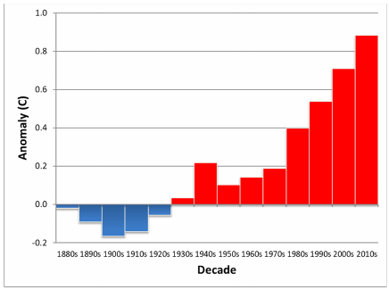

*Fig. 1 Globally averaged surface temperature anomalies by decade from 1880-1889 (“1880s”) to 2010-2019 (“2010s”) (Zhang et al. 2019). Reference period is 1901-1960.*

### Natural and Human Drivers of Climate Change

The energy balance at Earth’s surface is controlled by several factors: incoming solar radiation, solar radiation absorbed and reflected by the atmosphere, infrared radiation emitted by Earth, and infrared radiation absorbed and re-emitted by the atmosphere, primarily by greenhouse gases, as shown in Fig. 2 (IPCC 2013). Changes in these factors affect Earth’s radiative balance and therefore its climate, including temperature, precipitation, and other variables through a complex set of physical processes. These changes, in turn, trigger feedback processes, many of which tend to amplify the resulting changes in climate.

Nearly a third (29.4%) of incoming shortwave energy from the sun is reflected back to space, and the remainder is absorbed by the Earth system (Figure 2). The fraction of sunlight scattered back to space is determined by the reflectivity (albedo) of clouds, land surfaces (including snow and ice), oceans, and particles (aerosols) in the atmosphere. The cloud cover, snow cover, and ice cover are particularly strong determinants of the amount of sunlight reflected back to space because their albedos are much higher than those of land and oceans. Decreases in the total area covered by snow and ice increases the absorption of solar energy by exposing darker soil or ocean surfaces.

<!-- str. 926 -->

![Fig. 2 Global mean energy budget of Earth under present- day climate conditions. Numbers state magnitudes of the individual energy fluxes in watts per square meter (W/m2) averaged over Earth’s surface, adjusted within their uncertainty ranges to balance the energy budgets of the atmosphere and the surface. Numbers in parentheses attached to the energy fluxes cover the range of values in line with observational constraints. Fluxes shown include those resulting from feedbacks. Top of Atmosphere (TOA) reflected solar values given here are based on observations 2001–2010; TOA outgoing longwave is based on 2005–2010 observations. (Figure 2-11, IPCC 2013).](img/ch36/fig-02.png)

*Fig. 2 Global mean energy budget of Earth under present- day climate conditions. Numbers state magnitudes of the individual energy fluxes in watts per square meter (W/m2) averaged over Earth’s surface, adjusted within their uncertainty ranges to balance the energy budgets of the atmosphere and the surface. Numbers in parentheses attached to the energy fluxes cover the range of values in line with observational constraints. Fluxes shown include those resulting from feedbacks. Top of Atmosphere (TOA) reflected solar values given here are based on observations 2001–2010; TOA outgoing longwave is based on 2005–2010 observations. (Figure 2-11, IPCC 2013).*

In addition to reflected sunlight, Earth loses energy through the emission of infrared (longwave) radiation from its surface and atmosphere. GHGs in the atmosphere absorb most of this radiation, leading to a warming of the surface and atmosphere. The principal GHGs are water vapor (H2O), carbon dioxide (CO2), methane (CH4), nitrous oxide (N2O) and ozone (O3). All of these gases have major natural sources, but the atmospheric concentrations of all of them, except H2O, are being greatly and directly affected by human activities (AR5, IPCC 2014). Water is rapidly exchanged between the land, ocean, and atmosphere, and is itself an important part of Earth’s climate system. In fact, the naturally occurring GHGs with the largest concentrations in Earth’s atmosphere – principally H2O and CO2 – keep the near-surface air temperature about 60°F (33°C) warmer than it would be in their absence, assuming albedo is held constant.

While it has long been recognized that the Earth’s climate can change because of natural influences, over the last century it has become increasingly clear that human-related forcings (i.e., drivers for changing the energy balance in the Earth system that lead to climate change) can also have, and are having, a large impact upon the climate system. Though climate drivers of significance over the industrial era include both types of forcings, the most significant factor in the large changes in climate over the last century has been the increasing concentrations in GHGs, especially CO2, CH4, and N2O. That is, it is very likely that more than half of the observed warming is from anthropogenic forces (Bindoff et al. 2013).

### Causes of Observed Global Warming

Natural causes of climate change do not explain the rapid warming observed in recent decades. Changes in solar irradiance directly impact the climate system (and were an important factor in many previous changes in climate) because it is Earth's primary energy source. However, satellite observations (available since 1979) indicate that the energy from the sun has changed little over at least the past 40 years, and thus is not responsible for the observed warming.

Explosive volcanic eruptions can inject substantial amounts of sulfur dioxide (SO2) and ash into the stratosphere, which can lead to significant short-term cooling effects (1-3 years). The oceans can also respond to the cooling effect, and changes in ocean circulation patterns can last for decades after major eruptions. Additionally, internal variability in Earth’s climate system, such as the El Niño Southern Oscillation (ENSO), causes limited annual- to decadalscale variations in regional temperatures and other climate parameters that do not contribute to long-term trends. El Niño events are characterized by a warming of the surface waters in the eastern equatorial Pacific and result in increases in temperature. La Niña events have the opposite effect. These events typically last 1-3 years and their primary effect on temperature is transitory. There has not been an increase in El Niño events relative to La Niña events. Other internal variations in the climate system can last for decades, but there is no evidence that any such variation has caused the observed warming.

According to the Fourth U.S. National Climate Assessment (USGCRP 2017), natural variability is only a minor factor in the observed changes in climate over the last century. It is likely (> 66% probability) that natural variability has contributed between -0.18°F (-0.1°C) and 0.18°F (0.1°C) to changes in surface temperatures from 1951 to 2010 (Bindoff et al. 2013). Similarly, natural emissions and sinks of GHGs and tropospheric aerosols have varied over the industrial era but have not contributed significantly to the observed changes in climate. Such climate forcing effects from gases and particles can also be translated into an equivalent radiative forcing.

Other potential natural drivers of climate change have also been well studied (such as the effects of cosmic rays on cloud formation), but global radiative effects from those drivers are not likely to be a significant contributor to the observed climate trends. There are other known drivers of natural origin that operate on much longer timescales. For example, changes in Earth’s orbit (Milankovitch cycles) that lead to the ice ages have occurred about every 100,000 years during the last two million years and should currently have Earth in a cooling phase. Also, changes in atmospheric carbon dioxide (CO2) can be affected via chemical weathering of rock on time scales of a century or longer and could have contributed to past changes in climate.

Several human-related activities also cause changes in climate. Major changes in land use and land cover have occurred in some areas. Some urban areas have expanded. In general, urbanization contributes to warming through the replacement of natural land cover with impervious surfaces that have higher heat capacities and limited or no vegetation to provide evaporative cooling. Investigations of the impact of increased urbanization show a small but detectable contribution to warming. Deforestation and reforestation have occurred in various parts of the globe. The effects of these changes in land cover are of varying magnitude: while the effect on total carbon dioxide concentration is substantial, the change in global average surface temperature is relatively small because the percentage of the globe covered by forests is relatively small.

The most important human-caused change is the altered composition of the atmosphere, specifically increases in certain greenhouse gases. Carbon dioxide, in particular, has increased in concentration from about 280 ppm at the beginning of the Industrial Revolution to about 410 ppm today. This increase has been caused primarily by the burning of fossil fuels, but land-use change –including deforestation – has made a substantial contribution as well. Concentrations of other important GHGs – including methane, nitrous oxides, and several chlorofluorocarbons – have also increased as a result of human activity. Numerous experiments, using both simplified and highly complex climate models, strongly suggest that the GHG warming effect is large enough to account for the observed increase in global average temperature. Furthermore, no other single or combined potential warming factors can account for this increase (Figure 3).

<!-- str. 927 -->

*Fig. 3 Comparison of observed global mean temperature anomalies from three observational datasets to the fifth Coupled Model Intercomparison Project (CMIP5) climate model historical experiments using: (a) anthropogenic and natural forcings combined, or (b) natural forcings only (Knutson et al. 2017).*

Particles (also referred to as aerosols) play a profound and complex role in the Earth’s climate through radiative effects in the atmosphere and on snow and ice surfaces and through effects on cloud formation and properties. Human activities have made important changes in the concentrations of some of the key types of particles, especially from the burning of fossil fuels. Particle types are categorized by composition, e.g., sulfate, black carbon, organic, nitrate, dust, and sea salt. Black carbon particles (also called soot) tends to have a warming effect, while many other particles, like sulfates, reflect sunlight and have a cooling effect.

Particles have a lifetime of days to weeks in the troposphere. The combined forcing of aerosol–radiation and aerosol–cloud interactions is negative (cooling) over the industrial era (high confidence), offsetting part of the increasing greenhouse gas forcing. The magnitude of this offset, globally averaged, has declined in recent decades, despite increasing trends in aerosol emissions or abundances in some regions of the world (especially in China and India).

The bottom line is that the best explanation supported by observed data is that the increase in global temperature is largely or wholly caused by human-induced increases in greenhouse gas concentrations, the most important of which is the increase in atmospheric CO2 from fossil fuel combustion. Fossil fuel emissions can be distinguished from naturally-occurring CO2 because of the differing isotopic distributions. Decreases in the ratio of atmospheric carbon-13 and carbon-14 to carbon-12 confirm that fossil fuel combustion is largely the source of the increased CO2. Deforestation and other land use change, cement manufacturing, as well as other heavy GHG producing industries, also contribute to the increase in CO2 concentrations (Figure 4).

### Climate Change in the Distant Past

Paleoclimate records are proxy data sources that extend the climate record hundreds-to-millions of years into the past from the mid-19th century backwards to substitute for the instrumental observations that did not exist then. These records demonstrate that there have been long-term natural changes in the climate. Before the emissions of greenhouse gases from fossil fuels and other human-related activities became a major factor over the last few centuries, the strongest drivers of climate change during the last few thousand years had been volcanoes and land-use change (which has both albedo and greenhouse gas emissions effects). Based on a number of proxies for temperature (for example, from tree rings, fossil pollen, corals, ocean and lake sediments, and ice cores), temperature records are available for the last 2,000 years on hemispherical and continental scales. High-resolution temperature records for North America extend back less than half of this period. For this era, there is a general long-term cooling trend until the rapid increase in temperature over the last 150–200 years. For context, global annual averaged temperatures for 1986–2015 are likely much higher than any similar period over the past 2,000 years or longer and appear to have risen at a more rapid rate during the last 3 decades.

Global temperatures of the magnitude observed recently (and projected for the rest of this century) are related to very different forcings than past climates, and studies of past climates suggest that such global temperatures were likely last observed during the Eemian period (the last interglacial epoch), 125,000 years ago. At that time, global temperatures were, at their peak, about 1.8°F–3.6°F (1°C–2°C) warmer than preindustrial temperatures. Coincident with these higher temperatures, sea levels during that period were about 16–30 feet (6–9 meters) higher than modern levels.

Recent studies suggest that the Eemian period warming can be explained in part by the changes in incoming solar radiation as a result of cyclic changes in the shape of Earth's orbit around the sun (Milankovitch Cycle), even though greenhouse gas concentrations were similar to preindustrial levels. Equilibrium climate with current levels of greenhouse gas concentrations (about 410 ppm CO2) most recently occurred about 3 million years ago during the Pliocene. With such high CO2 levels existing for a long time period (centuries), global temperatures were as much as 5.4°F–7.2°F (3°C–4°C) higher than today, and sea levels were about 82 feet (25 meters) higher.

### Feedbacks in the Climate Systems

Climate feedbacks are processes that can either amplify or diminish the effects of climate forcings. A feedback that increases an initial warming is called a positive feedback, and onme that reduces an initial warming is a negative feedback.

**Planck Feedback.** When the temperatures of Earth’s surface and atmosphere respond to a positive radiative forcing, more infrared radiation is emitted into the lower atmosphere. In other words, when the surface and atmospheric temperatures increase, so does the amount of longwave radiation emitted back to space. This process, known as the Planck feedback, serves to restore radiative balance at the tropopause. It is a negative feedback, and the strongest and primary stabilizing feedback in the climate system. Other feedbacks largely tend to increase the overall forcing and resulting temperature change.

**Water Vapor Feedback.** Warmer air can contain more moisture (water vapor) than cooler air – about 3.5% more per °F (7% more per °C). Thus, as global temperatures increase, the total amount of water vapor in the atmosphere also increases, adding further to greenhouse warming – a positive feedback. The water vapor feedback is responsible for more than doubling the direct climate warming from CO2 emissions alone. Observations confirm that global tropospheric water vapor has increased commensurate with measured warming.

**Snow-albedo Feedback.** Snow and ice are highly reflective to solar radiation relative to land surfaces and the ocean. Loss of snow cover, glaciers, ice sheets, or sea ice resulting from climate warming lowers Earth’s surface albedo. The losses create the snow-albedo feedback because subsequent increases in absorbed solar radiation lead to further warming as well as changes in turbulent heat fluxes at the surface. For seasonal snow, glaciers, and sea ice, a positive albedo feedback occurs where light-absorbing aerosols are deposited to the surface, darkening the snow and ice and accelerating the loss of snow and ice mass. For ice sheets (for example, on Antarctica and Greenland), the positive radiative feedback is further amplified by dynamical feedbacks on ice-sheet mass loss. Specifically, since continental ice shelves limit the discharge rates of ice sheets into the ocean; any melting of the ice shelves accelerates the discharge rate, creating a positive feedback on the ice-stream flow rate and total mass loss.

<!-- str. 928 -->

![Fig. 4 Simplified diagram of the global carbon cycle. Numbers denote reservoir mass, also called " carbon stocks " in Pg C (1 Pg C = 1015 g C) and annual carbon exchange fluxes (in Pg C / yr ) between the atmosphere and its two major sinks, the land and ocean. Black numbers and arrows indicate reservoir mass and exchange fluxes estimated for the time prior to the Industrial Era (1750). Grey arrows and numbers indicate annual " anthropogenic " fluxes averaged over the 2000–2009 time period. These fluxes are a perturbation of the carbon cycle during Industrial Era post 1750. The atmospheric inventories have been calculated using a conversion factor of 2.12 PgC per ppm. (Figure 6.1, Ciais et al. 2013)](img/ch36/fig-04.png)

*Fig. 4 Simplified diagram of the global carbon cycle. Numbers denote reservoir mass, also called " carbon stocks " in Pg C (1 Pg C = 1015 g C) and annual carbon exchange fluxes (in Pg C / yr ) between the atmosphere and its two major sinks, the land and ocean. Black numbers and arrows indicate reservoir mass and exchange fluxes estimated for the time prior to the Industrial Era (1750). Grey arrows and numbers indicate annual " anthropogenic " fluxes averaged over the 2000–2009 time period. These fluxes are a perturbation of the carbon cycle during Industrial Era post 1750. The atmospheric inventories have been calculated using a conversion factor of 2.12 PgC per ppm. (Figure 6.1, Ciais et al. 2013)*

**Cloud Feedbacks.** An increase in cloudiness has two direct impacts on radiative fluxes. First, it increases scattering of sunlight, which increases Earth’s albedo and cools the surface (the shortwave cloud radiative effect). Second, it increases trapping of infrared radiation, which warms the surface (the longwave cloud radiative effect). A decrease in cloudiness has the opposite effects. Clouds have a relatively larger shortwave effect when they form over dark surfaces (such as oceans) than over higher albedo surfaces (such as sea ice and deserts). Analyses show that the net radiative effect of cloud feedbacks has been positive over the industrial era. The net cloud feedback can be broken into components, where the longwave cloud feedback is positive and the shortwave feedback is near-zero, though the two do not add linearly. Uncertainty in cloud feedback remains the largest source of inter-model differences in calculated climate sensitivity.

There are other relevant minor feedbacks. For example, climate change alters the atmospheric abundance and distribution of some radiatively active species (atmospheric gases) by changing natural emissions, atmospheric photochemical reaction rates, atmospheric lifetimes, transport patterns, or deposition rates. These can affect the concentrations of GHGs. Also, climate-driven ecosystem changes that alter the carbon cycle potentially impact atmospheric CO2 and CH4 abundances.

**Changes in Climate System Related to Recent Global**

### Warming

Additional changes in the climate system are directly related to the increase in GHGs and the resulting global warming. Sea level is rising at an accelerating rate due to melting of glaciers and landbased ice sheets and to thermal expansion of sea water as oceans warm. Global Mean Sea Level (GMSL) has risen by about 7–8 inches (about 16–21 cm) since 1900, with about 3 of those inches (about 7 cm) occurring since 1993. Human-caused climate change has made a substantial contribution to GMSL rise since 1900, contributing to a rate of rise that is greater than during any preceding century in at least 2,800 years. Local sea level rise can be different than the global average due to to changes in the Earth’s gravitational field and rotation from melting of land ice, changes in the ocean circulation, and vertical land motion.

<!-- str. 929 -->

Certain types of extreme weather conditions have changed and have been attributed to global warming. The frequency and intensity of extreme heat has increased, and extreme cold has become less intense in most areas of the globe. Extreme precipitation has become more frequent at most long-term reporting stations, likely the result of larger amounts of water vapor over the warming oceans.

Observations show that significant declines have occurred in Arctic sea ice extent and thickness, Northern Hemisphere snow cover, and the volume of mountain glaciers and continental ice sheets. Evidence suggests in many cases that the net loss of mass from the global cryosphere (the frozen water part of the Earth system) is accelerating. Arctic sea ice area, thickness, and volume have declined since at least 1979. Annually-averaged Arctic sea ice extent has decreased by 3.5% – 4.1% per decade since 1979, with much larger reductions in summer and fall. While current generation climate models project a nearly ice-free Arctic Ocean in late summer by mid-century, they still simulate weaker reductions in volume and extent than what has already been observed, suggesting that projected changes are underestimating future ice melt.

Satellite measurements indicate that mass loss from mountain glaciers around the world, the Greenland Ice Sheet, and the Antarctic Ice Sheet continues and is accelerating in some cases. The annually averaged ice mass from 37 global reference glaciers has decreased every year since 1984. Over the last decade, the Greenland Ice Sheet mass loss has accelerated, losing 244 ± 6 Gigaton per year (Gt/yr) on average between January 2003 and May 2013. Mass loss increased from 41 ± 17 (Gt/y) in 1990–2000, to 187 ± 17 Gt/y in 2000–2010, to 286 ± 20 Gt/y in 2010–2018 (Mouginot et al. 2019). Major ice loss has been seen in Antarctica as well, increasing from 40 ± 9 Gt/y in 1979–1990 to 50 ± 14 Gt/y in 1989–2000, 166 ± 18 Gt/y in 1999–2009, and 252 ± 26 Gt/y in 2009–2017 (Rignot et al. 2019). There is great concern about the possibility of significant ice loss from the West Antarctica ice sheet over this century. Observed rapid mass loss from West Antarctica is attributed to increased glacial discharge rates due to diminishing ice shelves from the surrounding ocean becoming warmer.

### Observed Changes in Global Climate Conditions

Globally, nearly all land areas have warmed (Figure 5). The greatest warming has occurred in central Asia and eastern Brazil. A few areas have warmed by less than 1°F 0.56°C), including south Asia and the Middle East. The Arctic has been warming at about twice the rate of the rest of the world. While this global mean warming is not always a useful indicator of the metrics relevant to systems design or performance simulation, it is indicative of impacts on climatic conditions at individual stations.

Annual mean temperature has increased in the United States (U.S.), by about 1.8°F (1.0°C) since 1901, similar to the global increase in temperature. The increase in temperature has not been uniform. Larger increases have occurred in the western and northern U.S., while the Southeast has warmed by less than 1°F (0.56°C) (Figure 6). In a few locations in the southeastern U. S., there has been no net change in temperature since 1901. The Southeast is one of the few regions in the world that has experienced little overall warming of daily maximum temperatures since 1900. The reasons for this have been the subject of much research, and hypothesized causes include both human and natural influences. However, since the early 1960s, the Southeast has been warming at a similar rate as the rest of the U.S. Data from two stations is shown in the next section as an example, along with climate model projections. Since 1970, almost all areas of the U.S. have seen an increase in cooling degree days (CDDs) and a decrease in heating degree days (HDDs). The largest percentage trends are in the northern U.S. for heating degree days and the southern U.S. for cooling degree days. On a national average basis, HDDs have decreased by about 14% since 1970 while CDDs have increased by about 21% (Kunkel 2019).

*Fig. 5 Surface temperature change (in °F) for the period 1986–2015 relative to 1901–1960 from the NOAA National Centers for Environmental Information’s (NCEI) surface temperature product (USGCRP 2017). Similar, interactive maps can be found at www.ncdc.noaa.gov/cag /global/mapping.*

### Station-level Trend Data

Records over long time periods exist only for a very small number of locations around the world. This makes identifying trends to verify climate model predictions difficult on a station-by-station basis, and this is especially harder with shorter records. For example, the most recent updates to Chapter 14 show statistically significant trends only in some locations, in large part because the short-term inter-annual variability in an individual station washes out the long-term trend.

An approximation of localized changes, expressed in terms of changes in climate zone classification over 30 years, is shown in Figure 6. The pole-ward creep of warmer climate zones is clearly visible. This map is drawn from time series of temperatures for a uniform grid over the earth output by a reanalysis model, MERRA-2 (Gelaro et al. 2017). A reanalysis model attempts to form a consistent three-dimensional picture of the atmosphere by reconciling a numerical weather model-based estimate with all available historical observations including satellites, weather balloons, aircraft, etc. Thus, we are able to use a reanalysis model to ascertain broad trends across the world using a consistent length of record. As is discussed in more detail in Chapter 14 (Climatic Design Information) of this volume, while the overall picture is clearly one of warming, the magnitudes of observed trends vary between stations.

While the overall picture is clearly warming, the currentlyobserved changes in design conditions for individual stations, when observed, do not suggest more oversizing of equipment. That is, the change in design conditions over the lifetime of HVAC equipment is not enough to justify further oversizing. However, the change in climate zones will continue and designers must consider this in design decisions. Refer to the sections below for more information on design considerations.

Numerous studies have found that heavy (unusually large) precipitation events have increased in both intensity and frequency in the U.S. (Figure 7). These studies have investigated a wide range of metrics of heavy precipitation, including hourly, daily, and multiday durations and 1- to 20-year average recurrence intervals. They also cover a range of periods, some starting as early as the beginning of the 20th Century. There are important regional differences in trends. For example, an analysis shown in the NCA4 was updated through 2019, covering the period of 1958-2019 (Figure 7). The eastern half (Great Plains) of the U.S. has experienced large (moderate) upward trends while the western U.S. has experienced no trend. Globally, the lack of data availability precludes an analysis back to the beginning of the 20th Century. Most regions with adequate data show increases in extreme precipitation since the middle of the 20th Century (Seneviratne et al. 2012; Kunkel and Frankson 2015).

<!-- str. 930 -->

![Fig. 6 ASHRAE climate zone changes between 1980-1999 and 2000-2019. Each shade of gray represents a ‘current’ thermal climate zone, i.e., using MERRA-2 outputs (Gelaro et al. 2017) from 2000-2019. A white dot represents an area that has moved to a warmer climate zone than it was in 1980-1999. This trend is most evident at the borders of climate zones, and easiest to see in central North America. A black dot represents a climate zone that has become colder in this period, a small number of which can be seen south of Mexico. Tellingly, these maps include ASHRAE climate zone 0 (over the Caribbean), which had to be added in the 2016 edition of the handbook to accommodate ‘very hot’ climates. Maps of other regions are available online at www.ashrae.org/technical-resources /bookstore/weather-data-center.](img/ch36/fig-06.png)

*Fig. 6 ASHRAE climate zone changes between 1980-1999 and 2000-2019. Each shade of gray represents a ‘current’ thermal climate zone, i.e., using MERRA-2 outputs (Gelaro et al. 2017) from 2000-2019. A white dot represents an area that has moved to a warmer climate zone than it was in 1980-1999. This trend is most evident at the borders of climate zones, and easiest to see in central North America. A black dot represents a climate zone that has become colder in this period, a small number of which can be seen south of Mexico. Tellingly, these maps include ASHRAE climate zone 0 (over the Caribbean), which had to be added in the 2016 edition of the handbook to accommodate ‘very hot’ climates. Maps of other regions are available online at www.ashrae.org/technical-resources /bookstore/weather-data-center.*

### Future Changes in Climate

Scientists use a wide range of observational and computational tools to understand the complexity of Earth’s climate system and to study how that system responds to external forces, including human activities. Computational physics-based models of the global climate system are important tools in both the study of past changes in climate (reanalysis, e.g., MERRA-2) and to project possible future changes in climate. Today’s climate models encapsulate the current understanding of the physical, chemical, and biological processes involved in the climate system, their interactions, and the performance of the climate system as a whole. They are extensively tested relative to observations and are able to reproduce the key features found in the climate of the past century. Using projections of future emissions of how GHGs may be further affected by human activities, these models are then used to project the future changes in temperature, precipitation, and other climate variables.

Future changes in global climate will depend on future atmospheric greenhouse gas concentrations. The globally-averaged CO2 concentration has increased from about 284 ppm in 1850 to 410 ppm for Sep 2018-August 2019. The current growth rate in CO2 concentration is about 0.6% per year. At that rate, concentrations would reach about 500 ppm by 2050. Under the RCP8.5 emissions pathway (high emissions scenario), the growth rate accelerates with concentrations reaching 900+ ppm by 2100.

![Fig. 7 Change in a metric of extreme precipitation by regions used in NCA4(USGCRP 2017). This is the number of 2-day events with a precipitation total exceeding the largest 2-day amount that is expected to occur, on average, once every 5 years, as calculated over 1958–2019. The numerical value is the percent change over the entire period. The percentages are first calculated for individual stations, then averaged over 2° latitude by 2° longitude grid boxes, and finally averaged over each NCA4 region (updated from Easterling et al. 2017).](img/ch36/fig-07.png)

*Fig. 7 Change in a metric of extreme precipitation by regions used in NCA4(USGCRP 2017). This is the number of 2-day events with a precipitation total exceeding the largest 2-day amount that is expected to occur, on average, once every 5 years, as calculated over 1958–2019. The numerical value is the percent change over the entire period. The percentages are first calculated for individual stations, then averaged over 2° latitude by 2° longitude grid boxes, and finally averaged over each NCA4 region (updated from Easterling et al. 2017).*

Basic physics dictates that increases in GHG concentrations will have a warming effect, with virtual certainty, due to the increase in atmospheric absorption of infrared energy and re-emission back to Earth’s surface. This increase in downwelling infrared energy flux will gradually warm the ocean surface waters, as well as the land surface. The increase in ocean surface temperatures will cause an increase in near surface absolute humidity over the oceans. Humidity can increase exponentially with temperature following the Clausius–Clapeyron relationship, by about 3.5% per °F (7% per °C) at current temperatures. This is projected to cause the summer absolute humidity levels to increase in areas where normal climate circulation patterns bring air directly from the oceans onto the land. This will increase the amount of water vapor available to precipitation-producing weather systems, leading to more extreme precipitation episodes.

Heating Degree Days (HDD) are projected to decrease in most places while Cooling Degree Days (CDD) are expected to increase (e.g., Figures 8 and 9). This change is neither expected to be uniform across the globe, nor monotonic for a given weather station. A monotonic change would imply that the given value always either increases or decreases for consecutive time steps but not both. Under a high-emissions (RCP8.5) scenario, climate zones, which are calculated from degree days, are projected to change all around the world. Recent changes in zone classifications for North America are shown in Figure 6, which compares the results of classifying areas based on data 2000-2019 vs data from 1980-1999. These historical changes in climate zones are almost uniformly towards warmer zones (i.e., lower number in the ASHRAE system). The changes are clustered at the boundaries and the pattern is particularly clear in central North America. To accommodate warmer climates, a new zone 0 was added in 2016 to extend the climate zone scale.

<!-- str. 931 -->

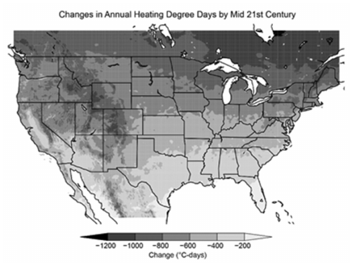

*Fig. 8 Projected change in heating degree days by the mid- 21st century (2036-2065) relative to 1976-2005 under a high emissions scenario (RPC 8.5).*

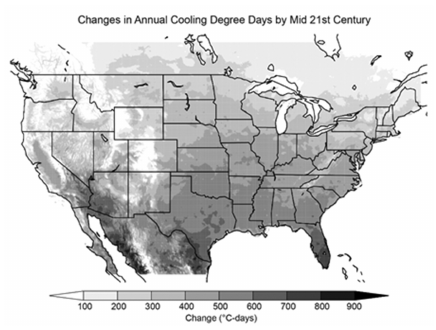

*Fig. 9 Projected change in cooling degree days by the mid- 21st century (2036-2065) relative to 1976-2005 under a high emissions scenario (RPC 8.5).*

Both heating and cooling design temperatures are increasing for large numbers of stations around the world, and are projected to continue increasing. Figure 10 shows hottest and coldest daily temperatures, as well as, number of frost days and number of tropical nights under the high emission (RCP8.5) projection from 2081-2100.

The warmest daily temperature and coldest daily temperature are analogous to the design day method for sizing HVAC equipment. Figures 11 and 12 suggest designers of buildings that expect to have a service life stretching into the next decade may require larger and more flexible HVAC equipment installations. Furthermore, the frost days as very important to those who work in agriculture as a newly sprouting crop-field can be stunted due to a last frost. Tropical nights can cause productivity issues for those without access to air-conditioning and cause those with air-conditioning systems to run throughout the night.

*Fig. 10 CMIP5 multi-model mean geographical changes (relative to a 1981–2000 reference period in common with CMIP3) under RCP8.5 and 20-year smoothed time series for RCP2.6, RCP4.5 and RCP8.5 in the (a, b) annual minimum of daily minimum temperature, (c, d) annual maximum of daily maximum temperature, (e, f) frost days (number of days below 0°C 32 °F) and (g, h) tropical nights (number of days above 20 °C (68 °F ) (Figure 12.13, IPCC 2013).*

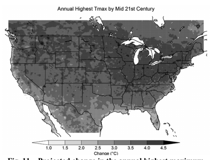

*Fig. 11 Projected change in the annual highest maximum temperature by the mid-21st century (2036-2065) relative to 1976-2005 under a high emissions scenario (RPC 8.5)*

For the U.S., for the high emissions scenario (RCP8.5), the annual highest maximum temperatures in North America are projected to increase by 4°F–8°F (2.2°C-4.4°C) by 2050 (Figure 11).

<!-- str. 932 -->

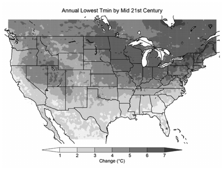

*Fig. 12 Projected change in the annual lowest daily minimum temperature for 2036-2065 (relative to 1976-2005) under a high emissions scenario (RPC 8.5).*

The annual lowest minimum temperatures are projected to warm by 4°F–10°F (2.2°C-5.5°C) by 2050 (Figure 12). Maps of this type for other regions are available at the National Oceanic and Atmospheric Administration (NOAA) website (www.ncdc.noaa.gov/cag/global/mapping).

Projected changes in mean precipitation changes vary considerably by region, primarily a consequence of global changes in atmospheric circulation patterns. The jet stream is projected to shift northward, with general decreases in precipitation at subtropical latitudes and increases at mid to high latitudes. The U.S. straddles this transition. Thus, increases in mean precipitation are projected for the northern U.S., but decreases are projected for the southwest. Mean precipitation has increased by about 10% over the last century in the Midwest and northeast and is projected to increase by as much as another 10% this century. In many other U.S. areas, precipitation is either projected not to change or there remains uncertainty about the direction of change (increase versus decrease). However, precipitation coming as extreme events is projected to increase substantially almost everywhere by 2050 and beyond, especially under a high emissions scenario.

Recent increases in drought in some areas, such as Australia and the western U.S., have been partially attributed to climate change. Other areas of the U.S. have not experienced increases in drought. Drought is projected to become more frequent and intense in many subtropical areas where mean precipitation is projected to decrease, including the southwest U.S. In other areas, droughts are expected to continue being a normal part of the climate and may be more intense because of higher temperatures increasing rates of soil moisture depletion (Wehner et al. 2017).

Increases in water vapor content and temperature lead to an increase in wet bulb temperature. Increases in the frequency of extreme wet bulb temperatures has already been reported around the world, e.g., northern India and eastern U.S.A. Shifts in the frequency of high wet bulb values increases cooling loads and, in the absence of cooling systems, thermal stress on humans. These changes, therefore, create a further undesirable outcome: increasing the energy used for cooling buildings, which increases their GHG emissions further.

Relative to the year 2000, GMSL is very likely to rise by 0.3–0.6 feet (9–18 cm) by 2030, 0.5–1.2 feet (15–38 cm) by 2050, and 1 to 4 feet (30–130 cm) by 2100. Future emissions pathways have little effect on projected GMSL rise in the first half of the century, but significantly affect projections for the second half of the century (high confidence). Emerging science regarding Antarctic ice sheet stability suggests that, for high emission scenarios, a GMSL rise exceeding 8 feet (2.4 m) by 2100 is physically possible, although the probability of such an extreme outcome cannot currently be assessed. Regardless of emissions pathway, it is extremely likely that GMSL rise will continue beyond 2100. For almost all future GMSL rise scenarios, relative sea level rise is likely to be greater than the global average from the U.S. Northeast to the western Gulf of Mexico.

**Projected Climatic Information for Use in Building**

### Design and Analysis

The process of creating projected weather ‘input files’ from Global Climate Models (GCM) suitable for use in building design and analysis is a complex process. For simulating estimated future building performance, reliable sets of future weather conditions are needed. Similarly, sizing calculations require estimates of future ‘design conditions’. Currently, there are no standardized methods to integrate information about a changing climate into building and system design and analysis, but this does not preclude action and the need for professional judgment. The output from GCM can be useful for stress testing buildings and systems using multiple plausible futures. This allows a designer to test the impact of multiple plausible acute or chronic climatic events such as heat waves or graduallyincreasing temperature over decades. While this section does not make specific recommendations on choosing a future climate data provider, certain aspects of the available data are discussed here. Since the outputs of GCM are used to create weather data for building design and simulation, examples are presented here for information.

A majority (64%) of the fifth Coupled Model Intercomparison Project (CMIP5) GCMs provide predictions over cells in the range of roughly 62 miles x 62 miles to 155 x 155 miles (100 km x 100 km to 250 km x 250 km ) while coordinated Regional Climate Model (RCM) experiments can go down to 7.8 miles x 7.8 miles (12.5 km x 12.5 km); although individual research group simulations have gone down to 3.1 miles (5 km) or even 0.6 miles (1 km). A GCM cannot usually be used directly for building design and analysis because of its coarse resolution, it must be ‘downscaled’. Downscaling is any procedure to infer higher resolution information (finer spatial scale here) from lower resolution variables or information (coarser spatial scale). There are two types of downscaling –dynamical and statistical – and regional climate models are a form of dynamical downscaling. Statistical downscaling methods inherently provide higher spatial resolution and correction of biases in the GCMs. A regional climate model uses a global climate model as its boundary conditions, and focuses on a specific region (domain), e.g., North America. This allows regional climate models to provide predictions for smaller areas, i.e., the global climate models are ‘downscaled’ to smaller portions of the earth. While RCMs provide higher resolution, they usually still contain some biases and it may be necessary to correct for these biases before applying to design.

Projected future time series generated by suitably downscaling GCM are estimates, not exact predictions. The distinction is that the data is intended to be indicative of the best available science - not a literal forecast for a specific time in the future. As such, it is important to treat the dates on these future time series as indicative of a broad future time period, not an exact future year. The resolution of the models and methods is not high enough to justify distinguishing between individual years, e.g. July 2048 vs 2050, or 2052. The latest model outputs from IPCC member organizations were summarized in the 5th Assessment Report (IPCC 2014a). Dynamically-downscaled simulations are made available through the CORDEX collaboration (WCRP 2017). The CORDEX collaboration uses a suite of regional climate models driven by a suite of the CMIP5 global climate models (Taylor, Stouffer, and Meehl 2011). The available RCM-GCM combinations vary widely by region. For example, the North American region includes data for 8 RCMs driven by 6 GCMs. By contrast, the South Asia region includes 6 RCMs driven by 15 GCMs. In both cases, only selected combinations have been performed (16 of 48 possible for North America, 26 of 90 possible for South Asia). The models used data up to 2005 to simulate historical conditions and future scenarios of anthropogenic forcing to estimate from 2006 onwards. Updated projections are expected to be published with the upcoming AR6 report due in 2022. The projections data from 2006 to 2019 now provide more than a decade of additional data available to assess their accuracy.

<!-- str. 933 -->

The use of a single GCM is not an adequate approach to capture the uncertainty in future climate conditions. As a result, climate scientists use ensembles of models, i.e., the results of several models together. The results from each model are reasonable estimates because each model is based on different but sound scientific assumptions and assumptions of the evolution of external factors such as CO2 emissions. Given that the practicing designer is not expected to know the finer points of climate modeling, choosing a specific model is less useful than using all of them together, i.e., an ensemble of models (Jentsch, 2008; Barsugli 2013; Rastogi and Khan 2020). That is, given that many of the complex inputs or variables that are needed to predict the climate accurately are uncertain, a robust design needs to consider many different ‘scenarios’ or outcomes borne out from different evolutions of key variables.

The methods currently available to use future climate projections in design and assessment are based on two approaches: morphing and stochastic generation. Broadly, morphing is the shifting and stretching of time series of measured (historical) data with ‘change factors’ from suitably-downscaled GCM outputs (Belcher, Hacker, and Powell 2005). The change factors represent the expected change in a statistical value of a parameter, e.g., the average temperature for a summer month. Thus, applying a change factor to historical data from a given location ‘morphs’ the time series to a possible future climate for the same location. Stochastic generation is the same action on the distribution of measured data, followed by sampling of the distribution to obtain time series (Rastogi 2016, and references therein). Stretching and shifting the distribution of values from historical measurements for a given location can be considered a proxy of a changed climate. Hence, generating time series from such a changed distribution allows for the creation of several possible future ‘weather’ conditions for the future climate in that same location. The various implementations of each approach all seek to maintain the ‘climate signature’ compared to the reference measured data for relative change modeling. Climate signature is a term used to encompass the within-day, diurnal, and seasonal variations and patterns unique to a given local climate that should be maintained in future projections, in the absence of information to the contrary. Methods for estimating future design conditions are still unresolved, but work is ongoing to correct this.

Professional bodies such as the Chartered Institution of Building Services Engineers (CIBSE) (e.g., CIBSE 2005; Hacker, Capon, and Mylona 2009; Shamash, Metcalf, and Mylona 2014; Bonfigli et al. 2017), and researchers (e.g., Belcher, Hacker, and Powell 2005; Crawley 2008; Eames, Kershaw, and Coley 2011; 2012; Jentsch et al. 2013; Patton 2013; Sustainable Energy Research Group 2013; Eames 2016; Rastogi 2016; Herrera et al. 2017) have proposed methods to develop future weather input files for use in building design and analysis. As methods to develop and use projected time series advance and move toward standardization, ASHRAE members can train to manage professional practice risk, as other professional societies are doing for their members (ASCE 2015; CIBSE 2005; Bonfigli et al. 2017; Nicol 2013; AASHTO 2020; AIA 2020).

![Fig. 13 Annual sum of HDD from Heathrow Airport, London, and Dulles Airport, Washington, D.C.: historical (solid black line), 2010-2019 range (light grey band), and global/regional climate model projections (hatched and dark grey fills). The downward trend is neither steep nor monotonic, but unmistakably downward in both the measurements and model projections. The climate projections show variation in the projected warming, which is to be expected given the divergence in assumptions that underlie them. By the middle of the 21st Century, it becomes increasing likely that measured values will fall outside the recent historical range.](img/ch36/fig-13.png)

*Fig. 13 Annual sum of HDD from Heathrow Airport, London, and Dulles Airport, Washington, D.C.: historical (solid black line), 2010-2019 range (light grey band), and global/regional climate model projections (hatched and dark grey fills). The downward trend is neither steep nor monotonic, but unmistakably downward in both the measurements and model projections. The climate projections show variation in the projected warming, which is to be expected given the divergence in assumptions that underlie them. By the middle of the 21st Century, it becomes increasing likely that measured values will fall outside the recent historical range.*

### Using Recent Measured Data

While recent historical data is a reasonable estimate of expected near-future conditions, it is not a good estimate of conditions over decades, or the usual service lives of buildings and systems (Ayyub 2018; Maxwell et al. 2018). For example, Figures 13 and 14 show annual sums of heating and cooling degree days from Dulles Airport in Washington, D.C., and Heathrow Airport in London, UK.

As a thought experiment, the near-future estimates from 2010, i.e., made up of data from 2000-2009, are plotted alongside “nearfuture” data (2010-2018), recent historical measured data, and global climate model projections. The band of data from 2000-2009 encompasses both measured values from 2010-2017 and projected values up to about 2030 (those projections were made in 2006). Coverage starts to decrease after that, i.e., more model outputs are outside the grey band.

### Summary

Multiple indicators show that substantial global warming has occurred since the late 19th Century, with most of that warming over the past 50 years. It is likely warmer now, on average, than at any time in at least the past 1,700 years. Exhaustive research has examined potential causes of this warming. The increase in greenhouse gas concentrations, along with the modifying effects of increasing concentrations of atmospheric particles, along with smaller effects from changes in land use, is the only plausible cause that is consistent with the observed data, and the physics that governs the climate system.

It is virtually certain that greenhouse gas concentrations, particularly CO2, will continue to rise over this century. Changes in methane (CH4) are also important and are likely to continue to increase for at least the next few decades (USGCRP 2017). The increasing concentrations of CO2 and CH4 are largely related to the use of fossil fuels. It may take decades for non-carbon-based sources of energy to replace most of the production currently based primarily on fossil fuels. As a result, it is virtually certain that global temperatures will continue to rise. Local changes in temperature can deviate temporarily from the global trend because of natural climate variability. Infrastructure and building systems designed only using historic climatic information may, therefore, not meet their intended service life.

<!-- str. 934 -->

![Fig. 14 Annual sum of CDD from Heathrow Airport, London, and Dulles Airport, Washington, D.C.: historical (solid black line), 2010-2019 range (light grey band), and global/regional climate model projections (hatched and dark grey fills). The upward trend is neither steep nor monotonic, but unmistakably upward in both the measurements and model projections. The climate projections show variation in the projected warming, which is to be expected given the divergence in assumptions that underlie them. By the middle of the 21st Century, it becomes increasing likely that measured values will fall outside the recent historical range.](img/ch36/fig-14.png)

*Fig. 14 Annual sum of CDD from Heathrow Airport, London, and Dulles Airport, Washington, D.C.: historical (solid black line), 2010-2019 range (light grey band), and global/regional climate model projections (hatched and dark grey fills). The upward trend is neither steep nor monotonic, but unmistakably upward in both the measurements and model projections. The climate projections show variation in the projected warming, which is to be expected given the divergence in assumptions that underlie them. By the middle of the 21st Century, it becomes increasing likely that measured values will fall outside the recent historical range.*

## 2. MITIGATING CLIMATE CHANGE

Limiting climate change requires a substantial and sustained global effort to significantly reduce anthropogenic (human-made) GHG emissions rates to avoid further warming and long-lasting changes in all components of the climate system. The consequences of a lack of timely action threaten the health and well-being of both current and future generations. Climate change mitigation (simply called “mitigation” from now on) is an intentional human intervention to reduce the sources or enhance the sinks of GHGs in order to limit the magnitude of future warming. The ultimate goal of mitigation is to stabilize GHG concentrations in the atmosphere at a level that avoids dangerous changes in the climate system (Wuebbles et al. 2017). Any changes in climate that are not avoided through mitigation must be considered by engineers as factors to adjust to through climate change adaptation. Mitigation can be understood as “avoiding the unmanageable”, whereas adaptation can be understood as “managing the unavoidable” (Bierbaum et al. 2007).

The international response includes a mitigation goal to limit global temperature rise in this century to 2°C (3.6°F) above preindustrial levels and to pursue efforts to limit the temperature increase even further to 1.5°C (2.7°F). There are clear benefits to keeping warming to 1.5°C (2.7°F) rather than 2°C (3.6°F) or higher. Limiting global warming to 1.5°C (2.7°F)compared to 2°C (3.6°F) is projected to reduce increases in ocean temperature and well as associated increases in ocean acidity and decreases in ocean oxygen levels. Consequently, limiting global warming to 1.5°C (2.7°F) is projected to reduce risks to marine biodiversity, fisheries, and ecosystems, and their functions and services to humans, as illustrated by recent changes to Arctic sea ice and warm-water coral reef ecosystems (IPCC 2018). However, global temperature has already increased 1.0°C (1.8°F)above pre-industrial levels and global GHG emissions show no signs of peaking. Total annual GHG emissions reached a record high of 55.6 GtCO2e in 2018. (Olivier 2019) Global GHG emissions need to be sharply lower than 2018 levels by 2030 - approximately 25% and 55% lower to put the world on a least-cost pathway to limiting global warming to 2°C(3.6°F) and 1.5°C (2.7°F) respectively (UNEP 2018). Beyond 2030, limiting global warming to 1.5°C requires CO2 emissions to be reduced to net zero globally around 2050 (IPCC 2018).

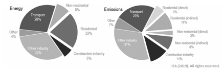

*Fig. 15 Global share of buildings and construction final energy and emissions, 2018 (Figure 2, IEA, 2019)*

Residential and commercial building construction and operations accounted for the largest share of both global final energy use (36%) and energy-related CO2 emissions (39%) in 2018 (Figure 15) (IEA 2019a; 2019b). Additional to the energy used for direct building construction and operations, sequestered carbon is released from plants and soils due to site preparation. Since buildings are responsible for a large portion of GHG emissions, they are a major focus of mitigation efforts. This is driving innovation to decarbonize existing and new buildings. GHG emissions associated with the burning of fossil fuels can be categorized as either direct emissions, where systems and end uses are powered or heated directly by fossil fuels, or indirect emissions, for end uses that use electricity. In residential and commercial buildings, direct emissions are primarily from space heating, service hot water and cooking. Industrial buildings also use fossil fuels for manufacturing processes. The indirect emissions from building electricity use are largely associated with lighting, HVAC loads (heating, cooling, fans and pumps), service hot water, plug loads, and refrigeration. Figure 16 and Figure 17 show the relative percentages of total energy consumption (commercial) and electric energy contributions to indirect emissions (residential) by building end use in the U.S.

An additional source of emissions from buildings relates to unintended release of Fluorinated Gases (F-gases) used as refrigerants or as expanding agents for some types of foam insulations. Some refrigerants used in HVAC&R applications (CFCs, HCFCs and HFCs) are a direct source of either GHG emissions, ozone depleting agents or both when they are accidentally released into the atmosphere through system leakage or deliberately released instead of recycled at end-of-life. Some low-GWP refrigerants may negatively impact system energy efficiency, in turn raising the energy cost of space conditioning.

This section covers a myriad of mitigation strategies. The combined potential of mitigation efforts in the building sector are tremendous. It is estimated that by 2050 a combination of aggressive efficiency measures, electrification, and high renewable energy penetration can reduce the CO2 emissions from building operations in the U.S. by 72-78% relative to 2005 levels (Langevin, Harris, and Reyna 2019).

The ASHRAE GreenGuide—Design, Construction, and Operation of Sustainable Buildings, 5th Edition (ASHRAE 2018a) provides extensive guidance for designers and building operators to mitigate climate change by: modifying their methods, designs and operations for new buildings; employing passive designs; appropriately retrofitting existing buildings by improving energy efficiency; constructing buildings using low-embodied energy materials; and eventually operating buildings employing only Renewable Energy Systems (RES). RES can be building integrated, onsite, or offsite. The pursuit of building electrification for both new and existing buildings—using electric-powered systems and equipment instead of combustion-based systems will assist in easing the transition from GHG emitting fossil fuel sources to RES. It is also important to reduce the use of Fluorinated Gases (F-gases) having high Global Warming Potential (GWP) ratings while maintaining system efficiency. These steps are addressed briefly in this section.

<!-- str. 935 -->

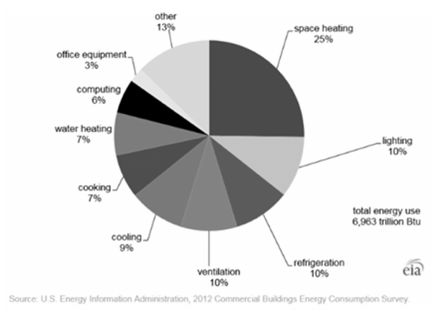

*Fig. 16 U.S. Commercial buildings energy use by end use, 2012.*

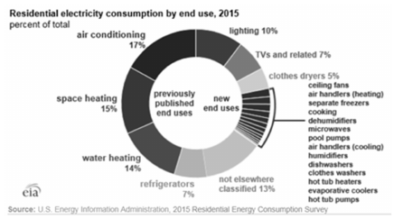

*Fig. 17 U.S. Residential electricity consumption by end use, 2015.*

**Reduce Carbon Emissions by Design and Construction**

Advancing building energy codes continue to raise minimum energy consumption baselines, but the building industry can no longer rely on improved efficiency standards alone in order to realize global climate change mitigation goals. Design teams need to investigate all available site and building passive strategies from the onset of the building concept to minimize the greenhouse gas emissions associated with new or major remodel construction project. Passive design measures aim to maintain thermal conditions and indoor air quality, not through energy system efficiencies, but through avoidance or reduced reliance on active design solutions, the energy consuming mechanical and electrical systems.

Designers (as well as the building operators) need a tool for rating a building’s energy use to use as a goal for optimizing energy efficient design (and operation). Energy consumption in buildings is commonly quantified using site Energy Use Intensity (site EUI) which is calculated by converting all electricity and fossil fuel energy consumed on site in one year to kBTUs (kWh) and dividing by the building conditioned floor area, giving units of kBTU/ft2-yr (kWh/m2-yr). Source EUI is determined by converting site energy to source energy based on the blend of energy sources used to generate electricity. Design teams establish target EUI goals consistent with researched values for minimum EUI of similar building types. Building carbon emissions are quantified by applying emissions factors to site energy consumption based on the carbon intensity of the regional electric grid.

For successful mitigation and decarbonization, building design teams should use an integrated design process (ANSI/MTS 1.09 WSIP Guide 2007, ASHRAE Standard 209-2018 - Energy Simulation Aided Design for Buildings except Low-Rise Residential Buildings). An integrated design approach front-loads the design process and schedule, allowing for clarity about the observed and expected climatic conditions for the intended service life, and facilitates aggressive energy efficiency and passive strategies. Optimizing energy efficiency is one of the most cost-effective approaches to reducing emissions and should be pursued both during building design and as part of operations and maintenance. The integrated design process encourages early team collaboration in order to maximize low cost and high impact energy design choices, when design changes are least expensive. The design team can utilize advanced energy modeling and life cycle cost assessment tools to assess which investment strategies will realize the highest rate of return over the life of the building. ASHRAE Standards 209-2018 - Energy Simulation Aided Design for Buildings except Low Rise Residential Buildings and ANSI/ASHRAE/ICC/USGBC/IES Standard 189.1: Standard for the Design of High-Performance, Green Buildings Except Low-Rise Residential Buildings provides the technical framework for climate change mitigation within the vertical built environment.

A large portion of GHG emissions from buildings is associated with the construction process. Sources of embodied carbon emissions include cement production, manufacturing and transportation of building materials to name only a few. A complete cradle-tograve embodied carbon assessment includes GHG emissions associated with materials extraction, manufacturing, transportation, construction, maintenance and end-of-life disposal. Annually, embodied carbon is responsible for 11% of global GHG emissions associated with energy consumption (Architecture 2030 2018). Since embodied carbon emissions are associated with the construction phase of a building, they constitute a much higher percentage of total emissions in new buildings than in existing buildings that have experienced years of operation. It is projected that the embodied carbon emissions of global new construction projects will constitute 49% of total building emissions for period 2020-2050, while the operational carbon from energy consumption makes up the remaining 51%. Since the GHG emissions from existing buildings are comprised almost entirely of operational carbon, renovations and upgrades to existing buildings will usually result in lower emissions than the new construction of an energy-efficient building. It is estimated that new buildings that are 30% more efficient than average performing existing buildings can take anywhere between 10-80 years to offset the embodied emissions from construction with the lower operational emissions from more efficient systems (NTHP 2011).

Embodied carbon reduction strategies fall into five general categories: (1) low-carbon materials; (2) material minimization and material reduction strategies; (3) material reuse and recycling strategies; (4) local sourcing and transport minimization; and (5) construction optimization strategies (Akbarnezhad and Xiao 2017).The highest share of embodied energy for buildings comes from structural materials, primarily concrete and steel, accounting for roughly 60% of total embodied energy. The use of structural wood should be considered, and the total cement content of building materials should be reduced and optimized. Materials databases and embodied carbon software (such as the free Embodied Carbon in Construction Calculator “EC3” tool) have recently become available to assist design teams with calculating and tracking the life cycle GHG emissions associated with their building projects.

<!-- str. 936 -->

Net zero or near zero buildings demonstrate the maximum level of climate change mitigation that can be achieved through building design and operation. These buildings consume minimal energy as limited by energy efficiency opportunities and are then powered using carbon-free sources of energy. Environmentally friendly building design has progressed beyond simply reducing energy use. Architects, engineers and other building professionals now aspire to achieving net zero buildings or even negative zero buildings where the building can supply more energy to the grid than it consumes overall. While there are many names, variations and building certifications for it, net zero building design generally accounts for, and eliminates as much as possible, the carbon emissions from a building over its service life. At a minimum, net zero buildings are designed to use as little energy as possible, and source the remaining energy needs from renewable, carbon-free sources. To be considered net zero, direct carbon emissions are usually eliminated completely. This is achieved by forbidding onsite fossil fuel combustion (with the possible exception of emergency generators at least for the near future) and by selecting only electrically powered components and systems for all end uses since future energy will be either be provided as grid or mini-grid electricity or through Photovoltaic Solar or Wind generated on-site electricity. Net zero carbon buildings additionally track the carbon emissions associated with building construction (including embodied energy) and operation and, until energy is produced only by renewable energy, offset the carbon emissions by generating a surplus of renewable energy on site or procuring carbon offsets through a certified carbon offset program. Net zero design fiscal prioritizations include

- **Step 1:** Assess and prioritize the site and community resources such as optimizing zoning for renewable energy and building proximity to local or community waste heat resources.
- **Step 2:** Maximize architectural passive design strategies to meet property and occupant needs. Passive design strategies can include site planning, building orientation and massing, envelope tightness to reduce infiltration, continuous insulation, window and daylighting optimization, and designing a building to take advantage of natural ventilation and solar thermal opportunities.
- **Step 3:** Anticipate decarbonization of electric grids. Emphasize electric systems or provide dual fuel systems.
- **Step 4:** Maximize mechanical, electrical and plumbing system efficiencies. Incorporate heat recovery systems, advanced controls, and
- **Step 5:** Offset remaining energy needs with on-site or purchased off-site renewable energy to reduce the facility’s carbon footprint.

### Perform Deep Energy Retrofits of Existing Buildings

While local adoption of high-performance building energy codes is critical for mitigating GHG emissions in new construction, addressing energy efficiency within the existing building stock is equally important to cap and reduce GHG emissions. It is expected that 71% of the total building area worldwide in 2015 will exist in the year 2030 (54% in 2050). For developed industrial nations, these predicted percentages increase to 83% for 2030 (73% for 2050) (https://www.statista.com/statistics/731858/projected-globalbuilding-floor-area-growth-by-region/ accessed 05.19.20). To limit the global average temperature rise to less than 3.6°F (2°C) above preindustrial levels by 2030, the rate and depth of efficiency savings must increase in existing building retrofits. Improvements to existing buildings can help mitigate climate change through whole building retrofits, equipment and system efficiency improvements and one-to-one system replacements. Energy savings of 50-90% have been achieved in existing buildings throughout the world through deep retrofits (IPCC 2014a). It is recommended that decision makers identify and document both the current and future energy resources, onsite and external, as the basis of design for mitigation and adaptation. An additional consideration in planning retrofits is to consider that the climate is already changing and will continue to do so. Thus, designers must consider the effect of the changing climate on the magnitude of efficiency gains, as well as unexpected outcomes due to changes such as increased humidity, when retrofitting and upgrading existing buildings.

To date, voluntary conventional retrofits like lighting or isolated system upgrades have been encouraged through tax incentives and favorable financing, providing a relatively quick return on investment. To achieve global climate change mitigation goals, however, existing building retrofits need to increase in frequency and achieve more savings. Policy changes will be required to increase the frequency of deep energy retrofit investments. Deep energy retrofits are defined here as renovation investments that provide 50% or more energy savings and require a whole building approach. ASHRAE publishes resources for conducting energy audits on existing buildings, e.g., Standard 211-2018: Standard for Commercial Building Energy Audits. Retrofit advisors should be cognizant of changing design assumptions such as energy resources, policy mandates and local climate change, as well as potential financial and legal risks and insurance impacts to those that do not undertake retrofits. The overall goal of deep energy retrofits in the global existing building stock is to reduce the use of fossil fuels, transition to carbon free energy and improve resilience to climate change.

Retrofitting historic buildings requires extra care since applying some modern Energy Efficiency Measures (EEMs) may actually cause damage. Prior to retrofitting historic buildings for energy efficiency, see ASHRAE Guideline 34-2019: Energy Guideline for Historic Buildings. Historic buildings can also serve as examples for applying passive methods for heating, cooling and ventilating to newer buildings.

### Reduce Carbon Emissions from Building Operations

An obvious aspect to reducing energy use and consequently carbon emissions involves the building operators’ diligence in properly and timely maintaining equipment and their systems. Building operations as well as occupant behavior and expectations are also necessary components to climate mitigation strategies. Efforts can be established for leveraging energy load demand response, and energy storage opportunities. This includes sub-metering and scheduling of plug-in loads to curb increasing occupant energy demands for charging personal equipment. However, two of the most important practices are continuous building system monitoring and periodic retro-commissioning.

Building system monitoring provides verification that efficient construction and renovation projects delivered their intended performance. Monitoring of facility energy consumption and system operations is the foundation for Measurement and Verification (M&V), which promotes accountability and compliance with energy efficiency policy directives. It is a useful tool to identify when and where performance issues occur in buildings over time, as they inevitably do. Continuous building system monitoring uncovers faults before they cause significant energy loss. Unplanned increases/decreases in pressures or flow rates that may lead to equipment failures or indicate clogged filters, unintentionally closed (or open) valves, over-ridden controls—all reduce efficiency and increase carbon emissions. Periodic retro-commissioning of the buildings’ equipment and systems is highly recommended to further ensure that the equipment and systems are functioning at their highest levels.

<!-- str. 937 -->

### Renewable Energy Sources (RES) and Building Electrification

To reach the ultimate goal of eliminating GHG emissions from buildings, RESs must replace fossil fuel sources. RESs include, but are not limited to solar, wind, ocean wave energy, hydro, and geothermal. Electricity can be produced using any of these RESs and is preferred, e.g., in today’s market, solar electricity (produced with Photovoltaic Solar Panels) is economically better for heating domestic water than using thermal solar collectors. To provide for intermittent RES, storage of electricity can be provided at the utility level with lithium ion batteries, compressed air, elevated water storage and large-scale chemical flow batteries. At the building or minigrid level, RES-produced electricity can be stored in batteries and mechanical fly-wheels. For this reason, and those cited below in respect to interfacing with the current grid, it is critical to convert all buildings to be able to use electricity to provide HVAC&R, as well as domestic hot water.

Electrification is a core driver of decarbonization in tandem with energy efficiency and the reduction of the emissions of the existing electric grid (2018 ACEEE Summer Study on Energy Efficiency in Buildings). Changes in the availability and usage of RES has already begun, however it is not currently widespread. In the meantime, building electrification can directly replace on-site fossil-fuel systems with grid-provided electrically powered systems. When the electricity for these systems is provided from RES, the usage is shifted entirely from fossil fuels to carbon-free sources.

In the U.S., electricity demand is projected to increase by 3%–9% by 2040 under the higher scenario and 2%–7% under the lower scenario. This projection includes the reduction in electricity used for space heating in states with warming winters, the associated decrease in heating degree days, and the increase in electricity demand associated with increases in cooling degree days (NCA, 2018). These projections do not include the building industry’s anticipated fuel switching from fossil fuels to full electrification.

One of the biggest challenges to building electrification is the selection (in new buildings) or the conversion (in existing buildings) of electrically-powered space heating systems in lieu of fossil fuelbased systems. Natural (or propane) gas- and oil-fired furnaces and hot water boilers are ubiquitous systems with relatively low first costs. Two alternatives to consider are electric resistance heating and heat pumps. Electric resistance heat has a low first cost and its site energy use is more efficient than the use of on-site fossil fuels (100% vs. 80-90+%). However, the associated energy costs are often significantly higher based on the relative cost of electricity per BTU (kWh) of heat. This high cost of using resistance heat may or may not change as RESs ramp up to replace fossil fuel generated electricity. Heat pumps are viable today and typically provide a sound alternative to electric resistance heating. There are several types of heat pumps and, depending on the type and configuration, either hot air or hot water can be supplied for heating with the added benefit of also supplying space cooling. Chilled beams can use the hot water for space heating or cold water for space cooling (provided that humidity levels are controlled so dew points are not reached). Heat pumps can also provide hot service water and thus replace hot water tanks. Heat pump equipment efficiency is higher than either electric resistance or non-electric fossil fuel systems, with a typical heating Coefficient Of Performance (COP) value of 3 to 4.

### Cost of Avoiding GHG Emissions

The costs and activities associated with the removal or avoidance of a unit of greenhouse gas emissions is referred to as abatement. Marginal Abatement Cost (MAC) curves plot out the marginal costs

**Table 2 New source generation costs when compared to existing coal generation (Gillingham and Stock 2018).**

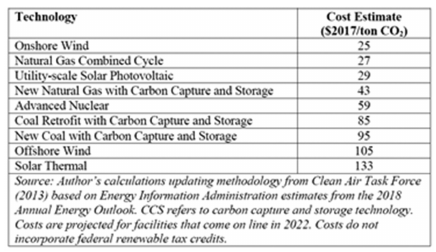

**Table 3 Static costs of policies based on a compilation of economic studies (Gillingham and Stock 2018).** of achieving emissions reductions in order from the lowest- to highest-cost technology or policy. A well-known example is one from McKinsey (McKinsey & Company 2009), though its cost estimates are out of date in 2020. Recent estimates of abatement costs using cleaner electricity generation technologies are shown in Table 2 (Gillingham and Stock 2018). The estimates compare the cost per ton of CO2 abated by replacing existing coal-fired electricity. GHG emission reduction technologies can also be evaluated based on their implementation within government policies and programs. Estimated ranges of the marginal abatement costs of several recently-enacted policies are shown in Table 3 (Gillingham and Stock 2018).

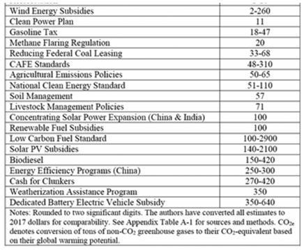

### Refrigerants and Fluorinated Gases (F-Gases)

Fluorinated gases (F-gases) are categorized as CFCs, HCFCs and HFCs. Historically, F-gases have been used as refrigerants and expanders for foam insulation. Release of F-gases into the atmosphere cause either ozone layer depletion and/or contribute to GHG emissions. The remainder of this subsection primarily addresses refrigerants with regard to GHG emissions and their mitigation.

Refrigerants are the working fluids in refrigeration, air-conditioning, and heat-pumping systems. Both F-gases and none-F-gases are used as working fluids, but those which are of concern with regard to climate change are the F-gas refrigerants. They become an environmental concern when they are leaked or released into the atmosphere, which may occur at various points throughout the life cycle of equipment, from manufacturing to installation, operation, servicing and ultimately to decommissioning at end of life. Minimizing all refrigerant releases from systems is important not only because of direct environmental impacts, but also because refrigerant charge losses lead to suboptimal operation and decreased efficiency.

<!-- str. 938 -->

In 1987, all 197 UN member countries agreed to phase out the production of Ozone-Depleting Substances (ODS), including CFCs and HCFCs, under the Montreal Protocol (2017 ASHRAE Handbook—Fundamentals). As a result, HFC refrigerants were widely adopted as ODS substitutes, but have since been identified as potent GHGs with orders of magnitude more impact on the climate than carbon dioxide (CO2). The Global Warming Potential (GWP) of a GHG is an index describing its relative ability to trap radiant energy compared to CO2 (R-744), typically using a 100-year Integration Time Horizon (ITH) to sum up its cumulative effect. Metrics for climate impact of refrigerant emissions are reported as the equivalent mass of CO2 that would have the same impact, in lb (kg) CO2eq (IPCC 2013). Due to their high GWP values, HFCs have been subject to increasing regulations. In 2016, the Kigali Amendment to the Montreal Protocol was developed, which included a timeline for the mandated phase-down of HFCs for developed and developing nations (UNEP 2016). The Kigali Amendment went into effect for ratified countries on January 1, 2019. As of July 2020, 100 nations have ratified the Kigali Amendment. Action under the Amendment will help reduce HFCs and thus avoid global warming up to 0.72 oF (0.4oC) by 2100 (UNEP 2016).

In the U.S., the EPA’s Significant New Alternatives Policy (SNAP) program, which was established to evaluate and regulate ozone-depleting substances and substitutes, moved many HFCs from the acceptable list to the unacceptable list and added new lower GWP alternatives to the acceptable list under SNAP Rule 20 and Rule 21. A complete list of unacceptable and acceptable refrigerants under these rules may be found at www.epa.gov/snap/snap-regulations. However, in 2017 the U.S. Court of Appeals for the District of Columbia ruled that the EPA did not have the authority to regulate HFCs, and the rules were overturned (Mexichem Fluor, Inc. vs. Environmental Protection Agency 2017). A growing number of states from the U.S. Climate Alliance, a coalition of states committed to reducing GHG emissions, have since announced intentions to regulate higher GWP HFCs. Proposed regulations include, but are not limited to, establishing the vacated SNAP rules at the state level.

Indices have been developed to measure the total environmental impact of HVAC&R systems. The Total Equivalent Warming Impact (TEWI) of an HVAC&R system is the sum of direct refrigerant emissions from leaks expressed in terms of CO2-eq, and indirect emissions of CO2 from the system's energy use over its service life (Fischer 1993). Life Cycle Climate Performance (LCCP) is a more comprehensive evaluation of global warming impacts from direct and indirect emissions. In addition to the greenhouse gases measured by TEWI, LCCP adds direct and indirect emissions associated with the energy and chemicals required in manufacturing the refrigerant, and the energy and materials associated with end-of-life disposal (IIR, 2015). Additional information on refrigerants can be found in Chapter 29 of this volume.

Lower GWP refrigerant alternatives include natural refrigerants, unsaturated HFCs such as hydrofluoro-olefins (HFOs) and hydrochlorofluoro-olefins (HCFOs), and refrigerant blends with two or more components. HFOs and HFO/HFC blends have been developed as lower GWP alternatives to HFC refrigerants. Some HFOs are also GHGs but their GWPs are drastically lower than those of HFCs. Naturally occurring substances such as ammonia (NH3, R-717), CO2, and hydrocarbons are non-halocarbon refrigerants with GWP100 values between 0 and 5 (i.e., these gases have a GWP between 0 and 5 times the GWP of CO2). Note that from a regulatory perspective there are the values accepted for use by the Montreal Protocol which are quite often rounded to zero; from a purely scientific perspective, some refrigerants have an extremely small ODP value but not exactly zero ODP. There is no crisp definition of when “essentially zero” is considered zero for regulatory purposes. Table 4 shows the latest scientific assessment values for atmospheric lifetime, ozone depletion potential (ODP), and GWP100 of refrigerants being phased out under the Montreal Protocol and of their replacements.

**Table 4 Refrigerant Environmental Properties. Atmospheric lifetime, ODP and GWP100 from Table A-1 of (Fahey et al.**

| Refrigerant | Atmospheric Lifetime, years | ODP | GWP100 |
|---|---|---|---|
| CFC-11 | 52 | 1 | 5,160 |
| CFC-113 | 93 | 0.81 | 6,080 |
| CFC-114 | 85 | 0.5 | 8,580 |
| CFC-115 | 540 | 0.26 | 7,310 |
| CFC-12 | 102 | 0.73 | 10,300 |
| CFC-13 | 640 | 1 | 13,900 |
| HC-1270 | 0.001 | 0 | <1 |
| HC-290 | 0.034 | 0 | <1 |
| HC-600 | 12 ± 3a | 0a | 4a |
| HC-600a | 0.016 | 0 | <1 |
| HC-601a | 0.009a | 0a | -20a |
| HCFC-123 | 1.3 | 0.01 | 80 |
| HCFC-124 | 5.9 | 0.02 | 530 |
| HCFC-142b | 18 | 0.057 | 2,070 |
| HCFC-22 | 12 | 0.034 | 1,780 |
| HCFO1224yd(Z) | 0.058a | 0.00012a | <1a |
| HCFO1233zd(E) | 0.071 | 0.00034 | 4 |
| HE-E170 | 0.015a | 0a | 1a |
| HFC/HFC410A |  | 0 | 1,920b |
| HFC-125 | 31 | 0 | 3,450 |
| HFC-134a | 14 | 0 | 1,360 |
| HFC-143a | 51 | 0 | 5,080 |
| HFC-152a | 1.6 | 0 | 148 |
| HFC-227ea | 36 | 0 | 3,140 |
| HFC-23 | 228 | 0 | 12,690 |
| HFC-236fa | 222 | 0 | 7,680 |
| HFC-245fa | 7.9 | 0 | 880 |
| HFC-32 | 5.4 | 0 | 705 |
| HFO-1234yf | 0.029 | 0 | <1 |
| HFO-1234ze(E) | 0.045 | 0 | <1 |
| HFO1336mzz(E) | 0.045-0.088 | 0 | 16 |
| HFO1336mzz(Z) | 0.06 | 0 | 2 |
| PFC-116 | 10,000 | 0 | 11,100 |
| PFC-218 | 2,600 | 0 | 8,900 |
| PFC-c318 | 3,200 | 0 | 9,540 |
| R-717 | (few days) | - | <1 |
| R-744 |  | 0 | 1 |

aChapter 29, 2017 ASHRAE Handbook—Fundamentals

bIPCC 2013

### Geoengineering Technologies

Annual global GHG emissions continue to increase, or at best are starting to level off. Limiting warming to 1.5°C (2.7°F) requires strictly limiting future carbon emissions. The total amount of allowable carbon emissions (the “carbon budget”) is small relative to annual emissions rates. Estimates for the remaining carbon budget for a 66% chance of limiting warming to 1.5°C (2.7°F) range from negative (meaning the carbon budget has already been exceeded) to only 15 years of current emissions. These estimates imply that if

<!-- str. 939 -->

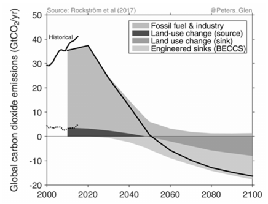

*Fig. 18 Global CO2 emissions (fossil fuels, industry, & land- use change) in a “well below 2°C” scenario from MESSAGE. It is possible to split the net emissions (black line) into gross positive and gross negative emissions.*

GHG emissions are not rapidly reduced, the remaining carbon budget will be used up by around 2035 at the latest and emissions rates would need to drop to zero to avoid dangerous levels of warming. The mitigation measures that engineers and building design professionals are most likely to focus on are those that reduce GHG emissions. However, there are additional strategies for mitigating global warming. Carbon Dioxide Removal (CDR), also known as Greenhouse Gas Removal (GGR) or simply Carbon Removal (CR) refers to techniques for removing CO2 from the atmosphere and durably storing it through anthropogenic activities (IPCC 2018). Solar Radiation Management (or Modification) (SRM) involves deliberate changes to the albedo of the Earth system, with the net effect of increasing the amount of solar radiation reflected from the Earth to reduce the peak temperature from climate change (The Royal Society 2009). Both CDR and SRM can be lumped into a broader category of technologies known as geoengineering. Broadly, geoengineering is any deliberate large-scale intervention in the Earth’s climate system, in order to moderate global warming. (The Royal Society.) As we rapidly burn through the remaining carbon budget, the temptation to implement and rely on geoengineering technologies will be strong. Engineers and building design professionals should understand that geoengineering is very risky and largely untested, and is not a replacement for long-term GHG emissions reductions.

CDR technologies are also known as negative emissions technologies (NETs). All potential emissions pathways that limit global warming to 1.5°C (2.7°F) or even 2.0°C (3.6°F) rely on CDR to some degree to compensate for residual emissions and achieve net negative emissions after a period of temporary overshoot of the target. Most potential pathways include a significant contribution of Bioenergy with Carbon Capture and Storage (BECCS) and/or afforestation and reforestation (AR). BECCS is the process of extracting bioenergy from biomass and capturing and storing the carbon, thereby removing it from the atmosphere (Obersteiner 2001).

The role of BECCS and/or other NETs can be seen in the graph of global CO2 emissions (fossil fuels, industry, and land-use change) in a “well-below-2°C” scenario in Figure 18, based on a simple carbon cycle and climate model.

The graph shows that annual emissions from fossil fuels and industry must rapidly decrease relative to the solid black historical trend line, and annual emissions from land use changes must decrease relative to the dotted black historical trend line. Land use changes need to become net carbon sinks. In combination with BECCS, these negative emissions offer a pathway to net zero emissions in 2050 as indicated by the solid black line.

### Summary

Mitigating the impact of human activities on climate has been, and should continue to be, a major technical and professional obligation for building designers and operators. While this section laid out actions that can be taken today, it is important to consider these in the context of a climate that has already changed and will continue to do so. Actions taken by building designers and operators, as cited above, will have a positive effect in reducing GHGs and OPS and thus slowing down the negative aspects of climate change. In support of ASHRAE’s mission and vision, it is imperative to be aware of the context within which buildings should be designed and operated, and the evolution of energy supply and distribution, disaster risks, and changing expectations.

## 3. ADAPTING TO CLIMATE CHANGE

Adaptation is the process of adjustment to actual or expected climate which seeks to moderate or avoid harm or exploit beneficial opportunities (AR5, IPCC 2014b; AR 6 forthcoming). Adaptation implies accounting for the magnitude and direction of future climate change in design and operation, guided by risk tolerance and appetite. Depending on the design brief, the vulnerability of a building’s occupants, the ability to suspend normal activities during extreme events, and site considerations such as urban density, the designers should assess the impacts of different climate projections for a given location on their proposed design or specification. To design building envelopes and HVAC systems, adaptation to climate change is about the “when” and “how”, since it acknowledges that change is already occurring and that there is risk in not adapting (McKinsey Global Institute 2020).

### An ASHRAE Framework for Risk-Aware Practice

The design of building envelopes, HVAC, and other systems that dictate the indoor environment and energy performance of a building over its decades-long service life presents a choice to take an adaptive response (IPCC 2014b). Across design disciplines, adaptation is a risk management function (ASCE 2015; WFEO 2015; AIA 2020), addressing both the threats and opportunities of climatic change.

The current state of the art approaches are risk-informed decision-making frameworks. Best practice combines an asset-based approach, where better knowledge of the asset is acquired through a vulnerability assessment of its historic vulnerabilities and recovery/resilience potential (Stéphane Hallegatte et al. 2012), with a characterization of relevant forward-looking climate information which affects the asset. The combination seeks to optimize what is known from an object’s past and then identifies what needs further investigation for the plausible conditions that the asset will experience during its intended service life. This approach requires bringing together expertise in asset management, adaptive management and designing and valuation of options and flexibility as climate science is not the sole singular source for answers (Stephane Hallegatte, Rentschler, and Rozenberg 2019; Haasnoot et al. 2013; Ayyub 2018). This section encourages ASHRAE designers and operators to look upon adaptation as an exercise in the realistic assessment of risk based on the best available information.

### Adaptation and Related Terms

Designers also benefit by understanding adaptation and its interconnected relationship with mitigation and resilience. As stated earlier, both mitigation and adaptation are required. There are cobenefits and tradeoffs depending on the location, and the needs and objectives of the client/ occupant (Adger et al. 2013). Recommendations for improving the energy efficiency or environmental impact of buildings for mitigation exist in other ASHRAE documents such as Standard 189 and Standard series 90. As explained in the previous section, mitigation reduces the impact of buildings and systems on the environment, while adaptation anticipates the changes that are already occurring and will continue to do so.

<!-- str. 940 -->

Adaptation is also related to resilience but is not equivalent to it (Keenan, Hill, and Gumber 2018; Weaver et al. 2013). Between resilience and adaptation, there are significant differences in the time and spatial scales, and in operational expectations. Resilience seeks to maintain and recover to a known expected base state (status quo) of performance and operation after a disturbance. Adaptation is a process of transformation from one state to another usually in response to external factors (a state/outcome). Adaptation demands anticipatory thought (Klein, Snowden, and Pin 2011) and treats the new base state as the norm informed by value sets (Adger et al. 2009; Wong-Parodi, Fischhoff, and Strauss 2015). Recently, some define resilience as including adjustments over longer time frames, but this is more accurately defined as adaptation (Keenan 2018; Lempert et al. 2018; Wong-Parodi, Fischhoff, and Strauss 2015; Lama, Becker, and Bergström 2017).

### Chronic vs Acute Impacts of Climate Change

Chronic impacts are slow changes in mean values or ‘normals’ at a location that create different prevailing conditions than the historical record. Acute impacts are an outcome of these, i.e., a change in the frequency or intensity of occurrence of high-intensity, extreme or near-extreme events that typically last over some finite duration and will likely cause acute but time-limited distress to human health and buildings (Diffenbaugh 2020). An example of a chronic impact is the change in climate zones shown in Figure 6. For example, a new zone was added to the ASHRAE climate zone classifications in 2016 for zones warmer than the previous warmest zone (ASHRAE Standard 169-2013: Climatic Information for Building Design). An acute impact is the increase in heat wave potential in places that have moved to a warmer climate zone. The opportunity for designers and operators to advance adaptation spans both the chronic and acute impacts of climatic change. Climate-conscious design and analysis through simulation can inform forward-looking adaptive building design.

Chronic changes in climate, i.e., changes in normals often change several metrics relevant to building and HVAC design and analysis. An example of how chronic changes might impact buildings is as follows. Most cooling systems are designed for one of 3 different possible cooling design conditions corresponding to the 0.4%, 1%, or 2% design temperatures and humidity for the building’s location. Simplifying somewhat, a design for the 0.4% cannot meet the load for 0.4% of the time each year on average, or roughly 35 hours a year (0.4% of 8760). For a cooling system, that could be roughly 1 hour per day for the 30 hottest days of the summer. An HVAC system installed today can be expected to have a functional life of 25-30 years, and temperatures will continue to increase over that period. If the 0.4% percentile temperature value comes to correspond instead to the 2% value, i.e., the distribution of temperatures shifts towards warmer temperatures, the 35 hours become 175.2 hours (2% of 8760). In this case, a building will be faced with 3-4 hours a day of non-attainment over 58-44 days. For example, for a system designed in 1986 using weather data from Dulles Airport, the mean 0.4% design temperature for 1975-85 was 27.68°C (81.82°F). For the same system, the mean 2% temperature in the last decade of its service life (2006-2016) was 27.91°C (82.24°F). This is not a theoretical exercise for most locations, especially urban ones where Urban Heat Island (UHI) has exacerbated the impacts of climate change. While UHI, as the increase in temperature due to urbanization is known, is distinct from climate change, the two effects interact. The impact is both to exacerbate acute phenomena such as heat waves, and affect strategies for heat mitigation such as night-time cooling. For more information on UHI and its impact see Chapter 14, Climatic Design Information, of this volume.

Chronic changes in climate are stressors for buildings and systems, i.e., they increase the overall stress or demand on them. Acute events such as heat waves are also expected to continue to increase in frequency and duration, shocking mechanical systems and the ability of equipment to maintain thermal health. Changes in seasonal weather trends and sub-seasonal episodic weather, e.g., intensity and duration of heat waves, sustained high night-time temperatures and humidity, extreme rainfall, drought, etc., affect near-term operational performance, occupant comfort and health and long-term energy efficiency (Katharine Burgess and Foster 2019). Similarly, increased particulate matter (due to increase in wildfires) and organic contamination (due to increased flooding) negatively affects air quality and equipment performance, while increasing required maintenance and decreasing equipment efficiency (ASHRAE Guideline 29-2017: Guideline For The Risk Management Of Public Health And Safety In Buildings).

### Impacts on Envelope-Driven Loads

The global climate is already changing, and this has many impacts relevant to designers and operators. Impacts include the necessity to plan for future conditions while managing the impact of climate change on existing operations. These changes are evident in several metrics relevant to envelope design, such as changes in Degree Days and climate zone classifications. Besides these indicators, there are numerous impacts of climate change that affect envelope-driven loads as well as occupant health and comfort both directly and indirectly, such as increases in periods of intense heat, significantly warmer ‘typical’ summers, etc. In other words, envelopes designed without consideration of changing probabilities of acute events and changes in climate normals may cause significant heat stress, overheating, and unplanned increases in envelope loads.

### Impacts on HVAC Systems

HVAC systems or components typically have an intended service life of approximately 30 years. Table 3, Ch. 38 of the 2019 ASHRAE Handbook—Applications presents estimated median service lives in excess of 22-25 years for most components (Owen 2019b). Designs developed and executed based on historical climate assumptions pose a risk to the occupants as they can overestimate the system’s capabilities and capacity to maintain safe indoor environmental conditions (Maxwell et al. 2018). This includes sizing of trunk ducts, cooling loop mains, and adequate space to accommodate the expansion or other changes to the mechanical equipment, the type of utility-supplying systems, or other elements with a long service life. For such systems, designers must consider how the design is able to adapt when, not if, conditions change (USACE 2018). This should not be taken as a recommendation to increase or decrease system capacity - if anything, systems are already overdesigned. Rather, it is encouragement to use passive and active resilience measures which prioritize flexibility, modularity, and expandability as part of a robust HVAC system design in changing conditions. ASHRAE design methods already favor buildings and HVAC systems that would perform robustly in a variety of conditions, including some extreme conditions. What designers need to understand is that the external climate, a critically important boundary condition of these design methods, has changed and is changing.

Existing vulnerabilities in HVAC design, and buildings that depend on them, are made worse by the observed and expected changes in climate (Maxwell et al. 2018). Multiple factors are driving these vulnerabilities. These include poorly maintained and degraded buildings and systems as well as historic and cultural assets which were not designed for the changing climatic conditions. In urban areas, the increase in population and changes in land use stress not only the occupant demand on HVAC systems but the base operating conditions due to heat island effect (IPCC 2014a; Maxwell et al. 2018; Dahl, Kristina et al. 2019). For example, HVAC equipment failure during an extreme event like a wildfire or heat wave can lead to dangerous conditions being exacerbated by the inability to escape outdoors. Urban areas often report higher nighttime temperatures than would be expected from their meso-climatic (regional) context. This is largely due to the urban heat island effect and has effects such as a reduction in the effectiveness of nighttime active and passive free cooling. This impact too is being exacerbated as climate change causes more frequent heat waves and increased average temperatures.

<!-- str. 941 -->

### Impacts on Indoor Air Quality

The performance of mechanical systems is directly and indirectly impacted by both chronic and acute events of climate change and other extreme events. Actual outdoor conditions that sufficiently deviate from design conditions can lead to difficulty in controlling indoor conditions to the detriment of Indoor Air Quality (IAQ). For example, the predicted increases in outdoor absolute humidity (discussed in the Climate Science section) can overburden a system and increase the incidence of high indoor humidity and potential for microbial growth (Kalvelage, Dorneich, and Passe 2015). As climate normals shift, the mechanical systems may not be sized adequately to properly manage increased sensible and latent loads (Wang and Chen 2014; Qi, Lu, and Yang 2012; Watkins and Levermore 2011). If the prevailing wind direction changes enough, separation distances and orientations between building exhaust and outdoor air intakes from the original system design and assumptions may cease to be adequate. While failure of HVAC&R systems can have potentially serious outcomes for occupant health and wellbeing, the potential impacts are even greater for mission critical facilities, as interruption of their operation can have severe implications and knock-on effects on services and relief efforts. Indirect impacts of climate change on building IAQ include the effect of an increase in outdoor air pollution (particulates and gas-phase compounds) on air treatment and handling systems. This could result in non-attainment of a variety of outdoor air contaminants within the scope of the US EPA NAAQS (PM2.5, PM10, SO2, CO, O3, NO2, lead) and the inability of the HVAC system to adequately provide mitigation or remediation. At best, this would require more intensive and/or frequent maintenance to adapt to the increased pollutant loads.

Disaster events are acute challenges for any building and may cause irreparable damage to the building's capability to maintain the indoor air quality. The weather events of concern include, but are not limited to: flooding, extreme heat (higher peak day-time temperatures, particularly when accompanied by high humidity, and higher night-time temperatures and humidity), extreme cold (ice and/or heavy snow), hurricanes/tornados, wind-driven rain, mudslides, and wildfires. An example of the acute risk posed by a disaster is the increased risk of carbon monoxide exposure and poisoning. During such events, filtration systems can become contaminated, clogged, wet, or structurally damaged. Open systems like cooling towers can become sources of infectious microorganisms such as legionella. Penetration through the building envelope can lead to serious HVAC&R load problems, humidity/mold/moisture issues, and pest infestations. Disease epidemics are a major concern if occupants must Shelter-in-Place in large populations or if temporary disaster relief centers are set up in large facilities that were not designed to accommodate such events. Large increases in particulate matter from wildfires, structure fires, or volcanic events can significantly deteriorate the outdoor air quality due to airborne particulate matter and dangerous gases (Guan et al. 2020). During such times, loss of electricity without a backup power source can worsen IAQ in enclosed spaces, especially those without the ability to take passive backup measures. Damage to building drainage systems (storm and sewer) can cause uncontrolled moisture within buildings that may result in proliferation of bacteria and fungi colonies.

The ASHRAE Position Document on Infectious Aerosols (ASHRAE 2020) contains numerous control measures such as dilution ventilation, specific in-room flow regimes, room pressure differentials, personalized and source capture ventilation, filtration, and Ultraviolet Germicidal Irradiation (UVGI). Some examples of strategies to implement in early planning, new construction, or retrofits, depending on performance requirements and location, are given here:

- **Contaminant Removal Technologies (CRT)** – minimum MERV13 filtration, Gas-Phase VOC filters, HEPA filtration, automatic roll filter mechanisms, electrostatic precipitator (ESP) systems, gas-phase filtration, cyclone collectors, etc.
- **Bypass systems** to minimize energy consumption during normal use that must provide adequate CRT protection during events.
- **IAQ Performance Strategy (IAQP)** – performance-based approach to reducing outside air levels coupled with high efficiency cleaning systems, especially during cooling/heating design days and weather-related events, while maintaining acceptable air quality (ASHRAE Standard Series 62: Ventilation for Acceptable Indoor Air Quality).
- **Dedicated Clean Air Systems (DCAS)** – High-performance, easily-maintainable systems will be required, especially during wildfire events where particulate levels will overwhelm filter banks.
- **Pressurization** – During events such as disease epidemics or wildfires, pressurization strategies inside buildings will be necessary.
- **Shelter-In-Place (SIP)** – All facilities should have plans to shelter-in-place during disasters to ensure life safety and acceptable air quality.
- **UVGI or UV Cleaning** – Can be used to disinfect surfaces, airstreams (SIP), and upper air. May also be used on cooling coils to keep heat transfer surfaces energy efficient & disinfected. Duct & upper air applications can be applied for infectious control in emergencies to make a facility resilient, especially for an emergency center.
- **CO2, IAQ, and moisture monitoring** (VOCs, particulates, etc.), forecasting, and reacting to events. As monitoring systems improve in reliability and coverage, the availability of real-time information on indoor conditions during an event can significantly improve outcome-based control and planning.
- **IAQ, Water, & Bacterial Management Plan** – including flood resistant materials, barriers, & wet/dry flood-proofing, water disinfection systems, etc.

### Operational Management and Design for Smoke Migration Risk from Wildfires

Wildfires threaten structures in cities or produce smoke that causes visibility and health problems for people living and working many miles away. Buildings that are in or adjacent to wildfire-prone areas need the capability to operate at a slight positive pressure to keep contaminants out, and to help exhaust air systems to function properly. It is not recommended to eliminate or substantially reduce the outdoor air supply in order to reduce exposure to smoke. For preparedness of an existing facility or prevention in a new facility, a qualified HVAC technician or engineer must assess the building mechanical systems for this incident type and determine, in writing, the amount of outside air and filtration necessary to prevent negative pressurization of the building, and to sufficiently ventilate any hazardous processes in the building (such as enclosed parking garages or laboratory operations) (EPA 2016, Appendices A and D: Identification and Preparation of Cleaner Air Shelters for Protection of the Public from Wildfire Smoke). At this time, there is not an ASHRAE standard which specifically addresses the operational and design needs to manage this risk.

<!-- str. 942 -->

### Existing Professional Activities

Technical societies around the globe are developing practices and methods to integrate climatic projections and climate-based risk analysis in the design of infrastructure, e.g., American Institute of Architects (AIA), American Society of Civil Engineers (ASCE), American Association of State Highway Transportation Officials (AASHTO), and Chartered Institution of Building Services Engineers (CIBSE). ASCE has issued a Manual of Practice which emphasizes adaptive management and the use of engineering options analysis (Ayyub 2018), which is a relevant and transferable approach. The AIA has developed and launched training on these topics for mid- career professionals as well (AIA 2020). The reliance on stationarity and use of backward-looking or historical data and information is often insufficient for design or performance in conditions that are changing and will continue to change. Currently, these efforts are spearheaded by hydrology and hydraulics, and structural, architectural and urban design. This advancement is propelled by many factors. These include availability of actionable science based on climatic information of high confidence and likelihood, the long service life of the asset or system and the professional judgment which recognizes that current designs can underestimate risk as the future is not expected to be like the past.

On the other hand, existing professional education and licensing of engineers and architects, building codes and zoning do not require the integration of changing climatic conditions (Maxwell et al. 2018), except in a few U.S. cities (e.g., New York City) and countries (Canada, U.K., E.U.). Designers can instead heed the advice of the World Federation of Engineering Organizations by following the Seven Principles of the Model Code of Practice, particularly No. 7, planning for service life, and No. 8, using risk assessment for uncertainty and No. 9, monitoring legal liabilities (WFEO 2015).

### Design Opportunities and Strategies

Licensed design professionals inform investment decisions by qualifying and quantifying the risk over the service life of an asset (Maxwell et al. 2018) and by designing for reliable performance in changing conditions (Hallegatte et al. 2012). This important role applies to both capital investment and capital reinvestment for risk-informed decisions (Katherine Burgess and Rapoport 2019). This spans the finance, insurance and appraisal sectors (Maxwell et al. 2018). These sectors are also driven to respond to stakeholder demands to disclose climate risks across their portfolios (TCFD 2017). It is recognized that insurance is not a protection against a “reduction in an asset’s liquidity or depreciation in value” (Katherine Burgess and Rapoport 2019). Designs which provide owners with surety of energy, water and sewage conveyance systems (ISC 2016) allow “ a chance to fight obsolescence and an opportunity to differentiate their assets even more in vulnerable areas” (Katherine Burgess and Rapoport 2019; S. H. Holmes and Reinhart 2013; S. H. Holmes, Rajkovich, and Baker 2017). Envelope design which integrates forward-looking climatic information is a preventive stance by designing to avoid or minimize damage, impairment (FASAB 2013), loss of life, shortening of the asset or component life (Glassman and Reinhart 2013; Katherine Burgess and Rapoport 2019), loss of capital or stranded assets (Keenan, Hill, and Gumber 2018). In addition to climate risk-informed investment management, designs which can adapt to changing conditions promotes business or mission continuity which has high value in the near term (NIBS 2018).

The service life of buildings can be extended by designing and specifying robust building envelopes, materials and applying methods of envelope assembly which can withstand or adapt to stress from extremes in temperature or moisture. Existing practice and recommendations must be examined against the backdrop of a change climate, for example through the use of simulation with projected climate information and similar ‘what-if’ analyses. An approach which uses decision scaling and stress testing can enhance robustness. First, the designer can identify the exposure and sensitivity of a system or component and then determine if the climatic parameter is a plausible and dominant factor driving vulnerability, e.g., in consideration of the likelihood of flooding, locating mechanical and electrical equipment rooms where it will likely be negatively affected by flooding. The designer can then determine whether the design has coping capacity (stress test) or needs to be redesigned to reduce vulnerability (Ray and Brown 2015). These include standard efficiency recommendations such as air tightness, insulation and thermal bridging both above and below grade and management of building pressurization. Also important are the long-term thermal transfer capability of ground source heat pumps (Kharseh et al. 2015) and managing for changes in water vapor drive (direction/quantity/seasonal timing) as measured by vapor pressure (Maxwell et al. 2018; Ch. 25, Owen 2019a) . In some locations, a change in water vapor drive can determine not only long-term HVAC performance of the envelope but the exposure of structural systems to moisture (corrosion) or the degradation of other materials in the assembly such as insulation and or sealants. Correct building pressurization is also connected to long term durability as well as managing acute extremes. For some locations, frequent and intense spikes in particulate matter due to wildfires, as mentioned above, will require filtration design and operation adjusted to these new extreme conditions (e.g., more frequent cleaning of filters).

It is recommended to employ passive means to offset increased expected temperatures in place of simply increasing chiller sizes, e.g., improved shading and intelligent use of ventilation, including maximum ventilation at night when relative temperatures (and humidity levels) between the ambient and interior are favorable. CIBSE studies have shown that combining high thermal mass combined with intelligent ventilation gives the best performance (CIBSE 2005; Nicol 2013). Adaption also means specifying multiple units of equipment in place of specifying a larger single unit and providing space for adding equipment to increase cooling capacity in the future as needed.

Depending on the usage of a building and the criticality of each system, the building components and systems are designed to function under some predefined extreme environmental or usage conditions. During these acute events, i.e., episodes of extreme or nearextreme weather, systems must maintain operational performance. However, changes in the frequency and intensity of these events shifts the boundaries on what is considered a design extreme event, and under what conditions failure is accepted. A building designed to fail over historical 99th percentile temperature, so roughly only 1% of the time over a long-enough operating life, is likely to fail more often because the historical 99th percentile temperature is now 95th percentile, i.e., to be exceeded 5% of the time over a sufficient period of record. Design for acute events includes system redundancy or modular design to handle expected extremes in support of energy or water surety for critical facilities. This includes design for adequate ventilation and filtration to manage increased particulate matter such as pollen or dust or to manage acute incidents such as the migration of smoke from distant wildfires while maintaining adequate building pressurization. To support essential facilities and business or mission continuity, HVAC design professionals can develop methods for load reduction or shifting. This could help to better manage interruption of utilities for passive survivability and thermal resilience.

<!-- str. 943 -->

With the adaptation parameters and systems capabilities listed above, designers are well-positioned to integrate forward-looking climatic information into HVAC performance criteria as existing ASHRAE practices and methods already use climatic parameters today (GAO 2016). Given the expected service life, the need for flexibility and adaptability to changing conditions, and understanding the risk of reliance on historic (backward looking) information and assumed stationarity within the available information, there are useful approaches available.

### Resources for Adaptation

As this section emphasizes through its discussion of risk, riskaware engineering and professional judgment, the future climate is not exactly predictable. Good estimates exist but can only be made precise incrementally as the science of climate improves. In addition, the impact of economic, technological, and policy factors means that there will always be uncertainties in climate projections. However, designers have to act now. Just as the investment and the energy sector have found (TCFD 2017; Gold 2019), relying solely on typical data can border on professional negligence as it actively ignores current actionable evidence. While design for future climate appears optional or in some settings might even be discouraged due to liability concerns, global professional practice is changing. In such a situation, statistical science suggests that averaging projections over multiple scenarios improves accuracy, if plausible scenarios are chosen (Jentsch et al. 2013; Barsugli et al. 2013; Rastogi and Khan 2020). How can one go about selecting these scenarios? There are two responses to this, both discussed in the climate science section above:

- Use historical data – though this is a defensible approach for nearfuture outcomes, it has predictive limitations.
- Use a realistic weather generator – a generator modifies historical data with the outputs of climate change models. Two approaches were described earlier – morphing and stochastic generation. Each of these can produce multiple plausible estimates of future years or a statistically-derived ‘future typical year’ (FTMY).

### Existing ASHRAE Resources

Existing ASHRAE resources unfortunately rely solely on historical data. Since 2001, ASHRAE has published up-to-date climatic design conditions based on historical data in ASHRAE Standard 169 Climatic Data for Building Design Standards. These standards contain climatic information for around the world collected and summarized for use in design and are updated every three years. Designers should use the most recent versions of the standards in their work and evaluate the most current forward-looking information to design building systems.

Moving forward, standards must evolve to account for the changing conditions described in this chapter. They must address design and its relationship to the climate, including historically observed conditions and the expected change in conditions, especially extremes in intensity, duration and frequency (GAO 2016). The standards development revision cycle is lengthy and complex. Yet, ultimately, it informs the development of building codes that can be adopted by local jurisdictions. It is therefore incumbent on professional societies to ensure that their standards are reasonably forward-looking.

## 4. CONCLUSION

This chapter has laid out the evidence of climate change, and recommendations for designers to integrate the mitigation of, and adaptation to, climate change. It has discussed the impacts of climate change on buildings and systems, and the design challenges and opportunities these represent. A framework for adaptation was laid out, along with resources for designers seeking to act on the arguments and recommendations presented in this section.

This chapter will end with the following call-to-action (WFEO 2015):

*Embrace uncertainty in design and use professional judgment in* *designing for changing conditions.*

*Communicate with clients to reach an understanding of climate risk* *and what it means for the operation and the intended service life* *of their investment. Document your communication.*

*Use projected design conditions when designing and specifying* *building assemblies and systems, especially if they are more* *extreme than those based on historical data. However, employ* *passive methods and provide multiple units instead of a single* *chiller, with allotted space for future additional equipment. Take* *care not to oversize equipment.*

*Use future climate projections for simulating the performance of* *these systems to inform design decisions, specifically to deter-* *mine sensitivity and stress-test using plausible scenarios.*

*Continuously evaluate the updated information and data based on* *the current science.*

ASHRAE's direct interest in and concern regarding greenhouse gases and climate change is reflected in its activities in heating, ventilating, air conditioning and refrigerating (HVAC&R) technologies and applications. HVAC&R systems contribute to greenhouse gas emissions in terms of refrigerant emissions and CO2 emissions associated with the energy needed for operating buildings and building systems. ASHRAE’s direct interest in occupant health and safety within the built environment drives the Society’s commitment to research, educate, advocate and respond to occurring climate change with the intent to guide resilient infrastructure, building systems and community designs. It is imperative that ASHRAE and its members play a critical role in mitigating and adapting to climate change.

## 5. GLOSSARY

**Anthropogenic:** Made by people or resulting from human activities. Usually used in the context of emissions that are produced as a result of human activities.

**Carbon (dioxide) Capture and Storage (sequestration) (CCS):** A process in which a relatively pure stream of carbon dioxide (CO2) from industrial and energy-related sources is separated (captured), conditioned, compressed and transported to a storage location for long- term isolation from the atmosphere.

**Carbon dioxide equivalent (MMTCO2Eq):** A metric measure used to compare the emissions from various greenhouse gases based upon their global warming potential (GWP). Carbon dioxide equivalents are commonly expressed as "million metric tons of carbon dioxide equivalents (MMTCO2Eq)." The carbon dioxide equivalent for a gas is derived by multiplying the tons of the gas by the associated GWP. MMTCO2Eq = (million metric tons of a gas) * (GWP of the gas).

**Carbon Dioxide Removal (CDR):** Carbon Dioxide Removal methods refer to a set of techniques that aim to remove CO2 directly from the atmosphere by either (1) increasing natural sinks for carbon or (2) using chemical engineering to remove the CO2, with the intent of reducing the atmospheric CO2 concentration. CDR methods involve the ocean, land and technical systems, including such methods as iron fertilization, large-scale afforestation and direct capture of CO2 from the atmosphere using engineered chemical means. Some CDR methods fall under the category of geoengineering, though this may not be the case for others, with the distinction being based on the magnitude, scale and impact of the particular

<!-- str. 944 -->

CDR activities. The boundary between CDR and mitigation is not clear and there could be some overlap between the two given current definitions (IPCC, 2012b, p. 2). See also Solar Radiation Management (SRM).

**Carbon footprint:** The total amount of greenhouse gases that are emitted into the atmosphere each year by a person, family, building, organization, or company. A persons carbon footprint includes greenhouse gas emissions from fuel that an individual burns directly, such as by heating a home or riding in a car. It also includes greenhouse gases that come from producing the goods or services that the individual uses, including emissions from power plants that make electricity, factories that make products, and landfills where trash gets sent.

**Chlorofluorocarbons (CFC):** (1) Generally, any of several compounds composed of carbon, fluorine, and chlorine, used chiefly as refrigerants and as blowing agents in plastic foams. Compare to fluorocarbon; halocarbon. (2) A fully halogenated (no hydrogen remaining) halocarbon containing chlorine, fluorine, and carbon atoms.

**Confidence:** The validity of a finding based on the type, amount, quality, strength, and consistency of evidence (such as mechanistic understanding, theory, data, models, and expert judgment); the skill, range, and consistency of model projections; and the degree of agreement within the body of literature.

**CO2-equivalent emission:** The amount of carbon dioxide (CO2) emission that would cause the same integrated radiative forcing, over a given time horizon, as an emitted amount of a greenhouse gas (GHG) or a mixture of GHGs.

**Extreme weather event:** An extreme weather event is an event that is rare at a particular place and time of year. Definitions of rare vary, but an extreme weather event would normally be as rare as or rarer than the 10th or 90th percentile of a probability density function estimated from observations. By definition, the characteristics of what is called extreme weather may vary from place to place in an absolute sense. When a pattern of extreme weather persists for some time, such as a season, it may be classed as an extreme climate event, especially if it yields an average or total that is itself extreme (e.g., drought or heavy rainfall over a season).

**F-gases (fluorinated gases):** Powerful synthetic greenhouse gases such as hydrofluorocarbons, perfluorocarbons, and sulfur hexafluoride that are emitted from a variety of industrial processes. Fluorinated gases are sometimes used as substitutes for stratospheric ozone-depleting substances (e.g., chlorofluorocarbons, hydrochlorofluorocarbons, and halons) and are often used in coolants, foaming agents, fire extinguishers, solvents, pesticides, and aerosol propellants. These gases are emitted in small quantities compared to carbon dioxide (CO2), methane (CH4), or nitrous oxide (N2O), but because they are potent greenhouse gases, they are sometimes referred to as High Global Warming Potential gases (High GWP gases).

**Global warming:** Global warming refers to the gradual increase, observed or projected, in global surface temperature, as one of the consequences of radiative forcing caused by anthropogenic emissions.

**Global Warming Potential (GWP):** An index developed to provide a simplified means of describing the relative ability of a chemical compound to affect radiative forcing, if emitted to the atmosphere, over its lifetime in the atmosphere, and thereby to affect the global climate. Radiative forcing reflects the factors that affect the balance between the energy absorbed by the earth and the energy emitted by it in the form of longwave infrared radiation. The GWP is defined on a mass basis relative to carbon dioxide. The GWP for a compound must be calculated up to a particular integrated time horizon, for example, 20, 100, or 500 years. The time horizon most widely accepted is 100 years (GWP100).

**Halocarbon(s):** A hydrocarbon derivative containing one or more of the halogens bromine, chlorine, or fluorine; hydrogen also may be present.

**Halogenated Chlorofluorocarbon (HCFC):** Fully halogenated chlorofluorocarbon is one in which all of the hydrogen atoms are replaced by chlorine and fluorine atoms. Atmospheric lifetimes of fully halogenated chlorofluorocarbons are long (75 years for CFC 11 and 111 years for CFC 12).

**Heat island:** An urban area characterized by temperatures higher than those of the surrounding non-urban area. As urban areas develop, buildings, roads, and other infrastructure replace open land and vegetation. These surfaces absorb more solar energy, which can create higher temperatures in urban areas.

**Ice core:** A cylindrical section of ice removed from a glacier or an ice sheet in order to study climate patterns of the past. By performing chemical analyses on the air trapped in the ice, scientists can estimate the percentage of carbon dioxide and other trace gases in the atmosphere at a given time. Analysis of the ice itself can give some indication of historic temperatures.

**Indirect emissions:** Indirect emissions from a building, home or business are those emissions of greenhouse gases that occur as a result of the generation of electricity used in that building. These emissions are called "indirect" because the actual emissions occur at the power plant which generates the electricity, not at the building using the electricity.

**Infrared Radiation (IR):** Range of electromagnetic radiation wavelengths greater than those of visible light and shorter than those of microwaves; generally between 0.8 micrometer and 1 millimeter. IR originates from either incandescent or nonincandescent hot bodies or from flames. The energy is used as a means of direct heat transfer from the source to the object(s) to be heated without materially heating the intervening air.

**Intergovernmental Panel on Climate Change (IPCC):** The IPCC was established jointly by the United Nations Environment Programme and the World Meteorological Organization in 1988. The purpose of the IPCC is to assess information in the scientific and technical literature related to all significant components of the issue of climate change. The IPCC draws upon hundreds of the world's expert scientists as authors and thousands as expert reviewers. Leading experts on climate change and environmental, social, and economic sciences from some 60 nations have helped the IPCC to prepare periodic assessments of the scientific underpinnings for understanding global climate change and its consequences. With its capacity for reporting on climate change, its consequences, and the viability of adaptation and mitigation measures, the IPCC is also looked to as the official advisory body to the world's governments on the state of the science of the climate change issue. For example, the IPCC organized the development of internationally accepted methods for conducting national greenhouse gas emission inventories.

**Kigali Amendment:** The Kigali Amendment is an amendment to the Montreal Protocol on Substances that Deplete the Ozone Layer. It was adopted by the 28th Meeting of Parties to the Montreal Protocol on 15 October 2016 in Kigali, Rwanda. The Amendment adds powerful greenhouse gases hydrofluorocarbons (HFCs) to the list of substances controlled under the Protocol to be phased down.

**Likelihood:** Uncertainty expressed probabilistically (in other words, based on statistical analysis of observations or model results or on the authors’ expert judgment). (USGCRP 2018)

**Milankovitch cycle:** The episodic nature of the Earth's glacial and interglacial periods within the present Ice Age (the last couple of million years) have been caused primarily by cyclical changes in the Earth's circumnavigation of the Sun. Variations in the Earth's eccentricity, axial tilt, and precession comprise the three dominant cycles, collectively known as the Milankovitch Cycles for Milutin Milankovitch, the Serbian astronomer and mathematician who is generally credited with calculating their magnitude. Taken in unison, variations in these three cycles creates alterations in the seasonality of solar radiation reaching the Earth's surface. These times of increased or decreased solar radiation directly influence the Earth's climate system, thus impacting the advance and retreat of Earth's glaciers. It is of primary importance to explain that climate change, and subsequent periods of glaciation, resulting from the following three variables is not due to the total amount of solar energy reaching Earth. The three Milankovitch Cycles impact the seasonality and location of solar energy around the Earth, thus impacting contrasts between the seasons.

<!-- str. 945 -->

**Ozone Depletion Potential (ODP):** A numerical quantity describing the extent of ozone depletion calculated to arise from the release to the atmosphere of one kilogram (2.2046 lb) of a compound relative to the ozone depletion calculated to arise from a similar release of the refrigerant R-11. The calculation is an integration of all known potential effects on ozone over the whole time that any portion of the compound could remain in the atmosphere.

**Ozone Depleting Substance (ODS):** A family of man-made compounds that includes, but are not limited to, chlorofluorocarbons (CFCs), bromofluorocarbons (halons), methyl chloroform, carbon tetrachloride, methyl bromide, and hydrochlorofluorocarbons (HCFCs). These compounds have been shown to deplete stratospheric ozone, and therefore are typically referred to as ODSs.

**PgC:** A Petagram (Pg), also known as a Gigaton (Gt), is equal to one quadrillion (1,000,000,000,000,000 or 1015) grams. Because there are a thousand grams in a kilogram, and a thousand kilograms in a tonne (also known as a metric ton), we can see that a Petagram is equal to a trillion (1,000,000,000,000) kilograms or a billion (1,000,000,000) tonnes. For those who prefer pounds, knowing that one kilogram is equal to 2.205 pounds tells us that one Petagram equals about 2.2 trillion pounds.

**Radiative forcing:** The change in net downward radiative flux at the tropopause after allowing for stratospheric temperatures to readjust to radiative equilibrium, while holding surface and tropospheric temperatures and state variables such as water vapor and cloud cover fixed at the unperturbed values.

**Risk tolerance:** While risk appetite is about the pursuit of risk, risk tolerance is a self-defined quantity of probable risk an organization can reasonably withstand (Jones and Freund 2015).

**Sequestration:** The uptake (i.e. the addition of a substance of concern to a reservoir) of carbon containing substances, in particular carbon dioxide (CO2), in terrestrial or marine reservoirs. Biological sequestration includes direct removal of CO2 from the atmosphere through land-use change (LUC), afforestation, reforestation, revegetation, carbon storage in landfills and practices that enhance soil carbon in agriculture (cropland management, grazing land management). In parts of the literature, but not in this report, (carbon) sequestration is used to refer to Carbon Dioxide Capture and Storage (CCS).

**Stationarity:** A process where the mean and variance do not change over time.

**Sub-seasonal:** Time scale which addresses 10-30 days where forecasting sustained high-impact weather events (i.e., heat waves, cold waves, heavy rainfall) is valuable for operational decision making.

**Thermohaline circulation:** Large-scale density-driven circulation in the ocean, caused by differences in temperature and salinity. In the North Atlantic the thermohaline circulation consists of warm surface water flowing northward and cold deep water flowing southward, resulting in a net poleward transport of heat. The surface water sinks in highly restricted sinking regions located in high latitudes.

**Tropopause:** The boundary between the troposphere and stratosphere.

## REFERENCES

AASHTO. 2020. “Resilient and Sustainable Transportation Systems Technical Assistance Program.” Center for Environmental Excellence by AASHTO. 2020. https://environment.transportation.org/center/rsts/.

Adger, W. Neil, Jon Barnett, Katrina Brown, Nadine Marshall, and Karen O’Brien. 2013. “Cultural Dimensions of Climate Change Impacts and Adaptation.” Nature Climate Change 3 (2): 112–17. https://doi.org/10.1038/nclimate1666.

Adger, W. Neil, Suraje Dessai, Marisa Goulden, Mike Hulme, Irene Lorenzoni, Donald R. Nelson, Lars Otto Naess, Johanna Wolf, and Anita Wreford. 2009. “Are There Social Limits to Adaptation to Climate Change?” Climatic Change 93 (3–4): 335–54. https://doi.org/10.1007/s10584-008-9520-z.

AIA. 2020. “AIA Resilience and Adaptation Online Certificate Program | AIAU.” The American Institute of Architects. 2020. https://aiau.aia.org/aia-resilience-and-adaptation-online-certificate-program.

Akbarnezhad, Ali, and Jianzhuang Xiao. 2017. “Estimation and Minimization of Embodied Carbon of Buildings: A Review.” Buildings 7 (4): 5. https://doi.org/10.3390/buildings7010005.

ASCE. 2015. “Adapting Infrastructure and Civil Engineering Practice to a Changing Climate.” Committee on Adaptation to a Changing Climate. Reston, VA: American Society of Civil Engineers. https://doi.org/10.1061/9780784479193.

ASHRAE. 2018a. “ASHRAE GreenGuide—Design, Construction and Operation of Sustainable Buildings.” Atlanta, GA, USA: ASHRAE.

———. 2018b. “ASHRAE Position Document on Climate Change.” Atlanta, GA, USA: ASHRAE. https://www.ashrae.org/about/positiondocuments.

———. 2020. “ASHRAE Position Document on Infectious Aerosols.” Atlanta, GA, USA: ASHRAE. https://www.ashrae.org/about/positiondocuments.

Ayyub, Bilal M. 2018. “Climate-Resilient Infrastructure: Adaptive Design and Risk Management.” In . American Society of Civil Engineers.

Barsugli, Joseph J., Galina Guentchev, Radley M. Horton, Andrew Wood, Linda O. Mearns, Xin-Zhong Liang, Julie A. Winkler, et al. 2013. “The Practitioner’s Dilemma: How to Assess the Credibility of Downscaled Climate Projections.” Eos, Transactions American Geophysical Union 94 (46): 424–25. https://doi.org/10.1002/2013EO460005.

Belcher, S. E., J. N. Hacker, and D. S. Powell. 2005. “Constructing Design Weather Data for Future Climates.” Building Services Engineering Research and Technology 26 (1): 49–61. https://doi.org/10.1191/0143624405bt112oa.

Bierbaum, RM, JP Holdren, MC McCracken, RH Moss, and PH Raven.

2007. “Scientific Expert Group on Climate Change (SEG)(2007) Confronting Climate Change: Avoiding the Unmanageable and Managing the Unavoidable.” Report Prepared for United Nations Commission on Sustainable Development. Sigma Xi, Research Triangle Park, NC, and the United Nations Foundation, Washington, DC.

Bindoff, Nathaniel L, Peter A Stott, Krishna Mirle AchutaRao, Myles R Allen, Nathan Gillett, David Gutzler, Kabumbwe Hansingo, G Hegerl, Yongyun Hu, and Suman Jain. 2013. “Detection and Attribution of Climate Change: From Global to Regional.” In Climate Change 2013 - The Physical Science Basis, 867–952. Cambridge: Cambridge University Press. https://www.cambridge.org/core/product/identifier/CBO9781107415324A030/type/book_part.

Bonfigli, Cecilia, Marguerita Chorafa, Susie Diamond, Chris Eliades, Anastasia Mylona, Becci Taylor, and Dane Virk. 2017. TM59 Design Methodology for the Assessment of Overheating Risk in Homes. TM 59. London: The Chartered Institution of Building Service Engineers.

Burgess, Katharine, and Elizabeth Foster. 2019. Scorched: Extreme Heat and Real Estate. Chicago: Urban Land Institute. https://public.ebookcentral.proquest.com/choice/publicfullrecord.aspx?p=5884311.

Burgess, Katherine, and E. Rapoport. 2019. “Climate Risk and Real Estate Investment Decision Making.” Washington, DC: Urban Land Institute. https://europe.uli.org/wp-content/uploads/sites/127/2019/02/

ULI_Heitlman_Climate_Risk_Report_February_2019.pdf.

Ciais, Philippe, Christopher Sabine, Govindasamy Bala, Laurent Bopp, Victor Brovkin, Josep Canadell, Abha Chhabra, Ruth DeFries, James Galloway, and Martin Heimann. 2013. “Carbon and Other Biogeochemical Cycles.” In Climate Change 2013: The Physical Science Basis. Contribution of Working Group I to the Fifth Assessment Report of the Intergovernmental Panel on Climate Change, 465–570. Cambridge: Cambridge University Press. https://doi.org/10.1017/CBO9781107415324.015.

<!-- str. 946 -->

CIBSE. 2005. Climate Change and the Indoor Environment: Impacts and Adaptation. TM36. London: The Chartered Institution of Building Service Engineers. http://app.knovel.com/hotlink/toc/id:kpCCIEIACI/climate-change-and.

Crawley, Drury B. 2008. “Estimating the Impacts of Climate Change and Urbanization on Building Performance.” Journal of Building Performance Simulation 1 (2): 91–115. https://doi.org/10.1080/19401490802182079.

Dahl, Kristina, Erika Spanger-Siegfried, Rachel Licker, Astrid Caldas, John Abatzoglou, Nicholas Mailloux, Rachel Cleetus, Shana Udvardy, Juan Declet-Barreto, and Pamela Worth. 2019. “Killer Heat in the United States.” Union of Concerned Scientists, July 2, 2019. https://www.ucsusa.org/resources/killer-heat-united-states-0.

Diffenbaugh, Noah S. 2020. “Verification of Extreme Event Attribution:

Using out-of-Sample Observations to Assess Changes in Probabilities of Unprecedented Events.” Science Advances 6 (12): eaay2368. https://doi.org/10.1126/sciadv.aay2368.

Eames, Matt. 2016. “An Update of the UKs Design Summer Years: Probabilistic Design Summer Years for Enhanced Overheating Risk Analysis in Building Design.” Building Services Engineering Research and Technology, February. https://doi.org/10.1177/0143624416631131.

Eames, Matt, Tristan Kershaw, and David Coley. 2011. “On the Creation of Future Probabilistic Design Weather Years from UKCP09.” Building Services Engineering Research and Technology 32 (2): 127–42. https://doi.org/10.1177/0143624410379934.

———. 2012. “A Comparison of Future Weather Created from Morphed Observed Weather and Created by a Weather Generator.” Building and Environment 56 (October): 252–64. https://doi.org/10.1016/j.buildenv.2012.03.006.

Engineers Canada. 2018. “Principles of Climate Change Adaptation for Engineers.” Public Guideline. Ottawa, Canada. https://engineerscanada.ca/publications/public-guideline-principles-of-climate-changeadaptation-for-professional-engineers.

EPA. 2016. “Wildfire Smoke: A Guide for Public Health Officials.” Washington, D.C., USA: US EPA.

Fahey, David, Paul A. Newman, John A. Pyle, Bonfils Safari, Martyn P.

Chipperfield, David Karoly, Doug E. Kinnison, Malcolm Ko, Michelle Santee, and Sarah J. Doherty. 2018. Scientific Assessment of Ozone Depletion: 2018, Global Ozone Research and Monitoring Project-Report No. 58. World Meteorological Organization. https://hal.archivesouvertes.fr/hal-02344136.

FASAB. 2013. “Accounting for Impairment of General Property, Plant, and Equipment Remaining in Use: Statement of Federal Financial Accounting Standards 44.” Washington, D.C., USA: THE FEDERAL ACCOUNTING STANDARDS ADVISORY BOARD. http://files.fasab.gov/pdffiles/original_sffas_44.pdf.

GAO. 2016. “Climate Change: Improved Federal Coordination Could Facilitate Use of Forward-Looking Climate Information in Design Standards, Building Codes, and Certifications.” GAO-17-3. Washington, D.C., USA: United States Government Accountability Office. https://www.gao.gov/assets/690/681300.pdf.

Gelaro, Ronald, Will McCarty, Max J. Suárez, Ricardo Todling, Andrea Molod, Lawrence Takacs, Cynthia A. Randles, et al. 2017. “The Modern-Era Retrospective Analysis for Research and Applications, Version 2 (MERRA-2).” Journal of Climate 30 (14): 5419–54. https://doi.org/10.1175/JCLI-D-16-0758.1.

Glassman, Elliot J., and Christoph Reinhart. 2013. “Facade Optimization Using Parametric Design and Future Climate Scenarios.” In Proceedings of BS 2013, 1585–1592. Chambéry, France: International Building Performance Simulation Association.

“Global Change Research Act of 1990.” 1990. 3096-3104.

Gold, Russell. 2019. “PG&E: The First Climate-Change Bankruptcy, Probably Not the Last.” Wall Street Journal, January 18, 2019, sec. Business. https://www.wsj.com/articles/pg-e-wildfires-and-the-first-climate-change-bankruptcy-11547820006.

Guan, Shuhui, David C. Wong, Yang Gao, Tianqi Zhang, and George Pouliot. 2020. “Impact of Wildfire on Particulate Matter in the Southeastern United States in November 2016.” Science of The Total Environment 724 (July): 138354. https://doi.org/10.1016/j.scitotenv.2020.138354.

Haasnoot, Marjolijn, Jan H. Kwakkel, Warren E. Walker, and Judith ter Maat. 2013. “Dynamic Adaptive Policy Pathways: A Method for Crafting Robust Decisions for a Deeply Uncertain World.” Global Environmental Change 23 (2): 485–98. https://doi.org/10.1016/j.gloenvcha.2012.12.006.

Hacker, Jake, Rachel Capon, and Anastasia Mylona. 2009. Use of Climate Change Scenarios for Building Simulation: The CIBSE Future Weather Years. TM48. CIBSE Chartered Institute of Building Services Eng.

Hallegatte, Stephane, Jun Rentschler, and Julie Rozenberg. 2019. Lifelines:

The Resilient Infrastructure Opportunity. The World Bank. https://doi.org/10.1596/978-1-4648-1430-3.

Hallegatte, Stéphane, Ankur Shah, Robert Lempert, Casey Brown, and Stuart Gill. 2012. Investment Decision Making under Deep Uncertainty -Application to Climate Change. Policy Research Working Papers. The World Bank. https://doi.org/10.1596/1813-9450-6193.

Herrera, Manuel, Sukumar Natarajan, David A Coley, Tristan Kershaw, Alfonso P Ramallo-González, Matthew Eames, Daniel Fosas, and Michael Wood. 2017. “A Review of Current and Future Weather Data for Building Simulation.” Building Services Engineering Research and Technology, April, 014362441770593. https://doi.org/10.1177/0143624417705937.

Holmes, Seth H., Nicholas B. Rajkovich, and Fahed Baker. 2017. “Optimizing a Parametric Energy Model for Use in Citywide Residential Overheating Analysis.” In Proceedings of the 15th IBPSA Conference, 1437–46.

Holmes, Seth H., and Christoph F. Reinhart. 2013. “Assessing Future Climate Change and Energy Price Scenarios: Institutional Building Investment.” Building Research & Information 41 (2): 209–22. https://doi.org/10.1080/09613218.2013.769297.

Horton, Radley M., Justin S. Mankin, Corey Lesk, Ethan Coffel, and Colin Raymond. 2016. “A Review of Recent Advances in Research on Extreme Heat Events.” Current Climate Change Reports 2 (4): 242–59. https://doi.org/10.1007/s40641-016-0042-x.

IEA. 2019a. “Data & Statistics.” International Energy Agency. 2019. https://www.iea.org/data-and-statistics.

———. 2019b. “World Energy Outlook 2019 – Analysis.” IEA. 2019.

https://www.iea.org/reports/world-energy-outlook-2019.

———. 2020. “Global Energy Review 2020.” International Energy Agency.

2020. https://www.iea.org/reports/global-energy-review-2020.

IPCC. 2013. “Climate Change 2013: The Physical Science Basis. Contribution of Working Group I to the Fifth Assessment Report of the Intergovernmental Panel on Climate Change.” Cambridge, United Kingdom and New York, NY, USA: Cambridge University Press.

———. 2014a. “Climate Change 2014: Contribution of Working Groups I, II and III to the Fifth Assessment Report of the Intergovernmental Panel on Climate Change.” Geneva, Switzerland: Intergovernmental Panel on Climate Change (IPCC). http://epic.awi.de/37530/.

———. 2014b. “Climate Change 2014 Synthesis Report: Summary for Policymakers.” Geneva, Switzerland: Intergovernmental Panel on Climate Change (IPCC). http://epic.awi.de/37530/.

———. 2018. Global Warming of 1.5°C. http://www.ipcc.ch/report/sr15/. ISC. 2016. Risk Management Process for Federal Facilities: An Interagency Security Committee Standard. 2nd ed. Interagency Security Committee. Jentsch, Mark F., Patrick A. B. James, Leonidas Bourikas, and AbuBakr S.

Bahaj. 2013. “Transforming Existing Weather Data for Worldwide Locations to Enable Energy and Building Performance Simulation under Future Climates.” Renewable Energy 55 (July): 514–24. https://doi.org/10.1016/j.renene.2012.12.049.

Jones, Jack, and Jack Freund. 2015. Measuring and Managing Information Risk: A FAIR Approach. Amsterdam: Butterworth-Heinemann.

Kalvelage, Kelly, Michael Dorneich, and Ulrike Passe. 2015. “Simulating the Future Microclimate to Identify Vulnerable Building Interior Conditions.” In Proceedings of the 14th International Conference of the International Building Performance Simulation Association, Hyderabad, India.

Keenan, Jesse M. 2018. “Big Terms, Small Talk: Climate Words with Jesse Keenan.” Frank Interviews. May 31, 2018. http://www.franknews.us/interviews/121/big-terms-small-talk-climate-words-with-jesse-keenan.

Keenan, Jesse M, Thomas Hill, and Anurag Gumber. 2018. “Climate Gentrification: From Theory to Empiricism in Miami-Dade County, Florida.” Environmental Research Letters 13 (5): 054001. https://doi.org/10.1088/1748-9326/aabb32.

<!-- str. 947 -->

Kharseh, Mohamad, Lobna Altorkmany, Mohammed Al-Khawaja, and Ferri Hassani. 2015. “Analysis of the Effect of Global Climate Change on Ground Source Heat Pump Systems in Different Climate Categories.” Renewable Energy 78 (June): 219–25. https://doi.org/10.1016/j.renene.2015.01.017.

Klein, Gary, David Snowden, and Chew Lock Pin. 2011. “Anticipatory Thinking.” Informed by Knowledge: Expert Performance in Complex Situations, 235–245.

Knutson, T., J.P. Kossin, C. Mears, J. Perlwitz, M.F. Wehner, D.J. Wuebbles, D.W. Fahey, et al. 2017. “Ch. 3: Detection and Attribution of Climate Change. Climate Science Special Report: Fourth National Climate Assessment, Volume I.” U.S. Global Change Research Program. https://doi.org/10.7930/J01834ND.

Kunkel, Kenneth E. 2019. “US National Climate Assessment (Seminar 69).” In ASHRAE Winter Conference Technial Program. Atlanta, GA: ASHRAE. https://www.ashrae.org/File%20Library/Conferences/Annual%20Conference/InteractiveAuthorsManual.pdf.

Kunkel, Kenneth E., and Rebekah M. Frankson. 2015. “Global Land Surface Extremes of Precipitation: Data Limitations and Trends.” Journal of Extreme Events 02 (02): 1550004. https://doi.org/10.1142/S2345737615500049.

Lama, Phu Doma, Per Becker, and Johan Bergström. 2017. “Scrutinizing the Relationship between Adaptation and Resilience: Longitudinal Comparative Case Studies across Shocks in Two Nepalese Villages.” International Journal of Disaster Risk Reduction 23 (August): 193–203. https://doi.org/10.1016/j.ijdrr.2017.04.010.

Lempert, Robert J., Jeffrey R. Arnold, Roger S. Pulwarty, Kate Gordon, Katherine Greig, Catherine Hawkins-Hoffman, Dale Sands, and Caitlin Werrell. 2018. “Chapter 28?: Adaptation Response. Impacts, Risks, and Adaptation in the United States: The Fourth National Climate Assessment, Volume II.” U.S. Global Change Research Program. https://doi.org/10.7930/NCA4.2018.CH28.

Marjanac, Sophie, Lindene Patton, and James Thornton. 2017. “Acts of God, Human Influence and Litigation.” Nature Geoscience 10 (9): 616–19. https://doi.org/10.1038/ngeo3019.

Maxwell, Keely B., Susan Herrod Julius, Anne E. Grambsch, Ann R. Kosmal, Elisabeth Larson, and Nancy Sonti. 2018. “Ch. 11?: Built Environment, Urban Systems, and Cities. Impacts, Risks, and Adaptation in the United States: The Fourth National Climate Assessment, Volume II.” U.S. Global Change Research Program. https://doi.org/10.7930/NCA4.2018.CH11.

McKinsey Global Institute. 2020. “Climate Risk and Response: Physical Hazards and Socioeconomic Impacts.” McKinsey & Company.

Mexichem Fluor, Inc. vs. Environmental Protection Agency. 2017. United States Court of Appeals for the District of Columbia Circuit.

Moran, Deanna, and Elena Mihaly. 2018. “Climate Adaptation and Liability: A Legal Primer and Workshop Summary Report.” Conservation Law Foundation. https://www.clf.org/wp-content/uploads/2018/01/GRC_-CLF_Report_R8.pdf.

Mouginot, Jérémie, Eric Rignot, Anders A. Bjørk, Michiel van den Broeke, Romain Millan, Mathieu Morlighem, Brice Noël, Bernd Scheuchl, and Michael Wood. 2019. “Forty-Six Years of Greenland Ice Sheet Mass Balance from 1972 to 2018.” Proceedings of the National Academy of Sciences 116 (19): 9239–44. https://doi.org/10.1073/pnas.1904242116.

National Academy of Sciences, and The Royal Society. 2020. Climate Change: Evidence and Causes: Update 2020. Washington, D.C.: National Academies Press. https://doi.org/10.17226/25733.

NIBS. 2018. “Natural Hazard Mitigation Saves: 2017 Interim Report.” National Institute of Building Sciences.

Nicol, Fergus. 2013. The Limits of Thermal Comfort: Avoiding Overheating in European Buildings. TM52. The Chartered Institution of Building Services Engineers.

NTHP. 2011. The Greenest Building: Quantifying the Environmental Value of Building Reuse. Preservation Green Lab, National Trust for Historic Preservation. https://living-future.org/wp-content/uploads/2016/11/The_Greenest_Building.pdf.

Obersteiner, M. 2001. “Managing Climate Risk.” Science 294 (5543): 786b–7787. https://doi.org/10.1126/science.294.5543.786b.

Owen, Mark S, ed. 2019a. ASHRAE Handbook: Fundamentals. Atlanta, GA: American Society of Heating Refrigerating and Air-Conditioning Engineers.

———, ed. 2019b. ASHRAE Handbook: HVAC Applications. Atlanta, GA:

American Society of Heating Refrigerating and Air-Conditioning Engineers.

Patton, Shannon. 2013. “Development of a Future Typical Meteorological Year with Application to Building Energy Use.” Masters, Ames, Iowa, USA: Iowa State University. http://lib.dr.iastate.edu/etd/13635.

Qi, Ronghui, Lin Lu, and Hongxing Yang. 2012. “Impact of Climate Change on Ventilation Load and Energy Use of Air Conditioning Systems in Buildings of Hong Kong.” International Journal of Low-Carbon Technologies 7 (4): 303–9. https://doi.org/10.1093/ijlct/cts044.

Rastogi, Parag. 2016. “On the Sensitivity of Buildings to Climate: The Interaction of Weather and Building Envelopes in Determining Future Building Energy Consumption.” PhD, Lausanne, Switzerland: Ecole polytechnique fédérale de Lausanne. EPFL Infoscience. https://doi.org/10.5075/epfl-thesis-6881.

Rastogi, Parag, and Mohammad Emtiyaz Khan. 2020. “Planning for a Changing Climate without Accurate Predictions.” In Adapting Buildings for a Changing Climate (in Press), edited by Seth Holmes and Nicholas B. Rajkovich. Routledge.

Ray, Patrick A, and Casey M Brown. 2015. Confronting Climate Uncertainty in Water Resources Planning and Project Design: The Decision Tree Framework. The World Bank.

Rignot, Eric, Jérémie Mouginot, Bernd Scheuchl, Michiel van den Broeke, Melchior J. van Wessem, and Mathieu Morlighem. 2019. “Four Decades of Antarctic Ice Sheet Mass Balance from 1979–2017.” Proceedings of the National Academy of Sciences 116 (4): 1095–1103. https://doi.org/10.1073/pnas.1812883116.

Seneviratne, Sonia I., Neville Nicholls, David Easterling, Clare M. Goodess, Shinjiro Kanae, James Kossin, Yali Luo, et al. 2012. “Changes in Climate Extremes and Their Impacts on the Natural Physical Environment.” In Managing the Risks of Extreme Events and Disasters to Advance Climate Change Adaptation, edited by Christopher B. Field, Vicente Barros, Thomas F. Stocker, and Qin Dahe, 109–230. Cambridge: Cambridge University Press. https://doi.org/10.1017/CBO9781139177245.006.

Shamash, Maria, Gerry Metcalf, and Anastasia Mylona. 2014. Probabilistic Climate Profiles. London: The Chartered Institution of Building Service Engineers.

Sustainable Energy Research Group. 2013. “Climate Change World Weather File Generator for World-Wide Weather Data – CCWorld-WeatherGen.” University of Southampton. 2013. http://www.energy.soton.ac.uk/ccworldweathergen/.

Taylor, Karl E., Ronald J. Stouffer, and Gerald A. Meehl. 2011. “An Overview of CMIP5 and the Experiment Design.” Bulletin of the American Meteorological Society 93 (4): 485–98. https://doi.org/10.1175/BAMS-D-11-00094.1.

TCFD. 2017. Implementing the Recommendations of the Task Force on Climate-Related Financial Disclosures. New York, NY: Financial Stability Board - Task Force Climate-Related Financial Disclosures.

The Royal Society. 2009. Geoengineering the Climate: Science, Governance and Uncertainty. RS Policy Document RS1636. London: The Royal Society.

UNEP. 2016. Amendment to the Montreal Protocol on Substances That Deplete the Ozone Layer (Kigali Amendment). http://wedocs.unep.org/bitstream/handle/20.500.11822/26589/HFC_Phasedown_EN.pdf?sequence=1&isAllowed=y.

———. 2018. “The Emissions Gap Report 2018.” Nairobi, Kenya: United Nations Environment Programme.

USACE. 2018. “Guidance For Incorporating Climate Change Impacts To Inland Hydrology In Civil Works Studies, Designs, And Projects Attachment A.” ECB 2018-14. U.S. Army Corps of Engineers.

USGCRP. 2017. “Climate Science Special Report: Fourth National Climate Assessment, Volume I.” Fourth National Climate Assessment. Washington, D.C., USA: U.S. Global Change Research Program. https://doi.org/10.7930/J0J964J6.

———. 2018. “Fourth National Climate Assessment: Guide To This Report.” U.S. Global Change Research Program. NCA4. 2018. https://nca2018.globalchange.gov/chapter/front-matter-guide/.

Wang, Haojie, and Qingyan Chen. 2014. “Impact of Climate Change Heating and Cooling Energy Use in Buildings in the United States.” Energy and Buildings 82 (October): 428–36. https://doi.org/10.1016/j.enbuild.2014.07.034.

<!-- str. 948 -->

Watkins, R., and Gj Levermore. 2011. “Quantifying the Effects of Climate Change and Risk Level on Peak Load Design in Buildings.” Building Services Engineering Research and Technology 32 (1): 9–19. https://doi.org/10.1177/0143624409357122.

WCRP. 2017. “CORDEX.” World Climate Research Programme CORDEX.

April 1, 2017. http://www.cordex.org/.

Weaver, Christopher P., Robert J. Lempert, Casey Brown, John A. Hall, David Revell, and Daniel Sarewitz. 2013. “Improving the Contribution of Climate Model Information to Decision Making: The Value and Demands of Robust Decision Frameworks: The Value and Demands of Robust Decision Frameworks.” Wiley Interdisciplinary Reviews: Climate Change 4 (1): 39–60. https://doi.org/10.1002/wcc.202.

Wehner, M.F., J.R. Arnold, T. Knutson, K.E. Kunkel, and A.N. LeGrande.

2017. “Ch. 8: Droughts, Floods, and Wildfires. Climate Science Special Report: Fourth National Climate Assessment, Volume I.” U.S. Global Change Research Program. https://doi.org/10.7930/J0CJ8BNN.

WFEO. 2015. “Model Code of Practice: Principles of Climate Change Adaptation for Engineers.” WFEO Committee on Engineering and the Environment. Paris, France: World Federation of Engineering Organizations.

Wong-Parodi, Gabrielle, Baruch Fischhoff, and Benjamin Strauss. 2015.

“Resilience vs. Adaptation: Framing and Action.” Climate Risk Management 10: 1–7. https://doi.org/10.1016/j.crm.2015.07.002.

Wuebbles, D.J., D.W. Fahey, K.A. Hibbard, B. DeAngelo, S. Doherty, K.

Hayhoe, R. Horton, et al. 2017. “Executive Summary. Climate Science Special Report: Fourth National Climate Assessment, Volume I.” U.S. Global Change Research Program. https://doi.org/10.7930/J0DJ5CTG. Zhang, Huai-Min, Jay H Lawrimore, Boyin Huang, Matthew J Menne, Xungang Yin, A Sánchez-Lugo, Byron Gleason, et al. 2019. “Release of NOAA Global Surface Temperature (NOAAGlobalTemp) Dataset Version 5.” AGUFM 2019: GC51O–1097.
