# Chapter 37 — Moisture Management in Buildings

*Izvor: 2021 ASHRAE Handbook — Fundamentals (SI), Chapter 37 (PDF str. 949–962).*

> **Napomena o konverziji:** Tekst je automatski izdvojen iz originalnog PDF-a uz prepoznavanje dve kolone, spojene prelomljene reči i pasuse. Indeksi i eksponenti su označeni sa ``/``, tabele su pretvorene u Markdown tabele (veoma složene tabele su prikazane kao poravnat tekst), a slike su izrezane iz PDF-a u folder `img/`. Složene jednačine (razlomci, sume) mogu biti uprošćeno prikazane. **Pre upotrebe vrednosti u proračunu proveriti u originalnom PDF-u.** Oznake `<!-- str. N -->` pokazuju stranu PDF-a.

## Sadržaj

- [1. EFFECTS OF HUMIDITY AND DAMPNESS](#1-effects-of-humidity-and-dampness)
- [2. ELEMENTS OF MOISTURE MANAGEMENT](#2-elements-of-moisture-management)
- [3. ENVELOPE AND HVAC INTERACTIONS](#3-envelope-and-hvac-interactions)
- [4. INDOOR WETTING AND DRYING](#4-indoor-wetting-and-drying)
- [5. VAPOR RELEASE RELATED TO BUILDING USE](#5-vapor-release-related-to-building-use)
- [6. INDOOR/OUTDOOR VAPOR PRESSURE DIFFERENCE ANALYSIS](#6-indooroutdoor-vapor-pressure-difference-analysis)
- [7. AVOIDING MOISTURE PROBLEMS](#7-avoiding-moisture-problems)
- [8. CLIMATE-SPECIFIC MOISTURE MANAGEMENT](#8-climate-specific-moisture-management)
- [9. MOISTURE MANAGEMENT IN OTHER HANDBOOK CHAPTERS](#9-moisture-management-in-other-handbook-chapters)
- [REFERENCES](#references)
- [BIBLIOGRAPHY](#bibliography)

<!-- str. 949 -->

THE TERM **moisture** encompasses the gaseous, liquid, and solid states of water and any dissolved contaminants. Examples of liquid moisture include precipitation, wind-driven rain, construction moisture, rising damp, and water from incidental pipe drippings. Precipitation wets pitched roofs, low-slope roofs, and inclined facades, whereas wind-driven rain wets the enclosure as a whole. Buildings, including the envelope, start their service life containing significant quantities of construction moisture. This is particularly true for concrete, aerated concrete, mortar, and plaster. Groundwater and rain sinks may lead to rising damp, and pipe leakage reflects bad workmanship, lack of maintenance, failing fixtures, or pipe corrosion (Hens 2016; Mumovic and Santamouris 2009; Trechsel 1994). This chapter presents data on indoor vapor release and measured indoor/outdoor vapor pressure or vapor concentration differences not included elsewhere in the ASHRAE Handbook, and discusses moisture sources and sinks that can reduce materials’ durability, as well as the negative effects of insufficient or excessive indoor relative humidity.

Gaseous water (**vapor**) comes from outdoor humidity and from interior vapor releases. Water vapor in the air, expressed as **relative humidity**, governs hygroscopic loading of materials. High relative humidity values at surfaces favor mold growth and, if reaching 100%, can lead to surface condensation. When vapor pressure and temperature gradients in and across assemblies point in the same direction, interstitial condensation is possible.

Chapter 25 contains an in-depth analysis of heat, air, and moisture loads; Chapter 15 discusses surface condensation on windows; and Chapter 16 covers interstitial condensation caused by air leakage.

Excessive indoor moisture and humidity interferes with the use and enjoyment of buildings and may shorten their useful life over the long term. Problems affecting owners and occupants include reduced comfort, poor indoor air quality, negative health effects, damage to the building’s materials and structural fasteners and wasted energy in HVAC operation. Consequently, moisture management demands attention from the architect, the builder, the mechanical system designer, and those charged with budgeting, management and maintenance of the building and its mechanical systems.

All buildings experience occasional extremes in relative humidity and moisture. Short-term occurrences of these extremes can generally be accommodated by storage in the building materials, but when moisture and humidity accumulate for extended periods in vulnerable materials, major problems can and often do occur. Moisture problems are unfortunately quite common in buildings. It is the responsibility of those in a position of authority to reasonably reduce the risks associated with excessive moisture accumulation. Successful management of moisture and humidity requires understanding the complex and dynamic relationship between the building’s enclosure, its fabric, and the mechanical systems over the entire life of that building. This dynamic interaction holds the potential for either an excellent result over decades, or for frequent, disruptive, and expensive problems. Experience suggests that human behavior can overcome virtually any building technology, so owner and occupant education are important elements in the successful design and usage of a building.

The preparation of this chapter is assigned to TC 1.12, Moisture Management in Buildings.

## 1. EFFECTS OF HUMIDITY AND DAMPNESS

Moisture tolerance and appropriate indoor relative humidity levels must be considered requirements for a sustainable built environment: relative humidity affects comfort, indoor air quality, and health, and excessive wetness can shorten the service life of materials and assemblies. The preferred relative humidity range for human health and comfort is between 40 and 60%, although that interval is often broadened from 30 to 70%. High relative humidity degrades thermal comfort once the operative temperature passes 25 to 27°C, making the environment feel oppressive. It also facilitates release of volatile organic compounds (VOCs), especially of formaldehyde, thus degrading indoor air quality and triggering olfactory dissatisfaction. Finally, high relative humidity in specific environments (e.g., beds, on surfaces) activates dust mite reproduction and related allergy risks, and can activate mold germination and growth (ASHRAE 2012; IEA-EBC 1990a, 1990b).

Very low relative humidity activates electrostatic discharge and leads to complaints of dry mucous membranes (e.g., nose, lips, throat) and eyes, especially by people wearing contact lenses. On the other hand, some respiratory ailments can be relieved by dry environments.

Excessively low or high relative humidity creates conditions favorable to bacterial and viral infections, allergic rhinitis, and asthma. Chapter 9 gives a more in-depth analysis of the impact of humidity on thermal comfort. Chapter 10 discusses the effects of relative humidity on indoor environmental quality, Chapter 11 covers mold, and Chapter 12 discusses the relationship between relative humidity and olfactory perception. Additional information is available in Holm (2008).

Prolonged and excessive relative humidity and wetness can degrade materials physically, chemically, and biologically. Examples of physical degradation are frost damage and salt attack. Chemical degradation includes lime/gypsum reaction, carbonization of concrete, alkali/granulates reaction in concrete, and corrosion of ferrous and nonferrous metals, where moisture determines whether damage will occur in the presence of corrosive agents (e.g., sulfide, acetic acid). Wood rot by fungi and bacteria is an example of biological degradation. Very dry conditions also can damage wood, causing cracking and warping. Fluctuations between extremes of high and low relative humidity can induce cracking in hygroscopic materials.

## 2. ELEMENTS OF MOISTURE MANAGEMENT

Designing for moisture and humidity management includes the choice of building materials and the layering of the envelope as well as the design and component selection of the HVAC system. For information on the building envelope, refer to Chapter 15; for details on building assemblies, see Chapters 25, 26, and 27.

<!-- str. 950 -->

The largest contributors of liquid moisture are water from wind-driven rain in building envelopes with insufficient drainage, leaks from roof or gutters, and leaks from internal plumbing. These sources must be addressed and resolved for the building envelope to succeed.

Once liquid water is addressed, the next factors to consider are vapor pressure and relative humidity. The driving forces responsible for water vapor movement within buildings and across the envelope are air pressure differences that move air and vapor together, and vapor pressure differences that activate vapor diffusion. Temperature-, wind-, and fan-induced air-pressure differentials typically overwhelm diffusion in terms of total vapor flux displaced. However, in hot, humid climates or in buildings with high indoor/outdoor vapor pressure differences, pure diffusion may nevertheless cause problems.

Chapters 16 and 20 contain information on air movement in buildings. Chapter 13 gives information on intrazone airflow, multizone network airflow, and contaminant transport, included vapor; and Chapter 24 discusses airflow around buildings. ANSI/ASHRAE Standard 160-2009 provides criteria to evaluate the transient hygrothermal performance of envelopes. This analysis may be used to evaluate moisture tolerance in cases where, besides vapor, liquid water is a primary factor.

## 3. ENVELOPE AND HVAC INTERACTIONS

As shown by Figure 1, heat, air, and moisture move continuously throughout a building, driven by differences in temperature, vapor pressure, and air pressure between the indoor and outdoor environment and by similar differences between adjacent indoor zones. Construction moisture contributes to the initial wetness of the whole building fabric, including the envelope. Over time, envelope assemblies exposed to rain and snow may become moist by seeping rain and melting snow or by capillary suction **(rising damp)** from moist below-grade earth, which may dampen walls just above grade. Leaking and dripping interior pipes can also be responsible for excessive wetness.

The opaque and transparent portions of the building envelope must be designed so that their thermal transmittance approaches the energy related economic optimum. Together with the overall building fabric, the envelope should allow passive solar control, while all assemblies proposed must prevent rain from wetting layers that must stay dry. The building details should withhold rainwater runoff and prevent sinking rainwater from wetting basements and floors on grade. Correct protective measures must exclude rising damp and promote effective construction moisture drying; water vapor moving across the envelope assemblies should not result in unacceptable interstitial moisture accumulation. Detailing and workmanship must minimize air leakage across the envelope as well as wind washing, indoor air washing, and air looping within envelope assemblies. Correct design, workmanship, and maintenance should prevent plumbing leakages or sweating of pipes running in or across walls and floors.

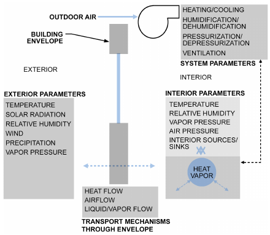

*Fig. 1 Dynamic Interaction Between Air, Moisture, and Materials in HVAC Systems and Building Envelope*

The HVAC system must provide a thermally comfortable and healthy indoor environment. Ventilation is necessary for delivering fresh air to building occupants. To maintain a set-point temperature when heat losses by transmission, infiltration, and ventilation exceed solar gains through the transparent and opaque envelope parts and internal gains by lighting, appliances and occupancy, heating is required. If, instead, the gains exceed the losses, cooling is needed. In both cases, the temperature difference with outdoors creates a thermal stack effect, which together with wind and fan operation maintains air pressure differentials with the exterior.

In heating mode, the indoor vapor concentration is typically left free floating, fluctuating with the vapor in the ventilation and infiltration air and the vapor released indoors. The net vapor concentration and the air temperature maintained by the HVAC system then determine the relative humidity indoors. Only when the ventilation and infiltrating air is too dry or too humid, when the vapor release indoors is very high, or when the building’s function requires relative humidity control, must the HVAC system actively intervene to control humidity by removing water vapor from or adding water vapor to the indoor air (dehumidification and humidification). The energy required to humidify or dehumidify is called the **latent heat load**. In cooling mode, the latent load derives from the supply air temperature required for cooling, the dew-point temperature of the outdoor air, and the vapor released indoors. Condensation on the coil removes some portion of the moisture in the incoming ventilation air.

## 4. INDOOR WETTING AND DRYING

HVAC design or a durability assessment of the envelope and the whole building during design requires knowledge of the expected indoor humidity conditions. This is essential for making the right decisions to prevent mold, surface condensation, problematic interstitial condensation, and reduced drying.

The function of a building and the conditions outdoors dictate whether the indoor relative humidity needs control. The vapor balance, which considers the various mechanisms involved in vapor release, vapor removal, and vapor storage, is fundamental for this decision. One of the unknowns in this balance is the vapor release related to building use. A first approach consists of quantifying these releases directly. A second approach to get information starts from extended indoor/outdoor climate measurements in large sets of buildings to deduce a statistically relevant indoor-to-outdoor time-averaged difference in vapor pressure or vapor concentration in relation to the outdoor air temperature. Both methods are discussed in the following.

### Understanding Vapor Balance

The air humidity indoors is assumed to be free floating. Five vapor fluxes then contribute to maintaining the equilibrium in a room:

- Vapor carried and supplied by infiltrating outdoor air and ventilation
- Vapor removed by exfiltrating indoor air and exhaust air
- Vapor released by occupants and their activities, by plants, water surfaces, and drying fabric parts

<!-- str. 951 -->

- Vapor adsorbed and desorbed by all hygroscopic surfaces present
- Vapor condensing on indoor surfaces that are colder than the dew-point temperature indoors or evaporating from indoor surfaces wetted by surface condensation

These five fluxes load and unload the room air with vapor. There is even a sixth flux: vapor inflow and outflow by diffusion through the envelope. Its magnitude, however, is insignificant compared to the five fluxes mentioned, hence ignoring it does not introduce any significant error.

Assuming ideal air mixing, the balance per room is expressed by

> n

∑ a,in v,in ∑ a,out v,i ∑ j

> G x + G x + β Aj(psat,AjφAj – pi)
>
> j=1

> m
>
> ∑ k

> + β Ak(psat,Ak – pi) + Gv,P = V (dx v,i)/dt&emsp;**(1)**
>
> k=1

where

- Ga,in = all airflows entering room, including infiltration from outdoors, ventilation supply air, and infiltration from adjacent rooms, kg/s
- xv,in = ratio of water vapor to dry air in entering air, kg/kg
- Ga,out = all airflows leaving room, including exfiltration to outdoors, exhaust air, and exfiltration to adjacent rooms, kg/s
- xv,i = ratio of water vapor to dry air in room, kg/kg
- βj = surface film coefficient for diffusion at each hygroscopic surface, kg/(m2·s·Pa)
- Aj = area of each hygroscopic surface in room, m2
- pi = water vapor pressure in room, Pa
- psat,Aj = vapor saturation pressure at different hygroscopic surfaces in room (fabric, furniture, and furnishings), Pa
- φsat,Aj = relative humidity at different hygroscopic surfaces (fabric, furniture, and furnishings) in room on a scale from 0 to 1
- βk = surface film coefficient for diffusion at all room surfaces where vapor condenses or evaporates, kg/(m2·s·Pa)
- Aj = area of all room surfaces experiencing surface condensation or surface condensate drying, m2
- psat,Aj = vapor saturation pressure for room’s various condensing and evaporating surfaces, Pa
- Gv,P = vapor release in room, kg/s
- V = air volume of room, m3
- t = time, s

Solving Equation (1) requires knowledge of all in- and exfiltrating airflows between the room and all adjacent rooms and between the room and the outdoors, the ventilation supply airflow, exhaust airflow, water vapor ratio transported by all four airflows, surface temperatures and vapor balances at all hygroscopic surfaces, surface temperatures at all condensing and drying surfaces, and the surface film coefficients for diffusion at each of these surfaces (Hens 2012). Calculating requires numerical methods (preferably with dedicated software) to account for the transient nature of the variables involved (Woloszyn and Rode 2008).

In reality, because of stack effects, supply air jets, and convective plumes around people, the air in a room is never fully mixed, and vapor pressure gradients exist inside every room. Wetter, warmer air is also lighter and creates a positive temperature and humidity gradient along a room’s height, even in stagnant conditions. Despite these internal gradients, whose quantification requires computational fluid dynamics (CFD) calculations, further discussion is based on the fully mixed assumption.

When considering steady-state conditions where the room air maintains an average humidity that does not change with time (e.g., because sorption/desorption by the hygroscopic surfaces no longer intervenes and all airflows and vapor releases are time averaged), in the absence of surface condensation and surface drying, the humidity balance per room simplifies to

> ∑ a,in v,in ∑ a,
>
> G x + G outxv,i+ Gv,P = 0&emsp;**(2)**

If the only incoming airflow is from the outdoors (e.g., infiltration, natural ventilation, air-side economizer applications), equality between supply and exhaust yields the mean indoor relative humidity:

> φ = (R(273.15 + θi)Gv,P 1)/(o sat,o p V̇ sat,i a)φ p +&emsp;**(3)**

where

- φi = indoor relative humidity on scale from 0 to 1
- psat,i = vapor saturation pressure for indoor temperature, Pa
- φo = outdoor relative humidity on scale from 0 to 1
- psat,o = vapor saturation pressure for outdoor temperature, Pa
- R = gas constant for water vapor, equal to 462 (Pa·m3)/(kg·K)
- θi = indoor temperature, °C
- Gv,P = average indoor vapor release, kg/h
- V̇a = outdoor air ventilation or/and infiltration flow, m3/h

Relative humidity over longer periods of time thus depends on mean outdoor temperature (through psat,e), mean outdoor relative humidity, mean indoor air temperature (through psat,i), mean indoor vapor release, and mean outdoor air ventilation and/or infiltration flows.

In cold and temperate climates, the outdoor air ventilation required by building standards easily dilutes the vapor released in residences, offices, and schools. In temperate climates, heating tends to keep relative humidity levels below the upper acceptability threshold. In very cold climates, ambient temperature and outdoor relative humidity may be such that normal ventilation rates cannot raise the indoor relative humidity above 15 to 20% at room temperature. Humidification may then become necessary. In hot, humid climates, outdoor temperature and relative humidity can be so high that the combined action of ventilation, cooling, and vapor release raises the indoor relative humidity above the upper acceptability threshold. Supplemental air dehumidification then is required.

Where outdoor air infiltrates into the room and the ventilation system delivers supply air at a fixed condition, the mean relative humidity indoors becomes

φ =

> V̇a,inf psat,oφo+ V̇a,spsat,sφs

1/(p sat,i) ----------------------------------------------------------------------- + (R(273.15 + θi)Gv,P)/(V̇ + V̇ a,inf a,s) (4) V̇a,inf + V̇a,s where

- φo = outdoor relative humidity on scale from 0 to 1
- psat,o = vapor saturation pressure for outdoor temperature, Pa
- φs = relative humidity of supply air on scale from 0 to 1
- psat,s = vapor saturation pressure for supply air temperature, Pa
- V̇a,inf = infiltrating volumetric outdoor airflow, m3/h
- V̇a,s = volumetric supply airflow, m3/h

### Hygric Buffering

In hygric buffering, vapor from the air is adsorbed into hygroscopic materials when the relative humidity rises, and released back into the air when the relative humidity lowers. On shorter time scales, hygric buffering by various elements such as indoor air and the building fabric (e.g., envelope, furniture, furnishings) dampens and shifts fluctuations in relative humidity and consequently in indoor vapor pressure compared to the fluctuations of the exterior vapor pressure and internal vapor release.

Figure 2 compares measured indoor vapor pressures in an office building with the exterior vapor pressure over the course of a winter month when exterior conditions changed from cold and dry to warmer and more humid (Hens 2009a). Indoor vapor pressure remained higher than the outdoors during the cold, dry spell but dropped lower than outdoors during the warmer and more humid spells. Figure 3 shows the calculated buffering effect on the daily indoor vapor pressure in a well-ventilated two-person bedroom during winter (Hens 2012a). The effects of hygric buffering in keeping the daily changes in vapor pressure much lower than if only the air acted as buffering volume are obvious.

<!-- str. 952 -->

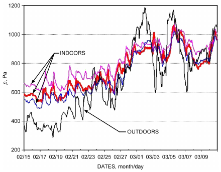

*Fig. 2 Measured Water Vapor Pressure Outdoors and Indoors for Office Building*

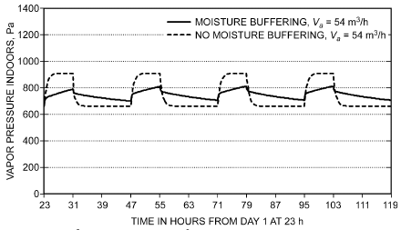

*Fig. 3 Daily Vapor Pressure in Two-Person Bedroom*

Antretter et al. (2012) performed a series of buffering experiments in a test room, simulating 4 to 6 day periods of summer and winter conditions. For the summer simulation, conditions were kept constant at 20°C, 90% rh, and 1 air change per hour (ach) for 1 to 3 days, then altered to an air change rate of zero and brought up to 35°C in 2 h. These conditions were held for 10 h, after which the temperature was returned to 20°C in 2 h and held there for the next 3 days. For the winter simulation, conditions were kept constant at 23°C, 50% rh, and 1 ach for 1 to 3 days, followed by 3 days with two vapor release peaks and a drop in the air change rate from 1 to 0.5 ach. The reference experiment was initially done without moisture buffering, and then repeated with 27 0.3 × 0.3 m sorptive tiles in the room. Figure 4 shows how the relative humidity changed the day after the initializing period. The effect of buffering is evident.

Hygroscopic buffering can even induce dampening and phase shifting on an annual basis in buildings with massive construction,

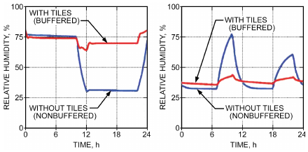

*Fig. 4 Comparison of Daytime Relative Humidity for Summer and Winter Case*

> (Antretter et al. 2012)

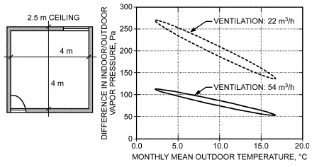

*Fig. 5 Annual Monthly Averaged Indoor/Outdoor Vapor Pressure Difference in Bedroom of Figure 3*

as shown by Figure 5 for the same bedroom as in Figure 3 (Hens 2012a). For the same vapor release indoors and constant ventilation rate, the monthly mean indoor vapor pressures form an inclined ellipse, with the highest value in winter, lowest in summer, and values lower in springtime than in autumn.

## 5. VAPOR RELEASE RELATED TO BUILDING USE

Water vapor indoors comes from several sources: building occupants and their activities (e.g., cleaning, cooking, showering, bathing), pets, plants, water surfaces, drying of wet fabric parts, etc. Releases can be divided into those dependent on indoor temperature and relative humidity, such as free water surfaces and wet fabrics, and those generally independent of these factors, such as human activities and plants (TenWolde and Pilon 2007). Accounting for these two types of sources, Equation (3) expands into

φi = 1/(p sat,i)

(5) × ([φopsat,o+ R(273.15 + θi)(Gvp+ βAwpsat,w) ⁄ V̇a ])/(1 + R(273.15 + θi)βAw⁄ V̇a)

where Aw is the free water surface, in m2.

Solving Equations (3) and (4) presumes knowledge of the magnitudes of the water vapor sources.

### Residential Buildings

Estimating moisture loads requires knowledge of occupancy patterns and releases per individual, activity, plant, and water surface present. In most cases, the real occupancy is unknown, and the sources are even more difficult to quantify. Some activities in the same classification differ in the amount of vapor released (e.g., cooking, which varies with the type of meals prepared). Literature sources only give global average numbers and should therefore be used with care and understanding of the implicit assumptions. Tables 1 to 5 list example amounts by type (IEA-ECB 1990; Kumaran and Sanders 2008; Sanders 1996; TenWolde and Walker 2001).

<!-- str. 953 -->

**Table 1 Vapor Released by Humans, Human Activities, and Plants**

| Source | Units | Release |
|---|---|---|
| Humans Light activity | g/h | 30-60 |
| Medium activity | g/h | 120-200 |
| Hard work | g/h | 200-300 |
| Bathroom Bath (15 min) | g | 60 |
| Shower (15 min) | g | 660 |
| Breakfast preparation for 4 people | g | 160 to 270 |
| Lunch preparation for 4 people | g | 250 to 320 |
| Dinner preparation for 4 people | g | 550 to 720 |
| Breakfast dish washing for 4 people | g | 100 |
| Lunch dish washing for 4 people | g | 70 |
| Dinner dish washing for 4 people | g | 310 |
| Simmering pot (diameter 150 mm, 10 min) | g | 60 |
| Boiling pot (diameter 150 mm, 10 min) | g | 260 |
| Potted flowers | g/h per pot | 10 |
| Potted plants | g/h per pot | 15 |
| Laundry |  |  |
| Already spin-dried, until dry | g/h | 20-200 |
| Dripping wet, until dry | g/h | 100-500 |
| Unvented drier, until dry | g/h | 2130-2900 |

Sources: IEA-ECB (1990), Kumaran and Sanders (2008), Sanders (1996), and Ten-Wolde and Walker (2001).

**Table 2 Daily Vapor Release by Humans, Human Activities, and Plants: Data from Three Countries**

| Source, units | U.K. | Release Denmark | United States |
|---|---|---|---|
| Humans, kg/person per day | 1.2 | 0.9 | 1.25 |
| Cooking for 4 people using electricity, kg/day | 2 | 0.9 | 1.2 |
| Using gas, kg/day | 3 |  | 2.5 |
| Dishwashing, kg/day | 0.4 | 0.4 | 0.5 |
| Bathing/washing, kg/person per day | 0.2 | 0.4 | 0.25 |
| Washing clothes, kg/day | 0.5 |  |  |
| Drying clothes, kg/day | 1.5 | 1.8 | 2.2 |
| Mopping floors, kg/day |  | 0.2 |  |
| Plants, kg/plant per day |  | 0.02 | 0.05 |
| Refrigerator defrost, kg/day |  |  | 0.5 |

Sources: IEA-ECB (1990), Kumaran and Sanders (2008), Sanders (1996), and Ten-Wolde and Walker (2001).

**Table 3 Vapor Released by Fuel Burning**

| Fuel | Vapor Released, kg/kWh |
|---|---|
| Natural gas | 0.15 |
| Manufactured gas | 0.10 |
| Paraffin | 0.10 |
| Coke | 0.03 |
| Coal | 0.01 |

Sources: IEA-ECB (1990), Kumaran and Sanders (2008), Sanders (1996), and Ten-Wolde and Walker (2001).

The means in Table 6 yield, as least-square regressions,

> Gv,P = 0.34 + 3.88n (r2 = 0.999) in kg/day&emsp;**(6)**

The individual data, however, produce a different relationship with considerably more scatter:

> Gv,P = 3.23 + 2.82n (r2 = 0.999) in kg/day&emsp;**(7)**

In both equations, n is the number of family members weighted by the ratio between the hours each is at home and 24 h a day. For example, if four people occupy the home for 16 h daily, n is

> ( )
>
> n = 4 × 16/24 = 2.7

> ( )

Equation (7) indicates that each person who is at home 24 h/day adds 2.82 kg of water vapor to the indoor ambient. Measurements in some German apartments, however, suggested that this release rate is too high: for a family of three, the rates documented ranged from 5.6 to 7.8 kg per day (Hartmann et al. 2001), giving a value between 0.8 and 2.48 kg per person per day. Data from Estonia suggest a person present 24 h/day adds on average 1 kg to the vapor released (Kumaran and Sanders 2008).

Table 7 provides some country-related statistical information about the vapor release expected in different types of residential buildings.

### Natatoriums

Evaporation from the pool surface, wet swimmers, and the wet floor around the pool are the main sources of water vapor. The evaporation rate is calculated based on the pool surface, multiplied by a factor that accounts for the average number of pool users and the wet floor around the pool:

> Gv,P = f βApool(psat,pool – pi)&emsp;**(8)**

where

- Gv,P = evaporation rate, kg/s
- β = surface film coefficient for diffusion at water surface in pool, kg/(m2·s·Pa)
- f = factor that accounts for average number of pool users and wet floor around pool
- Apool = water surface area, m2
- psat,pool = vapor saturation pressure at pool’s water temperature, Pa

In cases where the airflow comes from outdoors, Equation (9) can be combined with Equation (3) to yield the mean vapor pressure in a natatorium:

> pi = (φopsat,o+ psat,pool[R(273.15 + θi)βfApool] ⁄ V̇a)/(1 + [R(273.15 + θi)βfApool] ⁄ V̇a)&emsp;**(9)**

Measurement of the water surface, water temperature, air temperature, relative humidity, ventilation supply flow, and number of users in a university and a recreation natatorium allowed estimating a surface film coefficient for diffusion β, with inclusion of the factor f (Table 8). For the university natatorium, the table includes all measured evaporation rates in g/(m2·h).

Using the data from the university pool in Table 8, the unknown factor f could be derived as a function of the number of pool users (Hens 2009b):

> f = 1 + 8.46n (r2 = 0.95)&emsp;**(10)**

where n is the number of users per square metre of pool surface.

For zero users, f is 1. The least-square line is depicted in Figure 6. For example, given a water surface of 50 × 20 m, a water temperature of 28°C, an air temperature of 30°C, an indoor relative humidity of 60%, and 100 pool users, evaporation amounts to 80 kg/h.

<!-- str. 954 -->

**Table 4 Vapor Release for Family of Two, Both Working, Weekday Schedule**

| Time, h | Number of Occupants | Occupants | Vapor Released, g/h Cooking | Vapor Released, g/h Washing Hygiene | Washing Sum, g |
|---|---|---|---|---|---|
| 1-5 | 2 | 120 |  |  | 600 |
| 6 | 2 | 120 | 240 | 720 | 1080 |
| 7 | 2 | 120 | 240 |  | 360 |
| 8-17 | 0 |  |  |  | 0 |
| 18 | 2 | 120 |  |  | 120 |
| 19-10 | 2 | 120 | 480 |  | 1200 |
| 21-22 | 2 | 120 |  |  | 240 |
| 23 | 2 | 120 |  | 480 | 600 |
| 24 | 2 | 120 |  |  | 120 |
| Sum/day |  | 1680 | 1440 | 1200 | 4320 |

Sources: IEA-ECB (1990), Kumaran and Sanders (2008), Sanders (1996), and TenWolde and Walker (2001).

**Table 5 Vapor Release for Family of Four, One Parent and One Child at Home, Weekday Schedule**

| Time, h | Number of Occupants | Occupants | Vapor Released, g/h Cooking | Vapor Released, g/h Hygiene | Washing | Sum, g |
|---|---|---|---|---|---|---|
| 1-5 | 4 | 240 |  |  |  | 240 |
| 6-7 | 4 | 240 | 480 | 720 |  | 2880 |
| 8 | 2 | 120 |  |  | 120 | 240 |
| 9 | 1 | 120 |  |  | 180 | 300 |
| 10 | 1 | 120 | 720 |  | 180 | 1020 |
| 11-12 | 2 | 120 | 1200 | 120 |  | 2880 |
| 13-14 | 2 | 120 | 480 | 120 |  | 1440 |
| 15 | 2 | 120 |  |  | 120 | 240 |
| 16-17 | 2 | 180 |  |  | 120 | 600 |
| 18 | 4 | 240 |  |  |  | 240 |
| 19 | 4 | 240 | 480 |  |  | 720 |
| 20 | 4 | 240 | 480 | 240 |  | 960 |
| 21-22 | 4 | 240 |  |  |  | 480 |
| 23 | 4 | 240 |  | 240 |  | 480 |
| 24 | 4 | 240 |  |  |  | 240 |
| Sum/day |  | 4680 | 6000 | 2400 | 840 | 13 920 |

Sources: IEA-ECB (1990), Kumaran and Sanders (2008), Sanders (1996), and TenWolde and Walker (2001).

**Table 6 Daily Vapor Release in Relation to Number of Family Members**

|   | 2 (no children) | Family Members 3 (1 child) | Family Members 4 (2 children) | >4 (>2 children) |
|---|---|---|---|---|
| Vapor release, | 8 | 12 | 14 | >14 + 1 kg/day |
| kg/day |  | 10 |  | per child |
|  | 7 | 20 |  |  |
|  |  |  | 14.6 |  |
|  | 13.2 | 19.9 | 23.1 |  |
|  |  | 11.5 |  |  |
|  |  | 5-12 |  |  |
|  |  | 6-10.5 |  |  |
|  | 4.3 |  | 13.7 |  |
|  | 8.2 | 12.1 | 14.1 | 14.4 |
| Mean | 8.14 | 11.9 | 15.9 | — |

Sources: IEA-ECB (1990), Kumaran and Sanders (2008), Sanders (1996), and Ten-Wolde and Walker (2001).

## 6. INDOOR/OUTDOOR VAPOR PRESSURE DIFFERENCE ANALYSIS

Measuring vapor release rates directly is a difficult and time-consuming task. The typical alternative is to monitor the indoor temperature and relative humidity and then compare the related mean indoor vapor pressure to the mean value outdoors. Therefore, most experiments looking to quantify air humidity in buildings use the **average indoor/outdoor vapor pressure difference** Δ**pio** or **average indoor/outdoor vapor concentration difference** Δρ**io**, represented by the second term in Equation (3) (i.e., the ratio between the average water vapor release and the average infiltration and ventilation flow):

**Table 7 Vapor Release Rates by Percentile**

| Country | Houses | Vapor Release Rate (kg/day) 10% | Vapor Release Rate (kg/day) 50% | Vapor Release Rate (kg/day) 90% |
|---|---|---|---|---|
| Canada | Detached | 3.0 | 8.7 | 21.0 |
| Denmark | Flats/mechanical ventilation | 2.5 | 5.8 | 10.0 |
|  | Detached/mechanical ventilation | 3.5 | 8.0 | 13.5 |
|  | Detached/natural ventilation | 3.0 | 6.5 | 13.0 |
| Sweden | Detached | 4.6 | 8.7 | 15.7 |
|  | Multifamily dwelling units | 2.4 | 5.6 | 11.0 |

Sources: IEA-ECB (1990), Kumaran and Sanders (2008), Sanders (1996), and Ten-Wolde and Walker (2001).

> Δpio = (R(273.15 + θi)Gv,p)/V̇a in Pa&emsp;**(11a)**

or

> Δρio = (G v,p)/V̇a in g/m3&emsp;**(11b)**

<!-- str. 955 -->

**Table 8 Measured Surface Film Coefficients for Diffusion, Related to Pool Surface**

| Natatorium 1 (university pool, water surface 325 m2, water temperature between 27 and 28°C) | Natatorium 1 (university pool, water surface 325 m2, water temperature Pool Users | Natatorium 1 (university pool, water surface 325 m2, water temperature Evaporation g/(m2·h) | Natatorium 1 (university pool, water surface 325 m2, water temperature β kg/(m2·s·Pa) | Natatorium 2 (recreation pool, 60 m long chute, waterfall, preschooler pool, massage pool, and whirlpool. Total water surface 483 m between 30 and 31°C) | Natatorium 2 (recreation pool, 60 m long chute, waterfall, preschooler pool, massage pool, and whirlpool. Total water surface 483 m Evaporation g/(m2·h) | Natatorium 2 (recreation pool, 60 m long chute, waterfall, preschooler pool, 2, water temperature β kg/(m2·s·Pa) |
|---|---|---|---|---|---|---|
|  |  |  | Measuring period 1 | (1) = water uncovered | 171 | 15E-9 |
| Water surface covered | 0 | 38 | 4.9E-9 | (1) + chute | — | 17E-9 |
| Uncovered | 0 | 79 | 9.7E-9 | (1) + waterfall | — | 18E-9 |
|  |  |  | Measuring period 2 | (1) + preschooler pool | — | 19E-9 |
| Water surface covered | 0 | 69 | 6.5E-9 | (1) + massage pool | — | 15E-9 |
| Uncovered | 0 | 112 | 13E-9 Measuring period 3 | (1) + whirlpool | — | 16E-9 |
| Pool in use, teaching | 13 | 125 | 15E-9 |  |  |  |
| revalidation | 29 | 119 | 14E-9 |  |  |  |
| free swim 1 | 42 | 163 | 23E-9 |  |  |  |
| 50+ swim | 13 | 141 | 19E-9 |  |  |  |
| free swim 2 | 65 | 172 | 27E-9 |  |  |  |
| free swim 3 | 75 | 167 | 31E-9 |  |  |  |

Source: Hens (2009b).

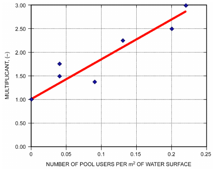

*Fig. 6 Factor f as Function of Pool User Density*

That difference over a given time span is mostly linked to the average air temperature outdoors over the same time span.

### Residential Buildings

In North America and Europe, there have been many monitoring programs in residential buildings that gathered data on the indoor/outdoor vapor pressure and vapor concentration difference. The least-square linear relationships found between these data, averaged over a given time span, and the outdoor air temperature averaged over the same time span typically show a decreasing trend at higher temperatures. Figure 7 shows such a measured relationship for a region where massive construction prevails and homes tend to be naturally ventilated (Hens 2016).

There are two reasons for the decrease shown in Figure 7: (1) windows are more frequently opened in warmer weather, resulting in more outdoor air ventilation and thus lower indoor/outdoor vapor pressures and concentration differences at higher outdoor air temperatures; and (2) the massive building fabric that absorbs and releases significant amounts of vapor and consequently dampens and shifts the indoor vapor pressure compared to the outdoors even on an seasonal basis.

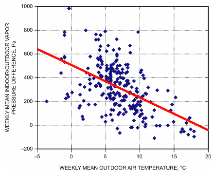

*Fig. 7 Daytime Rooms in Dwellings*

Ridley et al. (2008) took long-term measurements in 1065 U.K. living rooms and 916 U.K. bedrooms. The least-square regressions, based on half-hour averages, are shown in Figures 8 and 9. They are given by Living rooms:

> Δpie = 400 – 19θe in Pa&emsp;**(12)**

Bedrooms:

> Δpie = 425 – 23.6θe in Pa&emsp;**(13)**

Figure 10 and Table 9 are based on measurements in 101 dwellings in Finland and Estonia (Kalamees et al. 2006). The data gained were approximated by three distinct linear segments with the running weekly average indoor/outdoor vapor pressure differences constant below5°C and above 15°C outdoors and varying linearly in between. A distinction was also made between high, average, and low vapor load.

<!-- str. 956 -->

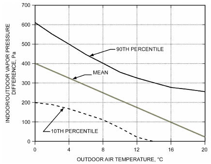

*Fig. 8 Indoor/Outdoor Vapor Pressure Difference in 1065 U.K. Living Rooms*

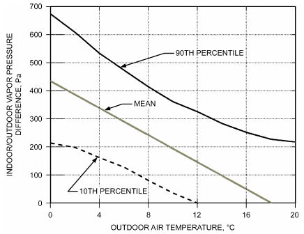

*Fig. 9 Indoor/Outdoor Vapor Pressure Difference in 916 U.K. Bedrooms*

**Table 9 Finland and Estonia, Indoor Climate, Boundaries (Weekly Means)**

| Humidity Load | Indoor/Outdoor Vapor Pressure Difference, Pa θe,w < 5°C | Indoor/Outdoor Vapor Pressure Difference, Pa 5°C ≤ θe,w ≤ 15°C | Indoor/Outdoor Vapor Pressure Difference, Pa θe,w > 15°C |
|---|---|---|---|
|  |  | 0.388 – 0.00556θe,w |  |
| Low | 540 |  | 200 |
|  |  | 540 – 34θe,w 0.473 – 0.00667θe,w |  |
| Average | 680 |  | 270 |
|  |  | 680 – 41θe,w 0.559 – 0.00778θe,w |  |
| High | 810 |  | 340 |
|  |  | 810 – 47θe,w |  |

The data collected in northern Canada (Kumaran and Sanders 2008) are represented by dots in Figure 10. The average indoor/outdoor vapor pressure the dot at top left represents a four-day period where the average outdoor temperature was –18°C and is substantially higher than the Finnish and Estonian high humidity results, apparently because a boil-water safety advisory led to an extremely high vapor release. The other dot at 13°C outdoor temperature is close to the Finnish and Estonian low-humidity curve, even though the number of household members was higher than typical for southern Canada. The dwellings monitored were measured to have air change rates up to 12 ach at 75 Pa.

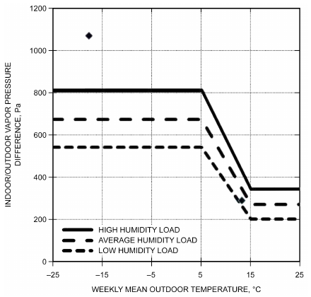

*Fig. 10 Water Vapor Pressure Excess in Relation to the Running Weekly Mean Temperature for Northern Europe and Canada*

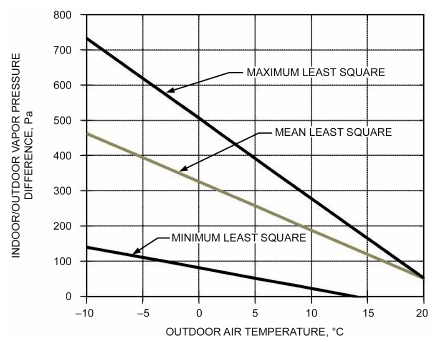

*Fig. 11 Indoor/Outdoor Vapor Pressure Differences for 10 German Living Rooms*

Measurements in the living rooms of 10 German homes are shown in Figure 11. The main variable seems to be the number of household members and their living habits, including window operation (Antretter et al. 2010).

Comparing the mean of the German averages with those from the U.K. in Figures 8 and 9 gives smaller differences at low outdoor temperatures, and higher differences at higher outdoor temperatures:

> Δpie = 328 – 13.7θe in Pa&emsp;**(14)**

<!-- str. 957 -->

Temperature and relative humidity data collected in 60 homes, equally spread over three climate zones in the United States (Pacific northwest, a cold location in the northeast, and a hot and humid location in the southeast) gave the values plotted in Figure 12 as the average relation between the moving monthly mean outdoor temperature and the moving monthly mean indoor/outdoor vapor pressure difference (Arena et al. 2010).

Figure 12 clearly shows the dehumidifying effect of air conditioning. The least-square regression line for a running monthly mean outdoor temperature below 19.5°C equals

> Δpie = 397 – 16.3θe (r2 = 0.86)&emsp;**(15)**

Above 19.5°C, the line becomes

> Δpie = 2807 – 140θe (r2 = 0.92)&emsp;**(16)**

Indoor/outdoor vapor concentration difference measurements in 10 homes in Madison, WI, and 10 homes in Knoxville, TN, over a one-year period gave as monthly means the values shown in Figure 13 (Antretter et al. 2010).

The data are consistent with what Figure 12 shows: vapor pressure deficits only occur during the summer months in the Madison

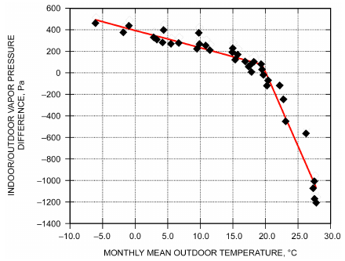

*Fig. 12 Monthly Mean Indoor/Outdoor Vapor Pressure Difference in Relation to Monthly Mean Outdoor Air Temperature in Three U.S. Climate Zones*

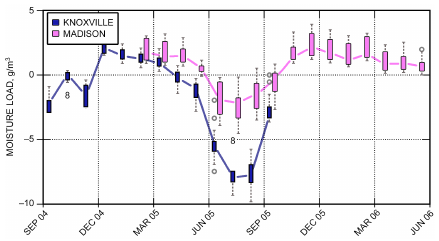

*Fig. 13 Measured Monthly Mean Indoor/Outdoor Vapor Concentration Difference in 10 Homes in Madison, WI, and 10 Homes in Knoxville, TN*

> (Antretter et al. 2010)

climate, and between April and November in the warmer, more humid Knoxville climate. Both situations are the result of dehumidification by air conditioning.

Measurements taken in 71 homes in Rhode Island are shown in Figure 14, giving the distribution of the measured indoor/outdoor vapor pressure difference at 0°C outdoors (Francisco and Rose 2010).

The mean was 396 Pa, close to what Equation (15) suggests, whereas the 95th percentile value equaled 772 Pa. This is higher than the data measured (Hens 2016) in the temperate climate of northwestern Europe, where for larger homes the 95th percentile on a weekly basis was

> Δpie = 540 – 29θe (Pa)&emsp;**(17)**

whereas for small homes the relation was

> Δpie = 670 – 29θe (Pa)&emsp;**(18)**

To minimize risk, the 95th percentile is often used for design purposes.

These results are based primarily on homes using natural ventilation. Many codes in the United States require homes to add mechanical ventilation to compensate for tighter envelopes. This significant difference must be addressed in evaluating residences with mechanical ventilation.

Measurements in 30 homes by Francisco et al. (2009) found that unvented gas fireplaces added on average about 100 Pa to the indoor/outdoor vapor pressure difference.

### Natatoriums

Vapor pressure difference measurements in natatoriums are few; however, studies have been conducted in some countries. Figure 15 gives weekly mean indoor/outdoor vapor pressure differences in relation to the weekly mean outdoor air temperature, measured in 20 natatoriums in a temperate region (Hens 2016).

There is a considerable amount of scatter. Least-square regressions for the mean and 95th percentile are Mean

> Δpie = 1228 – 27.7θe,w (r2 = 0.13)&emsp;**(19)**

95th percentile

> Δpie = 1841 – 27.7θe,w (r2 = 0.13)&emsp;**(20)**

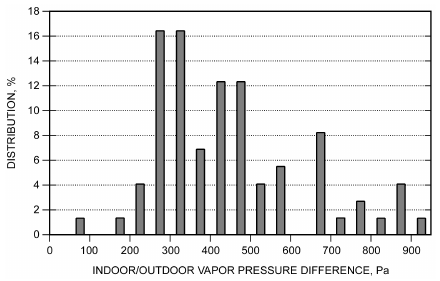

*Fig. 14 Indoor/Outdoor Vapor Pressure Difference with Intersect at 0°C for 71 Rhode Island Homes*

<!-- str. 958 -->

The data clearly show that, although not highly correlated with the outdoor temperature, the vapor pressure differences in natatoriums are consistently high. These buildings therefore require specific measures to prevent moisture accumulation in the envelope, which can lead to degradation (Figure 16).

### Student Residences and Schools

The few measuring campaigns undertaken in student residences and schools in a temperate-climate region gave a very diffuse picture, with a large spread in weekly mean indoor/outdoor vapor pressure differences; see Figure 17 (Hens 2005) and Table 10 (Hens et al. 2007).

## 7. AVOIDING MOISTURE PROBLEMS

Avoiding mold, surface condensation, and interstitial condensation in cold and temperate climates requires the following measures:

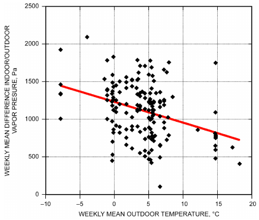

*Fig. 15 Weekly Mean Indoor/Outdoor Vapor Pressure Differences for 20 Natatoriums (Measured Data and Least-Square Straight Line)*

*Fig. 16 Natatoriums: (A) Low-Sloped Roof Damaged by Convection-Induced Interstitial Condensation; (B) Interstitial Condensation in Low-Sloped Roof Polyurethane Foam Insulation; (C) Timber Beam Collapse; (D) Abundant Surface Condensation on Window and Lintel*

- Building envelopes must be insulated such that the risk of surface mold and surface condensation at room temperature and typical levels of relative humidity is as close to zero as possible. Insulation requirements imposed by current building codes for energy efficiency are typically much higher than those needed to address risk of condensation.
- Avoid structural thermal bridges. No point on the indoor surface of an opaque portion of the envelope should be colder than the indoor surface of the glazed portion
- Minimize infiltration and exfiltration by making the envelope as airtight as possible.
- Avoid air gaps in envelope construction that would lead to wind washing in and along the inner face, and indoor air washing along the outer face of the thermal insulation.
- For low-mass construction in heating-dominated climates, if necessary, mount a continuous vapor retarding layer at the inner side of the insulation. In hot, humid climates, install the vapor control on the exterior or warm side of the insulation or building envelope.
- Vapor control layers should be used with caution in stone and masonry construction. Take measures to avoid problems with solar-driven vapor flow when applying vapor retarders on the inner side of envelopes that have a rain-buffering outer finish, such as a brick veneer [see Derome and Saneinejad (2009)].
- Never sandwich layers between vaportight materials on both sides. This is especially detrimental when thermal insulation is one of the layers and the others contain construction moisture.

**Table 10 Indoor Air Temperature and Indoor/Outdoor Vapor Pressure Difference: Means and Extremes Measured in**

| School | Temperature, °C Mean | Temperature, °C Min | Temperature, °C Max | Indoor/Outdoor Vapor Pressure Mean | Indoor/Outdoor Vapor Pressure Difference, Pa Min | Indoor/Outdoor Vapor Pressure Max |
|---|---|---|---|---|---|---|
| 1 | 17.7 | 14.7 | 23.2 | 197 | –138 | 722 |
| 2 | 15.0 | 12.0 | 26.8 | 215 | –155 | 800 |
| 3 | 20.3 | 14.2 | 25.2 | 198 | –266 | 1059 |
| 4 | 17.5 | 10.3 | 23.1 | 151 | –169 | 609 |
| 5 | 17.9 | 14.1 | 23.4 | 36 | –404 | 496 |

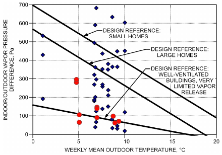

*Fig. 17 Weekly Mean Indoor/Outdoor Vapor Pressure Differences in Four Student Residences*

<!-- str. 959 -->

### HVAC Systems

The mechanical system can affect the air pressure differences among building zones, and between building zones and the outdoors. HVAC operation influences the indoor relative humidity and, consequently, indoor/outdoor vapor pressure differences. To minimize humidity concerns,

- Insulate chilled-water pipes and cool-air ducts to minimize heat gain. The insulation must have a moisture resistant vapor-control layer on the outer surface and be thick enough to prevent surface condensation. Warm-water pipes and warm-air ducts require insulation to minimize heat losses. For more details, see Chapter 23.
- Natural or mechanical ventilation in temperate climates should keep the indoor relative humidity within the 30 to 70% range.
- HVAC systems in hot and humid climates should ventilate the building while cooling and dehumidifying the ventilation air. The building should also be positively pressurized. In very cold climates, HVAC systems should ventilate and warm the building while humidifying the air and putting the building under negative pressure.

### Ground Pipes

In temperate climates, ground pipes (ventilation air ducts buried in the soil near the building) are sometimes used to moderate the condition of incoming ventilation air. Rain and groundwater must be prevented from entering these pipes: water penetration turns the pipes into air humidifiers, with very negative consequences for the indoor air quality. In dry pipes, relative humidity during the warm season should not exceed the mold threshold: too high a relative humidity in the pipes can load the supply air with mold spores, which then germinate in the supply filter. These risks are high enough that ground pipes are not recommended as a safe choice (Hens 2012b).

### Building Fabric

If there is no watertight layer or capillary break inserted above grade, stone-based building fabrics may suffer from rising damp and salt transport. Building parts, wetted by rising damp, act as permanent moisture sources affecting indoor vapor release and the indoor/outdoor vapor pressure difference.

### Building Envelope

Even when raintightness is guaranteed, excessive indoor vapor pressures can induce mold and condensation on interior surfaces and favor interstitial condensation in assemblies. Chapters 25 and 27 deal in more detail with moisture transport in the building envelope.

**Mold Growth.** Mold growth begins on interior opaque surfaces where the surface temperature and relative humidity pass the **mold threshold** for a long enough period of time. For example, if a material has absorbed an amount of water from a leak, drying may temporarily sustain a surface relative humidity high enough to be conductive for mold. The IEA Annex 14 reports (IEA-EBC 1990a, 1990b) contain two design formulas for estimating mold risk. The one calculates the four-week threshold, above which the likelihood that mold will develop is close to 100%. The other evaluates the surface relative humidity needed for mold development at shorter time intervals. Combining the two yields

> φcrit≥ min{100;(0.033θs2i– 1.5θsi+ 96)[1.24&emsp;**(21)**
>
> – 0.072ln(T)]}

where

- φcrit = relative humidity at surface, on scale from 0 to 100

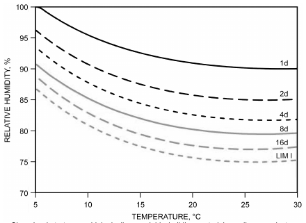

*Fig. 18 Sedlbauer’s Isopleth System for Class I Substrates: Time Until Germination*

> (Sedlbauer 2001)

θsi = indoor surface temperature, °C (5°C ≤ θsi ≤ 25°C)

T = time span, days

The threshold for a one-day period touches 99%.

Since completion of Annex 14, two more comprehensive models have been published: Sedlbauer (2001) (Figure 18), and Viitanen and Ojanen (2007). More recent work, however, confirms that predictions with any model give varying results for growth probability and mold density (Vereecken and Roels 2012).

**Surface Condensation.** Each time the indoor surface temperature somewhere on the envelope drops below the dew point of the indoor air, condensate forms. Glazed surfaces are especially prone to surface condensation. Hygroscopic materials (e.g., wood, masonry, gypsum, some plasters) may buffer the local surface wetness, preventing visible condensate but increasing the moisture content in the material. When short periods of condensation or high humidity alternate with periods of drying, there tend to be no negative consequences. Long-lasting surface condensation or long periods of high humidity, however, degrade timber and other materials, and condensate deposited on aluminum frames may wet the window reveals. Thermal bridges can experience prolonged periods of condensation that cause indoor-side finish damage, such as wallpaper glue giving away.

**Interstitial Condensation.** Water vapor condensation within envelope parts is called **interstitial condensation**, and is caused by temperature and vapor pressure gradients pointing in the same direction. The driving forces are diffusion driven by vapor pressure differences, moist air leakage (in- or exfiltration), or absorption of wind-driven rain. In wood and wood-based materials, interstitial condensation may lift the surface relative humidity above the mold threshold and, worse, the moisture content above the rot threshold. When the relative humidity adjacent to nonporous, nonabsorbing, or capillary wet layers in an assembly becomes 100%, condensation with droplet formation occurs, followed by runoff and sometimes dripping, which is especially annoying for the occupants.

## 8. CLIMATE-SPECIFIC MOISTURE MANAGEMENT

### Temperate and Mixed Climates

In temperate and mixed climates, neither humidification nor dehumidification is explicitly required except when necessary for functional reasons, such as in museums and operating rooms. Some depressurization during winter is advisable to minimize interstitial condensation risk, such as using demand-controlled exhaust ventilation or balanced ventilation with heat recovery and a correctly chosen pressure balance between supply and exhaust. The envelope must be so airtight that depressurization will not result in ventilation airflow beyond that needed for health reasons. High air permeance (low airtightness) has additional drawbacks: sound insulation degrades, drafts can occur, heat loss increases, and indoor surface temperatures might lower to a point where mold develops or surface condensation appears. Ground floors above crawlspaces must be airtight enough to prevent soil moisture, crawlspace odors, and radon from infiltrating into the conditioned space.

<!-- str. 960 -->

Acceptable envelope performance requires that the indoor surface temperature be high enough to prevent mold from occurring at the expected average vapor release indoors, the environmental conditions outdoors, the desired thermal comfort settings and the mean ventilation rate required for good IAQ and human health. Ventilation is also used to avoid acute surface condensation, which occurs each time the indoor dew-point temperature exceeds the envelope’s indoor surface temperature somewhere (a common site is glazed surfaces). For a detailed analysis of mold and surface condensation, see Hens (1999), Sedlbauer (2001), Vereecken and Roels (2012), and Viitanen and Ojanen (2007).

With well-insulating, double- and triple-glazed, gas-filled, low-e windows in new construction and retrofits, water can also condense on the outdoor surface during cold, clear-sky nights, somewhat obscuring visibility.

### Hot and Humid Climates

In hot and humid climates, to avoid mold growth and surface condensation, the indoor relative humidity should be kept below 60% through dehumidification. Brief periods of elevated relative humidity, however, do not necessarily result in mold germination. Keeping the building under positive air pressure is required to minimize interstitial condensation in wall cavities.

**Dehumidification.** Air-handling units that mix outdoor air with return air to provide constant airflows at variable supply temperatures do not provide continuous dehumidification. At higher supply air temperatures, the cooling coil does not remove moisture from the ventilation air, which can lead to elevated indoor relative humidity and a high potential for microbial growth. This becomes even more pronounced in energy-efficient buildings with reduced sensible cooling loads and long off times for the cooling coil, which significantly reduces the effectiveness of moisture removal (Rudd 2010; Rudd et al. 2005). For variable-supply-temperature systems, the ventilation air portion can be preconditioned using a dedicated outdoor air system (DOAS). These systems dehumidify only the ventilation air, and cooling loads are handled by a separate air-handling unit, so a DOAS is a good choice for providing continuously dehumidified ventilation air. If heat recovery is economically feasible without compromising pressurization, a DOAS with heat recovery is an energy-efficient alternative if the supply and return fans maintain correct pressurization, and the relative humidity of air passing through the supply filters remains low enough to avoid mold growth there. Because schools, office buildings, hospitals, and dwellings require continuous ventilation based on the number of occupants, demand-controlled DOAS-based outdoor ventilation air dehumidification can be achieved at a constant cooling-coil temperature. Reheat of the ventilation air may be required to avoid overcooling the supply air if ventilation demands are high. The resulting system provides more stable dehumidification and improved relative humidity control.

Alternatives for residential construction include local stand-alone dehumidifiers, with or without central system mixing; continuous exhaust/supply indoor air dehumidification using either a central

HVAC system with subcooling followed by reheat, or ducted dehumidifiers; or ducted direct-expansion (DX) condenser-regenerated desiccant dehumidifiers (Harriman and Lstiburek 2009; Rudd 2013).

**Pressurization.** Dehumidification reduces the indoor vapor pressure below the outdoor vapor pressure level. Cooling does the same for temperature. As a result, the vapor pressure and temperature gradients cause moisture migration by diffusion toward the interior. If the envelope is not airtight, building depressurization and related infiltration increase this moisture flow through the exterior wall and connected partition wall cavities. This may raise the relative humidity at or near surfaces in these cavities to levels that allow mold, or even condensation. Pressurization reverses the airflow, allowing dehumidified indoor air to exfiltrate and neutralizing inward vapor diffusion. In any case, the envelope should be constructed as airtight as possible so that pressurization does not require unnecessarily high supply ventilation.

### Cold Climates

In cold climates, the techniques for avoiding mold and surface condensation are the same as in temperate climates. During cold seasons, the indoor relative humidity can drop well below 30%. Maintaining healthy levels of relative humidity then requires humidification, which results in an increased indoor/outdoor vapor pressure difference for a temperature gradient pointing to the outdoors and vapor diffusion toward the exterior.

**Humidification.** At part load, on/off air-handling units that heat and humidify a mixture of outdoor and return air operate so intermittently that indoor relative humidity levels may drop substantially during off periods. Moisture buffering by the building fabric, furniture, and furnishings can reduce that variation in relative humidity (Simonson et al. 2004a, 2004b). A better choice in larger buildings is a DOAS that restricts humidification to the ventilation air, handling heating loads by a separate system. Because the ventilation required mainly depends on the number of occupants, the space can be humidified by using steam injection modulated according to demand, or by preheating the ventilation air followed by adiabatic humidification and reheat to the indoor temperature set point. The result is more stable humidification and better relative humidity control. Alternatives in homes are stand-alone humidifiers, continuous-supply air humidification at constant dew-point temperature by the central HVAC system, etc.

**Pressurization/Depressurization.** Pressurizing buildings in cold climates leads to air exfiltration, which provides an extra vehicle for vapor egress. Together with diffusion, this could lead to severe interstitial condensation in envelope assemblies, especially when the indoor vapor retarder is ineffective and the air barrier is not continuous. Depressurizing a building, which leads to infiltration, is as effective way to avoid interstitial condensation problems, as long as the envelope is sufficiently airtight that depressurization does not require ventilation rates beyond those needed by the occupant load. If the envelope is too air permeable, not only will large exhaust rates be required but all drawbacks mentioned in the section on Temperate and Mixed Climates will apply but be more severe.

## 9. MOISTURE MANAGEMENT IN OTHER HANDBOOK CHAPTERS

Other chapters and volumes of the ASHRAE Handbook also provide useful information on moisture and humidity.

In this volume, Ch. 1 Perfect gas relations and thermodynamic properties to analyze conditions and processes involving moist air 4 Heat transfer processes that affect temperature and moisture transport in buildings 9 Effects of relative humidity, temperature, and vapor pressure on thermal comfort 10 Effects of relative humidity on indoor environmental quality (IEQ), mold, and humidifier fever 11 Controlling mold through control of relative humidity at material surfaces 12 Temperature and relative humidity’s effects on olfactory perception and perceived indoor air quality 13 Intra- and interzone airflows and pollutant transfer, including water vapor 14 Data on outdoor dry- and wet-bulb temperatures for design purposes 15 Relation between relative humidity and condensation potential on glazing 16 Control of interstitial condensation by controlling air leakage across the envelope, and moisture control by modulating air infiltration across the envelope 17 Formulas to calculate latent load for air humidification (often required to maintain comfortable relative humidity indoors)

<!-- str. 961 -->

18 Latent heat gain from moisture diffusion and various moisture sources, including natatoriums 19 Cooling and dehumidification coils, and cooling towers 23 Condensation control for below-ambient-temperature HVAC components 25/26/27 Detailed information on heat, air, and moisture response of building envelope assemblies; includes fundamentals of combined heat, air, and moisture movement (e.g., moisture content, buffering, flow), material properties (e.g., sorption isotherms, vapor permeability), and examples *2018 ASHRAE Handbook—Refrigeration*

Ch. 7 Role of moisture as a contaminant in refrigeration systems 10 How moisture diffusion through low-water-vapor-permeance insulation and water-permeable claddings can produce damaging condensation and moisture accumulation 23 Moisture aspects of refrigerated-facility envelope design 24 Sensible and latent heat loads in refrigerated facilities 44 Specific ceiling moisture problems in ice rinks as a consequence of long-wave radiation between ice surface and ceiling *2019 ASHRAE Handbook—Applications*

Ch. 1 Residential humidification and dehumidification 2 Humidity control in stores 3 Thermal comfort design criteria and load characteristics in commercial and public buildings 4 Stack effect and practical considerations for minimizing stack effects 5 Latent load in arenas, humidity problems in ice rinks, vapor release in natatoriums with some consequences for envelope design 6 Dehumidification as a load characteristic, considers moisture control using DOAS 7 Humidity control in classrooms, libraries, gymnasiums, showers, and natatoriums 8 Role of relative humidity in health care for different kinds of patients 9 Dry- and wet-bulb design criteria for general and specialized spaces in courthouses and detention/correction facilities 16 Relative humidity control in laboratories 18 Relative humidity control in clean spaces 19 Drawbacks for data processing and telecommunication facilities of high (anodic failure) and low relative humidity (electrostatic discharge); envelope considerations and humidity control 20 Paper moisture content control and controlling relative humidity in pressrooms for various printing processes 21 Relative humidity and textiles 22 Relative humidity and photographic materials 23 Importance and impact of relative humidity mean values and fluctuations on museum artifacts, library books, and other archival materials 24 Role of relative humidity in environmental control in animal and plant facilities 25 Role of relative humidity in crop drying 26 Moisture control in processing wood and paper 30 Industrial drying as a process 31 Ventilation for industrial processes 33 Ventilation to reduce relative humidity in kitchens (commercial and residential)

44 Control of liquid water and vapor in building envelopes 47 Design of system controls for humidity 52 Humidification and dehumidification in evaporative cooling 62 Practical applications of moisture management in buildings *2020 ASHRAE Handbook—Systems and Equipment*

Ch. 4 Humidity control and air-handling unit psychrometric processes 11 Condensate removal from temperature-regulated systems and steam traps 12 Condensate drainage and return in district systems 22 Optimum humidity range for human comfort and health; surface and interstitial condensation; some data on indoor vapor release 23 Dehumidification coils 24 Methods of dehumidification, with emphasis on sorption dehumidification 25 Mechanical dehumidification 26 Air-to-air energy recovery processes, from basic thermodynamics to types and applications of air-to-air heat exchangers and technical considerations; includes condensation and freeze-up in air-to-air heat exchangers, and gives an energy and moisture recovery procedure 40 Evaporation-based cooling towers 41 Evaporative humidification and dehumidification

## REFERENCES

ASHRAE members can access ASHRAE Journal articles and ASHRAE research project final reports at technologyportal.ashrae .org. Articles and reports are also available for purchase by nonmembers in the online ASHRAE Bookstore at www.ashrae.org /bookstore.

Antretter, F., A. Holm, A. Karagiozis, and S. Glass. 2010. Interior temperature and relative humidity distributions in mixed-humid and cold climates as building simulation boundary conditions. *Proceedings of the* *Buildings XI Conference*, Clearwater Beach.

Antretter, F., C. Mitterer, and S.-M. Young. 2012. Use of moisture-buffering tiles for indoor climate stability under different climatic requirements. HVAC&R Research (now *Science and Technology for the Built Environ-* ment) 18(1-2):275-282.

Arena, L., A. Karagiozis, and P. Mantha. 2010. Monitoring of internal moisture loads in residential buildings-research findings in three different climate zones. *Proceedings of the Buildings XI Conference*, Clearwater Beach.

ASHRAE. 2009. Criteria for moisture-control design analysis in buildings.

ANSI/ASHRAE Standard 160-2009.

ASHRAE. 2012. *Position document on limiting indoor mold and dampness* in buildings.

Derome, D., and S. Saneinejad. 2009. The nature, significance and control of solar-driven diffusion in wall systems. ASHRAE Research Project RP-1235, Final Report.

<!-- str. 962 -->

Francisco, P., and W. Rose. 2010. Temperature and humidity measurements in 71 homes. *Proceedings of the Buildings XI Conference*, Clearwater Beach.

Francisco, P., J. Gordon, and W. Rose. 2009. Indoor moisture in 30 homes using unvented gas fireplaces. ASHRAE Transactions 115(2).

Hartmann, T., D. Reichel, and W. Richter. 2001. Feuchteabgabe in Wohnungen—Alles gesagt? Gesundheits-Ingenieur 122(4):189-195. In German.

Harriman, III, L., and J.W. Lstiburek. 2009. *The ASHRAE guide for build-* *ings in hot & humid climates*. ASHRAE.

Hens, H. 1999. Fungal defacement in buildings, a performance related approach. *International Journal of HVAC&R Research* (now Science and *Technology for the Built Environment*) 5(3):265-289.

Hens, H. 2005. Energy consumption in student residences, impact of building performance, usage patterns and indoor climate. Proceedings Clima 2005, Lausanne.

Hens, H. 2009a. IEA-ECBCS Annex 41 whole building heat, air and moisture response. ASHRAE Transactions 115(2).

Hens, H. 2009b. Indoor climate and building envelope performance in indoor swimming pools. In *Energy efficiency and new approaches*, N. Bayazit, G. Manioglu, G. Oral, and Z. Yilmaz, eds. Istanbul Technical University.

Hens, H. 2012a. *Building physics, heat, air and moisture: Fundamentals and* *engineering methods with examples and exercises*, 2nd ed. Ernst & Sohn, Berlin.

Hens, H. 2012b. Passive houses: what may happen when energy efficiency becomes the only paradigm. ASHRAE Transactions 118(1).

Hens, H. 2016. *Applied building physics, ambient conditions, building per-* *formance and material properties*, 2nd ed. Ernst & Sohn, Berlin.

Hens, H., and V. De Meulenaer. 2007. Schools, all problem buildings? Pro-*ceedings Clima 2007*, Helsinki.

Holm, A. 2008. Whole building heat, air, moisture response: Applications:

Indoor environment, energy, durability. Final Report, vol. 4. International Energy Agency Energy Conservation in Buildings and Community Systems (ECBCS), Annex 41: Whole Building Heat, Air and Moisture Response. www.ecbcs.org/annexes/annex41.htm.

IEA-ECB. 1990. Sourcebook. International Energy Agency Energy and Community in Buildings Programme, Annex 14: Condensation and Energy, Leuven.

IEA-ECB. 1990. *Guidelines and practice*. International Energy Agency Energy and Community in Buildings Programme, Annex 14: Condensation and Energy, Leuven.

Kalamees, T., J. Vinha, and J. Kurnitski. 2006. Indoor humidity loads in light-weight timber-framed detached houses. *Journal of Building Phys-* ics 29(3):219-246. jen.sagepub.com/content/29/3/219.full.pdf+html

Kumaran, K., and C. Sanders. 2008. Whole building heat, air, moisture response: Boundary conditions and whole building HAM analysis. Final Report. International Energy Agency Energy Conservation in Buildings and Community Systems (ECBCS), Annex 41: Whole Building Heat, Air and Moisture Response. www.ecbcs.org/annexes/annex41.htm.

Mumovic, D., and M. Santamouris, eds. 2009. *A handbook on sustainable* *building design and engineering: An integrated approach to energy,* *health and operational performance*. Earthscan, London.

Ridley, I., M. Davies, S.H. Hong, and T. Oreszcyn. 2008. Vapour pressure excess in living rooms and bedrooms of English dwellings: Analysis of the warm front dataset. Appendix III of Boundary Conditions and Whole Building HAM Analysis. Final Report, International Energy Agency Energy and Community in Buildings Programme, Annex 41: Whole Building Heat, Air and Moisture Response (MOIST-EN), Leuven.

Rudd, A.F. 2010. Enhanced dehumidification. Building America Report 1008.

U.S. Department of Energy, Washington, D.C. buildingscience.com /documents/bareports/ba-1008-building-america-enhanced-dehumi dification/view.

Rudd, A.F. 2013. Supplemental dehumidification in warm-humid climates.

Building America Report 1310. U.S. Department of Energy, Washington, D.C. buildingscience.com/documents/bareports/ba-1310-supplemental -dehumidification-warm-humid-climates/view.

Rudd, A.F., J.W. Lstiburek, and K. Ueno. 2005. Residential dehumidification systems research for hot-humid climates, September 1, 2001-December 30, 2003. Report NREL/SR-550-36643.

Sanders, C. 1996, Environmental conditions. Final Report, vol. 2, International Energy Agency Energy and Community in Buildings Programme, Annex 24: Heat, Air and Moisture Transport in Insulated Envelope Parts, Leuven.

Sedlbauer, K. 2001. *Vorhersage von Schimmelpilzbildung auf und in Bau-* *teilen (Prediction of mould development on and in building assemblies)*. Ph.D. dissertation, University of Stuttgart (in German).

Simonson, C., M. Salonvaara, and T. Ojanen. 2004a. Heat and mass transfer between indoor air and a permeable and hygroscopic building envelope: Part 1—Field measurements. *Journal of Thermal Envelope and Building* Science 28(1):63-101.

Simonson, C., M. Salonvaara, and T. Ojanen. 2004b. Heat and mass transfer between indoor air and a permeable and hygroscopic building envelope: Part 2—Verification and numerical studies. *Journal of Thermal Envelope* *and Building Science* 28(2):161-185.

TenWolde, A., and I. Walker. 2001. Interior moisture design loads for residences. *Proceedings of the Buildings VIII Conference*, Clearwater Beach.

TenWolde, A., and C. Pilon. 2007. The effect of indoor humidity on water vapor release in homes. *Proceedings of the Buildings X Conference*, Clearwater Beach.

Trechsel, H., ed. 1994. Moisture control in buildings. ASTM Manual Series MNL 18. American Society for Testing and Materials, West Conshohocken, PA.

Vereecken, E., and S. Roels. 2012. Review of mould prediction models and their influence on mould risk evaluation. *Building and Environment* 52:296-310.

Viitanen, J., and T. Ojanen. 2007. Improved model to predict mold growth in building materials. *Proceedings of the Buildings X Conference*, Clearwater Beach.

Woloszyn, M., and C. Rode. 2008. Whole building heat, air, moisture response: Modeling principles and common exercises. Final Report, International Energy Agency Energy and Community in Buildings Programme, Annex 41: Whole Building Heat, Air and Moisture Response (MOIST-EN), Leuven.

## BIBLIOGRAPHY

BRE. 2016. *BREEAM International New Construction*. Building Research Establishment, Watford, U.K.

Harriman, III, L., G. Brundrett, and R. Kittler. 2001. *Humidity control design* *guide for commercial and institutional buildings*. ASHRAE.

Künzel, H.M. 2006. Indoor relative humidity in residential buildings—A necessary boundary condition to assess the moisture performance of building envelope systems. *Zeitschrift für Wärmeschutz, Kälteschutz,* Schallschutz, Brandschutz 51(56):31-41.

Künzel, H.M., D. Zirkelbach, and K. Sedlbauer. 2003. Predicting indoor temperature and humidity conditions including hygrothermal interactions with the building envelope. *Proceedings of 1st International Con-* *ference on Sustainable Energy and Green Architecture*, Building Scientific Research Center (BSRC), Bangkok.

USGBC. 2009. *LEED 2009 for new construction and major renovation*.

U.S. Green Building Council, Washington, D.C.
