# Chapter 38 — Measurement and Instruments

*Izvor: 2021 ASHRAE Handbook — Fundamentals (SI), Chapter 38 (PDF str. 963–1002).*

> **Napomena o konverziji:** Tekst je automatski izdvojen iz originalnog PDF-a uz prepoznavanje dve kolone, spojene prelomljene reči i pasuse. Indeksi i eksponenti su označeni sa `<sub>`/`<sup>`, tabele su pretvorene u Markdown tabele (veoma složene tabele su prikazane kao poravnat tekst), a slike su izrezane iz PDF-a u folder `img/`. Složene jednačine (razlomci, sume) mogu biti uprošćeno prikazane. **Pre upotrebe vrednosti u proračunu proveriti u originalnom PDF-u.** Oznake `<!-- str. N -->` pokazuju stranu PDF-a.

## Sadržaj

- [1. TERMINOLOGY](#1-terminology)
- [2. UNCERTAINTY ANALYSIS](#2-uncertainty-analysis)
- [3. TEMPERATURE MEASUREMENT](#3-temperature-measurement)
- [3.1 LIQUID-IN-GLASS THERMOMETERS](#31-liquid-in-glass-thermometers)
- [3.2 RESISTANCE THERMOMETERS](#32-resistance-thermometers)
- [3.3 THERMOCOUPLES](#33-thermocouples)
- [3.4 OPTICAL PYROMETRY](#34-optical-pyrometry)
- [3.5 INFRARED RADIATION THERMOMETERS](#35-infrared-radiation-thermometers)
- [3.6 INFRARED THERMOGRAPHY](#36-infrared-thermography)
- [4. HUMIDITY MEASUREMENT](#4-humidity-measurement)
- [4.1 PSYCHROMETERS](#41-psychrometers)
- [4.2 DEW-POINT HYGROMETERS](#42-dew-point-hygrometers)
- [4.3 MECHANICAL HYGROMETERS](#43-mechanical-hygrometers)
- [4.4 ELECTRICAL IMPEDANCE AND CAPACITANCE HYGROMETERS](#44-electrical-impedance-and-capacitance-hygrometers)
- [4.5 ELECTROLYTIC HYGROMETERS](#45-electrolytic-hygrometers)
- [4.6 PIEZOELECTRIC SORPTION](#46-piezoelectric-sorption)
- [4.7 SPECTROSCOPIC (RADIATION ABSORPTION) HYGROMETERS](#47-spectroscopic-radiation-absorption-hygrometers)
- [4.8 GRAVIMETRIC HYGROMETERS](#48-gravimetric-hygrometers)
- [4.9 CALIBRATION](#49-calibration)
- [5. PRESSURE MEASUREMENT](#5-pressure-measurement)
- [5.1 INSTRUMENTS](#51-instruments)
- [6. AIR VELOCITY MEASUREMENT](#6-air-velocity-measurement)
- [6.1 AIRBORNE TRACER TECHNIQUES](#61-airborne-tracer-techniques)
- [6.2 ANEMOMETERS](#62-anemometers)
- [6.3 PITOT-STATIC TUBES](#63-pitot-static-tubes)
- [6.4 MEASURING FLOW IN DUCTS](#64-measuring-flow-in-ducts)
- [6.5 AIRFLOW-MEASURING HOODS](#65-airflow-measuring-hoods)
- [7. FLOW RATE MEASUREMENT](#7-flow-rate-measurement)
- [7.1 VENTURI, NOZZLE, AND ORIFICE FLOWMETERS](#71-venturi-nozzle-and-orifice-flowmeters)
- [7.2 VARIABLE-AREA FLOWMETERS](#72-variable-area-flowmeters)
- [7.3 CORIOLIS PRINCIPLE FLOWMETERS](#73-coriolis-principle-flowmeters)
- [7.4 POSITIVE-DISPLACEMENT METERS](#74-positive-displacement-meters)
- [7.5 TURBINE FLOWMETERS](#75-turbine-flowmeters)
- [7.6 ELECTROMAGNETIC (MAG) FLOWMETERS](#76-electromagnetic-mag-flowmeters)
- [7.7 VORTEX-SHEDDING FLOWMETERS](#77-vortex-shedding-flowmeters)
- [8. AIR INFILTRATION, AIRTIGHTNESS, AND OUTDOOR AIR VENTILATION RATE MEASUREMENT](#8-air-infiltration-airtightness-and-outdoor-air-ventilation-rate-measurement)
- [9. CARBON DIOXIDE MEASUREMENT](#9-carbon-dioxide-measurement)
- [9.1 NONDISPERSIVE INFRARED CO](#91-nondispersive-infrared-co)
- [9.2 AMPEROMETRIC ELECTROCHEMICAL CO DETECTORS](#92-amperometric-electrochemical-co-detectors)
- [9.3 PHOTOACOUSTIC CO DETECTORS](#93-photoacoustic-co-detectors)
- [9.4 POTENTIOMETRIC ELECTROCHEMICAL CO DETECTORS](#94-potentiometric-electrochemical-co-detectors)
- [9.5 COLORIMETRIC DETECTOR TUBES](#95-colorimetric-detector-tubes)
- [9.6 LABORATORY MEASUREMENTS](#96-laboratory-measurements)
- [10. ELECTRIC MEASUREMENT](#10-electric-measurement)
- [11. ROTATIVE SPEED AND POSITION MEASUREMENT](#11-rotative-speed-and-position-measurement)
- [12. SOUND AND VIBRATION MEASUREMENT](#12-sound-and-vibration-measurement)
- [12.1 SOUND MEASUREMENT](#121-sound-measurement)
- [12.2 VIBRATION MEASUREMENT](#122-vibration-measurement)
- [13. LIGHTING MEASUREMENT](#13-lighting-measurement)
- [14. THERMAL COMFORT MEASUREMENT](#14-thermal-comfort-measurement)
- [14.1 CALCULATING THERMAL COMFORT](#141-calculating-thermal-comfort)
- [14.2 INTEGRATING INSTRUMENTS](#142-integrating-instruments)
- [15. MOISTURE CONTENT AND TRANSFER MEASUREMENT](#15-moisture-content-and-transfer-measurement)
- [16. HEAT TRANSFER THROUGH BUILDING MATERIALS](#16-heat-transfer-through-building-materials)
- [17. AIR CONTAMINANT MEASUREMENT](#17-air-contaminant-measurement)
- [18. COMBUSTION ANALYSIS](#18-combustion-analysis)
- [18.1 FLUE GAS ANALYSIS](#181-flue-gas-analysis)
- [19. DATA ACQUISITION AND RECORDING](#19-data-acquisition-and-recording)
- [20. MECHANICAL POWER MEASUREMENT](#20-mechanical-power-measurement)
- [20.1 SYMBOLS](#201-symbols)
- [REFERENCES](#references)
- [BIBLIOGRAPHY](#bibliography)

<!-- str. 963 -->

HVAC engineers and technicians require instruments for both laboratory work and fieldwork. Precision is more essential in the laboratory, where research and development are undertaken, than in the field, where acceptance and adjustment tests are conducted. This chapter describes the characteristics and uses of some of these instruments.

## 1. TERMINOLOGY

The following definitions are generally accepted.

**Accuracy.** Ability of an instrument to indicate the true value of measured quantity. This is often confused with inaccuracy, which is the departure from the true value to which all causes of error (e.g., hysteresis, nonlinearity, drift, temperature effect) contribute.

**Amplitude.** Magnitude of variation from its equilibrium or average value in an alternating quantity.

**Average.** Sum of a number of values divided by the number of values.

**Bandwidth.** Range of frequencies over which a given device is designed to operate within specified limits.

**Bias.** Tendency of an estimate to deviate in one direction from a true value (a systematic error).

**Calibration.** (1) Process of comparing a set of discrete magnitudes or the characteristic curve of a continuously varying magnitude with another set or curve previously established as a standard. Deviation between indicated values and their corresponding standard values constitutes the correction (or calibration curve) for inferring true magnitude from indicated magnitude thereafter; (2) process of adjusting an instrument to fix, reduce, or eliminate the deviation defined in (1). Calibration reduces bias (systematic) errors.

**Calibration curve.** (1) Path or locus of a point that moves so that its graphed coordinates correspond to values of input signals and output deflections; (2) plot of error versus input (or output).

**Confidence.** Degree to which a statement (measurement) is believed to be true.

**Dead band.** Range of values of the measured variable to which an instrument will not effectively respond. The effect of dead band is similar to hysteresis, as shown in Figure 1.

**Deviate.** Any item of a statistical distribution that differs from the selected measure of control tendency (average, median, mode).

**Deviation.** Difference between a single measured value and the mean (average) value of a population or sample.

<sub>The preparation of this chapter is assigned to TC 1.2, Instruments and Measurements.</sub>

**Diameter, equivalent.** The diameter of a circle having the same area as the rectangular flow channel cross section.

**Deviation, standard.** Square root of the average of the squares of the deviations from the mean (root mean square deviation). A measure of dispersion of a population.

**Distortion.** Unwanted change in wave form. Principal forms of distortion are inherent nonlinearity of the device, nonuniform response at different frequencies, and lack of constant proportionality between phase-shift and frequency. (A wanted or intentional change might be identical, but it is called **modulation**.)

**Drift.** Gradual, undesired change in output over a period of time that is unrelated to input, environment, or load. Drift is gradual; if variation is rapid and recurrent, with elements of both increasing and decreasing output, the fluctuation is referred to as **cycling**.

**Dynamic error band.** Spread or band of output-amplitude deviation incurred by a constant-amplitude sine wave as its frequency is varied over a specified portion of the frequency spectrum (see Static error band).

**Emissivity.** Ratio of the amount of radiation emitted by a real surface to that of an ideal (blackbody) emitter at the same temperature.

**Error.** Difference between the true or actual value to be measured (input signal) and the indicated value (output) from the measuring system. Errors can be systematic or random.

**Error, accuracy.** See Error, systematic.

**Error, fixed.** See Error, systematic.

**Error, instrument.** Error of an instrument’s measured value that includes random or systematic errors.

**Error, precision.** See Error, random.

**Error, probable.** Error with a 50% or higher chance of occurrence. A statement of probable error is of little value.

**Error, random.** Statistical error caused by chance and not recurring. This term is a general category for errors that can take values on either side of an average value. To describe a random error, its distribution must be known.

**Error, root mean square (RMS).** Accuracy statement of a system comprising several items. For example, a laboratory potentiometer, volt box, null detector, and reference voltage source have individual accuracy statements assigned to them. These errors are generally independent of one another, so a system of these units displays an accuracy given by the square root of the sum of the squares of the individual limits of error. For example, four individual errors of 0.1% could yield a calibrated error of 0.4% but an RMS error of only 0.2%.

**Error, systematic.** Persistent error not caused by chance; systematic errors are causal. It is likely to have the same magnitude and sign for every instrument constructed with the same components and procedures. Errors in calibrating equipment cause systematic errors because all instruments calibrated are biased in the direction of the calibrating equipment error. Voltage and resistance drifts over time are generally in one direction and are classed as systematic errors.

<!-- str. 964 -->

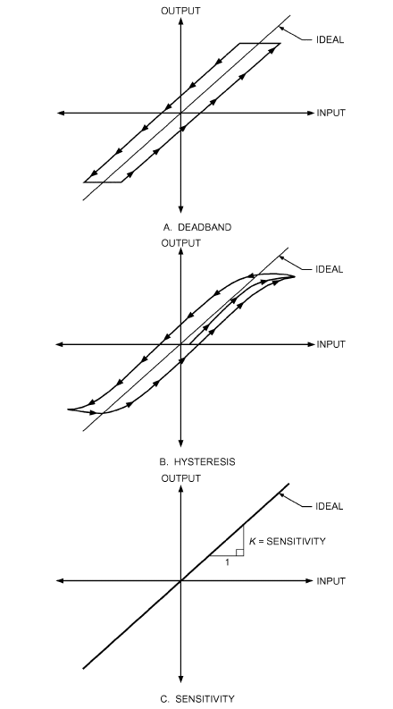

*Fig. 1 Measurement and Instrument Terminology*

**Frequency response (flat).** Portion of the frequency spectrum over which the measuring system has a constant value of amplitude response and a constant value of time lag. Input signals that have frequency components within this range are indicated by the measuring system (without distortion).

**Hydraulic diameter D<sub>h</sub>.** Defined as 4A<sub>c</sub>/P<sub>wet</sub>, where A<sub>c</sub> is flow cross-sectional area and P<sub>wet</sub> is the wetted perimeter (perimeter in contact with the flowing fluid). For a rectangular duct with dimensions W × H, the hydraulic diameter is D<sub>h</sub> = 2HW/(H + W). The related quantity effective or equivalent diameter is defined as the diameter of a circular tube having the same cross-sectional area as the actual flow channel. For a rectangular flow channel, the effective diameter is D<sub>eff</sub> = 4HW ⁄ π.

**Hysteresis.** Summation of all effects, under constant environmental conditions, that cause an instrument’s output to assume different values at a given stimulus point when that point is approached with increasing or decreasing stimulus. Hysteresis includes backlash. It is usually measured as a percent of full scale when input varies over the full increasing and decreasing range. In instrumentation, hysteresis and dead band exhibit similar output error behavior in relation to input, as shown in Figure 1.

**Linearity.** The degree of straightness of the transfer curve between an input and an output (e.g., the ideal line in Figure 1); that condition prevailing when output is directly proportional to input (see Nonlinearity). Note that the generic term linearity does not consider any parallel offset of the straight-line calibration curve.

**Loading error.** Loss of output signal from a device caused by a current drawn from its output. It increases the voltage drop across the internal impedance, where no voltage drop is desired.

**Mean.** See Average.

**Median.** Middle value in a distribution, above and below which lie an equal number of values.

**Mode.** Value in a distribution that occurs most frequently. **Noise.** Any unwanted disturbance or spurious signal that modifies the transmission, measurement, or recording of desired data.

**Nonlinearity.** Prevailing condition (and the extent of its measurement) under which the input/output relationship (known as the input/output curve, transfer characteristic, calibration curve, or response curve) fails to be a straight line. Nonlinearity is measured and reported in several ways, and the way, along with the magnitude, must be stated in any specification.

Minimum-deviation-based nonlinearity: maximum departure between the calibration curve and a straight line drawn to give the greatest accuracy; expressed as a percent of full-scale deflection.

Slope-based nonlinearity: ratio of maximum slope error anywhere on the calibration curve to the slope of the nominal sensitivity line; usually expressed as a percent of nominal slope.

Most other variations result from the many ways in which the straight line can be arbitrarily drawn. All are valid as long as construction of the straight line is explicit.

**Population.** Group of individual persons, objects, or items from which samples may be taken for statistical measurement.

**Precision.** Repeatability of measurements of the same quantity under the same conditions; not a measure of absolute accuracy. It describes the relative tightness of the distribution of measurements of a quantity about their mean value. Therefore, precision of a measurement is associated more with its repeatability than its accuracy. It combines uncertainty caused by random differences in a number of identical measurements and the smallest readable increment of the scale or chart. Precision is given in terms of deviation from a mean value.

**Primary calibration.** Calibration procedure in which the instrument output is observed and recorded while the input stimulus is applied under precise conditions, usually from a primary external standard traceable directly to the National Institute of Standards and Technology (NIST) or to an equivalent international standards organization.

**Range.** Statement of upper and lower limits between which an instrument’s input can be received and for which the instrument is calibrated.

**Reliability.** Probability that an instrument’s precision and accuracy will continue to fall within specified limits.

**Repeatability.** See Precision.

**Reproducibility.** In instrumentation, the closeness of agreement among repeated measurements of the output for the same value of input made under the same operating conditions over a period of time, approaching from both directions; it is usually measured as a nonreproducibility and expressed as reproducibility in percent of span for a specified time period. Normally, this implies a long period of time, but under certain conditions, the period may be a short time so that drift is not included. Reproducibility includes hysteresis, dead band, drift, and repeatability. Between repeated measurements, the input may vary over the range, and operating conditions may vary within normal limits.

<!-- str. 965 -->

**Resolution.** Smallest change in input that produces a detectable change in instrument output. Resolution, unlike precision, is a psychophysical term referring to the smallest increment of humanly perceptible output (rated in terms of the corresponding increment of input). The precision, resolution, or both may be better than the accuracy. An ordinary six-digit instrument has a resolution of one part per million (ppm) of full scale; however, it is possible that the accuracy is no better than 25 ppm (0.0025%). Note that the practical resolution of an instrument cannot be any better than the resolution of the indicator or detector, whether internal or external.

**Sensitivity.** Slope of a calibration curve relating input signal to output, as shown in Figure 1. For linear instruments, sensitivity represents the change in output for a unit change in the input.

**Sensitivity error.** Maximum error in sensitivity displayed as a result of the changes in the calibration curve resulting from accumulated effects of systematic and random errors.

**Stability.** (1) Independence or freedom from changes in one quantity as the result of a change in another; (2) absence of drift.

**Static error band.** (1) Spread of error present if the indicator (pen, needle) stopped at some value (e.g., at one-half of full scale), normally reported as a percent of full scale; (2) specification or rating of maximum departure from the point where the indicator must be when an on-scale signal is stopped and held at a given signal level. This definition stipulates that the stopped position can be approached from either direction in following any random waveform. Therefore, it is a quantity that includes hysteresis and nonlinearity but excludes items such as chart paper accuracy or electrical drift (see *Dynamic error band*).

**Step**-**function response.** Characteristic curve or output plotted against time resulting from the input application of a step function (a function that is zero for all values of time before a certain instant, and a constant for all values of time thereafter).

**Threshold.** Smallest stimulus or signal that results in a detectable output. Resolution and threshold are sometimes used interchangeably.

**Time constant.** Time required for an exponential quantity to change by an amount equal to 0.632 times the total change required to reach steady state for first-order systems.

**Transducer.** Device for translating the changing magnitude of one kind of quantity into corresponding changes of another kind of quantity. The second quantity often has dimensions different from the first and serves as the source of a useful signal. The first quantity may be considered an input and the second an output. Significant energy may or may not transfer from the transducer’s input to output.

**Uncertainty.** An estimated value for the bound on the error (i.e., what an error might be if it were measured by calibration). Although uncertainty may be the result of both systematic and precision errors, only precision error can be treated by statistical methods. Uncertainty may be either **absolute** (expressed in the units of the measured variable) or **relative** (absolute uncertainty divided by the measured value; commonly expressed in percent).

**Zero shift.** Drift in the zero indication of an instrument without any static change in the measured variable.

## 2. UNCERTAINTY ANALYSIS

### Uncertainty Sources

Measurement generally consists of a sequence of operations or steps. Virtually every step introduces a conceivable source of uncertainty, the effect of which must be assessed. The following list is representative of the most common, but not all, sources of uncertainty.

- Inaccuracy in the mathematical model that describes the physical quantity
- Inherent stochastic variability of the measurement process
- Uncertainties in measurement standards and calibrated instrumentation
- Time-dependent instabilities caused by gradual changes in standards and instrumentation
- Effects of environmental factors such as temperature, humidity, and pressure
- Values of constants and other parameters obtained from outside sources
- Uncertainties arising from interferences, impurities, inhomogeneity, inadequate resolution, and incomplete discrimination
- Computational uncertainties and data analysis
- Incorrect specifications and procedural errors
- Laboratory practice, including handling techniques, cleanliness, and operator techniques, etc.
- Uncertainty in corrections made for known effects, such as installation effect corrections

### Uncertainty of a Measured Variable

For a measured variable X, the total error is caused by both **pre- cision (random)** and **systematic (bias) errors**. This relationship is shown in Figure 2. The possible measurement values of the variable are scattered in a distribution around the parent population mean μ (Figure 2A). The curve (**normal** or **Gaussian distribution**) is the theoretical distribution function for the infinite population of measurements that generated X. The parent population mean differs from (X)<sub>true</sub> by an amount called the systematic (or bias) error β (Figure 2B). The quantity β is the total fixed error that remains after all calibration corrections have been made. In general, there are several sources of bias error, such as errors in calibration standard, data acquisition, data reduction, and test technique. There is usually no direct way to measure these errors. These errors are unknown and are assumed to be zero; otherwise, an additional correction would be applied to reduce them to as close to zero as possible. Figure 2B shows how the resulting deviation δ can be different for different random errors ε.

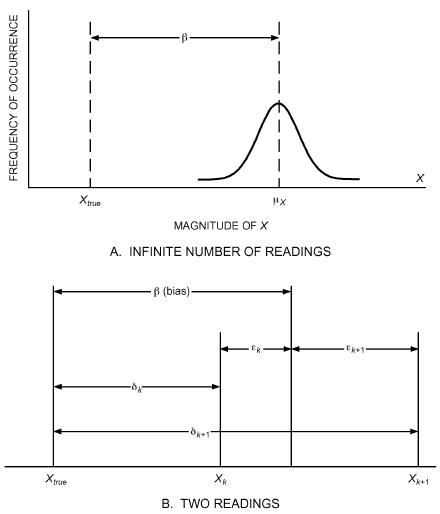

*Fig. 2 Errors in Measurement of Variable X*

<!-- str. 966 -->

The **precision uncertainty** for a variable, which is an estimate of the possible error associated with the repeatability of a particular measurement, is determined from the sample standard deviation, or the estimate of the error associated with the repeatability of a particular measurement. Unlike systematic error, precision error varies from reading to reading. As the number of readings of a particular variable tends to infinity, the distribution of these possible errors becomes Gaussian.

For each bias error source, the experimenter must estimate a **sys- tematic uncertainty**. Systematic uncertainties are usually estimated from previous experience, calibration data, analytical models, and engineering judgment. The resultant uncertainty is the square root of the sum of the squares of the bias and precision uncertainties; see Coleman and Steele (2009).

For further information on measurement uncertainty, see Abernethy et al. (1985), ASME Standards MFC-2M and PTC 19.1, Brown et al. (1998), and Coleman and Steele (1995).

## 3. TEMPERATURE MEASUREMENT

Instruments for measuring temperature are listed in Table 1. Temperature sensor output must be related to an accepted temperature scale by manufacturing the instrument according to certain specifications or by calibrating it against a temperature standard. To help users conform to standard temperatures and temperature measurements, the International Committee of Weights and Measures (CIPM) adopted the International Temperature Scale of 1990 (ITS-90).

The unit of temperature of the ITS-90 is the kelvin (K) and has a size equal to the fraction 1/273.16 of the thermodynamic temperature of the triple point of water.

In the United States, ITS-90 is maintained by the National Institute of Standards and Technology (NIST), which provides calibrations based on this scale for laboratories.

Benedict (1984), Considine (1985), DeWitt and Nutter (1988), Holman (2001), Quinn (1990), and Schooley (1986, 1992) cover temperature measurement in more detail.

### Sampling and Averaging

Although temperature is usually measured within, and is associated with, a relatively small volume (depending on the size of the thermometer), it can also be associated with an area (e.g., on a surface or in a flowing stream). To determine average stream temperature, the cross section must be divided into smaller areas and the temperature of each area measured. The temperatures measured are then combined into a weighted mass flow average by using either (1) equal areas and multiplying each temperature by the fraction of total mass flow in its area or (2) areas of size inversely proportional to mass flow and taking a simple arithmetic average of the temperatures in each. Mixing or selective sampling may be preferable to these cumbersome procedures. Although mixing can occur from turbulence alone, **transposition** is much more effective. In transposition, the stream is divided into parts determined by the type of stratification, and alternate parts pass through one another.

**Table 1 Common Temperature Measurement Techniques**

| Measurement Means | Application | Approximate Range, °C | Uncertainty, K | Limitations |
|---|---|---|---|---|
| Liquid-in-glass thermometers |  |  |  |  |
| Mercury-in-glass | Temperature of gases and liquids by contact | –38/550 | 0.03 to 2 | In gases, accuracy affected by radiation<br>(unless adequately shielded) |
| Organic fluid | Temperature of gases and liquids by contact | –200/200 | 0.03 to 2 | In gases, accuracy affected by radiation |
| Resistance thermometers |  |  |  |  |
| Platinum | Precision; remote readings; temperature of | –259/1000 | Less than | High cost; accuracy affected by radiation in |
|  | fluids or solids by contact |  | 0.0001 to 0.1 | gases |
| Rhodium/iron | Transfer standard for cryogenic applications | –273/–243 | 0.0001 to 0.1 | High cost |
| Nickel | Remote readings; temperature by contact | –250/200 | 0.01 to 1 | Accuracy affected by radiation in gases |
| Germanium | Remote readings; temperature by contact | –273/–243 | 0.0001 to 0.1 |  |
| Thermistors | Remote readings; temperature by contact | –90/200 | 0.0001 to 0.1 |  |
| Thermocouples |  |  |  |  |
| Pt-Rh/Pt (type S) | Standard for thermocouples on IPTS-68, not on ITS-90 | 0/1450 | 0.1 to 3 | High cost |
| Au/Pt | Highly accurate reference thermometer for laboratory applications | –50/1000 | 0.05 to 1 | High cost |
| Types K and N | General testing of high temperature; remote rapid readings by direct contact | –200/1250 | 0.1 to 10 | Less accurate than Pt-Rh/Pt or Au/Pt thermocouples |
| Iron/Constantan (type J) | Same as above | 0 to 760 | 0.1 to 6 | Subject to oxidation |
| Copper/Constantan (type T) | Same as above; especially suited for low temperature | –200/370 | 0.1 to 3 |  |
| Ni-Cr/Constantan (type E) | Same as above; especially suited for low temperature | –200/900 | 0.1 to 7 |  |
| Bimetallic thermometers | For approximate temperature | –20/660 | 1, usually much more | Time lag; unsuitable for remote use |
| Pressure-bulb thermometers |  |  |  |  |
| Gas-filled bulb | Remote reading | –75/660 | 2 | Use caution to ensure installation is correct |
| Vapor-filled bulb | Remote testing | –5/250 | 2 | Use caution to ensure installation is correct |
| Liquid-filled bulb | Remote testing | –50/1150 | 2 | Use caution to ensure installation is correct |
| Optical pyrometers | For intensity of narrow spectral band of high-temperature radiation (remote) | 800 and up | 15 | Generally requires knowledge of surface emissivity |
| Infrared (IR) radiometers | For intensity of total high-temperature radiation (remote) | Any range |  |  |
| IR thermography | Infrared imaging | Any range |  | Generally requires knowledge of surface emissivity |
| Seger cones (fusion pyrometers) Approximate temperature (within |  | 660/2000 | 50 |  |
|  | temperature source) |  |  |  |

<!-- str. 967 -->

### Static Temperature Versus Total Temperature

When a fluid stream impinges on a temperature-sensing element such as a thermometer or thermocouple, the element is at a temperature greater than the true stream temperature. The difference is a fraction of the temperature equivalent of the stream velocity t<sub>e</sub>.

> t<sub>e</sub> = V<sup>2</sup>/2Jc<sub>p</sub>&emsp;**(1)**

where

- t<sub>e</sub> = temperature equivalent of stream velocity, °C
- V = stream velocity, m/s
- J = mechanical equivalent of heat = 1000 (N·m)/kJ
- c<sub>p</sub> = specific heat of stream at constant pressure, kJ/(kg·K)

This fraction of the temperature equivalent of the velocity is the **recovery factor**, which varies from 0.3 to 0.4 K for bare thermometers to 0.5 K for aerodynamically shielded thermocouples. For precise temperature measurement, each temperature sensor must be calibrated to determine its recovery factor. However, for most applications with air velocities below 10 m/s (or Mach number M below approximately 0.1), the recovery factor can be omitted.

Various sensors are available for temperature measurement in fluid streams. The principal ones are the **static temperature ther- mometer**, which indicates true stream temperature but is cumbersome, and the **thermistor**, used for accurate temperature measurement within a limited range.

## 3.1 LIQUID-IN-GLASS THERMOMETERS

Any device that changes monotonically with temperature is a thermometer; however, the term usually signifies an ordinary liquidin-glass temperature-indicating device. Mercury-filled thermometers have a useful range from –38.8°C, the freezing point of mercury, to about 550°C, near which the glass usually softens. Lower temperatures can be measured with organic-liquid-filled thermometers (e.g., alcohol-filled), with ranges of –200 to 200°C. During manufacture, thermometers are roughly calibrated for at least two temperatures, often the freezing and boiling points of water; space between the calibration points is divided into desired scale divisions. Thermometers that are intended for precise measurement applications have scales etched into the glass that forms their stems. The probable error for as-manufactured, etched-stem thermometers is ±1 scale division. The highest-quality mercury thermometers may have uncertainties of ±0.03 to 2 K if they have been calibrated by comparison against primary reference standards.

Liquid-in-glass thermometers are used for many HVAC applications, including local temperature indication of process fluids (e.g., cooling and heating fluids and air).

Mercury-in-glass thermometers are fairly common as temperature measurement standards because of their relatively high accuracy and low cost. If used as references, they must be calibrated on the ITS-90 by comparison in a uniform bath with a standard platinum resistance thermometer that has been calibrated either by the appropriate standards agency or by a laboratory that has direct traceability to the standards agency and the ITS-90. This calibration is necessary to determine the proper corrections to be applied to the scale readings. For application and calibration of liquid-in-glass thermometers, refer to NIST (1976, 1986).

Liquid-in-glass thermometers are calibrated by the manufacturer for total or partial stem immersion. If a thermometer calibrated for total immersion is used at partial immersion (i.e., with part of the liquid column at a temperature different from that of the bath), an emergent stem correction must be made, as follows:

> Stem correction = Kn(t<sub>b</sub> – t<sub>s</sub>)&emsp;**(2)**

where

- K = differential expansion coefficient of mercury or other liquid in glass. K is 0.00016 for Celsius mercury thermometers. For K values for other liquids and specific glasses, refer to Schooley (1992).
- n = number of degrees that liquid column emerges from bath
- t<sub>b</sub> = temperature of bath, °C
- t<sub>s</sub> = average temperature of emergent liquid column of n degrees, °C

Because the true temperature of the bath is not known, this stem correction is only approximate.

### Sources of Thermometer Errors

A thermometer measuring gas temperatures can be affected by radiation from surrounding surfaces. If the gas temperature is approximately the same as that of the surrounding surfaces, radiation effects can be ignored. If the temperature differs considerably from that of the surroundings, radiation effects should be minimized by shielding or aspiration (ASME Standard PTC 19.3). **Shielding** may be provided by highly reflective surfaces placed between the thermometer bulb and the surrounding surfaces such that air movement around the bulb is not appreciably restricted (Parmelee and Huebscher 1946). Improper shielding can increase errors. **Aspiration** involves passing a high-velocity stream of air or gas over the thermometer bulb.

When a **thermometer well** within a container or pipe under pressure is required, the thermometer should fit snugly and be surrounded with a high-thermal-conductivity material (oil, water, or mercury, if suitable). Liquid in a long, thin-walled well is advantageous for rapid response to temperature changes. The surface of the pipe or container around the well should be insulated to eliminate heat transfer to or from the well.

Industrial thermometers are available for permanent installation in pipes or ducts. These instruments are fitted with metal guards to prevent breakage. However, the considerable heat capacity and conductance of the guards or shields can cause errors.

Allowing ample time for the thermometer to attain temperature equilibrium with the surrounding fluid prevents excessive errors in temperature measurements. When reading a liquid-in-glass thermometer, keep the eye at the same level as the top of the liquid column to avoid parallax.

## 3.2 RESISTANCE THERMOMETERS

Resistance thermometers depend on a change of the electrical resistance of a sensing element (usually metal) with a change in temperature; resistance increases with increasing temperature. Use of resistance thermometers largely parallels that of thermocouples, although readings are usually unstable above about 550°C. Twolead temperature elements are not recommended because they do not allow correction for lead resistance. Three leads to each resistor are necessary for consistent readings, and four leads are preferred. Wheatstone bridge circuits or 6-1/2-digit multimeters can be used for measurements.

A typical circuit used by several manufacturers is shown in Figure 3. This design uses a differential galvanometer in which coils L and H exert opposing forces on the indicating needle. Coil L is in series with the thermometer resistance AB, and coil H is in series with the constant resistance R. As the temperature falls, the resistance of AB decreases, allowing more current to flow through coil L than through coil H. This increases the force exerted by coil L, pulling the needle down to a lower reading. Likewise, as the temperature rises, the resistance of AB increases, causing less current to flow through coil L than through coil H and forcing the indicating needle to a higher reading. Rheostat S must be adjusted occasionally to maintain constant current.

<!-- str. 968 -->

The resistance thermometer is more costly to make and likely to have considerably longer response times than thermocouples. It gives best results when used to measure steady or slowly changing temperature.

### Resistance Temperature Devices

Resistance temperature devices (RTDs) are typically constructed from platinum, rhodium/iron, nickel, nickel/iron, tungsten, or copper. These devices are further characterized by their simple circuit designs, high degree of linearity, good sensitivity, and excellent stability. The choice of materials for an RTD usually depends on the intended application; selection criteria include temperature range, corrosion protection, mechanical stability, and cost.

Presently, for HVAC applications, RTDs constructed of platinum are the most widely used. Platinum is extremely stable and resistant to corrosion. Platinum RTDs are highly malleable and can thus be drawn into fine wires; they can also be manufactured inexpensively as thin films. They have a high melting point and can be refined to high purity, thus attaining highly reproducible results. Because of these properties, platinum RTDs are used to define the ITS-90 for the range of 13.8033 K (triple point of equilibrium hydrogen) to 1234.93 K (freezing point of silver).

Platinum resistance temperature devices can measure the widest range of temperatures and are the most accurate and stable temperature sensors. Their resistance/temperature relationship is one of the most linear. The higher the purity of the platinum, the more stable and accurate the sensor. With high-purity platinum, primarygrade platinum RTDs can achieve reproducibility of ±0.00001 K, whereas the minimum uncertainty of a recently calibrated thermocouple is ±0.2 K.

The most widely used RTD is designed with a resistance of 100 Ω at 0°C (R<sub>0</sub> = 100 Ω). Other RTDs are available that use lower resistances at temperatures above 600°C. The lower the resistance value, the faster the response time for sensors of the same size.

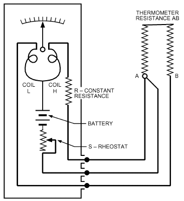

*Fig. 3 Typical Resistance Thermometer Circuit*

**Thin-Film RTDs.** Thin-film 1000 Ω platinum RTDs are readily available. They have the excellent linear properties of lowerresistance platinum RTDs and are more cost-effective because they are mass produced and have lower platinum purity. However, many platinum RTDs with R<sub>0</sub> values of greater than 100 Ω are difficult to provide with transmitters or electronic interface boards from sources other than the RTD manufacturer. In addition to a nonstandard interface, higher-R<sub>0</sub>-value platinum RTDs may have higher self-heating losses if the excitation current is not controlled properly.

Thin-film RTDs have the advantages of lower cost and smaller sensor size. They are specifically adapted to surface mounting. Thin-film sensors tend to have an accuracy limitation of ±0.1% or ±0.1 K. This may be adequate for most HVAC applications; only in tightly controlled facilities may users wish to install the standard wire-wound platinum RTDs with accuracies of 0.01% or ±0.01 K (available on special request for certain temperature ranges).

**Assembly and Construction.** Regardless of the R<sub>0</sub> value, RTD assembly and construction are relatively simple. Electrical connections come in three basic types, depending on the number of wires to be connected to the resistance measurement circuitry. Two, three, or four wires are used for electrical connection using a Wheatstone bridge or a variation (Figure 4).

In the basic two-wire configuration, the RTD’s resistance is measured through the two connecting wires. Because the connecting wires extend from the site of the temperature measurement, any additional changes in resistivity caused by a change in temperature may affect the measured resistance. Three- and four-wire assemblies are built to compensate for the connecting lead resistance values. The original three-wire circuit improved resistance measurement by adding a compensating wire to the voltage side of the circuit. This helps reduce part of the connecting wire resistance. When more accurate measurements (better than ±0.1 K) are required, the four-wire bridge, which eliminates all connecting wire resistance errors, is recommended.

All bridges discussed here are direct current (DC) circuits and were used extensively until the advent of precision alternating current (AC) circuits using microprocessor-controlled ratio transformers, dedicated analog-to-digital converters, and other solid-state devices that measure resistance with uncertainties of less than 1 ppm. Resistance measurement technology now allows more portable thermometers, lower cost, ease of use, and high-precision temperature measurement in industrial uses.

### Thermistors

Some semiconductor compounds (usually sintered metallic oxides) exhibit large changes in resistance with temperature, usually decreasing as the temperature increases. For use, the thermistor element may be connected by lead wires into a galvanometer bridge circuit and calibrated. Alternatively, a 6-1/2-digit multimeter and a constant-current source with a means for reversing the current to eliminate thermal electromotive force (emf) effects may also be used. This method is easier and faster, and may be more precise and accurate. Thermistors are usually applied to electronic temperature compensation circuits, such as thermocouple reference junction compensation, or to other applications requiring high resolution and having limited operating-temperature ranges. Figure 5 shows a typical thermistor circuit.

### Semiconductor Devices

In addition to positive-resistance-coefficient RTDs and negativeresistance-coefficient thermistors, there are two other types of devices that vary resistance or impedance with temperature. Although the principle of their operation has long been known, their reliability was questioned because of imprecise manufacturing techniques.

<!-- str. 969 -->

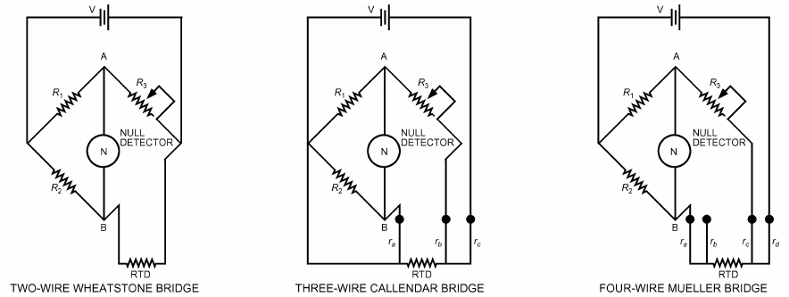

*Fig. 4 Typical Resistance Temperature Device (RTD) Bridge Circuits*

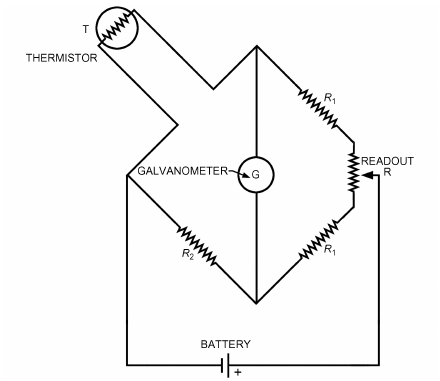

*Fig. 5 Basic Thermistor Circuit*

Improved silicon microelectronics manufacturing techniques have brought semiconductors to the point where low-cost, precise temperature sensors are commercially available.

**Elemental Semiconductors.** Because of controlled doping of impurities into elemental germanium, a germanium semiconductor is a reliable temperature sensor for cryogenic temperature measurement in the range of 1 to 84 K.

**Junction Semiconductors.** The first simple junction semiconductor device consisted of a single diode or transistor, in which the forward-connected base emitter voltage was very sensitive to temperature. Today, the more common form is a pair of diodeconnected transistors, which make the device suitable for ambient temperature measurement. Applications include thermocouple reference junction compensation.

The primary advantages of silicon transistor temperature sensors are their extreme linearity and exact R<sub>0</sub> value, as well as the incorporation of signal conditioning circuitry into the same device as the sensor element. As with thermocouples, these semiconductors require highly precise manufacturing techniques, extremely precise voltage measurements, multiple-point calibration, and temperature compensation to achieve an accuracy as high as ±0.01 K, but with a much higher cost. Lower-cost devices achieve accuracies of ±0.1 K using mass-manufacturing techniques and single-point calibration. A mass-produced silicon temperature sensor can be interchanged easily. If one device fails, only the sensor element need be changed. Electronic circuitry can be used to recalibrate the new device.

**Winding Temperature.** The winding temperature of electrical operating equipment is usually determined from the resistance change of these windings in operation. The relationship between the winding resistance R<sub>1</sub> at a known temperature t<sub>1</sub> and the winding resistance at any other temperature t<sub>2</sub> is given by Equation (3) (IEEE Standard 112-2004).

> 1
>
> R<sub>2</sub>/R<sub>1</sub> = (--- – t<sub>0</sub> + t<sub>2</sub> α)/(1 --- – t<sub>0</sub> + t<sub>1</sub>) = (k + t<sub>2</sub>)/(k + t<sub>1</sub>)&emsp;**(3)**

> α

where

- R<sub>1</sub> = winding resistance at temperature t<sub>1</sub>, Ω
- R<sub>2</sub> = winding resistance at temperature t<sub>2</sub>, Ω
- t<sub>1</sub>, t<sub>2</sub> = winding temperatures, °C
- α = wire resistivity coefficient, °C<sup>–1</sup>
- t<sub>0</sub> = reference temperature for resistivity, 25°C
- k = 1/α – t<sub>0</sub> = winding material constant, 390.1°C for 100% IACS conductivity copper

The classical method of determining winding temperature is to measure the equipment when it is inoperative and temperaturestabilized at room temperature. After the equipment has operated sufficiently to stabilize temperature under load conditions, the winding resistance should be measured again by taking resistance measurements at known, short time intervals after shutdown. These values may be extrapolated to zero time to indicate the winding resistance at the time of shutdown. The obvious disadvantage of this method is that the device must be shut down to determine winding temperature. A circuit described by Seely (1955), however, makes it possible to measure resistances while the device is operating.

## 3.3 THERMOCOUPLES

When two wires of dissimilar metals are joined by soldering, welding, or twisting, they form a thermocouple junction or **thermo- junction**. An emf that depends on the wire materials and the junction temperature exists between the wires. This is known as the **Seebeck voltage**.

<!-- str. 970 -->

**Table 2 Thermocouple Tolerances on Initial Values of Electromotive Force Versus Temperature**

| Thermocouple Type | Material Identification | Temperature Range, °C | Reference Junction Tolerance at 0°C<sup>a</sup> (Whichever Is Greater) (Whichever Is Greater)<br>Standard Tolerance | Reference Junction Tolerance at 0°C<sup>a</sup> (Whichever Is Greater) (Whichever Is Greater)<br>Special Tolerance |
|---|---|---|---|---|
| T | Copper versus constantan | 0 to 350 | ±1 K or ±0.75% | ±0.5 K or ±0.4% |
| J | Iron versus constantan | 0 to 750 | ±2.2 K or ±0.75% | ±1.1 K or ±0.4% |
| E | Nickel/10% chromium versus constantan | 0 to 900 | ±1.7 K or ±0.5% | ±1 K or ±0.4% |
| K | Nickel/10% chromium versus 5% aluminum, silicon | 0 to 1250 | ±2.2 K or ±0.75% | ±1.1 K or ±0.4% |
| N | Nickel/14% chromium, 1.5% silicon versus nickel/4.5% silicon, | 0 to 1250 | ±2.2 K or ±0.75% | ±1.1 K or ±0.4% |
|  | 0.1% magnesium |  |  |  |
| R | Platinum/13% rhodium versus platinum | 0 to 1450 | ±1.5 K or ±0.25% | ±0.6 K or ±0.1% |
| S | Platinum/10% rhodium versus platinum | 0 to 1450 | ±1.5 K or ±0.25% | ±0.6 K or ±0.1% |
| B | Platinum/30% rhodium versus platinum/6% rhodium | 870 to 1700 | ±0.5% | ±0.25% |
| T<sup>b</sup> | Copper versus constantan | –200 to 0 | ±1 K or ±1.5% | c |
| E<sup>b</sup> | Nickel/10% chromium versus constantan | –200 to 0 | ±1.7 K or ±1% | c |
| K<sup>b</sup> | Nickel/10% chromium versus 5% aluminum, silicon | –200 to 0 | ±2.2 K or ±2% | c c |

Source: ASTM Standard E230. <sup>c</sup>Little information is available to justify establishing special tolerances for below-

<sup>a</sup>Tolerances in this table apply to new thermocouple wire, normally in the size range of freezing temperatures. Limited experience suggests the following special toler-0.25 to 3 mm diameter and used at temperatures not exceeding recommended limits. ances for types E and T thermocouples: Thermocouple wire is available in two grades: standard and special. Type E –200 to 0°C; ±1 K or ±0.5% (whichever is greater)

<sup>b</sup>Thermocouples and thermocouple materials are normally supplied to meet the tolerance specified in the table for temperatures above 0°C. The same materials, however, Type T –200 to 0°C; ±0.5 K or ±0.8% (whichever is greater) may not fall within the tolerances given in the second section of the table when operated below freezing (0°C). If materials are required to meet tolerances at subfreezing These tolerances are given only as a guide for discussion between purchaser and temperatures, the purchase order must state so. supplier.

Thermocouples for temperature measurement yield less precise results than platinum resistance thermometers, but, except for glass thermometers, thermocouples are the most common instruments of temperature measurement for the range of 0 to 1000°C. Because of their low cost, moderate reliability, and ease of use, thermocouples are widely accepted.

The most commonly used thermocouples in industrial applications are assigned letter designations. Tolerances of such commercially available thermocouples are given in Table 2.

Because the measured emf is a function of the difference in temperature and the type of dissimilar metals used, a known temperature at one junction is required; the remaining junction temperature may be calculated. It is common to call the one with known temperature the (cold) **reference** junction and the one with unknown temperature the (hot) **measured** junction. The reference junction is typically kept at a reproducible temperature, such as the ice point of water.

Various systems are used to maintain the reference junction temperature (e.g., mixed ice and water in an insulated flask, commercially available thermoelectric coolers to maintain the ice-point temperature automatically in a reference chamber). When these systems cannot be used in an application, measuring instruments with automatic reference junction temperature compensation may be used. These types of instruments typically use a thermistor or RTD to measure the reference junction temperature to provide reference junction temperature compensation.

As previously described, the principle for measuring temperature with a thermocouple is based on accurate measurement of the Seebeck voltage. Acceptable DC voltage measurement methods are (1) millivoltmeter, (2) millivolt potentiometer, and (3) high-input impedance digital voltmeter. Many digital voltmeters include built-in software routines for direct calculation and display of temperature. Regardless of the method selected, there are many ways to simplify measurement.

Solid-state digital readout devices in combination with a milli- or microvoltmeter, as well as packaged thermocouple readouts with built-in cold junction and linearization circuits, are available. The latter requires a proper thermocouple to provide direct meter reading of temperature. Accuracy approaching or surpassing that of potentiometers can be attained, depending on the instrument quality. This method is popular because it eliminates the null balancing requirement and reads temperature directly in a digital readout.

### Wire Diameter and Composition

Thermocouple wire is selected by considering the temperature to be measured, the corrosion protection afforded to the thermocouple, and the precision and service life required. Type T thermocouples are suitable for temperatures up to 350°C; type J, up to 750°C; and types K and N, up to 1250°C. Higher temperatures require noble metal thermocouples (type S, R, or B), which have a higher initial cost and do not develop as high an emf as the base metal thermocouples. Thermocouple wires of the same type have small compositional variation from lot to lot from the same manufacturer, and especially among different manufacturers. Consequently, calibrating samples from each wire spool is essential for precision. Calibration data on wire may be obtained from the manufacturer.

Computer-friendly reference functions are available for relating temperature and emf of letter-designated thermocouple types. The functions depend on thermocouple type and temperature range; they are used to generate reference tables of emf as a function of temperature, but are not well suited for calculating temperatures directly from values of emf. Approximate inverse functions are available, however, for calculating temperature and are of the form

> n
>
> t = a E<sup>i</sup>&emsp;**(4)**

> ∑ i
>
> i=0

where t = temperature, a<sub>i</sub> = thermocouple constant coefficients, and E = voltage. Burns et al. (1992) give reference functions and approximate inverses for all letter-designated thermocouples.

The emf of a thermocouple, as measured with a high-input impedance device, is independent of the diameters of its constituent wires. Thermocouples with small-diameter wires respond faster to temperature changes and are less affected by radiation than larger ones. Large-diameter wire thermocouples, however, are necessary for high-temperature work when wire corrosion is a problem. For use in heated air or gases, thermocouples are often shielded and sometimes aspirated. One way to avoid error caused by radiation is using several thermocouples of different wire sizes and estimating the true temperature by extrapolating readings to zero diameter.

With thermocouples, temperatures can be indicated or recorded remotely on conveniently located instruments. Because thermocouples can be made of small-diameter wire, they can be used to measure temperatures within thin materials, within narrow spaces, or in otherwise inaccessible locations.

<!-- str. 971 -->

### Multiple Thermocouples

Thermocouples in series, with alternate junctions maintained at a common temperature, produce an emf that, when divided by the number of thermocouples, gives the average emf corresponding to the temperature difference between two sets of junctions. This series arrangement of thermocouples, often called a **thermopile**, is used to increase sensitivity and is often used for measuring small temperature changes and differences.

Connecting several thermocouples of the same type in parallel with a common reference junction is useful for obtaining an average temperature of an object or volume. In such measurements, however, it is important that the electrical resistances of the individual thermocouples be the same. Use of thermocouples in series and parallel arrangements is discussed in ASTM Manual 12.

### Surface Temperature Measurement

The thermocouple is useful in determining surface temperature. It can be attached to a metal surface in several ways. For permanent installations, soldering, brazing, or peening (i.e., driving the thermocouple measuring junction into a small drilled hole) is suggested. For temporary arrangements, thermocouples can be attached by tape, adhesive, or putty-like material. For boiler or furnace surfaces, use furnace cement. To minimize the possibility of error caused by heat conduction along wires, a surface thermocouple should be made of fine wires placed in close contact with the surface being measured for about 25 mm from the junction to ensure good thermal contact. Wires must be insulated electrically from each other and from the metal surface (except at the junction).

### Thermocouple Construction

Thermocouple (TC) wires are insulated with various materials, including fibrous glass, fluorocarbon resin, and ceramic insulators. Perhaps the most common insulators are polyimides or, in high-temperature applications, braided glass. At high temperatures, insulation can break down, inadvertently forming an unanticipated TC junction. In another form of thermocouple, the wires are insulated with compacted ceramic insulation inside a metal sheath, providing both mechanical protection and protection from stray electromagnetic fields. The measuring junction may be exposed or enclosed within the metal sheath. An enclosed junction may be either grounded or ungrounded to the metal sheath.

An exposed junction is in direct contact with the process stream; it is therefore subject to corrosion or contamination, but provides a fast temperature response. A grounded enclosed junction, in which the wires are welded to the metal sheath, provides electrical grounding, as well as mechanical and corrosion protection, but has a slower response time. Response time is even slower for ungrounded enclosed junctions, but the thermocouple wires are isolated electrically and are less susceptible to some forms of mechanical strain than those with grounded construction.

## 3.4 OPTICAL PYROMETRY

Optical pyrometry determines a surface’s temperature from the color of the radiation it emits. As the temperature of a surface increases, it becomes deep red in color, then orange, and eventually white. This behavior follows from Wein’s law, which indicates that the wavelength corresponding to the maximum intensity of emitted radiation is inversely proportional to the absolute temperature of the emitting surface. Thus, as temperature increases, the wavelength decreases.

To determine the unknown surface temperature, the color of radiation from the surface is optically compared to the color of a heated filament. By adjusting the current in the filament, the color of the filament is made to match the color of radiation from the source surface. When in balance, the filament virtually disappears into the background image of the surface color. Filament calibration is required to relate the filament current to the unknown surface temperature. For further information, see Holman (2001).

## 3.5 INFRARED RADIATION THERMOMETERS

Infrared radiation (IR) thermometers, also known as **remote temperature sensors** (Hudson 1969) or **pyrometers**, allow noncontact measurement of surface temperature over a wide range. In these instruments, radiant flux from the observed object is focused by an optical system onto an infrared detector that generates an output signal proportional to the incident radiation that can be read from a meter or display unit. Both point and scanning radiometers are available; the latter can display the temperature variation in the field of view.

IR thermometers are usually classified according to the detector used: either thermal or photon. In **thermal detectors**, a change in electrical property is caused by the heating effect of the incident radiation. Examples of thermal detectors are the thermocouple, thermopile, and metallic and semiconductor bolometers. Typical response times are one-quarter to one-half second. In **photon detec- tors**, a change in electrical property is caused by the surface absorption of incident photons. Because these detectors do not require an increase in temperature for activation, their response time is much shorter than that of thermal detectors. Scanning radiometers usually use photon detectors.

An IR thermometer only measures the power level of radiation incident on the detector, a combination of thermal radiation emitted by the object and surrounding background radiation reflected from the object’s surface. Very accurate measurement of temperature, therefore, requires knowledge of the long-wavelength emissivity of the object as well as the effective temperature of the thermal radiation field surrounding the object. Calibration against an internal or external source of known temperature and emissivity may be needed to obtain true surface temperature from the radiation measurements.

In other cases, using published emissivity factors for common materials may suffice. Many IR thermometers have an emissivity adjustment feature that automatically calculates the effect of emissivity on temperature once the emissivity factor is entered. Thermometers that do not have an emissivity adjustment are usually preset to calculate emissivity at 0.95, a good estimate of the emissivity of most organic substances, including paint. Moreover, IR thermometers are frequently used for relative, rather than absolute, measurement; in these cases, adjustment for emissivity may be unnecessary. The most significant practical problem is measuring shiny, polished objects. Placing electrical tape or painting the measurement area with flat black paint and allowing the temperature of the tape or paint to equilibrate can mitigate this problem.

A key factor in measurement quality can be the optical resolution or spot size of the IR thermometer, because this specification determines the instrument’s measurement area from a particular distance and, thus, whether a user is actually measuring the desired area. Optical resolution is expressed as distance to spot size (D:S) at the focal. Part of the D:S specification is a description of the amount of target infrared energy encircled by the spot; typically it is 95%, but may be 90%.

Temperature resolution of an IR thermometer decreases as object temperature decreases. For example, a radiometer that can resolve a temperature difference of 0.3 K on an object near 20°C may only resolve a difference of 1 K on an object at 0°C.

## 3.6 INFRARED THERMOGRAPHY

Infrared thermography acquires and analyzes thermal information using images from an infrared imaging system. An infrared imaging system consists of (1) an infrared video camera and (2) a display unit. The infrared camera scans a surface and senses the selfemitted and reflected radiation viewed from the surface. The display unit contains either a cathode-ray tube (CRT) that displays a graytone or color-coded thermal image of the surface or a color liquid crystal display (LCD) screen. Thermal images can also be displayed on mobile devices such as smartphones. A photograph of the image is called a **thermogram**. Introductions to infrared thermography are given by Madding (1989) and Paljak and Pettersson (1972).

<!-- str. 972 -->

Thermography has been used to detect missing insulation and air infiltration paths in building envelopes (Burch and Hunt 1978). Standard practices for conducting thermographic inspections of buildings are given in ASTM Standard C1060. A technique for quantitatively mapping heat loss in building envelopes is given by Mack (1986).

Aerial infrared thermography of buildings is effective in identifying regions of an individual built-up roof that have wet insulation (Tobiasson and Korhonen 1985), but it is ineffective in ranking a group of roofs according to their thermal resistance (Burch 1980; Goldstein 1978). In this latter application, the emittances of the separate roofs and outdoor climate (i.e., temperature and wind speed) throughout the microclimate often produce changes in the thermal image that may be incorrectly attributed to differences in thermal resistance.

Industrial applications include locating defective or missing pipe insulation in buried heat distribution systems, surveys of manufacturing plants to quantify energy loss from equipment, and locating defects in coatings (Bentz and Martin 1987). Madding (1989) discusses applications to electrical power systems and electronics.

## 4. HUMIDITY MEASUREMENT

Any instrument that can measure the humidity or psychrometric state of air is a hygrometer, and many are available. The indication sensors used on the instruments respond to different moisture property contents. These responses are related to factors such as wet-bulb temperature, relative humidity, humidity (mixing) ratio, dew point, and frost point.

Table 3 lists instruments for measuring humidity. Each is capable of accurate measurement under certain conditions and within specific limitations. The following sections describe the various instruments in more detail.

## 4.1 PSYCHROMETERS

A typical industrial psychrometer consists of a pair of matched electrical or mechanical temperature sensors, one of which is kept wet with a moistened wick. A blower aspirates the sensor, which lowers the temperature at the moistened temperature sensor. The lowest temperature depression occurs when the evaporation rate required to saturate the moist air adjacent to the wick is constant. This is a steady-state, open-loop, nonequilibrium process, which depends on the purity of the water, cleanliness of the wick, ventilation rate, radiation effects, size and accuracy of the temperature sensors, and transport properties of the gas.

**Table 3 Humidity Sensor Properties**

| Type of Sensor | Sensor Category | Method of Operation | Approximate Range Some Uses | Approximate Range Some Uses | Approximate Accuracy |
|---|---|---|---|---|---|
| Psychrometer | Evaporative cooling | Temperature measurement of wet bulb | 0 to 80°C | Measurement, standard | ±3 to 7% rh |
| Adiabatic saturation | Evaporative cooling | Temperature measurement of | 5 to 30°C | Measurement, standard | ±0.2 to 2% rh |
| psychrometer |  | thermodynamic wet bulb |  |  |  |
| Chilled mirror | Dew point | Optical determination of moisture formation | –75 to 95°C dpt | Measurement, control, meteorology | ±0.2 to 2 K |
| Heated saturated salt | Water vapor pressure | Vapor pressure depression in | –30 to 70°C dpt | Measurement, control, meteorology | ±1.5 K |
| solution |  | salt solution |  |  |  |
| Hair | Mechanical | Dimensional change | 5 to 100% rh | Measurement, control | ±5% rh |
| Nylon | Mechanical | Dimensional change | 5 to 100% rh | Measurement, control | ±5% rh |
| Dacron thread | Mechanical | Dimensional change | 5 to 100% rh | Measurement | ±7% rh |
| Goldbeater’s skin | Mechanical | Dimensional change | 5 to 100% rh | Measurement | ±7% rh |
| Cellulosic materials | Mechanical | Dimensional change | 5 to 100% rh | Measurement, control | ±5% rh |
| Carbon | Mechanical | Dimensional change | 5 to 100% rh | Measurement | ±5% rh |
| Dunmore type | Electrical | Impedance | 7 to 98% rh at 5 to 60°C | Measurement, control | ±1.5% rh |
| Polymer film electronic hygrometer | Electrical | Impedance or capacitance | 10 to 100% rh |  | ±2 to 3% rh |
| Ion exchange resin | Electrical | Impedance or capacitance | 10 to 100% rh at –40 to 90°C | Measurement, control | ±5% rh |
| Porous ceramic | Electrical | Impedance or capacitance | Up to 200°C | Measurement, control | ±1 to 1.5% rh |
| Aluminum oxide | Electrical<br>Electrical | Capacitance<br>Capacitance | 5 to 100% rh –80 to 60°C dpt | Measurement, control<br>Trace moisture measurement, control | ±3% rh ±1 K dpt |
| Electrolytic | Electrolytic cell | Electrolyzes due to adsorbed | 1 to 1000 ppm | Measurement |  |
| hygrometer |  | moisture |  |  |  |
| Infrared laser diode | Electrical | Optical diodes | 0.1 to 100 ppm | Trace moisture measurement | ±0.1 ppm |
| Surface acoustic wave | Electrical | SAW attenuation | 85 to 98% rh | Measurement, control | ±1% rh |
| Piezoelectric | Mass sensitive | Mass changes due to adsorbed moisture | –75 to –20°C | Trace moisture measurement, control | ±1 to 5 K dpt |
| Radiation absorption | Moisture absorption | Moisture absorption of UV or IR radiation | –20 to 80°C dpt | Measurement, control, meteorology | ±2 K dpt, ±5% rh |
| Gravimetric | Direct measurement of mixing ratio | Comparison of sample gas with dry airstream | 120 to 20000 ppm mixing ratio | Primary standard, research and laboratory | ±0.13% of reading |
| Color change | Physical | Color changes | 10 to 80% rh | Warning device | ±10% rh |

Notes: dpt = dew-point temperature 3. Approximate accuracy is based on manufacturers’ data. 1. This table does not encompass all of available technology for measurement of humidity. 4. Presently, NIST only certifies instruments with operating ranges within –75 to 2. Approximate range for device types listed is based on surveys of device manufacturers. 100°C dpt.

<!-- str. 973 -->

ASHRAE Standard 41.6 recommends an airflow over both the wet and dry bulbs of 3 to 5 m/s for transverse ventilation and 1.5 to 2.5 m/s for axial ventilation.

The **sling psychrometer** consists of two thermometers mounted side by side in a frame fitted with a handle for whirling the device through the air. The thermometers are spun until their readings become steady. In the **ventilated** or **aspirated psychrometer**, the thermometers remain stationary, and a small fan, blower, or syringe moves air across the thermometer bulbs. Various designs are used in the laboratory, and commercial models are available.

Other temperature sensors, such as thermocouples and thermistors, are also used and can be adapted for recording temperatures or for use where a small instrument is required. Small-diameter wet-bulb sensors operate with low ventilation rates.

Charts and tables showing the relationship between the temperatures and humidity are available. Data are usually based on a barometric pressure equal to one standard atmosphere. To meet special needs, charts can be produced that apply to nonstandard pressure (e.g., the ASHRAE 2250 m psychrometric chart). Alternatively, mathematical calculations can be made (Kusuda 1965). Uncertainties of 3 to 7% rh are typical for psychrometer-based derivation. The degree of uncertainty is a function of the accuracy of temperature measurements (wet- and dry-bulb), knowledge of the barometric pressure, and conformance to accepted operational procedures such as those outlined in ASHRAE Standard 41.6.

In air temperatures below 0°C, water on the wick may either freeze or supercool. Because the wet-bulb temperature is different for ice and water, the state must be known and the proper chart or table used. Some operators remove the wick from the wet bulb for freezing conditions and dip the bulb in water a few times; this allows water to freeze on the bulb between dips, forming a film of ice. Because the wet-bulb depression is slight at low temperatures, precise temperature readings are essential. A psychrometer can be used at high temperatures, but if the wet-bulb depression is large, the wick must remain wet and water supplied to the wick must be cooled so as not to influence the wet-bulb temperature by carrying sensible heat to it (Richardson 1965; Worrall 1965).

Greenspan and Wexler (1968) and Wentzel (1961) developed devices to measure adiabatic saturation temperature.

## 4.2 DEW-POINT HYGROMETERS

### Condensation Dew-Point Hygrometers

The condensation (chilled-mirror) dew-point hygrometer is an accurate and reliable instrument with a wide humidity range. However, these features are gained at increased complexity and cost compared to the psychrometer. In the condensation hygrometer, a surface is cooled (thermoelectrically, mechanically, or chemically) until dew or frost begins to condense out. The condensate surface is maintained electronically in vapor-pressure equilibrium with the surrounding gas, while surface condensation is detected by optical, electrical, or nuclear techniques. The measured surface temperature is then the dew-point temperature.

The largest source of error stems from the difficulty in measuring condensate surface temperature accurately. Typical industrial versions of the instrument are accurate to ±0.5 K over wide temperature spans. With proper attention to the condensate surface temperature measuring system, errors can be reduced to about ±0.2 K. Condensation hygrometers can be made surprisingly compact using solid-state optics and thermoelectric cooling.

Wide span and minimal errors are two of the main features of this instrument. A properly designed condensation hygrometer can measure dew points from 95°C down to frost points of –75°C. Typical condensation hygrometers can cool to 80 K below ambient temperature, establishing lower limits of the instrument to dew points corresponding to approximately 0.5% rh. Accuracies for measurements above –40°C can be ±1 K or better, deteriorating to ±2 K at lower temperatures.

The response time of a condensation dew-point hygrometer is usually specified in terms of its cooling/heating rate, typically 2 K/s for thermoelectric cooled mirrors. This makes it somewhat faster than a heated salt hygrometer. Perhaps the most significant feature of the condensation hygrometer is its fundamental measuring technique, which essentially renders the instrument self-calibrating. For calibration, it is necessary only to manually override the surface cooling control loop, causing the surface to heat, and confirm that the instrument recools to the same dew point when the loop is closed. Assuming that the surface temperature measuring system is correct, this is a reasonable check on the instrument’s performance.

Although condensation hygrometers can become contaminated, they can easily be cleaned and returned to service with no impairment to performance.

### Salt-Phase Heated Hygrometers

Another instrument in which the temperature varies with ambient dew-point temperature is called a self-heating salt-phase transition hygrometer or a heated electrical hygrometer. This device usually consists of a tubular substrate covered by glass fiber fabric, with a spiral bifilar winding for electrodes. The surface is covered with a salt solution, usually lithium chloride. The sensor is connected in series with a ballast and a 24 V (AC) supply. When the instrument is operating, electrical current flowing through the salt film heats the sensor. The salt’s electrical resistance characteristics are such that a balance is reached with the salt at a critical moisture content corresponding to a saturated solution. The sensor temperature adjusts automatically so that the water vapor pressures of the salt film and ambient atmosphere are equal.

With lithium chloride, this sensor cannot be used to measure relative humidity below approximately 12% (the equilibrium relative humidity of this salt), and it has an upper dew-point limit of about 70°C. The regions of highest precision are between –23 and 34°C, and above 40°C dew point. Another problem is that the lithium chloride solution can be washed off when exposed to water. In addition, this type of sensor is subject to contamination problems, which limits its accuracy. Its response time is also very slow: it takes approximately 2 min for a 67% step change.

## 4.3 MECHANICAL HYGROMETERS

Many organic materials change in dimension with changes in humidity; this action is used in a number of simple and effective humidity indicators, recorders, and controllers (see Chapter 7). They are coupled to pneumatic leak ports, mechanical linkages, or electrical transduction elements to form hygrometers.

Commonly used organic materials are human hair, nylon, Dacron, animal membrane, animal horn, wood, and paper. Their inherent nonlinearity and hysteresis must be compensated for within the hygrometer. These devices are generally unreliable below 0°C. The response is generally inadequate for monitoring a changing process, and can be affected significantly by exposure to extremes of humidity. Mechanical hygrometers require initial calibration and frequent recalibration; however, they are useful because they can be arranged to read relative humidity directly, and they are simpler and less expensive than most other types.

## 4.4 ELECTRICAL IMPEDANCE AND CAPACITANCE HYGROMETERS

Many substances adsorb or lose moisture with changing relative humidity and exhibit corresponding changes in electrical impedance or capacitance.

<!-- str. 974 -->

### Dunmore Hygrometers

This sensor consists of dual electrodes on a tubular or flat substrate; it is coated with a film containing salt, such as lithium chloride, in a binder to form an electrical connection between windings. The relation of sensor resistance to humidity is usually represented by graphs. Because the sensor is highly sensitive, the graphs are a series of curves, each for a given temperature, with intermediate values found by interpolation. Several resistance elements (Dunmore elements) cover a standard range. Systematic calibration is essential because the resistance grid varies with time and contamination as well as with exposure to temperature and humidity extremes.

### Polymer Film Electronic Hygrometers

These devices consist of a hygroscopic organic polymer deposited by means of thin or thick film processing technology on a water-permeable substrate. Both capacitance and impedance sensors are available. The impedance devices may be either ionic or electronic conduction types. These hygrometers typically have integrated circuits that provide temperature correction and signal conditioning. The primary advantages of this sensor technology are small size; low cost; fast response times (on the order of 1 to 120 s for 64% change in relative humidity); and good accuracy over the full range, including the low end, where most other devices are less accurate.

### Ion Exchange Resin Electric Hygrometers

A conventional ion exchange resin consists of a polymer with a high relative molecular mass and polar groups of positive or negative charge in cross-link structure. Associated with these polar groups are ions of opposite charge that are held by electrostatic forces to the fixed polar groups. In the presence of water or water vapor, the electrostatically held ions become mobile; thus, when a voltage is impressed across the resin, the ions are capable of electrolytic conduction. The **Pope cell** is one example of an ion exchange element. It is a wide-range sensor, typically covering 15 to 95% rh; therefore, one sensor can be used where several Dunmore elements would be required. The Pope cell, however, has a nonlinear characteristic from approximately 1000 Ω at 100% rh to several megohms at 10% rh.

### Impedance-Based Porous Ceramic Electronic Hygrometers

Using oxides’ adsorption characteristics, humidity-sensitive ceramic oxide devices use either ionic or electronic measurement techniques to relate adsorbed water to relative humidity. Ionic conduction is produced by dissociation of water molecules, forming surface hydroxyls. The dissociation causes proton migration, so the device’s impedance decreases with increasing water content. The ceramic oxide is sandwiched between porous metal electrodes that connect the device to an impedance-measuring circuit for linearizing and signal conditioning. These sensors have excellent sensitivity, are resistant to contamination and high temperature (up to 200°C), and may get fully wet without sensor degradation. These sensors are accurate to about ±1.5% rh (±1% rh when temperature compensated) and have a moderate cost.

### Aluminum Oxide Capacitive Sensor

This sensor consists of an aluminum strip that is anodized by a process that forms a porous oxide layer. A very thin coating of cracked chromium or gold is then evaporated over this structure. The aluminum base and cracked chromium or gold layer form the two electrodes of what is essentially an aluminum oxide capacitor.

Water vapor is rapidly transported through the cracked chromium or gold layer and equilibrates on the walls of the oxide pores in a manner functionally related to the vapor pressure of water in the atmosphere surrounding the sensor. The number of water molecules adsorbed on the oxide structure determines the capacitance between the two electrodes.

## 4.5 ELECTROLYTIC HYGROMETERS

In electrolytic hygrometers, air is passed through a tube, where moisture is adsorbed by a highly effective desiccant (usually phosphorous pentoxide) and electrolyzed. The airflow is regulated to 1.65 mL/s at a standard temperature and pressure. As the incoming water vapor is absorbed by the desiccant and electrolyzed into hydrogen and oxygen, the current of electrolysis determines the mass of water vapor entering the sensor. The flow rate of the entering gas is controlled precisely to maintain a standard sample mass flow rate into the sensor. The instrument is usually designed for use with moisture/air ratios in the range of less than 1 ppm to 1000 ppm, but can be used with higher humidities.

## 4.6 PIEZOELECTRIC SORPTION

This hygrometer compares the changes in frequency of two hygroscopically coated quartz crystal oscillators. As the crystal’s mass changes because of absorption of water vapor, the frequency changes. The amount of water sorbed on the sensor is a function of relative humidity (i.e., partial pressure of water as well as ambient temperature).

A commercial version uses a hygroscopic polymer coating on the crystal. Humidity is measured by monitoring the change in the vibration frequency of the quartz crystal when the crystal is alternately exposed to wet and dry gas.

## 4.7 SPECTROSCOPIC (RADIATION ABSORPTION) HYGROMETERS

Radiation absorption devices operate on the principle that selective absorption of radiation is a function of frequency for different media. Water vapor absorbs **infrared** radiation at 2 to 3 μm wavelengths and **ultraviolet** radiation centered about the Lyman-alpha line at 0.122 μm. The amount of absorbed radiation is directly related to the absolute humidity or water vapor content in the gas mixture, according to Beer’s law. The basic unit consists of an energy source and optical system for isolating wavelengths in the spectral region of interest, and a measurement system for determining the attenuation of radiant energy caused by water vapor in the optical path. Absorbed radiation is measured extremely quickly and independent of the degree of saturation of the gas mixture. Response times of 0.1 to 1 s for 90% change in moisture content are common. Spectroscopic hygrometers are primarily used where a noncontact application is required; this may include atmospheric studies, industrial drying ovens, and harsh environments. The primary disadvantages of this device are its high cost and relatively large size.

## 4.8 GRAVIMETRIC HYGROMETERS

Humidity levels can be measured by extracting and finding the mass of water vapor in a known quantity or atmosphere. For precise laboratory work, powerful desiccants (e.g., phosphorous pentoxide, magnesium perchlorate) are used for extraction; for other purposes, calcium chloride or silica gel is satisfactory.

When the highest level of accuracy is required, the NIST gravimetric hygrometer is recommended. The gravimetric hygrometer gives the absolute water vapor content, where the mass of absorbed water and precise measurement of the gas volume associated with the water vapor determine the mixing ratio or absolute humidity of the sample. This system is the primary standard because the required measurements of mass, temperature, pressure, and volume can be made with extreme precision. However, its complexity and required attention to detail limit its usefulness. See Meyer et al. (2010) for further information.

<!-- str. 975 -->

## 4.9 CALIBRATION

For many hygrometers, the need for recalibration depends on the accuracy required, the sensor’s stability, and the conditions to which the sensor is subjected. Many hygrometers should be calibrated regularly by exposure to an atmosphere maintained at a known humidity and temperature, or by comparison with a transfer standard hygrometer. Complete calibration usually requires observation of a series of temperatures and humidities. Methods for producing known humidities include saturated salt solutions (Greenspan 1977); sulfuric acid solutions; and mechanical systems, such as the divided flow, two-pressure (Amdur 1965); two-temperature (Till and Handegord 1960); and NIST two-pressure humidity generator (Hasegawa 1976). All these systems rely on precise methods of temperature and pressure control in a controlled environment to produce a known humidity, usually with accuracies of 0.5 to 1.0%. The operating range for the precision generator is typically 5 to 95% rh.

## 5. PRESSURE MEASUREMENT

Pressure is the force exerted per unit area by a medium, generally a liquid or gas. Pressure so defined is sometimes called **absolute pressure**. Thermodynamic and material properties are expressed in terms of absolute pressures; thus, the properties of a refrigerant are given in terms of absolute pressures. **Vacuum** refers to pressures below atmospheric.

**Differential pressure** is the difference between two absolute pressures, or the difference between two relative pressures measured with respect to the same reference pressure. Often, it can be very small compared to either of the absolute pressures (these are often referred to as low-range, high-line differential pressures). A common example of differential pressure is the pressure drop, or difference between inlet and outlet pressures, across a filter or flow element.

**Gage pressure** is a special case of differential pressure where the reference pressure is atmospheric pressure. Many pressure gages, including most refrigeration test sets, are designed to make gage pressure measurements, and there are probably more gage pressure measurements made than any other. Gage pressure measurements are often used as surrogates for absolute pressures. However, because of variations in atmospheric pressure caused by elevation (e.g., atmospheric pressure in Denver, Colorado, is about 81% of sea-level pressure) and weather changes, using gage pressures to determine absolute pressures can significantly restrict the accuracy of the measured pressure, unless corrections are made for the local atmospheric pressure at the time of measurement.

Pressures can be further classified as static or dynamic. **Static pressures** have a small or undetectable change with time; **dynamic pressures** include a significant pulsed, oscillatory, or other time-dependent component. Static pressure measurements are the most common, but equipment such as blowers and compressors can generate significant oscillatory pressures at discrete frequencies. Flow in pipes and ducts can generate resonant pressure changes, as well as turbulent “noise” that can span a wide range of frequencies.

### Units

A plethora of pressure units, many of them poorly defined, are in common use. The international (SI) unit is the newton per square metre, called the pascal (Pa). Although the bar and standard atmosphere are used, they should not be introduced where they are not used at present.

## 5.1 INSTRUMENTS

Broadly speaking, pressure instruments can be divided into three different categories: standards, mechanical gages, and electromechanical transducers. Standards instruments are used for the most accurate calibrations. The liquid-column manometer, which is the most common and potentially the most accurate standard, is used for a variety of applications, including field applications. Mechanical pressure gages are generally the least expensive and the most common. However, electromechanical transducers have become much less expensive and are easier to use, so they are being used more often.

### Pressure Standards

**Liquid-column manometers** measure pressure by determining the vertical displacement of a liquid of known density in a known gravitational field. Typically, they are constructed as a U-tube of transparent material (glass or plastic). The pressure to be measured is applied to one side of the U-tube. If the other (reference) side is evacuated (zero pressure), the manometer measures absolute pressure; if the reference side is open to the atmosphere, it measures gage pressure; if the reference side is connected to some other pressure, the manometer measures the differential between the two pressures. Manometers filled with water and different oils are often used to measure low-range differential pressures. In some low-range instruments, one tube of the manometer is inclined to enhance readability. Mercury-filled manometers are used for higher-range differential and absolute pressure measurements. In the latter case, the reference side is evacuated, generally with a mechanical vacuum pump. Typical full-scale ranges for manometers vary from 25 Pa to 300 kPa.

For pressures above the range of manometers, standards are generally of the piston-gage, pressure-balance, or deadweight-tester type. These instruments apply pressure to the bottom of a vertical piston, which is surrounded by a close-fitting cylinder (typical clearances are micrometres). The pressure generates a force approximately equal to the pressure times the area of the piston. This force is balanced by weights stacked on the top of the piston. If the mass of the weights, local acceleration of gravity, and area of the piston (or more properly, the “effective area” of the piston and cylinder assembly) are known, the applied pressure can be calculated. Piston gages usually generate gage pressures with respect to the atmospheric pressure above the piston. They can be used to measure absolute pressures either indirectly, by separately measuring the atmospheric pressure and adding it to the gage pressure determined by the piston gage, or directly, by surrounding the top of the piston and weights with an evacuated bell jar. Piston gage full-scale ranges vary from 35 kPa to 1.4 GPa.

At very low absolute pressures (below about 100 Pa), a number of different types of standards are used. These tend to be specialized and expensive instruments found only in major standards laboratories. However, one low-pressure standard, the **McLeod gage**, has been used for field applications. Unfortunately, although its theory is simple and straightforward, it is difficult to use accurately, and major errors can occur when it is used to measure gases that condense or are adsorbed (e.g., water). In general, other gages should be used for most low-pressure or vacuum applications.

### Mechanical Pressure Gages

Mechanical pressure gages couple a pressure sensor to a mechanical readout, typically a pointer and dial. The most common type uses a **Bourdon tube** sensor, which is essentially a coiled metal tube of circular or elliptical cross section. Increasing pressure applied to the inside of the tube causes it to uncoil. A mechanical linkage translates the motion of the end of the tube to the rotation of a pointer. In most cases, the Bourdon tube is surrounded by atmospheric pressure, so that the gages measure gage pressure. A few instruments surround the Bourdon tube with a sealed enclosure that can be evacuated for absolute measurements or connected to another pressure for differential measurements. Available instruments vary widely in cost, size, pressure range, and accuracy. Full-scale ranges can vary from 35 kPa to 700 MPa. Accuracy of properly calibrated and used instruments can vary from 0.1 to 10% of full scale. Generally there is a strong correlation between size, accuracy, and price; larger instruments are more accurate and expensive.

<!-- str. 976 -->

For better sensitivity, some low-range mechanical gages (sometimes called **aneroid gages**) use corrugated diaphragms or capsules as sensors. The capsule is basically a short bellows sealed with end caps. These sensors are more compliant than a Bourdon tube, and a given applied pressure causes a larger deflection of the sensor. The inside of a capsule can be evacuated and sealed to measure absolute pressures or connected to an external fitting to allow differential pressures to be measured. Typically, these gages are used for low-range measurements of 100 kPa or less. In better-quality instruments, accuracies can be 0.1% of reading or better.

### Electromechanical Transducers

Mechanical pressure gages are generally limited by inelastic behavior of the sensing element, friction in the readout mechanism, and limited resolution of the pointer and dial. These effects can be eliminated or reduced by using electronic techniques to sense the distortion or stress of a mechanical sensing element and electronically convert that stress or distortion to a pressure reading. Various sensors are used, including Bourdon tubes, capsules, diaphragms, and different resonant structures whose vibration frequency varies with the applied pressure. Capacitive, inductive, and optical lever sensors are used to measure the sensor element’s displacement. In some cases, feedback techniques may be used to constrain the sensor in a null position, minimizing distortion and hysteresis of the sensing element. Temperature control or compensation is often included. Readout may be in the form of a digital display, analog voltage or current, or a digital code. Size varies, but for transducers using a diaphragm fabricated as part of a silicon chip, the sensor and signal-conditioning electronics can be contained in a small transistor package, and the largest part of the device is the pressure fitting. The best of these instruments achieve long-term instabilities of 0.01% or less of full scale, and corresponding accuracies when properly calibrated. Performance of less-expensive instruments can be more on the order of several percent.

Although the dynamic response of most mechanical gages is limited by the sensor and readout, the response of some electromechanical transducers can be much faster, allowing measurements of dynamic pressures at frequencies up to 1 kHz and beyond in the case of transducers specifically designed for dynamic measurements. Consult manufacturers’ literature as a guide to the dynamic response of specific instruments.

As the measured pressure drops below about 10 kPa, it becomes increasingly difficult to sense mechanically. Various gages have been developed that measure some other property of the gas that is related to the pressure. In particular, **thermal con- ductivity gages**, also known as **thermocouple**, **thermistor**, **Pirani**, and **convection gages**, are used for pressures down to about 0.1 Pa. These gages have a sensor tube with a small heated element and a temperature sensor; the temperature of the heated element is determined by the thermal conductivity of the gas, and the output of the temperature sensor is displayed on an analog or digital electrical meter contained in an attached electronics unit. The accuracy of thermal conductivity gages is limited by their nonlinearity, dependence on gas species, and tendency to read high when contaminated. Oil contamination is a particular problem. However, these gages are small, reasonably rugged, and relatively inexpensive; in the hands of a typical user, they give far more reliable results than a McLeod gage. They can be used to check the base pressure in a system that is being evacuated before being filled with refrigerant. They should be checked periodically for contamination by comparing the reading with that from a new, clean sensor tube.

### General Considerations

Accurate values of atmospheric or barometric pressure are required for weather prediction and aircraft altimetry. In the United States, the National Weather Service, Federal Aviation Administration, and local airport operating authorities maintain a network of calibrated instruments, generally accurate to within 0.1% of reading and located at airports. These agencies are usually cooperative in providing current values of atmospheric pressure that can be used to check the calibration of absolute pressure gages or to correct gage pressure readings to absolute pressures. However, pressure readings generally reported for weather and altimetry purposes are not the true atmospheric pressure, but rather a value adjusted to an equivalent sea-level pressure. Therefore, unless the location is near sea level, it is important to ask for the station or true atmospheric pressure rather than using the adjusted values broadcast by radio stations. Further, atmospheric pressure decreases with increasing elevation at a rate (near sea level) of about 10 Pa/m, and corresponding corrections should be made to account for the difference in elevation between the instruments being compared.

Gage-pressure instruments are sometimes used to measure absolute pressures, but their accuracy can be compromised by uncertainties in atmospheric pressure. This error can be particularly serious when gage-pressure instruments are used to measure vacuum (negative gage pressures). For all but the crudest measurements, absolute-pressure gages should be used for vacuum measurements; for pressures below about 100 Pa, a thermal conductivity gage should be used.

All pressure gages are susceptible to temperature errors. Several techniques are used to minimize these errors: sensor materials are generally chosen to minimize temperature effects, mechanical readouts can include temperature compensation elements, electromechanical transducers may include a temperature sensor and compensation circuit, and some transducers operate at a controlled temperature. Clearly, temperature effects are of greater concern for field applications, and it is prudent to check the manufacturers’ literature for the temperature range over which the specified accuracy can be maintained. Abrupt temperature changes can also cause large transient errors that may take some time to decay.

Readings of some electromechanical transducers with a resonant or vibrating sensor can depend on the gas species. Although some of these units can achieve calibrated accuracies of the order of 0.01% of reading, they are typically calibrated with dry air or nitrogen, and readings for other gases can be in error by several percent, possibly much more for refrigerants and other high-density gases. Highaccuracy readings can be maintained by calibrating these devices with the gas to be measured. Consult manufacturers’ literature.

Measuring dynamic pressures is limited not just by the frequency response of the pressure gage, but also by the hydraulic or pneumatic time constant of the connection between the gage and the system to be monitored. Generally, the longer the connecting lines and the smaller their diameter, the lower the system’s frequency response. Further, even if only the static component of the pressure is of interest, and a gage with a low-frequency response is used, a significant pulsating or oscillating pressure component can cause significant errors in pressure gage readings and, in some cases, can damage the gage, particularly one with a mechanical readout mechanism. In these cases, a filter or snubber should be used to reduce the higher-frequency components.

## 6. AIR VELOCITY MEASUREMENT

HVAC engineers measure the flow of air more often than any other gas, and usually at or near atmospheric pressure. Under this condition, air can be treated as an incompressible (i.e., constantdensity) fluid, and simple formulas give sufficient precision to solve many problems. Instruments that measure fluid velocity and their application range and precision are listed in Table 4.

<!-- str. 977 -->

## 6.1 AIRBORNE TRACER TECHNIQUES

Tracer techniques are suitable for measuring velocity in an open space. Typical tracers include smoke, feathers, pieces of lint, and radioactive or nonradioactive gases. Measurements are made by timing the rate of movement of solid tracers or by monitoring the change in concentration level of gas tracers.

Smoke is a useful qualitative tool in studying air movements. Smoke can be obtained from titanium tetrachloride (irritating to nasal membranes) or by mixing potassium chlorate and powdered sugar (nonirritating) and firing the mixture with a match. The latter process produces considerable heat and should be confined to a pan away from flammable materials. Titanium tetrachloride smoke works well for spot tests, particularly for leakage through casings and ducts, because it can be handled easily in a small, pistol-like ejector. Another alternative is theatrical smoke, which is nontoxic, but requires proper illumination.

Fumes of ammonia water and sulfuric acid, if allowed to mix, form a white precipitate. Two bottles, one containing ammonia water and the other containing acid, are connected to a common nozzle by rubber tubing. A syringe forces air over the liquid surfaces in the bottles; the two streams mix at the nozzle and form a white cloud.

A satisfactory test smoke also can be made by bubbling an airstream through ammonium hydroxide and then hydrochloric acid (Nottage et al. 1952). Smoke tubes, smoke candles, and smoke bombs are available for studying airflow patterns.

## 6.2 ANEMOMETERS

### Deflecting Vane Anemometers

The deflecting vane anemometer consists of a pivoted vane enclosed in a case. Air exerts pressure on the vane as it passes through the instrument from an upstream to a downstream opening. A hair spring and a damping magnet resist vane movement. The instrument gives instantaneous readings of directional velocities on an indicating scale. With fluctuating velocities, needle swings must be visually averaged. This instrument is useful for studying air motion in a room, locating objectionable drafts, measuring air velocities at supply and return diffusers and grilles, and measuring laboratory hood face velocities.

### Propeller or Revolving (Rotating) Vane Anemometers

The propeller anemometer consists of a light, revolving, wind-driven wheel connected through a gear train to a set of recording dials that read linear metres of air passing in a measured length of time. It is made in various sizes, though 75, 100, and 150 mm are the most common. Each instrument requires individual calibration. At low velocities, the mechanism’s friction drag is considerable, and is usually compensated for by a gear train that overspeeds. For this reason, the correction is often additive at the lower range and subtractive at the upper range, with the least correction in the middle range. The best instruments have starting speeds of 0.25 m/s or higher; therefore, they cannot be used below that air speed. Electronic revolving vane anemometers, with optical or magnetic pickups to sense the rotation of the vane, are available in vane sizes as small as 13 mm.

### Cup Anemometers

The cup anemometer is primarily used to measure outdoor, meteorological wind speeds. It consists of three or four hemispherical cups mounted radially from a vertical shaft. Wind from any direction with a vector component in the plane of cup rotation causes the cups and shaft to rotate. Because it is primarily used to measure meteorological wind speeds, the instrument is usually constructed so that wind speeds can be recorded or indicated electrically at a remote point.

### Thermal Anemometers

The thermal (or hot-wire, or hot-film) anemometer consists of a heated RTD, thermocouple junction, or thermistor sensor constructed at the end of a probe; it is designed to provide a direct, simple method of determining air velocity at a point in the flow field. The probe is placed into an airstream, and air movement past the electrically heated velocity sensor tends to cool the sensor in proportion to the speed of the airflow. The electronics and sensor are commonly combined into a portable, hand-held device that interprets the sensor signal and provides a direct reading of air velocity in either analog or digital display format. Often, the sensor probe also incorporates an ambient temperature-sensing RTD or thermistor, in which case the indicated air velocity is temperature compensated to standard air density conditions (typically 1.20 kg/m<sup>3</sup>).

Thermal anemometers have long been used in fluid flow research. Research anemometer sensors have been constructed using very fine wires in configurations that allow characterization of fluid flows in one, two, and three dimensions, with sensor/electronics response rates up to several hundred kilohertz. This technology has been incorporated into more ruggedized sensors suitable for measurements in the HVAC field, primarily for unidirectional airflow measurement. Omnidirectional sensing instruments suitable for thermal comfort studies are also available.

The principal advantages of thermal anemometers are their wide dynamic range and their ability to sense extremely low velocities. Commercially available portable instruments often have a typical accuracy (including repeatability) of 2 to 5% of reading over the entire velocity range. Accuracies of ±2% of reading or better are obtainable from microcontroller (microprocessor)-based thermistor and RTD sensor assemblies, some of which can be factorycalibrated to known reference standards (e.g., NIST air speed tunnels). An integrated microcontroller also allows an array of sensor assemblies to be combined in one duct or opening, providing independently derived velocity and temperature measurements at each point.

Limitations of thermistor-based velocity measuring devices depend on sensor configuration, specific thermistor type used, and the application. At low velocities, thermal anemometers can be significantly affected by their own thermal plumes (from self heating). Products using this technology can be classified as hand-held instruments or permanently mounted probes and arrays, and as those with analog electronic transmitters and those that are microcontroller-based.

Limitations of hand-held and analog electronic thermal anemometers include the following: (1) the unidirectional sensor must be carefully aligned in the airstream (typically to within ±20° rotation) to achieve accurate results; (2) the velocity sensor must be kept clean because contaminant build-up can change the calibration (which may change accuracy performance); and (3) because of the inherent high speed of response of thermal anemometers, measurements in turbulent flows can yield fluctuating velocity measurements. Electronically controlled time-integrated functions are now available in many digital air velocity meters to help smooth these turbulent flow measurements.

Microcontroller-based thermal dispersion devices are typically configured as unidirectional instruments, but may have multiple velocity-sensing elements capable of detecting flow direction. These devices can be used to measure a “bleed” air velocity between two spaces or across a fixed orifice. With mathematical conversion, these measured velocities can closely approximate equivalents in differential pressure down to two decimal places (Pa). They can be used for space pressure control, to identify minute changes in flow direction, or for estimating volumetric flow rates across a fixed orifice by equating to velocity pressure.

<!-- str. 978 -->

**Table 4 Air Velocity Measurement**

| Measurement Means | Application | Range, m/s | Precision | Limitations |
|---|---|---|---|---|
| Smoke puff or airborne | Low air velocities in rooms; | 0.025 to 0.25 | 10 to 20% | Awkward to use but valuable in tracing air movement. |
| solid tracer | highly directional |  |  |  |
| Deflecting vane ane- | Air velocities in rooms, at out- | 0.15 to 120 | 5% | Requires periodic calibration check. |
| mometer | lets, etc.; directional |  |  |  |
| Revolving (rotating) vane | Moderate air velocities in ducts | 0.5 to 15 | 2 to 5% | Subject to significant errors when variations in velocities with |
| anemometer | and rooms; somewhat directional |  |  | space or time are present. Easily damaged. Affected by turbulence intensity. Requires periodic calibration. |
| Thermal (hot-wire or | a. Low air velocities; directional | 0.05 to 50 | 2 to 10% | Requires accurate calibration at frequent intervals. Some are |
| hot-film) anemometer | and omnidirectional available b. Transient velocity and turbulence |  |  | relatively costly. Affected by thermal plume because of self-heating. |
| Pitot-static tube | Standard (typically hand-held) instrument for measuring micromanometer; 3 | 0.9 to 50 with | 2 to 5% | Accuracy falls off at low end of range because of square-root relationship between velocity and dynamic pressure. Also |
|  | single-point duct velocities | to 50 with draft gages; 50 up with manometer |  | affected by alignment with flow direction. |
| Impact tube and sidewall | High velocities, small tubes, and | 0.6 to 50 with | 2 to 5% | Accuracy depends on constancy of static pressure across |
| or other static tap | where air direction may be micromanometer; 3 |  |  | stream section. |
|  | variable | to 50 with draft gages; 50 up with manometer |  |  |
| Cup anemometer | Meteorological | Up to 60 | 2 to 5% | Poor accuracy at low air velocity (<2.5 m/s). |
| Ultrasonic | Large instruments: meteorological<br>Small instruments: in-duct and room air velocities | 0.005 to 30 | 1 to 2% | High cost. |
| Laser Doppler velocime- | Calibration of air velocity instru- | 0.005 to 30 | 1 to 3% | High cost and complexity limit LDVs to laboratory applica- |
| ter (LDV) | ments |  |  | tions. Requires seeding of flow with particles, and transparent optical access (window). |
| Particle image velocime- | Full-field (2D, 3D) velocity mea- | 0.005 to 30 | 10% | High cost and complexity limits measurements to laboratory |
| try (PIV) | surements in rooms, outlets |  |  | applications. Requires seeding of flow with particles, and transparent optical access (window). |
| Pitot array, self-averaging | In duct assemblies, ducted or fan | 3 to 50 | ±2 to >40% | Performance depends heavily on quality and range of associ- |
| differential pressure, | inlet probes |  | of reading | ated differential pressure transmitter. Very susceptible to |
| typically using equaliz- |  |  |  | measurement errors caused by duct placement and tempera- |
| ing manifolds |  |  |  | ture changes. Nonlinear output (square-root function).<br>Mathematical averaging errors likely because of sampling method. Must be kept clean to function properly. Must be set up and field calibrated to hand-held reference, or calibrated against nozzle standard. |
| Piezometer and piezo- | Centrifugal fan inlet cone | 3 to 50 | ±5 to >40% | Performance depends heavily on quality and range of |
| ring variations, self- |  |  | of reading | required differential pressure transmitter. Very susceptible |
| averaging differential |  |  |  | to measurement errors caused by inlet cone placement, inlet |
| pressure using equaliz- |  |  |  | obstructions, and temperature changes. Nonlinear output |
| ing manifolds |  |  |  | (square-root function). Must be kept clean. Must be field calibrated to hand-held reference. |
| Vortex shedding | In-duct assemblies, ducted or fan inlet probes | 2 to 30 | ±2.5 to 10% of reading | Highest cost per sensing point. Largest physical size. Low-temperature accuracy questionable. Must be set up and field calibrated to hand-held reference. |
| Thermal (analog elec- | In-duct assemblies or ducted | 0.25 to 25 | ±2 to 40% | Mathematical averaging errors may be caused by analog elec- |
| tronic) using thermis- | probes |  | of reading | tronic circuitry when averaging nonlinear signals. Sensing |
| tors |  |  |  | points may not be independent. May not be able to compensate for temperatures beyond a narrow range. Must be set up and field calibrated to hand-held reference. Must be recalibrated regularly to counteract drift. |
| Drag force | In-duct flow | 0.1 to 50 | ±2% | Piezoelectric or strain-gage methods are used to sense dynamic drag-force variations. |
| Thermal dispersion | Ducted or fan inlet probes, bleed | 0.1 to 50 | ±2 to 10% | Cost increases with number of sensor assemblies in array. |
| (microcontroller-based) | velocity sensors |  | of reading | Honeycomb air straighteners are recommended by some |
| using thermistors to |  |  |  | manufacturers. Accuracy verified only to –29°C. Not suit- |
| independently determine temperatures and velocities |  |  |  | able for abrasive or high-temperature environments. |
| Thermal (analog elec- | In-duct assemblies or ducted | 0.5 to 90 | ±1 to 20% | Requires long duct/pipe runs. Sensitive to placement condi- |
| tronic) using RTDs | probes; stainless steel and platinum RTDs have industrial environment capabilities |  | of reading | tions. Mathematical averaging errors may be caused by analog electronic circuitry when averaging nonlinear signals.<br>Must be recalibrated regularly to counteract drift. Fairly expensive. |

<!-- str. 979 -->

Thermal anemometers are suitable for a variety of HVAC applications. They are particularly well suited to the low velocities associated with outdoor air intake measurement and control, return or relief fan tracking for pressurization in variable-air-volume (VAV) systems, VAV terminal box measurement, unit ventilator and packaged equipment intake measurement, space pressurization for medical isolation, and laboratory fume hood face velocity measurements (typically in the 0.25 to 1 m/s range). Thermal anemometers can also take multipoint traverse measurements in ventilation ductwork.

### Laser Doppler Velocimeters (or Anemometers)

The laser Doppler velocimeter (LDV) or laser Doppler anemometer (LDA) is an extremely complex system that collects scattered light produced by particles (i.e., seed) passing through the intersection volume of two intersecting laser beams of the same light frequency, which produces a regularly spaced fringe pattern (Mease et al. 1992). The scattered light consists of bursts containing regularly spaced oscillations whose frequency is linearly proportional to the speed of the particle. Because of their cost and complexity, they are usually not suitable for in situ field measurements. Rather, the primary HVAC application of LDV systems is calibrating systems used to calibrate other air velocity instruments.

The greatest advantage of an LDV is its performance at low air speeds: as low as 0.075 m/s with uncertainty levels of 1% or less (Mease et al. 1992). In addition, it is nonintrusive in the flow; only optical access is required. It can be used to measure fluctuating components as well as mean speeds and is available in one-, two-, and even three-dimensional configurations. Its biggest disadvantages are its high cost and extreme technological complexity, which requires highly skilled operators. Modern fiber-optic systems require less operator skill but at a considerable increase in cost.

### Particle Image Velocimetry (PIV)

Particle image velocimetry (PIV) is an optical method that measures fluid velocity by determining the displacement of approximately neutrally buoyant seed particles introduced in the flow. Particle displacements are determined from images of particle positions at two instants of time. Usually, statistical (correlation) methods are used to identify the displacement field.

The greatest advantage of PIV is its ability to examine two- and three-dimensional velocity fields over a region of flow. The method usually requires laser light (sheet) illumination, and is typically limited to a field area of less than 1 m<sup>2</sup>. Accuracy is usually limited to about ±10% by the resolution of particle displacements, which must be small enough to remain in the field of view during the selected displacement time interval. For more comprehensive information on PIV, including estimates of uncertainty, see Raffel et al. (1998).

## 6.3 PITOT-STATIC TUBES

The pitot-static tube, in conjunction with a suitable manometer or differential pressure transducer, provides a simple method of determining air velocity at a point in a flow field. Figure 6 shows the construction of a standard pitot tube (ASHRAE Standard 51) and the method of connecting it with inclined manometers to display both static pressure and velocity pressure. The equation for determining air velocity from measured velocity pressure is

> V = 2p<sub>w</sub>/ρ&emsp;**(5)**

where

- V = velocity, m/s
- p<sub>w</sub> = velocity pressure (pitot-tube manometer reading), Pa

ρ = density of air, kg/m<sup>3</sup>

The type of manometer or differential pressure transducer used with a pitot-static tube depends on the magnitude of velocity pressure being measured and on the desired accuracy. Over 7.5 m/s, a draft gage of appropriate range is usually satisfactory. If the pitot-static tube is used to measure air velocities lower than 7.5 m/s, a precision manometer or comparable pressure differential transducer is essential.

**Example 1.**

**Step 1. Numerical evaluation.** Let p<sub>w</sub> = 93.16 ± 0.95 Pa and ρ = 1.185 ± 0.020 kg/m<sup>3</sup>. Then,

> 2p<sub>w</sub>
>
> 2(93.16)

> V = -------- = --------------------- = 12.54 m/s
>
> ρ (1.185)

**Step 2. Uncertainty estimate.** Let the typical bias (i.e., calibration) uncertainty of the pitot tube be u<sub>V,bias</sub> = ±1% of reading. The uncertainty in the velocity measurement is thus estimated to be

> u<sub>V</sub> = (u<sub>V,bias</sub>)<sup>2</sup>+ (u<sub>V,prec</sub>)<sup>2</sup>
>
> 2

> 1 <sup>2</sup> 1
>
> = (u<sub>V,bias</sub>)<sup>2</sup>+ --(u<sub>pw</sub>) + --(u<sub>ρ</sub>)

> 2 2
>
> 1 0.95 <sup>2</sup> 1 0.020 <sup>2</sup>

> = (0.01)<sup>2</sup>+ -- ------------ + -- ------------
>
> ( ) ( )

> ( 93.16 ) ( 1.185 )
>
> 2 2

> = ±0.014 = ±1.4%

Therefore,

> U<sub>V</sub> = ±u<sub>V</sub>V = ±(0.014)(12.54 m/s) = ±0.18 m/s

In summary,

> V = 12.54 ± 0.18 m/s

Other pitot-static tubes have been used and calibrated. To meet special conditions, various sizes of pitot-static tubes geometrically similar to the standard tube can be used. For relatively high velocities in ducts of small cross-sectional area, total pressure readings can be obtained with an impact (pitot) tube. Where static pressure across the stream is relatively constant, as in turbulent flow in a straight duct, a sidewall tap to obtain static pressure can be used with the impact tube to obtain the velocity pressure. One form of impact tube is a small streamlined tube with a fine hole in its upstream end and its axis parallel to the stream.

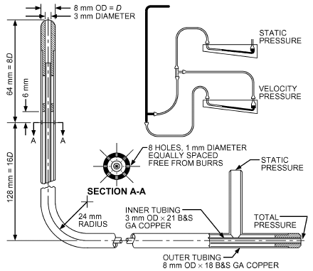

*Fig. 6 Standard Pitot Tube*

<!-- str. 980 -->

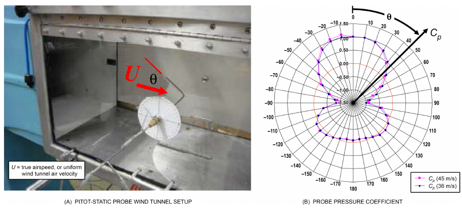

*Fig. 7 Pitot-Static Probe Pressure Coefficient Yaw Angular Dependence*

If the Mach number of the flow is greater than about 0.3, the effects of compressibility should be included in the computation of the air speed from pitot-static and impact (stagnation or pitot) tube measurements (Mease et al. 1992).

It is extremely important to recognize that the pitot-static probe is designed to make measurements when aligned with the flow. Misalignment in yaw angle of up to about 15 to 20° generally do not result in large errors; however, for greater angles, errors can be very large. For large misalignment with flow, the total pressure port of a pitot-static probe does not measure the true total (or stagnation) pressure, and the static pressure ports likewise do not measure the true static pressure of the flow stream. The error in the probe can be represented as a function of tilt (yaw or pitch) angle θ in terms of a pressure coefficient defined as follows:

> C<sub>p</sub>(θ) ≡ (p (θ) – p (θ) total static)/(p<sub>total</sub>(0°) – p<sub>static</sub>(0°))&emsp;**(6)**

where p<sub>total</sub>(θ) is the pressure registered at the total pressure port (see Figures 6 and 7A), and p<sub>static</sub>(θ) is the pressure registered at the static pressure port (see Figure 6) at tilt angle θ. Note that, at a tilt angle of 0°, the probe is correctly aligned with flow and the total pressure and static pressure are correctly registered at each of the corresponding ports.

Figure 7B shows the typical yaw (or pitch) angle dependence of a pitot-static probe subjected to a uniform velocity field U in a wind tunnel, as shown in Figure 7A. The polar plot shows the variation of pressure coefficient C<sub>p</sub>(θ) with yaw (or pitch) angle over the entire 360° range (essentially a symmetrical ±180 degrees). A pressure coefficient of C<sub>p</sub> = 1 corresponds to a situation of good alignment with the flow and thus negligible error. Note that the pressure coefficient varies from +1 to –1 over the entire range of yaw (or pitch) angles. In reverse flows (θ near 180°), output hovers around zero flow coefficient. Because the pitot-static probe does not provide a flow direction indication, it is not possible to determine the particular region of yaw (or pitch) angle operation. Therefore, the correct output for assessing volumetric flow rate (where it is desired to measure the axial flow component) cannot be determined with confidence (Hickman et al. 2012, 2015a, 2015b).

## 6.4 MEASURING FLOW IN DUCTS

Because velocity in a duct is seldom uniform across any section, and a pitot tube reading or thermal anemometer indicates velocity at only one location, a traverse is usually made to determine average velocity. Generally, velocity is lowest near the side-wall edges or corners and greatest at or near the center of a duct.

To determine velocity in a traverse plane, a straight average of individual point velocities gives satisfactory results when point velocities are determined by the **log-Tchebycheff (log-T) rule** or, if care is taken, by the **equal-area method**. Figure 8 shows suggested sensor locations for traversing round and rectangular ducts. The log-Tchebycheff rule provides the greatest accuracy because its location of traverse points accounts for the effect of wall friction and the falloff of velocity near wall ducts. For single-path disturbances (straight ducts, transitions, and elbow fittings), the equal-area method has been shown to give a consistent 3 to 4% positive bias, regardless of probe type (pitot-static, hot-wire anemometer), volumetric flow rate, or traverse location within 7.5 equivalent diameters downstream of a fitting disturbance (Hickman et al. 2012, 2015a, 2015b). The log-T method is now recommended for rectangular ducts with H and W > 460 mm. For circular ducts, the log-T and log-linear methods are similar. Log-T minimizes the positive error (measured greater than actual) caused by the failure to account for losses at the duct wall. This error can occur when using the older method of equal subareas to traverse rectangular ducts. The equal-area method is perhaps easier to implement, because it does not require nonuniform measurement grid spacing and generally specifies fewer measurement locations. Therefore, it seems reasonable to first assess the volumetric flow rate with equal area method and subsequently reduce the indicated result by approximately 3 to 4%, thereby achieving a good approximation of the log-T traverse measurement. This may be a reasonable compromise for those who do not wish to use the log-T method (Hickman et al. 2012).

When using the log-T method for a rectangular duct traverse, measure a minimum of 25 points. For a circular duct traverse, the log-linear rule and three symmetrically disposed diameters may be used (Figure 8). Points on two perpendicular diameters may be used where access is limited.

If possible, measuring points should be located at least 7.5 hydraulic diameters downstream and 3 hydraulic diameters upstream from a disturbance (e.g., caused by a turn). However, for common single-path rectangular duct fitting disturbances (60° and 90° transitions, 90° elbows), measurements can be made to uncertainties within about ±3 to 4% for traverses even as close as 1 to 2 equivalent diameters downstream of the disturbance using the log-T traverse method. Furthermore, similar results can be obtained in single-path rectangular ducts with these types disturbances using either a pitot-static probe or a hot-wire anemometer (Hickman et al. 2012).

<!-- str. 981 -->

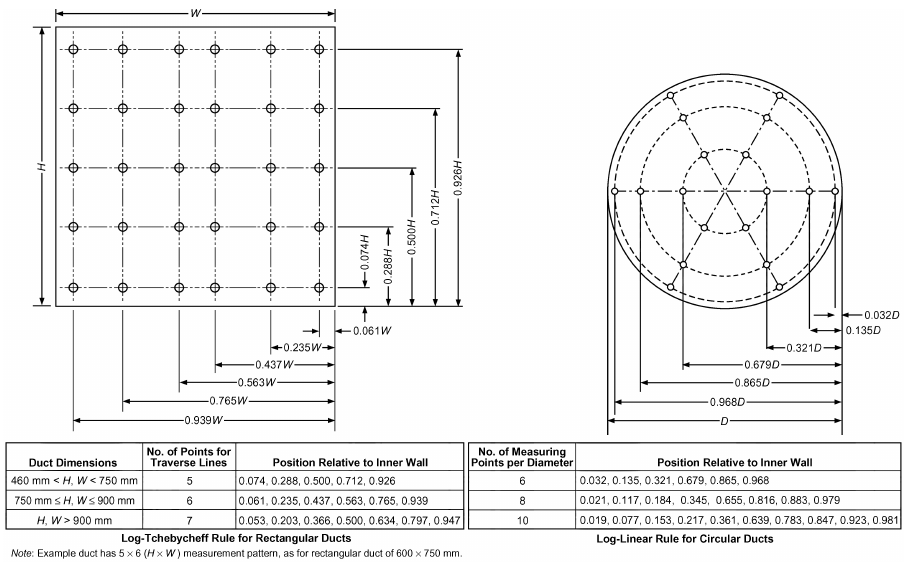

*Fig. 8 Measuring Points for Rectangular and Round Duct Traverse*

Because field-measured airflows are rarely steady and uniform, particularly near disturbances, accuracy can be improved by increasing the number of measuring points. Straightening vanes (ASHRAE Standard 51) located 1.5 duct diameters ahead of the traverse plane improve measurement precision.

When velocities at a traverse plane fluctuate, the readings should be averaged on a time-weighted basis. Two traverse readings in short succession also help to average out velocity variations that occur with time. If negative velocity pressure readings are encountered, this is an indication that highly nonuniform flows are present. From the characteristics of the pitot-static probe yaw variation shown in Figure 7, it is not possible to draw meaningful and reliable conclusions from the measurements, particularly downstream of tee fitting disturbances, where boundary layer separation occurs (which causes flow reversal) in the branch region downstream of the tee. Even if no actual reversal occurs, the flow may also be highly nonaxial, and the flow directional limitations of the pitot-static probe, as shown in Figure 7B, may still result in meaningless results. Also, it is important to note that, although the pitot-static probe can produce a negative and potentially meaningless output, it does indicate obvious flow uniformity problems. Important Note: negative velocity pressures measured by a pitot-static tube indicate an unacceptable traverse location. To achieve meaningful volumetric flow rate measurements, traverses must be performed where no negative velocity pressure values occur. The presence of negative velocity pressures (even when those values are considered to be zero-velocity values when summing and averaging) results in a completely meaningless duct flow calculation.

A hot-wire anemometer cannot indicate flow direction. Consequently, it always indicates a positive velocity, even under reverse flow. Hence, use of a thermal anemometer probe wherever flow reversals occur, such as those encountered in the downstream branch of tee fittings, can result in large errors. For traverse measurements in the downstream branch of tees, regions of apparent negative velocity pressure have been encountered as far as 7.5 equivalent diameters downstream of the tee, and are more likely to occur at high flow rates with relatively low relative branch flows (Hickman et al. 2012). These regions should be avoided when using thermal anemometers.

**Example 2.**

**Step 1. Numerical Evaluation of Duct Average Velocity.** Velocity measurements for a 610 × 610 mm square duct traverse using the log-T method are given in the following tables. Air density is ρ = 1.185 kg/m<sup>3</sup>. Air temperature and absolute pressure conditions in the duct are 30.5°C and 103.3 kPa. The top row shows the horizontal traverse point position in the duct cross section, and the left column gives the vertical traverse point position (mm) in the duct cross-section. Note that, for this duct, there are 25 measurement positions across the duct, with 5 in each direction (see Figure 8 for how these positions are determined).

### Velocity Measurements, m/s

**46 mm 175 mm 305 mm 434 mm 564 mm 46 mm** 5.644 5.878 5.578 6.253 5.761 **175 mm** 6.142 6.330 5.949 6.452 6.325 **305 mm** 6.182 6.980 6.655 6.965 6.360 **434 mm** 6.147 6.711 6.843 6.985 5.959 **564 mm** 5.796 5.781 5.690 5.832 5.928

<!-- str. 982 -->

```text
              Velocity Pressure Measurements, Pa
            46 mm     175 mm     305 mm    434 mm     564 mm
  46 mm      18.87     20.47      18.43      23.17     19.66
 175 mm      22.35     23.74      20.97      24.66     23.70
 305 mm      22.65     28.87      26.24      28.74     23.97
 434 mm      22.39     26.68      27.74      28.91     21.04
 564 mm      19.91     19.80      19.18      20.15     20.82
The average air velocity is then
```

> N
>
> 1/N∑ i

V<sub>ave</sub> = V = ((V<sub>1</sub>+ V<sub>2</sub>+ V<sub>3</sub>+ V<sub>4</sub>+ … + V<sub>N</sub>))/N = 6.203 m/s

> i=1

Alternatively, if local measurements are made in terms of velocity pressure p<sub>w</sub>, the average velocity is

> {1 <sup>N</sup> }
>
> 1 <sup>N</sup> 2

> V<sub>ave</sub> = --- V = C -- --- p
>
> ∑ i ∑ w

> { <sub>,i</sub>}
>
> N<sub>i=1</sub> ρ N

> { <sub>i=1</sub> }
>
> 25

> ({ 1 2)/(1.185 25 {)∑
>
> = [ 18.87 + 20.47

> {
>
> i=1

> }
>
> …

> + 18.43 + ] = 6.203 m/s
>
> }

> }

where the term in brackets represents the average of the square root of the individual velocity pressure measurements.

**Step 2: Numerical Evaluation of Duct Volumetric Flow Rate.** For the given duct cross-sectional area, the volumetric flow rate of air in cubic metres per second is then

> Q<sub>Actual</sub> = V<sub>ave</sub>A =(6.203 m/s)(0.610 × 0.610 m) = 2.308 m<sup>3</sup>/s

where A = 0.610 × 0.610 m is the duct cross-sectional area. The preceding actual volumetric flow rates can be converted to standard volumetric flow rates by referencing the flow rates to standard air density conditions for the same mass flow rate. The standard volumetric flow rate is the flow rate that would exist of the air were at standard air density conditions. Thus,

> ( P<sub>Actual</sub> ) (T<sub>Standard</sub>)
>
> --------------------- ---------------------

> Q<sub>Standard</sub> = Q<sub>Actua</sub>
>
> <sup>l</sup>( Standard ) ( Actual )

> P T

If standard conditions are defined as 21.1°C and 101.4 kPa, then the standard volumetric flow rate is

> ( )( )

Q<sub>Standard</sub> = (2.308 m/s) (103.3 kPa)/(101.4 kPa) (21.1 + 273.16)/(30.5 + 273.16) = 2.278 m/s

> ( )( )

Note: Different manufacturers can use different values for standard air density and standard conditions. It is very important to use a consistent set of standard conditions when comparing flow rates.

## 6.5 AIRFLOW-MEASURING HOODS

Flow-measuring hoods are portable instruments designed to measure supply or exhaust airflow through diffusers and grilles in HVAC systems. The assembly typically consists of a fabric hood section, a plastic or metal base, an airflow-measuring manifold, a meter, and handles for carrying and holding the hood in place.

For volumetric airflow measurements, the flow-measuring hood is placed over a diffuser or grille. The fabric hood captures and directs airflow from the outlet or inlet across the flow-sensing manifold in the base of the instrument. The manifold consists of a number of tubes containing upstream and downstream holes in a grid, designed to simultaneously sense and average multiple velocity points across the base of the hood. Air from the upstream holes flows through the tubes past a sensor and then exits through the downstream holes. Sensors used by different manufacturers include swinging vane anemometers, electronic micromanometers, and thermal anemometers. In electronic micromanometers, air does not actually flow through the manifold, but the airtight sensor senses the pressure differential from the upstream to downstream series of holes. The meter on the base of the hood interprets the signal from the sensor and provides a direct reading of volumetric flow in either an analog or digital display format.

As a performance check in the field, the indicated flow of a measuring hood can be compared to a duct traverse flow measurement (using a pitot-tube or thermal anemometer). All flow-measuring hoods induce some back pressure on the air-handling system because the hood restricts flow out of the diffuser. This added resistance alters the true amount of air coming out of the diffuser. In most cases, this error is negligible and is less than the accuracy of the instrument. For proportional balancing, this error need not be taken into account because all similar diffusers have about the same amount of back pressure. To determine whether back pressure is significant, a velocity traverse can be made in the duct ahead of the diffuser with and without the hood in place. The difference in average velocity of the traverse indicates the degree of back-pressure compensation required on similar diffusers in the system. For example, if the average velocity is 4.0 m/s with the hood in place and 4.1 m/s without the hood, the indicated flow reading can be multiplied by 1.025 on similar diffusers in the system (4.1/4.0 = 1.025). As an alternative, the designer of the air-handling system can predict the head-induced airflow reduction by using a curve supplied by the hood manufacturer. This curve indicates the pressure drop through the hood for different flow rates.

## 7. FLOW RATE MEASUREMENT

Various means of measuring fluid flow rate are listed in Table 5. Values for volumetric or mass flow rate measurement (ASME Standard PTC 19.5; Benedict 1984) are often determined by measuring pressure difference across an orifice, nozzle, or venturi tube. The various meters have different advantages and disadvantages. For example, the orifice plate is more easily changed than the complete nozzle or venturi tube assembly. However, the nozzle is often preferred to the orifice because its discharge coefficient is more precise. The venturi tube is a nozzle followed by an expanding recovery section to reduce net pressure loss. Differential pressure flow measurement has benefited through workshops addressing fundamental issues, textbooks, research, and improved standards (ASME Standards B40.100, MFC-1M, MFC-9M, MFC-10M; DeCarlo 1984; ISO Standards 5167:2003, 5801:2007; Mattingly 1984; Miller 1983).

Fluid meters use a wide variety of physical techniques to measure flow (ASME Standard PTC 19.5; DeCarlo 1984; Miller 1983); more common ones are described in this section. To validate accuracy of flow rate measurement instruments, calibration procedures should include documentation of traceability to the calibration facility. The calibration facility should, in turn, provide documentation of traceability to national standards.

### Flow Measurement Methods

**Direct.** Both gas and liquid flow can be measured accurately by timing a collected amount of fluid that is measured gravimetrically or volumetrically. This method is common for calibrating other metering devices, but it is particularly useful where flow rate is low or intermittent and where a high degree of accuracy is required. These systems are generally large and slow, but in their simplicity, they can be considered primary devices.

<!-- str. 983 -->

**Table 5 Volumetric or Mass Flow Rate Measurement**

| Measurement Means | Application | Nominal Range | Precision | Limitations |
|---|---|---|---|---|
| Orifice and differential pressure | Flow through pipes, ducts, and | Above Reynolds number | 1 to 5% | Discharge coefficient and accuracy |
| measurement system | plenums for all fluids | of 5000 |  | influenced by installation conditions. |
| Nozzle and differential pressure | Flow through pipes, ducts, and | Above Reynolds number | 0.5 to 2.0% | Discharge coefficient and accuracy |
| measurement system | plenums for all fluids | of 5000 |  | influenced by installation conditions. |
| Venturi tube and differential | Flow through pipes, ducts, and | Above Reynolds number | 0.5 to 2.0% | Discharge coefficient and accuracy |
| pressure measurement system | plenums for all fluids | of 5000 |  | influenced by installation conditions. |
| Timing given mass or | Liquids or gases; used to calibrate | Any | 0.1 to 0.5% | System is bulky and slow. |
| volumetric flow | other flowmeters |  |  |  |
| Rotameters | Liquids or gases | Any | 0.5 to 5.0% | Should be calibrated for fluid being metered. |
| Coriolis | Mass or volume; variable-density liquids or gases | As high as 907 kg/s | 0.05 to 1.5% |  |
| Displacement meter | Relatively small volumetric flow with high pressure loss | As high as 500 L/s, depending on type | 0.1 to 2.0% depending on type | Most types require calibration with fluid being metered. |
| Gasometer or volume displacement | Short-duration tests; used to calibrate other flowmeters | Total flow limited by available volume of containers | 0.5 to 1.0% | — |
| Thomas meter (temperature rise of | Elaborate setup justified by need | Any | 1% | Uniform velocity; usually used with |
| stream caused by electrical heating) | for good accuracy |  |  | gases. |
| Element of resistance to flow and | Used for check where system has | Lower limit set by readable | 1 to 5% | Secondary reading depends on |
| differential pressure measurement system | calibrated resistance element | pressure drop |  | accuracy of calibration. |
| Turbine flowmeters | Liquids or gases | Any | 0.25 to 2.0% | Uses electronic readout. |
| Single- or multipoint instrument | Primarily for installed air-handling | Lower limit set by accuracy | 2 to 10% | Accuracy depends on uniformity of |
| for measuring velocity at specific | systems with no special provi- | of velocity measurement |  | flow and completeness of traverse. |
| point in flow | sion for flow measurement | instrumentation |  | May be affected by disturbances near point of measurement. |
| Heat input and temperature | Check value in heater or cooler | Any | 1 to 3% | — |
| changes with steam and water coil | tests |  |  |  |
| Laminar flow element and | Measure liquid or gas volumetric | 50 mm<sup>3</sup>/s to 1 m<sup>3</sup>/s | 1% | Fluid must be free of dirt, oil, and |
| differential pressure | flow rate; nearly linear relation- |  |  | other impurities that could plug |
| measurement system | ship with pressure drop; simple and easy to use |  |  | meter or affect its calibration. |
| Magnetohydrodynamic flowmeter | Measures electrically conductive | 0.006 to 600 L/s | 1% | At present state of the art, |
| (electromagnetic) | fluids, slurries; meter does not obstruct flow; no moving parts |  |  | conductivity of fluid must be greater than 5 μmho/cm. |
| Swirl flowmeter and vortex | Measure liquid or gas flow in pipe; | Above Reynolds number | 1% | — |
| shedding meter | no moving parts | of 10<sup>4</sup> |  |  |

The **variable-area meter** or **rotameter** is a convenient direct-reading flowmeter for liquids and gases. This is a vertical, tapered tube in which the flow rate is indicated by the position of a float suspended in the upward flow. The float’s position is determined by its buoyancy and the upward fluid drag.

Displacement meters measure total liquid or gas flow over time. The two major types of displacement meters used for gases are the conventional gas meter, which uses a set of bellows, and the wet test meter, which uses a water displacement principle.

**Indirect.** The **Thomas meter** is used in laboratories to measure high gas flow rates with low pressure losses. Gas is heated by electric heaters, and the temperature rise is measured by two resistance thermometer grids. When heat input and temperature rise are known, the mass flow of gas is calculated as the quantity of gas that removes the equivalent heat at the same temperature rise.

A velocity traverse (made using a pitot tube or other velocitymeasuring instrument) measures airflow rates in the field or calibrates large nozzles. This method can be imprecise at low velocities and impracticable where many test runs are in progress.

Another field-estimating method measures pressure drop across elements with known pressure drop characteristics, such as heating and cooling coils or fans. If the pressure drop/flow rate relationship has been calibrated against a known reference (typically, at least four points in the operating range), the results can be precise. If the method depends on rating data, it should be used for check purposes only.

## 7.1 VENTURI, NOZZLE, AND ORIFICE FLOWMETERS

Flow in a pipeline can be measured by a venturi meter (Figure 9), flow nozzle (Figure 10), or orifice plate (Figure 11). American Society of Mechanical Engineers (ASME) Standard MFC-3M describes measurement of fluid flow in pipes using the orifice, nozzle, and venturi; ASME Standard PTC 19.5 specifies their construction.

Assuming an incompressible fluid (liquid or slow-moving gas), uniform velocity profile, frictionless flow, and no gravitational effects, the principle of conservation of mass and energy can be applied to the venturi and nozzle geometries to give

> w = ρV<sub>1</sub>A<sub>1</sub> = ρV<sub>2</sub>A<sub>2</sub> = A<sub>2</sub> (2ρ( p<sub>1</sub>– p<sub>2</sub>))/(1 – β<sup>4</sup>)&emsp;**(7)**

<!-- str. 984 -->

where

- w = mass flow rate, kg/s
- V = velocity of stream, m/s
- A = flow area, m<sup>2</sup>
- ρ = density of fluid, kg/m<sup>3</sup>
- p = absolute pressure, Pa
- β = ratio of diameters D<sub>2</sub>/D<sub>1</sub> for venturi and sharp-edge orifice and d/D for flow nozzle, where D = pipe diameter and d = throat diameter

Note: Subscript 1 refers to entering conditions; subscript 2 refers to throat conditions.

Because flow through the meter is not frictionless, a correction factor C is defined to account for friction losses. If the fluid is at a high temperature, an additional correction factor F<sub>a</sub> should be included to account for thermal expansion of the primary element. Because this amounts to less than 1% at 260°C, it can usually be omitted. Equation (7) then becomes

> w = CA<sub>2</sub> (2ρ( p<sub>1</sub>– p<sub>2</sub>))/(1 – β<sup>4</sup>)&emsp;**(8)**

where C is the friction loss correction factor.

The factor C is a function of geometry and Reynolds number. Values of C are given in ASME Standard PTC 19.5. The jet passing through an orifice plate contracts to a minimum area at the vena contracta located a short distance downstream from the orifice plate. The contraction coefficient, friction loss coefficient C, and approach factor 1/(1 − β<sup>4</sup>)<sup>0.5</sup> can be combined into a single constant K, which is a function of geometry and Reynolds number. The orifice flow rate equations then become

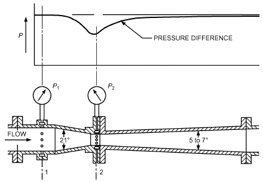

*Fig. 9 Typical Herschel-Type Venturi Meter*

> Q = KA<sub>2</sub> (2( p<sub>1</sub>– p<sub>2</sub>))/ρ&emsp;**(9)**

where

- Q = discharge flow rate, m<sup>3</sup>/s
- A<sub>2</sub> = orifice area, m<sup>2</sup>
- p<sub>1</sub> − p<sub>2</sub> = pressure drop as obtained by pressure taps, Pa

Values of K are shown in ASME Standard PTC 19.5.

Valves, bends, and fittings upstream from the flowmeter can cause errors. Long, straight pipes should be installed upstream and downstream from flow devices to ensure fully developed flow for proper measurement. ASHRAE Standard 41.8 specifies upstream and downstream pipe lengths for measuring flow of liquids with an orifice plate. ASME Standard PTC 19.5 gives piping requirements between various fittings and valves and the venturi, nozzle, and orifice. If these conditions cannot be met, flow conditioners or straightening vanes can be used (ASME Standards PTC 19.5, MFC-10M; Mattingly 1984; Miller 1983).

Compressibility effects must be considered for gas flow if pressure drop across the measuring device is more than a few percent of the initial pressure.

Nozzles are sometimes arranged in parallel pipes from a common manifold; thus, the capacity of the testing equipment can be changed by shutting off the flow through one or more nozzles. An apparatus designed for testing airflow and capacity of air-conditioning equipment is described by Wile (1947), who also presents pertinent information on nozzle discharge coefficients, Reynolds numbers, and resistance of perforated plates. Some laboratories refer to this apparatus as a code tester.

## 7.2 VARIABLE-AREA FLOWMETERS

> **(ROTAMETERS)**

In permanent installations where high precision, ruggedness, and operational ease are important, the variable-area flowmeter is satisfactory. It is frequently used to measure liquids or gases in small-diameter pipes. For ducts or pipes over 150 mm in diameter, the expense of this meter may not be warranted. In larger systems, From ASME PTC 19.5. Reprin ted with permission of ASME.

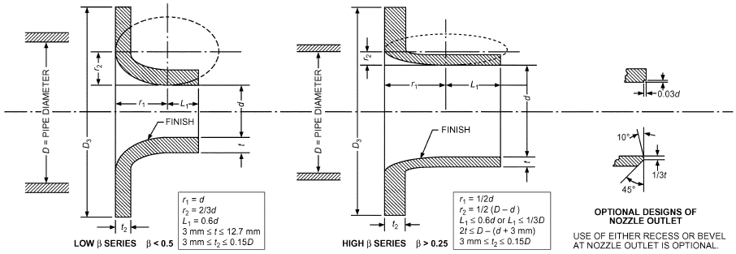

*Fig. 10 Dimensions of ASME Long-Radius Flow Nozzles*

<!-- str. 985 -->

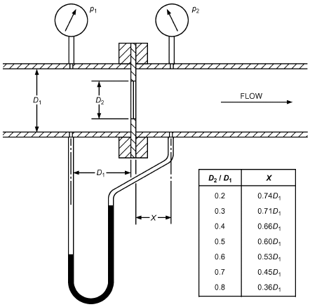

*Fig. 11 Sharp-Edge Orifice with Pressure Tap Locations*

From ASME PTC 19.5. Reprinted with permission of ASME.

however, the meter can be placed in a bypass line and used with an orifice.

The variable-area meter (Figure 12) commonly consists of a float that is free to move vertically in a transparent tapered tube. The fluid to be metered enters at the narrow bottom end of the tube and moves upward, passing at some point through the annulus formed between the float and the inside wall of the tube. At any particular flow rate, the float assumes a definite position in the tube; a calibrated scale on the tube shows the float’s location and the fluid flow rate.

The float’s position is established by a balance between the fluid pressure forces across the annulus and gravity on the float. The buoyant force V<sub>f</sub>(ρ<sub>f</sub> – ρ)g supporting the float is balanced by the pressure difference acting on the cross-sectional area of the float A<sub>f</sub>Δp, where ρ<sub>f</sub>, A<sub>f</sub>, and V<sub>f</sub> are, respectively, the float density, float cross-sectional area, and float volume. The pressure difference across the annulus is

> Δp = (V<sub>f</sub>(ρ<sub>f</sub> – ρ)g)/A<sub>f</sub>&emsp;**(10)**

The mass flow follows from Equation (9) as

> w = KA<sub>2</sub> (2V<sub>f</sub> (ρ<sub>f</sub> – ρ)gρ)/A<sub>f</sub>&emsp;**(11)**

Flow for any fluid is nearly proportional to the area, so that calibration of the tube is convenient. To use the meter for different fluids, the flow coefficient variation for any float must be known. Float design can reduce variation of the flow coefficient with Reynolds number; float materials can reduce the dependence of mass flow calibration on fluid density.

## 7.3 CORIOLIS PRINCIPLE FLOWMETERS

Coriolis liquid flowmeters directly measure liquid mass flow rates. In a Coriolis flowmeter, the liquid flows through a vibrating sensor tube within the meter. An electromagnetic coil located on the sensor tube vibrates the tube in cantilever motion at a known frequency. The liquid enters the vibrating tube and is given the vertical momentum of the tube. The liquid in the entry portion of the sensor tube resists in the downward direction when the tube is moving upward. Conversely, when the tube is moving downward, the liquid in the exit portion of the sensor tube resists in the upward direction. Combined, these effects create a symmetrical twist angle. According to Newton’s second law of motion, the amount of sensor tube twist angle is directly proportional to the mass flow rate of liquid flowing through the tube. Electromagnetic velocity sensors on opposing sides of the sensor tube measure the velocity of the vibrating tube. Mass flow rate is determined by measuring the time difference in the velocity measurements: the greater the time difference, the greater the mass flow rate. The measuring tubes are vibrated at their natural frequency; a change of the fluid mass inside the tubes causes a corresponding change to the tube’s natural frequency. The frequency change of the tube is used to calculate the fluid density.

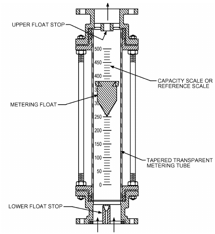

*Fig. 12 Variable-Area Flowmeter*

## 7.4 POSITIVE-DISPLACEMENT METERS

Many positive-displacement meters are available for measuring total liquid or gas volumetric flow rates. The measured fluid flows progressively into compartments of definite size. As the compartments fill, they rotate so that the fluid discharges from the meter. The flow rate through the meter equals the product of the compartment volume, number of compartments, and rotation rate of the rotor. Most of these meters have a mechanical register calibrated to show total flow.

## 7.5 TURBINE FLOWMETERS

Turbine flowmeters are volumetric flow-rate-sensing meters with a magnetic stainless steel turbine rotor suspended in the flow stream of a nonmagnetic meter body. The fluid stream exerts a force on the blades of the turbine rotor, setting it in motion and converting the fluid’s linear velocity to an angular velocity. Design motivation for turbine meters is to have the rotational speed of the turbine proportional to the average fluid velocity and thus to the volume rate of fluid flow (DeCarlo 1984; Mattingly 1992; Miller 1983).

<!-- str. 986 -->

The rotor’s rotational speed is monitored by an externally mounted pickoff assembly. The **magnetic pickoff** contains a permanent magnet and coil. As the turbine rotor blades pass through the field produced by the permanent magnet, a shunting action induces AC voltage in the winding of the coil wrapped around the magnet. A sine wave with a frequency proportional to the flow rate develops. With the **radio frequency pickoff**, an oscillator applies a high-frequency carrier signal to a coil in the pickoff assembly. The rotor blades pass through the field generated by the coil and modulate the carrier signal by shunting action on the field shape. The carrier signal is modulated at a rate corresponding to the rotor speed, which is proportional to the flow rate. With both pickoffs, pulse frequency is a measure of flow rate, and the total number of pulses measures total volume (Mattingly 1992; Shafer 1961; Woodring 1969).

Because output frequency of the turbine flowmeter is proportional to flow rate, every pulse from the turbine meter is equivalent to a known volume of fluid that has passed through the meter; the sum of these pulses yields total volumetric flow. Summation is done by electronic counters designed for use with turbine flowmeters; they combine a mechanical or electronic register with the basic electronic counter.

Turbine flowmeters should be installed with straight lengths of pipe upstream and downstream from the meter. The length of the inlet and outlet pipes should be according to manufacturers’ recommendations or pertinent standards. Where recommendations of standards cannot be accommodated, the meter installation should be calibrated. Some turbine flowmeters can be used in bidirectional flow applications. A fluid strainer, used with liquids of poor or marginal lubricity, minimizes bearing wear.

The lubricity of the process fluid and the type and quality of rotor bearings determine whether the meter is satisfactory for the particular application. When choosing turbine flowmeters for use with fluorocarbon refrigerants, pay attention to the type of bearings used in the meter and to the refrigerant’s oil content. For these applications, sleeve-type rather than standard ball bearings are recommended. The amount of oil in the refrigerant can severely affect calibration and bearing life.

In metering liquid fluorocarbon refrigerants, the liquid must not flash to a vapor (cavitate), which tremendously increases flow volume. Flashing results in erroneous measurements and rotor speeds that can damage bearings or cause a failure. Flashing can be avoided by maintaining adequate back pressure on the downstream side of the meter (Liptak 1972).

## 7.6 ELECTROMAGNETIC (MAG) FLOWMETERS

Magnetic flowmeters operate on the principle of Faraday’s law of induction that states that the electromotive force induced in a circuit equals the negative of the time rate of change of the magnetic flux through the circuit. In a magnetic flowmeter, a magnetic field is electrically generated and channeled into the liquid flowing through the pipe. Faraday’s law states that the voltage generated is proportional to the movement of the flowing liquid. Electronics in a magnetic flowmeter sense voltage and determine the volumetric flow rate. Magnetic tube flowmeters have no flow obstructions, so the pressure loss in these flowmeters is less than for many other types of flowmeters. Magnetic flowmeters require a minimum electrical conductivity. Most HVAC&R liquids have enough electrical conductivity to be used with these flowmeters.

## 7.7 VORTEX-SHEDDING FLOWMETERS

Vortex-shedding flowmeters are used to determine liquid velocities. Piezoelectric methods, strain-gage methods, or hot-film methods are used to sense dynamic pressure variations created by vortex shedding. The operating principle for these flowmeters is based on vortex shedding that occurs downstream of an immersed blunt-shaped solid body. As the liquid stream passes a blunt-shaped body, the liquid separates and generates small vortices that are shed alternately along and downstream of each side of the blunt-shaped body. Each vortex-shedding meter is designed to have a constant Strouhal number so that the vortex shedding frequency is proportional to the liquid flow velocity over a specified flow velocity range. The Strouhal number for each vortex shedding meter is experimentally determined by the flowmeter manufacturer and is provided with each vortex-shedding meter.

## 8. AIR INFILTRATION, AIRTIGHTNESS, AND OUTDOOR AIR VENTILATION RATE MEASUREMENT

**Air infiltration** is the flow of outdoor air into a building through unintentional openings. **Airtightness** refers to the building envelope’s ability to withstand flow when subjected to a pressure differential. The **outdoor air ventilation rate** is the rate of outdoor airflow intentionally introduced to the building for dilution of occupant- and building-generated contaminants. Measurement approaches to determine these factors are described briefly here, and in greater detail in Chapter 16.

Air infiltration depends on the building envelope’s airtightness and the pressure differentials across the envelope. These differentials are induced by wind, stack effect, and operation of building mechanical equipment. For meaningful results, the air infiltration rate should be measured under typical conditions.

Airtightness of a residential building’s envelope can be measured relatively quickly using building pressurization tests. In this technique, a large fan or blower mounted in a door or window induces a large and roughly uniform pressure difference across the building shell. The airflow required to maintain this pressure difference is then measured. The more leakage in the building, the more airflow is required to induce a specific indoor/outdoor pressure difference. Building airtightness is characterized by the airflow rate at a reference pressure, normalized by the building volume or surface area. Under proper test conditions, results of a pressurization test are independent of weather conditions. Instrumentation requirements for pressurization testing include air-moving equipment, a device to measure airflow, and a differential pressure gage.

Commercial building envelope leakage can also be measured using building pressurization tests. Bahnfleth et al. (1999) describe a protocol for testing envelope leakage of tall buildings using the building’s air-handling equipment.

Outdoor airflow can be measured directly using the flow rate measurement techniques described in this chapter. The flow measurement equipment must be appropriate for the required accuracy, operating conditions, range of airflows, and temperatures expected. The outdoor airflow rate is normally measured during testing and balancing, during commissioning, or for continuous ventilation flow rate control using permanently mounted flow sensors.

An additional factor that may be of interest is the building’s air exchange rate, which compares airflow into the building with the building’s volume. Typically, this includes both mechanical ventilation and infiltration. Building air exchange rates can be measured by injecting a tracer gas (ideally, a chemically stable, nontoxic gas not normally present in buildings) into a building and monitoring and analyzing the tracer gas concentration response. Equipment required for tracer testing includes (1) a means of injecting the tracer gas and (2) a tracer gas concentration measurement device, such as a gas chromatograph. Various tracer gas techniques are used, distinguished by their injection strategy and analysis approach. These techniques include constant concentration (equilibrium tracer), decay or growth (ASTM Standard E741), and constant injection. Decay is the simplest of these techniques, but the other methods may be satisfactory if care is taken. A common problem in tracer gas testing is poor mixing of the tracer gas with the airstreams being measured.

<!-- str. 987 -->

### Carbon Dioxide

Carbon dioxide is often used as a tracer gas because CO<sub>2</sub> gas monitors are relatively inexpensive and easy to use, and occupantgenerated CO<sub>2</sub> can be used for most tracer gas techniques. Bottled CO<sub>2</sub> or CO<sub>2</sub> fire extinguishers are also readily available for tracer gas injection. Carbon dioxide may be used as a tracer gas to measure ventilation rates under the conditions and methods described in ASTM Standard D6245, for diagnostic purposes and point-intime snapshots of the system’s ventilation capabilities. CO<sub>2</sub> sensors are also used in building controls strategies to avoid overventilation by approximating the level of occupancy in a space; this is one method of demand-controlled ventilation. The concentration output may be used in a mathematical formula that allows the system to modulate ventilation rates when spaces with high density have highly variable or intermittent occupancy (e.g., churches, theaters, gymnasiums). This method of control is less effective in lowerdensity occupancies and spaces with more stable populations (Persily and Emmerich 2001). Carbon dioxide may also be used together with outdoor air intake rate data to estimate the current population of a space.

CO<sub>2</sub> input for ventilation control does not address contaminants generated by the building itself, and therefore cannot be used without providing a base level of ventilation for non-occupant-generated contaminants that have been shown to total a significant fraction if not a majority of those found in the space.

## 9. CARBON DIOXIDE MEASUREMENT

Carbon dioxide has become an important measurement parameter for HVAC&R engineers, particularly in indoor air quality (IAQ) applications. Although CO<sub>2</sub> is generally not of concern as a specific toxin in indoor air, it is used as a surrogate indicator of odor related to human occupancy. ANSI/ASHRAE Standard 62.1 recommends specific minimum outdoor air ventilation rates to ensure adequate indoor air quality.

## 9.1 NONDISPERSIVE INFRARED CO

> 2

### DETECTORS

The most widespread technology for IAQ applications is the nondispersive infrared (NDIR) sensor (Figure 13). This device uses the strong absorption band that CO<sub>2</sub> produces at 4.2 μm when excited by an infrared light source. IAQ-specific NDIR instruments, calibrated between 0 and 5000 ppm, are typically accurate within 150 ppm, but the accuracy of some sensors can be improved to within 50 ppm if the instrument is calibrated for a narrower range. Portable NDIR meters are available with direct-reading digital displays; however, response time varies significantly among different instruments. Most NDIR cell designs facilitate very rapid CO<sub>2</sub> sample diffusion, although some instruments now in widespread use respond more slowly, resulting in stabilization times greater than 5 min (up to 15 min), which may complicate walk-through inspections. CO<sub>2</sub> instruments can be classified as either single or dual wavelength. Single-wavelength instruments contain a single spectral filter at the absorption band of CO<sub>2</sub>. This configuration is prone to drift as the infrared source ages and loses intensity. These instruments often use a self-adjustment procedure to compensate and require periodic exposure to outdoor CO<sub>2</sub> levels of approximately 400 ppm during periods when a building is unoccupied. This makes it impractical for buildings such as hospitals that are always occupied. Dual-wavelength instruments contain two spectral filters: one at the absorption band of CO<sub>2</sub> and one at a wavelength unaffected by any gases. This second filter allows the instrument to monitor the intensity of the infrared source to directly compensate for source aging.

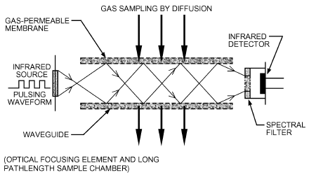

*Fig. 13 Nondispersive Infrared Carbon Dioxide Sensor*

### Calibration

In a clean, stable environment, NDIR sensors can hold calibration for months, but condensation, dust, dirt, and mechanical shock may offset calibration. As with all other CO<sub>2</sub> sensor technologies, NDIR sensor readings are proportional to pressure, because the density of gas molecules changes when the sample pressure changes. This leads to errors in CO<sub>2</sub> readings when the barometric pressure changes from the calibration pressure. Weather-induced errors are small but should be considered when using CO<sub>2</sub> instruments at an altitude that is significantly different form the calibration altitude. Some instruments can accept a user adjustment to compensate for altitude. Instruments that do not have this ability should be recalibrated.

Some NDIR sensors are sensitive to cooling effects when placed in an airstream. This is an important consideration when locating a fixed sensor or when using a portable system to evaluate air-handling system performance, because airflow in supply and return ducts may significantly shift readings.

### Applications

Nondispersive infrared sensors are well suited for equilibrium tracer and tracer decay ventilation studies, and faster-response models are ideal for a quick, basic evaluation of human-generated pollution and ventilation adequacy. When properly located, these sensors are also appropriate for continuous monitoring and for control strategies using equilibrium tracer and air fraction tracer calculations.

## 9.2 AMPEROMETRIC ELECTROCHEMICAL CO DETECTORS

> 2

Amperometric electrochemical CO<sub>2</sub> sensors (Figure 14) use a measured current driven between two electrodes by the reduction of CO<sub>2</sub> that diffuses across a porous membrane. Unlike NDIR sensors, which normally last the lifetime of the instrument, electrochemical CO<sub>2</sub> sensors may change in electrolyte chemistry over time (typically 12 to 18 months) and should be replaced periodically. These sensors typically hold their calibration for several weeks, but they may drift more if exposed to low humidity; this drift makes them less suitable for continuous monitoring applications. At low humidity (below 30% rh), the sensors must be kept moist to maintain specified accuracy.

Amperometric electrochemical sensors require less power than NDIR sensors, usually operating continuously for weeks where NDIR instruments typically operate for 6 h (older models) to 150 h (newer models). The longer battery life can be advantageous for spot checks and walk-throughs, and for measuring CO<sub>2</sub> distribution throughout a building and within a zone. Unlike most NDIR sensors, amperometric electrochemical sensors are not affected by high humidity, although readings may be affected if condensate is allowed to form on the sensor.

<!-- str. 988 -->

## 9.3 PHOTOACOUSTIC CO DETECTORS

> 2

### Open-Cell Sensors

Open-cell photoacoustic CO<sub>2</sub> sensors (Figure 15) operate as air diffuses through a permeable membrane into a chamber that is pulsed with filtered light at the characteristic CO<sub>2</sub> absorption frequency of 4.2 μm. The light energy absorbed by the CO<sub>2</sub> heats the sample chamber, causing a pressure pulse, which is sensed by a piezoresistor. Open-cell photoacoustic CO<sub>2</sub> sensors are presently unavailable in portable instruments, in part because any vibration during transportation would affect calibration and might affect the signal obtained for a given concentration of CO<sub>2</sub>. Ambient acoustical noise may also influence readings. For continuous monitoring, vibration is a concern, as are temperature and airflow cooling effects. However, if a sensor is located properly and the optical filter is kept relatively clean, photoacoustic CO<sub>2</sub> sensors may be very stable. Commercially available open-cell photoacoustic transmitters do not allow recalibration to adjust for pressure differences, so an offset should be incorporated in any control system using these sensors at an altitude or duct pressure other than calibration conditions.

### Closed-Cell Sensors

Closed-cell photoacoustic sensors (Figure 16) operate under the same principle as the open-cell version, except that samples are pumped into a sample chamber that is sealed and environmentally stabilized. Two acoustic sensors are sometimes used in the chamber to minimize vibration effects. Closed-cell units, available as portable or fixed monitors, come with particle filters that are easily replaced (typically at 3- to 6-month intervals) if dirt or dust accumulates on them. Closed-cell photoacoustic monitors allow recalibration to correct for drift, pressure effects, or other environmental factors that might influence accuracy.

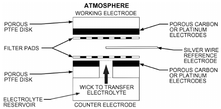

*Fig. 14 Amperometric Carbon Dioxide Sensor*

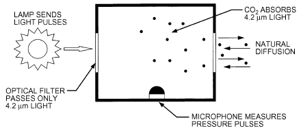

*Fig. 15 Open-Cell Photoacoustic Carbon Dioxide Sensor*

## 9.4 POTENTIOMETRIC ELECTROCHEMICAL CO DETECTORS

> 2

Potentiometric electrochemical CO<sub>2</sub>sensors use a porous fluorocarbon membrane that is permeable to CO<sub>2</sub>, which diffuses into a carbonic acid electrolyte, changing the electrolyte’s pH. This change is monitored by a pH electrode inside the cell. The pH electrode isopotential drift prohibits long-term monitoring to the accuracy and resolution required for continuous measurement or control or for detailed IAQ evaluations, although accuracy within 100 ppm, achievable short-term over the 2000 ppm range, may be adequate for basic ventilation and odor evaluations. In addition, this type of sensor has a slow response, which increases the operator time necessary for field applications or for performing a walk-through of a building.

## 9.5 COLORIMETRIC DETECTOR TUBES

Colorimetric detector tubes contain a chemical compound that discolors in the presence of CO<sub>2</sub> gas, with the amount of discoloration related to the CO<sub>2</sub> concentration. These detector tubes are often used to spot-check CO<sub>2</sub> levels; when used properly, they are accurate to within 25%. If numerous samples are taken (i.e., six or more), uncertainty may be reduced. However, CO<sub>2</sub> detector tubes are generally not appropriate for specific ventilation assessment because of their inaccuracy and inability to record concentration changes over time.

## 9.6 LABORATORY MEASUREMENTS

Laboratory techniques for measuring CO<sub>2</sub> concentration include mass spectroscopy, thermal conductivity, infrared spectroscopy, and gas chromatography. These techniques typically require taking on-site **grab samples** for laboratory analysis. Capital costs for each piece of equipment are high, and significant training is required. A considerable drawback to grab sampling is that CO<sub>2</sub> levels change significantly during the day and over the course of a week, making it sensible to place sensors on site with an instrument capable of recording or data logging measurements continuously over the course of a workweek. An automated grab sampling system capturing many samples of data would be quite cumbersome and expensive if designed to provide CO<sub>2</sub> trend information over time. However, an advantage to laboratory techniques is that they can be highly accurate. A mass spectrometer, for example, can measure CO<sub>2</sub> concentration to within 5 ppm from 0 to 2000 ppm. All laboratory measurement techniques are subject to errors resulting from interfering agents. A gas chromatograph is typically used in conjunction with the mass spectrometer to eliminate interference from nitrous oxide (N<sub>2</sub>O), which has an equivalent mass, if samples are collected in a hospital or in another location where N<sub>2</sub>O might be present.

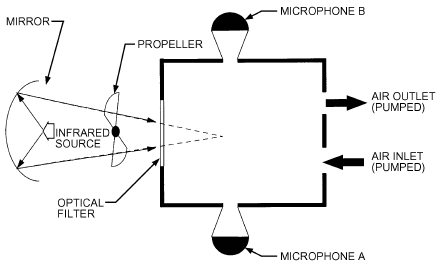

*Fig. 16 Closed-Cell Photoacoustic Carbon Dioxide Sensor*

<!-- str. 989 -->

## 10. ELECTRIC MEASUREMENT

### Ammeters

Ammeters are low-resistance instruments for measuring current. They should be connected in series with the circuit being measured (Figure 17). Ideally, they have the appearance of a short circuit, but in practice, all ammeters have a nonzero input impedance that influences the measurement to some extent.

Ammeters often have several ranges, and it is good practice when measuring unknown currents to start with the highest range and then reduce the range to the appropriate value to obtain the most sensitive reading. Ammeters with range switches maintain circuit continuity during switching. On some older instruments, it may be necessary to short-circuit the ammeter terminals when changing the range.

Current transformers are often used to increase the operating range of ammeters. They may also provide isolation/protection from a high-voltage line. Current transformers have at least two separate windings on a magnetic core (Figure 18). The primary winding is connected in series with the circuit in which the current is measured. In a clamp-on probe, the transformer core is actually opened and then connected around a single conductor carrying the current to be measured. That conductor serves as the primary winding. The secondary winding carries a scaled-down version of the primary current, which is connected to an ammeter. Depending on instrument type, the ammeter reading may need to be multiplied by the ratio of the transformer.

When using an auxiliary current transformer, the secondary circuit must not be open when current is flowing in the primary winding; dangerously high voltage may exist across the secondary terminals. A short-circuiting blade between the secondary terminals should be closed before the secondary circuit is opened at any point.

Transformer accuracy can be impaired by residual magnetism in the core when the primary circuit is opened at an instant when flux is large. The transformer core may be left magnetized, resulting in ratio and phase angle errors. The primary and secondary windings should be short-circuited before making changes.

### Voltmeters

Voltmeters are high-resistance instruments that should be connected across the load (in parallel), as shown in Figure 19. Ideally, they have the appearance of an open circuit, but in practice, all voltmeters have some finite impedance that influences measurement to some extent.

Voltage transformers are often used to increase the operating range of a voltmeter (Figure 20). They also provide isolation from high voltages and prevent operator injury. Like current transformers, voltage transformers consist of two or more windings on a magnetic core. The primary winding is generally connected across the high voltage to be measured, and the secondary winding is connected to the voltmeter. It is important not to short-circuit the secondary winding of a voltage transformer.

### Wattmeters

Wattmeters measure the active power of an AC circuit, which equals the voltage multiplied by that part of the current in phase with the voltage. There are generally two sets of terminals: one to connect the load voltage and the other to connect in series with the load current. Current and voltage transformers can be used to extend the range of a wattmeter or to isolate it from high voltage. Figures 21 and

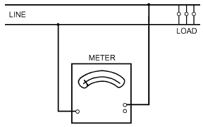

*Fig. 17 Ammeter Connected in Fig. 18 Ammeter with Current Fig. 19 Voltmeter Connected Power Circuit Transformer Across Load*

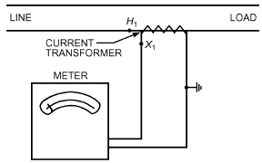

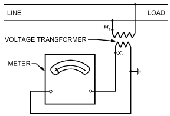

*Fig. 20 Voltmeter with Potential Fig. 21 Wattmeter in Single-Phase Fig. 22 Wattmeter in Single-Phase*

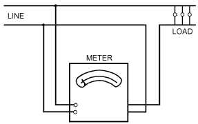

### Transformer Circuit Measuring Po

**wer Load plus Loss Circuit Measuring Power Load plus Loss**

> **in Current-Coil Circuit in Potential-Coil Circuit**

<!-- str. 990 -->

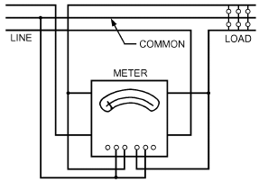

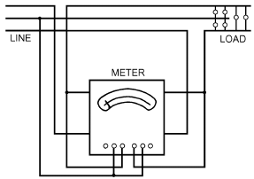

*Fig. 23 Wattmeter with Current and Fig. 24 Polyphase Wattmeter in Two- Fig. 25 Polyphase Wattmeter in Potential Transformer Phase, Three-Wire Circuit with Balanced Three-Phase, Three-Wire Circuit or Unbalanced Voltage or Load*

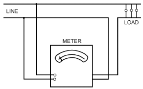

*Fig. 26 Single-Phase Power-Factor Meter*

22 show connections for single-phase wattmeters, and Figure 23 shows use of current and voltage transformers with a single-phase wattmeter.

Wattmeters with multiple current and voltage elements are available to measure polyphase power. Polyphase wattmeter connections are shown in Figures 24 and 25.

### Power-Factor Meters

Power-factor meters measure the ratio of active to apparent power (product of voltage and current). Connections for power-factor meters and wattmeters are similar, and current and voltage transformers can be used to extend their range. Connections for single-phase and polyphase power-factor meters are shown in Figures 26 and 27, respectively.

## 11. ROTATIVE SPEED AND POSITION MEASUREMENT

### Tachometers

Tachometers, or direct-measuring rpm counters, vary from hand-held mechanical or electric meters to shaft-driven and electronic pulse counters. They are used in general laboratory and shop work to check rotative speeds of motors, engines, and turbines.

### Stroboscopes

Optical rpm counters produce a controlled high-speed electronic flashing light, which the operator directs on a rotating member, increasing the rate of flashes until reaching synchronism (the optical effect that rotation has stopped). At this point, the rpm measured is equal to the flashes per minute emitted by the strobe unit. Care must be taken to start at the bottom of the instrument scale and work up because multiples of the rpm produce almost the same optical effect as true synchronism. Multiples can be indicated by positioning suitable marks on the shaft, such as a bar on one side and a circle on the opposite side. If, for example, the two are seen superimposed, then the strobe light is flashing at an even multiple of the true rpm.

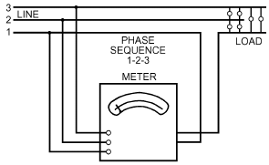

*Fig. 27 Three-Wire, Three-Phase Power-Factor Meter*

### AC Tachometer-Generators

A tachometer-generator consists of a rotor and a stator. The rotor is a permanent magnet driven by the equipment. The stator is a winding with a hole through the center for the rotor. Concentricity is not critical; bearings are not required between rotor and stator. The output can be a single-cycle-per-revolution signal whose voltage is a linear function of rotor speed. The polypole configuration that generates 10 cycles per revolution allows measurement of speeds as low as 20 rpm without causing the indicating needle to flutter. The output of the AC tachometer-generator is rectified and connected to a DC voltmeter.

### Optical (Shaft) Encoders

Optical encoders and linear glass scales can be used to measure rotational speed and both linear and angular position, depending on the geometry of the encoder. The output from an encoder is typically in the form of a pulse train. If this pulse train provides an indication of the absolute orientation (angle or position), it is called an **abso- lute encoder**. If it produces a relative pulse train with no absolute angle or position reference, it is called an **incremental encoder**. Modern high-resolution rotational (shaft) encoders typically consist of a shaft-mounted rotating disk containing regularly spaced slits. A light source is located on one side of the disk slits and a detector on the other side of the slits. As the disk rotates at a given frequency, a pulse train is produced at the detector from the intermittent pulses of light that pass through the rotating slits. Linear displacement encoders (absolute or incremental) operate on a similar principle, except that the slits are formed in a linear axis. Although modern encoders are typically optical, a resistive potentiometer can also be used as a position or rotation encoder, the output resistance being a direct indication of position or orientation.

<!-- str. 991 -->

## 12. SOUND AND VIBRATION MEASUREMENT

Measurement systems for determining sound pressure level, intensity level, and mechanical vibration generally use transducers to convert mechanical signals into electrical signals, which are then processed electronically or digitally to characterize the measured mechanical signals. These measurement systems contain one or more of the following elements, which may or may not be contained in a single instrument:

- A transducer, or an assembly of transducers, to convert sound pressure or mechanical vibration (time-varying strain, displacement, velocity, acceleration, or force) into an electrical signal that is quantitatively related to the mechanical quantity being measured
- Preamplifiers and amplifiers to provide functions such as preconditioning and amplification of signals, electrical impedance matching, signal conditioning, and gain
- Signal-processing equipment to quantify those aspects of the signal that are being measured (peak value, rms value, time-weighted average level, power spectral density, or magnitude or phase of a complex linear spectrum or transfer function) and conduct integration, differentiation, and frequency weighting of the signal
- Display and storage devices such as meters, oscilloscopes, digital displays, or level recorder to display and record the signal or the aspects of it that are being quantified
- An interface that allows cable, wireless, or memory card output

The relevant range of sound signals (i.e., audible to humans) can vary over more than six orders of magnitude in amplitude and more than three orders of magnitude in frequency, depending on the application. The relevant range of vibration signals may be slightly larger than this. References on instrumentation, measurement procedures, and signal analysis are given in the Bibliography. Product and application notes, technical reviews, and books published by instrumentation manufacturers are sources of additional reference material. See Chapter 48 of the 2019 *ASHRAE Handbook—HVAC Applica-* tions and Chapter 8 of this volume for further information on sound and vibration.

## 12.1 SOUND MEASUREMENT

### Microphones

A microphone is a transducer that transforms an acoustical signal into an electrical signal. The two predominant transduction principles used in sound measurement (as opposed to broadcasting) are the electrostatic and the piezoelectric. **Electrostatic (capacitor) microphones** are available either as electret microphones, which do not require an external polarizing voltage, or as condenser microphones, which do require an external polarizing voltage, typically in the range of 28 to 200 V (DC). **Piezoelectric microphones** may be manufactured using either natural piezoelectric crystals or poled ferroelectric crystals. The types of response characteristics of measuring microphones are pressure, free field, and random incidence (diffuse field).

The sensitivity and the frequency range over which the microphone has uniform sensitivity (flat frequency response) vary with sensing element diameter (surface area) and microphone type. Other critical factors that may affect microphone/preamplifier performance or response are atmospheric pressure, temperature, relative humidity, external magnetic and electrostatic fields, mechanical vibration, and radiation. Microphone selection is based on longand short-term stability; the match between performance characteristics (e.g., sensitivity, frequency response, amplitude linearity, self-noise) and the expected amplitude of sound pressure, frequency, range of analysis, and expected environmental conditions of measurement; and any other pertinent considerations, such as size and directional characteristics.

### Sound Measurement Systems

Microphone preamplifiers, amplifiers, weighting networks, filters, analyzers, and displays are available either separately or integrated into a measuring instrument such as a sound level meter, personal noise exposure meter (often called a noise dose meter or dosimeter), measuring amplifier, or real-time constant-percentage bandwidth (e.g., octave band) or narrow-band [e.g., fast Fourier transform (FFT)] frequency analyzer. Instruments included in a sound measurement system depend on the purpose of the measurement, the frequency range, and the resolution of the signal analysis. For community and industrial noise measurements for regulatory purposes, the instrument, signal processing, and quantity to be measured are usually dictated by the pertinent regulation. The optimal instrument set generally varies for measurement of different characteristics such as sound power in HVAC ducts, sound power emitted by machinery, noise criteria (NC) numbers, sound absorption coefficients, sound transmission loss of building partitions, and reverberation times (T ).

> 60

### Frequency Analysis

Measurement criteria often dictate using filters to analyze the signal, to indicate the spectrum of the sound being measured. Filters of different bandwidths for different purposes include fractional octave band (one, one-third, one-twelfth, etc.), constant-percentage bandwidth, and constant (typically narrow) bandwidth. The filters may be analog or digital and, if digital, may or may not be capable of real-time data acquisition during measurement, depending on the bandwidth of frequency analysis. FFT signal analyzers are generally used in situations that require very narrow-resolution signal analysis at constant bandwidth when the amplitudes of the sound spectra vary significantly with respect to frequency. This may occur in regions of resonance or when it is necessary to identify narrowband or discrete sine-wave signal components of a spectrum in the presence of other such components or of broadband noise. However, when the frequency varies (e.g., because of nonconstant rpm of a motor), results from FFT analyzers can be difficult to interpret because the change in rpm provides what looks like a broadband signal.

### Sound Chambers

Special rooms and procedures are required to characterize and calibrate sound sources and receivers. The rooms are generally classified into three types: anechoic, hemianechoic, and reverberant. In the ideal **anechoic** room, all boundary surfaces completely absorb sound energy at all frequencies of interest. The ideal **hemi- anechoic** room would be identical to the ideal anechoic room, except that one surface would totally reflect sound energy at all frequencies. The ideal **reverberant** room would have boundary surfaces that totally reflect sound energy at all frequencies of interest.

Anechoic chambers are used to perform measurements under conditions approximating those of a free sound field. They can be used in calibrating and characterizing individual microphones, microphone arrays, acoustic intensity probes, reference sound power sources, loudspeakers, sirens, and other individual or complex sources of sound.

Hemianechoic chambers have a hard reflecting floor to accommodate heavy machinery or to simulate large factory floor or outdoor conditions. They can be used in calibrating and characterizing reference sound power sources, obtaining sound power levels of noise sources, and characterizing sound output of emergency vehicle sirens when mounted on an emergency motor vehicle.

Reverberation chambers are used to perform measurements under conditions approximating those of a diffuse sound field. They can be used in calibrating and characterizing random-incidence microphones and reference sound power sources, obtaining sound power ratings of equipment and sound power levels of noise sources, measuring sound absorption coefficients of building materials and panels, and measuring transmission loss through building partitions and components such as doors and windows.

<!-- str. 992 -->

The choice of which room type to use often depends on the test method required for the subject units, testing costs, or room availability.

### Calibration

A measurement system should be calibrated as a system from microphone or probe to indicating device before it is used to perform absolute measurements of sound. Acoustic calibrators and pistonphones of fixed or variable frequency and amplitude are available for this purpose. These calibrators should be used at a frequency low enough that the pressure, free-field, and random-incidence response characteristics of the measuring microphone(s) are, for practical purposes, equivalent, or at least related in a known quantitative manner for that specific measurement system. In general, the sound pressure produced by these calibrators may vary, depending on microphone type, whether the microphone has a protective grid, atmospheric pressure, temperature, and relative humidity. Correction factors and coefficients are required when conditions of use differ from those existing during the calibration of the acoustic calibrator or pistonphone. For demanding applications, precision sound sources and measuring microphones should periodically be sent to the manufacturer, a private testing laboratory, or a national standards laboratory for calibration.

## 12.2 VIBRATION MEASUREMENT

Except for seismic instruments that record or indicate vibration directly with a mechanical or optomechanical device connected to the test surface, vibration measurements use an electromechanical or interferometric vibration transducer. Here, the term **vibration transducer** refers to a generic electromechanical vibration transducer. Electromechanical and interferometric vibration transducers belong to a large and varied group of transducers that detect mechanical motion and furnish an electrical signal that is quantitatively related to a particular physical characteristic of the motion. Depending on design, the electrical signal may be related to mechanical strain, displacement, velocity, acceleration, or force. The operating principles of vibration transducers may involve optical interference; electrodynamic coupling; piezoelectric (including poled ferroelectric) or piezoresistive crystals; or variable capacitance, inductance, reluctance, or resistance. A considerable variety of vibration transducers with a wide range of sensitivities and bandwidths is commercially available. Vibration transducers may be contacting (e.g., seismic transducers) or noncontacting (e.g., interferometric, optical, or capacitive).

### Transducers

Seismic transducers use a spring-mass resonator within the transducer. At frequencies much greater than the fundamental natural frequency of the mechanical resonator, the relative displacement between the base and the seismic mass of the transducer is nearly proportional to the displacement of the transducer base. At frequencies much lower than the fundamental resonant frequency, the relative displacement between the base and the seismic mass of the transducer is nearly proportional to the acceleration of the transducer base. Therefore, seismic displacement transducers and seismic electrodynamic velocity transducers tend to have a relatively compliant suspension with a low resonant frequency; piezoelectric accelerometers and force transducers have a relatively stiff suspension with a high resonant frequency.

Strain transducers include the metallic resistance gage and piezoresistive strain gage. For dynamic strain measurements, these are usually bonded directly to the test surface. The accuracy with which a bonded strain gage replicates strain occurring in the test structure is largely a function of how well the strain gage was oriented and bonded to the test surface.

Displacement transducers include the capacitance gage, fringecounting interferometer, seismic displacement transducer, optical approaches, and the linear variable differential transformer (LVDT). Velocity transducers include the reluctance (magnetic) gage, laser Doppler interferometer, and seismic electrodynamic velocity transducer. Accelerometers and force transducers include the piezoelectric, piezoresistive, and force-balance servo.

### Vibration Measurement Systems

Sensitivity, frequency limitations, bandwidth, and amplitude linearity of vibration transducers vary greatly with the transduction mechanism and the manner in which the transducer is applied in a given measurement apparatus. Contacting transducers’ performance can be significantly affected by the mechanical mounting methods and points of attachment of the transducer and connecting cable and by the mechanical impedance of the structure loading the transducer. Amplitude linearity varies significantly over the operating range of the transducer, with some transducer types or configurations being inherently more linear than others. Other factors that may critically affect performance or response are temperature; relative humidity; external acoustic, magnetic, and electrostatic fields; transverse vibration; base strain; chemicals; and radiation. A vibration transducer should be selected based on its long- and short-term stability; the match between its performance characteristics (e.g., sensitivity, frequency response, amplitude linearity, self-noise) and the expected amplitude of vibration, frequency range of analysis, and expected environmental conditions of measurement; and any other pertinent considerations (e.g., size, mass, resonant frequency).

**Vibration exciters**, or **shakers**, are used in structural analysis, vibration analysis of machinery, fatigue testing, mechanical impedance measurements, and vibration calibration systems. Vibration exciters have a table or moving element with a drive mechanism that may be mechanical, electrodynamic, piezoelectric, or hydraulic. They range from relatively small, low-power units for calibrating transducers (e.g., accelerometers) to relatively large, high-power units for structural and fatigue testing.

Conditioning amplifiers, power supplies, preamplifiers, charge amplifiers, voltage amplifiers, power amplifiers, filters, controllers, and displays are available either separately or integrated into a measuring instrument or system, such as a structural analysis system, vibration analyzer, vibration monitoring system, vibration meter, measuring amplifier, multichannel data-acquisition and modal analysis system, or real-time fractional-octave or FFT signal analyzer. The choice of instruments to include in a vibration measurement system depends on the mechanical quantity to be determined, purpose of measurement, and frequency range and resolution of signal analysis. For vibration measurements, the signal analysis is relatively narrow in bandwidth and may be relatively low in frequency, to accurately characterize structural resonances. Accelerometers with internal integrated circuitry are available to provide impedance matching or servo control for measuring very-low-frequency acceleration (servo accelerometers). Analog integration and differentiation of vibration signals are available through integrating and differentiating networks and amplifiers, and digital is available through FFT analyzers. Vibration measurements made for different purposes (e.g., machinery diagnostics and health monitoring, balancing rotating machinery, analysis of torsional vibration, analysis of machine-tool vibration, modal analysis, analysis of vibration isolation, stress monitoring, industrial control) generally have different mechanical measurement requirements and a different optimal set of instrumentation.

<!-- str. 993 -->

### Calibration

Because of their inherent long- and short-term stability, amplitude linearity, wide bandwidth, wide dynamic range, low noise, and wide range of sensitivities, seismic accelerometers have traditionally been used as a reference standard for dynamic mechanical measurements. A measurement system should be calibrated as a system from transducer to indicating device before it is used to perform absolute dynamic measurements of mechanical quantities. Calibrated reference vibration exciters, standard reference accelerometers, precision conditioning amplifiers, and precision calibration exciters are available for this purpose. These exciters and standard reference accelerometers can be used to transfer a calibration to another transducer. For demanding applications, a calibrated exciter or standard reference accelerometer with connecting cable and conditioning amplifier should periodically be sent to the manufacturer, a private testing laboratory, or a national standards laboratory for calibration.

## 13. LIGHTING MEASUREMENT

Light level, or **illuminance**, is usually measured with a photocell made from a semiconductor such as silicon or selenium. Photocells produce an output current proportional to incident luminous flux when linked with a microammeter, color- and cosine-corrected filters, and multirange switches; they are used in inexpensive hand-held light meters and more precise instruments. Different cell heads allow multirange use in precision meters.

Cadmium sulfide photocells, in which resistance varies with illumination, are also used in light meters. Both gas-filled and vacuum photoelectric cells are in use.

Small survey-type meters are not as accurate as laboratory meters; their readings should be considered approximate, although consistent, for a given condition. Their range is usually from 50 to 50 000 lux. Precision low-level meters have cell heads with ranges down to 0 to 20 lux.

A photometer installed in a revolving head is called a **goniopho- tometer** and is used to measure the distribution of light sources or luminaires. To measure total luminous flux, the luminaire is placed in the center of a sphere painted inside with a high-reflectance white with a near-perfect diffusing matte surface. Total light output is measured through a small baffled window in the sphere wall.

To measure irradiation from germicidal lamps, a filter of fused quartz with fluorescent phosphor is placed over the light meter cell.

If meters are used to measure the number of lumens per unit area diffusely leaving a surface, luminance (cd/m<sup>2</sup>) instead of illumination (lux) is read. Light meters can be used to measure luminance, or electronic lux meters containing a phototube, an amplifier, and a microammeter can read luminance directly.

Chapter 9 of the IES (2011) Lighting Handbook gives detailed information on measurement of light.

## 14. THERMAL COMFORT MEASUREMENT

Thermal comfort depends on the combined influence of clothing, activity, air temperature, air velocity, mean radiant temperature, and air humidity. Thermal comfort is influenced by heating or cooling of particular body parts through radiant temperature asymmetry (plane radiant temperature), draft (air temperature, air velocity, turbulence), vertical air temperature differences, and floor temperature (surface temperature).

A general description of thermal comfort is given in Chapter 9, and guidelines for an acceptable thermal environment are given in ASHRAE Standard 55 and ISO Standard 7730. ASHRAE Standard 55 also includes required measuring accuracy. In addition to specified accuracy, ISO Standard 7726 includes recommended measuring locations and a detailed description of instruments and methods.

### Clothing and Activity Level

These values are estimated from tables (Chapter 9; ISO Standards 8996, 9920). Thermal insulation of clothing [(m<sup>2</sup>·K)/W] can be measured on a thermal mannequin (McCullough et al. 1985; Olesen 1985). Activity (W/m<sup>2</sup>) can be estimated from measuring CO<sub>2</sub> and O<sub>2</sub> in a person’s expired air.

### Air Temperature

Various types of thermometers may be used to measure air temperature. Placed in a room, the sensor registers a temperature between air temperature and mean radiant temperature. One way of reducing the radiant error is to make the sensor as small as possible, because the convective heat transfer coefficient increases as size decreases, whereas the radiant heat transfer coefficient is constant. A smaller sensor also provides a favorably low time constant. Radiant error can also be reduced by using a shield (an open, polished aluminum cylinder) around the sensor, using a sensor with a low-emittance surface, or artificially increasing air velocity around the sensor (aspirating air through a tube in which the sensor is placed).

### Air Velocity

In occupied zones, air velocities are usually small (0 to 0.5 m/s), but do affect thermal sensation. Because velocity fluctuates, the mean value should be measured over a suitable period, typically 3 min. Velocity fluctuations with frequencies up to 1 Hz significantly increase human discomfort caused by draft, which is a function of air temperature, mean air velocity, and turbulence (see Chapter 9). Fluctuations can be given as the standard deviation of air velocity over the measuring period (3 min) or as the turbulence intensity (standard deviation divided by mean air velocity). Velocity direction may change and is difficult to identify at low air velocities. An omnidirectional sensor with a short response time should be used. A thermal anemometer is suitable. If a hot-wire anemometer is used, the direction of measured flow must be perpendicular to the hot wire. Smoke puffs can be used to identify the direction.

### Plane Radiant Temperature

This refers to the uniform temperature of an enclosure in which the radiant flux on one side of a small plane element is the same as in the actual nonuniform environment. It describes the radiation in one direction. Plane radiant temperature can be calculated from surface temperatures of the environment (half-room) and angle factors between the surfaces and a plane element (ASHRAE Standard 55). It may also be measured by a net-radiometer or a radiometer with a sensor consisting of a reflective disk (polished) and an absorbent disk (painted black) (Olesen et al. 1989).

### Mean Radiant Temperature

This is the uniform temperature of an imaginary black enclosure in which an occupant would exchange the same amount of radiant heat as in the actual nonuniform enclosure. Mean radiant temperature can be calculated from measured surface temperatures and the corresponding angle factors between the person and surfaces. It can also be determined from the plane radiant temperature in six opposite directions, weighted according to the projected area factors for a person. For more information, see Chapter 9.

<!-- str. 994 -->

Because of its simplicity, the instrument most commonly used to determine the mean radiant temperature is a **black globe ther- mometer** (Bedford and Warmer 1935; Vernon 1932). This thermometer consists of a hollow sphere usually 150 mm in diameter, coated in flat black paint with a thermocouple or thermometer bulb at its center. The temperature assumed by the globe at equilibrium results from a balance between heat gained and lost by radiation and convection.

Mean radiant temperatures are calculated from

> 1 ⁄ 4
>
> t<sub>r</sub> = (t<sub>g</sub>+ 273)<sup>4</sup>+ (1.10 × 10<sup>8</sup>V<sub>a</sub><sup>0.6</sup>)/(0.4 εD)(t<sub>g</sub>– t<sub>a</sub>) – 273&emsp;**(12)**

where

- t<sub>r</sub> = mean radiant temperature, °C
- t<sub>g</sub> = globe temperature, °C
- V<sub>a</sub> = air velocity, m/s
- t<sub>a</sub> = air temperature, °C
- D = globe diameter, m
- ε = emissivity (0.95 for black globe)

According to Equation (12), air temperature and velocity around the globe must also be determined. The globe thermometer is spherical, but mean radiant temperature is defined in relation to the human body. For sedentary people, the globe represents a good approximation. For people who are standing, the globe, in a radiant nonuniform environment, overestimates the radiation from floor or ceiling; an ellipsoidal sensor gives a closer approximation. A black globe also overestimates the influence of short-wave radiation (e.g., sunshine). A flat gray color better represents the radiant characteristic of normal clothing (Olesen et al. 1989). The hollow sphere is usually made of copper, which results in an undesirably high time constant. This can be overcome by using lighter materials (e.g., a thin plastic bubble).

### Air Humidity

The water vapor pressure (absolute humidity) is usually uniform in the occupied zone of a space; therefore, it is sufficient to measure absolute humidity at one location. Many of the instruments listed in Table 3 are applicable. At ambient temperatures that provide comfort or slight discomfort, the thermal effect of humidity is only moderate, and highly accurate humidity measurements are unnecessary.

## 14.1 CALCULATING THERMAL COMFORT

When the thermal parameters have been measured, their combined effect can be calculated by the thermal indices in Chapter 9. For example, the effective temperature (Gagge et al. 1971) can be determined from air temperature and humidity. Based on the four environmental parameters and an estimation of clothing and activity, the **predicted mean vote** (PMV) can be determined with the aid of tables (Chapter 9; Fanger 1982; ISO Standard 7730). The PMV is an index predicting the average thermal sensation that a group of occupants may experience in a given space.

For certain types of normal activity and clothing, measured environmental parameters can be compared directly with those in ASHRAE Standard 55 or ISO Standard 7730.

## 14.2 INTEGRATING INSTRUMENTS

Several instruments have been developed to evaluate the combined effect of two or more thermal parameters on human comfort. Madsen (1976) developed an instrument that gives information on the occupants’ expected thermal sensation by directly measuring the PMV value. The comfort meter has a heated elliptical sensor that simulates the body (Figure 28). The estimated clothing (insulation value), activity in the actual space, and humidity are set on the instru-

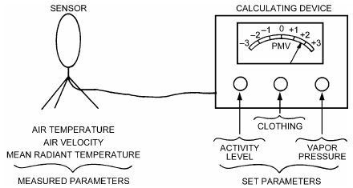

*Fig. 28 Madsen’s Comfort Meter*

> (Madsen 1976)

ment. The sensor then integrates the thermal effect of air temperature, mean radiant temperature, and air velocity in approximately the same way the body does. The electronic instrument gives the measured operative and equivalent temperature, calculated PMV, and predicted percentage of dissatisfied (PPD).

## 15. MOISTURE CONTENT AND TRANSFER MEASUREMENT

**Moisture** commonly refers to the presence of liquid and vapor states of water, which has two positively charged hydrogen atoms and one negatively charged oxygen atom. As moisture vapor and liquid molecules adsorb to a hygroscopic material (e.g., most porous building materials), the material’s **moisture content (MC)** increases significantly. The presence of moisture in materials influences their performance (e.g., thermal insulation, acoustics, processability, dielectricity, storage life, unhealthy microbe growth, corrosion, chemical aspects).

However, little off-the-shelf instrumentation exists to measure the moisture content or transfer of porous materials, although many measurements can be set up with a small investment of time and money. Three moisture properties are most commonly sought: (1) moisture content; (2) vapor permeability (rate at which water vapor passes through a given material); and (3) liquid diffusivity (rate at which liquid water passes through a porous material).

### Moisture Content

MC can be classified into four categories:

- **Wet-basis volumetric MC:** ratio of moisture’s volume to wet sample’s bulk volume
- **Wet-basis mass MC:** ratio of moisture’s mass to wet sample’s bulk mass
- **Dry-basis volumetric MC:** ratio of moisture’s volume to dry sample’s bulk volume
- **Dry-basis mass MC:** ratio of moisture’s mass to dry sample’s bulk mass

Dry basis is often used in building materials.

The MC of a material is usually described with a **sorption iso- therm**, which relates the **equilibrium moisture content (EMC)** of a hygroscopic material to the ambient relative humidity under constant temperature. Determining a sorption isotherm involves exposing a sample of material to a known relative humidity at a known temperature and then measuring the sample’s moisture content after enough time has elapsed for the sample to reach equilibrium with its surroundings. Hysteresis in the sorption behavior of most hygroscopic materials requires that measurements be made for both increasing (adsorption isotherm) and decreasing relative humidity (desorption isotherm). Figure 29 shows hysteresis through the adsorption and desorption isotherms for a typical hygroscopic porous material (Straube 1998). Three different regimes of moisture storage are shown: sorption or hygroscopic (A), capillary (B), and oversaturated (C). In the hygroscopic regime, water vapor adsorbs to the pore walls. As relative humidity increases, adsorbed moisture molecules grow from single layers to multiple interconnected layers (internal capillary condensation). The capillary regime (B) is somewhat arbitrarily designated as that part of the moisture storage function above the critical moisture content. Physically, it is presumed that a continuous liquid phase forms. Finally, in the supersaturated state, the relative humidity is always 100% and no more water will wick into a material.

<!-- str. 995 -->

Ambient relative humidity can be controlled using saturated salt solutions or mechanical refrigeration equipment (Carotenuto et al. 1991; Cunningham and Sprott 1984; Tveit 1966). Precise measurements of the relative humidity produced by various salt solutions were reported by Greenspan (1977). ASTM Standard E104 describes the use of saturated salt solutions. A sample’s EMC is usually determined gravimetrically using a precision balance. The sample’s dry mass, necessary to calculate moisture content, can be found by oven or desiccant drying. Oven dry mass may be lower than desiccant dry mass because of the loss of volatiles other than water in the oven (Richards et al. 1992).

A major difficulty in measuring sorption isotherms of engineering materials is the long time required for many materials to reach equilibrium (often as long as weeks or months). The rate-limiting mechanism for these measurements is usually the slow process of vapor diffusion into the pores of the material. Using smaller samples can reduce diffusion time. Note that, although EMC isotherms are traditionally plotted as a function of relative humidity, the actual transport to or from materials is determined by vapor pressure differences. Thus, significant moisture content changes can occur because of changes in either the material vapor pressure or the surrounding air long before equilibrium is reached.

Moisture content can be directly or indirectly determined. Direct techniques measure moisture by a chemical reaction (e.g., Karl Fisher titration) or using the difference in mass before and after drying a test sample. Using chemical reactions is complex, slow, and expensive, and uses toxic chemicals, so it is seldom used. Mass loss after drying is usually referred to as the **loss on drying (LOD)** or **thermo-gravimetric method** (or simply **grav- imetric**), in which a sample is weighed, heated in an oven at a set temperature (e.g., 100 to 105°C) for an appropriate period to a

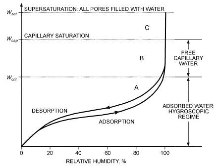

*Fig. 29 Adsorption Isotherm and Desorption Isotherm for Hygroscopic Material*

> (Straube 1998)

constant weight, cooled in the dry atmosphere, and reweighed. Although these direct methods are accurate (within ±0.01 m<sup>3</sup>/m<sup>3</sup>), they are time-consuming, destructive, and do not allow for in situ measurement. Therefore, many indirect methods have been developed. Unlike direct measurements, indirect techniques do not involve removing moisture in a sample: they estimate moisture content by a strong or calibrated relationship with some other measurable variables such as dielectric permittivity or thermal conductivity. Both empirical and theoretical equations between the moisture content and measurable variable are used for the calibration.

Major types of indirect methods include neutron moderation, gamma ray attenuation, nuclear magnetic resonance, microwave reflectance and attenuation, near-infrared reflectance or transmission (NIR/T), dielectric techniques, and thermal methods. Safety issues may limit application of the first three techniques, although they have some advantages such as robustness or high accuracy. NIR/T is a rapid, noninvasive technique for determining moisture content in several applications (e.g., in grain). Its limiting factors include high cost, low penetration depth, and a large sample size required for calibration.

Dielectric techniques take advantage of the strong dependence of the composite material’s bulk permittivity (or dielectric constant) on moisture content. Because the permittivity of water (K<sub>aw</sub> = 81) is much higher than that of the porous material’s other constituents (e.g., 1 for air, 4.7 for fiberglass), the total permittivity of the composite porous material is mainly determined by the moisture content. Dielectric methods include time domain reflectometry (TDR), frequency domain (FD), amplitude domain reflectometry (ADR), phase transmission (Virrib), and time domain transmission (TDT). These dielectric moisture content sensors are becoming popular in various field and laboratory applications (e.g., soil, wood) because they have short response time (almost instantaneous measurements), do not require maintenance, and can provide good accuracy (commercial devices can be accurate within ±0.02 or 0.03 m<sup>3</sup>/m<sup>3</sup> and up to ±0.01 m<sup>3</sup>/m<sup>3</sup> in some more specific situations). However, their sensitivity to boundary water or salinity limits their applications in a highly saline/conductive condition.

Thermal techniques are increasingly considered as an alternative to other methodologies to determine moisture content in porous materials. The main attractions in pursuing this technology are simultaneous measurements of other thermophysical properties (e.g., thermal conductivity, thermal diffusivity, volumetric heat capacity, and water matric potential), wide measurement range, invulnerability of salinity, low cost, high accuracy and robustness. Two predominant concerns limiting the development of the thermal technique include slow reaction time (one commercial product with the accuracy of ±0.01 m<sup>3</sup>/m<sup>3</sup> has the response time of two minutes) and requirement of good contact with the test sample. One typical example of the thermal method identifies moisture content θ<sub>y</sub> by its relationship with volumetric specific heat capacity ρc, as described by Bristow et al. (1993, 1994), Campbell et al. (1991), and Yang et al. (2015).

There is no universal method of moisture content measurement suitable to every application, and detected moisture content varies with measurement method. The suitability of each method relies on different application considerations such as safety, cost, accuracy, response time, installation, ease of operation, management, and durability.

### Vapor Permeability

Diffusive transfer of water vapor through porous materials is often described by a modified form of Fick’s law:

> w″<sub>v</sub> = –μdp/dx&emsp;**(13)**

<!-- str. 996 -->

where

- w″<sub>v</sub> = mass of vapor diffusing through unit area per unit time, mg/(s·m<sup>2</sup>)
- dp/dx = vapor pressure gradient, kPa/m
- μ = vapor permeability, mg/(s·m·kPa)

In engineering practice, permeance may be used instead of permeability. **Permeance** is simply permeability divided by the material thickness in the direction of vapor flow; thus, permeability is a material property, whereas permeance depends on thickness.

Permeability is measured with wet-cup, dry-cup, or modified cup tests. Specific test methods for measuring water vapor permeability are given in ASTM Standard E96.

For many engineering materials, vapor permeability is a strong function of mean relative humidity. Wet and dry cups cannot adequately characterize this dependence on relative humidity. Instead, a modified cup method can be used, in which pure water or desiccant in a cup is replaced with a saturated salt solution (Burch et al. 1992; McLean et al. 1990). A second saturated salt solution is used to condition the environment outside the cup. Relative humidities on both sides of the sample material can be varied from 0 to 100%. Several cups with a range of mean relative humidities are used to map out the dependence of vapor permeability on relative humidity.

In measuring materials of high permeability, the finite rate of vapor diffusion through air in the cup may become a factor. Air-film resistance could then be a significant fraction of the sample’s resistance to vapor flow. Accurate measurement of high-permeability materials may require an accounting of diffusive rates across all air gaps (Fanney et al. 1991).

### Liquid Diffusivity

Transfer of liquid water through porous materials may be characterized as a diffusion-like process:

> w″<sub>l</sub> = –ρD<sub>l</sub>dγ/dx&emsp;**(14)**

where

- w″<sub>l</sub> = mass of liquid transferred through unit area per unit time, kg/(s·m<sup>2</sup>)
- ρ = liquid density, kg/m<sup>3</sup>
- D<sub>l</sub> = liquid diffusivity, m<sup>2</sup>/s
- dγ/dx = moisture content gradient, m<sup>−1</sup>

D<sub>l</sub> typically depends strongly on moisture content.

Transient measurement methods deduce the functional form of D<sub>l</sub>γ by observing the evolution of a one-dimensional moisture content profile over time. An initially dry specimen is brought into contact with liquid water. Free water migrates into the specimen, drawn in by surface tension. The resulting moisture content profile, which changes with time, must be differentiated to find the material’s liquid diffusivity (Bruce and Klute 1956).

Determining the transient moisture content profile typically involves a noninvasive and nondestructive method of measuring local moisture content. Methods include gamma ray absorption (Freitas et al. 1991; Kumaran and Bomberg 1985; Quenard and Sallee 1989), x-ray radiography (Ambrose et al. 1990), neutron radiography (Prazak et al. 1990), and nuclear magnetic resonance (NMR) (Gummerson et al. 1979).

Uncertainty in liquid diffusivity measurement is often large because of the need to differentiate noisy experimental data.

## 16. HEAT TRANSFER THROUGH BUILDING MATERIALS

### Thermal Conductivity

The thermal conductivity of a heat insulator, as defined in Chapter 25, is a unit heat transfer factor. Two methods of determining the thermal conductivity of flat insulation are the **guarded hot plate** and the **heat flow meter apparatus**, according to ASTM Standards C177 and C518, respectively. Both methods use parallel isothermal plates to induce a steady temperature gradient across the thickness of the specimen(s). The guarded hot plate is considered an absolute method for determining thermal conductivity. The heat flow meter apparatus requires calibration with a specimen of known thermal conductivity, usually determined in the guarded hot plate. The heat flow meter apparatus is calibrated by determining the voltage output of its heat flux transducer(s) as a function of the heat flux through the transducer(s).

Basic guarded hot plate design consists of an electrically heated plate and two liquid-cooled plates. Two similar specimens of a material are required for a test; one is mounted on each side of the hot plate. A cold plate is then pressed against the outside of each specimen by a clamp screw. The heated plate consists of two sections separated by a small gap. During tests, the central (metering) and outer (guard) sections are maintained at the same temperature to minimize errors caused by edge effects. The electric energy required to heat the metering section is measured carefully and converted to heat flow. Thermal conductivity of the material can be calculated under steady-state conditions using this heat flow quantity, area of the metering section, temperature gradient, and specimen thickness. Thermal conductivity of cylindrical or pipe insulation (Chapter 25) is determined similarly, but an equivalent thickness must be calculated to account for the cylindrical shape (ASTM Standard C335). Transient methods have been developed by D’Eustachio and Schreiner (1952), Hooper and Chang (1953), and Hooper and Lepper (1950) using a line heat source within a slender probe. These instruments are available commercially and have the advantages of rapidity and a small test specimen requirement. The probe is a useful research and development tool, but it has not been as accepted as the guarded hot plate, heat flow meter apparatus, or pipe insulation apparatus.

### Thermal Conductance and Resistance

Thermal conductances (C-factors) and resistances (R-values) of many building assemblies can be calculated from the conductivities and dimensions of their components, as described in Chapter 27. Test values can also be determined experimentally by testing large, representative specimens in the hot box apparatus described in ASTM Standards C976 and C1363. This laboratory apparatus measures heat transfer through a specimen under controlled air temperature, air velocity, and radiation conditions. It is especially suited for large, nonhomogeneous specimens.

For in situ measurements, heat flux and temperature transducers are useful in measuring the dynamic or steady-state behavior of opaque building components (ASTM Standard C1046). A heat flux transducer is simply a differential thermopile within a core or substrate material. Two types of construction are used: (1) multiple thermocouple junctions wrapped around a core material, or (2) printed circuits with a uniform array of thermocouple junctions. The transducer is calibrated by determining its voltage output as a function of the heat flux through the transducer. For in situ measurements, the transducer is installed in either the wall or roof, or mounted on an exterior surface with tape or adhesive. Data obtained can be used to compute the thermal conductance or resistance of the building component (ASTM Standard C1155).

## 17. AIR CONTAMINANT MEASUREMENT

Three measures of particulate air contamination include the number, projected area, and mass of particles per unit volume of air (ASTM 2012). Each requires an appropriate sampling technique.

<!-- str. 997 -->

Particles are counted by capturing them in impingers, impactors, membrane filters, or thermal or electrostatic precipitators. Counting may be done by microscope, using stage counts if the sample covers a broad range of sizes (Nagda and Rector 2001).

Electronic particle counters can give rapid data on particle size distribution and concentration. **Inertial particle counters** use acceleration to separate sampled particles into different sizes. Real-time **aerodynamic particle sizers (APS)** use inertial effects to separate particles by size, but instead of capturing the particles, they are sized optically (Cox and Miro 1997), and can provide continuous sampling; however, they tend to be very expensive. Other, less costly types of **optical particle counters (OPCs)** are also available, but they typically require careful calibration using the type of particle that is being measured for accurate results (Baron and Willeke 2001). Their accuracy also depends heavily on appropriate maintenance and proper application. Correction for particle losses (dropout in the sampling lines) during sampling can be particularly important for accurate concentration measurements. Concentration uncertainty (random measurement uncertainty) also depends on the number of particles sampled in a given sampling interval.

Particle counters have been used in indoor office environments as well as in cleanrooms, and in aircraft cabin air quality testing (Cox and Miro 1997).

Projected area determinations are usually made by sampling onto a filter paper and comparing the light transmitted or scattered by this filter to a standard filter. The staining ability of dusts depends on the projected area and refractive index per unit volume. For sampling, filters must collect the minimum-sized particle of interest, so membrane or glass fiber filters are recommended.

To determine particle mass, a measured quantity of air is drawn through filters, preferably of membrane or glass fiber, and the filter mass is compared to the mass before sampling. Electrostatic or thermal precipitators and various impactors have also been used. For further information, see ACGIH (2001), Lodge (1989), and Lundgren et al. (1979).

Chapter 46 of the 2019 *ASHRAE Handbook—HVAC Applications* presents information on measuring and monitoring gaseous contaminants. Relatively costly analytical equipment, which must be calibrated and operated carefully by experienced personnel, is needed. Numerous methods of sampling the contaminants, as well as the laboratory analysis techniques used after sampling, are specified. Some of the analytical methods are specific to a single pollutant; others can present a concentration spectrum for many compounds simultaneously.

## 18. COMBUSTION ANALYSIS

Two approaches are used to measure the thermal output or capacity of a boiler, furnace, or other fuel-burning device. The direct or **calorimetric test** measures change in enthalpy or heat content of the fluid, air, or water heated by the device, and multiplies this by the flow rate to arrive at the unit’s capacity. The indirect test or **flue gas analysis** method determines heat losses in flue gases and the jacket and deducts them from the heat content (higher heating value) of measured fuel input to the appliance. A **heat balance** simultaneously applies both tests to the same device. The indirect test usually indicates the greater capacity, and the difference is credited to radiation from the casing or jacket and unaccounted-for losses.

With small equipment, the expense of the direct test is usually not justified, and the indirect test is used with an arbitrary radiation and unaccounted-for loss factor.

## 18.1 FLUE GAS ANALYSIS

Flue gases from burning fossil fuels generally contain carbon dioxide (CO<sub>2</sub>) and water, with some small amounts of hydrogen (H<sub>2</sub>), carbon monoxide (CO), nitrogen oxides (NO<sub>x</sub>), sulfur oxides (SO<sub>x</sub>), and unburned hydrocarbons. However, generally only concentrations of CO<sub>2</sub> (or O<sub>2</sub>) and CO are measured to determine completeness of combustion and efficiency.

**Nondispersive infrared (NDIR)** analyzers are the most common laboratory instruments for measuring CO and CO<sub>2</sub>. Their advantages include the following: (1) they are not very sensitive to flow rate, (2) no wet chemicals are required, (3) they have a relatively fast response, (4) measurements can be made over a wide range of concentrations, and (5) they are not sensitive to the presence of contaminants in ambient air.

In the laboratory, oxygen is generally measured with an instrument that uses O<sub>2</sub>’s paramagnetic properties. Paramagnetic instruments are generally used because of their excellent accuracy and because they can be made specific to the measurement of oxygen.

For field testing and burner adjustment, portable combustion testing equipment is available. These instruments generally measure O<sub>2</sub> and CO with electrochemical cells. The CO<sub>2</sub> is then calculated by an on-board microprocessor and, together with temperature, is used to calculate thermal efficiency.

## 19. DATA ACQUISITION AND RECORDING

Almost every type of transducer and sensor is available with the necessary interface system to make it computer compatible. The transducer itself begins to lose its identity when integrated into a system with features such as linearization, offset correction, selfcalibration, and so forth. This has eliminated concern about the details of signal conditioning and amplification of basic transducer outputs, although engineering judgment is still required to review all data for validity, accuracy, and acceptability before making decisions based on the results. The personal computer is integrated into every aspect of data recording, including sophisticated graphics, acquisition and control, and analysis. Internet or intranet connections allow easy access to remote personal-computer-based datarecording systems from virtually any locale.

**Direct output devices** can be either multipurpose or specifically designed for a given sensor. Traditional chart recorders still provide a visual indication and a hard-copy record of the data, but their output is now rarely used to process data. These older mechanical stylus-type devices use ink, hot wire, pressure, or electrically sensitive paper to provide a continuous trace. They are useful up to a few hundred hertz. Thermal and ink recorders are confined to chart speeds of several centimetres per second for recording relatively slow processes. Simple indicators and readouts are used mostly to monitor the output of a sensor visually, and have usually been replaced by modern digital indicators. Industrial environments commonly use signal transmitters for control or computer data-handling systems to convert the signal output of the primary sensor into a compatible common signal span (e.g., the standard 4-20 mA current loop). All signal conditioning (ranging, zero suppression, reference-junction compensation) is provided at the transmitter. Thus, all recorders and controllers in the system can have an identical electrical span, with variations only in charts and scales offering the advantages of interchangeability and economy in equipment cost. Long signal transmission lines can be used, and receiving devices can be added to the loop without degrading performance. Newer instruments may be digitally bus based, which removes the degradation that may occur with analog signals. These digital instruments are usually immune to noise, based on the communications scheme that is used. They also may allow for self-configuration of the sensor in the field to the final data acquisition device.

The vast selection of available hardware, often confusing terminology, and challenge of optimizing the performance/cost ratio for a specific application make configuring a data acquisition system difficult. A system specifically configured to meet a particular measurement need can quickly become obsolete if it has inadequate flexibility. Memory size, recording speed, and signal processing capability are major considerations in determining the correct recording system. Thermal, mechanical, electromagnetic interference, portability, and meteorological factors also influence the selection.

<!-- str. 998 -->

### Digital Recording

A digital data acquisition system must contain an interface, which is a system involving one or several analog-to-digital converters, and, in the case of multichannel inputs, circuitry for multiplexing. The interface may also provide excitation for transducers, calibration, and conversion of units. The digital data are arranged into one or several standard digital bus formats. Many data acquisition systems are designed to acquire data rapidly and store large records of data for later recording and analysis. Once the input signals have been digitized, the digital data are essentially immune to noise and can be transmitted over great distances.

The most popular physical layer bus standards used for data transmission are the TIA/EIA-485, IEEE 802.3, USB, IEEE 488, or general-purpose interface bus (GPIB) and the RS232 serial interface.

The **TIA/EIA-485 bus system** can be based on either two twisted pairs for full duplex (simultaneous signaling) operation or half duplex using only one twisted pair. A ground wire is generally required to provide a common reference ground for all the devices on the bus to eliminate common mode voltage problems caused by unequal ground potentials. The TIA/EIA-485 standard does not specify cabling length and data rate specifications, but refers to application guidelines (TSB-89). For practical applications, it gives an example of a specific manufacturer’s 24AWG cable, for which the maximum distance between two devices is 1200 m at 100 kbps (TSB-89). The actual distance between devices for a given data rate depends on cable capacitance and impedance, network configuration, and grounding arrangements (TIA Standards TIA-485, TSB-89).

The **IEEE 802.3 bus standard** specifies both copper and optical fiber for physical linking of devices (IEEE Standard 802.3). The copper version uses either twin coaxial cables or four twisted-wire pairs with the twisted wire pairs being used more commonly. The twisted-wire pairs can support up to 10 Gbps with maximum distance of 100 m between devices depending on type of CAT (cable and telephone) cable used (IEEE 802.3). A 40 Gbps data rate specification over twisted pairs is expected to be released by end of 2016.

The **USB 2.0 and 3.1** uses one and three twisted pairs respectively for data transmission. Three additional wires are used for power, ground and shield in both USB 2.0 and USB 3.0. The USB 2.0 can provide 480 Mbps with a recommended length of 5 m based on the maximum 26 ns signal delay and cable specifications given in the USB 2.0 standard. The new USB 3.1 standard can support data transmission speeds of up to 10 Gbps with a recommended length of 3 m for a cable satisfying the standard’s electrical requirements. Device distances can be increased by using either USB bridges/hubs or physical layer interfacing converters.

The **IEEE 488 bus system** feeds data down eight parallel wires, one data byte at a time. This parallel operation allows it to transfer data rapidly at up to 1 million characters per second. However, the IEEE 488 bus is limited to a cable length of 20 m and requires an interface connection on every meter for proper termination.

The **RS232 system** feeds data serially down two wires, one bit at a time. The distance between the devices is limited by maximum cable capacitance of 2500 pF at a maximum data rate of 20 kbps (TIA Standard TIA-232). This translates to typical distance of 15 m, which was the maximum length limit specified in an earlier version of the RS232 standard. For longer distances, it may feed a modem to send data over standard telephone lines.

These physical layer buses can be connected to a data acquisition unit or a personal computer directly or through a local area network (LAN) available in a facility for transmitting information. With appropriate interfacing, transducer data are available to any computer connected to the network.

Bus measurements can greatly simplify three basic applications: data gathering, automated limit testing, and computer-controlled processes. Data gathering collects readings over time. The most common applications include aging tests in quality control, temperature tests in quality assurance, and testing for intermittency in service. A controller can monitor any output indefinitely and then display the data directly on screen or record it on magnetic tape or disks for future use.

In automated limit testing, the computer compares each measurement with programmed limits. The controller converts readings to a good/bad readout. Automatic limit testing is highly cost-effective when working with large number of parameters of a particular unit under test.

In computer-controlled processes, the IEEE 488 bus system becomes a permanent part of a larger, completely automated system. For example, a large industrial process may require many electrical sensors that feed a central computer controlling many parts of the manufacturing process. An IEEE 488 bus controller collects readings from several sensors and saves the data until asked to dump an entire batch of readings to a larger central computer at one time. Used in this manner, the IEEE 488 bus controller serves as a slave of the central computer.

Dynamic range and accuracy must be considered in a digital recording system. **Dynamic range** refers to the ratio of the maximum input signal for which the system is useful to the noise floor of the system. The **accuracy** figure for a system is affected by the signal noise level, nonlinearity, temperature, time, crosstalk, and so forth. In selecting an 8-, 12-, or 16-bit analog-to-digital converter, the designer cannot assume that system accuracy is necessarily determined by the resolution of the encoders (i.e., 0.4%, 0.025%, and 0.0016%, respectively). If the sensor preceding the converter is limited to 1% full-scale accuracy, for example, no significant benefits are gained by using a 12-bit system over an 8-bit system and suppressing the least significant bit. However, a greater number of bits may be required to cover a larger dynamic range.

### Data-Logging Devices

Data loggers digitally store electrical signals (analog or digital) to an internal memory storage component. The signal from connected sensors is typically stored to memory at timed intervals ranging from MHz to hourly sampling. Some data loggers store data based on an event (e.g., button push, contact closure). Many data loggers can perform linearization, scaling, or other signal conditioning and allow logged readings to be either instantaneous or averaged values. Most data loggers have built-in clocks that record the time and date together with transducer signal information. Data loggers range from single-channel input to 256 or more channels. Some are general-purpose devices that accept a multitude of analog and/or digital inputs, whereas others are more specialized to a specific measurement (e.g., a portable anemometer with built-in data-logging capability) or application (e.g., a temperature, relative humidity, CO<sub>2</sub>, and CO monitor with data logging for IAQ applications). Stored data are generally downloaded using a serial interface with a temporary direct connection to a personal computer. Some data loggers allow downloading directly to a printer, or to an external hard drive or tape drive that can later be connected to a PC.

With the reduction in size of personal computers (laptops, notebooks, hand-held PCs, and palmtops), the computer itself is now being used as the data logger. These mobile computers may be left in the field, storing measurements from sensors directly interfaced into the computer. Depending on the particular application and number of sensors to be read, a computer card mounted directly into the PC may eliminate the external data acquisition device completely.

<!-- str. 999 -->

## 20. MECHANICAL POWER MEASUREMENT

Power measurement quantities mechanical power, and electrical power for both AC and DC loading (described in the section on Electric Measurement). Examples of mechanical power include shaft power and pumping power.

### Measurement of Shaft Power

The measurement of shaft power associated with rotating machinery can be accomplished using a dynamometer setup which **independently** measures torque and rotation rate **(or angular velocity)**.

> P = ωT

where

- P = power, W
- ω = shaft angular velocity, rad/s
- T = torque, N·m

### Measurement of Fluid Pumping Power

Pumping power can be determined by independent measurements of volumetric flow rate and pressure differential across the pump.

> P = Q(Δp)/60

where

- P = power, W
- Q = volumetric flow rate, L/min
- Δp = pressure differential across the pump, kPa

## 20.1 SYMBOLS

A = flow area, m<sup>2</sup> a = thermocouple constant

C = correction factor

C<sub>p</sub> = pitot-static probe pressure difference coefficient c<sub>p</sub> = specific heat at constant pressure, kJ/(kg·K)

D = distance; diameter d = throat diameter

D<sub>l</sub> = liquid diffusivity, m<sup>2</sup>/s dγ/dx = moisture content gradient, m<sup>–1</sup> dp/dx = vapor pressure gradient, kPa/m

E = voltage

F<sub>a</sub> = thermal expansion correction factor

H = height

J = mechanical equivalent of heat = 100 (N·m)/kJ

K = sensitivity (Figure 1); differential expansion coefficient for liquid in glass; constant (function of geometry and Reynolds number)

n = number of degrees that liquid column emerged from bath p = absolute pressure, Pa p<sub>w</sub> = velocity pressure (pitot-tube manometer reading), Pa

P<sub>wet</sub> = wetted perimeter

P = mechanical power, W

Q = discharge flow rate, m<sup>3</sup>/s; L/min

R = resistance, Ω r = (see Figure 9)

S = spot size t = temperature, °C; wall thickness t<sub>r</sub> = mean radiant temperature, °C

T = torque, N·m

V = velocity, m/s; volume

W = width w = mass flow rate, kg/s w″<sub>l</sub> = mass of liquid transferred through unit area per unit time,

> kg/(s·m<sup>2</sup>)

w″<sub>v</sub> = mass of vapor diffusing through unit area per unit time,

> mg/(s·m<sup>2</sup>)

X = variable; velocity of stream, m/s

### Greek

β = systematic (bias) error; ratio of diameters D<sub>2</sub>/D<sub>1</sub> for venturi and sharp-edge orifice and d/D for flow nozzle

Δp = pressure differential across the pump, Pa

δ = deviation

ε = random error; emissivity (0.95 for black globe)

θ = tilt angle, °

θ<sub>y</sub> = moisture content

μ = mean; vapor permeability, mg/(s·m·kPa)

ρ = density, kg/m<sup>3</sup>

ρc = volumetric specific heat capacity

ω = shaft angular velocity, rev/s

### Subscripts

1 = entering conditions; state 1 2 = throat conditions; state 2 a = air b = bath c = cross-sectional e = equivalent of stream velocity eff = effective g = globe h = hydraulic i = pertaining to variable X k = reading number s = average of emergent liquid column of n degrees true = true

### STANDARDS

ASA. 2011. Reference quantities for acoustical levels. ANSI Standard S1.8-1989 (R2011). Acoustical Society of America, New York.

ASA. 2010. Measurement of sound pressure levels in air. ANSI Standard S1.13-2005 (R2010). Acoustical Society of America, New York.

ASA. 2011. Specification and verification procedures for sound calibrators.

ANSI Standard S1.40-2006 (R2011). Acoustical Society of America, New York.

ASA. 2015. Guide to the mechanical mounting of accelerometers. ANSI Standard S2.61-1989 (R2015). Acoustical Society of America, New York.

ASA. 2016. Statistical methods for determining and verifying stated noise emission values of machinery and equipment. ANSI Standard S12.3-1985 (R2016). Acoustical Society of America, New York.

ASA. 2013. Methods for determining the insertion loss of outdoor noise barriers. ANSI Standard S12.8-1998 (R2013). Acoustical Society of America, New York.

ASA. 2016. Method for the designation of sound power emitted by machinery and equipment. ANSI Standard S12.23-1989 (R2016). Acoustical Society of America, New York.

ASHRAE. 2013. Standard methods for temperature measurement. ANSI/ASHRAE Standard 41.1-2013.

ASHRAE. 1987. Standard methods for laboratory air flow measurement.

Standard 41.2-1987 (RA 1992).

ASHRAE. 2014. Standard methods for pressure measurement. ANSI/ASHRAE Standard 41.3-2014.

ASHRAE. 2015. Standard methods for measurement of proportion of lubricant in liquid refrigerant. ANSI/ASHRAE Standard 41.4-2015.

ASHRAE. 2014. Standard methods for humidity measurement. ANSI/ASHRAE Standard 41.6-2014.

ASHRAE. 2015. Method of test for measurement of flow of gas. ANSI/ASHRAE Standard 41.7-2015.

<!-- str. 1000 -->

ASHRAE. 2016. Standard methods of measurement of flow of liquids in pipes using orifice flowmeters. ANSI/ASHRAE Standard 41.8-2016.

ASHRAE. 2011. Standard methods for volatile-refrigerant mass flow measurements using calorimeters. ANSI/ASHRAE Standard 41.9-2011.

ASHRAE. 2014. Standard methods for power measurement. ANSI/ASHRAE Standard 41.11-2014.

ASHRAE. 2007. Laboratory methods of testing fans for aerodynamic performance rating. ANSI/ASHRAE Standard 51-07, also ANSI/AMCA Standard 210-07.

ASHRAE. 2010. Thermal environmental conditions for human occupancy.

ANSI/ASHRAE Standard 55-2010.

ASHRAE. 2010. Ventilation for acceptable indoor air quality. ANSI/ASHRAE Standard 62.1-2010.

ASHRAE. 1997. Laboratory method of testing to determine the sound power in a duct. ANSI/ASHRAE Standard 68-1997, also ANSI/AMCA Standard 330-97.

ASHRAE. 2008. Measurement, testing, adjusting, and balancing of building HVAC systems. ANSI/ASHRAE Standard 111-2008.

ASHRAE. 2014. Engineering analysis of experimental data. Guideline 2-2010 (RA2014).

ASME. 2013. Pressure gauges and gauge attachments. ANSI/ASME Standard B40.100-2013. American Society of Mechanical Engineers, New York.

ASME. 2014. Glossary of terms used in the measurement of fluid flow in pipes. ANSI/ASME Standard MFC-1-2014. American Society of Mechanical Engineers, New York.

ASME. 2013. Measurement uncertainty for fluid flow in closed conduits.

ANSI/ASME Standard MFC-2M-1983 (RA13). American Society of Mechanical Engineers, New York.

ASME. 2004. Measurement of fluid flow in pipes using orifice, nozzle, and venturi. Standard MFC-3M-2004. American Society of Mechanical Engineers, New York.

ASME. 2011. Measurement of liquid flow in closed conduits by weighing methods. ANSI/ASME Standard MFC-9M-1988 (RA11). American Society of Mechanical Engineers, New York.

ASME. 2011. Method for establishing installation effects on flowmeters.

ANSI/ASME Standard MFC-10M-2000 (RA11). American Society of Mechanical Engineers, New York.

ASME. 2013. Test uncertainty. ANSI/ASME Standard PTC 19.1-2013.

American Society of Mechanical Engineers, New York.

ASME. 1974. Temperature measurement. ANSI/ASME Standard PTC 19.3-1974 (RA98). American Society of Mechanical Engineers, New York.

ASME. 2013. Flow measurement. ANSI/ASME Standard PTC 19.5-2004 (RA13). American Society of Mechanical Engineers, New York.

ASTM. 2010. Standard test method for steady-state heat flux measurements and thermal transmission properties by means of the guarded-hot-plate apparatus. Standard C177-10. American Society for Testing and Materials, West Conshohocken, PA.

ASTM. 2010. Standard test method for steady-state heat transfer properties of pipe insulation. Standard C335-10. American Society for Testing and Materials, West Conshohocken, PA.

ASTM. 2010. Standard test method for steady-state thermal transmission properties by means of the heat flow meter apparatus. Standard C518-10. American Society for Testing and Materials, West Conshohocken, PA.

ASTM. 2011. Standard test method for thermal performance of building assemblies by means of a calibrated hot box. Standard C976-11. American Society for Testing and Materials, West Conshohocken, PA.

ASTM. 2013. Standard practice for in-situ measurement of heat flux and temperature on building envelope components. Standard C1046-95 (R2013). American Society for Testing and Materials, West Conshohocken, PA.

ASTM. 2015. Standard practice for thermographic inspection of insulation installations in envelope cavities of frame buildings. Standard C1060-11a (R2015). American Society for Testing and Materials, West Conshohocken, PA.

ASTM. 2013. Standard practice for determining thermal resistance of building envelope components from the in-situ data. Standard C1155-95 (R2013). American Society for Testing and Materials, West Conshohocken, PA.

ASTM. 2011. Standard test method for thermal performance of building materials and envelope assemblies by means of a hot box apparatus. Standard C1363-11. American Society for Testing and Materials, West Conshohocken, PA.

ASTM. 2012. Standard guide for using indoor carbon dioxide concentrations to evaluate indoor air quality and ventilation. Standard D6245-12. American Society for Testing and Materials, West Conshohocken, PA.

ASTM. 2010. Standard test methods for water vapor transmission of materials. Standard E96/E96M-10. American Society for Testing and Materials, West Conshohocken, PA.

ASTM. 2012. Standard practice for maintaining constant relative humidity by means of aqueous solutions. Standard E104-02 (2012). American Society for Testing and Materials, West Conshohocken, PA.

ASTM. 2012. Standard specification and temperature-electromotive force (emf) tables for standardized thermocouples. Standard E230/E230M-12. American Society for Testing and Materials, West Conshohocken, PA.

ASTM. 2011. Standard test method for determining air change in a single zone by means of a tracer gas dilution. Standard E741-2011. American Society for Testing and Materials, West Conshohocken, PA.

ASTM. 2012. *Occupational health and safety; protective clothing*. (79 standards.) American Society for Testing and Materials, West Conshohocken, PA.

IEEE. 2004. Standard test procedure for polyphase induction motors and generators. Standard 112-2004. Institute of Electrical and Electronics Engineers, New York.

IEEE. 2012. IEEE standard for Ethernet. Standard 802.3. Institute of Electrical and Electronics Engineers, New York.

ISO. 2003 Measurement of fluid flow by means of pressure differential devices inserted in circular cross-section conduits running full. Standard 5167:2003. International Organization for Standardization, Geneva.

ISO. 2007. Industrial fans—Performance testing using standardized airways. Standard 5801:2007. International Organization for Standardization, Geneva.

ISO. 1998. Ergonomics of the thermal environment—Instruments for measuring physical quantities. Standard 7726:1998. International Organization for Standardization, Geneva.

ISO. 2005. Ergonomics of the thermal environment—Analytical determination and interpretation of thermal comfort using calculation of the PMV and PPD indices and local thermal comfort criteria. Standard 7730:2005. International Organization for Standardization, Geneva.

ISO. 2004. Ergonomics of the thermal environment—Determination of metabolic rate. Standard 8996:2004. International Organization for Standardization, Geneva.

ISO. 2007. Ergonomics of the thermal environment—Estimation of thermal insulation and water vapour resistance of a clothing ensemble. Standard 9920:2007. International Organization for Standardization, Geneva.

## REFERENCES

ASHRAE members can access ASHRAE Journal articles and ASHRAE research project final reports at technologyportal.ashrae .org. Articles and reports are also available for purchase by nonmembers in the online ASHRAE Bookstore at www.ashrae.org/bookstore.

Abernethy, R.B., R.P. Benedict, and R.B. Dowdell. 1985. ASME measurement uncertainty. *Transactions of ASME* 107:161-164.

ACGIH. 2001. *Air sampling instruments for evaluation of atmospheric con-* taminants, 9th ed. American Conference of Governmental Industrial Hygienists, Cincinnati, OH.

Ambrose, J.H., L.C. Chow, and J.E. Beam. 1990. Capillary flow properties of mesh wicks. *AIAA Journal of Thermophysics* 4:318-324.

Amdur, E.J. 1965. Two-pressure relative humidity standards. In Humidity and moisture, vol. 3, p. 445. Reinhold, New York.

ASTM. 1993. Manual on the use of thermocouples in temperature measurement. Manual 12. American Society for Testing and Materials, West Conshohocken, PA.

Bahnfleth, W.P., G.K. Yuill, and B.W. Lee. 1999. Protocol for field testing of tall buildings to determine envelope air leakage rates. ASHRAE Transactions 105(2):27-38.

Baron, P.A., and K. Willeke. 2001. Aerosol measurement. Wiley, New York. Bedford, T., and C.G. Warmer. 1935. The globe thermometer in studies of heating and ventilating. *Journal of the Institution of Heating and Venti-* lating Engineers 2:544.

Benedict, R.P. 1984. *Fundamentals of temperature, pressure and flow mea-* surements, 3rd ed. John Wiley & Sons, New York.

Bentz, D.P., and J.W. Martin. 1987. Using the computer to analyze coating defects. *Journal of Protective Coatings and Linings* 4(5).

<!-- str. 1001 -->

Bristow, K.L., G.S. Campbell, and K. Calissendorff. 1993. Test of heat-pulse probe for measuring changes in soil water content. *Soil Science Society* *of America Journal* 57:930-934.

Bristow, K.L, G.J. Kluitenberg, and R. Horton. 1994. Measurement of soil thermal properties with a dual-probe heat-pulse technique. Soil Science *Society of America Journal* 58:1288-1294.

Brown, K.K., H.W. Coleman, and W.G. Steele. 1998. A methodology for determining experimental uncertainties in regressions. *ASME Journal of* Fluids Engineering, *Transactions of ASME* 120:445-456.

Bruce, R.R., and A. Klute. 1956. The measurement of soil moisture diffusivity. *Proceedings of the Soil Science Society of America* 20:458-462.

Burch, D.M. 1980. Infrared audits of roof heat loss. ASHRAE Transactions 86(2).

Burch, D.M., and C.M. Hunt. 1978. Retrofitting an existing residence for energy conservation—An experimental study. *Building Science Series* 105. National Institute of Standards and Technology, Gaithersburg, MD.

Burch, D.M., W.C. Thomas, and A.H. Fanney. 1992. Water vapor permeability measurements of common building materials. ASHRAE Transactions 98(2):486-494.

Burns, G.W., M.G. Scroger, G.F. Strouse, M.C. Croarkin, and W.F. Guthrie.

1992. Temperature-electromotive force reference functions and tables for the letter-designated thermocouple types based on the ITS-90. NIST Monograph 175. U.S. Government Printing Office, Washington, D.C. Campbell, G.S., C. Calissendorff, and J.H. Williams. 1991. Probe for measuring soil specific heat using a heat-pulse method. *Soil Science Society* *of America Journal* 55:291-293.

Carotenuto, A., F. Fucci, and G. LaFianzi. 1991. Adsorption phenomena in porous media in the presence of moist air. *International Journal of Heat* *and Mass Transfer* 18:71-81.

Coleman, H.W., and W.G. Steele. 1995. Engineering application of experimental uncertainty analysis. AIAA Journal 33(10):1888-1896.

Coleman, H.W., and W.G. Steele. 2009. *Experimentation, validation and un-* *certainty analysis for engineers*, 3rd ed. John Wiley & Sons, New York.

Considine, D.M. 1985. *Process instruments and controls handbook*, 3rd ed.

McGraw-Hill, New York.

Cox, J.E., and C.R. Miro. 1997. Aircraft cabin air quality. ASHRAE Journal 22.

Cunningham, M.J., and T.J. Sprott. 1984. Sorption properties of New Zealand building materials. Building Research Association of New Zealand Research Report 45, Judgeford.

DeCarlo, J.P. 1984. *Fundamentals of flow measurement.* Instrumentation Society of America, Research Triangle Park, NC.

D’Eustachio, D., and R.E. Schreiner. 1952. A study of transient heat method for measuring thermal conductivity. ASHVE Transactions 58:331.

DeWitt, D.P., and G.D. Nutter. 1988. *Theory and practice of radiation ther-* mometry. John Wiley & Sons, New York.

Fanger, P.O. 1982. Thermal comfort. Robert E. Krieger, Malabar, FL.

Fanney, A.H., W.C. Thomas, D.M. Burch, and L.R. Mathena. 1991. Measurements of moisture diffusion in building materials. ASHRAE Transactions 97:99-113.

Freitas, V., P. Crausse, and V. Abrantes. 1991. Moisture diffusion in thermal insulating materials. In *Insulation materials: Testing and applications*, vol. 2. ASTM *Special Technical Publication* STP 1116. American Society for Testing and Materials, West Conshohocken, PA.

Gagge, A.P., J.A.J. Stolwijk, and Y. Nishi. 1971. An effective temperature scale based on a simple model of human physiological regulatory response. ASHRAE Transactions 77(1).

Goldstein, R.J. 1978. Application of aerial infrared thermography. ASHRAE Transactions 84(1).

Greenspan, L. 1977. Humidity fixed points of binary saturated aqueous solutions. *Journal of Research of the National Bureau of Standards* 81A: 89-95.

Greenspan, L., and A. Wexler. 1968. An adiabatic saturation psychrometer.

*Journal of Research of the National Bureau of Standards* 72C(1):33. Gummerson, R.J., C. Hall, W.D. Hoff, R. Hawkes, G.N. Holland, and W.S.

Moore. 1979. Unsaturated water flow within porous materials observed by NMR imaging. Nature 281:56-57.

Hasegawa, S. 1976. The NBS two-pressure humidity generator, mark 2.

*Journal of Research of the National Bureau of Standards* 81A:81.

Hickman, C., B.T. Beck, and B. Babin. 2012. Determining the effects of duct fittings on volumetric air flow measurements. Final Report, ASHRAE Research Project RP-1245.

Hickman, C., B.T. Beck, and B. Babin. 2015a. Effect of fittings on volumetric airflow measurements (RP-1245): Single-path duct disturbances. Sci-*ence and Technology for the Built Environment* 21:190-206.

Hickman, C., B.T. Beck, and B. Babin, 2015b. Effect of fittings on volumetric airflow measurements (RP-1245): Multiple-path (tee) duct disturbances. *Science and Technology for the Built Environment* 21:957-975.

Holman, J.P. 2001. *Experimental methods for engineers*, 7th ed., pp. 383-389. McGraw-Hill, New York.

Hooper, F.C., and S.C. Chang. 1953. Development of thermal conductivity probe. ASHVE Transactions 59:463.

Hooper, F.C., and F.C. Lepper. 1950. Transient heat flow apparatus for the determination of thermal conductivity. ASHVE Transactions 56:309.

Hudson, R.D., Jr. 1969. *Infrared system engineering.* John Wiley & Sons, New York.

IES. 2011. Lighting handbook, 10th ed. Illuminating Engineering Society of North America, New York.

Kumaran, M.K., and M. Bomberg. 1985. A gamma-spectrometer for determination of density distribution and moisture distribution in building materials. *Proceedings of the International Symposium on Moisture and* Humidity, Washington, D.C., pp. 485-490.

Kusuda, T. 1965. Calculation of the temperature of a flat-plate wet surface under adiabatic conditions with respect to the Lewis relation. In Humid-*ity and moisture*, vol. 1, p. 16. Reinhold, New York.

Liptak, B.G., ed. 1972. *Instrument engineers handbook*, vol. 1. Chilton, Philadelphia, PA.

Lodge, J.P., ed. 1989. *Methods of air sampling and analysis*, 3rd ed. Lewis Publishers, MI.

Lundgren, D.A., M. Lippmann, F.S. Harris, Jr., W.H. Marlow, W.E. Clark, and M.D. Durham, eds. 1979. Aerosol measurement. University Presses of Florida, Gainesville.

Mack, R.T. 1986. Energy loss profiles: Foundation for future profit in thermal imager sales and service. *Proceedings of the 5th Infrared Informa-* tion Exchange, Book 1, AGEMA Infrared Systems, Secaucus, NJ.

Madding, R. 1989. Infrared thermography. McGraw-Hill, New York.

Madsen, T.L. 1976. Thermal comfort measurements. ASHRAE Transactions 82(1).

Mattingly, G.E. 1984. Workshop on fundamental research issues in orifice metering. GRI Report 84/0190. Gas Research Institute, Chicago.

Mattingly, G.E. 1992. The characterization of a piston displacement-type flowmeter calibration facility and the calibration and use of pulsed output type flowmeters. *Journal of Research of the National Institute of Stan-* *dards and Technology* 97(5):509.

McCullough, E.A., B.W. Jones, and J. Huck. 1985. A comprehensive data base for estimating clothing insulation. ASHRAE Transactions 92:29-47.

McLean, R.C., G.H. Galbraith, and C.H. Sanders. 1990. Moisture transmission testing of building materials and the presentation of vapour permeability values. *Building Research and Practice* 18(2):82-103.

Mease, N.E., W.G. Cleveland, Jr., G.E. Mattingly, J.M. Hall. 1992. Air speed calibrations at the National Institute of Standards and Technology. Pro-*ceedings of the 1992 Measurement Science Conference*, Anaheim, CA.

Meyer, C.W., J.T. Hodges, R.W. Hyland, G.E. Scace, J. Valencia-Rodriguez, and J.R. Whetstone. 2010. The second-generation NIST standard hydrometer. Metrologia 47:192-207. www.nist.gov/manuscript-publication -search.cfm?pub_id=903607.

Miller, R.W. 1983. *Measurement engineering handbook*. McGraw-Hill, New York.

Nagda, N.L., and H.E. Rector. 2001. Instruments and methods for measuring indoor air quality. In *Indoor air quality handbook*, pp. 51.1-51.37. J.D. Spengler, J.M. Samet, and J.F. McCarthy, eds. McGraw-Hill.

NIST. 1976. Liquid-in-glass thermometry. NIST Monograph 150. National Institute of Standards and Technology, Gaithersburg, MD.

NIST. 1986. Thermometer calibrations. NIST Monograph 174. National Institute of Standards and Technology, Gaithersburg, MD.

Nottage, H.B., J.G. Slaby, and W.P. Gojsza. 1952. A smoke-filament technique for experimental research in room air distribution. ASHVE Transactions 58:399.

Olesen, B.W. 1985. A new and simpler method for estimating the thermal insulation of a clothing ensemble. ASHRAE Transactions 92:478-492.

Olesen, B.W., J. Rosendahl, L.N. Kalisperis, L.H. Summers, and M. Steinman. 1989. Methods for measuring and evaluating the thermal radiation in a room. ASHRAE Transactions 95(1).

Paljak, I., and B. Pettersson. 1972. *Thermography of buildings.* National Swedish Institute for Materials Testing, Stockholm.

<!-- str. 1002 -->

Parmelee, G.V., and R.G. Huebscher. 1946. The shielding of thermocouples from the effects of radiation. ASHVE Transactions 52:183.

Persily, A., and S.J. Emmerich. 2001. *State-of-the-art review of CO* 2 *demand control ventilation and application*. NIST IR6729. National Institute of Standards and Technology, Gaithersburg, MD.

Prazak, J., J. Tywoniak, F. Peterka, and T. Slonc. 1990. Description of transport of liquid in porous media—A study based on neutron radiography data. *International Journal of Heat and Mass Transfer* 33:1105-1120.

Quenard, D., and H. Sallee. 1989. A gamma-ray spectrometer for measurement of the water diffusivity of cementitious materials. Proceedings of *the Materials Research Society Symposium*, vol. 137.

Quinn, T.J. 1990. Temperature, 2nd ed. Academic Press, New York.

Raffel, M., C. Willert, and J. Kompenhans. 1998. *Particle image velocime-* *try: A practical guide*. Springer.

Richards, R.F., D.M. Burch, W.C. Thomas. 1992. Water vapor sorption measurements of common building materials. ASHRAE Transactions 98(1).

Richardson, L. 1965. A thermocouple recording psychrometer for measurement of relative humidity in hot, arid atmosphere. In *Humidity and mois-* ture, vol. 1, p. 101. Reinhold, New York.

Schooley, J.F. 1986. Thermometry. CRC, Boca Raton, FL.

Schooley, J.F., ed. 1992. *Temperature: Its measurement and control in sci-* *ence and in industry*, vol. 6. American Institute of Physics, New York.

Seely, R.E. 1955. A circuit for measuring the resistance of energized A-C windings. AIEE Transactions, p. 214.

Shafer, M.R. 1961. Performance characteristics of turbine flowmeters. Pro-*ceedings of the Winter Annual Meeting*, Paper 61-WA-25. American Society of Mechanical Engineers, New York.

Straube, J.F. 1998. *Moisture control and enclosure wall systems*. Ph.D. dissertation, University of Waterloo. Waterloo, Ontario, Canada.

TIA. 1997. Interface between data terminal equipment and data circuitterminating equipment employing serial binary data interchange. Standard TIA-232. Telecommunication Industry Alliance, Revision F, October.

TIA. 1998. Electrical characteristics of generators and receivers for use in balanced digital multipoint systems. Standard TIA-485. Telecommunication Industry Alliance, Revision A, March.

TIA. 2006. Application guidelines for TIA/EIA-485-A. Standard TSB-89.

Telecommunication Industry Alliance, Revision A, January 2006. Till, C.E., and G.E. Handegord. 1960. Proposed humidity standard. ASH-RAE Transactions 66:288.

Tobiasson, W., and C. Korhonen. 1985. Roofing moisture surveys: Yesterday, today, and tomorrow. *Proceedings of the Second International Sym-* *posium on Roofing Technology*, Gaithersburg, MD.

Tveit, A. 1966. Measurement of moisture sorption and moisture permeability of porous materials. Report 45. Norwegian Building Research Institute, Oslo.

Vernon, H.M. 1932. The globe thermometer. *Proceedings of the Institution* *of Heating and Ventilating Engineers*, vol. 39, p. 100.

Wentzel, J.D. 1961. An instrument for measurement of the humidity of air.

ASHRAE Journal 11:67.

Wile, D.D. 1947. Air flow measurement in the laboratory. Refrigerating Engineering 6:515.

Woodring, E.D. 1969. Magnetic turbine flowmeters. *Instruments and Con-* trol Systems 6:133.

Worrall, R.W. 1965. Psychrometric determination of relative humidities in air with dry-bulb temperatures exceeding 212°F. In *Humidity and Mois-* ture, vol. 1, p. 105. Reinhold, New York.

Yang, H., Y. Luo, and T. Zhang. 2015. A data sorting method for rapid measurement of moisture content in porous insulation materials. Proceedings *of ISHVAC-COBEE 2015*, Tianjin, China.

## BIBLIOGRAPHY

Beranek, L.L. 1988. Acoustical measurements. Published for the Acoustical Society of America by the American Institute of Physics, New York.

Beranek, L.L. 1989. *Noise and vibration control*. Institute of Noise Control Engineering, Poughkeepsie, NY.

Cohen, E.R. 1990. The expression of uncertainty in physical measurements.

*1990 Measurement Science Conference Proceedings*, Anaheim, CA. Contemporary Controls. 1999. Understanding EIA-485 networks. The Exten-*sion: A Technical Supplement to Control Network* 1(1). www.ccontrols .com/pdf/ExtV1N1.pdf.

EPA. 1991. *Introduction to indoor air quality: A self-paced learning mod-* ule. EPA/400/3-91/002, U.S. Environmental Protection Agency, Washington, D.C.

Harris, C.M. 1987. *Shock and vibration handbook*, 3rd ed. McGraw-Hill, New York.

IEEE. 1987. Standard digital interface for programmable instrumentation.

ANSI/IEEE Standard 488.1-87 (R 1994). Institute of Electrical and Electronics Engineers, Piscataway, NJ.

Jones, J.L., and A.M. Flynn, 1993. Mobile robots, A.K. Peters, Wellesley, MA.

De Silva, C.W. 1989. *Control sensors and actuators*. Prentice Hall, Englewood Cliffs, NJ.

Lord, H.W., W.S. Gatley, and H.A. Evensen. 1987. *Noise control for engi-* neers. Krieger, Melbourne, FL.

Morrison, R. 1986. *Grounding and shielding techniques in instrumentation*, 3rd ed. John Wiley & Sons, New York.

Spitzer, D.W., ed. 1991. Flow measurement. Instrumentation Society of America, Research Triangle Park, NC.

Steele, W.G., R.A. Ferguson, R.P. Taylor, and H.W. Coleman. 1994. Comparison of ANSI/ASME and ISO models for calculation of uncertainty. *ISA Transactions 3*3:339-352.

Tilford, C.R. 1992. Pressure and vacuum measurements. In Physical meth-*ods of chemistry*, 2nd ed., vol. 6, pp. 106-173. John Wiley & Sons, New York.

Universal Serial Bus Specification. 2013. Universal serial bus revision 3.1 specification, section 5.5.7. July.

Universal Serial Bus Specification. 2000. Universal serial bus revision 2.0 specification, section 7.1.6. April.
