# Chapter 39 — Abbreviations and Symbols

*Izvor: 2021 ASHRAE Handbook — Fundamentals (SI), Chapter 39 (PDF str. 1003–1013).*

> **Napomena o konverziji:** Tekst je automatski izdvojen iz originalnog PDF-a uz prepoznavanje dve kolone, spojene prelomljene reči i pasuse. Indeksi i eksponenti su označeni sa `<sub>`/`<sup>`, tabele su pretvorene u Markdown tabele (veoma složene tabele su prikazane kao poravnat tekst), a slike su izrezane iz PDF-a u folder `img/`. Složene jednačine (razlomci, sume) mogu biti uprošćeno prikazane. **Pre upotrebe vrednosti u proračunu proveriti u originalnom PDF-u.** Oznake `<!-- str. N -->` pokazuju stranu PDF-a.

## Sadržaj

- [1. ABBREVIATIONS FOR TEXT, DRAWINGS, AND COMPUTER PROGRAMS](#1-abbreviations-for-text-drawings-and-computer-programs)
- [2. LETTER SYMBOLS](#2-letter-symbols)
- [5. MATHEMATICAL SYMBOLS](#5-mathematical-symbols)
- [6. PIPING SYSTEM IDENTIFICATION](#6-piping-system-identification)
- [7. CODES AND STANDARDS](#7-codes-and-standards)

<!-- str. 1003 -->

THIS chapter contains information about abbreviations and symbols for HVAC&R engineers.

**Abbreviations** are shortened forms of names and expressions used in text, drawings, and computer programs. This chapter discusses conventional English-language abbreviations that may be different in other languages. A **letter symbol** represents a quantity or a unit, not its name, and is independent of language. Because of this, use of a letter symbol is preferred over abbreviations for unit or quantity terms. Letter symbols necessary for individual chapters are defined in the chapters where they occur.

Abbreviations are never used for mathematical signs, such as the equality sign (=) or division sign (/), except in computer programming, where the abbreviation functions as a letter symbol. Mathematical operations are performed only with symbols. Abbreviations should be used only where necessary to save time and space; avoid their use in documents circulated in foreign countries.

Graphical symbols in this chapter of piping, ductwork, fittings, and in-line accessories can be used on scale drawings and diagrams.

Identifying piping by legend and color promotes greater safety and lessens the chance of error in emergencies. Piping identification is now required throughout the United States by the Occupational Safety and Health Administration (OSHA) for some industries and by many federal, state, and local codes.

## 1. ABBREVIATIONS FOR TEXT, DRAWINGS, AND COMPUTER PROGRAMS

Table 1 gives some abbreviations, as well as others commonly found on mechanical drawings and abbreviations (symbols) used in computer programming. Abbreviations specific to a single subject are defined in the chapters in which they appear. Additional abbreviations used on drawings can be found in the section on Graphical Symbols for Drawings.

### Computer Programs

The abbreviations (symbols) used for computer programming for the HVAC&R industries have been developed by ASHRAE Technical Committee 1.5, Computer Applications. These symbols identify computer variables, subprograms, subroutines, and functions commonly applied in the industry. Using these symbols enhances comprehension of the program listings and provides a clearly defined nomenclature in applicable computer programs.

Some symbols have two or more options listed. The longest abbreviation is preferred and should be used if possible. However, it is sometimes necessary to shorten the symbol to further identify the variable. For instance, the area of a wall cannot be defined as WALLAREA because some computer languages restrict the number of letters in a variable name. Therefore, a shorter variable symbol is applied, and WALLAREA becomes WALLA or WAREA.

<sub>The preparation of this chapter is assigned to TC 1.6, Terminology.</sub>

Most modern computer programming languages do not have the character limitations of older computer languages, but the limitations still exist in some older building automation controllers. It is good programming practice to include the complete name of each variable and to define any abbreviations in the comments section at the beginning of each module of code. Abbreviations should be used to help clarify the variables in an equation and not to obscure the readability of the code.

In Table 1, the same symbol is sometimes used for different terms. This liberty is taken because it is unlikely that the two terms would be used in the same program. If such were the case, one of the terms would require a suffix or prefix to differentiate it from the other.

## 2. LETTER SYMBOLS

Letter symbols include symbols for physical quantities (quantity symbols) and symbols for the units in which these quantities are measured (unit symbols). **Quantity symbols**, such as I for electric current, are listed in this chapter and are printed in italic type. A **unit symbol** is a letter or group of letters such as mm for millimetre or a special sign such as ° for degrees, and is printed in Roman type. Subscripts and superscripts are governed by the same principles. Letter symbols are restricted mainly to the English and Greek alphabets.

Quantity symbols may be used in mathematical expressions in any way consistent with good mathematical usage. The product of two quantities, a and b, is indicated by ab. The quotient is a/b, or ab<sup>−1</sup>. To avoid misinterpretation, parentheses must be used if more than one slash (/) is used in an algebraic term; for example, (a/b)/c or a/(b/c) is correct, but not a/b/c.

Subscripts and superscripts, or several of them separated by commas, may be attached to a single basic letter (kernel), but not to other subscripts or superscripts. A symbol that has been modified by a superscript should be enclosed in parentheses before an exponent is added (X<sub>a</sub>)<sup>3</sup>. Symbols can also have alphanumeric marks such as ′ (prime), + (plus), and * (asterisk).

More detailed information on the general principles of letter symbol standardization are in standards listed at the end of this chapter. The letter symbols, in general, follow these standards, which are out of print:

Y10.3M Letter Symbols for Mechanics and Time-Related Phenomena

Y10.4-82 Letter Symbols for Heat and Thermodynamics

Other symbols chosen by an author for a physical magnitude not appearing in any standard list should be ones that do not already have different meanings in the field of the text.

<!-- str. 1004 -->

**Table 1 Abbreviations for Text, Drawings, and Computer Programs**

| Term | Text | Drawings | Program |
|---|---|---|---|
| above finished floor | — | AFF | — |
| absolute | abs | ABS | ABS |
| accumulat(e, -or) | acc | ACCUM | ACCUM |
| air condition(-ing, -ed) | — | AIR COND | — |
| air-conditioning unit(s) | — | ACU | ACU |
| air-handling unit | — | AHU | AHU |
| air horsepower | ahp | AHP | AHP |
| alteration | altrn | ALTRN | — |
| alternating current | ac | AC | AC |
| altitude | alt | ALT | ALT |
| ambient | amb | AMB | AMB |
| American National |  |  |  |
| Standards Institute<sup>1</sup> | ANSI | ANSI | — |
| American wire gage | AWG | AWG | — |
| ampere (amp, amps) | amp | AMP | AMP, AMPS |
| angle | — | — | ANG |
| angle of incidence | — | — | ANGI |
| apparatus dew point | adp | ADP | ADP |
| approximate | approx. | APPROX | — |
| area | — | — | A |
| atmosphere | atm | ATM | — |
| average | avg | AVG | AVG |
| azimuth | az | AZ | AZ |
| azimuth, solar | — | — | SAZ |
| azimuth, wall | — | — | WAZ |
| barometer(-tric) | baro | BARO | — |
| bill of material | b/m | BOM | — |
| boiling point | bp | BP | BP |
| Brown & Sharpe wire gage | B&S | B&S | — |
| Celsius | °C | °C | °C |
| center to center | c to c | C TO C | — |
| circuit | ckt | CKT | CKT |
| clockwise | cw | CW | — |
| coefficient | coeff. | COEF | COEF |
| coefficient, valve flow | C<sub>v</sub> | C<sub>v</sub> | CV |
| coil | — | — | COIL |
| compressor | cprsr | CMPR | CMPR |
| condens(-er, -ing, -ation) | cond | COND | COND |
| conductance | — | — | C |
| conductivity | cndct | CNDCT | K |
| conductors, number of (3) | 3/c | 3/c | — |
| contact factor | — | — | CF |
| cooling load | clg load | CLG LOAD | CLOAD |
| counterclockwise | ccw | CCW | — |
| cubic centimetre | cm<sup>3</sup> | CC | CC |
| cubic metre | m<sup>3</sup> | CU M | CU M |
| decibel | dB | DB | DB |
| degree | deg. or ° | DEG or ° | DEG |
| density | dens | DENS | RHO |
| depth or deep | dp | DP | DPTH |
| dew-point temperature | dpt | DPT | DPT |
| diameter | dia. | DIA | DIA |
| diameter, inside | ID | ID | ID |
| diameter, outside | OD | OD | OD |
| difference or delta | diff., Δ | DIFF | D, DELTA |
| diffuse radiation | — |  | DFRAD |
| direct current | dc | DC | DC |
| direct radiation | dir radn | DIR RADN | DIRAD |
| dry | — |  | DRY |
| dry-bulb temperature | dbt | DBT | DB, DBT |
| effectiveness | — |  | EFT |
| effective temperature<sup>2</sup> | ET* | ET* | ET |
| efficiency | eff | EFF | EFF |
| efficiency, fin | — |  | FEFF |

| Term | Text | Drawings | Program |
|---|---|---|---|
| efficiency, surface | — |  | SEFF |
| electromotive force | emf | EMF | — |
| elevation | elev. | EL | ELEV |
| entering | entr | ENT | ENT |
| entering water temperature | EWT | EWT | EWT |
| entering air temperature | EAT | EAT | EAT |
| enthalpy | — | — | H |
| entropy | — | — | S |
| equivalent direct radiation | edr | EDR | — |
| evaporat(-e, -ing, -ed, -or) | evap | EVAP | EVAP |
| expansion | exp | EXP | XPAN |
| face area | fa | FA | FA |
| face to face | f to f | F to F | — |
| face velocity | fvel | FVEL | FV |
| factor, correction | — | — | CFAC, CFACT |
| factor, friction | — | — | FFACT, FF |
| fan | — | — | FAN |
| film coefficient,<sup>3</sup> inside | — | — | FI, HI |
| film coefficient,<sup>3</sup> outside | — | — | FO, HO |
| flow rate, air | — | — | QAR, QAIR |
| flow rate, fluid | — | — | QFL |
| flow rate, gas | — | — | QGA, QGAS |
| freezing point | fp | FP | FP |
| frequency | Hz | HZ | — |
| gage or gauge | ga | GA | GA, GAGE |
| gram | g | g | G |
| gravitational constant | G | G | G |
| greatest temp difference | GTD | GTD | GTD |
| heat | — | — | HT |
| heater | — | — | HTR |
| heat gain | HG | HG | HG, HEATG |
| heat gain, latent | LHG | LHG | HGL |
| heat gain, sensible | SHG | SHG | HGS |
| heat loss | — | — | HL, HEATL |
| heat transfer | — | — | Q |
| heat transfer coefficient | U | U | U |
| height | hgt | HGT | HGT, HT |
| high-pressure steam | hps | HPS | HPS |
| high-temperature hot water | hthw | HTHW | HTHW |
| hour(s) | h | HR | HR |
| humidity, relative | rh | RH | RH |
| humidity ratio | W | W | W |
| incident angle | — | — | INANG |
| indicated kilowatt | IkW | IkW | — |
| International Pipe Std | IPS | IPS | — |
| iron pipe size | ips | IPS | — |
| joule | J | J | J |
| kelvin | K | K | K |
| kilograms | kg | kg | KG |
| kilojoules | kJ | kJ | KJ |
| kilometres per hour | km/h | km/h | KPH |
| kilopascals | kPa | kPa | KPA |
| kilowatt | kW | kW | KW |
| kilowatt hour | kWh | KWH | KWH |
| latent heat | LH | LH | LH, LHEAT |
| least mean temp. difference<sup>4</sup> | LMTD | LMTD | LMTD |
| least temp. difference<sup>4</sup> | LTD | LTD | LTD |
| leaving air temperature | lat | LAT | LAT |
| leaving water temperature | lwt | LWT | LWT |
| length | lg | LG | LG, L |
| liquid load-sharing (hybrid) | liq | LIQ | LIQ |
| HVAC system | LSHVAC | LSHVAC | LSHVAC |
| litre | L | L | L |

<!-- str. 1005 -->

| Term | Text | Drawings | Program |
|---|---|---|---|
| litres per second | L/s | L/s | LPS |
| logarithm (natural) | ln | LN | LN |
| logarithm to base 10 | log | LOG | LOG |
| low-pressure steam | lps | LPS | LPS |
| low-temp. hot water | lthw | LTHW | LTHW |
| Mach number | Mach | MACH | — |
| mass flow rate | mfr | MFR | MFR |
| maximum | max. | MAX | MAX |
| mean effective temp. | MET | MET | MET |
| mean temp. difference | MTD | MTD | MTD |
| medium-pressure steam | mps | MPS | MPS |
| medium-temp. hot water | mthw | MTHW | MTHW |
| mercury | Hg | HG | HG |
| metre | m | m | M |
| metres per second | m/s | m/s | M/S |
| millilitres per second | mL/s | mL/s | MLPS |
| mL/s standard | mL/sS | mL/sS | MLPSS |
| minimum | min. | MIN | MIN |
| noise criteria | NC | NC | — |
| normally open | n o | N O | — |
| normally closed | n c | N C | — |
| not applicable | na | N/A | — |
| not in contract | n i c | N I C | — |
| not to scale | — | N T S | — |
| number | no. | NO | N, NO |
| number of circuits | — | — | NC |
| number of tubes | — | — | NT |
| outside air | oa | OA | OA |
| parts per million | ppm | PPM | PPM |
| pascal | Pa | Pa | PA |
| Pa (absolute) | Pa (abs) | Pa A | PAA |
| Pa (gage) | Pa (gage) | Pa G | PAG |
| percent | % | % | PCT |
| phase (electrical) | ph | PH | — |
| pipe | — | — | PIPE |
| pressure | — | PRESS | PRES, P |
| pressure, barometric | baro pr | BARO PR | BP |
| pressure, critical | — | — | CRIP |
| pressure, dynamic (velocity) | vp | VP | VP |
| pressure drop or difference | PD | PD | PD, DELTP |
| pressure, static | sp | SP | SP |
| pressure, vapor | vap pr | VAP PR | VAP |
| primary | pri | PRI | PRIM |
| radian | — | — | RAD |
| radiat(-e, -or) | — | RAD | — |
| radiant panel | RP | RP | RP |
| radiation | — | RADN | RAD |
| radius | — | — | R |
| receiver | rcvr | RCVR | REC |
| recirculate | recirc. | RECIRC | RCIR, RECIR |
| refrigerant (12, 22, etc.) | R-12, R-22 | R12, R22 | R12, R22 |
| relative humidity | rh | RH | RH |
| resist(-ance, -ivity, -or) | res | RES | RES, OHMS |
| return air | ra | RA | RA |
| revolutions | rev | REV | REV |
| revolutions per minute | rpm | RPM | RPM |
| revolutions per second | rps | RPS | RPS |
| roughness | rgh | RGH | RGH, E |
| safety factor | sf | SF | SF |
| saturation | sat. | SAT | SAT |
| Saybolt seconds Furol | ssf | SSF | SSF |
| Saybolt seconds Universal | ssu | SSU | SSU |
| sea level | sl | SL | SE |

| Term | Text | Drawings | Program |
|---|---|---|---|
| second | s | s | SEC |
| sensible heat | SH | SH | SH |
| sensible heat gain | SHG | SHG | SHG |
| sensible heat ratio | SHR | SHR | SHR |
| shading coefficient | — | — | SC |
| solar | — | — | SOL |
| specification | spec | SPEC | — |
| specific heat | sp ht | SP HT | C |
| sp ht at constant pressure | c<sub>p</sub> | c<sub>p</sub> | CP |
| sp ht at constant volume | c<sub>v</sub> | c<sub>v</sub> | CV |
| specific volume | sp vol | SP VOL | V, CVOL |
| square | sq. | SQ | SQ |
| standard | std | STD | STD |
| standard time meridian | — | — | STM |
| static pressure | SP | SP | SP |
| suction | suct. | SUCT | SUCT, SUC |
| summ(-er, -ary, -ation) | — | — | SUM |
| supply | sply | SPLY | SUP, SPLY |
| supply air | sa | SA | SA |
| surface | — | — | SUR, S |
| surface, dry | — | — | SURD |
| surface, wet | — | — | SURW |
| system | — | — | SYS |
| tabulat(-e, -ion) | tab | TAB | TAB |
| tee | — | — | TEE |
| temperature | temp. | TEMP | T, TEMP |
| temperature difference | TD, Δt | TD | TD, TDIF |
| temperature entering | TE | TE | TE, TENT |
| temperature leaving | TL | TL | TL, TLEA |
| thermal conductivity | k | K | K |
| thermal expansion coeff. | — | — | TXPC |
| thermal resistance | R | R | RES, R |
| thermocouple | tc | TC | TC, TCPL |
| thermostat | T STAT | T STAT | T STAT |
| thick(-ness) | thkns | THKNS | THK |
| total | — | — | TOT |
| total heat | tot ht | TOT HT | — |
| transmissivity | — | — | TAU |
| U-factor | — | — | U |
| unit | — | — | UNIT |
| vacuum | vac | VAC | VAC |
| valve | v | V | VLV |
| vapor proof | vap prf | VAP PRF | — |
| variable | var | VAR | VAR |
| variable air volume | VAV | VAV | VAV |
| velocity | vel. | VEL | VEL, V |
| velocity, wind | w vel. | W VEL | W VEL |
| ventilation, vent | vent | VENT | VENT |
| vertical | vert. | VERT | VERT |
| viscosity | visc | VISC | MU, VISC |
| volt | V | V | E, VOLTS |
| volt ampere | VA | VA | VA |
| volume | vol. | VOL | VOL |
| volumetric flow rate | — | — | VFR |
| wall | — | — | W, WAL |
| water | — | — | WTR |
| watt | W | W | WAT, W |
| wet bulb | wb | WB | WB |
| wet-bulb temperature | wbt | WBT | WBT |
| width | — | — | WI |
| wind | — | — | WD |
| wind direction | wdir | WDIR | WDIR |
| wind pressure | wpr | WPR | WP, WPRES |
| year | yr | YR | YR |
| zone | z | Z | Z, ZN |

<!-- str. 1006 -->

| Term | Drawings<br>Text | Drawings<br>Program |
|---|---|---|
| **1Abbreviations of most proper names use capital letters in both text and drawings. 2The asterisk () is used with ET, effective temperature, as in Chapter 9 of this volume. 3These are surface heat transfer coefficients. 4Letter L also used for Logarithm of these temperature differences in computer programming. 3. LETTER SYMBOLS** |  |  |
| Symbol | Description of Item | Typical Units |
| a<br>A b<br>B c c c<sub>p</sub> c<sub>v</sub><br>C<br>C<br>C<br>C<sub>L</sub><br>C<sub>P</sub> d d or D<br>D<sub>e</sub> or D<sub>h</sub><br>D<sub>v</sub> e<br>E<br>E f f f<sub>D</sub> f<sub>F</sub><br>F<br>F<sub>ij</sub> g<br>G h h h h<sub>a</sub> h<sub>D</sub> h<sub>s</sub><br>H<br>I k k (or γ)<br>K<br>K<sub>D</sub> l or L<br>L<sub>p</sub><br>L<sub>w</sub> m or M<br>M n or N<br>N p or P p<sub>a</sub> p<sub>s</sub> p<sub>w</sub><br>P q<br>Q<br>Q r r or R | acoustic velocity area breadth or width barometric pressure concentration specific heat specific heat at constant pressure specific heat at constant volume coefficient fluid capacity rate thermal conductance loss coefficient coefficient of performance prefix meaning differential diameter equivalent or hydraulic diameter mass diffusivity base of natural logarithms energy electrical potential film conductance (alternate for h) frequency friction factor, Darcy-Weisbach formulation friction factor, Fanning formulation force angle factor (radiation) gravitational acceleration mass velocity heat transfer coefficient hydraulic head specific enthalpy enthalpy of dry air mass transfer coefficient enthalpy of moist air at saturation total enthalpy electric current thermal conductivity ratio of specific heats, c<sub>p</sub>/c<sub>v</sub> proportionality constant mass transfer coefficient length sound pressure sound power mass molecular weight number in general rate of rotation pressure partial pressure of dry air partial pressure of water vapor in moist air vapor pressure of water in saturated moist air power time rate of heat transfer total heat transfer volumetric flow rate radius thermal resistance | m/s m<sup>2</sup> m kPa kg/m<sup>3</sup> kJ/(kg·K) kJ/(kg·K) kJ/(kg·K) —<br>W/K<br>W/(m<sup>2</sup>·K) ———m m mm<sup>2</sup>/s —kJ<br>V<br>W/(m<sup>2</sup>·K)<br>Hz ——<br>N —m/s<sup>2</sup> kg/(s·m<sup>2</sup>)<br>W/(m<sup>2</sup>·K) m kJ/kg kJ/kg m/s kJ/kg kJ<br>A<br>W/(m·K) ——kg/(h·m<sup>2</sup>) m dB dB kg kg/kg mol —kPa kPa kPa kPa kPa kW<br>W kJ<br>L/s m<br>(m<sup>2</sup>·K)/W |

| Symbol | Symbol | Description of Item | Typical Units |
|---|---|---|---|
| Δt<sub>m</sub> | R s<br>S t or ΔT<sub>m</sub><br>T u<br>U<br>U v | gas constant specific entropy total entropy temperature mean temperature difference absolute temperature specific internal energy total internal energy overall heat transfer coefficient specific volume | J/(kg·K) kJ/(kg·K) kJ/K °C<br>K<br>K kJ/kg kJ<br>W/(m<sup>2</sup>·K) m<sup>3</sup>/kg |
| γ (or k) | V<br>V w<br>W<br>W<br>W<br>W<sub>s</sub> x x x,y,z<br>Z α α α α β γ Δ ε θ η λ μ μ ν ρ ρ ρ σ σ τ τ τ φ | total volume linear velocity mass rate of flow weight humidity ratio of moist air (dry air basis) work humidity ratio of moist air at saturation<br>(dry air basis) mole fraction quality, mass fraction of vapor lengths along principal coordinate axes figure of merit absolute Seebeck coefficient absorptivity, absorptance radiation linear coefficient of thermal expansion thermal diffusivity volume coefficient of thermal expansion ratio of specific heats, c<sub>p</sub>/c<sub>v</sub> specific weight difference between values emissivity, emittance (radiation) time efficiency or effectiveness wavelength degree of saturation dynamic viscosity kinematic viscosity density reflectivity, reflectance (radiation) volume resistivity<br>Stefan-Boltzmann constant surface tension stress time transmissivity, transmittance<br>(radiation) relative humidity | m<sup>3</sup> g/kg g/kg ——m —<br>V/K —1/K 1/K —<br>N/m<sup>3</sup> ——s, h —nm —mPa·s m<sup>2</sup>/s kg/m<sup>3</sup> —Ω·m<br>W/(m<sup>2</sup>·K<sup>4</sup>)<br>N/m<br>N/m<sup>2</sup> s —— |
|  |  | 4. DIMENSIONLESS NUMBERS |  |
| Fo<br>Gr<br>Gz j<sub>D</sub> j<sub>H</sub><br>Le<br>M<br>Nu<br>Pe<br>Pr<br>Re<br>Sc<br>Sh<br>St<br>Str |  | Fourier number<br>Grashof number<br>Graetz number<br>Colburn mass transfer<br>Colburn heat transfer<br>Lewis number<br>Mach number<br>Nusselt number<br>Peclet number<br>Prandtl number<br>Reynolds number<br>Schmidt number<br>Sherwood number<br>Stanton number<br>Strouhal number | ατ/L<sup>2</sup><br>L<sup>3</sup>ρ<sup>2</sup>βg(Δt)/μ<sup>2</sup> wc<sub>p</sub>/kL<br>Sh/ReSc<sup>1/3</sup><br>Nu/RePr<sup>1/3</sup> α/D<sub>v</sub><br>V/a hD/k<br>GDc<sub>p</sub>/k c<sub>p</sub>μ/k ρVD/μ μ/ρD<sub>v</sub> h<sub>D</sub>L/D<sub>v</sub> h/Gc<sub>p</sub> fd/V |

## 5. MATHEMATICAL SYMBOLS

<!-- str. 1007 -->

| equal to not equal to approximately equal to greater than less than greater than or equal to less than or equal to plus minus plus or minus a multiplied by b a divided by b ratio of circumference of a circle to its diameter | = ≠ ≈ > < ≥ ≤ + − ± *ab, a·b, a* × b a --, a/b, ab<sup>–1</sup> b π |
|---|---|
| a raised to the power n square root of a | a<sup>n</sup> |
|  | a , a<sup>0.5</sup> |
| infinity | ∞ |
| percent | % |
| summation of | Σ |
| natural log | ln |
| logarithm to base 10 | log |
| **SUBSCRIPTS** |  |

These are to be affixed to the appropriate symbols. Several subscripts may be used together to denote combinations of various states, points, or paths. Often the subscript indicates that a particular property is to be kept constant in a process.

| a,b,... | referring to different phases, states or physical conditions of a substance, or to different substances |
|---|---|
| a | air |
| a | ambient |
| b | barometric (pressure) |
| c | referring to critical state or critical value |
| c | convection |
| db | dry bulb |
| dp | dew point |
| e | base of natural logarithms |
| f | referring to saturated liquid |
| f | film |
| fg | referring to evaporation or condensation |
| F | friction |
| g | referring to saturated vapor |
| h | referring to change of phase in evaporation |
| H | water vapor |
| i | referring to saturated solid |
| i | internal |
| if | referring to change of phase in melting |
| ig | referring to change of phase in sublimation |
| k | kinetic |
| L | latent |
| m | mean value |
| M | molar basis |
| p | referring to constant pressure conditions or processes |
| p | potential |
| r | refrigerant |
| r | radiant or radiation |
| s | referring to moist air at saturation |
| s | sensible |
| s | referring to isentropic conditions or processes |
| s | static (pressure) |
| s | surface |
| t | total (pressure) |
| T | referring to isothermal conditions or processes |
| v | referring to constant volume conditions or processes |
| v | vapor |
| v | velocity (pressure) |
| w | wall |
| w | water |
| wb | wet bulb |
| 0 | referring to initial or standard states or conditions |

These are to be affixed to the appropriate symbols. Several subscripts may be used together to denote combinations of various states, points, or paths. Often the subscript indicates that a particular property is to be kept constant in a process.

```text
 1,2,... different points in a process, or different instants of time
         GRAPHICAL SYMBOLS FOR DRAWINGS
```

Graphical symbols have been extracted from ANSI/ASHRAE Standard 134-2005. Additional symbols are from current practice and extracted from ASME Standards Y32.2.3 and Y32.2.4.

| Piping Heating High-pressure steam Medium-pressure steam Low-pressure steam High-pressure steam condensate Medium-pressure steam condensate | HPS MPS LPS HPC MPC |
|---|---|
| Low-pressure steam condensate | LPC |
| Boiler blowdown | BBD |
| Pumped condensate | PC |
| Vacuum pump discharge | VPD |
| Makeup water | MU |
| Atmospheric vent | ATV |
| Fuel oil | FO(NAME) |
| Low-temperature hot water supply | HWS |
| Medium-temperature hot water supply | MTWS |
| High-temperature hot water supply | HTWS |
| Low-temperature hot water return | HWR |
| Medium-temperature hot water return | MTWR |
| High-temperature hot water return | HTWR |
| Compressed air | A(NAME) |
| Vacuum (air) | VAC |
| Existing piping | (NAME)E |
| Pipe to be removed | XX (NAME) XX |
| Air Conditioning and Refrigeration |  |
| Refrigerant discharge | RD |
| Refrigerant suction | RS |
| Brine supply | B |
| Brine return | BR |
| Condenser water supply | CWS |
| Condenser water return | CWR |
| Chilled water supply | CHWS |
| Chilled water return | CHWR |
| Fill line | FILL |
| Humidification line | H |
| Drain | D |
| Hot/chilled water supply | H/C S |
| Hot/chilled water return | H/C R |
| Refrigerant liquid | RL |
| Heat pump water supply | HPWS |
| Heat pump water return | HPWR |
| Plumbing |  |
| Sanitary drain above floor or grade | SAN |
| Sanitary drain below floor or grade | SAN |
| Storm drain above floor or grade | ST |
| Storm drain below floor or grade | ST |
| Condensate drain above floor or grade | CD |
| Condensate drain below floor or grade | CD |
| Vent | – – – – – – – – – – – |
| Cold water |  |
| Hot water |  |
| Hot water return |  |
| Gas | G G |
| Acid waste | AW |

<!-- str. 1008 -->

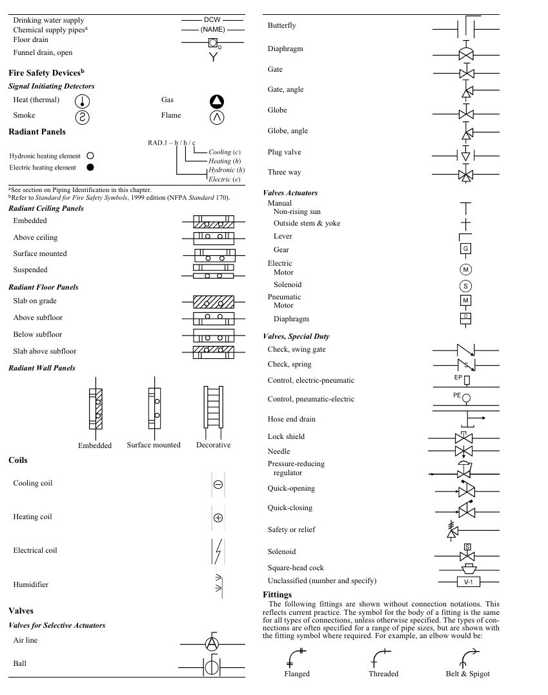

*Stranica 1008 (grafički prikaz cele strane)*

| Drinking water supply Chemical supply pipes<sup>a</sup> Floor drain Funnel drain, open b Fire Safety Devices Signal Initiating Detectors Heat (thermal) Gas Smoke Flame Radiant Panels | DCW (NAME) |
|---|---|
| <sup>a</sup>See section on Piping Identification in this chapter. |  |
| **bRefer to Standard for Fire Safety Symbols, 1999 edition (NFPA Standard 170).** |  |
| Radiant Ceiling Panels |  |
| Embedded |  |
| Above ceiling |  |
| Surface mounted |  |
| Suspended |  |
| Radiant Floor Panels |  |
| Slab on grade |  |
| Above subfloor |  |
| Below subfloor |  |
| Slab above subfloor |  |
| Radiant Wall Panels |  |
| Embedded Surface mounted | Decorative |
| Coils |  |
| Cooling coil |  |
| Heating coil |  |
| Electrical coil |  |
| Humidifier |  |
| Valves |  |
| Valves for Selective Actuators |  |
| Air line |  |
| Ball |  |

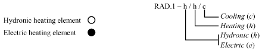

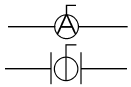

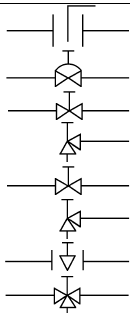

Butterfly

Diaphragm

Gate

Gate, angle

Globe

Globe, angle

Plug valve

Three way

### Valves Actuators

Manual

Non-rising sun

Outside stem & yoke

Lever

Gear

Electric

Motor

Solenoid

Pneumatic

Motor

Diaphragm

### Valves, Special Duty

Check, swing gate

Check, spring

Control, electric-pneumatic

Control, pneumatic-electric

Hose end drain

Lock shield

Needle

Pressure-reducing regulator

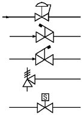

Quick-opening

Quick-closing

Safety or relief

Solenoid

Square-head cock

Unclassified (number and specify)

### Fittings

The following fittings are shown without connection notations. This reflects current practice. The symbol for the body of a fitting is the same for all types of connections, unless otherwise specified. The types of connections are often specified for a range of pipe sizes, but are shown with the fitting symbol where required. For example, an elbow would be:

Flanged Threaded Belt & Spigot

<!-- str. 1009 -->

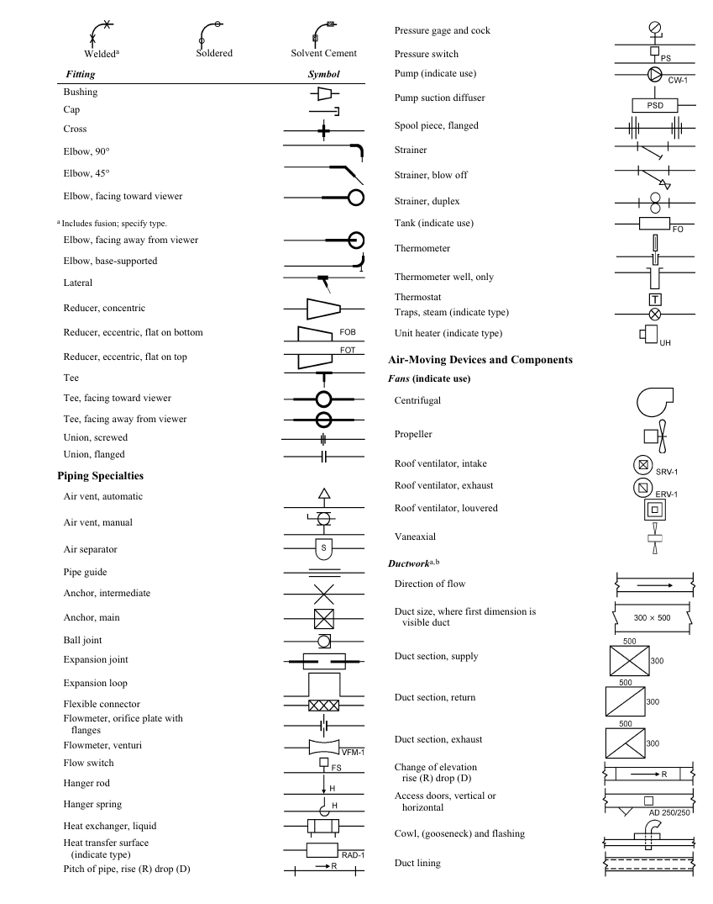

*Stranica 1009 (grafički prikaz cele strane)*

Welded<sup>a</sup> Soldered Solvent Cement

### Fitting Symbol

Bushing

Cap

Cross

Elbow, 90°

Elbow, 45°

Elbow, facing toward viewer <sup>a</sup>Includes fusion; specify type.

Elbow, facing away from viewer

Elbow, base-supported

Lateral

Reducer, concentric

Reducer, eccentric, flat on bottom

Reducer, eccentric, flat on top

Tee

Tee, facing toward viewer

Tee, facing away from viewer

Union, screwed

Union, flanged

### Piping Specialties

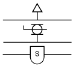

Air vent, automatic

Air vent, manual

Air separator

Pipe guide

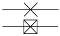

Anchor, intermediate

Anchor, main

Ball joint

Expansion joint

Expansion loop

Flexible connector

Flowmeter, orifice plate with flanges

Flowmeter, venturi

Flow switch

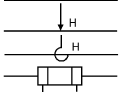

Hanger rod

Hanger spring

Heat exchanger, liquid

Heat transfer surface (indicate type)

Pitch of pipe, rise (R) drop (D)

Pressure gage and cock

Pressure switch

Pump (indicate use)

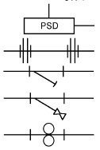

Pump suction diffuser

Spool piece, flanged

Strainer

Strainer, blow off

Strainer, duplex

Tank (indicate use)

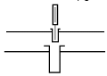

Thermometer

Thermometer well, only

Thermostat

Traps, steam (indicate type)

Unit heater (indicate type)

### Air-Moving Devices and Components

### Fans (indicate use)

Centrifugal

Propeller

Roof ventilator, intake

Roof ventilator, exhaust

Roof ventilator, louvered

Vaneaxial

### Ductworka,b

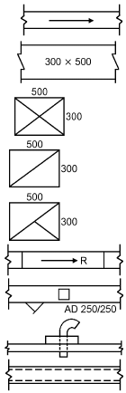

Direction of flow

Duct size, where first dimension is visible duct

Duct section, supply

Duct section, return

Duct section, exhaust

Change of elevation rise (R) drop (D)

Access doors, vertical or horizontal

Cowl, (gooseneck) and flashing

Duct lining

<!-- str. 1010 -->

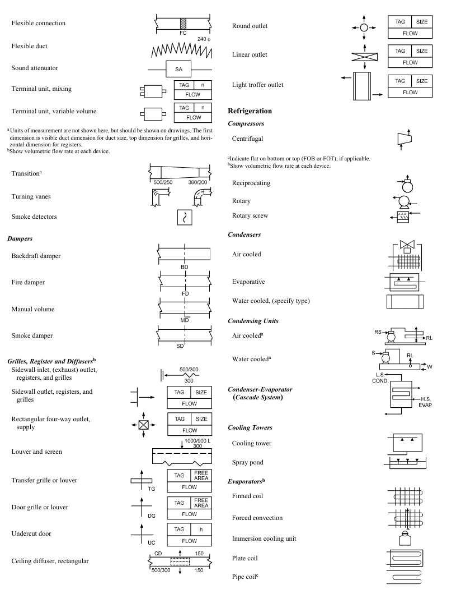

*Stranica 1010 (grafički prikaz cele strane)*

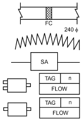

Flexible connection

Flexible duct

Sound attenuator

Terminal unit, mixing

Terminal unit, variable volume <sup>a</sup>Units of measurement are not shown here, but should be shown on drawings. The first dimension is visible duct dimension for duct size, top dimension for grilles, and horizontal dimension for registers.

<sup>b</sup>Show volumetric flow rate at each device.

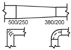

Transition<sup>a</sup>

Turning vanes

Smoke detectors

### Dampers

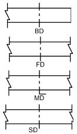

Backdraft damper

Fire damper

Manual volume

Smoke damper

### Grilles, Register and Diffusersb

Sidewall inlet, (exhaust) outlet, registers, and grilles

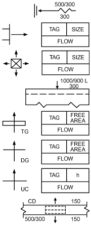

Sidewall outlet, registers, and grilles

Rectangular four-way outlet, supply

Louver and screen

Transfer grille or louver

Door grille or louver

Undercut door

Ceiling diffuser, rectangular

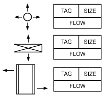

Round outlet

Linear outlet

Light troffer outlet

### Refrigeration

### Compressors

Centrifugal <sup>a</sup>Indicate flat on bottom or top (FOB or FOT), if applicable.

<sup>b</sup>Show volumetric flow rate at each device.

Reciprocating

Rotary

Rotary screw

### Condensers

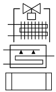

Air cooled

Evaporative

Water cooled, (specify type)

### Condensing Units

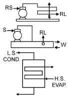

Air cooled<sup>a</sup>

Water cooled<sup>a</sup>

### Condenser-Evaporator

**(Cascade System)**

### Cooling Towers

Cooling tower

Spray pond

### Evaporatorsb

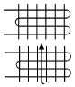

Finned coil

Forced convection

Immersion cooling unit

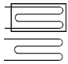

Plate coil

Pipe coil<sup>c</sup>

<!-- str. 1011 -->

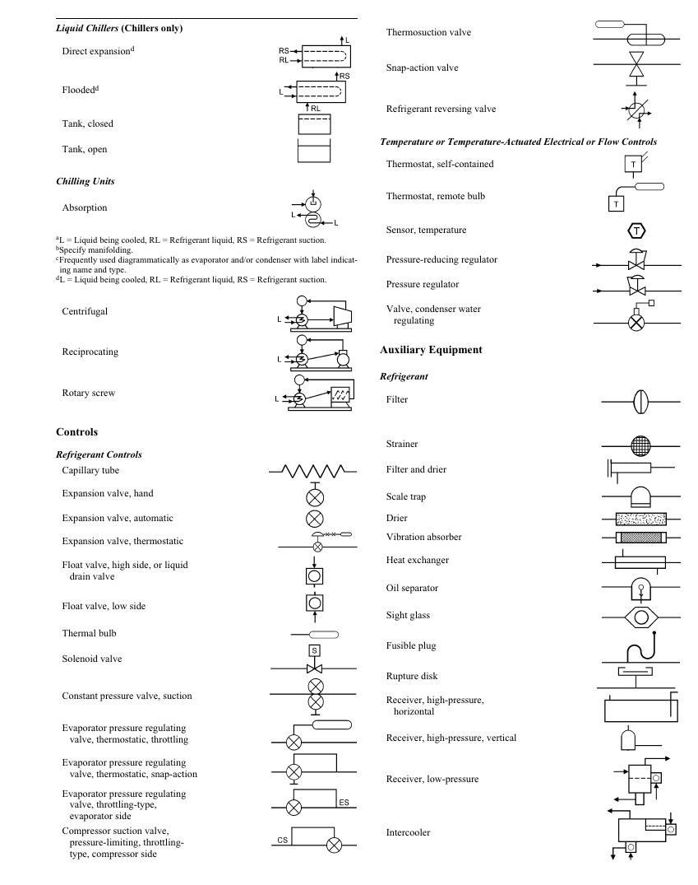

*Stranica 1011 (grafički prikaz cele strane)*

### Liquid Chillers (Chillers only)

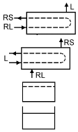

Direct expansion<sup>d</sup>

Flooded<sup>d</sup>

Tank, closed

Tank, open

### Chilling Units

Absorption <sup>a</sup>L = Liquid being cooled, RL = Refrigerant liquid, RS = Refrigerant suction.

<sup>b</sup>Specify manifolding.

<sup>c</sup>Frequently used diagrammatically as evaporator and/or condenser with label indicating name and type.

<sup>d</sup>L = Liquid being cooled, RL = Refrigerant liquid, RS = Refrigerant suction.

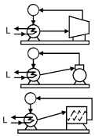

Centrifugal

Reciprocating

Rotary screw

### Controls

### Refrigerant Controls

Capillary tube

Expansion valve, hand

Expansion valve, automatic

Expansion valve, thermostatic

Float valve, high side, or liquid drain valve

Float valve, low side

Thermal bulb

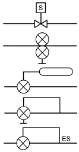

Solenoid valve

Constant pressure valve, suction

Evaporator pressure regulating valve, thermostatic, throttling

Evaporator pressure regulating valve, thermostatic, snap-action

Evaporator pressure regulating valve, throttling-type, evaporator side

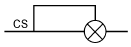

Compressor suction valve, pressure-limiting, throttlingtype, compressor side

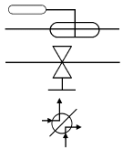

Thermosuction valve

Snap-action valve

Refrigerant reversing valve

### Temperature or Temperature-Actuated Electrical or Flow Controls

Thermostat, self-contained

Thermostat, remote bulb

Sensor, temperature

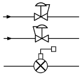

Pressure-reducing regulator

Pressure regulator

Valve, condenser water regulating

### Auxiliary Equipment

### Refrigerant

Filter

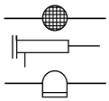

Strainer

Filter and drier

Scale trap

Drier

Vibration absorber

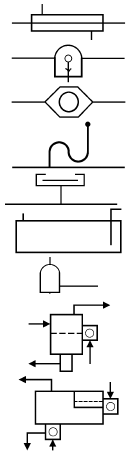

Heat exchanger

Oil separator

Sight glass

Fusible plug

Rupture disk

Receiver, high-pressure, horizontal

Receiver, high-pressure, vertical

Receiver, low-pressure

Intercooler

<!-- str. 1012 -->

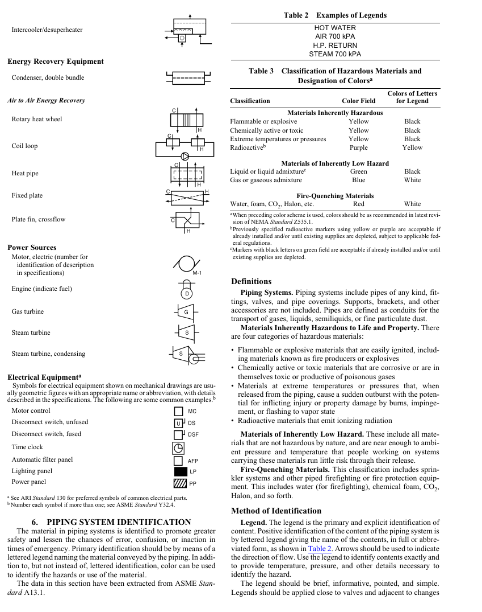

*Stranica 1012 (grafički prikaz cele strane)*

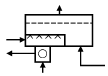

Intercooler/desuperheater

### Energy Recovery Equipment

Condenser, double bundle

### Air to Air Energy Recovery

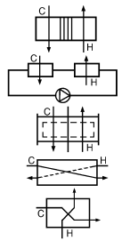

Rotary heat wheel

Coil loop

Heat pipe

Fixed plate

Plate fin, crossflow

### Power Sources

Motor, electric (number for identification of description in specifications)

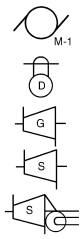

Engine (indicate fuel)

Gas turbine

Steam turbine

Steam turbine, condensing

> a

### Electrical Equipment

Symbols for electrical equipment shown on mechanical drawings are usually geometric figures with an appropriate name or abbreviation, with details described in the specifications. The following are some common examples.<sup>b</sup> Motor control

Disconnect switch, unfused

Disconnect switch, fused

Time clock

Automatic filter panel

Lighting panel

Power panel <sup>a</sup>See ARI Standard 130 for preferred symbols of common electrical parts.

<sup>b</sup>Number each symbol if more than one; see ASME Standard Y32.4.

## 6. PIPING SYSTEM IDENTIFICATION

The material in piping systems is identified to promote greater safety and lessen the chances of error, confusion, or inaction in times of emergency. Primary identification should be by means of a lettered legend naming the material conveyed by the piping. In addition to, but not instead of, lettered identification, color can be used to identify the hazards or use of the material.

The data in this section have been extracted from ASME Standard A13.1.

**Table 2 Examples of Legends**

```text
                          HOT WATER
                           AIR 700 kPA
                          H.P. RETURN
                         STEAM 700 kPA
```

**Table 3 Classification of Hazardous Materials and Designation of Colorsa**

| Classification Color Field | Colors of Letters for Legend |
|---|---|
| Materials Inherently Hazardous |  |
| Flammable or explosive Yellow | Black |
| Chemically active or toxic Yellow | Black |
| Extreme temperatures or pressures Yellow | Black |
| Radioactive<sup>b</sup> Purple | Yellow |
| Materials of Inherently Low Hazard |  |
| Liquid or liquid admixture<sup>c</sup> Green | Black |
| Gas or gaseous admixture Blue | White |
| Fire-Quenching Materials |  |
| Water, foam, CO<sub>2</sub>, Halon, etc. Red | White |

<sup>a</sup>When preceding color scheme is used, colors should be as recommended in latest revision of NEMA Standard Z535.1.

<sup>b</sup>Previously specified radioactive markers using yellow or purple are acceptable if already installed and/or until existing supplies are depleted, subject to applicable federal regulations.

<sup>c</sup>Markers with black letters on green field are acceptable if already installed and/or until existing supplies are depleted.

### Definitions

**Piping Systems.** Piping systems include pipes of any kind, fittings, valves, and pipe coverings. Supports, brackets, and other accessories are not included. Pipes are defined as conduits for the transport of gases, liquids, semiliquids, or fine particulate dust.

**Materials Inherently Hazardous to Life and Property.** There are four categories of hazardous materials:

- Flammable or explosive materials that are easily ignited, including materials known as fire producers or explosives
- Chemically active or toxic materials that are corrosive or are in themselves toxic or productive of poisonous gases
- Materials at extreme temperatures or pressures that, when released from the piping, cause a sudden outburst with the potential for inflicting injury or property damage by burns, impingement, or flashing to vapor state
- Radioactive materials that emit ionizing radiation

**Materials of Inherently Low Hazard.** These include all materials that are not hazardous by nature, and are near enough to ambient pressure and temperature that people working on systems carrying these materials run little risk through their release.

**Fire-Quenching Materials.** This classification includes sprinkler systems and other piped firefighting or fire protection equipment. This includes water (for firefighting), chemical foam, CO<sub>2</sub>, Halon, and so forth.

### Method of Identification

**Legend.** The legend is the primary and explicit identification of content. Positive identification of the content of the piping system is by lettered legend giving the name of the contents, in full or abbreviated form, as shown in Table 2. Arrows should be used to indicate the direction of flow. Use the legend to identify contents exactly and to provide temperature, pressure, and other details necessary to identify the hazard.

The legend should be brief, informative, pointed, and simple. Legends should be applied close to valves and adjacent to changes in direction, branches, and where pipes pass through walls or floors, and as frequently as needed along straight runs to provide clear and positive identification. Identification may be applied by stenciling, tape, or markers (see Figure 1). The number and location of identification markers on a particular piping system is based on judgment.**Color.** Colors listed in Table 3 are used to identify the characteristic properties of the contents. Color can be shown on or contiguous to the piping by any physical means, but it should be used in combination with a legend. Color can be used in continuous total length coverage or in intermittent displays.

<!-- str. 1013 -->

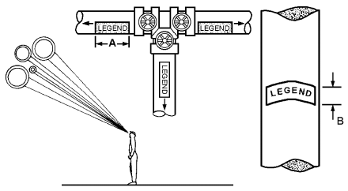

*Fig. 1 Visibility of Pipe Markings*

**Visibility.** Pipe markings should be highly visible. If pipe lines are above the normal line of vision, the lettering is placed below the horizontal centerline of the pipe (Figure 1).

**Type and Size of Letters.** Provide the maximum contrast between color field and legend (Table 3). Table 4 shows the size of letters recommended. Use of standard size letters of 13 mm or larger is recommended. For identifying materials in pipes of less than 20 mm in diameter and for valve and fitting identification, use a permanently legible tag.

**Table 4 Size of Legend Letters**

| Outside Diameter of Pipe or Covering, mm | Length of Color Field A, mm | Size of Letters B, mm |
|---|---|---|
| 20 to 32 | 200 | 13 |
| 40 to 50 | 200 | 20 |
| 65 to 150 | 300 | 32 |
| 200 to 250 | 600 | 65 |
| over 250 | 800 | 90 |

**Unusual or Extreme Situations.** When the piping layout occurs in or creates an area of limited accessibility or is extremely complex, other identification techniques may be required. Although a certain amount of imagination may be needed, the designer should always clearly identify the hazard and use the recommended color and legend guidelines.

## 7. CODES AND STANDARDS

ASHRAE. 2005. Graphic symbols for heating, ventilating, air-conditioning, and refrigeration systems. ANSI/ASHRAE Standard 134-2005.

ASME. 2007. Scheme for the identification of piping systems. ANSI/ASME Standard A13.1-2007. American Society of Mechanical Engineers, New York.

ASME. 1998. Graphic symbols for heating, ventilating and air conditioning.

Standard Y32.2.4-1949 (RA 1988). American Society of Mechanical Engineers, New York.

IEEE. 2004. Standard letter symbols for units of measurement. Standard 260.1-2004. Institute of Electrical and Electronics Engineers, Piscataway, NJ.

IEEE. 1996. Letter symbols and abbreviations for quantities used in acoustics. Standard 260.4-1996. Institute of Electrical and Electronics Engineers, Piscataway, NJ.

NEMA. 2011. Safety colors. Standard Z535.1-2006 (RA 2011). National Electrical Manufacturers Association, Rosslyn, VA.

NFPA. 2012. Standard for fire safety and emergency symbols, 2012 edition.

Standard 170. National Fire Protection Association, Quincy, MA.
