# SRPS EN 16798-1:2019 — Energetske performanse zgrada — Ventilacija u zgradama — Deo 1

**Pun naziv:** Energy performance of buildings — Ventilation for buildings — Part 1: Indoor environmental input parameters for design and assessment of energy performance of buildings addressing indoor air quality, thermal environment, lighting and acoustics — Module M1-6

> **Napomena o konverziji:** Tekst je automatski izdvojen iz originalnog PDF-a (ISS, primerak za BBD Engineering). Indeksi/eksponenti su označeni sa `<sub>`/`<sup>`, tabele su Markdown tabele, a složene tabele iz Aneksa B (profili korišćenja) prikazane su kao slika cele strane uz tekst za pretragu. Slike su u folderu `img/SRPS-EN-16798-1-2019/`. **Pre upotrebe vrednosti u proračunu proveriti u originalnom PDF-u.** Oznake `<!-- str. N -->` pokazuju stranu PDF-a. Interni dokument — primerak standarda je licenciran za jednog korisnika; ne objavljivati javno.


## Sadržaj

- [European foreword](#european-foreword)
- [Introduction](#introduction)
- [1 Scope](#1-scope)
- [2 Normative references](#2-normative-references)
- [3 Terms and definitions](#3-terms-and-definitions)
- [4 Symbols and abbreviations](#4-symbols-and-abbreviations)
- [5 Interactions with other standards](#5-interactions-with-other-standards)
- [6 Design input parameters for design of buildings and sizing of heating, cooling, ventilation and lighting systems](#6-design-input-parameters-for-design-of-buildings-and-sizing-of-heating-cooling-ventilation-and-lighting-systems)
- [7 Indoor environment parameters for energy calculation](#7-indoor-environment-parameters-for-energy-calculation)
- [Annex A (normative) — All national recommended criteria for indoor environment](#annex-a-normative--all-national-recommended-criteria-for-indoor-environment)
- [Annex B (informative) — Default criteria for the indoor environment](#annex-b-informative--default-criteria-for-the-indoor-environment)
- [Bibliography](#bibliography)

<!-- str. 9 -->

## European foreword

This document (EN 16798-1:2019) has been prepared by Technical Committee CEN/TC 156 “Ventilation for buildings”, the secretariat of which is held by BSI.

This European Standard shall be given the status of a national standard, either by publication of an identical text or by endorsement, at the latest by November 2019, and conflicting national standards shall be withdrawn at the latest by November 2019.

Attention is drawn to the possibility that some of the elements of this document may be the subject of patent rights. CEN shall not be held responsible for identifying any or all such patent rights.

This document supersedes EN 15251:2007.

This document has been prepared under a mandate given to CEN by the European Commission and the European Free Trade Association.

Regarding the most significant technical changes that were made in this new edition, see the Introduction.

Concerning the various parts of EN 16798, see below.

This standard has been produced to meet the requirements of Directive 2010/31/EU (19 May 2010) on the energy performance of buildings (recast), referred to as “recast EPbd”.

EN 15251:2007 was produced to meet the requirements of Directive 2002/91/EC (16 December 2002)

on energy performance of buildings referred to as “EPBD”.

For the convenience of Standards users CEN/TC 156, together with responsible Working Group

Convenors, have prepared a simple table below relating, where appropriate, the relationship between the ‘EPBD’ and ‘recast EPBD’ standard numbers prepared by Technical Committee CEN/TC 156 “Ventilation for buildings”.

| EPBD EN Number | Recast EPBD EN<br>Number | Title |
|---|---|---|
| EN 15251 | EN 16798–1 | *Energy performance of buildings — Part 1: Indoor* *environmental input parameters for design and* *assessment of energy performance of buildings* *addressing indoor air quality, thermal environment,* *lighting and acoustics — Module M1-6* (revision of EN 15251) |
| N/A | CEN/TR 16798–2 | *Energy performance of buildings — Part 2: Indoor* *environmental input parameters for design and* *assessment of energy performance of buildings* *addressing indoor air quality, thermal environment,* *lighting and acoustics — Module M1–6 — Technical* *report — Interpretation of the requirements in*<br>EN 16798–1 |

<!-- str. 10 -->

| EN 13779 | EN 16798–3 | *Energy performance of buildings - Ventilation for* *buildings - Part 3: For non-residential buildings -*<br>*Performance requirements for ventilation and room-* *conditioning systems (Modules M5-1, M5-4)* (revision of EN 13779) |
|---|---|---|
| N/A | CEN/TR 16798–4 | *Energy performance of buildings — Part 4: Ventilation* *for non-residential buildings — Performance* *requirements for ventilation and room-conditioning* *systems — Technical report — Interpretation of the* *requirements in EN 16798–3* |
| EN 15241 | EN 16798–5–1 | *Energy performance of buildings — Modules M5-6, M5-* *8, M6-5, M6-8, M7-5, M7-8 — Ventilation for buildings -*<br>*Calculation methods for energy requirements of* *ventilation and air conditioning systems — Part 5-1:*<br>*Distribution and generation — method 1* (revision of EN 15241) |
| EN 15241 | EN 16798–5–2 | *Energy performance of buildings - Ventilation for* *buildings - Part 5-2: Calculation methods for energy* *requirements of ventilation systems (Modules M5-6, M5-* *8, M6-5, M6-8, M7-5, M7-8) - Method 2: Distribution and* generation (revision of EN 15241) |
| N/A | CEN/TR 16798–6 | *Energy performance of buildings — Part 6: Ventilation* *for buildings — Modules M5-6, M5-8, M6-5, M6-8, M7-5,*<br>*M7-8 — Calculation methods for energy requirements of* *ventilation and air conditioning systems — Technical* *report — Interpretation of the requirements in*<br>*EN 16798-5-1 and EN 16798-5-2* |
| EN 15242 | EN 16798–7 | *Energy performance of buildings - Ventilation for* *buildings - Part 7: Calculation methods for the* *determination of air flow rates in buildings including* *infiltration (Modules M5-5)* (revision of EN 15242) |
| N/A | CEN/TR 16798–8 | *Energy performance of buildings - Ventilation for* *buildings - Part 8: Interpretation of the requirements in*<br>*EN 16798-7 - Calculation methods for the determination* *of air flow rates in buildings including infiltration -*<br>(Module M5-5) |
| EN 15243 | EN 16798–9 | *Energy performance of buildings — Part 9: Ventilation* *for buildings - Module M4-1, M4-4, M4-9 — Calculation* *methods for energy requirements — Calculation* *methods for energy requirements of cooling systems —*<br>General (revision of EN 15243) |

<!-- str. 11 -->

| N/A | CEN/TR 16798–10 | *Energy performance of buildings - Ventilation for* *buildings - Part 10: Interpretation of the requirements in*<br>*EN 16798-9 - Calculation methods for energy* *requirements of cooling systems (Module M4-1,M4-4,*<br>*M4-9) - General* |
|---|---|---|
| N/A | EN 16798–11 | *Energy performance of buildings — Part 11: Module M4-* *3 — Calculation of the design cooling load* |
| N/A | EN 16798–13 | *Energy performance of buildings — Part 13: Module M4-* *8 — Calculation of cooling systems — Generation* |
| N/A | CEN/TR 16798–14 | *Energy performance of buildings — Part 14 : Module*<br>*M4-8 — Calculation of cooling systems — Generation —*<br>*Technical report — Interpretation of the requirements* *in EN 16798-13* |
| N/A | EN 16798–15 | *Energy performance of buildings — Part 15: Module M4-* *7 — Calculation of cooling systems — Storage* |
| N/A | CEN/TR 16798–16 | *Energy performance of buildings - Ventilation for* *buildings - Part 16: Interpretation of the requirements in*<br>*EN 16798-15 - Calculation of cooling systems (Module*<br>*M4-7) - Storage* |
| EN 15239 and EN 15240 | EN 16798–17 | *Energy performance of buildings — Part 17: Ventilation* *for buildings — Guidelines for inspection of ventilation* *and air conditioning systems, Module M4-11, M5-11, M6-* 11, M7-11 |
| N/A | CEN/TR 16798–18 | *Energy performance of buildings — Part 18: Ventilation* *for buildings — Module M4-11, M5-11, M6-11, M7-11 —*<br>*Guidelines for inspection of ventilation and air* *conditioning systems in EN 16798–17* |

According to the CEN-CENELEC Internal Regulations, the national standards organisations of the following countries are bound to implement this European Standard: Austria, Belgium, Bulgaria, Croatia, Cyprus, Czech Republic, Denmark, Estonia, Finland, Former Yugoslav Republic of Macedonia, France, Germany, Greece, Hungary, Iceland, Ireland, Italy, Latvia, Lithuania, Luxembourg, Malta, Netherlands, Norway, Poland, Portugal, Romania, Serbia, Slovakia, Slovenia, Spain, Sweden, Switzerland, Turkey and the United Kingdom

<!-- str. 12 -->

## Introduction

This European Standard is part of a series of standards aiming at international harmonization of the methodology for the assessment of the energy performance of buildings, called “set of EPB standards”.

All EPB standards follow specific rules to ensure overall consistency, unambiguity and transparency.

All EPB standards provide a certain flexibility with regard to the methods, the required input data and references to other EPB standards, by the introduction of a normative template in Annex A and Annex B with informative default choices.

For the correct use of this standard a normative template is given in Annex A to specify these choices.

Informative default choices are provided in Annex B.

The main target groups of this standard are all the users of the set of EPB standards (e.g. architects, engineers, regulators).

Use by or for regulators: In case the standard is used in the context of national or regional legal requirements, mandatory choices may be given at national or regional level for such specific applications.

These choices (either the informative default choices from Annex B or choices adapted to national /regional needs, but in any case following the template of this Annex A) can be made available as national annex or as separate (e.g. legal) document (national data sheet).

NOTE So in this case:

— the regulators will **specify** the choices;

— the individual user will apply the standard to assess the energy performance of a building, and thereby **use** the choices made by the regulators.

Topics addressed in this standard can be subject to public regulation. Public regulation on the same topics can override the default values in Annex B of this standard. Public regulation on the same topics can even, for certain applications, override the use of this standard. Legal requirements and choices are in general not published in standards but in legal documents. In order to avoid double publications and difficult updating of double documents, a national annex may refer to the legal texts where national choices have been made by public authorities. Different national annexes or national data sheets are possible for different applications.

It is expected, if the default values, choices and references to other EPB standards in Annex B are not followed due to national regulations, policy or traditions, that:

— national or regional authorities prepare data sheets containing the choices and national or regional values, according to the model in Annex A. In this case the national annex (e.g. NA) refers to this text;

— or, by default, the national standards body will consider the possibility to add or include a national annex in agreement with the template of Annex A, in accordance to the legal documents that give national or regional values and choices.

Further target groups are parties wanting to motivate their assumptions by classifying the building energy performance for a dedicated building stock.

More information is provided in the Technical Report accompanying this standard (CEN/TR 16798-2 [7], under preparation).

The first edition of this standard was published in 2007 as EN 15251. The major change consisted in splitting up the standard in a normative Part 1 and a Technical Report as Part 2. Part 1 includes an Annex B with tables with default values and an Annex A with similar empty tables to be used for national values. Further technical changes are the introduction of a category IV, inclusion of daylight factor and occupant schedules.

<!-- str. 13 -->

Energy consumption of buildings depends significantly on the criteria used for the indoor environment (heating, cooling, ventilation and lighting) and building (including systems) design and operation. Indoor environment also affects health, productivity and comfort of the occupants. Recent studies have shown that costs of poor indoor environment for the employer, the building owner and for society, as a whole are often considerable higher than the cost of the energy used in the same building. It has also been shown that good indoor environmental quality can improve overall work and learning performance and reduce absenteeism. In addition uncomfortable occupants are likely to take actions to make themselves comfortable which may have energy implications. There is therefore a need for specifying criteria for the indoor environment for design and energy calculations for buildings and building service systems.

The present standard is a revision of EN 15251:2007. This standard specifies different types and categories of criteria, which may have a significant influence on the energy demand. For the thermal environment criteria for the heating season (cold/winter) and cooling season (warm/summer) are listed.

The criteria in EN 15251 were, however, mainly for dimensioning of building, heating, cooling and ventilation systems. They may not be used directly for energy calculations and year-round evaluation of the indoor thermal environment. Studies have shown that occupant expectations in natural ventilated buildings may differ from conditioned buildings, which will be part of this standard.

The present standard specifies how design criteria can be established and used for dimensioning of systems. It defines how to establish and define the main parameters to be used as input for building energy calculation and short and long term evaluation of the indoor environment. The present standard gives default criteria for design and energy calculations in an informative Annex B. A similar normative Annex A is included for specifying national criteria. The national Annex A may specify different criteria for design compared to criteria for energy calculation. The national annex may also specify different criteria for different building types (offices, schools, etc.).

The present standard does not require certain criteria to be used. This is up to national regulations or individual project specifications.

<!-- str. 14 -->

## 1 Scope

This document specifies requirements for indoor environmental parameters for thermal environment, indoor air quality, lighting and acoustics and specifies how to establish these parameters for building system design and energy performance calculations.

This European Standard includes design criteria for the local thermal discomfort factors, draught, radiant temperature asymmetry, vertical air temperature differences and floor surface temperature.

This European Standard is applicable where the criteria for indoor environment are set by human occupancy and where the production or process does not have a major impact on indoor environment.

This European Standard also specifies occupancy schedules to be used in standard energy calculations and how different categories of criteria for the indoor environment can be used.

The criteria in this European Standard can also be used in national calculation methods. This standard sets criteria for the indoor environment based on existing standards and reports listed under normative references or in the bibliography.

This European Standard does not specify design methods, but gives input parameters to the design of building envelope, heating, cooling, ventilation and lighting.

Table 1 shows the relative position of this standard within the set of EPB standards in the context of the modular structure as set out in EN ISO 52000-1.

NOTE 1 In CEN ISO/TR 52000-2 the same table can be found, with, for each module, the numbers of the relevant

EPB standards and accompanying technical reports that are published or in preparation.

NOTE 2 The modules represent EPB standards, although one EPB standard may cover more than one module and one module may be covered by more than one EPB standard, for instance a simplified and a detailed method respectively. See also Clause 2 and Tables A.1 and B.1.

**Table 1 — Position of this standard within the EN EPB set of standards according to EN ISO** 52000-1

Building

Overarching Technical Building Systems (as such)

|   | Descriptions |   | Heating | Cooling | VHeuntmiildaitfiion | cation | Dehumidification | DomesticHotwater | Lighting | aBnuidldcionngtroalutomation |
|---|---|---|---|---|---|---|---|---|---|---|
| sub1 |  | M3 | M4 | M5 | M6 | M7 | M8 | M9 | M10 | M11 |
| 1 | General |  |  |  |  |  |  |  |  |  |
| 2 | Needs |  |  |  |  |  |  |  |  |  |
| 3 | Maximum<br>Load and Power |  |  |  |  |  |  |  |  |  |

(sub1 M1)/(1 General) (sub1 M2)/(1 General)

Common terms and Building definitions;

2 2 Energy symbols, Needs units and subscripts (Free) Indoor

Conditions 3 Applications 3 without Systems

<!-- str. 15 -->

Ways to Ways to Ways to Express Express Express 4 4 4 Energy Energy Energy

Performance/Building Performance/Heat Performance

| 5<br>6<br>7<br>8 | Emission and control<br>Distribution and control<br>Storage and control<br>Generation and control |
|---|---|
| 9 | Load dispatching and operating conditions |
| 10 | Measured<br>Energy<br>Performance |
| 11 | Inspection |
| 12 | BMS |

Functions 5 5 Transfer by and Building Transmission Boundaries

| 6 | Building<br>Occupancy and Operating<br>Conditions | 6 | Heat<br>Transfer by<br>Infiltration and Ventilation | 6 | Distribution and control |
|---|---|---|---|---|---|
| 7 | Aggregation of Energy<br>Services and Energy<br>Carriers | 7 | Internal Heat<br>Gains | 7 | Storage and control |
| 8 | Building<br>Partitioning | 8 | Solar Heat<br>Gains | 8 | Generation and control |
| 9 | Calculated<br>Energy<br>Performance | 9 | Building<br>Dynamics<br>(thermal mass) | 9 | Load dispatching and operating conditions |
| 10 | Measured<br>Energy<br>Performance | 10 | Measured<br>Energy<br>Performance | 10 | Measured<br>Energy<br>Performance |
| 11 | Inspection | 11 | Inspection | 11 | Inspection |
| 12 | Ways to Express<br>Indoor<br>Comfort |  |  | 12 | BMS |
| 13 | Outdoor<br>Environment<br>Conditions |  |  |  |  |
| 14 | Economic<br>Calculation |  |  |  |  |

## 2 Normative references

The following documents are referred to in the text in such a way that some or all of their content constitutes requirements of this document. For dated references, only the edition cited applies. For undated references, the latest edition of the referenced document (including any amendments) applies.

EN 12464-1:2011, *Light and lighting - Lighting of work places - Part 1: Indoor work places*

EN 12464-2, *Light and lighting - Lighting of work places - Part 2: Outdoor work places*

EN 12665, *Light and lighting - Basic terms and criteria for specifying lighting requirements*

EN 12792, *Ventilation for buildings - Symbols, terminology and graphical symbols*

<!-- str. 16 -->

EN 16516, *Construction products: Assessment of release of dangerous substances - Determination of* *emissions into indoor air*

EN 16798-3, *Energy performance of buildings - Ventilation for buildings - Part 3: For non-residential* *buildings - Performance requirements for ventilation and room-conditioning systems (Modules M5-1, M5-4)*

EN ISO 7345:2018, *Thermal performance of buildings and building components - Physical quantities and* *definitions (ISO 7345:2018)*

EN ISO 13731, *Ergonomics of the thermal environment - Vocabulary and symbols (ISO 13731)*

EN ISO 52000-1:2017, *Energy performance of buildings - Overarching EPB assessment - Part 1: General* *framework and procedures (ISO 52000-1:2017)*

NOTE 1 Default references to EPB standards other than EN ISO 52000-1 are identified by the EPB module code number and given in Annex A (normative template) and Annex B (informative default choice).

NOTE 2 Example of EPB module code number: M5–5, or M5–5.1 (if module M5–5 is subdivided), or M5–5/1 (if reference to a specific clause of the standard covering M5–5.

## 3 Terms and definitions

For the purposes of this document, the terms and definitions given in EN ISO 7345:2018, EN ISO 52000-1, EN 12792, EN ISO 13731, the EN 12464 series, EN 12665 and the following apply.

ISO and IEC maintain terminological databases for use in standardization at the following addresses:

— IEC Electropedia: available at http://www.electropedia.org/

— ISO Online browsing platform: available at http://www.iso.org/obp

NOTE The terms of EN ISO 52000-1 that are indispensable for the understanding of the underlying standard are repeated here.

**3.1 EPB standard** — standard that complies with the requirements given in EN ISO 52000-1, CEN/TS 16628 and CEN/TS 16629

**3.2 adaptation** — physiological, psychological or behavioural adjustment of building occupants to the interior thermal environment in order to avoid or to limit thermal discomfort

Note 1 to entry: In naturally ventilated buildings these are often in response to changes in indoor environment induced by outdoor weather conditions.

**3.3 adaptation** — sensory adaptation to perceived air quality (odour), which occurs during the first 15 min exposure to bio effluents

<!-- str. 17 -->

**3.4 airing** — intentional opening of windows, doors, vents, etc. for increasing the ventilation in a room

Note 1 to entry: For airing see B 3.2.4 in CEN/TR 16798-2:2019.

**3.5 breathing zone** — part of the occupied zone at the head level of the occupants

Note 1 to entry: Head level is 1,7 m standing, 1,1 m seated and 0,2 m for children on the floor.

Note 2 to entry: For a definition of occupied zone see EN 16798–3.

**3.6 building, very low-polluting** — building where predominantly very low-emitting materials and furniture are used, activities with emission of pollutants are prohibited and no previous emitting sources (like tobacco smoke, from cleaning) were present

Note 1 to entry: Default criteria are listed in B.4.

**3.7 building, low-polluting** — building where predominantly low emitting materials are used and materials and activities with emission of pollutants are limited

Note 1 to entry: Default criteria are listed in B.4.

**3.8 building, non low-polluting** — building where no effort has been done to select low-emitting materials and where activities with emission of pollutants are not limited or prohibited

Note 1 to entry: Default criteria are listed in B.4. Previous emissions (like tobacco smoke) may have taken place.

**3.9 cooling season** — part of the year (usually summer) during which cooling is needed to keep the indoor temperature within specified levels, at least part of the day and in part of the rooms

Note 1 to entry: The length of the cooling season differs substantially from country to country and from region to region.

**3.10 daylight factor** — ratio of the illuminance at a point on a given plane due to the light received directly or indirectly from a sky of assumed or known luminance distribution, to the illuminance on a horizontal plane due to an unobstructed hemisphere of this sky, excluding the contribution of direct sunlight to both illuminances

**3.11 demand controlled ventilation** — ventilation system where airflow rates are controlled automatically according to measured needs at room level

<!-- str. 18 -->

**3.12 dehumidification** — process of removing water vapour from air

**3.13 outdoor temperature, daily mean** — average of the hourly mean outdoor air temperature for one calendar day (24 h)

**3.14 outdoor temperature, running mean** —

**θ<sub>rm-i</sub>** exponentially weighted running mean of the daily mean outdoor air temperature

**3.15 heating season** — part of the year during which heating is needed to keep the indoor temperature within specified levels, at least part of the day and in part of the rooms

Note 1 to entry: The length of the heating season differs substantially from country to country and from region to region.

**3.16 humidification** — process of adding water vapour to air to increase humidity

**3.17 mechanical cooling** — cooling of the indoor environment by mechanical means used to provide cooling of supply air

Note 1 to entry: This includes fan coil units, chilled ceilings and beams cooled surfaces, etc.

Note 2 to entry: Opening of windows during night and day time or mechanical supply of cold outdoor air is not regarded as mechanical cooling.

**3.18 mechanical ventilation** — ventilation system where air is supplied or extracted from the building or both by a fan using air terminal devices, ducts and roof/wall devices

**3.19 natural ventilation** — ventilation provided by thermal, wind, or diffusion effects through doors, windows, or other intentional devices in the building designed for ventilation

Note 1 to entry: Natural ventilation systems may be either manually or automatically controlled.

**3.20 occupied hours** — hours when the majority of the building or part of the building being considered is in its intended use

<!-- str. 19 -->

**3.21 operative temperature** — uniform temperature of an imaginary black enclosure in which an occupant would exchange the same amount of heat by radiation plus convection as in the actual non-uniform environment

Note 1 to entry: Further information is given in EN ISO 7726 [9] and FprCEN/TR 16798–2 [7].

**3.22 optimal operative temperature** — operative temperature that satisfies the greatest percentage of occupants at a given clothing and activity level in the current thermal environment

**3.23 room conditioning system** — system installed and used to keep comfortable conditions in a room within a defined range

Note 1 to entry: Air conditioning, chilled beams and radiant, surface heating and cooling systems are included.

**3.24 room temperature** — Operative Temperature

**3.25 ventilation** — process of providing outdoor air by natural or mechanical means to a space or building

**3.26 ventilation rate** — magnitude of outdoor air flow to a room or building through the ventilation system or device

**3.27 ventilation system** — combination of appliances or building components designed to supply indoor spaces with outdoor air and/or to extract polluted indoor air

Note 1 to entry: A ventilation system can refer to mechanical, natural and hybrid ventilation systems.

Note 2 to entry: The ventilation system can consist of mechanical components (e.g. combination of air handling unit, ducts and terminal units). A ventilation system can also refer to natural ventilation systems making use of temperature differences and wind with facade grills. A combination of mechanical and natural ventilation is possible (hybrid systems).

**3.28 design ventilation airflow rate** — ventilation rate that the ventilation system is able to provide in design conditions (including boost, weather and loads)

## 4 Symbols and abbreviations

### 4.1 Symbols

For the purposes of this document, the symbols given in Clause 4 and EN ISO 52000-1:2017, Annex C and the specific symbols listed in Table 2 apply.

<!-- str. 20 -->

**Table 2 — Symbols and units**

| Symbol | Quantity | Unit |
|---|---|---|
| d<sub>o</sub> | indoor operative temperature | °C |
| b<sub>e</sub> | outdoor temperature | °C |
| A<sub>m</sub> | running mean outdoor air temperature | °C |
| θ<sub>rm-i</sub> | running mean outdoor temperature | °C |
| θ<sub>ed-i</sub> | daily mean outdoor temperature | °C |
| v<sub>a</sub> | air speed | m/s |
| θ<sub>f</sub> | floor surface temperature | °C |
| Δ CO<sub>2</sub> | difference in CO<sub>2</sub> concentration | ppm |
| Δ θ<sub>pr</sub> | radiant temperature asymmetry | K |
| Δ θ<sub>a</sub> | vertical Air Temperature difference | K |
| α | constant for running mean calculations |  |
| q<sub>tot</sub> | total ventilation rate | l/s |
| q<sub>B</sub> | ventilation rate for building materials | l/s(m<sup>2</sup>) |
| q<sub>p</sub> | ventilation rate for persons | l/s (per person) |
| q<sub>totoz</sub> | Total ventilation rate in occupied zone | l/s(m<sup>2</sup>), l/s(person) |
| n | number of persons |  |
| q<sub>h</sub> | ventilation rate required for dilution of pollutant | l/s |
| G<sub>h</sub> | generation of a pollutant | µg/s |
| C<sub>h</sub> | guideline value of a pollutant | µg/l |
| C<sub>h,i</sub> | guideline value of the substance | µg /m<sup>3</sup> |
| C<sub>h,o</sub> | supply concentration of a pollutant at air intake | µg/l |
| ε<sub>v</sub> | ventilation effectiveness | - |
| A | floor area | m<sup>2</sup> |
| L<sub>p,A</sub> | A-weighed sound pressure level | dB(A) |
| L<sub>Aeq,nT</sub> | equivalent continuous sound pressure level | dB(A) |
| D | daylight factor |  |
| DC<sub>a,j</sub> | Daylight quotient of the Calculated area | j |
| Em | average maintained illuminance | lx |
| M | activity level | met |
| I<sub>cl</sub> | assumed clothing level winter/summer | clo |

<!-- str. 21 -->

### 4.2 Abbreviations

For the purposes of this document, the abbreviations given in Clause 4 and EN ISO 52000-1:2017, Annex C and the specific abbreviations listed in Table 3 apply.

**Table 3 — Abbreviations**

| Abbreviation | Term |
|---|---|
| ACH | Air change per hour, (h<sup>-1</sup>) |
| DCa,j | Vertical facades Daylight factor |
| DR | Draught rate, % |
| DSNA | Roof lights daylight quotient<br>(sunscreen not activated) |
| IEQ | Indoor environmental quality |
| IEQ<sub>cat</sub> | Indoor environmental quality category for design |
| LPB<sub>1–3</sub> | Low polluting building class |
| PD | Percentage dissatisfied for local; thermal discomfort, % |
| PMV | Predicted mean vote |
| PPD | Predicted percentage of dissatisfied, % |
| RH | Relative humidity |
| WHO | World Health Organization |

## 5 Interactions with other standards

This document provides default indoor environmental criteria for the design of buildings, room conditioning systems and lighting systems (Clause 6). The thermal criteria (PMV or design indoor temperature in winter, design indoor temperature in summer) shall be used as bases for the definition of input for heating load calculations and cooling load calculations, sizing of equipment and energy calculations. Ventilation rates shall be used for design, sizing and energy calculations for ventilation systems. Lighting levels shall be used for design of lighting system including the use of day lighting. This document shall provide default values for the indoor environment (like temperature, ventilation rate, illuminance) as input to the calculation of the energy demand (building energy demand), when the space is occupied (Clause 7).

## 6 Design input parameters for design of buildings and sizing of heating, cooling, ventilation and lighting systems

### 6.1 Introduction

For design of buildings and sizing of technical building systems for heating, cooling, ventilation and lighting parameters and criteria shall be specified and documented. The criteria in Clause 6 shall be used as input values for sizing of the systems as well as for design of buildings.

<!-- str. 22 -->

The present standard specifies, in informative annexes, default input values for use in cases where no national regulation is available. The default criteria are given for several categories. Design criteria for the indoor environment shall be documented together with the premises for use of the spaces.

Default input values are given for each of the different categories of indoor environmental quality. A short description of the categories is shown in Table 4.

**Table 4 — Categories of indoor environmental quality**

| Category | Level of expectation |
|---|---|
| IEQ<sub>I</sub> | High |
| IEQ<sub>II</sub> | Medium |
| IEQ<sub>III</sub> | Moderate |
| IEQ<sub>IV</sub> | Low |
| NOTE In the tables only the category numbers are used without the IEQx symbol. |  |

The categories are related to the level of expectations the occupants may have. A normal level would be

“Medium”. A higher level may be selected for occupants with special needs (children, elderly, persons with disabilities, etc.). A lower level will not provide any health risk but may decrease comfort.

### 6.2 Thermal environment

#### 6.2.1 Heated and/or mechanically cooled buildings

##### 6.2.1.1 General

For establishing design criteria the following procedure shall be used.

Criteria for the thermal environment in heated and/or mechanical cooled buildings shall be based on the thermal comfort indices PMV-PPD (EN ISO 7730), with assumed typical levels of activity and typical values of thermal insulation for clothing (winter and summer). Based on the selected criteria a corresponding design operative temperature interval shall be established. The values for dimensioning of cooling systems shall be the upper values of the comfort range during cooling season (summer) and values for dimensioning of the heating system shall be the lower values of the comfort range.

The design criteria in 6.2 shall be used for both design of buildings (dimensioning of windows, solar shading, building mass etc.) and HVAC systems.

Selection of the category is building, zone or room specific, and the needs of special occupant groups such as elderly people (low metabolic rate and impaired control of body temperature) shall be considered. For this group of people it is recommended to use category I requirements.

For buildings and spaces were the mechanical cooling capacity is not adequate to meet the required temperature categories, the design documents shall state that fact.

NOTE 1 Some default examples of recommended design indoor operative temperatures for heating and cooling, derived according to this principle, are presented in B.2, Table B.2 and in FprCEN/TR 16798–2 [7].

Instead of using operative temperature as the design criterion the PMV-PPD index can be used directly.

In this way the effect of increased air velocity and effect of dynamic clothing insulation can be taken into account.

NOTE 2 Using one of the default methods described in FprCEN/TR 16798–2 [7], it can be described how often the conditions are out of the required range.

<!-- str. 23 -->

##### 6.2.1.2 Local thermal discomfort

Criteria for local thermal discomfort such as draught, radiant temperature asymmetry, vertical air temperature differences and floor surface temperatures shall also be taken into account when designing buildings and HVAC systems. Table B.3 presents the most important local thermal discomfort criteria at three category levels.

NOTE For more background information see FprCEN/TR 16798–2 [7].

#### 6.2.2 Buildings without mechanical cooling

For the dimensioning of the heating system the same criteria as for mechanically, cooled and heated buildings shall be used (6.2.1).

In buildings without mechanical cooling, the criteria for the thermal environment shall be specified using the method described in 6.2.1 or using the adapted method that takes into account adaptation effects.

This adaptive method only applies for occupants with sedentary activities without strict clothing policies where thermal conditions are regulated primarily by the occupants through opening and closing of elements in the building envelop (e.g. windows, ventilation flaps, roof lights, etc.). This method applies to office buildings and other buildings of similar type used mainly for human occupancy with mainly sedentary activities, where there is easy access to operable windows and occupants can freely adapt their clothing to the indoor and/or outdoor thermal conditions.

NOTE 1 The field studies behind the method were conducted in office buildings but the method may also apply in other spaces with similar individual possibilities for adaptation, e.g. in residential buildings.

NOTE 2 Default criteria for the indoor operative temperature in buildings without mechanical cooling systems are presented in B.2.2.

The upper limits shall be used to design buildings and passive thermal controls (e.g. orientation of glazing and solar shading, thermal building capacity, size and adjustability of operable windows, etc.) to avoid overheating.

For buildings and spaces where the building design and the natural ventilation system are not adequate to meet the required temperature categories the design documents shall state that fact.

NOTE 3 Using one of the methods described in FprCEN/TR 16798–2 [7], it can be described how often the conditions are out of the required range.

#### 6.2.3 Increased air velocity

It shall be evaluated if increased air velocity (with or without personal control) can improve thermal comfort.

NOTE Under summer comfort conditions with indoor operative temperatures > 25 °C increased air velocity can be used to reduce the adverse effects of increased air temperatures according to B.2.3.

### 6.3 Design for Indoor air quality (ventilation rates)

#### 6.3.1 General

##### 6.3.1.1 Introduction

Indoor air quality shall be controlled by the following means: source control, ventilation, and possible filtration and/or air cleaning.

Design ventilation airflow rates intended for sizing of the ventilation system shall be specified.

NOTE 1 Default ventilation airflow rates are presented in B.3.

<!-- str. 24 -->

NOTE 2 During normal operation of the ventilation system, the ventilation flow rates can be different from the design ventilation flow rates.

##### 6.3.1.2 Source control

The control of emission of non-human pollutants shall be the primary strategy for maintaining acceptable air quality.

It is recommended to identify the main sources of pollutants and to eliminate or decrease them by ventilation.

NOTE The choice of building materials, surface preparation, maintenance and furniture has an impact on the non-human pollutant emission in rooms, spaces and buildings. The classification of this is shown in B.4.

##### 6.3.1.3 Ventilation

The design ventilation air flow rates shall be used for designing any type of ventilation system, including mechanical, natural and hybrid ventilation systems.

The design requirements for the ventilation air flow rates shall take into account the pollutant emissions rates left after source control with material selection, local exhaust and other means.

##### 6.3.1.4 Time periods used for determining air flow rates

The methods described in Clause 6 assume that pollutants emissions are constant in each time period considered and lead to a constant ventilation air flow rate for each time period.

If occupation and pollutant loads vary in time, the designer shall specify the time periods considered for the calculation of the design ventilation air flow rates. These shall describe at least the assumed periods of occupancy and of non-occupancy.

NOTE Ventilation is also needed during non-occupied hours of the building to avoid accumulation of pollutant in indoor air or on surfaces, or ventilation can be started before occupancy (see B.3 in FprCEN/TR 16798–2 [7]).

Annex C includes default occupant schedules.

##### 6.3.1.5 Building damage

Building damage shall be evaluated in order to see if the required ventilation rate for indoor air quality is high enough to avoid damaging condensation on surfaces, in the materials or in the structure. If not a higher ventilation rate shall be used as design value.

##### 6.3.1.6 Design documentation

The design documentation shall state:

— which design method and if applicable which IEQ<sub>cat</sub> is used for design;

— which pollutant sources have been identified and processes used to eliminate or decrease those sources;

— which method has been used to derive the specified design ventilation airflow rates and the applied occupancy schedules;

— design flow rates and the control range of ventilation in l/s per m<sup>2</sup> and l/s per occupant.

NOTE Default occupant schedules are given in Annex C.

<!-- str. 25 -->

#### 6.3.2 Methods

##### 6.3.2.1 General

Design parameters for indoor air quality shall be derived using one or more of the following methods:

— Method 1: Method based on perceived air quality;

— Method 2: Method using limit values for substance concentration;

— Method 3: Method based on predefined ventilation air flow rates.

NOTE Within each method, the designer can choose between different categories of indoor environmental quality and define which low pollutant building category, LPB<sub>1–3</sub> (A.4) is used.

##### 6.3.2.2 Method 1 based on perceived air quality

The dilution required for reducing the health risk from a specific air pollutant shall be evaluated separately from the ventilation rates required to obtain a desired perceived air quality level (Table 4).

The highest of these ventilation rate values shall be used for design. If critical sources are identified for health, it shall be checked that they remain below the health threshold values (see 6.3.2.3).

The total ventilation rate for the breathing zone is found by combining the ventilation for people and building calculated from Formula (1):

> q<sub>tot</sub> = n⋅q<sub>p</sub> + A<sub>R</sub> ⋅q<sub>B</sub>&emsp;**(1)**

where

- q<sub>tot</sub> = total ventilation rate for the breathing zone, l/s
- n = design value for the number of the persons in the room,
- q<sub>p</sub> = ventilation rate for occupancy per person, l/(s person)
- A<sub>R</sub> = floor area, m<sup>2</sup>
- q<sub>B</sub> = ventilation rate for emissions from building, l/(s·m<sup>2</sup>)

The perceived air quality levels are defined by default for non-adapted persons in non-residential buildings and adapted persons in residential buildings. In non-residential buildings, assuming adapted persons shall be justified.

NOTE See B.3 for default values. The methods described in FprCEN/TR 16798–2 [7] can be used in special cases where adapted persons are considered. The resulting ventilation rates are assumed to be independent of seasons.

##### 6.3.2.3 Method 2 using criteria for individual substances

The design ventilation rate required to dilute an individual substance shall be calculated by Formula (2):

> Q<sub>h</sub> = G<sub>h</sub>/(C<sub>h,i</sub> - C<sub>h,o</sub>) ⋅ 1/ε<sub>v</sub>&emsp;**(2)**

<sub>h</sub>

<!-- str. 26 -->

where

Q<sub>h</sub> is the ventilation rate required for dilution, in m<sup>3</sup> per second;

G<sub>h</sub> is the generation rate of the substance, in micrograms per second;

C<sub>h,i</sub> is the guideline value of the substance, in micrograms per m<sup>3</sup>;

C<sub>h,o</sub> is the concentration of the substance of the supply air, in micrograms per m<sup>3</sup>;

ε<sub>v</sub> is the ventilation effectiveness.

Default values for C<sub>h,i</sub> can be found in B.3.1.3 (for CO<sub>2</sub>) and B.7 (other substances). Default values for ε<sub>v</sub> (complete mixing is 1) can be found in EN 16798–3. C<sub>h,i</sub> and C<sub>h,o</sub> may also be expressed as ppm*10<sup>6</sup> (vol/vol). In this case the pollution load G<sub>h</sub> shall be expressed as l/s.

Formula (2) applies to steady-state conditions and the method requires that the supply air substance concentration is lower than the indoor concentration.

To calculate the design ventilation air flow rate from Formula (2), the most critical or relevant pollutant (or group of pollutants) shall be identified and the pollution load in the space shall be estimated.

When this method is used CO<sub>2</sub> representing the pollutant emission from people (bio effluents) shall be used as one of the substances.

Values depending on the category of indoor air are defined for CO<sub>2</sub> in B.3 Table B.9. Threshold values for other sources are listed in B.7. Emission rates and outdoor concentrations for the substances considered shall be defined based on material testing or certification (see Table B.17) and local ambient air quality values.

NOTE FprCEN/TR 16798–2 [7] shows examples of pollutants generation and concentration, e.g. for CO<sub>2</sub> or water vapour, together with sample calculations. Calculations for non-steady-state are shown also.

##### 6.3.2.4 Method 3 based on pre-defined ventilation air flow rates

This is a method to determine certain pre-defined minimum ventilation air flow rate estimated to meet requirements for both perceived air quality and health in the occupied zone.

The pre-defined ventilation air flow rates shall be expressed by one or more of the following parameters:

— total design ventilation for people and building components (q<sub>tot</sub>);

— design ventilation per unit floor area (q<sub>m</sub><sup>2</sup>);

— design ventilation per person (q<sub>p</sub>);

— design air change rates (ach);

— design air flow rates by room and building type (q<sub>room</sub>).

NOTE Default values for q<sub>m</sub><sup>2</sup> and q<sub>p</sub> are presented in B.3.

Design opening areas (A<sub>tot</sub>) can for residential buildings be considered as predefined air flow rates but need specific data on local climate and building characteristics (see EN 16798–7).

<!-- str. 27 -->

#### 6.3.3 Non-residential buildings

##### 6.3.3.1 Applicable methods

For the design of ventilation systems and calculation of design heating and cooling loads, the design ventilation rate shall be specified based on national requirements, or when no national regulation is available, using one of the three methods described in 6.3.2.1.

##### 6.3.3.2 Ventilation air flow rates during unoccupied periods

In case the ventilation is shut off, the operation time and ventilation air flow rate needed to limit the concentration of pollutants emitted by materials prior to occupation shall be determined.

NOTE 1 B.3 gives default values for the minimum ventilation air to be delivered prior to occupation.

In case the air flow rate is lowered, the air flow rate needed to limit the concentration of pollutants emitted by materials prior to occupation shall be determined.

NOTE 2 B.3 gives default values for the minimum ventilation air flow rate to be delivered to remove building emissions during un-occupied hours.

#### 6.3.4 Residential buildings

##### 6.3.4.1 Applicable methods

Design ventilation air flow rates shall be specified as an air change per hour for each room, and/or outdoor air supply per person and/or required extract rates (bathroom, toilets, and kitchens), given as an overall required air-change rate or design air flow rates by room and building type (q<sub>room</sub>) and design opening areas.

NOTE Design opening areas (A<sub>tot</sub>) for residential buildings can be considered as predefined air flow rates but need specific data on local climate and building characteristics (see EN 16798–7).

##### 6.3.4.2 Ventilation air flow rates during non-occupied periods

If the ventilation rate is lowered when the building is not occupied, the air flow rate needed to limit the concentration of pollutants emitted by any sources (building and specific residential activities) shall be determined and applied.

NOTE Default values are listed in Table B.10.

#### 6.3.5 Access to operable windows

It shall be possible to access operable elements in the building envelop (e.g. windows, ventilation flaps, sky lights) provided for the ventilation, to allow the building occupants to make ventilation and to provide contact to the outside. Alternatively a remote control e.g. by mechatronic drives or operating rods can be used.

NOTE For example, this applies to bedrooms and living rooms in dwellings and other buildings with rooms intended for sleep, e.g. elderly homes. It also applies in schools and child care facilities. Increased air flow rates can be determined according to EN 16798–7. For further guidance see FprCEN/TR 16798–2 [7].

#### 6.3.6 Filtration and air cleaning

The influence of the position of outdoor air intakes, filtration and air cleaning shall be considered. If filtration and air cleaning is used the following points shall be considered:

— reducing the amount of airborne pollutants (pollens, moulds, spores, particles, dust) from the outdoor air intake by passing the air through a filter or similar device;

<!-- str. 28 -->

— passing secondary air through a filter or other air cleaning technology to reduce the amount of pollutants in the indoor air;

— reduce the concentration of odours and gaseous contaminants by passing through the secondary air or recirculating the return air through a gas phase air cleaner.

NOTE Design guidelines on air cleaning and filtration are given in EN 16798–3 and ISO 16814. How to partially substitute ventilation by air cleaning is described in FprCEN/TR 16798–2 [7].

### 6.4 Humidity

The humidity criteria depend partly on the requirements for thermal comfort and indoor air quality and partly on the physical requirements of the building (condensation, mould growth etc.). For special buildings (museums, historical buildings, churches etc.) additional humidity requirements shall be taken into account. Humidification or dehumidification of room air is usually not required but, if used, excess humidification and dehumidification shall be avoided.

NOTE 1 Air-water systems might require dehumidification to prevent condensation.

NOTE 2 Default design values of indoor humidity for occupied spaces with dehumidification and humidification systems are given in B.3.3.

### 6.5 Lighting

#### 6.5.1 General

To enable people to perform visual tasks efficiently and accurately, appropriate lighting shall be provided.

The lighting criteria shall be selected according to the tasks and activities being undertaken and shall provide comfortable conditions for the occupants. The design illuminance levels shall be obtained by means of daylight, electric light or a combination of both.

The window design shall not cause visual discomfort due to glare or a loss of privacy. The heat load from lighting systems shall be taken into account when calculating the energy demand in non-residential buildings for heating and cooling.

Windows should be the primary source of light during daylight hours. Windows also provide visual contact with the outside environment. For reasons of comfort and energy in most cases the use of daylight is preferred. This depends on factors like occupancy hours, autonomy (portion of occupancy time during which there is enough daylight), location of the building (latitude) and amount of daylight hours during summer and winter, etc. Some explanations of the effects of lighting on health are given in FprCEN/TR 16798–2 [7].

#### 6.5.2 Non-residential buildings

For work places the design level for the average maintained illumination E<sub>m</sub> shall be specified.

NOTE 1 Specifications for work places can be found in EN 12464–1 and for sports lighting in EN 12193. For some visual tasks in buildings and spaces the required lighting criteria are presented in Table B.18. Emergency lighting is not within the scope of this standard.

To ensure good daylight provision, the daylight penetration in the spaces meant for human occupancy shall be fulfilled.

NOTE 2 EN 15193-1 [3] provides details of occupancy periods and daylight availability and estimations. Default daylight criteria are given in B.5.

<!-- str. 29 -->

#### 6.5.3 Residential buildings

The design illuminance levels shall be obtained by means of daylight, electric light or a combination of both.

NOTE EN 15193-1 [3] and FprCEN/TR 15193–2 provide details of occupancy periods and daylight availability and estimations. Default daylight criteria are given in B.5.

### 6.6 Noise

For the design of ventilation, heating and cooling systems the required sound levels shall be specified.

NOTE 1 Default values are listed in B.6. The tables in B.6 are only based on noise due to building service equipment and not on outdoor noise. Often national requirements exist for noise from building service equipment inside or outside assuming windows are closed. Calculation methods and guidance for the evaluation of noise at the design stage is found in EN 12354–5.

The noise from building service systems might disturb the occupants and prevent or deteriorate the intended use of the space or building. The noise in a space shall be evaluated using A-weighted equivalent sound pressure level, normalized with respect to reverberation time (L<sub>Aeq,nT</sub>) to take into account the sound absorption of the room.

NOTE 2 L<sub>Aeq,nT</sub> is defined in EN ISO 16032 and EN ISO 10052.

Noise from the ventilation and air conditioning systems can also be used to mask the other sound sources and to improve the acoustic privacy.

The criteria shall be used to limit the sound pressure level due to mechanical equipment and to set sound insulation requirements for the noise from outside and adjacent rooms.

The values recommended in B.6 can be exceeded for a short-term period if the occupants can control the operation of the equipment or the windows. Even in this case it is recommended that the rise of the sound pressure level over the values in B.6 is limited to between (5 and 10) dB (A).

Ventilation shall not rely primarily on operable windows if the building is located in an area with a high outdoor noise level compared to the level to be achieved in the space inside the building.

## 7 Indoor environment parameters for energy calculation

### 7.1 General

The energy calculation criteria for the indoor environment shall be specified and documented. Special considerations shall be given to personalized heating, cooling, and ventilation systems.

For personalized systems see FprCEN/TR 16798–2 [7]. If personalized systems are used different thermal and indoor air quality criteria can be used for those two zones.

Accepted exceedance of the criteria shall be specified.

NOTE Default values for exceedance are listed in FprCEN/TR 16798–2 [7].

### 7.2 Thermal environment

#### 7.2.1 General

As the energy calculations can be performed on a seasonal, monthly or hourly basis the indoor environment is specified accordingly. Indoor operative temperature criteria for heating and for cooling shall be specified.

Assumptions regarding clothing level and activity level shall be listed separately.

<!-- str. 30 -->

NOTE For additional information on clothing see EN ISO 9920 [12] and on activity see EN ISO 8996 [11].

#### 7.2.2 Seasonal and monthly calculations

For seasonal and monthly calculations of energy use for heating and cooling respectively, the same values of indoor operative temperatures as for designing (sizing) the heating and cooling systems shall be used (6.2)

#### 7.2.3 Hourly calculations

The target value of the operative temperature shall be specified. If the cooling power is limited the excess indoor operative temperatures shall be estimated and evaluated. Assumptions related to allowable exceedance shall be described.

NOTE The indoor operative temperature might fluctuate within the range according to the energy saving features or control algorithm. Default values for the acceptable range of the indoor operative temperature for heating and cooling are presented in B.2.4. Methods for evaluating the excess operative temperature are given in FprCEN/TR 16798–2 [7].

### 7.3 Indoor air quality and ventilation

The minimum ventilation rate to be used for energy calculations during operation time shall at least conform to the minimum rates as prescribed in 6.3. To ensure good indoor air quality at the beginning of the occupancy, the ventilation shall start before the occupancy or a minimum ventilation rate shall be provided during unoccupied hours according to 6.3.3.2 for energy calculations.

In systems with variable air flow controlled by any criteria representing demand (e.g. timer, occupancy detection, change of pollution load) the variation of ventilation rate over time (which might vary between maximum and minimum depending on the occupancy and pollution load such as CO<sub>2</sub> or moisture generation) shall be taken into account in the energy calculations.

Ventilation air flow rates in naturally ventilated buildings shall be calculated based on building layout, location and weather conditions.

NOTE Natural ventilation rates can be calculated in accordance with EN 16798–7 or with dynamic thermal simulation tools.

In hybrid ventilation systems the air flow and resulting energy calculation are due to a combination of natural and mechanical means.

### 7.4 Humidity

The criteria used for room and central equipment design and sizing (6.4) shall also be used in energy calculations. Indoor air shall not be dehumidified to a lower relative humidity than the design values and not be humidified into higher relative humidity than the design values. Furthermore an upper limit for the absolute humidity shall be given. Unoccupied buildings shall not be humidified (with some exceptions such as museums) but might need to be dehumidified to prevent long term moisture damage.

### 7.5 Lighting

#### 7.5.1 Non-residential buildings

The required illumination level shall be obtained by daylighting (according to the daylight availability), electric lighting or a combination of both. Energy for illumination is calculated only for the occupied hours based on the agreed occupancy profile.

NOTE The energy use for lighting systems is calculated in accordance with EN 15193–1 [3]. The quality of lighting can be evaluated in accordance with EN 12464–1 and EN 12193. Default occupancy profiles are given in B.5.

<!-- str. 31 -->

#### 7.5.2 Residential buildings

The lighting power required for a residential building shall be calculated by the summation of the power rating of each lamp installed in a room or area.

NOTE Energy use can be calculated in accordance with EN 15193–1 [3]. Guidance on the installed lighting power requirements is given in FprCEN/TR 15193–2.

<!-- str. 32 -->

## Annex A (normative) — All national recommended criteria for indoor environment

NOTE This annex includes all national recommended criteria for the indoor environment.

### A.1 General

The template in Annex A to this standard shall be used to specify the choices between methods, the required input data and references to other standards.

NOTE 1 Following this template is not enough to guarantee consistency of data.

NOTE 2 Informative default choices are provided in Annex B. Alternative values and choices can be imposed by national/regional regulations. If the default values and choices of Annex B are not adopted because of the national

/ regional regulations, policies or national traditions, it is expected that:

— national or regional authorities prepare data sheets containing the national or regional values and choices, in line with the template in Annex A; or — by default, the national standards body will add or include a national annex (Annex NA) to this standard, in line with the template in Annex A, giving national or regional values and choices in accordance with their legal documents.

NOTE 3 The template in Annex A is applicable to different applications (e.g. the design of a new building, certification of a new building, renovation of an existing building and certification of an existing building) and for different types of buildings (e.g. small or simple buildings and large or complex buildings). A distinction in values and choices for different applications or building types could be made:

— by adding columns or rows (one for each application), if the template allows;

— by including more than one version of a Table (one for each application), numbered consecutively as a, b, c, … For example: Table NA.3a, Table NA.3b;

— by developing different national/regional data sheets for the same standard. In case of a national annex to the standard these will be consecutively numbered (Annex NA, Annex NB, Annex NC).

NOTE 4 In the section “Introduction” of a national/regional data sheet information can be added, for example about the applicable national/regional regulations.

NOTE 5 For certain input values to be acquired by the user, a data sheet following the template of Annex A, could contain a reference to national procedures for assessing the needed input data. For instance, reference to a national assessment protocol comprising decision trees, tables and pre-calculations.

<!-- str. 33 -->

### A.2 Recommended criteria for the thermal environment

NOTE This clause includes all national recommended criteria for the thermal environment

#### A.2.1 Recommended categories for mechanically heated and cooled buildings

Assuming different criteria for the PPD-PMV (EN ISO 7730 [10]), different categories of the indoor environment are established. Recommended PPD-PMV ranges are given in Table A.1. At least one category shall be given. For the design and dimensioning further criteria for the thermal environment (draught, vertical air temperature differences, floor temperature, and radiant temperature asymmetry)

shall be taken into account (see Table A.3).

**Table A.1 — Recommended categories for the design of mechanically heated and cooled buildings**

| Category | Thermal state of the body as a whole | Thermal state of the body as a whole |
|---|---|---|
|  | PPD % | Predicted<br>Mean Vote |
| I |  |  |
| II |  |  |
| III |  |  |
| IV |  |  |

Table A.2 presents design values for the indoor operative temperature in buildings that have heating systems in operation during the winter season and mechanical cooling systems during the summer season.

Assumed clothing thermal insulation level for winter and summer (clo-value) and activity level (metvalue) shall be listed in Table A.2.

<!-- str. 34 -->

**Table A.2 — Recommended design values of the indoor operative temperature in winter and summer for buildings with mechanical cooling systems**

| Type of building/ space | Category | Operative temperature °C | Operative temperature °C |
|---|---|---|---|
|  |  | Minimum for heating<br>(winter season) | Maximum for cooling<br>(summer season) |
| Residential buildings, living | I |  |  |
| spaces (bed room’s living rooms, etc.) | II |  |  |
| Sedentary activity ~1,2 met | III |  |  |
|  | IV |  |  |
| Residential buildings, other | I |  |  |
| spaces (kitchens, storages, etc.) | II |  |  |
| Standing-walking activity ~1,5 | III |  |  |
| met | IV |  |  |
| Offices and spaces with similar | I |  |  |
| activity (single offices, open plan offices, conference rooms, | II |  |  |
| auditorium, cafeteria, restaurants, class rooms, | III |  |  |
| Sedentary activity ~1,2 met | IV |  |  |
| Other | I |  |  |
|  | II |  |  |
|  | III |  |  |
|  | IV |  |  |
| NOTE Assumed relative humidity XX %. and velocity XX m/s. |  |  |  |

<!-- str. 35 -->

Table A.3 gives criteria for local thermal discomfort for design of buildings and HVAC systems. At least one category shall be listed. Only three categories are included as a IV category cannot be justified from existing data.

**Table A.3 — Local thermal discomfort design criteria**

|   | Draught | Draught<br>Maximum air velocity<br>Winter summer [m/s] [m/s] | Draught<br>Maximum air velocity<br>Winter summer [m/s] [m/s] | Vertical air temperature difference (headankle) | Vertical air temperature difference (headankle)<br>Temp.<br>Difference [K] | Range of floor surface temperature | Range of floor surface temperature<br>Floor surface temperature range [°C] | Radiant temperature asymmetry | Radiant temperature asymmetry<br>Warm ceiling [K] | Radiant temperature asymmetry<br>Cool wall [K] | Radiant temperature asymmetry<br>Cool ceiling [K] | Radiant temperature asymmetry<br>Warm wall [K] |
|---|---|---|---|---|---|---|---|---|---|---|---|---|
| Category I |  |  |  |  |  |  |  |  |  |  |  |  |
| Category II |  |  |  |  |  |  |  |  |  |  |  |  |
| Category III |  |  |  |  |  |  |  |  |  |  |  |  |

*List any assumptions regarding the criteria.*

#### A.2.2 Acceptable indoor temperatures of buildings without mechanical cooling systems

In Figure A.1 recommended indoor operative temperatures are presented for buildings without mechanical cooling systems. The limitation for this method shall be listed.

<!-- str. 36 -->

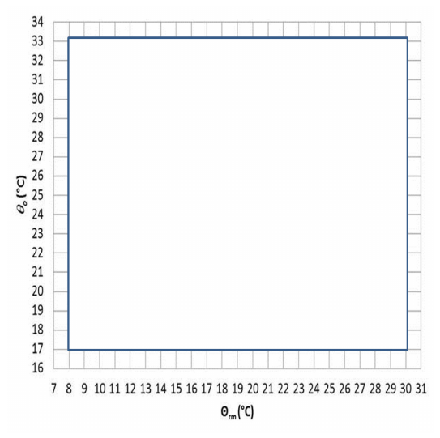

*Figure A.1 — Design values for the indoor operative temperature for buildings without mechanical cooling systems as a function of a weighted running mean of the outdoor temperature*

The outdoor running mean temperature is calculated by means of Formula (A.1):

> Θ<sub>rm</sub> = (1 −α).{Θ<sub>ed−1</sub> +α.Θ<sub>ed−2</sub> +α<sup>2</sup>Θ<sub>ed−3</sub>}&emsp;**(A.1)**

where

- Θ<sub>rm</sub> = outdoor running mean temperature for the considered day (°C).
- Θ<sub>rm-1</sub> = running mean outdoor air temperature for previous day
- α = constant between 0 and 1 (recommended value is 0,8)
- Θ<sub>ed-I</sub> = daily mean outdoor air temperature for the i-th previous day

Include any assumptions for the use of Figure A.1.

#### A.2.3 Increased air velocity

Under summer comfort conditions with indoor operative temperatures > 25 °C artificially increased air velocity can be used to compensate for increased air temperatures in accordance with Table A.4 only if the increased air velocity is under personal control.

<!-- str. 37 -->

**Table A.4 — Indoor operative temperature correction (ΔΘo) that can be applied when buildings are equipped with fans, personal systems that provide building occupants with personal control over air speed at workstation level**

| Average Air Speed (Va) 0,6 m/s | Average Air Speed (Va) 0,9 m/s | Average Air Speed (Va) 1,2 m/s |
|---|---|---|

#### A.2.4 Recommended indoor temperatures for energy calculations

**Table A.5 — Temperature ranges for hourly calculation of cooling and heating energy in 1–4 categories of indoor environment**

| Type of building or space | Category | Temperature range for heating, °C | Temperature range for cooling, °C |
|---|---|---|---|
| Residential buildings, living spaces | I |  |  |
| (bed room’s living rooms etc.) | II |  |  |
|  | III |  |  |
|  | IV |  |  |
| Residential buildings, other spaces | I |  |  |
| (kitchens, storages etc.) | II |  |  |
|  | III |  |  |
| Offices and spaces with similar activity (single offices, open plan | I |  |  |
| offices, conference rooms, auditorium, | II |  |  |
| cafeteria, restaurants, class rooms etc.) | III |  |  |
|  | IV |  |  |
| OTHER |  |  |  |

Assumptions regarding clothing and activity shall be given.

<!-- str. 38 -->

### A.3 Basis criteria for indoor air quality and ventilation rates

NOTE This clause includes all national recommended criteria for air quality and ventilation rates

#### A.3.1 Design ventilation air flow rates for non-residential buildings

##### A.3.1.1 General

Due to health reasons the minimum airflow rate shall not be less than 4 l/s/person and the WHO

Guideline values in A.7 shall be met. The air flow rates given in this clause are design ventilation air flow rates.

The air flow rates given in this annex assume complete mixing in the room (concentration of pollutants is equal in extract and in occupied zone). Ventilation rates shall be adjusted according to the ventilation effectiveness if the performance of air distribution differs from complete mixing in accordance with EN 16798-3.

##### A.3.1.2 Method 1 - Method based on perceived air quality

The design ventilation rate is calculated from two components (a) ventilation to dilute/remove pollution from the occupants (bio effluents) and (b) ventilation to remove/dilute pollution from the building and systems. The ventilation for each category is the sum of these two components as illustrated with the Formula (1) in 6.3.2.2.

The ventilation rates for occupants are presented for non-adapted.

The total ventilation rate depends on occupant density and building type. A building is by default a low-polluting building unless prior activity has resulted in pollution of the building (e.g. smoking). In this case, the building shall be regarded as non-low polluting. The category very low-polluting requires that the majority of building materials used for finishing the interior surfaces meet the national or international criteria of very low-polluting materials. How to define very low-polluting building materials is given in A.4.

Values for occupants (q<sub>p</sub>) only are listed in Table A.6.

Values for at least one category shall be listed.

**Table A.6 — Design ventilation rates for non-adapted persons for diluting emissions (bio effluents) from people for different categories**

| Category | Airflow per non-adapted person l/(s.pers) |
|---|---|
| I |  |
| II |  |
| III |  |
| IV |  |

The ventilation rates (q<sub>B</sub>) for the building emissions are calculated according to Table A.7.

<!-- str. 39 -->

**Table A.7 — Design ventilation rates for diluting emissions from buildings**

| Category | Very low polluting building l/(s m<sup>2</sup>) | Low polluting building l/(s m<sup>2</sup>) | Non low-polluting building l/(s m<sup>2</sup>) |
|---|---|---|---|
| I |  |  |  |
| II |  |  |  |
| III |  |  |  |
| IV |  |  |  |

**For e**xample of single office design ventilation air flow rates**, see** Table A.8

**Table A.8 — Example of design ventilation air flow rates for a single-person office of 10 m2 in a low polluting building (non-adapted person)**

| Category | Low-polluting building l/(s·m<sup>2</sup>) | Airflow per nonadapted person l/(s·person) | Total design ventilation air flow rate for the room l/s l/(s·person) l/(s·m<sup>2</sup>) |
|---|---|---|---|
| I |  |  |  |
| II |  |  |  |
| III |  |  |  |
| IV |  |  |  |

##### A.3.1.3 Method 2 - Method using limit values of substance concentration

The design ventilation rates are calculated in the basis of a mass balance equation for the substance concentration in the space taking into account the outdoor concentration.

If CO<sub>2</sub> is used as a tracer of human occupancy, the default limit values are listed in Table A.9.

**Table A.9 — Default design CO2 concentrations above outdoor concentration assuming a standard CO2 emission of 20 L/(h/person)**

| Category | Corresponding CO<sub>2</sub> concentration above outdoors in ppm for nonadapted persons |
|---|---|
| I |  |
| II |  |
| III |  |
| IV |  |

##### A.3.1.4 Method 3: Method based on predefined air flow rates

The design ventilation air flow rates can be expressed as a required rate per person (l/(s per person)) as a required rate per m<sup>2</sup> floor area (l/(s m<sup>2</sup>), as required air change rate, required total ventilation for either supply air flow or extract air flow rates or both.

<!-- str. 40 -->

**Table A.10 — Default predefined design ventilation air flow rates for an office (non-adapted person)**

| Category | Total design ventilation air flow rate for the room l/(s per person) l/(s·m<sup>2</sup>) |
|---|---|
| I |  |
| II |  |
| III |  |
| IV |  |

If design rates are given for both per person and per m<sup>2</sup> the highest total ventilation air flow rate should be used for design.

#### A.3.2 Design ventilation air flow rates for residential buildings

##### A.3.2.1 General

Predefined ventilation air flow rates can be given on a national level based on one or more of the following methods:

— total air change rate for the dwelling;

— extract air flows for specific rooms;

— supply air flows for specific rooms.

##### A.3.2.2 Design supply air flow rates

Table A.11 gives the default values for the three methods. It is assumed that air is supplied in living and bed rooms and extracted from wet rooms.

**Table A.11— Criteria based on pre-defined supply ventilation air flow rates: Total ventilation (1), Supply air flow (2) and (3)**

| Category | Total ventilation including air infiltration<br>(1) | Total ventilation including air infiltration<br>(1) | Supply air flow per.<br>Person<br>(2) | Supply air flow based on perceived IAQ for adapted persons<br>(3) | Supply air flow based on perceived IAQ for adapted persons<br>(3) |
|---|---|---|---|---|---|
|  | l/s,m<sup>2</sup> | ach | l/s (per person) | q<sub>p</sub> l/s (per person) | q<sub>B</sub> l/s,m<sup>2</sup> |
| I |  |  |  |  |  |
| II |  |  |  |  |  |
| III |  |  |  |  |  |
| IV |  |  |  |  |  |
| The values assume that outdoor air is the primary source. Unused outdoor air may be transferred from other rooms. These values may be converted to l/s/m<sup>2</sup> of floor area at national level depending on the average density of occupation of dwellings. |  |  |  |  |  |

Supply air flow for method 3 is based on Formula (1) from 6.3.2.2.

<!-- str. 41 -->

**Table A.12 — Design ΔCO2 concentrations in occupied rooms and in bedrooms**

| Category | Design ΔCO<sub>2</sub> concentration for occupied rooms<br>(ppm above outdoors) | Design ΔCO<sub>2</sub> concentration for bedrooms<br>(ppm above outdoors) |
|---|---|---|
| I |  |  |
| II |  |  |
| III |  |  |
| IV |  |  |

##### A.3.2.3 Design extract air flow rates

This annex give values for the design extract air flow rate based on air flow rates by room and building type (q<sub>room</sub>) are given in Tables A.13 and A.14.

**Table A.13 — Design air flow rates by room and building type (qroom)**

| Number of main rooms in | Design extract air flow rates in l/s | Design extract air flow rates in l/s | Design extract air flow rates in l/s | Design extract air flow rates in l/s | Design extract air flow rates in l/s |
|---|---|---|---|---|---|
| the dwelling | Kitchen | Bathroom or | Other wet | Toilets |  |
|  |  | shower with or without toilets | room | Single in dwelling | Multiple (2 or more in dwelling) |
| 1 |  |  |  |  |  |
| 2 |  |  |  |  |  |
| 3 |  |  |  |  |  |
| 4 |  |  |  |  |  |
| 5 and more |  |  |  |  |  |

**Table A.14 — Categories for predefined extract air flow rates**

| Categor y | Airflow rates defined in<br>Table A.13 multiplied by |
|---|---|
| I |  |
| II |  |
| III |  |
| IV |  |

Category 4 applies only if there is an additional range hood in the kitchen.

Table A.15 gives a methodology for defining default design opening areas for natural ventilation systems in dwelling. The opening areas shall be provided as supply/extract grilles, stack ducts, window grilles, or similar system.

<!-- str. 42 -->

**Table A.15 — Default design opening areas for dwellings (values to be defined on national levels)**

|   | Extract<br>Kitchen, bathrooms and toilets m<sup>2</sup> | Supply<br>Bedrooms and living rooms m<sup>2</sup> |
|---|---|---|
| Default design opening area |  |  |
| NOTE Values for bedrooms and living rooms may be given per m2 floor area or as fixed values per room. |  |  |

#### A.3.3 Ventilation air flow rate during unoccupied periods

##### A.3.3.1 Non-residential buildings

In case the ventilation is shut off, the minimum amount of air to be delivered prior to occupation shall be:

In case the ventilation is lowered, the total air flow rate for diluting emissions from building shall be:

##### A.3.3.2 Residential buildings

The total air flow rate needed to deal with building materials emissions shall be:

#### A.3.4 The recommended criteria for dimensioning of humidification and dehumidification

For buildings with no other humidity requirements than human occupancy (e.g. offices, schools and residential buildings), humidification or dehumidification is usually not needed.

Usually humidification or dehumidification is needed only in special buildings like museums, certain health care spaces, process control, paper industry etc.). If humidification or dehumidification is used the values in the Table A.16 is recommended as design values under design conditions.

**Table A.16 — Example of recommended design criteria for the humidity in occupied spaces if humidification or dehumidification systems are installed**

| Type of building/space | Category | Design relative humidity for dehumidification, % | Design relative humidity for humidification, % |
|---|---|---|---|
| Spaces where | I |  |  |
| humidity criteria are set by human | II |  |  |
| occupancy. Special | III |  |  |
| spaces (museums, churches etc.) might require other limits |  |  |  |

Besides it is recommended to limit the absolute humidity to 12 g/kg.

### A.4 How to define low and very low polluting buildings

The building is low or very low polluting if the majority of the interior materials are low or very low emitting. Low and very low emitting materials are stone, glass, ceramics and non-treated metal, which are known to show no emissions into indoor air, and materials that show low or very low emissions when tested in a ventilated test chamber after 28 days in line with international testing standards, e.g. EN 16516 or ISO 16000-3/ISO 16000-6/EN ISO 16000-9/EN ISO 16000-11, with the results calculated for the European Reference Room as specified in EN 16516.

<!-- str. 43 -->

**Table A.17 — Criteria for the different building types**

| SOURCE | Low emitting products for LPB2 | Very low emitting products for LPB1 |
|---|---|---|
| Total VOCs TVOC (as in EN 16516) |  |  |
| Formaldehyde |  |  |
| Any C1A or C1B classified carcinogenic VOC |  |  |
| R value (as in EN 16516) |  |  |

The R value includes the pollutants with limit values that have been identified.

Compliance with Table A.17 can be shown by presentation of a test report, issued by a testing laboratory with an EN ISO/IEC 17025 accreditation that includes the relevant testing standards, or by showing a valid attestation of compliance with any regulation or voluntary label that includes the above (or more stringent) limit values after 28 days storage in a ventilated test chamber (or earlier).

### A.5 Examples of criteria for lighting

**Table A.18 — Criteria for some buildings and spaces**

| Ref. | Type of area, task or activity | Ē<sub>m</sub> lx |
|---|---|---|
|  | Offices - Writing, typing, reading, data processing, -Conference and meeting rooms |  |
|  | Educational buildings - classrooms, tutorial rooms, classroom for evening classes and adults education, auditorium, lecture halls |  |
|  | Educational premises – educational buildings - sports halls, gymnasiums, swimming pools |  |
|  | Others |  |

**Table A.19 — Daylight availability classification as a function of the daylight factor DCa,j of the raw building carcass opening and DSNA**

| Vertical facades<br>Daylight factor D<sub>Ca,j</sub> | Roof lights a<br>Daylight factor D<sub>SNA</sub> | Classification of daylight availability |
|---|---|---|
| D<sub>Ca,j</sub> ≥ 6% |  |  |
| 6% > D<sub>Ca,j</sub> ≥ 4% |  |  |
| 4% > D<sub>Ca,j</sub> ≥ 2% |  |  |
| D<sub>Ca,j</sub> < 2% |  |  |
| <sup>a</sup> Values of D<sub>SNA</sub> > 10% should be avoided due to danger of overheating. |  |  |

<!-- str. 44 -->

### A.6 Indoor system noise criteria of some spaces and buildings

The values given in Table A.20 refer to noise due to building service systems inside the considered room.

**Table A.20 — Design equivalent continuous sound level, LAeq,nT [dB(A)] for continuous sources**

| Building | Type of space | Equivalent continuous sound level<br>L<sub>Aeq,nT</sub> [dB(A)] | Equivalent continuous sound level<br>L<sub>Aeq,nT</sub> [dB(A)] | Equivalent continuous sound level<br>L<sub>Aeq,nT</sub> [dB(A)] |
|---|---|---|---|---|
|  |  | I | II | III |
|  | Living-room |  |  |  |
| Residential | Bedrooms |  |  |  |
|  | Auditoriums |  |  |  |
|  | Libraries |  |  |  |
| Places of assembly | Cinemas |  |  |  |
|  | Museums |  |  |  |
|  | Retail Stores |  |  |  |
| Commercial | Department stores, Supermarkets |  |  |  |
|  | Bedrooms |  |  |  |
| Hospitals | Wards |  |  |  |
|  | Operating theatres |  |  |  |
|  | Hotel rooms |  |  |  |
| Hotels | Reception, Lobbies |  |  |  |
|  | Small offices |  |  |  |
| Offices | Landscaped offices |  |  |  |
|  | Conference rooms |  |  |  |
|  | Cafeterias |  |  |  |
| Restaurants | Bars, Dining rooms |  |  |  |
|  | Kitchens |  |  |  |
|  | Classrooms |  |  |  |
| Schools | Gymnasiums |  |  |  |
| Sport | Covered sport facilities |  |  |  |
|  | Service rooms, Corridors |  |  |  |
| General | Toilets |  |  |  |

### A.7 Criteria for substances in indoor air

Table A.21 gives suggested guideline values for indoor air pollutants some of which may come from outside.

<!-- str. 45 -->

**Table A.21 — Guidelines values for indoor and outdoor air substances**

| Substance | Indoor Air Quality guidelines |
|---|---|

In case of specific indoor pollution, ventilation rates shall be adapted to optimize the diluting effect of ventilation and additional air cleaning strategies can be considered.

<!-- str. 46 -->

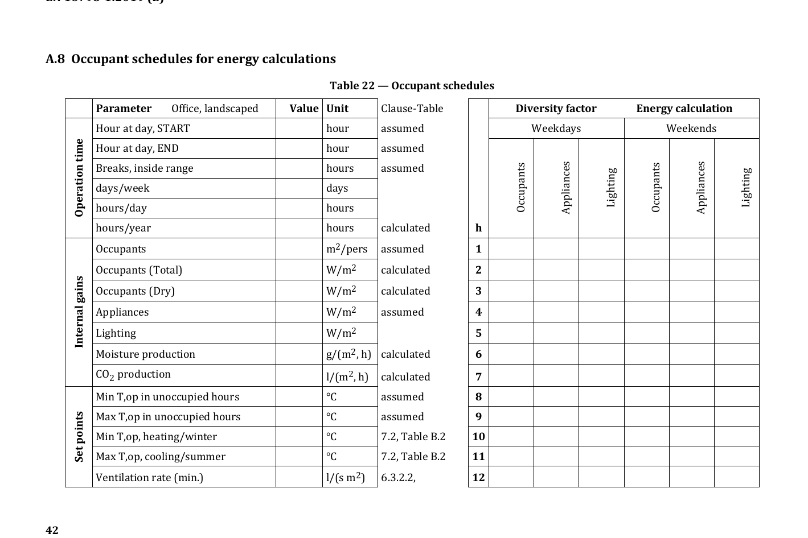

*Strana 46 — složena tabela (prikaz cele strane)*

<details><summary>Tekst tabele (za pretragu)</summary>

```text
A.8 Occupant schedules for energy calculations
                                                                  Table 22 — Occupant schedules
                      Parameter        Office, landscaped   Value Unit        Clause-Table          Diversity factor               Energy calculation
                      Hour at day, START                          hour        assumed                   Weekdays                            Weekends
     Operation time
                      Hour at day, END                            hour        assumed
                                                                                                                Appliances
                                                                                                                                                    Appliances
                      Breaks, inside range                        hours       assumed
                                                                                                    Occupants
                                                                                                                                        Occupants
                                                                                                                             Lighting
                                                                                                                                                                 Lighting
                      days/week                                   days
                      hours/day                                   hours
                      hours/year                                  hours       calculated       h
                      Occupants                                   m2/pers     assumed          1
                      Occupants (Total)                           W/m2        calculated       2
     Internal gains
                      Occupants (Dry)                             W/m2        calculated       3
                      Appliances                                  W/m2        assumed          4
                      Lighting                                    W/m2                         5
                      Moisture production                         g/(m2, h) calculated         6
                      CO2 production                              l/(m2, h)   calculated       7
                      Min T,op in unoccupied hours                °C          assumed          8
                      Max T,op in unoccupied hours                °C          assumed          9
     Set points
                      Min T,op, heating/winter                    °C          7.2, Table B.2   10
                      Max T,op, cooling/summer                    °C          7.2, Table B.2   11
                      Ventilation rate (min.)                     l/(s m2)    6.3.2.2,         12
42
```

</details>

<!-- str. 47 -->

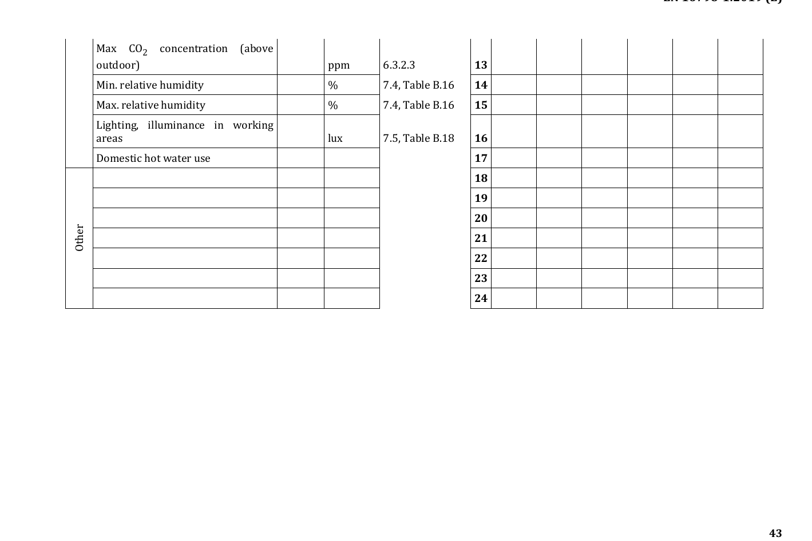

*Strana 47 — složena tabela (prikaz cele strane)*

<details><summary>Tekst tabele (za pretragu)</summary>

```text
   Max CO2      concentration   (above
   outdoor)                              ppm   6.3.2.3           13
                                                                 14
   Min. relative humidity                %     7.4, Table B.16
   Max. relative humidity                %     7.4, Table B.16   15
   Lighting, illuminance in working
   areas                                 lux   7.5, Table B.18   16
   Domestic hot water use                                        17
                                                                 18
                                                                 19
                                                                 20
Other
                                                                 21
                                                                 22
                                                                 23
                                                                 24
                                                                                      43
```

</details>

<!-- str. 48 -->

## Annex B (informative) — Default criteria for the indoor environment

### B.1 General

NOTE This annex includes all recommended default criteria for the indoor environment.

### B.2 Default criteria for the thermal environment

NOTE This clause includes all default criteria for the thermal environment

#### B.2.1 Default categories for mechanically heated and cooled buildings

Assuming different criteria for the PPD-PMV (EN ISO 7730 [10]) different categories of the indoor environment are established. Recommended PPD ranges are given in the Table B.1. For the design and dimensioning further criteria for the thermal environment (draught, vertical air temperature differences, floor temperature, and radiant temperature asymmetry) shall be taken into account (see Table B.3).

**Table B.1 — Default categories for design of mechanical heated and cooled buildings**

| Category | Thermal state of the body as a whole | Thermal state of the body as a whole |
|---|---|---|
|  | Predicted Percentage of Dissatisfied<br>PPD % | Predicted Mean Vote<br>PMV |
| I | < 6 | −0,2 < PMV < + 0,2 |
| II | < 10 | −0,5 < PMV < + 0,5 |
| III | < 15 | −0,7 < PMV < + 0,7 |
| IV | < 25 | −1,0 < PMV < + 1,0 |

<!-- str. 49 -->

**Table B.2 — Default design values of the indoor operative temperature in winter and summer for buildings with mechanical cooling systems (for more examples see FprCEN/TR 16798–2 [7])**

| Type of building/ space | Category | Operative temperature °C | Operative temperature °C |
|---|---|---|---|
|  |  | Minimum for heating<br>(winter season), approximately 1,0 clo | Maximum for cooling<br>(summer season), approximately 0,5 clo |
| Residential buildings, living spaces | I | 21,0 | 25,5 |
| (bed room’s, living rooms, kitchens, etc.) | II | 20,0 | 26,0 |
| Sedentary activity ~1,2 met | III | 18,0 | 27,0 |
|  | IV | 16,0 | 28,0 |
| Residential buildings, other spaces | I | 18,0 |  |
| (utility rooms, storages, etc.) | II | 16,0 |  |
| Standing-walking activity ~1,5 met | III | 14,0 |  |
| Offices and spaces with similar | I | 21,0 | 25,5 |
| activity (single offices, open plan offices, conference rooms, | II | 20,0 | 26,0 |
| auditorium, cafeteria, restaurants, | III | 19,0 | 27,0 |
| class rooms, Sedentary activity ~1,2 met | IV | 18,0 | 28,0 |
| NOTE A 50% relative humidity level and low air velocity level (<0,1 m/s) is assumed. |  |  |  |

Table B.2 presents design values for the indoor operative temperature in buildings that have active heating systems in operation during winter season and active cooling systems during summer season.

Assumed clothing thermal insulation level for winter and summer (clo-value) and activity level (metvalue) are listed in Table B.2. Note that the operative temperature limits shall be adjusted when clothing levels and/or activity levels are different from the values mentioned in the table.

<!-- str. 50 -->

Table B.3 gives default criteria for local thermal discomfort parameters for the three categories for design of buildings and HVAC systems.

**Table B.3 — Local thermal discomfort design criteria**

|   | Draught<br>DR<br>(Draught<br>Rate) [%] | Draught<br>Maximum air velocity <sup>a</sup><br>Winter summer [m/s] [m/s] | Draught<br>Maximum air velocity <sup>a</sup><br>Winter summer [m/s] [m/s] | Vertical air temperature difference<br>(head ankle)<br>PD [%] | Vertical air temperature difference<br>(head ankle)<br>Temp.<br>Difference <sup>b</sup> [K] | Range of floor temperature<br>PD [%] | Range of floor temperature<br>Floor surface temperature range [°C] | Radiant temperature asymmetry<br>PD [%] | Radiant temperature asymmetry<br>Warm ceiling [K] | Radiant temperature asymmetry<br>Cool wall [K] | Radiant temperature asymmetry<br>Cool ceiling [K] | Radiant temperature asymmetry<br>Warm wall [K] |
|---|---|---|---|---|---|---|---|---|---|---|---|---|
| Category I | 10 | 0,10 | 0,12 <sup>c</sup> | 3 | 2 | 10 | 19 to 29 | 5 | < 5 | < 10 | < 14 | < 23 |
| Category II | 20 | 0,16 | 0,19 <sup>c</sup> | 5 | 3 | 10 | 19 to 29 | 5 | < 5 | < 10 | < 14 | < 23 |
| Category III | 30 | 0,21 | 0,24 <sup>c</sup> | 10 | 4 | 15 | 17 to 31 | 10 | < 7 | < 13 | < 18 | < 35 |
| <sup>a</sup> Assuming an activity level of 1,2 met, a turbulence intensity of 40% and an air temperature equal to the operative temperature of around 20 °C in winter and 23 °C in summer. b<br>Difference between 1,1 and 0,1 m above the floor. <sup>c</sup> When the air temperature is above 25 °C higher maximum air speeds are allowed and often even preferred (draught becomes pleasurable breeze); but only under the condition that occupants have direct control over the air speed. See B.2.3 for examples of operative temperature corrections. |  |  |  |  |  |  |  |  |  |  |  |  |

For more information, see EN ISO 7730 [10] and FprCEN/TR 16798–2 [7].

<!-- str. 51 -->

#### B.2.2 Default acceptable indoor temperatures for buildings without mechanical cooling systems

In Figure B.1 recommended ranges of indoor operative temperatures are presented for buildings without mechanical cooling systems as function of the outdoor running mean temperature, defined below. This alternative method only applies for office buildings and other buildings of similar type (e.g. residential buildings) used mainly for human occupancy with mainly sedentary activities, where there is easy access to operable windows and occupants can freely adapt their clothing to the indoor and/or outdoor thermal conditions, where thermal conditions are regulated primarily by the occupants through opening and closing of openings (windows) in the building envelope.

During the summer season and during the shoulder seasons (spring and autumn) so-called adaptive criteria (upper and lower temperature limits that change with the running mean outdoor temperature)

shall be applied (see the cat. I, II and III upper and lower limits in Figure B.1).

During the winter season, the same temperature limits shall be applied as presented in Table B.2 for buildings with mechanical cooling systems (winter upper and lower limits are not presented in Figure B.1).

<!-- str. 52 -->

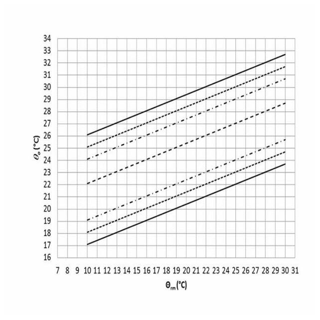

#### Key

θ<sub>o</sub> = indoor operative temperature, °C

Θ<sub>rm</sub> = running mean outdoor temperature °C

Cat. III upper limit

Cat. II upper limit

Cat. I upper limit

Comfort temperature

Cat. I lower limit

Cat. II lower limit

Cat. III lower limit

*Figure B.1 — Default design values for the indoor operative temperature for buildings without mechanical cooling systems as a function of the exponentially-weighted running mean of the outdoor temperature*

<!-- str. 53 -->

The outdoor running mean temperature is calculated by means of Formula (B.1):

> Θ<sub>rm</sub> = (1 −α).{Θ<sub>ed−1</sub> +α.Θ<sub>ed−2</sub> +α<sup>2</sup>Θ<sub>ed-3</sub>}&emsp;**(B.1)**

where

- Θ<sub>rm</sub> = Outdoor Running mean temperature for the considered day (°C).
- Θ<sub>ed-1</sub> = daily mean outdoor air temperature for previous day
- α = constant between 0 and 1 (recommended value is 0,8)
- Θ<sub>ed-i</sub> = daily mean outdoor air temperature for the i-th previous day

The following approximate formula shall be used where records of daily running mean outdoor temperature are not available:

> Θ<sub>m</sub> = (Θ<sub>ed−1</sub> + 0,8 Θ<sub>ed−2</sub> + 0,6 Θ<sub>ed−3</sub> + 0,5 Θ<sub>ed−4</sub> + 0,4 Θ<sub>ed−5</sub> + 0,3 Θ<sub>ed−6</sub> + 0,2 Θ<sub>ed−7</sub>)/3,8&emsp;**(B.2)**

The allowable indoor operative temperatures of Figure B.1 are plotted against the running mean outdoor temperature Θ<sub>rm</sub>. This is defined as the exponentially weighted running mean of the daily outdoor temperature (see Formulae (B.1) and (B.2)).

The formulae representing the lines in Figure B.1 are:

- Category I upper limit: Θ<sub>o</sub> = 0,33 Θ<sub>rm</sub>+ 18,8 + 2
- lower limit: Θ<sub>o</sub> = 0,33 Θ<sub>rm</sub> + 18,8 - 3
- Category II upper limit: Θ<sub>o</sub> = 0,33 Θ<sub>rm</sub> + 18,8 + 3
- lower limit: Θ<sub>o</sub> = 0,33 Θ<sub>rm</sub> + 18,8 - 4
- Category III upper limit: Θ<sub>o</sub> = 0,33 Θ<sub>rm</sub> + 18,8 + 4
- lower limit: Θ<sub>o</sub> = 0,33 Θ<sub>rm</sub> + 18,8 – 5

The dotted line in the middle refers to the optimal operative temperature. Formula (B.3) represents this line:

> Θ<sub>c</sub> = 0,33Θ<sub>rm</sub> + 18,8&emsp;**(B.3)**

where

- Θ<sub>o</sub> = indoor operative temperature, °C
- Θ<sub>rm</sub> = running mean outdoor temperature, °C
- Θ<sub>c</sub> = Optimal operative temperature, °C

The limits only apply when 10 < Θ<sub>rm</sub> < 30 °C.

#### B.2.3 Increased air velocity

Under summer comfort conditions with indoor operative temperatures > 25 °C artificially increased air velocity can be used to compensate for increased air temperatures according to Table B.4 only if the increased air velocity is under personal control. The correction value depends on the air speed range of the appliance.

<!-- str. 54 -->

**Table B.4 — Indoor operative temperature correction (ΔΘo) applicable for buildings equipped with fans or personal systems providing building occupants with personal control over air speed at occupant level**

| Average Air Speed (v<sub>a</sub>) 0,6 m/s | Average Air Speed (v<sub>a</sub>) 0,9 m/s | Average Air Speed (v<sub>a</sub>) 1,2 m/s |
|---|---|---|
| 1,2 °C | 1,8 °C | 2,2 °C |

w

NOTE An air speed over 0,8 m/s moves the normal office paper from the desk.

#### B.2.4 Default indoor temperatures for energy calculations

**Table B.5 — Temperature ranges for hourly calculation of cooling and heating energy in four categories of indoor environment**

| Type of building or space | Category | Temperature range for heating seasons, °C<br>Clothing approximately 1,0 clo | Temperature range for cooling seasons, °C<br>Clothing approximately 0,5 clo |
|---|---|---|---|
| Residential buildings, living spaces (bed | I | 21,0 −25,0 | 23,5 - 25,5 |
| room’s, kitchens, living rooms etc.) | II | 20,0–25,0 | 23,0 - 26,0 |
| Sedentary activity ~1,2 met | III | 18,0- 25,0 | 22,0 - 27,0 |
|  | IV | 17,0–25,0 | 21,0 – 28,0 |
| Residential buildings, other spaces (utility | I | 18,0–25,0 |  |
| rooms, storages etc.) | II | 16,0–25,0 |  |
| Standing-walking activity ~1,5 met | III | 14,0–25,0 |  |
| Offices and spaces with similar activity | I | 21,0 – 23,0 | 23,5 - 25,5 |
| (single offices, open plan offices, conference rooms, auditoria, cafeteria, | II | 20,0 – 24,0 | 23,0 - 26,0 |
| restaurants, class rooms) | III | 19,0 – 25,0 | 22,0 - 27,0 |
| Sedentary activity ~1,2 met | IV | 17,0–25,0 | 21,0 – 28,0 |
| During the between heating and cooling seasons (with Θ<sub>rm</sub> between 10 and 15°C) temperature limits that lie in between the winter and summer values may be used. Air velocity is assumed < 0,1 m/s and RH~40% for heating season and 60% for cooling season. |  |  |  |

The mean design operative temperature can vary from the values shown to take account of e.g. local custom or a desire for energy saving so long as the within-day variation from the design temperature is within the given range, and the occupants are given time and opportunity to adapt to the modified design temperature.

During between the heating and cooling seasons (with Θ<sub>rm</sub> between around 10 and 15 °C), adjusted upper and lower temperature limits may be used that lie in between the winter and summer values mentioned in Table B.5.

<!-- str. 55 -->

### B.3 Basis for the criteria for indoor air quality and ventilation rates

NOTE This clause includes criteria for indoor air quality and ventilation rates.

#### B.3.1 Default design ventilation air flow rates

##### B.3.1.1 General

Due to health reasons the total minimum airflow rate during occupancy expressed as l/s per person should never be below 4 l/s per person (Table B.6) and the WHO Guideline values in B.7 is met. The default air flow rates given in this sub-clause B.3.1 are design ventilation air flow rates.

The default air flow rates given in this annex assume complete mixing in the room (concentration of pollutants is equal in extract and in occupied zone). For non-residential buildings ventilation rates should be adjusted by the ventilation effectiveness in accordance with EN 16798-3 if the air distribution differs from complete mixing.

##### B.3.1.2 Method 1: method based on perceived air quality

The design ventilation rate is calculated from two components (a) ventilation to dilute/remove pollution from the occupants (bio effluents) and (b) ventilation to remove/dilute pollution from the building and systems. The ventilation for each category is the sum of these two components as illustrated with the Formula (1) in 6.3.2.2.

The ventilation rates for occupants are presented for non-adapted.

The total ventilation rate will then depend on occupancy density and building type. Examples of the total ventilation rates for non-industrial, non-residential buildings based on these values with default occupancy density are shown in FprCEN/TR 16798–2 [7].

A building is a low-polluting building if the majority of building materials are low emitting and activity does not result in pollution of the building (e.g. smoking).

The category very low-polluting requires that the majority of building materials used for finishing the interior surfaces meet the national or international criteria of very low-polluting materials. An example of how to define very low-polluting building materials is given in B.4.

Values for occupants (q<sub>p</sub>) only are listed in Table B.6.

**Table B.6 — Design ventilation rates for sedentary, adults, non-adapted persons for diluting emissions (bio effluents) from people for different categories**

| Category | Expected<br>Percentage<br>Dissatisfied | Airflow per non-adapted person l/(s per person) |
|---|---|---|
| I | 15 | 10 |
| II | 20 | 7 |
| III | 30 | 4 |
| IV | 40 | 2,5 |

The ventilation rates (q<sub>B</sub>) for the building emissions are given in Table B.7.

<!-- str. 56 -->

**Table B.7 — Design ventilation rates for diluting emissions from different type of buildings**

| Category | Very low polluting building, LPB-1 l/(s m<sup>2</sup>) | Low polluting building, LPB-2 l/(s m<sup>2</sup>) | Non low-polluting building, LPB-3 l/(s m<sup>2</sup>) |
|---|---|---|---|
| I | 0,5 | 1,0 | 2,0 |
| II | 0,35 | 0,7 | 1,4 |
| III | 0,2 | 0,4 | 0,8 |
| IV | 0,15 | 0,3 | 0,6 |

**Table B.8 — Example of default design ventilation air flow rates for a single-person office of 10 m2 in a low polluting building (non-adapted person)**

| Category | Low-polluting building l/(s·m<sup>2</sup>) | Airflow per non-adapted person l/(s per person) | Total design ventilation air flow rate for the room expressed in different ways l/s l/(s per person) l/(s·m<sup>2</sup>) |
|---|---|---|---|
| I | 1,0 | 10 | 20 20 2 |
| II | 0,7 | 7 | 14 14 1,4 |
| III | 0,4 | 4 | 8 8 0,8 |
| IV | 0,3 | 2,5 | 5,5 5,5 0,55 |

As seen from Table B.8 the total ventilation rate is never lower than 4 l/s per person. The ventilation rate should always be higher than 4 l/s per person (minimum 4 l/s per person for human emissions and a part for building and activity related emissions).

##### B.3.1.3 Method 2 - method using limit values of substance concentration

The design ventilation rates are calculated based on a mass balance formula for the substance concentration in the space taking into account the outdoor concentration.

If CO<sub>2</sub> is used as a tracer of human occupancy, the default limit values are extracted from Table B.9.

Further recommended criteria for the CO<sub>2</sub> calculation are included in FprCEN/TR 16798–2 [7]. The listed

CO<sub>2</sub> values can also be used for demand controlled ventilation.

**Table B.9 — Default design CO2 concentrations above outdoor concentration assuming a standard CO2 emission of 20 L/(h per person)**

| Category | Corresponding CO<sub>2</sub> concentration above outdoors in PPM for nonadapted persons |
|---|---|
| I | 550 (10) |
| II | 800 (7) |
| III | 1 350 (4) |
| IV | 1 350 (4) |

<!-- str. 57 -->

##### B.3.1.4 Method 3 Method based on predefined ventilation flow rates

The design ventilation air flow rates can also be expressed as a required rate per person (l/(s per person))

or as a required rate per m<sup>2</sup> floor area (l/(s·m<sup>2</sup>).

**Table B.10 — Default predefined design ventilation air flow rates for an office (non-adapted person)**

| Category | Total design ventilation air flow rate for the room | Total design ventilation air flow rate for the room |
|---|---|---|
|  | l/(s per person) | l/(s·m<sup>2</sup>) |
| I | 20 | 2 |
| II | 14 | 1,4 |
| III | 8 | 0,8 |
| IV | 5,5 | 0,55 |

If design rates are given for both per person and per m<sup>2</sup> the higher ventilation air flow rate should be used for design.

The present example gives the same total ventilation as Method 1. Further examples are given in FprCEN/TR 16798–2 [7].

##### B.3.1.5 Ventilation air flow rate during unoccupied periods

In case the ventilation is shut off, the minimum amount of air to be delivered prior to occupation is by default: 1 volume within 2 hours of the zone to be ventilated.

In case the ventilation is lowered for un-occupied periods, the total air flow rate for diluting emissions from building should be minimum 0,15 l/s.m<sup>2</sup> of floor area in all rooms.

#### B.3.2 Default design ventilation air flow rates for residential buildings

##### B.3.2.1 General

Predefined ventilation air flow rates can be given based on one or more of the following components:

— total air change rate for the dwelling;

— extract air flows for specific rooms;

— supply air flows for specific rooms;

— design opening areas for natural ventilation.

Any of the criteria can be used in the design.

Both the total air flow rate for the entire dwelling and the extract air flow rate from wet rooms shall be calculated. Either one of the criteria can be used in the design.

##### B.3.2.2 Design supply air flow rates

Table B.11 gives the default values for the three criteria. It is assumed that air is supplied in living and bed rooms and extracted from wet rooms.

<!-- str. 58 -->

**Table B.11 — Criteria based on pre-defined supply ventilation air flow rates: Total ventilation (1), Supply air flow (2) and (3)**

| Category | Total ventilation including air infiltration<br>(1) | Total ventilation including air infiltration<br>(1) | Supply air flow per. person<br>(2) | Supply air flow based on perceived IAQ for adapted persons<br>(3) | Supply air flow based on perceived IAQ for adapted persons<br>(3) |
|---|---|---|---|---|---|
|  | l/s,m<sup>2</sup> | ach | l/s (per person) <sup>a</sup> | q<sub>p</sub> l/s (per person) | q<sub>B</sub> l/s,m<sup>2</sup> |
| I | 0,49 | 0,7 | 10 | 3,5 | 0,25 |
| II | 0,42 | 0,6 | 7 | 2,5 | 0,15 |
| III | 0,35 | 0,5 | 4 | 1,5 | 0,1 |
| IV | 0,23 | 0,4 |  |  |  |
| <sup>a</sup> Supply air flow for Method 3 is based on Formula (1) from 6.3.2.2. |  |  |  |  |  |

The values in Table B.12 assume that supply air is outdoor air, or unused air transferred from other rooms. These values may be converted to l/(s m<sup>2</sup>) of floor area at national level depending on the average number of occupants in dwellings.

**Table B.12 — Design CO2 concentrations in occupied living rooms and bedrooms**

| Category | Design ΔCO<sub>2</sub> concentration for living rooms<br>(ppm above outdoors) | Design ΔCO<sub>2</sub> concentration for bedrooms<br>(ppm above outdoors) |
|---|---|---|
| I | 550 | 380 |
| II | 800 | 550 |
| III | 1 350 | 950 |
| IV | 1 350 | 950 |
| NOTE 1 The above values in Table B.12 correspond to the equilibrium concentration when the air flow rate is 4, 7, 10 l/s per person for cat. I, II, III respectively and the CO<sub>2</sub> emission is 20 l /h per person and 13,6 l/h per person for living rooms and bedrooms respectively.<br>NOTE 2 For a 10 m<sup>2</sup> room (room height 2,5 m, 25 m<sup>3</sup>) 4; 7 and 10 l/s per person correspond, with two persons in the room, to an air change rate of 1,2; 2,0 and 2,9 ACH. |  |  |

##### B.3.2.3 Design extract air flow rates

This annex gives default values for the design extract air flow rate based on air flow rates by room and building type (q<sub>room</sub>) given in Table B.13 and B.14.

<!-- str. 59 -->

**Table B.13 — Design air flow rates by room and building type (qroom)**

| Number of | Design extract air flow rates in l/s | Design extract air flow rates in l/s | Design extract air flow rates in l/s | Design extract air flow rates in l/s | Design extract air flow rates in l/s |
|---|---|---|---|---|---|
| main rooms in the dwelling | Kitchen | Bathroom or | Other wet | Toilets |  |
|  |  | shower with or without toilets | room | Single in dwelling | Multiple (2 or more in dwelling) |
| 1 | 20 | 10 | 10 | 10 | 10 |
| 2 | 25 | 10 | 10 | 10 | 10 |
| 3 | 30 | 15 | 10 | 10 | 10 |
| 4 | 35 | 15 | 10 | 15 | 10 |
| 5 and more | 40 | 15 | 10 | 15 | 10 |

**Table B.14 — Categories for predefined extract air flow rates**

| Category | Airflow rates defined in Table B.13 multiplied by |
|---|---|
| I | 1,4 |
| II | 1 |
| III | 0,7 |
| IV | 0,5 |
| NOTE In the tables only the category numbers are used without the IEQx symbol. |  |

Category 4 applies only if there is an additional range hood in the kitchen.

**B.3.2.4 Design opening areas for natural ventilation.**

Table B.15 gives a methodology for defining default design opening areas for natural ventilation systems in dwelling. The opening areas shall be provided as supply/extract grilles, stack ducts, window grilles, or similar system. When designing with design opening areas, the local climatic conditions should be taken into account.

**Table B.15 — Default design opening areas for dwellings**

|   | Extract<br>Kitchen, bathrooms and toilets<br>(cm<sup>2</sup>) | Supply<br>Bedrooms and living rooms<br>(cm<sup>2</sup>) |
|---|---|---|
| Default design opening area | 100 per room | 60 per room |
| NOTE Values for bedrooms and living rooms may be given per m2 floor area or as fixed values per room. |  |  |

##### B.3.2.5 Design ventilation air flow rate during unoccupied periods

The total air flow rate needed to deal with building materials emissions and humidity reduction is between 0,1 and 0,15 l/(s·m<sup>2</sup>) of floor area, depending on the size and occupancy of the dwelling.

<!-- str. 60 -->

#### B.3.3 The recommended criteria for dimensioning of humidification and dehumidification

For buildings with no other humidity requirements than human occupancy (e.g. offices, schools and residential buildings), humidification or dehumidification is usually not needed.

Usually humidification or dehumidification is needed only in special buildings like museums, certain health care spaces, process control, paper industry, etc.). If humidification or dehumidification is used the values in the Table B.16 is recommended as design values under design conditions.

**Table B.16 — Example of recommended design criteria for the humidity in occupied spaces if humidification or dehumidification systems are installed**

| Type of building/space | Category | Design relative humidity for dehumidification, % | Design relative humidity for humidification, % |
|---|---|---|---|
| Spaces where | I | 50 | 30 |
| humidity criteria are set by human | II | 60 | 25 |
| occupancy. Special | III | 70 | 20 |
| spaces (museums, churches, etc.) may require other limits |  |  |  |

Besides it is recommended to limit the absolute humidity to 12g/kg.

The recommended air flow rates in B.3.1 and B.3.2 may increase the risk of too dry air in very cold climate.

In these cases, especially for IEQ category l and II is recommended to use humidity recovery.

See FprCEN/TR 16798–2 [7] for further guidance.

### B.4 Example on how to define low and very low polluting buildings

The building is low or very low polluting if the majority of the interior materials are low or very low emitting. Low and very low emitting materials are stone, glass, ceramics and non-treated metal, which are known to show no emissions into indoor air, and materials that show low or very low emissions when tested in a ventilated test chamber after 28 days in line with international testing standards like

EN 16516 or ISO 16000-3/ISO 16000-6/EN ISO 16000-9/EN ISO 16000-11, with the results calculated for the European Reference Room as specified in EN 16516.

**Table B.17 —Criteria for the different building types**

| SOURCE | Low emitting products for low polluted buildings | Very low emitting products for very low polluted buildings |
|---|---|---|
| Total VOCs TVOC (as in EN 16516) | < 1 000 µg/m<sup>3</sup> | < 300 µg/m<sup>3</sup> |
| Formaldehyde | < 100 µg/m<sup>3</sup> | < 30 µg/m<sup>3</sup> |
| Any C1A or C1B classified carcinogenic<br>VOC | < 5 µg/m<sup>3</sup> | < 5 µg/m<sup>3</sup> |
| R value (as in EN 16516) | < 1,0 | < 1,0 |

The R value includes the pollutants with limit values that have been identified.

Compliance can be shown by presentation of a test report, issued by a testing laboratory with an EN ISO/IEC 17025 accreditation that includes the relevant testing standards,, or by showing a valid attestation of compliance with any regulation or voluntary label that includes the above (or more stringent) limit values after 28 days storage in a ventilated test chamber (or earlier).

<!-- str. 61 -->

### B.5 Examples of criteria for lighting

**Table B.18 — Examples of criteria for some buildings and spaces according to the EN 12464 series**

| Ref. n° acc. to EN 12464–1:2011 | Type of area, task or activity | Ē<sub>m</sub> lx |
|---|---|---|
| 5.26.2 5.26.5 | Offices - Writing, typing, reading, data processing, -Conference and meeting rooms | 500 |
| 5.36.1–5.36.3 | Educational buildings - Classrooms, tutorial rooms, Classroom for evening classes and adults education, Auditorium, lecture halls | 500 |
| 5.36.24 | Educational premises – Educational buildings - Sports halls, gymnasiums, swimming pools | 300 |
| NOTE Specific use of visual tasks not yet identified. For detailed design specific lighting standards like<br>EN 12464–1 are needed. |  |  |

**Table B.19 — Daylight availability classification as a function of the daylight factor DCa,j of the raw building envelop opening and DSNA**

| Vertical Facades<br>Daylight factor D<sub>Ca,j</sub> | Roof lights<br>Daylight factor D<sub>SNA</sub> |
|---|---|
| D<sub>Ca,j</sub> ≥ 6% | a 7% < D<sub>SNA</sub> |
| 6% > D<sub>Ca,j</sub> ≥ 4% | 7% > D<sub>SNA</sub> ≥ 4% |
| 4% > D<sub>Ca,j</sub> ≥ 2% | 4% > D<sub>SNA</sub> ≥ 2% |
| D<sub>Ca,j</sub> < 2% | 2% > D<sub>SNA</sub> ≥ 0% |
| <sup>a</sup> Values of D<sub>SNA</sub> > 10% should be avoided due to danger of overheating. |  |

Besides the risk of overheating also the risk of glare should be evaluated with increased use of daylight (see FprCEN/TR 16798–2 [7]).

<!-- str. 62 -->

### B.6 Indoor system noise criteria of some spaces and buildings

**Table B.20 — Examples of design equivalent continuous sound level, LAeq,nT [dB(A)] for continuous sources**

| Building | Type of space | Equivalent Continuous Sound Level<br>L<sub>Aeq,nT</sub> [dB(A)] | Equivalent Continuous Sound Level<br>L<sub>Aeq,nT</sub> [dB(A)] | Equivalent Continuous Sound Level<br>L<sub>Aeq,nT</sub> [dB(A)] |
|---|---|---|---|---|
|  |  | I | II | III |
|  | Living-room | ≤ 30 | ≤ 35 | ≤ 40 |
| Residential | Bedrooms | ≤ 25 | ≤ 30 | ≤ 35 |
|  | Auditoriums | ≤ 24 | ≤ 28 | ≤ 32 |
|  | Libraries | ≤ 25 | ≤ 30 | ≤ 35 |
| Places of assembly | Cinemas | ≤ 24 | ≤ 28 | ≤ 32 |
|  | Museums | ≤ 28 | ≤ 32 | ≤ 36 |
|  | Retail Stores | ≤ 35 | ≤ 40 | ≤ 45 |
| Commercial | Department stores, Supermarkets | ≤ 40 | ≤ 45 | ≤ 50 |
|  | Bedrooms | ≤ 25 | ≤ 30 | ≤ 35 |
| Hospitals | Wards | ≤ 32 | ≤ 36 | ≤ 40 |
|  | Operating theatres | ≤ 35 | ≤ 40 | ≤ 45 |
|  | Hotel rooms | ≤ 25 | ≤ 30 | ≤ 35 |
| Hotels | Reception, Lobbies | ≤ 30 | ≤ 35 | ≤ 40 |
|  | Small offices | ≤ 30 | ≤ 35 | ≤ 40 |
| Offices | Landscaped offices | ≤ 35 | ≤ 40 | ≤ 45 |
|  | Conference rooms | ≤ 30 | ≤ 35 | ≤ 40 |
|  | Cafeterias | ≤ 35 | ≤ 40 | ≤ 45 |
| Restaurants | Bars, Dining rooms | ≤ 32 | ≤ 36 | ≤ 40 |
|  | Kitchens | ≤ 45 | ≤ 50 | ≤ 55 |
|  | Classrooms | ≤ 30 | ≤ 34 | ≤ 38 |
| Schools | Gymnasiums | ≤ 35 | ≤ 40 | ≤ 45 |
| Sport | Covered sport facilities | ≤ 35 | ≤ 40 | ≤ 45 |
|  | Service rooms, Corridors | ≤ 35 | ≤ 40 | ≤ 45 |
| General | Toilets | ≤ 35 | ≤ 45 | ≤ 55 |

The values given in Table B.20 refer to sound generated inside the considered room by building service systems.

Further information in FprCEN/TR 16798–2.

<!-- str. 63 -->

### B.7 WHO health-based criteria for indoor air

Table B.21, 2nd column gives suggested guideline values for indoor and outdoor air pollutants as formulated by the WHO. For some pollutants no indoor air requirements have been defined yet by WHO.

For those values only WHO outdoor requirements are presented, see the 3<sup>rd</sup> column.

**Table B.21 — WHO guideline values for indoor and outdoor air pollutants**

| Pollutant | WHO<br>Indoor Air Quality guidelines 2010 | WHO<br>Air Quality guidelines 2005 |
|---|---|---|
| Benzene | No safe level can be determined | - |
| Carbon monoxide | 15 min. mean: 100 mg/m<sup>3</sup> 1 h mean: 35 mg/m<sup>3</sup> 8h mean: 10 mg/m<sup>3</sup> 24 h mean: 7 mg/m<sup>3</sup> | - |
| Formaldehyde | 30 min. mean: 100 µg/m<sup>3</sup> | - |
| Naphthalene | Annual mean: 10 µg/m<sup>3</sup> | - |
| Nitrogen dioxide | 1 h mean: 200 µg/m<sup>3</sup><br>Annual mean: 20 µg/m<sup>3</sup> | - |
| Polyaromatic Hydrocarbons<br>(e.g. Benzo Pyrene A B[a]P) | No safe level can be determined | - |
| Radon | 100 Bq/m<sup>3</sup><br>(sometimes 300 mg/m<sup>3</sup>, country-specific) | - |
| Trichlorethylene | No safe level can be determined | - |
| Tetrachloroethylene | Annual mean: 250 µg/m<sup>3</sup> |  |
| Sulfure dioxide | - | 10 min. mean: 500 µg/m<sup>3</sup> 24 h mean: 20 µg/m<sup>3</sup> |
| Ozone | - | 8 h mean: 100 µg/m<sup>3</sup> |
| Particulate Matter<br>PM 2,5 | - | 24 h mean: 25 µg/m<sup>3</sup><br>Annual mean: 10 µg/m<sup>3</sup> |

<!-- str. 64 -->

| Pollutant | WHO<br>Indoor Air Quality guidelines 2010 | WHO<br>Air Quality guidelines 2005 |
|---|---|---|
| Particulate Matter<br>PM 10 | - | 24 h mean: 50 µg/m<sup>3</sup><br>Annual mean: 20 µg/m<sup>3</sup> |

WHO Air Quality Guidelines values may be considered as a reference for indoor air quality when no other guidelines or national recommendations for indoor air quality value exist. Due to health effects confirmed at lower concentrations than current limit values and carcinogenic effect, the level of PAHs, particles, benzene should always be kept as low as possible.

In case of specific indoor pollution, ventilation rates shall be adapted to optimize the diluting effect of ventilation and additional air cleaning strategies can be considered.

### B.8 Occupants schedules for energy calculations

If occupant schedules and internal loads are know these should be used for calculation of the energy performance.

The following default occupant schedules (Annex C)are examples that can be used as input to calculations of energy use in a building, when a standard calculation is made and now specific values are available for a project.

The criteria used for room temperatures, ventilation, and humidity are based on IEQ category IEQ<sub>I</sub>. (Table 4) work place to work place depending on type of task.

The values in the tables cannot be used as standalone criteria and input values for design and energy calculations. The standard as a whole should be used.

In the example below a reference is given to the sections and tables of the standard where the values come from.

<!-- str. 65 -->

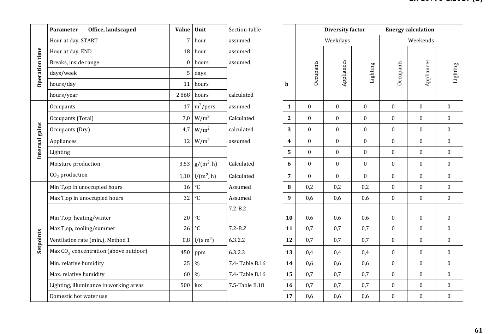

*Strana 65 — složena tabela (prikaz cele strane)*

<details><summary>Tekst tabele (za pretragu)</summary>

```text
                 Parameter        Office, landscaped      Value Unit          Section-table                   Diversity factor                   Energy calculation
                 Hour at day, START                          7 hour           assumed                         Weekdays                                        Weekends
Operation time
                 Hour at day, END                           18 hour           assumed
                 Breaks, inside range                        0 hours          assumed
                                                                                                                         Appliances
                                                                                                                                                                         Appliances
                                                                                                         Occupants
                                                                                                                                                         Occupants
                                                                                                                                          Lighting
                                                                                                                                                                                          Lighting
                 days/week                                   5 days
                 hours/day                                  11 hours                            h
                 hours/year                               2 868 hours         calculated
                 Occupants                                  17 m2/pers        assumed           1    0               0                0              0               0                0
                 Occupants (Total)                          7,0   W/m2        Calculated        2    0               0                0              0               0                0
Internal gains
                 Occupants (Dry)                            4,7 W/m2          calculated        3    0               0                0              0               0                0
                 Appliances                                 12 W/m2           assumed           4    0               0                0              0               0                0
                 Lighting                                                                       5    0               0                0              0               0                0
                 Moisture production                       3,53   g/(m2, h)   Calculated        6    0               0                0              0               0                0
                 CO2 production                            1,10 l/(m2, h)     Calculated        7    0               0                0              0               0                0
                 Min T,op in unoccupied hours               16 °C             Assumed           8    0,2             0,2              0,2            0               0                0
                 Max T,op in unoccupied hours               32 °C             Assumed           9    0,6             0,6              0,6            0               0                0
                                                                              7.2-B.2
                 Min T,op, heating/winter                   20 °C                               10   0,6             0,6              0,6            0               0                0
                 Max T,op, cooling/summer                   26 °C             7.2-B.2           11   0,7             0,7              0,7            0               0                0
Setpoints
                 Ventilation rate (min.), Method 1          0,8   l/(s m2)    6.3.2.2           12   0,7             0,7              0,7            0               0                0
                 Max CO2 concentration (above outdoor)     450 ppm            6.3.2.3           13   0,4             0,4              0,4            0               0                0
                 Min. relative humidity                     25 %              7.4- Table B.16   14   0,6             0,6              0,6            0               0                0
                 Max. relative humidity                     60 %              7.4- Table B.16   15   0,7             0,7              0,7            0               0                0
                 Lighting, illuminance in working areas    500 lux            7.5-Table B.18    16   0,7             0,7              0,7            0               0                0
                 Domestic hot water use                                                         17   0,6             0,6              0,6            0               0                0
                                                                                                                                                                                                     61
```

</details>

<!-- str. 66 -->

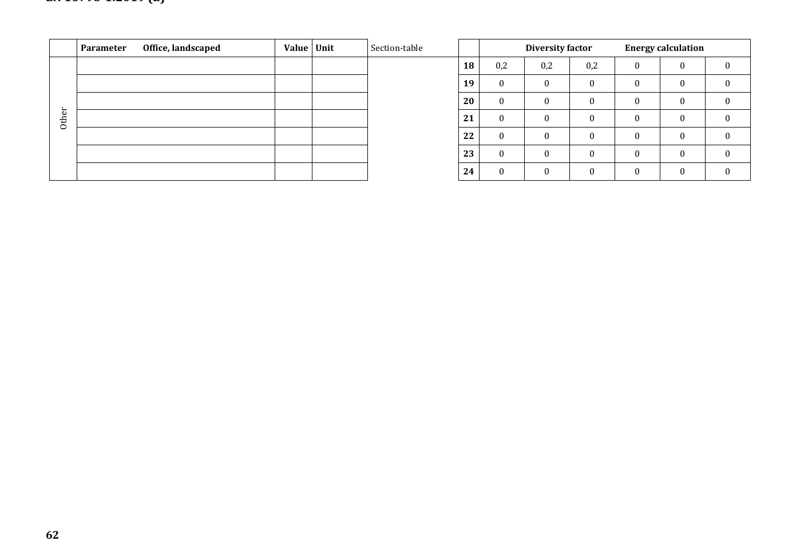

*Strana 66 — složena tabela (prikaz cele strane)*

<details><summary>Tekst tabele (za pretragu)</summary>

```text
     Parameter   Office, landscaped   Value Unit   Section-table              Diversity factor    Energy calculation
                                                                   18   0,2      0,2        0,2     0         0        0
                                                                   19
                                                                        0         0          0      0         0        0
                                                                   20   0         0          0      0         0        0
 Other
                                                                   21   0         0          0      0         0        0
                                                                   22   0         0          0      0         0        0
                                                                   23   0         0          0      0         0        0
                                                                   24   0         0          0      0         0        0
62
```

</details>

<!-- str. 67 -->

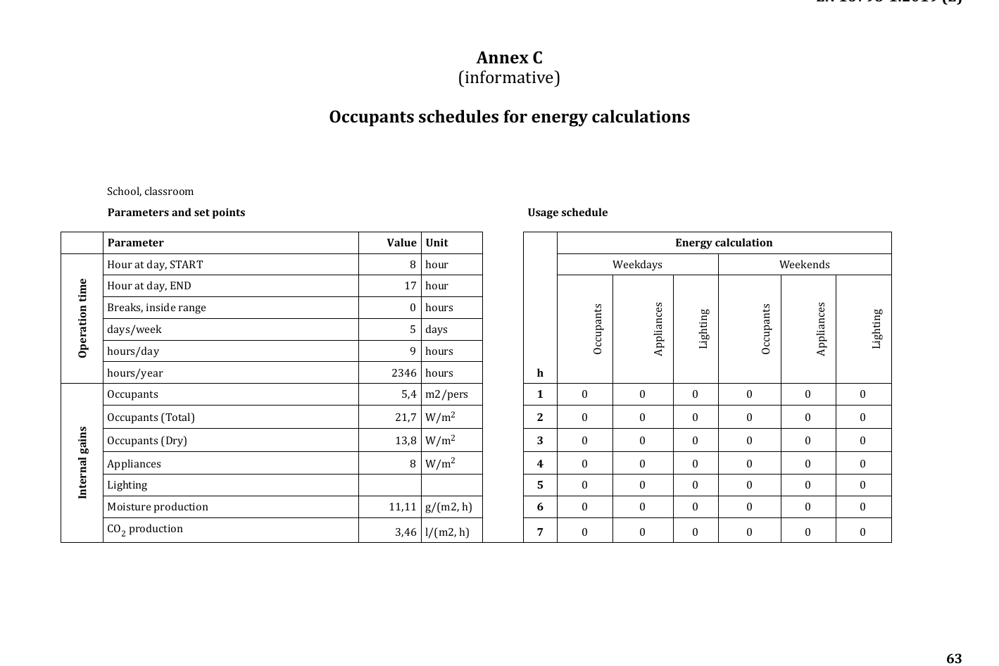

*Strana 67 — složena tabela (prikaz cele strane)*

<details><summary>Tekst tabele (za pretragu)</summary>

```text
                                                                      Annex C
                                                                   (informative)
                                             Occupants schedules for energy calculations
                 School, classroom
                 Parameters and set points                                 Usage schedule
                 Parameter                         Value Unit                                                 Energy calculation
                 Hour at day, START                    8 hour                                Weekdays                                   Weekends
Operation time
                 Hour at day, END                     17 hour
                 Breaks, inside range                  0 hours
                                                                                                        Appliances
                                                                                                                                                    Appliances
                                                                                        Occupants
                                                                                                                                    Occupants
                                                                                                                     Lighting
                                                                                                                                                                     Lighting
                 days/week                             5 days
                 hours/day                             9 hours
                 hours/year                         2346 hours              h
                 Occupants                            5,4 m2/pers           1       0               0                0          0               0                0
                 Occupants (Total)                   21,7   W/m2            2       0               0                0          0               0                0
Internal gains
                 Occupants (Dry)                     13,8 W/m2              3       0               0                0          0               0                0
                 Appliances                            8    W/m2            4       0               0                0          0               0                0
                 Lighting                                                   5       0               0                0          0               0                0
                 Moisture production                11,11 g/(m2, h)         6       0               0                0          0               0                0
                 CO2 production                      3,46 l/(m2, h)         7       0               0                0          0               0                0
                                                                                                                                                                                63
```

</details>

<!-- str. 68 -->

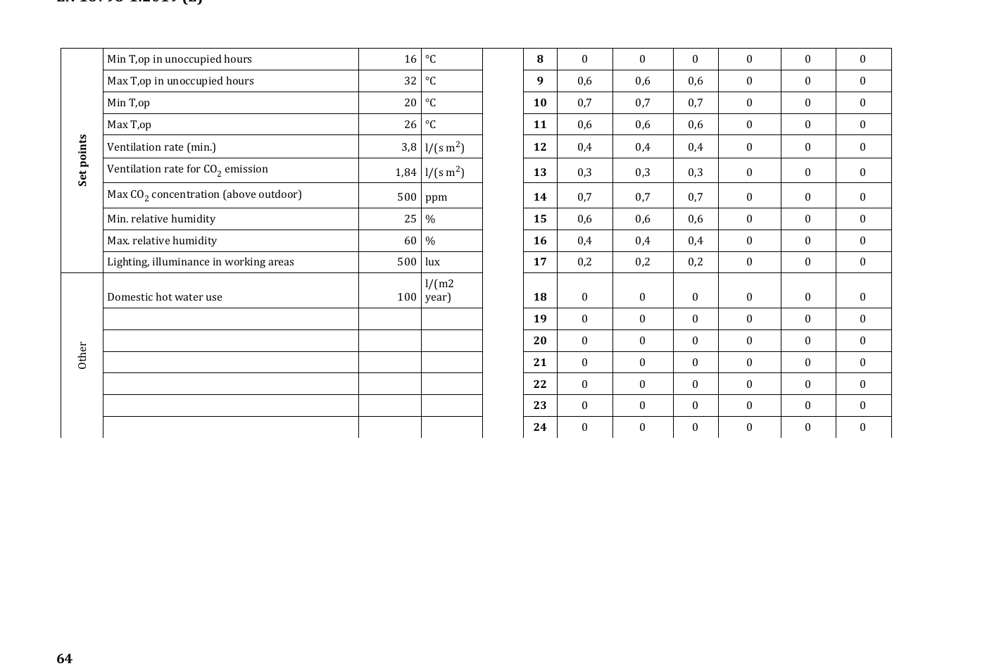

*Strana 68 — složena tabela (prikaz cele strane)*

<details><summary>Tekst tabele (za pretragu)</summary>

```text
                  Min T,op in unoccupied hours              16 °C          8    0     0     0     0   0   0
                  Max T,op in unoccupied hours              32 °C          9    0,6   0,6   0,6   0   0   0
                                                                           10
                  Min T,op                                  20 °C               0,7   0,7   0,7   0   0   0
                  Max T,op                                  26 °C          11   0,6   0,6   0,6   0   0   0
     Set points
                  Ventilation rate (min.)                   3,8 l/(s m2)   12   0,4   0,4   0,4   0   0   0
                  Ventilation rate for CO2 emission        1,84 l/(s m2)   13   0,3   0,3   0,3   0   0   0
                  Max CO2 concentration (above outdoor)    500 ppm         14   0,7   0,7   0,7   0   0   0
                  Min. relative humidity                    25 %           15   0,6   0,6   0,6   0   0   0
                  Max. relative humidity                    60 %           16   0,4   0,4   0,4   0   0   0
                  Lighting, illuminance in working areas   500 lux         17   0,2   0,2   0,2   0   0   0
                                                               l/(m2
                  Domestic hot water use                   100 year)       18   0     0     0     0   0   0
                                                                           19   0     0     0     0   0   0
                                                                           20   0     0     0     0   0   0
     Other
                                                                           21   0     0     0     0   0   0
                                                                           22   0     0     0     0   0   0
                                                                           23   0     0     0     0   0   0
                                                                           24   0     0     0     0   0   0
64
```

</details>

<!-- str. 69 -->

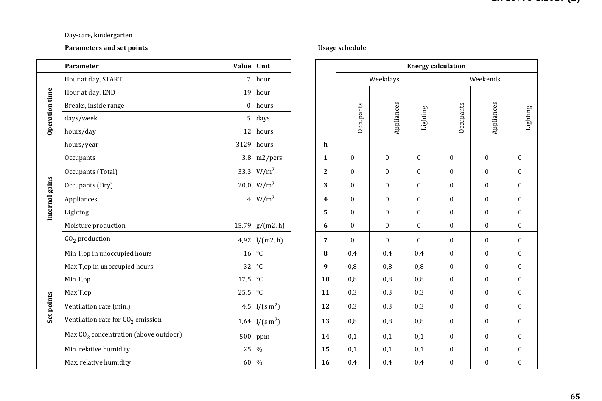

*Strana 69 — složena tabela (prikaz cele strane)*

<details><summary>Tekst tabele (za pretragu)</summary>

```text
                 Day-care, kindergarten
                 Parameters and set points                                 Usage schedule
                 Parameter                               Value Unit                                             Energy calculation
                 Hour at day, START                         7 hour                           Weekdays                                     Weekends
Operation time
                 Hour at day, END                          19 hour
                 Breaks, inside range                       0 hours
                                                                                                          Appliances
                                                                                                                                                      Appliances
                                                                                        Occupants
                                                                                                                                      Occupants
                                                                                                                       Lighting
                                                                                                                                                                       Lighting
                 days/week                                  5 days
                 hours/day                                 12 hours
                 hours/year                              3129 hours         h
                 Occupants                                 3,8 m2/pers      1       0               0                  0          0               0                0
                 Occupants (Total)                        33,3 W/m2         2       0               0                  0          0               0                0
Internal gains
                 Occupants (Dry)                          20,0 W/m2         3       0               0                  0          0               0                0
                 Appliances                                 4 W/m2          4       0               0                  0          0               0                0
                 Lighting                                                   5       0               0                  0          0               0                0
                 Moisture production                     15,79 g/(m2, h)    6       0               0                  0          0               0                0
                 CO2 production                           4,92 l/(m2, h)    7       0               0                  0          0               0                0
                 Min T,op in unoccupied hours              16 °C            8      0,4              0,4            0,4            0               0                0
                 Max T,op in unoccupied hours              32 °C            9      0,8              0,8            0,8            0               0                0
                 Min T,op                                 17,5 °C           10     0,8              0,8            0,8            0               0                0
                 Max T,op                                 25,5 °C           11     0,3              0,3            0,3            0               0                0
Set points
                 Ventilation rate (min.)                   4,5 l/(s m2)     12     0,3              0,3            0,3            0               0                0
                 Ventilation rate for CO2 emission        1,64 l/(s m2)     13     0,8              0,8            0,8            0               0                0
                 Max CO2 concentration (above outdoor)    500 ppm           14     0,1              0,1            0,1            0               0                0
                 Min. relative humidity                    25 %             15     0,1              0,1            0,1            0               0                0
                 Max. relative humidity                    60 %             16     0,4              0,4            0,4            0               0                0
                                                                                                                                                                                  65
```

</details>

<!-- str. 70 -->

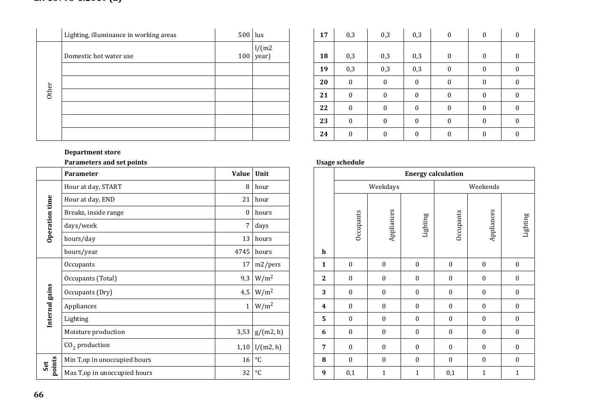

*Strana 70 — složena tabela (prikaz cele strane)*

<details><summary>Tekst tabele (za pretragu)</summary>

```text
                      Lighting, illuminance in working areas    500 lux           17     0,3              0,3              0,3            0               0                0
                                                                    l/(m2
                      Domestic hot water use                    100 year)         18     0,3              0,3              0,3            0               0                0
                                                                                  19     0,3              0,3              0,3            0               0                0
                                                                                  20      0               0                0              0               0                0
      Other
                                                                                  21      0               0                0              0               0                0
                                                                                  22      0               0                0              0               0                0
                                                                                  23      0               0                0              0               0                0
                                                                                  24      0               0                0              0               0                0
                      Department store
                      Parameters and set points                                  Usage schedule
                      Parameter                                Value Unit                                            Energy calculation
                      Hour at day, START                          8 hour                           Weekdays                                        Weekends
     Operation time
                      Hour at day, END                           21 hour
                      Breaks, inside range                        0 hours
                                                                                                              Appliances
                                                                                                                                                              Appliances
                                                                                              Occupants
                                                                                                                                              Occupants
                                                                                                                               Lighting
                                                                                                                                                                               Lighting
                      days/week                                   7 days
                      hours/day                                  13 hours
                      hours/year                               4745 hours         h
                      Occupants                                  17 m2/pers       1       0               0                0              0               0                0
                      Occupants (Total)                          9,3 W/m2         2       0               0                0              0               0                0
     Internal gains
                      Occupants (Dry)                            4,5 W/m2         3       0               0                0              0               0                0
                      Appliances                                  1 W/m2          4       0               0                0              0               0                0
                      Lighting                                                    5       0               0                0              0               0                0
                      Moisture production                       3,53 g/(m2, h)    6       0               0                0              0               0                0
                      CO2 production                            1,10 l/(m2, h)    7       0               0                0              0               0                0
                      Min T,op in unoccupied hours               16 °C            8       0               0                0              0               0                0
 points
  Set
                      Max T,op in unoccupied hours               32 °C            9      0,1              1                1              0,1             1                1
66
```

</details>

<!-- str. 71 -->

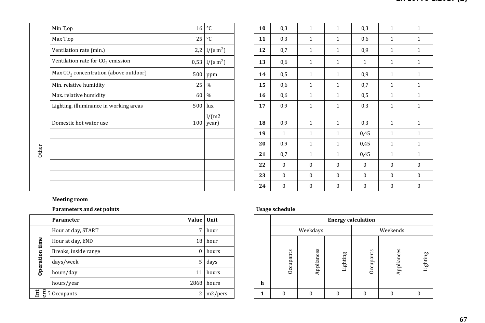

*Strana 71 — složena tabela (prikaz cele strane)*

<details><summary>Tekst tabele (za pretragu)</summary>

```text
                 Min T,op                                   16 °C           10     0,3              1                1              0,3              1                1
                 Max T,op                                   25 °C           11     0,3              1                1              0,6              1                1
                 Ventilation rate (min.)                    2,2 l/(s m2)    12     0,7              1                1              0,9              1                1
                 Ventilation rate for CO2 emission         0,53 l/(s m2)    13     0,6              1                1               1               1                1
                 Max CO2 concentration (above outdoor)     500 ppm          14     0,5              1                1              0,9              1                1
                 Min. relative humidity                     25 %            15     0,6              1                1              0,7              1                1
                 Max. relative humidity                     60 %            16     0,6              1                1              0,5              1                1
                 Lighting, illuminance in working areas    500 lux          17     0,9              1                1              0,3              1                1
                                                               l/(m2
                 Domestic hot water use                    100 year)        18     0,9              1                1              0,3              1                1
                                                                            19      1               1                1              0,45             1                1
                                                                            20     0,9              1                1              0,45             1                1
 Other
                                                                            21     0,7              1                1              0,45             1                1
                                                                            22      0               0                0               0               0                0
                                                                            23      0               0                0               0               0                0
                                                                            24      0               0                0               0               0                0
                 Meeting room
                 Parameters and set points                                 Usage schedule
                 Parameter                                Value Unit                                           Energy calculation
                 Hour at day, START                          7 hour                          Weekdays                                         Weekends
Operation time
                 Hour at day, END                           18 hour
                 Breaks, inside range                        0 hours
                                                                                                        Appliances
                                                                                                                                                         Appliances
                                                                                        Occupants
                                                                                                                                         Occupants
                                                                                                                         Lighting
                                                                                                                                                                          Lighting
                 days/week                                   5 days
                 hours/day                                  11 hours
                 hours/year                               2868 hours        h
ern
                                                                            1
Int
                 Occupants                                   2 m2/pers              0               0                0               0               0                0
 al
                                                                                                                                                                                     67
```

</details>

<!-- str. 72 -->

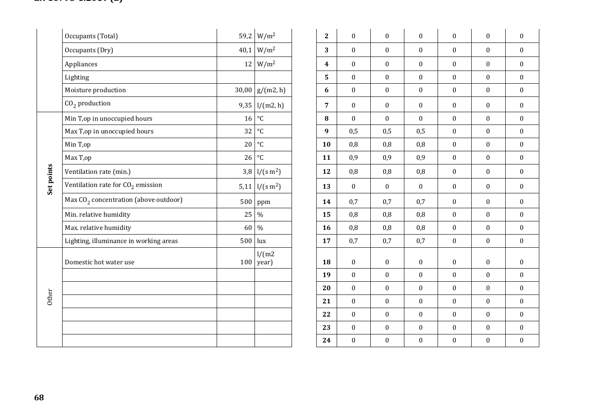

*Strana 72 — složena tabela (prikaz cele strane)*

<details><summary>Tekst tabele (za pretragu)</summary>

```text
                  Occupants (Total)                         59,2 W/m2        2    0     0     0     0   0   0
                  Occupants (Dry)                           40,1 W/m2        3    0     0     0     0   0   0
                  Appliances                                 12 W/m2         4    0     0     0     0   0   0
                  Lighting                                                   5    0     0     0     0   0   0
                  Moisture production                      30,00 g/(m2, h)   6    0     0     0     0   0   0
                  CO2 production                            9,35 l/(m2, h)   7    0     0     0     0   0   0
                  Min T,op in unoccupied hours               16 °C           8    0     0     0     0   0   0
                  Max T,op in unoccupied hours               32 °C           9    0,5   0,5   0,5   0   0   0
                  Min T,op                                   20 °C           10   0,8   0,8   0,8   0   0   0
                  Max T,op                                   26 °C           11   0,9   0,9   0,9   0   0   0
     Set points
                  Ventilation rate (min.)                    3,8 l/(s m2)    12   0,8   0,8   0,8   0   0   0
                  Ventilation rate for CO2 emission         5,11 l/(s m2)    13   0     0     0     0   0   0
                  Max CO2 concentration (above outdoor)     500 ppm          14   0,7   0,7   0,7   0   0   0
                  Min. relative humidity                     25 %            15   0,8   0,8   0,8   0   0   0
                  Max. relative humidity                     60 %            16   0,8   0,8   0,8   0   0   0
                  Lighting, illuminance in working areas    500 lux          17   0,7   0,7   0,7   0   0   0
                                                                l/(m2
                  Domestic hot water use                    100 year)        18   0     0     0     0   0   0
                                                                             19   0     0     0     0   0   0
                                                                             20   0     0     0     0   0   0
     Other
                                                                             21   0     0     0     0   0   0
                                                                             22   0     0     0     0   0   0
                                                                             23   0     0     0     0   0   0
                                                                             24   0     0     0     0   0   0
68
```

</details>

<!-- str. 73 -->

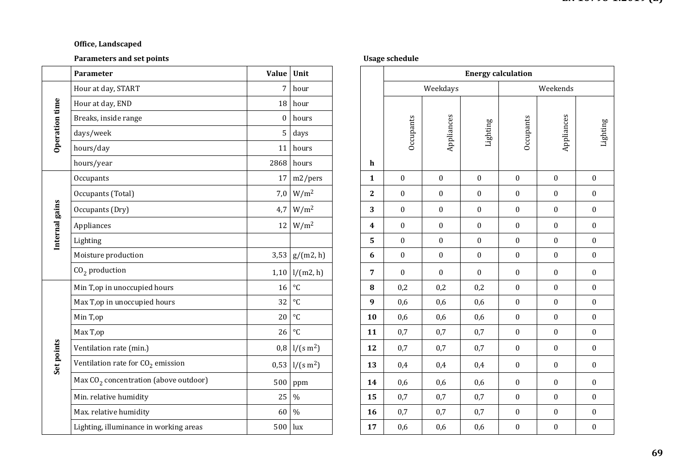

*Strana 73 — složena tabela (prikaz cele strane)*

<details><summary>Tekst tabele (za pretragu)</summary>

```text
                 Office, Landscaped
                 Parameters and set points                                  Usage schedule
                 Parameter                                Value Unit                                            Energy calculation
                 Hour at day, START                          7 hour                           Weekdays                                        Weekends
Operation time
                 Hour at day, END                           18 hour
                 Breaks, inside range                        0 hours
                                                                                                         Appliances
                                                                                                                                                         Appliances
                                                                                         Occupants
                                                                                                                                         Occupants
                                                                                                                          Lighting
                                                                                                                                                                          Lighting
                 days/week                                   5 days
                 hours/day                                  11 hours
                 hours/year                               2868 hours         h
                 Occupants                                  17 m2/pers       1       0               0                0              0               0                0
                 Occupants (Total)                          7,0 W/m2         2       0               0                0              0               0                0
Internal gains
                 Occupants (Dry)                            4,7 W/m2         3       0               0                0              0               0                0
                 Appliances                                 12 W/m2          4       0               0                0              0               0                0
                 Lighting                                                    5       0               0                0              0               0                0
                 Moisture production                       3,53 g/(m2, h)    6       0               0                0              0               0                0
                 CO2 production                            1,10 l/(m2, h)    7       0               0                0              0               0                0
                 Min T,op in unoccupied hours               16 °C            8      0,2              0,2              0,2            0               0                0
                 Max T,op in unoccupied hours               32 °C            9      0,6              0,6              0,6            0               0                0
                 Min T,op                                   20 °C            10     0,6              0,6              0,6            0               0                0
                 Max T,op                                   26 °C            11     0,7              0,7              0,7            0               0                0
Set points
                 Ventilation rate (min.)                    0,8 l/(s m2)     12     0,7              0,7              0,7            0               0                0
                 Ventilation rate for CO2 emission         0,53 l/(s m2)     13     0,4              0,4              0,4            0               0                0
                 Max CO2 concentration (above outdoor)     500 ppm           14     0,6              0,6              0,6            0               0                0
                 Min. relative humidity                     25 %             15     0,7              0,7              0,7            0               0                0
                 Max. relative humidity                     60 %             16     0,7              0,7              0,7            0               0                0
                 Lighting, illuminance in working areas    500 lux           17     0,6              0,6              0,6            0               0                0
                                                                                                                                                                                     69
```

</details>

<!-- str. 74 -->

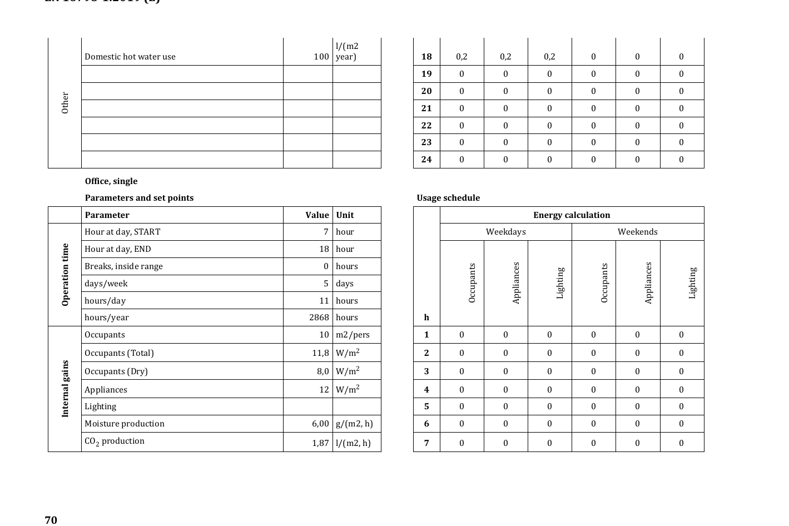

*Strana 74 — složena tabela (prikaz cele strane)*

<details><summary>Tekst tabele (za pretragu)</summary>

```text
                                                       l/(m2
                                                                     18
                      Domestic hot water use       100 year)                0,2              0,2              0,2            0               0                0
                                                                     19      0               0                0              0               0                0
                                                                     20      0               0                0              0               0                0
      Other
                                                                     21      0               0                0              0               0                0
                                                                     22      0               0                0              0               0                0
                                                                     23      0               0                0              0               0                0
                                                                     24      0               0                0              0               0                0
                      Office, single
                      Parameters and set points                     Usage schedule
                      Parameter                   Value Unit                                            Energy calculation
                      Hour at day, START             7 hour                           Weekdays                                        Weekends
     Operation time
                      Hour at day, END              18 hour
                      Breaks, inside range           0 hours
                                                                                                 Appliances
                                                                                                                                                 Appliances
                                                                                 Occupants
                                                                                                                                 Occupants
                                                                                                                  Lighting
                                                                                                                                                                  Lighting
                      days/week                      5 days
                      hours/day                     11 hours
                      hours/year                  2868 hours         h
                      Occupants                     10 m2/pers       1       0               0                0              0               0                0
                      Occupants (Total)            11,8 W/m2         2       0               0                0              0               0                0
     Internal gains
                      Occupants (Dry)               8,0 W/m2         3       0               0                0              0               0                0
                      Appliances                    12 W/m2          4       0               0                0              0               0                0
                      Lighting                                       5       0               0                0              0               0                0
                      Moisture production          6,00 g/(m2, h)    6       0               0                0              0               0                0
                      CO2 production               1,87 l/(m2, h)    7       0               0                0              0               0                0
70
```

</details>

<!-- str. 75 -->

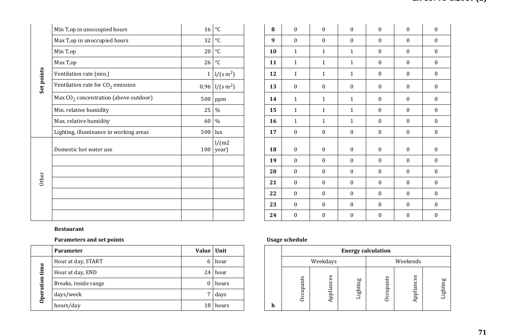

*Strana 75 — složena tabela (prikaz cele strane)*

<details><summary>Tekst tabele (za pretragu)</summary>

```text
                 Min T,op in unoccupied hours               16 °C           8       0               0                0              0               0                0
                 Max T,op in unoccupied hours               32 °C           9       0               0                0              0               0                0
                                                                            10
                 Min T,op                                   20 °C                   1               1                1              0               0                0
                 Max T,op                                   26 °C           11      1               1                1              0               0                0
Set points
                 Ventilation rate (min.)                     1 l/(s m2)     12      1               1                1              0               0                0
                 Ventilation rate for CO2 emission         0,96 l/(s m2)    13      0               0                0              0               0                0
                 Max CO2 concentration (above outdoor)     500 ppm          14      1               1                1              0               0                0
                 Min. relative humidity                     25 %            15      1               1                1              0               0                0
                 Max. relative humidity                     60 %            16      1               1                1              0               0                0
                 Lighting, illuminance in working areas    500 lux          17      0               0                0              0               0                0
                                                               l/(m2
                 Domestic hot water use                    100 year)        18      0               0                0              0               0                0
                                                                            19      0               0                0              0               0                0
                                                                            20      0               0                0              0               0                0
 Other
                                                                            21      0               0                0              0               0                0
                                                                            22      0               0                0              0               0                0
                                                                            23      0               0                0              0               0                0
                                                                            24      0               0                0              0               0                0
                 Restaurant
                 Parameters and set points                                 Usage schedule
                 Parameter                                Value Unit                                           Energy calculation
                 Hour at day, START                          6 hour                          Weekdays                                        Weekends
Operation time
                 Hour at day, END                           24 hour
                                                                                                        Appliances
                                                                                                                                                        Appliances
                                                                                        Occupants
                                                                                                                                        Occupants
                                                                                                                         Lighting
                                                                                                                                                                         Lighting
                 Breaks, inside range                        0 hours
                 days/week                                   7 days
                 hours/day                                  18 hours        h
                                                                                                                                                                                    71
```

</details>

<!-- str. 76 -->

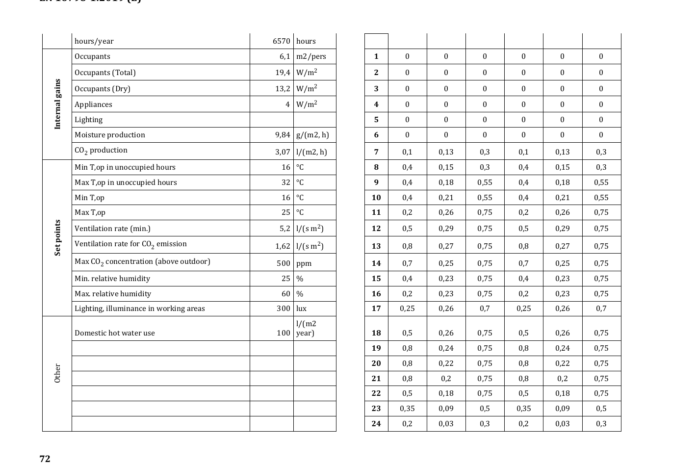

*Strana 76 — složena tabela (prikaz cele strane)*

<details><summary>Tekst tabele (za pretragu)</summary>

```text
                      hours/year                               6570 hours
                      Occupants                                 6,1 m2/pers     1     0      0      0      0      0      0
                      Occupants (Total)                        19,4 W/m2        2     0      0      0      0      0      0
     Internal gains
                      Occupants (Dry)                          13,2 W/m2        3     0      0      0      0      0      0
                      Appliances                                  4 W/m2        4     0      0      0      0      0      0
                      Lighting                                                  5     0      0      0      0      0      0
                      Moisture production                      9,84 g/(m2, h)   6     0      0      0      0      0      0
                      CO2 production                           3,07 l/(m2, h)   7    0,1    0,13   0,3    0,1    0,13   0,3
                      Min T,op in unoccupied hours               16 °C          8    0,4    0,15   0,3    0,4    0,15   0,3
                      Max T,op in unoccupied hours               32 °C          9    0,4    0,18   0,55   0,4    0,18   0,55
                      Min T,op                                   16 °C          10   0,4    0,21   0,55   0,4    0,21   0,55
                      Max T,op                                   25 °C          11   0,2    0,26   0,75   0,2    0,26   0,75
     Set points
                      Ventilation rate (min.)                   5,2 l/(s m2)    12   0,5    0,29   0,75   0,5    0,29   0,75
                      Ventilation rate for CO2 emission        1,62 l/(s m2)    13   0,8    0,27   0,75   0,8    0,27   0,75
                      Max CO2 concentration (above outdoor)     500 ppm         14   0,7    0,25   0,75   0,7    0,25   0,75
                      Min. relative humidity                     25 %           15   0,4    0,23   0,75   0,4    0,23   0,75
                      Max. relative humidity                     60 %           16   0,2    0,23   0,75   0,2    0,23   0,75
                      Lighting, illuminance in working areas    300 lux         17   0,25   0,26   0,7    0,25   0,26   0,7
                                                                    l/(m2
                      Domestic hot water use                    100 year)       18   0,5    0,26   0,75   0,5    0,26   0,75
                                                                                19   0,8    0,24   0,75   0,8    0,24   0,75
                                                                                20   0,8    0,22   0,75   0,8    0,22   0,75
      Other
                                                                                21   0,8    0,2    0,75   0,8    0,2    0,75
                                                                                22   0,5    0,18   0,75   0,5    0,18   0,75
                                                                                23   0,35   0,09   0,5    0,35   0,09   0,5
                                                                                24   0,2    0,03   0,3    0,2    0,03   0,3
72
```

</details>

<!-- str. 77 -->

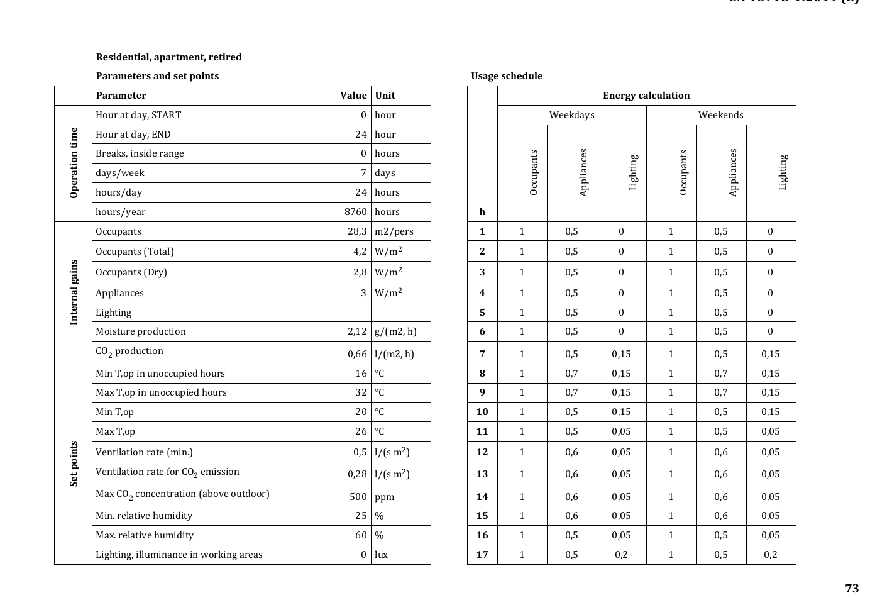

*Strana 77 — složena tabela (prikaz cele strane)*

<details><summary>Tekst tabele (za pretragu)</summary>

```text
                 Residential, apartment, retired
                 Parameters and set points                                  Usage schedule
                 Parameter                                Value Unit                                          Energy calculation
                 Hour at day, START                          0 hour                           Weekdays                                       Weekends
Operation time
                 Hour at day, END                           24 hour
                 Breaks, inside range                        0 hours
                                                                                                       Appliances
                                                                                                                                                      Appliances
                                                                                         Occupants
                                                                                                                                        Occupants
                                                                                                                         Lighting
                                                                                                                                                                        Lighting
                 days/week                                   7 days
                 hours/day                                  24 hours
                 hours/year                               8760 hours         h
                 Occupants                                 28,3 m2/pers      1       1               0,5             0              1               0,5             0
                 Occupants (Total)                          4,2 W/m2         2       1               0,5             0              1               0,5             0
Internal gains
                 Occupants (Dry)                            2,8 W/m2         3       1               0,5             0              1               0,5             0
                 Appliances                                  3 W/m2          4       1               0,5             0              1               0,5             0
                 Lighting                                                    5       1               0,5             0              1               0,5             0
                 Moisture production                       2,12 g/(m2, h)    6       1               0,5             0              1               0,5             0
                 CO2 production                            0,66 l/(m2, h)    7       1               0,5            0,15            1               0,5            0,15
                 Min T,op in unoccupied hours               16 °C            8       1               0,7            0,15            1               0,7            0,15
                 Max T,op in unoccupied hours               32 °C            9       1               0,7            0,15            1               0,7            0,15
                 Min T,op                                   20 °C            10      1               0,5            0,15            1               0,5            0,15
                 Max T,op                                   26 °C            11      1               0,5            0,05            1               0,5            0,05
Set points
                 Ventilation rate (min.)                    0,5 l/(s m2)     12      1               0,6            0,05            1               0,6            0,05
                 Ventilation rate for CO2 emission         0,28 l/(s m2)     13      1               0,6            0,05            1               0,6            0,05
                 Max CO2 concentration (above outdoor)     500 ppm           14      1               0,6            0,05            1               0,6            0,05
                 Min. relative humidity                     25 %             15      1               0,6            0,05            1               0,6            0,05
                 Max. relative humidity                     60 %             16      1               0,5            0,05            1               0,5            0,05
                 Lighting, illuminance in working areas      0 lux           17      1               0,5            0,2             1               0,5            0,2
                                                                                                                                                                                   73
```

</details>

<!-- str. 78 -->

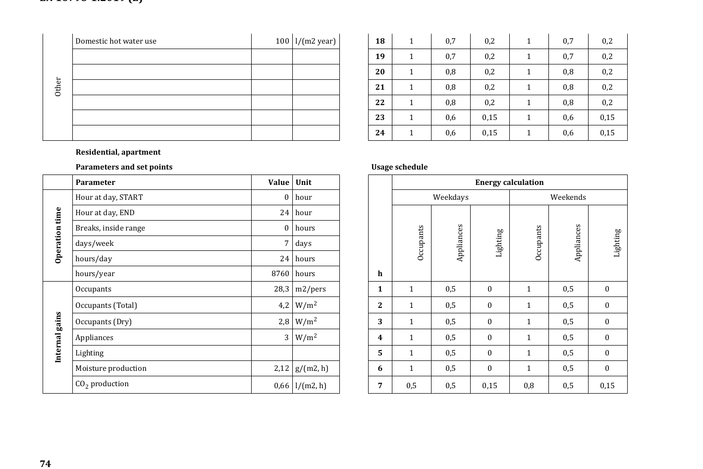

*Strana 78 — složena tabela (prikaz cele strane)*

<details><summary>Tekst tabele (za pretragu)</summary>

```text
                      Domestic hot water use       100 l/(m2 year)    18      1               0,7            0,2             1               0,7            0,2
                                                                      19      1               0,7            0,2             1               0,7            0,2
                                                                      20
                                                                              1               0,8            0,2             1               0,8            0,2
      Other
                                                                      21      1               0,8            0,2             1               0,8            0,2
                                                                      22      1               0,8            0,2             1               0,8            0,2
                                                                      23      1               0,6            0,15            1               0,6            0,15
                                                                      24      1               0,6            0,15            1               0,6            0,15
                      Residential, apartment
                      Parameters and set points                      Usage schedule
                      Parameter                   Value Unit                                           Energy calculation
                      Hour at day, START             0 hour                            Weekdays                                       Weekends
     Operation time
                      Hour at day, END              24 hour
                      Breaks, inside range           0 hours
                                                                                                Appliances
                                                                                                                                               Appliances
                                                                                  Occupants
                                                                                                                                 Occupants
                                                                                                                  Lighting
                                                                                                                                                                 Lighting
                      days/week                      7 days
                      hours/day                     24 hours
                      hours/year                  8760 hours          h
                      Occupants                    28,3 m2/pers       1       1               0,5             0              1               0,5             0
                      Occupants (Total)             4,2   W/m2        2       1               0,5             0              1               0,5             0
     Internal gains
                      Occupants (Dry)               2,8 W/m2          3       1               0,5             0              1               0,5             0
                      Appliances                     3 W/m2           4       1               0,5             0              1               0,5             0
                      Lighting                                        5       1               0,5             0              1               0,5             0
                      Moisture production          2,12 g/(m2, h)     6       1               0,5             0              1               0,5             0
                      CO2 production               0,66 l/(m2, h)     7      0,5              0,5            0,15            0,8             0,5            0,15
74
```

</details>

<!-- str. 79 -->

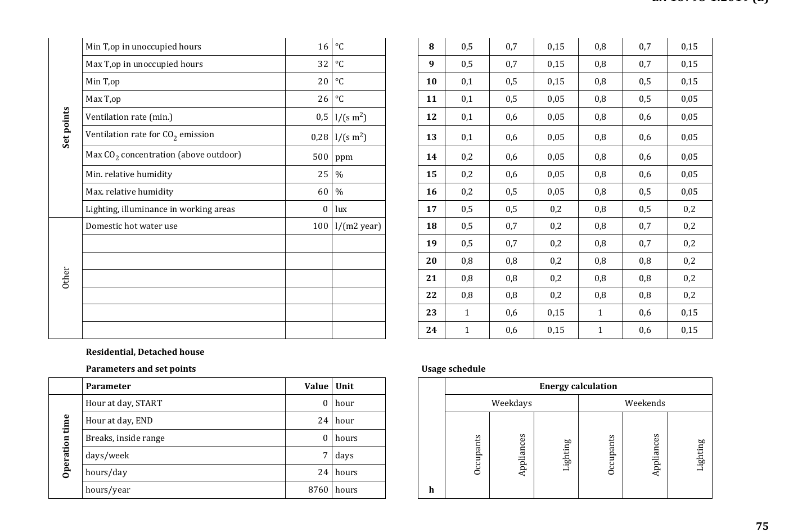

*Strana 79 — složena tabela (prikaz cele strane)*

<details><summary>Tekst tabele (za pretragu)</summary>

```text
                 Min T,op in unoccupied hours               16 °C             8      0,5              0,7            0,15          0,8             0,7            0,15
                 Max T,op in unoccupied hours               32 °C             9      0,5              0,7            0,15          0,8             0,7            0,15
                                                                              10
                 Min T,op                                   20 °C                    0,1              0,5            0,15          0,8             0,5            0,15
                 Max T,op                                   26 °C             11     0,1              0,5            0,05          0,8             0,5            0,05
Set points
                 Ventilation rate (min.)                    0,5 l/(s m2)      12     0,1              0,6            0,05          0,8             0,6            0,05
                 Ventilation rate for CO2 emission         0,28 l/(s m2)      13     0,1              0,6            0,05          0,8             0,6            0,05
                 Max CO2 concentration (above outdoor)     500 ppm            14     0,2              0,6            0,05          0,8             0,6            0,05
                 Min. relative humidity                     25 %              15     0,2              0,6            0,05          0,8             0,6            0,05
                 Max. relative humidity                     60 %              16     0,2              0,5            0,05          0,8             0,5            0,05
                 Lighting, illuminance in working areas      0 lux            17     0,5              0,5            0,2           0,8             0,5            0,2
                 Domestic hot water use                    100 l/(m2 year)    18     0,5              0,7            0,2           0,8             0,7            0,2
                                                                              19     0,5              0,7            0,2           0,8             0,7            0,2
                                                                              20     0,8              0,8            0,2           0,8             0,8            0,2
 Other
                                                                              21     0,8              0,8            0,2           0,8             0,8            0,2
                                                                              22     0,8              0,8            0,2           0,8             0,8            0,2
                                                                              23      1               0,6            0,15          1               0,6            0,15
                                                                              24      1               0,6            0,15          1               0,6            0,15
                 Residential, Detached house
                 Parameters and set points                                   Usage schedule
                 Parameter                                Value Unit                                           Energy calculation
                 Hour at day, START                          0 hour                            Weekdays                                     Weekends
Operation time
                 Hour at day, END                           24 hour
                 Breaks, inside range                        0 hours
                                                                                                        Appliances
                                                                                                                                                     Appliances
                                                                                          Occupants
                                                                                                                                       Occupants
                                                                                                                        Lighting
                                                                                                                                                                     Lighting
                 days/week                                   7 days
                 hours/day                                  24 hours
                 hours/year                               8760 hours          h
                                                                                                                                                                                75
```

</details>

<!-- str. 80 -->

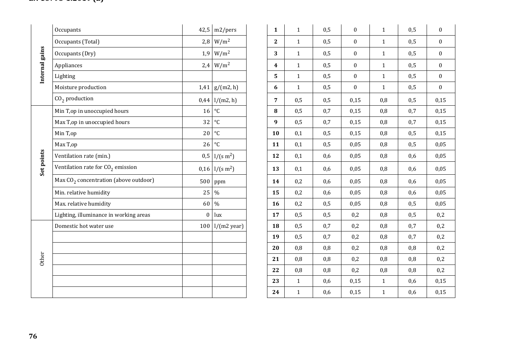

*Strana 80 — složena tabela (prikaz cele strane)*

<details><summary>Tekst tabele (za pretragu)</summary>

```text
                      Occupants                                42,5 m2/pers      1    1     0,5    0     1     0,5    0
                      Occupants (Total)                         2,8 W/m2         2    1     0,5    0     1     0,5    0
     Internal gains
                      Occupants (Dry)                           1,9 W/m2         3    1     0,5    0     1     0,5    0
                      Appliances                                2,4   W/m2       4    1     0,5    0     1     0,5    0
                      Lighting                                                   5    1     0,5    0     1     0,5    0
                      Moisture production                      1,41 g/(m2, h)    6    1     0,5    0     1     0,5    0
                      CO2 production                           0,44 l/(m2, h)    7    0,5   0,5   0,15   0,8   0,5   0,15
                      Min T,op in unoccupied hours              16 °C            8    0,5   0,7   0,15   0,8   0,7   0,15
                      Max T,op in unoccupied hours              32 °C            9    0,5   0,7   0,15   0,8   0,7   0,15
                      Min T,op                                  20 °C            10   0,1   0,5   0,15   0,8   0,5   0,15
                      Max T,op                                  26 °C            11   0,1   0,5   0,05   0,8   0,5   0,05
     Set points
                      Ventilation rate (min.)                   0,5   l/(s m2)   12   0,1   0,6   0,05   0,8   0,6   0,05
                      Ventilation rate for CO2 emission        0,16 l/(s m2)     13   0,1   0,6   0,05   0,8   0,6   0,05
                      Max CO2 concentration (above outdoor)    500 ppm           14   0,2   0,6   0,05   0,8   0,6   0,05
                      Min. relative humidity                    25 %             15   0,2   0,6   0,05   0,8   0,6   0,05
                      Max. relative humidity                    60 %             16   0,2   0,5   0,05   0,8   0,5   0,05
                      Lighting, illuminance in working areas     0 lux           17   0,5   0,5   0,2    0,8   0,5   0,2
                      Domestic hot water use                   100 l/(m2 year)   18   0,5   0,7   0,2    0,8   0,7   0,2
                                                                                 19   0,5   0,7   0,2    0,8   0,7   0,2
                                                                                 20   0,8   0,8   0,2    0,8   0,8   0,2
      Other
                                                                                 21   0,8   0,8   0,2    0,8   0,8   0,2
                                                                                 22   0,8   0,8   0,2    0,8   0,8   0,2
                                                                                 23   1     0,6   0,15   1     0,6   0,15
                                                                                 24   1     0,6   0,15   1     0,6   0,15
76
```

</details>

<!-- str. 81 -->

## Bibliography

[1] EN 12193, *Light and lighting - Sports lighting*

[2] EN 12354-5, *Building acoustics - Estimation of acoustic performance of building from the* *performance of elements - Part 5: Sounds levels due to the service equipment*

[3] EN 15193-1, *Energy performance of buildings - Energy requirements for lighting - Part 1:* *Specifications, Module M9*

[4] CEN/TR 15193-2, *Energy performance of buildings - Energy requirements for lighting - Part 2:* *Explanation and justification of EN 15193-1, Module M9*

[5] CEN/TS 16628, *Energy Performance of Buildings - Basic Principles for the set of EPB standards*

[6] CEN/TS 16629, *Energy Performance of Buildings - Detailed Technical Rules for the set of EPB-* standards

[7] FprCEN/TR 16798–2, *Energy performance of buildings — Part 2: Indoor environmental input* *parameters for design and assessment of energy performance of buildings addressing indoor air* *quality, thermal environment, lighting and acoustics — Module M1–6 — Technical report —* *Interpretation of the requirements in EN 16798–1*

[8] EN 16798-7, *Energy performance of buildings - Ventilation for buildings - Part 7: Calculation* *methods for the determination of air flow rates in buildings including infiltration (Modules M5-5)*

[9] EN ISO 7726, *Ergonomics of the thermal environment - Instruments for measuring physical* *quantities (ISO 7726)*

[10] EN ISO 7730, *Ergonomics of the thermal environment - Analytical determination and* *interpretation of thermal comfort using calculation of the PMV and PPD indices and local thermal* *comfort criteria (ISO 7730)*

[11] EN ISO 8996, *Ergonomics of the thermal environment - Determination of metabolic rate (ISO 8996)*

[12] EN ISO 9920, *Ergonomics of the thermal environment - Estimation of thermal insulation and water* *vapour resistance of a clothing ensemble (ISO 9920)*

[13] EN ISO 10052, *Acoustics - Field measurements of airborne and impact sound insulation and of* *service equipment sound - Survey method (ISO 10052)*

[14] EN ISO 16000-9, *Indoor air - Part 9: Determination of the emission of volatile organic compounds* *from building products and furnishing - Emission test chamber method (ISO 16000-9)*

[15] EN ISO 16000-11, *Indoor air - Part 11: Determination of the emission of volatile organic* *compounds from building products and furnishing - Sampling, storage of samples and preparation* *of test specimens (ISO 16000-11)*

[16] EN ISO 16032, *Acoustics - Measurement of sound pressure level from service equipment in* *buildings - Engineering method (ISO 16032)*

<!-- str. 82 -->

[17] ISO 16000-3, *Indoor air — Part 3: Determination of formaldehyde and other carbonyl compounds* *in indoor air and test chamber air — Active sampling method*

[18] ISO 16000-6, *Indoor air — Part 6: Determination of volatile organic compounds in indoor and test* *chamber air by active sampling on Tenax TA sorbent, thermal desorption and gas chromatography* *using MS or MS-FID*

[19] ISO 16814, *Building environment design — Indoor air quality — Methods of expressing the quality* *of indoor air for human occupancy*

[20] EN ISO/IEC 17025, *General requirements for the competence of testing and calibration* *laboratories (ISO/IEC 17025)*

#### Further reading

[21] CR 1752, *Ventilation for buildings — Design criteria for the indoor environment*

[22] EN 12599, *Ventilation for buildings - Test procedures and measurement methods to hand over air* *conditioning and ventilation systems*

[23] EN 12831-1, *Energy performance of buildings - Method for calculation of the design heat load - Part* *1: Space heating load, Module M3-3*

[24] EN 13032-1, *Light and lighting — Measurement and presentation of photometric data of lamps and* *luminaires — Part 1: Measurement and file format*

[25] EN 13032-4, *Light and lighting - Measurement and presentation of photometric data of lamps and* *luminaires - Part 4: LED lamps, modules and luminaires*

[26] EN 13141 (all parts), *Ventilation for buildings — Performance testing of components/products for* residential ventilation

[27] EN 13142, *Ventilation for buildings - Components/products for residential ventilation - Required* *and optional performance characteristics*

[28] CEN/TR 14788, *Ventilation for buildings - Design and dimensioning of residential ventilation* systems

[29] EN ISO 52003-1, *Energy performance of buildings - Indicators, requirements, ratings and* *certificates - Part 1: General aspects and application to the overall energy performance (ISO 52003-* 1:2017)

[30] EN 16798-17, *Energy performance of buildings - Ventilation for buildings - Part 17: Guidelines for* *inspection of ventilation and air conditioning systems (Module M4-11, M5-11, M6-11, M7-11)*

[31] EN 16798-9, *Energy performance of buildings - Ventilation for buildings - Part 9: Calculation* *methods for energy requirements of cooling systems (Modules M4-1, M4-4, M4-9) - General*

[32] EN 16798-13, *Energy performance of buildings - Ventilation for buildings - Part 13: Calculation of* *cooling systems (Module M4-8) - Generation*

[33] CEN/TR 16798-14, *Energy performance of buildings - Ventilation for buildings - Part 14:* *Interpretation of the requirements in EN 16798-13 - Calculation of cooling systems (Module M4-8) -* Generation

<!-- str. 83 -->

[34] EN 16798-5-1, *Energy performance of buildings - Ventilation for buildings - Part 5-1: Calculation* *methods for energy requirements of ventilation and air conditioning systems (Modules M5-6, M5-8,* *M6-5, M6-8, M7-5, M7-8) - Method 1: Distribution and generation*

[35] EN 16798-5-2, *Energy performance of buildings - Ventilation for buildings - Part 5-2: Calculation* *methods for energy requirements of ventilation systems (Modules M5-6, M5-8, M6-5, M6-8, M7-5, M7-* *8) - Method 2: Distribution and generation*

[36] EN 15378, *Heating systems in buildings — Inspection of boilers and heating systems*

[37] EN 15665, *Ventilation for buildings - Determining performance criteria for residential ventilation* systems

[38] EN ISO 52016-1, *Energy performance of buildings - Energy needs for heating and cooling, internal* *temperatures and sensible and latent heat loads - Part 1: Calculation procedures (ISO 52016-1)*

[39] EN ISO 52017-1, *Energy performance of buildings - Sensible and latent heat loads and internal* *temperatures - Part 1: Generic calculation procedures (ISO 52017-1)*

[40] EN ISO 15927-4, *Hygrothermal performance of buildings - Calculation and presentation of climatic* *data - Part 4: Hourly data for assessing the annual energy use for heating and cooling (ISO 15927-4)*

[41] ISO/TS 14415, *Ergonomics of the thermal environment — Application of International Standards to* *people with special requirements*

[42] EN ISO 52000-1, *Energy performance of buildings - Overarching EPB assessment - Part 1: General* *framework and procedures (ISO 52000-1)*

[43] CEN ISO/ TR 52000-2, *Energy performance of buildings — Overarching EPB assessment — Part 2:* *Explanation and justification of ISO 52000-1 (ISO/TR 52000-2)*

[44] CIE 69:1987, *Methods of characterizing illuminance meters and luminance meters: Performance,* *characteristics and specifications*

<!-- str. 84 -->

#### ICS 91.140.01; 91.120.10 Класификациона група M.E6

Дескриптори: перформансе зграда, енергетске перформансе, методе, захтеви, модули

**Descriptors:** performance of buildings, energy performance, methods, requirements, modules

Укупно страна 79
